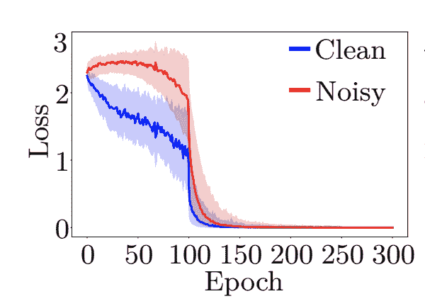

<!--yml

分类：未分类

日期：2024-09-06 19:57:49

-->

# [2012.03061] 关于深度学习中的噪声标签的调查：当你无法信任标注时如何训练你的模型？

> 来源：[`ar5iv.labs.arxiv.org/html/2012.03061`](https://ar5iv.labs.arxiv.org/html/2012.03061)

# 关于深度学习中的噪声标签的调查：当你无法信任标注时如何训练你的模型？

Filipe R. Cordeiro1 和 Gustavo Carneiro2 1 巴西佩南布哥联邦农村大学计算机系 2 澳大利亚阿德莱德大学计算机科学学院

邮箱：filipe.rolim@ufrpe.br, gustavo.carneiro@adelaide.edu.au

###### 摘要

噪声标签通常出现在从互联网自动收集的数据集中，由非专业标注员或者在具有挑战性的任务（如医学领域）的专家错误标注。尽管深度学习模型在不同领域显示了显著的进步，但一个悬而未决的问题是它们在训练过程中记忆噪声标签的能力，这降低了它们的泛化潜力。由于深度学习模型依赖于正确标注的数据集，而标注的正确性难以保证，因此在深度学习训练中考虑噪声标签的存在至关重要。文献中提出了几种方法来改善在噪声标签存在下的深度学习模型训练。本文对文献中的主要技术进行了综述，并将算法分类为以下几组：鲁棒损失、样本加权、样本选择、元学习和组合方法。我们还介绍了常用的实验设置、数据集和最新模型的结果。

## I 引言

深度神经网络（DNNs）在处理不同计算机视觉任务（如图像分类 [1]、分割 [2] 和目标检测 [3]）方面表现出色，应用领域也非常广泛 [4、5、6]。提高深度学习模型性能的一个因素是使用大规模数据集，如 ImageNet [7]。不幸的是，大规模数据集的标注过程既昂贵又耗时，研究人员有时会采用更便宜的替代方案，如在线查询 [8] 和众包 [9]，这些方法可能会产生带有错误或噪声标签的数据集。小数据集中也可能存在错误标签，尤其是在标注任务困难或标注者意见不一致的情况下，如医学图像 [10、11]。

正如[12]所述，当涉及到人工标注者时，嘈杂标签可能自然出现。Frenay 等人[13]将嘈杂标签的主要来源总结为四种类型：1）提供可靠标注的信息不足，例如质量差的图像；2）专家的错误；3）多个专家标注的差异；4）数据编码或通信问题（例如，意外点击）。图 1 展示了标注策略和嘈杂标签的来源。

大多数使用 DNN 的解决方案假设标签是由专家注释的，或者是经过策划的，因此会被完美标注。然而，这种假设并不现实，特别是在处理以无监督方式收集的数据时（例如，网络查询）。因此，用嘈杂标签训练的 DNN 可能会降低准确性，并需要更大的训练集[14]。

嘈杂标签也与半监督学习相关。正如 Wang 等人所观察到的[15]，当缺失标签在半监督方法中被错误标记时，半监督学习的挑战就近似于嘈杂标签。伪标签技术也是如此，其中样本可能被错误标记。然而，嘈杂标签问题比之前的问题更加具有挑战性，因为我们没有关于哪些样本有干净标签的信息。

Zhang 等人[14]已经证明卷积神经网络（CNNs）可以轻松适应任何比例的嘈杂标签，这会导致较差的泛化性能。然而，已经证明，易于识别的模式，即对应于具有干净标签的易样本，首先被学习，而难以识别的模式，即接近嘈杂标签的难样本，后来才被学习。基于这一观察，许多提出的方法基于小损失技巧，即选择小损失的样本作为干净样本[16, 17, 18]。

大多数提出处理嘈杂标签的工作试图回答以下问题：如何识别嘈杂样本？或者更普遍地说：如何有效地在嘈杂标签数据集上进行训练？[19]。为了解决这个问题，提出了不同的策略：鲁棒损失[20, 21]、标签清理[22, 23]、加权[24]、元学习[25]、集成学习[26]以及其他方法[9, 27, 28]。这项调查描述了文献中提出的与嘈杂标签存在下训练深度神经网络相关的主要方法。

图 1：标注过程和噪声来源。

## II 标签噪声：定义与分类

### II-A 定义

在本文档中，我们将有噪声的样本称为其标签与真实类别不同的样本。对于这些样本，我们将其标签称为噪声标签，意味着它们的标签是错误的。因此，在本文的范围内提到有噪声的样本时，意味着噪声仅存在于标签中，而不存在于输入数据中。

### II-B 问题陈述

让我们考虑一个分类问题，训练集为 $D=\{(x_{1},y_{1}),...,(x_{n},y_{n})\}$，其中 $x_{i}\in\mathcal{X}$ 是第 $i$ 张图像，$y_{i}\in Y$ 是表示 $c$ 个类别的 one-hot 向量。在噪声标签场景中，标签可能是错误的，我们将 $y\in Y$ 表示为观测标签，这可能包含噪声（即不正确的标签）。我们将 $x_{i}$ 的真实标签表示为 $y_{i}^{*}$。我们用 $p(c|x)$ 表示样本 $x$ 不同标签的分布，且 $\sum_{c=1}^{C}p(c|x)=1$。

监督分类学习一个函数 $f:\mathcal{X}\to\mathcal{Y}$，该函数将输入空间映射到标签空间。训练分类器的目标是找到使经验风险最小化的最佳参数 $\theta$，该风险由损失函数定义。给定一个损失函数 $L$ 和一个分类器 $f(.)$，经验风险定义如下：

|  | $R_{L}(f)=\mathbb{E}_{(x,y)\in D}[L(f(x),y)]=\mathbb{E}_{x,y_{x}}[L(f(x),y_{x})],$ |  | (1) |
| --- | --- | --- | --- |

其中 $\mathbb{E}$ 表示使用训练集 $D$ 的蒙特卡洛期望。

### II-C 噪声类型

我们用 $\eta\in[0,1]$ 表示整体噪声率，$\eta_{jc}$ 表示类别 $j$ 被翻转为类别 $c$ 的概率，即 $p(y_{i}=c|y_{i}^{*}=j)$。文献中研究的主要噪声类型如下：

#### II-C1 对称噪声

对称噪声也称为随机噪声或均匀噪声，表示标签有相等的概率被翻转到另一个类别。在对称噪声的定义中，有两种变体：symm-inc 和 symm-exc [27]。在 symm-inc 中，真实标签被包括在标签翻转选项中，这意味着在 $\eta_{jc}=\frac{\eta}{C-1},\forall j\in Y$；而在 symm-exc 中，真实标签不被包括在内，这意味着 $\eta_{jc}=\frac{\eta}{C-1},j\neq c$。对称噪声或随机噪声不太可能代表真实的噪声标签场景，但它是噪声标签实验的主要基准。图 2 (a) 显示了对称噪声的转换矩阵，$\eta=0.4$。

#### II-C2 非对称噪声

: 不对称噪声，如[29]中描述的那样，是基于在相似类别之间翻转标签的真实世界标签噪声。例如，使用 CIFAR10 数据集[30]，不对称噪声将 TRUCK$\to$ AUTOMOBILE，BIRD $\to$ PLANE，DEER $\to$ HORSE，正如[31]所映射的。对于 MNIST，[29] 将 $2\to 7$，$3\to 8$，$7\to 1$ 和 $5\to 6$。对于不对称噪声，$\eta_{jc}$ 是类条件的。图 2 (b) 显示了不对称噪声的转换矩阵，$\eta=0.4$。

图 2：不同噪声类型的转换矩阵：（a）对称噪声，（b）不对称噪声，$\eta=0.4$ 和 5 个类别。

#### II-C3 开放集噪声

: 噪声标签问题可以分为两类：封闭集和开放集。封闭集噪声问题是指所有真实标签都属于已知类别。例如，对于 MNIST 数据集，如果样本子集的标签被错误地更改为其他标签，那么它们的原始图像及其对应的真实类别仍然属于 MNIST。

开放集噪声是指样本的真实类别不包含在训练数据的已知类别中。例如，如果 CIFAR 中的一张图像以错误的标签 7 出现在 MNIST 训练集中，它将被训练为类别 7，但它将是一个开放集样本。这种类型的噪声通常出现在从自动网页搜索引擎（例如，Google Images）获取图像时。

## III 文献综述

在噪声标签存在的情况下进行学习是过去几十年研究的问题[32]，并且提出了几种策略以使模型对噪声更具鲁棒性[13]。在这项工作中，我们将该领域的主要方法分为以下几类：噪声转换矩阵、鲁棒损失、样本加权、样本选择、元学习和组合方法。每个类别的描述如下：

### III-A 噪声转换矩阵

处理噪声标签的最初方法大多基于估计噪声转换矩阵，以了解标签在类别之间的转换情况，如图 2 所示。带有转换矩阵的交叉熵损失定义如下：

|  | $\mathcal{L(\theta)}=\frac{1}{N}\sum_{n=1}^{N}-log~{}p(y=y_{n}&#124;x_{n},\theta),$ |  | (2) |
| --- | --- | --- | --- |

其中

|  | $\mathcal{L(\theta)}=\frac{1}{N}\sum_{n=1}^{N}-log(\sum_{i}^{c}p(y=y_{n}&#124;y^{*}=i)p(y^{*}=i&#124;x_{n},\theta)).$ |  | (3) |
| --- | --- | --- | --- |

已经提出了几种方法来估计转移矩阵。Patrini 等人 [29] 使用预训练模型来估计这个矩阵。Hendricks 等人 [33] 使用干净的验证集来计算转移矩阵，而 Sukhbaatar 等人 [34] 提出了使用从干净数据和噪声数据计算出的转移矩阵之间的差异。

Reed 等人 [35] 使用了一个转移矩阵，并结合了一个正则化损失，这个损失使用了噪声标签和模型预测标签的组合。Goldberger 等人 [36] 使用期望最大化 (EM) 算法来找到网络和噪声的最优参数。转移矩阵的使用在不同方式下得到了进一步的探索 [37, 38, 39]。

### III-B 强健损失

损失修正方法通常会添加正则化或修改网络概率，以减少对低置信度预测的惩罚，这些低置信度预测可能与噪声样本有关。这些方法的一个优点是它们可以与任何模型一起使用。大多数方法将噪声样本和干净样本以相同的方式处理，但相对于标准交叉熵 [3]，对低置信度预测样本的惩罚较少。

Manwani 等人 [40] 证明了 0-1 损失比常用的凸损失对噪声的容忍度更高。[41] 比较了分类交叉熵 (CCE) 和平均绝对误差 (MAE) 损失，并表明 MAE 更具噪声容忍性，因为 MAE 对所有数据点的处理是相同的。然而，使用 MAE 进行训练通常会导致欠拟合，且根据噪声类型，其效果可能不佳。Zhang 和 Sabuncu [31] 通过结合均方误差和交叉熵损失的优点，提出了一种广义交叉熵损失。Wang 等人 [20] 提出了改进版的 MAE (IMAE)，通过使用超参数调整 MAE 的加权方差。Wang 等人 [21] 提出了对称交叉熵，基于 CCE 不对称的事实。通过向损失函数中添加对称性，他们表明这有助于处理噪声标签。Ziyin 等人 [42] 提出了使用一种损失函数，鼓励模型回避学习带有噪声标签的样本。这个想法类似于重新加权或样本选择，其中噪声样本可以被观察为零权重或被移除。同样，[43] 也提出了一种允许在训练期间回避的损失函数。尽管一些方法通过移除噪声样本获得了好处，但通过重新标记或赋予较低权重的方式使用这些样本已被证明能提高结果。

Ma 等人[44]提出了一种称为 Active Passive Loss (APL)的鲁棒损失函数，它结合了两种相互增强的鲁棒损失函数。Ma 等人指出，现有的鲁棒损失函数可以处理噪声标签，但存在欠拟合的问题。他们的提议通过将导致过拟合的损失（如 CCE）与导致欠拟合的损失（如 MAE）结合来解决这一问题。

Liu 等人[45]提出了一种受同行预测机制启发的同行损失函数。他们表明，在噪声数据上的同行损失函数能够导致一个最优或接近最优的分类器，就像在干净的训练数据上训练一样。

### III-C 样本加权

Wang 等人[46]提出了一种加权方案，以减少噪声样本的贡献。同样地，[47]使用了一种基于课程学习的方法，该方法根据对数据复杂性的无监督估计为每个样本定义一个权重。

Xue 等人[48]使用了一种概率局部异常因子算法（pLOF），作为异常检测器，用于估计样本作为异常值（即噪声样本）的概率值。[46]也使用 pLOF，但与 Siamese 网络训练相结合。使用 Siamese 网络鼓励模型学习同一类别的干净样本之间的相似特征，以及干净样本与噪声样本之间的不同特征。

Harutyunyan 等人[49]展示了通过减少权重之间的互信息，可以降低标签噪声的记忆。在他们的提议中，他们基于最终层的梯度更新权重，而不需要访问标签。

Lee 等人提出了 CleanNet[50]，它使用预定义的参考图像子集。参考子集的视觉特征通过自编码器提取，每个新的训练样本都与参考集中的特征进行比较。根据距离，为每个样本设置一个权重，并计算加权交叉熵。

### III-D 样本选择

Jiang 等人[16]提出了 MentorNet，它使用一种课程方案，首先学习那些可能正确的样本。MentorNet 通过第二个网络，称为 StudentNet，动态地学习数据驱动的课程。

Co-teaching 由 Han 等人提出[51]，它同时训练两个深度模型，每个网络根据具有小损失的样本选择彼此的数据批次。后来，他们提出了 Co-teaching+[17]，该方法使用具有小损失但对预测结果不一致的样本来选择数据。Wei 等人[52]采用了 Co-teaching 的相同思想，但使用了联合一致性而不是不一致，并通过 Co-Regularization 计算了联合损失。

Nguyen 等人提出了一种名为 SELF [53] 的算法。SELF 使用基于模型集成的过滤机制来从监督训练中移除噪声样本。然而，他们仍然使用移除的样本来利用无监督损失进行学习。集成机制基于不同训练周期中的模型预测，使用模型快照的指数移动平均。不同于大多数最先进的方法，SELF 需要一个较小的干净验证集来表现良好。

### III-E 元学习

这里描述的方法主要使用元学习模型来处理噪声标签。虽然最终他们使用元学习来重新加权或过滤样本，我们将它们归类在一起，因为它们采用了不同的方法来解决问题。

Ren 等人 [24] 使用元学习范式根据梯度方向重新加权训练样本。他们执行元梯度下降步骤以最小化在干净验证集上的损失。在 [54] 中也使用了元学习方法与干净验证集，但他们使用多层感知机来学习损失加权函数。

Li 等人 [19] 提出在传统训练之前优化一个元目标。通过生成合成噪声标签，他们旨在优化一个不对广泛范围的人工生成标签噪声过拟合的模型。通过在几个生成的合成噪声中训练模型，他们旨在获得一个噪声容忍的模型，能够一致地从数据中学习潜在知识，尽管存在不同的标签噪声。

### III-F 组合方法

Mixup [55] 是一种用于数据增强的技术，它利用样本和标签之间的线性组合。他们的论文表明，他们的方法具有抗噪声能力，最近的文献方法开始将 Mixup 作为其算法的重要部分。Zhang 等人 [56] 将 [24] 提出的基于元学习的重新加权方法与伪标签估计和 Mixup 结合起来。尽管他们在高噪声环境下实现了最先进的成果，但这需要一个较小的干净验证集。

Kim 等人 [27] 提出了使用名为负学习（Negative Learning, NL）的学习方法，其中使用互补标签（即与注释不同的标签）。通过使用互补标签，选择真实标签作为互补标签的机会较低，因此 NL 减少了提供错误信息的风险。因此，使用 NL 进行训练对噪声更具鲁棒性。然而，这种方法需要更长的训练时间，并且随着问题中类别数量的增加，提供错误信息的机会也会增加。他们的方法中提出了三个阶段：负学习、正学习（标准训练）和使用重新标记样本的微调。

Han 等人 [57] 提出了使用迭代训练估计类别原型的方法，该方法分为两个阶段。第一阶段使用原始噪声标签和第二阶段的修改标签训练网络。第二阶段使用第一阶段训练的网络并精炼原型，重新标记样本。通过自动识别原型，该方法无需使用干净的辅助集。

DivideMix 方法 [58] 结合了文献中用于处理噪声标签问题的几种方法。它首先基于 Arazo 方法 [18] 使用高斯混合模型将样本分为干净和噪声样本。同时，它使用协同训练策略，即同时训练两个网络以避免错误积累。在将数据分为干净和噪声样本后，它在半监督方法中使用 MixMatch [59] 训练模型。整个过程在每个周期重复进行。

本节描述的主要方法总结在表格 I 中，该表展示了最先进方法所使用的组合策略。表格 II 展示了最先进技术中组合技术的主要组件及其差异。

表格 I：文献中处理噪声标签的主要方法。

| 方法 | 方法 | 优势 | 劣势 |
| --- | --- | --- | --- |
| 转移矩阵 | [29, 33, 34, 35, 36, 37, 38, 39] | 实现简单。 | 实际中估计转移矩阵困难且复杂。 |
| 鲁棒损失 | [40, 41, 31, 20, 21, 42, 43, 44, 45] | 可以轻松添加到任何训练模型中。 | 需要与其他策略结合，以便与最先进技术竞争。 |
| 样本加权 | [47, 48, 46, 49, 50] | 降低噪声样本的影响，但仍使用其信息。 | 难以在没有干净辅助集的情况下定义正确的加权。 |
| 样本选择 | [16, 51, 17, 52, 53] | 筛选干净样本。 | 由于未以无监督方式使用噪声样本，因此与最先进技术相比竞争力不足。 |
| 元学习 | [24, 19, 54] | 在不同任务之间具有很大的泛化潜力。 | 通常需要一个干净的验证集。 |
| 组合 | [55, 56, 24, 27, 58, 18] | 性能良好，处于最先进水平。 | 使用一组组合方法，增加了解决方案的复杂性。 |

表 II：最先进的方法和组合技术

| 方法 | Mixup（数据增强） | 加权 | 过滤 | 稳健损失 | 正则化 | 集成 | 伪标签 | 验证集 |
| --- | --- | --- | --- | --- | --- | --- | --- | --- |
| NLNL [27] |  |  |  | ✓ | ✓ |  | ✓ |  |
| SELF [53] |  |  | ✓ | ✓ |  |  | ✓ | ✓ |
| M-correction [18] |  |  | ✓ |  | ✓ |  |  |  |
| Zhang [56] | ✓ | ✓ |  |  | ✓ |  |  | ✓ |
| Coteaching+ [17] |  |  | ✓ |  |  | ✓ |  |  |
| DivideMix [58] | ✓ |  | ✓ |  | ✓ | ✓ |  |  |

## IV 实验设置

大多数文献中的论文通过在常用数据集上生成合成噪声和使用从互联网收集的图像数据集来评估其方法，这些数据集可能包含封闭集和开放集噪声。文献中用于鲁棒模型评估的最常用数据集是 CIFAR-10/CIFAR-100 [30], Clothing1M [60], Webvision [61] 和 Food101-N [50]。

CIFAR-10 有 10 个类别，每个类别有 5000 张 32$\times$32 像素的训练图像（总共 50000 张训练图像），还有一个测试集，包括 10000 张 32$\times$32 像素的图像，每个类别 1000 张。CIFAR-100 有 50000 张训练图像，但有 100 个类别，每个类别 5000 张 32$\times$32 像素的图像。这个数据集经过整理，假设没有任何噪声标签。因此，常见的做法是添加合成噪声，并与原始干净版本相比评估模型的鲁棒性。

Clothing1M 由 100 万张从在线购物网站获取的训练图像组成，标签由卖家提供的周围文本生成。数据集中的图像可能大小不一，但通常的做法是将图像调整为 256$\times$256 以进行训练。该数据集包含标签上的现实世界错误，共有 14 个类别。

Webvision 包含从互联网收集的 240 万张图像，与 ILSVRC12 的类别相同，来源于 ImageNet [7]。数据集中的图像大小不一，通常的做法是将图像调整为 256$\times$256 以进行训练。尽管 ImageNet 有 1000 个类别，但大多数论文只使用前 50 个类别进行训练，因为这些类别包含了大部分噪声。使用 Webvision 训练的模型的评估通常使用 Webvision 和 ILSVRC12 验证集。

Food101-N [50] 是一个图像数据集，包含约 310009 张食谱图像，分为 101 个类别，以及 25000 张测试图像。由于图像尺寸可能有所不同，通常的做法是将图像调整为 256$\times$256 进行训练。它也是一个真实世界的数据集，估计噪声率为 20%，基于 Food101 数据集 [62]，但图像数量更多且噪声更大。

表 III 显示了在嘈杂标签环境中评估解决方案时最常用数据集的主要信息。

表 III：文献中用于嘈杂标签的主要数据集。

| 数据集 | 训练样本数 | 测试样本数 | 类别数 | 估计噪声 |
| --- | --- | --- | --- | --- |
| CIFAR-10 [30] | 50000 | 10000 | 10 | 0% |
| CIFAR-100 [30] | 50000 | 10000 | 100 | 0% |
| Clothing1M [60] | 1M | 10000 | 14 | 38.46% |
| Webvision [61] | 1M | 50000 | 1000 | 20% |
| Food101-N [50] | 310000 | 55000 | 101 | 19.66% |

## V 先进技术结果

大多数最先进的方法利用 CNN 首先学习简单模式，然后适应更困难模式的事实 [63]。Arazo 等人 [18] 在他的论文中展示了干净样本和嘈杂样本之间损失值的不同。图 3 显示了干净和嘈杂样本的损失函数行为，报告在 [18] 中。根据损失值对样本进行过滤的策略称为小技巧，并已被用于识别干净和嘈杂样本。然而，主要问题是带有正确标签的困难样本可能表现得像嘈杂样本，同时，一些嘈杂样本可能表现得像干净样本。因此，这种方法不能用于过滤所有样本，但有助于识别大部分噪声。Arazo 等人建议在训练过程中使用高斯混合模型 (GMM) 来分离干净样本和噪声，基于每个样本的损失值。对于被预测为干净的样本，使用标准训练，采用常规的交叉熵，而被预测为嘈杂的样本则以无监督的方式用于正则化模型。

图 3：CIFAR-10 的干净样本和嘈杂样本的交叉熵损失，80% 嘈杂率。图源自 Arazo 的论文 [18]。

DivideMix 通过将小技巧与 Mixup 算法结合，实现在干净和噪声样本之间的更好分离。图 4 显示了在 CIFAR-10 上 80% 对称噪声率的分离结果。

(a) 训练轮次 1

(b) 训练轮次 300

图 4：使用 DivideMix 处理 80% 噪声率、对称噪声的干净和噪声样本的损失直方图，针对 CIFAR-10。

DivideMix 目前是处理噪声标签的最先进方法，考虑了对称和不对称的闭集噪声，无需干净的验证集。正如第 III 节所述，DivideMix 是一种方法的组合，结合了 Arazo 的方法，使用 GMM 来分离干净和噪声样本，Mixup 数据增强和共同训练策略。它还使用了标准的数据增强方法，如旋转和翻转，与大多数方法类似。DivideMix 的主要思想是使用 GMM 分离干净和噪声样本，然后将问题视为半监督问题，使用 MixMatch 算法，它是针对半监督问题提出的 Mixup 方法的变体。此外，共同训练策略有助于处理噪声训练。

由于文献中使用了不同的模型架构和有时不同的数据集，比较大多数方法是困难的。在表 IV 中，我们展示了使用 PreActResNet18 (PRN18) 的 CIFAR-10、CIFAR-100、Webvision 和 Clothing1M 的最先进结果。我们没有包括使用辅助干净验证集的方法，如 [53] 和 [56]，以便进行公平比较，只包括原文中使用 PRN18 的方法。表 VI 显示了 Clothing1M 的 SOTA 结果。表 V 显示了 Webvision 和 ImageNet 的 SOTA 结果。表 VII 显示了 Food-101N 的 SOTA 结果。所有结果均为原文报告的结果。原始代码也可用，并在原文中报告。

表 IV：使用 PRN18 的 CIFAR-10 和 CIFAR-100 的 SOTA 结果。比较结果改编自 [58]

. 数据集 CIFAR-10 CIFAR-100 噪声类型 对称 非对称 对称 方法/噪声比例 20% 50% 80% 90% 40% 20% 50% 80% 90% Cross-Entropy [58] 86.8 79.4 62.9 42.7 85.0 62.0 46.7 19.9 10.1 Coteaching+ [17] 89.5 85.7 67.4 47.9 - 65.6 51.8 27.9 13.7 Mixup [55] 95.6 87.1 71.6 52.2 - 67.8 57.3 30.8 14.6 PENCIL [64] 92.4 89.1 77.5 58.9 88.5 69.4 57.5 31.1 15.3 Meta-Learning [19] 92.9 89.3 77.4 58.7 89.2 68.5 59.2 42.4 19.5 M-correction [18] 94.0 92.0 86.8 69.1 87.4 73.9 66.1 48.2 24.3 DivideMix [58] 96.1 94.6 93.2 76.0 93.4 77.3 74.6 60.2 31.5

表 V: Webvision 和 ImageNet ILSVRC12 的最新结果。结果来自 [58]。

| 方法 | Webvision | ILSVRC12 |
| --- | --- | --- |
| F-correction [29] | 61.12 | 57.36 |
| MentorNet [16] | 63.00 | 57.80 |
| Co-teaching [51] | 63.58 | 61.48 |
| Iterative-CV [65] | 65.24 | 61.60 |
| DivideMix [58] | 77.32 | 75.20 |

表 VI: Clothing1M 的最新结果。结果来自 [58]。

| 方法 | 测试准确率 |
| --- | --- |
| Cross-Entropy [58] | 69.21 |
| M-correction [18] | 71.00 |
| PENCIL[64] | 73.49 |
| DeepSelf [57] | 74.45 |
| CleanNet [50] | 74.69 |
| DivideMix [58] | 74.76 |

表 VII: Food-101N 的最新结果。

| 方法 | Food101-N |
| --- | --- |
| Cross-Entropy[50] | 81.44 |
| CleanNet [50] | 83.95 |
| DeepSelf [57] | 85.11 |

## VI 结论

文献中提出了几项研究来解决噪声标签问题。研究了不同的策略以使深度学习模型对噪声标签更具鲁棒性。目前基于数据增强、鲁棒损失、样本过滤和半监督方法的组合策略是最先进的。尽管我们看到对噪声标签问题的兴趣不断增加，但仍有很大的改进空间，主要与非对称噪声和开放集噪声相关。

解决噪声标签问题也会影响其他领域，例如伪标签、半监督学习和无监督训练，近期的提案使用预测标签来改进训练，而这些标签可能是错误的。同时，许多来自这些领域的近期策略也被应用于噪声标签。

最近的进展表明，样本的损失值，主要是在训练开始时，可以帮助区分干净样本和噪声样本。此外，数据增强策略，例如 Mixup，可以防止模型轻易记住噪声样本。然而，如何区分难以清洗的样本与噪声样本仍然是一个悬而未决的问题。此外，语义噪声和开放集噪声在未来的研究中需要进一步探讨。

## 参考文献

+   [1] W. Rawat 和 Z. Wang, “图像分类的深度卷积神经网络：全面综述”，*神经计算*，第 29 卷，第 9 期，第 2352–2449 页，2017 年。

+   [2] F. Lateef 和 Y. Ruichek, “使用深度学习技术进行语义分割的调查”，*神经计算*，第 338 卷，第 321–348 页，2019 年。

+   [3] L. Liu, W. Ouyang, X. Wang, P. Fieguth, J. Chen, X. Liu, 和 M. Pietikäinen, “通用目标检测的深度学习：综述”，*计算机视觉国际期刊*，第 128 卷，第 2 期，第 261–318 页，2020 年。

+   [4] T. J. Brinker, A. Hekler, A. H. Enk, C. Berking, S. Haferkamp, A. Hauschild, M. Weichenthal, J. Klode, D. Schadendorf, T. Holland-Letz *等*，“深度神经网络在黑色素瘤图像分类中的表现优于皮肤科医生”，*欧洲癌症杂志*，第 119 卷，第 11–17 页，2019 年。

+   [5] Y. Li, C. Huang, L. Ding, Z. Li, Y. Pan, 和 X. Gao, “生物信息学中的深度学习：介绍、应用及大数据时代的展望”，*方法*，第 166 卷，第 4–21 页，2019 年。

+   [6] S. Mahdavifar 和 A. A. Ghorbani, “深度学习在网络安全中的应用：综述”，*神经计算*，第 347 卷，第 149–176 页，2019 年。

+   [7] J. Deng, W. Dong, R. Socher, L.-J. Li, K. Li, 和 L. Fei-Fei, “Imagenet：大规模分层图像数据库”，见于 *2009 年 IEEE 计算机视觉与模式识别会议*。IEEE，2009 年，第 248–255 页。

+   [8] X. Xie, J. Mao, Y. Liu, M. de Rijke, Q. Ai, Y. Huang, M. Zhang, 和 S. Ma, “通过上下文信息改善网页图像搜索”，见于 *第 28 届 ACM 国际信息与知识管理大会论文集*，2019 年，第 1683–1692 页。

+   [9] X. Yu, T. Liu, M. Gong, 和 D. Tao, “有偏的互补标签学习”，见于 *欧洲计算机视觉会议（ECCV）论文集*，2018 年，第 68–83 页。

+   [10] E. Barkan, A. Hazan, 和 V. Ratner, “通过自动视觉比较类似病例减少医学影像标注者的差异”，2019 年 10 月 31 日，美国专利申请 15/963,120。

+   [11] K. Ma, X. Liu, Y. Fang, 和 E. P. Simoncelli, “通过从多个标注者学习进行盲图像质量评估”，见于 *2019 年 IEEE 国际图像处理会议（ICIP）*。IEEE，2019 年，第 2344–2348 页。

+   [12] D. McNicol, *信号检测理论概论*。心理学出版社，2005 年。

+   [13] B. Frénay 和 M. Verleysen, “标签噪声下的分类：综述”，*IEEE 神经网络与学习系统汇刊*，第 25 卷，第 5 期，第 845–869 页，2013 年。

+   [14] C. Zhang, S. Bengio, M. Hardt, B. Recht, 和 O. Vinyals, “理解深度学习需要重新思考泛化”，2018 年。

+   [15] X. Wang, Y. Hua, E. Kodirov, 和 N. M. Robertson, “Proselflc：渐进自我标签修正以训练强健的深度神经网络”，*arXiv 预印本 arXiv:2005.03788*，2020 年。

+   [16] L. Jiang, Z. Zhou, T. Leung, L.-J. Li, 和 L. Fei-Fei， “Mentornet：在损坏标签上为非常深的神经网络学习数据驱动的课程，” 见于 *国际机器学习会议*，2018 年，第 2304–2313 页。

+   [17] X. Yu, B. Han, J. Yao, G. Niu, I. W. Tsang, 和 M. Sugiyama， “不一致如何帮助对标签污染的泛化？” *arXiv 预印本 arXiv:1901.04215*，2019 年。

+   [18] E. Arazo, D. Ortego, P. Albert, N. O’Connor, 和 K. Mcguinness， “无监督标签噪声建模与损失修正，” 见于 *国际机器学习会议*，2019 年，第 312–321 页。

+   [19] J. Li, Y. Wong, Q. Zhao, 和 M. S. Kankanhalli， “从噪声标注数据中学习，” 见于 *IEEE 计算机视觉与模式识别会议论文集*，2019 年，第 5051–5059 页。

+   [20] X. Wang, Y. Hua, E. Kodirov, 和 N. M. Robertson， “用于抗噪学习的 Imae：均方绝对误差不平等对待示例且梯度幅度的方差很重要，” *arXiv 预印本 arXiv:1903.12141*，2019 年。

+   [21] Y. Wang, X. Ma, Z. Chen, Y. Luo, J. Yi, 和 J. Bailey， “对噪声标签进行鲁棒学习的对称交叉熵，” 见于 *IEEE 国际计算机视觉会议论文集*，2019 年，第 322–330 页。

+   [22] L. Jaehwan, Y. Donggeun, 和 K. Hyo-Eun， “用于乳腺密度预测的光度变换网络和标签调整，” 见于 *IEEE 国际计算机视觉会议研讨会论文集*，2019 年，第 0–0 页。

+   [23] B. Yuan, J. Chen, W. Zhang, H.-S. Tai, 和 S. McMains， “对噪声标签进行迭代交叉学习，” 见于 *2018 IEEE 冬季计算机视觉应用会议（WACV）*。IEEE，2018 年，第 757–765 页。

+   [24] M. Ren, W. Zeng, B. Yang, 和 R. Urtasun， “学习重标定示例以提高深度学习的鲁棒性，” 见于 *国际机器学习会议*，2018 年，第 4334–4343 页。

+   [25] B. Han, G. Niu, J. Yao, X. Yu, M. Xu, I. Tsang, 和 M. Sugiyama， “Pumpout：一种针对噪声标签的深度神经网络鲁棒训练的元方法，” 2018 年。

+   [26] Q. Miao, Y. Cao, G. Xia, M. Gong, J. Liu, 和 J. Song， “Rboost：基于非凸损失函数和数值稳定基础学习者的标签噪声鲁棒提升算法，” *IEEE 神经网络与学习系统交易*，第 27 卷，第 11 期，第 2216–2228 页，2015 年。

+   [27] Y. Kim, J. Yim, J. Yun, 和 J. Kim， “Nlnl：针对噪声标签的负学习，” 见于 *IEEE 国际计算机视觉会议论文集*，2019 年，第 101–110 页。

+   [28] W. Zhang, Y. Wang, 和 Y. Qiao， “Metacleaner：学习为噪声标注的视觉识别生成干净表示，” 见于 *IEEE 计算机视觉与模式识别会议论文集*，2019 年，第 7373–7382 页。

+   [29] G. Patrini, A. Rozza, A. Krishna Menon, R. Nock, 和 L. Qu， “使深度神经网络对标签噪声具有鲁棒性：一种损失修正方法，” 见于 *IEEE 计算机视觉与模式识别会议论文集*，2017 年，第 1944–1952 页。

+   [30] A. Krizhevsky, G. Hinton *等*，“从微小图像中学习多个特征层，”2009 年。

+   [31] Z. Zhang 和 M. Sabuncu, “用于训练具有噪声标签的深度神经网络的广义交叉熵损失，”发表于*神经信息处理系统进展*，2018 年，第 8778–8788 页。

+   [32] D. Angluin 和 P. Laird, “从噪声示例中学习，” *机器学习*，第 2 卷，第 4 期，第 343–370 页，1988 年。

+   [33] D. Hendrycks, M. Mazeika, D. Wilson, 和 K. Gimpel, “利用可信数据训练深度网络以应对严重噪声标签，”发表于*神经信息处理系统进展*，2018 年，第 10 456–10 465 页。

+   [34] S. Sukhbaatar 和 R. Fergus, “使用深度神经网络从噪声标签中学习，” *arXiv 预印本 arXiv:1406.2080*，第 2 卷，第 3 期，第 4 页，2014 年。

+   [35] S. E. Reed, H. Lee, D. Anguelov, C. Szegedy, D. Erhan, 和 A. Rabinovich, “在噪声标签上训练深度神经网络的引导方法，” *arXiv 预印本 arXiv:1412.6596*，2014 年。

+   [36] J. Goldberger 和 E. Ben-Reuven, “使用噪声适应层训练深度神经网络，” *ICLR*，2017 年。

+   [37] X. Chen 和 A. Gupta, “卷积网络的 Webly 监督学习，”发表于*IEEE 计算机视觉国际会议论文集*，2015 年，第 1431–1439 页。

+   [38] A. J. Bekker 和 J. Goldberger, “基于不可靠标签的深度神经网络训练，”发表于*2016 IEEE 国际声学、语音与信号处理会议 (ICASSP)*，IEEE，2016 年，第 2682–2686 页。

+   [39] X. Xia, T. Liu, N. Wang, B. Han, C. Gong, G. Niu, 和 M. Sugiyama, “锚点在标签噪声学习中真的不可或缺吗？”发表于*神经信息处理系统进展*，2019 年，第 6838–6849 页。

+   [40] N. Manwani 和 P. Sastry, “在风险最小化下的噪声容忍度，” *IEEE 网络控制论交易*，第 43 卷，第 3 期，第 1146–1151 页，2013 年。

+   [41] A. Ghosh, H. Kumar, 和 P. Sastry, “深度神经网络下的鲁棒损失函数应对标签噪声，”发表于*第三十一届 AAAI 人工智能大会*，2017 年。

+   [42] L. Ziyin, B. Chen, R. Wang, P. P. Liang, R. Salakhutdinov, L.-P. Morency, 和 M. Ueda, “在噪声标签存在下的无学习学习，” *arXiv 预印本 arXiv:2002.06541*，2020 年。

+   [43] S. Thulasidasan, T. Bhattacharya, J. Bilmes, G. Chennupati, 和 J. Mohd-Yusof, “在深度学习中使用弃权来应对标签噪声，”发表于*国际机器学习大会*，2019 年，第 6234–6243 页。

+   [44] X. Ma, H. Huang, Y. Wang, S. Romano, S. Erfani, 和 J. Bailey, “用于深度学习的归一化损失函数与噪声标签，” *ICML*，2020 年。

+   [45] Y. Liu 和 H. Guo, “同行损失函数：在不了解噪声率的情况下从噪声标签中学习，” *ICML*，2019 年。

+   [46] Y. Wang, W. Liu, X. Ma, J. Bailey, H. Zha, L. Song, 和 S.-T. Xia, “在开放集噪声标签下的迭代学习，”发表于*IEEE 计算机视觉与模式识别会议论文集*，2018 年，第 8688–8696 页。

+   [47] S. Guo, W. Huang, H. Zhang, C. Zhuang, D. Dong, M. R. Scott, 和 D. Huang，“Curriculumnet：从大规模网络图像中进行弱监督学习”，在*欧洲计算机视觉会议（ECCV）*中，2018 年，页 135–150。

+   [48] C. Xue, Q. Dou, X. Shi, H. Chen, 和 P.-A. Heng，“在带噪声标记的医学图像中进行鲁棒学习：应用于皮肤病变分类”，在*2019 IEEE 第 16 届国际生物医学成像研讨会（ISBI 2019）*中。IEEE，2019 年，页 1280–1283。

+   [49] H. Harutyunyan, K. Reing, G. Ver Steeg, 和 A. Galstyan，“通过控制神经网络权重中的标签噪声信息来提高泛化能力”，*ICML*，2020 年。

+   [50] K.-H. Lee, X. He, L. Zhang, 和 L. Yang，“Cleannet：用于带标签噪声的可扩展图像分类器训练的迁移学习”，在*IEEE 计算机视觉与模式识别会议论文集*中，2018 年，页 5447–5456。

+   [51] B. Han, Q. Yao, X. Yu, G. Niu, M. Xu, W. Hu, I. Tsang, 和 M. Sugiyama，“Co-teaching：用极端噪声标签进行深度神经网络的鲁棒训练”，在*神经信息处理系统进展*中，2018 年，页 8527–8537。

+   [52] H. Wei, L. Feng, X. Chen, 和 B. An，“通过一致性应对噪声标签：一种带共同正则化的联合训练方法”，在*IEEE/CVF 计算机视觉与模式识别大会论文集*中，2020 年，页 13 726–13 735。

+   [53] T. Nguyen, C. Mummadi, T. Ngo, L. Beggel, 和 T. Brox，“Self：通过自我集成学习过滤噪声标签”，在*国际表示学习会议（ICLR）*中，2020 年。

+   [54] J. Shu, Q. Xie, L. Yi, Q. Zhao, S. Zhou, Z. Xu, 和 D. Meng，“Meta-weight-net：学习样本加权的显式映射”，在*神经信息处理系统进展*中，2019 年，页 1919–1930。

+   [55] H. Zhang, M. Cisse, Y. N. Dauphin, 和 D. Lopez-Paz，“mixup：超越经验风险最小化”，在*国际表示学习会议*中，2018 年。

+   [56] Z. Zhang, H. Zhang, S. O. Arik, H. Lee, 和 T. Pfister，“从严重标签噪声中提取有效监督”，在*IEEE/CVF 计算机视觉与模式识别大会论文集*中，2020 年，页 9294–9303。

+   [57] J. Han, P. Luo, 和 X. Wang，“从噪声标签中进行深度自学习”，在*IEEE 国际计算机视觉会议论文集*中，2019 年，页 5138–5147。

+   [58] J. Li, R. Socher, 和 S. C. Hoi，“Dividemix：作为半监督学习的噪声标签学习”，*arXiv 预印本 arXiv:2002.07394*，2020 年。

+   [59] D. Berthelot, N. Carlini, I. Goodfellow, N. Papernot, A. Oliver, 和 C. A. Raffel，“Mixmatch：一种整体半监督学习方法”，在*神经信息处理系统进展*中，2019 年，页 5049–5059。

+   [60] T. Xiao, T. Xia, Y. Yang, C. Huang, 和 X. Wang，“从大规模噪声标记数据中学习进行图像分类”，在*IEEE 计算机视觉与模式识别会议论文集*中，2015 年，页 2691–2699。

+   [61] W. Li, L. Wang, W. Li, E. Agustsson 和 L. V. Gool，"Webvision 数据库：从网络数据中进行视觉学习和理解。" *CoRR*，2017 年。

+   [62] L. Bossard, M. Guillaumin 和 L. Van Gool，"Food-101–通过随机森林挖掘判别性组件"，载于 *欧洲计算机视觉会议*。Springer，2014 年，第 446–461 页。

+   [63] C. Zhang, S. Bengio, M. Hardt, B. Recht 和 O. Vinyals，"理解深度学习需要重新思考泛化"，*国际学习表征会议（ICLR）*，第 abs/1611.03530 卷，2017 年。

+   [64] K. Yi 和 J. Wu，"用于带噪标签学习的概率端到端噪声校正"，载于 *IEEE 计算机视觉与模式识别会议论文集*，2019 年，第 7017–7025 页。

+   [65] P. Chen, B. Liao, G. Chen 和 S. Zhang，"理解和利用带噪标签训练的深度神经网络"，*arXiv 预印本 arXiv:1905.05040*，2019 年。
