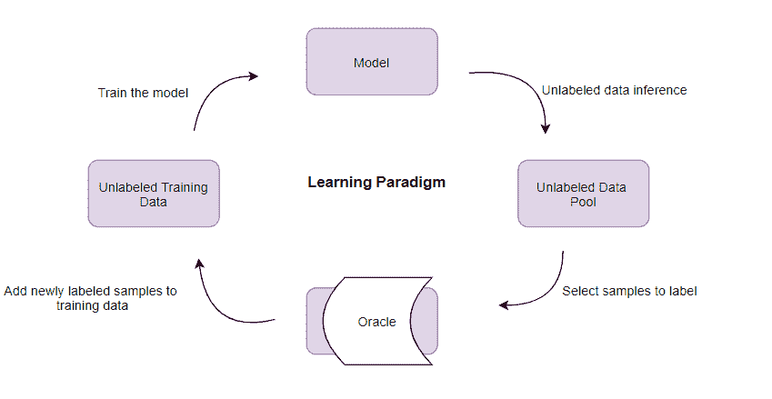

<!--yml

类别: 未分类

日期: 2024-09-06 19:57:47

-->

# [2012.08044] 深度贝叶斯主动学习，近期进展的简要调查

> 来源：[`ar5iv.labs.arxiv.org/html/2012.08044`](https://ar5iv.labs.arxiv.org/html/2012.08044)

# 深度贝叶斯主动学习，近期进展的简要调查

萨尔曼·穆罕默迪 计算机科学与电气工程

西弗吉尼亚大学 摩根敦, WV, 美国

Sm0224@mix.wvu.edu    哈米德雷扎·阿敏达瓦尔 电气工程

阿米尔卡比尔科技大学 德黑兰, 伊朗

hamidami@aut.ac.ir

###### 摘要

主动学习框架提供了高效的数据标注，同时不会显著降低准确性。换句话说，主动学习从小规模的标记数据开始训练模型，同时探索未标记数据的空间，以选择最有信息量的样本进行标注。一般来说，表示不确定性在任何主动学习框架中都至关重要，然而，深度学习方法既不能表示也不能操控模型的不确定性。另一方面，从实际应用的角度来看，不确定性表示在机器学习社区中越来越受到关注。深度贝叶斯主动学习框架以及一般的贝叶斯主动学习设置，提供了实际的考虑，使得在小数据量下训练模型的同时，能够表示模型的不确定性，从而实现更高效的训练。本文简要回顾了贝叶斯主动学习的最新进展，特别是深度贝叶斯主动学习框架的进展。

###### 索引词：

贝叶斯主动学习, 深度学习, 后验估计, 贝叶斯推断, 半监督学习

## I 引言

在实际应用中，虽然数据收集可能不像几十年前那样昂贵和费力，但数据标注过程仍然存在许多考虑因素，这使得在实际部署许多机器学习算法时成本高且效率低。因此，实验设计，尤其是将主动学习设置纳入许多机器问题领域，正越来越受到关注。主动学习是机器学习领域中的一种框架，其中模型开始时用少量标记数据进行训练，然后在一个顺序过程中从未标记数据池中请求更多数据样本进行标注，并将其纳入训练过程。实际上，该框架背后的关键思想是通过高效地请求更多最具信息性的标注数据样本来实现期望的准确性，同时降低标注成本。因此，与许多其他相关框架相比，主动学习尝试通过使用更少的标记数据来结合不确定性表示，以实现相同或更高的准确性。除了来自噪声数据样本的不确定性外，还有两种主要的不确定性类型：与最佳模型参数相关的不确定性，以及与最佳网络结构相关的不确定性[1, 2]。实际上，我们可能会发现多个模型和/或不同的结构能够很好地表示数据，但我们可能会面临选择在进一步预测或泛化中性能最高的那个模型的不确定性。相比之下，类似的框架，如半监督学习，解决的是相对类似的问题领域，但它们的学习范式之间存在差异。更详细地说，半监督学习框架利用未标记数据进行特征表示，以更好地建模标记数据[3, 4, 5]。在信号处理领域，强调参数建模的经典方法和工具已在不同类型的数据领域得到应用[7, 9, 8]。然而，最近在机器学习特别是人工神经网络方面的进展表明，非参数模型几乎能够建模任何类型的数据，尽管这需要更高的复杂性。在这方面，深度学习可以与机器学习的经典工具和框架如主动学习结合，以解决更广泛的问题，同时提升性能。

另一方面，表示嵌入空间或输出概率空间的不确定性是具有挑战性的，我们将使用深度学习工具和概念。这种情况会出现在多个场景中，我们需要测量模型的不确定性，例如经典主动学习或其各种版本中解决的问题。事实上，利用模型不确定性对涉及从少量数据中学习的多个问题领域至关重要。例如，在典型的主动学习框架中，开发期望的输出概率空间是必要的，这需要对模型不确定性的测量和表示[28]。贝叶斯方法在捕捉潜在模型不确定性方面可以发挥重要作用。将主动学习与神经网络结合的最初想法在几十年前就已提出并评估[25]，然而近年来，更多的具体努力被用来将深度学习工具引入主动学习框架。在这方面，为了更好地理解所涉及的问题领域，思考相关的困难至关重要。[6]的作者在他们的开创性工作中讨论了将深度学习工具引入主动学习环境中面临的两个主要问题：不确定性表示和可能需要的数据量。在接下来的两个部分中，为了了解基本概念和一些理论定义，将简要概述主动学习和贝叶斯卷积神经网络及递归神经网络的学习范式。

图 1：主动学习的学习范式；如图所示，在每次迭代中，训练从修改后的训练数据中重新开始。

## II 主动学习中的学习范式

简而言之，主动学习的目标是通过高效选择待标记的未标记数据来最小化数据注释或标记的成本。更详细地说，在每次主动学习的迭代中，会将一个新的标记数据样本（或甚至是数据批次）添加到训练数据中，并且训练过程从头开始。这个顺序训练将继续进行，直到准确率达到期望水平，或者整个标记预算用完。主动学习的学习周期概述如图 1 所示。

在每次迭代中，所有未标记的数据样本将被评估以选择最有信息量的样本。这些样本的选择由一个称为获取函数的函数来执行，该函数处理分类的不确定性。分类中的不确定性可以通过预测熵、变异比率和互信息来度量 [26, 27, 28]。一般来说，我们在主动学习框架中使用获取函数，无论是用于回归还是分类目的。在回归的情况下，样本方差是构建和获取函数的标准。然而，在分类的情况下，获取函数可以基于最大预测熵的获取、基于最大互信息的获取、最大变异比率的获取或简单的随机获取作为基线来设计 [28, 29]。因此，我们可以将获取函数视为执行不确定性采样、或多样性采样，或两者兼而有之的函数。在图像分类任务中，最受欢迎的函数在 [6] 中进行了介绍和大致公式化。

## III 模型中的不确定性投影

### III-A 带有贝叶斯先验的卷积神经网络

如今，深度学习算法大多依赖于训练卷积神经网络（CNNs）。事实上，随着 CNNs 的最新进展，CNNs 的主要优势之一是能够捕捉图像数据的空间信息 [10]。然而，贝叶斯学习概念最初是引入到简单版本的神经网络中。实际上，开发一种特殊类型的神经网络（NNs）——贝叶斯 NNs 的第一次尝试可以追溯到三十多年前的参考文献 [30]。他们的目标是对神经网络的权重施加先验分布，以便在每种特定的权重设置与其对应的输出集之间建立映射框架。这个想法逐渐演变为更复杂的学习框架，例如贝叶斯 CNNs。从本质上讲，贝叶斯 CNNs 的实际实施需要在测试数据上测量模型的预测后验。理论上，首先，每个 CNN 的卷积核都设置为遵循先验分布，然后，将伯努利变分分布应用于图像的卷积核-图像块对；换句话说，伯努利随机变量与权重矩阵的乘积被应用于图像的每个图像块。因此，图像的一些图像块可能会与设置为零的卷积核相乘。不过，从实际实现的角度来看，这通常是通过在每个卷积层和全连接层后执行丢弃操作来近似实现的 [28, 11]。

基于上述讨论，[11] 的作者提出了一个新的 CNN 版本，其中对一组权重应用 Bayesian 先验，即 Gaussian 先验 ${p(w);w}$ 是 ${\{W_{1},W_{2},...W_{N}\}}$。在他们的工作中，为分类任务制定的 Bayesian CNN 带有 softmax 层，其似然模型如下：

|  | $\displaystyle p(y=c\mid x,w)=softmax(f^{w}(x)).$ |  | (1) |
| --- | --- | --- | --- |

如上所述，为了实际实现这些模型，Gal 等人 [6] 建议使用随机正则化技术，如 dropout 或乘法 Gaussian 噪声进行近似推断。他们通过在训练和测试过程中使用 dropout 来估计测试过程中的后验分布。更详细地说，通过找到一个分布，即 ${q_{\theta}^{*}(w)}$，在给定一组训练数据 ${D}$ 的情况下，最小化估计后验和精确后验 ${p(w|D)}$ 之间的 Kullback-Leibler (KL) 散度。这项工作通常通过蒙特卡罗积分来进行变分推断，我们得到：

|  | $\displaystyle p(y=c\mid x,D)=\int p(y=c\mid x,w)p(w\mid D)dw$ |  | (2) |
| --- | --- | --- | --- |
|  | $\displaystyle\approx\int p(y=c\mid x,w)q_{\theta}^{*}(w)dw$ |  | (3) |
|  | $\displaystyle\approx\frac{1}{T}\sum_{t=1}^{T}p(y=c\mid x,\hat{w}_{t}),$ |  | (4) |

其中 ${q_{\theta}(w)}$ 是 dropout 分布，${\hat{w}_{t}}$ 是 ${q_{\theta}^{*}}$ 的估计 [6]。

### III-B 带有 Bayesian 先验的递归神经网络

类似于将 CNN 转变为 Bayesian CNN 的方法，递归神经网络（RNNs）也可以在模型不确定性方面进行修改。

## IV 最近进展回顾

贝叶斯推断方法允许将概率框架引入机器学习和深度学习。这种框架引入机器学习的概念在于将从数据中学习视为推断数据表示的最佳或近似最佳模型，例如自动模型发现。从这个意义上说，贝叶斯方法，特别是贝叶斯主动学习方法，由于其不确定性表示能力和在小数据量上更好的泛化能力而受到关注[20]。在将模型不确定性测量和操控引入主动学习方面的主要工作是由 Gal 和 Ghahramani 完成的[6]。实际上，本文的主要贡献是将贝叶斯不确定性估计特别引入主动学习，以形成一个深度主动学习框架。更详细地说，深度学习工具需要大量数据，而主动学习倾向于使用少量数据。此外，通常来说，深度学习不适合不确定性表示，而主动学习依赖于模型不确定性测量甚至操控。理解这些显著的自然差异，本文的作者发现贝叶斯方法是解决方案。实际上，他们将主动学习的通用框架进行精炼，这个框架通常与 SVM 和少量数据一起工作，优化为适合处理高维数据，如大数据中的图像，与小数据对比。在实践中，作者将贝叶斯先验应用于卷积神经网络的核函数，作为主动学习框架的训练引擎。他们提到他们之前的工作[21]，建议为了拥有一个实际的贝叶斯 CNN，可以通过贝叶斯 CNN 中的近似推断来进行贝叶斯推断，这使得解决方案在计算上是可处理的。有趣的是，他们通过实验证明，dropout 是一种贝叶斯近似，可以用作将不确定性引入深度学习的方式[22]。这里的要点是，dropout 不仅用于训练过程，即在训练期间每个权重层之前应用 dropout 进行推断，还用于测试期间从近似后验中进行采样。与其他针对大数据图像的主动学习方法（如使用 RBF 的方法）相比，这种框架表现更好。

在这一行中，Jedoui 等人 [23] 进一步探讨了模型不确定性的层面，他们假设输出空间不再是互斥的，例如，对于单个输入我们可能有多个输出。他们实证表明，经典的不确定性采样在诸如视觉问答这类任务中表现不如随机采样，因此他们提到 [6、18、21、19] 采用了类似的策略，通过在语义结构化的嵌入空间中使用贝叶斯不确定性，而不是对输出概率空间的不确定性进行建模。参考 Gal 和 Ghahramani 的研究，他们提到 dropout 可以被解释为一种变分贝叶斯近似 [21、22]，其中近似分布是两个方差较小的高斯分布的混合，其中一个高斯分布的均值为零。由权重的不确定性引起的预测不确定性可以通过使用蒙特卡罗积分的近似后验来衡量。

参考文献 [24] 的作者提出了另一个类似的问题，即将深度学习与相对大量的数据和大网络引入到主动学习中，并建议以批量主动学习的形式系统性地请求标注（即每次主动学习迭代中不是样本而是批量）。他们提供了批量主动学习，以解决现有贪婪算法在计算上变得昂贵且对模型微小变化敏感的问题。作者提出了一种旨在通过良好估计数据后验来高效扩展主动学习的模型。他们建议，在每次迭代中用一个批量而不是一个数据样本可以带来更高的效率。在本文中，作者考虑了多种主动学习方法和不同的获取函数，以实现稀疏性或稀疏子集逼近的高效批量选择。 此外，他们声称，根据他们的实验，参考文献 [6] 作为一种贝叶斯方法，在许多问题设置中优于其他方法。更具体地说，利用 [6] 提出的相同贝叶斯主动学习框架来捕捉不确定性，他们通过寻找数据后验来针对最优批量选择，然而由于主动学习设置在查询池集之前无法访问标签，他们基于当前预测后验分布进行期望。这项工作代表了与参考文献 [6] 基本理论设置一致的封闭形式解。

Gal 和 Ghahramani [11] 提出了伯努利近似变分推断方法，这可以防止 CNN 过拟合，即通过在网络权重上考虑贝叶斯先验，它将能够从小数据中学习，而不会出现过拟合或更高的计算复杂性。这项工作可以被视为开发深度贝叶斯主动学习的基础之一。[12] 的作者强调，主动学习的本质不允许彻底比较模型和获取函数，探索了用于多个自然语言处理任务的不同模型和获取函数的四个以上实验，并最终表明深度贝叶斯主动学习始终提供最佳性能。Kandasamy 等人[13] 强调了经典的后验估计方法在估计可能性时的查询效率问题。他们建议查询效率高的方法是使用贝叶斯主动学习框架进行后验近似。考虑到高斯先验，形成一个作为概率（此处为密度）之间的差异度量的效用函数，并在每个时间步骤，将估计的最有信息量的查询发送到一个 oracle。然后更新后验。实验确认了该方法的查询效率。参考文献 [14] 指出，由于大多数距离度量学习方法对数据的大小敏感并随机选择训练对，因此在许多实际问题中无法返回令人满意的结果。作者通过首先引入贝叶斯距离度量学习方法，然后通过不确定性建模来开发这个框架，最终形成了一个用于主动距离度量学习的贝叶斯框架。该框架实现了有效的训练对选择以及后验概率近似。参考文献 [15] 尝试通过引入带有伪标签的主动期望最大化框架，结合贝叶斯主动学习和半监督学习的优点。作者使用在 [6] 中引入的 Mont Carlo dropout 来计算概率输出。

[32, 31] 提出了针对高维不平衡数据集的采样和可视化问题的创新策略，以减少计算复杂性和内存使用，同时保持准确性。这可以作为深度主动学习框架的辅助技术。

Zeng 等人 [16] 探讨了是否可以在没有完全贝叶斯 CNN 的情况下测量模型不确定性。他们对几种贝叶斯 CNN 的结果证实，为了表示模型的不确定性，需要将贝叶斯先验应用于输出之前的最后几层。通过这种设置，模型可以享受确定性和贝叶斯 CNN 的双重好处。Lewenberg 等人 [17] 解决了使用贝叶斯主动学习者进行主动调查的问题。实际上，他们在主动学习框架中通过应用贝叶斯先验来进行降维，以设计一个系统来预测未提问的问题的答案，使用有限的顺序主动提问。他们的框架在预测准确性和对缺失数据的响应方面优于基于增强线性回归的几种最先进框架。

Houlsby 等人 [18] 提出了预测熵的测量方法，随后在基于高斯过程的分类框架中使用。他们的方法在计算复杂度不高于其他方法的情况下，与几种类似的分类框架相比表现良好。最后，他们通过将二元偏好学习扩展到分类设置，将其框架发展为高斯过程偏好学习。该方法的主要优势之一是，它在相对较低的计算复杂度成本下提供了所需的准确性。

## V 未来趋势

## VI 结论

在本文中，我们调查了贝叶斯主动学习的最新进展，重点关注深度贝叶斯主动学习。我们的主要关注点是对该问题领域理论的贡献工作，但也调查了一些关于贝叶斯主动学习应用的有趣工作。贝叶斯推断方法在机器学习中占据了非常重要的地位，最近，许多关注已转向使用这些方法表示数据、模型甚至网络结构的不确定性。贝叶斯主动学习及其与深度学习概念的交叉提供了非常有趣的理论和应用框架。

## 参考文献

+   [1] Settles, B. (2009). 主动学习文献综述。威斯康星大学麦迪逊分校计算机科学系。

+   [2] Sener, O., & Savarese, S. (2017). 卷积神经网络的主动学习：核心集方法。arXiv 预印本 arXiv:1708.00489。

+   [3] Taherkhani, Fariborz, Nasser M. Nasrabadi, 和 Jeremy Dawson. “通过面部属性预测增强的深度面部识别网络。” 发表在 IEEE 计算机视觉与模式识别会议论文集中，第 553-560 页，2018 年。

+   [4] Taherkhani, Fariborz, Hadi Kazemi, 和 Nasser M. Nasrabadi. “基于图的深度半监督学习的矩阵补全。” 发表在 AAAI 人工智能会议论文集中，第 33 卷，第 5058-5065 页，2019 年。

+   [5] Taherkhani, Fariborz, Hadi Kazemi, Ali Dabouei, Jeremy Dawson, 和 Nasser M. Nasrabadi. ”通过粗略监督增强的弱监督细标签分类器。” 见于 IEEE 国际计算机视觉会议论文集，第 6459-6468 页。2019.

+   [6] Gal, Yarin, Riashat Islam, 和 Zoubin Ghahramani. ”基于图像数据的深度贝叶斯主动学习。” arXiv 预印本 arXiv:1703.02910 (2017).

+   [7] Mohamadi, Salman, Hamidreza Amindavar, 和 SM Ali Tayaranian Hosseini. ”用于癫痫发作预测的 Arima-garch 建模。” 见于 2017 IEEE 国际声学、语音与信号处理会议（ICASSP），第 994-998 页。IEEE, 2017.

+   [8] Mohamadi, Salman, Farhang Yeganegi, 和 Nasser M. Nasrabadi. ”出生-死亡异常的检测与统计建模。” arXiv 预印本 arXiv:1906.11788 (2019).

+   [9] Mohamadi, Salman, Farhang Yeganegi, 和 Hamidreza Amindavar. ”用于基因组序列空间建模与合成的新框架。” arXiv 预印本 arXiv:1908.03342 (2019).

+   [10] Krizhevsky, Alex, Ilya Sutskever, 和 Geoffrey E. Hinton. ”使用深度卷积神经网络进行 ImageNet 分类。” ACM 通讯 60, no. 6 (2017): 84-90.

+   [11] Gal, Yarin, 和 Zoubin Ghahramani. ”带有伯努利近似变分推断的贝叶斯卷积神经网络。” arXiv 预印本 arXiv:1506.02158 (2015).

+   [12] Siddhant, Aditya, 和 Zachary C. Lipton. ”自然语言处理中的深度贝叶斯主动学习：大规模实证研究结果。” arXiv 预印本 arXiv:1808.05697 (2018).

+   [13] Kandasamy, Kirthevasan, Jeff Schneider, 和 Barnabás Póczos. ”贝叶斯主动学习用于后验估计。” 见于第 24 届国际人工智能会议论文集，第 3605-3611 页。2015.

+   [14] Yang, Liu, Rong Jin, 和 Rahul Sukthankar. ”贝叶斯主动距离度量学习。” arXiv 预印本 arXiv:1206.5283 (2012).

+   [15] Matthias, Rottmann, Kahl Karsten, 和 Gottschalk Hanno. ”深度贝叶斯主动半监督学习。” 见于 2018 年第 17 届 IEEE 机器学习与应用国际会议（ICMLA），第 158-164 页。IEEE, 2018.

+   [16] Zeng, Jiaming, Adam Lesnikowski, 和 Jose M. Alvarez. ”贝叶斯层定位对深度贝叶斯主动学习中模型不确定性的相关性。” arXiv 预印本 arXiv:1811.12535 (2018).

+   [17] Lewenberg, Yoad, Yoram Bachrach, Ulrich Paquet, 和 Jeffrey S. Rosenschein. ”知道该问什么：一种贝叶斯主动学习方法解决调查问题。” 见于 AAAI，第 1396-1402 页。2017.

+   [18] Houlsby, Neil, Ferenc Huszár, Zoubin Ghahramani, 和 Máté Lengyel. ”用于分类和偏好学习的贝叶斯主动学习。” arXiv 预印本 arXiv:1112.5745 (2011).

+   [19] Karpathy, Andrej, Armand Joulin, 和 Li F. Fei-Fei. ”用于双向图像句子映射的深度片段嵌入。” 见于神经信息处理系统进展，第 1889-1897 页。2014.

+   [20] Ghahramani, Zoubin. “概率机器学习与人工智能。” 《自然》 521, 无. 7553 (2015): 452-459。

+   [21] Gal, Yarin, 和 Zoubin Ghahramani. “丢弃法作为贝叶斯近似：洞察与应用。” 见于深度学习研讨会，ICML，第 1 卷，第 2 页。2015。

+   [22] Gal, Yarin, 和 Zoubin Ghahramani. “丢弃法作为贝叶斯近似：在深度学习中表示模型不确定性。” 见于国际机器学习会议，pp. 1050-1059。2016。

+   [23] Jedoui, Khaled, Ranjay Krishna, Michael Bernstein, 和 Li Fei-Fei. “多重正确输出的深度贝叶斯主动学习。” arXiv 预印本 arXiv:1912.01119 (2019)。

+   [24] Pinsler, Robert, Jonathan Gordon, Eric Nalisnick, 和 José Miguel Hernández-Lobato. “贝叶斯批量主动学习作为稀疏子集逼近。” 见于神经信息处理系统进展，pp. 6359-6370。2019。

+   [25] Cohn, David A., Zoubin Ghahramani, 和 Michael I. Jordan. 《统计模型的主动学习》。麻省理工学院剑桥人工智能实验室，1995。

+   [26] Freeman, Linton C., 和 Linton C. Freeman. 《初级应用统计：针对行为科学学生》。纽约：Wiley，1965。

+   [27] Shannon, Claude E. “通信的数学理论。” 《贝尔系统技术期刊》 27, 无. 3 (1948): 379-423。

+   [28] Gal, Yarin. “深度学习中的不确定性。” 剑桥大学 1, 无. 3 (2016): 4。

+   [29] Houlsby, Neil, Ferenc Huszár, Zoubin Ghahramani, 和 Máté Lengyel. “分类和偏好学习的贝叶斯主动学习。” arXiv 预印本 arXiv:1112.5745 (2011)。

+   [30] Denker, John, Daniel Schwartz, Ben Wittner, Sara Solla, Richard Howard, Lawrence Jackel, 和 John Hopfield. “大规模自动学习、规则提取与泛化。” 《复杂系统》 1, 无. 5 (1987): 877-922。

+   [31] Hajibabaee, Parisa, Farhad Pourkamali-Anaraki, 和 Mohammad Amin Hariri-Ardebili. “在类别不平衡数据上进行核矩阵逼近及其在科学仿真中的应用。” 《IEEE Access》 9 (2021): 83579-83591。

+   [32] Hajibabaee, Parisa, Farhad Pourkamali-Anaraki, 和 Mohammad Amin Hariri-Ardebili. “对 t-sne 算法在结构工程数据可视化中的实证评估。” 见于 2021 年第 20 届 IEEE 国际机器学习与应用会议（ICMLA），第 1674-1680 页。IEEE，2021。
