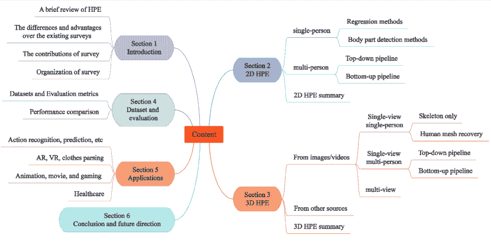
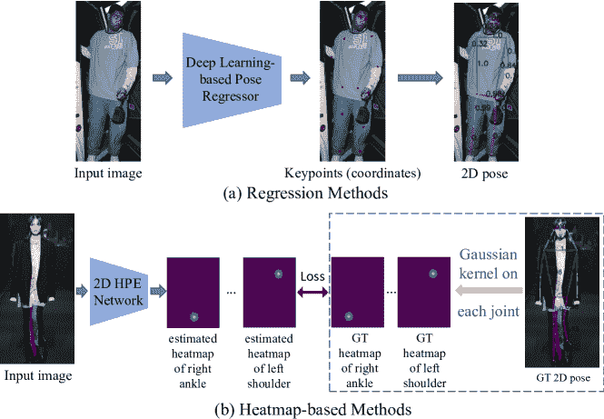
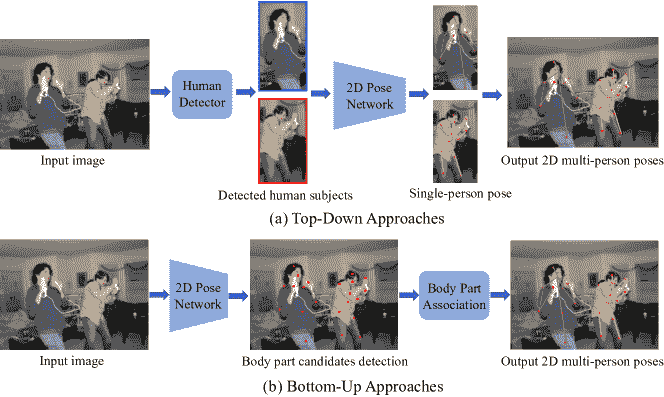
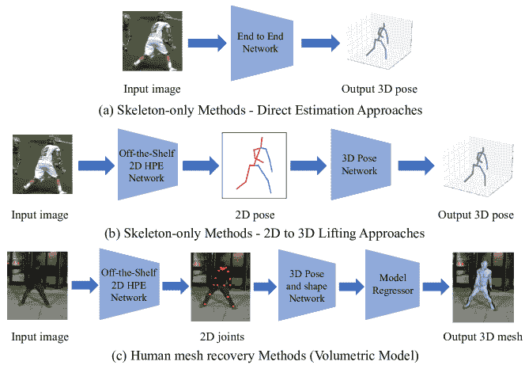
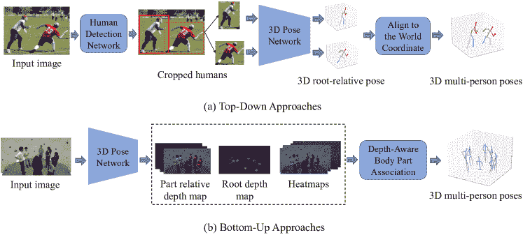

<!--yml

类别：未分类

日期：2024-09-06 19:57:45

-->

# [2012.13392] 基于深度学习的人体姿态估计：综述

> 来源：[`ar5iv.labs.arxiv.org/html/2012.13392`](https://ar5iv.labs.arxiv.org/html/2012.13392)

# 基于深度学习的人体姿态估计：综述

Ce Zheng cezheng@knights.ucf.edu 中佛罗里达大学 4328 Scorpius St, Suite 245 奥兰多佛罗里达美国 32816，Wenhan Wu wwu25@uncc.edu 北卡罗来纳大学夏洛特分校 9201 University City Blvd 夏洛特北卡罗来纳美国 28223，Chen Chen chen.chen@crcv.ucf.edu 中佛罗里达大学 4328 Scorpius St, Suite 245 奥兰多佛罗里达美国 32816，Taojiannan Yang taoyang1122@knights.ucf.edu 中佛罗里达大学 4328 Scorpius St, Suite 245 奥兰多佛罗里达美国 32816，Sijie Zhu sizhu@knights.ucf.edu 中佛罗里达大学 4328 Scorpius St, Suite 245 奥兰多佛罗里达美国 32816，Ju Shen jshen1@udayton.edu 代顿大学 300 College Park 代顿俄亥俄美国 45469，Nasser Kehtarnavaz kehtar@utdallas.edu 德克萨斯大学达拉斯分校 800 W. Campbell Road 理查森德克萨斯美国 75080 和 Mubarak Shah shah@crcv.ucf.edu 中佛罗里达大学 4328 Scorpius St, Suite 245 奥兰多佛罗里达美国 32816 (2018)

###### 摘要。

人体姿态估计旨在从输入数据（如图像和视频）中定位人体部位并构建人体表示（例如，身体骨架）。在过去十年中，它引起了越来越多的关注，并已被广泛应用于包括人机交互、动作分析、增强现实和虚拟现实在内的各种应用。尽管最近开发的基于深度学习的解决方案在人类姿态估计方面取得了高性能，但由于训练数据不足、深度模糊和遮挡等问题，仍然存在挑战。本文综述的目标是通过系统分析和比较这些解决方案，提供对近期深度学习解决方案在 2D 和 3D 姿态估计中的全面回顾。该综述涵盖了自 2014 年以来的 260 多篇研究论文。此外，还包括 2D 和 3D 人体姿态估计数据集和评估指标。总结并讨论了在流行数据集上审阅方法的定量性能比较。最后，总结了涉及的挑战、应用和未来研究方向。提供了一个定期更新的项目页面：[`github.com/zczcwh/DL-HPE`](https://github.com/zczcwh/DL-HPE)

人体姿态估计的调查、2D 和 3D 姿态估计、基于深度学习的姿态估计、姿态估计数据集、姿态估计指标^†^†版权：acmcopyright^†^†期刊年份：2018^†^†doi: 10.1145/1122445.1122456^†^†期刊：JACM^†^†期刊卷号：37^†^†期刊期号：4^†^†文章：111^†^†出版月份：8^†^†ccs: 计算方法 计算机视觉^†^†ccs: 综合和参考 调查和概述

## 1\. 引言

人体姿态估计（HPE）在计算机视觉领域中已经被广泛研究，它涉及从传感器（尤其是图像和视频）捕获的输入数据中估计人体部位的配置。HPE 提供了有关人体的几何和运动信息，这些信息已经应用于广泛的领域（例如，人机交互、运动分析、增强现实（AR）、虚拟现实（VR）、医疗保健等）。随着近年来深度学习解决方案的快速发展，这些解决方案已被证明在图像分类（Krizhevsky et al., 2012）、语义分割（Long et al., 2015）和目标检测（Ren et al., 2015）等各种任务中优于经典的计算机视觉方法。通过采用深度学习技术，HPE 任务已经取得了显著进展和显著性能。然而，遮挡、训练数据不足和深度模糊等挑战仍然存在，需要克服。使用深度学习技术进行的单人 2D HPE 从图像和视频中获得高性能是容易实现的。近年来，研究重点转向复杂场景中高度遮挡的多人体 HPE。相比之下，获取准确的 3D 姿态标注要比 2D 任务困难得多。运动捕捉系统可以在受控实验室环境中收集 3D 姿态标注；然而，它们在自然环境中的应用有限。对于从单目 RGB 图像和视频中进行的 3D HPE，主要挑战是深度模糊。在多视角设置中，视角关联是需要解决的关键问题。一些研究利用了深度传感器、惯性测量单元（IMUs）和射频设备等传感器，但这些方法通常成本较高且需要特殊用途的硬件。

鉴于 HPE 研究的快速进展，本文试图追踪近期的进展并总结其成果，以提供当前基于深度学习的 2D 和 3D HPE 研究的清晰概况。

图 1\. 本调查的分类

### 1.1\. 以前的调查及我们的贡献

之前有几篇相关的调查和综述文章报告了 HPE。其中，（Moeslund 和 Granum, 2001；Moeslund 等, 2006；Poppe, 2007；Ji 和 Liu, 2009）关注于基于视觉的人体运动捕捉的一般领域，包括姿态估计、跟踪和动作识别。因此，姿态估计只是这些调查涵盖的主题之一。2012 年前关于 3D HPE 的研究工作在（Holte 等, 2012）中进行了回顾。基于身体部位解析的单视角和多视角 HPE 方法在（Liu 等, 2015）中进行了报告。这些在 2001-2015 年间发布的调查主要集中于传统方法，没有涉及深度学习。关于传统和深度学习方法的 HPE 调查见（Gong 等, 2016）。然而，其中仅包括少数深度学习方法。（Sarafianos 等, 2016）的调查涵盖了 RGB 输入的 3D HPE 方法，而（Munea 等, 2020）的调查仅回顾了 2D HPE 方法。关于从经典到最近的深度学习方法（截至 2019 年，不到 100 篇论文）的单目 HPE 总结见（Chen 等, 2020f）。然而，这只涵盖了 2D HPE 和来自单目摄像头的 3D 单视角 HPE。来自单目摄像头的 3D 多视角 HPE 以及来自其他传感器的 3D HPE 被忽略。此外，没有进行广泛的性能比较或深入分析，关于现有挑战和未来方向的讨论也相对较短。

本次调查旨在弥补以往调查在系统回顾基于深度学习的 2D 和 3D 人体姿态估计（HPE）解决方案方面的不足，同时涵盖 HPE 的其他方面，包括（2D 和 3D）HPE 方法在常用数据集上的性能评估、其应用以及综合讨论。本调查与以往调查的关键区别在于：

+   •

    提供了对最新深度学习方法的 2D 和 3D HPE（截至 2022 年，超过 260 篇论文）的全面综述，按照 2D 或 3D 场景、单视角或多视角、来自单目图像/视频或其他来源、以及学习范式进行分类。

+   •

    对 2D 和 3D HPE 方法进行广泛的性能评估。我们根据方法的类别总结和比较了在常用数据集上报告的有前景方法的性能。这些结果的比较提供了不同方法的优缺点线索，揭示了 HPE 的研究趋势和未来方向。

+   •

    对 HPE 应用的广泛概述，如监控、增强现实/虚拟现实和医疗保健。

+   •

    对 2D 和 3D HPE 进行深入讨论，重点是 HPE 中的关键挑战，并指向潜在的未来研究方向以改善性能。

### 1.2. 论文组织

HPE 分为两个主要类别：2D HPE (§ 2) 和 3D HPE (§ 3)。图 1 展示了 HPE 的深度学习方法分类。根据人数，2D HPE 方法分为单人和多人设置。对于单人方法 (§ 2.1)，分为回归方法和基于热图的方法。对于多人方法 (§ 2.2)，也有两种方法：自上而下的方法和自下而上的方法。

3D HPE 方法根据输入源类型分类：单目 RGB 图像和视频 (§ 3.1)，或其他传感器（例如，惯性测量单元传感器，§ 3.2）。这些方法中的大多数使用单目 RGB 图像和视频，并且进一步分为单视角单人 (§ 3.1.1)；单视角多人 (§ 3.1.2)；和多视角方法 (§ 3.1.3)。多视角设置主要用于多人姿态估计。因此，在这一类别中未指定单人或多人。

接下来，根据 2D 和 3D HPE 管道，总结了常用的数据集和评估指标，并对有前景的方法的结果进行比较（§ 4）。此外，还提到了 HPE 的各种应用，如 AR/VR（§ 5）。最后，本文通过对未来研究的一些有前途的方向进行深入讨论（§ 6）。

## 2\. 2D 人体姿态估计

2D HPE 方法从图像或视频中估计人体关键点的 2D 位置或空间位置。传统的 2D HPE 方法采用不同的手工特征提取技术来处理身体部位，这些早期的工作通过将人体描述为一个棍子图形来获得全局姿态结构。最近，基于深度学习的方法在 HPE 中取得了重大突破，显著提高了结果。接下来，我们将回顾基于深度学习的 2D HPE 方法，涵盖单人和多人场景。

### 2.1\. 2D 单人姿态估计

2D 单人姿态估计用于定位单张图像中的人体关节点。如果图像中有多个人，则首先裁剪图像，使每个裁剪的图像块（或子图像）中只有一个人。这个过程可以通过上半身检测器（Micilotta et al., 2006）或全身检测器（Ren et al., 2015）自动完成。通常，使用深度学习技术的单人管道分为两类：回归方法和基于热图的方法。回归方法应用端到端框架来学习从输入图像到人体关节位置或人体模型参数的映射（Toshev and Szegedy, 2014）。基于热图的方法的目标是预测身体部位和关节的大致位置（Chen and Yuille, 2014）（Newell et al., 2016），这些位置通过热图表示来进行监督（Tompson et al., 2015；Wei et al., 2016）。基于热图的框架现在在 2D HPE 任务中得到了广泛应用。2D 单人 HPE 方法的一般框架如图 2 所示。

图 2\. 单人 2D HPE 框架。（a）回归方法通过深度神经网络直接学习从原始图像到运动体模型的映射，并生成关节坐标。（b）给定真实的 2D 姿态，通过对每个关节的位置应用高斯核来生成每个关节的真实热图。然后，基于热图的方法利用模型预测每个关节的热图。

#### 2.1.1\. 回归方法

基于回归框架的研究有很多（例如，（Toshev 和 Szegedy，2014；Pfister 等，2014；Carreira 等，2016；Sun 等，2017；Luvizon 等，2019；Nibali 等，2018；Li 等，2014；Fan 等，2015；Luvizon 等，2018；Zhang 等，2019b；Li 等，2021c；Panteleris 和 Argyros，2021；Mao 等，2021；Mao 等，2022）用于从图像中预测关节坐标，如图 2（a）所示。Toshev 和 Szegedy（Toshev 和 Szegedy，2014）使用 AlexNet（Krizhevsky 等，2012）作为骨干网络，提出了一种名为 DeepPose 的级联深度神经网络回归器，用于从图像中学习关键点。由于 DeepPose 的出色表现，人类姿态估计的研究范式开始从经典方法转向深度学习，特别是卷积神经网络（CNN）。Sun 等（Sun 等，2017）提出了一种结构感知回归方法，称为“组合姿态回归”，基于 ResNet-50（He 等，2016）。该方法采用了一种重新参数化和基于骨架的表示，包含了人体信息和姿态结构，而不是传统的基于关节的表示。Luvizon 等（Luvizon 等，2019）提出了一种端到端的回归方法，用于 HPE，使用 soft-argmax 函数将特征图转换为关节坐标，在完全可微的框架中。Li 等（Li 等，2021c）首次设计了一种基于变压器的级联网络来回归人体关键点。自注意力机制捕捉关节和外观的空间相关性。与之前的方法不同，Li 等（Li 等，2021a）提出了一种名为 RLE（对数似然估计）的归一化流模型，以捕捉关节位置的分布，旨在通过残差对数似然估计找到优化的参数。

一个能够编码丰富姿态信息的良好特征对于基于回归的方法至关重要。一种流行的学习更好特征表示的策略是多任务学习（Ruder，2017）。通过在相关任务（例如，姿态估计和基于姿态的动作识别）之间共享表示，模型可以在原始任务（姿态估计）上有更好的泛化能力。沿着这个方向，Li 等人（Li et al., 2014）提出了一个异构多任务框架，该框架由两个任务组成：通过回归器从完整图像中预测关节坐标，以及使用滑动窗口从图像块中检测身体部位。Fan 等人（Fan et al., 2015）提出了一种双源（即图像块和完整图像）CNN，用于两个任务：关节检测，即确定一个图像块是否包含身体关节，以及关节定位，即找到关节在图像块中的确切位置。每个任务对应一个损失函数，两个任务的结合可以提高结果。

#### 2.1.2\. 基于热图的方法

与其直接估计人体关节的 2D 坐标，不如采用基于热图的方法来进行 HPE，这些方法旨在估计 2D 热图，这些热图是通过在每个关节的位置上添加 2D 高斯核生成的，如图 2 所示。具体来说，目标是估计总共$K$个关键点的$K$个热图$\{H_{1},H_{2},...,H_{K}\}$。每个关键点热图中的像素值$H_{i}(x,y)$表示该关键点位于位置$(x,y)$的概率（见图 2 (b)）。目标（或真实）热图是由一个以真实关节位置为中心的 2D 高斯生成的（Tompson et al., 2015）（Tompson et al., 2014）。因此，姿态估计网络通过最小化预测热图与目标热图之间的差异（例如，均方误差（MSE））来进行训练。与关节坐标相比，热图保留了空间位置信息，同时可以使训练过程更加平滑。

因此，最近对利用热图表示关节位置以及开发有效的 CNN 架构用于人体姿态估计（HPE）表现出越来越大的兴趣，例如（Tompson et al., 2014; Ramakrishna et al., 2014; Tompson et al., 2015; Lifshitz et al., 2016; Bulat and Tzimiropoulos, 2016; Newell et al., 2016; Wei et al., 2016; Gkioxari et al., 2016; Belagiannis and Zisserman, 2017; Yang et al., 2017; Luo et al., 2018; Debnath et al., 2018; Xiao et al., 2018; Zhang et al., 2019a; Artacho and Savakis, 2020; Li et al., 2022b)。作为基础工作之一，Wei et al. (Wei et al., 2016) 提出了基于卷积网络的顺序框架，称为卷积姿态机器（CPM），用于预测关键点的位置，通过多阶段处理（每个阶段的卷积网络利用前一阶段生成的 2D 信念图，并产生越来越精细的身体部位位置预测）。与此同时，Newell et al. (Newell et al., 2016) 提出了一个名为“堆叠沙漏”（stacked hourglass）的编码器-解码器网络，通过中间监督重复底向上和顶向下处理。在这项工作中，编码器通过瓶颈压缩特征，然后解码器将其扩展到子阶段。堆叠沙漏（SHG）网络由连续的池化和上采样层步骤组成，以捕捉每个尺度的信息。此后，针对 HPE 开发了 SHG 架构的复杂变体。根据 (Newell et al., 2016)，Chu et al. (Chu et al., 2017) 设计了新颖的沙漏残差单元（HRUs），通过带有更大感受野的侧支滤波器扩展了残差单元，以捕捉来自不同尺度的特征。Yang et al. (Yang et al., 2017) 设计了多分支金字塔残差模块（PRM）来替代 SHG 中的残差单元，从而增强了深度 CNN 在尺度上的不变性。Sun et al. (Sun et al., 2019) 提出了新颖的高分辨率网络（HRNet），通过将多分辨率子网络并行连接并进行重复的多尺度融合，从而学习可靠的高分辨率表示，这使得关键点热图预测更加准确。受到 HRNet 的启发，Yu et al. (Yu et al., 2021) 介绍了一种轻量级的 HRNet，名为 Lite-HRNet，设计了条件通道加权块，以在通道和分辨率之间交换信息。近期，由于卓越的性能，HRNet (Sun et al., 2019) 及其变体（Cheng et al., 2020; Yuan et al., 2021; Yu et al., 2021) 已被广泛应用于 HPE 和其他姿态相关任务。

随着生成对抗网络（GANs）的出现（Goodfellow et al., 2014），它们在 HPE 中被用于生成生物学上合理的姿态配置，并用高置信度的预测与低置信度的预测进行区分，从而推断被遮挡身体部位的姿态。受到有效细化关节的 hourglass 架构的启发，Chen et al.（Chen et al., 2017）构建了一个结构感知的条件对抗网络——对抗姿态网络（Adversarial PoseNet），它包含一个基于 hourglass 网络的姿态生成器和两个判别器，用于区分合理的身体姿态与不合理的姿态。Chou et al.（Chou et al., 2018）构建了一个基于对抗学习的网络，该网络有两个堆叠的 hourglass 网络，分别共享与判别器和生成器相同的结构。生成器估计每个关节的位置，而判别器区分真实热图与预测热图。与以 GANs 为基础的方法不同，这些方法将 HPE 网络视为生成器，并利用判别器提供监督，Peng et al.（Peng et al., 2018）开发了一个对抗数据增强网络，通过将 HPE 网络视为判别器，并使用增强网络作为生成器来执行对抗性增强，从而优化数据增强和网络训练。

除了设计有效的 HPE 网络的努力外，体结构信息也被研究，以提供更多更好的监督信息来构建 HPE 网络。Yang 等人（Yang et al., 2016）设计了一个端到端 CNN 框架用于 HPE，该框架通过结合人体部位之间的空间和外观一致性来发现困难的负例。在（Chu et al., 2016）中提出了一个结构化特征级学习框架，用于推理 HPE 中人体关节之间的相关性，这捕捉了更丰富的人体关节信息并改善了学习结果。Ke 等人（Ke et al., 2018）设计了一个多尺度结构感知神经网络，结合了多尺度监督、多尺度特征组合、结构感知损失信息方案以及关键点掩膜训练方法，以改进复杂场景中的 HPE 模型。Tang 等人（Tang et al., 2018）建立了一个基于沙漏的监督网络，称为**深度学习组合模型**，用于描述身体部位之间复杂而真实的关系，并学习人体中的组合模式信息（每个身体部位的方向、尺度和形状信息）。与以前考虑所有身体部位的方法不同，Tang 和 Wu（Tang and Wu, 2019）揭示了并非所有部位都相互关联，因此引入了基于部件的分支网络，以学习特定于每个部件组的表示，而不是所有部位共享的表示。

视频序列中的人体姿势是（3D）时空信号。因此，建模时空信息对于从视频中进行**人体姿势估计（HPE）**至关重要。Jain 等人（Jain et al., 2014）设计了一个双分支 CNN 框架，将颜色和运动特征结合在帧对中，以建立一个具有表现力的时空模型用于 HPE。Pfister 等人（Pfister et al., 2015）提出了一个 CNN，利用光流对齐来自相邻帧的预测热图，从多个帧中利用时间上下文信息。与以前计算密集的视频方法不同，Luo 等人（Luo et al., 2018）引入了一个带有长短期记忆的递归结构，以捕捉来自不同帧的时间几何一致性和依赖性。这种方法导致了视频 HPE 网络的更快训练时间。Zhang 等人（Zhang et al., 2020e）引入了一个关键帧提议网络，用于捕捉帧中的时空信息，并且有一个**人体姿势插值模块**以实现高效的视频 HPE。

### 2.2. 2D 多人姿势估计

与单人姿态估计相比，多人姿态估计更加困难和具有挑战性，因为它需要确定人数及其位置，并且如何将关键点归类到不同的人身上。为了应对这些问题，多人姿态估计方法可以分为自上而下和自下而上两种方法。自上而下的方法使用现成的人体检测器从输入图像中获取一组框（每个框对应一个人），然后对每个框应用单人姿态估计器来生成多人姿态。与自上而下的方法不同，自下而上的方法首先在一张图像中定位所有身体关节，然后将它们分组到各个个体中。在自上而下的管道中，输入图像中的人数将直接影响计算时间。自下而上的方法的计算速度通常比自上而下的方法更快，因为它们不需要单独检测每个人的姿态。图 3 展示了 2D 多人姿态估计方法的一般框架。

图 3\. 多人 2D 人体姿态估计框架的示意图。(a) 自上而下的方法包含两个子任务：(1) 人体检测和(2) 在单个人体区域中的姿态估计；(b) 自下而上的方法也有两个子任务：(1) 检测所有身体部位的关键点候选点和(2) 将不同人体的身体部位关联起来，并将它们组装成各自的姿态表示。

#### 2.2.1\. 自上而下的管道

在如图 3（a）所示的自顶向下管道中，有两个重要部分：一个人体检测器用于获取人物边界框，以及一个单人姿态估计器用于预测这些边界框内关键点的位置。一系列工作集中于设计和改进 HPE 网络中的模块，例如（Papandreou 等，2017；Huang 等，2017；Xiao 等，2018；Sun 等，2019；Li 等，2019a；Moon 等，2019b；Wang 等，2020b；Huang 等，2020d；Cai 等，2020；Zhang 等，2020h；Liu 等，2021b）。为了回答“简单方法能有多好”以构建 HPE 网络的问题，Xiao 等（Xiao 等，2018）在 ResNet（骨干网络）中添加了一些反卷积层，建立了一个简单而有效的结构来生成高分辨率表示的热图。为了提高关键点定位的准确性，Wang 等（Wang 等，2020b）引入了一个两阶段的图基和模型无关的框架，称为 Graph-PCNN。它包括一个定位子网以获得粗略的关键点位置和一个图姿态细化模块以获得细化的关键点定位表示。Cai 等（Cai 等，2020）引入了一个多阶段网络，具有 Residual Steps Network（RSN）模块，通过高效的层内特征融合策略学习精细的局部表示，以及一个 Pose Refine Machine（PRM）模块，以在特征中的局部和全局表示之间找到权衡。

在遮挡和截断场景下的姿态估计经常发生在多人设置中，因为肢体重叠是不可避免的。由于遮挡，人类检测器可能在自上而下的流程的第一步中失败。因此，对遮挡或截断的鲁棒性是多人人体姿态估计（HPE）方法中的一个重要方面。为此，Iqbal 和 Gall（Iqbal 和 Gall，2016）建立了一个基于卷积姿态机的姿态估计器来估计关节候选点。然后，他们使用整数线性规划解决了关节与个体的关联问题，并在严重遮挡的情况下获得了人体姿态。Fang 等人（Fang 等人，2017）设计了一种区域多人姿态估计（RMPE）方法，以提高复杂场景下 HPE 的性能。RMPE 框架分为三部分：对称空间变换网络（用于检测不准确边界框内的单人区域）、参数化姿态非极大值抑制（用于解决冗余检测问题）和姿态引导提议生成器（用于增强训练数据）。Papandreou 等人（Papandreou 等人，2017）提出了一种两阶段架构，结合了 Faster R-CNN 人体检测器用于创建候选人体的边界框，以及关键点估计器通过热图偏移聚合预测关键点位置。该方法在遮挡和杂乱场景中表现良好。为缓解 HPE 中的遮挡问题，Chen 等人（Chen 等人，2018b）提出了一个级联金字塔网络（CPN），包括两个部分：GlobalNet（一个特征金字塔网络，用于预测不可见的关键点）和 RefineNet（一个网络，用于整合 GlobalNet 的所有层级特征，并通过关键点挖掘损失进行优化）。他们的结果表明，CPN 在预测遮挡关键点方面表现良好。Su 等人（Su 等人，2019）设计了两个模块，即通道洗牌模块和空间及通道注意残差瓶颈，以实现通道级和空间信息增强，从而在遮挡场景下更好地进行多人 HPE。Qiu 等人（Qiu 等人，2020）开发了一个遮挡姿态估计和修正模块以及一个遮挡姿态数据集，以解决人群姿态估计中的遮挡问题。Umer 等人（Umer 等人，2020）提出了一个关键点对应框架，以利用上一帧的时间信息恢复错过的姿态。该网络通过自监督训练，以改善在稀疏标注视频数据集上的姿态估计结果。

最近，基于变换器的方法吸引了更多关注（Li et al., 2021b, e; Yang et al., 2021; Yuan et al., 2021; Shi et al., 2022; Ma et al., 2022），因为变换器中的注意力模块能够获得长距离依赖和全局证据，这些比 CNN 更强大。早期的探索（Yang et al., 2021）提出了一种名为 TransPose 的 2D HPE 变换器模型，它利用注意力层来预测关键点的热图，并学习遮挡场景下 HPE 的细粒度证据。继（Yang et al., 2021）之后，Li et al.（Li et al., 2021e）构建了一个名为 TokenPose 的纯变换器模型，通过使用令牌表示来捕获约束线索和视觉外观关系。与基于视觉变换器的方法学习低分辨率表示不同，Yuan et al.（Yuan et al., 2021）提出了一种名为 HRFormer 的高分辨率变换器，通过将 HRNet（Cheng et al., 2020）中的块替换为变换器模块，从而提高了内存和计算效率。Ma et al.（Ma et al., 2022）应用了令牌修剪姿态变换器（PPT）来定位人体部位，从而使模型能够高效地估计多视角姿态。不同于传统的两步结构 HPE，Shi et al.（Shi et al., 2022）提出了一种基于注意力机制的完全端到端框架，直接估计实例感知的身体姿态。

除了上述基于图像的工作，多帧视频中的姿态估计在多人人体 2D HPE 中也很受欢迎（Guo et al., 2018; Bertasius et al., 2019; Liu et al., 2021a; Xu et al., 2021; Liu et al., 2022），它利用视频序列中的时间信息来促进姿态估计。为了减少标记视频帧的成本，Bertasius et al.（Bertasius et al., 2019）提出了一个名为 PoseWarper 的网络，改善了帧间的标签传播，并使稀疏注释的训练受益。为了解决视频帧中的运动模糊和姿态遮挡问题，Liu et al.（Liu et al., 2021a）设计了一个名为 DCpose 的网络，用于多帧 HPE，该网络包含三个模块（Pose Temporal Merger、Pose Residual Fusion 和 Pose Correction Network），以利用帧间的时间信息进行关键点检测。然而，这些方法未能充分利用邻近帧的信息。为了解决这一问题，Liu et al.（Liu et al., 2022）引入了一个分层对齐框架，以缓解两帧之间未对齐上下文的聚合。

#### 2.2.2\. 自下而上的流程

自下而上的流程（例如，（Insafutdinov 等， 2017；Cao 等， 2017；Newell 等， 2017；Fieraru 等， 2018；Tian 等， 2019；Kreiss 等， 2019；Nie 等， 2019；Jin 等， 2020a；Cheng 等， 2020；Wang 等， 2022a， c)) 包括两个主要步骤：身体关节检测（即提取局部特征和预测身体关节候选）和个体身体的关节候选组装（即将关节候选分组以使用部分关联策略构建姿态表示），如图 3（b）所示。

Pishchulin 等人（Pishchulin et al., 2016）提出了一种基于 Fast R-CNN 的身体部位检测器，命名为 DeepCut，这是一种最早的两阶段自下而上的方法之一。它首先检测所有身体部位候选区域，然后对每个部位进行标记，并通过整数线性规划（ILP）将这些部位组装成最终的姿势。然而，DeepCut 计算开销较大。为此，Insafutdinov 等人（Insafutdinov et al., 2016）引入了 DeeperCut，通过应用更强的身体部位检测器、改进的增量优化策略和图像条件下的成对项来提高 DeepCut，从而提高了性能并加快了速度。随后，Cao 等人（Cao et al., 2017）构建了一种名为 OpenPose 的检测器，它利用卷积姿态网络（Wei et al., 2016）通过热图预测关键点坐标，并使用部位关联字段（PAFs，一组 2D 向量场与向量图，编码了四肢的位置和方向）将关键点与每个人关联起来。OpenPose 在自下而上的多人姿态估计中显著加快了速度。在 OpenPose 框架的基础上，Zhu 等人（Zhu et al., 2017）通过添加冗余边来增加 PAFs 中关节之间的连接，从而改进了 OpenPose 结构，并取得了比基准方法更好的性能。尽管基于 OpenPose 的方法在高分辨率图像上取得了令人印象深刻的结果，但在低分辨率图像和遮挡情况下表现较差。为了解决这个问题，Kreiss 等人（Kreiss et al., 2019）提出了一种名为 PifPaf 的自下而上方法，利用部位强度场预测身体部位的位置，并使用部位关联场表示关节的关联。该方法在低分辨率和遮挡场景下优于之前的基于 OpenPose 的方法。受到 OpenPose（Cao et al., 2017）和堆叠沙漏结构（Newell et al., 2016）的启发，Newell 等人（Newell et al., 2017）引入了一种单阶段深度网络，旨在同时获得姿态检测和分组分配。继（Newell et al., 2017）之后，Jin 等人（Jin et al., 2020a）提出了一种新的可微分层次图分组方法，以学习人体部位分组。基于（Newell et al., 2017）和（Sun et al., 2019），Cheng 等人（Cheng et al., 2020）提出了 HRNet 的扩展版本，命名为 Higher Resolution Network，该网络通过解卷积 HRNet 生成的高分辨率热图来解决自下而上的多人姿态估计中的尺度变化挑战。

多任务结构也被用于自下而上的 HPE 方法中。Papandreou 等人 (Papandreou 等, 2018) 介绍了 PersonLab，将姿态估计模块和人体分割模块结合起来进行关键点检测和关联。PersonLab 由短距离偏移（用于精细化热图）、中距离偏移（用于预测关键点）和长距离偏移（用于将关键点分组为实例）组成。Kocabas 等人 (Kocabas 等, 2018) 提出了一个多任务学习模型，名为 MultiPoseNet，能够同时执行关键点预测、人体检测和语义分割任务。然而，这些方法在处理人体尺度变化时仍然面临困难。为了解决这个问题，Luo 等人 (Luo 等, 2021) 引入了一种名为 SAHR（尺度自适应热图回归）的方法，能够自适应地优化关节标准差，提高了对各种人体尺度和标注模糊的容忍度。

### 2.3\. 2D HPE 概述

总结而言，随着深度学习技术的蓬勃发展，2D HPE 的性能有了显著提升。近年来，更深层次和更强大的网络提升了 2D 单人 HPE 方法的性能，如 DeepPose (Toshev 和 Szegedy, 2014) 和 Stacked Hourglass Network (Newell 等, 2016)，以及 2D 多人体 HPE 方法，如 AlphaPose (Fang 等, 2017) 和 OpenPose (Cao 等, 2017)。

尽管已经取得了有希望的性能，但在 2D HPE 中仍存在一些挑战，需要在未来的研究中进一步解决。首先是对显著遮挡下个体的可靠检测 (Chen 等, 2018b)，例如在人群场景中。自顶向下的 2D HPE 方法中的人体检测器可能无法识别大量重叠的人体边界。类似地，自下而上的方法在遮挡场景中面临的关键点关联难度更为突出。

第二个挑战是计算效率。尽管一些方法如 OpenPose (Cao 等, 2017) 可以在具有中等计算能力的特定硬件上实现接近实时处理（例如，使用 Nvidia GTX 1080 Ti GPU 时达到 22 FPS），但在资源受限的设备上实现这些网络仍然很困难。现实世界应用（例如，游戏、AR 和 VR）需要在商业设备上实现更高效的 HPE 方法，以便为用户提供更好的互动体验。

另一个挑战在于稀有姿态的数据有限。尽管目前 2D HPE 数据集的规模足够大（例如，COCO 数据集（Lin et al., 2014））以用于正常姿态估计（例如，站立、行走、跑步），这些数据集对不寻常姿态（例如，跌倒）的训练数据有限。数据不平衡可能导致模型偏差，从而在这些姿态上表现较差。开发有效的数据生成或增强技术以生成额外的姿态数据以训练更强健的模型将是有用的。

## 3. 3D 人体姿态估计

3D HPE（3D 人体关键点估计）旨在预测三维空间中身体关节的位置，近年来受到广泛关注，因为它可以提供与人体相关的广泛三维结构信息。它可以应用于各种领域（例如，3D 电影和动画产业、虚拟现实以及运动分析）。尽管 2D HPE 已经取得了显著进展，但 3D HPE 仍然是一项具有挑战性的任务。大多数现有工作从单目图像或视频中处理 3D HPE，由于三维到二维的投影丢失了一个维度，这是一种不适定的逆问题。当有多个视角可用或部署其他传感器如 IMU 和 LiDAR 时，通过信息融合技术，3D HPE 可以成为一个适定的问题。另一个限制是深度学习模型对数据需求量大且对数据收集环境敏感。与 2D HPE 数据集可以轻松获得准确的 2D 姿态标注不同，收集准确的 3D 姿态标注既耗时又手动标注不切实际。此外，数据集通常来自于室内环境中选择的日常动作。近期的研究（Zhou et al., 2017; Yang et al., 2018; Wandt and Rosenhahn, 2019）通过跨数据集推理揭示了在偏置数据集上训练的模型的较差泛化能力。本节首先关注基于单目 RGB 图像和视频的 3D HPE，然后介绍基于其他传感器的 3D HPE。

### 3.1. 基于单目 RGB 图像和视频的 3D HPE

单目相机是 2D 和 3D 场景中最广泛使用的 HPE 传感器。基于深度学习的单目图像和视频 2D HPE 的最新进展使研究人员能够将他们的工作扩展到 3D HPE。

从单目图像和视频的单一视角重建 3D 人体姿态是一项非平凡的任务，容易受到自遮挡和其他物体遮挡、深度模糊以及训练数据不足的影响。这是一个严重的不适定问题，因为不同的 3D 人体姿态可能投影到相似的 2D 姿态投影中。

通过从多视角相机估计 3D 人体姿态，可以缓解遮挡问题。在多视角设置中，需要解决视点关联的问题。因此，基于深度学习的 3D 人体姿态估计方法分为三类：单视角单人 3D 人体姿态估计、单视角多人 3D 人体姿态估计和多视角 3D 人体姿态估计。

#### 3.1.1\. 单视角单人 3D 人体姿态估计

单人 3D 人体姿态估计方法可以根据是否重建 3D 人体骨架或通过使用人体模型恢复 3D 人体网格，分为仅骨架和人体网格恢复 (HMR) 两类。

A. 仅骨架。仅骨架方法估计 3D 人体关节作为最终输出。它们不使用人体模型来重建 3D 人体网格表示。这些方法可以进一步分为直接估计方法和 2D 到 3D 提升方法。

图 4\. 单人 3D 人体姿态估计框架。 (a) 直接估计方法直接从 2D 图像中估计 3D 人体姿态。 (b) 2D 到 3D 提升方法利用预测的 2D 人体姿态（中间表示）进行 3D 姿态估计。 (c) 人体网格恢复方法结合参数化的身体模型来恢复高质量的 3D 人体网格。由 3D 姿态和形状网络推断的 3D 姿态和形状参数被输入到模型回归器中以重建 3D 人体网格。部分图像来源于 (Arnab et al., 2019)。

直接估计：如图 4(a) 所示，直接估计方法从 2D 图像中推断 3D 人体姿态，而不需要中间估计 2D 姿态表示，例如，（Li 等人，2015；Tekin 等人，2016a；Sun 等人，2017；Pavlakos 等人，2017a；Pavlakos 等人，2018a）。Li 和 Chan（Li 和 Chan，2014）采用浅层网络同时训练身体部位检测器与姿态坐标回归。Sun 等人（Sun 等人，2017）提出了一种结构感知回归方法。他们没有使用基于关节的表示，而是采用了基于骨骼的表示，具有更高的稳定性。通过利用基于骨骼的 3D 骨架结构定义了组合损失，该表示编码了骨骼之间的长程交互。Pavlakos 等人（Pavlakos 等人，2017a；Pavlakos 等人，2018a）引入了体积表示，将高度非线性的 3D 坐标回归问题转化为离散空间中可管理的形式。体积中每个关节的体素可能性由卷积网络预测。使用了人类关节的序数深度关系，以减轻对准确 3D 实际姿态的需求。

2D 到 3D 的提升：受到最近 2D HPE 成功的启发，从中间估计的 2D 人体姿态推断 3D 人体姿态的 2D 到 3D 提升方法已经成为一种流行的 3D HPE 解决方案，如图 4 (b) 所示。在第一阶段，使用现成的 2D HPE 模型来估计 2D 姿态。然后在第二阶段使用 2D 到 3D 提升方法来获得 3D 姿态，例如 (Chen and Ramanan, 2017; Martinez et al., 2017; Tekin et al., 2017; Zhou et al., 2019; Moreno-Noguer, 2017; Li and Lee, 2019)。得益于最先进的 2D 姿态检测器的优异性能，2D 到 3D 提升方法通常优于直接估计方法。Martinez et al. (Martinez et al., 2017) 提出了一个完全连接的残差网络，根据 2D 关节位置回归 3D 关节位置。尽管当时取得了最先进的结果，但该方法由于过度依赖 2D 姿态检测器而可能因重建模糊性而失败。Tekin et al. (Tekin et al., 2017) 和 Zhou et al. (Zhou et al., 2019) 采用了 2D 热图而不是 2D 姿态作为中间表示来估计 3D 姿态。Wang et al. (Wang et al., 2018) 开发了一种成对排序 CNN 来预测成对人体关节的深度排序。然后，使用粗到细的姿态估计器从 2D 关节和深度排序矩阵回归 3D 姿态。Jahangiri 和 Yuille (Jahangiri and Yuille, 2017)、Sharma et al. (Sharma et al., 2019) 和 Li 和 Lee (Li and Lee, 2019) 首先生成多个多样化的 3D 姿态假设，然后应用排序网络来选择最佳的 3D 姿态。

由于人体姿态可以表示为一个图，其中关节是节点，骨骼是边，图卷积网络（GCNs）已被应用于二维到三维姿态提升问题，并取得了有希望的表现（Ci 等， 2019；赵等， 2019b；崔等， 2020；刘等， 2020a；曾等， 2020）。 Ci 等（Ci 等， 2019）提出了一种局部连接网络（LCN），它结合了全连接网络和 GCN 来编码局部关节邻域之间的关系。LCN 可以克服 GCN 的局限性，即权重共享机制损害了姿态估计模型的表示能力，且结构矩阵缺乏支持自定义节点依赖性的灵活性。赵等（赵等， 2019b）还解决了 GCN 中所有节点卷积滤波器共享权重矩阵的限制。提出了一种语义-GCN，以探究图中未显式表示的语义信息和关系。使用语义图卷积（SemGConv）操作来学习边的通道级权重。由于 SemGConv 和非局部层交替，因此捕捉了节点之间的局部和全局关系。周等（邹和唐， 2021）进一步介绍了一种新颖的调制 GCN 网络，该网络由权重调制和亲和调制组成。权重调制利用不同的调制向量为不同的节点解开特征变换。亲和调制探索了超出定义的人体骨架的附加关节相关性。

动力学模型是通过连接的骨骼和关节以及动力学约束来表示的可动体模型，近年来在 3D HPE 中获得了越来越多的关注。许多方法利用基于动力学模型的先验知识，如骨骼关节连通信息、关节旋转属性和固定骨长比率，以进行合理的姿势估计，例如（Zhou et al., 2016a; Mehta et al., 2017; Nie et al., 2017; Wang et al., 2019a; Kundu et al., 2020c; Xu et al., 2020c; Nie et al., 2020; Georgakis et al., 2020）。Zhou et al. (Zhou et al., 2016a) 将动力学模型嵌入网络中作为动力学层，以强制执行方向和旋转约束。Nie et al. (Nie et al., 2017) 和 Lee et al. (Lee et al., 2018) 使用了骨骼-LSTM 网络，以利用关节关系和连通性。Wang et al. (Wang et al., 2019a) 和 Nie et al. (Nie et al., 2020) 观察到人体部位根据动力学结构具有不同的自由度 (DOF)，因此提出了双向网络来建模人体骨架的动力学和几何依赖性。Kundu et al. (Kundu et al., 2020c) (Kundu et al., 2020b) 设计了一种通过推断局部动力学参数和基于能量的损失的动力学结构保留方法，并基于父体相对局部肢体动力学模型探索了 2D 部分分段。Xu et al. (Xu et al., 2020c) 证明了 2D 关节中的噪声是准确的 3D 姿势估计的关键障碍之一。因此，采用了一个 2D 姿势校正模块来基于动力学结构细化不可靠的 2D 关节。Zanfir et al. (Zanfir et al., 2020) 引入了一种动力学潜在正则化流表示（对原始分布应用的一系列可逆变换），并结合可微的语义身体部位对齐损失函数。

3D HPE 数据集通常是在控制环境中收集的，具有选择性的常见动作。获取实际场景数据的准确 3D 姿态标注是困难的。因此，对于具有不寻常姿势和遮挡的实际场景数据的 3D HPE 仍然是一个挑战。为此，一些 2D 到 3D 提升方法从实际场景图像中估计 3D 人体姿态，而无需 3D 姿态标注，例如 (Zhou et al., 2017; Habibie et al., 2019; Chen et al., 2019; Yang et al., 2018; Wandt and Rosenhahn, 2019)。Zhou et al. (Zhou et al., 2017) 提出了一个弱监督迁移学习方法，该方法使用实际场景图像的 2D 注释作为弱标签。一个 3D 姿态估计模块与 2D 姿态估计模块的中间层连接。对于实际场景图像，2D 姿态估计模块执行了监督的 2D 热图回归，并在弱监督 3D 姿态估计模块中应用了 3D 骨长约束引起的损失。Habibie et al. (Habibie et al., 2019) 定制了一种投影损失，以在没有 3D 注释的情况下细化 3D 人体姿态。设计了一个 3D-2D 投影模块，用于估计具有先前网络层预测的 3D 姿态的 2D 身体关节位置。投影损失用于更新 3D 人体姿态，而无需 3D 注释。受到 (Drover et al., 2018) 的启发，Chen et al. (Chen et al., 2019) 提出了一个基于闭合性和不变性提升特性的无监督提升网络，并为提升-重投影-提升过程引入了几何自一致性损失。闭合性意味着对于一个提升的 3D 骨架，在随机旋转和重投影后，得到的 2D 骨架将位于有效 2D 姿态的分布范围内。不变性意味着当从 3D 骨架的 2D 投影视点发生变化时，重新提升的 3D 骨架应该保持不变。

相比于从单目图像中估计 3D 人体姿势，视频可以提供时间信息以提高 3D 人体姿态估计的准确性和鲁棒性，例如，（Zhou et al., 2016b; Zhou et al., 2018; Dabral et al., 2018; Pavllo et al., 2019; Cheng et al., 2019; Cai et al., 2019; Wang et al., 2020d; Tekin et al., 2016b）。Hossain 和 Little（Rayat Imtiaz Hossain 和 Little, 2018）提出了一种使用带有快捷连接的长短期记忆（LSTM）单元的递归神经网络，以利用人体姿势序列中的时间信息。他们的方法利用序列到序列网络中的过去事件来预测时间上一致的 3D 姿势。Dabral 等人（Dabral et al., 2018）、Cai 等人（Cai et al., 2019）和 Li 等人（Li et al., 2019）注意到先前的工作通常忽视了空间约束和时间相关性之间的互补特性，因此他们利用了空间-时间关系和约束（例如骨长约束和左右对称约束）来提高从序列帧中获得的 3D 姿态估计性能。Pavllo 等人（Pavllo et al., 2019）提出了一种时间卷积网络，以估计连续 2D 序列中 2D 关键点的 3D 姿势。然而，他们的方法基于预测误差在时间上是非连续和独立的假设，这在存在遮挡的情况下可能不成立（Cheng et al., 2019）。基于（Pavllo et al., 2019），Chen 等人（Chen et al., 2021）添加了骨方向模块和骨长模块，以确保视频帧中的人体解剖结构时间一致性，而 Liu 等人（Liu et al., 2020c）利用了注意力机制来识别重要帧，并在大时间接收场中建模长距离依赖关系。Zeng 等人（Zeng et al., 2020）采用了分割和重组合策略来解决稀有和未见过的姿势问题。首先，将人体分割为局部区域，通过不同的时间卷积网络分支进行处理，然后将从每个分支获得的低维全局上下文结合起来，以保持全局一致性。

Transformer 架构由于自注意力机制已成为自然语言处理中的首选模型，现在在计算机视觉领域也在迅速发展。最近的研究展示了 transformer 注意力机制在各种视觉任务中的强大全局表示能力（Khan 等， 2021）。Zheng 等（Zheng 等， 2021）提出了第一个纯粹基于 transformer 的方法，称为 PoseFormer，用于 3D HPE，而不涉及卷积架构。空间 transformer 模块编码了人体关节之间的局部关系，时间 transformer 模块捕捉了整个序列中帧之间的全局依赖关系。Li 等（Li 等， 2022a）进一步设计了一个多假设 transformer，以利用多个姿态假设的时空表示。Zhao 等（Zhao 等， 2023）进一步提出了 PoseFormerV2，该方法利用频域中长骨架序列的紧凑表示，以有效地扩大感受野并提高对噪声 2D 关节检测的鲁棒性。

B. 人体网格恢复（HMR）。HMR 方法结合了参数化体模，例如 SMPL（Loper 等， 2015），以恢复人体网格，如图 4(c) 所示。SMPL（Skinned Multi-Person Linear）模型（Loper 等， 2015）是 3D HPE 中广泛使用的模型，可以通过自然姿态依赖的变形来建模，表现出软组织动态。为了了解人们如何随着姿势发生变形，SMPL 中有 1786 个不同姿势的高分辨率 3D 扫描与模板网格一起使用，以优化混合权重（Kavan， 2014）、姿势依赖的混合形状、平均模板形状以及从顶点到关节位置的回归器。可以使用模型定义的关节回归矩阵（Kolotouros 等， 2019）来获取 3D 姿态。此外，还有其他流行的体积模型，例如 DYNA（Pons-Moll 等， 2015）、拼接木偶模型（Zuffi 和 Black， 2015）、Frankenstein & Adam（Joo 等， 2018）以及 GHUM & GHUML(ite)（Xu 等， 2020a）。

体积模型用于恢复高质量的人体网格，提供额外的人体形状信息。作为最流行的体积模型之一，SMPL 模型（Loper et al., 2015）在 3D HPE 中被广泛使用，例如（Bogo et al., 2016; Kolotouros et al., 2019; Zhu et al., 2019; Arnab et al., 2019; Moon and Lee, 2020; Zhang et al., 2020c; Li et al., 2021d; Zhang et al., 2021），因为它与现有的渲染引擎兼容。Tan et al.（Vince Tan and Cipolla, 2017）、Tung et al.（Tung et al., 2017）、Pavlakos et al.（Pavlakos et al., 2018b）和 Omran et al.（Omran et al., 2018）回归 SMPL 参数以重建 3D 人体网格。Kolotouros et al.（Kolotouros et al., 2019）没有预测 SMPL 参数，而是使用 Graph-CNN 架构回归 SMPL 网格顶点的位置。Kocabas et al.（Kocabas et al., 2020）将大规模动作捕捉数据集 AMASS（Mahmood et al., 2019）包含在其基于 SMPL 的方法 VIBE（Video Inference for Body Pose and Shape Estimation）的对抗训练中。VIBE 利用 AMASS 区分真实的人体动作与由姿态回归模块预测的动作。由于低分辨率的视觉内容在现实场景中比高分辨率的视觉内容更为常见，现有的训练良好的模型可能会在分辨率降低时失败。Xu et al.（Xu et al., 2020b）将对比学习方案引入到一个自监督的分辨率感知 SMPL 网络中。自监督对比学习方案使用自监督损失和对比特征损失来强制执行特征和尺度一致性。Choi et al.（Choi et al., 2021）提出了一种时间一致的网格恢复系统（命名为 TCMR），使用双向门控递归单元来平滑 3D 人体运动输出。Kolotouros et al.（Kolotouros et al., 2021）提出了一种使用条件归一化流的概率模型，以从 2D 证据中恢复 3D 人体网格。Zheng et al.（Zheng et al., 2022）设计了一种轻量级的基于变换器的方法，可以从 2D 人体姿态中重建人体网格，显著降低计算和内存成本，同时性能与 Pose2Mesh（Choi et al., 2020）竞争。

近期有一些尝试在 HMR 中利用变换器（Lin et al., 2021a; Zheng et al., 2022, 2023a, 2023b）。Lin et al. 提出了 METRO（Lin et al., 2021a）和 MeshGraphormer（Lin et al., 2021b），它们将 CNN 与变换器网络结合，从单幅图像中回归 SMPL 网格顶点。然而，他们在追求更高精度的同时牺牲了计算和内存。FeatER（Zheng et al., 2023b）和 POTTER（Zheng et al., 2023a）通过提出轻量级变换器架构降低了计算和内存成本，同时它们都优于 METRO，所需参数少于总参数的 10%和 MACs 的 15%。

有几个扩展的基于 SMPL 的模型用于解决 SMPL 模型的局限性，如高计算复杂度以及缺乏手部和面部标记。SMPLify（Lassner et al., 2017）是一种优化方法，通过将 SMPL 模型拟合到检测到的 2D 关节上，并最小化重投影误差。Pavlakos et al.（Pavlakos et al., 2019）介绍了一种新模型，命名为 SMPL-X，它还可以预测完全可动的手部和面部标记。继 SMPLify 方法之后，他们还提出了 SMPLify-X，这是一个从 AMASS 数据集（Mahmood et al., 2019）学习得到的改进版本。Hassan et al.（Hassan et al., 2019）进一步扩展了 SMPLify-X 到 PROX——一种通过添加 3D 环境约束来强制执行对象排除的近端关系的方法。Kolotouros et al.（Kolotouros et al., 2019）将基于回归和优化的 SMPL 参数估计方法整合到一个新的方法中，名为 SPIN（SMPL oPtimization IN the loop），同时在训练循环中使用 SMPLify。估计的 2D 姿态作为迭代优化程序中的初始化，用于生成更准确的 3D 姿态和形状。

除了使用基于 SMPL 的模型外，其他模型也被用于恢复 3D 人体姿态或网格，例如，（Qammaz 和 Argyros，2019；Saito 等，2020；Wang 等，2020a）。Chen 等（Cheng 等，2019）介绍了一种 Cylinder Man 模型，用于为 3D 数据生成遮挡标签并进行数据增强。引入了一种姿态正则化项来惩罚错误估计的遮挡标签。Xiang 等（Xiang 等，2019）利用 Adam 模型（Joo 等，2018）来重建 3D 运动。介绍了一种名为 3D Part Orientation Fields（POFs）的 3D 人体表示，用于在 2D 空间中编码人体部位的 3D 方向。Wang 等（Wang 等，2020a）提出了一种新的骨骼级 Skinned 模型，通过设置骨骼长度和关节角度来解耦骨骼建模和特定身份的变化。Fisch 和 Clark（Fisch 和 Clark，2020）介绍了一种方向关键点模型，该模型可以计算完整的 3 轴关节旋转，包括偏航、俯仰和滚转，用于 6D HPE。

#### 3.1.2\. 单视图多人物 3D HPE

对于从单目 RGB 图像或视频中进行的 3D 多人物 HPE，注意到与 2D 多人物 HPE 类似的类别：自上而下的方法和自下而上的方法，如图 5 (a)和图 5 (b)所示。第 2.2 节中 2D 自上而下和自下而上的方法的比较同样适用于 3D 情况。

图 5\. 多人物 3D HPE 框架的示意图。 (a) 自上而下的方法首先通过人体检测网络检测单人物区域。对于每个单人物区域，可以通过 3D 姿态网络估计各自的 3D 姿态。然后，所有 3D 姿态都对齐到世界坐标系。 (b) 自下而上的方法首先估计所有身体关节和深度图，然后根据根深度和部件相对深度将身体部位关联到每个人。部分图像来自（Zhen 等，2020）。

自顶向下的方法。3D 多人姿态估计的自顶向下方法首先进行人体检测，以检测每个个体。然后，对于每个检测到的人，3D 姿态网络估计绝对根部（人体中心关节）的坐标和 3D 根部相对姿态。基于每个人的绝对根部坐标和他们的根部相对姿态，所有姿态都对齐到世界坐标。Rogez 等人（Rogez et al., 2017）定位每个人的候选区域以生成潜在姿态，并使用回归器联合优化姿态提案。这种定位-分类-回归方法，名为 LCR-Net，在受控环境数据集上表现良好，但无法很好地推广到实际环境图像。为解决这一问题，Rogez 等人（Rogez et al., 2019）通过使用合成数据增强训练数据来提高性能，提出了 LCR-Net++。Zanfir 等人（Zanfir et al., 2018）在 3D 多人姿态估计模块中添加了带有场景约束的语义分割。此外，使用匈牙利匹配方法解决了视频基础上的 3D 时间分配问题。Moon 等人（Moon et al., 2019a）在自顶向下的流程下引入了一个相机距离感知的方法。RootNet 估计了人体根部的相机中心坐标。然后，PoseNet 估计了每个人体裁剪图像的根部相对 3D 姿态。Benzine 等人（Benzine et al., 2020）提出了一种名为 PandaNet（Pose estimAtioN and Detection Anchor-based Network）的单次检测方法。引入了低分辨率的基于锚点的表示，以避免遮挡问题。开发了一个姿态感知的锚点选择模块，通过移除模糊锚点来解决重叠问题。通过自动加权与不同尺度相关的损失，以处理不同人群大小的不平衡问题。Li 等人（Li et al., 2020b）解决了自顶向下方法中缺乏全局信息的问题。他们采用了分层多人人体序关系方法，以层次化方式利用身体级语义和全局一致性来编码交互信息。

自下而上的方法。与自上而下的方法相比，自下而上的方法首先生成所有身体关节位置和深度图，然后根据根深度和部位相对深度将身体部位与每个人关联起来。自下而上的方法的一个关键挑战是如何将属于每个人的人体关节分组。Zanfir 等人（Zanfir et al., 2018）将人员分组问题表述为二进制整数规划（BIP）问题。一个肢体评分模块用于估计检测到的关节的候选运动学连接，一个骨架分组模块通过解决 BIP 问题将肢体组装成骨架。Nie 等人（Nie et al., 2019）提出了一个单阶段多人的姿态机器（SPM），为每个人定义唯一的身份根关节。通过使用密集位移图将身体关节对齐到每个根关节。然而，这种方法的限制在于只能使用配对的 2D 图像和 3D 姿态注释进行监督学习。没有配对的 2D 图像和 3D 姿态注释，Kundu 等人（Kundu et al., 2020a）提出了一种冻结网络，以利用两种不同模态之间的共享潜在空间，实现在实际部署范式下的学习，从而将学习任务视为跨模型对齐问题。Fabbri 等人（Fabbri et al., 2020）开发了一种基于距离的启发式方法，用于在多人物设置中链接关节。具体来说，从检测到的头部（即置信度最高的关节）开始，通过选择在 3D 欧几里得距离上最接近的关节来连接剩余的关节。Chen 等人（Cheng et al., 2021b）在他们的方法中整合了自上而下和自下而上的方法。自上而下的网络首先在每个边界框内估计关节热图，然后自下而上的网络结合估计的关节热图来处理尺度变化。

自下而上的方法的另一个挑战是遮挡。为了应对这一挑战，Metha 等人（Mehta et al., 2018）开发了一种遮挡鲁棒姿态图（ORPM）方法，将冗余纳入位置图的公式中，从而有助于在热图中进行人员关联，特别是对于被遮挡的场景。Zhen 等人（Zhen et al., 2020）利用一种深度感知部位关联算法，通过推理人员间遮挡和骨长约束将关节分配给个体。Mehta 等人（Mehta et al., 2020）迅速推断出可见身体关节的中间 3D 姿态，而不考虑准确性。然后通过推断遮挡关节，使用学习到的姿态先验和全局上下文来重建完成的 3D 姿态。最终的 3D 姿态通过应用时间一致性和拟合运动学骨架模型来进行优化。

顶层方法与底层方法的比较。顶层方法通常通过依赖最先进的人体检测方法和单人 HPE 方法来获得令人满意的结果。但随着人类数量的增加，计算复杂度和推理时间可能会过高，特别是在拥挤的场景中。此外，由于顶层方法首先检测每个人的边界框，场景中的全局信息可能会被忽视。裁剪区域的估计深度可能与实际深度顺序不一致，预测的人体可能会被放置在重叠的位置。相反，底层方法具有线性计算和时间复杂度。然而，如果目标是恢复 3D 身体网格，底层方法在重建人体网格时并不直接。对于顶层方法，检测到每个单独的人后，可以通过结合 3D 单人网格恢复方法来轻松恢复每个人的身体网格。而对于底层方法，需要额外的模型回归模块来基于最终的 3D 姿态重建人体网格。

#### 3.1.3. 多视角 3D HPE

部分遮挡是单视角设置中 3D HPE 的一个挑战性问题。克服这个问题的自然解决方案是从多个视角估计 3D 人体姿态，因为一个视角中的遮挡部分在其他视角中可能会变得可见。为了从多个视角重建 3D 姿态，需要解决不同摄像机之间的对应位置关联问题。我们在这一类别中没有指定单人还是多人，因为多视角设置主要用于多人姿态估计。

一组方法（Qiu et al., 2019; Liang and Lin, 2019; Dong et al., 2019; Tu et al., 2020; Dong et al., 2021）使用身体模型通过优化模型参数来解决关联问题，以使模型投影与 2D 姿态匹配。广泛使用的 3D 图像结构模型（Burenius et al., 2013）就是这样的模型。然而，这些方法通常需要大量内存和昂贵的计算成本，特别是在多视角设置下进行多人 3D HPE 时。Rhodin et al.（Rhodin et al., 2018b）在网络中采用了多视角一致性约束，但这需要大量的 3D 真实数据来进行训练。为了克服这一限制，Rhodin et al.（Rhodin et al., 2018a）进一步提出了一种编码器-解码器框架，以从多视角图像和背景分割中学习几何感知的 3D 潜在表示，而无需 3D 注释。Chen et al.（Chen et al., 2020b）、Mitra et al.（Mitra et al., 2020）、Zhang et al.（Zhang et al., 2020a）和 Huang et al.（Huang et al., 2020b）提出了多视角匹配框架，以在所有视点之间重建 3D 人体姿态并施加一致性约束。Pavlakos et al.（Pavlakos et al., 2017b）和 Zhang et al.（Zhang et al., 2020g）将多视角图像的 2D 关键点热图汇总到一个基于所有校准相机参数的 3D 图像结构模型中。然而，当多视角相机环境发生变化时，模型需要重新训练。Qiu et al.（Qiu et al., 2019）和 Kocabas et al.（Kocabas et al., 2019）使用极几何来匹配配对的多视角姿态进行 3D 姿态重建，并将他们的方法推广到新的多视角相机环境中。需要注意的是，没有循环一致性约束的情况下分别匹配每对视图可能会导致不正确的 3D 姿态重建（Dong et al., 2019）。Tu et al.（Tu et al., 2020）将每个相机视图中的所有特征聚合到 3D 体素空间中，以避免每个相机视图中的不正确估计。设计了一个立方体提议网络和一个姿态回归网络，分别用于定位所有人物和估计 3D 姿态。当提供足够的视点（超过十个）时，使用所有视点进行 3D 姿态估计是不实际的。Pirinen et al.（Pirinen et al., 2019）提出了一种自监督强化学习方法，通过三角测量选择一小组视点来重建 3D 姿态。Wang et al.（Wang et al., 2021）引入了一种基于变压器的模型，直接从多视角图像中回归 3D 姿态，而无需依赖任何中间任务。提出的多视角姿态变压器（MvP）被设计为表示多人的关节查询嵌入。通过一种新颖的几何引导注意机制融合了多视角信息。

除了准确性，多视角 HPE 还需要考虑轻量级架构、快速推理时间和对新相机设置的高效适应性。与（Dong 等人，2019）将所有视图输入匹配在一起不同，陈等人（Chen 等人，2020a）采用了迭代处理策略，将每个视图的 2D 姿势与 3D 姿势匹配，同时迭代更新 3D 姿势。与之前的方法相比，随着相机数量的增加，其运行时间可能会爆炸性增长，而他们的方法具有线性时间复杂度。雷梅利等人（Remelli 等人，2020）将每个视图的图像编码为统一的潜在表示，以便特征图脱离摄像机视角。作为轻量级的规范融合，这些 2D 表示使用基于 GPU 的直接线性变换被提升到 3D 姿势以加速处理。为了提高多视角融合方案的泛化能力，谢等人（Xie 等人，2020）提出了预训练的多视角融合模型（MetaFuse），能够通过少量标记数据有效地适应新相机设置。他们采用了模型无关的元学习框架来学习通用融合模型的最佳初始化以用于适应。为了减少 VoxelPose（Tu 等人，2020）的计算成本，叶等人提出了更快速的 VoxelPose（Ye 等人，2022），它将特征体重新投影到三个二维坐标平面上，分别从中估计 X、Y、Z 坐标。更快速的 VoxelPose 的帧率为 31.1，与 VoxelPose 相比几乎提速了 10 倍。

### 3.2\. 其他来源的 3D HPE

虽然单目 RGB 相机是用于 3D HPE 最常见的设备，其他传感器（例如，深度传感器、IMU 和射频设备）也被用于此目的。

深度和点云传感器：由于低成本和增加的利用率，深度传感器最近在 3D 计算机视觉任务中受到了更多关注。作为 3D HPE 中的关键挑战之一，深度歧义问题可以通过使用深度传感器来缓解。于等人（Yu 等人，2019）、熊等人（Xiong 等人，2019）、卡德霍达莫哈迈迪等人（Kadkhodamohammadi 等人，2017）和志等人（Zhi 等人，2020）利用深度图像来估计 3D 人体姿势。

与深度图像相比，点云可以提供更多信息。当代点云特征提取技术 PointNet（Qi 等人，2017a）和 PointNet++（Qi 等人，2017b）在分类和分割任务中表现出卓越的性能。江等人（Jiang 等人，2019）和王等人（Wang 等人，2020c）将 PointNet++与 3D 人体模型结合起来，实现了 3D 人体网格的还原。

单目图像的惯性测量单元（IMUs）：可穿戴的惯性测量单元（IMUs）可以通过记录运动来跟踪人体部位的方向和加速度，而不受物体遮挡和衣物阻碍的影响。Marcard 等（Von Marcard et al., 2017; von Marcard et al., 2018）、Huang 等（Huang et al., 2018）、Zhang 等（Zhang et al., 2020f）以及 Huang 等（Huang et al., 2020c）提出了基于 IMU 的 HPE 方法来重建 3D 人体姿势。然而，使用 IMU 时可能会随着时间发生漂移。

射频设备：射频（RF）基础的传感技术也被用于 3D HPE，例如（Zhao et al., 2018）和（Zhao et al., 2019a）。在 WiFi 范围内穿越墙壁和从人体反射而无需携带无线发射器是部署 RF 基础传感系统的主要优势。此外，由于数据非视觉化，隐私可以得到保护。然而，与视觉摄像机图像相比，RF 信号的空间分辨率相对较低，并且 RF 系统已被证明生成粗糙的 3D 姿势估计。

其他传感器/来源：除了使用上述传感器外，Isogawa 等（Isogawa et al., 2020）通过非视线（NLOS）成像系统捕获的光子 3D 时空直方图来估计 3D 人体姿势。一些方法（Tome et al., 2019; Tome et al., 2020; Xu et al., 2019）通过鱼眼摄像头处理自我中心的 3D 姿势估计。Saini 等（Saini et al., 2019）利用多台自主微型航空器（MAVs）捕获的图像来估计人体运动。Clever 等（Clever et al., 2020）专注于从压力感应垫收集的压力图像中进行床上休息姿势的 HPE。

### 3.3\. 3D HPE 总结

3D HPE 在近年来取得了显著的进展。由于大量 3D HPE 方法应用了 2D 到 3D 的提升策略，3D HPE 的性能由于 2D HPE 的进步而得到了显著改善。一些 2D HPE 方法如 OpenPose（Cao et al., 2017）、AlphaPose（Fang et al., 2017）和 HRNet（Sun et al., 2019）已广泛用作 3D HPE 方法中的 2D 姿势检测器。除了 3D 姿势外，一些方法还从图像或视频中恢复 3D 人体网格，例如（Kolotouros et al., 2019; Kocabas et al., 2020; Zeng et al., 2020; Zhou et al., 2020）。然而，尽管取得了进展，仍面临若干挑战。

一个挑战是模型的泛化能力。高质量的 3D 真实姿态标注依赖于难以在随机环境中部署的动作捕捉系统。因此，现有的数据集主要在受限场景中捕获。最先进的方法在这些数据集上能够取得令人满意的结果，但在应用于实际环境数据时，性能会下降。可以利用游戏引擎生成具有多样姿态和复杂场景的合成数据集，例如 SURREAL 数据集（Varol 等，2017）和 GTA-IM 数据集（Cao 等，2020）。然而，由于合成数据和真实数据分布之间存在差距，从合成数据中学习可能无法达到预期的性能。

与 2D HPE 类似，3D HPE 也面临遮挡鲁棒性和计算效率两个关键挑战。由于严重的相互遮挡和每个人可能存在的低分辨率内容，当前 3D HPE 方法在拥挤场景中的性能会显著下降。3D HPE 比 2D HPE 更具计算需求。例如，2D 到 3D 的提升方法依赖于 2D 姿态作为推断 3D 姿态的中间表示。在保持高精度姿态估计的同时，开发计算效率高的 2D HPE 管道至关重要。

## 4\. 数据集和评估指标

数据集在进行 HPE 时是非常必要的。它们还用于提供不同算法之间的公平比较。在本节中，我们介绍了用于评估 2D 和 3D 深度学习基础的 HPE 方法的最广泛使用的数据集和评估指标。总结了现有方法在这些热门数据集上的结果。

### 4.1\. 2D HPE 的数据集

尽管在 2014 年之前已经有几个数据集用于 2D HPE 任务，但由于这些数据集存在一些缺陷，如缺乏多样的物体运动和数据有限，最近只有少数几项工作使用了这些数据集。由于基于深度学习的方法依赖于大量的训练数据，本节主要讨论了最近和大规模的 2D 人体姿态数据集。

[马克斯·普朗克信息学研究所（MPII）人体姿态数据集](http://human-pose.mpi-inf.mpg.de/#)（Andriluka 等，2014）是一个用于评估关节人体姿态估计（HPE）的热门数据集，包括约 25,000 张图像，涵盖了 40,000 多个个体及其标注的身体关节。数据集中的丰富标注由亚马逊机械土耳其的工人提供，包括身体部位遮挡、3D 躯干和头部朝向等。MPII 中的图像适用于 2D 单人或多人 HPE。

[Microsoft Common Objects in Context (COCO) 数据集](https://cocodataset.org/#home) (Lin et al., 2014) 是使用最广泛的大规模数据集。它包含超过 330,000 张图像和 200,000 个带有关键点的标注主体，每个人体被标注了 17 个关节。此外，Jin et al. (Jin et al., 2020b) 提出了带有全身注释的 COCO-WholeBody 数据集，用于 HPE。

[PoseTrack 数据集](https://posetrack.net/) (Andriluka et al., 2018a) 是一个用于 HPE 和视频中关节跟踪的大规模数据集，包括身体部位遮挡和拥挤环境中的截断。PoseTrack 数据集有两个版本：PoseTrack2017 (Andriluka et al., 2018a) 包含 514 个视频序列和 16,219 个姿态注释，分为 250（训练）、50（验证）和 214（测试）序列。PoseTrack2018 (Andriluka et al., 2018b) 包含 1,138 个视频序列和 153,615 个姿态注释，分为 593 个用于训练、170 个用于验证和 375 个用于测试。每个人在 PoseTrack 中标注了 15 个关节，并附加了关键点可见性的标签。

我们建议读者查阅原始文献，以获取有关其他数据集的详细信息，包括 LSP (Johnson and Everingham, 2010)，FLIC (Sapp and Taskar, 2013)，AIC-HKD (Wu et al., 2017)，CrowdPose (Li et al., 2019b)，Penn Action (Zhang et al., 2013)，J-HMDB (Jhuang et al., 2013) 和 HiEve (Lin et al., 2020)。这些数据集的总结见表 1。

表 1\. 2D HPE 数据集。

|         基于图像的数据集 |
| --- |
|         名称 |         年份 |          单人/多人 |         关节 |         图像数量 |          评价协议 |
|         训练 |         验证 |         测试 |
|         LSP (Johnson and Everingham, 2010) |         2010 |         单人 |         14 |         1k |         - |         1k |         PCP |
|         LSP-extended (Johnson and Everingham, 2011) |         2011 |         单人 |         14 |         10k |         - |         - |         PCP |
|         FLIC (Sapp and Taskar, 2013) |         2013 |         单人 |         10 |         5k |         - |         1k |         PCP&PCK |
|         FLIC-full (Sapp and Taskar, 2013) |         2013 |         单人 |         10 |         20k |         - |         - |         PCP&PCK |
|         FLIC-plus (Tompson et al., 2014) |         2014 |         单人 |         10 |         17k |         - |         - |         PCP&PCK |
|         MPII (Andriluka 等人，2014) |         2014 |         单人 |         16 |         29k |         - |         12k |         PCPm/PCKh |
|         多人 |         16 |         3.8k |         - |         1.7k |         mAp |
|         COCO2016（Lin 等人，2014） |         2016 |         多人 |         17 |         45k |         22k |         80k |         AP |
|         COCO2017（Lin 等人，2014） |         2017 |         多人 |         17 |         64k |         2.7k |         40k |         AP |
|         AIC-HKD（Wu 等人，2017） |         2017 |         多人 |         14 |         210k |         30k |         60k |         AP |
|         CrowdPose (Li 等人，2019b) |         2019 |         多人 |         14 |         10k |         2k |         8k |         mAP |
|         基于视频的数据集 |
|         名称 |         年份 |         单人 / 多人 |         关节数 |         视频数量 |         评估协议 |
|         训练集 |         验证集 |         测试集 |
|         Penn Action（Zhang 等人，2013） |         2013 |         单人 |         13 |         1k |         - |         1k |         - |
|         J-HMDB (Jhuang 等人，2013) |         2013 |         单人 |         15 |         0.6k |         - |         0.3k |         - |
|         PoseTrack2017（Andriluka 等人，2018a） |         2017 |         多人 |         15 |         250 |         50 |         214 |         mAP |
|         PoseTrack2018 (Andriluka 等人，2018b) |         2018 |         多人 |         15 |         593 |         170 |         375 |         mAP |
|         HiEve（Lin 等人，2020） |         2020 |         多人 |         14 |         19 |         - |         13 |         mAP |

### 4.2\. 2D HPE 的评估指标

由于需要考虑许多特征和要求（例如，上半身/全身的人体，单人/多人姿势估计，人体的大小），因此很难准确评估 2D HPE 的性能。因此，常用许多评估指标来对其进行评估。在这里，我们总结了常用的评估指标。

正确部位百分比（PCP）（艾希纳等，2012）是早期 2D 姿态估计工作中常用的度量，它评估骨架预测以报告四肢的定位准确性。当预测关节与真实关节之间的距离小于四肢长度的一部分（0.1 到 0.5 之间）时，确定四肢的定位。在一些工作中，PCP 度量也称为 PCP@0.5，其中阈值为 0.5。此度量用于单人姿态估计评估。然而，由于 PCP 对难以检测的短长度四肢给予惩罚，因此在最新的工作中并未广泛应用。模型的性能被认为更好，当其 PCP 度量更高。为了解决 PCP 的缺点，引入了检测到的关节百分比（PDJ），如果预测关节与真实关节之间的距离在躯干直径的某一部分内，则认为预测关节被检测到（托谢夫和塞格迪，2014）。

正确关键点百分比（PCK）（杨和拉马南，2012）也用于测量在给定阈值内不同关键点的定位准确性。阈值设置为每个测试图像头部段长度的 50%，表示为 PCKh@0.5。PCK 被称为 PCK@0.2，当检测到的关节与真实关节之间的距离小于躯干直径的 0.2 倍时。PCK 值越高，模型性能越好。

平均精度（AP）和平均召回率（AR）。AP 度量是根据精度（真实正结果与总正结果的比例）和召回率（真实正结果与地面真实正结果的比例）来衡量关键点检测准确性的指标。AP 计算 0 到 1 之间召回率的平均精度值。AP 有几个类似的变体。例如，关键点平均精度（APK）在（杨和拉马南，2012）中介绍。均值平均精度（mAP），即所有类别的平均精度的均值，是在 MPII 和 PoseTrack 数据集上广泛使用的度量。平均召回率（AR）是 COCO 关键点评估（林等，2014）中使用的另一种度量。对象关键点相似度（OKS）在对象检测中发挥类似于交并比（IoU）的作用，并用于 AP 或 AR。此度量从主体的尺度和预测点与地面真实点之间的距离计算。COCO 评估通常使用 10 个 OKS 阈值的 mAP 作为评估指标。

表 2\. 使用 PCKh@0.5 度量（即阈值等于每个测试图像头部段长度的 50%）对 MPII 数据集进行 2D 单人姿态估计的不同方法比较。H: 热图；R: 回归。（红色：最佳；蓝色：第二最佳）

|         马普朗克信息学研究所（MPII） |
| --- |
|  |         Year |         Method |         Head |         Shoulder |         Elbow |         Wrist |         Hip |         Knee |         Ankle |         Mean |         Params(M) |         FLOPs(G) |
|  |         2017 |         (Chu et al., 2017) |         98.5 |         96.3 |         91.9 |         88.1 |         90.6 |         88.0 |         85.0 |         91.5 |         - |         - |
|  |         2017 |         (Yang et al., 2017) |         98.5 |         96.7 |         92.5 |         88.7 |         91.1 |         88.6 |         86.0 |         92.0 |         7.3 |         14.7 |
|  |         2018 |         (Ke et al., 2018) |         98.5 |         96.8 |         92.7 |         88.4 |         90.6 |         89.3 |         86.3 |         92.1 |         - |         - |
|  |         2018 |         (Tang et al., 2018) |         98.4 |         96.9 |         92.6 |         88.7 |         91.8 |         89.4 |         86.2 |         92.3 |         15.5 |         33.6 |
|  |         2018 |         (Xiao et al., 2018) |         98.5 |         96.6 |         91.9 |         87.6 |         91.1 |         88.1 |         84.1 |         91.5 |         - |         - |
|  |         2019 |         (Sun et al., 2019) |         98.6 |         96.9 |         92.8 |         89.0 |         91.5 |         89.0 |         85.7 |         92.3 |         28.5 |         9.5 |
|  |         2019 |         (Zhang et al., 2019a) |         98.6 |         97.0 |         92.8 |         88.8 |         91.7 |         89.8 |         86.6 |         92.5 |         23.9 |         41.4 |
|  |         2019 |         (Li et al., 2019a) |         98.4 |         97.1 |         93.2 |         89.2 |         92.0 |         90.1 |         85.5 |         92.6 |         - |         - |
|  |         2020 |         (Artacho and Savakis, 2020) |         - |         - |         - |         - |         - |         - |         - |         92.7 |         - |         - |
|  |         2020 |         (Cai et al., 2020) |         98.5 |         97.3 |         93.9 |         89.9 |         92.0 |         90.6 |         86.8 |         93.0 |         - |         - |
|  |         2021 |         (Li et al., 2021e) |         97.1 |         95.9 |         90.4 |         86.0 |         89.3 |         87.1 |         82.5 |         90.2 |         28.1 |         - |
|         H |         2022 |         (Li et al., 2022b) |         97.2 |         96.0 |         90.4 |         85.6 |         89.5 |         85.8 |         81.8 |         90.0 |         - |         - |
|  |         2017 |         (Sun et al., 2017) |         97.5 |         94.3 |         87.0 |         81.2 |         86.5 |         78.5 |         75.4 |         86.4 |         - |         - |
|  |         2019 |         （Zhang 等，2019b） |         98.3 |         96.4 |         91.5 |         87.4 |         90.0 |         87.1 |         83.7 |         91.1 |         3.0 |         9.0 |
|  |         2019 |         （Luvizon 等，2019） |         98.1 |         96.6 |         92.0 |         87.5 |         90.6 |         88 |         82.7 |         91.2 |         - |         - |
|  |         2021 |         （Li 等，2021c） |         97.3 |         96.0 |         90.6 |         84.5 |         89.7 |         85.5 |         79.0 |         89.5 |         - |         - |
|  |         2021 |         （Mao 等，2021） |         98.0 |         95.9 |         91.0 |         86.0 |         89.8 |         86.6 |         82.6 |         90.4 |         - |         - |
|         R |         2022 |         （Mao 等，2022） |         - |         - |         - |         - |         - |         - |         - |         90.5 |         - |         - |

+   •

    注意：（Insafutdinov 等，2016）、（Sun 等，2019）、（Li 等，2019a）、（Cai 等，2020）、（Rogez 等，2017）、（Li 等，2021e）是 2D 多人 HPE 方法，这里也应用于单人情况。

表 3\. 在 COCO 数据集的 test-dev 集上，不同 2D 多人 HPE 方法的比较，使用 AP 测量（AP.5: OKS = 0.50 时的 AP；AP.75: OKS = 0.75 时的 AP；AP(M) 用于中等对象；AP(L) 用于大型对象）。额外：额外数据用于训练。T: 自顶向下；B: 自底向上

|         Microsoft Common Objects in Context (COCO) |
| --- |
|  |         年份 |         方法 |         额外 |         骨干网络 |         输入大小 |         AP |         AP.5 |         AP.75 |         AP(M) |         AP(L) |         参数(M) |         FLOPs(G) |
|  |         2019 |         （Sun 等，2019） |         no |         HRNet-W32 |         384$\times$288 |         74.9 |         92.5 |         82.8 |         71.3 |         80.9 |         28.5 |         16.0 |
|  |         2019 |         （Sun 等，2019） |         no |         HRNet-W48 |         384$\times$288 |         75.5 |         92.5 |         83.3 |         71.9 |         81.5 |         63.6 |         32.9 |
|  |         2019 |         （Sun 等，2019） |         yes |         HRNet-W48 |         384$\times$288 |         77.0 |         92.7 |         84.5 |         73.4 |         83.1 |         63.6 |         32.9 |
|  |         2019 |         （Li 等，2019a） |         yes |         4xResNet-50 |         384$\times$288 |         77.1 |         93.8 |         84.6 |         73.4 |         82.3 |         - |         - |
|  |         2020 |         (张等, 2020h) |         no |         HRNet-W48 |         384$\times$288 |         76.2 |         92.5 |         83.6 |         72.5 |         82.4 |         63.6 |         32.9 |
|  |         2020 |         (张等, 2020h) |         yes |         HRNet-W48 |         384$\times$288 |         77.4 |         92.6 |         84.6 |         73.6 |         83.7 |         63.6 |         32.9 |
|  |         2020 |         (蔡等, 2020) |         no |         4xRSN-50 |         384$\times$288 |         78.6 |         94.3 |         86.6 |         75.5 |         83.3 |         111.8 |         65.9 |
|  |         2021 |         (杨等, 2021) |         no |         HRNet-W48 |         256$\times$192 |         75.0 |         92.2 |         82.3 |         71.3 |         81.1 |         17.5 |         21.8 |
|  |         2021 |         (李等, 2021e) |         no |         HRNet-W48 |         384$\times$288 |         75.9 |         92.3 |         83.4 |         72.2 |         82.1 |         29.8 |         22.1 |
|  |         2021 |         (刘等, 2021b) |         no |         HRNet-W48 |         384$\times$288 |         79.5 |         93.6 |         85.9 |         76.3 |         84.3 |         35.4 |         70.1 |
|         T |         2022 |         (马等, 2022) |         no |         Transformer |         256$\times$192 |         75.2 |         89.8 |         81.7 |         71.7 |         82.1 |         20.8 |         8.7 |
|  |         2017 |         (纽厄尔等, 2017) |         no |         Hourglass |         512$\times$512 |         65.5 |         86.8 |         72.3 |         60.6 |         72.6 |         - |         - |
|  |         2018 |         (帕潘德里欧等, 2018) |         no |         ResNet-152 |         1401$\times$1401 |         68.7 |         89.0 |         75.4 |         64.1 |         75.5 |         68.7 |         405.5 |
|  |         2019 |         (田等, 2019) |         no |         ResNet-101 |         800$\times$800 |         64.8 |         87.8 |         71.1 |         60.4 |         71.5 |         - |         - |
|  |         2020 |         (晋等, 2020a) |         no |         Hourglass |         512$\times$512 |         67.6 |         85.1 |         73.7 |         62.7 |         74.6 |         - |         - |
|  |         2020 |         (程等, 2020) |         no |         HRNet-W48 |         640$\times$640 |         70.5 |         89.3 |         77.2 |         66.6 |         75.8 |         63.8 |         154.3 |
|  |         2021 |         (罗等, 2021) |         no |         HRNet-W48 |         640$\times$640 |         72.0 |         90.7 |         78.8 |         67.8 |         77.7 |         63.8 |         154.6 |
|         B |         2022 |         (Wang et al., 2022c) |         no |         HRNet-W32 |         640$\times$640 |         72.8 |         91.2 |         79.9 |         68.3 |         79.3 |         - |         - |

表 4\. 不同 2D 视频基础 HPE 方法在 PoseTrack2017 测试集和 PoseTrack2018 测试集上的比较

|         PoseTrack2017 |
| --- |
|         年份 |         方法 |         骨干网络 |         头部 |         肩膀 |         肘部 |         手腕 |         臀部 |         膝盖 |         踝部 |         总计 |
|         2018 |         (Doering et al., 2018) |         VGG |         - |         - |         - |         53.1 |         - |         - |         50.4 |         63.4 |
|         2019 |         (Bertasius et al., 2019) |         HRNet-W48 |         79.5 |         84.3 |         80.1 |         75.8 |         77.6 |         76.8 |         70.8 |         77.9 |
|         2020 |         (Snower et al., 2020) |         Transformer |         - |         - |         - |         71.9 |         - |         - |         65.0 |         74.0 |
|         2021 |         (Liu et al., 2021a) |         HRNet-W48 |         84.3 |         84.9 |         80.5 |         76.1 |         77.9 |         77.1 |         71.2 |         79.2 |
|         2022 |         (Liu et al., 2022) |         HRNet-W48 |         86.1 |         86.1 |         81.8 |         77.4 |         79.5 |         79.1 |         73.6 |         80.9 |
|         PoseTrack2018 |
|         2018 |         (Guo et al., 2018) |         ResNet-152 |         - |         - |         - |         74.5 |         - |         - |         69.0 |         76.4 |
|         2019 |         (Bertasius et al., 2019) |         HRNet-W48 |         78.9 |         84.4 |         80.9 |         76.8 |         75.6 |         77.5 |         71.8 |         78.0 |
|         2021 |         (Liu et al., 2021a) |         HRNet-W48 |         82.8 |         84.0 |         80.8 |         77.2 |         76.1 |         77.6 |         72.3 |         79.0 |
|         2022 |         (Liu et al., 2022) |         HRNet-W48 |         83.6 |         84.5 |         81.4 |         77.9 |         76.8 |         78.3 |         72.9 |         79.6 |

表 5\. 3D HPE 数据集

| 数据集 | 年份 | 捕捉系统 | 环境 | 大小 | 单人 | 多人 | 单视角 | 多视角 |
| --- | --- | --- | --- | --- | --- | --- | --- | --- |
| HumanEva (Sigal et al., 2010) | 2010 | 基于标记的 MoCap | 室内 | 6 个受试者，7 种动作，40k 帧 | 是 | 否 | 是 | 是 |
| Human3.6M (Ionescu et al., 2014) | 2014 | 基于标记的 MoCap | 室内 | 11 个受试者，17 种动作，3.6M 帧 | 是 | 否 | 是 | 是 |
| CMU Panoptic (Joo et al., 2017) | 2016 | 无标记 MoCap | 室内 | 8 个受试者，1.5M 帧 | 是 | 是 | 是 | 是 |
| MPI-INF-3DHP (Mehta et al., 2017) | 2017 | 无标记运动捕捉 | 室内和室外 | 8 个受试者，8 个动作，1.3M 帧 | 是 | 否 | 是 | 是 |
| TotalCapture (Trumble et al., 2017) | 2017 | 带 IMU 的标记式运动捕捉 | 室内 | 5 个受试者，5 个动作，1.9M 帧 | 是 | 否 | 是 | 是 |
| 3DPW (von Marcard et al., 2018) | 2018 | 带 IMU 的手持摄像机 | 室内和室外 | 7 个受试者，51k 帧 | 是 | 是 | 是 | 否 |
| MuPoTS-3D (Mehta et al., 2018) | 2018 | 无标记运动捕捉 | 室内和室外 | 8 个受试者，8k 帧 | 是 | 是 | 是 | 是 |
| AMASS (Mahmood et al., 2019) | 2019 | 标记式运动捕捉 | 室内和室外 | 300 个受试者，9M 帧 | 是 | 否 | 是 | 是 |
| NBA2K (Zhu et al., 2020) | 2020 | NBA2K19 游戏引擎 | 室内 | 27 个受试者，27k 姿势 | 是 | 否 | 是 | 否 |
| GTA-IM (Cao et al., 2020) | 2020 | GTA 游戏引擎 | 室内 | 1M 帧 | 是 | 否 | 是 | 否 |
| Occlusion-Person (Zhang et al., 2020g) | 2020 | Unreal Engine 4 游戏引擎 | 室内 | 73k 帧 | 是 | 否 | 是 | 是 |

### 4.3. 2D HPE 方法的性能比较

单人 2D HPE：表 2 显示了在 MPII 数据集上使用 PCKh@0.5 度量的不同 2D 单人 HPE 方法的比较结果。虽然基于热图的方法和回归方法都具有令人印象深刻的结果，但它们在 2D 单人 HPE 中各有其局限性。回归方法可以通过端到端的框架学习从输入图像到关键点坐标的非线性映射，提供快速学习模式和亚像素级的预测精度。然而，由于高度非线性的问题，它们通常提供次优解（Luvizon et al., 2019）。基于热图的方法优于基于回归的方法，并且在 2D HPE 中更为广泛使用（Li et al., 2019a）（Cai et al., 2020）（Luvizon et al., 2019），因为（1）热图中每个像素的概率预测可以提高关键点定位的准确性，（2）热图通过保留空间位置信息提供了更丰富的监督信息。然而，预测关键点的精度依赖于热图的分辨率。使用高分辨率热图时，计算成本和内存占用显著增加（Sun et al., 2019）。

多人 2D HPE：表格 3 展示了不同 2D HPE 方法在 COCO 数据集的 test-dev 集上的实验结果，并总结了实验设置（额外数据、模型中的骨干网络、输入图像大小）和每种方法的 AP 分数。比较实验突显了顶端到底端和自底向上的方法在多人 HPE 中的显著结果。可以推测，顶端到底端的流程效果更好，因为它首先使用检测方法从图像中检测每个人，然后使用单人 HPE 方法预测关键点的位置。在这种情况下，由于背景被大部分去除，检测到的每个人的关键点估计变得更加容易。但另一方面，自底向上的方法通常比顶端到底端的方法更快，因为它们直接检测所有关键点，并使用关键点关联策略（如亲和连接（Cao et al., 2017）、关联嵌入（Newell et al., 2017）和像素级关键点回归（Zhou et al., 2019））将其分组到个体姿态中。除了上述基于图像的方法，表格 4 还展示了近期在 PoseTrack2017 和 PoseTrack2018 数据集上的视频基方法的比较。测试集的详细结果已总结。

### 4.4\. 3D HPE 数据集

与众多高质量注释的 2D 人体姿态数据集相比，获得准确的 3D 注释用于 3D HPE 数据集是一项具有挑战性的任务，需要使用诸如 MoCap 和可穿戴 IMU 等运动捕捉系统。由于页面限制，以下仅回顾了几个广泛使用的大规模 3D 姿态数据集，用于基于深度学习的 3D HPE。

[Human3.6M](http://vision.imar.ro/human3.6m/) (Ionescu et al., 2014) 是从单目图像和视频中进行 3D HPE 的最广泛使用的室内数据集。该数据集包含 11 位专业演员在室内实验室环境中执行 17 种活动，从 4 个不同的视角拍摄。数据集中包含 360 万个带有准确基于标记的 MoCap 系统捕捉的 3D 人体姿态的 3D 基准注释。协议 #1 使用 S1、S5、S6 和 S7 的图像进行训练，使用 S9 和 S11 的图像进行测试。

[MuPoTS-3D](http://gvv.mpi-inf.mpg.de/projects/SingleShotMultiPerson/) (Mehta 等，2018) 是一个多人的 3D 测试集，其真实 3D 姿态由包含 20 个真实场景（5 个室内和 15 个室外）的多视角无标记 MoCap 系统捕获。部分室外镜头中包含具有挑战性的样本，如遮挡、剧烈的光照变化和镜头光晕。在 20 个序列中收集了超过 8,000 帧，由 8 个受试者完成。

有关其他数据集的详细信息，请参见原始参考文献，包括 MPI-INF-3DHP (Mehta 等，2017)、HumanEva (Sigal 等，2010)、CMU Panoptic 数据集 (Joo 等，2017)、TotalCapture (Trumble 等，2017)、MuCo-3DHP 数据集 (Mehta 等，2018)、3DPW (von Marcard 等，2018)、AMASS (Mahmood 等，2019)、NBA2K (Zhu 等，2020)、GTA-IM (Cao 等，2020) 和 Occlusion-Person (Zhang 等，2020g)。这些数据集的总结见表 5。

表 6\. 比较不同 3D 单视角单人 HPE 方法在 Human3.6M 数据集上的表现（协议 1）。在仅骨架的方法中，“Direct”表示直接估计 3D 姿态的方法，无需 2D 姿态表示。“Lifting”表示将 2D 姿态表示提升到 3D 空间的方法。报告的总参数（Params）和 FLOPs 仅包括 2D-3D 提升方法的参数和 FLOPs，不包括外部 2D 姿态检测器的参数和 FLOPs。

| 仅骨架方法 | MPJPE | PA-MPJPE |
| --- | --- | --- |
| 方法 | 年份 | 方法 | 2D 姿态检测器 | 输入 | 参数（M） | FLOPs（G） | Dir. | Disc. | Eat. | Greet | Phone | Photo | Pose | Purch. | Sit | SitD. | Somke | Wait | WalkD. | Walk | WalkT. | 平均值 | 平均值 |
|  | 2017 | (Pavlakos 等，2017a) | - | image | - | - | 67.4 | 71.9 | 66.7 | 69.1 | 72.0 | 77.0 | 65.0 | 68.3 | 83.7 | 96.5 | 71.7 | 65.8 | 74.9 | 59.1 | 63.2 | 71.9 | 51.9 |
| 直接 | 2018 | (Pavlakos 等，2018a) | - | image | - | - | 48.5 | 54.4 | 54.4 | 52.0 | 59.4 | 65.3 | 49.9 | 52.9 | 65.8 | 71.1 | 56.6 | 52.9 | 60.9 | 44.7 | 47.8 | 56.2 | 41.8 |
|  | 2019 | (Li 和 Lee，2019) | Hourglass | image | - | - | 43.8 | 48.6 | 49.1 | 49.8 | 57.6 | 61.5 | 45.9 | 48.3 | 62.0 | 73.4 | 54.8 | 50.6 | 56.0 | 43.4 | 45.5 | 52.7 | 42.6 |
|  | 2019 | (Zhao 等，2019b) | 自设计 | image | - | - | 47.3 | 60.7 | 51.4 | 60.5 | 61.1 | 49.9 | 47.3 | 68.1 | 86.2 | 55.0 | 67.8 | 61.0 | 42.1 | 60.6 | 45.3 | 57.6 | - |
|  | 2021 | (Zou 和 Tang，2021) | CPN | image | 0.3 | - | 45.4 | 49.2 | 45.7 | 49.4 | 50.4 | 58.2 | 47.9 | 46.0 | 57.5 | 63.0 | 49.7 | 46.6 | 52.2 | 38.9 | 40.8 | 49.4 | 39.1 |
|  | 2019 | (Pavllo et al., 2019) | CPN | 视频 | 17 | 0.03 | 45.2 | 46.7 | 43.3 | 45.6 | 48.1 | 55.1 | 44.6 | 44.3 | 57.3 | 65.8 | 47.1 | 44.0 | 49.0 | 32.8 | 33.9 | 46.8 | 36.5 |
|  | 2019 | (Cai et al., 2019) | CPN | 视频 | - | - | 44.6 | 47.4 | 45.6 | 48.8 | 50.8 | 59.0 | 47.2 | 43.9 | 57.9 | 61.9 | 49.7 | 46.6 | 51.3 | 37.1 | 39.4 | 48.8 | 39.0 |
|  | 2020 | (Liu et al., 2020c) | CPN | 视频 | 11 | - | 41.8 | 44.8 | 41.1 | 44.9 | 47.4 | 54.1 | 43.4 | 42.2 | 56.2 | 63.6 | 45.3 | 43.5 | 45.3 | 31.3 | 32.2 | 45.1 | 35.6 |
|  | 2020 | (Zeng et al., 2020) | CPN | 视频 | - | - | 46.6 | 47.1 | 43.9 | 41.6 | 45.8 | 49.6 | 46.5 | 40.0 | 53.4 | 61.1 | 46.1 | 42.6 | 43.1 | 31.5 | 32.6 | 44.8 | - |
|  | 2020 | (Wang et al., 2020d) | HRNet | 视频 | - | - | 38.2 | 41.0 | 45.9 | 39.7 | 41.4 | 51.4 | 41.6 | 41.4 | 52.0 | 57.4 | 41.8 | 44.4 | 41.6 | 33.1 | 30.0 | 42.6 | 32.7 |
|  | 2020 | (Chen et al., 2021) | CPN | 视频 | 59 | 0.1 | 41.4 | 43.5 | 40.1 | 42.9 | 46.6 | 51.9 | 41.7 | 42.3 | 53.9 | 60.2 | 45.4 | 41.7 | 46.0 | 31.5 | 32.7 | 44.1 | 35.0 |
|  | 2021 | (Zheng et al., 2021) | CPN | 视频 | 10 | 1.4 | 41.5 | 44.8 | 39.8 | 42.5 | 46.5 | 51.6 | 42.1 | 42.0 | 53.3 | 60.7 | 45.5 | 43.3 | 46.1 | 31.8 | 32.2 | 44.3 | 34.6 |
|  | 2022 | (Li et al., 2022a) | CPN | 视频 | 32 | 7.0 | 39.2 | 43.1 | 40.1 | 40.9 | 44.9 | 51.2 | 40.6 | 41.3 | 53.5 | 60.3 | 43.7 | 41.1 | 43.8 | 29.8 | 30.6 | 43.0 | - |
| Lifting | 2022 | (Zhang et al., 2022) | CPN | 视频 | 41 | 0.6 | 37.6 | 40.9 | 37.3 | 39.7 | 42.3 | 49.9 | 40.1 | 39.8 | 51.7 | 55.0 | 42.1 | 39.8 | 41.0 | 27.9 | 27.9 | 40.9 | 32.6 |
| 人体网格恢复方法 | MPJPE | PA-MPJPE |
| 输出 | 年份 | 方法 | 模型 | 输入 | 参数(M) | FLOPs(G) | Dir. | Disc. | Eat. | Greet | Phone | Photo | Pose | Purch. | Sit | SitD. | Somke | Wait | WalkD. | Walk | WalkT. | 平均 | 平均 |
|  | 2019 | (Kolotouros et al., 2019) | SMPL | 图像 | - | - | - | - | - | - | - | - | - | - | - | - | - | - | - | - | - | - | 50.1 |
|  | 2019 | (Kolotouros et al., 2019) | SMPL | 图像 | - | - | - | - | - | - | - | - | - | - | - | - | - | - | - | - | - | - | 41.1 |
|  | 2019 | (Xiang et al., 2019) | Adam | 图像 | - | - | - | - | - | - | - | - | - | - | - | - | - | - | - | - | - | 58.3 | - |
|  | 2020 | (Choi et al., 2020) | - | 图像 | 140 | 11 | - | - | - | - | - | - | - | - | - | - | - | - | - | - | - | 64.9 | 47.0 |
|  | 2021 | (Zhang et al., 2021) | SMPL | 图像 | 45.2 | 11 | - | - | - | - | - | - | - | - | - | - | - | - | - | - | - | 57.7 | 40.5 |
|  | 2021 | (Lin et al., 2021a) | SMPL | 图像 | 230 | 57 | - | - | - | - | - | - | - | - | - | - | - | - | - | - | - | 54.0 | 36.7 |
|  | 2021 | (Lin 等，2021b) | SMPL | Image | 230 | 57 | - | - | - | - | - | - | - | - | - | - | - | - | - | 51.2 | 34.5 |
|  | 2022 | (Cho 等，2022) | SMPL | Image | 49 | 16 | - | - | - | - | - | - | - | - | - | - | - | - | - | - | - | 52.2 | 33.7 |
|  | 2019 | (Arnab 等，2019) | SMPL | Video | - | - | - | - | - | - | - | - | - | - | - | - | - | - | - | - | - | 77.8 | 54.3 |
|  | 2020 | (Kocabas 等，2020) | SMPL | Video | 59 | 10 | - | - | - | - | - | - | - | - | - | - | - | - | - | - | - | 65.6 | 41.4 |
| 网格 | 2021 | (Choi 等，2021) | SMPL | Video | 123 | 10 | - | - | - | - | - | - | - | - | - | - | - | - | - | - | - | 62.3 | 41.1 |

### 4.5\. 3D HPE 的评估指标

MPJPE（每关节位置误差均值）是评估 3D HPE 性能的最常用指标。MPJPE 通过使用估计的 3D 关节与地面真实位置之间的欧氏距离计算，如下所示：

| (1) |  | $\displaystyle\small{MPJPE}=\frac{1}{N}\sum_{i=1}^{N}\&#124;J_{i}-J_{i}^{*}\&#124;_{2},$ |  |
| --- | --- | --- | --- |

其中$N$是关节数量，$J_{i}$和$J^{*}_{i}$分别是第$i_{th}$关节的地面真实位置和估计位置。

PA-MPJPE，也称为重建误差，是通过后处理在估计姿态和地面真实姿态之间的刚性对齐后的 MPJPE。

NMPJPE 被定义为在将预测位置按比例标准化到参考位置后的 MPJPE（Rhodin 等，2018b）。

MPVE（每顶点误差均值）（Pavlakos 等，2018b）测量的是地面真实顶点与预测顶点之间的欧氏距离：

| (2) |  | $\displaystyle\small{MPVE}=\frac{1}{N}\sum_{i=1}^{N}\&#124;V_{i}-V_{i}^{*}\&#124;_{2},$ |  |
| --- | --- | --- | --- |

其中$N$是顶点数量，$V$是地面真实顶点，$V^{*}$是估计顶点。

3DPCK 是用于 2D HPE 评估的关键点正确百分比（PCK）指标的 3D 扩展版。估计的关节被认为是正确的，如果估计值与地面真实值之间的距离在某个阈值以内。通常，阈值设置为 150$mm$。

表 7\. 在 MuPoTS-3D 数据集上不同的 3D 单视角多人物 HPE 方法的比较。报告的 fps 取自（Wang 等，2022b）。

| MuPoTS-3D |
| --- |
|  |  |  | 3DPCK $\uparrow$ | fps |
|  | 年份 | 方法 | 所有人 | 匹配人员 |
|  | 2019 | (Moon 等，2019a) | 81.8 | 82.5 | 9.3 |
|  | 2020 | (Jiang 等，2020) | 69.1 | 72.2 | - |
|  | 2020 | (Li 等，2020b) | 82.0 | - | - |
| 自上而下 | 2021 | (Cheng 等，2021a) | 87.5 | - | - |
|  | 2018 | (Mehta 等，2018) | 65.0 | 69.8 | - |
|  | 2019 | (Mehta 等，2020) | 70.4 | - | - |
|  | 2020 | (Benzine 等，2020) | 72.0 | - | - |
| 自下而上 | 2020 | (Zhen 等，2020) | 73.5 | 80.5 | 9.3 |
|  | 2021 | (Cheng 等，2021b) | 89.6 | - | - |
| 综合 | 2022 | (Wang 等，2022b) | 82.7 | - | 13.3 |

表 8\. 在 Human3.6M 数据集上不同 3D 多视角 HPE 方法的比较。

| Human3.6M |
| --- |
|  |  |  | 协议 1 | 协议 1 | FLOPs(G) |
| 年 | 方法 | 是否使用额外的 3D 数据 | MPJPE $\downarrow$ | 归一化 MPJPE $\downarrow$ | PA-MPJPE $\downarrow$ |
| 2019 | (Liang 和 Lin，2019) | 是 | 79.9 | - | 45.1 | - |
| 2019 | (Kocabas 等，2019) | 否 | 60.6 | 60.0 | 47.5 | - |
| 2019 | (Qiu 等，2019) | 否 | 31.2 | - | - | 55 |
| 2019 | (Qiu 等，2019) | 是 | 26.2 | - | - | 55 |
| 2020 | (Remelli 等，2020) | 否 | 30.2 | - | - | - |
| 2020 | (Xie 等，2020) | 否 | 29.3 | - | - | - |
| 2020 | (Zhang 等，2020g) | 是 | 19.5 | - | - | - |
| 2021 | (Ma 等，2021) | 否 | 25.8 | - | - | 50 |
| 2021 | (Reddy 等，2021) | 是 | 18.7 | - | - | - |
| 2022 | (Ma 等，2022) | 是 | 24.4 | - | - | 15 |

总结。正如 Ji 等（JI 等，2020）所指出的，低 MPJPE 并不总是表示准确的姿态估计，因为它取决于预测的人体形状和骨架的尺度。尽管 3DPCK 对错误关节更具鲁棒性，但它无法评估正确关节的精确度。现有指标旨在评估单帧中估计姿态的精度。然而，现有评估指标无法检查连续帧上的重建人体姿态的时间一致性和光滑度。设计能够评估具有时间一致性和光滑度的 3D HPE 性能的帧级评估指标仍然是一个未解的问题。

### 4.6\. 3D HPE 方法的性能比较

单视角单人物：在表 6 中可以看到，大多数 3D 单视角单人物 HPE 方法在 Human3.6M 数据集上能以显著精度估计 3D 人体姿态。然而，尽管 Human3.6M 数据集有大量的训练和测试数据，但它仅包含 11 名演员在实验室环境中执行的 17 种活动。在处理具有更复杂场景的野外数据时，这些方法的性能迅速下降。从视频中估计 3D 姿态能比从单张图像中获得更好的性能，因为时间一致性得以保留。

对于仅使用骨架的方法，由于最先进的 2D 姿态检测器的出色表现，2D 到 3D 的提升方法通常优于直接估计方法。除了估计的 3D 关节坐标外，一些方法利用了像 SMPL 这样的体积模型来恢复人体网格。这些方法仍然报告了关节的 MPJPE，因为数据集没有提供真实的网格顶点。然而，报告的 MPJPE 高于仅估计 3D 关节的方法。其中一个原因是这些方法回归了姿态参数和形状参数，然后将其输入体积模型进行网格重建，仅评估关节的 MPJPE 无法展示它们的优势。

单视角多人的情况：在多人人员设置中估计 3D 姿态比在单人人员情况下更困难，因为遮挡问题更严重。如表格 8 所示，近年来单视角多人人员 HPE 方法取得了显著进展。Top-Down 方法由于最先进的人物检测方法和单人人员 HPE 方法表现更好。另一方面，Bottom-Up 方法在计算和时间效率上更具优势。

多视角：通过比较表格 6 和表格 8 中的结果，可以明显看出，相比于使用相同数据集和评估指标的单视角 3D HPE 方法，多视角 3D HPE 方法的性能（例如在 Protocol 1 下的 MPJPE）有所提升。多视角设置可以缓解遮挡和深度模糊问题。

## 5\. 应用

在这一部分，我们回顾了一些流行应用中的 HPE 相关研究。

动作识别、预测、检测和跟踪：姿势信息被用作各种应用的线索，如动作识别、预测、检测和跟踪。Angelini 等人（Angelini et al., 2018）提出了一种基于姿势的实时动作识别方法。颜等人（Yan et al., 2018）利用姿势的动态骨架模态进行动作识别。Markovitz 等人（Markovitz et al., 2020）研究了人体姿势图以检测视频中的动作异常。曹等人（Cao et al., 2020）使用预测的 3D 姿势进行长期的人体运动预测。孙等人（Sun et al., 2020）提出了一种用于视频对齐的视图不变概率姿势嵌入。华等人（Hua et al., 2023）提出了一种基于注意力的对比学习框架，整合了局部相似性和全局特征，用于骨架基础的动作表示。

基于姿势的视频监控具有通过姿势和人体网格表示而不是人类敏感身份来保护隐私的优势。Das 等人（Das et al., 2020）将视频嵌入姿势中，以识别日常活动，从而监控人类行为。

动作纠正和在线辅导：一些活动如舞蹈、体育和专业培训需要精确的人体控制指导。通常，私人教练负责面对面的姿势纠正和动作指导。借助 3D HPE 和动作检测，AI 私人教练可以通过设置摄像头而无需私人教练在场，使辅导更加便利。王等人（Wang et al., 2019b）设计了一种具有姿势估计模块的 AI 辅导系统，用于个性化的运动训练辅助。

服装解析：电子商务趋势对各种方面产生了明显影响，包括服装购买。图片中的服装产品已无法满足顾客的需求，顾客希望看到他们所选服装的真实穿着效果。服装解析（Yu et al., 2019）（Saito et al., 2019）和姿势转移（Li et al., 2019）通过推断穿着特定服装的人的 3D 外观使其成为可能。HPE 可以为服装解析提供可信的人体区域。此外，通过基于推断的顾客与选定商品的可信 3D 外观评估适宜性，可以升级推荐系统。Patel 等人（Patel et al., 2020）实现了从 3D 姿势、形状和服装风格中进行服装预测。

动画、电影和游戏：动作捕捉是动画、电影和游戏行业中展示具有复杂动作和现实物理互动角色的关键组件。设备通常昂贵且设置复杂。HPE 可以提供逼真的姿态信息，同时减轻对专业高成本设备的需求（Willett et al., 2020）（Liu et al., 2020b）。

AR 和 VR：增强现实（AR）技术旨在提升数字对象在现实环境中的互动体验。虚拟现实（VR）技术的目标是为用户提供沉浸式体验。AR 和 VR 设备使用人体姿势信息作为输入，以实现其不同应用的目标。可以在现实场景中生成卡通角色来替代真实人物。Weng 等人（Weng et al., 2019）利用 3D 姿态估计和人体网格恢复技术，从单张照片中创建了 3D 角色动画。Zhang 等人（Zhang et al., 2020d）提出了一种基于姿态的系统，将广播网球比赛视频转换为互动和可控的视频精灵。

医疗保健：HPE 提供的定量人体运动信息可供医生用于诊断一些复杂疾病、制定康复训练计划和进行物理治疗。Lu 等人（Lu et al., 2020）设计了一个基于姿态的估计系统，用于评估帕金森病的运动严重程度。Gu 等人（Gu et al., 2019）开发了一个基于姿态的物理治疗系统，使患者可以在家中进行评估和建议。此外，还可以建立这样的系统来检测异常动作并预测后续动作。如果系统判断可能会发生危险，会立即发出警报。Chen 等人（Chen et al., 2020d）使用 HPE 算法进行跌倒检测监控，以提供即时帮助。此外，HPE 方法可以在医院环境中提供患者的可靠姿势标签，以增强对自然行为的神经相关研究（Chen et al., 2018a）。

## 6\. 结论和未来方向

在本次调查中，我们系统地概述了近期基于深度学习的 2D 和 3D HPE 方法。涵盖了这些方法的综合分类和性能比较。尽管取得了巨大成功，但仍存在许多挑战，如第 2.3 和 3.3 节所讨论。我们进一步指出了一些有前途的未来方向，以推动 HPE 研究的进展。

+   •

    HPE 的领域自适应。例如，在从婴儿图像（Huang 等，2020a）或艺术作品集合（Madhu 等，2020）中估计人体姿势的应用中，缺乏带有真实标注的训练数据。此外，这些应用的数据与标准姿势数据集的分布不同。基于现有标准数据集训练的 HPE 方法可能无法在不同领域之间良好泛化。当前的趋势是利用基于 GAN 的学习方法来缓解领域差距。然而，如何有效地将人体姿势知识迁移以弥合领域差距仍未得到解决。

+   •

    人体模型如 SMPL、SMPL-X、GHUM & GHUML 和 Adam 被用于建模人体网格表示。然而，这些模型有大量的参数。如何在保持重建网格质量的同时减少参数数量是一个有趣的问题。此外，不同的人体形状有各种变形。更有效的人体模型可能利用其他信息如 BMI（Osman 等，2020）和轮廓（Li 等，2020a）以获得更好的泛化能力。

+   •

    大多数现有方法忽略了人类与 3D 场景的互动。可以探索强的人物与场景关系约束，例如人类主体不能同时出现在场景中其他物体的位置。结合语义提示的物理约束可以提供可靠且真实的 3D HPE。

+   •

    3D HPE 被应用于视觉追踪和分析。现有的从视频中获取的 3D HPE 不够平滑和连续。一个原因是像 MPJPE 这样的评估指标无法评估平滑度和真实度。应开发适当的帧级评估指标，重点关注时间一致性和运动平滑性。

+   •

    现有的训练良好的网络对于分辨率不匹配关注较少。HPE 网络的训练数据通常是高分辨率图像或视频，这可能导致在从低分辨率输入中预测人体姿势时估计不准确。对比学习方案（Chen 等，2020e）（例如，将原始图像及其低分辨率版本作为正样本对）可能有助于构建分辨率感知的 HPE 网络。

+   •

    视觉任务中的深度神经网络易受到对抗性攻击。不可察觉的噪声可以显著影响 HPE 的性能。关于 HPE 的对抗攻击研究较少（Liu 等，2019）（Jain 等，2019）。研究对抗攻击的防御措施可以提高 HPE 网络的鲁棒性，并促进基于姿势的现实应用。

+   •

    人体部位由于人体的异质性可能具有不同的运动模式和形状。单一的共享网络架构可能不适合估计所有具有不同自由度的身体部位。神经架构搜索（NAS）(Elsken et al., 2019) 可以为每个身体部位搜索最佳架构 (Chen et al., 2020c)。此外，NAS 还可以用于发现高效的 HPE 网络架构，以降低计算成本 (Zhang et al., 2020b)。当需要满足多个目标（例如，延迟、准确性和能耗）时，探索多目标 NAS 在 HPE 中的应用也是值得的。

HPE 工作坊和挑战：最后，我们在我们的项目页面上列出了 HPE 工作坊和挑战（2017-2022）（[`github.com/zczcwh/DL-HPE`](https://github.com/zczcwh/DL-HPE)），以促进该领域的研究。

## 参考文献

+   (1)

+   Andriluka et al. (2018a) M. Andriluka, U. Iqbal, E. Ensafutdinov, L. Pishchulin, A. Milan, J. Gall, 和 Schiele B. 2018a. PoseTrack: 人类姿态估计和跟踪的基准。在*CVPR*中。

+   Andriluka et al. (2018b) Mykhaylo Andriluka, Umar Iqbal, Eldar Insafutdinov, Leonid Pishchulin, Anton Milan, Juergen Gall, 和 Bernt Schiele. 2018b. Posetrack: 人类姿态估计和跟踪的基准。在*CVPR*中。

+   Andriluka et al. (2014) Mykhaylo Andriluka, Leonid Pishchulin, Peter Gehler, 和 Bernt Schiele. 2014. 2D 人类姿态估计：新的基准和最新分析。在*CVPR*中。

+   Angelini et al. (2018) Federico Angelini, Zeyu Fu, Yang Long, Ling Shao, 和 Syed Mohsen Naqvi. 2018. Actionxpose: 一种新颖的基于 2D 多视角姿态的实时人类动作识别算法。在*arXiv 预印本 arXiv:1810.12126*中。

+   Arnab et al. (2019) Anurag Arnab, Carl Doersch, 和 Andrew Zisserman. 2019. 利用时间上下文进行野外 3D 人类姿态估计。在*CVPR*中。

+   Artacho and Savakis (2020) Bruno Artacho 和 Andreas Savakis. 2020. UniPose：单图像和视频中的统一人类姿态估计。在*CVPR*中。

+   Belagiannis and Zisserman (2017) Vasileios Belagiannis 和 Andrew Zisserman. 2017. 递归人类姿态估计。在*FG*中。

+   Benzine et al. (2020) Abdallah Benzine, Florian Chabot, Bertrand Luvison, Quoc Cuong Pham, 和 Catherine Achard. 2020. PandaNet: 基于锚点的单次多人物 3D 姿态估计。在*CVPR*中。

+   Bertasius et al. (2019) Gedas Bertasius, Christoph Feichtenhofer, Du Tran, Jianbo Shi, 和 Lorenzo Torresani. 2019. 从稀疏标注的视频中学习时间姿态估计。在*NeurIPS*中。

+   Bogo et al. (2016) Federica Bogo, Angjoo Kanazawa, Christoph Lassner, Peter Gehler, Javier Romero, 和 Michael J. Black. 2016. 保持 SMPL：从单张图像自动估计 3D 人类姿态和形状。在*ECCV*中。

+   Bulat and Tzimiropoulos (2016) Adrian Bulat 和 Georgios Tzimiropoulos. 2016. 通过卷积部件热图回归进行人类姿态估计。在*ECCV*中。

+   Burenius 等（2013）M. Burenius, J. Sullivan, 和 S. Carlsson。2013。用于多视角关节姿态估计的 3D 图形结构。在*CVPR*上。

+   Cai 等（2019）Y. Cai, L. Ge, J. Liu, J. Cai, T. Cham, J. Yuan, 和 N. M. Thalmann。2019。通过图卷积网络利用空间-时间关系进行 3D 姿态估计。在*ICCV*上。

+   Cai 等（2020）Yuanhao Cai, Zhicheng Wang, Zhengxiong Luo, Binyi Yin, Angang Du, Haoqian Wang, Xinyu Zhou, Erjin Zhou, Xiangyu Zhang, 和 Jian Sun。2020。学习细腻的局部表示以进行多人姿态估计。在*arXiv 预印本 arXiv:2003.04030*上。

+   Cao 等（2020）Zhe Cao, Hang Gao, Karttikeya Mangalam, Qizhi Cai, Minh Vo, 和 Jitendra Malik。2020。具有场景上下文的长期人类运动预测。在*ECCV*上。

+   Cao 等（2017）Zhe Cao, Tomas Simon, Shih-En Wei, 和 Yaser Sheikh。2017。使用部件亲和场的实时多人 2D 姿态估计。在*CVPR*上。

+   Carreira 等（2016）Joao Carreira, Pulkit Agrawal, Katerina Fragkiadaki, 和 Jitendra Malik。2016。带有迭代误差反馈的人体姿态估计。在*CVPR*上。

+   Chen 和 Ramanan（2017）Ching-Hang Chen 和 Deva Ramanan。2017。3D 人体姿态估计 = 2D 姿态估计 + 匹配。在*CVPR*上。

+   Chen 等（2019）Ching-Hang Chen, Ambrish Tyagi, Amit Agrawal, Dylan Drover, Rohith MV, Stefan Stojanov, 和 James M. Rehg。2019。通过几何自监督进行无监督 3D 姿态估计。在*CVPR*上。

+   Chen 等（2020b）He Chen, Pengfei Guo, Pengfei Li, Gim Hee Lee, 和 Gregory Chirikjian。2020b。在拥挤场景中基于多视角几何的多人 3D 姿态估计。在*ECCV*上。

+   Chen 等（2018a）Kenny Chen, Paolo Gabriel, Abdulwahab Alasfour, Chenghao Gong, Werner K Doyle, Orrin Devinsky, Daniel Friedman, Patricia Dugan, Lucia Melloni, Thomas Thesen, 等。2018a。临床环境中的患者特定姿态估计。在*JTEHM*，第 6 卷，1–11 页。

+   Chen 等（2020a）Long Chen, Haizhou Ai, Rui Chen, Zijie Zhuang, 和 Shuang Liu。2020a。以超过 100FPS 进行多人 3D 姿态估计的跨视角跟踪。在*CVPR*上。

+   Chen 等（2021）Tianlang Chen, Chen Fang, Xiaohui Shen, Yiheng Zhu, Zhili Chen, 和 Jiebo Luo。2021。基于骨骼的姿态分解的解剖学意识 3D 人体姿态估计。在*TCSVT*，第 32 卷，198–209 页。

+   Chen 等（2020e）Ting Chen, Simon Kornblith, Mohammad Norouzi, 和 Geoffrey Hinton。2020e。一个用于对比学习视觉表征的简单框架。在*arXiv 预印本 arXiv:2002.05709*上。

+   Chen 等（2020d）Weiming Chen, Zijie Jiang, Hailin Guo, 和 Xiaoyang Ni。2020d。基于 OpenPose 的人体骨架关键点的跌倒检测。在*Symmetry*，第 12 卷，744 页。

+   Chen 和 Yuille（2014）Xianjie Chen 和 Alan L Yuille。2014。通过具有图像依赖的成对关系的图模型进行关节姿态估计。在*NeurIPS*上。

+   Chen 等（2017）Yu Chen, Chunhua Shen, Xiu-Shen Wei, Lingqiao Liu, 和 Jian Yang. 2017. 对抗姿态网络：一种结构感知卷积网络用于人体姿态估计。发表于*ICCV*。

+   Chen 等（2020f）Yucheng Chen, Yingli Tian, 和 Mingyi He. 2020f. 单目人体姿态估计：基于深度学习的方法综述。发表于*CVIU*，第 192 卷，102897。

+   Chen 等（2018b）Yilun Chen, Zhicheng Wang, Yuxiang Peng, Zhiqiang Zhang, Gang Yu, 和 Jian Sun. 2018b. 用于多人的姿态估计的级联金字塔网络。发表于*CVPR*。

+   Chen 等（2020c）Zerui Chen, Yan Huang, Hongyuan Yu, Bin Xue, Ke Han, Yiru Guo, 和 Liang Wang. 2020c. 迈向部分感知的单目 3D 人体姿态估计：一种架构搜索方法。发表于*ECCV*。

+   Cheng 等（2020）Bowen Cheng, Bin Xiao, Jingdong Wang, Honghui Shi, Thomas S Huang, 和 Lei Zhang. 2020. HigherHRNet：面向尺度的表示学习用于自下而上的人体姿态估计。发表于*CVPR*。

+   Cheng 等（2021a）Yu Cheng, Bo Wang, Bo Yang, 和 Robby T. Tan. 2021a. 图神经网络和时序卷积网络用于单目视频中的 3D 多人体姿态估计。发表于*AAAI*。

+   Cheng 等（2021b）Yu Cheng, Bo Wang, Bo Yang, 和 Robby T. Tan. 2021b. 通过集成自上而下和自下而上的网络进行单目 3D 多人体姿态估计。发表于*CVPR*。

+   Cheng 等（2019）Y. Cheng, B. Yang, B. Wang, Y. Wending, 和 R. Tan. 2019. 具有遮挡感知的网络用于视频中的 3D 人类姿态估计。发表于*ICCV*。

+   Cheng 等（2019）Yu Cheng, Bo Yang, Bo Wang, Wending Yan, 和 Robby T. Tan. 2019. 具有遮挡感知的网络用于视频中的 3D 人类姿态估计。发表于*ICCV*。

+   Cho 等（2022）Junhyeong Cho, Kim Youwang, 和 Tae-Hyun Oh. 2022. 采用跨模态注意力的 3D 人类网格恢复，基于变换器技术。发表于*ECCV*。

+   Choi 等（2021）Hongsuk Choi, Gyeongsik Moon, Ju Yong Chang, 和 Kyoung Mu Lee. 2021. 超越静态特征的时间一致性 3D 人体姿态和形状估计。发表于*CVPR*。

+   Choi 等（2020）Hongsuk Choi, Gyeongsik Moon, 和 Kyoung Mu Lee. 2020. Pose2Mesh：用于从 2D 人体姿态恢复 3D 人体姿态和网格的图卷积网络。发表于*ECCV*。

+   Chou 等（2018）Chia-Jung Chou, Jui-Ting Chien, 和 Hwann-Tzong Chen. 2018. 用于人体姿态估计的自对抗训练。发表于*APSIPA ASC*。

+   Chu 等（2016）Xiao Chu, Wanli Ouyang, Hongsheng Li, 和 Xiaogang Wang. 2016. 结构化特征学习用于姿态估计。发表于*CVPR*。

+   Chu 等（2017）Xiao Chu, Wei Yang, Wanli Ouyang, Cheng Ma, Alan L Yuille, 和 Xiaogang Wang. 2017. 人体姿态估计的多上下文注意力机制。发表于*CVPR*。

+   Ci 等（2019）H. Ci, C. Wang, X. Ma, 和 Y. Wang. 2019. 优化网络结构以进行 3D 人体姿态估计。发表于*ICCV*。

+   Clever 等（2020）Henry M. Clever, Zackory Erickson, Ariel Kapusta, Greg Turk, Karen Liu, 和 Charles C. Kemp. 2020. 静态身体：利用合成数据从压力图像中估计 3D 人体姿态和形状。发表于*CVPR*。

+   Dabral et al. (2018) Rishabh Dabral, Anurag Mundhada, Uday Kusupati, Safeer Afaque, Abhishek Sharma 和 Arjun Jain. 2018. 从结构和运动中学习 3D 人体姿态。发表于 *ECCV*。

+   Das et al. (2020) Srijan Das, Saurav Sharma, Rui Dai, François Brémond 和 Monique Thonnat. 2020. VPN: 学习视频姿态嵌入以进行日常活动。发表于 *ECCV*。

+   Debnath et al. (2018) Bappaditya Debnath, Mary O’Brien, Motonori Yamaguchi 和 Ardhendu Behera. 2018. 为移动设备适配 MobileNets 以进行上半身姿态估计。发表于 *AVSS*。

+   Doering et al. (2018) Andreas Doering, Umar Iqbal 和 Juergen Gall. 2018. 联合流：用于多人人物跟踪的时间流场。发表于 *arXiv preprint arXiv:1805.04596*。

+   Dong et al. (2019) Junting Dong, Wen Jiang, Qixing Huang, Hujun Bao 和 Xiaowei Zhou. 2019. 从多个视角快速而稳健的多人人体 3D 姿态估计。发表于 *CVPR*。

+   Dong et al. (2021) Zijian Dong, Jie Song, Xu Chen, Chen Guo 和 Otmar Hilliges. 2021. 形状感知的多人人体姿态估计：来自多视角图像。发表于 *ICCV*。

+   Drover et al. (2018) Dylan Drover, Ching-Hang Chen, Amit Agrawal, Ambrish Tyagi 和 Cong Phuoc Huynh. 2018. 3D 姿态能否仅通过 2D 投影学习？发表于 *ECCV*。

+   Eichner et al. (2012) Marcin Eichner, Manuel Marin-Jimenez, Andrew Zisserman 和 Vittorio Ferrari. 2012. 在（几乎）不受限制的静态图像中进行 2D 关节人体姿态估计和检索。发表于 *IJCV*，第 99 卷，第 190–214 页。

+   Elsken et al. (2019) Thomas Elsken, Jan Hendrik Metzen 和 Frank Hutter. 2019. 神经架构搜索：综述。发表于 *JMLR*，第 20 卷，第 1997–2017 页。

+   Fabbri et al. (2020) Matteo Fabbri, Fabio Lanzi, Simone Calderara, Stefano Alletto 和 Rita Cucchiara. 2020. 用于多人人体 3D 姿态估计的压缩体积热图。发表于 *CVPR*。

+   Fan et al. (2015) Xiaochuan Fan, Kang Zheng, Yuewei Lin 和 Song Wang. 2015. 结合局部外观和整体视角：用于人体姿态估计的双源深度神经网络。发表于 *CVPR*。

+   Fang et al. (2017) Hao-Shu Fang, Shuqin Xie, Yu-Wing Tai 和 Cewu Lu. 2017. RMPE: 区域多人体姿态估计。发表于 *ICCV*。

+   Fieraru et al. (2018) Mihai Fieraru, Anna Khoreva, Leonid Pishchulin 和 Bernt Schiele. 2018. 学习优化人体姿态估计。发表于 *CVPR Workshops*。

+   Fisch 和 Clark (2020) Martin Fisch 和 Ronald Clark. 2020. 用于 6D 人体姿态估计的方向关键点。发表于 *arXiv preprint arXiv:2009.04930*。

+   Georgakis et al. (2020) Georgios Georgakis, Ren Li, Srikrishna Karanam, Terrence Chen, Jana Kosecka 和 Ziyan Wu. 2020. 分层运动学人体网格恢复。发表于 *ECCV*。

+   Gkioxari et al. (2016) Georgia Gkioxari, Alexander Toshev 和 Navdeep Jaitly. 2016. 使用卷积神经网络的链式预测。发表于 *ECCV*。

+   Gong et al. (2016) Wenjuan Gong, Xuena Zhang, Jordi Gonzàlez, Andrews Sobral, Thierry Bouwmans, Changhe Tu 和 El-hadi Zahzah. 2016. 从单目图像中进行人体姿态估计：一个全面的综述。发表于 *Sensors*，第 16 卷，第 1966 页。

+   Goodfellow et al. (2014) Ian Goodfellow, Jean Pouget-Abadie, Mehdi Mirza, Bing Xu, David Warde-Farley, Sherjil Ozair, Aaron Courville, 和 Yoshua Bengio. 2014. 生成对抗网络。在 *NeurIPS*。

+   Gu et al. (2019) Yiwen Gu, Shreya Pandit, Elham Saraee, Timothy Nordahl, Terry Ellis, 和 Margrit Betke. 2019. 基于家庭的物理治疗与互动计算机视觉系统。在 *ICCV Workshops*。

+   Guo et al. (2018) Hengkai Guo, Tang Tang, Guozhong Luo, Riwei Chen, Yongchen Lu, 和 Linfu Wen. 2018. 用于多人体姿态估计和跟踪的多领域姿态网络。在 *ECCV Workshops*。

+   Habibie et al. (2019) I. Habibie, W. Xu, D. Mehta, G. Pons-Moll, 和 C. Theobalt. 2019. 使用显式 2D 特征和中间 3D 表征进行野外人体姿态估计。在 *CVPR*。

+   Hassan et al. (2019) Mohamed Hassan, Vasileios Choutas, Dimitrios Tzionas, 和 Michael J. Black. 2019. 通过 3D 场景约束解决 3D 人体姿态模糊问题。在 *ICCV*。

+   He et al. (2016) Kaiming He, Xiangyu Zhang, Shaoqing Ren, 和 Jian Sun. 2016. 图像识别的深度残差学习。在 *CVPR*。

+   Holte et al. (2012) Michael B Holte, Cuong Tran, Mohan M Trivedi, 和 Thomas B Moeslund. 2012. 从多视角视频中进行人体姿态估计和活动识别：对近期发展的比较探索。在 *IEEE J Sel Top Signal Process*, 第 6 卷. 538–552。

+   Hua et al. (2023) Yilei Hua, Wenhan Wu, Ce Zheng, Aidong Lu, Mengyuan Liu, Chen Chen, 和 Shiqian Wu. 2023. 面向部分的对比学习用于自监督动作识别。在 *IJCAI*。

+   Huang et al. (2020b) Congzhentao Huang, Shuai Jiang, Yang Li, Ziyue Zhang, Jason Traish, Chen Deng, Sam Ferguson, 和 Richard Yi Da Xu. 2020b. 用于多视角多人体 3D 姿态估计的端到端动态匹配网络。在 *ECCV*。

+   Huang et al. (2020c) Fuyang Huang, Ailing Zeng, Minhao Liu, Qiuxia Lai, 和 Qiang Xu. 2020c. DeepFuse: 一种 IMU 感知网络，用于从多视角图像实时估计 3D 人体姿态。在 *WACV*。

+   Huang et al. (2020d) Junjie Huang, Zheng Zhu, Feng Guo, 和 Guan Huang. 2020d. 魔鬼在细节中：深入探讨无偏数据处理在人体姿态估计中的应用。在 *CVPR*。

+   Huang et al. (2017) Shaoli Huang, Mingming Gong, 和 Dacheng Tao. 2017. 用于关键点定位的粗细网络。在 *ICCV*。

+   Huang et al. (2020a) Xiaofei Huang, Nihang Fu, Shuangjun Liu, Kathan Vyas, Amirreza Farnoosh, 和 Sarah Ostadabbas. 2020a. 用于婴儿姿态估计的具有小数据的不可变表示学习。在 *arXiv preprint arXiv:2010.06100*。

+   Huang et al. (2018) Yinghao Huang, Manuel Kaufmann, Emre Aksan, Michael J. Black, Otmar Hilliges, 和 Gerard Pons-Moll. 2018. Deep Inertial Poser: 学习从稀疏惯性测量中实时重建人体姿态。在 *ACM TOG*。

+   Insafutdinov 等人 (2017) Eldar Insafutdinov, Mykhaylo Andriluka, Leonid Pishchulin, Siyu Tang, Evgeny Levinkov, Bjoern Andres 和 Bernt Schiele。2017。Arttrack：在野外的关节化多人体跟踪。在 *CVPR*。

+   Insafutdinov 等人 (2016) Eldar Insafutdinov, Leonid Pishchulin, Bjoern Andres, Mykhaylo Andriluka 和 Bernt Schiele。2016。Deepercut：更深、更强、更快的多人体姿态估计模型。在 *ECCV*。

+   Ionescu 等人 (2014) C. Ionescu, D. Papava, V. Olaru 和 C. Sminchisescu。2014。Human3.6M：自然环境中 3D 人体感知的大规模数据集和预测方法。在 *IEEE TPAMI*，第 36 卷。1325–1339。

+   Iqbal 和 Gall (2016) Umar Iqbal 和 Juergen Gall。2016。带有局部关节到人体关联的多人体姿态估计。在 *ECCV*。

+   Isogawa 等人 (2020) Mariko Isogawa, Ye Yuan, Matthew O’Toole 和 Kris M. Kitani。2020。基于光学非视线物理的 3D 人体姿态估计。在 *CVPR*。

+   Jahangiri 和 Yuille (2017) Ehsan Jahangiri 和 Alan L Yuille。2017。生成与 2D 关节检测一致的多种不同假设的人体 3D 姿态。在 *ICCV Workshops*。

+   Jain 等人 (2014) Arjun Jain, Jonathan Tompson, Yann LeCun 和 Christoph Bregler。2014。Modeep：一个使用运动特征进行人体姿态估计的深度学习框架。在 *ACCV*。

+   Jain 等人 (2019) Naman Jain, Sahil Shah, Abhishek Kumar 和 Arjun Jain。2019。人体姿态估计的鲁棒性。在 *CVPR Workshops*。

+   Jhuang 等人 (2013) H. Jhuang, J. Gall, S. Zuffi, C. Schmid 和 M. J. Black。2013。朝向理解动作识别。在 *ICCV*。

+   JI 等人 (2020) Xiaopeng JI, Qi FANG, Junting DONG, Qing SHUAI, Wen JIANG 和 Xiaowei ZHOU。2020。单目 3D 人体姿态估计综述。在 *Virtual Reality $\&amp;$ Intelligent Hardware*，第 2 卷。471–500。

+   Ji 和 Liu (2009) Xiaofei Ji 和 Honghai Liu。2009。视图不变人体运动分析的进展：综述。在 *IEEE TSMC*，第 40 卷。13–24。

+   Jiang 等人 (2019) Haiyong Jiang, Jianfei Cai 和 Jianmin Zheng。2019。基于骨架的 3D 人体形状重建从点云中。在 *ICCV*。

+   Jiang 等人 (2020) Wen Jiang, Nikos Kolotouros, Georgios Pavlakos, Xiaowei Zhou 和 Kostas Daniilidis。2020。基于单张图像的多人体一致重建。在 *CVPR*。

+   Jin 等人 (2020a) Sheng Jin, Wentao Liu, Enze Xie, Wenhai Wang, Chen Qian, Wanli Ouyang 和 Ping Luo。2020a。用于多人体姿态估计的可微分层次图分组。在 *arXiv preprint arXiv:2007.11864*。

+   Jin 等人 (2020b) Sheng Jin, Lumin Xu, Jin Xu, Can Wang, Wentao Liu, Chen Qian, Wanli Ouyang 和 Ping Luo。2020b。在野外的全身人体姿态估计。在 *arXiv preprint arXiv:2007.11858*。

+   Johnson 和 Everingham (2010) Sam Johnson 和 Mark Everingham。2010。用于人体姿态估计的聚类姿态和非线性外观模型。在 *BMVC*。

+   Johnson and Everingham (2011) Sam Johnson 和 Mark Everingham. 2011. 从不准确的注释中学习有效的人体姿态估计。在*CVPR*。

+   Joo et al. (2017) Hanbyul Joo, Tomas Simon, Xulong Li, Hao Liu, Lei Tan, Lin Gui, Sean Banerjee, Timothy Scott Godisart, Bart Nabbe, Iain Matthews, Takeo Kanade, Shohei Nobuhara, 和 Yaser Sheikh. 2017. Panoptic Studio：一个大规模多视角系统用于社交互动捕捉。在*IEEE TPAMI*。3334–3342。

+   Joo et al. (2018) H. Joo, T. Simon, 和 Y. Sheikh. 2018. Total Capture：用于追踪面部、手部和身体的 3D 变形模型。在*CVPR*。

+   Kadkhodamohammadi et al. (2017) A. Kadkhodamohammadi, A. Gangi, M. de Mathelin, 和 N. Padoy. 2017. 用于手术室中人体姿态估计的多视角 RGB-D 方法。在*WACV*。

+   Kavan (2014) Ladislav Kavan. 2014. 第一部分：直接皮肤映射方法和变形原语。在*ACM SIGGRAPH*。

+   Ke et al. (2018) Lipeng Ke, Ming-Ching Chang, Honggang Qi, 和 Siwei Lyu. 2018. 用于人体姿态估计的多尺度结构感知网络。在*ECCV*。

+   Khan et al. (2021) Salman Khan, Muzammal Naseer, Munawar Hayat, Syed Waqas Zamir, Fahad Shahbaz Khan, 和 Mubarak Shah. 2021. 视觉中的变换器：综述。在*arXiv preprint arXiv:2101.01169*。

+   Kocabas et al. (2020) Muhammed Kocabas, Nikos Athanasiou, 和 Michael J Black. 2020. VIBE：用于人体姿态和形状估计的视频推断。在*CVPR*。

+   Kocabas et al. (2018) Muhammed Kocabas, Salih Karagoz, 和 Emre Akbas. 2018. Multiposenet：使用姿态残差网络的快速多人体姿态估计。在*ECCV*。

+   Kocabas et al. (2019) Muhammed Kocabas, Salih Karagoz, 和 Emre Akbas. 2019. 使用多视角几何进行的 3D 人体姿态自监督学习。在*CVPR*。

+   Kolotouros et al. (2019) N. Kolotouros, G. Pavlakos, M. Black, 和 K. Daniilidis. 2019. 通过模型拟合循环学习重建 3D 人体姿态和形状。在*ICCV*。

+   Kolotouros et al. (2019) Nikos Kolotouros, Georgios Pavlakos, 和 Kostas Daniilidis. 2019. 用于单张图像人体形状重建的卷积网格回归。在*CVPR*。

+   Kolotouros et al. (2021) Nikos Kolotouros, Georgios Pavlakos, Dinesh Jayaraman, 和 Kostas Daniilidis. 2021. 人体网格恢复的概率建模。在*ICCV*。

+   Kreiss et al. (2019) Sven Kreiss, Lorenzo Bertoni, 和 Alexandre Alahi. 2019. Pifpaf：用于人体姿态估计的复合场。在*CVPR*。

+   Krizhevsky et al. (2012) Alex Krizhevsky, Ilya Sutskever, 和 Geoffrey E Hinton. 2012. 使用深度卷积神经网络进行 Imagenet 分类。在*NeurIPS*。

+   Kundu et al. (2020a) Jogendra Nath Kundu, Ambareesh Revanur, Govind Vitthal Waghmare, Rahul Mysore Venkatesh, 和 R. Venkatesh Babu. 2020a. 用于多人 3D 姿态估计的无监督跨模态对齐。在*ECCV*。

+   Kundu et al. (2020b) Jogendra Nath Kundu, Siddharth Seth, Varun Jampani, Mugalodi Rakesh, R. Venkatesh Babu, 和 Anirban Chakraborty. 2020b. 通过部件引导的新颖图像合成进行自监督 3D 人体姿态估计. 发表在*CVPR*。

+   Kundu et al. (2020c) Jogendra Nath Kundu, Siddharth Seth, MV Rahul, Mugalodi Rakesh, Venkatesh Babu Radhakrishnan, 和 Anirban Chakraborty. 2020c. 保持运动学结构不变的无监督 3D 人体姿态估计表示. 发表在*AAAI*。

+   Lassner et al. (2017) Christoph Lassner, Javier Romero, Martin Kiefel, Federica Bogo, Michael J. Black, 和 Peter V. Gehler. 2017. 联合人群：弥合 3D 和 2D 人体表示之间的差距. 发表在*CVPR*。

+   Lee et al. (2018) Kyoungoh Lee, Inwoong Lee, 和 Sanghoon Lee. 2018. 传播 LSTM：基于关节互依性的 3D 姿态估计. 发表在*ECCV*。

+   Li and Lee (2019) Chen Li 和 Gim Hee Lee. 2019. 利用混合密度网络生成多种假设以进行 3D 人体姿态估计. 发表在*CVPR*。

+   Li et al. (2021a) Jiefeng Li, Siyuan Bian, Ailing Zeng, Can Wang, Bo Pang, Wentao Liu, 和 Cewu Lu. 2021a. 基于残差对数似然估计的人体姿态回归. 发表在*ICCV*。

+   Li et al. (2020b) Jiefeng Li, Can Wang, Wentao Liu, Chen Qian, 和 Cewu Lu. 2020b. HMOR：用于单目多人 3D 姿态估计的分层多人人次关系. 发表在*ECCV*。

+   Li et al. (2019b) Jiefeng Li, Can Wang, Hao Zhu, Yihuan Mao, Hao-Shu Fang, 和 Cewu Lu. 2019b. Crowdpose：高效的拥挤场景姿态估计及新基准. 发表在*ICCV*。

+   Li et al. (2021d) Jiefeng Li, Chao Xu, Zhicun Chen, Siyuan Bian, Lixin Yang, 和 Cewu Lu. 2021d. HybrIK：一种用于 3D 人体姿态和形状估计的混合解析-神经逆运动学解决方案. 发表在*CVPR*。

+   Li et al. (2021c) Ke Li, Shijie Wang, Xiang Zhang, Yifan Xu, Weijian Xu, 和 Zhuowen Tu. 2021c. 使用级联变换器的姿态识别. 发表在*CVPR*。

+   Li and Chan (2014) Sijin Li 和 Antoni B. Chan. 2014. 基于深度卷积神经网络的单目图像 3D 人体姿态估计. 发表在*ACCV*。

+   Li et al. (2014) Sijin Li, Zhi-Qiang Liu, 和 Antoni B Chan. 2014. 基于深度卷积神经网络的异质多任务学习用于人体姿态估计. 发表在*CVPR Workshops*。

+   Li et al. (2015) Sijin Li, Weichen Zhang, 和 Antoni B. Chan. 2015. 基于深度网络的最大间隔结构学习用于 3D 人体姿态估计. 发表在*ICCV*。

+   Li et al. (2022a) Wenhao Li, Hong Liu, Hao Tang, Pichao Wang, 和 Luc Van Gool. 2022a. MHFormer：用于 3D 人体姿态估计的多假设变换器. 发表在*CVPR*。

+   Li et al. (2019a) Wenbo Li, Zhicheng Wang, Binyi Yin, Qixiang Peng, Yuming Du, Tianzi Xiao, Gang Yu, Hongtao Lu, Yichen Wei, 和 Jian Sun. 2019a. 重新思考用于人体姿态估计的多阶段网络. 发表在*arXiv preprint arXiv:1901.00148*。

+   Li et al. (2021b) Yizhuo Li, Miao Hao, Zonglin Di, Nitesh Bharadwaj Gundavarapu, 和 Xiaolong Wang. 2021b. 使用变换器进行人体姿态估计的测试时个性化。发表于*NeurIPS*。

+   Li et al. (2019) Yining Li, Chen Huang, 和 Chen Change Loy. 2019. 用于人体姿态转移的稠密内在外观流。发表于*CVPR*。

+   Li et al. (2022b) Yanjie Li, Sen Yang, Peidong Liu, Shoukui Zhang, Yunxiao Wang, Zhicheng Wang, Wankou Yang, 和 Shu-Tao Xia. 2022b. SimCC：一种简单的坐标分类视角用于人体姿态估计。发表于*ECCV*。

+   Li et al. (2021e) Yanjie Li, Shoukui Zhang, Zhicheng Wang, Sen Yang, Wankou Yang, Shu-Tao Xia, 和 Erjin Zhou. 2021e. TokenPose：为人体姿态估计学习关键点令牌。发表于*ICCV*。

+   Li et al. (2020a) Zhongguo Li, Anders Heyden, 和 Magnus Oskarsson. 2020a. 一种新颖的基于关节点和轮廓的方法来估计 3D 人体姿态和形状。发表于*arXiv preprint arXiv:2012.06109*。

+   Li et al. (2019) Z. Li, X. Wang, F. Wang, 和 P. Jiang. 2019. 通过单目视频提升单帧 3D 人体姿态估计。发表于*ICCV*。

+   Liang 和 Lin (2019) Junbang Liang 和 Ming C. Lin. 2019. 使用多视角图像的形状感知人体姿态和形状重建。发表于*ICCV*。

+   Lifshitz et al. (2016) Ita Lifshitz, Ethan Fetaya, 和 Shimon Ullman. 2016. 使用深度共识投票进行人体姿态估计。发表于*ECCV*。

+   Lin et al. (2021a) Kevin Lin, Lijuan Wang, 和 Zicheng Liu. 2021a. 使用变换器的端到端人体姿态和网格重建。发表于*CVPR*。

+   Lin et al. (2021b) Kevin Lin, Lijuan Wang, 和 Zicheng Liu. 2021b. Mesh Graphormer。发表于*ICCV*。

+   Lin et al. (2014) Tsung-Yi Lin, Michael Maire, Serge Belongie, James Hays, Pietro Perona, Deva Ramanan, Piotr Dollár, 和 C Lawrence Zitnick. 2014. Microsoft coco：上下文中的常见物体。发表于*ECCV*。

+   Lin et al. (2020) Weiyao Lin, Huabin Liu, Shizhan Liu, Yuxi Li, Rui Qian, Tao Wang, Ning Xu, Hongkai Xiong, Guo-Jun Qi, 和 Nicu Sebe. 2020. 事件中的人：复杂事件中以人为中心的视频分析大规模基准。发表于*arXiv preprint arXiv:2005.04490*。

+   Liu et al. (2021b) Huajun Liu, Fuqiang Liu, Xinyi Fan, 和 Dong Huang. 2021b. 极化自注意力：朝向高质量像素级回归。发表于*arXiv preprint arXiv:2107.00782*。

+   Liu et al. (2019) Jian Liu, Naveed Akhtar, 和 Ajmal Mian. 2019. 对基于骨架的人体动作识别的对抗攻击。发表于*arXiv preprint arXiv:1909.06500*。

+   Liu et al. (2020b) Jingyuan Liu, Hongbo Fu, 和 Chiew-Lan Tai. 2020b. PoseTween：基于姿态的 Tween 动画。发表于*ACM UIST*。

+   Liu et al. (2020a) Kenkun Liu, Rongqi Ding, Zhiming Zou, Le Wang, 和 Wei Tang. 2020a. 图网络中权重共享的综合研究，用于 3D 人体姿态估计。发表于*ECCV*。

+   Liu et al. (2020c) Ruixu Liu, Ju Shen, He Wang, Chen Chen, Sen-ching Cheung, 和 Vijayan Asari. 2020c. 注意力机制利用时间上下文：实时 3D 人体姿态重建。发表于*CVPR*。

+   Liu et al. (2021a) 郑光刘、陈浩明、冯润阳、吴双、季守陵、杨柏林和王勋。2021a。用于人体姿态估计的深度双连续网络。在*CVPR*。

+   Liu et al. (2022) 郑光刘、冯润阳、陈浩明、吴双、高易兴、高云俊和王翔。2022。基于视频的人体姿态估计的时间特征对齐和互信息最大化。在*CVPR*。

+   Liu et al. (2015) 刘照、朱建科、布家军和陈春。2015。人体姿态估计综述：基于身体部位解析的方法。在*JVCIR*，第 32 卷。10–19 页。

+   Long et al. (2015) 乔纳森·朗、埃文·谢尔哈默和特雷弗·达雷尔。2015。用于语义分割的全卷积网络。在*CVPR*。

+   Loper et al. (2015) 马修·洛珀、努琳·马赫穆德、哈维尔·罗梅罗、杰拉德·庞斯-莫尔和迈克尔·J·布莱克。2015。SMPL：一个皮肤化的多人人体线性模型。在*ACM TOG*，第 34 卷。1–16 页。

+   Lu et al. (2020) 曼迪·陆、凯瑟琳·波斯顿、阿道夫·费费尔鲍姆、艾迪丝·V·沙利文、李飞飞、基利安·M·波尔、胡安·卡洛斯·尼布莱斯和艾赫桑·阿德利。2020。基于视觉的 MDS-UPDRS 步态评分估计，用于评估帕金森病的运动严重程度。在*arXiv preprint arXiv:2007.08920*。

+   Luo et al. (2018) 罗岳、任吉米、王周霞、孙文秀、潘锦山、刘建波、庞家豪和林亮。2018。Lstm 姿态机器。在*CVPR*。

+   Luo et al. (2021) 罗正雄、王智成、黄岩、王亮、谭铁牛和周尔瑾。2021。重新思考热图回归用于自下而上的人体姿态估计。在*CVPR*。

+   Luvizon et al. (2018) 迪奥戈·C·卢维松、大卫·皮卡德和赫迪·塔比亚。2018。使用多任务深度学习进行 2D/3D 姿态估计和动作识别。在*CVPR*。

+   Luvizon et al. (2019) 迪奥戈·C·卢维松、赫迪·塔比亚和大卫·皮卡德。2019。通过结合间接部件检测和上下文信息进行人体姿态回归。在*Computers & Graphics*，第 85 卷。15–22 页。

+   Ma et al. (2021) 马浩宇、陈亮剑、孔德颖、王哲、刘星伟、唐浩、颜向义、谢宇生、林世尧和谢晓辉。2021。Transfusion：利用变换器进行交叉视角融合以实现 3D 人体姿态估计。在*BMVC*。

+   Ma et al. (2022) 马浩宇、王哲、陈一飞、孔德颖、陈亮剑、刘星伟、颜向义、唐浩和谢晓辉。2022。PPT：用于单目和多视角人体姿态估计的令牌修剪姿态变换器。在*ECCV*。

+   Madhu et al. (2020) 普拉斯梅什·马杜、安赫尔·比利亚-科雷拉莱斯、罗纳克·科斯蒂、托斯滕·本德舒斯、科琳娜·莱因哈特、彼得·贝尔、安德烈亚斯·迈耶和文森特·克里斯特莱因。2020。通过感知驱动的风格迁移学习增强古代花瓶绘画中的人体姿态估计。在*arXiv preprint arXiv:2012.05616*。

+   Mahmood et al. (2019) 努琳·马赫穆德、尼玛·戈尔巴尼、尼古拉斯·F·特罗杰、杰拉德·庞斯-莫尔和迈克尔·J·布莱克。2019。AMASS：动作捕捉表面形状档案。在*ICCV*。

+   Mao et al. (2021) Weian Mao, Yongtao Ge, Chunhua Shen, Zhi Tian, Xinlong Wang, 和 Zhibin Wang. 2021. Tfpose：使用变换器的直接人体姿态估计。在*arXiv 预印本 arXiv:2103.15320*中。

+   Mao et al. (2022) Weian Mao, Yongtao Ge, Chunhua Shen, Zhi Tian, Xinlong Wang, Zhibin Wang, 和 Anton van den Hengel. 2022. Poseur：使用变换器的直接人体姿态回归。在*ECCV*中。

+   Markovitz et al. (2020) Amir Markovitz, Gilad Sharir, Itamar Friedman, Lihi Zelnik-Manor, 和 Shai Avidan. 2020. 图嵌入姿态聚类用于异常检测。在*CVPR*中。

+   Martinez et al. (2017) Julieta Martinez, Rayat Hossain, Javier Romero, 和 James J. Little. 2017. 一种简单而有效的 3D 人体姿态估计基线。在*ICCV*中。

+   Mehta et al. (2017) D. Mehta, H. Rhodin, D. Casas, P. Fua, O. Sotnychenko, W. Xu, 和 C. Theobalt. 2017. 使用改进的 CNN 监督进行单目 3D 人体姿态估计。在*3DV*中。

+   Mehta et al. (2020) Dushyant Mehta, Oleksandr Sotnychenko, Franziska Mueller, Weipeng Xu, Mohamed Elgharib, Pascal Fua, Hans-Peter Seidel, Helge Rhodin, Gerard Pons-Moll, 和 Christian Theobalt. 2020. XNect：使用单个 RGB 相机的实时多人体 3D 运动捕捉。在*ACM TOG*中，第 39 卷，82–1 页。

+   Mehta et al. (2018) Dushyant Mehta, Oleksandr Sotnychenko, Franziska Mueller, Weipeng Xu, Srinath Sridhar, Gerard Pons-Moll, 和 Christian Theobalt. 2018. 从单目 RGB 图像中进行单次多人体 3D 姿态估计。在*3DV*中。

+   Mehta et al. (2017) Dushyant Mehta, Srinath Sridhar, Oleksandr Sotnychenko, Helge Rhodin, Mohammad Shafiei, Hans-Peter Seidel, 等. 2017. Vnect：使用单个 RGB 相机的实时 3D 人体姿态估计。在*ACM TOG*中，第 36 卷，1–14 页。

+   Micilotta et al. (2006) Antonio S Micilotta, Eng-Jon Ong, 和 Richard Bowden. 2006. 在单目图像中进行实时上半身检测和 3D 姿态估计。在*ECCV*中。

+   Mitra et al. (2020) Rahul Mitra, Nitesh B. Gundavarapu, Abhishek Sharma, 和 Arjun Jain. 2020. 多视角一致的半监督学习用于 3D 人体姿态估计。在*CVPR*中。

+   Moeslund and Granum (2001) Thomas B Moeslund 和 Erik Granum. 2001. 基于计算机视觉的人体运动捕捉调查。在*CVIU*中，第 81 卷，231–268 页。

+   Moeslund et al. (2006) Thomas B Moeslund, Adrian Hilton, 和 Volker Krüger. 2006. 基于视觉的人体运动捕捉和分析的进展调查。在*CVIU*中，第 104 卷，90–126 页。

+   Moon et al. (2019a) Gyeongsik Moon, Juyong Chang, 和 Kyoung Mu Lee. 2019a. 一种考虑相机距离的自上而下方法，用于从单个 RGB 图像中进行 3D 多人姿态估计。在*ICCV*中。

+   Moon et al. (2019b) Gyeongsik Moon, Ju Yong Chang, 和 Kyoung Mu Lee. 2019b. Posefix：模型无关的通用人体姿态优化网络。在*CVPR*中。

+   Moon and Lee (2020) Gyeongsik Moon 和 Kyoung Mu Lee. 2020. I2L-MeshNet：用于从单个 RGB 图像中准确估计 3D 人体姿态和网格的图像到 Lixel 预测网络。在*ECCV*中。

+   Moreno-Noguer (2017) Francesc Moreno-Noguer。2017 年。通过距离矩阵回归从单张图像中进行 3D 人体姿态估计。发表于 *CVPR*。

+   Munea 等 (2020) Tewodros Legesse Munea, Yalew Zelalem Jembre, Halefom Tekle Weldegebriel, Longbiao Chen, Chenxi Huang 和 Chenhui Yang。2020 年。人体姿态估计的进展：2D 人体姿态估计模型的调查和分类。发表于 *IEEE Access*, 第 8 卷，133330–133348。

+   Newell 等 (2017) Alejandro Newell, Zhiao Huang 和 Jia Deng。2017 年。关联嵌入：用于联合检测和分组的端到端学习。发表于 *NeurIPS*。

+   Newell 等 (2016) Alejandro Newell, Kaiyu Yang 和 Jia Deng。2016 年。用于人体姿态估计的堆叠小时 glass 网络。发表于 *ECCV*。

+   Nibali 等 (2018) Aiden Nibali, Zhen He, Stuart Morgan 和 Luke Prendergast。2018 年。使用卷积神经网络的数值坐标回归。发表于 *arXiv preprint arXiv:1801.07372*。

+   Nie 等 (2017) B. X. Nie, P. Wei 和 S. Zhu。2017 年。通过预测关节深度的单目 3D 人体姿态估计。发表于 *ICCV*。

+   Nie 等 (2020) Qiang Nie, Ziwei Liu 和 Yunhui Liu。2020 年。无监督的人体 3D 姿态表示与视角和姿态的解耦。发表于 *ECCV*。

+   Nie 等 (2019) Xuecheng Nie, Jiashi Feng, Jianfeng Zhang 和 Shuicheng Yan。2019 年。单阶段多人体姿态机器。发表于 *ICCV*。

+   Omran 等 (2018) Mohamed Omran, Christoph Lassner, Gerard Pons-Moll, Peter V. Gehler 和 Bernt Schiele。2018 年。神经体拟合：统一深度学习与基于模型的人体姿态和形状估计。发表于 *3DV*。

+   Osman 等 (2020) Ahmed A A Osman, Timo Bolkart 和 Michael J. Black。2020 年。STAR: 一种备用训练的关节化人体回归模型。发表于 *ECCV*。

+   Panteleris 和 Argyros (2021) Paschalis Panteleris 和 Antonis Argyros。2021 年。PE-former: 姿态估计变压器。发表于 *arXiv preprint arXiv:2112.04981*。

+   Papandreou 等 (2018) George Papandreou, Tyler Zhu, Liang-Chieh Chen, Spyros Gidaris, Jonathan Tompson 和 Kevin Murphy。2018 年。Personlab: 基于自下而上的、基于部分的几何嵌入模型进行的人体姿态估计和实例分割。发表于 *ECCV*。

+   Papandreou 等 (2017) George Papandreou, Tyler Zhu, Nori Kanazawa, Alexander Toshev, Jonathan Tompson, Chris Bregler 和 Kevin Murphy。2017 年。朝向准确的野外多人体姿态估计。发表于 *CVPR*。

+   Patel 等 (2020) Chaitanya Patel, Zhouyingcheng Liao 和 Gerard Pons-Moll。2020 年。TailorNet: 作为人体姿态、形状和服装风格函数的 3D 服装预测。发表于 *CVPR*。

+   Pavlakos 等 (2019) Georgios Pavlakos, Vasileios Choutas, Nima Ghorbani, Timo Bolkart, Ahmed A. A. Osman, Dimitrios Tzionas 和 Michael J. Black。2019 年。Expressive Body Capture: 从单张图像中获取 3D 手部、面部和身体。发表于 *CVPR*。

+   Pavlakos 等 (2018a) Georgios Pavlakos, Xiaowei Zhou 和 Kostas Daniilidis。2018a 年。用于 3D 人体姿态估计的序数深度监督。发表于 *CVPR*。

+   Pavlakos et al. (2017a) Georgios Pavlakos, Xiaowei Zhou, Konstantinos G Derpanis, 和 Kostas Daniilidis. 2017a. 从粗到细的体积预测用于单幅图像的 3D 人体姿态。发表于*CVPR*。

+   Pavlakos et al. (2017b) Georgios Pavlakos, Xiaowei Zhou, Konstantinos G. Derpanis, 和 Kostas Daniilidis. 2017b. 收集多视角用于无标记 3D 人体姿态标注。发表于*CVPR*。

+   Pavlakos et al. (2018b) Georgios Pavlakos, Luyang Zhu, Xiaowei Zhou, 和 Kostas Daniilidis. 2018b. 从单幅彩色图像中学习估计 3D 人体姿态和形状。发表于*CVPR*。

+   Pavllo et al. (2019) Dario Pavllo, Christoph Feichtenhofer, David Grangier, 和 Michael Auli. 2019. 使用时间卷积和半监督训练的视频中的 3D 人体姿态估计。发表于*CVPR*。

+   Peng et al. (2018) Xi Peng, Zhiqiang Tang, Fei Yang, Rogerio S Feris, 和 Dimitris Metaxas. 2018. 联合优化数据增强和网络训练：人体姿态估计中的对抗性数据增强。发表于*CVPR*。

+   Pfister et al. (2015) Tomas Pfister, James Charles, 和 Andrew Zisserman. 2015. 用于视频中人体姿态估计的流动卷积网络。发表于*ICCV*。

+   Pfister et al. (2014) Tomas Pfister, Karen Simonyan, James Charles, 和 Andrew Zisserman. 2014. 用于手势视频中高效姿态估计的深度卷积神经网络。发表于*ACCV*。

+   Pirinen et al. (2019) Aleksis Pirinen, Erik Gärtner, 和 Cristian Sminchisescu. 2019. 从圆顶到无人机：用于 3D 人体姿态重建的自监督主动三角测量。发表于*NeurIPS*。

+   Pishchulin et al. (2016) Leonid Pishchulin, Eldar Insafutdinov, Siyu Tang, Bjoern Andres, Mykhaylo Andriluka, Peter V Gehler, 和 Bernt Schiele. 2016. Deepcut：多人体姿态估计的联合子集划分和标注。发表于*CVPR*。

+   Pons-Moll et al. (2015) Gerard Pons-Moll, Javier Romero, Naureen Mahmood, 和 Michael J. Black. 2015. Dyna：动态人体形状模型。发表于*ACM TOG*，第 34 卷，1–14 页。

+   Poppe (2007) Ronald Poppe. 2007. 基于视觉的人体运动分析：概述。发表于*CVIU*，第 108 卷，4–18 页。

+   Qammaz and Argyros (2019) Ammar Qammaz 和 Antonis A Argyros. 2019. MocapNET：用于 RGB 图像中的 3D 人体姿态估计的 SNN 编码器集成。发表于*BMVC*。

+   Qi et al. (2017a) Charles R Qi, Hao Su, Kaichun Mo, 和 Leonidas J Guibas. 2017a. Pointnet：用于 3D 分类和分割的点集深度学习。发表于*CVPR*。

+   Qi et al. (2017b) Charles Ruizhongtai Qi, Li Yi, Hao Su, 和 Leonidas J Guibas. 2017b. Pointnet++：在度量空间中对点集进行深度分层特征学习。发表于*NeurIPS*。

+   Qiu et al. (2019) Haibo Qiu, Chunyu Wang, Jingdong Wang, Naiyan Wang, 和 Wenjun Zeng. 2019. 用于 3D 人体姿态估计的视角融合。发表于*ICCV*。

+   Qiu et al. (2020) Lingteng Qiu, Xuanye Zhang, Yanran Li, Guanbin Li, Xiaojun Wu, Zixiang Xiong, Xiaoguang Han, 和 Shuguang Cui. 2020. 观察遮挡关节：用于人群姿态估计的新框架。发表于*arXiv preprint arXiv:2003.10506*。

+   Ramakrishna et al. (2014) Varun Ramakrishna, Daniel Munoz, Martial Hebert, James Andrew Bagnell, 和 Yaser Sheikh. 2014. 姿态机器: 通过推理机器进行关节姿态估计. 发表在*ECCV*。

+   Rayat Imtiaz Hossain 和 Little (2018) Mir Rayat Imtiaz Hossain 和 James J. Little. 2018. 利用时间信息进行 3D 人体姿态估计. 发表在*ECCV*。

+   Reddy et al. (2021) N Dinesh Reddy, Laurent Guigues, Leonid Pishchulin, Jayan Eledath, 和 Srinivasa G Narasimhan. 2021. TesseTrack: 端到端可学习的多人体关节 3D 姿态跟踪. 发表在*CVPR*。

+   Remelli et al. (2020) Edoardo Remelli, Shangchen Han, Sina Honari, Pascal Fua, 和 Robert Wang. 2020. 通过相机解耦表示的轻量级多视角 3D 姿态估计. 发表在*CVPR*。

+   Ren et al. (2015) Shaoqing Ren, Kaiming He, Ross Girshick, 和 Jian Sun. 2015. Faster r-cnn: 实时目标检测的区域提议网络. 发表在*NeurIPS*。

+   Rhodin et al. (2018a) Helge Rhodin, Mathieu Salzmann, 和 Pascal Fua. 2018a. 无监督几何感知表示用于 3D 人体姿态估计. 发表在*ECCV*。

+   Rhodin et al. (2018b) Helge Rhodin, Jörg Spörri, Isinsu Katircioglu, Victor Constantin, Frédéric Meyer, Erich Müller, Mathieu Salzmann, 和 Pascal Fua. 2018b. 从多视角图像中学习单目 3D 人体姿态估计. 发表在*CVPR*。

+   Rogez et al. (2017) G. Rogez, P. Weinzaepfel, 和 C. Schmid. 2017. LCR-Net: 人体姿态的定位-分类-回归. 发表在*CVPR*。

+   Rogez et al. (2019) Grégory Rogez, Philippe Weinzaepfel, 和 Cordelia Schmid. 2019. LCR-Net++: 多人 2D 和 3D 姿态检测在自然图像中. 发表在*IEEE TPAMI*, 第 42 卷, 1146–1161 页。

+   Ruder (2017) Sebastian Ruder. 2017. 深度神经网络中的多任务学习概述. 发表在*arXiv preprint arXiv:1706.05098*。

+   Saini et al. (2019) Nitin Saini, Eric Price, Rahul Tallamraju, Raffi Enficiaud, Roman Ludwig, Igor Martinović, Aamir Ahmad, 和 Michael Black. 2019. 无标记户外人体动作捕捉使用多个自主微型无人机. 发表在*ICCV*。

+   Saito et al. (2019) Shunsuke Saito, Zeng Huang, Ryota Natsume, Shigeo Morishima, Angjoo Kanazawa, 和 Hao Li. 2019. PIFu: 高分辨率衣着人体数字化的像素对齐隐函数. 发表在*ICCV*。

+   Saito et al. (2020) Shunsuke Saito, Tomas Simon, Jason Saragih, 和 Hanbyul Joo. 2020. PIFuHD: 高分辨率 3D 人体数字化的多级像素对齐隐函数. 发表在*CVPR*。

+   Sapp 和 Taskar (2013) Ben Sapp 和 Ben Taskar. 2013. Modec: 用于人体姿态估计的多模态可分解模型. 发表在*CVPR*。

+   Sarafianos et al. (2016) Nikolaos Sarafianos, Bogdan Boteanu, Bogdan Ionescu, 和 Ioannis A Kakadiaris. 2016. 3D 人体姿态估计: 文献综述及协变量分析. 发表在*CVIU*, 第 152 卷, 1–20 页。

+   Sharma 等（2019）Saurabh Sharma, Pavan Teja Varigonda, Prashast Bindal, Abhishek Sharma 和 Arjun Jain. 2019. 通过生成和序数排序进行单目 3D 人体姿势估计。发表于 *ICCV*。

+   Shi 等（2022）Dahu Shi, Xing Wei, Liangqi Li, Ye Ren 和 Wenming Tan. 2022. 端到端的多人姿势估计与变换器。发表于 *CVPR*。

+   Sigal 等（2010）L. Sigal, A. Balan 和 M. J. Black. 2010. HumanEva：同步视频和动作捕捉数据集及基线算法，用于评估关节人体运动。发表于 *IJCV*, Vol. 87. 4。

+   Snower 等（2020）Michael Snower, Asim Kadav, Farley Lai 和 Hans Peter Graf. 2020. 15 个关键点就足够了。发表于 *CVPR*。

+   Su 等（2019）Kai Su, Dongdong Yu, Zhenqi Xu, Xin Geng 和 Changhu Wang. 2019. 使用增强的通道和空间信息进行多人姿势估计。发表于 *CVPR*。

+   Sun 等（2020）Jennifer J. Sun, Jiaping Zhao, Liang-Chieh Chen, Florian Schroff, Hartwig Adam 和 Ting Liu. 2020. 用于人体姿势的视图不变概率嵌入。发表于 *ECCV*。

+   Sun 等（2019）Ke Sun, Bin Xiao, Dong Liu 和 Jingdong Wang. 2019. 高分辨率深度表示学习用于人体姿势估计。发表于 *CVPR*。

+   Sun 等（2017）Xiao Sun, Jiaxiang Shang, Shuang Liang 和 Yichen Wei. 2017. 组合式人体姿势回归。发表于 *ICCV*。

+   Tang 和 Wu（2019）Wei Tang 和 Ying Wu. 2019. 学习与相关部件相关的特定特征是否有助于人体姿势估计？发表于 *CVPR*。

+   Tang 等（2018）Wei Tang, Pei Yu 和 Ying Wu. 2018. 深度学习的组合模型用于人体姿势估计。发表于 *ECCV*。

+   Tekin 等（2016a）Bugra Tekin, Isinsu Katircioglu, Mathieu Salzmann, Vincent Lepetit 和 Pascal Fua. 2016a. 使用深度神经网络的 3D 人体姿势结构化预测。发表于 *BMVC*。

+   Tekin 等（2017）Bugra Tekin, Pablo Márquez-Neila, Mathieu Salzmann 和 Pascal Fua. 2017. 学习融合 2D 和 3D 图像线索用于单目身体姿势估计。发表于 *ICCV*。

+   Tekin 等（2016b）Bugra Tekin, Artem Rozantsev, Vincent Lepetit 和 Pascal Fua. 2016b. 从运动补偿序列直接预测 3D 身体姿势。发表于 *CVPR*。

+   Tian 等（2019）Zhi Tian, Hao Chen 和 Chunhua Shen. 2019. DirectPose：端到端的多人姿势估计。发表于 *arXiv 预印本 arXiv:1911.07451*。

+   Tome 等（2020）Denis Tome, Thiemo Alldieck, Patrick Peluse, Gerard Pons-Moll, Lourdes Agapito, Hernan Badino 和 Fernando De la Torre. 2020. SelfPose：来自头戴摄像头的 3D 自我中心姿势估计。发表于 *arXiv 预印本 arXiv:2011.01519*。

+   Tome 等（2019）Denis Tome, Patrick Peluse, Lourdes Agapito 和 Hernan Badino. 2019. xR-EgoPose：来自 HMD 摄像头的自我中心 3D 人体姿势。发表于 *ICCV*。

+   Tompson 等（2015）Jonathan Tompson, Ross Goroshin, Arjun Jain, Yann LeCun 和 Christoph Bregler. 2015. 使用卷积网络进行高效的目标定位。发表于 *CVPR*。

+   Tompson 等（2014）Jonathan J Tompson, Arjun Jain, Yann LeCun, 和 Christoph Bregler. 2014. 卷积网络和图形模型的联合训练用于人体姿态估计。在 *NeurIPS* 会议上发表。

+   Toshev 和 Szegedy（2014）Alexander Toshev 和 Christian Szegedy. 2014. Deeppose: 通过深度神经网络进行人体姿态估计。在 *CVPR* 会议上发表。

+   Trumble 等（2017）Matt Trumble, Andrew Gilbert, Charles Malleson, Adrian Hilton, 和 John Collomosse. 2017. Total Capture: 融合视频和惯性传感器的 3D 人体姿态估计。在 *BMVC* 会议上发表。

+   Tu 等（2020）Hanyue Tu, Chunyu Wang, 和 Wenjun Zeng. 2020. VoxelPose: 面向野外环境的多摄像机 3D 人体姿态估计。在 *ECCV* 会议上发表。

+   Tung 等（2017）Hsiao-Yu Fish Tung, Hsiao-Wei Tung, Ersin Yumer, 和 Katerina Fragkiadaki. 2017. 自监督学习运动捕捉。在 *NeurIPS* 会议上发表。

+   Umer 等（2020）Rafi Umer, Andreas Doering, Bastian Leibe, 和 Juergen Gall. 2020. 自监督关键点对应关系用于多人物体姿态估计和视频跟踪。在 *arXiv 预印本 arXiv:2004.12652*。

+   Varol 等（2017）Gul Varol, Javier Romero, Xavier Martin, Naureen Mahmood, Michael J Black, Ivan Laptev, 和 Cordelia Schmid. 2017. 从合成人体中学习。在 *CVPR* 会议上发表。

+   Vince Tan 和 Cipolla（2017）Ignas Budvytis Vince Tan 和 Roberto Cipolla. 2017. 用于 3D 人体形状和姿态预测的间接深度结构学习。在 *BMVC* 会议上发表。

+   von Marcard 等（2018）Timo von Marcard, Roberto Henschel, Michael J. Black, Bodo Rosenhahn, 和 Gerard Pons-Moll. 2018. 利用 IMU 和移动相机在野外恢复精确的 3D 人体姿态。在 *ECCV* 会议上发表。

+   Von Marcard 等（2017）Timo Von Marcard, Bodo Rosenhahn, Michael J Black, 和 Gerard Pons-Moll. 2017. 稀疏惯性姿态估计: 从稀疏 IMU 自动进行 3D 人体姿态估计。在 *计算机图形学论坛* 会议上发表。

+   Wandt 和 Rosenhahn（2019）Bastian Wandt 和 Bodo Rosenhahn. 2019. RepNet: 弱监督训练的对抗性重投影网络用于 3D 人体姿态估计。在 *CVPR* 会议上发表。

+   Wang 等（2020a）Haoyang Wang, Riza Alp Guler, Iasonas Kokkinos, George Papandreou, 和 Stefanos Zafeiriou. 2020a. BLSM: 一种骨骼级别的皮肤模型用于人类网格。在 *ECCV* 会议上发表。

+   Wang 等（2022c）Haixin Wang, Lu Zhou, Yingying Chen, Ming Tang, 和 Jinqiao Wang. 2022c. 在自下而上的人体姿态估计中正则化向量嵌入。在 *ECCV* 会议上发表。

+   Wang 等（2019a）Jue Wang, Shaoli Huang, Xinchao Wang, 和 Dacheng Tao. 2019a. 并非所有部分都一样: 通过建模身体部位的双向依赖关系进行 3D 姿态估计。在 *ICCV* 会议上发表。

+   Wang 等（2020b）Jian Wang, Xiang Long, Yuan Gao, Errui Ding, 和 Shilei Wen. 2020b. Graph-PCNN: 两阶段的人体姿态估计与图形姿态细化。在 *arXiv 预印本 arXiv:2007.10599*。

+   Wang 等（2019b）Jianbo Wang, Kai Qiu, Houwen Peng, Jianlong Fu, 和 Jianke Zhu. 2019b. AI Coach: 深度人体姿态估计与分析用于个性化运动训练辅助。在 *ACM MM* 会议上发表。

+   Wang et al. (2020d) Jingbo Wang, Sijie Yan, Yuanjun Xiong, 和 Dahua Lin. 2020d. 基于运动引导的 3D 姿态估计。发表在*ECCV*。

+   Wang et al. (2020c) Kangkan Wang, Jin Xie, Guofeng Zhang, Lei Liu, 和 Jian Yang. 2020c. 从点云中进行连续的 3D 人体姿态和形状估计。发表在*CVPR*。

+   Wang et al. (2018) Min Wang, Xipeng Chen, Wentao Liu, Chen Qian, Liang Lin, 和 Lizhuang Ma. 2018. DRPose3D: 3D 人体姿态估计中的深度排名。发表在*IJCAI*。

+   Wang et al. (2021) Tao Wang, Jianfeng Zhang, Yujun Cai, Shuicheng Yan, 和 Jiashi Feng. 2021. 直接的多视角多人的 3D 人体姿态估计。发表在*NeurIPS*。

+   Wang et al. (2022a) Yihan Wang, Muyang Li, Han Cai, Wei-Ming Chen, 和 Song Han. 2022a. Lite pose: 2D 人体姿态估计的高效架构设计。发表在*CVPR*。

+   Wang et al. (2022b) Zitian Wang, Xuecheng Nie, Xiaochao Qu, Yunpeng Chen, 和 Si Liu. 2022b. 分布感知单阶段模型用于多人的 3D 姿态估计。发表在*CVPR*。

+   Wei et al. (2016) Shih-En Wei, Varun Ramakrishna, Takeo Kanade, 和 Yaser Sheikh. 2016. 卷积姿态网络。发表在*CVPR*。

+   Weng et al. (2019) C. Weng, B. Curless, 和 I. Kemelmacher-Shlizerman. 2019. Photo Wake-Up: 从单张照片生成 3D 角色动画。发表在*CVPR*。

+   Willett et al. (2020) Nora S Willett, Hijung Valentina Shin, Zeyu Jin, Wilmot Li, 和 Adam Finkelstein. 2020. Pose2Pose: 2D 角色动画的姿态选择与转移。发表在*IUI*。

+   Wu et al. (2017) Jiahong Wu, He Zheng, Bo Zhao, Yixin Li, Baoming Yan, Rui Liang, Wenjia Wang, Shipei Zhou, 等. 2017. Ai challenger: 一个用于深入图像理解的大规模数据集。发表在*arXiv preprint arXiv:1711.06475*。

+   Xiang et al. (2019) Donglai Xiang, Hanbyul Joo, 和 Yaser Sheikh. 2019. 单目全捕获: 在野外进行面部、身体和手部姿态的建模。发表在*CVPR*。

+   Xiao et al. (2018) Bin Xiao, Haiping Wu, 和 Yichen Wei. 2018. 用于人体姿态估计和跟踪的简单基线。发表在*ECCV*。

+   Xie et al. (2020) Rongchang Xie, Chunyu Wang, 和 Yizhou Wang. 2020. MetaFuse: 用于人体姿态估计的预训练融合模型。发表在*CVPR*。

+   Xiong et al. (2019) Fu Xiong, Boshen Zhang, Yang Xiao, Zhiguo Cao, Taidong Yu, Joey Zhou Tianyi, 和 Junsong Yuan. 2019. A2J: 从单个深度图像进行 3D 关节姿态估计的锚点回归网络。发表在*ICCV*。

+   Xu et al. (2020a) Hongyi Xu, Eduard Gabriel Bazavan, Andrei Zanfir, William T. Freeman, Rahul Sukthankar, 和 Cristian Sminchisescu. 2020a. GHUM $\&amp;$ GHUML: 生成的 3D 人体形状和关节姿态模型。发表在*CVPR*。

+   Xu et al. (2020c) Jingwei Xu, Zhenbo Yu, Bingbing Ni, Jiancheng Yang, Xiaokang Yang, 和 Wenjun Zhang. 2020c. 单目 3D 人体姿态估计的深度运动学分析。发表在*CVPR*。

+   Xu et al. (2021) Lumin Xu, Yingda Guan, Sheng Jin, Wentao Liu, Chen Qian, Ping Luo, Wanli Ouyang, 和 Xiaogang Wang. 2021. Vipnas: 通过神经架构搜索实现高效视频姿态估计。发表在*CVPR*。

+   Xu et al. (2019) Weipeng Xu, Avishek Chatterjee, Michael Zollhoefer, Helge Rhodin, Pascal Fua, Hans-Peter Seidel, 和 Christian Theobalt. 2019. Mo 2 cap 2: 使用帽子-mounted 鱼眼相机进行实时移动 3D 运动捕捉。发表于 *IEEE TVCG Proc. VR*，第 25 卷，2093–2101。

+   Xu et al. (2020b) Xiangyu Xu, Hao Chen, Francesc Moreno-Noguer, Laszlo A. Jeni, 和 Fernando De la Torre. 2020b. 从单一低分辨率图像中通过自监督学习进行 3D 人体形状和姿态估计。发表于 *ECCV*。

+   Yan et al. (2018) Sijie Yan, Yuanjun Xiong, 和 Dahua Lin. 2018. 基于骨架的动作识别的时空图卷积网络。发表于 *AAAI*。

+   Yang et al. (2021) Sen Yang, Zhibin Quan, Mu Nie, 和 Wankou Yang. 2021. Transpose: 通过变换器进行关键点定位。发表于 *ICCV*。

+   Yang et al. (2017) Wei Yang, Shuang Li, Wanli Ouyang, Hongsheng Li, 和 Xiaogang Wang. 2017. 人体姿态估计的特征金字塔学习。发表于 *ICCV*。

+   Yang et al. (2016) Wei Yang, Wanli Ouyang, Hongsheng Li, 和 Xiaogang Wang. 2016. 端到端学习可变形部件混合与深度卷积神经网络用于人体姿态估计。发表于 *CVPR*。

+   Yang et al. (2018) Wei Yang, Wanli Ouyang, Xiaolong Wang, Jimmy Ren, Hongsheng Li, 和 Xiaogang Wang. 2018. 通过对抗学习在自然环境中进行 3D 人体姿态估计。发表于 *CVPR*。

+   Yang and Ramanan (2012) Yi Yang 和 Deva Ramanan. 2012. 使用灵活的部件混合进行关节人体检测。发表于 *IEEE TPAMI*，第 35 卷，2878–2890。

+   Ye et al. (2022) Hang Ye, Wentao Zhu, Chunyu Wang, Rujie Wu, 和 Yizhou Wang. 2022. Faster VoxelPose: 通过正射投影进行实时 3D 人体姿态估计。发表于 *ECCV*。

+   Yu et al. (2021) Changqian Yu, Bin Xiao, Changxin Gao, Lu Yuan, Lei Zhang, Nong Sang, 和 Jingdong Wang. 2021. Lite-hrnet: 一种轻量级高分辨率网络。发表于 *CVPR*。

+   Yu et al. (2019) T. Yu, J. Zhao, Z. Zheng, K. Guo, Q. Dai, H. Li, G. Pons-Moll, 和 Y. Liu. 2019. DoubleFusion: 从单一深度传感器实时捕捉人体表现及其内部形状。发表于 *IEEE TPAMI*，7287–7296。

+   Yu et al. (2019) Tao Yu, Zerong Zheng, Yuan Zhong, Jianhui Zhao, Qionghai Dai, Gerard Pons-Moll, 和 Yebin Liu. 2019. Simulcap: 使用布料模拟进行单视角人体表现捕捉。发表于 *CVPR*。

+   Yuan et al. (2021) Yuhui Yuan, Rao Fu, Lang Huang, Weihong Lin, Chao Zhang, Xilin Chen, 和 Jingdong Wang. 2021. Hrformer: 用于密集预测的高分辨率视觉变换器。发表于 *NeurIPS*。

+   Zanfir et al. (2020) Andrei Zanfir, Eduard Gabriel Bazavan, Hongyi Xu, Bill Freeman, Rahul Sukthankar, 和 Cristian Sminchisescu. 2020. 基于归一化流的弱监督 3D 人体姿态和形状重建。发表于 *ECCV*。

+   Zanfir et al. (2018) A. Zanfir, E. Marinoiu, 和 C. Sminchisescu. 2018. 自然场景中多个个体的单目 3D 姿态和形状估计: 多场景约束的重要性。发表于 *CVPR*。

+   Zanfir et al. (2018) Andrei Zanfir, Elisabeta Marinoiu, Mihai Zanfir, Alin-Ionut Popa, 和 Cristian Sminchisescu. 2018. 用于自然图像中多人体集成 3D 感知的深度网络。发表于 *NeurIPS*。

+   Zeng et al. (2020) Ailing Zeng, Xiao Sun, Fuyang Huang, Minhao Liu, Qiang Xu, 和 Stephen Lin. 2020. SRNet：通过分裂和重组方法提高 3D 人体姿态估计的泛化能力。发表于 *ECCV*。

+   Zeng et al. (2020) W. Zeng, W. Ouyang, P. Luo, W. Liu, 和 X. Wang. 2020. 具有密集对应的 3D 人体网格回归。发表于 *CVPR*。

+   Zhang et al. (2020h) Feng Zhang, Xiatian Zhu, Hanbin Dai, Mao Ye, 和 Ce Zhu. 2020h. 面向分布的坐标表示用于人体姿态估计。发表于 *CVPR*。

+   Zhang et al. (2019b) Feng Zhang, Xiatian Zhu, 和 Mao Ye. 2019b. 快速人体姿态估计。发表于 *CVPR*。

+   Zhang et al. (2019a) Hong Zhang, Hao Ouyang, Shu Liu, Xiaojuan Qi, Xiaoyong Shen, Ruigang Yang, 和 Jiaya Jia. 2019a. 结合空间上下文信息的人体姿态估计。发表于 *arXiv preprint arXiv:1901.01760*。

+   Zhang et al. (2020d) Haotian Zhang, Cristobal Sciutto, Maneesh Agrawala, 和 Kayvon Fatahalian. 2020d. Vid2Player：可控的视频精灵，表现和外观如专业网球选手。发表于 *arXiv preprint arXiv:2008.04524*。

+   Zhang et al. (2021) Hongwen Zhang, Yating Tian, Xinchi Zhou, Wanli Ouyang, Yebin Liu, Limin Wang, 和 Zhenan Sun. 2021. PyMAF：带有金字塔网格对齐反馈循环的 3D 人体姿态和形状回归。发表于 *ICCV*。

+   Zhang et al. (2022) Jinlu Zhang, Zhigang Tu, Jianyu Yang, Yujin Chen, 和 Junsong Yuan. 2022. MixSTE：用于视频中的 3D 人体姿态估计的 Seq2seq 混合时空编码器。发表于 *CVPR*。

+   Zhang et al. (2020c) Tianshu Zhang, Buzhen Huang, 和 Yangang Wang. 2020c. 从单张彩色图像中估计物体遮挡的人体形状和姿态。发表于 *CVPR*。

+   Zhang et al. (2020b) Wenqiang Zhang, Jiemin Fang, Xinggang Wang, 和 Wenyu Liu. 2020b. EfficientPose：通过神经网络架构搜索实现高效的人体姿态估计。发表于 *arXiv preprint arXiv:2012.07086*。

+   Zhang et al. (2013) Weiyu Zhang, Menglong Zhu, 和 Konstantinos G Derpanis. 2013. 从动作词素到动作：一种强监督的详细动作理解表示。发表于 *ICCV*。

+   Zhang et al. (2020a) Yuxiang Zhang, Liang An, Tao Yu, xiu Li, Kun Li, 和 Yebin Liu. 2020a. 用于实时多人体运动捕捉的 4D 关联图。发表于 *CVPR*。

+   Zhang et al. (2020e) Yuexi Zhang, Yin Wang, Octavia Camps, 和 Mario Sznaier. 2020e. 用于视频中高效姿态估计的关键帧提议网络。发表于 *arXiv preprint arXiv:2007.15217*。

+   Zhang et al. (2020f) Zhe Zhang, Chunyu Wang, Wenhu Qin, 和 Wenjun Zeng. 2020f. 结合可穿戴 IMU 与多视角图像进行人体姿态估计：一种几何方法。发表于 *CVPR*。

+   Zhang 等 (2020g) Zhe Zhang, Chunyu Wang, Weichao Qiu, Wenhu Qin, 和 Wenjun Zeng. 2020g. AdaFuse：用于准确的人体姿势估计的自适应多视角融合。发表于 *IJCV*，第 129 卷，703–718 页。

+   Zhao 等 (2019b) Long Zhao, Xi Peng, Yu Tian, Mubbasir Kapadia, 和 Dimitris N. Metaxas. 2019b. 语义图卷积网络用于 3D 人体姿势回归。发表于 *CVPR*。

+   Zhao 等 (2019a) Mingmin Zhao, Yingcheng Liu, Aniruddh Raghu, Tianhong Li, Hang Zhao, Antonio Torralba, 和 Dina Katabi. 2019a. 使用无线电信号进行墙壁穿透的人体网格恢复。发表于 *ICCV*。

+   Zhao 等 (2018) Mingmin Zhao, Yonglong Tian, Hang Zhao, Mohammad Abu Alsheikh, Tianhong Li, Rumen Hristov, Zachary Kabelac, Dina Katabi, 和 Antonio Torralba. 2018. 基于 RF 的 3D 骨架。发表于 *SIGCOMM*。

+   Zhao 等 (2023) Qitao Zhao, Ce Zheng, Mengyuan Liu, Pichao Wang, 和 Chen Chen. 2023. PoseFormerV2：探索频域以实现高效且鲁棒的 3D 人体姿势估计。发表于 *CVPR*。

+   Zhen 等 (2020) Jianan Zhen, Qi Fang, Jiaming Sun, Wentao Liu, Wei Jiang, Hujun Bao, 和 Xiaowei Zhou. 2020. SMAP：单次多人体绝对 3D 姿势估计。发表于 *ECCV*。

+   Zheng 等 (2023a) Ce Zheng, Xianpeng Liu, Guo-Jun Qi, 和 Chen Chen. 2023a. POTTER：用于高效人类网格恢复的池化注意力变换器。发表于 *CVPR*。

+   Zheng 等 (2022) Ce Zheng, Matias Mendieta, Pu Wang, Aidong Lu, 和 Chen Chen. 2022. 一种轻量级图变换网络用于从 2D 人体姿势重建人类网格。发表于 *ACM Multimedia*。

+   Zheng 等 (2023b) Ce Zheng, Matias Mendieta, Taojiannan Yang, Guo-Jun Qi, 和 Chen Chen. 2023b. FeatER：一种基于特征图的高效人类重建网络。发表于 *CVPR*。

+   Zheng 等 (2021) Ce Zheng, Sijie Zhu, Matias Mendieta, Taojiannan Yang, Chen Chen, 和 Zhengming Ding. 2021. 基于空间和时间变换器的 3D 人体姿势估计。发表于 *ICCV*。

+   Zhi 等 (2020) Tiancheng Zhi, Christoph Lassner, Tony Tung, Carsten Stoll, Srinivasa G. Narasimhan, 和 Minh Vo. 2020. TexMesh：从 RGB-D 视频重建详细的人体纹理和几何。发表于 *ECCV*。

+   Zhou 等 (2020) Keyang Zhou, Bharat Lal Bhatnagar, 和 Gerard Pons-Moll. 2020. 无监督的 3D 网格形状和姿势解耦。发表于 *arXiv preprint arXiv:2007.11341*。

+   Zhou 等 (2019) K. Zhou, X. Han, N. Jiang, K. Jia, 和 J. Lu. 2019. HEMlets 姿势：学习以部分为中心的热图三重组以实现准确的 3D 人体姿势估计。发表于 *ICCV*。

+   Zhou 等 (2017) Xingyi Zhou, Qixing Huang, Xiao Sun, Xiangyang Xue, 和 Yichen Wei. 2017. 朝向野外的 3D 人体姿势估计：一种弱监督方法。发表于 *ICCV*。

+   Zhou 等 (2016a) Xingyi Zhou, Xiao Sun, Wei Zhang, Shuang Liang, 和 Yichen Wei. 2016a. 深度运动学姿势回归。发表于 *ECCV*。

+   Zhou 等 (2019) Xingyi Zhou, Dequan Wang, 和 Philipp Krähenbühl. 2019. 物体即点。发表于 *arXiv preprint arXiv:1904.07850*。

+   Zhou et al. (2016b) Xiaowei Zhou, Menglong Zhu, Kosta Derpanis, 和 Kostas Daniilidis. 2016b. 稀疏性遇上深度：从单目视频中进行 3D 人体姿势估计。在 *CVPR*。

+   Zhou et al. (2018) Xiaowei Zhou, Menglong Zhu, Georgios Pavlakos, Spyridon Leonardos, Konstantinos G Derpanis, 和 Kostas Daniilidis. 2018. Monocap：使用与几何先验结合的 CNN 进行单目人体运动捕捉。在 *IEEE TPAMI*, 第 41 卷. 901–914。

+   Zhu et al. (2019) Hao Zhu, Xinxin Zuo, Sen Wang, Xun Cao, 和 Ruigang Yang. 2019. 通过分层网格变形从单张图像中详细估计人体形状。在 *CVPR*。

+   Zhu et al. (2020) Luyang Zhu, Konstantinos Rematas, Brian Curless, Steve Seitz, 和 Ira Kemelmacher-Shlizerman. 2020. 重建 NBA 球员。在 *ECCV*。

+   Zhu et al. (2017) Xiangyu Zhu, Yingying Jiang, 和 Zhenbo Luo. 2017. 用于 Posetrack 的多人的姿势估计，结合增强的部分关联场。在 *ICCV PoseTrack Workshop*。

+   Zou and Tang (2021) Zhiming Zou 和 Wei Tang. 2021. 调制图卷积网络用于 3D 人体姿势估计。在 *ICCV*。

+   Zuffi and Black (2015) Silvia Zuffi 和 Michael J. Black. 2015. 缝合木偶：3D 人体形状和姿势的图形模型。在 *CVPR*。
