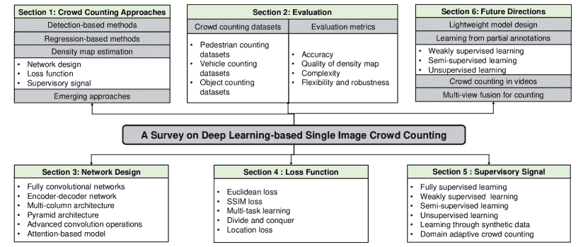
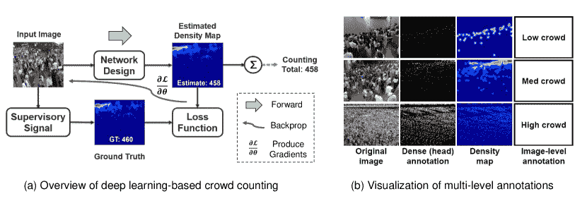
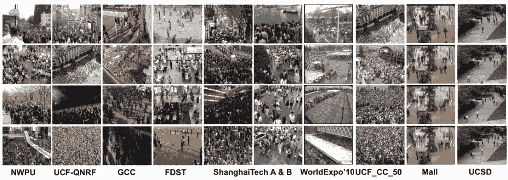
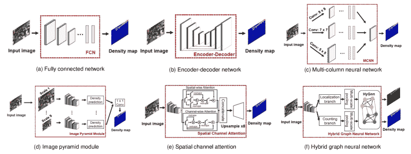
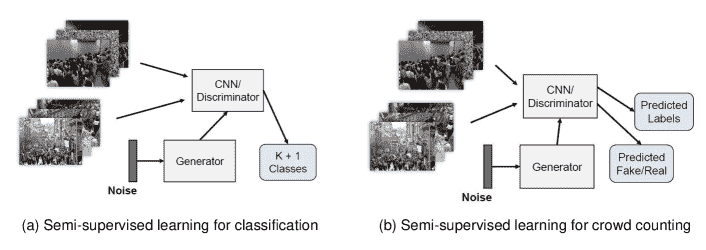
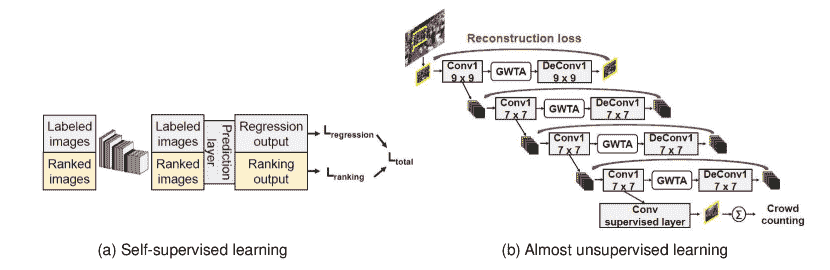

<!--yml

分类：未分类

日期：2024-09-06 19:57:42

-->

# [2012.15685] 基于深度学习的单图像人群计数调查：网络设计、损失函数和监督信号

> 来源：[`ar5iv.labs.arxiv.org/html/2012.15685`](https://ar5iv.labs.arxiv.org/html/2012.15685)

[type=editor, orcid=0000-0001-8139-0431 ]

1]组织=香港科技大学，城市=香港

2]组织=香港中文大学，城市=香港

# 基于深度学习的单图像人群计数调查：网络设计、损失函数和监督信号

白浩悦     毛佳耕 [    陈思豪

###### 摘要

单图像人群计数是一个具有挑战性的计算机视觉问题，在公共安全、城市规划、交通管理等领域有广泛应用。随着深度学习技术的最新发展，人群计数引起了广泛关注，并在近年来取得了巨大成功。本调查旨在通过系统回顾和总结自 2015 年以来该领域 200 多项工作的进展，提供基于深度学习的人群计数技术在密度图估计方面的全面总结。我们的目标是提供最新的方法综述，并教育该领域的新研究人员设计原则和权衡。在介绍公开数据集和评估指标之后，我们详细比较了人群计数的三大设计模块：深度神经网络设计、损失函数和监督信号。我们使用公开数据集和评估指标对这些方法进行了研究和比较。最后，我们总结了未来的研究方向。

###### 关键词：

人群计数 \sep 网络设计 \sep 损失函数 \sep 监督信号

## 1 引言

单图像人群计数是指在无约束场景的图像中估计物体（人、车、细胞等）的数量，即在没有任何场景限制的图像中进行计数。由于其在公共安全、交通管理、消费者行为、细胞计数等方面的重要应用，人群计数近年来引起了广泛关注[[131、73、12]。在这项调查中，我们主要关注将人视为人群，尽管所讨论的技术可能扩展到其他领域。

由于人群计数的重要性，该领域已经进行了广泛的研究，特别是深度学习的应用显示出在计算机视觉[50、117、118]、图像分类[69]和多维时间序列[5]等各种应用中表现优越。近年来，深度学习在大规模公开基准数据集[60、185]上成功实现了单幅图像人群计数。这可能归因于其数据驱动特性[228、80]和从原始数据中自我学习的能力[103、148]。在本研究中，我们主要讨论最近先进的深度学习基于单幅图像的人群计数方法，因为它相对于机器学习模型具有优越性。

早期的人群计数方法基于基于检测的计算机视觉技术，即检测个体物体、头部或身体部位，然后统计图像中的总人数[135、86、76]。然而，这种方法在物体严重遮挡的拥挤场景中精度迅速下降。为了解决这一问题，最近提出了基于回归的方法，该方法通过将计数与图像相关联直接估计计数。尽管在拥挤场景中比基于检测的方法具有更高的准确性，但它缺乏足够的空间信息，且不易解释[14、177、13]，这限制了它在定位研究中的扩展。

图 1：本调查的结构。首先，我们概述了基于深度学习的人群计数方法的四个主要类别。其次，我们介绍了公开可用的计数数据集和评估指标。然后，我们回顾了人群计数方案的最新进展，主要涉及深度神经网络设计、损失函数和监督信号。最后，我们总结了未来的研究方向。

最近，通过密度图估计进行的人群计数作为一种有前景的方法出现，并取得了令人鼓舞的结果，在这种方法中，输入图像被处理为人群密度图，通过简单的集成来获得图像中每个像素的人员数量[73、133、7、11、228、97、80、58]。这种方法在拥挤场景中实现了高精度，并保持了人员分布的空间信息。此外，还有一些新兴的方法，如 S-DCNet[186]，它将特征分类到预定义的计数范围内以进行人群估计。

我们通过比较表 1 中的四种主要人群计数方法进行总结。所有方法都需要通过标注进行图像注释。在基于检测的方法中，每个对象必须被完全识别和勾勒，这会产生最高的标注成本。另一方面，基于回归的方法不需要标注单个对象，而只需标注总对象数，因此其标注成本最低。密度估计的标注成本介于两者之间，因为只需指示出人头。

在这项调查中，我们专注于通过密度图估计进行人群计数。随着深度学习方法在计算机视觉领域的发展，与基于手工特征的方法相比，使用基于深度学习的模型的计数准确性得到了极大的提升。我们在图 2 (a) 中概述了基于 CNN 的人群计数通过密度图估计的主要设计组件。将人群场景的输入图像输入到深度神经网络中，该网络估计图像的密度图（上支路）。这里的关键问题是网络设计，使得所有像素的密度值之和与输入图像中的人群计数紧密匹配。对于训练（下支路），首先对图像进行标注，以生成地面真实值（由图像中每像素的人数给出），标注可以是完全标记的或伪标记的。地面真实值用于通过最小化网络生成的密度图与地面真实值之间的损失函数来调整深度神经网络的节点参数。

我们介绍了基于深度学习的人群计数的最新进展。我们的目标是向新研究人员介绍最先进的技术，并为他们提供设计新型网络的见解、工具和原则。我们调查并比较了现有的数据集、性能指标、网络设计、损失函数和监督信号。我们的调查是及时且独特的。

我们接下来讨论相关工作。Teixeira 等人 [167] 是关于人类感知的早期调查。然而，它并未专注于拥挤场景分析。Li 等人 [77] 综述了拥挤场景分析，包括拥挤行为、活动分析和异常检测，其中拥挤计数的作用较小。Ahuja 等人 [2] 涵盖了不同的拥挤估计方法。尽管 Zitouni 等人 [239] 评估了不同的拥挤分析方法，但并非主要针对基于密度图估计的 CNN 方法，而该方法近年来已成为拥挤计数的主流。Chrysler 等人 [26] 讨论了应对缺乏训练数据和视角失真的方法，这些都是拥挤计数系统面临的挑战。工作 [158] 综述了针对单张图像的 CNN 方法，但仅粗略讨论了 CNN 方法的最新进展，未涉及先进的卷积操作、基于注意力的模型、损失函数和监督信号，仅到 2017 年。

表 1: 四大类拥挤计数方法的总结：基于检测、基于回归、密度图估计和新兴方法。

| 类别 | 原则 |
| --- | --- |

&#124; 拥挤 &#124;

&#124; 计数 &#124;

&#124; 准确度 &#124;

|

&#124; 位置 &#124;

&#124; 准确度 &#124;

|

&#124; 注释 &#124;

&#124; 复杂度 &#124;

| 局限性 | 示例 |
| --- | --- |

|

&#124; 检测 &#124;

&#124; 基于 &#124;

|

&#124; 检测 &#124;

&#124; 然后计数; &#124;

&#124; 早期方法 &#124;

| 低 | 高 |
| --- | --- |

&#124; 高 &#124;

&#124; (对象框定) &#124;

|

&#124; 低准确度 &#124;

&#124; 对于高 &#124;

&#124; 拥挤场景 &#124;

|

&#124; [135], [86], &#124;

&#124; [76] &#124;

|

|

&#124; 回归 &#124;

&#124; 基于 &#124;

|

&#124; 直接学习 &#124;

&#124; 回归 &#124;

&#124; 计数 &#124;

| 中等 | 不适用 |
| --- | --- |

&#124; 低 &#124;

&#124; (图像级) &#124;

|

&#124; 较少可解释; &#124;

&#124; 缺少位置 &#124;

&#124; 信息 &#124;

|

&#124; [14], [177], &#124;

&#124; [13] &#124;

|

|

&#124; 密度图 &#124;

&#124; 估计 &#124;

|

&#124; 计算数量 &#124;

&#124; 人数 &#124;

&#124; 每像素 &#124;

| 高 | 中等 |
| --- | --- |

&#124; 中等 &#124;

&#124; (头部指示) &#124;

|

&#124; 低准确度 &#124;

&#124; 在低 &#124;

&#124; 拥挤场景 &#124;

|

&#124; [73], [133], &#124;

&#124; [11], [228], &#124;

&#124; [97], [80] &#124;

|

|

&#124; 新兴 &#124;

&#124; 方法 &#124;

|

&#124; 分类 &#124;

&#124; 特征到 &#124;

&#124; 预定义的 &#124;

&#124; 计数范围 &#124;

| 高 | 低 |
| --- | --- |

&#124; 中等 &#124;

&#124; (头部指示) &#124;

|

&#124; 不灵活 &#124;

&#124; 到宽 &#124;

&#124; 计数范围 &#124;

|

&#124;  [205] &#124;

|

图 2：基于深度学习的单张图像人群计数方法概述，通过密度图估计。图（a）展示了基于深度学习的人群计数的主要组成部分。图（b）展示了原始图像、劳动密集型密集注释、真实密度图和图像级弱注释的可视化。注释范式来源于 [159]。

表 2：对其他计数相关综述论文的全面分析。与之前相关工作相比，我们的工作具有当前的兴趣和价值，因为它是及时的、更全面，并对这一活跃领域的代表性方法进行了深入分析。

| 论文 | 年份 | 发表场所 | 与其他人群计数调查的比较 |
| --- | --- | --- | --- |

|

&#124; 人群计数方法和 &#124;

&#124; 密度估计：综述 [74] &#124;

| 2021 | PAA |
| --- | --- |

&#124; 本文重点阐述深度 &#124;

&#124; 基于学习的计数方法，这 &#124;

&#124; 基于广泛的内容，主要关注网络 &#124;

&#124; 设计考虑而未讨论损失 &#124;

&#124; 功能和监督信号。 &#124;

|

|

&#124; 文献综述 &#124;

&#124; 人群计数系统 &#124;

&#124; 卷积神经网络 [26] &#124;

| 2021 | IOPCS |
| --- | --- |

&#124; 本次调查讨论了人群面临的挑战 &#124;

&#124; 计数系统，并重点发展更为健壮的 &#124;

&#124; 人群计数方法。然而，这项调查 &#124;

&#124; 短篇论文。网络设计讨论缺少 &#124;

&#124; 一些重要的近期方法，如 &#124;

&#124; DM-Count，SASNet。它还缺少无监督 &#124;

&#124; 学习计数方法。 &#124;

|

|

&#124; 近期进展综述 &#124;

&#124; 在人群密度估计中的应用 &#124;

&#124; 使用图像处理 [2] &#124;

| 2019 | ICCES |
| --- | --- |

&#124; 本文是一篇简短的论文，主要讨论 &#124;

&#124; 传统方法与 &#124;

&#124; 手工特征。基于深度学习的 &#124;

&#124; 方法只占很小一部分。 &#124;

|

|

&#124; 技术综述 &#124;

&#124; 自动感知 &#124;

&#124; 人群行为 [33] &#124;

| 2018 | ACMCS |
| --- | --- |

&#124; 本文调查了感知 &#124;

&#124; 行为，并结合隐私、透明度， &#124;

&#124; 可扩展性和部署的便利性。然而，这篇论文是针对 &#124;

&#124; 传统方法与手工特征。 &#124;

|

|

&#124; 近期进展综述 &#124;

&#124; 基于 CNN 的单张图像 &#124;

&#124; 人群计数和 &#124;

&#124; 密度估计 [158] &#124;

| 2018 | PRL |
| --- | --- |

&#124; 本文调查了基于 CNN 的人群计数方法 &#124;

&#124; 针对单张图像，但仅大致讨论了近期的 &#124;

&#124; 在基于 CNN 的方法上的进展。它未讨论 &#124;

&#124; 高级卷积操作和基于注意力的 &#124;

&#124; 模型、损失函数和监督信号，并 &#124;

&#124; 仅截至 2017 年。 &#124;

|

|

&#124; 拥挤场景分析： &#124;

&#124; 调查 [77] &#124;

| 2014 | T-CSVT |
| --- | --- |

&#124; 本文回顾了人群场景分析的 &#124;

&#124; 人群行为、活动分析和异常检测， &#124;

&#124; 人群计数占据了较小的角色。 &#124;

|

|

&#124; 视觉中的进展和趋势 &#124;

&#124; 人群分析：系统性 &#124;

&#124; 人群调查与评估 &#124;

&#124; 建模技术 [239] &#124;

| 2016 | NC |
| --- | --- |

&#124; 本文评估了不同的人群分析 &#124;

&#124; 方法，并非主要针对基于 CNN 的方法 &#124;

&#124; 通过密度图估计，这已成为 &#124;

&#124; 近年来人群计数的主流。 &#124;

|

|

&#124; 人体感知调查：方法 &#124;

&#124; 检测、存在、计数， &#124;

&#124; 位置、跟踪和身份 [167] &#124;

| 2010 | CS |
| --- | --- |

&#124; 早期的人体感知调查。然而，它尚未 &#124;

&#124; 专注于人群场景分析而不是存在的研究， &#124;

&#124; 计数、位置、跟踪和识别。 &#124;

|

相较于以往的论文，我们的工作全面总结了过去五年中 200 多种基于深度学习的人群计数算法。我们的工作具有当前的兴趣和价值，因为它更全面，总结了这个活跃领域中更近、流行和关键的设计组件，并深入阐述了该领域的代表性方案。通过这项调查，我们希望提供该领域最新进展的总结，并教育新研究人员有关设计原则和权衡。

图 1 展示了我们在本文中讨论的人群计数的主要设计组件。对于网络设计，我们描述了全卷积网络、编码器-解码器架构、多列网络和金字塔网络等主要技术的基本原理。对于损失函数，我们讨论了广泛使用的欧几里得损失以及最近提出的方案，如 SSIM 损失和多任务学习。对于监督信号，我们介绍了完全监督设置的不同真实值生成方法，并与弱监督和半监督学习、自监督学习以及通过合成数据进行自动标注进行比较。每个部分总结并比较了典型的代表性方案。

论文的其余部分组织如下。在第二部分中，我们总结了公开可用的人群计数数据集、评估指标和设计考虑因素。我们在第三部分中介绍了深度神经网络设计的细节。第四部分讨论了损失函数，第五部分回顾了训练人群计数网络的监督信号。我们在第六部分中总结了未来的研究方向。

## 2 数据集与性能评估

在本节中，我们首先总结了在第 2.1 节中最广泛使用的人群计数数据集。然后，我们讨论了第 2.2 节中的设计考虑因素和性能指标。

### 2.1 数据集

公共数据集被用作评估人群计数模型的基准。在选择数据集时，通常考虑以下指标：

+   •

    图像分辨率：高分辨率的数据集通常显示出更好的视觉质量。此外，由于其较高的像素密度，这些数据集通常能实现更高的计数准确性。

+   •

    图像数量：具有大量图像的数据集通常覆盖更多样化的场景、背景、视角和光照条件。大型且多样的数据集有助于优化基于深度学习的模型，并减轻过拟合问题。

+   •

    对象数量：数据集中的对象数量是人群分析的重要考虑因素。最小值、最大值和平均值揭示了数据集中人群的密度。具有较高人群密度覆盖水平的数据集通常对人群计数更具挑战性。

我们识别出一些研究界常用的数据集，包括行人计数和物体数据集，并从这些数据集中提取并展示了一些典型图像，如图 3。还有一些其他工作关注于远程场景的计数 [237, 34, 230, 38, 121] 和室内人群计数 [87]。我们还在表 3 中比较了这些数据集。以下是对这些数据集的详细介绍：

图 3：公开可用数据集中一些典型的人群场景图像。不同的列表示不同的人群计数数据集，我们为每个数据集可视化了四张典型图像。NWPU [185]、UCF-QNRF [60]、上海科技 A & B [228]、WorldExpo’10 [221] 和 UCF_CC_50 [59] 是基于图像的数据集。FDST [37]、Mall [17] 和 UCSD [12] 是基于视频的数据集。GCC [148] 是一个多样化的合成人群数据集。

+   •

    RGBT-CC 包含在不同城市场景下拍摄的 RGB-热成像数据，场景包括商场、街道、游乐场、火车站等，具有不同的密度。$1,013$ 对图像在光线下拍摄，$1,017$ 对图像在黑暗中拍摄。RGBT-CC 随机分为三个数据集：1030 对用于训练，200 对用于验证，800 对用于测试。

+   •

    NWPU-Crowd [185] 包含 $5,109$ 张图像和 $2,133,375$ 个标注实例，包括点和框。与其他实际的人群计数数据集相比，NWPU-Crowd 数据集的标注对象密度范围从 0 到 $20,033$ 每张图像，密度范围最大。该数据集的平均分辨率为 $2191\times 3209$，通常大于其他广泛使用的 2D 单图像人群计数数据集。

+   •

    JHU-Crowd [162] 是在不同场景、环境和天气条件下收集的，包括具有天气衰减和光照变化的图像。该数据集包含丰富的标签：模糊程度、遮挡程度、尺寸等级以及其他图像级注释。

+   •

    CrowdSurveillance [210] 是一个大规模的人群计数数据集，包含在具有挑战性场景下拍摄的高分辨率图像。该数据集通过在线抓取和实际监控视频构建，涵盖了更多具有复杂背景和不同人群数量的挑战性场景。

+   •

    DroneCrowd [198] 由 112 个视频片段组成，共 33,600 张高分辨率的帧，具有大幅度的尺度、视角和背景杂乱变化，这些视频是在 4 个城市的 70 个不同场景下拍摄的。视频片段的录制速度为每秒 25 帧，分辨率为 $1920\times 1080$。该数据集还提供了 20,800 条带头部标注的人物轨迹以及几个视频级别的序列属性，例如，照明、海拔和密度。DroneCrowd 被分为训练集和测试集，分别包含 82 和 30 个视频序列。

+   •

    UCF-QNRF [60] 包含 1,535 张具有挑战性的图片和总计 1,251,642 个标注。每张图片中的对象最小数和最大数分别为 49 和 12,865。训练集和测试集是通过根据计数对图片进行排序，并每隔 5 张图片选择一张作为测试集（训练集 1201 张图片，测试集 334 张图片）来选择的。此外，这个大规模数据集涵盖了不同的地点、视角、透视效果以及不同的时间段。

+   •

    GCC [148] [187] 是一个大规模多样化的合成人群数据集，基于电脑游戏《侠盗猎车手 V》生成。GTA V 人群计数 (GCC) 数据集包含 $15,212$ 张图片，分辨率为 $1080\times 1920$，包含超过 $7,625,843$ 个标注头部。GCC 比其他现实世界的数据集更加多样化。它捕捉了 GTA C 游戏中的 400 个不同的人群场景，涵盖了多种类型的位置。

+   •

    复旦-上海科技大学 [37] 包含从 13 个不同场景拍摄的 100 个视频。FDST 包括 150,000 帧和 394,081 个标注头部，这在帧数上大于之前的视频人群计数数据集。FDST 数据集的训练集由 60 个视频、9000 帧组成，测试集包含剩余的 40 个视频和 6000 帧。FDST 的每秒帧数（FPS）为 30。

+   •

    上海科技大学 A $\&amp;$ B [228] 包含两个部分：A 部分和 B 部分，分别包含 482 张图片（300 张用于训练，182 张用于测试），以及 716 张图片（400 张用于训练，316 张用于测试）。A 部分包括从互联网收集的高密度人群。B 部分则是在上海市区的繁忙街道拍摄的，人群密度低于 A 部分的场景。

+   •

    世界博览会’10 [221] 关注跨场景计数。它由 108 个监控摄像头在 2010 年上海世界博览会期间拍摄的 1132 个视频序列组成。WorldExpo’10 数据集是从视频序列中随机选择的，包含 3,980 帧和 199,923 个头部标注。WorldExpo’10 的训练集包含来自 103 个场景的 3,380 帧，其余的 600 帧从另外五个不同场景中采样，每个场景 120 帧用于测试。

+   •

    UCF_CC_50 [59] 包含 50 张黑白人群图像和 63974 个注释，对象计数从 94 到 4543 不等，平均为 1280。数据集的原始平均分辨率为 $2101\times 2888$。该具有挑战性的数据集是从互联网抓取的。为进行实验，UCF_CC_50 被分为 5 个子集，并进行了五折交叉验证。最大分辨率被降低到 1024 以提高计算效率。

    表 3：人群计数数据集统计概览。图像数量是图像的总数；总计是标记对象的总数；最小计数是最小的人群计数；最大计数是最大的人群计数；平均计数是平均人群计数。

    | 分类 | 数据集 | 年份 |
    | --- | --- | --- |

    &#124; 平均 &#124;

    &#124; 分辨率 &#124;

    |

    &#124; 图像 &#124;

    &#124; 数量 &#124;

    | 总计 |
    | --- |

    &#124; 最小 &#124;

    &#124; 计数 &#124;

    |

    &#124; 最大 &#124;

    &#124; 计数 &#124;

    |

    &#124; 平均 &#124;

    &#124; 计数 &#124;

    |

    | 行人计数 | RGBT [92] | 2021 | 640$\times$480 | 2,030 | 138,389 | - | - | 68 |
    | --- | --- | --- | --- | --- | --- | --- | --- | --- |
    | NWPU-Crowd [185] | 2020 | 2191$\times$3209 | 5,109 | 2,133,375 | 0 | 20,033 | 418 |
    | JHU-Crowd [162] | 2019 | 1450$\times$900 | 4250 | 1,114,785 | 0 | 7286 | 262 |

    |

    &#124; 人群监控 [210] &#124;

    | 2019 | 1342$\times$840 | 13,945 | 386,513 | - | - | 35 |
    | --- | --- | --- | --- | --- | --- | --- |
    | DroneCrowd [198] | 2019 | 1920$\times$1080 | 33,600 | 4,864,280 | 25 | 455 | 145 |
    | UCF-QNRF [60] | 2019 | 2013$\times$2902 | 1,535 | 1,251,642 | 49 | 12,865 | 815 |
    | GCC [148] | 2019 | 1080$\times$1920 | 15,212 | 7,625,843 | 0 | 3,995 | 501 |

    |

    &#124; 复旦-ST [37] &#124;

    | 2019 | 1080$\times$1920 | 15,000 | 394,081 | 9 | 57 | 27 |
    | --- | --- | --- | --- | --- | --- | --- |

    |

    &#124; ST 部分 A [228] &#124;

    | 2016 | 589$\times$868 | 482 | 241,677 | 33 | 3,139 | 501 |
    | --- | --- | --- | --- | --- | --- | --- |

    |

    &#124; ST 部分 B [228] &#124;

    | 2016 | 768$\times$1024 | 716 | 88,488 | 9 | 578 | 124 |
    | --- | --- | --- | --- | --- | --- | --- |
    | WorldExpo’10 [221] | 2015 | 576 $\times$ 720 | 3,980 | 199,923 | 1 | 253 | 50 |
    | UCF_CC_50 [59] | 2013 | 2101$\times$2888 | 50 | 63,974 | 94 | 4,543 | 1,280 |
    | Mall [17] | 2012 | 240$\times$320 | 2,000 | 62,325 | 13 | 53 | 31 |
    | UCSD [12] | 2008 | 158$\times$238 | 2,000 | 49,885 | 11 | 46 | 25 |
    | 对象计数 | VisDrone 车辆 [238] | 2019 | 991$\times$1511 | 5303 | 198,984 | 10 | 349 | 38 |
    | Penguin [4] | 2016 | 700$\times$700 | 8200 | 72160 | - | 5 | 8.8 |
    | TRANCOS [45] | 2015 | 640$\times$480 | 1244 | 46796 | - | - | 38 |

+   •

    Mall [17] 是由购物中心的公共监控摄像机拍摄的，该数据集在光照条件和透视失真方面比 UCSD 数据集 [12] 更具挑战性。Mall 数据集包含 2000 个视频帧，固定分辨率为 ($320\times 240$)，总共 62,325 个行人实例。前 800 帧用于训练，其余 1200 帧用于测试。

+   •

    UCSD [12] 包含一个小时的视频，具有 2000 张标注帧，总共有 49,885 个行人实例，该视频由固定摄像机在 UCSD 校园的人行道上拍摄。原始视频以 30fps 录制，帧大小为 $480\times 740$，后来降采样到 10fps，尺寸为 $158\times 238$。601-1400 帧用于训练，其余 1200 帧用于测试。还提供了人行道的 ROI 和行进方向。

+   •

    VisDrone Vehicle [7] 是对原始 VisDrone2019 检测数据集 [238] 的修改，使用目标的边界框转换为人群计数注释。新的车辆注释位置是原始边界框的中心点。该数据集包含 3953 个训练样本、364 个验证样本和 986 个测试样本。

+   •

    Penguin [4] 是一个大型且具有挑战性的野生企鹅数据集，具有高程度的对象遮挡和尺度变化。收集的图像受到多种因素的影响，例如恶劣的天气条件、相机视角的变化、极度拥挤以及企鹅之间的相互遮挡。Penguin 数据集被分为两个子集，分别占总图像的 $70\%$ 和 $30\%$。

+   •

    TRANCOS [45] 是一个车辆人群计数数据集，用于估计交通拥堵情况图像中的车辆数量。TRANCOS 包含 1244 张交通拥堵图像，标注了 46796 辪车辆。所有收集到的图像都包含交通拥堵情况，涵盖了不同的场景和视角，包括不同的光照条件、重叠程度和拥挤程度。该数据集分为三部分：403 张用于训练，420 张用于验证，421 张用于测试。

### 2.2 性能评估和指标

在评估人群计数网络时，通常使用以下性能指标：

+   •

    准确性：准确性指的是计数准确性和位置准确性。

    +   –

        计数准确性受到尺度变化和孤立物体簇的影响[7]。尺度变化意味着相同的物体在图像中由于视角和距离不同而显现为不同的大小。此外，图像中可能存在孤立的物体簇，能够正确捕捉这些上下文信息的模型通常表现更好。为了定量评估计数准确性，常用均绝对误差（MAE）、均方误差（MSE）和均归一化绝对误差（NAE），分别定义为：$MAE=\frac{1}{N}\sum_{i=1}^{N}|C_{i}-\hat{C}_{i}|$，$MSE=\sqrt{\frac{1}{N}\sum_{i=1}^{N}|C_{i}-\hat{C}_{i}|^{2}}$，$NAE=\frac{1}{N}\sum_{i=1}^{N}\frac{|C_{i}-\hat{C}_{i}|}{C_{i}}$，其中$N$为测试图像的总数，$C_{i}$为第$i$张图像的真实值，$\hat{C}_{i}$为估计计数。

    +   —

        位置准确性与密度图中保留的空间信息有关。生成的高质量密度图通常包含更多用于定位任务的空间信息。

+   •

    密度图质量：密度图可以从分辨率和视觉质量方面进行评估。

    +   —

        高分辨率密度图通常表现出更好的位置准确性，并保留更多用于定位任务的空间信息（例如检测和跟踪）。

    +   —

        为了定量评估生成的密度图的视觉质量，可以使用峰值信噪比（PSNR）和图像结构相似性（SSIM）[194]。

+   •

    复杂性：复杂性包括计算复杂性和注释复杂性。

    +   —

        计算复杂性通过模型参数数量、浮点运算（FLOPs）和推理时间等指标来评估。

    +   —

        注释复杂性，如表格 1 所示，指的是数据标注成本。一般来说，基于检测的方法进行的对象级注释具有较高的复杂性。密度图估计需要点级（头部）注释，相对成本较低。如果使用未标注或合成数据，复杂性可以进一步降低。

+   •

    灵活性和鲁棒性：

    +   —

        模型的灵活性根据处理任意尺寸图像的敏感性和建模不同类型对象（如非刚性对象）的能力来评估。

    +   —

        鲁棒性指的是对分布变化的鲁棒性。它通过超出分布准确度来评估，其中测试数据来自与训练数据不同的分布。

## 3 深度神经网络设计

网络设计是密度图估计的最重要部分之一。在本节中，我们介绍了主要用于人群计数的深度网络：完全卷积网络（第 3.1 节），编码器-解码器架构（第 3.2 节），多列网络（第 3.3 节），金字塔结构（第 3.4 节），高级操作（第 3.5 节），注意力模型（第 3.6 节），视觉变换器（第 3.7 节）和神经架构搜索（第 3.8 节）。我们在第 3.9 节中比较了这些方法，并在第 3.10 节中对其他新兴方法进行了说明。

### 3.1 完全卷积网络

早期基于 CNN 的密度图估计方法基于全卷积网络（FCN）[119]，该网络从现有的 CNN 架构（VGG16）修改而来，将所有全连接层替换为全卷积层，以分析任意大小的图像。如图 4 (a) 所示，FCN 学习了从输入图像到相应密度图的端到端映射，并根据输入图像生成按比例大小的密度图输出。FCN 结构简单但准确，已被广泛使用。

图 4: 深度学习基础上的单图像人群计数所使用的多种网络架构的总结：(a) 全连接网络 [119]; (b) 编码器-解码器架构 [11]; (c) 多列网络 [228]; (d) 金字塔结构 [66]; (e) 基于注意力的模型 [42]; (f) 图神经网络 [110]。这些网络的顺序按照论文中的展示排列。（在放大模式下查看效果更佳）

然而，FCN 人群计数方法存在一些局限性。由于 FCN 中的最大池化操作（提取高级特征但降低分辨率），生成的密度图的分辨率仅为输入宽度的 $1/4$ 和输入高度的 $1/4$，这与高分辨率密度图相比，缺乏细节和空间信息，适用于定位任务。此外，FCN 人群计数模型在人群场景图像中容易受到尺度变化问题的影响，这限制了其在一般环境中的适用性。

### 3.2 编码器-解码器架构

编码器-解码器模型旨在使生成的密度图的分辨率与输入图像对齐。如图 4 (b) 所示，编码器-解码器网络由一个编码器和一个解码器组成：编码器网络接收输入图像并输出高级特征，这些特征包含信息并表示输入；解码器网络从编码器获取特征并生成高分辨率密度图。编码器通过卷积或池化层逐步下采样图像分辨率，而解码器通过反卷积层或插值逐步上采样编码器的特征图。跳跃连接分别应用于编码器和解码器的特征图。

最近几年，基于深度学习的人群计数方法采用了编码器-解码器结构（例如，参见[220、62、11、96、164、20、168、29]）。SANet [11] 提出了一个新型的编码器-解码器网络，称为尺度聚合网络，它实现了准确且高效的人群估计。解码器通过一组反卷积生成高分辨率密度图。此外，由于编码器中的下采样操作，基于编码器-解码器的架构相比其他架构可以显著减少参数数量。然而，这种架构尚未解决尺度变化问题，也没有考虑局部和全局上下文信息。

### 3.3 多列网络

多列和金字塔网络是最近人群计数算法中最突出的模型之一，用于提取多尺度特征并解决尺度变化问题[75、201、202、99、212、28、215、181]。

多列架构结合了不同核大小的多列架构，以提取不同尺度的特征，从而实现准确的计数精度，如 MCNN [228] 和 McML [25]。如图 4 (c)所示，多列神经网络（MCNN）由多个具有不同核大小的分支组成（例如，$5\times 5$、$7\times 7$ 和 $9\times 9$）。不同的分支适应不同的感受野，因此对多尺度特征敏感。最后，通过不同列提取的特征被融合在一起生成密度图。然而，适应的尺度多样性受到列数的限制。

### 3.4 金字塔结构

图像金字塔和特征金字塔架构是解决尺度变化的另一种方法（例如，AFP [66]、CP-CNN [157]、[3] 和 [206]），主要包括两个子组，即图像金字塔和特征金字塔池化。对于基于图像金字塔的模型，如图 4 (d)所示，不同尺度的图像金字塔（尺度 1，…，尺度 S）被输入到 FCN 中，以预测该尺度的密度图。然后，通过自适应融合来自不同尺度的预测生成最终估计。然而，这种架构仍然具有较高的计算复杂性。

此外，一些相关技术通常与多列和金字塔网络一起使用，以增强多尺度特征提取过程，例如跳跃连接 [162, 160, 195, 30, 120, 108] 和密集块 [126, 134, 111, 63, 60, 27]。

### 3.5 高级卷积操作

趋势是利用高级卷积操作来促进准确的人群计数模型和更好的 CNN 特征学习 [233, 207, 56]。基于深度学习的单图像人群计数模型从诸如膨胀卷积、可变形卷积、适应性膨胀卷积和视角引导卷积等高级卷积中受益匪浅。这些可以替代计数模型中的传统卷积操作。

有四种重要的高级操作：

+   •

    膨胀卷积将膨胀率引入卷积层，定义了卷积核权重之间的间隔。传统的卷积操作更侧重于提取局部特征。对于膨胀卷积，三个子图表示了相同卷积核大小（$3\times 3$）但不同膨胀率（膨胀 = $1$，膨胀 = $2$，和膨胀 = $3$）的膨胀操作，这在不增加计算成本的情况下扩大了感受野，同时保持了特征图的分辨率。膨胀卷积有助于实时应用，并且在许多近期的人群计数模型中非常受欢迎：动态区域划分 (DRD) [49]，尺度金字塔网络 (SPN) [19]，Atrous 卷积空间金字塔网络 (ACSPNet) [111]，DENet [93]，膨胀卷积神经网络 (CSRNet) [80] 和聚合多列膨胀卷积网络 (AMDCNet) [28]。但这种操作没有考虑多尺度特征，也无法完全捕捉非刚性物体。

+   •

    可变形卷积是一种在模块中通过额外的偏移量增强空间采样位置的方案，通过学习目标任务的偏移量而不需要额外的监督。这可以通过额外的可学习偏移量来建模非刚性物体。一些最新文献用可变形卷积替代了传统卷积，取得了更优的性能：Dilated-Attention-Deformable ConvNet (DADNet) [46]，An Attention-injective Deformable Convolutional Network (ADCrowdNet) [97]。然而，可变形卷积操作需要较高的计算复杂度。

+   •

    自适应膨胀卷积用于预测每个位置的膨胀率连续值，以有效匹配不同位置的尺度变化，这比固定的离散膨胀率更优。ADSCNet [8]基于自适应膨胀卷积构建，能够保持每个位置的密度和特征之间的强一致性。

+   •

    透视引导卷积旨在利用透视信息解决连续尺度变化问题。透视信息包含摄像头与场景之间的实例信息，这是估计人物尺度的合理先验。具体来说，透视信息功能被用于引导特征图的空间变化平滑，然后再输入到后续卷积中。PGCNet [210]通过在 CNN 骨干网络上堆叠多个透视引导卷积（PGC）块构建，属于单列 CNN，旨在以适度的计算增加解决尺度变化问题。

表 4: 人群计数网络设计考虑因素的比较。计算复杂度基于模型参数数量评估。对每种网络设计类别的代表性方案进行了深入分析，包括其优势和局限性。

| 类别 |
| --- |

&#124; 代表性 &#124;

&#124; 方案 &#124;

| 优势 |
| --- |

&#124; 计算 &#124;

&#124; 复杂度 &#124;

| 局限性 |
| --- |

|

&#124; 完全卷积 &#124;

&#124; 神经网络 &#124;

| FCN [119] |
| --- |

&#124; 能分析 &#124;

&#124; 图像的 &#124;

&#124; 任意大小 &#124;

| 低 |
| --- |

&#124; 低分辨率 &#124;

&#124; 密度图 &#124;

|

|

&#124; 编码-解码 &#124;

&#124; 架构 &#124;

| SANet [11] |
| --- |

&#124; 能生成 &#124;

&#124; 高分辨率 &#124;

&#124; 密度图 &#124;

|

&#124; 低(0.9M) &#124;

|

&#124; 不考虑 &#124;

&#124; 规模变化 &#124;

|

|

&#124; 多列 &#124;

&#124; 架构 &#124;

| MCNN [228] |
| --- |

&#124; 提取多尺度 &#124;

&#124; 特征与 &#124;

&#124; 多列 &#124;

&#124; 架构 &#124;

|

&#124; 低(0.1M) &#124;

|

&#124; 规模多样性 &#124;

&#124; 受限于 &#124;

&#124; 数量 &#124;

&#124; 列的 &#124;

|

|

&#124; 金字塔 &#124;

&#124; 架构 &#124;

| CP-CNN [157] |
| --- |

&#124; 提取多尺度 &#124;

&#124; 特征与 &#124;

&#124; 金字塔架构 &#124;

|

&#124; 高(68.4M) &#124;

|

&#124; 高计算 &#124;

&#124; 复杂性 &#124;

|

| 高级卷积操作 |
| --- |

&#124; 膨胀 &#124;

&#124; 卷积 &#124;

&#124; 操作 &#124;

| CSRNet [80] |
| --- |

&#124; 扩大感受 &#124;

&#124; 无 &#124;

&#124; 提高 &#124;

&#124; 计算成本 &#124;

|

&#124; 中等(16.3M) &#124;

|

&#124; 不考虑 &#124;

&#124; 非刚性物体 &#124;

|

|

&#124; 可变形的 &#124;

&#124; 卷积 &#124;

&#124; 操作 &#124;

| ADCrowdNet [97] |
| --- |

&#124; 可学习的附加 &#124;

&#124; 偏移量 &#124;

&#124; 更好的建模 &#124;

&#124; 非刚性物体 &#124;

| 高 |
| --- |

&#124; 高计算 &#124;

&#124; 复杂性 &#124;

|

|

&#124; 自适应 &#124;

&#124; 膨胀的 &#124;

&#124; 卷积 &#124;

| ADSCNet [8] |
| --- |

&#124; 学习连续的 &#124;

&#124; 膨胀率 &#124;

| 中等 |
| --- |

&#124; 不灵活 &#124;

&#124; 对非刚性 &#124;

&#124; 物体 &#124;

|

|

&#124; 视角- &#124;

&#124; 引导的 &#124;

&#124; 卷积 &#124;

| PGCNet [210] |
| --- |

&#124; 视角 &#124;

&#124; 信息 &#124;

&#124; 便利人们 &#124;

&#124; 尺度估计 &#124;

| 中等 |
| --- |

&#124; 需要额外的 &#124;

&#124; 视角 &#124;

&#124; 信息 &#124;

|

|

&#124; 基于注意力的 &#124;

&#124; 模型 &#124;

| SCAR [42] |
| --- |

&#124; 捕捉局部 &#124;

&#124; 和全局的 &#124;

&#124; 上下文 &#124;

&#124; 信息 &#124;

| 中等 |
| --- |

&#124; 依赖于像素级 &#124;

&#124; 损失函数 &#124;

|

|

&#124; 视觉变换器 &#124;

| TransCrowd [82] |
| --- |

&#124; 能够建模 &#124;

&#124; 长程上下文 &#124;

&#124; 信息 &#124;

| 中等 |
| --- |

&#124; 计算 &#124;

&#124; 昂贵 &#124;

|

|

&#124; 神经架构 &#124;

&#124; 搜索 &#124;

| NAS-Count [55] |
| --- |

&#124; 自动化人群 &#124;

&#124; 计数模型 &#124;

&#124; 设计 &#124;

| 中等 |
| --- |

&#124; 计算 &#124;

&#124; 昂贵 &#124;

|

### 3.6 基于注意力的模型

注意机制大致可以分为两个子组：硬注意力和软注意力 [85, 178, 184, 203, 145, 64, 35, 54, 16, 18]。这些机制近年来已被明确探索，我们总结了几种最近应用了注意力机制的算法：AFPNet [66]，MRA-CNN [227]，SAAN [52]，DADNet [46]，关系注意力网络 [219]，层级尺度重新校准网络 [241]，ACM-CNN [240]，HA-CNN [159]，浅层特征密集注意力网络 [123]和多监督并行网络 [196]。

SCAR [42] 是利用注意力机制的典型模型之一。SCAR 提出了一个空间/通道注意力回归模块用于 crowd counting。如图 4 (e) 所示，上半部分分支（空间注意力）捕捉大范围的上下文信息和密度分布的变化，输出特征图是注意力图和原始局部特征图的加权和。下半部分分支展示了通道注意力，它利用局部和全局上下文信息进行 crowd counting。这两个分支提取的特征通过拼接和上采样后处理进行融合，以生成密度图。然而，大多数上述方法依赖于逐像素损失函数来优化模型。我们将讨论高级损失函数，以更好地捕捉像素之间的空间相关性，并生成高质量的密度图。

表 5：不同网络设计考虑因素在广泛使用的 crowd counting 数据集上的定量比较。计数精度基于 MAE 和 MSE 进行评估。生成的密度图的视觉质量基于 PSNR 和 SSIM 进行评估。ST PartA 和 ST partB 分别表示 ShanghaiTech A 和 ShanghaiTech B 数据集 [228]。

| 代表方案 | ST PartA | ST PartB | UCF_CC_50 |
| --- | --- | --- | --- |

|

&#124; 方法 &#124;

| 年份 | 列 | MAE | MSE | PSNR | SSIM | MAE | MSE | MAE | MSE |
| --- | --- | --- | --- | --- | --- | --- | --- | --- | --- |
| FCN [119] | 2016 | 单通道 | 126.5 | 173.5 | - | - | 23.8 | 33.1 | 338.6 | 424.5 |
| MCNN [228] | 2016 | 多通道 | 110.2 | 173.2 | 21.40 | 0.52 | 26.4 | 41.3 | 377.6 | 509.1 |
| CP-CNN [157] | 2017 | 多通道 | 73.6 | 106.4 | 21.72 | 0.72 | 20.1 | 30.1 | 295.8 | 320.9 |
| SANet [11] | 2018 | 单通道 | 67.0 | 104.5 | - | - | 8.4 | 13.6 | 258.4 | 334.9 |
| CSRNet [80] | 2018 | 单通道 | 68.2 | 115.0 | 23.79 | 0.76 | 10.6 | 16.0 | 266.1 | 397.5 |
| ADCrowd [97] | 2019 | 单通道 | 63.2 | 98.9 | 24.48 | 0.88 | 8.2 | 15.7 | 266.4 | 358.0 |
| PGCNet [210] | 2019 | 单通道 | 57.0 | 86.0 | - | - | 8.8 | 13.7 | 244.6 | 361.2 |
| SCAR [42] | 2019 | 双通道 | 66.3 | 114.1 | 23.93 | 0.81 | 9.5 | 15.2 | 259.0 | 374.0 |
| ADSCNet [8] | 2020 | 单通道 | 60.7 | 100.6 | - | - | 6.4 | 11.3 | 198.4 | 267.3 |
| MS-GAN [236] | 2020 | 单通道 | - | - | - | - | 18.7 | 30.5 | 345.7 | 418.3 |
| HyGnn [110] | 2020 | 双通道 | 60.2 | 94.5 | - | - | 7.5 | 12.7 | 184.4 | 270.1 |
| TransCrowd [82] | 2021 | 单通道 | 66.1 | 105.1 | - | - | 9.3 | 16.1 | - | - |
| NAS-Count [55] | 2021 | 单通道 | 56.7 | 93.4 | - | - | 6.7 | 10.2 | 208.4 | 297.3 |
| STNet [180] | 2022 | 单一 | 52.9 | 83.6 | - | - | 6.3 | 10.3 | 162.0 | 230.4 |

### 3.7 视觉变压器

主流的人群估计方法通常利用卷积神经网络提取特征，通过将更大上下文信息纳入 CNN，已经取得了显著进展，这表明长距离上下文是至关重要的。变压器的自注意力机制明确建模序列中元素之间的所有配对交互，特别适合提取语义人群信息。

TransCrowd [82] 提出了两种不同的单图像人群计数方法：TransCrowd-Token 和 TransCrowd-GAP，这些方法能够生成合理的注意力权重并实现高计数性能。

### 3.8 神经架构搜索

最近在计数网络设计方面的大多数进展基于手工设计的神经网络，这需要大量设计工作和强大的领域知识。为了提取多层次特征，手工设计了具有各种接收场的卷积。近年来，自动化和轻量级网络设计受到广泛关注。自动机器学习和神经架构搜索（NAS）技术可以用于自动设计有效且高效的人群计数架构 [193]。基于 NAS 的方法能够自动发现任务特定的多尺度人群估计模型。

NAS-Count [55] 自动化设计了人群计数模型，并提出了一个端到端搜索的编码器-解码器架构，其中多尺度特征可以被利用来解决尺度变化问题。NAS 的首次尝试需要数百个 GPU 进行运行。然而，NAS-Count 利用了差分一击搜索策略来实现快速搜索速度，通过梯度下降联合优化网络参数和架构参数。此外，NAS-Count 依赖于 CNN 的组合性质，并由任务特定的搜索空间和策略指导。由计数导向的 NAS 框架搜索出的架构在没有专家参与的情况下实现了卓越的性能。

### 3.9 比较

我们在表 4 中比较了上述不同网络，并在表 5 中展示了它们在三个具有挑战性的 crowd counting 数据集上的表现。我们还在表 10 中提供了对最先进 crowd counting 方法的全面性能分析。通过分析数据，我们发现了一些有趣的观察结果。

如表 4 和 5 所示，SANet 在不同 crowd levels 的数据集上相较于 FCN 实现了更好的计数性能。FCN 生成的密度图仅为原始输入图像的 $1/4\times 1/4$，而 SANet 能够生成高分辨率的密度图。FCN 和 SANet 的计算复杂度都较低（例如，SANet 为 0.91M），这表明编码器-解码器架构较轻量。

MCNN 和 CP-CNN 考虑了尺度变化问题，能够捕捉多尺度特征。MCNN 通过多列结构提取多尺度特征，而 CP-CNN 通过金字塔结构提取多尺度特征。CP-CNN 在计数准确性和视觉质量方面优于 MCNN，但在计算复杂度方面，CP-CNN 的参数数量（68.4M）远大于 MCNN（0.13M）。这进一步证明了多列结构和金字塔结构的有效性，而图像金字塔结构（例如，CP-CNN）具有较高的计算复杂度。

CSRNet 和 ADCrowdNet 在大多数数据集上实现了比 MCNN 和 CP-CNN 更好的计数准确性和视觉质量。CSRNet 依赖于扩张卷积操作，这可以在不增加计算成本的情况下扩大感受野。ADCrowdNet 结合了可变形卷积操作，基于可学习的附加偏移量，更好地建模诸如人员等非刚性物体。此外，ADCrowdNet 在计数准确性和视觉质量方面优于 CSRNet，但需要更高的计算复杂度。

SCAR 显示出比 MCNN 和 CP-CNN 更好的计数精度和视觉质量，能够基于空间注意力和通道注意力方案捕捉局部和全局的上下文信息。实验结果确认了注意力机制变体在群体计数中的有效性。HyGnn 在不同的群体计数数据集上表现出良好的计数性能，这证明了基于图的模型在提取多尺度特征之间的丰富关系方面的有效性。

NAS-Count 搜索出的多路径编码器-解码器网络在四个具有挑战性的数据集上展示了比繁琐的手工设计的群体计数模型更好的性能，实现了一个自动的多尺度模型，无需强的领域知识。这清楚地展示了自动设计有效且高效的群体计数架构的潜力。

### 3.10 其他

还有一些其他新兴的网络设计用于群体计数，具体讨论如下：

+   •

    生成对抗网络（GAN）已经被应用于计算机视觉的广泛任务中，也被用于群体计数任务，如 GAN-MTR [128]、MS-GAN [213]、[236]、ACSCP [111]和 CODA [79]。生成对抗网络可以用来提高生成的密度图的视觉质量，但通常会降低计数准确性。例如，MS-GAN [213, 236]提出了多尺度 GAN，将 inception 模块融入生成部分。本文探讨了 GAN 作为解决群体计数问题的有效方案，以生成高质量的任意密度场景的群体密度图。此外，Adversarial Cross-Scale Consistency Pursuit (ACSCP) [111]设计了一种新的尺度一致性正则化器，强制本地补丁的群体计数之和相等。作者通过进一步探索两个目标之间的协作，进一步提升了密度估计性能。

+   •

    基于图神经网络的方法提取多尺度特征之间的丰富关系用于群体计数。如图 4 (f)所示，HyGnn [110]利用来自辅助任务（定位分支）的有用信息。红框中的 HyGnn 模块将不同尺度的任务特定特征图联合表示为节点，多尺度关系表示为边缘，计数和定位关系也表示为边缘，这些关系提取了节点之间的丰富关系，以获得更强大的表示，从而得出鲁棒且准确的结果。

+   •

    基于循环神经网络的深度循环空间感知网络（DSRNet）[96]使用可学习的空间变换模块和区域增强过程来自适应地扩大各种尺度的覆盖范围。[150]中的研究人员使用 LSTM 解码器将特征解码为局部计数，最终预测图像的全局计数。局部计数和全局计数都是学习目标。

+   •

    先验引导模块有助于提高计数性能，正如最近的文献[81, 141, 211, 216, 143, 132, 124, 229, 61, 179]中讨论的那样。多阶段密度图回归网络是一个尺度感知的卷积神经网络（MMNet）[31]，它不仅捕捉由各种大小的滤波器生成的多尺度特征，还整合了由不同阶段生成的多尺度特征来处理尺度变化问题。

+   •

    本地计数网络提出了一种自适应混合回归框架[104]，以粗粒度到细粒度的方式来提高计数准确性，充分利用了不同卷积特征的上下文和多尺度信息。此外，本地计数网络对图像的局部补丁进行更精确的计数回归。

+   •

    多模型融合是另一类技术用于人群计数[142, 92, 166]。 最近，大多数具有最先进性能的人群计数方法都是基于密度图估计的方法。一些研究人员尝试通过同时使用点和框注释（例如 LCFCN [71], PSDDN [106], BSAD [57], DecideNet [90] and DRD [49]）对现有框架进行改进。 DecideNet [90] 是一种典型的方法，它提出了一个单独的决策子网络来结合检测和密度估计。将检测与密度图估计相结合通常利用检测来处理低密度的人群，而利用密度估计处理高密度的人群。然而，这些方法需要高计算复杂性和高注释复杂度。

## 4 损失函数

损失函数用于优化模型。早期工作通常采用像素级欧几里得损失（第 4.1 节），随后使用了不同的先进损失函数以获得更好的密度估计。在本节中，我们讨论了一些关于人群计数的损失函数的最新进展：SSIM 损失（第 4.2 节）和多任务学习（第 4.3 节）。我们在第 4.4 节对它们进行了比较，并在第 4.5 节提出了一些其他的新兴考虑因素。

### 4.1 欧几里得损失

大多数早期的人群计数方法使用欧几里得损失来优化模型。欧几里得损失是一种像素级估计误差：

|  | $L_{E}=\frac{1}{N}\left&#124;&#124;F(x_{i};\theta)-y_{i}\right&#124;&#124;_{2}^{2},$ |  | (1) |
| --- | --- | --- | --- |

其中，$\theta$ 表示模型参数，N 是像素数量，$x_{i}$ 代表输入图像，$y_{i}$ 是真实值，$F(x_{i};\theta)$ 是生成的密度图。总的人群计数结果可以在估计的人群密度图上汇总。像素级 L2 损失是一种灵活且广泛使用的人群计数损失函数。然而，这种像素级损失没有考虑局部和全局上下文信息以及生成密度图的视觉质量。因此，这种损失函数无法产生令人满意的高质量密度图和高精度的人群估计。

### 4.2 SSIM 损失

针对人群计数提出了一些结构相似性（SSIM）损失的变体，以迫使网络学习不同尺寸区域内的局部相关性，从而生成局部一致的估计结果，如 SSIM 损失 [11]、多尺度 SSIM 损失 [134]、DMS-SSIM 损失 [95]和 DMSSIM 损失 [75]。局部模式一致性可以表示为：

|  | $L_{s}=1-\frac{1}{N}\sum_{x}SSIM(x).$ |  | (2) |
| --- | --- | --- | --- |

像素级欧几里得损失通常假设相邻像素是独立的，并忽略了密度图中的局部相关性，欧几里得损失可以与 SSIM 损失融合，以利用像素之间的局部相关性，从而生成高质量的密度图和准确的人群估计。

例如，Cross-Level Parallel Network [75] 融合了均值结构相似性指数（DMSSIM）与均方误差损失来优化模块。此外，Multi-View Scale Aggregation Networks [134] 提出了多尺度 SSIM 用于多视角人群计数。然而，SSIM 损失难以学习具有广泛尺度的局部相关性。

### 4.3 多任务学习

人群计数的主要任务是总体计数准确性，因此直接的全局计数约束可能有助于提高计数准确性。头部计数损失可以定义为：

|  | $L_{c}=\frac{1}{N}\sum_{i=1}^{N}&#124;&#124;\frac{F_{c}(x_{i};\theta)-y_{i}}{y_{i}+1}&#124;&#124;,$ |  | (3) |
| --- | --- | --- | --- |

其中 $F_{c}(x_{i};\theta)$ 是估计的头部数量，而 $y_{i}$ 是实际的头部数量。总损失函数的公式如下：

|  | $L_{total}=L_{E}+\alpha L_{c},$ |  | (4) |
| --- | --- | --- | --- |

其中 $\alpha$ 是用来平衡像素级欧几里得损失和总头部计数损失的权重。BL [114] 说明了由于遮挡、透视效应、物体形状变化，原始 GT 密度图是不完美的，并提出了贝叶斯损失，从点标注中构建了一个密度贡献概率模型，并解决了上述问题。提出的贝叶斯损失在每个标注点的计数期望上采用了更可靠的监督。

SaCNN [222] 提出了将密度图损失与相对计数损失结合起来。相对计数损失有助于减少预测误差的方差，并提高网络在非常稀疏人群场景中的泛化能力。CFF [153] 融合了分割图损失、密度图损失和全局密度损失。Plug-and-Play Rescaling [144] 将回归损失与分类损失结合。Shallow Feature-based Dense Attention Network [123] 提出了使用均方误差损失与计数损失，并指出计数损失不仅加速了收敛，还提高了计数准确性。Multi-supervised Parallel Network [196] 结合了均方误差损失、交叉熵损失和 L1 损失。此外，还有一些论文使用组合损失来强制局部一致性和空间相关性之间的相似性 [62], [136] [60]。基于多任务学习的框架在最近的论文中被广泛使用 [165], [88], [48], [70], [41], [227], [156]。然而，这种框架对超参数非常敏感。

### 4.4 比较

我们在表 6 中总结了上述损失函数的优缺点。我们在表 7 中比较了几种最先进的方法在不同损失函数下的表现。

表 6：人群计数的近期先进损失函数比较。每种损失函数类别的代表方案属性基于优点和局限性进行总结。

| 类别 | 代表方案 | 优点 | 局限性 |
| --- | --- | --- | --- |
| 欧几里得损失 | CSRNet [80] |

&#124; 灵活；广泛使用 &#124;

|

&#124; 不考虑上下文 &#124;

&#124; 信息和视觉质量 &#124;

|

| SSIM 损失 | SANet [11] |
| --- | --- |

&#124; 结构相似性的变体 &#124;

&#124; 学习局部相关性的损失 &#124;

|

&#124; 难以学习局部 &#124;

&#124; 与各种尺度的相关性 &#124;

|

| 多任务学习 | MSPNet [196] |
| --- | --- |

&#124; 多样且灵活 &#124;

&#124; 融合不同约束 &#124;

|

&#124; 对超参数敏感 &#124;

|

| 其他 | S-DCNet [205] |
| --- | --- |

&#124; 高效分割 &#124;

&#124; 征服方式 &#124;

|

&#124; 计算开销大 &#124;

|

表 7：不同损失函数的最先进人群计数方法比较。多尺度是多尺度设计考虑；膨胀是膨胀卷积；形变是可变形卷积；注意力表示基于注意力的方案。ST-A 表示上海科技大学 A 数据集 [228]，ST-B 表示上海科技大学 B 数据集 [228]。

| 方案 |
| --- |

&#124; 多种 &#124;

&#124; 尺度 &#124;

| 膨胀 | 形变 | 注意力 |
| --- | --- | --- |

&#124; 损失函数 &#124;

|

&#124; ST-A &#124;

&#124; MAE &#124;

|

&#124; ST-A &#124;

&#124; MSE &#124;

|

&#124; ST-B &#124;

&#124; MAE &#124;

|

&#124; ST-B &#124;

&#124; MSE &#124;

|

| CSRNet [80] |  | $\surd$ |  |  |
| --- | --- | --- | --- | --- |

&#124; 欧几里得损失 &#124;

| 68.2 | 115.0 | 10.6 | 16.0 |
| --- | --- | --- | --- |
| ADCrowd [97] |  |  | $\surd$ | $\surd$ |

&#124; 欧几里得损失 &#124;

| 63.2 | 98.9 | 8.2 | 15.7 |
| --- | --- | --- | --- |
| DSSINet [95] | $\surd$ | $\surd$ |  |  | SSIM Loss | 60.63 | 96.04 | 6.8 | 10.3 |
| S-DCNet [205] | $\surd$ |  |  |  | 分而治之 | 58.3 | 95.0 | 6.7 | 10.7 |
| HA-CCN [159] |  |  |  | $\surd$ |

&#124; MSE 损失与 &#124;

&#124; 全球计数 &#124;

| 62.9 | 94.9 | 8.1 | 13.4 |
| --- | --- | --- | --- |
| GLoss [173] |  |  |  |  |

&#124; 不平衡的最优 &#124;

&#124; 运输损失 &#124;

| 61.3 | 95.4 | 7.3 | 11.7 |
| --- | --- | --- | --- |

CSRNet 和 ADCrowdNet 基于相同的欧几里得损失，但具有不同的深度神经网络设计，并展示了不同的计数准确性，这表明欧几里得损失在早期方法中具有灵活性和广泛应用。然而，欧几里得损失缺乏上下文信息，并忽略了密度图像素之间的局部相关性。

DSSINet 在不同的众包计数数据集上表现优于 CSRNet 和 ADCrowdNet。这些结构相似性损失的变体展示了基于利用局部相关性的计数改进。然而，这些方法在不同尺度的大范围情况下表现不佳。

如表 7 所示，DSSINet（SSIM 损失）在类似网络设计考虑（即多尺度方案和膨胀卷积操作）下比 ACSCP（对抗性损失）实现了更好的计数准确性。ACSCP 在 ShanghaiTech A & B 上的表现差可能是由于对抗性损失。这进一步证明了对抗性损失可以帮助生成高质量的密度图，但可能牺牲计数准确性。

即使没有变形卷积操作，HA-CNN 在两个不同的众包计数数据集上也表现优于 ADCrowdNet。这表明，即使没有一些先进的网络操作，带有全局计数约束的多任务学习在高密度场景中也能很好地工作。S-DCNet 在不同的众包计数数据集上也取得了令人满意的计数准确性，这确认了分而治之的有效性，但计算开销较大。

### 4.5 其他

还有一些其他的损失优化策略来增强人群计数任务 [94, 176, 190, 65, 149]。CNN-Boosting [169] 使用了卷积神经网络，并结合了两个重要的改进：分层提升和选择性采样。DAL-SVR [197] 通过支持向量回归提升了深度属性学习，以实现快速移动的人群计数。该论文学习了超像素分割-快速移动分割-特征提取-运动特征/外观特征/SIFT 特征-特征聚合（通过 PCA）-回归学习 SVR-数据融合和深度学习累积属性。D-ConvNet [154] 使用了深度负相关学习，这是一种成功的人群计数集成学习技术。作者在 [223] 中扩展了 D-ConvNet，提出通过高效的分割与征服方式进行回归。D-ConvNet 已被证明在非深度回归问题上表现良好。在没有额外参数的情况下，该方法系统地控制了偏差-方差-协方差的权衡，并通常产生一个深度回归集成，其中每个基础模型既准确又多样。然而，整个框架计算开销较大。

S-DCNet [205] 设计了一个多阶段空间分割与征服网络。实际中用于人群计数的图像和标注计数值是有限的，这意味着只观察到一个小的封闭集合。密集区域可以不断被分割，直到子区域计数值落在先前观察到的封闭集合内。S-DCNet 仅从封闭集合中学习，但能够很好地泛化到开放集场景。为了避免重复计算子区域的卷积特征，这种方法也是高效的。

## 5 监督信号

在本节中，我们讨论了人群计数的不同监督信号：完全监督学习（第 5.1 节），弱监督和半监督学习（第 5.2 节），无监督和自监督学习（第 5.3 节），以及通过合成数据进行自动标注（第 5.4 节）。我们在第 5.6 节对它们进行了评估和比较。

### 5.1 完全监督学习

在完全监督的人群计数范式中，如果我们使用原始的离散点注释图作为地面真实值，模型很难进行优化 [83，39，218，109，89，1，192，234，172，147]。一些最近的工作也研究了从标量表示中进行计数的问题 [182，163，84，116]。连续的地面真实值密度图通常是通过不同的地面真实值生成方法从原始点注释生成的，例如对每个头部注释应用自适应高斯核，这对准确的人群估计非常重要 [174]。固定核或自适应高斯核是预处理原始注释并获得密度估计和人群计数地面真实值的广泛使用的方法 [80]。几何自适应核定义如下：

|  | $F(x)=\sum_{i=1}^{N}\delta(x-x_{i})\times G_{\sigma_{i}}(x),with\;\sigma_{i}=\beta\bar{d_{i}},$ |  | (5) |
| --- | --- | --- | --- |

其中 x 表示图像中的像素位置。对于每个目标物体，地面真实值中的 $x_{i}$ 由一个 delta 函数 $\delta(x-x_{i})$ 表示。地面真实值密度图 $F(x)$ 是通过将 $\delta(x-x_{i})$ 与基于参数 $\sigma_{i}$ 的归一化高斯核进行卷积生成的。而 $\bar{d_{i}}$ 显示了 k 个最近邻的平均距离。

图 5：原始半监督学习的工作流程，用于分类问题（图 a）和用于单图像人群计数的半监督学习（图 b）[127]。

GP [9] 设计了一种贝叶斯模型，该模型在潜在函数之前放置了一个高斯过程，其平方即为计数密度。与不同标注方法在标注者的难度方面进行比较：在所有对象中的点或边界框，GP 在准确性和标注工作量方面更具优势。此外，最近有一些进展使用学习到的核来改进预处理步骤，并提出了一种自适应密度图生成器 [170]。

DM-Count [175] 直接在点图上优化网络，可以视为一种特殊类型的密度图，具有 $1\times 1$ 的高斯模糊。大多数现有方法需要使用自适应或固定的高斯平滑每个标注点，或者估计每个像素在给定标注点时的可能性。DM-Count 直接优化原始标注，并且其生成误差界限比高斯平滑方法更紧凑。

### 5.2 **弱监督和半监督学习**

最近，出现了许多工作利用弱标注数据进行人群计数 [122, 191, 67, 161, 105, 231, 217, 68, 235]，以及从噪声标注中学习的问题 [171, 78]。通过密度图估计进行人群计数的原始标注过程是点级标注，这是一项劳动密集型的工作。HA-CCN [159] 提出了一个弱监督学习设置，并利用图像级别标签代替密集的点级标注过程，以减少标注工作量。如图 2 (b) 所示，第一列是原始图像，第二列是劳动密集型的密集（头部）标注，第三列是真实密度图，最后一列是图像级弱标注，后者用于弱监督学习设置。这清楚地表明，利用弱标注数据（最后一列）可以大大减少标注复杂性，相比于完全点级的标注（第二列）。此外，基于 SRN 结构的 Scale-Recursive Network (SRN) 具有点监督 [32]，也是一种基于 SRN 结构的弱监督框架。

典型的半监督 GAN 在回归模式下无法正常工作，因为使用单一预测目标会引入偏差。DG-GAN [127] 将半监督生成对抗网络 (GANs) 从分类问题推广到回归，用于密集人群计数，参见图 5。这项工作使得双目标 GAN 能够在训练过程中利用未标注数据。而 [130] 是 DG-GAN 的扩展，提出了一种新颖的特征对比损失函数，结果生成了一个能够基于特征统计区分虚假和真实数据的鉴别器。然而，弱监督人群计数仍需要标注。此外，它还需要任务特定的知识来设计有效的神经网络和损失函数，以利用弱标注数据。

图 6：人群计数的自监督学习和几乎无监督学习的工作流程。 (a) L2R 的架构：一个自监督学习设置 [103]。 (b) GWTA-CCNN 的框架：一种几乎无监督学习方法 [148]。

### 5.3 无监督和自监督学习

基于深度学习的方法高度依赖数据，即在训练过程中需要大量多样化的标注数据。人群计数的标注过程昂贵，但未标注的数据便宜且广泛可用 [146, 107]。L2R [103] 在学习排序框架中利用了大量可用的未标注人群图像，参见图 6 (a)，这基于观察到拥挤场景图像的任何子图像保证包含与超级图像相同数量或更少的人。像素级回归损失与排序正则化相融合，以便在未标注数据上学习更好的表示，从而用于人群计数任务。

另一个潜在方向是利用未标注数据，如卷积赢家通吃模型，其中大多数参数通过无监督学习获得。GWTA-CCNN [148] 利用网格赢家通吃 (GWTA) 自编码器从未标注的群体图像中学习几个层次的有用滤波器，参见图 6 (b)。将从原始图像裁剪的小块输入模型。大多数参数基于重建损失逐层训练。GWTA 将卷积层在空间上划分为网格单元。在每个单元内，只有激活最大神经元被允许更新滤波器。提议模型的几乎 99.9$\%$ 参数在没有任何标注数据的情况下训练，其余的 0.1$\%$ 在监督下调整。然而，这些自监督学习和几乎无监督的群体计数方法需要大量数据才能显现有效性，这需要更多的训练时间和计算资源。

Lei 等人 [72] 提出了一种弱监督群体计数方法，利用少量点图注释和大量计数级注释来训练模型，从而降低群体计数的注释成本。关键思想是在弱标注图像上强制密度图和总体物体计数的一致性作为正则化项。完整自监督 [146] 介绍了一种不需要标注数据的新训练范式。该工作揭示了人群分布的幂律特性，并采用该信号进行最优传输框架中的反向传播。这项工作实现了高效的人群估计。

表 8: 群体计数不同监督信号的比较。对不同监督信号的代表性方案进行了基于其优势和局限性的分析。

| 类别 | 方案 | 优势 | 局限性 |
| --- | --- | --- | --- |
| 完全监督学习 | CP-CNN [157] |

&#124; 自适应高斯核 &#124;

&#124; 适应 &#124;

&#124; 不同尺度 &#124;

|

&#124; 对 &#124;

&#124; 非刚性物体中 &#124;

|

| BL [114] |
| --- |

&#124; 贝叶斯损失 &#124;

&#124; 建模 &#124;

&#124; 非刚性物体 &#124;

|

&#124; 更可靠的监督 &#124;

&#124; 但在 &#124;

&#124; 大的多变尺度 &#124;

|

|

&#124; 弱监督和 &#124;

&#124; 半监督学习 &#124;

| HA-CCN [159] |
| --- |

&#124; 低注释 &#124;

&#124; 复杂性 &#124;

|

&#124; 仍然需要弱标注 &#124;

&#124; 注释和任务 &#124;

&#124; 特定知识 &#124;

|

|

&#124; 无监督和 &#124;

&#124; 自监督学习 &#124;

| L2R [103] |
| --- |

&#124; 低标注成本; &#124;

&#124; 丰富可用 &#124;

|

&#124; 大量的 &#124;

&#124; 数据需要更多 &#124;

&#124; 训练时间 &#124;

|

|

&#124; 自动标注 &#124;

&#124; 通过合成数据 &#124;

| CCWld [186] |
| --- |

&#124; 减少标注工作量; &#124;

&#124; 提高准确性; &#124;

&#124; 提升鲁棒性 &#124;

|

&#124; 大领域差距 &#124;

&#124; 来自合成数据 &#124;

&#124; 真实数据 &#124;

|

### 5.4 通过合成数据自动标注

由于环境变化无常，人群计数在野外面临更多挑战，大范围的人数使得当前方法无法有效工作。由于数据稀缺，许多方法在不同程度上受到过拟合困扰。一些研究者尝试通过合成数据 [53, 188] 来解决这个问题。CCWld [186] 构建了一个大规模、多样化的合成数据集，在合成数据上预训练了一个人群计数器，并在真实数据上进行微调，提出了一种通过领域适应的循环 GAN 的计数方法，减少了数据标注的工作量。[48] 的作者基于 GCC 数据集，设计了一种更好的领域适应方案，以减少背景区域的计数噪声。本文更多关注人群的语义一致性，并利用大规模的人体检测数据集训练人群语义模型，从而缩小了差距。这种方法减少了标注工作量，提高了准确性，并通过利用合成数据提升了鲁棒性。然而，合成数据与真实数据相比仍然存在较大的领域差距。

### 5.5 领域自适应人群计数

现有的大多数人群计数方法都是针对特定领域设计的。因此，设计能够在任何领域实现高计数性能的人群计数模型是一个具有挑战但意义重大的问题。近年来提出了一些针对领域迁移的鲁棒人群计数方法 [226, 51, 98, 214, 232, 138]。

CVCS [226] 提出了一个跨视角跨场景的多视角人群计数范式，其中训练集和测试集来自具有任意摄像头位置的不同场景。CVCS 能够通过摄像头布局几何来精确选择和融合多个视角，并采用噪声视角正则化方法来处理不对应错误。CDCC [189] 提出了神经线性变换方法，该方法利用领域因子并偏置权重来学习领域迁移。AdaCrowd [139] 利用人群计数网络和引导网络，根据特定场景的未标记数据预测计数网络中的一些参数，并适应新场景。

[43] 的工作通过使用多级特征感知适应和结构化密度图对齐模块，引入了一种领域适应式的人群计数方法，该方法在与地面真实数据相符的生成数据上进行训练。[40] 的工作提出了从合成的人群数据中学习并将知识转移到没有真实数据的真实数据中。这个 DACC 框架采用高质量的图像翻译和密度图重建，以提高跨领域人群计数质量。[10] 的工作提出了一种两步法，通过合成数据集捕捉领域内知识，以促进无监督的跨领域人群计数。

数据集之间的尺度或密度差异是领域自适应人群计数的另一种领域差距 [113, 209, 199, 44]。例如，[113] 的工作提出了一种通用的人群计数模型，可以通过尺度对齐模块应用于各种场景和数据集。DCANet [209] 引入了一种领域引导的通道注意力网络，用于引导提取领域特定的特征表示，以实现多领域人群计数。DKPNet [15] 设计了一种领域特定的知识传播网络，用于从多个领域提取知识，以提高人群计数性能。

表 9：不同监督信号下最先进的人群计数方法的定量比较。列显示了计数模型的类型和列数。Multi 是多列网络；Double 表示两列；Single 是单列网络。ST PartA 和 ST PartB 分别表示上海科技大学 A 和 B 数据集 [228]。计数精度的评价指标是 MAE 和 MSE。

| 典型方案 | ST PartA | ST PartB | UCF_CC_50 | UCF-QNRF |
| --- | --- | --- | --- | --- |
| 方法 | 列数 | MAE | MSE | MAE | MSE | MAE | MSE | MAE | MSE |
| CP-CNN [157] | Multi | 73.6 | 106.4 | 20.1 | 30.1 | 295.8 | 320.9 | - | - |

|

&#124; L2R [103]（按示例查询）&#124;

| Double | 72.0 | 106.6 | 14.4 | 23.8 | 291.5 | 397.6 | - | - |
| --- | --- | --- | --- | --- | --- | --- | --- | --- |

|

&#124; L2R [103]（按关键词查询）&#124;

| Double | 73.6 | 112.0 | 13.7 | 21.4 | 279.6 | 388.9 | - | - |
| --- | --- | --- | --- | --- | --- | --- | --- | --- |
| BL [114] | Single | 62.8 | 101.8 | 7.7 | 12.7 | 229.3 | 308.2 | 88.7 | 154.8 |
| CCWld [186] | Single | 64.8 | 107.5 | 7.6 | 13.0 | - | - | 102.0 | 171.4 |
| URC [208] | Single | 72.8 | 111.6 | 12.0 | 18.7 | 294.0 | 443.1 | 128.1 | 218.1 |
| HA-CCN [159] | Single | 58.3 | 95.0 | 6.7 | 10.7 | 256.2 | 348.4 | 118.1 | 180.4 |

### 5.6 比较

我们在表格 8 中总结了用于人群计数的不同监督信号及其代表性方案。我们在表格 9 中对它们进行了比较。

BL 在四个不同的人群计数数据集上相较于 CP-CNN 实现了更好的性能，且骨干网络参数数量相似。BL 的良好性能可能归因于用于更好地建模非刚性物体（例如，人）的贝叶斯损失。自适应高斯核在人群计数方法中被广泛使用，而实验结果证明了贝叶斯损失的有效性，这是一种更可靠的监督方式。

CCWld 在各种背景的不同数据集上表现出比 MCNN 更好的准确性，如表格 9 所示。我们观察到，CCWld 提高了计数准确性，并且增强了鲁棒性，这使其适用于许多具有多样场景、不同视角和光照条件的实际应用。

如表格 9 所示，HA-CNN 的性能远远优于其他最先进的方法。在精心设计深度神经网络和损失函数后，弱监督的人群计数在相对低的标注复杂度下实现了更好的准确性。

L2R（按示例查询）和 L2R（按关键词查询）的 MAE 和 MSE 都低于 CP-CNN。这证实了利用大量未标记数据可以提高计数性能。实验结果进一步表明，利用未标记数据是人群计数的一个有前途的方向。

### 5.7 其他

还有一些其他的人群计数学习范式。

有一种典型的训练范式是从标量表示进行计数。与密度图回归方法或从点图表示学习相比，一些近期工作取得了优秀的结果。TransCrowd [82] 提出了将人群计数公式化为基于变换器的序列计数范式，并取得了令人满意的性能。CrowdMLP [182] 提出了一个多粒度的 MLP 回归器，用于捕捉全局信息并提高人群计数质量。

最近的研究表明，人群定位可以提高计数性能。FIDT [83] 引入了一种焦点逆距离变换图用于人群计数和人群定位，该方法基于 FIDT 图同时进行计数和人群定位。IIM [39] 提出了通过将人群分割成不重叠的独立组件来进行人群定位的独立实例图分割方法。

另一系列工作实现了基于遥感数据的人群计数。工作 [237] 从遥感角度介绍了人群计数基准。工作 [38] 提出了一个基于遥感图像的大规模密集物体计数数据集。工作 [230] 提出了一个流式双路径网络用于遥感视频序列。IS-Count [121] 提出了一个基于协方差的重要性采样方法用于从遥感图像中计数。与常规视角计数相比，遥感图像在设计计数网络时更容易遇到小物体识别问题，但常规视角计数中的尺度变化问题更加严重。

## 6 结论与未来方向

人群计数是计算机视觉中的一个重要且具有挑战性的问题。这篇综述文章涵盖了单图像人群计数问题的设计考虑和近期进展，并总结了自 2015 年以来提出的 200 多种基于深度学习的人群计数方案。我们讨论了主要的数据集、性能指标、设计考虑、技术和代表性方案来解决这一问题。我们提供了对人群计数中深度学习的三大设计模块——深度神经网络设计、损失函数和监督信号——的全面概述和比较。人群计数的研究领域丰富且仍在发展中。我们在下文中讨论了一些未来趋势和可能的研究方向：

+   •

    自动化和轻量化的网络设计近年来引起了广泛关注 [91, 152, 183, 200]。目前，基于 CNN 的人群计数模型设计仍需要手动进行网络和特征选择，并需要强大的领域知识。自动化机器学习已被应用于图像分类和目标检测，这具有自动设计高效人群计数架构的潜力。此外，基于 CNN 的人群计数模型参数量增加到了数百万，这需要大量的计算。因此，还需要模型压缩和加速技术来部署轻量化模型。

+   •

    弱监督和无监督的人群计数能够减少标注工作量。随着一些监督学习场景的性能饱和，研究人员致力于利用未标注和弱标注的图像进行人群计数。大多数最先进的算法基于完全监督学习，并用点状标注进行训练，这存在一些局限性，例如劳动密集的标注过程、容易过拟合，并且在缺乏密集标注的人群图像的情况下不可扩展。弱监督和无监督学习在视觉应用中引起了很多关注，这对减少标注工作量、提高计数准确性和增强鲁棒性的人群计数任务具有价值。

+   •

    视频中的人群计数正在成为一个活跃的研究方向。一种直接的方法是将视频帧独立考虑，通过利用为静态图像提出的人群计数技术。这种方法并不令人满意，因为它忽略了帧之间的连续性或时间相关性，即运动信息。双向 ConvLSTM [204] 是最近尝试利用视频中的时空信息的方法之一。最近也有一些尝试利用视频数据中的相关性 [242, 36, 47, 100, 140, 112, 101, 43]。然而，基于 LSTM 的框架不易训练或扩展到通用场景。3D 核在提取长范围上下文信息方面效果不佳。有效利用时间相关性以实现准确且高效的近实时人群计数系统也是一个潜在的研究方向。

+   •

    多视角融合在人群计数中非常重要，因为单台摄像机无法捕捉到大而宽的区域（例如，公园、公共广场）。需要多个视角重叠的摄像机来解决广域计数任务。最近有一些多视角融合方法用于人群计数 [224]，其中提出了一种多摄像机融合方法来预测 3D 世界的地面密度图。还有另一种基于 2D 到 3D 投影的方法，通过 3D 密度图估计和 3D 到 2D 投影一致性度量方法 [225]。多视角融合提供了生动的场景可视化，以及其他应用的潜力，例如观察任意视角的场景，这可能有助于更好的场景理解。因此，基于多视角融合的人群计数具有重要的研究价值。

表 10: 各类人群计数方法在不同数据集上的综合性能分析。红色表示最佳性能，蓝色表示第三最佳性能。ST PartA 是上海科技大学 A 数据集 [228]。计数性能的评估指标为 MAE 和 MSE。

| 典型方案 | ST PartA | UCF_CC_50 | UCF-QNRF | NWPU |
| --- | --- | --- | --- | --- |

|

&#124; 方法 &#124;

| 年份 | 栏目 | MAE | MSE | MAE | MSE | MAE | MSE | MAE | MSE |
| --- | --- | --- | --- | --- | --- | --- | --- | --- | --- |
| CSRNet [80] | 2018 | 单通道 | 68.2 | 115.0 | 266.1 | 397.5 | - | - | 104.8 | 433.4 |
| SaCNN [222] | 2018 | 单通道 | 86.8 | 139.2 | 314.9 | 424.8 | - | - | - | - |
| DADNet [46] | 2019 | 单通道 | 64.2 | 99.9 | 285.5 | 389.7 | 113.2 | 189.4 | - | - |
| MRNet [165] | 2019 | 单通道 | 63.3 | 97.8 | 232.3 | 314.8 | 111.1 | 182.8 | - | - |
| ADCNet [97] | 2019 | 单通道 | 70.9 | 115.2 | 273.6 | 362.0 | - | - | - | - |
| HA-CNN [159] | 2019 | 单通道 | 62.9 | 94.9 | 256.2 | 348.4 | 118.1 | 180.4 | - | - |
| PGCNet [210] | 2019 | 单通道 | 57.0 | 86.0 | 244.6 | 361.2 | - | - | - | - |
| SDANet [123] | 2020 | 单通道 | 63.6 | 101.8 | 227.6 | 316.4 | - | - | - | - |
| CTN [137] | 2020 | 单通道 | 61.5 | 103.4 | 210.0 | 305.4 | 86.0 | 146.0 | 78.0 | 448.0 |
| DM-Count [175] | 2020 | 单通道 | 59.7 | 95.7 | 211.0 | 291.5 | 85.6 | 148.3 | 70.5 | 357.6 |
| NAS-Count [55] | 2020 | 单通道 | 56.7 | 93.4 | 208.4 | 297.3 | 101.8 | 163.2 | - | - |
| SRF-Net [20] | 2020 | 单通道 | 60.4 | 97.2 | 197.3 | 271.8 | 98.0 | 170.0 | - | - |
| ADSCNet [8] | 2020 | 单通道 | 55.4 | 97.7 | 198.4 | 267.3 | 71.3 | 132.5 | - | - |
| UEPNet [176] | 2021 | 单通道 | 54.6 | 91.2 | 165.2 | 275.9 | 81.1 | 131.7 | - | - |
| S3 [84] | 2021 | 单通道 | 57.0 | 96.0 | - | - | 80.6 | 139.8 | 83.5 | 346.9 |
| NDConv [218] | 2022 | 单通道 | 61.4 | 104.2 | 167.2 | 240.6 | 95.9 | 182.4 | - | - |
| TransCrowd [82] | 2022 | 单通道 | 66.1 | 105.1 | 272.2 | 395.3 | 97.2 | 168.5 | 88.4 | 400.5 |
| MAN [85] | 2022 | 单通道 | 56.8 | 90.3 | - | - | 77.3 | 131.5 | 76.5 | 323.0 |
| CMTL [156] | 2017 | 双通道 | 101.3 | 152.4 | 322.8 | 397.9 | - | - | - | - |
| ACSCP [151] | 2018 | 双通道 | 75.7 | 102.7 | 291.0 | 404.6 | - | - | - | - |
| SDNet [113] | 2021 | 双通道 | 55.0 | 92.7 | 197.5 | 264.1 | 80.7 | 146.3 | - | - |
| BM-Count [89] | 2021 | 双通道 | 57.3 | 90.7 | - | - | 81.2 | 138.6 | 83.4 | 358.4 |
| BSCC [125] | 2021 | 双通道 | 58.3 | 100.1 | - | - | 86.3 | 153.1 | - | - |
| P2PNet [163] | 2021 | 双通道 | 52.7 | 85.1 | 172.7 | 256.2 | 85.3 | 154.5 | 77.4 | 362.0 |
| GauNet [23] | 2022 | 双通道 | 54.8 | 89.1 | 186.3 | 256.5 | 81.6 | 153.7 | - | - |
| RAN [21] | 2022 | 双类别 | 57.9 | 99.2 | 155.0 | 219.5 | 83.4 | 141.8 | 65.3 | 432.9 |
| MCNN [228] | 2016 | 多类别 | 110.2 | 173.2 | 377.6 | 509.1 | 277 | 426 | 218.5 | 700.6 |
| CP-CNN [157] | 2017 | 多类别 | 73.6 | 106.4 | 295.8 | 320.9 | - | - | - | - |
| Switching [6] | 2017 | 多类别 | 90.4 | 135.0 | 318.1 | 439.2 | - | - | - | - |
| SANet [11] | 2018 | 多类别 | 67.0 | 104.5 | 258.4 | 334.9 | - | - | - | - |
| DSSINet [95] | 2019 | 多类别 | 60.6 | 96.0 | 216.9 | 302.4 | 99.1 | 159.2 | - | - |
| CFF [153] | 2019 | 多类别 | 65.2 | 109.4 | - | - | 93.8 | 146.5 | - | - |
| S-DCNet [205] | 2019 | 多类别 | 58.3 | 95.0 | 204.2 | 301.3 | 104.4 | 176.1 | - | - |
| CAN [99] | 2019 | 多类别 | 62.3 | 100.0 | 212.2 | 243.7 | 107.0 | 183.0 | - | - |
| SPANet [24] | 2019 | 多类别 | 59.4 | 92.5 | 232.6 | 311.7 | - | - | - | - |
| DPN [115] | 2020 | 多类别 | 58.1 | 91.7 | 183.2 | 284.5 | 84.7 | 147.2 | - | - |
| AMRNet [104] | 2020 | 多类别 | 61.6 | 98.4 | 184.0 | 265.8 | 86.6 | 152.2 | - | - |
| ASNet [64] | 2020 | 多类别 | 57.8 | 90.1 | 174.8 | 251.6 | 91.6 | 159.7 | - | - |
| DeepCount [22] | 2020 | 多类别 | 65.2 | 112.5 | - | - | 95.7 | 167.1 | - | - |
| ikNN [129] | 2020 | 多类别 | 68.0 | 117.7 | 237.8 | 305.7 | 104.0 | 172.0 | - | - |
| M-SFANet [168] | 2020 | 多类别 | 57.6 | 94.5 | 167.5 | 256.3 | 87.6 | 147.8 | - | - |
| EPA [215] | 2021 | 多类别 | 60.9 | 91.6 | 250.1 | 352.1 | - | - | - | - |
| DKPNet [15] | 2021 | 多类别 | 55.6 | 91.0 | - | - | 81.4 | 147.2 | 61.8 | 438.7 |
| SASNet [164] | 2021 | 多类别 | 53.6 | 88.4 | 161.4 | 234.5 | 85.2 | 147.3 | - | - |
| MFDC [102] | 2021 | 多类别 | 55.4 | 91.3 | - | - | 76.2 | 121.5 | 74.7 | 267.9 |
| MPS [218] | 2022 | 多类别 | 71.4 | 110.7 | - | - | - | - | - | - |
| MNA [171] | 2020 | 不适用 | 61.9 | 99.6 | - | - | 85.8 | 150.6 | 96.9 | 534.2 |
| BL [114] | 2019 | 不适用 | 62.8 | 101.8 | 229.3 | 308.2 | 88.7 | 154.8 | - | - |
| UOT [116] | 2021 | 不适用 | 58.1 | 95.9 | - | - | 83.3 | 142.3 | 87.8 | 387.5 |
| BinLoss [155] | 2021 | 不适用 | 61.3 | 88.7 | - | - | 85.9 | 120.6 | 71.7 | 376.4 |

## 参考文献

+   [1] Abousamra, S., Hoai, M., Samaras, D., Chen, C.: 在拥挤人群中进行本地化，带有拓扑约束。发表于：AAAI (2021)

+   [2] Ahuja, K.R., Charniya, N.N.: 基于图像处理的最新人群密度估计进展综述。发表于：ICCES (2019)

+   [3] Amirgholipour, S., He, X., Jia, W., Wang, D., Liu, L.: Pdanet：用于准确人群计数的金字塔密度感知注意网络。NeuroComputing (2020)

+   [4] Arteta, C., Lempitsky, V., Zisserman, A.: 在自然环境中计数。发表于：ECCV (2016)

+   [5] 艾丁：通过情感视频片段引发的神经情感相位域复杂性水平的深度学习分类。IEEE 生物医学与健康信息学杂志（2019）

+   [6] 巴布·萨姆，苏利亚，文凯斯·巴布：用于人群计数的切换卷积神经网络。在：CVPR（2017）

+   [7] 白辉，温曦，Gary Chan：在尺度变化和孤立簇的图像上进行人群计数。在：ICCV 研讨会（2019）

+   [8] 白胜，何志，乔阳，胡辉，吴文，颜杰：具有自我纠正监督的自适应膨胀网络进行计数。在：CVPR（2020）

+   [9] 冯博斯特尔，坎德米尔，施密特，拉奥，拉贾马尼，汉普雷希特：从弱监督中进行高斯过程密度计数。在：ECCV（2016）

+   [10] 蔡义，陈亮，马志，卢冲，王超，贺国：利用领域内知识增强跨领域人群计数。在：ICME（2021）

+   [11] 曹旭，王志，赵怡，苏芳：用于精确和高效人群计数的尺度聚合网络。在：ECCV（2018）

+   [12] 陈安博，梁志杰，瓦斯孔塞洛斯：隐私保护的人群监测：在没有人群模型或跟踪的情况下计数人群。在：CVPR（2008）

+   [13] 陈安博，瓦斯孔塞洛斯：用于人群计数的贝叶斯泊松回归。在：ICCV（2009）

+   [14] 陈安博，瓦斯孔塞洛斯：利用低级特征和贝叶斯回归计数人群。TIP（2012）

+   [15] 陈斌，闫振，李凯，李鹏，王博，左伟，张琳：变分注意力：传播领域特定知识以进行人群计数的多领域学习。在：ICCV（2021）

+   [16] 陈杰，苏伟，王志：带有人群注意卷积神经网络的人群计数。神经计算（2020）

+   [17] 陈凯，赖成城，龚森，项腾：局部人群计数的特征挖掘。在：BMVC（2012）

+   [18] 陈晓宇，边艳，高超，桑宁，唐浩：人群计数的相关区域预测。神经计算（2020）

+   [19] 陈晓宇，边艳，桑宁，高超：用于人群计数的尺度金字塔网络。在：WACV（2019）

+   [20] 陈彦，高超，苏志，贺晓，刘宁：尺度感知滚动融合网络用于人群计数。在：ICME（2020）

+   [21] 陈彦，杨军，张丹，张凯，陈斌，杜胜：区域感知网络：模拟人类的自上而下视觉感知机制进行人群计数。神经网络（2022）

+   [22] 陈哲，程静，袁岩，廖东，李洋，吕杰：深度密度感知计数回归器。ECAI（2019）

+   [23] 程志强，戴庆，李辉，宋佳，吴旭，霍普特曼：重新思考卷积网络的空间不变性用于物体计数。在：CVPR（2022）

+   [24] 程志强，李俊熙，戴庆，吴旭，霍普特曼：学习空间感知以改善人群计数。在：ICCV（2019）

+   [25] 程志强，李俊熙，戴庆，吴旭，贺金岩，霍普特曼：改善多列卷积神经网络的人群计数学习。在：ACM Multimedia（2019）

+   [26] Chrysler, A., Gunarso, R., Puteri, T., Warnars, H.: 基于卷积神经网络的人群计数系统文献综述。在: IOP Conference Series: Earth and Environmental Science (2021)

+   [27] Dai, F., Liu, H., Ma, Y., Zhang, X., Zhao, Q.: 密集尺度网络用于人群计数。在: International Conference on Multimedia Retrieval (2021)

+   [28] Deb, D., Ventura, J.: 一个聚合的多列膨胀卷积网络用于无透视计数。在: CVPR Workshops (2018)

+   [29] Ding, X., He, F., Lin, Z., Wang, Y., Guo, H., Huang, Y.: 使用多层特征融合进行人群密度估计。IEEE Transactions on Intelligent Transportation Systems (2020)

+   [30] Ding, X., Lin, Z., He, F., Wang, Y., Huang, Y.: 深度递归卷积网络用于人群计数。在: ICASSP (2018)

+   [31] Dong, L., Zhang, H., Ji, Y., Ding, Y.: 使用多级密度基础空间信息的人群计数：一个多尺度 CNN 框架。Information Sciences (2020)

+   [32] Dong, Z., Zhang, R., Shao, X., Li, Y.: 具有点监督的尺度递归网络用于人群场景分析。Neurocomputing (2020)

+   [33] Draghici, A., Steen, M.V.: 自动感知人群行为的技术综述。ACM Computing Surveys (2018)

+   [34] Du, D., Wen, L., Zhu, P., Fan, H., Hu, Q., Ling, H., Shah, M., Pan, J., Al-Ali, A., Mohamed, A., 等: Visdrone-cc2020: 视觉遇见无人机人群计数挑战结果。在: ECCV (2020)

+   [35] Duan, H., Wang, S., Guan, Y.: Sofa-net: 二阶和一阶注意网络用于人群计数。BMVC (2020)

+   [36] Fang, Y., Gao, S., Li, J., Luo, W., He, L., Hu, B.: 基于多层特征融合的局部约束空间变换网络用于视频人群计数。Neurocomputing (2020)

+   [37] Fang, Y., Zhan, B., Cai, W., Gao, S., Hu, B.: 局部约束空间变换网络用于视频人群计数。在: ICME (2019)

+   [38] Gao, G., Liu, Q., Wang, Y.: 远程遥感图像中的密集对象计数。在: ICASSP (2020)

+   [39] Gao, J., Han, T., Yuan, Y., Wang, Q.: 学习独立实例图用于人群定位。arXiv 预印本 arXiv:2012.04164 (2020)

+   [40] Gao, J., Han, T., Yuan, Y., Wang, Q.: 通过高质量图像翻译和密度重建进行领域自适应人群计数。TNNLS (2021)

+   [41] Gao, J., Wang, Q., Li, X.: Pcc net: 透视人群计数通过空间卷积网络。TCSVT (2019)

+   [42] Gao, J., Wang, Q., Yuan, Y.: Scar: 空间/通道注意回归网络用于人群计数。Neurocomputing (2019)

+   [43] Gao, J., Yuan, Y., Wang, Q.: 特征感知适应和密度对齐用于视频监控中的人群计数。IEEE Transactions on Cybernetics (2020)

+   [44] Gong, S., Zhang, S., Yang, J., Dai, D., Schiele, B.: 跨领域人群计数的双层对齐。在: CVPR (2022)

+   [45] Guerrero-Gómez-Olmedo, R., Torre-Jiménez, B., López-Sastre, R., Maldonado-Bascón, S., Onoro-Rubio, D.: 极度重叠的车辆计数。发表于：伊比利亚模式识别与图像分析会议（2015）

+   [46] Guo, D., Li, K., Zha, Z.J., Wang, M.: Dadnet：用于人群计数的膨胀注意力变形卷积网络。发表于：ACM Multimedia（2019）

+   [47] Han, T., Bai, L., Gao, J., Wang, Q., Ouyang, W.: Dr. vic：用于视频个体计数的分解与推理。发表于：CVPR（2022）

+   [48] Han, T., Gao, J., Yuan, Y., Wang, Q.: 聚焦于跨领域人群理解的语义一致性。发表于：ICASSP（2020）

+   [49] He, G., Ma, Z., Huang, B., Sheng, B., Yuan, Y.: 动态区域划分用于自适应学习行人计数。发表于：ICME（2019）

+   [50] He, K., Zhang, X., Ren, S., Sun, J.: 用于图像识别的深度残差学习。发表于：CVPR（2016）

+   [51] He, Y., Ma, Z., Wei, X., Hong, X., Ke, W., Gong, Y.: 错误感知密度同构重建用于无监督跨领域人群计数。发表于：AAAI（2021）

+   [52] Hossain, M., Hosseinzadeh, M., Chanda, O., Wang, Y.: 使用尺度感知注意力网络进行人群计数。发表于：WACV（2019）

+   [53] Hou, Y., Li, C., Lu, Y., Zhu, L., Li, Y., Jia, H., Xie, X.: 通过合成数据增强和解析人群计数。发表于：ICASSP（2022）

+   [54] Hou, Y., Li, C., Yang, F., Ma, C., Zhu, L., Li, Y., Jia, H., Xie, X.: Bba-net：一种用于人群计数的双分支注意力网络。发表于：ICASSP（2020）

+   [55] Hu, Y., Jiang, X., Liu, X., Zhang, B., Han, J., Cao, X., Doermann, D.: Nas-count：通过神经架构搜索进行密度计数。发表于：ECCV（2020）

+   [56] Huang, S., Li, X., Cheng, Z.Q., Zhang, Z., Hauptmann, A.: 堆叠池化提升人群计数的尺度不变性。发表于：ICASSP（2020）

+   [57] Huang, S., Li, X., Zhang, Z., Wu, F., Gao, S., Ji, R., Han, J.: 体结构感知深度人群计数。TIP（2017）

+   [58] Huberman-Spiegelglas, I., Fattal, R.: 使用主动学习进行单图像目标计数和定位。发表于：WACV（2022）

+   [59] Idrees, H., Saleemi, I., Seibert, C., Shah, M.: 在极度密集的人群图像中进行多源多尺度计数。发表于：CVPR（2013）

+   [60] Idrees, H., Tayyab, M., Athrey, K., Zhang, D., Al-Maadeed, S., Rajpoot, N., Shah, M.: 用于密集人群的计数、密度图估计和定位的组合损失。发表于：ECCV（2018）

+   [61] Jiang, S., Lu, X., Lei, Y., Liu, L.: 面罩感知网络用于人群计数。TCSVT（2019）

+   [62] Jiang, X., Xiao, Z., Zhang, B., Zhen, X., Cao, X., Doermann, D., Shao, L.: 通过格子编码解码网络进行人群计数和密度估计。发表于：CVPR（2019）

+   [63] Jiang, X., Zhang, L., Lv, P., Guo, Y., Zhu, R., Li, Y., Pang, Y., Li, X., Zhou, B., Xu, M.: 学习多级密度图进行人群计数。TNNLS（2019）

+   [64] Jiang, X., Zhang, L., Xu, M., Zhang, T., Lv, P., Zhou, B., Yang, X., Pang, Y.: 人群计数的注意力缩放。发表于：CVPR（2020）

+   [65] Jiang, X., Zhang, L., Zhang, T., Lv, P., Zhou, B., Pang, Y., Xu, M., Xu, C.: 面向密度的多任务学习在人群计数中的应用。IEEE Multimedia 期刊 (2020)

+   [66] Kang, D., Chan, A.: 通过自适应融合图像金字塔中的预测进行人群计数。BMVC (2018)

+   [67] Khaki, S., Pham, H., Han, Y., Kuhl, A., Kent, W., Wang, L.: Deepcorn: 一种半监督深度学习方法，用于高通量基于图像的玉米粒计数和产量估计。Knowledge-Based Systems (2021)

+   [68] Kong, X., Zhao, M., Zhou, H., Zhang, C.: 面向稳健人群计数的弱监督人群关注。In: ICASSP (2020)

+   [69] Krizhevsky, A., Sutskever, I., Hinton, G.E.: 使用深度卷积神经网络进行 Imagenet 分类。NIPS (2012)

+   [70] Kumar, A., Jain, N., Tripathi, S., Singh, C., Krishna, K.: Mtcnet: 多任务学习范式用于人群计数估计。IEEE AVSS (2019)

+   [71] Laradji, I.H., Rostamzadeh, N., Pinheiro, P.O., Vazquez, D., Schmidt, M.: 目标块的位置在哪里：通过点监督进行定位计数。In: ECCV (2018)

+   [72] Lei, Y., Liu, Y., Zhang, P., Liu, L.: 朝着使用计数级弱监督进行人群计数的方向发展。Pattern Recognition (2021)

+   [73] Lempitsky, V., Zisserman, A.: 学习计数图像中的对象。In: NIPS (2010)

+   [74] Li, B., Huang, H., Zhang, A., Liu, P., Liu, C.: 人群计数和密度估计的方法综述。Pattern Analysis and Applications (2021)

+   [75] Li, J., Xue, Y., Wang, W., Ouyang, G.: 跨层并行网络用于人群计数。IEEE Transactions on Industrial Informatics (2019)

+   [76] Li, M., Zhang, Z., Huang, K., Tan, T.: 通过中间前景分割和头肩检测估计拥挤场景中的人数。In: ICPR (2008)

+   [77] Li, T., Chang, H., Wang, M., Ni, B., Hong, R., Yan, S.: 拥挤场景分析：综述。TCSVT (2014)

+   [78] Li, W., Cao, Z., Wang, Q., Chen, S., Feng, R.: 基于误差驱动的课程学习用于人群计数。In: ICPR (2021)

+   [79] Li, W., Yongbo, L., Xiangyang, X.: Coda: 通过尺度感知对抗密度适应进行目标计数。In: ICME (2019)

+   [80] Li, Y., Zhang, X., Chen, D.: Csrnet: 用于理解高度拥挤场景的膨胀卷积神经网络。In: CVPR (2018)

+   [81] Lian, D., Chen, X., Li, J., Luo, W., Gao, S.: 利用深度先验定位和计数人群中的头部。TPAMI (2021)

+   [82] Liang, D., Chen, X., Xu, W., Zhou, Y., Bai, X.: Transcrowd: 使用变换器的弱监督人群计数。Science China Information Sciences (2022)

+   [83] Liang, D., Xu, W., Zhu, Y., Zhou, Y.: 面向密集人群的定位和计数的焦点反距离变换图。arXiv 预印本 arXiv:2102.07925 (2021)

+   [84] Lin, H., Hong, X., Ma, Z., Wei, X., Qiu, Y., Wang, Y., Gong, Y.: 直接度量匹配用于人群计数。IJCAI (2021)

+   [85] Lin, H., Ma, Z., Ji, R., Wang, Y., Hong, X.: 通过多方面注意机制提升人群计数。In: CVPR (2022)

+   [86] Lin, Z., Davis, L.S.：通过分层部件模板匹配进行基于形状的人体检测和分割。TPAMI (2010)

+   [87] Ling, M., Geng, X.：室内人群计数通过高斯混合标签分布学习。TIP (2019)

+   [88] Liu, C., Weng, X., Mu, Y.：递归注意力缩放用于联合人群计数和精确定位。会议：CVPR (2019)

+   [89] Liu, H., Zhao, Q., Ma, Y., Dai, F.：基于点监督的人群计数的二分匹配。会议：IJCAI (2021)

+   [90] Liu, J., Gao, C., Meng, D., Hauptmann, A.G.：Decidenet：通过注意力引导检测和密度估计计数不同密度的人群。会议：CVPR (2018)

+   [91] Liu, L., Chen, J., Wu, H., Chen, T., Li, G., Lin, L.：通过结构化知识转移进行高效的人群计数。会议：ACM Multimedia (2020)

+   [92] Liu, L., Chen, J., Wu, H., Li, G., Li, C., Lin, L.：跨模态协同表示学习及大规模 RGBT 基准测试用于人群计数。会议：CVPR (2021)

+   [93] Liu, L., Jia, W., Jiang, J., Amirgholipour, S., Wang, Y., Zeibots, M., He, X.：Denet：一种通用网络用于计数具有不同密度和尺度的人群。IEEE 多媒体学报 (2020)

+   [94] Liu, L., Lu, H., Zou, H., Xiong, H., Cao, Z., Shen, C.：计数加权：通过强化学习进行顺序人群计数。会议：ECCV (2020)

+   [95] Liu, L., Qiu, Z., Li, G., Liu, S., Ouyang, W., Lin, L.：通过深度结构化尺度融合网络进行人群计数。会议：ICCV (2019)

+   [96] Liu, L., Wang, H., Li, G., Ouyang, W., Lin, L.：使用深度递归空间感知网络进行人群计数。IJCAI (2018)

+   [97] Liu, N., Long, Y., Zou, C., Niu, Q., Pan, L., Wu, H.：Adcrowdnet：一种用于人群理解的注意力注入可变形卷积网络。会议：CVPR (2019)

+   [98] Liu, W., Durasov, N., Fua, P.：利用自监督进行跨域人群计数。会议：CVPR (2022)

+   [99] Liu, W., Salzmann, M., Fua, P.：上下文感知的人群计数。会议：CVPR (2019)

+   [100] Liu, W., Salzmann, M., Fua, P.：通过估计人员流动来计数人员。TPAMI (2020)

+   [101] Liu, W., Salzmann, M., Fua, P.：估计人员流动以更好地计数拥挤场景中的人群。会议：ECCV (2020)

+   [102] Liu, X., Li, G., Han, Z., Zhang, W., Yang, Y., Huang, Q., Sebe, N.：利用样本相关性通过多专家网络进行人群计数。会议：ICCV (2021)

+   [103] Liu, X., Van De Weijer, J., Bagdanov, A.D.：通过学习排序利用未标记数据进行人群计数。会议：CVPR (2018)

+   [104] Liu, X., Yang, J., Ding, W., Wang, T., Wang, Z., Xiong, J.：具有局部计数图的自适应混合回归网络用于人群计数。会议：ECCV (2020)

+   [105] Liu, Y., Liu, L., Wang, P., Zhang, P., Lei, Y.：通过在替代任务上的自我训练进行半监督人群计数。会议：ECCV (2020)

+   [106] Liu, Y., Shi, M., Zhao, Q., Wang, X.：点在，框出：超越人群中的人员计数。会议：CVPR (2019)

+   [107] Liu, Y., Wang, Z., Shi, M., Satoh, S., Zhao, Q., Yang, H.：通过回归-检测双知识转移迈向无监督人群计数。发表于：ACM Multimedia (2020)

+   [108] Liu, Y., Wen, Q., Chen, H., Liu, W., Qin, J., Han, G., He, S.：通过跨阶段细化网络进行人群计数。IEEE Transactions on Image Processing (2020)

+   [109] Louëdec, J.L., Cielniak, G.：用于 3D 表面特征定位和计数的高斯地图预测。BMVC (2021)

+   [110] Luo, A., Yang, F., Li, X., Nie, D., Jiao, Z., Zhou, S., Cheng, H.：用于人群计数的混合图神经网络。发表于：AAAI (2020)

+   [111] Ma, J., Dai, Y., Tan, Y.P.：用于人群计数和密度估计的空洞卷积空间金字塔网络。Neurocomputing (2019)

+   [112] Ma, Y.J., Shuai, H.H., Cheng, W.H.：具有不确定匹配的视频基础人群估计的时空扩张卷积。IEEE Transactions on Multimedia (2021)

+   [113] Ma, Z., Hong, X., Wei, X., Qiu, Y., Gong, Y.：迈向跨数据集人群计数的通用模型。发表于：ICCV (2021)

+   [114] Ma, Z., Wei, X., Hong, X., Gong, Y.：具有点监督的人群计数估计的贝叶斯损失。发表于：ICCV (2019)

+   [115] Ma, Z., Wei, X., Hong, X., Gong, Y.：从点学习尺度：一种用于人群计数的尺度感知概率模型。发表于：ACM Multimedia (2020)

+   [116] Ma, Z., Wei, X., Hong, X., Lin, H., Qiu, Y., Gong, Y.：通过不平衡最优运输学习计数。发表于：AAAI (2021)

+   [117] Mao, J., Niu, M., Bai, H., Liang, X., Xu, H., Xu, C.：金字塔 R-CNN：面向更好的性能和适应性的 3D 物体检测。发表于：ICCV (2021)

+   [118] Mao, J., Niu, M., Jiang, C., Liang, H., Chen, J., Liang, X., Li, Y., Ye, C., Zhang, W., Li, Z., 等：自主驾驶的百万场景：Once 数据集。arXiv 预印本 arXiv:2106.11037 (2021)

+   [119] Marsden, M., McGuinness, K., Little, S., O’Connor, N.E.：在高度拥挤场景上的全卷积人群计数。VISAPP (2016)

+   [120] Marsden, M., McGuinness, K., Little, S., O’Connor, N.E.：Resnetcrowd：一种用于人群计数、暴力行为检测和人群密度水平分类的残差深度学习架构。发表于：AVSS (2017)

+   [121] Meng, C., Liu, E., Neiswanger, W., Song, J., Burke, M., Lobell, D., Ermon, S.：IS-COUNT：通过协变量基础的重要性采样进行大规模物体计数。AAAI (2021)

+   [122] Meng, Y., Zhang, H., Zhao, Y., Yang, X., Qian, X., Huang, X., Zheng, Y.：空间不确定性感知的半监督人群计数。发表于：ICCV (2021)

+   [123] Miao, Y., Lin, Z., Ding, G., Han, J.：基于浅层特征的密集注意力网络用于人群计数。发表于：AAAI (2020)

+   [124] Mo, H., Ren, W., Xiong, Y., Pan, X., Zhou, Z., Cao, X., Wu, W.：人群计数的背景噪声过滤和分布划分。IEEE Transactions on Image Processing (2020)

+   [125] Modolo, D., Shuai, B., Varior, R.R., Tighe, J.：理解错误对人群计数背景区域的影响。发表于：WACV (2021)

+   [126] Oh, M.h., Olsen, P.A., Ramamurthy, K.N.: 具有分解不确定性的人群计数。发表于：AAAI (2020)

+   [127] Olmschenk, G., Chen, J., Tang, H., Zhu, Z.: 使用半监督双目标生成对抗网络进行最小数据的密集人群计数卷积神经网络。发表于：CVPR Workshops (2019)

+   [128] Olmschenk, G., Tang, H., Zhu, Z.: 使用生成对抗网络进行最小数据的人群计数，多目标回归。发表于：WACV (2018)

+   [129] Olmschenk, G., Tang, H., Zhu, Z.: 使用逆 k 最近邻映射和多尺度上采样改进密集人群计数卷积神经网络。VISAPP (2019)

+   [130] Olmschenk, G., Zhu, Z., Tang, H.: 将半监督生成对抗网络推广到回归问题中，使用特征对比。CVIU (2019)

+   [131] Onoro-Rubio, D., López-Sastre, R.J.: 向无视角物体计数的深度学习迈进。发表于：ECCV (2016)

+   [132] Pan, X., Mo, H., Zhou, Z., Wu, W.: 注意力引导区域划分用于人群计数。发表于：ICASSP (2020)

+   [133] Pham, V.Q., Kozakaya, T., Yamaguchi, O., Okada, R.: 计数森林：使用随机森林共同投票不确定目标数量来估计人群密度。发表于：ICCV (2015)

+   [134] Qiu, Z., Liu, L., Li, G., Wang, Q., Xiao, N., Lin, L.: 通过多视角尺度聚合网络进行人群计数。发表于：ICME (2019)

+   [135] Rabaud, V., Belongie, S.: 计数拥挤的移动物体。发表于：CVPR (2006)

+   [136] Ranjan, V., Le, H., Hoai, M.: 迭代人群计数。发表于：ECCV (2018)

+   [137] Ranjan, V., Wang, B., Shah, M., Hoai, M.: 人群计数的不确定性估计和样本选择。发表于：ACCV (2020)

+   [138] Reddy, M.K.K., Hossain, M., Rochan, M., Wang, Y.: 基于元学习的少样本场景适应人群计数。发表于：WACV (2020)

+   [139] Reddy, M.K.K., Rochan, M., Lu, Y., Wang, Y.: Adacrowd：用于人群计数的无标签场景适应。IEEE 多媒体交易 (2021)

+   [140] Ren, W., Wang, X., Tian, J., Tang, Y., Chan, A.B.: 通过计数追踪：在人群密度图上使用网络流来追踪多个目标。IEEE 图像处理交易 (2020)

+   [141] Rong, L., Li, C.: 基于背景感知损失的粗细粒度注意力网络用于人群密度图估计。发表于：WACV (2021)

+   [142] Sajid, U., Chen, X., Sajid, H., Kim, T., Wang, G.: 基于音视频转换器的人群计数。发表于：ICCV (2021)

+   [143] Sajid, U., Ma, W., Wang, G.: 基于多分辨率融合和多尺度输入先验的人群计数。发表于：ICPR (2021)

+   [144] Sajid, U., Wang, G.: 基于插拔式重标定的静态图像人群计数。发表于：WACV (2020)

+   [145] Sajid, U., Wang, G.: 通过多分辨率融合和注意力网络实现更有效的基于 prm 的人群计数。Neurocomputing (2022)

+   [146] Sam, D.B., Agarwalla, A., Joseph, J., Sindagi, V.A., Babu, R.V., Patel, V.M.: 通过分布匹配实现完全自监督的人群计数。arXiv 预印本 arXiv:2009.06420 (2020)

+   [147] Sam, D.B., Peri, S.V., Sundararaman, M.N., Kamath, A., Babu, R.V.：定位、大小和计数：通过检测准确解决密集人群中的个体。TPAMI (2020)

+   [148] Sam, D.B., Sajjan, N.N., Maurya, H., Babu, R.V.：几乎无监督学习的密集人群计数。发表于：AAAI (2019)

+   [149] Servadei, L., Sun, H., Ott, J., Stephan, M., Hazra, S., Stadelmayer, T., Lopera, D.S., Wille, R., Santra, A.：基于标签感知的排名损失用于通过汽车内舱雷达进行鲁棒的人群计数。发表于：ICASSP (2022)

+   [150] Shang, C., Ai, H., Bai, B.：端到端人群计数通过联合学习局部和全局计数。发表于：ICIP (2016)

+   [151] Shen, Z., Xu, Y., Ni, B., Wang, M., Hu, J., Yang, X.：通过对抗性跨尺度一致性追踪进行人群计数。发表于：CVPR (2018)

+   [152] Shi, X., Li, X., Wu, C., Kong, S., Yang, J., He, L.：一种实时深度网络用于人群计数。发表于：ICASSP (2020)

+   [153] Shi, Z., Mettes, P., Snoek, C.G.：无焦点计数。发表于：ICCV (2019)

+   [154] Shi, Z., Zhang, L., Liu, Y., Cao, X., Ye, Y., Cheng, M.M., Zheng, G.：通过深度负相关学习进行人群计数。发表于：CVPR (2018)

+   [155] Shivapuja, S.V., Khamkar, M.P., Bajaj, D., Ramakrishnan, G., Sarvadevabhatla, R.K.：人群的智慧（分箱）：一种贝叶斯分层范式用于人群计数。发表于：ACM Multimedia (2021)

+   [156] Sindagi, V.A., Patel, V.M.：基于卷积神经网络的级联多任务学习用于高层先验和密度估计的人群计数。发表于：AVSS (2017)

+   [157] Sindagi, V.A., Patel, V.M.：利用上下文金字塔卷积神经网络生成高质量的人群密度图。发表于：ICCV (2017)

+   [158] Sindagi, V.A., Patel, V.M.：基于卷积神经网络的单图像人群计数和密度估计的最新进展综述。Pattern Recognition Letters (2018)

+   [159] Sindagi, V.A., Patel, V.M.：Ha-ccn：基于层次注意力的人群计数网络。TIP (2019)

+   [160] Sindagi, V.A., Patel, V.M.：多级底层-顶层和顶层-底层特征融合用于人群计数。发表于：ICCV (2019)

+   [161] Sindagi, V.A., Yasarla, R., Babu, D.S., Babu, R.V., Patel, V.M.：从有限标记数据中学习人群计数。发表于：ECCV (2020)

+   [162] Sindagi, V.A., Yasarla, R., Patel, V.M.：推动不受约束的人群计数的前沿：新的数据集和基准方法。发表于：ICCV (2019)

+   [163] Song, Q., Wang, C., Jiang, Z., Wang, Y., Tai, Y., Wang, C., Li, J., Huang, F., Wu, Y.：重新思考人群中的计数与定位：一种纯点基框架。发表于：ICCV (2021)

+   [164] Song, Q., Wang, C., Wang, Y., Tai, Y., Wang, C., Li, J., Wu, J., Ma, J.：选择还是融合？人群计数的尺度选择。发表于：AAAI (2021)

+   [165] Tan, X., Tao, C., Ren, T., Tang, J., Wu, G.：通过多层回归进行人群计数。发表于：ACM Multimedia (2019)

+   [166] Tang, H., Wang, Y., Chau, L.P.：TAFNet：一种三流自适应融合网络用于 RGB-T 人群计数。发表于：ISCAS (2022)

+   [167] Teixeira, T., Dublon, G., Savvides, A.：人类感知综述：检测存在、计数、位置、跟踪和身份的方法。ACM 计算调查（2010）

+   [168] Thanasutives, P., Fukui, K.i., Numao, M., Kijsirikul, B.：基于编码器-解码器的卷积神经网络与多尺度感知模块用于人群计数。发表于：ICPR（2021）

+   [169] Walach, E., Wolf, L.：通过 cnn 增强学习计数。发表于：ECCV（2016）

+   [170] Wan, J., Chan, A.：自适应密度图生成用于人群计数。发表于：ICCV（2019）

+   [171] Wan, J., Chan, A.：为人群计数建模噪声注释。NeurIPS（2020）

+   [172] Wan, J., Kumar, N.S., Chan, A.B.：精细化人群计数。IEEE 图像处理汇刊（2021）

+   [173] Wan, J., Liu, Z., Chan, A.B.：用于人群计数和定位的通用损失函数。发表于：CVPR（2021）

+   [174] Wan, J., Wang, Q., Chan, A.B.：基于核的方法生成密度图用于密集对象计数。TPAMI（2020）

+   [175] Wang, B., Liu, H., Samaras, D., Nguyen, M.H.：用于人群计数的分布匹配。NeurIPS（2020）

+   [176] Wang, C., Song, Q., Zhang, B., Wang, Y., Tai, Y., Hu, X., Wang, C., Li, J., Ma, J., Wu, Y.：异质中的一致性：深入研究人群计数的计数区间划分。发表于：ICCV（2021）

+   [177] Wang, C., Zhang, H., Yang, L., Liu, S., Cao, X.：在极度密集的人群中进行深度人员计数。发表于：ACM Multimedia（2015）

+   [178] Wang, F., Sang, J., Wu, Z., Liu, Q., Sang, N.：基于渐进嵌入尺度上下文的混合注意网络用于人群计数。信息科学（2022）

+   [179] Wang, L., Yin, B., Tang, X., Li, Y.：通过去背景细节卷积网络去除背景干扰以进行人群计数。Neurocomputing（2019）

+   [180] Wang, M., Cai, H., Han, X., Zhou, J., Gong, M.：Stnet：具有多级辅助器的尺度树网络用于人群计数。IEEE 多媒体汇刊（2022）

+   [181] Wang, M., Cai, H., Zhou, J., Gong, M.：层间和层内尺度聚合用于尺度不变的人群计数。Neurocomputing（2021）

+   [182] Wang, M., Zhou, J., Cai, H., Gong, M.：Crowdmlp：通过多粒度 mlp 的弱监督人群计数。arXiv 预印本 arXiv:2203.08219（2022）

+   [183] Wang, P., Gao, C., Wang, Y., Li, H., Gao, Y.：Mobilecount：一种高效的编码器-解码器框架用于实时人群计数。Neurocomputing（2020）

+   [184] Wang, Q., Breckon, T.P.：通过分割引导注意网络和课程损失进行人群计数。IEEE 智能交通系统汇刊（2022）

+   [185] Wang, Q., Gao, J., Lin, W., Li, X.：Nwpu-crowd：用于人群计数和定位的大规模基准。TPAMI（2020）

+   [186] Wang, Q., Gao, J., Lin, W., Yuan, Y.：从合成数据中学习用于野外的人群计数。发表于：CVPR（2019）

+   [187] Wang, Q., Gao, J., Lin, W., Yuan, Y.：通过合成数据进行像素级人群理解。IJCV（2020）

+   [188] Wang, Q., Gao, J., Lin, W., Yuan, Y.：通过合成数据进行像素级人群理解。IJCV（2021）

+   [189] Wang, Q., Han, T., Gao, J., Yuan, Y.：神经元线性变换：建模人群计数的领域偏移。TNNLS（2021）

+   [190] Wang, Q., Lin, W., Gao, J., Li, X.：密度感知课程学习用于人群计数。IEEE Transactions on Cybernetics（2020）

+   [191] Wang, Y., Hou, J., Hou, X., Chau, L.P.：一种自训练方法用于点监督的目标检测和人群计数。IEEE Transactions on Image Processing（2021）

+   [192] Wang, Y., Hou, X., Chau, L.P.：密集点预测：人群计数和定位的简单基准。发表于：ICMEW（2021）

+   [193] Wang, Y., Ma, Z., Wei, X., Zheng, S., Wang, Y., Hong, X.：Eccnas：高效的人群计数神经架构搜索。TOMM（2022）

+   [194] Wang, Z., Bovik, A.C., Sheikh, H.R., Simoncelli, E.P.：图像质量评估：从错误可见性到结构相似性。TIP（2004）

+   [195] Wang, Z., Xiao, Z., Xie, K., Qiu, Q., Zhen, X., Cao, X.：为人群计数辩护单列网络。BMVC（2018）

+   [196] Wei, B., Yuan, Y., Wang, Q.：Mspnet：多监督并行网络用于人群计数。发表于：ICASSP（2020）

+   [197] Wei, X., Du, J., Liang, M., Ye, L.：通过支持向量回归提升深度属性学习以快速移动的人群计数。Pattern Recognition Letters（2019）

+   [198] Wen, L., Du, D., Zhu, P., Hu, Q., Wang, Q., Bo, L., Lyu, S.：在人群中与无人机相结合的检测、跟踪和计数：一个基准。发表于：CVPR（2021）

+   [199] Wu, Q., Wan, J., Chan, A.B.：动态动量适应用于零样本跨域人群计数。发表于：ACM Multimedia（2021）

+   [200] Wu, X., Xu, B., Zheng, Y., Ye, H., Yang, J., He, L.：通过时间感知网络进行快速视频人群计数。Neurocomputing（2020）

+   [201] Wu, X., Zheng, Y., Ye, H., Hu, W., Ma, T., Yang, J., He, L.：通过适应性场景发现框架计数具有不同密度的人群。Neurocomputing（2020）

+   [202] Wu, X., Zheng, Y., Ye, H., Hu, W., Yang, J., He, L.：适应性场景发现用于人群计数。发表于：ICASSP（2019）

+   [203] Wu, Z., Sang, J., Shi, Y., Liu, Q., Sang, N., Liu, X.：Cranet：级联残差注意网络用于人群计数。发表于：ICME（2021）

+   [204] Xiong, F., Shi, X., Yeung, D.Y.：视频中人群计数的时空建模。发表于：ICCV（2017）

+   [205] Xiong, H., Lu, H., Liu, C., Liu, L., Cao, Z., Shen, C.：从开放集到封闭集：通过空间分治计数物体。发表于：ICCV（2019）

+   [206] Xu, C., Liang, D., Xu, Y., Bai, S., Zhan, W., Bai, X., Tomizuka, M.：Autoscale：学习缩放用于人群计数。IJCV（2022）

+   [207] Xu, W., Liang, D., Zheng, Y., Xie, J., Ma, Z.：膨胀尺度感知类别注意卷积网络用于多类物体计数。IEEE Signal Processing Letters（2021）

+   [208] Xu, Y., Zhong, Z., Lian, D., Li, J., Li, Z., Xu, X., Gao, S.：带有部分标注的人群计数。发表于：ICCV（2021）

+   [209] Yan, Z., Li, P., Wang, B., Ren, D., Zuo, W.：朝着学习多领域人群计数的方向。IEEE Trans. Circuits Syst. Video Technol（2021）

+   [210] 闫, Z., 袁, Y., 左, W., 谭, X., 王, Y., 温, S., 丁, E.: 用于人群计数的透视引导卷积网络。发表于：ICCV (2019)

+   [211] 闫, Z., 张, R., 张, H., 张, Q., 左, W.: 通过透视引导的分数膨胀卷积进行人群计数。IEEE Transactions on Multimedia (2021)

+   [212] 杨, B., 詹, W., 王, N., 刘, X., 吕, J.: 使用尺度分布感知网络和自适应人形核进行人群计数。Neurocomputing (2020)

+   [213] 杨, J., 周, Y., 孔, S.Y.: 多尺度生成对抗网络用于人群计数。发表于：ICPR (2018)

+   [214] 杨, S.D., 苏, H.T., 许, W.H., 陈, W.C.: 类别无关的少样本物体计数。发表于：WACV (2021)

+   [215] 杨, Y., 李, G., 杜, D., 黄, Q., Sebe, N.: 将透视分析嵌入多列卷积神经网络用于人群计数。IEEE Transactions on Image Processing (2020)

+   [216] 杨, Y., 李, G., 吴, Z., 苏, L., 黄, Q., Sebe, N.: 透视感知物体计数的逆透视网络。发表于：CVPR (2020)

+   [217] 杨, Y., 李, G., 吴, Z., 苏, L., 黄, Q., Sebe, N.: 弱监督人群计数通过排序学习而非位置。发表于：ECCV (2020)

+   [218] Zand, M., Damirchi, H., Farley, A., Molahasani, M., Greenspan, M., Etemad, A.: 通过多任务点监督的多尺度人群计数与定位。发表于：ICASSP (2022)

+   [219] 张, A., 沈, J., 萧, Z., 朱, F., 郑, X., 曹, X., 邵, L.: 用于人群计数的关系注意网络。发表于：ICCV (2019)

+   [220] 张, A., 岳, L., 沈, J., 朱, F., 郑, X., 曹, X., 邵, L.: 用于人群计数的注意力神经场。发表于：ICCV (2019)

+   [221] 张, C., 李, H., 王, X., 杨, X.: 通过深度卷积神经网络进行跨场景人群计数。发表于：CVPR (2015)

+   [222] 张, L., 石, M., 陈, Q.: 通过尺度自适应卷积神经网络进行人群计数。发表于：WACV (2018)

+   [223] 张, L., 石, Z., 程, M.M., 刘, Y., 卞, J.W., 周, J.T., 郑, G., 曾, Z.: 通过深度负相关学习进行非线性回归。TPAMI (2019)

+   [224] 张, Q., 陈, A.B.: 通过地面平面密度图和多视角融合卷积神经网络进行广域人群计数。发表于：CVPR (2019)

+   [225] 张, Q., 陈, A.B.: 通过多视角融合与 3D 高斯核进行 3D 人群计数。发表于：AAAI (2020)

+   [226] 张, Q., 林, W., 陈, A.B.: 跨视角跨场景的多视角人群计数。发表于：CVPR (2021)

+   [227] 张, Y., 周, C., 常, F., Kot, A.C.: 多分辨率注意力卷积神经网络用于人群计数。Neurocomputing (2019)

+   [228] 张, Y., 周, D., 陈, S., 高, S., 马, Y.: 通过多列卷积神经网络进行单图像人群计数。发表于：CVPR (2016)

+   [229] 赵, M., 张, C., 张, J., Porikli, F., 倪, B., 张, W.: 通过深度嵌入卷积神经网络进行尺度感知人群计数。TCSVT (2019)

+   [230] Zhao, Z., Han, T., Gao, J., Wang, Q., Li, X.：一种基于流的双路径网络，用于从航空视角进行跨场景视频人群理解。发表于：ECCV（2020）

+   [231] Zhao, Z., Shi, M., Zhao, X., Li, L.：有限监督下的主动人群计数。发表于：ECCV（2020）

+   [232] Zheng, L., Li, Y., Mu, Y.：学习因式分解的交叉视图融合用于多视角人群计数。发表于：ICME（2021）

+   [233] Zhong, X., Yan, Z., Qin, J., Zuo, W., Lu, W.：改进的归一化可变形卷积用于人群计数。SPL（2022）

+   [234] Zhou, J.T., Zhang, L., Du, J., Peng, X., Fang, Z., Xiao, Z., Zhu, H.：局部性感知的人群计数。TPAMI（2021）

+   [235] Zhou, Q., Zhang, J., Che, L., Shan, H., Wang, J.Z.：通过子模选择进行有限标记的人群计数。IEEE Transactions on Intelligent Transportation Systems（2018）

+   [236] Zhou, Y., Yang, J., Li, H., Cao, T., Kung, S.Y.：复杂场景下多尺度人群计数的对抗学习。IEEE Transactions on Cybernetics（2020）

+   [237] Zhu, P., Peng, T., Du, D., Yu, H., Zhang, L., Hu, Q.：用于无人机视频动物计数的图正则化流注意力网络。IEEE Transactions on Image Processing（2021）

+   [238] Zhu, P., Wen, L., Du, D., Bian, X., Ling, H., Hu, Q., Wu, H., Nie, Q., Cheng, H., Liu, C., 等：Visdrone-vdt2018：视觉与无人机视频检测与跟踪挑战赛结果。发表于：ECCV Workshops（2018）

+   [239] Zitouni, M.S., Bhaskar, H., Dias, J., Al-Mualla, M.E.：视觉人群分析的进展与趋势：人群建模技术的系统调查与评估。Neurocomputing（2016）

+   [240] Zou, Z., Cheng, Y., Qu, X., Ji, S., Guo, X., Zhou, P.：关注计数：使用自适应容量多尺度卷积神经网络进行人群计数。Neurocomputing（2019）

+   [241] Zou, Z., Liu, Y., Xu, S., Wei, W., Wen, S., Zhou, P.：通过层次化尺度校准网络进行人群计数。ECAI（2020）

+   [242] Zou, Z., Shao, H., Qu, X., Wei, W., Zhou, P.：用于人群计数的增强型 3D 卷积网络。BMVC（2019）
