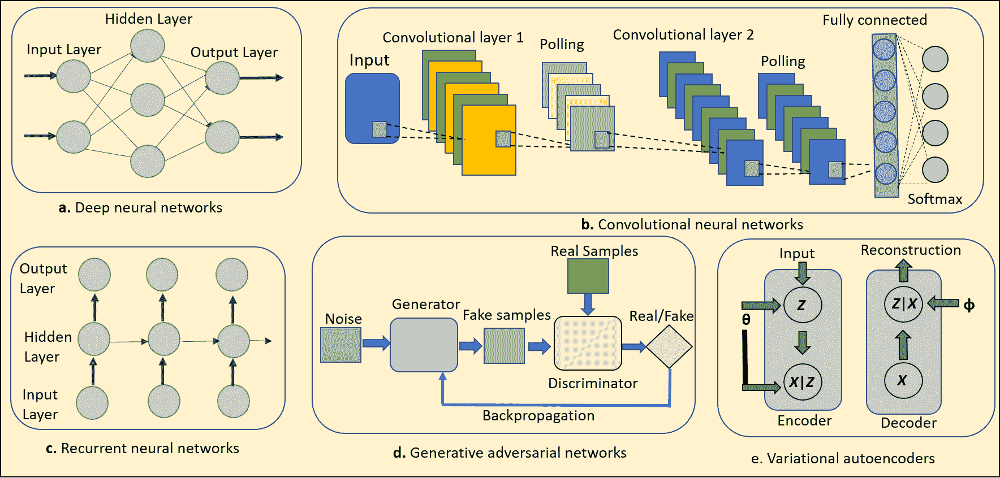
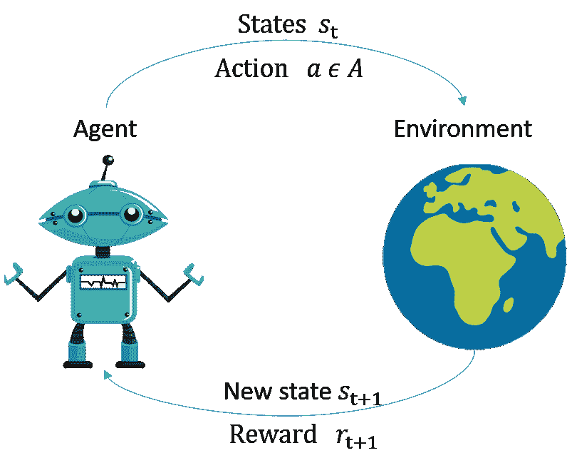
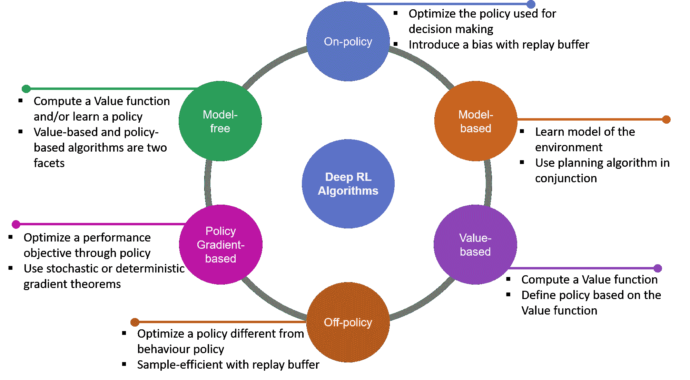
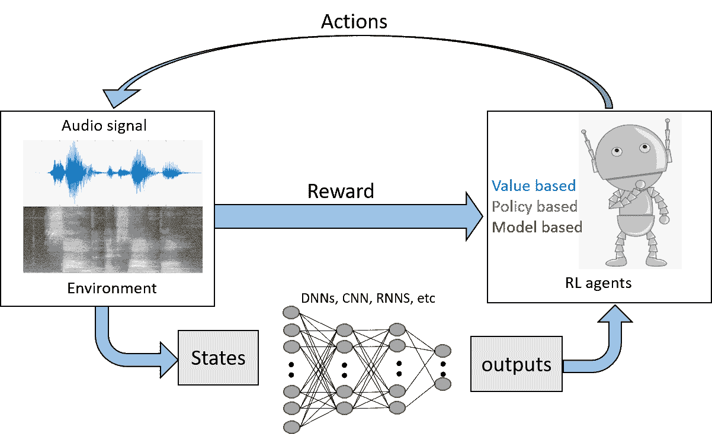
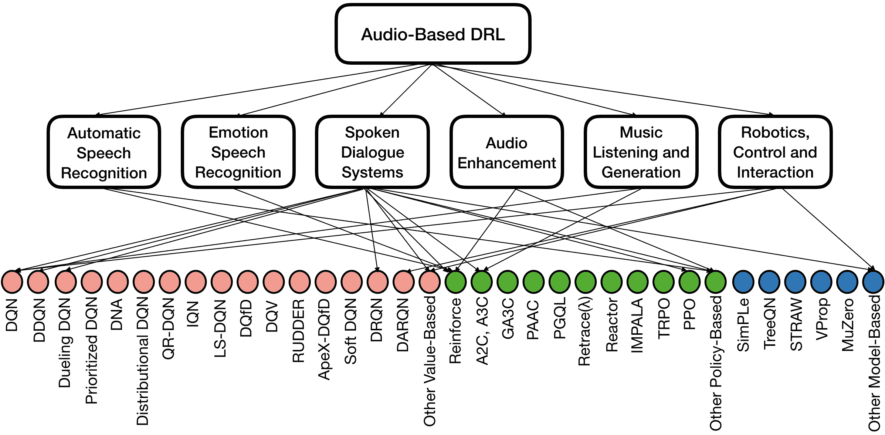
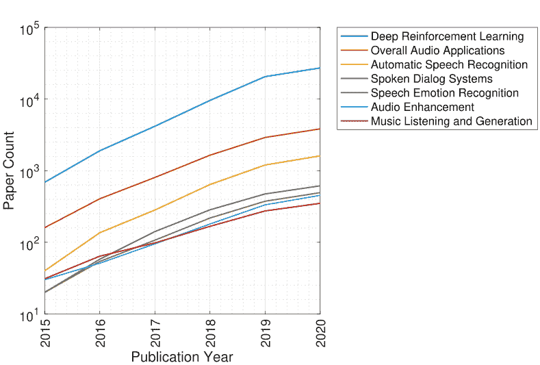
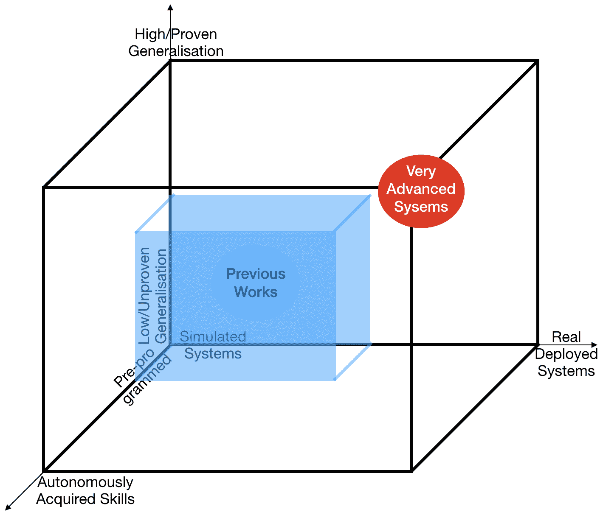

<!--yml

分类：未分类

日期：2024-09-06 19:57:39

-->

# [2101.00240] 在音频基础应用中的深度强化学习调查

> 来源：[`ar5iv.labs.arxiv.org/html/2101.00240`](https://ar5iv.labs.arxiv.org/html/2101.00240)

# 深度强化学习

在音频基础应用中的调查

Siddique Latif 邮箱：siddique.latif@usq.edu.au 昆士兰大学，澳大利亚 Heriberto Cuayáhuitl 林肯大学，英国 Farrukh Pervez 国家科学与技术大学，巴基斯坦 Fahad Shamshad 信息技术大学，巴基斯坦 Hafiz Shehbaz Ali EmulationAI Erik Cambria 南洋理工大学，新加坡

###### 摘要

深度强化学习（DRL）有望通过赋予自主系统对现实世界的高水平理解，彻底改变人工智能（AI）领域。目前，深度学习（DL）使得 DRL 能够有效解决各个领域中的各种棘手问题。最重要的是，DRL 算法也被应用于音频信号处理，以便直接从语音、音乐和其他声音信号中学习，从而创建具有许多实际应用前景的音频基础自主系统。在本文中，我们通过汇集不同语音和音乐相关领域的研究，全面调查 DRL 在音频领域的进展。我们首先介绍 DL 和强化学习（RL）的一般领域，然后探讨主要的 DRL 方法及其在音频领域的应用。最后，我们介绍了音频基础 DRL 代理面临的挑战，并突出了未来研究和调查的开放领域。

###### 索引词：

深度学习，强化学习，语音识别，情感识别，（具身的）对话系统

## I 引言

人工智能（AI）在生活的许多领域获得了广泛关注，尤其是在音频信号处理方面。音频处理涵盖了许多不同的领域，包括语音、音乐和环境声音处理。在所有这些领域中，AI 技术在音频智能系统的设计中发挥了关键作用[1]。AI 的主要目标之一是创建完全自主的基于音频的智能系统或代理，这些系统可以通过听取或与环境互动来学习最佳行为，并通过试错过程随着时间的推移改善其行为。设计这样的自主系统一直是一个长期存在的问题，从能够对环境变化做出反应的机器人，到能够使用自然语言和多媒体与人类互动的纯软件代理。强化学习（RL）[2]代表了这种经验驱动学习的原则性数学框架。尽管 RL 过去有一些成功[3, 4, 5]，但由于缺乏可扩展性，先前的方法本质上限于低维问题。此外，RL 在学习算法的情况下也面临记忆、计算和样本复杂性的问题[6]。最近，深度学习（DL）模型作为具有强大函数逼近和表示学习特性的工具，崛起以解决这些问题。

深度学习（DL）的出现对机器学习（ML）许多领域产生了重大影响，通过显著提升图像处理任务中的最新技术，如物体检测和图像分类。深度模型，如深度神经网络（DNNs）[7, 8]、卷积神经网络（CNNs）[9] 和长短期记忆（LSTM）网络[10]，也通过在音频信号处理中的优于传统方法，推动了许多实际应用。考虑到 DL 还通过在强化学习（RL）中使用 DL 算法加速了 RL 的发展，它催生了深度强化学习（DRL）领域。

深度强化学习（DRL）利用深度学习（DL）的进步来建立学习过程、性能和强化学习（RL）算法的速度。这使得 RL 能够在高维状态和动作空间中操作，解决以前难以解决的复杂问题。因此，DRL 已被应用于许多问题。受到之前工作的启发 [11]，两项杰出的工作开启了 DRL 的革命。第一个是开发了一种可以直接从图像像素中学习玩 Atari 2600 视频游戏的算法，达到了超人类水平 [12]。第二项成功是设计了混合 DRL 系统 AlphaGo，击败了围棋世界冠军 [13]。除了游戏外，DRL 还被应用于广泛的问题，包括控制政策的机器人 [14]；在具有元学习的复杂环境中可泛化的智能体 [15, 16]；室内导航 [17]，以及更多 [18]。特别是，DRL 在音频信号处理方面也越来越受到关注。

表 I: 我们的论文与现有调查的比较。

|  | 重点 |  |
| --- | --- | --- |
| 参考 |

&#124; 深度 &#124;

&#124; 强化学习 &#124;

&#124; 学习 &#124;

|

&#124; 音频 &#124;

&#124; 应用 &#124;

|

&#124; 其他 &#124;

&#124; 应用 &#124;

| 详细信息 |
| --- | --- | --- | --- | --- |

|

&#124; Arulkumaran 等人 [18] &#124;

&#124; 2017 &#124;

|

&#124; ✓ &#124;

|

&#124; ✗ &#124;

|

&#124; ✗ &#124;

|

&#124; 本文简要概述了近期 DRL 的发展 &#124;

&#124; DRL 算法，并突出了 DRL 的优势及多个 &#124;

&#124; 当前的研究领域。 &#124;

|

|

&#124; Yuxi Li [19] &#124;

&#124; 2017 &#124;

|

&#124; ✓ &#124;

|

&#124; ✗ &#124;

|

&#124; ✓ &#124;

|

&#124; 本文提供了对近期令人兴奋的 &#124;

&#124; 讨论了深度强化学习（DRL）的成就及其核心要素和机制。 &#124;

&#124; 还讨论了 DRL 可以应用的各个领域。 &#124;

|

|

&#124; Luong 等人 [20] &#124;

&#124; 2019 &#124;

|

&#124; ✓ &#124;

|

&#124; ✗ &#124;

|

&#124; 通信 &#124;

&#124; 和网络 &#124;

|

&#124; 本文对 &#124;

&#124; DRL 在通信和网络中的应用，突出显示 &#124;

&#124; 挑战，并讨论了开放问题和未来的方向。 &#124;

|

|

&#124; Kiran 等人 [21] &#124;

&#124; 2020 &#124;

|

&#124; ✓ &#124;

|

&#124; ✗ &#124;

|

&#124; 自动化 &#124;

&#124; 驾驶 &#124;

|

&#124; 本文总结了 DRL 算法和自动驾驶， &#124;

&#124; (D)RL 方法的应用情况。还强调了关键的 &#124;

&#124; 针对自动驾驶汽车在现实世界部署中的挑战。 &#124;

|

|

&#124; Haydari 等人 [22] &#124;

&#124; 2020 &#124;

|

&#124; ✓ &#124;

|

&#124; ✗ &#124;

|

&#124; 交通 &#124;

&#124; 系统 &#124;

|

&#124; 本文总结了交通领域的现有工作， &#124;

&#124; 并讨论了关于 DRL 的挑战和未解问题 &#124;

&#124; 在交通系统中。 &#124;

|

| 我们的 (2020) |
| --- |

&#124; ✓ &#124;

|

&#124; ✓ &#124;

|

&#124; ✗ &#124;

|

&#124; 我们提供了一份综合性综述，专注于 DRL 应用 &#124;

&#124; 在音频领域，强调了现有挑战，这些挑战阻碍了 &#124;

&#124; DRL 在音频领域的进展，并讨论了未来研究的指引。 &#124;

|

在音频处理领域，DRL 最近被作为一种新兴工具，用于解决自动语音识别（ASR）、语音对话系统（SDSs）、语音情感识别（SER）、音频增强、音乐生成和音频驱动的控制机器人等问题和挑战。因此，在这项工作中，我们专注于覆盖 DRL 在音频处理方面的进展。尽管已有多篇关于 DRL 的综述文章。例如，Arulkumaran 等人[18] 提供了关于 DRL 的简要综述，涵盖了 DRL 的开创性和近期发展，包括 DNNs 在开发自主智能体中的创新方式。类似地，在[19]中，作者试图提供关于 DRL 的全面细节，并涵盖其在各个领域的应用，以突出进展和挑战。其他相关工作包括 DRL 在通信和网络[20]、人类水平智能体[23]以及自主驾驶[24]中的应用。这些文章中没有一篇专注于 DRL 在音频处理中的应用，如表 I 所示。本文旨在填补这一空白，通过提供最新的 DRL 音频领域文献综述，讨论阻碍 DRL 在音频领域进展的挑战，并指出未来的研究方向。我们希望这篇文章能帮助对音频驱动应用的 DRL 感兴趣的研究人员和科学家。

本文的组织结构如下。第二节 II 提供了深度学习（DL）和强化学习（RL）的简要背景，接着在第三节 III 概述了近期的深度强化学习（DRL）算法。以这些基础为基础，第四节 IV 涵盖了在语音、音乐和环境声音处理等领域中的近期 DRL 工作，并在第五节 V 讨论了其挑战。第六节 VI 总结了这篇综述并突出音频基础的 DRL 研究的未来方向，第七节 VII 对本文进行了总结。

## II 背景

### II-A 深度学习（DL）

深度神经网络（DNNs）由于其从大量数据中提炼出紧凑且稳健的表示的能力，已在音频和语音处理领域展示了最先进的结果。第一个重要的里程碑是在 2010 年左右显著提高了大规模自动语音识别的准确性，这主要归功于使用了全连接的深度神经网络和深度自编码器[7]。它专注于使用人工神经网络，这些网络由多个非线性模块按层次结构排列，能够自动从原始数据中发现适用于特定任务的表示或特征。这些非线性特性使得深度神经网络能够学习语音和音频数据集中的复杂流形。下面我们将讨论不同的深度学习（DL）架构，如图 1 ‣ II Background ‣ A Survey on Deep Reinforcement Learning for Audio-Based Applications")所示。

卷积神经网络（CNNs）是一种前馈神经网络，专门设计用于处理具有网格状拓扑的数据，如图像[25]。最近，CNN 在各种图像处理任务中表现出了最先进的性能，包括分割、检测和分类等[26]。与深度神经网络（DNNs）相比，CNN 通过利用两个关键概念：局部感受野和共享权重，显著限制了参数和内存需求。它们通常由一系列卷积层和池化层交替组成，最后跟随一个或多个全连接层。对于序列标注任务，可以省略全连接层，从而得到一个全卷积网络（FCN）。FCN 已经通过领域适应扩展，以增加鲁棒性[27]。最近，CNN 模型在各种音频处理任务中得到了广泛研究，包括音乐起始检测[28]、语音增强[29]、自动语音识别（ASR）[30]等。然而，高采样率的原始音频波形可能由于 CNN 的感受野有限而出现性能下降的问题。为了解决这个性能问题，可以使用扩张卷积层，通过在滤波器系数之间插入零来扩展感受野[31, 32]。

图 1：不同深度学习架构的图示。

循环神经网络（RNNs）采用不同的方法来建模序列数据[33]。它们引入了递归连接，使参数可以跨时间共享，这使得它们在从输入序列（例如音频、视频）中学习时间结构方面非常强大。它们在各种语音和音频处理任务中表现出了优于传统 HMM 系统的优势[34]。由于这些能力，RNN，尤其是长短期记忆（LSTM）[10]和门控循环单元（GRU）[35]网络，在语音领域产生了巨大影响，并且被纳入了最先进的音频系统中。最近，这些 RNN 模型已经扩展到除了时间信息之外，还包括频域信息，以形式如频率 LSTM [36] 和时频 LSTM [37]。为了同时利用这两种神经网络架构，CNN 和 RNN 可以结合成一个单一网络，其中卷积层后跟循环层，通常称为卷积递归神经网络（CRNN）。结合 CNN 和 RNN 的相关工作已经在 ASR [38]、情感识别（SER）[39]、音乐分类[40]以及其他音频相关应用[34]中得到了展示。

序列到序列（Seq2Seq）模型的动机来源于需要处理未知长度序列的问题 [41]。虽然最初它们被应用于机器翻译，但它们也可以应用于许多涉及序列建模的不同应用。在 Seq2Seq 模型中，一个 RNN 读取输入以生成一个向量表示（编码器），另一个 RNN 继承这些学习到的特征以生成输出（解码器）。神经网络架构可以是单层或多层、单向或双向 [42]，并且它们可以通过优化一个联合目标而不是独立目标来结合多种架构 [33, 43]。由于其将输入转换为输出序列的能力，Seq2Seq 模型在语音社区中越来越受欢迎。深度学习框架特别适合这种直接翻译任务，因为它们具有大模型容量和端到端训练能力——直接将输入信号映射到目标序列 [44, 45, 46]。各种 Seq2Seq 模型已经在语音、音频和语言处理文献中得到探索，包括递归神经网络转导器（RNNT） [47]、单调对齐 [48]、听、关注和拼写（LAS） [49]、神经转导器 [50]、递归神经对齐器（RNA） [48] 和 Transformer 网络 [51]，等等。

生成模型在三种生成模型中引起了广泛关注：生成对抗网络（GANs） [52]、变分自编码器（VAEs） [53] 和自回归模型 [54]。这些模型足够强大，能够学习语音数据集的潜在分布，并在语音和音频处理科学社区中得到了广泛研究。具体来说，在 GANs 和 VAEs 的情况下，音频信号通常从低维表示中合成，需要通过上采样（例如，通过线性插值或最近邻）到高分辨率信号 [55, 56]。因此，VAEs 和 GANs 已被广泛探索用于合成语音或通过生成特征 [57] 或语音本身来增强训练材料。在自回归方法中，新样本通过 RNN（例如，使用 LSTM 或 GRU 网络）在先前样本的无限长上下文中迭代合成——但这在训练期间代价昂贵 [58]。

### II-B 强化学习

强化学习 (RL) 是一种流行的机器学习范式，它涉及代理通过试错来学习其行为 [2]。RL 代理旨在通过成功与其操作的环境互动来学习序列决策。在时间 $t$（交互开始时为 0， episodic 交互结束时为 $T$，或者在非 episodic 任务中为 $\infty$），RL 代理在状态 $s_{t}$ 下采取一个动作 $a\in A$，转移到新状态 $s_{t+1}$，并因选择动作 $a$ 而获得奖励 $r_{t+1}$。这一过程—反复迭代—如图 2 所示。

图 2: 基本的 RL 设置。

RL 代理旨在学习最佳的动作序列，即策略，以在所训练的任务（或任务集）中获得最高的总体累积奖励。尽管它可以从可用动作集中选择任何动作，但代理从开始到结束所采取的动作集称为一个 episode。马尔可夫决策过程 (MDP) [59] 可用于捕捉 RL 问题的 episodic 动态。MDP 可以使用元组 ($S$, $A$, $\gamma$, $P$, $R$) 来表示。决策者或代理在时间 $t$ 的状态 $s\in S$ 下根据其策略 $\pi(a_{t}|s_{t})$ 选择一个动作 $a\in A$，该策略决定了代理的行为方式。转移到下一个状态 $s_{t+1}\in S$ 的概率由状态转移函数 $P(s_{t+1}|s_{t},a_{t})$ 给出。环境根据代理在时间 $t$ 采取的动作产生奖励 $R(s_{t},a_{t},s_{t+1})$。这一过程持续直到达到最大时间步或代理到达终止状态。目标是最大化期望折扣累积奖励，其公式为：

|  | $E_{\pi}[R_{t}]=E_{\pi}\Big{[}\sum_{i=0}^{\infty}\gamma^{i}r_{t+i}\Big{]}$ |  | (1) |
| --- | --- | --- | --- |

其中 $\gamma$ $\in$ [0,1] 是一个折扣因子，用于指定远期奖励比近期奖励的价值更低。虽然 RL 代理可能只学习其策略，但它也可能学习（在线或离线）转移和奖励函数。

## III 深度强化学习

深度强化学习（DRL）将传统的强化学习（RL）与深度学习（DL）结合，以克服 RL 在具有大状态空间或高计算需求的复杂环境中的限制。DRL 利用深度神经网络（DNNs）来估计价值、策略或模型，这些都是通过存储状态-动作对在传统 RL 中学习的 [19]。深度 RL 算法可以从多个维度进行分类。例如，按策略（on-policy vs off-policy）、模型（model-free vs model-based）、价值（value-based vs policy-based）等进行分类。各种关键类别的 DRL 算法的显著特征在图 3 中进行了展示和描述。感兴趣的读者可参考 [19] 了解这些算法的更多细节。本节重点介绍了在音频应用中使用的流行 DRL 算法，分为三大类：（i）基于价值的 DRL，（ii）基于策略梯度的 DRL，以及（iii）基于模型的 DRL。

图 3：DRL 算法分类。

### III-A 基于价值的 DRL

最著名的基于价值的深度强化学习（DRL）算法之一是 Deep Q-network（DQN），由 Mnih 等人 [12] 提出，该算法直接从高维输入中学习。它采用卷积神经网络（CNNs）来估计价值函数 $Q(s,a)$，然后用以定义策略。DQN 通过使用目标 Q 网络和经验重放的概念，增强了学习过程的稳定性。DQN 在第 $i^{th}$ 次迭代中计算的损失函数为

|  | $\displaystyle L_{i}(\theta_{i})=\mathbb{E}_{s,a\sim p(.)}[(y_{i}-Q(s,a;\theta_{i}))^{2}],$ |  | (2) |
| --- | --- | --- | --- |
|  | $\displaystyle\text{其中}\quad y_{i}=\mathbb{E}_{s\prime\sim s}[r+\gamma\underset{a\prime}{\text{max}}Q(s\prime,a\prime;\theta_{i-1}&#124;{s,a}].$ |  |

尽管自诞生以来，DQN 在 Atari 游戏中已展现出超人的性能，但它基于单一的最大化运算符，如公式（2）所示，用于选择和评估动作。因此，选择一个被高估的动作可能会导致过于乐观的动作价值估计，从而引入向上的偏差。双重 DQN（DDQN）[60] 通过引入两个解耦的估计器来消除这种正向偏差：一个用于动作选择，另一个用于动作评估。Schaul 等人 [61] 表明，如果优先考虑重要的经验过渡并更频繁地重放，DQN 和 DDQN 的性能会显著提升。Wang 等人 [62] 提出了一个对抗网络架构（DNA），分别估计价值函数 $V(s)$ 和相关的优势函数 $A(s,a)$，然后将它们结合起来得到动作-价值函数 $Q(s,a)$。结果证明，DQN 和 DDQN 结合 DNA 以及优先经验重放可以提升性能。

与前述专注于期望回报的 DQN 算法不同，分布式 DQN [63]旨在学习价值的完整分布，以获得关于奖励的额外信息。尽管 DQN 和分布式 DQN 都专注于最大化期望回报，但后者在学习性能上相对更优。Will 等人[64]提出了带有分位回归的分布式 DQN（QR-DQN），以显式建模价值函数的分布。结果证明 QR-DQN 成功地弥合了理论和算法结果之间的差距。隐式分位网络（IQN）[65]是 QR-DQN 的扩展，通过学习完整的分位函数来估计分位回归，而不是专注于离散数量的分位点。IQN 还提供了关于每次更新所需样本数量的灵活性，样本数量从一个样本到最大计算允许的数量。IQN 在 Atari 领域已证明在性能上全面优于 QR-DQN。

DQN 在学习丰富表示方面的惊人成功主要归功于深度神经网络（DNNs），而批量算法则证明了具有更好的稳定性和数据效率（需要较少的超参数调整）。[66]中的作者提出了一种名为最小二乘 DQN（LS-DQN）的混合方法，利用 DQN 和批量算法的优点。基于示例的深度 Q 学习（DQfD）[67]利用人类示例以加速从一开始的学习。深度质量-价值（DQV）[68]是一种新型的基于时序差分的算法，最初训练价值网络，然后使用它来训练质量-价值神经网络以估计价值函数。在 Atari 领域的结果表明，DQV 在性能上优于 DQN 和 DDQN。[69]中的作者提出了 RUDDER（延迟奖励的回报分解），涵盖了奖励重分配和回报分解，用于具有延迟奖励的马尔可夫决策过程（MDPs）。Pohlen 等人[70]在所提议的算法 Ape-X DQfD 中结合了变换的 Bellman 算子和人类示例，在广泛的游戏中达到了人类水平的表现。结果证明，该算法在 42 款 Atari 游戏中的 40 款中实现了与人类相当的表现，使用的是相同的超参数。[71]中的 Schulman 等人研究了 Q 学习与策略梯度方法之间的联系。他们展示了软 Q 学习（Q 学习的熵正则化版本）等同于策略梯度方法，并且它们的表现（如果不是更好）与标准变体一样。

之前的研究也尝试将记忆元素融入到深度强化学习算法中。例如，[72]提出的深度递归 Q 网络（DRQN）方法能够成功地整合时间上的信息，在标准的 Atari 游戏中表现良好。通过引入注意力机制到 DQN 中，进一步改进了这一方法，形成了深度递归 Q 网络（DARQN）[73]。这使得 DARQN 能够专注于输入的特定部分，并在游戏中相较于 DQN 和 DRQN 实现更好的性能。其他一些研究[74, 75]也提出了将记忆融入深度强化学习的方法，但这一领域仍需进一步研究。

### III-B 基于策略梯度的深度强化学习（DRL）

基于策略梯度的深度强化学习算法旨在学习一种最优策略，以最大化性能目标，例如期望累计奖励。这类算法利用梯度定理来达到最优策略参数。策略梯度通常需要基于当前策略估计价值函数。这可以通过演员-评论家架构来实现，其中演员表示策略，评论家则指代价值函数估计[76]。Mnih 等人[77] 证明了在标准 CPU 硬件上异步执行多个并行代理可以实现时间和资源的高效学习。提出的异步演员-评论家版本，即异步优势演员-评论家（A3C），在具有离散和连续动作空间的 2D 和 3D 游戏中表现出卓越的学习效果。[78]中的作者提出了一种混合 CPU/GPU 的 A3C——称为 GA3C——与其基于 CPU 的对应物相比，显示出了显著更高的速度。

异步演员-评论家算法，包括 A3C 和 GA3C，可能会面临不一致和异步的参数更新问题。提出了一种新的异步算法框架[79]，以利用并行化的同时提供同步的参数更新。作者表明，提出的并行优势演员-评论家（PAAC）算法不仅实现了真正的在线策略学习，还加快了收敛速度。[80]中的作者提出了一种混合策略梯度和 Q 学习（PGQL）算法，结合了在线策略梯度和离策略 Q 学习。结果表明，与 A3C 和 Q 学习相比，PGQL 在 Atari 游戏中表现优越。Munos 等人[81]通过将三种离策略算法结合在一起：实例采样（IS）、Q($\lambda$)和树备份 TB($\lambda$)，提出了一种新算法——Retrace($\lambda$)。该算法缓解了所有三种算法的弱点（IS 具有低方差，Q($\lambda$)不安全，TB($\lambda$)效率低），并承诺安全、高效且保证收敛。Reactor（Retrace-Actor）[82]是一种基于 Retrace 的演员-评论家代理架构，结合了异步算法的时间效率和基于离策略经验回放算法的样本效率。Atari 领域的结果表明，提出的算法在训练时间方面表现出显著的提升，与最先进的算法相当。加权演员-学习者架构的重要性（IMPALA）[83]是一种可扩展的分布式代理，能够用一组参数处理多个任务。结果表明，IMPALA 在多任务环境中优于 A3C 基线。

Schulman 等人[84]提出了一种稳健且可扩展的信任区域策略优化（TRPO）算法，用于优化随机控制策略。TRPO 承诺在优化具有大量参数的非线性和复杂策略时保证单调改进。该学习算法使用固定的 KL 散度约束，而不是固定的惩罚系数，并在各种任务中优于许多无梯度和策略梯度方法。[85]介绍了近端策略优化（PPO），旨在实现像 TRPO 一样可靠和稳定，但在实现和样本复杂性方面相对更好。

表 II：深度强化学习算法总结。

| 深度强化学习算法 | 方法 | 详情 |
| --- | --- | --- |

&#124; 离策略/ &#124;

&#124; 在线策略 &#124;

|

| 基于价值的深度强化学习 |
| --- |
| DQN [2] | 目标 Q 网络，经验回放 |

&#124; • 直接从高维视觉输入中学习 &#124;

&#124; • 通过目标 Q 网络稳定学习过程 &#124;

&#124; • 经验回放以避免参数发散 &#124;

| 离策略 |
| --- |
| DDQN [3] | 双重 Q 学习 |

&#124; 为动作选择和评估提供解耦的估计器 &#124;

|

| 优先 DQN [4] | 优先经验重放 |
| --- | --- |

&#124; 重要的经验过渡被优先考虑并重放 &#124;

&#124; 经常这样做，从而实现高效学习 &#124;

|

| DNA [5] | 对抗神经网络架构 |
| --- | --- |

&#124; 估计一个值函数及相关的优势函数并结合 &#124;

&#124; 它们能够得到一个比 Q 学习更快收敛的值函数 &#124;

|

| Distributional DQN [6] |
| --- |

&#124; 学习累积回报的分布 &#124;

&#124; 使用分布式 Bellman 方程 &#124;

|

&#124; •  比 DQN 更高效的学习 &#124;

&#124; •  有可能实现风险意识行为 &#124;

|

| QR-DQN [7] |
| --- |

&#124; 具有分布式 DQN 的分位回归 &#124;

| 缩小理论结果与算法结果之间的差距 |
| --- |
| IQN [8] |

&#124; 扩展了 QR-DQN，具有完整的分位函数 &#124;

|

&#124; 提供关于训练所需样本数量的灵活性 &#124;

|

| LS-DQN [9] |
| --- |

&#124; 一种将 DQN 与 &#124;

&#124; 最小二乘法 &#124;

|

&#124; 利用 DQN 的优势，能够学习丰富的表示， &#124;

&#124; 以及批量算法，稳定性和数据效率 &#124;

|

| DQfD [10] | 从示范中学习 | 从一开始就加速学习。 |
| --- | --- | --- |
| DQV [11] |

&#124; 使用时序差分训练一个值网络 &#124;

&#124; 随后用于训练一个质量-值模型 &#124;

&#124; 估计状态-动作值的网络 &#124;

| 学习效果显著优于 DQN 和 DDQN |
| --- |
| RUDDER [12] | 奖励重新分配和回报分解 |

&#124; 在长时间游戏中提供显著改进 &#124;

&#124; 延迟奖励 &#124;

|

| Ape-X DQfD [13] |
| --- |

&#124; 使用变换的 Bellman 算子 &#124;

&#124; 以及时序一致性损失 &#124;

|

&#124; 在 42 个 Atari 2600 游戏中超越了平均人类表现 &#124;

&#124; 42 款游戏中的表现 &#124;

|

| Soft DQN [14] |
| --- |

&#124; 融合了软 KL 惩罚和熵奖励 &#124;

|

&#124; 建立了 Soft DQN 与策略梯度之间的等价关系 &#124;

|

| DRQN, DARQN [14-15] |
| --- |

&#124; 记忆，注意力 &#124;

|

&#124; DQN 策略通过基于注意力的递归网络建模 &#124;

|  |
| --- |
| 基于策略梯度的 DRL |
| A3C [16] | 异步梯度下降 | 消耗较少资源；能够在标准多核 CPU 上运行 | 在政策 |
| GA3C [17] | 混合 CPU/GPU 的 A3C | 实现了显著高于其 CPU 版本的速度 |
| PAAC [18] |

&#124; 针对异步算法的创新框架 &#124;

|

&#124; 计算效率高，能够更快地收敛到最优策略 &#124;

|

| PGQL [19] |
| --- |

&#124; 结合了政策梯度的在策略学习 &#124;

&#124; 结合了离线策略 Q 学习 &#124;

| 增强了稳定性和数据效率 | 离线策略 |
| --- | --- |
| Retrace($\lambda$) [20] |

&#124; 表达了三种离策略算法—IS，&#124;

&#124; Q($\lambda$) 和 TB($\lambda$)— 以常见形式&#124;

| 安全、样本效率高且方差低 |
| --- |
| Reactor [21] | 基于 Retrace 的演员-评论员代理架构 | 在训练时间上取得显著提升。 |
| IMPALA [22] |

&#124; 可扩展的分布式代理&#124;

&#124; 能处理多个任务&#124;

&#124; 一组参数&#124;

|

&#124; 在&#124; Atari 游戏中超越最先进的代理

&#124; 多样化的多任务环境&#124;

| 在策略 |
| --- |
| TRPO [23] |

&#124; 采用固定的 KL 散度约束&#124;

&#124; 用于优化随机控制策略&#124;

|

&#124; 在各种大规模任务中表现良好&#124;

|

| PPO [24] |
| --- |

&#124; 利用自适应 KL 惩罚系数&#124;

|

&#124; 与 TRPO 一样可靠和稳定，但相对更优&#124;

&#124; 在实现和样本复杂性方面&#124;

|

| 基于模型的 DRL |
| --- |
| SimPLe [26] |

&#124; 基于视频预测的模型算法&#124;

&#124; 需要更少的代理-环境&#124;

&#124; 相比无模型算法的互动更丰富&#124;

|

&#124; 在 Atari 游戏中超越最先进的无模型算法&#124;

| 在策略 |
| --- |
| TreeQN [27] |

&#124; 基于动态&#124;估计 Q 值

&#124; 通过&#124;递归构建的树结构

&#124; 一个隐式的过渡模型&#124;

|

&#124; 超越 n 步 DQN 和价值预测网络&#124;

&#124; 在多个 Atari 游戏中&#124;

|

| STRAW [29] |
| --- |

&#124; 具备自然决策能力&#124;

&#124; 通过学习宏观动作&#124;

| 在 Atari 游戏中显著提升性能 |
| --- |
| VProp [30] |

&#124; 一组基于值迭代的规划&#124;

&#124; 通过 RL 训练的模块&#124;

|

&#124; •  能够解决未知任务并在复杂环境中导航&#124;

&#124; •  能够在动态和嘈杂的环境中泛化&#124;

| - |
| --- |
| MuZero [31] |

&#124; 将基于树的搜索与学习的&#124;

&#124; 渲染超人类性能的模型&#124;

&#124; 在挑战性环境中&#124;

|

&#124; 在 57 种不同的 Atari 游戏中提供最先进的性能&#124;

| 离策略 |
| --- |

图 4：用于音频应用的 DRL 代理示意图，其中 DL 模型（通过 DNN、CNN、RNN 等）从原始波形或其他音频表示中生成音频特征，以采取使环境从状态$s_{t}$转变为下一个状态$s_{t+1}$的动作。

### III-C 基于模型的 DRL

基于模型的 DRL 算法依赖于环境模型（即基础动态和奖励函数）以及规划算法。与通常需要大量样本以实现充分性能的无模型 DRL 方法不同，基于模型的算法通常能提高样本和时间效率[86]。

Kaiser 等人[87] 提出了模拟策略学习（SimPLe），这是一种基于视频预测的模型化深度强化学习算法，比起无模型算法，它需要的代理-环境交互次数要少得多。实验结果表明，SimPLe 在 Atari 游戏中的表现优于最先进的无模型算法。Farquhar 等人[88] 提出了 TreeQN 用于复杂环境，其中转移模型并没有明确给出。所提算法结合了无模型和模型化方法，以基于通过隐式转移模型递归构建的动态树来估计 Q 值。[88] 的作者还提出了一种名为 ATreeC 的演员-评论家变体，它在 TreeQN 的基础上增加了一个 softmax 层，形成一个随机策略网络。他们展示了这两种算法在多个 Atari 游戏中比 n 步 DQN 和价值预测网络[89] 表现更为优越。[90] 的作者介绍了一个战略性注意力写手（STRAW），它通过学习宏观动作能够做出自然的决策。与每次观察后仅产生一个动作的最先进深度强化学习算法不同，STRAW 生成一系列动作，从而导致结构化探索。实验结果表明，STRAW 在 Atari 游戏中的表现有显著提升。价值传播（VProp）[91] 是一套基于价值迭代的规划模块，通过强化学习进行训练，能够解决未见过的任务并在复杂环境中导航。还证明了 VProp 在动态和嘈杂的环境中能够进行泛化。[92] 的作者提出了一种名为 MuZero 的模型化算法，它将基于树的搜索与学习模型相结合，在挑战性环境中表现出超人类水平的性能。实验结果表明，MuZero 在 57 款多样化的 Atari 游戏中提供了最先进的表现。表 II 提供了深度强化学习算法的概述，供读者浏览。

## IV 基于音频的深度强化学习

本节调查了音频在深度强化学习代理的学习环境中作为关键元素的相关工作。一个示例场景是人类与通过深度强化学习训练的机器进行对话，如图 4 所示，其中机器必须根据从音频信号中提取的特征进行操作。表 III 总结了六个与音频相关的领域中深度强化学习代理的特征：

1.  1.

    自动语音识别；

1.  2.

    语音对话系统；

1.  3.

    情感建模；

1.  4.

    音频增强；

1.  5.

    音乐听觉与生成；以及

1.  6.

    机器人技术、控制与交互。

表 III: 音频相关领域的总结、DRL 代理的特征描述以及相关数据集。

| 应用领域 | 状态表示 $\mathcal{S}$、动作 $\mathcal{A}$ 和奖励函数 $\mathcal{R}$ | 常用数据集 |
| --- | --- | --- |

|

&#124; 自动 &#124;

&#124; 语音 &#124;

&#124; 识别 &#124;

|

&#124; $\mathcal{S}$: 状态是从输入语音特征（例如 fMLLR 或 MFCC 向量 [93]）中学习到的表示。 &#124;

&#124; $\mathcal{A}$: 动作包括音素、字形、命令或来自 ASR N-best 列表的候选项。 &#124;

&#124; $\mathcal{R}$: 他们包含了二进制奖励（选择正确的选项时为正，其他情况为 0），&#124;

&#124; 和基于 Levenshtein 距离算法的非二进制句子/标记奖励。 &#124;

|

&#124; •  LibriSpeech [94] &#124;

&#124; •  TED-LIUM [95] &#124;

&#124; •  华尔街日报 [96] &#124;

&#124; •  SWITCHBOARD [97] &#124;

&#124; •  TIMIT [98] &#124;

|

|

&#124; 口语 &#124;

&#124; 对话 &#124;

&#124; 系统 &#124;

|

&#124; $\mathcal{S}$: 他们将系统发出的词语和识别的用户词语编码成对话历史 &#124;

&#124; 以及来自分类器的额外信息，如用户目标、用户意图、语音识别 &#124;

&#124; 置信度分数和视觉信息（在多模态系统中）等。 &#124;

&#124; $\mathcal{A}$: 在任务导向系统中，动作包括槽请求/确认/道歉、槽值 &#124;

&#124; 选择、提问、数据检索、信息呈现等；开放式系统中的动作 &#124;

&#124; 系统包括所有可能的句子（无限）或句子集群（有限）。 &#124;

&#124; $\mathcal{R}$: 奖励函数根据公司/项目需求有所不同，倾向于包括稀疏和 &#124;

&#124; 非稀疏的数值奖励，如对话长度、任务成功、对话相似度、对话 &#124;

&#124; 一致性、对话重复性、游戏得分（在基于游戏的系统中）等。 &#124;

|

&#124; •  SGD [99] &#124;

&#124; •  DSTC [100] &#124;

&#124; •  Frames [101] &#124;

&#124; •  MultiWOZ [102] &#124;

&#124; •  SubTle 语料库 [103] &#124;

&#124; •  模拟 [104] &#124;

&#124; •  其他数据集 [105] &#124;

|

|

&#124; 语音 &#124;

&#124; 情感 &#124;

&#124; 识别 &#124;

|

&#124; $\mathcal{S}$: 语音特征（例如，MFCC）被视为输入特征。 &#124;

&#124; $\mathcal{A}$: 动作包括语音情感标签（例如，不高兴、中性、高兴）、情感检测 &#124;

&#124; （例如，负面、中性、积极），以及从语音听取中终止。 &#124;

&#124; $\mathcal{R}$: 使用了二进制奖励函数（选择正确选项时为正，其他情况为 0）。 &#124;

|

&#124; •  EMODB [106] &#124;

&#124; •  IEMOCAP [107] &#124;

&#124; •  MSP-IMPROV [108] &#124;

&#124; •  SEMAINE [109] &#124;

&#124; •  MELD [110] &#124;

|

|

&#124; 音频 &#124;

&#124; 增强 &#124;

|

&#124; $\mathcal{S}$: 状态从干净和嘈杂的声学特征中学习。 &#124;

&#124; $\mathcal{A}$: 寻找最近的簇及其索引，时间频率掩膜估计，以及增加或减少 &#124;

&#124; 语音增强算法的参数值。 &#124;

&#124; $\mathcal{R}$: 正确选择的正奖励，其他情况为负奖励。 &#124;

|

&#124; •  DEMAND [111] &#124;

&#124; •  CHiME-3 [112] &#124;

&#124; •  WHAMR [113] &#124;

|

|

音乐 &#124;

&#124; 生成 &#124;

|

&#124; $\mathcal{S}$: 状态表示从音乐音符中学习。 &#124;

&#124; $\mathcal{A}$: 音乐生成和下一个音符选择被视为行为。 &#124;

&#124; $\mathcal{R}$: 基于硬编码音乐理论规则的二元奖励函数，包括行为的可能性。 &#124;

|

&#124; •  古典钢琴 MIDI &#124;

&#124; 数据库 [114] &#124;

&#124; •  MusicNet 数据集 [115] &#124;

&#124; •  JSB 复调曲 &#124;

&#124; 数据集 [116] &#124;

|

|

&#124; 机器人学, &#124;

&#124; 控制和 &#124;

&#124; 互动 &#124;

|

&#124; $\mathcal{S}$: 它们编码从图像嵌入、语音特征中得出的视觉和语言表征， &#124;

&#124; 词或句子的嵌入。附加信息包括用户意图、语音识别 &#124;

&#124; 分数、人体活动、姿势、情感和身体关节角度等。 &#124;

&#124; $\mathcal{A}$: 包括运动命令（例如手势、运动、导航、操作、注视）和 &#124;

&#124; 语言化，如对话行为和回话（例如笑声、微笑、点头、摇头）。 &#124;

&#124; $\mathcal{R}$: 基于任务成功（达到目标的正奖励，未达到的负奖励）。 &#124;

&#124; 完成任务失败，其他情况为零/形状奖励) 和用户参与。 &#124;

|

&#124; •  AVDIAR [117] &#124;

&#124; •  NLI 语料库 [118] &#124;

&#124; •  VEIL 数据集 [119] &#124;

&#124; •  模拟 [120] &#124;

&#124; • 现实世界 &#124;

&#124; 互动 [121] &#124;

|

### IV-A 自动语音识别 (ASR)

自动语音识别（ASR）是将语音信号转换为相应文本的过程，依靠算法实现。现代 ASR 技术因深度学习模型的进步而达到很高的性能水平。然而，ASR 系统的性能严重依赖于大量转录数据的深度模型的监督训练。即使对于资源丰富的语言，新的任务所需的额外转录成本仍然阻碍了 ASR 的应用。为了扩大 ASR 的范围，不同的研究尝试了基于 RL 的模型，这些模型能够从反馈中学习。这种学习形式旨在通过人类提供正面或负面的奖励来减少转录成本和时间，而不是详细的转录。比如，Kala 等人[122] 提出了一个基于策略梯度方法的 ASR RL 框架，为现有的训练和适应方法提供了新的视角。他们在识别性能和 Word Error Rate（WER）方面取得了改进，相较于无监督适应。ASR 中，序列到序列模型表现出很大的成功；然而，这些模型在推断过程中未能逼近真实世界的语音。Tjandra 等人[123]通过用策略梯度算法训练序列到序列模型解决了这个问题。他们的结果显示，与仅用 MLE 目标训练的模型相比，使用基于 RL 的目标和最大似然估计（MLE）目标的结果显著改善。在另一项研究中，[124] 通过提供更多关于其模型和实验的细节，扩展了他们自己的工作。他们发现，使用令牌级奖励（在每个时间步后给予中间奖励）相较于句子级奖励和基线系统，能够提供更好的性能。为了解决序列到序列 ASR 模型的半监督训练问题，Chung 等人[125] 研究了 REINFORCE 算法，通过奖励 ASR 输出更多正确的句子来处理未配对和配对的语音输入数据。实验评估显示，基于 DRL 的方法能够有效将字符错误率从 10.4%降低到 8.7%。

Karita 等人[126] 提出了使用基于策略梯度目标函数的序列级评估指标来训练编码器-解码器 ASR 系统。这使得模型预测的期望 WER 最小化。通过这种方式，作者发现所提方法提高了识别性能。[127] 的 ASR 系统通过最大似然和策略梯度联合训练，以通过端到端学习进行改进。他们能够直接优化性能指标，并实现了 4% 到 13% 的相对性能提升。在 [128] 中，作者通过提出一种基于监督反向传播和策略梯度方法的模型来解决序列到序列问题，该模型可以直接最大化正确答案的对数概率。他们在小规模和中等规模的 ASR 上取得了非常令人鼓舞的结果。Radzikowski 等人[129] 提出了一个基于策略梯度方法的双重监督模型用于非母语语音识别。他们能够在由日本和波兰说话者发音的英语中取得有希望的结果。

为了实现最佳的准确度，端到端 ASR 系统变得越来越大和复杂。DRL 方法还可以用于模型压缩[130]。在[131]中，提出了基于 RL 的 ShrinkML 来优化具有注意力机制的最先进的 LSTM 基于 ASR 模型中的每层压缩比。为了提高时间效率的 ASR，[132] 评估了基于 RL 的策略梯度网络的预训练。他们发现，DRL 的预训练相比未预训练网络提供了更快的收敛，并且在更短时间内实现了更好的识别。为了应对 REINFORCE 算法的缓慢收敛时间[133]，Lawson 等人[134] 评估了变分推断 Monte Carlo 目标（VIMCO）和神经变分推断（NVIL）在干净和嘈杂环境中的音素识别任务。作者发现，所提方法（使用 VIMCO 和 NVIL）在训练在线序列到序列模型方面优于 REINFORCE 和其他方法。

上述研究突出了使用 DRL 在 ASR 中的几个好处。尽管这些结果很有前景，但仍需进一步研究 DRL 算法，以建立能够在复杂现实环境中工作的自主 ASR 系统。REINFORCE 算法在 ASR 中非常流行，因此还需要研究其他 DRL 算法，以突显其在 ASR 中的适用性。

### IV-B 口语对话系统 (SDSs)

语音对话系统因其在客户服务和目标导向的人机交互中的众多应用而引起了关注。典型的语音对话系统集成了多个关键组件，包括语音识别器、意图识别器、知识库和/或数据库后端、对话管理器、语言生成器和语音合成等[135]。对话管理器在语音对话系统中的任务是根据观察到的事件选择行动[136, 137]。研究人员已经证明，可以通过使用强化学习（RL）来优化行动选择过程，从而将语音对话的动态建模为完全或部分可观测的马尔可夫决策过程[138]。大量研究在语音对话系统中利用了基于强化学习的算法。与可以直接利用大量文本数据进行训练的基于文本的对话系统相比，大多数语音对话系统都是使用用户模拟进行训练的[104]。这样做的理由主要是由于用于训练或测试的实际对话数据量不足[105]。

SDSs 涉及策略优化，通过获取对话的当前状态，选择一个动作，并返回系统的语言响应。例如，Chen 等人[140] 提出了一个基于在线 DRL 的对话状态跟踪框架，以提高对话管理器的性能。他们在第二和第三次对话状态跟踪挑战中取得了有希望的结果（[141, 142]）。Weisz 等人[143] 使用了 DRL 方法，包括演员-评论家方法和离线策略 RL。他们还评估了带有经验回放的演员-评论家方法（ACER）[144, 81]，在简单的游戏任务中表现出良好的结果。他们展示了所提出的方法在样本效率方面的优势，并且在口语对话的某些最先进 DL 方法中表现更好。在[145]中提出了一个基于任务导向的端到端 DRL 对话系统。他们展示了基于 DRL 的优化在任务成功率方面取得了显著改进，并且相比于监督训练还减少了对话长度。Zhao 等人[146] 利用深度递归 Q 网络（DRQN）进行对话状态跟踪和管理。实验结果表明，所提出的模型可以利用 DRL 和监督学习的优势，实现更快的学习速度和比模块化基准系统更好的结果。为了展示基准结果，[147] 进行了基于 DRL 算法（包括 DQN、A2C 和自然演员-评论家[148]）的基准研究，并将其性能与 GP-SARSA[149] 进行了比较。基于 PyDial 工具包[150] 的实验结果，作者总结出 DRL 方法仍需大量改进，以匹配精心设计的手工制作策略的性能。除了通过平面 DRL 优化的 SDSs，已经提出了层次 RL/DRL 方法用于策略学习，这些方法利用具有不同抽象层次的对话状态和不同粒度的对话动作（通过原始动作和复合动作）[151, 152, 153, 154, 155, 156]。这种学习形式的好处包括更快的训练和策略重用。[157] 提出了一个基于深度 Q 网络的多领域对话系统。他们使用 DQN 代理网络训练所提出的 SDS，这类似于层次 DRL，但在对话领域之间的过渡上提供了更多灵活性。与更快训练相关的另一项工作由[158] 提出，其中 RL 代理的行为由专家演示指导。

对话策略的优化需要一个奖励函数，而这个奖励函数不幸的是不易指定。这通常需要带有标注的数据来训练奖励预测器，而不是手工制作的奖励函数。在实际应用中，这些标注数据要么稀缺，要么不可用。因此，一些研究人员将注意力转向了在线主动奖励学习的方法。在[159]中，作者提出了一个用于口语对话系统的在线学习框架。他们通过主动学习联合训练对话策略和奖励模型。根据结果，作者展示了该框架可以显著减少数据标注成本，并且可以缓解对话策略学习中的嘈杂用户反馈。Su 等人[148]介绍了两种方法：带有经验回放的信任域演员-评论员 (TRACER) 和带有经验回放的情节自然演员-评论员 (eNACER) 用于对话策略优化。在这两种算法中，他们使用 TRACER 获得了最佳性能。

在[160]中，作者提议基于用户满意度学习一个领域无关的奖励函数，用于对话策略学习。作者展示了该框架在任务成功率和用户满意度方面均表现良好。研究人员还利用 DRL 在嘈杂环境中学习对话策略，有些人展示了他们提出的模型能够生成与人类对话不可区分的对话[161]。Carrara 等人[162]提出了基于 RL 的对话系统的在线学习和转移以适应用户。实验在谈判对话任务上进行，显示出比基准显著的改进。在另一项研究中[163]，作者提出了 $\epsilon$-safe，一种用于对话应用的安全转移学习的 Q-learning 算法。在[164]中设计了一种名为 MILABOT 的基于 DRL 的聊天机器人，可以通过语音和文本与人类进行流行话题的对话——表现明显优于许多竞争系统。在[165]中的文本聊天机器人使用了一组 DRL 代理，并显示出训练多个对话代理比训练单一代理效果更佳。

表 IV: 基于 DRL 算法训练的对话系统研究论文总结（?=信息不可用）

| 参考- | 应用 | DRL | 用户满意度- | 转移 | 训练 | 人类 | 奖励 |
| --- | --- | --- | --- | --- | --- | --- | --- |
| 参考 | 领域 | 算法 | 模拟 | 学习 | (测试) 数据 | 评估 | 函数 |
| --- | --- | --- | --- | --- | --- | --- | --- |
| [166] | 游戏: | KG-DQN | 否 | 是 | 40 (10) 游戏 | 否 | +1 代表接近终点，-1 代表 |
| 生活片段，恐怖 | 扩展最小步骤，其他情况为 0 |
| [167] | 餐馆，笔记本电脑 | FDQN, | 是 | 否 | 4K ($0.5$K) 对话 | 否 | 成功对话时+20，否则为 0， |
| GP-Sarsa | 减去对话长度 |
| [168] | 餐馆 | MADQN | 是 | 是 | 15K ($?$) 对话 | 否 | 成功对话时+1， |
| 每轮对话-0.05 |
| [120] | 闲聊 | Ensemble | 否 | 否 | $\leq$64K (1k) 对话 | 是 | 人类般的响应+1， |
| DQN | 随机选择的响应-1 |
| [165] | 机器人玩耍 | 竞争性 | 是 | 否 | 20K (3K) 游戏 | 是 | 游戏获胜时+5， |
| 井字游戏 | DQN | 平局+1，失利-5 |
| [169] | 餐馆，酒店 | NDQN | 是 | 否 | 8.7K (1K) 对话 | 否 | $Pr$(任务成功) 加上 $Pr$(数据类似) |
| 减去轮数 $\times-0.1$ |
| [170] | 视觉 | Reinforce | 否 | 否 | 68K (9.5K) 图像 | 是 | 预测值与 |
| 问答 | 目标描述的最后两个时间步 |
| [171] | 餐馆 | DA2C | 是 | 否 | 15K (0.5K) 对话 | 否 | 成功对话时+1，每轮-0.03， |
| 成功对话时-1，否则挂断 |
| [172] | 电影聊天 | Dueling | 是 | 否 | 150K ($?$) 句子 | 否 | 正确识别时+10，错误时-12 |
| DDQN | 识别，确认/引导的奖励较少 |
| [158] | MultiWoz | NDfQ | 是 | 否 | 11.4K (1K) 对话 | 否 | 成功完成任务时+100， |
| 每轮-1 |
| [173] | 闲聊 | DBCQ | 否 | 否 | 14.2$\times$2K ($?$) 句子 | 是 | 加权分数结合情感、提问， |
|  | 笑声，长对话，& 句子相似性 |
| [174] | OpenSubtitles | Reinforce | 否 | 否 | 1̃0M (1K) 句子 | 是 | 加权分数结合回答的难易程度， |
| 信息流和语义一致性 |
| [175] | OpenSubtitles | 对抗性 | 否 | 否 | $?$ ($?$) 对话 | 是 | 学习奖励（二分类器确定 |
| Reinforce | 机器生成或人工生成的对话） |
| [176] | 电影预订 | BBQN | 是 | 否 | 20K (10K) 对话 | 是 | 成功对话时+40，每轮-1， |
| 失败对话-10 |
| [177] | 高速公路，炸弹人， | 文本-DQN, | 否 | 是 | 10M-15M (50K) 步骤 | 否 | 学习奖励（CNN 网络从 |
| Bourderchase, F&E | 文本-VI | 众包游戏玩法文本描述） |
| [155] | 航班和酒店 | 分层 | 是 | 否 | 20K (2K) 对话 | 是 | 成功对话时+120，每轮-1， |
| DQN | 失败对话-60 |
| [178] | 电影票预订 | 对抗性 | 是 | 否 | 100K (5K) 对话 | 否 | 学习奖励（MLP 网络比较 |
| A2C | 状态-动作对与人类对话） |
| [179] | 闲聊 | 层次化 | 否 | 否 | 109K (10K) 对话 | 是 | 预定义分数组合问题， |
| 强化 | 重复、语义相似性和毒性 |
| [180] | 闲聊 | 强化 | 否 | 否 | $\sim$2M ($?$) 对话 | 是 | 从回答的简易性获得正奖励 - |
| 对手动枯燥话语的负奖励 |
| [181] | 闲聊 | 强化 | 否 | 否 | $\sim$5K (0.1) 对话 | 是 | 学习奖励（线性回归预测 |
| 对话结束时的用户评分） |
| [182] | 餐馆 | TRACER | 是 | 否 | $\leq$3.5K (0.6K) 对话 | 否 | 成功对话 +20（否则为 0） |
| eNACER | 减去 0.05 $\times$ 对话轮次数量 |
| [183] | 公交车、餐馆 | GP-Sarsa | 是 | 否 | 1K (0.1K) 对话 | 否 | 学习奖励（支持向量机 |
| 酒店、笔记本电脑 | 预测用户对话评分） |
| [184] | 医学诊断 | KR-DQN | 是 | 否 | 423 (104) 对话 | 是 | 成功诊断 +44，失败诊断 -22 |
| (4 种疾病) | 诊断，未满足症状请求 -1 |
| [185] | 餐馆 | ACER | 是 | 否 | 4K (4K) 对话 | 是 | 成功对话 +20 减去数量 |
| 对话中的轮次 |
| [186] | 拨号领域 | 强化 | 是 | 否 | 5K (0.5K) 对话 | 否 | 成功完成对话 +1， |
| 其他为 0 |
| [187] | 20 问题游戏 | DRQN | 是 | 否 | 120K (5K) 句子 | 否 | 游戏胜利 +30，游戏失败 -30， |
| 错误猜测 -5 |
| [188] | DealOrNotDeal | 强化 | 是;否 | 否 | $\leq$8.4K ($\leq$1K) 对话 | 否 | 谈判 +$\leq$10，未达成协议 0； |
| MultiWoz | 语言限制奖励曲线 |
| [156] | 20 张图像 | DRRN+ | 是 | 否 | 20K (1K) 游戏 | 否 | 游戏胜利 +10，游戏失败 -10， |
| 猜测游戏 | DQN | 问题选择的伪奖励 |
| [189] | MultiWoz | GP${}_{\mbox{mbcm}}$, PPO | 是 | 否 | 10.5K (1K) 对话 | 是 | 学习奖励（MLP 网络比较 |
| ACER, ALDM | 与人类对话的状态-动作对） |

表 IV ‣ IV Audio-Based DRL ‣ A Survey on Deep Reinforcement Learning for Audio-Based Applications")展示了基于 DRL 的对话系统的总结。虽然并非所有系统都涉及口语交互，但它们可以应用于语音系统，例如使用语音识别器的输出而非输入的文本交互。在应用方面，我们可以观察到，大多数系统集中在一个或少数几个领域——通常不会尝试用大量领域进行训练，可能是因为数据和计算的高需求。关于算法，最流行的是基于 DQN 或 REINFORCE 的算法以及其他一些较新的算法——何时使用一种算法而非另一种算法仍需更好地理解。我们还可以观察到，用户模拟主要用于训练任务导向的对话系统，而实际数据是开放式对话系统的首选。我们可以注意到，尽管迁移学习是训练 SDS 中的一个重要组成部分，但它尚未普及。由于每次系统训练时从头开始学习既不可扩展也不实用，因此迁移学习在未来将会越来越自然地被采用，因为将考虑更多领域。在数据集方面，大多数数据集仍然较小。看到用数百万训练对话或句子的 SDS 很少见。随着数据集的增长，对更高效训练方法的需求在未来系统中将变得更加重要。关于人工评估，我们可以观察到，大约一半的研究工作涉及人工评估。尽管人工评估可能并不总是回答研究问题所必需的，但在评估或判断学到的对话技能时肯定应该使用。我们还可以注意到，由于以前工作中使用的奖励函数种类繁多，尚无标准来指定奖励函数——几乎每篇论文使用不同的奖励函数。即使一些工作使用了学习到的奖励函数（例如基于对抗学习），它们也专注于学习区分机器生成的对话和人类生成的对话，而没有考虑其他维度，如任务成功或额外的惩罚。尽管通过学习而不是手工制作的奖励函数规格有所进展，但这一领域仍需更好地理解，以优化不同类型的对话，包括信息检索、闲聊、基于游戏的、基于谈判的等。

### IV-C 情感建模

情感在人际交流中至关重要，近年来在研究界获得了越来越多的关注[190, 191, 39]。可以说，如果对话代理能够感知用户的情感状态及其动态，人机交互可以显著提升[192, 193]。这一研究方向分为两个领域：对话中的情感识别[194]和情感对话生成[195, 196]。语音情感识别（SER）可以作为基于强化学习（RL）的对话系统的奖励[197]。这将允许系统根据对话伙伴的情感状态调整行为。缺乏标注的情感语料库和 SER 的低准确率是该领域的两个主要挑战。为了实现最佳准确率，各种基于深度学习（DL）的方法已被应用于 SER，但实时部署的性能改进仍然是必要的。强化学习（DRL）在 SER 中提供了不同的优势，如不同研究所强调的那样。为了提高视听 SER 性能，Ouyang 等人[198]提出了一种基于模型的 RL 框架，该框架利用测试结果的反馈作为来自环境的奖励来更新融合权重。他们在多模态情感识别挑战赛（MEC 2017）数据集上评估了该模型，并在 MEC 2017 视听挑战赛中获得了前两名。为了最小化 SER 的延迟，Lakomin 等人[199]提出了 EmoRL，用于在获得足够的置信度时立即预测说话者的情感状态。通过这种方式，EmoRL 能够实现更低的延迟，并最小化 DL 方法在 SER 中所需的音频分割。在[200]中，作者使用了带有自适应分数深度置信网络（AFDBN）的 RL 来提高 SER，以增强人机交互。他们展示了 RL 与 AFDBN 的结合在处理时间和 SER 性能方面的高效性。另一项研究[201]利用基于 LSTM 的门控多模态嵌入和时间注意力进行情感分析。他们利用策略梯度方法 REINFORCE 通过随机采样来平衡探索和优化。他们通过实证研究表明，所提出的模型能够应对理解沟通动态的各种挑战。

相较于自动语音识别（ASR）和对话系统（SDS），DRL 在 SER 中较少受到关注。上述研究尝试通过 DRL 解决不同的 SER 挑战，但仍需要开发能够在跨语言环境中执行 SER 的自适应 SER 代理。

### IV-D 音频增强

基于音频的智能系统的性能在噪声条件下极易受到影响，并且会随着环境中的噪声水平而下降[202]。已经提出了几种方法[203] 来解决环境噪声造成的问题。一种流行的方法是音频增强，旨在从嘈杂或损坏的版本中生成增强的音频信号[204]。由于其相较于传统方法的优越性能，基于 DL 的语音增强已获得越来越多的关注[205, 206]。

在基于 DL 的系统中，音频增强模块通常与主任务（如 WER 的最小化）分开优化。除了语音增强模块，语音系统中还有其他不同的单元，这些单元增加了系统的复杂性并使其不可微分。在这种情况下，DRL 可以以迭代的方式实现复杂目标，这使其适用于此类应用。这样的基于 DRL 的方法已在[207]中提出，用于根据语音识别结果优化语音增强模块。实验结果表明，基于 DRL 的方法可以有效提高系统性能，分别在信噪比为 0 dB 和 5 dB 时减少 12.4% 和 19.2% 的错误率。在[208]中，作者尝试使用 RL 和从传统感知评分（如语音质量感知评估（PESQ）[209] 和音频源分离的感知评估方法（PEASS）[210] 计算的数值奖励来优化基于 DNN 的源增强。他们通过实验证明，所提出的方法可以通过使用基于 RL 的优化来提高输出语音信号的质量。Fakoor 等人[211] 进行了一项研究，试图通过 RL 改善语音增强方法的适应性。他们提出将噪声抑制模块建模为一个黑箱，无需了解算法的机制。通过使用基于 LSTM 的代理，他们展示了他们的方法在与没有适应性的方法相比时提高了系统性能。在[212]中，作者提出了一种基于 DRL 的方法，以在助听器应用中实现针对特定用户的个性化压缩。为了通过奖励/惩罚机制处理人类听力的非线性，他们使用了一个接收目标用户偏好反馈的 DRL 代理。实验结果表明，该方法实现了用户期望的听力效果。

与 SER 类似，关于 DRL 在音频增强中的应用研究非常有限。这些研究大多数评估了基于 DRL 的方法在受控环境中实现某种程度的信号增强。还需要进一步的研究来开发能够在真实且复杂的噪声环境中执行任务的 DRL 代理。

### IV-E 音乐听觉与生成

深度学习（DL）模型被广泛用于生成内容，包括图像、文本和音乐。使用深度学习进行音乐生成的动机在于其通用性，因为它可以从任意音乐语料库中学习，并且能够生成各种音乐类型，相比于经典方法[213, 214]。

在这里，深度强化学习（DRL）为音乐理论规则的施加提供了机会，以生成更真实的音乐结构[215]。各种研究者探讨了 DRL 在音乐生成中的应用机会。例如，在[216]中，作者在强化学习环境下使用基于 LSTM 的架构生成符合音乐规则的复调音乐，取得了更好的定量和定性结果。江等人[217]提出了一个实时人机二重奏即兴演奏的互动强化学习（RL-Duet）框架。基于带有广义优势估计器（GAE）[218]的演员-评论家音乐生成代理能够根据之前的上下文学习生成音乐音符的策略。他们在单声部和复调数据上训练模型，并能生成高质量的音乐作品，相比于基线方法。Jaques 等人[215]利用基于音乐理论规则和 RNN 概率输出的奖励函数的深度 Q 学习代理。他们展示了该模型在保持从监督训练中学到的重要数据的同时，可以学习作曲规则。对于基于音频的生成模型，通常重要的是将生成的样本调整到一些特定领域的指标。为此，Guimaraes 等人[219]提出了一种将对抗训练与强化学习相结合的方法。他们特别扩展了 GAN 框架的训练过程，以包括领域特定的目标以及判别器奖励。实验结果表明，所提出的模型可以在保持原始数据学习的信息的同时生成音乐，并在期望的指标上取得了改进。在[220]中，他们还使用基于 GAN 的模型进行音乐生成，并探索了通过强化学习进行优化。RaveForce[221]是一个基于 DRL 的音乐生成环境，可用于为特定音色的电子音乐音符或循环搜索新的合成参数。

乐谱跟踪是指追踪音乐表现的过程，用已知的符号表示（乐谱）。在[222]中，作者使用如同步优势演员-评论家（A2C）等深度强化学习（DRL）算法建模了乐谱跟踪任务。他们设计了一个多模态强化学习代理，该代理能够听音乐、从图像中读取乐谱，并以端到端的方式跟随音频。在单音和复音钢琴音乐上的实验结果显示，相比于最先进的方法，取得了令人鼓舞的结果。乐谱跟踪任务在[223]中使用了 A2C 和近端策略优化（PPO）进行研究。该研究表明，所提出的方法可以用于跟踪真实的钢琴演奏录音。

图 5：音频基础 DRL 的总结，连接了前两节中描述的应用领域和算法——彩色圆圈对应于三组算法（从左到右：基于价值的、基于策略的、基于模型的）

### IV-F 机器人技术、控制与互动

最近对机器人技术的研究兴趣不断增长，旨在使机器人具备诸如识别用户手势和意图[224]、生成社会适当的基于语言的行为[225]等能力。在这些应用中，强化学习（RL）非常适合，因为机器人需要从其行动获得的奖励中学习。不同的研究探索了不同的基于 DRL 的音频和语音处理方法。高等人[226]模拟了一个语言学习实验，以证明斯金纳的理论[227]，即儿童通过将词语与意义联系起来，根据行为主义强化原则获得语言。基于他们的结果，作者们展示了获取语言的过程是观察环境、处理观察结果，并通过一系列强化尝试将观察到的输入与其真实意义对接。在[228]中，作者在迷宫般的世界中构建了一个用于语言学习的虚拟代理。该代理通过问题回答的句子导向导航互动地获取教师的语言。一些其他的研究[229, 230, 231]也探讨了基于 RL 的语言学习方法。

在人机互动中，研究人员已使用音频驱动的深度强化学习（DRL）来控制机器人视线和对话管理。在[232]中，作者使用了结合深度神经网络（DNN）的 Q 学习，用于音视频视线控制，具体目标是找到有效的策略来控制机器人头部朝向一组人的方向，利用音视频信息。类似地，[233]的作者使用了深度 Q 网络，结合视觉和听觉观察，来引导机器人的头部朝向感兴趣的目标。基于结果，作者表明所提出的框架生成了最先进的结果。Clark 等人[234]提出了一个端到端学习框架，可以从结构化演示中引导出一般化和高级别的人际互动规则。他们通过实验证明，该模型能够正确识别听觉和手势反应。另一项有趣的工作[235]利用深度 Q 网络生成由语音驱动的反馈通道，如笑声生成，以增强人机互动中的参与感。根据他们的实验，他们发现所提出的方法具有训练机器人进行互动行为的潜力。类似地，[236]利用递归 Q 学习生成反馈通道，以在机器人互动过程中吸引参与者。他们表明，使用脱离策略的强化学习训练的代理比使用模仿学习训练的代理能产生更多的互动。在类似的研究中，[237]应用深度 Q 网络来控制类人机器人在不同噪音环境中的语音音量。在与人类受试者的试验中，参与者评价所提出的基于 DRL 的解决方案优于固定音量的机器人。DRL 也被应用于口语理解[238]，其中深度 Q 网络从意图识别器接收符号表示，并输出诸如（将杯子放在水槽上）等动作。在[121]中，作者训练了一个类人机器人，以获取跟踪和迎接人的社交技能。在他们的实验中，机器人从现实的非受控环境中学习了类似人类的行为。在[120]中，他们提出了一种高效训练机器人玩游戏行为的方法，使用非常有限的示范对话。尽管学习到的多模态行为并不总是完美（由于感知噪声），但在训练的机器人与真实人类玩家互动时，这些行为是合理的。高效训练也通过人类示范者的互动反馈得到了探索，如[239]所示，他们表明，带有互动反馈的 DRL 学习比无互动反馈的自主 DRL（没有互动反馈）能够更快地学习且错误更少。

机器人在将音频基础深度强化学习应用结合在一起方面发挥了有趣的作用，包括以上所有或部分内容。例如，能够识别语音和理解语言的机器人[238]，能够感知情绪[199]，执行如玩游戏[120]、问候他人[121]或播放音乐[240]等活动。这样的深度强化学习代理集目前是独立训练的，但我们应该期待未来它们之间有更多的联系。

## V 音频基础深度强化学习中的挑战

上一节的研究工作集中在一小部分深度强化学习算法上，并忽略了许多其他算法的存在，如图 5 所示。这表明了核心深度强化学习与音频基础深度强化学习之间需要更强的合作，这种合作可能已经在发生。在图 6 中，我们注意到核心和应用深度强化学习社区的兴趣增加。核心深度强化学习从 2015 年到 2020 年增长了 3 到 4 个数量级，而应用深度强化学习在同一期间增长了 2 到 3 个数量级。

图 7 帮助我们说明了之前的研究仅探索了可能性的一小部分。基于上述相关工作，我们已经确定了未来系统需要解决的三大主要挑战。这些维度汇聚在我们所称的“非常先进的系统”中。

### V-A 现实世界音频基础系统

本节 III 中描述的大多数 DRL 算法在 Atari 基准上进行实验[241]，其中训练环境和测试环境之间没有区别。这是文献中的一个重要限制，应该在未来 DRL 算法的发展中加以考虑。相比之下，基于音频的 DRL 应用倾向于在训练环境和测试环境之间进行更明确的分离。虽然基于音频的 DRL 代理可以从离线交互或模拟中进行训练，但其性能需要使用独立的离线数据集或真实交互来评估。后者（通常称为人工评估）对于分析和证实学习到的行为的质量非常重要。在几乎所有（如果不是所有）基于音频的系统中，数据的创建都是困难且昂贵的。这突显了对更高效的数据算法的需求——特别是当 DRL 代理被期望从真实数据中学习而不是合成数据时。在高频音频控制任务中，DRL 代理需要快速学习并避免重复相同的错误。真实世界的基于音频的系统要求算法在样本效率和操作性能方面表现优异。这使得 DRL 算法在真实系统中的应用非常具有挑战性。一些研究如[242, 243, 244]提出了提高 DRL 系统样本效率的方法。然而，这些方法尚未应用于基于音频的系统。这表明，需要更多的研究以使 DRL 在实际的基于音频的系统中的应用更加实用和成功。

图 6：每年出版物的累计分布（数据收集时间为 2015 年至 2020 年） – 来源于 [`www.scopus.com`](https://www.scopus.com)

### V-B 知识转移与泛化

从复杂信号如语音和音频中学习行为使用深度强化学习（DRL）需要处理高维输入，并在大量样本上进行广泛训练，以实现性能提升。大型标注数据集的缺乏确实是音频驱动的 DRL 领域的主要障碍之一[1]。此外，训练单个 DRL 智能体的计算成本很高，而为了使基于音频的系统具备多种学习技能，需要训练多个 DRL 智能体。因此，一些研究人员将注意力转向研究不同的方案，如策略蒸馏[245]、渐进神经网络[246]、多领域/多任务学习[169, 150, 247, 248]及其他[249, 250, 251]，以促进 DRL 中的迁移学习和泛化，从而提高系统性能并降低计算成本。在对话系统中，只有少数研究开始探索 DRL 在语音、音频和对话领域的迁移学习[252, 163, 168, 177, 166]，这一领域还需要更多研究。DRL 智能体通常从头开始训练，而不是从其他智能体那里继承有用的行为。这些研究方向的努力将有助于实现更实用、成本效益高且更强健的音频驱动 DRL 智能体应用。一方面，以减少数据密集型训练，另一方面，以在现实世界中实现合理的性能。

### V-C 多智能体与真正自主系统

基于音频的 DRL 在单一智能体领域中取得了显著的成绩，这些领域中的环境大多保持稳定。然而，在实际场景中操作的基于音频的系统面临的环境通常具有挑战性和动态性。例如，多语言自动语音识别（ASR）和口语对话系统需要为不同语言和领域学习策略。这些任务不仅涉及高度的不确定性和复杂的动态，还具有它们存在于真实物理世界中的特点，因此具有固有的分布式特性。因此，这个问题自然地落入了多智能体强化学习（MARL）的范畴，这是一个相对有着较长历史的知识领域，近年来由于单一智能体强化学习技术的进展而重新受到关注[253, 254]。结合最近在深度神经网络（DNN）方面的进展，MARL 在控制系统、通信网络、经济学等各个领域的多个突破中都备受瞩目。然而，由于各种挑战，音频处理领域的应用相对有限。MARL 中的学习目标是多维的——因为所有智能体的目标不一定是对齐的。例如，在同时进行情感和说话者声音识别时，某个智能体的目标可能是识别情感，而另一个智能体的目标可能是识别说话者。因此，这些智能体可以独立感知环境，并根据各自的目标（奖励）进行行动，从而改变环境。这会带来处理均衡点的挑战，以及一些额外的性能标准，如对潜在对抗智能体的鲁棒性。由于所有智能体同时试图根据各自的兴趣改善其策略，因此一个智能体执行的动作会影响其他智能体的目标和目的（例如，同时从语音中识别说话者、性别和情感），反之亦然。

图 7：先前在基于音频的深度强化学习（DRL）上的研究及未来系统中潜在的探索维度的图示。

一项仍然具有挑战性的方面是自主技能获取。目前大多数 DRL 代理需要大量的预编程，而不是自主获取技能以实现个性化/可扩展的行为。这种预编程包括状态、动作、奖励和策略的明确实现。尽管在不同领域取得了重大进展，但创建音频驱动的 DRL 代理自主学习状态、动作和奖励以引导有用技能的想法仍需进一步研究。这类代理需要知道何时以及如何观察环境，识别任务和输入特征，产生一组动作，生成奖励函数（来自音频、图像或两者），并使用这些来训练策略。这类代理有可能展现出高级智能水平，并且对个人助手或互动机器人等应用非常有用。

## VI 总结与未来指引

这篇文献综述表明，DRL 在音频处理及相关应用中越来越受欢迎。我们收集了在六个不同但相关领域的 DRL 研究论文：自动语音识别（ASR）、语音情感识别（SER）、口语对话系统（SDSs）、音频增强、音频驱动的机器人控制以及音乐生成。

1.  1.

    在 ASR 中，大多数研究使用了基于策略梯度的 DRL，因为它允许学习一个优化性能目标的最优策略。我们发现一些研究旨在解决 ASR 模型的复杂性[131]，应对慢收敛问题[133]，以及加快 DRL 中的收敛速度[132]。

1.  2.

    使用 DRL 发展的 SDSs 正受到越来越多的关注，不同的研究显示了非常有趣的结果，超越了当前最先进的 DL 方法[143]。然而，关于 DRL 基础的口语对话系统的有效和实用训练仍有改进空间。

1.  3.

    一些研究还将 DRL 应用于情感识别，并实证显示 DRL 可以 (i) 在预测时降低延迟[199]，(ii) 理解交流中的情感动态[200]，以及 (iii) 增强人机互动[201]。

1.  4.

    在音频增强的情况下，研究已经显示了 DRL 的潜力。虽然这些研究将注意力集中在语音信号上，但 DRL 可以用于优化音频增强模块以及其他性能目标，如 ASR 中的目标[207]。

1.  5.

    在音乐生成中，DRL 可以优化音乐理论规则，这已在不同研究中得到验证 [215, 219]。它还可以用于寻找新的音调合成参数 [221]。此外，DRL 可用于进行乐谱跟踪以追踪音乐表演 [222]，甚至适用于跟踪真实的钢琴录音 [223]，以及其他可能的任务。

1.  6.

    在机器人技术中，基于音频的 DRL 代理仍处于起步阶段。以往的研究通过模拟训练了基于 DRL 的代理，结果显示强化原则有助于代理在获取语言方面的能力。一些近期的工作 [235, 236] 显示 DRL 可以用于训练注视控制器和基于语音的回馈，如人机交互中的笑声。

上述相关工作突显了使用 DRL 进行音频处理和应用的若干好处。然而，在这些进展能够在现实世界中取得成功之前，还存在一些挑战，包括赋予代理常识知识、知识迁移、泛化和自主学习等。这些进展需要在真实且非静态的环境中得到验证，而不仅仅是在模拟和静态环境中。然而，设计出更适合现实世界环境的更具适应性的音频系统的稳步进展正在朝着正确的方向发展。如果这种科学进展持续快速增长，也许我们离能够在越来越复杂的环境中以更类似人类的方式听、处理和理解音频并做出反应的基于 AI 的自主系统并不太远。

## VII 结论

在这项工作中，我们专注于呈现深度强化学习（DRL）技术在音频应用中的全面综述。我们回顾了在六个不同音频相关领域的 DRL 研究工作，包括自动语音识别（ASR）、语音情感识别（SER）、口语对话系统（SDSs）、音频增强、音频驱动的机器人控制和音乐生成。在所有这些领域，DRL 技术的使用变得越来越受欢迎，关于该主题的持续研究探讨了许多 DRL 算法，并取得了对音频相关应用的鼓舞人心的结果。除了提供详细的综述外，我们还突出了 (i) 阻碍 DRL 在音频应用中研究的各种挑战，以及 (ii) 未来研究的各种途径。我们希望本文能够帮助那些有兴趣利用 DRL 技术探索和解决音频领域问题的研究人员和从业者。

## VIII 致谢

我们要感谢 Kai Arulkumaran（伦敦帝国学院，英国）和 Dr. Soujanya Poria（新加坡科技设计大学）对论文的反馈。 我们还要感谢 Waleed Iqbal（伦敦玛丽女王大学，英国）在从 Scopus 提取 DRL 相关数据方面的帮助（见图 6）。

## 参考文献

+   [1] H. Purwins, B. Li, T. Virtanen, J. Schlüter, S.-Y. Chang, 和 T. Sainath，“用于音频信号处理的深度学习，” *IEEE 选择信号处理期刊*，第 13 卷，第 2 期，2019 年。

+   [2] R. S. Sutton, A. G. Barto *等*，*强化学习导论*。 麻省理工学院出版社剑桥，1998 年，第 135 卷。

+   [3] N. Kohl 和 P. Stone，“用于快速四足运动的策略梯度强化学习，” 在 *IEEE 国际机器人与自动化会议（ICRA）*，第 3 卷，2004 年。

+   [4] A. Y. Ng, A. Coates, M. Diel, V. Ganapathi, J. Schulte, B. Tse, E. Berger, 和 E. Liang，“通过强化学习实现自主倒立直升机飞行，” 在 *实验机器人学 IX*。 施普林格，2006 年。

+   [5] S. Singh, D. Litman, M. Kearns, 和 M. Walker，“通过强化学习优化对话管理：对 njfun 系统的实验，” *人工智能研究期刊*，第 16 卷，2002 年。

+   [6] A. L. Strehl, L. Li, E. Wiewiora, J. Langford, 和 M. L. Littman，“Pac 模型无关强化学习，” 在 *国际机器学习会议（ICML）*，2006 年。

+   [7] G. Hinton, L. Deng, D. Yu, G. E. Dahl, A.-r. Mohamed, N. Jaitly, A. Senior, V. Vanhoucke, P. Nguyen, T. N. Sainath *等*，“用于语音识别的深度神经网络：四个研究组的共享观点，” *IEEE 信号处理杂志*，第 29 卷，第 6 期，2012 年。

+   [8] A.-r. Mohamed, G. Dahl, 和 G. Hinton，“用于电话识别的深度信念网络，” 在 *NIPS 深度学习语音识别与相关应用研讨会*，2009 年。

+   [9] Y. LeCun, B. Boser, J. S. Denker, D. Henderson, R. E. Howard, W. Hubbard, 和 L. D. Jackel，“反向传播应用于手写邮政编码识别，” *神经计算*，第 1 卷，第 4 期，1989 年。

+   [10] S. Hochreiter 和 J. Schmidhuber，“长短期记忆，” *神经计算*，第 9 卷，第 8 期，1997 年。

+   [11] S. Lange, M. A. Riedmiller, 和 A. Voigtländer，“在实际应用中对原始视觉输入数据进行自主强化学习，” 在 *国际神经网络联合会议（IJCNN），澳大利亚布里斯班，2012 年 6 月 10-15 日*。 IEEE，2012 年。

+   [12] V. Mnih, K. Kavukcuoglu, D. Silver, A. A. Rusu, J. Veness, M. G. Bellemare, A. Graves, M. Riedmiller, A. K. Fidjeland, G. Ostrovski *等*，“通过深度强化学习实现人类水平的控制，” *Nature*，第 518 卷，第 7540 期，2015 年。

+   [13] D. Silver, A. Huang, C. J. Maddison, A. Guez, L. Sifre, G. Van Den Driessche, J. Schrittwieser, I. Antonoglou, V. Panneershelvam, M. Lanctot *等*, “通过深度神经网络和树搜索掌握围棋游戏，” *自然*, vol. 529, no. 7587, 2016。

+   [14] S. Levine, C. Finn, T. Darrell, 和 P. Abbeel, “深度视觉运动策略的端到端训练，” *机器学习研究杂志*, vol. 17, no. 1, 2016。

+   [15] Y. Duan, J. Schulman, X. Chen, P. L. Bartlett, I. Sutskever, 和 P. Abbeel, “Rl²：通过慢强化学习实现快速强化学习，” *arXiv 预印本 arXiv:1611.02779*, 2016。

+   [16] J. X. Wang, Z. Kurth-Nelson, D. Tirumala, H. Soyer, J. Z. Leibo, R. Munos, C. Blundell, D. Kumaran, 和 M. Botvinick, “学习强化学习，” *arXiv 预印本 arXiv:1611.05763*, 2016。

+   [17] Y. Zhu, R. Mottaghi, E. Kolve, J. J. Lim, A. Gupta, L. Fei-Fei, 和 A. Farhadi, “使用深度强化学习在室内场景中进行目标驱动的视觉导航，” 见 *IEEE 国际机器人与自动化会议（ICRA）*, 2017。

+   [18] K. Arulkumaran, M. P. Deisenroth, M. Brundage, 和 A. A. Bharath, “深度强化学习：简要综述，” *IEEE 信号处理杂志*, vol. 34, no. 6, 2017。

+   [19] Y. Li, “深度强化学习：概述，” *arXiv 预印本 arXiv:1701.07274*, 2017。

+   [20] N. C. Luong, D. T. Hoang, S. Gong, D. Niyato, P. Wang, Y.-C. Liang, 和 D. I. Kim, “深度强化学习在通信和网络中的应用：一项综述，” *IEEE 通信调查与教程*, vol. 21, no. 4, 2019。

+   [21] B. R. Kiran, I. Sobh, V. Talpaert, P. Mannion, A. A. A. Sallab, S. Yogamani, 和 P. Pérez, “深度强化学习在自主驾驶中的应用：一项综述，” *arXiv 预印本 arXiv:2002.00444*, 2020。

+   [22] A. Haydari 和 Y. Yilmaz, “智能交通系统中的深度强化学习：一项综述，” *arXiv 预印本 arXiv:2005.00935*, 2020。

+   [23] N. D. Nguyen, T. Nguyen, 和 S. Nahavandi, “使用深度强化学习的人类级代理系统设计视角：一项综述，” *IEEE Access*, vol. 5, 2017。

+   [24] A. E. Sallab, M. Abdou, E. Perot, 和 S. Yogamani, “用于自主驾驶的深度强化学习框架，” *电子成像*, vol. 2017, no. 19, 2017。

+   [25] A. Krizhevsky, I. Sutskever, 和 G. E. Hinton, “使用深度卷积神经网络进行 Imagenet 分类，” 见 *神经信息处理系统进展（NIPS）*, 2012。

+   [26] A. Khan, A. Sohail, U. Zahoora, 和 A. S. Qureshi, “深度卷积神经网络的最新架构综述，” *人工智能评论*, vol. 53, no. 8, 2020。

+   [27] E. Tzeng, J. Hoffman, K. Saenko, 和 T. Darrell, “对抗性判别域自适应，” 见 *2017 IEEE 计算机视觉与模式识别会议（CVPR）*, 2017。

+   [28] J. Schlüter 和 S. Böck，"使用卷积神经网络改进音乐开始检测"，发表于 *国际声学、语音与信号处理会议 (ICASSP)*，2014 年。

+   [29] N. Mamun, S. Khorram, 和 J. H. Hansen，"基于卷积神经网络的听力植入接收者语音增强"，发表于 *Interspeech*，2019 年。

+   [30] O. Abdel-Hamid, A.-r. Mohamed, H. Jiang, L. Deng, G. Penn, 和 D. Yu，"用于语音识别的卷积神经网络"，*IEEE/ACM 音频、语音与语言处理交易*，第 22 卷，第 10 期，2014 年。

+   [31] S.-Y. Chang, B. Li, G. Simko, T. N. Sainath, A. Tripathi, A. van den Oord, 和 O. Vinyals，"使用膨胀卷积和门控的时间建模用于语音活动检测"，发表于 *国际声学、语音与信号处理会议 (ICASSP)*，2018 年。

+   [32] Y. Chen, Q. Guo, X. Liang, J. Wang, 和 Y. Qian，"使用膨胀卷积的环境声音分类"，*应用声学*，第 148 卷，2019 年。

+   [33] Z. C. Lipton，"递归神经网络在序列学习中的关键评审"，*CoRR*，第 abs/1506.00019 卷，2015 年。

+   [34] S. Latif, J. Qadir, A. Qayyum, M. Usama, 和 S. Younis，"医疗保健的语音技术：机会、挑战和最新进展"，*IEEE 生物医学工程评论*，2020 年。

+   [35] K. Cho, B. van Merriënboer, C. Gulcehre, D. Bahdanau, F. Bougares, H. Schwenk, 和 Y. Bengio，"使用 rnn 编码器-解码器进行短语表示学习以用于统计机器翻译"，发表于 *自然语言处理实证方法会议 (EMNLP)*，2014 年。

+   [36] J. Li, A. Mohamed, G. Zweig, 和 Y. Gong，"用于自动语音识别的 LSTM 时间和频率递归"，发表于 *IEEE 自动语音识别与理解研讨会 (ASRU)*，2015 年。

+   [37] T. N. Sainath 和 B. Li，"使用 LSTM 与卷积架构建模时间-频率模式用于大词汇连续语音识别任务"，发表于 *Interspeech*，2016 年。

+   [38] Y. Qian, M. Bi, T. Tan, 和 K. Yu，"用于噪声鲁棒语音识别的非常深的卷积神经网络"，*IEEE/ACM 音频、语音与语言处理交易*，第 24 卷，第 12 期，2016 年。

+   [39] S. Latif，"用于提高语音情感识别的深度表示学习"，2020 年。

+   [40] D. Ghosal 和 M. H. Kolekar，"使用深度神经网络和迁移学习的音乐风格识别"，发表于 *Interspeech*，第 2018 卷，2018 年。

+   [41] I. Sutskever, O. Vinyals, 和 Q. V. Le，"使用神经网络进行序列到序列学习"，发表于 *神经信息处理系统进展 (NIPS)*，2014 年。

+   [42] M. Schuster 和 K. K. Paliwal，"双向递归神经网络"，*IEEE 信号处理学报*，第 45 卷，第 11 期，1997 年。

+   [43] H. Salehinejad, J. Baarbe, S. Sankar, J. Barfett, E. Colak, 和 S. Valaee，"递归神经网络的最新进展"，*CoRR*，第 abs/1801.01078 卷，2018 年。

+   [44] Y. Zhang, W. Chan 和 N. Jaitly，“用于端到端语音识别的超深卷积网络，” 见于 *International Conference on Acoustics, Speech and Signal Processing (ICASSP)*，2017 年。

+   [45] L. Lu, X. Zhang 和 S. Renals，“训练用于大词汇量端到端语音识别的递归神经网络编码解码器，” 见于 *International Conference on Acoustics, Speech and Signal Processing (ICASSP)*，2016 年。

+   [46] R. Liu, J. Yang 和 M. Liu，“基于 Tacotron2 的新型端到端长时间语音合成系统，” 见于 *International Symposium on Signal Processing Systems*，2019 年。

+   [47] A. Graves，“使用递归神经网络进行序列转导，” *Workshop on Representation Learning, International Conference of Machine Learning (ICML) 2012*，2012 年。

+   [48] C. Raffel, M.-T. Luong, P. J. Liu, R. J. Weiss 和 D. Eck，“通过强制单调对齐实现在线线性时间注意力，” 见于 *International Conference on Machine Learning (ICML)*，JMLR. org，2017 年。

+   [49] W. Chan, N. Jaitly, Q. Le 和 O. Vinyals，“听、注意和拼写：用于大词汇量对话语音识别的神经网络，” 见于 *International Conference on Acoustics, Speech and Signal Processing (ICASSP)*，2016 年。

+   [50] N. Jaitly, Q. V. Le, O. Vinyals, I. Sutskever, D. Sussillo 和 S. Bengio，“使用部分条件的在线序列到序列模型，” 见于 *Advances in Neural Information Processing Systems (NIPS)*，2016 年。

+   [51] N. Pham, T. Nguyen, J. Niehues, M. Müller 和 A. Waibel，“用于端到端语音识别的超深自注意力网络，” 见于 *Interspeech*，G. Kubin 和 Z. Kacic 编，ISCA，2019 年。

+   [52] I. Goodfellow, J. Pouget-Abadie, M. Mirza, B. Xu, D. Warde-Farley, S. Ozair, A. Courville 和 Y. Bengio，“生成对抗网络，” 见于 *Advances in Neural Information Processing Systems (NIPS)*，2014 年。

+   [53] D. P. Kingma 和 M. Welling，“自编码变分贝叶斯，” *arXiv preprint arXiv:1312.6114*，2013 年。

+   [54] M. Shannon, H. Zen 和 W. Byrne，“用于统计参数语音合成的自回归模型，” *IEEE transactions on audio, speech, and language processing*，第 21 卷，第 3 期，2012 年。

+   [55] W.-N. Hsu, Y. Zhang 和 J. Glass，“学习用于语音生成和转换的潜在表示，” 见于 *Interspeech*，2017 年。

+   [56] S. Ma, D. McDuff 和 Y. Song，“M3D-GAN：具有通用注意力的多模态多领域翻译，” *arXiv preprint arXiv:1907.04378*，2019 年。

+   [57] S. Latif, R. Rana, S. Khalifa, R. Jurdak, J. Qadir 和 B. W. Schuller，“语音处理中的深度表示学习：挑战、近期进展与未来趋势，” *arXiv preprint arXiv:2001.00378*，2020 年。

+   [58] X. Wang, S. Takaki 和 J. Yamagishi，“用于统计参数语音合成的自回归神经 f0 模型，” *IEEE/ACM Transactions on Audio, Speech, and Language Processing*，第 26 卷，第 8 期，2018 年。

+   [59] R. Bellman，“动态规划，” *Science*，第 153 卷，第 3731 期，1966 年。

+   [60] H. Van Hasselt, A. Guez 和 D. Silver，“使用双重 Q 学习的深度强化学习，”在 *AAAI 会议*，2016 年。

+   [61] T. Schaul, J. Quan, I. Antonoglou 和 D. Silver，“优先经验重放，”*国际学习表示会议（ICLR）*，2016 年。

+   [62] Z. Wang, T. Schaul, M. Hessel, H. Hasselt, M. Lanctot 和 N. Freitas，“用于深度强化学习的对抗网络架构，”在 *国际机器学习会议（ICML）*，2016 年。

+   [63] M. G. Bellemare, W. Dabney 和 R. Munos，“关于强化学习的分布视角，”在 *国际机器学习会议（ICML）*。 JMLR.org，2017 年。

+   [64] W. Dabney, M. Rowland, M. G. Bellemare 和 R. Munos，“带有分位回归的分布式强化学习，”在 *人工智能 AAAI 会议*，2018 年。

+   [65] W. Dabney, G. Ostrovski, D. Silver 和 R. Munos，“用于分布式强化学习的隐式分位网络，”在 *国际机器学习会议*，2018 年。

+   [66] N. Levine, T. Zahavy, D. J. Mankowitz, A. Tamar 和 S. Mannor，“深度强化学习的浅层更新，”在 *神经信息处理系统进展（NIPS）*，2017 年。

+   [67] T. Hester, M. Vecerik, O. Pietquin, M. Lanctot, T. Schaul, B. Piot, D. Horgan, J. Quan, A. Sendonaris, I. Osband *等*，“通过演示进行深度 Q 学习，”在 *AAAI 会议*，2018 年。

+   [68] M. Sabatelli, G. Louppe, P. Geurts 和 M. Wiering，“深度质量价值（dqv）学习，”*神经信息处理系统进展（NIPS）*，2018 年。

+   [69] J. A. Arjona-Medina, M. Gillhofer, M. Widrich, T. Unterthiner, J. Brandstetter 和 S. Hochreiter，“Rudder：延迟奖励的回报分解，”在 *神经信息处理系统进展（NIPS）*，2019 年。

+   [70] T. Pohlen, B. Piot, T. Hester, M. G. Azar, D. Horgan, D. Budden, G. Barth-Maron, H. Van Hasselt, J. Quan, M. Večerík *等*，“观察并展望：在 Atari 上实现一致表现，”*arXiv 预印本 arXiv:1805.11593*，2018 年。

+   [71] J. Schulman, X. Chen 和 P. Abbeel，“策略梯度与软 Q 学习之间的等效性，”*arXiv 预印本 arXiv:1704.06440*，2017 年。

+   [72] M. Hausknecht 和 P. Stone，“针对部分可观测 MDP 的深度递归 Q 学习，”在 *AAAI 秋季研讨会系列*，2015 年。

+   [73] I. Sorokin, A. Seleznev, M. Pavlov, A. Fedorov 和 A. Ignateva，“深度注意力递归 Q 网络，”*深度强化学习研讨会，NIPS*，2015 年。

+   [74] J. Oh, V. Chockalingam, H. Lee *等*，“在 Minecraft 中控制记忆、主动感知和行动，”在 *国际机器学习会议*，2016 年。

+   [75] E. Parisotto 和 R. Salakhutdinov，“神经地图：深度强化学习的结构化记忆，”在 *国际学习表示会议*，2018 年。

+   [76] V. R. Konda 和 J. N. Tsitsiklis，“Actor-Critic 算法，”在 *神经信息处理系统（NIPS）*，1999 年。

+   [77] V. Mnih, A. P. Badia, M. Mirza, A. Graves, T. Lillicrap, T. Harley, D. Silver 和 K. Kavukcuoglu, “深度强化学习的异步方法，” 见*国际机器学习会议（ICML）*，2016 年。

+   [78] M. Babaeizadeh, I. Frosio, S. Tyree, J. Clemons 和 J. Kautz, “通过异步优势演员-评论家在 GPU 上的强化学习，” 见*学习表示*。ICLR, 2017 年。

+   [79] C. Alfredo, C. Humberto 和 C. Arjun, “深度强化学习的高效并行方法，” 见*多学科强化学习与决策会议（RLDM）*，2017 年。

+   [80] B. O’Donoghue, R. Munos, K. Kavukcuoglu 和 V. Mnih, “PGQ：结合策略梯度和 Q 学习，” *arXiv 预印本 arXiv:1611.01626*，2016 年。

+   [81] R. Munos, T. Stepleton, A. Harutyunyan 和 M. Bellemare, “安全高效的离策略强化学习，” 见*神经信息处理系统进展（NIPS）*，2016 年。

+   [82] A. Gruslys, M. G. Azar, M. G. Bellemare 和 R. Munos, “反应器：一种样本高效的演员-评论家架构，” *arXiv 预印本 arXiv:1704.04651*，2017 年。

+   [83] L. Espeholt, H. Soyer, R. Munos, K. Simonyan, V. Mnih, T. Ward, Y. Doron, V. Firoiu, T. Harley, I. Dunning *等*，“IMPALA：具有重要性加权演员-学习者架构的可扩展分布式深度强化学习，” 见*国际机器学习会议（ICML）*，2018 年。

+   [84] J. Schulman, S. Levine, P. Abbeel, M. Jordan 和 P. Moritz, “信任区域策略优化，” 见*国际机器学习会议（ICML）*，2015 年。

+   [85] J. Schulman, F. Wolski, P. Dhariwal, A. Radford 和 O. Klimov, “邻近策略优化算法，” *arXiv 预印本 arXiv:1707.06347*，2017 年。

+   [86] B. Ravindran, “深度强化学习简介，” 2019 年。

+   [87] Ł. Kaiser, M. Babaeizadeh, P. Miłos, B. Osiński, R. H. Campbell, K. Czechowski, D. Erhan, C. Finn, P. Kozakowski, S. Levine *等*，“基于模型的强化学习用于 Atari，” 见*国际学习表示会议*，2019 年。

+   [88] S. Whiteson, “TreeQN 和 ATreeC：用于深度强化学习的可微树规划，” 2018 年。

+   [89] J. Oh, S. Singh 和 H. Lee, “价值预测网络，” 见*神经信息处理系统进展（NIPS）*，2017 年。

+   [90] A. Vezhnevets, V. Mnih, S. Osindero, A. Graves, O. Vinyals, J. Agapiou *等*，“用于学习宏动作的战略注意力编写器，” 见*神经信息处理系统进展（NIPS）*，2016 年。

+   [91] N. Nardelli, G. Synnaeve, Z. Lin, P. Kohli, P. H. Torr 和 N. Usunier, “价值传播网络，” 见*国际学习表示会议*，2018 年。

+   [92] J. Schrittwieser, I. Antonoglou, T. Hubert, K. Simonyan, L. Sifre, S. Schmitt, A. Guez, E. Lockhart, D. Hassabis, T. Graepel *等*，“通过规划学习模型掌握 Atari、围棋、国际象棋和将棋，” *arXiv 预印本 arXiv:1911.08265*，2019 年。

+   [93] S. P. Rath, D. Povey, K. Veselý 和 J. Cernocký，“改进的特征处理用于深度神经网络”，发表于*国际语音通讯会议*，ISCA，2013 年。

+   [94] V. Panayotov, G. Chen, D. Povey 和 S. Khudanpur，“Librispeech：基于公共领域有声书的 ASR 语料库”，发表于*国际声学、语音和信号处理会议（ICASSP）*，2015 年。

+   [95] A. Rousseau, P. Deléglise 和 Y. Esteve，“TED-LIUM：一个用于自动语音识别的专用语料库”，发表于*语言资源与评估会议（LREC）*，2012 年。

+   [96] D. B. Paul 和 J. M. Baker，“基于《华尔街日报》的 CSR 语料库设计”，发表于*语音与自然语言研讨会*，ACL，1992 年。

+   [97] J. J. Godfrey, E. C. Holliman 和 J. McDaniel，“SWITCHBOARD：用于研究和开发的电话语音语料库”，发表于*国际声学、语音和信号处理会议（ICASSP）*，第 1 卷，1992 年。

+   [98] J. S. Garofolo, L. F. Lamel, W. M. Fisher, J. G. Fiscus 和 D. S. Pallett，“DARPA TIMIT 声学-语音连续语音语料库 CD-ROM。NIST 语音光盘 1-1.1”，*NASA STI/Recon 技术报告 n*，第 93 卷，1993 年。

+   [99] A. Rastogi, X. Zang, S. Sunkara, R. Gupta 和 P. Khaitan，“迈向可扩展的多领域对话代理：基于模式引导对话的数据集”，发表于*第 34 届 AAAI 人工智能会议，AAAI*，AAAI 出版社，2020 年。

+   [100] J. D. Williams, A. Raux 和 M. Henderson，“对话状态追踪挑战系列：综述”，*对话与话语*，第 7 卷，第 3 期，2016 年。

+   [101] L. E. Asri, H. Schulz, S. Sharma, J. Zumer, J. Harris, E. Fine, R. Mehrotra 和 K. Suleman，“Frames：一个用于为目标导向对话系统添加记忆的语料库”，发表于*年度 SIGdial 话语与对话会议*，由 K. Jokinen, M. Stede, D. DeVault 和 A. Louis 编辑，ACL，2017 年。

+   [102] P. Budzianowski, T.-H. Wen, B.-H. Tseng, I. Casanueva, S. Ultes, O. Ramadan 和 M. Gasic，“Multiwoz：用于任务导向对话建模的大规模多领域 Wizard-of-Oz 数据集”，发表于*自然语言处理经验方法会议（EMNLP）*，2018 年。

+   [103] D. Ameixa, L. Coheur 和 R. A. Redol，“从字幕到人际互动：介绍 Subtle 语料库”，技术报告，INESC-ID（2014 年 11 月），技术报告，2013 年。

+   [104] J. Schatzmann, K. Weilhammer, M. N. Stuttle 和 S. J. Young，“对话管理策略强化学习的统计用户模拟技术调查”，*知识工程评论*，第 21 卷，第 2 期，2006 年。

+   [105] I. V. Serban, R. Lowe, P. Henderson, L. Charlin 和 J. Pineau，“用于构建数据驱动对话系统的现有语料库调查：期刊版”，*对话与话语*，第 9 卷，第 1 期，2018 年。

+   [106] F. Burkhardt, A. Paeschke, M. Rolfes, W. F. Sendlmeier 和 B. Weiss，“一个德语情感语音数据库”，发表于*欧洲语音通信与技术会议*，2005 年。

+   [107] C. Busso, M. Bulut, C.-C. Lee, A. Kazemzadeh, E. Mower, S. Kim, J. N. Chang, S. Lee, 和 S. S. Narayanan， “IEMOCAP: 互动情感二人运动捕捉数据库，” *语言资源与评估*，第 42 卷，第 4 期，2008 年。

+   [108] C. Busso, S. Parthasarathy, A. Burmania, M. AbdelWahab, N. Sadoughi, 和 E. M. Provost， “MSP-IMPROV: 研究情感感知的二人互动表演语料库，” *IEEE 情感计算期刊*，第 8 卷，第 1 期，2016 年。

+   [109] G. McKeown, M. Valstar, R. Cowie, M. Pantic, 和 M. Schroder， “Semaine 数据库: 标注的多模态情感对话记录，” *IEEE 情感计算期刊*，第 3 卷，第 1 期，2011 年。

+   [110] S. Poria, D. Hazarika, N. Majumder, G. Naik, E. Cambria, 和 R. Mihalcea， “MELD: 用于对话中情感识别的多模态多方数据集，” 在 *计算语言学协会年度会议 ACL*，2019 年。

+   [111] J. Thiemann, N. Ito, 和 E. Vincent， “多样化环境多通道声学噪声数据库: 多通道环境噪声录音数据库，” *美国声学学会期刊*，第 133 卷，第 5 期，2013 年。

+   [112] J. Barker, R. Marxer, E. Vincent, 和 S. Watanabe， “第三届‘CHiME’语音分离与识别挑战赛: 数据集、任务和基线，” 在 *IEEE 自动语音识别与理解研讨会（ASRU）*，2015 年。

+   [113] M. Maciejewski, G. Wichern, E. McQuinn, 和 J. Le Roux， “WHAMR!: 嘈杂和混响的单通道语音分离，” 在 *国际声学、语音和信号处理会议（ICASSP）*，2020 年。

+   [114] B. Krueger， “经典钢琴 MIDI 页面，” 2016 年。

+   [115] J. Thickstun, Z. Harchaoui, 和 S. Kakade， “从零开始学习音乐特征，” *arXiv 预印本 arXiv:1611.09827*，2016 年。

+   [116] M. Allan 和 C. Williams， “通过概率推断和声合唱，” 在 *神经信息处理系统进展（NIPS）*，2005 年。

+   [117] I. D. Gebru, S. Ba, X. Li, 和 R. Horaud， “基于时空贝叶斯融合的视听说话人分离，” *IEEE 模式分析与机器智能期刊*，第 40 卷，第 5 期，2017 年。

+   [118] R. Scalise, S. Li, H. Admoni, S. Rosenthal, 和 S. S. Srinivasa， “用于人机协作操作的自然语言指令，” *国际机器人研究期刊*，第 37 卷，第 6 期，2018 年。

+   [119] D. K. Misra, J. Sung, K. Lee, 和 A. Saxena， “告诉我戴夫: 语境敏感的自然语言到操作指令的映射，” *国际机器人研究期刊*，第 35 卷，第 1-3 期，2016 年。

+   [120] H. Cuayáhuitl， “一种数据高效的深度学习方法用于可部署的多模态社交机器人，” *神经计算*，第 396 卷，2020 年。

+   [121] A. H. Qureshi, Y. Nakamura, Y. Yoshikawa, 和 H. Ishiguro， “用于真实世界人机交互的内在激励强化学习，” *神经网络*，第 107 卷，2018 年。

+   [122] T. Kala 和 T. Shinozaki，“基于策略梯度和假设选择的语音识别系统强化学习”，在*国际声学、语音和信号处理会议 (ICASSP)*，2018 年。

+   [123] A. Tjandra, S. Sakti, 和 S. Nakamura，“通过强化学习优化序列到序列 ASR”，在*国际声学、语音和信号处理会议 (ICASSP)*，2018 年。

+   [124] ——，“使用强化学习的端到端语音识别序列训练”，*IEEE Access*，第 7 卷，2019 年。

+   [125] H. Chung, H.-B. Jeon, 和 J. G. Park，“使用强化学习的序列到序列语音识别的半监督训练”，在*2020 国际神经网络联合会议 (IJCNN)*。 IEEE，2020 年，第 1–6 页。

+   [126] S. Karita, A. Ogawa, M. Delcroix, 和 T. Nakatani，“使用策略梯度的编码器-解码器模型序列训练，用于端到端语音识别”，在*国际声学、语音和信号处理会议 (ICASSP)*，2018 年。

+   [127] Y. Zhou, C. Xiong, 和 R. Socher，“通过策略学习提高端到端语音识别”，在*国际声学、语音和信号处理会议 (ICASSP)*，2018 年。

+   [128] Y. Luo, C.-C. Chiu, N. Jaitly, 和 I. Sutskever，“使用连续奖励策略梯度学习在线对齐”，在*国际声学、语音和信号处理会议 (ICASSP)*，2017 年。

+   [129] K. Radzikowski, R. Nowak, L. Wang, 和 O. Yoshie，“用于非母语语音识别的双重监督学习”，*EURASIP Journal on Audio, Speech, and Music Processing*，第 2019 卷，第 1 期，2019 年。

+   [130] Y. He, J. Lin, Z. Liu, H. Wang, L.-J. Li, 和 S. Han，“Amc：移动设备上的自动机器学习用于模型压缩和加速”，在*欧洲计算机视觉会议 (ECCV)*，2018 年。

+   [131] Ł. Dudziak, M. S. Abdelfattah, R. Vipperla, S. Laskaridis, 和 N. D. Lane，“ShrinkML：使用强化学习的端到端 ASR 模型压缩”，在*Interspeech*，2019 年。

+   [132] T. Rajapakshe, S. Latif, R. Rana, S. Khalifa, 和 B. W. Schuller，“用于自动语音识别的深度强化学习与预训练以提高训练效率”，*arXiv preprint arXiv:2005.11172*，2020 年。

+   [133] R. J. Williams，“用于连接主义强化学习的简单统计梯度跟踪算法”，*Machine learning*，第 8 卷，第 3-4 期，1992 年。

+   [134] D. Lawson, C.-C. Chiu, G. Tucker, C. Raffel, K. Swersky, 和 N. Jaitly，“通过变分推断学习硬对齐”，在*国际声学、语音和信号处理会议 (ICASSP)*，2018 年。

+   [135] V. W. Zue 和 J. R. Glass，“对话接口：进展与挑战”，*IEEE*，第 88 卷，第 8 期，2000 年。

+   [136] E. Levin, R. Pieraccini, 和 W. Eckert，“用于学习对话策略的人机交互随机模型”，*IEEE Transactions Speech Audio Process.*，第 8 卷，第 1 期，2000 年。

+   [137] S. P. Singh, M. J. Kearns, D. J. Litman, 和 M. A. Walker, “针对口语对话系统的强化学习”，见于*神经信息处理系统进展（NIPS）*，2000 年。

+   [138] T. Paek, “口语对话系统的强化学习：比较实际部署的优缺点”，见于*Dialog-on-Dialog 研讨会，Interspeech*。   Citeseer，2006 年。

+   [139] J. Gao, M. Galley, 和 L. Li, “对话 AI 的神经方法”，*信息检索基础趋势*，第 13 卷，第 2-3 期，2019 年。

+   [140] Z. Chen, L. Chen, X. Zhou, 和 K. Yu, “在线对话状态跟踪的深度强化学习”，*arXiv 预印本 arXiv:2009.10321*，2020 年。

+   [141] M. Henderson, B. Thomson, 和 J. D. Williams, “第二届对话状态跟踪挑战赛”，见于*第 15 届话语与对话特别兴趣小组（SIGDIAL）年会论文集*，2014 年，第 263–272 页。

+   [142] ——, “第三届对话状态跟踪挑战赛”，见于*2014 年 IEEE 口语语言技术研讨会（SLT）*。   IEEE，2014 年，第 324–329 页。

+   [143] G. Weisz, P. Budzianowski, P.-H. Su, 和 M. Gašić, “针对大动作空间对话系统的样本高效深度强化学习”，*IEEE/ACM 音频、语音与语言处理交易*，第 26 卷，第 11 期，2018 年。

+   [144] Z. Wang, V. Bapst, N. Heess, V. Mnih, R. Munos, K. Kavukcuoglu, 和 N. de Freitas, “具有经验重放的样本高效演员-评论家”，*arXiv 预印本 arXiv:1611.01224*，2016 年。

+   [145] H. Cuayáhuitl, “Simpleds: 一种简单的深度强化学习对话系统”，见于*与社会机器人对话*。   Springer，2017 年。

+   [146] T. Zhao 和 M. Eskenazi, “使用深度强化学习实现对话状态跟踪和管理的端到端学习”，见于*话语与对话特别兴趣小组年会*，2016 年。

+   [147] I. Casanueva, P. Budzianowski, P.-H. Su, N. Mrkšić, T.-H. Wen, S. Ultes, L. Rojas-Barahona, S. Young, 和 M. Gašić, “基于强化学习的任务导向对话管理的基准测试环境”，*深度强化学习研讨会，NIPS*，2017 年。

+   [148] P.-H. Su, P. Budzianowski, S. Ultes, M. Gasic, 和 S. Young, “用于对话管理的样本高效演员-评论家强化学习与监督数据”，见于*SIGdial 对话与对话年会*，2017 年。

+   [149] M. Gašić 和 S. Young, “基于 POMDP 的对话管理器优化的高斯过程”，*IEEE/ACM 音频、语音与语言处理交易*，第 22 卷，第 1 期，2013 年。

+   [150] S. Ultes, L. M. R. Barahona, P.-H. Su, D. Vandyke, D. Kim, I. Casanueva, P. Budzianowski, N. Mrkšić, T.-H. Wen, M. Gasic *等*，“Pydial：一个多领域统计对话系统工具包”，见于*ACL 系统演示*，2017 年。

+   [151] H. Cuayáhuitl, “针对口语对话系统的层次化强化学习”，博士学位论文，爱丁堡大学，2009 年。

+   [152] H. Cuayáhuitl, S. Renals, O. Lemon 和 H. Shimodaira，"层次化强化学习口语对话系统的评估"，*Comput. Speech Lang.*，第 24 卷，第 2 期，2010 年。

+   [153] N. Dethlefs 和 H. Cuayáhuitl，"用于情境自然语言生成的层次化强化学习"，*Nat. Lang. Eng.*，第 21 卷，第 3 期，2015 年。

+   [154] P. Budzianowski, S. Ultes, P. Su, N. Mrksic, T. Wen, I. Casanueva, L. M. Rojas-Barahona 和 M. Gasic，"用于对话管理的子领域建模与层次化强化学习"，见 *Annual SIGdial Meeting on Discourse and Dialogue*，K. Jokinen, M. Stede, D. DeVault 和 A. Louis 编辑。 ACL，2017 年。

+   [155] B. Peng, X. Li, L. Li, J. Gao, A. Çelikyilmaz, S. Lee 和 K. Wong，"通过层次化深度强化学习学习综合任务完成对话策略"，见 *Conference on Empirical Methods in Natural Language Processing EMNLP*，M. Palmer, R. Hwa 和 S. Riedel 编辑。 ACL，2017 年。

+   [156] J. Zhang, T. Zhao 和 Z. Yu，"用于任务导向视觉对话的多模态层次化强化学习策略"，见 *Annual SIGdial Meeting on Discourse and Dialogue, Melbourne, Australia, July 12-14, 2018*，K. Komatani, D. J. Litman, K. Yu, L. Cavedon, M. Nakano 和 A. Papangelis 编辑。 ACL，2018 年。

+   [157] H. Cuayáhuitl, S. Yu, A. Williamson 和 J. Carse，"多领域对话系统的深度强化学习"，*NIPS Workshop on Deep Reinforcement Learning*，2016 年。

+   [158] G. Gordon-Hall, P. J. Gorinski 和 S. B. Cohen，"从弱示范中学习对话策略"，见 *Annual Meeting of the Association for Computational Linguistics ACL*，D. Jurafsky, J. Chai, N. Schluter 和 J. R. Tetreault 编辑。 ACL，2020 年。

+   [159] P.-H. Su, M. Gasic, N. Mrkšić, L. M. R. Barahona, S. Ultes, D. Vandyke, T.-H. Wen 和 S. Young，"用于口语对话系统的在线主动奖励学习与策略优化"，见 *Annual Meeting of the Association for Computational Linguistics (ACL)*，2016 年。

+   [160] S. Ultes, P. Budzianowski, I. Casanueva, N. Mrkšić, L. Rojas-Barahona, P.-H. Su, T.-H. Wen, M. Gašić 和 S. Young，"用于对话策略学习的领域无关用户满意度奖励估计"，2017 年。

+   [161] M. Fazel-Zarandi, S.-W. Li, J. Cao, J. Casale, P. Henderson, D. Whitney 和 A. Geramifard，"在噪声环境中学习鲁棒对话策略"，*Workshop on Conversational AI, NIPS*，2017 年。

+   [162] N. Carrara, R. Laroche 和 O. Pietquin，"对话系统中的在线学习与迁移学习"，见 *SIGDIAL/SEMDIAL 联合特别会议：谈判对话 2017*，2017 年。

+   [163] N. Carrara, R. Laroche, J.-L. Bouraoui, T. Urvoy 和 O. Pietquin，"对话应用的安全迁移学习"，2018 年。

+   [164] I. V. Serban, C. Sankar, M. Germain, S. Zhang, Z. Lin, S. Subramanian, T. Kim, M. Pieper, S. Chandar, N. R. Ke *等*，"深度强化学习聊天机器人"，*arXiv 预印本 arXiv:1709.02349*，2017 年。

+   [165] H. Cuayáhuitl, D. Lee, S. Ryu, Y. Cho, S. Choi, S. R. Indurthi, S. Yu, H. Choi, I. Hwang, 和 J. Kim，“基于集成的深度强化学习用于聊天机器人，” *神经计算*，第 366 卷，2019 年。

+   [166] P. Ammanabrolu 和 M. Riedl，“使用知识图谱进行深度强化学习中的迁移，” 在 *基于图的方法自然语言处理研讨会，TextGraphs@EMNLP*，D. Ustalov, S. Somasundaran, P. Jansen, G. Glavas, M. Riedl, M. Surdeanu, 和 M. Vazirgiannis 编辑，计算语言学协会，2019 年。

+   [167] I. Casanueva, P. Budzianowski, P. Su, S. Ultes, L. M. Rojas-Barahona, B. Tseng, 和 M. Gasic，“大规模领域中对话管理的封建式强化学习，” 在 *北美计算语言学协会：人类语言技术会议（NAACL-HLT）*，M. A. Walker, H. Ji, 和 A. Stent 编辑，2018 年。

+   [168] L. Chen, C. Chang, Z. Chen, B. Tan, M. Gasic, 和 K. Yu，“基于深度强化学习的对话管理策略适应，” 在 *IEEE 国际声学、语音与信号处理会议 ICASSP*，2018 年。

+   [169] H. Cuayáhuitl, S. Yu, A. Williamson, 和 J. Carse，“扩展深度强化学习用于多领域对话系统，” 在 *国际神经网络联合会议，IJCNN*，2017 年。

+   [170] A. Das, S. Kottur, J. M. F. Moura, S. Lee, 和 D. Batra，“利用深度强化学习学习协作视觉对话代理，” 在 *IEEE 国际计算机视觉会议，ICCV*，2017 年。

+   [171] M. Fatemi, L. E. Asri, H. Schulz, J. He, 和 K. Suleman，“对话系统的两阶段训练策略网络，” 在 *特别兴趣小组话语和对话年会（SIGDIAL）*，2016 年。

+   [172] M. Fazel-Zarandi, S. Li, J. Cao, J. Casale, P. Henderson, D. Whitney, 和 A. Geramifard，“在嘈杂环境中学习稳健的对话策略，” *计算机研究报告*，第 abs/1712.04034 卷，2017 年。

+   [173] N. Jaques, A. Ghandeharioun, J. H. Shen, C. Ferguson, À. Lapedriza, N. Jones, S. Gu, 和 R. W. Picard，“偏离策略批量深度强化学习对话中的隐性人类偏好，” *计算机研究报告*，第 abs/1907.00456 卷，2019 年。

+   [174] J. Li, W. Monroe, A. Ritter, M. Galley, J. Gao, 和 D. Jurafsky，“用于对话生成的深度强化学习，” *计算机研究报告*，第 abs/1606.01541 卷，2016 年。

+   [175] J. Li, W. Monroe, T. Shi, S. Jean, A. Ritter, 和 D. Jurafsky，“对抗性学习用于神经对话生成，” 在 *自然语言处理实证方法会议（EMNLP）*，M. Palmer, R. Hwa, 和 S. Riedel 编辑，2017 年。

+   [176] Z. C. Lipton, X. Li, J. Gao, L. Li, F. Ahmed, 和 L. Deng，“Bbq-networks：任务导向对话系统中的深度强化学习中的高效探索，” 在 *AAAI 人工智能会议*，S. A. McIlraith 和 K. Q. Weinberger 编辑，2018 年。

+   [177] K. Narasimhan, R. Barzilay, 和 T. S. Jaakkola，“在深度强化学习中为迁移打基础，” *人工智能研究杂志*，第 63 卷，2018 年。

+   [178] B. Peng, X. Li, J. Gao, J. Liu, Y. Chen, 和 K. Wong，“用于任务完成对话策略学习的对抗优势演员-评论员模型”，发表于*IEEE 国际声学、语音和信号处理会议（ICASSP）*，2018 年。

+   [179] A. Saleh, N. Jaques, A. Ghandeharioun, J. H. Shen, 和 R. W. Picard，“用于开放域对话的层次化强化学习”，发表于*AAAI 人工智能会议*，2020 年。

+   [180] C. Sankar 和 S. Ravi，“用于建模闲聊对话的深度强化学习，具有离散属性”，发表于*SIGdial 话语与对话会议*，S. Nakamura, M. Gasic, I. Zuckerman, G. Skantze, M. Nakano, A. Papangelis, S. Ultes, 和 K. Yoshino 主编，2019 年。

+   [181] I. V. Serban, C. Sankar, M. Germain, S. Zhang, Z. Lin, S. Subramanian, T. Kim, M. Pieper, S. Chandar, N. R. Ke, S. Mudumba, A. de Brébisson, J. Sotelo, D. Suhubdy, V. Michalski, A. Nguyen, J. Pineau, 和 Y. Bengio，“深度强化学习聊天机器人”，*CoRR*，第 abs/1709.02349 号，2017 年。

+   [182] P. Su, P. Budzianowski, S. Ultes, M. Gasic, 和 S. J. Young，“结合监督数据的样本高效演员-评论员强化学习用于对话管理”，*CoRR*，第 abs/1707.00130 号，2017 年。

+   [183] S. Ultes, P. Budzianowski, I. Casanueva, N. Mrksic, L. M. Rojas-Barahona, P. Su, T. Wen, M. Gasic, 和 S. J. Young，“用于对话策略学习的领域独立用户满意度奖励估计”，发表于*国际语音通信协会会议（INTERSPEECH）*，F. Lacerda 主编，2017 年。

+   [184] L. Xu, Q. Zhou, K. Gong, X. Liang, J. Tang, 和 L. Lin，“用于自动诊断的端到端知识路由关系对话系统”，发表于*AAAI 人工智能会议*，2019 年。

+   [185] G. Weisz, P. Budzianowski, P. Su, 和 M. Gasic，“用于对话系统的大动作空间的样本高效深度强化学习”，*CoRR*，第 abs/1802.03753 号，2018 年。

+   [186] J. D. Williams 和 G. Zweig，“基于 LSTM 的端到端对话控制，通过监督学习和强化学习优化”，*CoRR*，第 abs/1606.01269 号，2016 年。

+   [187] T. Zhao 和 M. Eskénazi，“通过深度强化学习实现对话状态跟踪和管理的端到端学习”，*CoRR*，第 abs/1606.02560 号，2016 年。

+   [188] T. Zhao, K. Xie, 和 M. Eskénazi，“重新思考端到端对话代理中的动作空间与潜变量模型”，发表于*北美计算语言学协会：人类语言技术会议（NAACL-HLT）*，J. Burstein, C. Doran, 和 T. Solorio 主编，2019 年。

+   [189] R. Takanobu, H. Zhu, 和 M. Huang，“引导对话策略学习：多领域任务导向对话的奖励估计”，发表于*2019 年自然语言处理经验方法会议和第 9 届国际联合自然语言处理会议，EMNLP-IJCNLP 2019，香港，中国，2019 年 11 月 3-7 日*，K. Inui, J. Jiang, V. Ng, 和 X. Wan 主编，2019 年。

+   [190] S. Latif, J. Qadir, 和 M. Bilal, “针对跨语言语音情感识别的无监督对抗性领域适应，” 在 *国际情感计算与智能互动会议（ACII）*，2019 年。

+   [191] Z. Wang, S. Ho, 和 E. Cambria, “情感感知的回顾：分类模型和算法，” *多媒体工具与应用*，2020 年。

+   [192] Y. Ma, K. L. Nguyen, F. Xing, 和 E. Cambria, “关于同理心对话系统的综述，” *信息融合*，第 64 卷，2020 年。

+   [193] N. Majumder, S. Poria, D. Hazarika, R. Mihalcea, A. Gelbukh, 和 E. Cambria, “DialogueRNN：一种用于对话中情感检测的注意力 RNN，” 在 *AAAI 人工智能会议*，第 33 卷，2019 年。

+   [194] S. Poria, N. Majumder, R. Mihalcea, 和 E. Hovy, “对话中的情感识别：研究挑战、数据集和最新进展，” *IEEE Access*，第 7 卷，2019 年。

+   [195] T. Young, V. Pandelea, S. Poria, 和 E. Cambria, “带有音频上下文的对话系统，” *神经计算*，第 388 卷，2020 年。

+   [196] H. Zhou, M. Huang, T. Zhang, X. Zhu, 和 B. Liu, “情感聊天机器：具有内部和外部记忆的情感对话生成，” 在 *AAAI 人工智能会议*，2018 年。

+   [197] V. Heusser, N. Freymuth, S. Constantin, 和 A. Waibel, “使用预训练语言模型的双模态语音情感识别，” *arXiv 预印本 arXiv:1912.02610*，2019 年。

+   [198] X. Ouyang, S. Nagisetty, E. G. H. Goh, S. Shen, W. Ding, H. Ming, 和 D.-Y. Huang, “具有胶囊型特征表示和基于模型的强化学习的视听情感识别，” 在 *2018 年第一个亚洲情感计算与智能互动会议（ACII Asia）*。IEEE，2018 年，第 1–6 页。

+   [199] E. Lakomkin, M. A. Zamani, C. Weber, S. Magg, 和 S. Wermter, “Emorl：使用深度强化学习的连续声学情感分类，” 在 *IEEE 国际机器人与自动化会议（ICRA）*，2018 年。

+   [200] J. Sangeetha 和 T. Jayasankar, “基于自适应分数深度信念网络和强化学习的情感语音识别，” 在 *认知信息学与软计算*。Springer，2019 年。

+   [201] M. Chen, S. Wang, P. P. Liang, T. Baltrušaitis, A. Zadeh, 和 L.-P. Morency, “结合词级融合和强化学习的多模态情感分析，” 在 *ACM 国际多模态互动会议*，2017 年。

+   [202] J. Li, L. Deng, R. Haeb-Umbach, 和 Y. Gong, *鲁棒的自动语音识别：通向实际应用的桥梁*。学术出版社，2015 年。

+   [203] B. Li, Y. Tsao, 和 K. C. Sim, “针对深度神经网络的噪声鲁棒语音识别的谱恢复算法研究。” 在 *Interspeech*，2013 年。

+   [204] Z.-Q. Wang 和 D. Wang, “用于鲁棒自动语音识别的联合训练框架，” *IEEE/ACM 音频、语音与语言处理汇刊*，第 24 卷，第 4 期，2016 年。

+   [205] D. Baby, J. F. Gemmeke, T. Virtanen *等*，“基于示例的语音增强用于深度神经网络自动语音识别”，在*国际声学、语音和信号处理会议（ICASSP）*上，2015 年。

+   [206] D. Wang 和 J. Chen，“基于深度学习的监督语音分离：概述”，*IEEE/ACM 音频、语音和语言处理汇刊*，第 26 卷，第 10 期，2018 年。

+   [207] Y.-L. Shen, C.-Y. Huang, S.-S. Wang, Y. Tsao, H.-M. Wang, 和 T.-S. Chi，“基于强化学习的语音增强以实现鲁棒的语音识别”，在*国际声学、语音和信号处理会议（ICASSP）*上，2019 年。

+   [208] Y. Koizumi, K. Niwa, Y. Hioka, K. Kobayashi, 和 Y. Haneda，“基于 DNN 的源增强通过使用声音质量测量的强化学习自我优化”，在*国际声学、语音和信号处理会议（ICASSP）*上，2017 年。

+   [209] I.-T. Recommendation，“语音质量的感知评估（PESQ）：窄带电话网络和语音编解码器的端到端语音质量评估的客观方法”，*Rec. ITU-T P. 862*，2001 年。

+   [210] V. Emiya, E. Vincent, N. Harlander, 和 V. Hohmann，“音频源分离的主观与客观质量评估”，*IEEE 音频、语音和语言处理汇刊*，第 19 卷，第 7 期，2011 年。

+   [211] R. Fakoor, X. He, I. Tashev, 和 S. Zarar，“通过强化学习使语音增强适应瞬时输入信号质量”，*音频信号处理机器学习研讨会，NIPS*，2017 年。

+   [212] N. Alamdari, E. Lobarinas, 和 N. Kehtarnavaz，“通过人机互动深度强化学习个性化助听器压缩”，*IEEE Access*，第 8 卷，页 203 503–203 515，2020 年。

+   [213] M. J. Steedman，“一种用于爵士和弦序列的生成语法”，*音乐感知：跨学科期刊*，第 2 卷，第 1 期，1984 年。

+   [214] K. Ebcioğlu，“一个用于和声四部合唱的专家系统”，*计算机音乐期刊*，第 12 卷，第 3 期，1988 年。

+   [215] N. Jaques, S. Gu, R. E. Turner, 和 D. Eck，“通过强化学习微调递归神经网络生成音乐”，2016 年。

+   [216] N. Kotecha，“Bach2Bach：使用深度强化学习方法生成音乐”，*arXiv 预印本 arXiv:1812.01060*，2018 年。

+   [217] N. Jiang, S. Jin, Z. Duan, 和 C. Zhang，“Rl-duet：使用深度强化学习的在线音乐伴奏生成”，在*AAAI 人工智能会议论文集*，第 34 卷，第 01 期，2020 年，页 710–718。

+   [218] J. Schulman, P. Moritz, S. Levine, M. Jordan, 和 P. Abbeel，“使用广义优势估计的高维连续控制”，*国际学习表征会议（ICLR）*，2016 年。

+   [219] G. L. Guimaraes, B. Sanchez-Lengeling, C. Outeiral, P. L. C. Farias, 和 A. Aspuru-Guzik，“用于序列生成模型的目标增强生成对抗网络（organ）”，*arXiv 预印本 arXiv:1705.10843*，2017 年。

+   [220] S.-g. Lee, U. Hwang, S. Min, 和 S. Yoon, “使用序列生成对抗网络生成多声部音乐，” *arXiv 预印本 arXiv:1710.11418*，2017 年。

+   [221] Q. Lan, J. Tørresen, 和 A. R. Jensenius, “RaveForce: 一个用于音乐的深度强化学习环境，” 见 *SMC 会议论文集*。声音与音乐计算学会，2019 年。

+   [222] M. Dorfer, F. Henkel, 和 G. Widmer, “学习倾听、阅读和跟随：将乐谱跟随视为强化学习游戏，” *国际音乐信息检索学会会议*，2018 年。

+   [223] F. Henkel, S. Balke, M. Dorfer, 和 G. Widmer, “将乐谱跟随视为多模态强化学习问题，” *国际音乐信息检索学会期刊*，第 2 卷，第 1 期，2019 年。

+   [224] N. Howard 和 E. Cambria, “意图意识：改善人本环境中的情况意识，” *人本计算与信息科学*，第 3 卷，第 9 期，2013 年。

+   [225] M. A. Goodrich 和 A. C. Schultz, “人机交互：综述，” *人机交互基础与趋势*，第 1 卷，第 3 期，2007 年。

+   [226] S. Gao, W. Hou, T. Tanaka, 和 T. Shinozaki, “基于强化学习和词单元分割的口语语言习得，” 见 *国际声学、语音与信号处理会议（ICASSP）*，2020 年。

+   [227] B. F. Skinner, “言语行为。纽约：Appleton-Century-Crofts，” *Richard-Amato, P.(1996)*，第 11 卷，1957 年。

+   [228] H. Yu, H. Zhang, 和 W. Xu, “在二维世界中的交互式基础语言习得与泛化，” 见 *国际学习表征会议*，2018 年。

+   [229] A. Sinha, B. Akilesh, M. Sarkar, 和 B. Krishnamurthy, “基于注意力的自然语言基础通过虚拟环境导航，” 见 *IEEE 冬季计算机视觉应用会议（WACV）*，2019 年。

+   [230] K. M. Hermann, F. Hill, S. Green, F. Wang, R. Faulkner, H. Soyer, D. Szepesvari, W. M. Czarnecki, M. Jaderberg, D. Teplyashin *等*，“在模拟三维世界中的基础语言学习，” *arXiv 预印本 arXiv:1706.06551*，2017 年。

+   [231] F. Hill, K. M. Hermann, P. Blunsom, 和 S. Clark, “理解基础语言学习代理，” 2018 年。

+   [232] S. Lathuilière, B. Massé, P. Mesejo, 和 R. Horaud, “基于神经网络的强化学习用于人机交互中的音频-视觉注视控制，” *模式识别快报*，第 118 卷，2019 年。

+   [233] ——, “用于音频视觉注视控制的深度强化学习，” 见 *IEEE/RSJ 国际智能机器人与系统会议（IROS）*，2018 年。

+   [234] M. Clark-Turner 和 M. Begum, “从演示中进行抽象推理的深度强化学习，” 见 *ACM/IEEE 国际人机交互会议*，2018 年。

+   [235] N. Hussain, E. Erzin, T. M. Sezgin, 和 Y. Yemez, “利用深度 Q 网络生成语音驱动的反馈通道，以增强人机交互中的参与感，” 见 *Interspeech*，2019 年。

+   [236] ——，“用于生成互动回复的批量递归 Q 学习，”在 *International Conference on Affective Computing and Intelligent Interaction (ACII)*，2019 年。

+   [237] H. Bui 和 N. Y. Chong，“在嘈杂环境中使用深度强化学习的社交机器人自主音量控制，”在 *IEEE International Conference on Robotics and Biomimetics (ROBIO)*，2019 年。

+   [238] M. Zamani, S. Magg, C. Weber, S. Wermter, 和 D. Fu，“使用组合表示的深度强化学习执行指令，” *Paladyn J. Behav. Robotics*，第 9 卷，第 1 期，2018 年。

+   [239] I. Moreira, J. Rivas, F. Cruz, R. Dazeley, A. Ayala, 和 B. J. T. Fernandes，“在人与机器人环境中的交互反馈下的深度强化学习，” *CoRR*，第 abs/2007.03363 号，2020 年。

+   [240] T. Fryen, M. Eppe, P. D. H. Nguyen, T. Gerkmann, 和 S. Wermter，“具有时间依赖目标的机器人音乐家强化学习，” *CoRR*，第 abs/2011.05715 号，2020 年。

+   [241] M. G. Bellemare, Y. Naddaf, J. Veness, 和 M. Bowling，“街机学习环境：通用代理的评估平台，” *J. Artif. Intell. Res.*，第 47 卷，2013 年。

+   [242] C. Finn, P. Abbeel, 和 S. Levine，“无模型元学习用于深度网络的快速适应，”在 *International Conference on Machine Learning (ICML)*，2017 年。

+   [243] K. Chua, R. Calandra, R. McAllister, 和 S. Levine，“使用概率动力学模型在少量试验中进行深度强化学习，”在 *Advances in Neural Information Processing Systems (NIPS)*，2018 年。

+   [244] J. Buckman, D. Hafner, G. Tucker, E. Brevdo, 和 H. Lee，“使用随机集成价值扩展的样本高效强化学习，”在 *Advances in Neural Information Processing Systems (NIPS)*，2018 年。

+   [245] A. A. Rusu, S. G. Colmenarejo, C. Gulcehre, G. Desjardins, J. Kirkpatrick, R. Pascanu, V. Mnih, K. Kavukcuoglu, 和 R. Hadsell，“策略蒸馏，” *arXiv preprint arXiv:1511.06295*，2015 年。

+   [246] A. A. Rusu, N. C. Rabinowitz, G. Desjardins, H. Soyer, J. Kirkpatrick, K. Kavukcuoglu, R. Pascanu, 和 R. Hadsell，“渐进神经网络，” *NIPS Deep Learning Symposium recommendation*，2016 年。

+   [247] X. Li, L. Li, J. Gao, X. He, J. Chen, L. Deng, 和 J. He，“递归强化学习：一种混合方法，” *arXiv preprint arXiv:1509.03044*，2015 年。

+   [248] M. Jaderberg, V. Mnih, W. M. Czarnecki, T. Schaul, J. Z. Leibo, D. Silver, 和 K. Kavukcuoglu，“带有无监督辅助任务的强化学习，” *International Conference on Learning Representations (ICLR)*，2016 年。

+   [249] H. Yin 和 S. J. Pan，“具有层次经验重放的深度强化学习中的知识转移，”在 *AAAI Conference*，2017 年。

+   [250] T. T. Nguyen, N. D. Nguyen, 和 S. Nahavandi，“深度强化学习在多智能体系统中的应用：挑战、解决方案和应用的回顾，” *IEEE Transactions on Cybernetics*，2020 年。

+   [251] R. Glatt, F. L. Da Silva 和 A. H. R. Costa，“朝向深度强化学习中的知识迁移”，发表于 *巴西智能系统会议 (BRACIS)*，2016 年。

+   [252] K. Mo, Y. Zhang, S. Li, J. Li 和 Q. Yang，“利用迁移强化学习个性化对话系统”，发表于 *AAAI 会议*，2018 年。

+   [253] M. L. Littman，“马尔可夫游戏作为多智能体强化学习的框架”，发表于 *机器学习论文集 1994*。Elsevier，1994 年。

+   [254] P. Hernandez-Leal, B. Kartal 和 M. E. Taylor，“多智能体深度强化学习的调查与批评”，*自主智能体与多智能体系统*，第 33 卷，第 6 期，2019 年。
