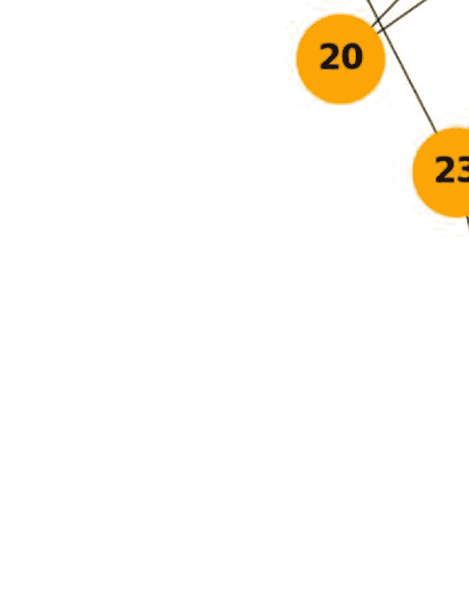
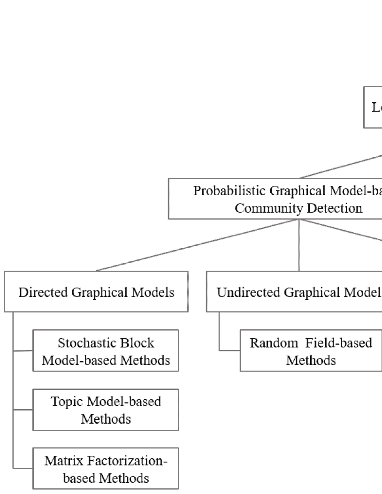

<!--yml

category: 未分类

日期：2024-09-06 19:57:35

-->

# [2101.01669] 《社区检测方法综述：从统计建模到深度学习》

> 来源：[`ar5iv.labs.arxiv.org/html/2101.01669`](https://ar5iv.labs.arxiv.org/html/2101.01669)

# 《社区检测方法综述：从统计建模到深度学习》

丁金、于智智、焦鹏飞、潘士锐、何东霄、吴佳，

Philip S. Yu 和 Weixiong Zhang 丁金、于智智、焦鹏飞和何东霄均为中国天津大学的成员。潘士锐为澳大利亚蒙纳士大学的成员。吴佳为澳大利亚麦考瑞大学的成员。于 Philip S. Yu 为美国伊利诺伊大学芝加哥分校的成员。张维雄为美国华盛顿大学的成员。通讯作者：焦鹏飞。

###### 摘要

社区检测作为网络分析的基本任务，旨在将网络划分为多个子结构，以帮助揭示其潜在功能。社区检测已经在许多实际网络问题中得到了广泛研究和应用。传统的社区检测方法通常利用概率图模型，并采用各种先验知识来推断社区结构。随着网络方法尝试解决的问题以及待分析的网络数据变得越来越复杂，新的方法也不断提出和发展，特别是那些利用深度学习并将网络数据转换为低维表示的方法。尽管近期已有诸多进展，但对社区检测的理论和方法基础仍缺乏深入的理解，这对未来网络分析领域的发展至关重要。本文提出并展示了一种统一的网络社区发现方法架构，以描述社区检测领域的最新状态。具体而言，我们提供了对现有社区检测方法的全面回顾，并引入了一种新的分类方法，将现有方法分为两类，即概率图模型和深度学习。然后，我们详细讨论了这两类方法背后的主要思想。此外，为了促进社区检测的未来发展，我们发布了来自多个问题领域的若干基准数据集，并强调了它们在各种网络分析任务中的应用。最后，我们讨论了该领域面临的挑战，并提出了未来研究的可能方向。

###### Index Terms:

复杂网络、社区检测、图聚类、统计建模、深度学习。^†^†publicationid: pubid: xxxx-xxxx/0x/$xx.00 © 200x IEEE   由 IEEE 计算机学会出版

## 1 引言

网络科学是使用计算机科学、数学和物理学的理论和技术研究以网络形式存在的复杂系统。特别是网络结构 [1]（参见图 1）已经在子图、网络模块和社区的概念下进行了广泛研究。网络结构的识别或社区检测旨在将网络中的节点分组，使得同一组中的节点连接密集，而不同组中的节点连接稀疏。挖掘网络结构也是揭示和理解复杂网络系统组织原则和运行功能的关键。例如，社区检测已经应用于推荐 [2、3]、异常检测 [4、5] 和恐怖组织识别 [6] 等。

图 1: 一个示例（扎卡里斯的空手道俱乐部网络 [7]）展示了社区结构。该网络的节点被分为两组，大多数连接都发生在组内，仅有少数连接发生在组间。

许多努力也投入到了网络结构属性的分析中，例如，小世界效应（即，节点之间的平均距离很短 [8]）和无标度特性（即，节点度的分布遵循幂律分布 [9]）。

许多社区检测算法已经被提出，其中大多数仅使用网络拓扑信息。这些算法包括层次聚类 [10] [11]、模块化优化 [12] [13] [14]、谱聚类 [15] [16] 和统计推断 [17] [18]。新的方法发展出利用节点语义或节点属性，除了网络拓扑之外，以提高最终社区的质量，同时对结果提供解释。这些方法包括启发式优化（多目标） [19] [20]、矩阵分解 [21] [22] 和贝叶斯模型 [23]。随着对更复杂网络问题的解决，需要有效整合来自多个来源的复杂网络数据，例如网络拓扑和节点语义。因此，这些传统方法在处理高维和多样化数据时，难以有效进行数据融合。最近，深度学习技术被采用来处理高维网络数据，并学习网络结构的低维表示。例如，基于自编码器 [24] [25] 和生成对抗方法 [26] [27] 的方法被探索。

社区检测的一个重要且有效的想法是学习给定网络的网络结构的适当表示。我们称这些方法为基于学习的社区检测。这些方法中包括模型基的生成模型。最受欢迎和具有代表性的例子是随机块模型（SBM） [28]，它通过将网络的生成过程形式化为一系列严格的概率分布来检测社区。已经介绍了几种扩展和改进，以提高 SBM 的性能 [29] [30]。另一种基于模型的学习方法采用马尔可夫随机场（MRF），这是一种无向图模型，用来利用网络中的邻域结构 [31]。基于学习的方法的一个主要近期发展利用了深度学习的低维表示能力。例如，卷积神经网络（CNN） [32] 利用卷积和池化操作来降低网络数据的维度，从而有效地发现网络中的社区。图卷积网络（GCN） [33]，继承了 CNN 的优势，并直接在网络结构化数据上操作，也被探索用于衍生社区表示 [34]。

尽管在社区检测方法的开发上已经付出了巨大的努力[35, 36]，但对社区检测的理论和方法基础，特别是基于学习的社区检测，仍缺乏深入的理解。为弥补这一空白，本文将提供现有代表性方法的综合综述。我们特别关注两种通用方法，一种基于概率建模，另一种基于深度学习。我们首先详细描述每种方法，并对这些方法进行全面的评估和比较。随后，我们考虑社区检测在不同领域的若干应用。最后，我们讨论网络分析领域的一些关键挑战及未来值得研究的方向。

我们调查的主要目标之一是提供对现有方法的新视角，以帮助更好地理解社区检测的基本问题和技术支持。我们的调查在三个方面不同于已发表的综述。首先，我们通过关注学习这一社区建模和社区检测的核心问题，总结了现有的方法，而现有的综述[37] [38]通常讨论的是现有方法的时间发展。第二，我们展示了社区检测方法发展的最新趋势，即从统计建模到深度学习，而其他综述主要集中在个别技术上，如进化计算[39]、统计推断[40]或深度学习[41]。第三，我们展示了一个统一的系统架构来表征现有的方法，这提供了一个新颖和综合的视角来理解基于统计建模和深度学习的方法，这远远超出了现有的一些综述[42] [43]。最后但同样重要的是，在深度学习时代，随着网络数据变得越来越复杂以及各种思想和技术的提出，急需一项综述来全面解开现有社区检测方法之间的内在关系。

为了为对网络科学和网络数据分析感兴趣的研究人员和从业者提供一般性的指导，我们在这项工作中做出了以下独特贡献：

+   •

    我们呈现了关于基于学习的社区检测的最全面和广泛的概述，并将其分为两类：概率图模型和深度学习。据我们所知，这是首次从学习的角度致力于社区检测的尝试。它为理解社区检测的直觉提供了坚实的基础，并可以作为设计和使用不同社区检测方法的指南。

+   •

    我们对基于学习的社区检测方法进行了深入的理论分析，讨论了它们的相似性和差异，识别了仍然未得到充分解决的关键挑战，并指出了五个未来发展的方向。

+   •

    我们收集了关于基于学习的社区检测的大量资源，包括最先进的基准数据集和应用。

本调查论文的其余部分组织如下。第二部分给出了现有社区检测方法的基础知识和分类。第三部分介绍了社区检测中统计建模研究进展的技术概述。第四部分概述了基于深度学习的社区检测研究。第五部分讨论了社区检测的应用。我们在第六部分中提出了有前景的未来研究方向，并在第七部分中总结。

## 2 基础知识和分类

我们首先介绍术语和符号，然后呈现本文讨论的社区检测方法的分类。

### 2.1 定义、术语和符号

图 2：社区检测方法的分类细目。

*定义 1.* 网络。网络 $G=(V,E,X)$ 由 $n$ 个节点 $V=\left\{v_{1},v_{2},\ldots,v_{n}\right\}$，$m$ 条边 $E=\{e_{ij}\}\subseteq V\times V$ 和节点 $v_{i}$ 上的最大属性数 $q$ 组成，其中所有 $x_{i}$ 共同形成一个 $n\times q$ 的属性矩阵 $X=(x_{i})_{n\times q}$。$G$ 的拓扑结构可以通过一个 $n\times n$ 的邻接矩阵 $A=(a_{ij})_{n\times n}$ 来定义，其中 $a_{ij}=1$ 如果 ${e_{ij}}\in E$，否则为 0。如果 $a_{ij}=a_{ji}$，则 $G$ 是无向的，否则是有向的 [42]。

*定义 2.* 社区。网络 $G$ 包含 $k$ 个社区 $\mathcal{C}={\left\{\mathcal{C}_{1},\mathcal{C}_{2},\ldots,\mathcal{C}_{k}\right\}}$，其中 $\mathcal{C}_{i}$ 是 $G$ 的一个子图，且 $\mathcal{C}_{i}$ 内的节点密集连接，而 $\mathcal{C}_{i}$ 与 $\mathcal{C}_{j}$ 之间的节点则稀疏连接。当 $\mathcal{C}_{i}\cap\mathcal{C}_{j}=\emptyset\,\,{\forall i,j}$ 时，社区是互不重叠的。

*定义 3.* 社区检测。给定网络 $G$，社区检测的目标是设计一个映射 $\mathcal{F}$，将 $G$ 的每个节点 $v_{i}$ 分配到 $k$ 个社区中的至少一个，即标记 $v_{i}$ 至少一个社区身份 $c_{i}\in{\left\{\mathcal{C}_{1},\mathcal{C}_{2},\ldots,\mathcal{C}_{k}\right\}}$。等价地，问题是推导节点的社区分配 $C=(c_{1},c_{2},\ldots,c_{n})$。

### 2.2 社区检测方法的分类

为了更好地理解现有的基于学习的方法，并促进我们在论文其余部分的讨论，我们引入了一个社区检测方法的分类（见图 2），其中这些方法被分为两类：概率图模型和深度学习。

基于概率图模型的方法利用启发式或元启发式算法进行社区生成，以发现网络社区。这些方法通常采用某些网络结构模型，通过网络的边缘描述实体（即节点）之间的依赖关系。根据使用的概率图模型类型，社区检测可以进一步分为三大类：有向图模型、无向图模型和混合图模型。具体来说，有向图模型主要基于隐变量（即样本中未观察到的变量），利用节点或块结构的相似性来生成网络中的观察边缘；无向图模型通常基于场结构，利用一元和成对势（例如，邻近节点之间的社区标签一致性）来发现社区；混合图模型通常将这两种类型的模型转化为统一的因子图，以便在社区检测中利用两种模型的优点。

基于深度学习的方法旨在利用一种新的社区导向网络表示来识别社区结构。它通过一些学习策略将网络数据从原始输入空间映射到低维特征空间，具有低计算复杂性和高并行化能力的优势。根据使用的学习策略，深度学习方法分为四大类：基于自编码器的、基于生成对抗网络的、基于图卷积网络（GCN）的以及集成图卷积网络和无向图模型的。具体而言，基于自编码器的方法利用无监督自编码器，将网络编码为潜在空间中的低维表示，并从低维表示中重建网络及其社区结构。基于生成对抗网络的方法采用对抗学习的思想，通过生成器和判别器之间的对抗游戏来检测社区。基于图卷积网络的方法通过网络拓扑上的特征传播和聚合来提取社区。混合图模型的方法通过例如将马尔可夫随机场（MRF）层转换为 GCN，来集成图卷积网络和无向图模型，以利用这两种模型的优势。

## 3 基于概率图模型的社区检测

基于概率图模型的方法通常通过网络建模来检测社区，即使用图模型解释网络的生成过程。本节将重点介绍三种常见的方法：有向图模型、无向图模型和集成有向图和无向图的混合图模型。

### 3.1 有向图模型

我们将回顾有向图模型在社区检测中的最新发展，包括随机区块模型、主题模型和矩阵分解。这些方法具有扎实的理论基础和相当好的性能，并且已被广泛应用。

#### 3.1.1 基于随机区块模型的方法

随机块模型（SBM），作为一种有效的网络块结构生成模型，首次采用统计建模进行社区检测[28]。该方法通过节点成员似然函数以概率方式将网络中的节点分配到不同的社区（块结构），然后通过对似然函数进行推理逐步推断节点成员的概率，从而推导出网络中的隐藏社区。需要注意的是，社区检测有多个 SBM 变体，但它们的核心生成过程是相同的。基本生成过程可以分为两个步骤：第一步是迭代地为网络中的每个节点分配一个社区，第二步是计算或更新两个节点通过一条边连接的概率。

以社交网络为例，SBM 可以用来捕捉以社区分布为隐藏变量的概率生成过程。通过最大化节点社区成员的似然函数，可以重构这些社区。在这个社交网络中，节点被分成 $k$ 个不相交的社区，概率为 $\omega={\left\{\omega_{1},\ldots,\omega_{k}\right\}}$。假设有两个节点 $v_{i}$ 和 $v_{j}$ 分别属于两个社区 $\mathcal{C}_{r}$ 和 $\mathcal{C}_{s}$，由 $c_{ir}$ 和 $c_{js}$ 表示。节点 $v_{i}$ 和 $v_{j}$ 通过一条边连接的概率，即 $a_{ij}$ (0 或 1)，服从参数为 $\pi_{rs}$ 的伯努利分布。两个社区中节点之间的连接概率使得模型在处理各种类型的网络结构时具有灵活性[44]。网络生成分布可以定义为：

|  | $P(C\mid\omega)=\prod_{i=1}^{n}\operatorname{Multinomial}(c_{i};1,\omega)=\prod_{i=1}^{n}\prod_{r=1}^{k}\omega_{r}^{c_{ir}},$ |  | (1) |
| --- | --- | --- | --- |
|  | $\begin{split}P(A\mid C,\pi)&=\prod_{i<j}^{n}P(a_{ij}\mid c_{i},c_{j})=\prod_{i<j}^{n}\prod_{r,s}^{k}\operatorname{Bernoulli}(a_{ij}\mid\pi_{rs})^{c_{ir}c_{js}}\\ &=\prod_{i<j}^{n}\prod_{r,s}^{k}(\pi_{rs}^{a_{ij}}(1-\pi_{rs})^{(1-a_{ij})})^{c_{ir}c_{js}},\end{split}$ |  | (2) |

其中 $C=(c_{1},c_{2},\ldots,c_{n})$ 表示节点的社区分配，$\pi=(\pi_{rs})_{k\times k}$ 代表社区连接概率矩阵。那么，似然函数可以描述为：

|  | $\begin{split}P&(A,C\mid\omega,\pi)=P(A\mid C,\pi)P(C\mid\omega)\\ =&\prod_{i=1}^{n}\prod_{r=1}^{k}\omega_{r}^{c_{ir}}\times\prod_{i<j}^{n}\prod_{r,s}^{k}(\pi_{rs}^{a_{ij}}(1-\pi_{rs})^{(1-a_{ij})})^{c_{ir}c_{js}}.\end{split}$ |  | (3) |
| --- | --- | --- | --- |

基于似然函数，可以使用 Gibbs 采样和期望最大化（EM）算法来获取模型参数，例如，$\omega$ 和 $\pi$。最终，我们可以通过社区间的交互模型推导社区划分。基本 SBM 的时间复杂度为 $O({n^{2}}{k^{2}})$，基于 SBM 的社区检测过程在附录 B 中展示 [28]。基本 SBM 的生成过程也可能采用泊松分布 [45]。

此后，张 *et al*. [46] 研究了基本 SBM 中的隐类推断问题。他们对三种推断方法，即启发式谱方法、均值场近似和置信传播，在合成网络上进行了比较研究。

混合成员 SBM。由于基本 SBM 仅适用于假设一个节点仅属于一个社区的情况，Airoldi *et al*. [29] 提出了一个混合成员随机块模型（MMSB），它在随机模型中引入了混合成员，使得一个节点可以属于多个社区。MMSB 允许社区在有向网络上重叠，其中 $a_{i\rightarrow j}$ 表示从节点 $v_{i}$ 到 $v_{j}$ 是否存在连接（箭头）。对于每个节点 $v_{i}$，$c_{i}$ 遵循多项分布。如果 $v_{i}\in\mathcal{C}_{r}$ 且 $v_{j}\in\mathcal{C}_{s}$，则社区连接概率 $\pi_{rs}$ 服从 Beta 分布，$a_{i\rightarrow j}\sim\operatorname{Multinomial}(\omega_{i})$，$a_{i\leftarrow j}\sim\operatorname{Multinomial}(\omega_{j})$，其中 $\omega$ 是节点的混合成员参数。社区之间的连接由伯努利分布表示。MMSB 的联合分布可以被表示为：

|  | $\begin{split}&amp;P(A,\pi,\omega,a_{i\rightarrow j},a_{i\leftarrow j}&#124;\alpha,\beta)=\prod_{i}P(\omega_{i}&#124;\alpha)\times\\ &amp;P(\pi&#124;\beta)\prod_{i,j}P(a_{i\rightarrow j}&#124;\omega_{i})P(a_{i\leftarrow j}&#124;\omega_{j})P(a_{ij}&#124;a_{i\rightarrow j},a_{i\leftarrow j},\pi).\end{split}$ |  | (4) |
| --- | --- | --- | --- |

MMSB 的时间复杂度为 $O({n^{2}}k)$，基于 MMSB 的社区检测过程在附录 B 中描述 [29]，假设参数是通过诸如 EM 等推断方法估计的。

原始的 MMSB 不擅长处理社区中节点的多样化信息，例如，这些节点可能代表基于不同社交关系相互连接的人。为了解决这个问题，Fan *et al*.[47] 提出了一种基于 MMSB 的新方法，称为 Copula 混合会员随机块模型（cMMSB），将 Copula 函数引入 MMSB 以建模节点之间的依赖关系。此外，Miller *et al.* [48] 通过将 Dirichlet 过程混合物引入有限混合物（MFMs）来改进 MMSB 的推断。Pal *et al.* [49] 提出了一个混合会员度修正的 SBM，并开发了一种通过马尔科夫链蒙特卡罗（MCMC）进行后验分布推断的方法，以提升 MMSB 的嵌入性能。度修正的 SBM 被广泛使用，我们接下来将讨论这一点。

表 I：基于 SBM 的社区检测总结，其中”AD $k$”描述方法是否可以自动确定社区数量，即，是否。

| 类别 | 方法 | 概述 | 重叠 | AD $k$ |
| --- | --- | --- | --- | --- |
| 基本 | SBM (1983) [28] | 提出一个社交网络的随机模型。 | 否 | 否 |
| MMSB | MMSB (2008) [29] | 扩展块模型以捕捉混合会员潜在关系结构。 | 是 | 否 |
|  | cMMSB (2016)[47] | 将个体 Copula 函数与 MMSB 结合，改进了对群体互动的捕捉能力。 | 是 | 否 |
|  | MMDCB (2019)[49] | 提出一种混合会员度修正的 SBM，并开发了一种通过马尔科夫链蒙特卡罗（MCMC）进行后验分布推断的方法。 | 是 | 否 |
| DCSBM | DCSBM (2012)[50] | 引入期望值到基本 SBM，以适应社交网络中包含的多重边和自边。 | 是 | 否 |
|  | sparseDCSBM (2017)[51] | 提出基于 DCSBM 的归一化邻接矩阵的谱聚类算法。 | 否 | 是 |
|  | CMM (2018)[52] | 建立一种凸优化模块化最大化方法，用于基于 DCSBM 估计隐藏社区。 | 否 | 否 |
|  | NCV (2018)[53] | 提供一种网络交叉验证方法来基于 DCSBM 确定隐藏社区。 | 否 | 否 |
| DynSBM | dMMSB (2009)[54] | 提出一种状态空间 MMSB，可以跟踪时间上的动态演变。 | 是 | 否 |
|  | DynamicSBM (2010)[55] | 提出一种新颖的贝叶斯方法用于网络层析推断，基于 MMSB 并应用于动态网络。 | 否 | 否 |
|  | DSBM (2011)[56] | 通过建模社区成员资格的转变来捕捉社区的演变。 | 否 | 否 |
|  | DBTDP (2014)[57] | 提出一种动态随机块模型，结合时间 Dirichlet 过程用于隐藏社区。 | 是 | 否 |
|  | SBTM (2015)[58] | 提供一个局部搜索算法用于时间演变的推断过程。 | 否 | 否 |
|  | dDCSBM (2016)[59] | 提出一种动态 DCSBM 来建模和监控经历重大结构变化的动态网络。 | 否 | 是 |
|  | DPSBM (2019)[60] | 建立一个完全贝叶斯生成模型以处理节点度的异质性。 | 否 | 是 |
|  | SNR-DSBM/ER (2020)[61] | 重点估计动态随机区块模型中单个变化点的位置，并采取最小二乘准则函数来评估每个时间点。 | 否 | 是 |
| OSBM | OSBM (2011)[62] | 提供一种全局和局部变分技术用于发现社区。 | 是 | 否 |
|  | K-LAFTER (2018)[63] | 提出一种基于小方差渐近的 SBM 用于重叠社区检测。 | 是 | 是 |
|  | MNPAOCD (2020)[64] | 优化推断过程并期望参数在进行中。 | 是 | 是 |
| LSBM | LMBP (2015)[18] | 将异质分布与 SBM 结合，连接社区检测。 | 是 | 是 |
| GNNSBM | DGLRFM (2019)[65] | 设计一个基于 GNN 的重叠 SBM 框架，并可以很容易地适应其他类型的 SBM。 | 是 | 是 |

程度修正 SBM。**Newman** *等* [30] 理论认为基本 SBM 根据节点的度来划分节点，而这些度通常是非均匀分布的。为了适应可能的广泛度分布，他们提出了度修正 SBM（DCSBM），引入了一个度参数到每个节点，以调整边缘概率，并使期望度与观察到的度匹配。网络 $G$ 的概率函数定义如下：

|  | <math   alttext="\begin{split}P(G&#124;\pi,c)&amp;=\prod_{i<j}\frac{(\pi_{c_{i}c_{j}})^{a_{ij}}}{a_{ij}!}\operatorname{exp}(-\pi_{c_{i}c_{j}})\\ &amp;\times\prod_{i}\frac{(\frac{1}{2}\pi_{c_{i}c_{i}})^{a_{ii}/2}}{(a_{ii}/2)!}\operatorname{exp}(-\frac{1}{2}\pi_{c_{i}c_{i}}),\\

\end{split}" display="block"><semantics ><mtable columnspacing="0pt" displaystyle="true" rowspacing="0pt" ><mtr ><mtd columnalign="right" ><mrow ><mi >P</mi><mo lspace="0em" rspace="0em"  >​</mo><mrow ><mo stretchy="false" >(</mo><mrow ><mi >G</mi><mo fence="false" >&#124;</mo><mrow ><mi >π</mi><mo >,</mo><mi  >c</mi></mrow></mrow><mo stretchy="false"  >)</mo></mrow></mrow></mtd><mtd columnalign="left" ><mrow ><mo rspace="0.111em"  >=</mo><mrow ><munder ><mo movablelimits="false"  >∏</mo><mrow ><mi >i</mi><mo ><</mo><mi >j</mi></mrow></munder><mrow ><mfrac ><msup ><mrow ><mo stretchy="false" >(</mo><msub ><mi >π</mi><mrow ><msub ><mi >c</mi><mi >i</mi></msub><mo lspace="0em" rspace="0em"  >​</mo><msub ><mi >c</mi><mi >j</mi></msub></mrow></msub><mo stretchy="false"  >)</mo></mrow><msub ><mi >a</mi><mrow ><mi >i</mi><mo lspace="0em" rspace="0em"  >​</mo><mi >j</mi></mrow></msub></msup><mrow ><msub ><mi >a</mi><mrow ><mi >i</mi><mo lspace="0em" rspace="0em" >​</mo><mi >j</mi></mrow></msub><mo >!</mo></mrow></mfrac><mo lspace="0.167em" rspace="0em"  >​</mo><mrow ><mi  >exp</mi><mo >⁡</mo><mrow ><mo stretchy="false" >(</mo><mrow ><mo >−</mo><msub ><mi >π</mi><mrow ><msub ><mi >c</mi><mi >i</mi></msub><mo lspace="0em" rspace="0em" >​</mo><msub ><mi >c</mi><mi >j</mi></msub></mrow></msub></mrow><mo stretchy="false"  >)</mo></mrow></mrow></mrow></mrow></mrow></mtd></mtr><mtr ><mtd  columnalign="left" ><mrow ><mo rspace="0.055em" >×</mo><munder ><mo movablelimits="false"  >∏</mo><mi >i</mi></munder><mfrac ><msup ><mrow ><mo stretchy="false" >(</mo><mrow ><mfrac ><mn >1</mn><mn >2</mn></mfrac><mo lspace="0em" rspace="0em"  >​</mo><msub ><mi >π</mi><mrow ><msub ><mi >c</mi><mi >i</mi></msub><mo lspace="0em" rspace="0em"  >​</mo><msub ><mi >c</mi><mi >i</mi></msub></mrow></msub></mrow><mo stretchy="false"  >)</mo></mrow><mrow ><msub ><mi >a</mi><mrow ><mi >i</mi><mo lspace="0em" rspace="0em"  >​</mo><mi >i</mi></mrow></msub><mo >/</mo><mn >2</mn></mrow></msup><mrow ><mrow ><mo stretchy="false" >(</mo><mrow ><msub ><mi >a</mi><mrow ><mi >i</mi><mo lspace="0em" rspace="0em" >​</mo><mi >i</mi></mrow></msub><mo >/</mo><mn >2</mn></mrow><mo stretchy="false"  >)</mo></mrow><mo >!</mo></mrow></mfrac><mi >exp</mi><mrow ><mo stretchy="false" >(</mo><mo lspace="0em" >−</mo><mfrac ><mn  >1</mn><mn >2</mn></mfrac><msub ><mi  >π</mi><mrow ><msub ><mi >c</mi><mi >i</mi></msub><mo lspace="0em" rspace="0em"  >​</mo><msub ><mi >c</mi><mi >i</mi></msub></mrow></msub><mo stretchy="false"  >)</mo></mrow><mo >,</mo></mrow></mtd></mtr></mtable><annotation-xml encoding="MathML-Content" ><apply ><apply  ><ci >𝑃</ci><apply ><csymbol cd="latexml" >conditional</csymbol><ci >𝐺</ci><list ><ci  >𝜋</ci><ci >𝑐</ci></list></apply></apply><apply ><apply ><csymbol cd="ambiguous" >subscript</csymbol><csymbol cd="latexml" >product</csymbol><apply ><ci  >𝑖</ci><ci >𝑗</ci></apply></apply><apply ><apply ><apply  ><apply ><csymbol cd="ambiguous"  >superscript</csymbol><apply ><csymbol cd="ambiguous"  >subscript</csymbol><ci >𝜋</ci><apply ><apply ><csymbol cd="ambiguous"  >subscript</csymbol><ci >𝑐</ci><ci >𝑖</ci></apply><apply ><csymbol cd="ambiguous"  >subscript</csymbol><ci >𝑐</ci><ci >𝑗</ci></apply></apply></apply><apply ><csymbol cd="ambiguous"  >subscript</csymbol><ci >𝑎</ci><apply ><ci >𝑖</ci><ci >𝑗</ci></apply></apply></apply><apply ><apply ><csymbol cd="ambiguous"  >subscript</csymbol><ci >𝑎</ci><apply ><ci >𝑖</ci><ci >𝑗</ci></apply></apply></apply></apply><apply ><ci >exp</ci><apply ><apply ><csymbol cd="ambiguous"  >subscript</csymbol><ci >𝜋</ci><apply ><apply ><csymbol cd="ambiguous"  >subscript</csymbol><ci >𝑐</ci><ci >𝑖</ci></apply><apply ><csymbol cd="ambiguous"  >subscript</csymbol><ci >𝑐</ci><ci >𝑗</ci></apply></apply></apply></apply></apply></apply><apply ><apply ><csymbol cd="ambiguous"  >subscript</csymbol><csymbol cd="latexml"  >product</csymbol><ci >𝑖</ci></apply><apply ><apply ><apply ><csymbol cd="ambiguous" >superscript</csymbol><apply ><apply ><cn type="integer" >1</cn><cn type="integer" >2</cn></apply><apply ><csymbol cd="ambiguous" >subscript</csymbol><ci >𝜋</ci><apply ><apply ><csymbol cd="ambiguous" >subscript</csymbol><ci >𝑐</ci><ci >𝑖</ci></apply><apply ><csymbol cd="ambiguous" >subscript</csymbol><ci >𝑐</ci><ci >𝑖</ci></apply></apply></apply></apply><apply ><apply ><csymbol cd="ambiguous"  >subscript</csymbol><ci >𝑎</ci><apply ><ci >𝑖</ci><ci >𝑖</ci></apply></apply><cn type="integer"  >2</cn></apply></apply><apply ><apply ><apply ><csymbol cd="ambiguous" >subscript</csymbol><ci >𝑎</ci><apply ><ci >𝑖</ci><ci >𝑖</ci></apply></apply><cn type="integer" >2</cn></apply></apply></apply><apply ><ci >exp</ci><apply ><apply ><apply ><cn type="integer" >1</cn><cn type="integer"  >2</cn></apply><apply ><csymbol cd="ambiguous"  >subscript</csymbol><ci >𝜋</ci><apply ><apply ><csymbol cd="ambiguous"  >subscript</csymbol><ci >𝑐</ci><ci >𝑖</ci></apply><apply ><csymbol cd="ambiguous"  >subscript</csymbol><ci >𝑐</ci><ci >𝑖</

其中 $\pi_{c_{i}c_{j}}$ 是邻接矩阵元素 $a_{ij}$ 的期望值。

DCSBM 模型还有几个变体。Gulikers *et al*. [51] 提出了一个改进的 DCSBM，该模型适用于稀疏网络。其他一些不同的努力方向是通过模型推断改进和扩展 DCSBM。Chen *et al*. [52] 提出了一个凸化的模块性最大化方法，用于在 DCSBM 下估计隐藏社区。Chen *et al*. [53] 提供了一种基于块级节点对拆分的网络交叉验证 (NCV) 方法，以确定 DCSBM 的隐藏社区。

动态 SBM。与上述方法不同，基于 SBM 分析动态网络也是一个相对活跃的领域。Yang *et al*. [56] 提出了一个名为 DSBM 的动态随机块模型，该模型逐步更新概率模型以在大型动态稀疏网络中寻找社区。具体而言，DSBM 在预测中使用模型参数的分布而不是最可能的模型参数值，并提供了离线推断和在线推断来估计参数。DSBM 假设动态网络中的节点保持不变。令 $C_{T}=\{C^{(1)},C^{(2)},...,C^{(T)}\}$ 为所有节点在 $T$ 个离散时间步上的社区分配集合，模型的似然函数如下：

|  | $\begin{split}&amp;P(W^{(T)},C^{(T)}&#124;\omega,\pi,A)=\\ &amp;\prod_{t=1}^{T}P(W^{(t)}&#124;C^{(t)},\pi)\prod_{t=2}^{T}P(C^{(t)}&#124;C^{(t-1)},A)P(C^{(1)}&#124;\omega),\end{split}$ |  | (6) |
| --- | --- | --- | --- |

其中 $W^{(t)}$ 和 $C^{(t)}$ 表示在给定时间步 $t$ 的网络快照和节点的社区分配。DSBM 的时间复杂度是 $O(nT+mT+k^{2}T)$，其生成过程如附录 B [56] 所示，

根据 DSBM，Tang *等人*[57] 将 Dirichlet 过程引入 SBM，可以找到演化的最优社区数量，从而缓解动态社交网络中固定社区数量的问题。Xu *等人*[66] 提出了一个名为随机区块转移模型（SBTM）的新方法，该方法包括对动态网络的两个隐含马尔可夫假设。Wu *等人*[67] 提出了一个完整的贝叶斯生成模型，结合了节点度的异质性来建模动态复杂网络。Bhattacharjee *等人*[61] 通过动态社交网络中的变点估计优化了 SBM。受到 MMSB 成功的启发，提出了一些基于 MMSB 的动态 SBM。Xing *等人*[55] 提出了一个针对动态网络的变体 MMSB 模型。Fu *等人*[54] 设计了一种带有交叉时间的状态空间混合成员随机区块模型。此外，还有基于 DCSBM 的方法。Wilson *等人*[59] 提出了 DCSBM 的动态版本，以建模和监控经历显著结构变化的动态网络。

其他。除了上述方法，还有几种对基本 SBM 的扩展，其中社区可以重叠，如表 2 所总结。例如，OSBM 表示旨在找到重叠社区的 SBM，而 LSBM 表示扩展到发现链接社区的 SBM。具体来说，Latouche *等人* 引入了带有全局和局部变分技术的 OSBM。Jin *等人*[64] 提供了一种随机模型，以适应每个社区中每个节点的相对重要性和期望度，并改进了所使用的推断技术。

链接社区通常比节点社区更具信息量和直观性，因为链接通常具有唯一的身份，而节点可能有多个角色。例如，在社交网络中，大多数个体属于多个社区，如家庭或朋友，而两个个体之间的链接通常存在一个主要原因，可能代表家庭关系或友谊。此外，多个链接连接到一个节点可能属于不同的链接社区，因此节点可以被分配到多个链接社区。He *等人*[18] 将社区大小的异质分布（例如，幂律分布）与 SBM 结合，用于链接社区检测。他们建议了一种链接社区的随机模型，并通过引入交互式二分方案扩展了该模型。除了上述模型外，Mehta *等人*[65] 将图神经网络引入 SBM，这是第一次将深度学习与 SBM 相结合。

#### 3.1.2 基于主题模型的方法

主题模型，如潜在狄利克雷分配（LDA）[68]，是一种统计模型，能够对自然语言处理中的文本隐藏主题进行建模。LDA 通过采用潜在变量来建模主题，这引起了广泛的兴趣，并在检测社区中得到了广泛应用。主题模型可以分为两类：一种是将网络结构建模为文档，另一种是建模网络属性，如用户兴趣，以检测社区。

将网络结构建模为文档。我们以 LDA 为例来描述第一类方法的原理。具体而言，这类方法首先假设网络中的每个节点可能属于多个社区，因此社区被视为“主题”，而节点被视为“文档”。然后选择几个初始社区，并根据网络的拓扑结构迭代更新社区，以获得最终的社区。在现有方法中，一个代表性模型是 SSN-LDA [69]，这是一种基于 LDA 的层次贝叶斯算法，在链接网络上，社区被建模为潜在变量。在这种社交网络中，节点被视为社交演员，边被视为社交互动。每个社交演员的社交互动特征（SIP），由一组邻居和权重组成，用于描述演员。具体来说，在 SSN-LDA 中，社交网络被视为一个语料库，其中社交互动特征被视为文档，社交互动的发生被视为单词。节点被 SSN-LDA 建模为语料库，SSN-LDA 在转化后的语料库上挖掘社区，这个问题等同于在语料库上使用 LDA 进行主题检测。SSN-LDA 对一个社交互动特征$(SIP_{i})$的生成过程在附录 C 中进行了说明[69]，其联合分布表示为：

|  | $\begin{split}P(a_{i},c_{i},\vec{\theta_{i}},\vec{\phi}&#124;\vec{\alpha},\vec{\beta})=\prod_{j=1}^{N_{i}}P(a_{ij}&#124;\vec{\phi_{c_{i}}})P(c_{i}&#124;\vec{\theta_{i}})P(\vec{\theta_{i}}&#124;\vec{\alpha})P(\vec{\phi}&#124;\vec{\beta}),\end{split}$ |  | (7) |
| --- | --- | --- | --- |

其中 $\vec{\phi}$ 是社区 $c_{i}$ 的混合成分，$N_{i}$ 是社交互动特征 ($SIP_{i}$) 中社交互动的数量，$\vec{\theta_{i}}$ 是 $SIP_{i}$ 的社区混合比例，$\vec{\alpha}$ 和 $\vec{\beta}$ 是已知的狄利克雷先验分布超参数。SSN-LDA 的时间复杂度为 $O(mk)$。

使用社交网络属性。许多主题模型利用社交网络的属性，例如用户兴趣，以发现社区。Yin *等* [70] 提出了将社区检测和主题模型结合起来的方法，从而产生了潜在社区主题分析（LCTA）。他们的方法将采样过程分为用户节点采样和链接采样两个阶段。该过程是在采样用户节点后对所有网络连接进行采样，并利用这两个阶段的采样结果作为用户节点的采样结果。LCTA 将社区成员属性分配给每个用户节点和链接。采样过程结束后，可以根据社区成员资格将用户节点分配到社区中。其优点是，两阶段采样过程形成了以用户节点为核心的采样区域，这可以模拟用户节点对周围链接的语义影响。缺点是 LCTA 在假设社区成员程度时未考虑社交网络的链接关系，这可能会导致个别社区断裂。此外，Cha *等* [71] 根据社交网络中关注者的主题信息设计了一个树状关系模型，使用层次 LDA 对树状关系模型中的文本信息进行建模，并提出了 HLDA 用于语义社交网络分析。

Xu *等* [72] 最近提出了一种将主题模型与贝叶斯模型结合的方法。他们为所有可能的属性网络定义了一个联合概率分布。对于给定的需要进行聚类的属性社交网络，该模型为每个可能的节点聚类分配一个概率。因此，聚类问题可以转化为寻找具有最高概率的聚类的问题。聚类属性社区的算法见附录 C [72]。用于聚类属性网络的贝叶斯概率模型如下：

|  | $\begin{split}&amp;P(\alpha,\theta,\phi,A,X,C&#124;\varepsilon,\lambda,\mu,\nu)\\ &amp;=P(\alpha&#124;\varepsilon)P(\theta&#124;\lambda)P(\phi&#124;\mu,\nu)P(C&#124;\alpha)P(A&#124;C,\phi)P(X&#124;C,\theta),\end{split}$ |  | (8) |
| --- | --- | --- | --- |

其中 $\alpha$ 表示节点属于不同社区的概率，$\theta$ 表示节点的属性概率分布，$\phi$ 表示社区之间的边出现概率，$\varepsilon$ 和 $\lambda$ 是 Dirichlet 先验分布的超参数，$\mu$ 和 $\nu$ 是 Beta 先验分布的超参数。

随后，**He** *等人* [73] 引入了一个生成模型，用于同时识别社区并推导其语义描述。他们将嵌套 EM 算法与置信传播相结合，探索两部分之间的隐含相关性，以改进最终的社区和描述。**Jin** *等人* [74] 观察到属性通常体现出层次化的语义结构。为此，他们提出了一种新颖的贝叶斯模型 BTLSC，用于区分背景词与普通词以及专业话题。

与假设社交网络中的话题是独立的传统主题模型不同，主题嵌入方法通过将词语和主题嵌入到主题模型中，专注于描述话题之间的相关性。**He** *等人* [75] 提出了一个将分布式表示学习与话题相关建模相结合的主题嵌入模型。**Jin** *等人* [76] 开发了一种新颖的主题嵌入模型，称为社区增强主题嵌入（CeTe），它结合了主题文档和网络结构来检测社区。CeTe 包含三个组成部分：用于描述话题的文档组件、用于表示网络社区的拓扑组件以及连接前两个部分的概率过渡机制。具体来说，CeTe 使用 DCSBM 描述网络社区的子组件，其中社区服从 Dirichlet 分布，而话题服从 Uniform 分布。对于每个文档，社区分配从 Multinomial 分布中抽取，而两个文档之间的链接服从 Bernoulli 分布。对于每个词语，CeTe 从 Multinomial 分布中抽取主题分布。

#### 3.1.3 基于矩阵分解的方法

非负矩阵分解（NMF）[77] 是另一种用于社区检测的有向图模型。具体而言，NMF 基于的方法假设网络中存在 $k$ 个社区，并将邻接矩阵 $A=(a_{ij})_{n\times n}\in\mathbb{R}_{+}$ 视为需要分解的非负矩阵，其中 $a_{ij}$ 表示节点 $v_{i}$ 和 $v_{j}$ 之间存在连接的可能性。我们定义 $\mathcal{W}=(w_{ir})_{n\times k}\in\mathbb{R}_{+}$ 和 $\mathcal{H}=(h_{jr})_{n\times k}\in\mathbb{R}_{+}$，其元素 $w_{ir}$ 和 $h_{jr}$ 表示 $v_{i}$ 生成外边（即从 $v_{i}$ 开始的边）和 $v_{j}$ 生成内边（即以 $v_{j}$ 结束的边）属于第 $r$ 个社区的可能性。然后，节点 $v_{i}$ 和 $v_{j}$ 之间的连接可能性可以描述为：

|  | $\widetilde{a_{ij}}=\sum_{r=1}^{k}w_{ir}h_{jr}^{T}.$ |  | (9) |
| --- | --- | --- | --- |

因此，社区检测问题可以表示为 $\widetilde{A}=\mathcal{W}\mathcal{H}^{T}$。一般来说，有两种经典的损失函数来评估 NMF 的性能。一种是 $A$ 和 $\widetilde{A}$ 之间差异的 Frobenius 范数的平方[78]，另一种是度量它们差异的 KL 散度。

表 II: 基于 NMF 的社区检测总结，其中“AD $k$”描述了该方法是否可以自动确定社区的数量，即， 是或否。

| 类别 | 方法 | 综述 | 目标函数 | 重叠 | AD $k$ |
| --- | --- | --- | --- | --- | --- |
| 基础 | SymNMF (2012) [79] | 开发一个基于类似牛顿的方法的对称 NMF 框架，用于图聚类。 | $\left\|A-BB^{T}\right\|_{F}^{2}$ | 否 | 否 |
|  | PCSNMF (2015) [80] | 提出一种具有配对约束的对称 NMF 方法，这些约束来自真实社区信息。 | $\left\|A-BB^{T}\right\|_{F}^{2}$+ $\alpha[\operatorname{Tr}(B^{T}\mathcal{M}B\mathcal{Q})+\operatorname{Tr}(B^{T}\mathcal{P}B)]$ | 否 | 否 |
|  | NSED (2017) [81] | 提出一种非负对称编码器和解码器方法，以获得更好的网络表示。 | $\left\|A-\mathcal{W}\mathcal{H}\right\|_{F}^{2}+\left\|\mathcal{H}-\mathcal{W}^{T}A\right\|_{F}^{2}$ | 否 | 否 |
| 重叠 | SNMF, ANMF, JNMF (2011) [21] | 首次将 NMF 应用于社区检测。 | $\left\|A-BB^{T}\right\|_{F}^{2}$ | 是 | 否 |
|  | BIGCLAM (2013) [82] | 提出一种集群隶属模型，用于大规模网络中重叠和分层嵌套的社区检测。 | $\sum_{e_{ij}\in E}\log(1-\exp(-b_{i}b_{j}^{T}))$ $-\sum_{e_{ij}\notin E}b_{i}b_{j}^{T}$ | 是 | 是 |
| 属性 | NMTF (2015) [83] | 开发一个结合节点关系和用户内容的 NMF 聚类框架，以检测社区结构。 | $\left\|M_{u-u}-\mathcal{U}H_{1}\mathcal{U}^{T}\right\|_{F}^{2}$ $+\left\|M_{t-f}-\mathcal{V}H_{2}\mathcal{N}^{T}\right\|_{F}^{2}$ $+\left\|M_{u-f}-\mathcal{U}H_{3}\mathcal{N}^{T}\right\|_{F}^{2}$ | 否 | 否 |
|  | SCI (2016) [84] | 提出了一种语义社区识别方法，可以进行语义标注并检测社区。 | $\left\|B-XS\right\|_{F}^{2}$ $+\alpha\sum_{r=1}^{k}\left\|S\left(:,r\right)\right\|_{1}^{2}$ $+\beta\left\|A-BB^{T}\right\|_{F}^{2}$ | 否 | 否 |
| 动态 | DBNMF (2016) [85] | 提出一种基于 NMF 的贝叶斯概率模型，以识别时间网络中的重叠社区。 | $-\log P(V_{t}\mid B_{t})$ $-\log P(B_{t}\mid B^{{}^{\prime\prime}}_{t-1},\alpha)$ $-\log P(B_{t}\mid\beta_{t})-\log P(\beta_{i})$ | 是 | 是 |
|  | sE-NMF (2017) [86] | 开发了一个半监督的演化 NMF 框架，通过先验信息进行动态社区检测。 | $\left\|A_{t}-\tilde{B_{t}}\tilde{B_{t}}^{\prime}\right\|_{F}^{2}$ | 无 | 无 |
| 半监督 | USSF (2015) [87] | 提出了一种基于先验和拓扑信息组合的统一半监督社区检测算法，旨在 NMF。 | $\mathcal{L}_{\alpha}(A,B)+\lambda\mathcal{R}_{\beta}(O,B)$ | 无 | 无 |

此外，对于一个对称的无向网络，非负矩阵分解矩阵 $\mathcal{W}$ 和 $\mathcal{H}$ 应该相等。在本文中，我们用 $B$ 来表示这些矩阵，损失函数可以写作：

|  | $J=\min_{B\geq 0}\left\|A-BB^{T}\right\|_{F}^{2}.$ |  | (10) |
| --- | --- | --- | --- |

NMF 最初用于识别不重叠的社区。由于其易于扩展，NMF 已被采用于解决其他类型的社区检测问题，如重叠、属性、动态和半监督，如表 3 所总结。

基本 NMF。Kuang *et al*. [79] 提出了一种通用方法，通过对聚类分配矩阵施加非负性，继承了 NMF 的优点，用于图聚类。Shi *et al*. [80] 提出了一个新颖的成对约束非负对称矩阵分解（PCSNMF）方法，该方法施加从真实社区信息生成的成对约束，以提高社区检测的性能。Sun *et al*. [81] 设计了一种非负对称编码器-解码器方法，以推导出更好的潜在表示来改善社区检测。与其他仅关注解码器损失的 NMF 方法不同，他们结合了解码器和编码器的损失，以构建一个统一的损失函数，从而使每个节点获得的社区隶属关系更清晰、更具解释性。

重叠 NMF。由于现实世界网络的重叠和嵌套特性，重叠社区检测是另一个活跃的研究课题。Wang *et al* [21]开发了一个 NMF 框架来识别非重叠和重叠的社区结构，并为无向网络提供了一个对称 NMF 公式。此外，他们澄清了不对称 NMF 和联合 NMF 的方法，其中前者能够识别定向网络中的社区结构，而后者更适合复合网络（例如，包含用户网络、电影网络和用户-电影网络的自动电影推荐系统）。Yang *et al* [82] 提出了一个集群隶属模型 BIGCLAM，用于检测大规模网络中密集重叠、分层嵌套和非重叠的社区。具体而言，BIGCLAM 首先基于节点的社区隶属关系建立社区，即每个节点通过为节点-社区对分配一个非负的潜在因子，具有对每个社区的隶属强度，然后将 NMF 与块随机梯度下降结合，以估计非负潜在因子，从而在大型网络中检测社区。模型的损失函数定义为：

|  | $J=\sum_{e_{ij}\in E}\log(1-\exp(-b_{i}b_{j}^{T}))-\sum_{e_{ij}\notin E}b_{i}b_{j}^{T}.$ |  | (11) |
| --- | --- | --- | --- |

BIGCLAM 的时间复杂度是$O(n)$。

属性 NMF。最近，利用 NMF 对社区结构的语义信息引起了广泛关注，即在识别社区结构的同时描绘相应的社区语义信息[83, 84, 88]。特别是，Pei *et al* [83]结合了用户的社会关系和内容，通过基于非负矩阵三分解（NMTF）的三种图正则化聚类来检测社区。然而，上述方法仅利用网络拓扑和内容信息来发现社区，并未考虑如何利用挖掘到的内容，即语义信息，来解释社区的含义。为了解决这一问题，wang *et al* [84] 提出了一个称为 SCI 的语义社区识别方法，该方法将表示网络拓扑的社区成员矩阵和代表语义信息的社区属性矩阵整合在一起。模型的损失函数定义为：

|  | $\displaystyle\begin{split}\min_{B\geq 0,S\geq 0}J=&\left\|B-XS\right\|_{F}^{2}+\alpha\sum_{r=1}^{k}\left\|S\left(:,r\right)\right\|_{1}^{2}\\ &+\beta\left\|A-BB^{T}\right\|_{F}^{2},\end{split}$ |  | (12) |
| --- | --- | --- | --- |

其中 $S$ 代表属性社区矩阵，$\alpha$ 是第一个误差项和第二个稀疏性项之间的折衷超参数，$\beta$ 是设置网络拓扑贡献比例的正参数。SCI 的时间复杂度为 $O((nqk+n^{2}k))$，其中 $q$ 是节点属性的维度。

动态和半监督 NMF。值得进一步关注的是，近年来，几位研究人员在动态和半监督社区检测领域扩展了 NMF，并取得了令人鼓舞的结果。在动态社区检测方面，Wang *et al*. [85] 利用基于 NMF 的贝叶斯模型识别时间网络上的重叠社区，并根据自动相关性确定自动推导每个快照网络中的社区数量。损失函数如下：

|  | <math   alttext="\displaystyle\begin{split}J_{t}=&amp;-\log P(V_{t}&#124;B_{t})-\log P(B_{t}&#124;B^{{}^{\prime\prime}}_{t-1},\alpha)\\ &amp;-\log P(B_{t}&#124;\beta_{t})-\log P(\beta_{i}),\\

\end{split}" display="inline"><semantics ><mtable columnspacing="0pt" rowspacing="0pt" ><mtr ><mtd columnalign="right" ><mrow ><msub ><mi  >J</mi><mi >t</mi></msub><mo >=</mo></mrow></mtd><mtd columnalign="left" ><mrow ><mrow ><mo rspace="0.167em" >−</mo><mrow ><mrow ><mi  >log</mi><mo lspace="0.167em"  >⁡</mo><mi >P</mi></mrow><mo lspace="0em" rspace="0em"  >​</mo><mrow ><mo stretchy="false" >(</mo><mrow ><msub ><mi  >V</mi><mi >t</mi></msub><mo fence="false"  >&#124;</mo><msub ><mi >B</mi><mi >t</mi></msub></mrow><mo stretchy="false" >)</mo></mrow></mrow></mrow><mo >−</mo><mrow ><mrow ><mi >log</mi><mo lspace="0.167em"  >⁡</mo><mi >P</mi></mrow><mo lspace="0em" rspace="0em"  >​</mo><mrow ><mo stretchy="false" >(</mo><mrow ><msub ><mi >B</mi><mi >t</mi></msub><mo fence="false" >&#124;</mo><mrow ><msubsup ><mi >B</mi><mrow ><mi >t</mi><mo >−</mo><mn >1</mn></mrow><msup ><mo >′′</mo></msup></msubsup><mo >,</mo><mi  >α</mi></mrow></mrow><mo stretchy="false"  >)</mo></mrow></mrow></mrow></mtd></mtr><mtr ><mtd  columnalign="left" ><mrow ><mrow ><mrow ><mo rspace="0.167em" >−</mo><mrow ><mrow ><mi  >log</mi><mo lspace="0.167em"  >⁡</mo><mi >P</mi></mrow><mo lspace="0em" rspace="0em"  >​</mo><mrow ><mo stretchy="false" >(</mo><mrow ><msub ><mi >B</mi><mi >t</mi></msub><mo fence="false" >&#124;</mo><msub ><mi >β</mi><mi >t</mi></msub></mrow><mo stretchy="false" >)</mo></mrow></mrow></mrow><mo >−</mo><mrow ><mrow ><mi >log</mi><mo lspace="0.167em"  >⁡</mo><mi >P</mi></mrow><mo lspace="0em" rspace="0em"  >​</mo><mrow ><mo stretchy="false" >(</mo><msub ><mi >β</mi><mi >i</mi></msub><mo stretchy="false"  >)</mo></mrow></mrow></mrow><mo >,</mo></mrow></mtd></mtr></mtable><annotation-xml encoding="MathML-Content" ><apply ><apply  ><csymbol cd="ambiguous"  >subscript</csymbol><ci >𝐽</ci><ci >𝑡</ci></apply><apply ><apply  ><apply ><apply ><ci  >𝑃</ci></apply><apply ><csymbol cd="latexml"  >conditional</csymbol><apply ><csymbol cd="ambiguous"  >subscript</csymbol><ci >𝑉</ci><ci >𝑡</ci></apply><apply ><csymbol cd="ambiguous" >subscript</csymbol><ci >𝐵</ci><ci >𝑡</ci></apply></apply></apply></apply><apply ><apply ><ci  >𝑃</ci></apply><apply ><csymbol cd="latexml"  >conditional</csymbol><apply ><csymbol cd="ambiguous"  >subscript</csymbol><ci >𝐵</ci><ci >𝑡</ci></apply><list ><apply ><csymbol cd="ambiguous"  >subscript</csymbol><apply ><csymbol cd="ambiguous"  >superscript</csymbol><ci >𝐵</ci><apply ><ci >′′</ci></apply></apply><apply ><ci >𝑡</ci><cn type="integer"  >1</cn></apply></apply><ci >𝛼</ci></list></apply></apply><apply ><apply ><ci  >𝑃</ci></apply><apply ><csymbol cd="latexml"  >conditional</csymbol><apply ><csymbol cd="ambiguous"  >subscript</csymbol><ci >𝐵</ci><ci >𝑡</ci></apply><apply ><csymbol cd="ambiguous" >subscript</csymbol><ci >𝛽</ci><ci >𝑡</ci></apply></apply></apply><apply ><apply  ><ci >𝑃</ci></apply><apply ><csymbol cd="ambiguous"  >subscript</csymbol><ci >𝛽</ci><ci >𝑖</ci></apply></apply></apply></apply></annotation-xml><annotation encoding="application/x-tex" >\displaystyle\begin{split}J_{t}=&-\log P(V_{t}&#124;B_{t})-\log P(B_{t}&#124;B^{{}^{\prime\prime}}_{t-1},\alpha)\\ &-\log P(B_{t}&#124;\beta_{t})-\log P(\beta_{i}),\\ \end{split}</annotation></semantics></math> |  | (13) |

其中 $V_{t}$ 是时间网络的快照，$B_{t}$ 是通过 $V_{t}$ 获得的非负矩阵，$B^{{}^{\prime\prime}}_{t-1}$ 是根据 $B_{t}$ 的节点分布调整后的新 $B_{t-1}$。$\beta_{(\cdot)}$ 是一个来自半正态分布的参数，$\alpha$ 是一个参数，用于平衡当前和以前快照网络的聚类结果。后来，Ma *等人*[86] 证明了 NMF 可以通过澄清演化谱聚类、演化 NMF 和演化模块密度优化之间的等价关系来应用于动态社区检测。因此，他们利用上述等价关系开发了一种半监督演化 NMF 方法，称为 sE-NMF，用于结合先验信息在动态时间网络中检测社区。

表 III：基于 MRF 的社区检测总结。

| 类别 | 方法 | 画图 | 对象函数 |
| --- | --- | --- | --- |
| 拓扑 | NetMRF (2018) [31] | 首次将 MRF 应用于社区检测。 | $\sum\limits_{v_{i}\neq v_{j}}[-(-1)^{\delta(c_{i},c_{j})}(\frac{d_{i}d_{j}}{2m}-a_{ij})]$ |
|  | GMRF (2019) [89] | 通过将网络嵌入引入 MRF，优化网络嵌入并开发通用的 MRF 框架，以更好地检测社区结构。 | $\sum\limits_{v_{i}}\Theta_{i}(c_{i})+\sum\limits_{e_{ij}\in E}\Theta_{ij}(c_{i},c_{j})$ |
|  | ModMRF (2020) [90] | 提出了一种将模块度形式化为社区检测能量函数的 MRF 方法。 | $\sum\limits_{v_{i},v_{j}\in V}-(a_{ij}-\frac{d_{i}d_{j}}{2m})\delta(c_{i},c_{j})$ |
| 拓扑与属性 | attrMRF (2019) [91] | 提出了一种将 LDA 集成到 MRF 中的模型，以形成用于社区检测的端到端学习系统。 | $\sum\limits_{v_{i}\neq v_{j}}\Theta_{ij}(c_{i},c_{j};a_{ij})$ $-\sum\limits_{r=1}^{n}\frac{1}{\beta_{1}}\ln f_{\theta_{r}}-\sum\limits_{p=1}^{q}\frac{1}{\beta_{1}}\ln f_{\phi_{p}}$ |
| 结合 GNN | MRFasGCN (2019) [92] | 设计了一种基于 GCN 和 MRF 结合的新方法，用于半监督社区检测。 | $-\sum\limits_{i=1}^{n^{\prime}}\sum\limits_{j=1}^{k}Y_{ij}\operatorname{ln}Z_{ij}$ |
|  | GMNN (2019) [93] | 提出了一种结合统计关系学习和图神经网络优点的新方法，用于半监督节点分类。 | $E_{q_{\theta}}(y_{U}&#124;x_{V})[\log p_{\phi}(y_{L},y_{U}&#124;x_{V})$ $-\log q_{\theta}(y_{U}&#124;x_{V})]$ |

对于半监督社区检测，杨*等人*[87] 提出了一个统一的半监督算法，通过结合先验信息和拓扑信息，针对由 NMF 生成的两个非负矩阵。此外，利用必须链接的先验信息（即两个节点组成的节点对必须属于同一个社区[94]），他们在损失函数中加入了一个图正则化项作为惩罚函数，以最小化同一社区内节点之间的差异，从而提高社区检测的性能。损失函数定义为：

|  | $J(B&#124;A,O)=\mathcal{L}_{\alpha}(A,B)+\lambda\mathcal{R}_{\beta}(O,B),$ |  | (14) |
| --- | --- | --- | --- |

其中 $O$ 表示先验信息矩阵。 $\mathcal{L}_{\alpha}(A,B)$ 是 NMF 的损失函数，其中 ${\alpha}\in$ {LSE, KL, SYM, MOD, ADJ, LAP, NLAP} 是用于度量相似性的参数。 $\lambda\mathcal{R}_{\beta}(O,B)$ 是一个图正则化项，其中 $\lambda$ 是损失函数和图正则化项之间的权衡参数，$\beta\in\{LSE,KL\}$ 是具体的图正则化项。

#### 3.1.4 直接图模型的总结

直接图模型通常将社区检测问题转化为基于观察网络数据的贝叶斯推断问题，然后利用最大似然函数或后验最大化来优化模型参数，从而获得模型的隐藏变量以发现网络社区结构。然而，这些方法通常忽略了现实世界中社区模式的多样性（例如，具有同质性或异质性的社区结构），而且使用的网络拓扑通常是噪声多且稀疏的，这限制了社区检测的性能。

### 3.2 无向图模型

据我们了解，现有的无向图模型在社区检测中的研究主要利用了马尔可夫随机场（MRF）[95]。MRF 作为一种随机场，在计算机视觉和图像处理等多种应用中取得了很大成功。特别是，我们对其在社区检测中的应用感兴趣。基于 MRF 的方法可以分为三类（见表 4）：第一类是基于 MRF 建模，通过网络拓扑检测社区关系，第二类利用语义属性信息，第三类将 MRF 与图神经网络（GNN）结合。

拓扑 MRF。他 *等人* [31] 首次将 MRF 应用于网络分析，其中数据组织在具有不规则结构的网络上，并提出了一种特定于网络的 MRF 方法，即 NetMRF，用于社区检测。该方法有效地将不规则网络的结构特性编码到能量函数中，使得能量函数的最小化产生最佳社区结构。能量函数可以表示为成对潜在函数的总和，表示如下：

|  | $\displaystyle\begin{split}E(C;A)=&amp;\sum_{v_{i}\neq v_{j}}\Theta_{ij}(c_{i},c_{j};a_{ij})\\ =&amp;\sum_{v_{i}\neq v_{j}}[-(-1)^{\delta(c_{i},c_{j})}(\frac{d_{i}d_{j}}{2m}-a_{ij})],\end{split}$ |  | (15) |
| --- | --- | --- | --- |

其中 $\delta$ 是节点 $v_{i}$ 和 $v_{j}$ 进入相同社区分区的概率，$d_{i}$ 是节点 $v_{i}$ 的度数，$m$ 是边的数量。根据 [95]，函数值越小，社区分区越好。此外，Jin *等人* [90] 将模块度函数形式化为统计模型，并提出了一种新颖的 MRF 方法用于社区检测。该方法通过模块度表示的方式重新定义能量函数，并利用最大和信念传播 (BP) 推断模型参数以提高性能。能量函数表示如下：

|  | $\begin{split}E(C;A)=\sum_{v_{i},v_{j}\in V}-(a_{ij}-\frac{d_{i}d_{j}}{2m})\delta(c_{i},c_{j}).\end{split}$ |  | (16) |
| --- | --- | --- | --- |

时间复杂度为 $O(m)$。

此外，为了克服网络嵌入后节点之间丧失重要结构信息的问题，Jin *等人* [89] 提出了一种通用的 MRF 方法，将节点对之间的耦合关系纳入网络嵌入，以更好地检测社区。在此方法中，能量函数由两个组件组成：一组一元势能使网络嵌入发挥主导作用，一组成对势能利用节点对上的约束来微调一元势能。形式上，完整的能量函数可以定义为：

|  | $E(C;A)=\sum_{v_{i}}\Theta_{i}(c_{i})+\sum_{e_{ij}\in E}\Theta_{ij}(c_{i},c_{j}),$ |  | (17) |
| --- | --- | --- | --- |

其中 $\Theta_{i}$ 和 $\Theta_{ij}$ 分别是一元潜在函数和成对潜在函数。

拓扑与属性 MRF。MRF 与节点语义模型（如主题模型）的结合已成为近期研究的重点。然而，直接将 MRF 与节点语义模型集成的方法通常无法取得令人满意的结果。这主要是因为两个模型的参数无法相互调整，导致难以结合两种方法的优点。他 *等* [91] 提出了一个新模型，称为 attrMRF，将 LDA [68] 和 MRF 整合成一个端到端学习系统，共同训练参数。具体而言，attrMRF 首先将 LDA 和 MRF 转换为统一的因子图，实现有向图模型（即 LDA）和无向图模型（即 MRF）的有效整合。然后，它采用反向传播（BP）算法同时训练参数，从而实现两个模型的端到端学习。该模型的全局能量函数表示为：

|  | $\begin{split}E(Z,C;A,X,\alpha,\beta)&amp;=\sum_{v_{i}\neq v_{j}}\Theta_{ij}(c_{i},c_{j};a_{ij})\\ &amp;-\sum_{r=1}^{n}\frac{1}{\beta_{1}}\ln f_{\theta_{r}}-\sum_{p=1}^{q}\frac{1}{\beta_{1}}\ln f_{\phi_{p}},\end{split}$ |  | (18) |
| --- | --- | --- | --- |

其中 $\sum_{v_{i}\neq v_{j}}\Theta_{ij}(c_{i},c_{j};a_{ij})$ 表示 MRF 的全局能量势，如在 (15) 中定义，$\beta_{1}$ 是温度系数，$f_{\theta_{r}}$ 和 $f_{\phi_{p}}$ 是 LDA 联合概率分布生成的中间结果。除了 attrMRF，还有一些将概率图模型融入深度学习的方法，如 MRFasGCN [92] 和 GMNN [93]，这些将在后续详细介绍。

无向图模型主要利用 MRF 的特性，即用于不规则网络结构和节点属性的一元和成对势来识别社区结构。然而，不同的能量函数需要进行微调。

### 3.3 整合有向和无向模型

有向和无向图模型也已被整合以检测复杂网络中的社区。这种整合通常通过因子图模型实现。一个因子图 [96] 是一个元组 $\left(V,\mathcal{F},\varepsilon\right)$，包括一组变量节点 $V$、一组因子节点 $F$ 和一组边 $\varepsilon\subseteq V\times\mathcal{F}$，每条边连接一个变量节点和一个因子节点。以 MRF 为例，因子图的联合概率分布描述为：

|  | $p(y)=\frac{1}{\mathbb{Z}}\prod_{F\in\mathcal{F}}\psi_{F}(y_{N(F)}),$ |  | (19) |
| --- | --- | --- | --- |

其中 $\mathbb{Z}=\sum_{y\in Y}\prod_{F\in\mathcal{F}}\psi_{F}(y_{N(F)})$ 表示归一化因子，而 $N(F)=\left\{v_{i}\in V:(v_{i},F)\in\varepsilon\right\}$ 是与因子节点 $F$ 相邻的变量节点集合。

Yang *et al*. [97] 首次提出了一种基于因子图的实例化模型，该模型包含三个层次：底层（观察节点）、中层（隐藏向量）和顶层（社区的潜在变量）。它利用节点特征和边特征函数来挖掘底层和顶层节点之间的依赖关系，从而表示相应的社区，以便更好地检测社区。此外，Jia *et al*. [98] 将因子图模型应用于自我中心网络（人类社会网络的一种表示，用于表示个体与其有社会关系的其他人之间的网络 [99]），并提出了一种以自我为中心的方法来分析合著者网络中的社会学术影响。该方法在统一的因子图中建模自我中心社区检测，采用参数学习算法来估计主题级社会影响、这些节点之间的社会关系强度和社区结构，以检测自我社区结构。

这些方法仅识别社区的结构，忽略了社区的语义信息，而这对于理解社区结构的意义至关重要。He *et al*. [91] 采用因子模型克服了有向图模型（即 LDA）和无向图模型（即 MRF）由于参数共享和联合训练不足以集成的问题，并使发现的社区结构在语义上具有可解释性。MRF 和 LDA 在因子图中形成的联合概率分布写作：

|  | $P(Z,C;A,X,\alpha,\beta)=\frac{1}{\mathbb{Z}}\prod_{r=1}^{n}f_{\theta_{r}}\prod_{p=1}^{q}f_{\phi_{p}}\prod_{v_{i}\neq v_{j}}f_{\gamma_{ij}},$ |  | (20) |
| --- | --- | --- | --- |

其中 $\mathbb{Z}$ 表示归一化项，$f_{\theta_{r}}$ 和 $f_{\phi_{p}}$ 的定义见 (18)，而 $f_{\gamma_{ij}}$ 是节点 $v_{i}$ 和 $v_{j}$ 的成对潜在函数。它们的主要贡献在于采用了 MRF 和 LDA 的融合技术来处理社区检测，能够很好地克服两个模型参数难以通过因子图和置信传播共享和联合训练的困难。

集成有向图和无向图模型的因子图模型的出现极大地提高了社区检测的性能。然而，这些概率图模型通常采用变分推断或马尔可夫链蒙特卡洛（MCMC）采样进行模型优化，这不可避免地导致了高计算复杂性。深度学习凭借其在高维网络数据上有效优化的能力，在处理社区检测方面具有潜力。

## 4 深度学习的社区检测

表 IV: 基于自编码器的社区检测总结，其中“A”和“X”分别表示方法是否利用网络拓扑和节点属性，“-”表示没有约束。

| 类别 | 方法 | A | X | 编码器 | 解码器 | 关注点 | 约束 |
| --- | --- | --- | --- | --- | --- | --- | --- |
| Stacked | Semi-DNR (2016) [100] | 是 | 否 | MLP | MLP | 网络嵌入 | 成对约束 |
| DIR (2017) [101] | 是 | 是 | MLP | MLP | 网络嵌入 | - |
| INSNCCD (2018) [102] | 是 | 是 | MLP | MLP | 网络嵌入 | 模块化最大化 |
| AAGR (2018) [103] | 是 | 是 | MLP | MLP | 网络嵌入 | 自适应参数 |
| CDDTA (2019) [104] | 是 | 否 | MLP | MLP | 网络嵌入 | 正则化项 |
| DeCom (2019) [105] | 是 | 否 | MLP | MLP | 聚类结果 | 模块化最大化 |
| NEC (2020) [106] | 是 | 是 | GCN | 内积 | 嵌入和聚类 | 模块化最大化 |
| 稀疏 | GraphEncoder (2014) [107] | 是 | 否 | MLP | MLP | 网络嵌入 | 稀疏性约束 |
| DFuzzy (2018) [108] | 是 | 否 | MLP | MLP | 聚类结果 |

&#124; 稀疏性约束 和 &#124;

&#124; 模块化最大化 &#124;

|

| CDMEC (2020) [109] | 是 | 否 | MLP | MLP | 聚类结果 | 稀疏性约束 |
| --- | --- | --- | --- | --- | --- | --- |
| Denoising | MGAE (2017) [24] | 是 | 是 | GCN | GCN | 网络嵌入 | 交互利用 |
| GRACE (2017) [110] | 是 | 是 | MLP | MLP | 嵌入和聚类 | 传播约束 |
| 变分 | ARVGA (2018) [111] | 是 | 是 | GCN | 内积 | 网络嵌入 | 先验约束 |
| VGAECD (2018) [112] | 是 | 是 | GCN | 内积 | 嵌入和聚类 | - |
| DAEGC (2019) [113] | 是 | 是 | GAT | 内积 | 嵌入和聚类 | KL 散度约束 |
| New VGAECD (2019) [114] | 是 | 是 | GCN | 内积 | 嵌入和聚类 | - |
| Ladder VAE (2019) [115] | 是 | 否 | GCN | MLP | 嵌入和聚类 | - |
| NetVAE (2019) [116] | 是 | 是 | MLP | MLP | 网络嵌入 | 先验约束 |

近年来，深度学习引起了极大的关注，并已被证明在各种问题上具有强大的能力，包括社区检测。经典深度学习探讨并利用卷积神经网络（CNNs）和概率建模来进行社区检测。例如，Sperlì *et al*.[32] 设计了一种基于 CNNs 和邻接矩阵拓扑特征的自动社区检测新方法。Sun *et al*.[117] 提出了一个概率生成模型，即 vGraph，来联合检测重叠（和非重叠）社区并学习节点（和社区）表示。vGraph 通过社区混合来表示每个节点，并将社区定义为节点上的多项式分布。此外，Cavallari *et al*.[118] 发现社区检测、社区嵌入和节点嵌入之间存在闭环关系。在这一见解的指导下，他们提出了一种名为 ComE 的新社区嵌入方法，以共同解决这三项任务。He *et al*.[119] 设计了一种新颖的自我翻译网络嵌入（STNE）方法，将内容序列映射到节点身份序列，以改进社区检测。

尽管这些方法在发现社区方面表现合理，但它们只是将深度学习直接应用于社区检测[120]，而没有考虑网络的特征，例如网络拓扑的不规则性和复杂的网络结构。在本节中，我们将讨论以下四种针对复杂网络设计的方法，即基于自编码器的方法、基于生成对抗网络的方法、基于图卷积网络的方法，以及集成图卷积网络和无向图模型的方法。

### 4.1 基于自编码器的方法

自编码器[121] 是简单但重要的神经模型，它将高维（网络）数据转换为低维表示。具体而言，自编码器通过编码器和解码器组件以无监督的方式学习数据的新表示。它们通常具有多个隐藏层和对称的架构，一个层的输出是其后续层的输入。自编码器的目标是最小化原始输入和重建数据之间的误差，以学习最佳隐藏表示，表示为：

|  | $Loss(\theta_{1},\theta_{2})=\sum_{i=1}^{n}l(x_{i},g(f(x_{i};\theta_{1});\theta_{2})),$ |  | (21) |
| --- | --- | --- | --- |

其中 $f(\cdot;\theta_{1})$ 和 $g(\cdot;\theta_{2})$ 是具有参数 $\theta_{1}$ 和 $\theta_{2}$ 的编码器和解码器，而 $l(\cdot)$ 是损失函数。

在这里，我们选择了几种代表性的基于自编码器的网络社区检测模型，并在表 IV 中总结了它们的主要特点。由于大多数基于自编码器的方法将网络嵌入作为输出（例如，[100, 103]），因此会随后应用聚类方法，如 K-means 和谱聚类，来提取社区。另一种方法是将聚类集成到模型中（例如，[108, 105]），以直接发现社区。根据使用的自编码器类型，我们将模型分为四种类型，即堆叠、自适应、去噪和变分自编码器。堆叠自编码器是一种基本类型，由一系列自编码器组成，通常用作其他类型自编码器的模块。特别是，当堆叠模型具有其他目标，如稀疏性和去噪时，我们将其归类为稀疏或去噪自编码器。

堆叠自编码器。半去噪自编码器 [100] 堆叠了一系列自编码器，形成对输入网络的深度非线性重构（DNR），并要求每一层的编码器包含的神经元数量少于上一层，以降低数据维度并提取输入数据中最显著的特征。半去噪自编码器充分利用了先验知识，如果 $v_{i}$ 和 $v_{j}$ 属于同一社区，则将这两个节点之间的约束整合进网络中。具体地，它定义了一个先验信息矩阵 $O=(o_{ij})_{n\times n}$，其中如果已知 $v_{i}$ 和 $v_{j}$ 在同一社区，则 $o_{ij}=1$，否则为 0。半去噪自编码器的损失函数表示为：

|  | $Loss=l(M,Z)+\lambda\operatorname{Tr}(H^{T}LH),$ |  | (22) |
| --- | --- | --- | --- |

其中$L=D-O$，$\operatorname{Tr}(\cdot)$是矩阵的迹，$M$是模块化矩阵，$Z$是重建数据，$H$是表示矩阵，$\lambda$是一个参数，用于在重建误差和给定先验信息的新表示的一致性之间做权衡。此外，DeCom [105] 采用了逐层堆叠的自编码器来寻找种子节点，并根据网络结构将节点添加到社区中。值得注意的是，DeCom 适合处理大型网络，而且由于自适应学习过程，无需预先定义社区数量。此外，CDDTA [104] 有效地结合了迁移学习和自编码器。AAGR [103] 和 DIR [101] 利用堆叠自编码器自适应地结合了拓扑和属性信息，从而很好地实现了网络拓扑和节点属性之间的平衡。NEC [106] 采用图卷积网络对网络数据进行编码和解码，该方法以拓扑和属性信息作为输入，但仅选择重建邻接矩阵，以确保模型在没有节点属性的情况下仍然可以工作。

稀疏自编码器。大规模网络通常难以存储和处理，因此需要稀疏表示。一个新的研究方向是通过向自编码器添加稀疏约束来自适应地找到最佳表示。GraphEncoder [107] 为隐藏层引入了一个显式正则化项，以限制隐藏表示的大小。如果$z_{i}$是重建数据的第$i$个向量，则具有稀疏性约束的重建误差如下：

|  | $Loss=\sum_{i=1}^{n}\left\|z_{i}-x_{i}\right\|_{2}+\beta KL(\rho\|\widehat{\rho}),$ |  | (23) |
| --- | --- | --- | --- |

其中 $\beta$ 控制稀疏性惩罚，$\rho$ 和 $\widehat{\rho}$ 是稀疏参数，其中前者表示一组训练样本中一个神经元的平均激活值，后者表示所有训练样本中的平均激活值。GraphEncoder 的时间复杂度为 $O(nbd)$，其中 $b$ 是隐藏层节点的最大数量，$d$ 是图的平均度。DFuzzy [108] 是一个并行和可扩展的模糊聚类模型，以稀疏自编码器为构建块。它使用个性化 PageRank 训练自编码器，这对捕捉网络节点之间的关系非常有效。此外，CDMEC [109] 将迁移学习与自编码器结合，其中输入矩阵 $A$ 用于构建复杂网络的四个相似性矩阵。CDMEC 将一个矩阵作为源领域，其余三个矩阵作为目标领域，以获得多个不同的低维特征表示。所有表示随后被投入到聚类算法中，聚类结果被整合到一个新的共识矩阵 $Q$ 中。共识矩阵 $Q$ 被引入来衡量样本在聚类结果中的共现情况，其中 $Q_{ij}$ 表示 $v_{i}$ 和 $v_{j}$ 被分组到同一类别中的平均次数。

去噪自编码器。去噪自编码器可以应用于噪声输入，以获得对噪声具有鲁棒性的节点表示。MAGE [24] 首先使用卷积网络来整合内容和结构信息，然后在自编码器过程中迭代地向内容信息中添加随机噪声。通过这种方式，结构信息和内容信息被整合到一个统一的框架中，两者之间的相互作用可以进行分析。此外，杨*等人* [110] 提出了 GRACE 以处理动态网络。他们在考虑网络动态的情况下对集群进行建模，并认为集群的形成需要动态嵌入以达到稳定状态。

变分自编码器。还有基于变分自编码器的方法 [122]，它将隐藏表示视为具有自身先验分布的潜变量。在变分推断中，它利用潜变量的真实后验 $p(H|X)$ 的近似 $q(H|X)$，并试图通过 KL 散度作为度量，将变分后验 $q(H|X)$ 近似为真实的先验 $p(H)$。例如，ARVGA [111] 的主题不仅是最小化网络结构的重建误差，还要求潜代码与先验分布相匹配：

|  | $Loss=\mathbb{E}_{q(H&#124;(X,A))}[\log p(\widehat{A}&#124;H)]-KL[q(H&#124;X,A)&#124;&#124;p(H)].$ |  | (24) |
| --- | --- | --- | --- |

在 VGAECD [112] 的训练过程中，重建损失偏离了其主要的聚类目标。新的 VGAECD [114] 通过引入双重变分目标来纠正这一问题。此外，Sarkar *et al* [115] 提出了一个基于伽马阶梯 VAE 的深度生成模型，该模型通过多层随机潜变量推断节点的多层嵌入，以提高社区检测的性能。Jin *et al* [116] 提出了 NetVAE，它使用一个编码器和一个具有两种不同生成机制的双解码器，以分别重建网络拓扑和节点属性。

### 4.2 基于生成对抗网络的方法

生成对抗网络（GANs） [123]，其灵感来源于极小极大二人博弈，在各个领域取得了前所未有的成功。GANs 通常由两个模块组成，一个生成器 $\mathcal{G}$ 和一个鉴别器 $\mathcal{D}$。生成器用于捕捉数据分布，即生成尽可能类似于真实数据的样本；而鉴别器用于估计样本是来自真实数据还是由生成器生成的合成数据。形式上，GANs 的训练过程可以定义为：

|  | $\displaystyle\min\limits_{\mathcal{G}}\max\limits_{\mathcal{D}}\mathcal{V}(\mathcal{G},\mathcal{D})=$ | $\displaystyle\min\limits_{\mathcal{G}}\max\limits_{\mathcal{D}}(\mathbb{E}_{x\sim p_{data(x)}}[\log\mathcal{D}(x)]$ |  |
| --- | --- | --- | --- |
|  |  | $\displaystyle+\mathbb{E}_{z\sim p_{z(z)}}[\log(1-\mathcal{D}(\mathcal{G}(z)))]),$ |  | (25) |

其中，第一个期望是鉴别器对真实数据的损失，第二个是鉴别器对生成器生成的合成数据的损失。

应用生成对抗网络（GANs）于社区检测的灵感来源于 GANs 通常是无监督的，并且（理论上）生成的新数据与真实数据具有相同的分布，这提供了强大的网络数据分析能力。Jia *et al* [26] 提出了一个新方法，称为 CommunityGAN，该方法采用了关联图模型（AGM）的思想，通过引入网络模式级生成器与鉴别器之间的极小极大竞争来提升性能。它首先通过为每个节点-社区对分配一个非负因子来组成一些节点表示向量，该因子表示节点对社区的成员程度，然后通过特定设计的 GAN 优化这些表示，以检测社区。联合值函数被表述为：

|  | $\displaystyle\min\limits_{\theta_{\mathcal{G}}}\max\limits_{\theta_{\mathcal{D}}}$ | $\displaystyle\mathcal{V}(\mathcal{G},\mathcal{D})=\sum_{i=1}^{n}(\mathbb{E}_{m\sim p_{true(.&#124;v_{i})}}[\log\mathcal{D}(m;\theta_{\mathcal{D}})]$ |  |
| --- | --- | --- | --- |
|  |  | $\displaystyle+\mathbb{E}_{s\sim\mathcal{G}_{(s&#124;v_{i};\theta_{\mathcal{G}})}}[\log(1-\mathcal{D}(\mathcal{G}(s;\theta_{\mathcal{D}})))]),$ |  | (26) |

其中 $\theta_{\mathcal{D}}$（和 $\theta_{\mathcal{G}}$）是判别器 $\mathcal{D}$（和生成器 $\mathcal{G}$）中所有节点的表示向量的并集，$m$ 是网络的模式，$s$ 是节点的子集。通过使用 GAN，CommunityGAN 可以找到重叠的社区，并同时学习图表示。此外，张*等人* [27] 提出了一种基于生成对抗学习（SEAL）的种子扩展新方法。该方法利用判别器来预测社区是否真实，以及生成器来构造社区以欺骗判别器，通过隐式地拟合真实社区的特征来学习社区检测的启发式方法。陶*等人* [124] 提出了一个对抗图自编码器（AGAE）方法，该方法将集成聚类融入深度图嵌入过程中，以利用对抗正则化器来指导网络训练。

还有一些基于 GAN 的方法可以用于推导节点表示，这些方法可应用于社区检测，例如，采用 K-means 等聚类算法来推导嵌入，从而获得最终的社区 [125, 126, 127]。*等人* [128] 进一步论证了现有基于 GAN 的方法并未充分利用 GAN 的本质优势，即学习潜在的表示机制，而不是表示本身。为此，他们提议利用对抗思想对表示机制进行处理，以获取用于下游任务的节点表示。具体而言，训练损失定义如下：

|  | $\displaystyle\min\limits_{\mathcal{E,G}}\max\limits_{\mathcal{D}}$ | $\displaystyle\mathcal{V}(\mathcal{G},\mathcal{D},\mathcal{E})=\mathbb{E}_{x\sim p_{data(x)}}[\log\mathcal{D}(MI(x,\mathcal{E}(x)))]$ |  |
| --- | --- | --- | --- |
|  |  | $\displaystyle+\mathbb{E}_{z\sim p_{z(z)}}[\log(1-\mathcal{D}(MI(\mathcal{G}(z),z)))]),$ |  | (27) |

其中 $\mathcal{E}$ 表示推导节点表示的编码器，$MI(x,\mathcal{E}(x))$ 是节点属性和节点表示之间的互信息，$\mathcal{D}$ 是识别正样本或负样本的互信息的鉴别器，而 $\mathcal{G}$ 是生成器，通过计算基于高斯噪声的假节点属性之间的互信息生成负样本。Yang *等* [129] 认为大多数 GANs 比较嵌入结果与从高斯分布中获得的样本，而没有从真实数据中进行校正，使得它们对对抗学习并不真正有益。因此，他们设计了一个联合对抗网络嵌入（JANE）模型，该模型联合区分嵌入、拓扑信息和节点属性的真实与虚假组合，以改善节点嵌入和网络分析的性能。

### 4.3 基于图卷积网络的方法

图卷积网络（GCNs） [33]，作为图神经网络方法中最具代表性的分支 [130]，因其在网络节点的监督和半监督分类中的成功而引起了极大的关注。最近还开发了几种新颖的基于 GCN 的算法，以利用 GCN 的能力有效地建模和推断高维复杂网络数据用于社区检测。

Jin *等* [131] 提出关注点，即从 GCN 派生的嵌入不是以社区为导向的，并且社区检测本质上是无监督的。为了解决这个问题，他们引入了一种无监督模型，名为 JGE-CD，通过联合 GCN 嵌入进行社区检测。该模型包括三个模块：一个双重编码器，通过原始属性网络及其变体推导出两个嵌入；一个社区检测模块，叠加在双重编码器之上以检测社区；以及一个拓扑重建模块，用于重建网络拓扑。形式上，第$i$个节点属于第$r$个社区的概率定义为：

|  | $u_{ir}=\frac{\operatorname{exp}(\theta_{r}^{T}h_{i})}{\sum_{r=1}^{k}\operatorname{exp}(\theta_{r}^{T}h_{i})},$ |  | (28) |
| --- | --- | --- | --- |

其中 $h_{i}$ 表示从 GCN 获得的节点$v_{i}$的嵌入，$\theta$ 为模型参数。此外，He *等* [132] 通过设计一种新的 GCN 方法来扩展 JGE-CD，该方法将 MRFasGCN（将在第 4.4 节中讨论）作为编码器，并利用以社区为中心的双重编码器分别重建网络拓扑和节点属性，以执行无监督社区检测。特别地，用于重建网络拓扑的解码器表示为：

|  | $\widehat{A}=\operatorname{sigmoid}\left(DUWU^{T}D^{T}\right),$ |  | (29) |
| --- | --- | --- | --- |

其中 $U$ 是来自编码器的节点所属不同社区的概率分布矩阵，$D$ 是节点度矩阵，$W$ 是神经网络的权重矩阵。重建属性的解码器受到主题建模的启发，即同一社区中的节点更可能具有相似的属性词分布。属性矩阵可以通过以下方式生成：

|  | $\widehat{X}=U\cdot R,$ |  | (30) |
| --- | --- | --- | --- |

其中 $U$ 的定义与 (29) 中相同，$R$ 是从整个词集选择属性词的社区概率矩阵。

最近，一些社区检测研究利用了在包含多种类型节点和关系的异质网络上应用的 GCNs。郑*等人* [133] 设计了一种异质时序 GCN，即 HTGCN，用于从异质和时序网络中检测社区。具体而言，它首先通过采用异质 GCN 在每个时间步获取每个异质网络的特征表示，然后利用残差压缩聚合机制来表达社区的静态和动态特征。除此之外，还有一些方法将图卷积网络与无向图模型相结合，例如 MRFasGCN [92] 和 GMNN [93]，这些将在接下来讨论。

### 4.4 集成图卷积网络与无向图模型

在过去几年中，许多研究开始将图卷积网络（GCN）和无向图模型（例如 MRF 或 CRF）结合用于社区检测。这类研究的主要思想是，GCN 本质上通过局部特征平滑构建节点嵌入，这并未考虑社区属性，使得节点嵌入不具有社区导向性。而无向图模型通常提供了一个良好的全局目标来描述社区，但未考虑节点信息，并且在学习模型时需要大量的计算。因此，GCN 和无向图模型是互补的，可以结合利用它们的优点。

这一领域的一项主要工作是 MRFasGCN [92]，它将 GCN 与 MRF 结合以解决带属性网络中的半监督社区检测问题。该方法首先通过添加一元势和属性信息，将 NetMRF（如第 3.2 节所讨论）扩展为扩展 MRF（eMRF），然后重新参数化 MRF 模型以适应 GCN 架构。eMRF 的能量函数定义为：

|  | $E(C;A,X)=\sum_{v_{i}}-p(h_{i}^{c_{i}})+\alpha\sum_{v_{i}\neq v_{j}}\mu(c_{i},c_{j})\eta(v_{i},v_{j}),$ |  | (31) |
| --- | --- | --- | --- |

其中，$-p(h_{i}^{c_{i}})$，其值来源于 GCN 的结果，表示表示节点 $v_{i}$ 属于社区 $c_{i}$ 的概率的单体势，$\mu(c_{i},c_{j})\eta(v_{i},v_{j})$ 是成对势，其中 $\mu(c_{i},c_{j})$ 表示节点 $v_{i}$ 和 $v_{j}$ 所属社区之间的相似关系，而 $\eta(v_{i},v_{j})$ 是节点 $v_{i}$ 和 $v_{j}$ 属性的相似度，$\alpha$ 是在单体势和成对势之间权衡的参数。MRFasGCN 的时间复杂度为 $O(mqlk{{}^{2}})$，其中 $q$ 是节点属性的维度，$l$ 是第一层的隐藏单元数量。

在 MRFasGCN 之后，其他一些研究将 MRF 或 CRF 结合到 GCN 中以学习节点嵌入以进行社区检测。曲*等人* [93] 提出了一个新方法，称为图 Markov 神经网络（GMNN），它结合了统计关系学习和图神经网络的优点。GMNN 能够学习有效的节点表示并建模不同节点之间的标签依赖，从而完成半监督节点分类任务。模型参数可以通过采用伪似然变分期望最大化 [134] 来优化对数似然函数的证据下界（ELBO），其公式如下：

|  | $\begin{split}&amp;\log p_{\phi}(y_{L}&#124;x_{V})\geqslant\\ &amp;E_{q_{\theta}}(y_{U}&#124;x_{V})[\log p_{\phi}(y_{L},y_{U}&#124;x_{V})-\log q_{\theta}(y_{U}&#124;x_{V})],\end{split}$ |  | (32) |
| --- | --- | --- | --- |

其中，$\log p_{\phi}(y_{L}|x_{V})$ 是观察到的节点标签的对数似然函数，而 $q_{\theta}(y_{U}|x_{V})$ 是对 $y_{U}$ 的任意分布。注意，当 $q_{\theta}(y_{U}|x_{V})=p_{\phi}(y_{U}|y_{L},x_{V})$ 时，这个等式成立。高*等人* [135] 发现现有的 GCN 未能保留网络数据中不同节点之间的相似关系。为了解决这个问题，他们在 GCN 中添加了一个 CRF 层，以迫使相似的节点具有相似的隐藏特征。这将提升节点嵌入的质量，从而改善网络分析的性能。

### 4.5 深度学习总结

基于深度学习的方法通常通过设计以社区为导向或通用的网络表示来实现社区检测，然后应用一些聚类算法。已经采用了不同类型的深度学习方法来推导网络表示，例如 GCN 或 GAN。学习这种表示的目的是将网络数据从高维输入空间映射到低维特征空间，具有低计算复杂度和有效数据融合的优越性。然而，与大多数概率图模型类似，现有的基于深度学习的方法更适合具有同质性的社区结构（其中社区中的节点密集连接，而不同社区中的节点则稀疏连接），这可能限制了这些模型的鲁棒性。

## 社区检测的 5 种应用

我们从总结在社区检测领域使用的基准数据集开始讨论。然后，我们描述社区检测在许多应用领域中的实际应用。

### 5.1 开放数据集

我们将用于社区检测的数据集的详细信息放在一个公开访问的网站¹¹1http://bdilab.tju.edu.cn/上，以促进对这一快速发展的主题的开放研究。这些数据集可以分为两组：合成网络和现实世界网络。

#### 5.1.1 合成网络

有两类已知社区结构的随机生成合成网络，即 Girvan-Newman (GN) [1] 和 LFR 网络 [136]。GN 网络由四个不重叠的社区组成，每个社区的大小相同。每个社区有 32 个节点，每个节点平均与 16 个其他节点连接。在这 16 条边中，$Z_{in}$ 条边连接到同一社区的节点，$Z_{out}$ 条边连接到不同社区的节点，且 $Z_{in}+Z_{out}=16$。LFR 网络是另一个广泛采用的社区检测算法性能测试基准，它具有节点度和社区大小的分布，这些分布遵循具有可调指数的幂律。LFR 网络捕捉了现实世界系统的几个重要特征，例如尺度自由属性。

#### 5.1.2 现实世界网络

我们考察的真实世界网络包括四种类型，即社交网络、引用网络、合作网络和其他，详见表 5。具体来说，社交网络由个人及其互动组成，包括八个代表性数据集，如足球和 DBLP（表 5）。引用网络由论文（或专利）及其关系（例如，引用或包含）组成，包括八个经典数据集，如 Cora 和 arXiv。合作网络由科学家及其合作（即共同撰写论文）组成，包括四个典型数据集，如计算机科学和医学。这些网络中的节点数量从几十到百万不等，最大边数达到数百到数亿。

表 V: 真实世界网络的统计数据。

| 分类 | 数据集 | #节点 | #边 |
| --- | --- | --- | --- |
| 社交网络 | Friendship7 [37] | 68 | 220 |
|  | 足球 [1] | 115 | 613 |
|  | Facebook [137] | 1,045 | 26,749 |
|  | LiveJournal [138] | 44,093 | 871,409 |
|  | 推特 [27] | 87,760 | 1,293,985 |
|  | Orkut [138] | 297,691 | 7,747,026 |
|  | DBLP [139] | 317,080 | 1,049,866 |
|  | YouTube [139] | 1,134,890 | 2,987,624 |
| 引用网络 | Small-hep ²²2https://www.cs.cornell.edu/projects/kddcup/datasets.html | 397 | 812 |
|  | Polblogs [140] | 1490 | 16718 |
|  | Cora [141] | 2708 | 5429 |
|  | Citeseer [141] | 3312 | 4732 |
|  | Large-hep ²²2https://www.cs.cornell.edu/projects/kddcup/datasets.html | 11,752 | 134,956 |
|  | Pubmed [142] | 19,729 | 44,338 |
|  | arXiv [143] | 576,000 | 6,640,000 |
|  | 美国专利 [144] | 3,700,000 | 16,500,000 |
| 合作网络 | 计算机科学 [145] | 22,000 | 96,800 |
|  | 化学 [145] | 35,400 | 157,400 |
|  | 医学 [145] | 63,300 | 810,300 |
|  | 工程 [145] | 14,900 | 49,300 |
| 其他 | 亚马逊 [139] | 334,863 | 925,872 |
|  | Google [146] | 875,000 | 4,320,000 |

### 5.2 实际应用

我们首先探讨社区检测在不同领域的应用，然后扩展到其他网络分析任务。最后，我们讨论社区检测在网络科学中的潜力。

#### 5.2.1 不同领域的应用

社区检测在多个领域有着广泛的应用 [147]，如在线社交网络、神经科学和图像理解。在线社交网络，包括 Facebook、Twitter 和 Wechat，包含了通过网络进行的人员互动。在这些网络中发现社区是一种推断个体关系的有效方式，这已被用于垃圾信息检测和危机响应等任务。Yin *等人* [148] 开发了一个统一的概率生成模型，即用户-社区-地理-主题 (UCGT)，基于贝叶斯网络，通过结合时空数据和语义信息来推断用户的社交社区，以提高社交社区检测的准确性和可解释性。Wu *等人* [149] 设计了一个新颖的 MRFwithGCN 模型，该模型引入了一个 MRF 层来捕捉用户关注信息，从而细化 GCN 对社交垃圾信息检测的预测。

神经科学是研究神经系统和大脑的学科。随着脑映射和神经成像技术的最新发展，大脑已开始被建模为网络。大量的工作已经投入到利用这些网络来帮助提取大脑的功能分区。Liu *等人* [150] 提出了一个双胞胎社区保持图卷积网络 (SCP-GCN) 框架。该方法首先在学习过程中考虑社区内部和社区之间的属性来保留社区结构，然后使用双胞胎结构建模对的相似性以指导这一学习过程。Jin *等人* [151] 认为现有的研究通常利用静息态功能磁共振成像 (fMRI) 数据构建大脑网络的社区结构。他们引入了动态时间规整 (DTW) 算法，该算法分析 fMRI 时间序列的同步性和非同步性，以提取大脑区域之间的相关性。

图像理解是生成图像的语义描述。最近，利用社区进行图像理解的研究开始出现。Li *等人* [152] 提出了一个新颖的深度协作嵌入 (DCE) 模型，该模型从弱监督的社区贡献资源中学习知识，以同时处理多个图像理解任务。Li *等人* [153] 提出了一个新颖的半监督 RSNMF 模型，通过明确探索数据的块对角结构来进行图像表示。

#### 5.2.2 网络分析的推广

随着社区检测的巨大成功，许多应用问题，如推荐和链接预测，已被制定为在网络系统中寻找社区结构。我们现在讨论现有的社区检测方法如何被用于解决这些问题。

推荐系统是一个常见的任务，它通过基于用户购买或浏览历史中的项目建立用户兴趣档案，进而向用户推荐类似的项目，从而解决信息过载问题。现有的推荐方法包括协同过滤[154]和神经网络[155]。特别是，社区的概念已被用来提高推荐的质量。Eissa *et al*. [156] 基于从基于主题的属性社交网络生成的兴趣社区进行推荐。Satuluri *et al*. [2] 提出了一个通用的表示层，即基于相似度的簇（SimClusters），该层通过从用户-用户网络中检测二分社区并将其作为表示空间，解决了 Twitter 上的大量推荐任务。

链接预测是网络挖掘中的另一个重要任务。它处理缺失的连接，并通过分析观察到的网络结构和外部信息来预测未来可能的连接。已经提出了大量的方法来通过考虑社区来促进链接预测。Xu *et al*. [157] 指出，现有的链接预测度量学习忽略了包含丰富结构信息的社区。因此，他们通过联合社区检测设计了特定于社区的相似度度量，以处理冷启动链接预测，即节点之间的边不可用。De *et al*. [158] 提出了一个堆叠的两级学习框架，该框架首先通过利用局部结构和节点属性学习本地相似度模型，然后将该模型与利用共同聚类得到的社区级特征结合，以进行链接预测。

#### 5.2.3 网络科学的发展

网络科学是一个跨学科的研究领域，不仅在计算机科学中有应用，也可以应用于社会学和生物学等其他领域。社区检测是网络分析中最重要的问题之一，它可以极大地促进网络科学的发展。例如，在引文网络中，节点代表论文，边代表论文之间的引文。通过对论文进行分组（即发现那些具有相似属性的社区，如属于同一作者或主题的论文），我们可以分析作者的影响力，并准确把握最新的研究趋势或技术，这对于理解网络和进一步分析网络模式具有指导意义[159]。同样，在社会学和生物学中，社区检测也提供了对网络结构的更深入理解，并推动了学术界和工业界的发展。

## 6 未来方向

尽管基于学习的社区检测，包括概率图模型和深度学习，在各种问题和领域中表现出优越的性能，但仍然存在需要解决的挑战。在本节中，我们简要讨论了这些挑战以及可能值得追求的未来研究方向。

### 6.1 大型网络

随着网络数据规模的迅速增长，越来越多的大型网络已成为许多不同科学领域的标准。这些网络通常具有数万到数十亿的节点和边以及复杂的结构模式。大多数现有的社区检测方法在处理这样的大型网络时面临过多的限制，因为对内存和计算的需求可能非常高。它们可能需要大量的训练实例[160]或模型参数[161]来使现有方法有效。此外，现有的方法通常通过网络简化或近似来处理这些问题，这可能会丢失一些重要的网络信息并影响建模的准确性。这引发了一个问题，即如何设计一个在准确性和效率上远超当前基准的框架。

### 6.2 社区可解释性

尽管社区检测已经研究了十多年，但社区的可解释性仍然是一个重要且亟需充分解决的问题。目前大多数社区检测方法利用结果中的高排名词语或简短短语来总结社区，尽管节点的属性信息通常是包含更多信息的完整句子[162, 73]。然而，由于词语数量少且词语之间关系不明确，这些方法可能不够直观，无法充分理解社区的语义。如何充分利用网络信息为社区提供更好的语义解释是未来研究方向之一。

### 6.3 自适应社区模型选择

社区检测的自适应模型选择旨在根据不同网络（例如异质或动态）或不同任务的特定要求（例如最高准确性或最低时间复杂度）选择最合适的算法。尽管现有方法可以在一定程度上从一个网络或任务扩展到另一个网络或任务（这不可避免地影响结果模型的准确性和稳定性）[163], [164]，但很少考虑如何进行模型自适应。因此，研究重点已转向设计一个统一的架构，该架构能够自动适应特定任务或网络，同时保持模型的准确性和稳定性，而不是为不同的网络或任务提出多种框架。这是一个新兴的研究领域，虽然具有挑战性，但也很有意义。

### 6.4 具有复杂结构的网络

许多现实世界的网络是异质的、动态的、分层的或不完整的。异质网络[165]包含不同类型的节点和边，或节点和边上有不同类型的描述，如文本和图像。动态网络[166]是指其拓扑结构和/或属性随时间变化的网络。动态网络的出现是由于节点和边的添加或删除，从而改变了节点或边的属性。分层网络[167]由多个层组成，每一层都有特定的语义和功能。不完整网络[168]指的是拓扑、节点或边信息缺失的网络。虽然这些网络可以通过基于学习的社区检测部分探索，但仍然存在几个严重问题。首先，大多数现有方法假设网络是同质的，而这实际上可能难以处理。其次，由于动态网络的可变性，大多数现有方法，特别是基于深度学习的方法，需要在网络演变过程中进行重新训练，这非常耗时且可能无法满足实时处理的需求。第三，分层网络通常在网络层次结构中具有不同类型的关系，这些关系重要但现有方法往往处理不佳。此外，几乎所有现有方法都假设被分析的网络是完整且准确记录的，没有噪声。不幸的是，实际情况中很少如此，因为获取网络的完整信息具有挑战性。因此，应开发新方法来处理这些问题，以更好地提高在这些复杂网络上的社区检测性能。

### 6.5 整合统计建模和深度学习

尽管已经提出了几种将统计建模与深度学习相结合的方法，如 MRFasGCN，但这仍是一个处于初步阶段但充满潜力的研究领域。例如，现有的方法通常利用统计模型提供的先验知识（如社区）来细化 GCN 的嵌入，以改进结果社区。然而，这些方法可能没有充分考虑模型的时间复杂度或可解释性，从而在实际社区检测中带来了巨大的挑战。此外，现实世界网络中的社区模式通常是多样的，例如，异质性社区结构（即不同社区的节点紧密连接，而同一社区的节点则稀疏连接）或随机性（即节点之间的边缘更可能是随机生成的），因此，通过整合统计建模和深度学习来设计新的稳健方法是至关重要的[92]，从而更准确地检测网络中的社区结构。此外，将统计建模整合到深度学习方法中仍然是一个未解决的问题。例如，很难将推荐或医疗诊断策略应用于使深度学习成为更好的表示学习，从而促进更准确的推荐或诊断。非常需要新的创新算法来整合统计推断和深度学习，以帮助深度学习更好地生成适用于各种网络问题的可解释网络表示模型，适用于广泛的应用领域。

## 7 结论

在本文中，我们提供了关于社区检测方法的全面且最新的文献综述。我们的主要目标之一是以统一的视角组织和展示迄今为止的大部分研究工作。在第一步中，我们详细讨论了社区检测的问题，并提供了一个新的分类法，将大多数现有方法从学习的角度分为两类：概率图模型和深度学习。然后，我们彻底回顾、比较和总结了这两类中的现有方法，并讨论了一些方法的潜在兴趣。此外，由于该问题具有高度的应用导向，我们介绍了社区检测在各个领域的广泛应用。我们还强调，需要更多的努力来解决社区检测研究中的若干具有挑战性的未解问题。最后但同样重要的是，虽然我们不能列出所有关于社区检测的文献，但我们期望我们试图综合现有研究的视角能促进对这一网络科学中高度活跃和日益重要领域的更好理解，为进入这一领域的新研究人员以及该领域的研究人员提供信息来源，并促进下一代社区检测方法的未来发展。

## 参考文献

+   [1] M. Girvan 和 M. E. J. Newman，“社会和生物网络中的社区结构，”《国家科学院学报》，第 99 卷，第 12 期，页码 7821–7826，2002 年。

+   [2] V. Satuluri, Y. Wu, X. Zheng, Y. Qian, B. Wichers, Q. Dai, G. M. Tang, J. Jiang 和 J. Lin，“Simclusters：Twitter 上异质推荐的基于社区的表示，”发表于 SIGKDD 会议论文集，页码 3183–3193，2020 年。

+   [3] S. Mukherjee, H. Lamba 和 G. Weikum，“在不断发展的评论社区中的经验感知项推荐，”发表于 ICDM 会议论文集，页码 925–930，2015 年。

+   [4] M. R. Keyvanpour, M. B. Shirzad 和 M. Ghaderi，“AD-C：基于社区检测的社交网络节点异常检测新方法，”《国际电子商务期刊》，第 15 卷，第 3 期，页码 199–222，2020 年。

+   [5] J. Wang 和 I. C. Paschalidis，“基于异常和社区检测的僵尸网络检测，”《IEEE 控制网络系统学报》，第 4 卷，第 2 期，页码 392–404，2017 年。

+   [6] F. Saidi, Z. Trabelsi 和 H. B. Ghezala，“基于约束证据聚类的恐怖分子子社区检测的新方法，”发表于 RCIS 会议论文集，页码 1–8，2018 年。

+   [7] W. W. Zachary，“小组中冲突和分裂的信息流模型，”《人类学研究杂志》，第 33 卷，第 4 期，页码 452–473，1977 年。

+   [8] D. J. Watts 和 S. H. Strogatz，“‘小世界’网络的集体动力学，”《自然》杂志，第 393 卷，第 6684 期，页码 440–442，1998 年。

+   [9] A.-L. Barabási 和 R. Albert，“随机网络中尺度的出现，”《科学》杂志，第 286 卷，第 5439 期，页码 509–512，1999 年。

+   [10] C. C. Aggarwal 和 H. Wang, “图数据的管理与挖掘”，《数据库系统进展》，vol. 40, pp. 275–301，2010 年。

+   [11] S. Jia, L. Gao, Y. Gao, J. Nastos, Y. Wang, X. Zhang, 和 H. Wang, “在复杂网络中定义和识别协图社区”，《新物理学杂志》，vol. 17, no. 1, p. 013044，2015 年。

+   [12] L. Yang, X. Cao, D. He, C. Wang, X. Wang, 和 W. Zhang, “基于模块性的社区检测与深度学习”，发表于 IJCAI 会议，pp. 2252–2258，2016 年。

+   [13] M. Newman 和 M. Girvan, “在网络中寻找和评估社区结构”，《物理评论 E》，vol. 69, no. 2, p. 26113，2004 年。

+   [14] P. Zhang 和 C. Moore, “使用消息传递进行模块化的统计显著性社区和层次结构的可扩展检测”，《国家科学院院刊》，vol. 111, no. 51, pp. 18144–18149，2014 年。

+   [15] M. Fanuel, C. M. Alaíz, 和 J. A. K. Suykens, “用于有向网络的磁性特征图社区检测”，《物理评论 E》，vol. 95, no. 2, p. 022302，2017 年。

+   [16] Y. Li, K. He, D. Bindel, 和 J. E. Hopcroft, “揭示大网络中的小社区结构：一种局部谱方法”，发表于 WWW 会议，pp. 658–668，2015 年。

+   [17] A. Anandkumar, R. Ge, D. J. Hsu, 和 S. M. Kakade, “一种张量方法用于学习混合成员社区模型”，《机器学习研究杂志》，vol. 15, no. 1, pp. 2239–2312，2014 年。

+   [18] D. He, D. Liu, D. Jin, 和 W. Zhang, “一种检测复杂网络中异质链接社区的随机模型”，发表于 AAAI 会议，pp. 130–136，2015 年。

+   [19] C. Pizzuti 和 A. Socievole, “多目标优化与局部合并用于聚类属性图”，《IEEE 网络学报》，pp. 1–13，2019 年。

+   [20] Z. Li, J. Liu, 和 K. Wu, “基于结构和属性相似性的多目标进化算法用于属性网络中的社区检测”，《IEEE 网络学报》，vol. 48, no. 7, pp. 1963–1976，2018 年。

+   [21] F. Wang, T. Li, X. Wang, S. Zhu, 和 C. Ding, “使用非负矩阵分解进行社区发现”，《数据挖掘与知识发现》，vol. 22, no. 3, pp. 493–521，2011 年。

+   [22] Y. Zhang 和 D. Yeung, “通过有界非负矩阵三因子分解进行重叠社区检测”，发表于 SIGKDD 会议，pp. 606–614，2012 年。

+   [23] B. Yang, X. Zhao, 和 X. Liu, “贝叶斯方法建模和检测带符号网络中的社区”，发表于 AAAI 会议，pp. 1952–1958，2015 年。

+   [24] C. Wang, S. Pan, G. Long, X. Zhu, 和 J. Jiang, “MGAE: 边缘化图自动编码器用于图聚类”，发表于 CIKM 会议，pp. 889–898，2017 年。

+   [25] B. Sun, H. Shen, J. Gao, W. Ouyang, 和 X. Cheng, “一种非负对称编码解码器方法用于社区检测”，发表于 CIKM 会议，pp. 597–606，2017 年。

+   [26] Y. Jia, Q. Zhang, W. Zhang, 和 X. Wang, “Communitygan: 基于生成对抗网络的社区检测”，发表于 WWW 会议，pp. 784–794，2019 年。

+   [27] Y. Zhang, Y. Xiong, Y. Ye, T. Liu, W. Wang, Y. Zhu, 和 P. S. Yu, “SEAL：使用生成对抗网络学习社区检测启发式方法，” 见于 SIGKDD 会议论文集，页码 1103–1113，2020 年。

+   [28] P. W. Holland, K. B. Laskey, 和 S. Leinhardt, “随机块模型：初步步骤，” Soc. Networks, 卷 5, 期 2, 页码 109–137，1983 年。

+   [29] E. M. Airoldi, D. M. Blei, S. E. Fienberg, 和 E. P. Xing, “混合成员随机块模型，” J. Mach. Learn. Res., 卷 9, 页码 1981–2014，2008 年。

+   [30] B. Karrer 和 M. E. J. Newman, “网络中的随机块模型和社区结构，” Phys. Rev. E, 卷 83, 期 1，2011 年。

+   [31] D. He, X. You, Z. Feng, D. Jin, X. Yang, 和 W. Zhang, “一种网络特定的马尔可夫随机场社区检测方法，” 见于 AAAI 会议论文集，页码 306–313，2018 年。

+   [32] G. Sperlì, “一种基于深度学习的社区检测方法，” 见于 SAC 会议论文集，页码 1107–1110，2019 年。

+   [33] T. N. Kipf 和 M. Welling, “图卷积网络的半监督分类，” 见于 ICLR 会议论文集，2017 年。

+   [34] D. Jin, C. Huo, C. Liang, 和 L. Yang, “通过属性补全的异质图神经网络，” 见于 WWW 会议论文集，页码 391–400，2021 年。

+   [35] Y. Yang, L. Chu, Y. Zhang, Z. Wang, J. Pei, 和 E. Chen, “挖掘密度对比子图，” 见于 ICDE 会议论文集，页码 221–232，2018 年。

+   [36] D. Jin, X. Wang, D. He, J. Dang, 和 W. Zhang, “社交网络中具有总结描述的鲁棒链接社区检测，” IEEE Trans. Knowl. Data Eng., 卷 33, 期 6, 页码 2737–2749，2021 年。

+   [37] J. Xie, S. Kelley, 和 B. K. Szymanski, “网络中的重叠社区检测：现状与比较研究，” ACM Comput. Surv., 卷 45, 期 4, 页码 1–35，2013 年。

+   [38] C. C. Aggarwal 和 K. Subbian, “进化网络分析：综述，” ACM Comput. Surv., 卷 47, 期 1, 页码 1–36，2014 年。

+   [39] C. Pizzuti, “用于网络中的社区检测的进化计算：综述，” IEEE Trans. Evol. Comput., 卷 22, 期 3, 页码 464–483，2018 年。

+   [40] E. Abbe, “社区检测和随机块模型：近期发展，” J. Mach. Learn. Res., 卷 18, 页码 177:1–177:86，2017 年。

+   [41] F. Liu, S. Xue, J. Wu, C. Zhou, W. Hu, C. Paris, S. Nepal, J. Yang, 和 P. S. Yu, “社区检测的深度学习：进展、挑战与机遇，” 见于 IJCAI 会议论文集，页码 4981–4987，2020 年。

+   [42] F. D. Malliaros 和 M. Vazirgiannis, “定向网络中的聚类和社区检测：综述，” Phys. Rep.-Rev. Sec. Phys. Lett., 卷 533, 期 4, 页码 95–142，2013 年。

+   [43] T. Hartmann, A. Kappes, 和 D. Wagner, “演变网络的聚类，” 卷 9220, 页码 280–329，2016 年。

+   [44] C. Lee 和 D. J. Wilkinson, “随机块模型及其扩展在图聚类中的综述，” Appl. Netw. Sci., 卷 4, 期 1, 页码 122，2019 年。

+   [45] T. A. Snijders 和 K. Nowicki, “具有潜在块结构图的随机块模型的估计与预测，” J. Classif., 卷 14, 期 1, 页码 75–100，1997 年。

+   [46] P. Zhang, F. Krzakala, J. Reichardt, 和 L. Zdeborová，“随机块模型中隐含类别推断的比较研究，”J. Stat. Mech.-Theory Exp., 卷 2012, 期 12, 页 12021, 2012 年。

+   [47] X. Fan, R. Y. D. Xu, 和 L. Cao，“Copula 混合成员随机块模型，”发表于 IJCAI 会议，2016 年。

+   [48] J. W. Miller 和 M. T. Harrison，“具有组件数量先验的混合模型，”J. Am. Stat. Assoc., 卷 113, 期 521, 页 340–356, 2018 年。

+   [49] S. Pal 和 M. Coates，“度修正随机块模型中的可扩展 MCMC，”发表于 ICASSP 会议, 页 5461–5465, 2019 年。

+   [50] Y. Zhao, E. Levina, 和 J. Zhu，“在度修正随机块模型下网络中社区检测的一致性，”Ann. Stat., 卷 40, 期 4, 页 2266–2292, 2012 年。

+   [51] L. Gulikers, M. Lelarge, 和 L. Massoulié，“用于中等稀疏度度修正随机块模型的谱方法，”Adv. Appl. Probab., 卷 49, 期 3, 页 686–721, 2017 年。

+   [52] J. X. Yudong Chen, Xiaodong Li，“针对度修正随机块模型的凸优化模块化最大化，”Ann. Stat., 卷 46, 期 4, 页 1573–1602, 2018 年。

+   [53] K. Chen 和 J. Lei，“用于确定网络数据中社区数量的网络交叉验证，”J. Am. Stat. Assoc., 卷 178, 期 113, 页 521, 2018 年。

+   [54] W. Fu, L. Song, 和 E. P. Xing，“用于演化网络的动态混合成员块模型，”发表于 ICML 会议, 页 329–336, 2009 年。

+   [55] E. P. Xing, W. Fu, 和 L. Song，“用于动态网络层析的状态空间混合成员块模型，”Ann. Appl. Stat., 卷 4, 期 2, 页 535–566, 2010 年。

+   [56] T. Yang, Y. Chi, S. Zhu, Y. Gong, 和 R. Jin，“在动态社交网络中检测社区及其演变 - 一种贝叶斯方法，”Mach. Learn., 卷 82, 期 2, 页 157–189, 2011 年。

+   [57] X. Tang 和 C. C. Yang，“使用动态随机块模型和时间 Dirichlet 过程检测社交媒体隐藏社区，”ACM Trans. Intell. Syst. Technol., 卷 5, 期 2, 页 1–21, 2014 年。

+   [58] K. S. Xu，“用于动态网络的随机块转移模型，”发表于 AISTATS 会议, 卷 38, 页 1079–1087, 2015 年。

+   [59] J. D. Wilson, N. T. Stevens, 和 W. H. Woodall，“通过动态度修正随机块模型建模和检测时间网络中的变化，”Qual. Reliab. Eng. Int., 卷 35, 期 5, 页 1363–1378, 2016 年。

+   [60] X. Wu, P. Jiao, Y. Wang, T. Li, W. Wang, 和 B. Wang，“具有无标度特征的动态随机块模型用于时间复杂网络，”发表于 DASFAA 会议, 页 502–518, 2019 年。

+   [61] M. G. Bhattacharjee M, Banerjee M，“动态随机块模型中的变点估计，”J. Mach. Learn. Res., 卷 21, 期 107, 页 1–59, 2020 年。

+   [62] P. Latouche, E. Birmelé, C. Ambroise, 等，“重叠随机块模型及其在法国政治博客圈中的应用，”Ann. Appl. Stat., 卷 5, 期 1, 页 309–336, 2011 年。

+   [63] G. Arora, A. Porwal, K. Agarwal, A. Samdariya, 和 P. Rai，“非参数贝叶斯重叠随机块模型的小方差渐近理论，”见于 IJCAI 会议论文集，第 2000–2006 页，2018 年。

+   [64] D. Jin, B. Li, P. Jiao, D. He, H. Shan, 和 W. Zhang，“基于节点流行度的自主重叠社区检测建模，”ACM 智能系统技术学报，第 11 卷，第 3 期，第 1–23 页，2020 年。

+   [65] N. Mehta, L. Carin, 和 P. Rai，“随机块模型与图神经网络的结合，”见于 ICML 会议论文集，第 97 卷，第 4466–4474 页，2019 年。

+   [66] K. S. Xu 和 A. O. Hero，“用于时间演变社交网络的动态随机块模型，”IEEE 信号处理学报，第 8 卷，第 4 期，第 552–562 页，2014 年。

+   [67] X. Wu, P. Jiao, Y. Wang, T. Li, W. Wang, 和 B. Wang，“具有无尺度特性的动态随机块模型用于时间复杂网络，”见于 DASFAA 会议论文集，第 11447 卷，第 502–518 页，2019 年。

+   [68] D. M. Blei, A. Y. Ng, 和 M. I. Jordan，“潜在狄利克雷分配，”机器学习研究学报，第 3 卷，第 993–1022 页，2003 年。

+   [69] H. Zhang, B. Qiu, C. L. Giles, H. C. Foley, 和 J. Yen，“一种基于 lda 的大规模社交网络社区结构发现方法，”见于 ISI 会议论文集，第 200–207 页，2007 年。

+   [70] Z. Yin, L. Cao, Q. Gu, 和 J. Han，“潜在社区主题分析：社区发现与主题建模的结合，”ACM 智能系统技术学报，第 3 卷，第 4 期，第 63:1–63:21 页，2012 年。

+   [71] Y. Cha 和 J. Cho，“利用主题模型进行社交网络分析，”见于 SIGIR 会议论文集，第 565–574 页，2012 年。

+   [72] Z. Xu, Y. Ke, Y. Wang, H. Cheng, 和 J. Cheng，“基于模型的属性图聚类方法，”见于 COMAD 会议论文集，第 505–516 页，2012 年。

+   [73] D. He, Z. Feng, D. Jin, X. Wang, 和 W. Zhang，“通过网络拓扑和节点内容的综合建模共同识别网络社区和语义，”见于 AAAI 会议论文集，第 116–124 页，2017 年。

+   [74] D. Jin, K. Wang, G. Zhang, P. Jiao, D. He, F. Fogelman-Soulie, 和 X. Huang，“通过区分背景、一般和专业主题来检测具有多重语义的社区，”IEEE 知识与数据工程学报，第 32 卷，第 11 期，第 2144–2158 页，2020 年。

+   [75] J. He, Z. Hu, T. Berg-Kirkpatrick, Y. Huang, 和 E. P. Xing，“高效的相关主题建模与主题嵌入，”见于 SIGKDD 会议论文集，第 225–233 页，2017 年。

+   [76] D. Jin, J. Huang, P. Jiao, L. Yang, D. He, F. Fogelman-Soulié, 和 Y. Huang，“通过引入网络社区的创新生成主题嵌入模型，”见于 WWW 会议论文集，第 2886–2892 页，2019 年。

+   [77] D. D. Lee 和 H. S. Seung，“非负矩阵分解算法，”见于 NeurIPS 会议论文集，第 556–562 页，2000 年。

+   [78] R.-S. Wang, S. Zhang, Y. Wang, X.-S. Zhang, 和 L. Chen，“通过非负矩阵分解与各种相似度度量对复杂网络和生物网络进行聚类，”神经计算，第 72 卷，第 1-3 期，第 134–141 页，2008 年。

+   [79] D. Kuang, H. Park, 和 C. H. Q. Ding，“图聚类的对称非负矩阵分解，”发表于 SIAM 会议录，第 106–117 页，2012 年。

+   [80] X. Shi, H. Lu, Y. He, 和 S. He，“具有成对约束对称非负矩阵分解的社交网络社区检测，”发表于 ASONAM 会议录，第 541–546 页，2015 年。

+   [81] B. Sun, H. Shen, J. Gao, W. Ouyang, 和 X. Cheng，“一种非负对称编码解码器方法用于社区检测，”发表于 CIKM 会议录，第 597–606 页，2017 年。

+   [82] J. Yang 和 J. Leskovec，“大规模重叠社区检测：一种非负矩阵分解方法，”发表于 WSDM 会议录，第 587–596 页，2013 年。

+   [83] Y. Pei, N. Chakraborty, 和 K. P. Sycara，“用于社交网络社区检测的图正则化非负矩阵三因子分解，”发表于 IJCAI 会议录，第 2083–2089 页，2015 年。

+   [84] X. Wang, D. Jin, X. Cao, L. Yang, 和 W. Zhang，“大型属性网络中的语义社区识别，”发表于 AAAI 会议录，第 265–271 页，2016 年。

+   [85] W. Wang, P. Jiao, D. He, D. Jin, L. Pan, 和 B. Gabrys，“时间网络中的自主重叠社区检测：一种动态贝叶斯非负矩阵分解方法，”知识基础系统，第 110 卷，第 121–134 页，2016 年。

+   [86] X. Ma 和 D. Dong，“动态网络中用于社区检测的进化非负矩阵分解算法，”IEEE 知识数据工程汇刊，第 29 卷，第 5 期，第 1045–1058 页，2017 年。

+   [87] L. Yang, X. Cao, D. Jin, X. Wang, 和 D. Meng，“一种统一的半监督社区检测框架，使用潜在空间图正则化，”IEEE 网络控制汇刊，第 45 卷，第 11 期，第 2585–2598 页，2015 年。

+   [88] T. Guo, S. Pan, X. Zhu, 和 C. Zhang，“CFOND：用于共聚类网络数据的共识因式分解，”IEEE 知识数据工程汇刊，第 31 卷，第 4 期，第 706–719 页，2018 年。

+   [89] D. Jin, X. You, W. Li, D. He, P. Cui, F. Fogelman-Soulié, 和 T. Chakraborty，“将网络嵌入引入马尔可夫随机场以获得更好的社区检测，”发表于 AAAI 会议录，第 160–167 页，2019 年。

+   [90] D. Jin, B. Zhang, Y. Song, D. He, Z. Feng, S. Chen, W. Li, 和 K. Musial，“Modmrf：一种基于模块度的马尔可夫随机场方法用于社区检测，”Neurocomputing，第 405 卷，第 218–228 页，2020 年。

+   [91] D. He, W. Song, D. Jin, Z. Feng, 和 Y. Huang，“一种端到端的社区检测模型：通过因子图将 LDA 整合到马尔可夫随机场中，”发表于 IJCAI 会议录，第 5730–5736 页，2019 年。

+   [92] D. Jin, Z. Liu, W. Li, D. He, 和 W. Zhang，“图卷积网络遇到马尔可夫随机场：属性网络中的半监督社区检测，”发表于 AAAI 会议录，第 152–159 页，2019 年。

+   [93] M. Qu, Y. Bengio, 和 J. Tang，“GMNN：图马尔可夫神经网络，”发表于 ICML 会议录，第 97 卷，第 5241–5250 页，2019 年。

+   [94] X. Ma, L. Gao, X. Yong 和 L. Fu, “用于复杂网络中的社区结构检测的半监督聚类算法，” 物理 A：统计力学及其应用，卷 389，第 1 期，页 187–197，2010 年。

+   [95] S. Nowozin 和 C. H. Lampert, “计算机视觉中的结构化学习与预测，” 计算机图形与视觉基础趋势，卷 6，第 3-4 期，页 185–365，2011 年。

+   [96] J. Zeng, W. K. Cheung 和 J. Liu, “通过置信传播学习主题模型，” IEEE 计算机学会模式分析与机器智能学报，卷 35，第 5 期，页 1121–1134，2013 年。

+   [97] Z. Yang, J. Tang, J. Li 和 W. Yang, “通过因子图模型进行社会社区分析，” IEEE 智能系统，卷 26，第 3 期，页 58–65，2011 年。

+   [98] Y. Jia, Y. Gao, W. Yang, J. Huo 和 Y. Shi, “一种新颖的以自我为中心的学术社区检测方法，通过因子图模型，” 见 IDEAL 会议论文集，卷 8669，页 223–230，2014 年。

+   [99] A. Passarella, R. I. M. Dunbar, M. Conti 和 F. Pezzoni, “面向未来互联网社交网络环境的自我网络模型，” 计算机通信，卷 35，第 18 期，页 2201–2217，2012 年。

+   [100] L. Yang, X. Cao, D. He, C. Wang, X. Wang 和 W. Zhang, “基于模块性的社区检测与深度学习，” 见 IJCAI 会议论文集，页 2252–2258，2016 年。

+   [101] J. Di, G. Meng, L. Zhixuan, L. Wenhuan, H. Dongxiao 和 F. Fogelman-Soulie, “在社交网络中使用深度学习进行社区发现，” 见 ICTAI 会议论文集，页 160–167，2017 年。

+   [102] J. Cao, D. Jin, L. Yang 和 J. Dang, “将网络结构与节点内容结合进行大规模网络的社区检测，使用深度学习，” 神经计算，卷 297，页 71–81，2018 年。

+   [103] J. Cao, D. Jin 和 J. Dang, “基于自编码器的社区检测与网络拓扑和节点内容的自适应集成，” 见 KSEM 会议论文集，卷 11062，页 184–196，2018 年。

+   [104] Y. Xie, X. Wang, D. Jiang 和 R. Xu, “使用深度传递自编码器进行社交网络中的高性能社区检测，” 信息科学，卷 493，页 75–90，2019 年。

+   [105] V. Bhatia 和 R. Rani, “一种用于大图的分布式重叠社区检测模型，基于自编码器，” 未来一代计算机系统，卷 94，页 16–26，2019 年。

+   [106] H. Sun, F. He, J. Huang, Y. Sun, Y. Li, C. Wang, L. He, Z. Sun 和 X. Jia, “属性网络中社区检测的网络嵌入，” ACM 知识发现与数据学报，卷 14，第 3 期，页 1–25，2020 年。

+   [107] F. Tian, B. Gao, Q. Cui, E. Chen 和 T. Liu, “用于图聚类的深度表示学习，” 见 AAAI 会议论文集，页 1293–1299，2014 年。

+   [108] V. Bhatia 和 R. Rani, “Dfuzzy：一种基于深度学习的大图模糊聚类模型，” 知识与信息系统，卷 57，第 1 期，页 159–181，2018 年。

+   [109] R. Xu, Y. Che, X. Wang, J. Hu 和 Y. Xie, “基于堆叠自编码器的社区检测方法，通过集成聚类框架，” 信息科学，卷 526，页 151–165，2020 年。

+   [110] C. Yang, M. Liu, Z. Wang, L. Liu, 和 J. Han, “具有动态嵌入的图聚类，” arXiv，2017 年。

+   [111] S. Pan, R. Hu, G. Long, J. Jiang, L. Yao, 和 C. Zhang, “用于图嵌入的对抗正则化图自编码器，” 见于 IJCAI 会议论文集，第 2609–2615 页，2018 年。

+   [112] J. J. Choong, X. Liu, 和 T. Murata, “利用变分自编码器学习社区结构，” 见于 ICDM 会议论文集，第 69–78 页，2018 年。

+   [113] C. Wang, S. Pan, R. Hu, G. Long, J. Jiang, 和 C. Zhang, “属性图聚类：一种深度注意力嵌入方法，” 见于 IJCAI 会议论文集，第 3670–3676 页，2019 年。

+   [114] J. J. Choong, X. Liu, 和 T. Murata, “优化变分图自编码器用于社区检测，” 见于 BigData 会议论文集，第 5353–5358 页，2019 年。

+   [115] A. Sarkar, N. Mehta, 和 P. Rai, “通过梯形伽玛变分自编码器进行图表示学习，” 见于 AAAI 会议论文集，第 5604–5611 页，2020 年。

+   [116] D. Jin, B. Li, P. Jiao, D. He, 和 W. Zhang, “用于属性网络嵌入的网络特定变分自编码器，” 见于 IJCAI 会议论文集，第 2663–2669 页，2019 年。

+   [117] F. Sun, M. Qu, J. Hoffmann, C. Huang, 和 J. Tang, “vgraph：用于联合社区检测和节点表示学习的生成模型，” 见于 NeurIPS 会议论文集，第 512–522 页，2019 年。

+   [118] S. Cavallari, V. W. Zheng, H. Cai, K. C. Chang, 和 E. Cambria, “基于社区检测和节点嵌入的学习社区嵌入，” 见于 CIKM 会议论文集，第 377–386 页，2017 年。

+   [119] Z. He, J. Liu, Y. Zeng, L. Wei, 和 Y. Huang, “内容到节点：自我翻译网络嵌入，” IEEE Trans. Knowl. Data Eng., 第 33 卷，第 2 期，第 431–443 页，2021 年。

+   [120] M. K. Rahman 和 A. Azad, “使用神经网络评估网络图像中的社区结构，” 见于复杂网络及其应用会议论文集，第 881 卷，第 866–878 页，2019 年。

+   [121] G. E. Hinton 和 R. R. Salakhutdinov, “使用神经网络降低数据的维度，” Science，第 313 卷，第 5786 期，第 504–507 页，2006 年。

+   [122] D. P. Kingma 和 M. Welling, “自编码变分贝叶斯，” 见于 ICLR 会议论文集，2014 年。

+   [123] I. J. Goodfellow, J. Pouget-Abadie, M. Mirza, B. Xu, D. Warde-Farley, S. Ozair, A. C. Courville, 和 Y. Bengio, “生成对抗网络，” 见于 NeurIPS 会议论文集，第 2672–2680 页，2014 年。

+   [124] Z. Tao, H. Liu, J. Li, Z. Wang, 和 Y. Fu, “用于集成聚类的对抗图嵌入，” 见于 IJCAI 会议论文集，第 3562–3568 页，2019 年。

+   [125] Y. Sun, S. Wang, T. Hsieh, X. Tang, 和 V. G. Honavar, “MEGAN：用于多视图网络嵌入的生成对抗网络，” 见于 IJCAI 会议论文集，第 3527–3533 页，2019 年。

+   [126] H. Gao, J. Pei, 和 H. Huang, “Progan：通过接近生成对抗网络进行网络嵌入，” 见于 SIGKDD 会议论文集，第 1308–1316 页，2019 年。

+   [127] H. Hong, X. Li, 和 M. Wang, “GANE：生成对抗网络嵌入，” IEEE Trans. Neural Networks Learn. Syst., 第 31 卷，第 7 期，第 2325–2335 页，2020 年。

+   [128] D. He, L. Zhai, Z. Li, D. Jin, L. Yang, Y. Huang, 和 P. S. Yu，“用于网络嵌入的对抗互信息学习”，发表于 IJCAI 会议，页码 3321–3327，2020 年。

+   [129] L. Yang, Y. Wang, J. Gu, C. Wang, X. Cao, 和 Y. Guo，“JANE：联合对抗网络嵌入”，发表于 IJCAI 会议，页码 1381–1387，2020 年。

+   [130] Z. Wu, S. Pan, F. Chen, G. Long, C. Zhang, 和 S. Y. Philip，“图神经网络的综合调查”，《IEEE 神经网络与学习系统汇刊》，2020 年。

+   [131] D. Jin, B. Li, P. Jiao, D. He, 和 H. Shan，“通过联合图卷积网络嵌入在属性网络中的社区检测”，发表于 ICANN 会议，第 11731 卷，页码 594–606，2019 年。

+   [132] D. He, Y. Song, D. Jin, Z. Feng, B. Zhang, Z. Yu, 和 W. Zhang，“以社区为中心的图卷积网络用于无监督社区检测”，发表于 IJCAI 会议，页码 3515–3521，2020 年。

+   [133] Y. Zheng, S. Chen, X. Zhang, 和 D. Wang，“异质图卷积网络用于时间社区检测”，arXiv，2019 年。

+   [134] R. M. Neal 和 G. E. Hinton，“对 EM 算法的看法：证明增量、稀疏及其他变体”，在《图模型中的学习》，第 89 卷，页码 355–368，1998 年。

+   [135] H. Gao, J. Pei, 和 H. Huang，“条件随机场增强的图卷积神经网络”，发表于 SIGKDD 会议，页码 276–284，2019 年。

+   [136] A. Lancichinetti 和 S. Fortunato，“用于测试社区检测算法的基准：针对有向和加权图以及重叠社区”，《物理评论 E》，第 80 卷，第 1 期，页码 016118，2009 年。

+   [137] J. J. McAuley 和 J. Leskovec，“学习在自我网络中发现社交圈”，发表于 NeurIPS 会议，页码 548–556，2012 年。

+   [138] S. Harenberg, G. Bello, L. Gjeltema, S. Ranshous, 和 N. Samatova，“大规模网络中的社区检测：调查与实证评估”，《WIREs 计算统计》，第 6 卷，第 6 期，页码 426–439，2014 年。

+   [139] H. V. Lierde, T. W. S. Chow, 和 G. Chen，“大规模网络中用于重叠社区检测的可扩展谱聚类”，《IEEE 知识与数据工程汇刊》，第 32 卷，第 4 期，页码 754–767，2020 年。

+   [140] L. A. Adamic 和 N. S. Glance，“政治博客圈与 2004 年美国大选：分裂的博客”，发表于 SIGKDD 会议，页码 36–43，2005 年。

+   [141] W. Ren, G. Yan, X. Liao, 和 L. Xiao，“检测社区结构的简单概率算法”，《物理评论 E》，第 79 卷，第 2 期，页码 036111，2009 年。

+   [142] P. Sen, G. Namata, M. Bilgic, L. Getoor, B. Gallagher, 和 T. Eliassi-Rad，“网络数据中的集体分类”，《人工智能杂志》，第 29 卷，第 3 期，页码 93–106，2008 年。

+   [143] Ginsparg 和 Paul，“Arxiv 20 周年”，《自然》，第 476 卷，第 7359 期，页码 145–7，2011 年。

+   [144] J. Leskovec, J. M. Kleinberg, 和 C. Faloutsos，“图的时间演变：稠密化规律、直径缩小及可能的解释”，发表于 SIGKDD 会议，页码 177–187，2005 年。

+   [145] O. Shchur 和 S. Günnemann，“使用图神经网络进行重叠社区检测，” arXiv，2019 年。

+   [146] J. Leskovec, K. J. Lang, A. Dasgupta 和 M. W. Mahoney，“大网络中的社区结构：自然簇大小和缺乏大型明确簇，” Internet Math., 第 6 卷，第 1 期，第 29–123 页，2009 年。

+   [147] L. Chu, Z. Wang, J. Pei, Y. Zhang, Y. Yang 和 E. Chen，“从数据库网络中发现主题社区，” Proc. VLDB Endow., 第 12 卷，第 10 期，第 1071–1084 页，2019 年。

+   [148] H. Yin, Z. Hu, X. Zhou, H. Wang, K. Zheng, N. Q. V. Hung 和 S. W. Sadiq，“发现可解释的地理社交社区以预测用户行为，” 在 ICDE 会议论文集，第 942–953 页，2016 年。

+   [149] Y. Wu, D. Lian, Y. Xu, L. Wu 和 E. Chen，“用于社交垃圾信息检测的带马尔可夫随机场推理的图卷积网络，” 在 AAAI 会议论文集，第 1054–1061 页，2020 年。

+   [150] J. Liu, G. Ma, F. Jiang, C. Lu, P. S. Yu 和 A. B. Ragin，“用于脑网络结构和功能联合嵌入的社区保留图卷积，” 在 BigData 会议论文集，第 1163–1168 页，2019 年。

+   [151] D. Jin, R. Li 和 J. Xu，“利用动态时间规整构建的功能脑网络中的多尺度社区检测，” IEEE Trans. Neural Syst. Rehabil. Eng., 第 28 卷，第 1 期，第 52–61 页，2020 年。

+   [152] Z. Li, J. Tang 和 T. Mei，“用于社交图像理解的深度协作嵌入，” IEEE Trans. Pattern Anal. Mach. Intell., 第 41 卷，第 9 期，第 2070–2083 页，2019 年。

+   [153] Z. Li, J. Tang 和 X. He，“用于图像表示的稳健结构化非负矩阵分解，” IEEE Trans. Neural Networks Learn. Syst., 第 29 卷，第 5 期，第 1947–1960 页，2018 年。

+   [154] S. Zhang, L. Yao, L. V. Tran, A. Zhang 和 Y. Tay，“四元数协同过滤用于推荐，” 在 IJCAI 会议论文集，第 4313–4319 页，2019 年。

+   [155] X. He, K. Deng, X. Wang, Y. Li, Y. Zhang 和 M. Wang，“Lightgcn：简化和增强图卷积网络以进行推荐，” 在 SIGIR 会议论文集， 第 639–648 页，2020 年。

+   [156] A. H. B. Eissa, M. E. El-Sharkawi 和 H. M. O. Mokhtar，“基于兴趣的社区推荐在属性社交网络中的应用，” 在 WWW 会议论文集，第 1235–1242 页，2018 年。

+   [157] L. Xu, X. Wei, J. Cao 和 P. S. Yu，“关于学习混合社区特定相似度度量用于冷启动链接预测，” 在 WWW 会议论文集，第 861–862 页，2017 年。

+   [158] A. De, S. Bhattacharya, S. Sarkar, N. Ganguly 和 S. Chakrabarti，“使用局部、社区和全球信号的区分链接预测，” IEEE Trans. Knowl. Data Eng., 第 28 卷，第 8 期，第 2057–2070 页，2016 年。

+   [159] H. Wan, Y. Zhang, J. Zhang 和 J. Tang，“Aminer：学术社交网络的搜索与挖掘，” Data Intell., 第 1 卷，第 1 期，第 58–76 页，2019 年。

+   [160] D. Jin, H. Wang, J. Dang, D. He 和 W. Zhang，“通过排序节点流行度检测重叠社区，” 在 AAAI 会议论文集，第 172–178 页，2016 年。

+   [161] Y. Wang, D. Jin, K. Musial, and J. Dang, “考虑话题相关性的社交网络中的社区检测，” 发表在 AAAI 会议论文集，页码 321–328，2019 年。

+   [162] H. Cai, V. W. Zheng, F. Zhu, K. C. Chang, and Z. Huang, “从社区检测到社区分析，” 发表在 VLDB 会议论文集，卷 10，期 7，页码 817–828，2017 年。

+   [163] J. Shao, Z. Zhang, Z. Yu, J. Wang, Y. Zhao, and Q. Yang, “通过集群驱动的低秩矩阵补全进行社区检测和链接预测，” 发表在 IJCAI 会议论文集，页码 3382–3388，2019 年。

+   [164] Y. Li, C. Sha, X. Huang, and Y. Zhang, “属性图中的社区检测：一种嵌入方法，” 发表在 AAAI 会议论文集，页码 338–345，2018 年。

+   [165] X. Li, Y. Wu, M. Ester, B. Kao, X. Wang, and Y. Zheng, “在属性异构信息网络中的半监督聚类，” 发表在 WWW 会议论文集，页码 1621–1629，2017 年。

+   [166] D. J. DiTursi, G. Ghosh, and P. Bogdanov, “动态网络中的局部社区检测，” 发表在 ICDM 会议论文集，页码 847–852，2017 年。

+   [167] C. Chen, H. Tong, L. Xie, L. Ying, and Q. He, “FASCINATE: 快速跨层依赖推断于多层网络中，” 发表在 SIGKDD 会议论文集，页码 765–774，2016 年。

+   [168] W. Lin, X. Kong, P. S. Yu, Q. Wu, Y. Jia, and C. Li, “在不完整信息网络中的社区检测，” 发表在 WWW 会议论文集，页码 341–350，2012 年。

## 附录 A

这里我们在表 1 中列出了主要文本中的关键术语和符号。

TABLE VI: 符号总结。

| 符号 | 描述 |
| --- | --- |
| $G$ | 一个网络。 |
| $V,E$ | 网络的节点集合和边集合。 |
| $A,X$ | 邻接矩阵和节点属性矩阵。 |
| $D$ | 节点度数矩阵。 |
| $n,m$ | 节点和边的数量。 |
| $e_{ij}$ | 节点 $v_{i}$ 和 $v_{j}$ 之间的边。 |
| $a_{ij}$ | 节点 $v_{i}$ 和 $v_{j}$ 之间的连接。 |
| $x_{i}$ | 节点 $v_{i}$ 的属性向量和度数。 |
| $q$ | 节点属性的最大数量。 |
| $\mathcal{C}$ | 社区集合。 |
| $C$ | 节点的社区分配。 |
| $k$ | 社区的数量。 |
| $c_{i}$ | 节点 $v_{i}$ 所属的社区。 |
| $\omega_{r}$ | 节点被分配到社区 $\mathcal{C}_{r}$ 的概率。 |
| $\pi_{rs}$ | 两个社区 $\mathcal{C}_{r}$ 和 $\mathcal{C}_{s}$ 内部生成链接的概率。 |
| $\delta(c_{i},c_{j})$ | 节点 $v_{i}$ 和 $v_{j}$ 落入同一社区分区的概率。 |
| $E(C;A)$ | MRF 中的能量函数。 |
| $\Theta_{i}$ | $E(C;A)$ 中的单项势函数。 |
| $\Theta_{ij}$ | $E(C;A)$ 中的成对势函数。 |
| $KL(\cdot\|\cdot)$ | KL-散度。 |
| $\widetilde{A}$ | NMF 中 $A$ 的估计矩阵。 |
| $B,S$ | NMF 中的社区成员矩阵和属性社区矩阵。 |
| $H,W$ | 节点表示矩阵和神经网络的权重矩阵。 |
| $M,L$ | 模块化矩阵和拉普拉斯矩阵。 |
| $\mathcal{F}$ | 因子节点集合。 |
| $\widehat{A},\widehat{X}$ | 重构的邻接矩阵和节点属性矩阵。 |
| $\mathcal{G},\mathcal{D}$ | GAN 的生成器和判别器。 |
| $\mathcal{E}$ | 推导节点表示的编码器。 |

## 附录 B

在第 3.1.1 节中，我们介绍了几种 SBM 变体用于社区检测。这里，我们给出了基于基本 SBM 的社区检测的整体过程，包括伯努利分布 [28]，MMSB [29] 和 DSBM [56] 的算法 1、算法 2 和算法 3。

输入：$n$, $k$。输出：节点的社区分配 $C$。1 假设节点独立地划分为 $k$ 个社区； 2 使用 EM 算法推断参数 $\omega$ 和 $\pi$； 3 对 *每个节点 $v_{i}$* 进行 4       对 *每个节点 $v_{j}$* 进行 5             $c_{i}\overset{i\cdot i\cdot d}{\sim}\operatorname{Multinomial}(1;\omega)$； 6             $a_{ij}|c_{ir},c_{js}\overset{i\cdot i\cdot d}{\sim}\operatorname{Bernoulli}(\pi_{rs})|0<r,s\leq k$； 7            8      9 返回 $C$；

算法 1 基于基本 SBM 的方法 [28]

输入：$n$, $k$, $\alpha$, $\beta$。输出：节点的社区分配 $C$。1 对 *每个节点 $v_{i}$* 进行 2       $\omega_{i}\sim\operatorname{Dirichlet}(\alpha)$； 3       用 $\omega_{i}$ 分配社区分配 $c_{i}$； 4       对 *每个节点 $v_{j}$* 进行 5            6            $\pi_{rs}|c_{ir},c_{js}\sim\operatorname{Beta}(\beta)|0<r,s\leq k$； 7             $a_{i\rightarrow j}\sim\operatorname{Multinomial}(\omega_{i})$； 8             $a_{i\leftarrow j}\sim\operatorname{Multinomial}(\omega_{j})$； 9             $a_{ij}\sim\operatorname{Bernoulli}(a_{i\rightarrow j}^{T}\pi_{rs}a_{i\leftarrow j})$； 10      11 返回 $C$；

算法 2 基于 MMSB 的方法 [29]

输入：$n,\pi,A,T$。输出：节点的社区分配 $C^{(T)}$。1 如果 *时间 $t==1$* 则 2      生成跟随 SBM 的社交网络； 3 对 *每个时间 $t>1$* 进行 4      生成 $c_{i}^{(t)}\sim\pi(c_{i}^{(t)}|c_{i}^{(t-1)},A)|0<i\leq n$； 5 对 *时间 $t$ 的每对节点 $(v_{i},v_{j})$* 进行 6      生成 $w_{ij}^{(t)}\sim\operatorname{Bernoulli}(\cdot|\pi_{c_{i}^{(t)},c_{i}^{(t-1)}})|0<i,j\leq n$； 7      8 返回 $C^{(T)}$；

算法 3 基于 DSBM 的方法 [56]

## 附录 C

在第 3.1.2 节中，我们展示了几个用于社区检测的主题模型。这里，我们给出了 SSN-LDA [69] 对一个社交互动概况的生成过程（见算法 4），并提供了属性社区聚类的过程 [72]（见算法 5）。

输入：$k,\vec{\alpha},\vec{\beta},\varepsilon$。输出：一个节点 $c_{i}$ 的社区分配。1 采样混合成分 $\vec{\phi}\sim\operatorname{Dirichlet}(\vec{\beta})$；2 选择 $\vec{\theta_{i}}\sim\operatorname{Dirichlet}(\vec{\alpha})$；3 选择 $N_{i}\sim\operatorname{Poisson}(\varepsilon)$；4 对于 *每个邻居 $v_{j}$ 的 $v_{i}$* 执行 5  选择社区 $c_{i}\sim\operatorname{Multinomial}(\vec{\theta})$；6  选择社交互动 $a_{ij}\sim\operatorname{Multinomial}(\vec{\phi_{c_{i}}})$；7 返回 $c_{i}$；

算法 4 SSN-LDA 方法 [69]

输入：$n,k,T,\mathcal{C}$，时间属性集合 $\Lambda=\{\lambda^{(1)},\ldots,\lambda^{(T)}\}$，参数 $\varepsilon,\mu,\nu$。输出：节点的社区分配 $C$，属性矩阵 $X$。1 选择 $\alpha\sim\operatorname{Dirichlet}(\varepsilon)$；2 对于 *$\mathcal{C}_{i}\in\{\mathcal{C}_{1},\mathcal{C}_{2},...,\mathcal{C}_{k}\}$* 执行 3  对于 *每个属性 $\lambda^{(t)}$* 执行 4  选择 $\theta_{i}^{(t)}\sim\operatorname{Dirichlet}(\lambda^{(t)})$；5  对于 *每个社区 $\mathcal{C}_{j}\in\{\mathcal{C}_{i},\mathcal{C}_{i+1},...,\mathcal{C}_{k}\}$* 执行 6  选择 $\phi_{ij}\sim\operatorname{Beta}(\mu,\nu)$；7  8 对于 *每个节点 $v_{i}$* 执行 9  选择 $c_{i}\sim\operatorname{Multinomial}(\alpha)$；10  对于 *每个属性 $\lambda^{(t)}$* 执行 11  选择 $x_{i}^{(t)}\sim\operatorname{Multinomial}(\theta_{c_{i}}^{(t)})$；12  对于 *每个节点 $v_{j}$ 且 $i>j$* 执行 13  选择 $a_{ij}\sim\operatorname{Bernoulli}(\phi_{c_{i}c_{j}})|0<i,j\leq n$；14  15 返回 C, X；

算法 5 贝叶斯属性图聚类（BAGC）的生成 [72]
