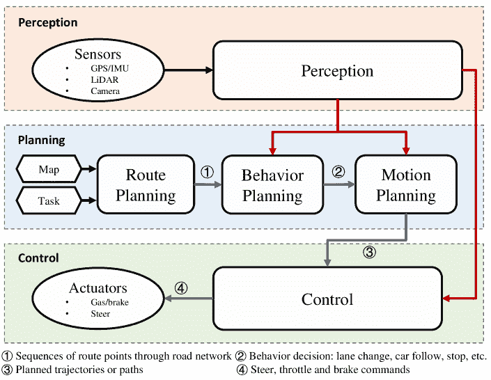
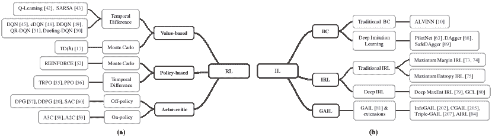
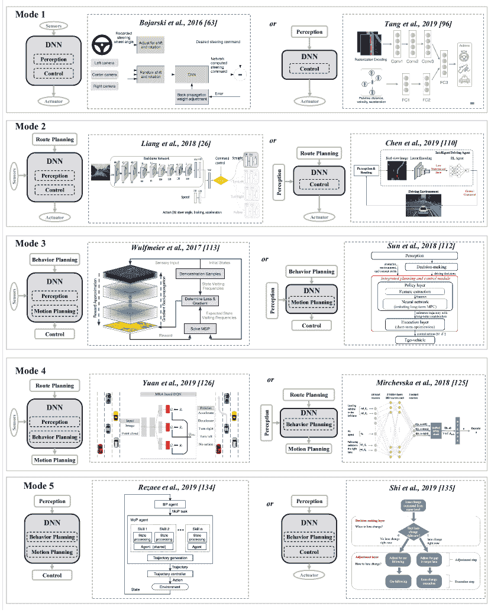
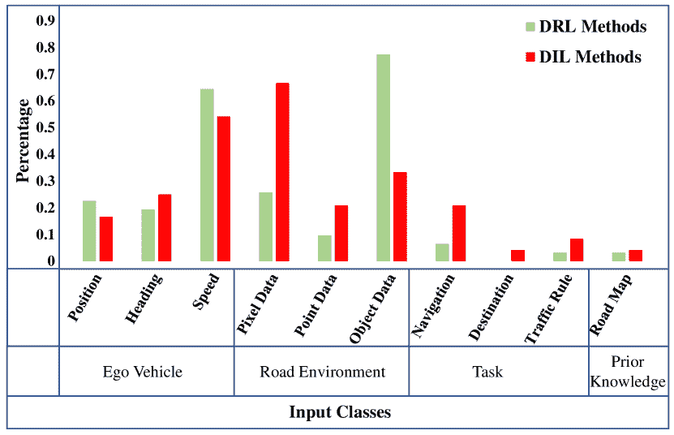
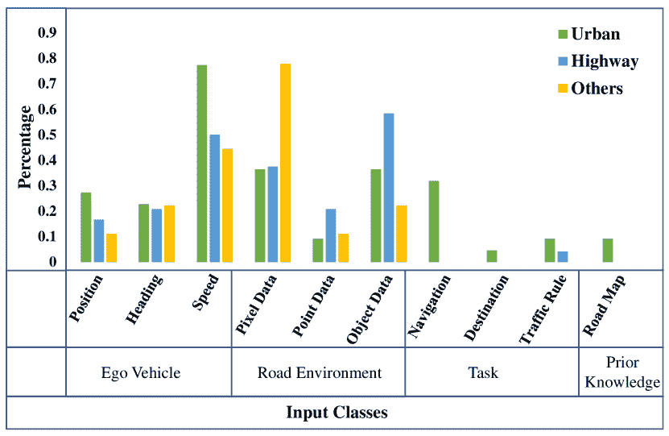
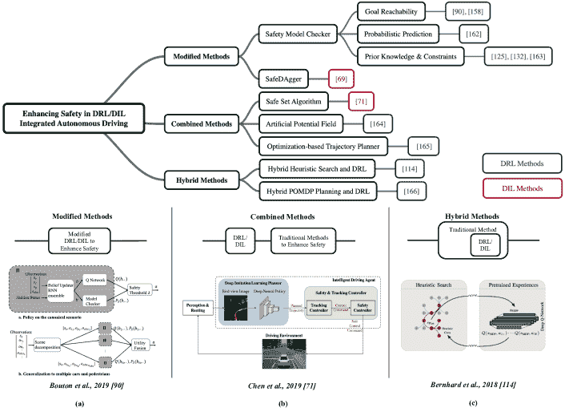
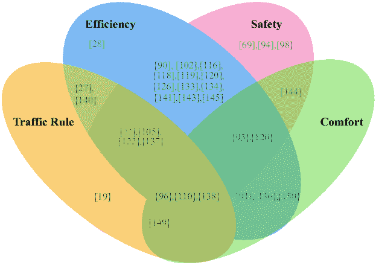
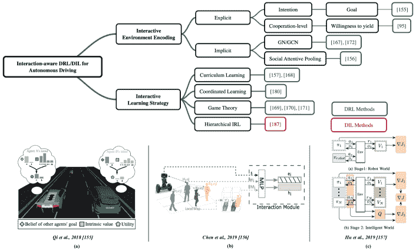
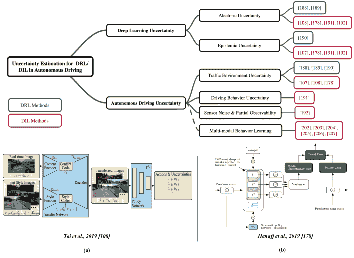

<!--yml

类别：未分类

日期：2024-09-06 19:57:30

-->

# [2101.01993] 关于深度强化学习和深度模仿学习在自动驾驶策略学习中的调研

> 来源：[`ar5iv.labs.arxiv.org/html/2101.01993`](https://ar5iv.labs.arxiv.org/html/2101.01993)

# 关于深度强化学习和深度模仿学习在自动驾驶策略学习中的调研

朱泽宇，赵惠晶 这项工作部分由中国国家自然科学基金资助（61973004）。作者隶属于北京大学电子工程与计算机科学学院及机器感知重点实验室，地址：北京市 100871，中国。联系方式：H.Zhao, zhaohj@pku.edu.cn。

###### 摘要

自动驾驶（AD）代理基于在线感知结果生成驾驶策略，这些结果在多个抽象层次上获得，例如行为规划、运动规划和控制。驾驶策略对于实现安全、高效和和谐的驾驶行为至关重要，而 AD 代理在复杂场景中仍面临重大挑战。由于深度强化学习（DRL）和深度模仿学习（DIL）技术在机器人技术和视频游戏等领域的成功应用，近年来在推导 AD 策略方面进行了大量研究。本文对这方面的工作进行了全面的调研，分三个层次进行：首先，从系统角度构建文献研究的分类体系，识别出 DRL/DIL 模型在 AD 架构中的五种集成模式。其次，全面回顾了 DRL/DIL 模型用于特定 AD 任务的公式，其中涵盖了模型状态和动作空间以及强化学习奖励的各种设计。最后，深入回顾了 DRL/DIL 模型如何解决与驾驶安全、与其他交通参与者的互动以及环境不确定性相关的关键问题。据我们所知，这是首个同时从系统、任务驱动和问题驱动的角度关注 AD 策略学习的调研。我们分享并讨论了这些发现，这可能会引发未来的各种研究话题。

###### 索引词：

深度强化学习，深度模仿学习，自动驾驶策略

## I 引言

自动驾驶（AD）在最近几十年受到了广泛关注[1, 2, 3, 4]，并可能成为提高道路安全[5]、交通流量[6]和燃油经济性[7]等因素的有前途的解决方案。图 1 中展示了一个典型的 AD 系统架构，该架构由感知、规划和控制模块组成。AD 代理基于在线感知结果生成驾驶策略，这些结果在多个抽象层次上获得，例如行为规划、运动规划和控制。最早的自动驾驶车辆可以追溯到[8, 9, 10]。一个里程碑是国防高级研究计划局（DARPA）大挑战[11, 12]。

图 1：自动驾驶系统的架构。基于[13, 14, 15, 16]的通用抽象。

近年来，自动驾驶（AD）研究取得了巨大进展，许多产品和原型系统也得到了开发。尽管该领域发展迅速，自动驾驶在复杂场景中仍面临实现安全、高效和协调驾驶行为的重大挑战[17, 18]。强化学习（RL）是解决序列决策问题的原则性数学框架[19, 20, 21]。模仿学习（IL），其与之密切相关，指的是从专家示范中学习。然而，早期的方法都局限于相对低维的问题。近年来，深度学习（DL）技术[22, 23]通过深度神经网络（DNNs）的诱人特性：函数逼近和表示学习，为这一问题提供了强有力的解决方案。DL 技术使得 RL/IL 能够扩展到以前无法处理的问题（例如，高维状态空间），这在复杂的运动[24]、机器人技术[25]和自动驾驶[26, 27, 28]任务中越来越受欢迎。除非另有说明，本调查重点关注深度强化学习（DRL）和深度模仿学习（DIL）。

本文回顾了用于学习自动驾驶（AD）策略的多种 DRL/DIL 模型。一些相关的综述文章如[13、15]在深度学习（DL）时代之前，回顾了自动驾驶车辆的运动规划和控制方法。[29、30、31、32、33]回顾了通用的 DRL/DIL 方法，而未考虑任何特定应用。[4]关注于自动驾驶的深度学习技术，侧重于感知和控制，而[34]仅涉及控制。[35]提供了 DRL 模型应用于自动驾驶任务的分类，并突出了关键挑战。然而，这些研究中没有回答以下问题：

如何从系统架构的角度将 DRL/DIL 模型整合到自动驾驶系统中？它们如何被制定以完成特定的自动驾驶任务？如何设计方法来解决自动驾驶中的挑战性问题，如安全性、与其他交通参与者的互动以及环境的不确定性？

图 2：强化学习（RL）和模仿学习（IL）一般方法的分类

本研究寻求上述问题的答案。据我们所知，这是第一篇专注于使用 DRL/DIL 进行自动驾驶策略学习的综述，涉及系统、任务驱动和问题驱动的视角。我们的贡献有三方面：

+   •

    从系统角度出发，本文提供了文献的分类，并识别了将 DRL/DIL 模型整合到自动驾驶架构中的五种模式。对每种模式的研究进行了回顾，并对这些架构进行了比较。研究发现，广泛的研究工作主要集中在探索 DRL/DIL 在完成自动驾驶任务中的潜力上，而对 DRL/DIL 嵌入系统架构优化的深入研究对于实际应用仍然非常必要。

+   •

    对于完成特定自动驾驶任务的 DRL/DIL 模型的制定进行了全面回顾，涵盖了模型状态和动作空间以及强化学习奖励的各种设计。发现这些制定在很大程度上依赖于经验设计，这些方法是暴力破解的方法，并缺乏理论支持。改变设计或调整参数可能会导致实质上不同的驾驶策略，这可能对自动驾驶系统在实际部署中的稳定性和鲁棒性构成较大挑战。

+   •

    综合讨论了 DRL/DIL 模型在关于驾驶安全性、与其他交通参与者的交互和环境的不确定性方面涉及到的自动驾驶应用的关键问题。研究发现，驾驶安全性已经得到了广泛研究。一个典型的策略是与传统方法结合，以确保 DRL/DIL 代理的功能安全；然而，在最优策略和硬约束之间取得平衡仍然是一个非常困难的问题。对后两个问题的研究仍然处于高度初步阶段，其中问题已经从不同的角度得到解决，但研究还没有系统地进行。

本文的其余部分安排如下：第 II 节和第 III 节分别简要介绍了(D)RL 和(D)IL。第 IV 节从系统体系结构的角度回顾了自动驾驶(DRL/DIL)方面的研究。第 V 节回顾了任务驱动方法，并考察了完成指定自动驾驶任务的 DRL/DIL 模型的构造。第 VI 节回顾了问题驱动方法，其中解决了指定的自动驾驶问题和挑战。第 VII 节讨论了剩余的挑战，并在第 VIII 节中总结了调查的结论。

## II 强化学习基础

### II-A 问题形式化

强化学习（RL）是一个基于试错学习范式的原则性数学框架，其中代理通过利用和探索之间的权衡与环境进行互动 [36, 37, 38]。马尔可夫决策过程（MDP）是 RL 的一种数学理想化形式 [21]，其表示为 $(\cal S,\cal A,\cal P,\cal R,\gamma)$，其中 $\cal S$ 和 $\cal A$ 分别表示状态集和动作集，$\cal P$$(s_{t+1}|s_{t},a_{t}):\cal S\times\cal S\times\cal A\rightarrow$ $[0,1]$ 是将状态-动作对映射到下一步状态分布的转移/动态函数。数值即时奖励函数 $\cal R$$(s_{t},a_{t},s_{t+1}):\cal S\times\cal A\times\cal S\rightarrow\mathbb{R}$ 作为学习信号。折扣因子 $\gamma\in[0,1]$ 确定未来奖励的现值（较低值鼓励更多短视行为）。MDP 的状态满足马尔可夫性质 [21]，即未来状态仅依赖于立即先前的状态和动作。部分可观察 MDP（POMDP）将 MDP 扩展到无法完全访问马尔可夫性质状态的问题。POMDP 具有观察集 $\Omega$ 和观察函数 $\cal O$，其中 $\cal O$$(a_{t},s_{t+1},o_{t+1})=p(o_{t+1}|a_{t},s_{t+1})$ 是在代理执行动作 $a_{t}$ 并到达状态 $s_{t+1}$ 的情况下观察到 $o_{t+1}$ 的概率 [39]。有关 POMDP 的理论和算法，请参见 [40, 39]。

MDP 代理在每个时间步 $t$ 基于当前状态 $s_{t}$ 选择一个动作 $a_{t}\in\cal A$，接收数值奖励 $r_{t+1}$ 并访问一个新状态 $s_{t+1}$。生成的序列 $\{s_{0},a_{0},r_{1},s_{1},a_{1},r_{2},...\}$ 被称为展开或轨迹。未来的期望累计奖励，即时间步 $t$ 后的期望折扣回报 $G_{t}$，定义为 [21]：

|  | $\displaystyle G_{t}\doteq r_{t+1}+\gamma r_{t+2}+\gamma^{2}r_{t+3}+...=\sum_{k=0}^{T}\gamma^{k}r_{t+k+1}$ |  | (1) |
| --- | --- | --- | --- |

其中，$T$ 是一个有限值或 $\infty$，分别对应于有限和无限期问题。策略 $\pi(a|s)$ 将状态映射到选择每个可能动作的概率。价值函数 $v_{\pi}(s)$ 是从状态 $s$ 开始，跟随策略 $\pi$ 的期望回报：

|  | $\displaystyle v_{\pi}(s)\doteq\mathbb{E}_{\pi}[G_{t}&#124;s_{t}=s]$ |  | (2) |
| --- | --- | --- | --- |

类似地，动作-价值函数 $q_{\pi}(s,a)$ 被定义为：

|  | $q_{\pi}(s,a)\doteq\mathbb{E}_{\pi}[G_{t}&#124;s_{t}=s,a_{t}=a]$ |  | (3) |
| --- | --- | --- | --- |

这满足递归贝尔曼方程 [41]：

|  | $q_{\pi}(s_{t},a_{t})=\mathbb{E}_{s_{t+1}}[r_{t+1}+\gamma q_{\pi}(s_{t+1},\pi(s_{t+1}))]$ |  | (4) |
| --- | --- | --- | --- |

强化学习的目标是识别最大化期望回报的最优策略 $\pi^{*}=\arg\max_{\pi}\mathbb{E}_{\pi}[G_{t}|s_{t}=s]$。这些方法可以分为三类，如图 2 (a) 所示。

### II-B 基于价值的方法

要解决强化学习问题，可以确定一个最优的动作-价值函数，并从学习到的状态-动作值中恢复最优策略。

|  | $\displaystyle q_{\pi^{*}}(s,a)=\max_{\pi}q_{\pi}(s,a)$ |  | (5) |
| --- | --- | --- | --- |
|  | $\displaystyle{\pi^{*}}(s)=\arg\max_{a}q_{\pi^{*}}(s,a)$ |  | (6) |

Q-learning [42] 是最流行的方法之一，它通过时间差（TD）来估计 Q 值：

|  | $\displaystyle q_{\pi}(s_{t},a_{t})$ | $\displaystyle\leftarrow$ | $\displaystyle q_{\pi}(s_{t},a_{t})+\alpha(Y-q_{\pi}(s_{t},a_{t}))$ |  | (7) |
| --- | --- | --- | --- | --- | --- |

其中 $\displaystyle Y=r_{t+1}+\gamma\max\limits_{a_{t+1}\in\cal A}q_{\pi}(s_{t+1},a_{t+1})$ 是时间差目标，$\alpha$ 是学习率。这可以看作是一个标准的回归问题，其中需要最小化的误差是 $Y-q_{\pi}(s_{t},a_{t})$。Q-learning 是离策略的，因为它基于不一定由推导策略生成的经验来更新 $q_{\pi}$，而 SARSA [43] 是一种在策略算法，利用推导策略生成经验。另一个区别是 SARSA 使用目标 $Y=r_{t+1}+\gamma q_{\pi}(s_{t+1},a_{t+1})$。与 TD 方法不同，蒙特卡罗方法通过平均多个回合的结果来估计期望回报，这可以应用于非马尔可夫回合环境。TD 和蒙特卡罗方法在 TD($\lambda$) [21] 中进一步结合。

该小组的早期方法 [42, 43, 21] 依赖于表格表示。一个主要问题是“维度诅咒” [44]，即状态特征数量的增加会导致需要存储的状态-动作对数量呈指数增长。近期的方法使用深度神经网络（DNNs）来近似一个参数化的价值函数 $q(s,a;\omega)$，其中深度 Q 网络（DQNs） [45] 是最具代表性的，这些网络通过最小化以下损失函数来学习价值：

|  | $\displaystyle\displaystyle J(\omega)$ | $\displaystyle=$ | $\displaystyle\mathbb{E}_{t}[(Y-q(s_{t},a_{t};\omega))^{2}]$ |  | (8) |
| --- | --- | --- | --- | --- | --- |

其中 $Y=r_{t+1}+\gamma\max q(s_{t+1},a_{t+1};\omega^{-})$ 是目标，$\omega^{-}$ 表示目标网络的参数，而 $\omega$ 可以基于梯度进行学习。

|  | $\displaystyle\omega\leftarrow\omega-\alpha\mathbb{E}_{t}[(Y-q(s_{t},a_{t};\omega))\nabla q(s_{t},a_{t};\omega)]$ |  | (9) |
| --- | --- | --- | --- |

DQN 的主要贡献在于引入了目标网络和经验回放。为避免 Q 值剧烈波动并稳定训练，目标网络在更新主 Q 网络时固定若干迭代次数，随后更新以匹配主 Q 网络。此外，经验回放 [46] 通过维护存储转移 $(s_{t},a_{t},s_{t+1},r_{t+1})$ 的记忆，增加了样本效率。后来的研究通过引入优先级 [47] 改进了均匀样本经验回放。连续 DQN (cDQN) [48] 基于归一化优势函数 (NAFs) 推导了 DQN 的连续变体。双重 DQN (DDQN) [49] 通过使用双重估计器解决了 DQN 的高估问题。对抗 DQN [50] 引入了对抗结构，其中价值函数和相关优势函数都被估计。QR-DQN [51] 利用分布式强化学习来学习完整的价值分布，而不仅仅是期望值。

### II-C 基于策略的方法

另外，也可以直接搜索和优化一个参数化的策略 $\pi_{\theta}$ 以最大化期望回报：

|  | $\max_{\theta}J(\theta)=\max_{\theta}v_{\pi_{\theta}}(s)=\max_{\theta}\mathbb{E}_{\pi_{\theta}}[G_{t}&#124;s_{t}=s]$ |  | (10) |
| --- | --- | --- | --- |

其中 $\theta$ 表示策略参数，可以基于策略梯度定理 [21] 进行优化。

|  | $\displaystyle\displaystyle\nabla J(\theta)$ | $\displaystyle\propto$ | $\displaystyle\sum_{s}\mu(s)\sum_{a}q_{\pi}(s,a)\nabla\pi_{\theta}(a&#124;s)$ |  | (11) |
| --- | --- | --- | --- | --- | --- |
|  |  | $\displaystyle=$ | $\displaystyle\mathbb{E}_{\pi}[\sum_{a}q_{\pi}(s_{t},a)\nabla\pi_{\theta}(a&#124;s_{t})]$ |  |
|  |  | $\displaystyle=$ | $\displaystyle\mathbb{E}_{\pi}[G_{t}\nabla\ln\pi_{\theta}(a_{t}&#124;s_{t})]$ |  |

其中 $\mu(s)$ 表示状态访问频率。REINFORCE [52] 是一种直接的蒙特卡洛基于策略的方法，它通过策略 $\pi_{\theta}$ 选择折扣回报 $G_{t}$ 来估计方程 11 中的策略梯度。参数更新如下 [21]：

|  | $\theta\leftarrow\theta+\alpha G_{t}\nabla\ln\pi_{\theta}(a_{t}&#124;s_{t})$ |  | (12) |
| --- | --- | --- | --- |

这个更新直观地增加了导致更高回报的动作的对数概率。由于使用了经验回报，结果的梯度存在较高的方差。减少方差和加速学习的一个常见技术是用$G_{t}-b(s_{t})$ [52, 21]替换公式中的$G_{t}$，其中$b(s_{t})$是基线。另一种方法是用优势函数[53, 54] $A_{\pi_{\theta}}(s,a)=q_{\pi_{\theta}(s,a)}-v_{\pi_{\theta}}(s)$替换$G_{t}$。

策略方法的一个问题是，较差的梯度更新可能导致新更新的策略与之前的策略偏差较大，从而可能降低策略性能。信任区域策略优化（TRPO）[55]通过优化一个代理目标函数来解决这个问题，从而保证策略性能的单调改进。每次策略梯度更新都受到政策之间 Kullback-Leibler（KL）散度的二次近似的约束。近端策略优化（PPO）[56]通过对 KL 散度应用自适应惩罚和启发式裁剪代理目标函数改进了 TRPO。只需要一阶梯度的要求也使得 PPO 比 TRPO 更易于实现。

### II-D Actor-Critic 方法

Actor-critic 方法结合了基于值的方法和基于策略的方法的优点，其中神经网络 actor $\pi_{\theta}(a|s)$选择动作，神经网络 critic $q(s,a;\omega)$或$v(s;\omega)$估计值。actor 和 critic 通常根据公式 11 和公式 8 交替更新。确定性策略梯度（DPG）[57]是一种导出确定性策略的离线策略 actor-critic 算法。与随机策略相比，DPG 只在状态空间上进行积分，并且在具有大动作空间的问题中需要更少的样本。深度确定性策略梯度（DDPG）[24]利用 DNNs 在高维状态空间上进行操作，采用经验回放和一个单独的 actor-critic 目标网络，类似于 DQN。并行计算的利用是经验回放的一个替代方案。异步优势 actor-critic（A3C）[58]在 actor-critic 框架中使用优势估计而不是折扣回报，并在环境的多个并行线程上异步更新策略和值网络。

并行独立环境稳定了学习过程，并支持更多的探索。优势 actor-critic（A2C）[59]，即 A3C 的同步版本，使用单一 agent 以简化或等待每个 agent 完成其经验以收集多个轨迹。软 actor-critic（SAC）[60]通过在奖励函数中添加熵项来促进更好的探索。

## III 模仿学习的基础

### III-A 问题表述

模仿学习具有一种更简单的形式，并基于从演示（LfD）中学习[61]。它在自动驾驶应用中具有吸引力，因为与真实环境的互动可能是危险的，而且大量的人类驾驶数据可以被轻松收集[62]。一个演示数据集${\cal D}=\{\xi_{i}\}_{i=0..N}$包含一组轨迹，其中每个轨迹$\xi_{i}=\{(s_{t}^{i},a_{t}^{i})\}_{t=0..T}$是状态-动作对的序列，动作$a_{t}^{i}\in\cal A$由专家在状态$s_{t}^{i}\in S\cal$下采取，并依据专家的潜在策略$\pi_{E}$[32]。利用收集的数据集$\cal D$，一种常见的基于优化的模仿学习策略是学习一个策略$\pi^{*}:\cal S\rightarrow\cal A$，通过满足条件来模拟专家的策略$\pi_{E}$[33]。

|  | $\pi^{*}=\arg\min_{\pi}\mathbb{D}(\pi_{E},\pi)$ |  | (13) |
| --- | --- | --- | --- |

其中 $\mathbb{D}$ 是策略之间的相似性度量。解决该问题的方法可以分为三组，如图 2 (b) 所示，下面对其进行回顾。

### III-B 行为克隆

行为克隆（BC）将问题公式化为一个监督学习过程，目标是将学习到的策略 $\pi_{\theta}$ 匹配到专家策略 $\pi_{E}$：

|  | $\min_{\theta}\mathbb{E}&#124;&#124;\pi_{\theta}-\pi_{E}&#124;&#124;_{2}$ |  | (14) |
| --- | --- | --- | --- |

这通常通过最小化 L2 损失来实现：

|  | $J(\theta)=\mathbb{E}_{(s,a)\sim\cal D}[(\pi_{\theta}(s)-a)^{2}]$ |  | (15) |
| --- | --- | --- | --- |

早期的模仿学习研究可以追溯到 ALVINN 系统 [10]，该系统使用了一个 3 层神经网络，通过前置摄像头图像进行道路跟随。在最近的十年中，深度模仿学习（DIL）通过使用 DNN 作为策略函数近似器，并在端到端自动驾驶系统中取得了成功 [63, 64, 65]。BC 在训练分布覆盖的状态下表现良好，但由于行动中的累积误差，它对新状态的泛化能力较差，这也被称为协变量偏移 [66, 67]。为了克服这一问题，Ross 等人 [68] 提出了 DAgger，它通过使用主策略收集训练样本，同时运行参考策略进行改进。在每次迭代中，由主策略访问的状态也会被发送到参考策略，以输出专家行为，新生成的示例将被聚合到训练数据集中。SafeDAgger [69] 在 DAgger 的基础上扩展，引入了一种安全策略，该策略学习预测主策略的错误，而无需查询参考策略。除了数据集聚合，数据增强技术，如在专家行为中添加随机噪声，也在 DIL 中被广泛使用 [70, 71]。

### III-C 逆向强化学习

逆向强化学习问题，最早由 Ng 等人 [72] 公式化，是确定一个奖励函数 $r_{\theta}$，使得专家行为是最优的：

|  | $\max_{\theta}\mathbb{E}_{\pi_{E}}[G_{t}&#124;r_{\theta}]-\mathbb{E}_{\pi}[G_{t}&#124;r_{\theta}]$ |  | (16) |
| --- | --- | --- | --- |

早期的研究利用线性函数近似奖励函数，并通过最大边际方法确定最优奖励 [73, 74]。通过引入最大熵原理，Ziebart 等人 [75] 消除了示范和专家策略之间的奖励模糊性，其中多个奖励可能解释专家行为。奖励函数通过最大化观察专家轨迹的后验概率来学习：

|  | $J(\theta)=\mathbb{E}_{\xi_{i}\sim\cal D}[\log P(\xi_{i} | r_{\theta})]$ |  | (17) |
| --- | --- | --- | --- | --- |

其中，轨迹的概率满足 $P(\xi_{i}|r_{\theta})\propto\exp(r_{\theta}(\xi_{i}))$。一些研究通过高斯过程 [76] 或提升 [77, 78] 将奖励函数扩展到非线性形式。然而，上述方法通常在低维特征上操作。提出了使用丰富且表达力强的函数逼近器，以神经网络的形式直接在原始高维状态表示上学习奖励函数 [79, 80]。

IRL 面临的问题是，为了评估奖励函数，必须进行前向强化学习过程以获得相应的策略，这使得 IRL 效率低下且计算成本高。许多早期的方法需要在每次迭代优化的内部循环中求解 MDP [72, 20, 74, 75]。这些方法需要对系统动态有完美的了解和一个高效的离线求解器，从而限制了它们在复杂现实场景中的应用，如机器人控制。Finn 等人 [80] 提出了指导成本学习（GCL），该方法处理高维复杂系统中的未知动态，并通过高效的基于样本的近似学习复杂的神经网络成本函数。

### III-D 生成对抗模仿学习

生成对抗模仿学习（GAIL） [81] 直接从专家示范中学习策略，同时不需要在 RL 中进行奖励设计，也不需要在 IRL 的内部循环中进行昂贵的 RL 过程。GAIL 在模仿学习和生成对抗网络（GANs） [82] 之间建立了类比。生成器 $\pi_{\theta}$ 作为模仿专家行为的策略，通过匹配示范的状态-动作分布，而判别器 $D_{\omega}\in(0,1)$ 作为替代奖励函数，用于测量生成样本和示范样本之间的相似性。GAIL 的目标函数以如下的最小-最大形式进行公式化：

|  | $\min\limits_{\pi_{\theta}}\max\limits_{D_{\omega}}{\mathbb{E}}_{\pi_{\theta}}[\log D_{\omega}(s,a)]+{\mathbb{E}}_{\pi_{E}}[\log(1-D_{\omega}(s,a))]-\lambda H(\pi_{\theta})$ |  | (18) |
| --- | --- | --- | --- |

其中 $H(\pi)$ 是正则化熵项。生成器和判别器通过以下梯度更新：

|  | $\displaystyle\nabla_{\theta}J(\theta)={\mathbb{E}}_{\pi}[\nabla_{\theta}\log\pi_{\theta}(a&#124;s)Q(s,a)]-\lambda\nabla_{\theta}H(\pi_{\theta})$ |  |
| --- | --- | --- |
|  | $\displaystyle\nabla_{\omega}J(\omega)={\mathbb{E}}_{\pi}[\nabla_{\omega}\log D_{\omega}(s,a)]+{\mathbb{E}}_{\pi_{E}}[\nabla_{\omega}\log(1-D_{\omega}(s,a))]$ |  | (19) |

Finn 等人[83]在数学上证明了 GANs、IRL 和基于能量的模型之间的联系。Fu 等人[84]提出了基于对抗性奖励学习公式的对抗性逆强化学习（AIRL），可以恢复对动态变化具有鲁棒性的奖励函数。

## IV DRL/DIL 集成 AD 系统架构

AD 系统的研究已有数十年[13, 14, 15, 16]，通常由模块化管道组成，如图 1 所示。DRL/DIL 模型如何集成到 AD 系统中，并与其他模块协作？本节从系统架构的角度回顾文献，其中识别出五种模式，如图 3 所示。每种模式的研究分类见表 I，同时列出了所利用的 DRL/DIL 方法、感知的上游模块、目标 AD 任务，以及架构的优势和劣势等信息。接下来，我们详细介绍每种架构模式，并比较对应每种模式或使用 DRL 或 DIL 方法的研究数量。

图 3：DRL/DIL 模型在 AD 架构中的集成模式

表 I：按 DRL 或 DIL 模型在 AD 架构中的集成模式对文献的分类

| 架构 | 优势 | 缺点 | 研究 | 方法 | 感知¹ | 任务² | 备注³ |
| --- | --- | --- | --- | --- | --- | --- | --- |
| 模式 1. DRL/DIL 集成控制 | - 具有简单结构并适应各种学习方法。 | - 限于特定任务或技能。 - 绕过规划模块削弱了模型的可解释性和能力。 | [10], [85], [63], [64], [86], [87], [65], [88] | BC | D |

&#124; 道路/车道跟踪 &#124;

&#124; 城市驾驶 &#124;

|

&#124; 安全性: [69] &#124;

|

| [69], [89] | DAgger | D | 道路/车道跟踪 |  |
| --- | --- | --- | --- | --- |

|

&#124; [90], [91], &#124;

&#124; [92], [93], &#124;

&#124; [94], [95] &#124;

|

&#124; NQL &#124;

&#124; DQN &#124;

| T |
| --- |

&#124; 车道变换 &#124;

&#124; 交通合流 &#124;

&#124; 紧急事件 &#124;

&#124; 十字路口 &#124;

|

&#124; 安全性: [90] &#124;

&#124; 交互: &#124;

&#124; [95] &#124;

|

| [96], [97] | PPO | T |
| --- | --- | --- |

&#124; 交通合流 &#124;

&#124; 城市驾驶 &#124;

|  |
| --- |
| [28], [98] | DDPG | D |

&#124; 道路/车道跟踪 &#124;

&#124; 紧急事件 &#124;

|  |
| --- |
| [99], [100], [101], [102], [103] | DDPG | T |

&#124; 道路/车道跟踪 &#124;

&#124; 车道变换 &#124;

&#124; 超车 &#124;

&#124; 紧急事件 &#124;

|  |
| --- |
| 模式 2. 模式 1 的扩展，加入高层次命令 | - 考虑高层次规划和感知 - 根据高层次决策生成不同的控制行为 | - 单一模型可能无法捕捉足够多样的行为 - 为每种行为学习一个模型增加了训练成本和数据需求 | [104] | BC | D | 城市驾驶 |  |
| [105], [70], [106] | CIL | D | 城市导航 |  |
| [107], [108] | UAIL | D | 城市导航 |

&#124; 不确定性: &#124;

&#124; [107], [108] &#124;

|

| [109] | DDPG | T | 停车 |  |
| --- | --- | --- | --- | --- |
| [26] | DDPG | D | 城市导航 |  |
| [110] | DDQN/TD3/SAC | T | 环形交叉路口 |  |
| 模式 3. DRL/DIL 综合运动规划 | - 学习模仿人类轨迹 - 高效的前向预测过程 | - 无法保证安全性或可行性 | [111], [71] | BC | T | 城市驾驶 |

&#124; 安全性: [71] &#124;

|

| [112] | DAgger | T | 高速公路驾驶 |  |
| --- | --- | --- | --- | --- |
| [113] | MaxEnt DIRL | D | 城市驾驶 |  |
| [114] | DDQN/DQfD | T | 代客泊车 |

&#124; 安全性: [114] &#124;

|

| [115] | SAC | T | 交通合流 |  |
| --- | --- | --- | --- | --- |
| 模式 4. DRL/DIL 综合行为规划 | - DNNs 只需规划高层次的行为动作。 | - 简单且少量的动作限制了控制精度和驾驶风格的多样性。 - 复杂且过多的动作增加了训练成本。 | [116] | AIRL | T | 车道变换 |  |
| [117] | IRL | D | 车道变换 |  |
| [118], [119], [120], [121], [122], [123], [124], [125] | DQN | T |

&#124; 车道变换 &#124;

&#124; 十字路口 &#124;

|  |
| --- |
| [126], [127] | DQN | D | 车道变换 |  |
| [128], [129] | Q-Learning | T | 变道 |  |
| [130], [131] | DDQN | T |

&#124; 变道 &#124;

&#124; 城市驾驶 &#124;

|  |
| --- |
| [132] | DQfD | T | 变道 |

&#124; 安全: [132] &#124;

|

| [133] | QR-DQN | D | 高速公路驾驶 |  |
| --- | --- | --- | --- | --- |
| 模式 5. DRL/DIL 集成的分层规划与控制 | - 在各个抽象层次上同时进行规划。 | - 分层 DNNs 增加了训练成本并降低了收敛速度。 | [134], [135] | DQN | T |

&#124; 自适应巡航控制 &#124;

&#124; 变道 &#124;

|  |
| --- |
| [136] | 分层策略梯度 | T | 通过交通信号灯 |  |
| [27] | DDPG | D | 变道 |  |
| [137] | DDPG | T | 交叉口 |  |
| [138] | DDPG | T | 城市驾驶 |  |

+   1

    上游感知模块的类型：（D）深度学习方法 / （T）传统方法

+   2

    有关自动驾驶任务的详细信息，请参见表 III

+   3

    也涉及安全 VI-A、互动 VI-B 和不确定性 VI-C 问题的研究均已标注。

### IV-A 模式 1\. DRL/DIL 集成控制

许多研究已将 DRL/DIL 应用于控制，可以抽象为模式 1 的架构，并在图 3 中进行了说明。Bojarski 等人[63]提出了一个知名的端到端自动驾驶控制框架。他们通过监督学习训练了一个九层 CNN，以学习转向策略，而无需明确的手动分解序列模块。然而，他们的模型仅适用于车道保持。另一种选择是将传统的感知结果输入到 DNN 控制模块中。Tang 等人[96]提出了将环境栅格编码、相对距离、速度和加速度作为输入，输入到一个双分支神经网络中，并通过近端策略优化进行训练。

尽管模式 1 具有简单的结构并适应多种学习方法，但它仅限于特定任务；因此，在需要多种情境条件下的驾驶技能的场景中，它难以应对。此外，绕过和忽略行为规划或运动规划过程可能会削弱模型在复杂任务（例如城市导航）中的可解释性和性能。

### IV-B 模式 2\. 高级命令扩展模式 1

如图 3 所示，模式 2 通过考虑高级规划输出来扩展模式 1。控制模块由一个通用模型（适用于所有行为）[104, 110]或一系列针对不同行为的模型[105, 70, 26, 106, 108]组成。陈等人[110]将检测到的环境车辆和路线投影到鸟瞰图道路地图上，作为策略网络的输入。梁等人[26]在条件模仿学习（CIL）[70]的基础上，提出了分支型演员网络，如图 3 所示。这些方法为不同的行为学习了多个控制子模块。来自高级路线规划和行为规划模块的门控控制命令负责选择相应的控制子模块。

尽管模式 2 缓解了模式 1 中遇到的问题，但它自身也有局限性。通用模型可能不足以捕捉多样化的行为。然而，为每种行为学习一个模型增加了对训练数据的需求。此外，模式 2 可能不如模式 1 在计算上高效，因为它需要事先确定的高级规划模块来指导控制模块。

### IV-C 模式 3\. DRL/DIL 集成运动规划

模式 3 将 DRL/DIL 集成到运动规划模块中，其架构如图 3 所示。利用来自高层模块的规划输出（如路线和驾驶决策）以及当前感知输出，DNN 被训练以预测未来轨迹或路径。DIL 模型 [111, 112, 113, 71] 是实现这一架构的主流选择。如图 3 所示，Sun 等 [112] 提出了通过 Sampled-DAgger 训练一个模仿长期 MPC 的神经网络，其中策略网络的输入来自感知（障碍物、环境和当前状态）和决策（驾驶决策）。另一种方法是 Wulfmeier 等 [113] 提出了将 LiDAR 点云投影到网格地图上，并将其发送到 DNN。DNN 负责学习指导运动规划的成本函数。模式 3 中的控制部分通常利用传统控制技术，如 PID [71] 或 MPC [112]。

模式 3 的一个主要缺点是，尽管 DNN 规划的轨迹可以模仿人类轨迹，但其安全性和可行性无法得到保证。

表 II: 根据 DRL/DIL 集成模式的文献比较

| 感知 |
| --- |

&#124; 控制 &#124;

&#124; (模式 1&2) &#124;

|

&#124; 运动规划 &#124;

&#124; (模式 3) &#124;

|

&#124; 行为规划 &#124;

&#124; (模式 4) &#124;

|

&#124; 层级规划与控制¹ &#124;

&#124; (模式 5) &#124;

|

| DRL | DIL | DRL | DIL | DRL | DIL | DRL | DIL |
| --- | --- | --- | --- | --- | --- | --- | --- |
| 传统 | 15 | 0 | 2 | 3 | 13 | 1 | 5 | 0 |
| DNN | 3 | 16 | 0 | 1 | 3 | 1 | 1 | 0 |
| 小计 | 18 (52.9%) | 16 (47.1%) | 2 (33.3%) | 4 (66.7%) | 16 (88.9%) | 2 (11.1%) | 6 (100%) | 0 (0%) |
| 总计 | 34 (53.1%) | 6 (9.4%) | 18 (28.1%) | 6 (9.4%) |

+   *

    表中这些值是表 I 中属于相应类别的论文数量和百分比。

+   1

    “层级规划与控制”的缩写

表 III: 根据场景和 AD 任务对文献的分类

| 场景 | AD 任务 | 描述 | 参考 |
| --- | --- | --- | --- |
| DRL 方法 | DIL 方法 |
| 城市 | 交叉口 |

&#124; 通过交叉路口学习驾驶（同时与其他交通参与者交互）&#124;

&#124; 以及与其他交通参与者协商）。&#124;

|

&#124; DQN [119, 120, 121, 90] &#124;

&#124; cDQN [138] &#124;

&#124; DDPG [137, 138] &#124;

| — |
| --- |
| 绕行 |

&#124; 学会通过环形交叉口驾驶（同时进行交互）&#124;

&#124; 并与其他交通参与者进行协商）。 &#124;

|

&#124; DDQN [110] &#124;

&#124; TD3 [110] &#124;

&#124; SAC [110] &#124;

| Horizon GAIL[139] |
| --- |
| 城市导航 |

&#124; 学会在城市环境中驾驶以达到指定目标。&#124;

&#124; 通过遵循全球路线来实现目标。 &#124;

| DDPG [26] |
| --- |

&#124; BC [104] &#124;

&#124; CIL [105, 70, 106] &#124;

&#124; UAIL [107, 108] &#124;

|

| 城市驾驶 | 学会在城市环境中驾驶，没有特定的目标。 |
| --- | --- |

&#124; DDQN [122] &#124;

&#124; PPO [140] &#124;

&#124; 策略梯度 [136] &#124;

|

&#124; BC [65, 111] &#124;

&#124; DIRL [113] &#124;

|

| 高速公路 | 车道变换 (LC) | 学会决定并执行车道变换。 |
| --- | --- | --- |

&#124; DQN [118, 91] &#124;

&#124; DDQN [141] &#124;

&#124; DDPG [27] &#124;

|

&#124; 投影 IRL [117] &#124;

&#124; AIRL [116] &#124;

|

| 车道保持 (LK) | 学会在保持当前车道的情况下驾驶。 |
| --- | --- |

&#124; DQN [102] &#124;

&#124; DDPG [28] &#124;

|

&#124; BC [86, 87] &#124;

&#124; SafeDAgger [69] &#124;

|

| 自适应巡航控制 | 学会自适应巡航控制的策略。 |
| --- | --- |

&#124; NQL [92] &#124;

&#124; DQN [134] &#124;

&#124; 策略梯度 [142] &#124;

&#124; Actor-critic [143, 144] &#124;

| — |
| --- |
| 交通合并 | 学会合并到高速公路。 |

&#124; DQN [93] &#124;

&#124; PPO [96] &#124;

| — |
| --- |
| 高速公路驾驶 |

&#124; 学习高速公路驾驶的一般策略，&#124;

&#124; 可能包括多种行为，如 LC 和 LK。 &#124;

|

&#124; DQN [145, 126] &#124;

&#124; QR-DQN [133] &#124;

|

&#124; GAIL [146] &#124;

&#124; PS-GAIL [147] &#124;

&#124; MaxEnt IRL [148] &#124;

|

| 其他 | 道路跟随 | 学会简单地跟随一条道路。 | — |
| --- | --- | --- | --- |

&#124; BC [10, 85, 63, 64] &#124;

&#124; DAgger [89] &#124;

|

| 紧急事件 | 学会避免或缓解诸如碰撞等紧急事件。 |
| --- | --- |

&#124; DQN [94] &#124;

&#124; DDPG [98] &#124;

| RAIL [149] |
| --- |

### IV-D 模式 4\. DRL/DIL 综合行为规划

许多研究集中于将 DRL/DIL 集成到行为规划模块中，并推导出高级驾驶策略。相应的架构见图 3，其中 DNNs 决定行为动作，而随后的运动规划和控制模块通常采用传统方法。许多研究基于 DQN 及其变体 [118, 119, 120, 121, 126, 122, 124, 125, 123]。如图 3 所示，Yuan 等人 [126] 将动作空间分解为高速公路上的五种典型行为决策。与 DRL 相比，利用 DIL 学习高级策略的研究较少。 Wang 等人 [116] 最近提出使用增强的对抗性逆向强化学习 (AIRL) 来学习高速公路上的类人决策，其中动作空间包括所有可能的横向和纵向决策组合。

在模式 4 中，行为动作的设计并不简单，必须平衡训练成本和驾驶风格的多样性。简单且少量的行为动作会限制控制精度和驾驶风格的多样性，而大量且复杂的动作则会增加训练成本。

### IV-E 模式 5\. DRL/DIL 集成层次规划与控制

表 IV：用于自动驾驶任务的 DRL/DIL 方法的输入

| 信息来源 | 类别 | 输入 | 参考文献 |
| --- | --- | --- | --- |
| DRL 方法 | DIL 方法 |
| 自车 |

&#124; 位置信息 &#124;

| 自车位置 | [110, 120, 90, 136, 122, 93, 91] | [147, 146, 149, 111] |
| --- | --- | --- |

|

&#124; 方向信息 &#124;

|

&#124; 方向角、方向，&#124;

&#124; 转向、偏航和偏航速率 &#124;

| [119, 121, 93, 91, 28, 138] | [147, 65, 64, 146, 149, 139] |
| --- | --- |

|

&#124; 速度信息 &#124;

| 速度/速度和加速度 |
| --- |

&#124; [138, 118, 122, 91, 141, 119, 120, 121, 137, 90, 136, 26] &#124;

&#124; [93, 102, 28, 150, 94, 144, 134, 98] &#124;

|

&#124; [139, 117, 107, 108, 106, 105, 70, 65] &#124;

&#124; [147, 148, 146, 149, 89] &#124;

|

| 道路环境 | 像素数据 | 相机 RGB 图像 | [126, 145, 27, 133, 26, 28] |
| --- | --- | --- | --- |

&#124; [69, 86, 87, 107, 108, 106, 105, 70, 65, 104] &#124;

&#124; [10, 19, 85, 89, 63, 64] &#124;

|

|

&#124; 语义分割图像 &#124;

| [98] | — |
| --- | --- |
| 2D 鸟瞰图像 | [96] | — |
| 点数据 | LiDAR 传感器读数 | [126, 145, 133] | [147, 146, 149, 139] |
| 2D LiDAR 网格地图 | — | [113] |
| 对象数据 |

&#124; 其他道路使用者的信息: &#124;

&#124; 相对速度，位置, &#124;

&#124; 与自车的距离 &#124;

|

&#124; [141, 118, 119, 110, 120, 121, 122, 138] &#124;

&#124; [93, 134, 142, 94, 92, 144, 143, 96] &#124;

| [147, 149, 116, 111] |
| --- |

|

&#124; 车道/道路信息: &#124;

&#124; 自车与 &#124;

&#124; 车道标记，道路 &#124;

&#124; 曲率和车道宽度 &#124;

| [118, 134, 137, 122, 93, 91, 102, 141] | [147, 146, 149, 116] |
| --- | --- |
| 任务 |

&#124; 导航信息 &#124;

|

&#124; 导航驾驶指令 &#124;

&#124; 或计划路线 &#124;

| [110, 26] | [106, 105, 70, 104, 111] |
| --- | --- |

|

&#124; 目的地信息 &#124;

|

&#124; 目标位置，距离 &#124;

&#124; 或目标角度 &#124;

| — | [139] |
| --- | --- |

|

&#124; 交通规则信息 &#124;

|

&#124; 交通灯状态，速度 &#124;

&#124; 限速和期望速度 &#124;

| [136] | [148, 111] |
| --- | --- |

|

&#124; 先前知识 &#124;

| 道路地图 |
| --- |

&#124; 2D 自上而下的道路地图图像 &#124;

| [110] | [111] | 

图 4：使用某些数据作为输入的文献百分比。（a）按 DRL/DIL 方法的比较。（b）按场景的比较。

如图 3 所示，模式 5 模糊了规划与控制之间的界限，其中单个 DNN 基于参数化的动作空间[151]输出层次化动作[27]，或层次化 DNN 在多个层次上输出动作[136, 134, 135]。Rezaee 等人[134]提出了一种架构，如图 3 所示，其中 BP（行为规划）用于做出关于离散状态之间转变的高层决策，而 MoP（运动规划）根据通过 BP 做出的决策生成目标轨迹。Qiao 等人[137]在层次化 MDP（HMDP）的基础上进行了扩展，并通过选项框架实现了他们的模型。在他们的实现中，层次化选项被建模为高层决策（SlowForward 或 Forward）。基于高层决策和当前观察，推导出低层控制策略。

模式 5 在多个层次上同时进行规划，低层规划过程考虑高层决策。然而，使用层次化 DNN 会增加训练成本，并可能降低收敛速度，因为一个训练不良的高层 DNN 可能误导并干扰低层 DNN 的学习过程。

### IV-F 统计比较

表 II 中展示了各模式在研究数量方面的统计比较。目前关于架构的研究尚处于初期阶段，缺乏系统性和均衡性：

+   •

    大多数研究集中在将 DRL/DIL 集成到控制中（模式 1&2），其次是行为规划（模式 4）。

+   •

    对于模式 1&2，DRL 方法主要采用传统的方法感知，而 DNN 基础的感知在 DIL 方法中更为受青睐。

+   •

    DRL 似乎在高层决策（模式 4&5）中更为流行，而 DIL 则在低层控制（模式 1&2）中使用得更频繁。

未来的研究可能会解决不平衡问题并识别潜在的新架构。

## V 任务驱动方法

DRL/DIL 在自动驾驶中的研究可以根据其应用场景和目标任务进行分类，如表 III 所示。这些以任务为驱动的研究使用 DRL/DIL 来解决特定的自动驾驶任务，其中 DRL/DIL 的表述可以分解为几个关键组件：1) 状态空间和输入设计，2) 动作空间和输出设计，3) 强化学习奖励设计。

表 V：DRL/DIL 方法在自动驾驶任务中的动作

| 动作类别 | 子类 | 动作输出 | 参考文献 |
| --- | --- | --- | --- |
| DRL 方法 | DIL 方法 |
| 行为级动作 |

&#124; 加速度 &#124;

&#124; 相关 &#124;

| 例如，完全刹车、减速、继续和加速 | [119, 121, 122, 142, 145, 126, 133] | — |
| --- | --- | --- |

|

&#124; 车道变换 &#124;

&#124; 相关 &#124;

|

&#124; 例如，保持、左车道变换和右车道变换；&#124;

&#124; 车道变换间隙选择 &#124;

| [122, 141, 118, 145, 133] | [116] |
| --- | --- |

|

&#124; 转弯 &#124;

&#124; 相关 &#124;

| 例如，直行、左转、右转和停车 | [126] | [117, 65] |
| --- | --- | --- |

|

&#124; 互动 &#124;

&#124; 相关 &#124;

| 例如，避让/让行和跟随车辆；等待/前进 | [120, 121] | — |
| --- | --- | --- |

|

&#124; 轨迹级别 &#124;

&#124; 动作 &#124;

|

&#124; 规划 &#124;

&#124; 轨迹 &#124;

| 未来路径 2D 点 | — | [113, 111] |
| --- | --- | --- |
| 控制级动作 | 侧向 | 离散转向角度 | [19] | [10] |
| 连续转向 | — | [87, 86, 85, 63, 64] |

|

&#124; 连续角速度 &#124;

&#124; 或偏航加速度 &#124;

| [91] | [65] |
| --- | --- |
| 纵向 | 离散加速度值 | [90, 94] | — |
| 连续加速度 | [92, 143, 144] | — |
| 连续刹车和油门 | [150] | — |
| 同时侧向与纵向 |

&#124; 连续转向/转向率和 &#124;

&#124; 速度/加速度/油门 &#124;

| [93, 110, 96, 28] | [70, 104, 106, 89, 107, 146, 147] |
| --- | --- |

|

&#124; 连续转向，&#124;

&#124; 加速度/油门和刹车 &#124;

| [102, 26, 98] | [105, 108] |
| --- | --- |
| 连续转向和二元刹车决策 | — | [69] |
| 分层动作 | 行为与控制 |

&#124; 例如，行为级别的通过/停止，&#124;

&#124; 控制级别的加速度和转向 &#124;

| [138, 137, 136, 27] | — |
| --- | --- |
| 行为 & 轨迹 |

&#124; 例如，行为级别维护，LLC，RLC &#124;

&#124; 和轨迹级别的路径点 &#124;

| [134] | — |
| --- | --- |

表 VI: 自适应驾驶任务的 DRL 方法的奖励

| 类别 | 子类 | 描述 | 参考 |
| --- | --- | --- | --- |
| 安全 | 避免碰撞 | 如果发生碰撞则施加惩罚 |

&#124; [118, 26, 105, 119, 122, 116, 110, 120, 121, 137, 90, 138] &#124;

&#124; [94, 143, 149, 96, 69, 126, 145, 133, 98] &#124;

|

| 碰撞时间 |
| --- |

&#124; 如果碰撞时间 (TTC) 低于 &#124;

&#124; 一个安全阈值 &#124;

| [118, 119, 120, 122, 144] |
| --- |
| 距离其他车辆 |

&#124; 如果距离短于安全阈值，则施加惩罚 &#124;

| [134, 142, 144, 93] |
| --- |
| 车道变换数量 |

&#124; 如果车道变换数量过多，则施加惩罚 &#124;

&#124; 奖励较少的车道变换数量 &#124;

| [118, 134, 126, 145, 133, 141] |
| --- |
| 离开道路 | 对驶离道路的行为施加惩罚 | [118, 27, 102, 19, 96] |
| 效率 | 速度 |

&#124; 奖励更高的速度，直到达到最高速度限制； &#124;

&#124; 如果速度低于最低速度限制，则施加惩罚 &#124;

|

&#124; [138, 118, 141, 119, 122, 110, 136, 26, 105, 140] &#124;

&#124; [133, 126, 145, 134, 93, 102, 28, 96, 27, 150] &#124;

|

| 成功 | 如果代理成功完成任务，则给予奖励 | [118, 120, 121, 137, 90, 143, 116, 96, 138] |
| --- | --- | --- |
| 超车数量 | 奖励更多的超车以提高效率 | [126, 145, 27, 133] |
| 碰撞时间 |

&#124; 在每一步施加负奖励，以鼓励代理完成 &#124;

&#124; 更快完成任务，或者如果任务无法完成，则对代理施加惩罚&#124;

&#124; 在时间阈值内完成&#124;

| [110, 121, 91, 137] |
| --- |
| 到目的地的距离 | 代理离目的地越近，奖励越大 | [137, 136, 105] |
| 舒适度 | 振动 |

&#124; 如果纵向或横向控制&#124;

&#124; 过于急迫&#124;

| [110, 120, 136, 93, 91, 150, 144, 149, 96, 138] |
| --- |
| 交通规则 | 车道标记入侵 | 如果代理侵入车道标记，则施加惩罚 | [26, 105, 149] |
| 到车道中心线的距离 |

&#124; 如果代理偏离车道，则施加惩罚&#124;

&#124; 中线或路径基线&#124;

| [110, 140, 27, 19, 96, 138] |
| --- |
| 错误车道 |

&#124; 如果代理在错误车道中，则施加惩罚，例如，&#124;

&#124; 如果指定路线是直线，却停留在左转车道中&#124;

| [122] |
| --- |
| 阻碍交通 |

&#124; 如果代理阻挡了其他车辆的未来路径，则施加惩罚&#124;

&#124; 具有优先通行权的车辆&#124;

| [137] | 

图 5: 文献中有关如何通过 DRL/DIL 模型解决驾驶安全问题的分类。(a)-(c) 三种主要方法及其在文献中的典型示例。

图 6: 强化学习在自动驾驶任务中的奖励机制。

### V-A 状态空间和输入设计

表 IV 根据信息源（自车/道路环境/任务/先验知识）对常用输入进行了分类。图 4 展示了 DRL/DIL 方法中各输入类别的百分比统计比较。与任务和先验知识相比，自车和道路环境似乎是更常见的信息源。在所有输入类别中，自车速度、像素数据（例如，相机图像）和物体数据（例如，其他道路使用者的相对速度和位置）是最常用的。DRL 与 DIL 的另一个显著区别在于，DRL 模型更倾向于使用物体数据，而 DIL 模型更倾向于使用像素数据。将低维物体数据而非高维像素数据作为 DRL 模型的输入，使得问题更易于处理，并加快了训练过程。图 4 展示了各种场景下输入类别偏好的统计比较。任务输入（例如，目标位置）和先验知识（例如，地图）在城市场景中使用较多。点数据（例如，LiDAR 传感器读数）和物体数据在高速公路场景中更为常见。

除了决定输入选择之外，动态输入大小的应用也是一个重要问题，因为自车周围的汽车或行人数量随着时间变化。不幸的是，标准的 DRL/DIL 方法依赖于固定大小的输入。使用占据网格地图作为 CNN 输入是一种实际解决方案[121, 119]。然而，这种解决方案在计算工作负载和表达能力之间存在权衡。低分辨率网格减少了计算负担，但在环境表示上存在不准确的问题，而高分辨率网格由于网格地图的稀疏性，大部分计算可能是多余的。此外，网格地图仍然受限于其定义的大小，超出该区域的代理被忽略。另一方面，Everett 等人[152]建议利用 LSTM 编码可变数量的代理观察能力。Huegle 等人[141]建议使用深度集合[153]作为一种灵活且对排列不变的架构来处理动态输入。动态输入仍然是未来研究的一个开放话题。

### V-B 动作空间和输出设计

一个自驾 DRL/DIL 代理可以在不同的抽象层次上进行规划，即低级控制、高级行为规划和轨迹规划，甚至可以同时在多个层次上进行规划。根据这一点，表格 V 将主流的动作空间分类为四组：行为级动作、轨迹级动作、控制级动作和层级动作。行为级动作通常根据指定任务设计。对于速度控制，加速度相关的动作（例如，全刹车、减速、继续和加速 [119]) 常被使用。车道变换动作（例如，保持/LLC/LRC）和转弯动作（例如，左转/右转/直行）分别在高速公路场景和城市场景中受到青睐。轨迹级动作指的是计划或预测的轨迹/路径 [113, 111]，通常由未来路径的二维点组成。控制级动作指的是低级控制命令（例如，转向、加速、油门和刹车），这些命令分为三类：横向控制、纵向控制和横向与纵向同时控制。早期的研究主要集中在离散的横向 [10, 19] 或离散的纵向控制 [143]，而连续控制则在后来被考虑 [91, 85, 63, 64]。连续控制在 [102] 中被证明相比离散控制能够产生更平滑的车道保持轨迹，这可能使乘客感觉更舒适。横向与纵向同时控制得到了广泛关注，尤其是在城市场景中 [105, 70, 106, 107, 108]。最近，层级动作引起了更多关注 [138, 137, 136, 27, 134]，这些动作提供了更高的鲁棒性和可解释性。

### V-C 强化学习奖励设计

限制 RL 在现实世界自动驾驶应用的一个主要问题是缺乏基础的奖励函数。此外，如果存在实际奖励，其可能是多模态的，因为人类驾驶员会根据情况改变目标。为简化问题，当前针对自动驾驶任务的 DRL 模型通常将奖励函数表示为因素的线性组合，如图 6 所示。大量研究考虑了安全性和效率。文献中使用的奖励项列在表 VI 中。在考虑安全性和效率时，碰撞和速度是最常见的奖励项。然而，经验设计的奖励函数在很大程度上依赖于专家知识。平衡奖励项困难，这影响了训练后的策略性能。最近关于预测奖励和多奖励 RL 的研究可能会激发未来的研究。Hayashi 等人[154] 提出了基于深度预测网络预测误差的预测奖励函数，该网络模型用于模拟周围环境的过渡。他们的假设是，当自车执行不自然的驾驶行为时，周围车辆的运动变得不可预测。Yuan 等人[126] 将单一奖励函数分解为多奖励函数，以通过分支的 Q 网络更好地表示多维驾驶策略。

## VI 问题驱动方法

自动驾驶应用对驾驶安全、与其他交通参与者的互动以及环境的不确定性等因素有特殊要求。本节从问题驱动的角度回顾文献，旨在确定 DRL/DIL 模型如何解决这些关键问题，并识别仍存在的挑战。

### VI-A 安全增强型 DRL/DIL 自动驾驶

图 7：关于互动感知 DRL/DIL 模型在自动驾驶（AD）中的文献分类。（a）Qi 等人[155]，（b）Chen 等人[156]分别是显式和隐式互动环境编码的例子。（c）Hu 等人[157]是互动学习策略的一个例子。

尽管 DRL/DIL 可以学习复杂高维问题的驾驶策略，但它们仅在统计意义上保证所学策略的最优性。然而，在安全关键的自动驾驶系统中，一次失败（例如碰撞）可能会导致灾难。下面，我们回顾了 DRL/DIL 在自动驾驶文献中增强安全性的代表性方法。图 5 将这些方法分为三组：（a）修改方法：修改原始 DRL/DIL 算法的方法，（b）组合方法：将 DRL/DIL 与传统方法结合的方法，以及（c）混合方法：将 DRL/DIL 融入传统方法中的方法。

#### VI-A1 修改方法

如图 5(a) 所示，修改方法通过限制探索空间来修改标准的 DRL/DIL 算法，以提高安全性，通常是通过约束探索空间 [158, 159, 160]。引入了安全模型检查器，以识别每个状态下满足安全约束的行动集。这可以通过几种方法实现，例如目标可达性 [90][161]、概率预测 [162] 和先验知识 & 约束 [163]。Bouton 等人 [90][161] 使用了概率模型检查器，如图 5(a) 所示，以计算每个状态-动作对安全到达目标的概率。然后，通过对概率应用用户定义的阈值来识别安全动作。然而，所提出的模型检查器需要对状态空间进行离散化和完整的转移模型。另一种方法是 Isele 等人 [162] 提出的使用概率预测来识别可能导致碰撞的危险动作，但如果预测不准确，安全保障可能不够强。还利用了先验知识 & 约束（例如，如果车道变化会导致时间间隔过小则不允许） [163, 125, 132]。对于 DIL，Zhang 等人 [69] 提出了 SafeDAgger，其中学习一个安全策略来预测主要策略所犯的错误，而无需查询参考策略。如果安全策略确定让主要策略驾驶是不安全的，参考策略将接管。一个缺点是所学习策略的质量可能受到参考策略的限制。

#### VI-A2 组合方法

各种研究将标准 DRL/DIL 与传统的基于规则的方法结合，以提高安全性。与上述修改方法不同，结合方法不修改标准 DRL/DIL 的学习过程。如图 5(b)所示，Chen 等人 [71] 提出了一个框架，其中 DIL 规划轨迹，而基于规则的跟踪和安全集控制器确保安全控制。Xiong 等人 [164] 提出了 DDPG、人工势场和路径跟踪模块的控制输出的线性组合。根据 Shalev-Shwartz 等人 [165] 的说法，硬约束应该被注入到学习框架之外。他们将双合并问题分解为一个可学习的 DRL 政策和一个具有不可学习硬约束的轨迹规划模块的组合。学习部分使驾驶更加舒适，而硬约束则保证了安全。

#### VI-A3 混合方法

混合方法将 DRL/DIL 融入传统的启发式搜索或 POMDP 规划方法中。如图 5(c)所示，Bernhard 等人 [114] 将预训练的 Q 值以启发式的形式集成到混合 A^∗ 中，从而克服了 DRL 的统计失败率，同时仍从学习的政策中获益。然而，实验仅限于静态环境。Pusse 等人 [166] 提出了一个混合解决方案，将 DRL 和近似 POMDP 规划相结合，用于模拟关键交通场景中的无碰撞自主导航，兼顾了两种方法的优点。

### VI-B 互动感知的 DRL/DIL 适用于 AD

互动是交通环境的内在特征之一。智能体应该预先推理其他交通参与者的行为，以被动反应或主动调整自身政策，与其他智能体合作或竞争。本节回顾了互动建模方法以及图 7 所示的两组互动感知 DRL/DIL 方法。其中一组方法侧重于交互环境编码，另一组方法则侧重于交互学习策略。

#### VI-B1 互动建模

建模多代理之间互动的最简单方法是使用标准的马尔可夫决策过程（MDP），在这种方法中，其他交通参与者仅被视为环境的一部分 [156, 141]。POMDP 是另一种常见的互动模型 [95, 155, 167]，其中代理具有有限的感知能力。马尔可夫博弈（MG）也用于建模互动场景。根据代理是否具有相同的重要性，方法可以分为三组：1) 相等重要性 [168, 157, 169]，2) 一对多 [170]，以及 3) 主动-被动对 [171]。

#### VI-B2 互动环境编码

环境的互动编码是一个热门的研究方向。如图 7 所示，主流方法可以分为两组。一组方法显式地建模其他代理，并在算法工作流中利用对其他代理的主动推理。POMDP 是这些方法的常见选择，其中其他代理的意图/合作水平被建模为必须推断的不可观察状态。Qi 等人 [155] 提出了一个意图感知的多代理规划框架，如图 7(a) 所示，该框架将意图预测、高层推理和低层规划解耦。规划过程中考虑了关于其他代理意图（目标）的维持信念。Bouton 等人 [95] 提出了一个类似的方法，该方法维护了关于其他驾驶员合作水平（例如，是否愿意让路给自车）的信念。

另一组方法专注于利用特殊的神经网络架构，通过它们的关系或交互表示捕捉代理之间的相互作用。这些方法通常对其他代理的意图持中立态度。Jiang 等人 [167] 提出了图卷积强化学习，其中多代理环境被构建为图。代理由节点表示，每个节点的相邻节点通过距离或其他指标确定。然后，利用图卷积层生成的潜在特征来学习合作。同样，Huegle 等人 [172] 基于图神经网络 [173] 提出了深度场景架构，用于学习复杂的交互感知场景表示。受到社交池化 [174, 175] 和注意力模型 [176, 177] 的启发，Chen 等人 [156] 提出了一个社交注意的 DRL 方法，用于通过人群进行交互感知的机器人导航。如图 7(b) 所示，他们提取了机器人与每个人之间的配对交互特征，并通过局部地图捕捉人类之间的交互。随后使用自注意机制推断邻近人类的相对重要性，并汇总交互特征。

#### VI-B3 互动学习策略

图 8：不确定性感知 DRL/DIL 模型文献的分类。（a）Tai 等人 [108] 处理了偶然不确定性，而（b）Henaff 等人 [178] 处理了偶然不确定性和认识不确定性。

各种学习策略已被用来学习交互式策略。课程学习已被用来学习交互式策略[157][168]，这可以将复杂问题分解为更简单的问题。如图 7(c)所示，Hu 等人[157]提出了一种利用课程学习的交互感知决策方法。首先，学习每个代理的去中心化评价器以生成不同的行为，在此过程中，代理不会对其他代理做出反应，只学习如何执行合理的动作来完成自己的任务。其次，学习一个中心化评价器，使得代理能够相互作用，实现联合成功并保持交通顺畅。这些方法的一个局限性是，当代理数量增加时，必须学习新的模型。基于动态协调图（DCG）[179]，Chao 等人[180]提出了一种用于协调高速公路上多个自主车辆的战略学习解决方案。DCG 被用来显式建模车辆之间不断变化的协调依赖关系。另一组交互感知方法使用博弈论[181]。博弈论已经被应用于机器人任务，如鲁棒控制[182, 183]和运动规划[184, 185]。近年来，博弈论在交互感知自动驾驶策略学习中的应用也在增加[170, 169, 171]。Li 等人[170]提出了层次推理博弈论（即“level-$k$”推理[186])与强化学习的结合。层次-$k$ 推理用于建模智能车辆在交通中的互动，而 RL 在时间扩展的场景中演化这些互动。Ding 等人[171]介绍了一个主动-被动博弈理论车道变换框架。主动车辆学习采取行动进行合并，而被动车辆学习创造合并空间。Fisac 等人[169]提出了一种新颖的博弈理论实时轨迹规划算法。动态博弈被分解为一个长时间范围的“战略”博弈和一个短时间范围的“战术”博弈。此外，解决长时间范围的互动博弈来指导短时间范围的规划，从而隐式地扩展规划范围，并将局部轨迹优化推向全球解决方案。除了结合博弈论和 RL 之外，在博弈论形式下解决模仿学习问题是另一种方法。Sun 等人[187]提出了一种基于层次逆强化学习（HIRL）的互动概率预测方法。他们从双代理博弈的角度建模问题，明确考虑一个代理对另一个代理的响应。然而，一些当前的博弈论交互感知方法受到其双车设置和仿真实验的限制[171, 169, 187]。

### VI-C 不确定性感知 DRL/DIL 用于自动驾驶

在部署学习模型之前，确定模型的不理解内容并评估决策输出的不确定性是重要的。如图 8 所示，本节从三个方面回顾了用于自动驾驶的不确定性感知 DRL/DIL 方法：1）自动驾驶和深度学习不确定性，2）不确定性估计方法，以及 3）多模态驾驶行为学习。

#### VI-C1 自动驾驶与深度学习不确定性

自动驾驶具有固有的不确定性，而深度学习方法具有深度学习不确定性，两者可能交织在一起。自动驾驶的不确定性可以分类为：

+   •

    交通环境的不确定性 [188, 107, 189, 108, 190, 178]。代理之间具有不同行为的随机和动态交互导致了交通环境中的固有不可减少的随机性和不确定性。

+   •

    驾驶行为不确定性 [191]。人类驾驶行为是多模态和随机的（例如，司机在遇到缓慢行驶的货车时，可能选择左侧车道变道或右侧车道变道）。

+   •

    部分可观察性和传感器噪声不确定性 [192]。在实际场景中，自动驾驶代理通常具有有限的部分可观察性（例如，由于遮挡）以及传感器观测中的噪声。

源自贝叶斯深度学习方法，Gal 等人 [193] 将深度学习不确定性分为随机/数据不确定性和认知/模型不确定性。随机不确定性源于对环境的不完全知识（例如，部分可观察性和测量噪声），这种不确定性无法通过获取更多或无限的数据来减少，但可以明确建模。相比之下，认知不确定性源于数据集不足，衡量我们的模型不知道什么，这种不确定性可以通过足够的训练数据来消除。我们建议读者参考 [194, 193] 以获得有关深度神经网络预测不确定性的更深入背景。尽管有时可以仅使用随机 [188, 189, 108] 或认知 [107, 190] 不确定性来开发合理的模型，但理想的方法是结合这两种不确定性估计 [192, 191, 178]。

#### VI-C2 不确定性估计方法

随机不确定性通常通过使用异方差损失函数来学习 [194]。回归任务和损失函数的公式为

|  | $\displaystyle[\tilde{\mathbf{y}},\tilde{\sigma}]=\mathbf{f}^{\theta}(\mathbf{x})$ |  | (20) |
| --- | --- | --- | --- |
|  | $\displaystyle\mathcal{L}(\theta)=\frac{1}{2}\frac{{\parallel\mathbf{y}-\tilde{\mathbf{y}}\parallel}^{2}}{\tilde{\sigma}^{2}}+\frac{1}{2}\log\tilde{\sigma}^{2}$ |  | (21) |

其中 $\mathbf{x}$ 表示输入数据，$\mathbf{y}$ 和 $\mathbf{\tilde{y}}$ 分别表示回归的真实值和预测输出。$\theta$ 表示模型参数，$\tilde{\sigma}$ 是模型的另一个输出，代表数据 $\mathbf{x}$ 的标准方差（即 aleatoric 不确定性）。损失函数可以解释为当不确定性较小时对大的预测误差进行惩罚，而当不确定性较大时放宽对预测误差的约束。在实际应用中，网络预测对数方差 $\log\tilde{\sigma}^{2}$ [194]。Tai 等人 [108] 提出了一个端到端的真实到模拟视觉导航部署管道，如图 8(a) 所示。一个不确定性感知的 IL 策略通过异方差损失进行训练，并输出动作及相关的不确定性。Lee 等人 [192] 也提出了类似的技术。

表征不确定性通常通过两种流行方法来估计：蒙特卡罗（MC）- dropout [195, 196] 和集成方法 [197, 198]。这两种方法的相似之处在于，它们都对网络权重进行概率推理。模型输出的方差作为模型不确定性的估计。然而，dropout 采样的多个随机前向传递可能耗时较长，而集成方法具有更高的训练和存储成本。Kahn 等人 [190] 提出了一个不确定性感知的强化学习方法，该方法利用 MC-dropout 和自助法 [199]，其中对特定障碍物的信心通过迭代更新。在不确定性成本的指导下，代理在早期训练阶段在不熟悉的场景中表现得更加小心。如图 8(b) 所示，Henaff 等人 [178] 提出了通过在多个时间步展开学习的动态模型来训练驾驶策略，同时明确地惩罚原始策略成本和表示与训练数据集偏差的不确定性成本。他们的方法估计了 aleatoric 和 epistemic 不确定性。

上述的不确定性估计方法主要依赖于采样。Choi 等人 [191] 提出了利用混合密度网络（MDN）的新型不确定性估计方法，用于从复杂和嘈杂的人类示例中学习。由于 MDN 输出用于构建高斯混合模型（GMM）的参数，GMM 的总方差可以通过解析方法计算，不确定性的获取只需一次前向传播。分布式强化学习 [200, 51, 201] 提供了另一种与动作相关的不确定性建模方法。它将 RL 回报 $R$ 建模为一个随机变量，受概率分布 $Z(r|s,a)$ 影响，将 Q 值建模为期望回报 $Q(s,a)=\mathbb{E}_{r\sim Z(r|s,a)}[r]$。在 AD 领域，Wang 等人 [188] 将分布式 DDPG 应用于能源管理策略（EMS）问题，作为案例研究来评估在各种状态下估计与各种动作相关的不确定性的效果。Bernhard [189] 等人提出了一种风险敏感行为生成的两步方法，将离线分布式强化学习与在线风险评估相结合，提高了交叉路口场景中的安全性。

#### VI-C3 多模态驾驶行为学习

驾驶行为中的固有不确定性导致了多模态展示。许多多模态模仿学习方法已经被提出。InfoGAIL [202] 和 Burn-InfoGAIL [203] 通过最大化潜在变量和状态-动作对之间的互信息来推断潜在/模态变量。VAE-GAIL [204] 引入了变分自编码器来推断模态变量。然而，由于示例中缺乏标签，这些算法往往在不考虑语义信息或任务上下文的情况下区分潜在标签。另一个方向集中于专家示例中的标记数据。CGAIL [205] 直接将模态标签发送给生成器和判别器。ACGAIL [206] 引入了一个辅助分类器来重建模态信息，其中分类器与判别器合作，为生成器提供对抗损失。然而，上述方法主要利用从已知先验分布中随机采样的潜在标签来区分多个模态。训练后的模型依赖于手动指定的标签来输出动作，因此无法根据环境场景自适应地选择模式。最近，Fei 等人 [207] 提出了 Triple-GAIL，它可以从专家示例中联合学习自适应技能选择和模仿，并通过引入辅助技能选择器生成经验。

## VII 讨论

尽管深度强化学习（**DRL**）和深度模仿学习（**DIL**）在自动驾驶（**AD**）研究中引起了大量关注，但它们仍远未准备好应用于实际场景，并且在架构、任务和算法层面面临挑战。然而，解决方案仍然 largely underexplored。在本节中，我们讨论了这些挑战以及未来的研究方向。**DRL**和**DIL**也有其自身的技术挑战；我们请读者参考 [29, 31, 33] 中的详细讨论。

### VII-A 系统架构

现代**AD**系统的成功依赖于精细设计的架构。将**DRL**/**DIL**方法与其他模块进行集成以提升系统性能仍然是一个重要挑战。研究表明了**DRL**/**DIL**模型如何集成到**AD**系统中的各种方法。如图 3 所示，一些研究提出了新的**AD**架构，例如模式 1&2，其中涵盖了从传感器/感知的输入到车辆执行器的输出的整个流程。然而，这些新架构中缺少传统的顺序规划模块，驾驶策略仅在控制层面得到处理。因此，这些**AD**系统只能适应简单任务，例如道路跟随，这些任务既不需要目标点的指导，也不需要切换驾驶行为。将这些架构扩展以完成更复杂的**AD**任务仍然是一个重要挑战。其他研究利用了传统的**AD**架构，例如模式 3&4，其中**DRL**/**DIL**模型被研究作为传统模块的替代品，以提高在挑战性场景下的性能。模式 5 研究则同时使用了新架构和传统架构。总体而言，到目前为止，研究工作更多集中在探索**DRL**/**DIL**在完成**AD**任务中的潜力，而系统架构的设计仍待深入研究。

### VII-B 驾驶任务的制定

各种 DRL/DIL 公式已经建立以完成自动驾驶任务。然而，这些公式在很大程度上依赖于经验设计。如第 V 节所述，状态空间和输入数据是逐案设计的，并且通常采用手动调整系数的临时奖励函数，以平衡安全、效率、舒适度和交通规则等因素。这些设计是非常粗糙的方法，缺乏理论证明和深入研究。更改设计或调整参数可能会导致截然不同的驾驶策略。然而，在实际部署中，应更多关注以下问题：什么设计可以实现最优驾驶策略？这种设计能否适应各种场景？如何确定设计的边界条件？为回答这些问题，需要进行严谨的研究和比较实验。

### VII-C 安全驾驶政策

自动驾驶应用对安全性有很高的要求，因此确保 DRL/DIL 集成自动驾驶系统的安全性至关重要。与传统的规则基础方法相比，DNN 被广泛认为具有较差的可解释性。其“黑箱”特性使得预测代理何时可能无法生成安全策略变得困难。针对现实世界自动驾驶应用的深度模型必须处理未见过或很少见的场景，这对于深度学习方法而言很困难，因为它们在指定实例的期望水平上优化目标。为了解决这个问题，一种通用策略是结合传统方法以确保 DRL/DIL 代理的功能安全。如图 5 所述，文献中提出了各种方法，这些方法通常将问题表述为具有硬约束的学习策略的组合 [132, 125, 163]。然而，通过硬约束在学习的最优策略和安全保障之间取得平衡并非易事，未来需要进行深入研究。

### VII-D 与交通参与者的互动

自驾代理需要具有人类般的交互能力，以便与其他交通参与者共享道路。正如在第 VI-B 节中回顾的那样，关注交互的深度强化学习（DRL）/深度模仿学习（DIL）是一个新兴话题，但仍然存在以下问题：首先，目前的研究试图从不同角度解决这一问题，但需要系统性的研究。其次，可用的交互感知 DIL 方法很少，而交互感知 DRL 方法则仅限于涉及少量代理的简化场景。交互感知轨迹预测方法的结合[208, 209, 210]可能是一个具有潜在价值的开放话题。第三，博弈论和多智能体强化学习（MARL）[31]在交互场景中高度相关。MARL 方法通常建立在博弈论的概念上（例如，马尔可夫博弈）来建模交互过程。除了 DRL/DIL 外，还有通过传统博弈论方法学习交互策略的方法，如纳什均衡[211]、$k$级推理[212]和博弈树搜索[213]。利用部分可观测马尔可夫决策过程（POMDP）规划来学习交互策略也是一种趋势[214, 215]。这些方法具有令人满意的可解释性，但限制在代理动作空间的简化或粗略离散化[213, 215]。尽管简化减少了计算负担，但也倾向于降低控制精度。未来，这些方法与 DRL/DIL 的结合可能会很有前景。

### VII-E 环境的不确定性

在不确定性下的决策制定已经研究了几十年[216, 217]。然而，在 DRL/DIL 公式中建模不确定性仍然具有挑战性，尤其是在复杂的不确定交通环境下。目前的研究中发现了几个问题：首先，大多数关注不确定性的方法遵循深度学习预测不确定性[193]的风格，但没有深入探讨。计算 DNN 的预测不确定性是否足以用于自动驾驶任务？其次，计算出的不确定性能否有效利用以实现更好的决策制定策略？各种方法将不确定性成本纳入全局成本函数[190, 178]，而其他方法利用不确定性生成风险敏感行为[189]。未来的努力需要识别更有前途的应用。第三，人类驾驶行为是不确定的或多模态的。然而，DIL 在来自单一专家的演示中表现良好，而不是多个专家[218]。一种简单的解决方案是忽略多模态性，将演示视为只有一个专家。主要副作用是模型倾向于学习一个平均策略而不是多模态策略[202]。因此，确定 DRL/DIL 是否有效地从噪声不确定的自然驾驶数据中学习，并根据各种场景生成多模态驾驶行为是有意义的。

### VII-F 验证和基准

验证和基准对于自动驾驶尤其重要，但在这些方面的努力远远不够。首先，文献中通常忽略了 DRL/DIL 集成架构与传统架构之间的比较，这对于识别引入 DRL/DIL 的定量性能提升和劣势是有意义的。其次，DRL/DIL 架构之间的系统比较是必要的。前两者问题的一个技术障碍是缺乏合理的基准。高保真度的模拟器，如 CARLA[105]，可能提供一个虚拟平台，允许各种架构进行部署和评估。第三，在部署前对训练政策进行详尽的验证至关重要。然而，验证具有挑战性。现实世界中的车辆测试在时间、财务和人力成本方面都很高，并且可能是危险的。通过模拟进行经验验证可以减少所需的实地测试量，并可以作为性能和安全评估的第一步。然而，模拟验证仅能确保统计意义上的性能。即使是模拟器和真实场景之间的小变化也可能对系统行为产生剧烈影响。未来的研究需要识别实际、有效、低风险且经济的验证方法。

## VIII 结论

本研究提供了一项全面的调查，重点关注使用 DRL/DIL 的自主驾驶政策学习，同时从系统、任务驱动和问题驱动的角度进行探讨。研究分为三个层面：首先，从系统角度呈现了文献研究的分类，其中识别出五种将 DRL/DIL 模型集成到 AD 架构中的模式。其次，全面回顾了完成指定 AD 任务的 DRL/DIL 模型的公式化，其中涵盖了模型状态和动作空间以及强化学习奖励的各种设计。最后，深入审查了 DRL/DIL 模型如何解决 AD 应用中关于驾驶安全、与其他交通参与者的互动以及环境不确定性的关键问题。主要发现如下，其中识别出未来研究的潜在主题。

+   •

    DRL/DIL 在 AD 研究中引起了极大的兴趣。然而，在这一领域的文献研究更侧重于探索 DRL/DIL 在完成 AD 任务中的潜力，而系统架构的设计仍需深入研究。

+   •

    许多 DRL/DIL 模型已被公式化用于完成 AD 任务。然而，这些公式化依赖于经验设计，这些是粗暴的方法，缺乏理论证明和深入研究。在这些模型的实际应用中，可能会遇到稳定性和鲁棒性方面的重大挑战。

+   •

    驾驶安全，这是 AD 应用中的主要问题，已在文献中获得了最多的关注。然而，关于与其他交通参与者的互动和环境不确定性的研究仍然处于初步阶段，问题从不同的角度进行了探讨，但尚未系统地进行研究。

## 参考文献

+   [1] C. Urmson 和 W. Whittaker，“无人驾驶汽车与城市挑战，” *IEEE 智能系统*，第 23 卷，第 2 期，第 66–68 页，2008 年。

+   [2] S. Thrun，“朝向机器人汽车，” *ACM 通讯*，第 53 卷，第 4 期，第 99–106 页，2010 年。

+   [3] A. Eskandarian, *智能车辆手册*。Springer，2012 年，第 2 卷。

+   [4] S. M. Grigorescu, B. Trasnea, T. T. Cocias 和 G. Macesanu，“自主驾驶深度学习技术调查，” *领域机器人学*，第 37 卷，第 3 期，第 362–386 页，2020 年。

+   [5] W. H. 组织 *等*，“2018 年全球道路安全状况报告：摘要，” 世界卫生组织，技术报告，2018 年。

+   [6] A. Talebpour 和 H. S. Mahmassani，“联网与自主车辆对交通流稳定性和通行能力的影响，” *运输研究 C 部分：新兴技术*，第 71 卷，第 143–163 页，2016 年。

+   [7] W. Payre, J. Cestac 和 P. Delhomme，“使用完全自动化车辆的意图：态度和先验接受度，”*交通研究 F 部分：交通心理学和行为*，第 27 卷，第 252–263 页，2014 年。

+   [8] E. D. Dickmanns 和 A. Zapp，“通过计算机视觉实现自主高速公路车辆引导，”*IFAC 会议卷*，第 20 卷，第 5 期，第 221–226 页，1987 年。

+   [9] C. Thorpe, M. H. Hebert, T. Kanade 和 S. A. Shafer，“卡内基梅隆 Navlab 的视觉和导航，”*IEEE 模式分析与机器智能汇刊*，第 10 卷，第 3 期，第 362–373 页，1988 年。

+   [10] D. A. Pomerleau，“Alvinn：一个神经网络中的自主陆地车辆，”在*神经信息处理系统进展*，1989 年，第 305–313 页。

+   [11] S. Thrun, M. Montemerlo, H. Dahlkamp, D. Stavens, A. Aron, J. Diebel, P. Fong, J. Gale, M. Halpenny, G. Hoffmann *等*，“Stanley：赢得 DARPA 大奖挑战赛的机器人，”*现场机器人学杂志*，第 23 卷，第 9 期，第 661–692 页，2006 年。

+   [12] M. Buehler, K. Iagnemma 和 S. Singh，*DARPA 城市挑战：城市交通中的自主车辆*。Springer，2009 年，第 56 卷。

+   [13] D. González, J. Pérez, V. Milanés 和 F. Nashashibi，“自动化车辆运动规划技术综述，”*IEEE 智能交通系统汇刊*，第 17 卷，第 4 期，第 1135–1145 页，2016 年。

+   [14] X. Li, Z. Sun, D. Cao, Z. He 和 Q. Zhu，“自主城市驾驶的实时轨迹规划：框架、算法及验证，”*IEEE/ASME 机电一体化汇刊*，第 21 卷，第 2 期，第 740–753 页，2016 年。

+   [15] B. Paden, M. Čáp, S. Z. Yong, D. Yershov 和 E. Frazzoli，“自驾城市车辆的运动规划和控制技术调查，”*IEEE 智能车辆汇刊*，第 1 卷，第 1 期，第 33–55 页，2016 年。

+   [16] S. Ulbrich, A. Reschka, J. Rieken, S. Ernst, G. Bagschik, F. Dierkes, M. Nolte 和 M. Maurer，“迈向自动化车辆的功能系统架构，”*arXiv 预印本 arXiv:1703.08557*，2017 年。

+   [17] L. Li, K. Ota 和 M. Dong，“类人驾驶：自主车辆的经验决策系统，”*IEEE 车辆技术汇刊*，第 67 卷，第 8 期，第 6814–6823 页，2018 年。[在线]。可用：[`doi.org/10.1109/TVT.2018.2822762`](https://doi.org/10.1109/TVT.2018.2822762)

+   [18] W. Schwarting, J. Alonso-Mora 和 D. Rus，“自主车辆的规划和决策，”*控制、机器人与自动化系统年鉴*，第 1 卷，2018 年 5 月。

+   [19] G. Yu 和 I. K. Sethi，“连续学习的道路跟随，”在*智能车辆 95 周年研讨会*。IEEE，1995 年，第 412–417 页。

+   [20] A. Y. Ng, A. Coates, M. Diel, V. Ganapathi, J. Schulte, B. Tse, E. Berger 和 E. Liang，“通过强化学习实现自主倒置直升机飞行，”在*国际实验机器人研讨会*，系列：Springer 高级机器人丛书，第 21 卷。Springer，2004 年，第 363–372 页。

+   [21] R. S. Sutton 和 A. G. Barto，*强化学习：导论*。MIT 出版社，2018 年。

+   [22] Y. LeCun, Y. Bengio 和 G. E. Hinton，“深度学习，” *自然*，卷 521，第 7553 期，第 436–444 页，2015 年。

+   [23] I. J. Goodfellow, Y. Bengio 和 A. C. Courville，*深度学习*，系列：自适应计算与机器学习。MIT 出版社，2016 年。

+   [24] T. P. Lillicrap, J. J. Hunt, A. Pritzel, N. Heess, T. Erez, Y. Tassa, D. Silver 和 D. Wierstra，“利用深度强化学习进行连续控制，”在 *国际学习表征会议*，2016 年。

+   [25] Y. Zhu, R. Mottaghi, E. Kolve, J. J. Lim, A. Gupta, L. Fei-Fei 和 A. Farhadi，“在室内场景中使用深度强化学习进行目标驱动的视觉导航，”在 *国际机器人与自动化会议*。IEEE，2017 年，第 3357–3364 页。

+   [26] X. Liang, T. Wang, L. Yang 和 E. Xing，“Cirl：用于基于视觉的自驾控制的可控模仿强化学习，”在 *欧洲计算机视觉会议 (ECCV)*，2018 年，第 584–599 页。

+   [27] Y. Chen, C. Dong, P. Palanisamy, P. Mudalige, K. Muelling 和 J. M. Dolan，“基于注意力的层次化深度强化学习用于自动驾驶中的车道变换行为，”在 *IEEE 计算机视觉与模式识别研讨会*，2019 年，第 0–0 页。

+   [28] A. Kendall, J. Hawke, D. Janz, P. Mazur, D. Reda, J.-M. Allen, V.-D. Lam, A. Bewley 和 A. Shah，“一天内学会驾驶，”在 *国际机器人与自动化会议*。IEEE，2019 年，第 8248–8254 页。

+   [29] K. Arulkumaran, M. P. Deisenroth, M. Brundage 和 A. A. Bharath，“深度强化学习：简要调查，” *IEEE 信号处理杂志*，卷 34，第 6 期，第 26–38 页，2017 年。

+   [30] Y. Li, “深度强化学习：概述，” *CoRR*，卷 abs/1701.07274，2017 年。

+   [31] T. T. Nguyen, N. D. Nguyen 和 S. Nahavandi，“多智能体系统中的深度强化学习：挑战、解决方案和应用综述，” *CoRR*，卷 abs/1812.11794，2018 年。

+   [32] A. Hussein, M. M. Gaber, E. Elyan 和 C. Jayne，“模仿学习：学习方法综述，” *ACM 计算机调查 (CSUR)*，卷 50，第 2 期，第 1–35 页，2017 年。

+   [33] T. Osa, J. Pajarinen, G. Neumann, J. A. Bagnell, P. Abbeel 和 J. Peters，“模仿学习的算法视角，” *机器人学基础趋势*，卷 7，第 1-2 期，第 1–179 页，2018 年。

+   [34] S. Kuutti, R. Bowden, Y. Jin, P. Barber 和 S. Fallah，“深度学习在自动驾驶控制中的应用调查，” *CoRR*，卷 abs/1912.10773，2019 年。

+   [35] B. R. Kiran, I. Sobh, V. Talpaert, P. Mannion, A. A. A. Sallab, S. K. Yogamani 和 P. Pérez，“深度强化学习在自动驾驶中的应用：综述，” *CoRR*，卷 abs/2002.00444，2020 年。

+   [36] S. B. Thrun，“强化学习中的高效探索，”1992 年。

+   [37] M. Coggan, “强化学习中的探索与利用，” *由 Doina Precup 教授监督的研究，麦吉尔大学 CRA-W DMP 项目*，2004 年。

+   [38] Z. Hong, T. Shann, S. Su, Y. Chang, T. Fu 和 C. Lee, “用于深度强化学习的多样性驱动探索策略，” 在 *神经信息处理系统进展*，2018 年。

+   [39] G. Shani, J. Pineau 和 R. Kaplow, “基于点的 POMDP 解算器综述，” *自主代理与多代理系统*，第 27 卷，第 1 期，页码 1–51，2013 年。

+   [40] W. S. Lovejoy, “部分观测马尔可夫决策过程的算法方法综述，” *运筹学年鉴*，第 28 卷，第 1 期，页码 47–65，1991 年。

+   [41] R. Bellman 和 R. Kalaba, “动态规划在统计通信理论中的作用，” *IRE 信息理论汇刊*，第 3 卷，第 3 期，页码 197–203，1957 年。

+   [42] C. J. C. H. Watkins 和 P. Dayan, “技术说明 Q 学习，” *机器学习*，第 8 卷，页码 279–292，1992 年。

+   [43] G. A. Rummery 和 M. Niranjan, *使用连接主义系统的在线 Q 学习*。剑桥大学工程系，英国剑桥，1994 年，第 37 卷。

+   [44] R. Bellman, “动态规划，” *科学*，第 153 卷，第 3731 期，页码 34–37，1966 年。

+   [45] V. Mnih, K. Kavukcuoglu, D. Silver, A. A. Rusu, J. Veness, M. G. Bellemare, A. Graves, M. A. Riedmiller, A. Fidjeland, G. Ostrovski 等， “通过深度强化学习实现人类水平的控制，” *自然*，第 518 卷，第 7540 期，页码 529–533，2015 年。

+   [46] L.-J. Lin, “基于强化学习、规划和教学的自我改进反应代理，” *机器学习*，第 8 卷，第 3-4 期，页码 293–321，1992 年。

+   [47] T. Schaul, J. Quan, I. Antonoglou 和 D. Silver, “优先经验重放，” 在 *国际学习表征会议*，2016 年。

+   [48] S. Gu, T. P. Lillicrap, I. Sutskever 和 S. Levine, “基于模型加速的连续深度 Q 学习，” 在 *国际机器学习会议*，2016 年。

+   [49] H. v. Hasselt, A. Guez 和 D. Silver, “双重 Q 学习的深度强化学习，” 在 *第三十届 AAAI 人工智能会议*，2016 年，页码 2094–2100。

+   [50] Z. Wang, T. Schaul, M. Hessel, H. Hasselt, M. Lanctot 和 N. Freitas, “深度强化学习的对抗网络架构，” 在 *国际机器学习会议*，2016 年，页码 1995–2003。

+   [51] W. Dabney, M. Rowland, M. G. Bellemare 和 R. Munos, “通过分位回归进行分布式强化学习，” 在 *AAAI 人工智能会议*，2018 年，页码 2892–2901。

+   [52] R. J. Williams, “用于连接主义强化学习的简单统计梯度跟踪算法，” *机器学习*，第 8 卷，页码 229–256，1992 年。

+   [53] L. C. Baird, “连续时间中的强化学习：优势更新，” 在 *IEEE 国际神经网络会议*，第 4 卷。IEEE，1994 年，页码 2448–2453。

+   [54] J. Schulman, P. Moritz, S. Levine, M. I. Jordan 和 P. Abbeel, “使用广义优势估计的高维连续控制，” 在 *国际学习表征会议*，2016 年。

+   [55] J. Schulman, S. Levine, P. Abbeel, M. Jordan, 和 P. Moritz, “信任区域策略优化，” *国际机器学习会议*，2015 年，第 1889–1897 页。

+   [56] J. Schulman, F. Wolski, P. Dhariwal, A. Radford, 和 O. Klimov, “邻近政策优化算法，” *CoRR*，第 abs/1707.06347 卷，2017 年。

+   [57] D. Silver, G. Lever, N. Heess, T. Degris, D. Wierstra, 和 M. A. Riedmiller, “确定性策略梯度算法，” *国际机器学习会议*，第 32 卷，2014 年，第 387–395 页。

+   [58] V. Mnih, A. P. Badia, M. Mirza, A. Graves, T. Lillicrap, T. Harley, D. Silver, 和 K. Kavukcuoglu, “深度强化学习的异步方法，” *国际机器学习会议*，2016 年，第 1928–1937 页。

+   [59] J. Wang, Z. Kurth-Nelson, H. Soyer, J. Z. Leibo, D. Tirumala, R. Munos, C. Blundell, D. Kumaran, 和 M. M. Botvinick, “学习强化学习，” *第 39 届认知科学学会年会，CogSci 2017，伦敦，英国，2017 年 7 月 16 日至 29 日*。cognitivesciencesociety.org，2017 年。

+   [60] T. Haarnoja, A. Zhou, K. Hartikainen, G. Tucker, S. Ha, J. Tan, V. Kumar, H. Zhu, A. Gupta, P. Abbeel, 和 S. Levine, “软演员-评论家算法及其应用，” *CoRR*，第 abs/1812.05905 卷，2018 年。

+   [61] B. D. Argall, S. Chernova, M. M. Veloso, 和 B. Browning, “基于示范的机器人学习综述，” *机器人与自主系统*，第 57 卷，第 5 期，第 469–483 页，2009 年。

+   [62] H. John 和 C. James, “Ngsim 州际 80 号高速公路数据集，” 美国联邦公路管理局，FHWA-HRT-06-137，华盛顿特区，美国，技术报告，2006 年。

+   [63] M. Bojarski, D. Del Testa, D. Dworakowski, B. Firner, B. Flepp, P. Goyal, L. D. Jackel, M. Monfort, U. Muller, J. Zhang *等*，“端到端学习自驾车，” *arXiv 预印本 arXiv:1604.07316*，2016 年。

+   [64] M. Bojarski, P. Yeres, A. Choromanska, K. Choromanski, B. Firner, L. Jackel, 和 U. Muller, “解释深度神经网络如何通过端到端学习控制汽车，” *arXiv 预印本 arXiv:1704.07911*，2017 年。

+   [65] H. Xu, Y. Gao, F. Yu, 和 T. Darrell, “从大规模视频数据集中端到端学习驾驶模型，” *IEEE 计算机视觉与模式识别会议*，2017 年，第 2174–2182 页。

+   [66] D. A. Pomerleau, “高效训练用于自主导航的人工神经网络，” *神经计算*，第 3 卷，第 1 期，第 88–97 页，1991 年。

+   [67] S. Ross 和 D. Bagnell, “模仿学习的高效减少方法，” *国际人工智能与统计会议*，JMLR 会议论文系列，第 9 卷。JMLR.org，2010 年，第 661–668 页。

+   [68] S. Ross, G. J. Gordon, 和 D. Bagnell, “将模仿学习和结构化预测简化为无悔在线学习，” *国际人工智能与统计会议*，JMLR 会议论文系列，第 15 卷，2011 年，第 627–635 页。

+   [69] J. Zhang 和 K. Cho，“端到端自主驾驶的查询高效模仿学习”，*arXiv 预印本 arXiv:1605.06450*，2016 年。

+   [70] F. Codevilla, M. Miuller, A. López, V. Koltun, 和 A. Dosovitskiy，“通过条件模仿学习进行端到端驾驶”，发表于 *机器人与自动化国际大会*。 IEEE, 2018 年，第 1–9 页。

+   [71] J. Chen, B. Yuan, 和 M. Tomizuka，“用于通用城市场景的深度模仿学习与增强安全性”，发表于 *IEEE/RSJ 国际智能机器人与系统大会（IROS）*，2019 年，第 2884–2890 页。

+   [72] A. Y. Ng 和 S. J. Russell，“逆强化学习算法”，发表于 *国际机器学习大会*，2000 年，第 663–670 页。

+   [73] P. Abbeel 和 A. Y. Ng，“通过逆强化学习进行学徒学习”，发表于 *国际机器学习大会*，2004 年，第 1 页。

+   [74] N. D. Ratliff, J. A. Bagnell, 和 M. Zinkevich，“最大边际规划”，发表于 *国际机器学习大会*，卷 148，2006 年，第 729–736 页。

+   [75] B. D. Ziebart, A. L. Maas, J. A. Bagnell, 和 A. K. Dey，“最大熵逆强化学习”，发表于 *Aaai*，卷 8，2008 年，第 1433–1438 页。

+   [76] S. Levine, Z. Popovic, 和 V. Koltun，“具有高斯过程的非线性逆强化学习”，发表于 *神经信息处理系统进展*，2011 年，第 19–27 页。

+   [77] N. D. Ratliff, D. M. Bradley, J. A. Bagnell, 和 J. E. Chestnutt，“提升结构化预测以用于模仿学习”，发表于 *神经信息处理系统进展*，2006 年，第 1153–1160 页。

+   [78] N. D. Ratliff, D. Silver, 和 J. A. Bagnell，“学习搜索：用于模仿学习的函数梯度技术”，*自主机器人*，卷 27，第 1 期，第 25–53 页，2009 年。

+   [79] M. Wulfmeier, P. Ondruska, 和 I. Posner，“最大熵深度逆强化学习”，*arXiv 预印本 arXiv:1507.04888*，2015 年。

+   [80] C. Finn, S. Levine, 和 P. Abbeel，“引导成本学习：通过策略优化的深度逆最优控制”，发表于 *国际机器学习大会*，2016 年，第 49–58 页。

+   [81] J. Ho 和 S. Ermon，“生成对抗模仿学习”，发表于 *神经信息处理系统进展*，2016 年，第 4565–4573 页。

+   [82] I. Goodfellow, J. Pouget-Abadie, M. Mirza, B. Xu, D. Warde-Farley, S. Ozair, A. Courville, 和 Y. Bengio，“生成对抗网络”，发表于 *神经信息处理系统进展*，2014 年，第 2672–2680 页。

+   [83] C. Finn, P. F. Christiano, P. Abbeel, 和 S. Levine，“生成对抗网络、逆强化学习和基于能量的模型之间的联系”，*CoRR*，卷 abs/1611.03852，2016 年。

+   [84] J. Fu, K. Luo, 和 S. Levine，“通过对抗性逆强化学习学习鲁棒奖励”，*CoRR*，卷 abs/1710.11248，2017 年。

+   [85] U. Muller, J. Ben, E. Cosatto, B. Flepp, 和 Y. L. Cun，“通过端到端学习进行越野障碍物避让”，发表于 *神经信息处理系统进展*，2006, 页码 739–746。

+   [86] V. Rausch, A. Hansen, E. Solowjow, C. Liu, E. Kreuzer, 和 J. K. Hedrick，“为自主车辆的端到端控制学习深度神经网络策略”，发表于 *2017 年美国控制会议（ACC）*。IEEE, 2017, 页码 4914–4919。

+   [87] H. M. Eraqi, M. N. Moustafa, 和 J. Honer，“考虑时间依赖性的端到端深度学习用于自主车辆的转向”，*arXiv 预印本 arXiv:1710.03804*，2017。

+   [88] D. Wang, C. Devin, Q.-Z. Cai, F. Yu, 和 T. Darrell，“用于自动驾驶的深度物体中心策略”，发表于 *国际机器人与自动化会议*。IEEE, 2019, 页码 8853–8859。

+   [89] Y. Pan, C.-A. Cheng, K. Saigol, K. Lee, X. Yan, E. Theodorou, 和 B. Boots，“使用端到端深度模仿学习的灵活自动驾驶”，*arXiv 预印本 arXiv:1709.07174*，2017。

+   [90] M. Bouton, A. Nakhaei, K. Fujimura, 和 M. J. Kochenderfer，“通过场景分解实现安全强化学习以导航复杂城市环境”，发表于 *智能车辆研讨会*。IEEE, 2019, 页码 1469–1476。

+   [91] P. Wang, C.-Y. Chan, 和 A. de La Fortelle，“基于强化学习的自动车道变换策略”，发表于 *智能车辆研讨会*。IEEE, 2018, 页码 1379–1384。

+   [92] X. Chen, Y. Zhai, C. Lu, J. Gong, 和 G. Wang，“个性化自适应巡航控制学习模型”，发表于 *智能车辆研讨会*。IEEE, 2017, 页码 379–384。

+   [93] P. Wang 和 C.-Y. Chan，“面向自动驾驶的深度强化学习架构的制定用于匝道合流”，发表于 *国际智能交通系统会议*。IEEE, 2017, 页码 1–6。

+   [94] H. Chae, C. M. Kang, B. Kim, J. Kim, C. C. Chung, 和 J. W. Choi，“通过深度强化学习的自动制动系统”，发表于 *国际智能交通系统会议*。IEEE, 2017, 页码 1–6。

+   [95] M. Bouton, A. Nakhaei, K. Fujimura, 和 M. J. Kochenderfer，“面向密集交通的合作意识强化学习”，发表于 *IEEE 智能交通系统会议*。IEEE, 2019, 页码 3441–3447。

+   [96] Y. Tang，“通过自我博弈学习多智能体协商”，发表于 *IEEE 国际计算机视觉研讨会*，2019, 页码 0–0。

+   [97] A. Folkers, M. Rick, 和 C. Büskens，“通过深度强化学习控制自动驾驶车辆”，发表于 *智能车辆研讨会*。IEEE, 2019, 页码 2025–2031。

+   [98] H. Porav 和 P. Newman，“通过强化学习和视觉减少即将发生的碰撞”，发表于 *国际智能交通系统会议*。IEEE, 2018, 页码 958–964。

+   [99] S. Wang, D. Jia, 和 X. Weng，“用于自动驾驶的深度强化学习”，*arXiv 预印本 arXiv:1811.11329*，2018。

+   [100] P. Wang, H. Li, 和 C.-Y. Chan, “基于深度确定性策略梯度算法的自动化车道变换行为连续控制，” 见于 *智能车辆研讨会*。IEEE，2019 年，第 1454–1460 页。

+   [101] M. Kaushik, V. Prasad, K. M. Krishna, 和 B. Ravindran, “在模拟高速公路驾驶中进行超车机动的深度强化学习，” 见于 *智能车辆研讨会*。IEEE，2018 年，第 1885–1890 页。

+   [102] A. E. Sallab, M. Abdou, E. Perot, 和 S. Yogamani, “用于车道保持辅助的端到端深度强化学习，” *arXiv 预印本 arXiv:1612.04340*，2016 年。

+   [103] R. Vasquez 和 B. Farooq, “基于自然驾驶数据集的多目标自主制动系统，” 见于 *IEEE 智能交通系统会议*。IEEE，2019 年，第 4348–4353 页。

+   [104] S. Hecker, D. Dai, 和 L. Van Gool, “利用全景摄像头和路线规划器进行驾驶模型的端到端学习，” 见于 *欧洲计算机视觉会议（ECCV）*，2018 年，第 435–453 页。

+   [105] A. Dosovitskiy, G. Ros, F. Codevilla, A. Lopez, 和 V. Koltun, “Carla: 一个开放的城市驾驶模拟器，” *arXiv 预印本 arXiv:1711.03938*，2017 年。

+   [106] M. Abdou, H. Kamal, S. El-Tantawy, A. Abdelkhalek, O. Adel, K. Hamdy, 和 M. Abaas, “用于自主驾驶的端到端深度条件模仿学习，” 见于 *2019 年第 31 届国际微电子会议（ICM）*。IEEE，2019 年，第 346–350 页。

+   [107] Y. Cui, D. Isele, S. Niekum, 和 K. Fujimura, “针对深度模仿学习的不确定性感知数据聚合，” 见于 *国际机器人与自动化会议*。IEEE，2019 年，第 761–767 页。

+   [108] L. Tai, P. Yun, Y. Chen, C. Liu, H. Ye, 和 M. Liu, “从随机和不确定性感知的角度进行视觉基础的自主驾驶部署，” *arXiv 预印本 arXiv:1903.00821*，2019 年。

+   [109] M. Buechel 和 A. Knoll, “用于自动驾驶车辆预测性纵向控制的深度强化学习，” 见于 *智能交通系统国际会议*。IEEE，2018 年，第 2391–2397 页。

+   [110] J. Chen, B. Yuan, 和 M. Tomizuka, “用于城市自主驾驶的无模型深度强化学习，” 见于 *IEEE 智能交通系统会议*。IEEE，2019 年，第 2765–2771 页。

+   [111] M. Bansal, A. Krizhevsky, 和 A. Ogale, “Chauffeurnet: 通过模仿最优秀的驾驶者和合成最差的驾驶者来学习驾驶，” *arXiv 预印本 arXiv:1812.03079*，2018 年。

+   [112] L. Sun, C. Peng, W. Zhan, 和 M. Tomizuka, “通过模仿学习实现的自主驾驶快速集成规划与控制框架，” 见于 *动态系统与控制会议*，卷 51913。美国机械工程师学会，2018 年，第 V003T37A012 页。

+   [113] M. Wulfmeier, D. Rao, D. Z. Wang, P. Ondruska, 和 I. Posner, “使用深度逆强化学习进行路径规划的大规模成本函数学习，” *国际机器人研究期刊*，第 36 卷，第 10 期，第 1073–1087 页，2017 年。

+   [114] J. Bernhard, R. Gieselmann, K. Esterle, 和 A. Knol，"基于经验的启发式搜索：使用深度 Q 学习的鲁棒运动规划"，发表于*国际智能交通系统会议*。IEEE，2018 年，第 3175–3182 页。

+   [115] P. Hart, L. Rychly, 和 A. Knoll，"利用基于策略的强化学习和后优化进行车道合并"，发表于*IEEE 智能交通系统会议*。IEEE，2019 年，第 3176–3181 页。

+   [116] P. Wang, D. Liu, J. Chen, H. Li, 和 C.-Y. Chan，"通过对抗性逆强化学习实现类人决策的自动驾驶"，*arXiv*，第 arXiv–1911 页，2019 年。

+   [117] S. Sharifzadeh, I. Chiotellis, R. Triebel, 和 D. Cremers，"利用逆强化学习和深度 Q 网络进行驾驶学习"，*arXiv 预印本 arXiv:1612.03653*，2016 年。

+   [118] A. Alizadeh, M. Moghadam, Y. Bicer, N. K. Ure, U. Yavas, 和 C. Kurtulus，"在动态和不确定的高速公路环境中使用深度强化学习进行自动车道变换决策"，发表于*IEEE 智能交通系统会议*。IEEE，2019 年，第 1399–1404 页。

+   [119] N. Deshpande 和 A. Spalanzani，"基于深度强化学习的车辆在行人之间导航，使用基于网格的状态表示"，发表于*IEEE 智能交通系统会议*。IEEE，2019 年，第 2081–2086 页。

+   [120] T. Tram, I. Batkovic, M. Ali, 和 J. Sjöberg，"通过结合强化学习和模型预测控制来学习在交叉口驾驶的时机"，发表于*国际智能交通系统会议*。IEEE，2019 年，第 3263–3268 页。

+   [121] D. Isele, R. Rahimi, A. Cosgun, K. Subramanian, 和 K. Fujimura，"使用深度强化学习在遮挡交叉口导航的自动驾驶车辆"，发表于*国际机器人与自动化会议*。IEEE，2018 年，第 2034–2039 页。

+   [122] C. Li 和 K. Czarnecki，"使用多目标深度强化学习的城市驾驶"，发表于*国际自主代理和多代理系统会议（AAMAS）*。国际自主代理与多代理系统基金会，2019 年，第 359–367 页。

+   [123] M. P. Ronecker 和 Y. Zhu，"基于深度 Q 网络的自动驾驶决策"，发表于*国际机器人与自动化科学会议*。IEEE，2019 年，第 154–160 页。

+   [124] P. Wolf, K. Kurzer, T. Wingert, F. Kuhnt, 和 J. M. Zollner，"使用紧凑语义状态的深度强化学习进行自动驾驶的自适应行为生成"，发表于*智能车辆研讨会*。IEEE，2018 年，第 993–1000 页。

+   [125] B. Mirchevska, C. Pek, M. Werling, M. Althoff, 和 J. Boedecker，"使用强化学习进行安全和合理的自动车道变换的高层决策"，发表于*国际智能交通系统会议*。IEEE，2018 年，第 2156–2162 页。

+   [126] W. Yuan, M. Yang, Y. He, C. Wang, 和 B. Wang，“基于多奖励架构的强化学习用于高速公路驾驶策略，” 见于 *国际智能交通系统会议*。IEEE, 2019, 页码 3810–3815。

+   [127] J. Lee 和 J. W. Choi，“我可以切入你的车道吗？：一种学习交互车道变换行为的策略网络，” 见于 *IEEE 智能交通系统会议*。IEEE, 2019, 页码 4342–4347。

+   [128] C. You, J. Lu, D. Filev, 和 P. Tsiotras，“使用强化学习进行高速公路交通建模和自主车辆决策，” 见于 *智能车辆研讨会*。IEEE, 2018, 页码 1227–1232。

+   [129] L. Wang, F. Ye, Y. Wang, J. Guo, I. Papamichail, M. Papageorgiou, S. Hu, 和 L. Zhang，“一种面向前瞻的 Q 学习方法用于高速公路上连接和自动化车辆的自我高效车道变换，” 见于 *IEEE 智能交通系统会议*。IEEE, 2019, 页码 1385–1392。

+   [130] C.-J. Hoel, K. Wolff, 和 L. Laine，“使用深度强化学习进行自动化速度和车道变换决策，” 见于 *国际智能交通系统会议*。IEEE, 2018, 页码 2148–2155。

+   [131] Y. Zhang, P. Sun, Y. Yin, L. Lin, 和 X. Wang，“通过深度强化学习和双重 Q 学习实现类人自主车辆速度控制，” 见于 *智能车辆研讨会*。IEEE, 2018, 页码 1251–1256。

+   [132] D. Liu, M. Brännstrom, A. Backhouse, 和 L. Svensson，“通过从保护语义动作中构建机动来加速自主车道变换学习，” 见于 *IEEE 智能交通系统会议*。IEEE, 2019, 页码 1838–1844。

+   [133] K. Min, H. Kim, 和 K. Huh，“基于深度分布式强化学习的高层驾驶策略确定，” *IEEE 智能车辆交易*，第 4 卷，第 3 期，页码 416–424, 2019。

+   [134] K. Rezaee, P. Yadmellat, M. S. Nosrati, E. A. Abolfathi, M. Elmahgiubi, 和 J. Luo，“使用分层规划和强化学习进行多车道巡航，” 见于 *国际智能交通系统会议*。IEEE, 2019, 页码 1800–1806。

+   [135] T. Shi, P. Wang, X. Cheng, C.-Y. Chan, 和 D. Huang，“基于深度强化学习的自动车道变换行为的驾驶决策与控制，” 见于 *IEEE 智能交通系统会议*。IEEE, 2019, 页码 2895–2900。

+   [136] J. Chen, Z. Wang, 和 M. Tomizuka，“用于自主驾驶的深度分层强化学习与不同的行为，” 见于 *智能车辆研讨会*。IEEE, 2018, 页码 1239–1244。

+   [137] Z. Qiao, K. Muelling, J. Dolan, P. Palanisamy, 和 P. Mudalige，“用于交叉路口自主驾驶的 Pomdp 和分层选项 mdp 与连续动作，” 见于 *国际智能交通系统会议*。IEEE, 2018, 页码 2377–2382。

+   [138] C. Paxton, V. Raman, G. D. Hager 和 M. Kobilarov，“在挑战性环境中结合神经网络和树搜索进行任务和运动规划，”在 *IEEE/RSJ 国际智能机器人与系统大会 (IROS)* 上。 IEEE，2017 年，页码 6059–6066。

+   [139] F. Behbahani, K. Shiarlis, X. Chen, V. Kurin, S. Kasewa, C. Stirbu, J. Gomes, S. Paul, F. A. Oliehoek, J. Messias *等*，“在野外的示范学习，”在 *国际机器人与自动化会议* 上。 IEEE，2019 年，页码 775–781。

+   [140] L. Chen, Y. Chen, X. Yao, Y. Shan 和 L. Chen，“基于强化学习的适应性路径跟踪控制器及其城市驾驶应用，”在 *智能车辆研讨会* 上。 IEEE，2019 年，页码 2411–2416。

+   [141] M. Huegle, G. Kalweit, B. Mirchevska, M. Werling 和 J. Boedecker，“用于自主驾驶的深度强化学习的动态输入，”在 *IEEE/RSJ 国际智能机器人与系统大会 (IROS)* 上，2019 年，页码 7566–7573。

+   [142] C. Desjardins 和 B. Chaib-Draa，“协作自适应巡航控制：一种强化学习方法，” *IEEE 智能交通系统汇刊*，第 12 卷，第 4 期，页码 1248–1260，2011 年。

+   [143] D. Zhao, B. Wang 和 D. Liu，“用于自适应巡航控制的监督演员–评论家方法，” *软计算*，第 17 卷，第 11 期，页码 2089–2099，2013 年。

+   [144] D. Zhao, Z. Xia 和 Q. Zhang，“基于模型无关最优控制的智能巡航控制与硬件在环演示 [研究前沿]，” *IEEE 计算智能杂志*，第 12 卷，第 2 期，页码 56–69，2017 年。

+   [145] K. Min, H. Kim 和 K. Huh，“基于深度 Q 学习的高层驾驶策略确定，”在 *智能车辆研讨会* 上。 IEEE，2018 年，页码 226–231。

+   [146] A. Kuefler, J. Morton, T. Wheeler 和 M. Kochenderfer，“用生成对抗网络模仿驾驶员行为，”在 *智能车辆研讨会* 上。 IEEE，2017 年，页码 204–211。

+   [147] R. P. Bhattacharyya, D. J. Phillips, B. Wulfe, J. Morton, A. Kuefler 和 M. J. Kochenderfer，“用于驾驶模拟的多智能体模仿学习，”在 *IEEE/RSJ 国际智能机器人与系统大会 (IROS)* 上。 IEEE，2018 年，页码 1534–1539。

+   [148] M. Kuderer, S. Gulati 和 W. Burgard，“从示范中学习自主车辆的驾驶风格，”在 *国际机器人与自动化会议* 上。 IEEE，2015 年，页码 2641–2646。

+   [149] R. P. Bhattacharyya, D. J. Phillips, C. Liu, J. K. Gupta, K. Driggs-Campbell 和 M. J. Kochenderfer，“使用多智能体奖励增强模仿学习模拟人类驾驶行为的突现特性，”在 *国际机器人与自动化会议* 上。 IEEE，2019 年，页码 789–795。

+   [150] Z. Huang, X. Xu, H. He, J. Tan 和 Z. Sun，“用于自主陆地车辆纵向控制的参数化批量强化学习，” *IEEE 系统、人类与控制论汇刊：系统*，第 49 卷，第 4 期，页码 730–741，2017 年。

+   [151] M. J. Hausknecht 和 P. Stone，“参数化动作空间中的深度强化学习，” 见于 *国际学习表征会议*，2016 年。

+   [152] M. Everett, Y. F. Chen, 和 J. P. How，“在动态决策代理之间进行运动规划，利用深度强化学习，” 见于 *IEEE/RSJ 国际智能机器人与系统会议（IROS）*。   IEEE，2018 年，第 3052–3059 页。

+   [153] M. Zaheer, S. Kottur, S. Ravanbakhsh, B. Póczos, R. Salakhutdinov, 和 A. J. Smola，“深度集，” 见于 *神经信息处理系统进展 30*，2017 年。

+   [154] D. Hayashi, Y. Xu, T. Bando, 和 K. Takeda，“基于周围环境转移模型的人类驾驶预测奖励函数，” 见于 *国际机器人与自动化会议*。   IEEE，2019 年，第 7618–7624 页。

+   [155] S. Qi 和 S.-C. Zhu，“意图感知的多智能体强化学习，” 见于 *国际机器人与自动化会议*。   IEEE，2018 年，第 7533–7540 页。

+   [156] C. Chen, Y. Liu, S. Kreiss, 和 A. Alahi，“人群机器人交互：基于注意力的深度强化学习的拥挤感知机器人导航，” 见于 *国际机器人与自动化会议*。   IEEE，2019 年，第 6015–6022 页。

+   [157] Y. Hu, A. Nakhaei, M. Tomizuka, 和 K. Fujimura，“在合并场景下具有自适应策略的交互感知决策制定，” *arXiv 预印本 arXiv:1904.06025*，2019 年。

+   [158] J. García, Fern, 和 o Fernández，“关于安全强化学习的综合调查，” *机器学习研究期刊*，第 16 卷，第 42 期，第 1437–1480 页，2015 年。

+   [159] N. Jansen, B. Könighofer, S. Junges, 和 R. Bloem，“在 MDPs 中的屏蔽决策制定，” *CoRR*，第 abs/1807.06096 卷，2018 年。

+   [160] N. Fulton 和 A. Platzer，“通过形式化方法实现安全强化学习：通过证明和学习实现安全控制，” 见于 *第三十二届 AAAI 人工智能会议*，2018 年，第 6485–6492 页。

+   [161] M. Bouton, J. Karlsson, A. Nakhaei, K. Fujimura, M. J. Kochenderfer, 和 J. Tumova，“具有概率保障的强化学习用于自动驾驶，” *arXiv 预印本 arXiv:1904.07189*，2019 年。

+   [162] D. Isele, A. Nakhaei, 和 K. Fujimura，“在自动驾驶车辆上的安全强化学习，” 见于 *IEEE/RSJ 国际智能机器人与系统会议（IROS）*。   IEEE，2018 年，第 1–6 页。

+   [163] M. Mukadam, A. Cosgun, A. Nakhaei, 和 K. Fujimura，“基于深度强化学习的车道变换战术决策，” 2017 年。

+   [164] X. Xiong, J. Wang, F. Zhang, 和 K. Li，“结合深度强化学习和基于安全的控制用于自动驾驶，” *arXiv 预印本 arXiv:1612.00147*，2016 年。

+   [165] S. Shalev-Shwartz, S. Shammah, 和 A. Shashua，“安全的多智能体强化学习用于自动驾驶，” *CoRR*，第 abs/1610.03295 卷，2016 年。

+   [166] F. Pusse 和 M. Klusch，“混合在线 POMDP 规划和深度强化学习用于更安全的自动驾驶汽车，”在 *智能车辆研讨会* 中。IEEE，2019 年，页码 1013–1020。

+   [167] J. Jiang, C. Dun, T. Huang, 和 Z. Lu，“图卷积强化学习，”在 *国际学习表征会议* 中，2020 年。

+   [168] A. Mohseni-Kabir, D. Isele, 和 K. Fujimura，“面向互动的多智能体强化学习，用于具有个体目标的移动代理，”在 *国际机器人与自动化会议* 中。IEEE，2019 年，页码 3370–3376。

+   [169] J. F. Fisac, E. Bronstein, E. Stefansson, D. Sadigh, S. S. Sastry, 和 A. D. Dragan，“用于自动驾驶车辆的分层博弈论规划，”在 *国际机器人与自动化会议* 中。IEEE，2019 年，页码 9590–9596。

+   [170] N. Li, D. W. Oyler, M. Zhang, Y. Yildiz, I. Kolmanovsky, 和 A. R. Girard，“用于验证和验证自动驾驶车辆控制系统的驾驶员和车辆交互的博弈论建模，” *IEEE 控制系统技术学报*，第 26 卷，第 5 期，页码 1782–1797，2017 年。

+   [171] G. Ding, S. Aghli, C. Heckman, 和 L. Chen，“基于数据驱动模型的博弈论合作车道变更，”在 *IEEE/RSJ 国际智能机器人与系统会议 (IROS)* 中。IEEE，2018 年，页码 3640–3647。

+   [172] M. Huegle, G. Kalweit, M. Werling, 和 J. Boedecker，“用于自动驾驶中强化学习的动态互动感知场景理解，” *arXiv 预印本 arXiv:1909.13582*，2019 年。

+   [173] T. N. Kipf 和 M. Welling，“基于图卷积网络的半监督分类，”在 *国际学习表征会议* 中，2017 年。

+   [174] A. Alahi, K. Goel, V. Ramanathan, A. Robicquet, F. Li, 和 S. Savarese，“Social LSTM: 拥挤空间中的人类轨迹预测，”在 *IEEE 计算机视觉与模式识别会议* 中，2016 年，页码 961–971。

+   [175] A. Gupta, J. Johnson, L. Fei-Fei, S. Savarese, 和 A. Alahi，“Social GAN: 使用生成对抗网络生成社会可接受的轨迹，”在 *IEEE 计算机视觉与模式识别会议* 中，2018 年，页码 2255–2264。

+   [176] A. Vemula, K. Muelling, 和 J. Oh，“社会关注：人群中的注意力建模，”在 *国际机器人与自动化会议* 中。IEEE，2018 年，页码 1–7。

+   [177] Y. Hoshen，“VAIN: 注意力多智能体预测建模，”在 *神经信息处理系统进展* 中，2017 年，页码 2701–2711。

+   [178] M. Henaff, A. Canziani, 和 Y. LeCun，“具有不确定性正则化的模型预测策略学习用于密集交通中的驾驶，”在 *国际学习表征会议* 中，2019 年。

+   [179] C. Guestrin, M. G. Lagoudakis, 和 R. Parr，“协调强化学习，”在 *国际机器学习会议* 中，2002 年，页码 227–234。

+   [180] C. Yu, X. Wang, X. Xu, M. Zhang, H. Ge, J. Ren, L. Sun, B. Chen 和 G. Tan, “基于动态协调图的高速公路自主驾驶的分布式多智能体协调学习，” *IEEE 智能交通系统汇刊*，第 21 卷，第 2 期，页码 735–748，2019 年。

+   [181] K. Leyton-Brown 和 Y. Shoham, *博弈论要点：简明的多学科介绍*，系列：人工智能与机器学习的合成讲座。摩根与克莱普尔出版社，2008 年。

+   [182] G. P. Papavassilopoulos 和 M. G. Safonov, “通过博弈论方法进行鲁棒控制设计，” 发表在 *IEEE 决策与控制大会*，1989 年，页码 382–387，第 1 卷。

+   [183] U. Branch, S. Ganebnyi, S. Kumkov, V. Patsko 和 S. Pyatko, “具有线性动态的博弈问题中的鲁棒控制，” *国际数学、博弈论与代数杂志*，第 3 卷，2007 年 1 月。

+   [184] Hong Zhang, V. Kumar 和 J. Ostrowski, “具有不确定性的运动规划，” 发表在 *国际机器人与自动化大会*，第 1 卷，1998 年，页码 638–643，第 1 卷。

+   [185] M. Zhu, M. Otte, P. Chaudhari 和 E. Frazzoli, “多机器人运动规划的博弈论控制器合成第 I 部分：基于轨迹的算法，” 发表在 *国际机器人与自动化大会*，2014 年，页码 1646–1651。

+   [186] P. Wilson 和 D. Stahl, “关于玩家对其他玩家的模型：理论与实证证据，” *游戏与经济行为*，第 10 卷，页码 218–254，1995 年 7 月。

+   [187] L. Sun, W. Zhan 和 M. Tomizuka, “通过层次化逆强化学习对互动驾驶行为进行概率预测，” 发表在 *国际智能交通系统大会*。IEEE，2018 年，页码 2111–2117。

+   [188] P. Wang, Y. Li, S. Shekhar 和 W. F. Northrop, “利用分布式强化学习进行不确定性估计在智能交通系统中的应用：案例研究，” 发表在 *IEEE 智能交通系统大会*。IEEE，2019 年，页码 3822–3827。

+   [189] J. Bernhard, S. Pollok 和 A. Knoll, “解决固有的不确定性：使用分布式强化学习生成自动驾驶的风险敏感行为，” 发表在 *sium*。IEEE，2019 年，页码 2148–2155。

+   [190] G. Kahn, A. Villaflor, V. Pong, P. Abbeel 和 S. Levine, “用于碰撞避免的不确定性感知强化学习，” *arXiv 预印本 arXiv:1702.01182*，2017 年。

+   [191] S. Choi, K. Lee, S. Lim 和 S. Oh, “使用无采样方差建模的混合密度网络进行的从示例学习的不确定性感知，” 发表在 *国际机器人与自动化大会*。IEEE，2018 年，页码 6915–6922。

+   [192] K. Lee, K. Saigol 和 E. A. Theodorou, “用于模型预测控制的安全端到端模仿学习，” *arXiv 预印本 arXiv:1803.10231*，2018 年。

+   [193] Y. Gal, “深度学习中的不确定性，” *剑桥大学*，第 1 卷，第 3 期，2016 年。

+   [194] A. Kendall 和 Y. Gal，“在计算机视觉的贝叶斯深度学习中，我们需要什么不确定性？”发表于*神经信息处理系统进展*，2017 年，第 5574–5584 页。

+   [195] Y. Gal 和 Z. Ghahramani，“贝叶斯卷积神经网络与伯努利近似变分推断，”*CoRR*，第 abs/1506.02158 卷，2015 年。

+   [196] Y. Gal, R. Islam, 和 Z. Ghahramani，“带图像数据的深度贝叶斯主动学习，”发表于*国际机器学习会议*，2017 年，第 1183–1192 页。

+   [197] T. G. Dietterich，“机器学习中的集成方法，”发表于*多分类器系统，第一次国际研讨会，MCS 2000，意大利卡利亚里，2000 年 6 月 21-23 日，会议录*，Lecture Notes in Computer Science 系列，第 1857 卷。Springer，2000 年，第 1–15 页。

+   [198] B. Lakshminarayanan, A. Pritzel, 和 C. Blundell，“使用深度集成进行简单而可扩展的预测不确定性估计，”发表于*神经信息处理系统进展 30*，2017 年。

+   [199] B. Efron 和 R. Tibshirani，*引导法介绍*。Springer，1993 年。

+   [200] M. G. Bellemare, W. Dabney, 和 R. Munos，“从分布角度看强化学习，”发表于*国际机器学习会议*，2017 年，第 449–458 页。

+   [201] W. Dabney, G. Ostrovski, D. Silver, 和 R. Munos，“用于分布式强化学习的隐式分位数网络，”发表于*国际机器学习会议*，2018 年，第 1104–1113 页。

+   [202] Y. Li, J. Song, 和 S. Ermon，“Infogail：从视觉演示中可解释的模仿学习，”发表于*神经信息处理系统进展*，2017 年，第 3812–3822 页。

+   [203] A. Kuefler 和 M. J. Kochenderfer，“多模态模仿学习的烧入演示，”*arXiv 预印本 arXiv:1710.05090*，2017 年。

+   [204] Z. Wang, J. S. Merel, S. E. Reed, N. de Freitas, G. Wayne, 和 N. Heess，“鲁棒的多样行为模仿，”发表于*神经信息处理系统进展*，2017 年，第 5320–5329 页。

+   [205] J. Merel, Y. Tassa, D. TB, S. Srinivasan, J. Lemmon, Z. Wang, G. Wayne, 和 N. Heess，“通过对抗模仿从运动捕捉中学习人类行为，”*arXiv 预印本 arXiv:1707.02201*，2017 年。

+   [206] J. Lin 和 Z. Zhang，“Acgail：关于多重意图的模仿学习，采用辅助分类器 GANs，”发表于*太平洋环国际人工智能会议*。Springer，2018 年，第 321–334 页。

+   [207] C. Fei, B. Wang, Y. Zhuang, Z. Zhang, J. Hao, H. Zhang, X. Ji, 和 W. Liu，“Triple-gail：一个多模态模仿学习框架，采用生成对抗网络，”发表于*第二十九届国际人工智能联合会议 (IJCAI)*，2020 年，第 2929–2935 页。

+   [208] E. Schmerling, K. Leung, W. Vollprecht, 和 M. Pavone，“用于人机交互的多模态概率模型规划，”发表于*国际机器人与自动化会议*。IEEE，2018 年，第 1–9 页。

+   [209] J. Li, H. Ma, 和 M. Tomizuka, “面向互动的多智能体跟踪与对抗学习的概率行为预测，” 发表在*国际机器人与自动化会议*。IEEE，2019 年，第 6658–6664 页。

+   [210] H. Ma, J. Li, W. Zhan, 和 M. Tomizuka, “带有运动约束的 Wasserstein 生成学习用于概率互动驾驶行为预测，” 发表在*智能车辆研讨会*。IEEE，2019 年，第 2477–2483 页。

+   [211] A. Turnwald, D. Althoff, D. Wollherr, 和 M. Buss, “理解人类回避行为：基于博弈理论的互动感知决策制定，” *国际社会机器人学杂志*，第 8 卷，第 2 期，第 331–351 页，2016 年。

+   [212] R. Tian, S. Li, N. Li, I. Kolmanovsky, A. Girard, 和 Y. Yildiz, “环形交叉口的自主车辆控制的自适应博弈理论决策制定，” 发表在*IEEE 决策与控制会议（CDC）*。IEEE，2018 年，第 321–326 页。

+   [213] D. Isele, “密集交通中自主车辆的互动决策制定，” 发表在*IEEE 智能交通系统会议*。IEEE，2019 年，第 3981–3986 页。

+   [214] H. Bai, S. Cai, N. Ye, D. Hsu, 和 W. S. Lee, “面向意图的在线 pomdp 规划用于人群中的自主驾驶，” 发表在*国际机器人与自动化会议*。IEEE，2015 年，第 454–460 页。

+   [215] C. Hubmann, J. Schulz, G. Xu, D. Althoff, 和 C. Stiller, “拥堵交通中的互动合并操作的信念状态规划器，” 发表在*国际智能交通系统会议*。IEEE，2018 年，第 1617–1624 页。

+   [216] C. A. Holloway, *不确定性下的决策：模型与选择*。Prentice-Hall Englewood Cliffs, NJ，1979 年，第 8 卷。

+   [217] M. J. Kochenderfer, *不确定性下的决策：理论与应用*。MIT 出版社，2015 年。

+   [218] R. Camacho 和 D. Michie, “行为克隆的修正，” *AI Mag.*，第 16 卷，第 2 期，第 92 页，1995 年。

| ![[未标注的图片]](img/9de2ba3603745830a3f7a5daffbb2ce2.png) | Zeyu Zhu 于 2019 年获得北京大学计算机科学学士学位，目前在北京大学机器感知（MOE）重点实验室攻读博士学位。他的研究兴趣包括智能车辆、强化学习和机器学习。 |
| --- | --- |
| ![[未标注图像]](img/ef69948710785d2219365e9917766d29.png) | 赵慧晶于 1991 年获得北京大学计算机科学学士学位。她于 1996 年获得东京大学土木工程硕士学位，并于 1999 年获得博士学位。从 1999 年到 2007 年，她在东京大学空间信息科学中心担任博士后研究员和访问副教授。2007 年，她加入北京大学，担任电子工程与计算机科学学院的终身教职教授。她于 2013 年晋升为终身副教授，并于 2020 年晋升为正教授。她的研究兴趣涉及智能车辆和移动机器人多个领域，如机器感知、行为学习和运动规划，她对通过真实世界数据收集的研究有特别兴趣。 |
