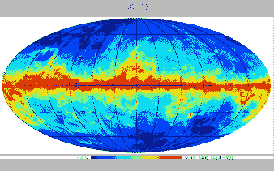

<!--yml

类别: 未分类

日期: 2024-09-06 19:57:25

-->

# [2101.03666] 从不完整的调查中构建远紫外全景图：深度学习算法的应用

> 来源：[`ar5iv.labs.arxiv.org/html/2101.03666`](https://ar5iv.labs.arxiv.org/html/2101.03666)

# 从不完整的调查中构建远紫外全景图：深度学习算法的应用

Young-Soo Jo¹, Yeon-Ju Choi², Min-Gi Kim³, Chang-Ho Woo³, Kyoung-Wook Min³, 和 Kwang-Il Seon^(1,4)

¹韩国天文学与空间科学研究所，韩国大田市尤城区大德路 776 号，邮政编码 34055

²韩国航空宇宙研究院，韩国大田市尤城区科学路 169-84 号，邮政编码 34133

³韩国先进科学技术学院物理系，韩国大田市尤城区大学路 291 号，邮政编码 34141

⁴天文学与空间科学专业，韩国科技大学（UST），韩国大田市尤城区嘉井路 217 号，邮政编码 34113 电子邮件: stspeak@kasi.re.kr（接受 XXX. 收到 YYY; 原始形式 ZZZ）

###### 摘要

我们基于韩国微卫星 STSAT-1 上的远紫外成像光谱仪（FIMS）观测数据构建了远紫外（FUV）全景图。对于 FIMS 观测未覆盖的 $\sim$20$\%$ 的天空，使用了深度人工神经网络的预测。选择了七个数据集作为输入参数，包括五个全景图的 H$\alpha$、E(B-V)、N(HI) 和两个 X 射线波段，以及银河经度和纬度。将观测的 FIMS 数据集的 70$\%$ 像素随机选择用于训练作为目标参数，剩余 30$\%$ 用于验证。采用了一个简单的四层神经网络结构，包括三个卷积层和一个最终的密集层，每个卷积层都有一个单独的激活函数；每个卷积层后面都跟有一个 dropout 层。预测的 FUV 强度与在类似 FUV 波段进行的 Galaxy Evolution Explorer (GALEX) 观测结果在高银河纬度上表现出良好的一致性。作为构建的图像的一个应用示例，使用模型光学参数和银河尘埃模型进行了尘埃散射模拟，模拟区域包括观测和预测的像素。总体上，观测和预测区域的 FUV 强度得到了很好的再现。

###### 关键词:

辐射传输 – 散射 – 技术：图像处理 – 调查 – ISM: 一般 – 紫外线: ISM^†^†pubyear: 2020^†^†pagerange: 从不完整的调查中构建远紫外全景图：深度学习算法的应用–12

## 1 引言

远紫外（FUV）波段（900–1750Å）的星际介质（ISM）观测极其有用，因为它们提供了关于我们银河系成分之间发生的物理和化学过程的重要信息。例如，高度电离原子的发射线提供了关于银河系热气体如何因与环境的相互作用而生成和冷却的线索（Jo 等，2019）。FUV 波段还包含许多分子氢荧光线，这些线是分子云中恒星形成区域的良好示踪剂（Jo 等，2017）。此外，因为弥散的连续背景被认为是星光被星际尘埃散射的结果，其观测有助于我们理解尘埃颗粒的散射性质和分子云的几何形状，特别是在使用恒星光子的散射模拟时（Jo 等，2012；Lim, Min & Seon，2013；Choi 等，2013；Chollet 等，2015）。FUV 连续强度与 H$\alpha$ 强度也表现出良好的相关性，表明这两种辐射可能有共同的起源和类似的辐射传输机制（Seon 等，2011a，b）。

尽管它很重要，但由于 FUV 波长处的重要消光效应，目前还没有很多 FUV 观测。自 1972 年 TD1 卫星进行了 FUV 调查任务以来，只有两次引人注目的 FUV 调查任务（Boksenberg 等，1973）。 GALEX 于 2003 年 4 月 28 日发射，使用分光镜在两个波长段观测天空：FUV（1350-1750 Å）和近紫外线（NUV：1750-2850 Å）。其空间分辨率在 1°.25 的视场上为 5-7$ \arcsec $（Martin 等，2003; Morrissey 等，2007）。 GALEX 调查数据广泛使用，特别是涉及到弥散的紫外线背景（Murthy，Henry ＆Sujatha，2010； Murthy，2014a，b，2016； Henry，2012； Henry 等，2015； Jyothy 等，2015； Narayan，Murthy ＆Karuppath，2017； Akshaya 等，2018，2019）。虽然不常用，但低分辨率的光谱数据也可从使用客观棱镜进行的观测中获得。另一个 FUV 任务使用了远紫外成像光谱仪（FIMS），又称作星际等离子体辐射光谱学（SPEAR），搭载于 2003 年 9 月 27 日发射的科学技术卫星 1 号（STSAT-1）上（Edelstein 等，2006a，b）。 FIMS 是一款双波段成像光谱仪，短波段（S-波段：900-1150 Å，分辨率 1.5 Å，视场 4°$\times$5$\arcmin$）和长波段（L-波段：1335-1750 Å，分辨率 2.5 Å，视场 8°$\times$5$\arcmin$）。两个波段都具有 5′的成像分辨率。 GALEX 和 FIMS 的 L-波段具有几乎相同的光谱带。尽管如此，GALEX 和 FIMS 都没有覆盖整个天空；GALEX 有意避免观测亮区以保护探测器，而 STSAT-1 的电力问题导致 FIMS 频繁中断并提前终止。

深度人工神经网络（DNN）是机器学习（ML）的一个子集，由多个互联的“人工神经元”层组成，配有强大的优化算法（LeCun, Bengio & Hinton, 2015）。DNN 基于在训练阶段从大量数据中自动学习，通过构建分层的内部表示来捕捉数据中的复杂非线性关系。DNN 在图像处理方面尤其成功；具体而言，卷积神经网络（CNN）采用了一种受哺乳动物视觉识别机制研究启发的前馈神经网络（Rawat & Wang, 2017）。CNN 通常利用一种包含多个特征提取步骤（如卷积、池化和非线性激活层）的多层结构。虽然仅利用当前输入的 CNN 主要适用于图像处理，但可以通过递归神经网络（RNN）对序列数据集（其中下一步依赖于前一输入数据）进行建模。RNN 算法包括一个隐藏状态记忆，用于总结之前的输入信息。RNN 在自然语言处理方面被证明特别成功（Lipton, Berkowitz & Elkan, 2015）。

机器学习在天文学研究中变得越来越流行，因为从地面和空间观测中产生了巨大的多光谱数据集，需要非常复杂的分析工具来提取有意义的信息（Ball & Brunner, 2010）。例如，CNN 被应用于星系区分研究（Kim & Brunner, 2017）、引力透镜（Schaefer et al., 2018；Davies, Serjeant & Bromley, 2019）和光度红移（Pasquet et al., 2019）。Naul et al. (2018) 提出了一个无监督自编码 RNN，能够重建噪声大、样本不规则的天文数据。一个名为支持向量机（SVM）的机器学习技术使用 N 维空间中的最佳超平面来分隔类别（Kovács & Szapudi, 2015；Pashchenko, Sokolovsky & Gavras, 2018）。Baron (2019) 开发了一种基于无监督学习的异常检测算法，能够识别图像、光谱和时间序列数据集中的意外新对象。Das & Sanders (2019) 使用贝叶斯人工神经网络估计红巨星的年龄、距离和质量。

GALEX 和 FIMS 都没有覆盖整个天空；GALEX 没有观察到银河平面和明亮恒星周围的整个区域，而 FIMS 数据集中存在几个对应于轨道的空洞区域，且存在功率问题。我们在本研究中的目标是填补 FIMS L 波段总 FUV 强度图中的未调查区域，利用其他波长完成的全天调查和深度学习算法。我们使用 FIMS 数据集进行这种监督学习，因为 GALEX 数据集中缺失高强度银河平面，而 FIMS 则覆盖了低和高强度区域。由于缺乏对应波长的观测，难以确认未调查区域预测的 FUV 强度的有效性，因此我们并不打算提供一个精确的地图，而是呈现一个合理的全球规模地图，这一地图是借助最近开发的神经网络技术构建的。然而，通过将地图与在 FUV 中用于建模星际尘埃的尘埃散射模拟进行比较，以及与 H$\alpha$地图进行比较（该地图在两个波长中都类似于扩展校正后的弥散 FUV 地图），可以进行间接验证。我们研究的另一个目标是展示机器学习在天体物理学中的实用性：本工作表明，即使没有基于经验的先验假设，极其简单的深度学习算法也能从无偏数据库中产生显著结果。本文的组织结构如下：第二部分阐述了从不完整 FIMS 数据中构建 FUV 全天地图的过程。我们首先概述 FIMS 数据的结构，然后详细描述 DNN 算法。结果地图展示并与 GALEX 观测数据进行比较。在第三部分中，我们应用尘埃散射模拟来验证预测的 FUV 强度的有效性。最后在第四部分中总结了本文。

## 2 FUV 全天地图的构建

### 2.1 数据集

FIMS 数据覆盖了大约 75% 的天空（Seon et al., 2011a），采用 HEALPix 方案（Gorski et al., 2005）存储，分辨率参数为 N[side]=512，相当于大约 7′。从这些档案数据中构建了 FIMS L 波段的扩散发射图¹¹1[`drive.google.com/file/d/1ZO_3n7-aUijxLUJA1auhL2l18fRCVars/view?usp=sharing`](https://drive.google.com/file/d/1ZO_3n7-aUijxLUJA1auhL2l18fRCVars/view?usp=sharing)，其分辨率参数为 N[side]=64（对应大约 1°），在去除与亮星相关的亮像素后得到（Jo et al., 2017）。选定的约 1° 的角分辨率远低于原始档案数据集，旨在确保即使对于最微弱的像素（约 200 CU），最小信噪比也高于 5。以此分辨率，整个天空由 49,152 个总空间像素组成，其中 37,152 个由 FIMS 获取了非零值，12,000 个为空。图 1 显示了分辨率为约 1° 的 FIMS 扩散 FUV 发射图。

图 1：研究中使用的所有天空图： (a) FIMS 观测的 FUV， (b) H$\alpha$， (c) E(B-V)， (d) N(HI)， (e) ROSAT 的软 X 射线 R2 波段，以及 (f) ROSAT 的软 X 射线 R5 波段。

为了估计 FUV 强度在 FIMS 未覆盖的区域，整个训练、验证和预测阶段使用了以下用于其他波长的调查数据作为输入数据：Finkbeiner（2003）的复合 H$\alpha$图²²2[`lambda.gsfc.nasa.gov/data/foregrounds/halpha/lambda_halpha_fwhm06_0512.fits`](https://lambda.gsfc.nasa.gov/data/foregrounds/halpha/lambda_halpha_fwhm06_0512.fits)；Schlegel, Finkbeiner & Davis（1998）的银河系红化 E(B-V)图³³3[`lambda.gsfc.nasa.gov/data/foregrounds/SFD/lambda_sfd_ebv.fits`](https://lambda.gsfc.nasa.gov/data/foregrounds/SFD/lambda_sfd_ebv.fits)；Dickey & Lockman（1990）的中性氢柱密度 N(HI)图⁴⁴4[`lambda.gsfc.nasa.gov/data/foregrounds/combined_nh/lambda_combined_nh.fits`](https://lambda.gsfc.nasa.gov/data/foregrounds/combined_nh/lambda_combined_nh.fits)；Snowden 等人（1997）构建的 ROSAT 的 R2（1/4 keV）和 R5（3/4 keV）带图⁵⁵5[`www.jb.man.ac.uk/research/cosmos/rosat/RASS_SXRB_R2.fits`](http://www.jb.man.ac.uk/research/cosmos/rosat/RASS_SXRB_R2.fits)^,⁶⁶6[`www.jb.man.ac.uk/research/cosmos/rosat/RASS_SXRB_R5.fits`](http://www.jb.man.ac.uk/research/cosmos/rosat/RASS_SXRB_R5.fits)。这些调查图是从 X 射线到射电波长的代表性图像。它们根据物理发射机制（X 射线来自温度约 10⁶ K 的热气体，H$\alpha$来自温度约 10⁴ K 的光电离气体，E(B-V)追踪尘埃消光，N(HI)追踪中性原子氢气体）描绘了不同的 ISM 相，并展示了各自独特的形状，如图 1 所示。我们使用了两个 X 射线波段，因为这两个波段构建的全天地图彼此之间差异很大；R2 波段与中性 ISM 有显著的负相关，而 R5 波段则总体上呈正相关。我们没有尝试对特定波长赋予权重，因为这样的偏颇行为反映了我们对依赖于波长且因区域不同而变化的详细发射和消光物理的不确定偏见。我们更愿意让深度学习算法发现 FUV 强度与其他波长之间的非线性关系。学习阶段获得的非线性关系在验证阶段得到验证，此阶段中，预测结果与未在学习阶段使用的观测数据进行比较。所有图像，尽管在更高分辨率下可能具有高信噪比，但都被归一化以匹配 FIMS 的分辨率，因为深度学习算法要求输入数据集具有像素对像素的对应关系以进行直接比较。银河经度和纬度也作为输入数据用于考虑输入数据集之间关系的空间变化。

我们随机选择了 37,152 个非零像素中的 70%用于训练，其余 30%用于验证。由于每个数据集的尺度相差几个数量级，在应用 DNN 算法之前，我们通过对数值转换和标准化调整数据集范围，以确保所有最终数据集具有零均值和标准差为 1 的特性。这个标准化过程是必要的，因为在本研究中，观测数据集之间的强度差异非常巨大，最高达到 10²¹倍。未进行缩放的输入变量可能导致学习过程缓慢或不稳定，通常会导致学习过程失败（Sola & Sevilla，1997）。因此，标准化输入数据以具有相同的分散度是通用做法，以保证收敛。此外，对数尺度标准化过程也与 ISM 密度分布中发现的对数正态特性相符合（Ostriker, Stone & Gammie，2001；Seon，2012；Burkhart et al., 2015）。预测的 FUV 强度最终是通过应用标准化过程的逆过程获得的。

图 2：本研究采用的神经网络架构

图 3：观测到的 FIMS 强度和预测 FIMS 强度的综合图。

### 2.2 算法

神经网络（NN）通常包括一个用于输入数据的输入层、若干个用于处理和学习的隐藏层，以及一个输出层。如 2.1 节所述，我们在训练模型之前将数据集划分为训练集和交叉验证集。在训练阶段，权重通过一系列层应用于所有输入数据，最终输出层中的预测值通过损失函数与目标值进行比较。对于输入数据，我们选择了七个数据集，其中五个是 H$\alpha$、E(B-V)、N(HI)的观测图和两个 X 射线带，剩下的两个则对应于银河经度和纬度，如 2.1 节所述。FIMS FUV 强度被视为训练目标参数。

我们采用了一个简单的四层神经网络架构，该架构包括三个卷积层和最后一个全连接层，如图 2 所示。该模型具有七个输入参数和每个隐藏层中的 16 个神经元；最终的全连接层有一个预测输出值。对于激活函数，它们在输入和目标数据集之间具有非线性关系，我们对第一层使用了双曲正切（Nwankpa et al., 2018），对第二层和第三层使用了带泄漏的 ReLU（Maas, Hannun & Ng, 2013）。双曲正切是一种饱和激活函数，对于较大的输入参数值生成饱和值，而带泄漏的 ReLU 则是非饱和神经元，对于较大的输入参数提供大的输出值，并且当输入<0 时，具有小的负斜率而不是零。我们尝试了几种其他的激活函数组合，但选择的这一组合提供了最佳结果。我们在训练阶段每个卷积层后使用了一个 dropout 层，以改善误差并减少过拟合（Srivastava et al., 2014）。这三层的 dropout 率分别为 0.03、0.03 和 0.05。当前研究采用了 Keras 2.3.1 库和 TensorFlow 1.14.0 作为后端框架（Chollet et al., 2015）。

内部可学习参数如权重和偏差通过 RMSprop（Hinton et al., 2012）进行了更新，这是一种利用最近梯度的均方根的优化算法，学习率为 10^(-4)。初始权重采用了随机均匀函数，因为完全随机的初始权重可能会影响最终的预测值。在训练阶段，通过损失函数将预测的 FUV 强度与观察到的 FIMS 值进行比较，损失函数评估了估计值和实际值之间的数值距离。在我们的模型中，我们使用了均方误差（MSE）损失函数。我们的网络经过了 10³次更新迭代，最终损失值为 0.11。训练数据和代码可以通过“https://github.com/yjchoi83/FIMS_FUV”上的 GitHub 链接下载。为了确认最终预测的 FIMS 数据的可靠性，我们将 FIMS 数据与 GALEX 数据进行了比较。确认测试的详细情况描述在第 2.3 节。

### 2.3 FUV 全天空图

图 3 显示了原始观测 FIMS 数据和填补了未调查区域的预测 FIMS FUV 强度的组合图。值得注意的是，尽管预测区域（例如 l = 150° 的北部区域）的特征比观测区域更平滑，但预测区域与观测区域在很大程度上难以区分。一些银河平面及其周围的亮区是显而易见的；例如，（l, b）$\simeq$ (-50°, 0°) 区域对应于下半人马座十字星（最近的 OB 协会），而 (-180°< l < -120°, -30°< b < 0°) 区域对应于包括猎户座星云、巴纳德环和 Lambda 猎户座在内的猎户-厄尔达努斯超级气泡的上部。

图 4：比较了观测到的 FIMS 强度和预测的 FIMS 强度与 GALEX 强度。黑色（红色）点代表观测到的（预测的）FIMS 数据。使用对数尺度估计的像素数量和相关系数分别显示在左上角和右下角，采用相应的颜色标注。

图 5：FIMS 和 GALEX 强度之间差异的直方图。黑色和红色直方图分别对应观测到的和预测的 FIMS 数据。两个直方图均使用高斯曲线进行拟合，中心和宽度已标出。

在图 4 中，我们比较了观测到的（黑色）和预测的（红色）FIMS 强度与 GALEX 观测值。总体上，观测到的 FIMS 强度和预测的 FIMS 强度与 GALEX 观测值之间存在良好的线性关系，尽管观测到的 FIMS 数据在强度较高的方向上有些散布，相比于相应的 GALEX 数据，导致预测的强度略高。另一方面，在高强度下，GALEX 观测值比 FIMS 略亮。使用对数尺度估计的相关系数在观测和预测情况下均超过 0.9。

图 5 展示了 FIMS 与 GALEX 强度之间差异的直方图（（I[FIMS]-I[GALEX])/(I[FIMS]+I[GALEX]））。黑色和红色直方图分别对应观察到的和预测的 FIMS 数据。总体而言，两者的直方图都很好地拟合了使用虚线叠加的单一高斯函数。与拟合的高斯函数相比，黑色直方图在图 5 的右侧显示了过剩，表明观察到的 FIMS 强度略高于 GALEX 强度。这与观察到的 FIMS 数据相对于 GALEX 数据在更高强度的扩展相对应（图 4）。这些差异是由于仪器对明亮恒星光子的散射（见 Jo et al.，2016，图 1）。与观察到的 FIMS 数据不同，预测的 FIMS 强度没有表现出这种过剩。

图 6：10$\degr$ < l < 20$\degr$，|b| < 20$\degr$的银河系低纬度区域观察到的强度和预测强度的比较：（a）实际 FIMS 观测，（b）预测结果，（c）预测强度与实际观测的散点图。

图 7：在银河系盘区域|b|<30°，观察到的（黑点）和预测的（红点）FIMS 强度与 H$\alpha$强度的比较。左侧和右侧图分别显示了经过和未经过消光校正的散点图。

图 8：使用对数刻度的 I${}_{\rm FUV}\times\sin$|b|的直方图：黑色和红色直方图分别对应观察到的和预测的 FIMS 强度。两者的直方图都拟合了高斯曲线，并标出了中心和宽度。

图 4 和 5 所示的比较仅针对 GALEX 观测到的区域。因此，我们尝试通过采用以下测试来确保对 GALEX 未观测的明亮银河平面区域的 FUV 强度预测的有效性。我们选择了一个位于银河平面附近的小区域 10$\degr$ < l < 20$\degr$，|b| < 20$\degr$，该区域被 FIMS 观测到，除了左下角，并将相同的 DNN 算法应用于整个天空，在学习过程中故意排除了该区域。然后将该区域的预测结果与实际的 FIMS 观测结果进行了比较。图 6 显示了比较结果：（a）实际 FIMS 观测，（b）预测结果，以及（c）预测强度与实际观测的散点图。从图中可以看出，观测结果与预测结果高度一致，相关系数为 0.844，平均差异为 17.4$\%$。尽管这些数据不能保证银河平面区域预测强度的可靠性，但我们注意到 FIMS 的估计误差约为 $\sim$25$\%$（Edelstein 等， 2006b）。

此外，我们还将 FUV 强度与银河低纬度区域的 H$\alpha$ 强度进行了比较，因为之前的研究表明它们在晕区表现出良好的相关性（Seon 等， 2011b）。对于银河平面区域，其中灭绝效应严重，我们采用了以下简单的灭绝公式（Natta & Panagia, 1984；Castelli, Kinney & Storchi-Bergmann, 1994；Bennett 等， 2003），假设光子源和散射尘粒均匀混合在平行介质中：

|  | $I_{extinction-corrected}=I_{observed}\times\frac{\tau}{1-e^{-\tau}},$ |  | (1) |
| --- | --- | --- | --- |

在光学深度$\tau$中，FUV 采用 7.3$\times$E(B-V)，H$\alpha$采用 2.2$\times$E(B-V)，这些选择基于银河系尘埃消光曲线。修正结果不受散射效应处理方式的显著影响（无散射、完全前向散射和各向同性散射）。图 7 显示了观察到的和预测的 FIMS 强度与银河平面区域的 H$\alpha$强度的对比，|b| < 30°。左侧面板是未进行消光修正前的数据。显然，预测数据点（红点）紧跟观察数据点（黑点）的趋势。尽管数据点广泛分布，但 FIMS FUV 强度与 H$\alpha$强度之间有很强的相关性，尤其是当 H$\alpha$强度小于$\sim$10 R 时。超过 10 R 时，FIMS FUV 强度显示出比可见 H$\alpha$更多的消光。实际上，在 100 $\mu$m 处观察到的红外辐射在这一高强度区域也很亮（Seon et al., 2011b）。右侧面板是基于上述简单公式进行消光修正后的数据。我们可以看到，无论强度水平如何，FUV 和 H$\alpha$强度之间有良好的线性关系。我们还注意到，消光修正后观察到的数据点分布较少。

图 8 中的直方图确认了预测的 FIMS 结果的有效性。图 8 中的黑色和红色直方图分别对应于观察到和预测的 FIMS 强度乘以$\sin$|b|。Seon et al. (2011a)详细介绍了扩散 FUV 强度分布的对数正态特性，并将其解释为 ISM 密度结构和湍流特性的自然结果。图 8 显示了预测的 FIMS 强度很好地保留了对数正态特性。虽然两个直方图的中心几乎重合，但预测的 FIMS 直方图宽度小于观察到的 FIMS 数据宽度，这表明预测强度的波动小于观察到的强度。

图 9：（a）观察到的 FIMS 数据和预测的 FUV 强度的组合图。白色等高线表示观察数据和预测数据之间的边界。大的中央区域和小的右下角区域为观察区域，而左上角和右下角的条带为预测区域；（b）对应于（a）所示整个区域的尘埃散射模拟图。

## 3 讨论：尘埃散射模拟

扩散的连续背景，称为扩散的银河光，主要来自被星际尘埃散射的星光。在这里，我们利用尘埃散射模拟结果来测试 DNN 预测的 FUV 强度的可靠性。我们选择了一个相对较大的区域，跨度超过 50$\degr$，中心在(l, b) = (175°, -30°)，包括观察区域和预测区域（图 9a）。观察区域和预测区域由白色边界分隔；大中央区域有明显的像素间波动，是观察区域，而大多数外部区域强度平滑，为预测区域。对于图中所示的区域，已经报告了 FIMS 观测的尘埃散射模拟，分别为位于左下角的猎户座-埃里丹斯超气泡（Jo 等，2012）和右上角的金牛座-仙女座-天箭座复合体（Lim, Min & Seon，2013）。左上角区域是 Lambda Orionis，由 Lee, Seon & Jo (2015)分析，使用了 S2/68 UV 望远镜（Boksenberg 等，1973）观察的数据；FIMS 和 GALEX 均未观察该区域。右下角的微弱区域由 GALEX 观察过，但 FIMS 未观察。

对于模拟的灰尘分布，我们结合了 Lallement 等人 (2019) 的三个最新 3D 灰尘地图、Stilism ([`stilism.obspm.fr/`](https://stilism.obspm.fr/) 或 [`cdsarc.u-strasbg.fr/viz-bin/cat/J/A+A/625/A135`](http://cdsarc.u-strasbg.fr/viz-bin/cat/J/A+A/625/A135))、Green 等人 (2019) 的 Bayestar19 ([`argonaut.skymaps.info/`](http://argonaut.skymaps.info/))，以及 Leike & Enßlin (2019) 的银河灰尘吸收图 ([`wwwmpa.mpa-garching.mpg.de/$\sim$ensslin/research/data/dust.html`](https://wwwmpa.mpa-garching.mpg.de/%C2%A0ensslin/research/data/dust.html))，以构建了一个距离太阳约 2 kpc 的 3D 灰尘地图。我们使用了一个 800$\times$800$\times$400 的长方体盒子，每个箱子的大小为 5 pc。每个箱子被分配了对应于每秒差距 E(B-V)值的消光密度。辐射源数据来自 TD-1（Thompson 等人，1978）和 Hipparcos（Perryman 等人，1997）目录。TD-1 目录提供了在$\lambda$1565Å的观测 FUV 带通量，这些通量在经过使用更新的距离进行消光修正后被转换为固有亮度。Hipparcos 目录仅提供了光谱类型，因此我们使用 Castelli 的恒星模型（Castelli & Kurucz，2003）为 Hipparcos 星星推导了恒星亮度，并从恒星亮度估计了 FUV 通量。星星的距离来源于 GAIA DR2（Gaia Collaboration，2016, 2018）和 Hipparcos 目录。

灰尘颗粒的光学性质可能会根据视线方向和距离有所不同。然而，之前的研究显示，猎户座-长蛇座超级气泡区域和金牛座-天鹅座-御夫座星座区域的光学性质相似，其中猎户座-长蛇座超级气泡区域的 (反射率, g-因子) = ($0.43_{-0.04}^{+0.02}$, $0.45_{-0.2}^{+0.2}$)（Jo 等人，2012），金牛座-天鹅座-御夫座星座区域的 (反射率, g-因子) = ($0.42_{-0.05}^{+0.05}$, $0.47_{-0.27}^{+0.11}$）（Lim, Min & Seon，2013）。因此，我们在研究中采用了 (反射率, g-因子) = (0.43, 0.45)。本次模拟使用了总计 10¹⁰颗恒星光子。

图 10：FIMS 与灰尘散射模型强度的比较。黑色和红色点分别对应观察数据和预测数据。

图 11：FIMS 与灰尘散射模型强度之间差异的直方图。黑色和红色直方图分别对应观察到的和预测的 FIMS 数据。两个直方图都配有高斯曲线，标出了中心和宽度。

图 9(b) 显示了使用与图 9(a) 相同像素大小和色彩方案的模拟结果（以下简称模型图）。尽管模拟图由于 3D 尘埃图的分辨率较低而部分较平滑，模型图与综合图的匹配度仍然很好。此外，模型图的整体强度变化比综合图大，这可能是因为模型尘埃图的消光密度低于实际值，且空间分辨率不足以表示尘埃云的复杂密度变化。事实上，Leike & Enßlin (2019) 的 3D 尘埃图中，从太阳到 100 pc 的消光密度比其他图低，这降低了尘埃散射强度。已知斑块状介质相比于具有相同尘埃质量的均匀介质具有较低的有效光学深度，并且在高强度区域产生较低的散射光，而在低强度区域产生较高的散射光（例如，Seon & Witt，2013; Seon & Draine，2016）。模型强度在高强度区域的过剩很可能归因于这两种效应。斑块状介质的预期很好地解释了图 9 中所示的总体趋势。我们还注意到，Lee, Seon & Jo (2015) 使用壳+环模型获得了稍有不同的反射率和 g 因子 $(0.31^{+0.03}_{-0.03},0.65^{+0.06}_{-0.06})$，该模型无法用 5 pc 的空间分辨率表示，对于 Lambda Orionis 星云。这一差异强调了准确了解 3D 尘埃密度的重要性。

模拟模型的有效性在图 10 中进一步分析，其中将 FIMS 观测与预测像素与模拟结果进行比较。此外，图 11 显示了观测/预测强度与尘埃散射模拟 ((I[FIMS]-I[Model])/(I[FIMS]+I[Model])) 之间差异的两个直方图。令人印象深刻的是，预测数据的 0.96 相关系数大于观测数据的 0.80 相关系数。预测地图的较高相关系数可能是由于其像素间的统计波动较小。观测和预测地图在低强度区域 < $\sim$1000 CU 中的强度比模型模拟地图高出 $\sim$300 CU。这 $\sim$300 CU 的超出可能是由于外星系背景辐射（Gardner et al., 2000; Brown et al., 2000），和/或 3D 尘埃图中详细密度结构的表示不准确。图 11 也表明对预测的 FIMS 强度有较高的信心。模拟结果与模型值的统计偏差在观测和预测区域都具有类似的高斯分布。因此，尘埃散射模拟很好地再现了观测数据和 DNN 预测 FIMS 数据的整体特征。这一结果表明 DNN 算法为未调查的 FUV 天空地图提供了相当好的预测。

## 4 总结

在这项研究中，应用了一种深度学习算法来填补 FUV 全景调查中的未调查区域，并基于全天地图的观测和预测强度构建了综合地图。H$\alpha$、E(B-V)、N(HI) 和两个 X 射线带的全景地图，以及银河系经度和纬度，作为输入参数，而 FIMS 制作的不完整 FUV 强度地图作为目标参数。即使使用一个由三层卷积层和最后一层全连接层组成的简单四层神经网络架构，结果也与其他观察结果非常一致。为了进一步测试预测强度的有效性和实用性，比较了综合地图中的一个小区域，包括观测和预测区域，与利用最新的 3-D 银河尘埃地图和星表（如 TD-1 和 Hipparcos）的尘埃散射模拟模型。模拟结果与观测和预测区域的综合 FUV 地图表现出良好的一致性。

尽管预测的 FUV 强度需要通过直接观察来确认，但当前的综合地图可以作为涉及 FUV 连续辐射的研究的起点。这包括星际云的消光/散射研究，如第三部分所示。FUV 全景地图还提供了全球尺度辐射传输机制的重要线索，尤其是在与其他波长的全球地图一起使用时。此外，光学厚度大且复杂的银河系低纬度区域在深度学习方面既有趣又具挑战性。最后，我们在此指出，基于 HEALPix 方案、角分辨率为 N[side] = 64 的最终综合地图可以从网站¹⁰¹⁰10[`drive.google.com/file/d/1841qiiVj4E49kZFkNU3aAhvbbZ3qxMBM/view?usp=sharing`](https://drive.google.com/file/d/1841qiiVj4E49kZFkNU3aAhvbbZ3qxMBM/view?usp=sharing)下载。

## 数据可用性

这篇文章的数据可以在“https://github.com/yjchoi83/FIMS_FUV”的 GitHub 链接中找到。

## 致谢

这项研究得到了韩国天文学与空间科学研究所的支持，项目由韩国科学技术信息通信部监督。同时，基础科学研究项目也得到了由教育部资助的国家研究基金会（NRF）的支持（2019R1F1A1061102）。

## 参考文献

+   Akshaya 等人 (2018) Akshaya M. S., Murthy J., Ravichandran S., Henry R. C., Oerduin J., 2018, ApJ, 858, 101

+   Akshaya 等人 (2019) Akshaya M. S., Murthy J., Ravichandran S., Henry R. C., Oerduin J., 2019, MNRAS, 489, 1120

+   Ball & Brunner (2010) Ball N. M., Brunner R. J., 2010, Int. J. Modern Phys. D, 19, 1049

+   Baron (2019) Baron D.，2019，preprint (arXiv: 1904.07248v1)

+   Bennett 等 (2003) Bennett C. L. 等，2003，ApJS，148，97

+   Boksenberg 等 (1973) Boksenberg A. 等，1973，MNRAS，163，291

+   Brown 等 (2000) Brown T. M. 等，2000，AJ，120，1153

+   Burkhart 等 (2015) Burkhart B.，Lee M. Y.，Murray C. E.，Stanimirović S.，2015，ApJ，811，L28

+   Castelli, Kinney & Storchi-Bergmann (1994) Calzetti D.，Kinney A. L.，Storchi-Bergmann T.，1994，ApJ，429，582

+   Castelli & Kurucz (2003) Castelli F.，Kurucz R. L.，2003，在 Piskunov N.，Weiss W. W.，Gray D. F. 编，Proc. IAU Symp. 210，恒星大气模型。Astron. Soc. Pac.，旧金山，p. A20

+   Choi 等 (2013) Choi Y. J. 等，2013，ApJ，774，34

+   Choi 等 (2015) Choi Y. J. 等，2015，ApJ，800，132

+   Chollet 等 (2015) Chollet F. 等，2015，https://keras.io

+   Das & Sanders (2019) Das P.，Sanders J. L.，2019，MNRAS，484，294

+   Davies, Serjeant & Bromley (2019) Davies A.，Serjeant S.，Bromley J. M.，2019，MNRAS，487，5263

+   Dickey & Lockman (1990) Dickey J. M.，Lockman F. J.，1990，A&ARv，28，215

+   Draine (2003) Draine B. T.，2003，ApJ，598，1017

+   Edelstein 等 (2006a) Edelstein J. 等，2006a，ApJ，644，L153

+   Edelstein 等 (2006b) Edelstein J. 等，2006b，ApJ，644，L159

+   Finkbeiner (2003) Finkbeiner D. P.，2003，ApJS，146，407

+   Gaia Collaboration (2016) Gaia Collaboration，Brown A. G. A. 等，2016，A&A，595，A2

+   Gaia Collaboration (2018) Gaia Collaboration，Brown A. G. A. 等，2018，A&A，616，A1

+   Gardner 等 (2000) Gardner J. P. 等，2000，ApJ，542，L79

+   Gorski 等 (2005) Gorski K. M. 等，2005，ApJ，622，759

+   Green 等 (2019) Green G. M. 等，2019，preprint (arXiv:1905.02734)

+   Henry (2012) Henry R. C. 2012，MmSAI，83，409

+   Henry 等 (2015) Henry R. C.，Murthy J.，Overduin J.，Tyler J. 2015，ApJ，798，14

+   Hinton 等 (2012) Hinton 等，2012，preprint (arXiv:1207.0580v1)

+   Jo 等 (2012) Jo 等，2012，ApJ，756，38

+   Jo 等 (2016) Jo 等，2016，MNRAS，456，417

+   Jo 等 (2017) Jo 等，2017，ApJS，232，21

+   Jo 等 (2019) Jo 等，2019，ApJS，243，9

+   Jyothy 等 (2015) Jyothy S. N.，Murthy J.，Karuppath N.，Sujatha N. V. 2015，MNRAS，454，1778

+   Kim & Brunner (2017) Kim E. J.，Brunner R. J.，2017，MNRAS464，4463

+   Kovács & Szapudi (2015) Kovács A.，Szapudi I.，2015，MNRAS，448，1305

+   Lallement 等 (2019) Lallement R. 等，2019，A&A，625，A135

+   LeCun, Bengio & Hinton (2015) LeCun Y.，Bengio Y.，Hinton G.，2015，Nature，521，436

+   Lee, Seon & Jo (2015) Lee D.，Seon K. I.，Jo Y. S.，2015，ApJ，806，274

+   Leike & Enßlin (2019) Leike R. H.，Enßlin T. A.，2019，A&A，631，A32

+   Lim, Min & Seon (2013) Lim T. H.，Min K. W.，Seon K. I.，2013，ApJ，765，107

+   Lipton, Berkowitz & Elkan (2015) Lipton Z. C.，Berkowitz J.，Elkan C.，2015，preprint (arXiv:1506.00019v4)

+   Martin 等 (2003) Martin C. 等，2003，SPIE Conf. 4854，银河演化探测器。未来 EUV/UV 和可见光空间天体物理任务及仪器

+   Maas, Hannun & Ng (2013) Maas A. L., Hannun A. Y., Ng A. Y., 2013, 《国际会议机器学习论文集》，30, 3

+   Morrissey et al. (2007) Morrissey P. et al., 2007, ApJS, 173, 682

+   Murthy, Henry & Sujatha (2010) Murthy J., Henry R. C., Sujatha N. V. 2010, ApJ, 724, 1389

+   Murthy (2014a) Murthy J. 2014a, ApJS, 213, 32

+   Murthy (2014b) Murthy J. 2014b, Ap&SS, 349, 165

+   Murthy (2016) Murthy J. 2016, MNRAS, 459, 1710

+   Narayan, Murthy & Karuppath (2017) Narayan S., Murthy J., Karuppath N. 2017, MNRAS, 466, 3199

+   Natta & Panagia (1984) Natta A., Panagia N., 1984, ApJ, 287, 228

+   Naul et al. (2018) Naul et al., 2018, 《自然天文学》，2, 151

+   Nwankpa et al. (2018) Nwankpa C. et al., 2018, 预印本 (arXiv:1811.03378)

+   Ostriker, Stone & Gammie (2001) Ostriker E. C., Stone J. M., Gammie C. F., 2001, ApJ, 546, 980

+   Pashchenko, Sokolovsky & Gavras (2018) Pashchenko I. N., Sokolovsky K. V., Gavras P., 2018, MNRAS, 475, 2326

+   Pasquet et al. (2019) Pasquet J. et al., 2019, A&A, 621, A26

+   Perryman et al. (1997) Perryman M. A. C. et al., 1997, A&A, 323, L49

+   Rawat & Wang (2017) Rawat W., Wang Z., 2017, 《神经计算》，29(9), 2352

+   Schaefer et al. (2018) Schaefer C. et al., 2018, A&A, 611, A2

+   Schlegel, Finkbeiner & Davis (1998) Schlegel D. J., Finkbeiner D. P., Davis M., 1998, ApJ, 500, 525

+   Seon et al. (2011a) Seon K. I. et al., 2011a. ApJS, 196, 15

+   Seon et al. (2011b) Seon K. I. et al., 2011b, ApJ, 743, 188

+   Seon (2012) Seon K. I. 2012, ApJ, 761, L17

+   Seon & Witt (2013) Seon K. I., Witt A. N., 2013, ApJ, 778, 40

+   Seon & Draine (2016) Seon K. I., Draine B. T., 2016, ApJ, 833, 201

+   Snowden et al. (1997) Snowden S. L. et al., 1997, ApJ, 485, 125

+   Sola & Sevilla (1997) Sola J., Sevilla J., 1997, 《IEEE 核科学汇刊》，44, 1464

+   Srivastava et al. (2014) Srivastava N. et al., 2014, JMLR, 15, 1929

+   Thompson et al. (1978) Thompson G. I. et al., 1978, 《恒星紫外线通量目录》。ESRO 卫星 TD-1 上的天空调查望远镜（S2/68）测得的绝对恒星通量的汇编。科学研究委员会，伦敦

## 附录 A 不合理输入数据集的影响测试

我们在正文中争论了图 3 中的最终预测图是通过各种测试验证了其合理性的。然而，需要注意的是，成功的预测依赖于适当选择输入数据集；尽管它们也可以是任意的。一个简单的问题是，完全无关的输入数据集会如何影响结果？为了解答这个问题，我们测试了一个不合理输入数据集的影响，该数据集为一个与当前 FUV 研究无关的地球高程图¹¹¹¹11[`earth-info.nga.mil/GandG/wgs84/gravitymod/egm96/egm96.html`](https://earth-info.nga.mil/GandG/wgs84/gravitymod/egm96/egm96.html)。我们将地球高程图，如图 12a 所示，作为第八个输入数据集，并运行了相同的 DNN 代码，连同七个原始数据集。结果如图 12b 所示，与图 3 中的原始结果几乎没有差别。我们还将预测的 FUV 强度与图 12c 中的相应 GALEX 观测进行了比较，结果与图 4 中所示的结果非常相似。我们相信，这个测试确认了一个无关的数据集不会对最终结果产生贡献，这意味着本研究中采用的输入数据集以适当的权重对最终预测的 FUV 图进行了贡献。

图 12：（a）大地高程图（NGA/NASA EGM96，N=M=360 地球重力模型），作为第八个输入数据集，测试无关输入的影响，（b）结果 FUV 预测与观测的组合图，参见图 3，（c）观测和预测的 FIMS 强度与 GALEX 强度的比较，参见图 4。
