<!--yml

category: 未分类

date: 2024-09-06 19:57:20

-->

# [2101.03749] 基于深度学习的人脸超分辨率：综述

> 来源：[`ar5iv.labs.arxiv.org/html/2101.03749`](https://ar5iv.labs.arxiv.org/html/2101.03749)

# 基于深度学习的人脸超分辨率：综述

Junjun Jiang 哈尔滨工业大学计算机科学与技术学院 哈尔滨 中国 jiangjunjun@hit.edu.cn ,  Chenyang Wang 哈尔滨工业大学计算机科学与技术学院 哈尔滨 中国 wangchy02@hit.edu.cn ,  Xianming Liu 哈尔滨工业大学计算机科学与技术学院 哈尔滨 中国 csxm@hit.edu.cn  和 Jiayi Ma 武汉大学电子信息学院 武汉 中国(2021)

###### 摘要。

人脸超分辨率（FSR），也称为人脸幻觉，旨在提高低分辨率（LR）人脸图像的分辨率，以生成高分辨率（HR）人脸图像，是一个领域特定的图像超分辨率问题。近年来，随着深度学习技术的发展，FSR 受到了相当大的关注，并取得了令人瞩目的进展。迄今为止，关于深度学习基础上的 FSR 的总结资料还很少。在这项综述中，我们以系统的方式呈现了基于深度学习的 FSR 方法的全面回顾¹¹1 人脸超分辨率的精选论文和资源列表见[`github.com/junjun-jiang/Face-Hallucination-Benchmark`](https://github.com/junjun-jiang/Face-Hallucination-Benchmark)。首先，我们总结了 FSR 的问题表述，并介绍了流行的评估指标和损失函数。其次，我们详细说明了 FSR 中使用的面部特征和流行的数据集。第三，我们根据面部特征的利用方式大致分类了现有的方法。在每个类别中，我们首先介绍设计原则的一般描述，然后概述代表性的方法，最后讨论它们之间的优缺点。第四，我们评估了一些最先进方法的性能。第五，我们粗略介绍了联合 FSR 及其他任务以及与 FSR 相关的应用。最后，我们展望了该领域进一步技术发展的前景。

人脸超分辨率、人脸幻觉、深度学习和卷积神经网络人脸超分辨率、深度学习、综述、面部特征^†^†版权：acmcopyright^†^†期刊年份：2021^†^†期刊：CSUR^†^†期刊卷号：0^†^†期刊号：0^†^†文章：0^†^†出版月份：0^†^†ccs：一般和参考 文献^†^†ccs：一般和参考 综述和概述

研究得到了中国国家自然科学基金（61971165、61922027、61773295）和中央高校基本科研业务费的资助。

## 1\. 引言

面部超分辨率（FSR），一个特定领域的图像超分辨率问题，指的是从低分辨率（LR）面部图像中恢复高分辨率（HR）面部图像的技术。它可以提高低质量 LR 面部图像的分辨率并恢复细节。在许多实际场景中，由于物理成像系统和成像条件的限制，面部图像通常质量较低。因此，FSR 具有广泛的应用范围和显著的优势，自其在图像处理和计算机视觉领域诞生以来，一直是一个热门话题。

表 1. 自 2010 年以来面部超分辨率调查总结。

| 编号 | 调查标题 | 年份 | 出版机构 |
| --- | --- | --- | --- |
|  |  |  |  |
| --- | --- | --- | --- |
| 1 | 面部幻像的调查 [1] | 2012 | CCBR |
| 2 | 面部幻像的全面调查 [2] | 2014 | IJCV |
| 3 | 面部幻像各种方法的综述 [3] | 2015 | ICACTA |
| 4 | 面部超分辨率：调查 [4] | 2017 | IJIGSP |
| 5 | 生物特征超分辨率：全面调查 [5] | 2018 | PR |
| 6 | 面部幻像技术：调查 [6] | 2018 | CICT |
| 7 | 基于 GAN 的面部幻像调查及其模型发展 [7] | 2019 | IET |

FSR 的概念首次由 Baker 和 Kanade 于 2000 年提出[8]，他们是 FSR 技术的开创者。他们基于高斯图像金字塔开发了一个多层次学习和预测模型，以提高 LR 人脸图像的分辨率。刘*等人*[9]建议将全局参数主成分分析（PCA）模型与局部非参数马尔可夫随机场（MRF）模型集成用于 FSR。从那时起，提出了许多创新方法，FSR 成为了活跃的研究主题。研究人员通过全球人脸统计模型[10、11、12、13、14、15、16]、局部基于补丁的表示方法[17、18、19、20、21、22、23、24、25、26、27]或混合方法[28、29]对 LR 人脸图像进行超分辨率处理。这些方法已经取得了良好的性能，但在实际应用中遇到了一些困难。随着深度学习技术的快速发展，相较于以前的尝试，取得了显著的优势，并已应用于图像或视频超分辨率。许多全面的调查回顾了这些领域的最新成就，即，一般图像超分辨率调查[30、31、32]，和视频超分辨率调查[33]。针对 FSR，作为一个特定领域的图像超分辨率，表 1 中列出了少数调查。在研究的早期阶段，[1、2、3、4、5、6]提供了对传统 FSR 方法（主要包括基于补丁的超分辨率、基于 PCA 的方法，*等*）的全面回顾，而刘*等人*[7]提供了基于生成对抗网络（GAN）的 FSR 调查。然而，到目前为止，没有关于专门针对人脸的深度学习超分辨率的文献综述。本文对不同的基于深度学习的 FSR 方法进行了比较研究。

本调查的主要贡献如下：

+   •

    这份调查提供了对最近 FSR 技术的全面回顾，包括问题定义、常用评价指标和损失函数、FSR 的特征、基准数据集、基于深度学习的 FSR 方法、最先进技术的性能比较、同时执行 FSR 和其他任务的方法，以及与 FSR 相关的应用。

+   •

    这项综述总结了现有基于深度学习的 FSR 方法如何探索网络架构的潜力，利用面部图像的特征，以及比较这些方法之间的相似性和差异。

+   •

    这项综述讨论了挑战，并展望了 FSR 领域未来研究的前景。

在接下来的内容中，我们将涵盖现有的基于深度学习的面部超分辨率（FSR）方法，图 1 展示了 FSR 的分类法。第二部分介绍了 FSR 的问题定义，以及常用的评估指标和损失函数。第三部分展示了面部特征（*即*，先验信息、属性信息和身份信息），并回顾了一些主流面部数据集。在第四部分中，我们讨论了 FSR 方法。为了避免详尽的列举，并考虑到面部特征，FSR 方法根据使用的面部特征进行分类。在第四部分中，提出了五大类：一般 FSR 方法、先验引导的 FSR 方法、属性约束的 FSR 方法、身份保留的 FSR 方法和参考 FSR 方法。根据网络架构或面部特征的利用，每个类别进一步细分为几个子类别。此外，第四部分还比较了一些最先进方法的性能。此外，第四部分还回顾了一些处理联合任务和 FSR 相关应用的方法。第五部分总结了 FSR，并进一步讨论了其局限性以及展望了未来技术发展的前景。

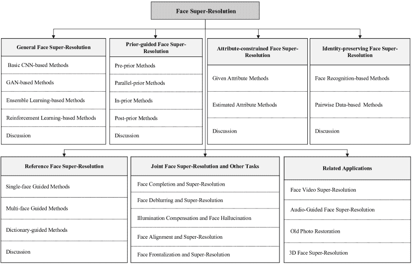

图 1\. 面部超分辨率的分类。

## 2\. 背景

### 2.1\. 问题定义

FSR 关注于从观察到的低分辨率（LR）面部图像中恢复相应的高分辨率（HR）面部图像。图像退化模型 $\Phi$ 可以用数学公式表示为：

| (1) |  | $I_{\text{LR}}=\Phi(I_{\text{HR}},\theta),$ |  |
| --- | --- | --- | --- |

其中，$\theta$ 代表模型参数，包括模糊核、下采样操作和噪声，$I_{\text{LR}}$ 是观察到的 LR 面部图像，$I_{\text{HR}}$ 是原始 HR 面部图像。FSR 致力于模拟退化模型的逆过程，并从 $I_{\text{LR}}$ 中恢复 $I_{\text{SR}}$，可以表示为：

| (2) |  | $I_{\text{SR}}=\Phi^{\text{-1}}(I_{\text{LR}},\delta)=F(I_{\text{LR}},\delta),$ |  |
| --- | --- | --- | --- |

其中，$F$ 是超分辨率模型（逆退化模型），$\delta$ 代表 $F$ 的参数，$I_{\text{SR}}$ 代表超分辨率结果。$\delta$ 的优化可以定义为：

| (3) |  | $\hat{\delta}=\underset{\delta}{\text{argmin}}\,\,\mathcal{L}(I_{\text{SR}},I_{\text{HR}}),$ |  |
| --- | --- | --- | --- |

其中，$\mathcal{L}$ 代表 $I_{\text{SR}}$ 和 $I_{\text{HR}}$ 之间的损失，$\hat{\delta}$ 是训练模型的最优参数。在 FSR 中，MSE 损失和 $\mathcal{L}_{1}$ 损失是最常用的损失函数，一些模型倾向于使用多个损失函数的组合，这将在第 2.2 节中进行回顾。

在现实环境中，退化模型和参数都是不可用的，$I_{\text{LR}}$ 是唯一已知的信息。为了模拟图像退化过程，研究人员倾向于使用数学模型生成一些 LR 和 HR 对以训练模型。最简单的数学模型是

| (4) |  | $I_{\text{LR}}=(I_{\text{HR}})\downarrow_{s},$ |  |
| --- | --- | --- | --- |

其中，$\downarrow$ 表示下采样操作，$s$ 是缩放因子。然而，这种模式过于简单，无法匹配真实世界的退化过程。为了更好地模拟真实的退化过程，研究人员设计了一个包含多种操作（*例如*，下采样、模糊、噪声和压缩）的退化过程，如下所示：

| (5) |  | $I_{\text{LR}}=J((I_{\text{HR}}\otimes k)\downarrow_{s}+\,n),$ |  |
| --- | --- | --- | --- |

其中，$k$ 是模糊核，$\otimes$ 代表卷积操作，$n$ 代表噪声，$J$ 代表图像压缩。FSR 中使用了多种不同操作的组合，包括广泛使用的双三次模型 [34, 35, 36]，以及用于盲目 FSR 的通用退化模型 [37, 38, 39]。然而，这些模型在本综述中没有详细介绍。

### 2.2\. 评估指标与损失函数

在基于深度学习的超分辨率方法中，用于测量 $I_{\text{HR}}$ 和 $I_{\text{SR}}$ 之间差异的损失函数在指导网络训练中起着重要作用。在获得训练好的网络后，这些方法的重建性能可以通过评估指标来评估。不同损失函数的偏好不同。例如，$\mathcal{L}_{2}$ 损失倾向于产生忠实于原始图像的结果（高 PSNR 值），而感知损失和对抗性损失会生成主观上令人满意的结果（低 FID [40] 和 LPIPS [41] 值）。在实际应用中，我们可以根据需求选择合适的损失函数。考虑到损失函数与评估指标之间的关系，我们在本节中一并介绍它们。

#### 2.2.1\. 图像质量评估

通常，质量评估有两种主要方法：主观评估和客观评估。主观评估依赖于人的判断，通常邀请读者或评审来查看和评估生成图像的质量，从而得到与人类感知一致的结果，但这种方法费时、麻烦且昂贵。相比之下，客观评估主要利用统计数据来反映生成图像的质量。一般而言，客观评估方法通常会产生与主观评估指标不同的结果，因为客观评估方法的出发点是数学而非人类视觉感知，这使得图像质量的评估存在争议。在这里，我们介绍一些流行的评估指标。

峰值信噪比（PSNR）：PSNR 是一种在超分辨率（FSR）中常用的客观评估指标。给定 $I_{\text{HR}}$ 和 $I_{\text{SR}}$，首先计算它们之间的均方误差（MSE），然后得到 PSNR，

| (6) |  | $\text{MSE}=\frac{\text{1}}{hwc}\left\&#124;I_{\text{SR}}-I_{\text{HR}}\right\&#124;^{2}_{2},$ |  |
| --- | --- | --- | --- |
| (7) |  | $\text{PSNR}=10\,log_{\text{10}}(\frac{\text{M}^{2}}{\text{MSE}}),$ |  |

其中 $h$、$w$ 和 $c$ 分别表示图像的高度、宽度和通道，M 是最大可能的像素值（*即*，8 位图像的值为 255）。两幅图像的像素级差异越小，PSNR 越高。在这种模式下，PSNR 关注的是两幅图像中每对像素之间的距离，这与人类感知不一致，因此当人类感知更重要时，表现较差。

结构相似性指数（SSIM）：SSIM [42] 也是一种流行的客观评估指标，用于衡量两幅图像之间的结构相似性。具体来说，SSIM 从亮度、对比度和结构三个方面来衡量相似性。给定 $I_{\text{HR}}$ 和 $I_{\text{SR}}$，SSIM 通过以下方式获得

| (8) |  | $\text{SSIM}=l(I_{\text{HR}},I_{\text{SR}})*C(I_{\text{HR}},I_{\text{SR}})*S(I_{\text{HR}},I_{\text{SR}}),$ |  |
| --- | --- | --- | --- |

其中 $l(I_{\text{HR}},I_{\text{SR}})$、$C(I_{\text{HR}},I_{\text{SR}})$ 和 $S(I_{\text{HR}},I_{\text{SR}})$ 表示亮度、对比度和结构的相似性。SSIM 从 0 到 1 变化。两张图像的结构相似性越高，SSIM 越大。考虑到图像的分布不均匀，SSIM 并不总是可靠。因此，提出了多尺度结构相似性指数度量（MS-SSIM） [43]，它将图像划分为多个窗口，首先分别评估每个窗口的 SSIM，然后汇总这些结果以获得 MS-SSIM。

学习到的感知图像块相似度（LPIPS）：LPIPS [41] 衡量两张图像在深层特征空间中的距离。LPIPS 比 PSNR 和 SSIM 更符合人类判断。两张图像越相似，LPIPS 越小。

Fréchet Inception Distance（FID）：与 PSNR 和 SSIM 相比，FID [40] 专注于 $I_{\text{HR}}$ 和 $I_{\text{SR}}$ 之间的分布差异，它通常用于评估面部图像的视觉质量。视觉质量越好，FID 越小。

自然图像质量评估器（NIQE）：NIQE [44] 是一种无参考指标，测量两种多变量高斯模型（拟合自然图像和评估图像）之间的距离，无需真实图像。具体而言，多变量高斯模型的拟合基于从自然场景统计模型中提取的质量感知特征。视觉质量越好，NIQE 越小。

平均意见分数（MOS）：MOS 是一种常用的主观评估指标，与上述客观定量指标不同。为了获得 MOS，人类评分者被要求对测试图像分配感知质量分数。最后，通过计算人类评分者分配的算术平均评分来获得 MOS。当评分者数量较少时，MOS 可能会有偏差，而当评分者数量较多时，MOS 足够真实。

#### 2.2.2\. 损失函数

最初，像素级的 $\mathcal{L}_{2}$ 损失（也称为均方误差损失）很受欢迎，但研究人员发现，基于 $\mathcal{L}_{2}$ 损失的模型往往生成平滑的结果。于是，许多种损失函数被采用，例如像素级的 $\mathcal{L}_{1}$ 损失、SSIM 损失、感知损失、对抗性损失，*等等*。

像素级损失：像素级损失衡量两张图像在像素级别的距离，包括计算均值绝对误差的$\mathcal{L}_{1}$损失、计算均方误差的$\mathcal{L}_{2}$损失、Huber 损失[45]和 Carbonnier 惩罚函数[46]。在像素级损失的约束下，获得的$I_{\text{SR}}$可以与$I_{\text{HR}}$在像素值上足够接近。从定义来看，$\mathcal{L}_{2}$损失对大误差敏感，但对小误差漠不关心，而$\mathcal{L}_{1}$损失对它们一视同仁。因此，$\mathcal{L}_{1}$损失在提高性能和收敛方面相对于$\mathcal{L}_{2}$损失具有优势。总体而言，像素级损失可以迫使模型提高 PSNR，但生成的图像总是过于平滑，缺乏高频细节。

SSIM 损失：类似于像素级损失，SSIM 损失旨在改善超分辨率图像与原始 HR 图像之间的结构相似性：

| (9) |  | $\mathcal{L}_{\text{SSIM}}(I_{\text{HR}},I_{\text{SR}})=\frac{1}{2}\left(1-F_{\text{SSIM}}(I_{\text{HR}},I_{\text{SR}})\right),$ |  |
| --- | --- | --- | --- |

其中$F_{\text{SSIM}}$表示 SSIM 的函数。除了 SSIM 损失，多尺度 SSIM 损失可以在不同尺度上计算 SSIM 损失。

感知损失：为了提高感知质量，一种解决方案是最小化感知损失：

| (10) |  | $\mathcal{L}_{\text{Perceptual}}(I_{\text{HR}},I_{\text{SR}},\Psi,l)=\left\&#124;\Psi^{l}(I_{\text{HR}})-\Psi^{l}(I_{\text{SR}})\right\&#124;_{2},$ |  |
| --- | --- | --- | --- |

其中$\Psi$是预训练网络，$l$是第$l$层。本质上，感知损失衡量从$\Psi$（*例如*，VGG[47]）提取的特征之间的距离，它可以评估语义层面的差异。感知损失鼓励网络生成与$I_{\text{HR}}$在感知上更相似的$I_{\text{SR}}$。模型预测的感知损失的$I_{\text{SR}}$总是看起来更愉悦，但通常比那些基于像素级损失的方法有更低的 PSNR。

对抗损失：对抗损失是生成对抗网络（GAN）[48]中提出的，也广泛应用于 FSR。详细来说，GAN 由两个模型组成：生成器（G）和鉴别器（D）。在 FSR 中，GAN 可以描述为：G 是超分辨率模型，它以 LR 图像作为输入生成超分辨率人脸，D 则判断输出结果是否生成或真实。在训练阶段，G 和 D 交替训练。早期方法[34, 49]使用基于交叉熵的对抗损失，表达如下：

| (11) |  | $\mathcal{L}_{\text{G}}(I_{\text{SR}})=-\text{log}(\mathcal{D}(I_{\text{SR}})),$ |  |
| --- | --- | --- | --- |
| (12) |  | $\mathcal{L}_{\text{D}}(I_{\text{HR}},I_{\text{SR}})=-\text{log}(\mathcal{D}(I_{\text{HR}}))-\text{log}(1-\mathcal{D}(I_{\text{SR}})),$ |  |

其中 $\mathcal{L}_{\text{D}}$ 和 $\mathcal{L}_{\text{G}}$ 分别表示 D 和 G 的损失函数，$\mathcal{D}$ 表示 D 的函数，$I_{\text{HR}}$ 是从 HR 训练样本中随机采样的。然而，使用这种对抗损失训练的模型通常不稳定，可能导致模型崩溃。因此，提出了 Wasserstein GAN [50] 和 WGAN-GP [51] 来缓解训练困难。使用对抗损失训练的模型往往会引入人工细节，导致 PSNR 和 SSIM 较差，但视觉效果令人愉悦且 FID 较小。

循环一致性损失：循环一致性损失由 CycleGAN [52] 提出。在基于 CycleGAN 的 FSR 中，使用两个合作的模型：一个超分辨率模型将 $I_{\text{LR}}$ 超分辨率到 $I_{\text{SR}}$，另一个降解模型将 $I_{\text{SR}}$ 下采样回 $I_{\text{LR}^{{}^{\prime}}}$。反过来，降解模型将 HR 人脸图像下采样以获得 $I_{\text{HLR}}$，然后超分辨率模型恢复 $I_{\text{HLR}}$ 以生成 $I_{\text{HR}^{{}^{\prime}}}$。循环一致性损失旨在保持 $I_{\text{LR}}$ ($I_{\text{LR}^{{}^{\prime}}}$) 和 $I_{\text{HR}}$ ($I_{\text{HR}^{{}^{\prime}}}$) 之间的一致性，

| (13) |  | $\mathcal{L}_{\text{Cycle}}(I_{\text{LR}},I_{\text{LR}^{{}^{\prime}}},I_{\text{HR}},I_{\text{HR}^{{}^{\prime}}})=\left\&#124;I_{\text{LR}}-I_{\text{LR}^{{}^{\prime}}}\right\&#124;_{2}+\left\&#124;I_{\text{HR}}-I_{\text{HR}^{{}^{\prime}}}\right\&#124;_{2}.$ |  |
| --- | --- | --- | --- |

除了上述损失函数外，FSR 中还使用了许多其他损失函数，包括风格损失 [53]、特征匹配损失 [54]，*等等*。由于篇幅限制，我们不再详细介绍。

## 3\. 面部图像特征

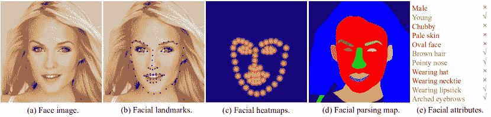

图 2\. 面部特征。

人脸是一个高度结构化的对象，具有其独特的特征，这些特征可以在 FSR 任务中被探索和利用。在本节中，我们简单介绍这些面部特征。

### 3.1\. 先验信息

如图 2 所示，面部图像中可以找到结构性先验，例如面部关键点、面部热图和面部配对图。

+   •

    *面部关键点*：这些点标识面部组件的关键位置。不同的数据集中关键点的数量不同，例如 CelebA [55] 提供了五个关键点，而 Helen [56] 提供了 194 个关键点。

+   •

    *面部热图*：这些热图是从面部关键点生成的。面部关键点给出面部组件的准确位置，而热图则给出该点是面部关键点的概率。为了生成热图，每个关键点由一个以关键点位置为中心的高斯核表示。

+   •

    *面部解析图*：这些是面部图像的语义分割图，将面部组件从面部图像中分离出来，包括眼睛、鼻子、嘴巴、皮肤、耳朵、头发等。

这些面部结构的先验信息可以提供面部组件的位置和面部结构信息。如果我们将这些先验知识用于规范化或引导 FSR 模型，我们可以期待恢复出更合理的目标面部图像。

表 2\. FSR 的公共面部图像数据集总结。

| 数据集 | 数量 | #属性 | #标志点 | 解析图 | 身份 |
| --- | --- | --- | --- | --- | --- |
|  |  |  |  |  |  |
| --- | --- | --- | --- | --- | --- |
| CelebA [55] | 202,599 | 40 | 5 | $\times$ | ✓ |
| CelebAMask-HQ [57] | 30,000 | $\times$ | $\times$ | ✓ | $\times$ |
| Helen [56] | 2,330 | $\times$ | 194 | ✓ | $\times$ |
| FFHQ [58] | 70,000 | $\times$ | 68 | $\times$ | $\times$ |
| AFLW [59] | 25,993 | $\times$ | 21 | $\times$ | $\times$ |
| 300W [60] | 3,837 | $\times$ | 68 | $\times$ | $\times$ |
| LS3D-W [61] | 230,000 | $\times$ | 68 | $\times$ | $\times$ |
| Menpo [62] | 9,000 | $\times$ | 68 | $\times$ | $\times$ |
| LFW [63] | 13,233 | 73 | $\times$ | $\times$ | ✓ |
| LFWA [64] | 13,233 | 40 | $\times$ | $\times$ | ✓ |
| VGGFace [65] | 3,310,000 | $\times$ | $\times$ | $\times$ | ✓ |

### 3.2\. 属性信息

其次，属性，如性别、发色等，是面部图像的附属特征，可以视为语义级别的信息。在 FSR 中，由于从 LR 图像到 HR 图像的一对多映射，恢复的面部图像可能包含伪影甚至错误的属性。例如，恢复结果中的面部没有佩戴眼镜，而实际情况中却佩戴了眼镜。这时，属性信息可以提醒网络在结果中应覆盖哪个属性。从不同的角度来看，属性信息也包含面部细节。以眼镜为例，佩戴眼镜的属性提供了面部眼睛的细节。我们在图 2 中提供了属性信息的简要示例。此外，这些属性在面部数据集中通常是二元的，1 表示面部图像具有该属性，而 0 表示没有此信息。

### 3.3\. 身份信息

第三，每个面部图像对应一个人，这得益于身份信息。这类信息总是用于保持超分辨率结果与真实图像之间的身份一致性。一方面，经过超分辨率处理后，视觉上不应更改人的身份。另一方面，FSR 应促进面部识别性能。类似于属性信息，身份信息也为 FSR 任务提供了高级约束，并有利于面部恢复。

### 3.4\. FSR 数据集

近年来，许多面部图像数据集被用于 FSR，这些数据集在许多方面存在差异，例如，样本数量、包含的面部特征等。在表 2 中，我们列出了许多常用的面部图像数据集，并简单说明了它们的数量和提供的面部特征。对于解析图和身份，我们只列出是否提供，而对于属性和标记，我们提供了具体数量。除了这些数据集，还有许多其他面部数据集被用于 FSR，包括 CACD200 [66]、VGGFace2 [67]、UMDFaces [68]、CASIA-WebFace [69]等。值得注意的是，上述所有数据集仅提供高分辨率面部图像。如果我们想用它们来训练和评估任何超分辨率模型，我们需要使用第二部分中介绍的退化模型生成相应的低分辨率面部图像。

## 4\. FSR 方法

目前，已经提出了各种深度学习的面部超分辨率（FSR）方法。一方面，这些方法挖掘了高效网络在面部超分辨率中的潜力，而不考虑面部特征，即，开发基础的卷积神经网络（CNN）或生成对抗网络（GAN）进行面部重建。另一方面，一些方法则专注于面部特征的利用，例如，使用结构先验信息来促进面部恢复等。此外，一些最近提出的模型引入了额外的高质量参考面部图像来协助恢复。在这里，根据使用的面部图像特殊信息类型，我们将 FSR 方法分为五类：通用 FSR、先验引导 FSR、属性约束 FSR、身份保留 FSR 和参考 FSR。在本节中，我们集中介绍每种 FSR 方法，并详细介绍每一类别。

### 4.1\. 通用 FSR

通用 FSR 方法主要关注设计高效的网络，并利用高效网络结构在没有任何面部特征的情况下进行 FSR。在早期，大多数这些方法基于 CNN，并结合了各种先进的架构（包括反向投影、残差网络、空间或通道注意力，*等*），以提高网络的表示能力。从那时起，许多利用先进网络的 FSR 方法被提出。我们将通用 FSR 方法分为四类：基本的基于 CNN 的方法、基于 GAN 的方法、基于强化学习的方法和基于集成学习的方法。为了呈现一个清晰简洁的概述，我们在图 3 中总结了通用 FSR 方法。

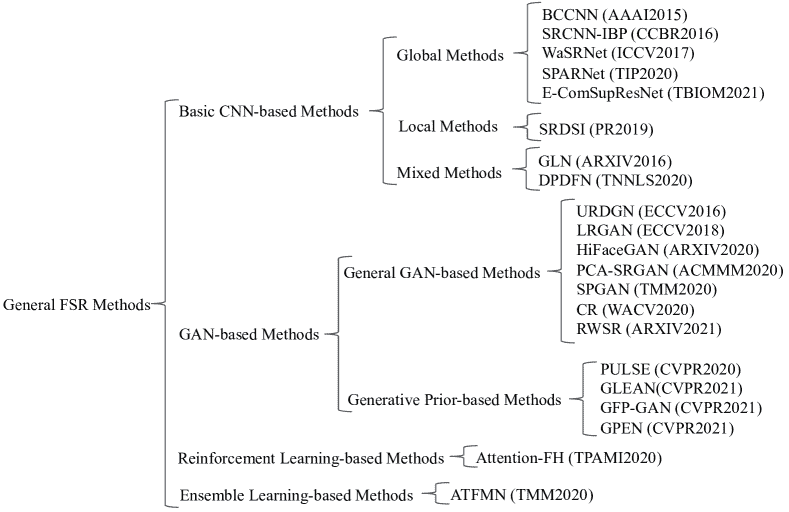

图 3\. 通用 FSR 方法概述。

#### 4.1.1\. 基本 CNN 方法

受到开创性深度学习通用图像超分辨率方法[70]的启发，一些研究者也提出将 CNN 网络引入 FSR 任务。根据是否考虑全球信息和局部差异，我们可以将基本的基于 CNN 的方法进一步分为三类：将整个面部图像输入网络并全局恢复面部图像的全局方法，将面部图像划分为不同组件然后恢复的局部方法，以及局部和全局恢复面部图像的混合方法。

全局方法：在早期，研究人员将面部图像视为一个整体并进行全局恢复。受到 CNN 强大代表能力的启发，双通道卷积神经网络（BCCNN）[71] 和[72] 直接学习从 LR 面部图像到 HR 面部图像的映射。随后，受益于迭代反向投影（IBP）在通用图像超分辨率中的性能提升，黄*等*[73] 将 IBP 引入 FSR 作为额外的后处理步骤，开发了 SRCNN-IBP 方法。之后，反向投影的思想在 FSR 中普遍应用[74, 75]。随后，通道和空间注意力机制极大地提升了通用图像超分辨率方法，这激发了研究人员探索其在 FSR 中的应用。因此，提出了许多集成注意力机制的创新方法[76, 77, 78]。在这些工作中，有两个代表性的方法是引入通道注意力机制的 E-ComSupResNet[77]和为 FSR 设计了精妙空间注意力的 SPARNet[78]。此外，许多研究人员设计了级联模型并利用多尺度信息来提高恢复性能[79, 80, 81]。

观察到图像域中的超分辨率生成平滑结果而没有高频细节。考虑到小波变换可以表示图像的纹理和上下文信息，WaSRNet [82] 和 [83] 将面部图像转换为小波系数，并在小波系数域中进行超分辨率处理，以避免过度平滑的结果。

局部方法：全局方法可以捕捉全局信息，但不能很好地恢复面部细节。因此，局部方法被开发出来以不同的方式恢复面部图像的不同部分。基于定义可缩放推断（SRDSI）[84] 的超分辨率技术通过 PCA 将面部图像分解为低频的基本面部和高频的补偿面部。然后，SRDSI 分别使用非常深的卷积网络（VDSR）[85] 和稀疏表示来恢复基本面部和补偿面部。最后，融合这两个恢复的面部。之后，许多基于补丁的方法被提出 [86, 87, 88]，这些方法都将面部图像分成若干补丁，并训练模型以恢复对应的补丁。

混合方法：考虑到全局方法可以捕捉全局结构但忽略局部细节，而局部方法则关注局部细节但失去全局结构，因此，一系列研究自然地结合全局和局部方法，以同时捕捉全局结构并恢复局部细节。最初，global-local network [89, 90] 开发了一个全局上采样网络来建模全局约束和一个局部增强网络来学习面部特定的细节。为了同时捕捉全局线索和恢复局部细节，dual-path deep fusion network (DPDFN) [91] 构建了两个独立的分支来学习全局面部轮廓和局部面部组件细节，然后融合这两个分支的结果以生成最终的 SR 结果。

#### 4.1.2. 基于 GAN 的方法

与使用像素级损失并生成平滑面部图像的基于 CNN 的方法相比，**Goodfellow** *等人* 提出的 GAN [48] 可以生成更具细节的逼真面部图像，这激发了研究人员设计基于 GAN 的方法。最初，研究人员专注于设计各种 GAN 来从配对或非配对数据中学习。近年来，如何利用预训练的生成模型来提升 FSR 引起了越来越多的关注。因此，基于 GAN 的方法可以分为一般的基于 GAN 的方法和基于生成先验的方法。

通用 GAN 基础方法：在早期，Yu *et al*. [34] 开发了通过判别生成网络（URDGN）来超分辨率面部图像，该网络由两个子网络组成：一个判别模型用于区分真实的 HR 面部图像或人工超分辨率输出，另一个生成模型用于生成 SR 面部图像以欺骗判别模型，并匹配 HR 面部图像的分布。MLGE [92] 不仅设计了判别器来区分面部图像，还应用了面部图像的边缘图来重建 HR 面部图像。最近，HiFaceGAN [93] 和 [94, 95, 96, 97] 的研究也使用生成模型进行面部图像的超分辨率。PCA-SRGAN [98] 不直接将整个面部图像输入判别器，而是通过 PCA 将面部图像分解为组件，并逐步将越来越多的组件输入判别器，以减少判别器的学习难度。这些类型的 GAN 的共同点是判别器输出一个单一的概率值来表征结果是否为真实的面部图像。然而，Zhang *et al*. [99] 假设单一的概率值过于脆弱，无法代表整个图像，因此设计了一种监督像素级 GAN（SPGAN），其判别器输出与输入图像分辨率相同的判别矩阵，并设计了一种监督像素级对抗损失，从而恢复出更多逼真的面部图像。

上述方法依赖于由已知退化生成的人工 LR 和 HR 对。然而，真实世界中的 LR 图像质量受到诸多因素的影响，如成像条件和成像系统，这导致真实 LR 图像的退化复杂且未知。真实 LR 图像与人工 LR 图像之间的差距较大，必然会降低将基于人工对训练的方法应用于真实 LR 图像的性能 [100]。为了解决这个问题，真实世界超分辨率（RWSR） [101] 首先从真实的 LR 面部图像中估计参数，如模糊核、噪声和压缩，然后生成具有估计参数的 LR 和 HR 面部图像对，以用于模型的训练。

LRGAN [102] 提出了从未配对数据中学习超分辨率之前的降解。它设计了一个高到低的 GAN 来从未配对的 LR 和 HR 面部图像中学习真实的降解过程，并创建配对的 LR 和 HR 面部图像以训练低到高的 GAN。具体而言，以 HR 面部图像作为输入，高到低的 GAN 生成的 LR 面部图像（GLR）应属于真实的 LR 分布，并接近相应的降采样 HR 面部图像。然后，对于低到高的 GAN，GLR 被输入生成器中以恢复 SR 结果，这些结果必须接近 HR 面部图像并匹配真实的 HR 分布。Goswami *et al*. [103] 进一步开发了一种鲁棒的 FSR 方法，而 Zheng *et al*. [104] 利用半对偶最优传输来指导模型学习，并开发了半对偶最优传输 CycleGAN。考虑到训练阶段 GLR 和测试阶段真实 LR 面部图像之间仍存在差异，研究人员引入了特征正则化（CR）[105] 的概念。不同于 LRGAN，CR 将真实的 LR 面部图像转换为人工 LR 图像，然后在人工 LR 空间中进行超分辨率重建。基于 CycleGAN，CR 学习真实 LR 面部图像与人工 LR 图像之间的映射。然后，它使用由真实 LR 图像生成的人工 LR 面部图像来微调超分辨率模型，该模型由人工配对进行预训练。

基于生成先验的方法：最近，许多面部生成模型，如流行的 StyleGAN [58]、StyleGAN v2 [106]、ProGAN [107]、StarGAN [108]，*等*，已经被提出，它们能够生成具有高度变异性的真实面孔。因此，越来越多的研究人员探索预训练 GAN 的生成先验。

第一种基于生成先验的 FSR 方法是 PULSE [109]。它将 FSR 表述为一个生成问题，以生成高质量的 SR 面部图像，使得降采样后的 SR 结果接近 LR 面部图像。在数学上，这个问题可以表示为：

| (14) |  | $min_{G}\left\&#124;G(z)\downarrow_{s}-I_{\text{LR}}\right\&#124;,$ |  |
| --- | --- | --- | --- |

其中 $z$ 是一个随机抽样的潜在向量，并且是预训练 StyleGAN [58] 的输入，$\downarrow$ 是降采样操作，$s$ 是降采样因子，$G$ 表示生成器的函数。PULSE 从新的角度解决了 FSR 问题，这也激发了许多其他研究。

然而，PULSE 中的潜在代码$z$是随机采样且维度较低的，这使得生成的图像丧失了重要的空间信息。为了解决这个问题，开发了 GLEAN [110]、CFP-GAN [111]和 GPEN [112]。它们不是直接使用预训练的 StyleGAN [58]，而是开发了自己的网络，并将预训练的 StyleGAN [58]生成网络嵌入到自己的网络中，以融合生成先验。为了保持真实信息，它们不仅通过编码 LR 面部图像来获取潜在代码，而不是随机采样，还从 LR 面部图像中提取多尺度特征，并将这些特征融合到生成网络中。通过这种方式，预训练的 StyleGAN 提供的生成先验可以得到充分利用，重要的空间信息也可以很好地保持。

#### 4.1.3\. 基于强化学习的方法

基于深度学习的 FSR 方法学习从 LR 面部图像到 HR 面部图像的映射，但忽略了面部部分之间的上下文依赖。Cao *等人* 提出了通过充分利用图像的全局互依性来递归发现面部部分并增强它们的方案，随后提出了通过深度强化学习的注意力感知面部幻觉（Attention-FH）[113]。具体来说，Attention-FH 有两个子网络：一个策略网络用于定位当前步骤中需要增强的区域，另一个局部增强网络则用于增强选定的区域。

#### 4.1.4\. 基于集成学习的方法

基于 CNN 的方法利用逐像素损失来恢复具有更高 PSNR 和更平滑细节的面部图像，而基于 GAN 的方法则可以生成具有较低 PSNR 但更多高频细节的面部图像。为了结合不同方法的优点，集成学习被用于自适应阈值多模型融合网络（ATFMN）[114]。具体来说，ATFMN 使用三个模型（基于 CNN、基于 GAN 和基于 RNN）生成候选 SR 面部图像，然后融合所有候选 SR 面部图像以重建最终的 SR 结果。与之前的方法相比，ATFMN 利用集成学习的潜力进行 FSR，而不是专注于单一模型。

#### 4.1.5\. 讨论

在这里，我们讨论这些子类别在一般 FSR 方法中的优缺点。从整体来看，基于 CNN 的方法和基于 GAN 的方法的区别在于对抗学习。基于 CNN 的方法倾向于使用逐像素损失，从而导致更高的 PSNR 和更平滑的结果，而基于 GAN 的方法可能恢复出视觉上更令人愉悦、细节更多的面部图像，但 PSNR 较低。它们各有优点。与之相比，基于集成学习的方法可以通过整合多个模型来结合它们的优点，弥补不足。然而，集成学习不可避免地会导致内存、计算和参数的增加。基于强化学习的方法通过顺序搜索恢复注意局部区域，并从全局角度考虑补丁的上下文依赖性，这带来了性能的提高，但需要更多的训练时间和计算成本。

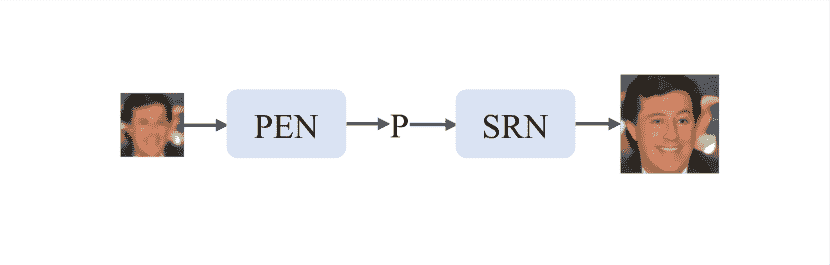

(a) 预先先验方法的框架。

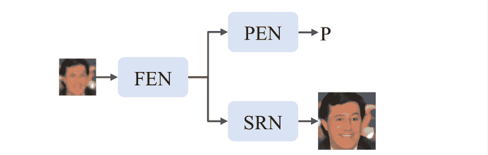

(b) 并行先验方法的框架。

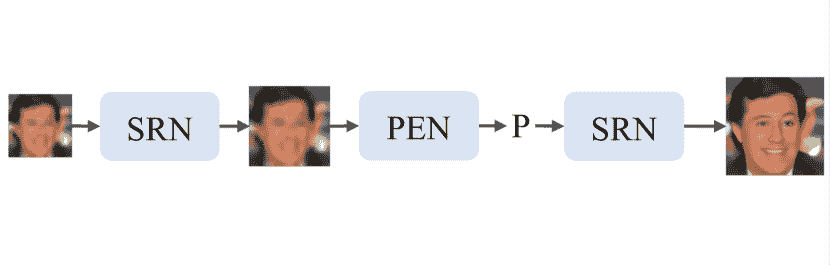

(c) 内部先验方法的框架。

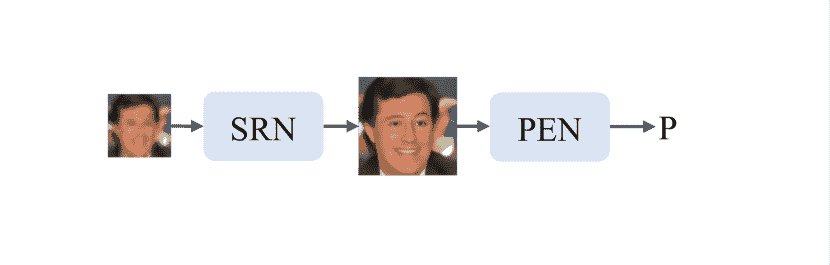

(d) 后先验方法的框架。

图 4\. 基于先验的 FSR 方法的四种框架。PEN 是先验估计网络，SRN 是超分辨率网络，FEN 是特征提取网络，P 是先验信息。

### 4.2\. 基于先验的 FSR

一般的 FSR 方法旨在设计高效的网络。然而，作为一个高度结构化的对象，人脸具有一些特定的特征，如先验信息（包括面部标志、面部解析图和面部热图），这些特征被一般 FSR 方法忽略。因此，为了恢复具有更清晰面部结构的面部图像，研究人员开始开发基于先验的 FSR 方法。

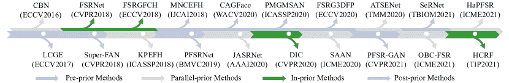

图 5\. 基于先验的 FSR 方法的里程碑。我们简单列出了它们的名称和场所。

先验引导的 FSR 方法是指提取面部先验信息并利用它来促进面部重建。考虑到先验信息提取和 FSR 的顺序，我们进一步将先验引导的 FSR 方法分为四类：i) 预先先验方法，即先提取先验信息再进行 FSR；ii) 并行先验方法，即同时提取先验信息和进行 FSR；iii) 内部先验方法，即从中间结果或中间阶段的特征中提取先验信息；iv) 后期先验方法，即从 FSR 结果中提取先验信息。我们在图 4 中说明了这四类方法的主要框架，在图 5 中概述了先验引导的 FSR 方法的发展，并在表 3 中对它们的若干关键特征进行了比较。

#### 4.2.1\. 预先先验方法

这些方法首先提取面部结构的先验信息，然后将先验信息输入到 FSR 模型的开始阶段。也就是说，它们总是通过一个提取网络从低分辨率面部图像中提取先验信息，该提取网络可以是预训练网络或与 FSR 模型关联的子网络，然后利用先验信息来促进 FSR。为了提取准确的面部结构先验，这些方法总是使用基于先验的损失来训练它们的先验提取网络，该损失定义为：

| (15) |  | $\mathcal{L}_{\text{Prior}}=\left\|P_{\text{HR}}-P\right\|_{F},$ |  |
| --- | --- | --- | --- |

其中 $P_{\text{HR}}$ 是真实的先验，$P$ 是从超分辨面部图像中提取的先验，$F$ 可以是 1 或 2，而先验可以是热图、地标和不同方法中的解析图。

在早期，LCGE [115] 和 MNCEFH [116] 都从低分辨率人脸图像中提取地标，将人脸裁剪成不同的组件，然后为不同组件预测高频细节。然而，当低分辨率人脸图像特别小（*即*，16$\times$16）时，准确的地标不可用。因此，研究人员转向人脸解析图 [117, 118, 45, 119]。PSFR-GAN [117]、SeRNet [118] 和 CAGFace [45] 都预训练了一个面部结构先验提取网络来提取人脸解析图。然后，除了 SeRNet 之外，所有方法都直接将先验和低分辨率人脸图像拼接作为超分辨率模型的输入，而 SeRNet 设计了改进的残差块（IRB）来融合先验和来自低分辨率人脸图像的特征。此外，PSFR-GAN 设计了一种语义感知风格损失来单独计算每个语义区域的 Gram 矩阵损失。后来，3D 人脸先验指导的超分辨率（FSRG3DFP） [120] 估计 3D 先验而不是 2D 先验，以学习 3D 人脸细节，并通过空间特征变换块（SFT）捕获人脸组件信息。

表 3. 先验指导的 FSR 方法比较。为了简洁，我们使用 *Pre*、*Parallel*、*In* 和 *Post* 来表示不同的先验指导方法。

|  | 方法 | 先验 | 提取 | 融合策略 |
| --- | --- | --- | --- | --- |
|  |  |  |  |  |
| 预 | LCGE [115] | 地标 | 预训练 | 裁剪 |
|  | MNCEFH [116] | 地标 | 预训练 | 裁剪 |
|  | PSFR-GAN [117] | 解析图 | 预训练 | 拼接 |
|  | CAGFace [45] | 解析图 | 预训练 | 拼接 |
|  | FSRG3DFP [120] | 3D 先验 | 联合 | SFT |
|  | SeRNet [118] | 解析图 | 预训练 | IRB |
| 并行 | CBN [121] | 密集对应场 | 联合 | 拼接 |
|  | KPEFH [122] | 解析图 | 联合 | $\mathcal{L}_{\text{Parsing}}$ |
|  | JASRNet [123] | 热图 | 联合 | $\mathcal{L}_{\text{Heatmap}}$ |
|  | ATSENet [124] | 人脸边界热图 | 联合 | FFU |
| 在 | FSRNet [35] | 地标、解析图、热图 | 联合 | 拼接 |
|  | FSRGFCH [125] | 热图 | 联合 | 拼接 |
|  | DIC [36] | 热图 | 联合 | $\mathcal{L}_{\text{Heatmap}}$，AFM |
| 后 | Super-FAN [126] | 热图 | 联合 | $\mathcal{L}_{\text{Heatmap}}$ |
|  | PFSRNet [127] | 热图 | 预训练 | $\mathcal{L}_{\text{Heatmap}}$，$\mathcal{L}_{\text{Attention}}$ |

#### 4.2.2. 并行先验方法

以上方法忽略了面部结构先验估计与 FSR 任务之间的相关性：面部先验估计受益于 FSR 的增强，反之亦然。因此，提出了并行先验方法，这些方法在并行进行先验估计和超分辨率，包括级联双网络（CBN）[121]，KPEFH [122]，JASRNet [123]，SAAN [128]，HaPFSR [129]，OBC-FSR [130] 和 ATSENet [124]。它们联合训练先验估计和超分辨率网络，并且需要真实数据来计算基于先验的损失，如 Eq. (15)。

最具代表性的并行先验方法之一是 JASRNet。具体来说，JASRNet 使用一个共享编码器同时提取超分辨率和先验估计的特征。通过这种设计，共享编码器能够提取出两项任务所需的最具表现力的信息。与 JASRNet 相比，ATSENet 不仅为这两项任务提取共享特征，还将来自先验估计分支的特征输入到超分辨率分支中的特征融合单元（FFU）。

#### 4.2.3\. 先验方法

预先和并行先验方法直接从 LR 面部图像中提取结构先验信息。由于 LR 面部图像的低质量，提取准确的先验信息具有挑战性。为了减少难度并提高先验估计的准确性，研究人员首先粗略恢复 LR 面部图像，然后从增强后的 LR 面部图像结果中提取先验信息，包括 FSRNet [35]，由面部组件热图指导的 FSR (FSRGFCH) [125]，HCFR [131]，深度迭代协作 (DIC) [36] 和 [132, 133, 134, 135, 136]。与并行先验方法类似，先验方法总是联合优化两项任务的网络。

具体而言，FSRNet [35]、FSRGFCH [125] 和 HCFR [131] 首先将低分辨率人脸图像上采样以获得中间结果，然后从中间结果中提取人脸结构先验，最后利用先验和中间结果来恢复最终结果。FSRNet 和 FSRGFCH 将中间结果和先验连接起来，并将连接后的结果输入到后续网络中以恢复最终的超分辨率结果，而 HCFR 则利用先验对中间结果进行分割，并通过随机森林恢复最终的超分辨率结果。考虑到 FS 和先验提取应相互促进，DIC [36] 提出迭代执行超分辨率和先验提取任务。在第一次迭代中，DIC 使用超分辨率模型恢复人脸 $I_{\text{SR}^{\text{1}}}$ 并从 $I_{\text{SR}^{\text{1}}}$ 中提取先验（热图） $P_{\text{1}}$。在第 $i$ 次迭代中，将低分辨率人脸图像和 $P_{i-1}$ 输入超分辨率模型以获得 $I_{\text{SR}^{i}}$，然后可以提取 $P_{i}$。这样，两个任务可以相互促进。此外，DIC 构建了一个注意力融合模块（AFM），以高效地融合人脸先验和低分辨率人脸图像。

#### 4.2.4\. 后处理先验方法

与上述方法相比，后处理先验方法从超分辨率结果中提取人脸结构先验，而不是从低分辨率人脸图像或中间结果中提取，并利用先验设计损失函数，包括 Super-FAN [126]、渐进式 FSR 网络（PFSRNet） [127] 和 [137]。Super-FAN [126] 和 PFSRNet [127] 首先对低分辨率人脸图像进行超分辨率处理并获得超分辨率结果，然后开发先验估计网络以提取超分辨率人脸图像和高分辨率人脸图像的热图，并约束超分辨率人脸图像和高分辨率人脸图像的热图接近。PFSRNet 进一步生成多尺度超分辨率结果，并在每个尺度上应用基于先验的损失。此外，PFSRNet 利用热图生成掩码，并基于掩码的超分辨率和高分辨率人脸图像计算人脸注意力损失 $\mathcal{L}_{\text{Attention}}$。与上述方法相比，后处理先验方法在推理过程中不需要先验提取。

#### 4.2.5\. 讨论

所有基于先验的 FSR 方法在训练阶段需要面部结构的真实数据来计算损失。在测试阶段，所有基于先验的 FSR 方法，除了后先验方法，都需要估计先验。由于图像降解造成的信息丢失，低分辨率面部图像增加了先验提取的难度，限制了预先先验方法的准确性，进一步限制了超分辨率性能。尽管并行先验方法通过共享特征提取可以同时促进先验提取和超分辨率，但改进仍然有限。先验方法从中间结果中提取先验，这可以提高性能，但增加了由于迭代超分辨率过程而导致的内存和计算成本，特别是在迭代方法中（DIC [36]）。在后先验方法中，先验仅在训练期间充当监督者，而不参与推断，并且无法充分利用输入低分辨率面部图像的特定先验。因此，需要一种能够充分利用先验而不增加额外内存或计算成本的方法。

### 4.3\. 属性约束的 FSR

面部属性通常也被用于 FSR，这些方法称为属性约束的 FSR。作为一种语义信息，面部属性提供了语义知识，*例如*，人们是否佩戴眼镜，这对 FSR 有用。接下来，我们将介绍一些属性约束的 FSR 方法。

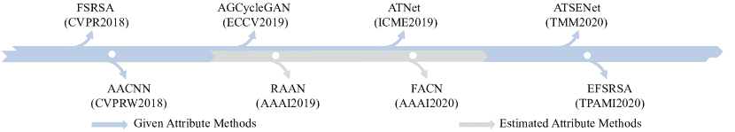

图 6\. 属性约束的 FSR 方法的里程碑。它们的名称和场所列出。

与面部结构先验信息的获取依赖于图像本身不同，属性信息可以在没有低分辨率面部图像的情况下获得，例如在刑事案件中，属性信息可能在低分辨率面部图像中不清晰，但由目击者准确知道。因此，一些研究者在属性信息给定的条件下构建网络，而其他人则通过估计属性来放宽这一条件。根据这一概念，属性约束的 FSR 方法可以分为两种框架：给定属性方法和估计属性方法。概述见图 6 和表 4。

#### 4.3.1\. 给定属性方法

给定属性信息，如何将其整合到超分辨率模型中是关键。针对这一问题，属性引导条件 CycleGAN (AGCycleGAN) [138]、具有补充属性的 FSR (FSRSA) [139]、具有补充属性的扩展 FSR (EFSRSA)、属性迁移网络 (ATNet) [140] 和 ATSENet [124] 都直接将属性信息与 LR 人脸图像（或从 LR 人脸图像中提取的特征）级联。AGCycleGAN 和 FSRSA 还将属性输入到其判别器中，以强制超分辨率模型注意到属性信息，并发展基于属性的损失以实现属性匹配，定义为：

| (16) |  | $\mathcal{L}_{\text{Attribute}_{D}}=-\log D(I_{\text{HR}},A)-\log\left(1-D(I_{\text{SR}},A)\right)-\log\left(1-D(I_{\text{HR}},\tilde{A})\right),$ |  |
| --- | --- | --- | --- |

其中$A$是与$I_{\text{HR}}$匹配的属性，而$\tilde{A}$是不匹配的属性。ATSENet 将超分辨结果输入到属性分析网络中以计算属性预测损失，

| (17) |  | $\mathcal{L}_{\text{Attribute}}=\left\|A_{\text{P}}-A_{\text{HR}}\right\|_{F},$ |  |
| --- | --- | --- | --- |

其中$A_{\text{P}}$是网络预测的属性，$A_{\text{HR}}$是真实的属性。然而，Lee *等* [141]认为 LR 人脸图像和属性属于不同领域，直接级联不适用，可能会降低性能。针对这一观点，Lee *等* 构建了一个属性增强卷积神经网络 (AACNN) [141]，该网络从属性中提取特征以提升人脸超分辨率。

表 4\. 属性约束的 FSR 方法比较。“NG”表示信息未提供。

|  | 方法 | #属性 | 属性嵌入方法 |
| --- | --- | --- | --- |
|  |  |  |
| 给定 | FSRSA [139] | 18 | 级联和$\mathcal{L}_{\text{Attribute}_{D}}$ |
|  | EFSRSA [142] | 18 | 级联和$\mathcal{L}_{\text{Attribute}_{D}}$ |
|  | AGCycleGAN [138] | 18 | 级联和$\mathcal{L}_{\text{Attribute}_{D}}$ |
|  | AACNN [141] | 38 | 级联 |
|  | ATNet [140] | NG | 级联和$\mathcal{L}_{\text{Attribute}}$ |
|  | ATSENet [124] | NG | 级联和$\mathcal{L}_{\text{Attribute}}$ |
| 预计 | RAAN [143] | NG | 属性通道注意力和$\mathcal{L}_{\text{Attribute}}$ |
|  | FACN [144] | 18 | 属性注意力掩码和$\mathcal{L}_{\text{Attribute}}$ |

#### 4.3.2\. 预计属性方法

上述提到的给定属性方法在所有属性都已给出的条件下有效，因此在实际场景中某些属性缺失的情况下它们是有限的。虽然缺失的属性可以设置为未知，例如 0 或随机值，但性能可能会急剧下降。为此，研究人员建立了模块来估计 FSR 的属性信息。在估计属性方法中，基于属性的损失强制网络正确预测属性信息，这类似于等式 (17)。估计属性方法包括残差属性注意网络 (RAAN) [143] 和面部属性胶囊网络 (FACN) [144]。RAAN 基于级联残差属性注意块 (RAAB)。RAAB 构建了三个分支分别生成形状、纹理和属性信息，并引入了两个应用于形状和纹理信息的属性通道注意力。相比之下，FACN [144] 在胶囊中集成属性。具体而言，FACN 将 LR 人脸图像编码为编码特征，这些特征输入到一个胶囊生成块中，生成语义胶囊、概率胶囊和面部属性。然后，属性被视为一种掩码，通过乘法或加法来细化其他特征。通过将三种信息组合为输入，FACN 的解码器可以很好地恢复最终的 SR 结果。

#### 4.3.3\. 讨论

给定属性方法需要属性信息，使得它们仅适用于一些受限的场景。虽然在这些方法中可以将属性设置为未知，但性能可能会急剧下降。相较于给定属性方法，估计属性方法需要估计属性然后利用属性。与给定属性方法相比，它们具有更广泛的应用范围，但在实际操作中属性估计的准确性难以保证。

### 4.4\. 身份保留 FSR

与面部结构先验和属性信息相比，包含身份感知细节的身份信息至关重要，身份保留的 FSR 方法近年来受到了越来越多的关注。它们旨在保持 SR 人脸图像与 LR 人脸图像之间的身份一致性，并提高下游人脸识别的性能。我们在图 7 和表 5 中展示了一些代表性方法的概述和比较。

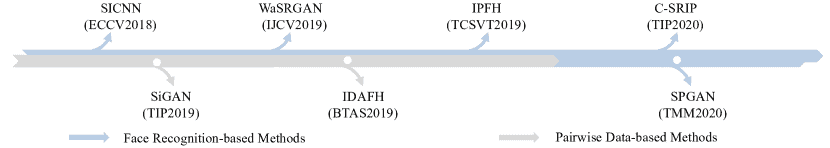

图 7 身份保持 FSR 方法的里程碑。它们的名称和场所列出。

#### 4.4.1 面部识别基础的方法：

为了保持 $I_{\text{SR}}$ 和 $I_{\text{HR}}$ 之间的身份一致性，在训练阶段，常用的设计是利用面部识别网络定义身份损失，例如，超身份卷积神经网络 (SICNN) [145]，面部幻觉生成对抗网络 (FH-GAN) [146]，WaSRGAN [147]， [148]，身份保持面部幻觉 (IPFH) [149]，级联超分辨率和身份先验 (C-SRIP) [150]，[151, 152, 153, 154] 和 ATSENet [124]。这些方法的框架包括两个主要组件：一个超分辨率模型和一个预训练的面部识别网络（FRN），可能还有一个额外的判别器。超分辨率模型对输入的低分辨率面部图像进行超分辨率处理，生成 $I_{\text{SR}}$ 并将其输入到 FRN 中以获取其身份特征。同时，$I_{\text{HR}}$ 也被输入到 FRN 中，获得其身份特征。身份损失的计算方式为：

| (18) |  | $\mathcal{L}_{\text{Identity}}=\left\&#124;\text{FR}(I_{\text{HR}})-\text{FR}(I_{\text{SR}})\right\&#124;_{F},$ |  |
| --- | --- | --- | --- |

其中 FR 是 FRN 的函数。$F$ 在 WaSRGAN [147] 中为 1，在 FH-GAN [146] 和 [151] 中为 2。一些方法在归一化特征上计算损失 [145, 155]，而一些方法使用 A-softmax 损失 [156, 149]。C-SRIP [150] 并不是直接从 $I_{\text{SR}}$ 和 $I_{\text{HR}}$ 中提取身份特征，而是将 $I_{\text{HR}}$（或 $I_{\text{SR}}$）与 $I_{\text{LR}}^{\uparrow_{s}}$（通过双三次插值上采样）之间的残差图分别输入到 FRN 中，并在它们上应用交叉熵损失。此外，C-SRIP 生成多尺度的面部图像，并将其输入到不同尺度的面部识别网络中。

为了充分探索身份先验，SPGAN [99] 将预训练的 FRN 提取的身份信息输入到不同尺度的判别器中，并设计基于注意力的身份损失。首先，SPGAN 生成两个注意力图 $M_{\text{G}}$ 和 $M_{\text{D}}$，

| (19) |  | $E=\mathcal{D}(I_{\text{LR}},I_{\text{HR}})-\mathcal{D}(I_{\text{LR}},I_{\text{SR}}),$ |  |
| --- | --- | --- | --- |
| (20) |  | $M_{\text{D}}=-\min\left(0,E-\left\&#124;I_{\text{HR}}-I_{\text{SR}}\right\&#124;_{2}\right),$ |  |
| (21) |  | $M_{\text{G}}=\alpha*E+b,$ |  |

其中 $E$ 表示差异，$*$ 表示逐元素乘法，$b$ 是单位矩阵，$\alpha$ 是一个 0-1 矩阵。在第 $i$ 行和第 $j$ 列，$\alpha_{i,j}$ 为 0 当 $E_{i,j}$ 为负值时，否则 $\alpha_{i,j}$ 为 1。然后将两个注意力图应用于身份损失 $\mathcal{L}_{\text{Identity}}$。

| (22) |  | $\mathcal{L}_{\text{Identity}_{\text{SP}}}=\mathcal{L}_{\text{Identity}}*M_{\text{G}}+\mathcal{L}_{\text{Identity}}*M_{\text{D}},$ |  |
| --- | --- | --- | --- |

其中 $\mathcal{L}_{\text{Identity}_{\text{SP}}}$ 是 SPGAN 的身份损失。

表 5\. 识别保留的 FSR 方法比较。特别地，$I_{\text{RH}}$ ($I_{\text{RS}}$) 是 $I_{\text{HR}}$ ($I_{\text{SR}}$) 和 $I_{\text{LR}}^{\uparrow_{s}}$ 之间的残差图。

|  | 方法 | 损失函数 |
| --- | --- | --- |
|  |  |  |
| 基于面部识别的 | SICNN [145] | 在归一化的 $\text{FR}(I_{\text{SR}})$ 和 $\text{FR}(I_{\text{HR}})$ 上的 MSE 损失 |
|  | FH-GAN [146] | 在 $\text{FR}(I_{\text{SR}})$ 和 $\text{FR}(I_{\text{HR}})$ 上的 MSE 损失 |
|  | WaSRGAN [147] | 在 $\text{FR}(I_{\text{SR}})$ 和 $\text{FR}(I_{\text{HR}})$ 上的 $\mathcal{L}_{1}$ 损失 |
|  | C-SRIP [150] | 在 $\text{FR}(I_{\text{RS}})$ 和 $\text{FR}(I_{\text{RH}})$ 上的交叉熵损失 |
|  | IPFH [149] | 在 $\text{FR}(I_{\text{SR}})$ 和 $\text{FR}(I_{\text{HR}})$ 上的 A-softmax 损失 |
|  | SPGAN [99] | 基于注意力的损失 $\mathcal{L}_{\text{Identity}_{\text{SP}}}$ |
| 基于配对数据的 | SiGAN [157] | 配对对比损失 $\mathcal{L}_{\text{Contrastive}}$ |
|  | IADFH [158] | 对抗面部验证损失 $\mathcal{L}_{\text{AFVL}}$ |

#### 4.4.2\. 基于配对数据的方法：

FRN 的训练需要标注良好的数据集。然而，大型标注良好的数据集非常昂贵。一种解决方案是仅基于弱标注数据集。考虑到这一点，孪生生成对抗网络 (SiGAN) [157] 利用弱配对标签（其中不同的 LR 面部图像对应不同的身份）来实现身份保留。具体而言，SiGAN 有两个共享相同架构的生成对抗网络 ($G_{1}$ 和 $G_{2}$)，但同时对不同的 LR 面部图像 ($I_{\text{LR}}^{1}$ 和 $I_{\text{LR}}^{2}$) 进行超分辨率处理。由于不同的 LR 面部图像的身份不同，因此与 LR 面部图像对应的 SR 结果的身份也会有所不同。基于这一观察，SiGAN 设计了一种身份保留对比损失，最小化同一身份配对之间的差异，并最大化不同身份配对之间的差异，

| (23) |  | $\mathcal{L}_{\text{Contrastive}}=(1-y)\frac{1}{2}\left[\text{max}(0,0.5-E_{\text{w}})\right]^{2}+y\frac{1}{2}(E_{\text{w}})^{2},$ |  |
| --- | --- | --- | --- |
| (24) |  | $E_{\text{w}}=\left\&#124;F_{\text{E}}(I_{\text{LR}}^{\text{1}}),F_{\text{E}}(I_{\text{LR}}^{\text{2}})\right\&#124;_{1},$ |  |

其中 $F_{\text{E}}$ 是用于从生成器中间层提取特征的函数，$E_{\text{w}}$ 测量 $I_{\text{LR}}^{1}$ 和 $I_{\text{LR}}^{2}$ 特征之间的距离，当两个 LR 面部图像属于同一身份时 $y$ 为 1，当 LR 面部图像属于不同身份时 $y$ 为 0。

与将配对数据输入双生成器不同，身份感知深度人脸幻影（IADFH）[158] 将配对数据输入判别器。其判别器是一个三分类器，生成假、真和冒名顶替者：i) 相同或不同身份的高分辨率（HR）和超分辨率（SR）人脸图像（$\text{pair}_{\text{1}}$ 或 $\text{pair}_{\text{2}}$）对应假图像，迫使判别器区分 $I_{\text{HR}}$ 和 $I_{\text{SR}}$；ii) 相同身份的两个不同 HR 人脸图像（$\text{pair}_{\text{3}}$）对应真图像；iii) 不同身份的两个 HR 人脸图像（$\text{pair}_{\text{4}}$）对应冒名顶替者。最后两个配对强迫判别器捕捉身份特征。在这种模式下，生成器可以结合身份信息。损失函数称为对抗人脸验证损失（AFVL），

| (25) |  | $\mathcal{L}_{\text{AFVL(D)}}=\log d_{f}(\text{pair}_{1})+\log d_{f}(\text{pair}_{2})\\ +\log d_{\text{gen}}(\text{pair}_{3})+\log d_{\text{imp}}(\text{pair}_{4}),$ |  |
| --- | --- | --- | --- |
| (26) |  | $\mathcal{L}_{\text{AFVL(G)}}=\log d_{\text{gen}}(\text{pair}_{1})+\log d_{\text{imp}}(\text{pair}_{2}),$ |  |

其中 $\mathcal{L}_{\text{AFVL(D)}}$ ($\mathcal{L}_{\text{AFVL(G)}}$) 是判别器（生成器）的损失函数，而 $d_{\text{f}},d_{\text{gen}},d_{\text{imp}}$（可以是 -1、1、0）是判别器对假图像、真图像和冒名顶替者配对的输出。

#### 4.4.3\. 讨论

基于人脸识别的方法设计身份损失，这些方法通常需要预训练的人脸识别网络。训练人脸识别网络需要高质量标注的数据集，这非常昂贵。而配对数据方法利用不同身份之间的对比以及相同身份之间的相似性，以在没有高质量标注数据集的情况下保持身份一致性，具有更广泛的应用范围。

### 4.5\. 参考 FSR

所讨论的 FSR 网络都仅利用输入的低分辨率（LR）人脸图像。在某些情况下，我们可能会获得相同身份的高质量人脸图像，例如，LR 人脸图像的人员可能有其他高质量的脸部图像。这些高质量的人脸图像可以为 FSR 提供身份感知的面部细节。因此，参考 FSR 方法利用高质量人脸图像作为参考（R）来增强人脸恢复。显然，参考人脸图像可以是一个图像或多个图像。根据 R 的数量，指导框架可以分为单人脸指导、多人人脸指导和字典指导方法。参考 FSR 方法的概述见图 8，它们的比较见表 6。

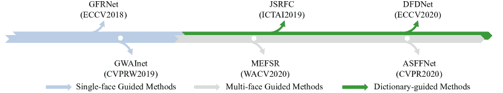

图 8\. 参考 FSR 方法的里程碑。我们简单列出了它们的名称和场所。

#### 4.5.1\. 单面引导方法

最初，一个高质量的面部图像，其身份与 LR 面部图像相同，作为 R，例如引导面部修复网络（GFRNet） [39]、GWAInet [159]。由于参考面部图像和 LR 面部图像可能具有不同的姿势和表情，这可能会妨碍面部图像的恢复，单面引导方法倾向于对参考面部图像和 LR 面部图像进行对齐。在对齐之后，将 LR 面部图像和对齐后的参考面部图像（我们称之为 $I_{\text{w}}$）输入重建网络以恢复 SR 结果。GFRNet 和 GWAInet 之间的差异包括两个方面：i) GFRNet 使用地标，而 GWAInet 使用流场进行对齐；ii) 在重建网络中，GFRNet 直接将 LR 面部图像和 $I_{\text{w}}$ 拼接作为输入。然而，GWAInet 构建了一个 GFENet 从 $I_{w}$ 中提取特征，并将 $I_{w}$ 的有用特征转移到重建网络中以恢复 SR 结果。

表 6\. 参考 FSR 方法的比较。 “-” 表示该方法不包含该程序。

|  | 方法 | 相同身份 | 对齐 | R 的利用 |
| --- | --- | --- | --- | --- |
|  |  |  |  |  |
| 单面引导 | GFRNet [39] | ✓ | 地标 | 拼接 |
|  | GWAInet [159] | ✓ | 流场 | GFENet |
| 多面引导 | ASFFNet [37] | ✓ | 移动最小二乘 | AFFB |
|  | MEFSR [160] | ✓ | - | PWAve |
| 字典引导 | JSRFC [161] | $\times$ | 地标 | 拼接 |
|  | DFDNet [38] | $\times$ | - | DFT |

#### 4.5.2\. 多面引导方法

单面引导方法将问题设置为 LR 面部图像仅有一个高质量的参考面部图像，但在某些应用中，有多个高质量的面部图像可用，它们可以进一步提供更多补充信息用于 FSR。自适应空间特征融合网络（ASFFNet）[37]首次探索了多面引导 FSR。给定多个参考图像，ASFFNet 首先通过引导选择模块选择最合适的参考图像，该图像应与 LR 面部图像具有最相似的姿势和表情。然而，参考面部图像和 LR 面部图像之间仍存在错位和光照差异。因此，ASFFNet 应用加权最小二乘对齐[162]和 AdaIN[163]来应对这两个问题。最后，他们设计了一个自适应特征融合块（AFFB）来生成一个注意力掩码，用于补充 LR 面部图像和 R 的信息。多例 FSR（MEFSR）[160]直接将所有参考面孔输入加权像素平均（PWAve）模块，以提取面部恢复所需的信息。

#### 4.5.3 字典引导方法

观察到不同的人可能具有相似的面部组件。根据这一观察，提出了字典引导方法，包括联合超分辨率和面部合成（JSRFC）[161]和深度面部字典网络（DFDNet）[38]。字典引导方法不要求参考面部图像和 LR 面部图像之间具有身份一致性，而是建立一个组件字典来促进面部恢复。例如，JSRFC 选择与 LR 面部图像具有相似组件的参考图像（每个参考面部图像都标记有一个向量，以指示哪些组件是相似的）。然后，它对齐 LR 面部图像与参考面部图像，并提取相应的组件作为组件字典。最后，这些字典组件用于后续的面部恢复。不同于 JSRFC，Li *et al*. [38]基于整个数据集的特征建立多尺度组件字典。他们使用预训练的 VGGFace[67]从高质量面部中提取不同尺度的特征，然后裁剪和重采样四个组件，并通过 K 均值聚类获得每个组件的 K 类。给定组件字典后，他们首先通过内积选择每个组件的最相似原子，然后通过字典特征转移（DFT）将特征从字典转移到 LR 面部图像。

#### 4.5.4 讨论

单面和多面引导的面部超级分辨率（FSR）方法需要与低分辨率（LR）面部图像具有相同身份的一张或多张高质量面部图像，这有助于面部修复，但限制了其应用，因为参考图像可能不存在。此外，低质量 LR 面部图像与高质量参考面部图像之间的对齐也是参考 FSR 中的一个挑战。字典引导的方法打破了相同身份的限制，拓宽了应用范围，但增加了面部重建的难度。

### 4.6\. 实验与分析

为了清晰了解基于深度学习的 FSR 方法，我们比较了在常用基准数据集（包括 CelebA [55]、VGGFace2 [67]和 CASIA-WebFace [69]）上，最先进算法的 PSNR、SSIM 和 LPIPS 性能，放大倍数为$\times$4、$\times$8 和$\times$16。考虑到参考 FSR 方法与其他 FSR 方法的不同，我们分别比较了其他 FSR 方法和参考 FSR 方法。

#### 4.6.1\. FSR 方法的比较结果

我们首先介绍实验设置，并分析 FSR 方法的结果。

实验设置：对于 CelebA [55]数据集，使用 168,854 张图像进行训练，1,000 张图像进行测试，遵循 DIC [36]。所有图像都裁剪并调整为 128$\times$128 作为$I_{\text{HR}}$。我们应用方程（4）中的退化模型生成$I_{\text{LR}}$。面部特征点由[164, 165, 166]检测，并根据特征点生成热图。对于面部解析图，我们采用预训练的 BiSeNet [167]从$I_{\text{HR}}$中提取解析图。质量评估方面，引入了 PSNR 和 SSIM，并且它们都在 YCbCr 空间的 Y 通道上计算，这也遵循 DIC [36]。此外，我们进一步引入 LPIPS 来评估所有对比方法的性能。对于重新训练不同方法时的优化器和学习率，我们遵循其原始论文中的设置。

实验结果：我们在表 7 中列出了并比较了一些代表性的 FSR 方法，包括四种通用图像超分辨率方法：使用深度卷积网络的超分辨率（SRCNN）[70]、VDSR[85]、残差通道注意网络（RCAN）[168]、非局部稀疏网络（NLSN）[169]，三种通用 FSR 方法：URDGN[34]、WaSRNet[82]、SPARNet[78]，三种先验引导的 FSR 方法：FSRNet[35]、Super-FAN[126]、DIC[36]，两种属性约束的 FSR 方法：FSRSA[142]、AACNN[141]，以及三种身份保持的 FSR 方法：SICNN[145]、SiGAN[157]和 WaSRGAN[147]。此外，我们还在表 7 的最后两列中报告了这些方法的参数和 FLOPs。请注意，参数和 FLOPs 与放大倍数$\times$8 的模型相关。此外，我们还在图 9、图 10 和图 11 中展示了一些最新算法的视觉比较。

从这些客观指标和视觉比较结果中，我们有以下观察：

（i）经过重新训练的最先进（SOTA）通用图像超分辨率方法，如 RCAN 和 NLSN，在 PSNR 和 SSIM 方面非常有竞争力，甚至超过了最佳 FSR 方法。同时，作为一种通用 FSR 方法，SPARNet 在所有 FSR 方法中表现最好。RCAN、NLSN 和 SPARNet 都没有明确地融合人脸图像的先验知识，但它们取得了出色的结果。这表明网络的设计和优化非常重要，设计良好的网络将具有更强的拟合能力（重建误差更小）。这一观察将启发我们，在设计 FSR 深度网络时，应基于一个强大的骨干网络。

(ii) 表格 7 中的 RCAN* 和 NLSN* 代表在通用训练图像上预训练的模型，我们直接从作者的页面下载了这些模型。需要注意的是，在某些放大因子下的预训练结果未提供（在表中标记为‘-’），因为这些方法未在这些放大因子下进行训练。RCAN 和 NLSN 的表现优于 RCAN* 和 NLSN*。这表明，在通用图像上训练的模型不适用于 FSR，但在面部图像上训练的通用图像超分辨率方法可能表现良好（有时甚至优于面部图像上的 FSR 方法）。因此，如果我们想了解和比较新提出的通用图像超分辨率在 FSR 任务中的性能，我们不能直接使用作者发布的预训练模型，而应该在面部图像数据集上重新训练模型。需要注意的是，这些基于 GAN 的 FSR 方法（*例如*，URDGN、FSRSA、SiGAN 和 WaSRGAN）的客观结果逊色于 NLSN*。这主要是因为引入对抗损失后，它们通常无法获得更好的 MSE，对抗损失倾向于使模型获得感知上更好的 SR 结果，但重建误差较大。

(iii) 与通用图像超分辨率方法和通用 FSR 方法相比，这些结合面部特征的方法在 PSNR 和 SSIM 指标上表现不佳。然而，我们不能得出开发使用面部特征的 FSR 方法毫无意义的结论。这主要是因为 PSNR 和 SSIM 可能不是图像超分辨率任务的良好评估指标 [41]，更不用说 FSR 任务，在其中人类感知将更加重要。为了进一步利用超分辨率重建能力，我们还引入了另一个评估指标 LPIPS，它更符合人类的判断。从 LPIPS 结果中，我们了解到这些 PSNR 和 SSIM 较低的方法在 LPIPS 方面可能表现非常好，请参考 Super-FAN 和 SiGAN。这表明，这些引入面部特征的方法能够很好地表示面部图像，并恢复面部轮廓和判别细节。

(iv) 当我们比较使用不同面部特征的 FSR 方法时，例如面部结构先验、属性和身份，很难判断哪种特征对 FSR 更有效。因为这些方法通常使用不同的骨干网络，很难确定它们性能的变化是由于骨干网络本身的差异，还是因为引入了不同的面部特征。在实践中，我们可以首先开发一个强大的骨干网络，然后结合面部特征来提升 FSR。

表 7\. 各种 FSR 方法在 CelebA 上的定量评估，分别按 $\times$4、$\times$8 和 $\times$16 计算 PSNR、SSIM 和 LPIPS。最佳、第二最佳和第三最佳结果分别用红色、蓝色和下划线突出显示。请注意，Params 和 FLOPs 是针对 $\times$8 超分辨率模型计算的。

| 方法 | $\times$4 | $\times$8 | $\times$16 | Params | FLOPs |
| --- | --- | --- | --- | --- | --- |
|  | PSNR$\uparrow$ | SSIM$\uparrow$ | LPIPS$\downarrow$ | PSNR$\uparrow$ | SSIM$\uparrow$ | LPIPS$\downarrow$ | PSNR$\uparrow$ | SSIM$\uparrow$ | LPIPS$\downarrow$ |  |  |
| 通用图像超分辨率方法 |
| SRCNN [70] | 28.04 | 0.837 | 0.160 | 23.93 | 0.635 | 0.256 | 20.54 | 0.467 | 0.291 | 0.01M | 0.3G |
| VDSR [85] | 31.25 | 0.906 | 0.055 | 26.36 | 0.761 | 0.112 | 22.42 | 0.594 | 0.186 | 0.6M | 11.0G |
| RCAN [168] | 31.69 | 0.913 | 0.051 | 27.30 | 0.799 | 0.100 | 23.32 | 0.641 | 0.204 | 15.0M | 4.7G |
| RCAN* [168] | 26.30 | 0.769 | 0.177 | 22.17 | 0.521 | 0.265 | - | - | - | 15.0M | 4.7G |
| NLSN [169] | 32.08 | 0.919 | 0.044 | 27.45 | 0.804 | 0.091 | 23.69 | 0.671 | 0.154 | 43.4M | 22.9G |
| NLSN* [169] | 30.82 | 0.899 | 0.065 | - | - | - | - | - | - | 43.4M | 22.9G |
| 通用 FSR 方法 |
| URDGN [34] | 30.11 | 0.884 | 0.075 | 25.62 | 0.726 | 0.148 | 22.29 | 0.579 | 0.185 | 1.0M | 14.6G |
| WaSRNet [82] | 30.92 | 0.908 | 0.051 | 26.83 | 0.787 | 0.089 | 23.13 | 0.634 | 0.160 | 71.5M | 19.2G |
| SPARNet [78] | 31.71 | 0.913 | 0.048 | 27.44 | 0.804 | 0.089 | 23.68 | 0.674 | 0.139 | 10.0M | 7.2G |
| 先验指导的 FSR 方法 |
| FSRNet [35] | 31.46 | 0.908 | 0.052 | 26.66 | 0.771 | 0.110 | 23.04 | 0.629 | 0.175 | 3.1M | 39.0G |
| Super-FAN [126] | 31.17 | 0.905 | 0.040 | 27.08 | 0.788 | 0.058 | 23.42 | 0.652 | 0.125 | 1.3M | 1.1G |
| DIC [36] | 31.44 | 0.909 | 0.053 | 27.41 | 0.802 | 0.092 | 23.47 | 0.657 | 0.160 | 20.8M | 14.8G |
| 属性约束的 FSR 方法 |
| FSRSA [142] | 30.80 | 0.898 | 0.058 | 26.19 | 0.757 | 0.111 | 22.84 | 0.630 | 0.153 | 76.9M | 0.9G |
| AACNN [141] | 31.30 | 0.907 | 0.052 | 26.68 | 0.773 | 0.100 | 22.98 | 0.626 | 0.171 | 3.3M | 0.2G |
| 保持身份的 FSR 方法 |
| SICNN [145] | 31.59 | 0.911 | 0.050 | 27.18 | 0.793 | 0.095 | 23.50 | 0.662 | 0.152 | 4.9M | 5.4G |
| SiGAN [157] | 30.68 | 0.892 | 0.034 | 25.63 | 0.740 | 0.062 | 22.18 | 0.596 | 0.099 | 19.5M | 5.7G |
| WaSRGAN [147] | 30.72 | 0.907 | 0.045 | 25.55 | 0.765 | 0.092 | 22.78 | 0.625 | 0.148 | 71.5M | 19.2G |

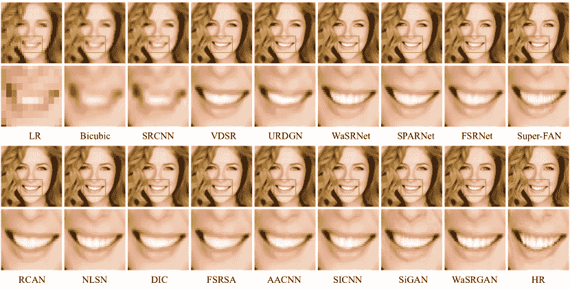

图 9\. 不同 FSR 方法在 $\times$4 超分辨率重建中的定性比较。

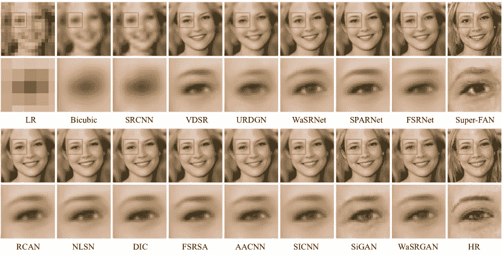

图 10\. 不同 FSR 方法在 $\times$8 超分辨率重建上的定性比较。

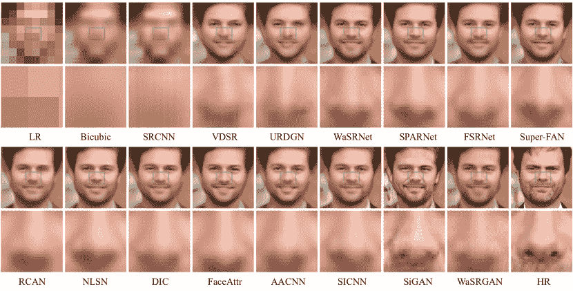

图 11\. 不同 FSR 方法在 $\times$16 超分辨率重建上的定性比较。

#### 4.6.2\. 参考 FSR 方法的比较结果

上述 FSR 方法只需输入 LR 面部图像，而参考 FSR 方法则需要 LR 面部图像和参考图像。直接与这些不使用辅助高分辨率面部图像的方法进行比较是不公平的。因此，我们对参考 FSR 方法的性能进行单独比较。

实验设置：按照 ASFFNet [37]，VGGFace2 [67] 被重新组织成 106,000 个组，每个组包含 3-10 张相同身份的高质量面部图像，其中 10,000 个组用于训练集，4,000 个组用于验证集，其余的用于测试集。此外，还使用了基于 CelebA [55] 和 CASIA-WebFace [69] 的两个测试集，每个集包含 2,000 个组，每组有 3-10 张高质量面部图像。我们利用面部标志点裁剪并调整所有图像为 256$\times$256 的高质量面部图像。为了生成 $I_{\text{LR}}$，应用退化模型 Eq. (5)，其中 $J$ 和 $\downarrow$ 分别表现为 JPEG 压缩质量 $q$ 和双三次插值，对高质量图像进行处理。我们考虑两种模糊核，*即* 高斯模糊和运动模糊核，并从 {1:0.1:8} 中随机抽样缩放 $s$，从 {0:1:15} 中随机抽样噪声水平，并从 {10 : 1 : 60} 中随机抽样压缩质量因子 $q$ [37]。使用 PSNR、SSIM 和 LPIPS [41] 作为评估指标。

实验结果：实验结果见表 8。具体来说，我们列出了 GFRNet [39]、GWAInet [159] 和最新提出的 ASFFNet [37] 在 CelebA [55]、VGGFace2 [67] 和 CASIA-WebFace [69] 上的结果，放大倍数为 $\times$8\. 注意，所有结果均来自论文 [37]，因为我们在重现这些方法时遇到了困难。请注意，GFRNet 和 GWAInet 是单脸引导方法，而 ASFFNet 是多脸引导方法。公平起见，GFRNet 和 GWAInet 的参考图像与 ASFFNet 选择的图像相同。从表 8 可以明显看出，多脸引导方法 ASFFNet 的表现优于单脸引导方法（GWAInet 和 GFRNet）。ASFFNet 考虑了参考面部图像和低分辨率面部图像之间的光照差异，而 GFRNet 和 GWAInet 忽略了这一点，并且构建了一个精心设计的 AFFB，而不是简单的拼接，以自适应地处理参考面部图像和低分辨率面部图像的特征。这两点都促成了 ASFFNet 的出色表现。因此，参考 FSR 方法中参考面部图像和低分辨率面部图像的差异（*例如*，错位、光照差异、*等*）消除和有效信息融合都很重要。

表 8\. 各种参考 FSR 方法在 CelebA [55]、VGGFace2 [67] 和 CASIA-WebFace [69] 上的定量评估，基于 PSNR、SSIM 和 LPIPS 的 $\times$8\. 最佳、第二最佳和第三最佳结果分别用红色、蓝色和下划线突出显示。

| 方法 | CelebA [55] | VGGFace2 [67] | CASIA-WebFace [69] |
| --- | --- | --- | --- |
|  | PSNR$\uparrow$ | SSIM$\uparrow$ | LPIPS$\downarrow$ | PSNR$\uparrow$ | SSIM$\uparrow$ | LPIPS$\downarrow$ | PSNR$\uparrow$ | SSIM$\uparrow$ | LPIPS$\downarrow$ |
| --- | --- | --- | --- | --- | --- | --- | --- | --- | --- |
| GFRNet [39] | 25.93 | 0.901 | 0.227 | 23.85 | 0.879 | 0.263 | 27.19 | 0.912 | 0.307 |
| GWAInet [159] | 25.77 | 0.901 | 0.210 | 23.87 | 0.879 | 0.261 | 27.18 | 0.910 | 0.250 |
| ASFFNet [37] | 26.39 | 0.905 | 0.185 | 24.34 | 0.881 | 0.238 | 27.69 | 0.921 | 0.219 |

### 4.7\. 联合 FSR 和其他任务

尽管上述 FSR 方法已取得突破，但由于输入面部图像通常受到许多因素的影响，包括阴影、遮挡、模糊、异常光照，*等*，FSR 仍然具有挑战性和复杂性。为了有效恢复这些面部图像，提出了一些工作考虑低质量和其他因素造成的退化。此外，研究人员还将 FSR 与其他任务联合进行。以下，我们将回顾这些联合 FSR 和其他任务的方法。

#### 4.7.1\. 联合面部完成与超分辨率

现实世界的面部图像中，低分辨率和遮挡或阴影总是共存的。因此，恢复这两种因素导致的面部退化非常重要。最简单的方法是首先完成遮挡部分，然后对完成的低分辨率面部图像进行超分辨率 [170]。然而，由于误差的积累，结果总是包含较大的伪影。Cai *et al*. [171] 提出了 FCSR-GAN 方法，该方法首先预训练一个面部完成模型（FCM），然后将 FCM 与超分辨率模型（SRM）结合，再用固定的 FCM 训练 SRM，最后微调整个网络。然后，Liu *et al*. [172] 提出了图卷积金字塔块，该方法只需要一步训练，而不是像 FCSR-GAN 那样的多步骤训练。相比之下，Pro-UIGAN [173] 利用面部标志捕捉面部几何先验，并逐步恢复遮挡的低分辨率面部图像。

#### 4.7.2\. 联合面部去模糊与超分辨率

模糊的低分辨率面部图像经常出现在实际监控和体育视频中，单任务模型，如超分辨率或去模糊模型，无法有效恢复这些图像。在文献中，Yu *et al*. [174] 开发了 SCGAN 来联合去模糊和超分辨率输入图像。随后，Song *et al*. [175] 发现之前的方法忽略了面部先验信息的利用，恢复的面部图像缺乏高频细节。因此，他们首先利用解析图和低分辨率面部图像恢复基本结果，然后将基本结果输入到细节增强模块中，从高质量示例中补偿高频细节。后来，DGFAN [176] 开发了两个特征提取模块用于不同任务，提取特征，并将其输入到精心设计的门控融合模块中，以生成去模糊的高质量结果。Xu *et al*. [177] 将面部识别网络与面部恢复结合，以提高恢复面部图像的可识别性。

#### 4.7.3\. 联合光照补偿与 FSR

异常照明 FSR 也引起了许多学者的关注。SeLENet [178] 将面部图像分解为正常面部、反射率图和光照系数，然后用标准环境白光系数替换光照系数，再重建相应的中性光照面部图像。Ding *等人* [179] 构建了一个面部检测管道，然后用地标恢复检测到的面部。Zhang *等人* [180] 利用正常光照外部 HR 指导来指导异常光照的 LR 面部图像进行光照补偿。他们开发了一个复制粘贴 GAN（CPGAN），包括一个内部复制粘贴网络，用于利用面部内部信息进行重建，以及一个外部复制粘贴网络，用于补偿光照。基于 CPGAN，他们通过引入递归学习和结合地标估计进一步改进了外部复制粘贴网络，并开发了递归 CPGAN [181]。相比之下，Yasarla *等人* [182] 将网络架构搜索引入面部增强中，以设计高效的网络并从 HR 指导中提取身份信息以恢复面部图像。

#### 4.7.4\. 联合面部对齐与超分辨率

上述 FSR 方法要求所有 HR 训练样本必须对齐。因此，输入的 LR 面部图像与训练面部图像的不对齐常常导致性能显著下降和伪影。因此，开发了一组联合面部对齐和超分辨率的方法。Yu *等人* [49] 在生成器中插入多个空间变换网络（STN）[183] 以实现面部对齐，并开发了 TDN 和 MTDN [184]。由于 LR 面部图像可能存在噪声和未对齐，Yu *等人* 构建了 TDAE 方法 [185]。TDAE 首先对 LR 面部图像进行上采样并粗略对齐以生成 $I_{\text{CSR}}$，然后对 $I_{\text{CSR}}$ 进行下采样并获得 $I_{\text{CLR}}$ 以减少噪声，接着对 $I_{\text{CLR}}$ 进行上采样以进行最终重建。

#### 4.7.5\. 联合面部正面化与超分辨率

现实世界中的面部姿态各异，有些可能不是正面的。当现有的 FSR 方法应用于非正面面部时，重建性能急剧下降，视觉质量较差。即使在顺序或逆序进行 FSR 和面部正面化时，也会存在伪影。为缓解这一问题，文献[186]中提出的方法首先利用 STN 和 CNN 粗略地将面部转化为正面并进行虚拟重建，然后设计了一个精细的上采样网络来细化面部细节。Yu *等*[187] 提出了一个变换对抗神经网络用于联合面部正面化和虚拟重建。该方法建立了一个变换器网络，将非正面 LR 面部图像和正面 LR 面部图像编码到潜在空间中，并要求非正面图像接近正面图像，然后将编码的潜在表示输入到上采样网络中以恢复最终结果。Tu *等*[188] 首先分别训练面部修复网络和面部正面化网络，然后提出任务集成训练策略，将两个网络合并为一个统一的网络用于面部正面化和超分辨率。需要注意的是，面部对齐旨在生成与 HR 图像姿态相同的 SR 面部图像，而面部正面化则是从非正面 LR 面部图像恢复正面的 SR 面部图像。

### 4.8\. 相关应用

除了上述提到的 FSR 方法和联合方法外，近年来出现了大量与 FSR 相关的新方法，包括面部视频超分辨率、旧照片修复、音频引导的 FSR、3D FSR、*等*，这些将在下面介绍。

#### 4.8.1\. 面部视频超分辨率

面部通常出现在 LR 视频序列中，如监控视频。帧之间的相关性可以提供更多互补细节，有助于面部重建。一个直接的解决方案是融合多帧信息并利用帧间依赖性[189]。文献[190]的方法采用生成器为每一帧生成 SR 结果，并应用融合模块来估计中央帧。考虑到上述方法无法建模复杂的时间依赖性，Xin *等*[191] 提出了一个运动自适应反馈单元，该单元捕获帧间运动信息并自适应地更新当前帧。在 [192] 中，基于多个超分辨率帧对后续帧重建至关重要的假设，设计了一种递归策略来更好地利用帧间信息。受到强大变换器的启发，[193] 的工作开发了第一个纯变换器基础的面部视频虚拟重建模型。MDVDNet [194] 综合了来自视频的多种先验，包括语音、语义元素和面部标志，以增强基于深度学习的方法的能力。

#### 4.8.2\. 旧照片修复

旧照片的修复在现实世界中至关重要且困难，因为退化情况过于复杂而难以模拟。自然地，一种解决方案是学习从真实 LR 人脸图像（将真实旧图像视为真实 LR 人脸图像）到人工 LR 人脸图像的映射，然后将现有的 FSR 方法应用于生成的人工 LR 人脸图像。BOPBL [195] 提出了在潜在空间中而不是图像空间中转换图像。具体而言，BOPBL 首先将真实和人工 LR 人脸图像编码到相同的潜在空间 $S_{1}$，并将 HR 人脸图像编码到另一个潜在空间 $S_{2}$，然后通过映射网络将 $S_{1}$ 映射到 $S_{2}$。

#### 4.8.3\. 音频引导的 FSR

考虑到音频包含与人脸相关的信息[196]，Meishvili *等人* [197] 开发了首个音频引导的 FSR 方法。由于多模态之间的差异，他们建立了两个编码器来编码图像和音频信息。然后将图像和音频的编码表示融合，融合结果输入到生成器中以恢复最终的 SR 结果。在 FSR 中引入音频是创新的，并激发了研究人员利用跨模态信息的灵感，但由于不同模态之间的差异，这也充满挑战。

#### 4.8.4\. 3D FSR

人脸是计算机视觉领域中最受关注的对象。随着 2D 技术的发展，通常会提出大量的 3D 方法，因为它们能够提供更多有用的特征用于人脸重建和识别。在 FSR 领域，早期的 3D FSR 方法由 Pan *等人* 提出[198]。在[199]中，Berretti *等人* 从一系列低分辨率的 3D 扫描中提出了一种超脸模型。[200]的方法仅以粗糙、噪声多且低分辨率的深度图像作为输入，并预测对应的高质量 3D 人脸网格。通过建立输入 LR 人脸与 3D 纹理之间的对应关系，Qu *等人* 在网格上提出了一种基于补丁的 3D FSR[201]。得益于深度学习技术的发展，最近，开发了一种 3D 人脸点云超分辨率网络方法，用于从低分辨率的 3D 人脸点云数据中推断高分辨率数据[202]。

## 5\. 结论与未来方向

在本综述中，我们展示了基于深度学习的 FSR 方法的分类。根据面部特征，这个领域可以分为五类：通用 FSR 方法、先验引导 FSR 方法、属性约束 FSR 方法、身份保持 FSR 方法和参考 FSR 方法。然后，每个类别根据网络架构的设计或面部特征的具体利用方式进一步细分为一些子类别。特别地，通用 FSR 方法进一步分为基本 CNN 方法、GAN 方法、强化学习方法和集成学习方法。此外，其他结合面部特征的方法根据面部特征的具体利用模式进行分类。我们还比较了最新技术的性能并进行了深入分析。当然，FSR 技术不限于我们展示的方法，对这个快速扩展领域的全景视图是相当具有挑战性的，因此可能存在遗漏。因此，本综述作为一种教学工具，为研究人员提供了 FSR 典型方法的见解。在实践中，研究人员可以使用这些通用指南来开发最适合其特定研究的技术。

尽管取得了重大突破，FSR 仍然面临许多挑战，并预计将继续快速增长。接下来，我们简单地展望了需要解决的问题和未来的趋势。

网络设计。通过与当前最先进的通用图像超分辨率方法的比较结果，我们了解到主干网络对性能有重要影响，特别是在 PSNR 和 SSIM 方面。因此，我们可以借鉴通用图像超分辨率任务中的经验，其中许多经过精心设计的网络结构（例如 IPT [203] 和 SwinIR [204]）不断被提出，从而设计出更适合 FSR 任务的有效深度网络。除了有效性，实践中还需要高效的网络，因为大型模型（具有大量参数和高计算成本）在实际应用中很难部署。因此，开发具有更轻结构和较低计算负担的模型仍然是一个主要挑战。

面部先验的利用。作为一种特定领域的超分辨率技术，FSR 可以用于恢复在观察到的低分辨率面部图像中丢失的面部细节。FSR 成功的关键在于有效利用人脸的先验知识，从 1D 向量（身份和属性）、到 2D 图像（面部标志点、面部热图和解析图），再到 3D 模型。因此，发现人脸的新先验知识，如何建模或表示这些先验知识，以及如何将这些信息有机地整合到端到端训练框架中，都是值得进一步讨论的方向。除了这些显式的先验知识外，如何建模和利用从数据中学习到的隐式先验（如 GAN 先验[58, 106]），可能是另一个方向。

评估指标和损失函数。正如我们所知，像素级的$\mathcal{L}_{1}$损失或$\mathcal{L}_{2}$损失往往产生具有高 PSNR 和 SSIM 值的超分辨率结果，而感知损失和对抗损失则更倾向于让模型产生一些视觉上令人愉悦的结果，*即*在 LPIPS 和 FID 方面表现良好。因此，评估指标在指导模型优化和影响最终结果方面发挥着重要作用。如果我们想要获得可靠的结果（在刑事调查应用中），PSNR 和 SSIM 可能是更好的指标。相反，如果我们只是希望获得一些视觉上令人愉悦的结果，采用 LPIPS 和 FID 指标可能是一个不错的选择。因此，没有一个通用的评估指标可以兼顾两者的优点。因此，FSR 的评估指标在未来需要更多探索。

区分 FSR。在大多数情况下，我们的目标不仅仅是重建一个视觉上令人愉悦的高分辨率面部图像。实际上，我们希望超分辨率的结果能够提高人类或计算机的面部识别任务。因此，从低分辨率面部图像中恢复一个具有区分性的高分辨率面部图像（对人类）或区分特征（对计算机）将是有益的。为了增强超分辨率面部图像的区分性，我们可以使用训练样本的弱监督信息（配对的正样本或负样本），迫使模型能够重建一个具有区分性的面部图像。

实际世界的 FSR。实际世界中的降解过程过于复杂，无法模拟，这导致合成的 LR 和 HR 配对与实际数据之间存在较大差距。当将通过合成配对训练的模型应用于实际的 LR 人脸图像时，其性能会急剧下降。考虑到 HR 训练人脸图像和未配对的实际 LR 人脸图像，一些方法 [102, 205, 206] 被提出以学习实际图像降解，创建合成的 LR 人脸图像和 HR 人脸图像的样本对。这些方法的表现优于之前使用双三次降解生成的数据训练的方法。这些方法实际上有一个潜在的假设，即所有实际世界的 LR 人脸图像都共享相同的降解，*即*，来自相同的相机。然而，获得的实际世界 LR 人脸图像差异很大，其降解过程也不同。因此，设计一种更稳健的实际世界 FSR 方法是当前急需解决的问题之一。

多模态 FSR。由于传感技术的快速发展，相同系统中的多个传感器，如自动驾驶和机器人，变得越来越普遍。多模态信息（包括音频、深度、近红外）的利用将越来越受到推动。显然，不同的模态提供不同的线索。在这个领域，研究人员总是探索图像相关的信息，如属性、身份等。然而，音频引导的 FSR [197] 和高光谱 FSR [207] 的出现激发了我们利用不同模态的信息。这一趋势无疑将继续并扩散到该领域的每一个类别。多模态信息的引入也将促进 FSR 的发展。

## 参考文献

+   [1] Y. Liang, J. H. Lai, W. S. Zheng, 和 Z. Cai. 人脸幻觉的调查。在 CCBR，第 83–93 页，2012 年。

+   [2] N. Wang, D. Tao, X. Gao, X. Li, 和 J. Li. 人脸幻觉的全面调查。国际计算机视觉期刊, 106(1):9–30, 2014 年。

+   [3] M. P. Autee, M. S. Mehta, M. S. Desai, V. Sawant, 和 A. Nagare. 各种人脸幻觉方法的综述。Procedia Computer Science, 45:361–369, 2015 年。

+   [4] S. Kanakaraj, V. K. Govindan, 和 S. Kalady. 人脸超分辨率：一项调查。国际图像、图形和信号处理期刊, 9:54–67, 2017 年 5 月。

+   [5] K. Nguyen, C. Fookes, S. Sridharan, M. Tistarelli, 和 M. Nixon. 生物特征识别的超分辨率：一项全面调查。Pattern Recognition, 78:23–42, 2018 年。

+   [6] S. S. Rajput, K. V. Arya, V. Singh, 和 V. K. Bohat. 人脸幻觉技术：一项调查。在 IC-ICTES，第 1–6 页，2018 年。

+   [7] H. Liu, X. Zheng, J. Han, Y. Chu, 和 T. Tao. 基于 GAN 的人脸幻觉及其模型发展的调查。IET Image Processing, 13(14):2662–2672, 2019 年。

+   [8] S. Baker 和 T. Kanade. 幻像面孔。在 FG 会议，第 83–88 页，2000 年。

+   [9] C. Liu, H. Y. Shum, 和 C. S. Zhang. 面部幻像的两步法：全局参数模型和局部非参数模型。在 CVPR 会议，卷 1，第 I–I 页，2001 年。

+   [10] B. K. Gunturk, A. U. Batur, Y. Altunbasak, M. H. Hayes, 和 R. M. Mersereau. 用于面部识别的特征脸域超分辨率。IEEE Transactions on Image Processing, 12(5):597–606, 2003.

+   [11] X. Wang 和 X. Tang. 通过特征变换实现面部幻像。IEEE Transactions on Systems, Man, and Cybernetics, Part C, 35(3):425–434, 2005.

+   [12] A. Chakrabarti, A. N. Rajagopalan, 和 R. Chellappa. 使用基于核 PCA 的先验实现面部图像超分辨率。IEEE Transactions on Multimedia, 9(4):888–892, 2007.

+   [13] J. Park 和 S. Lee. 基于实例的单帧低分辨率面部图像幻像方法。IEEE Transactions on Image Processing, 17(10):1806–1816, 2008.

+   [14] P. Innerhofer 和 T. PockInnerhofer. 图像幻像的凸优化方法。在 AAPRW 会议，2013 年。

+   [15] Y. Liang, X. Xie, 和 J. H. Lai. 基于形态学成分分析的面部幻像。Signal Processing, 93(2):445–458, 2013.

+   [16] C. Y. Yang, S. Liu, 和 M. H. Yang. 结构化面部幻像。在 CVPR 会议，第 1099–1106 页，2013 年。

+   [17] H. Chang, D. Y. Yeung, 和 Y. Xiong. 通过邻域嵌入实现超分辨率。在 CVPR 会议，卷 1，第 I–I 页，2004 年。

+   [18] X. Ma, J. Zhang, 和 C. Qi. 通过位置补丁实现面部幻像。Pattern Recognition, 43(6):2224–2236, 2010.

+   [19] C. Jung, L. Jiao, B. Liu, 和 M. Gong. 基于位置补丁的面部幻像使用凸优化。IEEE Signal Processing Letters, 18(6):367–370, 2011.

+   [20] J. Jiang, R. Hu, Z. Wang, 和 Z. Han. 通过局部约束表示实现噪声鲁棒的面部幻像。IEEE Transactions on Multimedia, 16(5):1268–1281, 2014.

+   [21] R. A. Farrugia 和 C. Guillemot. 使用耦合稀疏支持的线性模型实现面部幻像。IEEE Transactions on Image Processing, 26(9):4562–4577, 2017.

+   [22] J. Jiang, Y. Yu, S. Tang, J. Ma, A. Aizawa, 和 K. Aizawa. 基于阈值局部约束表示和重现学习的上下文补全面部幻像。IEEE Transactions on Cybernetics, 50(1):324–337, 2018.

+   [23] J. Shi, X. Liu, Y. Zong, C. Qi, 和 G. Zhao. 通过高分辨率特征空间中的正则化模型实现面部图像幻像。IEEE Transactions on Image Processing, 27(6):2980–2995, 2018.

+   [24] L. Chen, J. Pan, 和 Q. Li. 通过联合学习细分上下文模型实现鲁棒的面部图像超分辨率。IEEE Transactions on Image Processing, 28(12):5897–5909, 2019.

+   [25] J. Shi 和 G. Zhao. 通过粗到细递归核回归结构实现面部幻像。IEEE Transactions on Multimedia, 21(9):2223–2236, 2019.

+   [26] L. Liu, C. P. Chen, 和 S. Li. 通过在四元数空间中学习图形表示实现彩色面部图像幻像。IEEE Transactions on Cybernetics, 页 1–13, 2020.

+   [27] L. Chen, J. Pan, J. Jiang, J. Zhang, Z. Han, 和 L. Bao. 极端退化下面孔图像超分辨率的多阶段退化均化。IEEE 图像处理汇刊，30:5600–5612，2021 年。

+   [28] Y. Zhuang, J. Zhang, 和 F. Wu. 幻觉面孔：LPH 超分辨率与邻域重建用于残差补偿。模式识别，40(11):3178–3194，2007 年。

+   [29] H. Huang, H. He, X. Fan, 和 J. Zhang. 使用典型相关分析的人脸图像超分辨率。模式识别，43(7):2532–2543，2010 年。

+   [30] Z. Wang, J. Chen, 和 S. C. H. Hoi. 图像超分辨率的深度学习：综述。IEEE 模式分析与机器智能汇刊，2020 年。

+   [31] S. Anwar, S. Khan, 和 N. Barnes. 超分辨率的深度之旅：综述。ACM 计算调查，53(3):1–34，2020 年。

+   [32] W. Yang, X. Zhang, Y. Tian, W. Wang, J. H. Xue, 和 Q. Liao. 单图像超分辨率的深度学习：简要回顾。IEEE 多媒体汇刊，21(12):3106–3121，2019 年。

+   [33] H. Liu, Z. Ruan, P. Zhao, F. Shang, L. Yang, 和 Y. Liu. 基于深度学习的视频超分辨率：全面综述。arXiv 预印本 arXiv:2007.12928，2020 年。

+   [34] X. Yu 和 F. Porikli. 通过判别生成网络超分辨率面孔图像。发表于 ECCV，页码 318–333，2016 年。

+   [35] Y. Chen, Y. Tai, X. Liu, C. Shen, 和 J. Yang. FSRNet：端到端学习面孔超分辨率与面部先验。发表于 CVPR，页码 2492–2501，2018 年。

+   [36] C. Ma, Z. Jiang, Y. Rao, J. Lu, 和 J. Zhou. 通过注意力恢复与地标估计之间的迭代协作实现深度面孔超分辨率。发表于 CVPR，页码 5569–5578，2020 年。

+   [37] X. Li, W. Li, D. Ren, H. Zhang, M. Wang, 和 W. Zuo. 结合多样本图像与自适应空间特征融合的增强盲人面孔修复。发表于 CVPR，页码 2706–2715，2020 年。

+   [38] X. Li, C. Chen, S. Zhou, X. Lin, W. Zuo, 和 L. Zhang. 通过深度多尺度组件字典进行盲人面孔修复。发表于 ECCV，页码 399–415，2020 年。

+   [39] X. Li, M. Liu, Y. Ye, W. Zuo, L. Lin, 和 R. Yang. 学习变形引导进行盲人面孔修复。发表于 ECCV，页码 272–289，2018 年。

+   [40] M. Heusel, H. Ramsauer, T. Unterthiner, B. Nessler, 和 S. Hochreiter. 通过双时间尺度更新规则训练的 GAN 收敛于局部纳什均衡。发表于 NIPS，页码 6626–6637，2017 年。

+   [41] R. Zhang, P. Isola, A. A. Efros, E. Shechtman, 和 O. Wang. 深度特征作为感知度量的非理性有效性。发表于 CVPR，页码 586–595，2018 年。

+   [42] W. Zhou 和 A. C. Bovik. 通用图像质量指数。IEEE 信号处理快报，9(3):81–84，2002 年。

+   [43] Z. Wang, E. P. Simoncelli, 和 A. C. Bovik. 图像质量评估的多尺度结构相似性。发表于 ACSSC，第 2 卷，页码 1398–1402，2003 年。

+   [44] A. Mittal, R. Soundararajan, 和 A. C. Bovik. 制作“完全盲”的图像质量分析仪。IEEE 信号处理快报，20(3):209–212，2013 年。

+   [45] R. Kalarot, T. Li, 和 F. Porikli. 组件注意力引导的人脸超分辨率网络：CAGFace。发表在 WACV，第 359–369 页，2020 年。

+   [46] W. S. Lai, J. B. Huang, N. Ahuja, 和 M. H. Yang. 用于快速准确超分辨率的深度拉普拉斯金字塔网络。发表在 CVPR，第 624–632 页，2017 年。

+   [47] K. Simonyan 和 A. Zisserman. 用于大规模图像识别的非常深卷积网络。CoRR，abs/1409.1556，2015 年。

+   [48] I. J. Goodfellow, J. Pouget-Abadie, M. Mirza, X. Bing, 和 Y. Bengio. 生成对抗网络。发表在 NIPS，第 2 卷，第 2672–2680 页，2014 年。

+   [49] X. Yu 和 F. Porikli. 通过变换性判别神经网络对齐微小未对齐图像的人脸幻觉。发表在 AAAI，第 4327–4333 页，2017 年。

+   [50] M. Arjovsky, S. Chintala, 和 L. Bottou. Wasserstein 生成对抗网络。发表在 PMLR，第 70 卷，第 214–223 页，2017 年。

+   [51] I. Gulrajani, F. Ahmed, M. Arjovsky, V. Dumoulin, 和 A. Courville. 改进的 Wasserstein GAN 训练。发表在 NIPS，第 5767–5777 页，2017 年。

+   [52] J. Y. Zhu, T. Park, P. P. Isola, 和 A. A. Efros. 使用循环一致对抗网络的无配对图像到图像转换。发表在 ICCV，第 2223–2232 页，2017 年。

+   [53] L. A. Gatys, A. S. Ecker, 和 M. Bethge. 使用卷积神经网络的图像风格迁移。发表在 CVPR，第 2414–2423 页，2016 年。

+   [54] T. C. Wang, M. Y. Liu, J. Y. Zhu, A. Tao, J. Kautz, 和 B. Catanzaro. 使用条件 GAN 的高分辨率图像合成和语义操控。发表在 CVPR，第 8798–8807 页，2018 年。

+   [55] Z. Liu, P. Luo, X. Wang, 和 X. Tang. 深度学习面部属性。发表在 ICCV，第 3730–3738 页，2016 年。

+   [56] V. Le, J. Brandt, L. Zhe, L. D. Bourdev, 和 T. S. Huang. 交互式面部特征定位。发表在 ECCV，第 679–692 页，2012 年。

+   [57] C. H. Lee, Z. Liu, L. Wu, 和 P. Luo. MaskGAN: 迈向多样化和交互式面部图像操控。发表在 CVPR，第 5549–5558 页，2020 年。

+   [58] T. Karras, S. Laine, 和 T. Aila. 一种基于风格的生成对抗网络生成器架构。发表在 CVPR，第 4396–4405 页，2019 年。

+   [59] M. Koestinger, P. Wohlhart, P. M. Roth, 和 H. Bischof. 野外标注的人脸关键点：一个大规模的真实世界数据库用于面部关键点定位。发表在 ICCVW，第 2144–2151 页，2011 年。

+   [60] C. Sagonas, G. Tzimiropoulos, S. Zafeiriou, 和 M. Pantic. 一种半自动面部关键点标注方法。发表在 CVPRW，第 896–903 页，2013 年。

+   [61] A. Bulat 和 G. Tzimiropoulos. 我们距离解决 2D 和 3D 人脸对齐问题还有多远？（以及一个包含 230,000 个 3D 面部关键点的数据集）。发表在 ICCV，第 1021–1030 页，2017 年。

+   [62] S. Zafeiriou, G. Trigeorgis, G. Chrysos, J. Deng, 和 J. Shen. Menpo 人脸关键点定位挑战：迈向解决方案的一步。发表在 CVPRW，第 170–179 页，2017 年。

+   [63] G. B. Huang, M. Mattar, T. Berg, 和 E. Learned-Miller. 野外标记的人脸：用于研究无约束环境下人脸识别的数据库。技术报告 07-49，马萨诸塞大学，安姆斯特，2007 年。

+   [64] L. Wolf, T. Hassner, 和 Y. Taigman. 通过结合多个描述符和学习的背景统计实现有效的非约束人脸识别。IEEE Transactions on Pattern Analysis and Machine Intelligence, 33(10):1978–1990, 2011。

+   [65] O. M. Parkhi, A. Vedaldi, 和 A. Zisserman. 深度人脸识别。在 BMVC, 页码 1–12, 2015。

+   [66] B. Chen, C. Chen, 和 W. H. Hsu. 使用跨年龄参考编码与跨年龄名人数据集进行人脸识别和检索。IEEE Transactions on Multimedia, 17(6):804–815, 2015。

+   [67] Q. Cao, L. Shen, W. Xie, O. M. Parkhi, 和 A. Zisserman. VGGFace2: 一个用于识别跨姿态和年龄的人脸的数据集。在 FG, 页码 67–74, 2018。

+   [68] A. Bansal, A. Nanduri, C. Castillo, R. Ranjan, 和 R. Chellappa. UMDFaces: 用于训练深度网络的注释人脸数据集。CoRR, abs/1611.01484, 2016。

+   [69] Y. Dong, L. Zhen, S. Liao, 和 S. Z. Li. 从头学习人脸表示。CoRR, abs/1411.7923, 2014。

+   [70] C. Dong, C. C. Loy, K. He, 和 X. Tang. 使用深度卷积网络进行图像超分辨率。IEEE Transactions on Pattern Analysis and Machine Intelligence, 38(2):295–307, 2016。

+   [71] E. Zhou, H. Fan, Z. Cao, Y. Jiang, 和 Q. Yin. 在野外学习人脸幻觉。在 AAAI, 页码 3871–3877, 2015。

+   [72] W. Huang, Y. Chen, M. Li, 和 Y. Hui. 基于卷积网络的人脸图像超分辨率重建。在 AISC, 页码 288–294, 2018。

+   [73] D. Huang 和 H. Liu. 使用卷积神经网络和迭代反投影进行人脸幻觉。在 CCBR, 页码 167–175, 2016。

+   [74] X. Chen, X. Wang, Y. Lu, W. Li, Z. Wang, 和 Z. Huang. RBPNET: 一种用于极低分辨率人脸图像超分辨率的渐近残差反投影网络。Neurocomputing, 376:119–127, 2020。

+   [75] X. Chen 和 Y. Wu. 基于可分离卷积投影网络的高效人脸超分辨率。在 CRC, 页码 92–97, 2020。

+   [76] Y. Liu, Z. Dong, K. Pang Lim, 和 N. Ling. 基于注意力机制的密集连接人脸超分辨率网络。在 ICIEA, 页码 148–152, 2020。

+   [77] V. Chudasama, K. Nighania, K. Upla, K. Raja, R. Ramachandra, 和 C. Busch. E-ComSupResNet: 通过紧凑网络增强的人脸超分辨率。IEEE Transactions on Biometrics, Behavior, and Identity Science, 3(2):166–179, 2021。

+   [78] C. Chen, D. Gong, H. Wang, Z. Li, 和 K. Y. K. Wong. 学习用于人脸超分辨率的空间注意力。IEEE Transactions on Image Processing, 30:1219–1231, 2021。

+   [79] L. Han, H. Zhen, G. Jin, 和 D. Xin. 通过深度卷积网络和流形学习级联模型的噪声鲁棒人脸幻觉框架。在 ICME, 页码 1–6, 2018。

+   [80] H. Nie, Y. Lu, 和 J. Ikram. 通过卷积神经网络进行人脸幻觉。在 ICTAI, 页码 485–489, 2016。

+   [81] Z. Chen, J. Lin, T. Zhou, 和 F. Wu. 一种用于噪声鲁棒的多尺度人脸恢复的顺序门控集成网络。IEEE Transactions on Cybernetics, 页码 1–11, 2019。

+   [82] H. Huang, R. He, Z. Sun, 和 T. Tan. 小波-SRNet: 一种基于小波的卷积神经网络用于多尺度面部超分辨率。发表于 ICCV，页码 1689–1697, 2017。

+   [83] Y. Liu, D. Sun, F. Wang, L. K. Pang, 和 Y. Lai. 学习小波系数进行面部超分辨率。视觉计算，(3):1613–1622, 2020。

+   [84] X. Hu, P. Ma, Z. Mai, S. Peng, Z. Yang, 和 L. Wang. 使用定义可扩展推断进行低质量图像的面部幻觉生成。模式识别，94:110–121, 2019。

+   [85] J. Kim, J. K. Lee, 和 K. M. Lee. 使用非常深的卷积网络进行准确的图像超分辨率。发表于 CVPR，页码 1646–1654, 2016。

+   [86] W. Ko 和 S. Chien. 基于补丁的面部幻觉生成与多任务深度神经网络。发表于 ICME，页码 1–6, 2016。

+   [87] Z. Feng, J. Lai, X. Xie, D. Yang, 和 M. Ling. 通过深度遍历网络生成面部幻觉。发表于 ICPR，页码 3276–3281, 2016。

+   [88] T. Lu, H. Wang, Z. Xiong, J. Jiang, Y. Zhang, H. Zhou, 和 Z. Wang. 使用基于区域的深度卷积网络生成面部幻觉。发表于 ICIP，页码 1657–1661, 2017。

+   [89] O. Tuzel, Y. Taguchi, 和 J. R. Hershey. 全局-局部面部上采样网络。ArXiv, abs/1603.07235, 2016。

+   [90] T. Lu, J. Wang, J. Jiang, 和 Y. Zhang. 用于面部超分辨率的全局-局部融合网络。神经计算，387:309–320, 2020。

+   [91] K. Jiang, Z. Wang, P. Yi, T. Lu, J. Jiang, 和 Z. Xiong. 双路径深度融合网络用于面部图像的幻觉生成。IEEE 神经网络与学习系统汇刊，页码 1–14, 2020。

+   [92] S. Ko 和 B. R. Dai. 具有边缘增强的多拉普拉斯生成对抗网络用于面部超分辨率。发表于 ICPR，页码 3505–3512, 2021。

+   [93] L. Yang, P. Wang, Z. Gao, S. Wang, P. Ren, S. Ma, 和 W. Gao. 隐式子空间先验学习用于双盲面部修复。arXiv 预印本 arXiv:2010.05508, 2020。

+   [94] Y. Luo 和 K. Huang. 使用面部特征向量超分辨率微小面部。发表于 ICIST，页码 145–152, 2020。

+   [95] S. D. Indradi, A. Arifianto, 和 K. N. Ramadhani. 使用 inception 残差网络和生成对抗网络框架进行面部图像超分辨率。发表于 ICOICT，页码 1–6, 2019。

+   [96] Z. Chen 和 Y. Tong. 通过 wasserstein 生成对抗网络进行面部超分辨率。ArXiv, abs/1705.02438, 2017。

+   [97] B. Huang, W. Chen, X. Wu, 和 C. L. Lin. 使用条件生成对抗网络进行高质量面部图像超分辨率。ARXiv, abs/1707.00737, 2017。

+   [98] H. Dou, C. Chen, X. Hu, Z. Xuan, Z. Hu, 和 S. Peng. PCA-SRGAN: 用于面部超分辨率的增量正交投影判别。发表于 ACM MM，页码 1891–1899, 2020。

+   [99] M. Zhang 和 Q. Ling. 监督的像素级生成对抗网络用于面部超分辨率。IEEE 多媒体汇刊，2020。

+   [100] K. Grm, M. Pernus, L. Cluzel, W. Scheirer, S. Dobrisek, 和 V. Struc. 面部幻觉再访：关于数据集偏差的探索性研究。发表于 CVPRW，页码 2405–2413, 2019。

+   [101] A. Aakerberg, K. Nasrollahi, 和 T. B. Moeslund. 真实世界中的面部图像超分辨率来自监控摄像头。arXiv 预印本 arXiv:2102.03113, 2021。

+   [102] A. Bulat, Y. Jing, 和 G. Tzimiropoulos. 为了学习图像超分辨率，使用 GAN 学习如何进行图像降质。发表于 ECCV，第 187–202 页，2018 年。

+   [103] S. Goswami, Aakanksha, 和 A. N. Rajagopalan. 使用平滑特征进行真实面孔的鲁棒超分辨率。发表于 ECCV 研讨会，第 I–I 页，2020 年 11 月。

+   [104] W. Zheng, L. Yan, W. Zhang, C. Gou, 和 F. Wang. 通过半对偶最优传输的引导式 CycleGAN 实现照片级真实脸部超分辨率。发表于 ICIP，第 2851–2855 页，2019 年。

+   [105] Z. Cheng, X. Zhu, 和 S. Gong. 超分辨率人脸图像的特征正则化。发表于 WACV，第 2424–2433 页，2020 年。

+   [106] T. Karras, S. Laine, M. Aittala, J. Hellsten, J. Lehtinen, 和 T. Aila. 分析和改进 StyleGAN 的图像质量。发表于 CVPR，第 8107–8116 页，2020 年。

+   [107] T. Karras, T. Aila, S. Laine, 和 J. Lehtinen. 为了提高质量、稳定性和变化，逐步增长的 GAN。发表于 ICLR，2018 年。

+   [108] Y. Choi, M. Choi, M. Kim, J. W. Ha, S. Kim, 和 J. Choo. StarGAN：用于多域图像到图像转换的统一生成对抗网络。发表于 CVPR，第 8789–8797 页，2018 年。

+   [109] S. Menon, A. Damian, S. Hu, N. Ravi, 和 C. Rudin. PULSE：通过生成模型的潜在空间探索自监督照片上采样。发表于 CVPR，第 2223–2232 页，2020 年。

+   [110] K. C. K. Chan, X. Wang, X. Xu, J. Gu, 和 C. C. Loy. GLEAN：用于大倍数图像超分辨率的生成潜在库。发表于 CVPR，第 14245–14254 页，2021 年。

+   [111] X. Wang, Y. Li, H. Zhang, 和 Y. Shan. 通过生成面部先验实现真实世界盲人脸修复。发表于 CVPR，第 9168–9178 页，2021 年。

+   [112] T. Yang, P. Ren, X. Xie, 和 L. Zhang. 嵌入 GAN 先验的网络用于野外盲人脸修复。发表于 CVPR，第 672–681 页，2021 年。

+   [113] Y. Shi, G. Li, Q. Cao, K. Wang, 和 L. Lin. 通过注意序列优化和强化学习实现人脸幻觉。IEEE 图案分析与机器智能学报，42(11)：2809–2824，2020 年。

+   [114] K. Jiang, Z. Wang, P. Yi, G. Wang, K. Gu, 和 J. Jiang. ATMFN：基于自适应阈值的多模型融合网络，用于压缩人脸幻觉。IEEE 多媒体学报，22(10)：2734–2747，2020 年。

+   [115] Y. Song, J. Zhang, S. He, L. Bao, 和 Q. Yang. 通过组件生成和增强学习人脸图像的幻觉。发表于 IJCAI，第 4537–4543 页，2017 年。

+   [116] J. Jiang, Y. Yu, J. Hu, S. Tang, 和 J. Ma. 深度 CNN 去噪器和多层邻域组件嵌入用于人脸幻觉。发表于 IJCAI，第 771–778 页，2018 年。

+   [117] C. Chen, X. Li, L. Yang, X. Lin, 和 K. Wong. 盲人脸修复的渐进语义感知风格转换。发表于 CVPR，第 11896–11905 页，2021 年。

+   [118] X. Yu, L. Zhang, 和 W. Xie. 基于残差网络的语义驱动人脸幻觉。IEEE 生物识别、行为和身份科学学报，3(2)：214–228，2021 年。

+   [119] C. Wang, Z. Zhong, J. Jiang, D. Zhai, 和 X. Liu. 基于地图指导的多尺度注意力网络用于面部幻觉。发表于 ICASSP，页码 2518–2522，2020。

+   [120] X. Hu, W. Ren, J. Lamaster, X. Cao, X. Li, Z. Li, B. Menze, 和 W. Liu. 由 3D 面部先验指导的面部超分辨率。发表于 ECCV，页码 763–780，2020。

+   [121] S. Zhu, S. Liu, C. L. Chen, 和 X. Tang. 用于面部幻觉的深度级联双网络。发表于 ECCV，卷号 9909，页码 614–630，2016。

+   [122] K. Li, B. Bare, B. Yan, B. Feng, 和 C. Yao. 基于关键部位增强的面部幻觉。发表于 ICASSP，卷号 30，页码 1378–1382，2018。

+   [123] Y. Yin, J. P. Robinson, Y. Zhang, 和 Y. Fu. 微小面部的联合超分辨率和对齐。发表于 AAAI，页码 2693–12700，2019。

+   [124] M. Li, Z. Zhang, J. Yu, 和 C. W. Chen. 通过面部语义属性变换和自注意力结构增强学习面部图像超分辨率。IEEE Transactions on Multimedia, 23:468–483，2020。

+   [125] X. Yu, B. Fernando, B. Ghanem, F. Porikli, 和 R. Hartley. 由面部组件热图指导的面部超分辨率。发表于 ECCV，页码 217–233，2018 年 9 月。

+   [126] A. Bulat 和 G. Tzimiropoulos. Super-FAN: 集成面部地标定位和真实世界低分辨率面部超分辨率的 GAN。发表于 CVPR，页码 109–117，2018。

+   [127] D. Kim, M. Kim, G. Kwon, 和 D. S. Kim. 通过关注面部地标的渐进式面部超分辨率。发表于 BMCV，页码 I–I，2019。

+   [128] T. Zhao 和 C. Zhang. Saan: 用于面部超分辨率的语义注意力自适应网络。发表于 ICME，页码 1–6，2020。

+   [129] C. Wang, J. Jiang, 和 X. Liu. 热图感知金字塔面部幻觉。发表于 ICME，页码 1–6，2021。

+   [130] J. Li, B. Bare, S. Zhou, B. Yan, 和 K. Li. 用于鲁棒面部超分辨率的器官分支 CNN。发表于 ICME，页码 1–6，2021。

+   [131] Z. S. Liu, W. C. Siu, 和 Y. L. Chan. 通过深度学习和随机森林的混合模型引导的特征面部超分辨率。IEEE Transactions on Image Processing, 30:4157–4170, 2021。

+   [132] M. Li, Y. Sun, Z. Zhang, 和 J. Yu. 通过利用面部先验知识的粗到细面部幻觉方法。发表于 ICIP，页码 61–65，2018。

+   [133] Y. Zhang, Y. Wu, 和 L. Chen. MSFSR: 通过增强面部边界实现精确面部表示的多阶段面部超分辨率。发表于 CVPRW，页码 2120–2129，2020。

+   [134] H. Wang, Q. Hu, C. Wu, J. Chi, X. Yu, 和 H. Wu. DCLNet: 用于面部超分辨率的双闭环网络。Knowledge-Based Systems, 222:106987, 2021。

+   [135] S. Liu, C. Xiong, X. Shi, 和 Z. Gao. 使用级联递归卷积网络的渐进式面部超分辨率。Neurocomputing, 449:357–367, 2021。

+   [136] S. Liu, C. Xiong, 和 Z. Gao. 面部超分辨率网络，通过增量增强面部解析信息。发表于 ICPR，页码 7537–7543，2021。

+   [137] L. Li, J. Tang, Z. Ye, B. Sheng, L. Mao 和 L. Ma. 通过梯度增强和语义引导进行无监督人脸超分辨率。The Visual Computer, 页码 1–13, 2021。

+   [138] Y. Lu, Y. W. Tai 和 C. K. Tang. 使用条件 CycleGAN 的属性引导人脸生成。发表于 ECCV, 页码 282–297, 2018。

+   [139] X. Yu, B. Fernando, R. Hartley 和 F. Porikli. 通过补充属性超分辨率非常低分辨率的人脸图像。发表于 CVPR, 页码 908–917, 2018。

+   [140] M. Li, Y. Sun, Z. Zhang, H. Xie 和 J. Yu. 通过属性转移和增强的深度学习人脸幻觉。发表于 ICME, 页码 604–609, 2019。

+   [141] C. H. Lee, K. Zhang, H. C. Lee, C. W. Cheng 和 W. Hsu. 用于人脸幻觉的属性增强卷积神经网络。发表于 CVPRW, 页码 721–729, 2018。

+   [142] X. Yu, B. Fernando, R. Hartley 和 F. Porikli. 语义人脸幻觉：通过补充属性超分辨率非常低分辨率的人脸图像。IEEE Transactions on Pattern Analysis and Machine Intelligence, 42(11):2926–2943, 2020。

+   [143] J. Xin, N. Wang, X. Gao 和 J. Li. 用于人脸图像超分辨率的残差属性注意力网络。发表于 AAAI, 页码 9054–9061, 2019。

+   [144] J. Xin, N. Wang, X. Jiang, J. Li, X. Gao 和 Z. Li. 噪声人脸超分辨率的面部属性胶囊。发表于 AAAI, 卷 34, 页码 12476–12483, 2020。

+   [145] K. Zhang, Z. Zhang, C. W. Cheng, W. H. Hsu, Y. Qiao, W. Liu 和 T. Zhang. 用于人脸幻觉的超身份卷积神经网络。发表于 ECCV, 页码 183–198, 2018。

+   [146] B. Bayramli, U. Ali, T. Qi 和 H. Lu. FH-GAN: 使用生成对抗网络进行人脸幻觉和识别。发表于 ICONIP, 页码 3–15, 2019。

+   [147] H. Huang, R. He, Z. Sun 和 T. Tan. 多尺度人脸幻觉的小波域生成对抗网络。International Journal of Computer Vision, 127(6-7):763–784, 2019。

+   [148] S. Lai, C. He 和 K. Lam. 基于身份保持的人脸幻觉的低分辨率人脸识别。发表于 ICIP, 页码 1173–1177, 2019。

+   [149] X. Cheng, J. Lu, B. Yuan 和 J. Zhou. 通过深度强化学习进行身份保持的人脸幻觉。IEEE Transactions on Circuits and Systems for Video Technology, 页码 4796–4809, 2020。

+   [150] K. Grm, W. J. Scheirer 和 V. Štruc. 使用级联超分辨率和身份先验的人脸幻觉。IEEE Transactions on Image Processing, 29:2150–2165, 2020。

+   [151] A. A. Abello 和 R. Hirata. 优化人脸识别的超分辨率。发表于 SIBGRAPI, 页码 194–201, 2019。

+   [152] F. Cheng, T. Lu, Y. Wang 和 Y. Zhang. 通过双重身份约束进行人脸超分辨率。发表于 ICME, 页码 1–6, 2021。

+   [153] J. Kim, G. Li, I. Yun, C. Jung 和 J. Kim. 边缘和身份保持网络用于人脸超分辨率。Neurocomputing, 446:11–22, 2021。

+   [154] E. Ataer-Cansizoglu, M. Jones, Z. Zhang 和 A. Sullivan. 使用保持身份的深度人脸超分辨率网络进行非常低分辨率人脸的验证。ArXiv, abs/1903.10974, 2019。

+   [155] J. Chen, J. Chen, Z. Wang, C. Liang, 和 C. W. Lin. 用于低分辨率人脸识别的身份感知人脸超分辨率。IEEE 信号处理快报，27:645–649，2020 年。

+   [156] W. Liu, Y. Wen, Z. Yu, M. Li, B. Raj, 和 L. Song. SphereFace: 用于人脸识别的深度超球面嵌入。发表于 CVPR，页码 212–220，2017 年。

+   [157] C. Hsu, C. Lin, W. Su, 和 G. Cheung. SiGAN: 用于身份保持的人脸生成对抗网络。IEEE 图像处理杂志，28(12):6225–6236，2019 年。

+   [158] H. Kazemi, F. Taherkhani, 和 N. M. Nasrabadi. 通过对抗性人脸验证的身份感知深度人脸幻觉。发表于 BTAS，页码 1–10，2019 年。

+   [159] B. Dogan, S. Gu, 和 R. Timofte. 无需面部特征点的示例指导人脸图像超分辨率。发表于 CVPRW，页码 1814–1823，2019 年。

+   [160] K. Wang, J. Oramas, 和 T. Tuytelaars. 基于多个示例的幻觉用于人脸超分辨率和编辑。发表于 ACCV，2020 年 11 月。

+   [161] X. Li, G. Duan, Z. Wang, J. Ren, Y. Zhang, J. Zhang, 和 K. Song. 通过联合超分辨率和人脸合成恢复极度退化的人脸。发表于 ICTAI，页码 524–530，2019 年。

+   [162] S. Schaefer, T. Mcphail, 和 J. Warren. 使用移动最小二乘法的图像变形。发表于 ACM SIGGRAPH，页码 533–540，2006 年。

+   [163] X. Huang 和 S. Belongie. 使用自适应实例归一化的实时任意风格转移。发表于 ICCV，页码 1501–1510，2017 年。

+   [164] T. Baltrusaitis, P. Robinson, 和 L. P. Morency. 用于在自然环境中稳健的人脸标志检测的约束局部神经场。发表于 ICCVW，页码 354–361，2013 年。

+   [165] T. Baltrusaitis, A. Zadeh, Y. C. Lim, 和 L. P. Morency. OpenFace 2.0: 人脸行为分析工具包。发表于 FG，页码 59–66，2018 年。

+   [166] A. Zadeh, C. L. Yao, T. Baltruaitis, 和 L. P. Morency. 用于 3D 人脸标志检测的卷积专家约束局部模型。发表于 ICCVW，页码 2519–2528，2017 年。

+   [167] C. Yu, J. Wang, C. Peng, C. Gao, G. Yu, 和 N. Sang. BiSeNet: 用于实时语义分割的双边分割网络。发表于 ECCV，页码 325–341，2018 年。

+   [168] Y. Zhang, K. Li, K. Li, L. Wang, B. Zhong, 和 Y. Fu. 使用非常深的残差通道注意力网络的图像超分辨率。发表于 ECCV，页码 286–301，2018 年。

+   [169] Y. Mei, Y. Fan, 和 Y. Zhou. 使用非局部稀疏注意力的图像超分辨率。发表于 CVPR，页码 3517–3526，2021 年。

+   [170] L. Yang, B. Shao, T. Sun, S. Ding, 和 X. Zhang. 幻觉非常低分辨率和遮挡的人脸图像。CoRR，abs/1811.04645，2018 年。

+   [171] J. Cai, H. Hu, S. Shan, 和 X. Chen. FCSR-GAN: 通过多任务学习实现人脸补全与超分辨率。IEEE 生物识别、行为与身份科学杂志，2:109–121，2020 年。

+   [172] Z. Liu, Y. Wu, L. Li, C. Zhang, 和 B. Wu. 使用多尺度特征关系学习的联合人脸补全与超分辨率。arXiv 预印本 arXiv:2003.00255，2020 年。

+   [173] Y. Zhang, X. Yu, X. Lu, 和 P. Liu. Pro-uigan：从遮挡的缩略图中渐进式人脸虚拟化。arXiv 预印本 arXiv:2108.00602，2021 年。

+   [174] X. Xu, D. Sun, J. Pan, Y. Zhang, H. Pfister, 和 M. H. Yang. 学习超分辨率模糊的人脸和文本图像。 In ICCV, 页码 251–260，2017 年。

+   [175] Y. Song, J. Zhang, L. Gong, S. He, L. Bao, J. Pan, Q. Yang, 和 M. H. Yang. 通过结构生成和细节增强进行联合人脸虚拟化和去模糊处理。国际计算机视觉杂志，127(6-7):785–800，2019 年。

+   [176] C. H. Yang 和 L. W. Chang. 使用深度门控融合注意力网络进行人脸图像的去模糊和超分辨率。 In ICASSP, 页码 1623–1627，2020 年。

+   [177] Y. Xu, H. Zou, Y. Huang, L. Jin, 和 H. Ling. 在保留身份的情况下超分辨率模糊人脸图像。模式识别快报，146:158–164，2021 年。

+   [178] H. A. Le 和 I. A. Kakadiaris. SeLENet：一种用于移动人脸解锁的半监督低光人脸增强方法。 In ICB, 页码 1–8，2019 年。

+   [179] X. Ding 和 R. Hu. 学习在黑暗中看清人脸。 In ICME, 页码 1–6，2020 年。

+   [180] Y. Zhang, T. Tsang, Y. Luo, C. Hu, X. Lu, 和 X. Yu. 复制和粘贴 GAN：从阴影缩略图中进行人脸虚拟化。 In CVPR, 页码 7355–7364，2020 年。

+   [181] Y. Zhang, I. Tsang, Y. Luo, C. Hu, X. Lu, 和 X. Yu. 递归复制和粘贴 GAN：从阴影缩略图中进行人脸虚拟化。IEEE 模式分析与机器智能学报，页码 1–1，2021 年。

+   [182] R. Yasarla, H. Joze, 和 V. M. Patel. 人脸增强的网络架构搜索。arXiv 预印本 arXiv:2105.06528，2021 年。

+   [183] M. Jaderberg, K. Simonyan, A. Zisserman, 和 K. Kavukcuoglu. 空间变换网络。 In NIPS, 页码 2017–2025，2015 年。

+   [184] X. Yu, F. Porikli, B. Fernando, 和 R. Hartley. 通过多尺度变换判别网络虚拟化未对齐的人脸图像。国际计算机视觉杂志，128(2):500–526，2020 年。

+   [185] X. Yu 和 F. Porikli. 通过变换判别自编码器虚拟化非常低分辨率未对齐和噪声人脸图像。 In CVPR, 页码 3760–3768，2017 年。

+   [186] Y. Zhang, I. W. Tsang, J. Li, P. Liu, X. Lu, 和 X. Yu. 完美的人脸虚拟化。IEEE 图像处理学报，30:1728–1743，2021 年。

+   [187] X. Yu, F. Shiri, B. Ghanem, 和 F. Porikli. 我们能看到更多吗？未对齐的小人脸的联合正面化和虚拟化。IEEE 模式分析与机器智能学报，42(9):2148–2164，2020 年。

+   [188] X. Tu, J. Zhao, Q. Liu, W. Ai, G. Guo, Z. Li, W. Liu, 和 J. Feng. 联合人脸图像恢复和正面化以进行识别。IEEE 视频技术电路与系统学报，页码 1–1，2021 年。

+   [189] D. Li 和 Z. Wang. 使用身份引导生成对抗网络进行人脸视频超分辨率。 In CCCV, 页码 357–369，2017 年。

+   [190] E. Ataer-Cansizoglu 和 M. Jones. 从视频中超分辨率极低分辨率人脸。 In BMCV, 2018 年。

+   [191] J. Xin, N. Wang, J. Li, X. Gao, 和 Z. Li. 视频面部超分辨率与运动自适应反馈单元. AAAI, 34(7):12468–12475, 2020.

+   [192] C. Fang, G. Li, X. Han, 和 Y. Yu. 自增强卷积网络用于面部视频幻觉. IEEE 图像处理汇刊, 29:3078–3090, 2020.

+   [193] Y. Gan, Y. Luo, X. Yu, B. Zhang, 和 Y. Yang. Vidface: 一个全变换器求解器用于视频面部幻觉与未对齐的小快照. ArXiv, abs/2105.14954, 2021.

+   [194] X. Zhang 和 X. Wu. 极度压缩面部视频的多模态深度恢复. ArXiv, abs/2107.05548, 2021.

+   [195] Z. Wan, B. Zhang, D. Chen, P. Zhang, D. Chen, J. Liao, 和 F. Wen. 让老照片重焕生机. 见于 CVPR, 页码 2747–2757, 2020.

+   [196] T. H. Oh, T. Dekel, C. Kim, I. Mosseri, W. T. Freeman, M. Rubinstein, 和 W. Matusik. Speech2face: 学习声音背后的面孔. 见于 CVPR, 页码 7539–7548, 2019.

+   [197] G. Meishvili, S. Jenni, 和 P. Favaro. 学习用耳朵识别面部超分辨率. 见于 CVPR, 页码 1364–1374, 2020 年 6 月.

+   [198] G. Pan, S. Han, Z. Wu, 和 Y. Wang. 3D 面部的超分辨率. 见于 ECCV, 页码 389–401. Springer, 2006.

+   [199] S. Berretti, A. Del Bimbo, 和 P. Pala. Superfaces: 3D 面部的超分辨率模型. 见于 ECCV, 页码 73–82. Springer, 2012.

+   [200] L. Shu, I. Kemelmacher-Shlizerman, 和 L. G. Shapiro. 从单个深度帧生成 3D 面部幻觉. 页码 31–38, 2014.

+   [201] C. Qu, C. Herrmann, E. Monari, T. Schuchert, 和 J. Beyerer. 稳健的基于 3D 补丁的面部幻觉. 见于 WACV, 页码 1105–1114. IEEE, 2017.

+   [202] J. Li, F. Zhu, X. Yang, 和 Q. Zhao. 3D 面部点云超分辨率网络. 见于 IJCB, 页码 1–8. IEEE, 2021.

+   [203] H Chen, Y Wang, T Guo, C Xu, Y Deng, Z Liu, S Ma, C Xu, C Xu, 和 W Gao. 预训练的图像处理变换器. 见于 CVPR, 页码 12299–12310, 2021.

+   [204] J. Liang, J. Cao, G. Sun, K. Zhang, Van G.L., 和 R. Timofte. SwinIR: 使用 swin 变换器的图像恢复. ArXiv, abs/2108.10257, 2021.

+   [205] S. Goswami 和 A. N. Rajagopalan. 使用平滑特征的真实面孔稳健超分辨率. 见于 ECCV, 页码 169–185. Springer, 2020.

+   [206] A. Aakerberg, K. Nasrollahi, 和 T.B. Moeslund. 实际世界中的面部图像超分辨率来自监控摄像头. ArXiv, abs/2102.03113, 2021.

+   [207] J. Jiang, C. Wang, X. Liu, 和 J. Ma. 用于高光谱面部超分辨率的光谱分割和聚合网络. ArXiv, abs/2108.13584, 2021.
