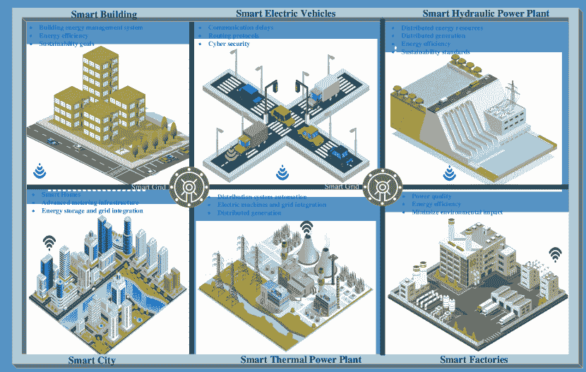
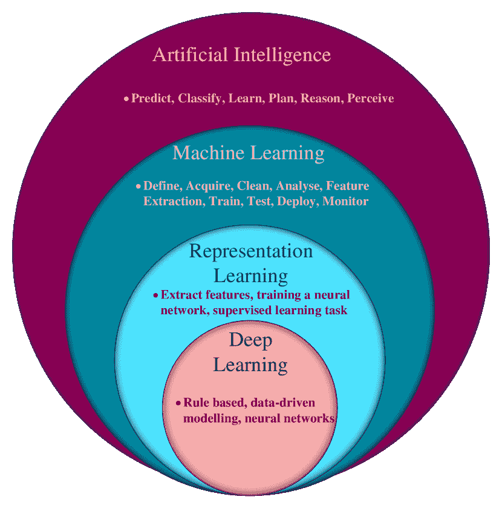
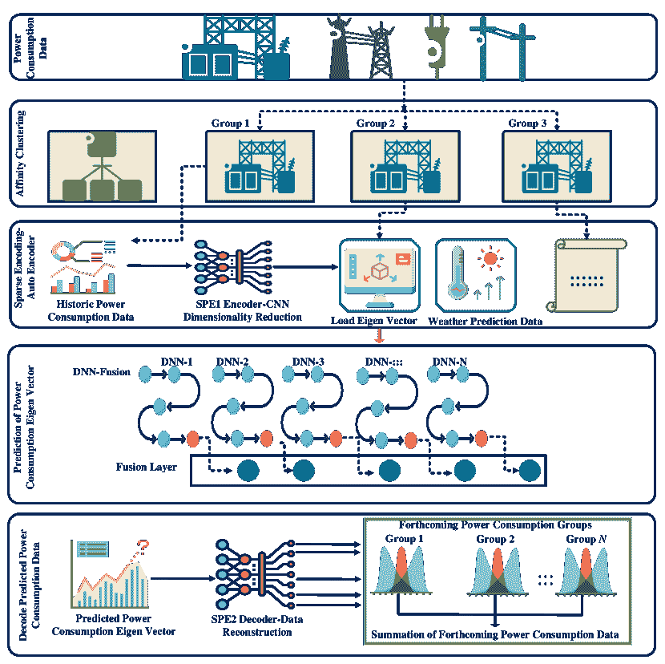
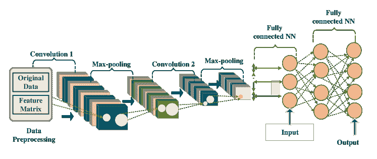
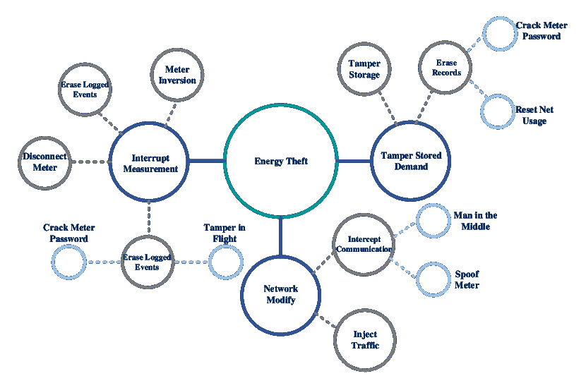
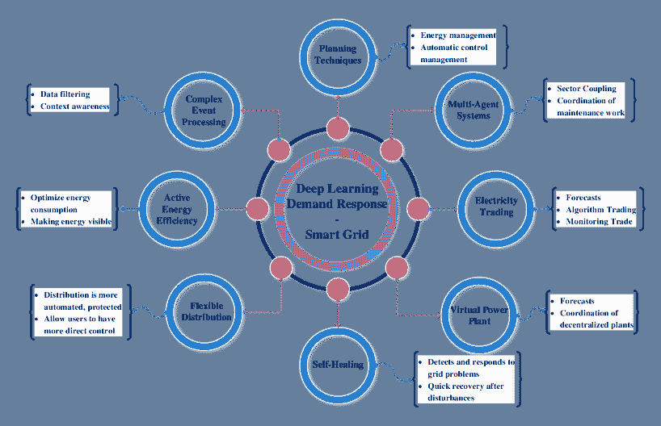
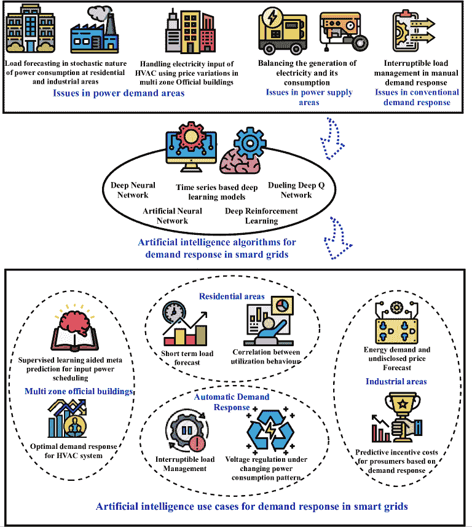

<!--yml

类别：未分类

日期：2024-09-06 19:57:13

-->

# [2101.08013] 深度学习在智能需求响应和智能电网中的应用：综合调查

> 来源：[`ar5iv.labs.arxiv.org/html/2101.08013`](https://ar5iv.labs.arxiv.org/html/2101.08013)

\useunder

# 深度学习在智能需求响应和智能电网中的应用：综合调查

Prabadevi B, Quoc-Viet Pham, Madhusanka Liyanage, N Deepa, Mounik VVSS, Shivani Reddy

Praveen Kumar Reddy Maddikunta, Neelu Khare, Thippa Reddy Gadekallu 和 Won-Joo Hwang Prabadevi B, N Deepa, Praveen Kumar Reddy Maddikunta, Neelu Khare, Thippa Reddy Gadekallu 均隶属于印度泰米尔纳德邦维洛尔理工学院信息技术学院（电子邮件：{prabadevi.b, deepa.rajesh, praveenkumarreddy, neelu.khare, thippareddy.g}@vit.ac.in）。Quoc-Viet Pham 隶属于韩国釜山国立大学计算机、信息与通信研究所（电子邮件：vietpq@pusan.ac.kr）。Madhusanka Liyanage 隶属于爱尔兰都柏林大学计算机科学学院和芬兰奥卢大学无线通信中心（电子邮件：madhusanka@ucd.ie, madhusanka.liyanage@oulu.fi）。Mounik VVSS 隶属于印度理工学院马德拉斯计算机科学与工程系（电子邮件：cs17b031@smail.iitm.ac.in）。Shivani Reddy 隶属于印度泰米尔纳德邦维洛尔理工学院电子与通信工程学院（电子邮件：shivani.devulapally2017@vitstudent.ac.in）。Won-Joo Hwang 隶属于韩国釜山国立大学生物医学融合工程系（电子邮件：wjhwang@pusan.ac.kr）。

###### 摘要

电力是现代人类生活的必需品。为了解决通过传统电网传输电力所面临的挑战和问题，智能电网和需求响应的概念已经被提出。在这些系统中，来自电力生成（如风力涡轮机）、传输和分配（微电网和故障检测器）、负荷管理（智能电表和智能电器）等各种来源的大量数据被日常生成。得益于大数据和计算技术的最新进展，深度学习（DL）可以用来从生成的数据中学习模式，并预测电力需求和高峰时段。受到深度学习在智能电网中优势的启发，本文旨在对 DL 在智能电网和需求响应中的应用进行全面的调查。首先，我们介绍 DL、智能电网、需求响应的基本概念以及使用 DL 的动机。其次，我们回顾了 DL 在智能电网和需求响应中的最先进应用，包括电力负荷预测、状态估计、能源盗窃检测、能源共享和交易。此外，我们通过各种应用案例和项目说明了 DL 的实用性。最后，我们强调了现有研究中的挑战，并指出了 DL 在智能电网和需求响应中的重要问题和潜在方向。

###### 索引术语：

人工智能、智能电网、需求响应、资源分配、深度学习、机器学习、物联网

## I 引言

表 I：重要缩写的总结。

| SG | 智能电网 |
| --- | --- |
| IoT | 物联网 |
| 5G | 第五代 |
| ML | 机器学习 |
| DR | 需求响应 |
| DL | 深度学习 |
| RNN | 循环神经网络 |
| WPC | 无线供电通信 |
| AI | 人工智能 |
| DNN | 深度神经网络 |
| ANN | 人工神经网络 |
| CNN | 卷积神经网络 |
| LSTM | 长短期记忆 |
| GRU | 门控循环单元 |
| IL | 可中断负荷 |
| DDQN | 对抗深度 Q 网络 |
| STLF | 短期负荷预测 |
| EV | 电动汽车 |
| ARIMA | 自回归积分滑动平均 |
| RU | 滚动更新 |
| AM | 注意力机制 |
| Bi-LSTM | 双向 LSTM |
| MKL | 多核学习 |
| LM | 莱文伯格-马夸特 |
| BR | 贝叶斯正则化 |
| SVR | 支持向量回归 |
| PV | 光伏 |
| RBF | 径向基函数 |
| ARIMAX | 带外生输入的平均值 |
| DTW | 动态时间规整 |
| PLF | 概率负荷预测 |
| RF | 随机森林 |
| DLF | 确定性负荷预测 |
| PMP | 概率预测模型库 |
| DMP | 确定性预测模型库 |
| ANFIS | 自适应神经模糊推理系统 |
| DRNN-LSTM | 深度 RNN 与 LSTM |
| PSO | 粒子群优化 |
| SVM | 支持向量机 |
| ESS | 能源存储系统 |
| BDD | 不良数据检测 |
| AC | 交流电 |
| SE | 状态估计 |
| FDI | 虚假数据注入 |
| DPMU | 配电级 PMU |
| PMU | 相量测量单元 |
| FDIA | 虚假数据注入攻击 |
| PSSE | 电力系统状态估计 |
| SCADA | 监督控制与数据采集 |
| MMSE | 最小均方误差 |
| AMI | 高级计量基础设施 |
| NTL | 非技术损失 |
| IMM | 中间监测表 |
| LSE | 线性方程组 |
| DBN | 深度信念网络 |
| HET | 隐性电力盗窃 |
| PPETD | 隐私保护电力盗窃检测 |
| FCM | 模糊认知图 |
| RL | 强化学习 |
| MG | 微电网 |
| HVAC | 供暖、通风和空调 |
| SLAMP | 监督学习辅助元预测 |
| V2G | 车到电网 |
| V2H | 车到家 |
| QC | 量子计算 |

与石油、食品等其他商品不同，电力无法储存以供未来使用。它必须在生产后立即分配给消费者。电网，简称网，是由发电站和将电力输送到客户的输电线组成的网络。随着人口的快速增长和工业数量的增加，电网在管理家庭和工业用电需求方面变得越来越困难。特定时间段的电力需求增加会导致短路、变压器故障等问题。为了解决传统电网在电力传输方面的问题，有必要预测客户的消费模式，以有效地提供电力。在此背景下，智能电网（SG）的概念被引入。SG 可以智能地预测电力需求，因此可以根据预测需求传输电力。通过智能传感和预测，SG 可以解决传统电网的多个问题，如需求预测、减少电力消耗、降低短路风险，从而保护生命和财产的安全[1, 2, 3]。互联网（IoT）[4]、第五代（5G）无线网络及其后续技术[5]、大数据分析[6]和机器学习（ML）的技术进步，实现了 SG 的真正潜力[7]。SG 有多个利益相关者，并且可以与多个其他智能区域连接，如智能车辆、智能建筑、智能电厂、智能城市等，如图 1 所示。

图 1：智能电网与其他智能区域的集成。

需求响应（DR），是智能电网（SG）中最重要的概念之一，鼓励用户在一天中的高峰时段减少非必要的电力消费。DR 可以有效地在高峰时段平衡电力供应。通过将机器学习（ML）、物联网（IoT）和大数据分析等最新技术与 SG 整合，可以预测用户的电力需求，并且 DR 可以自动化 [8, 9, 10]。由于 SG 网络生成的数据量庞大，可以使用基于深度学习（DL）的模型从数据中学习模式并预测电力需求和高峰时段。在文献中，若干研究者调查了 SG 中 DR 的 DL 概念。Wen *et al.* [11] 使用了基于递归神经网络（RNN）的 DL 模型来识别 SG 网络中的不确定性、电力的最佳价格及功率负荷。Hong *et al.* [12] 通过 DL 提出了一种用于住宅目的的负荷预测机制。Wen *et al.* [13] 提出了一个 DL 模型，用于预测美国德克萨斯州奥斯汀市住宅建筑的每小时电力负荷需求。Hafeez *et al.* [14] 提出了一个基于 DL 的因子条件限制玻尔兹曼机模型来预测每小时电力负荷。Ruan *et al.* [15] 提出了一个基于神经网络的拉格朗日乘子选择模型，以优化神经网络中预测 SG 中 DR 的迭代次数。Wang *et al.* [16] 提出了一个与对抗深度 Q 网络集成的 DRL 方法，以优化 SG 中的 DR 管理。Zhang *et al.* [17] 提出了使用强化学习的边缘-云集成解决方案，以实现 SG 中的 DR。

许多研究人员已经对深度学习（DL）在解决安全问题、负荷和价格预测、能源收集、智能计量等方面的应用进行了全面的综述[18, 19, 20, 21, 22, 23, 24, 25, 26]。例如，关于 SG 系统中网络安全（例如虚假数据注入攻击和拒绝服务攻击）的综述可以在[18, 19, 20, 21, 22, 23]中找到。Mollah *等* [24] 讨论了区块链在解决集中式 SG 系统中因连接数量增长引发的各种安全问题中的应用。Hu *等* [25] 提供了关于 SG 无线供电通信（WPC）系统的现代理论综述，包括收集的能源的利用、再分配、交易和规划。该研究还揭示了数学工具（例如，凸优化和 Lyapunov 优化）在优化 SG-WPC 系统中的应用及其在 5G 系统后的潜在方向。我们可以观察到，关于 DL 在 SG 中需求响应（DR）应用的全面综述仍然缺失，因为现有的调查集中于特定主题，如安全和应用。此外，DL 最近/广泛地应用于 SG 和 DR 系统的智能解决方案中，但最新的发展可能未被现有调查所涵盖。基于这些观察，本文提供了关于 DL 在 DR 和 SG 系统中的应用的全面综述。当前综述的主要动机是教育读者关于 DL、DR 以及 DL 在 DR 和 SG 中的应用的最新进展。

### I-A 贡献和论文组织

总而言之，本综述的主要贡献总结如下：

+   •

    对 DL、SG、DR 以及 DL 在 SG 和 DR 系统中的应用动机进行概述。

+   •

    对 DL 在 SG 和 DR 系统中的应用进行全面综述，包括电力负荷预测、状态估计、能源盗窃检测、能源共享和交易。

+   •

    提出了若干个案例来说明 DL 在 DR 和 SG 系统中的应用。

+   •

    讨论了 DL 在 DR 和 SG 应用中的若干挑战、未解问题和未来方向。

论文的其余部分组织如下。第 II 节讨论了深度学习的基础知识、智能电网中的需求响应（DR）以及使用深度学习进行需求响应和智能电网的动机。第 III 节介绍了深度学习在电力负荷预测、状态估计、能源盗窃检测、能源共享和智能电网中的交易应用的最新进展。第 IV 节讨论了一些最近的需求响应和智能电网的应用案例。挑战、未解问题以及未来方向在第 V 节中提出，结论则在第 VI 节中呈现。为清晰起见，常用缩略语的列表总结在表 I 中。

## II 背景与动机

### II-A 深度学习基础

深度学习（DL）在机器学习技术中受到广泛关注[27, 28]。要理解深度学习，具备良好的机器学习基础知识是非常重要的。

图 2：深度学习（DL）与强化学习（RL）、机器学习（ML）和人工智能（AI）的关系。

图 2 描述了深度学习与表征学习、机器学习（ML）和人工智能（AI）之间的关系。机器学习算法可以从数据中学习。机器学习使我们能够编程解决传统编程技术无法解决的问题。它允许计算机程序从经验中学习，涉及任务并评估任务的性能指标以提高学习效果。机器学习可以编程多个任务，如分类、回归、转录、采样等。为了评估机器学习算法的性能，使用了准确性和错误率等定量指标。根据算法在学习过程中的经验，机器学习算法可以根据学习方式分为两大类：监督学习和无监督学习。其他包括强化学习和推荐系统。监督学习算法通过一个包含属性的数据集进行学习，而每个证据也伴有一个类别标签或目标类别。线性回归是监督学习的基本技术。任何机器学习算法的主要目标是对未知数据提供良好的性能，而不仅仅是在训练数据上。任何机器学习算法的性能可以通过其在训练错误方面的能力来评估，并且训练错误和泛化错误之间的差异应尽可能小。无监督学习算法使用一个包含多个属性的数据集，从中获得有价值的关联，例如聚类算法。

深度神经网络（DNN）是深度学习（DL）中最有效的技术。DNN 是人工神经网络（ANN）的扩展形式，具有显著更多的层以获得网络的深度。深度学习算法通常通过数据集显式地（如密度近似）或隐式地（如合成或去噪）学习完整的概率分布。大多数深度学习算法基于随机梯度下降优化算法[29]。通常，它们是由一组模块、优化算法、成本函数、模型和数据集的组合来构建机器学习算法。当前的深度学习通过一个框架来促进监督学习，该框架包括额外的层和更多的神经元，以设计一个可以满足当今不断增长的复杂性要求的 DNN。它可以快速将输入向量映射到输出向量，适用于大型模型和巨大的训练集。前馈 DNN 可以有效地执行此功能，但进一步的正则化、优化和将 DNN 扩展以处理大型输入向量，例如高分辨率图像数据或长时间序列数据，应进行专业化设计。为满足这些要求，卷积神经网络（CNN）和递归神经网络（RNN）被设计出来。

卷积神经网络（CNN）是一种深度神经网络（DNN），它使用网格状拓扑来处理数据，而不是在至少一个层中进行一般矩阵乘法。例如，可以采用网格状拓扑来处理时间序列数据中的一维网格样本，或者图像数据中的二维像素网格。设$y$为时间$t$的测量值，我们可以假设$y$和$t$是在整数$t$上定义的，离散卷积可以用以下方式表示[30]：

|  | $d(t)=(y,w)(t)=\sum_{b=-\infty}^{\infty}y(b)w(t-b).$ |  | (1) |
| --- | --- | --- | --- |

在卷积术语中，函数$y$是输入，$b$是测量的年龄，$w$是卷积核，输出$d$被称为特征图。通常，卷积是在多个维度上同时计算的。假设如果输入是二维数据$R$，则使用二维卷积核$K$：

|  | $d(p,q)=(R.K)(p,q)=\sum_{i}\sum_{j}R(i,j)K(p-i,q-j).$ |  | (2) |
| --- | --- | --- | --- |

循环神经网络（RNN）是一类深度神经网络，就像 CNN 处理图像的网格值一样，RNN 专门用于处理包含向量$[\mathrm{y}^{(\mathrm{t})},\dots,\mathrm{y}^{(\mathrm{T})}]$的序列数据，其中$t$是时间戳的索引，从$1$到$T$。类似于 CNN 将图像缩放到不同的尺寸，RNN 也将序列数据缩放到较长的序列变量尺寸。包含递归的函数可以是 RNN。以下方程表示网络中隐藏单元的状态。

|  | $S^{(t)}=f\left(S^{(t-1)},y^{(t)};\eta\right).$ |  | (3) |
| --- | --- | --- | --- |

网络通过使用$S^{(t)}$作为任务相关输入的有损函数来进行训练，以将任意长度的输入向量映射到固定长度的序列$S^{(t)}$。$S$表示时间$t$的状态，函数$f(\cdot)$将$t$时刻的状态映射到$(t+1)$时刻的状态，相同的值$\eta$用于下一个状态，以参数化函数$f(\cdot)$[30]。S. Atef *et al.* [31] 提出了一个基于深度学习的需求和响应方案，以提供准确的实时电力消耗预测。所提架构包括两个主要模块：深度学习模块由一个四层 RNN 实现，能够预测客户的每小时电力消耗模式。第二个模块是需求响应决策模块，它使用深度学习模块预测的消耗模式作为输入，并获得适当的措施，以减少电力峰值需求，从而节省成本和能源。

Velasco *et al.* [32] 提出了一个基于 DNN 的大规模（LV）供电区域的功率损失预测模型，反映了 LV 供电网络的不一致性，包括负载不平衡、来自供应生成的电压波动以及不确定的智能表读数。该模型采用了 DNN，输入向量由来自整个 LV 供电区域的缩放需求和响应数据组成，输入层 I 接收这些数据。模型使用 k 折方法进行训练，并同时获得了模型的最佳超参数。输出层 O 生成整个 LV 大规模供电区域的技术损失模式。网络使用了多个隐藏层，每层包含 n 个单元。模型通过丢弃一些神经元来避免过拟合。输出功率损失序列与目标功率损失进行比较，并计算均方误差，这个误差被反向传播到前一层以寻找损失函数。当最终误差与前一误差之间的差距低于阈值误差时，网络训练完成，准备分类 DR 模式。

一种通用的机床预测模型通过 DL 在两个阶段开发；训练和利用[33]。在训练阶段，预测模型使用从数据采集系统获得的数据进行训练。在利用阶段，开发的预测模型被用于预测机床模式的能源使用。训练阶段包括三个步骤：数据获取和转换、无监督 DL 用于特征子集选择，以及能源预测模型的获得。利用阶段使用在训练阶段开发的模型，通过应用提取的特征来识别机床的当前能源使用[34]。

使用两端稀疏编码和 DNN 融合进行的前一天聚合电负荷预测已开发。图 3 所示的预测模型结构分为三个步骤；首先，使用亲和聚类分析方法将聚合电力消耗数据拆分成集群。然后，通过应用稀疏自编码器选择存储的负荷特征。稀疏自编码器使用隐藏层中的有限数量单元进行特征选择。训练后，稀疏自编码器分为两个子单元，称为 SPE1 和 SPE2。SPE1 作为唯一的编码器来获取特征选择，SPE2 作为唯一的解码器将功率消耗特征向量转换为负荷曲线。SPE1 和 SPE2 的网络设计分别使用 CNN 和长短期记忆（LSTM）。CNN 用于提高负荷预测的准确性，LSTM 用于评估单一消费者的功率消耗。进一步的 DNN（CNN 和 LSTM 的融合）被集成以实现融合模型。特征级融合模型的设计过程如下。

+   •

    两个网络独立训练。

+   •

    从两个 DNN 的倒数第二层提取的高层特征被融合以找到新的特征向量。

+   •

    添加了一个新的完全连接的融合层以获得新的负荷特征向量。仅在此步骤中训练此层。自编码器的解码器生成下一天的功率图。通过将预测的组数据相加来评估最终的负荷预测[35]。

图 3：预测模型的架构用于聚合功耗数据。

通过智能电表，可以轻松获得大量细粒度的个人消费者负荷数据。[36] 提出了一种使用深度学习（DL）识别社会人口信息的方法，该方法利用智能电表数据。深度卷积神经网络（CNN）被用来从智能电表收集的电力消费者数据中选择特征子集。CNN 架构使用了八层，如图 4 所示。前三层为卷积层，接下来的三层为池化层，其中一层是完全连接层，最后一层是支持向量机（SVM）。CNN 架构是根据两个事实确定的：消费者的消费模式和训练集中的样本。减少的特征随后输入到池化层，最后由完全连接层对数据进行分类。CNN 的超参数调整使用了网格搜索和交叉验证技术。随后，SVM 被用来自动提取消费者的行为模式。这有助于提供更好的服务、提高负荷效率，同时也有助于设计智能电网（SGs）。

图 4：深度卷积神经网络框架的设计结构

### II-B 智能电网中的需求响应

为了维持负荷管理系统中的需求与供应的平衡，需求响应（DR）模型应运而生。DR 是电力公司在高峰时段减少消费者能耗的重要策略之一。在这种策略下，客户可以选择自行削减非必要负荷，或者由电力公司在高峰时段自动完成削减[8]。DR 是客户与电力公司之间基于某些条件（如时间间隔、价格和负荷）达成的协议。通过 DR，可以在高峰时段减少电力消耗，从而降低运营成本、安装成本，并缓解潜在的 SG 故障。DR 有助于降低电力成本，进而降低零售价格。电力公司可以通过在非高峰时段提供更低的电价来鼓励客户在高峰时段削减非必要负荷。

### II-C 深度学习在需求响应和智能电网中的应用

DR 模型利用消费者及其负荷消耗数据，通过在需求高峰期间进行负荷削减来维持电网可持续性，并高效地管理整个消耗数据模式。因此，设计一个有效的 DR 系统是基于当前时间负荷消耗数据模式的调整，这些模式需要被提取以获得精确的负荷消耗模式。为了制定一个高效的 DR 系统，需要实施有效的预测技术，以便系统可以推荐反映消费行为的合适解决方案，预测即将到来的消费者使用模式[31]。

对于智能电网（SG）和智能住宅公寓区域，需要制定精确的能耗预测系统。开发了一种带有门控循环单元（GRU）系统的深度递归神经网络（RNN），用于预测住宅公寓中短至中期时间的能量供需[37]。集成的 DRNN-GRU 模型是一个五层的神经网络，包含了优化的超参数和归一化输入。第一层是输入层，接收每日小时负荷消耗数据样本。第二层是第一层 GRU，生成每个时间点的输出。第三层是第二层 GRU，生成比前一层更高维度的输出。该层调整了更多的权重和偏差。第四层是一个简单的隐藏层。第五层是输出层，产生预测结果。反向传播用于参数优化，最小-最大归一化用于缩放训练数据。通过将正则化添加到成本函数中和在隐藏层应用 dropout 来解决过拟合问题。该模型能够配合数据的时间依赖性，也有效地通过历史数据解决缺失信息问题。

提出了一种优化的需求响应（DR）系统[38]，用于在灵活电力负荷模式下的时间分段价格表中管理可中断负荷（IL）。该系统采用了对抗深度 Q 网络（DDQN）模式的 DRL 技术，使得实际的需求响应变得可能。IL 问题采用马尔可夫决策过程进行实现，以在更长时间内获得最高利润，这定义了 DR 系统的状态、操作和奖励函数。DDQN 组织减少了噪音，提高了模型的稳定性，表明 DDQN 的收敛不稳定性已被减少，以获得损失函数的适当值。最终，该模型实现了峰值电力需求的降低以及在不影响安全的情况下调节电压的操作成本减少。

工业部门的高电力消耗问题由**Renhzi Lu** *等人* [39] 解决。该模型采用多智能体深度强化学习（DRL）来实施 DR 策略，以管理一个独特的制造系统。最初，工业制造系统被表述为 POMG，随后应用了 MADDPG 算法，为每台机器设计了最优的负荷消耗计划。然后，该模型在电池制造系统上进行部署，以评估其有效性。模拟结果证明，DR 系统能够提供最低的电力消耗成本，并且与非 DR 基准系统相比，生产支出更少。该模型使系统能够减少电力消耗，并降低电网的不稳定性。

一个高效的短期负荷预测（STLF）框架被开发出来，以应对住宅校园中消费者行为模式的剧烈和随机性挑战。该框架利用设备的聚合负荷数据及其之间的相关性，通过深度学习（DL）技术预测个人的电力消耗模式。框架包括数据采集、数据预处理、学习和负荷预测模块。设备中各种负荷数据之间的相关性通过多时间序列方法进行建模并包含在框架中。学习通过 DNN 和 ResBlock 技术应用。使用网格搜索算法进行 DNN 中的超参数调优 [40]。

**Yandong Yand** *等人* [41] 提出了一个基于概率模型的深度集成学习方法，用于 SG 中的能量预测，以实现可靠的能源消费管理。该模型可以解决准确确定每个用户的电力需求的问题，具有高效的 SG。现有的方法无法应对用户的聚合负荷特征、不规则负荷模式和不稳定性。集成负荷预测模型在不同的用户组配置上进行实现。该模型设计为四个阶段：表示学习、用户配置的聚类、多任务特征学习（任务数量等于聚类数量），以及深度集成学习；通过集成深度神经网络（DNN）进行概率预测。模型以随机方式进行初始化和批量训练，通过应用不同类型的 DNNs，建立了一个可扩展且可变的深度集成框架，这对于分布式和并行计算环境尤为适用。最后，生成的预测结果通过基于 LASSO 的分位数技术进行处理，以获得优化的集成预测模式。该框架在 SME 用户中部署，以展示其有效性和对现有系统的改进。它可以用于 DR 和 SG 中家庭的电力需求管理系统。

从上述讨论可以明显看出，由于智能电网中通过传感器和其他物联网设备生成的大量数据，传统的机器学习（ML）算法无法提取趋势、模式和预测。需求响应（DR）在高峰时段减少智能电网负荷中发挥了重要作用。为了有效提取智能电网和客户的用电模式，以自动化地在高峰时段减少不必要的负荷，基于深度学习（DL）的模型由于其可扩展性是理想的解决方案。除了客户的用电模式外，DL 在揭示电力盗窃、篡改电表、预测火灾等方面也能发挥重要作用。这些 DL 在智能电网和需求响应中的好处是本综述论文的主要动机。

## III 需求响应和智能电网的前沿深度学习方法

在本节中，讨论了几种关于深度学习（DL）在需求响应（DR）和智能电网（SG）中的应用的前沿工作，如电力负荷预测、智能电网中的状态估计、智能电网中的能源盗窃检测、智能电网中的能源共享与交易。

### III-A 电力负荷预测

负荷预测是预测满足未来需求所需的电力或能源的技术。在能源和电力部门中具有重要意义。准确的负荷预测对于电力系统的有效规划和操作至关重要。它可以分为短期负荷预测和长期负荷预测两类。

通常，在短期负荷预测（STLF）中，估计的是从下一小时到接下来两周的负荷。[42]考虑了电动车（EV）充电负荷的预测，因为其大规模渗透导致电力系统中需求的不确定性。本文使用基于 ANN 和 LSTM 的深度学习方法进行插电式 EV 负荷预测。采用了一个 PEV 充电站公司来比较传统的 ANN 方法和 LSTM 方法。观察到 LSTM 模型在短期 EV 负荷预测中具有更低的误差和更高的准确性。

参考文献[43]的作者提出了六种不同的模型，这些模型涉及人工神经网络（ANN）、小波神经网络和卡尔曼滤波方案的组合，用于短期负荷预测（STLF）。这些模型在不同的数据集上进行了验证，与文献中的传统模型相比，这六种模型的准确性均更高。[44]研究了负荷序列的长时间跨度准周期性，并提出了一种结合自回归积分滑动平均（ARIMA）和长短期记忆（LSTM）的集成方法。该方法在 737 周的负荷消耗数据集上进行了评估，与流行的 STLF 模型相比，该模型显示出了优越的性能。

智能电网中分布式发电的广泛使用增加了对 STLF 准确性的需求。为了解决这一问题，[45]提出了一种基于滚动更新（RU）、注意机制（AM）和双向长短期记忆（Bi-LSTM）的方法。该方法的有效性在来自不同国家的实际数据集上进行了测量，不仅证明了这种方法具有更高的准确性，还表明与其他模型相比，它需要更少的计算时间。为了进一步提高 STLF，[46]中的作者提供了一个联合包袋-提升 ANN 模型，该模型结合了包袋和提升训练。它包括并行训练的 ANN 集合，其中每个集合包含顺序训练的 ANN。对真实数据的统计分析显示，该模型的偏差、方差和预测误差均低于单一 ANN、包袋 ANN 和提升 ANN。

有一个想法是使用多核学习（MKL）进行住宅短期电负荷预测，因为它可能带来更多的灵活性。但使用传统方法会创建复杂的优化问题。为了解决这一问题，吴*等*[47]提出了一种基于梯度提升的 MKL，该方法采用了提升风格的方式。它还具有较少的计算时间。除了这种方法，论文还提出了基于迁移的学习算法，以便将源住宅中的学习信息迁移到目标住宅。结果表明，当数据有限时，这些迁移算法能够减少预测误差。

[48]中的作者提出了一项使用 ANN 进行区楼小时预测和天预测的研究。该研究使用 Levenberg-Marquardt（LM）和贝叶斯正则化（BR）作为学习算法来评估这些 ANN。分析了不同建筑在天预测和小时预测方面的模型后发现，小时预测表现相对较好。本文还提供了最佳策略，以提高天预测的性能，从而降低电费。

尽管近期的 RNN 在负荷预测方面表现良好，但它们并未使用预测的未来隐藏状态向量或充分利用过去的信息。如果隐藏状态向量中存在错误，现有的 RNN 模型无法纠正这些错误，从而影响未来的预测效果。为了解决这一问题，[49]中的作者提出了一种递归 inception CNN，它结合了 RNN 和 1D-CNN。实验显示，该模型在每日电负荷预测中的表现优于多层感知器、RNN 和 1D-CNN。

由于支持向量回归（SVR）方法在短期电力负荷预测中的计算复杂度较高，[50]提出了一种基于序列网格方法的 SVR，以使估计变得更高效和准确。短期预测实验展示了该模型相比常规 SVR 模型的更佳性能和准确性。该论文的一个局限性是没有考虑预测与子采样之间的交互效应。在相同的短期电力负荷预测中，[51]提出了一种基于混合粒子群优化-遗传算法-反向传播神经网络（PSO-GA-BPNN）算法的模型。这里 PSO-GA 算法用于优化 BPNN 参数。为分析此模型，数据取自不同的造纸企业，结果表明该模型优于基于 PSO-BPNN 和 GA-BPNN 的模型。

为了提高短期负荷预测（STLF）的准确性，[52]考虑了适当的负荷数据分析和更有效的特征选择。负荷数据首先通过分裂 K 均值算法（Bisecting K-Means Algorithm）进行聚类，然后通过集成经验模态分解（ensemble empirical mode decomposition）进行分解，得到本征模态函数。接着，论文提出了基于双向 RNN（Bi-RNN）和深度置信网络（DBN）的预测模型。该模型在电网负荷数据上经过验证，证明其优于其他方法。DBN 还被用在[53]中来预测电力系统的小时负荷。在此之前，本文使用 Copula 模型计算峰值负荷指示变量。实验证明该框架在短期电力负荷预测中优于经典神经网络、SVR 机器、极限学习机和经典 DBN。

[54]使用条件隐含半马尔科夫模型进行住宅电器的负荷建模。然后，使用学习到的模型给出了负荷预测算法。该模型使用来自不同电器的 1 分钟分辨率数据进行评估，发现该模型有效且适用。此外，住宅电器能源分解是主要问题之一，特别是在服务于多种用途的 II 型电器中。[55]关注了这个问题，提出了一种基于深度卷积神经网络（DCNN）的框架和后处理方法，以解决这一非侵入式负荷监测问题。实验在公开数据集上进行，观察到该模型相较于其他研究具有更好的性能。

文献[56]中的作者提出了一种新颖的概率住宅净负荷预测模型，以捕捉分布式光伏（PV）发电引起的不确定性。它使用了贝叶斯深度 LSTM 神经网络。对来自澳大利亚电网的数据进行的实验证明，所提出的方法优于一些最先进的方法。该论文还考虑了子配置文件中的聚类和 PV 能见度，这些因素对模型性能的影响很大。

文献[57]中提出了一种基于模糊集成模型的周前负荷预测模型。该模型使用了混合 DL 神经网络，结合了人工神经网络（ANNs）、集成预测。模糊聚类思想被用来将输入分成簇，然后这些簇被训练到一个神经网络中，该神经网络包括一个池化层，一个卷积层，一个径向基函数（RBF），和两个全连接层。它经过了两个案例研究的测试，证明比传统模型更为有效。文献[58]中考虑了基于融合 DNN 和双端稀疏编码的模型，以预测日前的聚合负荷。这两端稀疏编码克服了高维导致的冗余特征等挑战。聚类被用来将负荷分成不同的组，并且使用不同结构的 DNN 来预测单个组的负荷。然后这些通过融合层进行融合。通过案例研究证明了该模型的有效性。

由于 DL 模型需要高昂的训练成本，比如时间和能耗，在实际应用中很难应用这些模型。因此，为了最小化训练成本，而不影响准确性，文献[59]提出了一种基于 CNN 的模型，称为 LoadCNN。它用于预测日前住宅负荷，同时最小化训练成本。实验证明，训练成本（时间、二氧化碳排放）约为其他最先进模型的 2%，同时预测准确性等同于当前模型。

传统负荷预测方法之一是带外生输入的自回归积分滑动平均（ARIMAX）模型，这是一种时间序列预测方法。Cai *等人* [60] 提出了直接多步和递归方式下的 RNN 和 CNN 模型。它们的准确性和效率与传统的 ARIMAX 进行了比较。所提出的模型在准确性上提高了 22.6%，表现优于 ARIMAX。[61] 的作者专注于前馈神经网络、序列到序列（seq2seq）模型、时间卷积神经网络（CNN）和 RNN 在电力负荷预测中的应用。基于两个数据集，分析了上述模型。观察到 Elmann RNN 相比于 GRU 和 LSTM 在综合负荷预测中表现更好且成本更低。此外，时间卷积神经网络也显示了良好的性能，并且有潜力在未来的电力系统发展中带来进展。

由 Yu *等人* [62] 提出的基于动态时间规整（DTW）距离和门控 RNN 的模型用于日常峰值负荷预测。基于形状的 DTW 距离捕捉负荷的变化，使用了一个三层的门控 RNN 进行负荷预测。在 EUNITE 数据集上进行的模拟表明，该模型优于现有的最先进预测方法。

概率负荷预测（PLF）提供作为概率密度函数或预测区间的预测，对于预测不可预测和波动大的负荷变得尤为重要。Yang *等人* [63] 提出了一个基于贝叶斯深度学习的多任务 PLF 框架，用于预测住宅负荷。该模型采用三阶段管道，其中在每个阶段分别采用了聚类、池化和多任务学习。结果表明，这种策略解决了过拟合问题。此外，与传统方法如 SVR、基于池化的 LSTM 和随机森林（RF）相比，该模型显示出更好的性能。Wang *等人* [64] 提出了一个针对住宅 PLF 的 pinball 损失指导 LSTM 模型。在这里，pinball 损失用于训练参数，而不是均方误差。这使得传统的 LSTM 点预测模型扩展到概率预测。获得的结果展示了该模型的有效性。

Fand *等* [65] 基于 STLF 模型使用 Q-learning 开发了动态模型选择方法。该方法提供了确定性负荷预测（DLF）和概率负荷预测（PLF）。首先，使用 4 个预测分布模型和 10 个最先进的 ML DLF 模型来形成一个概率预测模型池（PMP）和一个确定性预测模型池（DMP）。然后，进行一个 2 步过程，其中 Q-learning 代理从 PMP 和 DMP 中分别选择最佳的 DLF 和 PLF 模型。对智能表和两年天气数据的实验表明，与其他传统模型相比，该模型将 PLF 和 DLF 误差分别降低了 60%和 50%。

长期负荷预测是指对接下来几个月或几年的负荷进行估计或预测。这是电力系统未来规划、运行和扩展的重要因素。Dong *等* [66] 提出了一个模型来预测配电馈线的年度负荷。该模型使用 LSTM 和 GRU 模型来挖掘多年数据中的模式。通过使用城市电网的数据，LSTM 和 GRU 网络与 ARIMA、自下而上和前馈神经网络进行了比较。结果表明，该模型的表现优于其他模型，并且 GRU 模型的速度也快于 LSTM 模型。

对于基于土地使用计划的准确长期预测，[67]提出了一种时间 LF 和数据驱动的自下而上的空间方法。它以土地地块作为基本的 LF 分辨率。同时，为了汇总负荷密度，采用了核密度估计和自适应 k-means。案例研究表明，这种方法在处理大数据方面是可行的，并且所提出的 SLF 模型比基准方法更具适用性。

Mohammad *等* [68] 提出了一个基于 DNN 的模型来预测 SG 中的能源消耗。本文研究了深度前馈神经网络和深度 RNN。NYISO 数据集上的模拟证明了所提出模型的优越性。在[69]中，作者提供了一种基于前馈 ANN 的算法，用于岛屿电力系统的功率流管理，以预测短期日负荷。然后将其传递给模式识别算法，并根据负荷的曲线形状进行分类。动态模拟结果表明，所提出的算法可以实现峰值削减与可再生能源的结合效果，以及更平稳的柴油发电机运行。

Motepe *等* [70] 提出了一个用于南非配电网负荷预测的混合深度学习和人工智能模型。所研究的最先进的混合深度学习技术和人工智能技术分别是 LSTM 和优化修剪的极限学习机。与自适应神经模糊推理系统（ANFIS）进行比较，LSTM 显示出更高的准确性。为了预测光伏功率输出和住宅用电负荷，[71] 提出了一个带 LSTM 的深度 RNN（DRNN-LSTM）模型。为了优化并网社区微电网的负荷调度，使用了粒子群优化（PSO）算法。对两个实际数据集的结果表明，DRNN-LSTM 模型优于支持向量机（SVM）和多层感知器网络。还观察到负荷调度优化使电动车和能源存储系统（ESS）能够平移峰值负荷，并减少了 8.97%的每日成本。我们在表 II 中总结了现有的电力负荷预测工作。

表 II：电力负荷预测总结。

| Ref. | 贡献 | 深度学习方法 | 关键特性 |
| --- | --- | --- | --- |
| [42] | 短期电动车负荷预测 | ANN 和 LSTM | 由于电动车的大量渗透导致电力系统中的需求不确定性，电动车充电负荷的预测变得非常重要 |
| [44] | 负荷序列的大时间跨度准周期性 | ARIMA 和 LSTM | 在 737 周的负荷消费数据集上评估，与流行的 STLF 模型相比，观察到该模型的性能更优 |
| [45] | 在不同国家的实际数据集上测量有效性 | AM、RU 和 Bi-LSTM | 智能电网中分布式发电的广泛使用对 STLF 的准确性提出了更高的要求 |
| [46] | 联合袋装增强 ANN 模型 | 训练 ANN 集成 | 对真实数据的统计分析表明，该模型的偏差、方差和预测误差低于单一 ANN、袋装 ANN 和增强 ANN |
| [48] | 日前和小时前负荷预测区建筑 | ANN、BR 和 LM | 针对日预测的最佳策略，以减少电费 |
| [49] | 预测的未来隐藏状态向量 | RNN 和 1D-CNN | 如果隐藏状态向量中存在任何错误，现有的 RNN 模型无法纠正这些错误，从而阻碍了未来的更好预测 |
| [50] | 基于序列网格方法的支持向量回归 | 支持向量回归 | 由于 SVR 方法在短期电力负荷预测中的计算复杂度较高，基于序列网格方法的 SVR 变得更加高效和准确 |
| [51] | 考虑预测与子抽样之间的相互作用 | GA-PSO-BPNN | 使用 GA-PSO 算法优化 BPNN 参数，数据来自不同的造纸企业 |
| [52] | 负荷数据分析和更有效的特征选择 | Bi-RNN, DBN | 为了提高短期负荷预测的准确性，进行适当的负荷数据分析和更有效的特征选择 |
| [53] | 预测电力系统的每小时负荷 | DBN | 使用 Copula 模型计算峰值负荷指标变量 |
| [55] | 解决非侵入式负荷监测问题 | DCNN | 在住宅电器能量分解中，特别是在多功能的 II 型电器中是主要问题之一 |
| [56] | 子配置文件中的聚类和光伏可见性是模型性能的主要贡献者 | 贝叶斯深度 LSTM 神经网络 | 一种新颖的概率住宅净负荷预测模型，捕捉由分布式光伏发电引起的不确定性 |
| [57] | 提出了基于模糊的集成模型用于周预测负荷 | 混合深度学习神经网络 | 使用模糊聚类思想将输入划分为不同簇，然后这些簇被训练到由一个 RBF、一个卷积、一个池化和两个全连接层组成的神经网络中 |
| [58] | 针对日预测的聚合负荷使用两端稀疏编码和 DNN 融合 | DNN | 通过这种两端稀疏编码克服了高维数据所带来的挑战，如冗余特征 |
| [59] | 预测日内住宅负荷并最小化训练成本 | LoadCNN | 在不妨碍准确性的前提下，最小化训练成本 |
| [60] | RNN 和 CNN 在递归和直接多步方式下进行建模 | RNN 和 CNN | 准确性和效率与季节性 ARIMAX 和门控 24 小时 CNN 相比，直接多步方式的门控 24 小时 CNN 被证明具有最佳的准确性 |
| [61] | 关注前馈神经网络、seq2seq 模型、时序 CNN 和 RNN 在电力负荷预测中的应用 | 时序 CNN 和 RNN | Elmann RNN 在聚合负荷预测中表现与 GRU 和 LSTM 相当，但成本更低 |
| [63] | 提出了基于贝叶斯深度学习的多任务 PLF 框架用于预测住宅负荷 | 贝叶斯深度学习 | 该模型遵循三阶段管道，每个阶段分别采用聚类、池化和多任务学习 |
| [66] | 预测配电馈线的年负荷 | LSTM 和 GRU | 使用先进的序列预测模型 LSTM 和 GRU 来利用多年的数据中隐藏的序列信息 |
| [69] | 岛屿电力系统的电力流管理 | 前馈 ANN | 使用基于前馈 ANN 的模型进行短期日预测负荷预测 |
| [71] | 使用 PSO 算法优化并网社区微电网的负荷调度 | DRNN-LSTM | 负荷调度优化使 EVs 和 ESS 能够转移峰值负荷，减少 8.97% 的日常成本 |

### III-B 智能电网中的状态估计

为了获得任何电力系统的完整、实时且准确的解决方案，状态变量的估计是必要的。状态变量包括电压、角度等。状态估计器的输入就是这些不完美定义的状态变量。状态估计抑制了错误的测量，并为任何特定的电力系统提供最佳估计。在线健康状态估计显示出较低的准确性，并且还影响了充电状态估计的准确性。为了克服状态变量中准确性低的问题，Song *et al.* [72] 展示了一种联合锂离子电池状态估计方法，该方法利用数据驱动的最小二乘支持向量机和基于模型的无迹粒子滤波器。直接映射模型省略了参数识别和在复杂操作条件下的更新。这种对充电状态估计中的健康状态的修正产生了具有不同时间尺度的联合估计。实验表明，最大充电状态生命周期的估计误差不超过 2%，健康状态的均方根误差估计不超过 4%。作者实施的模型结果表明，使用这种混合估计程序可以以显著的准确性评估健康状态和充电状态。动态状态估计通常用于实时和适当管理 SG 的操作。

Chen *et al.* [73] 提出了一个新的基于在线的方法来检测 SG 中动态状态估计的数据注入网络攻击。传统的数据注入攻击成功逃脱了坏数据检测 (BDD)。在这项工作中，考虑了一种针对卡尔曼滤波器状态变量的不完美数据注入攻击。他们设计了一种新方法来选择这些目标状态变量，然后通过解决与 PSO 算法相关的理想模型来确定它们的值。作者的数值实验显示了所提出的检测方法的鲁棒性，并且也可以获取各种攻击的复杂攻击机制。这项工作可以通过与各种网络攻击协作并进行特征建模来扩展。

ANN 在 SG 中的非线性交流（AC）状态估计（SE）方面相比传统方法具有显著的准确性。但研究表明，某些对抗性样本可以轻易欺骗 ANN。Liu *等* [74] 介绍了一项针对 AC SE 的 ANN 对抗性虚假数据注入（FDI）攻击的研究：通过向测量数据中注入有意的攻击向量，攻击者可以在未被检测的情况下降低 ANN SE 的准确性。为了创建攻击向量，作者提出了一种基于梯度和基于群体的算法。使用在 IEEE 9-bus、30-bus 和 14-bus 系统上的多种攻击布局的仿真来检查算法的有效性。仿真结果确认，DE 在所有仿真场景中都比 SLSQP 更有效。正确使用 DE 算法的攻击实例显著降低了 ANN SE 的准确性。

Zhou *等* [75] 研究了在不平衡的三相电力分配系统中估计谐波电压分布和定位谐波源的挑战。他们开发了一个谐波状态估计模型，该模型使用来自配电级 PMUs（DPMUs）和智能电表的两种不同类型的测量数据。这个模型所需的 DPMUs 数量少于节点数，使其在配电网中具有显著的应用价值。作者通过在 IEEE 测试馈线上的大量数值仿真展示了实施模型的鲁棒性。他们还探讨了分布式能源资源的增加渗透如何影响状态估计器的性能。

Mestav *等* [76] 研究了不可观测配电系统的状态估计挑战。在实时应用中，他们实现了一个基于深度学习（DL）方法的贝叶斯状态估计模型。该程序包括一种蒙特卡罗技术，用于训练 DNN 进行状态估计、随机电力注入的分布学习，以及贝叶斯坏数据检测和过滤算法。实验仿真表明，贝叶斯状态估计对于不可观测系统的有效性。与伪测量技术相比，直接使用 DL 神经网络进行贝叶斯状态估计超越了传统基准。

随着用于电力系统正确和安全跟踪的相量测量单元（PMU）的增加，各种网络攻击的风险也在增加。[77] 中的作者研究了旨在改变 PMU 测量的 FDI 攻击（FDIA），这会导致虚假的状态估计。他们从 PMU 数据包中提取了多变量时间序列信号，这些数据包在相量数据集中器中聚合，涉及各种事件，如发电和负载波动、线路故障和跳闸、分接点断开以及每个 SE 周期之前的 FDIA。为了验证 PMU 数据，他们提出了一种具有分类交叉熵损失和 Nesterov Adam 梯度下降的 CNN 数据滤波器。这种基于 CNN 的滤波器与所有其他分类器相比显示了显著的准确性。所有实验模拟都在 IEEE-118 总线和 IEEE-30 总线系统上进行。

随着新兴应用的出现，电力系统状态估计（PSSE）等方案变得更加昂贵。为了克服这些挑战，Zhang *等* [78] 提出了基于 DNN 的电力系统跟踪模型。在使用实际准确 AC 模型的迭代求解器的基础上，实现了一种新的特定模型 DNN，用于实时 PSSE，仅需要减少的调优工作和离线训练。数值测试显示，与传统方法相比，所提出的基于 DNN 的方法具有优越性。在 IEEE 118 总线上的实验结果证明，基于 DNN 的 PSSE 方案的性能优于现有方法，如广泛使用的 Gauss–Newton PSSE 求解器。当没有噪声时，PSSE 仅等于求解一组二次方程，这也意味着功率流分析通常是 NP 难的。

在假设所有功率流和电压幅度测量都可用的情况下，Wang *等* [79] 提出了将功率流转换为秩-一测量的通用代数方法。他们开发了一种基于复合优化的完美近线性算法，并对基于 l1 的损失函数实施了条件，以保证提出方法的完美恢复和二次收敛性。使用各种 IEEE 基准系统在多种设置下进行的实验模拟测试支持了他们的理论发展，也验证了他们方法的有效性。

在[80]中，作者解决了利用智能电表进行配电系统状态估计的挑战，并减少了对监控控制和数据采集（SCADA）测量单位的依赖。为了克服测量有限的障碍，他们确定了一种使用 DL 的贝叶斯状态估计器。该方法包括两个步骤。首先，训练一个深度生成对抗网络来学习负荷处净功率注入的分布。然后，为了获得系统状态的最小均方误差（MMSE）估计，训练一个深度回归网络，以生成网络中的样本。模拟结果表明，与现有方法相比，该方法的准确性以及在线计算成本都非常显著。

表 III：智能电网状态估计总结

| 参考文献 | 贡献 | 方法 | 关键特性 |
| --- | --- | --- | --- |
| [72] | 数据驱动的最小二乘 SVM 和基于模型的无迹粒子滤波器 | SVM, 无迹粒子滤波器 | 直接映射模型涉及忽略在复杂操作条件下的参数识别和更新 |
| [73] | 针对 SG 动态状态估计的数据注入网络攻击 | 卡尔曼滤波器 | 传统的数据注入攻击成功绕过了 BDD，而对状态变量的非完美数据注入攻击则针对卡尔曼滤波器估计进行考虑 |
| [74] | 针对 AC、SE 的对抗性 FDI 攻击，使用 ANN | ANN | 提出了基于人群的算法和基于梯度的算法 |
| [75] | 开发了一个用于谐波状态估计的模型 | DPMUs | 解决了使用不平衡三相电力分配系统定位谐波源和估计谐波电压分布的挑战 |
| [76] | 使用 DL 方法的贝叶斯状态估计 | DNN | 直接使用 DL 神经网络进行贝叶斯状态估计，在与伪测量技术比较时超越了传统基准 |
| [77] | FDIA 旨在改变 PMU 测量结果，导致错误的状态估计解决方案 | CNN | 从 PMU 数据包中提取的多变量时间序列信号，这些数据包在相量数据汇聚器中汇总，与诸如线路故障和跳闸、发电和负荷波动、分接线断开以及每个状态估计周期之前的 FDIA 相关 |
| [78] | 实现了一个针对实时 PSSE 的新型模型特定 DNN，该模型只需要离线训练且减少了调优工作 | DNN | 当没有噪音时，PSSE 仅等于解决一组二次方程，这也对应于功率流分析，通常是 NP 困难的 |
| [79] | 一种将功率流转换为秩一测量的一般代数方法 | 近似线性算法 | 基于复合优化开发了一个完美的近似线性算法，在 l1 基损失函数上实现了条件，以保证所提出方法的完美恢复和二次收敛 |
| [80] | 为了克服有限测量的障碍，他们确定了一种使用深度学习的贝叶斯状态估计器 | SCADA | 为了学习负荷处净功率注入的分布，训练了一个深度生成对抗网络，这是第一步。然后，利用从生成网络获得的样本来获得系统状态的 MMSE 估计，训练了一个深度回归网络 |
| [81] | 为了估计电网状态，使用基于标准负荷曲线的伪测量值以及光伏发电估计值 | 近似最佳布局 | 使用了各种计量设备布置方案，旨在以较少的投资提高德国配电网的估计准确性 |

为了估计电网状态，大多数时候使用来自光伏发电估计值和标准负荷曲线的伪测量。如果想要提高电网状态估计的准确性，可以在电网中引入更多测量单元。测量的近似最佳布置对于电网的成本效益操作至关重要。文献[81]中的作者使用了各种计量设备布置方案，以减少投资并提高德国配电网的估计准确性。本研究比较了布置方案对估计准确性的有效性，并在计算效率方面进行了基准测试。我们在表 III 中总结了智能电网状态估计的现有研究成果。

图 5：各种能源盗窃检测技术。

### III-C 能源盗窃检测

能源盗窃是指偷电以及篡改电力数据以减少电费。它被认为是美国最大的犯罪之一。在智能电网（SG）中有几种电力盗窃的方法。一些技术包括擦除日志事件、篡改存储的需求、篡改电表、断开电表等，如图 5 所示。过去，电力公司通常依赖公众报告派遣小组调查电力设备。随着计量基础设施的进步，使用来自智能电表的数据检测能源盗窃变得更加容易。这催生了先进计量基础设施（AMI） [82]。然而，AMI 也引入了许多缺点，例如能够篡改电表读数。这促成了特征工程框架的发展，特别是用于检测智能电网中的盗窃行为。

Razavi *等人* [83] 提出了一个将遗传编程算法和有限混合模型聚类结合用于客户细分的结构。这旨在生成一个特征集，以传达需求随时间变化的重要性。同时，对类似家庭的比较使其在检测异常行为和欺诈方面更具可靠性。使用了广泛的机器学习算法。由于该方法在计算上非常实用，其结果非常出色。参考分类算法，梯度提升机器超越了以前使用的所有其他机器学习分类模型。这对电力公司具有重要的实际意义，并且可以在进一步研究中得到更好的调查。

智能电网中的非技术性损失（NTL）定义为已经分配的能源，但由于能源盗窃未被计费或支付。这已成为全球电力供应行业的一个主要问题。为了同时检测电表绕过和电表篡改的 NTL，Kim *等人* [84] 提出了一个基于电力分配网络的模型，称为中间监测电表（IMM）。该模型将网络划分为最精细和独立的网络，以便正确检查电力流动并有效检测 NTL。提出了一种 NTL 检测算法，用于解决由 IMMs 和收集器之间的能源平衡检查开发的线性方程组（LSE）。作者还说明了 IMMs 的硬件架构。该架构在时间效率方面表现良好，能够实现至少 95%的准确检测。还验证了它能够发现消费者的道德问题以及绕过造成的能源损失，而这些在传统检测方法中难以做到。

为了克服现有基于机器学习的检测方法的漏洞，陈*等人*[85] 提出了一个新的检测方法，称为基于深度双向 RNN（ETD-DBRNN）的电力盗窃检测，该方法通过检查能源消费记录来捕捉内部特征和外部关联。对真实数据的实验表明了该方法的有效性。与现有方法相比，发现该方法能够捕捉到电力使用记录的信息以及正常和异常电力使用模式之间的内部特征。实际上，电力盗窃损失的价值应更多地与能源窃贼的计量读数相关，而不是与道德消费者的计量读数相关。受此影响，比斯瓦斯*等人*[86] 将电力盗窃识别的问题系统地创建为时间序列相关分析问题。他们定义了两个系数来测试个别消费者报告的能源使用模式的可疑程度。实验表明，与其他最近的现有方法相比，该方法在定位准确性上有所提高。

物联网（IoT）和人工智能（AI）是实现智能城市的两项重要基础技术。姚*等人*[87] 提出了一个利用能源隐私保护的能源盗窃检测方案。他们使用卷积神经网络（CNN）检测通过长期模式分析计量数据的异常特征。他们还使用了 Paillier 算法作为能源隐私的安全保护。该方法表明数据隐私和身份验证可以同时实现。实验结果表明，修改后的 CNN 模型在检测异常行为时的准确率高达 92.67%[87]。

刘*等人*[88] 提出了利用新兴的多重定价（MP）方案进行隐蔽电力盗窃（HET）攻击。他们提出了一个优化问题，旨在提高攻击利润，同时避免当前的检测方法来构建 HET 攻击。他们还设计了两种针对智能电表的攻击算法。作者揭示并利用了智能电表的许多新漏洞，以说明 HET 攻击的可能性。作者提出了几种防御和检测措施，例如限制攻击周期、对智能电表进行选择性保护，以及更新计费机制，以保护智能电网（SG）免受 HET 攻击。所提出的对策能够以低成本减少攻击的影响。

作者在[89]中提出了一种新的全面解决方案，通过混合 DNN 来自学智能电表的特性和行为，以检测异常和作弊。这种模型结合了多层感知器网络和 LSTM 网络。结果表明，与最新的分类器以及用于 NTL 检测的旧 DL 架构相比，混合神经网络表现有效。训练和测试所用的真实智能电表数据来自西班牙最大的电力公司 Endesa。AMI 网络容易受到网络攻击，其中欺诈用户报告低于实际的电力消耗，以未经授权的方式降低电费。为应对这些挑战，作者在[90]中提出了一种隐私保护的电力盗窃检测（PPETD）方法。对实时数据集进行实验，以评估 PPETD 的性能和安全性。结果证明了所提出模型的优越性，与现有最先进技术相比，它能够有效检测假冒用户，同时保持隐私保护，具有可接受的计算和通信开销。

作者在[91]中利用软计算方法建模能源盗窃：群体算法和模糊认知图（FCM）。为了设计能源盗窃参数的认知图，使用了模糊逻辑，并使用群体算法来说明权重和概念值。在经过专家判断测试后，发现该模型与基于进化的 FCM 相比表现出色。他们提出了一种具有成本效益的成功远程检测和识别架构，以检测未经授权的能源消耗。这种方法通过对大量收集的数据进行广泛分析来实时检测欺诈用户。通过 Simulink 进行的大规模仿真证明了所提出方法的优越性。同时，使用了三种基于微控制器的电表和 Simulink 环境来模拟硬件在环仿真。所有这些实验都证明了所提出的方法能够有效检测虚假用户[92]。

在印度的总电力生产中，超过五分之一因能源盗窃而丧失。Razavi *等* [93] 使用了印度北方邦的区级数据，时间跨度为七年（2006–2012），并研究了电力盗窃模式的社会经济预测因素。他们部署了一系列先进的机器学习回归模型，并探索了电力盗窃在所有相关地区的时空关联。结果表明，利用随机森林回归模型，可以解释 87%的损失率变异性，这些变异性由特定研究中考虑的现有社会经济属性解释。他们还证明了电力盗窃在一些地区的时空关联的强度，平均关联度为 0.39，最接近的地区，远离地区则仅为 0.14。

信息与通信技术（ICT）在电网基础设施中的应用促进了能源传输、生成和分配的增长。由于涉及的成本，公用事业供应商只在电网的部分区域嵌入 ICT，形成了部分智能电网（SG）基础设施。Jindhal *等* [94] 认为，利用部分 SG 数据部署仍然可以有效解决各种挑战，如能源盗窃检测。他们专注于多种数据驱动的技术来识别电网中的能源盗窃。这项技术可以指示出各种形式的能源盗窃。他们还提供了案例研究以验证该方法的成功实施。

许多挑战，如电力盗窃，再次由于电表数字化引入，这需要使用数据分析、机器学习和预测的现代检测方案和架构。Hock *等* [95] 演示了一种多维度的新型检测方法和架构，通过比较一组不同的能源需求时间序列，早期检测电表的篡改。这种方法补充并增强了最近的监测系统，后者通常只能检查单一时间序列。他们旨在识别电力盗窃，并提出了三种数据预处理方法。这种方法显示，度量在处理被操控的数据源时非常强健。检测率超过 90%，作者展示了同时使用多个数据源的主要原因，而单独使用时则在异常检测中提供了较小的价值。这种方法还显示，不同家庭可以作为数据源进行比较，避免先基于相似性对家庭进行分组。

表 IV：能源盗窃检测总结。

| 参考文献 | 贡献 | 方法 | 关键特征 |
| --- | --- | --- | --- |
| [83] | 提出了一个结合有限混合模型聚类用于客户细分和遗传编程算法的结构 | 梯度提升机 | 旨在生成传达需求随时间变化重要性的特征集。此外，对类似家庭的比较使其在检测异常行为和欺诈方面更可靠 |
| [84] | NTL 检测算法用于解决 LSE，通过检查 IMMs 和收集器的能源平衡开发 | NTL 检测算法 | 使用基于 IMM 的电力分配网络模型，通过将网络划分为最细和独立的网络的单位网络来正确检查电力流动并有效检测 NTL |
| [85] | 一种称为电力盗窃检测的 ETD-DBRNN 新方法，用于通过检查能源消耗记录捕捉内部特征和外部关联 | 深度双向 RNN | 捕捉电力使用记录的信息以及正常和异常电力使用模式之间的内部特征 |
| [86] | 将电力盗窃识别为时间序列相关性分析问题 | 时间序列相关性分析 | 定义了两个系数来测试个别消费者报告的能源使用模式的可疑程度 |
| [87] | 提出了一个利用能源隐私保护的能源盗窃检测方案 | CNN，Paillier 算法 | 使用 CNN 检测计量数据的异常特征，通过长期模式检查，同时采用 Paillier 算法作为能源隐私的安全保护 |
| [88] | 提出了一个优化问题，旨在增加攻击利润，同时避免当前的检测方法 | 新兴 MP 方案 | 引入了若干防御和检测措施，包括对智能电表的选择性保护、限制攻击周期和更新计费机制，以降低攻击的影响并减少成本 |
| [89] | 提出了一个新的全面解决方案，通过混合 DNN 自学特征和行为，以检测智能电表中的异常和作弊 | 混合 DNN，长短期记忆网络和多层感知器网络 | 长短期记忆网络和多层感知器网络在与最新分类器以及 NTL 检测中使用的旧 DL 架构相比时表现出色 |
| [90] | 为 AMI 网络提出了 PPETD 方案 | PPETD AMI 网络 | 对实时数据集进行了实验，以评估 PPETD 的安全性和性能，证明了该模型在检测虚假消费者方面的准确性，并具有隐私保护和可接受的通信及计算开销 |
| [91] | 采用软计算方法 FCM 和群体算法对能源盗窃进行建模 | 模糊逻辑 | 使用模糊逻辑设计了能源盗窃参数的认知图，并通过群体算法展示了权重和概念值 |
| [93] | 部署了一系列先进的机器学习回归模型 | 先进的机器学习回归模型 | 探索了电力盗窃的时间-空间关联，证明了一些地区电力盗窃的时间-空间关联强度，而与最接近的地区的平均关联度为 0.39，与远离的地区仅为 0.14 |
| [94] | 关注许多数据驱动的技术以识别电网网络中的能源盗窃 | 数据驱动技术 | 所采用的技术可以指示各种形式的能源盗窃，还展示了案例研究以验证方法的成功 |
| [95] | 增强了最近的监控系统，这些系统通常能够检查单一时间序列，旨在识别电力盗窃 | 多维度新颖检测方法 | 通过比较一组不同的能源需求时间序列，展示了一种多维度新颖检测方法和架构，用于早期检测被篡改的电表 |

我们在表 IV 中总结了现有的能源盗窃检测工作。

### III-D 能源共享与交易

能源管理是一个重要的电力系统问题。能源交易是一种用于提高电力系统效率的能源管理技术[96]。它正从集中式转变为分布式。但随着能源共享和交易的出现，安全性和可靠性问题也随之而来。因此，防止 SG 攻击也是必要的。

[97]提出了一种同时使用 DL 和基于区块链的能源框架 DeepCoin 的框架。该框架在区块链方案中整合了基于拜占庭容错算法的可靠点对点能源系统。框架还使用短签名和哈希函数来利用能源访问并防止智能电网攻击。DL 方案是一个入侵检测系统，使用 RNN 检测区块链基础能源网络中的网络攻击。该框架的性能使用三个数据集进行了评估，观察到高吞吐量，证明了该方案的效率。

[98]提出了一种用于配电网络参与者之间本地能源交易的迭代算法。基于终端用户灵活行为的仿真结果表明，可调节的终端用户比自我消费终端用户具有更高的动态灵活性。此外，配电公司和聚合商也从可调节的终端用户那里获得了更高的利润。观察到，结果分配网络成为一个可持续能源系统。

[99]提出了一种基于强化学习（RL）的微电网（MG）能源交易方案。根据预测的未来可再生能源生成、估算的未来电力需求和 MG 电池水平，可以相应地选择交易政策。论文还提供了对 MG 效用的性能界限。基于现实的可再生能源生成和电力需求数据的仿真结果表明，该方案比基准方案表现更好。在由三个 MG 组成的智能电网中，观察到该方案使 MG 效用比基准方案提高了 22.3%。

## IV DL 需求响应与智能电网的应用案例

深度学习（DL）在需求响应（DR）和智能电网（SG）中的应用引起了业界和研究界的广泛关注，出现了多个项目和应用案例试验。DL 模型在智能电网中用于需求响应的角色如图 6 所示。这些角色包括规划、多智能体系统的处理、电力交易、虚拟电厂管理、更快的恢复（自愈）、优化的能源消耗、灵活的分配和复杂事件处理[100]。在本节中，我们重点介绍了 DL 在 DR 和 SGs 中的一些最受欢迎的应用案例。图 7 展示了需求响应问题及 AI 模型处理这些问题的应用案例。

图 6：深度学习在智能电网需求响应中的作用。

图 7：智能电网中的需求响应问题及 AI 模型处理这些问题的应用案例

### IV-A 基于激励的智能电网实时需求响应算法

平衡电力生产与消费是平抚电网所需的必要活动。如果供需之间出现差异，生产者和消费者的成本将增加。目前已经开发出多个模型来平衡能源波动并提高电网的真实性。

第一个项目是为 SG 能源系统提出的一种基于激励的实时需求响应（DR）算法，该算法使用深度神经网络（DNN）算法和强化学习。该算法的目的是为服务提供者提供帮助，从注册客户那里购买能源资源，以稳定能源波动并提高电网的真实性[101]。DNN 算法用于预测未公开的价格和能源需求。通过检查客户和服务提供者的净利润，强化学习被应用于获得不同客户的最佳激励成本。由于层级电力市场的内在特性，服务提供者能够在关键时刻从电力市场获取成本并从不同客户处获取能源需求。为了应对这种未来的不确定性，DNN 被应用于预测未公开的价格和能源需求。DNN 收集新的费率和能源需求，并预测未来的费率和能源需求。这一过程重复进行，直到特定日期结束。此外，结合预测的未来费率和能源需求，强化学习被用来通过分析服务提供者和客户的利润来获取不同客户的最佳激励费率。强化学习的应用具有模型无关、自适应性和精确性的多个优点。服务提供者通过直接从客户那里学习找到最佳激励价格，无需任何先前的专业知识或预定规则。服务提供者可以独立地以在线方法获取激励价格，并根据不同客户进行调整。此外，还考虑了能源系统的灵活性和不确定性。强化算法的整个计算部分依赖于映射表，这使得在多个现实应用中实施非常容易。结果证明，所提出的算法激发了需求方的参与，提高了服务提供者和客户的利润，并通过稳定能源资源提高了系统的可靠性。未来，这种基于激励的算法可以扩展到包括电网运营商和多个服务提供者的广泛容量资源市场框架。

### IV-B 住宅区域负荷预测框架

与 SG 相关的下一个深度学习项目是针对住宅区的短期负荷预测。为了提高电力系统的效率，住宅区的需求响应（DR）是必不可少的。需求响应系统的基本任务是准确预测短期负荷。已经有一些研究工作涉及积累负荷数据的短期预测。然而，由于单个用户电力消费行为的随机性和动态性，预测单个住宅用户的负荷具有挑战性。为了解决这个问题，提出了一个用于住宅区的短期负荷预测（STLF）框架，该框架利用负荷数据中的时空相关性并应用深度学习算法[12]。STLF 有助于预测用户在未来的需求，并提供关于住宅区需求响应的建议。它还满足了用户的用电需求，减少了停电的风险。该框架中应用的时空相关性定义了各种设备的电力消费行为中的空间相关性以及归档电力消费行为和未来电力消费行为之间的时间相关性。在这个框架中，探讨了各种电力消费行为之间的时空相关性，以提高 STLF 的性能。为了定义各种应用的电力消费行为及其时空关系，进行了多次时间序列分析。提出了一种使用深度学习算法和迭代 ResBlocks 的短期负荷预测方法，以找到利用行为之间的相关性。基于迭代 ResBlocks 的方法被应用于深入了解输入数据的深层和浅层特征。所提框架包括四个步骤：数据收集、预处理、训练和负荷预测。数据收集步骤从智能电表中收集单位信息，提供有关每个客户各种设备的电力消费数据。数据预处理步骤执行数据清理、整合和转换，以提高 STLF 框架的数据质量。训练步骤应用深度学习算法和迭代 ResBlock 方法，以找出各种电力消费行为之间的时空相关性。最后，在完成预处理和训练步骤后，所提模型计算出单个用户的预测值。

### IV-C 多区域官方建筑的最优需求响应

另一个有趣的深度学习（DL）在需求响应（DR）中的应用案例是找到多区域办公建筑中供暖、通风和空调（HVAC）系统的最佳 DR。HVAC 负荷占办公建筑总电力消耗的近 30%。配电系统运营商在 DR 项目中采取了若干措施，通过电力价格变化和通信链路分别间接和直接管理 HVAC 系统的电力输入。针对 HVAC 系统的 DR 已经进行了许多研究。开发的模型包含了从参数估计方法中获取的多个因素，且这是一个耗时的过程。为了解决耗时的模型和参数调整问题，已在 HVAC 系统的 DR 中使用了机器学习（ML）算法。使用监督学习方法提出了一种在多区域商业建筑中进行 HVAC 系统最佳 DR 的新方法[102]。将正常建筑操作环境中获得的数据应用于训练人工神经网络（ANN）。应用具有时间延迟输入数据、反馈回路、各种激活函数和多个隐藏层的 ANN 来找出 HVAC 系统电力供应变化时每个区域的温度变化。在监督学习算法中，使用过去收集的数据对 ANN 进行建模和训练。通过线性方程迭代 ANN 方法，并结合形成基于电价的 DR 系统优化问题。该问题在多种建筑热环境和电价下得以解决。获得的解决方案用于训练深度神经网络（DNN）模型，以找到最佳 DR 方法，即监督学习辅助的元预测（SLAMP）。SLAMP 方法直接为建筑热条件和电价安排 HVAC 系统的输入功率，计划未来 24 小时的需求。这有助于减少计算时间，并提供电价和最优需求的曲线，帮助配电系统运营商通过电价优化 HVAC 负荷。

### IV-D 使用深度强化学习（DRL）的中断负荷需求响应管理

另一个有前景的深度学习项目是智能负荷（IL）的需求响应（DR）管理。传统的需求响应系统需要人工操作机械设备或手动调整操作参数。这不能保证用户的响应速度和需求响应的实施可靠性。自动需求响应是智能电网（SG）的一项强大技术，它利用自动化系统来调度负荷，提高能源效率。已经开发了几种需求响应模型，并将其分类为激励型和价格型模型。价格型需求响应模型指的是用户在电力消费率变化下的行为。激励型需求响应模型代表了为了获取有利激励而表现出的行为。激励型需求响应的重要任务是在峰值负荷情况或紧急情况下中断用户负荷，以实现快速响应和增强需求侧强度。与智能负荷相关的基于模型的优化方法需要明确的物理和数学模型，这导致了在适应实际操作环境时的困难。因此，基于深度强化学习（DRL）设计了一种无模型方法，采用了双深度 Q 网络（DDQN）来优化智能负荷需求响应的管理，以应对时段电价和变化的电力利用模式 [16]。最初构建了基于 DDQN 的自动需求响应架构，以提供实际应用需求响应的解决方案。需求响应管理问题被描述为马尔可夫决策过程，以获得最终的长期利润。基于 DDQN 的 DRL 算法有助于解决马尔可夫决策过程中的问题，获得最大的逐步奖励。实际电网状态被直接映射到提出的基于 DDQN 的 DRL 算法中的需求响应管理政策，并在变化的电力消费模式下实现了电压调节和配电系统操作总体运行率的最小化。

## V 挑战、开放问题和未来方向

智能电网技术在缓解传统电网和传统电力分配方式所面临的主要问题方面取得了显著成效。智能电网技术利用机器学习（ML）技术，更具体地说，其子集深度学习（DL）方法来处理高维数据，并确保在整个能源供应链中的数据交易的有效性。此外，智能电网技术主要关注消费者满意度，从而使消费者成为生产者和消费者（prosumer），通过有效管理消费者的电力消费并启用能源共享设施。智能电网技术通过允许消费者与公用事业公司之间的双向通信，而不是传统电网中的单向通信来实现这一点。尽管智能电网技术解决了传统电力的一些主要问题，但在处理多样化的利益相关者、能源供应链中的数据同步、监管要求等方面仍然面临许多挑战。此外，在负荷需求响应管理和未来电力需求改善方面也存在一些开放性问题。本节通过利用深度学习方法呈现了智能电网技术中的各种研究挑战、存在的问题和未来方向。

### V-A 挑战

在智能电网（SG）中，各种挑战包括不同类型能源源的不确定性（如太阳能和风能）、大规模电力系统的安全性和稳定性、高峰时段的负荷预测、决策控制问题、基于需求响应的负荷分解与平衡（在高峰期和非高峰期）、设备健康监测系统、微电网中的能源管理及微电网协调、电动车（EV）管理和恶意数据注入等，这些都需要特别关注以有效利用智能电网技术。这里呈现了一些挑战和可行的技术解决方案。

#### V-A1 微电网中的需求响应动态定价

微电网是连接到 SG 环境的本地电力来源，可以自主运行。微电网采用动态定价技术，其中服务提供商充当消费者与公用事业公司之间的中介（经纪人），将从公用事业公司购买的电力销售给消费者。尽管服务提供商使用动态定价来管理微电网，但微电网中的不确定性和不准确的客户信息（消费者负荷需求水平、客户购买模式和使用模式）使得根据消费者未来行为确定定价变得更加具有挑战性。另一方面，消费者面临通过电价不确定性和使用情况产生的能源消费调度问题。基于 RL 的多代理模型在[103]中被提出，用于学习消费者的能源消费和服务提供商的动态定价，基于未来行为。同时，他们使用了后决策状态学习算法来提升消费者最小化能源成本的学习速率。需求侧负荷灵活性分析：DR 中最具挑战性的任务是预测消费者侧的能源灵活性。非侵入式负荷监测用于确定消费者端各个电器的能源消耗，并帮助实时分析消费者的能源消费行为[104]。这种电器/设备能源消费分析的主要问题是随机性和部分观察结果。文献中使用 DL 方法进行负荷预测以协助 DR。RNN 被用于基于消费者的能源消费模式进行分类[105]。在[106]中提出了基于设备的 RL 技术，以确定设备集群的能源消耗。根据从设备级别获得的能源消耗特征，解决了在汇总级别的 DR 问题。Q 学习算法用于住宅 DR 中的资源在线调度[107]，CNN 用于解决具有部分可观测性的 DR 问题[108]。

#### V-A2 智能电网中的负荷预测

能源灵活性分析可以通过对未来负荷的准确预测来有效完成，即基于消费者之前使用情况的未来能源需求。这将确保能源系统的可持续性，减少浪费并提供公平的定价。这一能源预测依赖于气候变化和过渡概率等各种因素。此外，微小的负荷预测误差可能导致巨大的经济损失。因此，在 SG 中进行有效的负荷预测具有挑战性，需要高效解决。DNN 算法（即长短期记忆结构）和基于 ANN 的时间序列模型可以用于住宅和商业建筑中能源的准确预测[109]。在[110]中开发的用于建筑能源预测的随机模型优于现有的 ANN 和 DNN 模型。虽然随机模型能提供准确的聚合功耗预测，但通过调整学习率可以提高整体性能。在[63]中开发了基于贝叶斯 DL 的模型，通过量化不同客户群体间的不确定性来预测负荷。该模型还使用基于聚类的池化方法来避免过拟合并提高预测性能。此外，在[71]中开发了一个通过整合负荷调度模型和社区微电网中的电力负荷及 PV 输出模型的预测结果获得的聚合模型，以刺激供需平衡。PSO 算法用于优化电网和连接的社区电网之间的负荷调度。该聚合模型在可靠性和成本方面表现出了更显著的改善。因此，将 DL 模型与优化技术相结合可以提供更好的预测结果。

#### V-A3 设备健康监测

SG 技术从多种设备中获取信息（包括用于电力消耗计量器和发电机的设备）。在大规模电力系统中监控设备状态对系统的有效运行和维护是至关重要的。较早发现的故障可以避免电力分配中的不必要混乱，并确保消费者满意。因此，这对零售电价有更大的影响。风力涡轮机中需要冲动维护的技术故障检测非常重要。针对风力涡轮机状态监测的 DL 方法在[111]中进行了分析，通过在早期阶段检测故障来实现。文献表明，无监督学习算法在故障检测中比监督算法更为普遍。

#### V-A4 双向能源交易中的网络攻击

SG 技术实现了消费者与公用事业公司之间的双向通信，从而将焦点转向了生产者消费者而非仅仅是消费者。双向通信处理两个实体之间的不同类型的敏感数据。SG 使用信息和通信技术来进行大多数活动，这使得其容易受到各种网络攻击。此外，入侵者可能通过窃取能源或欺骗消费者能源档案来发起多种网络攻击。虚假数据注入是对 SCADA 系统的一种严重威胁，SCADA 是一种嵌入式系统，允许商业组织本地和远程控制工业过程，并通过图形用户界面（使人能够直接与各种设备互动）。在 [112] 中采用了一种名为条件 DBN 的深度学习方法来实时检测虚假数据注入攻击，这基于历史数据和实时特征来检测电力盗窃。在 [113] 中提出了一种基于深度学习的网络攻击防御机制。该网络攻击模型基于系统的不同状态进行设计，因为攻击模式会根据欺骗信息所消耗的能源而变化。该模型能够有效检测系统的异常状态。Deepcoin 是一种基于递归神经网络的入侵检测系统，用于检测欺诈交易和基于区块链的能源交易[97]，使用哈希函数和短签名。Deepcoin 避免了双重花费攻击、拒绝服务攻击、虚假数据注入和暴力攻击。在 [114] 中提出了一种基于深度学习的网络物理系统，用于识别和缓解 SGs 中的虚假数据注入攻击。[115] 设计了一种宽深卷积神经网络（CNN）来基于恶意消费者的异常能源消耗模式检测电力盗窃。在 [116] 中开发了基于集中式软件定义网络（SDN）的 SGs，用于深度数据包检测。深度学习模型用于通过深度数据包注入来分类网络攻击类型。该模型能够成功地分类内部攻击、勒索软件攻击和拒绝服务攻击。

#### V-A5 能源管理与电动汽车（EVs）：电动汽车调度

电动汽车服务正在兴起，这些服务在汽车工业中需要更多关注。电动汽车是分布式能源，可以作为电力运输的内燃机替代品。电动汽车用于智能电网技术中的车网（V2G）和车家（V2H）通信。电动汽车与电网的集成将提高电网的电能质量、效率和性能，特别是在高峰时段。电动汽车提供的一些服务包括峰值削减（在需求期间平衡负荷）、备用电力（增加发电能力）、电力网调节和负荷平衡[117]。给电动汽车电池充电在维护电动汽车时带来更大挑战（因为不确定因素更多）。有时电动汽车的充电会非常频繁，可能会耗费更多时间。电动汽车的充电时间调度应高度关注在所有电动汽车中提供均衡负荷，以避免碰撞（同时为多个电动汽车充电可能会耗尽电力系统）。在[118]中采用 DNN 来实时决策充电（在连接期间）以根据历史连接数据减少车辆电力成本。决策基于各种参数，如需求序列、环境和定价。此外，在[119]中，基于交通流预测使用 CNN 预测电动汽车充电负荷，并使用排队模型进行调度。电动汽车到达率基于交通流间隔和历史数据进行计算。在[120]中采用 ML 算法，选择具有最佳等待时间和更快充电端口的充电站。在电动汽车负荷预测的各种 DL 技术中，LSTM 提供了更好的结果和较少的预测误差[121]。因此，在为智能电网设计预测系统时，应考虑上述挑战，以提供可持续性和无攻击的能源交易。

表 V: 研究挑战与解决方案。

| 参考文献 | 挑战 | 应用 | 解决方案 | 利益 |
| --- | --- | --- | --- | --- |
| [103] | 动态需求定价与消费者能源消费调度 | 基于 RL 的微电网多智能体学习算法 | 消费者和服务提供者在没有关于微电网动态的先验信息的情况下学习策略。 | 高效的能源消费调度和服务提供者更好的定价能力。 |
| [106], [105], [107], [108] | 消费者能源消费调度 | 在小型商业和住宅建筑中的消费调度中使用 DL、RL、CNN、Q-learning 和 RNN | 确定单个设备的能源消费水平以解决消费者能源消费调度问题 | 精确的消费者能源消费调度 |
| [113] | SG 中的网络攻击 | 基于深度学习的网络攻击模型 | 确定系统的异常状态 | 安全的能源交易 |
| [97] | 用于能源交换的 RNN 和区块链（哈希和短签名） | 故障容错能源交易在交易过程中检测入侵者 | 安全、故障容错、隐私保护的能源交易和高吞吐量 |
| [110] | SG 中的负荷预测 | ANN、CNN、随机模型用于建筑能量预测 | 通过考虑各种动态变化的参数来预测能源消耗 | 准确的能源负荷预测 |
| [111] | 设备健康监测 | 风力涡轮机状态监测的深度学习 | 无监督学习算法比有监督学习算法更为普遍 | 有效的维护 |
| [118] | SG 中的电动车充电 | 用于电动车充电的深度神经网络 | 根据历史数据中的连接情况做出实时充电决策。 | 降低电动车充电成本 |
| [119] | 用于调度电动车充电的 CNN 和排队模型 | 根据交通流量间隔和历史数据对电动车进行充电调度。 | 通过学习不确定性有效调度电动车充电。 |

### V-B 未解决的问题

SG 技术已经开始采用各种深度学习方法来解决其各种挑战。但与其他复杂领域相比，深度学习在 SG 技术中的应用较少。本节列出了其中的一些未解决的问题。

#### V-B1 从不一致的操作数据中获取标签

深度学习在 SG 技术中的应用较少的主要原因是由于获取具有大量参数的标签的复杂性。这是由于操作数据的不一致性。SG 中的各个组件，例如与远程终端单元连接的发电厂主控单元，将通过智能电子设备（用于安全的能源传输和监控）向消费者提供电力。智能电表，作为 SG 环境中的一个重要组件，充当了公用电网与消费者之间的中介。它具有多个模块，如计时、通信、计量、指示、编码、电力和控制模块。在这些模块之间的数据通信过程中，数据篡改可能会导致电力供应、不一致的电价和敏感信息的丢失。

#### V-B2 巨量数据积累的安全问题

通过智能电网技术，能源部门利用各种物联网设备、无线网络通信和不断发展的技术（如云计算），数据不断积累。因此，大数据分析可以优先用于处理电力生成需求侧管理、微电网和可再生能源源的大量数据[122]。尽管大数据在有效管理能源数据方面发挥了作用，但大数据处理系统在处理多样化和复杂的能源大数据时面临许多挑战[123]。此外，大数据在确保更敏感消费者能源档案的安全性和隐私方面存在各种漏洞。

#### V-B3 易受攻击的集中式控制器的安全问题

随着技术的进步，智能电网环境容易受到各种新型网络攻击。因此，针对智能电网环境实施了多种安全解决方案，例如 SDN 用于安全的数据通信。与基于 SDN 的智能电网相关的主要问题是由于其易受攻击的集中式控制器和电网设备造成的中心点故障[116]。此外，基于 SDN 的深度数据包注入解决方案无法考虑攻击的可变性，因为它们资源消耗巨大。因此，应该探索其他替代方案。

#### V-B4 巨量数据积累的安全问题

通过智能电网技术，能源部门利用各种物联网设备、无线网络通信和不断发展的技术（如云计算），数据不断积累。因此，大数据分析可以优先用于处理电力生成需求侧管理、微电网和可再生能源源的大量数据[122]。尽管大数据在有效管理能源数据方面发挥了作用，但大数据处理系统在处理多样化和复杂的能源大数据时面临许多挑战[123]。此外，大数据在确保更敏感消费者能源档案的安全性和隐私方面存在各种漏洞。

#### V-B5 不完整的能量获取

微电网中的能量获取不完全（消费者与公用电网之间的中介）是消费者与公用公司（或服务提供商）之间的一个突出问题。因此，公用公司和消费者必须了解服务提供商所采用的策略，而无需事先了解微电网的动态[103]。

#### V-B6 电力负荷预测中的不准确性

准确的电力负荷预测是 SG 中一个新兴的问题。尽管已经使用了许多不同类型的计算方法进行电力负荷预测，但仍存在一些问题，如手工特征、学习能力不足、学习容量有限以及无法处理非线性数据。因此，机器学习算法被用来解决这些问题，但这些算法不适合大数据，预测中的小错误会导致巨大影响。此外，微电网的电力负荷变化很大。因此，需要一个具有特征工程和优化技术的高效负荷预测模型，以实现更快且无误的预测。一个集成深度学习和启发式优化技术（遗传风驱动优化）的混合模型在[14]中被开发，精度优于现有模型。但该模型未针对实时数据进行评估。电动汽车充电的调度和电动汽车负荷预测必须包括各种参数（历史数据和实时数据），以做出明智的决策和优化的解决方案。因此，通过将一种或多种深度学习技术与优化算法集成，可以解决这一问题。

尽管针对 SG 的不断发展的深度学习模型提供了更好的解决方案，但设计一个高效的系统用于 SG 预测仍必须解决上述问题。

### V-C 未来方向

SG 技术利用信息和通信技术自动化公用电网中的各种过程，预测未来趋势并为消费者提供有效服务。利用快速发展的技术可能在各个方面面临各种问题，如上述章节所述。本节讨论了通过 SG 实现可持续能源服务的一些未来方面。

#### V-C1 区块链在智能电网技术中的应用

处理能源大数据系统中涉及的安全问题可以通过区块链来解决。去中心化的区块链将是处理能源大数据的一个重要选择[124]。来自多样化来源的异构数据可以存储在区块中，区块链能够以独特的格式表示任何数据，从而使数据具有结构化和可预测性。因此，它们减少了大数据处理系统的复杂性。此外，区块链通过智能合约提供了安全和隐私保护的数据交易。可以为智能电网部署一个轻量级的区块链框架，通过维护一个侧链来隔离元数据，从而增强能源交易中的安全性和隐私保护。此外，通过强化区块链安全性，可以减轻与区块链框架相关的双重支付攻击。然而，由于区块链挖矿过程消耗更多资源，区块链的使用仍然有限。因此，将边缘计算与区块链集成，可以通过卸载挖矿活动将计算更接近数据源，以实现能源交易中的低延迟响应[125]。因此，将大数据分析（用于数据的体量和真实性）、区块链（用于完整性和隐私保护交易）以及边缘计算（更快的能源交易）整合进智能电网技术中，将确保安全和可持续的能源管理服务。

#### V-C2 边缘 AI 在智能电网技术中的应用

边缘 AI，即边缘计算和人工智能的融合，是一种新兴的解决方案，用于减少在负荷预测、能源定价和需求响应管理中的预测延迟。边缘 AI，即在边缘的智能，有助于基于从边缘设备（如智能电表）生成的数据进行实时感知，利用在智能电网边缘设备上处理的 AI 算法。例如，可以根据智能电表累积的数据预测客户的使用模式 [126]。此外，边缘 AI 可以用于以分布式方式进行有效的电力资源优化、负荷预测、以及在设备层级（即边缘设备）进行故障识别和诊断。这将为未来的电网提供额外的优势，显著减少峰值需求，节省大量能源，同时提高收入和客户服务。正如挑战中所讨论的，云平台上的深度学习（DL）模型在应对智能电网和基于区块链的能源网络中的安全问题中扮演着关键角色。尽管深度学习模型表现优异，但在智能电网中提供多种服务时，边缘 AI 仍可以进一步改进。通过将边缘 AI 与深度学习支持的智能电网网络集成，可以通过将计算任务转移到边缘设备来减轻复杂计算和任务卸载的巨大延迟。此外，将智能计算分布到边缘设备并进行身份认证将会保护和加强智能电网。分布式智能，加上在边缘进行的异常检测（在处理前通过身份认证），将有助于应对网络安全问题。另一方面，边缘 AI 将确保能源交易中的子秒级响应延迟。

#### V-C3 量子计算在智能电网中的应用

量子计算（QC）引入了一种新的量子处理单元，即量子比特（qubit），它使量子计算机能够在分解到最佳解决方案之前，同时探索给定优化问题的多种解决方案。此外，通过 QC 的量子纠缠特性，不同的量子比特可以感知其他量子比特的状态，而无需传递任何信号消息。然而，DL 模型为能源行业的混合电力系统提供了各种能源优化见解。这些模型必须考虑来自异构源的多种数据，以找到能够应对能源需求并具有可接受安全级别的经济组合。量子计算是来自分布式和异构源的智能电网能源优化的合适技术。随着物联网设备和能源生成器数量的增加，安全风险也在增加，例如在来自不同源的数据积累和双向交易中的攻击。量子密码学可以用于保护智能电网免受这些攻击。[127]中实现了一种轻量级量子加密方案，通过将量子密码学与一次性密码结合，以确保智能电网中电力数据传输的安全。此外，量子密码学可以与区块链集成，以确保来自多个来源的能源交易的安全。

#### V-C4 5G 及以上技术用于更快的能源交易

低延迟和超可靠的 5G 网络在较高频率下运行，支持机器间通信，将有利于可扩展的智能电网技术（因其需要千兆带宽、连接无数的物联网设备和更高的可靠性）。智能电网启用 DL 的一项主要挑战是处理能源数据积累和电动汽车管理时的较大资源消耗（网络带宽）。在将超可靠 5G 与智能电网启用 DL 集成后，可以加快数据处理速度，并提高 DL 模型的准确性。5G 与智能电网技术的集成增强了电网的可用性（需求响应管理）、容错性、网络安全和自愈能力。此外，它通过电动汽车辅助智能电网环境中的有效和快速的车对网（V2G）通信[128]。尽管 5G 为智能电网提供了不可争议的好处，但它也可能使智能电网更容易受到网络攻击，旧设备的不兼容性将需要更换，设备依赖性增加以及频谱拥挤风险。为克服这些限制，第六代（6G）网络提供更高的数据速率、亚秒延迟响应和更少的处理延迟[129]。6G 技术包括各种关键推动因素，如边缘智能、同态加密、普适感知、认知无线电、网络切片和区块链。6G 集成了这些关键推动因素、新兴的机器学习方案（如联邦学习等）、高端通信和计算技术，以提供新颖的智能应用。无缝地，智能电网技术可以在能源管理中实现最佳、安全和改进的性能。

尽管区块链、边缘 AI、量子计算和 5G 等未来电网技术在个体上为智能电网技术提供了不同的好处，但它们仍然有各自的优缺点。通过最优的技术集成，克服其缺点并增强未来的智能电网技术，可以解决这些问题。

## VI 结论

在本文中，我们介绍了关于智能电网（SG）和需求响应（DR）系统的最新深度学习（DL）解决方案的调查。特别地，我们重点回顾了电力负荷预测、状态估计、能源盗窃检测、能源共享和交易等四个重要主题。我们提供了一些用例和项目，以说明在 SG 和 DR 系统中需要 DL 解决方案的情况。我们还讨论了一些挑战和 DL 应用的潜在方向。我们希望这项工作能为对 DL 和 SG 系统感兴趣的研究人员和工程师提供参考，并推动未来更多出色的研究。

## 参考文献

+   [1] A. Alirezazadeh, M. Rashidinejad, A. Abdollahi, P. Afzali 和 A. Bakhshai，“智能电网中的新型灵活模型”，*Energy*，第 191 卷，第 116438 页，2020 年。

+   [2] A. Kumari, A. Shukla, R. Gupta, S. Tanwar, S. Tyagi, 和 N. Kumar，“ET-DeaL：基于 P2P 智能合约的安全能源交易方案用于智能电网系统，” 见于 *IEEE INFOCOM 2020-IEEE 计算机通信研讨会 (INFOCOM WKSHPS)*。 IEEE，2020 年，第 1051–1056 页。

+   [3] M. Alazab, S. Khan, S. S. R. Krishnan, Q.-V. Pham, M. P. K. Reddy, 和 T. R. Gadekallu，“用于预测智能电网稳定性的多方向 LSTM 模型，” *IEEE Access*，第 8 卷，第 85 454–85 463 页，2020 年。

+   [4] A. Al-Fuqaha, M. Guizani, M. Mohammadi, M. Aledhari, 和 M. Ayyash，“物联网：关于使能技术、协议和应用的综述，” *IEEE communications surveys & tutorials*，第 17 卷，第 4 期，第 2347–2376 页，2015 年。

+   [5] A. Kumari, S. Tanwar, S. Tyagi, N. Kumar, M. S. Obaidat, 和 J. J. Rodrigues，“5G 环境下智能电网系统的雾计算：挑战与解决方案，” *IEEE Wireless Communications*，第 26 卷，第 3 期，第 47–53 页，2019 年。

+   [6] K. Wang, Y. Wang, X. Hu, Y. Sun, D.-J. Deng, A. Vinel, 和 Y. Zhang，“智能电网中的无线大数据计算，” *IEEE Wireless Communications*，第 24 卷，第 2 期，第 58–64 页，2017 年。

+   [7] N. Deepa, Q.-V. Pham, D. C. Nguyen, S. Bhattacharya, T. R. Gadekallu, P. K. R. Maddikunta, F. Fang, P. N. Pathirana *等*，“关于区块链在大数据中的应用：方法、机会与未来方向，” *arXiv 预印本 arXiv:2009.00858*，2020 年。

+   [8] S. S. Siddiquee, B. Howard, D. T. O’Sullivan, 和 K. Bruton，“智能电网中的需求响应–系统映射研究，” 见于 *2020 第二届智能电力与互联网能源系统国际会议 (SPIES)*。 IEEE，2020 年，第 327–332 页。

+   [9] E. Sarker, M. Seyedmahmoudian, E. Jamei, B. Horan, 和 A. Stojcevski，“结合可再生能源和需求响应策略的家庭负荷优化管理，” *Energy*，第 210 卷，第 118602 页，2020 年。

+   [10] L. Zhang, J. Kuang, B. Sun, F. Li, 和 C. Zhang，“集成能源系统的双阶段操作优化方法，结合需求响应和能源存储，” *Energy*，第 208 卷，第 118423 页，2020 年。

+   [11] L. Wen, K. Zhou, J. Li, 和 S. Wang，“改进的深度学习与强化学习用于基于激励的需求响应模型，” *Energy*，第 118019 页，2020 年。

+   [12] Y. Hong, Y. Zhou, Q. Li, W. Xu, 和 X. Zheng，“一种用于智能电网的短期住宅负荷预测的深度学习方法，” *IEEE Access*，第 8 卷，第 55 785–55 797 页，2020 年。

+   [13] L. Wen, K. Zhou, 和 S. Yang，“使用深度学习模型进行住宅建筑负荷需求预测，” *Electric Power Systems Research*，第 179 卷，第 106073 页，2020 年。

+   [14] G. Hafeez, K. S. Alimgeer, 和 I. Khan，“基于深度学习并通过启发式算法优化的电力负荷预测在智能电网中的应用，” *Applied Energy*，第 269 卷，第 114915 页，2020 年。

+   [15] G. Ruan, H. Zhong, J. Wang, Q. Xia, 和 C. Kang，“基于神经网络的拉格朗日乘子选择用于智能电网中的分布式需求响应，” *Applied Energy*，第 264 卷，第 114636 页，2020 年。

+   [16] B. Wang, Y. Li, W. Ming 和 S. Wang，“用于中断负荷需求响应管理的深度强化学习方法，” *IEEE 智能电网期刊*，2020。

+   [17] X. Zhang, D. Biagioni, M. Cai, P. Graf 和 S. Rahman，“一种边缘-云集成解决方案，用于利用强化学习进行建筑需求响应，” *IEEE 智能电网期刊*，2020。

+   [18] L. Cui, Y. Qu, L. Gao, G. Xie 和 S. Yu，“利用机器学习技术检测智能电网中的虚假数据攻击：一项综述，” *网络与计算机应用期刊*，第 102808 页，2020。

+   [19] N. I. Haque, M. H. Shahriar, M. G. Dastgir, A. Debnath, I. Parvez, A. Sarwat 和 M. A. Rahman，“智能电网中生成、检测和缓解网络攻击的机器学习：一项综述，” *arXiv 预印本 arXiv:2010.00661*，2020。

+   [20] A. Sayghe, Y. Hu, I. Zografopoulos, X. Liu, R. G. Dutta, Y. Jin 和 C. Konstantinou，“检测电力系统中虚假数据注入攻击的机器学习方法综述，” *IET 智能电网*，2020。

+   [21] A. Huseinović, S. Mrdović, K. Bicakci 和 S. Uludag，“智能电网中的拒绝服务攻击及解决方案综述，” *IEEE Access*，第 8 卷，第 177447–177470 页，2020。

+   [22] S. Tan, D. De, W.-Z. Song, J. Yang 和 S. K. Das，“智能电网安全进展的调查：一种数据驱动的方法，” *IEEE 通信调查与教程*，第 19 卷，第 1 期，第 397–422 页，2016。

+   [23] A. S. Musleh, G. Chen 和 Z. Y. Dong，“关于智能电网中虚假数据注入攻击的检测算法的综述，” *IEEE 智能电网期刊*，第 11 卷，第 3 期，第 2218–2234 页，2019。

+   [24] M. B. Mollah, J. Zhao, D. Niyato, K.-Y. Lam, X. Zhang, A. M. Ghias, L. H. Koh 和 L. Yang，“未来智能电网中的区块链：一项综合综述，” *IEEE 物联网期刊*，2020。

+   [25] S. Hu, X. Chen, W. Ni, X. Wang 和 E. Hossain，“能源采集和智能电网供电无线通信网络的建模与分析：一项现代综述，” *IEEE 绿色通信与网络期刊*，第 4 卷，第 2 期，第 461–496 页，2020。

+   [26] X. Liu, Z. Xiao, R. Zhu, J. Wang, L. Liu 和 M. Ma，“智能电网中负荷预测的边缘感知数据成像转换方案，” *可持续城市与社会*，第 62 卷，第 102363 页，2020。

+   [27] S. Bhattacharya, P. K. R. Maddikunta, Q.-V. Pham, T. R. Gadekallu, C. L. Chowdhary, M. Alazab, M. J. Piran *等*，“深度学习和医学图像处理在冠状病毒（covid-19）大流行中的应用：一项综述，” *可持续城市与社会*，第 102589 页，2020。

+   [28] T. R. Gadekallu, N. Khare, S. Bhattacharya, S. Singh, P. K. R. Maddikunta 和 G. Srivastava，“用于预测糖尿病视网膜病变的深度神经网络，” *J. Ambient Intell. Humaniz. Comput*，2020。

+   [29] P. Devan 和 N. Khare，“基于 xgboost–dnn 的网络入侵检测系统的高效分类模型，” *神经计算与应用*，第 1–16 页，2020。

+   [30] E. Weigand，“对话与人工智能”，*语言与对话*，第 9 卷，第 2 期，第 294-315 页，2019 年。

+   [31] S. Atef 和 A. B. Eltawil，“基于深度学习的智能电网实时负荷消耗预测和需求响应方案”，发表于 *2019 第六届控制、决策与信息技术国际会议（CoDIT）*。 IEEE，2019 年，第 1043-1048 页。

+   [32] J. A. Velasco, H. Amaris, 和 M. Alonso，“用于大规模低压智能电网的深度学习损失模型”，*国际电力与能源系统期刊*，第 121 卷，第 106054 页，2020 年。

+   [33] Y. He, P. Wu, Y. Li, Y. Wang, F. Tao, 和 Y. Wang，“基于深度学习算法的机床通用能量预测模型”，*应用能源*，第 275 卷，第 115402 页，2020 年。

+   [34] I. Budhiraja, N. Kumar, M. Alazab, S. Tyagi, S. Tanwar, 和 G. Srivastava，“针对具有 NOMA 覆盖的全双工 UAV 的无线供电 D2D 用户的能源管理方案”，发表于 *2020 年第二届 ACM MobiCom 无人机辅助无线通信研讨会（5G 及其未来）*，2020 年，第 7-12 页。

+   [35] “基于深度学习算法的机床通用能量预测模型”，*应用能源*，第 275 卷，第 115402 页，2020 年。[在线] 可用：[`www.sciencedirect.com/science/article/pii/S0306261920309144`](http://www.sciencedirect.com/science/article/pii/S0306261920309144)

+   [36] Y. Wang, Q. Chen, D. Gan, J. Yang, D. S. Kirschen, 和 C. Kang，“基于深度学习的智能电表数据社会人口信息识别”，*IEEE 智能电网学报*，第 10 卷，第 3 期，第 2593-2602 页，2018 年。

+   [37] L. Wen, K. Zhou, 和 S. Yang，“基于深度学习模型的住宅建筑负荷需求预测”，*电力系统研究*，第 179 卷，第 106073 页，2020 年。

+   [38] B. Wang, Y. Li, W. Ming, 和 S. Wang，“用于需求响应管理的深度强化学习方法”，*IEEE 智能电网学报*，2020 年。

+   [39] R. Lu, Y.-C. Li, Y. Li, J. Jiang, 和 Y. Ding，“基于多智能体深度强化学习的离散制造系统能源管理需求响应”，*应用能源*，第 276 卷，第 115473 页，2020 年。[在线] 可用：[`www.sciencedirect.com/science/article/pii/S0306261920309855`](http://www.sciencedirect.com/science/article/pii/S0306261920309855)

+   [40] ——，“基于多智能体深度强化学习的离散制造系统能源管理需求响应”，*应用能源*，第 276 卷，第 115473 页，2020 年。

+   [41] Y. Yang, W. Hong, 和 S. Li，“基于深度集成学习的智能电网概率负荷预测”，*能源*，第 189 卷，第 116324 页，2019 年。

+   [42] J. Zhu, Z. Yang, Y. Chang, Y. Guo, K. Zhu, 和 J. Zhang，“一种基于 LSTM 的多时间尺度电动车充电负荷预测的新型深度学习方法”，发表于 *2019 IEEE 创新智能电网技术-亚洲（ISGT Asia）*。 IEEE，2019 年，第 3531-3536 页。

+   [43] H. H. Aly, “基于聚类技术的 ANN、WNN 和 KF 智能短期负荷预测混合模型的提议，” *Electric Power Systems Research*, 第 182 卷, 页码 106191, 2020 年。

+   [44] L. Tang, Y. Yi, 和 Y. Peng, “基于 ARIMA 和 LSTM 的短期负荷预测集成深度学习模型，” 在 *2019 IEEE 国际智能电网通讯、控制和计算技术会议（SmartGridComm）*。 IEEE, 2019 年, 页码 1–6。

+   [45] S. Wang, X. Wang, S. Wang, 和 D. Wang, “基于注意力机制和滚动更新的双向长短期记忆方法用于短期负荷预测，” *International Journal of Electrical Power & Energy Systems*, 第 109 卷, 页码 470–479, 2019 年。

+   [46] A. Khwaja, A. Anpalagan, M. Naeem, 和 B. Venkatesh, “联合袋装-增强人工神经网络：使用集成机器学习提高短期电力负荷预测，” *Electric Power Systems Research*, 第 179 卷, 页码 106080, 2020 年。

+   [47] D. Wu, B. Wang, D. Precup, 和 B. Boulet, “基于多核学习的转移回归用于电负荷预测，” *IEEE Transactions on Smart Grid*, 2019 年。

+   [48] H. Dagdougui, F. Bagheri, H. Le, 和 L. Dessaint, “用于区区建筑物短期和超短期负荷预测的神经网络模型，” *Energy and Buildings*, 第 203 卷, 页码 109408, 2019 年。

+   [49] J. Kim, J. Moon, E. Hwang, 和 P. Kang, “用于多短期负荷预测的递归 inception 卷积神经网络，” *Energy and Buildings*, 第 194 卷, 页码 328–341, 2019 年。

+   [50] Y. Yang, J. Che, C. Deng, 和 L. Li, “基于序列网格方法的支持向量回归用于短期电负荷预测，” *Applied energy*, 第 238 卷, 页码 1010–1021, 2019 年。

+   [51] Y. Hu, J. Li, M. Hong, J. Ren, R. Lin, Y. Liu, M. Liu, 和 Y. Man, “基于混合 GA-PSO-BPNN 算法的过程工业企业短期电负荷预测模型及其验证——以造纸过程为例，” *Energy*, 第 170 卷, 页码 1215–1227, 2019 年。

+   [52] X. Tang, Y. Dai, Q. Liu, X. Dang, 和 J. Xu, “双向递归神经网络与深度信念网络结合在短期负荷预测中的应用，” *IEEE Access*, 第 7 卷, 页码 160 660–160 670, 2019 年。

+   [53] T. Ouyang, Y. He, H. Li, Z. Sun, 和 S. Baek, “使用 copula 模型和深度信念网络建模与预测短期电力负荷，” *IEEE Transactions on Emerging Topics in Computational Intelligence*, 第 3 卷, 第 2 期, 页码 127–136, 2019 年。

+   [54] Y. Ji, E. Buechler, 和 R. Rajagopal, “数据驱动的负荷建模与住宅电器的预测，” *IEEE Transactions on Smart Grid*, 2019 年。

+   [55] W. Kong, Z. Y. Dong, B. Wang, J. Zhao, 和 J. Huang, “基于深度学习和后处理的非侵入式二型负荷监测实用解决方案，” *IEEE Transactions on Smart Grid*, 第 11 卷, 第 1 期, 页码 148–160, 2019 年。

+   [56] M. Sun, T. Zhang, Y. Wang, G. Strbac, 和 C. Kang, “利用贝叶斯深度学习捕捉住宅净负荷预测的不确定性，” *IEEE 电力系统学报*, vol. 35, no. 1, pp. 188–201, 2019。

+   [57] G. Sideratos, A. Ikonomopoulos, 和 N. D. Hatziargyriou, “一种新型基于模糊的集成模型，利用混合深度神经网络进行负荷预测，” *电力系统研究*, vol. 178, p. 106025, 2020。

+   [58] H. Chen, S. Wang, S. Wang, 和 Y. Li, “基于两端稀疏编码和深度神经网络融合的前一天聚合负荷预测，” *电力系统研究*, vol. 177, p. 105987, 2019。

+   [59] Y. Huang, N. Wang, T. Hao, W. Gao, C. Huang, J. Li, 和 J. Zhan, “LoadCNN：一种高效的绿色深度学习模型，用于前一天个体居民负荷预测，” *arXiv 预印本 arXiv:1908.00298*, 2019。

+   [60] M. Cai, M. Pipattanasomporn, 和 S. Rahman, “基于深度学习与传统时间序列技术的前一天建筑级负荷预测，” *应用能源*, vol. 236, pp. 1078–1088, 2019。

+   [61] A. Gasparin, S. Lukovic, 和 C. Alippi, “时间序列预测中的深度学习：电负荷案例，” *arXiv 预印本 arXiv:1907.09207*, 2019。

+   [62] Z. Yu, Z. Niu, W. Tang, 和 Q. Wu, “用于日常峰值负荷预测的深度学习——一种结合动态时间规整的新型门控递归神经网络，” *IEEE Access*, vol. 7, pp. 17 184–17 194, 2019。

+   [63] Y. Yang, W. Li, T. A. Gulliver, 和 S. Li, “基于贝叶斯深度学习的智能电网概率性负荷预测，” *IEEE 工业信息学学报*, 2019。

+   [64] Y. Wang, D. Gan, M. Sun, N. Zhang, Z. Lu, 和 C. Kang, “利用钉球损失引导的 LSTM 进行概率性个体负荷预测，” *应用能源*, vol. 235, pp. 10–20, 2019。

+   [65] C. Feng, M. Sun, 和 J. Zhang, “通过 Q 学习动态模型选择增强确定性和概率性负荷预测，” *IEEE 智能电网学报*, 2019。

+   [66] M. Dong 和 L. Grumbach, “一种基于序列预测的混合配电馈线长期负荷预测方法，” *IEEE 智能电网学报*, vol. 11, no. 1, pp. 470–482, 2019。

+   [67] C. Ye, Y. Ding, P. Wang, 和 Z. Lin, “一种数据驱动的自下而上的空间和时间电负荷预测方法，” *IEEE 电力系统学报*, vol. 34, no. 3, pp. 1966–1979, 2019。

+   [68] F. Mohammad 和 Y.-C. Kim, “基于深度神经网络的智能电网能量负荷预测模型，” *国际系统保障工程与管理期刊*, pp. 1–11, 2019。

+   [69] S. Chapaloglou, A. Nesiadis, P. Iliadis, K. Atsonios, N. Nikolopoulos, P. Grammelis, C. Yiakopoulos, I. Antoniadis, 和 E. Kakaras, “基于岛屿电力系统负荷预测的智能能源管理算法，用于负荷平滑和削峰，” *应用能源*, vol. 238, pp. 627–642, 2019。

+   [70] S. Motepe, A. N. Hasan, 和 R. Stopforth，“通过混合人工智能和深度学习算法改进电力配电网络的负荷预测过程，” *IEEE Access*，第 7 卷，第 82 584–82 598 页，2019 年。

+   [71] L. Wen, K. Zhou, S. Yang, 和 X. Lu，“基于深度学习的太阳能功率和负荷预测的社区微电网优化负荷调度，” *能源*，第 171 卷，第 1053–1065 页，2019 年。

+   [72] Y. Song, D. Liu, H. Liaob, 和 Y. Peng，“用于锂离子电池在线联合状态估计的混合统计数据驱动方法，” *可持续发展能源*，第 261 卷，第 114408 页，2020 年。

+   [73] R. Chen, X. Li, H. Zhong, 和 M. Fei，“针对智能电网中动态状态估计的数据注入攻击的新型在线检测方法，” *神经计算*，第 344 卷，第 73–81 页，2019 年。

+   [74] T. Liu 和 T. Shu，“针对智能电网中使用 ANN 的非线性 AC 状态估计的对抗性虚假数据注入攻击，” *arXiv:1906.11328*，2019 年。

+   [75] W. Zhou, O. Ardakanian, H.-T. Zhang, 和 Y. Yuan，“基于贝叶斯学习的配电系统谐波状态估计，结合智能电表和 DPMU 数据，” *IEEE 智能电网学报*，第 11 卷，第 1 期，第 832–845 页，2020 年。

+   [76] K. R. Mestav, J. Luengo-Rozas, 和 L. Tong，“通过深度学习进行不可观测分布系统的贝叶斯状态估计，” *IEEE 电力系统学报*，第 34 卷，第 6 期，第 4910–4920 页，2019 年。

+   [77] S. Basumallik 和 S. Ma, Rui Eftekharnejad，“基于卷积神经网络的 PMU 状态估计中的数据包异常检测，” *电力与能源系统*，第 107 卷，第 690–702 页，2019 年。

+   [78] L. Zhang, G. Wang, 和 G. B. Giannakis，“通过深度展开神经网络进行实时电力系统状态估计和预测，” *IEEE 信号处理学报*，第 67 卷，第 15 期，第 4069–4077 页，2019 年。

+   [79] G. Wang, H. Zhu, G. B. Giannakis, 和 J. Sun，“基于秩一测量的鲁棒电力系统状态估计，” *IEEE 网络系统控制学报*，第 6 卷，第 4 期，第 1391–1403 页，2019 年。

+   [80] K. R. Mestav 和 L. Tong，“通过深度生成对抗网络进行智能配电系统状态估计，” *IEEE 智能电网通信国际会议（SmartGridComm）*，2019 年。

+   [81] B. Matthiss, J. Erb, 和 J. Binder，“利用智能电表进行配电网状态估计，” *智能能源系统与技术国际会议*，2019 年。

+   [82] Y. Gao, B. Foggo, 和 N. Yu，“基于物理启发的数据驱动模型，用于结合智能电表数据的电力盗窃检测，” *IEEE 工业信息学学报*，第 15 卷，第 9 期，第 5076–5088 页，2019 年。

+   [83] R. Razavia, A. Gharipourb, 和 I. J. Fleuryc, Martin Akpana，“用于智能电网电力盗窃检测的实用特征工程框架，” *应用能源*，第 238 卷，第 481–494 页，2019 年。

+   [84] I. Y. Kim, Y. M. H. Y. Min, Y. G. Sun, I. Sim, D. I. Kim, 和 X. Wang, “通过智能能源盗窃检测非技术性损失，使用智能电网中的中间监测仪表,” *IEEE Access*, 第 7 卷，第 129 043–129 053 页, 2019 年。

+   [85] Z. Chen, Y. Meng, De Zhang, T. Xin, 和 D. Xiao, “使用深度双向递归神经网络检测电力盗窃,” *先进通信技术国际会议(ICACT)*, 第 401–406 页, 2020 年。

+   [86] P. P. Biswas, H. Cai, B. Zhou, B. Chen, D. Mashima, 和 V. W. Zheng, “通过主表和独立计量表读数的相关分析来定位电力盗窃,” *IEEE Transactions on Smart Grid*, 2019 年。

+   [87] D. Yao, M. Wen, X. Liang, Z. Fu, K. Zhang, 和 B. Yang, “智能电网中的能源盗窃检测与能源隐私保护,” *IEEE Internet of Things*, 第 6 卷，第 5 期，第 7659–7669 页, 2019 年。

+   [88] Y. Liu, T. Liu, H. Sun, K. Zhang, 和 P. Liu, “利用智能电网中的多价格方案进行隐蔽电力盗窃,” *IEEE Transactions on Information Forensics and Security*, 第 15 卷，第 2453–2468 页, 2020 年。

+   [89] M.-M. Buzau, J. Tejedor-Aguilera, P. Cruz-Romero, 和 A. Gómez-Expósito, “用于电力智能表的非技术性损失检测的混合深度神经网络,” *IEEE Transactions On Power Systems*, 第 35 卷，第 2 期，第 1254–1263 页, 2020 年。

+   [90] M. Nabil, M. Ismail, M. M. Mahmoud, W. Alasmary, 和 E. Serpedin, “Ppetd: 隐私保护的电力盗窃检测方案，适用于 AMI 网络的负荷监测和计费,” *IEEE Access*, 第 7 卷，第 96 334–96 348 页, 2019 年。

+   [91] D. E. Ighravwe 和 D. Mashao, “在不确定条件下预测能源盗窃: 一种模糊认知图方法,” *第 6 届软计算与机器智能国际会议*, 第 83–89 页, 2019 年。

+   [92] A. BIN-HALABI, A. NOUH, 和 M. ABOUELELA, “电网中非法消费者的远程检测和识别,” *IEEE Access*, 第 7 卷，第 71 529–71 540 页, 2019 年。

+   [93] R. Razavia 和 M. Fleuryb, “发展中国家电力盗窃的社会经济预测因素: 印度案例研究,” *可持续发展能源*, 第 49 卷，第 1–10 页, 2019 年。

+   [94] A. Jindal, A. Schaeffer-Filho, A. K. Marnerides, A. Smith, Paul Mauthe, 和 L. Granville, “通过数据驱动分析应对智能电网中的能源盗窃,” *计算、网络和通信国际会议（ICNC）*, 第 410–414 页, 2020 年。

+   [95] D. Hock, M. Kappes, 和 B. Ghita, “使用多数据源通过熵启发度量检测操控的电表,” *可持续能源、网格与网络*, 第 21 卷, 2020 年。

+   [96] D. Han, C. Zhang, J. Ping, 和 Z. Yan, “基于区块链的去中心化能源交易与管理的智能合约架构,” *Energy*, 第 117417 页, 2020 年。

+   [97] M. A. Ferrag 和 L. Maglaras, “DeepCoin: 一种新颖的基于深度学习和区块链的智能电网能源交换框架,” *IEEE Transactions on Engineering Management*, 2019 年。

+   [98] A. S. Gazafroudi, M. Shafie-khah 和 M. Lotfi，“本地电力交易的迭代算法，” *IEEE 米兰电力技术*，2019 年。

+   [99] L. Xiaozhen, X. Xiao, L. Xiao, C. Dai, M. Peng 和 H. V. Poor，“基于强化学习的微电网能源交易与减少的发电厂计划，” *IEEE 物联网*，第 6 卷，第 6 期，第 10 728–10 737 页，2019 年。

+   [100] V. C. Gungor, D. Sahin, T. Kocak, S. Ergut, C. Buccella, C. Cecati 和 G. P. Hancke，“智能电网技术：通信技术与标准，” *IEEE 工业信息学汇刊*，第 7 卷，第 4 期，第 529–539 页，2011 年。

+   [101] R. Lu 和 S. H. Hong，“基于激励的智能电网需求响应：强化学习与深度神经网络的应用，” *应用能源*，第 236 卷，第 937–949 页，2019 年。

+   [102] Y.-J. Kim，“基于监督学习的多区域办公建筑 HVAC 系统优化需求响应策略，” *IEEE 智能电网汇刊*，2020 年。

+   [103] B.-G. Kim, Y. Zhang, M. Van Der Schaar 和 J.-W. Lee，“动态定价与能耗调度的强化学习，” *IEEE 智能电网汇刊*，第 7 卷，第 5 期，第 2187–2198 页，2015 年。

+   [104] D. Zhang, X. Han 和 C. Deng，“智能电网中深度学习与强化学习的研究与实践综述，” *CSEE 电力与能源系统学报*，第 4 卷，第 3 期，第 362–370 页，2018 年。

+   [105] K. Tornai, A. Oláh, R. Drenyovszki, L. Kovács, I. Pinté 和 J. Levendovszky，“基于递归神经网络的智能电网用户分类，” 在 *2017 IEEE 电力与能源学会创新智能电网技术会议（ISGT）*。 IEEE，2017 年，第 1–5 页。

+   [106] Z. Wen, D. O’Neill 和 H. Maei，“基于设备的强化学习优化需求响应，” *IEEE 智能电网汇刊*，第 6 卷，第 5 期，第 2312–2324 页，2015 年。

+   [107] E. Mocanu, D. C. Mocanu, P. H. Nguyen, A. Liotta, M. E. Webber, M. Gibescu 和 J. G. Slootweg，“使用深度强化学习的在线建筑能量优化，” *IEEE 智能电网汇刊*，第 10 卷，第 4 期，第 3698–3708 页，2018 年。

+   [108] F. Ruelens, B. J. Claessens, S. Vandael, B. De Schutter, R. Babuška 和 R. Belmans，“使用批量强化学习的温控负荷住宅需求响应，” *IEEE 智能电网汇刊*，第 8 卷，第 5 期，第 2149–2159 页，2016 年。

+   [109] A. Bagnasco, F. Fresi, M. Saviozzi, F. Silvestro 和 A. Vinci，“医院设施的电力消耗预测：一个应用案例，” *能源与建筑*，第 103 卷，第 261–270 页，2015 年。

+   [110] E. Mocanu, P. H. Nguyen, M. Gibescu 和 W. L. Kling，“深度学习在建筑能耗估算中的应用，” *可持续能源、网络和电网*，第 6 卷，第 91–99 页，2016 年。

+   [111] G. Helbing 和 M. Ritter，“深度学习在风力涡轮机故障检测中的应用，” *可再生能源与可持续能源评论*，第 98 卷，第 189–198 页，2018 年。

+   [112] Y. He, G. J. Mendis, 和 J. Wei, “智能电网中虚假数据注入攻击的实时检测：基于深度学习的智能机制，” *IEEE Transactions on Smart Grid*, 第 8 卷，第 5 期，第 2505–2516 页, 2017 年。

+   [113] H. Wang, J. Ruan, G. Wang, B. Zhou, Y. Liu, X. Fu, 和 J. Peng, “基于深度学习的交流智能电网间隔状态估计对抗稀疏网络攻击，” *IEEE Transactions on Industrial Informatics*, 第 14 卷，第 11 期，第 4766–4778 页, 2018 年。

+   [114] J. Wei 和 G. J. Mendis, “基于深度学习的网络物理策略以缓解智能电网中的虚假数据注入攻击，” 收录于 *2016 Joint Workshop on Cyber-Physical Security and Resilience in Smart Grids (CPSR-SG)*。   IEEE, 2016 年，第 1–6 页。

+   [115] Z. Zheng, Y. Yang, X. Niu, H.-N. Dai, 和 Y. Zhou, “宽深卷积神经网络用于电力盗窃检测以保护智能电网，” *IEEE Transactions on Industrial Informatics*, 第 14 卷，第 4 期，第 1606–1615 页, 2017 年。

+   [116] G. D. L. T. Parra, P. Rad, 和 K.-K. R. Choo, “智能电网和工业物联网中的深度数据包检查实施：挑战与机遇，” *Journal of Network and Computer Applications*, 第 135 卷，第 32–46 页, 2019 年。

+   [117] K. M. Tan, V. K. Ramachandaramurthy, 和 J. Y. Yong, “电动汽车在智能电网中的集成：对车辆到电网技术和优化技术的综述，” *Renewable and Sustainable Energy Reviews*, 第 53 卷，第 720–732 页, 2016 年。

+   [118] K. L. López, C. Gagné, 和 M. Gardner, “利用深度学习进行电动汽车智能充电的需求侧管理，” *IEEE Transactions on Smart Grid*, 第 10 卷，第 3 期，第 2683–2691 页, 2019 年。

+   [119] X. Zhang, K. W. Chan, H. Li, H. Wang, J. Qiu, 和 G. Wang, “基于深度学习的电动汽车充电负荷概率预测与新型排队模型，” *IEEE Transactions on Cybernetics*, 第 1–14 页, 2020 年。

+   [120] V. Vanitha, R. Resmi, 和 K. N. S. V. Reddy, “基于机器学习的电动汽车充电调度与最小等待时间，” *Computational Intelligence*, 2020 年。

+   [121] J. Zhu, Z. Yang, M. Mourshed, Y. Guo, Y. Zhou, Y. Chang, Y. Wei, 和 S. Feng, “电动汽车充电负荷预测：深度学习方法的比较研究，” *Energies*, 第 12 卷，第 14 期，第 2692 页, 2019 年。

+   [122] K. Zhou, C. Fu, 和 S. Yang, “大数据驱动的智能能源管理：从大数据到深刻见解，” *Renewable and Sustainable Energy Reviews*, 第 56 卷，第 215–225 页, 2016 年。

+   [123] C. Tu, X. He, Z. Shuai, 和 F. Jiang, “智能电网中的大数据问题——综述，” *Renewable and Sustainable Energy Reviews*, 第 79 卷，第 1099–1107 页, 2017 年。

+   [124] A. Aderibole, A. Aljarwan, M. H. Ur Rehman, H. H. Zeineldin, T. Mezher, K. Salah, E. Damiani, 和 D. Svetinovic, “智能电网中的区块链技术：去中心化的 NIST 概念模型，” *IEEE Access*, 第 8 卷，第 43 177–43 190 页, 2020 年。

+   [125] K. Gai, Y. Wu, L. Zhu, L. Xu 和 Y. Zhang，“权限区块链与边缘计算赋能的隐私保护智能电网网络”，*IEEE 物联网杂志*，第 6 卷，第 5 期，第 7992–8004 页，2019 年。

+   [126] F. Samie, L. Bauer 和 J. Henkel，“智能电网的边缘计算：架构与解决方案概述”，收录于 *智能电网物联网*。Springer，2019 年，第 21–42 页。

+   [127] Y. Li, P. Zhang 和 R. Huang，“用于智能电网中电力数据安全传输的轻量级量子加密”，*IEEE Access*，第 7 卷，第 36285–36293 页，2019 年。

+   [128] S. De Dutta 和 R. Prasad，"5G 及更高网络中的智能电网安全"，*无线个人通信*，第 106 卷，第 1 期，第 261–273 页，2019 年。

+   [129] L. U. Khan, I. Yaqoob, M. Imran, Z. Han 和 C. S. Hong，“6G 无线系统：愿景、架构元素和未来方向”，*IEEE Access*，第 8 卷，第 147029–147044 页，2020 年。
