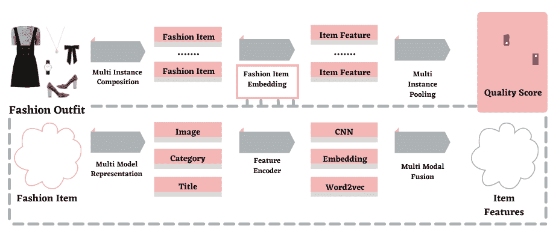
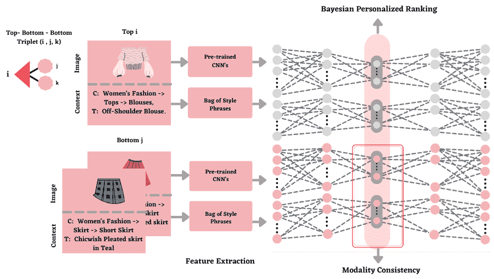
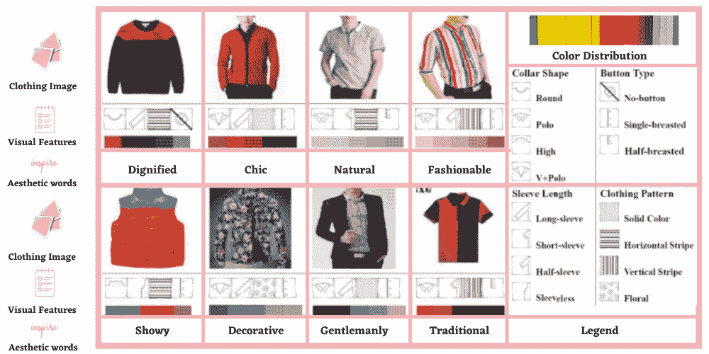
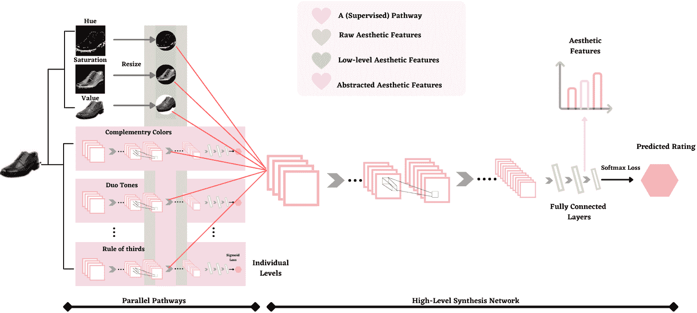
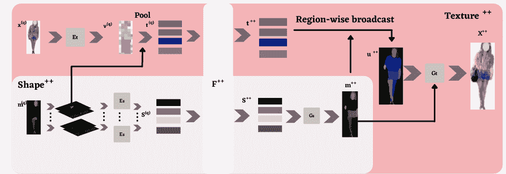
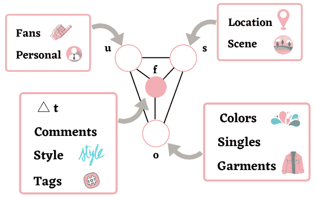
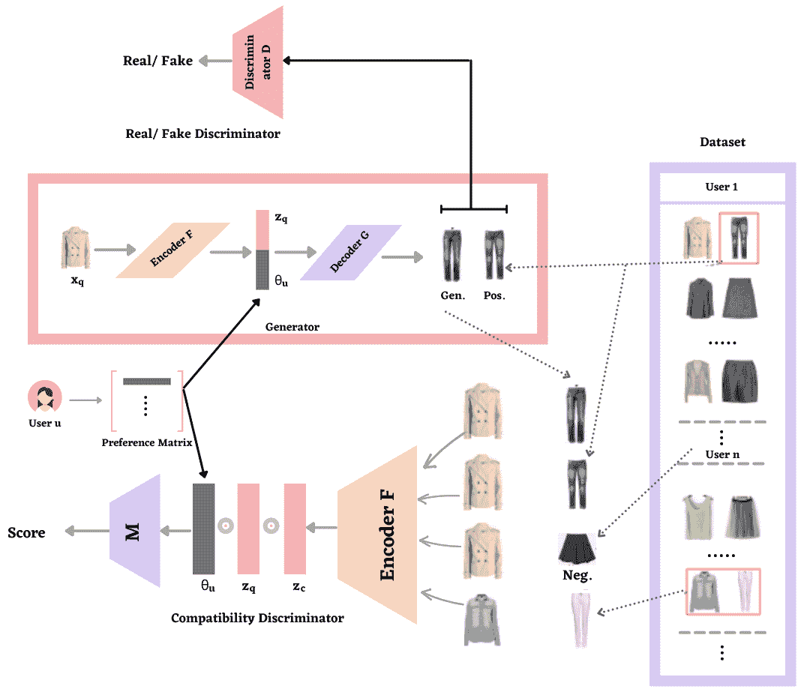
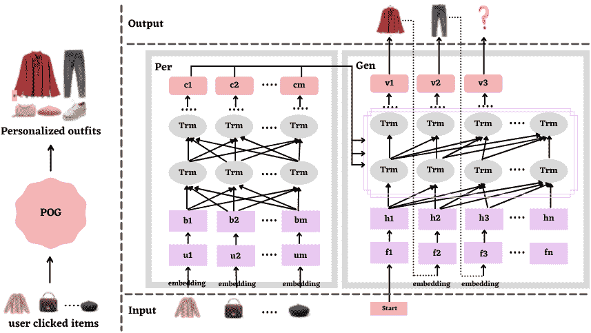

<!--yml

category: 未分类

date: 2024-09-06 19:57:10

-->

# [2101.08301] 美学、个性化与推荐：时尚深度学习的调查

> 来源：[`ar5iv.labs.arxiv.org/html/2101.08301`](https://ar5iv.labs.arxiv.org/html/2101.08301)

# 美学、个性化与推荐：时尚深度学习的调查

龚伟 weigong@ustc.edu.cn 中国科学技术大学中国合肥包河区金寨路 96 号 230026 和 拉伊拉·哈立德 laila@mail.ustc.edu.cn 中国科学技术大学中国合肥包河区金寨路 96 号 230026（2020）

###### 摘要。

机器学习正在彻底改变时尚行业的趋势。从大型品牌到小型品牌，每个品牌都在使用机器学习技术来提高收入、增加客户并保持领先于潮流。人们对时尚充满兴趣，他们希望了解什么样的穿着效果最好，以及如何改善自己的风格和提升个性。既然系统已经在监控每一笔销售和即将到来的趋势，为什么不利用这些系统的力量来获得关于穿着的推荐呢？通过使用深度学习技术并将其与计算机视觉技术相结合，可以利用脑启发的深度网络、参与神经美学、与生成对抗网络（GAN）合作、训练它们、处理非结构化数据以及融入变换器架构等方式来实现。这些都是与时尚领域相关的一些亮点。关键在于设计一个可以提供时尚信息的系统，以应对不断增长的需求。个性化是影响客户消费选择的重要因素。调查还展示了显著的方法，通过深入探讨如何将视觉数据解读并应用于不同的模型和方法。美学在服装推荐中起着至关重要的作用，因为用户的决策在很大程度上取决于服装是否符合他们的美学要求，而传统的图像特征无法直接反映这一点。为此，调查还突出了一些显著的模型，如张量分解模型、条件随机场模型等，以满足在服装推荐中考虑美学因素的需求。这些受 AI 启发的深度模型可以准确识别哪种特定风格最能引起客户的共鸣，并使他们能够了解新设计如何融入社区。通过 AI 和机器学习，您的企业可以保持领先于时尚趋势，精确地满足客户的需求及其时机。

深度学习、神经网络、时尚、美学、推荐、个性化^†^†版权：acmcopyright^†^†期刊年份：2020^†^†doi：尚未提供^†^†期刊：JACM^†^†期刊卷号：00^†^†期刊期号：0^†^†文章编号：111^†^†出版月份：0^†^†ccs：计算方法 计算机视觉^†^†ccs：应用计算 在线购物^†^†ccs：计算方法 神经网络

## 1\. 引言

回顾过去十年，我们看到深度学习在许多热门行业和领域取得了显著成功。我们观察到，包括视觉物体识别、文本理解和语音识别在内的感知任务，如何在不同领域引发了革命。深度学习的成功是无法相比的。然而，如果我们想讨论时尚行业中的深度学习，从实际角度来看，我们会发现许多仍然可以研究和开发的机会和领域。众所周知，时尚是一个不断发展的行业。每一秒钟都有新的趋势出现。尽管服装设计是当代世界中最具创意的领域之一（Insight, [[n.d.]](#bib.bib22)），无论是因为设计过程中的创意部分还是关于服装的信息模糊性，事实仍然存在。互联网购物在过去几年中也取得了惊人的增长，时尚创造了巨大的机会。图像理解、检索和标记的应用正在兴起，还有许多不同的应用领域可以利用。例如，文本分析、图像分析和相似性检索可以应用于时尚。因此，深度学习是我们可以用来训练计算机执行类似于人类任务的一个方面，比如识别语音、识别图像或进行预测。例如，服装设计和时尚行业中描述的结果允许用户将图像转换为文本，这可能被解释为根据草图对服装的描述。

我们还知道，图像是一个重要的方面，因为它们展示内容并传达情感，如悲伤、兴奋、愤怒等。因此，有效的图像分类是有益的，显然，它已经在多媒体计算机视觉中被使用。然而，如果你找到关于时尚研究，特别是在美学特征或个性化方面的研究，你会发现只有少数几个特定的方向。其中一个方向是描述受艺术理论启发的图像，这些图像直观、具区分性且易于理解。因此，我们知道，基于这些特征的有效图像分类可以实现比最先进技术更高的准确性。在这方面，我们以论文（Wang，2013）为例，其中他们开发了一个情感引导的图像画廊来展示所提出的特征集合。因此，作者从艺术理论的角度挖掘了直接影响人类情感感知的可解释视觉特征。

另一个例子在另一篇论文（Borràs 等，2003）中讨论了基于内容的图像检索是如何根据人们的外貌进行的。这是一个两阶段的过程，由图像分割和基于区域的解释组成。图像建模是通过属性图和遵循分裂与合并策略的混合方法实现的。在计算机视觉领域，特别是图像检索的工作有很多不同的内容，图像检索通常是一个公式，涉及结合显著特征，如颜色、纹理、形状等的描述。

现在，越来越多的零售公司试图了解趋势，保持领先，因为他们希望在实施前沿技术方法和解决方案的同时重塑业务。数据分析为公司带来了多样的机会，使他们能够实现客户目标，并为客户提供更智能的体验。但问题是，缺乏基于可靠统计数据的深刻洞察是时尚零售商面临的主要挑战。因此，计算机视觉技术和深度学习可以派上用场。正如我们所知，计算机视觉仍然是一个不断发展的技术，因此我们可以讨论一些特定的优化和成本降低技术，例如，了解人们穿着什么，客户如何搭配他们的服装，以及什么或谁影响他们的品味，对于时尚零售商至关重要。正如我们所看到的 Instagram 网红，许多人跟随他们并试图模仿他们的趋势，他们激励了大量的追随者。图像识别技术也帮助企业主收集数据、处理数据，并获得可操作的见解，以便有效预测趋势。

在这篇特别的文章中（ELEKS，[[n.d.]b](#bib.bib11)），我们看到他们开发的仪表板允许查看某一特定类型的服装在一天中的出现频率。例如，了解某种服装在特定年龄段中的流行程度，或人们如何搭配他们的衣服。例如，某种特定的夹克为何会流行，或者为何它在青少年中受欢迎？又或者为何围巾在长者中受欢迎。他们开发了图表，展示了某些流行类型的服装在下一个季节中的趋势，这可能会对即将到来的时尚趋势产生广泛影响。这种分析还旨在帮助时尚零售商和品牌规划销售，并学习如何避免过剩。作者建议，在视觉搜索领域，主要关注图像相似性，例如电子商务和在线商店，以及理解服装图像，这远不只是将它们分类。因为如果你不能获得对整个图像的有意义描述，那么你将失去许多可能会派上用场的信息。通过这种方式，人们可以获得关于任何地点的时尚趋势的可靠和及时的见解。定义这些趋势的是人们独特的选择，比如他们如何选择某样东西以及与他们的个性相匹配。个性化元素是服装推荐中最大的变革因素之一。通过瞄准这一因素，企业可以吸引更多的客户。

我喜欢这个深度学习方面的原因是它深入到了人类创造力传统上主导的行业和活动中。它为时尚、艺术、建筑和音乐等领域增添了未来感。另一篇论文（ELEKS, [[n.d.]a](#bib.bib10)）的关键发现是卷积神经网络中内容和风格的表示是可分离的。也就是说，我们可以独立操作这两种表示，从而生成新的、有感知意义的图像。如果你观察一下，时尚是机器学习的一个全新方向。因此，设计服装的人应该了解技术机制，比如某些风格如何出名，它们具备什么吸引数百万追随者的特点，以及什么因素导致时尚趋势的传播、原则和模式的演变，从而简化设计或预测趋势的任务。正在讨论的论文中，作者建议得益于一种新的神经网络类别，设计或预测趋势现在可以得到简化。这些网络基本上可以自动分配服装的形状、元素和类型，并进一步组合它们。这让你可以全新地操控模式，观察哪些模式比其他模式更具影响力。美学在用户选择中发挥着至关重要的作用，尽管个性化很难处理，但美学却不是。因为每个人都欣赏令人赏心悦目的物品，如果我们能在时尚推荐中操控美学的作用，我们可能会取得巨大成功。

因此，深度学习可以提升和帮助我们改进时尚的许多方面。我们可以通过多个领域来改进现有元素，并预测和革新这个行业。本调查分为以下几个部分。第二部分回顾了时尚推荐系统和方法，这些方法名列前茅，并为未来的工作奠定基础。第三部分阐述了美学在时尚中的定位，包括各种方法的分析。第四部分概述了时尚中的个性化，涵盖了包括深度神经网络、生成对抗网络（GAN）和处理非结构化数据在内的不同顶级方法。第五部分展示了选定的应用和可以进一步研究的未来方向。最后，第六部分提供了结论性意见。

## 2\. 推荐系统

如果你深入研究对象识别，你会发现时尚感是更微妙和复杂的，这可能需要特定领域的搭配专业知识。例如，如果你将搭配视为一组衣物共同作用以实现特定风格或找到好的搭配组成，我们需要的不仅仅是遵循适当的穿衣指南，还可以在平衡颜色和不同风格的对比中有创造性方面。而尽管我们已经看到相对较多的研究主要基于服装检索和推荐，但我们看到的是，没有一个研究考虑了时尚搭配的问题。一方面，时尚概念往往是微妙和主观的，如果不是时尚专家，普通标注者很难达成共识。另一方面，描述时尚可能有大量的属性。

### 2.1\. 端到端深度学习方法应用于集合数据。

获取全面的标签用于训练是具有挑战性的。因此，大多数现有研究通常仅限于检索类似服装或为特定事件选择个别服装的简单场景。因此，被审阅的论文（Li et al., 2016）提出了一种数据驱动的方法来训练一个可以自动组合合适时尚搭配的模型。这种方法受到在线时尚潮流激增的影响，包括 Pinterest 和 YouTube，以及青少年沉迷于这些网站上创造每一个新文化趋势的现象。

#### 2.1.1\. 背景

基本上，他们所做的是开发了一个完全自动化的组合系统，该系统基于一个评分器，通过反复评估所有可能的搭配候选项。但这个模型面临一些挑战，需要寻找可能的解决方案。例如，他们遇到的一个挑战是时尚图像的复杂视觉内容？你知道，可能有很多不同的属性，如颜色、纹理、类别和光谱等，几乎不可能标记或列出所有可能的属性。因此，这成了一个障碍。第二个挑战是时尚搭配的丰富背景，例如，服装搭配可以反映当前的个性和兴趣。因此，如果一种风格对特定群体或文化可接受，可能对其他人来说则是冒犯性的。为了推断这些信息，他们考虑了不仅仅是像素信息，还包括时尚输出中的上下文信息。

#### 2.1.2\. 提出的方法

基本上，对于这些挑战，他们提出了不同的解决方案。例如，对于第一个挑战，他们建议使用一种端到端的系统，通过深度卷积网络对视觉特征进行编码，这种网络可以将时尚服装作为输入，进行处理，并预测用户参与度水平。而对于第二个挑战，他们使用了一种多模态深度学习框架，这种框架利用了来自图像本身的上下文信息，他们的实验表明，多模态方法显著优于单一模型，并为时尚服装评分任务和完整组合任务提供了更合适、更可靠的解决方案。这些是他们列出的贡献，他们基本上提出了一个端到端的可训练系统，以融合来自多级混合模态的信号，包括图像和时尚物品的元数据，并且他们还收集了大量用于时尚服装相关研究的数据库。最后，他们提出了一种基于可靠的服装质量预测器的时尚服装组合解决方案，预测时尚从来都不容易，但他们提出了这一点，因为许多显性或隐性因素都影响着这一过程，问题的组合性质也使得这一领域非常有趣，并且这是对最先进机器学习系统的一次挑战。

图 1\. 提出的时尚服装评分模型

### 2.2\. 基于隐性反馈

众所周知，时尚领域具有许多引人入胜的个性化特性，这使得个性化推荐比传统领域更加困难。因此，为了避免潜在的偏差，例如使用显式用户评分，这些评分也相当昂贵。

#### 2.2.1\. 背景

这篇论文（Nguyen et al., 2014）基本上提出了通过分析用户在应用程序中的隐性反馈来进行时尚推荐的工作。基本设计标准是系统应完全无干扰，因此推荐系统不能依赖于显式的评分，而是基于用户与应用程序之间的丰富历史和互动。简单来说，它依赖于隐性反馈，也就是说，用户的偏好需要从行为中自动推断。

尽管这种方法仍面临一些挑战，即用户与项目的最显著互动是兴趣的标志，因此系统从未收到负面反馈。当然，一个项目可以既被点击又被喜爱，因此它也是多方面的，不同类型的反馈必须组合成一个单一的数值，如实验中所定义的。为推荐算法设置一个偏好评分。与显式评分系统相比，评估这样的系统是困难的，因为系统没有目标评分可以用来与其预测进行比较。因此，总体成功基本上依赖于隐含反馈系统，该系统具有明确的策略来从隐含反馈数据中推断用户偏好，将不同类型的反馈组合成隐含评分，然后通过使用合适的指标来评估这些评分和推荐。

#### 2.2.2\. 提议的方法

基本上，作者为了构建这个推荐系统，首先生成了隐含的偏好评分，将用户与项目互动中捕获的数据转换为一个具体的数字，这个数字可以称为隐含偏好评分，之后可以用来与其他项目进行排序。在这个过程中，创建这些数字的关键是理解可用的数据及其对用户偏好的影响。一旦你可以分析数据，就可以选择适当的一般化方法。第二步是定义惩罚函数。在时尚领域，系统必须捕获的重要属性包括季节和趋势、价格敏感性以及受欢迎程度。一般来说，当用户$u$触发事件$e$（例如点击）时，我们有一系列可能的评分来给这个事件。我们用$S_{e}$来表示这个评分，并用$m_{e}$和$M_{e}$分别表示事件$e$的最低和最高评分。然后，我们使用惩罚函数$p_{u}(x)$，它接受一个特征值$x$（例如，与项目价格相关），并返回一个在 0 到 1 之间的数字，以调整评分在可能范围内的位置。

|  | $S_{e}=M_{e}-\left(M_{e}-m_{e}\right)\cdot p_{u}(x)$ |  |
| --- | --- | --- |

如前所述，时尚完全依赖于趋势和时机，因此事件的最近性自然是决定事件重要性的一个特征，因此需要对用户最近没有考虑过的项目进行惩罚。为此，他们查看了自用户完成某项事件以来的天数。假设我们用$x$来表示这个事件。然后将其与用户数据库中的旧事件进行比较，这个旧事件可以用$F_{u}$来表示。

因此，后来可以知道，强制创建线性惩罚，让 $p_{u}(x)=x/F_{u},$ ，但这与季节的理念不太契合。例如，即使一个商店可能从 11 月到 3 月销售暖衣，他们仍然希望在季节变化时将推荐重点放在夏季衣物上。因此，他们必须有点类似于复制这种行为，并选择一个 sigmoid 函数，考虑到最近性，以一种可能遮蔽那些已离开应用程序一段时间的用户偏好的方式。因此，他们使用了线性惩罚，因为这可以确保两个最近物品之间的惩罚差异等于两个旧物品之间的差异。

图 2\. 应用程序的屏幕截图。由左到右：编辑信息、产品详情和“收藏列表”。

因此，为了价格，他们所做的是，不同的用户有不同的价格范围，因为他们往往对价格敏感。如果一个物品的价格也需要考虑，那么他们所做的是使用用户典型的价格范围，这就创建了一个个性化评分，并对那些不在用户首选价格层次范围内的物品进行了惩罚。因此，这个过程基本上分为两个简单的步骤。在第一步，他们找到所有与用户相关的价格项目的平均值，在第二步，他们计算了物品 $i$ 的价格与平均值之间的差异，然后用这个差异来惩罚该物品。关于他们使用的第三个方面是流行度。因此，在流行度方面，他们考虑了流行度作为一个特征，通过将用户行为与其他人群进行比较。我们可以这样说，如果一个用户的活动符合可能是他或她的品味的普遍标准，那么它更具唯一性，可以为推荐的物品提供重要线索。因此，他们基本上通过查看物品的整体流行度来判断每个用户的行为。他们与物品进行了交互，并对具有不同流行度的物品使用了线性惩罚。

最后，他们将所有这些不同的惩罚结合起来，总结了所有模型，这要求为不同因素设置不同的权重。因此，他们所做的就是为了验证他们的方法，使用了基于特征的评分，这就是时尚领域的事件，其次，他们将评分分布到一个完整的有效评分范围内，并且平均值确认了假设。

### 2.3\. 基于弱外观特征

我们知道，在线购物技术发展迅速，时尚行业已引入了在线试衣和其他智能服装设备。许多先进的算法已经开发出来，目前还有许多在开发过程中。

#### 2.3.1\. 背景

例如，CRESA (Melo et al., 2015) 结合了文本属性、视觉特征和人类视觉注意力来组成推荐中的服装档案。基于内容的推荐通常适用于多个地区。因此，对于新项目，比如说如果用户有个人浏览记录，他们可以推荐经过验证的显式且可访问的结果，但基于内容的推荐通常在行业应用时是不适当的。显然，这意味着新注册的用户将不会根据浏览记录获得任何推荐。

#### 2.3.2\. 提出的办法

基本上，这篇论文（Zhang et al., 2017）提出的是分类过程通常需要考虑季度销售服装风格和其他因素。因此，他们基本上将其分为四类，其中时尚水平是一种主观方法，通常需要通过专家组对图像特征进行主观评价。因此，涉及了边缘专家的知识背景和心理动机。至于视觉心理特征的研究人员，尚无量化描述方法使得客观评估结果能代表主观评价结果。因此，本研究旨在找出一套客观指标，可用于评估时尚水平。这是通过考虑通常影响个人评分的所有因素来完成的。因此，本文基本上将弱外观特征视为能够影响时尚水平的重要指标。正如你所知道的，许多与个人时尚水平相关的弱外观特征。但三大主要类别可以总结为化妆、配饰和发色。这可以包括腮红、唇色、眉毛颜色、帽子、手腕和颈部上的任何配饰等。通过利用这些特征，他们使用了 SVM 分类方法，并根据人体是否具有弱外观特征进行评估。因此，没有有效的方法来建立时尚水平数据库。但本文建立的数据库是未来研究者可以进一步研究的基础。因此，图像数据库在所有这些算法训练和测试中具有非常重要的意义。

图 3\. 基于弱外观特征的时尚水平分类框架。

对于弱特征索引的提取，当前的面部检测方法通常分为基于知识的方法和基于统计的方法。因此，为了提取弱面部特征，他们找到面部特征点，然后使用面部识别。这篇论文主要采用了自适应增强方法来进行面部特征定位。其背后的理念是必须经受大量不成功的训练样本，使算法在后续研究中集中学习困难的训练样本，最终将算法选择的多个弱分类器加权并添加到强分类器中。

表 1\. 客户时尚水平分类。

| 时尚水平 | 描述分类 |
| --- | --- |
| 第一层级 | 极好 |
| 第二层级 | 很好 |
| 第三层级 | 好 |
| 第四层级 | 一般 |

表 2\. 弱外观特征目录。

| 类别 | 弱特征索引 |
| --- | --- |
| 化妆 | 眉毛、腮红、嘴唇、眼影 |
| 配饰 | 项链配饰、手部配饰、胸针、指甲、帽子 |
| 发色 | 红色、黄色、绿色、蓝色、棕色、黑色、灰色、白色 |

总的来说，这篇论文的工作是利用外观弱特征来描述消费者的时尚水平，并通过比较科学实验和专家评估得出结论。因此，这项研究涉及了两种评估类别。基本上，用户的时尚水平是根据他们的化妆、佩戴的配饰以及发色来确定的。如果一个人喜欢红色头发或者化了很多妆，他们可以评估出这个人更喜欢时尚。基于他们的时尚水平，他们会推荐他们喜欢的东西。例如，如果某个人喜欢深色眼影和深色唇彩，并且头发有一些挑染，这些可能表明其时尚水平较高，他们会相应地推荐产品。

### 2.4\. 语义属性区域引导方法

许多多个语义属性构成了时尚产品，例如袖子、领子等。因此，在做出关于服装的决策时，许多关于不同语义属性的偏好，如 V 领、高领或尖头鞋、高跟鞋等，往往被忽视。语义属性不仅可以让你了解如何生成产品的全面表示，还可以帮助我们理解用户偏好的运作方式。但不幸的是，设计高效解决方案来整合语义属性信息以实现时尚推荐，并没有独特的挑战。

#### 2.4.1\. 以往方法

在没有手动属性标注的情况下，尤其是在大规模电子商务中，获取语义属性特征是非常困难的。另一方面，如果用户的偏好基本上是经典或复杂的，而传统方法通常需要将项目图像直接转换为向量。这两个方面使得用当前推荐模型解释推荐结果变得非常困难。另一方面，基于这些方面，很难生成具有解释性的推荐结果（Wu et al., 2019; Kang et al., 2017; Xu Chen, 2018），这些模型目前在行业中被使用。

#### 2.4.2\. 提议的方法

因此，论文（Hou 等，2019）基本上提出了一种新颖的语义属性可解释推荐系统，作为一种细粒度的可解释空间，介绍了每个维度对应的语义属性。因此，他们将用户和物品投射到这个空间中。用户的细粒度偏好可以生成可解释的推荐，特别是如果他们首先开发一个语义提取网络，可以用来提取区域特定的属性表示。然后，通过这个网络，每个项目被投射到语义属性空间中，从而可以轻松捕捉语义属性的多样性。设计方面包括一个细粒度偏好注意力 FPA 模块，它基本上自动匹配用户在空间中每个给定属性的偏好，并将所有这些属性与不同的权重进行聚合。因此，每个属性都有自己的权重，最终结果是他们在贝叶斯个性化排序 BPR 框架中优化了 SAERS 模型，这不仅显著提升了并超越了几个基线模型在视觉推荐任务上的表现，还通过以个性化的方式突出属性语义提供了解释性见解。基本上，他们所做的是，之前我们知道这些尝试旨在捕捉用户的视觉偏好，但为了提供推荐的机构解释，它们在物品层面上非常有限。因此，论文进一步探讨了用户在视觉属性层面的偏好。

表 3\. 方法中使用的语义属性列表

| 分类 | 属性：类别 |
| --- | --- |
| 上衣 | 高领：荷叶边半高领、立领，… |
|  | 领子：罗纹领、清教徒领，… |
|  | 翻领：有缺口、披肩、无领，… |
|  | 领口：V 领、方领、圆领，… |
|  | 袖长：无袖、短袖、短袖，… |
|  | 身长：高腰、长款、常规，… |
| 下装 | 裙长：短裙、膝盖、 midi 裙、脚踝，… |
|  | 裤子长度：短裤、中裤、7 分裤、裁剪裤，… |
| 鞋子 | 跟高：平跟、1 英寸-7/4 英寸、低于 1 英寸，… |
|  | 靴子高度：踝靴、膝盖高、及膝，… |
|  | 闭合方式：系带、套穿、拉链，… |
|  | 鞋头风格：圆头、尖头、开口、开放，… |

借助他们的语义属性可解释推荐系统，他们基本上填补了差距，利用了一个新的语义属性视觉空间，其中每个维度代表一个属性，该属性对应于通常被分割成多个语义属性的衣物的区域，通过提取网络提取后，随后被投影到视觉空间中。因此，用户会根据对服装属性的细粒度偏好进行投影。这一切使他们能够轻松地在语义特征空间中获得时尚项目的投影。然后，他们可以使用 FPA 将用户投影到相同的语义特征空间中。这里 FPA 是细粒度偏好注意力，它们在一对一学习框架下共同学习全球视觉空间和语义属性视觉空间中的项目表示。通过这种方式，他们能够生成可解释的推荐。

### 2.5\. 使用对抗特征变换器的补充推荐

传统的补充产品提示方法依赖于行为和不可见的事实以及消费者的共同观点或共同购买。然而，正面的域名和风格通常是可见的。推荐算法对许多商业应用至关重要，特别是在在线购物中。在域名和风格中，客户正在寻找能够视觉上补充他们现代服装、风格和衣橱的服装提示。这是传统方法无法满足的需求。

#### 2.5.1\. 先前的方法

现在我们看到，传统的基于内容和协同过滤的推荐算法（Adomavicius 和 Tuzhilin，2005；Lew 等，2006）已经存在。但在这些协同过滤方法中（Koren 和 Bell，2015；Melville 等，2002）是常见的，它们主要依赖于行为和历史数据，如共同购买、浏览和过去的购买，以向客户推荐新项目。因此，这项工作主要是根据视觉线索为给定的查询项目提供补充项目推荐。

#### 2.5.2\. 提出的方案

基本上，本文（Huynh 等，2018）提出了一个框架，在这个框架中，他们以无监督的方式利用视觉线索，以学习现实世界图像中共现互补项之间的分布。该模型运行是源类别和目标互补项类别之间的非线性变换，例如，一套服装中的上衣和下装。通过在大型数据集上训练，他们直接在特征表示空间上训练生成对抗变换网络，仅将其作为对抗优化问题处理。现在，这种条件生成模型可以为给定的查询项在特征空间中生成多个新颖的互补项样本。为此，他们开发了一种无监督学习方法，通过对抗特征变换 CRAFT 来进行互补推荐，学习真实图像中物品对的共现。假设是物品对的共现频率在某种程度上是其互补关系的强指示。因此，论文建议定义并对抗性地训练条件生成变换网络，然后通过观察真实分布中的样本来学习物品对的联合分布。

他们的方法在某种程度上是相当新颖和独特的，因为他们利用了生成对抗训练，相比于传统的生成对抗网络（GAN）（Goodfellow 等，2014）图像生成具有几个优势。我们知道，使用 GAN 生成的视觉图像质量已经有了很大改善，但仍然缺乏许多实际应用所需的现实感，时尚服装就是其中之一。更重要的是，我们看到他们在某些应用类型中的推荐系统目标往往不是生成合成图像，而是必须从物品目录中推荐真实图像。现在我们知道，生成合成图像的方法仍需进行搜索，这通常通过在特征空间中搜索以找到目录中最相似的图像来完成。CRAFT 直接生成这些推荐项的特征，绕过生成合成图像的需求，从而实现更简单和更高效的算法。因此，通过在特征空间中工作，他们可以使用更简单的网络架构，从而提高训练期间的稳定性，避免常见的陷阱，如模型崩溃（Che 等，2016）。

图 4\. 使用提出的 CRAFT 网络生成推荐。

#### 2.5.3\. 网络架构

网络架构基本上包含几个步骤，首先是选择适当的源图像和目标图像的视觉表示。接下来，他们所做的就是编码，这些固定的特征表示通常来自预训练的 CNN。通常建议使用应用特定的特征表示，例如用于服装推荐的服装特征嵌入，但像在 ImageNet（Deng et al., 2009）或 MS-COCO（Lin et al., 2014）上训练的通用表示也提供了不错的高效替代方案。如图所示，源特征编码器 $E_{s}$ 和目标特征编码器 $E_{t}$ 分别是固定的，并用于生成用于训练和推理的特征向量。现在，这个架构类似于传统的大型设计，有两个主要组件，条件特征变换器和鉴别器。特征变换器的作用是将源特征 $s_{q}$ 转换为互补目标特征 $\hat{t}_{q}$。变换器的输入还包括一个从 $d_{z}$ 维空间的单位球面上均匀采样的随机噪声向量 $z$。根据设计，变换器是生成式的，因为它能够在目标领域中采样各种特征。

由于变换器由几个全连接层组成，每个层后面跟着批量归一化（Ioffe 和 Szegedy，2015）和泄漏 ReLU（Maas，2013）激活层。鉴别器在能力上与变换器相当，由相同数量的层组成。这有助于在两玩家博弈中平衡变换器和鉴别器之间的力量，从而实现稳定的训练和收敛。

从查询图像中，查询特征 $f$ 由源编码器 $E_{s}$ 提取，并通过采样随机向量 $\left\{z_{i}\right\}$ 生成多个转换特征样本 $\left\{\hat{t}_{i}\right\}$。基本上，它允许生成多样化的互补推荐，通过采样潜在的条件概率分布函数来实现。当他们在使用与训练期间相同的目标编码器 $E_{t}$ 提取的预索引目标特征集内进行最近邻搜索时，通过反向查找将选择的特征映射到原始目标图像，从而检索实际的推荐图像。

图 5\. 针对常见查询项（深色牛仔裤）的互补推荐

#### 2.5.4\. 性能评估

CRAFT 中的特征变换器从条件分布中采样，为给定查询生成多样化和相关的项目推荐。领域专家更喜欢 CRAFT 生成的推荐，而不是竞争方法生成的推荐。

### 2.6\. 神经兼容性建模

现如今，时尚社区在线，我们可以看到许多时尚专家公开分享他们的时尚建议，展示他们的搭配如何运作，每件单品，无论是上衣还是下装，通常都有图片和上下文元数据标题与类别。凭借如此丰富的信息，时尚数据为我们提供了调查服装搭配规则的机会。现在我们知道颜色、材料和形状是影响时尚单品兼容性的几个方面，每个时尚单品涉及多个模态，如果我们注意到时尚单品之间的搭配关系相当稀疏，那么矩阵分解方法就不适用了。

图 6\. 所提方案的示意图。他们使用了一个双重自编码器网络来学习潜在兼容性空间，在这里，他们共同建模了视觉和上下文模态之间的连贯关系，以及通过贝叶斯个性化排序在单品之间的隐含偏好。

#### 2.6.1\. 先前的方法

在这些时尚方面的最新进展已经取得，但之前的模型（Iwata et al., 2011; Hu et al., 2015; McAuley et al., 2015; Liu et al., 2012）在处理该主题时存在不足。

#### 2.6.2\. 提议的方法

因此，本文（Song et al., 2017）提出了一种基于内容的神经网络方案，该方案基于贝叶斯个性化排序（BPR）框架建模时尚单品之间的兼容性。该方案共同建模了单品的模态之间的连贯关系及其隐含的匹配偏好。基本上，他们提出通过神经网络寻求非线性潜在兼容性空间，专注于建模时尚单品之间的复杂兼容性。他们还能够聚合时尚单品的多模态数据，并利用不同模态之间基本存在的固有关系，全面建模时尚单品之间的兼容性。

现在我们知道，直接测量来自不同空间的时尚物品之间的兼容性是不正确的，因为它们具有异质性。因此，作者假设存在一个小的兼容性空间，能够弥合异质时尚物品之间的差距，其中高度兼容的时尚物品共享相似的风格材料，这可以表现出高度的相似性或功能性也应表现出高度的相似性。例如，一件宽松的休闲 T 恤与黑色牛仔裤非常搭配，但与黑色西装却不搭，而一双高筒靴更倾向于搭配紧身牛仔裤而不是喇叭裤。因此，他们进一步假设细微的兼容性因素存在于一个高度非线性的空间中，这可以通过先进的神经网络模型来学习。因此，他们采用自编码器网络来学习这个潜在空间，这在潜在空间学习中已经被证明是有效的。(Wang et al., 2016)

为了充分利用上衣和下装之间的隐式关系，他们基本上采用了 BPR 框架，并假设来自正集合 $\mathcal{B}_{i}^{+}$ 的下装比那些未观察到的中性下装更适合上衣 $t_{i}$。根据 BPR，建立了一个训练集：

|  | $\mathcal{D}_{S}:=\left\{(i,j,k)\mid t_{i}\in\mathcal{T},b_{j}\in\mathcal{B}_{i}^{+}\wedge b_{k}\in\mathcal{B}\backslash\mathcal{B}_{i}^{+}\right\}$ |  |
| --- | --- | --- |

其中三元组 $(i,j,k)$ 表示下装 $b_{j}$ 比下装 $b_{k}$ 更兼容上衣 $t_{i}$

然后根据(Rendle et al., 2012)，他们得到了以下目标函数，

|  | $\mathcal{L}_{bpr}=\sum_{(i,j,k)\in\mathcal{D}_{S}}-\ln\left(\sigma\left(m_{ij}-m_{ik}\right)\right)$ |  |
| --- | --- | --- |

考虑到模态一致性，他们得到了以下目标函数：

|  | $\mathcal{L}=\mathcal{L}_{bpr}+\gamma\mathcal{L}_{mod}+\mu\mathcal{L}_{rec}+\frac{\lambda}{2}\&#124;\Theta\&#124;_{F}^{2}$ |  |
| --- | --- | --- |

其中

|  | $\mathcal{L}_{\text{rec}}=\mathcal{L}_{\text{rec}}^{v}+\mathcal{L}_{\text{rec}}^{c}$ |  |
| --- | --- | --- |

和

|  | $\mathcal{L}_{\text{rec}}^{v}=\Sigma_{(i,j,k)\in\mathcal{D}_{S}}\left(l\left(\mathbf{v}_{i}^{t}\right)+l\left(\mathbf{v}_{j}^{b}\right)+\right.\left.l\left(\mathbf{v}_{k}^{b}\right)\right)$ |  |
| --- | --- | --- |

和

|  | $\mathcal{L}_{rec}^{c}=\Sigma_{(i,j,k)\in\mathcal{D}_{S}}\left(l\left(\mathbf{c}_{i}^{t}\right)+l\left(\mathbf{c}_{j}^{b}\right)+l\left(\mathbf{c}_{k}^{b}\right)\right)\cdot\mu,\gamma,\lambda$ |  |
| --- | --- | --- |

是非负的权衡超参数。$\Theta$ 指代网络参数集（即 $\mathbf{W}_{k}$ 和 $\left.\hat{\mathbf{W}}_{k}\right)$。最后的正则项旨在避免过拟合。

## 3\. 美学与时尚

美学（Philosophy, 2009）这个词基本上是在 18 世纪被引入的，它被用来指代其他事物中的一种对象、一种判断、一种态度或体验以及一种价值。在 18 世纪，美学的概念通常源自于品味的概念。因此，18 世纪的品味理论部分地作为对理性主义兴起的修正，特别是应用于美和自我主义的兴起，特别是应用于美德。

### 3.1\. 映射关联

那么人们通常如何描述服装呢？有一些词汇，如非正式、休闲、正式、派对，它们通常被使用。但最近对视觉上可用的服装特征的识别或提取的关注则有些不同。

#### 3.1.1\. 背景

为了准确猜测这一点，论文中的作者（Jia et al., 2016）描述了一种弥合视觉特征与美学词汇之间差距的方法。他们基本上构建了一个新颖的三层框架：视觉特征（VF） - 图像尺度空间（ISS） - 美学词汇空间（AWS），并利用艺术领域图像尺度空间作为中间层。首先，他们提出了一种由相关标签引导的堆叠诊断自编码器 SDAEGCL，用于将视觉特征映射到图像尺度空间，然后计算语义距离，使用 Wordnet 相似性（Pedersen et al., 2004）。他们将人们在在线服装店中最常用的静态词汇映射到图像尺度空间。现在，他们使用从几个不同在线商店下载的上半身男装图片作为实验数据，并提出了一个三层框架，可以帮助捕捉视觉特征与美学词汇之间的关系。对于人们来说，穿着美观和得体非常重要，特别是针对用户输入的场合如婚礼、购物或约会，系统应该能够建议最适合的衣物，来自用户自己现有的服装。因此，另一篇论文（Liu et al., 2012）提到了类似的想法，在系统中明确考虑了两个标准：穿着得体和穿着美观，例如红色 T 恤与白色裤子比与绿色裤子更搭配，并基本上缩小了服装的低级特征与高级场合类别之间的语义差距。在支持向量机基础的推荐模型中，这些服装属性被视为潜在变量。然而，匹配规则无法全面揭示美学效果，且缺乏可解释性。

图 7\. 衣物图像及其对应的美学词汇示例。

#### 3.1.2\. 提出的方法

这篇论文（Jia 等人，2016）的基本目标是弥合衣物的视觉特征与美学词汇之间的差距。为了捕捉它们之间的内在和整体关系，论文引入了一个中间层、过渡层，并形成了一个基于 Kobayashi 提出的理论（Kobayashi, [[n.d.]](#bib.bib34)）的全新三层框架。在艺术设计中应用了二维空间的 warm-cool 和 hard-soft 方面。

论文的贡献在于通过提出一个三层框架，建立了衣物图像与美学词汇之间的关联。这个框架利用了二维连续图像尺度空间作为一个中间层，具有非常强的描述能力，从而促进了对美学效果的深刻和高层次理解。其次，论文提出了一个由相关标签指导的堆叠去噪自动编码器 SDAEGCL，以实现视觉特征到图像尺度空间的映射，这可以修正初始输入中存在的随机误差，并充分利用标记和未标记数据的信息。此外，我们还可以发现，堆叠方法通过增加更多的隐藏层来提高模型的表示能力。

基本上，Kobayashi 提出了 180 个关键词，并将其分入 16 个不同的美学类别中，同时定义了它们在图像尺度空间中的坐标值。但在时尚中，有些词汇并不相关，例如 alert, robust, sad, happy。这些词汇不是我们通常用来描述衣物的。因此，作者首先手动删除了所有这些不常用的词汇，并建立了一个包含 527 个词汇的静态衣物词汇空间 $Y$。

现在，为了说明如何将美学词汇 $y_{i}\left(\forall y_{i}\in Y\right)$ 映射到图像尺度空间 $D$ 中。为了确定美学词汇 $y_{i}\in Y$ 的坐标值 $D_{y_{i}}\left(wc_{y_{i}},hs_{y_{i}}\right)$，作者们基本上首先定义了 180 个关键词作为关键词 ${}_{j}(j=1,2,\cdots,180)$，并使用 WordNet::Similarity 计算 $y_{i}$ 与每个关键词 [j] 之间的语义距离。然后，他们选择距离最短的 3 个关键词 $d_{i_{1}},d_{i_{2}}$ 和 $d_{i_{3}}$，将这 3 个关键词的坐标值标记为 $D_{i_{1}}\left(wc_{i_{1}},hs_{i_{1}}\right),D_{i_{2}}\left(wc_{i_{2}},hs_{i_{2}}\right)$ 和 $D_{i_{3}}\left(wc_{i_{3}},hs_{i_{3}}\right)$。之后，他们将距离的倒数 $rec_{i_{1}}$、$rec_{i_{2}}$ 和 $rec_{i_{3}}$ 作为权重（例如 $rec_{i_{1}}=\frac{1}{d_{i_{1}}}$），$D_{i_{1}},D_{i_{2}}$ 和 $D_{i_{3}}$ 的加权算术平均值也可以被视为 $y_{i}$ 的坐标值 $D_{y_{i}}\left(wc_{y_{i}},hs_{y_{i}}\right)$。公式如下：

|  | $wc_{y_{i}}=\frac{\sum_{k=1}^{3}wc_{i_{k}}\cdot rec_{i_{k}}}{\sum_{k=1}^{3}rec_{i_{k}}},hs_{y_{i}}=\frac{\sum_{k=1}^{3}hs_{i_{k}}\cdot rec_{i_{k}}}{\sum_{k=1}^{3}rec_{i_{k}}}$ |  |
| --- | --- | --- |

因此，他们的方法是，对于每个 $y_{i}\in Y$，他们基本上计算其在图像尺度空间中的坐标值 $D_{y_{i}}$，表示为 $\left(wc_{yi},hs_{yi}\right)$。为了用美学词汇对输入的服装图像 $v$ 进行标注，他们使用提出的 SDAE-GCL 来预测其在 $D$ 中的坐标值 $D_{v}\left(wc_{v},hs_{v}\right)$。然后，他们找到一个词 $y_{v}\in Y$，其对应的坐标值 $D_{yv}$ 与 $D_{v}$ 的欧几里得距离最短。因此，$y_{v}$ 可以被认为是图像 $v$ 的美学词汇。

### 3.2\. 类脑深度网络

现在我们知道，大多数现有方法依赖于传统特征来表示图像。这些特征可以通过卷积神经网络提取，如尺度不变特征、变换算法、颜色直方图等，但其中一个重要的特征类型是美学特征。正如我们之前讨论过的，它在服装特别是服装推荐中扮演着重要角色，因为用户在很大程度上依赖于服装是否符合他们的美学。

#### 3.2.1\. 以前的方法

我们在一些论文中看到（Han et al., 2017; Hsiao and Grauman, 2017; McAuley et al., 2015; Vasileva et al., 2018），这些论文推荐了针对未完成的服装搭配的不同时尚服装。但他们的目标与本文中的目标不同。那些研究主要关注干净的单件服装目录照片，推荐通常限制在从特定数据集中检索服装。那些推荐系统中唯一的特点是它们对服装的添加。大多数先前的时尚研究关注识别问题，如街头与商店匹配（Kalantidis et al., 2013; Kiapour et al., 2015; Yan, 2012; Vittayakorn et al., 2015）。而在本案例中，他们认为某些问题需要超越现有服装的寻找与添加，他们指出某些服装可能是有害的，应当移除，比如如何在完整的搭配中调整牛仔裤的裤脚或改进其风格的展示和细节。

#### 3.2.2\. 背景

为了弥合这一差距，虽然有许多不同的方法，但我们将讨论另一种方法（Yu et al., 2018），它引入了强烈的静态信息。该方法与用户偏好高度相关，应用于服装推荐系统。他们的基本做法是，通过在网络上进行预训练，提取出审美特征，该网络是一种受大脑启发的深度结构，用于审美评估任务。为了实现这一点，他们考虑了用户间显著不同的审美偏好，因为不同的人在审美上有不同的参考标准。因此，他们提出了一种新的张量分解模型，以非常个性化的方式整合静态特征。他们通过不同的实验展示了他们提出的方法能够捕捉用户的静态偏好，显著优于现有的最先进的推荐方法。通常，当我们在网上购物时，我们会在做出购买决定前查看产品图片，这些图片通常提供了包括设计、配色方案、图案结构等在内的大量信息。我们可以通过图片估计产品的厚度和质量。因此，产品图片在服装推荐任务中发挥了重要作用。本文作者利用这些信息，提升了现有服装推荐系统的性能。

图 8\. 受脑启发的深度网络（BDN）架构。

然而，关于审美的一个重要因素是，之前的研究中对此关注不多。基本上，虽然大多数用户对服装的关注点是产品应具备良好的外观，但作者使用静态网络来提取审美网络和 CNN 之间的相关特征。他们提出了一种受脑启发的深度网络，这是一种用于图像审美评估的深度结构，输入一些指示审美感觉的原始特征，如色调、饱和度、颜色、双色调、互补色等。这个网络从这些基本的原始特征中提取高级审美特征。

#### 3.2.3\. 提议的方法

这篇论文研究了 BDN，该方法用于捕捉整体特征，以表示服装的静态元素。由于不同的人喜欢不同的审美口味，论文为了捕捉不同消费者在不同时间的审美偏好多样性，利用了张量分解作为基本模型。目前，虽然有几种方法可以分解张量，但现有模型（Kolda 和 Bader, 2009; Rendle 和 Schmidt-Thieme, 2010; Sidiropoulos 等, 2016）存在一定的缺陷。因此，他们通过提出一个动态协同过滤 DCF 模型来更好地处理服装推荐任务，该模型通过耦合矩阵进行训练，以缓解稀疏性问题。之后，他们将模型与贝叶斯个性化排序优化标准结合，并在亚马逊服装数据集上评估了其性能。基本上，他们提出了一种新颖的 DCF 模型，用于以三个维度（用户、物品和时间）展示购买事件，并将审美特征纳入 DCF 进行训练。他们利用新的审美特征进行推荐，以捕捉消费者特定的审美偏好，并与若干传统特征进行对比，以证明审美特征的必要性。

为了说明将图像特征整合到基本模型 DCFA 中的混合模型，他们首先介绍了基本的张量分解模型 DCF。基本模型是时间对审美偏好的影响。因此，他们提出了一个上下文感知模型作为基本模型，以考虑时间因素。他们使用 P × Q × R 张量 a 来表示用户、服装和时间维度之间的购买事件。因此，如果用户 P 在时间区间 R 内购买了物品 Q。

然后${\mathrm{A}}_{pqr}$为 1，否则为 0。因此，张量分解被广泛用于预测$A$中所有缺失的 0 元素，这可以用于推荐。由于之前的模型存在一些局限性，他们提出了一种新的张量分解方法，其中用户通过决定一个产品来进行购买，主要有两个因素。第一个是产品是否符合用户的偏好，并且外观是否对特定用户有吸引力。第二个是时间是否合适，比如说在季节和时尚方面，例如，冬季衣物在夏季推荐时就不合适或不美观。因此，对于用户$p$、衣物$q$和时间间隔$r$，他们使用分数$S_{1}$和$S_{2}$来表示用户对衣物的喜爱程度以及衣物是否适合该时间。$S_{1}=1$时用户喜欢该衣物，$S_{1}=0$则不喜欢。类似地，$S_{2}=1$如果衣物适合时间，$S_{2}=0$则不适合。消费者仅在$S_{1}=1$和$S_{2}=1$时才会购买衣物，因此，$\hat{\mathrm{A}}_{pqr}=S_{1}\&amp;S_{2}$。为了使公式可微，他们大致将其公式化为$\hat{\mathrm{A}}_{pqr}=S_{1}\cdot S_{2}$。呈现的$S_{1}$和$S_{2}$以矩阵分解的形式：

|  | $\begin{array}[]{l}S_{1}=\sum_{i=1}^{K_{1}}\mathbf{U}_{ip}\mathbf{V}_{iq}\\ S_{2}=\sum_{j=1}^{K_{2}}\mathbf{T}_{jr}\mathbf{W}_{jq}\end{array}$ |  |
| --- | --- | --- |

其中$\mathrm{U}\in\mathbb{R}^{K_{1}\times P},\mathrm{V}\in\mathbb{R}^{K_{1}\times Q},\mathrm{T}\in\mathbb{R}^{K_{2}\times R}$和$\mathrm{W}\in\mathbb{R}^{K_{2}\times Q}$。预测结果为：

|  | $\hat{\mathrm{A}}_{pqr}=\left(\mathrm{U}_{*p}^{\mathrm{T}}\mathrm{V}_{\cdot q}\right)\left(\mathrm{T}_{*r}^{\mathrm{T}}\mathrm{W}_{*q}\right)$ |  |
| --- | --- | --- |

我们可以看到，在方程中，与用户和衣物相关的潜在特征与与衣物和时间相关的特征是独立的。虽然$K_{1}$维向量$\mathrm{V}_{*q}$和$K_{2}$维向量$\mathrm{W}_{*}q$都是衣物$q$的潜在特征，但$\mathrm{V}_{*q}$直观地捕捉到用户的偏好信息，而$\mathrm{W}_{*}q$则捕捉到衣物的时间信息。该模型在捕捉购买中相关模式方面更具表现力。此外，与塔克分解相比，该模型高效且易于训练。

### 3.3\. 极简方法

我们知道产品的物理属性对购买行为的影响非常大。（Streamoid，[[n.d.]](#bib.bib57)）我们也知道，当我们购物时，审美直觉起着重要作用。所以实际上可能是，购物者在每个产品上做出多个决策，不过可能并不自觉，例如，他可能喜欢产品的风格但不喜欢颜色。我们生活的各个方面都会影响我们的穿衣风格。我们穿的每一种外观都向别人讲述着一个不同的故事。所以基本上，它传达了一种特定的形象表达，被其他人在他们自己的文化背景中解读。所以在一个特定的社会中，衣服的美学可能是相似的。

#### 3.3.1. 背景

当我们看到一件衣服时，我们通常会关注哪些主要内容呢？例如，我可以穿吗？适用于什么场合？它给我带来怎样的感觉？另外，还有一个很明确的偏好，也包含在这方面，那就是它如何反映自己的个性。这些只是我们在购物时和想要穿着外观美观的衣服时经常问自己的一些问题。但是在这个新的现代时代中，我们已经看到简约主义渗透到了生活的方方面面，人们倾向于向更简单但外观美观的版本迈进。正如可可·香奈儿所说：

“在离开家之前，面对镜子并摘掉一件事物”

因此，在已经使用过的衣服上进行最低限度的修改可以改变现有衣服并提高其时尚性。它可以是去除一个配饰，选择一个领口更高的衬衫，或者仅仅是把衬衫塞进裤子里或者仅仅是把裤子换成深色。所以这些小调整都对更多人或自己的穿着造型起到了更加时尚和美观的作用。

#### 3.3.2. 提出的方法

基于这些观察，本文作者（Hsiao 等人，2019）在时尚装备改进方面进行了最小限度的修改。所以对一个装备进行最小限度的编辑，并得到一个算法，必须对轻微但明显改善整体时尚性的服装和配饰进行调整。基本上，他们所做的是，最小限度的修改不一定严格地最小化改变的数量，而是逐渐地对装备进行调整，而不是从零开始。所以基本上，它可以是有关你需要更换或脱掉或更换的衣服的建议，或者仅仅是以更好的方式穿着同样的衣服。

众所周知，服装时尚往往是直观的，通常是个人习惯性的风格，但不清楚哪个视觉刺激在服装和时尚趋势的更新中具有更高或更低的意义或影响。因此，另一篇论文（Zou et al., 2016）中采用了机器学习技术来分析不同服装时尚的视觉刺激对时尚趋势的影响，特别是他们提出了一种基于分类的模型，量化了不同视觉刺激的影响，其中每种刺激的影响通过其在时尚分类中的对应准确率来量化。实验结果还表明，如果量化风格、颜色和纹理，这三者中风格对服装时尚更新的影响大于颜色，而颜色对纹理的影响更大。因此，这些因素在确定美学时也非常重要。

图 9\. 我们的 Fashion $++$框架概述。我们首先从纹理和形状编码器$E_{t}$和$E_{s}$中获取潜在特征。我们的编辑模块$F^{++}$在潜在的纹理特征$t$和形状特征$s$上操作。编辑后，形状生成器$G_{s}$首先将更新后的形状特征$s^{++}$解码回$2\mathrm{D}$分割掩码$\mathrm{m}^{++}$，然后我们使用它将更新后的纹理特征$\mathrm{t}^{++}$区域广播到$2\mathrm{D}$特征图$\operatorname{map}\mathbf{u}^{++}$。这个特征图和更新后的分割掩码传递给纹理生成器$G_{t}$，以生成最终更新的服装$x^{++}$。

基本上，这个模型的主要思想和方法是激活最大化方法，它在深度图像生成网络的局部编码上工作。基本上，他们的做法是，你给他们一个原始服装，他们将其组成部分（例如包、靴子、牛仔裤、衬衫）映射到各自的编码中。然后，他们使用一个判别时尚度模型进行编辑，该模型逐渐更新编码，以最大化服装评分。通过这种方式，他们改进了风格。更新轨迹提供了各种编辑范围，从最少的更改到最时尚的项目，用户可以选择一个首选的终点。该方法基本上以两种格式提供输出：

1.  (1)

    从库存中检索出最佳推荐的服装。

1.  (2)

    第二个步骤是渲染同一个人穿着调整后的新造型，该造型是从编辑后的服装编码生成的。

#### 3.3.3\. 系统工作

基本上，他们所做的就是呈现一个图像生成框架，该框架包含了将服装图像分解成其衣物区域，并对形状/合身性和纹理进行因子化，以支持后续目标。这个框架基本上是关于所有组成部分的协调，以定义和展示服装的外观。他们可以控制裤子、裙子、衬衫等部分，以及袖子的长度、颜色、图案和领口等方面，以改变这些因素，并保持身份和时尚无关因素不变。他们的目标是显式地建模空间位置，并进行最小的编辑。他们需要控制衣物的纹理和形状。例如，牛仔布带有固体图案会显得更休闲，而红色皮革则更具街头风格。相同的材料颜色和图案以及穿着方式，比如收进或拉出、瘦身或宽松裤子、V 领或高领，都会以不同的方式衬托人的身形。他们考虑了所有这些因素，设计了一个图像生成框架，以控制单独的部件、配饰、身体部位，并对形状和纹理进行因子化。

在计算编辑时，主要步骤是：计算所需的编辑和生成编辑后的图像。为了计算编辑，他们基本上采取了一种激活最大化的方法，通过迭代改变服装的特征，以增加时尚标签在$f$下的激活。形式上，设$\mathbf{z}^{(0)}:=\left\{\mathbf{t}_{0},\mathbf{s}_{0},\ldots,\mathbf{t}_{n-1},\mathbf{s}_{n-1}\right\}$为服装中的所有特征集合，$\tilde{\mathbf{z}}^{(0)}\subseteq\mathbf{z}^{(0)}$为目标区域或方面的特征子集（例如，衬衫区域、裙子形状、裤子纹理）。更新后的服装表示如下：

|  | $\tilde{\mathbf{z}}^{(k+1)}:=\tilde{\mathbf{z}}^{(k)}+\lambda\frac{\partial p_{f}\left(y=1\mid\mathbf{z}^{(k)}\right)}{\partial\tilde{\mathbf{z}}^{(k)}},k=0,\ldots,K-1$ |  |
| --- | --- | --- |

其中$\tilde{\mathbf{z}}^{(k)}$表示经过$k$次更新后的特征，$\mathbf{z}^{(k)}$表示将$\mathbf{z}^{(0)}$中的目标特征替换为$\tilde{\mathbf{z}}^{(k)}$，而其他特征保持不变，$p_{f}\left(y=1\mid\mathbf{z}^{(k)}\right)$表示根据分类器$f$的时尚概率，$\lambda$表示更新步长。每一步梯度更新都会对输入服装进行增量调整。

#### 3.3.4\. 性能评估

这种方法在定量评估和用户研究中都比基线方法稍有显著改进，并且通过图像生成有效地与用户沟通，支持所有可能的编辑，从交换、添加、移除服装到通过定性示例调整服装展示。

### 3.4\. 神经美学

马克·吐温曾说过“最精致的衣服是人的皮肤”，但社会当然要求的不止于此。如今，我们知道时尚对我们的社会有着巨大的影响，服装基本上反映了一个人的社会地位，因此也对他们如何穿着施加了压力，以适应特定场合。为此，本文的作者（Simo-Serra 等，2015）分析了一个大型社交网站上的服装时尚，其主要目的是了解和预测一个人在照片中的时尚程度，并建议他们可以做出哪些细微的改进，以提升他们的形象和吸引力。

#### 3.4.1\. 先前的方法

现在这些作者建议的方法也与最近的一些方法（Dhar 等，2011；Gygli 等，2013；Isola 等，2013；Khosla 等，2014）有所关联，这些方法旨在建模人们对美的感知。因此，这些论文主要讨论了什么使特定图像令人难忘、有趣或受观众喜爱。这类研究通常涉及挖掘大型图像数据集，以找出视觉线索与流行度评分之间的关系。但在这篇论文中，他们处理的是预测时尚性的难题。因此，他们在之前的工作基础上更进一步，通过识别导致特定美学评分的高级语义属性，从而将其传达给用户，使其能够改进他们的服装或外观。这项工作与（Khosla 等，2013）非常接近，该工作能够推断我们的面孔是否令人难忘，并根据这些结果进行修改，使其变得令人难忘。尽管这与他们的领域不同，并且在公式化方面也有所不同。

#### 3.4.2\. 提出的方法

他们正在建模对时尚性的感知。为此，他们提出了一种条件随机场模型，该模型共同考虑了几个时尚因素，例如个人穿着的服装类型和服装类型、用户类型和照片设置，例如风景和时尚评分。基于这些，他们向用户提供建议，说明个人应更换哪些服装或风景，以提升时尚性。

本文预测一个人在特定照片上的时尚程度。因此，时尚程度会受到被摄者穿着的衣物以及其他大量因素的影响，例如他们在场景中的吸引力、照片的拍摄方式、视觉上的吸引力、年龄以及衣物本身的时尚程度。衣物是否时尚并不是评估个人时尚程度的完美指标，因为人们通常会评判衣物是否与个人的外观、体型、特征甚至个性相匹配。因此，所提出的模型利用了多个领域启发的特征，包括从图像中推断出的美感、年龄和情绪，以及场景和照片类型，如果有的话，还包括用户的来源、在线关注者数量以及其他用户的评论情感。为此，他们必须从不同的在线来源创建自己的数据集。如果我们观察日常生活，可以看到时尚对其中的影响。因此，这也证明了视觉社区对与服装相关的应用的兴趣日益增长。早期的工作（Jammalamadaka 等， 2013；Simo-Serra 等，2014；Yamaguchi 等，2013，2012；Yang 等，2015）主要集中在多种衣物类型的服装解析上。本文的目标基本上是预测给定帖子上的时尚程度，但他们也希望建立一个可以在更高层次上理解时尚的模型。因此，他们创建了一个条件随机场（CRF），以学习不同的服装、人物类型和设置。在这里，"设置"一词基本上描述了拍摄照片的地点，包括风景级别和地理级别。他们使用自己的时尚数据集 fashion144k 图像和元数据，以产生对某人时尚程度的准确预测。

更正式地，设 $u\in\left\{1,\cdots,N_{U}\right\}$ 为捕捉用户类型的随机变量，$o\in\left\{1,\cdots,N_{O}\right\}$ 为服装类型，$s\in\left\{1,\cdots,N_{S}\right\}$ 为设置。进一步地，我们用 $f\in\{1,\cdots,10\}$ 表示帖子的时尚程度 $\mathbf{x}$。他们将 CRF 的能量表示为对每个变量的单项能量和非参数成对势的总和，这些成对势反映了不同随机变量之间的相关性。其定义为：

|  | $\displaystyle E(u,o,s,f)$ | $\displaystyle=E_{user}(u)+E_{out}(o)+E_{set}(s)+E_{fash}(f)$ |  |
| --- | --- | --- | --- |
|  |  | $\displaystyle+E_{np}^{uf}(u,f)+E_{np}^{of}(o,f)+E_{np}^{sf}(s,f)$ |  |
|  |  | $\displaystyle+E_{np}^{uo}(u,o)+E_{np}^{so}(s,o)+E_{np}^{us}(u,s)$ |  |

图 10\. CRF 模型概述及每个节点使用的特征。

#### 3.4.3\. 性能输出

这个特定模型的一个令人兴奋的特性是它可以用于服装推荐。他们基本上做的是将一个帖子作为输入，并估算出在保持其他变量不变的情况下，最大化时尚性的服装。因此，他们实际上是在预测用户应该穿什么，以提升他们的外观，而不是他们当前的服装。这只是该方法灵活性的一个例子。他们还提出了其他想法，例如什么是适合的低配服装，当前服装最适合去哪里，或是这种服装最适合什么类型的用户，这些都可以用同样的模型来完成。

## 4\. 时尚中的个性化

时尚的关键方面之一是个性化。因此，个性化基本上是根据某个个人的喜好和不喜欢的事物，以及他们认为适合他们的事物来设计的。我们知道，全球时尚产业，包括电子商务，预计到 2020 年将达到 350 亿美元的市场规模，因此需要一些应用程序来帮助用户在日常购买中做出智能决策，或是推荐与他们喜好相符的模型或产品。

### 4.1\. 基于深度神经网络的个性化服装推荐

因此，为了这个目的，需要使用深度神经网络，我们将讨论一个名为 FashionNet 的系统（He and Hu, 2018），该系统基本上由两个组件组成：一个用于特征提取的特征网络和一个用于兼容性计算的匹配网络。前者通过深度卷积网络实现，后者则采用了多层全连接网络结构，并设计和比较了 FashionNet 的三种替代架构。为了实现个性化推荐，他们开发了一个两阶段的训练策略，使用微调技术将一个通用的兼容性模型转移到嵌入个人偏好的模型中。

#### 4.1.1\. 先前的方法

目前，我们知道现有的推荐系统在很大程度上依赖于协同过滤技术（CF），这基本上使用用户对物品的历史评分作为学习的唯一信息来源，而其性能对用户物品度量的稀疏性非常敏感。深度神经网络的近期进展为图像内容的表示问题提供了有希望的解决方案（Lecun et al., 1998; Krizhevsky et al., 2012; Chatfield et al., 2014; Szegedy et al., 2015）。

#### 4.1.2\. 背景

这篇特定的论文探讨了深度神经网络在服装推荐中的应用，特别是个性化服装推荐。为此，他们遇到了两个关键问题。第一个是建模多个时尚单品之间的兼容性，显然第二个是捕捉用户个人兴趣。

为此，前一个问题是通过将单品图像映射到潜在语义空间中来解决的，这使用了卷积神经网络；而对于第二个问题，他们采用了多层全连接网络结构。他们还研究了结合特征学习和兼容性建模的替代架构。对于另一个问题，他们的做法是将用户特定的信息编码为网络参数。尽管我们知道每个用户可能有自己独特的个人品味，并且他们遵循一些制作服装的一般规则，但除此之外，通常针对个别用户的训练样本较少，这使得从其他具有相似品味的用户那里借用训练数据变得非常重要。基于这些观察，他们采用了两阶段策略来训练他们的模型网络；第一阶段基本上是从用户的服装中学习一个通用的兼容性模型。在后期阶段，他们对从用户那里获得的特定数据进行微调，以进一步优化通用模型。这是一种重要的深度神经网络训练技术，特别适用于训练样本数量有限的应用。

#### 4.1.3\. 提议的方法

在他们的方法中，他们基本上假设异质时尚单品可以被分为 n 个类别。我们以一个例子来说明，通常情况下，时尚的三大社交类别是鞋子、上衣和裤子，而一套服装是由通常来自不同类别的时尚单品组成的。因此，一套服装可以由一条裤子、一件上衣和一双鞋子组成。基于一些历史数据，他们对任何用户的服装配对进行了评分，因为这个评分反映了用户对这套服装的喜爱程度。因此，分数越高，显然用户对这套服装的吸引力越大，而那些得分最高的服装会被推荐给用户。基本上，评分系统是通过衡量服装中各单品的搭配程度来确定用户服装配对的评分$s$。如果你知道一对红色衬衫和黑色长裤或紧身牛仔裤，可能它们搭配得很好，而不是像黄色裙子和红色衬衫这样的搭配。因此，我们可以看到作者设计了适当的深度神经网络结构来建模这些单品之间的互动，并通过开发两阶段训练策略来实现个性化，将用户特定的偏好嵌入网络参数中。

所以他们基本上做的是探索了三种不同的网络架构，并将它们命名为 fashionet A、B 和 C，而且在不失一般性的情况下，他们假设一个服装由三件物品组成：上衣、裤子和一双鞋。因此，在 fashionNet A 中，首先将这些物品的图像连接在一起，创建一个具有九个颜色通道的新图像，然后将复合图像输入到广泛使用的 CNN 模型 VGGNet 中。输出层是一个全连接层，其激活函数为 softmax。因此，在这一架构中，表示学习和兼容性度量的组件完全整合。这两个步骤从第一个卷积层开始同时进行。

图 11\. 网络架构

现在在 fashionNet B 中，我们看到他们依次应用了表示学习和兼容性度量，首先通过特征网络将图像映射到特征表示。因此，相同的 CNN 模型用于来自不同类别的项目。为了建模兼容性，他们将所有项目的特征连接在一起，并将其输入到三个全连接层中。因此，这项工作展示了该网络结构也有能力逼近多个特征之间的潜在兼容性。

现在对于 fashionNet C，他们做的是 fashionNet A 和 B 都试图直接建模多个物品之间的兼容性。当尝试捕捉高阶关系时，他们遇到了一些困难，并且当我们连接所有物品时，数据显著扩展。由于维度问题，可能需要大量的训练样本来学习一个好的模型，而我们知道互联网上的用户提供了很多服装创意，但仍然与所有可能的服装数量相比只是微不足道的。因此，为了克服这个问题，作者提出了 fashionNet C 中的先验约束。他们假设一组物品的兼容性主要取决于这些物品中的一对彼此的配合程度。然后，将来自最终层的所有服装的概率进行匹配，并将它们加在一起得到整个服装的最终评分。学习任务被表述为学习排序问题。一个训练样本包含两个服装，例如 $\left\{I_{t}^{+},I_{b}^{+},I_{s}^{+}\right\}$ 和 $\left\{I_{t}^{-},I_{b}^{-},I_{s}^{-}\right\}$，其中前者优于后者。使用双塔结构来训练网络，并且使用排序损失来最小化以下方程。

|  | $L=\frac{1}{M}\sum_{i=1}^{M}\log\left(1+\exp\left(-\left(s_{i}^{+}-s_{i}^{-}\right)\right)\right)$ |  |
| --- | --- | --- |

在训练中，通常每个用户的训练服装数量较少。此外，虽然每个用户可能有自己的偏好，但大多数人在搭配服装时应遵循一些规则。例如，t 恤和牛仔裤通常是搭配在一起的。根据这些观察，他们设计了一个两阶段的程序来训练深度网络，以实现个性化服装推荐。所以第一阶段基本上是学习一个兼容性的一般模型。在这里，他们丢弃了用户的信息，将不同用户创建的服装混合在一起。然后，他们通过随机选择的时尚物品创建一个新的中性服装。现在，这样的假设是合理的，即用户创建的服装中的物品比中性服装中的物品更具兼容性。因此，训练样本可以通过将用户生成的服装与中性服装配对来制作。因此，他们初始化了在 imagenet 上训练的 VGGNet 的参数，并将其他层初始化为从高斯分布中抽取的随机数。

然后，这些参数通过混合数据集对整个网络进行优化。在第二阶段，作者使用特定模型进行个性化推荐训练，因此我们可以说，对于每个用户，他们首先用先前一般训练中获得的某些参数初始化网络，然后使用每个用户自己的个人数据来细化或微调这些参数。我们知道，微调在这方面非常重要。它有助于解决许多不同应用中的数据不足问题。对于 FashionNet A，他们在此阶段对整个网络进行了微调；而对于 FashionNet B 和 C，则采用了两种策略。第一种是微调整个网络，因此特征网络和匹配网络都将具有个性化参数。这种方法导致不同用户对每个项目的特征表示不同。第二种方法是冻结特征网络，仅微调匹配网络。因此，特征保持不变，用户特定的信息仅由匹配网络携带，这在测试期间可以节省大量计算，这在实际应用中是一个非常有利的方面。

#### 4.1.4\. 性能评估

最终，他们发现 FashionNet A 的性能不如另外两个架构，即 FashionNet B 和 C。FashionNet B 和 C 之所以能取得这样的优势，是因为它们分别进行了表示学习不兼容建模，从而能够使用不同的网络结构来实现不同的功能。因此，在这种情况下，这些网络更容易设计和优化。

### 4.2\. 生成对抗训练

另一种个性化方法是生成对抗训练。为此，我们参考另一篇论文（Yu et al., 2019），其中他们提出了一种方法，首先使用卷积网络将查询图像映射到潜在向量表示。现在，这个潜在表示与另一个描述用户风格偏好的向量作为输入，一起传入生成器网络，以生成目标图像项。

#### 4.2.1\. 以前的方法

尽管有一些工作（Hu et al., 2015；Xu Chen, 2018）表明个性化模型在选择适合用户的服装或生成某些类别的新项目图像方面更具能力，但他们的设置中未提供查询项。他们没有考虑项目之间的兼容性。

图 12\. 个性化时尚设计的网络架构。它包含一个生成器和两个鉴别器。生成器使用编码器-解码器架构。其中一个鉴别器用于真实/虚假监督，另一个用于兼容性预测。

#### 4.2.2\. 提出的方案

现在，建立了鉴别网络来指导生成过程。其中之一是经典的真实/虚假鉴别器。另一个是匹配网络，它同时建模时尚项目之间的兼容性，并且学习偏好表示。当给定的库存有限时，可能存在没有足够好的项目来补充查询的情况；当库存过大时，生成推荐可能面临一些效率问题。因此，本文基本上建议将现有项目合成成与给定项目兼容的新项目的图像。因此，这基本上解决了小库存的缺失问题，对于需要实际物品的大库存，当目标是实际物品时，我们可以调整与合成项相似的搜索项。这在效率上远胜于全面的兼容性评估，因为相似性搜索可以使用如哈希等技术非常快速。

现在，除了通用兼容性，他们还考虑了个人问题。个性化在这里发挥了作用，这是一个我们已经讨论过的重要趋势。现在，给定相同的查询项，不同的人会选择符合自己个人风格的不同项。因此，尽管个性化推荐在电影、歌曲和书籍推荐等领域已经很普遍，但在时尚领域仍然不是用户特定的。因此，本文建议的系统使用生成对抗训练框架 GANs 进行个性化。生成对抗网络在为不同应用合成逼真图像方面取得了很大成功。他们应用了这一技术，首先使用编码器网络将查询图像映射到潜在的向量表示中。然后，这一表示与另一个表征用户风格偏好的向量一起作为输入传递给生成器网络，从而生成目标项。基本上，这种方法的过程是：个性化时尚设计的任务是为特定个体开发一个时尚项目，给定一个输入查询项。因此，他们对这一设计有两个一般要求：第一个是真实性要求，实际上意味着设计项应看起来逼真。第二个是兼容性要求，即设计项应与查询项兼容。

### 4.3\. 非结构化数据中的个性化

现在我们知道，电子商务中的许多挑战通常源于新产品不断被添加到目录中。因此，面临的挑战是正确地个性化客户体验、预测需求和规划产品范围。

#### 4.3.1\. 背景

讨论中的论文（Ângelo Cardoso 等，2018）涉及一家全球电子商务公司，该公司为时尚爱好者创建和策划服装及美容产品。因此，经过多年积累，他们拥有大量产品，总计超过 100 万种独特的风格。因此，对于每个产品，公司内部的不同部门会生产和消耗不同的产品属性，所以大多数属性是手动策划的，可能会出现信息缺失或标记错误的情况。然而，有时不完整的信息仍然具有很大的商业潜力；系统化和定量化地表征一个产品基本上是公司进行数据驱动决策的关键方面之一，这些决策可以应用于包括个性化在内的一系列问题。因此，论文主要展示了如何预测一组一致且完整的产品属性，这将说明如何通过提供更相关的产品来个性化客户体验。

图 13. 多任务属性预测网络的示意图

#### 4.3.2. 提议的方法

基本上，他们提出的模型从产品图像和文本描述中提取属性值。在图像处理方面，他们的方法是，时尚主要是一个视觉行业，视觉特征是许多数据科学产品的核心。他们在许多应用中使用图像特征。为了减少计算成本，他们实现了一个集中式视觉特征生成管道。该管道使用预训练的卷积神经网络从图像中提取产品表示。至于文本处理，他们的做法是 CNN 最初应用于被视为像素颜色值矩阵的图像。而这些卷积也可以应用于其他类型的矩阵，特别是文本段落。因此，他们处理图像以生成产品表示，同时也对文本描述使用了相同的技术。在多模态融合中，他们表示图像和文本表示在神经网络中简单地被连接在一起，该网络被训练以预测产品属性。这是相当直接的，因为它是一种常见的融合不同输入的方法，实际效果良好。

现在，论文设计的主要重点是找到一种解决大规模缺失标签问题的方案。因为在论文中，他们还论述了解决所有问题的基础是对每个产品有一致和详细的信息，这些信息很少可得。因此，他们通过对产品的定量理解来展示这一点。这可以用于改进混合推荐系统的方法。他们表示，他们本可以选择为每个属性构建一个单独的模型，但那样的话他们就必须在生产中维护多个模型。独立模型也会忽视属性值之间的相关性，并且只会对常见属性有效，前提是有足够的训练数据。或者，他们说他们本可以构建一个单一的模型来一次性预测所有属性，但由于很少有产品完全注释，训练这样一个模型的数据也不足。因此，由于这些原因，他们选择将属性预测视为多任务学习问题。这意味着为每个属性训练一个神经网络，但在网络之间共享大部分参数。

#### 4.3.3. 混合方法

混合方法结合了推荐系统中的几项先进技术，不仅引入了新产品，还提升了客户总体接收到的推荐质量。他们的方法创建了产品的嵌入，即在高维向量空间中表示其目录中的所有产品。在这个向量空间中，具有相似风格和属性的产品将比不相关的产品更接近。在生成个性化推荐时，算法还为每位客户分配一个向量。与客户向量内积最高的物品就是推荐的物品。产品和客户在这个空间中的位置不仅由客户与产品的互动决定，还由增强的产品属性决定。这确保了新添加的产品在空间中的位置正确，并能推荐给合适的客户。

### 4.4\. POG: 个性化服装生成

另一篇论文（Chen 等，2019）提出了一种个性化服装生成的 POG 模型。基本上，这个模型的工作原理是将用户对单个项目的偏好与服装通过 Transformer 架构连接起来。因此，他们进行了大量的离线和在线实验，提供了强有力的定量证据，表明他们提出的方法在端口兼容性和个性化指标方面找到了一些替代方法。因此，基本上，他们可以根据用户近期的行为生成兼容和个性化的服装。具体而言，他们使用了一种 Transformer 编码器-解码器架构，建模用户偏好和服装兼容性这两个信号。这也是第一项在编码器-解码器框架内基于用户历史行为生成个性化服装的研究之一。他们还开发了一个名为 IDA 的平台，POG 已在该平台上部署，以帮助在大规模应用 Ifashion 中进行服装再生成和推荐。

#### 4.4.1\. 先前的方法

生成用户喜爱的时尚搭配的方法有几种，这些方法基本上可以分为两类。第一类主要是计算成对兼容性指标（McAuley et al., 2015; Song et al., 2018; Veit et al., 2015）。第二类则是将建模和搭配视为一个集合或有序序列。还有一些模型（Li et al., 2016）将给定的搭配分类为受欢迎或不受欢迎，或训练一个双向 LSTM 模型（Han et al., 2017）来顺序生成搭配。现在我们可以看到，这些方法通常使用简单的项向量池化来表示搭配，并且依赖于搭配项的顺序。因此，值得注意的是，这些方法无论属于哪一类，都很少考虑到搭配中各项之间的所有交互。而且，将搭配视为有序序列是不合理的，因为你知道，搭配项的重新排列本身应该不会影响其兼容性。

#### 4.4.2\. 提议的方法

他们想要明确将这一点融入到他们的建模架构中，即要求每个物品在一个搭配中与其他物品具有不同的交互权重，并给出了一个例子，比如红色衬衫应该与蓝色牛仔裤或黑色牛仔裤有较高的交互权重，而与一双白手套的权重较小。

他们在这里提出的模型基本上是构建一个三步过程，第一步是嵌入物品，第二步是构建 FOM 以学习搭配内物品的兼容性，最后第三阶段在训练完成后，使用预训练的 FOM 结果来初始化 POG Transformer 架构。使用多模型嵌入模型来表示这些物品。因此，对于每个时尚物品 f，他们计算一个非线性特征嵌入 f。时尚的概念基本上依赖于视觉和文本信息。因此，在之前的模型中（Li et al., 2016; Han et al., 2017），作者使用图像和文本来学习多模态嵌入。但在这种情况下，他们使用一个多模态嵌入模型，该模型为每个物品接收以下输入。

1.  (1)

    从 CNN 模型中获取的物品白色背景图像的密集向量编码，

1.  (2)

    从 TextCNN 网络中获取的物品标题的密集向量编码，该网络经过预训练，以根据标题预测物品的叶类别

1.  (3)

    使用阿里巴巴专有的 Behemoth 图嵌入平台对项目进行协同过滤信号的密集向量编码。该平台用于生成基于淘宝应用中记录的用户点击会话的项共现统计的项嵌入。

图 14\. POG 的架构，是一个具有 PER 网络和 Gen 网络的编码器-解码器架构。服装项是根据来自 PER 网络的用户偏好信号和来自 Gen 网络的兼容性信号逐步生成的。

生成模型的工作方式是，通过引入用户偏好信号生成个性化且兼容的服装。利用编码器-解码器结构，它将用户的历史行为转换为个性化服装。设$\mathcal{U}$为所有用户的集合，$\mathcal{F}$为所有服装的集合。他们使用一系列用户行为 $U=\left\{u_{1},\ldots,u_{i},\ldots,u_{m}\right\}$ 来描述用户，其中 $u_{i}$ 是用户点击的项。$F=\left\{f_{1},\ldots,f_{t},\ldots,f_{n}\right\}$ 是来自同一用户的点击服装，其中 $f_{t}$ 是服装中的项。在每个时间步骤，它根据先前的服装项和用户对项 $U$ 的点击序列来预测下一个服装项。因此，对于对 $(U,F)$，$\mathrm{POG}$ 的目标函数可以写成：

|  | $\mathcal{L}_{(U,F)}=-\frac{1}{n}\sum_{t=1}^{n}\log\operatorname{Pr}\left(f_{t+1}\mid f_{1},\ldots,f_{t},U;\Theta_{(U,F)}\right)$ |  |
| --- | --- | --- |

其中，$\Theta_{(U,F)}$ 表示模型参数。$\operatorname{Pr}(\cdot)$ 是在给定前述服装项和用户点击项的条件下看到 $f_{t+1}$ 的概率。

在 POG 中，编码器基本上是将用户点击的输入项处理，并给出一个特殊的标记如[start]。然后解码器逐项生成服装。因此，在每一步中，模型基本上是自回归地将之前生成的项作为输入。生成过程基本上在出现特殊标记[end]时停止。因此，最终生成的服装是通过组合输出项得出的。在图中，你还可以看到编码器被称为 PER 网络，解码器被称为 Gen 网络。PER 网络的作用是提供用户偏好信号，Gen 网络则根据个性化信号和兼容性信号生成服装。因此，通用网络是通过之前提到的预训练 FOM 初始化的。

### 4.5\. 项到集合的度量学习方法

社交媒体已成为时尚推荐和推广的重要来源。它为个性化时尚分析提供了开放而新的数据源。

#### 4.5.1\. 背景

因此，这篇论文（郑等， 2020）基本上通过收集来自不同社交媒体的数据来研究个性化时尚推荐的问题。也就是说，他们向社交媒体用户推荐符合其时尚偏好的新服装。他们提出了一个项到集合度量学习框架，该框架基本上学习计算用户的历史时尚项集合与新时尚项之间的相似性。为了从多模态街景时尚项中提取特征，作者基本上提出了一个嵌入模块，该模块执行多模态特征提取和跨模态门控融合。通过研究基于社交媒体数据的个性化时尚推荐问题，他们旨在根据社交网络用户的活动推荐新的时尚服装。

#### 4.5.2. 先前的方法

很多不同的研究（Kiapour 等，2015；Hu 等，2015；Huang 等，2015；Iwata 等，2011；Jagadeesh 等，2014）已经针对服装检索和推荐进行了研究。然而，利用用户在社交媒体上的互动数据进行时尚推荐仍然非常具有挑战性，而且探索得较少。通常，我们从社交媒体上收集到的在线活动，如街景自拍照片和附加的文字描述，数据的粒度要粗糙得多。大多数模型（Li 等，2016；Tangseng 等，2018）由于缺乏监督，不能直接应用于此任务。

#### 4.5.3. 提议的方法

该论文基本上提出了一种自监督方法用于有效且个性化的时尚推荐，其中他们将图片分为两类，一类是用户自拍的照片，另一类是展示其个人时尚偏好或推荐的服装项目的照片。因此，他们提出了一个学习项到集合的度量的方法，该方法衡量集合与项之间的相似性以实现个性化推荐。他们最小化用户集合与项之间的距离，同时确保他们最大化不同用户的特定项的距离。通过这个框架，他们能够在不需要任何额外监督的情况下执行个性化推荐。现在我们知道，度量学习在文献中已被广泛研究，而学习这种项到集合的度量以前尚未被探索。因此，这带来了新的挑战，因为我们知道用户可能对多种时尚风格感兴趣，而不仅仅是其照片中所展示的风格。因此，项到集合的相似性不能通过对多个项的相似性进行过于简化的平均来捕捉。这表明，最近邻项到集合的度量很难学习，因为它容易受到噪声和异常值的影响。

所以重点是他们的贡献在于他们提出了一个基于个人社交媒体数据的时尚推荐系统，该系统为用户提供个性化的服装推荐，只需要用户少量的街景自拍照片。他们还提出了一种自监督方案，使系统的训练成为可能。这种方法基于一种新颖的项对集合度量学习框架，基本上只需要用户自拍姿态作为监督。为此，他们设计了一个多模态嵌入模块，以更好地融合社交媒体数据以提取时尚特征。

基于逐项测量$d\left(f_{i},f_{j}\right),$ 他们提出了一种项对集合相似度度量$D(S,f),$ 该度量衡量了一个项$f$与项集合$S=\left\{f_{1},\cdots,f_{K}\right\}$的相似度。项对集合度量旨在预测一个服装候选项与一组用户自拍的相似度，以用于个性化时尚推荐。

为了设计一个更好地捕捉用户多个兴趣并促进稳健训练的度量，本文提出了一种广义项对集合距离。具体而言，给定一个集合$S$和一个查询$f$，他们首先为每个项$f_{i}\in S$分配一个重要性权重$w_{i}$，然后进行特征平均和距离计算。重要性权重使用重要性估计器$w_{i}=K\left(f_{i};f,S\right)$计算。这样的项对集合距离定义为：

|  | $\displaystyle D(S,\boldsymbol{f})$ | $\displaystyle=d\left(\sum_{i=1}^{K}\alpha_{i}f_{i},\boldsymbol{f}\right)$ |  |
| --- | --- | --- | --- |
|  | $\displaystyle\alpha_{i}$ | $\displaystyle=\frac{\exp\left(w_{i}\right)}{\sum_{j}\exp\left(w_{j}\right)}$ |  |

为了减少计算距离时噪声和离群值的影响，他们基本上考虑了一个集合内的重要性权重：

|  | $v\left(f_{i};S\right)=\operatorname{MLP}_{v}\left(\left[f_{i},\operatorname{stat}(S)\right]\right)$ |  |
| --- | --- | --- |

其中$\mathrm{MLP}_{v}$从输入向量中输出一个标量，而$\operatorname{stat}(S)$是一个捕捉集合$S$在所有特征维度上的统计信息的向量。通过这种方式，我们将每个项$f_{i}$与集合$S$进行比较，以消除集合中的离群值。

现在我们知道，不同的个体关注于时尚项目的不同特定方面，因此项对集合度量本身应当是用户特定的。为了解决这个问题，他们对于极简主义时尚风格的用户，增加了对颜色使用量的敏感度，而对于艺术风格的用户，则应更多关注不寻常的印花和配饰的复杂性。因此，他们将相似度度量方程扩展到用户特定的度量，其中在距离计算之前进行了用户特定的空间变换。具体来说，给定集合 $S$，我们计算一个缩放向量 $t(S)$，它表示每个特征维度的缩放因子：

|  | $\boldsymbol{t}(S)=\operatorname{softmax}\left(\operatorname{MLP}_{t}(\operatorname{stat}(S))\right)$ |  |
| --- | --- | --- |

通过空间变换，他们将项对集合度量扩展到集合特定度量。具体来说，他们定义了一个用户特定的项对集合度量：

|  | $D_{us}(S,f)=d\left(t(S)\odot\left(\sum_{i=1}^{K}\alpha_{i}f_{i}\right),t(S)\odot f\right)$ |  |
| --- | --- | --- |

其中 $\odot$ 代表向量逐元素相乘。它在距离计算之前筛选出用户关注较少的特征维度。这一过程帮助推荐系统更加符合用户特定需求。

## 5\. 未来研究

在后冠状病毒时代，明显无疑地以比以往更快的速度融入先进技术的行业之一是时尚。由于 AI 和计算机视觉的强大工具，零售商和消费者都在创造出新的、引人入胜的体验。电子商务的客户体验完全融合了像在线站点导航、搜索、检索、目标营销、标签、个性化优惠、尺码匹配、推荐和在线试衣间等 AI 解决方案，以及风格推荐分析等。这些应用使得图像像素被自动采集并生成语义数据，这对电子商务商店至关重要。

基本的一个方面是，视觉搜索应足够简便，让购物者能够找到他们所寻找的产品，同时也要让零售商受益，使他们能够利用用户行为，从而展示推荐内容，并从中获取更多利润，因为商店在后疫情时代变得越来越多地在线上。因此，AI 技术使时尚品牌能够洞察客户偏好的产品特征。

现在一个有趣的方面是（Countants, 2020）我们可以看到，时尚产业的总值超过 3 万亿美元，这为全球 GDP 做出了重要贡献。在 21 世纪，我们可以看到 AI 或机器学习，特别是深度学习在时尚行业中正在改变对这一前瞻性业务的所有预期。因此，到 2020 年，AI 在时尚行业的应用已经如此深入，以至于 44% 的未使用 AI 的时尚零售商正面临破产。你可以将此作为一个例子，全球时尚和零售行业在 AI 技术上的支出预计到 2022 年将达到每年 73 亿美元，仅在两年内。

AI 驱动的时尚设计可以基于客户的偏好颜色纹理和其他风格偏好，然后这些数据可以用于设计服装以及纺织品本身。关于加工过程，他们可以利用 AI 工具来识别快速变化的趋势，并将最新的时尚配件供应到零售货架上，这比传统零售系统要快得多。许多领先的时尚品牌，如 Zara、Topshop 和 Achieve，已经在使用这种技术，他们通过识别季节性需求和生产最新服装的适当供应来更快地满足零售客户的即时满足感。而且虚拟营销技术，如增强现实和虚拟现实，正在弥合在线购物和实体店购物之间的差距。因此，这种系统也非常受欢迎。这也是推荐系统中可以应用的内容，因为很多人希望体验虚拟现实和增强现实方面的服装试穿，并使在线购物体验更加人性化。

## 6. 结论

随着深度学习、计算机视觉和人工智能的不断进步，它们在时尚产业中的应用也变得越来越受欢迎。从产品个性化到更好的设计，人工智能和机器学习技术正以多种方式影响全球时尚产业，领先时尚品牌在这些技术上的投资也证明了它们巨大的潜力。它们提供了增强的客户服务、虚拟商品陈列、智能制造过程和改进的库存管理，并通过自动化减少了人力需求，还减少了退货产品，从而提高了客户满意度。而其中最重要的之一是个性化，这几乎是商业成功的关键，得益于深度学习技术，如人工智能和机器学习，以及商业分析，使得时尚业务能够跟踪时尚趋势和个别客户的购买行为。因此，现在这可能是一个趋势，也可能是一个季节预测。你可以用这些强大的工具做任何事情，时尚产业也因此得到了放大。这是一个有潜力不断增长和扩展的领域，因此未来在这一领域进行的任何研究都将为更多惊人的现象铺平道路。

## 参考文献

+   (1)

+   Adomavicius 和 Tuzhilin（2005） Gediminas Adomavicius 和 Alexander Tuzhilin. 2005. 朝向下一代推荐系统：最前沿的调查及可能的扩展。*知识与数据工程，IEEE 交易* 17（2005 年 7 月），734–749. [`doi.org/10.1109/TKDE.2005.99`](https://doi.org/10.1109/TKDE.2005.99)

+   Borràs 等人（2003） Agnés Borràs, Francesc Tous, Josep Lladós, 和 María Vanrell. 2003. 基于颜色-纹理和结构特征的高级服装描述。108–116. [`doi.org/10.1007/978-3-540-44871-6_13`](https://doi.org/10.1007/978-3-540-44871-6_13)

+   Chatfield 等人（2014） Ken Chatfield, Karen Simonyan, Andrea Vedaldi, 和 Andrew Zisserman. 2014. 细节中的魔鬼回归：深入探讨卷积网络。*BMVC 2014 - Proceedings of the British Machine Vision Conference 2014*（2014 年 5 月）。 [`doi.org/10.5244/C.28.6`](https://doi.org/10.5244/C.28.6)

+   Che 等人（2016） Tong Che, Yanran Li, Athul Jacob, Y. Bengio, 和 Wenjie Li. 2016. 模式正则化生成对抗网络。（2016 年 12 月）。

+   Chen 等人（2019） Wen Chen, Binqiang Zhao, Pipei Huang, Jiaming Xu, Xin Guo, Cheng Guo, Fei Sun, Chao Li, Andreas Pfadler, 和 Huan Zhao. 2019. POG: 阿里巴巴 iFashion 的个性化服装生成用于时尚推荐。2662–2670. [`doi.org/10.1145/3292500.3330652`](https://doi.org/10.1145/3292500.3330652)

+   Countants (2020) Countants. 2020. *人工智能与机器学习在时尚行业中的应用——全球趋势与益处*。 [`medium.com/datadriveninvestor/ai-and-machine-learning-for-fashion-industry-global-trends-benefits-3fe11a17849e`](https://medium.com/datadriveninvestor/ai-and-machine-learning-for-fashion-industry-global-trends-benefits-3fe11a17849e)

+   Deng et al. (2009) Jia Deng, Wei Dong, Richard Socher, Li-Jia Li, Kai Li, and Fei Fei Li. 2009. ImageNet：一个大规模层次化图像数据库。*IEEE 计算机视觉与模式识别会议*，248–255。 [`doi.org/10.1109/CVPR.2009.5206848`](https://doi.org/10.1109/CVPR.2009.5206848)

+   Dhar et al. (2011) Sagnik Dhar, Vicente Ordonez, and Tamara Berg. 2011. 用于预测美学和趣味性的高层次可描述属性。*IEEE 计算机视觉与模式识别会议论文集*，1657–1664。 [`doi.org/10.1109/CVPR.2011.5995467`](https://doi.org/10.1109/CVPR.2011.5995467)

+   ELEKS ([n.d.]a) ELEKS. [n.d.]a. *使用神经风格迁移设计服装*。 [`labs.eleks.com/2016/09/designing-apparel-neural-style-transfer.html`](https://labs.eleks.com/2016/09/designing-apparel-neural-style-transfer.html)

+   ELEKS ([n.d.]b) ELEKS. [n.d.]b. *时尚与科技：深度学习如何在零售中创造附加价值*。 [`labs.eleks.com/2017/05/fashion-technology-deep-learning-can-create-added-value-retail.html`](http://labs.eleks.com/2017/05/fashion-technology-deep-learning-can-create-added-value-retail.html)

+   Goodfellow et al. (2014) Ian J. Goodfellow, Jean Pouget-Abadie, M. Mirza, Bing Xu, David Warde-Farley, Sherjil Ozair, Aaron C. Courville, and Yoshua Bengio. 2014. 生成对抗网络。见*NIPS*。

+   Gygli et al. (2013) Michael Gygli, Helmut Grabner, Hayko Riemenschneider, Fabian Nater, and Luc Van Gool. 2013. 图像的趣味性。*IEEE 国际计算机视觉会议论文集*，1633–1640。 [`doi.org/10.1109/ICCV.2013.205`](https://doi.org/10.1109/ICCV.2013.205)

+   Han et al. (2017) Xintong Han, Zuxuan Wu, Yu-Gang Jiang, and Larry Davis. 2017. 利用双向 LSTM 学习时尚兼容性。（07 2017）。 [`doi.org/10.1145/3123266.3123394`](https://doi.org/10.1145/3123266.3123394)

+   He and Hu (2018) Tong He and Yang Hu. 2018. FashionNet：基于深度神经网络的个性化穿搭推荐。

+   Hou et al. (2019) Min Hou, Le Wu, Enhong Chen, Zhi Li, Vincent Zheng, and Qi Liu. 2019. 可解释的时尚推荐：一种语义属性区域引导的方法。4681–4688. [`doi.org/10.24963/ijcai.2019/650`](https://doi.org/10.24963/ijcai.2019/650)

+   Hsiao and Grauman (2017) Wei-Lin Hsiao and Kristen Grauman. 2017. 从时尚图像创建胶囊衣橱。（12 2017）。

+   Hsiao et al. (2019) Wei-Lin Hsiao, Isay Katsman, Chao-Yuan Wu, Devi Parikh, and Kristen Grauman. 2019. Fashion++: 最小编辑以改善穿搭。arXiv:1904.09261 [cs.CV]

+   Hu 等（2015）Yang Hu, Xi Yi 和 Larry Davis. 2015. 协同过滤时尚推荐：一种功能张量分解方法。129–138. [`doi.org/10.1145/2733373.2806239`](https://doi.org/10.1145/2733373.2806239)

+   Huang 等（2015）Junshi Huang, Rogerio Feris, Qiang Chen 和 Shuicheng Yan. 2015. 使用双重属性感知排序网络的跨域图像检索。（05 2015）。[`doi.org/10.1109/ICCV.2015.127`](https://doi.org/10.1109/ICCV.2015.127)

+   Huynh 等（2018）Cong Phuoc Huynh, Arridhana Ciptadi, Ambrish Tyagi 和 Amit Agrawal. 2018. CRAFT：使用对抗性特征变换器的互补推荐。arXiv:1804.10871 [cs.CV]

+   Insight（[n.d.]）First Insight. [n.d.] *AI 和机器学习在时尚中的应用*。[`www.firstinsight.com/knowledge-base/machine-learning-ai-for-retail-fashion`](https://www.firstinsight.com/knowledge-base/machine-learning-ai-for-retail-fashion)

+   Ioffe 和 Szegedy（2015）Sergey Ioffe 和 Christian Szegedy. 2015. 批量归一化：通过减少内部协变量偏移加速深度网络训练。（02 2015）。

+   Isola 等（2013）Phillip Isola, Jianxiong Xiao, Devi Parikh, Antonio Torralba 和 Aude Oliva. 2013. 什么让一张照片难以忘怀？ *IEEE transactions on pattern analysis and machine intelligence* 36 (10 2013). [`doi.org/10.1109/TPAMI.2013.200`](https://doi.org/10.1109/TPAMI.2013.200)

+   Iwata 等（2011）Tomoharu Iwata, Shinji Wanatabe 和 Hiroshi Sawada. 2011. 使用时尚杂志中的照片的时尚协调推荐系统。2262–2267. [`doi.org/10.5591/978-1-57735-516-8/IJCAI11-377`](https://doi.org/10.5591/978-1-57735-516-8/IJCAI11-377)

+   Jagadeesh 等（2014）Vignesh Jagadeesh, Robinson Piramuthu, Anurag Bhardwaj, Wei di 和 Neel Sundaresan. 2014. 大规模视觉推荐来自街头时尚图像。 *ACM SIGKDD 国际知识发现与数据挖掘会议论文集* （01 2014）。[`doi.org/10.1145/2623330.2623332`](https://doi.org/10.1145/2623330.2623332)

+   Jammalamadaka 等（2013）Nataraj Jammalamadaka, Ayush Minocha, Digvijay Singh 和 CV Jawahar. 2013. 在不受限制的图像中解析服装。88.1–88.11. [`doi.org/10.5244/C.27.88`](https://doi.org/10.5244/C.27.88)

+   Jia 等（2016）Jia Jia, Jie Huang, G. Shen, T. He, Zhiyuan Liu, H. Luan 和 Chao Yan. 2016. 学习欣赏服装的美学效果。发表于 *AAAI*。

+   Kalantidis 等（2013）Yannis Kalantidis, Lyndon Kennedy 和 Li-Jia Li. 2013. 获得造型：服装识别和分割用于自动产品建议的日常照片。[`doi.org/10.1145/2461466.2461485`](https://doi.org/10.1145/2461466.2461485)

+   Kang 等（2017）Wang-Cheng Kang, Chen Fang, Zhaowen Wang 和 Julian McAuley. 2017. 基于生成图像模型的视觉感知时尚推荐和设计。（11 2017）。

+   Khosla 等 (2013) Aditya Khosla, Wilma Bainbridge, Antonio Torralba 和 Aude Oliva. 2013. 修改面部照片的可记忆性。*IEEE 国际计算机视觉会议论文集*，3200–3207。 [`doi.org/10.1109/ICCV.2013.397`](https://doi.org/10.1109/ICCV.2013.397)

+   Khosla 等 (2014) A. Khosla, A. D. Sarma 和 R. Hamid. 2014. 什么使图像受欢迎？在 *WWW*。

+   Kiapour 等 (2015) M. Kiapour, Xufeng Han, Svetlana Lazebnik, Alexander Berg 和 Tamara Berg. 2015. 去哪里买：在在线商店匹配街头服装照片。3343–3351。 [`doi.org/10.1109/ICCV.2015.382`](https://doi.org/10.1109/ICCV.2015.382)

+   Kobayashi ([n.d.]) S Kosdansha International Kobayashi. [n.d.]. *色彩组合艺术*。

+   Kolda 和 Bader (2009) T. Kolda 和 B. Bader. 2009. 张量分解及其应用。*SIAM Rev.* 51 (2009), 455–500。

+   Koren 和 Bell (2015) Yehuda Koren 和 Robert Bell. 2015. *协同过滤的进展*。77–118。 [`doi.org/10.1007/978-1-4899-7637-6_3`](https://doi.org/10.1007/978-1-4899-7637-6_3)

+   Krizhevsky 等 (2012) Alex Krizhevsky, Ilya Sutskever 和 Geoffrey Hinton. 2012. ImageNet 分类与深度卷积神经网络。*神经信息处理系统* 25 (01 2012)。 [`doi.org/10.1145/3065386`](https://doi.org/10.1145/3065386)

+   Lecun 等 (1998) Yann Lecun, Leon Bottou, Y. Bengio 和 Patrick Haffner. 1998. 基于梯度的学习应用于文档识别。*Proc. IEEE* 86 (12 1998), 2278 – 2324。 [`doi.org/10.1109/5.726791`](https://doi.org/10.1109/5.726791)

+   Lew 等 (2006) Michael Lew, Nicu Sebe, Chaabane Djeraba 和 Ramesh Jain. 2006. 基于内容的多媒体信息检索：现状与挑战。*TOMCCAP* 2 (02 2006), 1–19。 [`doi.org/10.1145/1126004.1126005`](https://doi.org/10.1145/1126004.1126005)

+   Li 等 (2016) Yuncheng Li, LiangLiang Cao, Jiang Zhu 和 Jiebo Luo. 2016. 使用端到端深度学习方法在集合数据上挖掘时尚服装组合。*IEEE 多媒体学报* PP (08 2016)。 [`doi.org/10.1109/TMM.2017.2690144`](https://doi.org/10.1109/TMM.2017.2690144)

+   Lin 等 (2014) Tsung-Yi Lin, Michael Maire, Serge Belongie, James Hays, Pietro Perona, Deva Ramanan, Piotr Dollár 和 C. Zitnick. 2014. 微软 COCO：上下文中的常见物体。 (05 2014)。

+   Liu 等 (2012) Si Liu, Tam Nguyen, Jiashi Feng, Meng Wang 和 Shuicheng Yan. 2012. 嗨，魔法衣橱，告诉我该穿什么！1333–1334。 [`doi.org/10.1145/2393347.2396470`](https://doi.org/10.1145/2393347.2396470)

+   Maas (2013) Andrew L. Maas. 2013. 修正器非线性改善神经网络声学模型。

+   McAuley 等 (2015) Julian McAuley, Christopher Targett, Qinfeng Shi 和 Anton Hengel. 2015. 基于图像的风格和替代品推荐。 (06 2015)。 [`doi.org/10.1145/2766462.2767755`](https://doi.org/10.1145/2766462.2767755)

+   Melo et al. (2015) Ernani Melo, Emilia Nogueira, 和 Denise Guliato. 2015. 基于内容的过滤通过人类视觉注意力增强应用于服装推荐。644–651。 [`doi.org/10.1109/ICTAI.2015.98`](https://doi.org/10.1109/ICTAI.2015.98)

+   Melville et al. (2002) Prem Melville, Raymond Mooney, 和 Ramadass Nagarajan. 2002. 内容增强的协同过滤以改进推荐。*国家人工智能会议论文集* (05 2002)。

+   Nguyen et al. (2014) Hai Nguyen, Martin Havig, Herman Schistad, Thomas Almenningen, Anders Kofod-Petersen, Helge Langseth, 和 Heri Ramampiaro. 2014. 通过隐式反馈进行个性化时尚推荐系统的排序学习。 [`doi.org/10.1007/978-3-319-13817-6_6`](https://doi.org/10.1007/978-3-319-13817-6_6)

+   of Philosophy (2009) 斯坦福哲学百科全书。2009. *美学概念*。 [`plato.stanford.edu/entries/aesthetic-concept/`](https://plato.stanford.edu/entries/aesthetic-concept/)

+   Pedersen et al. (2004) Ted Pedersen, Siddharth Patwardhan, 和 Jason Michelizzi. 2004. WordNet::Similarity - 衡量概念相关性。 (04 2004)。

+   Rendle et al. (2012) Steffen Rendle, Christoph Freudenthaler, Zeno Gantner, 和 Lars Schmidt-Thieme. 2012. BPR: 基于隐式反馈的贝叶斯个性化排序。*第 25 届人工智能不确定性会议论文集，UAI 2009* (05 2012)。

+   Rendle 和 Schmidt-Thieme (2010) Steffen Rendle 和 Lars Schmidt-Thieme. 2010. 用于个性化标签推荐的成对交互张量分解。*WSDM 2010 - 第三届 ACM 国际网络搜索与数据挖掘会议论文集*，81–90。 [`doi.org/10.1145/1718487.1718498`](https://doi.org/10.1145/1718487.1718498)

+   Sidiropoulos et al. (2016) N.D. Sidiropoulos, Lieven Lathauwer, Xiao Fu, Kejun Huang, Evangelos Papalexakis, 和 Christos Faloutsos. 2016. 用于信号处理和机器学习的张量分解。*IEEE 信号处理学报* PP (07 2016)。 [`doi.org/10.1109/TSP.2017.2690524`](https://doi.org/10.1109/TSP.2017.2690524)

+   Simo-Serra et al. (2014) Edgar Simo-Serra, Sanja Fidler, Francesc Moreno-Noguer, 和 Raquel Urtasun. 2014. 高性能 CRF 模型用于服装解析。64–81。 [`doi.org/10.1007/978-3-319-16811-1_5`](https://doi.org/10.1007/978-3-319-16811-1_5)

+   Simo-Serra et al. (2015) Edgar Simo-Serra, Sanja Fidler, Francesc Moreno-Noguer, 和 Raquel Urtasun. 2015. 时尚中的神经美学：建模时尚性感知。869–877。 [`doi.org/10.1109/CVPR.2015.7298688`](https://doi.org/10.1109/CVPR.2015.7298688)

+   Song et al. (2018) X. Song, Fuli Feng, Xianjing Han, X. Yang, W. Liu, 和 L. Nie. 2018. 基于注意力知识蒸馏的神经兼容性建模。*第 41 届国际 ACM SIGIR 信息检索研究与开发会议* (2018)。

+   Song et al. (2017) Xuemeng Song, Fuli Feng, Jinhuan Liu, Zekun Li, Liqiang Nie, and Jun Ma. 2017. NeuroStylist: 神经兼容性建模用于服装匹配. 753–761. [`doi.org/10.1145/3123266.3123314`](https://doi.org/10.1145/3123266.3123314)

+   Streamoid ([n.d.]) Streamoid. [n.d.]. *时尚的美学 第二部分*. [`blog.streamoid.com/the-aesthetics-of-fashion-part-2-66deaaf349dc`](https://blog.streamoid.com/the-aesthetics-of-fashion-part-2-66deaaf349dc)

+   Szegedy et al. (2015) Christian Szegedy, Wei Liu, Yangqing Jia, Pierre Sermanet, Scott Reed, Dragomir Anguelov, Dumitru Erhan, Vincent Vanhoucke, and Andrew Rabinovich. 2015. 通过卷积深入研究. *IEEE 计算机视觉与模式识别会议 (CVPR)*, 1–9. [`doi.org/10.1109/CVPR.2015.7298594`](https://doi.org/10.1109/CVPR.2015.7298594)

+   Tangseng et al. (2018) Pongsate Tangseng, Kota Yamaguchi, and Takayuki Okatani. 2018. 从个人衣橱推荐服装。

+   Vasileva et al. (2018) Mariya Vasileva, Bryan Plummer, Krishna Dusad, Shreya Rajpal, Ranjitha Kumar, and David Forsyth. 2018. 学习类型感知嵌入用于时尚兼容性. (03 2018).

+   Veit et al. (2015) Andreas Veit, Balazs Kovacs, Sean Bell, Julian McAuley, Kavita Bala, and Serge Belongie. 2015. 通过异质双向共现学习视觉服装风格. (09 2015). [`doi.org/10.1109/ICCV.2015.527`](https://doi.org/10.1109/ICCV.2015.527)

+   Vittayakorn et al. (2015) Sirion Vittayakorn, Kota Yamaguchi, Alexander Berg, and Tamara Berg. 2015. 从 T 台到现实: 时尚的视觉分析. *2015 年 IEEE 计算机视觉应用冬季会议论文集, WACV 2015* (02 2015), 951–958. [`doi.org/10.1109/WACV.2015.131`](https://doi.org/10.1109/WACV.2015.131)

+   Wang et al. (2016) Daixin Wang, Peng Cui, and Wenwu Zhu. 2016. 结构化深度网络嵌入. 1225–1234. [`doi.org/10.1145/2939672.2939753`](https://doi.org/10.1145/2939672.2939753)

+   Wang (2013) Xiaohui Wang. 2013. 适用于情感图像分类的可解释美学特征. *Proceedings / ICIP … 国际图像处理会议* (09 2013), 3230–3234. [`doi.org/10.1145/1188913.1188915`](https://doi.org/10.1145/1188913.1188915)

+   Wu et al. (2019) Le Wu, Lei Chen, Richang Hong, Yanjie Fu, Xing Xie, and Meng Wang. 2019. 一种用于社交上下文图像推荐的层次注意力模型. *IEEE 知识与数据工程学报* PP (04 2019), 1–1. [`doi.org/10.1109/TKDE.2019.2913394`](https://doi.org/10.1109/TKDE.2019.2913394)

+   Xu Chen (2018) Hongteng Xu Yixin Cao Zheng Qin Hongyuan Zha Xu Chen, Yongfeng Zhang. 2018. 可视化解释推荐. *CoRR* abs/1801.10288 (2018). arXiv:1801.10288 [`arxiv.org/abs/1801.10288`](http://arxiv.org/abs/1801.10288)

+   Yamaguchi 等人（2013）Kota Yamaguchi, M. Kiapour, 和 Tamara Berg。2013 年。纸娃娃解析：检索类似风格以解析服装项目。*IEEE 国际计算机视觉会议论文集*，3519–3526。[`doi.org/10.1109/ICCV.2013.437`](https://doi.org/10.1109/ICCV.2013.437)

+   Yamaguchi 等人（2012）Kota Yamaguchi, M.H. Kiapour, L.E. Ortiz, 和 T.L. Berg。2012 年。时尚照片中的服装解析。*CVPR 会议论文集, IEEE 计算机学会计算机视觉与模式识别会议论文集*，3570–3577。[`doi.org/10.1109/CVPR.2012.6248101`](https://doi.org/10.1109/CVPR.2012.6248101)

+   Yan（2012）Shuicheng Yan。2012 年。从街头到商店：通过部件对齐和辅助集进行跨场景服装检索。3330–3337。

+   Yang 等人（2015）Wei Yang, Ping Luo, 和 Liang Lin。2015 年。通过联合图像分割和标记进行服装共同解析。*IEEE 计算机学会计算机视觉与模式识别会议论文集*（2015 年 02 月）。[`doi.org/10.1109/CVPR.2014.407`](https://doi.org/10.1109/CVPR.2014.407)

+   Yu 等人（2019）Cong Yu, Yang Hu, Yan Chen, 和 Bing Zeng。2019 年。个性化时尚设计。发表于*IEEE/CVF 国际计算机视觉会议（ICCV）论文集*。

+   Yu 等人（2018）Wenhui Yu, Huidi Zhang, Xiangnan He, Xu Chen, Li Xiong, 和 Zheng Qin。2018 年。基于美学的服装推荐。*CoRR* abs/1809.05822（2018 年）。arXiv:1809.05822 [`arxiv.org/abs/1809.05822`](http://arxiv.org/abs/1809.05822)

+   Zhang 等人（2017）Yan Zhang, Xiang Liu, Yunyu Shi, Yunqi Guo, Chaoqun Xu, Erwen Zhang, Jiaxun Tang, 和 Zhijun Fang。2017 年。基于弱外观特征的服装推荐评价方法。*Scientific Programming* 2017（2017 年 10 月），1–12。[`doi.org/10.1155/2017/8093057`](https://doi.org/10.1155/2017/8093057)

+   Zheng 等人（2020）Haitian Zheng, Kefei Wu, Jong Park, Wei Zhu, 和 Jiebo Luo。2020 年。从个人社交媒体数据中进行个性化时尚推荐：一种项到集的度量学习方法。

+   Zou 等人（2016）Qin Zou, Zheng Zhang, Qian Wang, Qingquan Li, Long Chen, 和 Song Wang。2016 年。谁引领了服装时尚：风格、颜色还是纹理？一项计算研究。（2016 年 08 月）。

+   Ângelo Cardoso 等人（2018）Ângelo Cardoso, Fabio Daolio, 和 Saúl Vargas。2018 年。产品特征化以实现个性化：从非结构化数据中学习属性以推荐时尚产品。arXiv:1803.07679 [stat.ML]
