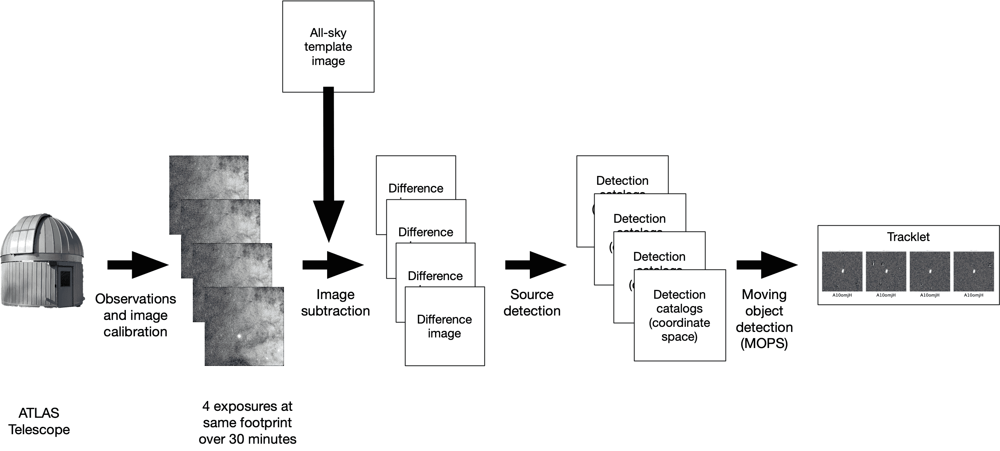

<!--yml

类别：未分类

日期：2024-09-06 19:57:05

-->

# [2101.08912] 一个针对 ATLAS 小行星调查的两阶段深度学习检测分类器

> 来源：[`ar5iv.labs.arxiv.org/html/2101.08912`](https://ar5iv.labs.arxiv.org/html/2101.08912)

# 一个针对 ATLAS 小行星调查的两阶段深度学习检测分类器

阿曼丁·奇巴·拉宾德兰 应用数学，科罗拉多矿业学院，1500 Illinois St, Golden, CO 80401，amandinchyba@gmail.com 拉里·德诺 赫瓦伊大学天文学研究所，2680 Woodlawn Drive, Honolulu, HI 96822，denneau@hawaii.edu

###### 摘要

本文提出了一个两步神经网络模型，用于将太阳系天体的检测结果与使用“地球撞击最后警报系统”（ATLAS）获取的数据中的光学和电子伪影分开，这是一个近地小行星天空调查系统（Tonry 等，2018）。使用卷积神经网络（Lieu 等，2019）将候选天文源的小“邮票”图像分类为八个类别，随后使用多层感知机提供一个概率，判断四个候选检测的时间序列是否代表一个真实的天文源。这项工作的目标是减少近地天体（NEO）检测和提交到小行星中心之间的时间延迟。由于 NEO 的稀有性和危险性（Harris 和 D’Abramo，2015），低假阴性率是模型的优先考虑因素。我们显示该模型在 ATLAS 数据上的实际小行星中达到了 99.6%的准确率，假阴性率为 0.4%。将该模型部署在 ATLAS 上已经将天文学家必须筛选的 NEO 候选者数量减少了 90%，从而使 ATLAS 更接近完全自动化的终极目标。

关键词：卷积神经网络，小行星，天空调查

## 1 引言

从 1908 年的通古斯撞击事件（Foschini 等，2018）到阿尔瓦雷斯等人认识到$\sim$30 公里的 Chicxulub 撞击体可能是 K-T 灭绝事件的原因（Alvarez 等，1980），小行星撞击地球的可能性一直被视为一种危险威胁。1998 年，美国国会认识到这种威胁，要求 NASA 制定一个计划，以编目 90%的 1 公里及以上的小行星，这些小行星的轨道将它们带入地球轨道 1 AU 范围内。

“小行星地球冲击最后警报系统”（ATLAS）是一个天空调查系统，自 2016 年投入使用，旨在以高效且经济的系统检测近地天体（NEO）（Tonry et al., 2018）。通过平衡单位成本、处理能力和自主操作，ATLAS 能够持续检测到距离地球 0.01 AU 以内的更多 NEO，相较于其他小行星调查（Heinze et al., 2020, in prep）。ATLAS 系统检测到的新 NEO 候选体会经过人工筛选审查和确认，然后送往 IAU 小行星中心（MPC），以便由其他设施进行后续观测。在过去四年中，ATLAS 发现了超过 500 个 NEO，并向 MPC 提交了超过 50,000 个 NEO 观测数据。

ATLAS 通过观察在天空中同一大致位置上的四次或更多次调查曝光来识别小行星。这些曝光中移动物体的坐标和元数据形成了“轨迹”，这是 ATLAS 小行星处理中的基本信息单位。ATLAS 系统每晚检测到数万个已知小行星，但也生成了数百个由于各种图像污染物如变星或光学和电子伪影造成的假轨迹。候选未知轨迹（通常是 NEO）必须经过筛选，以确保污染物不会通过全球 NEO 发现系统传播。改进的假轨迹自动识别可以提高 ATLAS 的自动化水平，并减少获得后续观测的延迟。

我们的目标是训练一个神经网络，将被检测为 NEO 候选体的假轨迹与真实 NEO 分离。自动化过程的主要限制是保留所有真实 NEO。如果可以显著减少假轨迹的数量，我们希望最终能够自动将 NEO 候选体提交给 MPC，从而减少观察和报告给 MPC 之间的延迟，消除大部分人工筛选的需要。

深度学习为天文学家提供了新工具，通过基于训练神经网络的预测自主分析天文源（Baron, 2019）。卷积神经网络（CNN）在图像分类方面代表了最先进的准确性（Khan et al., 2020）。我们决定采用 CNN 而非其他深度学习架构，基于其卓越的特征提取能力。此外，大多数处理 2D 图像的其他深度学习模型，如 GANs、R-CNNs 和 YOLO，使用 CNN 作为分类器（例如 GANs 中的鉴别器）（Schawinski et al., 2017; Ren et al., 2015; Redmon et al., 2016）。因此，CNN 提供了一个灵活的骨干网，我们可以将其作为未来图像分类工作的基准或起点。

我们在 2020 年 6 月 5 日至 7 月 5 日的一个月内测试了该模型。我们已经在 ATLAS 上部署了该模型，目前天文学家每天都在使用它筛选 NEO 候选天体。已部署的模型在根据天文学家的反馈进行改进时，显示出了积极的结果。

## 2 ATLAS

自 2017 年以来，ATLAS 望远镜已在夏威夷的两个山顶（Haleakalā和 Maunaloa）投入使用。另有两台 ATLAS 望远镜正在南半球的南非和智利建设中。目前的两台望远镜 ATLAS 系统每晚收集约$10^{7}$张图像，产生超过 0.5 TB 的原始未压缩数据（Tonry et al., 2018）。每晚 ATLAS 处理系统对约$10^{4}$张全尺寸图像进行分类。

每当天气允许时，每台 ATLAS 望远镜会调查约 200 个预定义位置，这些位置覆盖了夜空（每个称为“足迹”），并在每个足迹上进行四次 30 秒的曝光，跨度约为 30 分钟。ATLAS 图像还原流程（Tonry et al., 2018）从每张还原图像中减去一个静态天空“模板”图像。模板图像由成千上万次历史 ATLAS 观测创建，代表了不变的天空。当静态天空被减去后，剩下的是诸如变星、超新星，以及对 ATLAS 来说最重要的移动天体——小行星和彗星等瞬态现象。

静态天空模板图像被减去后，ATLAS 管道在减去的图像中搜索信噪比大于 5 的天文源，并将它们的坐标和其他元数据存储在每次曝光的目录中。ATLAS 移动天体处理系统（MOPS）（Denneau et al., 2013）检查减去图像中的源目录，并创建与天空中线性运动一致的检测分组。MOPS 的四次检测组合，被假设为一个真实的移动天体，然后形成一个轨迹块，这是 ATLAS 报告小行星观测的基本信息块。ATLAS 处理管道的可视化可以在图 2 中找到。

我们的模型使用来自减法图像的源检测的小 $100\times 100$ “邮票”图像来分类 tracklet。MOPS 流程在天球坐标空间中工作，通常不检查图像数据，因为检索像素的计算成本过高，尤其是对于 $\sim 10^{7}$ 每夜检测。为了集成我们的模型，我们检索所有已经创建的 tracklet 的邮票；这会产生一个更小的数量（$\sim 10^{4}$）的邮票需要被检索和分类，因为图像中的大多数检测不会形成 tracklet。大多数小行星是微弱的，并且占据了 16 位像素值范围的一小部分，因此邮票被图像均衡化以获得最大对比度，以便相关特征被放大供分类器使用。

由 MOPS 生成的 tracklet 示例可以在图 1 中看到。

![[无标题图片]](img/d7cb8136ee30a14328553015d094f16c.png)

图 1：第一行展示了条纹状的小行星 2020 NK1，代表了一个真实的 tracklet。第二行展示了另一个包含小行星 (4700) Carusi 的真实 tracklet。第三行和第四行分别是由于光学衍射尖峰和读出光学伪影造成的虚假 tracklet。黑色像素表示由明亮对象引起的饱和像素。

图 2：ATLAS 处理的高层次示意图。对于每张图像，参考天空会被注册并从源图像中减去，留下移动对象和其他瞬态特征。然后，流程识别每个减去的图像中的源，并保存一个候选移动对象位置的目录。MOPS 随后将曝光目录中的源链接在一起，形成 tracklet。图像减法使得 ATLAS 能够检测到非常接近明亮星星和银河平面的小行星。

## 3 方法论

### 3.1 数据

真实的天文对象可以是太阳系内的天体、变星或与缓慢移动的物体无法区分的点源。Tracklet 可以被分类为真实或虚假，取决于该 tracklet 是否对应于太阳系内一个移动的真实天文对象。虚假类别可以细分为多个子类别，这些子类别代表了导致虚假 tracklet 的大多数来源。ATLAS 为每个检测生成自己的指标；这些指标用于将检测集筛选为可能的真实天文对象。这个筛选过程仍然会漏掉许多虚假检测到 MOPS 小行星处理系统，这些虚假检测可能会变成虚假 tracklet。

为了实现神经网络的**最高分类精度**，我们使用了由小行星处理系统每晚捕捉的各种图像类型的数据。这些图像类型有助于真实或虚假的分类，并用于训练神经网络，这些被称为类别，如图 3 和表 2 所示。还有一些额外的类别，如光学鬼影（反射的亮源）和闪光（来自内部光学元件的反射），或云层的影响，这些由于其稀有性和难以建立基于其非均匀外观的训练数据而被排除。

表 1 总结了用于训练和测试我们的两步深度学习检测分类器的每个数据集。

| 数据集 | 图像 | 轨迹 | 训练 |
| --- | --- | --- | --- |
| 筛选 | $3,500$ | $无$ | $有$ |
| 评估 | $250,000$ | $有$ | $有$ |

表 1: 由 ATLAS 图像组成的两种不同数据集被用于训练和评估网络。两个数据集都用于训练，但评估数据集的主要目标是测试模型的稳健性和一致性。筛选数据集无法访问每个邮票的父轨迹标签，如轨迹列所列。因此，筛选数据集不能用于训练网络以分类轨迹。

#### 3.1.1 筛选数据集

使用包含真实和虚假的小行星轨迹图像的 ATLAS 数据库生成了用于神经网络训练的筛选数据集。图像是基于内部非机器学习软件 vartest05 (A. et al., 2020, in prep)的初步分类，该软件将检测到的源分类为图 3 中的类别之一。尽管每天解析大量虚假轨迹，但 vartest05 分类在处理过程中未被保留，因此将检测分成其子类别用于训练并非易事。此外，各子类别的出现频率不同——STREAK 远不如 SPIKE 常见——因此，为这些类别构建具有均匀表示的干净数据集可能导致数据集比理想值更小（请参见(Duev et al., 2019)的 CNN 训练类似任务的工作，该工作使用了超过 35,000 张图像）。

完整的整理数据集包含 3500 张图像，每张图像都与七个类别中的一个相关联。此外，我们平衡了数据集，使得每个类别都有 500 张图像。训练集包括与每个类别相关联的 500 张图像中的 470 张，而其余的图像用于验证。

| 类别 | 标签 | 分类 | 描述 | 外观 |
| --- | --- | --- | --- | --- |
| 烧痕 | BURN | 虚假 | 由探测器上的亮源造成的垂直电子读出伪影。 | 长垂直线条。 |
| 宇宙射线 | CR | 虚假 | 由于高能粒子与探测器硅碰撞释放的电子，在 ATLAS 相机的电荷耦合器件（CCD）中出现的亮点。CR 伪影通常非常锐利，因为它们只影响 CCD 上的一个比通过光学系统成像的点源小得多的区域。 | 小的、锐利的且通常非圆形的形状。 |
| 噪声 | NOISE | 虚假 | 由于泊松噪声和读出噪声分布被检测为来源。 | 与周围区域相比，在检测位置（图像中心）没有可区分的物体。 |
| 斑痕 | SCAR | 虚假 | 从天空模板图像中不完美减去明亮星星后留下的残余亮点。 | 清晰可辨的高对比度颜色斑点。 |
| 衍射尖峰 | SPIKE | 虚假 | 由于明亮的星星通过光学路径衍射造成的。 | 在极亮源附近以预定角度（通常为 45 度）出现的分散线条。 |
| 天文物体 | AST | 真实 | 真实的天文物体；主要是小行星、变星和卫星，也可能包括彗星。 | 比 NOISE 亮，但通常比 CRs 暗且呈圆形。 |
| 条纹 | STREAK | 真实 | 真实的物体（小行星或人工卫星），由于其在约`30`秒曝光期间的运动，在图像上留下线性轨迹。 | 在图像的一部分上拉伸出类似小行星的足迹。 |
| 明亮彗星 | COMET | 真实 | 比 AST 类别中的彗星宽得多的彗星。 | 由于其亮度占据图像的大部分，形状类似于 AST，并有某种淡淡的尾迹。 |

表 2：每个类别都有一个对应的标签和分类，表示每个类别贡献了什么样的轨迹，无论是真实的还是虚假的。每个类别的来源和邮票中的视觉外观的简短描述可以在第 4 列和第 5 列找到。

本数据集的目标是识别引发 ATLAS 检测的类别，而不是最大的或最常出现的类别。包含多种不同类别的图像被手动移除，以查看网络是否能够学习每个类别的独特特征。

我们将整理的数据集分为训练集（数据集的 94%）和验证集（数据集的 6%）。每个数据集的顺序被随机打乱，由于数据集的规模较小，我们使用了一些轻微的数据增强来提高类别的泛化能力。然而，由于对象的形状、清晰度和亮度是类别区分的重要部分，因此没有使用图像增强技术，如随机模糊、调整大小和亮度抖动。我们使用了随机水平/垂直翻转、旋转和裁剪。

图 3：经过对 ATLAS 探测数据的详细历史分析，选择了七个类别来代表所有可能类型的邮票在经过整理的数据集中。每个类别都有独特的视觉特征，但一些变异可能使其与其他类别难以区分。例如，一些微弱的 AST 可能在没有额外信息的情况下难以与背景噪声区分。

#### 3.1.2 评估数据集

多个 ATLAS 完成的夜晚形成了一个评估数据集，包括真实的已知、真实的未知和虚假的轨迹。已知轨迹包含 ATLAS 通过夜间链接（Denneau et al., 2013）跟踪的预先识别的对象。未知轨迹由 ATLAS 无法匹配已知对象的对象组成。真实的未知和虚假的轨迹由人工专家标记，而已知轨迹通过夜间链接进行分类。已知轨迹不需要人工确认，但它们仍然是将非机器学习流程与深度学习方法进行比较的有用参考。

尽管真实和已知的轨迹具有相似的特征，但已知轨迹已通过当前的非机器学习 ATLAS 流程成功分类，而未知轨迹则没有。然而，它们在视觉上不一定不同，因为已知轨迹不仅仅通过邮票（根据位置、大小、运动速率从前几夜追踪）来识别。

该数据集包括了 2020 年 5 月 7 日至 7 月 5 日的两个月的 ATLAS 观测数据。第一个月用于训练，第二个月用于验证。训练和验证数据包括预先标记的真实和虚假的轨迹。真实轨迹进一步标记为“已知”，意味着轨迹与 MPC 目录中的小行星位置匹配，以及“未知”，意味着轨迹在检测时无法匹配到已列入目录的对象。ATLAS 探测到的已知对象约是未知对象的 1000 倍。已知对象的轨道足够准确，可以自动将轨迹分配给已知对象。

每个未知的周期包括大约 $27,600$ 条轨迹（超过 110,400 张图像），其中约 98% 是虚假的轨迹，2% 是真实的未知轨迹。另一方面，每个已知的周期包括大约 $200,000$ 条轨迹（超过 800,000 张图像），所有这些轨迹都是已知的真实轨迹。由于数据集较大，训练期间没有对轨迹邮票图像进行图像增强。

图 4：在如 resnet-18 的卷积神经网络中，滤波器多次应用于原始图像（卷积层）和调整大小（池化层）。最终池化层生成的特征图被展平为一维张量，并传递到密集层（线性层），从而生成每个类别的输出。每个类别的输出是介于零和一之间的单一数字，代表检测为该类别的置信度（所有输出值的总和为一）。

### 3.2 网络架构

由于每个轨迹中可能包含不同类别的检测，我们设计了一个由图像分类网络（ICN）和轨迹分类网络（TCN）组成的两步模型，分别处理图像和轨迹分类。由于某些类别变体和微弱小行星之间的高度视觉相似性，见图 5，这个两步模型被优先考虑，而不是单一的全连接神经网络。通过让网络在所有八个类别中进行分类，我们可以更好地了解网络如何区分每个类别，以及哪些类别常被误分类为其他类别。在人工筛选前被移除的未知轨迹基本上没有被 ATLAS 观测到，并且可能会对其他小行星调查保持未检测状态。因此，我们在设计和训练模型时，优先考虑了真实轨迹的保存，而不是较低的假阳性率。

![[未标注的图像]](img/763420af18b65fbf0b82bf773960cfcd.png)

图 5：图像 A 和 B 显示了两个视觉上无法区分的不同类别的示例。图像 A 显示了一个微弱的主带小行星 (117708)，而图像 B 显示了由噪声引起的错误检测。通过将每个轨迹中的邮票图像分类到八个不同的类别中，网络可以根据其他类别的结果为每个类别关联误差范围。

PyTorch 库（Paszke 等，2019）用于生成神经网络，并且训练使用了单个启用了 CUDA 的 GPU 以减少训练时间。每个网络的训练参数总结见表格 3。

| 参数 | ICN | TCN |
| --- | --- | --- |
| 优化器 | Adam | SGD |
| 标准 | CE | MSE |
| 学习率 | 0.01 | 0.1 |
| 数据集 | 整理过的 | 评估 |
| 批量大小 | 15 | 1 |

表 3：数据集行代表用于训练模型的输入，而标准或损失列使用了交叉熵损失（CE）或均方误差损失（MSE）。使用了衰减学习率和提前停止来减少过拟合和训练运行时间。

#### 3.2.1 图像分类网络

对于图像分类器，我们创建了一个卷积神经网络（CNN），它接收单个图像并返回一组八个置信度评分，每个类别一个。最初，我们尝试训练一个自定义的 CNN，但使用整理后的数据集进行的简单测试显示，与预训练的 resnet-18 网络（He 等人，2015）相比，性能有限。预训练的滤波器和卷积层（图 4）在 ImageNet 上的贡献可能导致了更高的类别准确性（Russakovsky 等人，2014）。我们通过在整理后的数据集上训练预训练的 resnet-18 来进行微调。

保持分类运行时间尽可能低很重要，以便我们可以减少处理时间的延迟。因此，我们决定使用一个较浅的网络而不是较深的网络，以帮助减少计算时间。此外，我们推测类的视觉复杂度较低且类别数较少，可能无法从更深的网络中获益。这一假设的一个原因是，深度网络在训练过程中比简单神经网络更容易过拟合。这种方法在类似的近期研究中取得了成功（Duev 等人，2019）。此外，在整理的数据集上使用多种深度网络架构进行训练，例如 vgg-19、resnet-101、densenet-121 等，未显示出准确率的提高（Simonyan 和 Zisserman，2014）（He 等人，2015）（Huang 等人，2016）。

图 6：从一个跟踪片段中提取的四个邮票逐一输入到 CNN 中，总共生成 32 个置信度评分。这 32 个值以相同的顺序传递给多层感知器（MLP），使网络能够学习每个输入的最佳权重。MLP 产生一个介于零和一之间的单一值，其中 1 表示真实的跟踪片段，0 表示虚假的跟踪片段。这种模型结构使我们能够训练一个 MLP，处理多于或少于 4 个邮票的非凡跟踪片段，只要提供训练数据集。

#### 3.2.2 跟踪片段分类网络

为了对轨迹片段进行分类，我们使用了一个多层感知器（MLP），该感知器将 ICN 的输出作为输入。MLP 在前馈神经网络架构中非常著名，代表了一种最简单的深度学习架构，通常被广泛使用。通过堆叠更深的感知器层（接收多个输入并输出一个结果），可以从输入中提取出更复杂的细节和特征。MLP 返回一组新的置信度评分，用于将轨迹片段标记为虚假或真实，见图 6。由于 MLP 只接受固定大小的输入，因此仅将轨迹片段中前四个邮票的类别置信度评分提供给 TCN 作为输入。大约 90% 的轨迹片段包含至少四个检测结果。

由于数据集中邮票与轨迹片段标签未关联，MLP 无法使用经过整理的数据集进行训练。相反，我们使用了仅提供真实和虚假作为每个轨迹片段的地面真值标签的评估数据集。使用评估数据集进行训练将消除 MLP 将轨迹片段分类为类别而非类别的潜力。

对于某些类别的邮票，其置信度评分将比其他类别更具竞争力（当所有置信度评分的标准差较小时）。这只是由于某些类别的情况实际上与另一个类别几乎无法区分，而且一张图片可以包含几种不同的类别。此外，我们预期在 ICN 处理后，大多数轨迹片段中的邮票将返回相似的置信度输出。然而，轨迹片段可能包含具有独特特征的截然不同的邮票。这可能导致同一轨迹片段中邮票的置信度输出不同。因此，TCN 的目标是确定一组规则，以使用置信度评分最大化正确的轨迹片段分类。

为了确保较低的假阴性率，我们使用简单的加权损失方案设计了具有真实轨迹片段偏差的神经网络。通过在 MSE 损失函数 ($\tilde{L}$) 中为真实和虚假类别分配权重 ($\alpha_{1},\alpha_{2}$)，该函数接收网络的预测 ($x$) 和地面真值 ($y$)，我们可以生成对真实轨迹片段的不平衡/偏差。

|  | $\displaystyle\alpha(y)=\left\{\begin{array}[]{cc}\alpha_{1}\;{\rm if}\;y\;{\rm is\;bogus}\\ \alpha_{2}\;{\rm if}\;y\;{\rm is\;real}\end{array}\right.$ |  | (3) |
| --- | --- | --- | --- |
|  | $\displaystyle L(x,y)=\alpha(y)\tilde{L}(x,y)$ |  | (4) |

其中 $\alpha_{1}<\alpha_{2}$ 并且 $L$ 是加权损失函数。这些调整的代价是虚假轨迹分类准确率较低。需要进行多次测试以确定在最小化假阴性和假阳性率之间的最佳平衡。我们发现 $\alpha_{1}=1$ 和 $\alpha_{2}=4$ 提供了提高真实轨迹分类准确率的最佳结果。

## 4 结果

图 7：每个类别在从精心挑选的数据集中提取的 30 张独立验证图像上进行了测试。在每个训练周期生成了一个使用验证图像的混淆矩阵。上图中的矩阵对应于用于训练官方模型的最后一个周期。

我们将首先通过生成一个基于精心挑选的数据集中验证图像性能的混淆矩阵来评估 ICN 的能力，见图 7。可以观察到，ICN 对 SCAR 和 SPIKEs 的区分效果最好。ICN 的主要问题是混淆矩阵所突出显示的，大约 13% 的 STREAK 类图像被错误分类为 AST。鉴于 STREAKs 由 NEOs 组成，小的 STREAKs 与彗星和其他小行星几乎难以区分，因此 ICN 很难在两者之间做出区分。然而，由于 STREAK 和 AST 类别都代表真实轨迹的图像类型，因此这不应影响模型的整体准确性。

我们在 2020 年 5 月 5 日至 6 月 4 日的一个月 ATLAS 轨迹上训练了 TCN。从图 8 可以推断出，大约 99.6% 的真实轨迹被正确分类，而 90.8% 的虚假轨迹被正确分类。由于第 3.2.2 节中强调的加权损失方案，虚假轨迹的准确率低于真实轨迹的准确率。此外，ICN 在包含更多可区分伪影和图像类型的精心挑选的数据集上进行了训练，而这些图像与评估数据集中的图像有所不同。这个问题对于来自真实轨迹的邮票的影响不大，因为评估数据集由 ATLAS 检测管道分类为真实的轨迹主导，因此与精心挑选的数据集中 AST、STREAK 和 COMET 类型的图像类似。此外，虚假轨迹的邮票通常比包含小行星和彗星的真实轨迹的邮票有更多变化。所有这些因素导致虚假轨迹的准确率低于真实轨迹。

![[未标注的图像]](img/3ffe713fc687a7ddf52f37d0353d3e0c.png)

图 8：TCN 在 2020 年 6 月 5 日至 7 月 5 日的 ATLAS 数据上进行了 30 晚的测试。总共对 212,686 个轨迹段进行了分类。我们的优先任务是最小化假阴性率，即模型认为是虚假的但实际上是真实 NEO 的轨迹段。

图 9 所示的接收器操作特性（ROC）曲线帮助我们理解更高的真正阳性率与增加的假阳性率之间的成本。ROC 曲线显示，对于 0.15 的假阳性率阈值，我们可以达到 0.97-0.99 的真正阳性率。ROC 曲线还显示，将假阳性阈值优化至 0.1 以上对于真正阳性率的提升效果递减。另一方面，阈值为 0.02 或更小会显著降低模型的真正阳性率，这对 ATLAS 来说比稍微降低的假阳性率更为重要。最后，91% 的正确预测虚假轨迹段大大减少了轨迹段审查的人工工作量，但代价是 0.4% 的真实物体被错误分类。

![[未标注图像]](img/6fc70e15750437f21b80ad290b17d452.png)

图 9：TCN 在评估数据上的接收器操作特性（ROC）曲线。当模型能够清晰区分真正阳性和假阳性时，曲线会更快地收敛到 1，这意味着曲线下面积（AUC）将接近 1。真实轨迹段的 AUC 为 0.992，这表明模型在区分真实轨迹段和虚假轨迹段方面表现良好。虚假轨迹段的 AUC 等同于真实轨迹段的 AUC，因为这是一个二分类问题。

训练好的 ICN 和 TCN 在精心挑选和评估的数据集上多次重现了高精度，以防模型的任何部分永久丢失。

| 轨迹段 | I | 得分 | II | 得分 | III | 得分 | IV | 得分 | 预测 | 得分 | 真实 |
| --- | --- | --- | --- | --- | --- | --- | --- | --- | --- | --- | --- |
| 1 | ST | 0.99 | ST | 1.0 | ST | 1.0 | ST | 1.0 | 真实 | 0.904 | 真实 |
| 2 | AS | 0.99 | AS | 0.90 | AS | 0.99 | AS | 0.99 | 真实 | 0.999 | 真实 |
| 3 | SP | 0.66 | SP | 0.80 | SP | 0.71 | SP | 0.94 | 虚假 | 0.058 | 虚假 |
| 4 | BU | 0.78 | BU | 0.91 | BU | 0.48 | BU | 0.63 | 虚假 | 0.129 | 虚假 |
| 5 | NO | 0.63 | AS | 0.82 | NO | 0.92 | AS | 0.98 | 虚假 | 0.740 | 真实 |
| 6 | AS | 0.96 | NO | 0.99 | AS | 0.85 | AS | 0.98 | 真实 | 0.982 | 虚假 |

表 4：每行展示了 ICN 在每张图像上的最高评分类别以及 TCN 对轨迹的预测。每个分类的输出分数可以在其标签右侧找到。此外，每个轨迹的真实情况显示在最后一列。请注意，预测分数与其他分数不同，分数接近零时表示虚假轨迹，分数接近一时表示真实轨迹。使用 0.8 的阈值轨迹分数来确定真实与虚假的分类（例如，分数为 0.6 为真实）。类别标签简化为 BU、CR、NO、SC、SP、ST、AS、CO。

对 TCN 预测的定性分析表明，尽管它一致地识别出更显著的伪影，但在处理涉及噪声的细微情况时存在一些困难，如图 10 和表 4 所示。

![[无标题图片]](img/d596f86cfdd2384e6237189c2c82c91e.png)

图 10：上图展示了几个示例轨迹及其对应的模型预测，相关信息列于表格 4。前四个轨迹与图 1 中的相同。轨迹 5 是主带小行星 (17710)，轨迹 6 包含由噪声引起的虚假检测。这些轨迹均从评估数据集中手工挑选，以展示深度学习模型难以正确分类的示例轨迹。

在未知评估数据集的结果中，双步模型从未错误分类轨迹 1 和 2 为虚假。此外，该模型一致地将显著的 SPIKEs 和 BURNs 分类为真实，如轨迹 3 和 4 所示。大多数假阴性结果来自 ICN 无法稳定区分 NOISE 和 AST。在轨迹 5 中，一个极其微弱的天体位于每张图像的中心，同时被减法伪影（SCAR 类型伪影）包围。ICN 将大多数图像以高置信度分为 NOISE，这导致 TCN 将该轨迹分类为虚假。在轨迹 6 中，尽管检测与泊松噪声难以区分，但 ICN 仍将大多数邮票图像分类为 AST。

目前，这种两阶段深度学习模型作为主要过滤器在 ATLAS 上部署，用于在提交 MPC 之前的 NEO 筛选之前。该模型目前正在进行初步检查，比较的是 ATLAS 生成的 NEO 候选列表与深度学习移除虚假轨迹之前的列表。几周的部署结果显示出令人鼓舞的结果，因为它将 NEO 候选列表减少了约 95%，而没有丢失任何真实的轨迹。

表 5 展示了 TCN 在针对未知小行星候选者时的实际性能，这些候选者必须在提交给 MPC 之前进行审查。假阳性（列 FP）主要是由一种单一的伪影（由靠近视场的可见行星造成的明亮水平光学效应）主导，这种伪影对 ICN 来说是未知的。对 ICN 进行这种额外图像类型的训练将有效地消除这种假轨迹，导致假阳性率接近 1%或更低。

TCN 与人工筛选的比较有些微妙。由于人类必须执行全面的工作，TCN 的筛选准确度无法与人类相匹敌。根据定义，人工筛选的轨迹是 100%正确的，因为它们构成了训练集的基础。但是仅对于视觉筛选，我们发现 TCN 在其训练过的图像类型上表现非常准确。

人工筛选过程还评估了 TCN 设计范围之外的标准。TCN 仅基于视觉外观过滤轨迹，即仅图像，而人工筛选则既考虑视觉外观，也考虑轨迹的动态参数。典型的情况是一个轨迹由来自多个变星的探测组成，或者两个不同的真实小行星被错误地链接成一个轨迹。在这些情况下，对运动的“拟合”可能产生合理的值，但进一步检查拟合运动的位置信息残差会显示，至少有一个源没有实际运动，与变星一致。对人类来说，这是一条虚假的但“真实看起来的”轨迹，而 TCN 则简单（且正确地）将其视为“良好”，因为图像显示的探测与小行星无法区分。

我们模型的一个自然扩展是将这些额外的非图像参数或元数据纳入一个额外的机器学习网络，该网络补充 ICN 和 TCN。ATLAS 提供了有关每个检测的众多参数，这些参数都适合使用：探测器上的 X、Y 位置、接近明亮的星星和行星、接近已知电子伪影等。模型的灵活性可能允许我们将图像特定的元数据与 ICN 中的图像一起输入，同时将轨迹特定的元数据与 ICN 的输出一起输入到 TCN。然而，我们选择不在这项工作中探索这一途径，原因有两个：a) 可用的元数据参数数量很大（约数十个），训练和理解元数据模型的工作会分散本工作的核心；b) ATLAS 已经使用名为 vartest05 的代码对带有元数据的检测进行非机器学习分类，我们认为 vartest05 在预分类检测方面已足够有效，因此可获得的性能提升最小。vartest05 使用自己的内部模型来描述明亮源如何产生烧伤或衍射尖峰，或宇宙射线可能是什么样的，并提供被归类为其已知检测类型之一的可能性得分。由人工审阅员看到的检测集因此由 vartest05 预筛选；这个筛选集仍然包含许多错误检测，这也是我们为本工作创建 ICN 和 TCN 的动机。

## 5 讨论

| 夜晚 | 未知 | 真实 | FP (%) | FN (%) |
| --- | --- | --- | --- | --- |
| 59090 | 188 | 26 | 6.4 | 0 |
| 59091 | 11 | 7 | 9.1 | 0 |
| 59092 | 79 | 8 | 1.3 | 0 |
| 59093 | 637 | 8 | 4.1 | 0 |
| 59094 | 185 | 11 | 3.3 | 0 |
| 59095 | 971 | 22 | 4.1 | 0 |
| 59096 | 47 | 16 | 2.1 | 0 |
| 59097 | 413 | 12 | 0.2 | 0 |
| 59098 | 29 | 16 | 3.4 | 0 |
| 59099 | 67 | 25 | 1.5 | 0 |
| 59100 | 134 | 63 | 2.2 | 0 |
| 59101 | 314 | 75 | 2.5 | 0 |

表 5：已部署模型的结果记录自 2020 年 8 月 29 日（MJD 59090）至 2020 年 9 月 9 日（MJD 59101），使用生产 ATLAS 数据来评估其性能。“未知”是指无法自动匹配已知对象的轨迹数量，“真实”是指根据目视检查这些轨迹中实际存在的天文对象数量。“FP”是假阳性率（虚假的被标记为真实），而“FN”是真实的被标记为虚假的数量。每晚轨迹数量的变化由于天空覆盖、天气条件和可能产生虚假轨迹的天空特征（明亮的星星、行星）造成。在此间隔内，假阴性率为零，意味着没有由于错误分类而丢失的真实轨迹。

虽然 0.5 的真实-虚假阈值是分离真实和虚假轨迹片段的自然且合理的阈值，但与 NEO 发现相关的实际考虑导致了不对称的优先级，这可以为选择拒绝阈值提供信息。ATLAS 检测到的未知 NEO 按定义可能对地球构成危险，因此由于误判漏报的一个 NEO 可能带来重大后果。2019 OK，一颗由 SONEAR 调查于 2019 年发现的危险 100 米直径 NEA，一天后距离地球仅 70,000 公里（Center，2019 OK, MPEC 2019-O56）。2019 OK 在 SONEAR 观察前的三天被 ATLAS 成像，但轨迹片段在天空中移动非常缓慢，类似于静止天体，并且该轨迹片段没有通过系统的其他质量筛选，因此没有立即报告给 MPC，导致三天的预警时间丧失。

相反，系统误报的成本包括：a) 花费昂贵的人力和望远镜资源去追踪不存在的天体，b) 被虚假的天体污染的数据发现流，以及逐渐降低对 NEO 发现系统的信心。对于 ATLAS 来说，在提交前对轨迹片段进行人工审核是防止虚假轨迹片段提交给 MPC 的最后防线。保存检测到的 NEO 比其他考虑因素更重要，因此在这项工作中，我们将模型偏向于保留尽可能多的真实轨迹片段，而不是偏向于减少误报。为了适应不同的优先级，需要对 ICN 和 TCN 的加权损失函数和训练数据进行调整。

我们选择了 0.8 作为 TCN 输出的置信度得分阈值，以区分真实轨迹片段和虚假轨迹片段。这个阈值是根据模型在评估数据集上的结果选择的。对测试进行更定量的分析可能会提供新的阈值，以减少误报率而不增加漏报率。理论上，较低的阈值应允许更多的真实轨迹片段被正确分类，但也会允许更多的虚假轨迹片段被错误分类。类似地，如果阈值增加，更多的虚假轨迹片段将被正确分类，而更多的真实轨迹片段将被错误分类。

在我们的部署过程中，我们发现明亮的彗星常被错误地分类为燃烧物（BU）。为了解决这个问题，我们创建了一个精心整理的彗星类别，解决了这一问题。另一种常见的误分类类型是来自 CCD 边缘附近检测到的小行星。这些探测的邮票图像由于 CCD 边缘，具有水平或垂直线性特征，这对分类器看起来像是燃烧物。我们尚未针对这些边缘伪影重新训练模型，但在下游处理过程中可以检测到这些伪影，该处理过程具有对轨迹段 CCD 坐标的访问权限。

在评估数据集中，存在由变星组成的虚假轨迹段，这些变星的亮度相较于其平均亮度有所增加，因此在 ATLAS 曝光中表现为新的天文源。尽管这些探测是真实的天文源（恒星），但这些轨迹段被标记为虚假的，因为它们不是小行星。如果图像逐一分类（例如我们两步模型的第一步），变星在单个 30 秒的 ATLAS 曝光中与小行星视觉上难以区分，但模型（正确地）将其分类为真实。对我们输入训练集的随机抽样表明，评估数据集中虚假的轨迹段中包含 5-10%的变星。忽略这些虚假轨迹段将导致比结果部分显示的假阳性率高得多。

最后，我们认识到，与一些用于训练 CNN 的数据集（如 ImageNet（Krizhevsky 等， 2012）（Russakovsky 等， 2014））相比，精心整理的数据集较小。ImageNet 是一个包含数百个类别和数百万张图像的大型数据集，由于其提供的训练数据量，已经用于训练多个先进的神经网络。较大的训练池可能会导致更好的性能，降低假阳性率，同时保持真实阳性率等于或高于当前水平。

## 6 结论

我们设计并部署了一个轻量级机器分类模型，该模型可以准确区分 ATLAS 小行星检测管道中的真实轨迹段和虚假轨迹段。该模型在每晚检查虚假轨迹段的工作量中减少了约 90%，而实际物体的成本为 0.4%。这种准确性的提高是向 ATLAS 检测到的危险小行星即时、自动提交的关键步骤。检测与报告之间减少的延迟增加了后续望远镜跟踪入境小行星的能力，因为它们的位置将更接近其发现位置，因此更容易观察。更重要的是，减少的延迟在实际撞击的情况下为民防提供了更大的预警时间。

该模型的性能仍在监控中，目的是识别深度学习模型在特定领域（如来电 ATLAS 数据类型）无法优于完全人工筛选的情况。我们识别出 ATLAS 轨迹中出现的八种主要图像类型，显而易见，模型在分类未经过 ICN 训练的图像类型的轨迹时表现较差。自模型部署以来，我们已识别并开始创建新的类别训练集，以提高模型的准确性。这些新类别之一将解决由非常亮的天体源（如可见行星）产生的水平线伪影。对这些亮水平特征的早期训练结果表明，它们可以被有效地完全去除，但这一能力未能及时集成到本工作中。未来对筛选列表的用户反馈将使我们能够迭代地提高模型的准确性和整体鲁棒性。

## 7 致谢

本研究使用了小行星地球冲击最后警报系统（ATLAS）项目的数据。LD 和 ATLAS 主要由 NASA 资助，资助编号为 NN12AR55G、80NSSC18K0284 和 80NSSC18K1575；ATLAS NEO 搜索的副产品包括来自调查区域的图像和目录。ATLAS 科学产品得到了夏威夷大学天文学研究所、贝尔法斯特女王大学、空间望远镜科学研究所和南非天文台的贡献。本工作部分由国家科学基金会本科生研究体验资助（6104374）支持，资助对象为夏威夷大学马诺阿分校天文学研究所。我们感谢 Dr. Michael Bottom、Dr. Robert Jedicke 和 Dr. Ben Shappee 的深刻意见和反馈。

## 参考文献

+   A. et al. [2020, in prep] Heinze A., Denneau L., 和 Tonry J.L. 用于 ATLAS 小行星和瞬态检测的真实/虚假筛选算法，2020 年，正在准备中。

+   Alvarez et al. [1980] Luis W. Alvarez, Walter Alvarez, Frank Asaro, Helen V. Michel, Luis W. Alvarez, Walter Alvarez, Frank Asaro, 和 Helen V. Michel. 白垩纪-第三纪灭绝的外星原因。*科学*，208:1095–1108，1980 年。

+   Baron [2019] Dalya Baron. 机器学习在天文学中的应用：实用概述，2019 年。

+   Center [2019 OK, MPEC 2019-O56] 小行星中心。 https://minorplanetcenter.net/mpec/K19/K19O56.html，2019 年 OK，MPEC 2019-O56。在线；访问日期为 2014 年 1 月 29 日。

+   Denneau et al. [2013] Larry Denneau, Robert Jedicke, Tommy Grav, Mikael Granvik, Jeremy Kubica, Andrea Milani, Peter Vereš, Richard Wainscoat, Daniel Chang, Francesco Pierfederici 等人。Pan-STARRS 移动物体处理系统。*太平洋天文学会出版物*，125(926):357–395，2013 年 4 月。ISSN 1538-3873。doi: 10.1086/670337。网址 http://dx.doi.org/10.1086/670337。

+   Duev 等 [2019] Dmitry A Duev, Ashish Mahabal, Quanzhi Ye, Kushal Tirumala, Justin Belicki, Richard Dekany, Sara Frederick, Matthew J Graham, Russ R Laher, Frank J Masci, Thomas A Prince, Reed Riddle, Philippe Rosnet, 和 Maayane T Soumagnac. Deepstreaks：使用深度学习在 Zwicky 瞬态设施数据中识别快速移动天体。*皇家天文学会月刊*，486(3):4158–4165, 2019 年 4 月。ISSN 0035-8711。doi: 10.1093/mnras/stz1096。URL https://doi.org/10.1093/mnras/stz1096。

+   Foschini 等 [2018] L. Foschini, L. Gasperini, C. Stanghellini, R. Serra, A. Polonia, 和 G. Stanghellini. 1908 年通古斯天体的大气碎裂：重新考虑地面撞击的可能性，2018。

+   Harris 和 D’Abramo [2015] Alan W. Harris 和 Germano D’Abramo. 近地小行星的种群。*伊卡洛斯*，257:302–312, 2015 年 9 月。URL https://ui.adsabs.harvard.edu/abs/2015Icar..257..302H。

+   He 等 [2015] Kaiming He, Xiangyu Zhang, Shaoqing Ren, 和 Jian Sun. 图像识别的深度残差学习，2015。

+   Heinze 等 [2020, in prep] A. N. Heinze, L. Denneau, J. L. Tonry, H. Weiland, B. Stalder, A. Rest, K. W. Smith, 和 S. J. Smartt. 从 Atlas 分析中得到的近地天体种群、速度偏差和撞击风险，2020，准备中。

+   Huang 等 [2016] Gao Huang, Zhuang Liu, Laurens van der Maaten, 和 Kilian Q. Weinberger. 密集连接的卷积网络，2016。

+   Khan 等 [2020] Asifullah Khan, Anabia Sohail, Umme Zahoora, 和 Aqsa Saeed Qureshi. 深度卷积神经网络的近期架构综述。*人工智能评论*，2020 年 4 月。ISSN 1573-7462。doi: 10.1007/s10462-020-09825-6。URL http://dx.doi.org/10.1007/s10462-020-09825-6。

+   Krizhevsky 等 [2012] Alex Krizhevsky, Ilya Sutskever, 和 Geoffrey E Hinton. 使用深度卷积神经网络进行 Imagenet 分类。在 F. Pereira, C. J. C. Burges, L. Bottou, 和 K. Q. Weinberger 主编的 *神经信息处理系统进展 25* 中，页码 1097–1105。Curran Associates, Inc., 2012。URL http://papers.nips.cc/paper/4824-imagenet-classification-with-deep-convolutional-neural-networks.pdf。

+   Lieu 等 [2019] Maggie Lieu, Luca Conversi, Bruno Altieri, 和 Benoît Carry. 使用卷积神经网络检测太阳系天体。*皇家天文学会月刊*，485(4):5831–5842, 2019 年 3 月。ISSN 1365-2966。doi: 10.1093/mnras/stz761。URL http://dx.doi.org/10.1093/mnras/stz761。

+   Paszke 等人 [2019] Adam Paszke, Sam Gross, Francisco Massa, Adam Lerer, James Bradbury, Gregory Chanan, Trevor Killeen, Zeming Lin, Natalia Gimelshein, Luca Antiga, Alban Desmaison, Andreas Kopf, Edward Yang, Zachary DeVito, Martin Raison, Alykhan Tejani, Sasank Chilamkurthy, Benoit Steiner, Lu Fang, Junjie Bai, 和 Soumith Chintala。Pytorch: 一种命令式风格的高性能深度学习库。收录于 H. Wallach, H. Larochelle, A. Beygelzimer, F. d'Alché-Buc, E. Fox, 和 R. Garnett 主编的 *Advances in Neural Information Processing Systems 32*，第 8024–8035 页。Curran Associates, Inc., 2019。网址 http://papers.neurips.cc/paper/9015-pytorch-an-imperative-style-high-performance-deep-learning-library.pdf。

+   Redmon 等人 [2016] Joseph Redmon, Santosh Divvala, Ross Girshick, 和 Ali Farhadi。你只看一次: 统一的实时目标检测，2016 年。

+   Ren 等人 [2015] Shaoqing Ren, Kaiming He, Ross Girshick, 和 Jian Sun。Faster R-CNN: 朝着实时目标检测的区域提议网络。收录于 C. Cortes, N. D. Lawrence, D. D. Lee, M. Sugiyama, 和 R. Garnett 主编的 *Advances in Neural Information Processing Systems 28*，第 91–99 页。Curran Associates, Inc., 2015。网址 http://papers.nips.cc/paper/5638-faster-r-cnn-towards-real-time-object-detection-with-region-proposal-networks.pdf。

+   Russakovsky 等人 [2014] Olga Russakovsky, Jia Deng, Hao Su, Jonathan Krause, Sanjeev Satheesh, Sean Ma, Zhiheng Huang, Andrej Karpathy, Aditya Khosla, Michael Bernstein, Alexander C. Berg, 和 Li Fei-Fei。Imagenet 大规模视觉识别挑战赛，2014 年。

+   Schawinski 等人 [2017] Kevin Schawinski, Ce Zhang, Hantian Zhang, Lucas Fowler, 和 Gokula Krishnan Santhanam。生成对抗网络在天体物理图像中恢复超越去卷积极限的特征。*Monthly Notices of the Royal Astronomical Society: Letters*，第 slx008 页，2017 年 1 月。ISSN 1745-3933。doi: 10.1093/mnrasl/slx008。网址 http://dx.doi.org/10.1093/mnrasl/slx008。

+   Simonyan 和 Zisserman [2014] Karen Simonyan 和 Andrew Zisserman。用于大规模图像识别的非常深的卷积网络，2014 年。

+   Tonry 等人 [2018] J. L. Tonry, L. Denneau, A. N. Heinze, B. Stalder, K. W. Smith, S. J. Smartt, C. W. Stubbs, H. J. Weiland, 和 A. Rest。Atlas: 一种高频次的全天空巡天系统。*Publications of the Astronomical Society of the Pacific*，130(988):064505，2018 年 5 月。ISSN 1538-3873。doi: 10.1088/1538-3873/aabadf。网址 http://dx.doi.org/10.1088/1538-3873/aabadf。
