<!--yml

分类：未分类

日期：2024-09-06 19:57:00

-->

# [2101.10531] 深度学习在场景分类中的应用：综述

> 来源：[`ar5iv.labs.arxiv.org/html/2101.10531`](https://ar5iv.labs.arxiv.org/html/2101.10531)

# 深度学习在场景分类中的应用：综述

Delu Zeng, Minyu Liao, Mohammad Tavakolian, Yulan Guo

Bolei Zhou, Dewen Hu, Matti Pietikäinen, 和 Li Liu Delu Zeng (dlzeng@scut.edu.cn) 和 Minyu Liao (201820127075@mail.-scut.edu.cn) 现任职于中国华南理工大学。Mohammad Tavakolian (mohammad.tavakolian@oulu.fi)、Matti Pietikäinen (matti.pietikainen@oulu.fi) 和 Li Liu (li.liu@oulu.fi) 现任职于芬兰奥卢大学。Yulan Guo (yulan.guo@nudt.edu.cn)、Dewen Hu (dwhu@nudt.edu.cn) 和 Li Liu 现任职于国防科技大学。Bolei Zhou (bzhou@ie.cuhk.edu.hk) 现任职于中国香港中文大学。Li Liu 是通讯作者。Delu Zeng、Minlu Liao 和 Li Liu 对这项工作贡献相等，是共同第一作者。

###### 摘要

场景分类，旨在通过理解整个图像将场景图像分类到预定义的场景类别之一，是计算机视觉中一个长期存在、基础且具有挑战性的问题。大规模数据集的兴起，这些数据集涵盖了各种现实世界场景的密集采样，以及深度学习技术的复兴，这些技术直接从大量原始数据中学习强大的特征表示，已经在场景表示和分类领域带来了显著进展。为了帮助研究人员掌握这一领域所需的进展，本文的目标是提供一个全面的深度学习场景分类研究成果的综述。本文综述了 200 多篇重要出版物，涵盖了场景分类的不同方面，包括挑战、基准数据集、分类法以及所评审方法的定量性能比较。回顾迄今为止所取得的成就，本文还总结了有前景的研究机会列表。

###### 索引词：

场景分类、深度学习、卷积神经网络、场景表示、文献综述。

## 1 引言

场景分类的目标是将场景图像分类¹¹1 场景是对现实世界环境的语义一致的视图，包含背景和多个对象，以空间上许可的方式组织 [1, 2]。根据图像的环境内容、对象及其布局，将其分到预定义的场景类别（如海滩、厨房和面包店）之一。视觉场景理解需要推理我们在日常生活中遇到的各种复杂环境。识别如对象、动作和事件等视觉类别无疑是视觉系统不可或缺的能力。此外，识别对象出现的场景对智能系统预测已识别对象的背景同样重要，通过推理“发生了什么？接下来会发生什么？” 人类在分类自然场景方面非常高效 [3, 4]。然而，由于场景的语义模糊性以及成像条件（如光照变化、视角和尺度、成像距离等）造成的大类内差异，这对机器来说并不是一项简单的任务。作为计算机视觉中的一个长期、基础且具有挑战性的问题，场景分类已经成为活跃的研究领域数十年，并且具有广泛的应用，如基于内容的图像检索 [5, 6]、机器人导航 [7, 8]、智能视频监控 [9, 10]、增强现实 [11, 12] 和灾害检测应用 [13]。

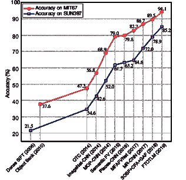

图 1：场景分类的性能概述：我们可以观察到自深度学习再度兴起以来，在两个基准数据集上的显著改善。Dense-SIFT [14]、Object Bank [15] 和 OTC [16] 是手工制作的方法，而其他则是基于深度学习的方法。

图 2：场景分类深度学习的分类。随着大规模数据集的兴起，从预训练的 CNN、微调的 CNN 或特定的 CNN 中学习到强大的特征，取得了显著进展。主要特征包括全局 CNN 特征、空间不变特征、语义特征、多层特征和多视角特征。同时，许多方法通过有效的策略如编码、注意力学习和上下文建模得到了改进。作为一个新问题，使用 RGB-D 数据集的方法专注于学习深度特定特征并融合多种模态。

作为场景分类的核心，场景表示是将场景图像转换为其简明特征（*即*，特征）的过程，并且仍然吸引着大量且不断增长的关注。近年来对人工神经网络（ANNs）特别是深度学习的兴趣复兴[17]，彻底改变了计算机视觉，并在目标分类和检测[51, 52]、语义分割[53, 54, 55]以及场景分类[28, 18]等各种任务中被广泛使用。2012 年，使用大规模 ImageNet 数据集[56]的目标分类通过名为 AlexNet 的深度神经网络（DNN）[17]取得了性能的重大突破，这可以说是重新点燃了 ANNs 领域，并引发了计算机视觉的近期革命。自那时起，场景分类的研究重点已开始从手工特征工程转向深度学习，深度学习可以直接从数据中学习强大的表示。深度学习的最新进展使得场景分类有可能向*大规模*和*复杂环境*的数据集[18, 57, 25]迈进，并且已经提出了许多场景表示[28, 58, 30, 21]。如图 1 所示，深度学习在场景分类中带来了显著的改进。鉴于进展异常迅速，本文尝试追踪最新进展并总结其成就，以便对当前使用深度学习进行的场景分类的全景有一个更清晰的了解。

最近，也有一些关于场景分类的综述文章，如 [59, 60, 61]。Cheng 等人 [60] 提供了关于遥感图像场景分类最新进展的综合综述。Wei 等人 [59] 进行了 14 种场景描述符的实验研究，主要集中在手工特征工程方法上。Xie 等人 [61] 回顾了过去二十年的场景识别方法，他们的综述中讨论的大多数方法都是手工特征工程的方法。*与*这些现有的综述 [60, 59, 61] 相对的是，本文总结了深度学习及其相关方法在室内/室外场景分类中的显著成功和主导地位，但不包括其他场景分类任务，如遥感场景分类 [62, 63, 60]，声学场景分类 [64, 65]，地点分类 [66, 67]，*等*。本文的主要贡献总结如下：

+   •

    据我们所知，本文首次专注于室内/室外场景分类的深度学习方法，包括 RGB 场景分类以及 RGB-D 场景分类。

+   •

    我们提出了一个分类法（参见图 2），涵盖了深度学习在场景表示方面的最新和最先进的进展。

+   •

    提供了对若干公共数据集上现有方法的全面比较，同时我们还提供了简要总结和深刻讨论。

本文的剩余部分组织如下：挑战和基准数据集在第二部分中总结。在第三部分中，我们呈现了现有深度学习方法的分类法。然后在第四部分中，我们对这些方法的性能进行总体讨论（表 II、IV）。接着在第五部分中，我们总结了未来重要的研究展望。

## 2 背景

### 2.1 问题与挑战

场景分类可以通过分析其与相关视觉任务（如物体分类和纹理分类）的紧密联系来进一步剖析。作为典型的模式识别问题，这些任务都涉及特征表示和分类。然而，与物体分类（图像以物体为中心）或纹理分类（图像仅包含纹理）不同，场景图像更为复杂，因此需要进一步探索场景的内容，*例如*，语义部分（*例如*，物体、纹理、背景）是什么，它们是如何组织在一起的，以及它们之间的语义联系是什么。尽管场景分类在过去几十年中有了发展（由于空间限制，详见附录），但大多数方法仍未能在各种真实场景中达到足够的水平。内在的困难在于场景的复杂性和高变异性。总体而言，场景分类面临的重大挑战来自于大类内变异、语义模糊和计算效率。

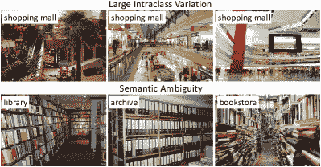

图 3：*大类内变异*和*语义模糊*的示意图。顶部（大类内变异）：由于光照和整体内容的不同，购物中心的外观差异很大。底部（语义模糊）：档案馆、书店和图书馆的总体布局和均匀安排的物体相似。

大类内变异。类内变异主要来源于场景本身的内在因素和成像条件。在内在因素方面，每个场景可能有许多不同的示例图像，这些图像在各种物体、背景或人类活动之间可能会有很大的变化。成像条件如光照、视角、尺度以及严重的遮挡、杂乱、阴影、模糊、运动，*等等*，都会导致大类内变异。数字化伪影、噪声污染、低分辨率和过滤失真等也可能带来进一步的挑战。例如，图 3 顶部显示了三种具有不同光照条件、视角和物体的购物中心。

语义模糊。由于不同类别的图像可能共享类似的对象、纹理、背景、*等*，它们在视觉上看起来非常相似，这导致了它们之间的模糊性[68, 43]。图 3 的底行展示了三种不同室内场景之间的强视觉关联，*即*档案室、书店和图书馆。随着新场景类别的出现，语义模糊问题将更加严重。此外，场景类别注释是主观的，依赖于注释者的经验，因此一个场景图像可能属于多个语义类别[68, 69]。

计算效率。社交媒体网络以及移动/可穿戴设备的普及导致了对各种计算机视觉任务（包括场景识别）的需求增加。然而，移动/可穿戴设备的计算相关资源受限，使得高效的场景识别成为紧迫需求。

### 2.2 数据集

本节回顾了用于场景分类的公开数据集。这些场景数据集（见图 4）根据图像类型大致分为两大类：RGB 数据集和 RGB-D 数据集。这些数据集还可以根据其规模进一步分为两类。小规模数据集（*例如*，Scene15 [14]、MIT67 [70]、SUN397 [57]、NYUD2 [71]、SUN RGBD [72]) 通常用于评估，而大规模数据集（*例如*，ImageNet [56] 和 Places [18, 25]）对预训练和深度学习模型开发至关重要。表 I 总结了这些数据集的场景分类特征。

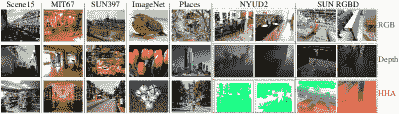

图 4：来自基准数据集的场景分类示例图像的总结。RGB-D 图像由 RGB 和深度图组成。此外，Gupta 等人[73] 提出了将深度图像转换为三通道特征图，*即*水平视差、离地高度和表面法线角度（HHA）。这种 HHA 编码对于深度数据的可视化非常有用。

表 I：场景分类的流行数据集。"#" 表示 *数量*。

| 类型 | 数据集 | 图像数量 | 类别数量 | 分辨率 | 类别标签 |
| --- | --- | --- | --- | --- | --- |
| RGB | Scene15 [14] | 4,488 | 15 | $\thickapprox$ 300$\times$250 | 室内/室外场景 |
|  | MIT67 [70] | 15,620 | 67 | $\geq$ 200$\times$200 | 室内场景 |
|  | SUN397 [57] | 108,754 | 397 | $\thickapprox$ 500$\times$300 | 室内/室外场景 |
|  | ImageNet [17] | 1400 万+ | 21,841 | $\thickapprox$ 500$\times$400 | 对象 |
|  | Places205 [18] | 7,076,580 | 205 | $\geq$ 200$\times$200 | 室内/室外场景 |
|  | Places88 [18] | $-$ | 88 | $\geq$ 200$\times$200 | 室内/室外场景 |
|  | Places365-S [25] | 1,803,460 | 365 | $\geq$ 200$\times$200 | 室内/室外场景 |
|  | Places365-C [25] | 800 万+ | 365 | $\geq$ 200$\times$200 | 室内/室外场景 |
| RGB-D | NYUD2 [71] | 1,449 | 10 | $\thickapprox$ 640$\times$480 | 室内场景 |
|  | SUN RGBD [72] | 10,355 | 19 | $\geq$512$\times$424 | 室内场景 |

Scene15 数据集 [14] 是一个小型场景数据集，包含 4,448 张 15 个场景类别的灰度图像，即，5 个室内场景类别（例如，办公室、商店和厨房）和 10 个室外场景类别（如郊区、森林和高楼）。每个类别包含 210 到 410 张场景图像，图像大小约为 300$\times$250。数据集被分为两个部分；训练集中每个类别至少有 100 张图像，其余的用于测试。

MIT Indoor 67 (MIT67) 数据集 [70] 涵盖了广泛的室内场景，例如，商店、公共空间和休闲场所。MIT67 包含来自 67 个室内类别的 15,620 张场景图像，其中每个类别约有 100 张图像。此外，所有图像在最小轴上的分辨率至少为 200$\times$200 像素。由于数据集中对象之间的相似性，图像分类具有挑战性。训练集中每个类别有 80 张图像，测试集中有 20 张图像。

Scene UNderstanding 397 (SUN397) 数据集 [57] 包含 397 个场景类别，其中每个类别有超过 100 张图像。数据集包含 108,754 张图像，图像大小约为 500$\times$300 像素。SUN397 涵盖了 175 个室内场景、220 个室外场景类别，以及两个混合室内和室外图像的类别，例如，有一个带售票亭的 promenad deck。测试时有多个训练/测试分割设置，每个类别有 50 张图像。

ImageNet 数据集 [56] 是最著名的大规模图像数据库之一，特别用于视觉任务。它按照 WordNet [74] 层级组织，其中每个节点由数百到数千张图像描绘。迄今为止，ImageNet 中有超过 1400 万张图像和大约 2 万个标签。通常，ImageNet 数据集的一个子集（约 1000 个类别，总计 120 万张图像 [17]）用于对 CNN 进行场景分类的预训练。

Places 数据集 [18、25] 是一个大规模场景数据集，包含 434 个场景类别，提供了现实世界中遇到的环境类别的详尽列表。Places 数据集继承了与 SUN397 [57] 相同的场景类别列表。Places 数据集的四个基准子集如下所示：1) Places205 [18] 包含 250 万张来自场景类别的图像。每类图像数量从 5000 到 15000 不等。训练集有 2,448,873 张图像，每个类别有 100 张图像用于验证，每个类别有 200 张图像用于测试。2) Places88 [18] 包含 ImageNet [56]、SUN397 [57] 和 Places205 数据集中 88 个常见场景类别。Places88 仅包括在第二轮标注中获得的图像。3) Places365-Standard [25] 具有 1,803,460 张训练图像，每类图像数量从 3,068 到 5,000 不等。验证集每类 50 张图像，测试集每类 900 张图像。4) Places365-Challenge 包含与 Places365-Standard 相同的类别，但其训练集显著更大，总共有 800 万张图像。该子集是为与 ECCV 联合举行的 Places Challenge 发布的，作为 ILSVRC 2016 Challenge 的一部分。

NYU-Depth V2 (NYUD2) 数据集 [71] 包含来自不同室内场景的 RGB 和深度相机记录的视频序列。该数据集由 27 个室内场景类别中的 1,449 对对齐的 RGB 和深度图像组成。它包括来自 3 个城市的 464 个场景和 407,024 个未标记的帧。使用公开可用的拆分，NYUD2 的场景分类提供 795 张用于训练的图像和 654 张用于测试的图像。

SUN RGBD 数据集 [72] 包含 10,335 张带有 2D 和 3D 密集标注的 RGB-D 图像，涉及对象和房间。该数据集由四种不同的传感器在与 PASCAL VOC [75] 相似的尺度下收集。整个数据集进行了密集标注，包括 146,617 个 2D 多边形和 58,657 个带有准确对象方向的 3D 边界框，以及 3D 房间布局和场景类别。

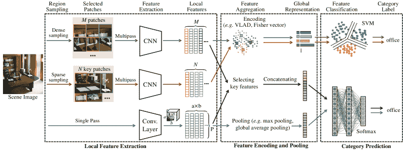

图 5：场景分类的深度学习通用流程图。整个流程包括三个阶段的每个模块（局部特征提取、特征编码与池化、类别预测）。通用流程以不同颜色的箭头表示，包括基于全局 CNN 特征的流程（蓝色箭头）、空间不变特征的流程（绿色箭头）和语义特征的流程（红色箭头）。尽管某些方法的流程（如[31、32]）是统一的，并以端到端的方式训练，但它们实际上由这三个阶段组成。

## 3 基于深度学习的方法

在这一部分，我们提供了对场景分类的深度学习方法的全面回顾。由于空间限制，附录中提供了深度学习的简要介绍。最常见的深度学习架构是卷积神经网络（CNN）[76]。以 CNN 作为特征提取器，图 5 展示了大多数基于 CNN 的场景分类方法的通用流程。几乎没有例外，给定一个输入场景图像，第一阶段是使用 CNN 提取器获取局部特征。然后，第二个过程是通过编码、连接或池化将这些特征汇总成图像级别的表示。最后，以该表示作为输入，分类阶段则是得到预测类别。

图 2 展示的分类法涵盖了场景分类的深度学习的不同方面。在接下来的调查中，我们首先研究场景分类的主要 CNN 框架。然后，我们回顾现有的基于 CNN 的场景表示。此外，我们探索了提高获得的表示的各种技术。最后，作为补充，我们研究了使用 RGB-D 数据进行场景分类。

### 3.1 主要的 CNN 框架

卷积神经网络（CNNs）是提取高质量表示的常见深度学习模型。最初，由于计算资源和标记数据的限制，场景特征从预训练的 CNN 中提取，这通常与 BoVW 管道结合使用[6]。随后，细化的 CNN 模型用于保持最后几层更具数据特异性。或者，特定的 CNN 模型已经出现，以适应场景属性。

#### 3.1.1 预训练 CNN 模型

网络架构在深度模型的性能中扮演着关键角色。最初，AlexNet [17] 作为主流的 CNN 模型用于特征表示和分类。后来，Simonyan 等人 [77] 开发了 VGGNet，并展示了在给定感受野的情况下，使用多个叠加的小卷积核比使用大卷积核效果更好，因为在多个特征图上应用非线性可以获得更具区分性的表示。另一方面，卷积核感受野尺寸的减少会降低大网络的参数数量。因此，VGGNet 使用了 3$\times$3 卷积核，而不是 AlexNet 中的大卷积核（*即*，11$\times$11，7$\times$7 和 5$\times$5）。受限于只有少量神经元在特征表示中发挥有效作用的理念，Szegedy 等人 [78] 提出了 Inception 模块来进行 CNN 的稀疏近似。模型越深，描述性表示越多。这就是使用 CNN 进行分层特征提取的优势。然而，不断增加 CNN 的深度可能导致梯度消失。为了解决这个问题，He 等人 [79] 在 CNN 的层次结构中加入了跳跃连接，并提出了残差网络（ResNets），这些网络更易于优化，并且可以从显著增加的深度中获得更高的准确性。

除了网络架构，CNN 的性能还与足够大的训练数据量密切相关。然而，在某些应用中，训练数据稀缺，这导致模型在训练过程中出现欠拟合。为了解决这个问题，可以使用预训练模型来有效地提取小数据集的特征表示 [80]。在大规模数据集上训练 CNN，例如 ImageNet [56] 和 Places [18, 25]，使其能够学习丰富的视觉表示。这些模型可以进一步用作其他任务的预训练模型。然而，预训练模型的有效性在很大程度上依赖于源领域和目标领域之间的相似性。Yosinski 等人 [81] 记录了预训练 CNN 模型的迁移能力随着目标任务和原始源任务之间的相似性减少而下降。尽管如此，预训练模型仍然比模型的随机初始化表现更好 [81]。

预训练的 CNN 作为固定特征提取器，分为两类：以物体为中心的和以场景为中心的 CNN。以物体为中心的 CNN 是指在物体数据集上预训练的模型，例如 ImageNet [56]，并用于场景分类。由于物体图像没有场景提供的多样性 [18]，以物体为中心的 CNN 在场景分类上的表现有限。因此，在场景图像上预训练的场景中心 CNN，如 Places [18, 25]，在提取与场景相关的特征方面更为有效。

以物体为中心的 CNN。Cimpoi 等人 [82] 认为，从以物体为中心的 CNN 获得的特征表示是物体描述符，因为它们可能具有更多的物体描述特性。场景图像被表示为语义的集合 [30]，而以物体为中心的 CNN 对物体的整体形状非常敏感，因此许多方法 [28, 83, 30, 82, 31] 使用以物体为中心的 CNN 从场景图像的不同区域提取局部特征。有效部署以物体为中心的 CNN 的另一个重要因素是源数据集和目标数据集中的图像相对大小。尽管 CNN 通常对大小和尺度具有鲁棒性，但以物体为中心的 CNN 的性能受到缩放的影响，因为这些模型最初是在数据集上预训练以检测和/或识别物体。因此，转向描述具有不同尺度的多个物体的场景将严重影响它们的性能 [19]。例如，如果目标数据集的图像尺寸小于源数据集，则模型的准确性将受到影响。

以场景为中心的 CNN。Zhou 等人 [18, 25] 证明了以场景为中心的 CNN 在分类性能上优于以物体为中心的 CNN，因为前者利用了场景的先验知识。Herranz 等人 [19] 发现 Places-CNNs [23] 在较大尺度下表现更好；因此，场景中心的 CNN 通常能够在整个尺度范围内提取表示。Guo 等人 [40] 发现场景中心的 CNN 的 CONV 层捕获了更多场景的细节信息，如局部语义区域和细尺度物体，这对于区分模糊场景至关重要，而从 FC 层获得的特征表示则没有这种感知质量。Zhou 等人 [84] 显示，场景中心的 CNN 也可以作为物体检测器，而无需在物体数据集上明确训练。

#### 3.1.2 微调的 CNN 模型

预训练的 CNN，如第 3.1.1 节所述，作为特征提取器，具备训练数据的先验知识[6, 85]。然而，仅使用预训练策略会阻止深度模型在描述目标场景时充分发挥其适应性能力。因此，使用目标场景数据集对预训练 CNN 进行微调可以通过减少两个数据集之间可能的领域偏移来提高其性能[85]。值得注意的是，合适的权重初始化变得非常重要，因为训练具有许多可调参数和非凸损失函数的模型是相当困难的[86]。因此，微调预训练的 CNN 有助于有效的训练过程[87, 30, 29, 34]。

对于卷积神经网络（CNNs），一种常见的微调技术是*冻结策略*。在这种方法中，用一个新的全连接（FC）层替换预训练模型的最后一个 FC 层，该新的 FC 层具有与目标数据集中的类数（*即，* MIT67、SUN397）相同的神经元数量，同时之前的卷积（CONV）层的参数被冻结，*即，* 在微调过程中不会更新。然后，通过在目标数据集上进行训练来对这个修改过的 CNN 进行微调。在这里，反向传播在最后一个 FC 层之后停止，这允许这些层从之前学习的层中提取判别特征。通过更新少量参数，使用小数据集训练复杂模型是可行的。可选地，也可以逐渐解冻某些层，以进一步提升学习质量，因为早期层将从目标数据集中适应新的表示。或者，可以为 CNN 的不同层分配不同的学习率，其中模型的早期层具有非常低的学习率，而最后的层具有较高的学习率。这样，具有更多抽象表示的早期 CONV 层受到的影响较小，而专门的 FC 层则以更高的速度进行微调。

小规模的训练数据集限制了有效的微调过程，而*数据增强*是应对这一问题的一个替代方案[88, 20, 21, 48]。Liu 等人[85] 指出，深度模型可能不会从小型目标数据集的微调中受益。此外，微调可能会产生负面效果，因为在微调过程中专门的全连接层被更改，而提供的训练数据不足。为此，Khan 等人[20] 通过翻转、裁剪和旋转版本来增强场景图像数据集，以增加数据集的大小并进一步提高学习到的表示的鲁棒性。Liu 等人[21] 提出了选择原始图像的代表性图像补丁的方法。

数据增强存在一个问题，即通过对 CNN 进行微调来进行场景分类。Herranz 等人[19] 认为，微调 CNN 模型在输入补丁尺度和最终准确性之间具有一定的“平衡”效果，*即，*在一定程度上，若 CNN 输入的补丁过小，最终的分类准确性会降低。这是因为小的补丁输入包含的图像信息不足，而最终标签则指示场景类别[32, 89]。此外，裁剪补丁的数量巨大，因此仅使用这些补丁的一小部分来微调 CNN 模型，导致整体提升有限[19]。另一方面，Herranz 等人[19] 还探索了在不同尺度下微调 CNN 的效果，*即，*使用不同尺度的补丁作为输入。从实际结果来看，在原始 CNN 表现不佳的尺度范围内，存在适度的准确性提升，例如，对于 ImageNet-CNN 的全局尺度和 Places-CNN 的局部尺度。然而，在 CNN 已经表现出强劲性能的范围内，几乎没有提升。例如，由于 Places-CNN 在整个尺度范围内表现最佳，因此在这种情况下，在目标数据集上进行微调不会显著提升性能。

#### 3.1.3 特定 CNN 模型

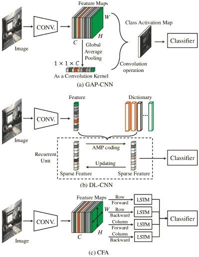

图 6：三种典型特定 CNN 模型的示意图。(a) 在 GAP-CNN[23]中，为了减少标准 CNN 的参数，去除了全连接层，引入了 GAP 层以形成类别激活图（CAMs）。(b) 在 DL-CNN[22]中，为了减少 CNN 模型的参数并获得增强的稀疏特征，提出了字典学习（DL）层来替代全连接层。(c) 在 CFA[24]中，Sun 等人绕过了 CONV 图上的四个方向 LSTM 层以捕捉上下文信息。

除了通用的 CNN 模型，如**预训练 CNN 模型**和**微调 CNN 模型**，另一组深度模型是专门为场景分类设计的。这些模型通过引入新的网络架构，专门开发用于从输入中提取有效的场景表示。如图 6 所示，我们只展示了四种典型的具体模型[22, 23, 24, 26]。

为了从感兴趣区域捕捉辨别信息，Zhou 等人[23]用一个全局平均池化（GAP）层[90]替换了 CNN 模型中的全连接（FC）层，接着是一个 Softmax 层，即 GAP-CNN。如图 6 (a)所示，通过将原始 GAP 层与$1\times 1$卷积操作简单组合形成类激活图（CAM），GAP-CNN 可以专注于特定类别区域，并良好地执行场景分类。尽管 GAP 层的参数数量低于 FC 层[23, 48]，但 GAP-CNN 可以获得可比的分类准确性。

假设一定程度的稀疏性能提高特征表示的辨别能力[91, 92, 93]，Liu 等人[22]提出了一种名为字典学习 CNN（DL-CNN）的稀疏性模型，如图 6 (b)所示。他们用新的字典学习层替换了 FC 层，这些层由有限数量的递归单元组成，对应于近似消息传递中的迭代过程[94]。特别地，这些字典学习层的参数通过端到端的反向传播进行更新。

由于 CONV 层对图像的小块进行局部操作，它们无法明确描述场景图像中不同区域之间的上下文关系。为了解决这一限制，Sun 等人[24]提出了基于 LSTM[95]的外观中的上下文特征（CFA）。如图 6 (c)所示，CONV 特征图被视为 LSTM 层的输入，这些输入以无环的方式转换成四个有向序列。最终，LSTM 层用于描述空间上下文依赖关系，并将四个 LSTM 模块的输出连接起来，以描述外观中的上下文关系。

标准 CNN 中 CONV 和 FC 层的序列操作保留了图像的全局空间结构，这表明全局特征对几何变化敏感[28, 96]，*例如，*物体的平移和旋转直接影响获取的深度特征，这极大地限制了这些特征在场景分类中的应用。为了实现几何不变性，Hayat 等人[26]设计了一种空间非结构化层，通过交换相邻的对角图像块来打乱原始特征图的原始位置。

反向传播算法是 CNN 训练的精髓。它是根据前一轮（*即，*迭代）获得的错误率（*即，*损失）来微调神经网络权重的实践。权重的正确调整能确保较低的错误率，通过提高模型的泛化能力使其更加可靠。因此，许多方法[67, 96, 34, 37]开发了可以通过反向传播更新的具有参数的新层。端到端系统通过反向传播以整体方式进行训练，这已被证明是各种领域中强大的训练方式，场景分类也不例外。许多方法[67, 34, 31, 96, 37]以端到端的方式进行训练。根据我们的调查，从理论上讲，这些模型可以通过端到端优化学习到更多的判别信息；然而，优化结果可能会陷入不佳的局部最优[97, 96]，因此以多阶段方式进行训练的方法在某些情况下可能取得更好的结果。

### 3.2 基于 CNN 的场景表示

场景表示是场景分类的核心，一直是这项研究的重点。因此，许多方法已被提出用于有效的场景表示，广泛分为五类：全局 CNN 特征、空间不变特征、语义特征、多层特征和组合特征，即多视角特征。

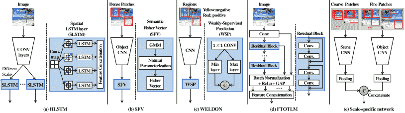

图 7：五种典型的架构用于提取基于 CNN 的场景表示（见第 3.2 节），分别展示。Hourglass 架构是骨干网络，如 AlexNet 或 VGGNet。（a）HLSTM [27]，一种基于全球 CNN 特征的方法，从整个图像中提取深层特征。空间 LSTM 用于建模图像区域空间布局中的 2D 特性。此外，Zuo 等人通过多个 LSTM 层捕获跨尺度的上下文依赖。（b）SFV [30]，一种空间不变特征方法，从密集的补丁中提取局部特征。SFV 的亮点在于添加了自然参数化，将语义空间转换为自然参数空间。（c）WELDON [34]，一种语义特征方法，从顶级证据（红色）和负实例（黄色）中提取深层特征。在 WSP 方案中，Durand 等人使用最大层和最小层分别选择正实例和负实例。（d）FTOTLM [21]，一种典型的多层特征方法，从每个残差块中提取深层特征。（e）特定尺度网络 [19]，一种多视图特征架构，使用以场景为中心的 CNN 从粗略版本中提取深层特征，同时使用以对象为中心的 CNN 从细节补丁中提取特征。两种类型的深层特征相互补充。

#### 3.2.1 基于全球 CNN 特征的方法

基于全球 CNN 特征的方法直接从整个场景图像中预测场景类别的概率。通常，全球 CNN 特征是通过在大规模数据集（*例如*，ImageNet [56] 和 Places [18, 25]）上预训练的通用 CNN 模型从输入图像中提取的，或者在目标数据集（*例如*，SUN397 [57] 和 MIT67 [70]）上进行微调的。由于可用的大型数据集和强大的计算资源（*例如*，GPU 和并行计算集群）[98]，深度网络已经发展得更加深层和复杂，因此这些网络中的全球表示能够在许多应用中，包括场景分类，达到更先进的性能。

除了通用的卷积神经网络（CNN），一些特定场景的 CNN 也被设计用来提取全局特征。例如，如图 7 (a) 所示，Zuo 等人 [27] 提出了层次化 LSTM（HLSTM）来描述上下文关系。他们将 CONV 图像视为无向图，并将其转换为四个有向无环图，LSTM 模块用于以无环方式捕捉空间上下文依赖关系。他们还探索了不同尺度 CONV 图像之间的潜在空间依赖关系，因此 HLSTM 特征不仅涉及同一特征图内的关系，还包含不同尺度之间的上下文依赖关系。此外，Liu 等人 [22] 提出了 DL-CNN 模型来从整个场景图像中提取稀疏的全局特征。Xie 等人 [99] 提出了 InterActive，这是一种新颖的全局 CNN 特征提取算法，它将高层视觉上下文与低层神经元响应结合起来。InterActive 通过允许高层神经元的监督，增加了低层神经元的感受野大小。Hayat 等人 [26] 设计了一个空间无结构层，以解决大规模空间布局变形和尺度变化的挑战。在这方面，Xie 等人 [100] 设计了一个反转不变卷积（RI-Conv）层，使他们能够获得图像及其左右翻转副本的相同表示。然而，基于全局 CNN 特征的方法尚未充分利用场景图像的潜在几何和外观变异性。

全球 CNN 特征的性能受到输入图像内容的巨大影响。CNN 模型在经过足够大且丰富的训练数据集训练后，可以提取通用的全球特征表示，这与手工特征提取方法不同。值得注意的是，由场景中心 CNN 模型获得的全球表示比使用对象中心 CNN 模型获得的表示具有更丰富的空间信息，这可以归因于场景中心 CNN 的全球表示包含了对象与全球场景属性之间的空间相关性[18, 25, 19]。此外，Herranz 等人[19]表明，场景识别系统的性能取决于场景图像中的实体，即，当从背景混乱的图像中提取全球特征时，模型的性能会降低，相比之下，背景孤立的对象或具有简单背景的图像则性能更佳。这表明背景可能会引入一些噪声，从而削弱性能。由于轮廓对人类观察者在识别复杂现实场景时提供了感知优势，Rezanejad 等人[101]研究了来自整个图像和仅轮廓信息的全球 CNN 特征，并表明使用完整图像作为输入的性能更好，因为 CNN 能够从图像中捕捉潜在信息。然而，他们仍然得出结论认为轮廓是提高识别准确性的辅助线索。

#### 3.2.2 基于空间不变特征的方法

为了缓解标准 CNN 中顺序操作带来的问题，一些替代方法[28, 82, 40]提出了基于空间不变特征的方法，以保持空间鲁棒性。 “空间不变”意味着输出特征对输入图像的几何变化具有鲁棒性[96]。

如图 7 (b) 所示，空间不变特征通常是从多个局部补丁中提取的。这种特征提取过程的可视化如图 5（绿色箭头标记）所示。整个过程可以分解为五个基本步骤：1) 局部补丁提取：将给定的输入图像分成较小的局部补丁，这些补丁作为 CNN 模型的输入；2) 局部特征提取：从模型的 CONV 或 FC 层中提取深度特征；3) 码本生成：此步骤是基于从图像的不同区域提取的深度特征生成具有多个码字的码本。这些码字通常以无监督的方式（*例如，* 使用 GMM）学习；4) 空间不变特征生成：给定生成的码本，将深度特征编码为空间不变的表示；5) 类别预测：将表示输入分类为预定义的场景类别。

与基于补丁的局部特征提取（每个局部特征通过独立使用 CNN 提取器从原始补丁中提取）不同，局部特征也可以从标准 CNN 的语义 CONV 图中提取[29, 102, 103, 44]。具体而言，由于特征图的每个单元（深度描述符）对应于输入图像中的一个局部图像补丁，因此每个单元被视为一个局部特征。与独立处理多个空间补丁以获得局部特征相比，这种方法可以减少计算时间。例如，Yoo 等人[29] 用 CONV 层替换了 FC 层，以获得大量的局部空间特征。他们还使用了多尺度 CNN 激活来实现几何鲁棒性。Gao 等人[102] 使用空间金字塔直接将激活分割成多级金字塔，这些金字塔包含更多的辨别空间信息。

特征编码技术，通过聚合局部特征，在将局部特征与最终特征表示相关联方面至关重要，并且直接影响场景分类算法的准确性和效率[85]。改进的费舍尔向量（IFV）[104]、局部聚合描述符向量（VLAD）[105]和视觉词袋（BoVW）[106]是深度学习方法中常用且有效的编码技术。例如，许多方法，如 FV-CNN[82]、MFA-FS[42]和 MFAFVNet[31]，应用 IFV 编码以获得空间不变的图像嵌入表示，而 MOP-CNN[28]、SDO[35]等则利用 VLAD 对局部特征进行聚类。值得注意的是，代码本选择和编码过程导致模型的离散训练。为此，一些工作提出了以端到端方式训练的网络，例如 NetVLAD[67]、MFAFVNet[31]和 VSAD[32]。

基于空间不变特征的方法在实现几何鲁棒性方面非常有效。然而，基于滑动窗口的范式需要多分辨率扫描且具有固定的纵横比，这不适用于场景图像中具有可变大小或纵横比的任意对象。此外，使用密集的补丁可能会将噪声引入最终表示中，从而降低分类准确性。因此，从场景图像的显著区域提取语义特征可以规避这些缺点。

#### 3.2.3 基于语义特征的方法

处理输入图像的所有补丁需要计算成本，同时产生冗余信息。目标检测确定图像中是否存在显著区域的实例[107]。受此启发，基于目标检测器的方法可以识别场景中的显著区域，这些区域提供了关于图像背景的独特信息。

提出了不同的方法来有效地进行显著性检测，如选择性搜索[108]、无监督发现[109]、多尺度组合分组（MCG）[110]和目标检测网络（*例如，* Fast RCNN[51]、Faster RCNN[52]、SSD[111]、Yolo[112, 113]）。例如，由于选择性搜索结合了全面搜索和分割的优点，Liu 等人[87]使用它来捕捉所有可能的语义区域，然后使用预训练的 CNN 提取每个区域的特征图，再用空间金字塔减少图的维度。由于不同场景中常见的物体或特征导致了不同场景的共性，Cheng 等人[35]使用区域提议网络[52]提取具有区分性的区域，同时丢弃非区分性的区域。这些基于语义特征的方法[87, 35]获取了许多语义区域，因此采用了编码技术来聚合关键特征，其管道如图 5（红色箭头）所示。

另一方面，一些基于语义特征的方法[33, 34]基于弱监督学习，直接通过场景的几个语义特征预测类别。例如，Wu 等人[33]通过使用 MCG[110]生成高质量的提议区域，然后在每个场景类别上使用 SVM 来修剪异常值和冗余区域。来自不同尺度补丁的语义特征提供了互补的线索，因为较粗的尺度处理较大的物体，而较细的层次提供较小的物体或物体部件。在实践中，他们发现两个语义特征足以代表整个场景，能够与多个语义特征相媲美。仅使用单个显著区域训练深度模型可能会导致亚优性能，因为训练集中可能存在异常值。因此，可以选择多个区域一起训练模型[34]。如图 7（c）所示，Durand 等人[34]设计了一个 Max 层来选择注意区域以增强区分度。为了提供更稳健的策略，他们还设计了一个 Min 层来捕捉具有最负面证据的区域，从而进一步改进模型。

尽管通过使用更多的语义局部特征可以获得更好的性能，但语义特征基础的方法深受目标检测性能的影响。弱监督设置（*即*，没有场景图像的补丁标签）使得仅凭图像的关键信息难以准确识别场景[34]。此外，误差累积问题和额外的计算成本也限制了语义特征基础方法的发展[103]。

#### 3.2.4 多层特征基础方法

全球特征基础的方法通常提取高层 CNN 特征，并将其输入分类器以实现分类任务。由于这些高层特征的紧凑性，容易忽略一些重要的细微线索[40, 114]。来自不同层的特征是互补的[33, 115]。低层特征通常捕捉小物体，而高层特征捕捉大物体[33]。此外，低层特征的语义信息相对较少，但物体位置准确[115]。为了充分利用来自不同层的特征，许多方法[39, 47, 21, 38]使用了来自早期层的高分辨率特征以及来自最新层的层次模型（*例如*，CNNs）的高语义信息。

如图 7 (d)所示，典型的多层特征形成过程包括：1) 特征提取：提取某些层的输出（特征图）作为深度特征；2) 特征向量化：将提取的特征图向量化；3) 多层特征组合：将来自不同层的多个特征组合成一个单一的特征向量；4) 特征分类：基于获得的组合特征对给定的场景图像进行分类。

尽管使用来自不同层的所有特征似乎可以改善最终表示，但这可能增加过拟合的风险，从而影响性能[37]。因此，许多方法[38, 39, 21, 47, 37]仅从特定层提取特征。例如，Xie 等人[38]构建了两种基于字典的表示：卷积费希尔向量（CFV）和中层局部区分表示（MLR），用于对附属场景图像进行分类。Tang 等人[39]将 GoogLeNet 层从底部到顶部分为三部分，并提取每部分的最终特征图。Liu 等人[21]独立地从 ResNet 中的每个残差块捕获特征图。Song 等人[47]通过最小化错误概率的加权和以及平均相关系数来选择来自不同层和不同网络分支的区分组合。Yang 等人[37]则使用贪婪选择来探索最佳层组合。

多层特征方法中的特征融合是另一个重要方向。特征融合技术主要分为两组[116, 117, 118]：1) 早期融合：提取多层特征并将它们合并为一个综合特征用于场景分类；2) 后期融合：通过监督学习器直接学习每个多层特征，这使得特征直接对类别标签敏感，然后将它们合并为最终特征。虽然后期融合的性能更好，但它更复杂且耗时，因此早期融合更受欢迎[38, 39, 21, 47]。此外，通常使用加法和乘法规则来结合多个特征[39]。由于不同层中的特征空间差异，乘法规则比加法规则更适合融合特征，实际实验[39]也证明了这一点。此外，Tang 等人[39]提出了两种融合多层特征的策略，即‘融合得分’和‘融合特征’。由于端到端训练，得分融合技术在性能上优于特征融合。

#### 3.2.5 多视角特征方法

仅使用单一且紧凑的特征表示来描述复杂场景是一项非平凡的任务。因此，已经进行了广泛的努力，通过整合来自互补 CNN 模型的多个特征来计算场景的综合表示[24, 119, 120, 121, 41, 32]。

从*在不同数据集上训练的网络*生成的特征通常是互补的。如图 7（e）所示，Herranz 等人[19]发现了物体中心 CNN 和场景中心 CNN 的最佳尺度响应，他们通过物体中心 CNN 或场景中心 CNN 以尺度自适应的方式结合这些知识。这一发现被广泛使用[121, 122]。例如，[121]中的作者使用物体中心 CNN 传递图像中物体的信息，而场景中心 CNN 则用于捕捉全局场景信息。沿着这条路，Wang 等人[32]设计了 PatchNet，一种弱监督学习方法，使用图像级监督信息作为有效提取补丁级特征的监督信号。为了提高识别性能，Scene-PatchNet 和 Object-PatchNet 被联合使用来提取每个补丁的特征。

使用*互补 CNN 架构*对于获得判别性的多视图特征表示至关重要。Wang 等人[41]提出了一种多分辨率 CNN（MR-CNN）架构，用于捕捉多尺度图像中的视觉内容。在他们的工作中，正常的 BN-Inception[123]用于提取粗分辨率特征，而更深的 BN-Inception 用于提取细分辨率特征。Jin 等人[124]使用全局特征和空间不变特征来考虑场景的粗略布局和瞬态物体。Sun 等人[24]从判别视图中分别提取了三种表示，即物体语义表示、上下文信息和全局外观，这些表示彼此互补。具体而言，场景图像的物体语义特征通过 CNN 提取，接着是空间 Fisher 向量，而多方向 LSTM 模型的深层特征表示上下文信息，FC 特征表示全局外观。Li 等人[119]使用 ResNet18[79]生成判别性注意力图，该图与原始图像一起作为 CNN 的显式输入。使用 ResNet18 提取的全局特征和从空间特征变换网络中提取的注意力图特征，注意力图特征与全局特征相乘以进行自适应特征细化，使网络关注最具判别性的部分。随后，在[43]中提出了一种多模态架构，由深层分支和语义分支组成。深层分支提取全局 CNN 特征，而语义分支旨在从超像素中提取有意义的场景物体及其关系。

### 3.3 提高场景表示的策略

为了获得更具辨别力的场景分类表示，已提出了一系列策略。以下将讨论四大类策略 (*即，* 编码策略、注意力策略、上下文策略和正则化策略)。

#### 3.3.1 编码策略

尽管当前的推动力是卷积神经网络（CNNs）的引入，但第一代方法的编码技术也已在基于深度学习的方法中得到应用。Fisher 向量 (FV) 编码 [125, 104] 是一种常用于场景分类的编码技术。Fisher 向量存储每个 GMM 组件的均值和协方差偏差向量，以及每个局部特征的元素。得益于协方差偏差向量，FV 编码能取得出色的结果。此外，实证证明 Fisher 向量对全局 CNN 特征是互补的 [30, 42, 46, 38, 40, 31]。因此，本调查将 FV 基础方法作为主要线索，并讨论编码技术与深度学习的适应性结合。

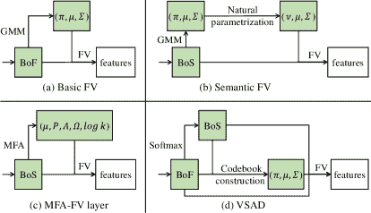

图 8：对比（a）基本的 Fisher 向量 [82] 及其变体的结构。BoF 表示特征包，而 BoS 代表语义概率包。 (b) 在语义 FV [30] 中，添加了自然参数化来将多项分布 (*即，* $\pi$) 映射到其自然参数空间 (*即，* $\nu$)。 (c) 在 MFAFVNet [31] 中，用 MFA 替代 GMM 以构建词典。 (d) 在 VSAD [32] 中，通过利用语义 (*即，* BoS) 来构建词典，从而聚合局部特征 (*即，* BoF)。

通常，CONV 特征和 FC 特征被视为特征袋（BoF），它们可以通过高斯混合模型加上 Fisher 向量（GMM-FV）来建模[30, 31]。为了避免计算 FC 层，Cimpoi 等[82]利用 GMM-FV 分别聚合来自不同 CONV 层的 BoF。通过比较他们的实验结果，他们断言最后的 CONV 特征能更有效地表示场景。为了挽救早期/中间层的细粒度信息，Guo 等[40]提出了 Fisher 卷积向量（FCV）来编码来自多个 CONV 层的特征图。Wang 等[46]提取了来自 RGB、HHA 和表面法线图像的特征图，然后直接通过 FV 编码这些图。此外，通过对 CONV 特征和 FC 特征的 GMM-FV 编码性能比较，Dixit 等[30]断言 FC 特征在场景分类中更有效。然而，由于 CONV 特征和 FC 特征并非源于语义概率空间，它们可能比真正的语义特征更不具判别性和抽象性[82, 30]。Softmax 层的激活是概率向量，位于概率单纯形中，较为抽象和语义，但实施有效的不变编码（*例如*，GMM-FV）较为困难[126, 30]。为此，Dixit 等[30]提出了一种间接 FV 实现方法，用于聚合这些语义概率特征，即增加一个步骤，将语义多项式从概率空间转换到自然参数空间，如图 8 (b)所示。受 FV 和 VLAD 的启发，Wang 等[32]提出了语义聚合描述符向量（VSAD）来编码概率特征，如图 8 (d)所示。比较弱监督方法（PatchNet）学习的判别概率与无监督方法（GMM）生成的概率，结果表明判别概率在聚合局部特征时更具表现力。综上所述，概率空间上的局部特征表示编码优于非概率空间。

深层特征通常是高维的。因此，需要更多的高斯核来准确建模特征空间[83]。然而，这会带来大量的计算开销，因此效率不高。Liu 等人[83]通过实验证明，FV 特征的判别能力随着高斯核数量的增加而缓慢提升。因此，特征的降维非常重要，因为它直接影响计算效率。许多方法[83, 30, 29, 58, 40, 42, 32]使用流行的降维技术，主成分分析（PCA），对局部特征进行预处理。此外，Liu 等人[83]从高斯分布中提取局部特征，具有接近零的均值，这确保了结果 FV 的稀疏性。Wang 等人[46]通过组件正则化强制 GMM-FV 特征的组件间稀疏性，以减少不必要的组件。

由于深层特征的非线性特性和 GMM 协方差的有限能力，需要大量的对角 GMM 组件来建模深层特征，从而使 FV 具有非常高的维度[42, 31]。为了解决这个问题，Dixit 等人[42]提出了 MFA-FS，其中 GMM 被因子分析混合模型（MFA）[127, 128]取代，*即*，使用一组局部线性子空间来捕捉非线性特征。MFA-FS 表现良好，但不支持端到端训练。然而，端到端训练比任何离散训练过程更高效[31]。因此，Li 等人[31]提出了 MFAFVnet，这是一种 MFA-FS 的改进变体[42]，它可以方便地嵌入到最先进的网络架构中。图 8 (c)展示了 MFAFVNet 的 MFA-FV 层，与其他两个结构进行了比较。

在 FV 编码中，局部特征被假设为独立同分布（iid），这违反了这些补丁不是 iid 的内在图像属性。为此，Cinbis 等人[58]通过将模型参数视为潜变量引入了非 iid 模型，从而使特征局部相关。后来，Wei 等人[129]提出了一个相关的主题向量，作为从 Fisher 核框架演变而来的模型，以探索潜在语义，并考虑语义相关性。

#### 3.3.2 注意力策略

与基于语义特征的方法（通常关注于原始图像中的关键线索）不同，注意力机制旨在从提取的特征空间中捕捉区别性线索[96, 122, 44, 43]。注意力图是在没有任何显式训练信号的情况下学习的，而仅依靠任务相关的损失函数提供注意力权重的训练信号。通常，注意力策略主要包括通道注意力和空间注意力。

通道注意力策略。通道激活图（ChAMs）是通过注意力策略生成的加权激活图，突出显示了类别特定的判别区域。例如，类激活图[23]是一种简单的 ChAM，广泛用于许多工作中[130, 131]。由于相同的语义线索在某些情况下对不同类型的场景具有不同的作用，Li 等人[96] 设计了类别感知的注意力池化，包括模态内注意力池化和跨模态注意力池化，以分别学习 RGB 和深度模态的贡献。在这里，注意力策略还用于进一步融合 RGB 和深度模态中的学习到的判别性语义线索。此外，他们还设计了类别无关的注意力池化，以忽略一些可能误导分类的显著区域。受到特定对象与场景相关联的思想启发，Seong 等人[132] 提出了相关上下文门控，以激活场景特定的对象特征。

通道注意力图也可以从不同的信息源计算得到。Xia 等人[122] 设计了一种弱监督注意力图（WS-AM），通过提出一种梯度加权类激活映射技术，并优先考虑弱监督信息，利用不同尺度的多个显著区域作为输入。在另一项工作中[43]，语义分支的输入是语义分割得分图，语义特征通过使用三个通道注意力模块从语义分支中提取，如图 9 (a)所示。此外，语义特征还通过另一个注意力模块用于门控全局 CNN 特征。

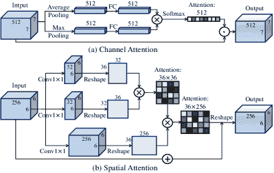

图 9：两个典型注意力的示意图。(a) 在通道注意力[43]中，通道注意力图用于通过 Hadamard 积对输入进行加权。(b) 空间注意力[44]用于增强局部特征选择。

空间注意力策略。空间注意力策略沿输入特征图的高度和宽度推断注意力图，然后将注意力图与原始图像结合进行自适应特征细化。Joseph 等人 [133] 提出了一个层级空间注意力模型，包括一个硬注意力来选择 CNN 层和一个软注意力来实现所选层内的空间定位。注意力图来自 Conv-LSTM 架构，其中层注意力使用前一个隐藏状态，空间注意力则同时使用所选层和前一个隐藏状态。为了增强局部特征选择，Xiong 等人 [103, 44] 设计了一个空间注意力模块，如图 9 (b)，以生成注意力掩膜。这些 RGB 和深度模态的注意力掩膜应尽可能相似，然后学习模态一致的特征。

#### 3.3.3 上下文策略

上下文信息（图像区域之间的关联和局部特征），以及对象/场景可能在消除视觉词汇歧义方面提供有益的信息[134]。然而，卷积和池化核在图像区域上是局部执行的，编码技术通常将多个局部特征整合成一个非结构化特征。因此，不同区域之间的上下文相关性没有被考虑到[135]。为此，上下文相关性已被进一步探索，以关注全球布局或局部区域一致性[136]。

上下文关系可以大致分为两大类：1) 空间上下文关系：相邻区域之间的关联，其中捕捉空间上下文关系通常遇到预定义网格补丁导致的不完整区域或噪声问题；2) 语义上下文关系：显著区域之间的关系。提取语义关系的网络通常是一个两阶段框架（*即，*检测对象和分类场景）。因此，准确性也受到对象检测的影响。一般来说，有三种算法来捕捉上下文关系：1) 序列模型，如 RNN [137] 和 LSTM [95]，2) 图相关模型，如马尔可夫随机场（MRF）[138, 139]，相关主题模型（CTM）[140, 129] 和图卷积 [141, 142, 143]。

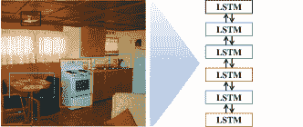

(a) 序列模型

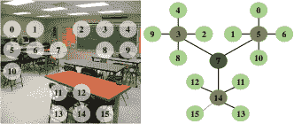

(b) 图相关模型

图 10：序列模型和图模型的相关上下文信息插图。 (a) 通过 CNN 从每个显著区域提取局部特征，双向 LSTM 被用来同步建模许多对许多局部特征关系 [36]。 (b) 通过将选定的关键特征分配给图节点（包括中心节点、子中心节点和其他节点）来构建图 [144]。

序列模型。随着序列模型，如 RNN 和 LSTM 的成功，捕捉局部区域之间的序列信息在场景分类中显示出有希望的性能 [36]。空间依赖性通过每个区域与其周围邻域之间的直接或间接连接来捕获。Zuo 等人 [27] 在 CONV 特征图上堆叠了多方向 LSTM 层，以编码场景图像中的空间上下文信息。此外，采用了分层策略来捕获跨尺度的上下文信息。类似于 [27] 的工作，Sun 等人 [24] 在 CONV 特征图上绕过了两组多方向 LSTM 层。在他们的框架中，所有 LSTM 层的输出被串联形成上下文表示。此外，工作 [145, 36] 捕获了来自变动显著区域的语义上下文知识。在 [145] 中，提出了两种表示，即 COOR 和 SOOR，以描述对象之间的关系。这里，COOR 采用共现频率来表示对象之间的关系，而 SOOR 则通过将对象序列视为句子来使用序列模型进行编码。基于 Javed 等人 [146] 的工作，Laranjeira 等人 [36] 提出了双向 LSTM 来捕获感兴趣区域的上下文关系，如图 10 (a) 所示。他们的模型支持可变长度的序列，因为每张图像的对象部件数量不同。

图相关模型。顺序模型通常简化了上下文关系，而图相关模型可以探索更复杂的结构布局。宋等人[147] 提出了一个联合上下文模型，该模型使用马尔可夫随机场（MRF）来结合多个尺度、空间关系以及邻近语义多项式之间的多个特征，显示出这种方法可以发现一致的共现模式并过滤掉噪声。基于 CTM，魏等人[129] 捕捉了潜在主题之间的关系作为语义特征，即纠正的主题向量（CTV）。后来，随着图神经网络（GNN）[142, 143] 的发展，图卷积在场景分类中的上下文信息建模变得越来越受欢迎。袁等人[144] 使用谱图卷积来挖掘所选择的局部 CNN 特征之间的关系，如图 10（b）所示。为了利用多模态的互补线索，袁等人还通过跨模态图考虑了 RGB 和深度模态的互模态相关性。陈等人[45] 使用图卷积[148] 通过预定义具有辨别性的区域特征作为图节点，来建模更复杂的空间结构布局。然而，空间关系忽视了区域的语义含义。为了解决这个问题，陈等人还定义了一个相似性子图作为空间子图的补充。

#### 3.3.4 正则化策略

训练分类器不仅需要分类损失函数，还可能需要通过不同的正则化项进行多任务学习，以减少泛化误差。场景分类的正则化策略主要包括稀疏正则化、结构化正则化和监督正则化。

稀疏正则化。稀疏正则化是一种减少模型复杂性以防止过拟合甚至提高泛化能力的技术。许多工作[87, 149, 40, 22, 150] 在基础损失函数中包含了$\ell_{0}$、$\ell_{1}$或$\ell_{2}$范数以学习稀疏特征。例如，[87]中的稀疏重建项鼓励学习到的表示具有显著的信息性。[22]中的损失结合了马氏距离和欧几里得距离的优势，以平衡准确性和泛化能力。

结构化正则化。最小化三元组损失函数可以最小化锚点和正样本之间的距离（同一类别标签），同时最大化锚点和负样本之间的距离（不同类别标签）。此外，根据学习中的最大间隔理论[151]，铰链距离集中于困难的训练样本。因此，许多研究努力[149, 50, 152, 103, 44]利用了三元组损失与铰链距离的结构化正则化来学习稳健的特征表示。结构化正则化项为$\sum_{a,p,n}{max(d(x_{a},x_{p})-d(x_{a},x_{n})+\alpha,0)}$，其中$x_{a},x_{p},x_{n}$分别为锚点、正样本和负样本特征，$\alpha$为可调参数，而函数$d(x,y)$表示计算$x$和$y$之间的距离。结构化正则化项促进了示例选择，同时也忽略了可能压倒有用区分模式的噪声训练样本[149, 103]。

监督正则化。监督正则化使用标签信息来调整中间特征图。监督正则化通常表示为$\sum_{i}{d(y_{i},f(x_{i}))}$，其中$x_{i}$和$y_{i}$分别表示图像$i$的中间层激活特征和真实标签，而$f(x_{i})$是预测标签。例如，Guo 等人[40]利用辅助损失直接将标签信息传播到 CONV 层，从而准确捕捉 CONV 层中局部物体和细微结构的信息。类似地，这些替代方法[103, 144, 44]使用监督正则化来学习特定模态的特征。

其他。通过结合不同的正则化技术提取具有区分性的特征一直是场景分类中的主流话题。例如，标签一致性正则化[87]保证了来自不同类别的输入具有区分性的响应。[149]中的共享约束可以学习灵活数量的过滤器，以表示不同类别间的共通模式。[124]中的聚类损失用于进一步微调混淆的聚类，以克服固有的类内变化问题。由于将软标签分配给样本会导致一定程度的模糊性，这在增加场景类别数量时会带来很高的收益[153]，Wang 等人[41]通过利用知识网络中的软标签作为损失函数的偏置项，提高了泛化能力。值得注意的是，优化适当的损失函数可以为图像分类选择有效的补丁。在 fast RCNN[51]和 Faster RCNN[52]中，回归损失用于学习有效的区域提议。Wu 等人[33]采用了单类 SVM[154]作为区分模型来获取元对象。受到 MANTRA[155]的启发，[34]中的主要直觉是通过优化 max$+$min 预测问题，为每个可能的输出配备成对的潜在变量，即*正面*和*负面*补丁。

几乎所有使用正则化的多任务学习方法都旨在找到各冲突需求之间的折中，如*准确性*、*泛化鲁棒性*和*效率*。研究人员应用完全不同的监督信息于各种辅助任务，以促进主要场景分类任务的收敛[40]。

### 3.4 RGB-D 场景分类

RGB 模态提供了颜色的强度和纹理线索，而深度模态则携带了场景表面距离观察点的信息。深度信息对光照和颜色变化不变，并包含几何和形状线索，这对场景表示非常有用[156, 157, 158]。此外，HHA 数据[73]，即深度图像的编码结果，深度信息展现出一定的颜色模态，这在某种程度上类似于 RGB 图像。因此，一些在 RGB 图像上训练的 CNN 可以将其知识迁移到 HHA 数据上。

与 RGB 图像相比，RGB-D 图像的深度信息可以进一步提升 CNN 模型的性能[89]。对于 RGB-D 场景分类任务，除了探索适合的 RGB 特征（见第 3.2 节），还存在另外两个主要问题，*即*：1）如何提取深度特征，2）如何合理融合 RGB 和深度模态的特征。

#### 3.4.1 深度特征学习

与 RGB 数据相比，深度信息通常较少。因此，仅使用有限的深度数据训练 CNN 以实现深度特定模型[89]并非易事，*即*：深度 CNN。因此，采用了不同的训练策略来使用有限数量的深度图像训练 CNN。

对于深度图像的 RGB-CNN 微调。由于 RGB 数据的可用性，许多模型[49、50、46]首先在大规模 RGB 数据集（如 ImageNet 和 Places）上进行预训练，然后在深度数据上进行微调。微调只更新最后几层全连接层（FC 层），而前面的层参数不做调整。因此，微调后的模型层未能充分利用深度数据[89]。然而，早期卷积层（CONV 层）的抽象表示在使用不同模态计算深度特征中起着关键作用。弱监督学习和半监督学习可以在前面层中强制显式适应。

使用深度图像补丁的弱监督学习。Song 等人[89、47]提出了从头开始使用弱监督学习来学习深度特征。Song 等人[89]指出，深度图像中的模式多样性和复杂性显著低于 RGB 图像。因此，他们设计了一个层数较少的深度卷积神经网络（DCNN）来提取深度特征。他们还通过冻结、微调和从头训练三种策略来训练 DCNN，以充分捕捉深度信息。然而，弱监督学习对训练数据中的噪声很敏感。因此，提取的特征可能在分类中不具备良好的区分质量。

使用未标记图像的半监督学习。由于未标记 RGB-D 数据的方便收集，相较于大量的未标记数据，半监督学习也可以用于有限标记样本的 CNN 训练 [48, 158]。Cheng 等 [158] 使用少量标记的 RGB-D 图像和大量未标记的 RGB-D 图像通过共训练算法来训练 CNN，以保留多样性。随后，Du 等 [48] 开发了一种编码器-解码器模型，以构建输入的配对互补模态数据。特别是，编码器作为模态特定网络提取特定特征用于后续的分类任务。

#### 3.4.2 多模态融合

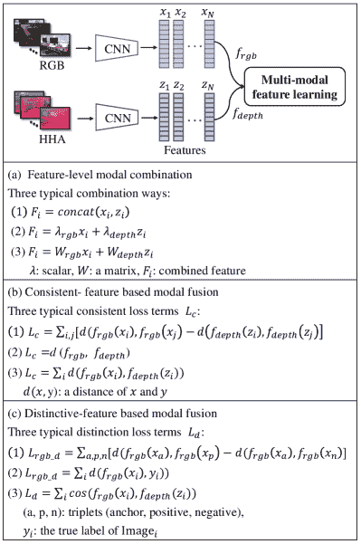

图 11：多模态特征学习的示意图。 (a) 实现特征组合的三种流行方式：直接连接特征、加权特征组合和线性转换特征组合。 (b) 实现模态一致性的三种方法：最小化模态之间的配对距离 [50]; 鼓励模态的注意力图相似 [103]; 最小化模态之间的距离 [44, 152]。 (c) 实现模态特异性的三种策略：通过三元组损失学习模型结构 [50, 152]; 使用标签信息指导模态特定学习 [103, 144]; 最小化模态之间的余弦相似度 [44]。

各种模态融合方法 [159, 152, 44] 已被提出，以结合不同模态的信息，从而进一步提高分类模型的性能。融合策略主要分为三类，即特征级模态组合、一致性特征融合和特异性特征融合。图 11 展示了后两类的示意图。尽管存在不同的融合类别，一些研究 [46, 152, 44] 结合多种融合策略以实现更好的场景分类性能。

特征层级模态组合。Song 等人[47] 提出了多模态组合方法，以选择来自不同源模型的区分组合层。他们将 RGB 和深度特征连接起来，以保持 RGB 和深度数据之间的相关性。减少特征的冗余可以显著提高性能，特别是在 RGB 和深度特征之间存在相关性的情况下；尤其是在通过 RGB-CNNs[89] 仅提取深度特征时。由于这种相关性，直接连接特征可能导致信息冗余。为了避免这种问题，Du 等人[48] 在连接模态特定特征后执行全局平均池化，以减少特征维度。Wang 等人[46] 基于排他组套索的模态正则化来确保特征稀疏性和共存，同时鼓励模态内的特征竞争。Li 等人[96] 使用注意力模块来辨别来自模态内和跨模态的区分语义线索。此外，Cheng 等人[49] 提出了一个门控融合层，以调整 RGB 和深度对图像像素的贡献。

一致特征基础的模态融合。图像可能会因信息缺失或噪声污染而导致多模态特征不一致，因此，利用不同模态之间的相关性来排除这种问题至关重要。为了驱动不同模态的特征一致性，Zhu 等人[50] 引入了一个模态间相关性项，以最小化同一类别中两个模态的成对距离，同时最大化不同类别中的成对距离。Zheng 等人[160] 采用了多任务度量学习来学习 RGB 和深度特征的线性变换，充分利用了模态间关系。Li 等人[152] 借鉴典型相关分析[161, 162] 学习了 RGB 和深度特征之间的相关嵌入模块。Xiong 等人[103, 44] 提出了一种学习方法，鼓励两个特定模态的网络关注具有相似空间位置的特征，从而学习更具区分性的模态一致特征。

基于独特特征的模态融合。除了构建多模态一致特征外，还可以单独处理特征以提高区分能力。例如，Li 等 [152] 和 Zhu 等 [50] 在三重损失函数中采用结构化正则化，鼓励模型在这种正则化的监督下学习模态特定特征。Li 等 [152] 为每种模态设计了独特的嵌入模块，以学习独特特征。使用标签对每种模态的模型特定表示学习进行单独监督也是另一种单独处理的技术 [103, 144, 44]。此外，通过最小化特征相关性，Xiong 等 [44] 学习了模态独特特征，因为 RGB 和深度模态具有不同的特性。

## 4 性能比较

### 4.1 RGB 场景数据的性能

表 II：一些代表性方法在流行基准数据集上的性能 (%) 总结。所有分数均直接引用自原始论文。对于每个数据集，突出显示前三个分类分数。部分缩写：列“方案”：全图像 (WI)，密集补丁 (DP)，区域提议 (RP)；列“初始化”：ImageNet (IN)，Places205 (PL1)，Places365 (PL2)。

| 组别 | 方法 | 输入信息 | 特征信息 | 结构 | 结果（RGB） |
| --- | --- | --- | --- | --- | --- |
|  | 比例 | 方案 | 数据增强 | 聚合 | 维度 | 初始化 | 主干 | Scene15 | MIT67 | SUN397 |
| 基于全球 CNN 特征的方法 | ImageNet-CNN [17] | 单一 | WI | ${\times}$ | 池化 | 4,096 | IN | AlexNet | 84.2 | 56.8 | 42.6 |
| PL1-CNN [18] | 单一 | WI | ${\times}$ | 池化 | 4,096 | PL1 | VGGNet | 91.6 | 79.8 | 62.0 |
| PL2-CNN [25] | 单一 | WI | ${\times}$ | 池化 | 4,096 | PL2 | VGGNet | 92.0 | 76.5 | 63.2 |
| S2ICA [26] | 多重 | DP | ${\surd}$ | 池化 | 8,192 | IN | AlexNet | 93.1 | 71.2 | $-$ |
|  | GAP-CNN [23] | 单一 | WI | ${\surd}$ | GAP | 4,096 | PL1 | GoogLeNet | 88.3 | 66.6 | 51.3 |
|  | InterActive [99] | 单一 | WI | ${\times}$ | 池化 | 4,096 | IN | VGG19 | $-$ | 78.7 | 63.0 |
|  | C-HLSTM [27] | 多重 | WI | ${\surd}$ | LSTM | 4,096 | PL1 | AlexNet | $-$ | 75.7 | 60.3 |
|  | DL-CNN [22] | 单一 | WI | ${\times}$ | DL | $-$ | PL1 | VGGNet | 96.0 | 86.4 | 70.1 |
| 基于空间不变特征的方法 | SCFVC [83] | 单一 | DP | ${\times}$ | FV | 200,000 | IN | AlexNet | $-$ | 68.2 | $-$ |
| MOP-CNN [28] | 多重 | DP | ${\times}$ | VLAD | 12,288 | IN | AlexNet | $-$ | 68.9 | 52.0 |
| DSP [102] | 多重 | WI | ${\times}$ | FV | 12,288 | IN | VGGNet | 91.8 | 78.3 | 59.8 |
| MPP-CNN [29] | 多 | RP | ${\times}$ | FV | 65,536 | IN | AlexNet | $-$ | 80.8 | $-$ |
| SFV [30] | 多 | DP, WI | ${\times}$ | FV | 9,216 | IN | AlexNet | $-$ | 72.8 | 54.4 |
| FV-CNN [82] | 多 | RP, WI | ${\times}$ | FV | 4,096 | IN | VGGNet | $-$ | 81.0 | $-$ |
| LatMoG [58] | 多 | RP | ${\times}$ | FV | $-$ | IN | AlexNet | $-$ | 69.1 | $-$ |
| DUCA [20] | 单一 | DP | ${\surd}$ | CSMC | 4,096 | IN | AlexNet | 94.5 | 78.8 | $-$ |
| D3 [163] | 单一 | DP | ${\times}$ | D3, FV | 1,048,576 | IN | VGG16 | 92.8 | 77.1 | 61.5 |
| MFA-FS [42] | 多 | DP | ${\times}$ | MFA-FV | 5,000 | IN | VGGNet | $-$ | 81.4 | 63.3 |
| CTV [129] | 多 | WI | ${\times}$ | CTV | $-$ | PL1 | AlexNet | $-$ | 73.9 | 58.4 |
| MFAFVNet [31] | 多 | DP | ${\times}$ | MFA-FV | 500,000 | IN | VGG19 | $-$ | 82.7 | 64.6 |
| EMFS [147] | 多 | DP | ${\times}$ | SM | 4,096 | IN, PL2 | VGGNet | $-$ | 86.5 | 72.6 |
| VSAD [32] | 多 | DP | ${\surd}$ | VSAD | 25,600 | IN, PL1 | VGG16 | $-$ | 86.1 | 72.0 |
| LLC [150] | 单一 | DP | ${\times}$ | SSE | 3,072 | IN, PL2 | VGG16 | $-$ | 79.6 | 57.5 |
| 语义特征基础的方法 | URDL [87] | 多 | SS | ${\surd}$ | pooling | 4,096+ | IN | VGG16 | 91.2 | 71.9 | $-$ |
| MetaObject-CNN [33] | 多 | RP | ${\surd}$ | LSAQ | 4,096 | PL1 | AlexNet | $-$ | 78.9 | 58.1 |
| SOAL [164] | 多 | RP | ${\times}$ | CRF | 1,024 | PL1 | VGGNet | $-$ | 82.5 | 75.5 |
| WELDON [34] | 单一 | WI | ${\times}$ | pooling | 4,096 | IN | VGG16 | 94.3 | 78.0 | $-$ |
| Adi-Red [165] | 多 | DisNet | ${\times}$ | GAP | 12,288 | IN, PL1-2 | ResNet | $-$ | $-$ | 73.6 |
| SDO [35] | 多 | OMD | ${\times}$ | VLAD | 8,192 | PL1 | VGGNet | *95.9* | 86.8 | 73.4 |
| M2M BiLSTM [36] | 单一 | SS | ${\times}$ | LSTM | $-$ | IN | ResNet | *96.3* | 88.3 | 71.8 |
| LGN [45] | 单一 | WI | ${\times}$ | LGN | 8,192 | PL2 | ResNet | $-$ | 88.1 | 74.1 |
| 多层特征基础的方法 | Deep19-DAG [37] | 单一 | WI | ${\times}$ | pooling | 6,144 | IN | VGG19 | 92.9 | 77.5 | 56.2 |
| 混合 CNN [38] | 多 | SS | ${\times}$ | FV | 12,288+ | IN, PL1 | VGGNet | $-$ | 82.3 | 64.5 |
| G-MS2F [39] | 单一 | WI | ${\surd}$ | pooling | 3,072 | IN, PL1 | GoogLeNet | 93.2 | 80.0 | 65.1 |
|  | FTOTLM [21] | 单一 | WI | ${\times}$ | GAP | 3,968 | IN, PL2 | ResNet | 94.0 | 74.6 | $65.5$ |
|  | FTOTLM Aug. [21] | 单一 | WI | ${\surd}$ | GAP | 3,968 | IN, PL2 | ResNet | *97.4^∗* | *94.1^∗* | *85.2^∗* |
| 多视角特征基础的方法 | [166] | 多 | WI | ${\surd}$ | pooling | 8,192 | IN, aratio | AlexNet | 92.1 | 70.1 | 54.7 |
| 特定尺度 CNNs [19] | 多模态 | 裁剪 | ${\times}$ | pooling | 4,096 | IN, PL1 | VGGNet | 95.2 | 86.0 | 70.2 |
| LS-DHM [40] | 单一 | WI, DP | ${\times}$ | FV | 40,960 | IN | VGGNet | $-$ | 83.8 | 67.6 |
| [167] | 多模态 | WI, DP | ${\times}$ | SC | 6,096 | IN, PL1 | VGG16 | 95.7 | 87.2 | 71.1 |
| MR CNN [41] | 多模态 | WI | ${\surd}$ | pooling | $-$ | Places401 | Inception 2 | $-$ | 86.7 | 72.0 |
| SOSF+CFA+GAF [24] | 单一 | WI, DP | ${\surd}$ | SFV | 12,288 | IN | VGG16 | $-$ | *89.5* | *78.9* |
| FOSNet [132] | 单一 | WI | ${\surd}$ | GAP | 4,096 | PL2 | ResNet | $-$ | *90.3* | *77.3* |
|  | ChAM [43] | 单一 | WI | ${\surd}$ | pooling | 512 | PL2 | ResNet | $-$ | *87.1* | *74.0* |

表 III：在基准场景数据集上，相关方法在是否连接全局 CNN 特征下的性能 (%) 比较。

|  |  | DSFL [149] | SFV [30] | MFA$-$FS [42] | MFAFVNet [31] | VSAD [32] | SOSF$+$CFA [24] | SDO [35] | LGN [45] |
| --- | --- | --- | --- | --- | --- | --- | --- | --- | --- |
| MIT67 | 基线 | 52.2 | 72.8 | 81.4 | 82.6 | 84.9 | 84.1 | 68.1 | 85.2 |
|  | $+$全局特征 | 76.2 ($\uparrow 24$) | 79 ($\uparrow 6.2$) | 87.2 ($\uparrow 5.8$) | 87.9 ($\uparrow 5.3$) | 85.3 ($\uparrow 0.4$) | 89.5 ($\uparrow 5.4$) | 84 ($\uparrow 15.9$) | 85.4 ($\uparrow 0.2$) |
| SUN397 | 基线 | $-$ | 54.4 | 63.3 | 64.6 | 71.7 | 66.5 | 54.8 | $-$ |
|  | $+$全局特征 | $-$ | 61.7 ($\uparrow 7.3$) | 71.1 ($\uparrow 7.8$) | 72 ($\uparrow 7.4$) | 72.5 ($\uparrow 0.8$) | 78.9 ($\uparrow 12.4$) | 67 ($\uparrow 12.2$) | $-$ |

相比之下，基于 CNN 的方法在场景分类中迅速展示了它们的优势。表 II 比较了深度模型在 RGB 数据集上的场景分类性能。为了深入了解所呈现方法的性能，我们还提供了每种方法的输入信息、特征信息和架构。结果表明，一个简单的深度模型（*即，* AlexNet），在 ImageNet 上训练后，在 Scene15、MIT67 和 SUN397 数据集上的准确率分别为 84.23%、56.79% 和 42.61%。这一准确率与最佳的非深度学习方法相当。从通用深度模型 [17, 18, 25] 开始，当引入更有效的策略时，基于 CNN 的方法逐步提升。因此，几乎所有方法在 Scene15 数据集上都达到了 90% 的准确率。此外，FTOTLM [21] 结合新颖的数据增强技术，超越了其他先进模型，并在三个基准数据集上取得了最佳准确率。

提取全局 CNN 特征的速度比其他深度特征表示技术要快，这些特征是使用预训练模型计算的，但当源数据集和目标数据集之间存在较大差异时，它们的质量并不好。比较这些性能 [17, 18, 25] 证明了全局 CNN 特征的表现力随着丰富场景数据集的出现而得到提升。在 GAP-CNN [23] 和 DL-CNN [22] 中，新的具有少量参数的层替代了全连接层，但与基准 CNN [17, 18] 相比，它们仍然能够取得相当好的结果。

基于空间不变特征的方法通常耗时较长，尤其是在采样局部补丁、提取个体局部特征和构建词汇表的计算时间。然而，这些方法对几何变换具有鲁棒性，从而提高了基准 CNN 的准确性，如 SFV [30] 与 ImageNet-CNN [17]，以及 MFA-FS [42] 与 PL1-CNN [18]。编码技术通常包括更复杂的训练过程，因此一些架构（*例如*，MFAFVNet [31] 和 VSAD [32]）被设计成统一的流程，以减少操作复杂性。

基于语义特征的方法 [165, 35, 36, 45] 展示了非常具有竞争力的性能，因为与基于全局 CNN 特征和空间不变特征的方法相比，它们的显著区域包含了更多的区分信息。显著区域通常由区域选择算法生成，这可能导致两阶段训练过程，并需要更多的时间和计算 [61]。此外，尽管上下文分析需要更多的计算能力，但一些方法 [36, 45] 通过探索显著区域之间的上下文关系，可以显著提高分类准确性。

多层特征方法利用来自不同层的互补特征来提高性能。这是一种简单的使用更多特征线索的方式，同时也不需要添加其他层。然而，这些方法结构复杂，具有高维特征，使得模型训练困难且容易过拟合 [37]。尽管如此，由于一种新颖的数据增强方法，FTOTLM [21] 在 MIT67 和 SUN397 上分别取得了 19.5% 和 19.7% 的提升，并且迄今为止取得了最佳结果。

基于多视角特征的方法充分利用从各种 CNN 中提取的特征，以实现高分类准确率。例如，表 III 显示，将全局特征与其他基线进行组合显著提高了原始分类准确率，*例如*，基线模型“SFV”[30]在 MIT67 上取得了 72.8%，而“SFV$+$全局特征”则达到了 79%。此外，有两个方面需要强调：1）Herranz 等[19]实证证明，组合过多无效特征的边际效果有限，且显著增加了计算量并引入噪声。2）提高每个视角特征的表达能力至关重要，从而增强多视角特征的整体能力。

总结来说，通过采用更复杂的深度模型[77, 79]和大规模数据集[18, 25]，场景分类性能可以得到提升。同时，基于深度学习的方法可以通过组合多种特征[24]、关注语义区域[35]、数据增强[21]和在统一管道中训练[132]，在公共数据集上获得相对满意的准确率。此外，许多方法还通过采用不同的策略提高了准确性，*即*，改进编码[32, 31]、上下文建模[36, 45]、注意力策略[23, 43]和多任务学习[22, 40]。

表 IV：基准 RGB-D 场景数据集上代表性方法的性能（%）比较。对于每个数据集，前三名的得分被突出显示。

| 组 | 方法 | 架构 | 详细信息 | 结果 |
| --- | --- | --- | --- | --- |
|  |  | RGB-CNN | Depth-CNN | 维度 | 模态融合 | 分类器 | NYUD2 | SUN RGBD |
| 数据集 | SUN RGBD[72] | PL1-AlexNet | 8,192 | 特征级拼接 | SVM | $-$ | $39$ |
| 特征学习 | SS-CNN [168] | PL1-ASPP | 4,096 | 图像级堆叠 | Softmax | $-$ | $41.3$ |
|  | MMML [160] | IN-DeCAF | 256 | 特征级拼接 | SVM | $61.4$ | $-$ |
|  | MSMM [47] | PL1-AlexNet | 12,288+ | 特征级拼接 | wSVM | $66.7$ | $52.3$ |
|  | MAPNet [96] | PL1-AlexNet | 5,120 | 局部和语义特征拼接 | Softmax | $67.7$ | *56.2* |
|  | SOOR[145] | PL1-AlexNet | PL1-DCNN | 512 | 局部和全局特征拼接 | SVM | $67.4$ | $55.5$ |
|  | ACM [144] | PL2-AlexNet | 8192+ | 特征级拼接 | Softmax | $67.2$ | $55.1$ |
|  | LM-CNN [169] | IN-AlexNet | 8,192 | 局部特征拼接 | Softmax | $-$ | $48.7$ |
| 深度特征学习 | DCNN [89] | PL1-RCNN | PL1-DCNN | 4,608 | 特征级联接 | wSVM | $67.5$ | $53.8$ |
|  | TRecgNet [48] | SUN RGBD & PL2 ResNet18 | 1024 | 特征级联接 | Softmax | *69.2* | *56.7* |
| 多模态融合 | DMMF [50] | PL1-AlexNet | 4096 | 模态间和模态内相关性与区分 | L-SVM | $-$ | $41.5$ |
|  | MaCAFF [46] | PL1-AlexNet | $-$ | 局部和全局特征级联接 | L-SVM | $63.9$ | $48.1$ |
|  | DF2Net [152] | PL1-AlexNet | 512 | 模态相关性与区分 | Softmax | $65.4$ | $54.6$ |
|  | KFS [103] | PL1-AlexNet | 9,216+ | 模态相关性与区分 | Softmax | $67.8$ | 55.9 |
|  | CBSC [170] | PL2-VGG16 | $-$ | 特征级联接 | Softmax | *69.7^∗* | *57.8^∗* |
|  | MSN [44] | PL1-AlexNet | 9,216+ | 模态相关性与区分 | Softmax | *68.1* | *56.2* |

表 V：对基准数据集的消融研究，以验证深度信息的性能（%）。

|  |  | MaCAFF[46] | MSMM[47] | DCNN[89] | DF2Net[152] | TRecgNet[48] | ACM[144] | CBCL[170] | KFS[103] | MSN[44] |
| --- | --- | --- | --- | --- | --- | --- | --- | --- | --- | --- |
| NYUD2 | 基线 | 53.5 | $-$ | 53.4 | 61.1 | 53.7 | 55.4 | 66.4 | 53.5 | 53.5 |
|  | $+$深度 | 63.9 ($\uparrow 10.4$) | $-$ | 67.5 ($\uparrow 14.1$) | 65.4 ($\uparrow 4.3$) | 67.5 ($\uparrow 13.8$) | 67.4 ($\uparrow 12$) | 69.7 ($\uparrow 3.3$) | 67.8 ($\uparrow 14.3$) | 68.1 ($\uparrow 14.6$) |
| SUN RGBD | 基线 | 40.4 | 41.5 | 44.3 | 46.3 | 42.6 | 45.7 | 48.8 | 36.1 | $-$ |
|  | $+$深度 | 48.1 ($\uparrow 7.7$) | 52.3 ($\uparrow 10.8$) | 53.8 ($\uparrow 9.5$) | 54.6 ($\uparrow 8.3$) | 53.3 ($\uparrow 10.7$) | 55.1 ($\uparrow 9.4$) | 57.8 ($\uparrow 9.0$) | 41.3 ($\uparrow 5.2$) | $-$ |

### 4.2 RGB-D 场景数据集上的性能

RGB-D 数据集上不同方法的准确率总结见表 IV。通过使用不同的融合策略添加深度信息，准确率结果（见表 V）在 NYUD2 和 SUN RGBD 数据集上的平均提升分别为 10.8% 和 8.8%。由于深度数据为训练分类模型提供了额外信息，这一观察结果在预期之内。值得注意的是，提升大数据集（SUN RGBD）的效果比小数据集（NYUD2）更为困难。此外，CBSC [170] 在 NYUD2 和 SUN RGBD 数据集上获得的最佳结果分别高达 69.7% 和 57.84%。

用于训练的 RGB-D 场景数据相对有限，而场景特征的维度较高。因此，支持向量机（SVM）在 RGB-D 场景分类的早期阶段被广泛使用[72、160、47、89]。得益于数据增强和反向传播，Softmax 分类器变得越来越流行，这是实现可比性能的重要原因[96、48、170、44]。

许多方法，如[46、50]，对 RGB-CNN 进行微调以提取深度模态的深层特征，其中训练过程简单，计算成本低。为了适应深度数据，Song 等人[171、89]使用弱监督学习从头开始训练深度特定模型，这相比于微调的 RGB-CNN，精度提高了 3.5%。TRecgNet[48]基于半监督学习，需要复杂的训练过程和高计算成本，但其结果与 RGB-CNN 相当（在 NYUD2 上为 69.2%，在 SUN RGBD 上为 56.7%）。

特征级融合的方法由于其高性价比而被广泛使用，例如[170、96、144]。在这方面，一致性特征基础和区分特征基础的模态融合使用复杂的融合层，成本较高，如推理速度和训练复杂度，但它们通常会产生更有效的特征[152、103、44]。

我们可以观察到 RGB-D 场景分类领域不断取得进步。弱监督和半监督学习对学习深度特定特征非常有用[47、89、48]。此外，多模态特征融合是提高公共数据集性能的主要问题[152、170、44]。此外，有效策略（如上下文策略[145、144]和注意力机制[96、44]）在 RGB-D 场景分类中也非常流行。然而，当前方法所取得的准确性仍远未达到预期，未来仍有很大的改进空间。

## 5 结论与展望

作为使用深度学习进行场景分类的现代综述，本文突出了最近的成就，提供了针对场景分类中场景表示角色的各种方法的结构分类，分析了这些方法的优点和局限，总结了现有的流行场景数据集，并讨论了最具代表性方法的性能。尽管取得了巨大进展，但仍然存在许多未解决的问题。因此，在本节中，我们将指出这些问题并介绍一些未来研究的有前景的趋势。我们希望这项综述不仅能让研究人员对场景分类有更好的理解，还能激发未来的研究活动。

开发更先进的网络框架。随着深度 CNN 架构的发展，从通用 CNN [17, 77, 78, 79] 到特定场景的 CNN [23, 22]，场景分类的准确性越来越具有可比性。尽管如此，在深度学习的理论研究方面仍然存在许多工作需要探索 [172]。进一步的方向是巩固理论基础，以获得更先进的网络框架。特别是，设计用于场景分类的特定框架是至关重要的，例如使用自动化的神经架构搜索（NAS） [173, 174]，或根据场景属性进行设计。

发布丰富的场景数据集。基于深度学习的模型需要大量的数据来初始化其参数，以便它们能够很好地学习场景知识 [18, 25]。然而，与现实世界的场景相比，公开的数据集规模或丰富性仍不够，因此发布涵盖环境场景丰富性和高多样性的数据显示尤为重要 [175]，尤其是大规模 RGB-D 场景数据集。与对象/纹理数据集相比，场景外观可能随着时间的推移发生剧烈变化，随着人类活动场所的发展，新的功能场景也会出现。因此，需要定期更新原始场景数据并发布新的场景数据集。

减少对标注场景图像的依赖。深度学习的成功在很大程度上依赖于大量标注的图像。然而，标注的训练图像总是非常有限的，因此在缺乏完全标注的训练数据时，监督学习不可扩展，其场景分类的泛化能力经常恶化。因此，减少对大量标注数据的依赖是有益的。为了缓解这一困难，如果有大量未标注数据，则需要进一步研究半监督学习[176]、无监督学习[177]或自监督学习[178]。更具限制的是，在没有任何未标注训练数据的情况下，仅从少量标注图像中学习的能力，小样本学习[179]，也是很有吸引力的。

少样本场景分类。通用 CNN 在场景分类中的成功严重依赖于大量标注的训练数据[107]。由于场景间的大量变化，场景数据集无法覆盖各种类别，因此 CNN 的性能经常恶化，且难以很好地推广。相反，人类可以从少量给定示例中快速学习视觉概念，并且通常能很好地推广[180, 181]。受到这一点的启发，领域适应方法利用任务相关领域中的标注数据知识来执行目标领域的新任务[182, 183]。此外，领域泛化方法旨在从多个任务无关的领域中学习通用表示，以推广未知场景[184, 185]。

强大的场景分类。一旦实验室环境中的场景分类技术部署到实际应用场景中，仍会出现各种不可接受的现象，即开放环境中的鲁棒性成为限制模式识别技术的瓶颈。模式识别系统不具备鲁棒性的主要原因是基本假设，*例如*，封闭世界假设、独立同分布和大数据假设[186]，这些假设是机器学习与人类智能之间的主要区别；因此，打破这些假设以提高鲁棒性是一个根本挑战。利用对抗训练和优化[187, 188, 189]是一个自然的考虑，这些方法已被应用于模式识别[190, 191]。

实时场景分类。许多场景分类方法采用多阶段训练方式，这对当前存储和计算能力有限的移动/可穿戴设备计算开销较大，因此研究人员开始开发方便高效的统一网络（将所有计算封装在一个阶段的网络中）[31, 22, 44]。此外，当来自智能可穿戴设备和移动应用的大数据在时间或空间上迅速增长时，保持模型的可扩展性和高效性也是一个挑战 [192]。

不平衡场景分类。Places365 挑战数据集 [25] 拥有超过 8M 的训练图像，不同类别中的图像数量从每类 4,000 张到 30,000 张不等。这表明场景类别是不平衡的，*即*，有些类别丰富，而有些类别示例稀少。一般来说，少数类样本的预测效果较差 [193, 194]。因此，学习一个既能尊重所有类别类型又能在频繁和不频繁类别上表现均衡的模型仍然是一个巨大的挑战，需要进一步探索 [195, 196, 194]。

连续场景分类。终极目标是开发能够准确高效地分类成千上万或更多未见场景类别的样本的方法 [107]。经典的深度学习范式在隔离中进行学习，*即*，它需要大量的训练示例，只适用于封闭环境中的明确任务 [76, 197]。相比之下，“人类学习”是一种持续学习并适应新环境的过程：人类积累过去获得的知识，并利用这些知识帮助未来的学习和问题解决，可能还会进行调整 [198]。理想情况下，它还应能够发现未知场景并以自监督的方式学习新任务。受到此启发，有必要通过开发多功能系统来进行终身机器学习，这些系统随着时间的推移不断积累和完善其知识 [199, 200]。这样的终身机器学习已成为深度学习和人工智能系统长期存在的挑战。

多标签场景分类。许多场景具有语义的多重性[68, 69]，*即*，一个场景图像可能属于多个语义类别。这种问题对经典的模式识别范式构成挑战，需要开发多标签学习方法[69, 201]。此外，在构建场景数据集时，大多数研究人员要么避免标记多标签图像，要么主观地使用最明显的类别（单标签）来注释每张图像[68]。因此，很难提高在单标签数据集上训练的模型的泛化能力，这也给分类任务带来了问题。

其他模态场景分类。RGB 图像提供了诸如颜色、纹理和物体光谱等关键特征。然而，RGB 图像所再现的场景可能存在不均匀的光照、目标遮挡*等*问题。因此，RGB 场景分类的鲁棒性较差，很难准确提取目标轮廓和空间位置等关键信息。相比之下，传感器的快速发展使得获取其他模态数据变得越来越容易，如 RGB-D [72]、视频[202]、3D 点云[203]。最近，对识别和理解各种模态的研究引起了越来越多的关注[89, 204, 205]。

## 附录 A 场景分类的 20 年发展路线图

场景表示或场景特征提取，即将场景图像转换为特征向量的过程，在场景分类中扮演着关键角色，因此是该领域研究的重点。在过去的二十年里，场景表示方面取得了显著进展，主要包括两个重要的发展阶段：手工特征工程和深度学习（特征学习）。过去二十年中场景分类的里程碑展示在图 12 中，其中突出了两个主要阶段（SIFT vs. DNN）。

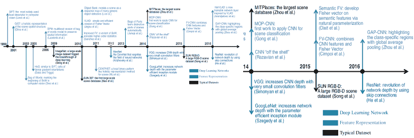

图 12：场景分类的里程碑。手工特征由 SIFT[206]和 GIST[207]开始获得巨大的流行，然后 Dalal 等人和 Wu 等人分别提出了 HoG[208]和 CENTRIST[209]，进一步推动了场景分类的发展。2003 年，Sivic 等人[210]提出了 BoVW 模型，开启了码本学习的序章。沿着这条路，更有效的基于 BoVW 的方法，如 SPM[14]、IFV[104]和 VLAD[105]等，也出现了以处理更大规模的任务。2010 年，Object Bank[15, 211]将场景表示为对象属性，标志着更多语义表示的开始。然后，Juneja 等人[212]提出了部分袋来自动学习场景的独特部分。2012 年，AlexNet[17]重新点燃了人工神经网络领域。从那时起，基于 CNN 的方法，如 VGGNet[77]、GoogLeNet[78]和 ResNet[79]，已经开始取代手工方法。此外，Razavian 等人[213]强调了 CNN 表示对不同任务的有效性和普适性。沿着这条路，2014 年，Gong 等人[28]提出了 MOP-CNN，这是用于场景分类的第一个深度学习方法。随后，FV-CNN[82]、语义 FV[30]和 GAP-CNN[23]相继提出，以学习更有效的表示。对于数据集，ImageNet[56]引发了深度学习的突破。然后，Xiao 等人[57]提出了 SUN 数据库，以评估场景分类的许多算法。此后，Places[18, 25]，目前最大的场景数据库，出现以满足深度学习训练的需求。此外，SUN RGBD[72]已被引入，标志着深度学习用于 RGB-D 场景分类的开始。

手工特征工程时代。从 1995 年到 2012 年，这一领域被来自文件分类的词袋（BoVW）模型所主导[214, 106, 210, 215]，该模型将文档表示为全局词汇表上的单词出现次数的向量。在图像领域，BoVW 首先使用诸如尺度不变特征变换（SIFT）[206, 216]等局部特征描述符对图像进行探测，然后以统计方式将图像表示为在预先训练的视觉词汇上的无序直方图，形式类似于文档。诸如语义词袋（Bag of Semantics）[15, 126, 140, 212]和改进的 Fisher 向量（IFV）[104]等对 BoVW 的重要变体也已被提出。

局部不变特征描述符在 BoVW 中扮演着重要角色，因为它们具有区分性，同时对图像的变化（如光照、尺度、旋转、视角*等*）较不敏感，因此已被广泛研究。用于场景分类的代表性局部描述符始于 SIFT [206, 216] 和全球信息系统技术 (GIST) [207, 217]。其他局部描述符，如局部二值模式 (LBP) [218]、可变形部件模型 (DPM) [219, 220, 221]、CENsus TRansform hISTogram (CENTRIST) [209]，也对场景分类的发展做出了贡献。为了提高性能，研究重点转向特征编码和聚合，主要包括视觉词袋 (BoVW) [106]、潜在狄利克雷分配 (LDA) [222]、梯度直方图 (HoG) [208]、空间金字塔匹配 (SPM) [223, 14]、局部聚合描述符向量 (VLAD) [105]、费舍尔核编码 [125, 104]、多分辨率 BoVW (MR-BoVW) [224] 和方向金字塔匹配 (OPM) [225]。学习到的代码本的质量对编码过程有很大影响。通用代码本主要包括费舍尔核 [125, 104]、稀疏代码本 [226, 227]、局部约束线性编码 (LLC) [228]、直方图交集核 (HIK) [229]、上下文视觉词 [230]、高效匹配核 (EMK) [231] 和监督核描述符 (SKDES) [232]。特别地，语义代码本生成于显著区域，如对象库 [211, 15, 233]、对象到类别 [234]、潜在金字塔区域 (LPR) [235]、部件袋 (BoP) [212] 和基于对的约束的多视角子空间学习 (PC-MSL) [236]，捕捉到更多用于场景分类的区分特征。

深度学习时代。2012 年，Krizhevsky 等人[17] 引入了一种深度神经网络，通常称为“AlexNet”，用于物体分类任务，并取得了突破性的表现，远超手工设计特征的最佳结果，从而引发了最近的人工智能革命。此后，深度学习开始主导各种任务（如计算机视觉[80、237、107、238]、语音识别[239]、自动驾驶[240]、癌症检测[241、242]、机器翻译[243]、复杂游戏[244、245、246、247]、地震预测[248]、药物发现[249、250]），场景分类也不例外，导致了新一代场景表示方法的显著性能提升。这一重大进展主要归功于深度模型的进步，包括 VGGNet[77]、GoogLeNet[78]、ResNet[79]、*等*，以及大型图像数据集如 ImageNet[56]和 Places[18、25]的可用性和更强大的计算资源。

深度学习网络逐渐取代了第一代方法的局部特征描述符，并且无疑是场景分类的核心。虽然推动场景分类进步的主要动力是深度学习网络的引入，但像 BoVW、特征编码和聚合方法如 Fisher Vector、VLAD 等第一代方法也被应用于当前基于深度学习的场景方法中，*例如*，MOP-CNN [28]，SCFVC [83]，MPP-CNN [29]，DSP [102]，Semantic FV [30]，LatMoG [58]，MFA-FS [42] 和 DUCA [20]。为了充分利用反向传播，场景表示从端到端可训练的 CNN 中提取，如 DAG-CNN [37]，MFAFVNet [31]，VSAD [32]，G-MS2F [39]，和 DL-CNN [22]。为了关注场景的主要内容，物体检测用于捕捉显著区域，如 MetaObject-CNN [33]，WELDON [34]，SDO [35] 和 BiLSTM [36]。由于来自多个 CNN 层或多个视图的特征是互补的，许多文献[19，40，41，24，21]也探索了它们的互补性以提高性能。此外，还存在许多策略（如注意机制、上下文建模、带有正则化项的多任务学习）来增强表示能力，如 CFA [24]，BiLSTM [36]，MAPNet [96]，MSN [44] 和 LGN [45]。对于数据集，由于 RGB-D 相机拍摄的深度图像不易受到光照变化的影响，自 2015 年以来，研究人员开始探索 RGB-D 场景识别。一些工作[47，89，48]集中于深度特定特征学习，而其他方法，如 DMMF [50]，ACM [144] 和 MSN [44]，则专注于多模态特征融合。

## 附录 B 深度学习简要介绍

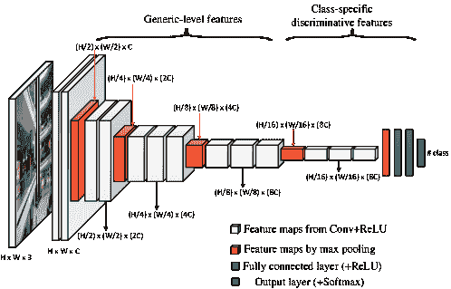

(a) VGG

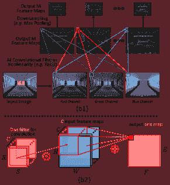

(b) 卷积操作

图 13： (a) 一个典型的 CNN 架构 VGGNet [77]，具有 16 个权重层。该网络有 13 个卷积层、5 个最大池化层（最后一个是全局最大池化）和 3 个全连接层（最后一个使用 Softmax 函数作为非线性激活函数）。整个网络可以通过优化损失函数（*例如*，交叉熵损失）从标记的训练数据中学习。 (b) 典型 CNN 中反复应用的基本操作（*即*，卷积、非线性和下采样）的示意图。 (b1) 典型 CNN 应用于场景图像时每层（横向）的输出（称为特征图）。第二行中的每个特征图对应于一个学习到的 3D 滤波器的输出（参见(b2)）。

2012 年，在大型 ImageNet 数据集[56]上取得的突破性对象分类结果，由深度学习网络[17]实现，可以说重新点燃了人工神经网络（ANNs）领域，并引发了近期的人工智能革命。从那时起，深度学习或深度神经网络（DNNs）[251] 在计算机视觉[17, 80, 107, 238, 237]、语音识别[239]、自动驾驶[240]、癌症检测[241, 242]、机器翻译[243]、复杂游戏[244, 245, 246, 247]、地震预测[248]、医学发现[249, 250]等领域中表现出色。在许多这些领域，DNNs 达到了突破性的性能水平，常常接近甚至超越人类专家的能力。由于大数据的增长和更强大的计算资源，深度学习和科学研究中的 AI 正在快速发展，几乎在所有科学和技术领域中不断出现新的进展，用于分析数据集、发现模式和预测行为[98]。

在计算机视觉中，最常用的深度神经网络（DNN）类型是卷积神经网络（CNNs）[76]。正如图 13 (a) 所示，典型 CNN 的前端是由卷积层和池化层堆叠而成，用于学习通用级别的特征，这些特征通过在目标数据集上训练多个层进一步转化为特定类别的判别表示。当我们在三个颜色通道的输入图像的宽度和高度上滑动卷积滤波器时，将产生一个二维（2-D）激活图，如图 13 (b1) 所示，给出该滤波器在每个空间位置的响应。如图 13 (b2) 所示，二维卷积操作 $x^{l-1}*w^{l}$，描述为来自前一层 $l-1$ 的输入图像 $x^{l-1}$ 的加权平均，其中相应的加权由 $w^{l}$ 给出；由于每个滤波器跨越输入图像的所有通道，所以我们将二维卷积的和计算为三维卷积的结果，*即，*

|  | $\sum_{i=1}^{C}{x_{i}^{l-1}*w_{i}^{l}}$ |  | (1) |
| --- | --- | --- | --- |

在前向传播过程中，$l$ 层的 $j$ 神经元对输入图像 $x^{l-1}$ 和相应的滤波器 $w_{j}^{l}$ 进行三维卷积操作，包含一个偏置项 $b_{j}^{l}$，然后将结果传递给非线性函数 $\sigma(\cdot)$，以得到最终输出 $x_{j}^{l}$，*即，*

|  | $x_{j}^{l}=\sigma(\sum_{i=1}^{N^{l-1}}{x_{i}^{l-1}}*w_{i,j}^{l}+b_{j}^{l})$ |  | (2) |
| --- | --- | --- | --- |

非线性函数 $\sigma(\cdot)$ 通常是一个修正线性单元（ReLU），对于一个元素 $x$，*即，* $\sigma(x)=\mathrm{max}(x,0)$。

在卷积神经网络（CNN）结构中，通常会在连续的卷积层之间定期插入池化层（*即，* 下采样）。其功能是逐步减少输入图像的空间尺寸，如图 13 (b1) 所示，以减少网络中的参数数量和计算量，从而控制过拟合。最后，输出层表示一个可微分的评分函数：从一端的判别特征 $x$ 到另一端的类别分数 $y$。

在场景标签的监督下，Softmax 分类器使用交叉熵损失函数来估计模型参数，其公式如下：

|  | $L_{softmax}=\sum_{i}^{N}L_{CE}(x_{i})$ |  | (3) |
| --- | --- | --- | --- |

其中 $L_{CE}(x_{i})$ 表示每个图像的交叉熵损失函数，其公式如下：

|  | $L_{CE}(x_{i})=-\sum_{k=1}^{K}(y_{k}\text{log}f_{k}(x_{i}))$ |  | (4) |
| --- | --- | --- | --- |

其中 $x_{i}$ 表示场景图像 $I_{i}$ 的判别特征；$K$ 表示场景类别的数量；$y_{k}$ 表示场景图像 $I_{i}$ 的真实标签，当 $y_{k}=1$ 时，表示 $I_{i}$ 的真实标签是类别 $k$，否则 $y_{k}=0$。

通常，评分函数 $f(\cdot)$ 是 Softmax 函数，表示估计场景图像 $I_{i}$ 属于类别 $k$ 的概率。

因此，输出层的 $k$ 组件是

|  | $f_{k}(x)=e^{w_{k}x_{k}}/\sum_{j=1}^{K}{e^{w_{j}x_{j}}}$ |  | (5) |
| --- | --- | --- | --- |

除了 CNN 架构和数据集外，还提出了一些其他训练策略或技巧，以实现更好的性能。过拟合发生在 CNN 学习到训练数据中的细节和噪声，从而对模型的泛化能力产生负面影响。为此，提出了一些策略来减少 CNN 的过拟合倾向，如数据增强、早停、dropout [17]、较小的卷积核尺寸 [77, 252] 和多尺度裁剪/变形 [77]。此外，还提出了一些优化技术来克服深度 CNN 训练中的困难，如批量归一化 [123, 253] 和继电反向传播 [193]。对深度学习的全面综述超出了本调查的范围，我们建议读者参阅 [76, 254, 255, 256, 257] 以获取更多详细信息。

## 致谢

作者感谢场景分类及相关领域的开创性研究者。本研究部分得到了中国国家自然科学基金（61872379, 91846301, 61571005）、芬兰科学院（331883）、广东省基础研究计划（2020B1515310023）、湖南省科技计划项目（2019GK2131）、中国国家留学基金委员会（201806155037）、广州市科技研究计划（201804010429）的资助。

## 参考文献

+   [1] J. M. Henderson 和 A. Hollingworth，“高级场景感知，” *Annual review of psychology*，第 50 卷，第 1 期，页 243–271，1999 年。

+   [2] R. Epstein，“视觉场景处理的皮层基础，” *Visual Cognition*，第 12 卷，第 6 期，页 954–978，2005 年。

+   [3] M. R. Greene 和 A. Oliva，“短暂的瞥见：自然场景理解的时间过程，” *Psychological Science*，第 20 卷，第 4 期，页 464–472，2009 年。

+   [4] D. B. Walther, B. Chai, E. Caddigan, D. M. Beck 和 L. Fei-Fei，“简单的线条图足以用于自然场景类别的功能性 MRI 解码，” *PNAS*，第 108 卷，第 23 期，页 9661–9666，2011 年。

+   [5] J. Vogel 和 B. Schiele，“基于内容的图像检索中的自然场景语义建模，” *IJCV*，第 72 卷，第 2 期，页 133–157，2007 年。

+   [6] L. Zheng, Y. Yang 和 Q. Tian，“SIFT 遇见 CNN：实例检索的十年调查，” *IEEE TPAMI*，第 40 卷，第 5 期，第 1224–1244 页，2017 年。

+   [7] W. Zhang, X. Yu 和 X. He，“学习双向时间线索进行基于视频的人物再识别，” *IEEE TCSVT*，第 28 卷，第 10 期，第 2768–2776 页，2017 年。

+   [8] J. Hou, H. Zeng, J. Zhu, J. Hou, J. Chen 和 K.-K. Ma，“用于车辆再识别的深度四重外观学习，” *IEEE TVT*，第 68 卷，第 9 期，第 8512–8522 页，2019 年。

+   [9] T. Zhang, S. Liu, C. Xu 和 H. Lu，“挖掘语义上下文信息以实现交通场景的智能视频监控，” *IEEE TII*，第 9 卷，第 1 期，第 149–160 页，2012 年。

+   [10] G. Sreenu 和 M. S. Durai，“智能视频监控：通过深度学习技术进行人群分析的综述，” *大数据杂志*，第 6 卷，第 1 期，第 48 页，2019 年。

+   [11] A. H. Behzadan 和 V. R. Kamat，“使用动态增强现实场景图的工程操作集成信息建模和视觉仿真，” *ITcon*，第 16 卷，第 17 期，第 259–278 页，2011 年。

+   [12] A. Y. Nee, S. Ong, G. Chryssolouris 和 D. Mourtzis，“设计和制造中的增强现实应用，” *CIRP 年鉴*，第 61 卷，第 2 期，第 657–679 页，2012 年。

+   [13] K. Muhammad, J. Ahmad 和 S. W. Baik，“使用卷积神经网络进行早期火灾检测，以实现有效的灾害管理，” *神经计算*，第 288 卷，第 30–42 页，2018 年。

+   [14] S. Lazebnik, C. Schmid 和 J. Ponce，“超越特征袋：用于识别自然场景类别的空间金字塔匹配，” 在 *CVPR*，第 2 卷，2006 年，第 2169–2178 页，https://figshare.com/articles/15-Scene_Image_Dataset/7007177。

+   [15] L.-J. Li, H. Su, L. Fei-Fei 和 E. P. Xing，“对象库：用于场景分类和语义特征稀疏化的高级图像表示，” 在 *NeurIPS*，2010 年，第 1378–1386 页。

+   [16] R. Margolin, L. Zelnik-Manor 和 A. Tal，“OTC：一种新颖的局部描述符用于场景分类，” 在 *ECCV*，2014 年，第 377–391 页。

+   [17] A. Krizhevsky, I. Sutskever 和 G. E. Hinton，“使用深度卷积神经网络的 Imagenet 分类，” 在 *NeurIPS*，2012 年，第 1097–1105 页。

+   [18] B. Zhou, A. Lapedriza, J. Xiao, A. Torralba 和 A. Oliva，“使用 Places 数据库进行场景识别的深度特征学习，” 在 *NeurIPS*，2014 年，第 487–495 页，http://places.csail.mit.edu/downloadData.html。

+   [19] L. Herranz, S. Jiang 和 X. Li，“使用 CNN 进行场景识别：对象、尺度和数据集偏差，” 在 *CVPR*，2016 年，第 571–579 页。

+   [20] S. H. Khan, M. Hayat, M. Bennamoun, R. Togneri 和 F. A. Sohel，“用于室内场景识别的卷积特征的判别表示，” *IEEE TIP*，第 25 卷，第 7 期，第 3372–3383 页，2016 年。

+   [21] S. Liu, G. Tian 和 Y. Xu，“一种新型场景分类模型，结合了基于 ResNet 的迁移学习和数据增强与滤波器，” *神经计算*，第 338 卷，第 191–206 页，2019 年。

+   [22] Y. Liu, Q. Chen, W. Chen, 和 I. Wassell，“受字典学习启发的深度网络用于场景识别，”在 *AAAI*，2018 年。

+   [23] B. Zhou, A. Khosla, A. Lapedriza, A. Oliva, 和 A. Torralba，“学习深度特征以进行判别性定位，”在 *CVPR*，2016 年，页码 2921–2929。

+   [24] N. Sun, W. Li, J. Liu, G. Han, 和 C. Wu，“融合对象语义和深度外观特征进行场景识别，”*IEEE TCSVT*，第 29 卷，第 6 期，页码 1715–1728，2018 年。

+   [25] B. Zhou, A. Lapedriza, A. Khosla, A. Oliva, 和 A. Torralba，“Places: 一个包含 1000 万图像的场景识别数据库，”*IEEE TPAMI*，第 40 卷，第 6 期，页码 1452–1464，2017 年，[`places2.csail.mit.edu/download.html`](http://places2.csail.mit.edu/download.html)。

+   [26] M. Hayat, S. H. Khan, M. Bennamoun, 和 S. An，“用于室内场景分类的空间布局和尺度不变特征表示，”*IEEE TIP*，第 25 卷，第 10 期，页码 4829–4841，2016 年。

+   [27] Z. Zuo, B. Shuai, G. Wang, X. Liu, X. Wang, B. Wang, 和 Y. Chen，“利用卷积层次递归神经网络学习上下文依赖，”*IEEE TIP*，第 25 卷，第 7 期，页码 2983–2996，2016 年。

+   [28] Y. Gong, L. Wang, R. Guo, 和 S. Lazebnik，“深度卷积激活特征的多尺度无序池化，”在 *ECCV*，2014 年，页码 392–407。

+   [29] D. Yoo, S. Park, J.-Y. Lee, 和 I. So Kweon，“深度卷积表示的多尺度金字塔池化，”在 *CVPRW*，2015 年，页码 71–80。

+   [30] M. Dixit, S. Chen, D. Gao, N. Rasiwasia, 和 N. Vasconcelos，“使用语义 Fisher 向量进行场景分类，”在 *CVPR*，2015 年，页码 2974–2983。

+   [31] Y. Li, M. Dixit, 和 N. Vasconcelos，“使用 MFAFVNet 进行深度场景图像分类，”在 *ICCV*，2017 年，页码 5746–5754。

+   [32] Z. Wang, L. Wang, Y. Wang, B. Zhang, 和 Y. Qiao，“弱监督 Patchnets: 描述和聚合局部补丁用于场景识别，”*IEEE TIP*，第 26 卷，第 4 期，页码 2028–2041，2017 年。

+   [33] R. Wu, B. Wang, W. Wang, 和 Y. Yu，“利用深度 CNN 特征收获判别性元对象进行场景分类，”在 *ICCV*，2015 年，页码 1287–1295。

+   [34] T. Durand, N. Thome, 和 M. Cord，“WELDON: 弱监督学习深度卷积神经网络，”在 *CVPR*，2016 年，页码 4743–4752。

+   [35] X. Cheng, J. Lu, J. Feng, B. Yuan, 和 J. Zhou，“利用对象特征进行场景识别，”*Pattern Recognition*，第 74 卷，页码 474–487，2018 年。

+   [36] C. Laranjeira, A. Lacerda, 和 E. R. Nascimento，“使用长短期记忆模型从对象中建模上下文以进行室内场景识别，”在 *SIBGRAPI*，2019 年，页码 249–256。

+   [37] S. Yang 和 D. Ramanan，“使用 DAG-CNNs 进行多尺度识别，”在 *ICCV*，2015 年，页码 1215–1223。

+   [38] G.-S. Xie, X.-Y. Zhang, S. Yan, 和 C.-L. Liu，“用于场景识别和领域适应的混合 CNN 和基于字典的模型，”*IEEE TCSVT*，第 27 卷，第 6 期，页码 1263–1274，2015 年。

+   [39] P. Tang, H. Wang, 和 S. Kwong，“G-MS2F: 基于 Googlenet 的多阶段特征融合深度 CNN 用于场景识别，”*Neurocomputing*，第 225 卷，页码 188–197，2017 年。

+   [40] S. Guo, W. Huang, L. Wang, 和 Y. Qiao, “用于场景识别的局部监督深度混合模型”，*IEEE TIP*，第 26 卷，第 2 期，第 808–820 页，2016 年。

+   [41] L. Wang, S. Guo, W. Huang, Y. Xiong, 和 Y. Qiao, “用于大规模场景分类的知识指导消歧，基于多分辨率 CNNs”，*IEEE TIP*，第 26 卷，第 4 期，第 2055–2068 页，2017 年。

+   [42] M. D. Dixit 和 N. Vasconcelos, “基于 Fisher 分数的局部子空间投影的对象场景表示”，发表于 *NeurIPS*，2016 年，第 2811–2819 页。

+   [43] A. López-Cifuentes, M. Escudero-Viñolo, J. Bescós, 和 Á. García-Martín, “语义感知场景识别”，*Pattern Recognition*，第 102 卷，第 107256 页，2020 年。

+   [44] Z. Xiong, Y. Yuan, 和 Q. Wang, “MSN: 用于 RGB-D 场景识别的模态分离网络”，*Neurocomputing*，第 373 卷，第 81–89 页，2020 年。

+   [45] G. Chen, X. Song, H. Zeng, 和 S. Jiang, “使用原型无关场景布局的场景识别”，*IEEE TIP*，第 29 卷，第 5877–5888 页，2020 年。

+   [46] A. Wang, J. Cai, J. Lu, 和 T.-J. Cham, “针对 RGB-D 场景分类的模态和组件感知特征融合”，发表于 *CVPR*，2016 年，第 5995–6004 页。

+   [47] X. Song, S. Jiang, 和 L. Herranz, “结合来自多个来源的模型进行 RGB-D 场景识别”，发表于 *IJCAI*，2017 年，第 4523–4529 页。

+   [48] D. Du, L. Wang, H. Wang, K. Zhao, 和 G. Wu, “用于 RGB-D 场景识别的翻译识别网络”，发表于 *CVPR*，2019 年，第 11 836–11 845 页。

+   [49] Y. Cheng, R. Cai, Z. Li, X. Zhao, 和 K. Huang, “具有门控融合的局部敏感去卷积网络用于 RGB-D 室内语义分割”，发表于 *CVPR*，2017 年，第 3029–3037 页。

+   [50] H. Zhu, J.-B. Weibel, 和 S. Lu, “用于 RGB-D 室内场景识别的区分性多模态特征融合”，发表于 *CVPR*，2016 年，第 2969–2976 页。

+   [51] R. Girshick, “Fast R-CNN”，发表于 *ICCV*，2015 年，第 1440–1448 页。

+   [52] S. Ren, K. He, R. Girshick, 和 J. Sun, “Faster R-CNN: 通过区域提议网络实现实时目标检测”，*IEEE TPAMI*，第 39 卷，第 6 期，第 1137–1149 页，2016 年。

+   [53] V. Badrinarayanan, A. Kendall, 和 R. Cipolla, “SegNet: 一种用于图像分割的深度卷积编码器-解码器架构”，*IEEE TPAMI*，第 39 卷，第 12 期，第 2481–2495 页，2017 年。

+   [54] L.-C. Chen, G. Papandreou, I. Kokkinos, K. Murphy, 和 A. L. Yuille, “Deeplab: 使用深度卷积网络、空洞卷积和全连接 CRF 的语义图像分割”，*IEEE TPAMI*，第 40 卷，第 4 期，第 834–848 页，2017 年。

+   [55] S. Cai, J. Huang, D. Zeng, X. Ding, 和 J. Paisley, “MEnet: 一种用于显著目标分割的度量表达网络”，发表于 *IJCAI*，2018 年，第 598–605 页。

+   [56] J. Deng, W. Dong, R. Socher, L.-J. Li, K. Li, 和 L. Fei-Fei, “Imagenet: 大规模层次图像数据库”，发表于 *CVPR*，2009 年，第 248–255 页，http://image-net.org/download。

+   [57] J. Xiao, J. Hays, K. A. Ehinger, A. Oliva, 和 A. Torralba, “Sun 数据库: 从修道院到动物园的大规模场景识别”，发表于 *CVPR*，2010 年，第 3485–3492 页，http://places2.csail.mit.edu/download.html。

+   [58] R. G. Cinbis, J. Verbeek, 和 C. Schmid，“用于图像分类的非独立同分布图像模型的近似 Fisher 核”，*IEEE TPAMI*，第 38 卷，第 6 期，第 1084–1098 页，2015 年。

+   [59] X. Wei, S. L. Phung, 和 A. Bouzerdoum，“场景分类的视觉描述符：实验评估”，*AI Review*，第 45 卷，第 3 期，第 333–368 页，2016 年。

+   [60] G. Cheng, J. Han, 和 X. Lu，“遥感图像场景分类：基准与最新进展”，*Proceedings of the IEEE*，第 105 卷，第 10 期，第 1865–1883 页，2017 年。

+   [61] L. Xie, F. Lee, L. Liu, K. Kotani, 和 Q. Chen，“场景识别：综合综述”，*Pattern Recognition*，第 102 卷，第 107205 页，2020 年。

+   [62] K. Nogueira, O. A. Penatti, 和 J. A. Dos Santos，“更好地利用卷积神经网络进行遥感场景分类”，*Pattern Recognition*，第 61 卷，第 539–556 页，2017 年。

+   [63] F. Hu, G.-S. Xia, J. Hu, 和 L. Zhang，“将深度卷积神经网络用于高分辨率遥感图像的场景分类”，*Remote Sensing*，第 7 卷，第 11 期，第 14,680–14,707 页，2015 年。

+   [64] A. Mesaros, T. Heittola, 和 T. Virtanen，“用于声学场景分类和声音事件检测的 TUT 数据库”，发表于*EUSIPCO*，2016 年，第 1128–1132 页。

+   [65] Z. Ren, K. Qian, Y. Wang, Z. Zhang, V. Pandit, A. Baird, 和 B. Schuller，“用于声学场景分类的深度尺度图表示”，*JAS*，第 5 卷，第 3 期，第 662–669 页，2018 年。

+   [66] S. Lowry, N. Sünderhauf, P. Newman, J. J. Leonard, D. Cox, P. Corke, 和 M. J. Milford，“视觉场所识别：综述”，*IEEE T-RO*，第 32 卷，第 1 期，第 1–19 页，2015 年。

+   [67] R. Arandjelovic, P. Gronat, A. Torii, T. Pajdla, 和 J. Sivic，“NetVLAD：用于弱监督场所识别的 CNN 架构”，发表于*CVPR*，2016 年，第 5297–5307 页。

+   [68] M. R. Boutell, J. Luo, X. Shen, 和 C. M. Brown，“学习多标签场景分类”，*Pattern Recognition*，第 37 卷，第 9 期，第 1757–1771 页，2004 年。

+   [69] M.-L. Zhang 和 Z.-H. Zhou，“通过实例区分进行多标签学习”，发表于*AAAI*，第 7 卷，2007 年，第 669–674 页。

+   [70] A. Quattoni 和 A. Torralba，“识别室内场景”，发表于*CVPR*，2009 年，第 413–420 页，http://web.mit.edu/torralba/www/indoor.html。

+   [71] N. Silberman, D. Hoiem, P. Kohli, 和 R. Fergus，“室内分割与 RGB-D 图像的支持推断”，发表于*ECCV*，2012 年，第 746–760 页，https://cs.nyu.edu/~silberman/datasets/nyu_depth_v2.html。

+   [72] S. Song, S. P. Lichtenberg, 和 J. Xiao，“SUN RGB-D：RGB-D 场景理解基准套件”，发表于*CVPR*，2015 年，第 567–576 页，https://github.com/ankurhanda/sunrgbd-meta-data。

+   [73] S. Gupta, R. Girshick, P. Arbeláez, 和 J. Malik，“从 RGB-D 图像中学习丰富特征以进行对象检测和分割”，发表于*ECCV*，2014 年，第 345–360 页。

+   [74] G. A. Miller，“Wordnet：一个英语词汇数据库”，*Communications of the ACM*，第 38 卷，第 11 期，第 39–41 页，1995 年。

+   [75] M. Everingham, L. Van Gool, C. K. Williams, J. Winn 和 A. Zisserman, “Pascal 视觉对象类别（VOC）挑战，” *IJCV*, 第 88 卷，第 2 期, 第 303–338 页, 2010。

+   [76] Y. LeCun, Y. Bengio 和 G. Hinton, “深度学习，” *Nature*, 第 521 卷，第 7553 期, 第 436–444 页, 2015。

+   [77] K. Simonyan 和 A. Zisserman, “用于大规模图像识别的非常深的卷积网络，” *ICLR*, 2015。

+   [78] C. Szegedy, W. Liu, Y. Jia, P. Sermanet, S. Reed, D. Anguelov, D. Erhan, V. Vanhoucke 和 A. Rabinovich, “通过卷积深入，” 见 *CVPR*, 2015, 第 1–9 页。

+   [79] K. He, X. Zhang, S. Ren 和 J. Sun, “用于图像识别的深度残差学习，” 见 *CVPR*, 2016, 第 770–778 页。

+   [80] R. Girshick, J. Donahue, T. Darrell 和 J. Malik, “用于准确目标检测和语义分割的丰富特征层次结构，” 见 *CVPR*, 2014, 第 580–587 页。

+   [81] J. Yosinski, J. Clune, Y. Bengio 和 H. Lipson, “深度神经网络中的特征转移性如何？” 见 *NeurIPS*, 2014, 第 3320–3328 页。

+   [82] M. Cimpoi, S. Maji 和 A. Vedaldi, “用于纹理识别和分割的深度滤波器组，” 见 *CVPR*, 2015, 第 3828–3836 页。

+   [83] L. Liu, C. Shen, L. Wang, A. Van Den Hengel 和 C. Wang, “通过基于稀疏编码的 Fisher 向量编码高维局部特征，” 见 *NeurIPS*, 2014, 第 1143–1151 页。

+   [84] Z. Bolei, A. Khosla, A. Lapedriza, A. Oliva 和 A. Torralba, “对象检测器在深度场景 CNN 中出现，” *ICLR*, 2015。

+   [85] L. Liu, J. Chen, P. Fieguth, G. Zhao, R. Chellappa 和 M. Pietikäinen, “从 BoW 到 CNN：纹理分类的二十年纹理表示，” *IJCV*, 第 127 卷，第 1 期, 第 74–109 页, 2019。

+   [86] I. Sutskever, J. Martens, G. Dahl 和 G. Hinton, “深度学习中初始化和动量的重要性，” 见 *ICML*, 2013, 第 1139–1147 页。

+   [87] B. Liu, J. Liu, J. Wang 和 H. Lu, “使用深度卷积特征学习一个代表性和判别性的部分模型进行场景识别，” 见 *ACCV*, 2014, 第 643–658 页。

+   [88] K. Chatfield, K. Simonyan, A. Vedaldi 和 A. Zisserman, “细节中的魔鬼归来：深入探讨卷积网络，” *arXiv:1405.3531*, 2014。

+   [89] X. Song, S. Jiang, L. Herranz 和 C. Chen, “学习有效的 RGB-D 表示用于场景识别，” *IEEE TIP*, 第 28 卷，第 2 期, 第 980–993 页, 2018。

+   [90] M. Lin, Q. Chen 和 S. Yan, “网络中的网络，” *ICLR*, 2014。

+   [91] J. Sun 和 J. Ponce, “用于图像分类和共同分割的判别部分检测器学习，” 见 *ICCV*, 2013, 第 3400–3407 页。

+   [92] K. J. Shih, I. Endres 和 D. Hoiem, “学习用于对象识别的判别性部分检测器集合，” *IEEE TPAMI*, 第 37 卷，第 8 期, 第 1571–1584 页, 2014。

+   [93] Y. Sun, X. Wang 和 X. Tang, “深度学习的面部表示是稀疏的、选择性的和鲁棒的，” 见 *CVPR*, 2015, 第 2892–2900 页。

+   [94] D. L. Donoho, A. Maleki 和 A. Montanari, “压缩感知的消息传递算法，” *PNAS*, 第 106 卷，第 45 期, 第 18 914–18 919 页, 2009。

+   [95] S. Hochreiter 和 J. Schmidhuber，“长短期记忆，” *Neural Computation*，第 9 卷，第 8 期，页码 1735–1780，1997 年。

+   [96] Y. Li, Z. Zhang, Y. Cheng, L. Wang, 和 T. Tan，“MAPNet：用于 RGB-D 室内场景分类的多模态注意力池网络，” *Pattern Recognition*，第 90 卷，页码 436–449，2019 年。

+   [97] P. Mirowski, R. Pascanu, F. Viola, H. Soyer, A. J. Ballard, A. Banino, M. Denil, R. Goroshin, L. Sifre, K. Kavukcuoglu *等*，“学习在复杂环境中导航，” *ICLR*，2016 年。

+   [98] T. J. Sejnowski，“深度学习在人工智能中的非凡效果，” *PNAS*，2020 年。

+   [99] L. Xie, L. Zheng, J. Wang, A. L. Yuille, 和 Q. Tian，“互动：层间活跃度传播，”在 *CVPR*，2016 年，页码 270–279。

+   [100] L. Xie, J. Wang, W. Lin, B. Zhang, 和 Q. Tian，“朝着反转不变图像表示的方向，” *IJCV*，第 123 卷，第 2 期，页码 226–250，2017 年。

+   [101] M. Rezanejad, G. Downs, J. Wilder, D. B. Walther, A. Jepson, S. Dickinson, 和 K. Siddiqi，“从轮廓进行场景分类：基于中轴的显著性度量，”在 *CVPR*，2019 年，页码 4116–4124。

+   [102] B.-B. Gao, X.-S. Wei, J. Wu, 和 W. Lin，“深度空间金字塔：魔鬼再次在细节中，” *arXiv:1504.05277*，2015 年。

+   [103] Z. Xiong, Y. Yuan, 和 Q. Wang，“通过空间相关的多模态特征学习进行 RGB-D 场景识别，” *IEEE Access*，第 7 卷，页码 106 739–106 747，2019 年。

+   [104] J. Sánchez, F. Perronnin, T. Mensink, 和 J. Verbeek，“使用费舍尔向量进行图像分类：理论与实践，” *IJCV*，第 105 卷，第 3 期，页码 222–245，2013 年。

+   [105] H. Jégou, M. Douze, C. Schmid, 和 P. Pérez，“将局部描述符聚合成紧凑的图像表示，”在 *CVPR*，2010 年，页码 3304–3311。

+   [106] G. Csurka, C. Dance, L. Fan, J. Willamowski, 和 C. Bray，“使用关键点包进行视觉分类，”在 *ECCVW*，2004 年，页码 1–2。

+   [107] L. Liu, W. Ouyang, X. Wang, P. Fieguth, J. Chen, X. Liu, 和 M. Pietikäinen，“通用目标检测的深度学习：一项调查，” *IJCV*，第 128 卷，第 2 期，页码 261–318，2020 年。

+   [108] J. R. Uijlings, K. E. Van De Sande, T. Gevers, 和 A. W. Smeulders，“用于对象识别的选择性搜索，” *IJCV*，第 104 卷，第 2 期，页码 154–171，2013 年。

+   [109] S. Singh, A. Gupta, 和 A. A. Efros，“无监督发现中级区分补丁，”在 *ECCV*，2012 年，页码 73–86。

+   [110] P. Arbeláez, J. Pont-Tuset, J. T. Barron, F. Marques, 和 J. Malik，“多尺度组合分组，”在 *CVPR*，2014 年，页码 328–335。

+   [111] W. Liu, D. Anguelov, D. Erhan, C. Szegedy, S. Reed, C.-Y. Fu, 和 A. C. Berg，“SSD：单次多框检测器，”在 *ECCV*，2016 年，页码 21–37。

+   [112] J. Redmon 和 A. Farhadi，“Yolo9000：更好、更快、更强，”在 *CVPR*，2017 年，页码 7263–7271。

+   [113] J. Redmon, S. Divvala, R. Girshick, 和 A. Farhadi，“你只看一次：统一的实时目标检测，”在 *CVPR*，2016 年，页码 779–788。

+   [114] C.-Y. Lee, S. Xie, P. Gallagher, Z. Zhang 和 Z. Tu，“深度监督网络”，在 *AISTATS*，2015 年，第 562–570 页。

+   [115] T.-Y. Lin, P. Dollár, R. Girshick, K. He, B. Hariharan 和 S. Belongie，“用于目标检测的特征金字塔网络”，在 *CVPR*，2017 年，第 2117–2125 页。

+   [116] C. G. Snoek, M. Worring 和 A. W. Smeulders，“语义视频分析中的早期与晚期融合”，在 *第 13 届 ACM 国际多媒体会议论文集*，2005 年，第 399–402 页。

+   [117] H. Gunes 和 M. Piccardi，“面部和身体的情感识别：早期融合与晚期融合”，在 *国际系统、人类与控制会议*，第 4 卷，2005 年，第 3437–3443 页。

+   [118] Y. Dong, S. Gao, K. Tao, J. Liu 和 H. Wang，“早期和晚期融合方法在通用语义索引中的性能评估”，*模式分析与应用*，第 17 卷，第 1 期，第 37–50 页，2014 年。

+   [119] J. Li, D. Lin, Y. Wang, G. Xu, Y. Zhang, C. Ding 和 Y. Zhou，“用于场景分类的带有注意力图的深度判别表示学习”，*遥感*，第 12 卷，第 9 期，第 1366 页，2020 年。

+   [120] F. Zhang, B. Du 和 L. Zhang，“通过梯度提升随机卷积网络框架进行场景分类”，*IEEE TGRS*，第 54 卷，第 3 期，第 1793–1802 页，2015 年。

+   [121] L. Wang, Z. Wang, W. Du 和 Y. Qiao，“用于图像事件识别的对象-场景卷积神经网络”，在 *CVPRW*，2015 年，第 30–35 页。

+   [122] S. Xia, J. Zeng, L. Leng 和 X. Fu，“WS-AM：用于场景识别的弱监督注意力图”，*电子学*，第 8 卷，第 10 期，第 1072 页，2019 年。

+   [123] S. Ioffe 和 C. Szegedy，“批量归一化：通过减少内部协变量偏移加速深度网络训练”，*ICML*，2015 年。

+   [124] H. Jin Kim 和 J.-M. Frahm，“用于场景识别的交替专家层次结构”，在 *ECCV*，2018 年，第 451–467 页。

+   [125] F. Perronnin 和 C. Dance，“用于图像分类的视觉词汇上的 Fisher 核”，在 *CVPR*，2007 年，第 1–8 页。

+   [126] R. Kwitt, N. Vasconcelos 和 N. Rasiwasia，“语义流形上的场景识别”，在 *ECCV*，2012 年，第 359–372 页。

+   [127] Z. Ghahramani, G. E. Hinton *等*，“用于因子分析混合模型的 EM 算法”，多伦多大学，技术报告，1996 年。

+   [128] J. Verbeek，“通过全局对齐局部线性模型学习非线性图像流形”，*IEEE TPAMI*，第 28 卷，第 8 期，第 1236–1250 页，2006 年。

+   [129] P. Wei, F. Qin, F. Wan, Y. Zhu, J. Jiao 和 Q. Ye，“用于场景分类的相关主题向量”，*IEEE TIP*，第 26 卷，第 7 期，第 3221–3234 页，2017 年。

+   [130] R. R. Selvaraju, M. Cogswell, A. Das, R. Vedantam, D. Parikh 和 D. Batra，“Grad-CAM：通过基于梯度的定位进行深度网络的可视化解释”，在 *ICCV*，2017 年，第 618–626 页。

+   [131] J. Zhang, S. A. Bargal, Z. Lin, J. Brandt, X. Shen 和 S. Sclaroff，“通过激发反向传播的自上而下神经注意力”，*IJCV*，第 126 卷，第 10 期，第 1084–1102 页，2018 年。

+   [132] H. Seong, J. Hyun 和 E. Kim, “Fosnet: 一种用于场景识别的端到端可训练深度神经网络，” *IEEE Access*, 第 8 卷, 第 82 066–82 077 页, 2020。

+   [133] T. Joseph, K. G. Derpanis 和 F. Z. Qureshi, “卷积网络的联合空间和层注意力，” *arXiv:1901.05376*, 2019。

+   [134] Z. Niu, G. Hua, X. Gao 和 Q. Tian, “用于场景识别的上下文感知主题模型，” 在 *CVPR*, 2012, 第 2743–2750 页。

+   [135] Z. Zuo, B. Shuai, G. Wang, X. Liu, X. Wang, B. Wang 和 Y. Chen, “卷积递归神经网络：用于图像表示的空间依赖学习，” 在 *CVPRW*, 2015, 第 18–26 页。

+   [136] X. Wang 和 E. Grimson, “空间潜在狄利克雷分配，” 在 *NeurIPS*, 2008, 第 1577–1584 页。

+   [137] J. L. Elman, “在时间中发现结构，” *Cognitive science*, 第 14 卷, 第 2 期, 第 179–211 页, 1990。

+   [138] G. R. Cross 和 A. K. Jain, “马尔可夫随机场纹理模型，” *IEEE TPAMI*, 第 1 期, 第 25–39 页, 1983。

+   [139] S. Z. Li, *图像分析中的马尔可夫随机场建模*。Springer, 2009。

+   [140] N. Rasiwasia 和 N. Vasconcelos, “用于视觉识别的整体上下文模型，” *IEEE TPAMI*, 第 34 卷, 第 5 期, 第 902–917 页, 2012。

+   [141] J. Bruna, W. Zaremba, A. Szlam 和 Y. LeCun, “图上的谱网络和局部连接网络，” *arXiv:1312.6203*, 2013。

+   [142] T. N. Kipf 和 M. Welling, “使用图卷积网络进行半监督分类，” *ICLR*, 2016。

+   [143] J. Zhou, G. Cui, Z. Zhang, C. Yang, Z. Liu, L. Wang, C. Li 和 M. Sun, “图神经网络：方法与应用综述，” *arXiv:1812.08434*, 2018。

+   [144] Y. Yuan, Z. Xiong 和 Q. Wang, “ACM：用于 RGB-D 场景识别的自适应跨模态图卷积神经网络，” 在 *AAAI*, 第 33 卷, 2019, 第 9176–9184 页。

+   [145] X. Song, S. Jiang, B. Wang, C. Chen 和 G. Chen, “具有空间对象间关系的图像表示用于 RGB-D 场景识别，” *IEEE TIP*, 第 29 卷, 第 525–537 页, 2019。

+   [146] S. A. Javed 和 A. K. Nelakanti, “用于场景分类的对象级上下文建模与 context-CNN,” *arXiv:1705.04358*, 2017。

+   [147] X. Song, S. Jiang 和 L. Herranz, “在语义流形中用于场景识别的多尺度多特征上下文建模，” *IEEE TIP*, 第 26 卷, 第 6 期, 第 2721–2735 页, 2017。

+   [148] T. N. Kipf 和 M. Welling, “使用图卷积网络进行半监督分类，” *ICLR*, 2017。

+   [149] Z. Zuo, G. Wang, B. Shuai, L. Zhao, Q. Yang 和 X. Jiang, “用于场景分类的判别性和可共享特征学习，” 在 *ECCV*, 2014, 第 552–568 页。

+   [150] S. Jiang, G. Chen, X. Song 和 L. Liu, “具有共享词汇表的深度补丁表示用于场景分类，” *ACM TOMM*, 第 15 卷, 第 1s 期, 第 1–17 页, 2019。

+   [151] B. E. Boser, I. M. Guyon 和 V. N. Vapnik, “用于最优边际分类器的训练算法，” 在 *年度计算学习理论研讨会*, 1992, 第 144–152 页。

+   [152] Y. Li, J. Zhang, Y. Cheng, K. Huang, 和 T. Tan, “Df2net: RGB-D 室内场景分类的判别特征学习与融合网络，”发表于*AAAI*，2018 年。

+   [153] J. C. Van Gemert, C. J. Veenman, A. W. Smeulders, 和 J.-M. Geusebroek, “视觉词模糊性，”*IEEE TPAMI*，第 32 卷，第 7 期，页码 1271–1283，2009 年。

+   [154] B. Schölkopf, J. C. Platt, J. Shawe-Taylor, A. J. Smola, 和 R. C. Williamson, “高维分布的支持度估计，”*Neural computation*，第 13 卷，第 7 期，页码 1443–1471，2001 年。

+   [155] T. Durand, N. Thome, 和 M. Cord, “Mantra: 最小最大潜在结构 SVM 用于图像分类和排序，”发表于*ICCV*，2015 年，页码 2713–2721。

+   [156] R. Socher, B. Huval, B. Bath, C. D. Manning, 和 A. Y. Ng, “用于 3D 物体分类的卷积递归深度学习，”发表于*NeurIPS*，2012 年，页码 656–664。

+   [157] A. Wang, J. Cai, J. Lu, 和 T.-J. Cham, “MMSS: 多模态可共享与特定特征学习用于 RGB-D 物体识别，”发表于*ICCV*，2015 年，页码 1125–1133。

+   [158] Y. Cheng, X. Zhao, R. Cai, Z. Li, K. Huang, Y. Rui *等*，“用于 RGB-D 物体识别的半监督多模态深度学习，”*IJCAI*，页码 3346–3351，2016 年。

+   [159] Q. Wang, M. Chen, F. Nie, 和 X. Li, “通过多视角聚类检测人群场景中的一致组，”*IEEE TPAMI*，第 42 卷，第 1 期，页码 46–58，2018 年。

+   [160] Y. Zheng 和 X. Gao, “通过多任务度量多核学习从 RGB-D 图像中进行室内场景识别，”*Multimedia Tools and Applications*，第 76 卷，第 3 期，页码 4427–4443，2017 年。

+   [161] B. Thompson, “典型相关分析，”*行为科学统计百科全书*，2005 年。

+   [162] G. Andrew, R. Arora, J. Bilmes, 和 K. Livescu, “深度典型相关分析，”发表于*ICML*，2013 年，页码 1247–1255。

+   [163] J. Wu, B.-B. Gao, 和 G. Liu, “用于视觉识别的实例集合表示，”发表于*AAAI*，2016 年，页码 2237–2243。

+   [164] J. H. Bappy, S. Paul, 和 A. K. Roy-Chowdhury, “联合场景与物体分类的在线适应，”发表于*ECCV*，2016 年，页码 227–243。

+   [165] Z. Zhao 和 M. Larson, “从火山到玩具店：用于场景识别的自适应判别区域发现，”发表于*ACM MM*，2018 年，页码 1760–1768。

+   [166] M. Koskela 和 J. Laaksonen, “用于场景识别的卷积网络特征，”发表于*ACM MM*，2014 年，页码 1169–1172。

+   [167] G. Nascimento, C. Laranjeira, V. Braz, A. Lacerda, 和 E. R. Nascimento, “基于稀疏表示的鲁棒室内场景识别方法，”发表于*CIARP*，2017 年，页码 408–415。

+   [168] Y. Liao, S. Kodagoda, Y. Wang, L. Shi, 和 Y. Liu, “通过对象理解场景类别：一种使用卷积神经网络的语义正则化场景分类器，”发表于*CRA*，2016 年，页码 2318–2325。

+   [169] Z. Cai 和 L. Shao, “通过多模态特征学习进行 RGB-D 场景分类，”*Cognitive Computation*，第 11 卷，第 6 期，页码 825–840，2019 年。

+   [170] A. Ayub 和 A. Wagner, “Cbcl: 基于大脑的 RGB-D 室内场景分类模型，”*arXiv:1911.00155*，2019 年。

+   [171] X. Song、L. Herranz 和 S. Jiang，“RGB-D 场景识别中的深度 CNN：从头学习比从 RGB-CNN 迁移更好”，在 *AAAI*，第 31 卷，第 1 期，2017 年。

+   [172] M. M. Najafabadi、F. Villanustre、T. M. Khoshgoftaar、N. Seliya *等*，“深度学习应用与大数据分析中的挑战”，*Journal of Big Data*，第 2 卷，第 1 期，第 1 页，2015 年。

+   [173] B. Zoph 和 Q. V. Le，“使用强化学习进行神经架构搜索”，*ICLR*，2017 年。

+   [174] T. Elsken、J. H. Metzen、F. Hutter *等*，“神经架构搜索：综述”，*JMLR*，第 20 卷，第 55 期，页 1–21，2019 年。

+   [175] J. Xiao、K. A. Ehinger、J. Hays、A. Torralba 和 A. Oliva，“SUN 数据库：探索大量场景类别”，*IJCV*，第 119 卷，第 1 期，页 3–22，2016 年。

+   [176] O. Chapelle、B. Scholkopf 和 A. Zien，“半监督学习”，*IEEE TNN*，第 20 卷，第 3 期，页 542–542，2009 年。

+   [177] H. B. Barlow，“无监督学习”，*Neural computation*，第 1 卷，第 3 期，页 295–311，1989 年。

+   [178] A. Kolesnikov、X. Zhai 和 L. Beyer，“重新审视自监督视觉表征学习”，在 *CVPR*，2019 年，页 1920–1929。

+   [179] Y.-X. Wang 和 M. Hebert，“学习学习：用于简易小样本学习的模型回归网络”，在 *ECCV*，2016 年，页 616–634。

+   [180] L. Fei-Fei、R. Fergus 和 P. Perona，“单次学习物体类别”，*IEEE TPAMI*，第 28 卷，第 4 期，页 594–611，2006 年。

+   [181] B. M. Lake、R. Salakhutdinov 和 J. B. Tenenbaum，“通过概率程序归纳进行人类级别的概念学习”，*Science*，第 350 卷，第 6266 期，页 1332–1338，2015 年。

+   [182] M. Long、Y. Cao、J. Wang 和 M. Jordan，“使用深度自适应网络学习可迁移特征”，在 *ICML*，2015 年，页 97–105。

+   [183] M. Wang 和 W. Deng，“深度视觉领域自适应：综述”，*Neurocomputing*，第 312 卷，页 135–153，2018 年。

+   [184] K.-C. Peng、Z. Wu 和 J. Ernst，“零样本深度领域自适应”，在 *ECCV*，2018 年，页 764–781。

+   [185] H. Li、S. Jialin Pan、S. Wang 和 A. C. Kot，“通过对抗特征学习进行领域泛化”，在 *CVPR*，2018 年，页 5400–5409。

+   [186] X.-Y. Zhang、C.-L. Liu 和 C. Y. Suen，“迈向稳健的模式识别：综述”，*Proceedings of the IEEE*，第 108 卷，第 6 期，页 894–922，2020 年。

+   [187] U. Shaham、Y. Yamada 和 S. Negahban，“理解对抗训练：通过鲁棒优化提高监督模型的局部稳定性”，*Neurocomputing*，第 307 卷，页 195–204，2018 年。

+   [188] C. Qin、J. Martens、S. Gowal、D. Krishnan、K. Dvijotham、A. Fawzi、S. De、R. Stanforth 和 P. Kohli，“通过局部线性化实现对抗鲁棒性”，在 *NeurIPS*，2019 年，页 13 847–13 856。

+   [189] A. Shafahi、M. Najibi、M. A. Ghiasi、Z. Xu、J. Dickerson、C. Studer、L. S. Davis、G. Taylor 和 T. Goldstein，“免费的对抗训练！”，在 *NeurIPS*，2019 年，页 3358–3369。

+   [190] Y. Ganin, E. Ustinova, H. Ajakan, P. Germain, H. Larochelle, F. Laviolette, M. Marchand, 和 V. Lempitsky, “神经网络的领域对抗训练”，*JMLR*，第 17 卷，第 1 期，第 2096–2030 页，2016 年。

+   [191] A. Athalye, L. Engstrom, A. Ilyas, 和 K. Kwok, “合成鲁棒的对抗样本”，在 *ICML*，2018 年，第 284–293 页。

+   [192] A. R. Dargazany, P. Stegagno, 和 K. Mankodiya, “WearableDL：可穿戴物联网和深度学习用于大数据分析—概念、文献及未来”，*Mobile Information Systems*，第 2018 卷，2018 年。

+   [193] L. Shen, Z. Lin, 和 Q. Huang, “有效学习深度卷积神经网络的中继反向传播”，在 *ECCV*，2016 年，第 467–482 页。

+   [194] F. Thabtah, S. Hammoud, F. Kamalov, 和 A. Gonsalves, “分类中的数据不平衡：实验评估”，*Information Sciences*，第 513 卷，第 429–441 页，2020 年。

+   [195] M. Buda, A. Maki, 和 M. A. Mazurowski, “卷积神经网络中的类别不平衡问题的系统研究”，*Neural Networks*，第 106 卷，第 249–259 页，2018 年。

+   [196] J. M. Johnson 和 T. M. Khoshgoftaar, “关于深度学习与类别不平衡的调查”，*Journal of Big Data*，第 6 卷，第 1 期，第 27 页，2019 年。

+   [197] Y. Guo, Y. Liu, A. Oerlemans, S. Lao, S. Wu, 和 M. S. Lew, “用于视觉理解的深度学习：综述”，*Neurocomputing*，第 187 卷，第 27–48 页，2016 年。

+   [198] Z. Chen 和 B. Liu, “终身机器学习”，*Synthesis Lectures on Artificial Intelligence and Machine Learning*，第 12 卷，第 3 期，第 1–207 页，2018 年。

+   [199] S. Thrun 和 T. M. Mitchell, “终身机器人学习”，*Robotics and autonomous systems*，第 15 卷，第 1-2 期，第 25–46 页，1995 年。

+   [200] D. Hassabis, D. Kumaran, C. Summerfield, 和 M. Botvinick, “受神经科学启发的人工智能”，*Neuron*，第 95 卷，第 2 期，第 245–258 页，2017 年。

+   [201] M.-L. Zhang 和 Z.-H. Zhou, “Ml-knn：一种懒惰学习的多标签学习方法”，*Pattern Recognition*，第 40 卷，第 7 期，第 2038–2048 页，2007 年。

+   [202] C. Feichtenhofer, A. Pinz, 和 R. P. Wildes, “动态场景识别的时间残差网络”，在 *CVPR*，2017 年，第 4728–4737 页。

+   [203] A. Dai, A. X. Chang, M. Savva, M. Halber, T. Funkhouser, 和 M. Nießner, “Scannet：室内场景的丰富注释 3D 重建”，在 *CVPR*，2017 年，第 5828–5839 页。

+   [204] D. Tran, L. Bourdev, R. Fergus, L. Torresani, 和 M. Paluri, “使用 3D 卷积网络学习时空特征”，在 *ICCV*，2015 年，第 4489–4497 页。

+   [205] C. R. Qi, H. Su, K. Mo, 和 L. J. Guibas, “Pointnet：用于 3D 分类和分割的点集深度学习”，在 *CVPR*，2018 年，第 652–660 页。

+   [206] D. G. Lowe, “基于局部尺度不变特征的对象识别”，在 *IJCV*，第 2 卷，1999 年，第 1150–1157 页。

+   [207] A. Oliva 和 A. Torralba, “场景形状建模：空间信封的整体表示”，*IJCV*，第 42 卷，第 3 期，第 145–175 页，2001 年。

+   [208] N. Dalal 和 B. Triggs，“用于人体检测的方向梯度直方图”，发表于*CVPR*，第 1 卷，2005 年，第 886–893 页。

+   [209] J. Wu 和 J. M. Rehg，“CENTRIST：一种用于场景分类的视觉描述符”，*IEEE TPAMI*，第 33 卷，第 8 期，第 1489–1501 页，2010 年。

+   [210] J. Sivic 和 A. Zisserman，“视频谷歌：一种基于文本的对象匹配方法”，发表于*ICCV*，第 2 卷，2003 年，第 1470–1477 页。

+   [211] L.-J. Li, H. Su, Y. Lim, 和 L. Fei-Fei，“将对象作为场景分类的属性”，发表于*ECCV*，2010 年，第 57–69 页。

+   [212] M. Juneja, A. Vedaldi, C. Jawahar, 和 A. Zisserman，“发出声音的块：用于场景分类的独特部分”，发表于*CVPR*，2013 年，第 923–930 页。

+   [213] A. Sharif Razavian, H. Azizpour, J. Sullivan, 和 S. Carlsson，“现成的 CNN 特征：惊人的识别基线”，发表于*CVPRW*，2014 年，第 806–813 页。

+   [214] N. Vasconcelos 和 A. Lippman，“一种基于内容的图像检索的概率架构”，发表于*CVPR*，2000 年，第 216–221 页。

+   [215] C. Wallraven, B. Caputo, 和 A. Graf，“使用局部特征的识别：核方法”，发表于*ICCV*，2003 年，第 257–264 页。

+   [216] D. G. Lowe，“尺度不变关键点的独特图像特征”，*IJCV*，第 60 卷，第 2 期，第 91–110 页，2004 年。

+   [217] A. Oliva 和 A. Torralba，“构建场景的要点：全球图像特征在识别中的作用”，*Progress in brain research*，第 155 卷，第 23–36 页，2006 年。

+   [218] T. Ojala, M. Pietikainen, 和 T. Maenpaa，“使用局部二进制模式的多分辨率灰度和旋转不变纹理分类”，*IEEE TPAMI*，第 24 卷，第 7 期，第 971–987 页，2002 年。

+   [219] P. Felzenszwalb, D. McAllester, 和 D. Ramanan，“一种判别训练的多尺度可变形部分模型”，发表于*CVPR*，2008 年，第 1–8 页。

+   [220] P. F. Felzenszwalb, R. B. Girshick, D. McAllester, 和 D. Ramanan，“基于部分的模型的目标检测”，*IEEE TPAMI*，第 32 卷，第 9 期，第 1627–1645 页，2009 年。

+   [221] M. Pandey 和 S. Lazebnik，“场景识别和弱监督的对象定位与变形部分模型”，发表于*ICCV*，2011 年，第 1307–1314 页。

+   [222] D. M. Blei, A. Y. Ng, 和 M. I. Jordan，“潜在狄利克雷分配”，*JMLR*，第 3 卷，第 1 期，第 993–1022 页，2003 年。

+   [223] K. Grauman 和 T. Darrell，“金字塔匹配核：使用图像特征集合的判别分类”，发表于*ICCV*，第 2 卷，2005 年，第 1458–1465 页。

+   [224] L. Zhou, Z. Zhou, 和 D. Hu，“使用多分辨率特征袋模型的场景分类”，*Pattern Recognition*，第 46 卷，第 1 期，第 424–433 页，2013 年。

+   [225] L. Xie, J. Wang, B. Guo, B. Zhang, 和 Q. Tian，“用于识别室内场景的方向金字塔匹配”，发表于*CVPR*，2014 年，第 3734–3741 页。

+   [226] J. Yang, K. Yu, Y. Gong, 和 T. Huang，“使用稀疏编码的线性空间金字塔匹配用于图像分类”，发表于*CVPR*，2009 年，第 1794–1801 页。

+   [227] S. Gao, I. W.-H. Tsang, L.-T. Chia 和 P. Zhao，“局部特征并非孤立–拉普拉斯稀疏编码用于图像分类，” 见 *CVPR*，2010 年，页 3555–3561。

+   [228] J. Wang, J. Yang, K. Yu, F. Lv, T. Huang 和 Y. Gong，“用于图像分类的局部约束线性编码，” 见 *CVPR*，2010 年，页 3360–3367。

+   [229] J. Wu 和 J. M. Rehg，“超越欧几里得距离：使用直方图交集核创建有效的视觉词典，” 见 *ICCV*，2009 年，页 630–637。

+   [230] J. Qin 和 N. H. Yung，“通过上下文视觉词进行场景分类，” *模式识别*，第 43 卷，第 5 期，页 1874–1888，2010 年。

+   [231] L. Bo 和 C. Sminchisescu，“特征集间的高效匹配核用于视觉识别，” 见 *NeurIPS*，2009 年，页 135–143。

+   [232] P. Wang, J. Wang, G. Zeng, W. Xu, H. Zha 和 S. Li，“用于视觉识别的监督型核描述符，” 见 *CVPR*，2013 年，页 2858–2865。

+   [233] L.-J. Li, H. Su, Y. Lim 和 L. Fei-Fei，“对象库：用于高层视觉识别的对象级图像表示，” *IJCV*，第 107 卷，第 1 期，页 20–39，2014 年。

+   [234] L. Zhang, X. Zhen 和 L. Shao，“学习对象到类别的核用于场景分类，” *IEEE TIP*，第 23 卷，第 8 期，页 3241–3253，2014 年。

+   [235] F. Sadeghi 和 M. F. Tappen，“用于场景识别的潜在金字塔区域，” 见 *ECCV*，2012 年，页 228–241。

+   [236] J. Yu, D. Tao, Y. Rui 和 J. Cheng，“基于对偶约束的多视图特征融合用于场景分类，” *模式识别*，第 46 卷，第 2 期，页 483–496，2013 年。

+   [237] Y. Taigman, M. Yang, M. Ranzato 和 L. Wolf，“Deepface：缩小人脸验证中的人类水平表现差距，” 见 *CVPR*，2014 年，页 1701–1708。

+   [238] Y. Guo, H. Wang, Q. Hu, H. Liu, L. Liu 和 M. Bennamoun，“深度学习用于 3D 点云：综述，” *IEEE TPAMI*，2020 年。

+   [239] G. Hinton, L. Deng, D. Yu, G. E. Dahl, A.-r. Mohamed *等*，“用于语音识别的深度神经网络声学建模，” *IEEE 信号处理杂志*，第 29 卷，第 6 期，页 82–97，2012 年。

+   [240] C. Chen, A. Seff, A. Kornhauser 和 J. Xiao，“Deepdriving：学习自适应感知以实现自动驾驶，” 见 *ICCV*，2015 年，页 2722–2730。

+   [241] A. Esteva, B. Kuprel, R. A. Novoa, J. Ko, S. M. Swetter, H. M. Blau 和 S. Thrun，“使用深度神经网络对皮肤癌进行皮肤科医生级别的分类，” *自然*，第 542 卷，第 7639 期，页 115–118，2017 年。

+   [242] S. M. McKinney, M. Sieniek, V. Godbole, J. Godwin, N. Antropova *等*，“国际评估用于乳腺癌筛查的 AI 系统，” *自然*，第 577 卷，第 7788 期，页 89–94，2020 年。

+   [243] Y. Wu, M. Schuster, Z. Chen, Q. V. Le, M. Norouzi *等*，“谷歌的神经机器翻译系统：弥合人类与机器翻译之间的差距，” *arXiv:1609.08144*，2016 年。

+   [244] D. Silver, A. Huang, C. J. Maddison, A. Guez, L. Sifre *等*，“通过深度神经网络和树搜索掌握围棋，” *自然*，第 529 卷，第 7587 期，第 484–489 页，2016 年。

+   [245] D. Silver, J. Schrittwieser, K. Simonyan, I. Antonoglou, A. Huang *等*，“在没有人类知识的情况下掌握围棋，” *自然*，第 550 卷，第 7676 期，第 354–359 页，2017 年。

+   [246] D. Silver, T. Hubert, J. Schrittwieser, I. Antonoglou, M. Lai *等*，“一种通用的强化学习算法，通过自我对弈掌握国际象棋、将棋和围棋，” *科学*，第 362 卷，第 6419 期，第 1140–1144 页，2018 年。

+   [247] O. Vinyals, I. Babuschkin, W. M. Czarnecki, M. Mathieu, A. Dudzik *等*，“使用多智能体强化学习达到星际争霸 II 的大师级水平，” *自然*，第 575 卷，第 7782 期，第 350–354 页，2019 年。

+   [248] P. M. DeVries, F. Viégas, M. Wattenberg 和 B. J. Meade，“大地震后余震模式的深度学习，” *自然*，第 560 卷，第 7720 期，第 632–634 页，2018 年。

+   [249] https://www.technologyreview.com/lists/technologies/2020/

+   [250] J. M. Stokes, K. Yang, K. Swanson, W. Jin, A. Cubillos-Ruiz, N. M. Donghia, C. R. MacNair, S. French, L. A. Carfrae, Z. Bloom-Ackerman *等*，“抗生素发现的深度学习方法，” *细胞*，第 180 卷，第 4 期，第 688–702 页，2020 年。

+   [251] J. Schmidhuber，“神经网络中的深度学习：概述，” *神经网络*，第 61 卷，第 85–117 页，2015 年。

+   [252] M. D. Zeiler 和 R. Fergus，“可视化和理解卷积网络，” 收录于 *ECCV*，2014 年，第 818–833 页。

+   [253] S. Ioffe，“批量重新标准化：减少批量归一化模型中小批量依赖的进展，” 收录于 *NeurIPS*，2017 年，第 1945–1953 页。

+   [254] I. Goodfellow, Y. Bengio 和 A. Courville，*深度学习*。 MIT 出版社，2016 年。

+   [255] G. Litjens, T. Kooi, B. E. Bejnordi, A. A. A. Setio, F. Ciompi *等*，“关于医学图像分析中深度学习的调查，” *医学图像分析*，第 42 卷，第 60–88 页，2017 年。

+   [256] J. Gu, Z. Wang, J. Kuen, L. Ma, A. Shahroudy, B. Shuai, T. Liu, X. Wang, G. Wang, J. Cai *等*，“卷积神经网络的最新进展，” *模式识别*，第 77 卷，第 354–377 页，2018 年。

+   [257] S. Pouyanfar, S. Sadiq, Y. Yan, H. Tian, Y. Tao, M. P. Reyes, M.-L. Shyu, S.-C. Chen 和 S. Iyengar，“深度学习综述：算法、技术和应用，” *计算机综述*，第 51 卷，第 5 期，第 1–36 页，2018 年。

| Delu Zeng 于 2009 年获得了中国南方科技大学电子与信息工程博士学位。他现在是南方科技大学数学学院的全职教授。他曾担任哥伦比亚大学、奥卢大学、滑铁卢大学的访问学者。他一直专注于应用数学及其跨学科应用的研究。他的研究兴趣包括数值计算、偏微分方程的应用、优化、机器学习及其在图像处理和数据分析中的应用。 |
| --- |
| Minyu Liao 于 2018 年获得了中国汕头大学应用数学学士学位。她目前在南方科技大学攻读计算数学硕士学位。她的研究兴趣包括计算机视觉、场景识别和深度学习。 |
| Mohammad Tavakolian 于 2013 年获得了伊朗塔夫雷什大学的电气工程硕士学位。目前，他是芬兰奥卢大学机器与信号分析中心（CMVS）的博士生。他在 IJCV、PRL、ICCV、ECCV 和 ACCV 等期刊和会议上发表了多篇论文。他的研究兴趣包括表征学习、数据高效学习、计算机视觉、医疗保健和面部分析。 |
| Yulan Guo 于 2015 年获得了国防科技大学（NUDT）的博士学位，目前是该校的副教授。他曾在 2011 至 2014 年期间作为访问博士生在西澳大学进行研究。他在 IEEE TPAMI 和 IJCV 等期刊和会议上发表了 90 多篇文章。他目前的研究兴趣集中在 3D 视觉，特别是 3D 特征学习、3D 建模、3D 物体识别和场景理解。 |
| Bolei Zhou 目前是中国香港中文大学的助理教授。他于 2018 年获得了麻省理工学院的博士学位。他在 2010 年获得了香港中文大学的硕士学位以及上海交通大学的工程学士学位。他在 IEEE TPAMI、ECCV、CVPR 和 AAAI 等期刊和会议上发表了 70 多篇文章。他对理解 AI 模型的各种以人为本的属性感兴趣，如解释性、可解释性、可操控性、泛化能力、公平性和偏见。 |
| 胡德文于 1983 年和 1986 年分别获得中国西安交通大学的学士和硕士学位，并于 1999 年获得国防科技大学的博士学位。他目前是国防科技大学智能科学学院的教授。1995 年 10 月至 1996 年 10 月，他在英国谢菲尔德大学担任访问学者。他的研究兴趣包括图像处理、系统辨识与控制、神经网络和认知科学。 |
| 马蒂·皮耶提凯宁获得了芬兰奥卢大学的博士学位。他目前是奥卢大学机器视觉与信号分析中心的名誉教授。他因对局部二值模式（LBP）方法论、基于纹理的图像和视频分析以及面部图像分析等方面的**基础贡献**而成为 IEEE 会士。他在国际期刊、书籍和会议上发表了超过 350 篇经审稿的论文。他的论文在 Google Scholar 上的引用次数接近 68,700 次（h-index 92）。他曾获得 2018 年 IAPR King-Sun Fu 奖，以表彰其在纹理分析和面部图像分析方面的**基础贡献**。 |
| 刘莉于 2012 年获得国防科技大学（NUDT）的信息与通信工程博士学位。她目前是国防科技大学的教授。她在 2008 年至 2010 年期间，作为访问学生在加拿大滑铁卢大学学习了两年。从 2015 年到 2016 年，她在香港中文大学多媒体实验室进行了十个月的访问。2016 年 12 月至 2018 年 9 月，她在芬兰奥卢大学机器视觉组担任高级研究员。她当前的研究兴趣包括计算机视觉、模式识别和机器学习。她的论文在 Google Scholar 上的引用次数已超过 3500 次。 |
