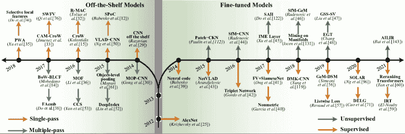
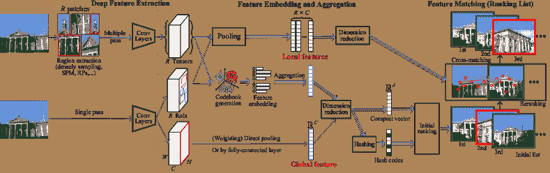
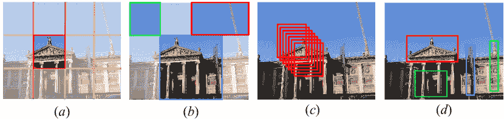
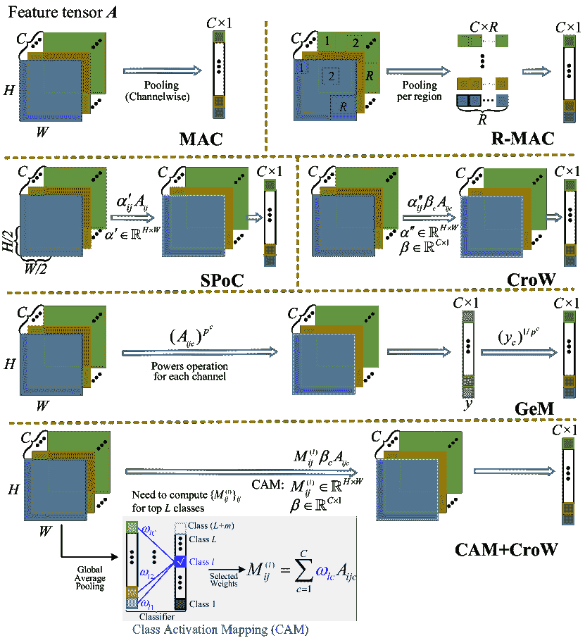
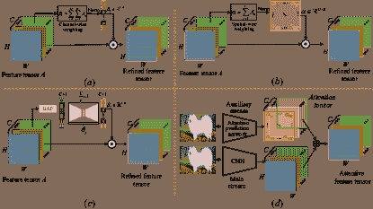
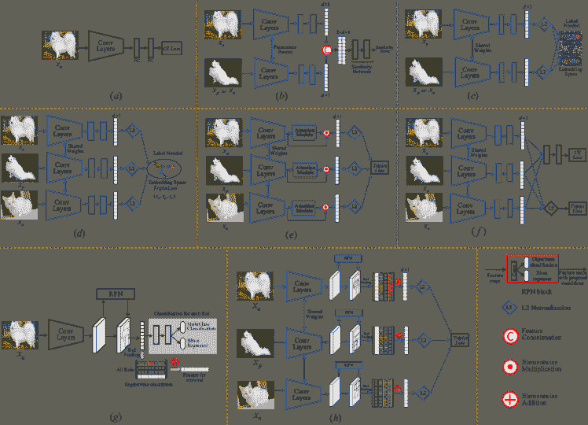
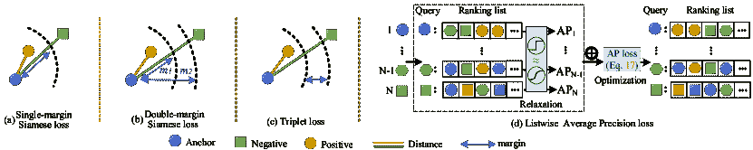
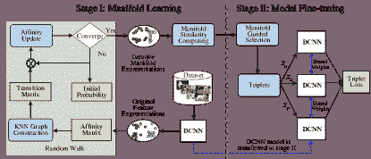
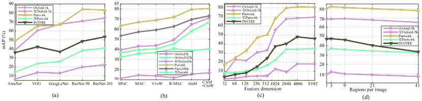

<!--yml

分类：未分类

date: 2024-09-06 19:56:56

-->

# [2101.11282] 深度学习实例检索：综述

> 来源：[`ar5iv.labs.arxiv.org/html/2101.11282`](https://ar5iv.labs.arxiv.org/html/2101.11282)

# 深度学习实例检索：综述

魏晨，刘宇，王伟平，厄尔温·M·巴克，西奥多罗斯·乔治欧，

保罗·费古特，刘莉，和迈克尔·S·刘。魏晨来自中国长沙湖南省先进技术研究院；刘宇来自中国大连理工大学 DUTRU 国际信息科学与工程学院。王伟平来自中国长沙湖南省先进技术研究院。厄尔温·巴克、西奥多罗斯·乔治欧和迈克尔·刘来自荷兰莱顿大学莱顿先进计算机科学研究所。保罗·费古特来自加拿大滑铁卢大学系统设计工程系。刘莉来自中国长沙湖南省先进技术研究院，同时也是芬兰奥卢大学机器视觉与信号分析中心的成员。通讯作者：刘莉，li.liu@oulu.fi，dreamliu2010@gmail.com。此项工作得到了中国国家留学基金委员会（编号：201703170183）、芬兰高级研究院资助（资助号：331883）、信息技术项目 FRAGES 以及中国国家自然科学基金（资助号：61872379，62022091，61825305 和 62102061）的支持。

###### 摘要

近年来，来自多个领域的大量视觉内容被生成和分享，例如社交媒体平台、医学成像和机器人技术。这种内容创建和分享的丰富性带来了新的挑战，特别是在搜索数据库中的类似内容方面——内容基础图像检索（CBIR）——这是一个需要提高实时检索效率和准确性的长期研究领域。人工智能在 CBIR 方面取得了进展，并显著促进了实例搜索的过程。在本次调查中，我们回顾了基于深度学习算法和技术开发的最新实例检索工作，调查内容按深度特征提取、特征嵌入和聚合方法以及网络微调策略进行组织。我们的调查考虑了各种最新方法，通过识别重要的工作，揭示不同方法之间的联系，介绍常用的基准、评估结果、常见挑战，并提出了有前景的未来方向。

###### 索引词：

基于内容的图像检索，实例检索，深度学习，卷积神经网络，文献综述

## 1 引言

基于内容的图像检索（CBIR）是通过分析视觉内容（颜色、纹理、形状、物体*等*）在图像库中搜索相关图像的问题，给定一个查询图像 [1],[2]。CBIR 一直是计算机视觉和多媒体领域的一个长期研究课题 [1],[2]。随着图像数据的指数增长，开发适当的信息系统来有效管理如此庞大的图像集合至关重要，其中图像搜索是最不可或缺的技术之一。因此，CBIR 的应用潜力几乎是无限的，如人员/车辆重新识别 [3],[4]，地标检索 [5]，遥感 [6]，在线产品搜索 [7]。

通常，内容基于图像检索（CBIR）方法可以分为两个不同的任务 [8],[9]: 分类级图像检索（CIR）和实例级图像检索（IIR）。CIR 的目标是找到一个代表与查询相同类别的任意图像（例如，狗，汽车） [10],[11]。相比之下，在 IIR 任务中，给定一个特定实例的查询图像（例如，埃菲尔铁塔，我邻居的狗），目标是找到包含相同实例的图像，这些图像可能是在不同条件下拍摄的，比如不同的成像距离、视角、背景、照明和天气条件（重新识别相同实例的样本） [12],[13]。本调查的重点是 IIR 任务¹¹1 如果没有进一步说明，“图像检索”，“IIR”和“实例检索”被视为等效的，并将互换使用。。

在许多现实应用中，IIR 通常需要在数千、数百万甚至数十亿的图像中找到所需的图像。因此，高效搜索与准确搜索一样关键，为此做出了持续的努力 [12],[14],[15]。为了在大规模图像集合中实现准确和高效的检索，*开发紧凑而具有区分性的特征表示* 是 IIR 的核心。

表 I: 图像检索领域主要调查的总结与比较。

|        标题 | 年份 | 发表期刊 | 主要内容 |
| --- | --- | --- | --- |
|      早期年份末的基于内容的图像检索 [1] | 2000 | TPAMI | 本文讨论了图像检索系统的步骤，包括图像处理、特征提取、用户交互和相似性评估。      |
|      从数千到数十亿的图像搜索 [16] | 2013 | TOMM | 本文很好地展示了从 1970 年到 2013 年的图像搜索成就，但这些方法并非基于深度学习。      |
|      《基于内容的图像检索中的深度学习：全面研究》[17] | 2014 | ACM MM | 本文介绍了用于微调 AlexNet 的监督度量学习方法。关于基于实例的图像检索的细节有限。 |
|      《基于语义的内容图像检索：全面研究》[18] | 2015 | JVCI | 本文对使用传统方法的 CBIR 进行了全面研究；引入了深度学习作为一个部分，但细节有限。      |
|      《社交语义差距：图像标签分配、细化和检索的比较调查》[19] | 2016 | CSUR | 介绍了一种分类法来结构化日益增长的图像检索文献。将深度学习方法用于特征学习作为未来工作介绍。      |
|      《基于内容的图像检索的最新进展：文献综述》[20] | 2017 | arXiv | 本调查呈现了 2003 年至 2016 年的图像检索研究。一个部分介绍了神经网络，并主要讨论了未来的发展方向。      |
|      《基于内容的图像检索中的信息融合：全面概述》[21] | 2017 | Information Fusion | 本文介绍了 CBIR 中的信息融合策略。简要介绍了用于特征学习的深度卷积网络，但未做深入覆盖。      |
|      《学习哈希的调查》[22] | 2018 | TPAMI | 本文关注于哈希学习算法，并介绍了相似性保留方法及其关系。      |
|      《SIFT 与 CNN 的结合：实例检索的十年综述》[13] | 2018 | TPAMI | 本文对基于 SIFT 和 CNN 的方法的实例检索进行了全面回顾。      |
|      《用于实例检索的深度学习：调查》 | 2021 | Ours | 我们的调查专注于深度学习方法。我们扩展了对 IIR 的回顾，深入探讨了特征提取、特征嵌入和聚合以及网络微调的方法。      |
|        |  |

在过去二十年中，图像表示领域取得了令人瞩目的进展，主要包括两个重要时期，即特征工程和深度学习。在特征工程时代，领域由各种里程碑式的手工图像表示主导，如 SIFT [23]和视觉词袋（BoW）[24]。深度学习时代在 2012 年重新点燃，当时被称为“AlexNet”[25]的深度卷积神经网络（DCNN）在 ImageNet 分类比赛中以突破性的分类错误率降低赢得了第一名。从那时起，像 SIFT 这样的局部描述符的主导地位被数据驱动的深度神经网络（DNNs）取代，后者可以直接从数据中学习具有多个抽象层次的强大特征表示。在过去十年中，DNNs 在各种经典计算机视觉任务中设立了最新的技术水平，包括图像分类[25],[26]，目标检测[27]，语义分割[28]，和图像检索[17]。

鉴于这一时期的快速演变，本文的目标是提供对 IIR 近期成就的全面综述。与现有关于传统图像检索的优秀综述[13],[18],[19],[20]相比，如表 I 所示，我们在本文中的重点是回顾基于深度学习的 IIR 方法，特别是检索准确性和效率的问题。

### 1.1 2012 年以来的进展总结

在 AlexNet 的图像分类实现取得巨大成功之后[25]，对 DCNN 在实例检索任务中的探索取得了显著进展，代表性方法如图 1 所示。在这些方法的基础上，基于现成模型和微调模型的 IIR（实例检索）最新进展可以得到，这也构成了本综述的基础。

基于 DCNNs 的现成模型，参数固定[29],[30],[31]，在图像尺度或补丁尺度上提取特征，这对应于单次和多次方案。这些方法侧重于有效利用特征，为此，研究人员提出了嵌入和聚合方法，如 R-MAC [32]、CroW [15]和 SPoC [12]，以提高提取特征的辨别能力。基于 DCNNs 的微调模型，其中参数会更新[29]，由于深度网络本身已经得到广泛研究，因此更受欢迎。为了学习更好的检索特征，研究人员提出了改进网络架构和/或更新预存参数的建议[31]。

本调查将详细探讨以下三个主题的最新进展：

图 1：IIR 中的代表性方法。现成模型在提取检索特征时，其模型参数不会进一步更新或调整。对于单次方案，关键步骤是特征嵌入和聚合，以提高提取的图像级激活的辨别能力[15],[33],[34],[35]，而对于多次方案，目标是在区域尺度上提取实例特征，并尽可能消除图像杂乱[30],[36],[37],[38]。相比之下，对于微调模型，模型参数会根据检索任务进行调整，并解决领域迁移问题。对于监督微调，关键步骤在于目标函数的设计和样本采样策略[39],[40],[41],[42],[43]，而无监督微调的成功在于挖掘训练样本之间的相关性[44],[45],[46],[47],[48]。有关详细信息，请参见第三部分和第四部分。

*(深度特征提取)*（第 3.1 节）

IIR 中的一个关键步骤是使描述符尽可能具有语义意识[26],[49]。为此，一些最新的研究集中在 DCNN 的输入数据上，从而可以从整张图像中提取实例特征，例如，CroW [15]、VLAD-CNN [50]，或者从图像补丁中提取，例如，MOP-CNN [30]、FAemb [38]。例如，在 Holidays 数据集上进行评估[51]，补丁级输入方案相比于使用图像级输入[30]得到的结果（70.53%），可以将 mAP 提高 8.29%。其他研究则专注于探索不同的特征提取器，例如，给定 DCNN 的一层，以获得输出激活。最初，通常选择全连接层来提取特征[52],[53]，然后流行地使用卷积层[12],[32]。之后，一些工作利用不同提取器的互补性来探索层级融合，例如 MoF [36]，以及模型级融合，例如 DeepIndex [52]，以提升检索性能。

(2) *特征嵌入和聚合*（第 3.2 节）

最近的研究回顾了经典的嵌入和聚合方法，并将其应用于深度特征。大多数工作倾向于将卷积层的单个向量映射[24],[54],[55]，然后聚合成全局特征。映射过程可以通过使用预训练的代码本（即单独构建的）来实现，例如 VLAD-CNN [50]、DeepIndex [52]，或者作为训练过程中的参数进行学习（同时构建），例如 NetVLAD [43]、GeM-DSM [56]。一些工作通过直接池化[21]或复杂的池化方法[12]将局部特征聚合为全局特征，而不进行聚合操作，例如 R-MAC [32]。

(3) *网络微调以学习表征*（第四部分）

在源数据集上预训练的 DCNNs 在对新数据集执行检索任务时会受到领域偏移的影响。因此，有必要通过使用有监督或无监督的微调方法，将深度网络微调到特定领域[39]。如图 1 所示，最近的有监督微调方法集中在设计目标函数（例如，Listwise 损失[57]）和样本采样策略上，如 NetVLAD [43]、Triplet Network [42]。无监督方法则集中在通过聚类（如 SfM-GeM [46]）或流形学习（如 AILIR [58]）挖掘训练样本之间的相关性。最近，依赖于变压器层的卷积-free 模型表现出竞争力，并作为 DCNNs 的强大替代品，如 IRT [59]、重新排序变压器[60]。

### 1.2 关键挑战

以上三种主题的目标是解决*准确性*和*效率*这两个相互竞争的目标，这两个目标仍然持续存在挑战。

A) 与准确性相关的挑战取决于输入数据、特征提取器以及提取的特征处理方式：

+   •

    **不变性挑战**：图像中的实例可能会被旋转、平移或缩放，因此最终特征会受到这些变换的影响，检索准确性可能会降低[30]。需要在 IIR 流程中融入不变性[61]，[62]。

+   •

    **干扰挑战**：IIR 系统可能需要只关注某个特定对象，甚至只是一个小部分。深度卷积神经网络（DCNNs）可能会受到图像杂乱或背景的影响，因此已经研究了多次通过的方案，在特征提取之前研究区域提议。

+   •

    **区分度挑战**：深度特征在 IIR（实例检索）中需要尽可能具有高区分度，以便区分具有细微差异的实例，这导致了许多特征处理方面的探索。这些探索包括特征嵌入和聚合方法，以促进特征的区分度；以及注意力机制，以突出提取特征中的最相关区域或使深度网络能够关注感兴趣的区域。

+   •

    **微调挑战**：DCNNs 可以作为强大的提取器进行微调，以捕捉实例之间的细微语义差异。这些探索提供了改进的准确性，然而这一领域仍然是一个主要挑战。

图 2：IIR 的一般框架，包括对图像或图像补丁的特征提取，随后进行特征嵌入和聚合方法以提高特征的区分性。特征匹配可以通过使用全局特征（初步筛选）或使用局部特征对全局特征匹配的前排名图像进行重新排序来进行。

B) 效率相关的挑战非常重要，特别是在大规模数据集的情况下[63]。检索系统在接收到查询图像时应迅速响应。深度特征是高维的，包含支持更高准确率的语义感知信息，但往往以效率为代价。

一方面，效率与特征的格式有关，即实值或二值。哈希码在存储和搜索方面具有优势[22],[39]，但对于哈希方法，需要仔细考虑损失函数设计[64],[65]，以获得用于高检索准确度的最佳代码。

另一方面，效率也与特征匹配的机制有关。例如，可以选择使用全局特征进行初步排序，然后通过前排名图像的特征进行后续排序，而不是耗时的局部特征交叉匹配。

## 2 一般框架的 IIR

图 2 提供了基于深度学习的 IIR 的一般框架概述，包括三个主要阶段。

1) 深度特征提取：（第 3.1 节）

特征提取是 IIR 的第一步，可以通过单次或多次方式实现。单次方法以整个图像作为输入，而多次方法依赖于区域提取，如图 4 所示。

从给定的 DCNN 的全连接层的激活可以用作检索特征，无论是基于整个图像还是图像补丁。当通过复杂的池化进一步处理卷积层的张量时，可以使用这些张量，如图 2 所示。相同深度网络的不同层可以结合成更强大的提取器[36],[66]。此外，也可以融合不同模型层的激活[67],[68]。特征提取是生成基础网络激活（即 3D 张量或单一向量）的步骤，这些激活在大多数情况下需要进一步处理。

2) 嵌入和聚合：（见第 3.2 节）

特征嵌入和聚合是生成全局或局部特征的两个关键步骤。特征嵌入将单个局部特征映射到更高维空间，而特征聚合将多个映射向量或所有单个特征汇总到一个全局向量中。全局特征可能直接来自池化卷积特征图 [69],[70]，或使用一些复杂的加权方法 [12],[15]（即，都不进行特征嵌入）。使用预生成代码本的特征嵌入方法可以对单个卷积向量进行编码，然后进行聚合 [24],[54],[55]。对于局部特征，所有感兴趣区域的良好嵌入表示被单独存储，并在重新排名阶段用于交叉匹配而不进行聚合。

3) 特征匹配：

特征匹配是一个测量图像之间特征相似性的过程，然后返回一个排名列表。全局匹配可以通过欧几里得距离等方法有效计算。对于局部特征 [5],[71]，图像相似性通常通过总结局部特征之间的相似性来评估，使用经典的 RANSAC [72] 或者更近期的变体 [73],[74]。单独存储局部特征然后单独估计其相似性会导致额外的内存和搜索成本 [71],[74]，因此在大多数情况下，局部特征用于重新排名由全局特征匹配的初始排名图像 [32],[64],[71],[75]。

前面提到的三个阶段依赖于 DCNN 作为主干架构。在几乎所有情况下，这些主干中的预存参数可以被微调（见第四部分），以更好地适应实例检索，并提高性能。

以下部分材料的详细分类见图 3。

## 3 使用现成 DCNN 模型的检索

由于其规模，DCNNs 需要在极其大规模的数据集上进行训练，最初用于分类任务，并能够识别来自不同类别的图像。因此，一个可能的方案是，经过有效分类训练的 DCNNs 可以直接作为现成的特征检测器用于图像检索任务，这是本调查的主题。也就是说，可以提议在基于已经训练好的 DCNNs 进行图像检索，并保持其预训练参数不变。

<svg   height="490.88" overflow="visible" version="1.1" width="795.57"><g transform="translate(0,490.88) matrix(1 0 0 -1 0 0) translate(15.47,0) translate(0,213.95)" fill="#000000" stroke="#000000"><g stroke-width="0.4pt"><g transform="matrix(1.0 0.0 0.0 1.0 -11.78 264.95)" fill="#000000" stroke="#000000"><foreignobject width="316.22" height="11.07" transform="matrix(1 0 0 -1 0 16.6)" overflow="visible">实例级图像检索的深度学习（整体调查）</foreignobject></g><g transform="matrix(1.0 0.0 0.0 1.0 19.71 249.2)" fill="#000000" stroke="#000000"><foreignobject width="268.53" height="11.07" transform="matrix(1 0 0 -1 0 16.6)" overflow="visible">使用现成的 DCNN 模型进行检索（第三部分）</foreignobject></g><g transform="matrix(1.0 0.0 0.0 1.0 51.21 233.45)" fill="#000000" stroke="#000000"><foreignobject width="179.48" height="11.07" transform="matrix(1 0 0 -1 0 16.6)" overflow="visible">深度特征提取（第 3.1 节）</foreignobject></g><g transform="matrix(1.0 0.0 0.0 1.0 82.71 217.7)" fill="#000000" stroke="#000000"><foreignobject width="203.8" height="11.07" transform="matrix(1 0 0 -1 0 16.6)" overflow="visible">网络前馈方案（第 3.1.1 节）</foreignobject></g><g transform="matrix(1.0 0.0 0.0 1.0 114.2 201.95)" fill="#000000" stroke="#000000"><foreignobject width="518.43" height="11.07" transform="matrix(1 0 0 -1 0 16.6)" overflow="visible">单次前馈传递：MAC [69], R-MAC [32]</foreignobject></g> <g transform="matrix(1.0 0.0 0.0 1.0 114.2 186.21)" fill="#000000" stroke="#000000"><foreignobject width="485.1" height="11.07" transform="matrix(1 0 0 -1 0 16.6)" overflow="visible">多次前馈传递：SPM [52], RPNs [42]</foreignobject></g> <g transform="matrix(1.0 0.0 0.0 1.0 82.71 170.46)" fill="#000000" stroke="#000000"><foreignobject width="174.68" height="11.07" transform="matrix(1 0 0 -1 0 16.6)" overflow="visible">深度特征选择（第 3.1.2 节）</foreignobject></g> <g transform="matrix(1.0 0.0 0.0 1.0 114.2 154.71)" fill="#000000" stroke="#000000"><foreignobject width="338.12" height="11.07" transform="matrix(1 0 0 -1 0 16.6)" overflow="visible">全连接层：神经编码 [39]</foreignobject></g> <g transform="matrix(1.0 0.0 0.0 1.0 114.2 138.96)" fill="#000000" stroke="#000000"><foreignobject width="514.49" height="11.07" transform="matrix(1 0 0 -1 0 16.6)" overflow="visible">卷积层：SPoC [12], CroW [15]</foreignobject></g> <g transform="matrix(1.0 0.0 0.0 1.0 82.71 123.21)" fill="#000000" stroke="#000000"><foreignobject width="179.7" height="11.07" transform="matrix(1 0 0 -1 0 16.6)" overflow="visible">特征融合策略（第 3.1.3 节）</foreignobject></g> <g transform="matrix(1.0 0.0 0.0 1.0 114.2 107.47)" fill="#000000" stroke="#000000"><foreignobject width="434.02" height="11.07" transform="matrix(1 0 0 -1 0 16.6)" overflow="visible">层级融合：MoF [36], MOP [30]</foreignobject></g> <g transform="matrix(1.0 0.0 0.0 1.0 114.2 91.72)" fill="#000000" stroke="#000000"><foreignobject width="331.87" height="11.07" transform="matrix(1 0 0 -1 0 16.6)" overflow="visible">模型级融合：ConvNet 融合 [49]</foreignobject></g> <g transform="matrix(1.0 0.0 0.0 1.0 51.21 75.97)" fill="#000000" stroke="#000000"><foreignobject width="242.67" height="11.07" transform="matrix(1 0 0 -1 0 16.6)" overflow="visible">特征嵌入与聚合（第 3.2 节）</foreignobject></g> <g transform="matrix(1.0 0.0 0.0 1.0 82.71 60.22)" fill="#000000" stroke="#000000"><foreignobject width="210.65" height="11.07" transform="matrix(1 0 0 -1 0 16.6)" overflow="visible">全局特征匹配（第 3.2.1 节）</foreignobject></g><g transform="matrix(1.0 0.0 0.0 1.0 82.71 44.48)" fill="#000000" stroke="#000000"><foreignobject width="204.88" height="11.07" transform="matrix(1 0 0 -1 0 16.6)" overflow="visible">局部特征匹配（第 3.2.2],[31],[83]，这意味着为分类训练的模型不一定能提取适合图像检索的特征。特别是，只要特征保持在分类边界内，分类决策可能会成功，但这些模型提取的特征在检索中可能表现出不足的能力，因为特征匹配比分类更为重要。本节将调查为提高特征表示质量而开发的策略，特别是基于特征提取/融合（第 3.1 节）和特征嵌入/聚合（第 3.2 节）的方法。

### 3.1 深度特征提取

特征提取涉及从现成的 DCNN 中提取检索特征的机制。对于输入图像 $x$ 和网络 $f(\cdot;\bm{\theta})$，我们将来自卷积层的特征表示为 $\bm{A}:=f_{conv}(x)\in\mathbb{R}^{H\times W\times C}$，其中 $H$ 是高度，$W$ 是宽度，$C$ 是通道数，而来自全连接层的特征表示为 $\bm{B}:=f_{fc}(x)\in\mathbb{R}^{D\times 1}$，其中 $D$ 是维度。

#### 3.1.1 网络前馈方案

网络前馈方案集中于如何将图像输入到 DCNN 中，包括单次传递和多次传递。

*a. 单次前馈传递方法*。

单次前馈传递方法将整个图像输入到现成模型中以提取特征。由于输入图像仅传递一次，这种方法相对高效。对于这些方法，全连接层和最后的卷积层均可用作特征提取器[84]。

早期基于网络的 IIR 工作集中于利用 DCNN 作为固定提取器来获得全局特征，特别是基于全连接层[29],[39]，几乎无需工程努力。然而，这种方式提取的特征可能包含背景信息或与目标无关的激活，从而影响检索准确性。

单次处理方案的关键在于嵌入和聚合特征，以提高其辨别能力，使得两个相关图像（即，包括相同对象）的特征比两个不相关图像的特征更相似[12]。为此，可以首先将特征$\bm{B}$映射到高维空间，然后将其聚合为最终的全局特征[30]。另一种方向是将卷积特征$\bm{A}$中的区域视为不同的子向量，从而利用所有特征图的子向量组合来表示输入图像[15],[32]。

*b. 多次前馈传递方法*。

相比于单次处理方案，多次处理方法更耗时[13]，因为需要生成多个补丁并将其输入网络。多次处理方案对于解决第 1.2 节中的“不变性挑战”和“干扰挑战”更为有效。多尺度的局部补丁在图像转换、缩放和旋转方面变得更加稳健[30],[61]。此外，这些补丁有助于过滤掉一些无关的背景信息。

表征通常来自两个阶段：补丁检测和补丁描述。多尺度图像补丁是通过滑动窗口[37],[38]或空间金字塔模型（SPM）[52],[85],[86]获得的，如图 4 所示。例如，Zheng 等[86]通过使用 SPM 对图像进行分割，并在不断增加的尺度下提取特征，从而实现了全局、区域、局部上下文信息的整合。

补丁检测方法缺乏检索效率，因为也会检测到无关的补丁[32]。例如，Cao 等[87]提出将图像补丁合并为具有不同超参数的较大区域，其中超参数选择被视为一个优化问题，以最大化查询和候选特征之间的相似性。

图 4：图像补丁生成方案：(a) 滑动窗口[37],[38]; (b) 空间金字塔建模[85]; (c) 密集采样[30],[36]; (d) 来自区域提议网络的区域提议[27],[42]。

与其随机或密集地生成多尺度图像补丁，不如采用区域提议方法引入一定的目的性。可以使用目标检测器生成区域提议，如选择性搜索 [61]、边缘框 [88],[89] 和 BING [90]。例如，Yu 等 [89] 提出了模糊对象匹配 (FOM) 方法用于实例搜索，其中模糊对象从 300 个对象提议中生成，并且经过聚类以筛选出重叠的提议。区域提议还可以通过区域提议网络 (RPNs) [27],[42] 和卷积核网络 (CKNs) [91] 进行学习，然后将这些网络应用于端到端的微调以学习相似性 [92]。这通常需要数据集提供良好的定位边界框作为监督，例如，数据集 INSTRE [93]、Oxford-5k [94]、Paris-6k [95]、GLD-v2 变体 [74]。此外，在现成的场景中，使用边界框裁剪查询图像并作为输入 DCNNs 的方法已被证明提供了更好的检索性能，因为只提取了与实例相关的信息 [92],[32]。

#### 3.1.2 深度特征选择

特征选择决定了提取特征的接收场，即从全连接层的全局级别和从卷积层的区域级别。

*a. 从全连接层提取*

选择全连接层作为全局特征提取器是直接的 [29],[30],[39]。通过 PCA 降维和归一化 [29] 可以测量图像相似度。从全连接层提取特征 $\bm{B}$ 对 IIR 有两个明显的限制：包括无关信息，以及缺乏局部几何不变性 [30]。

关于第一个限制，图像级全局描述符可能包括无关的模式或背景杂乱，特别是当目标实例只是图像的一小部分时。此时，更合理的做法是在更细尺度上提取区域级特征，即使用多次 [30],[61],[64]。对于第二个限制，另一种方法是在卷积层上提取多尺度特征 [69],[62]。此外，这使得全局特征与空间验证和重新排序等技术不兼容。因此，几种方法选择利用中间卷积层 [12],[30],[50],[69]。

*b. 从卷积层提取*

卷积层中的神经元仅连接到输入图像的局部区域，这种较小的感受野确保了所产生的特征 $\bm{A}$（通常来自最后一层）保留了更多的局部结构信息 [96]，[97]，并且对图像变换更具鲁棒性 [12]，从而解决了“不可变性挑战”。例如，Razavian 等人 [69] 在最后的卷积层上提取多尺度特征，而 Morère 等人 [62] 将一系列嵌套的池化层纳入 CNN。两者都提供了更高的特征不可变性。因此，许多图像检索方法使用卷积层作为特征提取器 [33]，[50]，[69]，[98]。

求和/平均和最大池化是产生全局特征的两种简单聚合方法 [69]。对于一个池化层，最后的卷积层通常比其他较浅的或后来的全连接层提供更优的准确性 [97]。在池化之前，对特征图没有其他操作，因此我们在图 2 中将这些方法标记为“直接池化”。

图 5：单次方法中的代表性方法，重点关注卷积特征张量 $\bm{A}$。我们将 $\bm{A}$ 中对应通道 $c$、空间位置（$i,j$）的条目记作 $A_{ijc}$：MAC [69]，R-MAC [32]，SPoC 使用每通道的高斯加权 $\alpha^{\prime}_{ij}A_{ij}$ 其中 $\alpha^{\prime}_{ij}=\exp\left\{-{\textstyle\frac{\left(i-\frac{H}{2}\right)^{2}+\left(j-\frac{W}{2}\right)^{2}}{2\sigma^{2}}}\right\}$ [12]，CroW 使用通过在位置（$i,j$）对所有 $C$ 特征图进行求和计算的 $\alpha^{\prime\prime}$ 和通过对每个特征图 $c$ 的 $H\times W$ 数组进行求和计算的 $\beta$ [15]，GeM 使用通道-wise 功率操作 [46]，以及通过执行 $M_{ij}^{(l)}=\sum_{c=1}^{C}\omega_{lc}A_{ijc}$ 其中 $\omega_{lc}$ 是由 $l$-th 类激活的权重 [33] 来实现 CAM+CroW。

许多复杂的聚合方法已经被探索，比如在卷积特征图上进行通道级或空间级特征加权[62],[99],[100]。这些聚合方法旨在突出特征的重要性[15]或减少某些区域的突发描述符的负面影响[34],[101]。为了清晰起见，我们在图 5 中展示了代表性的策略。请注意，这些特征聚合方法通常在通道级求和/最大池化之前进行，并且不会将特征嵌入到更高维的空间中。

使用卷积特征的一个理由是，每个这样的向量可以充当“密集 SIFT”特征[12]，因为每个向量对应于输入图像中的一个区域。受这种观念的启发，许多工作利用用于 SIFT 特征的嵌入方法（例如，BoW）[23]来处理区域特征向量，然后将它们聚合（例如，通过求和池化）成一个全局描述符。特征嵌入方法通过将个体特征映射到高维空间来解决区分性挑战，使其可区分[34]。特征嵌入之后进行 PCA 以减少特征维度，并进行白化以降低特征之间的共现权重。

#### 3.1.3 特征融合策略

融合研究不同特征的互补性，包括层级融合和模型级融合探索。

*a. 层级融合*

通过层级融合，可以融合深度网络中的多个全连接层[52],[66]。例如，Liu 等人[52]提出了 DeepIndex 来整合来自不同全连接层的多个全局特征。第一个全连接层的激活被用作列索引，第二个层的激活用作行索引。同样，也可以融合来自多个卷积层的激活。例如，Li 等人[99]在 VGG-16 的五个卷积层上应用了 R-MAC 编码方案，然后将它们串联成一个多尺度特征向量。

完全连接层的特征保留了全球高层次的语义，而卷积层的特征则能呈现局部低层次和中层次的线索。因此，在测量语义相似性时，全球和局部特征相互补充，并且在一定程度上能保证检索性能[102],[103]。这些特征可以直接进行连接[71],[102]，卷积特征通常通过滑动窗口或区域提议网络进行过滤。直接连接也可以被其他先进的方法替代，如正交操作[103]或基于池化的方法，如 Li 等人的多层无序融合（MOF）[36]，该方法受到多层无序池化（MOP）[30]的启发。然而，如果全球和局部特征被同等对待，局部特征在区分微妙的特征差异方面无法发挥决定性作用。Yu 等人[102]使用映射函数在精细化返回排名列表时断言局部特征，通过指数映射函数利用卷积层和完全连接层的互补优势。类似地，Liu 等人[4]在卷积层之上设计了两个子网络，以获取全球和局部特征，然后学习融合这些特征，从而自适应调整融合权重。Zhang 等人[104]则融合了基于相同 CNN 提取的两种特征类型生成的索引矩阵，这种特征融合具有较低的计算复杂度。

考虑不同层的组合对于融合的效果非常重要，鉴于它们的差异性和互补性。Yu 等人[102] 比较了完全连接层和卷积层在 Oxford 5k、Holiday 和 UKBench 数据集上的不同组合的表现。结果显示，包括第一个完全连接层的组合总是表现更好。Li 等人[36] 证明了融合卷积层和完全连接层优于仅融合卷积层。将两个卷积层与一个完全连接层融合在 Holiday 和 UKBench 数据集上取得了最佳表现。

*b. 模型级融合*

将不同模型的特征进行融合是可能的；这种融合更关注模型的互补性，方法被分为*模型内部*和*模型间*。

模型内融合建议多个深度模型具有相似或高度兼容的结构，而模型间融合涉及结构不同的模型。例如，Simonyan 等人[49]引入了一种 ConvNet 模型内融合策略，以提升 VGG 的特征学习能力，其中 VGG-16 和 VGG-19 被融合在一起。为了关注图像对象的不同部分，Wang 等人[105] 通过选择 VGG-16 的所有卷积层来提取图像表示，从而实现多特征融合，这被证明比仅使用单层特征更为稳健。

模型间融合是一种桥接不同特征的方法，因为不同的深度网络具有不同的感受野[52],[68],[79],[97]。例如，引入了一个双流注意力网络[79]来实现图像检索，其中主要网络用于语义预测的是 VGG-16，而辅助网络用于预测注意力图。类似地，考虑到模型间融合在弥合中级特征和高级特征之间差距的重要性和必要性，Liu 等人[52]和 Zheng 等人[97]结合了 VGG-19 和 AlexNet 来学习组合特征，而 Ozaki 等人[68]则将来自六个不同模型的描述符连接在一起。

模型间融合和模型内融合与模型选择有关。确定如何结合两个模型的特征有一些策略。直接将候选模型的所有特征融合在一起，然后基于连接后的特征学习一个度量[52],[79]，这是一种“*早期融合*”策略。另一种选择是分别为每个模型的特征学习最佳度量，然后将这些度量结合起来进行最终的检索排序[36],[106]，这是一种“*晚期融合*”策略。

讨论。层级融合和模型级融合基于相关层或网络具有不同特征描述能力的事实。对于这些融合策略，关键问题是哪些特征组合效果最佳？在现成模型的基础上已进行了一些探索，例如 Xuan 等人[107]，他们展示了组合不同数量和不同尺寸特征的效果。Chen 等人[108]分析了现成的图像分类和目标检测模型中嵌入特征在图像检索中的表现。

### 3.2 特征嵌入和聚合

特征嵌入和聚合的主要目的是进一步提升特征的区分性，以应对“区分性挑战”，并获得最终的全局和/或局部特征以检索特定实例。

#### 3.2.1 与全局特征的匹配

可以从全连接层中提取全局特征，接着进行降维和归一化[29],[39]。它们易于实现且无需进一步的聚合过程。Gong 等人[30]在三个尺度级别上提取了局部图像块的全连接激活，并使用 VLAD 单独嵌入图块级别的激活。因此，最终的连接特征显著解决了由于图像旋转引起的不变性挑战。

卷积特征还可以聚合成紧凑的全局特征。简单的聚合方法包括求和/平均或最大池化[69],[70]。求和/平均池化的判别能力较差，因为它考虑了所有激活的卷积输出，从而削弱了高激活特征的效果[34]。因此，最大池化特别适用于具有低激活概率的稀疏特征，但当图像特征被去白化时，最大池化可能不如求和/平均池化[12]。

图 5 展示了使用通道或空间加权的复杂特征聚合方法[12],[62]。例如，Babenko 等人[12]提出了求和池化卷积特征（SPoC），以获得由$\alpha^{\prime}$加权并具有高斯中心先验的紧凑描述符。类似地，可以将特征图中的区域视为不同的子向量[32],[69],[97]，因此使用$R$个子向量的组合来表示输入图像，如 R-MAC[32]。由于卷积特征可能包含重复的模式，每个向量可能对应相同的区域，因此生成的描述符可能会有爆发性，这使得最终聚合的全局特征较难区分。作为解决方案，Pang 等人[101]利用热扩散在聚合阶段对卷积特征进行加权，减少了爆发性的负面影响。

卷积特征可以解释为局部区域的描述符，因此许多工作利用嵌入方法，包括 BoW、VLAD 和 FV，来编码区域特征向量，然后将其聚合成全局描述符。需要注意的是，BoW 和 VLAD 可以通过使用其他度量，如汉明距离[109]，进行扩展。在这里，我们简要描述了欧几里得嵌入的原理。

BoW [24] 是一种广泛使用的特征嵌入方法，它会导致稀疏的出现向量。设 $\bm{a}=\left\{a_{1},a_{2},...,a_{R}\right\}$ 为一组 $R$ 个局部特征，每个特征的维度为 $d$。BoW 需要一个预定义的代码本 $\bm{c}=\left\{c_{1},c_{2},...,c_{K}\right\}$，其中包含 $K$ 个中心点，通常是离线学习的，用于将这些局部描述符进行聚类，并将每个描述符 $a_{t}$ 映射到最近的中心点 $c_{k}$。对于每个中心点，可以计算并规范化出现次数，如下所示：

|  | $g(c_{k})=\frac{1}{R}\sum_{r=1}^{R}\phi(a_{r},c_{k})$ |  | (1) |
| --- | --- | --- | --- |

|  | <math alttext="\phi(a_{r},c_{k})=\left\{\begin{array}[]{ll}1&amp;\textrm{如果 $c_{k}$ 是 $a_{r}$ 的最近代码字 }\\ 0&amp;\textrm{否则}\\

\end{array}\right." display="block"><semantics ><mrow ><mrow  ><mi >ϕ</mi><mo lspace="0em" rspace="0em" >​</mo><mrow ><mo stretchy="false" >(</mo><msub  ><mi >a</mi><mi >r</mi></msub><mo >,</mo><msub  ><mi >c</mi><mi >k</mi></msub><mo stretchy="false" >)</mo></mrow></mrow><mo  >=</mo><mrow ><mo >{</mo><mtable columnspacing="5pt" displaystyle="true" rowspacing="0pt"  ><mtr ><mtd  columnalign="left" ><mn  >1</mn></mtd><mtd columnalign="left"  ><mrow ><mtext >如果 </mtext><msub ><mi >c</mi><mi >k</mi></msub><mtext > 是 </mtext><msub ><mi >a</mi><mi >r</mi></msub></mrow></mtd></mtr><mtr ><mtd  columnalign="left" ><mn  >0</mn></mtd><mtd columnalign="left"  ><mtext >否则</mtext></mtd></mtr></mtable></mrow></mrow><annotation-xml encoding="MathML-Content" ><apply  ><apply ><ci >italic-ϕ</ci><interval closure="open" ><apply  ><csymbol cd="ambiguous"  >subscript</csymbol><ci >𝑎</ci><ci >𝑟</ci></apply><apply ><csymbol cd="ambiguous" >subscript</csymbol><ci >𝑐</ci><ci  >𝑘</ci></apply></interval></apply><apply ><csymbol cd="latexml" >cases</csymbol><matrix  ><matrixrow ><cn type="integer" >1</cn><ci  ><mrow ><mtext >如果 </mtext><msub ><mi >c</mi><mi >k</mi></msub><mtext > 是 </mtext><msub ><mi >a</mi><mi >r</mi></msub></mrow></ci></matrixrow><matrixrow ><cn type="integer" >0</cn><ci  ><mtext >否则</mtext></ci></matrixrow></matrix></apply></apply></annotation-xml><annotation encoding="application/x-tex" >\phi(a_{r},c_{k})=\left\{\begin{array}[]{ll}1&\textrm{如果 $c_{k}$ 是 $a_{r}$ 的最近代码字 }\\ 0&\textrm{否则}\\ \end{array}\right.</annotation></semantics></math> |  | (2) |

因此，BoW 考虑了每个 $c_{k}$ 的描述符数量（*即* 0 阶特征统计），所以 BoW 表示是所有映射向量的连接：

|  | $G_{{}_{BoW}}(\bm{a})=\left[\begin{array}[]{ccc}g(c_{1}),\cdots,g(c_{k}),\cdots,g(c_{K})\end{array}\right]\rm^{\top}$ |  | (3) |
| --- | --- | --- | --- |

BoW 简单实现了局部描述符的编码，例如卷积特征图[36],[84]或全连接激活[86],[104]，也可以对区域描述符进行编码[110],[111]。Mukherjee 等人[111]基于信息熵提取图像补丁，并将其输入到预训练的 VGG-16 中，然后使用 BoW 嵌入并聚合来自全连接层的补丁级描述符。嵌入的 BoW 向量通常是高维且稀疏的，因此在提到的效率挑战方面不适合大规模数据集。

VLAD [54] 存储每个视觉词的残差和。类似于 BoW，它生成$K$个视觉词质心，然后每个特征$a_{r}$被分配给其最近的视觉质心$c_{k}$：

|  | $g(c_{k})=\frac{1}{R}\sum_{r=1}^{R}\phi(a_{r},c_{k})(a_{r}-c_{k})$ |  | (4) |
| --- | --- | --- | --- |

VLAD 表示通过所有质心的残差进行堆叠，维度为($d\times K$)，即，

|  | $G_{{}_{VLAD}}(\bm{a})\!=\!\left[\begin{array}[]{ccc}\cdots,g(c_{k})\rm^{\top},\cdots\end{array}\right]\rm^{\top}.$ |  | (5) |
| --- | --- | --- | --- |

VLAD 捕捉一阶特征统计信息，即($a_{r}-c_{k}$)。类似于 BoW，VLAD 的性能受集群数量的影响：更多的质心生成更大的向量，这些向量更难以索引。例如，对于实例级图像检索，Gong 等人[30]将全连接层的激活与应用于图像级和补丁级输入的 VLAD 进行串联[112]。Ng 等人[50]用 VLAD [54]替换了 BoW [24]，并首次将局部特征编码到 VLAD 表示中。这一思想启发了另一项里程碑式的工作[43]，该工作首次将 VLAD 插入到最后的卷积层中，从而实现了通过反向传播进行端到端的训练。

FV [55] 通过编码一阶和二阶统计信息扩展了 BoW。FV 通过高斯混合模型（GMM）对局部描述符集进行聚类，使用$K$个组件生成一个字典$\bm{c}=\left\{\mu_{k};\Sigma_{k};w_{k}\right\}_{k=1}^{K}$，由均值/协方差/权重三元组组成[113]，其中协方差可以通过仅保留对角元素来简化。对于每个局部特征$a_{r}$，GMM 表示为

|  | $\displaystyle\gamma_{k}(a_{r})=w_{k}\times p_{k}(a_{r})/\Big{(}\sum_{k=1}^{K}w_{k}p_{k}(a_{r})\Big{)}\quad s.t.\sum_{k=1}^{K}w_{k}=1$ |  | (6) |
| --- | --- | --- | --- |

其中 $p_{k}(a_{r})=\mathcal{N}(a_{r},\mu_{k},\sigma_{k}^{2})$。所有局部特征被分配到字典中的每个组件$k$，其计算公式为

|  |  | $\displaystyle g_{w_{k}}=\frac{1}{R\sqrt{w_{k}}}\sum_{r=1}^{R}\Big{(}\gamma_{k}(a_{r})-w_{k}\Big{)}$ |  | (7) |
| --- | --- | --- | --- | --- |
|  |  | $\displaystyle g_{u_{k}}=\frac{\gamma_{k}(a_{r})}{R\sqrt{w_{k}}}\sum_{r=1}^{R}\left(\frac{a_{r}-\mu_{k}}{\sigma_{k}}\right),$ |  |
|  |  | $\displaystyle g_{\sigma_{k}^{2}}=\frac{\gamma_{k}(a_{r})}{R\sqrt{2w_{k}}}\sum_{r=1}^{R}\left[{\left(\frac{a_{r}-\mu_{k}}{\sigma_{k}}\right)}^{2}-1\right]$ |  |

FV 表示是通过将来自 $K$ 组件的向量连接起来生成的：

|  | $\displaystyle\!\!\!G_{{}_{FV}}(\bm{a})\!=\!\left[\begin{array}[]{ccc}g_{w_{1}},\cdots,g_{w_{K}},g_{u_{1}},\cdots,g_{u_{K}},g_{\sigma_{1}^{2}},\cdots,g_{\sigma_{K}^{2}}\end{array}\right]\rm^{\top}$ |  | (8) |
| --- | --- | --- | --- |

FV 表示通过生成过程定义了一个核，并捕捉了比 BoW 和 VLAD 更多的统计量。FV 向量不会显著增加计算成本，但需要更多的内存。如果在没有内存控制的情况下应用 FV 可能会导致次优性能 [114]。

讨论。传统上，基于池化的聚合方法（例如，见图 5）直接插入深度网络中，然后整个模型以端到端的方式使用。这三种嵌入方法（BoW、VLAD、FV）最初是用大量预定义的词汇表进行训练的 [52], [115]。在选择嵌入方法时需要注意它们的特性：BoW 和 VLAD 是在刚性的欧几里得空间中计算的，其性能与质心的数量密切相关，而 FV 可以捕捉更高阶的统计量，并在更高的内存成本下提高特征嵌入的有效性。此外，尽管词汇表通常是在编码深度特征之前单独构建和预训练的，但有必要将网络的训练和词汇参数的学习集成到一个统一的框架中，以确保训练和测试的效率。例如，VLAD 被集成到深度网络中，其中每个空间列特征用于通过 k-means [50] 构建簇。这个想法促成了 NetVLAD [43]，其中深度网络通过 VLAD 向量进行微调。FV 方法也与深度网络结合用于检索任务 [34], [41]。

#### 3.2.2 使用局部特征进行匹配

尽管使用全局特征在特征提取和相似度计算中具有高效率，但全局特征与空间验证和对应估计不兼容，而这些是实例级检索任务的重要步骤，这推动了对局部特征匹配的研究。在匹配过程中，全局特征只匹配一次，而局部特征匹配则通过总结所有单个局部特征的相似度来评估（即多对多匹配）。

局部特征的一个重要方面是检测图像中一个实例的关键点，然后将检测到的关键点描述为一组局部描述符。受到[116]的启发，这一整套程序的常见策略可以归纳为检测-再描述和描述-再检测。

就检测-再描述而言，我们将关键点周围的描述符视为局部特征，类似于[29],[42]。例如，可以通过使用图 4 中所示的方法来检测粗略区域，图像中的感兴趣区域可以通过区域提议网络（RPNs）[27],[74]来检测。将关键点周围提取的粗略区域输入到 DCNN 中，随后进行特征描述。传统检测器也可以用于检测关键点周围的精细区域。例如，Zheng 等人[86]使用流行的 Hessian-Affine 检测器[117]来获得一个仿射不变的局部区域。Paulin 等人[112]和 Mishchuk 等人[110]使用 Hessian-Affine 检测器检测区域并输入到补丁卷积核网络（Patch-CKNs）[91]中。值得注意的是，对于已由数据集提供边界框注释的情况（见第 5.1 节），直接裁剪图像区域以便进一步重排序会更加方便[92]。

与其早期执行关键点检测，不如将检测阶段推迟到卷积特征图上，即描述-再检测。可以在卷积特征图上选择区域，以获得一组局部特征[32],[37],[84]；然后检测特征图的局部极大值作为关键点[56]。类似的策略也用于网络微调[5],[60],[71],[74],[118]，其中可以基于注意力网络[71],[5]预测的注意力分数，或基于变换器中的单头和多头注意力模块[60],[59]来选择卷积特征图上的关键点。这种关键点选择方法有助于提高计算效率。

在关键点检测和描述之后，大量局部特征在匹配阶段用于执行实例级别的检索，并通过匹配所有局部特征来评估图像相似性。局部匹配技术包括空间验证和选择性匹配核（SMK）[73]。空间验证假设物体实例是刚性的，因此可以使用随机采样一致性（RANSAC）[72]将图像之间的局部匹配估计为一个仿射变换。RANSAC 的一个局限性是当考虑所有局部描述符时，估计变换模型的计算复杂度较高；相反，可以将 RANSAC 应用于少量的高排名局部描述符，例如那些由近似最近邻选择的描述符[5]。SMK 使用非线性选择函数来权衡各个匹配的贡献，但仍然消耗大量内存。其扩展，聚合选择性匹配核（ASMK），更侧重于聚合局部特征之间的相似性，而不明确建模几何对齐，这可以生成更紧凑的表示[73],[118]。最近，Teichmann 等[74]引入了区域聚合选择性匹配核（R-ASMK），通过结合检测到的区域信息，提高了图像检索的准确性，相较于 ASMK。

讨论。使用局部描述符执行实例检索任务有两个局限性。首先，图像的局部描述符是单独且独立存储的，这在内存上消耗较大，不适合大规模场景。其次，查询图像与数据库图像之间的相似性估计依赖于所有局部描述符对的交叉匹配，这会带来额外的搜索成本，从而导致检索效率低下。因此，大多数使用局部特征的实例检索系统遵循两阶段范式：初步筛选和重新排序[64],[71],[75],[92],[119]，如图 2 所示。初步筛选阶段是使用全局描述符选择一组候选匹配图像，从而减少解空间；重新排序阶段则是使用局部描述符对来自全局描述符的高排名图像进行重新排序。

#### 3.2.3 注意机制

注意力机制可以看作是一种特征聚合，其目的是突出最相关的特征部分。它能有效解决“分心挑战”，并且通过计算注意力图来提升特征的区分性[98]。获取注意力图的方法可以分为非参数和参数两大类，如图 6 所示，其主要区别在于注意力图中的重要性权重是否可学习。

非参数加权是一种直观的方法，用于突出特征的重要性，相应的注意力图可以通过通道级或空间级池化获得，如图 6（a,b）。对于空间级池化，Kalantidis 等人[15] 提出了一个有效的 CroW 方法来加权和池化特征图，该方法集中于加权不同空间位置的激活，而不考虑这些激活之间的关系。相比之下，Ng 等人[96] 探索了卷积特征图上不同空间位置激活之间的相关性。

通道级加权方法也是流行的非参数注意力机制[35], [100]。Xu 等人[35] 对加权特征图进行排序，以建立“概率提议”来选择区域特征。Jimenez 等人[33] 结合 CroW 和 R-MAC 提出了类激活图（CAM），用于对每个类别的特征图进行加权。Xiang 等人[100] 使用 Gram 矩阵分析不同通道之间的相关性，从而获得通道敏感性信息，以调整每个特征图的重要性。通道级和空间级加权方法通常集成到深度模型中，以突出特征的重要性[15], [105]。

参数化注意力图，如图 6 (c,d) 所示，可以通过深度网络进行学习，其中输入可以是图像块或特征图 [77],[100],[103]，这些方法通常用于监督度量学习 [98]。Kim 等 [77] 首次尝试提出一种浅层网络（CRN），以卷积层的特征图作为输入，并输出一个加权掩模，表示特征图中空间区域的重要性。结果掩模调节特征聚合，以创建输入图像的全局表示。Noh 等 [5] 设计了一个具有 softplus 输出层的 2 层 CNN 来计算分数，指示不同图像区域的重要性。受到 R-MAC 的启发，Kim 等 [120] 使用预训练的 ResNet101 训练一个上下文感知的注意力网络，利用多尺度特征图。

除了使用特征图作为输入外，还可以使用整个图像来学习特征的重要性，这需要特定的网络 [78],[79],[121]。Mohedano [78] 探索了不同的显著性模型，包括 DeepFixNet 和 Saliency Attentive Model。Yang 等 [79] 和 Wei 等 [121] 引入了一种双流网络用于图像检索，其中辅助流 DeepFixNet 专门用于预测注意力图，然后与主网络生成的特征图融合。在图像检索中，注意力机制可以与监督度量学习 [96] 结合。

#### 3.2.4 哈希嵌入

通过深度网络提取的实值特征通常是高维的，因此不适合检索效率。因此，有很大的动机将深度特征转换为更紧凑的编码。由于其计算和存储效率对“效率挑战”有利，哈希算法已广泛用于全局 [62],[80] 和局部描述符 [64],[85],[86]。

图 6：注意力机制的示意图。 (a)-(b) 非参数方案：注意力基于卷积特征$\bm{A}$。 (a)中的通道注意力产生了一个$C$维的重要性向量$\beta_{1}$ [15],[35]; (b)中的空间注意力计算了一个二维注意力图$\alpha$ [15],[33],[96]。 (c)-(d) 参数方案：注意力权重由可训练网络学习。在(c)中，$\beta_{2}$由一个具有参数$\theta_{\gamma}$的子网络提供[71],[77],[98],[120]。在(d)中，作为张量的注意力图由一些辅助显著性提取模型直接从输入图像中预测[78],[79],[121]。

哈希函数可以作为一个层嵌入到深度网络中，从而使哈希码和深度网络可以同时进行训练和优化，无论是有监督[80]还是无监督[65]。在哈希函数训练过程中，将原本相似的图像的哈希码尽可能嵌入得很紧密，而将不相似图像的哈希码尽可能分开。来自哈希函数$h(\cdot)$的$d$-dim 哈希码对于图像$x$可以被公式化为$b_{x}=h(x)=h\big{(}f(x;\bm{\theta})\big{)}\in\{+1,-1\}^{d}$。由于哈希码是不可微分的，它们的优化是困难的，因此可以通过使用 tanh 或 sigmoid 函数[22]使得$h(\cdot)$放松为可微分的。

在将实值特征二值化时，保持图像相似性和提高哈希码质量至关重要[22]。这两个方面是哈希算法的核心，以最大化检索准确性。

*a. 哈希函数用于保持图像相似性*

保持相似性旨在最小化实值特征与相应哈希码之间的不一致性，为此采用了多种策略。

损失函数可以显著影响相似性保留，这包括监督和无监督方法。在有类别标签的情况下，许多损失函数旨在学习哈希码在汉明空间中的表示。作为一种直接的方法，可以优化从二进制码和其监督标签计算的矩阵之间的差异[62],[81]，或者哈希码与实际深度特征之间的差异[64],[65]。Song 等人[64]提出为区域特征学习哈希码，其中每个局部特征通过乘以哈希函数和原始 RoI 特征转换为一组二进制码，然后通过 L[2]损失来表征 RoI 特征和哈希码之间的差异。Do 等人[122]用重建损失对哈希码进行正则化，确保代码能够重建到其输入，从而使相似/不相似的输入被映射到相似/不相似的哈希码。Lin 等人[65]学习哈希码并通过引入目标函数来解决“不可变性挑战”，该目标函数表征了从原始图像和几何变换图像计算的二进制码之间的差异。

*b. 改善哈希函数质量*

一个好的哈希函数旨在使二进制码均匀分布；也就是说，最大程度地填充和使用哈希码空间，通常基于位的无关性和位平衡[22],[65]。位的无关性意味着不同的位应尽可能独立，这样在给定的码长内，一组位可以聚合更多的信息[65]。位平衡意味着每个位应有 50%的机会为+1 或-1，从而最大化码的方差和信息[22]。Morère 等人[62]使用均匀分布$U$(0,1)建立正则化项，以使哈希码分布均匀，其中代码由限制玻尔兹曼机层学习。同样，Lin 等人[65]优化学习的哈希码的均值，使其接近 0.5，以防止任何位偏向于零或一。

## 4 通过学习 DCNN 表示进行检索

在源数据集上进行分类预训练的现成 DCNNs 对类间变异性相当鲁棒。然而，在大多数情况下，即使采用了第三部分中讨论的策略，基于现成模型提取的深度特征也可能不足以进行准确的检索。为了使模型在检索中更有效，常见的做法是网络微调，即更新预存的参数 [31]。微调方法已经被广泛研究，以学习更好的特征，其主要目标是解决“微调挑战”。一个具有清晰且明确的真实标签的标准数据集对于监督微调至关重要，随后将成对的监督信息纳入排名损失，通过对检索表示进行正则化来更新网络，否则需要开发无监督的微调方法。网络微调后，特征可以组织为全局或局部以进行检索。

我们在第三部分中介绍的大多数特征策略，包括特征提取、特征嵌入和特征聚合。请注意，微调并不与这些特征处理方法相矛盾或使其无关; 实际上，这些策略是互补的，并可以等效地作为网络微调的一部分纳入其中。为此，本节将调查基于补丁级、图像级或类别级监督开发的策略，以微调深度网络以实现更好的实例检索。

图 7：监督微调的方案。锚点、正样本和负样本分别由$x_{a}$、$x_{p}$、$x_{n}$表示。(a) 分类损失 [39]; (b) 使用变换矩阵进行相似性学习 [40]; (c) Siamese 损失 [46], [41], [123], [124]; (d) 三元组损失 [42]; (e) 将注意力块引入 DCNN 以突出区域 [64]; (f) 结合分类损失和成对排名损失 [100], [125]; (g) 区域提议网络（RPNs）用于定位 RoI 并突出特定区域或实例 [92]; (h) 将（g）的 RPNs 插入 DCNN 中，使 RPNs 在卷积层提取区域或实例 [42], [82]。

### 4.1 监督微调

实现监督微调的方法可以通过给定的类别标签或成对的监督信息来确定。

#### 4.1.1 通过分类损失进行微调

当新数据集的类标签可用时（例如，INSTRE [93]，GLDv2 [5]，[63]），最好从一个先前在不同数据集上训练的 DCNN 开始，骨干 DCNN 通常从 AlexNet、VGG、GoogLeNet 或 ResNet 中选择。然后，可以通过如图 7 (a)所示的方法对 DCNN 进行微调，优化其参数，基于交叉熵损失。

|  | $\mathcal{L}_{CE}(\hat{p_{i}},y_{i})=-\!\sum^{c}_{i}\!\big{(}y_{i}\!\times\!log(\hat{p}_{i})\big{)}$ |  | (9) |
| --- | --- | --- | --- |

这里 $y_{i}$ 和 $\hat{p}_{i}$ 分别是真实标签和预测 logits，而 $c$ 是类别总数。在这种微调中的里程碑工作是[39]，其中 AlexNet 在 Landmarks 数据集上重新训练。根据类别标签，需要图像级特征来计算 logits。因此，需要进一步聚合从卷积特征图[5]，[71]或图像补丁输入[74]中提取的描述符。

基于分类的微调方法可以增强类内样本的相似性，并为类间样本提供多样性。Cao 等人[71]使用 ArcFace 损失[126]，它以 softmax 损失的形式使用边际调整的余弦相似度，以减少类内方差，并在实例检索中表现出色。最近，Boudiaf 等人[127]声称交叉熵损失可以在最大化类间距离的同时最小化类内距离。交叉熵损失本质上是在最大化检索特征与真实标签之间的共同互信息。因此，它可以被视为一种新的对偶损失的上界，该损失具有类似于各种对偶排序损失的结构，下面将介绍一些代表性的例子。

#### 4.1.2 通过对偶排序损失进行微调

通过相似度信息（例如，同一组中的样本）表示相似和不相似的对，基于对偶排序损失的微调方法学习一个最佳度量，该度量最小化或最大化对之间的距离以保持它们的相似性。通过排序损失进行网络微调涉及两种类型的信息[17]：

1.  1.

    一对一约束，对应于如图 7 (c)所示的 Siamese 网络，其中输入图像与正样本或负样本配对；

1.  2.

    一个三元组约束，关联于图 7 (e) 中的三元组网络，其中锚点图像与相似和不相似的样本配对 [17]。

基于对偶排名损失的方法分为全局监督方法（图 7 (c,d)）和局部监督方法（图 7 (g,h)），前者通过满足所有约束来学习全局特征上的度量，而后者则通过仅满足给定的局部约束（*例如*，区域提议）来关注局部区域。

具体来说，考虑一个三元组集 $X\!\!=\!\!\{(x_{a},x_{p},x_{n})\}$ 在一个小批量中，其中 $(x_{a},x_{p})$ 表示相似对，而 $(x_{a},x_{n})$ 表示不相似对。通过网络 $f(\cdot)$ 和参数 $\bm{\theta}$ 提取一个图像的特征 $f(x;\bm{\theta})$，对于每对相似或不相似的对，我们可以表示其亲和信息为

|  | $\displaystyle\mathcal{D}_{ij}=\mathcal{D}(x_{i},x_{j})=&#124;&#124;f(x_{i};\bm{\theta})-f(x_{j};\bm{\theta})&#124;&#124;_{2}^{2}$ |  | (10) |
| --- | --- | --- | --- |

*a. 使用变换矩阵进行优化*。

通过优化线性变换矩阵的权重来学习输入样本之间的相似性 [40]。它使用变换矩阵 $\bm{W}\!\!\in\!\!\mathbb{R}^{2d\times 1}$ 将连接的特征对变换到一个共同的潜在空间，其中 $d$ 是最终的特征维度。这些对的相似性得分通过子网络 $\mathcal{S}_{W}(x_{i},x_{j})=f_{W}(f(x_{i};\bm{\theta})\cup f(x_{j};\bm{\theta});\bm{W})$ 进行预测 [40]。换句话说，子网络 $f_{W}$ 预测特征对的相似度。给定特征对的亲和信息 $\mathcal{S}_{ij}=\mathcal{S}(x_{i},x_{j})\!\in\!\{0,1\}$，二进制标签 0 和 1 分别表示相似（正）对或不相似（负）对。函数 $f_{W}$ 的训练可以通过使用回归损失来实现：

|  | $\displaystyle\!\!\!\mathcal{L}_{W}(x_{i},x_{j})=$ | $\displaystyle&#124;\mathcal{S}_{W}(x_{i},x_{j})-\mathcal{S}_{ij}\big{(}\text{sim}(x_{i},x_{j})+m\big{)}-$ |  | (11) |
| --- | --- | --- | --- | --- |
|  |  | $\displaystyle(1-\mathcal{S}_{ij})\big{(}\text{sim}(x_{i},x_{j})-m\big{)}&#124;$ |  |

其中$\text{sim}(x_{i},x_{j})$可以是用于指导$\bm{W}$训练的余弦函数，而$m$是一个边际。通过优化回归损失并更新$\bm{W}$，深度网络最大化相似对的相似度，并最小化不相似对的相似度。值得注意的是，在优化$\bm{W}$时，深度模型中预存的参数是被冻结的。这种方法的流程如图 7（b）所示。

*b. 使用 Siamese 网络进行微调*。

Siamese 网络在实现用于微调的度量学习中是重要的选择，如图 7（c）和图 8（a）。它是一种由两个分支组成的结构，这两个分支在层间共享相同的权重。Siamese 网络在配对数据上进行训练，数据由一个图像对$(x_{i},x_{j})$组成，使得$\mathcal{S}(x_{i},x_{j})\!\in\!\{0,1\}$。Siamese 损失被公式化为

|  | $\displaystyle\mathcal{L}_{Siam}(x_{i},x_{j})$ | $\displaystyle=\frac{1}{2}\mathcal{S}(x_{i},x_{j})\mathcal{D}(x_{i},x_{j})\;+$ |  | (12) |
| --- | --- | --- | --- | --- |
|  |  | $\displaystyle\frac{1}{2}\big{(}1-\mathcal{S}(x_{i},x_{j})\big{)}\max\big{(}0,\;m-\mathcal{D}(x_{i},x_{j})\big{)}$ |  |

Siamese 损失最近被重新确认在类别级图像检索中非常有效，如果实现得当，比许多更复杂的损失方法表现更好[123]。借助标准的 Siamese 网络，该目标函数用于学习在不同场景下语义相关样本之间的相似度[46],[124]。例如，Radenović等人[46]使用 Siamese 网络对匹配和非匹配的全局特征对进行匹配，这些特征对通过基于 GeM 的池化进行聚合。通过 Siamese 损失微调的深度网络具有更好的泛化能力，并在检索性能上收敛得更高。Ong 等人[41]利用 Siamese 网络学习图像特征，然后将这些特征输入 Fisher Vector 模型以进一步编码。Siamese 网络也可以应用于哈希学习，其中在二进制编码中计算欧几里得距离$\mathcal{D}(\cdot)$ [128]。

Siamese 损失的一个隐性缺陷是，如果约束过强且不平衡，即使相似图像对之间的边距很小或为零，也可能会惩罚这些相似图像对 [128]。同时，当图像包含复杂内容或场景时，很难将相似对的特征映射到相同的点。为了解决这一局限性，Cao 等人 [129] 采用了双边距 Siamese 损失 [128] 通过设置边距 $m_{1}$ 来放宽对相似对的惩罚，而不是零，在这种情况下，原始单边距 Siamese 损失被重新制定为

|  | $\displaystyle\!\!\!\!\mathcal{L}_{\mathcal{D}\_Siam}(x_{i},x_{j})$ | $\displaystyle=\frac{1}{2}\mathcal{S}(x_{i},x_{j})\max\big{(}0,\mathcal{D}(x_{i},x_{j})-m_{1}\big{)}+$ |  | (13) |
| --- | --- | --- | --- | --- |
|  |  | $\displaystyle\!\!\frac{1}{2}\big{(}1-\mathcal{S}(x_{i},x_{j})\big{)}\max\big{(}0,m_{2}-\mathcal{D}(x_{i},x_{j})\big{)}$ |  |

其中 $m_{1}\!\!>\!\!0$ 和 $m_{2}\!\!>\!\!0$ 分别是影响相似对和不相似对的边距，如图 8 (b) 所示，意味着双边距 Siamese 损失仅在相似对的距离大于 $m_{1}$ 时施加对比力。使用双边距 Siamese 损失时，检索的 mAP 指标得到了提升 [128]。

最近，transformers 在交叉熵 [60] 和 Siamese 损失 [59] 的正则化下进行了训练，以实现实例级检索，并取得了有竞争力的性能，使其成为卷积架构的替代方案。如 [59] 所观察到的，基于 transformer 的架构比卷积网络更不容易受到特征崩溃的影响，因为每个输入特征在多头注意力之前会被投影到不同的子空间。此外，transformer 主干作为一个学习的聚合操作符，从而避免了复杂特征聚合方法的设计。

图 8：网络微调中不同损失的示意图。相同形状的不同颜色表示包含相同实例的图像。(a)-(c) 已在文本中介绍 [46],[128],[42]。(d) Listwise AP 损失同时考虑一个 $N$ 特征的小批量，并直接优化从这些特征计算出的平均精度 [57],[130]。

*c. 使用三元组网络的微调*。

三元组网络同时优化相似和不相似的样本对。如图 7 (d) 和图 8 (c) 所示，普通的三元组网络采用排序损失进行训练：

|  | $\displaystyle\mathcal{L}_{Triplet}(x_{a},x_{p},x_{n})=\max\big{(}0,m+\mathcal{D}(x_{a},x_{p})-\mathcal{D}(x_{a},x_{n})\big{)}$ |  | (14) |
| --- | --- | --- | --- |

这表明，锚点-负样本对 $\mathcal{D}(x_{a},x_{n})$ 的距离应该比锚点-正样本对 $\mathcal{D}(x_{a},x_{p})$ 的距离大一个特定的间隔 $m$。

给定提供边界框标注的数据集，例如 INSTRE、Oxford-5k、Paris-6k 及其变体，这些边界框标注被用作补丁级别的监督，以训练区域检测器，从而使最终的 DCNN 能够定位特定的区域或物体。例如，区域建议网络 (RPNs) [27] 被微调后接入 DCNNs，并进行端到端训练 [92]，如图 7 (g) 所示。RPNs 产生回归的边界框坐标，并通过多类别分类损失进行训练。微调后，RPNs 能够通过 RoI 池化为每个检测到的区域生成区域特征，并执行更好的实例搜索。

此外，基于 RPNs [27] 使深度模型学习特定实例对象的区域特征的事实，已探索了局部监督度量学习 [125],[64],[42],[82]。在图 7 (h) 中显示了用于三元组公式的 RPNs。首先，使用回归损失 (RPNs 损失) 来最小化回归的边界框相对于真实值的误差。然后，将所有检测到的 RoI 的区域特征聚合为一个全局特征，并进行 L2 标准化以用于三元组损失。请注意，在某些情况下，联合训练 RPN 损失和三元组损失会导致结果不稳定，这一问题在 [42] 中得到了处理，该方法首先训练 CNN 以使用刚性网格生成 R-MAC，然后固定卷积层中的参数，并训练 RPNs 来替代刚性网格。

注意力机制也可以与度量学习相结合进行微调[64]，如图 7 (e) 所示，其中注意力模块通常是端到端可训练的，并以卷积特征图作为输入。Song 等人[64] 引入了一种卷积注意力层以探索空间-语义信息，突出图像中的区域，从而显著提高图像检索的区分能力。

最近的研究[100],[125] 共同优化了三元组损失和分类损失，以进一步提高网络容量，如图 7 (f) 所示。整体的联合函数是

|  | $\displaystyle\!\!\!\mathcal{L}_{Joint}=$ | $\displaystyle\lambda_{1}\!\cdot\!\mathcal{L}_{Triplet}(x_{i,a},x_{i,p},x_{i,n})\!+\!\lambda_{2}\!\cdot\!\mathcal{L}_{CE}(\hat{p_{i}},y_{i})$ |  | (15) |
| --- | --- | --- | --- | --- |

其中交叉熵损失（CE 损失）$\mathcal{L}_{CE}$ 在 Eq. (9) 中定义，三元组损失 $\mathcal{L}_{Triplet}$ 在 Eq. (14) 中定义。$\lambda_{1}$ 和 $\lambda_{2}$ 是调节两种损失函数之间权衡的超参数。

#### 4.1.3 讨论

在某些情况下，成对排序损失不能有效学习样本之间的变化，并且如果训练集未正确排序，仍会遭受较弱的泛化能力。因此，成对排序损失需要仔细的样本挖掘和加权策略以获取最具信息量的对，特别是在考虑小批量时。硬负样本挖掘策略通常被使用[43],[46],[118]，然而最近也开发了更复杂的挖掘策略。Mishchuk 等人[110] 在所有小批量样本上计算成对距离矩阵，以选择两个最接近的负样本和一个锚点正样本对来形成三元组。与其遍历所有可能的二元组或三元组组合，不如考虑同一簇中的所有正样本和负样本。Liu 等人[4] 引入了一种组-组损失，以减少组内距离并增加组间距离。考虑所有样本可能有助于稳定优化和促进泛化，因为数据多样性更大，但额外的计算成本仍然是一个需要解决的问题。

大量研究已投入到成对排序损失（pair-wise ranking loss）中，而主要用于分类的交叉熵损失（cross entropy loss）则在很大程度上被忽视了。最近，Boudiaf 等人 [127] 声称，当在细粒度类别级检索任务中进行仔细调整时，交叉熵损失可以与成对排序损失相匹配甚至超越它。事实上，最大的改进来自于增强的训练方案（例如，数据增强、学习率策略、批量归一化冻结），而不是成对排序损失的内在属性。此外，虽然已经探索和验证了几种复杂的排序损失用于类别级检索，但 Musgrave 等人 [123] 重新审视了这些损失，并发现它们中的大多数在性能上与基础的 Siamese 损失和三元组损失相当，因此，考虑将这些损失应用于实例级图像检索任务也是有意义的。

交叉熵损失和成对排序损失都对嵌入特征及其对应标签进行正则化，以最大化它们的互信息 [127]。它们的有效性并不能保证获得同时优化 mAP [57] 的检索结果。为了解决这一限制，可以直接使用列表式 AP 损失来优化平均精度（AP）指标，

|  | $\displaystyle\!\!\!\mathcal{L}_{mAP}=1-\frac{1}{N}\sum^{N}_{i=1}{\rm AP}(x_{i}^{\top}X_{N},Y_{i})$ |  | (16) |
| --- | --- | --- | --- |

该损失同时优化成千上万图像的全局排序，而不仅仅是一次几个图像。这里 $Y_{i}$ 是用来评估批量图像之间相关性的二进制标签。$X_{N}=\{x_{1},x_{2},...x_{j},...,x_{N}\}$ 表示所有图像的特征，其中每个 $x_{i}$ 被用作潜在的查询来对剩余的批量图像进行排序。每个相似度分数 $x_{i}^{\top}x_{j}$ 可以通过余弦函数来度量。

研究表明，使用基于 AP 的损失进行训练可以改善检索性能 [57],[130]。然而，作为一种指标，平均精度通常是不可微分的。为了在反向传播过程中直接优化 AP 损失，关键在于使用如三角核软分配 [57] 或 sigmoid 函数 [130] 等方法放宽 AP 计算的指示函数，如图 8 (d) 所示。

### 4.2 无监督微调

当监督信息不足时，监督网络的微调变得不可行，通常是由于成本或不可用性。因此，针对图像检索的无监督微调方法是非常必要的，但研究较少 [131]。对于无监督微调，有两个方向：通过流形学习挖掘特征之间的相关性，以及通过聚类技术，每个方向将在下文中讨论。

#### 4.2.1 利用流形学习挖掘样本

流形学习侧重于捕捉流形结构上的内在相关性，以挖掘或推断相关性，如图 9 所示。提取的全局特征[132]或局部特征[14],[133]之间的初始相似度用于构建一个亲和性矩阵，然后使用流形学习[134]对其进行重新评估和更新。根据更新后的亲和性矩阵中的流形相似性，通过基于成对排序损失的函数，如对偶损失[42],[133]或三元损失[131],[135]，选取出正样本和困难负样本进行度量学习。需要注意，这与前述的基于成对排序损失的微调方法不同，那里的硬正负样本是根据给定的亲和性信息从有序数据集中明确选取出来的。

捕捉深层特征的流形几何形状很重要，通常包括两个步骤[134]，称为扩散。首先，将亲和性矩阵（图 9）解释为加权 kNN 图，其中每个向量都由一个节点代表，并且边由两个相连节点的成对亲和性定义。然后，通过将相似性值通过图进行扩散[48],[131],[133],[135]来重新评估所有其他元素的成对亲和性，最近提出的策略包括正则化扩散（RDP）[58]和区域扩散[133]。有关扩散方法的更多细节，请参考调查[134]。

大多数算法遵循[134]中的两个步骤；方法之间的差异主要在于三个方面：

1.  1.

    相似性初始化，这影响着亲和性矩阵中后续 kNN 图的构建。通常，内积[48]或欧氏距离[45]直接计算出亲和性。可以使用高斯核函数[134],[135]，或者考虑从图像块中提取的区域相似性[133]。

1.  2.

    过渡矩阵定义，一个行随机矩阵[134]，决定了在图中从一个节点过渡到另一个节点的概率。这些概率与节点之间的亲和力成比例，可以通过测量节点间的测地距离（*例如*相关边的权重之和）来衡量。

1.  3.

    迭代方案，通过流形相似度重新评估和更新亲和矩阵中的值，直到达到某种收敛性。大多数算法都是基于迭代的 [131]，[134]，如图 9 所示。

扩散过程算法对于无监督微调至关重要。当基于初始化进行改进时（*例如* 区域相似度 [133] 或高阶信息 [45]），可以保证更好的图像相似度。扩散过程通常是迭代的，并且计算量大 [135]，这一限制无法满足图像检索的效率要求。为了降低计算复杂度，白等人 [58] 提出了通过高效的基于迭代的求解器来实现正则化扩散过程。赵等人 [135] 将扩散过程视为一种非线性核映射函数，然后由深度神经网络进行建模。其他研究则用扩散网络 [47] 替代了 kNN 图上的扩散过程，该网络源自图卷积网络 [136]，这是一个端到端可训练的框架，允许在训练和测试过程中高效计算。

图 9：基于三元组损失的无监督度量学习流形学习范式 [131]，[135]。

一旦学习了流形空间，样本通过基于 Floyd-Warshall 算法计算测地距离或通过比较集合差异来挖掘 [131]。所选样本被送入深度网络中进行微调。

#### 4.2.2 通过聚类挖掘样本

聚类用于探索已在实例级检索中研究的邻近信息 [44]，[137]，[138]，[139]，[140]。这些方法的基本原理是，同一簇中的样本很可能满足一定程度的相似性。

一类对深度特征进行聚类的方法是通过 k-means。给定 $k$ 个聚类中心，在每个训练周期中，深度网络在两个步骤之间交替进行：首先，特征表示与聚类中心之间进行软分配；其次，聚类中心被精细化，同时，深度网络通过从当前高置信度分配中学习并使用一定的正则化进行更新。这两个步骤重复进行，直到满足收敛标准，此时聚类分配被用作伪标签 [138],[139]。另外，伪标签也可以通过计算聚类中的样本得出，例如，均值。例如，Tzelepi 等人 [137] 计算相对于查询特征的 $k$ 个最近特征表示，然后计算它们的均值向量，作为查询特征的目标。在这种情况下，通过最小化每个查询特征与其 $k$ 个最近特征均值之间的平方距离来进行微调。Liu 等人 [81] 提出了一种自学习哈希算法，利用 kNN 图构建生成伪标签，以分析和指导网络训练。Shen 等人 [141] 和 Radenović 等人 [44],[46] 使用 Structure-from-Motion (SfM) 对每个图像聚类进行样本重建，以选择用于三元组损失的图像。聚类方法依赖于欧几里得距离，这使得揭示物体之间的内在关系变得困难。

还有一些进一步的实例检索技术，例如使用 AutoEncoder [122],[142]、生成对抗网络 (GANs) [143]、卷积核网络 [112],[144] 和图卷积网络 [47]。这些方法专注于设计新的无监督框架以实现无监督学习，而不是在特征空间上进行迭代相似性扩散或聚类优化。例如，Liu 等人 [47] 采用图卷积网络 [136] 直接将邻居信息编码到图像描述符中，然后训练深度模型以学习新的特征空间，从而显著提高了检索准确性，同时保持了效率。GANs 也首次被探索用于无监督的实例级检索 [143]。生成器检索包含与给定图像相似实例的图像，而判别器判断检索到的图像是否包含查询图像中出现的特定实例。在训练过程中，判别器和生成器通过基于查询图像与生成器检索图像之间的余弦距离计算的对抗奖励进行最小-最大博弈。

## 5 最先进的性能

### 5.1 数据集

为了展示方法的有效性，我们选择了以下常用数据集进行性能比较：

UKBench (UKB) [145] 包含 10,200 张物体图像。该数据集有 2,550 组图像，每组包含四张来自不同视角或光照条件下的相同物体图像，这可以视为一种类级别的监督信息。所有图像都可以用作查询。

Holidays [51] 包含 1,491 张来自个人假期相册的图像。大多数图像与场景相关。数据集包括 500 组相似图像，每组有一个查询图像。数据集还提供了每张图像的兴趣区域的位置信息。

Oxford-5k [94] 包含 5,062 张关于 11 个牛津建筑物的图像。每栋建筑物都关联有五个手工绘制的边界框查询。根据相关性级别，每张同一建筑物的图像被标记为 Good（即正面）、OK（即正面）、Junk 或 Bad（即负面）。Junk 图像可以被丢弃或视为负面样本 [146],[54]。为了构建每个给定查询的元组，可以选择一个标签为 Good 或 OK 的正面样本，并从剩余的建筑物类别中选择一个负面样本。此外，还添加了一个额外的不相交的 100,000 张干扰图像集合，形成了 Oxford-105k。

Paris-6k [95] 包含 6,412 张图像，并按建筑类型分类为 12 组。监督信息可以像使用 Oxford-5k 那样使用。同样，额外增加了一个包含 100,000 张干扰图像的不重叠集合，形成 Paris-106k。

INSTRE [93] 包含来自 250 个不同对象类别的 28,543 张图像，包括三个不重叠的子集²²2https://github.com/imatge-upc/salbow: INSTRE-S1, INSTRE-S2, INSTRE-M。INSTRE 数据集具有边界框注释，提供单标签和双标签类别信息，分别用于单对象和多对象检索。可以使用类别信息构建一个样本，包括来自同一类别的两个正例和来自剩余类别中的一个负例。我们实验中对 INSTRE 的性能评估遵循了[133]中的协议。

Google Landmarks Dataset (GLD) [5],[63] 包含 GLD-v1 和 GLD-v2。主要推荐使用 GLD-v2，它具有稳定性，所有图像都有宽松的许可证[71]。GLD-v2 分为三个子集：(i) 118k 带有真实注释的查询图像，(ii) 4.1M 带标签的 203k 地标的训练图像，以及(iii) 762k 带有 101k 地标的索引图像。由于其大规模，GLD-v2 提供了类级别的真实标签，可用于构建训练样本。由于图像多样性，它可能会产生每个地标的杂乱图像，因此有必要引入预处理方法以选择更相关的图像[147]。最后，训练集通过去除这些杂乱图像进行清理，得到一个包含 1.6M 张 81k 地标图像的子集“GLD-v2-clean”。由于 Google 地标数据集仍缺乏感兴趣对象的边界框，Teichmann 等人[74]基于 GLD 提供了一个新的地标边界框数据集。这种补丁级别的监督信息可以帮助定位最相关的区域。

注意，Oxford-5k 和 Paris-6k 中已添加额外的查询和干扰图像，产生了 Revisited Oxford ($\mathcal{R}$Oxford) 和 Revisited Paris ($\mathcal{R}$Paris)数据集，其中每张同一建筑的图像被分配了标签 Easy, Hard, Unclear 或 Negative [146]。根据不同设置的难度级别，使用不同的标签组合作为正例。在测试期间，如果查询没有正例图像，则该查询将从评估中排除。详细信息，请参见[146]。我们在这些修订数据集上采用了困难评估协议进行部分比较。

### 5.2 评估指标

平均精度（AP）指的是精度-召回（PR）曲线下的覆盖面积。较大的 AP 意味着更高的 PR 曲线和更好的检索准确率。AP 可以计算为$AP=\frac{1}{R}\sum_{k=1}^{N}P(k)\cdot rel(k)$，其中$R$表示查询图像的相关结果数量，$N$是图像总数。$P(k)$是前$k$张检索图像的精度，而$rel(k)$是一个指示函数，当排名第$k$的项是相关图像时等于 1，否则为 0。均值平均精度（mAP）用于对所有查询图像进行评估，即$mAP=\frac{1}{Q}{\sum_{q=1}^{Q}}AP(q)$，其中$Q$是查询图像的数量。

N-S 分数是一种用于 UKBench 的指标[145]；N-S 分数是数据集上前 4 名精度的平均值。

### 5.3 性能比较与分析

`<svg height="248.21" overflow="visible" version="1.1" width="306.95"><g transform="translate(0,248.21) matrix(1 0 0 -1 0 0) translate(32.84,0) translate(0,22.95)"><g stroke="#000000" fill="#000000" stroke-width="0.4pt"><g transform="matrix(0.7071 0.7071 -0.7071 0.7071 -13.97 -18.38)" fill="#000000" stroke="#000000"><foreignobject width="19.37" height="6.24" transform="matrix(1 0 0 -1 0 16.6)" overflow="visible">2014</foreignobject></g><g transform="matrix(0.7071 0.7071 -0.7071 0.7071 31 -18.38)" fill="#000000" stroke="#000000"><foreignobject width="19.37" height="6.24" transform="matrix(1 0 0 -1 0 16.6)" overflow="visible">2015</foreignobject></g><g transform="matrix(0.7071 0.7071 -0.7071 0.7071 75.97 -18.38)" fill="#000000" stroke="#000000"><foreignobject width="19.37" height="6.24" transform="matrix(1 0 0 -1 0 16.6)" overflow="visible">2016</foreignobject></g><g transform="matrix(0.7071 0.7071 -0.7071 0.7071 120.94 -18.38)" fill="#000000" stroke="#000000"><foreignobject width="19.37" height="6.24" transform="matrix(1 0 0 -1 0 16.6)" overflow="visible">2017</foreignobject></g><g transform="matrix(0.7071 0.7071 -0.7071 0.7071 165.91 -18.38)" fill="#000000" stroke="#000000"><foreignobject width="19.37" height="6.24" transform="matrix(1 0 0 -1 0 16.6)" overflow="visible">2018</foreignobject></g><g transform="matrix(0.7071 0.7071 -0.7071 0.7071 210.88 -18.38)" fill="#000000" stroke="#000000"><foreignobject width="19.37" height="6.24" transform="matrix(1 0 0 -1 0 16.6)" overflow="visible">2019</foreignobject></g><g transform="matrix(0.7071 0.7071 -0.7071 0.7071 255.85 -18.38)" fill="#000000" stroke="#000000"><foreignobject width="19.37" height="6.24" transform="matrix(1 0 0 -1 0 16.6)" overflow="visible">2020</foreignobject></g><g transform="matrix(1.0 0.0 0.0 1.0 -13.19 22.94)" fill="#000000" stroke="#000000"><foreignobject width="9.69" height="6.24" transform="matrix(1 0 0 -1 0 16.6)" overflow="visible">$80$</foreignobject></g><g transform="matrix(1.0 0.0 0.0 1.0 -13.19 75.07)" fill="#000000" stroke="#000000"><foreignobject width="9.69" height="6.24" transform="matrix(1 0 0 -1 0 16.6)" overflow="visible">$85$</foreignobject></g><g transform="matrix(1.0 0.0 0.0 1.0 -13.19 127.21)" fill="#000000" stroke="#000000"><foreignobject width="9.69" height="6.24" transform="matrix(1 0 0 -1 0 16.6)" overflow="visible">$90$</foreignobject></g><g transform="matrix(1.0 0.0 0.0 1.0 -13.19 179.34)" fill="#000000" stroke="#000000"><foreignobject width="9.69" height="6.24" transform="matrix(1 0 0 -1 0 16.6)" overflow="visible">$95$</foreignobject></g><g clip-path="url(#pgfcp1)"><g stroke-width="0.4pt"><g transform="matrix(1.0 0.0 0.0 1.0 3.51 36.51)" fill="#000000" stroke="#000000"><foreignobject width="101.11" height="6.92" transform="matrix(1 0 0 -1 0 16.6)" overflow="visible">80.18 [30]</foreignobject></g><g transform="matrix(1.0 0.0 0.0 1.0 -9.09 132.77)" fill="#000000" stroke="#000000"><foreignobject width="108.12" height="6.92" transform="matrix(1 0 0 -1 0 16.6)" overflow="visible">89.7 [37]</foreignobject></g><g transform="matrix(1.0 0.0 0.0 1.0 81.63 159.2)" fill="#000000" stroke="#000000"><foreignobject width="98.24" height="6.92" transform="matrix(1 0 0 -1 0 16.6)" overflow="visible">94.2 [42]</foreignobject></g><g transform="matrix(1.0 0.0 0.0 1.0 126.6 173.8)" fill="#000000" stroke="#000000"><foreignobject width="105.53" height="6.92" transform="matrix(1 0 0 -1 0 16.6)" overflow="visible">95.13 [148]</foreignobject></g><g transform="matrix(1.0 0.0 0.0 1.0 167.64 178.2)" fill="#000000" stroke="#000000"><foreignobject width="109.79" height="6.92" transform="matrix(1 0 0 -1 0 16.6)" overflow="visible">95.7 [58]</foreignobject></g><g transform="matrix(1.0 0.0 0.0 1.0 208.67 177.39)" fill="#000000" stroke="#000000"><foreignobject width="105.78" height="6.92" transform="matrix(1 0 0 -1 0 16.6)" overflow="visible">95.5 [149]</foreignobject></g><g transform="matrix(1.0 0.0 0.0 1.0 241.83 166.62)" fill="#000000" stroke="#000000"><foreignobject width="101.3" height="6.92" transform="matrix(1 0 0 -1 0 16.6)" overflow="visible">94.0 [150]</foreignobject></g></g><g stroke-width="0.4pt"><g transform="matrix(1.0 0.0 0.0 1.0 3.51 145.99)" fill="#000000" stroke="#000000"><foreignobject width="95.01" height="6.92" transform="matrix(1 0 0 -1 0 16.6)" overflow="visible">91.1 [29]</foreignobject></g><g transform="matrix(1.0 0.0 0.0 1.0 32.73 149.01)" fill="#000000" stroke="#000000"><foreignobject width="127.65" height="6.92" transform="matrix(1 0 0 -1 0 16.6)" overflow="visible">91.3 [12]</foreignobject></g><g transform="matrix(1.0 0.0 0.0 1.0 81.63 200.9)" fill="#000000" stroke="#000000"><foreignobject width="113.29" height="6.92" transform="matrix(1 0 0 -1 0 16.6)" overflow="visible">96.3 [83]</foreignobject></g><g transform="matrix(1.0 0.0 0.0 1.0 167.64 218.86)" fill="#000000" stroke="#000000"><foreignobject width="107.26" height="6.92" transform="matrix(1

图 10：性能从 2014 年到 2020 年有所提升。

概述。图 10 总结了 2014 年到 2020 年间在 6 个数据集上的表现。早期，DCNN 强大的特征提取能力带来了迅速的改进。随后的关键思想是通过在区域级别提取实例特征以减少图像杂乱 [30]，并通过使用特征融合 [86], [148], [151]、特征聚合 [32], [69] 和特征嵌入 [86] 等方法提高特征的区分性。微调是通过调整特定于实例特征学习的深度网络来提高性能的重要策略 [58], [150]。例如，当流形学习用于微调深度网络时，Oxford-5k 数据集的准确率从 78.34% [17] 稳步上升至 96.2% [152]。$\mathcal{R}$Paris-6k 和 $\mathcal{R}$Oxford-5k 的 mAP 小于 Paris-6k 和 Oxford-5k，仍有改进空间。

我们报告了使用现成模型的结果（表 II）和微调网络的结果（表 III）。在表 II 中，分析了单次和多次通行的结果，而表 III 中比较了监督和无监督的微调。由于不同方法在许多方面有所不同，导致它们不可直接比较，我们主要基于收集到的结果提出一些总体结论或趋势。

表 II：现成 DCNN 模型的性能评估。“$\bullet$” 表示模型或层被组合以学习特征；“PCA[w]” 表示对提取的特征进行白化的 PCA，以提高鲁棒性；“MP” 表示最大池化；“SP” 表示求和池化。带有“$\ast$”的 CNN-M 网络具有与 AlexNet 相似的架构。“-” 表示结果未报告。

|       类型 | 方法 | 基础 DCNN | 输出层 | 嵌入聚合 | 特征维度 | 假日 | UKB | Oxford5k (+100k) | Paris6k (+100k) | 简要结论和亮点     |
| --- | --- | --- | --- | --- | --- | --- | --- | --- | --- | --- |
|       单次传递 | Neural codes [39] | AlexNet | FC6 | PCA | $128$ | $74.7$ | $3.42$ (N-S) | $43.3$ (38.6) | $-$ | 探索了不同层的压缩神经编码。AlexNet 也经过了检索的微调。     |
|   | SPoC [12] | VGG16 | Conv5 | SPoC + PCA[w] | 256 | 80.2 | $3.65$ (N-S) | $58.9$ (57.8) | $-$ | 探索了高斯加权方案，即中心先验，以提高特征的区分度。     |
|   | CroW [15] | VGG16 | Conv5 | CroW + PCA[w] | 256 | $85.1$ | $-$ | $68.4$ (63.7) | $76.5$ (69.1) | 利用空间和通道加权机制突出关键的卷积特征。     |
|   | R-MAC [32] | VGG16 | Conv5 | R-MAC + PCA[w] | 512 | $-$ | $-$ | $66.9$ (61.6) | $-$ (75.7) | 在卷积特征图上使用不同尺度的滑动窗口来编码多个图像区域。     |
|   | 多层 CNN [102] | VGG16 | FC6 $\bullet$ Conv4$\sim$5 | SP | 4096 | 91.4 | $3.68$ (N-S) | $61.5$ ($-$) | $-$ | 探索了层级特征融合及不同层的互补特性。     |
|   | BLCF [84] | VGG16 | Conv5 | BoW + PCA[w] | 25k | $-$ | $-$ | $73.9$ (59.3) | $82.0$ (64.8) | 探索了全局特征和局部特征，展示了局部特征的更高准确性。     |
|       多次传递 | OLDFP [61] | AlexNet | FC6 | MP + PCA[w] | 512 | 88.5 | $3.81$ (N-S) | $60.7$ ($-$) | $66.2$ ($-$) | 探索了提案数量的影响。通过 RPNs 提取补丁（见图 4 (d)），并以无序方式编码特征。     |
|   | MOP-CNN [30] | AlexNet | FC7 | VLAD + PCA[w] | 2048 | 80.2 | $-$ | $-$ | $-$ | 图像补丁被密集提取，如图 4 (c) 所示。多尺度补丁特征进一步嵌入到 VLAD 描述符中。     |
|   | CNNaug-ss [29] | Overfeat [155] | FC | PCA[w] | 15k | 84.3 | $91.1$ (mAP) | $68.0$ ($-$) | $79.5$ ($-$) | 图像补丁被密集提取，如图 4 (c) 所示。包含了不同位置和不同大小的图像区域。     |
|   | MOF [36] | CNN-M^∗ [156] | FC7 $\bullet$ Conv | SP or MP + BoW | 20k | 76.8 | $3.00$ (N-S) | $-$ | $-$ | 探索层级融合方案。图像块通过空间金字塔建模提取，如图 4 (b)所示。     |
|   | Multi-scale CNN [69] | VGG16 | Conv5 | SP or MP + PCA[w] | 32k | 89.6 | $95.1$ (mAP) | $84.3$ ($-$) | $87.9$ ($-$) | 图像块以密集方式提取，如图 4 (c)所示。在聚合块特征时考虑了几何不变性。 |
|   | LDD [115] | VGG19 | Conv5 | BoW + PCA[w] | 500k | 84.6 | $-$ | $83.3$ ($-$) | $87.2$ ($-$) | 图像块通过均匀的方形网格获得，如图 4 (a)所示。块特征被编码为 BoW 描述符。     |
|   | DeepIndex [52] | AlexNet $\bullet$ VGG19 | FC6-7 $\bullet$ FC17-18 | BoW + PCA | 512 | 81.7 | $3.32$ (N-S) | $-$ | $75.4$ ($-$) | 探索了层级和模型级融合方法。图像块通过空间金字塔建模提取，如图 4 (b)所示。     |
|   | CCS [53] | GoogLeNet | Conv | VLAD + PCA[w] | 128 | 84.1 | $3.81$ (N-S) | $64.8$ ($-$) | $76.8$ ($-$) | 物体提议由 RPNs 提取，如图 4 (d)所示。探讨了物体级和点级特征拼接方案。     |
|       |  |  |  |  |  |  |  |  |  |  |

表 III：在监督或无监督方式下对 DCNN 模型进行微调的方法的性能评估。 “CE Loss”表示模型通过分类基础的损失函数（形式见 Eq. 9）进行微调。 “Siamese Loss”是形式见 Eq. 12。 “Regression Loss”是形式见 Eq. 11。 “Triplet Loss”是形式见 Eq. 14。

|       类型 | 方法 | 基础 DCNN | 训练集 | 输出层 | 嵌入聚合 | 损失函数 | 特征维度 | Holidays | UKB | Oxford5k (+100k) | Paris6k (+100k) | 简要结论和亮点     |
| --- | --- | --- | --- | --- | --- | --- | --- | --- | --- | --- | --- | --- |
|       监督微调 | Neural codes [39] | AlexNet | Landmarks [39] | FC6 | PCA | CE Loss | 128 | 78.9 | $3.29$ (N-S) | $55.7$ (52.3) | $-$ | 首次对深度网络进行 IIR 的微调。探索了压缩神经编码和不同层。     |
|   | Nonmetric [40] | VGG16 | Landmarks | Conv5 | PCA[w] | Regression Loss | 512 | $-$ | $-$ | $88.2$ (82.1) | $88.2$ (82.9) | 通过神经网络进行相似和不相似对的相似性学习，使用回归损失进行优化。     |
|   | SIAM-FV [41] | VGG16 | Landmarks | Conv5 | FV + PCA[w] | Siamese Loss | 512 | $-$ | $-$ | $81.5$ (76.6) | $82.4$ ($-$) | Fisher Vector 被集成在 VGG 之上，并与 VGG 同时训练。     |
|   | Faster R-CNN [92] | VGG16 | Oxford5k Paris6k | Conv5 | MP / SP | Regression Loss | 512 | $-$ | $-$ | $75.1$ $(-)$ | $80.7$ ($-$) | RPN 经过微调，基于边界框坐标和类得分进行特定区域查询，该查询是针对区域的。     |
|   | SIFT-CNN [124] | VGG16 | Holidays UKB | Conv5 | SP | Siamese Loss | 512 | 88.4 | $3.91$ (N-S) | $-$ | $-$ | SIFT 特征被用作监督信息来挖掘正负样本。     |
|   | Quartet-Net [129] | VGG16 | GeoPair [129] | FC6 | PCA | Siamese Loss | 128 | 71.2 | $87.5$ (mAP) | $48.5$ ($-$) | $48.8$ ($-$) | 探索了 Quartet-net 学习以提高特征辨别力，使用了双边距对比损失。     |
|   | NetVLAD [43] | VGG16 | Tokyo Time Machine | VLAD Layer | PCA[w] | Triplet Loss | 256 | 79.9 | $-$ | $62.5$ ($-$) | $72.0$ ($-$) | VLAD 作为插拔层集成在 VGG16 网络的最后卷积层。     |
|   | Deep Retrieval [82] | ResNet-101 | Landmarks | Conv5 Block | MP + PCA[w] | Triplet Loss | 2048 | 90.3 | $-$ | $86.1$ (82.8) | $94.5$ (90.6) | 数据集自动清理。特征通过 R-MAC 编码。RPN 用于提取最相关的区域。     |
|   | DELF [5] | ResNet-101 | GLDv1 | Conv4 Block | Attention + PCA[w] | CE Loss | 2048 | $-$ | $-$ | $83.8$ (82.6) | $85.0$ (81.7) | 探索 FCN 以提取区域级特征，并构建不同尺寸的特征金字塔。     |
|       无监督微调 | MoM [131] | VGG16 | Flickr 7M | Conv5 | MP + PCA[w] | Siamese Loss | 64 | 87.5 | $-$ | $78.2$ (72.6) | $85.1$ (78.0) | 探索流形学习以挖掘相似/不相似样本。特征在全球和局部进行测试。     |
|   | GeM [46] | VGG16 | Flickr 7M | Conv5 | GeM Pooling | Siamese Loss | 512 | 83.1 | $-$ | $82.0$ (76.9) | $79.7$ (72.6) | 在无序数据集上微调 CNN。样本从自动化 3D 重建系统中选择。     |
|   | SfM-CNN [44] | VGG16 | Flickr 7M | Conv5 | PCA[w] | Siamese Loss | 512 | 82.5 | $-$ | $77.0$ (69.2) | $83.8$ (76.4) | 使用从运动结构中选择正负样本，从无序图像中选择。     |
|   | MDP-CNN [135] | ResNet-101 | Landmarks | Conv5 Block | SP | Triplet Loss | 2048 | $-$ | $-$ | $85.4$ (85.1) | $96.3$ (94.7) | 通过建模流形学习探索全局特征结构，以选择正负对。     |
|   | IME-CNN [45] | ResNet-101 | Oxford105k Paris106k | IME Layer | MP | Regression Loss | 2048 | $-$ | $-$ | $92.0$ (87.2) | $96.6$ (93.3) | 探索基于图的流形学习，以挖掘无序数据集中匹配和非匹配对。     |
|       |  |  |  |  |  |  |  |  |  |  |  |  |

对于单次前馈过程的评估。一般来说，我们观察到，作为特征提取器使用的全连接层可能会给出较低的准确率（例如，在 Holidays 上的 74.7%），相比于使用卷积层，如表 II 所示。对于使用相同的 VGG 网络的情况，嵌入或聚合特征的方法至关重要。图 5 中展示的方法提高了卷积特征图的区分度，并且在表 II 中的表现有所不同，R-MAC 在 Oxford-5k 上的准确率为 66.9%[95]，SPoC 的准确率为 58.9%[12]，这些差异被视为进一步分析的关键因素。如果使用 BoW 模型进行嵌入，则在 Oxford-5k 和 Paris-6k 上的结果具有竞争力（分别为 73.9%和 82.0%），但其代码簿大小为 25k，这可能影响检索效率。此外，层级特征融合提高了检索准确性。Yu 等人[102]结合了三个层（Holidays 上的 mAP 为 91.4%），优于非融合方法[12]（mAP 为 80.2%）。

对多个前向传递的评估。图 4 中的方法结果报告在表 II 中。其中，使用 VGG[49]进行密集图像块提取在 4 个数据集[29]上表现最佳，且使用 BoW 编码的刚性网格[115]具有竞争力（在 Paris-6k 上的 mAP 为 87.2%）。这两种方法在特征提取时考虑了更多的图像块，甚至是背景信息。与生成密集图像块不同，区域提案和空间金字塔建模在处理图像对象时引入了一定的目的性和效率。使用多次传递方案比单次传递更好地保持空间信息。例如，在[61]中的较浅网络（AlexNet）和区域提案网络的 UKBench N-Score 为 3.81，高于使用较深网络[12],[39],[102]的结果。除了将图像块输入同一网络，模型级融合还利用互补的空间信息来提高准确性。例如，如[52]所报告的，结合了 AlexNet 和 VGG，在 Holidays（mAP 为 81.7%）和 UKBench（N-Score 为 3.32）的结果优于[36]中的结果（分别为 76.75%和 3.00）。

监督微调的评估。与现成模型相比，微调深度网络通常会提高准确性，参见表格 III。例如，使用预训练的 VGG 在 Oxford-5k 上的结果从 [32] 的 66.9% 提高到了 [41] 的 81.5%，当使用单边距 Siamese 损失时。在 Paris-6k 数据集中也可以观察到类似的趋势。对于基于分类的微调，通过使用强大的 DCNN 和特征增强方法（如 [5] 中的注意力机制），其性能可能会得到提升，在 Oxford-5k 上的 mAP 从 [39] 的 55.7% 提高到 [5] 的 83.8%。至于配对排名损失微调，在某些情况下，微调所使用的损失对性能改进至关重要。例如，RPN 在 Oxford-5k 和 Paris-6k 上使用回归损失重新训练（分别为 75.1% 和 80.7%） [92]。其结果低于 [40]（分别为 88.2% 和 88.2%），其中使用变换矩阵来学习视觉相似性。然而，当使用如 [82] 的三元组损失训练 RPN 时，检索效果显著提高，结果为 86.1%（在 Oxford-5k 上）和 94.5%（在 Paris-6k 上）。特征嵌入方法对检索准确性至关重要；Ong 等人 [41] 通过 Fisher 向量嵌入 Conv5 特征图，并在 Oxford-5k 上实现了 81.5% 的 mAP，而使用 VLAD 嵌入特征图在该数据集上实现了 62.5% 的 mAP [43], [44]。

无监督微调的评估。与监督微调相比，无监督微调方法相对较少被探索。无监督微调的难点在于在没有真实标签的情况下挖掘样本的相关性。通常，无监督微调方法的性能应低于监督微调。例如，使用 Siamese 损失的监督微调[124]在 Holidays 数据集上取得了 88.4%的 mAP，而在[44], [46], [131]中使用相同损失函数的无监督微调分别达到了 82.5%、83.1%和 87.5%。然而，如果使用适当的特征嵌入方法，无监督微调方法可以达到类似的准确度，甚至超过监督微调。例如，Zhao 等人[135]探讨了全球特征结构建模流形学习，在 Oxford-5k 上取得了 85.4%的 mAP，在 Paris-6k 上取得了 96.3%，这些结果与监督结果[82]在 Oxford-5k 上取得的 86.1%和在 Paris-6k 上取得的 94.5%相似。另一个例子是，ResNet-101 通过交叉熵损失进行微调在 Oxford-5k 上取得了 83.8%的精度，而使用 IME 层嵌入特征并以无监督方式进行微调时，精度进一步提高到 92.0%[45]。需要注意的是，微调策略与目标检索数据集的类型相关。如表 IV 和[71]所示，在不同的数据集上微调可能会产生不同的最终检索性能。

网络深度。我们按照深度比较了 DCNNs 的效果，遵循[46]中的微调协议³³3https://github.com/filipradenovic/cnnimageretrieval-pytorch。为了公平比较，从这些主干 DCNNs 中提取的所有卷积特征都通过 MAC[69]进行聚合，并使用相同的损失函数和学习率进行微调，因此采用的方法除了 DCNN 深度外都是相同的。我们使用默认的特征维度（*即* AlexNet（256）、VGG（512）、GoogLeNet（1024）、ResNet-50/101（2048））。结果如图 11（a）所示。我们观察到，较深的网络由于提取了更多的判别特征，通常能带来更好的准确度。

特征聚合方法。嵌入卷积特征图的方法如图 5 所示。我们在牛津和巴黎数据集上使用现成的 VGG（不更新参数）。结果见图 11 (b)。我们观察到，对相同的现成 DCNN 进行不同方式的聚合会导致检索性能的差异。这些报告的结果为在进行检索任务时使用卷积层进行特征聚合提供了参考。

全局特征维度。我们在 ResNet-50 的汇聚卷积特征顶部添加了全连接层，以获得维度从 32 到 8192 的全局描述符。5 个数据集的结果见图 11 (c)。预计更高维度的特征通常能够捕捉更多的语义，对检索有帮助。当维度非常大时，性能趋于稳定。

图像区域数量。当输入不同数量的区域且其他组件保持不变时，我们比较了检索性能，如图 11 (d) 所示。每个区域的卷积特征通过 MAC 汇聚成 2048 维区域特征，然后汇聚成一个全局特征。注意，对于将整体图像作为输入的情况（即视为只使用一个区域的情况），最终的内存需求是相同的。图像上的区域输入以 40% 的重叠提取，数量从 1 到 41\. 对于 Oxford-5k，使用 9 个图像区域的结果最佳。对于其他数据集，3 个图像区域给出最佳结果。最后，从一张图像中提取的更多区域会降低检索 mAP。原因之一是背景或无关区域的特征也被聚合，负面影响了性能。

表 IV：训练集和检索重新排序的评估。数值结果引用自 [71]。

| 条件 | 全局 | 局部重新排序 | 训练集 | $\mathcal{R}$Oxf | $\mathcal{R}$Par | GLD-v2 测试 |
| --- | --- | --- | --- | --- | --- | --- |
| GLD-v1 |

&#124; GLD-v2 &#124;

&#124; -清洁 &#124;

|

| ResNet-50 | 案例 1 | ✓ |  ✗ | ✓ |  ✗ | 45.1 | 63.4 | 20.4 |
| --- | --- | --- | --- | --- | --- | --- | --- | --- |
| 案例 2 | ✓ |  ✗ |  ✗ | ✓ | 51.0 | 71.5 | 24.1 |
| 案例 3 | ✓ | ✓ | ✓ |  ✗ | 54.2 | 64.9 | 22.3 |
| 案例 4 | ✓ | ✓ |  ✗ | ✓ | 57.9 | 71.0 | 24.3 |
| ResNet-101 | 案例 5 | ✓ |  ✗ | ✓ |  ✗ | 51.2 | 64.7 | 21.7 |
| 案例 6 | ✓ |  ✗ |  ✗ | ✓ | 55.6 | 72.4 | 26.0 |
| 案例 7 | ✓ | ✓ | ✓ |  ✗ | 59.3 | 65.5 | 24.3 |
| 案例 8 | ✓ | ✓ |  ✗ | ✓ | 64.0 | 72.8 | 26.8 |

微调数据集和检索重新排序。我们比较了在 $\mathcal{R}$Oxford-5k、$\mathcal{R}$Paris-6k 和 GLD-v2 上的性能，旨在比较不同微调训练集的作用以及检索重新排序的有效性。表 IV 列出了使用两个网络骨干的 8 种实验场景，如 [71] 中所示。

由于 GLD-v2 提供了类别级的真实值，其包含的图像显示了较大的上下文多样性，可能对网络微调提出挑战。因此，如 [147], [63] 中提出的预处理步骤是必要的，以选择更一致的图像，参考 GLD-v2-clean 子集。因此，仅使用全局特征时，经过清理的训练集提高了性能，这在 ResNet-50/ResNet-101 的案例 1/5 和案例 2/6 中得到了观察。作为重要的后处理策略，重新排序在初步过滤步骤后使用全局特征进一步提高了准确性。

图 11: (a) 不同 DCNN 的有效性；(b) 图 5 中特征聚合方法的比较；(c) 使用 ResNet-50 时全局特征维度的影响；(d) 聚合不同数量图像区域时的性能比较。

## 6 结论与展望

作为关于使用深度学习进行实例检索的全面且及时的综述，本文讨论了主要挑战，按照在实现实例检索中的角色对最近的发展进行了分类，突出展示了近期的代表性方法并分析了其优缺点，讨论了数据集、评估协议和 SOTA 性能。如今，由于监控、电子商务、医学图像、手持设备、机器人等因素，图像和视频数据量呈指数级增长，为实例检索应用提供了无限潜力。尽管取得了显著进展，但正如在第 1.2 节中讨论的，实例检索中的主要挑战尚未完全解决。以下我们确定了一些未来研究的有前景的方向。

(1) 准确而鲁棒的特征表示。实例检索中的主要挑战之一是由于视角、尺度、光照、天气条件和背景杂乱*等*因素导致的大量类内变异，正如我们在第 1.2 节中讨论的。然而，尽管 DCNN 表示经过了大量的数据增强训练[146]，其不变性仍然很少。幸运的是，在深度学习之前，实例检索中有很多处理这种类内变异的重要思路，如局部兴趣点检测器和局部不变描述符。因此，值得通过利用这些传统智慧来设计更好的 DCNNs，使 DCNN 能够学习到更准确和鲁棒的表示。此外，与大多数现有基准中的物体（它们是刚性的、平面的和有纹理的）不同，缺乏纹理的物体、3D 物体、透明物体、反射表面等仍然很难找到。

此外，仅仅追求准确性是不够的，因为实例检索系统还应能抵御潜在的对抗攻击。最近，深度网络已被证明容易被对抗样本[157]欺骗，即加入了故意设计但几乎不可察觉的扰动的图像，这引发了严重的安全性和鲁棒性问题。然而，实例检索中的对抗鲁棒性[157], [158]几乎没有受到关注，值得进一步努力。

(2) 紧凑而高效的深度表示。在实例检索中，高效的搜索与准确的搜索同样关键，尤其是在计算资源非常有限的普遍移动或可穿戴设备上。然而，现有方法采用了大规模、能耗巨大的 DCNNs，这些网络在移动设备上的部署非常困难。因此，迫切需要开发紧凑、高效且可重复使用的深度表示，针对资源有限的设备，例如使用二进制神经网络[64], [85], [86]。

(3) 用较少标签进行学习。深度学习需要大量高质量的标记数据集以达到高准确性。标签错误的存在或标记数据量的有限会严重降低 DCNN 的准确性。然而，收集大量准确标记的数据是昂贵的。在实际场景中，像 GLDv2[5], [63]这样的数据集具有长尾分布和噪声标签。因此，为了应对这些限制，未来实例检索中应更多关注少样本学习[159], 自监督学习[160], 不平衡学习[63], 噪声标签感知学习[161]等。

(4) 实例检索的持续学习。具体来说，目前的 IIR 方法做出了一些限制性假设，如训练数据足够且静态、新数据可用时可以从头开始重新训练，这在现实条件下是有问题的。我们的生活世界不断变化，数据分布通常是非静态的，可能会添加新数据，可能会遇到之前未见过的类别。因此，持续学习在不断更新 IIR 系统中发挥着至关重要的作用。关键问题是如何保留和利用之前学到的知识，如何在新图像可用时更新检索系统，以及如何随着时间的推移进行学习和改进。

(5) 隐私感知实例检索。大多数 IIR 系统集中于提高准确性或效率性能，而更高的性能可能以用户隐私为代价。因此，在某些情况下，如个性化搜索系统，隐私保护问题也是需要考虑的重要问题。深度模型应具有隐私意识，保护用户的个性化搜索体验，以避免他们对使用此类 IIR 系统的担忧。

(6) 视频实例检索。在某些场景下，例如寻找犯罪分子的监控系统中，无法仅通过在图像中搜索特定实例来满足要求。目前，随着视频数据的快速增长，在视频中检索某个对象、地点或动作变得越来越重要，并且在未来高度必要。对于视频实例检索，需要建立 3D-CNN 模型，以学习视频的时空表示，以计算实例的语义相似性。

## 参考文献

+   [1] A. W. Smeulders, M. Worring, S. Santini, A. Gupta, 和 R. Jain，“早期阶段结束时的内容基础图像检索，”*IEEE Trans. Pattern Anal. Mach. Intell.*，第 22 卷，第 12 期，第 1349–1380 页，2000 年。

+   [2] M. S. Lew, N. Sebe, C. Djeraba, 和 R. Jain，“基于内容的多媒体信息检索：现状与挑战，”*ACM Trans. Multimedia Comput. Commun. Appl.*，第 2 卷，第 1 期，第 1–19 页，2006 年。

+   [3] L. Zheng, L. Shen, L. Tian, S. Wang, J. Wang, 和 Q. Tian，“可扩展的人物再识别：基准测试，”发表于*ICCV*，2015 年，第 1116–1124 页。

+   [4] X. Liu, S. Zhang, X. Wang, R. Hong, 和 Q. Tian，“基于组间损失的全球-区域特征学习用于车辆再识别，”*IEEE Trans. Image Process.*，第 29 卷，第 2638–2652 页，2019 年。

+   [5] H. Noh, A. Araujo, J. Sim, T. Weyand, 和 B. Han，“使用注意力深度局部特征的大规模图像检索，”发表于*ICCV*，2017 年。

+   [6] U. Chaudhuri, B. Banerjee, 和 A. Bhattacharya，“基于内容的遥感图像检索的 Siamese 图卷积网络，”*Comput. Vis. Image Underst.*，第 184 卷，第 22–30 页，2019 年。

+   [7] Z. Liu, P. Luo, S. Qiu, X. Wang, 和 X. Tang，“Deepfashion: 通过丰富的注释增强服装识别和检索的鲁棒性，”发表于 *CVPR*，2016，第 1096–1104 页。

+   [8] A. Gordo 和 D. Larlus，“超越实例级图像检索：利用标题学习用于语义检索的全局视觉表示，”发表于 *CVPR*，2017，第 6589–6598 页。

+   [9] B. Barz 和 J. Denzler，“基于内容的图像检索和深度学习时代的语义差距，”发表于 *ICPR*，2021，第 245–260 页。

+   [10] X. Wang, X. Han, W. Huang, D. Dong 和 M. R. Scott，“具有一般配对加权的多相似度损失用于深度度量学习，”发表于 *CVPR*，2019，第 5022–5030 页。

+   [11] J. Wang, Y. Song, T. Leung, C. Rosenberg, J. Wang, J. Philbin, B. Chen 和 Y. Wu，“通过深度排序学习细粒度图像相似性，”发表于 *CVPR*，2014，第 1386–1393 页。

+   [12] A. Babenko 和 V. Lempitsky，“用于图像检索的局部深度特征聚合，”发表于 *ICCV*，2015，第 1269–1277 页。

+   [13] L. Zheng, Y. Yang 和 Q. Tian，“SIFT 遇上 CNN：实例检索的十年综述，” *IEEE Trans. Pattern Anal. Mach. Intell.*，第 40 卷，第 5 期，第 1224–1244 页，2018 年。

+   [14] W. Zhang, C.-W. Ngo 和 X. Cao，“超链接感知对象检索，” *IEEE Trans. Image Process.*，第 25 卷，第 9 期，第 4186–4198 页，2016 年。

+   [15] Y. Kalantidis, C. Mellina 和 S. Osindero，“用于聚合深度卷积特征的跨维加权，”发表于 *ECCV*，2016 年。

+   [16] L. Zhang 和 Y. Rui，“图像搜索从数千到数十亿年：20 年的历程，” *ACM Trans. Multimedia Comput. Commun. Appl.*，第 9 卷，第 1s 期，第 36 页，2013 年。

+   [17] J. Wan, D. Wang, S. C. H. Hoi, P. Wu, J. Zhu, Y. Zhang 和 J. Li，“基于内容的图像检索的深度学习：全面研究，”发表于 *ACM MM*，2014，第 157–166 页。

+   [18] A. Alzu’bi, A. Amira 和 N. Ramzan，“基于语义内容的图像检索：综合研究，” *J. Vis. Commun. Image Represent.*，第 32 卷，第 20–54 页，2015 年。

+   [19] X. Li, T. Uricchio, L. Ballan, M. Bertini, C. G. Snoek 和 A. D. Bimbo，“社交化语义差距：图像标签分配、精细化和检索的比较综述，” *ACM Comput. Surv. (CSUR)*，第 49 卷，第 1 期，第 1–39 页，2016 年。

+   [20] W. Zhou, H. Li 和 Q. Tian，“基于内容的图像检索的最新进展：文献综述，” *arXiv preprint arXiv:1706.06064*，2017 年。

+   [21] L. Piras 和 G. Giacinto，“基于内容的图像检索中的信息融合：全面概述，” *Inf. Fusion*，第 37 卷，第 50–60 页，2017 年。

+   [22] J. Wang, T. Zhang, N. Sebe, H. T. Shen *等*，“哈希学习综述，” *IEEE Trans. Pattern Anal. Mach. Intell.*，第 40 卷，第 4 期，第 769–790 页，2018 年。

+   [23] D. G. Lowe，“来自尺度不变关键点的独特图像特征，” *Int. J. Comput. Vis.*，第 60 卷，第 2 期，第 91–110 页，2004 年。

+   [24] J. Sivic 和 A. Zisserman，“视频谷歌：一种文本检索方法用于视频中的对象匹配，”发表于 *CVPR*，2003，第 1470–1477 页。

+   [25] A. Krizhevsky, I. Sutskever 和 G. E. Hinton， “使用深度卷积神经网络进行 Imagenet 分类”，发表于 *NeurIPS*，2012 年。

+   [26] K. He, X. Zhang, S. Ren 和 J. Sun， “深度残差学习用于图像识别”，发表于 *CVPR*，2016 年，第 770–778 页。

+   [27] S. Ren, K. He, R. Girshick 和 J. Sun， “Faster R-CNN：使用区域提议网络实现实时目标检测”，发表于 *NeurIPS*，2015 年，第 91–99 页。

+   [28] S. Minaee, Y. Y. Boykov, F. Porikli, A. J. Plaza, N. Kehtarnavaz 和 D. Terzopoulos， “使用深度学习的图像分割：综述”，*IEEE Trans. Pattern Anal. Mach. Intell.*，2021 年。

+   [29] A. Sharif Razavian, H. Azizpour, J. Sullivan 和 S. Carlsson， “CNN 特征现成可用：一个惊人的识别基准”，发表于 *CVPR 工作坊*，2014 年，第 806–813 页。

+   [30] Y. Gong, L. Wang, R. Guo 和 S. Lazebnik， “深度卷积激活特征的多尺度无序池化”，发表于 *ECCV*，2014 年。

+   [31] J. Yosinski, J. Clune, Y. Bengio 和 H. Lipson， “深度神经网络中的特征可转移性如何？”发表于 *NeurIPS*，2014 年，第 3320–3328 页。

+   [32] G. Tolias, R. Sicre 和 H. Jégou， “基于 CNN 激活的积分最大池化的特定对象检索”，发表于 *ICLR*，2015 年，第 1–12 页。

+   [33] A. Jiménez, J. M. Alvarez 和 X. Giró Nieto， “用于视觉实例搜索的类加权卷积特征”，发表于 *BMVC*，2017 年，第 1–12 页。

+   [34] T.-T. Do, T. Hoang, D.-K. L. Tan, H. Le, T. V. Nguyen 和 N.-M. Cheung， “从选择性深度卷积特征到图像检索的紧凑二进制表示”，*ACM Trans. Multimedia Comput. Commun. Appl.*，第 15 卷，第 2 期，第 1–22 页，2018 年。

+   [35] J. Xu, C. Wang, C. Qi, C. Shi 和 B. Xiao， “基于无监督的部分加权聚合深度卷积特征用于图像检索”，发表于 *AAAI*，2018 年，第 7436–7443 页。

+   [36] Y. Li, X. Kong, L. Zheng 和 Q. Tian， “利用神经网络的层次激活进行图像检索”，发表于 *ACM MM*，2016 年。

+   [37] A. Sharif Razavian, J. Sullivan, A. Maki 和 S. Carlsson， “基于深度卷积网络的视觉实例检索基准”，发表于 *ICLR*，2015 年。

+   [38] T.-T. Do 和 N.-M. Cheung， “基于函数近似的大规模图像检索嵌入”，*IEEE Trans. Pattern Anal. Mach. Intell.*，第 40 卷，第 3 期，第 626–638 页，2017 年。

+   [39] A. Babenko, A. Slesarev, A. Chigorin 和 V. Lempitsky， “图像检索的神经编码”，发表于 *ECCV*，2014 年，第 584–599 页。

+   [40] N. Garcia 和 G. Vogiatzis， “学习非度量视觉相似性用于图像检索”，*Image Vis. Comput.*，第 82 卷，第 18–25 页，2019 年。

+   [41] E.-J. Ong, S. Husain 和 M. Bober， “深度 Fisher 向量描述符的 Siamese 网络用于图像检索”，*arXiv 预印本 arXiv:1702.00338*，2017 年。

+   [42] A. Gordo, J. Almazán, J. Revaud 和 D. Larlus， “深度图像检索：学习用于图像搜索的全局表示”，发表于 *ECCV*，2016 年。

+   [43] R. Arandjelovic, P. Gronat, A. Torii, T. Pajdla, 和 J. Sivic, “NetVLAD: 用于弱监督位置识别的 CNN 架构，” *CVPR*，2015 年，第 5297–5307 页。

+   [44] F. Radenović, G. Tolias, 和 O. Chum, “CNN 图像检索学习自 BoW: 无监督的困难样本微调，” *ECCV*，2016 年，第 3–20 页。

+   [45] J. Xu, C. Wang, C. Qi, C. Shi, 和 B. Xiao, “通过不完整数据学习的迭代流形嵌入层用于大规模图像检索，” *IEEE Trans. Multimedia*，第 21 卷，第 6 期，第 1551–1562 页，2017 年。

+   [46] F. Radenović, G. Tolias, 和 O. Chum, “无需人工注释的 CNN 图像检索微调，” *IEEE Trans. Pattern Anal. Mach. Intell.*，第 41 卷，第 7 期，第 1655–1668 页，2018 年。

+   [47] C. Liu, G. Yu, M. Volkovs, C. Chang, H. Rai, J. Ma, 和 S. K. Gorti, “引导相似性分离用于图像检索，” *NeurIPS*，2019 年。

+   [48] C. Chang, G. Yu, C. Liu, 和 M. Volkovs, “用于图像检索的探索-利用图遍历，” *CVPR*，2019 年，第 9423–9431 页。

+   [49] K. Simonyan 和 A. Zisserman, “用于大规模图像识别的非常深的卷积网络，” *arXiv preprint arXiv:1409.1556*，2014 年。

+   [50] J. Yue-Hei Ng, F. Yang, 和 L. S. Davis, “利用深度网络中的局部特征进行图像检索，” *CVPR workshops*，2015 年。

+   [51] H. Jegou, M. Douze, 和 C. Schmid, “哈明嵌入和弱几何一致性用于大规模图像搜索，” *ECCV*，2008 年。

+   [52] Y. Liu, Y. Guo, S. Wu, 和 M. S. Lew, “用于准确和高效图像检索的 Deepindex，” *ICMR*，2015 年，第 43–50 页。

+   [53] K. Yan, Y. Wang, D. Liang, T. Huang, 和 Y. Tian, “CNN 与 SIFT 在图像检索中的比较: 替代还是互补？” *ACM MM*，2016 年。

+   [54] H. Jégou, M. Douze, C. Schmid, 和 P. Pérez, “将局部描述符聚合成紧凑的图像表示，” *CVPR*，2010 年。

+   [55] F. Perronnin 和 C. Dance, “用于图像分类的视觉词汇上的费舍尔核，” *CVPR*，2007 年，第 1–8 页。

+   [56] O. Siméoni, Y. Avrithis, 和 O. Chum, “局部特征和视觉词汇在激活中出现，” *CVPR*，2019 年，第 11 651–11 660 页。

+   [57] J. Revaud, J. Almazán, R. S. Rezende, 和 C. R. d. Souza, “通过平均精度学习: 使用列表损失训练图像检索，” *ICCV*，2019 年，第 5107–5116 页。

+   [58] B. Song, X. Bai, Q. Tian, 和 L. J. Latecki, “双向上下文的正则化扩散过程用于对象检索，” *IEEE Trans. Pattern Anal. Mach. Intell.*，第 41 卷，第 5 期，第 1213–1226 页，2018 年。

+   [59] A. El-Nouby, N. Neverova, I. Laptev, 和 H. Jégou, “训练视觉变换器用于图像检索，” *arXiv preprint arXiv:2102.05644*，2021 年。

+   [60] F. Tan, J. Yuan, 和 V. Ordonez, “使用重新排序变换器的实例级图像检索，” *ICCV*，2021 年。

+   [61] K. Reddy Mopuri 和 R. Venkatesh Babu, “用于紧凑图像表示的对象级深度特征池化，” *CVPR Workshops*，2015 年。

+   [62] O. Morere, J. Lin, A. Veillard, L.-Y. Duan, V. Chandrasekhar, 和 T. Poggio, “嵌套不变池化和 RBM 哈希用于图像实例检索,” 发表在 *ICMR*, 2017 年, 页码 260–268。

+   [63] T. Weyand, A. Araujo, B. Cao, 和 J. Sim, “Google 地标数据集 v2——用于实例级识别和检索的大规模基准,” 发表在 *CVPR*, 2020 年, 页码 2575–2584。

+   [64] J. Song, T. He, L. Gao, X. Xu, 和 H. T. Shen, “深度区域哈希用于高效的大规模实例搜索,” 发表在 *AAAI*, 2018 年。

+   [65] K. Lin, J. Lu, C.-S. Chen, J. Zhou, 和 M.-T. Sun, “无监督深度学习的紧凑二进制描述符,” *IEEE Trans. Pattern Anal. Mach. Intell.*, 2018 年。

+   [66] W. Zhou, H. Li, J. Sun, 和 Q. Tian, “图像检索的协同索引嵌入,” *IEEE Trans. Pattern Anal. Mach. Intell.*, 第 40 卷，第 5 期，页码 1154–1166, 2017 年。

+   [67] H. Liu, Y. Tian, Y. Yang, L. Pang, 和 T. Huang, “深度相对距离学习：区分相似车辆,” 发表在 *CVPR*, 2016 年。

+   [68] K. Ozaki 和 S. Yokoo, “在噪声和多样化数据集下的大规模地标检索/识别,” 发表在 *CVPR Workshop*, 2019 年。

+   [69] A. S. Razavian, J. Sullivan, S. Carlsson, 和 A. Maki, “使用深度卷积网络的视觉实例检索,” *ITE Trans. Media Technol. Appl.*, 第 4 卷，第 3 期，页码 251–258, 2016 年。

+   [70] S. Pang, J. Xue, J. Zhu, L. Zhu, 和 Q. Tian, “统一求和和加权聚合以实现高效而有效的图像表示计算,” *IEEE Trans. Image Process.*, 第 28 卷，第 2 期，页码 841–852, 2018 年。

+   [71] B. Cao, A. Araujo, 和 J. Sim, “统一深度局部和全局特征以实现高效的图像搜索,” 发表在 *ECCV*, 2020 年, 页码 726–743。

+   [72] M. A. Fischler 和 R. C. Bolles, “随机样本共识：模型拟合的范式及其在图像分析和自动制图中的应用,” *Communications of the ACM*, 第 24 卷，第 6 期，页码 381–395, 1981 年。

+   [73] G. Tolias, Y. Avrithis, 和 H. Jégou, “使用选择性匹配核的图像搜索：单图像和多图像的聚合,” *Int. J. Comput. Vis.*, 第 116 卷，第 3 期，页码 247–261, 2016 年。

+   [74] M. Teichmann, A. Araujo, M. Zhu, 和 J. Sim, “检测-检索：图像搜索的高效区域聚合,” 发表在 *CVPR*, 2019 年。

+   [75] S. Pang, J. Ma, J. Zhu, J. Xue, 和 Q. Tian, “通过相似性传播和查询扩展的结合来提高物体检索质量,” *IEEE Trans. Multimedia*, 第 21 卷，第 3 期，页码 760–770, 2018 年。

+   [76] C. Qi, C. Shi, J. Xu, C. Wang, 和 B. Xiao, “用于图像检索的空间加权费舍尔向量,” 发表在 *ICME*, 2017 年, 页码 463–468。

+   [77] H. J. Kim, E. Dunn, 和 J.-M. Frahm, “用于图像地理定位的学习上下文特征重加权,” 发表在 *CVPR*, 2017 年, 页码 3251–3260。

+   [78] E. Mohedano, K. McGuinness, X. Giró-i Nieto, 和 N. E. O’Connor, “用于实例搜索的显著性加权卷积特征,” 发表在 *CBMI*, 2018 年, 页码 1–6。

+   [79] F. Yang, J. Li, S. Wei, Q. Zheng, T. Liu, 和 Y. Zhao，“用于图像检索的双流注意力 CNN”，发表于 *ACM MM*，2017 年，第 1513–1521 页。

+   [80] H.-F. Yang, K. Lin, 和 C.-S. Chen，“通过深度卷积神经网络的语义保留哈希的监督学习”，*IEEE Trans. Pattern Anal. Mach. Intell.*，第 40 卷，第 2 期，第 437–451 页，2018 年。

+   [81] Y. Liu, J. Song, K. Zhou, L. Yan, L. Liu, F. Zou, 和 L. Shao，“用于图像检索的深度自学习哈希”，*IEEE Trans Cybern.*，第 49 卷，第 6 期，第 2229–2241 页，2018 年。

+   [82] A. Gordo, J. Almazan, J. Revaud, 和 D. Larlus，“用于图像检索的深度视觉表示的端到端学习”，*Int. J. Comput. Vis.*，第 124 卷，第 2 期，第 237–254 页，2017 年。

+   [83] H. Azizpour, A. S. Razavian, J. Sullivan, A. Maki, 和 S. Carlsson，“通用卷积网络表示的迁移因素”，*IEEE Trans. Pattern Anal. Mach. Intell.*，第 38 卷，第 9 期，第 1790–1802 页，2016 年。

+   [84] E. Mohedano, K. McGuinness, N. E. O’Connor, A. Salvador, F. Marqués, 和 X. Giro-i Nieto，“用于可扩展实例搜索的局部卷积特征袋”，发表于 *ICMR*，2016 年，第 327–331 页。

+   [85] W. Zhao, H. Luo, J. Peng, 和 J. Fan，“大规模图像检索的空间金字塔深度哈希”，*Neurocomputing*，第 243 卷，第 166–173 页，2017 年。

+   [86] L. Zheng, S. Wang, J. Wang, 和 Q. Tian，“具有多尺度上下文证据的准确图像搜索”，*Int. J. Comput. Vis.*，第 120 卷，第 1 期，第 1–13 页，2016 年。

+   [87] J. Cao, L. Liu, P. Wang, Z. Huang, C. Shen, 和 H. T. Shen，“聚焦在哪里：使用卷积特征图的查询自适应匹配进行实例检索”，*arXiv 预印本 arXiv:1606.06811*，2016 年。

+   [88] C. L. Zitnick 和 P. Dollár，“边缘框：从边缘定位对象提议”，发表于 *ECCV*，2014 年，第 391–405 页。

+   [89] T. Yu, Y. Wu, S. D. Bhattacharjee, 和 J. Yuan，“使用模糊对象匹配的高效对象实例搜索”，发表于 *AAAI*，2017 年，第 4320–4326 页。

+   [90] S. Sun, W. Zhou, Q. Tian, 和 H. Li，“具有紧凑图像表示的可扩展对象检索来自通用对象区域”，*ACM Trans. Multimedia Comput. Commun. Appl.*，第 12 卷，第 2 期，第 1–21 页，2015 年。

+   [91] J. Mairal, P. Koniusz, Z. Harchaoui, 和 C. Schmid，“卷积核网络”，发表于 *NeurIPS*，2014 年，第 2627–2635 页。

+   [92] A. Salvador, X. Giró-i Nieto, F. Marqués, 和 S. Satoh，“用于实例搜索的更快 R-CNN 特征”，发表于 *CVPR Workshops*，2016 年，第 9–16 页。

+   [93] S. Wang 和 S. Jiang，“INSTRE：用于实例级对象检索和识别的新基准”，*ACM Trans. Multimedia Comput. Commun. Appl.*，第 11 卷，第 3 期，第 37:1–37:21 页，2015 年。

+   [94] J. Philbin, O. Chum, M. Isard, J. Sivic, 和 A. Zisserman，“具有大词汇量和快速空间匹配的对象检索”，发表于 *CVPR*，2007 年，第 1–8 页。

+   [95] ——，“在量化中迷失：提高大型图像数据库中特定对象检索的效果”，发表于 *CVPR*，2008 年，第 1–8 页。

+   [96] T. Ng, V. Balntas, Y. Tian, 和 K. Mikolajczyk， “SOLAR: 二阶损失和注意力用于图像检索，” 在 *ECCV*，2020 年，页 253–270。

+   [97] L. Zheng, Y. Zhao, S. Wang, J. Wang, 和 Q. Tian， “CNN 特征迁移中的最佳实践，” *CoRR*，卷 abs/1604.00133，2016 年。

+   [98] Y. Lou, Y. Bai, S. Wang, 和 L.-Y. Duan， “用于图像检索的多尺度上下文注意网络，” 在 *ACM MM*，2018 年，页 1128–1136。

+   [99] Y. Li, Y. Xu, J. Wang, Z. Miao, 和 Y. Zhang， “MS-RMAC: 用于图像检索的多尺度区域最大激活卷积，” *IEEE Signal Process Lett.*，卷 24，第 5 期，页 609–613，2017 年。

+   [100] X. Xiang, Z. Wang, Z. Zhao, 和 F. Su， “用于聚合卷积特征的多重显著性和通道敏感网络，” 在 *AAAI*，卷 33，第 01 期，2019 年，页 9013–9020。

+   [101] S. Pang, J. Ma, J. Xue, J. Zhu, 和 V. Ordonez， “深度特征聚合和图像重新排序与热扩散结合用于图像检索，” *IEEE Trans. Multimedia*，卷 21，第 6 期，页 1513–1523，2018 年。

+   [102] W. Yu, K. Yang, H. Yao, X. Sun, 和 P. Xu， “利用多层 CNN 特征的互补优势进行图像检索，” *Neurocomputing*，卷 237，页 235–241，2017 年。

+   [103] M. Yang, D. He, M. Fan, B. Shi, X. Xue, F. Li, E. Ding, 和 J. Huang， “Dolg: 单阶段图像检索通过深度正交融合局部和全局特征，” 在 *ICCV*，2021 年，页 11 772–11 781。

+   [104] Z. Zhang, Y. Xie, W. Zhang, 和 Q. Tian， “通过多线性多索引融合实现有效的图像检索，” *IEEE Trans. Multimedia*，卷 21，第 11 期，页 2878–2890，2019 年。

+   [105] Q. Wang, J. Lai, Z. Yang, K. Xu, P. Kan, W. Liu, 和 L. Lei， “通过多尺度特征融合改进跨维加权池化用于图像检索，” *Neurocomputing*，卷 363，页 17–26，2019 年。

+   [106] L. Zheng, S. Wang, L. Tian, F. He, Z. Liu, 和 Q. Tian， “查询自适应晚期融合用于图像搜索和人物重识别，” 在 *CVPR*，2015 年，页 1741–1750。

+   [107] H. Xuan, R. Souvenir, 和 R. Pless， “用于度量学习的深度随机集成，” 在 *ECCV*，2018 年，页 723–734。

+   [108] B.-C. Chen, L. S. Davis, 和 S.-N. Lim， “图像检索的对象嵌入分析，” *arXiv 预印本 arXiv:1905.11903*。

+   [109] F. Wang, W.-L. Zhao, C.-W. Ngo, 和 B. Merialdo， “带有信息视觉词袋的哈明嵌入核用于视频语义索引，” *ACM Trans. Multimedia Comput. Commun. Appl.*，卷 10，第 3 期，页 1–20，2014 年。

+   [110] A. Mishchuk, D. Mishkin, F. Radenović, 和 J. Matas， “努力了解你邻居的边界：局部描述符学习损失，” 在 *NeurIPS*，2017 年，页 4827–4838。

+   [111] A. Mukherjee, J. Sil, A. Sahu, 和 A. S. Chowdhury， “用于图像检索的受约束的信息深度视觉词袋，” *Pattern Recognition Letters*，卷 129，页 158–165，2020 年。

+   [112] M. Paulin, M. Douze, Z. Harchaoui, J. Mairal, F. Perronin, 和 C. Schmid， “用于图像检索的无监督训练的局部卷积特征，” 在 *ICCV*，2015 年，页 91–99。

+   [113] H. Jegou, F. Perronnin, M. Douze, J. Sánchez, P. Perez, 和 C. Schmid, “将局部图像描述符聚合为紧凑编码”，*IEEE Trans. Pattern Anal. Mach. Intell.*，第 34 卷，第 9 期，页 1704–1716，2012 年。

+   [114] J. Sánchez, F. Perronnin, T. Mensink, 和 J. Verbeek, “使用费舍尔向量进行图像分类：理论与实践”，*Int. J. Comput. Vis.*，第 105 卷，第 3 期，页 222–245，2013 年。

+   [115] J. Cao, Z. Huang, 和 H. T. Shen, “在词袋模型中用于图像检索的局部深度描述符”，见 *ACM MM*，2017 年，页 52–58。

+   [116] M. Dusmanu, I. Rocco, T. Pajdla, M. Pollefeys, J. Sivic, A. Torii, 和 T. Sattler, “D2-net：用于局部特征联合描述和检测的可训练 CNN”，见 *CVPR*，2019 年，页 8092–8101。

+   [117] K. Mikolajczyk 和 C. Schmid, “尺度和仿射不变的兴趣点检测器”，*Int. J. Comput. Vis.*，第 60 卷，第 1 期，页 63–86，2004 年。

+   [118] G. Tolias, T. Jenicek, 和 O. Chum, “学习和聚合深度局部描述符用于实例级识别”，见 *ECCV*，2020 年。

+   [119] J. Yang, J. Liang, H. Shen, K. Wang, P. L. Rosin, 和 M.-H. Yang, “带有深度卷积特征的动态匹配核用于图像检索”，*IEEE Trans. Image Process.*，第 27 卷，第 11 期，页 5288–5302，2018 年。

+   [120] J. Kim 和 S.-E. Yoon, “基于区域注意力的深度特征用于图像检索”，见 *BMVC*，2018 年，页 209–223。

+   [121] S. Wei, L. Liao, J. Li, Q. Zheng, F. Yang, 和 Y. Zhao, “内部显著性：学习注意力 CNN 用于基于内容的图像检索”，*IEEE Trans. Image Process.*，第 28 卷，第 9 期，页 4580–4593，2019 年。

+   [122] T.-T. Do, D.-K. Le Tan, T. T. Pham, 和 N.-M. Cheung, “同时特征聚合和哈希用于大规模图像搜索”，见 *CVPR*，2017 年，页 6618–6627。

+   [123] K. Musgrave, S. Belongie, 和 S.-N. Lim, “度量学习现实检验”，见 *ECCV*，2020 年，页 681–699。

+   [124] Y. Lv, W. Zhou, Q. Tian, S. Sun, 和 H. Li, “检索导向的深度特征学习与互补监督挖掘”，*IEEE Trans. Image Process.*，第 27 卷，第 10 期，页 4945–4957，2018 年。

+   [125] W. Min, S. Mei, Z. Li, 和 S. Jiang, “用于图像检索的双阶段三元组网络训练框架”，*IEEE Trans. Multimedia*，第 22 卷，第 12 期，页 3128–3138，2020 年。

+   [126] J. Deng, J. Guo, 和 S. Zafeiriou, “Arcface：用于深度人脸识别的附加角度边际损失”，*CVPR*，页 4685–4694，2019 年。

+   [127] M. Boudiaf, J. Rony, I. M. Ziko, E. Granger, M. Pedersoli, P. Piantanida, 和 I. B. Ayed, “度量学习的统一互信息视图：交叉熵与成对损失”，见 *ECCV*，2020 年，页 548–564。

+   [128] J. Lin, O. Morere, A. Veillard, L.-Y. Duan, H. Goh, 和 V. Chandrasekhar, “Deephash 用于图像实例检索：正确获取正则化、深度和微调”，见 *ICMR*，2017 年，页 133–141。

+   [129] J. Cao, Z. Huang, P. Wang, C. Li, X. Sun, 和 H. T. Shen, “Quartet-net 学习用于视觉实例检索”，见 *ACM MM*，2016 年，页 456–460。

+   [130] A. Brown, W. Xie, V. Kalogeiton, 和 A. Zisserman, “Smooth-AP：平滑通往大规模图像检索的路径，”发表于 *ECCV*，2020 年，页码 677–694。

+   [131] A. Iscen, G. Tolias, Y. Avrithis, 和 O. Chum, “流形上的挖掘：无标签的度量学习，”发表于 *CVPR*，2018 年，页码 7642–7651。

+   [132] A. Iscen, Y. Avrithis, G. Tolias, T. Furon, 和 O. Chum, “相似性搜索的快速谱排名，”发表于 *CVPR*，2018 年，页码 7632–7641。

+   [133] A. Iscen, G. Tolias, Y. Avrithis, T. Furon, 和 O. Chum, “区域流形上的高效扩散：用紧凑 CNN 表示恢复小物体，”发表于 *CVPR*，2017 年，页码 2077–2086。

+   [134] M. Donoser 和 H. Bischof, “检索中的扩散过程重访，”发表于 *CVPR*，2013 年，页码 1320–1327。

+   [135] Y. Zhao, L. Wang, L. Zhou, Y. Shi, 和 Y. Gao, “通过深度神经网络建模扩散过程用于图像检索，”发表于 *BMVC*，2018 年。

+   [136] T. N. Kipf 和 M. Welling, “图卷积网络的半监督分类，”发表于 *ICLR*，2017 年。

+   [137] T. Maria 和 T. Anastasios, “深度卷积图像检索：一个通用框架，”*Signal Process. Image Commun.*，第 63 卷，页码 30–43，2018 年。

+   [138] M. Caron, P. Bojanowski, A. Joulin, 和 M. Douze, “用于无监督视觉特征学习的深度聚类，”发表于 *ECCV*，2018 年，页码 132–149。

+   [139] W. Jiang, Y. Wu, C. Jing, T. Yu, 和 Y. Jia, “无监督深度量化用于目标实例搜索，”*Neurocomputing*，第 362 卷，页码 60–71，2019 年。

+   [140] B. Ke, J. Shao, Z. Huang, 和 H. T. Shen, “通过拉普拉斯特征图重建进行高效实例搜索，”发表于 *ICMR*，2018 年。

+   [141] T. Shen, Z. Luo, L. Zhou, R. Zhang, S. Zhu, T. Fang, 和 L. Quan, “通过学习表面重建进行可匹配图像检索，”发表于 *ACCV*，2018 年，页码 415–431。

+   [142] J. Hu, R. Ji, H. Liu, S. Zhang, C. Deng, 和 Q. Tian, “迈向视觉特征转换，”发表于 *CVPR*，2019 年，页码 3004–3013。

+   [143] C. Bai, H. Li, J. Zhang, L. Huang, 和 L. Zhang, “无监督对抗性实例级图像检索，”*IEEE Trans. Multimedia*，2021 年。

+   [144] M. Paulin, J. Mairal, M. Douze, Z. Harchaoui, F. Perronnin, 和 C. Schmid, “用于图像检索的卷积补丁表示：一种无监督方法，”*Int. J. Comput. Vis.*，第 121 卷，第 1 期，页码 149–168，2017 年。

+   [145] D. Nister 和 H. Stewenius, “使用词汇树的可扩展识别，”发表于 *CVPR*，2006 年，页码 2161–2168。

+   [146] F. Radenovic, A. Iscen, G. Tolias, Y. Avrithis, 和 O. Chum, “重访牛津和巴黎：大规模图像检索基准测试，”发表于 *CVPR*，2018 年。

+   [147] S. Yokoo, K. Ozaki, E. Simo-Serra, 和 S. Iizuka, “大规模地标检索的双阶段判别重排序，”发表于 *CVPR Workshops*，2020 年，页码 1012–1013。

+   [148] A. Alzu’bi, A. Amira, 和 N. Ramzan, “基于内容的图像检索与紧凑深度卷积特征，”*Neurocomputing*，第 249 卷，页码 95–105，2017 年。

+   [149] S. S. Husain 和 M. Bober, “REMAP: 多层熵引导的密集 CNN 特征池化用于图像检索，” *IEEE Trans. Image Process.*, vol. 28, no. 10, pp. 5201–5213, 2019.

+   [150] L. T. Alemu 和 M. Pelillo, “使用约束主导集的图像检索的多特征融合，” *Image Vis Comput*, vol. 94, p. 103862, 2020.

+   [151] L. P. Valem 和 D. C. G. Pedronette, “基于图的选择性排名融合用于无监督图像检索，” *Pattern Recognit Lett*, 2020.

+   [152] F. Yang, R. Hinami, Y. Matsui, S. Ly 和 S. Satoh, “通过将扩散解耦为在线和离线处理实现高效图像检索，” 在 *AAAI*, vol. 33, 2019, pp. 9087–9094.

+   [153] H.-F. Yang, K. Lin 和 C.-S. Chen, “用于深度分类和检索的跨批次参考学习，” 在 *ACM MM*, 2016, pp. 1237–1246.

+   [154] J. Ouyang, W. Zhou, M. Wang, Q. Tian 和 H. Li, “用于视觉重排序的协同图像相关学习，” *IEEE Trans. Multimedia*, 2020.

+   [155] P. Sermanet, D. Eigen, X. Zhang, M. Mathieu, R. Fergus 和 Y. LeCun, “Overfeat: 使用卷积网络进行集成识别、定位和检测，” 在 *ICLR*, 2014.

+   [156] K. Chatfield, K. Simonyan, A. Vedaldi 和 A. Zisserman, “细节中的魔鬼归来：*深入探讨*卷积网络，” 在 *BMVC*, 2014.

+   [157] J. Li, R. Ji, H. Liu, X. Hong, Y. Gao 和 Q. Tian, “针对图像检索的通用扰动攻击，” 在 *ICCV*, 2019, pp. 4899–4908.

+   [158] G. Tolias, F. Radenovic 和 O. Chum, “有针对性的错配对抗攻击：用花查询以检索塔，” 在 *ICCV*, 2019.

+   [159] E. Triantafillou, R. Zemel 和 R. Urtasun, “通过信息检索视角进行少样本学习，” *NeurIPS*, vol. 30, 2017.

+   [160] Z. Deng, Y. Zhong, S. Guo 和 W. Huang, “InsCLR: 通过自监督提高实例检索，” 在 *AAAI*, 2022.

+   [161] S. Ibrahimi, A. Sors, R. S. de Rezende 和 S. Clinchant, “通过选择交互学习带标签噪声的图像检索，” 在 *WACV*, 2022, pp. 2181–2190.

| ![[无标题图片]](img/5f78e12ace98fa5920bda1a3c1634264.png) | 魏晨于 2021 年在莱顿大学获得博士学位。在开始莱顿大学的博士研究之前，他于 2016 年获得了中国国防科技大学的硕士学位。他的研究兴趣集中在使用深度学习方法进行跨模态检索，以及增量学习的背景下。他已在国际会议和期刊上发表了论文，包括 CVPR、ACM MM、PR、Neurocomputing 和 IEEE TMM 等。 |
| --- | --- |
| ![[无标题图片]](img/4e17ae3790a634b0b823a82d3630a52a.png) | Yu Liu 目前是中国大连理工大学国际信息科学与工程学院的副教授。他曾在比利时 KU Leuven 的 PSI 组担任博士后研究员。2018 年，他获得了荷兰莱顿大学的博士学位。他的研究兴趣包括在持续学习和零样本学习背景下的物体识别与检索。他曾在 ICCV、CVPR 和 ECCV 等会议上共同组织了多个研讨会，并在 CVPR、ICCV、ECCV、ACM MM、IEEE TIP 等期刊上发表了论文，并在 MMM2017 获得了最佳论文奖。 |
| ![[无标题图片]](img/18b01a05979f98534537127efbdb9ba6.png) | Weiping Wang 获得了中国国防科技大学的系统工程博士学位。他是湖南省先进技术研究院的教授。他在包括 IEEE Transactions multimedia、Transactions on Vehicular Technology 等期刊和会议上发表了 200 多篇论文。他目前的研究兴趣集中在智能决策实验、多模态知识提取和知识综合计算上。 |
| ![[无标题图片]](img/a583dba6c16eff067f922f79b0892833.png) | Erwin M. Bakker 是莱顿大学 LIACS 媒体实验室的联合主任。他在图像检索、音频分析与检索以及生物信息学领域有广泛的出版物。他曾密切参与国际图像与视频检索会议（CIVR）的创办。此外，他还经常担任科学多媒体和人机交互会议及研讨会的程序委员会或组织委员会成员。 |
| ![[无标题图片]](img/5403b8269ad9a001b290869015fec1f7.png) | Theodoros Georgiou 于 2021 年在莱顿大学获得博士学位。他的研究兴趣集中于应用于高于二维数据的深度学习方法。在开始在莱顿大学攻读博士学位之前，他于 2016 年获得了莱顿大学的硕士学位。他在国际会议和期刊上发表了包括 ICPR、CBMI、WCCI 和 IJMIR 在内的多篇论文。 |
| ![[未标注的图片]](img/3f8e5e056ea138adc3e47ec1e46a9ca6.png) | 保罗·费古斯特是滑铁卢大学系统设计工程系视觉与图像处理组的联合主任，他在该校担任教授和副院长。他于 1995 年获得麻省理工学院的博士学位，并曾在德国海德堡大学、法国 INRIA/Sophia、波士顿剑桥研究实验室、牛津大学以及英国拉瑟福德·阿普尔顿实验室担任访问职位。他的研究兴趣包括统计信号和图像处理、层次算法、数据融合、机器学习以及这些方法的跨学科应用。他曾出版过关于统计图像处理和复杂系统理论的教材。 |
| ![[未标注的图片]](img/25ef2bd7a67a83bcdf1a360f92d18aee.png) | 刘力于 2012 年获得中国国防科技大学信息与通信工程博士学位。她目前是系统工程学院的教授，并曾在加拿大滑铁卢大学、中国香港中文大学和芬兰奥卢大学担任访问职位。她目前的研究兴趣包括计算机视觉、模式识别和机器学习。她的论文在 Google Scholar 上已有超过 7800 次引用。 |
| ![[未标注的图片]](img/c8d22eeac6a65e7974fa0a28d65bb1a9.png) | 迈克尔·S·刘易斯是深度学习与计算机视觉研究组的负责人，同时也是莱顿大学 LIACS 的教授。他已出版了十多本书籍和 190 篇同行评审的科学文章，领域涵盖图像检索、计算机视觉和深度学习。特别是，他在 ACM Transactions on Multimedia 中发表的论文被引用最多，并且在 ACM SIGMM 历史上（超过 16000 篇文章）位列前 10 篇最被引用的文章之一。他还曾是 TRECVID 视频检索评估项目的顾问委员会创始成员，ACM 国际多媒体检索会议的指导委员会主席，以及 ACM SIGMM 执行委员会的成员。 |
