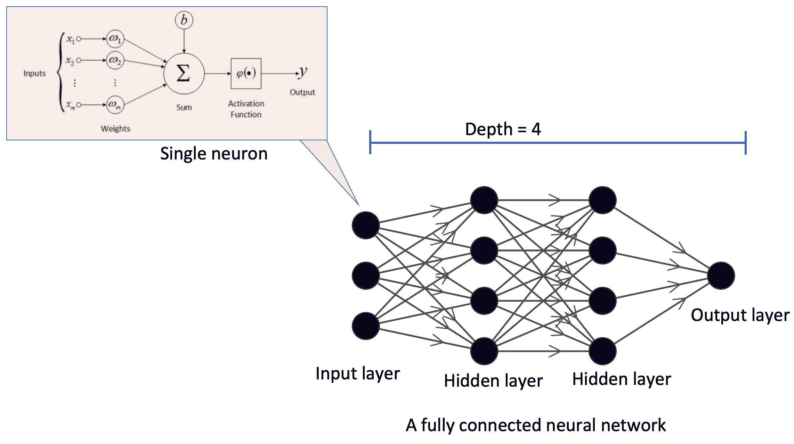
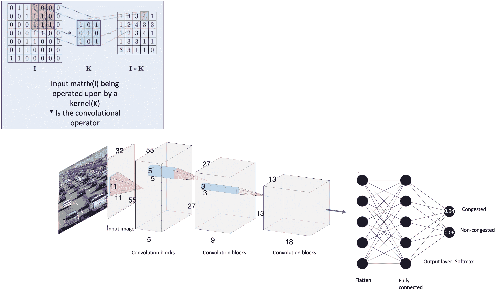
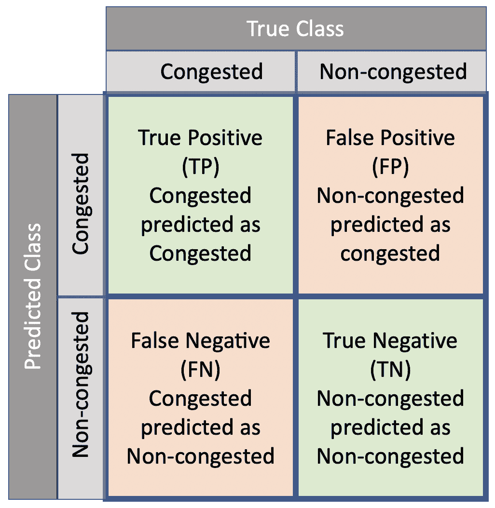
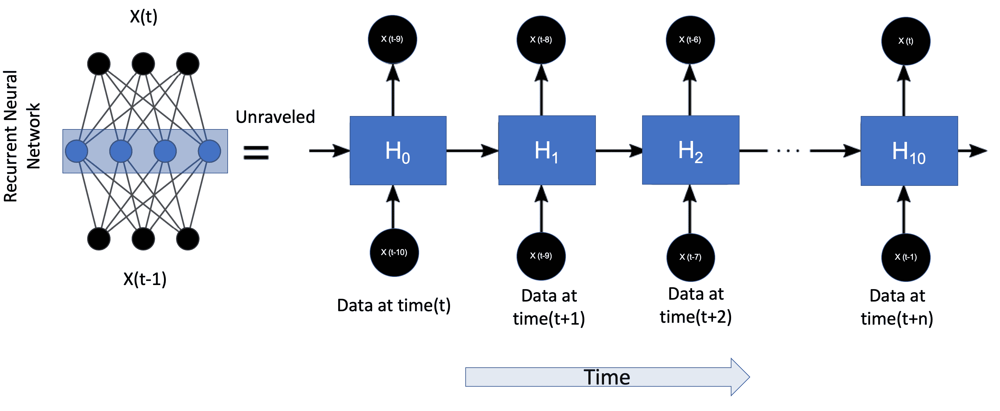
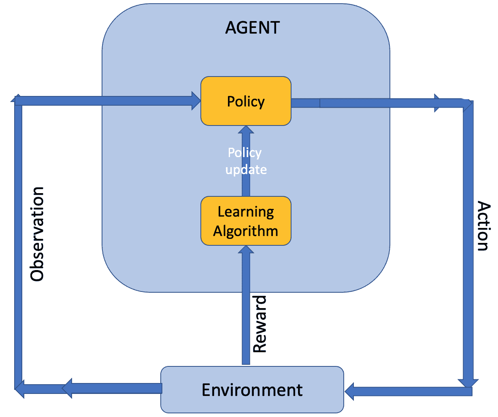
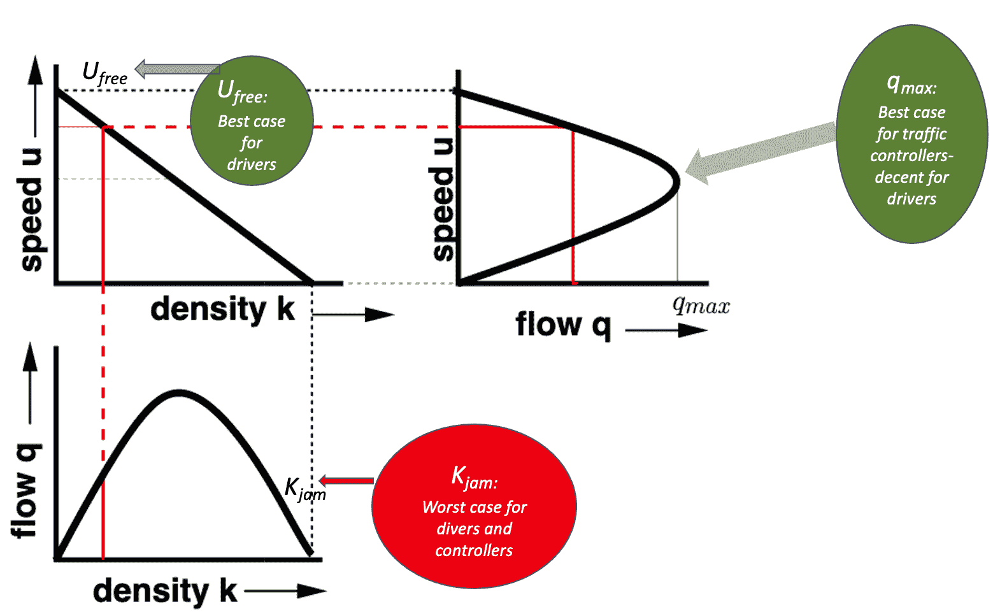
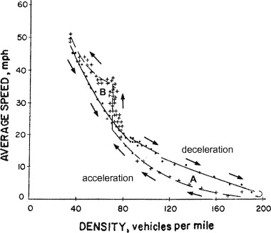
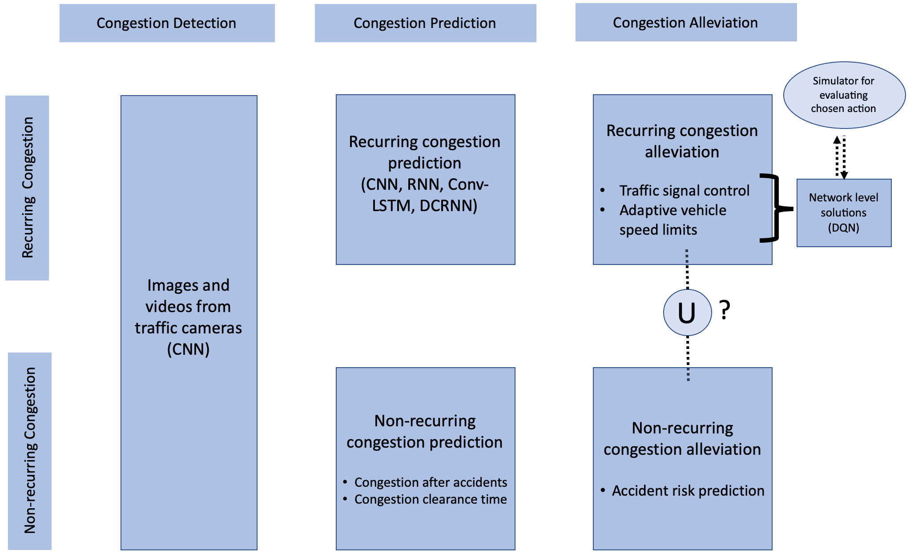
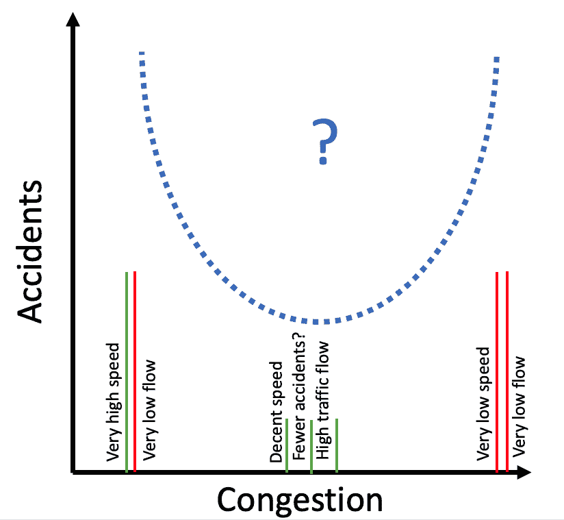

<!--yml

类别: 未分类

日期: 2024-09-06 19:56:52

-->

# [2102.09759] 深度学习在拥堵检测、预测和缓解中的应用：综述

> 来源：[`ar5iv.labs.arxiv.org/html/2102.09759`](https://ar5iv.labs.arxiv.org/html/2102.09759)

# 深度学习在拥堵检测、预测和缓解中的应用：综述

Nishant Kumar

苏黎世联邦理工学院

未来弹性系统

新加坡-ETH 中心

1 CREATE Way

#06-01 CREATE Tower

新加坡-138602

nishant.kumar@sec.ethz.ch \AndMartin Raubal

苏黎世联邦理工学院

土木工程系,

环境与测绘工程

Stefano-Franscini-Platz 5

8093 苏黎世

瑞士

mraubal@ethz.ch

###### 摘要

检测、预测和缓解交通拥堵旨在提高交通网络的服务水平。随着对更大、更高分辨率数据集的访问增加，深度学习在这些任务中的相关性也在上升。近年来，几篇综合性综述论文总结了深度学习在交通领域的应用。然而，交通网络的系统动态在非拥堵状态和拥堵状态之间差异很大，因此需要对拥堵预测特有的挑战有清晰的了解。在本综述中，我们展示了深度学习在检测、预测和缓解拥堵任务中的当前状态。我们分别讨论了重复性和非重复性拥堵。我们的调查揭示了当前研究状态中的固有挑战和不足。最后，我们提出了一些未来研究方向的建议，以应对识别出的挑战。

*K*eywords 深度学习  $\cdot$ 交通  $\cdot$ 拥堵  $\cdot$ 重复性  $\cdot$ 非重复性  $\cdot$ 事故

## 1 介绍

交通拥堵降低了道路网络的服务水平（LOS）。LOS 的下降导致了社会的直接和间接成本。大量研究已对拥堵对经济和社会整体的影响进行评估（Weisbrod et al., 2001; Litman, 2016）。交通拥堵的直接影响是工作时间的损失。Schrank et al. (2012) 估计，仅在一年内，美国因拥堵损失了总计 88 亿小时的工作时间。由于紧急情况导致时间作为商品的价值大幅上升，拥堵的负面影响飙升。陷入交通中会影响个人的行为。Hennessy 和 Wiesenthal (1999) 报告称，高拥堵水平可能导致司机的攻击性行为。这种攻击性可能表现为激进驾驶，从而增加事故的发生率（Li et al., 2020）。高水平的拥堵还会导致温室气体排放量增加（Barth 和 Boriboonsomsin, 2009）。

从可处理性角度来看，拥堵预测比非拥堵条件下的交通预测要困难得多 （Yu et al., 2017）。早期预警系统使交通控制者能够采取缓解措施。用于交通数据收集的基础设施在几十年中得到了改进。这一改进，加上计算资源的增加，使得交通研究人员能够利用深度神经网络的预测能力。在本综述中，我们讨论了深度学习在拥堵检测、预测和缓解中的应用。我们调查了两种类型的拥堵——周期性和非周期性。综述的最后，我们识别了当前研究领域的一些空白，并提出了未来的研究方向。

## 2 前言

本综述论文的目标读者是来自交通和深度学习两个领域的研究人员。在接下来的两个小节中，我们将介绍前言部分，并介绍在本综述中使用的术语。

### 2.1 深度学习中的相关概念和术语

人工神经元是如 方程式 1 所示的一个函数。

|  | $y_{i}=\varphi\left(\sum_{j=0}^{m}w_{ij}x_{ij}\right)$ |  | (1) |
| --- | --- | --- | --- |

其中 $x_{ij}$ 是数据集中第 $i$ 个 $m$ 维数据点的第 $j^{th}$ 特征（维度）；$w_{j}$（称为权重）是神经网络训练过程中调整的系数；$\varphi$ 是一个非线性激活函数；$y_{i}$ 是输入 $x_{i}$ 的函数输出。常用的激活函数有：sigmoid ($\varphi(x)=\frac{1}{1+e^{-x}}$)、tanh ($\varphi(x)=\frac{e^{2x}-1}{e^{2x}+1}$) 和 relu ($\varphi(x)=max(x,0)$)。

图 1：一个具有两个隐藏层的全连接层神经网络。文献中通常省略“层”这一术语。在本综述中，我们将这些称为前馈神经网络。单个人工神经元的放大图单独展示，以显示其三个组成部分——输入、加权和非线性激活。输入数据点有 $n$ 个特征（也称为维度）。图片来源：单个神经元图像由 Chrislb - 自制，[维基共享资源公共领域 CC BY-SA 3.0)](https://commons.wikimedia.org/w/index.php?curid=224550)。使用 Nn-svg 创建的层次网络 (LeNail, 2019)

#### 2.1.1 全连接层神经网络

如图 1 所示的网络是一个完全连接的分层神经网络。在这种神经网络中，前一层所有神经元的输出都作为输入传递给下一层的所有神经元。文献中通常省略了“分层”这个术语，而使用“完全连接神经网络”（FCNN）来代替。这种用法可能会造成混淆，因为完全连接网络可能暗示神经网络中所有神经元之间都有连接，而不仅仅是相邻层之间的连接。为了确保术语的准确性，在本调查中我们坚持使用“前馈神经网络”（FFNN）来指代完全连接的分层神经网络（Goodfellow 等，2016，第六章）。此外，我们观察到本调查中提到的几篇论文使用“人工神经网络”（ANN）一词来表示 FFNN。然而，在本调查中，我们坚持使用 FFNN，并避免使用 ANN 来代替。

当多个这样的神经元平行放置时，形成了神经网络的一层。当多个层一个接一个地堆叠时，形成了一个前馈神经网络（FFNN）。在这个背景下，堆叠指的是将一个函数或单元的输出传递给另一个函数或单元。使用神经元形成神经网络的示意图见图 1。随着堆叠的增加，神经网络的深度也会增加。文献中并没有规定一个预定义的深度阈值来划分深层和浅层网络。任何具有多个隐藏层的神经网络都可以被称为深层神经网络（Schmidhuber，2015）。与浅层网络相比，深层神经网络可以学习数据的更抽象的表示。深度与抽象之间的关系在处理图像数据时尤为明显，如图 2 所示。在本调查中，我们将频繁使用“深度”和“层”这两个术语。

对于使用深度学习的监督学习任务，例如拥堵预测，其目标是训练一个深度学习模型，使其学习从输入数据到输出数据的映射。我们考虑一个交通预测任务，目标是预测 $n$ 个地点在 1 分钟后的交通流量。输入数据 $x$ 是一个长度为 $n$ 的向量，在每分钟 $t$ 时变化。训练深度学习模型意味着假设存在一个基础函数 $f$，使得 $x(t+1)=f(x(t))$，然后尝试通过调整模型的权重来逼近 $f$。为了逼近函数 $f(x)$，需要最小化一个损失函数 $L$。最常用的损失函数是均方误差。最小化过程使用反向传播算法（LeCun 等人，1988）。反向传播指的是通过链式法则将误差从损失函数传播到前一层。为了保证深度学习模型逼近的函数不是任意的，训练过程后在新未见数据（测试数据）上计算损失。如果训练数据和测试数据上的损失函数值相似，则模型被认为具有良好的泛化能力。为提高深度学习模型的泛化能力，已经探索了几种技术。最常用的技术是 dropout（Srivastava 等人，2014）。在这项调查中，我们特别关注利用运输领域知识开发的泛化技术。

#### 2.1.2 CNN 和 RNN

交通数据在空间和时间上变化。两类神经网络架构特别适合捕捉这些相互依赖性：CNN 和 RNN。

卷积神经网络：CNN 代表卷积神经网络。历史上，由于能够捕捉图像中相邻像素之间的相关性，CNN 常用于图像分类问题。深度 CNN 能够捕捉图像中远离的像素之间的相关性。在典型的 CNN 架构中，前几层是卷积块，夹杂着池化层。全连接层位于输出层之前。池化是一种下采样技术，用于从邻域中报告汇总统计数据（Goodfellow 等，2016，第九章）。与 CNN 最常用的池化方法是最大池化，其中从一个区域中选择激活的最大值（Albawi 等，2017）。池化有助于减少深度学习模型的复杂性，同时学习对输入数据的小局部平移不变的表示。深度 CNN 在捕捉图像中空间依赖性的有效性在 图 2 中得到了说明。当应用于诸如网格状拥堵水平的 2D 图像等交通数据时，CNN 模型可以捕捉空间依赖性。

循环神经网络：基于之前的例子，如果我们将假设的基础函数 $f$ 扩展到依赖于之前的 10 个时间步而不是仅仅一个时间步（$x(t+1)=f(x(t),x(t-1),x(t-2),x(t-3),..x(t-10))$），可以通过将 10 个输入向量的序列连接起来，创建长度为 ($n*10$) 的输入向量 ($x^{\prime}(t)$) 来实现 FFNN 的训练。另一种选择是进行时间反向传播。这通过使用循环神经网络（RNN）来实现，如 图 4 所示。与前馈神经网络不同，RNN 在连接中具有反馈环路。反馈环路可以展开以揭示时间上的反向传播。当时间序列数据作为输入传递到 RNN 时，RNN 维护从一个时间步到下一个时间步的内部状态。在时间 $t+1$ 时，隐藏状态受到时间 $t$ 的输入和之前隐藏状态的影响。这有助于 RNN 揭示数据中的时间依赖关系。长短期记忆（LSTM），由 Hochreiter 和 Schmidhuber (1997) 提出，是对传统 RNN 的改进。LSTM 网络可以检测在时间上相距较远的数据点之间的依赖关系 （Greff 等，2016）。在时间 $t$ 时，LSTM 单元由四个逻辑门的状态特征 - 输入 ($i_{t}$)、输出 ($o_{t}$)、单元状态 ($c_{t}$) 和遗忘 ($f_{t}$) 门。使用我们示例中的向量 $x(t)$，LSTM 单元的隐藏状态 ($h_{t}$) 可以通过方程 2-6 表示 （Tian 等，2018；Wang 等，2019）。

|  | $i_{t}=\sigma\left(W_{\mathrm{xi}}x_{t}+W_{\mathrm{hi}}h_{t-1}\right)$ |  | (2) |
| --- | --- | --- | --- |
|  | $f_{t}=\sigma\left(W_{\mathrm{xf}}x_{t}+W_{\mathrm{hf}}h_{t-1}\right)$ |  | (3) |
|  | $o_{t}=\tanh\left(W_{\mathrm{xo}}x_{t}+W_{\mathrm{ho}}h_{t-1}\right)$ |  | (4) |
|  | $c_{t}=c_{t-1}\odot f_{t}+i_{t}\odot\tanh\left(W_{\mathrm{xc}}x_{t}+W_{\mathrm{hc}}h_{t-1}\right)$ |  | (5) |
|  | $h_{t}=\tanh\left(c_{t}\right)\odot o_{t}$ |  | (6) |

其中 $W_{ab}$ 指的是门 $a$ 和 $b$ 之间的权重矩阵，$\odot$ 指的是元素逐位向量乘积，$h_{t}$ 指的是时间 $t$ 的隐藏状态，$i_{t}$ 指的是时间 $t$ 的输入，$o_{t}$ 指的是时间 $t$ 的输出，$\sigma$ 指的是 sigmoid 激活函数。

另一项对 LSTM 的近期改进是门控递归单元 (GRU)，由 Chung 等人 (2014) 提出。与 LSTM 相比，GRU 具有较少的复杂结构，并且可以比 LSTM 更快地进行训练。在时间 $t$，GRU 单元的特点是两个逻辑门的状态——更新门 ($z_{t}$) 和重置门 ($r_{t}$)。有关 RNN 和 LSTM 之间差异的详细实证比较描述，感兴趣的读者可以参考 Jozefowicz 等人 (2015) 对 GRU 和 LSTM 的实证评估。GRU 的隐藏状态可以通过方程 7-9 进行形式化（Wang 等人，2019）:

|  | $r_{t}=\sigma\left(W_{\mathrm{xr}}x_{t}+W_{\mathrm{hr}}h_{t-1}\right)$ |  | (7) |
| --- | --- | --- | --- |
|  | $z_{t}=\sigma\left(W_{\mathrm{xz}}x_{t}+W_{\mathrm{hz}}h_{t-1}\right)$ |  | (8) |
|  | $h_{t}=z_{t}\odot h_{t-1}+\left(1-z_{t}\right)\odot\left(\tanh\left(W_{\mathrm{xh}}x_{t}+W_{\mathrm{hh}}\left(r_{t}\odot h_{t-1}\right)\right)\right)$ |  | (9) |

其中，$W_{ab}$ 指的是门 $a$ 和 $b$ 之间的权重矩阵，$\odot$ 表示逐元素向量积，$h_{t}$ 指的是时间 $t$ 的隐藏状态，$\sigma$ 指的是 sigmoid 激活函数。

图 2: (顶部: 单一卷积操作; 底部: 深度卷积神经网络 (CNN)。随着数据在不同的卷积层中传播，学习到的特征变得更加高层次。图片来源: 单卷积图像改编自 (Mohamed, 2017)，交通拥堵图像改编自 [wikimedia 公共领域 CC BY-SA 3.0)](https://upload.wikimedia.org/wikipedia/commons/3/3e/I-80_Eastshore_Fwy.jpg)

#### 2.1.3 强化学习

除了卷积神经网络（CNNs）和递归神经网络（RNNs）外，用于交通预测任务的常用深度学习框架是深度强化学习。强化学习（RL）是一种学习范式，当它与深度学习结合时，可以作为一个强大的工具，用于涉及控制的特定交通预测任务。深度强化学习模型已被证明在特定任务上表现非常好——最著名的例子是那个能够从零开始学习围棋（基本游戏规则）并达到超越世界冠军评分的模型（Silver et al., 2017）。然而，这些模型的高计算负载限制了它们的广泛使用。（Szepesvári, 2010, Page-1, abstract）将强化学习定义为“一个关注于学习控制系统以最大化数值性能度量的学习范式，该度量表达了长期目标”。在这个背景下，控制方法也被称为所学习的策略。当深度学习模型被训练以学习最佳策略时，它被称为深度强化学习模型。强化学习框架的表示见 图 5。在审查文献时，我们发现 Q 学习似乎是交通预测任务中流行的强化学习框架。Q 学习，最初由 Watkins (1989) 提出，是一种无模型的强化学习方法，其中环境如 图 5 所示，不需要明确建模。有关 DQN 的详细讨论见 Mnih et al. (2015)。

#### 2.1.4 常用指标

常用的回归任务性能量化指标包括平均绝对误差（MAE）、平均绝对百分比误差（MAPE）和均方根误差（RMSE），计算公式如下：

|  | $MAE=\frac{1}{n}\sum_{i=1}^{n}\left | \hat{y}^{i}-y^{i}\right | $ |  | (10) |
| --- | --- | --- | --- | --- | --- |
|  | $RMSE=\sqrt{\frac{1}{n}\sum_{i=1}^{n}\left(\hat{y}^{i}-y^{i}\right)^{2}}$ |  | (11) |
|  | $MAPE=\frac{1}{n}\sum_{i=1}^{n}\left | \frac{\hat{y}^{i}-y^{i}}{y^{i}}\right | *100\%$ |  | (12) |

其中 $\hat{y}^{i}$ 是第 $i^{th}$ 数据点的预测值，实际值为 $y^{i}$。从这些公式中可以明显看出，RMSE 和 MAE 依赖于单位，而 MAPE 是一个无量纲量。在本调查中，在报告各种回归任务的性能时，我们尽量报告可用的 MAPE。

分类任务中常用的指标可以使用混淆矩阵总结，如 图 3 所示。

图 3：二分类任务的混淆矩阵

根据混淆矩阵，定义了几个指标。最常用的指标有：真正率（TPR）、真负率（TNR）和准确率，如下所示：

|  | $TPR=\frac{TP}{TP+FN}$ |  | (13) |
| --- | --- | --- | --- |
|  | $TNR=\frac{TN}{TN+FP}$ |  | (14) |
|  | $Accuracy=\frac{TP+TN}{TP+TN+FP+FN}$ |  | (15) |

用于评估性能的指标选择通常由手头的任务决定。例如，假设使用深度学习模型来分类交通状态是否为“拥堵”或“未拥堵”。假设收集了 1440 个数据点，每分钟一个，持续 24 小时，拥堵持续了一个小时，并且有 60 个数据点的实际标签为“拥堵”。这意味着即使模型预测所有数据点为“未拥堵”，预测准确率为（$\frac{0+(1440-60)}{1440}=95.8\%$）。因此，总体准确率对于拥堵预测任务是一个误导性术语。因此，对于拥堵预测任务，通常的做法是报告平衡准确率（BAC）。BAC 定义为每个类别的 TPR 的均值（$0.5*(TPR+TNR)$）。我们观察到一些论文将 BAC 称为平均准确率。这里讨论的论文之一使用的另一个指标是二次加权 kappa（QWK (Ben-David, 2008))。QWK 指标增加了由于偶然分类的惩罚。QWK 值介于 0 和 1 之间，1 表示预测与实际值匹配，0 表示输出是随机噪声。从数学上讲，对于 $N$ 类分类任务，QWK 由 $\kappa=1-\frac{\Sigma_{i,j}\mathbf{w}_{i,j}\mathbf{O}_{i,j}}{\Sigma_{i,j}\mathbf{E}_{i,j}\mathbf{P}_{i,j}}$ 给出，其中 $\mathbf{O_{NxN}}$ 是根据模型预测的混淆矩阵，矩阵 $\mathbf{E}_{NxN}$ 是如果预测是偶然的预期混淆矩阵；$\mathbf{w}_{i,j}=\frac{(i-j)^{2}}{(N-1)^{2}}$ 完整的推导请参见 Haberman (2019)。

选择指标是机器学习任务中的一个重要设计决策，并且影响模型任务的性能。选择指标时考虑的一些常见因素包括类别不平衡、异常值存在和不变性属性。有兴趣的读者可以参考 Sokolova 和 Lapalme (2009) 以系统地了解各种分类任务指标。

图 4：时间上的递归神经网络展开

图 5：强化学习的一般框架

### 相关概念与术语在交通运输中

在本节中，我们定义了一些交通运输中的术语，这些术语对理解本调查中提出的讨论至关重要。这些定义的全面审查以及对其在交通预测中作用的深入见解见于 Hall（1996）；Immers 和 Logghe（2002），以及（Gerlough 和 Huber，1976，第二章）。在这里，我们选择性地重现了一些讨论中所需的基本概念。用于测量交通状态的最常见变量是密度、速度和流量。

交通密度：交通密度定义为单位长度道路段上的车辆数量。由于传感器数量有限，传统上很难测量整个道路段的交通密度，以估计车辆的存在。然而，随着交通摄像头数量的增加和计算机视觉的进步，这一趋势正在改变。相关的量是‘占用率’，通常作为测量密度的代理。占用率定义为在道路网络中某一点被车辆占用的时间百分比。占用率可以通过传感器直接测量，最常见的是使用车辆回路探测器（VLDs）。如果每辆车的长度相同（均匀交通流），占用率与交通流量成正比。在实际应用中，密度通常通过密度与速度之间的基本关系来估算（$q=k*u$），其中$q$是流量，$k$是密度，$u$是速度。在异质交通流存在的情况下，占用率与密度之间的关系是复杂的（Ramezani 等，2015）。

交通速度：车辆的瞬时速度（或即时速度）是在特定时间点和指定位置记录的速度。这是车辆速度表上测量的速度。然而，在交通工程中，我们更关心的是平均速度，它可以作为交通流的定义参数。为了计算平均速度，可以在时间或空间上进行聚合。空间均值速度，针对给定的空间区间，定义为所有车辆行驶的总距离与总时间的比率。时间均值速度，针对给定的时间区间，定义为所有车辆单独速度的算术平均值。在数学上，空间均值速度等于单个车辆速度的调和均值（$v_{i}$）。假设有$N$辆车，

|  | $space~{}mean~{}speed=\frac{total~{}distance~{}travelled}{total~{}time~{}taken}=\frac{N*D}{\sum_{i}^{N}t_{i}}=\frac{N*D}{\sum_{i}^{N}\frac{D}{u_{i}}}=\frac{1}{N}\frac{1}{\sum_{i}^{N}\frac{1}{u_{i}}}$ |  | (16) |
| --- | --- | --- | --- |
|  | $time~{}mean~{}speed=\frac{1}{N}\sum_{i}{N}u_{i}$ |  | (17) |

空间均速满足流量、速度和密度之间的基本关系（$q=k*u$），而时间均速则不遵循基本方程。在使用深度学习预测交通速度时，原始数据的预处理步骤决定了预测的是哪一种速度。空间均速在拥堵预测任务中更为常见，通常称为“段速”。另一方面，如果数据源提供的是汇总速度数据，通常的做法是预测相同变量（Gartner et al., 2002; Daganzo and Daganzo, 1997）。

交通流量：交通流量定义为单位时间内通过参考点的车辆数量。参考点通常选择在路段的中间或末端。

行程时间：行程时间是车辆从 A 点到 B 点所花费的时间。传统上，使用点传感器（如 VLDs）汇总的数据来测量行程时间是困难的。随着分布式传感器的出现，如 GPS，这些传感器越来越多地被用来估计行程时间。在交通运输文献中，这被称为浮动车数据（FCD）。然而，挑战在于任何给定时间点共享数据的车辆百分比的变化。使用 FCD 的主要好处是，当交通流量较高时，收集到的数据更多。这与点传感器形成对比，因为点传感器的最佳位置选择是一个主要挑战（De Fabritiis et al., 2008）。

研究上述交通状态变量之间关系时，两种极端值非常重要。熟悉这些极端值对于理解本调查的其余部分以及其他研究道路网络中干扰的文献是必要的。这两种值是：

+   •

    拥堵密度（$k_{j}$）：交通密度的最高可能值；对应的交通速度为 0 公里/小时。

+   •

    自由流速（$u_{f}$）：车辆在给定路段上行驶的最高速度。在假设司机遵守限速的情况下，$u_{f}$ 与所考虑路段的限速相同。

上述三个变量（速度、密度和流量）是相关的。然而，尚未建立描绘这些变量之间关系的一般化方程。对于我们的讨论，这里简化为速度和密度之间的线性关系。在 图 6 中，我们展示了这些变量之间的关系，假设速度和密度之间是线性关系。图 6 中的三条曲线上的各种关键点被突出显示并用颜色编码，以显示交通系统中两个最重要利益相关者——驾驶员和交通控制员的服务水平。

图 6：代表性的曲线展示了流量、速度和密度之间的关系。这里假设速度和密度之间是线性关系。两个绿色圆圈指向最大速度（`$U_{max}$`）和最大流量（`$q_{max}$`），分别代表对驾驶员和交通控制员而言最佳的服务条件。红色圆圈指向最大密度或交通拥堵（`$K_{jam}$`），这表明从两方面看都缺乏服务能力。基础图像改编自 [NPTEL 讲义](https://nptel.ac.in/content/storage2/courses/105101087/downloads/Lec-31.pdf) 创作共用许可证 ([CC-BY-NC-SA](https://creativecommons.org/licenses/by-nc-sa/1.0/))。

选择目标变量的原因也考虑到了研究结果的消费者。如果研究的目标是优化交通网络作为一个系统的使用，重点可能会放在最大化网络的吞吐量上；因此，研究人员将重点关注准确预测交通流量。另一方面，如果研究旨在改善用户旅行时间，则重点将放在预测速度或旅行时间上。例如，当我们使用旅行规划器来寻找从出发点到目的地的最佳路线时，我们通常希望找到最快的路线，而不关心道路上的交通流量（Golledge, 1995）。

图 7：滞后回路，转载自 (Treiterer, 1975)

交通滞后：在图 6 中呈现的基本交通图是过于简化的。当使用密度和速度（空间平均速度）绘制实际数据时，图中显示了围绕基础曲线的显著散布（Geroliminis 和 Sun，2011）。研究人员提出了各种理论来解释流量-密度曲线中的散布现象。其中一种理论是由流量-密度曲线中的明显环形特征所表征的滞后理论。该现象首次由 Treiterer（1975）观察到，交通滞后是由于驾驶中的人为因素造成的。这种现象可以在大量车辆排队的交通交叉口轻松观察到。信号灯变绿后，排队并不会均匀消散，而是从前到后逐渐消散，并且会出现显著的时间延迟。交通滞后的现象归因于车辆的加速和减速率差异，如图 7 所示。因此，由于滞后现象，交通干扰事件在干扰事件结束后仍会继续影响交通。

另一种解释散布现象的理论是容量下降，该理论归因于 Cassidy 和 Bertini（1999）。他们提出，“在拥堵开始之前，瓶颈的流出量高于拥堵状态下的流出量”（van Wageningen-Kessels 等，2015, p.451）。有兴趣的读者可以参考 (van Wageningen-Kessels 等，2015) 以获取详细的交通流模型评审。这些努力的关键收获是，随着交通状态向拥堵状态移动，交通流建模的复杂性增加。

基于模拟的方法进行交通流建模：使用微观代理基础的交通模拟器时，个体和基础设施元素被建模为代理。一些交通模拟器的例子包括：（1）开源：MATSim（Axhausen et al., 2016），SUMO（Behrisch et al., 2011），SimMobility（Adnan et al., 2016），MATES（Yoshimura, 2006）和 TRANSIMS（Smith et al., 1995；Nagel 和 Rickert, 2001）以及（2）商业可用：AIMSUN（Casas et al., 2010），[VISSIM](https://www.ptvgroup.com) 和 [PARAMICS](https://www.paramics.co.uk/en/)。在使用行为方法推导的交通模型中，每种类型的代理的可能行为（行动和决策）的概率模型由领域专家编程到系统中。然后，使用现有数据对参数进行校准。在校准过程中，参数值的范围被约束在每个参数的有意义的值范围内。由领域专家设定的初始值和参数范围使得参数具有一定的物理意义，从而使模型可解释。预测的交通流是校准模型中代理之间相互作用的最终结果。

短期交通预测：一些基于模型的短期交通预测方法包括 DynaMIT（Ben-Akiva et al., 1998）和 DYNASMART（Mahmassani et al., 2004）。在基于模型的方法中，中央算法是动态交通分配（DTA）（Janson, 1991）。

### 2.3 拥堵的定义与分类

“拥堵可以定义为当输入量超过设施的输出能力时产生的现象”（Stopher, 2004, 第 2.1 节）。根据设施的数量和规模，拥堵会导致道路网络服务能力的不同程度损失。关于拥堵预测的文献将拥堵定义为交通状态变量（速度、密度、流量）之一，或作为派生变量（例如平均速度与限速的比率）。Afrin 和 Yodo (2020) 提供了用于定义拥堵的交通变量的最新调查。一旦选择了一个变量，该变量的值会量化为固定数量的级别，以定义分类任务。通过在任一交通变量上使用单一阈值，可以实现二元量化。例如，超过某个阈值的交通密度可以称为“拥堵”，反之亦然。

根据其出现的时空频率，拥堵可以分为两种类型——重复性拥堵和非重复性拥堵。重复性拥堵，顾名思义，是指在空间和/或时间上反复出现的拥堵。城市的特定区域可能在一天中的特定时间或一周中的某些日子经常出现交通堵塞。非重复性拥堵则不遵循时空模式。McGroarty (2010) 总结了两种类型拥堵的原因。他们报告说，重复性拥堵几乎总是由基础设施瓶颈造成的。另一方面，非重复性拥堵可能由不可预见的事件引起，如极端天气条件、自然和人为灾害、事故或计划中的活动，如大型音乐会和道路施工。在审查文献的过程中，我们观察到许多论文没有明确说明他们是否尝试预测重复性或非重复性拥堵。我们仔细评估了他们的结果，并将其纳入各自的章节中。

### 2.4 基于模型和深度学习的交通预测的协同作用

另一方面，基于数据的方法用于短期交通预测时不考虑用户行为。数据驱动模型旨在通过假设交通是系统的可测量状态来解决预测任务，并尝试预测其未来状态。具体来说，工作流程是利用来自传感器的所有可用数据，并输出预测的交通状态变量。特别是，当使用深度学习模型执行此任务时，模型的内部（权重）没有物理意义。由于缺乏可解释性，必须进行广泛验证以确保深度学习模型的预测是有用的。

交通模拟器在研究新政策的效果方面非常有用。在实际数据无法获得或无法收集的研究中，其重要性进一步增加。例如，模拟器可以用来研究全市交通灯故障的影响。这样的规模下无法获得现实世界的数据；因此，研究人员依赖于驾驶员行为建模和代理之间建模的物理交互，来提供可靠的推断。

模型驱动和数据驱动方法之间的协同效应可以对使用这两种方法的研究带来好处。拥堵和事故数据库面临严重的类别不平衡问题。**福田等人** (2020) 使用交通模拟器在模拟事故后生成交通数据。生成的数据随后用于训练深度神经网络。正如我们将在第 6.1.1 节 ‣ 6.1 Deep learning for recurring congestion alleviation ‣ 6 Deep learning for congestion alleviation ‣ Applications of deep learning in congestion detection, prediction and alleviation: A survey")中讨论的那样，当使用深度强化学习框架来确定缓解拥堵的最佳网络级控制措施时，框架中会包含一个微观交通模拟器。**博里索夫等人** (2019) 使用深度生成模型为模拟平台生成代理。

深度学习模型越来越多地被用来学习复杂网络非线性动态背后的物理学。这些模型通常在“物理知识驱动的深度学习”（PIDL）的范畴下进行研究。PIDL 的概念有两个动机。首先，PIDL 使我们能够利用先前的领域知识来对深度学习模型所近似的函数进行正则化，从而减少过拟合（Raissi et al., 2017a）。其次，PIDL 可以用来从数据中发现新的偏微分方程（Raissi et al., 2017b）。在交通领域应用 PIDL 模型时，微观交通模拟器通常在这些模型的训练过程中扮演重要角色。由于设计上的原因，交通模拟器尊重交通流动态，因此可以用于对神经网络的交通状态预测进行正则化。例如，Liu et al. (2020)在此目的上使用了 SUMO。PIDL 模型具有很大的潜力，因为可以解决深度学习模型的几个缺陷。PIDL 模型对缺失数据、噪声和过拟合更具鲁棒性，并可能有助于使深度学习模型具有可解释性。然而，交通领域的 PIDL 研究仍处于初期阶段，相关论文很少，本次调查未涉及。感兴趣的读者可以参考 Shi et al. (2021)，他们使用了来自美国交通部的下一代模拟（[NGSIM](https://ops.fhwa.dot.gov/trafficanalysistools/ngsim.htm)）数据集，并提出了一个具有两个组件的 PIDL 模型，一个是数据驱动的，另一个是模型驱动的。可以通过一个参数来控制每个组件在训练过程中的影响。在相关工作中，Shi et al. (2021)使用了一个混合 PIDL 模型来估计控制交通流的二阶偏微分方程的参数。其他近期使用 PIDL 的努力包括：Huang and Agarwal (2020)，他们详细比较了 DL 和 PIDL 模型，并报告了 PIDL 模型在传感器位置固定时的训练速度更快（>50%更快），且表现优于其他 DL 模型；Wang et al. (2020)提出了一种名为[Turbulent-Flow Net](https://github.com/Rose-STL-Lab/Turbulent-Flow-Net)的 PIDL 模型，用于预测湍流交通流；Mo et al. (2020)使用了 PIDL 模型来学习车-following 模型的动态。总之，这些努力展示了在基于模型和数据驱动技术之间的协同效应方面进一步研究的有希望的途径。

## 3 之前的调查和本次调查的组织结构

深度神经网络中的非线性激活函数可以捕捉交通数据中的非线性（Polson 和 Sokolov，2017）。如在 2.1 节中讨论的，网络的深度使我们能够对数据中的高级特征进行建模。交通数据的特点是空间和时间上的变化。两种专门的神经网络架构，CNN 和 RNN（也在 2.1 节中讨论）在捕捉这些变化方面非常有帮助。CNN 在建模空间相互依赖时很有用，而 RNN 在建模数据中的时间变化时很有用。在我们的文献综述过程中，我们发现大多数成功的交通预测神经网络架构是使用 CNN 和 RNN 单元作为构建块设计的。

Wang 等人（2019）提供了对深度神经网络在交通系统各个方面的广泛总结。他们涵盖了使用深度神经网络进行的一系列交通相关预测任务——交通信号识别、交通变量预测、拥堵识别和交通信号控制。Nguyen 等人（2018）也涵盖了上述任务，并将旅行需求预测、交通事件预测和驾驶员行为预测三个任务添加到列表中。Wang 等人（2020）调查了深度学习在使用时空数据的各个领域中的应用（交通、人类流动、犯罪分析、神经科学和基于位置的社交网络）。他们的综述包括了处理诸如交通变量预测、轨迹分类、轨迹预测和旅行方式推断等任务的深度学习方法的近期论文。Wu 等人（2020）介绍了图神经网络（GNN）的分类调查，并强调了 GNN 在包括交通在内的不同领域的应用。Xie 等人（2020）总结了使用深度学习处理城市中最常见类型流量——人群流量、自行车流量和交通流量的各种方法。

图 8：总体流程图显示了调查的各个部分。问号表示非重复性和重复性拥堵缓解之间的潜在联系。

拥堵预测是指在拥堵临近时对交通状态变量的预测。这是交通预测的一个特殊情况。与交通预测相比，拥堵预测任务的相对难度可以归因于在最大流量点之后交通动态的不稳定性（Chung，2011）。这一较高的相对难度也可以从典型交通预测模型的表现退化来看出，当交通状态接近拥堵时。深度学习在拥堵预测中的重要性也在于深度学习模型相对于其他数据驱动方法的相对较高稳定性（Yu 等，2017）。据我们所知，目前尚不存在涵盖深度学习在拥堵相关预测任务中的应用的综合调查论文。这篇调查论文试图弥补文献中的这一空白。我们讨论了深度学习在检测、预测和缓解两种类型拥堵——重复性和非重复性——中的应用。由于从交通图像中检测拥堵的深度学习模型可以检测这两种类型的拥堵，因此拥堵预测部分没有区分重复性和非重复性情况。我们尽可能地尝试从政策制定者的角度融入挑战。包括政策制定者的观点是为了使研究成果在实际环境中可部署。当前调查的范围见图 8。

深度学习架构的关键设计方面以及每篇论文中使用的数据集的关键方面已被总结，以便读者在处理类似数据集时参考这些论文。一些论文对其模型进行了广泛的敏感性分析。我们在每个小节结尾的总结中重现并突出显示了关键见解（如有）。

本调查中涵盖的大多数研究论文均发表于 2016-2021 年期间。有时，为了简要讨论某些算法范式的背景，我们参考了过去的经典论文。

## 4 深度学习用于拥堵检测

随着对新数据源的访问越来越广泛，自动检测交通拥堵的新机会正在被探索。与其他两个部分不同，拥堵检测模型并没有针对重复性和非重复性拥堵进行区分。这是因为拥堵检测模型无论因何种原因都会检测到这两种类型的拥堵。它们是根据所使用的数据源进行区分的。检测这两种类型拥堵最常用的数据源是来自交通摄像头的图像和视频。

使用交通摄像头图像的好处是，所有车辆都无一例外地被捕捉到。因此，不需要考虑渗透率（被跟踪车辆的百分比）等其他因素。随着道路上摄像头数量的增加，从图像中识别拥堵的认知负荷很高。为了减轻认知负荷，深度学习被广泛应用于从交通图像中自动检测拥堵。已知在计算机视觉（CV）任务中表现良好的深度学习模型已被用于检测交通拥堵。计算机视觉指的是从图像中提取有用信息的任务。

卷积神经网络（CNNs）是常用的深度学习架构的基础，用于图像分类任务。该领域的开创性工作包括：AlexNet（Krizhevsky 等，2012）、InceptionNet（Szegedy 等，2015）、Resnet（He 等，2016）、R-CNN（Girshick 等，2014）、Mask-RCNN（He 等，2017）、VGGNet（Simonyan 和 Zisserman，2014）和 YOLO（Redmon 等，2016）。在 ImageNet（Lin 等，2014a）和 COCO（Lin 等，2014b）等大型图像数据集上预训练的深度神经网络随时可用。使用知名架构进行交通图像分类时，有三种可能的方法。当手头的数据集中的交通图像数量非常高（约 10000 张图像）时，这些模型可以利用现有数据从头开始训练。当数据集较小时，采用的深度学习模型的权重会初始化为可用的预训练模型。第三种方法是保留预训练模型，并在其后添加另一个模块。在应用于图像时，深度学习模型可以用来估计图像中车辆的总数，从而估计交通密度。在应用于视频数据（图像序列）时，深度学习模型可以用来估计交通速度。

两种基于 CNN 的架构（AlexNet 和 YOLO）被用于检测交通拥堵（Chakraborty 等人，2018），通过对从美国爱荷华州的 121 个摄像头收集的交通图像进行二分类。对交通图像进行手动标记为拥堵和非拥堵是一个耗时的任务。因此，作者使用通过车载环路探测器（VLDs）获得的占用数据来自动将图像标记为两类，根据占用率（占用率$>\ 20\%$被标记为“拥堵”）。检测拥堵的准确率分别为 AlexNet 90.5%和 YOLO 91.2%。Wang 等人（2018）比较了 AlexNet 和 VGGNet 的两个变体，以检测来自中国陕西省 100 多个摄像头获得的交通图像中的拥堵情况。他们的数据集高度多样化——包括白天和夜晚的交通图像以及不同的天气条件。他们的结果显示两种架构的性能相当（AlexNet 为 78%，VGGNet 为 81%）。他们报告说，由于神经网络的尺寸较小，AlexNet 的训练速度显著更快。他们使用二分类（‘拥堵’或‘无拥堵’）。Impedovo 等人（2019）比较了 YOLO 和[Mask-RCNN](https://paperswithcode.com/media/methods/Screen_Shot_2020-05-23_at_7.44.34_PM.png)在从两个交通图像数据源（[GRAM](http://agamenon.tsc.uah.es/Personales/rlopez/data/rtm/)和[Trafficdb](http://visal.cs.cityu.edu.hk/downloads/trafficdb/)）获得的三个手动标记的数据集上的表现。这三个数据集的图像质量各异——第一组包含 23435 张低分辨率（480x320p）的图像，第二组包含 7520 帧中等分辨率（640x480p）的图像，第三组包含 9390 帧高分辨率（1280x720p）的图像。他们通过两步来实现拥堵检测。第一步专注于识别每帧中的车辆数量。在这一步中，Mask-RCNN 的准确率分别为 46%、89%、91%，而 YOLO 的准确率分别为 82%、86%、91%。YOLO 的性能对图像质量具有抗干扰性，并且训练时间几乎是 Mask-RCNN 的一半。他们选择 YOLO 作为目标检测模型，并将其输出作为第二步的输入。在第二步中，他们在 YOLO 的输出上使用 Resnet，将交通拥堵预测作为多类分类任务（3 类）。对于轻度、中度和重度拥堵，报告的准确率分别为 99.7%、97.2%和 95.9%。

Kurniawan 等人（2018）使用 CNN 模型对从印度尼西亚雅加达获得的交通图像进行分类。数据收集持续了 15 天，并使用了 14 个摄像头位置。他们对交通图像进行手动标注，将其分为“拥堵”和“未拥堵”类别。使用 10 折交叉验证的报告平均准确率为 89.5%。Rashmi 和 Shantala（2020）研究了 YOLO 在交通高度异质的情况下的表现。他们从印度卡纳塔克邦收集了一周的数据。他们使用了在 COCO 数据集上预训练的 YOLO 模型进行迁移学习。在图像中计数车辆时，YOLO 在公交车、汽车和摩托车的准确率介于 92%到 99%之间，但在预测特定于研究区域的交通模式时，性能下降到任何有用的水平以下。

摘要：我们观察到基于数据源的图像质量存在显著差异，这导致模型性能的差异。来自发展中国家的交通图像由于交通流的高度异质性而呈现出主要挑战。数据集之间的另一个主要差异是，当存在替代数据源（如 VLDs）时，可以自动创建训练数据的标签，而不是手动标注。如果从交通摄像头获得的图像质量不高，可以使用基于深度学习的图像超分辨率进行改善。图像超分辨率指的是提高输入图像分辨率的任务。基于深度学习的超分辨率在计算机视觉领域已经得到了广泛研究，但我们尚未看到其在提高交通图像质量方面的应用。Wang 等人（2020）提供了关于深度学习应用于图像超分辨率的综合调查。另一个改善摄像头拥堵检测的潜在途径是基于深度学习的视频帧率增量（Jiang 等人，2018）。

## 5 深度学习用于拥堵预测

### 5.1 用于预测重复拥堵的深度学习

反复发生的拥堵是由于基础设施瓶颈造成的，这些瓶颈不足以应对高峰需求。根据定义，反复发生的拥堵发生在网络中的熟悉位置。基于这个定义，预测反复发生的拥堵时的具体任务是预测发生时间的日常变化以及拥堵的严重程度。最常用的拥堵预测任务是二分类（‘拥堵’或‘无拥堵’）。一些论文将拥堵预测作为多类分类任务（‘轻度’、‘中度’和‘重度’拥堵）。需要注意的是，本节中一些论文并没有预测交通拥堵，而是将短期交通预测作为回归任务（预测速度、密度、流量、排队长度等）。如果这些论文的模型性能在交通状态接近拥堵时被报告为稳定，则被纳入讨论。在这里列出的每篇论文中，我们报告了其性能指标的关键方面以及敏感性分析的主要结论。讨论的论文总结在表 1 中。

使用 LSTM 模型：Yu 等人（2017）在高峰时段使用 LSTM 模型来预测交通速度。他们使用来自美国加州公开提供的 [Caltrans](https://dot.ca.gov/programs/traffic-operations/mpr/pems-source) 数据集的车辆环路检测器（VLD）速度记录，并尝试预测每个传感器位置的下一个小时交通速度。在预测高峰时段的交通速度时，他们的 LSTM 模型报告的平均绝对百分比误差（MAPE）为 5%。他们研究中的一个重要观察是，时间戳特征（一天中的时间和一周中的一天的编码值）显著提高了高峰时段的预测性能。这种结合时间戳的做法已被后来出现的论文采纳。在这篇论文中，每个 VLD 被单独建模。在随后的论文中，研究人员开发了将空间信息融入 LSTM 模型的技术，从而提出了一个用于同时预测多个交叉口拥堵的单一模型。Rahman 和 Hasan（2020）使用 LSTM 模型通过有效地整合空间信息来预测交叉口的排队长度。为了预测查询交叉口在下一个交通周期（红灯信号）的排队长度，他们的模型以查询交叉口及当前周期内两个上游交叉口的排队长度作为输入。然后，他们尝试预测查询交叉口在下一个周期的排队长度。他们使用在佛罗里达州奥兰多收集的 11 个交叉口为期三个月的 VLD 数据。在预测排队长度时，他们报告的平均均方根误差（RMSE）接近于一（从他们的图表推断）。

比较 LSTM 和 CNN：Sun 等人（2019）展示了卷积神经网络（CNNs）和递归神经网络（RNNs）在预测交通拥堵方面的性能比较。他们的数据集包含了中国成都 2000 辆出租车在 28 天内的 GPS 轨迹。他们使用地图匹配将 GPS 轨迹映射到道路段，并计算每个段在 5 分钟时间段内的平均速度。然后，他们使用这些平均速度值来定义基于平均交通速度的四个拥堵等级。对于其最佳模型，报告的平均速度预测均方根误差（RMSE）为 3.96 km/h。随后报告了预测的拥堵等级的分类准确率。他们得出结论，考虑到足够长的输入时间范围（90 分钟），CNN 模型的表现与递归网络模型一样好。我们认为这是一个重要的观察，原因有二。首先，由于 CNN 模型在训练时更快，因为它们在结构上以更高效的方式支持 GPU 并行化，如果在探索 LSTM 之前将 CNN 作为建模选项进行探索，可以节省研究人员的时间。其次，由于 LSTM 通常用于捕捉交通数据中的长期依赖关系，当独立使用时，它们可能对短期交通预测不太有用。本小节中的以下论文使用 CNN 和 RNN 的组合来设计专门的架构。

使用 LSTM 和 CNN 的组合：刘等人 (2017) 提出了[Conv-LSTM](https://ieeexplore.ieee.org/mediastore_new/IEEE/content/media/8123608/8170872/8171119/8171119-fig-3-source-small.gif)，该模型由 CNN 和 LSTM 单元组成。卷积操作用于捕捉空间依赖关系。卷积操作的输出被用作 LSTM 单元的输入。在使用他们的 Conv-LSTM 模型预测交通流量时，他们达到了 9.53% 的 MAPE。此外，他们还包含了一个双向 LSTM 模块，以纳入历史数据的影响，并实现了更低的 MAPE，即 6.98%。报告显示，该模型在不同交通流量水平下表现稳定，因此我们将他们的论文作为拥堵预测模型纳入其中。Ranjan 等人 (2020) 预测了 10、30 和 60 分钟三个预测时间段内的城市交通热力图。由于输入和输出热力图具有相同的维度，他们提出了一种对称的 U 形架构，在两端（输入端和输出端）都有 CNN 块。瓶颈层（在最高深度处）由四个 LSTM 单元组成，跳跃连接用于连接不同深度的 CNN 输出。该架构被称为[PredNet](https://www.researchgate.net/profile/Navin-Ranjan/publication/341062590/figure/fig4/AS:895246355398656@1590454772095/PredNet-model-architecture-a-The-model-is-divided-into-three-sections-section-A-is.png)。数据集包括基于空间平均交通速度的交通热力图，数据收集自韩国首尔。其数据的时间分辨率为 5 分钟。拥堵被定义为基于交通平均速度的三级变量。他们报告说，PredNet 的性能在输出时间段长度增加时保持稳定。在预测 60 分钟后的拥堵时，PredNet 实现了 84.2% 的平均准确率（相比之下，使用 Conv-LSTM 在相同数据上的准确率为 75.67%）。与前述的 Conv-LSTM 模型相比，PredNet 的训练速度也被报告为显著更快（约为 8 倍）。

特别关注道路网络的异质性：一些论文强调了基于道路网络异质性的拥堵预测任务复杂性差异。当尝试对网络大部分区域进行多时间步的拥堵预测时，这种观察特别被报告。Shin 等人（2020）使用了一个三层 LSTM 网络来预测从韩国首尔及其周边城市和郊区收集的数据中的拥堵水平。道路链接的总数为 1630 个，数据采集周期为一个月，分辨率为 5 分钟。数据集中有 33%的记录缺失。为了处理缺失数据，他们提出了一种基于趋势过滤的时空离群点检测和数据修正算法。该模型预测交通速度，但根据地方政策制定机构推荐的阈值输出拥堵水平。模型在整个交通速度范围内表现稳定，因此我们将他们的工作纳入了拥堵预测模型中。他们报告了在预测首尔周围两种不同类型道路的交通速度时模型表现的差异（郊区道路的 MAPE 为 4.297%，城市道路的 MAPE 为 6.087%）。然而，均方误差（MAE）在一些郊区道路上高于城市道路（城市：2.54 km/h，郊区：2.78 km/h）。他们承认，郊区道路的高 MAE 误差实际上具有误导性，因为郊区道路的平均速度更高。他们论文的主要结论是，尽管应用深度学习来预测拥堵，不同类型的道路呈现出不同的复杂性。

Cheng 等人 (2018) 提出了一个专门的[架构](https://d3i71xaburhd42.cloudfront.net/56f17fa9a094e80f3e5e47311f2f31613d48e7b0/4-Figure4-1.png)，该架构使用 CNN、RNN 和注意力机制来预测拥堵水平。他们的数据集称为[MapBJ](https://github.com/cxysteven/MapBJ)，包含了在北京 349 条道路链上收集的 4 个月的数据，时间分辨率为 5 分钟。每条道路链根据一个称为‘限制水平’的速度限制归一化变量被标记为四个拥堵等级中的一个（流畅、缓慢、拥堵、极度拥堵）。虽然没有提供‘限制水平’的具体数学表示，但其思想类似于使用实际速度与速度限制的比率（$\frac{average~{}speed}{speed~{}limit}$）。道路网络被转换为一个代表性图，其中道路链被表示为顶点，交叉口被表示为边。目标顶点的上游和下游顶点按顶点顺序分组。来自不同顶点组的输入交通条件被用作 CNN 模块的输入，随后进入 RNN 模块。之后，使用注意力模型为不同的顶点组分配不同的权重。上游和下游道路的单独模块可以洞察上游和下游链路对目标链路拥堵预测的影响。在预测未来 60 分钟的拥堵状态时，较高阶的下游邻居观察到更高的权重。另一方面，较高阶的上游邻居观察到较低的权重。这些分析提供了关于需求和交通流量的有用见解。他们使用了一个称为二次加权 Kappa (QWK) 的指标 (Ben-David, 2008)。他们报告了平均 QWK 约为 0.6。他们报告了 15、30、45 和 60 分钟预测的 QWK 值分别为 0.69、0.63、0.57 和 0.52。作为比较，堆叠自编码器模型的 QWK 值在 15、30、45 和 60 分钟的预测中分别为 0.68、0.62、0.56 和 0.49。

大规模重复拥堵预测（拥堵传播） 拥堵传播可以被理解为拥堵预测的一个特例。它是对比通常由拥堵预测模型覆盖的网络较大部分中拥堵演变的研究。拥堵传播可以在与拥堵预测相同的标题下进行研究。然而，在本次调查的文献搜索过程中，我们观察到，当深度学习模型用于预测整个网络的交通拥堵时，会遇到特殊的挑战。

一种名为[DCRNN](https://i.loli.net/2019/04/23/5cbec05ce557e.png)的专用架构在 Li 等人（2017a）中提出，用于预测多个时间步（15 分钟、30 分钟和 1 小时）的交通流量。使用的数据集为[PeMS](https://dot.ca.gov/programs/traffic-operations/mpr/pems-source)。该模型在高峰时段和不同流量水平下的性能保持不变，因此该论文被纳入了拥堵预测模型。DCRNN 包括一个编码器和一个解码器组件。编码器将交通流量数据与空间参数编码成图，并输出隐藏状态。解码器尝试预测下一步的交通流量，使用编码器的隐藏状态的概率为$\rho$，或使用实际数据的概率为($1-\rho$)。在训练开始时，$\rho$的值接近 1，并在训练结束时降低至 0。报告的 MAPE 分别为 15、30 和 60 分钟的 2.9%、3.9%和 4.9%。Andreoletti 等人（2019）还使用 DCRNN 模型将拥堵预测作为基于交通密度的二分类任务。二分类的阈值使用道路链路特定的负荷因子($\alpha$)来定义。链路的负荷因子($\alpha$)定义为当前交通密度与平均交通密度的比率($\alpha=\frac{{current}~{}{traffic}~{}{density}}{{average}~{}{traffic}~{}{density}}$)。当$\alpha$设置为 3 时，报告的拥堵预测准确率为 96.67%。在高$\alpha$值下，假阴性（FN）的比例增加。高$\alpha$值意味着只有非常高的交通密度才被分类为拥堵。$\alpha=3$的值似乎是最佳的，假阴性率为 2.4%。在后来出现的论文中，进一步探讨了为实现深度学习模型更好泛化的最佳阈值选择。

Ma 等人 (2015) 使用了结合了限制玻尔兹曼机（RBM）和递归神经网络（RNN）模型来预测拥堵的演变。数据集包括了在中国宁波市的 515 条道路链接上行驶的出租车的 GPS 轨迹。他们使用了一个网络范围内的交通速度阈值来确定预测的交通速度是否意味着拥堵。他们报告的平均准确率为 88.2%。他们在敏感性分析中发现的一个有趣观察是，阈值的增加会降低模型的性能。他们假设这可能是因为当更高比例的道路链接进入拥堵类别时，拥堵传播模式的波动性更高。Fouladgar 等人 (2017) 使用了来自加利福尼亚的 [PeMS](https://dot.ca.gov/programs/traffic-operations/mpr/pems-source) 数据集，并提出了一个分布式网络，其中道路网络的每个交叉口都用单独的深度学习模型进行建模。他们使用了 CNN 和 RNN 架构的组合来预测拥堵水平。为了将拥堵二值化，他们引入了节点特定的阈值，而不是网络范围内的通用阈值，从而赋予他们的模型比 (Ma 等人, 2015) 更强的表达能力。节点特定阈值是使用平均速度与速度限制的比率定义的 (${threshold}=\frac{{average~{}speed}}{{speed~{}limit}}$)。他们模型的敏感性分析揭示了拥堵水平增加时模型性能的下降。他们假设这种下降是由于类别不平衡（非拥堵情况的数据点数量较多）。他们试图通过优先加权拥堵严重的数据点来修正这种下降。优先加权是通过修改均方误差损失函数来实现的，以对每个数据点 $i$ 引入惩罚 ($w_{i}*\beta_{i}$)。预测流量与真实值之间的差异为 $\beta_{i}$。如果数据点 $i$ 的交通流量小于 $0.5*(max~{}flow)$，则 $w_{i}$ 的值等于 1，否则为 0。$\beta$ 值是预测误差的度量。现在，使用变量 $w_{i}$，模型对交通流量超过最大流量一半的错误施加了额外的惩罚。

Wang 等人 (2016) 提出了[erRCNN](https://ieeexplore.ieee.org/mediastore_new/IEEE/content/media/7837023/7837813/7837874/7837874-fig-1-source-large.gif)，该方法是通过 CNN 单元和 RNN 单元组合构建的。在图 7 中，我们观察到当流量超过阈值时，速度-密度曲线变得分散，并且平均速度出现急剧变化。他们的 erRCNN 架构被证明可以处理这些急剧变化。错误校正的 RNN 允许模型在预测性能因交通状态变化而下降时进行更新。因此，该模型能够处理流数据。他们使用了从中国北京市两个主要环路收集的 GPS 数据集。报告的速度预测 RMSE 在预测时域为 10 分钟时为 5 km/h，而在预测时域为 50 分钟时为 8 km/h。此外，为了理解拥堵传播的来源，他们提出了一个叫做段重要性的度量。每个段都会影响其他段的交通。如果所讨论的道路有 $n$ 段，可以假设训练好的 errRCNN 模型已经学习了时间 $t$ 时每段的交通速度与时间 $t+1$ 时每段的交通速度之间的映射。数学上，${erRCNN}~{}([([v^{t}_{seg_{1}},v^{t}_{seg_{2}}..v^{t}_{seg_{n}}])])=[v^{t+1}_{seg_{1}},v^{t+1}_{seg_{2}}..v^{t+1}_{seg_{n}}]$。利用这一假设，他们首先定义了 $seg_{i}$ 对 $seg_{j}$ 的影响为 $v^{t+1}_{seg_{j}}$ 对 $v^{t}_{seg_{i}}$ 的导数。最后，他们将一个段的段重要性定义为对所有其他段影响的总和。他们将高段重要性的段映射到网络中的物理位置，并揭示了一些拥堵来源（例如连接两个高速公路的交叉口）。尽管这些观察结果很直观，但它们的贡献是显著的，因为它们揭示了深度学习模型如何提供可解释的见解，从而促进了交通部门的广泛接受。

拥堵树的深度学习：另一种历史上被用来建模拥堵传播的流行方法是使用拥堵树的概念。已经有尝试使用深度学习来建模拥堵树的演变。当一个道路段的拥堵导致相邻道路段的拥堵累积时，就会形成拥堵树。通过去除拥堵树之间的冗余，可以将多个拥堵树组合在一起，从而形成拥堵图。Di 等人（2019）通过组合拥堵树创建有向无环图（DAG）来去除拥堵树之间的冗余。然后将该 DAG 转换为拥堵水平的空间矩阵，其中矩阵的每个单元表示至多一个段。空间矩阵有助于保留道路段之间的邻接信息。这些空间矩阵（SM）的序列随后传递给一个[Conv-LSTM](https://ieeexplore.ieee.org/mediastore_new/IEEE/content/media/8778425/8788716/8788784/336300a298-fig-4-source-large.gif)模型，用于预测下一个时间步的 SM。预测的 SM 被转换回拥堵图，然后转换为拥堵树，这样可以提供预测拥堵演变的可视化表示。在使用 5 分钟预测范围时，他们报告的均方误差（MSE）为工作日 0.27，周末 0.07。15 分钟的 MSE 为 0.73（工作日）和 0.37（周末）。在他们的结果中，MSE 没有单位，因为它不是为交通变量计算的，而是为空间矩阵计算的。作为对比，LSTM 模型在使用 5 分钟预测范围时工作日的 MSE 为 0.59，周末为 0.32。

表 1：总结了在第 5.1 节中讨论的论文（深度学习在周期性拥堵预测中的应用）

| 论文 | 拥堵定义依据 | DNN 架构 | 性能 | 数据来源 | 独特方面 |
| --- | --- | --- | --- | --- | --- |
| (Wang et al., 2016) | 交通速度 | [erRCNN](https://ieeexplore.ieee.org/mediastore_new/IEEE/content/media/7837023/7837813/7837874/7837874-fig-1-source-large.gif)（使用 CNN、RNN 构建） | 5km/h$\leq$RMSE$\leq$8km/h（预测范围：10 到 50 分钟） | 北京 2 条环路（中国） | 拥堵源检测的见解 |
| (Ma et al., 2015) | 交通速度 | RBM, RNN | 准确率 88.2% | GPS 数据 515 条道路链接 宁波，中国 | 针对速度的二值阈值进行了广泛的敏感性分析 |
| (Yu et al., 2017) | 交通速度 | LSTM | MAPE: 5% | 2018 年 VLD（45 天）加利福尼亚，美国 | 性能的时空分析 |
| (Sun et al., 2019) | 交通速度 | CNN LSTM | 90.55%$\leq$准确率$\leq$96.32% 91.89%$\leq$准确率$\leq$96.75% | 2000 辆出租车 GPS（28 天）成都，中国 | 针对输入范围的广泛敏感性分析 |
| (Cheng et al., 2018) | 交通速度 | 新颖的 [架构](https://d3i71xaburhd42.cloudfront.net/56f17fa9a094e80f3e5e47311f2f31613d48e7b0/4-Figure4-1.png)（使用 CNN、LSTM 和注意力机制构建） | QWK 0.52（60 分钟） | 349 条道路链接（4 个月）北京（MapBJ） | 对上下游流量的洞察 |
| (Ranjan et al., 2020) | 交通速度 | 新颖的 [PredNet](https://www.researchgate.net/profile/Navin-Ranjan/publication/341062590/figure/fig4/AS:895246355398656@1590454772095/PredNet-model-architecture-a-The-model-is-divided-into-three-sections-section-A-is.png)（使用 CNN 和 LSTM 构建） | 准确率: 84.2% | 速度热图 首尔，韩国 | 可扩展的架构 |
| (Shin et al., 2020) | 交通速度 | LSTM | MAPE: 4.29%（城市） MAPE: 6.08%（郊区） | 首尔及其周边的城市和郊区 | 观察：基于网络类型的任务复杂性变化 |
| (Liu et al., 2017) | 交通流量 | Conv-LSTM Conv bi-dir-LSTM | MAPE 9.53 MAPE 6.98 | [PeMS](https://dot.ca.gov/programs/traffic-operations/mpr/pems-source) 美国加利福尼亚州 | 针对历史数据的双向 LSTM |
| (Li et al., 2017b) | 交通流量 | 新颖的 [DCRNN](https://i.loli.net/2019/04/23/5cbec05ce557e.png)（使用编码器和解码器构建） | MAPE: 2.9%、3.9%、4.9% 分别针对 15、30、60 分钟 | [PeMS](https://dot.ca.gov/programs/traffic-operations/mpr/pems-source) 美国加利福尼亚州 | 使用计划抽样的增量训练；对阈值对负荷因子影响的洞察 |
| (Rahman and Hasan, 2020) | 队列长度 | LSTM | RMSE$\scriptstyle\sim$1 | 11 个交叉口（VLDs）3 个月 佛罗里达州，美国 | 对空间信息的高效编码 |
| (Fouladgar et al., 2017) | $\frac{average~{}speed}{speed~{}limit}$ | CNN, RNN | – | PeMS 美国加利福尼亚州 | 针对节点的特定阈值以更好地泛化 |
| (Di et al., 2019) | 不适用（由数据提供者预标记 [HERE](https://www.here.com/) api） | Conv-LSTM | MSE:0.73（工作日），0.37（周末） | 553 条道路链接（5 周）赫尔辛基，芬兰 | 拥堵树 |

概述：在这一小节中，讨论了深度学习应用于预测经常性拥堵的各个方面。该小节的要点总结如下：

+   •

    我们观察到，尝试在保持数据集和特定预测任务固定的情况下，全面比较不同深度学习模型性能的尝试非常少。我们知道，深度学习模型的性能在很大程度上依赖于超参数的选择（如隐藏层数量、卷积数量、学习率等）。当针对特定任务提出新的深度学习架构时，与之前使用的架构进行公平比较可能不可行。原因在于，从深度学习模型中获得最佳性能涉及训练大量模型以确定最佳的超参数集合。因此，对所有以前的工作进行这种精细调整是不现实的。

    解决方案可能是为每个数据集建立公开基准，同时保持测试、训练和验证切分固定。这种数据集特定的基准在计算机视觉领域非常受欢迎。它们可能显著减少重复努力以重现之前论文中的结果。这样的基准的另一个好处是减少数据预处理的重复工作，因为数据预处理可能比训练深度神经网络本身更耗时。

+   •

    特别是在对网络的大部分区域进行多时间步的拥堵预测时，我们观察到一些论文报告了广泛的敏感性分析，以揭示性能的时间和空间变化。突出这些性能差异使得未来的工作集中在提高深度学习模型的空间和时间泛化能力上。我们认为这是一个良好的趋势，未来的研究应包括更多这样的分析。这也帮助我们理解使用深度学习进行短期交通预测的局限性。根据这里展示的论文，最大预测时间视野似乎为 60 分钟。

    我们相信，未来增加预测视野的尝试将有助于增强对交通拥堵预测的深度学习解决方案的信任。

+   •

    我们观察到几乎没有论文展示了随着新数据到达而更新的深度学习模型。这被称为在线学习。在线学习是一个框架，而不是一个模型。因此，从理论上讲，任何深度学习模型都可以集成到在线学习框架中，并展示模型更新。目前，这种方法不受欢迎，因为实时流量数据对研究人员来说不容易获得。

    即使在没有新流量数据可用的情况下，也可以通过使用历史数据的时间切分来展示在线学习能力，并在模型训练过程中评估其性能随着数据量的增加而变化。

### 5.2 非周期性拥堵的深度学习

关于非重复性拥堵的原因尚未有详尽的列表 （McGroarty，2010）。随着新数据源的出现和新相关性及因果关系的建立，新原因不断被添加到列表中。一些经过充分研究的非重复性拥堵原因包括交通事故、天气条件变化、灾难和计划活动。在本综述中，我们专注于预测由于事故造成的拥堵的深度学习应用。之所以关注事故原因有三个方面的原因。首先，在这些经过充分研究的原因中，交通事故是非重复性拥堵的主要原因之一 （Hallenbeck 等，2003）。其次，深度学习已被广泛用于预测交通事故后的拥堵。第三，研究由于其他因素（天气、计划活动和灾难）造成的交通拥堵更适合使用交通模拟器进行情景研究。这类研究通常在规划阶段进行，因此使用交通模拟器的高计算时间并不会成为挑战 （Aljamal 等，2018）。文献检索表明，使用深度学习方法预测交通事故后的拥堵时，具体的深度学习任务存在较大的差异。我们将研究分为以下两个类别：

+   •

    事故后交通拥堵的预测

+   •

    事故后拥堵清除时间的预测

本小节讨论的论文总结在表 2 中。

事故后的交通拥堵预测：Sun 等人（2017）提出了一种基于 CNN 的[架构](https://ieeexplore.ieee.org/mediastore_new/IEEE/content/media/8241556/8257893/8258162/8258162-fig-3-source-small.gif)来预测事故后的交通流量。交通速度数据从交通信息系统中获取（[HERE api](https://www.here.com/)），并转换为交通热图图像。如果速度（$v$）小于 80 英里/小时，像素值 $p$ 被设定为 ${\left(1-v/80\right)*255}$，否则为 0。使用单一阈值来定义一个二分类任务——重复拥堵和非重复拥堵。报告的准确率为 86.6%，假阳性率为 13.71%，假阴性率为 4.44%（FN：模型错误地将非重复拥堵分类为重复拥堵）。他们工作的一个有趣贡献是使用交叉操作符来减少数据不平衡问题（“事故”数据点数量较少，相较于“无事故”数据点）。交叉是一种在遗传学中常用的技术，通过部分交换亲本染色体的遗传物质来模拟新染色体的创建。他们假设在短时间范围内收集的各种交通数据点具有相同的事件标签，因此，将交叉应用于交通热图中的随机位置可以实现数据增强，而不影响数据质量。

Yu 等人（2017）提出了一种混合模型，该模型由两个组件组成，一个由 LSTM 构成，另一个由自动编码器构成。事故数据被送入自动编码器，而交通数据被送入 LSTM。最终，两个组件的输出被连接在一起，并使用一个全连接层输出每个传感器位置的交通速度。他们使用来自美国加州公开的[Caltrans](https://dot.ca.gov/programs/traffic-operations/mpr/pems-source)数据集中的车辆环路探测器（VLD）速度记录。在预测事故后的交通速度，预测时间范围为 3 小时时，他们的模型实现了 0.97% 的 MAPE。相比之下，LSTM 模型的 MAPE 为 1.00%，三层前馈神经网络的 MAPE 为 3.65%。他们工作的一个有趣贡献是使用信号刺激来研究输入速度突然减少对模型响应的影响。他们报告说，当刺激持续时间较短（<5 分钟）时，模型响应保持不变，这表明模型对输入数据的微小波动具有鲁棒性。此外，他们还报告称，当刺激在高峰时段注入时，模型响应会放大。

福田等人（2020）提出了[X-DCRNN](https://ietresearch.onlinelibrary.wiley.com/cms/asset/d4bbf261-631b-47f8-92c0-de91bfc01499/itr2bf00897-fig-0004-m.png)，这是一种扩展版的 DCRNN，用于显式输入事件数据。他们的数据集是通过在微观交通模拟器 MATES（Yoshimura，2006）上进行模拟创建的。交通需求使用从地方交通部门获得的元数据进行校准。模拟器中的网络基于日本冈山市的中央商务区，由 206 个交通传感器组成，覆盖 339 个道路段，总面积达 3 平方公里。他们的模型预测事件后的交通速度，报告了事件段和相应下游段的误差。对于事件道路段，报告的 MAE 为 0.74 miles/h，RMSE 为 0.87 miles/h。相比之下，在相同数据集上，DCRNN 模型的 MAE 为 1.97 miles/h，RMSE 为 5.64 miles/h。在预测紧邻下游道路段的交通时，DCRNN 和 X-DCRNN 的表现相似。对于紧邻下游段，X-DCRNN 的 MAE 为 3.68 miles/h，RMSE 为 6.39 miles/h。相比之下，DCRNN 模型的 MAE 为 3.81 miles/h，RMSE 为 6.33 miles/h。

预测拥堵清除时间：拥堵清除时间是评估事故对交通拥堵影响的有用指标。事故发生后，由于受影响车道的移动受限，交通流量减少。通常，交通流量最终会降到最低值，然后恢复。在建模拥堵清除时间时，本文中大多数论文关注的是从达到最大拥堵水平（最低流量）到流量恢复到事故前水平的时间段。Zhang 等人（2019）使用了一个具有两个隐藏层的 FFNN。他们使用从中国上海的 173 个车辆环路检测器（VLDs）获得的平均速度和交通警察记录中的事故数据来创建具有 9 个特征的输入向量。在预测拥堵清除时间时，他们的模型实现了 40%的 MAPE 和 8.3 分钟的 RMSE。相比之下，多元线性回归模型的 MAPE 为 49.8%，RMSE 为 10.22 分钟。数据集中事故记录的总数为 4017。

林和李（2020）利用这样一个理念：在事故后拥堵的实例中，事故的详细信息不能立即获得。有关事故类型、地点、严重性和受影响车道的更多信息是在旁观者、相关方或应急响应评估损坏时提供的。他们提出了一个能够随着新信息到达而更新预测的框架。他们将非重复性拥堵预测定义为一个多类别分类任务（5 类）。拥堵类别是通过设定拥堵延迟指数（$CDI~{}=~{}\frac{v_{free}}{v}$）达到事故后最大值的阈值来定义的。拥堵清除时间定义为$CDI$从其最大值返回到事故前水平所经过的时间。他们然后预测每种事故类型的拥堵清除时间。他们提出了一个 [框架](https://ars.els-cdn.com/content/image/1-s2.0-S0001457520305807-gr3.jpg)，包括一个具有隐藏层的 FFNN，能够利用拥堵清除时间过程中可用的新数据来更新模型。模型更新特性显著提高了最严重事故类别的性能：RMSE（分钟）从 10.8 减少到 7.62，MAPE 从 17.4%减少到 9.33%。他们的数据是通过来自中国北京的匿名导航系统收集的。

李等人（2020）提出了一种称为[融合 RBM](https://ars.els-cdn.com/content/image/1-s2.0-S0952197620301226-gr1.jpg)的架构，该架构通过连接两组堆叠 RBM 的输出而创建。模型的融合方面受到事故数据为分类变量而交通数据为连续变量的事实启发。一个堆叠 RBM 单元接受分类事故数据作为输入，而另一个堆叠 RBM 单元则接受连续数据作为输入。最后，两个单元的输出被连接并通过一个神经元输出拥堵清除时间。预测的拥堵清除时间按 10 分钟增量（0-10、10-20 等）量化为十个级别。报告的 MAPE 为 20.23%，RMSE 为 11.84 分钟。他们使用了从加利福尼亚州 ([PeMS](https://dot.ca.gov/programs/traffic-operations/mpr/pems-source)) 收集的交通数据和从高速公路安全信息系统（HSIS）收集的交通事故数据。他们数据集中总共有 968 起事故，平均拥堵清除时间为 37 分钟。

Summary: 我们讨论了深度学习在预测事故后交通拥堵及其清理时间中的应用。与周期性拥堵预测的主要区别在于，必须融合来自多个来源的数据才能预测事故后的拥堵。这里介绍的每篇论文都以不同的方式处理数据融合的挑战，几乎没有共识。从多个来源基准测试标准数据融合算法可能有助于为交通数据融合的最有效技术提供未来研究者洞见。数据融合在物联网（IOT）社区中得到广泛研究。IOT 研究专注于不同设备之间的普遍通信，因此已对高效数据融合进行了广泛研究。交通研究人员可以从这些来源汲取灵感，探索利用高效数据融合技术改进预测事故后的拥堵的可能性。Gao et al. (2020) 比较了不同深度学习架构的数据融合性能。他们调查中提到的大多数架构通常用于基于深度学习的拥堵预测任务，因此使用他们提供的见解将会很有趣。预测事故后的交通拥堵也可以从在 section 2.2 中呈现的交通滞后曲线的角度加以理解。

Table 2: Table summarising the papers discussed in section 5.2 (深度学习用于非周期性拥堵预测)

| Paper | DNN architecture | Performance | Data source | Unique aspect |
| --- | --- | --- | --- | --- |
| (Sun et al., 2017) | CNN | 准确率 = 86.6% FPR = 13.71% FNR = 4.44% | 来自[HERE api](https://www.here.com/)的交通速度数据（6 天：训练，1 天：验证） | 使用交叉数据增强 |
| (Yu et al., 2017) | 混合模型（LSTM 和自编码器） | MAPE = 0.97%（预测事故后交通速度） | 2018 年 VLDs（45 天）美国加利福尼亚州 | 经过刺激响应测试的强大模型 |
| (Fukuda et al., 2020) | X-DCRNN DCRNN 扩展（Li et al., 2017a) | MAE = 3.68 英里/小时 RMSE = 6.39 英里/小时（预测事故后交通速度） | 使用 MATES 生成的 206 个交通传感器、339 个道路段的模拟数据（日本冈山校准需求） | 由于模拟数据，可以获得大量训练数据点 |
| (Zhang 等, 2019) | FFNN（两个隐藏层） | MAPE = 40% RMSE = 8.3 分钟 | 上海 173 个 VLDs 和来自警方记录的 4017 起事故记录 | 性能与多元线性回归相当，建议使用其他 ANN 架构 |
| (Lin 和 Li, 2020) | FFNN（一个隐藏层） | MAPE = 9.33% RMSE = 7.62 分钟 | 匿名导航系统 北京，中国 | 新的数据融合和基于新数据的模型更新 |
| (Li 等， 2020) | 专用的 [融合 RBM](https://ars.els-cdn.com/content/image/1-s2.0-S0952197620301226-gr1.jpg) | MAPE = 20.23% RMSE = 11.84 分钟 | 来自 [HSIS](https://www.hsisinfo.org/) 的 968 起事故数据和来自 [PeMS](https://dot.ca.gov/programs/traffic-operations/mpr/pems-source) 数据集的交通数据 美国，加利福尼亚州 | 专用的数据融合架构 |

## 6 深度学习在缓解拥堵中的应用

拥堵缓解技术在重复性和非重复性拥堵方面存在显著差异。一方面，重复性拥堵是由于基础设施瓶颈，无法处理交通高峰需求所造成的。因此，针对重复性拥堵的深度学习解决方案旨在通过以最佳方式分配需求来减少重复性拥堵的严重程度。另一方面，非重复性拥堵主要是由于事故造成的。因此，缓解非重复性拥堵的深度学习应用旨在减少事故。深度学习已被广泛用于预测事故风险。预测的事故风险可用于警告司机或施加速度限制，以减少事故发生。在本节末尾，我们讨论了减少重复性拥堵的努力与减少非重复性拥堵的努力之间的潜在联系。如前一节 5.1 所述，其他非重复性拥堵的原因，如计划中的活动、恶劣天气和自然灾害，更适合使用交通模拟器进行情景研究，因此，深度学习在这些原因引起的非重复性拥堵中应用不广泛。

### 6.1 深度学习在重复性拥堵缓解中的应用

一旦拥堵预测模型预测到反复出现的拥堵，就可以采取缓解措施以减少拥堵的积累。在网络层面，可以通过控制供应参数来实现，比如交叉口的交通信号控制、匝道限流、设置速度限制以及实施车道使用限制。在个人层面，可以通过使用描述性、规范性或混合方法来实现。描述性方法涉及向司机广播网络交通状况的关键信息，帮助他们做出有关出发时间和选择路线的明智决策。规范性方法涉及向司机提供针对特定行程的建议（例如最佳出发时间和最佳路线选择）。混合方法则结合了描述性和规范性方法。描述性和规范性方法面临显著挑战，因为这些方法中包含了额外的人类行为建模层。在这项调查中，我们重点关注了最近使用深度学习进行网络层面拥堵缓解的研究。

使用需求侧解决方案的挑战：在使用描述性和规定性方法进行拥堵缓解时遇到的挑战在 Balakrishna 等人（2013）中提出。最大挑战在于司机向网络反馈的信息。这些信息对于估算建议路线对道路的影响至关重要。他们强烈主张需要大规模的跟踪数据。由于智能手机在城市地区的高普及率，这种实时交通信息越来越多地通过手机传递给司机。然而，挑战在于描述性和规定性解决方案被混合在一起。当用户查询行车路线时，导航应用返回的首选路线会包含一些路线建议。这些个性化路线建议的最终目标尚不明确，因为提供这些服务的公司将移动性视为服务，算法细节是商业机密。2018 年在美国进行的一项调查报告称，87%的司机使用导航应用程序获取行车方向建议（Manifest，2018）。Google Maps 发布的报告指出，每天通过其应用程序跟踪的旅行公里数超过十亿公里（Google，2020）。当这些个性化路线建议的覆盖面和遵守度增加时，可能会改变用户在交通系统中的平衡。由于这些来自私营部门的努力旨在将路线选择作为服务提供，而且确切的方法作为商业机密，难以估算这些解决方案在公平性方面的潜在缺陷。在缺乏真实数据的情况下，研究人员使用经济工具试图增加遵守度，从而简化人类行为建模的任务。通过惩罚措施或奖励措施可以提高建议措施的遵守度。选择哪种方法更有效是一个困难的决策。惩罚措施的有效性在不同地理位置间类似，而基于奖励的措施的有效性则被发现有显著差异（Tillema 等人，2013；Li 等人，2019）。两种常用的惩罚措施是拥堵收费和可交易代币。de Palma 等人（2018）提出了一种比较这两种方法效果的方法，并强烈支持可交易代币。de Palma 和 Lindsey（2011）讨论了利用新兴技术实现有效拥堵收费的各种方法。他们的一个建议是自动车牌识别（ANPR）。深度学习已被广泛应用于 ANPR。然而，这个应用不在本次调查的范围之内。感兴趣的读者可以参考 Connie 等人（2018）和 Khan 及 Ullah（2019）。Kyaw 等人（2018）展示了在发展中国家应用 ANPR 所遇到的挑战。

网络层面的供应侧解决方案：我们专注于深度学习在网络层面缓解拥堵的应用。大多数此类工作使用深度强化学习。如 第 2.1 节中讨论的，强化学习框架有四个主要组件：代理、动作、奖励和环境。策略的概念与交通信号控制问题非常契合。最佳策略（例如交叉口不同方向的红绿灯顺序）可以通过优化模型来找到，使得奖励（例如网络中的最大累计流量）最小化。在近期的研究中，深度 Q 网络（DQN）被广泛使用，作者们越来越感兴趣于研究此类解决方案的公平性方面。交通控制基础设施（如交通信号或限速标志）被建模为代理。代理的选择决定了哪些动作是允许的。文献根据选择的代理分为两个标题。

+   •

    自适应交通信号控制（TSC）

+   •

    变量限速控制（VSLC）

本小节讨论的论文在 表 3 中总结。

表 3：在 第 6.1 节（使用深度学习进行重复拥堵缓解的供应侧解决方案）的论文总结

| 论文 | DNN 架构 | 奖励函数 | 性能 | 数据来源 | 独特之处 |
| --- | --- | --- | --- | --- | --- |
| (Genders 和 Razavi, 2016) | 基于 CNN 的 DQN | 累积延迟队列长度 | 累积延迟 = 719 秒 队列长度 = 13 | 小型网络（一个交叉口有 4 个车道，每个车道 4 条车道） | 识别了几个重要挑战（如公平性） |
| (Yen 等, 2020) | 基于 CNN 的 DSARSA | 功率指标 = $\frac{最大~{}吞吐量}{端到端~{}延迟}$ | 功率指标 = 35 | 9 个交叉口（3X3 网格） | 新颖的奖励函数 DQN 收敛挑战突显 |
| (Zeng 等, 2018) | 基于 LSTM 的 DQN | 平均等待时间 | 平均等待时间 = 17.71 秒 | 小型网络（一个交叉口有 4 个车道） | 在低渗透率 <50% 下性能稳定 |
| (Genders 和 Razavi, 2019) | 基于 FFNN 的 DQN | 端到端延迟 | – | 小型网络（一个交叉口有 4 个车道） | 相较于激活信号控制提高了 40% |
| Dusparic et al. (2016) | (经典 RL) | – | – | – | 优先车辆考虑 |
| (Shabestray and Abdulhai, 2019) | 基于 CNN 的 RL | 交叉口的累积延误 | 对于仅公共交通，平均旅行时间：292 秒，相比之下，动作控制为 343 秒 | 加拿大安大略省的 6 个交叉口（经过校准的需求） | 1. 多模态信号控制器 2. 校准需求 3. 基于人头数的优先级 |
| (Wu et al., 2020) | 基于 LSTM 的 DQN | 包括队列长度、平均车辆延误、延误的行人数量等几个组件 | 高峰时段与其他基线相比，队列长度减少 50% | 多个交叉口模拟器：SUMO | 行人等待纳入奖励函数 |
| (Gregurić et al., 2020) | 基于 CNN 的 DQN | 三个组件 1. 交通流量 2. 安全约束 3. 驾驶员舒适度 | 与没有车速限制（VSL 情况）相比，平均速度增加 13.5%，密度减少 25% | 8 公里高速公路模拟器：VISSIM | 新颖的奖励函数 |
| (Wu et al., 2020) | 基于 FFNN 的 DRL | 四个组件 1. 增加流量 2. 减少旅行时间 3. 减少快速加速 4. 减少排放 | 与没有车速限制（VSL 情况）相比，平均旅行时间减少 5.8% | 850 米高速公路模拟器：SUMO | 假设为自动驾驶车辆，并允许车速限制和车道特定限制的突然变化 |

#### 6.1.1 自适应交通信号控制（TSC）

Genders 和 Razavi (2016) 提出了基于 CNN 的 DQN 模型，以模拟交通仿真器中控制信号的代理。目标是通过优化这些代理的行为来最大化网络的整体吞吐量。他们根据三个参数分析模型的性能——累计延迟、交叉口的排队长度以及平均旅行时间。他们模拟了一个交叉口，具有四个方向的四段，每段有四条车道。车辆以 0 到 450 车辆/小时的不同流量加载。左转和右转交通使用逆威布尔分布 (Rinne, 2008)，而直行交通使用 Burr 分布 (Tadikamalla, 1980)。使用基于 CNN 的 DQN 控制交通控制代理的动作，他们实现了累计延迟 719 秒和平均排队长度 13 辆。相比之下，基于 FFNN 的 DQN（具有一个隐藏层）实现了 33 辆的平均排队长度。他们强调了研究 DQN 优化策略的公平性方面的必要性。在缺乏模型公平性指标的情况下，算法可能会偏向或反对特定的交通流动。他们认为最公平的政策可能不会导致最佳的交通吞吐量——因此，需要通过调整奖励函数来寻找两者之间的平衡。Yen 等人 (2020) 尝试通过在奖励函数中引入功率指标来解决这一目标差异。功率指标定义为最大吞吐量与端到端延迟的比率 ($\frac{flow}{time}$)。当功率指标最大化时，吞吐量（交通流量）最大化，端到端延迟（旅行时间）最小化。然而，使用功率指标作为奖励函数并未导致 DQN 模型的收敛。因此，他们使用了 DSARSA 而非 DQN 来实现收敛。SARSA 代表状态-动作-奖励-状态-动作。它由 Rummery 和 Niranjan (1994) 提出，与 DQN 在选择下一个动作上有所不同。SARSA 算法使用相同的策略来选择下一个动作以及更新奖励函数，而 DQN 使用不同的（贪婪的）策略来选择下一个动作。使用他们的基于 CNN 的 DSARSA，他们达到了 35\ 的功率指标。

另一个在这方面的尝试是 Zeng 等人 (2018) 提出的 DRQN（深度递归 Q 学习），它使用基于 LSTM 的 DQN。他们报告称，在他们的合成网络中使用 DRQN 的平均等待时间为 17.71 秒，该网络由一个四路交叉口组成。用于加载车辆的分布是二项式分布。基于 LSTM 的 DQN 的性能与 Genders 和 Razavi (2016) 使用的基于 CNN 的 DQN 相似。然而，当渗透率变化时，LSTM-DQN 模型的性能比较稳定。渗透率定义为在路上共享数据的车辆的百分比。当渗透率低于 $0.5$ 时，基于 CNN 的模型表现不佳。在渗透率为 $1$（即所有车辆的数据都可用）时，两种模型的性能相似。Genders 和 Razavi (2019) 使用基于前馈神经网络（FFNN）的 DQN 来优化高峰时段的交通控制策略。使用他们的单交叉口合成网络时，他们报告相比传统的信号控制方法（Newell, 1989），平均总车辆延迟减少了约 40%。

本段讨论的大部分研究使用交通模拟器来观察在每个交叉口改变交通控制政策的效果。我们观察到，SUMO（Behrisch 等人, 2011）是最常用的交通模拟器。SUMO 受欢迎的主要原因是它有一个 Python 接口。Python 是深度学习研究中最常用的语言，因此与 SUMO 的集成非常顺畅。

公平性对基于深度学习的交通信号控制系统（TSCs）来说是一个重要因素，以确保交通规划师和政策制定者对这些解决方案的广泛接受。当考虑到优先车辆时，公平性的重要性显著增加。优先车辆包括公交车等运输车辆和救护车等紧急车辆。研究人员尝试将公平性约束条件纳入强化学习解决方案的奖励函数中。Dusparic 等人（2016）使用了一个经典的（非神经网络）强化学习算法，并修改了他们的奖励函数，以便在优先车辆在交叉口排队时惩罚信号控制代理。深度学习社区也采用了类似的惩罚措施，以展示基于深度学习的强化学习解决方案的公平性。Shabestray 和 Abdulhai（2019）提出了一个使用 DQN 的多模式信号控制器，并分析了对各种交通模式的影响。与本小节总结的其他研究不同，这是唯一一篇使用真实数据来校准交通需求的论文。他们使用商业可用的交通模拟器[PARAMICS](https://www.paramics.co.uk/en/)对加拿大安大略省一座繁忙城市的 6 个交叉口进行了建模。他们在奖励函数中使用了基于人员表现的控制器，而不是特定优先级的车辆。这自动将具有较高乘客数量的车辆优先考虑，这意味着公交车比轿车具有更高优先级；完全占用的公交车比部分占用的公交车具有更高优先级。不利之处是，当使用这种方法时，高优先级但低人数的救护车会处于不利地位。Wu 等人（2020）使用 SUMO 在模拟的网络中建模了[multiple intersections](https://ieeexplore.ieee.org/mediastore_new/IEEE/content/media/25/9166810/9103316/wu2-2997896-small.gif)，并提出了基于 LSTM 的 DQN，用于为车辆分配优先权，并在奖励函数中包括行人等待时间。将功率指标用于奖励函数的概念受到无线网络文献（Kleinrock，2018）的启发。

#### 6.1.2 可变速限控制（VSLC）

与 TSC 类似，VSLC 方法的目标是减少即将发生的交通拥堵的严重性。具体目标是最大化网络中的总流量，同时最小化平均旅行时间。VLSC 的强化学习框架设计类似于 TSC。在这里，VSLC 标志被建模为行动代理。VSLC 代理允许的行动是在人行道变动信息牌（VMS）上发布可变限速标志。使用微观交通模拟器来评估 VSLC 代理采取行动的效果。然而，TSC 和 VSLC 在实际世界中的实施潜力差异显著。VSLC 在实际世界实施中的挑战来自于司机可能的不遵守。因此，为了确保更高的遵守率，制定 VSLC 解决方案时必须考虑到司机的舒适性。相比之下，对于 TSC 基于的解决方案，司机的遵守率较少成为关注点，因为实际上，交通信号灯违规的情况远低于交通速度违规的情况（Wu 和 Hsu，2021）。这里总结的研究尝试在使用深度强化学习模型找到最佳 VSLC 时纳入司机舒适度指标。

Gregurić 等人 (2020) 提出了一个三层卷积神经网络（CNN）基础的深度 Q 网络（DQN）模型。他们的奖励函数是三个组件的加权和。第一个组件旨在增加交通流量。第二个组件通过对 VMS 发布的速度限制变化幅度施加约束来确保安全。第三个组件通过最小化 VMS 发布的速度限制的波动来确保驾驶舒适性。他们的 [网络](https://ieeexplore.ieee.org/mediastore_new/IEEE/content/media/9212529/9219008/9219031/gregu4-017_orig-research-large.gif) 使用 VISSIM 微观交通模拟器建模，包括八公里的高速公路和一个可变信息标志牌（VMS）。合成需求足以在网络上创建 20 分钟的模拟拥堵。使用他们的 DQN 模型，他们展示了平均速度提高了 13.5%，平均交通密度降低了 25%。Wu 等人 (2020) 考虑了一个未来场景，其中连接和自主车辆无处不在。在这种情况下，高遵守率允许 VSLC 代理进行更动态的变化。他们提出了一个差异化的车辆速度限制模型，通过应用车道特定的可变速度限制。他们为不同的奖励训练了四个不同的模型：增加流量、减少旅行时间、降低急加速和减少排放。本研究中使用的交通需求相比于以往的研究更为真实。该 [网络](https://ars.els-cdn.com/content/image/1-s2.0-S0968090X20305647-gr2.jpg) 代表了加利福尼亚州 850 米主要高速公路的一部分，需求使用了高速公路的可用数据进行校准。模式组成是 85% 乘用车和 15% 公交车及货车。与无 VSL 情况相比，他们的 DVSL 模型实现了 5.8% 的平均旅行时间减少。他们使用 SUMO 作为其微观交通模拟器，并包含了关于如何利用 SUMO 应用程序接口中的不同功能来实施奖励函数各个组件的具体细节。

总结：我们讨论了深度学习在利用网络级交通控制限制供应方面的应用。我们观察到该领域当前研究状态中的两个主要挑战，如下所述：

+   •

    道路网络的规模较小以及用于这些研究的交通流量的同质性给研究验证作为部署选项带来了重大挑战。交通需求是通过数学分布创建的，而不是使用实际交通需求。在这里介绍的论文中只有一篇使用了实际数据来校准他们的需求。其次，DQN 模型的报告性能通常没有与现有的网络控制方法（如固定相位转换、动作控制）进行比较。相反，不同神经网络架构的 DQN 之间的比较更为常见。除非 DQN 基于的解决方案证明比现有方法更有效，否则这种解决方案的现实部署可能会很困难。

+   •

    这里讨论的另一个方面是缺乏基于深度学习的旅行需求管理解决方案。大多数大规模解决方案由私营部门提供，而学术研究则受到数据可用性的限制。当个人出行数据与其他来源融合时，可以揭示大量有关旅行者的信息，因此公众对分享数据的犹豫是有道理的。我们相信，研究社区广泛采用安全的数据管道可能是赢得用户信任的重要一步。隐私保护的数据融合技术已在物联网（IOT）社区中进行了探索。相关总结见 Ding et al. (2019)。交通研究人员可以从这些来源中获得灵感，并采用最佳的隐私保护实践。

### 6.2 深度学习在非重复性拥堵缓解中的应用

事故是非重复性拥堵的主要原因。因此，准确预测短期事故风险使我们能够主动警告司机并可能指示他们减速（Ren et al., 2018）。最近，深度学习被广泛用于预测事故风险。为了进行事故风险预测，常见做法是将研究区域划分为网格，然后预测每个网格在不同时间间隔内的事故数量。事故风险预测可以设计为一个二分类预测任务，其中深度学习模型被训练来预测每个网格的标签（‘高风险’或‘低风险’）。也可以设计为回归任务，其中深度学习模型被训练来预测网格中的潜在事故数量。本小节讨论的论文总结在 Table 4 中。

展示迁移学习能力的 Najjar 等人（2017）使用卫星图像作为模型输入。他们使用类似于 AlexNet 的模型（Figure 2）来将事故风险预测为三种等级。Gupta 等人（2019）和 Najjar 等人（2017）展示了事故风险预测任务的迁移学习能力。他们使用一个城市的数据训练深度学习模型，并用训练好的模型预测不同城市的事故风险（纽约 $\rightarrow$ 丹佛；伦敦 $\rightarrow$ 纽约）。Gupta 等人（2019）报告称，当使用在伦敦数据上训练的模型来预测纽约和丹佛的数据时，准确率分别为 74.77%和 76.20%。同样，Najjar 等人（2017）在纽约的数据上训练了他们的模型，并获得了 78.2%的准确率。他们还报告称，使用来自纽约的模型对丹佛的数据进行预测时，表现相当（73.1%）。

道路网络的空间相关性和异质性：道路网络特征、驾驶员行为和出行需求在空间上有所不同。一方面，这种空间异质性导致深度学习模型预测性能的空间变化。另一方面，这也提供了利用彼此邻近传感器收集的数据之间的高度相关性的机会。

在赵等人（2018）的研究中，作者对交通和事故数据应用了主成分分析（PCA），然后使用具有两个隐藏层的前馈神经网络来预测碰撞风险。他们的数据基于英国一年的汽车事故记录。PCA 用于识别数据集中的非相关组件。作者提倡使用 PCA，因为在交通数据集中，许多相关传感器和车辆产生的数据在某种程度上是相关的。他们的实验结果显示，使用 PCA 相比不使用时，碰撞风险预测的准确率略微提高了（约 1%）。

García de Soto 等人（2018）使用了一个具有一个隐藏层的前馈神经网络（FFNN）来预测事故风险。他们定义了三种事故严重程度，并预测每种程度的风险。他们的数据集基于来自瑞士 13109 个道路段的两年交通和事故数据。每起事故的数据被编码成 10 个特征并用作输入。他们的敏感性分析表明，如果对不同类型的道路（如高速公路和隧道）训练不同的 FFNN，则平均性能优于使用单一 FFNN 对整个网络进行训练，将道路类型作为输入之一。

在 Yuan 等人（2018）的研究中，作者介绍了 Hetero-ConvLSTM，顾名思义，这是 ConvLSTM（Xingjian 等人，2015）架构的扩展。作者认识到道路网络的异质特征，因此利用这一点来产生比以往工作更好的性能。他们对城市的不同部分训练了不同的神经网络，然后创建了一个集成模型来预测全市范围的事故风险。他们报告了城市道路的 MSE 为 0.021，农村道路为 0.006。相比之下，LSTM 模型在农村和城市道路上的 MSE 分别为 0.187 和 0.042。他们的数据集由 8192 个网格组成，每个网格的面积为 5x5=25 平方公里。数据来源包括美国爱荷华州的各种数据（天气、交通、事故、卫星），涵盖了 8 年的数据。其他研究也考虑了空间异质性。例如 Huang 等人（2019）提出了一种层次融合网络来处理数据的时间和空间异质性，而 Zhou 等人（2019）使用了一个注意力模型来优先加权网络相似性因素，以预测小时级别的事故风险。Gupta 等人（2019）使用了注意力模型来处理空间异质性，并使用伦敦的交通数据报告了 86.21% 的准确率。

在线学习：Fan 等人（2019）提出了一种在线 FC 深度学习模型来预测事故黑点。他们报告了三种不同天气类型的准确率，即晴天 88.70%、阴天 85.19% 和有风天 83.33%。

表 4：总结了在 第 6.2 节（非重复性拥堵缓解的深度学习）中讨论的论文

| 论文 | DNN 架构 | 预测变量 | 性能 | 数据来源 | 独特之处 |
| --- | --- | --- | --- | --- | --- |
| (Najjar 等人，2017) | AlexNet，3 层 | 多分类 | 73.1% | 卫星图像 | 在纽约训练的迁移学习在丹佛验证 |
| (Gupta 等人，2019) | ResNet | 多分类 | 纽约 74.77%，丹佛 76.2% | 卫星图像 | 在伦敦训练的迁移学习在纽约和丹佛验证 |
| Zhao 等人（2018） | FFNN（2 层隐藏层） | 事故风险预测 | – | 英国 1 年的汽车事故数据 | 使用 PCA 处理来自附近传感器的相关读数 |
| (García de Soto 等人, 2018) | FFNN（一个隐藏层） | 不同严重程度的事故风险 | MAPE（基于事故类型）轻微：22·40% 严重：27·00% 致命：30·00% | 2 年 13109 条道路段，来自瑞士 | 证明了每个单一道路类型训练的模型集成优于全局模型 |
| (Yuan 等人, 2018) | （异质）ConvLSTM | 事故风险 | MSE = 0.021（城市） MSE = 0.006（农村） | 8192 个网格（每个 25 平方公里），美国爱荷华州 | 1\. 利用道路网络的异质性提出了一个集成模型 2\. 对城市与农村复杂性差异的洞察 |
| (Fan 等人, 2019) | FFNN | 事故黑点 | 准确率（基于天气类型）晴天：88.70% 多云：85.19% 有风：83.33% | 江苏省中国，18 个月内 6391 条事故记录 | 1\. 在线学习 2\. 突出天气条件的重要性 |

### 6.3 非重复与重复拥堵缓解之间的潜在联系

“事故导致拥堵”这一说法直观且无可争议，但逆向因果关系尚未以普遍的方式建立。Retallack 和 Ostendorf (2019) 对交通拥堵与事故之间关系的现有理解进行了详细总结。他们报告称，研究人员在这个问题上远未达成共识，不同道路类型和不同国家的研究报告存在冲突。然而，他们发现，拥堵水平与事故之间的 U 型曲线似乎是近期工作中的一种常见观察（图 9）。U 型曲线表明，非常高和非常低的交通密度会导致更多的事故。如果 U 型曲线可以在未来的研究中重现，这将对减少事故和拥堵的尝试产生深远的影响。如 图 9 所示，这将意味着减少事故的努力也将把拥堵减少到最大交通流量的水平 (Pasidis, 2019)。除了事故数量，另一个重要的考虑因素是事故的严重程度。确定事故严重性的因果关系是道路安全研究中的一个主题，超出了本调查的范围。感兴趣的读者可以参考 (Wang et al., 2013)。在这里，我们包括了使用深度学习方法预测事故严重性的论文。

图 9：事故与拥堵之间的假设性 U 型曲线。近期研究中观察到了这种曲线。

## 7 挑战与未来方向

### 7.1 挑战

在本节中，我们总结了在编撰本调查的研究论文时显而易见的挑战。这些挑战在特定章节的总结中进行了详细讨论。

#### 7.1.1 确定最新的技术水平

为了建立最新技术水平，应对相关工作进行公平比较。公平性可以通过仅使用一个参数进行比较来确保，同时保持所有其他参数不变。确保这种公平性在任何研究领域都是一项具有挑战性的任务。在这里，我们讨论了本调查中预测任务特有的挑战。

1.  1.

    基于不同交通变量的拥堵定义：如在第 2.3 节中讨论的，拥堵可以使用不同的交通变量来定义。由于这些变量之间缺乏统一的关系，因此变量选择上的不同使得报告的预测性能之间的比较变得困难。

1.  2.

    相同交通变量的不同量化：即使两篇研究论文使用相同的交通变量来定义拥堵，其量化方法也可能不同。例如，如果拥堵是基于速度定义的，一篇论文可能会呈现一个二元预测任务（‘拥堵’或‘无拥堵’），而另一篇则可能会呈现一个多级变量（‘低交通’、‘重交通’、‘完全拥堵’）。如果数据集是固定的，二元预测任务通常比多类预测任务更容易解决（Allwein 等，2000）。

1.  3.

    各国数据分辨率的不同：来自不同国家的研究人员可能在同一预测任务上工作，但由于数据分辨率的差异，比较他们的性能水平可能不公平。这种分辨率差异可以归因于数据收集所需的基础设施。发达国家道路上的静态传感器收集的数据可能在空间和时间上具有更高的分辨率。数据分辨率的差异意味着当前预测任务的复杂性也有所不同。数据分辨率的增加是否会使预测任务变得更容易或更困难，是一个有趣的问题。通过一个例子可以更好地解释这种预测任务相对难度的差异。假设研究人员 A 和 B 试图预测未来 5 分钟的交通速度。A 能访问 5 秒分辨率的历史交通速度数据，而 B 能访问 1 秒分辨率的历史交通速度数据。如果 A 和 B 都试图以 5 秒分辨率预测交通速度，那么 B 的任务比 A 容易——因为 B 拥有更多的信息。然而，如果 A 和 B 都试图以与其输入数据相同的分辨率（A：5 秒；B：1 秒）预测交通速度，那么很难评论哪个任务更容易。需要注意的是，某些数据来源显著减少了这种数据分辨率差异的问题。使用分布式传感器（例如 GPS 数据）收集的数据在不同国家之间具有类似的分辨率。关于预测任务相对难度差异的实证研究已由 Ma 等人（2015）提出。

1.  4.

    预测范围的不同长度：预测范围的不同长度导致预测任务复杂性的不同。如 Yu 等人（2017）所述，大多数模型的性能在预测范围增加时会下降。随着预测范围的增加，性能下降的现象在研究中普遍存在（Wang 等人，2016；Di 等人，2019）。我们希望强调一个显而易见的事实，即预测范围的长度与预测任务的有用性呈反比。

1.  5.

    衡量性能的不同指标：选择不同的性能指标会增加比较不同研究的难度。使用一种指标展示的优越模型性能不一定意味着在使用其他指标时也表现优越。拥堵预测任务是数据不平衡的例子，因此分类任务中最常见的指标（例如准确率）通常具有误导性。在这种情况下，准确率仅在与其他具有补充信息的指标（例如，假阳性率）一起报告时才具有意义。Sokolova 和 Lapalme（2009）对分类任务指标的选择进行了系统研究。

1.  6.

    交通流异质性的差异：由于不同类型的车辆和驾驶行为的高度变化，异质交通流在发展中国家很常见。因此，当深度学习模型用于与拥堵相关的任务时，我们观察到模型性能系统性下降。我们发现这一趋势在拥堵检测、预测和缓解的各个部分都有效。

最近尝试在各个领域定义和维持**最先进**状态的网站是 [`paperswithcode.com/sota`](https://paperswithcode.com)。他们的网站展示了各个领域任务的排行榜，包括交通预测领域。这个门户网站在机器学习社区中逐渐获得了关注。

#### 7.1.2 缺乏在线学习

在线学习（通常称为持续学习）指的是随着新数据的到来更新模型的过程。在没有在线学习的情况下，研究人员会在尝试建模系统行为之前收集所有数据。然后，他们将数据点分为三部分——训练集、验证集和测试集。模型使用训练数据进行训练。为了调整超参数（例如神经网络中的层数），会在验证数据上评估模型性能。最后，在整个训练过程完成后，会在测试数据上评估模型性能。如果模型性能在验证数据和测试数据上都相似，则模型被认为是良好泛化的。上述方法似乎符合机器学习的标准实践。然而，一个重要的警告是，原则上，测试数据的标签应该对模型和建模者都不可见。当测试数据在建模者之前可用时，需要格外小心，以确保不会发生任何形式的目标泄漏。Wujek 等人 (2016) 总结了避免任何无意目标泄漏的最佳实践。

在线学习完全消除了这个挑战。此外，在线学习有助于我们更贴近真实世界场景建模。在交通预测模型的实际部署中，测试数据仅在解决方案部署后才可用。然而，我们找不到许多使用在线学习能力模型的研究论文。这可能是由于实时交通数据传递给研究人员时的安全和隐私问题。

### 7.2 结论和未来研究方向

本节重点介绍了未来研究的可能方向。这些方向是针对前一小节中提出的挑战而提出的。在这里，我们强调数据标准化的重要性、与其他工作领域的潜在协同效应以及基于仿真和深度学习方法在交通预测任务中的潜在协同效应。

#### 7.2.1 标准化数据集和竞赛

深度学习的成功是高质量数据如何改变工作领域的一个例子——最显著的例子是计算机视觉（CV）。计算机视觉指的是从图像中提取信息的任务的总称。具体的计算机视觉任务示例包括目标定位、图像分类和面部识别。在一些约束条件下，深度学习方法已在计算机视觉任务上达到了接近人类的表现水平。推动计算机视觉研究的两个最大因素是 ImageNet（Deng et al., 2009）数据集的发布及其在 Pascal Visual Object 识别（Everingham et al., 2010）中的应用。观察到，当深度神经网络在 ImageNet 上进行训练时，其表现非常出色。

对于交通拥堵预测领域，标准化数据集带来了几种新可能性。首先，随着优质数据量的增加，深度学习模型的性能得以提升。其次，接触常见数据库可以使从业者以明确的方式建立最先进的技术。第三，这可以为迁移学习开辟途径，即在一个庞大的交通数据集上训练的深度神经网络可以很方便地应用到一个可能没有交通数据的新城市（Tan et al., 2018）。除此之外，标准化还解决了前一小节提到的训练-验证-测试划分的问题，因为测试数据对参与比赛的个人不可见。

在交通预测中的数据标准化方面，一些独特的努力包括 (Snyder and Do, 2019)、(Wang et al., 2018)、(Cheng et al., 2018) 和 (Moosavi et al., 2019)。最新的公共交通数据来源列表可以在‘[蒙特利尔理工大学智能交通与道路安全研究](https://www.polymtl.ca/wikitransport/index.php?title=Public_Transportation_Datasets)’的网站上找到，尽管视频和图像占据了大部分列表。交通预测任务在机器学习会议的比赛环节也越来越受欢迎。一些近期的例子包括[NIPS 2020 的 traffic4cast 比赛](https://www.iarai.ac.at/traffic4cast/) 和[CVPR 2020 的 Night-owls 比赛](https://sites.google.com/view/cvpr20-scalability/competitions)。

#### 7.2.2 其他领域的类似预测任务

使用机器学习进行互联网流量分类的论文在无线网络领域已经流行了很长时间。一些无线网络中的预测任务类似于流量预测。来自无线网络领域的综述论文可能为交通研究人员提供了宝贵的想法。相关综述的例子包括 (Mao et al., 2018; Zhang et al., 2019) 和 (Nguyen and Armitage, 2008)。路由协议是交通网络中交通信号控制策略的对等物。因此，无协议的无线路由类似于自适应信号控制。关于使无线网络摆脱（固定）协议的讨论见于 Tang et al. (2017)。Yu et al. (2019) 研究了使用深度强化学习处理无线网络中的异质性。同样，意识到拥塞的无线网络路由 (Chen et al., 2007) 是交通中缓解拥塞算法的对等物。天气预测是另一个预测任务和数据集类似于交通的领域。一个经典的例子是 (Xingjian et al., 2015)，它导致了大量在交通中的应用 (Wang et al., 2020)。

#### 7.2.3 模型驱动和深度学习方法之间的协同效应

深度神经网络具有很高的预测能力，并且可以比校准交通模拟器更快且费力更少地进行训练。深度学习模型缺乏可解释性。交通模拟器固有的可解释性特征可以被深度学习研究人员在两种方法结合使用时加以利用。这种协同效应已经在基于深度强化学习的交通信号控制方法中得到探索。一些研究人员使用微观交通模拟器生成拥塞标签的数据，从而解决了类别不平衡的问题。在创造两种方法之间的协同效应的方向上还需要更多这样的努力。

## 8 竞争利益声明

作者声明，他们没有已知的竞争利益，这些竞争利益可能会影响本文报告的研究。

## 9 致谢

本工作是新加坡-ETH 中心 (SEC) 未来弹性系统项目的成果，该项目得到新加坡国家研究基金会、总理办公室在其卓越研究与技术企业 (CREATE) 计划下的支持。作者感谢来自未来弹性系统的 Dr. Yi Wang 和马萨诸塞大学安姆斯特分校的 Dr. Jimi B. Oke 提供的宝贵反馈和建议。作者还感谢三位匿名评审员对他们的宝贵评论和建议。

## 参考文献

+   Adnan 等（2016）Adnan, M., F. C. Pereira, C. M. L. Azevedo, K. Basak, M. Lovric, S. Raveau, Y. Zhu, J. Ferreira, C. Zegras, 和 M. Ben-Akiva（2016）。Simmobility：一个多尺度集成的基于代理的模拟平台。在第 95 届交通研究委员会年会上即将发表于《交通研究记录》。

+   Afrin 和 Yodo（2020）Afrin, T. 和 N. Yodo（2020）。针对可持续和弹性交通系统的道路交通拥堵测量调查。《可持续性》12（11），4660。

+   Albawi 等（2017）Albawi, S., T. A. Mohammed, 和 S. Al-Zawi（2017）。卷积神经网络的理解。在 2017 年国际工程与技术会议（ICET），页码 1–6。IEEE。

+   Aljamal 等（2018）Aljamal, M. A., H. A. Rakha, J. Du, 和 I. El-Shawarby（2018）。用于疏散分析的微观和中观交通建模工具比较。在 2018 年第 21 届国际智能交通系统会议（ITSC），页码 2321–2326。IEEE。

+   Allwein 等（2000）Allwein, E. L., R. E. Schapire, 和 Y. Singer（2000）。将多类问题减少为二类：一种用于边际分类器的统一方法。《机器学习研究期刊》1（12 月），113–141。

+   Andreoletti 等（2019）Andreoletti, D., S. Troia, F. Musumeci, S. Giordano, G. Maier, 和 M. Tornatore（2019）。基于扩散卷积递归神经网络的网络流量预测。在 IEEE INFOCOM 2019-IEEE 计算机通信研讨会（INFOCOM WKSHPS），页码 246–251。IEEE。

+   Axhausen 等（2016）Axhausen, K., A. Horni, 和 K. Nagel（2016）。多代理运输模拟 MATSim。Ubiquity Press。

+   Balakrishna 等（2013）Balakrishna, R., M. Ben-Akiva, J. Bottom, 和 S. Gao（2013）。信息对旅行者行为和网络性能的影响：知识现状和未来方向。《复杂交通系统中的动态网络建模进展》，193–224。

+   Barth 和 Boriboonsomsin（2009）Barth, M. 和 K. Boriboonsomsin（2009）。交通拥堵和温室气体。《Access Magazine》1（35），2–9。

+   Behrisch 等（2011）Behrisch, M., L. Bieker, J. Erdmann, 和 D. Krajzewicz（2011）。SUMO——城市流动性模拟：概述。在 SIMUL 2011，第三届系统模拟进展国际会议论文集。ThinkMind。

+   Ben-Akiva 等（1998）Ben-Akiva, M., M. Bierlaire, H. Koutsopoulos, 和 R. Mishalani（1998）。Dynamit：一个基于模拟的交通预测系统。在 DACCORD 短期预测研讨会，页码 1–12。Citeseer。

+   Ben-David（2008）Ben-David, A.（2008）。使用 Cohen 的加权 Kappa 进行分类准确性比较。《专家系统与应用》34（2），825–832。

+   Borysov 等（2019）Borysov, S. S., J. Rich, 和 F. C. Pereira（2019）。如何生成微代理？一种深度生成建模方法用于人口合成。《交通研究 C 部分：新兴技术》106，73–97。

+   Casas 等 (2010) Casas, J., J. L. Ferrer, D. Garcia, J. Perarnau 和 A. Torday (2010)。使用 AIMSUN 的交通模拟。在《交通模拟基础》一书中，第 173–232 页。Springer。

+   Cassidy 和 Bertini (1999) Cassidy, M. J. 和 R. L. Bertini (1999)。高速公路瓶颈处的一些交通特征。《运输研究 B 部分：方法论》33(1)，25–42。

+   Chakraborty 等 (2018) Chakraborty, P., Y. O. Adu-Gyamfi, S. Poddar, V. Ahsani, A. Sharma 和 S. Sarkar (2018)。使用深度卷积神经网络从摄像头图像中检测交通拥堵。《运输研究记录》2672(45)，222–231。

+   Chen 等 (2007) Chen, X., H. M. Jones 和 A. D. S. Jayalath (2007)。针对移动自组网的拥堵感知路由协议。在 2007 IEEE 第 66 届车辆技术会议中，第 21–25 页。

+   Cheng 等 (2018) Cheng, X., R. Zhang, J. Zhou 和 W. Xu (2018)。DeepTransport：学习空间-时间依赖性以预测交通状况。在 2018 国际神经网络联合会议 (IJCNN) 中，第 1–8 页。IEEE。

+   Chung 等 (2014) Chung, J., C. Gulcehre, K. Cho 和 Y. Bengio (2014)。门控递归神经网络在序列建模中的实证评估。arXiv 预印本 arXiv:1412.3555。

+   Chung (2011) Chung, Y. (2011)。由高速公路事故引起的非重复性拥堵延迟的量化及因果因素分析。《运输研究记录》2229(1)，8–18。

+   Connie 等 (2018) Connie, L., C. K. On 和 A. Patricia (2018)。基于移动平台的自动车牌识别系统综述。《电信、电子与计算机工程杂志》（JTEC）10(3-2)，77–82。

+   Daganzo 和 Daganzo (1997) Daganzo, C. 和 C. Daganzo (1997)。交通和交通操作的基本原理，第 30 卷。Pergamon Oxford。

+   De Fabritiis 等 (2008) De Fabritiis, C., R. Ragona 和 G. Valenti (2008)。基于实时浮动车数据的交通估计和预测。在 2008 第 11 届国际 IEEE 智能交通系统会议中，第 197–203 页。IEEE。

+   de Palma 和 Lindsey (2011) de Palma, A. 和 R. Lindsey (2011)。交通拥堵定价方法和技术。《运输研究 C 部分：新兴技术》19(6)，1377–1399。

+   de Palma 等 (2018) de Palma, A., S. Proost, R. Seshadri 和 M. Ben-Akiva (2018)。拥堵收费——美元与代币的比较分析。《运输研究 B 部分：方法论》108，261–280。

+   Deng 等 (2009) Deng, J., W. Dong, R. Socher, L.-J. Li, K. Li 和 L. Fei-Fei (2009)。ImageNet：一个大规模的分层图像数据库。在 2009 IEEE 计算机视觉与模式识别会议中，第 248–255 页。IEEE。

+   Di 等 (2019) Di, X., Y. Xiao, C. Zhu, Y. Deng, Q. Zhao 和 W. Rao (2019)。通过时空传播模式预测交通拥堵。在 2019 第 20 届 IEEE 国际移动数据管理会议 (MDM) 中，第 298–303 页。IEEE。

+   Ding 等 (2019) Ding, W., X. Jing, Z. Yan, 和 L. T. Yang (2019)。物联网数据融合的综述：朝向安全和隐私保护的融合。信息融合 51, 129–144。

+   Dusparic 等 (2016) Dusparic, I., J. Monteil, 和 V. Cahill (2016)。基于协作多策略强化学习的自适应城市交通控制。发表于 2016 IEEE 第 19 届智能交通系统国际会议（ITSC），pp. 2065–2070。

+   Everingham 等 (2010) Everingham, M., L. Van Gool, C. K. Williams, J. Winn, 和 A. Zisserman (2010)。Pascal 视觉目标类别 (VOC) 挑战。国际计算机视觉期刊 88(2), 303–338。

+   Fan 等 (2019) Fan, Z., C. Liu, D. Cai, 和 S. Yue (2019)。基于机器学习方法的城市交通事故安全黑点识别研究。安全科学 118, 607–616。

+   Fouladgar 等 (2017) Fouladgar, M., M. Parchami, R. Elmasri, 和 A. Ghaderi (2017)。可扩展的深度交通流神经网络用于城市交通拥堵预测。发表于 2017 国际联合神经网络会议（IJCNN），pp. 2251–2258。

+   Fukuda 等 (2020) Fukuda, S., H. Uchida, H. Fujii, 和 T. Yamada (2020)。使用图卷积递归神经网络和交通模拟在事件条件下对交通流的短期预测。IET 智能交通系统。

+   Gao 等 (2020) Gao, J., P. Li, Z. Chen, 和 J. Zhang (2020)。深度学习在多模态数据融合中的综述。神经计算 32(5), 829–864。

+   García de Soto 等 (2018) García de Soto, B., A. Bumbacher, M. Deublein, 和 B. T. Adey (2018)。使用人工神经网络模型预测道路交通事故。基础设施资产管理 5(4), 132–144。

+   Gartner 等 (2002) Gartner, N. H., C. J. Messer, 和 A. Rathi (2002)。交通流理论——最先进的报告：交通流理论的修订专著。运输研究委员会 (TRB) 特别报告。

+   Genders 和 Razavi (2016) Genders, W. 和 S. Razavi (2016)。使用深度强化学习智能体进行交通信号控制。arXiv 预印本 arXiv:1611.01142。

+   Genders 和 Razavi (2019) Genders, W. 和 S. Razavi (2019)。异步 n 步 Q 学习自适应交通信号控制。智能交通系统期刊 23(4), 319–331。

+   Gerlough 和 Huber (1976) Gerlough, D. L. 和 M. J. Huber (1976)。交通流理论。运输研究委员会 (TRB) 特别报告。

+   Geroliminis 和 Sun (2011) Geroliminis, N. 和 J. Sun (2011)。高速公路网络中宏观基本图的滞后现象。Procedia-社会与行为科学 17, 213–228。

+   Girshick 等 (2014) Girshick, R., J. Donahue, T. Darrell, 和 J. Malik (2014)。用于准确对象检测和语义分割的丰富特征层次。在《IEEE 计算机视觉与模式识别会议论文集》中，pp. 580–587。

+   Golledge (1995) Golledge, R. G. (1995). 人类导航中的路径选择与路线偏好：进展报告。在国际空间信息理论会议上，第 207–222 页。Springer。

+   Goodfellow 等 (2016) Goodfellow, I., Y. Bengio, 和 A. Courville (2016). 深度学习。MIT 出版社。

+   Google (2020) Google (2020). AI 如何帮助预测交通并确定路线。互联网。

+   Greff 等 (2016) Greff, K., R. K. Srivastava, J. Koutník, B. R. Steunebrink, 和 J. Schmidhuber (2016). Lstm: 一次搜索空间的奥德赛。IEEE 神经网络与学习系统交易 28(10)，2222–2232。

+   Gregurić 等 (2020) Gregurić, M., K. Kušić, F. Vrbanić, 和 E. Ivanjko (2020). 基于深度强化学习的可变速限控制：一种可能的实现。在 2020 年国际研讨会 ELMAR 上，第 67–72 页。

+   Gupta 等 (2019) Gupta, S., D. Srivatsav, A. V. Subramanyam, 和 P. Kumaraguru (2019). 注意力道路安全网络。在 2019 年 IEEE 国际图像处理会议 (ICIP) 上，第 1600–1604 页。

+   Haberman (2019) Haberman, S. J. (2019). 协议测量与预测准确性测量。ETS 研究报告系列 2019(1)，1–23。

+   Hall (1996) Hall, F. L. (1996). 交通流特征。交通流理论。美国联邦公路管理局 36。

+   Hallenbeck 等 (2003) Hallenbeck, M. E., J. Ishimaru, J. Nee 等 (2003). 测量周期性与非周期性拥堵。技术报告，华盛顿州交通部门。

+   He 等 (2017) He, K., G. Gkioxari, P. Dollár, 和 R. Girshick (2017). Mask r-cnn。在 IEEE 国际计算机视觉会议论文集上，第 2961–2969 页。

+   He 等 (2016) He, K., X. Zhang, S. Ren, 和 J. Sun (2016). 深度残差学习用于图像识别。在 IEEE 计算机视觉与模式识别会议论文集上，第 770–778 页。

+   Hennessy 和 Wiesenthal (1999) Hennessy, D. A. 和 D. L. Wiesenthal (1999). 交通拥堵、驾驶员压力和驾驶员攻击性。攻击性行为：国际攻击研究学会官方期刊 25(6)，409–423。

+   Hochreiter 和 Schmidhuber (1997) Hochreiter, S. 和 J. Schmidhuber (1997). 长短期记忆。神经计算 9(8)，1735–1780。

+   Huang 等 (2019) Huang, C., C. Zhang, P. Dai, 和 L. Bo (2019). 用于交通事故预测的深度动态融合网络。在第 28 届 ACM 国际信息与知识管理会议论文集上，第 2673–2681 页。

+   Huang 和 Agarwal (2020) Huang, J. 和 S. Agarwal (2020). 物理信息深度学习用于交通状态估计。在 2020 年 IEEE 第 23 届国际智能交通系统大会 (ITSC) 上，第 1–6 页。IEEE。

+   Immers 和 Logghe (2002) Immers, L. 和 S. Logghe (2002). 交通流理论。工程学院，土木工程系，交通与基础设施组，Kasteelpark Arenberg 40(21)。

+   Impedovo et al. (2019) Impedovo, D., F. Balducci, V. Dentamaro, and G. Pirlo (2019). 通过视觉特征和深度学习方法进行车辆交通拥堵分类：比较研究。《传感器》19(23), 5213。

+   Janson (1991) Janson, B. N. (1991). 城市道路网络的动态交通分配。《交通研究 B 部分：方法论》25(2-3), 143–161。

+   Jiang et al. (2018) Jiang, H., D. Sun, V. Jampani, M.-H. Yang, E. Learned-Miller, and J. Kautz (2018). Super slomo：高质量的多中间帧估计用于视频插值。在 IEEE 计算机视觉与模式识别会议论文集中，第 9000–9008 页。

+   Jozefowicz et al. (2015) Jozefowicz, R., W. Zaremba, and I. Sutskever (2015). 循环网络架构的实证探索。在国际机器学习会议中，第 2342–2350 页。PMLR。

+   Khan and Ullah (2019) Khan, S. D. and H. Ullah (2019). 基于视觉的车辆重识别的进展调查。《计算机视觉与图像理解》182, 50–63。

+   Kleinrock (2018) Kleinrock, L. (2018). 使用功率指标的互联网拥堵控制：保持管道刚好满，但不要更多。《自组织网络》80, 142–157。

+   Krizhevsky et al. (2012) Krizhevsky, A., I. Sutskever, and G. E. Hinton (2012). 使用深度卷积神经网络进行 Imagenet 分类。在《神经信息处理系统进展》中，第 1097–1105 页。

+   Kurniawan et al. (2018) Kurniawan, J., S. G. Syahra, C. K. Dewa, and Afiahayati (2018). 交通拥堵检测：利用卷积神经网络从 CCTV 监控图像中学习。《计算机科学学报》144, 291 – 297. INNS 大数据与深度学习会议。

+   Kyaw et al. (2018) Kyaw, N. N., G. Sinha, and K. L. Mon (2018). 缅甸车牌识别的关键回顾。在 2018 年 IEEE 第七届全球消费电子会议 (GCCE)，第 771–774 页。IEEE。

+   LeCun et al. (1988) LeCun, Y., D. Touresky, G. Hinton, and T. Sejnowski (1988). 反向传播的理论框架。在 1988 年连接主义模型夏季学校会议论文集中，第 21–28 页。

+   LeNail (2019) LeNail, A. (2019). Nn-svg: 发表准备好的神经网络架构示意图。《开源软件期刊》4(33), 747。

+   Li et al. (2020) Li, G., W. Lai, X. Sui, X. Li, X. Qu, T. Zhang, and Y. Li (2020). 拥堵对驾驶行为的影响：后拥堵驾驶中的研究。《事故分析与预防》141, 105508。

+   Li et al. (2020) Li, L., X. Sheng, B. Du, Y. Wang, and B. Ran (2020). 基于限制玻尔兹曼机的深度融合模型用于交通事故持续时间预测。《工程应用人工智能》93, 103686。

+   Li et al. (2019) Li, Y., Y. Guo, J. Lu, and S. Peeta (2019). 拥堵定价和奖励策略对汽车旅行者早晨通勤模式转换决策的影响。《交通研究 A 部分：政策与实践》125, 72–88。

+   Li 等人 (2017a) Li, Y., R. Yu, C. Shahabi, 和 Y. Liu (2017a). 扩散卷积递归神经网络：数据驱动的交通预测。arXiv 预印本 arXiv:1707.01926。

+   Li 等人 (2017b) Li, Y., R. Yu, C. Shahabi, 和 Y. Liu (2017b). 扩散卷积递归神经网络：数据驱动的交通预测。arXiv 预印本 arXiv:1707.01926。

+   Lin 等人 (2014a) Lin, T.-Y., M. Maire, S. Belongie, J. Hays, P. Perona, D. Ramanan, P. Dollár, 和 C. L. Zitnick (2014a). 微软 COCO：背景中的常见物体。欧洲计算机视觉会议，页码 740–755。Springer。

+   Lin 等人 (2014b) Lin, T.-Y., M. Maire, S. Belongie, J. Hays, P. Perona, D. Ramanan, P. Dollár, 和 C. L. Zitnick (2014b). 微软 COCO：背景中的常见物体。欧洲计算机视觉会议，页码 740–755。Springer。

+   Lin 和 Li (2020) Lin, Y. 和 R. Li (2020). 实时交通事故后影响预测：基于众包数据。事故分析与预防 145, 105696。

+   Litman (2016) Litman, T. (2016). 智能拥堵缓解：交通拥堵成本和拥堵减少收益的综合分析。

+   Liu 等人 (2020) Liu, J., M. Barreau, M. Cicic, 和 K. H. Johansson (2020). 基于学习的交通状态重建使用探测车辆。arXiv 预印本 arXiv:2011.05031。

+   Liu 等人 (2017) Liu, Y., H. Zheng, X. Feng, 和 Z. Chen (2017). 使用 conv-lstm 的短期交通流预测。2017 年第九届无线通信与信号处理国际会议 (WCSP)，页码 1–6。IEEE。

+   Ma 等人 (2015) Ma, X., H. Yu, Y. Wang, 和 Y. Wang (2015). 使用深度学习理论的大规模交通网络拥堵演化预测。PloS one 10(3), e0119044。

+   Mahmassani 等人 (2004) Mahmassani, H. S., H. Sbayti, 和 X. Zhou (2004). Dynasmart-p 版本 1.0 用户指南。马里兰交通倡议，大学公园，马里兰 137。

+   Manifest (2018) Manifest (2018). 谷歌地图的流行：2018 年导航应用趋势。互联网。

+   Mao 等人 (2018) Mao, Q., F. Hu, 和 Q. Hao (2018). 智能无线网络的深度学习：一项全面的调查。IEEE 通信调查与教程 20(4), 2595–2621。

+   McGroarty (2010) McGroarty, J. (2010). 反复出现和非反复出现的拥堵：原因、影响和解决方案。Neihoff Urban Studio–W10，辛辛那提大学。

+   Mnih 等人 (2015) Mnih, V., K. Kavukcuoglu, D. Silver, A. A. Rusu, J. Veness, M. G. Bellemare, A. Graves, M. Riedmiller, A. K. Fidjeland, G. Ostrovski, 等人 (2015). 通过深度强化学习实现人类水平的控制。自然 518(7540), 529–533。

+   Mo 等人 (2020) Mo, Z., X. Di, 和 R. Shi (2020). 一种物理信息驱动的深度学习范式用于车-following 模型。arXiv 预印本 arXiv:2012.13376。

+   Mohamed (2017) Mohamed, I. S. (2017). 使用激光测距仪和机器学习技术进行托盘的检测和跟踪。博士学位论文，欧洲先进机器人硕士课程 (EMARO+)，热那亚大学，意大利。

+   Moosavi 等 (2019) Moosavi, S., M. H. Samavatian, S. Parthasarathy, R. Teodorescu, 和 R. Ramnath (2019). 基于异质稀疏数据的事故风险预测：新数据集和见解。在第 27 届 ACM SIGSPATIAL 国际地理信息系统进展会议论文集中，页 33–42。

+   Nagel 和 Rickert (2001) Nagel, K. 和 M. Rickert (2001). Transims 微观模拟的并行实现。并行计算 27(12), 1611–1639。

+   Najjar 等 (2017) Najjar, A., S. Kaneko, 和 Y. Miyanaga (2017). 结合卫星影像和开放数据以绘制道路安全地图。在第 31 届 AAAI 人工智能会议论文集中，页 4524–4530。

+   Newell (1989) Newell, G. F. (1989). 高速公路交通信号理论。ITS 报告 1989(07)。

+   Nguyen 等 (2018) Nguyen, H., L.-M. Kieu, T. Wen, 和 C. Cai (2018). 交通领域中的深度学习方法：综述。IET 智能交通系统 12(9), 998–1004。

+   Nguyen 和 Armitage (2008) Nguyen, T. T. T. 和 G. Armitage (2008). 使用机器学习的互联网流量分类技术综述。IEEE 通信调查与教程 10(4), 56–76。

+   Pasidis (2019) Pasidis, I. (2019). 事故导致的拥堵？英格兰高速公路的双向关系。交通地理学杂志 76, 301–314。

+   Polson 和 Sokolov (2017) Polson, N. G. 和 V. O. Sokolov (2017). 短期交通流量预测的深度学习。交通研究 C 部分：新兴技术 79, 1–17。

+   Rahman 和 Hasan (2020) Rahman, R. 和 S. Hasan (2020). 使用长短期记忆神经网络的实时信号队列长度预测。神经计算与应用 1–14。

+   Raissi 等 (2017a) Raissi, M., P. Perdikaris, 和 G. E. Karniadakis (2017a). 物理信息深度学习 (第 i 部分)：非线性偏微分方程的数据驱动解答。arXiv 预印本 arXiv:1711.10561。

+   Raissi 等 (2017b) Raissi, M., P. Perdikaris, 和 G. E. Karniadakis (2017b). 物理信息深度学习 (第 ii 部分)：非线性偏微分方程的数据驱动发现。

+   Ramezani 等 (2015) Ramezani, M., J. Haddad, 和 N. Geroliminis (2015). 城市网络异质性的动态：聚合交通建模和分层控制。交通研究 B 部分：方法论 74, 1–19。

+   Ranjan 等 (2020) Ranjan, N., S. Bhandari, H. P. Zhao, H. Kim, 和 P. Khan (2020). 基于 CNN、LSTM 和转置 CNN 的城市范围交通拥堵预测。IEEE Access 8, 81606–81620。

+   Rashmi 和 Shantala (2020) Rashmi, C. 和 C. Shantala (2020). 使用 yolov3 对智能城市中的车辆密度进行分析和分类。在 2020 年第 4 届电子、通信与航空技术国际会议 (ICECA) 上，页 980–986。IEEE。

+   Redmon et al. (2016) Redmon, J., S. Divvala, R. Girshick, 和 A. Farhadi (2016). 你只看一次：统一的实时物体检测。在 IEEE 计算机视觉与模式识别会议论文集上，pp. 779–788。

+   Ren et al. (2018) Ren, H., Y. Song, J. Wang, Y. Hu, and J. Lei (2018). 一种用于全市交通事故风险预测的深度学习方法。在 2018 年第 21 届智能交通系统国际会议（ITSC）上，pp. 3346–3351。

+   Retallack and Ostendorf (2019) Retallack, A. E. 和 B. Ostendorf (2019). 当前对拥堵对交通事故影响的理解。《国际环境研究与公共卫生杂志》16(18), 3400。

+   Rinne (2008) Rinne, H. (2008). 威布尔分布：一本手册。CRC 出版社。

+   Rummery and Niranjan (1994) Rummery, G. A. 和 M. Niranjan (1994). 在线 Q 学习使用连接主义系统，第 37 卷。Citeseer。

+   Schmidhuber (2015) Schmidhuber, J. (2015). 神经网络中的深度学习：概述。神经网络 61, 85–117。

+   Schrank et al. (2012) Schrank, D., T. Lomax, 和 B. Eisele (2012). 2012 年城市流动性报告。德克萨斯交通研究所，[在线]。可用： http://mobility.tamu.edu/ums/report。

+   Shabestray and Abdulhai (2019) Shabestray, S. M. A. 和 B. Abdulhai (2019). 多模态智能深度（思维）交通信号控制器。在 2019 年 IEEE 智能交通系统会议（ITSC）上，pp. 4532–4539。IEEE。

+   Shi et al. (2021) Shi, R., Z. Mo, 和 X. Di (2021). 基于物理知识的深度学习用于交通状态估计：一种由二阶交通模型启发的混合范式。在《AAAI 人工智能会议论文集》上，第 35 卷，pp. 540–547。

+   Shi et al. (2021) Shi, R., Z. Mo, K. Huang, X. Di, and Q. Du (2021). 基于物理知识的深度学习用于交通状态估计。arXiv 预印本 arXiv:2101.06580。

+   Shin et al. (2020) Shin, D.-H., K. Chung, 和 R. C. Park (2020). 基于 LSTM 的交通拥堵预测，通过修正缺失的时间和空间数据。IEEE Access 8, 150784–150796。

+   Silver et al. (2017) Silver, D., J. Schrittwieser, K. Simonyan, I. Antonoglou, A. Huang, A. Guez, T. Hubert, L. Baker, M. Lai, A. Bolton, 等 (2017). 无需人类知识掌握围棋游戏。《自然》550(7676), 354–359。

+   Simonyan and Zisserman (2014) Simonyan, K. 和 A. Zisserman (2014). 用于大规模图像识别的非常深的卷积网络。arXiv 预印本 arXiv:1409.1556。

+   Smith et al. (1995) Smith, L., R. Beckman, 和 K. Baggerly (1995). Transims: 交通分析和仿真系统。技术报告，洛斯阿拉莫斯国家实验室，NM（美国）。

+   Snyder and Do (2019) Snyder, C. and M. Do (2019). Streets: 一种用于交通流量的全新摄像头网络数据集。在 H. Wallach, H. Larochelle, A. Beygelzimer, F. d'Alché-Buc, E. Fox, 和 R. Garnett (编辑)，《神经信息处理系统进展》第 32 卷，pp. 10242–10253。Curran Associates, Inc.

+   Sokolova and Lapalme (2009) Sokolova, M. 和 G. Lapalme (2009). 分类任务性能度量的系统分析。Information processing & management 45(4), 427–437。

+   Srivastava et al. (2014) Srivastava, N., G. Hinton, A. Krizhevsky, I. Sutskever, and R. Salakhutdinov (2014). Dropout：一种防止神经网络过拟合的简单方法。The journal of machine learning research 15(1), 1929–1958。

+   Stopher (2004) Stopher, P. R. (2004). 减少道路拥堵：现实检查。Transport Policy 11(2), 117–131。

+   Sun et al. (2017) Sun, F., A. Dubey, and J. White (2017). Dxnat——用于解释非重复交通拥堵的深度神经网络。2017 IEEE 国际大数据会议（Big Data），第 2141–2150 页。IEEE。

+   Sun et al. (2019) Sun, S., J. Chen, and J. Sun (2019). 基于 GPS 轨迹数据的交通拥堵预测。International Journal of Distributed Sensor Networks 15(5), 1550147719847440。

+   Szegedy et al. (2015) Szegedy, C., W. Liu, Y. Jia, P. Sermanet, S. Reed, D. Anguelov, D. Erhan, V. Vanhoucke, and A. Rabinovich (2015). 通过卷积深入探讨。在 IEEE 计算机视觉与模式识别会议论文集中，第 1–9 页。

+   Szepesvári (2010) Szepesvári, C. (2010). 强化学习算法。Synthesis lectures on artificial intelligence and machine learning 4(1), 摘要部分。

+   Tadikamalla (1980) Tadikamalla, P. R. (1980). 关于 Burr 及相关分布的研究。International Statistical Review/Revue Internationale de Statistique, 337–344。

+   Tan et al. (2018) Tan, C., F. Sun, T. Kong, W. Zhang, C. Yang, and C. Liu (2018). 深度迁移学习综述。在国际人工神经网络会议论文集中，第 270–279 页。Springer。

+   Tang et al. (2017) Tang, F., B. Mao, Z. M. Fadlullah, N. Kato, O. Akashi, T. Inoue, and K. Mizutani (2017). 从未来无线网络中移除路由协议：一种用于智能交通控制的实时深度学习方法。IEEE Wireless Communications 25(1), 154–160。

+   Tian et al. (2018) Tian, Y., K. Zhang, J. Li, X. Lin, and B. Yang (2018). 基于 Lstm 的缺失数据交通流预测。Neurocomputing 318, 297–305。

+   Tillema et al. (2013) Tillema, T., E. Ben-Elia, D. Ettema, and J. van Delden (2013). 收费与奖励：荷兰道路定价与奖励避峰的比较。Transport Policy 26, 4–14。

+   Treiterer (1975) Treiterer, J. (1975). 通过航空摄影测量技术调查交通动态。技术报告。

+   van Wageningen-Kessels et al. (2015) van Wageningen-Kessels, F., H. Van Lint, K. Vuik, and S. Hoogendoorn (2015). 交通流模型的谱系。EURO Journal on Transportation and Logistics 4(4), 445–473。

+   Wang et al. (2013) Wang, C., M. A. Quddus, and S. G. Ison (2013). 交通和道路特征对道路安全的影响：综述与未来研究方向。Safety science 57, 264–275。

+   Wang 等人（2016）Wang, J., Q. Gu, J. Wu, G. Liu, 和 Z. Xiong（2016）。交通速度预测与拥堵源探测：一种深度学习方法。在 2016 年 IEEE 第 16 届国际数据挖掘会议（ICDM）上，第 499–508 页。IEEE。

+   Wang 等人（2018）Wang, P., L. Li, Y. Jin, 和 G. Wang（2018）。基于现有监控系统的高速公路上不必要交通拥堵的检测，使用 cnn-architecture trafficnet。在 2018 年第 13 届 IEEE 工业电子与应用会议（ICIEA）上，第 1134–1139 页。

+   Wang 等人（2018）Wang, Q., J. Wan, 和 Y. Yuan（2018）。用于交通拥堵检测的局部约束距离度量学习。《模式识别》75, 272–281。

+   Wang 等人（2020）Wang, R., K. Kashinath, M. Mustafa, A. Albert, 和 R. Yu（2020）。朝着物理信息深度学习进行湍流流动预测。在第 26 届 ACM SIGKDD 国际知识发现与数据挖掘会议论文集中，第 1457–1466 页。

+   Wang 等人（2020）Wang, S., J. Cao, 和 P. Yu（2020）。深度学习在时空数据挖掘中的应用：综述。《IEEE 知识与数据工程汇刊》。

+   Wang 等人（2019）Wang, Y., D. Zhang, Y. Liu, B. Dai, 和 L. H. Lee（2019）。通过深度学习提升交通系统：综述。《运输研究 C 部分：新兴技术》99, 144 – 163。

+   Wang 等人（2020）Wang, Z., J. Chen, 和 S. C. Hoi（2020）。深度学习在图像超分辨率中的应用：综述。《IEEE 模式分析与机器智能汇刊》。

+   Watkins（1989）Watkins, C. J. C. H.（1989）。从延迟奖励中学习。

+   Weisbrod 等人（2001）Weisbrod, G., D. Vary, 和 G. Treyz（2001）。拥堵的经济影响。编号 Project A2-21 FY’97。

+   Wu 等人（2020）Wu, T., P. Zhou, K. Liu, Y. Yuan, X. Wang, H. Huang, 和 D. O. Wu（2020）。用于车辆网络中城市交通信号控制的多智能体深度强化学习。《IEEE 车辆技术汇刊》。

+   Wu 等人（2020）Wu, Y., H. Tan, L. Qin, 和 B. Ran（2020）。通过深度演员-评论员算法对高速公路反复瓶颈的差分可变速限控制。《运输研究 C 部分：新兴技术》117, 102649。

+   Wu 和 Hsu（2021）Wu, Y.-W. 和 T.-P. Hsu（2021）。使用城市级交通违规数据的融合深度学习进行事故责任司机频率的中期预测。《事故分析与预防》150, 105910。

+   Wu 等人（2020）Wu, Z., S. Pan, F. Chen, G. Long, C. Zhang, 和 P. S. Yu（2020）。图神经网络的全面综述。《IEEE 神经网络与学习系统汇刊》，1–21。

+   Wujek 等人（2016）Wujek, B., P. Hall, 和 F. Güne\textcommabelows（2016）。机器学习应用的最佳实践。SAS 研究所。

+   Xie 等人（2020）Xie, P., T. Li, J. Liu, S. Du, X. Yang, 和 J. Zhang（2020）。基于时空数据的城市流量预测使用机器学习：综述。《信息融合》59, 1 – 12。

+   邢建等（2015）邢建、陈志伟、王浩、D.-Y. Yeung、W.-K. Wong 和 W.-c. Woo（2015）。卷积 LSTM 网络：一种降水现在预报的机器学习方法。在神经信息处理系统进展中，第 802–810 页。

+   Yen 等（2020）Yen，C.-C.，Ghosal，D.，Zhang，M.和 Chuah，C.-N.（2020）。一种深度在线学习代理，用于多个交叉口的交通信号控制。在 2020 IEEE 第 23 届国际智能交通系统会议（ITSC），第 1–6 页。IEEE。

+   吉村（2006）吉村修（2006）。Mates：基于多代理的交通与环境模拟器——理论、实现与实际应用。工程与科学计算机建模 11(1)，17–25。

+   于等（2017）于锐、李艳、Shahabi，C.、Demiryurek，U.和刘杨（2017）。深度学习：极端条件下交通预测的一种通用方法。在 2017 SIAM 国际数据挖掘会议论文集中，第 777–785 页。SIAM。

+   于等（2019）于杨、王涛和 Liew，S. C.（2019）。深度强化学习多路访问用于异构无线网络。IEEE 选择领域通信杂志 37(6)，1277–1290。

+   袁等（2018）袁泽、周晓和杨腾（2018）。Hetero-convlstm：一种针对异构时空数据的交通事故预测深度学习方法。在第 24 届 ACM SIGKDD 国际知识发现与数据挖掘会议论文集中，第 984–992 页。

+   曾等（2018）曾杰、胡军和张颖（2018）。基于深度递归 Q 学习的自适应交通信号控制。在 2018 IEEE 智能车辆研讨会（IV），第 1215–1220 页。IEEE。

+   张等（2019）张超、Patras，P.和 Haddadi，H.（2019）。移动和无线网络中的深度学习：综述。IEEE 通讯调查与教程 21(3)，2224–2287。

+   张等（2019）张俊、俊华、寿恩（2019）。基于多元线性回归和人工神经网络的城市高速公路总交通事故持续时间预测。在 2019 年第 5 届国际交通信息与安全会议（ICTIS），第 503–510 页。IEEE。

+   赵等（2018）赵宏、毛婷、余华、张美凯和朱慧（2018）。基于 PCA-BP 神经网络的驾驶风险预测算法。在 2018 年第 10 届国际智能人机系统与控制会议（IHMSC），第 2 卷，第 164–169 页。IEEE。

+   周等（2019）周志敏、陈丽、朱晨和王鹏（2019）。利用跨域数据进行短期事故风险预测的堆叠残差网络。在 2019 中国自动化大会（CAC），第 782–787 页。IEEE。
