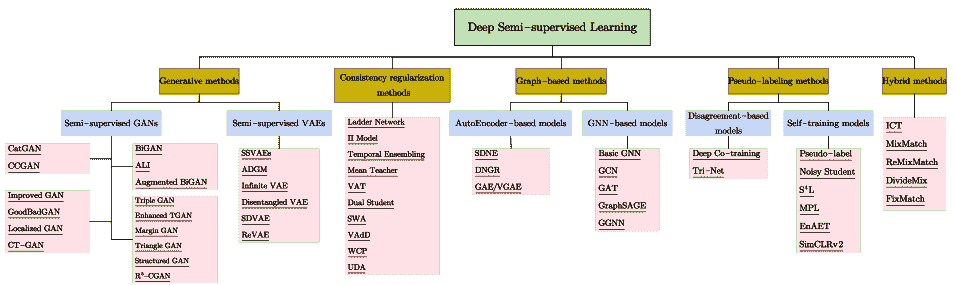
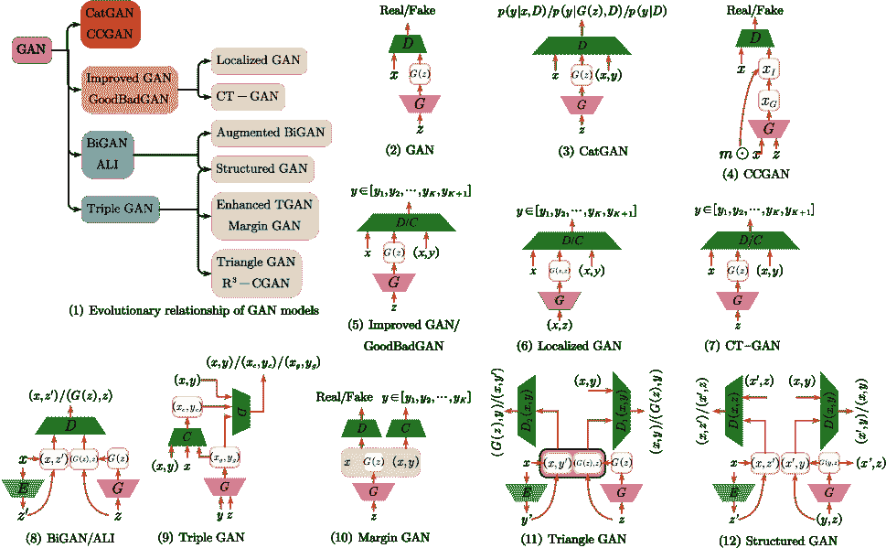
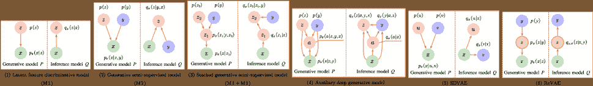
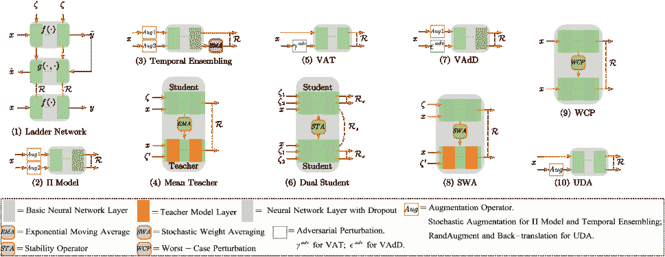
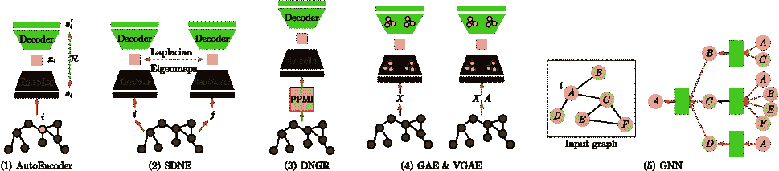
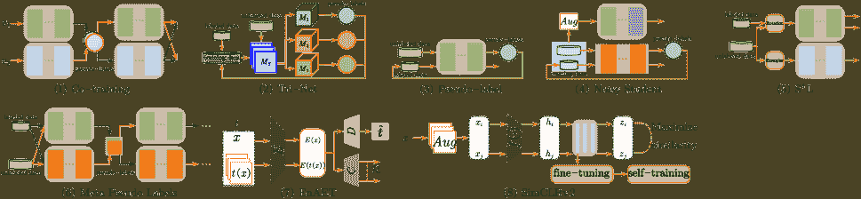
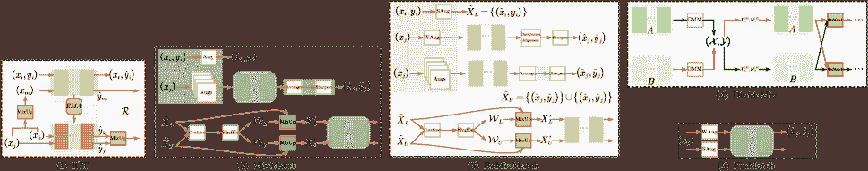

<!--yml

类别：未分类

日期：2024-09-06 19:56:45

-->

# [2103.00550] 关于深度半监督学习的调查

> 来源：[`ar5iv.labs.arxiv.org/html/2103.00550`](https://ar5iv.labs.arxiv.org/html/2103.00550)

# 关于深度半监督学习的调查

**向力阳**，**左兴宋**，**厄尔文·金**，**徐增林** X. Yang 现于中国电子科技大学计算机科学与工程学院，成都，中国

电子邮件：xlyang@std.uestc.edu.cn Z. Xu 现于哈尔滨工业大学计算机科学与技术学院，深圳，中国，以及鹏城实验室，深圳，中国。

电子邮件：xuzenglin@hit.edu.cn I. King 和 Z. Song 现于中国香港中文大学计算机科学与工程系，香港，中国

电子邮件：king@cse.cuhk.edu.hk，zxsong@cse.cuhk.edu.hk 通讯作者：**徐增林**。手稿收到日期：xx xx, xx；修订日期：xx xx, xx。

###### 摘要

深度半监督学习是一个快速发展的领域，具有广泛的实际应用。本文从模型设计和无监督损失函数的角度提供了关于深度半监督学习方法的全面调查。我们首先提出了深度半监督学习的分类法，涵盖了现有方法，包括深度生成方法、一致性正则化方法、基于图的方法、伪标签方法以及混合方法。然后，我们对 52 种代表性方法进行了全面的评审，并在损失类型、贡献和架构差异等方面进行了详细比较。除了过去几年的进展外，我们还讨论了现有方法的一些不足之处，并提出了一些初步的启发式解决方案以解决这些开放问题。

###### 索引术语：

深度半监督学习，图像分类，机器学习，调查

## 1 引言

深度学习一直是一个活跃的研究领域，具有在模式识别[1, 2]、数据挖掘[3]、统计学习[4]、计算机视觉[5, 6]、自然语言处理[7, 8]等领域中的丰富应用。在理论和实践中都取得了巨大成功[9, 10]，尤其是在监督学习场景中，通过利用大量高质量的标记数据。然而，标记样本通常难以获得，成本高昂或耗时。标记过程通常需要专家的努力，这是训练优秀的全监督深度神经网络的主要限制之一。例如，在医学任务中，测量使用昂贵的设备进行，标签则来自耗时的多位专家分析。如果仅有少量标记样本，构建成功的学习系统是具有挑战性的。相比之下，未标记数据通常丰富且容易或便宜地获得。因此，利用大量未标记数据来提高学习性能是可取的，即使只有少量标记样本。因此，半监督学习（SSL）在过去十年中成为机器学习的热门研究课题[11, 12]。

图 1：基于损失函数和模型设计的主要深度半监督学习方法的分类。

SSL 是一种学习范式，涉及构建使用标记和未标记数据的模型。与仅能使用标记数据的监督学习算法相比，SSL 方法可以通过使用额外的未标记实例来提高学习性能。通过扩展监督学习算法或无监督学习算法，容易获得 SSL 算法。SSL 算法提供了一种从未标记样本中探索潜在模式的方法，从而缓解对大量标签的需求[13]。根据系统的关键目标函数，可能会有半监督分类、半监督聚类或半监督回归。我们提供如下定义：

+   •

    半监督分类。给定一个包含标记实例和未标记实例的训练数据集，半监督分类旨在从标记和未标记数据中训练一个分类器，使其优于仅在标记数据上训练的监督分类器。

+   •

    半监督聚类。给定一个包含未标记实例的训练数据集，以及关于聚类的一些监督信息，半监督聚类的目标是获得比仅从未标记数据中得到的聚类更好的聚类结果。半监督聚类也被称为约束聚类。

+   •

    半监督回归。给定一个由有标签实例和无标签实例组成的训练数据集，半监督回归的目标是提升回归算法的性能，相比仅使用有标签数据的回归算法，后者预测的是一个实值输出而不是类别标签。

为了清晰具体地解释 SSL，我们重点关注图像分类问题。本调查中描述的思想可以很容易地适应其他情况，如目标检测、语义分割、聚类或回归。因此，我们在本调查中主要回顾了利用无标签数据的图像分类方法。

自从 1970 年代 SSL 概念首次出现[14, 15, 16]以来，出现了多种多样的 SSL 方法，包括生成模型[17, 18]、半监督支持向量机[19, 20, 21, 22]、基于图的方法[23, 24, 25, 26]和协同训练[27]。我们建议感兴趣的读者参考[28, 12]，这些文献提供了传统 SSL 方法的全面概述。如今，深度神经网络在许多研究领域中发挥了主导作用。重要的是采用经典的 SSL 框架，并为深度学习环境开发新颖的 SSL 方法，这引出了深度半监督学习（DSSL）。DSSL 研究如何通过深度神经网络有效利用有标签和无标签的数据。已经提出了大量的 DSSL 方法。根据半监督损失函数和模型设计中的最显著特征，我们将 DSSL 分为五类，即生成方法、一致性正则化方法、基于图的方法、伪标签方法和混合方法。本文献中使用的整体分类法如图 1 所示。

早期的综述中描述了一些 SSL 的代表性工作[28, 12]，但基于深度学习的新兴技术，如生成新训练数据的对抗训练，并未被纳入其中。此外，[13]专注于统一 SSL 的评估指标，而[29]仅回顾了 SSL 中的生成模型和教师-学生模型，没有对 SSL 进行全面概述。尽管[30]尝试呈现 SSL 的整体图景，但其分类与我们的差异较大。Ouali 等人的最新综述[31]给出了与我们相似的 DSSL 概念，但未根据分类比较呈现的方法，也未提供对未来趋势和现有问题的观点。总结以前和最新的 SSL 研究，我们调查了基本理论并比较了深度半监督方法。总之，我们的贡献如下。

+   •

    我们对 DSSL 方法进行了详细的综述，并介绍了主要 DSSL 方法的分类、背景知识和各种模型。可以迅速掌握 DSSL 的前沿思想。

+   •

    我们将 DSSL 方法分类为几类，即生成方法、一致性正则化方法、基于图的方法、伪标签方法和混合方法，每一类中还有特定的子类。我们回顾了每个类别的变体，并给出了标准化描述和统一的示意图。

+   •

    我们识别了该领域的若干开放问题，并讨论了 DSSL 的未来方向。

本调查报告的组织结构如下。在第二部分中，我们介绍了 SSL 的背景知识，包括 SSL 中的假设、经典 SSL 方法、相关概念以及在各种应用中使用的数据集。从第四部分到第七部分，我们介绍了主要的深度半监督技术，即第三部分中的生成方法，第四部分中的一致性正则化方法，第五部分中的基于图的方法，第六部分中的伪标签方法，以及第七部分中的混合方法。在第八部分中，我们讨论了半监督学习中的挑战，并提供了一些启发式解决方案和未来方向。

## 2 背景

在介绍 SSL 技术概述之前，我们首先介绍符号说明。为了说明 DSSL 框架，我们将重点放在单标签分类任务上，这些任务简单易于描述和实现。对于多标签分类任务，请参考 [32, 33, 34]。设 $X=\{X_{L},X_{U}\}$ 表示整个数据集，包括一个小的带标签子集 $X_{L}=\{x_{i}\}_{i=1}^{L}$，标签为 $Y_{L}=(y_{1},y_{2},\ldots,y_{L})$，以及一个大规模的无标签子集 $X_{U}=\{(x_{i})\}_{i=1}^{U}$，通常我们假设 $L\ll U$。我们假设数据集包含 $K$ 个类别，并且 $X$ 中的前 $L$ 个样本由 $\{y_{i}\}_{i=1}^{L}\in(y^{1},y^{2},\ldots,y^{K})$ 标签标记。正式地，SSL 旨在解决以下优化问题，

|  | $\min_{\theta}\underset{\text{监督损失}}{\underbrace{\sum_{x\in X_{L},y\in Y_{L}}\mathcal{L}_{s}(x,y,\theta)}}+\alpha\underset{\text{无监督损失}}{\underbrace{\sum_{x\in X_{U}}\mathcal{L}_{u}(x,\theta)}}+\beta\underset{\text{正则化}}{\underbrace{\sum_{x\in X}\mathcal{R}(x,\theta)}},$ |  | (1) |
| --- | --- | --- | --- |

其中 $\mathcal{L}_{s}$ 表示每个样本的监督损失，例如分类的交叉熵，$\mathcal{L}_{u}$ 表示每个样本的无监督损失，而 $\mathcal{R}$ 表示每个样本的正则化，例如一致性损失或设计的正则化项。请注意，无监督损失项通常与正则化项没有严格区分，因为正则化项通常不受标签信息的指导。最后，$\theta$ 表示模型参数，$\alpha,\beta\in\mathbb{R}_{>0}$ 表示权衡。不同的无监督损失函数和正则化项的选择会导致不同的半监督模型。请注意，在许多情况下，我们没有明确区分无监督损失和正则化项。除非特别说明，本文中使用的符号在表格 I 中进行了说明。

关于测试数据是否在训练过程中完全可用，半监督学习可以分为两种设置：传导设置和归纳学习设置。传导学习假设在训练过程中无标签样本正是待预测的数据，而传导学习的目的是在这些无标签样本上进行泛化，而归纳学习则假设学习到的半监督分类器仍然适用于新的未见数据。实际上，大多数基于图的方法是传导的，而其他大多数 SSL 方法则是归纳的。

### 2.1 半监督学习的假设

SSL 旨在通过利用未标记的数据比仅使用标记数据的监督学习更准确地进行预测。然而，一个基本的前提是数据分布应该满足某些假设。否则，SSL 可能不会改善监督学习，甚至可能由于误导推断而降低预测准确性。根据[12]和[28]，SSL 中的相关假设包括：

自我训练假设。自我训练模型的预测，特别是那些高置信度的预测，往往是正确的。我们可以假设，当假设满足时，那些高置信度的预测被认为是真实的。这种情况可能发生在类别形成良好分隔的簇时。

共同训练假设。不同的合理假设会导致标记数据和未标记数据的不同组合，从而设计出不同的算法来利用这些组合。例如，Blum 等人[27]提出了一种共同训练模型，该模型在以下假设下工作：实例 $x$ 具有两个条件独立的视图，每个视图都足以完成分类任务。

生成模型假设。通常，假设数据是从一个分布混合体中生成的。当混合成分的数量、先验 $p(y)$ 和条件分布 $p(x|y)$ 是正确的时，可以假设数据来自混合模型。这个假设表明，如果生成模型足够准确，我们可以通过 $p(x,y)=p(y)p(x|y)$ 建立未标记数据分布和类别标签之间的有效联系。

簇假设。如果两个点 $x_{1}$ 和 $x_{2}$ 位于同一个簇中，它们应该属于同一个类别[28]。这个假设指的是，单一类别中的数据往往形成一个簇，当数据点可以通过短曲线连接且不经过任何低密度区域时，它们属于同一类别簇[28]。根据这个假设，决策边界不应穿越高密度区域，而应位于低密度区域[35]。因此，学习算法可以利用大量未标记的数据来调整分类边界。

低密度分离。决策边界应该位于低密度区域，而不是穿过高密度区域[28]。低密度分离假设与簇假设紧密相关。我们可以从另一个角度考虑簇假设，假设类别由低密度区域分隔[28]。因为在高密度区域的决策边界会将簇分割成两个不同的类别，并且这样的部分会违反簇假设。

流形假设。如果两个点 $x_{1}$ 和 $x_{2}$ 位于低维流形的局部邻域中，它们具有相似的类别标签[28]。这一假设反映了决策边界的局部光滑性。众所周知，机器学习算法的一个问题是维度灾难。当体积随着高维空间中的维度呈指数增长时，很难估计实际的数据分布。如果数据位于低维流形上，学习算法可以避免维度灾难，并在相应的低维空间中进行操作。

表 I: 符号说明

| 符号 | 说明 |
| --- | --- |
| $\mathcal{X}$ | 输入空间，例如 $\mathcal{X}=\mathbb{R}^{n}$ |
| $\mathcal{Y}$ | 输出空间。 |
|  | 分类: $\mathcal{Y}=\{y^{1},y^{2},\ldots,y^{K}\}$。 |
|  | 回归: $\mathcal{Y}=\mathbb{R}$ |
| $X_{L}$ | 标记数据集。 $x_{i}\in\mathcal{X},y_{i}\in\mathcal{Y}$ |
| $X_{U}$ | 未标记数据集。 $x_{i}\in\mathcal{X}$ |
| $X$ | 输入数据集 $X$。 $N=L+U,L\ll U$ |
| $\mathcal{L}$ | 损失函数 |
| $G$ | 生成器 |
| $D$ | 判别器 |
| $C$ | 分类器 |
| $H$ | 熵 |
| $\mathbb{E}$ | 期望 |
| $\mathcal{R}$ | 一致性约束 |
| $\mathcal{T}_{x}$ | 一致性目标 |
| $\mathcal{G}$ | 一个图 |
| $\mathcal{V}$ | 图中的顶点集合 |
| $\mathcal{E}$ | 图中的边集合 |
| $v$ | 节点 $v\in\mathcal{V}$ |
| $e_{ij}$ | 连接节点 $i$ 和 $j$ 的边，$e_{ij}\in\mathcal{E}$ |
| ${A}$ | 图的邻接矩阵 |
| ${D}$ | 图的度矩阵 |
| $D_{ii}$ | 节点 $i$ 的度 |
| $W$ | 权重矩阵 |
| $W_{ij}$ | 与边 $e_{ij}$ 相关的权重 |
| $\mathcal{N}(v)$ | 节点 $v$ 的邻居 |
| $\mathbf{Z}$ | 嵌入矩阵 |
| $\mathbf{z}_{v}$ | 节点 $v$ 的嵌入 |
| $\mathbf{S}$ | 图的相似性矩阵 |
| $\mathbf{S}[u,v]$ | 节点 $u$ 和 $v$ 之间的相似性测量 |
| $\mathbf{h}_{v}^{(k)}$ | 节点 $v$ 在第 $k$ 层的隐藏嵌入 |
| $\mathbf{m}_{\mathcal{N}(v)}$ | 从节点 $v$ 的邻域聚合的信息 |

### 2.2 经典的半监督学习方法

在下文中，我们简要介绍一些受上述假设启发的代表性 SSL 方法。

在 1970 年代，SSL 的概念首次浮现[14, 15, 16]。也许最早的方法是自学习——一种迭代机制，利用初始标记数据来训练模型预测一些未标记样本。然后，最有信心的预测被标记为当前监督模型的最佳预测，从而为监督算法提供更多训练数据，直到所有未标记的样本都被预测。

协同训练[27]提供了类似的解决方案，通过在两个不同视角上训练两个不同的模型。一个视角的自信预测被用作另一个模型的标签。与这种方法相关的文献还包括[36, 37, 38]等。

生成模型假设一个模型 $p(x,y)=p(y)p(x|y)$，其中密度函数 $p(x|y)$ 是一个可识别的分布，例如多项式、高斯混合分布等，而不确定性是 $p(x|y)$ 的参数。生成模型可以通过迭代算法进行优化。[17, 18] 应用了 EM 算法进行分类。他们计算 $p(x|y)$ 的参数，然后根据贝叶斯全概率公式对未标记实例进行分类。此外，生成模型对一些假设要求严格。一旦假设的 $p(x|y)$ 与实际分布不匹配，就可能导致分类器性能下降。

遵循低密度分离原则的一个代表性例子是**传导支持向量机**（TSVMs）[19, 20, 35, 39, 40]。与常规支持向量机（SVMs）一样，TSVMs 优化决策边界与数据点之间的间隙，然后根据未标记数据到决策边界的距离扩展这个间隙。为了解决相应的非凸优化问题，已经提出了多种优化算法。例如，在[35]中，用平滑损失函数替代了 TSVM 的铰链损失，对于低密度空间中的决策边界，可以使用梯度下降技术。

基于图的方法依赖于由标记和未标记样本诱发的数据几何。这种几何由经验图 $\mathcal{G}=(\mathcal{V,E})$ 表示，其中节点 $\mathcal{V}$ 代表训练数据点，$|\mathcal{V}|=n$，边 $\mathcal{E}$ 代表点之间的相似性。通过利用数据的图结构或流形结构，可以在标签很少的情况下进行学习，通过图传播信息[41, 23, 42, 25, 26, 24]。例如，标签传播[41]是从标记节点预测未标记节点的标签信息。每个节点标签根据相似性传播到其邻居。在每一步节点传播中，每个节点根据邻居的标签信息更新其标签。在标签传播中，标记数据的标签是固定的，以便将标签传播到未标记数据。标签传播方法可以应用于深度学习[43]。

### 2.3 相关学习范式

有许多学习范式可以利用额外的数据源来提升学习性能。根据额外数据源的标签可用性或分布差异，有几种与半监督学习相关的学习范式。

迁移学习。迁移学习 [44, 45, 46] 旨在将一个或多个源领域的知识应用于目标领域，以提高在目标任务上的表现。与 SSL 不同，SSL 假设训练集和测试集是独立同分布（i.i.d.），迁移学习允许训练和测试中使用的领域、任务和分布可以不同但相关。

弱监督学习。弱监督学习 [47] 放宽了强监督中需要为大量训练数据集提供真实标签的数据依赖。弱监督数据有三种类型：不完全监督数据、不精确监督数据和不准确监督数据。不完全监督数据意味着只有部分训练数据被标记。在这种情况下，代表性的方法有 SSL 和领域适应。不精确监督数据表示训练样本的标签是粗粒度的，例如在多实例学习的场景中。不准确监督数据意味着给定的标签不总是实际的，例如在标签噪声学习的情况下。

正负样本学习。正负样本（PU）学习 [48, 49] 是正负二分类的变体，其中训练数据包含正样本和未标记样本。每个未标记的实例可以是正类或负类。在训练过程中，只能使用正样本和未标记样本。我们可以将 PU 学习视为半监督学习（SSL）的一个特殊情况。

元学习。元学习 [50, 51, 52, 53, 54]，也称为“学习如何学习”，旨在利用之前的知识和少量训练样本快速学习新技能或适应新任务。众所周知，一个好的机器学习模型通常需要大量样本进行训练。元学习模型预计能够适应并推广到在训练过程中遇到的新环境。适应过程本质上是在测试期间发生的一个小型学习阶段，但对新任务配置的暴露有限。最终，适应后的模型可以在各种学习任务上进行训练，并在函数分布上进行优化，包括潜在的未见任务。

自监督学习。自监督学习 [55, 56, 57] 因其能够避免注释大规模数据集的费用而受到了广泛关注。它可以利用输入数据作为监督，并将学习到的特征表示用于许多下游任务。从这个意义上讲，自监督学习符合我们对高效学习系统的期望，这些系统需要较少的标签、样本或试验。由于没有涉及人工标签，自监督学习可以视为无监督学习的一个分支。

### 2.4 数据集和应用

自监督学习在计算机视觉领域有许多应用，如图像分类、对象检测、语义分割等，在自然语言处理（NLP）领域也有应用，如文本分类、序列学习等。如表 II 所示，我们总结了一些最广泛使用的数据集和代表性参考文献，按应用领域进行分类。在这项调查中，我们主要讨论了应用于图像分类的方法，因为这些方法可以扩展到其他应用中，例如 [58] 将一致性训练应用于对象检测，[59] 修改了 Semi-GANs 以适应语义分割的场景。许多工作在不同应用中取得了最先进的表现。这些方法中的大多数分享了实现细节和源代码，我们建议感兴趣的读者参考表 II 中的数据集和相关参考文献的更详细评述。

表 II：应用和数据集总结

| 应用 | 数据集 | 引用 |
| --- | --- | --- |
| 图像分类 | MNIST [60], SVHN [61], STL-10 [62], Cifar-10, Cifar-100 [63], ImageNet [64] | [65, 66, 67, 68, 69, 70, 71, 72, 73] |
| 对象检测 | PASCAL VOC [74], MSCOCO [75], ILSVRC [76] | [77, 58, 78, 79] |
| 3D 对象检测 | SUN RGB-D [80], ScanNet [81], KITTI [82] | [83, 84] |
| 视频显著对象检测 | VOS [85], DAVIS [86], FBMS [87] | [88] |
| 语义分割 | PASCAL VOC [74], PASCAL context [89], MS COCO [75], Cityscapes [90], CamVid [91], SiftFlow [92, 93], StanfordBG [94] | [95, 96, 97, 59, 98, 99, 100, 101, 102, 103] |
| 文本分类 | AG News [104], BPpedia [105], Yahoo! Answers[106], IMDB [107], Yelp 评价 [104], Snippets [108], Ohsumed [109], TagMyNews [110], MR [111], Elec [112], Rotten Tomatoes [111], RCV1 [113] | [114, 115, 116, 117, 118, 119] |
| 对话策略学习 | MultiWOZ [120] | [121] |
| 对话生成 | Cornell Movie Dialogs Corpus [122], Ubuntu Dialogue Corpus [123] | [124] |
| 序列学习 | IMDB [107], Rotten Tomatoes [111], 20 Newsgroups [125], DBpedia [105], CoNLL 2003 NER 任务 [126], CoNLL 2000 Chunking 任务 [127], Twitter POS 数据集 [128, 129], Universal Dependencies(UD) [130], 组合范畴语法 (CCG) 超标记 [131] | [132, 133, 134, 135] |
| 语义角色标注 | CoNLL-2009 [136], CoNLL-2013 [137] | [138, 139, 140] |
| 问答 | SQuAD [141], TriviaQA [142] | [143, 144, 145] |

## 3 生成方法

如在小节 2.2 中讨论的那样，生成方法可以学习数据的隐含特征，以更好地建模数据分布。它们从训练数据集中建模真实的数据分布，然后生成具有该分布的新数据。在这一部分，我们将分别回顾基于生成对抗网络（GAN）框架和变分自编码器（VAE）框架的深度生成半监督方法。

图 2：展示了用于基于 GAN 的深度生成半监督方法的各种架构。字符‘$`D,G$” 和 “$E$” 分别代表 *判别器*、*生成器* 和 *编码器*。在图（6）中，本地化 GAN 配备了一个局部生成器 $G(x,z)$，因此我们使用黄色框进行区分。类似地，在 CT-GAN 中，紫色框用于表示引入一致性约束的判别器。

### 3.1 半监督 GANs

一个典型的 GAN [146] 由一个生成器 $G$ 和一个判别器 $D$ 组成（见图 2(2)）。$G$ 的目标是学习一个数据 $x$ 上的分布 $p_{g}$，该数据给定了输入噪声变量 $p_{z}(z)$ 的先验。生成器 $G$ 生成的虚假样本 $G(z)$ 被用来迷惑判别器 $D$。判别器 $D$ 的任务是最大化真实训练样本 $x$ 和虚假样本 $G(z)$ 之间的区别。正如我们所见，$D$ 和 $G$ 通过值函数 $V(G,D)$ 玩着以下双人博弈：

|  | $\displaystyle\min\limits_{G}\max\limits_{D}V(D,G)=\mathbb{E}_{x\sim p(x)}[\text{log}D(x)]$ |  |
| --- | --- | --- |
|  | $\displaystyle+\mathbb{E}_{z\sim p_{z}}[\text{log}(1-D(G(z)))].$ |  | (2) |

由于 GANs 可以从未标记的样本中学习真实数据的分布，因此它可以用于促进 SSL。在 SSL 设置中使用 GAN 的方式有很多。受 [147] 启发，我们确定了使用 GAN 进行 SSL 的四个主要主题，即：（a）重新利用来自判别器的特征，（b）使用 GAN 生成的样本来规范化分类器，（c）学习推断模型，以及（d）使用 GAN 生成的样本作为额外的训练数据。

一种简单的 SSL 方法是在训练过程中结合有监督和无监督损失。[148] 证明了 GAN-判别器的层次表示对于对象分类是有用的。这些发现表明，通过将无监督 GAN 值函数与有监督分类目标函数结合，例如 $\mathbb{E}_{(x,y)\in X_{l}}[\log D(y|x)]$，可以提供一种简单而有效的 SSL 方法。接下来，我们回顾几种代表性的半监督 GAN 方法。

CatGAN。分类生成对抗网络（CatGAN）[149] 修改了 GAN 的目标函数，以考虑观察样本与其预测的类别分布之间的互信息。特别地，优化问题与标准 GAN 不同（见 Eq. (2)）。该结构如图 2(3) 所示。该方法旨在学习一个判别器，该判别器通过给每个 $x$ 标注 $y$，将样本区分为 $K$ 类，而不是学习一个二值判别器值函数。此外，在 CatGAN 的判别器损失函数中，监督损失也是一个交叉熵项，表示预测的条件分布 $p(y|x,D)$ 和样本的真实标签分布之间的差异。它由三部分组成：（1）熵 $H[p(y|x,D)]$，用于获得样本的特定类别分配；（2）$H[p(y|G(z),D)]$，用于来自生成样本的不确定预测；（3）边际类别熵 $H[p(y|D)]$，用于所有类别的均匀使用。提出的框架使用判别器学习到的特征空间用于最终的学习任务。对于标记数据，监督损失也是一个交叉熵项，表示条件分布 $p(y|x,D)$ 和样本的真实标签分布之间的差异。

CCGAN。上下文条件生成对抗网络（CCGAN）[150] 的提出是为了利用对抗损失来利用基于图像修补的未标记图像数据。CCGAN 的架构如图 2(4) 所示。这项工作的主要亮点是图像周围部分提供的上下文信息。该方法训练一个生成对抗网络（GAN），其中生成器用于生成缺失区域内的像素。判别器则用于区分真实的未标记图像和这些修补后的图像。更正式地，$m\odot x$ 作为生成器的输入，其中 $m$ 表示一个二进制掩模，用于丢弃图像的指定部分，$\odot$ 表示逐元素乘法。因此，修补后的图像 $x_{I}=(1-m)\odot x_{G}+m\odot x$ 由生成器输出 $x_{G}=G(m\odot x,z)$。生成器提供的修补示例使得判别器能够学习到对分类对象相关任务的特征。然后，判别器的倒数第二层组件与分类器共享，分类器的交叉熵损失与判别器损失结合使用。

改进的 GAN。有几种方法可以将 GAN 适应于半监督分类场景。CatGAN [149] 强制鉴别器最大化示例及其预测类别分布之间的互信息，而不是训练鉴别器来学习二分类。为了解决 CatGAN 学习表示的瓶颈，半监督 GAN（SGAN）[151] 同时学习生成器和分类器。分类器网络可以具有 $(K+1)$ 个输出单元，对应于 $[y_{1},y_{2},\ldots,y_{K},y_{K+1}]$，其中 $y_{K+1}$ 代表由 $G$ 生成的输出。类似于 SGAN，改进的 GAN [152] 解决了一个 $(K+1)$ 类分类问题。改进 GAN 的结构如图 2(5)所示。前 $K$ 个类别的真实示例和额外的 $(K+1)$ 类由生成器 $G$ 生成的合成图像组成。本工作提出了训练 GAN 的改进技术，即特征匹配、小批量判别、历史平均单边标签平滑和虚拟批量归一化，其中特征匹配用于训练生成器。它通过最小化真实和生成示例特征之间的差异 $\|\mathbb{E}_{x\in X}D(x)-\mathbb{E}_{z\sim p(z)}D(G(z))\|_{2}^{2}$ 进行训练，而不是最大化其生成示例被分类为 $K$ 个真实类别的可能性。用于训练分类器的损失函数变为

|  |  | $\displaystyle\max_{D}\mathbb{E}_{(x,y)\sim p(x,y)}\log p_{D}(y\mid x,y\leq K)$ |  | (3) |
| --- | --- | --- | --- | --- |
|  |  | $\displaystyle+\mathbb{E}_{x\sim p(x)}\log p_{D}(y\leq K\mid x)+\mathbb{E}_{x\sim p_{G}}\log p_{D}(y=K+1\mid x),$ |  |

方程式（3）中的第一个项表示监督交叉熵损失，方程式（3）中的最后两个项分别是来自未标记数据和生成数据的无监督损失。

GoodBadGAN。GoodBadGAN [153] 认识到[152]中的生成器和判别器可能不是同时最优的，即判别器在 SSL 中表现良好，而生成器可能生成视觉上不现实的样本。GoodBadGAN 的结构如图 2(5)所示。该方法对为何使用生成器的不良样本可以提升 SSL 性能进行了理论上的论证。通常，生成的样本以及损失函数（Eq. (3)），可以迫使判别器的边界位于不同类别的数据流形之间，从而提高判别器的泛化能力。通过分析，GoodBadGAN 通过显式添加一个惩罚项$\mathbb{E}_{x\sim p_{G}}\log p(x)\mathbb{I}[p(x)>\epsilon]$来学习一个劣质生成器，以生成不良样本，其中$\mathbb{I}[\cdot]$是指示函数，$\epsilon$是一个阈值，确保只有高密度样本受到惩罚，而低密度样本不受影响。此外，为了保证在最佳条件下的强烈真假信念，在 Eq. (3)的判别器目标函数中添加了条件熵项$\mathbb{E}_{x\sim p_{x}}\sum_{k=1}^{K}\log p_{D}(k|x)$。

局部化 GAN。局部化 GAN [154] 侧重于使用局部坐标图来参数化数据变换的局部几何，而不是全局几何。这项工作表明，局部化 GAN 通过探索流形几何，可以帮助训练一个局部一致的分类器。局部化 GAN 的架构如图 2(6)所示。与[152, 153]中介绍的方法类似，局部化 GAN 试图解决$K+1$分类问题，该问题输出$x$被分配到某一类别的概率。对于一个分类器，$\nabla_{z}D(G(x,z))$描述了在$G(x,z)$形成的流形上分类决策的变化，$D(\cdot)$在$G(x,z)$上的演化可以写成

|  | $&#124;D(G(x,z+\sigma z))-D(G(x,z))&#124;^{2}\approx\&#124;\nabla_{x}^{G}D(x)\&#124;^{2}\sigma z,$ |  | (4) |
| --- | --- | --- | --- |

这表明，通过惩罚$\|\nabla_{x}^{G}D(x)\|^{2}$可以在流形上训练一个对小扰动$\sigma z$具有鲁棒性的分类器。可以通过添加$\sum_{k=1}^{K}\mathbb{E}_{x\sim p_{x}}\|\nabla_{x}^{G}\log p(y=k|x)\|^{2}$来引入这种概率分类器，其中$\nabla_{x}^{G}\log p(y=k|x)$是沿流形$G(x,z)$的对数似然的梯度。

CT-GAN。CT-GAN [155] 将一致性训练与应用于半监督分类问题的 WGAN [156] 相结合。CT-GAN 的结构如图 2(7) 所示。按照 [157]，该方法还在真实数据的流形上施加 Lipschitz 连续性条件，以改进 WGAN 的训练。此外，CT-GAN 针对在流形附近抽取的一对样本设计了一种正则化，遵循 1-Lipschitz 连续性的最基本定义。特别地，每个真实样本 $x$ 被扰动两次，并使用 Lipschitz 常数来限制扰动实例 $x^{\prime},x^{\prime\prime}$ 的判别器响应之间的差异。形式上，由于 WGAN 的值函数是

|  | $\min_{G}\max_{D}\mathbb{E}_{x\sim p_{x}}D(x)-\mathbb{E}_{z\sim p_{z}}D(G(z)),$ |  | (5) |
| --- | --- | --- | --- |

其中，$D$ 是 1-Lipschitz 函数集之一。用于更新判别器的目标函数包括：（a）公式 (5) 中的基本 Wasserstein 距离，（b）改进的 WGAN 训练中使用的梯度惩罚 $GP|_{\hat{x}}$ [157]，其中 $\hat{x}=\epsilon x+(1-\epsilon)G(z)$，以及 （c）一致性正则化 $CT|_{x^{\prime},x^{\prime\prime}}$。对于半监督分类，CT-GAN 使用公式 (3) 来训练判别器，而不是公式 (5)，然后添加一致性正则化 $CT|_{x^{\prime},x^{\prime\prime}}$。

BiGAN。双向生成对抗网络（BiGANs）[158] 是一个无监督特征学习框架。BiGAN 的架构如图 2(8) 所示。与标准 GAN 框架相比，BiGAN 向该框架添加了一个编码器 $E$，它将数据 $x$ 映射到 $z^{\prime}$，从而得到一对数据 $(x,z^{\prime})$。数据对 $(x,z^{\prime})$ 和生成器 $G$ 生成的数据对构成了两种真实和虚假的数据对。BiGAN 判别器 $D$ 的任务是区分真实和虚假的数据对。在这项工作中，训练判别器的值函数变为，

|  | $\displaystyle\min_{G,E}\max_{D}V(D,E,G)=\mathbb{E}_{x\sim\mathcal{X}}\underset{\log D(x,E(x))}{\underbrace{\left[\mathbb{E}_{z\sim p_{E}\left(\cdot | x\right)}\left[\log D\left(x,z\right)\right]\right]}}$ |  | (6) |
| --- | --- | --- | --- | --- |
|  | $\displaystyle+\mathbb{E}_{z\sim p\left(z\right)}\underset{\log\left(1-D\left(G\left(z\right),z\right)\right)}{\underbrace{\left[\mathbb{E}_{x\sim p_{G}\left(\cdot | z\right)}\left[\log\left(1-D\left(x,z\right)\right)\right]\right]}}.$ |  |

ALI（对抗性学习推断，Adversarially Learned Inference）[159] 是一种类似于 GAN 的对抗性框架，它基于推断网络和生成模型的组合。该框架由三个网络组成：生成器、推断网络和判别器。生成网络 $G$ 用作解码器，将潜在变量 $z$（具有先验分布）映射到数据分布 $x^{\prime}=G(z)$，这些数据可以形成联合对 $(x^{\prime},z)$。推断网络 $E$ 试图将训练样本 $x$ 编码为潜在变量 $z^{\prime}=E(x)$，并以类似方式生成联合对 $(x,z^{\prime})$。判别器网络 $D$ 需要区分联合对 $(x,z^{\prime})$ 和 $(x^{\prime},z)$。正如上文所讨论的，ALI 的核心架构被认为与 BiGAN 类似（见图 2 (8)）。在半监督设置中，该框架采用了 [152] 中提出的判别器网络，并在 SVHN 和 CIFAR 10 的半监督基准上展示了有前景的性能。目标函数可以被重写为类似于 Eq. (6) 的扩展版本。

扩展 BiGAN。Kumar 等人 [160] 提出了一个名为扩展 BiGAN 的 BiGAN 扩展用于 SSL。该框架具有类似 BiGAN 的架构，包括编码器、生成器和判别器。由于训练好的 GAN 生成逼真的图像，生成器可以被视为获得图像流形的切线空间。估计的切线推断出所需的不变性，这些不变性可以被注入判别器以提高 SSL 性能。特别地，扩展 BiGAN 使用特征匹配损失 [152]，$\|\mathbb{E}_{x\in X}D(E(x),x)-\mathbb{E}_{z\sim p(z)}D(z,G(z))\|^{2}_{2}$ 来优化生成器网络和编码器网络。此外，为了避免类切换问题（$G(E(x))$ 的类别在解耦训练过程中发生变化），在目标函数 Eq. (6) 中添加了第三对 $(E(x),G(E(x)))$ 损失项 $\mathbb{E}_{x\sim p(x)}[\log(1-D(E(x),G_{x}(E(x))))]$。

Triple GAN。Triple GAN [161] 被提出以解决生成对抗网络（GAN）中的生成器和鉴别器具有不兼容损失函数的问题，即生成器和鉴别器不能同时达到最佳 [152]。这一问题在 [153] 中已被提及，但解决方案有所不同。如图 2(9) 所示，Triple GAN 通过玩三方博弈来解决这个问题。这个三方框架包括三个部分：一个使用条件网络生成对应于真实标签的伪样本的生成器 $G$，一个为给定真实数据生成伪标签的分类器 $C$，以及一个区分数据-标签对是否来自真实标签数据集的鉴别器 $D$。Triple GAN 的损失函数可以写作

|  | $\displaystyle\min_{C,G}\max_{D}V(C,G,D)=\mathbb{E}_{\left(x,y\right)\sim p\left(x,y\right)}\left[\log D\left(x,y\right)\right]$ |  | (7) |
| --- | --- | --- | --- |
|  | $\displaystyle+~{}\alpha\mathbb{E}_{\left(x,y\right)\sim p_{c}\left(x,y\right)}\left[\log\left(1-D\left(x,y\right)\right)\right]$ |  |
|  | $\displaystyle+\left(1-\alpha\right)\mathbb{E}_{\left(x,y\right)\sim p_{g}\left(x,y\right)}\left[\log\left(1-D\left(G\left(y,z\right),y\right)\right)\right],$ |  |

其中 $D$ 从分类器 $C$ 获取未标记数据的标签信息，并迫使生成器 $G$ 生成逼真的图像-标签样本。

Enhanced TGAN。基于 Triple GAN 的架构 [162]，Enhanced TGAN [163] 通过重新设计生成器损失函数和分类器网络对 Triple-GAN 进行了修改。生成器生成基于类别分布的图像，并通过类别均值特征匹配进行正则化。分类器网络包括两个分类器，它们协同学习以为生成器训练提供更多的类别信息。此外，增加了一个语义匹配项，以增强生成器和分类器网络之间的语义一致性。鉴别器 $D$ 学会区分标记数据对 $(x,y)$ 与合成数据对 $(G(z),\tilde{y})$ 和预测数据对 $(x,\bar{y})$。相应的目标函数类似于 Eq. (7)，其中 $(G(z),\tilde{y})$ 采样自预设的分布 $p_{g}$，$(x,\bar{y})$ 表示由 $p_{c}(x)$ 确定的预测数据对。

MarginGAN。MarginGAN [164] 是基于 Triple GAN [162] 的另一个扩展框架。从分类边际的角度来看，当用于半监督分类时，该框架比 Triple GAN 更有效。MarginGAN 的架构如图 2(10) 所示。MarginGAN 包含与 Triple GAN 相同的三个组件，一个生成器 $G$，试图最大化生成样本的边际，一个分类器 $C$，用于减少虚假图像的边际，以及一个判别器 $D$，按常规训练以区分真实样本和虚假图像。该方法解决了由于 SSL 中伪标签不准确而导致性能受损的问题，并提高了 SSL 的准确率。

Triangle GAN。Triangle Generative Adversarial Network ($\triangle$-GAN) [162] 引入了一种新的架构来匹配跨领域的联合分布。$\triangle$-GAN 的架构如图 2(11) 所示。$\triangle$-GAN 可以被视为 BiGAN [158] 或 ALI [159] 的扩展版本。该框架是一个四分支模型，由两个生成器 $E$ 和 $G$ 以及两个判别器 $D_{1}$ 和 $D_{2}$ 组成。两个生成器可以通过两个领域之间的双向匹配学习两个不同的联合分布。同时，判别器作为隐式三元函数，其中 $D_{2}$ 确定数据对是否来自 $(x,y^{\prime})$ 或 $(G(z),y)$，而 $D_{1}$ 区分真实数据对 $(x,y)$ 和虚假数据对 $(G(z),y)$。

结构化 GAN。结构化 GAN [165] 研究了基于指定语义或结构的半监督条件生成建模问题。结构化 GAN 的架构（见图 2(12)）类似于 Triangle GAN [162]。具体来说，结构化 GAN 假设样本 $x$ 是在两个独立的潜变量条件下生成的，即编码指定语义的 $y$ 和包含其他变异因素的 $z$。训练结构化 GAN 涉及解决两个对抗性博弈，其平衡点集中在真实的联合数据分布 $p(x,z)$ 和 $p(x,y)$ 上。合成数据对 $(x^{\prime},y)$ 和 $(x^{\prime},z)$ 是由生成器 $G(y,z)$ 生成的，其中 $(x^{\prime},y)$ 将真实样本对 $(x,y)$ 作为输入混合到训练判别器 $D(x,y)$ 中，而 $(x^{\prime}z)$ 将 $E$ 的输出对 $(x,z^{\prime})$ 融合到判别器 $D(x,z)$ 中。

$\bm{R^{3}}$-CGAN。Liu 等人 [166] 提出了一个带有随机区域替换（R3-正则化）技术的条件类生成对抗网络（$R^{3}$-CGAN）。他们的框架和训练策略依赖于 Triangle GAN [162]。$R^{3}$-CGAN 架构包括四个部分：一个生成器 $G$ 用于合成具有指定类别标签的假图像，一个分类器 $C$ 用于生成带有伪标签的真实未标记图像实例-标签对，一个鉴别器 $D_{1}$ 用于识别真实或假对，另一个鉴别器 $D_{2}$ 用于区分两种类型的假数据。具体来说，CutMix [167]，一种随机区域替换策略，用于构建两种类别间的实例（跨类别实例和真实-假实例）。这些实例用于对分类器 $C$ 和鉴别器 $D_{1}$ 进行正则化。通过四个玩家之间的极小极大博弈，类特定的信息被有效地用于下游任务。

摘要。与上述讨论的 Semi-GANs 方法相比，我们发现主要的区别在于基本模块的数量和类型，如生成器、编码器、鉴别器和分类器。如图 2 所示，我们发现了 Semi-GANs 模型的进化关系。总体而言，CatGAN [149] 和 CCGAN [150] 通过在模型中加入额外的信息（如类别信息和填补图像）来扩展基本的 GAN。基于改进的 GAN [152]，Localized GAN [154] 和 CT-GAN [155] 分别考虑了局部信息和一致性正则化。BiGAN [158] 和 ALI [159] 通过添加编码器模块在训练过程中学习推断模型。为了解决生成器和鉴别器不能同时达到最优的问题，Triple-GAN [161] 添加了一个独立的分类器，而不是使用鉴别器作为分类器。

### 3.2 半监督 VAE

图 3：基于 VAE 的深度生成半监督方法中使用的概率图模型的概览。每种方法包含两个模型，生成模型 $P$ 和推断模型 $Q$。变分参数 $\theta$ 和 $\phi$ 通过输入连接（即深度神经网络）联合学习。

变分自编码器（VAEs）[168, 169] 是灵活的模型，它们将深度自编码器与生成潜在变量模型结合起来。生成模型捕捉分布的表示，而不是数据集的观测，并以 $p(x,z)=p(z)p(x|z)$ 的形式定义联合分布，其中 $p(z)$ 是潜在变量 $z$ 的先验分布。由于真实的后验 $p(z|x)$ 通常是不可处理的，因此生成模型借助近似后验分布 $q(z|x)$ 进行训练。VAEs 的架构是一个两阶段网络，一个编码器构造变分近似 $q(z|x)$ 以接近后验 $p(z|x)$，另一个解码器参数化似然 $p(x|z)$。后验的变分近似最大化边际似然，证据下界（ELBO）可以写作

|  | $\displaystyle\log p(x)=\log\mathbb{E}_{q(z&#124;x)}[\frac{p(z)p(x&#124;z)}{q(z&#124;x)}]$ |  | (8) |
| --- | --- | --- | --- |
|  | $\displaystyle\geq\mathbb{E}_{q(z&#124;x)}[\log p(z)p(x&#124;z)-\log q(z&#124;x)].$ |  | (9) |

潜在变量模型对于半监督学习（SSL）有三个原因是有用的：（a）它是一种自然地融合未标记数据的方式，（b）通过潜在变量的配置可以轻松实现表示的解耦，以及（c）它还允许我们使用变分神经方法。接下来，我们回顾几种代表性的潜在变量方法用于半监督学习。

SSVAEs。SSVAEs 指的是基于 VAE 的生成模型，具有在[170]中提出的潜在编码器表示。第一个模型，即潜在特征判别模型，称为 M1 [170]，可以通过数据的深度生成模型提供更稳健的潜在特征。如图 3(1)所示，$p_{\theta}(x|z)$ 是一种非线性变换，例如深度神经网络。潜在变量 $z$ 可以选择为高斯分布或伯努利分布。后验分布 $q_{\phi}(z|x)$ 的近似样本作为类别标签 $y$ 的分类器特征。第二个模型，即生成式半监督模型，称为 M2 [170]，描述了由潜在类变量 $y$ 和连续潜在变量 $z$ 生成的数据，表示为 $p_{\theta}(x|z,y)p(z)p(y)$（如图 3(2)所示）。$p(y)$ 是多项分布，其中类别标签 $y$ 被视为未标记数据的潜在变量。$p_{\theta}(x|z,y)$ 是一个合适的似然函数。推断后的后验分布 $q_{\phi}(z|y,x)$ 可以预测任何缺失的标签。

堆叠生成半监督模型，称为 M1+M2，使用生成模型 M1 来学习新的潜在表示 $z_{1}$，并利用来自 $z_{1}$ 的嵌入，而不是原始数据 $x$，来学习生成半监督模型 M2。正如图 3(3) 所示，整个过程可以抽象如下：

|  | $p_{\theta}(x,y,z_{1},z_{2})=p(y)p(z_{2})p_{\theta}(z_{1}&#124;y,z_{2})p_{\theta}(x&#124;z_{1}),$ |  | (10) |
| --- | --- | --- | --- |

其中 $p_{\theta}(z_{1}|y,z_{2})$ 和 $p_{\theta}(x|z_{1})$ 被参数化为深度神经网络。在上述所有模型中，$q_{\phi}({z|x})$ 用于近似真实的后验分布 $p({z|x})$，并根据变分原理，推导出模型的边界近似下界，以确保近似后验概率尽可能接近真实的后验概率。

ADGM。辅助深度生成模型（ADGM）[171] 通过辅助变量扩展了 SSVAEs [170]，如图 3(4) 所示。辅助变量通过训练具有多个随机层的深度生成模型，可以改进变分近似，使变分分布更具表现力。

添加辅助变量 $a$ 不会改变 $x,y$ 的生成模型，同时显著提高后验近似的代表性能力。引入了一个额外的推理网络，具体如下：

|  | $q_{\phi}(a,y,z&#124;x)=q_{\phi}(z&#124;a,y,x)q_{\phi}(y&#124;a,x)q_{\phi}(a&#124;x).$ |  | (11) |
| --- | --- | --- | --- |

该框架具有定义为 $p_{\theta}(a)p_{\theta}(y)p_{\theta}(z)p_{\theta}(x|z,y)$ 的生成模型，其中 $a,y,z$ 分别是辅助变量、类别标签和潜在特征。学习后验分布是不可处理的。因此，我们将近似定义为 $q_{\phi}(a|{x})q_{\phi}({z}|y,{x})$ 和分类器 $q_{\phi}(y|a,{x})$。辅助单元 $a$ 实际上在 $x$ 和 $y$ 之间引入了一个类别特定的潜在分布，从而产生了更具表现力的分布 $q_{\phi}(y|a,x)$。正式地，[171] 使用类似的变分下界 $\mathbb{E}_{q_{\phi}(a,z|x)}[\log p_{\theta}(a,x,y,z)-\log q_{\phi}(a,z|x,y)]$ 对边际似然进行近似，其中 $q_{\phi}(a,z|x,y)=q_{\phi}(a|x)q_{\phi}(z|y,x)$。类似地，无标签 ELBO 是 $\mathbb{E}_{q_{\phi}(a,y,z|x)}[\log p_{\theta}(a,x,y,z)-\log q_{\phi}(a,y,z|x)]$，其中 $q_{\phi}(a,y,z|x)=q_{\phi}(z|y,x)q_{\phi}(y|a,x)q_{\phi}(a|x)$。

有趣的是，通过反转 $x$ 和 $a$ 之间的依赖方向，恢复了类似于 M1 和 M2 堆叠版本的模型（图 3(3)），作者称之为从第二个随机层和标签到输入 $x$ 的跳跃连接。在这种情况下，生成模型受到影响，作者称之为跳跃深度生成模型（SDGM）。该模型能够通过随机梯度下降（SGD）进行端到端的训练（根据 [171]，$z$ 和 $x$ 之间的跳跃连接对训练收敛至关重要）。毫不奇怪，该模型的联合训练显著改善了 [170] 中呈现的性能。

Infinite VAE。Infinite VAE [172] 提出了一个用于结合变分自编码器的混合模型，这是一种非参数贝叶斯方法。该模型通过 Dirichlet 过程混合系数来适应输入数据。它结合了 Gibbs 采样和变分推断，使模型能够高效地学习输入的潜在结构。形式上，Infinite VAE 使用混合系数来辅助 SSL，通过结合无监督生成模型和监督判别模型。无限混合生成模型为，

|  | $p(c,\pi,x,z)=p(c\vert \pi)p_{\alpha}(\pi)p_{\theta}(x\vert c,z)p(z),$ |  | (12) |
| --- | --- | --- | --- |

其中 $c$ 表示将每个实例分配给一个 VAE 组件的赋值矩阵，其中 VAE-$i$ 可以最佳地重建实例 $i$。$\pi$ 是 $c$ 的混合系数先验，从具有参数 $\alpha$ 的 Dirichlet 分布中抽取。每个 VAE 中的潜在变量 $z_{i}$ 是从高斯分布中抽取的。

解耦 VAE。解耦 VAE [173] 试图使用部分指定的图形模型结构和数据的不同编码方面将其学习为解耦表示。它探索了用于建模对观察到的和未观察到的潜在变量的通用依赖性的图形模型，利用神经网络和一个随机计算图 [174] 来推断并训练生成模型。为此，使用重要性采样估计来最大化监督和半监督似然的下界。形式上，该框架考虑了条件概率 $q_{y,z|x}$，其因子化为 $q_{\phi}(y,z|x)=q_{\phi}(y|x,z)q_{\phi}(z|x)$，而不是 [170] 中的 $q_{\phi}(y,z|x)=q_{\phi}(z|x,y)q_{\phi}(y|x)$，这意味着我们不能再通过从无条件分布 $q_{\phi}(z|x)$ 中采样来计算简单的蒙特卡洛估计量。因此，监督项的变分下界展开如下，

|  | $\mathbb{E}_{q_{\phi}(z\vert x,y)}[\log p_{\theta}(x\vert y,z)p(y)p(z)-q_{\phi}(y,z\vert x)].$ |  | (13) |
| --- | --- | --- | --- |

SDVAE。半监督解耦变分自编码器（SDVAE）[175] 通过编码输入的解耦表示和不可解释表示，将标签信息融入潜在表示中。解耦变量捕获分类信息，而不可解释变量包含来自数据的其他不确定信息。如图 3(5)所示，SDVAE 假设解耦变量 $v$ 和不可解释变量 $u$ 在 $x$ 条件下是独立的，即 $q_{\phi}(u,v|x)=q_{\phi}(u|x)q_{\phi}(v|x)$。这意味着 $q_{\phi}(v|x)$ 是解耦表示的编码器，而 $q_{\phi}(u|x)$ 表示不可解释表示的编码器。基于这些假设，变分下界可以写作：

|  | $\mathbb{E}_{q(u | x),q(v | x)}[\log p(x | u,v)p(v)p(u)-\log q(u | x)q(v | x)].$ |  | (14) |
| --- | --- | --- | --- | --- | --- | --- | --- | --- |

图 4：展示了用于一致性正则化半监督方法的多样化架构。除了图中的标识符外，$\zeta$ 表示扰动噪声，$\mathcal{R}$ 是一致性约束。

ReVAE。重参数化变分自编码器（ReVAE）[176] 开发了一种编码监督信息的新方法，可以通过辅助变量捕获标签信息，而不是先前工作中的潜在变量[170]。图 3(6)中展示了图形模型。与 SSVAEs 相比，ReVAE 通过有原则的变分目标捕获数据的有意义表示。此外，ReVAE 精心设计了辅助变量和潜在变量之间的映射。在这个模型中，引入了条件生成模型 $p_{\psi}(z|y)$ 以解决测试时推理的需求。类似于[170]和[171]，ReVAE 在监督设置中将 $y$ 视为已知观测，而在无监督情况下则视为额外变量。特别是，潜在空间可以在标签信息仅捕获特定方面的假设下分为两个不相交的子集。

摘要。顾名思义，半监督 VAE 将 VAE 架构应用于处理 SSL 问题。这些方法的一个优点是生成潜变量模型可以学习数据的有意义表示。这些半监督 VAE 方法的基本框架是 M2 [170]。在 M2 框架的基础上，ADGM [171] 和 ReVAE [176] 考虑引入额外的辅助变量，尽管两个模型中的辅助变量角色不同。Infinite VAE [172] 是几个 VAE 模型的混合体，以提高整个框架的性能。Disentangled VAE [173] 和 SDVAE [175] 通过不同的解缠方法解决半监督 VAE 问题。在半监督条件下，当大量标签未被观测时，这类方法的关键在于如何处理潜变量和标签信息。

## 4 一致性正则化

在本节中，我们介绍了半监督深度学习的一致性正则化方法。在这些方法中，一致性正则化项被应用于最终的损失函数，以指定研究人员假设的先验约束。一致性正则化基于流形假设或光滑性假设，描述了一类方法，即数据点的实际扰动不应改变模型的输出[13]。因此，一致性正则化可以被看作是通过利用未标记数据来寻找数据集所在的光滑流形[177]。

最常见的一致性正则化 SSL 方法的结构是教师-学生结构。作为学生，模型如以前一样进行学习，而作为教师，模型则同时生成目标。由于模型本身生成目标，这些目标可能是错误的，然后被用作学生进行学习。实质上，一致性正则化方法面临确认偏差的风险[68]，这一风险可以通过提高目标的质量来减轻。形式上，遵循[178]，我们假设数据集 $X$ 包含一个标记子集 $X_{l}$ 和一个未标记子集 $X_{u}$。设 $\theta^{\prime}$ 表示目标的权重，$\theta$ 表示基本学生的权重。一致性约束定义为：

|  | $\mathbb{E}_{x\in X}\mathcal{R}(f(\theta,x),\mathcal{T}_{x}),$ |  | (15) |
| --- | --- | --- | --- |

其中$f(\theta,x)$是模型$f(\theta)$对输入$x$的预测。$\mathcal{T}_{x}$是教师的一致性目标。$\mathcal{R}(\cdot,\cdot)$衡量两个向量之间的距离，通常设置为均方误差（MSE）或 KL 散度。不同的一致性正则化技术在生成目标的方式上有所不同。有几种方法可以提高目标$\mathcal{T}_{x}$的质量。一种策略是仔细选择扰动，而不是添加或乘法噪声。另一种技术是仔细考虑教师模型，而不是复制学生模型。

梯度网络。梯度网络 [65, 179] 是首次成功使用启发于深度去噪自编码器的教师-学生模型。梯度网络的结构如图 4(1)所示。在编码器中，噪声$\zeta$被注入所有隐藏层，作为腐蚀的前馈路径$x+\zeta\rightarrow\frac{\text{Encoder}}{f(\cdot)}\rightarrow\tilde{z}_{1}\rightarrow\tilde{z}_{2}\,\,$，并与干净编码器的前馈路径$x\rightarrow\frac{\text{Encoder}}{f(\cdot)}\rightarrow z_{1}\rightarrow z_{2}\rightarrow y$共享映射$f(\cdot)$。解码器路径$\tilde{z}_{1}\rightarrow\tilde{z}_{2}\rightarrow\frac{\text{Decoder}}{g(\cdot,\cdot)}\rightarrow\hat{z}_{2}\rightarrow\hat{z}_{1}$由去噪函数$g(\cdot,\cdot)$组成，且每一层的无监督去噪平方误差$\mathcal{R}$被视为$\hat{z}_{i}$和$z_{i}$之间的一致性损失。通过潜在的跳跃连接，梯度网络与常规的去噪自编码器有所不同。这一特性使得更高层的特征可以关注于任务的更抽象的不变特征。形式上，梯度网络的无监督训练损失$\mathcal{L}_{u}$或一致性损失被计算为干净编码器$z_{i}$和重构激活$\hat{z}_{i}$之间的均方误差（MSE）。通常，$\mathcal{L}_{u}$是

|  | $\mathbb{E}_{x\in X}\mathcal{R}\left(f\left(\theta,x\right),g\left(f\left(\theta,x+\zeta\right)\right)\right).$ |  | (16) |
| --- | --- | --- | --- |

$\bm{\Pi}$ 模型。与梯度网络中使用的扰动不同，$\Pi$ 模型 [66] 是为标记和未标记数据创建样本的两个随机增强。一些具有非确定性行为的技术，如随机数据增强、丢弃（dropout）和随机最大池化，会使输入样本通过网络多次，从而产生不同的预测。$\Pi$ 模型的结构如图 4(2) 所示。在每个训练周期中，$\Pi$ 模型将相同的未标记样本前向传播两次，同时通过数据增强和丢弃引入随机扰动。相同样本的前向传播可能导致不同的预测，$\Pi$ 模型希望这两个预测尽可能一致。因此，它提供了一个无监督的一致性损失函数，

|  | $\mathbb{E}_{x\in X}\mathcal{R}(f(\theta,x,\zeta_{1}),f(\theta,x,\zeta_{2})),$ |  | (17) |
| --- | --- | --- | --- |

该损失函数最小化两个预测之间的差异。

时间集成。时间集成 [67] 类似于 $\Pi$ 模型，它在不同的正则化和输入增强条件下形成共识预测。时间集成的结构如图 4(3) 所示。它通过利用过去周期预测的指数移动平均（EMA）来修改 $\Pi$ 模型。换句话说，虽然 $\Pi$ 模型需要在每次迭代中前向传播样本两次，但时间集成通过使用 EMA 在周期中累积预测作为 $\mathcal{T}_{x}$ 来减少计算开销。具体而言，集成输出 $Z_{i}$ 在每个训练周期后用网络输出 $z_{i}$ 更新，即 $Z_{i}\leftarrow\alpha Z_{i}+\left(1-\alpha\right)z_{i}$，其中 $\alpha$ 是一个动量项。在训练过程中，由于丢弃和随机增强，$Z$ 可以被认为包含 $f(\cdot)$ 输出的平均集成。因此，一致性损失是：

|  | $\mathbb{E}_{x\in X}\mathcal{R}(f(\theta,x,\zeta_{1}),\text{EMA}(f(\theta,x,\zeta_{2}))).$ |  | (18) |
| --- | --- | --- | --- |

表 III：一致性正则化方法总结

| 方法 | 技术 | 转换 | 一致性约束 |
| --- | --- | --- | --- |
| 梯度网络 | 每个神经层中的额外高斯噪声 | 输入 | $\mathbb{E}_{x\in X}\mathcal{R}(f(\theta,x),f(\theta,x+\zeta))$ |
| $\Pi$ 模型 | 不同的随机增强 | 输入 | $\mathbb{E}_{x\in X}\mathcal{R}\left(f\left(\theta,x,\zeta_{1}\right),f\left(\theta,x,\zeta_{2}\right)\right)$ |
| Temporal Ensembling | 不同的随机增强和 EMA 预测 | 输入，预测 | $\mathbb{E}_{x\in X}\mathcal{R}\left(f\left(\theta,x,\zeta_{1}\right),\text{EMA}\left(f\left(\theta,x,\zeta_{2}\right)\right)\right)$ |
| Mean Teacher | 不同的随机增强和 EMA 权重 | 输入，权重 | $\mathbb{E}_{x\in X}\mathcal{R}\left(f\left(\theta,x,\zeta\right),f\left(\text{EMA}\left(\theta\right),x,\zeta\right)\right)$ |
| VAT | 对抗扰动 | 输入 | $\mathbb{E}_{x\in X}\mathcal{R}\left(f\left(\theta,x\right),f\left(\theta,x,\gamma^{adv}\right)\right)$ |
| Dual Student | 稳定样本和稳定性约束 | 输入，权重 | $\mathbb{E}_{x\in X}\mathcal{R}\left(f\left(\text{STA}\left(\theta,x_{i}\right),\zeta_{1}\right),f\left(\text{STA}\left(\theta,x_{j}\right),\zeta_{2}\right)\right)$ |
| SWA | 随机权重平均 | 输入，权重 | $\mathbb{E}_{x\in X}\mathcal{R}\left(f\left(\theta,x\right),f\left(\text{SWA}\left(\theta\right),x,\zeta\right)\right)$ |
| VAdD | 对抗扰动和随机增强（dropout 蒙版） | 输入，权重 | $\mathbb{E}_{x\in X}\mathcal{R}\left(f\left(\theta,x,\epsilon^{s}\right),f\left(\theta,x,\epsilon^{adv}\right)\right)$ |
| UDA | 自动增强/随机增强适用于图像；文本的背向翻译 | 输入 | $\mathbb{E}_{x\in X}\mathcal{R}\left(f\left(\theta,x\right),f\left(\theta,x,\zeta\right)\right)$ |
| WCP | 对网络权重进行加性扰动，对网络结构进行 DropConnect 扰动 | 输入，网络结构 | $\mathbb{E}_{x\in X}\mathcal{R}\left(f\left(\theta,x\right),g\left(\theta+\zeta,x\right)\right)$ |

Mean Teacher. Mean Teacher [68] 通过在训练步骤中使用 EMA 对模型权重进行平均，并 tend to produce a more accurate model instead of directly using output predictions. The structure of Mean Teacher is shown in Fig. 4(4). Mean Teacher consists of two models called Student and Teacher. The student model is a regular model similar to the $\Pi$ Model, and the teacher model has the same architecture as the student model with exponential moving averaging the student weights. Then Mean Teacher applied a consistency constraint between the two predictions of student and teacher:

|  | $\mathbb{E}_{x\in X}\mathcal{R}(f(\theta,x,\zeta),f(\text{EMA}(\theta),x,\zeta^{\prime})).$ |  | (19) |
| --- | --- | --- | --- |

VAT。虚拟对抗训练 [180] 提出了用于一致性正则化的对抗攻击概念。VAT 的结构如图 4(5) 所示。该技术旨在生成样本的对抗性变换，这可以改变模型的预测。具体来说，对抗训练技术用于找到真实输入实例 $x$ 的最优对抗扰动 $\gamma$，使得 $\gamma\leq\delta$。之后，一致性约束应用于原始输入样本和扰动样本的模型输出，即：

|  | $\mathbb{E}_{x\in X}\mathcal{R}(f(\theta,x),g(\theta,x+\gamma^{adv})),$ |  | (20) |
| --- | --- | --- | --- |

其中 $\gamma^{adv}=\operatornamewithlimits{argmax}_{\gamma;\|\gamma\|\leqslant\delta}\mathcal{R}(f(\theta,x),g(\theta,x+\gamma))$。

Dual Student。Dual Student [178] 通过用另一个学生替代教师，扩展了 Mean Teacher 模型。Dual Student 的结构如图 4(6) 所示。这两个学生从不同的初始状态开始，并在训练过程中通过各自的路径进行优化。作者还定义了一个新概念“稳定样本”，以及一个稳定性约束，以避免由耦合 EMA Teacher-Student 模型产生的性能瓶颈。因此，它们的权重可能不会紧密耦合，每个学生学习自己的知识。形式上，Dual Student 检查 $x$ 是否是学生 $i$ 的稳定样本：

|  | $\mathcal{C}_{x}^{i}=\left\{p_{x}^{i}=p_{\bar{x}}^{i}\right\}_{1}\&amp;\left(\left\{\mathcal{M}_{x}^{i}>\xi\right\}_{1}\left\&#124;\left\{\mathcal{M}_{\bar{x}}^{i}>\xi\right\}_{1}\right.\right),$ |  | (21) |
| --- | --- | --- | --- |

其中 $\mathcal{M}_{x}^{i}=\left\|f\left(\theta^{i},x\right)\right\|_{\infty}$，以及稳定性约束：

|  | <math   alttext="\mathcal{L}^{i}_{sta}=\begin{cases}\left\{\varepsilon^{i}>\varepsilon^{j}\right\}_{1}\mathcal{R}\left(f\left(\theta^{i},x\right),f\left(\theta^{j},x\right)\right)&amp;\mathcal{C}^{i}=\mathcal{C}^{j}=1\\ \mathcal{C}^{i}\mathcal{R}\left(f\left(\theta^{i},x\right),f\left(\theta^{j},x\right)\right)&amp;\text{otherwise}\\

\end{cases}." display="block"><semantics ><mrow ><mrow  ><msubsup ><mi >ℒ</mi><mrow ><mi  >s</mi><mo lspace="0em" rspace="0em"  >​</mo><mi >t</mi><mo lspace="0em" rspace="0em"  >​</mo><mi >a</mi></mrow><mi >i</mi></msubsup><mo >=</mo><mrow ><mo  >{</mo><mtable columnspacing="5pt" displaystyle="true" rowspacing="0pt" ><mtr  ><mtd columnalign="left"  ><mrow ><msub ><mrow  ><mo >{</mo><mrow ><msup ><mi >ε</mi><mi >i</mi></msup><mo >></mo><msup ><mi >ε</mi><mi >j</mi></msup></mrow><mo >}</mo></mrow><mn >1</mn></msub><mo lspace="0em" rspace="0em"  >​</mo><mi >ℛ</mi><mo lspace="0em" rspace="0em"  >​</mo><mrow ><mo >(</mo><mrow ><mi >f</mi><mo lspace="0em" rspace="0em" >​</mo><mrow ><mo >(</mo><msup ><mi >θ</mi><mi >i</mi></msup><mo >,</mo><mi >x</mi><mo >)</mo></mrow></mrow><mo >,</mo><mrow ><mi >f</mi><mo lspace="0em" rspace="0em" >​</mo><mrow ><mo >(</mo><msup ><mi >θ</mi><mi >j</mi></msup><mo >,</mo><mi >x</mi><mo >)</mo></mrow></mrow><mo >)</mo></mrow></mrow></mtd><mtd columnalign="left"  ><mrow ><msup ><mi >𝒞</mi><mi >i</mi></msup><mo >=</mo><msup  ><mi >𝒞</mi><mi >j</mi></msup><mo >=</mo><mn >1</mn></mrow></mtd></mtr><mtr ><mtd  columnalign="left" ><mrow ><msup  ><mi >𝒞</mi><mi >i</mi></msup><mo lspace="0em" rspace="0em"  >​</mo><mi >ℛ</mi><mo lspace="0em" rspace="0em"  >​</mo><mrow ><mo >(</mo><mrow ><mi >f</mi><mo lspace="0em" rspace="0em" >​</mo><mrow ><mo >(</mo><msup ><mi >θ</mi><mi >i</mi></msup><mo >,</mo><mi >x</mi><mo >)</mo></mrow></mrow><mo >,</mo><mrow ><mi >f</mi><mo lspace="0em" rspace="0em" >​</mo><mrow ><mo >(</mo><msup ><mi >θ</mi><mi >j</mi></msup><mo >,</mo><mi >x</mi><mo >)</mo></mrow></mrow><mo >)</mo></mrow></mrow></mtd><mtd columnalign="left"  ><mtext >otherwise</mtext></mtd></mtr></mtable></mrow></mrow><mo lspace="0em"  >.</mo></mrow><annotation-xml encoding="MathML-Content" ><apply ><apply  ><csymbol cd="ambiguous"  >subscript</csymbol><apply ><csymbol cd="ambiguous" >superscript</csymbol><ci >ℒ</ci><ci >𝑖</ci></apply><apply ><ci  >𝑠</ci><ci >𝑡</ci><ci >𝑎</ci></apply></apply><apply ><csymbol cd="latexml"  >cases</csymbol><apply ><apply ><csymbol cd="ambiguous" >subscript</csymbol><set ><apply ><apply ><csymbol cd="ambiguous" >superscript</csymbol><ci >𝜀</ci><ci >𝑖</ci></apply><apply ><csymbol cd="ambiguous" >superscript</csymbol><ci >𝜀</ci><ci >𝑗</ci></apply></apply></set><cn type="integer" >1</cn></apply><ci >ℛ</ci><interval closure="open"  ><apply ><ci >𝑓</ci><interval closure="open" ><apply ><csymbol cd="ambiguous" >superscript</csymbol><ci >𝜃</ci><ci >𝑖</ci></apply><ci >𝑥</ci></interval></apply><apply ><ci >𝑓</ci><interval closure="open" ><apply ><csymbol cd="ambiguous" >superscript</csymbol><ci >𝜃</ci><ci >𝑗</ci></apply><ci >𝑥</ci></interval></apply></interval></apply><apply ><apply ><apply  ><csymbol cd="ambiguous"  >superscript</csymbol><ci >𝒞</ci><ci >𝑖</ci></apply><apply ><csymbol cd="ambiguous" >superscript</csymbol><ci >𝒞</ci><ci >𝑗</ci></apply></apply><apply ><cn type="integer" >1</cn></apply></apply><apply ><apply ><csymbol cd="ambiguous" >superscript</csymbol><ci >𝒞</ci><ci >𝑖</ci></apply><ci >ℛ</ci><interval closure="open" ><apply ><ci >𝑓</ci><interval closure="open" ><apply ><csymbol cd="ambiguous" >superscript</csymbol><ci >𝜃</ci><ci >𝑖</ci></apply><ci >𝑥</ci></interval></apply><apply ><ci >𝑓</ci><interval closure="open" ><apply ><csymbol cd="ambiguous" >superscript</csymbol><ci >𝜃</ci><ci >𝑗</ci></apply><ci >𝑥</ci></interval></apply></interval></apply><ci ><mtext >otherwise</mtext></ci></apply></apply></annotation-xml><annotation encoding="application/x-tex" >\mathcal{L}^{i}_{sta}=\begin{cases}\left\{\varepsilon^{i}>\varepsilon^{j}\right\}_{1}\mathcal{R}\left(f\left(\theta^{i},x\right),f\left(\theta^{j},x\right)\right)&\mathcal{C}^{i}=\mathcal{C}^{j}=1\\ \mathcal{C}^{i}\mathcal{R}\left(f\left(\theta^{i},x\right),f\left(\theta^{j},x\right)\right)&\text{otherwise}\\ \end{cases}.</annotation></semantics></math> |  | (22) |

SWA。随机权重平均（SWA）[181] 比传统训练更能提高泛化能力。其目的是沿着随机梯度下降（SGD）的轨迹平均多个点，并通过使用循环学习率寻找比 SGD 更平坦的解。一致性基础的 SWA [182] 观察到 SGD 无法在一致性损失上收敛，但继续探索在测试数据上预测差异较大的多个解。SWA 的结构如图 4(7) 所示。SWA 程序还近似于教师-学生方法，例如 $\Pi$ 模型和均值教师，使用单一模型。作者提出了快速-SWA，通过使用更长的循环学习率计划和通过在每个周期内平均多个网络权重来增加平均权重之间的距离和相应预测的多样性，从而将 SWA 适配。一般来说，一致性损失可以重写如下：

|  | $\mathbb{E}_{x\in X}\mathcal{R}(f(\theta,x),f(\text{SWA}(\theta),x,\zeta)).$ |  | (23) |
| --- | --- | --- | --- |

VAdD。在 VAT 中，对抗扰动被定义为施加到输入或嵌入空间的加性噪声单位向量，这提高了 SSL 的泛化性能。类似地，虚拟对抗丢弃（VAdD）[183] 也在 $\Pi$ 模型的基础上应用了对抗训练。VAdD 的结构如图 4(8) 所示。根据 $\Pi$ 模型的设计，VAdD 的一致性约束是通过两个不同的丢弃网络计算的：一个丢弃网络使用随机丢弃掩码，另一个则对优化后的丢弃网络进行对抗训练。形式上，$f(\theta,x,\epsilon)$ 表示一个具有随机丢弃掩码的神经网络的输出，一致性损失中包含对抗丢弃的描述如下：

|  | $\mathbb{E}_{x\in X}\mathcal{R}(f(\theta,x,\epsilon^{s}),f(\theta,x,\epsilon^{adv})),$ |  | (24) |
| --- | --- | --- | --- |

其中 $\epsilon^{adv}=\operatornamewithlimits{argmax}_{\epsilon;\|\epsilon^{s}-\epsilon\|_{2}\leq\delta H}\mathcal{R}(f(\theta,x,\epsilon^{s}),f(\theta,x,\epsilon))$; $f(\theta,x,\epsilon^{adv})$ 代表对抗目标; $\epsilon^{adv}$ 是对抗丢弃掩码; $\epsilon^{s}$ 是采样的随机丢弃掩码实例; $\delta$ 是控制噪声强度的超参数，$H$ 是丢弃层维度。

WCP. 张等人提出了一种新颖的正则化机制，用于通过最小化最坏情况扰动（WCP）来训练深度 SSL[69]。WCP 的结构如图 4(9)所示。WCP 考虑了两种形式的 WCP 正则化——加性和 DropConnect 扰动，分别对网络权重施加加性扰动，并通过丢弃网络连接进行结构性改变。WCP 建议通过使最具韧性的权重和连接抵御最坏情况扰动，从而增强网络中最脆弱的部分，而不是生成一个随机腐蚀的网络集成。它对模型参数$\zeta$施加加性噪声，并对噪声的范数施加约束。在这种情况下，WCP 正则化变为，

|  | $\mathbb{E}_{x\in X}\mathcal{R}(f(\theta,x),g(\theta+\zeta,x)).$ |  | (25) |
| --- | --- | --- | --- |

第二种扰动是在网络结构层级，由 DropConnect 引起，它丢弃了一些网络连接。具体来说，对于参数$\theta$，扰动版本为$(1-\alpha)\theta$，其中$\alpha=1$表示丢弃的连接，而$\alpha=0$表示完整的连接。通过应用一致性约束，我们得到

|  | $\mathbb{E}_{x\in X}\mathcal{R}(f(\theta,x),f((1-\alpha)\theta,x)).$ |  | (26) |
| --- | --- | --- | --- |

UDA. UDA 代表无监督数据增强[184]，用于图像分类和文本分类。UDA 的结构如图 4(10)所示。该方法探讨了噪声注入在一致性训练中的作用，并用高质量的数据增强方法（如 AutoAugment [185]、RandAugment [186]用于图像，Back-Translation [187, 188]用于文本）代替简单的噪声操作。遵循一致性正则化框架，UDA [184]将监督数据增强的进展扩展到 SSL。如上所述，令$f(\theta,x,\zeta)$为从中可以基于原始示例$x$生成增强示例$(x,\zeta)$的增强变换。其一致性损失为：

|  | $\mathbb{E}_{x\in X}\mathcal{R}(f(\theta,x),f(\theta,x,\zeta)),$ |  | (27) |
| --- | --- | --- | --- |

其中$\zeta$表示数据增强操作符，用于创建输入$x$的增强版本。

总结。一致性正则化方法的核心思想是模型的输出在实际扰动下保持不变。如 TABLE III 所示，一致性约束可以在三个层次上考虑：输入数据集、神经网络和训练过程。从输入数据集的角度来看，扰动通常被添加到输入示例中：附加噪声、随机增强，甚至对抗训练。我们可以为网络丢弃一些层或连接，如 WCP [69]。从训练过程来看，我们可以使用 SWA 使 SGD 适应一致性训练，或将模型的 EMA 参数作为一些训练周期的新参数。

## 5 图基方法

基于图的半监督学习（GSSL）由于其广泛的适用性，一直是研究的热门话题，并有大量成功的模型[189, 190, 191]。GSSL 的基本假设是可以从原始数据集中提取出一个图，其中每个节点表示一个训练样本，每条边表示节点对的某种相似性度量。在本节中，我们回顾图嵌入 SSL 方法，主要目标是将节点编码为小规模向量，表示它们的角色和邻域的结构信息。

图 5：展示了用于图基半监督方法的各种架构。具体而言，在图（3）中，“PPMI”是正点对点互信息的缩写。在图（4）中，$A$表示邻接矩阵，而在图（5）中，粉色的 A 代表节点 A。

对于图嵌入方法，我们有关于节点级别嵌入的正式定义。给定图$\mathcal{G}(\mathcal{V},\mathcal{E})$，已嵌入的节点是函数$f_{\mathbf{z}}:v\rightarrow\mathbf{z}_{v}\in\mathbb{R}^{d},\forall v\in{\mathcal{V}}$的映射结果，其中$d\ll|{\mathcal{V}}|$，而$f_{\mathbf{z}}$函数保留了图$\mathcal{G}$中某些接近度的测量。

图嵌入方法的损失函数的统一形式见公式 (28)。

|  | $\displaystyle\mathcal{L}(f_{\mathbf{z}})=$ | $\displaystyle\sum_{(x,y)\in X_{l}}(x,y,f_{\mathbf{z}})+\alpha\sum_{x\in X}\mathcal{R}(x,f_{\mathbf{z}}),$ |  | (28) |
| --- | --- | --- | --- | --- |

其中$f_{\mathbf{z}}$是嵌入函数。

此外，我们可以根据是否使用深度学习技术将图嵌入方法分为浅层嵌入和深层嵌入。浅层嵌入方法包括 DeepWalk [192]、LINE [193]和 node2vec [194]，其编码器的功能作为基于节点 ID 的简单查找函数构建，而深层嵌入编码器则复杂得多，深度学习框架必须充分利用节点属性。

随着深度学习的进步，最近的 GSSL 研究已经从浅层嵌入方法转向了深层嵌入方法，其中 Eq. (28)中的$f_{\mathbf{z}}$嵌入项集中在深度学习模型上。所有深层嵌入方法中可以识别出两类：基于 AutoEncoder 的方法和基于 GNN 的方法。

### 5.1 基于 AutoEncoder 的方法

基于 AutoEncoder 的方法也会因为使用单向解码器而与成对方法有所不同。更具体地说，每个节点${i}$与一个邻域向量$\mathbf{s}_{i}\in\mathbb{R}^{|{\mathcal{V}}|}$相关。$\mathbf{s}_{i}$向量包含了节点${i}$与所有其他图节点的相似性，并且作为${i}$在邻域中的高维向量表示。Auto-encoding 技术的目的是使用像$\mathbf{s}_{i}$这样的隐藏嵌入向量来嵌入节点，以便从这些嵌入中重建原始信息（图 5(1)）。

|  | $\operatorname{Dec}\left(\operatorname{Enc}\left(\mathbf{s}_{i}\right)\right)=\operatorname{Dec}\left(\mathbf{z}_{i}\right)\approx\mathbf{s}_{i}.$ |  | (29) |
| --- | --- | --- | --- |

换句话说，这些方法的损失函数呈现以下形式：

|  | $\mathcal{L}=\sum_{{i}\in{V}}\left\| \operatorname{Dec}\left(\mathbf{z}_{i}\right)-\mathbf{s}_{i}\right\|_{2}^{2}.$ |  | (30) |
| --- | --- | --- | --- |

SDNE。结构化深度网络嵌入（SDNE）由 Wang 等人[195]开发，通过使用深度 Autoencoders 来维持一阶和二阶网络相似性。这是通过同时优化这两个相似性来实现的。该过程利用高度非线性函数来获得其嵌入。该框架由两个部分组成：无监督和监督。第一部分是一个 Autoencoder，用于识别节点的嵌入以重建邻域。第二部分基于 Laplacian Eigenmaps [196]，当相关顶点彼此距离较远时施加惩罚。

DNGR。 (DNGR) [197] 将随机游走与自动编码器相结合。该模型包括三个组件：随机游走、正点对点互信息 (PPMI) 计算和堆叠去噪自动编码器。随机游走设计用于在输入图上创建一个等效于 HOPE [198] 中相似度测量矩阵的随机矩阵。该矩阵被转换为 PPMI 矩阵，并输入到堆叠去噪自动编码器中以获得嵌入。PPMI 矩阵输入确保了自动编码器模型能够捕获更高的接近度顺序。使用堆叠去噪自动编码器还可以使模型在图中存在噪声的情况下保持鲁棒性，并抓住下游任务所需的内部结构。

GAE & VGAE。MLP 基础和 RNN 基础的策略仅考虑上下文信息，忽略节点的特征信息。为了编码这两者，GAE [199] 使用了 GCN [200]。编码器的形式是

|  | $\operatorname{Enc}({A},{X})=\operatorname{GraphConv}\left(\sigma(\operatorname{GraphConv}({A},{X}))\right),$ |  | (31) |
| --- | --- | --- | --- |

其中 $\operatorname{GraphConv}(\cdot)$ 是定义在 [200] 中的图卷积层，$\sigma(\cdot)$ 是激活函数，而 $A$ 和 $X$ 分别是邻接矩阵和属性矩阵。GAE 的解码器定义为

|  | $\operatorname{Dec}{(\mathbf{z}_{u},\mathbf{z}_{v})}=\mathbf{z}_{u}^{T}\mathbf{z}_{v}.$ |  | (32) |
| --- | --- | --- | --- |

变分 GAE (VGAE) [199] 通过重建邻接矩阵直接优化变差下界 $\mathcal{L}$ 来学习数据的分布。

|  | $\mathcal{L}=\mathbb{E}_{q(\mathbf{Z}\mid{X},{A})}[\log p({A}\mid\mathbf{Z})]-\operatorname{KL}[q(\mathbf{Z}\mid{X},{A})\|p(\mathbf{Z})],$ |  | (33) |
| --- | --- | --- | --- |

其中 $\operatorname{KL}[q(\cdot)\|p(\cdot)]$ 是 $q(\cdot)$ 和 $p(\cdot)$ 之间的 Kullback-Leibler 散度。此外，我们有

|  | $q(\mathbf{Z}\mid{X},{A})=\prod_{i=1}^{N}\mathcal{N}\left(\mathbf{z}_{i}\mid{\mu}_{i},\operatorname{diag}\left({\sigma}_{i}^{2}\right)\right),$ |  | (34) |
| --- | --- | --- | --- |

和

|  | $p({A}\mid\mathbf{Z})=\prod_{i=1}^{N}A_{ij}\sigma\left(\mathbf{z}_{i}^{\top}\mathbf{z}_{j}\right)+\left(1-A_{ij}\right)\left(1-\sigma\left(\mathbf{z}_{i}^{\top}\mathbf{z}_{j}\right)\right).$ |  | (35) |
| --- | --- | --- | --- |

总结。从 Eq. (29) 中可以看出，编码单元确实依赖于特定的 $\mathbf{s}_{i}$ 向量，这提供了与 $v_{i}$ 的局部社区结构相关的关键信息。TABLE IV 总结了这些方法的主要组件，它们的架构与 Fig. 5 进行比较。

表 IV：基于自编码器的深度图嵌入方法总结

| 方法 | 编码器 | 解码器 | 相似度度量 | 损失函数 | 时间复杂度 |
| --- | --- | --- | --- | --- | --- |
| SDNE [195] | MLP | MLP | $\mathbf{s}_{u}$ | $\sum_{{u}\in\mathcal{V}}\left\&#124;\operatorname{Dec}\left(\mathbf{z}_{u}\right)-\mathbf{s}_{u}\right\&#124;_{2}^{2}$ | ${O}(&#124;\mathcal{V}\&#124;\mathcal{E}&#124;)$ |
| DNGR [197] | MLP | MLP | $\mathbf{s}_{u}$ | $\sum_{{u}\in{\mathcal{V}}}\left\&#124;\operatorname{Dec}\left(\mathbf{z}_{u}\right)-\mathbf{s}_{u}\right\&#124;_{2}^{2}$ | ${O}\left(&#124;\mathcal{V}&#124;^{2}\right)$ |
| GAE [199] | GCN | $\mathbf{z}_{u}^{\top}\mathbf{z}_{v}$ | $A_{uv}$ | $\sum_{{u}\in{\mathcal{V}}}\left\&#124;\operatorname{Dec}\left(\mathbf{z}_{u}\right)-{A}_{u}\right\&#124;_{2}^{2}$ | ${O}(&#124;\mathcal{V}\&#124;\mathcal{E}&#124;)$ |
| VGAE [199] | GCN | $\mathbf{z}_{u}^{\top}\mathbf{z}_{v}$ | $A_{uv}$ | $\mathbb{E}_{q(\mathbf{Z}\mid{X},{A})}[\log p({A}\mid\mathbf{Z})]-\operatorname{KL}[q(\mathbf{Z}\mid{X},{A})\&#124;p(\mathbf{Z})]$ | ${O}(&#124;\mathcal{V}\&#124;\mathcal{E}&#124;)$ |

### 5.2 基于 GNN 的方法

几种更新后的深度嵌入策略被设计用来解决主要的基于自编码器的方法缺陷，通过构建依赖于节点局部社区而不必依赖整个图的特定函数（图 5(5)）。广泛应用于最新深度嵌入方法中的 GNN，可以被视为图上深度神经网络定义的一般指南。

与其他深度节点级嵌入方法类似，训练一个分类器以预测标记节点的类别标签。然后，可以根据 GNN 模型的最终隐藏状态将其应用于未标记的节点。由于 GNN 由两个主要操作组成：聚合操作和更新操作，因此提供了基本 GNN，然后回顾一些流行的 GNN 扩展，以期分别增强每个过程。

基本 GNN。如 Gilmer 等 [201] 指出，基本 GNN 的关键在于，神经消息传递的好处在于通过使用神经网络在每对节点之间交换和更新消息。

更具体地说，每个神经消息传递中的隐藏嵌入 $\mathbf{h}_{u}^{(k)}$ 是根据每个节点 $u$ 的邻域内的消息或信息来更新的。这条一般信息可以根据更新规则表示为：

|  |  | $\displaystyle\mathbf{h}_{u}^{(k+1)}$ |  | (36) |
| --- | --- | --- | --- | --- |
|  |  | $\displaystyle=\text{ 更新 }^{(k)}\left(\mathbf{h}_{u}^{(k)},\text{ 聚合 }^{(k)}\left(\left\{\mathbf{h}_{v}^{(k)},\forall v\in\mathcal{N}(u)\right\}\right)\right)$ |  |
|  |  | $\displaystyle=\text{ Update }^{(k)}\left(\mathbf{h}_{u}^{(k)},\mathbf{m}_{\mathcal{N}(u)}^{(k)}\right),$ |  |

其中

|  | $\mathbf{m}_{\mathcal{N}(u)}^{(k)}=\text{ Aggregate }^{(k)}\left(\left\{\mathbf{h}_{v}^{(k)},\forall v\in\mathcal{N}(u)\right\}\right).$ |  | (37) |
| --- | --- | --- | --- |

值得注意的是，函数 Update 和 Aggregate 在 Eq. (LABEL:message_passing_update_rule) 中通常必须是可微的。新状态是根据 Eq. (LABEL:message_passing_update_rule) 生成的，当邻域消息与之前的隐藏嵌入状态结合时。在若干次迭代后，最后的隐藏嵌入状态会收敛，使得每个节点的最终状态作为输出生成。形式上，我们有，$\mathbf{z}_{u}=\mathbf{h}_{u}^{(K)},\forall u\in\mathcal{V}$。

在回顾许多其他设计用于执行 SSL 任务的 GNN-based 方法之前，介绍了基本的 GNN 模型。GNN 的基本版本旨在简化原始 GNN 模型，由 Scarselli 等人提出[202]。

基本的 GNN 消息传递定义为：

|  | $\mathbf{h}_{u}^{(k)}=\sigma\left(\mathbf{W}_{\text{self }}^{(k)}\mathbf{h}_{u}^{(k-1)}+\mathbf{W}_{\text{neigh }}^{(k)}\sum_{v\in\mathcal{N}(u)}\mathbf{h}_{v}^{(k-1)}+\mathbf{b}^{(k)}\right),$ |  | (38) |
| --- | --- | --- | --- |

其中 $\mathbf{W}_{\text{self }}^{(k)},\mathbf{W}_{\text{neigh }}^{(k)}$ 是可训练的参数，$\sigma$ 是激活函数。原则上，首先总结来自邻居的消息。然后，通过基本的线性组合集成邻域信息和之前隐藏的节点结果。最后，联合信息使用非线性激活函数。值得注意的是，GNN 层可以根据 Eq. (38) 轻松堆叠在一起。GNN 模型中最后一层的输出被视为最终的节点嵌入结果，以训练分类器用于下游 SSL 任务。

如前所述，GNN 模型有各种变体，试图在某种程度上提升其效率和稳健性。不过，无论探讨过哪个版本的 GNN，它们都遵循 Eq. (LABEL:message_passing_update_rule) 神经消息传递结构。

GCN。正如上面提到的，最简单的邻域聚合操作仅计算邻域编码状态的总和。这个方法的关键问题在于，节点的度数较大时，从更多邻居中获得的好处似乎更大，而与邻居数量较少的节点相比则有所不同。

一种典型且直接的方法是根据中心节点的度来规范化聚合过程。最流行的方法是使用以下对称规范化公式 Eq. (39)，由 Kipf 等人 [200] 在图卷积网络（GCN）模型中应用，如公式 Eq. (39)。

|  | $\mathbf{m}_{\mathcal{N}(u)}=\sum_{v\in\mathcal{N}(u)}\frac{\mathbf{h}_{v}}{\sqrt{ | \mathcal{N}(u) | \mid | \mathcal{N}(v) | }}$ |  | (39) |
| --- | --- | --- | --- | --- | --- | --- | --- |

GCN 完全利用了均匀邻域分组技术。因此，GCN 模型将更新函数描述为公式 Eq. (40)。由于在更新函数中间接指定，因此没有定义聚合操作。

|  | $\mathbf{h}_{u}^{(k)}=\sigma\left(\mathbf{W}^{(k)}\sum_{v\in\mathcal{N}(u)\cup\{u\}}\frac{\mathbf{h}_{v}}{\sqrt{ | \mathcal{N}(u) | \mid | \mathcal{N}(v) | }}\right)$ |  | (40) |
| --- | --- | --- | --- | --- | --- | --- | --- |

大量的 GCN 变体可用来从不同方面提升 SSL 性能 [203, 204]。Li 等人 [205] 首次对 GCN 在 SSL 任务中的性能和不足进行了详细的洞察。随后，GCN 在 SSL 中的扩展开始传播 [206] [207] [208] [209] [210]。

GAT。除了更一般的集合聚合方式外，另一种常见的方法是引入某些注意力机制 [211]。基本理论是给予每个邻居一个权重或重要性值，该值用于在聚合过程中加权该邻居的影响。第一个使用这种关注机制的 GNN 是 Cucurull 等人的图注意力网络（GAT），它使用注意力权重来描述加权邻居的数量：

|  | $\mathbf{m}_{\mathcal{N}(u)}=\sum_{v\in\mathcal{N}(u)}\alpha_{u,v}\mathbf{h}_{v},$ |  | (41) |
| --- | --- | --- | --- |

其中 $\alpha_{u,v}$ 表示在我们在节点 $u$ 上聚合信息时对邻居 $v\in\mathcal{N}(u)$ 的注意力。在原始 GAT 论文中，注意力权重定义为

|  | $\alpha_{u,v}=\frac{\exp\left(\mathbf{a}^{\top}\left[\mathbf{W}\mathbf{h}_{u}\oplus\mathbf{W}\mathbf{h}_{v}\right]\right)}{\sum_{v^{\prime}\in\mathcal{N}(u)}\exp\left(\mathbf{a}^{\top}\left[\mathbf{W}\mathbf{h}_{u}\oplus\mathbf{W}\mathbf{h}_{v^{\prime}}\right]\right)},$ |  | (42) |
| --- | --- | --- | --- |

其中 $\mathbf{a}$ 是一个可训练的注意力向量，$\mathbf{W}$ 是一个可训练的矩阵，表示连接操作。

GraphSAGE。过度平滑是 GNN 的一个明显问题。经过几轮消息传递后的过度平滑几乎不可避免，因为节点特定的信息会被“洗掉”。使用向量连接或跳过连接，这两者都直接保留了来自前几轮更新的信息，是减轻这个问题的一种有效方法。对于一般目的，$\text{Update}_{\text{base}}$ 表示基本更新规则。

在 GraphSage [212]中用于跳过连接的最简单更新之一是使用连接向量在消息传递过程中包含更多的节点级信息：

|  | $\text{Update}\left(\mathbf{h}_{u},\mathbf{m}_{\mathcal{N}}(u)\right)=\left[\text{Update}_{\text{base}}\left(\mathbf{h}_{u},\mathbf{m}_{\mathcal{N}(u)}\right)\oplus\mathbf{h}_{u}\right],$ |  | (43) |
| --- | --- | --- | --- |

其中基本更新函数的输出与节点的上一层表示连接。关键观察是，该设计模型在消息传递操作过程中被鼓励分离信息。

GGNN。与上述工作平行，研究人员也受到递归神经网络（RNN）方法的启发，以提高稳定性。可以将 GNN 消息传播算法视为从邻居的聚合过程中收集观察结果，然后改变每个节点的隐藏状态。在这方面，可以显式地使用特定方法基于观察来检查 RNN 架构的隐藏状态。

例如，早期的一种 GNN 变体就是 Li 等人提出的[213]，其中更新操作定义为公式 (44)

|  | $\mathbf{h}_{u}^{(k)}=\operatorname{GRU}\left(\mathbf{h}_{u}^{(k-1)},\mathbf{m}_{\mathcal{N}(u)}^{(k)}\right),$ |  | (44) |
| --- | --- | --- | --- |

其中 GRU 是由 Kyunghyun Cho 等人引入的递归神经网络中的一个门控机制函数 [214]。另一种相关的方法是基于 LSTM 架构的类似改进 [215]。

总结。基于图的 DSSL 模型的关键点是对构建的相似性图进行标签推断，以便通过结合拓扑知识和特征知识，将标签信息从已标记样本传播到未标记样本。此外，深度学习模型在 GSSL 中的参与有助于生成更具区分性的嵌入表示，这对于下游 SSL 任务非常有利，因为更复杂的编码器函数。

## 6 种伪标签方法

伪标签方法与一致性正则化方法的不同之处在于，一致性正则化方法通常依赖于丰富的数据转换的一致性约束。相比之下，伪标签方法依赖于伪标签的高置信度，这些伪标签可以作为标记数据添加到训练数据集中。主要有两种模式，一种是基于视角或多个网络的分歧来提高整个框架的性能，另一种是自训练，特别是自监督学习在无监督领域的成功使得一些自训练自监督方法得以实现。

图 6：伪标签半监督方法使用的各种架构的概览。相同的颜色和结构在图 4 中具有相同的含义。$M_{s}$表示共享模块，$M_{1},M_{2}$和$M_{3}$是 Tri-Net 中的三个不同模块。“Rotation ”和“Exemplar”分别代表$S^{4}L$-Rotation 和$S^{4}L$-Exemplar。

### 6.1 基于分歧的模型

基于分歧的自监督学习（SSL）理念是为任务训练多个学习者，并利用学习过程中的分歧[216]。在这样的模型设计中，同时训练两个或三个不同的网络，并且这些网络会相互标记未标记的样本。

深度协同训练。协同训练[27]框架假设数据集中每个数据$x$具有两种不同且互补的视角，每种视角足以训练出一个好的分类器。由于这一假设，协同训练在这两种视角上学习两个不同的分类器（见图 6(1)）。然后，这两个分类器被应用于预测每种视角的未标记数据，并为另一个模型标记最有信心的候选项。这个过程会迭代进行，直到未标记数据用尽，或满足某些条件（如达到最大迭代次数）。设$v_{1}$和$v_{2}$为数据的两个不同视角，使得$x=(v_{1},v_{2})$。协同训练假设$\mathcal{C}_{1}$是基于视角-$1$ $v_{1}$训练的分类器，$\mathcal{C}_{2}$是基于视角-$2$ $v_{2}$训练的分类器，在$\mathcal{X}$上具有一致的预测。在目标函数中，协同训练假设可以建模为：

|  | $\mathcal{L}_{ct}=H(\frac{1}{2}(\mathcal{C}_{1}(v_{1})+\mathcal{C}_{2}(v_{2})))-\frac{1}{2}(H(\mathcal{C}_{1}(v_{1}))+H(\mathcal{C}_{2}(v_{2}))),$ |  | (45) |
| --- | --- | --- | --- |

其中 $H(\cdot)$ 表示熵，Co-training 假设被表述为 $\mathcal{C}(x)=\mathcal{C}_{1}(v_{1})=\mathcal{C}_{2}(v_{2}),\forall x=(v_{1},v_{2})\sim\mathcal{X}$。在标记数据集 $X_{L}$ 上，监督损失函数可以是标准的交叉熵损失。

|  | $\mathcal{L}_{s}=H(y,\mathcal{C}_{1}(v_{1}))+H(y,\mathcal{C}_{2}(v_{2})),$ |  | (46) |
| --- | --- | --- | --- |

其中 $H(p,q)$ 是分布 $p$ 和 $q$ 之间的交叉熵。

Co-training 成功的关键在于两个视角是不同且互补的。然而，损失函数 $\mathcal{L}_{ct}$ 和 $\mathcal{L}_{s}$ 仅确保模型在数据集上的预测趋于一致。为了解决这个问题，[217] 强制在之前的 Co-training 模型中添加视角差异约束，其公式为：

|  | $\exists\mathcal{X}^{\prime}:\mathcal{C}_{1}(v_{1})\neq\mathcal{C}_{2}(v_{2}),\forall x=(v_{1},v_{2})\sim\mathcal{X}^{\prime},$ |  | (47) |
| --- | --- | --- | --- |

其中 $\mathcal{X}^{\prime}$ 表示 $\mathcal{X}$ 的对抗样本，因此 $\mathcal{X}^{\prime}\cap\mathcal{X}=\emptyset$。在损失函数中，视角差异约束可以通过最小化 $\mathcal{C}_{2}(x)$ 和 $\mathcal{C}_{1}(g_{2}(x))$ 之间的交叉熵来建模，其中 $g(\cdot)$ 表示生成模型生成的对抗样本。然后，这部分的损失函数为：

|  | $\mathcal{L}_{dif}(x)=H(\mathcal{C}_{1}(x),\mathcal{C}_{2}(g_{1}(x)))+H(\mathcal{C}_{2}(x),p_{1}(g_{2}(x))).$ |  | (48) |
| --- | --- | --- | --- |

一些其他研究也探索了将 co-training 应用到神经网络模型训练中。例如，[218] 将图像的 RGB 和深度视为两个独立的视角进行对象识别。然后，进行 co-training 来训练两个视角上的网络。接下来，添加一个融合层来结合这两个流网络进行识别，并且整体模型进行联合训练。此外，在情感分类中，[219] 将原始评论和自动构建的匿名评论视为一个评论的两个对立面，然后应用 co-training 算法。[219] 的一个关键特性是两个视角是对立的，因此与对立的类别标签相关联。

Tri-Net。Tri-net [220] 是一种基于深度学习的方法，灵感来源于三重训练 [221]。三重训练从三个不同的训练集学习三个分类器，这些训练集是通过使用自助抽样获得的。Tri-net 的框架（如图 6(2) 所示）可以直观地描述如下。输出涂抹 [222] 用于向标记样本添加随机噪声以生成不同的训练集，并帮助学习三个初始模块。然后，这三个模型预测未标记数据的伪标签。当两个模块对未标记实例的预测一致时，伪标签被认为是可靠和稳定的。标记样本被添加到第三个模块的训练集中，然后对增强的训练集进行微调。在增强过程中，三个模块变得越来越相似，因此为了确保多样性，三个模块分别在训练集上进行微调。形式上，输出涂抹用于从初始标记集 $X_{L}$ 构造三个不同的训练集 $\{\mathcal{L}_{os}^{j}=(x_{i},\hat{y}_{i}^{j}),j=1,2,3\}$。然后，tri-net 可以通过最小化来自三个训练集的标准 softmax 交叉熵损失函数的总和来初始化，

|  | $\displaystyle\mathcal{L}=$ | $\displaystyle\frac{1}{L}\sum_{i=1}^{L}\left\{\mathcal{L}_{y}(M_{1}(M_{S}(x_{i})),\hat{y}_{i}^{1})+\mathcal{L}_{y}(M_{2}(M_{S}(x_{i})),\hat{y}_{i}^{2})\right.$ |  |
| --- | --- | --- | --- |
|  |  | $\displaystyle\left.+\mathcal{L}_{y}(M_{3}(M_{S}(x_{i})),\hat{y}_{i}^{3})\right\},$ |  | (49) |

其中 $\mathcal{L}_{y}$ 是标准的 softmax 交叉熵损失函数；$M_{S}$ 表示一个共享模块，$M_{1},M_{2},M_{3}$ 是三个不同的模块；$M_{j}(M_{S}(x_{i})),j=1,2,3$ 表示由 $M_{S}$ 生成的共享特征的输出。在整个过程中，可以通过最大后验概率为未标记样本生成伪标签，

|  | $\displaystyle y=$ | $\displaystyle\operatornamewithlimits{argmax}_{k\in\{1,2,\dots,K\}}\left\{p(M_{1}(M_{S}(x))=k&#124;x)+\right.$ |  |
| --- | --- | --- | --- |
|  |  | $\displaystyle\left.p(M_{2}(M_{S}(x))=k&#124;x)+p(M_{3}(M_{S}(x))=k&#124;x)\right\}.$ |  |

总结。基于不一致的 SSL 方法通过训练多个学习者来利用未标记数据，而这些学习者之间的“意见不一致”至关重要。当数据具有两个充分的冗余和条件独立视图时，Deep Co-training [217] 通过设计视图差异约束来提高不一致性。Tri-Net [220] 通过自助抽样获得三个标记数据集并训练三个不同的学习者。这类方法不易受到模型假设、损失函数的非凸性和学习算法的可扩展性的影响。

### 6.2 自训练模型

自训练算法利用模型自身的自信预测来生成未标记数据的伪标签。换句话说，它可以通过使用现有标记数据预测未标记数据的标签来增加更多的训练数据。

EntMin. 熵最小化（EntMin）[223]是一种熵正则化方法，可以通过鼓励模型对未标记数据做出低熵预测，然后在标准的监督学习环境中使用这些未标记数据来实现 SSL。从理论上讲，熵最小化可以防止决策边界穿过高密度数据点区域，否则它将被迫对未标记数据生成低置信度预测。

伪标签。伪标签[224]提出了一种简单高效的神经网络半监督训练公式，其中网络同时使用标记数据和未标记数据进行监督训练。如图 6(3)所示，该模型在标记数据上使用交叉熵损失进行通常的监督训练。对于未标记数据，相同的模型用于获取一批未标记样本的预测。最大置信度预测称为伪标签，它具有最大预测概率。

也就是说，伪标签模型用损失函数 $\mathcal{L}$ 训练神经网络，其中：

|  | $\mathcal{L}=\frac{1}{n}\sum_{m=1}^{n}\sum_{i=1}^{K}\mathcal{R}(y_{i}^{m},f_{i}^{m})+\alpha(t)\frac{1}{n^{\prime}}\sum_{m=1}^{n^{\prime}}\sum_{i=1}^{K}\mathcal{R}(y_{i}^{{}^{\prime}m},f_{i}^{{}^{\prime}m}),$ |  | (50) |
| --- | --- | --- | --- |

其中 $n$ 是标记数据中用于 SGD 的小批量数量，$n^{\prime}$ 是未标记数据的数量，$f_{i}^{m}$ 是标记数据中 $m$ 样本的输出单元，$y_{i}^{m}$ 是该样本的标签，$y_{i}^{{}^{\prime}m}$ 是未标记数据的伪标签，$\alpha(t)$ 是平衡监督和无监督损失项的系数。

Noisy Student。Noisy Student [225] 提出了一个半监督方法，该方法受到知识蒸馏 [226] 的启发，使用等同或更大的学生模型。框架如图 6(4) 所示。首先，教师 EfficientNet [227] 模型在标记的图像上进行训练，以生成未标记样本的伪标签。然后，使用一个更大的 EfficientNet 模型作为学生，在标记和伪标记样本的组合上进行训练。这些组合实例使用数据增强技术如 RandAugment [228] 进行扩展，并且在训练过程中，学生模型也引入了 Dropout 和随机深度等模型噪声。经过几次迭代后，学生模型成为新的教师，以重新标记未标记的数据，并重复这一过程。

$\bm{S^{4}L}$。自监督半监督学习 ($S^{4}L$) [229] 通过采用自监督学习 [230] 技术，从图像数据库中学习有用的表示来解决 SSL 问题。$S^{4}L$ 的架构如图 6(5) 所示。显著的自监督技术包括预测图像旋转 [231] 和示例 [232, 233]。预测图像旋转是一个预文本任务，预测应用于输入示例的旋转变换的角度。在 $S^{4}L$ 中，有四个旋转角度 $\{0^{\circ},90^{\circ},180^{\circ},270^{\circ}\}$ 用于旋转输入图像。$S^{4}L$-Rotation 损失是对这些旋转图像预测输出的交叉熵损失。$S^{4}L$-Exemplar 引入了一种示例损失，鼓励模型学习对强图像增强不变的表示。具体而言，通过 inception cropping [234]、随机水平镜像和 HSV 空间颜色随机化生成每张图像的八个不同实例，如 [232] 所示。按照 [230] 的方法，未监督图像上的损失项使用批量硬三元组损失 [235] 以及软边界。

MPL。在 SSL 中，目标分布通常通过在标记数据上训练的形状教师模型在未标记数据上生成。目标分布的构建是训练前设计的启发式方法，不能适应网络训练的学习状态。Meta Pseudo Labels (MPL) [236] 设计了一个教师模型，将分布分配给输入示例以训练学生模型。在学生训练的过程中，教师观察学生在留出验证集上的表现，并学习生成目标分布，以便如果学生从这些分布中学习，学生将获得良好的验证性能。MPL 的训练过程包括两个交替过程。如图 6(6)所示，教师 $g_{\phi}(\cdot)$ 生成条件类分布 $g_{\phi}(x)$ 以训练学生。然后，将对 $(x,g_{\phi}(x))$ 输入学生网络 $f_{\theta}(\cdot)$ 以从交叉熵损失中更新其参数 $\theta$。在学生网络更新其参数后，模型基于来自留出验证数据集的样本评估新参数 $\theta^{\prime}$。由于学生的新参数依赖于教师，这种依赖关系使我们能够计算损失的梯度来更新教师的参数。

EnAET。与以前的半监督方法和 $S^{4}L$ [229] 不同，EnAET [237] 训练一个自编码变换的集成，以增强模型的学习能力。该框架的核心部分是 EnAET 集成了一组空间变换和非空间变换来自我训练良好的特征表示 [238]。EnAET 包含四种空间变换和一种组合的非空间变换。空间变换包括投影变换、仿射变换、相似变换和欧几里得变换。非空间变换由不同的颜色、对比度、亮度和锐度组成，具有四个强度参数。如图 6(7)所示，EnAET 在原始实例及其变换上学习一个编码器 $E:x\rightarrow E(x),t(x)\rightarrow E(t(x))$。同时，学习一个解码器 $D:[E(x),E(t(x))]\rightarrow\hat{t}$ 以估计输入变换的 $\hat{t}$。然后，我们可以得到一个自编码变换（AET）损失，

|  | $\mathcal{L}_{AET}=\mathbb{E}_{x,t(x)}\&#124;D[E(x),E(t(x))]-t(x)\&#124;^{2},$ |  | (51) |
| --- | --- | --- | --- |

EnAET 将 AET 损失添加到 SSL 损失中作为正则化项。除了 AET 损失，EnAET 通过最小化原始样本 $x$ 上的 $P(y|x)$ 和变换 $t(x)$ 上的 $P(y|t(x))$ 之间的 KL 散度来探索伪标签一致性。

SimCLRv2。SimCLRv2 [239] 修改了 SimCLR [240] 以解决 SSL 问题。遵循无监督预训练后进行监督微调的范式，SimCLRv2 以任务无关的方式使用未标记样本，并显示出大（深且宽）的模型在半监督学习中能出奇有效。如图 6(8) 所示，SimCLRv2 可以总结为三个步骤：无监督或自监督预训练、在 1% 或 10% 标记样本上进行监督微调，以及使用特定任务的未标记样本进行自我训练。在预训练步骤中，SimCLRv2 通过最大化潜在空间中的对比学习损失函数来学习表示，该损失函数基于相同示例的不同增强视图的一致性构造。对比损失是

|  | $\ell_{i,j}=-\log\frac{\exp(sim(z_{i},z_{j})/\tau)}{\sum_{k=1}^{2N}\mathbb{I}_{[k\neq i]}\exp(sim(z_{i},z_{k})/\tau)},$ |  | (52) |
| --- | --- | --- | --- |

其中 $(i,j)$ 是从同一样本增强得到的正例对。$sim(\cdot,\cdot)$ 是余弦相似度，$\tau$ 是温度参数。在自我训练步骤中，SimCLRv2 使用特定任务的未标记样本，微调网络作为教师模型以最小化以下蒸馏损失，

|  | $\mathcal{L}^{\text{distill}}=-\sum_{x_{i}\in X}\big{[}\sum_{y}P^{T}(y&#124;x_{i};\tau)\log P^{S}(y&#124;x_{i};\tau)\big{]},$ |  | (53) |
| --- | --- | --- | --- |

其中 $P^{T}(y|x_{i};\tau)$ 和 $P^{S}(y|x_{i};\tau)$ 分别由教师网络和学生网络生成。

总结。一般来说，自我训练是一种通过一系列操作获得伪标签以获取更多训练数据的方法。EntMin [223] 和 Pseudo-label [224] 都使用熵最小化来获取具有最高置信度的伪标签作为未标记数据的真实标签。Noisy Student [225] 在训练学生网络时利用了各种技术，如数据增强、dropout 和随机深度。$S^{4}L$ [229] 不仅使用了数据增强技术，还增加了另一个 $4$ 类任务来提升模型性能。MPL [236] 通过从学生网络的反馈中推导出教师网络的更新规则，修改了 Pseudo-label [224]。新兴技术（例如，丰富的数据增强策略、元学习、自监督学习）和网络架构（例如，EfficientNet [227]、SimCLR [240]）为自我训练方法的发展提供了强有力的支持。

## 7 混合方法

混合方法结合了上述方法的思想，例如伪标签、一致性正则化和熵最小化，以提高性能。此外，在这些混合方法中引入了一种学习原理，即 Mixup [241]。它可以被视为一种简单的、数据无关的数据增强方法，是成对样本及其相应标签的凸组合。形式上，Mixup 构造虚拟训练样本，

|  | $\tilde{x}=\lambda x_{i}+(1-\lambda)x_{j},\quad\tilde{y}=\lambda y_{i}+(1-\lambda)y_{j},$ |  | (54) |
| --- | --- | --- | --- |

其中 $(x_{i},y_{i})$ 和 $(x_{j},y_{j})$ 是训练数据中的两个实例，$\lambda\in[0,1]$。因此，Mixup 通过一个严格的约束扩展了训练数据集，即样本的线性插值应导致相应标签的线性插值。

图 7：展示了用于混合半监督方法的多种架构。“Mixup”是 Mixup 操作符[241]。“MixMatch”是图（2）中的 MixMatch [71]。“GMM”是高斯混合模型的缩写。“SAug”和“WAug”分别代表强增强和弱增强。

ICT。插值一致性训练（ICT）[70]通过鼓励对两个未标记示例的插值的预测与这些点的预测的插值保持一致，从而对 SSL 进行正则化。该架构如图 7(1)所示。该方法的灵感来源于低密度分离假设，Mixup 可以实现广泛的边界决策。通过训练模型 $f(\theta)$ 来预测在位置 $\text{Mix}_{\lambda}(x_{j},x_{k})$ 上的 $\text{Mix}_{\lambda}(\hat{y}_{j},\hat{y}_{k})$，利用 Mixup 操作：$\text{Mix}_{\lambda}(a,b)=\lambda a+(1-\lambda)b$。在半监督设置中，ICT 通过训练模型 $f(\theta,x)$ 来预测位置 $\text{Mix}_{\lambda}(x_{j},x_{k})$ 上的“假标签” $\text{Mix}_{\lambda}(f(\theta,x_{j}),f(\theta,x_{k}))$。此外，模型 $f_{\theta}$ 在位置 $\text{Mix}_{\lambda}(x_{i},x_{j})$ 上预测假标签 $\text{Mix}_{\lambda}(f_{\theta^{\prime}}(x_{i}),f_{\theta^{\prime}}(x_{j}))$，其中 $\theta^{\prime}$ 是 $\theta$ 的滑动平均，例如[68]，以实现更为保守的一致性正则化。因此，ICT 项为

|  | $\mathbb{E}_{x\in X}\mathcal{R}(f(\theta,\text{Mix}_{\lambda}(x_{i},x_{j})),\text{Mix}_{\lambda}(f(\theta^{\prime},x_{i}),f(\theta^{\prime},x_{j})).$ |  | (55) |
| --- | --- | --- | --- |

MixMatch。MixMatch [71] 将一致性正则化和熵最小化结合在一个统一的损失函数中。该模型通过为每个未标记实例生成伪标签，然后用伪标签和完全监督技术训练原始标记数据。该算法的主要目的是创建集合 $X^{\prime}_{L}$ 和 $X^{\prime}_{U}$，这些集合由使用 Mixup 生成的增强标记样本和未标记样本组成。形式上，MixMatch 为每个标记实例 $(x_{i},y_{i})$ 生成一个增强版本，并为每个未标记实例 $(x_{j})$ 生成 $K$ 个弱增强版本，其中 $k\in\{1,\ldots,K\}$。然后，它通过计算 $K$ 次增强的平均预测来为每个 $x_{j}$ 生成一个伪标签 $\bar{y}_{j}$。伪标签分布通过调整温度缩放来得到最终的伪标签 $\tilde{y}_{j}$。在数据增强之后，将增强的标记样本和带有伪标签的未标记样本组合在一起，然后将整个组打乱。该组被分为两部分：前 $L$ 个样本被作为 $\mathcal{W}_{L}$，其余的作为 $\mathcal{W}_{U}$。将组 $\mathcal{W}_{L}$ 和增强标记批次 $\tilde{X}_{L}$ 输入到 Mixup 算法中，以计算样本 $(x^{\prime},y^{\prime})$，其中 $x^{\prime}=\lambda x_{1}+(1-\lambda)x_{2}$，$\lambda\sim\text{Beta}(\alpha,\alpha)$。类似地，Mixup 也应用于剩余的 $\mathcal{W}_{U}$ 和增强的未标记组 $\tilde{X}_{U}$。MixMatch 使用标准的交叉熵损失对监督数据集进行传统的完全监督训练，并对这些混合样本的未标记数据使用均方误差。

ReMixMatch。ReMixMatch [72] 通过引入分布对齐和增强锚定来扩展 MixMatch [71]。分布对齐鼓励未标记数据的聚合类预测的边际分布接近真实标签的边际分布。增强锚定替代了 MixMatch 的一致性正则化组件。这项技术生成输入的多个强增强版本，并鼓励每个输出接近于预测同一输入的弱增强变体。还提出了一种称为“CTAugment”的 AutoAugment [185] 变体，用于生成强增强，该方法在模型训练过程中学习增强策略。如图 Fig. 7(3) 所示，ReMixMatch 的过程是，通过对给定的未标记示例应用弱增强，然后使用 CTAugment 生成同一未标记示例的 $K$ 个强增强版本，从而生成一个“锚点”。

DivideMix。DivideMix [73] 提出了一个新的 SSL 框架来处理带噪声标签的学习问题。如图 7(4) 所示，DivideMix 提出了共同分割的过程，该过程同时训练两个网络。对于每个网络，在每个样本的损失分布上拟合一个动态高斯混合模型（GMM），以将训练集划分为标记数据和未标记数据。然后将分离的数据集用于训练下一个时期的网络。在后续的 SSL 过程中，使用共同细化和共同猜测来改进 MixMatch [71] 并解决带噪声标签学习的问题。

FixMatch。FixMatch [242] 结合了一致性正则化和伪标签，同时大幅简化了整体方法。关键创新来自于这两种成分的结合，以及在一致性正则化方法中使用独立的弱增强和强增强。给定一个实例，只有当模型预测出高置信度标签时，预测的伪标签才能被视为真实标签。如图 7(5) 所示，给定一个实例 $x_{j}$，FixMatch 首先为弱增强的未标记实例 $\hat{x}_{j}$ 生成伪标签 $\hat{y}_{j}$。然后，使用在弱增强样本上训练的模型来预测 $x_{j}$ 的强增强版本中的伪标签。在 FixMatch 中，弱增强是一种标准的翻转和移动增强策略，随机以一定概率水平翻转图像。对于强增强，有两种基于 [185] 的方法，即 RandAugment [228] 和 CTAugment [72]。此外，Cutout [243] 跟随这两种策略之一。

摘要。正如上述讨论的那样，混合方法将半监督学习（SSL）中最成功的方法，如伪标签、熵最小化和一致性正则化，结合起来以实现最先进的性能。在表 V 中，我们总结了一些可以用于一致性训练的技术，以提高模型性能。

表 V: 输入增强和神经网络转换的总结

|  | 技术 | 方法 |
| --- | --- | --- |
| 输入增强 | 额外噪声 | 梯度网络 [65]，WCP [69] |
|  | 随机增强 | $\Pi$ 模型 [66]，时间集成 [67]，均值教师 [68]，双学生 [178]，MixMatch [71]，ReMixMatch [72]，FixMatch [242] |
|  | 对抗扰动 | VAT [180]，VAdD [183] |
|  | AutoAugment | UDA [184]，Noisy Student [225] |
|  | RandAugment | UDA [184], FixMatch [242] |
|  | CTAugment | ReMixMatch [72], FixMatch [242] |
|  | Mixup | ICT [70], MixMatch [71], ReMixMatch [72], DivideMix [73] |
| 神经网络变换 | Dropout | $\Pi$ Model [66], Temporal Ensembling [67], Mean Teacher [68], Dual Student [178], VAdD [183], Noisy Student [225] |
|  | EMA | Mean Teacher [68], ICT [70] |
|  | SWA | SWA [182] |
|  | 随机深度 | Noisy Student [225] |
|  | DropConnect | WCP [69] |

## 8 个挑战和未来方向

尽管取得了卓越的表现并实现了有希望的 DSSL 进展，但仍有若干未解的研究问题待未来工作解决。我们在下文中概述了一些这些问题和未来方向。

理论分析。现有的半监督方法主要使用未标记样本生成约束，然后使用标记数据和这些约束更新模型。然而，DSSL 的内部机制及各种技术的作用，如数据增强、训练方法和损失函数等，尚不清楚。通常，使用一个权重来平衡监督和非监督损失，这意味着所有未标记实例的权重相同。然而，并非所有未标记数据在实际中对模型都是同样适用的。为了解决这个问题，[244] 考虑了如何对每个未标记示例使用不同的权重。对于一致性正则化的 SSL，[182] 研究了损失几何如何与训练过程交互。[245] 实验性地探索了数据增强和标记数据集大小对预训练和自我训练的影响，以及预训练和自我训练的限制和交互。[246] 分析了当数据实例位于低维流形的邻域时，一致性正则化方法的特性，特别是在高效的数据增强或扰动方案的情况下。

融入领域知识。上述大多数 SSL 方法仅在训练数据集满足设计假设并包含足够信息以学习有洞察力的学习系统的理想情况下才能获得令人满意的结果。然而，在实际操作中，数据集的分布是未知的，并且不一定满足这些理想条件。当标记数据和未标记数据的分布不属于同一分布，或模型假设不正确时，利用更多的未标记数据会导致性能更差。因此，我们可以尝试将更丰富、更可靠的领域知识融入模型，以减轻性能退化。最近关注这一方向的工作提出了[247、248、249、250、251]用于 DSSL。

带有噪声标签的学习。在这项调查中，讨论的模型通常认为标记数据是准确的，以学习标准交叉熵损失函数。一个有趣的考虑是探索如何在标签实例具有噪声初始标签的情况下进行 SSL。例如，样本的标记可能由社区贡献，因此我们只能获得训练数据集的噪声标签。解决这个问题的一个方案是[252]，它通过一致性增强预测目标，即在类似感知下做出相同的预测。基于图的 SSL，[253] 引入了受稀疏编码启发的拉普拉斯正则化的新 $L_{1}$-范数形式。[254] 从记忆效应的角度处理这个问题，提出了一种结合共同训练和均值教师的学习范式。

不平衡的半监督学习。类别不平衡问题在现实世界应用中自然普遍存在。当训练数据高度不平衡时，大多数学习框架会对多数类表现出偏倚，在一些极端情况下，可能完全忽略少数类[255]，结果会显著影响预测模型的效率。然而，为了处理半监督问题，通常假设训练数据集在所有类别标签上均匀分布。最近，越来越多的研究开始关注这个问题。[256] 对准伪标签与未标记数据中期望的类别分布，以进行带有不平衡标记数据的 SSL。基于图的半监督方法，[257] 处理了给定数据集中不同程度的类别不平衡问题。

稳健的半监督学习。最新最先进的方法的共同点是对增强的未标记数据应用一致性训练，而不改变模型预测。一种尝试是由 VAT [180] 和 VAdD [183] 提出的。这两者都采用了对抗训练以寻找最优对抗样本。另一个有前景的方法是数据增强（添加噪声或随机扰动，CutOut [243]，RandomErasing [258]，HideAndSeek [259] 和 GridMask [260]），尤其是高级数据增强，如 AutoAugment [185]，RandAugment [228]，CTAugment [72] 和 Mixup [241]，这些也可以被视为一种正则化形式。

安全的半监督学习。在 SSL 中，普遍认为未标记数据可以帮助提高学习性能，尤其是在标记数据稀缺时。虽然未标记数据在适当的假设或条件下能提高学习性能这一点很显著，但一些实证研究 [261， 262， 263] 显示，使用未标记数据可能导致性能退化，使得在实际应用中模型的泛化性能甚至比仅用标记数据学习的模型更差。因此，期望有安全的半监督学习方法，在使用未标记数据时不会显著降低学习性能。

## 9 结论

深度半监督学习是一个有前景的研究领域，具有重要的现实应用。深度学习方法的成功导致了 DSSL 技术的快速发展。本调查提供了现有 DSSL 方法的分类，并将 DSSL 方法分为五类：生成模型、一致性正则化模型、基于图的模型、伪标签模型和混合模型。我们提供了说明性图示来比较同一类别中方法之间的差异。最后，我们讨论了 DSSL 的挑战以及一些值得进一步研究的未来研究方向。

## 致谢

本文部分由中国国家重点研发计划（编号：2018AAA0100204）和深圳市科技创新委员会基础研究重点项目（编号：JCYJ20200109113403826）资助。

## 参考文献

+   [1] J. Padmanabhan 和 J. M. J. Premkumar，“用于模式识别的高级深度神经网络：实验研究，”在*SoCPaR*中，系列：智能系统与计算的进展，第 614 卷。Springer，2016，第 166–175 页。

+   [2] K. Yun, A. Huyen 和 T. Lu，“用于模式识别的深度神经网络，” *CoRR*，第 abs/1809.09645 卷，2018 年。

+   [3] Q. Zhang, L. T. Yang, Z. Chen 和 P. Li，“大数据深度学习综述，” *Inf. Fusion*，第 42 卷，第 146–157 页，2018 年。

+   [4] T. Tran, T. Pham, G. Carneiro, L. J. Palmer, 和 I. D. Reid, “用于学习深度模型的贝叶斯数据扩充方法，” 发表在 *NIPS*, 2017, 页码 2797–2806.

+   [5] A. Krizhevsky, I. Sutskever, 和 G. E. Hinton, “使用深度卷积神经网络进行 Imagenet 分类，” *Commun. ACM*, 卷. 60, 号. 6, 页码 84–90, 2017.

+   [6] K. He, X. Zhang, S. Ren, 和 J. Sun, “用于图像识别的深度残差学习，” 发表在 *CVPR*. IEEE 计算机协会, 2016, 页码 770–778.

+   [7] J. Devlin, M. Chang, K. Lee, 和 K. Toutanova, “BERT：用于语言理解的深度双向变换器的预训练，” 发表在 *NAACL-HLT*. 计算语言学协会, 2019, 页码 4171–4186.

+   [8] A. Torfi, R. A. Shirvani, Y. Keneshloo, N. Tavvaf, 和 E. A. Fox, “深度学习推动的自然语言处理进展：一项调查，” *CoRR*, 卷. abs/2003.01200, 2020.

+   [9] I. J. Goodfellow, Y. Bengio, 和 A. C. Courville, *深度学习*, ser. 自适应计算与机器学习. MIT 出版社, 2016.

+   [10] Y. LeCun, Y. Bengio, 和 G. E. Hinton, “深度学习，” *Nat.*, 卷. 521, 号. 7553, 页码 436–444, 2015.

+   [11] O. Chapelle, B. Schölkopf, 和 A. Zien, “半监督学习导论，” 发表在 *Semi-Supervised Learning*. The MIT 出版社, 2006, 页码 1–12.

+   [12] X. Zhu 和 A. B. Goldberg, *半监督学习导论*, ser. 人工智能与机器学习合成讲座. Morgan & Claypool 出版社, 2009.

+   [13] A. Oliver, A. Odena, C. Raffel, E. D. Cubuk, 和 I. J. Goodfellow, “深度半监督学习算法的现实评估，” 发表在 *NeurIPS*, 2018, 页码 3239–3250.

+   [14] A. K. Agrawala, “与概率教师一起学习，” *IEEE Trans. Inf. Theory*, 卷. 16, 号. 4, 页码 373–379, 1970.

+   [15] S. C. Fralick, “学习在没有教师的情况下识别模式，” *IEEE Trans. Inf. Theory*, 卷. 13, 号. 1, 页码 57–64, 1967.

+   [16] H. J. S. III, “一些自适应模式识别机器的错误概率，” *IEEE Trans. Inf. Theory*, 卷. 11, 号. 3, 页码 363–371, 1965.

+   [17] D. J. Miller 和 H. S. Uyar, “一种基于标记和未标记数据的专家混合分类器，” 发表在 *NIPS*. MIT 出版社, 1996, 页码 571–577.

+   [18] K. Nigam, A. McCallum, S. Thrun, 和 T. M. Mitchell, “使用 EM 从标记和未标记文档中进行文本分类，” *Mach. Learn.*, 卷. 39, 号. 2/3, 页码 103–134, 2000.

+   [19] T. Joachims, “使用支持向量机进行文本分类的传导推断，” 发表在 *ICML*. Morgan Kaufmann, 1999, 页码 200–209.

+   [20] K. P. Bennett 和 A. Demiriz, “半监督支持向量机，” 发表在 *NIPS*. The MIT 出版社, 1998, 页码 368–374.

+   [21] Z. Xu, R. Jin, J. Zhu, I. King, 和 M. R. Lyu, “用于传导支持向量机的高效凸松弛，” 发表在 *Advances in Neural Information Processing Systems 20*, J. C. Platt, D. Koller, Y. Singer, 和 S. T. Roweis 编辑. Curran Associates, Inc., 2007, 页码 1641–1648.

+   [22] Z. Xu, R. Jin, J. Zhu, I. King, M. R. Lyu 和 Z. Yang，“用于传导支持向量机的自适应正则化，” 收录于 *Advances in Neural Information Processing Systems 22*，Y. Bengio, D. Schuurmans, J. D. Lafferty, C. K. I. Williams 和 A. Culotta 主编。Curran Associates, Inc.，2009 年，第 2125–2133 页。

+   [23] X. Zhu, Z. Ghahramani 和 J. D. Lafferty，“使用高斯场和谐波函数进行半监督学习，” 收录于 *ICML*。AAAI 出版社，2003 年，第 912–919 页。

+   [24] M. Belkin, P. Niyogi 和 V. Sindhwani，“流形正则化：从标记和未标记样本中学习的几何框架，” *J. Mach. Learn. Res.*，第 7 卷，第 2399–2434 页，2006 年。

+   [25] A. Blum 和 S. Chawla，“使用图形最小割从标记和未标记数据中学习，” 收录于 *ICML*。摩根·考夫曼，2001 年，第 19–26 页。

+   [26] D. Zhou, O. Bousquet, T. N. Lal, J. Weston 和 B. Schölkopf，“具有局部和全局一致性的学习，” 收录于 *NIPS*。MIT 出版社，2003 年，第 321–328 页。

+   [27] A. Blum 和 T. M. Mitchell，“结合标记和未标记数据进行共同训练，” 收录于 *COLT*。ACM，1998 年，第 92–100 页。

+   [28] O. Chapelle, B. Schölkopf 和 A. Zien 主编，*半监督学习*。MIT 出版社，2006 年。

+   [29] G. Qi 和 J. Luo，“大数据时代的小数据挑战：关于无监督和半监督方法的最新进展的调查，” *CoRR*，第 abs/1903.11260 卷，2019 年。

+   [30] J. E. van Engelen 和 H. H. Hoos，“关于半监督学习的调查，” *Mach. Learn.*，第 109 卷，第 2 期，第 373–440 页，2020 年。

+   [31] Y. Ouali, C. Hudelot 和 M. Tami，“深度半监督学习概述，” *CoRR*，第 abs/2006.05278 卷，2020 年。

+   [32] H. Cevikalp, B. Benligiray, Ö. N. Gerek 和 H. Saribas，“用于多标签分类的半监督稳健深度神经网络，” 收录于 *CVPR Workshops*。计算机视觉基金会 / IEEE，2019 年，第 9–17 页。

+   [33] L. Wang, Y. Liu, C. Qin, G. Sun 和 Y. Fu，“双重关系半监督多标签学习，” 收录于 *AAAI*。AAAI 出版社，2020 年，第 6227–6234 页。

+   [34] H. Cevikalp, B. Benligiray 和 Ö. N. Gerek，“用于多标签图像分类的半监督稳健深度神经网络，” *Pattern Recognit.*，第 100 卷，第 107164 页，2020 年。

+   [35] O. Chapelle 和 A. Zien，“通过低密度分离进行半监督分类，” 收录于 *AISTATS*。人工智能与统计学协会，2005 年。

+   [36] D. Yarowsky，“无监督词义消歧与监督方法的竞争，” 收录于 *ACL*。摩根·考夫曼出版社 / ACL，1995 年，第 189–196 页。

+   [37] V. R. de Sa，“使用未标记数据进行分类学习，” 收录于 *NIPS*。摩根·考夫曼，1993 年，第 112–119 页。

+   [38] J. Vittaut, M. Amini 和 P. Gallinari，“使用标记和未标记数据进行分类学习，” 收录于 *ECML*，计算机科学讲义系列，第 2430 卷。施普林格，2002 年，第 468–479 页。

+   [39] O. Chapelle, M. Chi 和 A. Zien，“半监督支持向量机的延续方法，” 收录于 *ICML*，ACM 国际会议论文系列，第 148 卷。ACM，2006 年，第 185–192 页。

+   [40] Z. Xu, R. Jin, J. Zhu, I. King, 和 M. R. Lyu, “用于转导支持向量机的高效凸松弛,” 收录于 *NIPS*。Curran Associates, Inc., 2007, 第 1641–1648 页。

+   [41] X. Zhu, “通过标签传播从标记和未标记数据中学习,” *Tech Report*, 2002。

+   [42] Y. Bengio, O. Delalleau, 和 N. L. Roux, “标签传播和二次准则,” 收录于 *Semi-Supervised Learning*。The MIT Press, 2006, 第 192–216 页。

+   [43] J. Weston, F. Ratle, H. Mobahi, 和 R. Collobert, “通过半监督嵌入进行深度学习,” 收录于 *Neural Networks: Tricks of the Trade (2nd ed.)*, 系列 Lecture Notes in Computer Science。Springer, 2012, 卷 7700, 第 639–655 页。

+   [44] S. J. Pan 和 Q. Yang, “迁移学习综述,” *IEEE Trans. Knowl. Data Eng.*, 卷 22, 期 10, 第 1345–1359 页, 2010。

+   [45] C. Tan, F. Sun, T. Kong, W. Zhang, C. Yang, 和 C. Liu, “深度迁移学习综述,” 收录于 *ICANN*, 系列 Lecture Notes in Computer Science, 卷 11141。Springer, 2018, 第 270–279 页。

+   [46] F. Zhuang, Z. Qi, K. Duan, D. Xi, Y. Zhu, H. Zhu, H. Xiong, 和 Q. He, “迁移学习的全面综述,” *Proc. IEEE*, 卷 109, 期 1, 第 43–76 页, 2021。

+   [47] Y. Li, L. Guo, 和 Z. Zhou, “朝向安全的弱监督学习,” *IEEE Trans. Pattern Anal. Mach. Intell.*, 卷 43, 期 1, 第 334–346 页, 2021。

+   [48] K. Jaskie 和 A. Spanias, “正样本和未标注学习算法及应用：综述,” 收录于 *IISA*。IEEE, 2019, 第 1–8 页。

+   [49] J. Bekker 和 J. Davis, “从正样本和未标注数据中学习：综述,” *Mach. Learn.*, 卷 109, 期 4, 第 719–760 页, 2020。

+   [50] T. M. Hospedales, A. Antoniou, P. Micaelli, 和 A. J. Storkey, “神经网络中的元学习：综述,” *CoRR*, 卷 abs/2004.05439, 2020。

+   [51] H. Peng, “最近在元学习领域的全面概述与综述,” *CoRR*, 卷 abs/2004.11149, 2020。

+   [52] J. Vanschoren, “元学习：综述,” *CoRR*, 卷 abs/1810.03548, 2018。

+   [53] W. Yin, “少样本自然语言处理的元学习：综述,” *CoRR*, 卷 abs/2007.09604, 2020。

+   [54] M. Huisman, J. N. van Rijn, 和 A. Plaat, “深度元学习的综述,” *CoRR*, 卷 abs/2010.03522, 2020。

+   [55] L. Jing 和 Y. Tian, “基于深度神经网络的自监督视觉特征学习：综述,” *CoRR*, 卷 abs/1902.06162, 2019。

+   [56] X. Liu, F. Zhang, Z. Hou, Z. Wang, L. Mian, J. Zhang, 和 J. Tang, “自监督学习：生成式还是对比式,” *CoRR*, 卷 abs/2006.08218, 2020。

+   [57] A. Jaiswal, A. R. Babu, M. Z. Zadeh, D. Banerjee, 和 F. Makedon, “对比自监督学习的综述,” *CoRR*, 卷 abs/2011.00362, 2020。

+   [58] J. Jeong, S. Lee, J. Kim, 和 N. Kwak, “基于一致性的半监督学习用于目标检测,” 收录于 *NeurIPS*, 2019, 第 10 758–10 767 页。

+   [59] N. Souly, C. Spampinato, 和 M. Shah, “使用生成对抗网络的半监督语义分割,” 收录于 *ICCV*。IEEE Computer Society, 2017, 第 5689–5697 页。

+   [60] Y. LeCun，“手写数字的 mnist 数据库”，*http://yann.lecun.com/exdb/mnist/*，1998。

+   [61] Y. Netzer, T. Wang, A. Coates, A. Bissacco, B. Wu 和 A. Y. Ng，“在自然图像中用无监督特征学习读取数字”，发表于*NIPS Workshop on Deep Learning and Unsupervised Feature Learning 2011*，2011。

+   [62] A. Coates, A. Y. Ng 和 H. Lee，“单层网络在无监督特征学习中的分析”，发表于*AISTATS*，系列 JMLR Proceedings，第 15 卷。 JMLR.org, 2011, pp. 215–223。

+   [63] A. Krizhevsky，“从微小图像中学习多个特征层”，发表于*https://www.cs.toronto.edu/ kriz/cifar.html/*，2009。

+   [64] A. Krizhevsky, I. Sutskever 和 G. E. Hinton，“使用深度卷积神经网络进行 Imagenet 分类”，发表于*NIPS*，2012, pp. 1106–1114。

+   [65] A. Rasmus, M. Berglund, M. Honkala, H. Valpola 和 T. Raiko，“使用梯形网络的半监督学习”，发表于*NIPS*，2015, pp. 3546–3554。

+   [66] M. Sajjadi, M. Javanmardi 和 T. Tasdizen，“带有随机变换和扰动的深度半监督学习正则化”，发表于*NIPS*，2016, pp. 1163–1171。

+   [67] S. Laine 和 T. Aila，“用于半监督学习的时间集成”，发表于*ICLR*。 OpenReview.net, 2017。

+   [68] A. Tarvainen 和 H. Valpola，“平均教师是更好的榜样：权重平均一致性目标改善半监督深度学习结果”，发表于*NIPS*，2017, pp. 1195–1204。

+   [69] L. Zhang 和 G. Qi，“WCP：用于半监督深度学习的最坏情况扰动”，发表于*CVPR*。 IEEE, 2020, pp. 3911–3920。

+   [70] V. Verma, A. Lamb, J. Kannala, Y. Bengio 和 D. Lopez-Paz，“用于半监督学习的插值一致性训练”，发表于*IJCAI*。 ijcai.org, 2019, pp. 3635–3641。

+   [71] D. Berthelot, N. Carlini, I. J. Goodfellow, N. Papernot, A. Oliver 和 C. Raffel，“Mixmatch：一种全面的半监督学习方法”，发表于*NeurIPS*，2019, pp. 5050–5060。

+   [72] D. Berthelot, N. Carlini, E. D. Cubuk, A. Kurakin, K. Sohn, H. Zhang 和 C. Raffel，“Remixmatch：带有分布匹配和数据增强锚点的半监督学习”，发表于*ICLR*。 OpenReview.net, 2020。

+   [73] J. Li, R. Socher 和 S. C. H. Hoi，“Dividemix：使用噪声标签进行半监督学习”，发表于*ICLR*。 OpenReview.net, 2020。

+   [74] M. Everingham, L. V. Gool, C. K. I. Williams, J. M. Winn 和 A. Zisserman，“Pascal 视觉对象类别 (VOC) 挑战”，*Int. J. Comput. Vis.*，第 88 卷，第 2 期，pp. 303–338, 2010。

+   [75] T. Lin, M. Maire, S. J. Belongie, J. Hays, P. Perona, D. Ramanan, P. Dollár 和 C. L. Zitnick，“Microsoft COCO：上下文中的常见物体”，发表于*ECCV*，系列 Lecture Notes in Computer Science，第 8693 卷。 Springer, 2014, pp. 740–755。

+   [76] O. Russakovsky, J. Deng, H. Su, J. Krause, S. Satheesh, S. Ma, Z. Huang, A. Karpathy, A. Khosla, M. S. Bernstein, A. C. Berg 和 F. Li，“Imagenet 大规模视觉识别挑战”，*Int. J. Comput. Vis.*，第 115 卷，第 3 期，pp. 211–252, 2015。

+   [77] Y. Tang, J. Wang, B. Gao, E. Dellandréa, R. J. Gaizauskas, 和 L. Chen, “大规模半监督目标检测利用视觉和语义知识迁移，” 发表在*CVPR*。 IEEE 计算机学会，2016，第 2119–2128 页。

+   [78] J. Gao, J. Wang, S. Dai, L. Li, 和 R. Nevatia, “NOTE-RCNN: 噪声容忍的集成 RCNN 用于半监督目标检测，” 发表在*ICCV*。 IEEE，2019，第 9507–9516 页。

+   [79] K. Sohn, Z. Zhang, C. Li, H. Zhang, C. Lee, 和 T. Pfister, “一个简单的半监督学习框架用于目标检测，” *CoRR*，第 abs/2005.04757 卷，2020 年。

+   [80] S. Song, S. P. Lichtenberg, 和 J. Xiao, “SUN RGB-D: 一个 RGB-D 场景理解基准套件，” 发表在*CVPR*。 IEEE 计算机学会，2015，第 567–576 页。

+   [81] A. Dai, A. X. Chang, M. Savva, M. Halber, T. A. Funkhouser, 和 M. Nießner, “ScanNet: 丰富注释的室内场景 3D 重建，” 发表在*CVPR*。 IEEE 计算机学会，2017，第 2432–2443 页。

+   [82] A. Geiger, P. Lenz, 和 R. Urtasun, “我们准备好自动驾驶了吗？KITTI 视觉基准套件，” 发表在*CVPR*。 IEEE 计算机学会，2012，第 3354–3361 页。

+   [83] N. Zhao, T. Chua, 和 G. H. Lee, “SESS: 自我集成的半监督 3D 目标检测，” 发表在*CVPR*。 IEEE，2020，第 11 076–11 084 页。

+   [84] Y. S. Tang 和 G. H. Lee, “从 RGB-D 数据中可转移的半监督 3D 目标检测，” 发表在*ICCV*。 IEEE，2019，第 1931–1940 页。

+   [85] J. Li, C. Xia, 和 X. Chen, “一个基准数据集和显著性引导的堆叠自编码器用于视频中的显著目标检测，” *IEEE Trans. Image Process.*，第 27 卷，第 1 期，第 349–364 页，2018 年。

+   [86] F. Perazzi, J. Pont-Tuset, B. McWilliams, L. V. Gool, M. H. Gross, 和 A. Sorkine-Hornung, “一个基准数据集和视频对象分割的评估方法，” 发表在*CVPR*。 IEEE 计算机学会，2016，第 724–732 页。

+   [87] T. Brox 和 J. Malik, “通过长期分析点轨迹进行对象分割，” 发表在*ECCV*，计算机科学讲义系列，第 6315 卷。 Springer，2010，第 282–295 页。

+   [88] P. Yan, G. Li, Y. Xie, Z. Li, C. Wang, T. Chen, 和 L. Lin, “使用伪标签的半监督视频显著性目标检测，” 发表在*ICCV*。 IEEE，2019，第 7283–7292 页。

+   [89] R. Mottaghi, X. Chen, X. Liu, N. Cho, S. Lee, S. Fidler, R. Urtasun, 和 A. L. Yuille, “上下文在野外目标检测和语义分割中的作用，” 发表在*CVPR*。 IEEE 计算机学会，2014，第 891–898 页。

+   [90] M. Cordts, M. Omran, S. Ramos, T. Rehfeld, M. Enzweiler, R. Benenson, U. Franke, S. Roth, 和 B. Schiele, “城市风景数据集用于语义城市场景理解，” 发表在*CVPR*。 IEEE 计算机学会，2016，第 3213–3223 页。

+   [91] G. J. Brostow, J. Shotton, J. Fauqueur, 和 R. Cipolla, “使用运动点云的分割与识别，” 发表在*ECCV*，计算机科学讲义系列，第 5302 卷。 Springer，2008，第 44–57 页。

+   [92] C. Liu, J. Yuen, 和 A. Torralba，“SIFT 流：跨场景的密集对应及其应用，” *IEEE Trans. Pattern Anal. Mach. Intell.*，第 33 卷，第 5 期，第 978–994 页，2011 年。

+   [93] J. Xiao, J. Hays, K. A. Ehinger, A. Oliva, 和 A. Torralba，“SUN 数据库：从修道院到动物园的大规模场景识别，” *CVPR*。IEEE 计算机协会，2010 年，第 3485–3492 页。

+   [94] S. Gould, R. Fulton, 和 D. Koller，“将场景分解为几何和语义一致的区域，” *ICCV*。IEEE 计算机协会，2009 年，第 1–8 页。

+   [95] J. Dai, K. He, 和 J. Sun，“Boxsup：利用边界框监督卷积网络进行语义分割，” *ICCV*。IEEE 计算机协会，2015 年，第 1635–1643 页。

+   [96] S. Hong, H. Noh, 和 B. Han，“用于半监督语义分割的解耦深度神经网络，” *NIPS*，2015 年，第 1495–1503 页。

+   [97] G. Papandreou, L. Chen, K. P. Murphy, 和 A. L. Yuille，“弱监督和半监督学习的深度卷积网络用于语义图像分割，” *ICCV*。IEEE 计算机协会，2015 年，第 1742–1750 页。

+   [98] Y. Wei, H. Xiao, H. Shi, Z. Jie, J. Feng, 和 T. S. Huang，“重新审视扩张卷积：一种简单的弱监督和半监督语义分割方法，” *CVPR*。IEEE 计算机协会，2018 年，第 7268–7277 页。

+   [99] J. Lee, E. Kim, S. Lee, J. Lee, 和 S. Yoon，“Ficklenet：使用随机推断的弱监督和半监督语义图像分割，” *CVPR*。计算机视觉基金会 / IEEE，2019 年，第 5267–5276 页。

+   [100] S. Mittal, M. Tatarchenko, 和 T. Brox，“具有高低级一致性的半监督语义分割，” *CoRR*，第 abs/1908.05724 卷，2019 年。

+   [101] T. Kalluri, G. Varma, M. Chandraker, 和 C. V. Jawahar，“通用半监督语义分割，” *ICCV*。IEEE，2019 年，第 5258–5269 页。

+   [102] M. S. Ibrahim, A. Vahdat, M. Ranjbar, 和 W. G. Macready，“使用自我校正网络的半监督语义图像分割，” *CVPR*。IEEE，2020 年，第 12 712–12 722 页。

+   [103] Y. Ouali, C. Hudelot, 和 M. Tami，“通过交叉一致性训练进行半监督语义分割，” *CVPR*。IEEE，2020 年，第 12 671–12 681 页。

+   [104] X. Zhang, J. J. Zhao, 和 Y. LeCun，“字符级卷积网络用于文本分类，” *NIPS*，2015 年，第 649–657 页。

+   [105] P. N. Mendes, M. Jakob, 和 C. Bizer，“Dbpedia 用于自然语言处理：一个多语言跨领域知识库，” *第八届国际语言资源与评估会议（LREC’12）*，土耳其伊斯坦布尔，2012 年 5 月。

+   [106] M. Chang, L. Ratinov, D. Roth, 和 V. Srikumar，“语义表示的重要性：无数据分类，” *AAAI*。AAAI 出版社，2008 年，第 830–835 页。

+   [107] A. L. Maas, R. E. Daly, P. T. Pham, D. Huang, A. Y. Ng, 和 C. Potts，“用于情感分析的词向量学习，” *ACL*。计算语言学协会，2011 年，第 142–150 页。

+   [108] X. H. Phan, M. L. Nguyen, 和 S. Horiguchi, “学习对短文本和稀疏文本 & 网络进行分类，利用大规模数据集合中的隐藏主题，” 见于 *WWW*。ACM，2008 年，第 91–100 页。

+   [109] L. Yao, C. Mao, 和 Y. Luo, “图卷积网络用于文本分类，” 见于 *AAAI*。AAAI Press，2019 年，第 7370–7377 页。

+   [110] D. Vitale, P. Ferragina, 和 U. Scaiella, “通过主题注释对短文本进行分类，” 见于 *ECIR*，计算机科学讲义笔记系列，第 7224 卷。Springer，2012 年，第 376–387 页。

+   [111] B. Pang 和 L. Lee, “看星星：利用类别关系进行情感分类以适应评分尺度，” 见于 *ACL*。计算机语言学协会，2005 年，第 115–124 页。

+   [112] R. Johnson 和 T. Zhang, “通过区域嵌入进行文本分类的半监督卷积神经网络，” 见于 *NIPS*，2015 年，第 919–927 页。

+   [113] D. D. Lewis, Y. Yang, T. G. Rose, 和 F. Li, “RCV1: 用于文本分类研究的新基准集合，” *J. Mach. Learn. Res.*，第 5 卷，第 361–397 页，2004 年。

+   [114] W. Xu, H. Sun, C. Deng, 和 Y. Tan, “变分自编码器用于半监督文本分类，” 见于 *AAAI*。AAAI Press，2017 年，第 3358–3364 页。

+   [115] T. Miyato, A. M. Dai, 和 I. J. Goodfellow, “半监督文本分类的对抗训练方法，” 见于 *ICLR*。OpenReview.net，2017 年。

+   [116] D. S. Sachan, M. Zaheer, 和 R. Salakhutdinov, “重新审视 LSTM 网络用于通过混合目标函数进行半监督文本分类，” 见于 *AAAI*。AAAI Press，2019 年，第 6940–6948 页。

+   [117] L. Hu, T. Yang, C. Shi, H. Ji, 和 X. Li, “异构图注意力网络用于半监督短文本分类，” 见于 *EMNLP/IJCNLP*。计算语言学协会，2019 年，第 4820–4829 页。

+   [118] H. Jo 和 C. Cinarel, “Delta-training：使用预训练词嵌入的简单半监督文本分类，” 见于 *EMNLP/IJCNLP*。计算语言学协会，2019 年，第 3456–3461 页。

+   [119] J. Chen, Z. Yang, 和 D. Yang, “Mixtext: 基于语言学的隐藏空间插值用于半监督文本分类，” 见于 *ACL*。计算语言学协会，2020 年，第 2147–2157 页。

+   [120] P. Budzianowski, T. Wen, B. Tseng, I. Casanueva, S. Ultes, O. Ramadan, 和 M. Gasic, “Multiwoz - 用于任务导向对话建模的大规模多领域 wizard-of-oz 数据集，” 见于 *EMNLP*。计算语言学协会，2018 年，第 5016–5026 页。

+   [121] X. Huang, J. Qi, Y. Sun, 和 R. Zhang, “通过随机奖励估计进行半监督对话策略学习，” 见于 *ACL*。计算语言学协会，2020 年，第 660–670 页。

+   [122] C. Danescu-Niculescu-Mizil 和 L. Lee, “想象对话中的变色龙：理解对话中语言风格协调的新方法，” 见于 *CMCL@ACL*。计算语言学协会，2011 年，第 76–87 页。

+   [123] R. Lowe, N. Pow, I. Serban, 和 J. Pineau，“ubuntu 对话语料库：用于无结构多轮对话系统研究的大型数据集”，见 *SIGDIAL Conference*。计算语言学协会, 2015, pp. 285–294。

+   [124] J. Chang, R. He, L. Wang, X. Zhao, T. Yang, 和 R. Wang，“用于对话生成中促进回复者一致性的半监督稳定变分网络”，见 *EMNLP/IJCNLP*。计算语言学协会, 2019, pp. 1920–1930。

+   [125] K. Lang，“Newsweeder: 学习过滤网络新闻”，见 *ICML*。Morgan Kaufmann, 1995, pp. 331–339。

+   [126] E. F. T. K. Sang 和 F. D. Meulder，“conll-2003 共享任务简介：语言无关的命名实体识别”，见 *CoNLL*。ACL, 2003, pp. 142–147。

+   [127] E. F. T. K. Sang 和 S. Buchholz，“conll-2000 共享任务分块简介”，见 *CoNLL/LLL*。ACL, 2000, pp. 127–132。

+   [128] K. Gimpel, N. Schneider, B. O’Connor, D. Das, D. Mills, J. Eisenstein, M. Heilman, D. Yogatama, J. Flanigan, 和 N. A. Smith，“推特词性标注：注释、特征和实验”，见 *ACL*。计算语言学协会, 2011, pp. 42–47。

+   [129] O. Owoputi, B. O’Connor, C. Dyer, K. Gimpel, N. Schneider, 和 N. A. Smith，“改进的在线会话文本词性标注与词汇簇”，见 *HLT-NAACL*。计算语言学协会, 2013, pp. 380–390。

+   [130] R. T. McDonald, J. Nivre, Y. Quirmbach-Brundage, Y. Goldberg, D. Das, K. Ganchev, K. B. Hall, S. Petrov, H. Zhang, O. Täckström, C. Bedini, N. B. Castelló, 和 J. Lee，“用于多语言解析的通用依赖注释”，见 *ACL*。计算语言学协会, 2013, pp. 92–97。

+   [131] J. Hockenmaier 和 M. Steedman，“Ccgbank：从 Penn Treebank 提取的 CCG 推导和依赖结构语料库”，*Comput. Linguistics*，vol. 33, no. 3, pp. 355–396, 2007。

+   [132] A. M. Dai 和 Q. V. Le，“半监督序列学习”，见 *NIPS*，2015，pp. 3079–3087。

+   [133] M. E. Peters, W. Ammar, C. Bhagavatula, 和 R. Power，“使用双向语言模型的半监督序列标注”，见 *ACL*。计算语言学协会, 2017, pp. 1756–1765。

+   [134] M. Rei，“用于序列标注的半监督多任务学习”，见 *ACL*。计算语言学协会, 2017, pp. 2121–2130。

+   [135] K. Clark, M. Luong, C. D. Manning, 和 Q. V. Le，“跨视角训练的半监督序列建模”，见 *EMNLP*。计算语言学协会, 2018, pp. 1914–1925。

+   [136] J. Hajic, M. Ciaramita, R. Johansson, D. Kawahara, M. A. Martí, L. Màrquez, A. Meyers, J. Nivre, S. Padó, J. Stepánek, P. Stranák, M. Surdeanu, N. Xue, 和 Y. Zhang，“conll-2009 共享任务：多语言的句法和语义依赖”，见 *CoNLL Shared Task*。ACL, 2009, pp. 1–18。

+   [137] S. Pradhan, A. Moschitti, N. Xue, H. T. Ng, A. Björkelund, O. Uryupina, Y. Zhang, 和 Z. Zhong，“利用 Ontonotes 进行稳健的语言分析，”发表于*CoNLL*。ACL，2013 年，第 143–152 页。

+   [138] M. G. Carneiro, T. H. Cupertino, L. Zhao, 和 J. L. G. Rosa，“巴西葡萄牙语的半监督语义角色标注，”*J. Inf. Data Manag.*，第 8 卷，第 2 期，第 117–130 页，2017 年。

+   [139] S. V. Mehta, J. Y. Lee, 和 J. G. Carbonell，“朝着深度语义角色标注的半监督学习迈进，”发表于*EMNLP*。计算语言学协会，2018 年，第 4958–4963 页。

+   [140] R. Cai 和 M. Lapata，“利用交叉视角训练的半监督语义角色标注，”发表于*EMNLP/IJCNLP*。计算语言学协会，2019 年，第 1018–1027 页。

+   [141] P. Rajpurkar, J. Zhang, K. Lopyrev, 和 P. Liang，“Squad: 100, 000+ 个机器理解文本的问题，”发表于*EMNLP*。计算语言学协会，2016 年，第 2383–2392 页。

+   [142] M. Joshi, E. Choi, D. S. Weld, 和 L. Zettlemoyer，“Triviaqa: 一个大规模的远程监督挑战数据集用于阅读理解，”发表于*ACL*。计算语言学协会，2017 年，第 1601–1611 页。

+   [143] J. Oh, K. Torisawa, C. Hashimoto, R. Iida, M. Tanaka, 和 J. Kloetzer，“一种半监督学习方法解决‘为什么’问题回答，”发表于*AAAI*。AAAI 出版社，2016 年，第 3022–3029 页。

+   [144] B. Dhingra, D. Pruthi, 和 D. Rajagopal，“简单有效的半监督问答，”发表于*NAACL-HLT*。计算语言学协会，2018 年，第 582–587 页。

+   [145] S. Zhang 和 M. Bansal，“解决半监督问答中的语义漂移，”发表于*EMNLP/IJCNLP*。计算语言学协会，2019 年，第 2495–2509 页。

+   [146] I. J. Goodfellow, J. Pouget-Abadie, M. Mirza, B. Xu, D. Warde-Farley, S. Ozair, A. C. Courville, 和 Y. Bengio，“生成对抗网络，”发表于*NIPS*，2014 年，第 2672–2680 页。

+   [147] L. Schoneveld，“使用生成对抗网络的半监督学习，”*博士学位论文*，2017 年。

+   [148] A. Radford, L. Metz, 和 S. Chintala，“使用深度卷积生成对抗网络进行无监督表示学习，”发表于*ICLR*，2016 年。

+   [149] J. T. Springenberg，“使用分类生成对抗网络进行无监督和半监督学习，”发表于*ICLR*，2016 年。

+   [150] E. L. Denton, S. Gross, 和 R. Fergus，“使用上下文条件生成对抗网络的半监督学习，”*CoRR*，第 abs/1611.06430 卷，2016 年。

+   [151] A. Odena，“使用生成对抗网络的半监督学习，”*CoRR*，第 abs/1606.01583 卷，2016 年。

+   [152] T. Salimans, I. J. Goodfellow, W. Zaremba, V. Cheung, A. Radford, 和 X. Chen，“改进的 GAN 训练技术，”发表于*NIPS*，2016 年，第 2226–2234 页。

+   [153] Z. Dai, Z. Yang, F. Yang, W. W. Cohen, 和 R. Salakhutdinov，“好的半监督学习需要一个差的 GAN，”发表于*NIPS*，2017 年，第 6510–6520 页。

+   [154] G. Qi, L. Zhang, H. Hu, M. Edraki, J. Wang 和 X. Hua，“全球对比局部生成对抗网络”，见于 *CVPR*。   IEEE 计算机学会，2018 年，第 1517–1525 页。

+   [155] X. Wei, B. Gong, Z. Liu, W. Lu 和 L. Wang，“改进 Wasserstein gans 的改进训练：一致性项及其对偶效应”，见于 *ICLR*。   OpenReview.net，2018 年。

+   [156] M. Arjovsky, S. Chintala 和 L. Bottou，“Wasserstein GAN”， *CoRR*， vol. abs/1701.07875，2017 年。

+   [157] I. Gulrajani, F. Ahmed, M. Arjovsky, V. Dumoulin 和 A. C. Courville，“改进的 Wasserstein gans 训练”，见于 *NIPS*，2017 年，第 5767–5777 页。

+   [158] J. Donahue, P. Krähenbühl 和 T. Darrell，“对抗特征学习”，见于 *ICLR*。   OpenReview.net，2017 年。

+   [159] V. Dumoulin, I. Belghazi, B. Poole, A. Lamb, M. Arjovsky, O. Mastropietro 和 A. C. Courville，“对抗性学习推断”，见于 *ICLR*。   OpenReview.net，2017 年。

+   [160] A. Kumar, P. Sattigeri 和 T. Fletcher，“使用 gans 的半监督学习：具有改进推断的流形不变性”，见于 *NIPS*，2017 年，第 5534–5544 页。

+   [161] C. Li, T. Xu, J. Zhu 和 B. Zhang，“三重生成对抗网络”，见于 *NIPS*，2017 年，第 4088–4098 页。

+   [162] Z. Gan, L. Chen, W. Wang, Y. Pu, Y. Zhang, H. Liu, C. Li 和 L. Carin，“三角形生成对抗网络”，见于 *NIPS*，2017 年，第 5247–5256 页。

+   [163] S. Wu, G. Deng, J. Li, R. Li, Z. Yu 和 H. Wong，“增强 Triplegan 以进行半监督条件实例合成和分类”，见于 *CVPR*。   计算机视觉基金会 / IEEE，2019 年，第 10 091–10 100 页。

+   [164] J. Dong 和 T. Lin，“Margingan：半监督学习中的对抗训练”，见于 *NeurIPS*，2019 年，第 10 440–10 449 页。

+   [165] Z. Deng, H. Zhang, X. Liang, L. Yang, S. Xu, J. Zhu 和 E. P. Xing，“结构化生成对抗网络”，见于 *NIPS*，2017 年，第 3899–3909 页。

+   [166] Y. Liu, G. Deng, X. Zeng, S. Wu, Z. Yu 和 H.-S. Wong，“正则化 cgans 的判别能力以进行半监督生成学习”，见于 *CVPR*，2020 年。

+   [167] S. Yun, D. Han, S. Chun, S. J. Oh, Y. Yoo 和 J. Choe，“Cutmix：一种用于训练强分类器的局部可定位特征的正则化策略”，见于 *ICCV*。   IEEE，2019 年，第 6022–6031 页。

+   [168] D. P. Kingma 和 M. Welling，“自动编码变分贝叶斯”，见于 *ICLR*，2014 年。

+   [169] D. J. Rezende, S. Mohamed 和 D. Wierstra，“深度生成模型中的随机反向传播和近似推断”，见于 *ICML*，JMLR 研讨会和会议论文集， vol. 32。   JMLR.org，2014 年，第 1278–1286 页。

+   [170] D. P. Kingma, S. Mohamed, D. J. Rezende 和 M. Welling，“使用深度生成模型的半监督学习”，见于 *NIPS*，2014 年，第 3581–3589 页。

+   [171] L. Maaløe, C. K. Sønderby, S. K. Sønderby 和 O. Winther，“辅助深度生成模型”，见于 *ICML*，JMLR 研讨会和会议论文集， vol. 48。   JMLR.org，2016 年，第 1445–1453 页。

+   [172] M. E. Abbasnejad, A. R. Dick, 和 A. van den Hengel, “无限变分自编码器用于半监督学习，”发表于*CVPR*。IEEE 计算机学会，2017 年，第 781–790 页。

+   [173] S. Narayanaswamy, B. Paige, J. van de Meent, A. Desmaison, N. D. Goodman, P. Kohli, F. D. Wood, 和 P. H. S. Torr, “使用半监督深度生成模型学习解耦表示，”发表于*NIPS*，2017 年，第 5925–5935 页。

+   [174] J. Schulman, N. Heess, T. Weber, 和 P. Abbeel, “使用随机计算图进行梯度估计，”发表于*NIPS*，2015 年，第 3528–3536 页。

+   [175] Y. Li, Q. Pan, S. Wang, H. Peng, T. Yang, 和 E. Cambria, “解耦变分自编码器用于半监督学习，”*信息科学*，第 482 卷，第 73–85 页，2019 年。

+   [176] T. Joy, S. M. Schmon, P. H. S. Torr, N. Siddharth, 和 T. Rainforth, “重新思考变分自编码器中的半监督学习，”*CoRR*，第 abs/2006.10102 卷，2020 年。

+   [177] M. Belkin 和 P. Niyogi, “拉普拉斯特征图和谱技术用于嵌入和聚类，”发表于*NIPS*。MIT 出版社，2001 年，第 585–591 页。

+   [178] Z. Ke, D. Wang, Q. Yan, J. S. J. Ren, 和 R. W. H. Lau, “双学生：突破半监督学习中的教师限制，”发表于*ICCV*。IEEE，2019 年，第 6727–6735 页。

+   [179] M. Pezeshki, L. Fan, P. Brakel, A. C. Courville, 和 Y. Bengio, “解构阶梯网络架构，”发表于*ICML*，JMLR 工作坊和会议论文集，第 48 卷。JMLR.org，2016 年，第 2368–2376 页。

+   [180] T. Miyato, S. Maeda, M. Koyama, 和 S. Ishii, “虚拟对抗训练：用于监督和半监督学习的正则化方法，”*IEEE Trans. Pattern Anal. Mach. Intell.*，第 41 卷，第 8 期，第 1979–1993 页，2019 年。

+   [181] P. Izmailov, D. Podoprikhin, T. Garipov, D. P. Vetrov, 和 A. G. Wilson, “平均权重导致更广泛的最优解和更好的泛化，”发表于*UAI*。AUAI 出版社，2018 年，第 876–885 页。

+   [182] B. Athiwaratkun, M. Finzi, P. Izmailov, 和 A. G. Wilson, “有许多一致的无标签数据解释：为什么你应该平均，”发表于*ICLR*。OpenReview.net，2019 年。

+   [183] S. Park, J. Park, S. Shin, 和 I. Moon, “对抗性丢弃用于监督和半监督学习，”发表于*AAAI*。AAAI 出版社，2018 年，第 3917–3924 页。

+   [184] Q. Xie, Z. Dai, E. H. Hovy, T. Luong, 和 Q. Le, “无监督数据增强用于一致性训练，”发表于*NeurIPS*，2020 年。

+   [185] E. D. Cubuk, B. Zoph, D. Mane, V. Vasudevan, 和 Q. V. Le, “Autoaugment: 从数据中学习增强策略，”发表于*CVPR*。计算机视觉基金会 / IEEE，2019 年，第 113–123 页。

+   [186] E. D. Cubuk, B. Zoph, J. Shlens, 和 Q. V. Le, “Randaugment: 实用数据增强，无需单独搜索，”*CoRR*，第 abs/1909.13719 卷，2019 年。

+   [187] R. Sennrich, B. Haddow, 和 A. Birch, “通过单语数据改善神经机器翻译模型，”发表于*ACL*。计算语言学协会，2016 年。

+   [188] S. Edunov, M. Ott, M. Auli, 和 D. Grangier，“大规模理解反向翻译，”发表于*EMNLP*。计算语言学协会，2018 年，第 489–500 页。

+   [189] A. Iscen, G. Tolias, Y. Avrithis, 和 O. Chum，“深度半监督学习的标签传播，”发表于*CVPR*。计算机视觉基金会/IEEE，2019 年，第 5070–5079 页。

+   [190] P. Chen, T. Ma, X. Qin, W. Xu, 和 S. Zhou，“通过可靠边缘挖掘的数据高效半监督学习，”发表于*CVPR*。IEEE，2020 年，第 9189–9198 页。

+   [191] S. Li, B. Liu, D. Chen, Q. Chu, L. Yuan, 和 N. Yu，“用于深度半监督视觉识别的密度感知图，”发表于*CVPR*。IEEE，2020 年，第 13 397–13 406 页。

+   [192] B. Perozzi, R. Al-Rfou, 和 S. Skiena，“Deepwalk：社会表示的在线学习，”发表于*KDD*。ACM，2014 年，第 701–710 页。

+   [193] J. Tang, M. Qu, M. Wang, M. Zhang, J. Yan, 和 Q. Mei，“LINE：大规模信息网络嵌入，”发表于*WWW*。ACM，2015 年，第 1067–1077 页。

+   [194] A. Grover 和 J. Leskovec，“node2vec：网络的可扩展特征学习，”发表于*KDD*。ACM，2016 年，第 855–864 页。

+   [195] D. Wang, P. Cui, 和 W. Zhu，“结构化深度网络嵌入，”发表于*KDD*。ACM，2016 年，第 1225–1234 页。

+   [196] M. Belkin 和 P. Niyogi，“拉普拉斯特征映射与谱技术用于嵌入和聚类，”发表于*NIPS*。MIT Press，2001 年，第 585–591 页。

+   [197] S. Cao, W. Lu, 和 Q. Xu，“用于学习图表示的深度神经网络，”发表于*AAAI*。AAAI Press，2016 年，第 1145–1152 页。

+   [198] M. Ou, P. Cui, J. Pei, Z. Zhang, 和 W. Zhu，“非对称传递保持图嵌入，”发表于*KDD*。ACM，2016 年，第 1105–1114 页。

+   [199] T. N. Kipf 和 M. Welling，“变分图自编码器，”*CoRR*，第 abs/1611.07308 卷，2016 年。

+   [200] ——，“图卷积网络的半监督分类，”发表于*ICLR*。OpenReview.net，2017 年。

+   [201] J. Gilmer, S. S. Schoenholz, P. F. Riley, O. Vinyals, 和 G. E. Dahl，“量子化学的神经信息传递，”发表于*ICML*，机器学习研究系列，第 70 卷。PMLR，2017 年，第 1263–1272 页。

+   [202] F. Scarselli, M. Gori, A. C. Tsoi, M. Hagenbuchner, 和 G. Monfardini，“图神经网络模型，”*IEEE Trans. Neural Networks*，第 20 卷，第 1 期，第 61–80 页，2009 年。

+   [203] H. Wang, C. Zhou, X. Chen, J. Wu, S. Pan, 和 J. Wang，“图随机神经网络用于半监督学习，”发表于*NeurIPS*，2020 年。

+   [204] W. Feng, J. Zhang, Y. Dong, Y. Han, H. Luan, Q. Xu, Q. Yang, E. Kharlamov, 和 J. Tang，“图随机神经网络用于图上的半监督学习，”发表于*NeurIPS*，2020 年。

+   [205] Q. Li, Z. Han, 和 X. Wu，“对图卷积网络的更深层次洞察用于半监督学习，”发表于*AAAI*。AAAI Press，2018 年，第 3538–3545 页。

+   [206] R. Liao, M. Brockschmidt, D. Tarlow, A. L. Gaunt, R. Urtasun, 和 R. S. Zemel，“图划分神经网络用于半监督分类，”发表于*ICLR*。OpenReview.net，2018 年。

+   [207] Y. Zhang, S. Pal, M. Coates, 和 D. Üstebay，“用于半监督分类的贝叶斯图卷积神经网络，”发表于 *AAAI*。AAAI Press，2019 年，第 5829–5836 页。

+   [208] S. Vashishth, P. Yadav, M. Bhandari, 和 P. P. Talukdar，“基于置信度的图卷积网络用于半监督学习，”发表于 *AISTATS*，机器学习研究会议录，第 89 卷。PMLR，2019 年，第 1792–1801 页。

+   [209] C. Zhuang 和 Q. Ma，“基于图的半监督分类的双重图卷积网络，”发表于 *WWW*。ACM，2018 年，第 499–508 页。

+   [210] F. Hu, Y. Zhu, S. Wu, L. Wang, 和 T. Tan，“用于半监督节点分类的分层图卷积网络，”发表于 *IJCAI*。ijcai.org，2019 年，第 4532–4539 页。

+   [211] D. Bahdanau, K. Cho, 和 Y. Bengio，“通过联合学习对齐和翻译的神经机器翻译，”发表于 *ICLR*，2015 年。

+   [212] W. L. Hamilton, Z. Ying, 和 J. Leskovec，“大图上的归纳表示学习，”发表于 *NIPS*，2017 年，第 1024–1034 页。

+   [213] Y. Li, D. Tarlow, M. Brockschmidt, 和 R. S. Zemel，“门控图序列神经网络，”发表于 *ICLR*，2016 年。

+   [214] J. Chung, Ç. Gülçehre, K. Cho, 和 Y. Bengio，“门控递归神经网络在序列建模中的经验评估，”*CoRR*，第 abs/1412.3555 号，2014 年。

+   [215] D. Selsam, M. Lamm, B. Bünz, P. Liang, L. de Moura, 和 D. L. Dill，“从单比特监督中学习 SAT 求解器，”发表于 *ICLR*。OpenReview.net，2019 年。

+   [216] Z. Zhou 和 M. Li，“通过争议进行半监督学习，”*Knowl. Inf. Syst.*，第 24 卷，第 3 期，第 415–439 页，2010 年。

+   [217] S. Qiao, W. Shen, Z. Zhang, B. Wang, 和 A. L. Yuille，“用于半监督图像识别的深度协同训练，”发表于 *ECCV*，计算机科学讲义系列，第 11219 卷。Springer，2018 年，第 142–159 页。

+   [218] Y. Cheng, X. Zhao, R. Cai, Z. Li, K. Huang, 和 Y. Rui，“用于 RGB-D 对象识别的半监督多模态深度学习，”发表于 *IJCAI*。IJCAI/AAAI Press，2016 年，第 3345–3351 页。

+   [219] R. Xia, C. Wang, X. Dai, 和 T. Li，“基于双视角词袋表示的半监督情感分类协同训练，”发表于 *ACL*。计算机语言学协会，2015 年，第 1054–1063 页。

+   [220] D. Chen, W. Wang, W. Gao, 和 Z. Zhou，“用于半监督深度学习的三重网络，”发表于 *IJCAI*。ijcai.org，2018 年，第 2014–2020 页。

+   [221] Z. Zhou 和 M. Li，“三重训练：利用三个分类器挖掘未标记数据，” *IEEE Trans. Knowl. Data Eng.*，第 17 卷，第 11 期，第 1529–1541 页，2005 年。

+   [222] L. Breiman，“随机化输出以提高预测准确性，”*Mach. Learn.*，第 40 卷，第 3 期，第 229–242 页，2000 年。

+   [223] Y. Grandvalet 和 Y. Bengio，“通过熵最小化进行半监督学习，”发表于 *NIPS*，2004 年，第 529–536 页。

+   [224] D.-H. Lee，“伪标签：一种简单而高效的深度神经网络半监督学习方法，”发表于 *ICML* 表示学习挑战工作坊，第 3 卷，第 2 期，2013 年。

+   [225] Q. Xie, M. Luong, E. H. Hovy, 和 Q. V. Le, “使用噪声学生进行自我训练以改善 ImageNet 分类”，在 *CVPR*。IEEE，2020 年，第 10,684–10,695 页。

+   [226] G. E. Hinton, O. Vinyals, 和 J. Dean, “提取神经网络中的知识”，*CoRR*, 第 abs/1503.02531 卷，2015 年。

+   [227] M. Tan 和 Q. V. Le, “Efficientnet：重新思考卷积神经网络的模型扩展”，在 *ICML*，机器学习研究会议论文集，第 97 卷。 PMLR，2019 年，第 6105–6114 页。

+   [228] E. D. Cubuk, B. Zoph, J. Shlens, 和 Q. V. Le, “Randaugment：具有减少搜索空间的实用自动数据增强”，在 *CVPR Workshops*。IEEE，2020 年，第 3008–3017 页。

+   [229] L. Beyer, X. Zhai, A. Oliver, 和 A. Kolesnikov, “S4L：自监督半监督学习”，在 *ICCV*。IEEE，2019 年，第 1476–1485 页。

+   [230] A. Kolesnikov, X. Zhai, 和 L. Beyer, “重访自监督视觉表示学习”，在 *CVPR*。计算机视觉基金会/IEEE，2019 年，第 1920–1929 页。

+   [231] S. Gidaris, P. Singh, 和 N. Komodakis, “通过预测图像旋转进行无监督表示学习”，在 *ICLR*。OpenReview.net，2018 年。

+   [232] A. Dosovitskiy, J. T. Springenberg, M. A. Riedmiller, 和 T. Brox, “通过卷积神经网络进行判别式无监督特征学习”，在 *NIPS*，2014 年，第 766–774 页。

+   [233] A. Dosovitskiy, P. Fischer, J. T. Springenberg, M. A. Riedmiller, 和 T. Brox, “通过示例卷积神经网络进行判别式无监督特征学习”，*IEEE Trans. Pattern Anal. Mach. Intell.*, 第 38 卷，第 9 期，第 1734–1747 页，2016 年。

+   [234] C. Szegedy, W. Liu, Y. Jia, P. Sermanet, S. E. Reed, D. Anguelov, D. Erhan, V. Vanhoucke, 和 A. Rabinovich, “深入卷积研究”，在 *CVPR*。 IEEE 计算机协会，2015 年，第 1–9 页。

+   [235] A. Hermans, L. Beyer, 和 B. Leibe, “为人员重新识别辩护三元组损失”，*CoRR*, 第 abs/1703.07737 卷，2017 年。

+   [236] H. Pham, Q. Xie, Z. Dai, 和 Q. V. Le, “元伪标签”，*CoRR*, 第 abs/2003.10580 卷，2020 年。

+   [237] X. Wang, D. Kihara, J. Luo, 和 G. Qi, “Enaet：一种用于半监督和监督学习的自训练框架，具有集成变换”，*IEEE Trans. Image Process.*, 第 30 卷，第 1639–1647 页，2021 年。

+   [238] L. Zhang, G. Qi, L. Wang, 和 J. Luo, “AET vs. AED：通过自编码变换而非数据进行无监督表示学习”，在 *CVPR*。计算机视觉基金会/IEEE，2019 年。

+   [239] T. Chen, S. Kornblith, K. Swersky, M. Norouzi, 和 G. E. Hinton, “大型自监督模型是强大的半监督学习者”，在 *NeurIPS*，2020 年。

+   [240] T. Chen, S. Kornblith, M. Norouzi, 和 G. E. Hinton, “用于视觉表示的对比学习的简单框架”，在 *ICML*，机器学习研究会议论文集，第 119 卷。 PMLR，2020 年，第 1597–1607 页。

+   [241] H. Zhang, M. Cissé, Y. N. Dauphin, 和 D. Lopez-Paz, “mixup：超越经验风险最小化”，在 *ICLR*。OpenReview.net，2018 年。

+   [242] K. Sohn、D. Berthelot、N. Carlini、Z. Zhang、H. Zhang、C. Raffel、E. D. Cubuk、A. Kurakin 和 C. Li，“Fixmatch：通过一致性和信心简化半监督学习，” 发表在 *NeurIPS*，2020 年。

+   [243] T. Devries 和 G. W. Taylor，“使用 cutout 改进卷积神经网络的正则化，” *CoRR*，卷. abs/1708.04552，2017 年。

+   [244] Z. Ren、R. A. Yeh 和 A. G. Schwing，“并非所有未标记的数据都是平等的：在半监督学习中学习数据加权，” 发表在 *NeurIPS*，2020 年。

+   [245] B. Zoph、G. Ghiasi、T. Lin、Y. Cui、H. Liu、E. D. Cubuk 和 Q. Le，“重新思考预训练和自训练，” 发表在 *NeurIPS*，2020 年。

+   [246] A. Ghosh 和 A. H. Thiery，“关于数据增强和基于一致性的半监督学习，” 发表在 *ICLR*。   OpenReview.net，2021 年。

+   [247] Z. Hu、X. Ma、Z. Liu、E. H. Hovy 和 E. P. Xing，“利用逻辑规则增强深度神经网络，” 发表在 *ACL*。   计算语言学协会，2016 年。

+   [248] Y. Tang、J. Wang、X. Wang、B. Gao、E. Dellandréa、R. J. Gaizauskas 和 L. Chen，“大规模半监督目标检测的视觉和语义知识迁移，” *IEEE Trans. Pattern Anal. Mach. Intell.*，卷. 40，第 12 期，页码 3045–3058，2018 年。

+   [249] M. Qi、Y. Wang、J. Qin 和 A. Li，“KE-GAN：用于半监督场景解析的知识嵌入生成对抗网络，” 发表在 *CVPR*。   Computer Vision Foundation / IEEE，2019 年，页码 5237–5246。

+   [250] S. Yu、X. Yang 和 W. Zhang，“PKGCN：用于基于图的半监督学习的先验知识增强图卷积网络，” *Int. J. Machine Learning & Cybernetics*，卷. 10，第 11 期，页码 3115–3127，2019 年。

+   [251] P. Swarup、D. Chakrabarty、A. Sapru、H. Tulsiani、H. Arsikere 和 S. Garimella，“用于 CTC 声学模型的半监督学习的知识蒸馏和数据选择，” *CoRR*，卷. abs/2008.03923，2020 年。

+   [252] S. E. Reed、H. Lee、D. Anguelov、C. Szegedy、D. Erhan 和 A. Rabinovich，“在噪声标签下使用自助法训练深度神经网络，” 发表在 *ICLR*，2015 年。

+   [253] Z. Lu 和 L. Wang，“通过快速稀疏编码进行噪声鲁棒半监督学习，” *Pattern Recognit.*，卷. 48，第 2 期，页码 605–612，2015 年。

+   [254] B. Han、Q. Yao、X. Yu、G. Niu、M. Xu、W. Hu、I. W. Tsang 和 M. Sugiyama，“Co-teaching：使用极其噪声标签的深度神经网络鲁棒训练，” 发表在 *NeurIPS*，2018 年，页码 8536–8546。

+   [255] J. M. Johnson 和 T. M. Khoshgoftaar，“关于类别不平衡的深度学习调查，” *J. Big Data*，卷. 6，第 27 页，2019 年。

+   [256] J. Kim、Y. Hur、S. Park、E. Yang、S. J. Hwang 和 J. Shin，“伪标签分布对齐精炼用于不平衡的半监督学习，” 发表在 *NeurIPS*，2020 年。

+   [257] J. Deng 和 J. Yu，“一种简单的基于图的半监督学习方法用于不平衡分类，” *Pattern Recognit.*，卷. 118，第 108026 页，2021 年。

+   [258] Z. Zhong、L. Zheng、G. Kang、S. Li 和 Y. Yang，“随机擦除数据增强，” 发表在 *AAAI*。   AAAI Press，2020 年，页码 13 001–13 008。

+   [259] K. K. Singh, H. Yu, A. Sarmasi, G. Pradeep, 和 Y. J. Lee，“捉迷藏：一种用于弱监督定位及其他的 数据增强技术”，*计算机研究报告（CoRR）*，卷 abs/1811.02545，2018 年。

+   [260] P. Chen, S. Liu, H. Zhao, 和 J. Jia，“Gridmask 数据增强”，*计算机研究报告（CoRR）*，卷 abs/2001.04086，2020 年。

+   [261] A. Singh, R. D. Nowak, 和 X. Zhu，"未标记的数据：现在有帮助，有时则没有"，载于*神经信息处理系统会议（NIPS）*。Curran Associates, Inc., 2008，第 1513–1520 页。

+   [262] T. Yang 和 C. E. Priebe，“模型规格不正确对半监督分类的影响”，*IEEE 模式分析与机器智能汇刊（IEEE Trans. Pattern Anal. Mach. Intell.）*，卷 33，第 10 期，第 2093–2103 页，2011 年。

+   [263] N. V. Chawla 和 G. I. Karakoulas，“从标记和未标记的数据中学习：跨技术和领域的实证研究”，*人工智能研究期刊（J. Artif. Intell. Res.）*，卷 23，第 331–366 页，2005 年。
