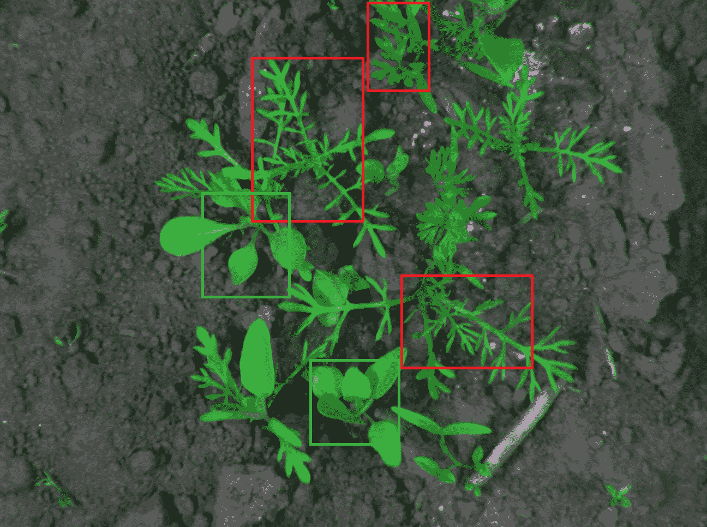
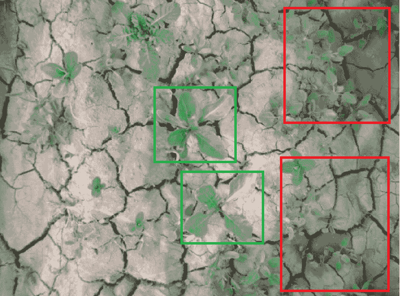
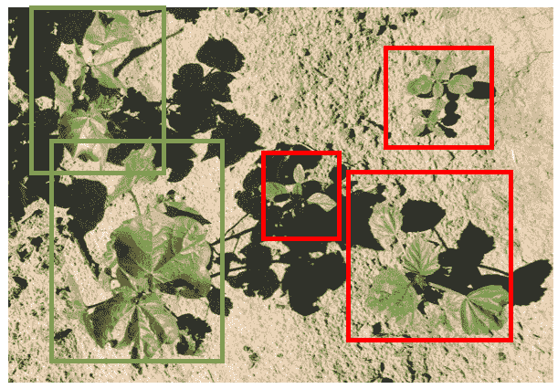
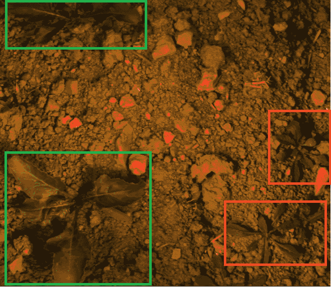
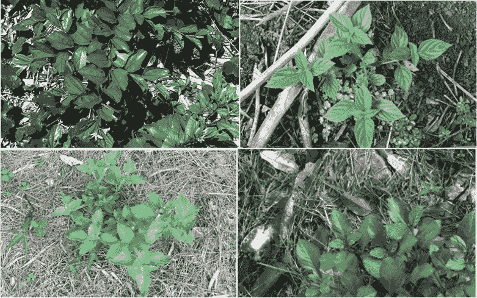
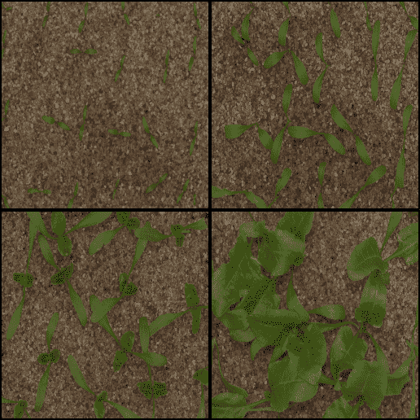
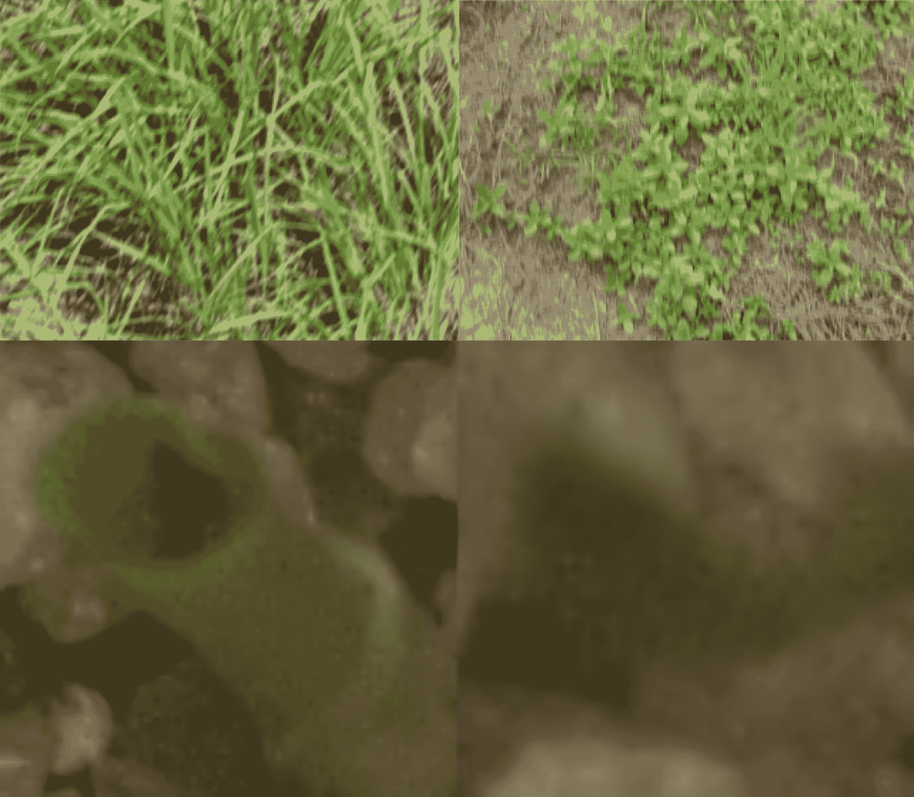
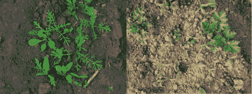
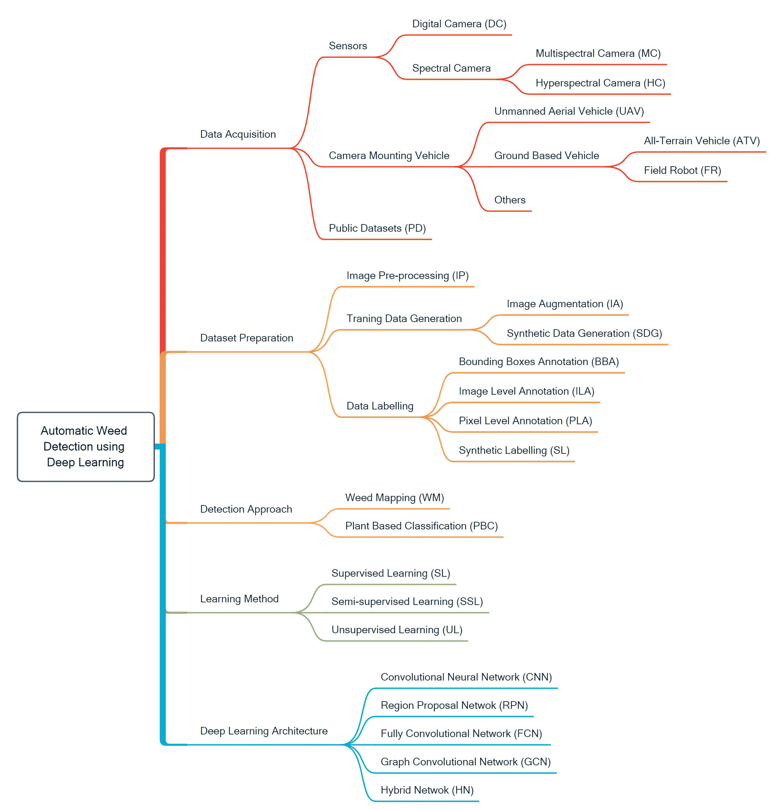

<!--yml

category: 未分类

日期：2024-09-06 19:56:41

-->

# [2103.01415] 深度学习技术在图像中杂草检测的调查

> 来源：[`ar5iv.labs.arxiv.org/html/2103.01415`](https://ar5iv.labs.arxiv.org/html/2103.01415)

\usesmartdiagramlibrary

additions

# 深度学习技术在图像中杂草检测的调查

A S M Mahmudul Hasan¹¹1 通讯作者电子邮件：33916214@student.murdoch.edu.au 信息技术，默多克大学，澳大利亚，WA 6150，默多克，中心作物与食品创新，食品未来研究所，默多克大学，澳大利亚，WA 6150，默多克，Ferdous Sohel 信息技术，默多克大学，澳大利亚，WA 6150，默多克，中心作物与食品创新，食品未来研究所，默多克大学，澳大利亚，WA 6150，默多克，Dean Diepeveen 中心作物与食品创新，食品未来研究所，默多克大学，澳大利亚，WA 6150，默多克，初级产业与区域发展部，西澳大利亚州，南珀斯，WA 6151，澳大利亚，中心可持续农业系统，默多克大学，澳大利亚，WA 6150，默多克，Hamid Laga 信息技术，默多克大学，澳大利亚，WA 6150，默多克，生物安全与一体化健康中心，哈里·巴特勒研究所，默多克大学，澳大利亚，WA 6150，默多克，Michael G.K. Jones 中心作物与食品创新，食品未来研究所，默多克大学，澳大利亚，WA 6150，默多克

###### 摘要

深度学习（DL）技术的快速进步使得从图像或视频中迅速检测、定位和识别对象成为可能。DL 技术现在在许多与农业和种植相关的应用中得到了应用。自动检测和分类杂草可以在杂草管理中发挥重要作用，从而提高产量。由于杂草和作物的颜色（‘绿对绿’）相似，它们的形状和纹理在生长阶段可能非常相似，因此从图像中检测作物中的杂草本质上是一个具有挑战性的问题。此外，一个环境中的作物在另一个环境中可能被视为杂草。除了检测外，识别特定的杂草种类也至关重要，以便能够施加针对性的控制机制（例如，适当的除草剂和正确的剂量）。在本文中，我们回顾了现有的基于深度学习的杂草检测和分类技术。我们涵盖了关于四个主要过程的详细文献，即数据采集、数据集准备、用于检测、定位和分类作物中的杂草的 DL 技术，以及评估指标方法。我们发现大多数研究应用了监督学习技术，通过对任何植物数据集微调预训练模型实现了高分类准确率，并且过去的实验已经在大量标记数据可用时达到了高准确率。

关键词：深度学习，杂草检测，杂草分类，机器学习，数字农业。

## 1 引言

世界人口正在迅速增长，预计到 2050 年将达到 90 亿。为了满足预期需求，农业生产需要增加约 70%[125]。然而，农业部门在此期间将面临许多挑战，包括可耕作土地的减少和对更高生产强度的需求。其他问题，如气候变化和水资源短缺，也将影响生产力。精准农业或数字农业可以提供缓解这些问题的策略[85, 139, 125]。

杂草是能够迅速且不受欢迎地传播的植物，它们可能影响作物的产量和质量[118]。杂草与作物争夺营养、水分、阳光和生长空间[67]。因此，农民必须投入资源以减少杂草。用于减少杂草影响的管理策略取决于许多因素。这些策略可以分为五种主要类型[137]：‘预防性’（防止杂草建立），‘文化性’（通过保持田间卫生——低杂草种子库），‘机械性’（例如，割草、覆盖和耕作），‘生物性’（利用自然敌人如昆虫、放牧动物或疾病），以及‘化学性’（施用除草剂）。这些方法都有其缺点。一般来说，它们带来财务负担，需要时间和额外的工作。此外，控制措施可能影响人类、植物、土壤、动物或环境的健康[112, 137, 59]。

随着劳动力成本的增加，人们对健康和环境问题的关注也在上升，自动化杂草控制变得越来越受到欢迎[99]。自动化杂草控制系统在经济和环境方面都具有好处。这些系统可以通过使用机器去除杂草来减少劳动力成本，并且选择性喷洒技术可以最小化除草剂的使用[87]。

为了开发一个自动化杂草管理系统，首要步骤是能够正确检测和识别杂草[99]。由于杂草和作物植物通常具有相似的颜色、纹理和形状，检测作物中的杂草具有挑战性。图 1 显示了杂草与作物植物共生的场景。检测和分类作物与杂草的常见挑战包括遮挡（图 1(a)）、颜色和纹理的相似性（图 1(b)）、自然光下植物的阴影（图 1(c)）、由于光照条件和光源造成的颜色和纹理变化（图 1(d)）以及外观相似的不同杂草种类（图 1(e)）。相同的作物植物或杂草在不同生长阶段可能会显示出差异（图 1(f)）。图像中的运动模糊和噪声也增加了植物分类的难度（图 1(g)）。此外，根据地理位置（图 1(h)）、作物品种、天气和土壤条件，杂草种类可能会有所不同[70]。

(a) 作物与杂草的遮挡 [54]

(b) 作物和杂草植物之间的颜色和纹理相似性 [12]

(c) 自然杂草图像中的阴影效果 [123]

(d) 光照条件的影响 [33]

(e) 四种具有相似性的不同杂草种类（类别间相似性） [113]

(f) 不同生长阶段的甜菜作物（类别内部变化）[49]

(g) 运动模糊和噪声的影响 [49, 3]

(h) 杂草在不同的地理/天气位置可能有所不同：来自德国（左） [54] 和马其顿（右） [88] 的胡萝卜作物中的杂草

图 1：不同作物中的杂草（绿色框表示作物，红色框表示杂草）。

一个典型的杂草检测系统包括四个关键步骤：图像采集、图像预处理、特征提取以及杂草的检测和分类 [140]。不同的新兴技术已被用于完成这些步骤。这些步骤中最关键的是杂草的检测和分类。近年来，随着计算机技术的进步，特别是在图形处理单元（GPU）方面，结合使用机器学习（ML）技术的嵌入式处理器已被更广泛地用于自动检测杂草种类 [91, 50, 171]。

深度学习（DL）是机器学习（ML）的一个重要分支。在图像分类、物体检测和识别方面，DL 算法相较于传统机器学习方法具有许多优势（在本文中，术语“机器学习”指的是传统机器学习方法）。使用机器学习方法提取和选择辨别特征是困难的，因为作物和杂草可能相似。这个问题可以通过利用 DL 方法的强大特征学习能力有效解决。最近，已经有许多研究文章发表了基于 DL 的杂草识别，但关于这一主题的综述文章却很少。Su [149] 最近发表了一篇综述文章，主要关注使用点谱学、RGB 和高光谱成像来自动分类作物中的杂草。然而，大多数涵盖的文章应用了传统机器学习方法，且对近期论文的引用较少。 [99] 从选择性喷洒的角度分析了多篇关于杂草检测的出版物。

我们提供这份综合文献调查，以突显不同深度学习（DL）技术在检测、定位和分类作物中的杂草方面所展现的巨大潜力。我们展示了用于杂草检测和识别的深度学习技术的分类法，并根据该分类法对主要出版物进行了分类。我们还涵盖了数据收集、数据准备和数据表示方法。我们概述了用于评估本文中调查技术性能的不同评估指标。

论文的其余部分组织如下。现有的综述论文在本节 2 中进行了简要讨论。深度学习方法在杂草检测中的优势与传统机器学习方法的对比在本节 3 中进行了讨论。在本节 4 中，我们描述了如何选择用于综述的论文。关于深度学习的杂草检测技术的分类和概述在本节 5 中提供。我们描述了深度学习方法的四个主要步骤，即数据获取（第六部分）、数据集准备（第七部分）、检测和分类方法（第十部分）以及评估指标（第十一部分）。在第八部分中，我们突出介绍了相关工作中采用的作物植物杂草检测方法。相关研究中应用的学习方法在第九部分中进行了说明。我们在第十二部分中总结了该领域的当前状态并提供了未来方向，结论在第十三部分中提供。

## 2 相关调查

机器学习（ML）和深度学习（DL）技术已被用于杂草检测、识别以及杂草管理。2018 年，[73] 发表了一项综述，回顾了 40 篇应用深度学习技术解决各种农业问题的研究论文，包括杂草检测。研究报告显示，深度学习技术在性能上优于传统的图像处理方法。

2016 年，[106]讨论了十项发展全自动机械除草系统所必需的组成部分和可能的障碍。随着深度学习的进展，这些问题似乎可以得到解决。[6]指出，基于深度学习的植物分类模块不仅可用于除草管理系统，还可用于肥料、灌溉和表型分析。他们的研究解释了“深度机器人技术”系统如何减少农业和园艺中除草控制所需的劳动力。

[165]强调杂草检测技术中最具挑战性的部分是区分杂草和作物品种。他们关注地面杂草检测所使用的不同机器视觉和图像处理技术。[21]发表了类似的观察。他们对杂草制图和地面检测技术进行了回顾。他们还报告了使用光谱特征或空间特征来识别作物中的杂草的局限性。根据他们的研究，最好同时使用这两种特征。

[45]回顾了可用于监测作物中杂草的技术。他们探索了农田中的不同遥感和地面监测系统。他们报告了杂草监测对于杂草管理的重要性。他们预测，使用不同传感器收集的数据可以存储在云系统中，以适时在相关情境中使用。在另一项研究中，[109]评估了用于检测作物中杂草的少数深度学习方法。他们确定了研究的空白，例如缺乏大规模的作物杂草数据集，可接受的分类准确性以及缺乏适用于检测不同作物植物和杂草品种的广义模型。然而，该文章只涵盖了少数几篇论文，因此并不全面，无法充分覆盖文献的广度和深度。

## 传统机器学习与深度学习在杂草检测方法上的区别

典型的基于机器学习的杂草分类技术包括五个关键步骤：图像获取、预处理（如图像增强）、特征提取或特征选择、应用基于机器学习的分类器和性能评估[99，23，17，96]。

不同的图像处理方法已被应用于作物和杂草的分类[167，57，158]。通过提取形状特征，许多研究人员使用判别分析来识别杂草和作物[24, 107]。在其他一些研究中，使用不同的颜色[175，69，52，75]和纹理[13]特征。

在杂草检测和分类中，主要挑战在于杂草和作物可能具有非常相似的颜色或纹理。机器学习方法从可用的训练数据中学习特征[12]。可以理解，对于传统的机器学习方法，数据的多模态组合（例如形状、纹理和颜色，或多个传感器数据的组合）被期望能产生比单一数据模态更优的结果。[80] 认为，仅依靠图像的颜色或纹理特征不足以将小麦与杂草物种*悲伤蓟*区分开来。他们使用了近红外（NIR）图像线索与这些特征结合。[136] 基于灰度共生矩阵（GLCM）提取了八种纹理特征、两种纹理光谱描述符、十三种不同的颜色特征、五种不变矩特征和八种形状特征。他们比较了多种算法的性能，如蚁群算法、模拟退火法和遗传算法，以选择更具判别力的特征。还评估了文化算法、线性判别分析（LDA）、支持向量机（SVM）和随机森林分类器的性能，以区分作物和杂草。

[74] 应用 SVM 从高光谱图像中检测玉米中的杂草。在其他研究中，[166] 使用 SVM 和 LDA 进行植物分类。他们提出了一种自监督的方法用于区分。在训练模型之前，他们应用了植被分离技术去除背景，并使用主成分分析（PCA）进行不同的光谱预处理以提取特征。[68] 提取了不同的形状特征，使用单层感知器分类器评估特征向量，以区分狭叶和宽叶杂草。

`<svg   height="465.68" overflow="visible" version="1.1" width="619.13"><g transform="translate(0,465.68) matrix(1 0 0 -1 0 0) translate(55.72,0) translate(0,373.3)"><g stroke="#000000" fill="#000000"><g stroke-width="0.4pt"><g transform="matrix(1.0 0.0 0.0 1.0 -34.59 1.6)" fill="#000000" stroke="#000000"><foreignobject width="69.19" height="22.56" transform="matrix(1 0 0 -1 0 16.6)" overflow="visible">收集数据</foreignobject></g><g transform="matrix(1.0 0.0 0.0 1.0 87.8 3.34)" fill="#000000" stroke="#000000"><foreignobject width="69.19" height="26.06" transform="matrix(1 0 0 -1 0 16.6)" overflow="visible">使用公共数据</foreignobject></g> <g fill="#FFCCCC"><path d="M 123.61 -47.36 L -12.91 -47.36 C -15.97 -47.36 -18.45 -49.84 -18.45 -52.89 L -18.45 -81.19 C -18.45 -84.25 -15.97 -86.73 -12.91 -86.73 L 123.61 -86.73 C 126.67 -86.73 129.15 -84.25 129.15 -81.19 L 129.15 -52.89 C 129.15 -49.84 126.67 -47.36 123.61 -47.36 Z M -18.45 -86.73"></path></g><g transform="matrix(1.0 0.0 0.0 1.0 -13.84 -70.66)" fill="#000000" stroke="#000000"><foreignobject width="138.37" height="12.15" transform="matrix(1 0 0 -1 0 16.6)" overflow="visible">数据采集</foreignobject></g> <path d="M 17.8 -21.56 L 36.76 -44.52" style="fill:none"><g transform="matrix(0.63672 -0.77109 0.77109 0.63672 36.76 -44.52)"><path d="M 3.32 0 C 1.94 0.28 -0.55 0.83 -2.21 2.08 C -0.83 0.55 -0.83 -0.55 -2.21 -2.08 C -0.55 -0.83 1.94 -0.28 3.32 0 Z" style="stroke:none"></path></g><path d="M 99.41 -22.98 L 77.65 -44.73" style="fill:none"><g transform="matrix(-0.70717 -0.70705 0.70705 -0.70717 77.65 -44.73)"><path d="M 3.32 0 C 1.94 0.28 -0.55 0.83 -2.21 2.08 C -0.83 0.55 -0.83 -0.55 -2.21 -2.08 C -0.55 -0.83 1.94 -0.28 3.32 0 Z" style="stroke:none"></path></g><g fill="#FFCCCC"><path d="M 301.35 -47.36 L 164.83 -47.36 C 161.77 -47.36 159.29 -49.84 159.29 -52.89 L 159.29 -81.19 C 159.29 -84.25 161.77 -86.73 164.83 -86.73 L 301.35 -86.73 C 304.41 -86.73 306.89 -84.25 306.89 -81.19 L 306.89 -52.89 C 306.89 -49.84 304.41 -47.36 301.35 -47.36 Z M 159.29 -86.73"></path></g><g transform="matrix(1.0 0.0 0.0 1.0 163.9 -70.66)" fill="#000000" stroke="#000000"><foreignobject width="138.37" height="12.15" transform="matrix(1 0 0 -1 0 16.6)" overflow="visible">数据集准备</foreignobject></g> <g stroke-width="0.6pt" stroke-dasharray="none" stroke-dashoffset="0.0pt" stroke-linejoin="miter" transform="matrix(1.0 0.0 0.0 1.0 151.17 -67.04)"><path d="M 0 4.05 L 7.01 0 L 0 -4.05 Z" style="fill:none"></path></g><g stroke-width="3.0pt"><path d="M 129.42 -67.04 L 150.71 -67.04" style="fill:none"></path></g><g stroke-width="1.4pt" stroke="#FFFFFF"><path d="M 129.42 -67.04 L 150.71 -67.04" style="fill:none"></path></g><g stroke-width="2.0pt" fill="#FFFFFF" stroke="#FFFFFF" color="#FFFFFF"><path d="M 129.42 -67.04 L 152.79 -67.04" style="fill:none"></path></g><g fill="#CCFFCC"><path d="M 150.16 -134.09 C 150.16 -115.19 125.34 -99.87 94.72 -99.87 C 64.1 -99.87 39.27 -115.19 39.27 -134.09 C 39.27 -152.99 64.1 -168.31 94.72 -168.31 C 125.34 -168.31 150.16 -152.99 150.16 -134.09 Z M 94.72 -134.09"></path></g><g transform="matrix(1.0 0.0 0.0 1.0 60.13 -124.19)" fill="#000000" stroke="#000000"><foreignobject width="69.19" height="39.17" transform="matrix(1 0 0 -1 0 16.6)" overflow="visible">颜色模型转换</foreignobject></g> <g fill="#CCFFCC"><path d="M 164 -214.97 C 164 -200.22 139.18 -188.27 108.56 -188.27 C 77.93 -188.27 53.11 -200.22 53.11 -214.97 C 53.11 -229.72 77.93 -241.67 108.56 -241.67 C 139.18 -241.67 164 -229.72 164 -214.97 Z M 108.56 -214.97"></path></g><g transform="matrix(1.0 0.0 0.0 1.0 73.96 -210.39)" fill="#000000" stroke="#000000"><foreignobject width="69.19" height="28.54" transform="matrix(1 0 0 -1 0 16.6)" overflow="visible">图像缩放</foreignobject></g> <g fill="#CCFFCC"><path d="M 286.39 -214.97 C 286.39 -201.27 261.57 -190.17 230.95 -190.17 C 200.33 -190.17 175.5 -201.27 175.5 -214.97 C 175.5 -228.66 200.33 -239.77 230.95 -239.77 C 261.57 -239.77 286.39 -228.66 286.39 -214.97 Z M 230.95 -214.97"></path></g><g transform="matrix(1.0 0.0 0.0 1.0 196.35 -211.73)" fill="#000000" stroke="#000000"><foreignobject width="69.19" height="25.85" transform="matrix(1 0 0 -1 0 16.6)" overflow="visible">图像增强</foreignobject></g> <g fill="#CCFFCC"><path d="M 426.9 -134.09 C 426.9 -119.34 402.08 -107.39 371.46 -107.39 C 340.84 -107.39 316.02 -119.34 316.02 -134.09 C 316.02 -148.83 340.84 -160.79 371

图 2：基于深度学习的杂草检测技术的工作流程总结。

传统的机器学习技术需要大量的领域专业知识来从原始数据中构建特征提取器。另一方面，深度学习方法使用表示学习的方法，机器可以自动从原始数据中发现用于分类或物体检测问题的区分特征[91]。机器可以直接从图像、文本和声音中学习进行分类[120]。自动提取最适合任务的特征的能力也被称为特征学习。由于深度学习是一个层次化的学习架构，因此层次较高的特征由层次较低的特征组成[110, 58]。

深度学习中有几种流行且高效的网络架构。两个常用的架构是卷积神经网络（CNNs）和递归神经网络（RNNs）[91, 60]。虽然 CNNs 也用于其他类型的数据，但 CNNs 最广泛的应用是分析和分类图像。卷积这个词指的是过滤过程。卷积层的堆叠是 CNN 的基础。每一层接收输入数据，进行变换或卷积，并输出到下一层。这种卷积操作最终简化了数据，使其能够更好地处理和理解。RNNs 具有内置的反馈循环，使它们可以作为预测引擎。前馈网络或 CNN 接收固定大小的输入并产生固定大小的输出。前馈网络的信号流是单向的，即从输入到输出。它们甚至无法捕捉序列或时间序列信息。RNNs 克服了这一限制。在 RNN 中，网络的当前输入和输出受到先前输入的影响。长短期记忆（LSTM）是一种 RNN[91]，它具有记忆单元来记住重要的先前信息，从而可以帮助提高性能。根据网络架构，深度学习有多个组件，如卷积层、池化层、激活函数、全连接层、编码器/解码器方案、记忆单元、门控等[120]。

对于图像分类、目标检测和定位，深度学习算法相比传统机器学习方法有很多优势。由于强大的特征学习能力，深度学习方法可以有效提取作物和杂草的辨别特征。此外，随着数据量的增加，传统机器学习方法的性能已经趋于饱和。使用大数据集时，深度学习技术相比传统机器学习技术表现出更优的性能[5]。这一特性导致了深度学习方法应用的增加。许多在 10 节中的研究报告展示了深度学习与其他机器学习方法在作物杂草检测方面的比较。图 2 概述了基于深度学习的杂草检测和识别技术。

图 2 中概述的所有步骤并不需要在每种方法中都出现。该过程遵循四个主要步骤：数据采集、数据集准备/图像预处理、分类和评估。在本文中，我们描述了在不同研究工作中使用的步骤，以便利用深度学习技术区分杂草和作物。

## 4 本调查中的论文选择标准

为了概述研究状态，我们进行了全面的文献综述。该过程包括两个主要步骤：（i）搜索和选择相关研究，以及（ii）对这些研究的详细分析。主要研究问题是：深度学习技术在检测、定位和分类作物中的杂草方面的作用是什么？为了收集与这一研究问题相关的工作，我们在 Google Scholar、Web of Science、IEEE Xplore、Scopus、ScienceDirect、多学科数字出版研究所（MDPI）、Springer 和 Murdoch 大学图书馆数据库中应用了基于关键词的搜索，以查找期刊文章和会议论文。我们从 2010 年到 2020 年 8 月 30 日进行了关键词搜索。表 1 显示了搜索查询的结果数量。

表 1：指定查询的文献数量

| No. | 学术研究数据库 | 搜索查询 | 检索到的文献数量 |
| --- | --- | --- | --- |
| 1. | Google Scholar | [“杂草检测” OR “杂草管理” OR “杂草分类”] AND [“深度学习” OR “深度机器学习” OR “深度神经网络”] | 998 |
| 2. | Web of Science | (杂草检测 OR 杂草管理 OR 杂草分类) AND (深度学习 OR 深度机器学习 OR 深度神经网络) | 124 |
| 3. | IEEE Xplore | （（（“所有元数据”:“深度学习”） OR “所有元数据”:“深度机器学习”） OR “所有元数据”:“深度神经网络”） AND 杂草检测 | 22 |
| 4. | ScienceDirect | （“杂草检测” OR “杂草管理” OR “杂草分类”） AND （“深度学习” OR “深度机器学习” OR “深度神经网络”） | 87 |
| 5. | Scopus | （（杂草 AND 检测） OR （杂草 AND 管理） OR （杂草 AND 分类）） AND （（深度 AND 学习） OR （深度 AND 机器 AND 学习） OR （深度 AND 神经 AND 网络）） | 118 |
| 6. | MDPI | （“杂草检测” OR “杂草管理” OR “杂草分类”） AND （“深度学习” OR “深度机器学习” OR “深度神经网络”） | 76 |
| 7. | SpringerLink | （“杂草检测” OR “杂草管理” OR “杂草分类”） AND （“深度学习” OR “深度机器学习” OR “深度神经网络”） | 46 |
| 8. | Murdoch University Library | （“杂草检测” OR “杂草管理” OR “杂草分类”） AND （“深度学习” OR “深度机器学习” OR “深度神经网络”） | 179 |

在搜索了上述数据库后，重复的文献被移除：这样得到了 988 篇文献。我们进一步确定并统计了使用深度学习（DL）方法的文献。在图 3 中，我们展示了 2010 年到 2020 年 8 月 30 日之间使用深度学习的论文总数。这显示在 2016 年之前，该领域的出版物数量非常少，但从 2016 年开始，论文数量呈上升趋势。因此，本调查中使用了 2016 年及之后发表的文章。

<svg   height="208.1" overflow="visible" version="1.1" width="467.38"><g transform="translate(0,208.1) matrix(1 0 0 -1 0 0) translate(49.37,0) translate(0,24.32) matrix(1.0 0.0 0.0 1.0 -49.37 -24.32)" fill="#000000" stroke="#000000" stroke-width="0.4pt"><g transform="matrix(1 0 0 1 0 0) translate(84.18,0) translate(0,24.32)" fill="#000000" stroke="#000000" stroke-width="0.4pt"><g transform="matrix(1.0 0.0 0.0 1.0 -13.84 -19.71)" fill="#000000" stroke="#000000"><foreignobject width="27.67" height="8.92" transform="matrix(1 0 0 -1 0 16.6)" overflow="visible">2010</foreignobject></g><g transform="matrix(1.0 0.0 0.0 1.0 20.97 -19.71)" fill="#000000" stroke="#000000"><foreignobject width="27.67" height="8.92" transform="matrix(1 0 0 -1 0 16.6)" overflow="visible">2011</foreignobject></g><g transform="matrix(1.0 0.0 0.0 1.0 55.78 -19.71)" fill="#000000" stroke="#000000"><foreignobject width="27.67" height="8.92" transform="matrix(1 0 0 -1 0 16.6)" overflow="visible">2012</foreignobject></g><g transform="matrix(1.0 0.0 0.0 1.0 90.6 -19.71)" fill="#000000" stroke="#000000"><foreignobject width="27.67" height="8.92" transform="matrix(1 0 0 -1 0 16.6)" overflow="visible">2013</foreignobject></g><g transform="matrix(1.0 0.0 0.0 1.0 125.41 -19.71)" fill="#000000" stroke="#000000"><foreignobject width="27.67" height="8.92" transform="matrix(1 0 0 -1 0 16.6)" overflow="visible">2014</foreignobject></g><g transform="matrix(1.0 0.0 0.0 1.0 160.22 -19.71)" fill="#000000" stroke="#000000"><foreignobject width="27.67" height="8.92" transform="matrix(1 0 0 -1 0 16.6)" overflow="visible">2015</foreignobject></g><g transform="matrix(1.0 0.0 0.0 1.0 195.03 -19.71)" fill="#000000" stroke="#000000"><foreignobject width="27.67" height="8.92" transform="matrix(1 0 0 -1 0 16.6)" overflow="visible">2016</foreignobject></g><g transform="matrix(1.0 0.0 0.0 1.0 229.84 -19.71)" fill="#000000" stroke="#000000"><foreignobject width="27.67" height="8.92" transform="matrix(1 0 0 -1 0 16.6)" overflow="visible">2017</foreignobject></g><g transform="matrix(1.0 0.0 0.0 1.0 264.65 -19.71)" fill="#000000" stroke="#000000"><foreignobject width="27.67" height="8.92" transform="matrix(1 0 0 -1 0 16.6)" overflow="visible">2018</foreignobject></g><g transform="matrix(1.0 0.0 0.0 1.0 299.46 -19.71)" fill="#000000" stroke="#000000"><foreignobject width="27.67" height="8.92" transform="matrix(1 0 0 -1 0 16.6)" overflow="visible">2019</foreignobject></g><g transform="matrix(1.0 0.0 0.0 1.0 334.27 -19.71)" fill="#000000" stroke="#000000"><foreignobject width="27.67" height="8.92" transform="matrix(1 0 0 -1 0 16.6)" overflow="visible">2020</foreignobject></g><g transform="matrix(1.0 0.0 0.0 1.0 -46.62 -4.46)" fill="#000000" stroke="#000000"><foreignobject width="6.92" height="8.92" transform="matrix(1 0 0 -1 0 16.6)" overflow="visible">$0$</foreignobject></g><g transform="matrix(1.0 0.0 0.0 1.0 -60.46 44.36)" fill="#000000" stroke="#000000"><foreignobject width="20.76" height="8.92" transform="matrix(1 0 0 -1 0 16.6)" overflow="visible">$100$</foreignobject></g><g transform="matrix(1.0 0.0 0.0 1.0 -60.46 93.17)" fill="#000000" stroke="#000000"><foreignobject width="20.76" height="8.92" transform="matrix(1 0 0 -1 0 16.6)" overflow="visible">$200$</foreignobject></g><g transform="matrix(1.0 0.0 0.0 1.0 -60.46 141.99)" fill="#000000" stroke="#000000"><foreignobject width="20.76" height="8.92" transform="matrix(1 0 0 -1 0 16.6)" overflow="visible">$300$</foreignobject></g><g transform="matrix(1.0 0.0 0.0 1.0 -14.21 10.26)" fill="#0000FF" stroke="#0000FF" color="#0000FF"><foreignobject width="13.84" height="8.92" transform="matrix(1 0 0 -1 0 16.6)" overflow="visible">$11$</foreignobject></g><g transform="matrix(1.0 0.0 0.0 1.0 24.06 6.35)" fill="#0000FF" stroke="#0000FF" color="#0000FF"><foreignobject width="6.92" height="8.92" transform="matrix(1 0 0 -1 0 16.6)" overflow="visible">$3$</foreignobject></g><g transform="matrix(1.0 0.0 0.0 1.0 58.87 6.84)" fill="#0000FF" stroke="#0000FF" color="#0000FF"><foreignobject width="6.92" height="8.92" transform="matrix(1 0 0 -1 0 16.6)" overflow="visible">$4$</foreignobject></g><g transform="matrix(1.0 0.0 0.0 1.0 93.68 8.79)" fill="#0000FF" stroke="#0000FF" color="#0000FF"><foreignobject width="6.92" height="8.92" transform="matrix(1 0 0 -1 0 16.6)" overflow="visible">$8$</foreignobject></g><g transform="matrix(1.0 0.0 0.0 1.0 125.04 10.75)" fill="#0000FF" stroke="#0000FF" color="#0000FF"><foreignobject width="13.84" height="8.92" transform="matrix(1 0 0 -1 0 16.6)" overflow="visible">$12$</foreignobject></g><g transform="matrix(1.0 0.0 0.0 1.0 159.85 11.23)" fill="#0000FF" stroke="#0000FF" color="#0000FF"><foreignobject width="13.84" height="8.92" transform="matrix(1 0 0 -1 0 16.6)" overflow="visible">$13$</foreignobject></g><g transform="matrix(1.0 0.0 0.0 1.0 194.66 27.83)" fill="#0000FF" stroke="#0000FF" color="#0000FF"><foreignobject width="13.84" height="8.92" transform="matrix(1 0 0 -1 0 16.6)" overflow="visible">$47$</foreignobject></g><g transform

图 3：2010 年至 2020 年 8 月 30 日关于深度学习基础的杂草检测方法的所选出版物数量

## 5 深度学习基础的杂草检测方法概述及分类

深度学习基础的杂草检测技术的整体分类见图 4。本文综述中涉及的论文按照此分类法进行分类，并列在表格 LABEL:tab:different_DL_approach 中。

图 4：深度学习基础的杂草检测技术的整体分类

相关文献已经基于图 4 中的分类法进行了分析。此处重点介绍了数据获取过程、传感器和安装车辆。此外，还概述了数据集准备方法，即图像预处理、数据生成和注释。在分析这些出版物时发现，相关工作要么为目标地点生成杂草地图，要么对每种植物（作物/杂草）进行分类。在开发分类器时，研究人员应用了监督学习、无监督学习或半监督学习方法。根据学习方法和研究目标，使用了不同的深度学习架构。相关研究的概述见表格 LABEL:tab:different_DL_approach。该表显示了用于实验的作物和杂草种类、收集和准备数据集的步骤以及研究中应用的深度学习方法。

表 2：不同深度学习方法在杂草检测中的概述

|  |  |  |  |  |
| --- | --- | --- | --- | --- |
| 参考文献 | 作物 | 杂草种类 | 应用的 DL 架构 | 执行的操作（基于图 4） |
| --- | --- | --- | --- | --- |
| [40] | 西红柿、棉花 | 黑夜 shade、天鹅绒叶 | 修改版 Xception、Inception-ResNet、VGGNet、MobileNet、DenseNet | DC；(IP, IA, ILA)；PBC |
| [164] | 甜菜、油菜 | 未指定 | FCN | (DC, FR)；(IP, IA, ILA)；PBC |
| [89] | 油菜、玉米、萝卜 | 未指定 | 带轮廓掩膜和系数 k (k-FLBPCM) 的滤波局部二值模式、VGG-16、VGG-19、ResNet-50、Inception-v3 | (ATV, MC)；(IP, IA, ILA)；PBC |
| [61] | 未指定 | 中国苹果、兰塔那、帕金森树、帕尔滕草、刺槐、橡胶藤、暹罗草、蛇草 | Inception-v3、ResNet-50、DenseNet-202、Inception-ResNet-v2、GCN | PD；IP；PBC |
| [161] | 胡萝卜 | 未指定 | SegNet-512, SegNet-256 | PD; IA; PBC |
| [65] | 水稻 | 狗尾草、稗草、马唐、雀稗 | FCN | (DC, UAV); (IP, PLA); WM |
| [47] | 甜菜 | 牵牛花 | YOLO-v3, tiny YOLO-v3 | DC; (IA, BBA); PBC |
| [146] | 大豆 | 水藜、苋科、田间蕹菜、马唐、狗尾草 | Single-Shot Detector (SSD), Faster R-CNN | (DC, UAV); (IP, IA, BBA); WM |
| [71] | 玉米、生菜、萝卜 | 刺毛蓟、苋属、蓝草、莎草、其他未指定杂草 | GCN | PD; (IP, ILA); PBC |
| [18] | 甜菜、胡萝卜、洋葱 | 未指定 | SegNet | PD; PLA; PBC |
| [168] | 水稻田 | 水莲、秋水仙、鼓油菜、三叶箭、稗草、马唐 | AlexNet | DC; ILA; PBC |
| [172] | 小麦 | 刺毛蓟、风毛菊、旋覆花、马唐、稗草 | YOLO-v3, Tiny YOLO-v3 | (DC, UAV); (IP, PLA); PBC |
| [102] | 甜菜 | 双子叶杂草、禾本科杂草 | FCN | MC; (IP, PLA); PBC |
| [159] | 未指定 | “植物幼苗数据集”12 种、“CNU 杂草数据集”21 种 | NASNet, ResNet, Inception–ResNet, MobileNet, VGGNet | DC; ILA, PD |
| [119] | 未指定 | 无香菊、鸭跖草、老鹳草、牧草繁缕、贪夜蛾、婆罗门参、麻疯树、蛇草 | Mask R-CNN | PD; PLA; PBC |
| [127] | 甜菜 | 未指定 | DeepLab-v3, SegNet, U-Net | (MC, UAV); (IP, PLA) |
| [114] | 生菜 | 未指定 | YOLO-v3, Mask R-CNN, SVM | (MC, UAV); (IP, PLA) |
| [86] | 草地 | 钝叶酸模草 | VGG-16 | (DC, UAV); (IP, PLA) |
| [142] | 草莓、番茄 | 鹅草 | Tiny YOLO-v3 | DC; (IP, BBA) |
| [122] | 未指定 | 秋水仙素 | U-Net | (DC, UAV); (IP, IA, BBA) |
| [31] | 胡萝卜 | 未指定 | Faster YOLO-v3, tiny YOLO-v3 | (DC, FR); ILA; PBC |
| [117] | 蓝莓 | 未指定 | Faster R-CNN, YOLO-v3, ResNet-50, ResNet-101, Darknet-53 | (DC, ATV); (IP, ILA); PBC |
| [116] | 辣椒 | 马齿苋类杂草 | Tiny YOLO-v3, YOLO-v3 | (DC, ATV); (IP, BBA); PBC |
| [113] | 未指定 | 中华苹果、马缨丹、洋木芙蓉、羽叶合欢、刺槐、胶乳藤、大飞蓬、玉米、甜菜、普通小麦、黑草、柔滑假禾 | Inception-v3, ResNet-50 | (DC, FR); (IP, ILA); PBC |
| [82] | 三叶草、草类 | 阔叶酸模草 | AlexNet, VGG-F, VGG-VD-16, Inception-v1, ResNet-50, ResNet-101 | (DC, FR); PLA; PBC |
| [128] | 沙拉菜 | 未指定 | 散射变换、局部二值模式（LBP）、GLCM、Gabor 滤波器、CNN | （DC，FR）；（IP，SDG，BBA）；PBC |
| [138] | 菊花 | 无香臭蔷薇、狗牙根 | SVM、人工神经网络（ANN）、CNN | DC；（IP，IA，ILA）；PBC |
| [104] | 水稻 | 三叶箭 | SegNet、FCN、U-Net | DC；（IP，BBA）；PBC |
| [9] | 油菜 | 未指定 | U-Net、SegNet | （DC，ATV）；（IP，IA，PLA）；PBC |
| [171] | 百慕大草 | 水蓼属、长蕊青枯草、黄檗草 | VGGNet、GoogLeNet、DetectNet | DC；（IP，ILA）；PBC |
| [1] | 油料作物 | 未指定 | FCN | DC；（IA，PLA）；WM |
| [170] | 常年生黑麦草 | 蒲公英、地钱、斑点麻疯树 | AlexNet、VGGNet、GoogLeNet、DetectNet | DC；（IP，ILA）；PBC |
| [97] | 未指定 | 未指定 | CNN、方向梯度直方图（HoG）、LBP | （DC，UAV）；（IP，ILA）；PBC |
| [141] | 草莓 | 卡罗莱纳天竺葵 | VGGNet、GoogLeNet、DetectNet | DC；（IP，BBA）；PBC |
| [44] | 向日葵、胡萝卜、甜菜 | 未指定 | SegNet、U-Net、BonNet、FCN8 | （DC，FR，PD）；PLA；PBC |
| [162] | 草地 | 大黄 | AlexNet | （DC，UAV）；（IP，BBA）；PBC |
| [29] | 甜菜、花椰菜、卷心菜、草莓 | 未指定 | 混合网络 | （DC，ATV）；（IP，IA，PLA）；PBC |
| [20] | 胡萝卜 | 未指定 | U-Net | PD；（IA，PLA）；PBC |
| [16] | 玉米、普通小麦、甜菜 | 无香臭母草、普通雀麦、荠菜、粘附草、红舌草、芥菜、肥白菜、小花苍耳、田园堇、黑草、松散丝状草 | ResNet-101 | PD，（IP，IA，BBA）；PBC |
| [72] | 棉花 | 未指定 | Faster R-CNN | DC，（IP，BBA）；PBC |
| [2] | 稻田 | 野生小米 | ESNet、U-Net、FCN-8s、DeepLab-v3、Faster R-CNN、EDNet | DC；（IP，IA，PLA）；PBC |
| [43] | 甜菜 | Alli、hyme、hyac、azol、其他未指定杂草 | CNN、FCN、LBP、基于超像素的 LBP、FCN-SPLBP | HC；（IP，PLA）；PBC |
| [79] | 胡萝卜 | 未指定 | CNN | DC；（IP，PLA）；PBC |
| [35] | 大豆 | 草、阔叶杂草、中华苹果、藤黄、帕金森树、帕特尼草、刺槐、橡胶藤、暹罗草、蛇麻草 | 联合无监督学习（JULE）、DeepCluster | PD；PBC |
| [132] | 未指定 | Gamba 草 | U-Net | SI；（IP，PLA） |
| [147] | 苜蓿 | 草 | FCN-8s | DC，（IP，PLA）；PBC |
| [173] | 牧草 | 未指定 | CNN、SVM | （DC，ATV）；（IP，IA，ILA）；PBC |
| [81] | 草原 | 广叶大黄 | AlexNet、VGG-F、GoogLeNet | （DC，FR）；BBA；PBC |
| [64] | 水稻 | 未指定 | FCN、SVM | （DC，UAV）；BBA；WM |
| [157] | 未指定 | 普通田间速生草、田间堇菜、常见凤仙花、蓼、细草（年度草、细丝草）、黑麦草、麻疯草、雀草、常见痢疾草、无香菊、谷物、十字花科、玉米、蓼科、燕麦（志愿者）、千屈菜、荨麻、罂粟 | Inception-v3 | DC; (IP, ILA); PBC |
| [160] | 胡萝卜 | 未指定 | GoogleNet | PD, (IA, BBA); PBC |
| [151] | 甜菜 | 志愿者土豆 | AlexNet, VGG-19, GoogLeNet, ResNet-50, ResNet-101, Inception-v3 | (DC, ATV); (IP, IA, ILA); PBC |
| [41] | 未指定 | Hyme、Alli、Azol、Hyac | CNN | HC, (IP, IA, BBA); PBC |
| [11] | 菠菜、豆类 | 未指定 | ResNet-18 | (DC, UAV); (IP, IA, BBA); WM |
| [42] | 未指定 | Hyme、Alli、Azol、Hyac | CNN, HoG | HC, (IP, ILA); PBC |
| [103] | 甜菜 | 未指定 | FCN | (MC, FR); (IP, PLA); PBC |
| [135] | 甜菜 | 细叶菊、红缨草、蓼属植物、蓼科植物、禾本科植物（狗牙根、早熟禾等）、旋花科植物、星星草、蒲公英 | SegNet | (MC, UAV); PLA; WM |
| [63] | 水稻 | 未指定 | CNN, FCN | (DC, UAV); (IP, PLA); WM |
| [62] | 水稻 | 未指定 | FCN-8s, FCN-4s, DeepLab | (DC, UAV) (IP, PLA); WM |
| [26] | 玉米、普通小麦、甜菜 | 无香菊、常见凤仙花、雀草、荨麻、红脐、芥菜、肥儿草、小花千屈菜、田间堇菜、黑麦草、细丝草 | AlexNet, VGGNet, 混合网络 | PD; PBC |
| [111] | 玉米、普通小麦、甜菜 | 无香菊、常见凤仙花、雀草、荨麻、红脐、芥菜、肥儿草、小花千屈菜、田间堇菜、黑麦草、细丝草 | KNN, SVM, CNN | PD; (IP, BBA); PBC |
| [134] | 甜菜 | 未指定 | SegNet | (MC, UAV), (IP, BBA), WM |
| [7] | 玉米 | 未指定 | LeNET, AlexNet, cNET, sNET | DC; (IP, IA, PLA); PBC |
| [37] | 冬小麦 | 未指定 | FCN | (DC, ATV); (IP, BBA); PBC |
| [34] | 大豆 | 草本、阔叶杂草 | AlexNet, SVM, Adaboost – C4.5, 随机森林 | (DC, UAV); (IP, ILA); PBC |
| [155] | 大豆 | 头状植物、狗尾草、贯叶藤 | 反向传播神经网络、SVM、CNN | DC; (IP, ILA); PBC |
| [108] | 甜菜 | 未指定 | CNN | (DC, UAV); (IP, PLA); PBC |
| [121] | 草坪草 | 未指定 | CNN | (DC, FR); (IP, SDG, BBA); PBC |
| [33] | 甜菜 | 菊苣、荨麻 | SegNet | SDG, PBC |
| [38] | 烟草、发菜、荨麻、罂粟、矢车菊、小麦、玉米、甜菜、卷心菜、大麦 | 口袋草、洋甘菊、蓼科、天竺葵、雀麦、波斯菊、脂麻、狭叶草、田野堇菜、阔叶草、一年生荨麻、黑夜 shade | CNN | PD；（IP，IA）；PBC |

## 6 数据采集

基于深度学习的杂草检测和分类技术需要足够数量的标记数据。不同的数据模态通过安装在各种平台上的不同类型的传感器进行收集。以下我们讨论了流行的杂草数据采集方式。

### 6.1 传感器和相机安装车辆

#### 6.1.1 无人机（UAVs）

无人机（UAV）常用于农业研究中的数据采集。通常，无人机通过收集 RGB 图像[65、63、64、122]或多光谱图像[135、134、119、114、127]，用于绘制田间杂草密度图。此外，无人机还可以通过收集 RGB（红色、绿色和蓝色）图像[11]来识别作物行和绘制作物行内的杂草分布。[162]使用一架小型四旋翼无人机记录草地上的图像，以检测阔叶蓟（Rumex obtusifolius）。由于无人机在一定高度飞越田地，因此它们捕捉的图像覆盖了较大的区域。一些研究将图像分割成较小的块，并利用这些块来区分杂草和作物植物[108、34、146]。然而，飞行高度可以保持在较低高度，例如 2 米，以便将每个植物标记为杂草或作物[172、114]。[97]通过保持 2.5 米的高度使用无人机收集图像数据。[62]使用前后重叠和侧面重叠的序列收集了 3000$\times$4000 像素分辨率的图像，以覆盖整个田地。[86]用 RGB 相机在三种不同的高度（10、15 和 20 米）飞行 DJI Phantom 3 和 4 Pro 无人机，以确定杂草检测的最佳高度。

#### 6.1.2 田间机器人（FRs）

各种类型的田间机器人也可以用来收集图像。机器人车辆可以携带一个或多个相机。如前所述，机器人车辆通过安装的数字相机来收集 RGB 图像 [31, 113, 82, 128, 44]。内置相机的手机也被用于这种数据收集。例如，一部 iPhone 6 被用于通过将其安装在机器人漫游车上来收集视频数据 [121]。一种名为“BoniRob”的机器人平台被用于从田间收集多光谱图像 [103, 102]。[81] 使用了三台单色相机安装在机器人上拍摄图像。他们认为，在大多数情况下，杂草和作物都是绿色的，因此无需使用颜色特征来区分它们。

#### 6.1.3 全地形车辆（ATV）

为了从田间收集图像，也使用了全地形车辆。ATV 可以安装不同类型的相机 [37, 173, 9, 117, 29]。[89] 结合了多光谱和空间传感器来捕捉数据。甚至有多个低分辨率的网络摄像头被安装在 ATV 上 [116]。为了在特定高度下维持外部光照条件和照明，定制的移动平台被用于携带相机以捕捉 RGB 图像 [151, 147]。当无法使用任何车辆在特定高度下收集图像时，可以使用三脚架作为替代 [1]。

#### 6.1.4 在不安装相机设备的情况下收集数据

在一些情况下，杂草数据是通过未安装在车辆上的相机收集的。因此，视频数据是使用手持相机收集的 [171, 138, 104, 170, 157, 155, 40, 47, 2, 79, 168, 72, 142]。[141] 通过保持离土壤表面一定高度（130 cm）来收集数据。Brimrose VA210 滤光器和 JAI BM-141 相机用于在不使用任何平台的情况下收集杂草和作物的高光谱图像 [41, 43, 42]。[7] 手动对焦相机于目标植物，以便捕捉到包括这些植物所有特征的图像。在 [159] 中，他们将相机对准杂草的多个部分，例如花朵、叶子、果实或完整的杂草结构。

### 6.2 卫星影像

[132] 使用了 Pleiades-HR 1A 以获取感兴趣区域的高分辨率四波段（RGB+NIR）影像。他们利用了高分辨率卫星图像，并应用了遮罩以指示杂草的存在。

### 6.3 公共数据集

有几个公开的作物和杂草数据集可以用于训练深度学习模型。[28] 开发了一个包含甜菜作物中杂草的数据集。另一个标注的数据集，包含从田间收集的作物和杂草的图像，由 [54] 提供。[150] 开发了一个包含 7853 个标注的作物和杂草图像的数据集，其中包括 1118 张图像，涵盖了六种食品作物和八种杂草物种。[95] 开发了一个包含 7,590 张 RGB 图像的数据集，其中包括 315,038 个植物对象，代表 47 个不同物种的 64,292 株植物。这些数据是在丹麦收集的，并且已开放供进一步使用。有关杂草检测和植物分类的公开数据集的汇总列在表格 3 中。

我们在表格 3 中列出了十九个该领域可用的数据集，研究人员可以使用这些数据集。在这些数据集中，研究人员需要向“多年生黑麦草和杂草”、“CNU 杂草数据集”和“甜菜和刺篱草”数据集的拥有者申请数据。其他数据集可以直接在线下载。大多数数据集包含来自不同地区的食品作物和杂草的 RGB 图像。这些 RGB 数据通常使用高分辨率数字相机收集。然而，[157] 使用了一台点灰工业相机。在收集“DeepWeeds”数据集的过程中，研究人员将“Fujinon CF25HA-1”镜头添加到他们的“FLIR Blackfly 23S6C”相机上，并将相机安装在一个杂草控制机器人（“AutoWeed”）上。[28] 和 [55] 使用了“Bonirob”（一款自主田间机器人）来安装多光谱相机。“Carrots 2017”和“Onions 2017”数据集也是使用多光谱相机，即“Teledyne DALSA Genie Nano”获得的。这些研究人员使用了一辆手动推车来运输相机。“CNU 杂草数据集”包含了从韩国农场和田间收集的 208,477 张杂草图像，是数据集中数量最多的。虽然该数据集存在类别不平衡的问题，但它包含了来自五个科的二十一种杂草。[147] 开发了一个红三叶草、白三叶草及其他相关杂草的数据集。该数据集包含 31,600 个未标注的数据以及 8000 个合成数据。他们的目标是使用无监督或自监督方法生成数据的标签。所有其他数据集都使用图像级、像素级或边界框标注技术进行手动标注。

表 3：公开可用的作物和杂草数据集列表

| 数据集和参考 | 作物类型/数量 | 杂草物种类型/数量 | 数据类型 | 传感器和安装车辆 | 图像数量 | 数据注释 | 数据位置 | 类别不平衡？ | 来源 |
| --- | --- | --- | --- | --- | --- | --- | --- | --- | --- |
| Crop/Weed Field 图像数据集 [55] | 胡萝卜 | 未指定 | 多光谱图像 | MC 和 FR | 60 | PLA | 德国 | 是 | [`github.com/cwfid/dataset`](https://github.com/cwfid/dataset) |
| 食用作物和杂草数据集 [150] | 六种作物 | 八种杂草物种 | RGB | DC | 1118 | BBA | 拉脱维亚 | 是 | [`www.ncbi.nlm.nih.gov/pmc/articles/PMC7305380/`](https://www.ncbi.nlm.nih.gov/pmc/articles/PMC7305380/) |
| DeepWeeds [113] | 未指定 | 八种杂草物种 | RGB | DC 和 FR | 17,509 | ILA | 澳大利亚 | 否 | [`github.com/AlexOlsen/DeepWeeds`](https://github.com/AlexOlsen/DeepWeeds) |
| 早期作物杂草数据集 [40] | 番茄、棉花 | 黑夜影、丝绸叶 | RGB | 508 | DC | ILA | 希腊 | 是 | [`github.com/AUAgroup/early-crop-weed`](https://github.com/AUAgroup/early-crop-weed) |
| 多年生黑麦草和杂草 [170] | 多年生黑麦草 | 蒲公英、地锦草和斑点雀稗 | RGB | DC | 33086 | ILA | 美国 | 否 | [`www.frontiersin.org/articles/10.3389/fpls.2019.01422/full`](https://www.frontiersin.org/articles/10.3389/fpls.2019.01422/full) |
| 大豆和杂草数据集 [34] | 大豆 | 草类和阔叶杂草 | RGB | DC 和 UAV | 400 | ILA | 巴西 | 是 | [`www.kaggle.com/fpeccia/weed-detection-in-soybean-crops`](https://www.kaggle.com/fpeccia/weed-detection-in-soybean-crops) |
| 开放植物表型数据库 [95] | 未指定 | 46 种最常见的单子叶植物（草类）和双子叶植物（阔叶植物）杂草 | RGB | DC | 7,590 | BBA | 丹麦 | 否 | [`gitlab.au.dk/AUENG-Vision/OPPD`](https://gitlab.au.dk/AUENG-Vision/OPPD) |
| 糖用甜菜和篱笆马唐数据集 [47] | 糖用甜菜 | 篱笆马唐（Convolvulus sepium） | RGB | DC | 652 | BBA | 比利时 | 是 | [`plantmethods.biomedcentral.com/articles/10.1186/s13007-020-00570-z`](https://plantmethods.biomedcentral.com/articles/10.1186/s13007-020-00570-z) |
| 糖用甜菜田数据集 [28] | 糖用甜菜 | 未指定 | 多光谱图像 | MC 和 FR | 12340 | PLA | 德国 | 否 | [`www.ipb.uni-bonn.de/2018/10/`](https://www.ipb.uni-bonn.de/2018/10/) |
| UAV Sugarbeets 2015-16 数据集 [27] | 糖用甜菜 | 未指定 | RGB | DC 和 UAV | 675 | PLA | 瑞士 | 否 | [`www.ipb.uni-bonn.de/data/uav-sugarbeets-2015-16/`](https://www.ipb.uni-bonn.de/data/uav-sugarbeets-2015-16/) |
| 玉米、生菜和杂草数据集 [71] | 玉米和生菜 | 蒲公英、陈腐酸草、蓝草和莎草 | RGB | DC | 6800 | ILA | 中国 | 否 | [`github.com/zhangchuanyin/weed-datasets`](https://github.com/zhangchuanyin/weed-datasets) |
| 胡萝卜-杂草数据集 [88] | 胡萝卜 | 未指定 | RGB | DC | 39 | PLA | 北马其顿共和国 | 是 | [`github.com/lameski/rgbweeddetection`](https://github.com/lameski/rgbweeddetection) |
| Bccr-segset 数据集 [90] | 油菜、玉米、萝卜 | 未指定 | RGB | DC | 30,000 | ILA | 澳大利亚 | 否 | [`academic.oup.com/gigascience/article/9/3/giaa017/5780256#200419497`](https://academic.oup.com/gigascience/article/9/3/giaa017/5780256#200419497) |
| 胡萝卜 2017 数据集 [18] | 胡萝卜 | 未指定 | 多光谱图像 | MC 和手动拖车 | 20 | PLA | 英国 | 否 | [`lcas.lincoln.ac.uk/nextcloud/index.php/s/RYni5xngnEZEFkR`](https://lcas.lincoln.ac.uk/nextcloud/index.php/s/RYni5xngnEZEFkR) |
| 洋葱 2017 数据集 [18] | 洋葱 | 未指定 | 多光谱图像 | MC 和手动拖车 | 20 | PLA | 英国 | 否 | [`lcas.lincoln.ac.uk/nextcloud/index.php/s/e8uiyrogObAPtcN`](https://lcas.lincoln.ac.uk/nextcloud/index.php/s/e8uiyrogObAPtcN) |
| GrassClover 图像数据集 [147] | 红三叶草和白三叶草 | 未指定 | RGB | DC 和手动操作平台 | 31,600 张真实图像和 8,000 张合成图像 | PLA | 丹麦 | 是 | [`vision.eng.au.dk/grass-clover-dataset/`](https://vision.eng.au.dk/grass-clover-dataset/) |
| 叶片计数数据集 [157] | 未指定 | 十八种杂草 | RGB | DC | 9,372 | ILA | 丹麦 | 是 | [`vision.eng.au.dk/leaf-counting-dataset/`](https://vision.eng.au.dk/leaf-counting-dataset/) |
| CNU 杂草数据集 [159] | 未指定 | 二十一种杂草 | RGB | DC | 208,477 | ILA | 大韩民国 | 是 | [`www.sciencedirect.com/science/article/pii/S0168169919319799#s0025`](https://www.sciencedirect.com/science/article/pii/S0168169919319799#s0025) |
| 植物幼苗数据集 [49] | 三种作物 | 九种杂草 | RGB | DC | 5,539 | ILA | 丹麦 | 是 | [`www.kaggle.com/vbookshelf/v2-plant-seedlings-dataset`](https://www.kaggle.com/vbookshelf/v2-plant-seedlings-dataset) |

[38] 使用了六个公开的数据集，这些数据集包含 22 种不同的植物物种，通过深度学习方法进行分类。一些研究提出了一种编码器-解码器架构，利用 Crop Weed Field Image Dataset [161, 20, 160] 来区分作物和杂草。DeepWeeds 数据集 [113] 被 [61] 用于评估他们提出的方法。在 [71] 的研究中，使用了“胡萝卜-杂草数据集” [88] 和他们自己的数据集“玉米、生菜和杂草数据集”。[44] 收集了来自意大利一个向日葵农场的数据。为了展示所提方法的泛化能力，他们还使用了两个公开的数据集，这些数据集包含胡萝卜、甜菜及相关杂草的图像。[18] 也使用了这些数据集以及 Carrot 2017 和 Onion 2017 数据集。“植物幼苗”数据集是一个公开的数据集，包含 12 种不同的植物物种。一些研究使用该数据集开发了作物-杂草分类模型 [26, 111, 16, 119]。[35] 使用了 DeepWeeds [113] 和“豆类和杂草”数据集，这些数据集都是公开的。

虽然有几个数据集是公开的，但它们在某种程度上具有特定的站点/作物特点。因此，在这个研究领域内，并没有像 ImageNet [32] 和 MS COCO [98] 那样广泛用于评估的所谓基准杂草数据集。

## 7 数据集准备

在从不同来源获取数据后，有必要为训练、测试和验证模型准备数据。原始数据并不总是适合深度学习模型。数据集准备方法包括应用不同的图像处理技术、数据标记、使用图像增强技术来增加输入数据的数量，或对数据施加变化并生成合成数据用于训练。常用的图像处理技术包括 - 背景去除、调整收集图像的大小、绿色成分分割、去除运动模糊、去噪、图像增强、提取颜色植被指数和更改颜色模型。[121] 将视频解码成一系列 RGB 图像，然后将其转换为灰度图像。在进一步的研究中，摄像头设置为自动捕获模式以收集 TIFF 格式的图像，然后将这些图像转换为 RGB 颜色模型[151]。使用三台网络摄像头在全地形车上，[116] 拍摄视频，然后将其转换为不同的图像帧。在某些情况下，必须更改图像格式以准确训练模型，尤其是在使用公共数据集时。例如，[16] 将“植物幼苗数据集”[49] 从 PNG 格式转换为 JPEG 格式，因为许多研究表明，JPEG 格式更适合训练残差网络架构[39]。

### 7.1 图像预处理

大多数相关研究在将数据输入到深度学习模型之前进行了某种程度的图像处理。这有助于深度学习架构更准确地提取特征。这里我们讨论了相关研究中使用的图像预处理操作。

##### 图像大小调整

[41] 研究了基于空间分辨率的深度卷积神经网络的性能。他们使用了三种不同的特殊分辨率：30$\times$30、45$\times$45 和 60$\times$60 像素。较小的补丁尺寸实现了较好的准确性，并且训练模型所需的时间更少。为了加快处理速度并减少计算复杂度，大多数研究在将数据输入到 DL 模型之前对数据集进行了图像缩放操作。在从现场收集图像后，根据 DL 网络的要求降低图像的分辨率。[171] 使用了 1280$\times$720 像素大小的图像来训练 DetectNet [156] 架构，并使用了 640$\times$360 像素的图像来训练 GoogLeNet [152] 和 VGGNet [145] 神经网络。常用的图像尺寸（以像素为单位）包括：64$\times$64 [11, 108, 173, 7]，128$\times$128 [40, 38, 16]，224$\times$224 [113, 71, 16]，227$\times$227 [162, 151]，228$\times$228 [89]，256$\times$256 [34, 155, 121, 61, 122]，320$\times$240 [29]，288$\times$288 [2]，360$\times$360 [16]。

高分辨率的图像有时会被拆分成多个小块以减少计算复杂性。例如，在[128]的研究中，分辨率为 5120$\times$3840 的图像被拆分为 56 个小块。类似的操作在[63、9、104]中也有进行，它们将原始图像分割成 912$\times$1024、1440$\times$960 和 1000$\times$1000 像素的瓦片。[127] 使用无人机仅拍摄了五张高分辨率图像，这些图像随后被拆分成尺寸为 480$\times$360（无重叠）和 512$\times$512（30%重叠）的小块。[117] 使用三台相机同时拍摄了 640$\times$480 像素的图像，然后将这些图像合并成一张 1920$\times$480 像素的单张图像，并将其调整为 1024$\times$256 像素。[170] 将其数据集中的图像缩小到 1224$\times$1024 像素，以避免训练时内存不足。[62] 使用的是通常相当大的正射影像。他们将图像拆分成 1000$\times$1000 像素的小块。在[141]的研究中，图像被调整为 1280$\times$720 像素，然后裁剪成四个子图像。[114] 使用了尺寸为 1280$\times$960 像素的图像，并具有四个光谱波段。通过对红色、绿色和近红外波段进行联合操作，他们生成了一张虚假的绿色图像以突出显示植被。[142] 将收集到的图像调整为 1280$\times$853 像素，然后裁剪为 1280$\times$720 像素。

##### 背景去除

[65] 使用无人机收集了图像，并应用图像镶嵌生成了正射影像图。[11] 使用霍夫变换突出对齐的像素，并使用大津自适应阈值方法区分背景与绿色作物或杂草。另一方面，为了去除背景土壤图像，[108] 应用了归一化差异植被指数（NDVI）。他们还使用了形态学开运算和闭运算来去除噪声并填补植物像素间的小空隙。为了手动注释图像到各自的类别，[34] 应用了简单线性迭代聚类算法。该算法有助于将杂草、作物和背景从图像中分割出来。[134] 也涉及了图像预处理技术，以便在作物植物或杂草周围生成边界框，并去除了背景。他们首先使用图像相关性和裁剪进行对齐，然后应用高斯模糊，接着进行锐化操作以去除阴影、小碎片等。最后，为了在连接的像素上执行斑点检测过程，采用了大津方法。[102] 对红色、绿色、蓝色和 NIR 通道分别进行了预处理操作。他们还使用[5$\times$5]内核进行高斯模糊操作以去除噪声。为了标准化通道，值被减去所有通道值的均值，并除以其标准差。之后，他们将通道值归一化并零中心化。[72] 应用了对比度限制自适应直方图均衡算法来增强图像对比度并减少由于环境光照变化导致的图像变化。

在[89]和[13]的工作中，所有图像都使用了过量绿色减去过量红色指数（ExG-ExR）方法进行分割，这有效地去除了背景。他们还应用了图像的开闭运算，并生成了轮廓掩膜以提取特征。另一方面，[9] 认为最大似然分类技术在分割背景土壤和绿色植物方面优于阈值技术。根据[4]，从田间拍摄的图像存在许多问题（例如亮度不足）。因此，必须应用图像预处理操作来准备数据进行训练。他们进行了几种形态学操作以去除运动模糊和光照。还在应用分割操作以分离背景之前去除了噪声区域。基于阈值的分割技术已被用于分离图像中的土壤和绿色植物。在[40]和[7]的报告中，图像的 RGB 通道在去除背景之前被归一化，以避免光照条件的差异。对于植被分割，应用了 Otsu 的阈值分割，随后进行了 ExG（过量绿色）植被指数操作。然而，[38] 使用了一种简单的过量绿色分割技术来去除背景和检测绿色像素。[79] 将 RGB 图像转换为 HSV 颜色空间，应用了阈值方法和带通滤波，然后使用二进制掩膜提取图像的绿色组件。

##### 图像增强与去噪

[111] 研究了图像预处理操作的重要性，通过用原始数据和处理后的数据训练 CNN 模型。他们发现没有图像预处理时，模型性能会下降。他们使用了高斯模糊来平滑图像并去除高频内容。随后，他们将图像的颜色转换为 HSV 空间。使用 11$\times$11 的形态学腐蚀结构核，他们去除了背景土壤并生成了前景幼苗图像。[103] 报告称，图像预处理改善了分类系统的泛化能力。他们应用了[5$\times$5]高斯核去除噪声并对数据进行归一化。他们还对图像的像素值进行了零中心化。[138]的研究使用了高斯滤波器和中值滤波器分别去除高斯噪声和椒盐噪声。[155] 也对数据进行了归一化，以保持零均值和单位方差。此外，他们应用了主成分分析和零相位分量分析数据白化，以消除数据间的相关性。

[164] 评估了基于图像输入表示的深度学习模型的性能。他们应用了许多图像预处理操作，如直方图均衡、图像对比度的自动调整和深度照片增强。他们还使用了几种植被指数，包括 ExG、Excess Red、ExG-ExR、NDVI、标准化差异指数、植被颜色指数、植被指数、修改的过剩绿色指数和组合指数。[97] 将收集的数据分成包含多株植物的块，然后将这些块分割成包含单一植物的子图像。之后，执行了直方图均衡操作以增强子图像的对比度。

[132] 对卫星图像进行了正射纠正和辐射校正操作。他们然后对每个波段的像素值进行了标准化。之后，将大的卫星图像拆分为 2138 个大小为 128$\times$128 的样本。

### 7.2 训练数据生成

为了扩大训练数据的规模，在几项相关研究中应用了数据增强。这是一种非常有用的技术，特别是当数据集不够大时 [161]。如果数据集中的图像存在少量变异 [138] 或类别不平衡 [11]，图像增强技术是有帮助的。[164] 对数据集应用了增强，以确定其提出的方法的泛化能力。表 4 显示了相关研究中使用的不同类型的数据增强。

表 4: 相关研究中使用的不同类型的数据增强技术

|

&#124; 图像 &#124;

&#124; 增强 &#124;

&#124; 技术 &#124;

| 描述 | 参考 |
| --- | --- |
| 旋转 | 将图像绕轴旋转 1^∘到 359^∘ [144] | [11, 89, 138, 40, 47, 2, 41, 7, 38, 20, 16, 173] |
| 缩放 | 使用放大/缩小来调整图像的大小 [84]。 | [9, 47, 2, 20, 16] |
| 剪切 | 将图像的一部分移动到一个方向，而另一部分移动到相反的方向 [144]。 | [9, 89, 47, 20, 173] |
| 翻转 | 水平或垂直翻转图像 [84]。 | [9, 1, 138, 47, 2, 38, 29, 20, 16, 173, 122] |
| 伽马校正 | 编码和解码图像的亮度值 [19]。 | [164] |
| 颜色空间 | 隔离单一颜色通道，增加或减少图像的亮度，更改直方图中的强度值 [144]。 | [11, 164, 9, 40, 2, 29, 122] |
| 颜色空间变换 | 通过常数值增加或减少像素值，并将像素值限制在某个最小或最大值 [144]。 | [89, 138, 16, 122] |
| 噪声注入 | 向图像矩阵注入随机值矩阵。例如：盐-胡椒噪声、高斯噪声等 [144]。 | [138, 40, 122] |
| 核过滤 | 锐化或模糊图像 [144]。 | [11, 9, 40, 122] |
| 裁剪 | 去除图像的某一部分 [154]。通常，在数据增强的情况下，这种操作是随机进行的 [144]。 | [9, 2, 41, 122] |
| 翻译 | 移动所有图像像素的位置 [66]。 | [9, 1, 20] |

如表 4 所示，大多数研究中都对数据应用了不同的几何变换操作。使用颜色增强有助于训练模型以开发实时分类系统。这是因为对象的颜色会根据光照条件和传感器的运动而变化。

未从真实环境中收集而是人工或程序生成的图像数据被称为合成数据或图像 [163]。管理大量标记数据以训练模型并不总是可行。在这些情况下，使用合成数据是与真实数据一起使用的绝佳替代方案。多个研究表明，人工数据在图像分类中可能具有显著变化 [8]。在使用深度学习方法进行杂草检测时，合成数据生成技术并不常用。[128] 使用合成生成的图像来训练模型，并在测试真实数据集时获得了良好的分类准确率。

另一方面，[121] 通过生成合成数据来创建作物和杂草的复杂遮挡，并在叶片的大小、颜色和方向上产生变化。为了减少人工标注数据的工作量，[33] 生成了合成数据来训练模型。为此，他们使用了一个通用的叶片原型运动模型，生成不同植物物种的单个叶片，然后将该叶片与人工植物进行网格化。最后，他们将植物放置在虚拟作物田中，以便在无需额外标注工作的情况下收集数据。

[147] 生成了一个 8000 个合成数据集，用于标注真实数据集。为了创建人工数据，他们裁剪了植物的不同部分，随机选择了真实数据中的任何背景，应用了图像处理（如旋转、缩放等），并使用高斯滤波器添加了人工阴影。

### 7.3 数据标注

大多数被审查的出版物使用了专家手工标注的数据以监督方式训练深度学习模型。研究人员根据研究需求应用了不同的标注方式，例如边界框标注、像素级标注、图像级标注、多边形标注和合成标注。表格 5 显示了用于杂草检测的不同图像标注方法。然而，[71] 应用了半监督方法来标注图像；他们使用了一些标注过的图像来标注未标注的数据。另一方面，[35] 提出了半自动标注方法。与半监督数据标注不同，他们没有使用任何手工标注的数据，而是应用了聚类方法来标注数据。首先，他们根据特征将数据划分为不同的簇，然后标注这些簇。类似的技术也被[51] 使用。[170] 将收集的图像分为两部分；一部分是包含杂草的正样本图像，另一部分是没有杂草的负样本图像。[86] 提出了基于对象的方法来生成标注数据。

表 5：用于杂草检测的不同图像标注技术，采用深度学习方法

| 图像标注类型 | 描述 | 参考文献 |
| --- | --- | --- |
| 像素级注释 | 标记每个像素是否属于作物或杂草。 | [68, 17, 96, 65, 135, 172, 82, 51, 1, 7, 44, 29, 20, 2, 43, 18, 9, 79, 161, 103, 63, 62, 108, 102, 132, 119, 114, 127, 86, 147] |
| 区域级注释 | 边界框注释 | 在单张图像中可能会混合出现杂草和作物。使用边界框标记图像中的作物和杂草。 | [64, 134, 11, 81, 104, 111, 41, 141, 72, 16, 47, 146, 116, 128, 162, 37, 122, 142] |
|  | 多边形注释 | 这用于语义分割，以检测不规则形状的对象。它用任意数量的边界轮廓出感兴趣区域。 | [119] |
| 图像级注释 | 使用不同的图像进行杂草和作物的模型训练。 | [171, 31, 164, 173, 117, 89, 151, 4, 138, 170, 157, 155, 40, 42, 168, 97, 71, 113, 34, 159] |
| 合成标注 | 使用生成的标注数据进行模型训练。 | [121, 33] |

如表 5 所总结，常用的注释技术包括边界框、像素级标注和图像级注释。然而，植物形状不规则：通过使用多边形注释，可以准确区分作物和杂草的图像。合成标注方法可以最小化标注成本，并帮助生成大型标注数据集。

## 8 检测方法

该领域的研究采用了两种广泛的方法来检测、定位和分类作物中的杂草：i）定位图像中的每个植物，并将该图像分类为作物或杂草；ii）绘制田间杂草的密度。为了检测作物中的杂草，使用了“行栽种”的概念。在一些研究中，还有进一步分类杂草种类的步骤。

### 8.1 基于植物的分类

要开发一种杂草管理系统，一个主要步骤是将每一株植物分类为杂草或作物植物[101]。第一个问题是检测杂草，接着是定位，最后是分类。这种方法对于实时杂草管理技术很有用。例如，[126]开发了一个实时除草系统，其中一台机器人机器检测到杂草并使用刀具将其去除。在这种情况下，有必要对单独的植物进行标记，无论是作为杂草还是作物植物。在传统的耕作方法中，农民通常在整个田地上均匀喷洒除草剂。机器需要识别单独的作物植物和杂草，以应用自动选择性喷洒技术。此外，识别杂草种类对于施用特定处理也很重要[102]。我们发现这种方法在大多数已报告的研究中都有使用。

### 8.2 杂草绘图

绘制杂草密度图对于特定场地的杂草管理也很有帮助，并且可以减少除草剂的使用。[65]使用深度学习技术绘制了稻田中杂草的密度图。可以根据密度图向特定地点施用适量的除草剂。[1]对图像进行了分割，并检测了图像区域中的杂草存在。使用深度学习方法，[64]生成了田地的杂草分布图。此外，一些研究人员认为，杂草绘图有助于自动监控田地条件[134, 135]。农民可以监控杂草的分布和扩散，并据此采取行动。

## 9 学习方法

### 9.1 监督学习

监督学习发生在训练和验证的数据集已标记的情况下。传递到深度学习（DL）模型的输入数据集包含图像以及相应的标签。这意味着，在监督训练中，模型学习如何根据标记的数据集从给定的输入创建到特定输出的映射。监督学习在解决分类和回归问题中很受欢迎[22]。在大多数相关研究中，使用了监督学习方法来训练深度学习模型。第十部分详细描述了这些深度学习架构。

### 9.2 无监督学习

无监督学习发生在训练集没有标签的情况下。无监督模型输入的数据集没有对应的注释。模型试图学习数据的结构并从数据中提取可区分的信息或特征。通过这一过程，模型能够将输入映射到特定的输出。由此，整个数据集中的对象将被分成不同的组或簇。簇中的对象特征相似，而与其他簇有所不同。这就是无监督学习如何将数据集中的对象分类到不同类别中的方式。聚类是无监督学习的一个应用 [14]。

大多数相关研究使用了监督学习方法来自动检测和分类作物中的杂草。然而，[35] 在他们的研究中提出了带有半自动数据标注方法的无监督聚类算法。他们应用了两种聚类方法——联合无监督学习（JULE）和用于无监督学习视觉特征的深度聚类算法（DeepCluster）。他们使用 AlexNet [83] 和 VGG-16 [145] 架构进行模型开发，并用预训练权重进行初始化。他们在作物杂草分类中取得了令人满意的结果（准确率 97%），并减少了手动数据标注的成本。

[155] 应用了无监督的 K-means 聚类算法作为预训练过程，并生成了特征词典。然后，他们利用这些特征来初始化 CNN 模型的权重。他们声称，这可以提高特征提取的泛化能力，并解决不稳定的识别问题。所提出的方法比 SVM、反向传播神经网络甚至随机初始化权重的 CNN 表现出更好的准确性。

### 9.3 半监督学习

半监督学习在监督学习和无监督学习之间找到了一种中间路径 [94]。一些研究者在他们的研究中使用了图卷积网络（GCN） [78]，这是一种半监督模型。CNN 和 GCN 之间的主要区别在于输入数据的结构。CNN 用于规则结构的数据，而 GCN 使用图数据结构 [105]。我们在第 10.4 节中讨论了 GCN 在相关工作中的应用。

## 10 深度学习架构

我们的分析显示，相关研究根据数据集和研究目标应用了不同的深度学习（DL）架构来分类作物植物中的杂草。大多数研究人员将他们提出的模型与其他深度学习架构或传统机器学习方法进行了比较。表 LABEL:tab:different_DL_approach 显示了用于杂草检测的不同深度学习方法的概述。一个 CNN 模型通常包括两个基本部分——特征提取和分类 [77]。在相关研究中，一些研究人员使用不同的特征提取和分类层的排列组合应用了 CNN 模型。然而，在大多数情况下，他们更倾向于使用先进的 CNN 模型，如 VGGNet [145]、ResNet（深度残差网络） [56]、AlexNet [83]、InceptionNet [152]等。全卷积网络（FCNs）如 SegNet [10] 和 U-Net [133] 也在多个研究中被使用。

### 10.1 卷积神经网络 (CNN)

#### 10.1.1 预训练网络

[151] 应用了六种著名的 CNN 模型，即 AlexNet、VGG-19、GoogLeNet、ResNet-50、ResNet-101 和 Inception-v3。他们基于迁移学习方法评估了网络性能，发现预训练的权重对模型训练有显著影响。他们使用 VGG-19 模型获得了最高的分类准确率（98.7%），但分类时间也最长。考虑到这一点，根据他们的实验设置，AlexNet 模型在检测志愿者土豆植物方面表现最佳。即使在光照条件变化的情况下，该模型也能以约 97%的准确率分类植物。[34] 的研究也支持了这一点。他们比较了 AlexNet 与 SVM、Adaboost – C4.5 和随机森林模型的分类准确率。AlexNet 架构在区分大豆作物、土壤、草和阔叶杂草方面优于其他模型。同样，[162] 报告称，带有预训练权重的 AlexNet 模型在检测草地中的酸模表现出色。他们还表明，通过增加输入图像的异质特征可能会提高模型的准确率（90%）。然而，[86] 认为，为了在草地中检测酸模，VGG-16 模型以 92.1%的准确率表现良好。

[157] 展示了尽管 ImageNet 数据集不包含不同植物物种的图像，但该数据集的预训练权重仍然可以帮助减少训练迭代次数。他们微调了 Inception-v3 架构，用于分类十八种杂草物种，并基于叶片数量确定生长阶段。该模型达到了 46%到 78%的分类准确率，在计数叶片时显示了 70%的平均准确率。然而，[113] 与他们的研究有所不同。他们开发了一个由八种国家重要杂草物种组成的多类杂草图像数据集。该数据集包含了 17,509 张从澳大利亚北部不同地点收集的标注图像。他们还应用了预训练的 Inception-v3 模型和 ResNet-50 来分类杂草物种（源代码可在此处获取: [`github.com/AlexOlsen/DeepWeeds`](https://github.com/AlexOlsen/DeepWeeds)）。ResNet-50 的平均分类准确率（95.7%）略高于 Inception-v3（95.1%）。[11] 也使用了带预训练权重的 ResNet，因为他们发现它在杂草检测中更为有用。

根据 [171]，深度卷积神经网络（DCNN）在检测百慕大草中的不同杂草物种方面表现良好。他们使用了三个预训练模型（来自 ImageNet 数据集和 KITTI 数据集 [48]），包括 VGGNet、GoogLeNet 和 DetectNet。在另一项研究中，他们将 AlexNet 架构添加到之前的模型中，用于检测多年生黑麦草中的杂草 [170]。尽管所有模型表现良好，DetectNet 展现出了稍高的 F1 分数 $\geq$0.99。另一方面，[141] 评估了 VGGNet、GoogLeNet 和 DetectNet 架构在使用两种图像变体（即完整图像和裁剪图像）下的性能。他们还同意 DetectNet 模型在使用裁剪子图像检测和分类草莓植物中的杂草时更加准确。他们建议标注植物的最明显和最常见部分，而不是标记图像中的整个植物。

[89] 提出了一个名为 Filtered LBP（局部二值模式）与轮廓掩码和系数 k（k-FLBPCM）的模型。他们将该模型与 VGG-16、VGG-19、ResNet-50 和 Inception-v3 架构进行了比较。k-FLBPCM 方法有效地以约 99%的准确率分类大麦、油菜和野生芥菜，这优于其他 CNN 模型（源代码可在此处获取: [`github.com/vinguyenle/k-FLBPCM-method`](https://github.com/vinguyenle/k-FLBPCM-method)）。该网络使用了来自 ImageNet 数据集的预训练权重进行训练。

[7] 在他们的研究中比较了 LeNET [92]、AlexNet、cNET [46] 和 sNET [124] 的性能。他们发现 cNET 在分类玉米作物和杂草方面表现更好。他们进一步比较了原始 cNET 架构与减少滤波器层数（16 个滤波器层）的性能。结果报告显示，在处理过的图像下，16 个滤波器层足以分类作物和杂草。此外，这使得模型比其典型架构快 2.5 倍，并有助于实时检测杂草。

[117] 分析了 Faster R-CNN [131]、YOLO-v3 [130]、ResNet-50、ResNet-101 和 Darknet-53 [129] 模型的性能，以开发用于实时控制杂草的智能喷雾器。根据精度和召回值，ResNet-50 模型的表现优于其他模型。相比之下，[16] 应用了 ResNet-101 模型。他们展示了输入图像的大小可能会影响 ResNet-101 架构的性能。他们使用了三种不同的像素大小（即 128px、224px 和 360px）进行实验，并报告称，通过增加输入图像的像素大小，模型的准确性得到了改善。

[159] 提出了一个多模态 DL 方法用于分类杂草物种。在这种方法中，他们独立训练了五个预训练的 DL 模型，包括 NASNet、ResNet、Inception–ResNet、MobileNet 和 VGGNet。采用了基于贝叶斯条件概率的方法和优先权重评分方法来计算模型的评分向量。得分较高的模型在确定物种类别时具有更高的优先级。为了分类杂草物种，他们将每个模型的 softmax 层生成的概率向量进行汇总，并确定概率值最高的物种。根据实验结果，他们认为这种方法的性能优于单一的 DL 模型。

#### 10.1.2 从头训练

[38] 认为，使用预训练权重初始化的 CNN 模型，如果没有在任何植物图像上训练，效果会很差。因此，他们根据需求构建了一个新的架构，结合了卷积层、批量归一化、激活函数、最大池化层、全连接层和残差层。该模型用于分类二十二种植物物种，取得了 33% 到 98% 的分类准确率。

[108] 构建了一个用于作物和杂草区分的 CNN 模型。他们使用多光谱图像来训练模型。通过研究不同的卷积层和全连接层的组合，探索了一个优化的、轻量级的且不易过拟合的模型。最终，使用了三层卷积层和两层全连接层，获得了更好的结果。他们表示，这种方法没有任何几何先验，例如作物按行种植的模式。[41] 在他们的研究中声称，CNN 模型的分类准确性依赖于高光谱波段的数量和图像块的分辨率。他们还使用了卷积、非线性变换、池化和丢弃层的组合来构建 CNN 模型。在进一步的研究中，他们证明了用更多波段训练的 CNN 模型比基于 HoG（方向梯度直方图）的方法能更准确地分类图像[42]。

[111] 将 CNN 的性能与 SVM（61.47%）和 K-Nearest Neighbour（KNN）算法（56.84%）进行了比较，发现 CNN 能够更好地区分作物植物和杂草。他们在 CNN 架构中使用了六层卷积层和三层全连接层，达到了 92.6%的准确率。他们还评估了使用原始图像和预处理图像的 CNN 准确性。实验结果表明，使用预处理图像可以提高分类准确性。[138] 认为，由于深度学习能力，CNN 在检测作物植物中的杂草时比 SVM 和 ANN 提供了更好的准确性。[97] 采用了一种 CNN 架构，包括三层卷积、三层池化、四层丢弃和一层全连接层，用于开发低成本的杂草识别系统。他们的实验还证明了 CNN 模型在分类中的表现优于 HoG 和 LBP 方法。[173] 还展示了 CNN 模型在检测牧场中的阔叶杂草方面优于 SVM。他们使用了一个具有六层卷积层和三层全连接分类层的 CNN 模型。该模型能够以 96.88%的准确率识别杂草，而 SVM 的最高准确率为 89.4%。

[121] 使用合成数据训练了他们的 CNN 模型，并在真实数据上进行了评估。他们构建了一个具有五个卷积层和两个全连接层的 CNN 模型。结果表明，CNN 可以很好地从自然图像中分类作物植物和杂草，并且能够处理多重遮挡。尽管[128] 在他们的研究中应用了相同的架构，但他们认为，Scatter Transform 方法在小数据集上比 CNN 架构取得了更好的准确性。他们将几种机器学习方法如 Scatter Transform、LBP、GLCM、Gabor 滤波器与 CNN 模型进行了比较。他们还使用合成数据进行训练，并在真实田间图像上评估了模型的性能。

### 10.2 区域提议网络（RPN）

基于微型 YOLO-v3 [169] 框架，[47] 提出了一个深度学习模型，该模型加快了分类的推理时间（源代码可在这里获取：[`drive.google.com/file/d/1-E_b_5oqQgAK2IkzpTf6E3X1OPm0pjqy/view?usp=sharing`](https://drive.google.com/file/d/1-E_b_5oqQgAK2IkzpTf6E3X1OPm0pjqy/view?usp=sharing)）。他们在原始模型中添加了两个额外的卷积层，以实现更好的特征融合，并将检测尺度数量减少到两个。他们使用合成数据和真实数据训练了该模型。尽管 YOLO-v3 在实验中实现了更好的分类准确性，但他们推荐将微型 YOLO-v3 模型用于实时应用。[142] 还使用微型 YOLO-v3 模型检测草莓和番茄植物中的狗尾草。

YOLO-v3 和微型 YOLO-v3 模型也被[116]的研究采用。目标是寻找一种低成本、智能的杂草管理系统。他们将这些模型应用于两台具有不同硬件配置的机器上。他们的论文报告称，YOLO-v3 在强大且昂贵的计算机上测试时表现良好，但如果在低功耗计算机上执行，则处理速度会下降。通过他们的实验，他们得出的结论是，为了节省硬件成本，微型 YOLO-v3 模型更好。[173] 也更倾向于使用微型 YOLO-v3 而不是 YOLO-v3，因为它是一种轻量级的方法，分类对象所需的时间和资源更少。相比之下，[31] 提议使用 YOLO-v3 并将输入图像尺寸设置得相对较大（832 $\times$ 832 像素）。他们认为，模型在他们的研究中在小数据集上表现更好。他们一致认为，微型 YOLO-v3 或 Fast YOLO-v3 可以提高检测速度，但需要在模型准确性上做出妥协。

[146] 训练并评估了预训练的 Faster R-CNN 和 SSD (Single Shot Detector) [100] 物体检测模型，以检测大豆田中的晚季杂草。此外，他们将这些物体检测模型与基于补丁的 CNN 模型进行了比较。结果显示，Faster R-CNN 在杂草检测准确率和推理速度方面表现更佳。[72] 提出了 Faster R-CNN 模型来检测杂草和作物植物，并从视频帧中统计幼苗数量。他们使用了 Inception-ResNet-v2 架构作为特征提取器。另一方面，通过在“Plant Seedlings Dataset” [119] 上应用 Mask R-CNN 模型，达到了超过 98% 的分类准确率。他们认为 Mask R-CNN 比 FCN 更准确地检测植物种类，并且训练时间更短。

[114] 比较了两种 RPN 模型，即 YOLO-v3 和带 SVM 的 Mask R-CNN。RPN 架构的分类准确率为 94%，而 SVM 达到了 88%。然而，他们报告说，由于 SVM 需要更少的处理能力，它可以用于基于 IoT 的解决方案。

### 10.3 全卷积网络（FCN）

与 CNN 不同，FCN 用卷积层替代了所有的全连接层，并使用转置卷积层来重建与输入图像大小相同的图像。这有助于通过在空间维度上与输入图像进行一对一的对应来预测输出 [143, 65]。

[63] 比较了 AlexNet、VGGNet 和 GoogLeNet 作为 FCN 架构的基础模型。这些模型中，VGGNet 实现了最佳准确率。他们进一步将模型与基于补丁的 CNN 和基于像素的 CNN 架构进行了比较。结果显示，基于 VGG-16 的 FCN 模型达到了最高的分类准确率。另一方面，[64] 采用 ResNet-101 和 VGG-16 作为 FCN 的基线模型进行分割。他们还将 FCN 模型的性能与基于像素的 SVM 模型进行了比较。在他们的案例中，基于 ResNet-101 的 FCN 架构表现更佳。[9] 比较了两种用于检测油菜田杂草的 FCN 架构，即 SegNet 和 U-Net。他们在两个模型中使用了 VGG-16 和 ResNet-50 作为编码块。以 ResNet-50 为基础模型的 SegNet 实现了最高的准确率。

根据[104]，在对稻田中水稻和杂草进行分类时，SegNet（准确率 92.7%）架构比传统的 FCN（准确率 89.5%）和 U-Net（准确率 70.8%）在杂草图像分割上表现更好。[1]的研究报告指出，图像分割的准确性取决于数据集的大小。这也是从头开始训练模型的困难所在。为了解决这个问题，他们应用了迁移学习和实时数据增强来训练模型。在他们的实验中，他们使用了基于 VGG-16 的 SegNet 架构。他们为 VGG-16 应用了三种不同的迁移学习方法。此外，他们还将模型的性能与基于 VGG-19 的架构进行了比较。当仅使用预训练权重进行特征提取，并使用浅层机器学习分类器（即 SVM）进行分割时，基于 VGG-16 的 SegNet 达到了 96%的最高准确率。[134]还应用了以预训练 VGG-16 为基础模型的 SegNet（源代码可在此处获取：[`github.com/inkyusa/weedNet`](https://github.com/inkyusa/weedNet)）。他们通过改变输入图像中的通道数量来训练模型。然后，他们通过在嵌入式 GPU 系统上部署模型，比较了不同安排的推理速度和准确性，这项工作由一台小型微型航空器（MAV）执行。[161]比较了 SegNet-512 和 SegNet-256 编码器-解码器架构在作物植物中杂草语义分割的性能。实验证明，SegNet-512 在分类上表现更好。在[33]的研究中，SegNet 模型使用合成数据进行训练，性能在真实作物和杂草数据集上进行评估。

[44]提出了使用 VGG-16 作为编码器的 U-Net 架构用于语义分割。他们还应用了 VGG-16 模型来分类作物植物和杂草。他们还使用包含向日葵作物的数据集训练模型，并用包含胡萝卜和甜菜作物的两个不同数据集进行评估。在[132]的工作中，使用了基于 ResNet 的 U-Net 模型来映射卫星图像中的甘蔗草存在。然而，[127]在其研究中比较了 DeepLab-v3 [30]与 SegNet 和 U-Net 模型的性能。结果表明，DeepLab-v3 架构在使用类平衡数据时，具有更大的空间上下文，达到了更好的分类准确率。

[103]还提出了使用 DenseNet 作为基线模型的 FCN 架构。他们的新方法提供了作物植物和杂草的像素级语义分割。[102]的工作提出了一种任务特定的解码器网络。由于植物以规则的间距播种，他们训练模型以便模型能够从图像序列中学习空间植物排列。然后，他们将这种序列特征与视觉特征融合，以定位和分类作物植物中的杂草。[37]使用 FCN 架构不仅进行分割，还生成植物周围的边界框。他们应用了预训练的 GoogLeNet 架构作为基础模型。

根据[164]，输入表示的变化可能会影响分类性能。他们采用了编码器-解码器深度学习网络，通过用预训练权重初始化输入层来进行作物和杂草植物的语义分割。他们通过在输入中加入 NIR 信息和颜色空间转换来评估模型，这提高了作物-杂草分割和分类准确率（96%）。[135]也评估了不同的输入表示来训练网络。他们应用了基于 VGG-16 的 SegNet 架构来检测背景、作物植物和杂草。模型通过变化光谱带数量和调整超参数进行评估。实验结果表明，使用九个光谱通道的图像比 RGB 图像取得了更好的准确率。

[62]指出，原始的 FCN-4s 架构是为 PASCAL VOC 2011 数据集设计的，该数据集有 1000 个物体类别。然而，他们的数据集只有三个类别（即稻米、杂草和其他）。因此，他们将中间层的特征图减少到 2048。他们比较了模型与原始 FCN-8s 和 DeepLab 架构的准确性和效率，并证明修改后的 FCN-4s 模型表现更好。出于同样的原因，[18]简化了原始的 SegNet 架构，并将其命名为 SegNet‐Basic。他们将卷积层的数量从 13 减少到 4。

FCN 基本架构的一个问题是空间特征无法正确恢复。由于这个问题，预测准确性可能会降低。为了解决这个问题，[65]通过添加跳跃架构（SA）、全连接条件随机场和部分连接条件随机场来改进模型。他们微调了基于 AlexNet、VGGNet、GoogLeNet 和 ResNet 的 FCN。然后，他们比较了不同 FCN 和基于对象的图像分析（OBIA）方法的性能。实验结果报告说，基于 VGGNet 的 FCN 在提出的改进下达到了最高的准确率。

[20] 修改了原始的 U-Net 架构，以实现对作物植物和杂草的像素级分类。他们添加了一个核大小为 1$\times$1 的卷积层。由于这一改变，他们调整了网络的输入大小。此外，他们将 ReLU 激活函数替换为指数线性单元（ELU），使用了 adadelta 优化算法替代了随机梯度下降，并在卷积层之间加入了 dropout 层。[122] 也修改了 U-Net 模型，以检测草地中的一种杂草。

### 10.4 图卷积网络（GCN）

[61] 提出了图杂草网络（GWN）。GWN 是一种基于图的深度学习架构，用于分类杂草物种。[61] 使用了 ResNet-50 和 DenseNet-202 模型，通过图卷积层、逐顶点密集层以及 GWN 架构中包含的多级图池化机制来学习顶点特征。在这里，RGB 图像被表示为多尺度图。基于 DenseNet-202 架构的图模型达到了 98.1% 的分类准确率。

[71] 在他们的研究中提出了基于 ResNet-101 的图卷积网络。他们选择了 GCN，因为它是一种半监督学习方法。此外，特征关系通过图结构被捕捉。在该模型中，标签信息由图的邻近顶点共享，这使得在有限标注数据下学习更为准确。他们将所提出的模型与 AlexNet、VGG-16 和 ResNet-101 架构在四个不同的数据集上进行了比较。GCN 方法在每个数据集上分别达到了 97.80%、99.37%、98.93% 和 96.51% 的分类准确率。

### 10.5 混合网络（HN）

混合架构是指研究人员结合了两种或更多深度学习模型的特征。例如，[26] 提出了 AgroAVNET 模型，这是 AlexNet 和 VGGNet 架构的混合体。他们选择了 VGGNet 来设置滤波器的深度，并使用了 AlexNet 的标准化概念。然后，他们将 AgroAVNET 网络的性能与原始的 AlexNet 和 VGGNet 以及它们的不同变体进行了比较。除了全连接层的第三层外，所有参数都使用了预训练权重。该层被随机初始化。AgroAVNET 模型以 98.21% 的分类准确率超越了其他模型。然而，[43] 在他们的研究中采用了特征连接方法。他们结合了基于超像素的 LBP（SPLBP）方法来提取局部纹理特征，CNN 用于学习空间特征，SVM 用于分类。他们将提出的 FCN-SPLBP 模型与 CNN、LBP、FCN 和 SPLBP 架构进行了比较。

[148] 通过结合 LSTM 和 GoogLeNet 模型的特征，提出了 OverFeat-GoogLeNet 架构。该模型被用来开发一个由 [160] 提出的“并行化杂草检测系统”。他们声称该系统具有鲁棒性、可扩展性，并可应用于实时杂草检测。系统的分类准确率为 91.1%。

[82] 对 AlexNet、VGG-F、VGG-16、Inception-v1、ResNet-50 和 ResNet-101 模型进行了微调，以从图像中提取特征。他们用线性分类器（即 SVM 和逻辑回归）替换了 CNN 的默认分类器。他们通过将各种 SVM 和逻辑回归分类器与 CNN 模型结合，比较了它们在检测杂草方面的性能。他们通过使用“带 L2 正则化和 L2 损失的逻辑回归模型（使用原始计算）”分类器，在准确性和假阳性率方面取得了最平衡的结果。这个分类器在与 GoogLeNet 架构一起用于检测草地中的杂草时表现更佳 [81]。

[40] 还用传统的机器学习分类器（包括 SVM、XGBoost 和逻辑回归）替换了 CNN 的默认分类器。他们用预训练的权重初始化了 Xception、Inception-ResNet、VGGNets、MobileNet 和 DenseNet 模型。实验结果显示，性能最好的网络是结合 SVM 分类器的 DenseNet 模型。该架构的微平均 F1 分数为 99.29%。这项研究还报告了在小数据集下，使用这种方法可以提高网络性能。

[2] 提出了一个名为增强跳跃网络（Enhanced Skip Network）的全卷积编码器-解码器网络。该模型在编码器和解码器中具有多个类似 VGGNet 的块。然而，为了降低计算复杂度和内存需求，解码器部分的特征图较少。此外，模型中还加入了跳跃层、更大的卷积核和多尺度滤波器组。权重使用迁移学习方法进行了初始化。该模型在识别稻田中的杂草方面表现优于 U-Net、FCN8、DeepLab-v3、Faster R-CNN 和 EDNet。[29] 结合了 U-Net 架构、MobileNet-v2 和 DenseNet 架构，并用激活图缩放替换了转置卷积层。

## 11 性能评估指标

一般来说，评估指标是量化分类器性能的测量工具。不同的指标用于评估分类器的各种特性[53]。评估指标可以用来测量分类模型的质量[53]，也可以用来比较不同训练模型的性能，以选择最佳模型[115]。相关研究中使用了各种指标，依据研究需要而定。最常用的指标是分类准确率 (CA) 来评估深度学习模型。许多作者使用了多种指标来评估模型，然后才得出结论。表 6 列出了相关研究中应用的评估指标。

如表 6 所示，由于不同的深度学习模型、分类目标、数据集和检测方法使用了不同类型的评估指标，比较相关工作并不容易。然而，最常用的评估指标是 CA、F1 分数和 mIoU。在植物物种分类的情况下，研究人员更倾向于使用混淆矩阵来评估模型。

表 6：不同研究者在相关工作中应用的评估指标

| 编号 | 性能指标 | 含义 |
| --- | --- | --- |
| 1. | 分类准确率 (CA) | 输入中正确预测的百分比。一个模型的评判依据是这一值的高低。 |
| 2. | 真正例 (TP) | 模型正确预测实际类别的次数。 |
| 3. | 假阳性率 (FPR) | 在数据中，被错误识别为正例的负例比例。 |
| 4. | 假负例率 (FNR) | 错误分类的正样本比例。 |
| 5. | 特异性 (S) | 从假阳性和真正例之和中计算真正例的比例。 |
| 6. | 平均像素准确率 (MPA) | 图像数据集中所有像素的正确分类像素比例的平均值。用于评估模型在语义分割中的表现。 |
| 7. | 精确率 (P) | 从相关结果的总数（真正例和假阳例之和）中计算正确预测（真正例）的比例。当假阳例的值很高时，这一指标很有帮助。 |
| 8. | 平均平均精度 (mAP) | 数据中所有类别的平均精度的均值。 |
| 9. | 召回率 | 从真正例和假负例之和中计算真正例的比例。当假负例的值很高时，这一指标很有帮助。 |
| 10. | F1 分数 (F1) | 精确率和召回率的调和平均数。 |
| 11. | 混淆矩阵（CM） | 这是模型所做的正确和错误预测的总结。它有助于可视化模型不仅的错误，还包括预测对象类别的错误类型。 |
| 12. | 交并比（IoU） | 这是地面真实（测试数据集中手动标注的边界框）和预测区域（模型预测的边界框）重叠区域与总区域的比率。 |
| 13. | 平均交并比（mIoU） | 这是数据集中所有对象类别的平均 IoU。 |
| 14. | 频率加权交并比（FWIoU） | 这是基于像素类别的 IoU 的加权平均。 |
| 15. | 均方误差（MSE） | 这是预测值与实际目标类别之间所有平方误差的平均值 |
| 16. | 均方根误差（RMSE） | 这是预测值和观察值之间差异的标准差。 |
| 17. | 平均绝对误差（MAE） | 这是测试数据集中所有实例的每个预测误差的绝对值的平均值。 |
| 18. | R2 | 这是观察值和模型预测结果之间的平方相关性。 |
| 19. | K 折交叉验证 | 数据集被分成 K 个部分，每个部分都用作测试数据集。 |
| 20. | 接收者操作特征（ROC）曲线 | 绘制不同参数的截断点下的真正率与假正率的函数关系。 |
| 21. | Kappa 系数 | 衡量真实值和预测值之间一致性的程度 |
| 22. | Matthews 相关系数（MCC） | 观察到的和预测的二分类结果之间的相关系数 |
| 23. | Dice 相似度系数（DSC） | 这是两个像素集合之间空间重叠的度量。 |

除了表 6 中提供的评估指标外，[108] 还基于运行时间对其模型进行了验证。这是因为，为了开发实时杂草和作物植物分类器，快速识别植物类别至关重要。他们展示了他们的模型在图像中检测植物的速度。同样，[151] 计算了其模型的分类准确率以及训练和识别植物类别所需的时间，因为他们打算开发一个实时分类器。[104] 也使用运行时间来证明模型的性能。他们发现，通过增加输入图像的补丁大小，可以减少训练模型所需的时间。另一种研究方法使用推断时间来比较不同的深度学习架构[63]。[34] 在评估 CNN 模型时不仅基于时间，还考虑了模型在训练过程中消耗的内存。他们认为，尽管 CNN 架构在准确性方面优于其他机器学习模型，但训练模型所需的时间和内存更多。[7] 显示，通过减少深度学习模型的层数，可以加快检测和识别作物及杂草植物的速度。他们在选择 CNN 架构时也将处理时间作为评估标准。

## 12 讨论

显然，深度学习（DL）模型在作物中的杂草检测和分类方面表现出色。在本文中，我们概述了自动杂草检测技术领域的当前状态。在大多数相关研究中，获取数据的首选方法是使用安装在地面车辆上的数字相机来收集 RGB 图像。一些研究收集了多光谱或高光谱数据。为了准备训练数据集，使用了不同的图像处理技术，包括图像大小调整、背景和噪声去除以及图像增强。数据集通常采用边界框、像素级和图像级标注方法进行注释。为了训练模型，研究人员采用了监督学习方法。他们使用不同的深度学习技术来寻找更好的杂草检测模型。检测准确率被认为是评估模型性能的最重要参数。

尽管如此，该领域仍有改进的空间。采用新兴技术可以帮助提高自动杂草检测系统的准确性和速度。由于作物和杂草植物有许多相似之处，使用其他光谱指数可以提高性能。

然而，目前缺乏大规模的作物和杂草数据集。需要通过捕捉来自不同地理位置、天气条件以及作物和杂草不同生长阶段的各种作物/杂草来构建一个大型基准数据集。同时，标注这些大型数据集将是昂贵的。可以采用半监督[25, 174]或弱监督[176, 36]方法来解决这个问题。

此外，生成对抗网络（GAN）[93]或其他合成数据生成技术可以帮助创建大型数据集。随机点生成和多边形标注可以进一步提高自动除草系统的精度。深度学习（DL）发展迅速，新的最先进技术不断提出。除了开发新解决方案外，研究人员还可以在除草检测领域增强和应用这些方法。他们还可以考虑使用弱监督、自监督或无监督的方法，如多实例学习、少样本或零样本学习作为合成数据生成的手段。

此外，本文提到的大多数数据集存在类别不平衡的问题，这可能会导致偏差并导致模型过拟合。未来的研究需要解决这个问题。可以通过使用适当的数据重分配方法、成本敏感学习方法[76]或类别平衡分类器[153, 15]来实现。

总结来说，开发自动除草系统的主要目标是提供一种能最小化成本和最大化作物产量的除草管理技术。为此，研究人员需要提出一个可以在计算需求较低的设备上部署并且能够实时准确检测杂草的系统。

## 13 结论

本研究提供了基于深度学习的杂草物种检测与分类的全面综述。共审查了 70 篇相关论文，涵盖了数据采集、数据集准备、检测与分类方法以及模型评估过程。文中还突出了相关领域的公共数据集，以供未来研究者参考。我们提供了该领域研究的分类，并总结了杂草检测的方法（见表 LABEL:tab:different_DL_approach）。研究发现，大多数研究使用了最先进的深度学习模型进行监督学习，通过对预训练模型进行微调，可以在任何植物数据集上获得更好的性能和分类准确度。结果还显示，当每个类别有足够的标记数据用于训练模型时，实验已经达到了非常高的准确度。然而，现有研究仅在有限的实验设置中取得了高准确度，例如在少量作物和杂草物种的小数据集上。识别过程中的计算速度是实时快速移动除草剂喷洒车辆部署的另一个限制因素。一个重要的未来方向是研究使用非常大数据集的高效检测技术，以便在任何杂草-作物设置中使用单一模型。其他潜在的未来研究方向包括需要大规模通用数据集、针对杂草-作物设置的量身定制的机器学习模型、解决类别不平衡问题、识别杂草的生长阶段以及进行商业化部署的全面实地试验。

## 参考文献

+   [1] Alwaseela Abdalla 等 “利用迁移学习微调卷积神经网络，对高杂草压力田间的地面油菜图像进行语义分割” *发表在《农业计算机与电子学》* 167 Elsevier, 2019, 页码 105091

+   [2] Shyam Prasad Adhikari, Heechan Yang 和 Hyongsuk Kim “利用卷积编码器-解码器网络学习语义图形，用于稻田中的自主除草” *发表在《植物科学前沿》* 10 Frontiers, 2019, 页码 1404

+   [3] Jamil Ahmad 等 “基于视觉特征的增强分类方法用于实时选择性除草剂喷洒系统” *发表在《工业计算机》* 98 Elsevier, 2018, 页码 23–33

+   [4] Mansoor Alam 等 “基于实时机器学习的作物/杂草检测与分类，用于精确农业中的变速喷洒” *发表在《2020 年第七届电气与电子工程国际会议（ICEEE）》* 2020, 页码 273–280 IEEE

+   [5] Md Zahangir Alom 等 “深度学习理论和架构的最先进综述” *发表在《电子学》* 8.3 Multidisciplinary Digital Publishing Institute, 2019, 页码 292

+   [6] Sandra Amend 等. “未来的杂草管理” 在 *KI-人工智能* 33.4 Springer，2019 年，第 411–415 页

+   [7] Córdova-Cruzatty Andrea, Barreno Barreno Mauricio Daniel 和 Jácome Barrionuevo José Misael “通过卷积神经网络精确分类杂草和玉米” 在 *2017 年 IEEE 第二届厄瓜多技术分会会议（ETCM）*，2017 年，第 1–6 页 IEEE

+   [8] Paolo Andreini 等. “通过 GAN 和风格迁移生成图像以进行琼脂平板图像分割” 在 *计算机方法与生物医学程序* 184 Elsevier，2020 年，第 105268 页

+   [9] Muhammad Hamza Asad 和 Abdul Bais “使用最大似然分类和深度卷积神经网络检测油菜田中的杂草” 在 *农业信息处理*，2019 年 DOI: [10.1016/j.inpa.2019.12.002](https://dx.doi.org/10.1016/j.inpa.2019.12.002)

+   [10] Vijay Badrinarayanan, Alex Kendall 和 Roberto Cipolla “Segnet：一种深度卷积编码器-解码器架构用于图像分割” 在 *IEEE 模式分析与机器智能学报* 39.12 IEEE，2017 年，第 2481–2495 页

+   [11] M Dian Bah, Adel Hafiane 和 Raphael Canals “使用无监督数据标注的深度学习进行 UAV 图像中的行作物杂草检测” 在 *遥感* 10.11 多学科数字出版学院，2018 年，第 1690 页

+   [12] Adel Bakhshipour 和 Abdolabbas Jafari “使用形状特征在杂草检测中对支持向量机和人工神经网络的评估” 在 *农业计算机与电子学* 145 Elsevier，2018 年，第 153–160 页

+   [13] Adel Bakhshipour, Abdolabbas Jafari, Seyed Mehdi Nassiri 和 Dariush Zare “使用从小波子图像提取的纹理特征进行杂草分割” 在 *生物系统工程* 157 Elsevier，2017 年，第 1–12 页

+   [14] Horace B Barlow “无监督学习” 在 *神经计算* 1.3 MIT 出版社，1989 年，第 295–311 页

+   [15] Jingjun Bi 和 Chongsheng Zhang “对最先进的多类不平衡学习算法及一种新的多样化集成学习方案的实证比较” 在 *知识基础系统* 158 Elsevier，2018 年，第 81–93 页

+   [16] Abdel-Aziz Binguitcha-Fare 和 Prince Sharma “利用卷积神经网络通过优化迁移学习参数对作物和杂草进行分类” 在 *国际工程与先进技术期刊（IJEAT）* 8.5 Blue Eyes Intelligence Engineering & Sciences 出版，2019 年，第 2284–2294 页

+   [17] D Bini, D Pamela 和 Shajin Prince “智能农业机器人中的机器视觉和机器学习：综述” 在 *2020 年第五届国际设备、电路和系统会议（ICDCS）*，2020 年，第 12–16 页 IEEE

+   [18] Petra Bosilj, Erchan Aptoula, Tom Duckett 和 Grzegorz Cielniak “在精准农业中进行作物与杂草的语义分割的作物类型迁移学习” 在 *田间机器人学报* 37.1 Wiley 在线图书馆，2020 年，第 7–19 页

+   [19] E. Brasseur 见于*ericbrasseur.org* 网址: [`www.ericbrasseur.org/gamma.html?i=1`](http://www.ericbrasseur.org/gamma.html?i=1)

+   [20] Anderson Brilhador 等 “使用卷积神经网络和数据增强的像素级杂草和作物分类” 见于*2019 IEEE 拉丁美洲计算智能会议 (LA-CCI)*, 2019, 页 1–6 IEEE

+   [21] Ralph B Brown 和 Scott D Noble “场地特定杂草管理：感测需求—我们需要看到什么？” 见于*杂草科学* 53.2 BioOne, 2005, 页 252–258

+   [22] Rich Caruana 和 Alexandru Niculescu-Mizil “有监督学习算法的经验比较” 见于*第 23 届国际机器学习大会论文集*, 2006, 页 161–168

+   [23] Paulo César Pereira Júnior 等 “用于空中图像上作物行分割的监督分类器和图像特征比较” 见于*应用人工智能* 34.4 Taylor & Francis, 2020, 页 271–291

+   [24] N Zhang C Chaisattapagon “基于机器视觉的小麦田杂草识别有效标准” 见于*ASAE 学报* 38.3 美国农业生物工程师学会, 1995, 页 965–974

+   [25] Olivier Chapelle, Bernhard Scholkopf 和 Alexander Zien “半监督学习（chapelle, o. 等，编著；2006)[书评]” 见于*IEEE 神经网络汇刊* 20.3 IEEE, 2009, 页 542–542

+   [26] Trupti R Chavan 和 Abhijeet V Nandedkar “AgroAVNET 用于作物和杂草分类：自动化农业的一步前进” 见于*农业计算机与电子学* 154 Elsevier, 2018, 页 361–372

+   [27] Nived Chebrolu, Thomas Läbe 和 Cyrill Stachniss “UAV 图像的长期稳健配准用于精准农业” 见于*IEEE 机器人与自动化快报* 3.4 IEEE, 2018, 页 3097–3104

+   [28] Nived Chebrolu 等 “用于植物分类、定位和糖用甜菜田地映射的农业机器人数据集” 见于*国际机器人研究杂志* 36.10 SAGE 出版公司 Sage UK: 伦敦, 英国, 2017, 页 1045–1052

+   [29] Lukasz Chechlinski, Barbara Siemikatkowska 和 Michal Majewski “一种杂草和作物识别系统—通过使用 MobileNets, DenseNet 和自定义修改在 Raspberry Pi 上达到超过 10 FPS” 见于*传感器* 19.17 多学科数字出版学院, 2019, 页 3787

+   [30] Liang-Chieh Chen, George Papandreou, Florian Schroff 和 Hartwig Adam “重新思考扩张卷积在语义图像分割中的应用” 见于*arXiv 预印本 arXiv:1706.05587*, 2017

+   [31] Vitali Czymmek, Leif O Harders, Florian J Knoll 和 Stephan Hussmann “基于视觉的深度学习方法用于有机农业中杂草的实时检测” 见于*2019 IEEE 国际仪器与测量技术会议 (I2MTC)*, 2019, 页 1–5 IEEE

+   [32] Jia Deng 等 “Imagenet：一个大规模的层次化图像数据库” 见于*2009 IEEE 计算机视觉与模式识别会议*, 2009, 页 248–255 Ieee

+   [33] Maurilio Di Cicco、Ciro Potena、Giorgio Grisetti 和 Alberto Pretto “基于模型的自动数据集生成用于快速准确的作物和杂草检测” 见 *2017 IEEE/RSJ 国际智能机器人与系统会议（IROS）*，2017 年，第 5188–5195 页 IEEE

+   [34] Alessandro Santos Ferreira 等 “使用卷积网络在大豆作物中检测杂草” 见 *计算机与农业电子学* 143 Elsevier，2017 年，第 314–324 页

+   [35] Alessandro Santos Ferreira 等 “无监督深度学习和半自动数据标注在杂草辨别中的应用” 见 *计算机与农业电子学* 165 Elsevier，2019 年，第 104963 页

+   [36] Thibaut Durand、Taylor Mordan、Nicolas Thome 和 Matthieu Cord “Wildcat：弱监督学习深度卷积网络用于图像分类、逐点定位和分割” 见 *IEEE 计算机视觉与模式识别会议论文集*，2017 年，第 642–651 页

+   [37] Mads Dyrmann、Rasmus Nyholm Jørgensen 和 Henrik Skov Midtiby “RoboWeedSupport-使用完全卷积神经网络检测叶片遮挡的谷物作物中的杂草位置” 见 *Adv. Anim. Biosci* 8.2，2017 年，第 842–847 页

+   [38] Mads Dyrmann、Henrik Karstoft 和 Henrik Skov Midtiby “使用深度卷积神经网络进行植物种类分类” 见 *生物系统工程* 151 Elsevier，2016 年，第 72–80 页

+   [39] Max Ehrlich 和 Larry S Davis “在 JPEG 变换域中的深度残差学习” 见 *IEEE 国际计算机视觉会议论文集*，2019 年，第 3484–3493 页

+   [40] Borja Espejo-Garcia 等 “通过迁移学习推动杂草识别辅助” 见 *计算机与农业电子学* 171 Elsevier，2020 年，第 105306 页

+   [41] Adnan Farooq、Jiankun Hu 和 Xiuping Jia “通过深度卷积神经网络分析光谱带和空间分辨率以进行杂草分类” 见 *IEEE 地球科学与遥感快报* 16.2 IEEE，2018 年，第 183–187 页

+   [42] Adnan Farooq、Jiankun Hu 和 Xiuping Jia “通过深度卷积神经网络在高光谱遥感图像中进行杂草分类” 见 *IGARSS 2018-2018 IEEE 国际地球科学与遥感会议*，2018 年，第 3816–3819 页 IEEE

+   [43] Adnan Farooq、Xiuping Jia、Jiankun Hu 和 Jun Zhou “通过卷积神经网络和基于超像素的局部二值模式在遥感图像中进行多分辨率杂草分类” 见 *遥感* 11.14 多学科数字出版机构，2019 年，第 1692 页

+   [44] Mulham Fawakherji 等 “利用无上下文的逐像素分割进行精确农业中的作物和杂草分类” 见 *2019 第三届 IEEE 国际机器人计算会议（IRC）*，2019 年，第 146–152 页 IEEE

+   [45] C Fernández-Quintanilla 等 “当前的杂草监测技术是否适用于可作物的现场特定杂草管理？” 见 *杂草研究* 58.4 Wiley Online Library，2018 年，第 259–272 页

+   [46] AJ Gabor, RR Leach 和 FU Dowla “使用自组织神经网络的自动癫痫检测” 刊登于*Electroencephalography and clinical Neurophysiology* 99.3 Elsevier, 1996, 第 257–266 页

+   [47] Junfeng Gao 等 “基于深度卷积神经网络的甜菜田中卷曲朝鲜蓟的检测” 刊登于*Plant Methods* 16.1 BioMed Central, 2020, 第 1–12 页

+   [48] Andreas Geiger, Philip Lenz, Christoph Stiller 和 Raquel Urtasun “视觉与机器人技术的结合：Kitti 数据集” 刊登于*The International Journal of Robotics Research* 32.11 Sage Publications Sage UK: 伦敦, 英国, 2013, 第 1231–1237 页

+   [49] Thomas Mosgaard Giselsson 等 “用于植物幼苗分类算法基准测试的公共图像数据库” 刊登于*arXiv preprint arXiv:1711.05458*, 2017

+   [50] Jiuxiang Gu 等 “卷积神经网络的最新进展” 刊登于*Pattern Recognition* 77 Elsevier, 2018, 第 354–377 页

+   [51] David Hall, Feras Dayoub, Tristan Perez 和 Chris Mccool “使用视觉数据的快速部署分类系统，用于精确杂草管理应用” 刊登于*Computers and Electronics in Agriculture* 148, 2018, 第 107–120 页 DOI: [10.1016/j.compag.2018.02.023](https://dx.doi.org/10.1016/j.compag.2018.02.023)

+   [52] Esmael Hamuda, Brian Mc Ginley, Martin Glavin 和 Edward Jones “使用 HSV 色彩空间和形态学操作在田间条件下自动检测作物” 刊登于*Computers and electronics in agriculture* 133 Elsevier, 2017, 第 97–107 页

+   [53] David J Hand “测量分类器性能：ROC 曲线下面积的连贯替代方案” 刊登于*Machine learning* 77.1 Springer, 2009, 第 103–123 页

+   [54] Sebastian Haug 和 Jörn Ostermann “用于评估计算机视觉精确农业任务的作物/杂草田地图像数据集” 刊登于*European Conference on Computer Vision*, 2014, 第 105–116 页 Springer

+   [55] Sebastian Haug 和 Jörn Ostermann “用于评估计算机视觉精确农业任务的作物/杂草田地图像数据集” 刊登于*Computer Vision - ECCV 2014 Workshops*, 2015, 第 105–116 页 DOI: [10.1007/978-3-319-16220-1˙8](https://dx.doi.org/10.1007/978-3-319-16220-1_8)

+   [56] Kaiming He, Xiangyu Zhang, Shaoqing Ren 和 Jian Sun “用于图像识别的深度残差学习” 刊登于*Proceedings of the IEEE conference on computer vision and pattern recognition*, 2016, 第 770–778 页

+   [57] J Hemming 和 T Rath “使用霍夫变换和聚类方法进行植物识别的图像处理” 刊登于*Gartenbauwissenschaft* 67.1 斯图加特: Eugen Ulmer GmbH & Co., 1928-2002., 2002, 第 1–10 页

+   [58] Geoffrey E Hinton, Simon Osindero 和 Yee-Whye Teh “深度信念网络的快速学习算法” 刊登于*Neural computation* 18.7 MIT Press, 2006, 第 1527–1554 页

+   [59] Jodie S Holt “农业生态系统和野生环境中的杂草管理原则” 刊登于*Weed Technology* 18.sp1 BioOne, 2004, 第 1559–1562 页

+   [60] 穆罕默德·帕尔萨·霍赛尼等。“深度学习架构” 见 *深度学习：概念与架构* 施普林格，2020 年，第 1–24 页

+   [61] 胡坤等。“图形杂草网：一种基于图的深度学习方法用于杂草识别” 见 *农业中的计算机与电子学* 174 爱思唯尔，2020 年，第 105520 页

+   [62] 黄华生等。“基于全卷积网络和无人机图像的准确杂草映射与处方图生成” 见 *传感器* 18.10 多学科数字出版研究所，2018 年，第 3299 页

+   [63] 黄华生等。“一种用于无人机（UAV）图像杂草映射的全卷积网络” 见 *PloS one* 13.4 公共科学图书馆旧金山，加州，美国，2018 年，第 e0196302 页

+   [64] 黄华生等。“一种用于高分辨率无人机图像准确杂草映射的语义标记方法” 见 *传感器* 18.7 多学科数字出版研究所，2018 年，第 2113 页

+   [65] 黄华生等。“深度学习与基于对象的图像分析（OBIA）在无人机图像杂草映射中的比较” 见 *国际遥感杂志* 41.9 泰勒与弗朗西斯，2020 年，第 3446–3479 页

+   [66] 黄生伟等。“Auggan: 基于 GAN 的数据增强的跨领域适应” 见 *欧洲计算机视觉会议（ECCV）论文集*，2018 年，第 718–731 页

+   [67] 纳迪姆·伊克巴尔、苏德希什·马纳利、巴吉拉特·S·肖汉和史蒂夫·W·阿德金斯 “替代除草剂在耐草甘膦棉花中有效杂草管理的研究” 见 *农业与土壤科学档案* 65.13 泰勒与弗朗西斯，2019 年，第 1885–1899 页

+   [68] 阿斯诺尔·朱拉伊扎·伊沙克、席蒂·萨拉西亚赫·莫克里、莫哈德·马尔祖基·穆斯塔法和艾尼·侯赛因 “利用二次多项式和 ROI 技术进行杂草检测” 见 *2007 年第五届学生研究与发展会议*，2007 年，第 1–5 页 IEEE

+   [69] 阿卜杜拉巴斯·贾法里、赛义德·赛义德·莫赫塔塞比、H·埃赫巴利·贾赫罗米和马赫穆德·奥米德 “利用机器视觉在甜菜田中检测杂草” 见 *国际农业与生物学杂志* 8.5，2006 年，第 602–605 页

+   [70] 特洛伊·阿诺德·詹森、布伦·史密斯和利维亚·法里亚·德费奥 “使用无人机的自动化特定地点休闲杂草管理系统”，2020 年

+   [71] 姜红华等。“基于 CNN 特征的图卷积网络用于智能农业中的杂草与作物识别” 见 *农业中的计算机与电子学* 174 爱思唯尔，2020 年，第 105450 页

+   [72] 龚玉、李昌英、安德鲁·H·帕特森和乔恩·S·罗伯特森 “DeepSeedling：用于植物幼苗检测和计数的深度卷积网络与卡尔曼滤波器” 见 *植物方法* 15.1 施普林格，2019 年，第 141 页

+   [73] 安德烈亚斯·卡米拉里斯和弗朗西斯克·X·普雷纳费塔-博尔杜 “农业中的深度学习：综述” 见 *农业中的计算机与电子学* 147 爱思唯尔，2018 年，第 70–90 页

+   [74] Y·卡里米、S·O·普拉舍尔、R·M·帕特尔和 S·H·金 “支持向量机技术在玉米中检测杂草与氮素胁迫的应用” 见 *农业中的计算机与电子学* 51.1-2 爱思唯尔，2006 年，第 99–109 页

+   [75] Wajahat Kazmi 等 “使用植被指数检测糖用甜菜田中的爬行蓟” 发表在 *农业中的计算机与电子* 112 Elsevier，2015 年，页 10–19

+   [76] Salman H Khan 等 “从不平衡数据中深度特征表示的成本敏感学习” 发表在 *IEEE 神经网络与学习系统期刊* 29.8 IEEE，2017 年，页 3573–3587

+   [77] Mina Khoshdeli, Richard Cong 和 Bahram Parvin “使用卷积神经网络检测 H&E 染色切片中的细胞核” 发表在 *2017 IEEE EMBS 国际生物医学与健康信息学会议 (BHI)*，2017 年，页 105–108 IEEE

+   [78] Thomas N Kipf 和 Max Welling “图卷积网络的半监督分类” 发表在 *arXiv 预印本 arXiv:1609.02907*，2016 年

+   [79] Florian J Knoll, Vitali Czymmek, Leif O Harders 和 Stephan Hussmann “使用深度学习算法实时分类有机胡萝卜生产中的杂草” 发表在 *农业中的计算机与电子* 167 Elsevier，2019 年，页 105097

+   [80] S Kodagoda, Z Zhang, D Ruiz 和 G Dissanayake “自主农业中的杂草检测与分类” 发表在 *智能生产机器与系统* I* PROMS，2008 年

+   [81] Tsampikos Kounalakis 等 “采用深度学习的机器人系统在草地中进行杂草的视觉识别和检测” 发表在 *2018 IEEE 国际成像系统与技术会议 (IST)*，2018 年，页 1–6 IEEE

+   [82] Tsampikos Kounalakis, Georgios A Triantafyllidis 和 Lazaros Nalpantidis “基于深度学习的 Rumex 视觉识别用于机器人精密农业” 发表在 *农业中的计算机与电子* 165 Elsevier，2019 年，页 104973

+   [83] Alex Krizhevsky, Ilya Sutskever 和 Geoffrey E Hinton “使用深度卷积神经网络进行 Imagenet 分类” 发表在 *神经信息处理系统进展* 25，2012 年，页 1097–1105

+   [84] Harshit Kumar “数据增强技术” 发表在 *OpenGenus IQ: 学习计算机科学* OpenGenus IQ: 学习计算机科学，2019 年 URL: [`iq.opengenus.org/data-augmentation/`](https://iq.opengenus.org/data-augmentation/)

+   [85] Rattan Lal “土壤结构与可持续性” 发表在 *可持续农业期刊* 1.4 Taylor & Francis，1991 年，页 67–92

+   [86] Olee Hoi Ying Lam 等 “基于无人机的本地草地杂草绘图开源工作流程：以 Rumex obtusifolius 为案例研究” 发表在 *欧洲遥感期刊* Taylor & Francis，2020 年，页 1–18

+   [87] Petre Lameski, Eftim Zdravevski 和 Andrea Kulakov “自动化除草方法综述：环境影响视角” 发表在 *国际电信会议*，2018 年，页 132–147 Springer

+   [88] Petre Lameski, Eftim Zdravevski, Vladimir Trajkovik 和 Andrea Kulakov “在不同光照条件下拍摄的 RGB 图像的杂草检测数据集” 发表在 *国际信息通信技术创新会议*，2017 年，页 112–119 Springer

+   [89] 莱维阮斯安＝托勒古，塞拉姆·阿德罗姆和卡迈勒·阿拉米：“基于 CNN 模型的 LBP 算法在检测具有相似形态的农作物和杂草方面的表现” 发表于*传感器* 20.8 Multidisciplinary Digital Publishing Institute，2020 年，第 2193 页

+   [90] 老维西阮斯安，塞拉姆·阿德罗姆，贝尼阿明·阿波皮和卡迈勒·阿拉米：“基于轮廓掩模和滤波局部二值模式运算符组合的检测形态相似作物和杂草的新方法” 发表于*GigaScience* 9.3 牛津大学出版社，2020 年，第 giaa017 页

+   [91] 杨立康，杨子洋和李振宇：“深度学习” 发表于*nature* 521.7553 Nature Publishing Group，2015 年，第 436-444 页

+   [92] 杨立康等人：“反向传播应用于手写邮政编码识别” 发表于*神经计算* 1.4 MIT Press，1989 年，第 541-551 页

+   [93] 克里斯蒂安·勒迪格等人：“使用生成对抗网络进行逼真的单幅图像超分辨率” 发表于*IEEE 计算机视觉与模式识别大会论文集*，2017 年，第 4681-4690 页

+   [94] 李东炫：“伪标签：深度神经网络的简单高效半监督学习方法” 发表于*ICML 中的表现学习挑战研讨会* 3.2，2013 年

+   [95] 西蒙·勒米宁·马德森等人：“丹麦常见杂草的开放式植物表型数据库” 发表于*遥感* 12.8 Multidisciplinary Digital Publishing Institute，2020 年，第 1246 页

+   [96] Konstantinos G Liakos 等人：“农业中的机器学习：一项综述” 发表于*传感器* 18.8 Multidisciplinary Digital Publishing Institute，2018 年，第 2674 页

+   [97] 梁维哲，杨佑杰和赵志敏：“使用无人机的低成本杂草识别系统” 发表于*2019 年第七届计算与网络研讨会 (CANDARW)*，2019 年，第 260-263 页 IEEE

+   [98] 林宗毅等人：“微软 COCO：上下文中的常见对象” 发表于*欧洲计算机视觉大会*，2014 年，第 740-755 页 Springer

+   [99] 刘波和莱恩·布鲁赫：“用于选择性喷洒的杂草检测：一项综述” 发表于*当前机器人报告* 1.1 Springer，2020 年，第 19-26 页

+   [100] 刘伟等人：“SSD：单次多盒子检测器” 发表于*欧洲计算机视觉大会*，2016 年，第 21-37 页 Springer

+   [101] Philipp Lottes 等人：“植物特定处理的联合茎检测和作物-杂草分类在精准农业中的应用” 发表于*2018 年 IEEE/RSJ 国际智能机器人与系统大会 (IROS)*，2018 年，第 8233-8238 页 IEEE

+   [102] Philipp Lottes 等人：“使用图像序列进行植物特定处理的强大的联合茎检测和作物-杂草分类” 发表于*田野机器人学杂志* 37.1 Wiley Online Library，2020 年，第 20-34 页

+   [103] Philipp Lottes, Jens Behley, Andres Milioto 和 Cyrill Stachniss：“具有顺序信息的完全卷积网络用于精准农业中的强大作物和杂草检测” 发表于*IEEE 机器人与自动化通讯* 3.4 IEEE，2018 年，第 2870-2877 页

+   [104] Xu Ma 等 “基于全卷积网络的稻苗与杂草图像分割：以稻田苗期为例” 发表于 *PloS One* 14.4 公共科学图书馆，旧金山，加州，美国，2019 年，第 e0215676 页

+   [105] Inneke Mayachita “理解图卷积网络在节点分类中的应用” 发表于 *Medium* 《数据科学前沿》，2020 年 URL: [`towardsdatascience.com/understanding-graph-convolutional-networks-for-node-classification-a2bfdb7aba7b`](https://towardsdatascience.com/understanding-graph-convolutional-networks-for-node-classification-a2bfdb7aba7b)

+   [106] C. Merfield “机器人除草的虚假黎明？完全自主机械杂草管理的十项要求” 发表于 *杂草研究* 56.5，2016 年，第 340–344 页 DOI: [10.1111/wre.12217](https://dx.doi.org/10.1111/wre.12217)

+   [107] GE Meyer 等 “用于区分杂草的纹理成像与判别分析” 发表于 *ASAE 学报* 41.4 美国农业生物工程师学会，1998 年，第 1189 页

+   [108] Andres Milioto, Philipp Lottes 和 Cyrill Stachniss “使用卷积神经网络实时分类糖用甜菜与杂草：田间监测研究” 发表于 *ISPRS 摄影测量、遥感与空间信息科学年刊* 4 Copernicus GmbH，2017 年，第 41 页

+   [109] Syed I Moazzam 等 “深度学习在农业中杂草与作物分类应用的综述” 发表于 *2019 国际机器人与自动化工业会议 (ICRAI)*，2019 年，第 1–6 页 IEEE

+   [110] Maryam M Najafabadi 等 “大数据分析中的深度学习应用与挑战” 发表于 *大数据期刊* 2.1 Springer，2015 年，第 1 页

+   [111] Daniel K Nkemelu, Daniel Omeiza 和 Nancy Lubalo “用于植物苗木分类的深度卷积神经网络” 发表于 *arXiv 预印本 arXiv:1811.08404*，2018 年

+   [112] K. Okese, Theresah Kankam, Jennifer Boamah 和 Owusu Mensah Evans “杂草控制与管理的基本原理” 发表于 *MyFarm 博客*，2020 年 URL: [`blog.agrihomegh.com/principles-weeds-control-management/`](https://blog.agrihomegh.com/principles-weeds-control-management/)

+   [113] Alex Olsen 等 “DeepWeeds：用于深度学习的多类别杂草物种图像数据集” 发表于 *科学报告* 9.1 自然出版集团，2019 年，第 1–12 页

+   [114] Kavir Osorio 等 “一种基于深度学习的生菜作物杂草检测方法：利用多光谱图像” 发表于 *农业工程* 2.3 多学科数字出版机构，2020 年，第 471–488 页

+   [115] Akin Ozcift 和 Arif Gulten “通过旋转森林构建分类器集成以提高机器学习算法的医学诊断性能” 发表于 *生物医学计算方法与程序* 104.3 Elsevier，2011 年，第 443–451 页

+   [116] Victor Partel, Sri Charan Kakarla 和 Yiannis Ampatzidis “开发和评估用于精准杂草管理的低成本智能技术，利用人工智能” 见 *农业计算机与电子学* 157 Elsevier, 2019, 页码 339–350

+   [117] Victor Partel 等 “利用人工智能的精准喷雾器进行杂草控制：深度学习框架的比较” 见 *人工智能促进协会*, 2019

+   [118] DD Patel 和 BA Kumbhar “杂草及其管理：对作物经济的主要威胁” 见 *药学科学与生物科学研究* 6.6, 2016, 页码 453–758

+   [119] Sanjay Patidar, Utkarsh Singh 和 Sumit Kumar Sharma “使用掩模区域卷积神经网络的杂草幼苗检测” 见 *2020 国际电子与可持续通信系统会议 (ICESC)*, 2020, 页码 311–316 IEEE

+   [120] Josh Patterson 和 Adam Gibson “深度学习：从业者的视角” “O'Reilly Media, Inc.”, 2017

+   [121] Larry Pearlstein, Mun Kim 和 Warren Seto “基于合成图像的植物检测卷积神经网络应用” 见 *2016 IEEE 应用图像模式识别研讨会 (AIPR)*, 2016, 页码 1–4 IEEE

+   [122] Lukas Petrich 等 “使用机器学习方法检测无人机图像中的秋水仙” Springer, 2019

+   [123] PyTorch “AI for AG: 农业生产机器学习” 见 *Medium* PyTorch, 2020 网址: [`medium.com/pytorch/ai-for-ag-production-machine-learning-for-agriculture-e8cfdb9849a1`](https://medium.com/pytorch/ai-for-ag-production-machine-learning-for-agriculture-e8cfdb9849a1)

+   [124] Zheng Qin 等 “Thundernet: 面向移动设备的实时通用对象检测” 见 *IEEE/CVF 国际计算机视觉会议论文集*, 2019, 页码 6718–6727

+   [125] Panagiotis Radoglou-Grammatikis, Panagiotis Sarigiannidis, Thomas Lagkas 和 Ioannis Moscholios “针对精准农业的无人机应用汇编” 见 *计算机网络* 172 Elsevier, 2020, 页码 107148

+   [126] Rekha Raja, Thuy T Nguyen, David C Slaughter 和 Steven A Fennimore “基于植物标签几何外观的实时机器人除草刀控制系统” 见 *生物系统工程* 194 Elsevier, 2020, 页码 152–164

+   [127] W Ramirez, P Achanccaray, LF Mendoza 和 MAC Pacheco “利用光学航空图像的深度卷积神经网络进行农业作物杂草检测” 见 *2020 IEEE 拉丁美洲 GRSS & ISPRS 遥感会议 (LAGIRS)*, 2020, 页码 133–137 IEEE

+   [128] Pejman Rasti 等 “基于散射变换的监督图像分类及其在高密度文化作物杂草检测中的应用” 见 *遥感* 11.3, 2019, 页码 249 DOI: [10.3390/rs11030249](https://dx.doi.org/10.3390/rs11030249)

+   [129] Joseph Redmon 见 *Darknet: 用 C 语言编写的开源神经网络* 网址: [`pjreddie.com/darknet/`](https://pjreddie.com/darknet/)

+   [130] Joseph Redmon 和 Ali Farhadi “Yolov3: 一项增量改进” 在 *arXiv 预印本 arXiv:1804.02767*，2018 年

+   [131] Shaoqing Ren, Kaiming He, Ross Girshick 和 Jian Sun “Faster R-CNN: 基于区域提议网络的实时目标检测” 在 *arXiv 预印本 arXiv:1506.01497*，2015 年

+   [132] Yannik Rist, Iurii Shendryk, Foivos Diakogiannis 和 Shaun Levick “使用超高分辨率卫星图像和全卷积神经网络的杂草映射” 在 *IGARSS 2019-2019 IEEE 国际地球科学与遥感会议*，2019 年，第 9784–9787 页 IEEE

+   [133] Olaf Ronneberger, Philipp Fischer 和 Thomas Brox “U-net: 用于生物医学图像分割的卷积网络” 在 *国际医学图像计算与计算机辅助干预会议*，2015 年，第 234–241 页 Springer

+   [134] Inkyu Sa 等 “weednet: 使用多光谱图像和 MAV 进行智能农业的密集语义杂草分类” 在 *IEEE Robotics and Automation Letters* 3.1 IEEE，2017 年，第 588–595 页

+   [135] Inkyu Sa 等 “Weedmap: 使用空中多光谱成像和深度神经网络进行精准农业的大规模语义杂草映射框架” 在 *Remote Sensing* 10.9 多学科数字出版机构，2018 年，第 1423 页

+   [136] Sajad Sabzi, Yousef Abbaspour-Gilandeh 和 Juan Ignacio Arribas “在土豆田中自动可见范围视频杂草检测、分割和分类原型” 在 *Heliyon* 6.5 Elsevier，2020 年，第 e03685 页

+   [137] Linda Sakyi “Linda Sakyi” 在 *Greenroot Limited*，2019 网址: [`greenrootltd.com/2019/02/19/five-general-categories-of-weed-control-methods/`](https://greenrootltd.com/2019/02/19/five-general-categories-of-weed-control-methods/)

+   [138] T Sarvini 等 “杂草检测算法性能比较” 在 *2019 国际通信与信号处理会议 (ICCSP)*，2019 年，第 0843–0847 页 IEEE

+   [139] Santhosh K Seelan, Soizik Laguette, Grant M Casady 和 George A Seielstad “精准农业的遥感应用：学习社区方法” 在 *Remote Sensing of Environment* 88.1-2 Elsevier，2003 年，第 157–169 页

+   [140] Saraswathi Shanmugam 等 “自动化杂草检测系统：综述” 在 *KnE Engineering*，2020 年，第 271–284 页

+   [141] Shaun M Sharpe, Arnold W Schumann 和 Nathan S Boyd “使用卷积神经网络检测与草莓竞争生长的卡罗莱纳天竺葵 (Geranium carolinianum)” 在 *Weed Science* 67.2 BioOne，2019 年，第 239–245 页

+   [142] Shaun M Sharpe, Arnold W Schumann 和 Nathan S Boyd “使用卷积神经网络检测草莓和番茄中的鹅草” 在 *Scientific Reports* 10.1 Nature Publishing Group，2020 年，第 1–8 页

+   [143] Evan Shelhamer, Jonathan Long 和 Trevor Darrell “用于语义分割的全卷积网络” 在 *IEEE 计算机学会模式分析与机器智能汇刊* 39.4，2017 年，第 640–651 页

+   [144] Connor Shorten 和 Taghi M Khoshgoftaar “深度学习的图像数据增强综述” 发表在 *大数据期刊* 6.1 Springer, 2019, 页码 60

+   [145] Karen Simonyan 和 Andrew Zisserman “用于大规模图像识别的非常深卷积网络” 发表在 *arXiv 预印本 arXiv:1409.1556*, 2014

+   [146] Arun Narenthiran Veeranampalayam Sivakumar 等. “中后季杂草检测中的目标检测与基于补丁的分类深度学习模型比较” 发表在 *遥感* 12.13 Multidisciplinary Digital Publishing Institute, 2020, 页码 2136

+   [147] Soren Skovsen 等. “GrassClover 图像数据集：农业中语义和层次物种理解” 发表在 *IEEE 计算机视觉与模式识别会议研讨会论文集*, 2019

+   [148] Russell Stewart, Mykhaylo Andriluka 和 Andrew Y Ng “拥挤场景中的端到端人员检测” 发表在 *IEEE 计算机视觉与模式识别会议论文集*, 2016, 页码 2325–2333

+   [149] Wen-Hao Su “点光谱、RGB 和高光谱成像中的高级机器学习用于作物和杂草的自动区分：综述” 发表在 *智慧城市* 3.3 Multidisciplinary Digital Publishing Institute, 2020, 页码 767–792

+   [150] Kaspars Sudars 等. “用于机器人计算机视觉控制的注释食品作物和杂草图像数据集” 发表在 *数据简报* Elsevier, 2020, 页码 105833

+   [151] Hyun K Suh, Joris Ijsselmuiden, Jan Willem Hofstee 和 Eldert J Henten “在田间条件下的糖用甜菜和自生马铃薯分类的迁移学习” 发表在 *生物系统工程* 174 Elsevier, 2018, 页码 50–65

+   [152] Christian Szegedy 等. “深入卷积” 发表在 *IEEE 计算机视觉与模式识别会议论文集*, 2015, 页码 1–9

+   [153] Aboozar Taherkhani, Georgina Cosma 和 T Martin McGinnity “AdaBoost-CNN：一种用于分类多类别不平衡数据集的卷积神经网络自适应提升算法” 发表在 *神经计算* 404 Elsevier, 2020, 页码 351–366

+   [154] Ryo Takahashi, Takashi Matsubara 和 Kuniaki Uehara “Ricap：随机图像裁剪和补丁数据增强用于深度卷积神经网络” 发表在 *亚洲机器学习会议*, 2018, 页码 786–798

+   [155] JingLei Tang 等. “基于 K-means 特征学习结合卷积神经网络的杂草识别” 发表在 *农业计算机与电子学* 135 Elsevier, 2017, 页码 63–70

+   [156] Andrew Tao, Jon Barker 和 Sriya Sarathy “Detectnet：用于数字对象检测的深度神经网络” 发表在 *Parallel Forall* 4, 2016

+   [157] Nima Teimouri 等. “利用深度卷积神经网络的杂草生长阶段估计器” 发表在 *传感器* 18.5 Multidisciplinary Digital Publishing Institute, 2018, 页码 1580

+   [158] L Tian, DC Slaughter 和 RF Norris “机器视觉识别番茄幼苗用于自动化杂草控制” 发表在 *ASAE 交易* 40.6 Citeseer, 2000, 页码 1761–1768

+   [159] Vo Hoang Trong, Yu Gwang-hyun, Dang Thanh Vu 和 Kim Jin-young “多模态深度神经网络的晚期融合用于杂草分类” 发表在*农业计算机与电子学* 175 Elsevier，2020 年，第 105506 页

+   [160] S Umamaheswari, R Arjun 和 D Meganathan “使用并行图像处理进行农作物中的杂草检测” 发表在*2018 信息与通信技术会议（CICT）*，2018 年，第 1–4 页 IEEE

+   [161] S Umamaheswari 和 Ashvini V Jain “使用像素级标记的编码器-解码器架构进行作物-杂草分类” 发表在*2020 国际人工智能与信号处理会议（AISP）*，2020 年，第 1–6 页 IEEE

+   [162] J Valente, M Doldersum, C Roers 和 L Kooistra “利用深度学习从无人机 RGB 图像中检测草地上的阔叶蓼杂草” 发表在*ISPRS 摄影测量、遥感与空间信息科学年刊* 4，2019 年

+   [163] Viraf “创建合成图像数据集——‘什么’，‘为什么’以及‘如何’” 发表在*Medium* 数据科学之路，2020 年 URL: [`towardsdatascience.com/create-a-synthetic-image-dataset-the-what-the-why-and-the-how-f820e6b6f718`](https://towardsdatascience.com/create-a-synthetic-image-dataset-the-what-the-why-and-the-how-f820e6b6f718)

+   [164] Aichen Wang, Yifei Xu, Xinhua Wei 和 Bingbo Cui “使用编码器-解码器网络和图像增强方法在不受控户外光照下对作物和杂草进行语义分割” 发表在*IEEE Access* 8 IEEE，2020 年，第 81724–81734 页

+   [165] Aichen Wang, Wen Zhang 和 Xinhua Wei “基于地面机器视觉和图像处理技术的杂草检测综述” 发表在*农业计算机与电子学* 158 Elsevier，2019 年，第 226–240 页

+   [166] Alexander Wendel 和 James Underwood “利用地面高光谱成像进行蔬菜作物的自监督杂草检测” 发表在*2016 IEEE 国际机器人与自动化会议（ICRA）*，2016 年，第 5128–5135 页 IEEE

+   [167] DM Woebbecke, GE Meyer, K Von Bargen 和 DA Mortensen “使用图像分析识别幼苗杂草的形状特征” 发表在*ASAE 会刊* 38.1 美国农业生物工程学会，1995 年，第 271–281 页

+   [168] Xue Yan, Xiangwu Deng 和 Jing Jin “使用 DCNN 学习特征对稻田杂草种类进行分类” 发表在*2020 IEEE 第五届信息技术与机电工程会议（ITOEC）*，2020 年，第 336–340 页 IEEE

+   [169] Zhang Yi, Shen Yongliang 和 Zhang Jun “一种改进的 tiny-yolov3 行人检测算法” 发表在*Optik* 183 Elsevier，2019 年，第 17–23 页

+   [170] Jialin Yu 等 “利用深度学习卷积神经网络对多年生黑麦草中的杂草进行检测” 发表在*植物科学前沿* 10 Frontiers Media SA，2019 年

+   [171] Jialin Yu, Shaun M Sharpe, Arnold W Schumann 和 Nathan S Boyd “基于图像的草坪杂草深度学习检测” 发表在*欧洲农业学杂志* 104 Elsevier，2019 年，第 78–84 页

+   [172] 张如飞等人。“基于无人机成像和深度学习的杂草位置与识别” 见于 *International Journal of Precision Agricultural Aviation* 3.1, 2020

+   [173] 张文浩等人。“牧场中宽叶杂草的检测” 见于 *2018 IEEE 第 3 届国际图像、视觉与计算会议 (ICIVC)*, 2018, 页 101–105 IEEE

+   [174] 张晓宇、石海超、朱小斌和李鹏 “基于自我表达相关性的主动半监督学习与生成对抗网络” 见于 *Neurocomputing* 345 Elsevier, 2019, 页 103–113

+   [175] 杨征等人。“使用色彩指数与支持向量数据描述进行的玉米与杂草分类” 见于 *Computers and Electronics in Agriculture* 141 Elsevier, 2017, 页 215–222

+   [176] 周志华 “弱监督学习简要介绍” 见于 *National Science Review* 5.1 Oxford University Press, 2018, 页 44–53
