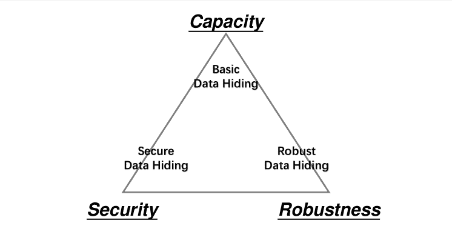
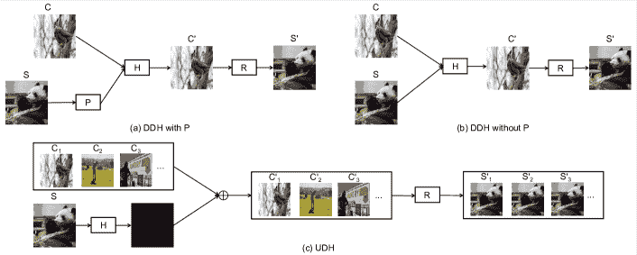

<!--yml

分类：未分类

日期：2024-09-06 19:56:36

-->

# [2103.01607] 深度学习基础数据隐藏简要调查

> 来源：[`ar5iv.labs.arxiv.org/html/2103.01607`](https://ar5iv.labs.arxiv.org/html/2103.01607)

# 深度学习基础数据隐藏简要调查

Chaoning Zhang^(1∗)    Chenguo Lin²¹¹1 等贡献    Philipp Benz¹    Kejiang Chen³    Weiming Zhang³&In So Kweon¹

¹KAIST    ²四川大学    ³中国科学技术大学

chaoningzhang1990@gmail.com, linchenguo@stu.scu.edu.cn, pbenz@kaist.ac.kr, chenkj@mail.ustc.edu.cn, zhangwm@ustc.edu.cn, iskweon77@kaist.ac.kr

###### 摘要

数据隐藏是通过有限的感知变化来隐藏消息的艺术。最近，深度学习从各个角度丰富了这一领域，并取得了显著进展。在这项工作中，我们对基于深度学习的数据隐藏（深度隐藏）的现有文献进行了简要但全面的回顾，首先根据三个基本属性（即容量、安全性和鲁棒性）对其进行分类，并概述了三种常用的架构。在此基础上，我们总结了数据隐藏的不同应用的具体策略，包括基础隐藏、隐写术、水印和光场信息传递。最后，通过引入对抗攻击的视角，提供了对深度隐藏的进一步见解。

## 1 引言

眼见的*不一定*总是相信，即自然外观的图像可能包含对公众不可见的秘密信息。数据隐藏可以将秘密信息隐藏在传输介质中，例如数字图像，其核心属性在于*不可感知性*，以实现隐藏的基本目标。随着互联网的普及和社交媒体平台的流行，数字媒体（如图像或视频）已成为从秘密通信到版权保护等应用中最常用的安全数据传输宿主。数据隐藏方案可以通过三个要求来表征：i) *容量*，即嵌入的有效载荷；ii) *安全性*，即在隐写分析中难以被检测；iii) *鲁棒性*，即抵抗传输渠道中的失真。以上三个要求之间存在权衡，如图 1 所示。举例来说，大容量隐藏算法通常会面临低安全性和弱鲁棒性的问题。我们将以容量为导向的任务称为“基础数据隐藏”，旨在在没有额外限制（除了不可感知性）的情况下隐藏更多信息。安全数据隐藏和鲁棒数据隐藏，顾名思义，分别优先考虑安全性和鲁棒性。然而，它们共同的限制仍在于对人眼的不可感知。

图 1：信息隐藏技术在容量、安全性和鲁棒性之间的权衡。

大多数传统的数据隐藏方法是在失真编码框架下进行的，该框架旨在最小化特定的失真度量，并将不同的失真分配给信息载体中的不同元素以嵌入隐藏信息 Pevnỳ 等人 (2010)；Holub 和 Fridrich (2012)；Holub 等人 (2014)。近年来，随着深度学习的日益流行，许多研究将深度神经网络 (DNNs) 应用于数据隐藏任务。早期将深度学习应用于数据隐藏的研究通常采用 DNNs 仅替代隐藏和提取流程中的*部分*阶段 Husien 和 Badi (2015)；Kandi 等人 (2017)；Mun 等人 (2017)。趋势是对网络进行端到端的训练，以实现信息的嵌入和揭示 Baluja (2017)；Zhu 等人 (2018)；Weng 等人 (2019)；Zhang 等人 (2020a)；Lu 等人 (2021)；Guan 等人 (2022)，因为这些方法通常不那么繁琐，并且在容量、安全性和/或鲁棒性方面远超以前的方法。在这项工作中，我们将基于深度学习的数据隐藏方法称为*深度隐藏*。这是一个新兴且充满活力的研究领域，取得了显著进展，但对这一领域的系统介绍相对较少。我们认为，进行一项简明而全面的文献综述关于深度隐藏是必要且有价值的。

在本调查的其余部分，我们首先介绍深度隐藏的公式，然后介绍隐藏和提取流程的三种基本架构。我们以图像作为信息传递载体，全面调查其应用，包括 i) 大容量基本隐藏，ii) 安全隐写术，iii) 鲁棒水印和 iv) 光场信息传递，这些应用着重于数据隐藏的不同属性。我们还简要回顾了在图像之外的其他多媒体中隐藏秘密信息的情况。最后，我们讨论了深度隐藏与对抗攻击研究的另一条平行路线之间的联系。

图 2：隐藏图像中图像的三种基本架构的示意图，其中 P、H 和 R 分别表示准备、隐藏和揭示网络。

## 2 问题公式

*基础数据隐藏*考虑了两个代理之间的通信场景：Alice 和 Bob，其中 Alice 是发送者，Bob 是接收者。Alice 负责在传输载体（*封面*，$C$）中隐藏秘密信息（*秘密*，$S$），结果是一个*容器*（$C^{\prime}$），其被编码以包含秘密。Bob 在与 Alice 通信后接收到$C^{\prime}$，然后可以检索到*揭示的秘密*（$S^{\prime}$）。这些操作在方程 1 中描述，其中$\mathcal{H}$和$\mathcal{R}$是深度隐藏中的隐藏和揭示神经网络，$\theta_{\mathcal{H}}$和$\theta_{\mathcal{R}}$是它们各自的参数。

|  | $C^{\prime}=\mathcal{H}(S,C;\theta_{\mathcal{H}});\quad S^{\prime}=\mathcal{R}(C^{\prime};\theta_{\mathcal{R}})$ |  | (1) |
| --- | --- | --- | --- |

成功的数据隐藏的关键要求是*不可察觉性*和*精确度*，即同时最小化$C$与$C^{\prime}$之间的差异以及$S$与$S^{\prime}$之间的差异：

|  | $\displaystyle\theta_{\mathcal{H}}^{*}$ | $\displaystyle=\mathop{\arg\min_{\theta_{\mathcal{H}}}}\ dist_{c}(C,C^{\prime})$ |  |
| --- | --- | --- | --- |
|  |  | $\displaystyle=\mathop{\arg\min_{\theta_{\mathcal{H}}}}\ dist_{c}(C,\mathcal{H}(S,C;\theta_{\mathcal{H}})),$ |  | (2) |
|  | $\displaystyle\theta_{\mathcal{R}}^{*}$ | $\displaystyle=\mathop{\arg\min_{\theta_{\mathcal{R}}}}\ dist_{s}(S,S^{\prime})$ |  |
|  |  | $\displaystyle=\mathop{\arg\min_{\theta_{\mathcal{R}}}}\ dist_{s}(S,\mathcal{R}(C^{\prime};\theta_{\mathcal{R}})),$ |  | (3) |

其中 $dist_{c}(\cdot)$ 和 $dist_{s}(\cdot)$ 是两个分布之间的距离度量。L2 距离是最常用的，而交叉熵损失在$S$为二进制位形式时作为$dist_{s}(\cdot)$被广泛使用。一个常用的优化损失定义为$\mathcal{L}=\|C^{\prime}-C\|+\beta\|S^{\prime}-S\|$ Baluja (2017)，其中$\beta$是用于平衡不可察觉性和精确度的权重因子。较高的$\beta$通常会导致提取的秘密质量更高，但容器质量较低。或者，L1 距离、PSNR（峰值信噪比）、SSIM（结构相似性指数测量）Hore 和 Ziou (2010) 以及 LPIPS（学习的感知图像块相似性）Zhang 等 (2018) 也常常与 L2 距离一起使用，以评估感知质量 Zhang 等 (2020a)。

在*安全数据隐藏*中，有一个新的参与者，他充当了 Alice 和 Bob 的对手，通过使用隐写分析器$\mathcal{A}$来区分容器和封面。一个有效的算法需要混淆$\mathcal{A}$，使其不能比随机猜测表现得更好，即图像是$C$还是$C^{\prime}$的置信度相互接近：

|  | $&#124;\mathcal{A}(\mathcal{H}(S,C;\theta_{\mathcal{H}}))-\mathcal{A}(C)&#124;<\epsilon,$ |  | (4) |
| --- | --- | --- | --- |

其中 $\epsilon$ 是一个足够小的正数。

在*鲁棒数据隐藏*中，攻击者通过扰动容器来破坏其中的秘密信息。一个鲁棒的方案应该能够在容器$C^{\prime}$被噪声攻击者（记作$\mathcal{N}$）攻击后仍然保持秘密信息。

|  | $\min_{\theta_{\mathcal{H}},\theta_{\mathcal{R}}}dist_{s}(S,\mathcal{R}(\mathcal{N}(C^{\prime});\theta_{\mathcal{R}})).$ |  | (5) |
| --- | --- | --- | --- |

## 3 深度隐藏架构

深度隐写术 Baluja (2017, 2019) 定义了一个将完整图像隐藏在另一图像中的新任务。这个任务不同于传统隐写术，它要求对秘密信息进行完美解码。相反，目标是通过最小化$dist_{s}(S,S^{\prime})$来改善检索到的秘密图像的质量。此外，传统隐写术的隐藏容量通常很低，例如，HUGO Pevnỳ 等人 (2010) 隐藏了$<0.5$ bpp（每像素比特），而深度隐写术 Baluja (2017) 的容量为 24bpp。由于容量与保密性之间的权衡，大多数深度隐写术可以相对容易地被某些隐写分析算法检测到。因此，为了区分，这种以容量为导向的任务在本调查中被称为“基础数据隐藏”，而不是“隐写术”。

在$C$和$S$作为隐藏网络$\mathcal{H}$的输入进行处理时，我们总结了三种可以直接应用于*基础*数据隐藏任务的基本架构。同时，这些架构可以通过添加一些针对性的策略扩展到其他应用，包括隐写术、水印和光场消息传递。

有准备的封面依赖深度隐藏。Baluja Baluja (2017, 2019)提出了第一个基于深度学习的大容量数据隐藏框架，该框架将一个全尺寸的彩色图像嵌入到另一个相同尺寸的图像中。具体来说，它有三个网络：图 2(a)中的准备网络、隐藏网络和揭示网络。准备网络（$\mathcal{P}$）用于将秘密图像$S$转换为通常有助于压缩图像的特征，如边缘和正交分量。隐藏网络将拼接的封面图像$C$和*准备好的*秘密图像$\mathcal{P}(S)$作为输入。通过揭示网络，接收者可以从容器图像$C^{\prime}$中恢复秘密图像$S^{\prime}$。在图 2(a)中，秘密图像的编码依赖于封面图像。因此，遵循 Zhang et al. (2020a)的术语，我们将其称为封面依赖深度隐藏，简称 DDH 架构。具体而言，它还有一个额外的网络$\mathcal{P}$，因此在本调查中这种架构被称为 DDH with P。

无准备的封面依赖深度隐藏。尽管有利于嵌入分析，但准备网络$\mathcal{P}$使整个流程变得复杂，并且需要更多的 GPU 内存 Wu et al. (2018)。后来的研究 Weng et al. (2019); Mishra et al. (2019); Zhang et al. (2020a)显示$\mathcal{P}$并非必要，并且可以与隐藏网络合并成一个网络 Baluja (2019)。排除$\mathcal{P}$网络会导致更简单的 DDH，即图 2(b)中的没有 P 的 DDH。由于这是最常用的深度隐藏架构，因此后面提到的方法属于没有 P 的 DDH，无需特别说明。

通用深度隐藏。进一步地，Zhang et al. (2020a) 提出了一个名为通用深度隐藏（UDH）的新架构。UDH 与 DDH 的主要区别在于 UDH 将秘密的编码与封面图像分离，即，秘密图像的编码如何与封面图像无关。这种分离有助于可视化秘密图像的编码操作，其结果显示秘密图像被编码成重复的高频成分。UDH 中的编码秘密图像可以直接添加到任何随机的封面图像中形成容器，这增强了信息隐藏的灵活性。基于这一 UDH 架构，Zhang et al. (2020a) 显示了在 N（例如 3）张图像中成功隐藏 M（例如 6）张图像的结果。UDH 的通用属性也使其在水印方面高效，因为它只需一次求和，这在需要水印处理大量图像时是一个显著优势。

## 4 深度隐藏的应用

### 4.1 大容量基本隐藏

增加数据隐藏的容量容易导致轮廓伪影和颜色失真 Guan et al. (2022)，这使得保持不可察觉的目标成为一个复杂的挑战。某些方法的高负载通常通过将多张图像同时隐藏到一张相同大小的图像中来体现。或者，独立的像素级源用于补充信息，如深度和运动，也是一种充分利用额外容量的合适选择 Baluja (2019)。一种简单且广泛使用的实现方式是沿 RGB 通道连接多个图像，并将连接后的张量视为网络输入的综合秘密 $S$ Baluja (2019)；Zhang et al. (2020a)；Lu et al. (2021)。

在 Baluja (2019) 中隐藏多张图像的根本动机是掩盖容器中隐藏图像的残留物。然而，当隐藏两张图像时，会发生显著的颜色失真。由于秘密嵌入的覆盖无关特性，Zhang et al. (2020a) 中的 UDH 可以将 M 张秘密图像隐藏到 N 张覆盖图像中，其中嵌入空间不限于一张图像中的 RGB 通道。通过训练多个 $\mathcal{H}$ 和 $\mathcal{R}$ 对，UDH 还可以在一张图像中隐藏多张秘密图像，但特定秘密只能通过对应的 $\mathcal{R}$ 揭示，即不同的接收者从同一覆盖图像中获得不同的秘密信息。Lu et al. (2021) 和 Jing et al. (2021) 采用可逆神经网络实现高容量，其中 $\mathcal{H}$ 和 $\mathcal{R}$ 共享相同的参数。然而，考虑到简单的连接忽略了秘密图像之间的相关性，后续的 DeepMIH Guan et al. (2022) 将多张秘密图像串行隐藏，即前一张图像的隐藏结果可以协助当前隐藏，以改善多图像隐藏的整体性能。

### 4.2 安全隐写术

隐写术涉及以*不可察觉*和*不可检测*的方式隐藏信息，而隐写分析则作为其对手，通过从观察到的数据中检测可能隐藏的信息，即使对隐藏算法几乎没有了解。隐写术和隐写分析相互对抗，但也相互增强。

一般来说，要实现对隐写分析的不可检测性，需要针对性的设计。一些未专门设计用于隐写术的方法也会在其工作中进行隐写分析评估。大多数这些方法无法被经典隐写分析工具（例如，结合了几种传统隐写分析技术的 StegExpose Boehm (2014)）检测到，但在面对基于深度学习的隐写分析器时会失败。具体而言，当面对最先进的隐写分析器 SRNet Boroumand et al. (2018) 时，Baluja (2017)、Weng et al. (2019)、Lu et al. (2021) 和 Guan et al. (2022) 的检测准确率分别为 99.58%、77.43%、75.69% 和 75.54% Guan et al. (2022)。准确率接近 50%（随机猜测）表示更高的安全等级。值得注意的是，SRNet 对 HiNet Jing et al. (2021) 的隐写分析准确率报告为 55.86%，这表明 HiNet 的 $C^{\prime}$ 与自然覆盖图像几乎无法区分。这主要归因于他们提出的低频小波损失，使 $C^{\prime}$ 和 $C$ 的低频子带彼此相似。

#### 4.2.1 对抗性架构

由于安全隐写术的不可检测性，上述三种架构不能直接应用。因此，*对抗性架构*被广泛采用以增强安全性和视觉质量 Hayes 和 Danezis（2017）。对抗性架构的核心在于对抗模型，该模型输入容器和封面，形成一个三方博弈。对抗模型可以是从现成的隐写分析网络中微调得到的 Xu 等人（2016）；Ye 等人（2017），或者被假定为常规卷积神经网络（CNN） Zhang 等人（2019a）；Weng 等人（2019）或类似结构以揭示网络 Zhu 等人（2018）；Hayes 和 Danezis（2017）。Hayes 和 Danezis 的工作 Hayes 和 Danezis（2017）表明，对抗模型的监督训练可以生成一个强大的隐写分析器。

如上所述，通过在基本架构中加入额外的隐写分析分类器，如 Weng 等人（2019）；Zhang 等人（2019c）；Yedroudj 等人（2020），可以简单地获得对抗性架构，这通过增加对抗判别器来提高对隐写分析的抵抗力。然而，这并不意味着这些方法可以对抗独立训练的隐写分析器，因为对抗训练策略限制了判别器的有效性 Shang 等人（2020）。

注意，对抗网络*并非*仅用于安全性。它还帮助提高容器图像的视觉质量以及水印或光场消息的鲁棒性 Zhu 等人（2018）；Liu 等人（2019）；Tancik 等人（2020）；Jia 等人（2020）；Plata 和 Syga（2020）。基于对抗架构，注意力机制的思想已在 Zhang 等人（2019b）；Yu（2020）中被研究，用于将模式偏向隐藏在不易受变换影响的纹理和物体中，或在人眼不易察觉的区域，从而提高鲁棒性和隐匿性。

#### 4.2.2 合成技术

深度隐藏的另一个有趣的研究方向是*合成技术*。与上述基于嵌入的方法不同，合成技术中没有进行修改，因为容器是直接基于秘密消息生成的 Hu 等人（2018）。首先，它在深度卷积生成对抗网络（GANs）中推导出一个生成器，用随机噪声向量合成图像。其次，提取网络学习揭示输入生成器的对应向量。最后，通过前面步骤中固定的生成器和提取器，爱丽丝和鲍勃可以通过将秘密消息映射到合成之前的向量，实现不可检测的秘密通信。隐写嵌入操作在 Zhang 等人（2019d）中变成了图像采样问题，容器由训练有素的生成器采样。而 Zhang 等人（2020b）则建立了秘密消息与语义类别之间的映射关系进行生成。与 Hu 等人（2018）不同，Zhang 等人（2019d）将训练过程分为几个步骤，提取器在对抗训练之外训练，而 Wang 等人（2018）；Li 等人（2020）同步训练提取器和生成器，从而提高了性能和训练效率。Wang 等人（2018）中提出的 SSteGAN 也可以被定义为对抗架构，因为它的系统中有一个隐写分析器。

### 4.3 鲜明的水印

与容量和安全性相比，数字水印更注重鲁棒性。因此，它通常包含一个设计良好的模块或采用特殊技术来增强鲁棒性。

#### 4.3.1 数据增强方法

众所周知，经过良好训练的深度分类器在噪声扰动下可能会出现显著的性能下降。改善针对特定类型噪声的鲁棒性的一个直接方法是，在训练过程中使用这种噪声进行数据增强。受到这一点的启发，抗噪声攻击的直观且常用的策略是模拟这些扭曲的训练过程，即在将容器送入揭示网络之前，用相应的攻击进行扭曲（Zhu et al. (2018)）。在实际应用中，攻击可能会以不同形式出现，因此使隐藏管道能够抵御各种图像扭曲具有很高的实际意义。为此，HiDDeN（Zhu et al. (2018)）在每个小批量中应用一种噪声，并在每次迭代中进行交换。ReDMark（Ahmadi et al. (2020)）采用了类似的方法，通过在每次迭代中以给定概率选择一种攻击类型。这种简单的方法已被证明能够实现合理的鲁棒性表现。Zhang et al.（Zhang et al. (2020a)）对这种方法进行了简单的改进，将小批量数据均分为多个组，每组应用一种类型的图像扭曲。这种分组策略有助于在每次迭代中同时应用所有调查的图像扭曲，从而加快收敛速度，并显著提升性能。与 Zhu et al. (2018) 和 Ahmadi et al. (2020) 采用的交换策略相比，分组策略不会带来额外的计算开销，因此可以视为一种“免费”的性能提升技术。

#### 4.3.2 处理不可微分压缩的进展

为了减少带宽或流量以便于存储和传输，大多数图像/视频通常会通过有损压缩进行预处理，如 JPEG 或 MPEG。特别是，JPEG 作为图像最流行的有损压缩方法，通常被认为是对水印最常见的攻击。然而，提高对 JPEG 压缩的鲁棒性是一项非平凡的任务，因为这是一种不可微分的操作，这阻碍了对$\mathcal{H}$和$\mathcal{R}$的联合训练。HiDDeN Zhu 等人 (2018) 尝试用 JPEG-Mask 和 JPEG-Drop 模拟 JPEG 压缩。受 JPEG 主要丢弃高频分量的事实启发，JPEG-Mask 只保留低频 DCT 系数并使用固定掩蔽，而 JPEG-Drop 则对系数采用渐进的丢弃策略，即高频系数有更高的丢弃概率。由于模拟 JPEG 与真实 JPEG 之间的不匹配，实际 JPEG 下性能显著下降。ReDMark Ahmadi 等人 (2020) 通过精心设计一系列可微分函数来模拟真实 JPEG 压缩的每一步，尝试解决这一挑战。Luo 等人 (2020) 也采用了类似的方法。这种方法有两个局限性：i) 需要对攻击有全面的了解，JPEG 攻击是这种情况，但其他类型的攻击可能不是；ii) 需要精心设计各种可微分函数来模拟真实攻击，这可能仍然无法应对真实攻击。

为了解决这一挑战，Liu 等人 (2019) 提出了一个两阶段的可分离深度学习框架。在第一阶段，编码器$\mathcal{H}$和解码器$\mathcal{R}$在没有噪声的情况下同时训练，得到一个强大的冗余编码编码器。在第二阶段，从第一阶段获得的预训练编码器被固定，损失仅通过解码器反向传播。这减轻了不可微分性的问题，因为损失不需要通过编码器反向传播。这种两阶段方法的局限性是编码器在没有 JPEG 压缩的情况下进行训练，因此与联合训练$\mathcal{H}$和$\mathcal{R}$使用 JPEG 压缩相比，它是一种次优解决方案。

由于 JPEG 压缩的不可微性，同时训练编码器和解码器似乎是一项非平凡的任务。最近的研究 Zhang 等人 (2021b) 提出了一个优雅的伪可微方法，将 JPEG 压缩视为一种特殊的噪声。他们的方法的独特之处在于前向传播路径和反向传播路径是不一样的。具体而言，反向传播不会经过 JPEG 压缩部分。本质上，这种方法类似于上述噪声增强方法，但通过加减操作缓解了不可微性问题。这种方法在抵抗 JPEG 攻击的鲁棒性方面达到了 SOTA 性能，并且已被证明在视频压缩方面也表现令人满意。

#### 4.3.3 对抗训练启发的方法

为了提高对未知失真的鲁棒性，Luo 等人 (2020) 提出了将已知失真与对抗扰动结合的方案，这种组合构成了最坏的扰动。这样的最小-最大方法受到另一项关于对抗训练以提高深度分类器对对抗攻击鲁棒性的研究的启发。对抗训练对常见失真的鲁棒性的影响已在 Luo 等人 (2020) 的研究中进行了探讨，结果表明它提高了对噪声型扰动的鲁棒性，但在某些已知失真上性能有所下降。例如，已知的裁剪和高斯模糊失真在 Luo 等人 (2020) 的研究中有显著的性能下降。Wen 和 Aydore (2019) 的类似方法也进行了探索，该方法通过最大化解码器的损失自适应地选择预定义的失真类型和强度。Luo 等人 (2020) 和 Wen 和 Aydore (2019) 都将水印鲁棒性表述为一个最小-最大优化问题，他们的主要区别在于 Luo 等人 (2020) 通过 DNN 生成对抗扰动，而 Wen 和 Aydore (2019) 从固定的常见失真池中选择扰动。

### 4.4 光场信息传递

作为数据隐藏的实际应用，光场信息传递（LFM）Wengrowski 和 Dana (2019) 描述了在显示器 *屏幕* 上嵌入、传输和接收隐藏信息的过程，该信息被 *相机* 捕捉。LFM 过程也常被称为屏幕-相机通信 Cui 等人 (2019) 或摄影隐写术，但不涉及被隐写分析检测的风险。相反，这项任务的挑战在于抵御由光效应引起的图像变换，这可以看作是电子显示特性、相机曝光和相机-显示角度的混合影响。从本质上讲，这与鲁棒水印非常相似，但目标是传输有用信息而不是证明所有权。Wengrowski 和 Dana (2019) 发现，直接应用 DDH 架构而不考虑光效应会导致无法提取隐藏的条形码信息。为此，他们从 25 对相机-显示器配对中收集了大量（1.9TB）相机捕捉的图像数据集，然后训练了一个相机-显示器传输函数（CDTF）来模拟光场传输引起的失真。然而，在如此庞大的数据集上进行训练需要大量资源，并且其性能并不令人满意，特别是对于未知的相机-显示器配对。

为了解决上述缺点，StegaStamp Tancik 等 (2020)，将应用扩展到打印图像，提出通过图像变换的混合来增强容器图像，如透视变换、运动/模糊、颜色操作、噪声以及 JPEG 压缩。此外，他们的方法需要一个相对复杂的加权损失，包括 L2 残差正则化、感知损失、批评损失和消息的交叉熵损失。这种复杂的损失需要仔细选择超参数。Zhang 等 Zhang 等 (2020a) 提供了基于提出的 UDH 的更简单解决方案。具体来说，他们只采用透视变换作为图像变换，并且可以直接使用 Baluja (2017) 中用于基本数据隐藏的相同简单损失。这种简单的方法表现出竞争力，原因被归因于 UDH 对容器图像扰动的鲁棒性，特别是对像颜色变化这样的恒定像素值偏移。此外，UDH 更具通用性，因为它还可以隐藏秘密图像，而 Wengrowski 和 Dana (2019) 和 Tancik 等 (2020) 只能隐藏有限的二进制信息。在 DeepMorph Rasmussen 等 (2020) 中也探索了在矢量图像如 SVG 文件中隐藏信息的可能性，利用其艺术自由通过自己设计的图形传达信息，但其通用性不如 UDH，因为 UDH 可以隐藏所有类型的图像，包括自然图像。RIHOOP Jia 等 (2020) 融入了基于可微分 3D 渲染的失真网络，以更好地模拟相机成像引入的现实失真。将 RIHOOP Jia 等 (2020) 和 UDH Zhang 等 (2020a) 中的技术结合起来，作为未来研究的一个有趣方向，以实现既鲁棒又通用的目的。

## 5 将数据隐藏在其他多媒体中

数据隐藏研究的主要方向采用图像作为信息载体，以隐藏二进制消息 Hay es 和 Danezis (2017)；Zhu 等 (2018)；Liu 等 (2019)；Tancik 等 (2020) 或自然图像 Baluja (2017)；Wengrowski 和 Dana (2019)；Zhang 等 (2020a)；Yu (2020)。尽管如此，还有多种其他多媒体可以采用，如视频、音频和文本。前面提到的基本架构和提高安全性和鲁棒性的策略适用于其他形式的载体。然而，根据这些多媒体的特性，可能需要一些自适应方法。

本质上，视频可以看作是一系列图像，因此将图像隐藏在另一个图像中的框架可以很容易地扩展到隐藏视频在视频中的新任务，通过顺序编码秘密视频的每一帧到封面视频的每一帧中。然而，这种简单的方法没有利用连续帧之间的时间冗余，因为两帧之间的残差高度稀疏。为此，Weng 等人 (2019) 提出了一个包含两个分支的简单解决方案：一个用于基准秘密帧参考，另一个用于帧残差。通过将视频划分为每组包含 8 帧的帧组，Mishra 等人 (2019) 利用 3D-CNN 通过利用连续帧之间的运动关系在 8 帧内隐藏 8 帧。

隐藏音频在音频中已在 Kreuk 等人 (2019) 的研究中得到证明。发现隐藏图像在图像中的框架适用于音频领域，但需要在训练期间包括短时傅里叶变换和逆时变换作为可微层。深度学习也已应用于跨模态隐藏应用，例如在音频中隐藏图像或视频，表现良好。利用音频的序列化特性，Cui 等人 (2020) 提出了一种通过多阶段隐藏和揭示网络在音频载体中隐藏图像内容的方法。他们逐步将秘密图像的多级残差错误嵌入到封面音频中，随后通过对应阶段子网络解码修改后的载体中逐渐减少的残差错误，并将其相加以生成最终的揭示结果。Yang 等人 (2019a) 为在音频中隐藏视频这一跨模态任务提供了另一种方法，这在实际操作中具有挑战性，因为视频文件的比特率较高。其一个潜在的缺点是揭示阶段也需要访问原始清洁音频。

文本中的数据隐藏也是一个广泛的研究方向。不同于那些生成方法，Abdelnabi 等人 (2020) 引入了对抗性水印变换器（AWT），该方法具有联合训练的编码器-解码器和对抗训练。通过输入文本和二进制消息，水印系统可以生成一个经过轻微修改的输出文本，以嵌入给定的消息。值得一提的是，文本数据隐藏与自然语言处理领域高度相关。

## 6 链接与对抗攻击

小变化带来大不同。从本质上讲，容器图像只是带有微小不可察觉变化的封面图像。揭示网络对这种微小的不可见变化非常敏感。换句话说，人类视觉与深度神经网络之间存在错位。这种错位也在另一个对抗攻击的研究方向中被观察到，其中不可察觉的扰动可以以高度的信心欺骗深度分类器。

最近，张等人 (2021a) 对这类错位现象在两个任务中的表现进行了联合调查，提供了一个统一的傅里叶视角，解释了为何如此微小的扰动在通用攻击和隐藏的背景下可以主导图像。错位的原因被归因于深度神经网络对高频内容的敏感性 张等人 (2021a)，并观察到频率是影响两个任务性能的关键因素。基于深度学习的水印和对抗攻击的联合调查也在 Quiring 等人 (2018) 的研究中被探讨过，提出了对这两个任务的黑箱攻击的统一概念，其有效性通过将对抗攻击的概念应用于水印检测及反之亦然来展示。例如，水印中的对策可以用来防御一些模型提取对抗攻击，而提高模型对抗鲁棒性的技术也有助于减轻对水印的攻击 Quiring 等人 (2018)。此外，多媒体取证中的经验也被发现对促进对抗样本的检测有用 Schöttle 等人 (2018)。另一方面，Quiring 和 Rieck (2018) 也探讨了针对水印的对抗性机器学习，采用神经网络检测和去除水印。值得一提的是，Luo 等人 (2020) 还研究了改善对抗鲁棒性的对抗训练技术，以提高深度学习基础的水印在未知失真下的鲁棒性，如在第 4.3.3 节中讨论的。

总体而言，Zhang 等人 (2021a) 对深度隐写和攻击的成功有一个统一的傅里叶视角。同时，水印技术在对抗性攻击中常常被发现有效，反之亦然 Quiring 等人 (2018)。Zhang 等人 (2021a) 还展示了一个单一的通用秘密对抗扰动，它在执行攻击的同时包含了秘密信息。然而，对它们的联合研究仍处于初期阶段，我们认为这是一个有趣的方向，可以对它们进行深度分析，具有理论和实际的相关性。

## 7 结论

深度隐写已成为一个新兴领域，吸引了大量关注。我们的工作通过首先根据其基本属性对数据隐藏进行分类，并概述三种基本架构，进行了一次简要而全面的调查。此外，我们讨论了深度隐写在各种应用中的挑战，包括大容量基本隐藏、安全隐写术、鲁棒水印和光场消息传递。为了完整性，我们还总结了在其他多媒体内容中隐藏数据的情况。最后，我们讨论了其对对抗性攻击领域的影响，反之亦然。数据隐藏和对抗性攻击的联合研究将是一个有趣的方向，可能带来新的见解。

## 参考文献

+   Abdelnabi 和 Fritz [2020] Sahar Abdelnabi 和 Mario Fritz。对抗性水印变换器：通过数据隐藏追踪文本来源。arXiv 预印本 arXiv:2009.03015，2020 年。

+   Ahmadi 等人 [2020] Mahdi Ahmadi、Alireza Norouzi、Nader Karimi、Shadrokh Samavi 和 Ali Emami。Redmark：基于深度网络的残差扩散水印框架。Expert Systems with Applications，146：113157，2020 年。

+   Baluja [2017] Shumeet Baluja。在明处隐藏图像：深度隐写术。发表于 NeurIPS，页码 2066–2076，2017 年。

+   Baluja [2019] Shumeet Baluja。将图像隐藏在图像中。TPAMI，42(7)：1685–1697，2019 年。

+   Boehm [2014] Benedikt Boehm。Stegexpose——一个用于检测 LSB 隐写术的工具。arXiv 预印本 arXiv:1410.6656，2014 年。

+   Boroumand 等人 [2018] Mehdi Boroumand、Mo Chen 和 Jessica Fridrich。用于数字图像隐写分析的深度残差网络。TIFS，14(5)：1181–1193，2018 年。

+   Cui 等人 [2019] Hao Cui、Huanyu Bian、Weiming Zhang 和 Nenghai Yu。Unseencode：具有图像提取的不可见屏幕条形码。发表于 INFOCOM，页码 1315–1323。IEEE，2019 年。

+   Cui 等人 [2020] Wenxue Cui、Shaohui Liu、Feng Jiang、Yongliang Liu 和 Debin Zhao。用于图像到音频隐写术的多阶段残差隐藏。发表于 ICASSP，页码 2832–2836。IEEE，2020 年。

+   Guan 等人 [2022] Zhenyu Guan、Junpeng Jing、Xin Deng、Mai Xu、Lai Jiang、Zhou Zhang 和 Yipeng Li。Deepmih：用于多图像隐藏的深度可逆网络。TPAMI，2022 年。

+   Hayes 和 Danezis [2017] Jamie Hayes 和 George Danezis。通过对抗训练生成隐写图像。发表于 NeurIPS，页码 1951–1960，2017 年。

+   Holub 和 Fridrich [2012] Vojtěch Holub 和 Jessica Fridrich. 使用方向滤波器设计隐写失真。发表于《WIFS》，第 234–239 页。IEEE，2012 年。

+   Holub 等 [2014] Vojtěch Holub, Jessica Fridrich, 和 Tomáš Denemark. 用于任意领域隐写的通用失真函数。发表于《EURASIP 信息安全杂志》，2014(1):1–13，2014 年。

+   Hore 和 Ziou [2010] Alain Hore 和 Djemel Ziou. 图像质量指标：Psnr 与 ssim。发表于《ICPR》，第 2366–2369 页。IEEE，2010 年。

+   Hu 等 [2018] Donghui Hu, Liang Wang, Wenjie Jiang, Shuli Zheng, 和 Bin Li. 一种通过深度卷积生成对抗网络的新颖图像隐写方法。发表于《IEEE Access》，6:38303–38314，2018 年。

+   Husien 和 Badi [2015] Sabah Husien 和 Haitham Badi. 用于隐写的人工神经网络。发表于《神经计算与应用》，26(1):111–116，2015 年。

+   Jia 等 [2020] Jun Jia, Zhongpai Gao, Kang Chen, Menghan Hu, Xiongkuo Min, Guangtao Zhai, 和 Xiaokang Yang. Rihoop：在离线和在线照片中稳健的隐形超链接。发表于《网络控制论杂志》，2020 年。

+   Jing 等 [2021] Junpeng Jing, Xin Deng, Mai Xu, Jianyi Wang, 和 Zhenyu Guan. Hinet：通过可逆网络进行深度图像隐藏。发表于《ICCV》，第 4733–4742 页，2021 年。

+   Kadhim 等 [2019] Inas Jawad Kadhim, Prashan Premaratne, Peter James Vial, 和 Brendan Halloran. 图像隐写的综合调查：技术、评估和未来研究趋势。发表于《神经计算》，335:299–326，2019 年。

+   Kandi 等 [2017] Haribabu Kandi, Deepak Mishra, 和 Subrahmanyam RK Sai Gorthi. 探索卷积神经网络在鲁棒图像水印中的学习能力。发表于《计算机与安全》，65:247–268，2017 年。

+   Kreuk 等 [2019] Felix Kreuk, Yossi Adi, Bhiksha Raj, Rita Singh, 和 Joseph Keshet. 隐藏与说话：迈向用于语音隐写的深度神经网络。arXiv 预印本 arXiv:1902.03083，2019 年。

+   Li 等 [2020] Jun Li, Ke Niu, Liwei Liao, Lijie Wang, Jia Liu, Yu Lei, 和 Minqing Zhang. 基于 wgan-gp 的生成隐写方法。发表于《国际人工智能与安全会议》，第 386–397 页。Springer，2020 年。

+   Liu 等 [2019] Yang Liu, Mengxi Guo, Jian Zhang, Yuesheng Zhu, 和 Xiaodong Xie. 一种新颖的两阶段可分离深度学习框架用于实际盲水印。发表于《ACM 多媒体》，第 1509–1517 页，2019 年。

+   Lu 等 [2021] Shao-Ping Lu, Rong Wang, Tao Zhong, 和 Paul L Rosin. 基于可逆神经网络的大容量图像隐写。发表于《CVPR》，第 10816–10825 页，2021 年。

+   Luo 等 [2020] Xiyang Luo, Ruohan Zhan, Huiwen Chang, Feng Yang, 和 Peyman Milanfar. 无失真深度水印。发表于《CVPR》，第 13548–13557 页，2020 年。

+   Mishra 等 [2019] Aayush Mishra, Suraj Kumar, Aditya Nigam, 和 Saiful Islam. Vstegnet：使用时空特征和微瓶颈的视频隐写网络。发表于《BMVC》，2019 年。

+   Mun 等人 [2017] Seung-Min Mun, Seung-Hun Nam, Han-Ul Jang, Dongkyu Kim, 和 Heung-Kyu Lee. 使用卷积神经网络的强健盲水印技术. arXiv 预印本 arXiv:1704.03248, 2017.

+   Pevnỳ 等人 [2010] Tomáš Pevnỳ, Tomáš Filler, 和 Patrick Bas. 使用高维图像模型进行高度难以检测的隐写术. 见国际信息隐藏研讨会, 页码 161–177\. Springer, 2010.

+   Plata 和 Syga [2020] Marcin Plata 和 Piotr Syga. 强健的空间扩展深度神经图像水印. arXiv 预印本 arXiv:2005.11735, 2020.

+   Quiring 和 Rieck [2018] Erwin Quiring 和 Konrad Rieck. 针对数字水印的对抗性机器学习. 见 EUSIPCO, 2018.

+   Quiring 等人 [2018] Erwin Quiring, Daniel Arp, 和 Konrad Rieck. 被遗忘的兄弟: 统一对机器学习和数字水印的攻击. 见 EuroS&P, 2018.

+   Rasmussen 等人 [2020] Søren Rasmussen, Karsten Østergaard Noe, Oliver Gyldenberg Hjermitslev, 和 Henrik Pedersen. Deepmorph: 一种在可变形矢量图中隐藏比特串的系统. arXiv 预印本 arXiv:2011.09783, 2020.

+   Schöttle 等人 [2018] Pascal Schöttle, Alexander Schlögl, Cecilia Pasquini, 和 Rainer Böhme. 检测对抗样本——来自多媒体取证的教训. arXiv 预印本 arXiv:1803.03613, 2018.

+   Shang 等人 [2020] Yueyun Shang, Shunzhi Jiang, Dengpan Ye, 和 Jiaqing Huang. 通过对抗样本增强深度学习隐写术的安全性. 数学, 8(9):1446, 2020.

+   Tancik 等人 [2020] Matthew Tancik, Ben Mildenhall, 和 Ren Ng. Stegastamp: 物理照片中的隐形超链接. 见 CVPR, 页码 2117–2126, 2020.

+   Wang 等人 [2018] Zihan Wang, Neng Gao, Xin Wang, Xuexin Qu, 和 Linghui Li. Sstegan: 基于生成对抗网络的自学习隐写术. 见 ICONIP, 页码 253–264\. Springer, 2018.

+   Wen 和 Aydore [2019] Bingyang Wen 和 Sergul Aydore. Romark: 一种基于对抗训练的强健水印系统. arXiv 预印本 arXiv:1910.01221, 2019.

+   Weng 等人 [2019] Xinyu Weng, Yongzhi Li, Lu Chi, 和 Yadong Mu. 高容量卷积视频隐写术与时间残差建模. 见 ICMR, 页码 87–95, 2019.

+   Wengrowski 和 Dana [2019] Eric Wengrowski 和 Kristin Dana. 通过深度摄影隐写术进行光场信息传递. 见 CVPR, 页码 1515–1524, 2019.

+   Wu 等人 [2018] Pin Wu, Yang Yang, 和 Xiaoqiang Li. Stegnet: 基于深度卷积网络的超大图像隐写容量. 未来互联网, 10(6):54, 2018.

+   Xu 等人 [2016] Guanshuo Xu, Han-Zhou Wu, 和 Yun-Qing Shi. 用于隐写分析的卷积神经网络的结构设计. IEEE 信号处理通讯, 23(5):708–712, 2016.

+   Yang 等人 [2018] Zhong-Liang Yang, Xiao-Qing Guo, Zi-Ming Chen, Yong-Feng Huang, 和 Yu-Jin Zhang. Rnn-stega: 基于递归神经网络的语言隐写术. TIFS, 14(5):1280–1295, 2018.

+   Yang 等人 [2019a] Hyukryul Yang, Hao Ouyang, Vladlen Koltun, 和 Qifeng Chen. 通过可逆生成模型在音频中隐藏视频。发表于 ICCV，页码 1100–1109，2019 年。

+   Yang 等人 [2019b] Zhongliang Yang, Nan Wei, Qinghe Liu, Yongfeng Huang, 和 Yujin Zhang. Gan-tstega: 基于生成对抗网络的文本隐写术。发表于国际数字水印研讨会，页码 18–31。Springer，2019 年。

+   Ye 等人 [2017] Jian Ye, Jiangqun Ni, 和 Yang Yi. 用于图像隐写分析的深度学习层次表示。TIFS，12(11):2545–2557，2017 年。

+   Yedroudj 等人 [2020] Mehdi Yedroudj, Frédéric Comby, 和 Marc Chaumont. 使用三方游戏的隐写术。视觉通信与图像表示杂志，72:102910，2020 年。

+   Yu [2020] Chong Yu. 基于注意力的数据隐藏与生成对抗网络。发表于 AAAI，页码 1120–1128，2020 年。

+   Zhang 等人 [2018] Richard Zhang, Phillip Isola, Alexei A Efros, Eli Shechtman, 和 Oliver Wang. 深度特征作为感知度量的非凡有效性。发表于 IEEE 计算机视觉与模式识别会议论文集，页码 586–595，2018 年。

+   Zhang 等人 [2019a] Kevin Alex Zhang, Alfredo Cuesta-Infante, Lei Xu, 和 Kalyan Veeramachaneni. Steganogan: 基于 GAN 的高容量图像隐写术。arXiv 预印本 arXiv:1901.03892，2019 年。

+   Zhang 等人 [2019b] Kevin Alex Zhang, Lei Xu, Alfredo Cuesta-Infante, 和 Kalyan Veeramachaneni. 基于注意力的鲁棒隐形视频水印。arXiv 预印本 arXiv:1909.01285，2019 年。

+   Zhang 等人 [2019c] Ru Zhang, Shiqi Dong, 和 Jianyi Liu. 通过生成对抗网络实现的隐形隐写术。多媒体工具与应用，78(7):8559–8575，2019 年。

+   Zhang 等人 [2019d] Zhuo Zhang, Jia Liu, Yan Ke, Yu Lei, Jun Li, Minqing Zhang, 和 Xiaoyuan Yang. 通过采样实现的生成隐写术。IEEE Access，7:118586–118597，2019 年。

+   Zhang 等人 [2020a] Chaoning Zhang, Philipp Benz, Adil Karjauv, Geng Sun, 和 In-So Kweon. UDH: 用于隐写术、水印和光场消息传递的通用深度隐藏。发表于 NeurIPS，2020 年。

+   Zhang 等人 [2020b] Zhuo Zhang, Guangyuan Fu, Rongrong Ni, Jia Liu, 和 Xiaoyuan Yang. 一种通过辅助语义的覆盖合成生成隐写术的方法。清华科技，25(4):516–527，2020 年。

+   Zhang 等人 [2021a] Chaoning Zhang, Philipp Benz, Adil Karjauv, 和 In So Kweon. 从深度隐写术的角度看普遍对抗扰动: 向傅里叶视角迈进。AAAI，2021 年。

+   Zhang 等人 [2021b] Chaoning Zhang, Adil Karjauv, Philipp Benz, 和 In So Kweon. 针对实际盲水印的非可微失真下的鲁棒深度隐藏。发表于 ACM Multimedia，页码 5158–5166，2021 年。

+   Zhu 等人 [2018] Jiren Zhu, Russell Kaplan, Justin Johnson, 和 Li Fei-Fei. Hidden: 使用深度网络隐藏数据。发表于 ECCV，页码 657–672，2018 年。
