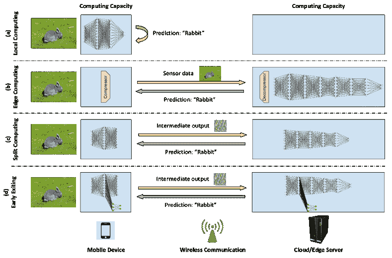
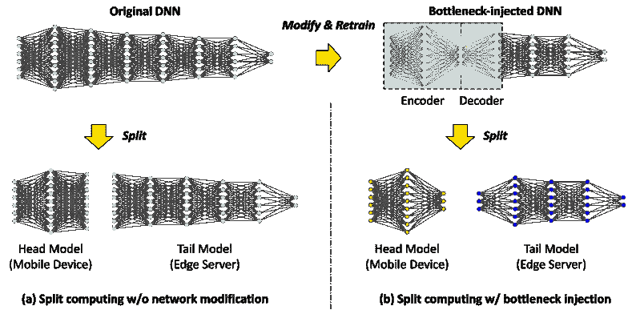
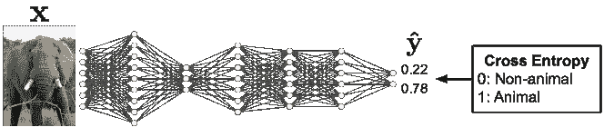
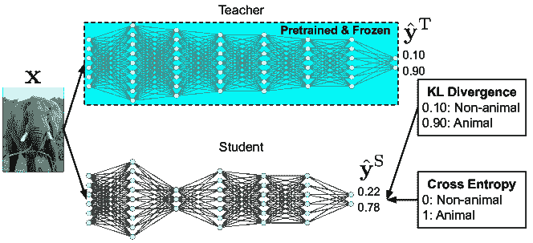
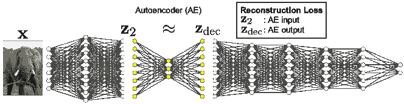
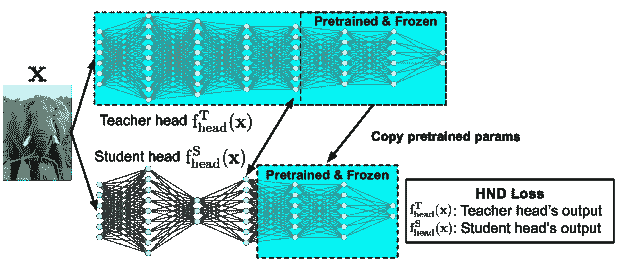
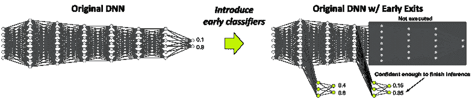
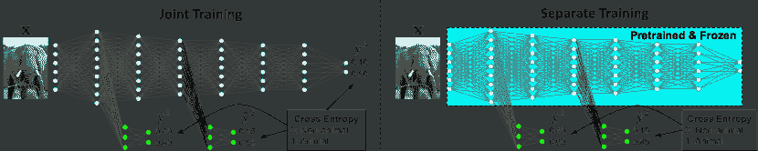

<!--yml

分类：未分类

日期：2024-09-06 19:56:32

-->

# [2103.04505] 深度学习应用中的分裂计算与早期退出：调查与研究挑战

> 来源：[`ar5iv.labs.arxiv.org/html/2103.04505`](https://ar5iv.labs.arxiv.org/html/2103.04505)

02115

# 深度学习应用中的分裂计算与早期退出：调查与研究挑战

Yoshitomo Matsubara yoshitom@uci.edu [0000-0002-5620-0760](https://orcid.org/0000-0002-5620-0760 "ORCID identifier")，Marco Levorato levorato@uci.edu 加州大学欧文分校，欧文，加州，美国 92697 以及 Francesco Restuccia 东北大学 360 Huntington Ave Boston Massachusetts USA f.restuccia@northeastern.edu(2021)

###### 摘要。

智能手机和自动驾驶车辆等移动设备越来越依赖于 DNN 来执行图像分类、语音识别等复杂推断任务。然而，持续在移动设备上执行整个 DNN 会迅速耗尽其电池。尽管将任务卸载到云端/边缘服务器可能减少移动设备的计算负担，但信道质量、网络和边缘服务器负载的不稳定模式可能导致任务执行的显著延迟。最近，提出了基于分裂计算（SC）的方法，其中 DNN 被拆分为头模型和尾模型，分别在移动设备和边缘服务器上执行。*最终*，这可能减少带宽使用以及能源消耗。另一种方法，称为早期退出（EE），训练模型在架构中嵌入多个“退出”点，每个点提供越来越高的目标准确性。因此，可以根据当前条件或应用需求调整准确性与延迟之间的权衡。本文通过展示最相关方法的比较，对 SC 和 EE 策略的现状进行了全面的调查。我们在文末提供了一系列引人注目的研究挑战。

分裂计算、边缘计算、早期退出、神经网络、深度学习^†^†版权：acm 版权^†^†期刊年：2021^†^†doi：10.1145/1122445.1122456^†^†期刊：CSUR^†^†期刊卷号：37^†^†期刊号：4^†^†文章：0^†^†出版月份：8^†^†ccs：以人为中心的计算 泛在与移动计算^†^†ccs：计算机系统组织 嵌入式与网络物理系统^†^†ccs：计算方法 神经网络

## 1\. 引言

深度学习（DL）领域在过去几年中以令人印象深刻的速度发展（LeCun et al., 2015），不断在计算机视觉（CV）、自然语言处理（NLP）、数字信号处理（DSP）和无线网络（Jagannath et al., 2019; Restuccia 和 Melodia, 2020）等领域取得新突破——我们参考（Pouyanfar et al., 2018）以获取有关 DL 的全面综述。例如，今天最先进的深度神经网络（DNNs）能够以前所未有的准确性分类数千张图像（Huang et al., 2017），而最前沿的深度强化学习（DRL）进展已显示在多个复杂优化任务中提供接近人类的能力，从玩几十款雅达利电子游戏（Mnih et al., 2013）到击败顶级玩家的围棋比赛（Silver et al., 2017）。

随着基于深度学习（DL）的分类器在预测准确性上的提升，移动应用程序如智能手机中的语音识别（Deng et al., 2013; Hinton et al., 2012）、实时无人导航（Padhy et al., 2018）和基于无人机的监视（Singh et al., 2018; Zhang et al., 2020）越来越多地使用深度神经网络（DNN）来执行复杂的推理任务。然而，最先进的 DNN 模型存在计算要求，这些要求超出了目前大多数移动设备的能力。实际上，许多用于困难任务（如计算机视觉和自然语言处理）的最先进 DNN 模型非常复杂。例如，EfficientDet (Tan et al., 2020)系列在目标检测任务中提供了最佳性能。虽然 EfficientDet-D7 的平均精度（mAP）达到了 52.2%，但它包含 52M 参数，并且在配备有 GPU 的强大嵌入式设备上执行需要几秒钟，如 NVIDIA Jetson Nano 和 Raspberry Pi。值得注意的是，这些复杂模型的执行显著增加了能耗。尽管专门为移动设备设计的轻量级模型存在 (Tan et al., 2019; Sandler et al., 2018)，但计算负担的减少通常会损害模型的准确性。例如，与 ResNet-152 (He et al., 2016)相比，网络 MnasNet (Tan et al., 2019)和 MobileNetV2 (Sandler et al., 2018)在 ImageNet 数据集上的准确性损失高达 6.4%。YOLO-Lite (Redmon and Farhadi, 2018)在某些嵌入式设备上实现了每秒 22 帧的帧率，但在 COCO 数据集上的 mAP 为 12.36% (Lin et al., 2014b)。为了在 COCO 数据集上实现 33.8%的 mAP，即使是 EfficientDet 系列中最简单的模型 EfficientDet-D0，也需要比 SSD-MobileNetV2 (Sandler et al., 2018)（0.8B FLOPs）多 3 倍的 FLOPs（2.5B）¹¹1 在 Tan et al. (2020)中，FLOP 表示乘加运算的次数。虽然 SSD-MobileNetV2 是一个专门为移动平台设计的低性能 DNN，能处理高达 6 fps 的数据，但其在 COCO 数据集上的 mAP 为 20%，且在移动设备上保持模型运行会显著增加功耗。另一方面，由于过高的端到端延迟，基于云的方案在大多数移动设备通常操作的延迟受限应用中很难应用。我们在调查中概述的大多数技术可以应用于从移动设备到边缘服务器以及从边缘服务器到云端的卸载。为清晰起见，我们主要参考前者来解释这些框架。

最近，边缘计算（EC）方法（Mao et al., 2017; Chen 和 Ran, 2019）试图通过将深度神经网络（DNN）执行完全卸载到靠近移动设备的服务器上，即网络的“边缘”，来解决“延迟与计算”的难题。然而，经典的边缘计算没有考虑到无线链路的质量——尽管平均提供了高吞吐量——由于存在不稳定的噪声和干扰模式，这可能会导致性能在延迟敏感的应用中受损。例如，移动性和传播受限已被证明会降低即使是在高带宽无线链路中的吞吐量（Zhang et al., 2019; Mateo et al., 2019），而许多物联网（IoT）系统基于如长距离（LoRa）（Samie et al., 2016）这样的通信技术，由于占空比限制（Adelantado et al., 2017），其最大数据速率为 37.5 Kbps。

一些移动设备严重的卸载限制，加上无线信道的不稳定性（*例如*，无人机网络（Gupta et al., 2015）），意味着卸载到边缘的数据量应当减少，同时尽可能保持模型的准确性。因此，提出了分割计算（SC）（Kang et al., 2017）和早期退出（EE）策略（Teerapittayanon et al., 2016），以提供边缘计算和本地计算之间的中间选项。SC 和 EE 的关键直觉与模型剪枝（Han et al., 2016; Li et al., 2016; He et al., 2017b; Yang et al., 2017）和知识蒸馏（Hinton et al., 2014; Kim 和 Rush, 2016; Mirzadeh et al., 2020）背后的直觉相似——由于现代 DNN 严重过度参数化（Yu et al., 2020; Yu 和 Principe, 2019），即使在大幅减少权重和滤波器的数量后，其准确性仍可保持，从而用更少的参数表示输入。具体而言，SC 将一个较大的 DNN 分成头部模型和尾部模型，分别由移动设备和边缘服务器执行。而 EE 则提议在 DNN 模型的早期层引入“子分支”，以便在当前子分支中的分类器对特定模型输入具有高置信度时，可以中止模型的完整计算并提供预测结果。

动机和创新贡献。在物联网和 5G 领域中，基于深度学习的移动应用的广泛应用意味着 SC 和 EE 等技术不仅仅是“好事”，而将成为未来几年中基本的计算组件。尽管在 SC 和 EE 方面已经进行了大量的研究工作，但据我们所知，尚未进行过关于现有技术水平的综合调查。此外，还有一系列研究挑战需要解决，以将 SC 和 EE 推向新的水平。因此，本文做出了以下创新贡献：

+   •

    我们在第二部分对 SC 和 EE 的研究进行了总结，包括方法、任务和模型。我们首先对本地、边缘、分裂计算和提前退出模型进行了概述，突出了它们之间的相似性和差异；

+   •

    然后，我们在第四部分和第五部分讨论并比较了 SC 和 EE 的各种方法，重点介绍了训练策略和应用。由于代码的可用性对于可复制性/可重现性很重要（Gundersen 和 Kjensmo，2018)²²2 为了解决这个问题，主要的机器学习会议（如 ICML，NeurIPS，CVPR，ECCV，NAACL，ACL 和 EMNLP）采用可重复性检查清单作为官方审核流程的一部分，如 ML 代码完整性清单。参见[`github.com/paperswithcode/releasing-research-code`](https://github.com/paperswithcode/releasing-research-code)。对于每个研究工作，如有可用，我们提供了相应的代码库，以便感兴趣的读者能够复制并学习现有的研究；

+   •

    我们在第六部分中讨论了 SC 和 EE 中的一些引人注目的研究挑战，希望能够激发对这些令人兴奋和时机成熟的领域的进一步贡献。

## 2. 本地、边缘、分裂计算和提前退出模型的概述

在本节中，我们提供了关于本地、边缘、分裂计算和提前退出模型的一个概述，这些是本文将要讨论的主要计算范式。图 1 提供了这些方法的图形概述。

图 1\. (a) 本地计算、(b) 边缘计算、(c) 拆分计算和 (d) 提前退出的概述：以图像分类为例。

所有这些技术都在一个 DNN 模型 $\mathcal{M}(\cdot)$ 上运行，其任务是从输入 $\mathbf{x}$ 生成推断输出 $\mathbf{y}$。通常，$\mathbf{x}$ 是一个高维变量，而输出 $\mathbf{y}$ 的维度显著较低（Tishby 和 Zaslavsky，2015）。拆分计算和提前退出方法是在系统由一个移动设备和一个通过无线通道互连的边缘服务器组成的背景下进行的。系统的整体目标是通过 DNN $\mathbf{y}{=}\mathcal{M}(\mathbf{x})$ 在 – 可能是时间变化的 – 约束条件下，从移动设备获取的输入 $\mathbf{x}$ 生成推断输出 $\mathbf{y}$。

资源：(*i*) 移动设备和边缘服务器的计算能力（大致表示为每秒操作次数）$C_{\rm md}$ 和 $C_{\rm es}$，(*ii*) 连接移动设备与边缘服务器的无线通道的容量 $\phi$，以比特每秒为单位；

性能：(*i*) 从生成 $\mathbf{x}$ 到 $\mathbf{y}$ 可用的时间的平均值的绝对值，(*ii*) 输出 $\mathbf{y}$ 的“质量”降级。

拆分、边缘、本地和提前退出策略努力寻找适合的操作点，以平衡准确性、端到端延迟和能耗，这些因素不可避免地受到底层系统特性的影响。一般假设移动设备的计算和能量能力小于边缘服务器的能力。因此，如果将部分工作负载分配给移动设备，则执行时间增加，而电池寿命减少。然而，正如后面解释的，移动设备执行的工作负载可能会导致需要通过无线通道传输的数据量减少，可能会抵消更长的执行时间，从而导致较小的端到端延迟。

### 2.1\. 本地计算与边缘计算

我们首先概述了本地计算和边缘计算。在本地计算（LC）中，函数`$\mathcal{M}(\mathbf{x})$`完全由移动设备执行。这种方法消除了通过无线信道传输数据的需求。然而，表现最佳的 DNN 的复杂度很可能超过了移动设备的计算能力和能量消耗。通常使用更简单的模型`$\hat{\mathcal{M}}(\mathbf{x})$`，例如 MobileNet (Sandler et al., 2018) 和 MnasNet (Tan et al., 2019)，这些模型通常会有较低的准确度性能。除了设计可在移动设备上执行的轻量级神经模型外，降低模型复杂度的广泛使用的技术还包括知识蒸馏 (Hinton et al., 2014) 和模型剪枝/量化 (Jacob et al., 2018; Li et al., 2018a) – 详见第 3.2 节。一些技术在 SC 研究中也被利用，以引入瓶颈而不牺牲模型准确度，这将在接下来的章节中描述。

在 EC 中，输入 $\mathbf{x}$ 被传输到边缘服务器，该服务器执行原始模型 $\mathcal{M}(\mathbf{x})$。在这种方法中，尽管保持了完全的准确性，但移动设备不承担计算负载，但需要将完整的输入 $\mathbf{x}$ 传输到边缘服务器。这可能导致在信道条件恶化时出现过长的端到端延迟，并在极端条件下导致任务丢失。为了减少对无线信道的负载，从而减少传输延迟和丢失概率，可以压缩输入 $\mathbf{x}$。因此，我们定义了在移动设备和边缘服务器上分别执行的编码器和解码器模型 $\mathbf{z}{=}F(\mathbf{x})$ 和 $\hat{\mathbf{x}}{=}G(\mathbf{z})$。距离 $d(\mathbf{x},\hat{\mathbf{x}})$ 定义了编码解码过程 $\hat{\mathbf{x}}{=}G(F(\mathbf{x}))$ 的性能，这是一个独立的度量，但可能会影响 $\mathcal{M}(\hat{\mathbf{x}})$ 相对于 $\mathcal{M}(\mathbf{x})$ 的准确性损失，即，相对于使用原始输入执行的模型，使用重建输入执行的模型。显然，编码/解码函数会增加移动设备和边缘服务器端的计算负担。存在广泛的不同压缩方法，从低复杂度的传统压缩（*例如*，EC 中的 JPEG 图像压缩 (Nakahara et al., 2021)) 到神经压缩模型 (Ballé et al., 2017; Ballé et al., 2018; Yang et al., 2020a)。我们指出，尽管压缩输入数据 *例如*，JPEG 对象，可以减少 EC 中的数据传输时间，但这些表示是为了准确重建输入信号而设计的。因此，这些方法可能 (*i*) 降低隐私，因为“可重建”的表示被传输到边缘服务器 (Wang et al., 2020a); (*ii*) 与专门为计算任务设计的表示相比，导致通过信道传输的数据量更大，如以下章节所述的瓶颈型 SC。

### 2.2\. 分割计算与提前退出

分裂计算（SC）旨在实现以下目标：(*i*) 计算负载在移动设备和边缘服务器之间分配；(*ii*) 建立任务导向的压缩以减少数据传输延迟。我们考虑一个神经模型$\mathcal{M}(\cdot)$，具有$L$层，并定义$\mathbf{z}_{\ell}$为第$\ell$层的输出。SC 的早期实现选择一个层$\ell$并将模型$\mathcal{M}(\cdot)$划分为头部和尾部子模型$\mathbf{z}_{\ell}{=}\mathcal{M}_{H}(\mathbf{x})$和$\mathbf{\hat{y}}{=}\mathcal{M}_{T}(\mathbf{z}_{\ell})$，分别在移动设备和边缘服务器上执行。在 SC 的早期实例中，头部和尾部模型的架构和权重与$\mathcal{M}(\cdot)$的前$\ell$层和最后$L-\ell$层完全相同。这种简单的方法保持了准确性，但将$\mathcal{M}(\cdot)$的一部分执行分配到移动设备上，而移动设备的计算能力预期会小于边缘服务器，因此总执行时间可能更长。$\mathbf{z}_{\ell}$的传输时间可能会大于或小于传输输入$\mathbf{x}$的时间，这取决于张量$\mathbf{z}_{\ell}$的大小。然而，我们注意到，在大多数相关应用中，$\mathbf{z}_{\ell}$的大小仅在后期层中小于$\mathbf{x}$的大小，这会将大部分计算负载分配给移动设备。最近的 SC 框架引入了*bottleneck*的概念，以实现*in-model*压缩以完成全局任务（Matsubara 等，2019）。如下一节正式描述，瓶颈是模型中一个层的压缩点，可以通过减少目标层的节点数和/或对其输出进行量化来实现。我们注意到，由于 SC 实现了任务导向的压缩，相比 EC，它保证了更高的隐私度。实际上，这种表示可能缺少完全重建原始输入数据所需的信息。

另一种使移动计算成为可能的方法是所谓的早期退出（EE）。其核心思想是创建具有多个“出口”的模型，每个出口都可以生成模型输出。然后，选择第一个提供目标置信度的出口。这种方法通过调整由退出点决定的计算复杂度，以适应样本或系统条件。正式地，我们可以定义一系列模型 $\mathcal{M}_{i}$ 和 $\mathcal{B}_{i}$，$i{=}1,\ldots,N$。模型 $\mathcal{M}_{i}$ 以 $\mathbf{z}_{i-1}$（模型 $\mathcal{M}_{i-1}$ 的输出）作为输入，并输出 $\mathbf{z}_{i}$，其中我们设定 $\mathbf{z}_{0}{=}\mathbf{x}$。分支模型 $\mathcal{B}_{i}$ 以 $\mathbf{z}_{i}$ 作为输入，并生成期望输出 $\mathbf{y}_{i}$ 的估计。因此，$\mathcal{M}_{1},\ldots,\mathcal{M}_{N}$ 的串联结果类似于原始模型的输出。直观地，生成输出 $\mathbf{y}_{i}$ 所使用的模型数量越多，准确度越高。因此，虽然 SC 优化中间表示以保留信息以完成最终任务（*例如*，分类）的整个数据集，早期退出模型则采取“每个样本”控制的视角。每个样本将通过 $\mathcal{M}_{i}$ 和 $\mathcal{B}_{i}$ 部分的串联依次进行分析，直到达到预定义的置信水平。希望的是，相较于执行整个序列，部分样本会需要较少的部分。

## 3. 深度学习在移动应用中的背景

在这一部分，我们概述了最近减少深度神经网络（DNN）模型在资源受限的移动设备上计算复杂度的方法。这些方法可以分为两大类：(*i*) 直接设计轻量级模型的方法和 (*ii*) 模型压缩。

### 3.1. 轻量级模型

从概念上看，小型深度学习模型的设计是降低推理成本的最简单方法之一。然而，模型复杂性与模型准确性之间存在权衡，这使得在追求高模型性能时，这种方法在实际应用中具有挑战性。MobileNet 系列（Howard et al., 2017; Sandler et al., 2018; Howard et al., 2019）是计算机视觉任务中最受欢迎的轻量级模型之一，其中 Howard et al.（2017）描述了第一版 MobileNetV1。通过使用一对深度卷积层和点卷积层替代标准卷积层，该设计大幅度减少了模型大小，从而降低了计算负载。在这项研究之后，Sandler et al.（2018）提出了 MobileNetV2，取得了更高的准确性。该设计基于 MobileNetV1（Howard et al., 2017），并使用了瓶颈残差块，这是一种资源高效的块，具有反向残差和线性瓶颈。Howard et al.（2019）提出了 MobileNetV3，进一步提高了模型准确性，并通过硬件感知神经网络架构搜索（Tan et al., 2019）与 NetAdapt（Yang et al., 2018）进行了设计。MobileNetV3 的最大变体 MobileNetV3-Large 1.0，在 ImageNet 数据集上达到了与 ResNet-34（He et al., 2016）相当的准确性，同时将模型参数减少了约 75%。

虽然许多轻量级神经网络通常是手动设计的，但也有研究致力于自动化神经网络架构搜索（NAS）（Zoph and Le, 2017）。例如，Zoph et al.（2018）通过对 CIFAR-10 数据集（Krizhevsky, 2009）的实验设计了一个新的搜索空间，然后将其扩展到更大、更高分辨率的图像数据集，如 ImageNet 数据集（Russakovsky et al., 2015），以设计其提出的模型：NASNet。利用 NAS 的概念，一些研究以平台感知的方式设计轻量级模型。Dong et al.（2018）提出了设备感知渐进搜索帕累托最优神经架构（DDP-Net）框架，它在两个目标下优化网络设计：与设备相关的（*例如*，推理延迟和内存使用）和设备无关的（*例如*，准确性和模型大小）目标。类似地，Tan et al.（2019）提出了一种自动化移动神经网络架构搜索（MNAS）方法，并通过优化模型准确性和推理时间设计了 MnasNet 模型。

### 3.2\. 模型压缩

产生小型深度神经网络（DNN）模型的另一种方法是“压缩”大型模型。模型剪枝和量化（Han et al., 2015, 2016; Jacob et al., 2018; Li et al., 2020）是主要的模型压缩方法。前者从模型中移除参数，而后者使用更少的位来表示这些参数。在这两种方法中，首先训练一个大型模型，然后进行压缩，而不是直接设计一个轻量模型然后进行训练。在 Jacob et al. (2018) 中，作者实验证明，他们的量化技术在图像分类任务中，相比原始的仅浮点的 MobileNet，在 Qualcomm Snapdragon 835 和 821 上提高了推理时间和准确度之间的权衡。至于模型剪枝，Li et al. (2017); Liu et al. (2021) 表明，由于剪枝模型和/或层中的内核的无结构稀疏性，模型剪枝本身很难在通用硬件上加速推理，同时保证强大的性能。

知识蒸馏（Buciluǎ et al., 2006; Hinton et al., 2014）是另一种流行的模型压缩方法。虽然模型剪枝和量化使训练后的模型变小，但知识蒸馏的概念是提供从训练模型（称为“教师”）提取的输出作为信息信号，以训练更小的模型（称为“学生”），以提高预设计小型模型的准确性。因此，这个过程的目标是*将训练好的教师模型的知识蒸馏到更小的学生模型中*，以提升小型模型的准确性，而不增加模型复杂性。例如，Ba 和 Caruana (2014) 提出了一种通过模仿大型模型的详细行为来训练小型神经网络的方法。实验结果表明，这种模仿学习方法训练的模型在一些音素识别和图像识别任务上达到的性能接近于更深层次的神经网络。某些知识蒸馏方法的具体描述将在第 4.4 节中介绍。

## 4\. 分布式计算：综述

本节讨论了拆分计算（SC）的现有前沿技术。图 2 展示了现有的 SC 方法。这些方法可以分为 (i) *无需网络修改* 或 (ii) *带瓶颈注入*。我们首先在第 4.1 节中介绍无需 DNN 修改的 SC 方法。然后我们在第 4.2 节中讨论引入瓶颈的 SC 方法的动机，这些方法在第 4.3 节中有详细讨论。由于后者需要特定的训练程序，我们在第 4.4 节中专门讨论这些训练方法。

### 4.1\. 无需 DNN 修改的拆分计算

在这一类方法中，头部模型 $\mathcal{M}_{H}(\cdot)$ 和尾部模型 $\mathcal{M}_{T}(\cdot)$ 的架构和权重与 $\mathcal{M}(\cdot)$ 的前 $\ell$ 层和后 $L-\ell$ 层完全相同。根据我们所知，Kang 等人 (2017) 提出了第一个 SC 方法（称为“Neurosurgeon”），该方法在 DNN 模型中搜索最佳的分区层，以最小化总（端到端）延迟或能量消耗。形式上，SC 的推理时间是移动设备上的处理时间、移动设备与边缘服务器之间通信的延迟以及边缘服务器上的处理时间之和。

图 2\. 两种不同的 SC 方法。

有趣的是，他们的实验结果表明，大多数考虑中的模型在能耗和总延迟方面的最佳分割层（拆分层）要么是输入层，要么是输出层。换句话说，将整个模型部署在移动设备或边缘服务器上（*即，*本地计算或 EC）将是这些 DNN 模型的最佳选择。继 Kang 等 (2017) 的工作之后，研究社区探索了主要集中在计算机视觉任务（如图像分类）上的各种 SC 方法。表 1 总结了没有架构修改的 SC 研究。

表 1\. 无架构修改的 SC 研究。

| 工作 | 任务 | 数据集 | 模型 | 指标 | 代码 |
| --- | --- | --- | --- | --- | --- |

|

&#124; Kang 等 (2017) &#124;

&#124; (2017) &#124;

| 图像分类 语音识别 词性标注 命名实体识别 词块划分 | 不适用（无任务特定指标） | AlexNet (Krizhevsky 等, 2012) VGG-19 (Simonyan 和 Zisserman, 2015) DeepFace (Taigman 等, 2014) LeNet-5 (LeCun 等, 1998) Kaldi (Povey 等, 2011) SENNA (Collobert 等, 2011) | D, E, L |  |
| --- | --- | --- | --- | --- |

|

&#124; Li 等 (2018b) &#124;

&#124; (2018) &#124;

| 图像分类 | 不适用（无任务特定指标） | AlexNet (Krizhevsky 等, 2012) | C, D |  |
| --- | --- | --- | --- | --- |

|

&#124; Jeong 等 (2018) &#124;

&#124; (2018) &#124;

| 图像分类 | 不适用（无任务特定指标） | GoogLeNet (Szegedy 等, 2015) AgeNet (Levi 和 Hassner, 2015) GenderNet (Levi 和 Hassner, 2015) | D, L |  |
| --- | --- | --- | --- | --- |

|

&#124; Li 等 (2018a) &#124;

&#124; (2018) &#124;

| 图像分类 | ImageNet (Russakovsky 等, 2015) | AlexNet (Krizhevsky 等, 2012) VGG-16 (Simonyan 和 Zisserman, 2015) ResNet-18 (He 等, 2016) GoogLeNet (Szegedy 等, 2015) | A, D, L |  |
| --- | --- | --- | --- | --- |

|

&#124; Choi 和 Bajić (2018) &#124;

&#124; (2018) &#124;

| 目标检测 | VOC 2007 (Everingham 等, [[n.d.]](#bib.bib29)) | YOLO9000 (Redmon 和 Farhadi, 2017) | A, C, D, L |  |
| --- | --- | --- | --- | --- |

|

&#124; Eshratifar 等 (2019a) &#124;

&#124; (2019) &#124;

| 图像分类 语音识别 | 不适用（无任务特定指标） | AlexNet (Krizhevsky 等, 2012) OverFeat (Sermanet 等, 2014) NiN (Lin 等, 2014a) VGG-16 (Simonyan 和 Zisserman, 2015) ResNet-50 (He 等, 2016) | D, E, L |  |
| --- | --- | --- | --- | --- |

|

&#124; Zeng 等 (2019) &#124;

&#124; (2019) &#124;

| 图像分类 | CIFAR-10 (Krizhevsky，2009) | AlexNet (Krizhevsky 等，2012) | A, D, L |  |
| --- | --- | --- | --- | --- |

|

&#124; Cohen 等 (2020) &#124;

&#124; (2020) &#124;

| 图像分类 对象检测 | ImageNet (2012) (Russakovsky 等，2015) COCO 2017 (Lin 等，2014b) | VGG-16 (Simonyan 和 Zisserman，2015) ResNet-50 (He 等，2016) YOLOv3 (Redmon 和 Farhadi，2018) | A, D |  |
| --- | --- | --- | --- | --- |

|

&#124; Pagliari 等 (2020) &#124;

&#124; (2020) &#124;

| 自然语言推理 阅读理解 情感分析 | 不适用（无任务特定指标） | RNNs | E, L |  |
| --- | --- | --- | --- | --- |

|

&#124; Itahara 等 (2021) &#124;

&#124; (2021) &#124;

| 图像分类 | CIFAR-10 (Krizhevsky，2009) | VGG-16 (Simonyan 和 Zisserman，2015) | A, D |  |
| --- | --- | --- | --- | --- |

A: 模型准确率, C: 模型复杂性, D: 传输数据大小, E: 能源消耗, L: 延迟, T: 训练成本

Jeong 等 (2018) 使用了这种部分卸载方法，作为一种隐私保护的计算卸载方式，以使边缘服务器无法看到客户端捕获的原始数据。利用神经网络量化技术，Li 等 (2018a) 讨论了在 DNN 模型中最优的拆分点，以最小化推理延迟，并展示了量化的 DNN 模型在与（预量化）原始模型相比时没有降低准确性。Choi 和 Bajić (2018) 提出了一个针对对象检测模型的特征压缩策略，该策略为 YOLO9000 (Redmon 和 Farhadi，2017) 中的中间特征引入了基于量化/视频编码的压缩器。

Eshratifar 等人 (2019a) 提出了 JointDNN 用于移动设备和云之间的协同计算，并证明仅使用本地计算或仅使用云计算在推理时间和能量消耗方面都不是最佳解决方案。不同于 (Kang 等人, 2017)，他们在实验评估中不仅考虑了判别性深度学习模型 (*例如*，分类器)，还考虑了生成性深度学习模型和自编码器作为基准模型。Cohen 等人 (2020) 介绍了一种技术，将分裂 DNN 的头部输出编码为广泛的比特率，并展示了图像分类和目标检测任务的性能。Pagliari 等人 (2020) 首次讨论了简单递归神经网络的协同推理，他们提出的方案旨在自动选择每个输入数据的最佳推理设备，以优化总延迟或终端设备能量。Itahara 等人 (2021) 使用 dropout 层 (Srivastava 等人, 2014) 模拟数据包丢失场景，而非为了压缩，并讨论了基于 VGG 的模型 (Simonyan 和 Zisserman, 2015) 在分裂计算中的鲁棒性。

尽管表格 1 中只有少数研究（Choi and Bajić, 2018; Cohen et al., 2020）是从启发式角度选择了分割点，大部分其他研究 (Kang et al., 2017; Li et al., 2018b; Jeong et al., 2018; Li et al., 2018a; Eshratifar et al., 2019a; Zeng et al., 2019; Pagliari et al., 2020) 在表格 1 中分析了在拆分点处分割 DNN 模型的各种成本（*例如*，移动设备的计算负载和能量消耗，通信成本和/或隐私风险）。基于这些分析，得出了拆分 DNN 模型的性能概况以供选择参考。在涉及度量标准的研究中，表格 1 中许多研究并没有讨论诸如准确性之类的特定任务性能度量。部分原因是所提出的方法没有修改模型中的输入或中间表示（*即*，最终预测不会改变）。而 Li et al. (2018a); Choi and Bajić (2018); Cohen et al. (2020) 则介绍了在 DNN 模型的中间阶段使用有损压缩技术，这可能会影响最终的预测结果。因此，讨论压缩率与任务特定性能度量之间的折衷是这类研究中很重要的。正如表格所示，这种折衷仅在 CV 任务中进行了讨论，并且这类研究中考虑的许多模型与现代移动设备的复杂性相比性能较弱。针对图像分类任务，表格 1 中列出的大多数研究考虑的模型更为复杂和/或准确性与轻量基准模型（如 MobileNetV2 (Sandler et al., 2018) 和 MnasNet (Tan et al., 2019)）相比可比或较低。因此，在未来的工作中，应该考虑更准确的模型来讨论性能折衷，并进一步推动 SC 方法。

### 4.2\. 注入瓶颈的必要性

表格 2\. SC 研究中图像分类数据集的统计信息

|  | MNIST | CIFAR-10 | CIFAR-100 | ImageNet (2012) |
| --- | --- | --- | --- | --- |
| # 标签训练/开发（测试）样本： | 60k/10k | 50k/10k | 50k/10k | 1,281k/50k |
| # 对象类别 | 10 | 10 | 100 | 1,000 |
| 输入张量大小 | $1\times 32\times 32$ | $3\times 32\times 32$ | $3\times 32\times 32$ | $3\times 224\times 224$* |
| JPEG 数据大小 [KB/样本] | 0.9657 | 1.790 | 1.793 | 44.77 |

* DNN 模型的标准（调整后）输入张量大小。

虽然 Kang 等人 (2017) 实证表明，在大多数他们考虑的 DNN 模型中，整体模型在移动设备或边缘服务器上执行在总推理和能耗方面效果最佳，但他们提出的方法在某些 CV 模型（卷积神经网络 (CNNs)）内部找到最佳的分割层，以最小化总推理时间。从他们的实验结果中观察到几个趋势：（i）从移动设备到边缘服务器的数据传输通信延迟是减少总推理时间的关键组成部分；（ii）他们考虑的所有用于 NLP 任务的神经模型都相对较小（仅由几层组成），这可能导致找到输出层作为最佳分割点（*即*，本地计算）；（iii）类似地，他们考虑的 DNN 模型（除了 VGG（Simonyan 和 Zisserman，2015））以及输入数据的大小（见表 2）都相对较小，这为 EC（完全卸载计算）带来了更多优势。换句话说，这突出显示了需要讨论复杂 CV 任务（如 ImageNet 和 COCO 数据集）中模型使用大（高分辨率）图像以实现高精度的准确性和执行指标之间的权衡（*例如*，总延迟、能耗），以便为 SC 研究提供必要的信息。关键问题是，像 Kang 等人（2017）这样的直接 SC 方法依赖于模型中存在的 *自然瓶颈* —— 即，中间层的输出 $\mathbf{z}_{\ell}$ 张量大小小于输入。如果模型中没有这种自然瓶颈，直接分割方法将在大多数设置中无法提高性能（Barbera 等人，2013；Guo，2018）。

一些模型，如 AlexNet (Krizhevsky et al., 2012)、VGG (Simonyan and Zisserman, 2015)和 DenseNet (Huang et al., 2017)，拥有这样的层 (Matsubara et al., 2019)。然而，最近的 DNN 模型如 ResNet (He et al., 2016)、Inception-v3 (Szegedy et al., 2016)、Faster R-CNN (Ren et al., 2015)和 Mask R-CNN (He et al., 2017a)在早期层中没有自然的瓶颈，即将模型拆分仅会在将大量工作负载分配给移动设备时导致压缩。如前所述，减少通信延迟是最小化 SC 总推理时间的关键。因此，通过修改架构向 DNN 模型引入*人工瓶颈*是一种新兴趋势，并且引起了研究界的关注。由于这些编码器在 SC 中的主要作用是压缩中间特征而不是完成推理，因此编码器通常只包含少数几层。此外，用于在受限的移动设备上执行的 SC 编码器通常比轻量级模型（如 MobileNetV2 (Sandler et al., 2018)（3.5M 参数）和 MnasNet (Tan et al., 2019)（4.4M 参数））要小得多（*例如*，ResNet 基础 SC 模型中的编码器（Matsubara and Levorato, 2021）有 10K 参数）。因此，即使模型准确性较低或与这些小模型相当，SC 模型在移动设备上的计算负担和能量消耗方面仍然具有优势。

### 4.3\. 带瓶颈注入的分布式计算

这一类模型可以描述为由 $3$ 个部分组成：$\mathcal{M}_{E}$、$\mathcal{M}_{D}$ 和 $\mathcal{M}_{T}$。我们定义 $\mathbf{z}_{\ell}|\mathbf{x}$ 为给定输入 $\mathbf{x}$ 时原始模型第 $\ell$ 层的输出。$\mathcal{M}_{E}$ 和 $\mathcal{M}_{D}$ 模型的连接旨在生成可能带噪声的版本 $\hat{\mathbf{z}}_{\ell}|\mathbf{x}$，该版本 $\hat{\mathbf{z}}_{\ell}|\mathbf{x}$ 被 $\mathcal{M}_{T}$ 作为输入以产生输出 $\hat{\mathbf{y}}$，并且衡量相对于 $\mathbf{y}$ 的准确性降级。模型 $\mathcal{M}_{E}$ 和 $\mathcal{M}_{D}$ 作为专门的编码器和解码器，形式为 $\hat{\mathbf{z}}_{\ell}{=}\mathcal{M}_{D}(\mathcal{M}_{E}(\mathbf{x}))$，其中 $\mathcal{M}_{E}(\mathbf{x})$ 生成潜变量 $\mathbf{z}$。换句话说，修改后的模型的前两个部分通过中间表示 $\mathbf{z}$ 将输入 $\mathbf{x}$ 转换为第 $\ell$ 层的输出版本，从而充当编码器/解码器功能。模型在第一个部分后被拆分，即 $\mathcal{M}_{E}$ 是头部模型，而 $\mathcal{M}_{D}$ 和 $\mathcal{M}_{T}$ 的连接是尾部模型。然后，张量 $\mathbf{z}$ 被通过通道传输。该架构的目标是最小化 $\mathbf{z}$ 的大小，以减少通信时间，同时也最小化 $\mathcal{M}_{E}$ 的复杂性（即，在较弱的移动设备上执行的模型部分）以及 $\mathbf{y}$ 和 $\hat{\mathbf{y}}$ 之间的差异。$\mathcal{M}_{E}$ 和 $\mathcal{M}_{D}$ 之间的层是注入的瓶颈。

表 3 总结了使用瓶颈注入策略的 SC 研究。根据我们所知，（Eshratifar 等，2019b）和（Matsubara 等，2019）的论文首次提出了通过在 DNN 模型的早期层设计相对较小的瓶颈来改变现有的 DNN 架构，而不是在模型中引入压缩技术（*例如*，量化、自编码器），从而进一步减少通信延迟（成本）和总推理时间。继这些研究之后，Hu 和 Krishnamachari (2020) 在类似的 SC 方式中引入了瓶颈到 MobileNetV2 (Sandler 等，2018)（针对 CIFAR 数据集进行修改），并讨论了端到端性能评估。Choi 等 (2020) 在卷积/反卷积层之外结合了多种压缩技术，如量化和切片，并为物体检测器设计了一种特征压缩方法。与瓶颈注入的概念类似，Shao 和 Zhang (2020) 发现，除非模型的预测性能因过度压缩中间特征和计算设备间不准确的通信而显著下降，否则这些情况是可以容忍的。此外，Jankowski 等 (2020) 提出了将基于重建的瓶颈引入 DNN 模型的方案，这类似于 BottleNet (Eshratifar 等，2019b) 的概念。关于延迟/复杂性/准确性权衡的全面讨论可以在 (Yao 等，2020; Matsubara 等，2020a) 中找到。

表 3\. 关于使用瓶颈注入策略的 SC 研究。

| 工作 | 任务 | 数据集 | 基础模型 | 训练 | 指标 | 代码 |
| --- | --- | --- | --- | --- | --- | --- |

|

&#124; Eshratifar 等 (2019b) &#124;

&#124; (2019) &#124;

| 图像分类 | miniImageNet (Snell 等，2017) | ResNet-50 (He 等，2016) VGG-16 (Simonyan 和 Zisserman，2015) | CE-based | A, D, L |  |
| --- | --- | --- | --- | --- | --- |

|

&#124; Matsubara 等 (Matsubara 等，2019，2020a) &#124;

&#124; (2019, 2020) &#124;

| 图像分类 | Caltech 101 (Fei-Fei 等，2006) ImageNet (2012) (Russakovsky 等，2015) | DenseNet-169 (Huang 等，2017) DenseNet-201 (Huang 等，2017) ResNet-152 (He 等，2016) Inception-v3 (Szegedy 等，2016) | HND KD CE-based | A, C, D, L, T | [链接](https://github.com/yoshitomo-matsubara/head-network-distillation) |
| --- | --- | --- | --- | --- | --- |

|

&#124; Hu 和 Krishnamachari (2020) &#124;

&#124; (2020) &#124;

| 图像分类 | CIFAR-10/100 (Krizhevsky, 2009) | MobileNetV2 (Sandler et al., 2018) | 基于 CE | A, D, L |  |
| --- | --- | --- | --- | --- | --- |

|

&#124; Choi et al. (2020) &#124;

&#124; (2020) &#124;

| 目标检测 | COCO 2014 (Lin et al., 2014b) | YOLOv3 (Redmon and Farhadi, 2018) | 重构 | A, D |  |
| --- | --- | --- | --- | --- | --- |

|

&#124; Shao and Zhang (2020) &#124;

&#124; (2020) &#124;

| 图像分类 | CIFAR-100 (Krizhevsky, 2009) | ResNet-50 (He et al., 2016) VGG-16 (Simonyan and Zisserman, 2015) | 基于 CE (多阶段) | A, C, D |  |
| --- | --- | --- | --- | --- | --- |

|

&#124; Jankowski et al. (2020) &#124;

&#124; (2020) &#124;

| 图像分类 | CIFAR-100 (Krizhevsky, 2009) | VGG-16 (Simonyan and Zisserman, 2015) | CE + $\mathcal{L}_{2}$ (多阶段) | A, C, D |  |
| --- | --- | --- | --- | --- | --- |

|

&#124; Matsubara et al. (Matsubara and Levorato, 2020, 2021) &#124;

&#124; (2020) &#124;

| 目标检测 关键点检测 | COCO 2017 (Lin et al., 2014b) | Faster R-CNN (Ren et al., 2015) Mask R-CNN (He et al., 2017a) Keypoint R-CNN (He et al., 2017a) | HND GHND | A, C, D, L | [链接](https://github.com/yoshitomo-matsubara/hnd-ghnd-object-detectors) |
| --- | --- | --- | --- | --- | --- |

|

&#124; Yao et al. (2020) &#124;

&#124; (2020) &#124;

| 图像分类 语音识别 | ImageNet (2012) (Russakovsky et al., 2015) LibriSpeech (Panayotov et al., 2015) | ResNet-50 (He et al., 2016) Deep Speech (Hannun et al., 2014) | 重构 + KD | A, D, E, L, T | [链接](https://github.com/CPS-AI/Deep-Compressive-Offloading)* |
| --- | --- | --- | --- | --- | --- |

|

&#124; Assine et al. (2021) &#124;

&#124; (2021) &#124;

| 目标检测 | COCO 2017 (Lin et al., 2014b) | EfficientDet (Tan et al., 2020) | 基于 GHND | A, C, D | [链接](https://github.com/jsiloto/adaptive-cod) |
| --- | --- | --- | --- | --- | --- |

|

&#124; Sbai et al. (2021) &#124;

&#124; (2021) &#124;

| 图像分类 | ImageNet 的子集 (Russakovsky et al., 2015) (从 1,000 个类别中选取 700 个) | MobileNetV1 (Howard et al., 2017) VGG-16 (Simonyan and Zisserman, 2015) | 重构 + KD | A, C, D |  |
| --- | --- | --- | --- | --- | --- |

|

&#124; Lee et al. (2021) &#124;

&#124; (2021) &#124;

| 目标检测 | COCO 2017 (Lin et al., 2014b) | YOLOv5 (Ultralytics, [[n.d.]](#bib.bib145)) | 基于 CE | A, C, D, L |  |
| --- | --- | --- | --- | --- | --- |

|

&#124; Matsubara et al. (2022a) &#124;

&#124; (2022) &#124;

| 图像分类 | ImageNet (2012) (Russakovsky et al., 2015) | DenseNet-169 (Huang et al., 2017) DenseNet-201 (Huang et al., 2017) ResNet-152 (He et al., 2016) | 重构 HND GHND CE/KD (多阶段) | A, C, D, E  L | [链接](https://github.com/yoshitomo-matsubara/bottlefit-split_computing) |
| --- | --- | --- | --- | --- | --- |

|

&#124; Matsubara 等 (Matsubara 等，2022c, b) &#124;

&#124; (2021, 2022) &#124;

| 图像分类 目标检测 语义分割 | ImageNet (2012) (Russakovsky 等，2015) COCO 2017 (Lin 等，2014b) PASCAL VOC (2012) (Everingham 等，2012) | ResNet-50 (He 等，2016) ResNet-101 (He 等，2016) RegNetY-6.4GF (Radosavovic 等，2020) Hybrid ViT (Steiner 等，2021) RetinaNet (Lin 等，2017b) Faster R-CNN (Ren 等，2015) DeepLabv3 (Chen 等，2017) | GHND CE/KD+Rate (多阶段) | A, C, D, L | [链接 (2021)](https://github.com/yoshitomo-matsubara/supervised-compression) [链接 (2022)](https://github.com/yoshitomo-matsubara/sc2-benchmark) |
| --- | --- | --- | --- | --- | --- |

A: 模型准确性, C: 模型复杂度, D: 传输数据大小, E: 能耗, L: 延迟, T: 训练成本

* 该存储库不完整，缺乏重现报告结果的说明，尤其是对于视觉和语音数据集。

这些研究都集中在图像分类上。其他计算机视觉任务则提出了更多挑战。例如，最先进的对象检测器如 R-CNN 模型具有更窄的层范围，由于网络架构，可能会引入瓶颈，其中有多个前向路径将中间层的输出传递到特征金字塔网络（FPN）(Lin et al., 2017a)。后续网络蒸馏训练方法—将在本节稍后讨论—被用于 Matsubara 和 Levorato (2021)，以应对这些挑战，并将通过通道传输的数据量减少 $94$%，同时 mAP（平均精度均值）损失降低 $1$ 个点。Assine et al. (2021) 向 EfficientDet-D2 (Tan et al., 2020) 对象检测器引入瓶颈，并将基于通用头网络蒸馏 (Matsubara 和 Levorato, 2021) 和互学习 (Yang et al., 2020c) 的训练方法应用于修改后的模型。根据对资源受限边缘计算系统 SC 的研究 (Matsubara et al., 2019, 2020a; Yao et al., 2020)，Sbai et al. (2021) 向小型分类器引入自编码器，并在 ImageNet 数据集的一个子集上以类似方式进行训练。这些研究讨论了移动设备上准确性和内存大小之间的权衡，考虑了基于 3G 和 LoRa 技术的通信限制 (Samie et al., 2016)。与 (Matsubara 和 Levorato, 2020, 2021; Assine et al., 2021) 类似，Lee et al. (2021) 为移动设备上的对象检测器设计了一个轻量级编码器，并在其后添加了一个模块来放大压缩特征，以及一个在边缘服务器上执行的对象检测器。Matsubara et al. (2022a) 实证表明，通过详细化训练模型的方法，可以进一步改进引入瓶颈的模型。最终得到的模型在模型准确性和传输数据大小之间的权衡方面优于基于自编码器的特征压缩模型（*例如*，图 5）。

Matsubara 等人 (2022c) 提出了针对资源受限的边缘计算系统的监督压缩方法，该方法借鉴了知识蒸馏和神经图像压缩的理念（Ballé 等人，2017; Ballé 等人，2018）。他们的学生模型（即 *熵学生*）包含一个具有可学习先验的轻量级编码器，该编码器在先验概率模型下对潜在表示进行量化和熵编码，以有效地节省需卸载到边缘服务器的数据大小。通过在训练期间调整损失函数中的平衡权重，我们可以控制数据大小（率）和模型准确性（失真）之间的权衡。熵学生模型在三个大规模下游监督任务中的表现得到了验证：图像分类（ImageNet）、目标检测（COCO）和语义分割（COCO，PASCAL VOC）。值得注意的是，熵学生模型的单个训练编码器生成的表示可以服务于多个下游任务。随后，Matsubara 等人 (2022b) 进一步研究了这一方法，并实验证明它能推广到其他参考模型（*例如*，ResNet-101（He 等人，2016），RegNetY-6.4GF（Radosavovic 等人，2020），Hybrid ViT（Steiner 等人，2021））。通过实验，该研究还指出，仅在模型的后期层引入这种瓶颈层可以改善传统的率-失真（R-D）权衡，这将导致大部分计算负载被分配到较弱的移动设备上。

与表 1 中没有瓶颈的 SC 研究相比，表 3 中的许多瓶颈注入策略研究都发布了代码，这将有助于研究社区复制/重现实验结果并在现有研究基础上进行扩展。

### 4.4\. **瓶颈下的分布式计算：训练方法**

鉴于最近采用瓶颈注入策略的 SC 研究与原始模型（*即*，没有注入瓶颈）相比会或多或少地导致准确性损失，这些研究中使用和/或提出了各种训练方法。一些训练方法是专门为注入瓶颈的架构设计的。我们现在总结了最近 SC 研究中使用的各种训练方法之间的差异。

我们回忆一下，$\mathbf{x}$ 和 $\mathbf{y}$ 是一个输入（*例如*，RGB 图像）和对应的标签（*例如*，one-hot 向量）。给定一个输入 $\mathbf{x}$，DNN 模型 $\mathcal{M}$ 返回它的输出 $\mathbf{\hat{y}}=\mathcal{M}(\mathbf{x})$，如分类任务中的类别概率。$\mathcal{M}$ 的每个 $L$ 层可以是低层次的（*例如*，卷积 (LeCun et al., 1998)，批归一化 (Ioffe and Szegedy, 2015)），ReLU（Nair and Hinton, 2010）或高层次的（*例如*，ResNet 中的残差块 (He et al., 2016) 和 DenseNet 中的稠密块 (Huang et al., 2017)），它们由多个低层次的层组成。$\mathcal{M}(\mathbf{x})$ 是 $L$ 个层函数 $\mathrm{f}_{j}$ 的序列，第 $j$ 层将从前一个 ${(j-1)}^{\text{th}}$ 层得到的输出 $\mathbf{z}_{j-1}$ 进行变换：

| (1) |  | <math   alttext="\mathbf{z}_{j}=\left\{\begin{array}[]{ll}\mathbf{x}&amp;j=0\\ \mathrm{f}_{j}(\mathbf{z}_{j-1},\mathbf{\theta}_{j})&amp;1\leq j<L~{},\\

\mathbf{z}_{j}=\left\{\begin{array}[]{ll}\mathbf{x}&j=0\\ \mathrm{f}_{j}(\mathbf{z}_{j-1},\mathbf{\theta}_{j})&1\leq j<L~{},\\ \mathrm{f}_{L}(\mathbf{z}_{L-1},\mathbf{\theta}_{L})=\mathcal{M}(\mathbf{x})=\mathbf{\hat{y}}&j=L\end{array}\right.

其中 $\mathbf{\theta}_{j}$ 表示第 $j^{\text{th}}$ 层的超参数和在训练过程中需要优化的参数。

### 基于交叉熵的训练

要优化 DNN 模型中的参数，我们首先需要定义损失函数，并通过最小化损失值来更新参数，使用的优化器包括随机梯度下降和 Adam (Kingma 和 Ba, 2015)。在图像分类中，标准方法是使用交叉熵以端到端的方式训练 DNN 模型 $\mathcal{M}$，这与许多研究 (Eshratifar 等人，2019b；Hu 和 Krishnamachari，2020；Matsubara 等人，2020a) 一致，详见表 3。为了简化，这里我们关注分类交叉熵，并假设 $c\equiv\mathbf{y}$ 是给定模型输入 $\mathbf{x}$ 的正确类索引。给定一对 $\mathbf{x}$ 和 $c$，我们获得模型输出 $\mathbf{\hat{y}}=\mathcal{M}(\mathbf{x})$，然后定义 (分类) 交叉熵损失为

| (2) |  | $\mathcal{L}_{\text{CE}}(\mathbf{\hat{y}},c)=-\log\left(\frac{\exp\left(\hat{\mathbf{y}}_{c}\right)}{\sum_{j\in\mathcal{C}}\exp\left(\hat{\mathbf{y}}_{j}\right)}\right),$ |  |
| --- | --- | --- | --- |

其中 $\hat{\mathbf{y}}_{j}$ 是类索引 $j$ 的类概率，$\mathcal{C}$ 是考虑的类的集合（$c\in\mathcal{C}$）。

图 3\. 基于交叉熵的瓶颈注入 DNN 训练。

如方程式 (2) 所示，交叉熵训练方法中使用的损失函数作为最终输出 $\mathbf{\hat{y}}$ 的函数，因此并未针对 SC 框架设计。虽然 Eshratifar 等人 (2019b)；Hu 和 Krishnamachari (2020)；Shao 和 Zhang (2020)；Lee 等人 (2021) 采用交叉熵以端到端的方式训练瓶颈注入 DNN 模型（图 3），Matsubara 等人 (2020a) 实证表明，与其他更先进的技术（包括知识蒸馏）相比，这些方法在复杂任务（如 ImageNet 数据集 (Russakovsky 等人，2015)）中造成更大的准确率损失。

### 知识蒸馏

复杂的 DNN 模型通常被训练以学习区分大量类别（*例如*，ImageNet 数据集中有 $1,000$ 个类别），且常常存在过度参数化的问题。知识蒸馏（KD）（Li 等，2014; Ba 和 Caruana，2014; Hinton 等，2014）是一种解决此问题的训练方案，它使用来自预训练 DNN 模型（称为“教师”且通常大于学生）的附加信号来训练 DNN 模型（称为“学生”）。在标准的交叉熵基础训练中——即使用“硬目标”（*例如*，独热向量）——我们面临的副作用是训练出的模型对所有不正确的类别分配概率。通过这些不正确类别的相对概率，我们可以看到大型模型的泛化趋势。

图 4\. 瓶颈注入 DNN（学生）的知识蒸馏，使用预训练模型作为教师。

如图 4 所示，通过从预训练的复杂模型（教师）中提取知识，学生模型可以更好地泛化，并避免对训练数据集的过拟合，除了硬目标外，还使用教师模型的输出作为“软目标”（Hinton 等，2014）。

| (3) |  | $\mathcal{L}_{\text{KD}}(\hat{\mathbf{y}}^{\text{S}},\hat{\mathbf{y}}^{\text{T}},\mathbf{y})=\alpha\mathcal{L}_{\text{task}}(\hat{\mathbf{y}}^{\text{S}},\mathbf{y})+(1-\alpha)\tau^{2}\mathrm{KL}\left(\mathrm{q}(\hat{\mathbf{y}}^{\text{S}}),\mathrm{p}(\hat{\mathbf{y}}^{\text{T}})\right),$ |  |
| --- | --- | --- | --- |

其中 $\alpha$ 是*硬目标*（左项）和*软目标*（右项）损失之间的平衡因子（超参数），$\tau$ 是另一个被称为*温度*的超参数，用于软化教师和学生模型在公式 (4) 中的输出。$\mathcal{L}_{\text{task}}$ 是任务特定的损失函数，在图像分类任务中它是交叉熵损失，即 $\mathcal{L}_{\text{task}}=\mathcal{L}_{\text{CE}}$。$\mathrm{KL}$ 是 Kullback-Leibler 散度函数，其中 $\mathrm{q}(\hat{\mathbf{y}}^{\text{S}})$ 和 $\mathrm{p}(\hat{\mathbf{y}}^{\text{T}})$ 分别是学生和教师模型对输入 $\mathbf{x}$ 的概率分布，即 $\mathrm{q}(\hat{\mathbf{y}}^{\text{S}})=[\mathrm{q}_{1}(\hat{\mathbf{y}}^{\text{S}}),\cdots,\mathrm{q}_{|\mathcal{C}|}(\hat{\mathbf{y}}^{\text{S}})]$ 和 $\mathrm{p}(\hat{\mathbf{y}}^{\text{T}})=[\mathrm{p}_{1}(\hat{\mathbf{y}}^{\text{S}}),\cdots,\mathrm{p}_{|C|}(\hat{\mathbf{y}}^{\text{T}})]$：

| (4) |  | $\mathrm{q}_{k}(\hat{\mathbf{y}}^{\text{S}})=\frac{\exp\left(\frac{\hat{\mathbf{y}}^{\text{S}}_{k}}{\tau}\right)}{\sum_{j\in\mathcal{C}}\exp\left(\frac{\hat{\mathbf{y}}^{\text{S}}_{j}}{\tau}\right)},~{}~{}\mathrm{p}_{k}(\hat{\mathbf{y}}^{\text{T}})=\frac{\exp\left(\frac{\hat{\mathbf{y}}^{\text{T}}_{k}}{\tau}\right)}{\sum_{j\in\mathcal{C}}\exp\left(\frac{\hat{\mathbf{y}}^{\text{T}}_{j}}{\tau}\right)},$ |  |
| --- | --- | --- | --- |

使用 ImageNet 数据集，Matsubara 等人（2020a）通过实证研究表明，所有考虑的瓶颈注入学生模型与其教师模型（未注入瓶颈的原始模型）训练的结果一致优于那些没有教师模型训练的结果。这一结果与 Ba 和 Caruana（2014）报告的知识蒸馏中的广泛趋势相符。然而，与交叉熵类似，知识蒸馏仍然未能识别我们对 DNN 模型引入的瓶颈，并可能导致显著的准确度损失，正如 Matsubara 等人（2020a）所指出的。

### 基于重建的训练

如图 5 所示，Choi 等人（2020）；Jankowski 等人（2020）；Yao 等人（2020）；Sbai 等人（2021）将自编码器（AE）模型注入到现有的 DNN 模型中，并通过最小化重建误差来训练注入的组件。首先，手动选择 DNN 模型中的一个中间层（假设是第 $j$ 层），然后将第 $j$ 层的输出 $\mathbf{z}_{j}$ 输入到编码器 $\mathrm{f}_{\text{enc}}$ 中，该编码器的作用是压缩 $\mathbf{z}_{j}$。编码器的输出 $\mathbf{z}_{\text{enc}}$ 是压缩表示，即瓶颈，传输到边缘服务器，接下来的解码器 $\mathrm{f}_{\text{dec}}$ 解压缩压缩表示并返回 $\mathbf{z}_{\text{dec}}$。由于解码器被设计为重建 $\mathbf{z}_{j}$，其输出 $\mathbf{z}_{\text{dec}}$ 应与 $\mathbf{z}_{j}$ 具有相同的维度。然后，通过最小化以下重建损失来训练注入的 AE：

图 5\. 基于重建的训练，通过 AE（黄色）压缩 DNN 中的中间输出（这里是 $\mathbf{z}_{2}$）。

|  | $\displaystyle\mathcal{L}_{\text{Recon.}}\left(\mathbf{z}_{j}\right)$ | $\displaystyle=$ | $\displaystyle\&#124;\mathbf{z}_{j}-\mathrm{f}_{\text{dec}}\left(\mathrm{f}_{\text{enc}}\left(\mathbf{z}_{j};\theta_{\text{enc}}\right);\mathbf{\theta_{\text{dec}}}\right)+\epsilon\&#124;_{n}^{m},$ |  |
| --- | --- | --- | --- | --- |
|  |  | $\displaystyle=$ | $\displaystyle\&#124;\mathbf{z}_{j}-\mathbf{z}_{\text{dec}}+\epsilon\&#124;_{n}^{m},$ |  |

其中 $\|\mathbf{z}\|_{n}^{m}$ 表示 $\mathbf{z}$ 的 $n$-范数的 $m^{\text{th}}$ 次方，$\epsilon$ 是一个可选的正则化常数。例如，Choi 等人（2020）设置 $m=1$、$n=2$ 和 $\epsilon=10^{-6}$，Jankowski 等人（2020）使用 $m=n=1$ 和 $\epsilon=0$。受知识蒸馏的启发（Hinton 等人，2014），Yao 等人（2020）还考虑了带有和不带有瓶颈的模型中间特征图之间的额外平方误差，作为类似于后文描述的广义头网络蒸馏（Matsubara 和 Levorato，2021）的额外损失项。虽然 Yao 等人（2020）通过向现有 DNN 模型注入编码器-解码器架构展示了高压缩率和小的准确性损失，但这种策略（Choi 等人，2020；Jankowski 等人，2020；Yao 等人，2020；Sbai 等人，2021）会导致计算复杂性增加。假设编码器和解码器分别由 $L_{\text{enc}}$ 和 $L_{\text{dec}}$ 层组成，则改变后的 DNN 模型的总层数为 $L+L_{\text{enc}}+L_{\text{dec}}$。

### 头网络蒸馏

上述训练方法集中在端到端或编码器-解码器训练上。第一种方法通常需要硬目标，如独热向量，并且训练成本更高，而后者可以在训练期间专注于注入的组件（编码器和解码器），但附加组件（层）会增加 DNN 模型的复杂性。为了在保持准确性的同时减少训练成本和模型复杂性，Matsubara 等人（2019）提出使用头网络蒸馏（HND）来蒸馏包含瓶颈的 DNN 的头部部分，利用预训练的 DNN 模型。图 6 说明了这一方法。

图 6\. 针对瓶颈注入的 DNN（学生）的头网络蒸馏，使用预训练模型作为教师。学生模型的尾部部分是根据架构和预训练参数从教师模型复制的。

原始预训练的深度神经网络（包含 $L$ 层）作为起点，其架构（头部部分）被简化。由于只有教师的头部部分被改变，学生模型的尾部部分在架构上与教师模型相同，并且可以保持相同的预训练参数。因此，头网络蒸馏只需要在训练过程中使用教师和学生模型的前几层，因为学生头部模型 $\mathrm{f}_{\text{head}}^{\text{S}}$ 将被训练以模拟教师头部模型 $\mathrm{f}_{\text{head}}^{\text{T}}$ 在给定输入 $\mathbf{x}$ 时的行为：

| (6) |  | $\mathcal{L}_{\text{HND}}(\mathbf{x})=\&#124;\mathrm{f}_{\text{head}}^{\text{S}}(\mathbf{x};\mathbf{\theta}_{\text{head}}^{\text{S}})-\mathrm{f}_{\text{head}}^{\text{T}}(\mathbf{x};\mathbf{\theta}_{\text{head}}^{\text{T}})\&#124;^{2},$ |  |
| --- | --- | --- | --- |

其中 $\mathrm{f}_{\text{head}}^{\text{S}}$ 和 $\mathrm{f}_{\text{head}}^{\text{T}}$ 是学生模型和教师模型中前 $L_{\text{head}}^{\text{S}}$ 和 $L_{\text{head}}^{\text{T}}$ 层的序列（$L_{\text{head}}^{\text{S}}\ll L^{\text{S}}$，$L_{\text{head}}^{\text{T}}\ll L$）。

实验结果表明，使用 ImageNet (ILSVRC 2012) 数据集，在引入瓶颈的模型中，头网络蒸馏方法在训练成本和训练模型的准确性方面均优于基于交叉熵的训练方法（Eshratifar et al., 2019b; Hu 和 Krishnamachari, 2020; Shao 和 Zhang, 2020）以及知识蒸馏方法。这种方法在 Matsubara 和 Levorato (2021) 中得到了扩展，其中提出了一种广义头网络蒸馏技术（GHND）用于复杂的物体检测任务和模型。我们注意到，这些任务需要更精细的特征图，以模拟原始预训练物体检测器中间层的特征图。该方法中的损失函数是

| (7) |  | $\mathcal{L}_{\text{GHND}}(\mathbf{x})=\sum_{j\in\mathcal{J}}\lambda_{j}\cdot\mathcal{L}_{j}(\mathbf{x},\mathrm{f}_{1-L_{j}^{\text{S}}}^{\text{S}},\mathrm{f}_{1-L_{j}}^{\text{T}}),$ |  |
| --- | --- | --- | --- |

其中 $j$ 是损失指数，$\lambda_{j}$ 是与损失 $\mathcal{L}_{j}$ 相关的缩放因子（超参数），而 $\mathrm{f}_{1-L_{j}^{\text{S}}}^{\text{S}}$ 和 $\mathrm{f}_{1-L_{j}^{\text{T}}}^{\text{T}}$ 分别表示学生模型和教师模型中前 $L_{j}^{\text{S}}$ 和 $L_{j}^{\text{T}}$ 层的相应序列（输入数据 $\mathbf{x}$ 的函数）。总损失是 $|\mathcal{J}|$ 个加权损失的线性组合。根据公式 (7)，以前提出的头网络蒸馏技术（Matsubara 等， 2019）可以被视为广义头网络蒸馏（GHND）的一个特例。GHND 显著提升了 COCO 2017 数据集中瓶颈注入 R-CNN 模型的目标检测性能，同时实现了较高的压缩率。

## 5\. 提前退出：综述

本节综述了 EE 策略的最新进展。我们首先在 5.2 和 5.3 中分别提供了针对计算机视觉和自然语言处理应用的工作汇编。第 5.4 节总结了 EE 研究中使用的训练方法。

### 5.1\. EE 背后的基本原理

提前退出（EE）的核心思想，首次由 Teerapittayanon 等人 (2016) 提出，是通过在 DNN 中引入提前退出机制来避免将 DNN 模型缩小的需要，在第一个退出点达到对输入样本的期望置信度时终止执行。例如，测试数据集中的一些样本（以及现实问题中的样本）对于 DNN 模型来说可能很容易，但其他样本可能不易处理，取决于我们使用的 ML 模型。因此，EE 对于这些容易处理的样本结束推断过程时使用更少的变换（层），从而减少了整体推断时间和计算成本。

图 7\. 介绍了在 DNN 中引入的两个提前退出点（绿色）。

图 7 展示了在 DNN 模型中引入的早期分类器（子分支）的示例。在这个例子中，第二个早期分类器对其输出有足够的信心（类别概率为 0.85，满分为 1.0），以便终止输入样本的推理，从而不执行后续层。请注意，所有的出口在达到所需信心之前都会被执行，即计算复杂性到此为止会增加。因此，添加到 DNN 模型中的分类器需要简单，即它们需要比分支后的层少。否则，总体推理成本会平均增加而不是减少。Teerapittayanon 等人（2017）也将这一理念应用于移动边缘云计算系统；最小的神经网络模型分配给移动设备，如果该模型对输入的信心不够大，则将中间输出转发到边缘服务器，在那里使用中等规模的神经网络模型继续推理，且还有另一个出口。如果输出仍未达到目标信心，则将中间层的输出转发到云端，云端执行最大的神经网络模型。EE 策略在文献中已被广泛研究，见表 4。

如表 1 和 3 所示，大多数关于 SC 的研究集中在计算机视觉上。对于 EE，我们可以确认在计算机视觉和 NLP 应用之间有良好的平衡，如表 4 总结的那样，两者之间存在结构/概念上的差异。此外，CNN (*例如*，AlexNet (Krizhevsky 等人, 2012) 和 ResNet (He 等人, 2016)) 和基于 Transformer 的模型 (*例如*，BERT (Devlin 等人, 2019)) 在计算机视觉和 NLP 的 EE 研究中分别被广泛讨论。因此，我们在第 5.2 和 5.3 节中按任务领域对 EE 论文进行了分类。

表 4\. 关于早期退出策略的研究。

| 工作 | 任务 | 数据集 | 基础模型 | 评估指标 | 代码 |
| --- | --- | --- | --- | --- | --- |

|

&#124; Teerapittayanon 等人 (2016) &#124;

&#124; (2016) &#124;

| 图像分类 | MNIST (LeCun 等人, 1998) CIFAR-10 (Krizhevsky, 2009) | LeNet-5 (LeCun 等人, 1998) AlexNet (Krizhevsky 等人, 2012) ResNet (He 等人, 2016) | A, L | [链接](https://gitlab.com/kunglab/branchynet) |
| --- | --- | --- | --- | --- |

|

&#124; Teerapittayanon 等人 (2017) &#124;

&#124; (2017) &#124;

| 图像分类* | 多摄像头多目标检测 (Roig 等人, 2011) | 分布式 DNNs | A, D | [链接](https://github.com/kunglab/ddnn) |
| --- | --- | --- | --- | --- |

|

&#124; Lo 等人 (2017) &#124;

&#124; (2017) &#124;

| 图像分类 | CIFAR-10/100 (Krizhevsky, 2009) | NiN (Lin 等人, 2014a) ResNet (He 等人, 2016) WRN (Zagoruyko 和 Komodakis, 2016) | A, C |  |
| --- | --- | --- | --- | --- |

|

&#124; Neshatpour 等人 (2019) &#124;

&#124; (2019) &#124;

| 图像分类 | ImageNet (Russakovsky 等人, 2015) | AlexNet (Krizhevsky 等人, 2012) | A, C, L |  |
| --- | --- | --- | --- | --- |

|

&#124; 曾等人 (2019) &#124;

&#124; (2019) &#124;

| 图像分类 | CIFAR-10 (Krizhevsky, 2009) | AlexNet (Krizhevsky et al., 2012) | A, D, L |  |
| --- | --- | --- | --- | --- |

|

&#124; Wang et al. (2019a) &#124;

&#124; (2019) &#124;

| 图像分类 | CIFAR-10/100 (Krizhevsky, 2009) | ResNet (He et al., 2016) | A, C |  |
| --- | --- | --- | --- | --- |

|

&#124; Li et al. (2019) &#124;

&#124; (2019) &#124;

| 图像分类 | CIFAR-10/100 (Krizhevsky, 2009) ImageNet (2012) (Russakovsky et al., 2015) | MSDNet (Huang et al., 2018) | A, C | [链接](https://github.com/kalviny/IMTA) |
| --- | --- | --- | --- | --- |

|

&#124; Phuong 和 Lampert (2019) &#124;

&#124; (2019) &#124;

| 图像分类 | CIFAR-100 (Krizhevsky, 2009) ImageNet (2012) (Russakovsky et al., 2015) | MSDNet (Huang et al., 2018) | A | [链接](https://github.com/mary-phuong/multiexit-distillation) |
| --- | --- | --- | --- | --- |

|

&#124; Elbayad et al. (2020) &#124;

&#124; (2020) &#124;

| 机器翻译 | IWSLT’14 De-En WMT’14 En-Fr | Transformer (Vaswani et al., 2017) | A, C |  |
| --- | --- | --- | --- | --- |

|

&#124; Wang et al. (2020b) &#124;

&#124; (2020) &#124;

| 图像分类 | CIFAR-100 (Krizhevsky, 2009) ImageNet (2012) (Russakovsky et al., 2015) | ResNet (He et al., 2016) DenseNet (Huang et al., 2017) | A, C, E |  |
| --- | --- | --- | --- | --- |

|

&#124; Yang et al. (2020b) &#124;

&#124; (2020) &#124;

| 图像分类 | CIFAR-10/100 (Krizhevsky, 2009) ImageNet (Russakovsky et al., 2015) | RANet | A, C | [链接](https://github.com/yangle15/RANet-pytorch) |
| --- | --- | --- | --- | --- |

|

&#124; Soldaini 和 Moschitti (2020) &#124;

&#124; (2020) &#124;

| 文本排名 | WikiQA (Yang et al., 2015), TREC QA (Wang et al., 2007), ASNQ (Garg et al., 2020), GPD | RoBERTa (Liu et al., 2019) | A, C | [链接](https://github.com/alexa/wqa-cascade-transformers) |
| --- | --- | --- | --- | --- |

|

&#124; Liu et al. (2020) &#124;

&#124; (2020) &#124;

| 文本分类 | ChnSentiCorp, 图书评论 (Qiu et al., 2018), 购物评论, 微博, THUCNews, Ag.News, Amz.F, DBpedia, Yahoo, Yelp.F, Yelp.P (Zhang et al., 2015) | BERT (Devlin et al., 2019) | A, C, T | [链接](https://github.com/autoliuweijie/FastBERT) |
| --- | --- | --- | --- | --- |

|

&#124; Xin et al. (2020b) &#124;

&#124; (2020) &#124;

| GLUE (Wang et al., 2019b) | SST-2 (Socher et al., 2013), MRPC (Dolan and Brockett, 2005), QQP (Iyer et al., [[n.d.]](#bib.bib55)), MNLI (Williams et al., 2018), QNLI (Rajpurkar et al., 2016), RTE (Dagan et al., 2005; Haim et al., 2006; Giampiccolo et al., 2007; Bentivogli et al., 2009) | BERT (Devlin et al., 2019) RoBERTa (Liu et al., 2019) | A, C | [链接](https://github.com/castorini/DeeBERT) |
| --- | --- | --- | --- | --- |

|

&#124; Xing et al. (2020) &#124;

&#124; (2020) &#124;

| 质量提升 | RAISE (Dang-Nguyen et al., 2015) | 动态 DNN | A, C | [链接](https://github.com/RyanXingQL/RBQE) |
| --- | --- | --- | --- | --- |

|

&#124; Laskaridis et al. (2020) &#124;

&#124; (2020) &#124;

| 图像分类 | CIFAR-100 (Krizhevsky, 2009) ImageNet (2012) (Russakovsky et al., 2015) | ResNet-56 (He et al., 2016) ResNet-50 (He et al., 2016) Inception-v3 (Szegedy et al., 2016) | A, E, L |  |
| --- | --- | --- | --- | --- |

|

&#124; Xin et al. (2020a) &#124;

&#124; (2020) &#124;

| 文本排序 | MS MARCO (Nguyen et al., 2016) ASNQ (Garg et al., 2020) | BERT (Devlin et al., 2019) | A, L | [链接](https://github.com/castorini/earlyexiting-monobert) |
| --- | --- | --- | --- | --- |

|

&#124; Zhou et al. (2020) &#124;

&#124; (2020) &#124;

| GLUE (Wang et al., 2019b) | CoLA (Warstadt et al., 2019), SST-2 (Socher et al., 2013), MRPC (Dolan and Brockett, 2005), STS-B (Cer et al., 2017), QQP (Iyer et al., [[n.d.]](#bib.bib55)), MNLI (Williams et al., 2018), QNLI (Rajpurkar et al., 2016), WNLI (Levesque et al., 2012), RTE (Dagan et al., 2005; Haim et al., 2006; Giampiccolo et al., 2007; Bentivogli et al., 2009) | BERT (Devlin et al., 2019) ALBERT (Lan et al., 2019) | A, C, L, T | [链接](https://github.com/JetRunner/PABEE) |
| --- | --- | --- | --- | --- |

|

&#124; Matsubara 和 Levorato (2021) &#124;

&#124; (2020) &#124;

| 关键点检测 | COCO 2017 (Lin et al., 2014b) | Keypoint R-CNN (He et al., 2017a) | A, D, L | [链接](https://github.com/yoshitomo-matsubara/hnd-ghnd-object-detectors) |
| --- | --- | --- | --- | --- |

|

&#124; Garg 和 Moschitti (2021) &#124;

&#124; (2021) &#124;

| 文本排序 问答 | WikiQA (Yang et al., 2015), ASNQ (Garg et al., 2020) SQuAD 1.1 (Rajpurkar et al., 2016) | BERT (Devlin et al., 2019) RoBERTa (Liu et al., 2019) ELECTRA (Clark et al., 2019) | A, L | [链接](https://github.com/alexa/wqa-question-filtering) |
| --- | --- | --- | --- | --- |

|

&#124; Wołczyk et al. (2021) &#124;

&#124; (2021) &#124;

| 图像分类 | CIFAR-10/100 （Krizhevsky, 2009），Tiny ImageNet | ResNet-56 （He et al., 2016），MobileNet （Howard et al., 2017），WideResNet （Zagoruyko and Komodakis, 2016），VGG-16BN （Simonyan and Zisserman, 2015） | A, L | [链接](https://github.com/gmum/Zero-Time-Waste) |
| --- | --- | --- | --- | --- |

|

&#124; Chiang et al. (2021) &#124;

&#124; (2021) &#124;

| 图像分类 | CIFAR-100 （Krizhevsky, 2009） | VGG-11 （Simonyan and Zisserman, 2015），VGG-13 （Simonyan and Zisserman, 2015），VGG-16 （Simonyan and Zisserman, 2015），VGG-19 （Simonyan and Zisserman, 2015） | A, L |  |
| --- | --- | --- | --- | --- |

|

&#124; Pomponi et al. (2021) &#124;

&#124; (2021) &#124;

| 图像分类 | SVHN （Netzer et al., [[n.d.]](#bib.bib104)），CIFAR-10/100 （Krizhevsky, 2009） | AlexNet （Krizhevsky et al., 2012），VGG-11 （Simonyan and Zisserman, 2015），ResNet-20 （He et al., 2016） | A | [链接](https://github.com/jaryP/ConfidenceBranchNetwok) |
| --- | --- | --- | --- | --- |

A: 模型准确性，C: 模型复杂度，D: 传输数据大小，E: 能源消耗，L: 延迟，T: 训练成本

*  作者从原始数据集中提取注释对象用于多摄像头目标检测，并使用提取的图像进行图像分类任务。

### 5.2\. 计算机视觉应用中的能效

与我们在 4 节讨论的 SC 研究类似，研究界主要关注应用于计算机视觉任务的能效方法。

### 设计方法

Wang et al. (2020b) 提出了统一的双重动态推理，引入了以下功能到 DNN 模型中：输入自适应动态推理（IADI）和资源自适应动态推理（RADI）。IADI 动态确定需要执行哪些子网络以实现成本效益的推理，而 RADI 利用能效概念提供“随时分类”。利用能效概念，Lo et al. (2017) 提出了两种不同的方法：（i）真实操作，以及（ii）动态网络尺寸。第一种方法用于确定模型输入是否传输到边缘服务器，第二种方法动态调整层的数量，以便作为在移动设备上部署的辅助神经模型，以有效使用 EC 系统中的通信通道。Neshatpour et al. (2019) 将 DNN 的推理管道分解为多个阶段，并引入能效（终止）点以实现能源高效的推理。

### 训练方法

Wang 等人（2019a）专注于具有早期退出的 DNN 训练方法，并观察到先前的 EE 方法在手动调整早期退出损失的平衡权重以找到计算复杂性和整体准确性之间的良好折衷时存在负担。为了解决这个问题，作者提出了一种动态调整他们考虑的 ResNet 模型损失权重的策略。Li 等人（2019）和 Phuong 与 Lampert（2019）将多个早期退出引入 DNN 模型，并对每个早期退出应用知识蒸馏，将其最终分类器作为教师模型。类似于其他研究，具有早期退出的 DNN 设计用于通过基于预先定义的置信度阈值的早期子分类器完成“简单”样本的推理。

### 推理方法

Yang 等人（2020b）利用 EE 策略处理多尺度输入，并提出了一种使用较小神经网络模型来分类“简单”样本的方法。与之前的研究不同，他们提出的方法通过扩大输入图像（使用高分辨率图像作为输入），根据样本的分类难度来进行调整。Laskaridis 等人（2020）设计了一个分布式推理系统，利用协同设备-云计算进行联合推理，包括一种 EE 策略（在他们的工作中称为渐进推理）。Xing 等人（2020）将 EE 策略应用于质量增强任务，并提出了一种资源高效的压缩图像盲质量增强方法。通过识别任务中的“简单”样本，他们动态处理带有/不带早期退出的输入样本。Zeng 等人（2019）将 EE 和 SC 方法结合，提出了一个名为 Boomerang 的框架，该框架旨在为 IoT 场景自动化端到端 DNN 推理规划；他们在 AlexNet（Krizhevsky 等人，2012）中引入了多个早期退出。他们提出的框架对模型进行分析，以决定其划分（拆分）点。

除了为目标检测器引入和训练瓶颈点外，Matsubara 和 Levorato (2021) 在头部蒸馏 Keypoint R-CNN 模型的早期阶段引入了 *神经滤波器*。类似于 EE 框架，该滤波器识别不含感兴趣对象的图片，并在瓶颈输出之前触发终止执行。Wołczyk 等人 (2021) 提出了 Zero Time Waste，一种在每次早期退出时重用其前驱预测的方法。该方法在早期退出之间添加了直接连接，并像集成模型一样结合了先前早期退出的输出。通过在多个图像分类数据集和模型架构上的实验，他们展示了其提出的方法在准确性和推断时间之间的权衡，相较于其他早期退出方法有显著改善。扩展 BranchyNet (Teerapittayanon et al., 2016) 的思路，Chiang 等人 (2021) 形成了早期退出（分支）放置问题。他们提出了一种动态编程算法来解决这个问题，并讨论了模型准确性和推断时间之间的权衡。Pomponi 等人 (2021) 向分类器引入了多个早期退出，并联合训练整个多退出模型。利用多个基础模型，他们讨论了各种早期退出停止标准。许多关于 CV 任务 EE 的研究公开了其源代码，以确保其工作的可重复性。

### 5.3\. NLP 应用中的 EE

有趣的是，EE 方法不仅在 CV 任务中（SC 的主要应用）被广泛研究，而且在 NLP 任务中也得到了关注。近期研究在基于 Transformer 的模型如 BERT (Devlin et al., 2019) 中引入了子分支（早期退出）。尽管这些基于 Transformer 的模型在 NLP 任务中达到了最先进的性能，但它们的参数数量极其庞大，例如 BERT (Devlin et al., 2019) 具有高达 3.55 亿个参数，而 SC 研究中使用的最大图像分类模型（表 1 和 3），ResNet-152，具有 6000 万个参数。

在 Elbayad 等人 (2020) 的研究中，为 transformer 序列到序列模型（Vaswani 等人，2017）在机器翻译任务中开发了一种 EE 技术。所考虑的 transformer 模型中的解码器网络可以通过对齐训练或混合训练方法进行训练。前者方法同时优化解码器网络中的所有分类器。然而，当在测试时为每个标记（*例如*，单词）选择不同的分类器（退出）时，可能会遗漏来自先前时间步的一些隐藏状态，从而使输入状态到后续解码器网络不对齐（不匹配）。后者方法解决了这个问题。在混合样本训练中，从不同的解码器深度的先前时间步中馈送隐藏状态，以减少不匹配，模型被假定在随机退出的多个路径上退出。

对于不同的任务，Soldaini 和 Moschitti (2020)、Xin 等人 (2020b) 和 Liu 等人 (2020) 提出了基于 BERT（Devlin 等人，2019）和 RoBERTa（Liu 等人，2019）的 EE 框架，这些框架几乎共享相同的网络架构。针对文本排序，特别是回答句子选择任务（使用问答数据集），Soldaini 和 Moschitti (2020) 在 RoBERTa 的中间阶段添加了分类层，以构建作为早期退出的顺序（神经）重排序器（Matsubara 等人，2020b），并提出了 Cascade Transformer 模型。针对工业场景中的强大 transformer 模型，Liu 等人 (2020) 讨论了在引入早期分类器时 BERT 模型在十二个（六个英文和六个中文）NLP 数据集上的有效性。类似于 Li 等人 (2019) 和 Phuong 与 Lampert (2019) 的研究，Liu 等人 (2020) 利用知识蒸馏（Hinton 等人，2014）来训练早期分类器，将 BERT 模型的最终分类器与他们引入的早期分类器分别视为教师分类器和学生分类器。Xin 等人 (2020b) 针对通用语言理解评估（GLUE）任务（Wang 等人，2019b），并在 BERT 和 RoBERTa 模型中的每个 12 个 transformer 块后引入早期退出。

尽管 Cascade Transformer (Soldaini 和 Moschitti, 2020)在答案句子选择任务中忽略了给定查询的固定候选样本，Xin et al. (2020a)为文本排序任务使用了基于评分的 EE 策略应用于 BERT 架构。Zhou et al. (2020)引入了早期分类器到 BERT 和 ALBERT (Lan et al., 2019)模型中，并讨论了使用带或不带早期退出的 ALBERT 模型的对抗性鲁棒性。使用对抗攻击方法 (Jin et al., 2020)，作者向其训练的模型输入了扰动数据（称为对抗样本 (Kurakin et al., 2016))，并展示了他们的模型在对抗攻击下的鲁棒性，相比于那些没有早期分类器的模型。Garg 和 Moschitti (2021) 提出了在答案句子选择和问题回答任务中过滤问题的方法。利用知识蒸馏的概念，他们训练了一个问题过滤模型（学生），其输入是一个查询，通过模仿答案模型（教师）的 top-1 候选分数来实现，答案模型的输入是一个查询和候选答案列表。当训练的问答过滤模型找到一个答案模型可回答的查询时，后续的推理流程将会执行。否则，问题过滤模型将终止查询的推理过程（*即*，早期退出）以节省整体推理成本。

表 4 中大多数关于 NLP 任务的 EE 研究都发布了源代码，以确保结果可重复。值得注意的是，这个应用领域享有一个广泛应用的开源框架——Huggingface 的 Transformers (Wolf et al., 2020)——提供了最先进的（预训练）Transformer 模型，包括在上述研究中使用的 BERT、RoBERTa 和 ALBERT 模型。

### 5.4\. EE 策略的训练方法

为了引入 EE 策略，除了基本模型之外，还需要训练早期分类器。我们可以将 EE 研究中使用的训练方法分类为两大类：*联合训练*和*独立训练*，如图 8 所示，并在下一节中进行描述。

图 8\. 具有早期退出的 DNN 的联合和独立训练方法示例。

### 联合训练

现有作品中使用的大多数训练方法属于这一类别。联合训练同时训练模型中的所有（早期）分类器（图. 8 左侧）。具体而言，这些研究（Teerapittayanon et al., 2016, 2017; Lo et al., 2017; Zeng et al., 2019; Wang et al., 2019a; Elbayad et al., 2020; Wang et al., 2020b; Yang et al., 2020b; Soldaini and Moschitti, 2020; Xing et al., 2020; Laskaridis et al., 2020; Xin et al., 2020a; Zhou et al., 2020; Pomponi et al., 2021）为模型中的每个分类器定义损失函数，并最小化每个样本的交叉熵损失的加权和，如下所示：

| (8) |  | $\mathcal{L}_{\text{联合}}([\mathbf{\hat{y}}^{1},\cdots,\mathbf{\hat{y}}^{N}],c)=\sum_{j=1}^{N}\lambda_{j}\mathcal{L}_{\text{CE}}(\mathbf{\hat{y}}^{j},c),$ |  |
| --- | --- | --- | --- |

其中 $[\mathbf{\hat{y}}^{1},\cdots,\mathbf{\hat{y}}^{N}]$ 表示来自 $N$ 个（早期）分类器的输出，而正确标签 $c$ 在模型的所有分类器之间共享。请注意，基础模型（最终分类器）也算作 $N$ 个分类器之一，基础模型引入了 $N-1$ 个早期分类器。

反而，Li 等人(2019); Phuong and Lampert (2019) 使用基于知识蒸馏的损失，如等式(3)，将最终分类器（最后退出）视为教师模型，而将所有早期分类器视为学生模型。该方法基于这样的假设，即最后的分类器将在模型中获得最高的准确性，并且早期分类器（学生）可以从最后的分类器作为教师模型中学习。

### 分开训练

一些研究（刘等，2020；辛等，2020b；松原和莱沃拉托，2021；加格和莫斯基提，2021）建议分别训练早期分类器。这种方法可以被理解为一种两阶段训练范式：第一阶段训练一个模型，然后在第二阶段将早期分类器引入到预训练模型中，模型参数在第二阶段保持固定（见图 8（右））。例如，辛等（2020b）在第一阶段根据德夫林等（2019）微调了 BERT 模型。然后，将早期分类器引入模型中进行训练，同时保持在第一阶段学习到的 BERT 模型的所有参数不变。刘等（2020）采用类似的方法，但在第二阶段训练早期分类器时使用了知识蒸馏。与使用知识蒸馏的 SC 研究不同，教师模型是固定的，只有与早期分类器对应的附加参数被训练。Wołczyk 等（2021）将早期退出引入预训练模型中。他们使用交叉熵损失训练引入的早期退出。

## 6\. 分割计算与早期退出：研究挑战

在这一部分，我们描述了 SC 和 EE 领域的一些研究挑战。

### 在更实际的环境中对 SC 和 EE 的评估

由于该研究领域的跨学科性质，设计切实可行且令人信服的评估设置以展示提出的方法的有效性至关重要。如表 3 和 4 所示，许多近期相关研究中提出的技术仅在小规模数据集如 MNIST 和 CIFAR 数据集上进行验证，这引发了对输入数据规模与压缩相关性的担忧。实际上，表 2 表明，许多此类数据集的输入数据规模相对较小（*例如*，每张图像小于 2 千字节，分辨率为$32\times 32$像素）。输入尺寸的低分辨率可能使得传统的早期退出（EC）成为可能，其中移动设备通过将输入数据传输到边缘服务器来完全卸载计算任务。实际上，即使在通信能力有限的环境中，传输如此少量的数据也需要很短的时间。因此，在资源有限的移动设备上执行即便是小型头部模型也可能导致整体延迟增加。

基于上述讨论，显然，模型和数据集，以及无线和计算环境，在评估分割计算（SC）和早期退出（EE）方案的性能时至关重要。特别相关的是准确性评估，在一些早期研究中并未提供（*例如*，（Sandler 等，2018；He 等，2016；Simonyan 和 Zisserman，2015））以及考虑在机器学习社区广泛使用的最先进模型和数据集。例如，使用像 MobileNetV2、ResNet-50、VGG-16 这样的较小模型，它们可能对简单的分类任务来说参数过多，可能会在注入瓶颈时得出错误结论。相反，（Matsubara 等，2019）展示了在考虑复杂视觉任务如在 ImageNet 数据集（Russakovsky 等，2015）上进行分类时，注入瓶颈的挑战。

### 分割计算中瓶颈设计和放置的优化

对于 DNN 模型中瓶颈的架构和位置的研究也非常重要。如(Matsubara et al., 2022b)所建议，重要的指标包括：(i)瓶颈数据大小（或压缩率），(ii)在移动设备上执行的头模型复杂性，以及(iii)结果模型的准确性。原则上，瓶颈表示越小，移动设备与边缘服务器之间的通信成本就越低。一般来说，SC 的目标是生成一个瓶颈，其数据大小小于输入数据的大小，例如 JPEG 文件的大小，这比输入张量（32 位浮点数）的数据大小要小得多，因为通信延迟是减少整体推断时间的关键组成部分 (Matsubara et al., 2019; Yang et al., 2020b; Matsubara et al., 2020a; Matsubara and Levorato, 2021)。其次，由于移动设备通常计算资源有限，且可能存在电池容量等其他约束条件，SC 应致力于通过尽可能简化头模型来最小化计算负载。例如，在 DNN 模型的早期阶段设计一个小瓶颈可以减少头模型的计算复杂性 (Matsubara and Levorato, 2020, 2021)。

除了这两个标准外，瓶颈注入后模型的准确性不应受到损害，因为引入的瓶颈在位置上会比原始模型多或少地去除信息。在 SC 中，模型准确性的合理下限应为广泛认可的轻量级模型*例如*，MobileNetV2 (Sandler et al., 2018)，适用于 ImageNet 数据集，考虑到可以高效执行这些轻量级模型的本地计算系统。一般来说，很难在所有三个不同的指标上优化瓶颈设计和位置，现有研究经验性地设计瓶颈并确定位置。因此，瓶颈设计和位置的理论讨论应成为未来工作的有趣研究主题。

### EE 中的退出动态控制

在大多数近期研究中，当引入的早期分类器（出口）对其预测足够自信时，通常会使用早期退出。然而，用户需要为原始模型中每个分类器预先确定一个阈值，至少要为一个早期分类器设定。例如，如果第一个分类器的预测分数在 0.0 到 1.0 的范围内大于 0.9，则会终止对输入的推断。

为了在不显著牺牲原始模型准确性的情况下实现更高效的推断，系统需要在（早期）分类器之间找到平衡。由于最近的研究在不同阶段向模型引入了多个早期退出点，这样的优化是具有挑战性的。除了基于经验结果手动为每个分类器定义这样的阈值外，一个可能有趣的方向是决策过程的优化，即对于给定输入，我们应该在哪个（早期）分类器终止推断，而无需根据系统特性事先定义一组阈值。

### 扩展 SC 和 EE 的应用领域

SC 和（部分）EE 的应用领域仍主要集中在图像分类上。这种关注可以通过输入的大小来解释，这使得压缩在许多环境中成为一个相关的问题，以及模型和任务的复杂性。然而，还有许多其他未被探索的领域，SC 将从中受益。通过可穿戴传感器进行实时健康状况监测是一个显著的应用实例，其中大量数据从传感器传输到边缘服务器，如手机和家庭中心。例如，从（ECG）（Gadaleta et al., 2018）中检测和监测心脏异常（*例如*，心律失常）需要处理高频样本（*例如*，每心脏周期$100$-$1000$）使用高复杂度的 DNN 模型（Hannun et al., 2019）。健康监测应用面临的挑战与基于 CV 的应用不同。确实，在前者中，系统的计算能力和带宽通常小于后者场景，并且需要概念上的进展。

### 朝信息理论的视角发展

SC 和 EE 成功的关键直觉类似于导致模型剪枝 (Han et al., 2016; Li et al., 2016; He et al., 2017b; Yang et al., 2017) 和知识蒸馏 (Hinton et al., 2014; Kim and Rush, 2016; Mirzadeh et al., 2020) 等技术成功的原因：大多数最先进的 DNNs 是显著过度参数化的 (Yu et al., 2020; Yu and Principe, 2019)。解释 SC 和 EE 的一种可能方法可以在 *信息瓶颈* (IB) 的研究中找到，IB 是一种在压缩随机变量 $\mathbf{X}$ 的同时保持关于另一个随机变量 $\mathbf{Y}$ 相关信息的压缩技术，最早由 (Tishby et al., 2000) 引入。IB 方法已在 (Tishby and Zaslavsky, 2015) 中应用于量化网络层之间的互信息并推导出 DNN 效率的信息理论极限。这导致了尝试用信息瓶颈形式化方法解释深度神经网络的行为 (Saxe et al., 2019)。

尽管有这些早期尝试，但这种相对新颖的视角与本文中描述的技术之间的强联系仍然难以捉摸。本文讨论的一些方法和架构是有效提取输入的压缩表示并在网络层早期提供足够信息以实现某项任务的有意义尝试。新兴的信息瓶颈 (IB) 形式化方法是启用基于神经网络的变换信息理论分析的有前景的方法。我们相信这种解释可以作为对 SC 和 EE 结构性质深入研究的基础。

## 7\. 结论

像智能手机和无人机这样的移动设备现在已经成为我们日常生活的一个重要组成部分。这些设备越来越多地利用深度神经网络 (DNNs) 执行复杂的推理任务，如图像分类和语音识别等。因此，本文通过对分割计算 (SC) 和早期退出 (EE) 的最新研究进行全面综述，展示了最相关方法的详细比较。我们还提供了一系列需要解决的有吸引力的研究挑战，以改进该领域的现有工作。我们希望这项综述能激发对这些新兴领域的进一步研究。

###### 致谢。

本工作部分得到了 NSF 的资助，资助号 IIS-1724331, MLWiNS-2003237, CCF-2140154 和 CNS-2134567。

## 参考文献

+   (1)

+   Adelantado 等人 (2017) Ferran Adelantado, Xavier Vilajosana, Pere Tuset-Peiro, Borja Martinez, Joan Melia-Segui, 和 Thomas Watteyne. 2017. 理解 LoRaWAN 的限制. *IEEE Communications Magazine* 55, 9 (2017), 34–40.

+   Assine 等 (2021) Juliano S Assine, Eduardo Valle 等. 2021. 单次训练的协作目标检测器适应带宽和计算。*arXiv 预印本 arXiv:2105.00591* (2021)。

+   Ba 和 Caruana (2014) Jimmy Ba 和 Rich Caruana. 2014. 深度网络真的需要深度吗？发表于 *NIPS 2014*。2654–2662。

+   Ballé 等 (2017) Johannes Ballé, Valero Laparra, 和 Eero P Simoncelli. 2017. 端到端优化图像压缩。发表于 *国际学习表征会议*。

+   Ballé 等 (2018) Johannes Ballé, David Minnen, Saurabh Singh, Sung Jin Hwang, 和 Nick Johnston. 2018. 带有尺度超先验的变分图像压缩。发表于 *国际学习表征会议*。

+   Barbera 等 (2013) Marco V Barbera, Sokol Kosta, Alessandro Mei, 和 Julinda Stefa. 2013. 是卸载还是不卸载？移动云计算的带宽和能量成本。发表于 *IEEE INFOCOM 2013 会议论文集*。1285–1293。

+   Bentivogli 等 (2009) Luisa Bentivogli, Peter Clark, Ido Dagan, 和 Danilo Giampiccolo. 2009. 第五届 PASCAL 文本蕴含识别挑战赛。发表于 *文本分析会议 (TAC’09)*。

+   Buciluǎ 等 (2006) Cristian Buciluǎ, Rich Caruana, 和 Alexandru Niculescu-Mizil. 2006. 模型压缩。发表于 *第 12 届 ACM SIGKDD 国际知识发现与数据挖掘会议论文集*。535–541。

+   Cer 等 (2017) Daniel Cer, Mona Diab, Eneko Agirre, Iñigo Lopez-Gazpio, 和 Lucia Specia. 2017. SemEval-2017 任务 1：语义文本相似性多语言和跨语言的重点评估。发表于 *第 11 届语义评估国际研讨会 (SemEval-2017)*。1–14。

+   Chen 和 Ran (2019) Jiasi Chen 和 Xukan Ran. 2019. 边缘计算下的深度学习：综述。*IEEE 期刊* 107, 8 (2019)，1655–1674。

+   Chen 等 (2017) Liang-Chieh Chen, George Papandreou, Florian Schroff, 和 Hartwig Adam. 2017. 重新思考用于语义图像分割的空洞卷积。*arXiv 预印本 arXiv:1706.05587* (2017)。

+   Chiang 等 (2021) Chang-Han Chiang, Pangfeng Liu, Da-Wei Wang, Ding-Yong Hong, 和 Jan-Jan Wu. 2021. Branchynet 上成本效益推理的最优分支位置。发表于 *2021 IEEE 国际大数据会议 (Big Data)*。IEEE，5071–5080。

+   Choi 和 Bajić (2018) Hyomin Choi 和 Ivan V Bajić. 2018. 协作目标检测的深度特征压缩。发表于 *2018 年第 25 届 IEEE 国际图像处理会议 (ICIP)*。IEEE，3743–3747。

+   Choi 等 (2020) Hyomin Choi, Robert A Cohen, 和 Ivan V Bajić. 2020. 深度张量压缩的前后预测。发表于 *ICASSP 2020-2020 IEEE 国际声学、语音与信号处理会议 (ICASSP)*。IEEE，4467–4471。

+   Clark 等 (2019) Kevin Clark, Minh-Thang Luong, Quoc V Le, 和 Christopher D Manning. 2019. ELECTRA: 将文本编码器预训练为判别器而非生成器。发表于 *国际学习表征会议*。

+   Cohen 等人（2020）Robert A Cohen, Hyomin Choi 和 Ivan V Bajić. 2020. 神经网络特征张量的轻量级压缩用于协同智能。在 *2020 IEEE 国际多媒体与博览会（ICME）*。IEEE，1–6。

+   Collobert 等人（2011）Ronan Collobert, Jason Weston, Léon Bottou, Michael Karlen, Koray Kavukcuoglu 和 Pavel Kuksa. 2011. 自然语言处理（几乎）从头开始。*机器学习研究期刊* 12（2011），2493–2537。

+   Dagan 等人（2005）Ido Dagan, Oren Glickman 和 Bernardo Magnini. 2005. PASCAL 识别文本蕴涵挑战。在 *首次国际机器学习挑战会议：评估预测不确定性、视觉对象分类与识别文本蕴涵的论文集*。177–190。

+   Dang-Nguyen 等人（2015）Duc-Tien Dang-Nguyen, Cecilia Pasquini, Valentina Conotter 和 Giulia Boato. 2015. RAISE：用于数字图像取证的原始图像数据集。在 *第六届 ACM 多媒体系统会议论文集*。219–224。

+   Deng 等人（2013）Li Deng, Geoffrey Hinton 和 Brian Kingsbury. 2013. 语音识别及相关应用的新型深度神经网络学习方法概述。在 *2013 IEEE 国际声学、语音与信号处理会议*。IEEE，8599–8603。

+   Devlin 等人（2019）Jacob Devlin, Ming-Wei Chang, Kenton Lee 和 Kristina Toutanova. 2019. BERT：用于语言理解的深度双向变换器预训练。在 *2019 年北美计算语言学协会年会：人类语言技术，第 1 卷（长文和短文）*。4171–4186。

+   Dolan 和 Brockett（2005）William B Dolan 和 Chris Brockett. 2005. 自动构建句子释义语料库。在 *第三届国际释义研讨会（IWP2005）论文集*。

+   Dong 等人（2018）Jin-Dong Dong, An-Chieh Cheng, Da-Cheng Juan, Wei Wei 和 Min Sun. 2018. DPP-Net：设备感知的渐进搜索帕累托最优神经架构。在 *欧洲计算机视觉会议（ECCV）论文集*。517–531。

+   Elbayad 等人（2020）Maha Elbayad, Jiatao Gu, E. Grave 和 M. Auli. 2020. 深度自适应变换器。在 *国际学习表征会议*。

+   Eshratifar 等人（2019a）Amir Erfan Eshratifar, Mohammad Saeed Abrishami 和 Massoud Pedram. 2019a. JointDNN：一种高效的智能移动云计算服务训练和推理引擎。*IEEE 移动计算学报*（2019）。

+   Eshratifar 等人（2019b）Amir Erfan Eshratifar, Amirhossein Esmaili 和 Massoud Pedram. 2019b. BottleNet：一种用于智能移动云计算服务的深度学习架构。在 *2019 IEEE/ACM 低功耗电子与设计国际研讨会（ISLPED）*。1–6。

+   Everingham 等（2012）Mark Everingham、Luc Van Gool、CKI Williams、John Winn 和 Andrew Zisserman。2012 年。《PASCAL 视觉对象类别挑战 2012（VOC2012）》。

+   Everingham 等（[n.d.]）M. Everingham、L. Van Gool、C. K. I. Williams、J. Winn 和 A. Zisserman。[n.d.]。《PASCAL 视觉对象类别挑战 2007（VOC2007）结果》。http://www.pascal-network.org/challenges/VOC/voc2007/workshop/index.html。

+   Fei-Fei 等（2006）Li Fei-Fei、Rob Fergus 和 Pietro Perona。2006 年。《物体类别的一次性学习》。*IEEE 模式分析与机器智能交易* 28，4（2006），594–611。

+   Gadaleta 等（2018）Matteo Gadaleta、Michele Rossi、Steven R Steinhubl 和 Giorgio Quer。2018 年。《利用深度学习从无线传感器测量的短噪声 ECG 段中检测房颤》。*循环* 138，Suppl_1（2018），A16177–A16177。

+   Garg 和 Moschitti（2021）Siddhant Garg 和 Alessandro Moschitti。2021 年。《这个问题会得到回答吗？通过回答模型蒸馏进行问题过滤，以实现高效的问题回答》。在 *2021 年自然语言处理经验方法会议论文集* 中，7329–7346。

+   Garg 等（2020）Siddhant Garg、Thuy Vu 和 Alessandro Moschitti。2020 年。《TANDA：转移和适配预训练的变换器模型以进行回答句子选择》。在 *AAAI 人工智能会议论文集*，第 34 卷，7780–7788。

+   Giampiccolo 等（2007）Danilo Giampiccolo、Bernardo Magnini、Ido Dagan 和 William B Dolan。2007 年。《第三届 Pascal 识别文本蕴含挑战》。在 *ACL-PASCAL 研讨会论文集：文本蕴含与改写* 中，1–9。

+   Gundersen 和 Kjensmo（2018）Odd Erik Gundersen 和 Sigbjørn Kjensmo。2018 年。《前沿技术：人工智能的可重复性》。在 *AAAI 人工智能会议论文集*，第 32 卷。

+   Guo（2018）Tian Guo。2018 年。《基于云还是本地设备：移动深度推理的实证研究》。在 *2018 IEEE 云工程国际会议（IC2E）* 中。IEEE，184–190。

+   Gupta 等（2015）Lav Gupta、Raj Jain 和 Gabor Vaszkun。2015 年。《无人机通信网络中的重要问题调查》。*IEEE 通信调查与教程* 18，2（2015），1123–1152。

+   Haim 等（2006）R Bar Haim、Ido Dagan、Bill Dolan、Lisa Ferro、Danilo Giampiccolo、Bernardo Magnini 和 Idan Szpektor。2006 年。《第二届 Pascal 识别文本蕴含挑战》。在 *第二届 PASCAL 挑战研讨会：识别文本蕴含* 中。

+   Han 等（2016）Song Han、Huizi Mao 和 William J Dally。2016 年。《深度压缩：通过剪枝、训练量化和霍夫曼编码压缩深度神经网络》。在 *第四届国际学习表示会议* 中。

+   Han 等（2015）Song Han、Jeff Pool、John Tran 和 William Dally。2015 年。《同时学习权重和连接以提高神经网络效率》。*神经信息处理系统进展* 28（2015）。

+   Hannun 等（2014）Awni Hannun、Carl Case、Jared Casper、Bryan Catanzaro、Greg Diamos、Erich Elsen、Ryan Prenger、Sanjeev Satheesh、Shubho Sengupta、Adam Coates 等。2014。深度语音：扩展端到端语音识别。*arXiv 预印本 arXiv:1412.5567*（2014）。

+   Hannun 等（2019）Awni Y Hannun、Pranav Rajpurkar、Masoumeh Haghpanahi、Geoffrey H Tison、Codie Bourn、Mintu P Turakhia 和 Andrew Y Ng。2019。使用深度神经网络在便携式心电图中进行心脏病专家级的心律失常检测和分类。*自然医学* 25, 1（2019），65–69。

+   He 等（2017a）Kaiming He、Georgia Gkioxari、Piotr Dollár 和 Ross Girshick。2017a。Mask R-CNN。在*IEEE 国际计算机视觉大会论文集*。2961–2969。

+   He 等（2016）Kaiming He、Xiangyu Zhang、Shaoqing Ren 和 Jian Sun。2016。用于图像识别的深度残差学习。在*IEEE 计算机视觉与模式识别会议论文集*。770–778。

+   He 等（2017b）Yihui He、Xiangyu Zhang 和 Jian Sun。2017b。通道剪枝以加速非常深的神经网络。在*IEEE 国际计算机视觉大会论文集*。1389–1397。

+   Hinton 等（2012）Geoffrey Hinton、Li Deng、Dong Yu、George E Dahl、Abdel-rahman Mohamed、Navdeep Jaitly、Andrew Senior、Vincent Vanhoucke、Patrick Nguyen、Tara N Sainath 等。2012。用于语音识别的深度神经网络：四个研究组的共同观点。*IEEE 信号处理杂志* 29, 6（2012），82–97。

+   Hinton 等（2014）Geoffrey Hinton、Oriol Vinyals 和 Jeff Dean。2014。提取神经网络中的知识。在*深度学习与表示学习研讨会：NIPS 2014*。

+   Howard 等（2019）Andrew Howard、Mark Sandler、Grace Chu、Liang-Chieh Chen、Bo Chen、Mingxing Tan、Weijun Wang、Yukun Zhu、Ruoming Pang、Vijay Vasudevan 等。2019。寻找 MobileNetV3。*IEEE/CVF 国际计算机视觉大会论文集*。1314–1324。

+   Howard 等（2017）Andrew G Howard、Menglong Zhu、Bo Chen、Dmitry Kalenichenko、Weijun Wang、Tobias Weyand、Marco Andreetto 和 Hartwig Adam。2017。MobileNets：高效卷积神经网络用于移动视觉应用。*arXiv 预印本 arXiv:1704.04861*（2017）。

+   Hu 和 Krishnamachari（2020）Diyi Hu 和 Bhaskar Krishnamachari。2020。通过边缘通信压缩进行快速准确的流式 CNN 推理。在*2020 IEEE/ACM 第五届物联网设计与实施国际会议（IoTDI）*。IEEE，157–163。

+   Huang 等（2018）Gao Huang、Danlu Chen、T. Li、Felix Wu、L. V. D. Maaten 和 Kilian Q. Weinberger。2018。用于资源高效图像分类的多尺度密集网络。在*国际学习表示会议*。

+   Huang 等（2017）Gao Huang, Zhuang Liu, Laurens Van Der Maaten, 和 Kilian Q Weinberger。2017 年。《密集连接的卷积网络》。发表于*IEEE 计算机视觉与模式识别会议论文集*，4700–4708。

+   Ioffe 和 Szegedy（2015）Sergey Ioffe 和 Christian Szegedy。2015 年。《批量归一化：通过减少内部协变量偏移加速深度网络训练》。发表于*国际机器学习会议*。PMLR, 448–456。

+   Itahara 等（2021）Sohei Itahara, Takayuki Nishio, 和 Koji Yamamoto。2021 年。《延迟敏感深度学习在有损无线网络中的分割推理的包丢失容忍》。*arXiv 预印本 arXiv:2104.13629*（2021）。

+   Iyer 等（[n.d.]）Shankar Iyer, Nikhil Dandekar, 和 Kornél Csernai。[n.d.]。《第一次 Quora 数据集发布：问题对》。 [`www.quora.com/q/quoradata/First-Quora-Dataset-Release-Question-Pairs`](https://www.quora.com/q/quoradata/First-Quora-Dataset-Release-Question-Pairs) [在线; 访问日期：2021 年 1 月 25 日]。

+   Jacob 等（2018）Benoit Jacob, Skirmantas Kligys, Bo Chen, Menglong Zhu, Matthew Tang, Andrew Howard, Hartwig Adam, 和 Dmitry Kalenichenko。2018 年。《高效整数算术推理的神经网络量化和训练》。发表于*IEEE 计算机视觉与模式识别会议论文集*，2704–2713。

+   Jagannath 等（2019）Jithin Jagannath, Nicholas Polosky, Anu Jagannath, Francesco Restuccia, 和 Tommaso Melodia。2019 年。《物联网无线通信中的机器学习：全面调查》。*Ad Hoc Networks* 93 (2019), 101913。

+   Jankowski 等（2020）Mikolaj Jankowski, Deniz Gündüz, 和 Krystian Mikolajczyk。2020 年。《通过修剪的无线链路联合设备边缘推理》。发表于*2020 IEEE 第 21 届无线通信信号处理进展国际研讨会（SPAWC）*。IEEE, 1–5。

+   Jeong 等（2018）Hyuk-Jin Jeong, InChang Jeong, Hyeon-Jae Lee, 和 Soo-Mook Moon。2018 年。《边缘服务器环境中的机器学习 Web 应用计算卸载》。发表于*2018 IEEE 第 38 届国际分布式计算系统会议（ICDCS）*。1492–1499。

+   Jin 等（2020）Di Jin, Zhijing Jin, Joey Tianyi Zhou, 和 Peter Szolovits。2020 年。《BERT 是否真的鲁棒？自然语言攻击文本分类和推理的强基线》。发表于*AAAI 人工智能会议论文集*，第 34 卷，8018–8025。

+   Kang 等（2017）Yiping Kang, Johann Hauswald, Cao Gao, Austin Rovinski, Trevor Mudge, Jason Mars, 和 Lingjia Tang。2017 年。《神经外科医生：云与移动边缘之间的协作智能》。发表于*第二十二届国际编程语言和操作系统架构支持会议论文集*（中国西安）。615–629。 [`doi.org/10.1145/3037697.3037698`](https://doi.org/10.1145/3037697.3037698)

+   Kim 和 Rush（2016）Yoon Kim 和 Alexander M Rush. 2016. 序列级知识蒸馏。见 *2016 年自然语言处理经验方法会议论文集*，1317–1327。

+   Kingma 和 Ba（2015）Diederik P. Kingma 和 Jimmy Ba. 2015. Adam: 一种随机优化方法。见 *第三届国际学习表示会议*。

+   Krizhevsky（2009）Alex Krizhevsky. 2009. 从小图像中学习多个特征层。（2009）。

+   Krizhevsky 等（2012）Alex Krizhevsky, Ilya Sutskever 和 Geoffrey E Hinton. 2012. 基于深度卷积神经网络的 ImageNet 分类。见 *神经信息处理系统进展 25*，F. Pereira, C. J. C. Burges, L. Bottou 和 K. Q. Weinberger（编），1097–1105。

+   Kurakin 等（2016）Alexey Kurakin, Ian Goodfellow 和 Samy Bengio. 2016. 物理世界中的对抗样本。*arXiv 预印本 arXiv:1607.02533*（2016）。

+   Lan 等（2019）Zhenzhong Lan, Mingda Chen, Sebastian Goodman, Kevin Gimpel, Piyush Sharma 和 Radu Soricut. 2019. ALBERT: 用于自监督学习语言表示的轻量级 BERT。见 *国际学习表示会议*。

+   Laskaridis 等（2020）Stefanos Laskaridis, Stylianos I Venieris, Mario Almeida, Ilias Leontiadis 和 Nicholas D Lane. 2020. SPINN: 设备与云上的神经网络的协同渐进推断。见 *第 26 届国际移动计算与网络会议论文集*，1–15。

+   LeCun 等（2015）Yann LeCun, Yoshua Bengio 和 Geoffrey Hinton. 2015. 深度学习。*自然* 521, 7553 (2015), 436。

+   LeCun 等（1998）Yann LeCun, Léon Bottou, Yoshua Bengio 和 Patrick Haffner. 1998. 应用于文档识别的基于梯度的学习。*IEEE 学报* 86, 11 (1998)，2278–2324。

+   Lee 等（2021）Joo Chan Lee, Yongwoo Kim, SungTae Moon 和 Jong Hwan Ko. 2021. 基于 DNN 的可拆分对象检测器，用于边缘-云协作实时视频推断。见 *2021 年第 17 届 IEEE 国际高级视频和信号基监控会议（AVSS）*。IEEE，1–8。

+   Levesque 等（2012）Hector J Levesque, Ernest Davis 和 Leora Morgenstern. 2012. Winograd 语义挑战。见 *第十三届知识表示与推理原理国际会议论文集*，552–561。

+   Levi 和 Hassner（2015）Gil Levi 和 Tal Hassner. 2015. 使用卷积神经网络进行年龄和性别分类。见 *IEEE 计算机视觉与模式识别研讨会论文集*，34–42。

+   Li 等（2018a）Guangli Li, Lei Liu, Xueying Wang, Xiao Dong, Peng Zhao 和 Xiaobing Feng. 2018a. 用于云与边缘协作推断的神经网络量化框架的自动调优。见 *国际人工神经网络会议*，402–411。

+   Li 等（2016）李浩、阿西姆·卡达夫、伊戈尔·杜尔达诺维奇、哈南·萨梅特和汉斯·彼得·格拉夫。2016。《用于高效 ConvNets 的滤波器剪枝》。在 *第四届国际学习表征会议* 中。

+   Li 等（2017）李浩、阿西姆·卡达夫、伊戈尔·杜尔达诺维奇、哈南·萨梅特和汉斯·彼得·格拉夫。2017。《用于高效 ConvNets 的滤波器剪枝》。在 *第五届国际学习表征会议* 中。

+   Li 等（2018b）李赫、尾田薰和董勉雄。2018b。《边缘计算中的物联网学习：深度学习与物联网结合》。*IEEE 网络* 32, 1（2018），96–101。

+   Li 等（2019）李浩、张洪、齐晓娟、杨瑞刚和黄高。2019。《改进的自适应深度网络训练技术》。在 *2019 IEEE/CVF 国际计算机视觉大会（ICCV）* 中，1891–1900。

+   Li 等（2014）李金宇、赵瑞、黄钰婷和龚一凡。2014。《基于输出分布标准的小尺寸 DNN 学习》。在 *第十五届国际语音通信协会年会* 中。

+   Li 等（2020）李卓涵、埃里克·华莱士、申盛、凯文·林、库尔特·克特泽、丹·克莱因和乔伊·冈萨雷斯。2020。《先训练大模型，再压缩：重新思考模型大小以实现高效的训练和变换器推理》。在 *国际机器学习大会* 中。PMLR，5958–5968。

+   Lin 等（2014a）林敏、陈强和闫水成。2014a。《网络中的网络》。 (2014)。

+   Lin 等（2017a）林宗义、皮奥特·多拉尔、罗斯·吉尔希克、何恺明、巴拉斯·哈里哈兰和塞尔日·贝隆吉。2017a。《用于目标检测的特征金字塔网络》。在 *IEEE 计算机视觉与模式识别会议论文集* 中，2117–2125。

+   Lin 等（2017b）林宗义、普里娅·戈亚尔、罗斯·吉尔希克、何恺明和皮奥特·多拉尔。2017b。《用于密集目标检测的焦点损失》。在 *IEEE 国际计算机视觉会议论文集* 中，2980–2988。

+   Lin 等（2014b）林宗义、迈克尔·迈尔、塞尔日·贝隆吉、詹姆斯·海斯、皮特罗·佩罗纳、德瓦·拉马南、皮奥特·多拉尔和 C·劳伦斯·齐特尼克。2014b。《微软 COCO：上下文中的常见对象》。在 *欧洲计算机视觉会议* 中。施普林格，740–755。

+   Liu 等（2020）刘伟杰、周鹏、王志若、赵哲、邓浩堂和居奇。2020。《FastBERT：一种具有自我蒸馏的自适应推理时间的 BERT》。在 *第 58 届计算语言学协会年会论文集* 中，6035–6044。

+   Liu 等（2019）刘隐汉、迈尔·奥特、纳曼·戈亚尔、景飞·杜、曼达尔·乔希、丹奇·陈、奥梅尔·利维、迈克·刘易斯、卢克·泽特尔莫耶和维塞林·斯托亚诺夫。2019。《RoBERTa：一种稳健优化的 BERT 预训练方法》。*arXiv 预印本 arXiv:1907.11692*（2019）。

+   Liu 等（2021）刘泽建、李繁荣、李刚和程健。2021。《EBERT：一种具有动态结构剪枝的高效 BERT 推理》。在 *计算语言学协会发现：ACL-IJCNLP 2021* 中，4814–4823。

+   Lo 等人（2017）Chi Lo、Yu-Yi Su、Chun-Yi Lee 和 Shih-Chieh Chang。2017。在边缘计算中进行高效工作负载分配的动态深度神经网络设计。发表于 *2017 IEEE 计算机设计国际会议（ICCD）*。第 273–280 页。

+   Mao 等人（2017）Yuyi Mao、Changsheng You、Jun Zhang、Kaibin Huang 和 Khaled B Letaief。2017。移动边缘计算的调查：通信视角。*IEEE 通信调查与教程* 19，第 4 期（2017 年），第 2322–2358 页。

+   Mateo 等人（2019）Pablo Jiménez Mateo、Claudio Fiandrino 和 Joerg Widmer。2019。5G 毫米波移动网络中 TCP 性能的分析。发表于 *2019 IEEE 国际通信会议（IEEE ICC）*。IEEE，第 1–7 页。

+   Matsubara 等人（2019）Yoshitomo Matsubara、Sabur Baidya、Davide Callegaro、Marco Levorato 和 Sameer Singh。2019。用于边缘辅助实时系统的蒸馏分割深度神经网络。发表于 *2019 MobiCom 研讨会：视频分析与智能边缘热点问题*。第 21–26 页。

+   Matsubara 等人（2020a）Yoshitomo Matsubara、Davide Callegaro、Sabur Baidya、Marco Levorato 和 Sameer Singh。2020a。头部网络蒸馏：为资源受限的边缘计算系统分割蒸馏深度神经网络。*IEEE Access* 8（2020 年），第 212177–212193 页。 [`doi.org/10.1109/ACCESS.2020.3039714`](https://doi.org/10.1109/ACCESS.2020.3039714)

+   Matsubara 等人（2022a）Yoshitomo Matsubara、Davide Callegaro、Sameer Singh、Marco Levorato 和 Francesco Restuccia。2022a。BottleFit：在深度神经网络中学习压缩表示以实现有效且高效的分割计算。*arXiv 预印本 arXiv:2201.02693*（2022 年）。

+   Matsubara 和 Levorato（2020）Yoshitomo Matsubara 和 Marco Levorato。2020。复杂目标检测器的分割计算：挑战与初步结果。发表于 *第 4 届国际嵌入式与移动深度学习研讨会论文集*。第 7–12 页。

+   Matsubara 和 Levorato（2021）Yoshitomo Matsubara 和 Marco Levorato。2021。神经压缩与过滤：在受限网络中的边缘辅助实时目标检测。发表于 *2020 年第 25 届国际模式识别大会（ICPR）*。第 2272–2279 页。

+   Matsubara 等人（2020b）Yoshitomo Matsubara、Thuy Vu 和 Alessandro Moschitti。2020b。基于 Transformer 的答案选择的重排序。发表于 *第 43 届国际 ACM SIGIR 信息检索研究与开发会议论文集*。第 1577–1580 页。

+   Matsubara 等人（2022b）Yoshitomo Matsubara、Ruihan Yang、Marco Levorato 和 Stephan Mandt。2022b。SC2：面向分割计算的有监督压缩。*arXiv 预印本 arXiv:2203.08875*（2022 年）。

+   Matsubara 等人（2022c）Yoshitomo Matsubara、Ruihan Yang、Marco Levorato 和 Stephan Mandt。2022c。在资源受限的边缘计算系统中进行有监督压缩。发表于 *IEEE/CVF 计算机视觉应用冬季会议论文集*。第 2685–2695 页。

+   Mirzadeh 等人 (2020) Seyed Iman Mirzadeh、Mehrdad Farajtabar、Ang Li、Nir Levine、Akihiro Matsukawa 和 Hassan Ghasemzadeh。2020 年。通过教师助手改进知识蒸馏。在 *Proceedings of the AAAI Conference on Artificial Intelligence* 中，第 34 卷，5191–5198。

+   Mnih 等人 (2013) Volodymyr Mnih、Koray Kavukcuoglu、David Silver、Alex Graves、Ioannis Antonoglou、Daan Wierstra 和 Martin Riedmiller。2013 年。使用深度强化学习玩 Atari 游戏。*arXiv 预印本 arXiv:1312.5602* (2013)。

+   Nair 和 Hinton (2010) Vinod Nair 和 Geoffrey E Hinton。2010 年。整流线性单元改善限制玻尔兹曼机。在 *Proceedings of the 27th International Conference on International Conference on Machine Learning* 中，807–814。

+   Nakahara 等人 (2021) Mutsuki Nakahara、Daisuke Hisano、Mai Nishimura、Yoshitaka Ushiku、Kazuki Maruta 和 Yu Nakayama。2021 年。基于图像识别准确性的自适应图像压缩的再传输边缘计算系统。在 *2021 IEEE 94rd Vehicular Technology Conference (VTC2021-Fall)* 中，IEEE，1–5。

+   Neshatpour 等人 (2019) Katayoun Neshatpour、Farnaz Behnia、Houman Homayoun 和 Avesta Sasan。2019 年。通过上下文意识在多阶段卷积神经网络中利用能量-准确性权衡。在 *20th International Symposium on Quality Electronic Design (ISQED)* 中，265–270。

+   Netzer 等人 ([n.d.]) Yuval Netzer、Tao Wang、Adam Coates、Alessandro Bissacco、Bo Wu 和 Andrew Y Ng。[n.d.] 在 *NIPS Workshop on Deep Learning and Unsupervised Feature Learning 2011* 中，讨论了自然图像中的数字阅读与无监督特征学习。

+   Nguyen 等人 (2016) Tri Nguyen、Mir Rosenberg、Xia Song、Jianfeng Gao、Saurabh Tiwary、Rangan Majumder 和 Li Deng。2016 年。MS MARCO：一个由人类生成的机器阅读理解数据集。在 *CoCo@ NIPS* 中。

+   Padhy 等人 (2018) Ram Prasad Padhy、Sachin Verma、Shahzad Ahmad、Suman Kumar Choudhury 和 Pankaj Kumar Sa。2018 年。用于室内走廊环境中自主 UAV 导航的深度神经网络。*Procedia computer science* 133 (2018), 643–650。

+   Pagliari 等人 (2020) Daniele Jahier Pagliari、Roberta Chiaro、Enrico Macii 和 Massimo Poncino。2020 年。CRIME：基于输入的协作推断用于递归神经网络。*IEEE Trans. Comput.* (2020)。

+   Panayotov 等人 (2015) Vassil Panayotov、Guoguo Chen、Daniel Povey 和 Sanjeev Khudanpur。2015 年。LibriSpeech：一个基于公共领域有声书的 ASR 语料库。在 *2015 IEEE International Conference on Acoustics, Speech and Signal Processing (ICASSP)* 中，IEEE，5206–5210。

+   Phuong 和 Lampert (2019) Mary Phuong 和 Christoph H. Lampert。2019 年。基于蒸馏的多退出架构训练。在 *2019 IEEE/CVF International Conference on Computer Vision (ICCV)* 中，1355–1364。

+   Pomponi 等人 (2021) Jary Pomponi、Simone Scardapane 和 Aurelio Uncini。2021 年。多退出模型中置信度分数的概率再解释。*Entropy* 24, 1 (2021), 1。

+   Pouyanfar 等（2018）Samira Pouyanfar, Saad Sadiq, Yilin Yan, Haiman Tian, Yudong Tao, Maria Presa Reyes, Mei-Ling Shyu, Shu-Ching Chen 和 SS Iyengar. 2018. 深度学习综述：算法、技术及应用。*ACM Computing Surveys (CSUR)* 51, 5 (2018), 1–36。

+   Povey 等（2011）Daniel Povey, Arnab Ghoshal, Gilles Boulianne, Lukas Burget, Ondrej Glembek, Nagendra Goel, Mirko Hannemann, Petr Motlicek, Yanmin Qian, Petr Schwarz 等。2011. Kaldi 语音识别工具包。载于 *IEEE 2011 自动语音识别与理解研讨会*。IEEE 信号处理学会。

+   Qiu 等（2018）Y. Qiu, Hongzheng Li, Shen Li, Yingdi Jiang, Renfen Hu 和 L. Yang. 2018. 重新审视词嵌入的内在与外在评估之间的关联。载于 *CCL*。

+   Radosavovic 等（2020）Ilija Radosavovic, Raj Prateek Kosaraju, Ross Girshick, Kaiming He 和 Piotr Dollár. 2020. 网络设计空间的设计。载于 *IEEE/CVF 计算机视觉与模式识别会议论文集*。10428–10436。

+   Rajpurkar 等（2016）Pranav Rajpurkar, Jian Zhang, Konstantin Lopyrev 和 Percy Liang. 2016. SQuAD：用于机器理解文本的 100,000+ 问题。载于 *2016 年自然语言处理经验方法会议论文集*。2383–2392。

+   Redmon 和 Farhadi（2017）Joseph Redmon 和 Ali Farhadi. 2017. YOLO9000：更好、更快、更强。载于 *IEEE 计算机视觉与模式识别会议论文集*。7263–7271。

+   Redmon 和 Farhadi（2018）Joseph Redmon 和 Ali Farhadi. 2018. YOLOv3：渐进改进。*arXiv 预印本 arXiv:1804.02767*（2018）。

+   Ren 等（2015）Shaoqing Ren, Kaiming He, Ross Girshick 和 Jian Sun. 2015. Faster R-CNN：通过区域建议网络实现实时目标检测。载于 *神经信息处理系统进展*。91–99。

+   Restuccia 和 Melodia（2020）Francesco Restuccia 和 Tommaso Melodia. 2020. 物理层的深度学习：系统挑战及其在 5G 及更远领域的应用。*IEEE 通信杂志* 58, 10 (2020), 58–64。 [`doi.org/10.1109/MCOM.001.2000243`](https://doi.org/10.1109/MCOM.001.2000243)

+   Roig 等（2011）Gemma Roig, Xavier Boix, Horesh Ben Shitrit 和 Pascal Fua. 2011. 用于多摄像头目标检测的条件随机场。载于 *2011 国际计算机视觉会议*。IEEE，563–570。

+   Russakovsky 等（2015）Olga Russakovsky, Jia Deng, Hao Su, Jonathan Krause, Sanjeev Satheesh, Sean Ma, Zhiheng Huang, Andrej Karpathy, Aditya Khosla, Michael Bernstein, Alexander C. Berg 和 Li Fei-Fei. 2015. ImageNet 大规模视觉识别挑战。*计算机视觉国际期刊* 115, 3 (2015), 211–252。

+   Samie 等（2016）Farzad Samie, Lars Bauer 和 Jörg Henkel. 2016. 嵌入式计算的物联网技术：综述。载于 *2016 国际硬件/软件共同设计与系统综合会议（CODES+ ISSS）*。IEEE，1–10。

+   桑德勒等（2018）马克·桑德勒、安德鲁·霍华德、孟龙·朱、安德雷·日莫金诺夫和梁志杰。2018 年。《MobileNetV2: 反向残差和线性瓶颈》。在*IEEE 计算机视觉与模式识别会议论文集*中，第 4510–4520 页。

+   萨克斯等（2019）安德鲁·M·萨克斯、亚米尼·班萨尔、乔尔·达佩洛、马杜·阿德瓦尼、阿尔泰米·科尔钦斯基、布伦丹·D·特雷西和大卫·D·考克斯。2019 年。《深度学习的信息瓶颈理论》。*统计力学期刊：理论与实验* 2019，第 12 期（2019 年），124020。

+   斯巴伊等（2021）马里昂·斯巴伊、穆罕默德·里斯基·U·萨普特拉、尼基·特里戈尼和安德鲁·马尔卡姆。2021 年。《切分、蒸馏和编码（CDE）：拆分云-边缘深度推理》。在*2021 年第 18 届 IEEE 国际传感、通信和网络会议（SECON）*中。IEEE，第 1–9 页。

+   萨梅内特等（2014）皮埃尔·萨梅内特、大卫·艾根、项张、米歇尔·马修、罗布·费格斯和扬·勒昆。2014 年。《OverFeat: 使用卷积网络进行集成识别、定位和检测》。在*第二届国际学习表示大会*中。

+   邵和张（2020）贾伟·邵和俊·张。2020 年。《BottleNet++: 端到端的设备-边缘协同推理系统中的特征压缩方法》。在*2020 IEEE 国际通信会议研讨会（ICC Workshops）*中。IEEE，第 1–6 页。

+   西尔弗等（2017）大卫·西尔弗、朱利安·施里特维塞尔、凯伦·西蒙尼安、伊奥尼斯·安东诺格卢、阿贾·黄、亚瑟·盖兹、托马斯·休伯特、卢卡斯·贝克、马修·莱、阿德里安·博尔顿等。2017 年。《在没有人类知识的情况下掌握围棋》。*自然* 550，第 7676 期（2017 年），354 页。

+   西蒙尼安和齐瑟曼（2015）凯伦·西蒙尼安和安德鲁·齐瑟曼。2015 年。《用于大规模图像识别的非常深的卷积网络》。在*第三届国际学习表示大会*中。

+   辛格等（2018）阿玛尔乔特·辛格、德文德拉·帕蒂尔和 SN·奥姆卡尔。2018 年。《天眼：用于暴力个体识别的实时无人机监控系统（DSS），采用 ScatterNet 混合深度学习网络》。在*IEEE 计算机视觉与模式识别会议研讨会论文集*中，第 1629–1637 页。

+   斯内尔等（2017）杰克·斯内尔、凯文·斯维尔斯基和理查德·泽梅尔。2017 年。《少样本学习的原型网络》。在*神经信息处理系统进展*中，第 4077–4087 页。

+   索切尔等（2013）理查德·索切尔、亚历克斯·佩雷尔金、简·吴、杰森·庄、克里斯托弗·D·曼宁、安德鲁·Y·吴和克里斯托弗·波茨。2013 年。《语义组合的递归深度模型在情感树库上的应用》。在*2013 年自然语言处理领域实证方法会议论文集*中，第 1631–1642 页。

+   索尔达尼和莫斯基提（2020）卢卡·索尔达尼和亚历山德罗·莫斯基提。2020 年。《级联变换器：高效回答句子选择的应用》。在*第 58 届计算语言学协会年会论文集*中，第 5697–5708 页。

+   Srivastava 等人 (2014) **Nitish Srivastava**, **Geoffrey Hinton**, **Alex Krizhevsky**, **Ilya Sutskever** 和 **Ruslan Salakhutdinov**。2014 年。《Dropout: 一种防止神经网络过拟合的简单方法》。*机器学习研究期刊* 15, 1 (2014), 1929–1958。

+   Steiner 等人 (2021) **Andreas Steiner**, **Alexander Kolesnikov**, **Xiaohua Zhai**, **Ross Wightman**, **Jakob Uszkoreit** 和 **Lucas Beyer**。2021 年。《如何训练你的 ViT？视觉变换器中的数据、增强和正则化》。*arXiv 预印本 arXiv:2106.10270* (2021)。

+   Szegedy 等人 (2015) **Christian Szegedy**, **Wei Liu**, **Yangqing Jia**, **Pierre Sermanet**, **Scott Reed**, **Dragomir Anguelov**, **Dumitru Erhan**, **Vincent Vanhoucke** 和 **Andrew Rabinovich**。2015 年。《深入卷积》。在*IEEE 计算机视觉与模式识别会议论文集*中，1–9。

+   Szegedy 等人 (2016) **Christian Szegedy**, **Vincent Vanhoucke**, **Sergey Ioffe**, **Jon Shlens** 和 **Zbigniew Wojna**。2016 年。《重新思考计算机视觉中的 Inception 架构》。在*IEEE 计算机视觉与模式识别会议论文集*中，2818–2826。

+   Taigman 等人 (2014) **Yaniv Taigman**, **Ming Yang**, **Marc’Aurelio Ranzato** 和 **Lior Wolf**。2014 年。《Deepface: 缩小人脸验证中的人类水平性能差距》。在*IEEE 计算机视觉与模式识别会议论文集*中，1701–1708。

+   Tan 等人 (2019) **Mingxing Tan**, **Bo Chen**, **Ruoming Pang**, **Vijay Vasudevan**, **Mark Sandler**, **Andrew Howard** 和 **Quoc V Le**。2019 年。《MnasNet: 面向移动的平台感知神经架构搜索》。在*IEEE 计算机视觉与模式识别会议论文集*中，2820–2828。

+   Tan 等人 (2020) **Mingxing Tan**, **Ruoming Pang** 和 **Quoc V Le**。2020 年。《EfficientDet: 可扩展且高效的目标检测》。在*IEEE/CVF 计算机视觉与模式识别会议论文集*中，10781–10790。

+   Teerapittayanon 等人 (2016) **Surat Teerapittayanon**, **Bradley McDanel** 和 **Hsiang-Tsung Kung**。2016 年。《BranchyNet: 通过早期退出实现快速推理》。在*2016 年第 23 届国际模式识别大会（ICPR）*中。IEEE, 2464–2469。

+   Teerapittayanon 等人 (2017) **Surat Teerapittayanon**, **Bradley McDanel** 和 **H. T. Kung**。2017 年。《分布式深度神经网络：云端、边缘和终端设备》。在*2017 IEEE 第 37 届国际分布式计算系统会议（ICDCS）*中，328–339。

+   Tishby 等人 (2000) **Naftali Tishby**, **Fernando C Pereira** 和 **William Bialek**。2000 年。《信息瓶颈方法》。*arXiv 预印本 physics/0004057* (2000)。

+   Tishby 和 Zaslavsky (2015) **Naftali Tishby** 和 **Noga Zaslavsky**。2015 年。《深度学习与信息瓶颈原理》。在*2015 IEEE 信息理论研讨会（ITW）*中。IEEE, 1–5。

+   Ultralytics ([n.d.]) **Ultralytics**。 [n.d.]。《YOLOv5》。https://github.com/ultralytics/yolov5。

+   Vaswani 等（2017）Ashish Vaswani、Noam Shazeer、Niki Parmar、Jakob Uszkoreit、Llion Jones、Aidan N Gomez、Ł ukasz Kaiser 和 Illia Polosukhin。2017。《注意力即一切》。在*神经信息处理系统进展*中，I. Guyon、U. V. Luxburg、S. Bengio、H. Wallach、R. Fergus、S. Vishwanathan 和 R. Garnett（编），第 30 卷。Curran Associates, Inc.，5998–6008。

+   Wang 等（2019b）Alex Wang、Amanpreet Singh、Julian Michael、Felix Hill、Omer Levy 和 Samuel R Bowman。2019b。《GLUE：自然语言理解的多任务基准和分析平台》。在*国际学习表征会议*。

+   Wang 等（2020a）Fei Wang、Boyu Diao、Tao Sun 和 Yongjun Xu。2020a。《鳍片计算卸载的数据安全和隐私挑战》。*IEEE 网络* 34, 2（2020），14–20。

+   Wang 等（2019a）Meiqi Wang、Jianqiao Mo、Jun Lin、Zhongfeng Wang 和 Li Du。2019a。《DynExit：深度残差网络的动态早期退出策略》。在*2019 IEEE 国际信号处理系统研讨会（SiPS）*。IEEE，178–183。

+   Wang 等（2007）Mengqiu Wang、Noah A Smith 和 Teruko Mitamura。2007。《什么是 Jeopardy 模型？一种准同步语法用于问答》。在*2007 年自然语言处理和计算自然语言学习联合会议（EMNLP-CoNLL）*。22–32。

+   Wang 等（2020b）Yue Wang、Jianghao Shen、Ting-Kuei Hu、P. Xu、Tan Nguyen、Richard Baraniuk、Zhangyang Wang 和 Yingyan Lin。2020b。《双动态推断：实现更高效、适应性强且可控的深度推断》。*IEEE 选择信号处理主题期刊* 14（2020），623–633。

+   Warstadt 等（2019）Alex Warstadt、Amanpreet Singh 和 Samuel Bowman。2019。《神经网络可接受性判断》。*计算语言学协会会刊* 7（2019），625–641。

+   Williams 等（2018）Adina Williams、Nikita Nangia 和 Samuel Bowman。2018。《一个用于通过推理进行句子理解的广覆盖挑战语料库》。在*2018 年北美计算语言学协会年会：人类语言技术会议论文集第一卷（长篇论文）*。1112–1122。

+   Wołczyk 等（2021）Maciej Wołczyk、Bartosz Wójcik、Klaudia Bałazy、Igor Podolak、Jacek Tabor、Marek Śmieja 和 Tomasz Trzcinski。2021。《零时间浪费：早期退出神经网络中的回收预测》。*神经信息处理系统进展* 34（2021）。

+   Wolf 等（2020）Thomas Wolf、Julien Chaumond、Lysandre Debut、Victor Sanh、Clement Delangue、Anthony Moi、Pierric Cistac、Morgan Funtowicz、Joe Davison、Sam Shleifer 等。2020。《Transformers：最先进的自然语言处理》。在*2020 年自然语言处理经验方法会议：系统演示*。38–45。

+   Xin et al. (2020a) Ji Xin, Rodrigo Nogueira, Yaoliang Yu, 和 Jimmy Lin. 2020a. 高效文档排名的早期退出 BERT。在 *SustaiNLP：简单高效自然语言处理研讨会*。83–88。

+   Xin et al. (2020b) Ji Xin, Raphael Tang, Jaejun Lee, Yaoliang Yu, 和 Jimmy Lin. 2020b. DeeBERT: 动态提前退出加速 BERT 推断。在 *第 58 届计算语言学协会年会论文集*。2246–2251。

+   Xing et al. (2020) Qunliang Xing, Mai Xu, Tianyi Li, 和 Zhenyu Guan. 2020. 提前退出还是不退出：资源高效的盲质量增强用于压缩图像。在 *计算机视觉 – ECCV 2020*。Springer International Publishing。

+   Yang et al. (2020b) L. Yang, Yizeng Han, X. Chen, Shiji Song, Jifeng Dai, 和 Gao Huang. 2020b. 用于高效推断的分辨率自适应网络。在 *2020 IEEE/CVF 计算机视觉与模式识别会议 (CVPR)*。2366–2375。

+   Yang et al. (2020c) Taojiannan Yang, Sijie Zhu, Chen Chen, Shen Yan, Mi Zhang, 和 Andrew Willis. 2020c. MutualNet: 通过网络宽度和分辨率的互学习进行自适应卷积网络。在 *欧洲计算机视觉会议*。Springer, 299–315。

+   Yang et al. (2017) Tien-Ju Yang, Yu-Hsin Chen, 和 Vivienne Sze. 2017. 设计节能卷积神经网络的方法，采用能量感知剪枝。在 *IEEE 计算机视觉与模式识别会议论文集*。5687–5695。

+   Yang et al. (2018) Tien-Ju Yang, Andrew Howard, Bo Chen, Xiao Zhang, Alec Go, Mark Sandler, Vivienne Sze, 和 Hartwig Adam. 2018. NetAdapt: 针对移动应用的跨平台神经网络适配。在 *欧洲计算机视觉会议 (ECCV) 论文集*。285–300。

+   Yang et al. (2020a) Yibo Yang, Robert Bamler, 和 Stephan Mandt. 2020a. 变分贝叶斯量化。在 *国际机器学习会议*。PMLR, 10670–10680。

+   Yang et al. (2015) Yi Yang, Wen-tau Yih, 和 Christopher Meek. 2015. WikiQA: 一个用于开放领域问答的挑战数据集。在 *2015 年自然语言处理实证方法会议论文集*。2013–2018。

+   Yao et al. (2020) Shuochao Yao, Jinyang Li, Dongxin Liu, Tianshi Wang, Shengzhong Liu, Huajie Shao, 和 Tarek Abdelzaher. 2020. 深度压缩卸载：通过将边缘计算与网络延迟交换来加速神经网络推断。在 *第 18 届嵌入式网络传感系统会议论文集*。476–488。

+   Yu and Principe (2019) Shujian Yu 和 Jose C Principe. 2019. 使用信息理论概念理解自动编码器。*神经网络* 117 (2019), 104–123。

+   Yu et al. (2020) Shujian Yu, Kristoffer Wickstrøm, Robert Jenssen, 和 José C Príncipe. 2020. 使用信息理论理解卷积神经网络：初步探索。*IEEE 神经网络与学习系统汇刊* (2020)。

+   Zagoruyko 和 Komodakis（2016）谢尔盖·扎戈鲁伊科和尼科斯·科莫达基斯。2016 年。《宽残差网络》。在*英国机器视觉会议（BMVC）论文集*中。BMVA 出版社，87.1–87.12。

+   Zeng 等（2019）李康·曾、恩·李、智·周和 X. 陈。2019 年。《回旋镖：工业物联网边缘智能的按需协作深度神经网络推理》。*IEEE 网络* 33（2019），96–103。

+   Zhang 等（2019）孟磊·张、米歇尔·波雷塞、马尔科·梅扎维拉、靖·朱、桑迪普·兰甘、希文德拉·潘瓦尔和米歇尔·佐尔齐。2019 年。《TCP 在毫米波 5G 蜂窝网络中的表现如何？》*IEEE 通讯杂志* 57，1（2019），65–71。

+   Zhang 等（2020）石周·张、齐·张、伊飞·杨、邢·魏、彭·王、冰亮·焦和延宁·张。2020 年。《空中图像中的人物重识别》。*IEEE 多媒体学报* 23（2020），281–291。

+   Zhang 等（2015）X. 张、J. 赵和 Y. LeCun。2015 年。《字符级卷积网络用于文本分类》。在*NIPS*会议上。

+   Zhou 等（2020）王春树·周、岑文·徐、陶·葛、朱利安·麦考利、柯·徐和傅如·魏。2020 年。《BERT 失去耐心：通过早期退出实现快速且鲁棒的推理》。*神经信息处理系统进展* 33（2020）。

+   Zoph 和 Le（2017）巴雷特·佐普和阮国。2017 年。《使用强化学习进行神经架构搜索》。在*国际学习表征会议*上。

+   Zoph 等（2018）巴雷特·佐普、维贾伊·瓦苏德万、乔纳森·施伦斯和阮国·V·Le。2018 年。《学习可转移架构以实现可扩展图像识别》。在*IEEE 计算机视觉与模式识别会议论文集*中。8697–8710。
