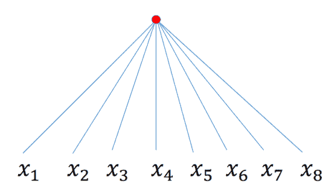

<!--yml

类别：未分类

日期：2024-09-06 19:56:28

-->

# [2103.05127] 深度学习的模型复杂性：综述

> 来源：[`ar5iv.labs.arxiv.org/html/2103.05127`](https://ar5iv.labs.arxiv.org/html/2103.05127)

¹¹affiliationtext: 计算机科学学院，西蒙弗雷泽大学，加拿大本那比，huxiah@sfu.ca，jpei@cs.sfu.ca²²affiliationtext: 计算与软件系，麦克马斯特大学，加拿大汉密尔顿，chul9@mcmaster.ca³³affiliationtext: 微软研究院，中国北京，{Weiqing.liu, Jiang.bian}@microsoft.com

# 深度学习的模型复杂性：综述

夏虎 凌阳 储 建裴 卢伟青 卞江

###### 摘要

模型复杂性是深度学习中的一个基本问题。本文对深度学习中模型复杂性的最新研究进行了系统的概述。深度学习的模型复杂性可以分为表现能力和有效模型复杂性。我们回顾了这两类研究，并结合模型框架、模型规模、优化过程和数据复杂性这四个重要因素进行了讨论。我们还讨论了深度学习模型复杂性的应用，包括理解模型泛化、模型优化、以及模型选择和设计。最后，我们提出了一些有趣的未来研究方向。

## 1 引言

由于其优越的性能，深度学习在许多应用中具有颠覆性，如计算机视觉[40]、自然语言处理[55]和计算金融[91]。然而，深度学习模型仍然存在一系列基本问题，例如为什么深度学习在表现能力上明显优于经典机器学习模型，如何理解和量化深度模型的泛化能力，以及如何理解和改善优化过程。深度学习的模型复杂性是一个核心问题，并且与许多这些基本问题相关。

深度学习模型的复杂性关注的是，对于某种深度学习架构，该模型能够表达多复杂的问题[15, 44, 70, 89]。理解深度模型的复杂性是准确理解模型能力和局限性的关键。探索模型复杂性不仅对于理解深度模型本身是必要的，还用于研究许多其他相关的基本问题。例如，从统计学习理论的角度看，模型的表达能力用于界定泛化误差[69]。一些最近的研究提出了基于范数的模型复杂性[60]和基于敏感性的模型复杂性[76, 81]来探讨深度模型的泛化能力。此外，检测训练过程中模型复杂性的变化可以提供对模型优化和正则化性能的理解和改进的见解[44, 74, 89]。

对机器学习模型复杂性的研究可以追溯到几十年前。1990 年代的一系列早期研究讨论了经典机器学习模型的复杂性[16, 20, 21, 98]。一个具有代表性的模型是决策树[19]，其复杂性通常通过树深度[20]和叶节点数量[16]来衡量。模型复杂性分析中的另一个常见主题是逻辑回归，它是大量参数化模型的基础。逻辑回归的模型复杂性从 Vapnik-Chervonenicks 理论[26, 96]、Rademacher 复杂性[46]、Fisher 信息矩阵[21]以及模型的剃刀[6]等角度进行了研究。这里，模型的剃刀是一个理论指标，用于比较参数化模型家族与真实分布的复杂性。然而，深度学习模型与几十年前讨论的那些经典机器学习模型有着显著不同[70]。经典机器学习模型的复杂性分析不能直接应用或简单扩展到深度模型。

最近，深度学习中的模型复杂性引起了越来越多的关注[13, 60, 70, 78, 81, 89]。然而，据我们所知，目前尚无关于深度学习模型复杂性的现有调查。对这一新兴且重要主题缺乏调查促使我们进行这项最新研究的调查。在本文中，我们将“深度学习模型”和“深度神经网络”这两个术语互换使用。

关于经典机器学习模型的复杂性，几十年来有大量的研究，这些研究总结在优秀的综述中[20, 21, 61, 93]。接下来，我们将非常简要地回顾几种典型模型的复杂性，包括决策树、逻辑回归和贝叶斯网络模型。我们还讨论了深度神经网络的模型复杂性与这些模型之间的差异。

决策树的复杂性有相对公认的标准测量方法。决策树的复杂性可以通过叶子节点的数量[16, 61]或树的深度[20, 98]来表示。由于决策树是通过递归地划分输入空间，并为每个结果区域提出一个局部简单模型[71]，叶子节点的数量原则上利用结果区域的数量来表示树的复杂性。决策树的深度作为复杂性度量在最坏情况下量化了分类所需的查询数量[20]。一系列研究[16, 61]探讨了基于准确性-复杂性权衡的树优化。此外，Buhrman 和 De Wolf[20]将决策树的复杂性与通过证书复杂性[4]、敏感性复杂性[28]和逼近多项式[80]表示的函数复杂性联系起来，并使用这些函数的复杂性度量来界定决策树的复杂性。

逻辑回归是大量参数化模型的基础[21, 46]。在 1990 年代初，提出了有效自由度作为线性模型和惩罚线性模型的复杂性度量，表示为 Vapnik-Chervoneniks (VC) 维度[26]。此外，Rademacher 复杂性和高斯复杂性[8, 12]也用于测量逻辑回归模型的复杂性[46]。与 VC 维度相比，Rademacher 复杂性考虑了数据分布，因此反映了更细致的模型复杂性。后来，Bulso 等[21]和 Balasubramanian[6]建议，逻辑回归模型的复杂性与模型能表示的可区分分布的数量有关。Bulso 等[21]基于 Fisher 信息矩阵的行列式定义了逻辑回归模型的复杂性度量。

Spiegelhater 等人[93]系统地研究了贝叶斯分层模型的模型复杂性。在测量贝叶斯分层模型复杂性时，一个独特的挑战是模型参数的数量没有明确的定义。Spiegelhater 等人[93]通过有效参数的数量定义了模型复杂性度量。通过信息论的论证，他们展示了这个复杂性度量可以通过偏差的后验均值与感兴趣参数的后验估计下的偏差之间的差异来估计，并且大约等于 Fisher 信息[33]和后验协方差矩阵的乘积的迹。此外，他们建议将这样的复杂性度量添加到后验均值偏差中，以得到用于模型比较的偏差信息准则。

复杂性度量通常是模型特定的。模型复杂性的定义在很大程度上取决于模型结构。不同的模型框架通常根据其结构特征需要不同的复杂性度量定义。不同模型框架的复杂性度量通常不能直接比较。

深度学习模型在结构上与传统机器学习模型存在显著差异，并且具有更多的参数。深度学习模型通常比传统模型复杂得多。因此，传统机器学习模型的复杂性度量方法不能直接应用于深度学习模型，以获得有效的复杂性度量。例如，通过决策树的深度[20, 98]和叶节点数量[16, 61]来衡量决策树的复杂性显然不适用于深度学习模型。通过可训练参数的数量[46]来衡量模型复杂性对深度学习模型的效果非常有限，因为深度学习模型通常存在过度参数化的情况。

本综述的其余部分组织如下。在第二部分中，我们简要介绍深度学习模型复杂性。在第三部分中，我们回顾了关于深度学习模型表现能力的现有研究。在第四部分中，我们调查了关于深度学习模型有效复杂性的现有研究。在第五部分中，我们讨论了深度学习模型复杂性的应用。在第六部分中，我们总结了本综述并讨论了一些未来的研究方向。

## 2 深度学习模型复杂性

在本节中，我们首先将深度模型复杂性分为两个类别：表现能力和有效模型复杂性。然后，我们讨论一系列深度学习模型复杂性的重要因素，并相应地分组现有的代表性研究。

### 2.1 什么是深度学习模型复杂性？

“模型复杂性”一词在深度学习中可能有两个不同的含义。首先，模型复杂性可能指深度模型在表达或近似复杂分布函数方面的能力[13]。其次，它可能描述一些参数化深度模型处理复杂分布函数的难度[89]。这两种含义分别由模型表现能力和模型有效复杂性这两个概念来表达。

表现能力，也称为表示能力、表现力和复杂性能力[86, 60]，捕捉了深度学习模型在近似复杂问题中的能力。非正式地说，表现能力描述了模型家族中任何模型的复杂性上限。

这个概念与假设空间复杂度的描述一致 [69, 96]。假设空间是一个假设的集合，例如所有具有固定模型结构的神经网络的集合。考虑由固定模型结构表示的假设空间，模型的表达能力也是假设空间复杂度。在统计学习理论中，无限假设空间的复杂度由其表达能力表示，即假设集合的丰富程度 [69]。捕捉假设空间复杂度的一个概念是 Rademacher 复杂度 [12]，它衡量假设空间拟合随机噪声的程度。另一个概念是 VC 维度 [26]，它反映了假设空间可以打破的最大集合的大小。探索表达能力有助于获得深度模型的可学习性保证并推导泛化界限 [69]。

有效模型复杂度，也称为实际复杂度、实际表达能力和可用容量 [37, 81]，反映了深度模型在特定参数化下表示的函数的复杂度 [89]。有效模型复杂度是针对固定参数的模型。对有效模型复杂度的研究有助于探索深度模型的各个方面，例如理解优化算法 [81]，改进模型选择策略 [72] 和改进模型压缩 [25]。

表达能力和有效模型复杂度密切相关，但它们是两个不同的概念。表达能力描述了深度模型的假设空间的表达能力。有效模型复杂度探讨了假设空间内特定假设的复杂度。让我们用一个例子来演示模型表达能力和有效模型复杂度之间的区别和关系。

###### 示例 1  （表达能力和有效复杂度的区别）。

考虑单变量多项式函数 $f(x)=ax^{2}+bx+c$。$f(x)$ 的表达能力是单变量二次的。换句话说，$f(x)$ 不能表达比单变量二次多项式更复杂的函数。例如，当参数 $a=0$，$b=1$ 和 $c=1$ 时，$f(x)=x+1$，有效复杂度变为线性，这显然低于表达能力。

设 $\mathcal{H}$ 为固定深度学习模型结构的假设空间，$h\in\mathcal{H}$ 为假设（即深度学习模型）在 $\mathcal{H}$ 中。有效模型复杂性是特定假设的复杂性，记作 $EMC(h)$。深度模型的表达能力，记作 $MEC(\mathcal{H})$，可以写成以下形式

|  | $\sup\{EMC(h):h\in\mathcal{H}\}$ |  |
| --- | --- | --- |

这反映了模型表达能力与有效模型复杂性之间的关系。

由于深度学习模型架构复杂且过度参数化，它们通常具有较高的表达能力 [70, 87]。然而，一系列研究 [5, 37, 81]发现，训练后的深度模型的有效复杂性可能远低于其表达能力。

非正式且直观地，深度学习模型可以被视为从数据中学习的知识的“容器”。相同的模型架构作为“容器”可能通过学习不同的数据而包含不同数量的知识，因此具有不同的参数。表达能力可以被视为模型架构能够容纳的知识量的上限。有效模型复杂性则关注于对于特定模型、特定训练数据集，它实际包含了多少知识。

### 2.2 深度学习模型复杂性的关键因素

Bonaccorso [17] 指出，深度学习模型由一个静态结构部分和一个动态参数部分组成。静态结构部分总是在学习过程之前通过模型选择原则确定，然后一旦决定便保持不变。参数部分是优化的目标，由学习过程确定。静态和动态部分都对模型复杂性产生影响。我们细化了这种划分，并总结了影响模型复杂性的四个方面，包括表达能力和有效复杂性。

模型框架

模型框架的选择影响模型复杂性。模型框架的因素包括模型类型（例如前馈神经网络、卷积神经网络）、激活函数（例如 Sigmoid [29], ReLU [73]）等。不同的模型框架可能需要不同的复杂性度量标准，且可能无法直接进行比较。

模型规模

深度模型的规模影响模型复杂性。一些常用的模型规模度量包括参数数量、隐藏层的数量、隐藏层的宽度、滤波器的数量和滤波器的大小。在相同的模型框架下，不同规模的模型复杂性可以通过相同的复杂性度量标准来量化，从而进行比较 [54]。

优化过程

优化过程影响模型复杂度，包括目标函数的形式、学习算法的选择和超参数的设置。

数据复杂度

训练模型的数据也会影响模型复杂度。主要因素包括数据的维度、数据分布 [69]、由科尔莫哥罗夫复杂度测量的信息量 [22, 59] 等。

在这四个方面中，模型框架和模型大小主要影响深度模型的静态结构部分，而优化过程和数据复杂度主要影响动态参数部分。

表 1：总结了分别影响表达能力和有效复杂度的各个方面。

|  |  | 模型 | 模型 | 学习 | 数据 |
| --- | --- | --- | --- | --- | --- |
|  |  | 框架 | 大小 | 过程 | 复杂度 |
| 表达能力 | 深度效率 |  | ✓ |  |  |
| 宽度效率 |  | ✓ |  |  |
| 可表达的函数空间 | ✓ | ✓ | ✓ | ✓ |
| VC 维度和拉德马赫复杂度 | ✓ | ✓ |  | ✓ |
| 有效复杂度 | 有效复杂度度量 | ✓ | ✓ | ✓ | ✓ |
| 高容量低现实现象 | ✓ | ✓ | ✓ | ✓ |

这四个方面对表达能力的影响可以通过对假设空间的影响来理解。一个选定的模型框架对应一个假设空间 $\mathcal{H}$。每个假设 $h\in\mathcal{H}$ 代表一个具有给定框架的模型。一旦模型大小确定，假设空间缩小为 $\mathcal{H}$ 的一个子集。例如，假设我们设置两个模型，深度分别为 $l_{1}$ 和 $l_{2}$ （$l_{1}\leq l_{2}$），且宽度均为 $m$，则相应的假设空间为 $\mathcal{H}_{1}$ 和 $\mathcal{H}_{2}$。我们有 $\mathcal{H}_{1}\subset\mathcal{H}_{2}$。这是因为，对于每个 $h\in\mathcal{H}_{1}$，其中 $h$ 是一个假设，因此在这种情况下是一个深度网络模型，存在 $h^{\prime}\in\mathcal{H}_{2}$，其前 $l_{1}$ 层与 $h$ 中的层相同，后续层是相同的映射。很容易证明，$\mathcal{H}_{1}$ 的表达能力不会超过 $\mathcal{H}_{2}$ 的表达能力。最近，模型框架、模型大小及其对深度模型表达能力的影响已被很好地探索 [13, 51, 64, 89]。

数据分布和优化算法的选择将进一步缩小假设空间的范围，从而影响表达能力。例如，拉德马赫复杂度是一种依赖于数据的表达能力度量，考虑了数据分布的影响 [12, 69]。然而，据我们所知，数据复杂度和优化过程对深度学习模型表达能力的影响仍然很少被探索。

这四个方面也影响有效模型复杂性。通常，模型框架和模型规模决定了有效模型复杂性的可用范围。具有固定参数的模型的有效复杂性是由优化过程和训练数据选择的该范围内的一个值。优化过程影响有效复杂性，例如，添加$L^{1}$正则化约束深度神经网络中的自由度，从而约束有效模型复杂性 [44, 46]。训练数据影响有效复杂性，例如，使用相同的模型和相同的优化过程，在线性可分类数据上训练的模型的有效复杂性远低于在 ImageNet 上训练的模型 [31, 59]。具体来说，训练数据复杂性和优化过程对有效复杂性的影响体现在模型参数的值上。

在表格 1 中，我们列出了分别影响表达能力和有效复杂性的相关方面。在表格 2 中，我们列出了一些关于这两个主要问题——表达能力和有效复杂性的代表性研究。

表 2：关于深度神经网络模型复杂性的研究综述。

|  |  | 参考文献 |  特定模型  |  跨模型  |  基于测量  |  基于简化  |  目标模型 | 测量指标 |
| --- | --- | --- | --- | --- | --- | --- | --- | --- |
| 表达能力 | 深度效率 | [13, 30] | $\bullet$ |  |  | $\bullet$ | SPN | - |
|  | [67] | $\bullet$ |  |  | $\bullet$ | 二叉树分层网络，深度高斯网络 | - |
|  | [54] | $\bullet$ |  |  | $\bullet$ | 带有$\sigma(z)=\{Signum,Heaviside\}$的 FCNN | - |
|  | [70] | $\bullet$ |  | $\bullet$ |  | 带有$\sigma(z)=\{ReLU,Maxout\}$的 FCNN | #线性区域 |
|  | [92] | $\bullet$ |  | $\bullet$ |  | 带有$\sigma(z)=\{ReLU,Maxout\}$的 FCNN | #线性区域 |
|  | [14, 15] |  | $\bullet$ | $\bullet$ |  | FCNN | Betti 数之和 |
| 宽度效率 | [64] | $\bullet$ |  |  | $\bullet$ | 带有$\sigma(z)=\{ReLU\}$的 FCNN | - |
| 可表达功能空间 | [3] | $\bullet$ |  |  | $\bullet$ | 带有$\sigma(z)=\{ReLU\}$的 FCNN | - |
|  | [36] | $\bullet$ |  |  | $\bullet$ | 带有$\sigma(z)=\{ReLU\}$的 FCNN | - |
|  | [52] | $\bullet$ |  | $\bullet$ |  | 带有$\sigma(z)=\{\sigma(z)=z^{r}\}$的 FCNN | 函数空间的维度 |
|  | [51] |  | $\bullet$ |  | $\bullet$ | FCNN, CNN, RNN | 张量分解的秩 |
| VC 维数与 Rademacher 复杂度 | [66] | $\bullet$ |  | $\bullet$ |  | 带有线性阈值门的 FCNN | VC 维数 |
|  | [11] | $\bullet$ |  | $\bullet$ |  | 使用 $\sigma=\{分段\ 多项式\}$ 的 FCNN | VC 维数 |
|  | [10] | $\bullet$ |  | $\bullet$ |  | 网络的 $\sigma=\{分段\ 线性\}$ | VC 维数 |
|  | [9] | $\bullet$ |  | $\bullet$ |  | 网络的 $\sigma=\{ReLU\}$ | Rademacher 复杂度 |
|  |  | [77] | $\bullet$ |  | $\bullet$ |  | 两层 FCNN，$\sigma=\{ReLU\}$ | Rademacher 复杂度 |
| 有效复杂度 | 有效复杂度度量 | [89] | $\bullet$ |  | $\bullet$ |  | 网络的 $\sigma=\{分段\ 线性\}$ | #线性区域，轨迹长度 |
|  | [81] | $\bullet$ |  | $\bullet$ |  | 网络的 $\sigma=\{分段\ 线性\}$ | 雅可比范数，轨迹长度 |
|  | [44] | $\bullet$ |  | $\bullet$ |  | 使用 $\sigma(z)=\{曲线\ 激活\}$ 的 FCNN | #近似线性区域 |
|  | [60] | $\bullet$ |  | $\bullet$ |  | 使用 $\sigma(z)=\sigma^{\prime}(z)z$ 的 FCNN | Fisher-Rao 范数 |
|  | [74] |  | $\bullet$ | $\bullet$ |  | 任何深度模型 | 最大 #样本到零训练误差 |
| 高容量低现实现象 | [37] | $\bullet$ |  | $\bullet$ |  | 使用 $\sigma(z)=\{ReLU\}$ 的全连接前馈神经网络（FCNN） | #线性区域，区域边界的体积 |

### 2.3 深度学习模型复杂度的现有研究：概述

关于深度模型复杂度的文献可以从两个不同的角度进行分类。第一个角度关注方法是模型特定还是跨模型。第二个角度关注方法是否发展了明确的复杂度度量。这两个角度适用于表达能力和有效复杂度。

#### 2.3.1 模型特定 versus 跨模型

根据方法是否专注于一种类型的模型或跨越多种类型的模型，现有的模型复杂度研究可以分为两组：模型特定方法和跨模型方法。

模型特定方法专注于某种类型的模型，并基于结构特征探索复杂度。例如，Bianchini 等人 [14, 15] 和 Hanin 等人 [37] 研究了全连接前馈神经网络（简称 FCNN）的模型复杂度，Bengio 和 Delalleau [13, 30] 关注于和求和-乘积网络的模型复杂度。此外，一些研究进一步提出了对激活函数的约束，以限制非线性特性。例如，Liang 等人 [60] 假设激活函数 $\sigma(\cdot)$ 满足 $\sigma(z)=\sigma^{\prime}(z)z$。

如果一个方法涵盖了多种类型的模型而非单一类型的模型，那么它就是跨模型的方法，因此可以用于比较两种或更多不同类型的模型。例如，Khrulkov 等 [51] 通过在这些网络架构和张量分解之间建立联系来比较一般递归神经网络（简称 RNNs）、卷积神经网络（简称 CNNs）和浅层 FCNNs 的复杂性。

#### 2.3.2 基于测量与基于降维

根据是否设计了明确的度量，最先进的模型复杂性方法可以分为两组：基于测量的方法和基于降维的方法。

如果深度模型复杂性研究定义了适当的模型复杂性定量表示，则该研究为基于测量的。例如，线性区域的数量被用来表示具有分段线性激活函数的全连接神经网络（FCNNs）的复杂性 [37, 70, 81, 89]。

如果一个复杂性方法通过将深度网络降至一些已知问题和函数来研究模型复杂性问题，并且不定义任何明确的复杂性度量，那么它就是基于降维的方法。例如，Arora 等 [3] 建立了带有 ReLU 激活函数的深度网络与 Lebesgue 空间之间的联系。Khrulkov 等 [51] 将深度神经网络与几种类型的张量分解联系起来。

## 3 深度学习模型的表现能力

深度模型的表现能力也称为表示能力、表现力或复杂性能力 [60, 86]。它描述了深度学习模型在近似复杂问题方面的能力。非正式地，表现能力描述了参数化模型家族中的复杂性上限。

深度学习模型的表现能力主要从四个方面进行探讨。

+   •

    深度效率分析了深度学习模型如何通过架构的深度来提升性能（例如，准确性）。

+   •

    宽度效率分析了深度学习模型中层的宽度如何影响模型的表现能力。

+   •

    可表达的函数空间研究了使用不同参数的特定框架和指定大小的深度模型可以表达的函数。

+   •

    VC 维度和 Rademacher 复杂性是机器学习中表现能力的两个经典度量。

在本节中，我们回顾了这四组研究。

### 3.1 深度效率

一系列近期的研究表明，深度架构显著优于浅层架构 [13, 67]。深度效率 [64]，即深度模型的有效性，受到了广泛关注。具体来说，关于深度效率的研究分析了深度架构为何能够获得良好性能，并衡量了模型深度对表达能力的影响。我们将深度效率的研究分为两类：模型减少方法和表达能力测量。

#### 3.1.1 模型减少

研究深度学习模型的表达能力的一种方法是将深度学习模型减少为可理解的问题和函数进行分析。

为了研究深度效率，一个直观的想法是比较深层网络和浅层网络之间的表示效率。Bengio 和 Delalleau [13, 30] 研究了深度和产品网络（简称 SPN）上的深度效率问题。一个 SPN 由计算输入的乘积或加权和的神经元组成。他们考虑了由深度和产品网络构建的两类函数。第一类函数是 $F=\cup_{n\geq 4}F_{n}$，其中 $F_{n}$ 是由深度 SPN 表示的函数族，具有 $n=2^{k}$ 输入和深度 $k$。第二类函数是 $G=\cup_{n\geq 2,i\geq 0}G_{i,n}$，其中 $G_{i,n}$ 是由具有 $n$ 个输入和深度 $2i+1$ 的 SPN 表示的函数族。

然后，Bengio 和 Delalleau 建立了浅层和产品网络表示这些函数族所需的隐藏神经元的下限。为了逼近函数 $f\in F$，一个具有一层隐藏层的浅层 SPN 至少需要 $2^{\sqrt{n}-1}$ 个隐藏神经元和至少 $2^{\sqrt{n}-1}$ 个乘积神经元。类似地，为了逼近函数 $g\in G$，一个具有一层隐藏层的浅层 SPN 至少需要 $(n-1)^{i}$ 个隐藏神经元。深层和浅层和产品网络表示相同函数的比较表明，为了表示相同的函数，浅层网络中的神经元数量必须呈指数增长，而深层网络仅需线性增长。

Mhaskar 等人 [67] 研究了由层次化二叉树网络表示的函数，并与浅层网络进行比较。图 1 展示了浅层网络和层次化二叉树网络。记 $S_{m}$ 为具有 $m$ 个神经元的浅层网络，形式为

|  | $x\rightarrow\sum_{k=1}^{m}a_{k}\sigma(w_{k}\cdot x+b_{k})$ |  |
| --- | --- | --- |

其中$w_{k}\in\mathbb{R}^{d}$，$b_{k},a_{k}\in\mathbb{R}$是第$k$个隐藏神经元的参数，$\sigma$是激活函数。记$W^{NN}_{r,d}$为具有连续偏导数阶数$\leq r$的函数类，并附带某些假设（详见[67]）。相应地，分层二叉树网络是具有以下结构的网络

|  | $\begin{split}f(x_{1},\ldots,x_{d})=h_{l1}(&amp;h_{(l-1),1}(\ldots(h_{11}(x_{1},x_{2}),h_{12}(x_{3},x_{4}),\ldots),\\ &amp;h_{(l-1),2}(\ldots))\end{split}$ |  | (1) |
| --- | --- | --- | --- |

其中每个$h_{ij}$在$S_{m}$中，$l$是网络的深度，$h_{l1}$对应于树结构的根节点。参见图 1 作为深度$=3$的分层二叉树的示例。记$D_{m}$为分层二叉树网络的类。令$W^{NN}_{H,r,d}$为公式(1)中结构的函数类，其中每个$h_{ij}$在$W^{NN}_{r,2}$中。定义$\inf_{P\in V}||f-P||$为$V$对函数$f$的近似精度，其中$V=\{S_{m},D_{m}\}$。

图 1：8 个输入维度输入到一个浅层网络（a）和一个分层二叉树网络（b），由 Mhaskar 等人[67]研究。

Mhaskar 等人[67]展示了，为了将一个函数$f\in W^{NN}_{r,d}$近似到精度$\epsilon$，在$S_{m}$中的一个浅层网络需要$O(\epsilon^{-d/r})$个可训练参数。同时，为了将一个函数$f\in W^{NN}_{H,r,d}$近似到相同的精度，在$D_{m}$中的一个网络只需要$O(\epsilon^{-2/r})$个可训练参数。然后，Mhaskar 等人[67]比较了浅层高斯网络与分层二叉树结构（公式(1）），其中每个$h_{ij}$计算一个浅层高斯网络，并得出类似结论。他们证明了具有设计的组合结构的函数可以通过深层和浅层网络以相同的精度进行近似。然而，深层网络的参数数量远少于浅层网络。

Arora 等 [3] 研究了深度神经网络中深度的重要性，使用 ReLU 激活函数。首先，他们研究了具有一维输入和一维输出的神经网络。他们证明了，对于任意自然数 $k\geq 1$ 和 $w\geq 2$，存在一个函数族可以用具有 $k$ 个隐层、每层宽度为 $w$ 的 ReLU 神经网络表示。然而，要表示这个函数族，具有 $k^{\prime}<k$ 个隐层的网络需要至少 $\frac{1}{2}k^{\prime}w^{\frac{k}{k^{\prime}}}-1$ 个隐层神经元。接着，他们研究了具有 $d$ 个输入维度的 ReLU 神经网络。他们证明了，给定自然数 $k,m,d\geq 1$ 和 $w\geq 2$，存在一个 $\mathbb{R}^{d}\rightarrow\mathbb{R}$ 的函数族，可以用具有 $k+1$ 个隐层和 $2m+wk$ 个神经元的 ReLU 网络表示。这个函数族是利用来自多面体理论的 zonotope 理论 [102] 构造的。然而，要表示这个函数族，具有 $k^{\prime}\leq k$ 个隐层的 ReLU 神经网络所需的最小隐层神经元数量是

|  | $\max\{\frac{1}{2}(k^{\prime}w^{\frac{k}{k^{\prime}d}})(m-1)^{(1-\frac{1}{d})\frac{1}{k^{\prime}}}-1,k^{\prime}(\frac{w^{\frac{k}{k^{\prime}}}}{d^{\frac{1}{k^{\prime}}}})\}.$ |  |
| --- | --- | --- |

为了研究深度神经网络在什么情况下比浅层网络更高效，Kuurkova [54] 分析了浅层神经网络在 Signum 激活函数下的表达能力的限制。Signum 激活函数定义为

|  | $sgn(z)=\left\{\begin{array}[]{rcl}-1\quad\mbox{当}&amp;z<0\\ 1\quad\mbox{当}&amp;z\geq 0\end{array}\right.$ |  |
| --- | --- | --- |

Kuurkova 证明了存在无法被单隐层 Signum 神经网络$L^{1}$ 稀疏表示的函数，这些网络具有有限数量的神经元和有限的输出权重绝对值之和（即 $L^{1}$-范数）。这样的函数应与来自 Signum 感知机类 $\{sgn(vx+b):X\rightarrow\{-1,1\}|v\in\mathbb{R}^{d},b\in\mathbb{R}\}$ 的任何函数几乎正交。Hadamard 矩阵生成的函数就是这样的例子。一个阶数为$n$的 Hadamard 矩阵是一个 $n\times n$ 的矩阵，矩阵条目在 $\{-1,1\}$ 中，使得任何两个不同的行或列都是正交的。Kuurkova [54] 证明了由 $n\times n$ Hadamard 矩阵诱导的函数无法被浅层 Signum 网络计算，这些网络的隐层神经元数量和输出权重绝对值之和都小于 $\frac{\sqrt{n}}{\lceil\log_{2}n\rceil}$。

为了进一步说明浅层网络的局限性，Kuurkova [54] 比较了具有 Heaviside 激活函数的单隐层和双隐层网络的表示能力。Heaviside 激活函数定义为

|  | $\sigma(z)=\left\{\begin{array}[]{rcl}0&amp;\quad\mbox{对于}&amp;z<0\\ 1&amp;\quad\mbox{对于}&amp;z\geq 0\end{array}\right.$ |  | (2) |
| --- | --- | --- | --- |

设 $S(k)$ 为一个 $2^{k}\times 2^{k}$ 的 Sylvester-Hadamard 矩阵，其构造方式是从

首先递归迭代 $S(l+1)=S(2)\otimes S(l)$。Kuurkova [54] 表明，为了表示由 $S(k)$ 诱导的函数，具有两个隐藏层的 Heaviside 网络在每个隐藏层中需要 $k$ 个神经元。然而，为了表示这样的函数，具有一个隐藏层的 Heaviside 网络至少需要 $\frac{2^{k}}{k}$ 个隐藏神经元，或者某些输出权重的绝对值不小于 $\frac{2^{k}}{k}$。

总之，模型简化方法将神经网络降至某种函数[3, 13, 54, 67]，并研究模型深度对表达函数家族能力的影响。

#### 3.1.2 表达能力度量

为了研究深度效率，另一种思路是制定一个适当的表达能力度量，并研究模型的深度和层宽增加时表达能力的变化。

Montufar 等人[70]关注具有分段线性激活函数（例如 ReLU[73]和 Maxout[35]）的全连接前馈神经网络（FCNNs），并提出使用线性区域的数量作为模型复杂性的表示（图 2）。基本的观点是，具有分段线性激活函数的 FCNN 将输入空间划分为大量的线性区域。每个线性区域对应一个线性函数。线性区域的数量可以反映模型的灵活性和复杂性。

图 2: Montufar 等人[70]的一个例子，展示了深度模型的优势。深度 ReLU 网络（虚线）通过用更多的线性区域来逼近边界，比浅层网络（实线）更准确地捕捉边界。

Montufar 等人[70]研究了两种类型的分段线性激活函数的 FCNN：ReLU[73]和 Maxout[35]。他们证明了，在某些参数设置下，ReLU 网络$\mathcal{N}$的模型表达能力，表示为线性区域的最大数量并记作$MEC(\mathcal{N})$，是由下式界定的：

|  | $MEC(\mathcal{N})\geq(\prod_{i=1}^{l-1}\lfloor\frac{m_{i}}{m_{0}}\rfloor^{m_{0}})\sum_{j=0}^{m_{0}}\tbinom{m_{l}}{j}$ |  | (3) |
| --- | --- | --- | --- |

其中$l$是隐藏层的数量，$m_{i}$是第$i$个隐藏层的宽度，$m_{0}=d$是输入的维度。基于这一界限，他们展示了一个具有$l$个隐藏层且每层宽度为$m_{i}\geq m_{0}$的 ReLU 网络能够逼近任何具有$\Omega((\frac{m}{m_{0}})^{(l-1)m_{0}}m^{m_{0}})$线性区域的分段线性函数。

Montufar 等人[70]还证明，对于秩为$k$的 Maxout 激活函数，具有$m$个神经元的单隐藏层 Maxout 网络的表达能力由$MEC(\mathcal{N})\geq k^{\min(d,m)}$和$MEC(\mathcal{N})\leq\min\{\sum_{j=1}^{d}\tbinom{k^{2}m}{j},\ k^{m}\}$来界定。一个秩为$k$的 Maxout 网络，由$l$个隐藏层组成，每层的宽度为$m$，可以计算任何具有$\Omega(k^{l-1}k^{m})$线性区域的分段线性函数。总之，具有分段线性激活函数的全连接神经网络（FCNN）生成的线性区域的最大数量随着模型深度的增加而指数增长。

Montufar 等人 [70] 提供了深度效率的解释。他们认为，深度模型的中间层能够将多个输入映射到相同的输出。随着层数的增加，层级函数的组合会以指数级重复利用较低层次的计算。这使得深度模型即使在参数相对较少的情况下，也能计算出高度复杂的函数。

Serra 等人 [92] 改进了 Montufar 等人 [70] 提出的线性区域最大数量的界限（见公式 (3)）。给定一个具有 $l$ 层的深度 ReLU 神经网络，设 $m_{i}$ 为第 $i$ 层隐藏层的宽度且 $m_{i}\geq 3d$，其中 $d$ 为输入维度。Serra 等人 [92] 证明了该神经网络的线性区域的最大数量有下界为

|  | $MEC(\mathcal{N})\geq(\prod_{i=1}^{l-1}(\lfloor\frac{m_{i}}{d}\rfloor+1)^{d})\sum_{j=0}^{d}\tbinom{m_{l}}{j}$ |  |
| --- | --- | --- |

并且上界为

|  | $MEC(\mathcal{N})\leq\sum_{(j_{1},\ldots,j_{l+1})\in J}\prod_{i=1}^{l+1}\tbinom{m_{i}}{j_{i}}$ |  |
| --- | --- | --- |

其中 $J=\{(j_{1},\ldots,j_{l+1})\in\mathbb{Z}^{l+1}:0\leq j_{i}\leq\min\{d,m_{1}-j_{1},\ldots,m_{i-1}-j_{i-1},m_{i}\}\}$。

Bianchini 和 Scarselli [14, 15] 设计了一个用于深度神经网络模型复杂性的拓扑度量。给定一个具有单输出的全连接神经网络（FCNN），记作 $\mathcal{N}:\mathbb{R}^{d}\rightarrow\mathbb{R}$，他们定义 $S=\{x\in\mathbb{R}^{d}|\mathcal{N}(x)\geq 0\}$ 为被 $\mathcal{N}$ 分类为正类的实例集合。神经网络 $\mathcal{N}$ 的模型复杂性通过 $B(S)$ 来度量，$B(S)$ 是集合 $S$ 的 Betti 数之和，即：

|  | $MEC(\mathcal{N})=B(S)=\sum_{i=0}^{d-1}b_{i}(S)$ |  |
| --- | --- | --- |

其中 $b_{i}(S)$ 表示第 $i$ 个 Betti 数，用于计算 $S$ 中 $(i+1)$ 维孔洞的数量。Betti 数通常用于区分代数拓扑学中具有不同特征的空间 [18]。$S$ 包含网络 $\mathcal{N}$ 正确分类的实例。因此，$B(S)$ 可以用来研究 $S$ 如何受到 $\mathcal{N}$ 架构的影响，并可以代表模型的复杂性。

Bianchini 和 Scarselli [14, 15] 报告了 $B(S)$ 对一系列网络架构的上界和下界（表 3）。特别是，Bianchini 和 Scarselli [14, 15] 证明了单隐藏层网络的 $B(S)$ 随着隐藏层宽度的多项式增长。也就是说，$B(S)\in O(m^{d})$，其中 $m$ 是隐藏层的宽度。他们还证明了深度神经网络的 $B(S)$ 随着隐藏神经元总数的指数增长。也就是说，$B(S)\in O(2^{M})$，其中 $M$ 是隐藏神经元的总数。这表明深度神经网络具有更高的表达能力，因此能够学习比浅层网络更复杂的函数。

表 3：Bianchini 和 Scarselli [15, 14] 给出的 $B(S)$ 的上界和下界，适用于具有 $M$ 个隐藏单元、$d$ 个输入和 $l$ 个隐藏层的网络。

| #输入 | #隐藏层 | 激活函数 | $B(S)$ 的界限 |
| --- | --- | --- | --- |
| $B(S)$ 的上界 |
| d | 1 | 阈值 | $O(M^{d})$ |
| d | 1 | 反正切 | $O((d+M)^{d+2})$ |
| d | 1 | 多项式，次数 $r$ | $\frac{1}{2}(2+r)(1+r)^{d-1}$ |
| 1 | 1 | 反正切 | $M$ |
| d | 多个 | 反正切 | $2^{M(2M-1)}O((dl+d)^{d+2M})$ |
| d | 多个 | tanh | $2^{M(M-1)/2}O((dl+d)^{d+M})$ |
| d | 多个 | 多项式，次数 $r$ | $\frac{1}{2}(2+r^{l})(1+r^{l})^{d-1}$ |
| $B(S)$ 的下界 |
| d | 1 | 任意 sigmoid | $(\frac{M-1}{d})^{d}$ |
| d | 多个 | 任意 sigmoid | $2^{l-1}$ |
| d | 多个 | 多项式，次数 $r\geq 2$ | $2^{l-1}$ |

Bianchini 和 Scarselli [14, 15] 建议，深度模型的层级组合机制使模型能够在输入空间的不同区域重复相同的行为，从而使深度比宽度更有效。

### 3.2 宽度效率

除了深度效率外，宽度对表达能力的影响，即宽度效率，也值得探讨。宽度效率分析了宽度如何影响深度学习模型的表达能力 [64]。宽度效率对于全面理解表达能力很重要，并有助于验证从深度效率中获得的见解 [64]。

Lu 等人 [64] 研究了具有 ReLU 激活函数的神经网络的宽度效率。他们将通用逼近定理 [7, 43] 扩展到宽度受限的深度 ReLU 神经网络。经典的通用逼近定理 [7, 43] 说明，具有某些激活函数（例如 ReLU）的单隐层神经网络可以在紧致域上以任意所需精度逼近任何连续函数。Lu 等人 [64] 证明，对于任何勒贝格可积函数 $f:\mathbb{R}^{d}\rightarrow\mathbb{R}$ 和任意 $\epsilon>0$，存在一个 ReLU 网络 $\mathcal{N}:\mathbb{R}^{d}\rightarrow\mathbb{R}$，可以将 $f$ 逼近到 $\epsilon$ 的 $L^{1}$ 距离。也就是说，

|  | $\int_{\mathbb{R}^{d}} | f(x)-F_{\mathcal{N}}(x) | dx<\epsilon.$ |  |
| --- | --- | --- | --- | --- |

这里 $F_{\mathcal{N}}$ 是由神经网络 $\mathcal{N}$ 表示的函数。每个隐藏层的宽度 $m_{i}$ 满足 $m_{i}\leq d+4$。

此外，为了定量探讨层宽度在表达能力中的作用，Lu 等人 [64] 提出了深度效率的对偶问题。即是否存在宽而浅的 ReLU 网络，这些网络不能被任何窄而深的神经网络所逼近，而其大小并未显著增加。设 $F_{\mathcal{A}}:\mathbb{R}^{d}\rightarrow\mathbb{R}$ 是由 ReLU 神经网络 $\mathcal{A}$ 表示的函数，其中深度 $h=3$，每层的宽度为 $2k^{2}$，其中 $k$ 是一个整数，使得 $k\geq d+4$。设 $F_{\mathcal{B}}:\mathbb{R}^{d}\rightarrow\mathbb{R}$ 是由 ReLU 神经网络 $\mathcal{B}$ 表示的函数，其中深度 $h\leq k+2$，每个隐藏层的宽度 $m_{i}\leq k^{3/2}$，其中 $\mathcal{B}$ 的参数值受限于 $[-b,b]$。对于任何常数 $b>0$，存在 $\epsilon>0$ 使得 $F_{\mathcal{A}}$ 永远无法被 $F_{\mathcal{B}}$ 以 $\epsilon$ 的 $L^{1}$ 距离逼近。也就是说，

|  | $\int_{\mathbb{R}^{d}} | F_{\mathcal{A}}(x)-F_{\mathcal{B}}(x) | dx\geq\epsilon.$ |  |
| --- | --- | --- | --- | --- |

这表明存在一类浅层 ReLU 神经网络，这些网络不能被深度受限于多项式界限的窄网络所逼近。

多项式下界对于宽度效率小于指数下界对于深度效率[13, 15, 70]。也就是说，要近似一个深度线性增加的模型，浅层模型的宽度需要至少指数级增加。要近似一个宽度线性增加的浅层宽模型，深度狭窄模型的深度需要至少多项式级增加。然而，Lu 等人[64]指出，由于缺乏宽度的多项式上界，无法严格证明深度比宽度更有效。多项式上界确保了要近似一个浅层宽模型，深层狭窄模型的深度最多需要多项式级增加。

### 3.3 可表达的函数空间

除了对深度效率和宽度效率的研究外，第三类研究探讨了可以由具有特定框架和指定规模的深度学习模型表达的函数类。这类研究探索了深度学习模型的可表达函数空间，包括特定模型的方法和跨模型的方法。

#### 3.3.1 特定模型的方法

Arora 等人[3] 研究了由具有 ReLU 激活函数的深度神经网络表示的函数族。他们证明了每个分段线性函数 $f:\mathbb{R}^{d}\rightarrow\mathbb{R}$ 可以由最多 $\lceil\log_{2}(d+1)\rceil$ 个隐藏层的 ReLU 神经网络表示。分段线性函数族在紧支撑连续函数族中是稠密的，而紧支撑连续函数族在 Lebesgue 空间 $L^{p}(\mathbb{R}^{d})$ 中是稠密的[3, 23]。

Lebesgue 空间 $L^{p}(\mathbb{R}^{d})$ 定义为 Lebesgue 可积函数 $f$ 的集合，其中 $\int_{\mathbb{R}^{d}}|f|<+\infty$ [23]。定义 $L^{p}$ 范数[23] 为 $||f||_{p}=[\int_{\mathbb{R}^{d}}|f|^{p}]^{1/p}$。那么，上述结论可以扩展到 $L^{p}(\mathbb{R}^{d})$ 空间。也就是说，每个 $f\in L^{p}(\mathbb{R}^{d})$ 都可以通过最多 $\lceil\log_{2}(d+1)\rceil$ 个隐藏层的 ReLU 神经网络近似到任意的 $L^{p}$ 范数。

Gühring 等人[36] 研究了具有 ReLU 激活函数的深度神经网络在 Sobolev 空间中的表达能力[1]。给定 $\Omega\subset\mathbb{R}^{d}$，$p\in[1,\infty]$，$n\in\mathbb{N}$，$L^{p}(\Omega)$ 是 $\Omega$ 上的 Lebesgue 空间，Sobolev 空间[84] 定义为

|  | $W^{n,p}(\Omega)=\{f\in L^{p}(\Omega):D^{\alpha}f\in L^{p}(\Omega)\mbox{ 对于 }\forall\alpha\in\mathbb{N}^{d}_{0}, | \alpha | \leq n\},$ |  |
| --- | --- | --- | --- | --- |

其中 $D^{\alpha}f$ 是 $f$ 的 $\alpha$ 阶导数。Sobolev 范数定义为

|  | $&#124;&#124;f&#124;&#124;_{W^{n,p}(\Omega)}=(\sum_{0\leq&#124;\alpha&#124;\leq n}&#124;&#124;D^{\alpha}f&#124;&#124;^{p}_{L^{p}(\Omega)})^{1/p}.$ |  |
| --- | --- | --- |

Gühring 等人 [36] 分析了 ReLU 神经网络在逼近 Sobolev 空间函数方面的效果，并确定了逼近 Sobolev 空间函数的模型规模的上界和下界。具体来说，定义 Sobolev 空间 $f$ 的一个子集为

|  | $\mathcal{F}_{n,d,p,B}=\{f\in W^{n,p}((0,1)^{d}):&#124;&#124;f&#124;&#124;_{W^{n,p}((0,1)^{d})}\leq B\}.$ |  |
| --- | --- | --- |

上界显示，对于任意的 $d\in\mathbb{N}$，$n\in\mathbb{N},n\geq 2$，$\varepsilon>0$，$0\leq s\leq 1$，$1\leq p\leq+\infty$，且 $B>0$，对于任何函数 $f\in\mathcal{F}_{n,d,p,B}$，存在一个神经网络 $\mathcal{N}_{\varepsilon}$ 和一组权重 $w_{f}$，使得

|  | $&#124;&#124;\mathcal{N}_{\varepsilon}(\cdot&#124;w_{f})-f(\cdot)&#124;&#124;_{W^{s,p}((0,1)^{d})}\leq\varepsilon$ |  |
| --- | --- | --- |

其中 $\mathcal{N}_{\varepsilon}$ 代表一个最多包含 $c\log_{2}(\varepsilon^{-\frac{n}{n-s}})$ 层和 $c\varepsilon^{-\frac{d}{n-s}}\log_{2}(\varepsilon^{-\frac{n}{n-s}})$ 个神经元的 ReLU 神经网络，并且参数不为零。常数 $c$ 的值依赖于 $d,p,n,s$ 和 $B$ 的值。

此外，下界 [36] 显示，对于任意的 $d\in\mathbb{N}$，$n\in\mathbb{N},n\geq 2$，$\varepsilon>0$，$B>0$，$k\in\{0,1\}$，当 $p=+\infty$ 时，对于任何函数 $f\in\mathcal{F}_{n,d,p,B}$，存在一个 ReLU 神经网络 $\mathcal{N}_{\varepsilon}$，使得

|  | $&#124;&#124;\mathcal{N}_{\varepsilon}(\cdot&#124;w_{f})-f(\cdot)&#124;&#124;_{W^{k,\infty}((0,1)^{d})}\leq\varepsilon$ |  |
| --- | --- | --- |

其中 $\mathcal{N}_{\varepsilon}$ 至少有 $c^{\prime}\varepsilon^{-\frac{d}{2(n-1)}}$ 个非零权重。

Kileel 等人 [52] 探索了具有多项式激活函数的深度神经网络的函数空间。一个多项式激活函数 $\rho_{r}(z)$ 将 $z$ 提升到 $r$ 次方。他们建议，使用多项式激活函数时，模型复杂性的研究可以从代数几何的强大数学工具中受益。此外，多项式可以逼近任何连续激活函数，从而有助于探索其他深度学习模型。

给定一个深度多项式神经网络 $\mathcal{N}:\mathbb{R}^{d}\rightarrow\mathbb{R}^{c}$，其深度为 $h$，多项式次数为 $r$，令 $m=\{m_{0},m_{1},\ldots,m_{h}\}$ 表示 $\mathcal{N}$ 的架构，其中第 $i$ 层的宽度为 $m_{i}$，且 $m_{0}=d$，$m_{h}=c$。令 $\mathcal{F}_{m,r}$ 为 $\mathcal{N}$ 的功能空间。Kileel 等人 [52] 定义了功能变种 $\mathcal{V}_{m,r}$ 为 $\mathcal{V}_{m,r}=\overline{\mathcal{F}_{m,r}}$，它是功能空间 $\mathcal{F}_{m,r}$ 的 Zariski 闭包。“一个集合 $X$ 的 Zariski 闭包是包含 $X$ 的最小集合，该集合可以用多项式方程描述。” [52] 功能变种 $\mathcal{V}_{m,r}$ 可以比功能空间 $\mathcal{F}_{m,r}$ 大得多。Kileel 等人 [52] 提议使用功能变种的维度，记作 $\dim\mathcal{V}_{m,r}$，作为深度多项式神经网络的表达能力的表示，写作

|  | $MEC(\mathcal{N}_{m,r})=\dim\mathcal{V}_{m,r}.$ |  |
| --- | --- | --- |

为了测量 $\dim\mathcal{V}_{m,r}$，Kileel 等人 [52] 建立了深度多项式网络与张量分解之间的联系。具体来说，$h=2$ 的多项式网络与 CP 张量分解 [56] 相关，而深度多项式网络与迭代张量分解 [65] 相关。基于分解，他们证明了，对于任何固定的 $m$，存在 $\tilde{r}=r(m)$，使得对于任何 $r>\tilde{r}$，$\dim\mathcal{V}_{m,r}$ 是有界的。

|  | $\dim\mathcal{V}_{m,r}\leq\min\left(m_{h}+\sum_{i=1}^{h}(m_{i-1}-1)m_{i},m_{h}\binom{m_{0}+r^{h-1}+1}{r^{h-1}}\right).$ |  |
| --- | --- | --- |

此外，Kileel 等人 [52] 证明了深度多项式网络的瓶颈属性。也就是说，过于狭窄的层是瓶颈，可能会“窒息”多项式网络，使得网络无法填充环境空间。环境空间 $Sym_{r}(\mathbb{R}^{d})$ 是 $d$ 个变量的 $r$ 次同质多项式的空间。一个填充环境空间的多项式网络满足 $\mathcal{F}_{m,r}=Sym_{r^{h-1}}(\mathbb{R}^{d})^{c}$。他们展示了填充环境空间的网络架构对优化和训练是有帮助的。

#### 3.3.2 跨模型方法

除了特定模型的方法外，可表达的功能空间可以以跨模型的方式进行研究。具体来说，Khrulkov 等人 [51] 研究了递归神经网络（RNN）的表达能力。他们调查了网络架构与张量分解之间的关系，然后比较了 RNN、CNN 和浅层 FCNN 的表达能力。

(a) TT-分解

(b) CP-分解

(c) HT-分解

图 3：对应于各种张量分解的网络示例 [51]，从左到右依次是 TT 分解、CP 分解、HT 分解。

设 $\mathcal{X}\in\mathbb{R}^{n_{1}\times n_{2}\times\ldots\times n_{d}}$ 是一个 $d$ 维张量。张量的 Tensor Train (TT) 分解 [83] 通过以下方式计算

|  | $\mathcal{X}^{i_{1}i_{2}\ldots i_{d}}=\sum_{\alpha_{1}=1}^{r_{1}}\ldots\sum_{\alpha_{d-1}=1}^{r_{d-1}}G_{1}^{i_{1}\alpha_{1}}G_{2}^{\alpha_{1}i_{2}\alpha_{2}}\ldots G_{d}^{\alpha_{d-1}i_{d}}$ |  |
| --- | --- | --- |

其中张量 $G_{k}\in\mathbb{R}^{r_{k-1}\times n_{k}\times r_{k}}$ 被称为 TT 核。Khrulkov 等人 [51] 引入双线性单元来表示 TT 核。给定 $x\in\mathbb{R}^{m},y\in\mathbb{R}^{n}$ 和 $G\in\mathbb{R}^{m\times n\times k}$，一个双线性单元执行映射 $G:\mathbb{R}^{m}\times\mathbb{R}^{n}\rightarrow\mathbb{R}^{k}$，记作 $G(x,y)=z$。基于双线性单元，他们展示了递归神经网络实现了权重张量的 TT 分解（见图 3(a)）。类似地，Khrulkov 等人 [51] 展示了 Canonical (CP) 分解 [24]，形式为

|  | $\mathcal{X}^{i_{1}i_{2}\ldots i_{d}}=\sum_{\alpha=1}^{r}v_{1,\alpha}^{i_{1}}v_{2,\alpha}^{i_{2}}\ldots v_{d,\alpha}^{i_{d}},$ |  |
| --- | --- | --- |

对应于一个隐藏层的全连接神经网络（见图 3(b)）。网络中的每个单元表示为 $G_{\alpha}=v_{1,\alpha}^{i_{1}}v_{2,\alpha}^{i_{2}}\ldots v_{d,\alpha}^{i_{d}}$，其中 $v_{i,\alpha}\in\mathbb{R}^{n_{i}}$。分层 Tucker (HT) 分解 [27] 对应于 CNN 结构（见图 3(c)）。

表 4：Khrulkov 等人 [51] 提供的各种网络架构的表达能力比较。每列表示特定宽度为 $r$ 的网络，行展示了其他类型网络达到等效表达能力的宽度上限。

|  | TT-Network | HT-Network | CP-Network |
| --- | --- | --- | --- |
| TT-Network | $r$ | $r^{\log_{2}(d)/2}$ | $r$ |
| HT-Network | $r^{2}$ | $r$ | $r$ |
| CP-Network | $\geq r^{d/2}$ | $\geq r^{d/2}$ | $r$ |

Khrulkov 等人 [51] 提出了张量分解的秩作为神经网络复杂度的度量，因为分解的秩与网络的宽度相对应。基于神经网络与张量分解之间的对应关系，他们比较了 RNN、CNN 和浅层 FCNN 的模型复杂度。主要结论总结在表 4 中。特别地，给定一个随机的 $d$ 维张量，其 TT 分解的秩为 $r$ 和模式大小为 $n$，这个张量具有指数级大的 CP 分解和 HT 分解的秩。这表明，为了逼近一个递归神经网络，浅层 FCNN 或 CNN 需要一个指数级更大的宽度。

### 3.4 VC 维度和 Rademacher 复杂度

VC 维度和 Rademacher 复杂度广泛用于分析经典参数化机器学习模型的表达能力和泛化能力 [8, 12, 26, 69, 95]。一系列工作研究了深度学习模型的 VC 维度和 Rademacher 复杂度。

VC 维度是一个表达能力度量，反映了假设空间能够破碎的样本的最大数量 [69]。更高的 VC 维度意味着模型可以破碎更多的样本，从而模型具有更高的表达能力。Maass [66] 研究了具有线性阈值门的前馈神经网络的 VC 维度。线性阈值门表示每个神经元由一个加权和函数及一个 Heaviside 激活函数（见 Eq. (2)）组成。设 $W$ 为网络中的参数数量，$L$ 为网络的深度。Maass [66] 证明，当 $L\geq 3$ 时，这类网络的 VC 维度为 $\Theta(W\log W)$。

Bartlett 等人 [11] 研究了具有分段多项式激活函数的前馈神经网络的 VC 维度。具有 $p$ 个片段的分段多项式激活函数形式为 $\sigma(z)=\phi_{i}(z)$，其中 $z\int_{i-1},t_{i})$，$i\in{1,\ldots,p+1}$，且 $t_{i-1}<t_{i}$。每个 $\phi_{i}$ 是一个次数不超过 $r$ 的多项式函数。设 $W$ 为网络中的参数数量，$L$ 为网络的深度。Bartlett 等人 [[11] 证明了这类网络的 VC 维度的上界为 $O(WL^{2}+WL\log WL)$，下界为 $\Omega(WL)$。后来，Bartlett 等人 [10] 将下界改进为 $\Omega(WL\log(W/L))$。

Bartlett 等人 [10] 研究了具有分段线性激活函数（如 ReLU）的深度神经网络的 VC 维度。给定一个具有 $L$ 层和 $W$ 参数的深度神经网络，他们证明了此类网络的 VC 维度的下界是 $\Omega(WL\log(W/L))$，而 VC 维度的上界是 $O(WL\log W)$。

Rademacher 复杂度捕捉了假设空间拟合随机标签的能力，作为表达能力的度量 [69]。更高的 Rademacher 复杂度意味着模型可以拟合更多的随机标签，因此模型具有更高的表达能力。Bartlett 等人 [9] 研究了具有 ReLU 激活函数的深度神经网络的 Rademacher 复杂度。给定一个具有 $L$ 层的深度 ReLU 神经网络，设 $A_{i}$ 为第 $i$ 层的参数矩阵，$X\in\mathbb{R}^{n\times d}$ 为数据矩阵，其中 $n$ 是实例数量，$d$ 是输入维度。Bartlett 等人 [9] 证明了此类网络的 Rademacher 复杂度的下界是 $\Omega(||X||_{F}\prod_{i}||A_{i}||_{\sigma})$，其中 $||\cdot||_{\sigma}$ 是谱范数，$||\cdot||_{F}$ 是 Frobenius 范数。Neyshabur 等人 [77] 证明了两层 ReLU 神经网络的更紧的下界。假设 $||A_{1}||_{\sigma}\leq s_{1}$，$||A_{2}||_{\sigma}\leq s_{2}$，且 $s_{1}s_{2}$ 是网络表示函数的 Lipschitz 上界。他们证明了 Rademacher 复杂度的下界是 $\Omega(s_{1}s_{2}\sqrt{m}||X||_{F}/n)$，其中 $m$ 是隐藏层的宽度。这个下界比 [9] 提出的下界提高了 $\sqrt{m}$ 倍。

Yin 等人 [99] 研究了对抗训练神经网络的 Rademacher 复杂度。给定一个具有 ReLU 激活函数的前馈神经网络，记作 $f$，设 $L$ 为网络的深度，$A_{i}$ 为第 $i$ 层的参数矩阵。由 $f$ 表示的函数家族在对抗损失函数下可以写作

|  | $\mathcal{F}=\{f_{A}:\min_{x^{\prime}\in\mathbb{B}(\epsilon)}yf_{A}(x),\prod_{i=1}^{L} | | A_{i} | | _{\sigma}\leq r\}$ |  |
| --- | --- | --- | --- | --- | --- | --- |

其中 $\mathbb{B}(\epsilon)=\{x^{\prime}\in\mathbb{R}^{d}:||x^{\prime}-x||\leq\epsilon\}$ 是在 $x$ 周围扰动的样本集合，满足 $l_{\infty}$ 距离 $\leq\epsilon$。Yin 等人 [99] 证明了 $\mathcal{F}$ 的 Rademacher 复杂度的下界是 $\Omega(||X||_{F}/n+\epsilon\sqrt{d/n})$。这个下界显示了对输入维度 $d$ 的显著依赖。

一些研究 [75, 100] 表明，在实际中，深度学习模型通常是过度参数化的，参数远远多于样本数量。在这种情况下，深度学习模型的 VC 维度和 Rademacher 复杂度总是过高，因此它们提供的实际指导是有限的。

## 4 深度学习模型的有效复杂度

深度学习模型的有效复杂度也被称为实际复杂度、实际表达能力和可用容量 [37, 81]。它反映了深度模型在特定参数化下所表示的函数的复杂度 [89]。

深度学习模型的有效复杂度主要从两个不同的方面进行探索。

+   •

    有效复杂度的一般测量设计了深度学习模型有效复杂度的定量测量方法。

+   •

    对高容量低现实现象的研究发现，深度学习模型的有效复杂度可能远低于其表达能力。

在这一部分，我们回顾了这两组研究。

### 4.1 有效复杂度的一般测量

与表达能力相比，研究有效模型复杂度对敏感和精确的复杂度测量有更高的要求。这是因为有效复杂度不能仅从模型结构直接推导出来 [44]。相同模型结构的不同参数值可能会导致不同的有效复杂度。有效复杂度的度量期望对使用相同结构模型中的不同参数值敏感。

一系列研究致力于提出可行的深度学习模型有效复杂度的测量方法。复杂度测量的一个主要组别依赖于分段线性神经网络在输入空间中的线性区域划分。我们从这些方法开始，然后讨论其他方法。

#### 4.1.1 分段线性属性

图 4：一个 2 隐层 ReLU 网络将二维输入空间划分为多个线性区域，Han 和 Rolnick 研究了这个问题 [37]。每个隐藏神经元展示了当前神经元划分的线性区域。

众所周知，具有分段线性激活函数的神经网络在输入空间中生成有限数量的线性区域 [44, 70, 89]。这种属性被称为*分段线性属性*，如图 4 所示。线性区域的数量以及这些区域的密度通常可以反映有效复杂度。因此，一系列关于有效复杂度的研究从分段线性激活函数（例如，ReLU、Maxout）开始，或基于分段线性属性。

Raghu 等人 [89] 为具有分段线性激活函数的深度神经网络（如 ReLU 和 hard Tanh [82]）提出了两个相互关联的有效复杂度度量。具体而言，他们定义了在两个输入点 $x_{1},x_{2}\in\mathbb{R}^{d}$ 之间的轨迹 $x(t)$，这是由标量 $t\in[0,1]$ 参数化的曲线，且 $x(0)=x_{1}$ 和 $x(1)=x_{2}$。他们提出的第一个有效复杂度度量是当输入点沿着轨迹路径 $x(t)$ 移动时，输入空间中的线性区域数量，即模型 $\mathcal{N}$ 的有效复杂度 $EMC(\mathcal{N})$ 为

|  | $EMC(\mathcal{N})=\mathcal{T}(\mathcal{N}(x(t);W))$ |  |
| --- | --- | --- |

其中 $\mathcal{T}$ 是通过轨迹 $x(t)$ 的线性区域数量，而 $W$ 是一组特定的模型参数。他们提出的第二个有效复杂度度量是定义为轨迹长度 $l(x(t))$ 的度量。

|  | $l(x(t))=\int_{t}&#124;&#124;\frac{dx(t)}{dt}&#124;&#124;dt$ |  |
| --- | --- | --- |

这是轨迹 $x(t)$ 的标准 *弧长*。他们证明了这两种复杂度度量之间的比例关系。为了获得有效复杂度的估计值，Raghu 等人 [89] 约束了深度 ReLU 神经网络中任何层的轨迹长度的期望值。具体而言，给定一个深度 ReLU 神经网络，其权重初始化为 $N(0,\sigma^{2}_{w}/m)$，偏置初始化为 $N(0,\sigma_{b}^{2})$。让 $z^{(i)}(x(t))$ 表示在轨迹 $x(t)$ 的前 $i$ 个隐藏层变换后的新轨迹。其轨迹长度的期望值可以被约束为

|  | $\mathbb{E}[l(z^{(i)}(x(t)))]\geq O(\frac{\sigma_{w}\sqrt{m}}{\sqrt{m+1}})^{i}l(x(t))$ |  |
| --- | --- | --- |

其中 $m$ 表示隐藏层宽度。同样，对于在相同初始化下的 hard Tanh 神经网络，轨迹长度也有约束。

|  | $\mathbb{E}[l(z^{(i)}(x(t)))]\geq O\left(\frac{\sigma_{w}\sqrt{m}}{\sqrt{\sigma_{w}^{2}+\sigma_{b}^{2}+m\sqrt{\sigma_{w}^{2}+\sigma_{b}^{2}}}}\right)^{i}l(x(t)).$ |  |
| --- | --- | --- |

图 5：将一个圆形轨迹（最左侧）输入到 Tanh 神经网络中，随后图像显示了每个隐藏层变换后的轨迹 [89]。这显示了在层变换后的轨迹长度的增加。

利用这两个复杂度度量，Raghu 等人[89] 探索了深度神经网络的性能，并报告了一些发现。首先，有效复杂度随模型深度呈指数增长，随宽度呈多项式增长。图 5 展示了深度网络每个隐藏层之后轨迹的演变。其次，参数初始化的方式影响有效复杂度。第三，对某一层注入扰动会导致其他层的扰动呈指数级增长。最后，正则化方法，如批量归一化[45]，有助于减少轨迹长度。这解释了为何批量归一化有助于模型稳定性和泛化能力。

Novak 等人[81] 实证研究了模型复杂度与具有分段线性激活函数的神经网络的泛化能力之间的关系。他们建议使用模型敏感度来衡量有效复杂度。模型敏感度，也称为鲁棒性，反映了模型在小距离内区分不同输入的能力。Novak 等人[81] 引入了两个敏感度指标：输入输出 Jacobian 范数和轨迹长度[89]。

首先，基于分段线性特性，Novak 等人[81] 提出了 Jacobian 范数来测量在输入扰动在同一线性区域内的局部敏感度。该 Jacobian 范数可以进一步表示有效模型复杂度。即，

|  | $EMC(\mathcal{N})=\mathbb{E}_{{x}\sim D}[&#124;&#124;J({x})&#124;&#124;_{F}]$ |  |
| --- | --- | --- |

其中 $J(x)=\partial f_{\mathcal{N}}(x)/\partial x^{T}$ 是类别概率的 Jacobian，$f_{\mathcal{N}}$ 是由网络 $\mathcal{N}$ 表示的函数，$D$ 是数据分布，$||\cdot||_{F}$ 是 Frobenius 范数。

其次，他们提出了一种类似于 Raghu 等人[89]所开发的轨迹长度指标，作为当输入扰动到其他线性区域时的敏感度度量，进一步作为有效复杂度的度量，表示为

|  | $EMC(\mathcal{N})=\mathbb{E}_{{x}\sim D}[t({x})]$ |  |
| --- | --- | --- |

其中 $t(x)$ 是定义为通过轨迹 $\tau(x)$ 的线性区域数量的轨迹长度，即，

|  | $\begin{split}t(x)&amp;=\sum_{i=0}^{k-1}&#124;&#124;c(z_{i})-c(z_{(i+1)\%k})&#124;&#124;_{1}\\ &amp;\approx\oint_{z\in\tau(x)}&#124;&#124;\frac{\partial c(z)}{\partial(dz)}&#124;&#124;_{1}dz\end{split}$ |  |
| --- | --- | --- |

其中 $z_{0},\ldots,z_{k-1}$ 是轨迹 $\tau(x)$ 上的 $k$ 个等距点，$c(z)$ 是点 $z$ 上所有隐藏神经元的状态编码。

使用这两种复杂度度量，Novak 等人 [81] 研究了复杂度与泛化之间的关系。他们证明了神经网络在训练数据流形附近具有很强的鲁棒性，其中深度模型具有良好的泛化能力。他们还展示了与较差泛化相关的因素（例如，批量训练、随机标签）对应于较弱的鲁棒性，而与良好泛化相关的因素（例如，数据增强、ReLU）则对应于较强的鲁棒性。

为了为一般平滑激活函数开发有效复杂度度量，Hu 等人 [44] 提出了适用于具有曲线激活函数（例如，Sigmoid [53]、Tanh [48]）的深度神经网络的有效复杂度度量。受分段线性特性的启发，他们建议，使用具有最小线性区域数的分段线性函数来近似给定网络，近似函数的线性区域数可以作为给定网络的有效复杂度度量。他们学习了具有曲线激活函数的深度神经网络的分段线性近似，这被称为线性近似神经网络（简称 LANN）。LANN 通过学习每个隐藏神经元上曲线激活函数的分段线性近似函数来构建。具体地，Hu 等人 [44] 将 LANN $g$ 对目标网络 $f$ 的近似误差定义为 $\mathcal{E}(g;f)=\mathbb{E}[|g(x)-f(x)|]$。他们分析了某一层的近似误差如何传播通过其余隐藏层，并获得了每个隐藏神经元对 $\mathcal{E}(g;f)$ 的近似误差的影响。也就是说：

|  | $\small\mathcal{E}(g;f)=\sum_{i,j}\frac{1}{c}\sum(\ &#124;V_{o}&#124;\prod_{q=L}^{i+1}\mathbb{E}[&#124;J_{q}&#124;]\ )_{*,j}(\mathbb{E}[e_{i,j}]+\mathbb{E}[&#124;\hat{\epsilon}_{i,j}&#124;])$ |  |
| --- | --- | --- |

其中 $J_{q}$ 是网络 $f$ 第 $q$ 层的雅可比矩阵，$e_{i,j}$ 是在特定神经元 $\{i,j\}$ 上 $g$ 的近似误差，$V_{o}$ 是输出层的权重矩阵，$\hat{\epsilon}_{i,j}$ 是神经元 $\{i,j\}$ 上的可忽略的估计误差。给定一个近似度 $\lambda$，构建具有最小线性区域数的 LANN 以满足 $\mathcal{E}(g;f)\leq\lambda$ 的要求。LANN 的近似线性区域数作为有效复杂度度量，即：

|  | $EMC(f)_{\lambda}=d\sum_{i=1}^{L}\log(\sum_{j=1}^{m_{i}}k_{i,j}-m_{i}+1)$ |  |
| --- | --- | --- |

其中 $k_{i,j}$ 是神经元 $\{i,j\}$ 上近似函数的线性片段数，$m_{i}$ 是层 $i$ 的宽度，$L$ 是 $f$ 的深度。

使用复杂性度量，胡等人 [44] 研究了训练过程中模型复杂性的趋势。他们展示了有效复杂性随着训练迭代次数的增加而增加。他们还证明了过拟合的发生与有效复杂性的增加呈正相关，而正则化方法（例如，$L^{1}$、$L^{2}$ 正则化）抑制了模型复杂性的增加（见图 6）。

图 6：正则化方法对有效复杂性的影响 [44]。该图展示了在 Moon 数据集上训练的模型的决策边界。NM、L1、L2 分别是正常训练、使用 $L^{1}$ 和 $L^{2}$ 正则化的缩写。括号中是有效复杂性度量的值。

分段线性性质可能为深度学习中的模型复杂性捕捉提供新的机会。除了上述对有效复杂性的研究，分段线性神经网络或分段线性性质也可以帮助探索表达能力（见第二部分， [4, 36, 64, 70, 92 ]）。分段线性激活函数，特别是 ReLU，是许多任务和应用中流行且有效的激活函数 [58, 70]。局部线性特征和有限数量的区域划分有助于量化和分析具有分段线性激活函数的神经网络模型复杂性。

#### 4.1.2 其他度量指标

还有其他基于不同于分段线性性质的思想的有效复杂性度量。

Nakkiran 等人 [74] 通过研究双重下降现象引入了一种有效复杂性度量。深度神经网络的双重下降现象是指，随着模型大小、训练周期或训练数据大小的增加，测试性能通常先下降后上升。他们建议，为了帮助捕捉训练中的双重下降效应，复杂性度量应对训练过程、数据分布和模型架构敏感。他们提出了一种有效的复杂性度量，即模型能够在接近零训练误差的情况下训练的最大样本数，表示为

|  | $EMC_{D,\epsilon}(\mathcal{T})=\max\ \{n&#124;\mathbb{E}_{S\sim D}[Error_{S}(\mathcal{T}(S))]\leq\epsilon\}$ |  |
| --- | --- | --- |

其中$D$是数据分布，$\epsilon$是训练误差的阈值，$\mathcal{T}$是训练过程，$Error_{S}$是模型在训练集$S$上的均值误差，$n$是训练集$S$的大小。基于有效复杂度测量$EMC_{D,\epsilon}(\mathcal{T})$，他们调查了训练过程的演变，并展示了如果$EMC_{D,\epsilon}(\mathcal{T})$比训练集的大小$n$小得多或大得多，则任何增加其有效复杂度$EMC_{D,\epsilon}(\mathcal{T})$的$\mathcal{T}$扰动都有助于改善测试性能。然而，如果$EMC_{D,\epsilon}(\mathcal{T})\approx n$，那么任何增加其有效复杂度$EMC_{D,\epsilon}(\mathcal{T})$的$\mathcal{T}$扰动都会损害测试性能。

为了解决深度学习模型的泛化问题，Liang 等人[60]引入了模型复杂度测量的新概念，即 Fisher-Rao 范数。他们的研究集中在深度全连接神经网络上，其激活函数$\sigma(\cdot)$满足$\sigma(z)=\sigma^{\prime}(z)z$。由 Fisher-Rao 范数表示的模型复杂度为

|  | $EMC(\mathcal{N})=&#124;&#124;\theta&#124;&#124;^{2}_{fr}=\langle\theta,I(\theta)\theta\rangle$ |  |
| --- | --- | --- |

其中$\theta$是神经网络$\mathcal{N}$的参数集合（即权重、偏置），$\langle\cdot,\cdot\rangle$是内积，$I(\theta)$是 Fisher 信息矩阵，表示为

|  | $I(\theta)=\mathbb{E}[\nabla_{\theta}\ell(\mathcal{N}(X),Y)\otimes\nabla_{\theta}\ell(\mathcal{N}(X),Y)]$ |  |
| --- | --- | --- |

其中$\ell(\cdot,\cdot)$是损失函数，$\otimes$是张量积。Liang 等人[60]引入了复杂度测量应该满足的几何不变性属性，以研究泛化能力。这一不变性属性本质上表示，由于许多不同的连续操作可能导致完全相同的预测，因此泛化应该仅依赖于这些连续变换所获得的等价类。特定的参数化不应影响泛化。用于研究泛化的复杂度测量应该满足不变性属性。他们证明了这种 Fisher-Rao 范数满足不变性属性。设$\theta_{1},\theta_{2}$表示模型$f$的两个参数设置。如果$f_{\theta_{1}}=f_{\theta_{2}}$，那么它们的 Fisher-Rao 范数是相等的，即$||\theta_{1}||_{fr}=||\theta_{2}||_{fr}$。特别地，Fisher-Rao 范数在模型的节点级别重新缩放过程中保持不变。

有效复杂度可以通过模型达到零训练误差的训练样本大小[74]或通过 Fisher-Rao 度量[60]来衡量。沿着这个方向，可能会开发出更多的有效复杂度测量方法。

### 4.2 高容量低现实现象

一些研究探讨了深度学习模型的有效复杂度与表达能力之间的差距。

Ba 和 Caruana [5] 证明了浅层全连接神经网络能够学习到深层神经网络之前学习过的复杂函数，有时甚至只需与深层网络相同数量的参数。具体来说，给定一个训练良好的深层模型，他们建议基于深层模型的输出训练一个浅层模型，以模仿深层模型。他们显示，浅层模仿模型可以达到与深层模型一样高的准确率。然而，浅层模型不能直接在原始标记训练数据上进行训练以实现相同的准确率。这也被广泛认可为知识蒸馏 [41]。

基于这一现象，Ba 和 Caruana [5] 推测深度学习的强大可能部分源于深度架构与当前训练算法的良好匹配。也就是说，与浅层架构相比，深度架构可能更容易通过当前的优化技术进行训练。此外，他们提出，当能够使用浅层模型模仿深层复杂模型学习的函数时，深层模型学习的函数并没有真正复杂到难以学习的程度。这项研究表明，深度学习模型的实际有效复杂度与其表达能力的理论上限之间可能存在较大差距。我们称之为 *高容量低现实现象*。

Hanin 和 Rolnick [37] 研究了具有分段线性激活函数的全连接神经网络中的高容量低现实现象，特别是 ReLU。他们提出了两种有效的复杂度度量方法，分别是利用输入空间中的线性区域数量和这些线性区域之间的边界体积。

首先，他们研究了输入和输出维度均为 1 的 ReLU 神经网络，并使用线性区域的数量作为有效复杂度度量。他们显示，线性区域的平均数量随着神经元总数的增加而线性增长，远低于指数上界。具体而言，给定一个 ReLU 神经网络 $\mathcal{N}:\mathbb{R}\rightarrow\mathbb{R}$，其神经元 $z$ 的权重和偏置是随机初始化的，并且被 $\mathbb{E}[||\nabla z(x)||]\leq C$ （其中 $C>0$）所限制，则线性区域的平均数量与神经元数量和训练集大小的乘积成正比，即，

|  | $\mathbb{E}[\#\{linear\ regions\ in\ S\}]\approx&#124;S&#124;\cdot T\cdot M$ |  |
| --- | --- | --- |

其中 $S$ 是训练数据集，$T$ 是激活函数中的断点数（对于 ReLU，$T=1$），$M$ 是隐藏神经元的总数。

其次，他们研究了输入维度超过 1 的 ReLU 神经网络，用 $\mathcal{N}:\mathbb{R}^{d}\rightarrow\mathbb{R}\ (d>1)$ 表示，并使用输入空间中线性区域之间边界的体积作为模型复杂性的估计。也就是说，

|  | $EMC(\mathcal{N})=\frac{volume_{d-1}(B_{\mathcal{N}}\cap K)}{volume_{d}(K)}$ |  |
| --- | --- | --- |

其中 $B_{\mathcal{N}}=\{x|\nabla\mathcal{N}(x)\text{ 在 }x\text{ 处不连续}\}$ 表示由 $\mathcal{N}$ 形成的线性区域的边界，$K\in\mathbb{R}^{d}$ 是数据分布。他们证明了，在与 $d=1$ 相同的参数初始化假设下，线性区域边界体积的期望值大致等于

|  | $\mathbb{E}[EMC(\mathcal{N})]\approx T\cdot M$ |  |
| --- | --- | --- |

这表明区域边界的平均大小仅依赖于神经元的数量，而与模型的深度无关。他们得出结论，深度神经网络的有效复杂性可能远低于理论上限。也就是说，深度神经网络学习到的函数可能不会比浅层网络学习到的函数更复杂。

### 4.3 讨论

有效模型复杂性是深度学习中一个相对较新、有前景且有用的问题。在训练过程中检测有效模型复杂性有助于研究优化算法的有效性 [47]、正则化的作用 [44, 89] 以及泛化能力 [60, 81]。此外，有效模型复杂性可以用来描述模型压缩比，因为有效模型复杂性可以视为模型信息量的反映 [32]。有效复杂性还可以用于模型选择和设计，以平衡资源利用和模型性能。

除了有效复杂性度量和高容量低现实现象外，还有一系列关于深度学习模型有效复杂性的有趣问题。例如，跨模型有效复杂性的比较值得探索。即，如何比较具有不同架构的多个模型的有效复杂性，以及不同模型架构的选择如何影响有效复杂性。此外，是否可以指定有效复杂性度量的粒度？不同情况可能对有效复杂性有不同的要求。因此，有效复杂性度量的应用范围和粒度应予以指定和澄清。通常，通过非零参数数量来度量有效复杂性显然不足以研究优化过程。

## 深度学习模型复杂性的 5 个应用示例

深度学习的模型复杂度有许多应用。在本节中，我们回顾了深度学习模型复杂度的三个有趣应用，即理解模型泛化能力、模型优化以及模型选择和设计。

### 5.1 模型复杂度在理解模型泛化能力中的作用

深度学习模型总是过度参数化的，即它们的模型参数远多于最优解和训练样本的数量。然而，通常发现大型过度参数化的神经网络表现出良好的泛化能力 [49, 76, 100]。一些研究甚至发现，更大、更复杂的网络通常泛化得更好 [81]。这一观察与函数复杂度的经典观念 [81] 和著名的奥卡姆剃刀 [90] 相矛盾，后者偏好简单模型。是什么导致了过度参数化的深度学习模型具有良好的泛化能力？

在统计学习理论中，表达能力（即假设空间复杂度）用于界定泛化误差 [69]。具体来说，设 $\mathcal{F}$ 为由某个模型结构表示的函数集合。设 $f_{A(D)}$ 为算法 $A$ 在训练数据集 $D$ 上学习的函数 $f\in\mathcal{F}$。设 $E_{D}(f_{A(D)})$ 为 $f_{A(D)}$ 的经验误差，$E(f_{A(D)})$ 为 $f_{A(D)}$ 的泛化误差。泛化误差和经验误差之间的差距由下式界定：

|  | $E(f_{A(D)})-E_{D}(f_{A(D)})\leq\sup_{f\in\mathcal{F}}\{E(f)-E_{D}(f)\}$ |  | (4) |
| --- | --- | --- | --- |

右侧可以通过分析表达能力（例如，Rademacher 复杂度）[49] 来量化。例如，郑 等人 [101] 使用基路径范数分析深度 ReLU 神经网络的泛化误差，这是一种基于基路径的范数度量。郑 等人 [101] 表示，ReLU 神经网络中存在一小组基路径，它们是线性独立的。ReLU 神经网络的每一个输入输出路径可以用基路径的乘法和除法的形式来表示。因此，基路径可以用来解释 ReLU 神经网络的泛化行为。郑 等人 [101] 证明，ReLU 神经网络的泛化误差（即 Eq. (4) 的右侧）可以由基路径范数的函数来界定。

一系列研究探讨了可以解释深度学习模型泛化能力的模型复杂度度量[2, 60, 76, 81]。Neyshabur 等人[76] 提出，从泛化的角度来看，复杂度度量应满足以下属性：具有较低复杂度的学习模型具有更好的泛化能力。他们特别列出了几个要求，这些要求总结自观察到的经验现象，并且预期复杂度度量应满足这些要求。

+   •

    在零训练误差的情况下，训练在真实标签上的网络，虽然具有良好的泛化能力，预期复杂度要远低于训练在随机标签上的网络。

+   •

    增加隐藏单元数量或参数数量，虽然会导致泛化误差减少，但预期会降低复杂度度量。

+   •

    当使用两种不同的优化算法在相同训练数据集上训练相同架构时，如果两者都导致零训练误差，则预期泛化更好的模型具有较低的复杂度。

基于这些要求，Neyshabur 等人[76] 研究了几种复杂度度量，包括范数[79]、鲁棒性[97] 和锐度[50]。他们表明，这些度量可以满足上述要求中的一些，但不是全部。

诺瓦克等人[81] 从模型敏感性的角度定义了两个复杂度度量，并确定了复杂度度量与模型泛化能力之间的经验相关性。他们表明，导致泛化不佳的操作，如全批量训练，对应于高敏感性，并且这反过来意味着较高的有效模型复杂度。同样，导致泛化良好的操作，如数据增强，对应于低敏感性，从而意味着较低的有效模型复杂度。

梁等人[60] 定义了一种使用 Fisher-Rao 范数的复杂度度量，以研究模型的泛化能力。他们建议，用于研究泛化的复杂度度量应满足不变性属性。不变性属性要求泛化能力取决于深度模型所获得的等价类。换句话说，许多不同的参数化可能导致相同的预测。因此，深度模型的具体参数化不应影响泛化能力和复杂度度量。他们表明，Fisher-Rao 范数符合这种不变性属性，因此能够解释深度学习模型的泛化能力。

### 5.2 优化中的模型复杂度

模型优化关注的是如何以及为何神经网络模型能够成功训练 [86, 94]。具体而言，深度模型的优化是确定模型参数，以最小化一般非凸的损失函数。损失函数通常根据对问题的理解和模型的要求设计，因此通常包括一个性能度量，该度量在训练集上进行评估，以及其他约束项 [34]。

模型复杂性被广泛用于提供一种度量，使得优化过程可以被追踪。例如，神经网络有效模型复杂性的度量指标有助于监控模型在优化过程中的变化，并理解优化过程的进展 [44, 47, 74, 89]。这样的指标也有助于验证优化算法新改进的有效性 [39]。例如，Nakkiran et al. [74] 使用通过最大数据集大小测量的有效复杂性研究了训练过程中的双重下降现象。他们展示了双重下降现象可以表示为有效复杂性的函数。Raghu et al. [89] 和 Hu et al. [44] 提出了新的正则化方法，并通过这些正则化对复杂性的影响展示了其有效性。

模型复杂性的研究激发了对优化方法有效性的探索。Hanin 和 Rolnick [37] 使用线性区域的边界体积作为 ReLU 神经网络复杂性的度量，并发现训练过程中，平均边界体积始终与神经元数量线性成正比，与模型的深度无关。这表明深度模型不一定比浅层模型学习到更复杂的函数，深度学习的成功可能与优化算法有关。Ba 和 Caruana [5] 认为，深度学习的优异表现可能是由于当前优化算法使得深度模型比浅层架构更容易训练 [37, 81]。这要求进一步探索优化方法的有效性及其与模型结构的关系。

### 5.3 模型选择和设计中的模型复杂性

在特定的学习任务下，我们如何确定一个可行的模型结构？在各种不同架构和复杂度的模型中，我们如何选择最佳模型？这就是模型选择和设计问题 [71]。

通常，模型选择和设计是基于预测性能与模型复杂性之间的权衡[61, 72]。一方面，具有高准确性的预测是学习模型的基本目标[69]。期望模型能够捕捉训练数据中隐藏的潜在模式，并实现尽可能高的预测准确性。为了表示大量知识并获得高准确性，需要一个具有高表达能力、大自由度和大训练集的模型[13]。在这方面，更具参数和更高复杂性的模型更受青睐。另一方面，过于复杂的模型可能难以训练，并且可能导致不必要的资源消耗，如存储、计算和时间成本[72]。特别是在实际的大规模应用中，应避免不必要的资源消耗[42]。因此，相比更复杂的模型，更倾向于选择具有可比准确性的简单模型。

为了在准确性和复杂性之间保持良好的权衡，所选择的模型应足够复杂以适应给定的数据并实现高准确性。同时，模型不应过于复杂。理解模型复杂性并制定有效的复杂性度量是制定良好模型选择策略的前提。例如，Michel 和 Nouy[68]提出了一种用于树张量网络（即求和-乘积神经网络）的模型选择策略。他们的方法结合了经验风险最小化和模型复杂性惩罚，从模型族中选择出一个模型。

神经网络架构搜索（简称 NAS）是深度学习模型选择的一个热门解决方案[57, 62, 63, 103]，它自动选择适合给定学习任务的良好神经网络架构。由于过于复杂的模型可能需要过长的训练时间，从而可能成为神经网络架构搜索的一个严重障碍[57, 62]，因此准确性与复杂性的权衡是神经网络架构搜索中的一个重要考虑因素。Liu 等人[62]提出了渐进式神经网络架构搜索，它按照模型复杂性递增的顺序搜索卷积神经网络架构。因此，渐进式神经网络架构搜索倾向于选择满足预测准确性要求的低复杂性模型。Laredo 等人[57]提出了自动模型选择，它搜索那些在预测准确性和模型复杂性之间取得良好平衡的全连接神经网络。

Radosavovic 等人[88] 调查了模型选择和设计方法的网络设计空间。他们提出通过对比网络设计空间中模型复杂性的估计分布来比较设计空间。使用他们提出的比较网络设计空间中模型复杂性的分布的方法，他们调查了几种流行的 NAS 方法，如 ENAS [85] 和 DARTS [63]，并发现这些方法的网络设计空间之间存在显著差异。

## 6 结论与未来方向

在本文中，我们综述了深度学习中的模型复杂性。我们总结了影响深度学习模型复杂性的四个方面，以及从两个角度概述现有关于深度学习模型复杂性的研究。我们讨论了深度学习模型复杂性的两个主要问题，即模型表达能力和有效模型复杂性。我们从四个方面概述了关于表达能力的前沿研究：深度效率、宽度效率、可表达的功能空间以及 VC 维度和 Rademacher 复杂性。我们从两个方面概述了关于有效复杂性的前沿研究：有效复杂性的一般度量和高容量低现实现象。我们讨论了深度学习模型复杂性的应用，特别是在泛化能力、优化、模型选择和设计方面。

深度学习的模型复杂性仍处于初期阶段。未来的工作有许多有趣的挑战。

深度学习模型的表达能力是一个具有挑战性的问题。例如，在大多数情况下，深度学习模型是过度参数化的，并且对于给定的任务和数据具有足够的表达能力。一个自然的问题是，对于给定的任务，什么样的表达能力是足够的。换句话说，我们是否可以获得深度学习模型在给定任务中足够的表达能力的下界？即使模型本身具有大量参数，狭窄的层是否会限制模型的表达能力？

一些研究探讨了模型大小（即深度、宽度）在表达能力中的瓶颈。也就是说，当模型大小可能成为限制表达能力的瓶颈时。例如，Hanin 和 Sellke [38] 以及 Lu 等人 [64] 发现任何深度 ReLU 网络，在输入维度限制下，其宽度受限会导致非常有限的表达能力。Serra 等人 [92] 发现，深度 ReLU 网络前几层较小的宽度会对表达能力造成瓶颈。Kileel 等人 [52] 确定了深度多项式网络的层宽瓶颈。在深度多项式网络中，如果有一个非常窄的层，无论其他层多宽，网络都无法对应到一个凸函数空间。凸函数空间有助于优化，并使模型更容易训练。研究表达能力瓶颈可能有助于解决许多其他问题，例如模型设计、模型选择、模型压缩和剪枝。

尽管取得了一些进展，但有效的复杂度度量仍然是深度学习中一个相对未发展的方向。与深度学习模型的表达能力相比，测量有效模型复杂度更加具有挑战性。有效复杂度度量必须能够捕捉两个模型之间的细粒度差异，例如相同模型架构下的两种不同优化算法。以往的一些研究 [44, 60, 74, 81, 89] 从分段线性特性 [44, 81, 89], Fisher-Rao 度量 [60]，或可训练样本的大小 [74] 的角度定义和探讨了有效复杂度度量。然而，有效复杂度度量仍然是一个相对未被充分探索且有价值的方向。

最后，跨模型复杂度比较是一个有前景的方向。考虑到几个具有不同模型框架和不同模型大小的模型，我们如何比较它们的表达能力？在这些模型在相同数据集上经过充分训练后，例如获得零训练误差，我们如何比较它们的有效复杂度并进一步了解它们的泛化能力？在这些情况下，跨模型复杂度比较是有用的。跨不同深度模型比较模型复杂度通常有助于解决深度学习的许多问题，特别是模型选择和设计。然而，深度学习模型的表达能力或有效复杂度的跨模型比较的探索仍然非常有限。Khrulkov 等人 [51] 通过将网络架构连接到张量分解来比较浅层 FCNNs、CNNs 和 RNNs 之间的表达能力。然而，许多更复杂的模型未涉及，需要进一步探索。

## 参考文献

+   [1] R. A. Adams 和 J. J. Fournier. Sobolev 空间。Elsevier, 2003.

+   [2] Z. Allen-Zhu, Y. Li 和 Y. Liang. 在超参数化神经网络中的学习与泛化，超越两层。发表于神经信息处理系统进展, 页码 6155–6166, 2019.

+   [3] R. Arora, A. Basu, P. Mianjy 和 A. Mukherjee. 理解具有修正线性单元的深度神经网络。发表于国际学习表征会议, 2018.

+   [4] S. Arora 和 B. Barak. 计算复杂性：现代方法。剑桥大学出版社, 2009.

+   [5] J. Ba 和 R. Caruana. 深度网络真的需要很深吗？发表于神经信息处理系统进展, 页码 2654–2662, 2014.

+   [6] V. Balasubramanian. 统计推断、奥卡姆剃刀与概率分布空间上的统计力学。Neural computation, 9(2):349–368, 1997.

+   [7] A. R. Barron. Sigmoid 函数叠加的通用逼近界限。IEEE 信息理论汇刊, 39(3):930–945, 1993.

+   [8] P. L. Bartlett, S. Boucheron 和 G. Lugosi. 模型选择与误差估计。机器学习, 48(1-3):85–113, 2002.

+   [9] P. L. Bartlett, D. J. Foster 和 M. J. Telgarsky. 神经网络的谱归一化边界。发表于神经信息处理系统进展, 页码 6240–6249, 2017.

+   [10] P. L. Bartlett, N. Harvey, C. Liaw 和 A. Mehrabian. 对于分段线性神经网络的几乎紧 VC 维度和伪维度界限。机器学习研究杂志, 20(63):1–17, 2019.

+   [11] P. L. Bartlett, V. Maiorov 和 R. Meir. 分段多项式网络的几乎线性 VC 维度界限。Neural Computation, 10(8):2159–2173, 1998.

+   [12] P. L. Bartlett 和 S. Mendelson. Rademacher 和高斯复杂性：风险界限和结构结果。机器学习研究杂志, 3(Nov):463–482, 2002.

+   [13] Y. Bengio 和 O. Delalleau. 深度架构的表达能力。发表于国际算法学习理论会议, 页码 18–36\. Springer, 2011.

+   [14] M. Bianchini 和 F. Scarselli. 神经网络分类器的复杂性：浅层与深层架构的比较。IEEE 神经网络与学习系统汇刊, 25(8):1553–1565, 2014.

+   [15] M. Bianchini 和 F. Scarselli. 关于浅层和深层神经网络分类器的复杂性。发表于 ESANN, 2014.

+   [16] M. Bohanec 和 I. Bratko. 在决策树中用简单性换取准确性。机器学习, 15(3):223–250, 1994.

+   [17] G. Bonaccorso. 机器学习算法。Packt Publishing Ltd, 2017.

+   [18] G. E. Bredon. 拓扑学与几何学，第 139 卷。Springer Science & Business Media, 2013.

+   [19] L. Breiman, J. Friedman, C. J. Stone 和 R. A. Olshen. 分类与回归树。CRC press, 1984.

+   [20] H. Buhrman 和 R. De Wolf. 复杂性测量与决策树复杂性：综述。理论计算机科学, 288(1):21–43, 2002.

+   [21] N. Bulso, M. Marsili, 和 Y. Roudi. 逻辑回归模型的复杂性. 神经计算, 31(8):1592–1623, 2019。

+   [22] J.-R. Cano. 分类数据复杂性度量的分析. 应用专家系统, 40(12):4820–4831, 2013。

+   [23] N. L. Carothers. 实分析. 剑桥大学出版社, 2000。

+   [24] J. D. Carroll 和 J.-J. Chang. 通过 “Eckart-Young” 分解的 n 维推广分析个体差异. 心理计量学, 35(3):283–319, 1970。

+   [25] Y. Cheng, D. Wang, P. Zhou, 和 T. Zhang. 深度神经网络的模型压缩与加速: 原则、进展与挑战. IEEE 信号处理杂志, 35(1):126–136, 2018。

+   [26] V. Cherkassky, X. Shao, F. M. Mulier, 和 V. N. Vapnik. 使用 VC 泛化界限的回归模型复杂性控制. IEEE 神经网络学报, 10(5):1075–1089, 1999。

+   [27] N. Cohen 和 A. Shashua. 卷积整流网络作为广义张量分解. 在国际机器学习会议上, 页码 955–963, 2016。

+   [28] S. Cook, C. Dwork, 和 R. Reischuk. 无同时写入的并行随机存取机器的上界和下界. SIAM 计算学报, 15(1):87–97, 1986。

+   [29] G. Cybenko. 通过 sigmoid 函数的叠加进行近似. 控制、信号与系统的数学, 2(4):303–314, 1989。

+   [30] O. Delalleau 和 Y. Bengio. 浅层与深层和积网络. 在神经信息处理系统进展会议上, 页码 666–674, 2011。

+   [31] J. Deng, W. Dong, R. Socher, L.-J. Li, K. Li, 和 L. Fei-Fei. Imagenet: 大规模层次图像数据库. 在 IEEE 计算机视觉与模式识别会议上, 页码 248–255\. IEEE, 2009。

+   [32] J. Du. 模型的“权重”和复杂性. 复杂性, 21(3):21–35, 2016。

+   [33] B. Frieden. 从费希尔信息中获得科学: 统一. 剑桥大学出版社, 剑桥, 英国 [Google Scholar], 2004。

+   [34] I. Goodfellow, Y. Bengio, 和 A. Courville. 深度学习. MIT 出版社, 2016。

+   [35] I. Goodfellow, D. Warde-Farley, M. Mirza, A. Courville, 和 Y. Bengio. Maxout 网络. 在国际机器学习会议上, 页码 1319–1327\. PMLR, 2013。

+   [36] I. Gühring, G. Kutyniok, 和 P. Petersen. 使用 Sobolev 范数的深度 ReLU 神经网络的复杂性界限. 2019。

+   [37] B. Hanin 和 D. Rolnick. 深度网络中线性区域的复杂性. 在国际机器学习会议上, 页码 2596–2604\. PMLR, 2019。

+   [38] B. Hanin 和 M. Sellke. 通过最小宽度的 ReLU 网络近似连续函数. arXiv 预印本 arXiv:1710.11278, 2017。

+   [39] S. Hayou, A. Doucet, 和 J. Rousseau. 深度神经网络的初始化和激活函数选择. STAT, 1050:7, 2018。

+   [40] K. He、X. Zhang、S. Ren 和 J. Sun. 图像识别的深度残差学习. 载于 IEEE 计算机视觉与模式识别会议论文集, 页码 770–778, 2016.

+   [41] G. Hinton、O. Vinyals 和 J. Dean. 提炼神经网络中的知识. STAT, 1050:9, 2015.

+   [42] M. Höge、T. Wöhling 和 W. Nowak. 模型选择入门：模型复杂度的决定性作用. 水资源研究, 54(3):1688–1715, 2018.

+   [43] K. Hornik、M. Stinchcombe 和 H. White. 多层前馈网络是通用逼近器. 神经网络, 2(5):359–366, 1989.

+   [44] X. Hu、W. Liu、J. Bian 和 J. Pei. 使用曲线激活函数测量神经网络的模型复杂度. 载于第 26 届 ACM SIGKDD 国际知识发现与数据挖掘大会论文集, 页码 1521–1531, 2020.

+   [45] S. Ioffe 和 C. Szegedy. 批量归一化：通过减少内部协变量偏移加速深度网络训练. 载于第 32 届国际机器学习大会论文集, 机器学习研究论文集, 页码 448–456, 2015.

+   [46] S. M. Kakade、K. Sridharan 和 A. Tewari. 线性预测的复杂性：风险界限、边际界限和正则化. 载于神经信息处理系统进展, 页码 793–800, 2009.

+   [47] D. Kalimeris、G. Kaplun、P. Nakkiran、B. Edelman、T. Yang、B. Barak 和 H. Zhang. 神经网络上的 SGD 学习逐渐复杂的函数. 载于神经信息处理系统进展, 页码 3491–3501, 2019.

+   [48] B. L. Kalman 和 S. C. Kwasny. 为什么选择 tanh: 选择 sigmoid 函数. 载于 [Proceedings 1992] IJCNN 国际联合神经网络会议, 第 4 卷, 页码 578–581\. IEEE, 1992.

+   [49] K. Kawaguchi、L. P. Kaelbling 和 Y. Bengio. 深度学习中的泛化. arXiv 预印本 arXiv:1710.05468, 2017.

+   [50] N. S. Keskar、D. Mudigere、J. Nocedal、M. Smelyanskiy 和 P. T. P. Tang. 关于深度学习的大批量训练：泛化差距和尖锐极小值. 国际学习表示大会, 2017.

+   [51] V. Khrulkov、A. Novikov 和 I. Oseledets. 循环神经网络的表达能力. 载于国际学习表示大会, 2018.

+   [52] J. Kileel、M. Trager 和 J. Bruna. 深度多项式神经网络的表达能力. 载于神经信息处理系统进展, 页码 10310–10319, 2019.

+   [53] J. Kilian 和 H. T. Siegelmann. 关于 sigmoid 神经网络的能力. 载于第六届年度计算学习理论大会论文集, 页码 137–143, 1993.

+   [54] V. Kuurkova. 浅层感知机网络模型复杂度的建设性下界. 神经计算与应用, 29(7):305–315, 2018.

+   [55] G. Lample、M. Ott、A. Conneau、L. Denoyer 和 M. Ranzato. 基于短语和神经的无监督机器翻译. 载于 2018 年自然语言处理实证方法会议论文集, 页码 5039–5049, 2018.

+   [56] J. M. 兰兹伯格. 张量: 几何和应用. 表示理论, 381(402):3, 2012.

+   [57] D. 拉雷多, S. F. 马, G. 莱拉兹, O. 舒策, 和 J.-Q. 孙. 完全连接神经网络的自动模型选择. 国际动力学与控制杂志, 8(4):1063–1079, 2020.

+   [58] Y. 列昆, Y. 本吉奥, 和 G. 兴顿. 深度学习. 自然, 521(7553):436–444, 2015.

+   [59] L. 李. 机器学习中的数据复杂性和新型分类算法. 博士论文, 加州理工学院, 2006.

+   [60] T. 梁, T. 波焦, A. 拉赫林, 和 J. 斯托克斯. 菲舍尔-拉奥度量、几何和神经网络的复杂性. 在第 22 届国际人工智能与统计会议, 页码 888–896\. PMLR, 2019.

+   [61] T.-S. 林, W.-Y. 罗, 和 Y.-S. 施. 三十三种旧有和新分类算法的预测准确性、复杂性和训练时间比较. 机器学习, 40(3):203–228, 2000.

+   [62] C. 刘, B. 佐普, M. 诺伊曼, J. 施伦斯, W. 花, L.-J. 李, L. 费伊-费伊, A. 尤伊尔, J. 黄, 和 K. 墨菲. 渐进神经架构搜索. 在欧洲计算机视觉会议（ECCV）论文集中, 页码 19–34, 2018.

+   [63] H. 刘, K. 西蒙尼扬, 和 Y. 杨. Darts: 可微分架构搜索. 国际学习表征会议, 2019.

+   [64] Z. 卢, H. 蒲, F. 王, Z. 胡, 和 L. 王. 神经网络的表现力: 从宽度的视角. 在《神经信息处理系统进展》, 页码 6231–6239, 2017.

+   [65] S. 伦德奎斯特, A. 奥内托, B. 雷兹尼克, 和 B. 沙皮罗. 关于二次形式的通用和最大 k-秩. 《纯粹与应用代数杂志》, 223(5):2062–2079, 2019.

+   [66] W. 马斯. 超线性 VC 维的神经网络. 神经计算, 6(5):877–884, 1994.

+   [67] H. 米哈斯卡尔, Q. 廖, 和 T. 波焦. 深度网络何时以及为何优于浅层网络? 在第三十一届 AAAI 人工智能会议论文集中, AAAI’17, 页码 2343–2349\. AAAI 出版社, 2017.

+   [68] B. 米歇尔 和 A. 诺伊. 使用树张量网络的学习: 复杂度估计和模型选择. arXiv 预印本 arXiv:2007.01165, 2020.

+   [69] M. 莫赫里, A. 罗斯塔米扎德, 和 A. 塔尔沃克. 机器学习基础. 麻省理工学院出版社, 2018.

+   [70] G. F. 蒙图法尔, R. 帕斯卡努, K. 乔, 和 Y. 本吉奥. 关于深度神经网络线性区域的数量. 在《神经信息处理系统进展》, 页码 2924–2932, 2014.

+   [71] K. P. 墨菲. 机器学习: 概率视角. 麻省理工学院出版社, 2012.

+   [72] I. J. 美永. 模型选择中复杂性的重要性. 《数学心理学杂志》, 44(1):190–204, 2000.

+   [73] V. 奈尔 和 G. E. 兴顿. 修正线性单元提高限制玻尔兹曼机的性能. 在第 27 届国际机器学习会议论文集中, 页码 807–814, 2010.

+   [74] P. Nakkiran, G. Kaplun, Y. Bansal, T. Yang, B. Barak 和 I. Sutskever. 深度双重下降：更大的模型和更多的数据如何带来负面影响。载于国际学习表征会议, 2020。

+   [75] B. Neyshabur. 深度学习中的隐式正则化。arXiv 预印本 arXiv:1709.01953, 2017。

+   [76] B. Neyshabur, S. Bhojanapalli, D. McAllester 和 N. Srebro. 探索深度学习中的泛化。载于神经信息处理系统进展，5947–5956 页，2017。

+   [77] B. Neyshabur, Z. Li, S. Bhojanapalli, Y. LeCun 和 N. Srebro. 过参数化在神经网络泛化中的作用。载于国际学习表征会议, 2018。

+   [78] B. Neyshabur, R. Tomioka 和 N. Srebro. 寻找真正的归纳偏差：隐式正则化在深度学习中的作用。载于国际学习表征会议（研讨会），2015。

+   [79] B. Neyshabur, R. Tomioka 和 N. Srebro. 基于范数的神经网络容量控制。载于学习理论会议，第 1376–1401 页，2015。

+   [80] N. Nisan 和 M. Szegedy. 布尔函数作为实多项式的度数。计算复杂性, 4(4):301–313, 1994。

+   [81] R. Novak, Y. Bahri, D. A. Abolafia, J. Pennington 和 J. Sohl-Dickstein. 神经网络中的敏感性与泛化：一项实证研究。载于国际学习表征会议, 2018。

+   [82] C. Nwankpa, W. Ijomah, A. Gachagan 和 S. Marshall. 激活函数：深度学习中实践与研究趋势的比较。国际计算科学与技术会议（INCCST），第 124–133 页，2021 年 1 月。

+   [83] I. V. Oseledets. 张量列分解。SIAM 科学计算杂志, 33(5):2295–2317, 2011。

+   [84] I. Pérez Arribas. Sobolev 空间与偏微分方程。2017。

+   [85] H. Pham, M. Guan, B. Zoph, Q. Le 和 J. Dean. 通过参数共享实现高效的神经架构搜索。载于第 35 届国际机器学习会议论文集，第 80 卷，第 4095–4104 页，2018。

+   [86] T. Poggio, K. Kawaguchi, Q. Liao, B. Miranda, L. Rosasco, X. Boix, J. Hidary 和 H. Mhaskar. 深度学习理论 III：解释非过拟合难题。麻省理工学院 CBMM 备忘录第 73 号，2017。

+   [87] B. Poole, S. Lahiri, M. Raghu, J. Sohl-Dickstein 和 S. Ganguli. 通过瞬态混沌在深度神经网络中实现指数表达能力。载于神经信息处理系统进展，3360–3368 页，2016。

+   [88] I. Radosavovic, J. Johnson, S. Xie, W.-Y. Lo 和 P. Dollár. 视觉识别中的网络设计空间。载于 IEEE 国际计算机视觉会议论文集，第 1882–1890 页，2019。

+   [89] M. Raghu, B. Poole, J. Kleinberg, S. Ganguli 和 J. S. Dickstein. 深度神经网络的表达能力。载于第 34 届国际机器学习会议论文集-第 70 卷，第 2847–2854 页。JMLR, 2017。

+   [90] C. E. Rasmussen 和 Z. Ghahramani. 奥卡姆剃刀. 发表在神经信息处理系统进展上, 页码 294–300, 2001.

+   [91] P. Rebentrost, B. Gupt, 和 T. R. Bromley. 量子计算金融：金融衍生品的蒙特卡罗定价. 物理评论 A, 98(2):022321, 2018.

+   [92] T. Serra, C. Tjandraatmadja, 和 S. Ramalingam. 深度神经网络线性区域的界限与计数. 发表在国际机器学习会议上, 页码 4558–4566. PMLR, 2018.

+   [93] D. J. Spiegelhalter, N. G. Best, B. P. Carlin, 和 A. Van Der Linde. 贝叶斯模型复杂度和拟合度的度量. 皇家统计学会学报：B 系列（统计方法论）, 64(4):583–639, 2002.

+   [94] R. Sun. 深度学习的优化：理论与算法. 中国运筹学会学报, 2020.

+   [95] Y. Tan 和 J. Wang. 具有混合核和最小 Vapnik-Chervonenkis 维度的支持向量机. IEEE 知识与数据工程学报, 16(4):385–395, 2004.

+   [96] V. Vapnik. 统计学习理论的本质. 施普林格科学与商业媒体, 2013.

+   [97] H. Xu 和 S. Mannor. 鲁棒性与泛化能力. 机器学习, 86(3):391–423, 2012.

+   [98] A. C.-C. Yao. 决策树复杂度与 Betti 数. 计算机与系统科学学报, 55(1):36–43, 1997.

+   [99] D. Yin, R. Kannan, 和 P. Bartlett. 对抗性鲁棒泛化的 Rademacher 复杂度. 发表在国际机器学习会议上, 页码 7085–7094. PMLR, 2019.

+   [100] C. Zhang, S. Bengio, M. Hardt, B. Recht, 和 O. Vinyals. 理解深度学习需要重新思考泛化. 国际学习表征会议, 2017.

+   [101] S. Zheng, Q. Meng, H. Zhang, W. Chen, N. Yu, 和 T.-Y. Liu. 通过基础路径范数控制 relu 神经网络的容量. 发表在 AAAI 人工智能会议论文集上, 第 33 卷, 页码 5925–5932, 2019.

+   [102] G. M. Ziegler. 多面体讲座, 第 152 卷. 施普林格科学与商业媒体, 2012.

+   [103] B. Zoph 和 Q. V. Le. 使用强化学习进行神经架构搜索. 国际学习表征会议, 2016.
