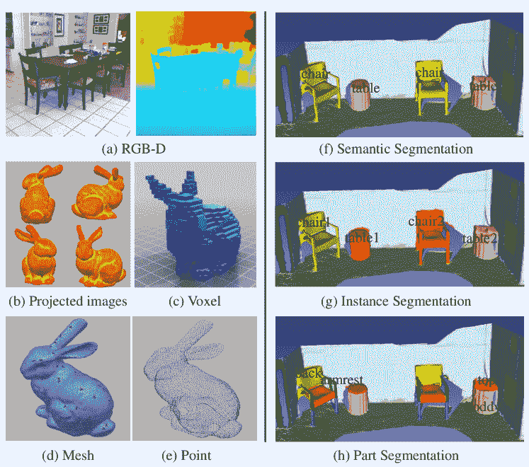
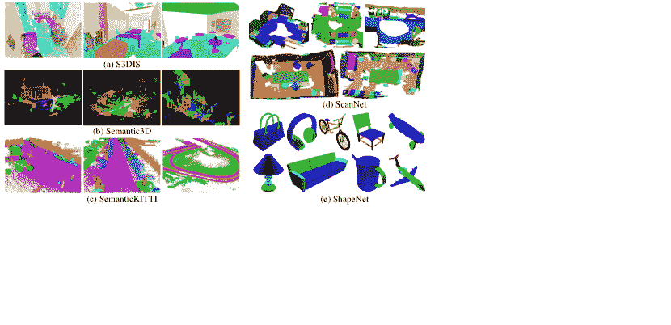
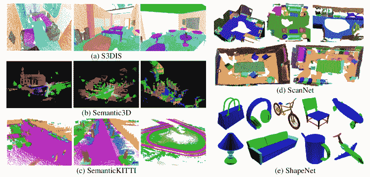
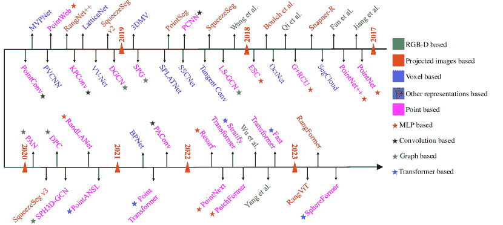
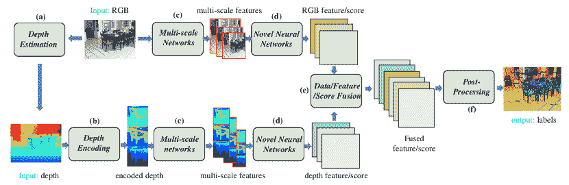
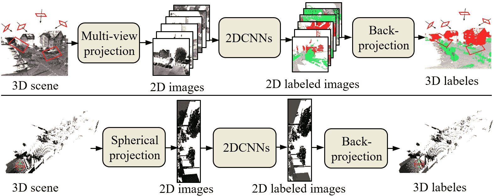
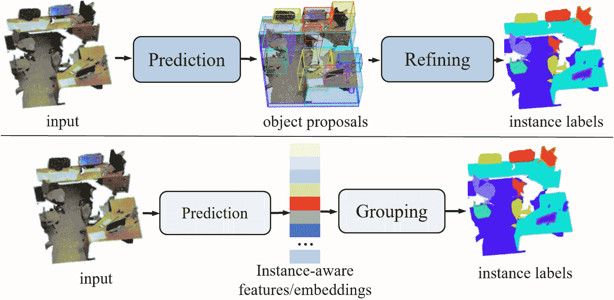
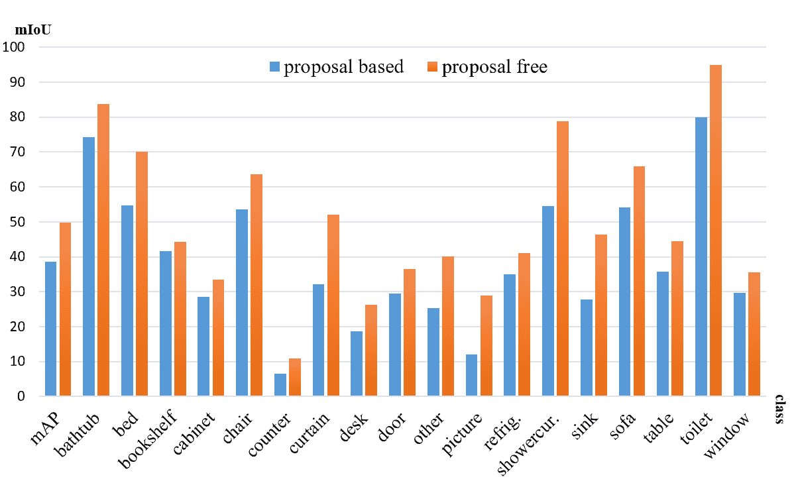

<!--yml

类别：未分类

日期：2024-09-06 19:56:24

-->

# [2103.05423] 基于深度学习的 3D 分割：综述

> 来源：[`ar5iv.labs.arxiv.org/html/2103.05423`](https://ar5iv.labs.arxiv.org/html/2103.05423)

[类型=编辑，auid=000，bioid=1，orcid=0000-0003-2916-3068]

[类型=编辑，auid=000，bioid=1，orcid=0000-0003-1973-6766]

[类型=编辑, auid=000, bioid=1,] [类型=编辑, auid=000, bioid=1,] [类型=编辑, auid=000, bioid=1,] [类型=编辑, auid=000, bioid=1,]

1] 机构=湖南大学，地址=岳麓区麓山南路，城市=长沙，邮政编码=410082，省份=湖南，国家=中国

2] 机构=西澳大利亚大学，地址=35 Stirling Hwy，城市=珀斯，邮政编码=6009，省份=WA，国家=澳大利亚

# 基于深度学习的 3D 分割：综述

Yong He h.yong@hnu.edu.cn    Hongshan Yu yuhongshancn@hotmail.com    Xiaoyan Liu xiaoyan.liu@hnu.edu.cn    Zhengeng Yang yzg050215@163.com    Wei Sun david-sun@126.com    Ajaml Mian ajmal.mian@uwa.edu.au  [

###### 摘要

3D 分割是计算机视觉中的一个基础而具有挑战性的问题，应用于自动驾驶、机器人、增强现实和医学图像分析。它已经引起了计算机视觉、图形学和机器学习社区的广泛关注。基于手工特征和机器学习分类器的传统 3D 分割方法缺乏泛化能力。受益于在 2D 计算机视觉中的成功，深度学习技术近年来已成为 3D 分割任务的首选工具。这导致了大量文献中提出了许多方法，并在不同的基准数据集上进行了评估。尽管 RGB-D 和点云分割的综述文章已有存在，但缺乏对所有 3D 数据模态和应用领域进行深入和最新综述的文献。本文填补了这一空白，提供了基于深度学习的 3D 分割的最新进展的全面综述。它涵盖了超过 180 篇工作，分析了它们的优缺点，并讨论了它们在基准数据集上的竞争性结果。该综述总结了最常用的处理流程，并最终突出显示了未来有前景的研究方向。

###### 关键词：

3D 数据\sep3D 语义分割\sep3D 实例分割\sep3D 部件分割\sep3D 视频分割\sep3D 语义地图\sep 深度学习\sep

## 1 引言

3D 场景的分割是计算机视觉和计算机图形学中的一个基础且具有挑战性的问题。3D 分割的目标是建立计算技术，以预测 3D 场景中对象的细粒度标签，应用范围广泛，如自动驾驶、移动机器人、工业控制、增强现实和医学图像分析。如图 [1 所示，3D 分割可以分为三种类型：语义分割、实例分割和部件分割。语义分割旨在预测对象类别标签，如桌子和椅子。实例分割额外区分相同类别标签的不同实例，例如桌子一/二和椅子一/二。部件分割旨在将实例进一步分解为其不同组件，例如同一椅子的扶手、腿和靠背。

与传统的单视图 2D 分割相比，3D 分割提供了对场景的更全面理解，因为 3D 数据（例如 RGB-D、点云、体素、网格、3D 视频）包含更丰富的几何、形状和尺度信息，并且背景噪声较少。此外，3D 数据的表示，例如以投影图像的形式，包含更多的语义信息。

图 1：主要的五种 3D 数据类型：(a) RGB-D 图像，(b) 投影图像，(c) 体素，(d) 网格，以及 (e) 点。3D 分割的类型：(f) 3D 语义分割，(g) 3D 实例分割，以及 (h) 3D 部件分割。

图 2：调查论文的完整概述。

最近，深度学习技术在包括计算机视觉和自然语言处理在内的许多研究领域中占据了主导地位。受到其在学习强大特征方面成功的激励，过去十年间，3D 分割的深度学习也引起了研究界日益增长的兴趣。然而，3D 深度学习方法仍面临许多未解决的挑战。例如，点云的不规则性使得利用局部特征变得困难，并且将其转换为高分辨率体素会带来巨大的计算负担。

本文提供了有关 3D 分割的深度学习方法的最新进展的全面调查。它专注于分析常用的构建模块、卷积核和完整架构，指出每种情况的优缺点。该调查涵盖了过去五年中发表的 180 多篇具有代表性的论文。尽管已经发布了一些显著的 3D 分割调查，包括 RGB-D 语义分割 Fooladgar 和 Kasaei（2020）、遥感图像分割 Yuan 等（2021）、点云分割 Xie 等（2020a）、Guo 等（2020）、Liu 等（2019a）、Bello 等（2020）、Naseer 等（2018）、Ioannidou 等（2017），这些调查并未全面涵盖所有 3D 数据类型和典型应用领域。最重要的是，这些调查并未专注于 3D 分割，而是对从点云 Guo 等（2020）、Liu 等（2019a）、Bello 等（2020）、Naseer 等（2018）、Ioannidou 等（2017）等给出的深度学习进行了总体调查。鉴于这三个分割任务的重要性，本文专注于 3D 分割的深度学习技术。本文的贡献总结如下：

+   •

    据我们所知，这是第一篇全面涵盖 3D 分割中深度学习方法的调查论文，涵盖了所有 3D 数据表示，包括 RGB-D、投影图像、体素、点云、网格和 3D 视频。

+   •

    本调查对不同类型的 3D 数据分割方法的相对优缺点进行了深入分析。

+   •

    与现有的评述不同，本调查论文专注于专门为 3D 分割设计的深度学习方法，并讨论了典型的分割流程以及应用领域。

+   •

    最后，这项调查对多个公共基准 3D 数据集上的现有方法进行了全面比较，得出了有趣的结论，并确定了有前景的未来研究方向。

图 2 展示了本调查的组织结构。第二部分介绍了一些术语和背景概念，包括流行的 3D 数据集和 3D 分割的评估指标。第三部分回顾了 3D 语义分割的方法，而第四部分回顾了 3D 实例分割的方法。第五部分提供了现有 3D 部件分割方法的综述。第六部分回顾了在一些常见应用领域中使用的 3D 分割方法，包括 3D 视频分割和 3D 语义地图。第七部分展示了在几个受欢迎的数据集上对 3D 分割方法的性能比较，并给出了相应的数据分析。最后，第八部分确定了有前景的未来研究方向并总结了论文内容。

图 3：来自(a) S3DIS、(b) Semantic3D、(c) SemanticKITTI 的 3D 语义分割标注示例，(d) ScanNet 的 3D 实例分割，以及(e) ShapeNet 的 3D 部件分割。有关这些数据集的总结，请参见表格 1。

## 2 术语与背景概念

本节介绍了一些术语和背景概念，包括 3D 数据表示、流行的 3D 分割数据集和评估指标，以帮助读者轻松导航 3D 分割领域。

### 2.1 3D 分割数据集

数据集对于使用深度学习训练和测试 3D 分割算法至关重要。然而，私下收集和标注数据集既繁琐又昂贵，因为这需要领域专业知识、高质量传感器和处理设备。因此，基于公共数据集构建是降低成本的理想方式。遵循这种方式还有一个社区层面的好处，那就是提供了算法之间的公平比较。表格 1 总结了一些最受欢迎和典型的数据集，涵盖了传感器类型、数据大小和格式、场景类别以及标注方法。

这些数据集用于*3D 语义分割*，由不同类型的传感器获取，包括 RGB-D 摄像头 Silberman 和 Fergus (2011)、Silberman 等人 (2012)、Song 等人 (2015)、Hua 等人 (2016)、Dai 等人 (2017)、移动激光扫描仪 Roynard 等人 (2018)、Behley 等人 (2019)、静态地面扫描仪 Hackel 等人 (2017) 和虚幻引擎 Brodeur 等人 (2017)、Wu 等人 (2018b) 及其他 3D 扫描仪 Armeni 等人 (2016)、Chang 等人 (2017)。其中，通过虚幻引擎获得的数据集是合成数据集 Brodeur 等人 (2017) 和 Wu 等人 (2018b)，这些数据集无需昂贵的设备或标注时间，且在对象类别和数量上也很丰富。与真实世界数据集相比，合成数据集具有完整的 360 度 3D 对象，没有遮挡效应或噪声，而真实数据集则通常有噪声和遮挡效应 Silberman 和 Fergus (2011)、Silberman 等人 (2012)、Song 等人 (2015)、Hua 等人 (2016)、Dai 等人 (2017)、Roynard 等人 (2018)、Behley 等人 (2019)、Armeni 等人 (2016)、Hackel 等人 (2017)、Chang 等人 (2017)。对于*3D 实例分割*，可用的 3D 数据集有限，例如 ScanNet Dai 等人 (2017) 和 S3DIS Armeni 等人 (2016)。这两个数据集分别包含由 RGB-D 摄像头或 Matterport 扫描仪获取的真实世界室内场景扫描。对于*3D 部件分割*，普林斯顿分割基准（PSB）Chen 等人 (2009)、COSEG Wang 等人 (2012) 和 ShapeNet Yi 等人 (2016) 是三个最受欢迎的数据集。下面，我们详细介绍五个著名的分割数据集，包括 S3DIS Armeni 等人 (2016)、ScanNet Dai 等人 (2017)、Semantic3D Hackel 等人 (2017)、SemanticKITTI Chang 等人 (2017) 和 ShapeNet Yi 等人 (2016)。图 3 展示了这些数据集的注释示例。

S3DIS：在此数据集中，完整的点云数据是通过 Matterport 扫描仪自动获取的，无需人工干预。该数据集包括来自 3 座不同建筑物的 6 个大规模室内场景中的 271 个房间（总面积 6020 平方米）。这些区域主要包括办公室、教育和展览空间、会议室等。

Semantic3D 总共包含约 40 亿个 3D 点，这些点是通过静态地面激光扫描仪获得的，覆盖了真实世界 3D 空间中的最大范围为 160×240×30 米。点云属于 8 个类别（如城市和乡村），并包含 3D 坐标、RGB 信息和强度。与 2D 注释策略不同，3D 数据标注很容易出现过度分割，每个点都会被单独分配到一个类别标签。

SemanticKITTI 是一个大型户外数据集，包含 28 个类别的详细逐点注释。基于 KITTI 视觉基准 Geiger 等人（2012），SemanticKITTI 包含这个基准的所有 22 个序列的注释，共有 43K 个扫描。此外，该数据集包含了旋转激光传感器完整水平 360 度视场的标签。

ScanNet 数据集对于场景理解研究特别有价值，因为其注释包含估算的校准参数、相机姿态、3D 表面重建、纹理网格、密集的物体级语义分割和 CAD 模型。该数据集包含了真实世界环境的 RGB-D 扫描注释。共有 2.5M 个 RGB-D 图像，分布在 707 个不同的地方，共 1513 个扫描。经过 RGB-D 图像处理后，使用 Amazon Mechanical Turk 执行了注释的人工智能任务。

ShapeNet 数据集具有一种新颖的可扩展方法，用于高效且准确地对大规模 3D 形状集合进行几何注释。这些新颖的技术创新显著减少了注释工作的人工成本。研究人员在 ShapeNetCore 中创建了 31963 个模型的详细逐点标注，并将基于特征的分类器、点对点对应关系和形状对形状的相似性结合到一个 CRF 优化模型中。

表 1：流行的 3D 分割数据集的总结，包括传感器、类型、尺寸、物体类别、类别数量（括号中显示）和注释方法。S←合成环境。R←真实世界环境。Kf←千帧。s←扫描。Mp←百万点。符号 ‘–’ 表示信息不可用。

| 数据集 | 传感器 | 类型 | 尺寸 | 场景类别（数量） | 注释方法 |
| --- | --- | --- | --- | --- | --- |
| 用于 3D 语义分割的数据集 |
| NYUv1 Silberman 和 Fergus（2011） | Microsoft Kinect v1 | R | 2347f | 卧室、咖啡馆、厨房等（7） | 基于条件随机场的模型 |
| NYUv2 Silberman 等人（2012） | Microsoft Kinect v1 | R | 1449f | 卧室、咖啡馆、厨房等（26） | 来自 AMK 的 2D 注释 |
| SUN RGB-D Song 等人（2015） | RealSense, Xtion LIVE PRO, MKv1/2 | R | 10355f | 物体、房间布局等（47） | 2D/3D 多边形 + 3D 边界框 |
| SceneNN Hua 等人（2016） | Asus Xtion PRO, MK v2 | R | 100s | 卧室、办公室、公寓等（-） | 3D 标签投影到 2D 帧 |
| RueMonge2014 Riemenschneider et al. (2014) | – | R | 428s | 窗户、墙壁、阳台、门等(7) | 多视角语义标注 + CRF |
| ScanNet Dai et al. (2017) | Occipital 结构传感器 | R | 2.5Mf | 办公室、公寓、浴室等(19) | 3D 标签投影到 2D 框架上 |
| S3DIS Armeni et al. (2016) | Matterport 摄像头 | R | 70496f | 会议室、办公室等(11) | 层级标注 |
| Semantic3D Hackel et al. (2017) | 地面激光扫描仪 | R | 1660Mp | 农场、市政厅、运动场等(8) | 三种基准方法 |
| NPM3D Roynard et al. (2018) | Velodyne HDL-32E LiDAR | R | 143.1Mp | 地面、车辆、人等(50) | 人工标注 |
| SemanticKITTI Behley et al. (2019) | Velodyne HDL-64E | R | 43Ks | 地面、车辆、人等(28) | 多扫描语义标注 |
| Matterport3D Chang et al. (2017) | Matterport 摄像头 | R | 194.4Kf | 各种房间 (90) | 层级标注 |
| HoME Brodeur et al. (2017) | Planner5D 平台 | S | 45622f | 房间、物体等(84) | SSCNet+ 简短文本描述 |
| House3D Wu et al. (2018b) | Planner5D 平台 | S | 45622f | 房间、物体等(84) | SSCNet+3 种方式 |
| 3D 实例分割的数据集 |
| ScanNet Dai et al. (2017) | Occipital 结构传感器 | R | 2.5Mf | 办公室、公寓、浴室等(19) | 3D 标签投影到 2D 框架上 |
| S3DIS Armeni et al. (2016) | Matterport 摄像头 | R | 70496f | 会议室、办公室等(11) | 主动学习方法 |
| 3D 部件分割的数据集 |
| ShapeNet Yi et al. (2016) | – | S | 31963s | 交通工具、工具等(16) | 将人工标签传播到形状上 |
| PSB Chen et al. (2009) | 亚马逊 Mechanical Turk | S | 380s | 人、杯子、眼镜、飞机等(19) | 交互式分割工具 |
| COSEG Wang et al. (2012) | – | S | 1090s | 花瓶、灯、吉他等(11) | 半监督学习方法 |

### 2.2 评估指标

不同的评估指标可以验证分割方法的有效性和优越性，包括执行时间、内存占用和准确性。然而，很少有作者提供他们方法的执行时间和内存占用的详细信息。本文主要介绍准确性指标。

对于 *3D 语义分割*，总体准确率 (OAcc)、均值类别准确率 (mAcc) 和均值类别交并比 (mIoU) 是衡量分割方法准确性的最常用指标。为了说明，我们假设共有 $K+1$ 个类别，$p_{ij}$ 是类别 $i$ 被暗示为属于类别 $j$ 的最小单元（例如像素、体素、网格、点）。换句话说，$p_{ii}$ 代表真正例，而 $p_{ij}$ 和 $p_{ji}$ 分别代表假正例和假负例。

总体准确率（Overall Accuracy）是一个简单的指标，它计算真正分类样本数与总样本数之间的比例。

|  | $OAcc=\sum_{i=0}^{K}{\frac{p_{ii}}{\sum_{j=0}^{K}p_{ij}}}$ |  |
| --- | --- | --- |

平均准确率（Mean Accuracy）是 OAcc 的扩展，它计算每个类别的 OAcc，然后对总类别数 $K$ 取平均。

|  | $mAcc=\frac{1}{K+1}\sum_{i=0}^{K}\frac{p_{ii}}{\sum_{j=0}^{K}p_{ij}}$ |  |
| --- | --- | --- |

平均交并比（Mean Intersection over Union, mIoU）是语义分割的标准指标。它计算地面真实值和预测值之间的交集比例，并对总类别数 $K$ 取平均。

|  | $mIoU=\frac{1}{K+1}\sum_{i=0}^{K}\frac{p_{ii}}{\sum_{j=0}^{K}p_{ij}+\sum_{i=0}^{K}p_{ji}-p_{ii}}$ |  |
| --- | --- | --- |

对于 *3D 实例分割*，平均精度（AP）和平均类别平均精度（mAP）也经常使用。假设每个类别中有 $L_{I},I\in[0,K]$ 个实例，$c_{ij}$ 是实例 $i$ 被推断为实例 $j$ 的点数（$i=j$ 代表正确，$i\neq j$ 代表错误分割）。

平均精度（Average Precision, AP）是另一种简单的分割指标，它计算真正例与正样本总数之间的比例。

|  | $AP=\sum_{I=0}^{K}\sum_{i=0}^{L_{I}}\frac{c_{ii}}{c_{ii}+{\sum_{j=0}^{L_{I}}c_{ij}}}$ |  |
| --- | --- | --- |

平均平均精度（Mean Average Precision, AP）是 AP 的扩展，它计算每个类别的 AP，然后对总类别数 $K$ 取平均。

|  | $mAP=\frac{1}{K+1}\sum_{I=0}^{K}\sum_{i=0}^{L_{I}}\frac{c_{ii}}{c_{ii}+{\sum_{j=0}^{L_{I}}c_{ij}}}$ |  |
| --- | --- | --- |

对于 *3D 部分分割*，总体类别平均交并比（$mIoU_{cat}$）和总体实例平均交并比（$mIoU_{ins}$）是最常用的指标。为了说明，我们假设每个实例中有 $M_{J},J\in[0,L_{I}]$ 个部分，并且 $q_{ij}$ 是推断属于部分 $j$ 的部分 $i$ 的点总数。因此，$q_{ii}$ 代表真正例，而 $q_{ij}$ 和 $q_{ji}$ 分别代表假阳性和假阴性。

总体类别平均交并比（Overall average category Intersection over Union）是部分分割的评估指标，它测量跨 K 类的平均 IoU。

|  | $mIoU_{cat}=\frac{1}{K+1}\sum_{I=0}^{K}\sum_{J=0}^{L_{I}}\sum_{i=0}^{M_{J}}\frac{q_{ii}}{\sum_{j=0}^{M_{j}}q_{ij}+\sum_{i=0}^{M_{j}}q_{ji}-q_{ii}}$ |  |
| --- | --- | --- |

总体实例平均交并比（$mIoU_{ins}$）在部分分割中测量所有实例的平均 IoU。

|  | $mIoU_{ins}=\frac{1}{\sum_{I=0}^{K}L_{I}+1}\sum_{I=0}^{K}\sum_{J=0}^{L_{I}}\sum_{i=0}^{M_{J}}\frac{q_{ii}}{\sum_{j=0}^{M_{j}}q_{ij}+\sum_{i=0}^{M_{j}}q_{ji}-q_{ii}}$ |  |
| --- | --- | --- |

## 3D 语义分割

文献中提出了许多基于深度学习的 3D 语义分割方法。这些方法可以根据使用的数据表示分为五类，即基于 RGB-D 图像、基于投影图像、基于体素、基于点云、基于 3D 视频和其他表示方法。基于点云的方法可以进一步分类，根据网络架构分为多层感知机（MLP）基、点卷积基、图卷积基和点变换器基的方法。图 4 显示了近年来深度学习在 3D 语义分割方面的里程碑。

图 4：基于深度学习的 3D 语义分割方法的里程碑。注意箭头（时间线）是逆时针方向

### 3.1 基于 RGB-D 的

RGB-D 图像中的深度图包含了关于现实世界的几何信息，这对区分前景物体和背景非常有用，从而提供了提高分割准确性的机会。在这一类别中，通常使用经典的双通道网络分别从 RGB 和深度图像中提取特征。然而，这种简单的框架并不够强大，无法提取丰富和精细的特征。为此，研究人员在上述简单的双通道框架中集成了几个附加模块，通过学习对语义分割至关重要的丰富*上下文*和*几何*信息来提高性能。这些模块大致可以分为六类：多任务学习、深度编码、多尺度网络、新型神经网络架构、数据/特征/得分级融合和后处理（见图 5）。基于 RGB-D 图像的语义分割方法总结见表 2。

多任务学习：*深度估计*和语义分割是计算机视觉中的两个基本且具有挑战性的任务。这些任务之间也有一定的关联，因为在一个物体内部的深度变化相对于不同物体之间的深度变化较小。因此，许多研究人员选择将深度估计任务和语义分割任务结合起来。从这两个任务的关系来看，多任务学习框架主要有两种类型：级联框架和并行框架。

关于级联框架，深度估计任务为语义分割任务提供深度图像。例如，Cao 等人 Cao et al. (2016) 使用了 Liu 等人 Liu et al. (2015) 提出的深度卷积神经场（DCNF）进行深度估计。估计的深度图像和 RGB 图像被输入到一个双通道 FCN 进行语义分割。同样，Guo 等人 Guo and Chen (2018) 采用了 Ivanecky Ivaneckỳ (2016) 提出的深度网络，从单个 RGB 图像中自动生成深度图像，然后提出了一个双通道 FCN 模型用于 RGB 和预测深度图的图像对进行像素标记。

级联框架将深度估计和语义分割任务分开进行，这使得无法对这两个任务进行端到端的训练。因此，深度估计任务没有从语义分割任务中获得任何好处。相比之下，*并行*框架在一个统一的网络中执行这两个任务，使得两个任务能够互相受益。例如，Wang 等人 Wang et al. (2015) 使用联合全局 CNN 从 RGB 图像中提取像素级深度值和语义标签，以提供准确的全局尺度和语义指导。同时，他们使用联合区域 CNN 从 RGB 中提取区域级深度值和语义图，以学习详细的深度和语义边界。Mousavian 等人 Mousavian et al. (2016) 提出了一个多尺度 FCN，由五个流组成，同时在不同尺度上探索深度和语义特征，其中两个任务共享底层特征表示。Liu 等人 Liu et al. (2018b) 提出了一个协作反卷积神经网络（C-DCNN）来联合建模这两个任务。然而，从 RGB 图像估计的深度图质量不如直接从深度传感器获取的深度图。这种多任务学习流程在 RGB-D 语义分割中逐渐被弃用。

深度编码：传统的 2D 卷积神经网络（CNN）无法从原始深度图像中提取丰富的几何特征。另一种方法是将原始深度图像编码为适合 2D CNN 的其他表示形式。Hoft 等人 Höft et al. (2014) 使用了简化版本的方向梯度直方图（HOG）来表示 RGB-D 场景中的深度通道。Gupta 等人 Gupta et al. (2014) 和 Aman 等人 Lin et al. (2017) 从原始深度图像中计算了三个新的通道，分别是水平差异、高度和重力角度（HHA）。刘等人 Liu et al. (2018a) 指出 HHA 的一个局限性是某些场景可能没有足够的水平和垂直平面。因此，他们提出了一种新的重力方向检测方法，通过拟合垂直线来学习更好的表示。Hazirbas 等人 Hazirbas et al. (2016) 还认为 HHA 表示具有较高的计算成本，并且信息量少于原始深度图像。他们提出了一种名为 FuseNet 的架构，由两个编码-解码分支组成，包括一个深度分支和一个 RGB 分支，直接以较低的计算负担编码深度信息。

多尺度网络：多尺度网络学到的上下文信息对于小物体和详细区域分割非常有用。Couprie 等人 Couprie et al. (2013) 应用多尺度卷积网络直接从 RGB 图像和深度图像中学习特征。Aman 等人 Raj et al. (2015) 提出了一个多尺度深度卷积网络进行分割，其中 VGG16-FC 网络的粗略预测在 Scale-2 模块中上采样，然后与 VGG-M 网络在 Scale-1 模块中的低级预测进行拼接，以获得高低级特征。然而，这种方法对场景中的杂乱物体很敏感，导致输出错误。Lin 等人 Lin et al. (2017) 利用低场景分辨率区域具有较高深度和高场景分辨率区域具有较低深度的事实。他们使用深度图将相应的彩色图像分割成多个场景分辨率区域，并引入了上下文感知接收场（CaRF），关注某些场景分辨率区域的语义分割。这使得他们的管道成为一个多尺度网络。

图 5：典型的双通道框架，包括六个改进模块：(a) 多任务学习，(b) 深度编码，(c) 多尺度网络，(d) 新颖的神经网络架构，(e) 特征/评分级融合，和 (f) 后处理。

新颖神经网络：鉴于 CNN 的固定网格计算，其处理和利用几何信息的能力有限。因此，研究人员提出了其他新颖的神经网络架构，以更好地利用几何特征及 RGB 与深度图像之间的关系。这些架构可以分为五大类。

*改进的 2D 卷积神经网络*（2D CNNs）受到级联特征网络的启发，Lin 等人（2017）和 Jiang 等人（2017）提出了一种新颖的深度敏感全卷积神经网络（DFCN），该网络通过特征融合策略将深度信息引入网络的早期层。接着，使用若干扩张卷积层来利用上下文信息。同样，Wang 等人（Wang and Neumann 2018）提出了一种深度感知的 2D CNN，通过引入两个新层——深度感知卷积层和深度感知池化层——基于这样的前提：具有相同语义标签和相似深度的像素应对彼此产生更多影响。

*反卷积神经网络*（DeconvNets）是细化分割图的一个简单而有效的解决方案。Liu 等人（2018b）和 Wang 等人（2016）都采用 DeconvNet 进行 RGB-D 语义分割，因为它的表现良好。然而，由于高层预测图聚合了大量上下文用于密集预测，DeconvNet 的潜力有限。为此，Cheng 等人（2017）提出了一种局部敏感的 DeconvNet（LS-DeconvNet），用于细化深度和颜色图像的边界分割。LS-DeconvNet 将来自原始 RGB-D 数据的局部视觉和几何线索融入每个 DeconvNet，能够在恢复锐利的物体边界的同时，上采样具有大上下文的粗略卷积图。

*递归神经网络*（RNNs）能够捕捉像素之间的长程依赖，但主要适用于单一数据通道（例如 RGB）。Fan 等人（2017）将单模态 RNN 扩展到多模态 RNN（MM-RNNs），以应用于 RGB-D 场景标注。MM-RNNs 允许在深度和颜色通道之间共享‘记忆’。每个通道不仅拥有自己的特征，还具有其他通道的属性，使得学习到的特征在语义分割中更加具备区分性。Li 等人（2016）提出了一种新颖的长短期记忆上下文融合（LSTM-CF）模型，用于捕捉和融合来自 RGB 和深度图像的多个通道的上下文信息。

*图神经网络*（GNNs）首次由 Qi 等人 (2017c) 用于 RGB-D 语义分割，他们将基于深度信息的 2D RGB 像素投射到 3D 空间，并将 3D 点与语义信息关联。接下来，他们从 3D 点构建了一个 k 最近邻图，并应用了 3D 图神经网络（3DGNN）进行像素级预测。

*变压器* 在 RGB 图像分割中获得了广泛应用，并且也被扩展到 RGB-D 分割。研究人员提出了多种方法来利用变压器实现这一目的。Ying 等人 (2022) 的一项显著工作引入了不确定性感知自注意力的概念，该方法在特征提取过程中显式地管理从不可靠的深度像素到自信深度像素的信息流。这种方法旨在解决 RGB-D 分割中噪声或不确定深度信息带来的挑战。Wu 等人 (2022c) 的另一项研究直接采用了 Swin-Transformer 来利用 RGB 和深度特征。通过利用自注意力机制，该方法捕捉了长距离依赖性，并有效融合了 RGB 和深度信息进行分割。受到 Swin-Transformer 成功的启发，Yang 等人 (2022) 提出了一个层次化的 Swin-RGBD 变压器。该模型结合并利用深度信息来补充和增强 RGB 图像中的模糊和遮挡特征。层次化架构允许进行多尺度特征学习，并实现了 RGB 和深度信息的更有效集成。

数据/特征/得分融合：纹理（RGB 通道）和几何（深度通道）信息的最佳融合对于准确的语义分割至关重要。融合策略有三种：数据层融合、特征层融合和得分层融合，分别指的是早期、中期和晚期融合。一个简单的*数据层融合*策略是将 RGB 图像和深度图像拼接成四个通道，直接输入 CNN 模型，例如 Couprie 等人所做的。Couprie 等人 (2013)。然而，这种数据层融合并没有利用深度通道和光度通道之间的强相关性。另一方面，*特征层融合*可以捕捉这些相关性。例如，Li 等人 Li 等人 (2016) 提出了一个记忆融合层，以数据驱动的方式自适应地融合垂直深度和 RGB 上下文。他们的方法在水平方向上进行双向传播，以保持真实的 2D 全局上下文。类似地，Wang 等人 Wang 等人 (2016) 提出了一个特征转换网络，该网络将深度和颜色通道关联起来，并在单个通道中连接卷积网络和反卷积网络。特征转换网络可以在单个通道中发现特定特征以及两个通道之间的共性特征，使两个分支可以共享特征，从而提高共享信息的表示能力。上述复杂的特征层融合模型被插入到 RGB 和深度通道之间的特定相同层中，这使得训练变得困难，并且忽略了其他相同层特征融合。为此，Hazirbas 等人 Hazirbas 等人 (2016) 和 Jiang 等人 Jiang 等人 (2017) 通过逐元素求和的方式进行融合，以融合两个通道之间多个相同层的特征。Wu 等人 Wu 等人 (2022c) 提出了一个新颖的基于 Transformer 的融合方案，称为 TransD-Fusion，以更好地建模远程上下文信息。

*得分层融合* 通常采用简单的平均策略。然而，RGB 模型和深度模型对语义分割的贡献是不同的。Liu 等人 Liu 等人 (2018a) 提出了一个具有加权求和的得分层融合层，该层使用卷积层从两个通道中学习权重。类似地，Cheng 等人 Cheng 等人 (2017) 提出了一个门控融合层，以学习 RGB 和深度通道在不同场景中对不同类别识别的不同性能。这两种技术在增加额外可学习参数的代价下，改善了简单平均策略的结果。

后处理：用于 RGB-D 语义分割的 CNN 或 DCNN 的结果通常非常粗糙，导致边界模糊和小物体消失。解决这个问题的一个常用方法是将 CNN 与条件随机场（CRF）结合。Wang 等人（2015）通过层次 CRF（HCRF）的联合推理进一步增强了两个通道之间的互相作用。它在全局和局部预测之间强制协同，其中全局布局用于指导局部预测并减少局部模糊，同时局部结果提供详细的区域结构和边界。Mousavian 等人（2016）、Liu 等人（2018b）和 Long 等人（2018a）采用了完全连接 CRF（FC-CRF）进行后处理，其中像素级标签预测联合考虑几何约束，如像素级法线信息、像素位置、强度和深度，以促进像素级标记的一致性。类似地，Jiang 等人（2017）提出了密集敏感 CRF（DCRF），将深度信息与 FC-CRF 相结合。

表 2：基于深度学习的 RGB-D 方法总结。估计←深度估计。编码←深度编码。多尺度←多尺度网络。新颖←新颖神经网络。融合←数据/特征/得分融合。后处理←后处理。

| 方法 | 估计 | 编码 | 多尺度 | 新颖 | 融合 | 后处理 | 架构（2-stream） | 贡献 |
| --- | --- | --- | --- | --- | --- | --- | --- | --- |
| Cao 等人（2016） | $\checkmark$ | $\checkmark$ | $\times$ | $\times$ | $\checkmark$ | $\times$ | FCNs | 深度图像估计 + 统一网络用于两个任务 |
| Guo 和 Chen（2018） | $\checkmark$ | $\times$ | $\times$ | $\times$ | $\checkmark$ | $\times$ | FCNs | 结合深度和梯度用于深度估计 |
| Wang 等人（2015） | $\checkmark$ | $\times$ | $\times$ | $\times$ | $\times$ | $\checkmark$ | 区域/全局 CNN | HCRF 用于融合和精炼 + 通过网络完成两个任务 |
| Mousavian 等人（2016） | $\checkmark$ | $\times$ | $\checkmark$ | $\times$ | $\checkmark$ | $\checkmark$ | FCN | FC-CRF 用于精炼 + 两个任务的互相改进 |
| Liu 等人（2018b） | $\checkmark$ | $\times$ | $\times$ | $\checkmark$ | $\times$ | $\checkmark$ | S/D-DCNN | PBL 用于两个特征图的集成 + FC-CRF |
| Höft 等人（2014） | $\times$ | $\checkmark$ | $\times$ | $\times$ | $\times$ | $\times$ | CNNs | 深度图像的嵌入 |
| Gupta 等人（2014） | $\times$ | $\checkmark$ | $\times$ | $\times$ | $\times$ | $\times$ | CNNs | 深度图像的 HHA |
| Liu 等人（2018a） | $\times$ | $\checkmark$ | $\times$ | $\times$ | $\checkmark$ | $\checkmark$ | DCNNs | 新的深度编码 + 用于精炼的 FC-CRF |
| Hazirbas et al. (2016) | $\times$ | $\checkmark$ | $\times$ | $\times$ | $\checkmark$ | $\times$ | Encoder-decoder | 每层的语义和深度特征融合 |
| Couprie et al. (2013) | $\times$ | $\times$ | $\checkmark$ | $\times$ | $\checkmark$ | $\times$ | ConvNets | 用于多尺度特征的 RGB 拉普拉斯金字塔 |
| Raj et al. (2015) | $\times$ | $\checkmark$ | $\checkmark$ | $\times$ | $\checkmark$ | $\times$ | VGG-M | 新型多尺度深度 CNN |
| Lin et al. (2017) | $\times$ | $\times$ | $\checkmark$ | $\checkmark$ | $\checkmark$ | $\times$ | CFN | 用于多分辨率特征的 CaRF |
| Jiang et al. (2017) | $\times$ | $\times$ | $\times$ | $\checkmark$ | $\checkmark$ | $\checkmark$ | RGB-FCN | 每层的语义和深度特征融合 + DCRF |
| Wang and Neumann (2018) | $\times$ | $\times$ | $\times$ | $\checkmark$ | $\times$ | $\times$ | Depth-aware CNN | 深度感知卷积和深度感知平均池化 |
| Cheng et al. (2017) | $\times$ | $\checkmark$ | $\times$ | $\checkmark$ | $\checkmark$ | $\times$ | FCN + Deconv | LS-DeconvNet + 新颖的门控融合 |
| Fan et al. (2017) | $\times$ | $\times$ | $\times$ | $\checkmark$ | $\checkmark$ | $\times$ | MM-RNNs | 多模态 RNN |
| Li et al. (2016) | $\times$ | $\checkmark$ | $\times$ | $\checkmark$ | $\checkmark$ | $\times$ | LSTM-CF | 用于捕捉和融合上下文信息的 LSTM-CF |
| Qi et al. (2017c) | $\times$ | $\times$ | $\times$ | $\checkmark$ | $\times$ | $\times$ | 3DGNN | 用于 RGB-D 语义分割的 GNN |
| Wang et al. (2016) | $\times$ | $\times$ | $\times$ | $\checkmark$ | $\checkmark$ | $\times$ | ConvNet-DeconvNet | 用于评估常见特征相似性的 MK-MMD |
| Ying and Chuah (2022) | $\times$ | $\times$ | $\times$ | $\checkmark$ | $\checkmark$ | $\times$ | Swin-Transformer | 基于跨注意力的有效且可扩展的融合模块 |
| Wu et al. (2022c) | $\times$ | $\times$ | $\times$ | $\checkmark$ | $\checkmark$ | $\times$ | Swin-Transformers | 基于 Transformer 的融合模块 |
| Yang et al. (2022) | $\times$ | $\times$ | $\times$ | $\checkmark$ | $\times$ | $\times$ | Swin-Transformer+ResNet | Swin-RGB-D Transformer |

### 3.2 投影图像基础的分割

投影图像基础的语义分割的核心思想是使用 2D CNN 从 3D 场景/形状的投影图像中提取特征，然后融合这些特征进行标签预测。该流程不仅相比单视角图像可以利用更多来自大规模场景的语义信息，而且相比点云也减少了 3D 场景的数据量。投影图像主要包括*多视角图像*或*球面图像*。

在其中，多视角图像投影通常应用于 RGB-D 数据集 Dai 等人 (2017)，以及静态地面扫描数据集 Hackel 等人 (2017)。球面图像投影通常应用于自动驾驶移动激光扫描数据集 Behley 等人 (2019)。基于投影图像的语义分割方法总结在表 3。

#### 3.2.1 多视角图像基于的分割

MVCNN Su 等人 (2015) 使用统一网络将来自虚拟摄像机的多个视角的 3D 形状特征合并为单一紧凑的形状描述符，以提高分类性能。这启发了研究人员将相同的想法应用于 3D 语义分割（见图 6）。例如，Lawin 等人 (2017) 将点云投影到多视角合成图像中，包括 RGB、深度和表面法线图像。所有多视角图像的预测分数融合成单一表示，并反向投影到每个点。然而，如果点云的密度较低，快照可能会错误地捕捉到观察结构后的点，这使得深度网络误解多个视角。为此，SnapNet Boulch 等人 (2017)，Boulch 等人 (2018) 对点云进行预处理以计算点特征（如法线或局部噪声）并生成网格，这类似于点云密集化。通过网格和点云，他们通过合适的快照生成 RGB 和深度图像。然后，他们使用 FCN 对 2D 快照进行逐像素标记，并通过高效缓冲将这些标签快速反向投影到 3D 点上。上述方法需要提前获得 3D 场景的完整点云，以提供完整的空间结构用于反向投影。然而，直接从现实世界场景获得的多视角图像会丢失大量空间信息。一些研究试图将 3D 场景重建与语义分割结合起来，其中场景重建可以弥补空间信息。例如，Guerry 等人 (2017) 使用全局多视角 RGB 和灰度立体图像重建 3D 场景。然后，将 2D 快照的标签反向投影到重建的场景上。但是，简单的反向投影不能最佳地融合语义和空间几何特征。沿此思路，Pham 等人 (2019a) 提出了一个新的高阶 CRF，在反向投影之后，进一步发展初步分割。

图 6：基于投影图像分割方法的基本框架说明。顶部：基于多视角图像的框架。底部：基于球面图像的框架。

#### 3.2.2 球面图像基础的分割

从 3D 场景中选择快照并非简单。必须在考虑视点数量、视距和虚拟相机的角度之后进行拍摄，以获得完整场景的最佳表示。为避免这些复杂性，研究人员将完整的点云投影到一个球面上（见图 6.底部）。例如，Wu 等人 Wu et al. (2018a) 提出了一个称为 SqueezeSeg 的端到端管道，灵感来源于 SqueezeNet Iandola et al. (2016)，用于从球面图像中学习特征，然后通过作为递归层实现的 CRF 进行优化。同样，PointSeg Wang 等人 (2018e) 通过集成特征级和通道级注意力来扩展 SqueezeNet，从而学习鲁棒的表示。SqueezeSegv2 Wu 等人 (2019a) 通过上下文聚合模块 (CAM) 改进了 SqueezeSeg 的结构，增加了 LiDAR 掩码作为通道，以提高对噪声的鲁棒性。RangNet++ Milioto 等人 (2019) 将语义标签转移到 3D 点云中，避免丢弃点而不管 CNN 使用的离散化水平。尽管常规 RGB 和 LiDAR 图像之间有相似性，但 LiDAR 图像的特征分布在不同位置会发生变化。SqueezeSegv3 Xu 等人 (2020) 具有空间自适应和上下文感知卷积，称为空间自适应卷积 (SAC)，以便为不同位置采用不同的滤波器。受到 2D 视觉 Transformer 成功的启发，RangViT Ando 等人 (2023) 通过在 ViTs 的顶部和底部添加下采样和上采样模块，利用在大规模自然图像数据集上预训练的 ViTs，并取得了相对于投影方法的良好表现。同样，为了使长投影图像适应 ViTs，RangeFormer Kong 等人 (2023) 采用了一种可扩展的训练策略，将整个投影图像拆分为多个子图像，并将其输入 ViTs 进行训练。训练后，预测结果被顺序合并以形成完整的场景。

表 3：基于深度学习的投影图像/体素/其他表示方法的总结。M←多视角图像。S←球面图像。V←体素。T←切线图像。L←格点。P←点云。

| 类型 | 方法 | 输入 | 架构 | 特征提取器 | 贡献 |
| --- | --- | --- | --- | --- | --- |
| 投影 | Lawin 等人 Lawin et al. (2017) | M | 多流 | VGG-16 | 研究不同输入模式的影响 |
| Boulch et al. Boulch et al. (2017)  Boulch et al. (2018) | M | SegNet/U-Net | VGG-16 | 新的高效框架 SnapNet |
| Guerry et al. Guerry et al. (2017) | M | SegNet/U-Net | VGG-16 | 改进的 MVCNN+3D 一致数据增强 |
| Pham et al. Pham et al. (2019a) | M | Two-stream | 2DConv | 高阶 CRF+实时重建管道 |
| Wu et al. Wu et al. (2018a) | S | AlexNet | Firemodules | 端到端管道 SqueezeSeg + 实时 |
| Wang et al. Wang et al. (2018e) | S | AlexNet | Firemodules | 相当轻量的框架 PointSeg + 实时 |
| Wu et al. Wu et al. (2019a) | S | AlexNet | Firemodules | 强大的框架 SqueezeSegV2 |
| Milioto et al. Milioto et al. (2019) | S | DarkNet | Residual block | GPU 加速后处理+ RangNet++ |
| Xu et al. Xu et al. (2020) | S | RangeNet | SAC | 为不同位置采用不同的滤波器 |
| Ando et al. Ando et al. (2023) | S | U-Net | ViTs | 减少图像和点域之间的差距 |
| Kong et al. Kong et al. (2023) | S | U-Net | ViTs | 引入可扩展的范围视图训练策略 |
| voxel | Huang et al. Huang and You (2016) | V | 3D CNN | 3DConv | 高效处理大数据 |
| Tchapmi et al. Tchapmi et al. (2017) | V | 3D FCNN | 3DConv | 结合 3D FCNN 与细致表示 |
| Meng et al. Meng et al. (2019) | V | VAE | RBF | 一种新颖的体素表示+RBF |
| Liu et al. Liu et al. (2017) | V | 3D CNN/DQN/RNN | 3DConv | 将三种视觉任务整合到一个框架中 |
| Rethage et al. Rethage et al. (2018) | V | 3D FCNN | FPConv | 首个在原始点集上完全卷积网络 |
| Dai et al. Dai et al. (2018) | V | 3D FCNN | 3DConv | 结合场景完成和语义标注 |
| Riegler et al. Riegler et al. (2017) | V | Octree | 3DConv | 使用高分辨率体素进行深度学习 |
| Graham et al. Graham et al. (2018) | V | FCN/U-Net | SSConv | 计算量更少的 SSConv |
| others | TangentConv Tatarchenko et al. (2018) | T | U-Net | TConv | 切线卷积+解析大场景 |
| SPLATNet Su et al. (2018) | L | DeepLab | BConv | 分层和空间感知特征学习 |
| LatticeNet Rosu et al. (2019) | L | U-Net | PN+3DConv | 混合架构+新型切片操作符 |
| 3DMV Dai and Nießner (2018) | M+V | Cascade frame. | ENet+3DConv | 从 3D 和 2D 输入推断 3D 语义 |
| Hung et al. Chiang et al. (2019) | V+M+P | Parallel frame. | SSCNet/DeepLab/PN | 利用 2D 和 3D 特征 |
| PVCNN Liu et al. (2019b) | V+P | POintNet | PVConv | 既高效又节省内存和计算 |
| MVPNet Jaritz et al. (2019) | M+P | 级联框架。 | U-Net+PointNet++ | 利用 2D 和 3D 特征 |
| LaserNet++ Meyer et al. (2019) | M+P | 级联框架。 | ResNet+LNet | 用于两个任务的统一网络 |
| BPNet Hu et al. (2021) | M+P | 级联框架。 | 2/3DUNet | 双向投影模块 |

### 3.3 基于体素的分割

类似于像素，体素将 3D 空间划分为许多具有特定大小和离散坐标的体积网格。与投影图像相比，它包含了场景的更多几何信息。3D ShapeNets Wu et al. (2015) 和 VoxNet Maturana 和 Scherer (2015) 将体积占用网格表示作为 3D 卷积神经网络的输入，用于物体识别，这指导了基于体素的 3D 语义分割。基于体素的语义分割方法总结在表 3。

3D CNN 是一种常用的架构，用于处理均匀体素以进行标签预测。Huang et al. Huang 和 You (2016) 提出了用于粗略体素级预测的 3D FCN。他们的方法受限于预测之间的空间不一致，并提供了粗略的标记。Tchapmi et al. Tchapmi et al. (2017) 引入了一种新颖的网络 SEGCloud 以产生细粒度预测。它通过三线性插值将从 3D FCN 获得的粗体素预测上采样到原始 3D 点空间分辨率。

固定分辨率的体素中，计算复杂度随着场景规模的增加而线性增长。大体素可以降低大规模场景解析的计算成本。**刘等人** (2017) 引入了一种新颖的网络，称为 3D CNN-DQN-RNN。与 2D 语义分割中的滑动窗口类似，该网络提出了一个遍历整个数据的视窗，用于在 3D CNN 和深度 Q 网络 (DQN) 的控制下快速定位和分割类对象。3D CNN 和 Residual RNN 进一步在视窗中细化特征。该流程有效学习有趣区域的关键特征，以提高大规模场景解析的准确性，同时减少计算成本。**Rethage 等人** (2018) 提出了一个新颖的全卷积点网络 (FCPN)，对多尺度输入敏感，以解析大规模场景而无需前处理或后处理步骤。特别是，FCPN 能够学习内存高效的表示，能够很好地扩展到更大的体积。类似地，**戴等人** (2018) 设计了一种新型的 3D CNN，用于在场景子体积上进行训练，但在测试时可应用于任意大的场景，因为它能够处理具有不同空间范围的大型场景。此外，他们的网络采用了从粗到细的策略来预测多个分辨率的场景，以应对数据大小随场景增加而增长的分辨率。传统的体素表示仅包括布尔占用信息，丢失了大量的几何信息。**孟等人** (2019) 通过使用变分自编码器 (VAE) 和径向基函数 (RBF) 捕捉每个体素内点的分布，开发了一种新颖的信息丰富的体素表示。此外，他们提出了一种群体等变卷积以利用特征。

在固定尺度场景中，计算复杂度随着体素分辨率的增加而立方增长。然而，体积表示自然是稀疏的，这在对稀疏数据应用 3D 密集卷积时会导致不必要的计算。为了解决这个问题，**Riegler 等人** (2017) 使用一系列不均匀八叉树将空间层次化地划分为非均匀体素。树结构使得内存分配和计算能够集中在相关的密集体素上，而不牺牲分辨率。然而，空闲空间仍然对 OctNet 施加了计算和内存负担。相比之下，**Graham 等人** (2018) 提出了一个新颖的子流形稀疏卷积 (SSC)，它在空闲区域不进行计算，弥补了 OctNet 的缺陷。

### 3.4 基于点的分割

点云在 3D 空间中分布不规则，缺乏任何标准顺序和平移不变性，这限制了传统 2D/3D 卷积神经网络的使用。最近，提出了一系列基于点的语义分割网络。这些方法大致可以分为四类：基于 MLP 的、基于点卷积的、基于图卷积的和基于 Transformer 的。这些方法总结在表 4 中。

#### 3.4.1 基于 MLP 的方法

这些方法直接在点上应用多层感知机（MLP）以学习特征。PointNet Qi 等人 (2017a) 是一项开创性工作，直接处理点云。它使用共享 MLP 来利用点级特征，并采用诸如最大池化这样的对称函数将这些特征收集到全局特征表示中。由于最大池化层仅捕获全局点的最大激活，PointNet 无法学习利用局部特征。在 PointNet 的基础上，PointNet++ Qi 等人 (2017b) 定义了一个层次化学习架构。它通过最远点采样（FPS）逐层采样点，并使用 k 最近邻搜索以及球形搜索来分组局部区域。逐步地，简化的 PointNet 在多个尺度或多个分辨率下提取局部区域的特征。类似地，Engelmann 等人 (2018) 通过 KNN 聚类和 K-means 聚类定义局部区域，并使用简化的 PointNet 提取局部特征。

为了学习短期和长期依赖，一些研究将递归神经网络（RNN）引入到基于 MLP 的方法中。例如，ESC Engelmann 等人 (2017) 将全局点划分为多尺度/网格块。将（局部）块特征连接到点级特征中，并通过递归整合单元（RCU）进一步学习全局上下文特征。类似地，HRNN Ye 等人 (2018) 使用点级金字塔池化（3P）在多尺度局部区域中提取局部特征。点级特征和局部特征被连接起来，双向层次 RNN 在这些连接的特征上探索上下文特征。然而，所学习的局部特征仍然不足，因为深层特征无法覆盖更大的空间范围。

另一项技术中，一些工作将手工制作的点表示集成到 PointNet 或 PointNet++网络中，以提高点表示能力，同时减少可学习的网络参数。受到 SIFT 表示的启发，Lowe (2004)，PointSIFT Jiang et al. (2018) 插入了一个 PointSIFT 模块层来学习局部形状信息。该模块通过编码不同方向的信息，将每个点转换为新的形状表示。PointWeb Zhao et al. (2019a) 提出了一个自适应特征调整（AFA）模块，以学习局部点之间的交互信息，从而增强点表示能力。同样，RepSurf Ran et al. (2022) 引入了两种新型点表示，即三角形和伞形代表面，以建立连接并增强所学点特征的表示能力。这种方法在减少可学习网络参数的同时有效提升了特征表示，引起了研究界的广泛关注。与上述方法相比，PointNeXt Qian et al. (2022) 采取了不同的方法，通过系统地研究模型训练和扩展策略重新审视经典的 PointNet++架构。它提出了一套改进的训练策略，显著提升了 PointNet++的性能。此外，PointNeXt 引入了倒置残差瓶颈设计，并采用可分离的 MLP 以实现高效和有效的模型扩展。

#### 3.4.2 基于点卷积

基于点卷积的方法直接对点进行卷积操作。与 2D 卷积不同，点卷积的权重函数需要从点的几何信息中自适应学习。早期的卷积网络关注于卷积权重函数的设计。例如，RSNet Huang et al. (2018) 利用 1x1 卷积提取点特征，然后通过局部依赖模块（LDM）来挖掘局部上下文特征。然而，它没有定义每个点的邻域来学习局部特征。另一方面，PointwiseCNN Hua et al. (2018) 将点按特定顺序排序，例如 XYZ 坐标或 Morton 曲线 Morton (1966)，并动态查询最近邻点，将其分组到 3x3x3 的内核单元中，然后使用相同的内核权重进行卷积。

渐渐地，一些点卷积工作将卷积权重函数近似为 MLP，以从点坐标中学习权重。PCCN  Wang 等人（2018c）执行参数化 CNN，其中卷积核被估计为 MLP，在 KD-tree 邻域上学习局部特征。PointCNN  Li 等人（2018b）通过最远点采样来粗化输入点。卷积层通过 MLP 从局部点学习一个 $\chi$-变换，以同时加权和排列特征，然后对这些变换后的特征应用标准卷积。

一些研究将系数（由点坐标得出）与权重函数相关联，以调整学习到的卷积权重。PointConv  Wu 等人（2019b）是卷积的蒙特卡罗近似的扩展，考虑了点密度。它使用 MLP 来近似卷积核的权重函数，并应用逆密度缩放来重新加权学习到的权重函数。类似地，MCC  Hermosilla 等人（2018）将卷积描述为一个蒙特卡罗积分问题，依赖于点的概率密度函数（PDF），其中卷积核也由 MLP 表示。此外，它引入了 Possion Disk Sampling（PDS） Wei（2008）来构建点层次，而不是 FPS，从而提供了在接收场中获取最大样本数量的机会。

另一类研究使用其他函数代替多层感知机（MLP）来近似卷积权重函数。Flex-Convolution  Groh 等人（2018）使用具有较少参数的线性函数来建模卷积核，并适配逆密度重要性子采样（IDISS）来粗化点。KPConv Thomas 等人（2019）和 KCNet Shen 等人（2018）为提高对点密度变化的鲁棒性，固定了卷积核。这些网络在局部区域上预定义核点，并通过线性和高斯相关函数分别学习核点的卷积权重。这里，核点的数量和位置需要根据不同的数据集进行优化。

在有限的局部接收场上，点卷积无法利用长距离特征。因此，一些工作将膨胀机制引入点卷积。膨胀点卷积（DPC）  Engelmann 等人（2020b）将标准点卷积适配于每个点的邻域点，邻域点通过膨胀 KNN 搜索来确定。类似地，A-CNN Komarichev 等人（2019）通过膨胀 KNN 定义了一个新的局部环形区域，并将点投影到切平面上，以进一步排序局部区域中的邻居点。然后，在这些排序后的邻居点上执行标准点卷积，这些邻居点表示为一个闭环数组。

在大规模点云语义分割领域，RandLA-Net Hu 等人（2020）使用随机点采样方法替代了更复杂的点选择方法。它引入了一种新颖的局部特征聚合模块（LFAM），以逐步扩大感受野，并有效保留几何细节。另一种技术，PolarNet Zhang 等人（2020）首先将大规模点云按其极坐标鸟瞰视角（BEV）坐标划分为较小的网格（局部区域）。然后，它通过简化的 PointNet 将局部区域的点抽象为固定长度的表示，并将这些表示通过标准卷积处理。

#### 3.4.3 基于图卷积

基于图卷积的方法在连接图结构的点上执行卷积，其中图结构有助于特征聚合，利用点之间的结构信息。图可以分为谱图和空间图。在谱图中，LS-GCN Wang 等人（2018a）采用了 PointNet++ 的基本架构，将 MLP 替换为使用标准非参数傅里叶核的谱图卷积，并用新颖的递归谱聚类池化替代最大池化。然而，从空间域到谱域的转换会带来较高的计算成本。此外，谱图网络通常定义在固定的图结构上，因此无法直接处理具有不同图结构的数据。

在空间图类别中，ECC  Simonovsky 和 Komodakis (2017) 是应用空间图网络从点云中提取特征的先驱方法之一。它动态生成边缘条件滤波器以学习描述点与其邻域之间关系的边缘特征。基于 PointNet 架构，DGCNN  Wang et al. (2019b) 在每个点的邻域上实现了动态边缘卷积，称为 EdgeConv。卷积通过简化的 PointNet 进行近似。SPG  Landrieu 和 Simonovsky (2018) 将点云划分为多个简单几何形状（称为超级点）并在全局超级点上构建超级图。此外，该网络采用 PointNet 嵌入这些点，并通过门控递归单元（GRU）来精炼嵌入。基于 PoinNet++ 的基本架构，Li et al.  Li et al. (2019b) 提出了几何图卷积（TGCov），其滤波器定义为局部逐点特征与局部几何连接特征的高斯加权泰勒核的乘积。Feng et al.  Feng et al. (2020) 在沿多方向搜索的邻域点上构建了一个局部图，并通过局部注意力边缘卷积（LAE-Conv）探索局部特征。这些特征被导入到逐点空间注意力模块中，以捕捉准确且鲁棒的局部几何细节。Lei et al. 设计了一个模糊系数来乘以权重函数，以增强卷积权重的鲁棒性。

连续图卷积也会产生较高的计算成本，并且通常会遇到梯度消失问题。受到 Xception  Chollet (2017) 中可分离卷积策略的启发，该策略显著减少了参数和计算负担，HDGCN  Liang et al. (2019a) 设计了一个 DGConv，结合了深度图卷积和逐点卷积，并将 DGConv 添加到分层结构中以提取局部和全局特征。DeepGCNs  Li et al. (2019a) 借鉴了 2D CNN 的一些概念，如层间残差连接（ResNet）来缓解梯度消失问题，并使用扩张机制使 GCN 能够更深。Lei et al.  Lei et al. (2020) 提出了一个离散球面卷积核（SPH3D 核），该卷积核包括球面卷积用于学习深度特征和逐点卷积用于学习逐点特征。

KD-tree 和 Octree 等树结构可以视为一种特殊类型的图，允许根据树分割方向共享卷积层。3DContextNet Zeng 和 Gevers (2018) 采用 KD-tree 结构以分层方式表示点，其中不同树层的节点代表不同尺度的局部区域，并采用具有门控功能的简化 PointNet 来探索局部特征。然而，他们的性能严重依赖于树构建的随机化。Lei 等人 (2019) 在全局点上构建了基于 Octree 的分层结构，以指导网络每层的球形卷积计算。球形卷积核将 3D 球形区域系统地分割成多个箱子，这些箱子指定了可学习的参数来加权落在对应箱子中的点。

#### 3.4.4 基于 Transformer

注意力机制最近已成为提高点云分割精度的热门方法。与点卷积相比，Transformer 将点特征引入权重学习。例如，Ma 等人 (2020) 使用通道自注意力机制学习任意两个点特征通道之间的独立性，并进一步定义了一个通道图，其中通道映射被表示为节点，独立性被表示为图边。AGCN Xie 等人 (2020b) 将注意力机制与 GCN 集成，用于分析点的局部特征之间的关系，并引入了全局点图来补偿单个点的相对信息。PointANSL Yan 等人 (2020) 使用通用自注意力机制进行组特征更新，并提出了一个自适应采样 (AS) 模块以克服 FPS 的问题。

Transformer 模型采用自注意力作为基本组件，包括位置编码以捕捉输入标记的顺序。位置编码对于确保模型理解序列中标记的相对位置至关重要。Point Transformer Zhao 等人 (2021) 在向量注意力中引入了基于 MLP 的位置编码，并使用基于 KNN 的下采样模块来降低点的分辨率。后续工作 Point Transformer v2 Wu 等人 (2022a) 通过对关系向量应用额外的编码乘法器来加强位置编码机制，并设计了基于分区的池化策略以对齐几何信息。

点变换器通常计算开销较大，因为原始的自注意力模块需要生成一个巨大的注意力图。为了解决这个问题，PatchFormer Zhang 等 (2022) 通过低秩近似计算注意力图。类似地，FastPointTransformer Park 等 (2022) 引入了一种轻量级的局部自注意力模块，该模块在减少空间复杂度的同时学习连续的位置信息。受到二维领域窗口型 Transformer 成功的启发，Stratified Transformer Lai 等 (2022) 设计了一个立方体窗口，并以更稀疏的方式将远处的点作为键，以扩展感受野。类似地，SphereFormer Lai 等 (2023) 设计了径向窗口自注意力，将空间划分为几个不重叠的狭长窗口，以利用长程依赖性。

表 4：基于点的深度学习语义分割方法总结。

| 类型 | 方法 | 邻域搜索 | 特征抽象 | 粗化 | 贡献 |
| --- | --- | --- | --- | --- | --- |
| MLP | PointNet Qi 等 (2017a) | 无 | MLP | 无 | 开创性地直接处理点 |
| G+RCU Engelmann 等 (2018) | 无 | MLP | 无 | 两种局部定义+局部/全局路径 |
| ESC Engelmann 等 (2017) | 无 | MLP | 无 | 用于局部定义的 MC/Grid Block+用于上下文利用的 RCUs |
| HRNN Ye 等 (2018) | 无 | MLP | 无 | 用于局部特征利用的 3P+用于局部上下文利用的 HRNN |
| PointNet++ Qi 等 (2017b) | 球体/KNN | PointNet | FPS | 提出的层次学习框架 |
| PointSIFT Jiang 等 (2018) | KNN | PointNet | FPS | 用于局部形状信息的 PointSIFT 模块 |
| PointWeb Zhao 等 (2019a) | KNN | PointNet | FPS | 用于交互特征利用的 AFA |
| Repsurf Ran 等 (2022) | KNN | PointNet | FPS | 局部三角形方向+局部伞形方向 |
| PointNeXt Qian 等 (2022) | KNN | InvResMLP | FPS | PointNet 的下一版本 |
| Point Convolution | RSNet Huang 等 (2018) | 无 | 1x1 卷积 | 无 | 用于局部上下文利用的 LDM |
| DPC Engelmann 等 (2020b) | DKNN | PointConv | 无 | 扩展感受野的膨胀 KNN |
| PointWiseCNN Hua 等 (2018) | 网格 | PWConv. | 无 | 新颖的点卷积 |
| PCCN Wang 等 (2018c) | KD 索引 | PCConv. | 无 | KD-tree 索引用于邻域搜索+新颖的点卷积 |
| KPConv Thomas 等 (2019) | 球体 | KPConv. | 网格采样 | 新颖的点卷积 |
| FlexConv Groh 等 (2018) | KD 索引 | flexConv. | IDISS | 新颖的点卷积+不进行下采样的 flex-maxpooling |
| PointCNN Li 等 (2018b) | DKNN | $\chi$-卷积 | FPS | 新颖的点卷积 |
| MCC Hermosilla 等人 (2018) | 球形 | MC 卷积 | PDS | 新型粗化层 + 点卷积 |
| PointConv Wu 等人 (2019b) | KNN | PointConv | FPS | 考虑点密度的新型点卷积 |
| A-CNN Komarichev 等人 (2019) | DKNN | A 卷积 | FPS | 新型邻域搜索 + 点卷积 |
| RandLA-Net Hu 等人 (2020) | KNN | LocSE | RPS | 大感受野的 LFAM 且保留几何细节 |
| PolarNet Zhang 等人 (2020) | None | PointNet | 极坐标网格 | 新型局部区域定义 + 环卷积 |
| 图卷积 | DGCNN Wang 等人 (2019b) | KNN | 边卷积 | None | 新型图卷积 + 更新图 |
| SPG Landrieu 和 Simonovsky (2018) | 分区 | PointNet | None | 超点图 + 大规模场景解析 |
| DeepGCNs Li 等人 (2019a) | DKNN | DGConv | RPS | 适应层间残差连接 |
| SPH3D-GCN Lei 等人 (2020) | 球形 | SPH3D-G 卷积 | FPS | 新型图卷积 + 池化 + 上采样 |
| LS-GCN Wang 等人 (2018a) | KNN | 谱卷积 | FPS | 局部谱图 + 新型图卷积 |
| PAN Feng 等人 (2020) | 多方向 | LAE-卷积 | PFS | 点位空间注意力 + 局部图卷积 |
| TGNet Li 等人 (2019b) | 球形 | TG 卷积 | PFS | 新型图卷积 + 多尺度特征探索 |
| HDGCN Liang 等人 (2019a) | KNN | DGConv | FPS | 深度图卷积 + 点卷积 |
| 3DCon.Net Zeng 和 Gevers (2018) | KNN | PointNet | 树层 | KD 树结构 |
| $\psi$-CNN Lei 等人 (2019) | 八叉树邻域 | $\psi$-卷积 | 树层 | 八叉树结构 + 新型图卷积 |
| 点变换器 | PGCRNet Ma 等人 (2020) | None | Conv1D | None | 用于建模上下文依赖的 PointGCR |
| AGCN Xie 等人 (2020b) | KNN | MLP | None | 用于聚合局部特征的点注意力层 |
| PointANSL Yan 等人 (2020) | KNN | 局部-非局部模块 | AS | 局部-非局部模块 + 自适应采样 |
| 点变换器 Zhao 等人 (2021) | KNN | 点变换器 | 池化 | 基于 MLP 的相对位置编码 + 向量注意力 |
| Point Transformer v2 Wu 等人 (2022a) | 网格分区 | 点变换器 v2 | 池化 | 新型位置编码 + 网格池化 |
| PatchFormer Zhang 等人 (2022) | 盒子分区 | Patch 变换器 | DW 卷积 | 首次线性注意力 + 轻量级多尺度变换器 |
| 快速点变换器 Park 等人 (2022) | 体素分区 | 快速点变换器 | 体素基础采样 | 轻量级局部自注意力 + 新型位置编码 |
| 分层变换器 Lai 等人 (2022) | 体素分区 | 分层变换器 | PFS | 上下文相对位置编码 |
| SphereFormer Lai 等人 (2023) | 体素划分 | Sphereformer + cubicformer | 最大池化 | 针对 LIDAR 点的新型球面窗口 |

### 3.5 其他基于表示的方法

一些方法将原始点云转换为其他表示方式，而不是投影图像、体素和点。这些表示方式的例子包括*切线图像* Tatarchenko 等人 (2018) 和*格点* Su 等人 (2018)，Rosu 等人 (2019)。在前一种情况下，Tatarchenko 等人 (2018) 将每个点周围的局部表面投影到一系列 2D 切线图像中，并开发了基于切线卷积的 U-Net 来提取特征。在后一种情况下，SPLATNet Su 等人 (2018) 采用了 Jampani 等人 (2016) 提出的双边卷积层（BCLs），以平滑地将无序点映射到稀疏格点上。类似地，LatticeNet Rosu 等人 (2019) 使用了结合了获得低层次特征的 PointNet 和探索全局上下文特征的稀疏 3D 卷积的混合架构。这些特征被嵌入到一个稀疏格点中，从而允许应用标准的 2D 卷积。

尽管上述方法在 3D 语义分割方面取得了显著进展，但各自都有缺陷。例如，多视角图像具有更多的光谱信息，如颜色/强度，但场景的几何信息较少。另一方面，体素具有更多的几何信息但光谱信息较少。为了兼顾这两方面的优点，一些方法采用*混合表示*作为输入，以学习场景的全面特征。Dai 等人 (2018) 将通过多视角网络获得的 2D 语义特征映射到场景的 3D 网格中。这些管道使得 3D 网格附加了丰富的 2D 语义以及 3D 几何信息，从而通过 3D CNN 实现更好的场景分割。同样，Hung 等人 (2019) 将 2D 多视角图像特征反投影到 3D 点云空间，并使用统一网络从子体积和全局场景中提取局部细节和全局上下文。Liu 等人 (2019b) 认为，基于体素和基于点的神经网络在高分辨率和数据结构化方面的计算效率较低。为了克服这些挑战，他们提出了 Point-Voxel CNN (PVCNN)，将 3D 输入数据表示为点云，利用稀疏性降低内存占用，并利用基于体素的卷积获得连续的内存访问模式。Jaritz 等人 (2019) 提出了 MVPNet，将 2D 多视角密集图像特征收集到 3D 稀疏点云中，然后使用统一网络融合语义和几何特征。此外，Meyer 等人 (2019) 融合 2D 图像和点云，通过统一网络解决 3D 对象检测和语义分割问题。BPNet Hu 等人 (2021) 包括具有对称结构的 2D 和 3D 子网络，通过双向投影模块 (BPM) 连接。这允许在多个架构层次上交互来自两个视觉领域的互补信息，从而利用 2D 和 3D 信息的优势提高场景识别能力。其他基于表示的语义分割方法在表 3 中进行了总结。

## 4 3D 实例分割

3D 实例分割方法还区分了同一类别的不同实例。作为一种更具信息性的场景理解任务，3D 实例分割正受到研究界的日益关注。3D 实例分割方法大致分为两种方向：*基于提议的*和*无提议的*。

图 7：展示了三维实例分割的两种不同方法。顶部：基于提议的框架。底部：无提议框架。

### 4.1 基于提议的方法

基于提议的方法首先预测对象提议，然后对其进行细化以生成最终实例掩码（见图 7），将任务分解为两个主要挑战。因此，从提议生成的角度来看，这些方法可以分为*检测基于*和*检测无*方法。

检测基于的方法有时将对象提议定义为三维边界框回归问题。3D-SIS Hou et al. (2019)结合了高分辨率 RGB 图像和体素，基于三维重建的姿态对齐，通过三维检测主干网络共同学习颜色和几何特征，以预测三维边界框提议。在这些提议中，三维掩码主干网络预测最终的实例掩码。类似地，GPSN Yi et al. (2019)引入了一种称为生成形状提议网络（GPSN）的三维对象提议网络，该网络从形状噪声观测中重建对象形状以加强几何理解。GPSN 进一步嵌入到一种名为基于区域的 PointNet（R-PointNet）的三维实例分割网络中，以拒绝、接收和细化提议。这些网络的训练需要逐步进行，并且对象提议的细化需要昂贵的抑制操作。为此，Yang et al. Yang et al. (2019) 引入了一种新颖的端到端网络，称为 3D-BoNet，直接学习固定数量的三维边界框而无需任何拒绝，然后在每个边界框中估计实例掩码。

无检测方法包括 SGPN Wang 等（2018d），该方法假设属于同一物体实例的点应具有非常相似的特征。因此，它学习一个相似性矩阵以预测提案。提案通过点的置信度分数进行修剪，以生成高度可信的实例提案。然而，这种简单的距离相似性度量学习并不具有信息量，无法分割相同类别的邻近物体。为此，3D-MPA Engelmann 等（2020a）从采样和分组的点特征中学习物体提案，这些特征投票给同一物体中心，然后使用图卷积网络整合提案特征，从而实现提案之间的高级交互，生成更精细的提案特征。AS-Net Jiang 等（2020a）使用分配模块来分配提案候选，然后通过抑制网络消除冗余候选。SoftGroup Vu 等（2022）提出了自上而下的细化方法来优化实例提案。SSTNet Liang 等（2021）提出了一种端到端的解决方案，即语义超级点树网络（SSTNet），用于从场景点生成物体实例提案。SSTNet 的一个关键贡献是中间语义超级点树（SST），它是基于学习到的超级点语义特征构建的。该树在中间节点处遍历和拆分，以生成物体实例提案。

### 4.2 无提案

无提案方法为每个点学习特征嵌入，然后应用聚类以获得明确的 3D 实例标签（参见图 7），将任务分解为两个主要挑战。从嵌入学习的角度来看，这些方法大致可以分为四类：*基于 2D 嵌入*的*多任务学习*、*基于聚类*的方法，以及*基于动态卷积*的方法。

基于 2D 嵌入的方法：这些方法的一个例子是 3D-BEVIS Elich 等（2019），它通过全场景的鸟瞰图学习 2D 全局实例嵌入。然后，它通过 DGCNN Wang 等（2019b）将学习到的嵌入传播到点云上。另一个例子是 PanopticFusion Narita 等（2019），它通过 2D 实例分割网络 Mask R-CNN He 等（2017a）对 RGB 帧进行像素级实例标签预测，并将学习到的标签整合到 3D 体积中。

多任务学习：3D 语义分割和 3D 实例分割可以相互影响。例如，不同类别的对象必须是不同的实例，而具有相同实例标签的对象必须是相同类别。基于此，ASIS Wang 等 (2019a) 设计了一个称为 ASIS 的编码器-解码器网络，用于学习语义感知的实例嵌入，以提高这两项任务的性能。类似地，JSIS3D Pham 等 (2019b) 使用了一个统一的网络，即 MT-PNet，来预测点的语义标签并将点嵌入到高维特征向量中，并进一步提出了一个 MV-CRF 来联合优化对象类别和实例标签。类似地，Liu 等 Liu 和 Furukawa (2019) 和 3D-GEL Liang 等 (2019b) 采用 SSCN 来同时生成语义预测和实例嵌入，然后使用两个 GCN 来细化实例标签。OccuSeg Han 等 (2020) 使用了一个多任务学习网络来产生占用信号和空间嵌入。占用信号表示每个体素占据的体素数量。

基于聚类的方法：像 MASC Liu 和 Furukawa (2019) 这样的方法依赖于 SSCN Graham 等 (2018) 的高性能，来预测多尺度和语义拓扑中相邻点之间的相似性嵌入。一个简单但有效的聚类方法 Liu 等 (2018c) 被用于根据两种类型的学习嵌入将点分割为实例。MTML Lahoud 等 (2019) 学习了两组特征嵌入，包括每个实例独特的特征嵌入和指向实例中心的方向嵌入，这提供了更强的分组力量。类似地，PointGroup Jiang 等 (2020b) 基于原始坐标嵌入空间和偏移坐标嵌入空间将点分组为不同的簇。此外，提出的 ScoreNet 指导了正确的聚类选择。这些方法通常根据点级嵌入对点进行分组，而没有实例级的校正。HAIS Chen 等 (2021) 引入了集合聚合和实例内部预测来在对象级别上细化实例。

基于动态卷积：这些方法通过生成核来克服基于聚类的方法的局限性，然后使用这些核与点特征卷积以生成实例掩码。Dyco3D He 等人 (2021) 采用聚类算法生成用于卷积的核。类似地，PointInst3D He 等人 (2022) 使用 FPS 生成核。DKNet Wu 等人 (2022b) 引入候选挖掘和候选聚合，以生成更多实例核。此外，ISBNet Ngo 等人 (2023) 提出了结合实例感知 PFS 和点聚合层的新实例编码器，以生成替代 DyCo3D 中聚类的核。3D 实例分割方法总结见表 5。

表 5：基于深度学习的 3D 实例分割方法总结。M←多视角图像；Me←网格；V←体素；P←点云。

| 类型 | 方法 | 输入 | 提议/嵌入预测 | 精炼/分组 | 贡献 |
| --- | --- | --- | --- | --- | --- |
| proposal based | GSPN Yi 等人 (2019) | P | GSPN | R-PointNet | 新的提议生成方法 |
| 3D-SIS Hou 等人 (2019) | M+V | 3D-RPN+3D-RoI | 3DFCN | 学习几何和 RGB 上的边界框 |
| 3D-BoNet Yang 等人 (2019) | P | 边界框回归 | 点掩码预测 | 直接回归 3D 边界框 |
| SGPN Wang 等人 (2018d) | P | SM + SCM + PN | 非最大抑制 | 新的组提议 |
| 3D-MPA Engelmann 等人 (2020a) | p | SSCNet | 图卷积网络 | 多提议聚合策略 |
| AS-Net Jiang 等人 (2020a) | p | 四个 MLP 分支 | 候选提议抑制 | 新算法将标签映射到候选项 |
| SoftGroup Vu 等人 (2022) | P | 软分组模块 | 自顶向下的精炼 | 基于双坐标集的新聚类算法 |
| SSTNet Liang 等人 (2021) | p | 树遍历 + 分裂 | CliqueNet | 为实例分割构建超级点树 |
| proposal free | 3D-BEVIS Elich 等人 (2019) | M | U-Net/FCN + 3D prop. | 均值漂移聚类 | 联合 2D-3D 特征 |
| PanopticFus Narita 等人 (2019) | M | PSPNet/Mask R-CNN | FC-CRF | 与语义映射合作 |
| ASIS Wang 等人 (2019a) | P | 1 编码器 + 2 解码器 | ASIS 模块 | 同时执行语义/实例分割任务 |
| JSIS3D Pham 等人 (2019b) | P | MT-PNet | MV-CRF | 同时执行语义/实例分割任务 |
| 3D-GEL Liang 等人 (2019b) | P | SSCNet | GCN | 结构感知损失函数 + 基于注意力的 GCN |
| OccuSeg Han 等人 (2020) | P | 3D-UNet | 基于图的聚类 | 提出一种新颖的占用信号 |
| MASC Liu 和 Furukawa (2019) | Me | 带 SSConv 的 U-Net | 聚类算法 | 基于亲和力和网格拓扑的新型聚类 |
| MTML Lahoud et al. (2019) | V | SSCNet | 均值漂移聚类 | 多任务学习 |
| PointGroup Jiang et al. (2020b) | P | 带 SSConv 的 U-Net | 点聚类 + ScoreNet | 基于双坐标集的新型聚类算法 |
| HAIS Chen et al. (2021) | P | 3D U-Net | 集合聚合 | 用于精细预测的分层聚合 |
| Dyco3D He et al. (2021) | P | 3D U-Net | 动态卷积 | 通过聚类生成卷积核 |
| PointInst3D He et al. (2022) | P | 3D U-Net | MLP | 通过 FPS 生成核 |
| DKNet Wu et al. (2022b) | P | 3D U-Net | MLP | 通过候选挖掘和聚合生成核 |
| ISBNet Ngo et al. (2023) | P | 3D U-Net | Box-aware 动态卷积 | 通过实例感知 FPS 和点聚合生成核 |

## 5 3D 部件分割

3D 部件分割是实例分割之后的更精细层次，目的是为实例的不同部件打上标签。部件分割的流程与语义分割相似，只是标签现在是针对单独的部件。因此，一些现有的 3D 语义分割网络 Meng et al. (2019), Graham et al. (2018), Qi et al. (2017a), Qi et al. (2017b), Zeng 和 Gevers (2018), Huang et al. (2018), Thomas et al. (2019), Hua et al. (2018), Hermosilla et al. (2018), Wu et al. (2019b), Li et al. (2018b), Wang et al. (2019b), Lei et al. (2020), Xie et al. (2020b), Wang et al. (2018c), Groh et al. (2018), Lei et al. (2019), Su et al. (2018), Rosu et al. (2019) 也可以用于部件分割训练。然而，这些网络不能完全解决部件分割的困难。例如，相同语义标签的不同部件可能具有不同的形状，并且一个实例中相同语义标签的部件数量可能不同。我们将 3D 部件分割方法细分为两类：*规则数据*基础和*不规则数据*基础，如下所示。

### 5.1 规则数据基础

常规数据通常包括投影图像 Kalogerakis 等人 (2017)、体素 Wang 和 Lu (2019)、Le 和 Duan (2018)、Song 等人 (2017)。至于投影图像，Kalogerakis 等人 (2017) 从多个视角获取了一组最佳覆盖物体表面的图像，然后使用多视角全卷积网络（FCNs）和基于表面的条件随机场（CRFs）分别预测和细化部件标签。体素是几何数据的一种有用表示。然而，像部件分割这样的精细任务需要高分辨率的体素以获得更详细的结构信息，这导致了高计算成本。Wang 等人 (2019) 提出了 VoxSegNet 来从有限分辨率的体素中挖掘更多详细信息。他们使用空间密集提取来保持子采样过程中的空间分辨率，并通过注意力特征聚合（AFA）模块自适应地选择尺度特征。Le 等人 (2018) 引入了一种新颖的 3D CNN，称为 PointGrid，通过为每个单元格引入固定数量的点，允许网络更好地学习局部几何形状细节。此外，多模型融合可以增强分割性能。结合图像和体素的优点，Song 等人 (2017) 提出了一个双流 FCN，称为 AppNet 和 GeoNet，以从 2D 图像中探索 2D 外观和 3D 几何特征。特别是，他们的 VolNet 从 3D 体积中提取 3D 几何特征，引导 GeoNet 从单幅图像中提取特征。

表 6：3D 部件分割方法总结。M←多视角图像；Me←网格；V←体素；P←点云；reg.←常规数据；irreg.←不规则数据。

| 类型 | 方法 | 输入 | 架构 | 特征提取器 | 贡献 |
| --- | --- | --- | --- | --- | --- |
| 常规 | ShapePFCN Kalogerakis 等人 (2017) | M | 多流 FCN | 2DConv | 每标签置信度图 + 基于表面的 CRF |
| VoxSegNet Wang 和 Lu (2019) | V | 3DU-Net | AtrousConv | SDE 用于保持空间分辨率 AFA 用于特征选择 |
| Pointgrid Le 和 Duan (2018) | V | Conv-deconv | 3DConv | 学习更高阶的局部几何形状。 |
| SubvolumeSup Song 等人 (2017) | M+V | 双流 FCN | 2D/3DConv | GeoNet/AppNet 用于 3/2D 特征挖掘 + DCT 用于对齐。 |
| 不规则 | DCN Xu 等人 (2017) | Me | 2-stream DCN & NN | DirectionalConv | DCN/NN 用于局部特征和全局特征。 |
| MeshCNN Hanocka 等人 (2019) | Me | 2D CNN | MeshConv | 新颖的网格卷积和池化 |
| PartNet Yu 等人 (2019) | P | RNN | PN | 部件特征学习方案用于上下文和几何特征挖掘 |
| SSCNN Yi 等人 (2017) | P | FCN | SpectralConv | STN 允许权重共享 + 光谱多尺度核 |
| KCNet Shen 等 (2018) | P | PN | MLP | 基于点的 KNN 图 + 用于测量几何相似度的核相关性 |
| SFCN Wang 等 (2018b) | P | FCN | SFConv | 新颖的点卷积 |
| SpiderCNN Xu 等 (2018) | P | PN | SpiderConv | 新颖的点卷积 |
| FeaStNet Verma 等 (2018) | P | U-Net | GConv | 动态图卷积滤波器 |
| Kd-Net Klokov 和 Lempitsky (2017) | P | Kd-tree | 仿射变换 | 使用 Kd-tree 构建图形并共享可学习参数 |
| O-CNN Wang 等 (2017) | P | Octree | 3DConv | 使高分辨率体素的 3D-CNN 成为可能 |
| PointCapsNet Zhao 等 (2019b) | P | 编码器-解码器 | PN | 半监督学习 |
| SO-Net Li 等 (2018a) | P | 编码器-解码器 | FC 层 | 用于建模空间分布的 SOM + 无监督学习 |

### 5.2 不规则数据基础

不规则数据表示通常包括网格 Xu 等 (2017)、Hanocka 等 (2019) 和点云 Li 等 (2018a)、Shen 等 (2018)、Yi 等 (2017)、Verma 等 (2018)、Wang 等 (2018b)、Yu 等 (2019)、Zhao 等 (2019b)、Yue 等 (2022)。网格提供了对 3D 形状的有效近似，因为它捕捉了表面形状和拓扑的平面、锐利和复杂特征。Xu 等 (2017) 将面法线和面距离直方图作为双流框架的输入，并使用 CRF 优化最终标签。受传统 CNN 的启发，Hanocka 等 (2019) 设计了新颖的网格卷积和池化操作，用于处理网格边缘。

对于点云数据，图卷积是最常用的处理管道。在谱图领域，SyncSpecCNN Yi 等（2017）引入了一种同步谱卷积网络来处理不规则数据。特别地，提出了多通道卷积和参数化膨胀卷积核，分别解决多尺度分析和跨形状的信息共享问题。在空间图领域，类似于图像的卷积核，KCNet Shen 等（2018）提出了点集核和最近邻图，以通过高效的局部特征利用结构来改进 PointNet。类似地，Wang 等（2018b）设计了基于图卷积和池化操作的形状全卷积网络（SFCN），类似于图像上的 FCN。SpiderCNN Xu 等（2018）应用了一种特殊的卷积滤波器族，该滤波器结合了简单的阶跃函数和泰勒多项式，使滤波器能够有效捕捉复杂的局部几何变化。此外，FeastNet Verma 等（2018）使用动态图卷积操作符建立滤波器权重与图邻域之间的关系，而不是依赖于上述网络的静态图。

一种特殊的图，即树（例如 Kd 树和八叉树），在具有不同表示形式的 3D 形状上工作，并可以支持各种 CNN 架构。Kd-Net Klokov 和 Lempitsky（2017）使用 kd-tree 数据结构表示点云连通性。然而，这些网络具有较高的计算成本。O-CNN Wang 等（2017）从 3D 形状中设计了一种八叉树数据结构。然而，O-CNN 的计算成本随着树的深度增加而呈平方增长。

SO-Net Li 等（2018a）从点云中建立了一个自组织映射（SOM），并使用 PointNet 架构在该映射上分层学习节点特征。然而，它未能充分利用局部特征。PartNet Yu 等（2019）以自上而下的方式对 3D 形状进行分解，并提出了递归神经网络（RvNN）来学习细粒度部件的层次结构。Zhao 等（2019b）引入了一种编码器-解码器网络 3D-PointCapsNet，以解决多个常见的点云相关任务。胶囊网络中部署的动态路由方案和特殊的 2D 潜在空间带来了性能提升。3D 部件分割方法的总结见表 6。

## 6 3D 分割的应用

我们回顾了用于两个主要应用领域的 3D 语义分割方法，即无人系统。

### 6.1 无人系统

随着激光雷达扫描仪和深度相机变得越来越普及和经济，它们越来越多地应用于无人系统，如自动驾驶和移动机器人。这些传感器提供实时的 3D 视频，通常以每秒 30 帧（fps）的速度作为系统的直接输入，使*3D 视频语义分割*成为理解场景的主要任务。此外，为了更有效地与环境互动，无人系统通常会构建场景的*3D 语义地图*。以下是对基于 3D 视频的语义分割和 3D 语义地图构建的回顾。

#### 6.1.1 3D 视频语义分割

与第 3.1 节中回顾的 3D 单帧/扫描语义分割方法相比，3D 视频（连续帧/扫描）语义分割方法考虑了帧间连接的时空信息，这在强健和连续地解析场景时更为有效。传统的卷积神经网络（CNN）并未设计用来利用帧间的时间信息。一种常见策略是适配递归神经网络或时空卷积网络。

基于递归神经网络：RNN 通常与 2D CNN 结合使用来处理 RGB-D 视频。2D CNN 学习提取逐帧的空间信息，而 RNN 学习提取帧间的时间信息。Valipour 等人 (2017) 提出了递归全神经网络，以在 RGB-D 视频帧上滑动窗口的方式进行操作。具体来说，卷积门控递归单元保持空间信息并减少参数。同样，Yurdakul 等人（Emre Yurdakul 和 Yemez (2017)）结合了全卷积和递归神经网络，以分别研究深度和时间信息在合成 RGB-D 视频中的贡献。

基于时空卷积：相邻视频帧提供了多样的视角和额外的对象与场景上下文。STD2P He et al. (2017b) 使用了一种新型的时空池化层，通过光流和图像边界基础超像素来聚合区域对应关系。Choy et al. Choy et al. (2019) 提出了 4D 时空 ConvNet，以直接处理 3D 点云视频。为了克服高维 4D 空间（3D 空间和时间）中的挑战，他们引入了 4D 时空卷积、广义稀疏卷积以及保持时空一致性的三边形平稳条件随机场。类似地，基于 3D 稀疏卷积，Shi et al. Shi et al. (2020) 提出了 SpSequenceNet，包含两个新模块，一个是跨帧全局注意力模块，另一个是跨帧局部插值模块，用于挖掘 4D 点云中的空间和时间特征。PointMotionNet Wang et al. (2022) 提出了一个时空卷积，利用时间不变的空间邻域，提取时空特征，以区分移动物体和静态物体。

基于时空 Transformer：为了捕捉点云视频中的动态，通常会使用点跟踪。然而，P4Transformer Fan et al. (2021) 提出了一个 4D 卷积来嵌入点云视频中的时空局部结构，并进一步引入了 Transformer，通过对这些嵌入的局部特征进行自注意力操作，以利用整个视频中的运动信息。类似地，PST² Wei et al. (2022) 在相邻帧之间执行时空自注意力，以捕捉时空上下文，并提出了一个分辨率嵌入模块，通过聚合特征来增强特征图的分辨率。

#### 6.1.2 3D 语义地图构建

无人系统不仅需要避开障碍物，还需要对场景建立更深刻的理解，如对象解析、自我定位等。为了促进这些任务，无人系统构建了一个包含两个关键问题的场景 3D 语义地图：几何重建和语义分割。传统上，3D 场景重建依赖于同时定位与地图构建系统 (SLAM) 来获取没有语义信息的 3D 地图。随后，使用 2D CNN 进行 2D 语义分割，并通过优化（例如条件随机场）将 2D 标签转移到 3D 地图上，从而获得 3D 语义地图 Yang et al. (2017)。这种常见的流程并不能保证在复杂、大规模和动态场景中 3D 语义地图的高性能。为提高鲁棒性，已采取了利用多帧关联信息、多模态融合和新颖后处理操作的措施。下面将对这些努力进行详细解释。

关联信息的利用：主要依赖于 SLAM 轨迹、递归神经网络或场景流。Ma et al. Ma et al. (2017) 通过使用 SLAM 轨迹将多视角的 CNN 特征图扭曲到一个公共参考视图中，从而强制一致性，并在多个尺度上监督训练。SemanticFusion McCormac et al. (2017) 将反卷积神经网络与最先进的密集 SLAM 系统 ElasticFusion 结合起来，后者提供了视频帧之间的长期对应关系。这些对应关系允许从多视角的标签预测以概率方式融合到地图中。类似地，利用 RGB-D 视频中递归单元提供的帧之间的连接信息，Xiang et al. Xiang and Fox (2017) 提出了数据关联递归神经网络（DA-RNN），并将 DA-RNN 的输出与 KinnectFusion 集成，后者提供了一致的 3D 场景语义标注。Cheng et al. Cheng et al. (2020) 使用基于 CRF-RNN 的语义分割来生成相应的标签。具体而言，作者提出了一种基于光流的方法来处理动态因素，以实现准确定位。Kochanov et al. Kochanov et al. (2016) 还使用场景流在 3D 语义地图中传播动态物体。

多模型融合：Jeong et al. Jeong et al. (2018) 通过基于 GPS 和 IMU 的里程计估计构建 3D 地图，并使用 2D CNN 进行语义分割。他们使用坐标变换和贝叶斯更新方案将 3D 地图与语义标签结合起来。Zhao et al. Zhao et al. (2018) 使用 PixelNet 和 VoxelNet 分别挖掘全局上下文信息和局部形状信息，然后通过软最大加权融合将得分图融合，适应性地学习不同数据流的贡献。最终通过视觉里程计和递归贝叶斯更新生成密集的 3D 语义地图。

## 7 实验结果

以下是我们对在 3、4 和 5 中讨论的分割方法在一些典型公共数据集上的定量结果的总结，以及对这些结果的定性分析。

表 7：关于 SUN-RGB-D 和 NYUDv2 上 RGB-D 语义分割方法的评估性能。请注意，数值后的“%”被省略，符号“–”表示结果不可用。

| 方法 | NYUDv2 | SUN-RGB-D |
| --- | --- | --- |
| mAcc | mIoU | mAcc | mIoU |
| Guo and Chen (2018) | 46.3 | 34.8 | 45.7 | 33.7 |
| Wang et al. (2015) | – | 44.2 | – | – |
| Mousavian et al. (2016) | 52.3 | 39.2 | – | – |
| Liu et al. (2018b) | 50.8 | 39.8 | 50.0 | 39.4 |
| Gupta et al. (2014) | 35.1 | 28.6 | – | – |
| Liu et al. (2018a) | 51.7 | 41.2 | – | – |
| Hazirbas et al. (2016) | – | – | 48.3 | 37.3 |
| Lin et al. (2017) | – | 47.7 | – | 48.1 |
| Jiang et al. (2017) | – | – | 50.6 | 39.3 |
| Wang and Neumann (2018) | 47.3 | – | – | – |
| Cheng et al. (2017) | 60.7 | 45.9 | 58.0 | – |
| Fan et al. (2017) | 50.2 | – | – | – |
| Li et al. (2016) | 49.4 | – | 48.1 | – |
| Qi et al. (2017c) | 55.7 | 43.1 | 57.0 | 45.9 |
| Wang et al. (2016) | 60.6 | 38.3 | 50.1 | 33.5 |

表 8: 关于投影图像、体素、点云和其他表示语义分割方法在 S3DIS、ScanNet、Semantic3D 和 SemanticKITTI 数据集上的评估性能。注: 数值后的‘%’被省略，符号‘–’表示结果不可用，虚线表示按架构类型划分的方法。

| 方法 | 类型 | S3DIS | ScanNet | Semantic3D | SemanticKITTI |
| --- | --- | --- | --- | --- | --- |
|  | Area5 | 6-fold | 测试集 | reduced-8 | 仅 xyz |
|  | mAcc | mIoU | mIoU | oAcc | mIoU | oAcc | mIoU | mAcc | mIoU |
| Lawin et al. Lawin et al. (2017) | 投影 | – | – | – | – | – | 88.9 | 58.5 | – | – |
| Boulch et al. Boulch et al. (2017) |  | – | – | – | – | – | 91.0 | 67.4 | – | – |
| Wu et al. Wu et al. (2018a) |  | – | – | – | – | – | – | – | – | 37.2 |
| Wang et al. Wang et al. (2018e) |  | – | – | – | – | – | – | – | – | 39.8 |
| Wu et al. Wu et al. (2019a) |  | – | – | – | – | – | – | – | – | 44.9 |
| Milioto et al. Milioto et al. (2019) |  | – | – | – | – | – | – | – | – | 52.2 |
| Xu et al. Xu et al. (2020) |  | – | – | – | – | – | – | – | – | 55.9 |
| RangViT Ando et al. (2023) |  | – | – | – | – | – | – | – | – | 55.9 |
| RangFormer Kong et al. (2023) |  | – | – | – | – | – | – | – | – | 64.0 |
| Tchapmi et al. Tchapmi et al. (2017) | 体素 | 57.35 | 48.92 | 48.92 | – | – | 88.1 | 61.30 | – | – |
| Meng et al. Meng et al. (2019) |  | – | 78.22 | – | – | – | – | – | – | – |
| Liu et al. Liu et al. (2017) |  | – | 70.76 | – | – | – | – | – | – | – |
| PointNet Qi et al. (2017a) | 点 | 48.98 | 41.09 | 47.71 | – | 14.69 | – | – | 29.9 | 17.9 |
| G+RCU Engelmann et al. (2018) |  | 59.10 | 52.17 | 58.27 | 75.53 | – | – | – | 57.59 | 29.9 |
| ESC Engelmann et al. (2017) |  | 54.06 | 45.14 | 49.7 | 63.4 | – | – | – | 40.9 | 26.4 |
| HRNN Ye et al. (2018) |  | 71.3 | 53.4 | – | 76.5 | – | – | – | 49.2 | 34.5 |
| PointNet++ Qi et al. (2017b) |  | – | 50.04 | 54.4 | 71.40 | 34.26 | – | – | – | – |
| PointWeb Zhao 等人 (2019a) |  | 66.64 | 60.28 | 66.7 | 85.9 | – | – | – | – | – |
| PointSIFT Jiang 等人 (2018) |  | – | 70.23 | 70.2 | – | 41.5 | – | – | – | – |
| Resurf Ran 等人 (2022) |  | 76.0 | 68.9 | 74.3 | – | 70.0 | – | – | – | – |
| PointNeXt Qian 等人 (2022) |  | – | 70.5 | 74.9 | – | 71.2 | – | – | – | – |
| RSNet Huang 等人 (2018) |  | 59.42 | 56.5 | 56.47 | – | 39.35 | – | – | – | – |
| DPC Engelmann 等人 (2020b) |  | 68.38 | 61.28 | – | – | 59.2 | – | – | – | – |
| PointwiseCNN Hua 等人 (2018) |  | 56.5 | – | – | – | – | – | – | – | – |
| PCCN Wang 等人 (2018c) |  | 67.01 | 58.27 | – | – | 49.8 | – | – | – | – |
| PointCNN Li 等人 (2018b) |  | 63.86 | 57.26 | 65.3 | 85.1 | 45.8 | – | – | – | – |
| KPConv Thomas 等人 (2019) |  | – | 67.1 | 70.6 | – | 66.6 | 92.9 | 74.6 | – | – |
| PointConv Wu 等人 (2019b) |  | – | 50.34 | – | – | 55.6 | – | – | – | – |
| A-CNN Komarichev 等人 (2019) |  | – | – | – | 85.4 | – | – | – | – | – |
| RandLA-Net Hu 等人 (2020) |  | – | – | 70.0 | – | – | 94.8 | 77.4 | – | 53.9 |
| PolarNet Zhang 等人 (2020) |  | – | – | – | – | – | – | – | – | 54.3 |
| DGCNN Wang 等人 (2019b) |  | – | 56.1 | 56.1 | – | – | – | – | – | – |
| SPG Landrieu 和 Simonovsky (2018) |  | 66.50 | 58.04 | 62.1 | – | – | 94.0 | 73.2 | – | – |
| SPH3D-GCN Lei 等人 (2020) |  | 65.9 | 59.5 | 68.9 | – | 61.0 | – | – | – | – |
| DeepGCNs Li 等人 (2019a) |  | – | 60.0 | – | – | – | – | – | – | – |
| PointGCRNet Ma 等人 (2020) |  | – | 52.43 | – | – | 60.8 | – | – | – | – |
| AGCN Xie 等人 (2020b) |  | – | – | 56.63 | – | – | – | – | – | – |
| PAN Feng 等人 (2020) |  | – | 66.3 | – | 86.7 | 42.1 | – | – | – | – |
| TGNet Li 等人 (2019b) |  | – | 58.7 | – | 66.2 | – | – | – | – | – |
| HDGCN Liang 等人 (2019a) |  | 65.81 | 59.33 | 66.85 | – | – | – | – | – | – |
| 3DContextNet Zeng 和 Gevers (2018) |  | 74.5 | 55.6 | 55.6 | – | – | – | – | – | – |
| PGCRNet Ma 等人 (2020) |  | – | 54.4 | – | – | – | – | 69.5 | – | – |
| AGCN Xie 等人 (2020b) |  | 74.5 | 55.6 | 55.6 | – | – | – | – | – | – |
| PointANSL Yan 等人 (2020) |  | – | 62.6 | 68.7 | – | – | 66.6 | – | – | – |
| Point Transformer Zhao 等人 (2021) |  | 76.5 | 70.4 | 73.5 | – | – | – | – | – | – |
| Point Transformer v2 Wu 等人 (2022a) |  | 77.9 | 71.6 | – | – | 75.2 | – | – | – | – |
| PatchFormer Zhang 等人 (2022) |  | – | 68.1 | – | – | – | – | – | – | – |
| Fast Point Transformer Park 等人 (2022) |  | 77.3 | 70.1 | – | – | – | – | – | – | – |
| Stratify Transformer Lai et al. (2022) |  | 78.1 | 72.0 | – | – | 73.7 | – | – | – | – |
| SphereFormer Lai et al. (2023) |  | – | – | – | – | – | – | – | – | 78.4 |
| TangentConv Tatarchenko et al. (2018) | 其他 | 62.2 | 52.8 | – | 80.1 | 40.9 | 89.3 | 66.4 | – | – |
| SPLATNet Su et al. (2018) |  | – | – | – | – | 39.3 | – | – | – | – |
| LatticeNet Rosu et al. (2019) |  | – | – | – | – | 64.0 | – | – | – | 52.9 |
| Hung et al. Chiang et al. (2019) |  | – | – | – | – | 63.4 | – | – | – | – |
| PVCNN Liu et al. (2019b) |  | 87.12 | 58.98 | – | – | – | – | – | – | – |
| MVPNet Jaritz et al. (2019) |  | – | – | – | – | 66.4 | – | – | – | – |
| BPNet Hu et al. (2021) |  | – | – | – | – | 74.9 | – | – | – | – |

### 7.1 3D 语义分割的结果

我们报告了基于 RGB-D 的语义分割方法在 SUN-RGB-D Song et al. (2015) 和 NYUDv2 Silberman et al. (2012) 数据集上的结果，使用 mAcc（平均准确率）和 mIoU（平均交并比）作为评估指标。这些方法的结果取自原始论文，并展示在表 7 中。

我们报告了投影图像/体素/点云/其他表示的语义分割方法在 S3DIS Armeni et al. (2016)（包括第 5 区和 6 折交叉验证）、ScanNet Dai et al. (2017)（测试集）、Semantic3D Hackel et al. (2017)（减少的 8 个子集）和 SemanticKITTI Behley et al. (2019)（仅 xyz 无 RGB）上的结果。我们使用 mAcc、oAcc（总体准确率）和 mIoU 作为评估指标。这些方法的结果取自原始论文。表 8 报告了结果。

点云语义分割的架构通常集中于五个主要组件：基本框架、邻域搜索、特征抽象、粗化和预处理。下面，我们将对每个组件进行更详细的讨论。

基本框架：基本网络是 3D 分割发展的主要驱动力之一。通常，主要有两个基本框架，包括 PointNet 和 PointNet++。PointNet 框架利用共享的多层感知机（MLP）来捕捉点特征，并采用最大池化将这些特征聚合成全局表示。然而，由于缺乏定义的局部邻域，它无法学习局部特征。此外，特征图的固定分辨率使得其难以适应深层架构。相比之下，PointNet++框架引入了一种新颖的层次化学习架构。它以层次化的方式定义局部区域，并逐步从这些区域中提取特征。这种方法使网络能够捕捉到局部和全局信息，从而提高性能。因此，许多当前的网络采用了 PointNet++框架或类似的变体（例如 3D U-Net）。该框架显著减少了计算和内存复杂度，特别是在语义分割、实例分割和检测等高级任务中。

邻域搜索：为了利用点云的局部特征，将邻域点搜索引入到网络中，包括 K 最近邻（KNN）Zhao 等人（2021）、Ran 等人（2022）、Qian 等人（2022）、球形搜索 Hermosilla 等人（2018）、Thomas 等人（2019）、Lei 等人（2020）、基于网格的搜索 Hua 等人（2018）、Wu 等人（2022a）和基于树的搜索 Lei 等人（2019）。KNN 搜索基于距离度量检索离查询点最近的 K 个邻居，因此对密度变化的点云缺乏鲁棒性。一些工作将膨胀机制与邻域搜索结合，以扩展感受野 Komarichev 等人（2019）、Li 等人（2018b）、Li 等人（2019a）。球形搜索涉及在查询点周围的指定半径（球）内寻找所有点。类似地，基于网格的搜索将点云空间划分为规则的网格结构。球形搜索和基于网格的搜索都有效地捕捉到了局部结构和不同密度的邻域。

特征抽象：在特征抽象中，常用的方法包括基于 MLP 的、基于卷积的和基于 Transformer 的方法。MLP 通常用于从点云数据中的单个点提取特征。通过将每个点的特征向量传递通过多个全连接层，MLP 学习非线性的点级特征表示。MLP 在点云处理中提供了灵活性和可扩展性。对点云的卷积操作通常涉及从局部点聚合（低级）信息，以捕捉局部结构和上下文信息。相比之下，基于 Transformer 的方法通过注意力机制建立高层点信息之间的相关性，这对点云分割等高层任务更为有用。

基于 MLP、基于卷积和基于 Transformer 的方法的本质是学习点之间的关系，从而获得鲁棒的权重。在相似基线架构的背景下，特征抽象过程中的点云关系学得越全面，模型的鲁棒性就越强。近年来，基于 MLP 的方法（如 Resurf Ran et al. (2022) 和 PointNeXt Qian et al. (2022)) 展现了更好的准确性和效率，鼓励研究人员重新审视并进一步探索基于 MLP 的方法的潜力。

表 9：关于 ScanNet 上 3D 实例分割方法的评估性能。注意：值后的“%”被省略。

| 方法 | mAP | 浴室 | 床 | 书 | 柜子 | 椅子 | 数量 | 窗帘 | 桌子 | 门 | 其他 | 图片 | 冰箱 | 淋浴 | 水槽 | 沙发 | 桌子 | 厕所 | 风扇 |
| --- | --- | --- | --- | --- | --- | --- | --- | --- | --- | --- | --- | --- | --- | --- | --- | --- | --- | --- | --- |
| GSPN Yi et al. (2019) | 30.6 | 50.0 | 40.5 | 31.1 | 34.8 | 58.9 | 5.4 | 6.8 | 12.6 | 28.3 | 29.0 | 2.8 | 21.9 | 21.4 | 33.1 | 39.6 | 27.5 | 82.1 | 24.5 |
| 3D-SIS Hou et al. (2019) | 38.2 | 100 | 43.2 | 24.5 | 19.0 | 57.7 | 1.3 | 26.3 | 3.3 | 32.0 | 24.0 | 7.5 | 42.2 | 85.7 | 11.7 | 69.9 | 27.1 | 88.3 | 23.5 |
| 3D-BoNet Yang et al. (2019) | 48.8 | 100 | 67.2 | 59.0 | 30.1 | 48.4 | 9.8 | 62.0 | 30.6 | 34.1 | 25.9 | 12.5 | 43.4 | 79.6 | 40.2 | 49.9 | 51.3 | 90.9 | 43.9 |
| SGPN Wang et al. (2018d) | 14.3 | 20.8 | 39.0 | 16.9 | 6.5 | 27.5 | 2.9 | 6.9 | 0 | 8.7 | 4.3 | 1.4 | 2.7 | 0 | 11.2 | 35.1 | 16.8 | 43.8 | 13.8 |
| 3D-MPA Engelmann et al. (2020a) | 61.1 | 100 | 83.3 | 76.5 | 52.6 | 75.6 | 13.6 | 58.8 | 47.0 | 43.8 | 43.2 | 35.8 | 65.0 | 85.7 | 42.9 | 76.5 | 55.7 | 100 | 43.0 |
| SoftGroup Vu et al. (2022) | 76.1 | 100 | 80.8 | 84.5 | 71.6 | 86.2 | 24.3 | 82.4 | 65.5 | 62.0 | 73.4 | 69.9 | 79.1 | 98.1 | 71.6 | 84.4 | 76.9 | 100 | 59.4 |
| SSTNet Liang et al. (2021) | 69.8 | 100 | 69.7 | 88.8 | 55.6 | 80.3 | 38.7 | 62.6 | 41.7 | 55.6 | 58.5 | 70.2 | 60.0 | 100 | 82.4 | 72.0 | 69.2 | 100 | 50.9 |
| 3D-BEVIS Elich et al. (2019) | 24.8 | 66.7 | 56.6 | 7.6 | 3.5 | 39.4 | 2.7 | 3.5 | 9.8 | 9.8 | 3.0 | 2.5 | 9.8 | 37.5 | 12.6 | 60.4 | 18.1 | 85.4 | 17.1 |
| PanopticFus. Narita et al. (2019) | 47.8 | 66.7 | 71.2 | 59.5 | 25.9 | 55.0 | 0 | 61.3 | 17.5 | 25.0 | 43.4 | 43.7 | 41.1 | 85.7 | 48.5 | 59.1 | 26.7 | 94.4 | 35.9 |
| OccuSeg Han et al. (2020) | 67.2 | 100 | 75.8 | 68.2 | 57.6 | 84.2 | 47.7 | 50.4 | 52.4 | 56.7 | 58.5 | 45.1 | 55.7 | 100 | 75.1 | 79.7 | 56.3 | 100 | 46.7 |
| MTML Lahoud et al. (2019) | 54.9 | 100 | 80.7 | 58.8 | 32.7 | 64.7 | 0.4 | 81.5 | 18.0 | 41.8 | 36.4 | 18.2 | 44.5 | 100 | 44.2 | 68.8 | 57.1 | 100 | 39.6 |
| PointGroup Jiang et al. (2020b) | 63.6 | 100 | 76.5 | 62.4 | 50.5 | 79.7 | 11.6 | 69.6 | 38.4 | 44.1 | 55.9 | 47.6 | 59.6 | 100 | 66.6 | 75.6 | 55.6 | 99.7 | 51.3 |
| HAIS Chen et al. (2021) | 69.9 | 100 | 84.9 | 82.0 | 67.5 | 80.8 | 27.9 | 75.7 | 46.5 | 51.7 | 59.6 | 55.9 | 60.0 | 100 | 65.4 | 76.7 | 67.6 | 99.4 | 56.0 |
| Dyco3D He et al. (2021) | 64.1 | 100 | 84.1 | 89.3 | 53.1 | 80.2 | 11.5 | 58.8 | 44.8 | 43.8 | 53.7 | 43.0 | 55.0 | 85.7 | 53.4 | 76.4 | 65.7 | 98.7 | 56.8 |
| DKNet Wu et al. (2022b) | 71.8 | 100 | 81.4 | 78.2 | 61.9 | 87.2 | 22.4 | 75.1 | 56.9 | 67.7 | 58.5 | 72.4 | 63.3 | 98.1 | 51.5 | 81.9 | 73.6 | 100 | 61.7 |
| ISBNet Ngo et al. (2023) | 76.3 | 100 | 87.3 | 71.7 | 66.6 | 85.8 | 50.8 | 66.7 | 76.4 | 64.3 | 67.6 | 68.8 | 82.5 | 100 | 77.3 | 74.1 | 77.7 | 100 | 55.6 |

粗化：粗化，也称为降采样或子采样，涉及在保持点云中基本结构和特征的同时减少点的数量。粗化技术包括随机采样 Hu 等（2020）、最远点采样 Qi 等（2017a，b）、基于树的方法 Lei 等（2019）和基于网格的简化 Lei 等（2023）。这一步有助于降低计算复杂度，并提高后续分割过程的效率。随机采样简单且计算效率高，但可能不会选择在保持局部和全局结构方面最优的点。这可能导致在特征丰富的区域信息丢失。最远点采样在网络中被广泛使用，因为它确保了所选点的空间分布更均匀，并有助于保持全局结构。然而，最远点采样仍可能破坏局部结构。基于树的方法利用分层树结构，如八叉树，来划分点云并进行粗化。基于网格的方法必须先将点云转换为网格，然后才能简化网格。这为已经昂贵的网格简化过程增加了计算开销。此外，从 LiDAR 传感器获得的复杂且稀疏的点云创建网格并不总是可能的 Lei 等（2023）。

上述方法是手工制作或工程化技术，不直接从数据中学习参数，这决定了基于预定义规则或启发式的方法的子采样模式，而没有明确针对任务进行优化。因此，一些工作提出了可学习的粗化方法，将可学习层集成到粗化模块中，如池化 Groh 等（2018）、Lai 等（2023）、Wu 等（2022a）、Zhao 等（2021）、注意机制 Yan 等（2020）。

预处理：预处理是点云语义分割中的一个重要步骤，涉及在将原始点云数据输入分割网络之前对其进行准备和转换。预处理的目的是提高数据的质量、一致性和适用性，以便进行分割任务。点云分割中的一些常见预处理方面包括数据标准化、数据增强、异常值去除和点配准。

点云通常具有不同的尺度，这可能会对分割网络的性能产生负面影响。数据归一化涉及将点云数据缩放到标准范围或单位球体，以确保不同点之间的一致尺度。例如，ShapNet 对象点的数量通常固定为 4096。对于复杂场景，早期的工作 Xu 等人（2021），Qi 等人（2017a）将原始点云划分为更小的点云（例如 4096 个点，1m³ 块），以便处理不需要大量内存。然而，这种策略可能会破坏场景的语义连续性。最近的工作 Qian 等人（2022），Lai 等人（2023），Wu 等人（2022a），Zhao 等人（2021），Lei 等人（2023）将完整场景输入网络，但这需要更多的计算资源。此外，这些工作通常在预处理阶段对点云进行下采样。

图 8：关于不同类别的 ScanNet 上 3D 实例分割架构的评估性能，包括基于提案和无提案的方法。为简便起见，我们省略了值后面的“%”。

### 7.2 3D 实例分割结果

我们报告了在 ScanNet Dai 等人（2017）数据集上的 3D 实例分割方法的结果，并选择 mAP 作为评估指标。这些方法的结果取自 ScanNet 基准挑战网站，显示在表 9 中，并在图 8 中总结。表格和图形显示：

ISBNet Ngo 等人（2023）具有最先进的性能，在查看时 ScanNet 数据集的平均精度为 76.3%。它还在大多数类别中（包括‘浴缸’，‘柜台’，‘淋浴帘’，‘桌子’，‘厕所’等）达到了最佳的实例分割性能。

大多数方法在大规模类别（如‘浴缸’和‘厕所’）上的分割性能较好，而在小规模类别（如‘柜台’，‘桌子’和‘图片’）上的分割性能较差。因此，小物体的实例分割是一个突出的挑战。

在基于提案的方法中，特别是 2D 嵌入传播方法，如 3D-BEVIS Elich 等人（2019）和 PanoticFusion Narita 等人（2019），其性能通常较其他无提案方法较差。这主要是因为简单的嵌入传播技术更容易受到错误标签的影响，从而导致实例分割结果不准确。

无提议方法在所有类别的实例分割中相对于基于提议的方法表现出更优的性能，特别是对于小物体如‘窗帘’，‘画’，‘淋浴帘’，和‘水槽’。不同于依赖提议生成准确性的基于提议的方法，无提议方法完全绕过了这个问题。它们直接考虑整个点云及其全局特征，实现了更精确和全面的实例分割。通过避免提议生成的需要，无提议方法可以通过考虑点云的整体上下文和特征来取得更好的结果。

### 7.3 3D 部分分割的结果

我们报告了 ShapeNet Yi 等人 (2016) 数据集上 3D 部分分割方法的结果，并使用 Ins. mIoU 作为评估指标。这些方法的结果来自原始论文，并显示在表 10。我们可以发现所有方法的部分分割性能非常相似。一个基本假设是 ShapeNet 数据集中的对象是合成的、经过尺度归一化、姿态对齐的，并且缺乏场景上下文。这使得部分分割网络难以提取丰富的上下文特征。另一个基本假设是合成场景中的点云没有背景噪声，比实际场景中的点云更简单、更干净，因此点云的几何特征更容易被利用。各种部分分割网络的准确性表现很难被有效区分。

表 10：ShapeNet 上 3D 部分分割的评估性能。注：值后面的‘%’被省略，符号‘–’表示结果不可用。

| 方法 | Ins. mIoU | 方法 | Ins. mIoU |
| --- | --- | --- | --- |
| VV-Net Meng 等人 (2019) | 87.4 | LatticeNet Su 等人 (2018) | 83.9 |
| SSCNet Graham 等人 (2018) | 86.0 | SGPN Wang 等人 (2018d) | 85.8 |
| PointNet Qi 等人 (2017a) | 83.7 | ShapePFCN Kalogerakis 等人 (2017) | 88.4 |
| PointNet++ Qi 等人 (2017b) | 85.1 | VoxSegNet Wang 和 Lu (2019) | 87.5 |
| 3DContextNet Zeng 和 Gevers (2018) | 84.3 | PointgridLe 和 Duan (2018) | 86.4 |
| RSNet Huang 等人 (2018) | 84.9 | KPConv Thomas 等人 (2019) | 86.4 |
| MCC Hermosilla 等人 (2018) | 85.9 | SO-Net Li 等人 (2018a) | 84.9 |
| PointConv Wu 等人 (2019b) | 85.7 | PartNet Yu 等人 (2019) | 87.4 |
| DGCNN Wang 等人 (2019b) | 85.1 | SyncSpecCNN Yi 等人 (2017) | 84.7 |
| SPH3D-GCN Lei 等人 (2020) | 86.8 | KCNet Yi 等人 (2017) | 84.7 |
| AGCN Xie 等人 (2020b) | 85.4 | PointCNN Li 等人 (2018b) | 86.1 |
| PCCN Wang 等人 (2018c) | 85.9 | SpiderCNN Xu 等人 (2018) | 85.3 |
| Flex-Conv Groh 等人 (2018) | 85.0 | FeaStNet Verma 等人 (2018) | 81.5 |
| $\psi$-CNN Lei 等人 (2019) | 86.8 | Kd-Net Klokov 和 Lempitsky (2017) | 82.3 |
| SPLATNet Su 等人 (2018) | 84.6 | O-CNN Wang 等人 (2017) | 85.9 |
| DRGCNN Yue 等人 (2022) | 86.2 |  |  |

## 8 讨论与结论

使用深度学习技术的 3D 分割在近年来取得了显著进展。然而，这仅仅是开始，未来还有重大发展。下面，我们提出了一些突出问题，并确定了潜在的研究方向。

+   •

    用于多任务的更丰富信息的合成数据集：由于低成本和能够生成的多样场景，合成数据集在语义分割中逐渐发挥了重要作用。Brodeur 等人 (2017) 和 Wu 等人 (2018b) 相较于真实数据集 Dai 等人 (2017)、Armeni 等人 (2016) 和 Hackel 等人 (2017) 发现，训练数据中包含的信息决定了场景解析精度的上限。现有的数据集缺乏重要的语义信息，例如材料和纹理信息，这对于具有相似颜色或几何信息的分割更加关键。此外，大多数现有的数据集通常设计为单任务。目前，只有少数语义分割数据集同时包含实例标签 Dai 等人 (2017) 和场景布局 Song 等人 (2015) 以满足多任务目标。

+   •

    多任务统一网络：通过各种深度学习网络来完成不同计算机视觉任务是昂贵且不切实际的。对于场景的基本特征开发，语义分割与一些任务具有较强的一致性，如深度估计 Meyer 等人 (2019)、Liu 等人 (2015)、Guo 和 Chen (2018)、Liu 等人 (2018b)、场景完成 Dai 等人 (2018)、Xia 等人 (2023)、Zhang 等人 (2023)、实例分割 Liang 等人 (2019b)、Pham 等人 (2019b)、Han 等人 (2020) 和目标检测 Meyer 等人 (2019)、Lian 等人 (2022)。这些任务可以在统一网络中互相配合，以提高性能，因为它们表现出某些相关性和共享的特征表示。

+   •

    多模态分割：利用多种表示（如投影图像、体素和点云）的语义分割具有实现更高准确度的潜力。单一表示在某些实际场景中由于场景信息有限，限制了分割的准确性。例如，LiDAR 测量在距离增加时变得更加稀疏，结合高分辨率图像数据可以提高远处物体的性能。因此，利用多种表示，也称为多模态，可以成为提升分割性能的替代方法 Dai 和 Nießner（2018）、Chiang 等（2019）、Liu 等（2019b）、Hu 等（2021）。此外，使用大型图像模型（如 SAM Kirillov 等（2023））和自然语言模型如 ChatGPT 进行点云分割也可以是流行的方法。大型模型的先进能力使其能够捕捉复杂的模式和语义关系，从而在分割任务中提高性能和准确度。

+   •

    可解释性和稀疏特征抽象：各种特征抽象方法，包括 MLP、卷积和 Transformer，已经取得了显著的发展。特征抽象模块可能会优先生成可解释的特征表示，从而提供对模型决策的解释、兴趣点的可视化以及其他可解释性功能。此外，在涉及大规模数据和有限资源的场景中，特征抽象模块能够提高计算效率。

+   •

    弱监督和无监督分割：深度学习在 3D 分割中取得了显著成功，但主要依赖于大规模标注训练样本。弱监督学习指的是一种训练方法，其中模型在有限或不完整的监督下进行训练。无监督学习仅使用未标注的训练样本。弱监督 Su 等（2023）、Shi 等（2022）和无监督 Xiao 等（2023）范式被认为是放宽大规模标注数据集不切实际要求的替代方案。

+   •

    实时和增量分割：实时 3D 场景解析对于某些应用（如自动驾驶和移动机器人）至关重要。然而，大多数现有的 3D 语义分割方法主要关注分割准确性的提升，但很少关注实时性能。一些轻量级的 3D 语义分割网络通过将点云预处理成其他表示（如投影图像）来实现实时 Wu 等（2018a）、Wu 等（2019a）、Park 等（2023）、Ando 等（2023）。此外，增量分割将成为一个重要的研究方向，使模型能够在动态场景中逐步更新和适应。

+   •

    3D 视频语义分割：与 2D 视频语义分割类似，一些研究尝试利用 4D 时空特征进行 3D 视频（也称为 4D 点云）的分析 Wei 等（2022），Fan 等（2021）。从这些研究可以看出，时空特征可以帮助提高 3D 视频或动态 3D 场景语义分割的鲁棒性。

我们提供了使用深度学习技术在 3D 分割领域的最新进展的全面综述，包括 3D 语义分割、3D 实例分割和 3D 部分分割。我们展示了各种方法在每个类别中的全面性能比较和优点，并列出了潜在的研究方向。

## 参考文献

+   Ando 等（2023）Ando, A., Gidaris, S., Bursuc, A., Puy, G., Boulch, A., Marlet, R., 2023. Rangevit: 面向自动驾驶的 3D 语义分割的视觉变换器，见：IEEE/CVF 计算机视觉与模式识别会议论文集，第 5240–5250 页。

+   Armeni 等（2016）Armeni, I., Sener, O., Zamir, A., Jiang, H., Brilakis, I., Fischer, M., Savarese, S., 2016. 大规模室内空间的 3D 语义解析，见：IEEE/CVF 计算机视觉与模式识别会议论文集，第 1534–1543 页。

+   Behley 等（2019）Behley, J., Garbade, M., Milioto, A., Quenzel, J., Behnke, S., Stachniss, C., Gall, J., 2019. Semantickitti: 用于激光雷达序列语义场景理解的数据集，见：IEEE/CVF 国际计算机视觉会议论文集，IEEE。第 9297–9307 页。

+   Bello 等（2020）Bello, S., Yu, S., Wang, C., Adam, J., Li, J., 2020. 深度学习在 3D 点云上的应用。遥感 12, 1729。

+   Boulch 等（2018）Boulch, A., Guerry, J., Le Saux, B., Audebert, N., 2018. Snapnet: 使用 2D 深度分割网络进行 3D 点云语义标注。Computers & Graphics 71, 189–198。

+   Boulch 等（2017）Boulch, A., Le Saux, B., Audebert, N., 2017. 使用深度分割网络进行无结构点云语义标注。3dor@eurographics 2, 7。

+   Brodeur 等（2017）Brodeur, S., Perez, E., Anand, A., Golemo, F., Celotti, L., Strub, F., Rouat, J., Larochelle, H., Courville, A., 2017. Home: 一种家庭多模态环境。arXiv 预印本 arXiv:1711.11017。

+   Cao 等（2016）Cao, Y., Shen, C., Shen, H., 2016. 利用单目图像深度进行物体检测和语义分割。IEEE 图像处理学报 26, 836–846。

+   Chang 等（2017）Chang, A., Dai, A., Funkhouser, T., Halber, M., Niebner, M., Savva, M., Song, S., Zeng, A., Zhang, Y., 2017. Matterport3d: 从室内环境中的 RGB-D 数据学习，见：2017 国际 3D 视觉会议（3DV），IEEE。第 667–676 页。

+   Chen 等（2021）Chen, S., Fang, J., Zhang, Q., Liu, W., Wang, X., 2021. 用于 3D 实例分割的层次聚合，见：IEEE/CVF 国际计算机视觉会议论文集，第 15467–15476 页。

+   Chen 等人 (2009) Chen, X., Golovinskiy, A., Funkhouser, T., 2009. 3D 网格分割的基准。ACM 图形学会会刊 28, 1–12。

+   Cheng 等人 (2020) Cheng, J., Sun, Y., Meng, M.Q.H., 2020. 在挑战性环境中的鲁棒语义映射。Robotica 38, 256–270。

+   Cheng 等人 (2017) Cheng, Y., Cai, R., Li, Z., Zhao, X., Huang, K., 2017. 带门控融合的局部敏感去卷积网络用于 RGB-D 室内语义分割，发表于 IEEE/CVF 计算机视觉与模式识别会议论文集，第 3029–3037 页。

+   Chiang 等人 (2019) Chiang, H.Y., Lin, Y.L., Liu, Y.C., Hsu, W.H., 2019. 统一的基于点的 3D 分割框架，发表于国际 3D 视觉会议论文集，IEEE，第 155–163 页。

+   Chollet (2017) Chollet, F., 2017. Xception: 使用深度可分离卷积的深度学习，发表于 IEEE/CVF 计算机视觉与模式识别会议论文集，第 1251–1258 页。

+   Choy 等人 (2019) Choy, C., Gwak, J., Savarese, S., 2019. 4D 时空卷积网络: Minkowski 卷积神经网络，发表于 IEEE/CVF 计算机视觉与模式识别会议论文集，第 3075–3084 页。

+   Couprie 等人 (2013) Couprie, C., Farabet, C., Najman, L., LeCun, Y., 2013. 使用深度信息的室内语义分割。arXiv 预印本 arXiv:1301.3572。

+   Dai 等人 (2017) Dai, A., Chang, A., Savva, M., Halber, M., Funkhouser, T., Nießner, M., 2017. Scannet: 丰富注释的室内场景 3D 重建，发表于 IEEE/CVF 计算机视觉与模式识别会议论文集，第 5828–5839 页。

+   Dai 和 Nießner (2018) Dai, A., Nießner, M., 2018. 3DMV: 联合 3D 多视图预测用于 3D 语义场景分割，发表于欧洲计算机视觉会议论文集，第 452–468 页。

+   Dai 等人 (2018) Dai, A., Ritchie, D., Bokeloh, M., Reed, S., Sturm, J., Nießner, M., 2018. Scancomplete: 大规模场景补全和 3D 扫描的语义分割，发表于 IEEE/CVF 计算机视觉与模式识别会议论文集，第 4578–4587 页。

+   Elich 等人 (2019) Elich, C., Engelmann, F., Kontogianni, T., Leibe, B., 2019. 3D 鸟瞰图实例分割，发表于德国模式识别会议，Springer，第 48–61 页。

+   Emre Yurdakul 和 Yemez (2017) Emre Yurdakul, E., Yemez, Y., 2017. 使用递归全卷积神经网络的 RGBD 视频语义分割，发表于 IEEE/CVF 国际计算机视觉会议研讨会论文集，第 367–374 页。

+   Engelmann 等人 (2020a) Engelmann, F., Bokeloh, M., Fathi, A., Leibe, B., Nießner, M., 2020a. 3D-MPA: 3D 语义实例分割的多提议聚合，发表于 IEEE/CVF 计算机视觉与模式识别会议论文集，第 9031–9040 页。

+   Engelmann 等（2017）Engelmann, F., Kontogianni, T., Hermans, A., Leibe, B., 2017。探索点云的 3D 语义分割的空间上下文，见：IEEE/CVF 国际计算机视觉会议论文集，第 716–724 页。

+   Engelmann 等（2020b）Engelmann, F., Kontogianni, T., Leibe, B., 2020b。膨胀点卷积：3D 点云上点卷积的感受野大小，见：2020 IEEE 国际机器人与自动化大会（ICRA），IEEE，第 9463–9469 页。

+   Engelmann 等（2018）Engelmann, F., Kontogianni, T., Schult, J., Leibe, B., 2018。了解你邻居的行为：点云的 3D 语义分割，见：欧洲计算机视觉会议论文集，第 0–0 页。

+   Fan 等（2017）Fan, H., Mei, X., Prokhorov, D., Ling, H., 2017。利用多模态递归神经网络进行 RGB-D 场景标注，见：IEEE/CVF 计算机视觉与模式识别会议论文集，第 9–17 页。

+   Fan 等（2021）Fan, H., Yang, Y., Kankanhalli, M., 2021。用于点云视频的时空建模的点 4D 变换器网络，见：IEEE/CVF 计算机视觉与模式识别会议论文集，第 14204–14213 页。

+   Feng 等（2020）Feng, M., Zhang, L., Lin, X., Gilani, S.Z., Mian, A., 2020。点注意力网络用于 3D 点云的语义分割。模式识别，107446。

+   Fooladgar 和 Kasaei（2020）Fooladgar, F., Kasaei, S., 2020。室内 RGB-D 语义分割的综述：从手工特征到深度卷积神经网络。多媒体工具与应用，79，4499–4524。

+   Geiger 等（2012）Geiger, A., Lenz, P., Urtasun, R., 2012。我们准备好进行自动驾驶了吗？kitti 视觉基准套件，见：IEEE/CVF 计算机视觉与模式识别会议论文集，IEEE，第 3354–3361 页。

+   Graham 等（2018）Graham, B., Engelcke, M., Van Der Maaten, L., 2018。利用子流形稀疏卷积网络进行 3D 语义分割，见：IEEE/CVF 计算机视觉与模式识别会议论文集，第 9224–9232 页。

+   Groh 等（2018）Groh, F., Wieschollek, P., Lensch, H.P., 2018。Flex-convolution，见：亚洲计算机视觉大会，Springer，第 105–122 页。

+   Guerry 等（2017）Guerry, J., Boulch, A., Le Saux, B., Moras, J., Plyer, A., Filliat, D., 2017。Snapnet-r：一致的 3D 多视角语义标注用于机器人，见：IEEE/CVF 国际计算机视觉会议论文集，第 669–678 页。

+   Guo 和 Chen（2018）Guo, Y., Chen, T., 2018。基于深度回归的 RGBD 图像语义分割。模式识别快报，109，55–64。

+   Guo 等（2020）Guo, Y., Wang, H., Hu, Q., Liu, H., Liu, L., Bennamoun, M., 2020。深度学习在 3D 点云中的应用：综述。IEEE 模式分析与机器智能汇刊。

+   Gupta 等（2014）Gupta, S., Girshick, R., Arbeláez, P., Malik, J., 2014. 从 RGB-D 图像中学习丰富的特征以进行目标检测和分割，发表于计算机视觉–ECCV 2014：第 13 届欧洲会议，瑞士苏黎世，2014 年 9 月 6-12 日，论文集，第 VII 部分 13，Springer. 页码 345–360。

+   Hackel 等（2017）Hackel, T., Savinov, N., Ladicky, L., Wegner, J., Schindler, K., Pollefeys, M., 2017. Semantic3d. net: 一个新的大规模点云分类基准。arXiv 预印本 arXiv:1704.03847。

+   Han 等（2020）Han, L., Zheng, T., Xu, L., Fang, L., 2020. Occuseg: 关注占用的 3D 实例分割，发表于 IEEE/CVF 计算机视觉与模式识别大会论文集，页码 2940–2949。

+   Hanocka 等（2019）Hanocka, R., Hertz, A., Fish, N., Giryes, R., Fleishman, S., D., C.O., 2019. Meshcnn: 一个边缘网络。ACM 图形学汇刊 38, 1–12。

+   Hazirbas 等（2016）Hazirbas, C., Ma, L., Domokos, C., Cremers, D., 2016. Fusenet: 通过基于融合的 CNN 架构将深度融入语义分割，发表于亚洲计算机视觉会议论文集，Springer. 页码 213–228。

+   He 等（2017a）He, K., Gkioxari, G., Dollár, P., Girshick, R., 2017a. Mask R-CNN，发表于 IEEE/CVF 国际计算机视觉大会论文集，页码 2961–2969。

+   He 等（2021）He, T., Shen, C., Van Den Hengel, A., 2021. Dyco3d: 通过动态卷积进行鲁棒的 3D 点云实例分割，发表于 IEEE/CVF 计算机视觉与模式识别大会论文集，页码 354–363。

+   He 等（2022）He, T., Yin, W., Shen, C., van den Hengel, A., 2022. Pointinst3d: 通过点进行 3D 实例分割，发表于欧洲计算机视觉大会论文集，Springer. 页码 286–302。

+   He 等（2017b）He, Y., Chiu, W.C., Keuper, M., Fritz, M., 2017b. Std2p: 使用时空数据驱动池进行 RGB-D 语义分割，发表于 IEEE/CVF 计算机视觉与模式识别大会论文集，页码 4837–4846。

+   Hermosilla 等（2018）Hermosilla, P., Ritschel, T., Vázquez, P.P., Vinacua, À., Ropinski, T., 2018. 非均匀采样点云的蒙特卡罗卷积学习。ACM 图形学汇刊 37, 1–12。

+   Höft 等（2014）Höft, N., Schulz, H., Behnke, S., 2014. 使用 GPU 加速深度神经网络进行 RGB-D 场景的快速语义分割，发表于德国/奥地利人工智能联合会议，Springer. 页码 80–85。

+   Hou 等（2019）Hou, J., Dai, A., Nießner, M., 2019. 3d-sis: RGB-D 扫描的 3D 语义实例分割，发表于 IEEE/CVF 计算机视觉与模式识别大会论文集，页码 4421–4430。

+   Hu 等（2020）Hu, Q., Yang, B., Xie, L., Rosa, S., Guo, Y., Wang, Z., Trigoni, N., Markham, A., 2020. Randla-net: 大规模点云的高效语义分割，发表于 IEEE/CVF 计算机视觉与模式识别大会论文集，页码 11108–11117。

+   Hu 等（2021）Hu, W., Zhao, H., Jiang, L., Jia, J., Wong, T.T., 2021. 用于跨维度场景理解的双向投影网络，发表于：IEEE/CVF 计算机视觉与模式识别会议论文集，页码：14373–14382。

+   Hua 等（2016）Hua, B., Pham, Q., Nguyen, D., Tran, M., Yu, L., Yeung, S., 2016. SceneNN：带注释的场景网格数据集，发表于：国际 3D 视觉会议论文集，IEEE，页码：92–101。

+   Hua 等（2018）Hua, B.S., Tran, M.K., Yeung, S.K., 2018. 点 wise 卷积神经网络，发表于：IEEE/CVF 计算机视觉与模式识别会议论文集，页码：984–993。

+   Huang 和 You（2016）Huang, J., You, S., 2016. 使用 3D 卷积神经网络进行点云标注，发表于：2016 年第 23 届国际模式识别大会（ICPR），IEEE，页码：2670–2675。

+   Huang 等（2018）Huang, Q., Wang, W., Neumann, U., 2018. 用于点云 3D 分割的递归切片网络，发表于：IEEE/CVF 计算机视觉与模式识别会议论文集，页码：2626–2635。

+   Iandola 等（2016）Iandola, F., Han, S., Moskewicz, M., Ashraf, K., Dally, W., Keutzer, K., 2016. SqueezeNet：AlexNet 级别的准确性，参数减少 50 倍且模型大小< 0.5 MB。arXiv 预印本 arXiv:1602.07360。

+   Ioannidou 等（2017）Ioannidou, A., Chatzilari, E., Nikolopoulos, S., Kompatsiaris, I., 2017. 深度学习在计算机视觉与 3D 数据中的进展：综述。ACM 计算机调查 50, 1–38。

+   Ivaneckỳ（2016）Ivaneckỳ, B.J., 2016. 通过卷积神经网络进行深度估计。博士论文。布尔诺科技大学硕士论文。

+   Jampani 等（2016）Jampani, V., Kiefel, M., Gehler, P.V., 2016. 学习稀疏高维滤波器：图像滤波、稠密 CRFs 和双边神经网络，发表于：IEEE/CVF 计算机视觉与模式识别会议论文集，页码：4452–4461。

+   Jaritz 等（2019）Jaritz, M., Gu, J., Su, H., 2019. 多视角 PointNet 用于 3D 场景理解，发表于：IEEE/CVF 国际计算机视觉会议工作坊论文集，页码：0–0。

+   Jeong 等（2018）Jeong, J., Yoon, T.S., Park, J.B., 2018. 基于多模态传感器的语义 3D 映射用于大规模环境。应用专家系统 105, 1–10。

+   Jiang 等（2020a）Jiang, H., Yan, F., Cai, J., Zheng, J., Xiao, J., 2020a. 端到端 3D 点云实例分割无检测，发表于：IEEE/CVF 计算机视觉与模式识别会议论文集，页码：12796–12805。

+   Jiang 等（2017）Jiang, J., Zhang, Z., Huang, Y., Zheng, L., 2017. 将深度信息融入 CNN 和 CRF 进行室内语义分割，发表于：IEEE 国际软件工程与服务科学会议论文集，IEEE，页码：525–530。

+   Jiang 等（2020b）Jiang, L., Zhao, H., Shi, S., Liu, S., Fu, C., Jia, J., 2020b. Pointgroup：用于 3d 实例分割的双集点分组，见：IEEE/CVF 计算机视觉与模式识别大会论文集，页 4867–4876。

+   Jiang 等（2018）Jiang, M., Wu, Y., Zhao, T., Zhao, Z., Lu, C., 2018. Pointsift：一种类似于 SIFT 的网络模块用于 3d 点云语义分割，arXiv 预印本 arXiv:1807.00652。

+   Kalogerakis 等（2017）Kalogerakis, E., Averkiou, M., Maji, S., Chaudhuri, S., 2017. 使用投影卷积网络进行 3d 形状分割，见：IEEE/CVF 计算机视觉与模式识别大会论文集，页 3779–3788。

+   Kirillov 等（2023）Kirillov, A., Mintun, E., Ravi, N., Mao, H., Rolland, C., Gustafson, L., Xiao, T., Whitehead, S., Berg, A.C., Lo, W.Y., 等，2023. 任何东西都要分割。arXiv 预印本 arXiv:2304.02643。

+   Klokov 和 Lempitsky（2017）Klokov, R., Lempitsky, V., 2017. 摆脱网格：用于 3d 点云模型识别的深度 kd 网络，见：IEEE/CVF 国际计算机视觉大会论文集，页 863–872。

+   Kochanov 等（2016）Kochanov, D., Ošep, A., Stückler, J., Leibe, B., 2016. 场景流传播用于语义映射和动态街景中的物体发现，见：IEEE 智能机器人系统国际会议论文集，IEEE. 页 1785–1792。

+   Komarichev 等（2019）Komarichev, A., Zhong, Z., Hua, J., 2019. A-cnn：用于点云的环状卷积神经网络，见：IEEE/CVF 计算机视觉与模式识别大会论文集，页 7421–7430。

+   Kong 等（2023）Kong, L., Liu, Y., Chen, R., Ma, Y., Zhu, X., Li, Y., Hou, Y., Qiao, Y., Liu, Z., 2023. 重新思考激光雷达分割的范围视图表示。arXiv 预印本 arXiv:2303.05367。

+   Lahoud 等（2019）Lahoud, J., Ghanem, B., Pollefeys, M., Oswald, M., 2019. 通过多任务度量学习进行 3d 实例分割，见：IEEE/CVF 国际计算机视觉大会论文集，页 9256–9266。

+   Lai 等（2023）Lai, X., Chen, Y., Lu, F., Liu, J., Jia, J., 2023. 基于球形 Transformer 的激光雷达 3d 识别，见：IEEE/CVF 计算机视觉与模式识别大会论文集，页 17545–17555。

+   Lai 等（2022）Lai, X., Liu, J., Jiang, L., Wang, L., Zhao, H., Liu, S., Qi, X., Jia, J., 2022. 用于 3d 点云分割的分层 Transformer，见：IEEE/CVF 计算机视觉与模式识别大会论文集，页 8500–8509。

+   Landrieu 和 Simonovsky（2018）Landrieu, L., Simonovsky, M., 2018. 使用超点图进行大规模点云语义分割，见：IEEE/CVF 计算机视觉与模式识别大会论文集，页 4558–4567。

+   Lawin 等（2017）Lawin, F., Danelljan, M., Tosteberg, P., Bhat, G., Khan, F., Felsberg, M., 2017. 深度投影 3d 语义分割，见：计算机图像与模式分析，Springer. 页 95–107。

+   Le 和 Duan (2018) Le, T., Duan, Y., 2018. Pointgrid: 用于 3D 形状理解的深度网络, 见：IEEE/CVF 计算机视觉与模式识别会议论文集，第 9204–9214 页。

+   Lei 等人 (2019) Lei, H., Akhtar, N., Mian, A., 2019. 带球形核的八叉树引导卷积神经网络用于 3D 点云, 见：IEEE/CVF 计算机视觉与模式识别会议论文集，第 9631–9640 页。

+   Lei 等人 (2020) Lei, H., Akhtar, N., Mian, A., 2020. 用于 3D 点云的高效图卷积的球形核。IEEE 模式分析与机器智能学报。

+   Lei 等人 (2023) Lei, H., Akhtar, N., Shah, M., Mian, A., 2023. 使用连续滤波器的网格卷积用于 3D 表面解析。IEEE 神经网络与学习系统学报。

+   Li 等人 (2019a) Li, G., Muller, M., Thabet, A., Ghanem, B., 2019a. Deepgcns: 图卷积网络能否像卷积神经网络一样深入?, 见：IEEE/CVF 国际计算机视觉会议论文集，第 9267–9276 页。

+   Li 等人 (2018a) Li, J., Chen, B.M., Hee Lee, G., 2018a. So-net: 点云分析的自组织网络, 见：IEEE/CVF 计算机视觉与模式识别会议论文集，第 9397–9406 页。

+   Li 等人 (2018b) Li, Y., Bu, R., Sun, M., Wu, W., Di, X., Chen, B., 2018b. Pointcnn: 在 X 变换点上的卷积。神经信息处理系统进展 31, 820–830。

+   Li 等人 (2019b) Li, Y., Ma, L., Zhong, Z., Cao, D., Li, J., 2019b. Tgnet: 用于 3D 点云分割的几何图卷积神经网络。IEEE 地球科学与遥感学报 58, 3588–3600。

+   Li 等人 (2016) Li, Z., Gan, Y., Liang, X., Yu, Y., Cheng, H., Lin, L., 2016. Lstm-cf: 通过 LSTMs 统一上下文建模与融合用于 RGB-D 场景标注, 见：欧洲计算机视觉会议论文集, Springer，第 541–557 页。

+   Lian 等人 (2022) Lian, Q., Li, P., Chen, X., 2022. Monojsg: 单目 3D 物体检测的联合语义与几何成本体积, 见：IEEE/CVF 计算机视觉与模式识别会议论文集, 第 1070–1079 页。

+   Liang 等人 (2021) Liang, Z., Li, Z., Xu, S., Tan, M., Jia, K., 2021. 使用语义超点树网络进行 3D 场景中的实例分割, 见：IEEE/CVF 国际计算机视觉会议论文集，第 2783–2792 页。

+   Liang 等人 (2019a) Liang, Z., Yang, M., Deng, L., Wang, C., Wang, B., 2019a. 用于点云的 3D 语义分割的分层深度图卷积神经网络, 见：IEEE 国际机器人与自动化会议论文集, IEEE，第 8152–8158 页。

+   Liang 等人 (2019b) Liang, Z., Yang, M., Wang, C., 2019b. 使用结构感知损失函数的 3D 图嵌入学习用于点云语义实例分割。arXiv 预印本 arXiv:1902.05247。

+   Lin 等 (2017) Lin, D., Chen, G., Cohen-Or, D., Heng, P., Huang, H., 2017. 用于 RGB-D 图像语义分割的级联特征网络, 见: Processings of the IEEE/CVF International Conference on Computer Vision, 第 1311–1319 页。

+   Liu 和 Furukawa (2019) Liu, C., Furukawa, Y., 2019. MASC: 多尺度亲和性与稀疏卷积用于 3d 实例分割. arXiv 预印本 arXiv:1902.04478。

+   Liu 等 (2017) Liu, F., Li, S., Zhang, L., Zhou, C., Ye, R., Wang, Y., Lu, J., 2017. 3dcnn-dqn-rnn: 一种用于大规模 3d 点云语义解析的深度强化学习框架, 见: Processings of the IEEE/CVF International Conference on Computer Vision, 第 5678–5687 页。

+   Liu 等 (2015) Liu, F., Shen, C., Lin, G., Reid, I., 2015. 使用深度卷积神经场从单一单眼图像中学习深度. IEEE Transactions on Pattern Analysis and Machine Intelligence 38, 2024–2039。

+   Liu 等 (2018a) Liu, H., Wu, W., Wang, X., Qian, Y., 2018a. 基于场景几何信息的 RGB-D 联合建模用于室内语义分割. Multimed. Tools. Appl. 77, 22475–22488。

+   Liu 等 (2018b) Liu, J., Wang, Y., Li, Y., Fu, J., Li, J., Lu, H., 2018b. 用于联合深度估计和语义分割的协同去卷积神经网络. IEEE Trans. Neural Netw. Learn. Syst. 29, 5655–5666。

+   Liu 等 (2019a) Liu, W., Sun, J., Li, W., Hu, T., Wang, P., 2019a. 点云上的深度学习及其应用：综述. Sensors 19, 4188。

+   Liu 等 (2018c) Liu, Y., Yang, S., Li, B., Zhou, W., Xu, J., Li, H., Lu, Y., 2018c. 实例分割的亲和性推导和图合并, 见: Proceedings of the European Conference on Computer Vision, 第 686–703 页。

+   Liu 等 (2019b) Liu, Z., Tang, H., Lin, Y., Han, S., 2019b. 用于高效 3d 深度学习的 Point-voxel cnn, 见: Advances in Neural Information Processing Systemsms, 第 965–975 页。

+   Lowe (2004) Lowe, D.G., 2004. 从尺度不变关键点中提取独特的图像特征. International journal of computer vision 60, 91–110。

+   Ma 等 (2017) Ma, L., Stückler, J., Kerl, C., Cremers, D., 2017. 使用 RGB-D 相机进行一致语义映射的多视角深度学习, 见: Proc. IEEE Int. Conf. Intell. Rob. Syst., IEEE. 第 598–605 页。

+   Ma 等 (2020) Ma, Y., Guo, Y., Liu, H., Lei, Y., Wen, G., 2020. 用于 3d 点云语义分割的全局上下文推理, 见: Proceedings of the IEEE/CVF Winter Conference on Applications of Computer Vision, 第 2931–2940 页。

+   Maturana 和 Scherer (2015) Maturana, D., Scherer, S., 2015. Voxnet: 一种用于实时物体识别的 3d 卷积神经网络, 见: Proc. IEEE Int. Conf. Intell. Rob. Syst., IEEE. 第 922–928 页。

+   McCormac 等 (2017) McCormac, J., Handa, A., Davison, A., Leutenegger, S., 2017. Semanticfusion: 使用卷积神经网络进行密集 3d 语义映射, 见: Proceedings of the IEEE International Conference on Robotics and Automation, IEEE. 第 4628–4635 页。

+   Meng 等人（2019）Meng, H., Gao, L., Lai, Y., Manocha, D., 2019. Vv-net: 使用组卷积的体素 VAE 网络进行点云分割，发表于：IEEE/CVF 国际计算机视觉会议论文集，第 8500–8508 页。

+   Meyer 等人（2019）Meyer, G.P., Charland, J., Hegde, D., Laddha, A., Vallespi-Gonzalez, C., 2019. 传感器融合用于联合 3D 目标检测和语义分割，发表于：IEEE/CVF 计算机视觉与模式识别会议研讨会论文集，第 0–0 页。

+   Milioto 等人（2019）Milioto, A., Vizzo, I., Behley, J., Stachniss, C., 2019. Rangenet++: 快速且准确的激光雷达语义分割，发表于：IEEE 智能机器人系统国际会议论文集，IEEE，第 4213–4220 页。

+   Morton（1966）Morton, G.M., 1966. 计算机导向的测地数据基和文件排序的新技术。

+   Mousavian 等人（2016）Mousavian, A., Pirsiavash, H., Košecká, J., 2016. 使用深度卷积网络的联合语义分割和深度估计，发表于：国际 3D 视觉会议论文集，IEEE，第 611–619 页。

+   Narita 等人（2019）Narita, G., Seno, T., Ishikawa, T., Kaji, Y., 2019. Panopticfusion: 在线体积语义映射在物体和事物层面上的应用。arXiv 预印本 arXiv:1903.01177。

+   Naseer 等人（2018）Naseer, M., Khan, S., Porikli, F., 2018. 对于自主代理的 2.5/3D 室内场景理解：综述。《IEEE Access》7, 1859–1887。

+   Ngo 等人（2023）Ngo, T.D., Hua, B.S., Nguyen, K., 2023. Isbnet: 一种具有实例感知采样和框感知动态卷积的 3D 点云实例分割网络，发表于：IEEE/CVF 计算机视觉与模式识别会议论文集，第 13550–13559 页。

+   Park 等人（2022）Park, C., Jeong, Y., Cho, M., Park, J., 2022. 快速点变换器，发表于：IEEE/CVF 计算机视觉与模式识别会议论文集，第 16949–16958 页。

+   Park 等人（2023）Park, J., Kim, C., Kim, S., Jo, K., 2023. Pcscnet: 通过点卷积和稀疏卷积网络实现对激光雷达点云的快速 3D 语义分割。《专家系统与应用》212, 118815。

+   Pham 等人（2019a）Pham, Q., Hua, B., Nguyen, T., Yeung, S., 2019a. 室内场景的实时渐进式 3D 语义分割，发表于：IEEE/CVF 计算机视觉应用冬季会议论文集，IEEE，第 1089–1098 页。

+   Pham 等人（2019b）Pham, Q.H., Nguyen, T., Hua, B.S., Roig, G., Yeung, S.K., 2019b. Jsis3d: 具有多任务点级网络和多值条件随机场的 3D 点云联合语义-实例分割，发表于：IEEE/CVF 计算机视觉与模式识别会议论文集，第 8827–8836 页。

+   Qi 等人（2017a）Qi, C.R., Su, H., Mo, K., Guibas, L.J., 2017a. Pointnet: 基于点集的深度学习用于 3D 分类和分割，发表于：IEEE/CVF 计算机视觉与模式识别会议论文集，第 652–660 页。

+   Qi 等 (2017b) Qi, C.R., Yi, L., Su, H., Guibas, L.J., 2017b. Pointnet++：在度量空间中的点集深度层次特征学习。神经信息处理系统进展 30，页码 5099–5108。

+   Qi 等 (2017c) Qi, X., Liao, R., Jia, J., Fidler, S., Urtasun, R., 2017c. 用于 RGBD 语义分割的 3D 图神经网络，见于：IEEE/CVF 国际计算机视觉会议论文集，页码 5199–5208。

+   Qian 等 (2022) Qian, G., Li, Y., Peng, H., Mai, J., Hammoud, H.A.A.K., Elhoseiny, M., Ghanem, B., 2022. Pointnext：重新审视改进训练和扩展策略的 Pointnet++。arXiv 预印本 arXiv:2206.04670。

+   Raj 等 (2015) Raj, A., Maturana, D., Scherer, S., 2015. 用于语义分割的多尺度卷积架构。卡内基梅隆大学机器人研究所，技术报告 CMU-RITR-15-21。

+   Ran 等 (2022) Ran, H., Liu, J., Wang, C., 2022. 点云的表面表示，见于：IEEE/CVF 计算机视觉与模式识别会议论文集，页码 18942–18952。

+   Rethage 等 (2018) Rethage, D., Wald, J., Sturm, J., Navab, N., Tombari, F., 2018. 用于大规模点云的全卷积点网络，见于：欧洲计算机视觉会议论文集，页码 596–611。

+   Riegler 等 (2017) Riegler, G., Osman Ulusoy, A., Geiger, A., 2017. Octnet：在高分辨率下学习深层 3D 表示，见于：IEEE/CVF 计算机视觉与模式识别会议论文集，页码 3577–3586。

+   Riemenschneider 等 (2014) Riemenschneider, H., Bódis-Szomorú, A., Weissenberg, J., Van Gool, L., 2014. 在多视角语义分割中学习分类位置，见于：欧洲计算机视觉会议论文集，Springer，页码 516–532。

+   Rosu 等 (2019) Rosu, R.A., Schütt, P., Quenzel, J., Behnke, S., 2019. Latticenet：使用 permutohedral 格点的快速点云分割。arXiv 预印本 arXiv:1912.05905。

+   Roynard 等 (2018) Roynard, X., Deschaud, J., Goulette, F., 2018. Paris-lille-3d：一个大型高质量的真实地面城市点云数据集，用于自动分割和分类。《国际机器人研究杂志》37，页码 545–557。

+   Shen 等 (2018) Shen, Y., Feng, C., Yang, Y., Tian, D., 2018. 通过核相关性和图池化挖掘点云局部结构，见于：IEEE/CVF 计算机视觉与模式识别会议论文集，页码 4548–4557。

+   Shi 等 (2020) Shi, H., Lin, G., Wang, H., Hung, T.Y., Wang, Z., 2020. Spsequencenet：4D 点云的语义分割网络，见于：IEEE/CVF 计算机视觉与模式识别会议论文集，页码 4574–4583。

+   Shi 等 (2022) Shi, H., Wei, J., Li, R., Liu, F., Lin, G., 2022. 在户外 4D 点云上进行弱监督分割，结合时间匹配和空间图传播，见于：IEEE/CVF 计算机视觉与模式识别会议论文集，页码 11840–11849。

+   Silberman and Fergus (2011) Silberman, N., Fergus, R., 2011. 使用结构光传感器进行室内场景分割, 在：IEEE/CVF 国际计算机视觉会议研讨会论文集，IEEE，第 601–608 页。

+   Silberman et al. (2012) Silberman, N., Hoiem, D., Kohli, P., Fergus, R., 2012. 从 RGBD 图像进行室内分割和支持推断, 在：欧洲计算机视觉会议论文集，Springer，第 746–760 页。

+   Simonovsky and Komodakis (2017) Simonovsky, M., Komodakis, N., 2017. 图上卷积神经网络中的动态边缘条件滤波器, 在：IEEE/CVF 计算机视觉与模式识别会议论文集，第 3693–3702 页。

+   Song et al. (2015) Song, S., Lichtenberg, S.P., Xiao, J., 2015. Sun rgb-d：一个 RGB-D 场景理解基准套件, 在：IEEE/CVF 计算机视觉与模式识别会议论文集，第 567–576 页。

+   Song et al. (2017) Song, Y., Chen, X., Li, J., Zhao, Q., 2017. 嵌入 3D 几何特征用于刚性物体部件分割, 在：IEEE/CVF 国际计算机视觉会议论文集，第 580–588 页。

+   Su et al. (2018) Su, H., Jampani, V., Sun, D., Maji, S., Kalogerakis, E., Yang, M.H., Kautz, J., 2018. Splatnet：用于点云处理的稀疏晶格网络, 在：IEEE/CVF 计算机视觉与模式识别会议论文集，第 2530–2539 页。

+   Su et al. (2015) Su, H., Maji, S., Kalogerakis, E., Learned-Miller, E., 2015. 多视角卷积神经网络用于 3D 形状识别, 在：IEEE/CVF 国际计算机视觉会议论文集，第 945–953 页。

+   Su et al. (2023) Su, Y., Xu, X., Jia, K., 2023. 弱监督 3D 点云分割通过多原型学习. IEEE Transactions on Circuits and Systems for Video Technology.

+   Tatarchenko et al. (2018) Tatarchenko, M., Park, J., Koltun, V., Zhou, Q.Y., 2018. 用于密集预测的切线卷积, 在：IEEE/CVF 计算机视觉与模式识别会议论文集，第 3887–3896 页。

+   Tchapmi et al. (2017) Tchapmi, L., Choy, C., Armeni, I., Gwak, J., Savarese, S., 2017. Segcloud：3D 点云的语义分割, 在：国际 3D 视觉会议论文集，IEEE，第 537–547 页。

+   Thomas et al. (2019) Thomas, H., Qi, C.R., Deschaud, J.E., Marcotegui, B., Goulette, F., Guibas, L.J., 2019. Kpconv：灵活且可变形的点云卷积, 在：IEEE/CVF 国际计算机视觉会议论文集，第 6411–6420 页。

+   Valipour et al. (2017) Valipour, S., Siam, M., Jagersand, M., Ray, N., 2017. 用于视频分割的递归全卷积网络, 在：IEEE/CVF 冬季计算机视觉应用会议论文集，IEEE，第 29–36 页。

+   Verma 等（2018）Verma, N., Boyer, E., Verbeek, J., 2018。Feastnet：用于 3d 形状分析的特征引导图卷积，见：IEEE/CVF 计算机视觉与模式识别会议论文集，第 2598–2606 页。

+   Vu 等（2022）Vu, T., Kim, K., Luu, T.M., Nguyen, T., Yoo, C.D., 2022。Softgroup：针对点云的 3d 实例分割，见：IEEE/CVF 计算机视觉与模式识别会议论文集，第 2708–2717 页。

+   Wang 等（2018a）Wang, C., Samari, B., Siddiqi, K., 2018a。用于点集特征学习的局部谱图卷积，见：欧洲计算机视觉会议论文集，第 52–66 页。

+   Wang 等（2022）Wang, J., Li, X., Sullivan, A., Abbott, L., Chen, S., 2022。Pointmotionnet：大规模激光雷达点云序列的点级运动学习，见：IEEE/CVF 计算机视觉与模式识别会议论文集，第 4419–4428 页。

+   Wang 等（2016）Wang, J., Wang, Z., Tao, D., See, S., Wang, G., 2016。利用反卷积网络学习 rgb-d 语义分割中的共性和特征，见：欧洲计算机视觉会议论文集，Springer，第 664–679 页。

+   Wang 等（2018b）Wang, P., Gan, Y., Shui, P., Yu, F., Zhang, Y., Chen, S., Sun, Z., 2018b。通过形状全卷积网络的 3d 形状分割。计算机与图形学 70, 128–139。

+   Wang 等（2015）Wang, P., Shen, X., Lin, Z., Cohen, S., Price, B., Yuille, A., 2015。针对单幅图像的统一深度和语义预测，见：IEEE/CVF 计算机视觉与模式识别会议论文集，第 2800–2809 页。

+   Wang 等（2017）Wang, P.S., Liu, Y., Guo, Y.X., Sun, C.Y., Tong, X., 2017。O-cnn：基于八叉树的卷积神经网络用于 3d 形状分析。ACM 图形学论文 36, 1–11。

+   Wang 等（2018c）Wang, S., Suo, S., Ma, W.C., Pokrovsky, A., Urtasun, R., 2018c。深度参数连续卷积神经网络，见：IEEE/CVF 计算机视觉与模式识别会议论文集，第 2589–2597 页。

+   Wang 和 Neumann（2018）Wang, W., Neumann, U., 2018。深度感知 cnn 用于 rgb-d 分割，见：欧洲计算机视觉会议论文集，第 135–150 页。

+   Wang 等（2018d）Wang, W., Yu, R., Huang, Q., Neumann, U., 2018d。Sgpn：用于 3d 点云实例分割的相似性组提议网络，见：IEEE/CVF 计算机视觉与模式识别会议论文集，第 2569–2578 页。

+   Wang 等（2019a）Wang, X., Liu, S., Shen, X., Shen, C., Jia, J., 2019a。在点云中关联性地分割实例和语义，见：IEEE/CVF 计算机视觉与模式识别会议论文集，第 4096–4105 页。

+   Wang 等（2012）Wang, Y., Asafi, S., Van Kaick, O., Zhang, H., Cohen-Or, D., Chen, B., 2012。主动共分析一组形状。ACM 图形学论文 31, 1–10。

+   王等（2018e）王艺，石婷，云鹏，台亮，刘明，2018e。PointSeg：基于 3D 激光雷达点云的实时语义分割。arXiv 预印本 arXiv:1807.06288。

+   王等（2019b）王艺，孙阳，刘中，萨尔玛，S.E.，布朗斯坦，M.M.，所罗门，J.M.，2019b。用于点云学习的动态图 CNN。《ACM 图形学学报》38，1–12。

+   王和陆（2019）王振，陆飞，2019。Voxsegnet：用于 3D 形状语义部分分割的体积 CNN。《IEEE 可视化与计算机图形学学报》。

+   魏（2008）魏立阳，2008。并行泊松盘采样。《ACM 图形学学报》27，1–9。

+   魏等（2022）魏勇，刘华，谢涛，柯庆，郭艳，2022。用于 3D 点云序列的时空变换器，发表于：IEEE/CVF 冬季计算机视觉应用会议论文集，第 1171–1180 页。

+   吴等（2018a）吴博，万安，岳翔，凯乌策，K.，2018a。Squeezeseg：带有递归 CRF 的卷积神经网络用于从 3D 激光雷达点云中实时道路对象分割，发表于：IEEE 国际机器人与自动化会议论文集，IEEE。第 1887–1893 页。

+   吴等（2019a）吴博，周晓，赵思，岳翔，凯乌策，2019a。Squeezesegv2：改进的模型结构和无监督领域适应用于从激光雷达点云中进行道路对象分割，发表于：IEEE 国际机器人与自动化会议论文集，IEEE。第 4376–4382 页。

+   吴等（2019b）吴伟，齐泽，付鑫，2019b。PointConv：用于 3D 点云的深度卷积网络，发表于：IEEE/CVF 计算机视觉与模式识别会议论文集，第 9621–9630 页。

+   吴等（2022a）吴旭，劳扬，姜磊，刘轩，赵辉，2022a。点变换器 v2：分组向量注意力与基于分区的池化。《神经信息处理系统进展》35，33330–33342。

+   吴等（2022b）吴勇，石美，杜松，陆浩，曹志，钟伟，2022b。将 3D 实例作为 1D 卷积核，发表于：欧洲计算机视觉会议论文集，Springer。第 235–252 页。

+   吴等（2018b）吴勇，吴云，Gkioxari，G.，田野，2018b。通过现实且丰富的 3D 环境构建可泛化的智能体。arXiv 预印本 arXiv:1801.02209。

+   吴等（2015）吴泽，宋帅，科斯拉，A.，余飞，张磊，唐晓，肖俊，2015。3D ShapeNets：体积形状的深度表示，发表于：IEEE/CVF 计算机视觉与模式识别会议论文集，第 1912–1920 页。

+   吴等（2022c）吴泽，周振，阿利贝尔，G.，斯托尔茨，C.，德蒙肖，C.，马超，2022c。室内 RGB-D 语义分割的变换器融合。可在 SSRN 4251286 处获取。

+   夏等（2023）夏志，刘杨，李鑫，朱旭，马艳，李耀，侯勇，乔宇，2023。SCPNet：点云上的语义场景补全，发表于：IEEE/CVF 计算机视觉与模式识别会议论文集，第 17642–17651 页。

+   Xiang 和 Fox（2017）Xiang, Y., Fox, D., 2017. Da-rnn：使用数据关联递归神经网络进行语义映射。arXiv 预印本 arXiv:1703.03098。

+   Xiao 等（2023）Xiao, A., Huang, J., Guan, D., Zhang, X., Lu, S., Shao, L., 2023. 无监督点云表示学习的深度神经网络：综述。IEEE 模式分析与机器智能学报。

+   Xie 等（2020a）Xie, Y., Jiaojiao, T., Zhu, X., 2020a. 在 3d 中链接带标签的点：点云语义分割的综述。IEEE 地球科学与遥感杂志。

+   Xie 等（2020b）Xie, Z., Chen, J., Peng, B., 2020b. 基于注意力的图卷积网络进行点云学习。Neurocomputing。

+   Xu 等（2020）Xu, C., Wu, B., Wang, Z., Zhan, W., Vajda, P., Keutzer, K., Tomizuka, M., 2020. Squeezesegv3：用于高效点云分割的空间自适应卷积。arXiv 预印本 arXiv:2004.01803。

+   Xu 等（2017）Xu, H., Dong, M., Zhong, Z., 2017. 用于 3d 形状分割的方向卷积网络，收录于：IEEE/CVF 国际计算机视觉会议论文集，第 2698–2707 页。

+   Xu 等（2021）Xu, M., Ding, R., Zhao, H., Qi, X., 2021. Paconv：点云上的位置自适应卷积与动态内核组装，收录于：IEEE/CVF 计算机视觉与模式识别会议论文集，第 3173–3182 页。

+   Xu 等（2018）Xu, Y., Fan, T., Xu, M., Zeng, L., Qiao, Y., 2018. Spidercnn：使用参数化卷积滤波器对点集进行深度学习，收录于：欧洲计算机视觉会议论文集，第 87–102 页。

+   Yan 等（2020）Yan, X., Zheng, C., Li, Z., Wang, S., Cui, S., 2020. Pointasnl：使用自适应采样的非局部神经网络进行鲁棒的点云处理，收录于：IEEE/CVF 计算机视觉与模式识别会议论文集，第 5589–5598 页。

+   Yang 等（2019）Yang, B., Wang, J., Clark, R., Hu, Q., Wang, S., Markham, A., Trigoni, N., 2019. 学习 3d 实例分割的目标边界框。神经信息处理系统进展，第 32 卷，第 6740–6749 页。

+   Yang 等（2017）Yang, S., Huang, Y., Scherer, S., 2017. 通过高效高阶 CRFs 进行语义 3d 占用映射，收录于：IEEE 智能机器人系统国际会议论文集，第 590–597 页。

+   Yang 等（2022）Yang, Y., Xu, Y., Zhang, C., Xu, Z., Huang, J., 2022. 具有通道注意力的层次化视觉变换器用于 RGB-D 图像分割，收录于：第 4 届国际信号处理系统研讨会论文集，第 68–73 页。

+   Ye 等（2018）Ye, X., Li, J., Huang, H., Du, L., Zhang, X., 2018. 具有上下文融合的 3d 循环神经网络用于点云语义分割，收录于：欧洲计算机视觉会议论文集，第 403–417 页。

+   Yi 等人 (2016) Yi, L., Kim, V., Ceylan, D., Shen, I., Yan, M., Su, H., Lu, C., Huang, Q., Sheffer, A., Guibas, L., 2016. 一种可扩展的区域标注框架用于 3d 形状集合. ACM Transactions on Graphics 35, 1–12。

+   Yi 等人 (2017) Yi, L., Su, H., Guo, X., Guibas, L.J., 2017. Syncspeccnn: 同步光谱 cnn 用于 3d 形状分割, 见: 计算机视觉与模式识别会议论文集, pp. 2282–2290。

+   Yi 等人 (2019) Yi, L., Zhao, W., Wang, H., Sung, M., Guibas, L.J., 2019. Gspn: 生成形状提议网络用于点云中的 3d 实例分割, 见: 计算机视觉与模式识别会议论文集, pp. 3947–3956。

+   Ying 和 Chuah (2022) Ying, X., Chuah, M.C., 2022. Uctnet: 具备不确定性感知的跨模态变换器网络用于室内 rgb-d 语义分割, 见: 欧洲计算机视觉会议论文集, Springer. pp. 20–37。

+   Yu 等人 (2019) Yu, F., Liu, K., Zhang, Y., Zhu, C., Xu, K., 2019. Partnet: 一种递归部件分解网络用于精细化和层次化形状分割, 见: 计算机视觉与模式识别会议论文集, pp. 9491–9500。

+   Yuan 等人 (2021) Yuan, X., Shi, J., Gu, L., 2021. 深度学习方法在遥感图像语义分割中的综述. Expert Systems with Applications 169, 114417。

+   Yue 等人 (2022) Yue, C., Wang, Y., Tang, X., Chen, Q., 2022. Drgcnn: 动态区域图卷积神经网络用于点云. Expert Systems with Applications 205, 117663。

+   Zeng 和 Gevers (2018) Zeng, W., Gevers, T., 2018. 3dcontextnet: kd 树引导的点云分层学习，使用局部和全局上下文线索, 见: 欧洲计算机视觉会议论文集, pp. 0–0。

+   Zhang 等人 (2022) Zhang, C., Wan, H., Shen, X., Wu, Z., 2022. Patchformer: 一种高效的点变换器，具备补丁注意力, 见: 计算机视觉与模式识别会议论文集, pp. 11799–11808。

+   Zhang 等人 (2020) Zhang, Y., Zhou, Z., David, P., Yue, X., Xi, Z., Gong, B., Foroosh, H., 2020. Polarnet: 用于在线激光雷达点云语义分割的改进网格表示, 见: 计算机视觉与模式识别会议论文集, pp. 9601–9610。

+   Zhang 等人 (2023) Zhang, Z., Han, X., Dong, B., Li, T., Yin, B., Yang, X., 2023. 点云场景补全，通过单个 rgb-d 图像联合颜色和语义估计. IEEE Transactions on Pattern Analysis and Machine Intelligence.

+   Zhao 等人 (2018) Zhao, C., Sun, L., Purkait, P., Duckett, T., Stolkin, R., 2018. 基于像素-体素神经网络的密集 rgb-d 语义映射. Sensors 18, 3099。

+   赵等（2019a）赵华，蒋亮，傅成巍，贾军，2019a。点网：增强点云处理的本地邻域特征。在：IEEE/CVF 计算机视觉与模式识别大会论文集，pp. 5565–5573。

+   赵等（2021）赵华，蒋亮，贾军，托尔，科尔通，瓦努，2021。点变换器。在：IEEE/CVF 国际计算机视觉大会论文集，pp. 16259–16268。

+   赵等（2019b）赵雨，比尔达尔，邓华，汤巴里，2019b。3D 点胶囊网络。在：IEEE/CVF 计算机视觉与模式识别大会论文集，pp. 1009–1018。

何勇于 2018 年从中国矿业大学获得硕士学位，并目前在中国湖南大学攻读博士学位，同时还是澳大利亚珀斯大学的访问学者。他的研究兴趣包括计算机视觉、点云分析和深度学习。

余洪山分别于 2001 年、2004 年和 2007 年从中国湖南大学电气与信息工程学院控制科学与技术专业获得学士、硕士和博士学位。2011 年至 2012 年期间，他曾在美国匹兹堡大学计算神经科学实验室担任博士后研究员。他目前是湖南大学教授，国家机器人视觉感知与控制工程实验室副院长。他的研究兴趣包括自主移动机器人和机器视觉。

刘晓燕于 2005 年从德国马格德堡奥托-冯-居里克大学获得过程与系统工程博士学位。她目前是湖南大学教授。她的研究兴趣包括机器视觉和模式识别。

杨振庚分别于 2009 年和 2012 年从中国中南大学获得学士和硕士学位，于 2020 年从中国湖南大学获得博士学位。他目前是湖南大学博士后研究员。2018 年至 2020 年间，他曾在美国匹兹堡大学担任访问学者。他的研究兴趣包括计算机视觉、图像分析和机器学习。

孙维分别于 1999 年和 2002 年从中国湖南大学获得控制科学与技术硕士和博士学位。他目前是湖南大学教授。他的研究兴趣包括人工智能、机器人控制、复杂的机电控制系统和汽车电子。

Ajmal Mian 是西澳大利亚大学的计算机科学教授。他的研究兴趣包括 3D 计算机视觉、机器学习、点云分析、人类动作识别和视频描述。他是国际模式识别协会的会员，并获得了包括 HBF 年度中期科学家奖、西澳大利亚年度早期职业科学家奖、Aspire 职业发展奖、副校长中期研究奖、杰出青年研究员奖、IAPR 最佳科学论文奖、EH Thompson 奖以及研究监督卓越奖在内的多个奖项。他获得了三项著名的研究奖学金和来自澳大利亚研究委员会、澳大利亚国家健康与医学研究委员会以及美国国防部 DARPA 的若干重大研究资助，总资金超过 4000 万美元。他担任《IEEE 神经网络与学习系统汇刊》的高级编辑，以及《IEEE 图像处理汇刊》和《模式识别期刊》的副编辑。
