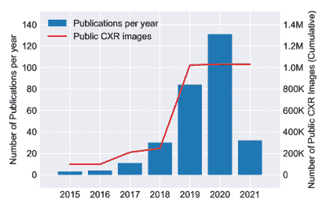

<!--yml

分类：未分类

日期：2024-09-06 19:56:20

-->

# [2103.08700] 深度学习在胸部 X 射线分析中的应用：一项调查

> 来源：[`ar5iv.labs.arxiv.org/html/2103.08700`](https://ar5iv.labs.arxiv.org/html/2103.08700)

# 深度学习在胸部 X 射线分析中的应用：一项调查

Ecem Sogancioglu Erdi Çallı Bram van Ginneken Kicky G. van Leeuwen Keelin Murphy 拉德布德大学医学中心，健康科学研究所，医学影像系，荷兰奈梅亨

###### 摘要

深度学习的最新进展在许多医学图像分析任务中展现出了良好的性能。作为最常见的放射学检查，胸部 X 射线影像是一个特别重要的模式，已针对其进行了多种应用的研究。近年来，多个大型公开可用的胸部 X 射线数据集的发布鼓励了研究兴趣，并推动了出版数量的增加。在本文中，我们回顾了所有使用深度学习的胸部 X 射线研究，将工作按任务分类：图像级预测（分类和回归）、分割、定位、图像生成和领域适应。详细介绍了商业化应用，并全面讨论了当前的技术现状和潜在的未来方向。

###### 关键词：

深度学习，胸部放射影像，胸部 X 射线分析，调查^†^†期刊：医学图像分析^(tnote1)^(tnote1)脚注文本：Ecem Sogancioglu 和 Erdi Çallı 贡献相等。

## 1 引言

作为放射学影像的重要基石，胸部放射影像（胸部 X 射线，CXR）仍然是世界上最常进行的放射学检查，工业化国家报告每年每千人平均获取 238 张立位胸部 X 射线影像[345]。2006 年，仅在美国就估计获取了 1.29 亿张 CXR 影像[212]。CXR 影像的需求和可用性可以归因于其成本效益和低辐射剂量，同时对多种病理具有合理的敏感性。CXR 通常是获取的第一个影像检查，并且在广泛的病症筛查、诊断和管理中仍然是核心。

胸部 X 光片可以根据患者相对于 X 光源和探测板的位置和方向分为三种主要类型：后前位、前后位和侧位。后前位（PA）和前后位（AP）视图都被认为是正位视图，其中 X 光源分别位于患者的后方或前方。AP 图像通常是从仰卧的患者那里获得，而 PA 图像采集时患者通常是站立的。侧位图像通常与 PA 图像一起获得，从患者的一侧投射 X 光到另一侧，通常是从右到左。这些图像类型的示例见图 1。


图 1：左：后前位（PA）视图的正位胸部 X 光片。中：侧位胸部 X 光片。右：前后位（AP）视图的胸部 X 光片。所有三种 CXR 图像均来自 CheXpert 数据集 [131]，患者 184\。

胸部 X 光片的解读可能具有挑战性，因为沿投影方向的解剖结构重叠。这种效果可能使得在特定位置（例如，正位胸部 X 光片中心脏后的结节）检测异常变得非常困难，检测细小或微妙的异常，或准确区分不同的病理模式都变得困难。正因如此，放射科医生在分析 CXR 图像时通常会显示出较高的观察者间变异性 [265, 13, 384]。

CXR 图像的获取量、解读的复杂性以及其在临床实践中的价值长期以来激励研究人员建立用于 CXR 分析的自动化算法。实际上，自 1960 年代以来，关于 CXR 图像上自动异常检测系统的第一篇论文发表以来，这一直是一个研究兴趣领域 [188, 21, 213, 155, 342]。自动化 CXR 分析的潜在收益包括对微妙发现的提高敏感性、优先处理时间紧急的案例、自动化繁琐的日常任务以及在放射科医生不可用的情况下（例如发展中国家）提供分析。

近年来，深度学习已成为图像分析任务的首选技术，并在医学成像领域产生了巨大影响 [183]。深度学习以对数据的巨大需求而闻名，而 CXR 研究社区则受益于近年来发布的众多大型标注数据库，这些数据库主要通过自动解析放射科报告生成标签。这一趋势始于 2017 年，当时 NIH 临床中心发布了 112,000 张图像 [359]。仅在 2019 年，就有超过 755,000 张图像在 3 个标注数据库中发布（CheXpert [131]，MIMIC-CXR [136]，PadChest [36]）。在这项工作中，我们展示了这些数据发布对该领域深度学习出版物数量的影响。

以前有关于医疗图像分析领域深度学习的回顾 [183, 95, 291, 86]，以及关于 CXR 的深度学习或计算机辅助诊断的回顾 [261, 138, 7]。然而，最近对胸部放射影像深度学习的回顾在文献和方法论的覆盖、公开数据集的描述以及对未来潜力和趋势的讨论方面远未详尽。本文的文献回顾包括了 2015 年至 2021 年间发表的 295 篇论文，并按应用分类。还提供了全面的公开数据集列表，包括图像和标签的数量和类型，以及对这些数据集各方面的一些讨论和注意事项。描述了该领域的趋势和差距，讨论了重要贡献，并确定了潜在的未来研究方向。此外，我们还讨论了可用于胸部放射影像分析的商业软件，并考虑了如何将研究成果最佳地转化到临床中。

本文献回顾的初步文献选择如下：使用 PubMed 搜索创建了一份论文选择，查询条件如下。

```
  chest and ("x-ray" or xray or radiograph) and
  ("deep learning" or cnn or "convolutional" or
  "neural network")

```

对 SPIE、MICCAI、ISBI、MIDL 和 EMBC 会议论文集的标题进行了系统性搜索，使用上述相同的搜索词查找论文标题。在同一篇论文有多个出版物的情况下，仅包含最新的出版物。还添加了合著者和同事推荐的相关同行评审文章。最后一次搜索于 2021 年 3 月 3 日进行。

这一搜索策略结果列出了 767 篇论文。其中 61 篇被删除，因为它们是列表中其他论文的重复。进一步有 261 篇被排除，因为其主题与胸部 X 光的深度学习无关，或是评论或评估论文，或是非英文论文。不经过同行评审的出版物也被排除（8）。最终，在审阅过程中 142 篇论文被排除，因为其科学内容被认为不可靠，详细情况见第六部分，最后留下 295 篇论文用于最终文献综述。

本工作的其余部分结构如下：第二部分简要介绍了深度学习的概念和当前文献中遇到的主要网络架构。在第三部分中，详细描述了可用的公共数据集，以提供文献研究的背景。第四部分提供了对收集到的文献的综述，按主要主题分类。第五部分描述了用于胸部 X 光分析的商业系统。本文在第六部分总结，对胸部 X 光中深度学习的当前最前沿以及未来研究和商业环境中的潜力进行了全面讨论。

## 2 深度学习方法概述

本节介绍了用于图像分析的深度学习，特别是文献中最常见的网络架构。在许多其他工作中，包括近期对医学图像分析中深度学习的综述[183]，提供了对全连接和卷积神经网络的正式定义和更深入的数学解释。在本工作中，我们仅提供了这些基本细节的简要概述，并建议感兴趣的读者查阅以前的文献。

深度学习是机器学习的一个分支，机器学习是描述学习算法的通用术语。所有深度学习方法的基础算法是神经网络，在这种情况下，构建了许多隐藏层（“深度”）。这些网络可以通过不同的层类型构建，并且网络的总体构造被称为其“架构”。2.3 到 2.6 部分描述了按应用类型分类的 CXR 文献中常用的架构。

### 2.1 卷积神经网络

在 1980 年代，首次引入了使用卷积层的网络用于图像分析 [91]，这一概念在接下来的几年中被正式化 [164]。这些卷积层现在几乎在所有深度学习图像分析任务中都作为基础存在。卷积层使用仅连接到前一层的小“感受野”的神经元。这些神经元应用于前一层的不同区域，作为滑动窗口覆盖所有区域，有效地在每个位置检测到相同的局部模式。通过这种方式，空间信息得以保留，并且学习到的权重被共享。

### 2.2 转移学习

转移学习研究如何将从一个领域（源领域）提取的知识转移到另一个领域（目标领域）。在 CXR 分析中，最常用的转移学习方法之一是使用预训练。

采用预训练方法，网络架构首先在大规模数据集上进行不同任务的训练，然后将训练好的权重用于后续任务的初始化，以进行微调[383]。根据目标领域的数据可用性，可以重新训练所有层，或者仅重新训练最终（全连接）层。这种方法使得神经网络能够使用相对较小的数据集进行新任务的训练，因为从源领域数据中学习到了有用的低级特征。研究表明，在 ImageNet 数据集上进行预训练（用于自然图像的分类）[17] 对胸部 X 光分析有益，这种类型的迁移学习在本研究调查的研究中得到了广泛应用。许多架构的 ImageNet 预训练版本作为流行深度学习框架的一部分公开提供。预训练的架构也可以作为特征提取器，与更多传统的方法（如支持向量机或随机森林）结合使用。领域适应是迁移学习的另一个子领域，并在第 2.7 节中进行了详细讨论。

### 2.3 图像级预测网络

在这项工作中，我们使用“图像级预测”一词来指代通过分析整个 CXR 图像来实现的类别标签（分类）或连续值（回归）的预测任务。这些方法与那些针对图像的小块或分割区域进行预测的方法不同。分类和回归任务在这项工作中被归为一类，因为它们通常使用相同类型的架构，仅在最终输出层上有所不同。早期成功的图像级预测深度卷积架构之一是 AlexNet [154]，它由 5 个卷积层和 3 个全连接层组成。AlexNet 在 2012 年的 ILSVRC（ImageNet）挑战赛中以很大优势击败了所有其他竞争对手，成为文献中的一个重要里程碑 [71]。此后，许多深度卷积神经网络架构相继提出。VGG 模型系列 [311] 使用 8 到 19 个卷积层，后接 3 个全连接层。Inception 架构首次在 2015 年引入 [325]，采用多种卷积滤波器尺寸的分层模块，称为 Inception 模块。2016 年，ResNet 模型系列 [113] 开始流行，并在以往基准上取得了改进。这些模型定义了由多个卷积操作组成的残差块，具有跳跃连接，通常能提高模型性能。在 ResNet 成功后，跳跃连接被广泛应用于许多架构中。DenseNet 模型 [123]，于 2017 年推出，也在块之间使用跳跃连接，但在块内将所有层连接起来。Inception 架构的后续版本也增加了跳跃连接（Inception-Resnet） [324]。Xception 网络架构 [56] 在 Inception 架构的基础上进行了改进，但将 2D 图像空间中的卷积与跨通道的卷积分开。这被证明相比 Inception V3 提升了性能。

本综述中调查的大多数工作使用了这里讨论的一个或多个模型架构，隐藏层数量各不相同。

### 2.4 分割网络

分割是一项任务，其中像素被分配一个类别标签，也可以被视为像素分类。在自然图像分析中，这项任务通常被称为“语义分割”，并且通常要求图像中的每个像素都有一个指定的类别。在医学成像领域，这些标签通常对应于解剖特征（如心脏、肺、肋骨）、异常（如肿瘤、浑浊）或异物（如管子、导管）。在医学成像文献中，通常只分割一个感兴趣的对象，本质上将“其他”类别分配给所有剩余像素。

早期使用深度学习的分割方法采用了为分类任务设计的标准卷积架构[50]。这些方法通过滑动窗口方法对图像中的每个像素进行分类。这种方法的主要缺点是相邻的补丁在像素上有很大的重叠，导致由于重复进行相同的卷积操作而效率低下。此外，它将每个像素分别处理，这导致该方法计算开销大，只适用于小图像或来自图像的小补丁。

为了解决这些缺点，提出了全卷积网络（FCNs），用卷积层替代了全连接层[306]。这样可以使网络处理更大的图像作为输入，并生成一个可能性图输出，而不是单个像素的输出。2015 年，提出了一种全卷积架构，称为 U-Net[286]，这项工作已成为医学图像分析历史上引用最多的论文。U-Net 由若干卷积层组成，沿着一个收缩（下采样）路径，然后是进一步的卷积层，沿着扩展（上采样）路径恢复结果到输入分辨率。它还使用了在收缩和扩展路径上的相同层之间的跳跃连接，以恢复在池化操作中丢失的细节。本次回顾中的大多数图像分割工作都采用了 FCN 或 U-Net 的变体。

### 2.5 定位网络

本调查使用“定位”一词来指代图像中具体区域的识别，通常通过边界框或点位来表示。与分割任务类似，在医学领域中，定位可以用来识别解剖区域、异常情况或异物结构。尽管在这里回顾的胸部 X 光（CXR）文献中专门讨论定位方法的论文相对较少，但由于这是医学影像中的一个重要任务，并且可能比精确分割更容易实现，我们将这些工作归为一类。

在 2014 年，RCNN（区域卷积神经网络）被引入[98]，用于识别图像中的感兴趣区域，并使用 CNN 架构提取这些区域的特征。支持向量机（SVM）被用来根据提取的特征对这些区域进行分类。这种方法涉及多个阶段，处理速度相对较慢。之后，fast-RCNN [97]取代了它，并随后由 faster-RCNN [284]进一步改进，简化了处理流程，去除了初始区域识别或 SVM 分类的需求，同时提高了速度和性能。2017 年，对 faster-RCNN 进行了进一步扩展，增加了在边界框内对识别项目进行精确分割的功能。这种方法被称为 Mask R-CNN [112]。虽然这在技术上是一个分割网络，但我们在这里将其作为 RCNN 家族的一部分提到。另一种在目标定位中流行的架构是 YOLO（You Only Look Once），它在 2016 年首次被引入[281]，作为一种单阶段目标检测方法，并在 2017 年和 2018 年进行了改进[282, 283]。原始的 YOLO 架构使用单一的 CNN 和图像网格来指定输出，比其同时代的模型显著更快，但准确度稍逊。改进后的版本利用了分类和检测训练数据，并引入了许多训练改进，达到了最先进的性能，同时比竞争对手更快。另一个在医学成像文献中出现的最终定位网络是 RetinaNet [182]。像 YOLO 一样，这也是一个单阶段检测器，它引入了焦点损失函数的概念，迫使网络在训练期间集中于更困难的例子。本综述中包含的大多数定位工作都使用了上述描述的某种架构。

### 2.6 图像生成网络

深度学习常用于基于从训练集中学习到的信息生成新的、逼真的图像。在医学领域生成图像有很多原因，包括生成更易于解释的图像（通过提高分辨率或去除阻碍分析的投影结构）、生成用于训练的新图像（数据增强）或将图像转换以模拟不同领域的外观（领域适应）。各种生成方案也被用来提高异常检测和分割等任务的性能。

图像生成首次因生成对抗网络（GAN）的引入而广受关注，该技术于 2014 年推出 [100]。GAN 包含两个网络架构，一个是图像生成器，另一个是试图区分生成图像与真实图像的判别器。这两个网络在对抗方案中训练，其中生成器试图通过学习生成最逼真的图像来欺骗判别器，而判别器则通过逐步学习更好地区分真实图像和生成图像来作出反应。

GAN 的训练过程可能不稳定，没有收敛的保证，许多研究者已经研究了基础方法的稳定性和改进[293, 116, 141, 10]。GAN 也通过结合类别标签、图像到图像的翻译（在这种情况下以图像为条件）[133]以及无配对图像到图像的翻译（CycleGAN [405]）适应了条件数据生成[52, 237]。

GAN 在医学影像社区中受到了广泛关注，近年来发布了几篇关于医学图像分析应用的论文 [381]。在这次综述中识别出的许多图像生成工作采用了基于 GAN 的架构。

### 2.7 领域适应网络

在这项工作中，我们使用“领域适应”（‘Domain Adaptation’）这一术语，它是迁移学习的一个子领域，用于涵盖那些试图解决架构在单一“领域”数据上训练后，在其他领域数据上测试时表现不佳的问题的方法。术语“领域”的定义较为模糊；在医学影像中，它可能指代特定硬件（扫描仪）、一组采集参数、重建方法或医院的数据。它也可以（但较少）指代包含的人群特征，例如性别、种族、年龄或数据集中某些病理的菌株。

领域适应方法考虑一个在源领域（源领域）上训练用于图像分析任务的网络，以及如何在不同领域（目标领域）上准确地执行此分析。这些方法可以根据目标领域标签的可用性分为有监督、无监督和半监督方法，并且已被研究用于各种 CXR 应用，从器官分割到多标签异常分类。领域适应没有特定的典型架构，而是通过各种方式组合架构，以实现从未见过的领域中学习分析图像的目标。对此问题的方法大致可以分为三类（参照 [356] 的分类）；基于差异的、基于重建的和基于对抗的。

基于差异的方法旨在通过微调图像分析网络和优化源域与目标域之间的差异度量来实现某些特征空间的对齐。另一方面，基于重建的方法使用辅助编码-解码重建网络，旨在通过共享编码器学习领域不变表示。基于对抗的方法则基于 GANs 的对抗训练概念，使用一个判别网络尝试区分源域和目标域的样本，以促进领域不变特征的使用。这一类方法在 CXR 分析中用于领域适应最为常见，包含生成模型和非生成模型。生成模型通过直接操作像素空间将源图像转换为类似目标图像的样式，而非生成模型则使用源域上的标签并利用对抗训练来获得领域不变表示。

## 3 个数据集

深度学习依赖大量注释数据。放射学工作流程的数字化使医疗机构能够汇总和分类大量的数字图像。此外，自然语言处理（NLP）算法的进步意味着放射学报告现在可以自动分析，以提取每张图像的感兴趣标签。这些因素使得近年来构建和发布了多个大型标注的 CXR 数据集。其他标注策略包括附上整个放射学报告和/或通过其他方式生成的标签，如图像的放射学审查、报告的放射学审查或实验室测试结果。一些数据集包括指定结构的分割或定位信息。

在本节中，我们详细介绍了文献中遇到的每个公共数据集以及根据我们所知的其他可用数据集。详细信息见表 3。每个数据集都有一个缩写，用于文献综述表格（表 2 至 9）中，用以指示数据集在指定工作中的使用。

表 1：可用于研究的 CXR 数据集。大于$10,000$的值被四舍五入并用 K 缩写，表示千（例如 10K 表示$10,000$）。

标记方法：RP=报告解析，RIR=放射科医生报告解读，RI=放射科医生胸部 X 光解读，RCI=放射科医生对胸部 X 光的协同一致，LT=实验室测试。

注释类型：BB=边界框，CL=分类，CLoc=带位置标签的分类，R=报告，SE=分割。

黄金标准数据：指的是由报告解析以外的方法标记的图像数量。

|  | 患者（P） 研究（S） 图像（I） | 视图位置 | 注释 | 图像格式 | 标记方法 | 黄金标准数据 |
| --- | --- | --- | --- | --- | --- | --- |
|  | 类型 | 标签 | 研究 |
| ChestX-ray14 (C) | P: 31K | PA: 67K | CL | 14 | 112K | PNG | RP |  |
| [359] | I: 112K | AP: 45K | BB | 8 | 983 |  | RI | 984 |
| CheXpert (X) | P: 65K | PA: 29K | CL | 14 | 224K | JPEG | RCI | 235 |
| [131] | S: 188K | AP: 162K |  |  |  |  | RP |  |
|  | I: 224K | LL: 32K |  |  |  |  |  |  |
| MIMIC-CXR (M) | P: 65K | PA+AP: 250K | CL（V1） | 14 | 372K | JPEG（V1） | RP |  |
| [136] | S: 224K | LL: 122K | R（V2） |  | 372K | DICOM（V2） |  |  |
|  | I: 372K |  |  |  |  |  |  |  |
| PadChest (P) | P: 67K | PA: 96K | CL | 193 | 110K | DICOM | RIR | 27593 |
| [36] | S: 110K | AP: 20K | R |  | 110K |  | RP |  |
|  | I: 160K | LL: 51K |  |  |  |  |  |  |
| PLCO (PL) | P: 25K | PA: 89K | CL | 22 | 89K | TIFF | RI | All |
| [403] | I: 89K |  | CLoc | 17 | 89K |  |  |  |
| Open-i (O) | P: 3,955 | PA: 3,955 | R |  | 3,955 | DICOM | RI | All |
| [70] | I: 7,910 | LL: 3,955 |  |  |  |  |  |  |
| Ped-pneumonia (PP) | I: 5,856 |  | CL | 2 | 5,856 | JPEG | RI | All |
| [143] |  |  |  |  |  |  |  |  |
| JSRT+SCR (J) | I: 247 | PA: 247 | SE | 3 | 247 | DICOM | RI | All |
| [308] |  |  |  |  |  |  |  |  |
| RSNA-Pneumonia (RP) | I: 30K | PA: 16K | BB | 1 | 30K | DICOM | RI | All |
| [287] |  | AP:14K | CL |  |  |  |  |  |
| 深圳（S） | I: 340 | PA: 340 | CL | 2 | 340 | DICOM | RI | All |
| [134] |  |  |  |  | 340 |  |  |  |
| Montgomery (MO) | I: 138 | PA: 138 | CL | 2 | 138 | PNG | RI | All |
| [134] |  |  | SE |  | 138 |  |  |  |
| BIMCV (B) | P: 1,305 | PA: 1,132 | CL | 1 | 2,391 | DICOM | LT | All |
| [349] | S: 2,391 | AP: 1,346 |  |  |  |  |  |  |
|  | I: 3,293 | LL: 815 |  |  |  |  |  |  |
| COVIDDSL (CD) | P: 1,725 | PA | CL | 1 | 4,943 | DICOM | LT | All |
| [118] | S: 4,943 | AP（大多数） |  |  |  |  |  |  |
|  |  | LL |  |  |  |  |  |  |
| COVIDGR (CG) | I: 852 | PA:852 | CL | 2 | 852 | JPEG | RI | All |
| [327] |  |  |  |  |  |  |  |  |
| SIIM-ACR (SI) | I: 16K | PA: 11K | SE | 1 | 16K | DICOM | RI | All |
| [1] | P:16K | AP: 4,799 |  |  |  |  |  |  |
| CXR14-Rad-Labels (CR) | P: 1,709 | AP: 3,244 | CL | 4 | 4,374 | PNG | RCI | All |
| [201] | I: 4,374 | PA: 1,132 |  |  |  |  |  |  |
| COVID-CXR (CC) | I:866 | PA:344 | CL |  |  | PNG+JPEG | 各种 |  |
| [60] | P:449 | AP:438 | BB |  |  |  |  |  |
|  |  | LL:84 | SE |  |  |  |  |  |
| NLST (N) | I: 5493 | 无公开信息 |
| [232] |  | 图像数量由[190]报告。 |
| Object-CXR (OB) | I:10K | 不再位于原始下载位置 |
| 白俄罗斯 (BL) | I: 300 | 不再位于原始下载位置 |

1.  1.

    ChestX-ray14 (C) 是一个包含 $112,120$ 张胸部 X 光片的数据库，来源于 $30,805$ 名患者 [359]。这些 X 光片在（美国）国立卫生研究院收集。图像以 $1024\times 1024$ 像素的 8 位灰度图像分发。该数据集通过放射学报告自动标记，指示了 14 种异常类型的存在。

1.  2.

    CheXpert (X) 是一个包含 $224,316$ 张胸部 X 光片的数据集，来源于 $65,240$ 名患者 [131]。这些 X 光片在斯坦福医院于 2002 年 10 月至 2017 年 7 月间收集。图像以原始分辨率的 8 位灰度图像分发。该数据集通过放射学报告自动标记，使用基于规则的标记器，指示 12 种异常的存在、缺失、不确定性和未提及，以及无发现和支持设备的存在。

1.  3.

    MIMIC-CXR (M) 是一个包含 $371,920$ 张胸部 X 光片的数据集，来源于 $64,588$ 名患者 [136]。这些 X 光片收集于 2011 至 2016 年间的贝斯以色列女执事医疗中心急诊科。在版本 1 (V1) 中，图像以全分辨率的 8 位灰度图像分发。该数据集通过放射学报告自动标记，使用与 CheXpert 相同的基于规则的标记系统。MIMIC-CXR 的第二个版本 (V2) 随后发布，包含匿名化的放射学报告和 DICOM 文件。

1.  4.

    PadChest (P) 是一个包含 $160,868$ 张胸部 X 光片的数据集，来自 $109,931$ 个研究和 $67,000$ 名患者 [36]。这些 X 光片在 2009 至 2017 年间在西班牙的圣胡安医院收集。图像以全分辨率的 16 位灰度图像存储。$27,593$ 份报告由医生手动标记。利用这些标签，训练了一个 RNN，并用来标记数据集的其余部分。报告用于提取 174 个发现、19 个诊断和 104 个解剖位置。标签符合基于标准统一医学语言系统 (UMLS) [29] 的分层分类法。

1.  5.

    PLCO (PL) 是一个用于前列腺、肺、结直肠和卵巢 (PLCO) 癌症筛查的试验 [403]。该研究的肺部部分包含 $185,421$ 张胸部 X 光片，来自 $56,071$ 名患者。NIH 分发了 $25,000$ 名患者和 $88,847$ 张正面 X 光片的标准数据集。该数据集包含 22 个疾病标签，4 个异常级别以及异常的定位信息。

1.  6.

    Open-i (O) 是一个包含 $7,910$ 张 CXR，来自 $3,955$ 个研究和 $3,955$ 名患者的数据集 [70]。这些 CXR 图像采自印第安纳患者护理网络 [210]。图像以匿名 DICOM 格式分布。放射科医生解释的放射学发现可以在 MeSH 格式中获取¹¹1[`www.nlm.nih.gov/mesh/meshhome.html`](https://www.nlm.nih.gov/mesh/meshhome.html)。

1.  7.

    Ped-Pneumonia (PP) 是一个包含 5,856 张儿科 CXR 的数据库 [143]。这些 CXR 图像采自中国广州妇女儿童医疗中心。图像以 8 位灰度图像的不同分辨率分布。标签包括细菌性和病毒性肺炎以及正常。

1.  8.

    JSRT 数据集 (J) 包含 247 张图像，分辨率为 $2048\times 2048$，像素大小为 0.175mm，深度为 12 位 [308]。它包括结节位置（154 张图像）和诊断（恶性或良性）。这些图像的心脏和肺部分割参考标准由 SCR 数据集 [96] 提供，我们在本研究中将这些数据集合并在一起。

1.  9.

    RSNA-Pneumonia (RP) 是一个包含 $30,000$ 张带有肺炎注释的胸部 X 光图像（CXR）的数据集 [287]。这些图像采自 ChestX-ray14，采用 $1024\times 1024$ 分辨率的 8 位灰度图。注释由放射科医生通过在肺部阴影周围添加边界框和标记正常、肺部阴影、不正常的 3 个类别完成。

1.  10.

    深圳 (S) 是一个包含 662 张 CXR 的数据集 [134]。这些 CXR 图像在 2012 年 9 月采自中国广东省深圳市第三人民医院。图像包括一些儿科图像，以 8 位灰度图形式分布，保持全分辨率，并注释了结核病迹象。

1.  11.

    Montgomery (MO) 是一个包含 138 张 CXR 的数据集 [134]。这些 CXR 图像由美国马里兰州蒙哥马利县卫生与公共服务部的结核病控制项目收集。图像以匿名 DICOM 格式分布，注释了结核病迹象，并额外包括了肺部分割掩模。

1.  12.

    BIMCV (B) 是由瓦伦西亚地区医学图像库（BIMCV）在 2020 年发布的 COVID-19 数据集 [349]。它包括 CXR 图像、CT 扫描以及实验室测试结果。数据集中包含 1,305 名 COVID-19 阳性受试者的 3,293 张 CXR 图像。CXR 图像为 16 位 PNG 格式，保持原始分辨率。

1.  13.

    COVIDDSL (CD) 是由西班牙 HM 医院集团发布的 COVID-19 数据集 [118]。它包括 1,725 名患者的 CXR 图像以及详细的实验室测试结果、生命体征等。所有受试者均为确认 COVID-19 阳性。

1.  14.

    COVIDGR (CG) 是一个包含 852 张 PA CXR 影像的数据集，其中一半根据相应的 RT-PCR 结果被标记为 COVID-19 阳性，结果需在最多 24 小时内获得[327]。该数据集来源于西班牙格拉纳达的 Hospital Universitario Clínico San Cecilio，并提供了阳性病例的严重程度级别。

1.  15.

    SIIM-ACR (SI) 该数据集是为 Kaggle 的气胸检测和分割挑战赛发布的[1]。研究人员已确定至少有一些（可能全部）的影像来自 ChestX-ray14 数据集，尽管挑战组织者尚未确认数据来源。数据以$1024\times 1024$分辨率的 DICOM 文件形式提供。对阳性病例气胸的像素分割信息也被提供。

1.  16.

    CXR14-Rad-Labels (CR) 为 ChestX-ray14 数据集的一个子集提供了额外的注释[201]。它包含 4,374 项研究和 1,709 名患者的 4 个标签。这些标签是通过 3 名放射科医师的裁决一致意见收集的。这些放射科医师从 11 名放射科医师中选出用于验证分割（2,412 项研究来自 835 名患者），13 名放射科医师用于测试分割（1,962 项研究来自 860 名患者）。每位放射科医师的个别标签以及一致性标签都已提供。

1.  17.

    COVID-CXR (CV) 是一个包含 930 张 CXR 影像的数据集（该数据集仍在持续开发中）[60]。这些 CXR 影像来自多种不同的地点，使用包括 COVID-19 研究论文中的截图等不同方法收集。根据影像来源提供的信息不同，可用的标签也有所不同。影像没有标准分辨率，并以 8 位 PNG 或 JPEG 文件格式发布。

1.  18.

    NLST (N) 是一个在 NLST 筛查试验期间收集的公开可用 CXR 数据集[232]。该试验旨在比较低剂量计算机断层扫描（CT）与 CXR 在吸烟者肺癌筛查中的使用。研究共有 26,732 名参与者在 CXR 组，其中一部分数据可根据请求提供。

1.  19.

    Object-CXR (OB) 是一个来自中国医院的 10,000 张 CXR 影像的数据集，影像上标注了异物。下载位置（https://jfhealthcare.github.io/object-CXR/）在写作时已无法访问。由于无法从影像来源验证，因此未提供进一步细节。

1.  20.

    白俄罗斯 (BL) 该数据集被包括在内，因为它在一些已审阅的论文中被使用，但下载位置（http://tuberculosis.by）在写作时已无法访问。该数据集包含大约 300 张具有确诊 TB 的正面胸部 X 光片。由于无法从影像来源验证，因此未提供进一步细节。

最近几年公开可用的 CXR 图像数量的迅速增加，对该领域深度学习研究的数量产生了积极影响。图 2 展示了公开可用的 CXR 图像的累计数量以及每年与 CXR 相关的深度学习出版物的数量。



图 2: 本工作中审阅的出版物数量按年份统计，并与公开可用的 CXR 图像数量进行比较。2021 年的数据截至该年的 3 月 3 日。

### 3.1 公共数据集注意事项

医学图像数据的发布对研究社区来说非常重要，这对于推进深度学习应用领域的技术水平至关重要。然而，在使用本工作中描述的公共数据集时，有一些注意事项需要考虑和理解。首先，许多数据集使用自然语言处理（NLP）为每张图像创建标签。虽然这是一种快速且廉价的标注方法，但众所周知，这种方式获得的标签存在不准确性[131, 236, 235]。这些不准确性的原因有很多。首先，根据获取图像的背景，一些可见的异常可能没有在放射学报告中提及[241]。此外，NLP 算法本身可能存在错误，将否定陈述解释为肯定，无法识别缩写等。最后，许多 CXR 的发现是微妙或可疑的，即使是专家观察者之间也会存在分歧[241]。意识到这些问题，131 在 CheXpert 数据集的标签中包括了不确定性或未提及的标签。NLP 标签的一个特别令人担忧的问题是系统性或结构化的错误标记，即异常被一致地以相同的方式错误标记。一个例子是 ChestX-ray14 数据集中，皮下气肿经常被错误标记为（肺部）‘气肿’[39, 236]。

已经证明深度神经网络能够容忍训练集中合理水平的标签不准确，而不会对模型性能产生显著影响[39, 285]。虽然这些标签可以用于训练，但为了准确评估和比较模型，测试数据集的标签应准确无误。在本工作审阅的文献中，许多作者依赖于 NLP 算法生成的测试数据标签，而其他人则使用放射科医师注释、实验室测试和/或 CT 验证来改进测试集的标签。我们将使用这些改进标签技术的数据称为黄金标准数据（表 3）。

公共数据集中定义的标签也应仔细考虑并被使用这些数据的研究人员理解。许多标签之间存在实质性依赖。例如，一些数据集提供了“肺部实变”和“肺炎”的标签。实变（气道阻塞）是肺炎的一个指示，表明这些标签之间会有显著重叠。进一步需要考虑的是，在实际操作中，并非所有标签都能仅通过 CXR 图像进行预测。肺炎很少仅通过影像诊断，需要其他临床体征或症状来提示这是可见实变的原因。

许多公共数据集发布的图像质量低于临床放射学阅读所用的质量。这可能是深度学习系统性能下降的原因，特别是在检测更细微的异常时。质量降低通常与发布前图像尺寸或位深度的减少有关。这通常是为了减少数据集的整体下载大小。然而，在一些情况下，CXR 数据是通过从在线文献中获取截图来收集的，这导致数据不可量化的退化。在临床工作流程中，DICOM 文件是存储 CXR 的行业标准，通常使用每像素 12 位，图像尺寸大约为 X 和 Y 方向各 2 到 4 千像素。如果数据在发布前经过后处理，则希望提供所有步骤的精确描述，以使研究人员能够重现这些步骤以进行数据集合并。

## 4 胸部放射学的深度学习

本节回顾了胸部放射学领域的深度学习文献，将其根据所涉及的任务类型（图像级预测、分割、图像生成、领域适应、定位、其他）分为几个部分。每个部分都提供了有关该任务的文献详细信息的表格。一些对两个任务具有相等主要关注的工作可能会出现在两个表格中。对于分割和定位，仅包括那些定量评估其结果的研究。图 3 显示了每个任务的研究数量。


图 3：每个任务的出版物数量。包括 295 项研究，每项研究最多可以执行两个任务。任务：IL=图像级预测，SE=分割，LC=定位，IG=图像生成，DA=领域适应，OT=其他。

### 4.1 图像级预测

图像级预测是指通过分析整个图像来预测标签（分类）或连续值（回归）的任务。分类标签可能与病理相关（例如肺炎、肺气肿）、信息（如受试者性别）或图像方向。回归值可能表示特定病理的严重程度评分，或其他信息，如受试者的年龄。

我们对 187 项研究进行了分类，详细信息见表格 2，这些研究被归类为图像级预测。大多数这些研究利用现成的深度学习模型来预测病理、元数据或数据集中提供的一组标签。每个标签的研究数量见图 4。


图 4：图像级预测标签的研究数量。专门处理数据集及其标签的研究在底部汇总。包含 187 篇论文，每篇可能研究多个标签。

表 2：图像级预测研究（第 4.1 节）。任务：AA=对抗攻击，DA=领域适应，IC=区间变化，IG=图像生成，IR=图像检索，LC=定位，OT=其他，PR=预处理，RP=报告解析，SE=分割，WS=弱监督。任务中的粗体字体表示该额外任务对工作至关重要，且该研究也出现在本文的另一表格中。标签：C=ChestX-Ray14，CM=心脏肥大，CV=COVID，E=水肿，GA=性别/年龄，L=肺，LC=肺癌，LO=病变或不透明，M=MIMIC-CXR，MN=多个，ND=结节，OR=方向，P=PadChest，PE=积液，PL=PLCO，PM=肺炎，PT=气胸，Q=图像质量，T=分诊/异常，TB=结核，TU=导管或管子，X=CheXpert，Z=其他。数据集：BL=白俄罗斯，C=ChestX-ray14，CC=COVID-CXR，CG=COVIDGR，J=JSRT+SCR，M=MIMIC-CXR，MO=Montgomery，O=Open-i，P=PadChest，PL=PLCO，PP=Ped-pneumonia，PR=私人，RP=RSNA-Pneumonia，S=深圳，SI=SIIM-ACR，SM=CT 模拟 CXR，X=CheXpert。

| 引用 | 方法 | 其他任务 | 标签 | 数据集 |
| --- | --- | --- | --- | --- |
| [184] | 结合肺部裁剪的 CXR 模型和 CXR 模型以提高模型性能 | SE,LC,PR | C,L | C,J |
| [316] | 心脏肥大的图像级预测与分割模型比较 | SE | CM | C |
| [264] | 使用 DenseNet 和 U-Net 的心脏肥大分类网络 | SE | CM | C |
| [177] | 基于 U-Net 的模型用于心脏和肺部分割，以计算心胸比 | SE | CM | PR |
| [222] | 结合肺部裁剪的 X 射线模型和使用分割质量的 X 射线模型 | SE | E,LO,PE,PT,Z | M |
| [80] | 通过使用肺部分割来提高肺炎检测的准确性 | SE | PM | J,MO,PP,PR |
| [125] | 基于 U-Net 的模型用于肺炎分割 | SE | PM | RP |
| [357] | 多尺度 DenseNet 基模型用于气胸分割 | SE | PT | PR |
| [187] | 基于 DenseNet 的 U-Net 用于婴儿左、右肱骨的分割 | SE | Z | PR |
| [248] | 使用中间 ResNet-50 特征的数据库查找类似研究 | OT,IR | TB | MO,S |
| [246] | 使用激活和梯度基的注意力进行定位和分类 | LC | C,X | C |
| [272] | 使用各种网络和集成方法检测和定位 COVID-19 | LC | CV | C,CC,PP,RP,X |
| [294] | 使用 X 射线图像块训练的 GoogleNet 与 COVID-19 严重程度评分相关 | LC | CV,PM | C,PR |
| [252] | 提出了一种分割和分类模型，并与放射科医师团队进行比较 | LC | LO,ND,PE,PT | PR |
| [229] | 在大规模 X 射线图像数据集上训练了一个半监督网络，其中包含 CT 确认的结节病例 | LC | ND | PR |
| [257] | 定义了一种损失，以最小化显著性图错误，从而提高模型性能 | LC | ND | PR |
| [329] | 使用变分模型的弱监督定位，利用注意力图 | LC | PM | C |
| [170] | 基于注意力的 CNN 用于带有边界框的肺炎检测 | LC | PM | RP |
| [127] | 一种用于识别异常 X 射线图像和定位异常的 CNN | LC | T | PR |
| [169] | 介绍了一种可视化方法，用于从分类中识别兴趣区域 | LC | TB | PR |
| [129] | 弱监督框架与定位和分类共同训练 | LC | TB | PR |
| [351] | 结合分类损失和自编码器重建损失 | IG,SE | T | J,MO,O,S |
| [303] | Wasserstein GAN 用于将病变 X 射线图像变为健康的 | IG,LC | Z | PR |
| [366] | 新型 GAN 模型训练健康和异常 X 射线图像以预测差异图 | IG | PE | SM,X |
| [335] | 具有 U-Net 自编码器和 CNN 判别器及编码器的 GAN 用于一类学习 | IG | T | C |
| [206] | 自编码器在一类学习设置中使用不确定性来进行重建误差 | IG | T | PP,RP |
| [168] | 连续学习方法用于分类来自新领域的数据 | DA | C,M | C,M |
| [333] | CycleGAN 模型用于将成人 X 射线图像适配到儿科以进行肺炎分类 | DA | PM | PP,RP |
| [107] | 训练变分自编码器，使用编码特征训练模型 | WS | X | X |
| [106] | 使用潜在空间相似性为半监督学习预测未标记数据的标签 | WS | X | X |
| [211] | 使用 Y-Net 对图像几何进行规范化以进行预处理 | SE,PR | OR | C,M,X |
| [27] | 在 CXR 上进行 COVID-19 不透明度定位和严重性检测 | SE,LC | CV | PR |
| [240] | 用于 Covid-19 分类的 ResNet-18 主干，数据可用性有限 | SE,LC | CV,PM | CC,J,MO |
| [327] | 提出了一个新的数据集 COVIDGR 和一种使用 GANs 进行变换的新方法 | SE,IG | CV | CG |
| [137] | 给予肺部裁剪胸片的 DenseNet 用于心脏肥大检测 | SE | CM | O,P |
| [337] | 使用多个模型和 CXR 数据集组合进行 COVID-19 检测 | SE | CV | C,CC,PR,RP |
| [158] | 对 COVID-19 进行训练的 ResNet-101，生成肺部分割区域的热图 | SE | CV,PM | PR |
| [230] | 考虑多种架构进行儿童肺炎的两阶段分类 | SE | PM | PP |
| [274] | 比较了肺炎定位的可视化方法 | SE | PM | PP |
| [28] | 对图像进行补丁分类，并利用正区域大小对图像进行分类 | SE | PT | PR |
| [270] | 从 CNN 模型中提取特征和集成方法 | SE | TB | MO,PR,S |
| [320] | 使用分割形状分析检测中心静脉导管 | SE | TU | C |
| [204] | 使用堆叠自编码器检测儿童胸片中的气体陷阱 | SE | Z | PR |
| [361] | 使用 Inception-v3 进行尘肺病检测，并与两位放射科医师的评估进行比较 | SE | Z | PR |
| [131] | 介绍了 CheXpert 数据集及其在放射科医师标记的测试集上的模型表现 | RP,LC | X | X |
| [239] | 策划间隔变化检测的数据，提出比较局部特征的方法 | RP,IC | Z | PR |
| [67] | 解析报告以定义主题模型，并使用 CXR 预测这些模型 | RP | CM,PE,Z | O |
| [45] | 使用图像和报告训练模型，以提高仅图像的性能 | RP | E | M |
| [140] | 从报告中提取标签的模糊性，提出利用这些信息的模型 | RP | E,PT,Z | M |
| [322] | 创建并解析 ChestX-ray14 AP 数据的报告，以获得 73 个标签用于训练 | RP | MN | C |
| [163] | 通过标记常见报告句子获得发现以训练模型 | RP | MN | PR |
| [8] | 两个 CNN 的集成用于预测 CXR 队列管理的优先级 | RP | T | PR |
| [17] | 评估骨骼抑制和肺部分割，检测 8 种异常 | PR,SE | CM,PE,PT,Z | O |
| [87] | 使用调整后的 VGG-16 架构对儿科肺炎类型进行分类 | PR,SE | PM | PP |
| [195] | 评估各种图像预处理算法对 DenseNet-121 性能的影响 | PR | T | C,MO,PR,S |
| [15] | 检测 8 种发现并分析这些发现如何改善工作流优先级 | OT | CM,PE,PT,Z | C,O |
| [115] | 提出一种弱监督分类和定位模型 | LC,WS | C | C |
| [290] | 提出一种递归注意力机制以改善模型性能 | LC | C | C |
| [16] | 评估各种模型配置在分类中的应用 | LC | C | C |
| [37] | 注意力挖掘和知识保存用于分类及定位 | LC | C | C |
| [354] | 基于注意力的模型与著名架构进行比较 | LC | C | C |
| [196] | 最小化来自多个模型的 CXR 编码差异 | LC | C | C,X |
| [58] | 使用 DenseNet 预测由放射科医师评分的 COVID-19 严重程度 | LC | CV | CC |
| [362] | 使用 ResNet-50 支持的分割模型检测健康、肺炎、COVID-19 | LC | CV,PM | CC,RP |
| [302] | 使用多实例学习进行分类与定位 | LC | E,PM,PT | M,PR,RP |
| [382] | 使用 ResNet-34 预测肺癌和结节 | LC | LC,ND | PR |
| [142] | 基于 GradCam 的注意力挖掘损失，与从报告中提取的标签进行比较 | LC | LO | M |
| [201] | 使用¿750k CXRs 训练 Xception，结果与放射科医师标签进行比较 | LC | LO,ND,PT,Z | C,PR |
| 续下页 |

表 3：图像级预测研究（第 4.1 节）。任务：AA=对抗攻击，DA=领域适应，IC=间隔变化，IG=图像生成，IR=图像检索，LC=定位，OT=其他，PR=预处理，RP=报告解析，SE=分割，WS=弱监督。任务中的粗体字体表示该附加任务对工作至关重要，并且该研究在本文的另一张表格中也出现过。标签：C=ChestX-Ray14，CM=心脏肥大，CV=COVID，E=水肿，GA=性别/年龄，L=肺，LC=肺癌，LO=病变或不透明，M=MIMIC-CXR，MN=许多，ND=结节，OR=方向，P=PadChest，PE=积液，PL=PLCO，PM=肺炎，PT=气胸，Q=图像质量，T=分诊/异常，TB=结核，TU=导管或管子，X=CheXpert，Z=其他。数据集：BL=白俄罗斯，C=ChestX-ray14，CC=COVID-CXR，CG=COVIDGR，J=JSRT+SCR，M=MIMIC-CXR，MO=蒙哥马利，O=Open-i，P=PadChest，PL=PLCO，PP=Ped-pneumonia，PR=私人，RP=RSNA-Pneumonia，S=深圳，SI=SIIM-ACR，SM=来自 CT 的模拟 CXR，X=CheXpert。

| 续前页 |
| --- |
| 引用 | 方法 | 其他任务 | 标签 | 数据集 |
| [121] | 使用 ResNet 和 VGG 区分 AP 图像与 PA 图像 | LC | OR | PR,RP |
| [288] | 在公共数据上训练的 DenseNet-121 使用 CT 标签进行评估 | LC | PE,PM | C,PL |
| [347] | 评估了在儿科 CXRs 上训练的各种模型在成人 CXRs 上的表现 | LC | PM | PP |
| [49] | 评估了集成方法和可视化在儿科 CXRs 上的应用 | LC | PM,PT,Z | PR |
| [379] | 将 ResNet-152 与放射科医生进行比较并展示统计显著性 | LC | PT | C |
| [62] | 将 GradCAM 与放射科医生的分割结果进行比较以评估 VGG-19 | LC | PT | C,PR |
| [65] | 提取顶尖区域及其补丁以检测气胸 | LC | PT | PR |
| [336] | 异常检测，各种网络与放射科医生标记进行比较 | LC | T | C,O,PP,RP |
| [271] | 评估在 ImageNet 和 CheXpert 上的预训练在不同模型/设置中的效果 | LC | T | RP |
| [227] | 提出了一个基于 GAN 的模型，仅用健康图像进行训练以检测异常 | LC | T | RP |
| [253] | 提出了一个用于更快分类 TB 的新模型 | LC | TB | BL,MO,S |
| [128] | 评估基于 ResNet 的模型在大规模标准数据集上的表现 | LC | TB | PR |
| [313] | 评估多种模型对饲料管误位的检测 | LC | TU | PR |
| [44] | 具有集成的图形 CNN 解决方案，建模疾病依赖性 | LC | X | X |
| [209] | 创建了一个心力衰竭病例数据集并评估了 VGG-16 | LC | Z | C |
| [319] | CNN 用于识别 CXR 中是否存在膈下游离气体 | LC | Z | PR |
| [406] | 评估了多种模型以预测高血压和动脉收缩压 | LC | Z | PR |
| [407] | 使用 ResNet-18 测量 Brassfield 评分，并根据该评分预测囊性纤维化 | LC | Z | PR |
| [40] | 从 CT 扫描中模拟 CXRs 并预测肺气肿评分 | LC | Z | PR |
| [340] | 使用 Inception 网络从儿科 CXR 预测肺动脉与体循环流量比 | LC | Z | PR |
| [172] | 通过将 CXRs 与之前的图像进行比较来预测 COVID-19 的严重程度 | IC,LC | CV | PR |
| [193] | 解决多数据集训练中的领域和标签差异 | DA | C,TB,X | C,PR,X |
| [371] | 提高 CNN 分类器对对抗样本的鲁棒性的方法 | AA,IG | PM | RP |
| [175] | 利用从训练数据集中提取的特征检测对抗性 CXRs | AA | C | C |
| [4] | 自监督和对抗训练在迁移学习中的改进 | AA | PM | PP |
| [145] | 宣称 0.99 AUC 用于预测 TB，使用复杂的特征工程和集成方法 |  |  |  |
| [300] | 使用前面和侧面图像训练的 ResNet 模型，预测 COPD 及 PFT 结果 |  |  | PR |
| [391] | 一类病毒性肺炎病例的识别，与二分类比较 |  |  | PR |
| [14] | 一种克服多机构环境问题的分布式学习方法 |  | C | C |
| [35] | 几何深度学习，包括具有图结构的元数据。应用于 CXR |  | C | C |
| [234] | 提出了一个新的加权方案以改进异常分类 |  | C | C |
| [77] | 在各种训练设置下使用 ResNet-34 进行多标签分类 |  | C | C |
| [314] | 调查了数据增强对使用 Inception-Resnet-v2 分类的影响 |  | C | C |
| [205] | 提出了一个变分/生成模型架构，展示了在 CXRs 上的性能 |  | C | C |
| [276] | 评估了一个集成模型与多个放射科医生的表现 |  | C | C |
| [157] | 新颖的多标签分类方法，应用于 CXR |  | C | C |
| [256] | 定义了一种通过从自编码器提取特征的少样本学习方法 |  | C | C |
| [346] | Mean teacher 启发的概率图模型，具有新颖的损失函数 |  | C | C |
| [214] | 研究了使用 DenseNet-121 去噪对病理分类的影响 |  | C | C |
| [355] | 提出了整合三种在不同层级工作的注意机制 |  | C | C |
| [255] | 分步训练的 CNN 和基于显著性的自编码器用于少样本学习 |  | C | C,O |
| [254] | 使用 CT 和 CXR 报告与 CXR 图像进行训练以诊断未见过的疾病 |  | C | C,PR |
| [36] | 提出了一个包含多标签标签和放射报告的新数据集 PadChest |  | C | P |
| [171] | 病变检测网络用于改进图像级分类 |  | C | PR |
| [94] | 提供了概率的同时信心度量的方法，使用 DenseNet-121 |  | C,PL | C,PL |
| [109] | 使用自监督学习进行预训练，与 ImageNet 预训练进行比较 |  | C,PT | C,SI |
| [400] | 提出了一个新的 CXR 预训练方法，与 ImageNet 预训练进行比较 |  | C,X | C,RP,X |
| [46] | 提出了一个图卷积网络框架，用于建模疾病依赖性 |  | C,X | C,X |
| [401] | 比较了几种心脏肥大的检测模型 |  | CM | C |
| [32] | 测试了四个现成的网络用于心脏肥大的预测 |  | CM | PR |
| [34] | 训练 Inception v3 以检测 4 种异常并与专家观察员进行比较 |  | CM,E,LO,Z | PR |
| [57] | 在大型专有数据集上使用 GoogLeNet 分类正常和 5 种异常 |  | CM,E,PE,PT,Z | PR |
| [18] | 比较深度学习与传统特征提取方法的性能 |  | CM,PE | PR |
| [19] | ImageNet 预训练和用于病理检测的特征提取方法 |  | CM,PE,Z | PR |
| [104] | 用于 COVID-19 分类的 DenseNet-121 网络集成 |  | CV | C,PR |
| [122] | 探讨软组织胸片在训练 DenseNet-121 以检测 COVID-19 的价值 |  | CV | C,PR,RP |
| [404] | 使用 CNN 对 COVID-19 严重程度进行标注和预测 |  | CV | CC |
| [89] | 使用在 COVID-19 病例上训练的模型评估影像参数的效果 |  | CV | PR |
| [363] | 基于 RT-PCR 标签的 COVID-19 检测，评估一个集成模型对比放射科医师 |  | CV | PR |
| [42] | 用于 COVID-19 检测的 ResNet 模型集成 |  | CV | PR |
| [394] | 比较 DenseNet-121 集成与放射科医师的性能 |  | CV,PM | PR |
| [360] | 用于水肿严重程度估计的各种模型和半监督标签的使用 |  | E | M |
| [139] | 使用 DenseNet-169 对 PA 或 AP 图像进行年龄预测 |  | GA | C |
| [373] | 使用传统分类器中的深度学习模型特征进行性别预测 |  | GA | J,MO,O,PR,S |
| [289] | 使用 DenseNet-121 和 ResNet-50 对 AP 图像进行年龄预测 |  | GA | X |
| [191] | 结合胸片与年龄/性别/吸烟史预测肺癌风险 |  | LC | PL |
| [339] | 使用公开数据预训练的 Densenet-121 用于识别 6 类 |  | LC,T,TB,Z | PR |
| [156] | 评估在使用手机拍摄的胸片上的深度学习 |  | M,X | M,X |
| 续至下一页 |

表 4: 图像级预测研究（见 4.1）。任务：AA=对抗攻击，DA=领域适应，IC=间隔变化，IG=图像生成，IR=图像检索，LC=定位，OT=其他，PR=预处理，RP=报告解析，SE=分割，WS=弱监督。任务中的粗体字表示该附加任务对工作至关重要，并且该研究在本文的另一个表格中也出现过。标签：C=ChestX-Ray14，CM=心脏扩大，CV=COVID，E=水肿，GA=性别/年龄，L=肺，LC=肺癌，LO=病变或不透明，M=MIMIC-CXR，MN=多，ND=结节，OR=方向，P=PadChest，PE=积液，PL=PLCO，PM=肺炎，PT=气胸，Q=图像质量，T=分诊/异常，TB=结核，TU=导管或管道，X=CheXpert，Z=其他。数据集：BL=白俄罗斯，C=ChestX-ray14，CC=COVID-CXR，CG=COVIDGR，J=JSRT+SCR，M=MIMIC-CXR，MO=Montgomery，O=Open-i，P=PadChest，PL=PLCO，PP=Ped-pneumonia，PR=私人，RP=RSNA-Pneumonia，S=深圳，SI=SIIM-ACR，SM=CT 模拟胸片，X=CheXpert。

| 继续上一页的内容 |
| --- |
| 引用 | 方法 | 其他任务 | 标签 | 数据集 |
| --- | --- | --- | --- | --- |
| [59] | 研究公开胸片数据集中的领域和标签偏移 |  | MN | C,M,O,P,RP,X |
| [111] | 探索侧视胸片用于分类 64 种不同标签的效果 |  | MN,P | P |
| [275] | 使用 GoogLeNet 架构将胸片分类为正面或侧面 |  | OR | PR |
| [63] | 评估印刷标签对 AP/PA 分类的影响 |  | OR | PR |
| [64] | 区分胸片方向、骨骼胸片和软组织胸片的双能量 |  | OR,Z | PR |
| [24] | 使用 DenseNet 比较 PA 和侧面图像在病理检测中的效果 |  | P | P |
| [48] | 引入一个使用标签层级的损失项以提高模型性能 |  | PL | PL |
| [305] | 在 Ped-pneumonia 数据集上训练 VGG-16 |  | PM | PP |
| [263] | 缓解不平衡类别大小的方法。应用于使用 ResNet-18 的胸片 |  | PM | PP |
| [387] | 评估 MobileNet 在儿童胸片上检测肺炎的效果 |  | PM | PP |
| [82] | 比较多种架构在肺炎检测中的表现 |  | PM | PP |
| [217] | 评估各种胶囊网络架构在儿童肺炎检测中的表现 |  | PM | PP |
| [189] | 使用 ResNet-50 对儿童肺炎进行分类 |  | PM | PR |
| [93] | 比较传统和生成的数据增强技术在胸片上的效果 |  | PM | RP |
| [279] | 解决灾难性遗忘，应用于使用 VGG-13 检测气胸 |  | PT | C |
| [338] | 大型数据集的构建，多个架构和超参数优化 |  | PT | PR |
| [153] | 使用公共数据预训练的模型并微调以检测气胸 |  | PT | PR |
| [220] | 使用 DenseNet-121 检测具有获取缺陷的 CXR |  | Q | C |
| [330] | 结合 GoogleNet 和基于规则的方法来确定图像质量 |  | Q | PR |
| [249] | 使用多种模型检测异常的 CXRs。对独立的私有数据进行评估 |  | T | C |
| [221] | 基于 Inception-ResNet-v2 提取的特征定义模型用于分诊 |  | T | C |
| [367] | 从预训练模型中提取特征，并在其上添加 CNN 用于分诊 |  | T | C,M |
| [135] | 研究不同标签噪声水平对 DenseNet-121 分类的影响 |  | T | C,PR,X |
| [78] | 各种模型检测异常 CXR，不同训练集大小的效果 |  | T | PR |
| [228] | 定义 10 种异常以建立分诊模型，并使用 CT 测试标签 |  | T | PR |
| [79] | 使用 DenseNet 和 EfficientNet 的集成进行正常 CXR 的识别 |  | T | PR |
| [238] | 研究在小数据环境中使用数据增强的效果 |  | T | PR |
| [81] | 评估局部兴趣区域的额外监督 |  | T | PR |
| [273] | 评估各种模型和集成方法在分诊任务中的表现 |  | T | RP |
| [161] | 评估深度学习方法在结核病检测中的应用 |  | TB | BL,MO,PR,S |
| [130] | 评估转移学习在结核病检测中的应用 |  | TB | MO,PR,S |
| [315] | 使用现成模型提取特征并基于这些特征训练模型 |  | TB | MO,PR,S |
| [12] | 结合手工特征和 CNN 进行结核病诊断 |  | TB | MO,S |
| [343] | 评估用于 TB 检测的基于贝叶斯的 CNN |  | TB | MO,S |
| [277] | 评估 AI 系统在提高 TB 诊断中的帮助 |  | TB | PR |
| [114] | 考虑到患者人口统计学特征的不同架构 |  | TB | PR |
| [147] | 解决学习数据的保存问题，应用于使用 ResNet-21 的 TB 检测 |  | TB | PR |
| [101] | 使用 CXR 病理和元数据标签进行预训练，应用于 TB 检测 |  | TB | S |
| [268] | 比较使用不同预训练和集成策略的各种模型 |  | TB | S |
| [160] | 评估模型在检测腹部和 CXR 中喂养管位置的能力 |  | TU | PR |
| [216] | 比较七种架构和集成方法以检测九种病理 |  | X | X |
| [258] | 一种在分类过程中结合标签依赖性和不确定性数据的方法 |  | X | X |
| [267] | 提出自我训练和师生模型以提高样本效率 |  | X | X |
| [39] | 分析标签噪声在训练和测试数据集中的影响 |  | Z | C |
| [72] | 标记 6 种不同的异物类型，并使用各种架构进行检测 |  | Z | M |
| [190] | 评估使用 CXRs 通过 Inception-v4 预测长期死亡率 |  | Z | PL |
| [392] | 使用低分辨率分割来裁剪高分辨率肺部区域并预测尘肺病 |  | Z | PR |
| [73] | 使用 DenseNet-121 和 SVM 对提取的特征进行尘肺病预测 |  | Z | PR |
| [185] | 使用各种 CNN 架构检测冠状动脉钙化 |  | Z | PR |
| [117] | ResNet-50 用于检测肺动脉楔压升高的存在 |  | Z | PR |
| [159] | 设计了一个网络以识别肺动脉压力升高的受试者 |  | Z | PR,RP |

最常研究的图像级预测任务是预测 ChestX-ray14 数据集的标签（31 项研究）。例如，[16]比较了各种方法对 ChestX-ray14 数据集提供的 14 种疾病标签的分类性能。[276]将深度学习模型的集成表现与持证放射科医生和住院医师进行比较，显示他们的模型在 ChestX-ray14 提供的大多数 14 种标签中达到了与专家观察者相当的表现。接下来，肺炎是第二个最常研究的主题（26 项研究）。在处理肺炎的 26 项研究中，有 12 项研究了儿科胸部 X 光片，其中 11 项使用了 Ped-Pneumonia 数据集进行训练和评估[269, 387, 180, 22, 82, 347, 217, 305, 263, 87, 4]。正常/异常（或分诊）的分类是另一个常见的研究主题（20 项研究）。在这里，研究旨在区分正常的胸部 X 光片或优先处理紧急/危重病例，以减少放射科医生的工作负担或提高报告时间。例如，[8]开发了一种基于检查紧急程度的分诊流程。类似地，[336]比较了应用于多个公共胸部 X 光数据集的各种深度学习模型在区分异常病例中的表现。气胸是另一个常见的研究疾病（18 项研究）。例如，[338]旨在检测潜在的危重患者，并提出这些模型可以用于提醒临床医生。另一个常见的主题是结核病检测（18 项研究）。使用深度学习检测这种传染病的首批研究包括[130, 161]。[277]研究了深度学习模型的表现以及这种模型如何改善放射科医生的表现。该研究特别评估了使用额外的临床信息，如年龄、白细胞计数、患者体温和氧饱和度，来辅助深度学习模型。COVID-19 的诊断或评估也是一个引起研究者广泛关注的话题（17 项研究）。例如，[58]预测了疾病的严重程度，类似地，[172]通过比较患者的检查与先前的检查预测疾病进展，[337]使用非常有限的数据检测 COVID-19。除了这些最常见的任务外，还有许多研究使用深度学习进行胸部 X 光片的图像级预测。其他常用的标签在图 4 中说明，并在表 2 中列出。

大多数研究使用预训练的标准架构，这些架构在深度学习库（如 Tensorflow 或 Pytorch）中很容易找到。这些架构通常包括 Resnet [113]、DenseNet [123]、Inception [325]、VGG [311] 或 AlexNet [154]。模型的深度选择（如 ResNet-18、ResNet-50、DenseNet-121、DenseNet-161）在不同研究中也有所不同，因为这个设计选择没有标准。大多数研究并没有引入方法学上的新颖性，而是报告或比较了多种架构在特定任务上的性能。例如，[72] 比较了使用预训练和随机初始化权重的各种 Resnet 和 Densenet 模型在检测外来物体存在性方面的表现。类似地，许多其他研究比较了不同架构在特定任务上的表现，例如 [313]、[336]、[271]、[44]。就像模型的深度和架构一样，还有许多因素会影响深度学习模型的性能。各种数据增强和输入预处理方法的效果由 [314]、[195] 进行评估。增加或减少图像大小的效果在 [77]、[16] 中进行了评估。各种预训练方案由 [101]、[16] 进行评估。为了提高模型性能，更复杂的预处理步骤包括骨骼抑制 [17]、[402] 和肺部裁剪 [184]。

一些研究通过利用已知能够在其他地方提高模型性能的方法带来了方法学上的创新。例如，已知多个模型的集成相比于单个模型可以提升性能[74]。一些使用这种方法的研究有[276, 273, 268, 394]。文献中也存在注意力挖掘（或对象区域挖掘、基于注意力的）模型[364]。这些模型旨在提升性能并为图像级预测模型增加定位能力。一些利用注意力挖掘模型的研究有[37, 290]。多实例学习（多实例学习或 MIL）[369]是另一种用于为图像级预测模型添加定位能力的方法。MIL 将输入图像拆分为较小的部分（实例），对这些实例进行单独预测，然后结合这些信息对整张图像进行预测。一些使用 MIL 的研究有[65, 302]。文献中的其他主题包括模型不确定性[343, 94]，CXR 质量[222, 211, 220, 330, 211]以及对抗攻击的防御[175, 4, 371]。

数据集的不同特性也被用来提升模型的能力或性能。许多公共数据集使用的标签是互不排斥的。这导致了大量论文讨论异常标签之间的依赖关系[258, 49, 44]。由于许多标签在不同机构的数据集中是共有的，因此对来自不同来源的图像中的领域和/或标签漂移问题进行了研究[193, 59]。数据集大小的影响由[78]进行评估。半监督学习方法结合了一小部分标记数据和大量未标记数据来训练模型[107, 106, 360, 346]。

大多数处理图像级预测任务的研究涉及正面 CXR 图像。对侧面胸部 X 光片的重要性以及能够处理多视角的模型在[24, 111, 20]中得到了评估。

### 4.2 分割

分割是 CXR 分析中最常研究的主题之一（58 篇论文），包括了集中于解剖结构、异物或异常的文献。本工作审查的分割文献详见表 5。在胸部 X 射线片上对心脏、肺部、锁骨或肋骨的解剖分割，是许多计算机辅助检测（CAD）管道的核心部分。它通常用作这些管道的初始步骤，以定义感兴趣区域，为后续的图像分析任务提高性能和效率 [17, 361, 274, 114, 184, 204]。此外，分割本身也有助于基于形状或面积测量量化临床参数。例如，临床上用于评估心脏肥大（心脏肥大）的心胸比，可以直接从心脏和肺部分割中计算得出 [316, 177]。因此，器官分割成为了 CXR 分割任务中最常研究的主题之一，如图 5 所示。

表 5：分割研究（第 4.2 节）。任务：DA=领域适应，IG=图像生成，IL=图像级预测，LC=定位，PR=预处理，WS=弱监督。任务中的粗体字表示这个附加任务是工作的核心，并且该研究在本文的另一个表中也出现过。标签：C=ChestX-Ray14，CL=锁骨，CM=心脏肥大，CV=COVID，E=水肿，H=心脏，L=肺，LO=病灶或不透明，PE=积液，PM=肺炎，PT=气胸，R=肋骨，TU=导管或管子，Z=其他。数据集：BL=白俄罗斯，C=ChestX-ray14，J=JSRT+SCR，M=MIMIC-CXR，MO=蒙哥马利，O=Open-i，PP=Ped-pneumonia，PR=私有，RP=RSNA-Pneumonia，S=深圳，SI=SIIM-ACR，SM=CT 模拟 CXR。

| 引用 | 方法 | 其他任务 | 标签 | 数据集 |
| --- | --- | --- | --- | --- |
| [385] | 基于 U-Net 和 Faster R-CNN 的模型，用于检测 PICC 导管及其尖端 | LC,PR | TU | PR |
| [396] | 定制的 Mask R-CNN 用于同时检测和分割 | LC | L | PR |
| [365] | 使用 Mask R-CNN 迭代分割和检测肋骨 | LC | R | PR |
| [184] | 结合了肺部裁剪 CXR 模型和 CXR 模型以提高模型性能 | IL,LC,PR | C,L | C,J |
| [316] | 图像级预测与心脏扩大分割模型的比较 | IL | CM | C |
| [264] | 结合 DenseNet 和 U-Net 的网络用于心脏扩大分类 | IL | CM | C |
| [177] | 基于 U-Net 的模型用于心脏和肺的分割，用于心胸比 | IL | CM | PR |
| [222] | 结合肺部裁剪 CXR 模型和使用分割质量的 CXR 模型 | IL | E,LO,PE,PT,Z | M |
| [80] | 通过使用肺部分割来提高肺炎检测 | IL | PM | J,MO,PP,PR |
| [125] | 基于 U-Net 的模型用于肺炎分割 | IL | PM | RP |
| [357] | 多尺度 DenseNet 基于模型用于气胸分割 | IL | PT | PR |
| [187] | 基于 DenseNet 的 U-Net 用于婴儿左右肱骨的分割 | IL | Z | PR |
| [334] | 基于注意力的网络和 CXR 合成过程用于数据增强 | IG,IG | L | J,MO,PR |
| [84] | 条件 GAN 用于心脏、锁骨和肺的多类别分割 | IG | CL,H,L | J |
| [245] | 处理方法生成散射校正 CXR，并用 U-Net 分割肿块 | IG | LO | SM |
| [244] | 基于 MUNIT 的数据增强模型用于肺部分割 | DA | CL,H,L | J |
| [75] | 肺部和心脏分割的对抗训练用于数据增强 | DA | CM | J,PR |
| [397] | 由分割模块指导的 CycleGAN 将 CXR 转换为 CT 投影图像 | DA | H,L,Z | PR |
| [47] | 基于 CycleGAN 的数据增强模型，具有语义感知损失用于肺部分割 | DA | L | MO |
| [242] | 基于条件 GAN 的骨骼分割数据增强 | DA | R | SM |
| [304] | 基于 FCN 的新型模型，结合了弱标志点和边界框注释 | WS | CL,H,L | J |
| [31] | U-Net 分割模型通过一致性损失整合无标记数据 | WS | CL,H,L | J |
| [247] | 从分类模型导出的注意力掩码指导分割模型 | IL | PT | PR |
| [90] | 基于 U-Net 的网络，用于分类和分割模拟数据 | IL | Z | C,J |
| [321] | 基于 U-Net 的模型用于分割和线条存在性分类 | IL | Z | PR |
| [41] | U-Net 用于处理给定肺部分图像的骨骼抑制 |  |  | PR |
| [393] | 提出基于教师-学生学习的噪声分割方法 |  | CL,H,L | J |
| [146] | 探索了各种基于 FCN 的模型用于同时像素和轮廓分割 |  | CL,H,L | J |
| [233] | 研究包括 U-Net 在内的各种 FCN 类型架构用于器官分割 |  | CL,H,L | J |
| [30] | 适应于多类别器官分割的胶囊网络 |  | CL,H,L | J |
| [11] | 基于 U-Net 的架构，具有残差连接用于器官分割 |  | CL,H,L | J,MO,S |
| [358] | 基于密集连接的 U-Net 架构 |  | CL,R | PR |
| [223] | 使用 CT 投影图像训练的 CNN 用于气道疾病的量化 |  | CV | PR |
| [162] | 去噪自编码器作为后处理以改善分割 |  | H,L | J |
| [119] | 评估 U-Net 在各种损失函数和数据增强下的性能 |  | H,L | PR |
| [203] | 堆叠的去噪自编码器模型用于空间和形状参数估计 |  | L | BL,J,PR |
| [3] | 研究微调不同层对基于 U-Net 模型的影响 |  | L | J |
| [192] | 提出了一个人机协作的单次解剖分割器 |  | L | J |
| [176] | 带有条件随机场后处理的 U-Net 用于肺分割 |  | L | J |
| [259] | 研究了不同优化器和丢弃率的 U-Net |  | L | J |
| [376] | 具有密集连接的 U-Net 用于减少肺部分割的网络参数 |  | L | J,MO |
| [149] | 具有自注意力机制的 U-Net 用于肺部分割 |  | L | J,MO,S |
| [9] | 多尺度和基于补丁的 CNN 用于肺部分割 |  | L | J,PR |
| [266] | 基于 U-Net 的肺部分割模型，使用 CXR 补丁进行训练 |  | L | MO |
| [317] | 两阶段基于补丁的 CNN 用于精细肺场分割 |  | L | MO |
| [215] | 结合 ConvLSTM 和 ResNet 的编码器-解码器架构用于分割 |  | L | MO |
| [398] | 带有新型边缘引导模块的编码器-解码器 CNN 用于肺分割 |  | L | MO |
| [207] | 提出了一个卷积 LSTM 模型用于超声检查，使用 CXR 作为辅助模态 |  | L | MO |
| [152] | 基于 U-Net 的动态 CXR 分割模型 |  | L | PR |
| [92] | 用于整个肺区域分割，包括心脏重叠部分的 U-Net |  | L | PR |
| [370] | 带有样本选择的级联 U-net，适用于不完美的分割 |  | L | S |
| [353] | 基于 ResNet-50 的架构，包含分割和分类分支 |  | PT | SI |
| [341] | 研究基于 U-Net 的模型与不同主干编码器用于气胸 |  | PT | SI |
| [105] | 三个基于 LinkNet 的网络的集成，具有多步骤后处理 |  | PT | SI |
| [375] | 带有 Faster R-CNN 和 U-Net 的级联网络用于主动脉关节 |  | Z | J |
| [380] | 多尺度 U-Net 基础模型，具有递归模块用于异物 |  | Z | O |
| [166] | 两个 FCN 用于分割外周插入中心静脉导管及其尖端 |  | Z | PR |
| [250] | 两个 Mask R-CNN 用于分割脊柱和椎体，并计算 Cobb 角度 |  | Z | PR |


图 5：分割标签的研究数量。包括 58 篇论文，每篇论文可能研究了一个以上的标签。

CXR 文献中发现的另一个应用是异物分割，即导管、管子、线路，对于此任务，使用深度学习报告了高性能水平 [166, 90, 321]。

有趣的是，只有少量工作涉及异常的分割。[125] 专注于肺炎的分割，而 [341] 开发了一种分割气胸的方法。这些工作都使用了最近发布的挑战数据集（由 Kaggle 主办），即 RSNA-Pneumonia 和 SIIM-ACR。一般而言，CXR 上异常位置的确定主要由将此任务作为定位任务（即通过边界框类型的标注）的方法主导，而不是通过分割进行精确勾画。这可能归因于在投影图像上进行精确标注的难度以及进行精确分割的高标注成本。

少量工作通过基于补丁的卷积神经网络（CNN）来解决分割任务，该网络被训练来通过滑动窗口方法将补丁中像素的中心分类为前景或背景 [9, 317]。然而，这种方法通常被认为在分割中效率较低，大多数工作使用全卷积网络（FCN） [306]，该网络可以接受更大、任意大小的图像作为输入，并在单次前向传播中产生类似大小的逐像素预测概率图。特别是，U-Net 架构 [286]，一种 FCN 类型的网络，主导了该领域，文献中 50%的分割工作（29/58）使用了它或类似的变体。使用这种架构成功构建了用于分割器官 [233, 92, 152]、肺炎 [125] 和异物 [321, 90] 的应用。例如，[233] 比较了三种 U-Net 变体架构在 JSRT 数据集上对心脏、锁骨和肺部进行多类别分割的效果。通过使用正则化以防止过拟合和加权交叉熵损失以平衡数据集，他们在心脏和肺部分割方面超越了人工观察者。这个结果与其他使用 FCN 类型架构的工作 [146, 31, 11] 的结果一致，这些工作在该数据集上也达到了非常高的性能水平。

一个常见的挑战是许多算法生成噪声分割图。在此方面，一些工作采用了后处理技术。[166] 使用了概率霍夫线变换算法来去除假阳性，并生成更平滑的外周插入中心导管（PICC）分割。[105] 使用启发式方法平均交叉折叠预测，结合优化的二值化阈值和膨胀技术进行气胸分割。一些作者提出通过训练独立网络来学习后处理，从而对分割预测进行精细化，而不是使用传统方法。例如，[162] 使用去噪自编码器，训练生成解剖上合理的分割结果。类似地，[317] 使用了 FCN 来精细化分割预测。最终的分割结果是通过结合初始和重建的分割结果实现的。

一些研究人员使用了多阶段训练策略，其中网络预测在训练过程中经过几个步骤的精细化[365、317、375、370]。例如，[375] 使用了 faster-RCNN 生成粗略分割结果，然后将这些结果用于裁剪图像到感兴趣区域，之后将其提供给训练有素的 U-Net 以预测最终分割结果。同样，[317] 使用了两个网络，其中第二个网络接收第一个网络的预测结果来精细化分割结果。[365] 为胸部 X 光片中的每根肋骨训练了独立的网络，基于 Mask R-CNN。来自上面肋骨的预测分割结果作为附加输入提供给每个网络。

尽管文献中的大多数工作利用了 FCN 架构，但少数作者采用了递归神经网络（RNN）进行分割任务[380、215、207]并报告了良好的表现。[215] 提出了一个新颖的架构，其中解码组件是长短期记忆（LSTM）架构，用于获取多尺度特征集成。所提出的方法在 Montgomery 数据集上的肺部分割达到了 0.97 的 Dice 分数。同样，[381] 发展了一种尺度 RNN，这是一种基于编码器和解码器架构的网络，带有递归模块，用于对儿科胸部 X 光片中的导管和管子进行分割。

获取分割标注的高成本激励了结合弱标签或模拟数据集的分割系统的开发，以减少标注成本 [90, 247, 192, 380]。几项工作通过弱监督学习方法解决了这个问题 [192, 247]。[192] 提出了基于图卷积网络的架构，该架构仅需一个标记图像，并通过新引入的三种基于轮廓的损失函数利用大量未标记数据（单次学习）。[247] 提出了一个气胸分割框架，该框架结合了像素级标注图像和弱图像级标注。作者使用弱标记数据训练了一个图像分类网络 ResNet-101，以生成注意力图。这些注意力图随后与像素级标注一起用于训练分割模型 Tiramisu。

### 4.3 本地化

本地化指的是使用边界框或点坐标来识别感兴趣的区域，而不是更具体的像素分割。在这一部分，我们仅讨论了 CXR（胸部 X 光片）本地化的文献，这些文献对这一任务进行了定量评估。需要注意的是，还有许多其他工作训练网络进行图像级预测任务，并提供了一些热图示例（例如显著性图或 GradCAM）来指示图像的哪个区域决定了标签。虽然这也可以被视为一种本地化形式，但这些热图很少进行定量评估，因此这些工作未被包括在内。表格 6 详细列出了所有以本地化为主要焦点的研究。

表 6：本地化研究（部分 4.3）。任务：IC=区间变化，IL=图像级预测，PR=预处理，RP=报告解析，SE=分割，WS=弱监督。任务中的粗体字体表示该附加任务是工作的核心，该研究还出现在本文的另一张表格中。标签：C=ChestX-Ray14，CM=心脏扩大，CV=COVID，L=肺，LC=肺癌，LO=病变或不透明，ND=结节，PE=积液，PM=肺炎，PT=气胸，R=肋骨，T=分诊/异常，TB=结核，TU=导管或管子，X=CheXpert，Z=其他。数据集：C=ChestX-ray14，CC=COVID-CXR，J=JSRT+SCR，M=MIMIC-CXR，O=Open-i，PP=Ped-pneumonia，PR=私人，RP=RSNA-Pneumonia，S=Shenzen，X=CheXpert。

| 引用 | 方法 | 其他任务 | 标签 | 数据集 |
| --- | --- | --- | --- | --- |
| [385] | 基于 U-Net 和 Faster R-CNN 的模型用于检测 PICC 导管及其尖端 | SE,PR | TU | PR |
| [396] | 定制的 Mask R-CNN 用于同时检测和分割 | SE | L | PR |
| [365] | 迭代使用 Mask R-CNN 来分割和检测肋骨 | SE | R | PR |
| [246] | 使用激活和梯度基础的注意力进行定位和分类 | IL | C,X | C |
| [272] | 使用各种网络和集成方法检测和定位 COVID-19 | IL | CV | C,CC,PP,RP,X |
| [294] | 训练 GoogleNet 与胸片补丁，相关于 COVID-19 严重程度评分 | IL | CV,PM | C,PR |
| [252] | 提出一种与放射科医生组进行比较的分割和分类模型 | IL | LO,ND,PE,PT | PR |
| [229] | 在大型胸片数据集上训练半监督网络，并使用 CT 确认的结节病例 | IL | ND | PR |
| [257] | 定义一种损失函数以最小化显著性图错误，以提高模型性能 | IL | ND | PR |
| [329] | 使用变分模型的弱监督定位，利用注意力图 | IL | PM | C |
| [170] | 采用注意力引导的 CNN 进行肺炎检测，并使用边界框 | IL | PM | RP |
| [127] | 用于识别异常胸片和异常定位的 CNN | IL | T | PR |
| [169] | 介绍了一种可视化方法，用于从分类中识别兴趣区域 | IL | TB | PR |
| [129] | 弱监督框架与定位和分类共同训练 | IL | TB | PR |
| [51] | 使用传统方法提取结节候选区域，并训练 GoogleNet | SE,PR | ND | J |
| [301] | RetinaNet 用于结合肺部分割的结节检测 | SE | ND | J,PR |
| [332] | 结合报告和胸片进行弱监督的定位和分类 | RP,WS | PM,PT | C,M |
| [218] | 提出一个结合 LSTM 和 CNN 的模型，将报告和图像作为输入 | IL,RP | CM,ND | C,O |
| [144] | 对抗训练的弱监督定位框架，具有可解释性 | IL | C | C |
| [151] | 评估图像大小对使用 Mask R-CNN 和 RetinaNet 的结节检测的影响 | IL | ND | PR |
| [54] | 评估 YOLO 在随访检查中进行疾病定位的可重复性 | IC | LO,ND,PE,PT,Z | PR |
| [150] | 评估各种检测架构在随访检查中的可重复性 | IC | ND | PR |
| [43] | 使用 CT 和手术注释的 ResNet 模型用于肺癌预测 |  | LC | PR |
| [331] | R-CNN 用于肺结节的定位 |  | ND | J |
| [352] | 融合 AlexNet 和手工特征以提高随机森林性能 |  | ND | J |
| [174] | 基于补丁的结节检测，结合了不同分辨率的特征 |  | ND | J,PR |
| [251] | 评估活检前、3 小时和 1 天后的气胸检测 |  | PT | PR |
| [198] | 提出了基于 U-Net 的模型用于定位和标记单根肋骨 |  | R | O |
| [374] | 使用基于补丁的方法的 AlexNet 来定位结核 |  | TB | S |
| [23] | 局部定位解剖特征以检查图像质量 |  | Z | PR |

大多数进行定位的 CXR 分析论文专注于识别异常而非物体（例如导管）或解剖结构（例如肋骨）。文献中常见的结节、结核和肺炎的定位是常被研究的应用，如图 6 所示。


图 6：定位标签的研究数量。包含 30 篇论文，每篇可能研究了一个以上的标签。

近年来，计算机视觉研究中设计了多种特定的架构，如 YOLO、Mask R-CNN、Faster R-CNN，旨在开发更准确和更快速的定位算法[399]。这些最先进的架构已迅速被应用于 CXR 分析，并显示出高水平的性能。例如，[251]展示了（原始）YOLO 架构成功识别胸部 X 光片上的气胸位置。该模型在包含 1,319 名患者的外部数据集上进行评估，这些数据在经皮胸膜针活检（PTNB）后获得，达到 3 小时和 1 天随访胸部 X 光片的 AUC 分别为 0.898 和 0.905。同样，其他研究[151, 301, 331, 150]利用了如 RetinaNet、Mask R-CNN 和 RCNN 等架构进行结节和肿块的定位。[151]训练了 RetinaNet 和 Mask R-CNN 以检测结节和肿块，并研究了最佳输入尺寸。作者显示，使用边长为 896 像素的正方形图像时，RetinaNet 和 Mask R-CNN 分别达到了 0.906 和 0.869 的 FROC。

许多论文将分类架构（例如，ResNet、DenseNet）调整为直接回归标志物位置，以进行 CXR 定位任务[127、43]。一种常见的解决方法是调整网络以生成热图预测，并在产生最高信号的区域周围绘制框。例如，[127] 将基于 DenseNet 的分类器调整为为四种类型的 CXR 异常生成热图预测。该网络通过预测与注释之间的像素级交叉熵进行训练。类似地，[43] 调整了 ResNet-50 和 ResNet-101 架构，用于 CXR 上结节和肿块的定位。其他研究[374、174] 采用基于补丁的方法解决了这个问题，通常称为多实例学习，从胸部 X 光片中创建补丁，并评估这些补丁中是否存在异常。

建立稳健的深度学习定位系统的一个挑战是收集大量注释数据集。收集这些注释既费时又昂贵，这促使研究人员在训练过程中构建包含较弱标签的系统。这一研究领域被称为弱监督学习，许多工作[129、127、229、257、329]对此进行了研究，用于 CXR 中各种异常的定位。大多数工作[127、257、229、129] 通过调整 CNN 架构创建两个分支（热图预测和分类）来利用弱图像级标签。采用了混合损失函数，结合了定位和分类损失，使得可以使用没有定位注释的图像来训练网络。

### 4.4 图像生成

本研究中识别出 35 项主要集中于图像生成的研究，详细信息见表 7。图像生成技术已被广泛用于数据增强[292]、可视化[25、303]、通过重建进行异常检测[335、366]、领域适应[397]或图像增强技术[165]。

表 7：图像生成研究（第 4.4 节）。任务：DA=领域适应，IC=间隔变化，IG=图像生成，IL=图像级预测，LC=定位，PR=预处理，RE=配准，SE=分割，SR=超分辨率。任务中的粗体字体表示此附加任务对工作至关重要，并且该研究还出现在本文的另一个表格中。标签：BS=骨骼抑制，C=ChestX-Ray14，CL=锁骨，CM=心脏肥大，CV=COVID，E=水肿，H=心脏，L=肺，LO=病灶或不透明，PE=积液，PT=气胸，T= triage/异常，TB=结核，Z=其他。数据集：C=ChestX-ray14，CC=COVID-CXR，J=JSRT+SCR，MO=Montgomery，O=Open-i，PL=PLCO，PP=Ped-pneumonia，PR=Private，RP=RSNA-Pneumonia，S=Shenzen，SM=从 CT 模拟的 CXR，X=CheXpert。

| 引用 | 方法 | 其他任务 | 标签 | 数据集 |
| --- | --- | --- | --- | --- |
| [334] | 基于注意力的网络和 CXR 合成过程用于数据增强 | SE,IG | L | J,MO,PR |
| [84] | 条件 GAN 用于心脏、锁骨和肺的多类分割 | SE | CL,H,L | J |
| [245] | 使用 U-Net 处理方法生成散射校正的胸部 X 光图像和分段质量 | SE | LO | SM |
| [351] | 结合分类损失和自编码器重建损失 | IL,SE | T | J,MO,O,S |
| [303] | Wasserstein GAN 用于将病态 X 光图像转换为健康图像 | IL,LC | Z | PR |
| [366] | 新颖的 GAN 模型通过健康和异常的胸部 X 光图像预测差异图 | IL | PE | SM,X |
| [335] | 结合 U-Net 自编码器和 CNN 鉴别器及编码器的 GAN，用于一类学习 | IL | T | C |
| [206] | 自编码器利用不确定性进行一类学习设置下的重建误差 | IL | T | PP,RP |
| [200] | 基于条件 GAN 的领域适应用于图像配准，使用分割指导 | DA,RE,SE | L | C |
| [197] | 基于对抗的方法适应新领域进行异常分类 | DA,IL | CM | PL |
| [344] | 提出了一种基于补丁的 CNN 超分辨率方法 | SR | Z | J |
| [348] | 使用多尺度、基于补丁的 GAN 生成高分辨率的 CXR | SR | Z | O |
| [395] | 新颖的 GAN 模型配有草图指导模块，用于高分辨率 CXR 生成 | SR | Z | PP |
| [181] | 自编码器用于骨骼抑制和分割，配以统计相似性损失 | SE,PR | BS | J |
| [76] | 使用神经架构搜索找到用于 GAN 的鉴别网络 | SE | H,L | J,PR |
| [328] | 提出了一种基于梯度的输入预处理迭代方法以提升性能 | SE | L | S |
| [85] | 学习变换以对齐两个 CXR，利用差异进行间隔变化 | RE,IC | Z | PR |
| [377] | 从 CXR 生成骨骼和软组织（双能）图像 | PR | BS | PR |
| [389] | 提出了一个具有多分辨率分解的 CNN 用于骨骼抑制图像 | PR | BS | PR |
| [102] | 使用 CT 投影图像的 U-Net 进行骨骼生成，用于 CXR 增强 | PR | BS | SM |
| [165] | 基于 U-Net 的网络生成双能 CXR | PR | Z | PR |
| [186] | GAN 整合肋骨和锁骨的边缘以引导 DES 类似图像生成 | PR | Z | PR |
| [368] | 生成病态 CXR，评估其真实度与放射科医生，并训练模型 | LC | C | C |
| [178] | **新型 CycleGAN 模型**分解 CXR 图像，结合 CT 投影图像 | IL | C | C,PR,SM |
| [292] | 使用 DCGAN 模型生成带有异常的 CXR 进行数据增强 | IL | CM,E,PE,PT | PR |
| [2] | 基于 U-Net 的架构分解 CXR 结构，应用于 TB 检测 | IL | TB | PR |
| [219] | 使用正常和异常图像训练的两个 DCGAN 用于数据增强 | IL | Z | PL |
| [25] | 使用肺功能测试结果可视化 COPD 进展的**新型条件 GAN** | IL | Z | PR |
| [388] | 条件 GAN 和两个变分自编码器设计用于 CXR 生成 |  |  | PR |
| [99] | CXR 增强的**新型重建算法** |  |  | PR |
| [402] | 使用条件 GAN 和扩张 U-Net 变体进行骨骼影像抑制 |  | BS | J |
| [208] | 从 CT 生成 CXR 以训练 CNN 进行骨骼抑制 |  | BS | PR |
| [408] | 生成 COVID-19 CXR 图像以改进网络训练和性能 |  | CV | CC,RP |
| [20] | 用于从 CXR 研究生成 3D 脊柱模型的 2D 到 3D 编码解码网络 |  | Z | PR |
| [26] | 从异常 CXR 生成正常 CXR，将变形作为疾病证据 |  | Z | PR |

生成对抗网络（GAN）[100, 381] 已成为 CXR 图像生成的**首选方法**，在这里回顾的工作中有超过 50%使用了基于 GAN 的模型。

许多研究集中在 CXR 生成上，以通过使用无条件 GANs 来增强训练数据集[219, 395, 292]，这些 GANs 通过随机噪声合成图像。例如，[292] 训练了一个 DCGAN 模型，与[219]类似，为每个类别独立生成五种不同异常的胸部 X 光图像。作者证明，这一增强过程通过平衡数据集类别，提高了 DCNN 分类器（ResNet, GoogleNet, AlexNet）对异常的分类性能。另一项工作[395] 提出了一个新颖的 GAN 架构，通过迫使生成器学习不同的图像表示来提高生成的 CXR 质量。作者提出了 SkrGAN，通过将生成器分解为生成草图结构表示和 CXR 图像的两个模块，引入了草图先验约束。

异常检测是另一个任务，通过图像生成和单类学习方法的结合来解决[335, 206]。这些方法的基本思想是，训练用于重建健康图像的生成模型在测试时如果输入异常图像，会有较高的重建误差，从而能够识别这些异常图像。[335] 利用 GANs，并采用 U-Net 类型的自编码器来重建图像（作为生成器），以及基于 CNN 的判别器和编码器。判别器接收重建图像和真实图像，以通过对抗训练提供真实重建的监督信号。

类似地，[206] 提出了一个用于异常检测的自编码器，该自编码器仅用健康图像进行训练。在这种情况下，该自编码器不仅被定制为重建健康图像，还能够生成不确定性预测。通过利用不确定性，作者提出了一种归一化重建误差，用于区分异常 CXR 图像与正常图像。

在图像生成文献中，最广泛研究的主题是图像增强。几位研究人员调查了骨骼抑制[186、208、389、102、181、402]和肺部增强[178、102]技术以提高图像的可解释性。许多工作[186、402]使用 GAN 生成骨骼抑制图像。例如，[186]使用 GAN 并利用额外的输入指导双能量减法（DES）软组织图像生成过程。在这项研究中，骨骼、边缘和锁骨首先通过 CNN 模型进行分割，得到的边缘图被送入生成器，同时原始 CXR 图像作为先验知识。为了构建一个用于生成骨骼抑制 CXR 的深度学习模型，需要配对的双能量（DE）成像，这并不总是充足可得的。其他一些研究[178、102]通过利用数字重建 X 光片来增强 CXR 中的肺部和骨骼。例如，[178]训练了一个自编码器用于生成骨骼抑制和肺部增强的 CXR，并通过编码器集成了从 DRR 图像中获得的知识。

### 4.5 领域适应

本研究中调查的大多数论文在相同领域的数据上训练和测试其方法。这个发现与之前报告的研究[150、260]一致，并突出了一个重要问题：文献中报告的大多数性能水平可能无法很好地推广到其他领域的数据[390]。几项研究[378、390、59]表明，当深度学习系统在训练领域之外的数据集上进行测试时，各种 CXR 应用的性能显著下降。例如，[378]调查了 DenseNet 模型在 CXR 图像异常分类中的表现，使用了 10 个不同位置和患者分布的数据集。作者通过实验证明，当模型在单一数据集上训练而在其他领域进行测试时，性能会显著下降。[390]在胸部 X 光片上对肺炎检测观察到了类似的发现。

领域适应（DA）方法研究如何提高模型在与训练集不同领域的数据集上的表现。在胸部 X 光（CXR）分析中，DA 方法在三个主要环境中进行了研究：对不同硬件获取的 CXR 图像的适应、对儿童 CXR 到成人 CXR 的适应，以及对由 CT 的平均强度投影生成的数字重建放射图（DRR）与真实 CXR 图像的适应。所有领域适应研究及本研究中审阅的泛化研究的详细信息见表 8。

表 8：领域适应研究（第 4.5 节）。任务：IG=图像生成，IL=图像级预测，RE=注册，SE=分割。任务中的粗体字体表示该额外任务对工作至关重要，并且该研究也出现在本文中的其他表格中。标签：C=ChestX-Ray14，CL=锁骨，CM=心脏肥大，H=心脏，L=肺，M=MIMIC-CXR，PM=肺炎，R=肋骨，TB=结核病，Z=其他。数据集：C=ChestX-ray14，J=JSRT+SCR，M=MIMIC-CXR，MO=Montgomery，O=Open-i，PL=PLCO，PP=儿童肺炎，PR=私人，RP=RSNA-肺炎，S=深圳，SM=CT 模拟 CXR。

| 引用 | 方法 | 其他任务 | 标签 | 数据集 |
| --- | --- | --- | --- | --- |
| [244] | 基于 MUNIT 的 DA 模型用于肺部分割 | SE | CL,H,L | J |
| [75] | 用于 DA 的肺和心脏分割的对抗训练 | SE | CM | J,PR |
| [397] | 由分割模块指导的 CycleGAN 将 CXR 转换为 CT 投影图像 | SE | H,L,Z | PR |
| [47] | 基于 CycleGAN 的 DA 模型，具有语义感知损失用于肺部分割 | SE | L | MO |
| [242] | 基于条件 GAN 的 DA 用于骨骼分割 | SE | R | SM |
| [168] | 连续学习方法分类新领域的数据 | IL | C,M | C,M |
| [333] | CycleGAN 模型将成人 CXR 适应为儿童 CXR 用于肺炎分类 | IL | PM | PP,RP |
| [200] | 基于条件 GAN 的 DA 用于图像注册，使用分割指导 | IG,RE,SE | L | C |
| [197] | 基于对抗方法适应新领域用于异常分类 | IG,IL | CM | PL |
| [390] | 评估对来自不同机构数据的泛化 | IL | PM | C,O |
| [296] | 展示训练和测试在不同领域数据上的效果 | IL | TB | S |

大多数关于 CXR 分析的 DA 研究利用了基于对抗的 DA 方法，这些方法要么使用生成模型（例如，CycleGANs），要么使用非生成模型，通过各种不同的方法适应新领域。例如，[75] 研究了一种基于对抗训练的无监督领域适应方法用于肺部和心脏分割。在这种方法中，鉴别网络 ResNet 学习区分目标领域的分割预测（心脏和肺）和源领域的参考标准分割。这种方法强制 FCN-based 分割网络学习领域不变特征，并生成逼真的分割图。许多工作[47, 397, 243] 采用 CycleGAN-based 模型解决了无监督 DA 问题，将源图像转换为类似目标领域的图像。例如，[397] 使用基于 CycleGAN 的架构将 CXR 图像适应为数字重建放射线图（DRR）（从 CT 扫描生成），用于 CXR 的解剖分割。采用了 CycleGAN-based 模型来转换 CXR 图像的外观，并使用 U-Net 变体架构同时对感兴趣的器官进行分割。同样，CycleGAN-based 模型也被用于将 DRR 图像转换为类似 CXR 图像，用于骨骼分割[242]，以及将成人 CXR 转变为儿童 CXR 进行肺炎分类[335]。

与大多数采用无监督设置的 DA 方法的研究不同，一些研究考虑了有监督和半监督的方法来适应目标领域。[244] 采用了基于 MUNIT 的架构[124]，将目标图像映射为类似源图像的样式，然后将变换后的图像输入到分割模型中。作者在这项工作中研究了无监督和半监督的方法，其中一些目标领域的标签是可用的。[168] 的另一项工作研究了几种最近提出的持续学习方法，即联合训练、弹性权重巩固和无遗忘学习，以提高目标领域的表现，并有效减轻源领域的灾难性遗忘。作者评估了这几种方法在 2 个公开数据集，即 ChestX-ray14 和 MIMIC-CXR 上的表现，进行多类别异常分类任务，并展示了联合训练取得了最佳表现。

### 4.6 其他应用

在本节中，我们回顾了主要应用不符合 4.1 至 4.5 节（14 项研究）。这些工作在表 9 中详细说明。

表 9：其他研究（第 4.6 节）。任务：IL=图像级预测，IR=图像检索，OD=分布外，RE=配准，RG=报告生成，RP=报告解析。任务中的粗体字表示该附加任务是工作核心，并且该研究在本文的另一表格中也有出现。标签：C=ChestX-Ray14，H=心脏，L=肺，Q=图像质量，T=分诊/异常，TB=结核，X=CheXpert，Z=其他。数据集：C=ChestX-ray14，J=JSRT+SCR，M=MIMIC-CXR，MO=Montgomery，O=Open-i，PR=Private，S=Shenzen，X=CheXpert。

| 引用 | 方法 | 任务 | 标签 | 数据集 |
| --- | --- | --- | --- | --- |
| [248] | 使用中间 ResNet-50 特征数据库查找类似研究 | IL,IR | TB | MO,S |
| [323] | 通过分类 CXRs 生成报告，并查找和修改类似报告 | RG,RP | Z | C,M |
| [173] | 从胸部 X 光图像中提取特征，并使用另一网络编写报告 | RG,IL | C | C,O |
| [386] | 通过对分类标签和报告文本进行训练生成放射学报告 | RG,IL | Z | O,X |
| [372] | 一种新颖的具有注意力机制的递归生成网络 | RG | Z | O |
| [202] | 解剖学先验用于改进深度学习图像配准 | RE | H,L | J,MO,S |
| [226] | 提出了一种在测试时拒绝分布外图像的方法 | OD,IL | Z | C |
| [33] | 提出基于自编码器特征数据集检测异常的方法 | OD | Q,T | C |
| [38] | 网络层上的马氏距离检测分布外样本 | OD | Z | C |
| [5] | 比较提取的特征和分类相似性进行排序 | IR |  | PR |
| [110] | 使用提取的特征对数据集中的类似标记 CXRs 进行聚类 | IR | C,X | C,X |
| [53] | 提出一种可学习的哈希方法来检索具有类似病理的 CXRs | IR | Z | C |
| [61] | 残差网络检索具有相似异常的图像 | IR | Z | O |
| [6] | 结合从 CXR 中提取的特征和元数据进行图像检索 | IR | Z | PR |
| [309] | 提出使用显著性图作为图像检索的相似性度量 | IR | Z | X |

图像检索是多个作者研究的任务[5, 6, 61, 53, 309, 248, 110]。图像检索工具的目的是搜索图像档案，以找到与特定索引图像类似的病例。这些算法被设想为放射科医生日常工作流程中的一种工具。[53]提出了一种排名特征提取和哈希模型，而[309]则提出使用显著性图作为相似性度量。

另一个不属于先前定义的类别的任务是超出分布检测。相关研究[226, 38, 33]旨在验证测试样本是否属于训练数据集的分布，因为模型性能在其他情况下可能会低于最佳水平。[38]提出使用深度学习模型不同层的训练数据集统计信息，并应用马哈拉诺比斯距离来查看样本与训练数据集的距离。[33]则采用不同的方法，训练一个无监督自编码器。之后，他们使用从 CXR 中提取的特征编码来定义已知编码的数据库，并将新样本与该数据库进行比较。

报告生成是另一个在深度学习领域引起关注的任务，用于 CXR[173, 386, 323, 372]。这些研究旨在通过评估胸部 X 光片并生成文本放射学报告来部分自动化放射学工作流程。例如，[323]首先确定需要报告的发现，然后利用大量现有报告的数据集找到类似的病例。随后，该病例报告被定制以生成最终输出。

另一个有趣的任务是图像配准[202]。此任务旨在找到几何变换，将 CXR 转换为与另一张 CXR 图像或统计定义的形状在解剖上对齐。该任务的临床目标通常是展示两张图像之间的时间间隔变化。检测新发现、跟踪疾病进程或评估治疗效果是图像配准的多种用途之一[350]。为此，[202]旨在通过使用心脏和肺部分割来引导配准过程，从而创建解剖上合理的配准。

## 5 商业产品

计算机辅助 CXR 图像分析已研究多年，实际上，CXR 是 2008 年成为第一个提供自动分析商业产品的模式之一。尽管有了这个有希望的开始，并且深度学习领域取得了进展，但即使作为读者的辅助工具，向临床实践的转化也相对缓慢。各种法律和伦理考虑可能部分解释了这一点[280, 318]，然而，越来越多地接受人工智能（AI）产品在放射学工作流程中占有一席之地的观点，并且正在进行尝试以理解和解决需要克服的问题[55]。在这一部分，我们将考察当前可用的 CXR 分析商业产品。

更新的医学影像分析商业产品列表[103, 167]被搜索以寻找适用于胸部 X 光的产品。一个产品被排除，因为它不是专门的 CXR 诊断工具，而是适用于多种模式的纹理分析产品。其余的 21 个产品列在表 10 中。其中一些产品已在同行评审的出版物中评估，如表 10 所示，评估其性能超出了本文的范围。所有列出的产品均已获得 CE 标记（欧洲）和/或 FDA 批准（美国），因此可用于临床使用[103, 167]。

表 10：CXR 分析的商业产品。 （第五部分） 标签：T=Triage/Abnormal, PM=Pneumonia, CV=COVID, TB=Tuberculosis, LO=Lesion or Opacity, CM=Cardiomegaly, ND=Nodule, PE=Effusion, PT=Pneumothorax, TU=Catheter or Tube, LC=Lung Cancer, BS=Bone Suppression, E=Edema, Z=Other 输出：LOC=Localization, PRI=Prioritization, REP=Report, SCOR=Scoring

| 公司 | 产品 | 文献（4 个最新） | 标签（总数） | 输出 |
| --- | --- | --- | --- | --- |
| Siemens Healthineers | AI-Rad Companion 胸部 X 光 | [88] | LO PE PT Z (5) | LOC, SCOR, REP |
| Samsung Healthcare | 自动肺结节检测 | [310] | ND (1) | LOC |
| Thirona | CAD4COVID-XRay | [225] | CV (1) | LOC, SCOR |
| Thirona | CAD4TB | [224, 108, 262, 295] | TB (1) | LOC, SCOR |
| Oxipit | ChestEye CAD |  | T (1) | REP (健康) |
| Arterys | 胸部 $&#124;$ MSK AI |  | LO, ND, PE, PT (4) | LOC, SCOR, PRI |
| Quibim | 胸部 X 射线分类器 |  [179] | PM CM ND PE PT E Z (16) | LOC, SCOR, REP |
| GE | 危重护理套件 |  | PT (1) | LOC, SCOR |
| InferVision | InferRead DR 胸部 |  | TB PE PT LC Z (9) | LOC, SCOR |
| JLK | JLD-O2K |  | LC Z (16) | LOC, SCOR |
| Lunit | Lunit INSIGHT CXR |  [127, 128, 126, 262] | TB CM ND PE PT Z (11) | LOC, SCOR, PRI, REP |
| qure.ai | qXR |  [312, 231, 83, 262] | T CV TB Z (30) | LOC, SCOR, PRI, REP |
| Digitec | TIRESYA |  | BS (1) | 骨骼抑制图像 |
| VUNO | VUNO Med-Chest X-Ray |  [148] | LO ND PE PT Z (5) | LOC, SCOR |
| Riverain Technologies | ClearRead Xray - 骨骼抑制 |  [120, 69, 299, 298] | BS(1) | 骨骼抑制图像 |
| Riverain Technologies | ClearRead Xray - 比较 |  | LC(1) | 减法图像 |
| Riverain Technologies | ClearRead Xray - 确认 |  | TU(1) | LOC |
| Riverain Technologies | ClearRead Xray - 检测 |  [69, 297, 326] | ND LC (2) | LOC |
| behold.ai | Red Dot |  | T PT (2) | LOC |
| Zebra Medical Vision | Triage 胸腔积液 |  | PE | LOC, PRI |
| Zebra Medical Vision | Triage 气胸 |  | PT | LOC, PRI |

这些商业产品涵盖了广泛的异常情况，其中 6 个产品报告了超过 5 个（最多 30 个）不同标签的结果。最常见的任务是气胸识别（8 个产品），其次是胸腔积液（7 个）、结节（6 个）和结核（4 个）。与以图像级预测算法为主的文献相比，表中的 21 个产品中有 17 个声称能够提供一个或多个异常的定位，这些异常通常通过热图或轮廓进行可视化。还有两个产品用于生成骨骼抑制图像，一个用于间隔变化可视化，另一个用于识别和报告健康图像。这些产品对放射科医生的工作流程贡献各异。五个产品专注于检测急性病例，以优先处理工作列表并加快诊断时间。另有五个产品用于生成草稿报告，适用于正常（健康）病例或所有病例。草稿报告的生成，与工作流程优先排序一样，旨在优化放射科医生的速度和效率。

## 6 讨论

在这项工作中，我们详细介绍了与 CXR 分析中的深度学习相关的数据集、文献和商业产品。显然，近年来多个大型公开标注数据集的发布使这一研究领域蓬勃发展，本文回顾的 295 篇文献中有 209 篇使用了一个或多个公开数据集。随着更多公开数据的出现，该领域的出版物数量持续增长，如图 2 所示。然而，尽管这些数据集极具价值，但在使用时有多个警示需要考虑，如第三部分所述。特别是，对于 NLP 提取标签的使用，研究人员往往忽视了必要的谨慎，尤其是在模型评估和比较时。为了准确评估模型性能，建议使用“黄金标准”测试数据标签。这些标签可以通过专家对 CXRs 的解读（最好有多个阅读者）或通过相关的 CT 扫描、实验室测试结果或其他适当的测量获得。

使用公共数据时还需要考虑其他重要因素，包括图像质量（如果在发布前已被缩减，这是否会限制应用？）以及标签之间的潜在重叠。尽管有少数出版物讨论了标签依赖性，但这通常被忽视，常常导致宝贵的诊断信息丧失。

尽管公共数据集发布后对胸部 X 光片（CXR）分析的兴趣增加是该领域的一个积极发展，但这一 readily available labeled data 的副作用是许多缺乏深度学习或 CXR 分析经验或理解的研究者发表了大量论文。在为本文准备的文献中，质量差异很大。许多论文虽然在技术上是可靠的，但贡献有限。许多研究报告了使用现成架构预测公共数据集标签的实验，而未考虑标签的不准确性和重叠，或此类通用图像级算法的临床实用性。由于科学质量差（142），大量作品被排除。在这其中 112 篇论文的数据集构建引起了关注，最常见的例子是训练数据集中某些标签的图像来自不同的数据源，意味着这些图像可以通过除目标标签外的其他因素容易区分。特别是，有大量论文（61 篇）试图将成人 COVID-19 患者与儿科（健康和其他肺炎）患者结合起来进行 COVID-19 分类。其他排除原因包括结果优化在验证集上（没有保留的测试集），或在拆分训练和测试集之前数据集中重复包含相同的图像。后者的问题因多个 COVID-19 相关数据集的发布而加剧，这些数据集将来自多个公共来源的数据汇总在一个位置，然后由构建深度学习系统的作者再次合并。关于 COVID-19 研究的数据集构建问题，已在其他几篇文献中讨论过[194, 68, 66, 199, 337]。

尽管在本综述调查的文献中使用了各种现成的架构，但几乎没有证据表明某种架构在特定任务中优于其他架构。许多论文评估了多种不同的架构，但不同架构之间的结果差异通常很小，通常没有进行适当的超参数优化，统计显著性或数据选择的影响也很少考虑。许多此类评估使用不准确的自然语言处理（NLP）提取标签进行评估，这进一步混淆了结果。

虽然不可能为特定任务建议最佳架构，但观察到网络集成通常比单个模型表现更好[74]。在撰写时，来自公共挑战（CheXpert [131], SIIM-ACR [1], 和 RSNA-Pneumonia [287])的大多数前十名提交都由网络集成组成。像 nnU-Net [132]这样的自适应框架的发展也充满希望，该框架在许多医学图像分割挑战中取得了优异的表现。该框架通过为许多步骤（如预处理、超参数优化、架构等）选择最佳选项来专门适应当前任务，类似的优化框架可能在分类或定位任务中表现良好，包括 CXR 图像任务。

尽管 CXR 在全球诊所中普遍使用，将 AI 系统应用于临床的进展仍然相对缓慢。除了关于 AI 在医疗决策中使用的法律和伦理考虑[280, 318]，这是本工作的范围之外，仍然存在许多技术障碍，需要在临床转化目标上取得进展。首先，AI 算法的泛化能力是一个需要进一步研究的重要问题。本综述中的绝大多数论文从同一数据集中抽取训练、验证和测试样本。然而，众所周知，这些模型在外部领域的数据集上的表现通常较差。如果获取多个领域的可靠数据仍然存在问题，那么可以考虑领域适应或主动学习方法来解决泛化问题。利用来自多个医院的数据而不违反法规和隐私代码的另一种方法是联邦学习，通过这种方法，算法可以使用来自多个远程位置的数据进行训练[307]。还需要进一步研究以确定这种系统在临床实践中的工作效果。

深度学习研究人员需要考虑的一个最终问题通常被称为“可解释的 AI”。那些在没有任何推理指示的情况下产生分类标签的系统，可能会引发放射科医生对其可靠性的担忧。如果有某种指示说明发现是如何得出的（例如，使用边界框标识结节位置、识别心脏和胸部直径以检测心脏肥大），专家接受或拒绝 AI 系统发现的速度也会显著提高。每一个用于 CXR 异常检测的商业产品都提供了定位功能来指示异常位置，但文献主要集中在图像级预测，涉及定位评估的出版物相对较少。

除了解决技术问题外，旨在开发临床有用系统的研究人员需要更仔细地考虑最终用户——放射科医生或临床医生的工作流程和需求。目前，在工业化世界中，AI 系统至少在初期被期望作为放射科医生的助手（而非替代品）。作为二维图像，CXR 已经被放射科医生相对快速地解读，因此 AI 研究人员面临的挑战是生产能够节省放射科医生时间的系统，优先处理紧急病例或提高其发现的灵敏度/特异性。对于一长串（有些随意定义的）标签进行图像级分类不太可能在临床上有用。检查每个 CXR 的标签和相关概率列表将需要大量时间和精力，而没有相应的诊断准确性提高。一个简单的系统，带有指示异常区域的边界框，可能在引导放射科医生注意力方面更有帮助，并有潜力提高对微妙发现或在具有许多投影结构的困难区域的灵敏度。同样，一个快速识别正常病例的系统有可能加速工作流程，这一点已经被多个供应商和文献所确认[79, 78, 15]。

为了进一步了解人工智能如何协助胸部 X 光片（CXR）的解读，我们首先必须考虑放射科医师的当前典型工作流程，这个流程显著地涉及除了 CXR 图像之外的多个额外输入，这些通常在研究文献中未被考虑。在大多数情况下（不包括床边/前后影像），标准成像协议中会获取正面和侧面 CXR，以减少与投影解剖相关的解读困难。在这项综述中，很少有研究使用了侧面图像，尽管有迹象表明它可以提高分类准确性[111]。此外，审查放射科医师可以访问所提出的临床问题、病人历史和症状，并且在许多情况下还有来自血液检测或其他检查的支持数据。所有这些信息不仅帮助放射科医师识别 CXR 上可见的异常（例如，肺部实变），还帮助推断这些异常的可能原因（例如，肺炎）。结合来自多个来源的数据以及 CXR 图像信息，几乎肯定会提高敏感性和特异性，并避免算法错误地建议与外部来源数据不兼容的标签。放射科 CXR 审核中的另一个极其重要且耗时的环节是与同一病人的先前图像进行比较，以评估随时间的变化。间隔变化是很少有作者研究的主题，并且只有一个商业供应商（通过提供减影图像）进行了处理。用于可视化和量化与一个或多个先前图像的间隔变化的创新 AI 系统可能会显著提高放射科医师的效率。最后，放射科医师需要生成一份 CXR 审核的报告，这是另一个耗时的过程，只有少数研究人员和少数商业供应商进行了处理。一个可以将放射学发现转化为初步报告的系统有可能为护理提供者节省时间和成本。

在世界许多地区，进行 CXR 成像的医疗设施无法获得放射学专业知识。这为人工智能在诊断路径中发挥作用提供了进一步的机会，作为未接受 CXR 解读训练的临床医生的助手。研究人员和商业供应商已经识别出需要 AI 系统来检测结核病（TB）的迹象，这是一种在许多世界地区流行的疾病，尤其是在资源有限且没有放射科医师的地区。虽然这些地区可能会从 AI 系统中受益于检测其他疾病，但重要的是要提前确定在这些资源严重有限的地区，哪些疾病可以被切实检测和治疗。

研究结果表明，尽管深度学习社区从大量公开的 CXR 图像中获益，但研究方向主要由可用的数据和标签决定，而不是临床医生或放射科医师的需求。未来在数据提供和标注，以及深度学习方面的工作，应更加直接地关注 CXR 解释中的临床需求。通过使用适当注释的数据进行公共挑战，将能够更准确地比较和基准算法，以满足临床相关任务的要求。

## 7 致谢

本研究得到了荷兰技术基金会 STW 的支持，该基金会组成了 NWO 应用与工程科学领域，并由经济事务部部分资助（Perspectief 计划 P15-26 ‘DLMedIA: 深度学习用于医学图像分析’）。

## 参考文献

+   ACR [2019] ACR, 2019. SIIM-ACR 气胸分割。网址: [`kaggle.com/c/siim-acr-pneumothorax-segmentation`](https://kaggle.com/c/siim-acr-pneumothorax-segmentation)。

+   Albarqouni 等人 [2017] Albarqouni, S., Fotouhi, J., Navab, N., 2017. X 射线深度分解：揭示潜在结构，收录于：医学图像计算与计算机辅助干预 - MICCAI 2017。Springer。第 10435 卷，第 444–452 页。doi:[10.1007/978-3-319-66179-7_51](http://dx.doi.org/10.1007/978-3-319-66179-7_51)。

+   Amiri 等人 [2020] Amiri, M., Brooks, R., Rivaz, H., 2020. 微调 U-Net 用于超声图像分割：不同层级，不同结果。IEEE 超声、铁电和频率控制学报 67，2510–2518。doi:[10.1109/TUFFC.2020.3015081](http://dx.doi.org/10.1109/TUFFC.2020.3015081)。

+   Anand 等人 [2020] Anand, D., Tank, D., Tibrewal, H., Sethi, A., 2020. 自我监督与迁移学习：抗对抗攻击的稳健生物医学图像分析，收录于：2020 IEEE 第 17 届国际生物医学成像研讨会 (ISBI)，IEEE。第 1159–1163 页。doi:[10.1109/ISBI45749.2020.9098369](http://dx.doi.org/10.1109/ISBI45749.2020.9098369)。

+   Anavi 等人 [2015] Anavi, Y., Kogan, I., Gelbart, E., Geva, O., Greenspan, H., 2015. 使用二进制纹理和深度学习分类进行胸部 X 光片图像检索的比较研究。IEEE 医学与生物工程学会 2015 国际会议，2940–2943 页。doi:[10.1109/EMBC.2015.7319008](http://dx.doi.org/10.1109/EMBC.2015.7319008)。

+   Anavi 等人 [2016] Anavi, Y., Kogan, I., Gelbart, E., Geva, O., Greenspan, H., 2016. 利用患者年龄和性别可视化和增强深度学习框架用于胸部 X 射线图像检索，收录于：医学成像 2016：计算机辅助诊断，SPIE。第 978510 页。doi:[10.1117/12.2217587](http://dx.doi.org/10.1117/12.2217587)。

+   Anis 等 [2020] Anis, S., Lai, K.W., Chuah, J.H., Shoaib, M.A., Mohafez, H., Hadizadeh, M., Ding, Y., Ong, Z.C., 2020. 胸部 X 光片中的深度学习方法概述。IEEE Access。doi：[10.1109/access.2020.3028390](http://dx.doi.org/10.1109/access.2020.3028390)。

+   Annarumma 等 [2019] Annarumma, M., Withey, S.J., Bakewell, R.J., Pesce, E., Goh, V., Montana, G., 2019. 使用深度人工神经网络自动分诊成人胸部 X 光片。放射学 291，272–272。doi：[10.1148/radiol.2019194005](http://dx.doi.org/10.1148/radiol.2019194005)。

+   Arbabshirani 等 [2017] Arbabshirani, M.R., Dallal, A.H., Agarwal, C., Patel, A., Moore, G., 2017. 使用深度卷积网络准确分割胸部 X 光片中的肺野，载于：医学影像 2017：图像处理，SPIE，第 1013305 页。doi：[10.1117/12.2254526](http://dx.doi.org/10.1117/12.2254526)。

+   Arjovsky 等 [2017] Arjovsky, M., Chintala, S., Bottou, L., 2017. Wasserstein 生成对抗网络，载于：第 34 届国际机器学习会议论文集，PMLR，第 214–223 页。

+   Arsalan 等 [2020] Arsalan, M., Owais, M., Mahmood, T., Choi, J., Park, K.R., 2020. 基于人工智能的心脏及相关疾病诊断。临床医学杂志 9，871。doi：[10.3390/jcm9030871](http://dx.doi.org/10.3390/jcm9030871)。

+   Ayaz 等 [2021] Ayaz, M., Shaukat, F., Raja, G., 2021. 基于集成学习的自动检测胸部 X 光图像中的结核病，使用混合特征描述符。医学中的物理与工程科学。doi：[10.1007/s13246-020-00966-0](http://dx.doi.org/10.1007/s13246-020-00966-0)。

+   Balabanova 等 [2005] Balabanova, Y., Coker, R., Fedorin, I., Zakharova, S., Plavinskij, S., Krukov, N., Atun, R., Drobniewski, F., 2005. 俄罗斯临床医生在解释胸部 X 光片时的变异性及其对筛查程序的影响：观察性研究。BMJ 331，379–382。doi：[10.1136/bmj.331.7513.379](http://dx.doi.org/10.1136/bmj.331.7513.379)。

+   Balachandar 等 [2020] Balachandar, N., Chang, K., Kalpathy-Cramer, J., Rubin, D.L., 2020. 多机构分布式深度学习在医学影像中的数据变异性考虑。美国医学信息学协会杂志 27，700–708。doi：[10.1093/jamia/ocaa017](http://dx.doi.org/10.1093/jamia/ocaa017)。

+   Baltruschat 等 [2020] Baltruschat, I., Steinmeister, L., Nickisch, H., Saalbach, A., Grass, M., Adam, G., Knopp, T., Ittrich, H., 2020. 使用人工智能的智能胸部 X 光工作清单优先排序：临床工作流程模拟。欧洲放射学。doi：[10.1007/s00330-020-07480-7](http://dx.doi.org/10.1007/s00330-020-07480-7)。

+   Baltruschat 等 [2019a] Baltruschat, I.M., Nickisch, H., Grass, M., Knopp, T., Saalbach, A., 2019a. 多标签胸部 X 光分类的深度学习方法比较。科学报告 9，6381。doi：[10.1038/s41598-019-42294-8](http://dx.doi.org/10.1038/s41598-019-42294-8)。

+   Baltruschat 等人 [2019b] Baltruschat, I.M., Steinmeister, L., Ittrich, H., Adam, G., Nickisch, H., Saalbach, A., von Berg, J., Grass, M., Knopp, T., 2019b. 何时骨质抑制和肺野分割改善胸部 X 射线疾病分类？，见于：2019 IEEE 第 16 届生物医学影像国际研讨会 (ISBI 2019)，IEEE。第 1362–1366 页。doi：[10.1109/ISBI.2019.8759510](http://dx.doi.org/10.1109/ISBI.2019.8759510)。

+   Bar 等人 [2015a] Bar, Y., Diamant, I., Wolf, L., Greenspan, H., 2015a. 利用非医学训练的深度学习进行胸部病理识别，见于：医学影像 2015：计算机辅助诊断，SPIE。第 94140V 页。doi：[10.1117/12.2083124](http://dx.doi.org/10.1117/12.2083124)。

+   Bar 等人 [2015b] Bar, Y., Diamant, I., Wolf, L., Lieberman, S., Konen, E., Greenspan, H., 2015b. 使用深度学习和非医学训练的胸部病理检测，见于：2015 IEEE 第 12 届生物医学影像国际研讨会 (ISBI)，IEEE。第 294–297 页。doi：[10.1109/ISBI.2015.7163871](http://dx.doi.org/10.1109/ISBI.2015.7163871)。iSSN: 1945-8452。

+   Bayat 等人 [2020] Bayat, A., Sekuboyina, A., Paetzold, J.C., Payer, C., Stern, D., Urschler, M., Kirschke, J.S., Menze, B.H., 2020. 从 2D 放射影像推断 3D 站立脊柱姿势，见于：医学图像计算与计算机辅助干预 - MICCAI 2020。Springer。卷 12266，第 775–784 页。doi：[10.1007/978-3-030-59725-2_75](http://dx.doi.org/10.1007/978-3-030-59725-2_75)。

+   Becker 等人 [1964] Becker, H.C., Nettleton, W.J., Meyers, P.H., Sweeney, J.W., Nice, C.M., 1964. 直接从胸部 X 射线图像中确定医学诊断指数的数字计算机。IEEE 生物医学工程学报 BME-11, 67–72。doi：[10.1109/tbme.1964.4502309](http://dx.doi.org/10.1109/tbme.1964.4502309)。

+   Behzadi-khormouji 等人 [2020] Behzadi-khormouji, H., Rostami, H., Salehi, S., Derakhshande-Rishehri, T., Masoumi, M., Salemi, S., Keshavarz, A., Gholamrezanezhad, A., Assadi, M., Batouli, A., 2020. 深度学习、可重复使用的和基于问题的架构用于胸部 X 射线图像中实变的检测。计算机方法与程序在生物医学 185, 105162。doi：[10.1016/j.cmpb.2019.105162](http://dx.doi.org/10.1016/j.cmpb.2019.105162)。

+   von Berg 等人 [2020] von Berg, J., Krönke, S., Gooßen, A., Bystrov, D., Brück, M., Harder, T., Wieberneit, N., Young, S., 2020. 使用卷积神经网络和图谱正则化进行胸部 X 射线质量评估，见于：医学影像 2020：图像处理，SPIE。第 56 页。doi：[10.1117/12.2549541](http://dx.doi.org/10.1117/12.2549541)。

+   Bertrand 等人 [2019] Bertrand, H., Hashir, M., Cohen, J.P., 2019. 侧面视图是否有助于自动化胸部 X 射线预测？，见于：国际医学影像深度学习会议 - 扩展摘要轨道，第 1 页。

+   Bigolin Lanfredi 等人 [2019] Bigolin Lanfredi, R., Schroeder, J.D., Vachet, C., Tasdizen, T., 2019. 使用对抗回归训练可视化慢性阻塞性肺疾病的进展，通过胸部 X 光片，见：医学图像计算与计算机辅助干预 – MICCAI 2019。Springer，第 11769 卷，第 685–693 页。doi：[10.1007/978-3-030-32226-7_76](http://dx.doi.org/10.1007/978-3-030-32226-7_76)。

+   Bigolin Lanfredi 等人 [2020] Bigolin Lanfredi, R., Schroeder, J.D., Vachet, C., Tasdizen, T., 2020. 使用对抗变形场解释医学图像中的疾病证据，见：医学图像计算与计算机辅助干预 – MICCAI 2020。Springer，第 12262 卷，第 738–748 页。doi：[10.1007/978-3-030-59713-9_71](http://dx.doi.org/10.1007/978-3-030-59713-9_71)。

+   Blain 等人 [2020] Blain, M., T Kassin, M., Varble, N., Wang, X., Xu, Z., Xu, D., Carrafiello, G., Vespro, V., Stellato, E., Ierardi, A.M., Di Meglio, L., D Suh, R., A Walker, S., Xu, S., H Sanford, T., B Turkbey, E., Harmon, S., Turkbey, B., J Wood, B., 2020. 使用深度学习在胸部 X 光图像中确定 COVID-19 患者的疾病严重程度。诊断与介入放射学（安卡拉，土耳其）doi：[10.5152/dir.2020.20205](http://dx.doi.org/10.5152/dir.2020.20205)。

+   Blumenfeld 等人 [2018] Blumenfeld, A., Greenspan, H., Konen, E., 2018. 使用卷积神经网络在胸部 X 光片中检测气胸，见：医学影像 2018：计算机辅助诊断，SPIE，第 3 页。doi：[10.1117/12.2292540](http://dx.doi.org/10.1117/12.2292540)。

+   Bodenreider [2004] Bodenreider, O., 2004. 统一医学语言系统（UMLS）：整合生物医学术语。核酸研究 32, D267–D270。doi：[10.1093/nar/gkh061](http://dx.doi.org/10.1093/nar/gkh061)。

+   Bonheur 等人 [2019] Bonheur, S., Štern, D., Payer, C., Pienn, M., Olschewski, H., Urschler, M., 2019. Matwo-CapsNet：一种多标签语义分割胶囊网络，见：医学图像计算与计算机辅助干预 – MICCAI 2019。Springer，第 11768 卷，第 664–672 页。doi：[10.1007/978-3-030-32254-0_74](http://dx.doi.org/10.1007/978-3-030-32254-0_74)。

+   Bortsova 等人 [2019] Bortsova, G., Dubost, F., Hogeweg, L., Katramados, I., de Bruijne, M., 2019. 通过学习在变换下的一致性进行半监督医学图像分割，见：医学图像计算与计算机辅助干预 – MICCAI 2019。Springer，第 11769 卷，第 810–818 页。doi：[10.1007/978-3-030-32226-7_90](http://dx.doi.org/10.1007/978-3-030-32226-7_90)。

+   Bougias 等人 [2020] Bougias, H., Georgiadou, E., Malamateniou, C., Stogiannos, N., 2020. 在胸部 X 光片中识别心脏扩大：不同迁移学习方法的评估和比较的横断面研究。Acta Radiol.，028418512097363doi：[10.1177/0284185120973630](http://dx.doi.org/10.1177/0284185120973630)。

+   Bozorgtabar 等 [2020] Bozorgtabar, B., Mahapatra, D., Vray, G., Thiran, J.P., 2020. SALAD: 自监督聚合学习用于 X 光图像中的异常检测，载于：医学图像计算与计算机辅助干预 – MICCAI 2020\. Springer. 第 12261 卷，第 468–478 页。doi:[10.1007/978-3-030-59710-8_46](http://dx.doi.org/10.1007/978-3-030-59710-8_46)。

+   Brestel 等 [2018] Brestel, C., Shadmi, R., Tamir, I., Cohen-Sfaty, M., Elnekave, E., 2018. RadBot-CXR: 使用深度学习对胸部 X 光中的四类临床发现进行分类，载于：医学成像与深度学习国际会议，第 1–8 页。

+   Burwinkel 等 [2019] Burwinkel, H., Kazi, A., Vivar, G., Albarqouni, S., Zahnd, G., Navab, N., Ahmadi, S.A., 2019. 使用归纳图网络进行疾病分类的自适应图像特征学习，载于：医学图像计算与计算机辅助干预 – MICCAI 2019\. Springer. 第 11769 卷，第 640–648 页。doi:[10.1007/978-3-030-32226-7_71](http://dx.doi.org/10.1007/978-3-030-32226-7_71)。

+   Bustos 等 [2020] Bustos, A., Pertusa, A., Salinas, J.M., de la Iglesia-Vayá, M., 2020. PadChest: 一个大型胸部 X 光图像数据集，包含多标签注释报告。医学图像分析 66, 101797。doi:[10.1016/j.media.2020.101797](http://dx.doi.org/10.1016/j.media.2020.101797)。

+   Cai 等 [2018] Cai, J., Lu, L., Harrison, A.P., Shi, X., Chen, P., Yang, L., 2018. 针对胸部 X 光片的弱监督胸部疾病模式定位的迭代注意力挖掘，载于：医学图像计算与计算机辅助干预 – MICCAI 2018. Springer. 第 11071 卷，第 589–598 页。doi:[10.1007/978-3-030-00934-2_66](http://dx.doi.org/10.1007/978-3-030-00934-2_66)。

+   Çallı 等 [2019] Çallı, E., Murphy, K., Sogancioglu, E., van Ginneken, B., 2019. {FRODO}: 自由拒绝分布外样本：应用于胸部 X 光分析，载于：医学成像与深度学习国际会议 – 扩展摘要轨道，第 1–4 页。

+   Calli 等 [2019] Calli, E., Scholten, E.T., Murphy, K., van Ginneken, B., Sogancioglu, E., 2019. 通过模型置信度和不确定性处理标签噪声：应用于胸部 X 光分类，载于：医学成像 2019：计算机辅助诊断，SPIE. 第 41 页。doi:[10.1117/12.2514290](http://dx.doi.org/10.1117/12.2514290)。

+   Campo 等 [2018] Campo, M.I., Pascau, J., Estepar, R.S.J., 2018. 通过深度学习技术对模拟 X 光片进行肺气肿定量分析，载于：2018 IEEE 第 15 届国际生物医学成像研讨会（ISBI 2018），IEEE. 第 273–276 页。doi:[10.1109/ISBI.2018.8363572](http://dx.doi.org/10.1109/ISBI.2018.8363572)。

+   卡德纳斯等人 [2021] 卡德纳斯，D.A.C.，贾，J.R.F.，莫雷诺，R.A.，雷贝洛，M.d.F.d.S.，克里杰尔，J.E.，古铁雷斯，M.A.，2021。使用深度卷积神经网络的自动化放射骨抑制，见：2021 年医学影像：分子、结构和功能影像中的生物医学应用，国际光学和光子学学会。第 116001D 页。doi：[10.1117/12.2582210](http://dx.doi.org/10.1117/12.2582210)。

+   卡斯蒂利奥尼等人 [2021] 卡斯蒂利奥尼，I.，伊波利托，D.，因特伦吉，M.，蒙蒂，C.B.，萨尔瓦托雷，C.，西亚夫菲诺，S.，波利多里，A.，甘多拉，D.，梅萨，C.，萨尔达内利，F.，2021。应用机器学习于胸部 X 光片可以辅助 COVID-19 的诊断：来自意大利伦巴第的首次经验。欧洲放射学实验 5，7。doi：[10.1186/s41747-020-00203-z](http://dx.doi.org/10.1186/s41747-020-00203-z)。

+   查等人 [2019] 查明杰，郑美珍，李贞惠，李庆实，2019。深度学习模型在胸部 X 光片中检测可操作性肺癌的表现。胸部影像学杂志 34，86–91。doi：[10.1097/rti.0000000000000388](http://dx.doi.org/10.1097/rti.0000000000000388)。

+   查克拉瓦提等人 [2020] 查克拉瓦提，A.，萨尔卡尔，T.，戈什，N.，塞图拉曼，R.，希特，D.，2020。使用图神经网络学习决策集成以进行共病意识的胸部 X 光筛查，见：2020 年第 42 届 IEEE 医学与生物学学会年会（EMBC），IEEE。第 1234–1237 页。doi：[10.1109/EMBC44109.2020.9176693](http://dx.doi.org/10.1109/EMBC44109.2020.9176693)。

+   周汉等人 [2020] 周汉，G.，廖睿，W.，安德烈亚斯，J.，王旭，B.，伯科维茨，S.，洪思，S.，索洛维茨，P.，戈朗德，P.，2020。胸部 X 光片和放射报告的联合建模用于肺水肿评估，见：医学图像计算与计算机辅助手术 – MICCAI 2020。施普林格，第 12262 卷，第 529–539 页。doi：[10.1007/978-3-030-59713-9_51](http://dx.doi.org/10.1007/978-3-030-59713-9_51)。

+   陈等人 [2020a] 陈波，李静，陆光，余辉，张磊，2020a。基于图卷积网络的标签共现学习用于多标签胸部 X 光图像分类。IEEE 生物医学与健康信息学杂志 24，2292–2302。doi：[10.1109/JBHI.2020.2967084](http://dx.doi.org/10.1109/JBHI.2020.2967084)。

+   陈等人 [2018a] 陈楚，窦强，陈慧，恒佩安，2018a。用于胸部 X 光图像分割的语义感知生成对抗网络在无监督领域适应中的应用，见：医学影像中的机器学习。施普林格，第 143–151 页。doi：[10.1007/978-3-030-00919-9_17](http://dx.doi.org/10.1007/978-3-030-00919-9_17)。

+   陈等人 [2019] 陈慧，苗思，徐东，哈格，G.D.，哈里森，A.P.，2019。胸部 X 光图像的深度层次多标签分类，见：医学影像与深度学习国际会议，PMLR。第 109–120 页。

+   Chen et al. [2020b] Chen, K.C., Yu, H.R., Chen, W.S., Lin, W.C., Lee, Y.C., Chen, H.H., Jiang, J.H., Su, T.Y., Tsai, C.K., Tsai, T.A., Tsai, C.M., Lu, H.H.S., 2020b. 通过 X 光图像和深度学习诊断儿童常见肺部疾病. 科学报告 10, 17374. doi:[10.1038/s41598-020-73831-5](http://dx.doi.org/10.1038/s41598-020-73831-5).

+   Chen et al. [2018b] Chen, L.C., Papandreou, G., Kokkinos, I., Murphy, K., Yuille, A.L., 2018b. DeepLab: 利用深度卷积网络、空洞卷积和全连接 CRFs 进行语义图像分割. IEEE 模式分析与机器智能汇刊 40, 834–848. doi:[10.1109/tpami.2017.2699184](http://dx.doi.org/10.1109/tpami.2017.2699184).

+   Chen et al. [2020c] Chen, S., Han, Y., Lin, J., Zhao, X., Kong, P., 2020c. 利用平衡卷积神经网络和经典候选检测进行胸部 X 光片中的肺结节检测. 人工智能医学 107, 101881. doi:[10.1016/j.artmed.2020.101881](http://dx.doi.org/10.1016/j.artmed.2020.101881).

+   Chen et al. [2016] Chen, X., Duan, Y., Houthooft, R., Schulman, J., Sutskever, I., Abbeel, P., 2016. Infogan: 通过信息最大化生成对抗网络的可解释表示学习, 在: 神经信息处理系统进展, pp. 2172–2180.

+   Chen et al. [2018c] Chen, Z., Cai, R., Lu, J., Feng, J., Zhou, J., 2018c. 顺序敏感深度哈希用于多重疾病医学图像检索, 在: 医学图像计算与计算机辅助手术 – MICCAI 2018\. Springer. volume 11070, pp. 620–628. doi:[10.1007/978-3-030-00928-1_70](http://dx.doi.org/10.1007/978-3-030-00928-1_70).

+   Cho et al. [2020] Cho, Y., Kim, Y.G., Lee, S.M., Seo, J.B., Kim, N., 2020. 使用卷积神经网络在短期间隔内获得的配对 X 光片上检测异常的可重复性. 科学报告 10, 17417. doi:[10.1038/s41598-020-74626-4](http://dx.doi.org/10.1038/s41598-020-74626-4).

+   Chokshi et al. [2019] Chokshi, F.H., Flanders, A.E., Prevedello, L.M., Langlotz, C.P., 2019. 促进放射学健康 AI 生态系统: 2018 年 RSNA 放射学 AI 峰会结论. 放射学: 人工智能 1, 190021. doi:[10.1148/ryai.2019190021](http://dx.doi.org/10.1148/ryai.2019190021).

+   Chollet [2017] Chollet, F., 2017. Xception: 深度学习中的深度可分离卷积, 在: 2017 IEEE 计算机视觉与模式识别大会 (CVPR), IEEE. pp. 1251–1258. doi:[10.1109/cvpr.2017.195](http://dx.doi.org/10.1109/cvpr.2017.195).

+   Cicero et al. [2017] Cicero, M., Bilbily, A., Colak, E., Dowdell, T., Gray, B., Perampaladas, K., Barfett, J., 2017. 训练和验证深度卷积神经网络用于计算机辅助检测和分类胸部 X 光片异常: 调查放射学 52, 281–287. doi:[10.1097/RLI.0000000000000341](http://dx.doi.org/10.1097/RLI.0000000000000341).

+   Cohen 等人 [2020a] Cohen, J.P., Dao, L., Roth, K., Morrison, P., Bengio, Y., Abbasi, A.F., Shen, B., Mahsa, H.K., Ghassemi, M., Li, H., Duong, T., 2020a. 利用深度学习预测胸部 X 射线上的 COVID-19 肺炎严重程度。Cureus doi:[10.7759/cureus.9448](http://dx.doi.org/10.7759/cureus.9448)。

+   Cohen 等人 [2020b] Cohen, J.P., Hashir, M., Brooks, R., Bertrand, H., 2020b. 自动 X 射线预测中的跨域泛化限制。第三届深度学习医学影像会议论文集，PMLR，121:136–155[arXiv:2002.02497](http://arxiv.org/abs/2002.02497)。

+   Cohen 等人 [2020c] Cohen, J.P., Morrison, P., Dao, L., 2020c. Covid-19 图像数据收集：前瞻性的预测是未来的发展方向。arXiv 预印本 arXiv:2006.11988。

+   Conjeti 等人 [2017] Conjeti, S., Roy, A.G., Katouzian, A., Navab, N., 2017. 使用残差网络进行图像检索的哈希技术，载于：医学图像计算与计算机辅助干预 - MICCAI 2017。Springer。第 10435 卷，第 541--549 页。doi:[10.1007/978-3-319-66179-7_62](http://dx.doi.org/10.1007/978-3-319-66179-7_62)。

+   Crosby 等人 [2020a] Crosby, J., Chen, S., Li, F., MacMahon, H., Giger, M., 2020a. 网络输出可视化揭示深度学习检测气胸的局限性，载于：医学影像 2020：图像感知、观察者表现及技术评估，SPIE。第 22 页。doi:[10.1117/12.2550066](http://dx.doi.org/10.1117/12.2550066)。

+   Crosby 等人 [2019] Crosby, J., Rhines, T., Duan, C., Li, F., MacMahon, H., Giger, M., 2019. 印记标签对深度学习分类 AP 和 PA 胸部 X 射线影像的影响，载于：医学影像 2019：医疗保健、研究和应用的影像信息学，SPIE。第 13 页。doi:[10.1117/12.2513026](http://dx.doi.org/10.1117/12.2513026)。

+   Crosby 等人 [2020b] Crosby, J., Rhines, T., Li, F., MacMahon, H., Giger, M., 2020b. 在高效工作流程中分类双能量胸部 X 射线影像的深度卷积神经网络：对超过 6500 张临床 X 射线影像的分析。医学影像学杂志 7, 1. doi:[10.1117/1.JMI.7.1.016501](http://dx.doi.org/10.1117/1.JMI.7.1.016501)。

+   Crosby 等人 [2020c] Crosby, J., Rhines, T., Li, F., MacMahon, H., Giger, M., 2020c. 使用多个机构数据集微调的网络进行气胸检测和定位的深度学习，载于：医学影像 2020：计算机辅助诊断，SPIE。第 11 页。doi:[10.1117/12.2549709](http://dx.doi.org/10.1117/12.2549709)。

+   Cruz 等人 [2021] Cruz, B.G.S., Bossa, M.N., Sölter, J., Husch, A.D., 2021. 公开的 Covid-19 X 射线数据集及其对模型偏差的影响——对一个重大问题的系统评价。medRxiv doi:[10.1101/2021.02.15.21251775](http://dx.doi.org/10.1101/2021.02.15.21251775)。

+   Daniels 和 Metaxas [2019] Daniels, Z.A., Metaxas, D.N., 2019. 利用视觉和报告信息进行胸部 X 光分析，通过联合学习视觉分类器和主题模型，载于：2019 IEEE 第 16 届国际生物医学成像研讨会（ISBI 2019），IEEE。第 1270--1274 页。doi：[10.1109/ISBI.2019.8759548](http://dx.doi.org/10.1109/ISBI.2019.8759548)。

+   DeGrave 等 [2020] DeGrave, A.J., Janizek, J.D., Lee, S.I., 2020. 用于放射学 COVID-19 检测的 AI 选择了捷径而非信号。medRxiv doi：[10.1101/2020.09.13.20193565](http://dx.doi.org/10.1101/2020.09.13.20193565)。

+   Dellios 等 [2017] Dellios, N., Teichgraeber, U., Chelaru, R., Malich, A., Papageorgiou, I.E., 2017. 计算机辅助检测胸部 X 光片中肺结节的可靠性。临床影像学科学杂志 7。doi：[10.4103/jcis.JCIS_75_16](http://dx.doi.org/10.4103/jcis.JCIS_75_16)。

+   Demner-Fushman 等 [2012] Demner-Fushman, D., Antani, S., Simpson, M., Thoma, G.R., 2012. 多模态生物医学信息检索系统的设计与开发。计算科学与工程杂志 6, 168--177。doi：[10.5626/JCSE.2012.6.2.168](http://dx.doi.org/10.5626/JCSE.2012.6.2.168)。

+   Deng 等 [2009] Deng, J., Dong, W., Socher, R., Li, L., Kai Li, Li Fei-Fei, 2009. ImageNet：一个大规模的分层图像数据库，载于：2009 IEEE 计算机视觉与模式识别会议，第 248--255 页。doi：[10.1109/CVPR.2009.5206848](http://dx.doi.org/10.1109/CVPR.2009.5206848)。iSSN: 1063-6919。

+   Deshpande 等 [2020] Deshpande, H., Harder, T., Saalbach, A., Sawarkar, A., Buelow, T., 2020. 使用深度学习在胸部 X 光片中检测异物，载于：2020 IEEE 第 17 届国际生物医学成像研讨会（ISBI 研讨会），IEEE。第 1--4 页。doi：[10.1109/ISBIWorkshops50223.2020.9153350](http://dx.doi.org/10.1109/ISBIWorkshops50223.2020.9153350)。

+   Devnath 等 [2021] Devnath, L., Luo, S., Summons, P., Wang, D., 2021. 基于多层深度特征的自动化肺尘病检测，从胸部 X 光片中学习。计算生物医学 129, 104125。doi：[10.1016/j.compbiomed.2020.104125](http://dx.doi.org/10.1016/j.compbiomed.2020.104125)。

+   Dietterich [2000] Dietterich, T.G., 2000. 机器学习中的集成方法，载于：多个分类器系统，Springer。第 1--15 页。doi：[10.1007/3-540-45014-9_1](http://dx.doi.org/10.1007/3-540-45014-9_1)。

+   Dong 等 [2018] Dong, N., Kampffmeyer, M., Liang, X., Wang, Z., Dai, W., Xing, E., 2018. 无监督领域自适应用于自动估计心胸比，载于：医学图像计算与计算机辅助干预 – MICCAI 2018，Springer。卷 11071，第 544--552 页。doi：[10.1007/978-3-030-00934-2_61](http://dx.doi.org/10.1007/978-3-030-00934-2_61)。

+   Dong 等人 [2019] Dong, N., Xu, M., Liang, X., Jiang, Y., Dai, W., Xing, E., 2019. 用于对抗性医学图像分割的神经架构搜索，见：医学图像计算与计算机辅助干预 – MICCAI 2019。Springer。第 11769 卷，第 828--836 页。doi：[10.1007/978-3-030-32226-7_92](http://dx.doi.org/10.1007/978-3-030-32226-7_92)。

+   DSouza 等人 [2019] DSouza, A.M., Abidin, A.Z., Wismüller, A., 2019. 从胸部 X 光影像中自动识别胸部病变，增强训练管道，见：医学影像 2019：计算机辅助诊断，SPIE。第 123 页。doi：[10.1117/12.2512600](http://dx.doi.org/10.1117/12.2512600)。

+   Dunnmon 等人 [2019] Dunnmon, J.A., Yi, D., Langlotz, C.P., Ré, C., Rubin, D.L., Lungren, M.P., 2019. 卷积神经网络在自动分类胸部 X 光影像中的评估。放射学 290, 537--544。doi：[10.1148/radiol.2018181422](http://dx.doi.org/10.1148/radiol.2018181422)。

+   Dyer 等人 [2021] Dyer, T., Dillard, L., Harrison, M., Morgan, T.N., Tappouni, R., Malik, Q., Rasalingham, S., 2021. 使用自主深度学习算法对正常胸部 X 光影像进行诊断。临床放射学 , S0009926021000763doi：[10.1016/j.crad.2021.01.015](http://dx.doi.org/10.1016/j.crad.2021.01.015)。

+   E 等人 [2019] E, L., Zhao, B., Guo, Y., Zheng, C., Zhang, M., Lin, J., Luo, Y., Cai, Y., Song, X., Liang, H., 2019. 使用深度学习技术进行肺部-胸部分割以及改善儿童胸部 X 光影像中的肺炎诊断。儿科肺病学 54, 1617--1626。doi：[10.1002/ppul.24431](http://dx.doi.org/10.1002/ppul.24431)。

+   Ellis 等人 [2020] Ellis, R., Ellestad, E., Elicker, B., Hope, M.D., Tosun, D., 2020. 混合监督方法对人工智能分类胸部 X 光影像性能的影响。生物医学与医学计算机 120, 103699。doi：[10.1016/j.compbiomed.2020.103699](http://dx.doi.org/10.1016/j.compbiomed.2020.103699)。

+   Elshennawy 和 Ibrahim [2020] Elshennawy, N.M., Ibrahim, D.M., 2020. 基于胸部 X 光图像的深度肺炎框架，使用深度学习模型。诊断学 10, 649。doi：[10.3390/diagnostics10090649](http://dx.doi.org/10.3390/diagnostics10090649)。

+   Engle 等人 [2020] Engle, E., Gabrielian, A., Long, A., Hurt, D.E., Rosenthal, A., 2020. Qure.ai 自动分类器在具有不同结核病形式的大型注释数据库中的表现。PLOS ONE 15, e0224445。doi：[10.1371/journal.pone.0224445](http://dx.doi.org/10.1371/journal.pone.0224445)。

+   Eslami 等人 [2020] Eslami, M., Tabarestani, S., Albarqouni, S., Adeli, E., Navab, N., Adjouadi, M., 2020. 基于图像到图像的转换进行多任务器官分割和胸部 X 光影像中的骨抑制。IEEE 医学影像学报 39, 1--1。doi：[10.1109/tmi.2020.2974159](http://dx.doi.org/10.1109/tmi.2020.2974159)。

+   Fang 等 [2020] Fang, Q., Yan, J., Gu, X., Zhao, J., Li, Q., 2020. 基于无监督学习的可变形配准用于检测时间间隔的变化，见：2020 年医学影像：图像处理，SPIE。第 104 页。doi:[10.1117/12.2549211](http://dx.doi.org/10.1117/12.2549211)。

+   Feng 等 [2019] Feng, Y., Teh, H.S., Cai, Y., 2019. 胸部放射学的深度学习：综述。当前放射学报告 7. doi:[10.1007/s40134-019-0333-9](http://dx.doi.org/10.1007/s40134-019-0333-9)。

+   Ferreira 等 [2020] Ferreira, J.R., Armando Cardona Cardenas, D., Moreno, R.A., de Fatima de Sa Rebelo, M., Krieger, J.E., Antonio Gutierrez, M., 2020. 多视角集成卷积神经网络以改进低对比度胸部 X 光图像中肺炎的分类，见：2020 年第 42 届 IEEE 医学与生物学工程学会（EMBC）年度国际会议，IEEE。第 1238--1241 页。doi:[10.1109/EMBC44109.2020.9176517](http://dx.doi.org/10.1109/EMBC44109.2020.9176517)。

+   Fischer 等 [2020] Fischer, A.M., Varga-Szemes, A., Martin, S.S., Sperl, J.I., Sahbaee, P., Neumann, D., Gawlitza, J., Henzler, T., Johnson, C.M., Nance, J.W., Schoenberg, S.O., Schoepf, U.J., 2020. 基于人工智能的完全自动化每叶分割和基于胸部计算机断层扫描的肺气肿量化，与全球慢性阻塞性肺疾病吸烟者的严重程度相比。胸部影像学杂志 35 附录 1, S28--S34。doi:[10.1097/RTI.0000000000000500](http://dx.doi.org/10.1097/RTI.0000000000000500)。

+   Fricks 等 [2021] Fricks, R.B., Abadi, E., Ria, F., Samei, E., 2021. COVID-19 胸部放射影像的分类：评估影像参数对临床和模拟图像的影响，见：2021 年医学影像：计算机辅助诊断，国际光学与光子学学会。第 115970A 页。doi:[10.1117/12.2582223](http://dx.doi.org/10.1117/12.2582223)。

+   Frid-Adar 等 [2019] Frid-Adar, M., Amer, R., Greenspan, H., 2019. 使用合成数据进行胸部放射影像中气管插管管道的检测和分割，见：医学图像计算与计算机辅助干预 – MICCAI 2019。Springer。第 11769 卷，第 784--792 页。doi:[10.1007/978-3-030-32226-7_87](http://dx.doi.org/10.1007/978-3-030-32226-7_87)。

+   Fukushima 和 Miyake [1982] Fukushima, K., Miyake, S., 1982. Neocognitron：一种自组织神经网络模型用于视觉模式识别机制，见：神经网络中的竞争与合作，Springer。第 267--285 页。doi:[10.1007/978-3-642-46466-9_18](http://dx.doi.org/10.1007/978-3-642-46466-9_18)。

+   Furutani 等 [2019] Furutani, K., Hirano, Y., Kido, S., 2019. 使用 U-net 从胸部 X 光图像中分割肺部区域，见：2019 年亚洲医学影像国际论坛，SPIE。第 48 页。doi:[10.1117/12.2521594](http://dx.doi.org/10.1117/12.2521594)。

+   Ganesan 等人 [2019] Ganesan, P., Rajaraman, S., Long, R., Ghoraani, B., Antani, S., 2019. 评估数据增强策略对胸部 X 光异常分类性能改进的影响，见于：2019 年第 41 届 IEEE 医学与生物学工程年会（EMBC），IEEE。第 841--844 页。doi:[10.1109/EMBC.2019.8857516](http://dx.doi.org/10.1109/EMBC.2019.8857516)。

+   Ghesu 等人 [2019] Ghesu, F.C., Georgescu, B., Gibson, E., Guendel, S., Kalra, M.K., Singh, R., Digumarthy, S.R., Grbic, S., Comaniciu, D., 2019. 量化和利用分类不确定性进行胸部 X 光评估，见于：医学图像计算与计算机辅助干预 – MICCAI 2019。Springer，第 11769 卷，第 676--684 页。doi:[10.1007/978-3-030-32226-7_75](http://dx.doi.org/10.1007/978-3-030-32226-7_75)。

+   van Ginneken [2017] van Ginneken, B., 2017. 胸部影像计算分析的五十年：基于规则的、机器学习、深度学习。放射物理与技术 10, 23--32. doi:[10.1007/s12194-017-0394-5](http://dx.doi.org/10.1007/s12194-017-0394-5)。

+   van Ginneken 等人 [2006] van Ginneken, B., Stegmann, M.B., Loog, M., 2006. 使用监督方法在胸部 X 光片中分割解剖结构：在公共数据库上的比较研究。医学图像分析 10, 19--40. doi:[10.1016/j.media.2005.02.002](http://dx.doi.org/10.1016/j.media.2005.02.002)。

+   Girshick [2015] Girshick, R., 2015. 快速 r-CNN，见于：2015 IEEE 国际计算机视觉大会（ICCV），IEEE。第 1440--1448 页。doi:[10.1109/iccv.2015.169](http://dx.doi.org/10.1109/iccv.2015.169)。

+   Girshick 等人 [2014] Girshick, R., Donahue, J., Darrell, T., Malik, J., 2014. 用于准确物体检测和语义分割的丰富特征层次结构，见于：2014 IEEE 计算机视觉与模式识别大会，IEEE。第 580--587 页。doi:[10.1109/cvpr.2014.81](http://dx.doi.org/10.1109/cvpr.2014.81)。

+   Gomi 等人 [2020] Gomi, T., Hara, H., Watanabe, Y., Mizukami, S., 2020. 通过使用基于投影的双能量虚拟单色卷积神经网络与超分辨率改进数字胸部断层合成图像质量。PLoS One 15, e0244745. doi:[10.1371/journal.pone.0244745](http://dx.doi.org/10.1371/journal.pone.0244745)。

+   Goodfellow 等人 [2014] Goodfellow, I.J., Pouget-Abadie, J., Mirza, M., Xu, B., Warde-Farley, D., Ozair, S., Courville, A., Bengio, Y., 2014. 生成对抗网络，见于：第 27 届国际神经信息处理系统会议 - 卷 2，麻省理工学院出版社。第 2672--2680 页。

+   Gozes 和 Greenspan [2019] Gozes, O., Greenspan, H., 2019. 从医院规模的胸部 X 光数据集中进行深度特征学习，并在小规模数据集上应用于结核检测，收录于：2019 第 41 届国际电气与电子工程师学会医学与生物学年会（EMBC），IEEE。第 4076--4079 页。doi:[10.1109/EMBC.2019.8856729](http://dx.doi.org/10.1109/EMBC.2019.8856729)。

+   Gozes 和 Greenspan [2020] Gozes, O., Greenspan, H., 2020. 通过在合成数据上训练的 CNN 提取和增强胸部 X 光片中的骨结构，收录于：2020 IEEE 第 17 届国际生物医学成像研讨会（ISBI），IEEE。第 858--861 页。doi:[10.1109/ISBI45749.2020.9098738](http://dx.doi.org/10.1109/ISBI45749.2020.9098738)。

+   Grand-challenge [2021] Grand-challenge, 2021. 大挑战：放射学中的人工智能。 [`grand-challenge.org/aiforradiology/`](https://grand-challenge.org/aiforradiology/)。

+   Griner 等人 [2021] Griner, D., Zhang, R., Tie, X., Zhang, C., Garrett, J.W., Li, K., Chen, G.H., 2021. 使用胸部 X 光片和深度学习进行 COVID-19 肺炎诊断，收录于：医学成像 2021：计算机辅助诊断，国际光学与光子学学会。第 1159706 页。doi:[10.1117/12.2581972](http://dx.doi.org/10.1117/12.2581972)。

+   Groza 和 Kuzin [2020] Groza, V., Kuzin, A., 2020. 胸部 X 光片中通过有效条件后处理进行气胸分割，收录于：2020 IEEE 第 17 届国际生物医学成像研讨会（ISBI 研讨会），IEEE。第 1--4 页。doi:[10.1109/ISBIWorkshops50223.2020.9153444](http://dx.doi.org/10.1109/ISBIWorkshops50223.2020.9153444)。

+   Gyawali 等人 [2020] Gyawali, P.K., Ghimire, S., Bajracharya, P., Li, Z., Wang, L., 2020. 基于全局潜在混合的半监督医学图像分类，收录于：医学图像计算与计算机辅助干预 – MICCAI 2020。Springer. 第 12261 卷，第 604--613 页。doi:[10.1007/978-3-030-59710-8_59](http://dx.doi.org/10.1007/978-3-030-59710-8_59)。

+   Gyawali 等人 [2019] Gyawali, P.K., Li, Z., Ghimire, S., Wang, L., 2019. 通过在随机潜在空间中解耦和自集成的半监督学习，收录于：医学图像计算与计算机辅助干预 – MICCAI 2019。Springer. 第 11769 卷，第 766--774 页。doi:[10.1007/978-3-030-32226-7_85](http://dx.doi.org/10.1007/978-3-030-32226-7_85)。

+   Habib 等人 [2020] Habib, S.S., Rafiq, S., Zaidi, S.M.A., Ferrand, R.A., Creswell, J., Van Ginneken, B., Jamal, W.Z., Azeemi, K.S., Khowaja, S., Khan, A., 2020. 在巴基斯坦卡拉奇糖尿病患者中评估计算机辅助结核检测的效果。科学报告 10, 6276。doi:[10.1038/s41598-020-63084-7](http://dx.doi.org/10.1038/s41598-020-63084-7)。

+   Haghighi 等人 [2020] Haghighi, F., Hosseinzadeh Taher, M.R., Zhou, Z., Gotway, M.B., Liang, J., 2020. 通过自发现、自分类和自恢复学习语义丰富的表示，见：医学图像计算与计算机辅助干预 - MICCAI 2020。Springer. 第 12261 卷，第 137--147 页。doi:[10.1007/978-3-030-59710-8_14](http://dx.doi.org/10.1007/978-3-030-59710-8_14)。

+   Haq 等人 [2021] Haq, N.F., Moradi, M., Wang, Z.J., 2021. 一种基于社区的大规模内容检索 X 射线图像的深度学习方法。医学图像分析 68, 101847. doi:[10.1016/j.media.2020.101847](http://dx.doi.org/10.1016/j.media.2020.101847)。

+   Hashir 等人 [2020] Hashir, M., Bertrand, H., Cohen, J.P., 2020. 定量分析深度学习中侧视图在胸部 X 射线中的价值，见：第三届医学成像深度学习会议论文集，PMLR. 第 288--303 页。

+   He 等人 [2017] He, K., Gkioxari, G., Dollar, P., Girshick, R., 2017. Mask r-CNN, 见：2017 IEEE 国际计算机视觉会议 (ICCV)，IEEE. 第 2961--2969 页. doi:[10.1109/iccv.2017.322](http://dx.doi.org/10.1109/iccv.2017.322)。

+   He 等人 [2016] He, K., Zhang, X., Ren, S., Sun, J., 2016. 图像识别的深度残差学习，见：IEEE 计算机视觉与模式识别会议，第 770--778 页。doi:[10.1109/CVPR.2016.90](http://dx.doi.org/10.1109/CVPR.2016.90)。

+   Heo 等人 [2019] Heo, S.J., Kim, Y., Yun, S., Lim, S.S., Kim, J., Nam, C.M., Park, E.C., Jung, I., Yoon, J.H., 2019. 具有人口统计信息的深度学习算法有助于在年度工人健康检查数据中的胸部放射影像中检测结核病。国际环境研究与公共卫生杂志 16, 250. doi:[10.3390/ijerph16020250](http://dx.doi.org/10.3390/ijerph16020250)。

+   Hermoza 等人 [2020] Hermoza, R., Maicas, G., Nascimento, J.C., Carneiro, G., 2020. 用于弱监督疾病定位和分类的显著性图精细化的区域提议，见：医学图像计算与计算机辅助干预 - MICCAI 2020。Springer. 第 12266 卷，第 539--549 页。doi:[10.1007/978-3-030-59725-2_52](http://dx.doi.org/10.1007/978-3-030-59725-2_52)。

+   Heusel 等人 [2017] Heusel, M., Ramsauer, H., Unterthiner, T., Nessler, B., Hochreiter, S., 2017. 通过双时间尺度更新规则训练的生成对抗网络收敛到局部纳什均衡，见：第 31 届国际神经信息处理系统会议论文集，第 6629–6640 页。

+   Hirata 等人 [2021] Hirata, Y., Kusunose, K., Tsuji, T., Fujimori, K., Kotoku, J., Sata, M., 2021. 使用标准胸部 X 射线进行肺动脉楔压升高的深度学习检测。加拿大心脏病学杂志，S0828282X21001094 doi:[10.1016/j.cjca.2021.02.007](http://dx.doi.org/10.1016/j.cjca.2021.02.007)。

+   [118] HMHospitales, 2020. Hmhospitales。

+   Holste 等人 [2020] Holste, G., Sullivan, R.P., Bindschadler, M., Nagy, N., Alessio, A., 2020. 儿童胸部 X 光片的多类别语义分割，见：医学影像 2020：图像处理，SPIE。第 49 页。doi:[10.1117/12.2544426](http://dx.doi.org/10.1117/12.2544426)。

+   Homayounieh 等人 [2020] Homayounieh, F., Digumarthy, S.R., Febbo, J.A., Garrana, S., Nitiwarangkul, C., Singh, R., Khera, R.D., Gilman, M., Kalra, M.K., 2020. 基线、骨骼去除和增强胸部 X 光片在气胸检测中的比较。加拿大放射科医生协会杂志 = 加拿大放射科医生协会期刊 , 846537120908852doi:[10.1177/0846537120908852](http://dx.doi.org/10.1177/0846537120908852)。

+   Hosch 等人 [2020] Hosch, R., Kroll, L., Nensa, F., Koitka, S., 2020. 使用卷积神经网络区分前后位和后前位胸部 X 光视图。RöFo - 放射学及影像学进展 , a--1183--5227doi:[10.1055/a-1183-5227](http://dx.doi.org/10.1055/a-1183-5227)。

+   Hu 等人 [2021] Hu, Q., Drukker, K., Giger, M.L., 2021. 使用深度学习在 COVID-19 诊断中标准和软组织胸部 X 光图像的作用，见：医学影像 2021：计算机辅助诊断，国际光学与光子学学会。第 1159704 页。doi:[10.1117/12.2581977](http://dx.doi.org/10.1117/12.2581977)。

+   Huang 等人 [2017] Huang, G., Liu, Z., v. d. Maaten, L., Weinberger, K.Q., 2017. 密集连接卷积网络，见：IEEE 计算机视觉与模式识别大会，第 2261--2269 页。doi:[10.1109/CVPR.2017.243](http://dx.doi.org/10.1109/CVPR.2017.243)。

+   Huang 等人 [2018] Huang, X., Liu, M.Y., Belongie, S., Kautz, J., 2018. 多模态无监督图像到图像的转换，见：计算机视觉 – ECCV 2018。Springer，第 179--196 页。doi:[10.1007/978-3-030-01219-9_11](http://dx.doi.org/10.1007/978-3-030-01219-9_11)。

+   Hurt 等人 [2020] Hurt, B., Yen, A., Kligerman, S., Hsiao, A., 2020. 使用深度学习概率图增强胸部 X 光片的解读。胸部影像学杂志 35, 285--293。doi:[10.1097/RTI.0000000000000505](http://dx.doi.org/10.1097/RTI.0000000000000505)。

+   Hwang 等人 [2019a] Hwang, E.J., Nam, J.G., Lim, W.H., Park, S.J., Jeong, Y.S., Kang, J.H., Hong, E.K., Kim, T.M., Goo, J.M., Park, S., Kim, K.H., Park, C.M., 2019a. 紧急部门胸部 X 光片的深度学习诊断。放射学 293, 573--580。doi:[10.1148/radiol.2019191225](http://dx.doi.org/10.1148/radiol.2019191225)。

+   Hwang 等人 [2019b] Hwang, E.J., Park, S., Jin, K.N., Kim, J.I., Choi, S.Y., Lee, J.H., Goo, J.M., Aum, J., Yim, J.J., Cohen, J.G., Ferretti, G.R., 和 C.M.P., 2019b. 基于深度学习的自动化检测算法开发与验证，用于胸部 X 光片中的主要胸腔疾病。《JAMA 网络开放》2，e191095。doi：[10.1001/jamanetworkopen.2019.1095](http://dx.doi.org/10.1001/jamanetworkopen.2019.1095)。

+   Hwang 等人 [2019c] Hwang, E.J., Park, S., Jin, K.N., Kim, J.I., Choi, S.Y., Lee, J.H., Goo, J.M., Aum, J., Yim, J.J., Park, C.M., 基于深度学习的自动检测算法开发与评估组，Kim, D.H., Woo, W., Choi, C., Hwang, I.P., Song, Y.S., Lim, L., Kim, K., Wi, J.Y., Oh, S.S., Kang, M.J., 2019c. 开发和验证一种基于深度学习的自动检测算法用于胸部 X 光片中的活动性肺结核。《临床传染病》69，739--747。doi：[10.1093/cid/ciy967](http://dx.doi.org/10.1093/cid/ciy967)。

+   Hwang 和 Kim [2016] Hwang, S., Kim, H.E., 2016. 用于弱监督病灶定位的自我迁移学习，见：医学图像计算与计算机辅助干预 – MICCAI 2016。Springer，第 9901 卷，第 239--246 页。doi：[10.1007/978-3-319-46723-8_28](http://dx.doi.org/10.1007/978-3-319-46723-8_28)。

+   Hwang 等人 [2016] Hwang, S., Kim, H.E., Jeong, J., Kim, H.J., 2016. 基于深度卷积神经网络的结核病筛查新方法，见：医学影像 2016：计算机辅助诊断，国际光学与光子学学会。第 97852W 页。doi：[10.1117/12.2216198](http://dx.doi.org/10.1117/12.2216198)。

+   Irvin 等人 [2019] Irvin, J., Rajpurkar, P., Ko, M., Yu, Y., Ciurea-Ilcus, S., Chute, C., Marklund, H., Haghgoo, B., Ball, R.L., Shpanskaya, K.S., Seekins, J., Mong, D.A., Halabi, S.S., Sandberg, J.K., Jones, R., Larson, D.B., Langlotz, C.P., Patel, B.N., Lungren, M.P., Ng, A.Y., 2019. Chexpert：一个大型胸部 X 光数据集，具有不确定性标签和专家比较，见：AAAI 人工智能会议，第 590--597 页。

+   Isensee 等人 [2021] Isensee, F., Jaeger, P.F., Kohl, S.A.A., Petersen, J., Maier-Hein, K.H., 2021. nnU-Net：一种自配置的深度学习生物医学图像分割方法。《自然方法》18，203--211。doi：[10.1038/s41592-020-01008-z](http://dx.doi.org/10.1038/s41592-020-01008-z)。

+   Isola 等人 [2017] Isola, P., Zhu, J.Y., Zhou, T., Efros, A.A., 2017. 使用条件对抗网络的图像到图像翻译，见：2017 IEEE 计算机视觉与模式识别会议（CVPR），IEEE。第 1125--1134 页。doi：[10.1109/cvpr.2017.632](http://dx.doi.org/10.1109/cvpr.2017.632)。

+   Jaeger 等人 [2014] Jaeger, S., Candemir, S., Antani, S., Wáng, Y.X.J., Lu, P.X., Thoma, G., 2014. 两个公共胸部 X 射线数据集，用于计算机辅助肺部疾病筛查。定量医学与外科影像学 4, 475--477。doi:[10.3978/j.issn.2223-4292.2014.11.20](http://dx.doi.org/10.3978/j.issn.2223-4292.2014.11.20)。

+   Jang 等人 [2020] Jang, R., Kim, N., Jang, M., Lee, K.H., Lee, S.M., Lee, K.H., Noh, H.N., Seo, J.B., 2020. 评估卷积神经网络在标签噪声下的鲁棒性，使用来自多个中心的胸部 X 射线图像。JMIR 医学信息学 8, e18089。doi:[10.2196/18089](http://dx.doi.org/10.2196/18089)。

+   Johnson 等人 [2019] Johnson, A.E.W., Pollard, T.J., Berkowitz, S.J., Greenbaum, N.R., Lungren, M.P., ying Deng, C., Mark, R.G., Horng, S., 2019. MIMIC-CXR，一个去标识化的公开胸部 X 射线数据库，附有自由文本报告。科学数据 6。doi:[10.1038/s41597-019-0322-0](http://dx.doi.org/10.1038/s41597-019-0322-0)。

+   Junior 等人 [2021] Junior, J.R.F., Cardenas, D.A.C., Moreno, R.A., Rebelo, M.d.F.d.S., Krieger, J.E., Gutierrez, M.A., 2021. 一种通用的完全自动化深度学习方法用于检测胸部 X 射线中的心脏肥大，见于：医学影像 2021：计算机辅助诊断，国际光学与光子学学会。第 115972B 页。doi:[10.1117/12.2581980](http://dx.doi.org/10.1117/12.2581980)。

+   Kallianos 等人 [2019] Kallianos, K., Mongan, J., Antani, S., Henry, T., Taylor, A., Abuya, J., Kohli, M., 2019. 我们走了多远？用于胸部 X 射线解读的人工智能。临床放射学 74, 338--345。doi:[10.1016/j.crad.2018.12.015](http://dx.doi.org/10.1016/j.crad.2018.12.015)。

+   Karargyris 等人 [2019a] Karargyris, A., Kashyap, S., Wu, J.T., Sharma, A., Moradi, M., Syeda-Mahmood, T., 2019a. 使用大规模胸部 X 射线数据集进行年龄预测，见于：医学影像 2019：计算机辅助诊断，SPIE. 第 66 页。doi:[10.1117/12.2512922](http://dx.doi.org/10.1117/12.2512922)。

+   Karargyris 等人 [2019b] Karargyris, A., Wong, K.C.L., Wu, J.T., Moradi, M., Syeda-Mahmood, T., 2019b. 提高深度疾病检测的排除准确性，使用类别权重修正器，见于：2019 IEEE 第 16 届国际生物医学影像研讨会（ISBI 2019），IEEE. 第 877--881 页。doi:[10.1109/ISBI.2019.8759532](http://dx.doi.org/10.1109/ISBI.2019.8759532)。

+   Karras 等人 [2018] Karras, T., Aila, T., Laine, S., Lehtinen, J., 2018. GANs 的渐进增长以提高质量、稳定性和变化，见于：国际学习表征会议，第 1--8 页。

+   Kashyap 等人 [2020] Kashyap, S., Karargyris, A., Wu, J., Gur, Y., Sharma, A., Wong, K.C.L., Moradi, M., Syeda-Mahmood, T., 2020. 在正确的位置寻找异常：通过自动位置学习实现可解释的人工智能，见于：2020 IEEE 第 17 届国际生物医学影像研讨会（ISBI），IEEE. 第 1125--1129 页。doi:[10.1109/ISBI45749.2020.9098370](http://dx.doi.org/10.1109/ISBI45749.2020.9098370)。

+   Kermany [2018] Kermany, D., 2018. 《大规模标注的光学相干断层扫描 (OCT) 和胸部 X 光图像数据集》。doi:[10.17632/RSCBJBR9SJ.3](http://dx.doi.org/10.17632/RSCBJBR9SJ.3)。

+   Khakzar 等人 [2019] Khakzar, A., Albarqouni, S., Navab, N., 2019. 《通过对抗性鲁棒优化学习可解释特征》，载于《医学图像计算与计算机辅助干预 – MICCAI 2019》。Springer，第 11769 卷，第 793--800 页。doi:[10.1007/978-3-030-32226-7_88](http://dx.doi.org/10.1007/978-3-030-32226-7_88)。

+   Khatibi 等人 [2021] Khatibi, T., Shahsavari, A., Farahani, A., 2021. 《提出一种基于 CNN、复杂网络和堆叠集成的多实例学习模型用于结核病识别》。医学中的物理与工程科学 doi:[10.1007/s13246-021-00980-w](http://dx.doi.org/10.1007/s13246-021-00980-w)。

+   Kholiavchenko 等人 [2020] Kholiavchenko, M., Sirazitdinov, I., Kubrak, K., Badrutdinova, R., Kuleev, R., Yuan, Y., Vrtovec, T., Ibragimov, B., 2020. 《轮廓感知的多标签胸部 X 光器官分割》。国际计算机辅助放射学与手术杂志 15, 425--436。doi:[10.1007/s11548-019-02115-9](http://dx.doi.org/10.1007/s11548-019-02115-9)。

+   Kim 等人 [2018] Kim, H.E., Kim, S., Lee, J., 2018. 《保持与学习：通过约束潜在空间以在神经网络中保持知识的持续学习》，载于《医学图像计算与计算机辅助干预 – MICCAI 2018》。Springer，第 11070 卷，第 520--528 页。doi:[10.1007/978-3-030-00928-1_59](http://dx.doi.org/10.1007/978-3-030-00928-1_59)。

+   Kim 等人 [2017] Kim, J.R., Shim, W.H., Yoon, H.M., Hong, S.H., Lee, J.S., Cho, Y.A., Kim, S., 2017. 《使用深度学习程序的计算机骨龄评估：准确性和效率的评估》。AJR. 美国放射学杂志 209, 1374--1380。doi:[10.2214/AJR.17.18224](http://dx.doi.org/10.2214/AJR.17.18224)。

+   Kim 和 Lee [2021] Kim, M., Lee, B.D., 2021. 《使用自注意力深度神经网络的自动肺部分割》。传感器 21, 369。doi:[10.3390/s21020369](http://dx.doi.org/10.3390/s21020369)。

+   Kim 等人 [2019] Kim, Y.G., Cho, Y., Wu, C.J., Park, S., Jung, K.H., Seo, J.B., Lee, H.J., Hwang, H.J., Lee, S.M., Kim, N., 2019. 《胸部 X 光片中肺结节和肿块检测的短期可重复性：放射科医生与四种不同计算机辅助检测与卷积神经网络的比较》。科学报告 9, 18738。doi:[10.1038/s41598-019-55373-7](http://dx.doi.org/10.1038/s41598-019-55373-7)。

+   Kim 等人 [2020] Kim, Y.G., Lee, S.M., Lee, K.H., Jang, R., Seo, J.B., Kim, N., 2020. 《基于深度学习的胸部 X 光片计算机辅助检测的最佳矩阵大小》。欧洲放射学 30, 4943--4951。doi:[10.1007/s00330-020-06892-9](http://dx.doi.org/10.1007/s00330-020-06892-9)。

+   Kitahara 等人 [2019] Kitahara, Y., Tanaka, R., Roth, H., Oda, H., Mori, K., Kasahara, K., Matsumoto, I., 2019. 基于深度学习方法的肺部分割，用于动态胸部 X 光摄影，见于：Medical Imaging 2019: Computer-Aided Diagnosis, SPIE. 第 130 页. doi:[10.1117/12.2512711](http://dx.doi.org/10.1117/12.2512711)。

+   Kitamura 和 Deible [2020] Kitamura, G., Deible, C., 2020. 重新训练开源气胸检测机器学习算法，以提高医疗图像的性能. Clinical Imaging 61, 15--19. doi:[10.1016/j.clinimag.2020.01.008](http://dx.doi.org/10.1016/j.clinimag.2020.01.008)。

+   Krizhevsky 等人 [2012] Krizhevsky, A., Sutskever, I., Hinton, G.E., 2012. 使用深度卷积神经网络进行 ImageNet 分类。

+   Kruger 等人 [1972] Kruger, R.P., Townes, J.R., Hall, D.L., Dwyer, S.J., Lodwick, G.S., 1972. 通过特征提取和心脏大小及形状描述符的分类进行自动放射学诊断. IEEE Transactions on Biomedical Engineering BME-19, 174--186. doi:[10.1109/tbme.1972.324115](http://dx.doi.org/10.1109/tbme.1972.324115)。

+   Kuo 等人 [2021] Kuo, P.C., Tsai, C.C., López, D.M., Karargyris, A., Pollard, T.J., Johnson, A.E.W., Celi, L.A., 2021. 针对智能手机拍摄的胸部 X 光片的异常检测深度学习模型的再校准. npj Digital Medicine 4, 25. doi:[10.1038/s41746-021-00393-9](http://dx.doi.org/10.1038/s41746-021-00393-9)。

+   Kurmann 等人 [2019] Kurmann, T., Márquez-Neila, P., Wolf, S., Sznitman, R., 2019. 在仿射子空间中的深度多标签分类，见于：Medical Image Computing and Computer Assisted Intervention – MICCAI 2019. Springer. 卷 11764, 第 165--173 页. doi:[10.1007/978-3-030-32239-7_19](http://dx.doi.org/10.1007/978-3-030-32239-7_19)。

+   Kusakunniran 等人 [2021] Kusakunniran, W., Karnjanapreechakorn, S., Siriapisith, T., Borwarnginn, P., Sutassananon, K., Tongdee, T., Saiviroonporn, P., 2021. COVID-19 检测及胸部 X 光图像的热图生成. Journal of Medical Imaging 8, 014001. doi:[10.1117/1.JMI.8.S1.014001](http://dx.doi.org/10.1117/1.JMI.8.S1.014001)。

+   Kusunose 等人 [2020] Kusunose, K., Hirata, Y., Tsuji, T., Kotoku, J., Sata, M., 2020. 使用标准胸部 X 光图像预测疑似肺动脉高压患者的肺动脉压力升高的深度学习. Sci. Rep. 10, 19311. doi:[10.1038/s41598-020-76359-w](http://dx.doi.org/10.1038/s41598-020-76359-w)。

+   Lakhani [2017] Lakhani, P., 2017. 用于气管插管位置和 X 光图像分类的深度卷积神经网络：挑战与机遇. Journal of Digital Imaging 30, 460--468. doi:[10.1007/s10278-017-9980-7](http://dx.doi.org/10.1007/s10278-017-9980-7)。

+   Lakhani 和 Sundaram [2017] Lakhani, P., Sundaram, B., 2017. 胸部 X 光检查中的深度学习：使用卷积神经网络自动分类肺结核. 放射学 284, 574--582. doi:[10.1148/radiol.2017162326](http://dx.doi.org/10.1148/radiol.2017162326).

+   Larrazabal 等 [2020] Larrazabal, A.J., Martinez, C., Glocker, B., Ferrante, E., 2020. Post-DAE: 通过去噪自动编码器的后处理进行解剖上合理的分割. IEEE 医学影像学期刊 39, 3813--3820. doi:[10.1109/TMI.2020.3005297](http://dx.doi.org/10.1109/TMI.2020.3005297).

+   Laserson 等 [2018] Laserson, J., Lantsman, C.D., Cohen-Sfady, M., Tamir, I., Goz, E., Brestel, C., Bar, S., Atar, M., Elnekave, E., 2018. TextRay: 挖掘临床报告以全面理解胸部 X 光，见：医学图像计算与计算机辅助干预 – MICCAI 2018\. Springer. 卷 11071, pp. 553--561. doi:[10.1007/978-3-030-00934-2_62](http://dx.doi.org/10.1007/978-3-030-00934-2_62).

+   LeCun 和 Bengio [1998] LeCun, Y., Bengio, Y., 1998. 图像、语音和时间序列的卷积网络，见：脑理论与神经网络手册. MIT Press, pp. 255--258.

+   Lee 等 [2019] Lee, D., Kim, H., Choi, B., Kim, H.J., 2019. 开发用于生成合成双能量胸部 X 光图像的深度神经网络，采用单次 X 光曝光. 医学与生物物理学 64, 115017. doi:[10.1088/1361-6560/ab1cee](http://dx.doi.org/10.1088/1361-6560/ab1cee).

+   Lee 等 [2018] Lee, H., Mansouri, M., Tajmir, S., Lev, M.H., Do, S., 2018. 用于完全自动化外周插入中心导管（PICC）尖端检测的深度学习系统. 数字影像学期刊 31, 393--402. doi:[10.1007/s10278-017-0025-z](http://dx.doi.org/10.1007/s10278-017-0025-z).

+   van Leeuwen 等 [2021] van Leeuwen, K.G., Schalekamp, S., Rutten, M.J., van Ginneken, B., de Rooij, M., 2021. 放射学中的人工智能；100 种商业化产品及其科学证据，2021. 欧洲放射学（待刊）.

+   Lenga 等 [2020] Lenga, M., Schulz, H., Saalbach, A., 2020. 胸部 X 光分类中的领域适应持续学习. 第三届医学影像与深度学习会议论文集，PMLR，121:413--423[arXiv:2001.05922](http://arxiv.org/abs/2001.05922).

+   Lenis 等 [2020] Lenis, D., Major, D., Wimmer, M., Berg, A., Sluiter, G., Bühler, K., 2020. 通过反事实影响分析进行领域感知医学图像分类器解释，见：医学图像计算与计算机辅助干预 – MICCAI 2020\. Springer. 卷 12261, pp. 315--325. doi:[10.1007/978-3-030-59710-8_31](http://dx.doi.org/10.1007/978-3-030-59710-8_31).

+   Li 等人[2019] Li, B., Kang, G., Cheng, K., Zhang, N., 2019. 基于注意力引导的卷积神经网络用于检测胸部 X 光图像中的肺炎，见：2019 年第 41 届 IEEE 医学与生物学工程学会（EMBC）国际年会，IEEE. 第 4851--4854 页。doi:[10.1109/EMBC.2019.8857277](http://dx.doi.org/10.1109/EMBC.2019.8857277)。

+   Li 等人[2021a] Li, F., Shi, J.X., Yan, L., Wang, Y.G., Zhang, X.D., Jiang, M.S., Wu, Z.Z., Zhou, K.Q., 2021a. 关注病灶的卷积神经网络用于胸部 X 光片分类。临床放射学. 76, 155.e1--155.e14。doi:[10.1016/j.crad.2020.08.027](http://dx.doi.org/10.1016/j.crad.2020.08.027)。

+   Li 等人[2020a] Li, M.D., Arun, N.T., Gidwani, M., Chang, K., Deng, F., Little, B.P., Mendoza, D.P., Lang, M., Lee, S.I., O’Shea, A., Parakh, A., Singh, P., Kalpathy-Cramer, J., 2020a. 使用卷积孪生神经网络自动评估胸部 X 光片中的 COVID-19 肺病严重性。medRxiv doi:[10.1101/2020.05.20.20108159](http://dx.doi.org/10.1101/2020.05.20.20108159)。

+   Li 等人[2020b] Li, X., Cao, R., Zhu, D., 2020b. Vispi: 胸部 X 光片的自动视觉感知和解释，见：医学成像与深度学习，第 1--8 页。

+   Li 等人[2020c] Li, X., Shen, L., Xie, X., Huang, S., Xie, Z., Hong, X., Yu, J., 2020c. 用于胸部 X 光图像肺结节检测的多分辨率卷积网络。人工智能医学 103, 101744。doi:[10.1016/j.artmed.2019.101744](http://dx.doi.org/10.1016/j.artmed.2019.101744)。

+   Li 和 Zhu [2020] Li, X., Zhu, D., 2020. 对医学图像中对抗性攻击的鲁棒检测，见：2020 IEEE 第 17 届国际生物医学成像研讨会（ISBI），IEEE. 第 1154--1158 页。doi:[10.1109/ISBI45749.2020.9098628](http://dx.doi.org/10.1109/ISBI45749.2020.9098628)。

+   Li 等人[2021b] Li, Y., Dong, X., Shi, W., Miao, Y., Yang, H., Jiang, Z., 2021b. 使用 Dense-U-Net 和全连接 CRF 在胸部 X 光片中进行肺区分割，见：第十二届国际图形与图像处理会议（ICGIP 2020），国际光学与光子学学会。第 1172011 页。doi:[10.1117/12.2589384](http://dx.doi.org/10.1117/12.2589384)。

+   Li 等人[2019] Li, Z., Hou, Z., Chen, C., Hao, Z., An, Y., Liang, S., Lu, B., 2019. 基于深度学习的自动心胸比计算。IEEE Access 7, 37749--37756。doi:[10.1109/ACCESS.2019.2900053](http://dx.doi.org/10.1109/ACCESS.2019.2900053)。

+   Li 等人[2019] Li, Z., Li, H., Han, H., Shi, G., Wang, J., Zhou, S.K., 2019. 为未配对的胸部 X 光图像分解编码 CT 解剖知识，见：医学图像计算与计算机辅助手术 - MICCAI 2019. Springer. 第 11769 卷，第 275--283 页。doi:[10.1007/978-3-030-32226-7_31](http://dx.doi.org/10.1007/978-3-030-32226-7_31)。

+   梁等 [2020] 梁, C.H., 刘, Y.C., 吴, M.T., 加西亚-卡斯特罗, F., 阿尔贝里奇-巴亚里, A., 吴, F.Z., 2020. 使用深度学习在胸部 X 光影像中识别肺结节或肿块：外部验证和改进临床实践的策略。临床放射学 75, 38--45. doi:[10.1016/j.crad.2019.08.005](http://dx.doi.org/10.1016/j.crad.2019.08.005)。

+   梁和郑 [2020] 梁, G., 郑, L., 2020. 一种基于深度残差网络的迁移学习方法用于儿科肺炎诊断。计算机方法与生物医学程序 187, 104964. doi:[10.1016/j.cmpb.2019.06.023](http://dx.doi.org/10.1016/j.cmpb.2019.06.023)。

+   林等 [2020] 林, C., 唐, R., 林, D.D., 刘, L., 卢, J., 陈, Y., 高, D., 周, J., 2020. 胶卷影像中的骨骼抑制的深度特征解耦学习，见：2020 IEEE 第 17 届生物医学成像国际研讨会 (ISBI)，IEEE。页码 795--798. doi:[10.1109/ISBI45749.2020.9098399](http://dx.doi.org/10.1109/ISBI45749.2020.9098399)。

+   林等 [2017] 林, T.Y., 戈亚尔, P., 吉尔希克, R., 贺, K., 达拉, P., 2017. 用于密集目标检测的焦点损失，见：2017 IEEE 国际计算机视觉大会 (ICCV)，IEEE。页码 2980--2988. doi:[10.1109/iccv.2017.324](http://dx.doi.org/10.1109/iccv.2017.324)。

+   Litjens et al. [2017] Litjens, G., Kooi, T., Bejnordi, B.E., Setio, A.A.A., Ciompi, F., Ghafoorian, M., van der Laak, J.A., van Ginneken, B., Sánchez, C.I., 2017. 医学图像分析中的深度学习综述。医学图像分析 42, 60--88. doi:[10.1016/j.media.2017.07.005](http://dx.doi.org/10.1016/j.media.2017.07.005)。

+   刘等 [2019] 刘, H., 王, L., 南, Y., 金, F., 王, Q., 蒲, J., 2019. SDFN: 基于分割的深度融合网络用于胸部 X 光图像的胸部疾病分类。计算机医学成像与图形 75, 66--73. doi:[10.1016/j.compmedimag.2019.05.005](http://dx.doi.org/10.1016/j.compmedimag.2019.05.005)。

+   刘等 [2017] 刘, X., 王, S., 邓, Y., 陈, K., 2017. 使用深度卷积神经网络进行冠状动脉钙化 (CAC) 分类，见：医学成像 2017：计算机辅助诊断，SPIE。页码 101340M. doi:[10.1117/12.2253974](http://dx.doi.org/10.1117/12.2253974)。

+   刘等 [2020a] 刘, Y., 刘, M., 席, Y., 秦, G., 沈, D., 杨, W., 2020a. 基于骨边缘引导 GAN 的双能量减法软组织图像生成，见：医学图像计算与计算机辅助干预 – MICCAI 2020。Springer。卷 12262，页码 678--687. doi:[10.1007/978-3-030-59713-9_65](http://dx.doi.org/10.1007/978-3-030-59713-9_65)。

+   刘等 [2020b] 刘, Y.C., 林, Y.C., 赛, P.Y., 岩田, O., 庄, C.C., 黄, Y.H., 赛, Y.S., 孙, Y.N., 2020b. 基于卷积神经网络的肱骨分割及其在危重婴儿胸部 X 光图像中的骨矿密度估计应用。诊断学 10, 1028. doi:[10.3390/diagnostics10121028](http://dx.doi.org/10.3390/diagnostics10121028)。

+   Lodwick 等人 [1963] Lodwick, G.S., Keats, T.E., Dorst, J.P., 1963. 计算机分析的 X 射线图像编码在肺癌中的应用。《放射学》81, 185--200. doi:[10.1148/81.2.185](http://dx.doi.org/10.1148/81.2.185)。

+   Longjiang 等人 [2020] Longjiang, E., Baisong Zhao, Liu, H., Zheng, C., Song, X., Cai, Y., Liang, H., 2020. 基于图像的深度学习在儿科胸部 X 射线中诊断肺炎病因的应用。《儿科呼吸病学》, ppul.25229doi:[10.1002/ppul.25229](http://dx.doi.org/10.1002/ppul.25229)。

+   Lu 等人 [2019] Lu, M.T., Ivanov, A., Mayrhofer, T., Hosny, A., Aerts, H.J.W.L., Hoffmann, U., 2019. 使用深度学习评估胸部 X 射线影像的长期死亡率。《JAMA 网络开放》2, e197416. doi:[10.1001/jamanetworkopen.2019.7416](http://dx.doi.org/10.1001/jamanetworkopen.2019.7416)。

+   Lu 等人 [2020a] Lu, M.T., Raghu, V.K., Mayrhofer, T., Aerts, H.J., Hoffmann, U., 2020a. 利用胸部 X 射线影像通过深度学习识别高风险吸烟者以进行肺癌筛查计算机断层扫描：预测模型的开发与验证。《内科年鉴》173, 704--713. doi:[10.7326/M20-1868](http://dx.doi.org/10.7326/M20-1868)。

+   Lu 等人 [2020b] Lu, Y., Li, W., Zheng, K., Wang, Y., Harrison, A.P., Lin, C., Wang, S., Xiao, J., Lu, L., Kuo, C.F., Miao, S., 2020b. 从一个示例中学习准确分割解剖结构，见：医学图像计算与计算机辅助干预 – MICCAI 2020。施普林格，第 12261 卷，第 678--688 页。doi:[10.1007/978-3-030-59710-8_66](http://dx.doi.org/10.1007/978-3-030-59710-8_66)。

+   Luo 等人 [2020] Luo, L., Yu, L., Chen, H., Liu, Q., Wang, X., Xu, J., Heng, P.A., 2020. 利用外部不完善数据进行胸部 X 射线疾病筛查的深度挖掘。《IEEE 医学影像学汇刊》39, 3583--3594. doi:[10.1109/TMI.2020.3000949](http://dx.doi.org/10.1109/TMI.2020.3000949)。

+   López-Cabrera 等人 [2021] López-Cabrera, J.D., Orozco-Morales, R., Portal-Diaz, J.A., Lovelle-Enríquez, O., Pérez-Díaz, M., 2021. 通过人工智能和胸部 X 射线影像识别 COVID-19 的当前局限性。《健康与技术》11, 411--424. doi:[10.1007/s12553-021-00520-2](http://dx.doi.org/10.1007/s12553-021-00520-2)。

+   M. S. 等人 [2019] M. S., V., V., M.K., Gonnabhaktula, A., Kundeti, S.R., J., V., 2019. 局部和全局变换以改善医学图像学习应用于胸部 X 射线，见：医学影像 2019：图像处理，SPIE。第 114 页。doi:[10.1117/12.2512717](http://dx.doi.org/10.1117/12.2512717)。

+   Ma 等人 [2019] Ma, C., Wang, H., Hoi, S.C.H., 2019. 使用交叉注意力网络进行多标签胸部疾病图像分类，见：医学图像计算与计算机辅助干预 – MICCAI 2019。施普林格，第 11769 卷，第 730--738 页。doi:[10.1007/978-3-030-32226-7_81](http://dx.doi.org/10.1007/978-3-030-32226-7_81)。

+   Madani et al. [2018] Madani, A., Moradi, M., Karargyris, A., Syeda-Mahmood, T., 2018. 基于生成对抗网络的半监督学习用于胸部 X 射线分类，并具有数据领域适应能力，见：2018 IEEE 第 15 届国际生物医学成像研讨会（ISBI 2018），IEEE. pp. 1038--1042. doi:[10.1109/ISBI.2018.8363749](http://dx.doi.org/10.1109/ISBI.2018.8363749).

+   Mader et al. [2018] Mader, A.O., von Berg, J., Fabritz, A., Lorenz, C., Meyer, C., 2018. 使用 CRF 正则化 FCN 和局部优化进行胸部 X 射线图像后肋骨定位和标记，见：医学图像计算与计算机辅助干预 – MICCAI 2018. Springer. 卷 11071, pp. 562--570. doi:[10.1007/978-3-030-00934-2_63](http://dx.doi.org/10.1007/978-3-030-00934-2_63).

+   Maguolo and Nanni [2020] Maguolo, G., Nanni, L., 2020. 对 COVID-19 自动检测方法从 X 射线图像中进行批评性评估。arXiv 预印本 arXiv:2004.12823.

+   Mahapatra and Ge [2019] Mahapatra, D., Ge, Z., 2019. 使用生成对抗网络和迁移学习及分割信息进行训练数据独立图像配准，见：2019 IEEE 第 16 届国际生物医学成像研讨会（ISBI 2019），IEEE. pp. 709--713. doi:[10.1109/ISBI.2019.8759247](http://dx.doi.org/10.1109/ISBI.2019.8759247).

+   Majkowska et al. [2019] Majkowska, A., Mittal, S., Steiner, D.F., Reicher, J.J., McKinney, S.M., Duggan, G.E., Eswaran, K., Cameron Chen, P.H., Liu, Y., Kalidindi, S.R., Ding, A., Corrado, G.S., Tse, D., Shetty, S., 2019. 使用深度学习模型的胸部 X 射线图像解读：与放射科医师裁定的参考标准及人口调整评估。Radiology 294, 421--431. doi:[10.1148/radiol.2019191293](http://dx.doi.org/10.1148/radiol.2019191293). 出版商：北美放射学会。

+   Mansilla et al. [2020] Mansilla, L., Milone, D.H., Ferrante, E., 2020. 使用解剖约束的医学图像形变配准学习。Neural Networks 124, 269--279. doi:[10.1016/j.neunet.2020.01.023](http://dx.doi.org/10.1016/j.neunet.2020.01.023).

+   Mansoor et al. [2020] Mansoor, A., Cerrolaza, J.J., Perez, G., Biggs, E., Okada, K., Nino, G., Linguraru, M.G., 2020. 基于深度空间和形状学习的胸部 X 射线肺野分割通用方法。IEEE Transactions on Biomedical Engineering 67, 1206--1220. doi:[10.1109/TBME.2019.2933508](http://dx.doi.org/10.1109/TBME.2019.2933508).

+   Mansoor et al. [2016] Mansoor, A., Perez, G., Nino, G., Linguraru, M.G., 2016. 使用深度神经网络自动识别胸部 X 射线图像中的气体滞留组织，见：2016 年第 38 届 IEEE 医学与生物工程年会（EMBC），IEEE. pp. 97--100. doi:[10.1109/EMBC.2016.7590649](http://dx.doi.org/10.1109/EMBC.2016.7590649).

+   Mao 等[2018] Mao, C., Yao, L., Pan, Y., Luo, Y., Zeng, Z., 2018. 使用胸部 X 射线图像的深度生成分类器进行胸部疾病诊断，发表于：2018 IEEE 生物信息学与生物医学国际会议（BIBM），IEEE，第 1209--1214 页。doi：[10.1109/BIBM.2018.8621107](http://dx.doi.org/10.1109/BIBM.2018.8621107)。

+   Mao 等[2020] Mao, Y., Xue, F.F., Wang, R., Zhang, J., Zheng, W.S., Liu, H., 2020. 使用不确定性预测自编码器进行胸部 X 射线图像的异常检测，发表于：医学图像计算与计算机辅助手术 – MICCAI 2020，Springer，第 12266 卷，第 529--538 页。doi：[10.1007/978-3-030-59725-2_51](http://dx.doi.org/10.1007/978-3-030-59725-2_51)。

+   Mathai 等[2019] Mathai, T.S., Gorantla, V., Galeotti, J., 2019. 使用上下文记忆对超高频超声序列中的血管进行分割，发表于：医学图像计算与计算机辅助手术 – MICCAI 2019，Springer，第 11765 卷，第 173--181 页。doi：[10.1007/978-3-030-32245-8_20](http://dx.doi.org/10.1007/978-3-030-32245-8_20)。

+   Matsubara 等[2020] Matsubara, N., Teramoto, A., Saito, K., Fujita, H., 2020. 使用卷积神经滤波器进行胸部 X 射线图像的骨骼抑制。《医学物理与工程科学》43，第 97--108 页。doi：[10.1007/s13246-019-00822-w](http://dx.doi.org/10.1007/s13246-019-00822-w)。

+   Matsumoto 等[2020] Matsumoto, T., Kodera, S., Shinohara, H., Ieki, H., Yamaguchi, T., Higashikuni, Y., Kiyosue, A., Ito, K., Ando, J., Takimoto, E., Akazawa, H., Morita, H., Komuro, I., 2020. 使用深度学习从胸部 X 射线图像中诊断心力衰竭。《国际心脏杂志》61，第 781--786 页。doi：[10.1536/ihj.19-714](http://dx.doi.org/10.1536/ihj.19-714)。

+   McDonald 等[2005] McDonald, C.J., Overhage, J.M., Barnes, M., Schadow, G., Blevins, L., Dexter, P.R., Mamlin, B., 2005. 印第安纳患者护理网络：一个可用的本地健康信息基础设施。《健康事务》24，第 1214--1220 页。doi：[10.1377/hlthaff.24.5.1214](http://dx.doi.org/10.1377/hlthaff.24.5.1214)。出版商：健康事务。

+   McManigle 等[2020] McManigle, J.E., Bartz, R.R., Carin, L., 2020. 用于胸部 X 射线预处理的 Y-Net：几何分类与注释分割的同时进行，发表于：2020 年第 42 届 IEEE 医学与生物工程年会（EMBC），IEEE，第 1266--1269 页。doi：[10.1109/EMBC44109.2020.9176334](http://dx.doi.org/10.1109/EMBC44109.2020.9176334)。

+   Mettler 等[2009] Mettler, F.A., Bhargavan, M., Faulkner, K., Gilley, D.B., Gray, J.E., Ibbott, G.S., Lipoti, J.A., Mahesh, M., McCrohan, J.L., Stabin, M.G., Thomadsen, B.R., Yoshizumi, T.T., 2009. 美国及全球的放射学与核医学研究：频率、辐射剂量及与其他辐射源的比较—1950–2007。《放射学》253，第 520--531 页。doi：[10.1148/radiol.2532082010](http://dx.doi.org/10.1148/radiol.2532082010)。

+   Meyers 等 [1964] Meyers, P.H., Nice, C.M., Becker, H.C., Nettleton, W.J., Sweeney, J.W., Meckstroth, G.R., 1964. 放射影像的自动化计算机分析. 放射学 83, 1029--1034. doi：[10.1148/83.6.1029](http://dx.doi.org/10.1148/83.6.1029).

+   Michael 和 Yoon [2020] Michael, P., Yoon, H.J., 2020. 医学图像分类的图像去噪方法综述，载于：医学影像 2020：计算机辅助诊断，SPIE. 第 132 页. doi：[10.1117/12.2549695](http://dx.doi.org/10.1117/12.2549695).

+   Milletari 等 [2018] Milletari, F., Rieke, N., Baust, M., Esposito, M., Navab, N., 2018. CFCM：从粗到细的上下文记忆分割，载于：医学图像计算与计算机辅助手术 - MICCAI 2018. Springer. 卷 11073，第 667--674 页. doi：[10.1007/978-3-030-00937-3_76](http://dx.doi.org/10.1007/978-3-030-00937-3_76).

+   Mitra 等 [2020] Mitra, A., Chakravarty, A., Ghosh, N., Sarkar, T., Sethuraman, R., Sheet, D., 2020. 针对胸部放射图像的深度卷积神经网络架构的系统搜索，载于：2020 第 42 届 IEEE 医学与生物学工程年会 (EMBC)，IEEE. 第 1225--1228 页. doi：[10.1109/EMBC44109.2020.9175246](http://dx.doi.org/10.1109/EMBC44109.2020.9175246).

+   Mittal 等 [2020] Mittal, A., Kumar, D., Mittal, M., Saba, T., Abunadi, I., Rehman, A., Roy, S., 2020. 使用卷积和动态胶囊路由检测肺炎，传感器 20, 1068. doi：[10.3390/s20041068](http://dx.doi.org/10.3390/s20041068).

+   Moradi 等 [2018a] Moradi, M., Madani, A., Gur, Y., Guo, Y., Syeda-Mahmood, T., 2018a. 用于自动生成图像注释的双模态网络架构，载于：医学图像计算与计算机辅助手术 - MICCAI 2018. Springer. 卷 11070，第 449--456 页. doi：[10.1007/978-3-030-00928-1_51](http://dx.doi.org/10.1007/978-3-030-00928-1_51).

+   Moradi 等 [2018b] Moradi, M., Madani, A., Karargyris, A., Syeda-Mahmood, T.F., 2018b. 胸部 X 射线生成和数据增强用于心血管异常分类，载于：医学影像 2018：图像处理，SPIE. 第 57 页. doi：[10.1117/12.2293971](http://dx.doi.org/10.1117/12.2293971).

+   Moradi 等 [2019a] Moradi, M., Siegel, E., Kashyap, S., Karargyris, A., Wu, J.T., Saboury, B., Morris, M., Syeda-Mahmood, T., 2019a. 人工智能在即时放射影像质量评估中的应用，载于：医学影像 2019：计算机辅助诊断，SPIE. 第 128 页. doi：[10.1117/12.2513092](http://dx.doi.org/10.1117/12.2513092).

+   Moradi 等 [2019b] Moradi, M., Wong, K.C.L., Syeda-Mahmood, T., Wu, J.T., 2019b. 使用深度迁移学习识别无病胸部 X 射线影像，载于：医学影像 2019：计算机辅助诊断，SPIE. 第 24 页. doi：[10.1117/12.2513164](http://dx.doi.org/10.1117/12.2513164).

+   Moradi 等 [2020] Moradi, M., Wong, K.L., Karargyris, A., Syeda-Mahmood, T., 2020. 质量控制分割以辅助疾病检测，见：Medical Imaging 2020: Computer-Aided Diagnosis, SPIE. p. 138. doi:[10.1117/12.2549426](http://dx.doi.org/10.1117/12.2549426)。

+   Mortani Barbosa 等 [2021] Mortani Barbosa, E.J., Gefter, W.B., Ghesu, F.C., Liu, S., Mailhe, B., Mansoor, A., Grbic, S., Vogt, S., 2021. 基于深度卷积神经网络的胸部放射影像中 COVID-19 空气间质疾病的自动检测和定量：一种新方法，通过计算机断层扫描重建的数字影像训练达到专家放射科医师级别的性能。Invest. Radiol. Publish Ahead of Print. doi:[10.1097/RLI.0000000000000763](http://dx.doi.org/10.1097/RLI.0000000000000763)。

+   Murphy 等 [2020a] Murphy, K., Habib, S.S., Zaidi, S.M.A., Khowaja, S., Khan, A., Melendez, J., Scholten, E.T., Amad, F., Schalekamp, S., Verhagen, M., Philipsen, R.H.H.M., Meijers, A., van Ginneken, B., 2020a. 计算机辅助的胸部放射影像结核病检测：对 CAD4TB v6 系统的评估。Scientific Reports 10, 5492. doi:[10.1038/s41598-020-62148-y](http://dx.doi.org/10.1038/s41598-020-62148-y)。

+   Murphy 等 [2020b] Murphy, K., Smits, H., Knoops, A.J.G., Korst, M.B.J.M., Samson, T., Scholten, E.T., Schalekamp, S., Schaefer-Prokop, C.M., Philipsen, R.H.H.M., Meijers, A., Melendez, J., van Ginneken, B., Rutten, M., 2020b. 胸部放射影像中的 COVID-19：对一个人工智能系统的多读者评估。Radiology 296, E166--E172. doi:[10.1148/radiol.2020201874](http://dx.doi.org/10.1148/radiol.2020201874)。

+   Márquez-Neila 和 Sznitman [2019] Márquez-Neila, P., Sznitman, R., 2019. 医学系统的图像数据验证，见：Medical Image Computing and Computer Assisted Intervention – MICCAI 2019\. Springer. volume 11767, pp. 329--337. doi:[10.1007/978-3-030-32251-9_36](http://dx.doi.org/10.1007/978-3-030-32251-9_36)。

+   Nakao 等 [2021] Nakao, T., Hanaoka, S., Nomura, Y., Murata, M., Takenaga, T., Miki, S., Watadani, T., Yoshikawa, T., Hayashi, N., Abe, O., 2021. 胸部放射影像中的无监督深度异常检测。J. Digit. Imaging doi:[10.1007/s10278-020-00413-2](http://dx.doi.org/10.1007/s10278-020-00413-2)。

+   Nam 等 [2020] Nam, J.G., Kim, M., Park, J., Hwang, E.J., Lee, J.H., Hong, J.H., Goo, J.M., Park, C.M., 2020. 检测胸部放射影像中 10 种常见异常的深度学习算法的开发和验证。Eur. Respir. J. , 2003061doi:[10.1183/13993003.03061-2020](http://dx.doi.org/10.1183/13993003.03061-2020)。

+   Nam 等 [2019] Nam, J.G., Park, S., Hwang, E.J., Lee, J.H., Jin, K.N., Lim, K.Y., Vu, T.H., Sohn, J.H., Hwang, S., Goo, J.M., Park, C.M., 2019. 基于深度学习的自动检测算法在胸部放射图中检测恶性肺结节的开发与验证。Radiology 290, 218--228。doi:[10.1148/radiol.2018180237](http://dx.doi.org/10.1148/radiol.2018180237)。

+   Narayanan 等 [2020] Narayanan, B.N., Davuluru, V.S.P., Hardie, R.C., 2020. 用于肺炎检测及其在胸部放射图中诊断的两阶段深度学习架构，发表于医疗成像 2020: 医疗保健、研究和应用的成像信息学，SPIE。p. 15。doi:[10.1117/12.2547635](http://dx.doi.org/10.1117/12.2547635)。

+   Nash 等 [2020] Nash, M., Kadavigere, R., Andrade, J., Sukumar, C.A., Chawla, K., Shenoy, V.P., Pande, T., Huddart, S., Pai, M., Saravu, K., 2020. 深度学习，计算机辅助放射读片用于结核病：来自印度一家三级医院的诊断准确性研究。Scientific Reports 10, 210。doi:[10.1038/s41598-019-56589-3](http://dx.doi.org/10.1038/s41598-019-56589-3)。

+   National Lung Screening Trial Research Team 等 [2011] National Lung Screening Trial Research Team, N., Aberle, D.R., Adams, A.M., Berg, C.D., Black, W.C., Clapp, J.D., Fagerstrom, R.M., Gareen, I.F., Gatsonis, C., Marcus, P.M., Sicks, J.D., 2011. 低剂量计算机断层扫描筛查降低了肺癌死亡率。《新英格兰医学杂志》365, 395--409。doi:[10.1056/NEJMoa1102873](http://dx.doi.org/10.1056/NEJMoa1102873)。

+   Novikov 等 [2018] Novikov, A.A., Lenis, D., Major, D., Hladuvka, J., Wimmer, M., Buhler, K., 2018. 用于胸部放射图的多类分割的全卷积架构。IEEE 医学成像交易 37, 1865--1876。doi:[10.1109/tmi.2018.2806086](http://dx.doi.org/10.1109/tmi.2018.2806086)。

+   Nugroho [2021] Nugroho, B.A., 2021. 一种用于胸部疾病分类的聚合方法。Sci. Rep. 11, 3242。doi:[10.1038/s41598-021-81765-9](http://dx.doi.org/10.1038/s41598-021-81765-9)。

+   Oakden-Rayner [2019] Oakden-Rayner, L., 2019. 五十万张 X 射线！斯坦福和 MIT 胸部 X 射线数据集的初步印象。 [`lukeoakdenrayner.wordpress.com/2019/02/25/half-a-million-x-rays-first-impressions-of-the-stanford-and-mit-chest-x-ray-datasets/`](https://lukeoakdenrayner.wordpress.com/2019/02/25/half-a-million-x-rays-first-impressions-of-the-stanford-and-mit-chest-x-ray-datasets/)。

+   Oakden-Rayner [2020] Oakden-Rayner, L., 2020. 探索大规模公共医学图像数据集。Academic Radiology 27, 106--112。doi:[10.1016/j.acra.2019.10.006](http://dx.doi.org/10.1016/j.acra.2019.10.006)。

+   Odena 等 [2017] Odena, A., Olah, C., Shlens, J., 2017. 使用辅助分类器 GANs 的条件图像合成，发表于第 34 届国际机器学习大会论文集，pp. 2642--2651。

+   Ogawa 等人 [2019] Ogawa, R., Kido, T., Kido, T., Mochizuki, T., 2019. 增强数据集对应用于胸部 X 光片的深度卷积神经网络的影响。临床放射学 74, 697--701。doi:[10.1016/j.crad.2019.04.025](http://dx.doi.org/10.1016/j.crad.2019.04.025)。

+   Oh 等人 [2019] Oh, D.Y., Kim, J., Lee, K.J., 2019. 使用几何相关图的胸部 X 光片纵向变化检测，见：医学影像计算与计算机辅助手术 – MICCAI 2019。Springer，第 11769 卷，第 748--756 页。doi:[10.1007/978-3-030-32226-7_83](http://dx.doi.org/10.1007/978-3-030-32226-7_83)。

+   Oh 等人 [2020] Oh, Y., Park, S., Ye, J.C., 2020. 使用有限训练数据集的深度学习 COVID-19 特征分析。IEEE 医学影像学报 39, 2688--2700。doi:[10.1109/TMI.2020.2993291](http://dx.doi.org/10.1109/TMI.2020.2993291)。

+   Olatunji 等人 [2019] Olatunji, T., Yao, L., Covington, B., Upton, A., 2019. 使用自然语言处理从放射学报告生成医学影像标签的注意事项，见：国际医学影像深度学习会议 -- 扩展摘要环节，第 1--4 页。

+   Oliveira 等人 [2020a] Oliveira, H., Mota, V., Machado, A.M., dos Santos, J.A., 2020a. 从 3D 到 2D：将知识转移到胸部 X 光片的肋骨分割。模式识别信函 140, 10--17。doi:[10.1016/j.patrec.2020.09.021](http://dx.doi.org/10.1016/j.patrec.2020.09.021)。

+   Oliveira 和 dos Santos [2018] Oliveira, H., dos Santos, J., 2018. 胸部 X 光片中解剖结构的深度迁移学习分割，见：2018 年第 31 届 SIBGRAPI 图形、模式与图像会议（SIBGRAPI），IEEE，第 204--211 页。doi:[10.1109/sibgrapi.2018.00033](http://dx.doi.org/10.1109/sibgrapi.2018.00033)。

+   Oliveira 等人 [2020b] Oliveira, H.N., Ferreira, E., Santos, J.A.D., 2020b. 具有条件领域适应的真正通用 X 光片分割。IEEE Access 8, 84037--84062。doi:[10.1109/access.2020.2991688](http://dx.doi.org/10.1109/access.2020.2991688)。

+   Onodera 等人 [2020] Onodera, S., Lee, Y., Tanaka, Y., 2020. 使用 U-net 评估散射校正的床边胸部 X 光摄影中的剂量减少潜力。放射物理与技术 13, 336--347。doi:[10.1007/s12194-020-00586-z](http://dx.doi.org/10.1007/s12194-020-00586-z)。

+   Ouyang 等人 [2020] Ouyang, X., Karanam, S., Wu, Z., Chen, T., Huo, J., Zhou, X.S., Wang, Q., Cheng, J.Z., 2020. 学习层次注意力以实现弱监督胸部 X 光异常定位和诊断。IEEE 医学影像学报，1--1。doi:[10.1109/TMI.2020.3042773](http://dx.doi.org/10.1109/TMI.2020.3042773)。

+   Ouyang et al. [2019] Ouyang, X., Xue, Z., Zhan, Y., Zhou, X.S., Wang, Q., Zhou, Y., Wang, Q., Cheng, J.Z., 2019. 带有不确定性的弱监督分割框架：胸部 X 光图像气胸分割研究，见：医学图像计算与计算机辅助干预 – MICCAI 2019。Springer. 第 11769 卷，第 613--621 页。doi:[10.1007/978-3-030-32226-7_68](http://dx.doi.org/10.1007/978-3-030-32226-7_68)。

+   Owais et al. [2020] Owais, M., Arsalan, M., Mahmood, T., Kim, Y.H., Park, K.R., 2020. 用于从胸部 X 光图像中诊断结核病的综合计算机辅助决策支持框架：数据挖掘研究。JMIR 医学信息学 8, e21790. doi:[10.2196/21790](http://dx.doi.org/10.2196/21790)。

+   Pan et al. [2019a] Pan, I., Agarwal, S., Merck, D., 2019a. 使用高效卷积神经网络进行可泛化的跨机构异常胸部 X 光分类。数字成像杂志 32, 888--896. doi:[10.1007/s10278-019-00180-9](http://dx.doi.org/10.1007/s10278-019-00180-9)。

+   Pan et al. [2019b] Pan, Y., Chen, Q., Chen, T., Wang, H., Zhu, X., Fang, Z., Lu, Y., 2019b. 一种计算机辅助测量胸部 X 光片 Cobb 角度的方法评估。欧洲脊柱杂志 28, 3035--3043. doi:[10.1007/s00586-019-06115-w](http://dx.doi.org/10.1007/s00586-019-06115-w)。

+   Park et al. [2019] Park, S., Lee, S.M., Kim, N., Choe, J., Cho, Y., Do, K.H., Seo, J.B., 2019. 基于深度学习的计算机辅助检测系统应用：活检后胸部 X 光片气胸检测。欧洲放射学 29, 5341--5348. doi:[10.1007/s00330-019-06130-x](http://dx.doi.org/10.1007/s00330-019-06130-x)。

+   Park et al. [2020] Park, S., Lee, S.M., Lee, K.H., Jung, K.H., Bae, W., Choe, J., Seo, J.B., 2020. 基于深度学习的多类别胸部 X 光病变检测系统：与观察者读数的比较。欧洲放射学 30, 1359--1368. doi:[10.1007/s00330-019-06532-x](http://dx.doi.org/10.1007/s00330-019-06532-x)。

+   Pasa et al. [2019] Pasa, F., Golkov, V., Pfeiffer, F., Cremers, D., Pfeiffer, D., 2019. 高效深度网络架构用于快速胸部 X 光结核筛查与可视化。科学报告 9, 6268. doi:[10.1038/s41598-019-42557-4](http://dx.doi.org/10.1038/s41598-019-42557-4)。

+   Paul et al. [2021a] Paul, A., Shen, T.C., Lee, S., Balachandar, N., Peng, Y., Lu, Z., Summers, R.M., 2021a. 通过特征引导的多视角语义嵌入与自我训练的广义零样本胸部 X 光诊断。IEEE 医学成像学报 , 1--1. doi:[10.1109/TMI.2021.3054817](http://dx.doi.org/10.1109/TMI.2021.3054817)。

+   Paul et al. [2021b] Paul, A., Tang, Y.X., Shen, T.C., Summers, R.M., 2021b. 针对少样本胸部 X 光诊断的区分性集成学习。医学图像分析 68, 101911. doi:[10.1016/j.media.2020.101911](http://dx.doi.org/10.1016/j.media.2020.101911)。

+   Paul 等人 [2020] Paul, A., Tang, Y.X., Summers, R.M., 2020. 使用自编码器集成进行疾病识别的快速少样本迁移学习，见于：医学影像 2020：计算机辅助诊断，SPIE。p. 6. doi:[10.1117/12.2549060](http://dx.doi.org/10.1117/12.2549060)。

+   Pesce 等人 [2019] Pesce, E., Joseph Withey, S., Ypsilantis, P.P., Bakewell, R., Goh, V., Montana, G., 2019. 使用视觉注意力网络学习检测含有肺部病变的胸部 X 光片。Medical Image Analysis 53, 26--38. doi:[10.1016/j.media.2018.12.007](http://dx.doi.org/10.1016/j.media.2018.12.007)。

+   Pham 等人 [2020] Pham, H.H., Le, T.T., Ngo, D.T., Tran, D.Q., Nguyen, H.Q., 2020. 通过利用层次疾病依赖和不确定性标签的{cnn}s 解释胸部 X 光片，见于：深度学习医学影像，pp. 1--8。

+   Portela 等人 [2020] Portela, R.D.S., Pereira, J.R.G., Costa, M.G.F., Filho, C.F.F.C., 2020. 使用深度卷积神经网络在胸部 X 光图像中进行肺部区域分割，见于：2020 年 IEEE 医学与生物学工程学会年会（EMBC）第 42 届会议，IEEE。pp. 1246--1249. doi:[10.1109/EMBC44109.2020.9175478](http://dx.doi.org/10.1109/EMBC44109.2020.9175478)。

+   Prevedello 等人 [2019] Prevedello, L.M., Halabi, S.S., Shih, G., Wu, C.C., Kohli, M.D., Chokshi, F.H., Erickson, B.J., Kalpathy-Cramer, J., Andriole, K.P., Flanders, A.E., 2019. 医学影像中人工智能研究面临的挑战及图像分析竞赛的重要性。Radiology: Artificial Intelligence 1, e180031. doi:[10.1148/ryai.2019180031](http://dx.doi.org/10.1148/ryai.2019180031)。

+   Qin 等人 [2018] Qin, C., Yao, D., Shi, Y., Song, Z., 2018. 基于人工智能的胸部 X 光片计算机辅助检测：综述。BioMedical Engineering OnLine 17. doi:[10.1186/s12938-018-0544-y](http://dx.doi.org/10.1186/s12938-018-0544-y)。

+   Qin 等人 [2019] Qin, Z.Z., Sander, M.S., Rai, B., Titahong, C.N., Sudrungrot, S., Laah, S.N., Adhikari, L.M., Carter, E.J., Puri, L., Codlin, A.J., Creswell, J., 2019. 使用人工智能读取胸部 X 光片进行结核病检测：三种深度学习系统的多站点诊断准确性评估。Scientific Reports 9, 15000. doi:[10.1038/s41598-019-51503-3](http://dx.doi.org/10.1038/s41598-019-51503-3)。

+   Qu 等人 [2020] Qu, W., Balki, I., Mendez, M., Valen, J., Levman, J., Tyrrell, P.N., 2020. 评估和缓解机器学习中的类别不平衡问题及其在 X 光成像中的应用。International Journal of Computer Assisted Radiology and Surgery 15, 2041--2048. doi:[10.1007/s11548-020-02260-6](http://dx.doi.org/10.1007/s11548-020-02260-6)。

+   Que 等[2018] Que, Q., Tang, Z., Wang, R., Zeng, Z., Wang, J., Chua, M., Gee, T.S., Yang, X., Veeravalli, B., 2018. CardioXNet：基于深度学习的心脏肥大自动检测，见：IEEE 医学与生物学工程学会国际会议，IEEE。第 612--615 页。doi:[10.1109/embc.2018.8512374](http://dx.doi.org/10.1109/embc.2018.8512374)。

+   Quekel 等[2001] Quekel, L.G., Kessels, A.G., Goei, R., van Engelshoven, J.M., 2001. 胸部 X 光图像中的肺癌检测：一项关于观察者表现的研究。欧洲放射学杂志 39, 111--116. doi:[10.1016/s0720-048x(01)00301-1](http://dx.doi.org/10.1016/s0720-048x(01)00301-1)。

+   Rahman 等[2021] Rahman, M.F., Tseng, T.L.B., Pokojovy, M., Qian, W., Totada, B., Xu, H., 2021. 一种基于改进 U-Net 结构的胸部 X 光图像肺区自动分割方法，见：2021 年医学成像：医学成像物理学，国际光学与光子学学会。第 115953I 页。doi:[10.1117/12.2581882](http://dx.doi.org/10.1117/12.2581882)。

+   Rajan 等[2021] Rajan, D., Thiagarajan, J.J., Karargyris, A., Kashyap, S., 2021. 改进正则化的自我训练用于样本高效的胸部 X 光分类，见：2021 年医学成像：计算机辅助诊断，国际光学与光子学学会。第 115971S 页。doi:[10.1117/12.2582290](http://dx.doi.org/10.1117/12.2582290)。

+   Rajaraman 和 Antani [2020] Rajaraman, S., Antani, S.K., 2020. 针对胸部 X 光中结核检测的模态特定深度学习模型集。IEEE Access 8, 27318--27326. doi:[10.1109/ACCESS.2020.2971257](http://dx.doi.org/10.1109/ACCESS.2020.2971257)。

+   Rajaraman 等[2018a] Rajaraman, S., Candemir, S., Kim, I., Thoma, G., Antani, S., 2018a. 可视化和解释卷积神经网络预测以检测儿科胸部 X 光中的肺炎。应用科学 8, 1715. doi:[10.3390/app8101715](http://dx.doi.org/10.3390/app8101715)。

+   Rajaraman 等[2018b] Rajaraman, S., Candemir, S., Xue, Z., Alderson, P.O., Kohli, M., Abuya, J., Thoma, G.R., Antani, S., 2018b. 一种新型堆叠泛化模型用于改进胸部 X 光中的结核检测，见：2018 年第 40 届 IEEE 医学与生物学工程年会（EMBC），IEEE。第 718--721 页。doi:[10.1109/EMBC.2018.8512337](http://dx.doi.org/10.1109/EMBC.2018.8512337)。

+   Rajaraman 等[2020a] Rajaraman, S., Kim, I., Antani, S.K., 2020a. 使用模态特定卷积神经网络集进行胸部 X 光异常检测和可视化。PeerJ 8, e8693. doi:[10.7717/peerj.8693](http://dx.doi.org/10.7717/peerj.8693)。

+   Rajaraman 等人 [2020b] Rajaraman, S., Sornapudi, S., Alderson, P.O., Folio, L.R., Antani, S.K., 2020b. 分析影响胸部 X 光片中 COVID-19 检测的深度集成学习的读者间变异性。PLoS One 15, e0242301。doi：[10.1371/journal.pone.0242301](http://dx.doi.org/10.1371/journal.pone.0242301)。

+   Rajaraman 等人 [2019a] Rajaraman, S., Sornapudi, S., Kohli, M., Antani, S., 2019a. 评估一组机器学习模型在胸部 X 光片中异常检测的效果，发表于：2019 年第 41 届国际 IEEE 医学与生物学工程学会年会 (EMBC)，IEEE. 第 3689--3692 页。doi：[10.1109/EMBC.2019.8856715](http://dx.doi.org/10.1109/EMBC.2019.8856715)。

+   Rajaraman 等人 [2019b] Rajaraman, S., Thoma, G., Antani, S.., Candemir, S., 2019b. 可视化和解释深度学习预测在儿童胸部 X 光片中用于肺炎检测，发表于：医学影像 2019：计算机辅助诊断，SPIE. 第 27 页。doi：[10.1117/12.2512752](http://dx.doi.org/10.1117/12.2512752)。

+   Rajkomar 等人 [2017] Rajkomar, A., Lingam, S., Taylor, A.G., Blum, M., Mongan, J., 2017. 使用深度卷积神经网络的高通量 X 光片分类。数字影像学杂志 30, 95--101。doi：[10.1007/s10278-016-9914-9](http://dx.doi.org/10.1007/s10278-016-9914-9)。

+   Rajpurkar 等人 [2018] Rajpurkar, P., Irvin, J., Ball, R.L., Zhu, K., Yang, B., Mehta, H., Duan, T., Ding, D., Bagul, A., Langlotz, C.P., Patel, B.N., Yeom, K.W., Shpanskaya, K., Blankenberg, F.G., Seekins, J., Amrhein, T.J., Mong, D.A., Halabi, S.S., Zucker, E.J., Ng, A.Y., Lungren, M.P., 2018. 深度学习在胸部 X 光片诊断中的应用：CheXNeXt 算法与执业放射科医生的回顾比较。PLOS Medicine 15, e1002686。doi：[10.1371/journal.pmed.1002686](http://dx.doi.org/10.1371/journal.pmed.1002686)。

+   Rajpurkar 等人 [2020] Rajpurkar, P., O’Connell, C., Schechter, A., Asnani, N., Li, J., Kiani, A., Ball, R.L., Mendelson, M., Maartens, G., van Hoving, D.J., Griesel, R., Ng, A.Y., Boyles, T.H., Lungren, M.P., 2020. CheXaid：基于深度学习的 HIV 患者胸部 X 光片结核诊断辅助工具。npj Digital Medicine 3, 115。doi：[10.1038/s41746-020-00322-2](http://dx.doi.org/10.1038/s41746-020-00322-2)。

+   Raoof 等人 [2012] Raoof, S., Feigin, D., Sung, A., Raoof, S., Irugulpati, L., Rosenow, E.C., 2012. 普通胸部 X 光片的解读。Chest 141, 545--558。doi：[10.1378/chest.10-1302](http://dx.doi.org/10.1378/chest.10-1302)。

+   Ravishankar 等人 [2019] Ravishankar, H., Venkataramani, R., Anamandra, S., Sudhakar, P., Annangi, P., 2019. 特征转换器：用于医学影像的隐私保护终身学习者，发表于：医学图像计算与计算机辅助干预 – MICCAI 2019。Springer. 第 11767 卷，第 347--355 页。doi：[10.1007/978-3-030-32251-9_38](http://dx.doi.org/10.1007/978-3-030-32251-9_38)。

+   Recht 等 [2020] Recht, M.P., Dewey, M., Dreyer, K., Langlotz, C., Niessen, W., Prainsack, B., Smith, J.J., 2020. 将人工智能融入放射学的临床实践：挑战与建议。欧洲放射学 30, 3576--3584。doi：[10.1007/s00330-020-06672-5](http://dx.doi.org/10.1007/s00330-020-06672-5)。

+   Redmon 等 [2016] Redmon, J., Divvala, S., Girshick, R., Farhadi, A., 2016. 你只看一次：统一的实时目标检测，载于：2016 IEEE 计算机视觉与模式识别会议（CVPR），IEEE。页码：779--788。doi：[10.1109/cvpr.2016.91](http://dx.doi.org/10.1109/cvpr.2016.91)。

+   Redmon 和 Farhadi [2017] Redmon, J., Farhadi, A., 2017. YOLO9000: 更好、更快、更强，载于：2017 IEEE 计算机视觉与模式识别会议（CVPR），IEEE。页码：7263--7271。doi：[10.1109/cvpr.2017.690](http://dx.doi.org/10.1109/cvpr.2017.690)。

+   Redmon 和 Farhadi [2018] Redmon, J., Farhadi, A., 2018. Yolov3：渐进式改进。arXiv 预印本 arXiv:1804.02767。

+   Ren 等 [2017] Ren, S., He, K., Girshick, R., Sun, J., 2017. Faster r-CNN：利用区域提议网络实现实时目标检测。IEEE 图像处理与模式识别学报 39, 1137--1149。doi：[10.1109/tpami.2016.2577031](http://dx.doi.org/10.1109/tpami.2016.2577031)。

+   Rolnick 等 [2018] Rolnick, D., Veit, A., Belongie, S., Shavit, N., 2018. 深度学习对大规模标签噪声具有鲁棒性。arXiv:1705.10694 [cs] ArXiv: 1705.10694。

+   Ronneberger 等 [2015] Ronneberger, O., Fischer, P., Brox, T., 2015. U-Net：用于生物医学图像分割的卷积网络，载于：医学图像计算与计算机辅助干预国际会议，页码：234--241。

+   RSNA [2018] RSNA, 2018. RSNA 肺炎检测挑战赛。图书馆目录：www.kaggle.com。

+   Rueckel 等 [2020] Rueckel, J., Kunz, W.G., Hoppe, B.F., Patzig, M., Notohamiprodjo, M., Meinel, F.G., Cyran, C.C., Ingrisch, M., Ricke, J., Sabel, B.O., 2020. 人工智能算法在危重病人仰卧胸片中检测肺部感染的诊断准确率与认证放射科医师相似。危重病医学 预印本。doi：[10.1097/CCM.0000000000004397](http://dx.doi.org/10.1097/CCM.0000000000004397)。

+   Sabottke 等 [2020] Sabottke, C.F., Breaux, M.A., Spieler, B.M., 2020. 通过胸片使用卷积神经网络回归估算未知患者的年龄。急诊放射学 27, 463--468。doi：[10.1007/s10140-020-01782-5](http://dx.doi.org/10.1007/s10140-020-01782-5)。

+   Saednia 等人 [2020] Saednia, K., Jalalifar, A., Ebrahimi, S., Sadeghi-Naini, A., 2020. 用于标注胸部 X 射线图像中异常的关注导向型深度神经网络:网络决策依据的可视化${}^{\textrm{*}}$，在:2020 年 IEEE 工程医学和生物学学会(EMBC)第 42 届年会，IEEE。pp. 1258--1261. doi:[10.1109/EMBC44109.2020.9175378](http://dx.doi.org/10.1109/EMBC44109.2020.9175378).

+   Sahiner 等人 [2018] Sahiner, B., Pezeshk, A., Hadjiiski, L.M., Wang, X., Drukker, K., Cha, K.H., Summers, R.M., Giger, M.L., 2018. 医学成像和放射治疗中的深度学习。Medical Physics 46, e1--e36. doi:[10.1002/mp.13264](http://dx.doi.org/10.1002/mp.13264).

+   Salehinejad 等人 [2019] Salehinejad, H., Colak, E., Dowdell, T., Barfett, J., Valaee, S., 2019. 合成胸部 X 射线病理用于训练深度卷积神经网络。IEEE Transactions on Medical Imaging 38, 1197--1206. doi:[10.1109/TMI.2018.2881415](http://dx.doi.org/10.1109/TMI.2018.2881415).

+   Salimans 等人 [2016] Salimans, T., Goodfellow, I., Zaremba, W., Cheung, V., Radford, A., Chen, X., 2016 年。改进的训练 GAN 的技术，在:第 30 届国际神经信息处理系统大会论文集，p. 2234–2242.

+   Samala 等人 [2021] Samala, R.K., Hadjiiski, L., Chan, H.P., Zhou, C., Stojanovska, J., Agarwal, P., Fung, C., 2021. COVID-19 的严重程度评估使用成像描述符:一种深度学习迁移学习方法，来自非 COVID-19 肺炎，在:医学成像 2021:计算机辅助诊断,国际光学和光子学学会。p. 115971T. doi:[10.1117/12.2582115](http://dx.doi.org/10.1117/12.2582115).

+   Santos 等人 [2020] Santos, A.d.S., Oliveira, R.D.d., Lemos, E.F., Lima, F., Cohen, T., Cords, O., Martinez, L., Gonçalves, C., Ko, A., Andrews, J.R., Croda, J., 2020. 巴西监狱结核病大规模筛查算法的产量、效率和成本。临床传染病:美国传染病学会官方出版物 doi:[10.1093/cid/ciaa135](http://dx.doi.org/10.1093/cid/ciaa135).

+   Sathitratanacheewin 等人 [2020] Sathitratanacheewin, S., Sunanta, P., Pongpirul, K., 2020. 用于结核病相关胸部 X 光的自动分类的深度学习:数据集分布移位限制了诊断性能的概括性。Heliyon 6, e04614. doi:[10.1016/j.heliyon.2020.e04614](http://dx.doi.org/10.1016/j.heliyon.2020.e04614).

+   Schalekamp 等人 [2014a] Schalekamp, S., van Ginneken, B., Koedam, E., Snoeren, M.M., Tiehuis, A.M., Wittenberg, R., Karssemeijer, N., Schaefer-Prokop, C.M., 2014。计算机辅助检测改善了胸部 X 射线放射照片中肺结节的检测，超出了骨抑制图像的支持。放射学 272, 252--261. doi:[10.1148/radiol.14131315](http://dx.doi.org/10.1148/radiol.14131315).

+   Schalekamp 等人 [2014b] Schalekamp, S., Ginneken, B.v., Berk, I.A.H.v.d., Hartmann, I.J.C., Snoeren, M.M., Odink, A.E., Lankeren, W.v., Pegge, S.A.H., Schijf, L.J., Karssemeijer, N., Schaefer-Prokop, C.M., 2014b. 骨骼抑制增加胸部 X 光片中侵袭性肺曲霉病的可见性。PLOS ONE 9, e108551. doi:[10.1371/journal.pone.0108551](http://dx.doi.org/10.1371/journal.pone.0108551)。

+   Schalekamp 等人 [2016] Schalekamp, S., Karssemeijer, N., Cats, A.M., De Hoop, B., Geurts, B.H.J., Berger-Hartog, O., van Ginneken, B., Schaefer-Prokop, C.M., 2016. 额外骨骼抑制胸部 X 光片对各种常见肺部异常评估的影响：观察者研究结果。Journal of Thoracic Imaging 31, 119--125. doi:[10.1097/RTI.0000000000000195](http://dx.doi.org/10.1097/RTI.0000000000000195)。

+   Schroeder 等人 [2021] Schroeder, J.D., Bigolin Lanfredi, R., Li, T., Chan, J., Vachet, C., Paine, R., Srikumar, V., Tasdizen, T., 2021. 通过在肺功能数据上训练的深度学习从胸部 X 光片预测阻塞性肺病。International Journal of Chronic Obstructive Pulmonary Disease Volume 15, 3455--3466. doi:[10.2147/COPD.S279850](http://dx.doi.org/10.2147/COPD.S279850)。

+   Schultheiss 等人 [2020] Schultheiss, M., Schober, S.A., Lodde, M., Bodden, J., Aichele, J., Müller-Leisse, C., Renger, B., Pfeiffer, F., Pfeiffer, D., 2020. 一种用于在异物存在下检测肺结节的鲁棒卷积神经网络。Scientific Reports 10, 12987. doi:[10.1038/s41598-020-69789-z](http://dx.doi.org/10.1038/s41598-020-69789-z)。

+   Schwab 等人 [2020] Schwab, E., Goossen, A., Deshpande, H., Saalbach, A., 2020. 使用多实例学习在胸部 X 光片中定位关键发现，无需局部注释，发表于：2020 IEEE 第 17 届国际生物医学成像研讨会（ISBI），IEEE。pp. 1879--1882. doi:[10.1109/ISBI45749.2020.9098551](http://dx.doi.org/10.1109/ISBI45749.2020.9098551)。

+   Seah 等人 [2019] Seah, J.C.Y., Tang, J.S.N., Kitchen, A., Gaillard, F., Dixon, A.F., 2019. 充血性心力衰竭中的胸部 X 光片：可视化神经网络学习。Radiology 290, 514--522. doi:[10.1148/radiol.2018180887](http://dx.doi.org/10.1148/radiol.2018180887)。

+   Shah 等人 [2018] Shah, M.P., Merchant, S.N., Awate, S.P., 2018. MS-Net: 混合监督全卷积网络用于全分辨率分割，发表于：医学影像计算与计算机辅助干预 – MICCAI 2018\. Springer. volume 11073, pp. 379--387. doi:[10.1007/978-3-030-00937-3_44](http://dx.doi.org/10.1007/978-3-030-00937-3_44)。

+   Shah 等人 [2020] Shah, U., Abd-Alrazeq, A., Alam, T., Househ, M., Shah, Z., 2020. 使用深度学习方法从胸部 X 光片预测肺炎的高效方法。Studies in Health Technology and Informatics 272, 457--460. doi:[10.3233/SHTI200594](http://dx.doi.org/10.3233/SHTI200594)。

+   Shelhamer 等人 [2017] Shelhamer, E., Long, J., Darrell, T., 2017. 用于语义分割的全卷积网络。《IEEE 模式分析与机器智能汇刊》39，640--651。doi：[10.1109/tpami.2016.2572683](http://dx.doi.org/10.1109/tpami.2016.2572683)。

+   Sheller 等人 [2019] Sheller, M.J., Reina, G.A., Edwards, B., Martin, J., Bakas, S., 2019. 无需共享患者数据的多机构深度学习建模：脑肿瘤分割的可行性研究，见：脑病变：胶质瘤、多发性硬化、脑卒中和创伤性脑损伤，Springer。第 92--104 页。doi：[10.1007/978-3-030-11723-8_9](http://dx.doi.org/10.1007/978-3-030-11723-8_9)。

+   Shiraishi 等人 [2000] Shiraishi, J., Katsuragawa, S., Ikezoe, J., Matsumoto, T., Kobayashi, T., Komatsu, K.i., Matsui, M., Fujita, H., Kodera, Y., Doi, K., 2000. 胸部放射影像数字图像数据库的开发，包含有无肺结节：放射科医生对肺结节的检测的接收者操作特征分析。《美国放射学杂志》174，71--74。doi：[10.2214/ajr.174.1.1740071](http://dx.doi.org/10.2214/ajr.174.1.1740071)。

+   Silva 等人 [2020] Silva, W., Poellinger, A., Cardoso, J.S., Reyes, M., 2020. 基于可解释性的内容医学图像检索，见：医学图像计算与计算机辅助干预 – MICCAI 2020。Springer。卷 12261，第 305--314 页。doi：[10.1007/978-3-030-59710-8_30](http://dx.doi.org/10.1007/978-3-030-59710-8_30)。

+   Sim 等人 [2019] Sim, Y., Chung, M.J., Kotter, E., Yune, S., Kim, M., Do, S., Han, K., Kim, H., Yang, S., Lee, D.J., Choi, B.W., 2019. 基于深度卷积神经网络的软件改善了放射科医生对胸部放射影像中恶性肺结节的检测。《放射学》294，199--209。doi：[10.1148/radiol.2019182465](http://dx.doi.org/10.1148/radiol.2019182465)。

+   Simonyan 和 Zisserman [2014] Simonyan, K., Zisserman, A., 2014. 用于大规模图像识别的非常深的卷积网络。arXiv 预印本 arXiv:1409.1556。

+   Singh 等人 [2018] Singh, R., Kalra, M.K., Nitiwarangkul, C., Patti, J.A., Homayounieh, F., Padole, A., Rao, P., Putha, P., Muse, V.V., Sharma, A., Digumarthy, S.R., 2018. 胸部放射影像中的深度学习：发现和变化的检测。《PloS One》13，e0204155。doi：[10.1371/journal.pone.0204155](http://dx.doi.org/10.1371/journal.pone.0204155)。

+   Singh 等人 [2019] Singh, V., Danda, V., Gorniak, R., Flanders, A., Lakhani, P., 2019. 使用深度学习评估放射影像中关键喂养管误位。《数字成像杂志》32，651--655。doi：[10.1007/s10278-019-00229-9](http://dx.doi.org/10.1007/s10278-019-00229-9)。

+   Sirazitdinov 等 [2019] Sirazitdinov, I., Kholiavchenko, M., Kuleev, R., Ibragimov, B., 2019. 胸部病理分类的数据增强，见：2019 IEEE 第 16 届国际生物医学影像研讨会 (ISBI 2019)，IEEE。第 1216--1219 页。doi：[10.1109/ISBI.2019.8759573](http://dx.doi.org/10.1109/ISBI.2019.8759573)。

+   Sivaramakrishnan 等 [2018] Sivaramakrishnan, R., Antani, S., Candemir, S., Xue, Z., Thoma, G., Alderson, P., Abuya, J., Kohli, M., 2018. 比较用于人群筛查的深度学习模型，通过胸部 X 射线，见：医学影像 2018：计算机辅助诊断，SPIE。第 49 页。doi：[10.1117/12.2293140](http://dx.doi.org/10.1117/12.2293140)。

+   Sogancioglu 等 [2020] Sogancioglu, E., Murphy, K., Calli, E., Scholten, E.T., Schalekamp, S., Ginneken, B.V., 2020. 胸部 X 射线上的心脏肥大检测：分割与分类。IEEE Access 8，94631--94642。doi：[10.1109/access.2020.2995567](http://dx.doi.org/10.1109/access.2020.2995567)。

+   Souza 等 [2019] Souza, J.C., Bandeira Diniz, J.O., Ferreira, J.L., França da Silva, G.L., Corrêa Silva, A., de Paiva, A.C., 2019. 一种用于胸部 X 射线肺部分割和重建的自动化方法，使用深度神经网络。《生物医学计算方法与程序》177，285--296。doi：[10.1016/j.cmpb.2019.06.005](http://dx.doi.org/10.1016/j.cmpb.2019.06.005)。

+   Strohm 等 [2020] Strohm, L., Hehakaya, C., Ranschaert, E.R., Boon, W.P.C., Moors, E.H.M., 2020. 人工智能 (AI) 应用在放射学中的实施：阻碍因素与促进因素。《欧洲放射学》30，5525--5532。doi：[10.1007/s00330-020-06946-y](http://dx.doi.org/10.1007/s00330-020-06946-y)。

+   Su 等 [2021] Su, C.Y., Tsai, T.Y., Tseng, C.Y., Liu, K.H., Lee, C.W., 2021. 一种用于警告急诊医生胸部 X 射线下腹膜外游离气体存在的深度学习方法。《临床医学杂志》10，254。doi：[10.3390/jcm10020254](http://dx.doi.org/10.3390/jcm10020254)。

+   Subramanian 等 [2019] Subramanian, V., Wang, H., Wu, J.T., Wong, K.C.L., Sharma, A., Syeda-Mahmood, T., 2019. 胸部 X 射线中中央静脉导管的自动检测与类型分类，见：医学图像计算与计算机辅助干预 – MICCAI 2019。Springer。第 11769 卷，第 522--530 页。doi：[10.1007/978-3-030-32226-7_58](http://dx.doi.org/10.1007/978-3-030-32226-7_58)。

+   Sullivan 等 [2020] Sullivan, R.P., Holste, G., Burkow, J., Alessio, A., 2020. 儿科胸部 X 射线中线条分割的深度学习方法，见：医学影像 2020：计算机辅助诊断，SPIE。第 87 页。doi：[10.1117/12.2550686](http://dx.doi.org/10.1117/12.2550686)。

+   Syeda-Mahmood 等人 [2019] Syeda-Mahmood, T., Ahmad, H., Ansari, N., Gur, Y., Kashyap, S., Karargyris, A., Moradi, M., Pillai, A., Seshadhri, K., Wang, W., Wong, K.C.L., Wu, J., 2019. 《构建 AP 胸片的基准数据集和分类器》，发表于 2019 IEEE 第十六届生物医学成像国际研讨会（ISBI 2019），IEEE，pp. 863--867。doi:[10.1109/ISBI.2019.8759162](http://dx.doi.org/10.1109/ISBI.2019.8759162)。

+   Syeda-Mahmood 等人 [2020] Syeda-Mahmood, T., Wong, K.C.L., Gur, Y., Wu, J.T., Jadhav, A., Kashyap, S., Karargyris, A., Pillai, A., Sharma, A., Syed, A.B., Boyko, O., Moradi, M., 2020. 《通过细粒度标签学习生成胸部 X 光报告》，发表于医学图像计算与计算机辅助干预 - MICCAI 2020。Springer，卷 12262，pp. 561--571。doi:[10.1007/978-3-030-59713-9_54](http://dx.doi.org/10.1007/978-3-030-59713-9_54)。

+   Szegedy 等人 [2017] Szegedy, C., Ioffe, S., Vanhoucke, V., Alemi, A.A., 2017. 《Inception-v4、Inception-ResNet 及残差连接对学习的影响》，发表于第三十一届 AAAI 人工智能会议论文集，AAAI Press，pp. 4278–4284。

+   Szegedy 等人 [2015] Szegedy, C., Liu, W., Jia, Y., Sermanet, P., Reed, S., Anguelov, D., Erhan, D., Vanhoucke, V., Rabinovich, A., 2015. 《深入卷积网络》，发表于 IEEE 计算机视觉与模式识别会议，pp. 1--9。

+   Szucs-Farkas 等人 [2013] Szucs-Farkas, Z., Schick, A., Cullmann, J.L., Ebner, L., Megyeri, B., Vock, P., Christe, A., 2013. 《双能量减影与电子骨抑制结合计算机辅助检测在胸部 X 光片上的比较：对人类观察者在结节检测中的表现的影响》。AJR. 美国放射学杂志 200, 1006--1013。doi:[10.2214/AJR.12.8877](http://dx.doi.org/10.2214/AJR.12.8877)。

+   Tabik 等人 [2020] Tabik, S., Gomez-Rios, A., Martin-Rodriguez, J.L., Sevillano-Garcia, I., Rey-Area, M., Charte, D., Guirado, E., Suarez, J.L., Luengo, J., Valero-Gonzalez, M.A., Garcia-Villanova, P., Olmedo-Sanchez, E., Herrera, F., 2020. 《COVIDGR 数据集和 COVID-SDNet 方法用于基于胸部 X 光图像预测 COVID-19》，IEEE 生物医学与健康信息学期刊 24, 3595--3605。doi:[10.1109/JBHI.2020.3037127](http://dx.doi.org/10.1109/JBHI.2020.3037127)。

+   Taghanaki 等人 [2019a] Taghanaki, S.A., Abhishek, K., Hamarneh, G., 2019a. 《通过深度输入转移改进推理》，发表于医学图像计算与计算机辅助干预 - MICCAI 2019。Springer，卷 11769，pp. 819--827。doi:[10.1007/978-3-030-32226-7_91](http://dx.doi.org/10.1007/978-3-030-32226-7_91)。

+   Taghanaki 等 [2019b] Taghanaki, S.A., Havaei, M., Berthier, T., Dutil, F., Di Jorio, L., Hamarneh, G., Bengio, Y., 2019b. InfoMask: 用于定位胸部疾病的掩蔽变分潜在表示，见：医学图像计算与计算机辅助干预 – MICCAI 2019。Springer。卷 11769，第 739--747 页。doi:[10.1007/978-3-030-32226-7_82](http://dx.doi.org/10.1007/978-3-030-32226-7_82)。

+   Takaki 等 [2020] Takaki, T., Murakami, S., Watanabe, R., Aoki, T., Fujibuchi, T., 2020. 使用深度卷积神经网络和规则库计算目标曝光指数。Physica Medica 71, 108--114. doi:[10.1016/j.ejmp.2020.02.012](http://dx.doi.org/10.1016/j.ejmp.2020.02.012)。

+   Takemiya 等 [2019] Takemiya, R., Kido, S., Hirano, Y., Mabu, S., 2019. 使用 R-CNN 检测胸部 X 射线图像上的肺结节，见：2019 亚洲医学成像国际论坛，SPIE。第 58 页。doi:[10.1117/12.2521652](http://dx.doi.org/10.1117/12.2521652)。

+   Tam 等 [2020] Tam, L.K., Wang, X., Turkbey, E., Lu, K., Wen, Y., Xu, D., 2020. 使用大规模肺炎和气胸研究的弱监督单阶段视觉与语言疾病检测，见：医学图像计算与计算机辅助干预 – MICCAI 2020。Springer。卷 12264，第 45--55 页。doi:[10.1007/978-3-030-59719-1_5](http://dx.doi.org/10.1007/978-3-030-59719-1_5)。

+   Tang 等 [2019a] Tang, Y., Tang, Y., Sandfort, V., Xiao, J., Summers, R.M., 2019a. TUNA-Net: 面向任务的无监督对抗网络在跨域胸部 X 射线中的疾病识别，见：医学图像计算与计算机辅助干预 – MICCAI 2019。Springer。卷 11769，第 431--440 页。doi:[10.1007/978-3-030-32226-7_48](http://dx.doi.org/10.1007/978-3-030-32226-7_48)。

+   Tang 等 [2019b] Tang, Y.B., Tang, Y.X., Xiao, J., Summers, R.M., 2019b. Xlsor: 一种在胸部 X 射线图像上使用交叉注意力和定制放射现实异常生成的鲁棒且准确的肺部分割器，见：国际医学成像深度学习会议，PMLR。第 457--467 页。

+   Tang 等 [2019c] Tang, Y.X., Tang, Y.B., Han, M., Xiao, J., Summers, R.M., 2019c. 使用生成对抗单类分类器的异常胸部 X 射线识别，见：2019 IEEE 第 16 届生物医学成像国际研讨会（ISBI 2019），IEEE。第 1358--1361 页。doi:[10.1109/ISBI.2019.8759442](http://dx.doi.org/10.1109/ISBI.2019.8759442)。

+   Tang 等 [2020] Tang, Y.X., Tang, Y.B., Peng, Y., Yan, K., Bagheri, M., Redd, B.A., Brandon, C.J., Lu, Z., Han, M., Xiao, J., Summers, R.M., 2020. 使用深度卷积神经网络对胸部 X 射线片进行自动异常分类。npj Digital Medicine 3, 70. doi:[10.1038/s41746-020-0273-z](http://dx.doi.org/10.1038/s41746-020-0273-z)。

+   Tartaglione 等人 [2020] Tartaglione, E., Barbano, C.A., Berzovini, C., Calandri, M., Grangetto, M., 2020. 通过深度学习揭示 COVID-19 的胸部 X 光影像：在小数据下的障碍赛。国际环境研究与公共卫生期刊 17, 6933. doi:[10.3390/ijerph17186933](http://dx.doi.org/10.3390/ijerph17186933)。

+   Taylor 等人 [2018] Taylor, A.G., Mielke, C., Mongan, J., 2018. 使用深度卷积神经网络在正面胸部 X 光影像上自动检测中度和大气胸：一项回顾性研究。PLOS 医学 15, e1002697. doi:[10.1371/journal.pmed.1002697](http://dx.doi.org/10.1371/journal.pmed.1002697)。

+   Thammarach 等人 [2020] Thammarach, P., Khaengthanyakan, S., Vongsurakrai, S., Phienphanich, P., Pooprasert, P., Yaemsuk, A., Vanichvarodom, P., Munpolsri, N., Khwayotha, S., Lertkowit, M., Tungsagunwattana, S., Vijitsanguan, C., Lertrojanapunya, S., Noisiri, W., Chiawiriyabunya, I., Aphikulvanich, N., Tantibundhit, C., 2020. AI Chest 4 All, in: 2020 年第 42 届 IEEE 医学与生物工程国际会议（EMBC），第 1229--1233 页。doi:[10.1109/EMBC44109.2020.9175862](http://dx.doi.org/10.1109/EMBC44109.2020.9175862)。iSSN: 2694-0604。

+   Toba 等人 [2020] Toba, S., Mitani, Y., Yodoya, N., Ohashi, H., Sawada, H., Hayakawa, H., Hirayama, M., Futsuki, A., Yamamoto, N., Ito, H., Konuma, T., Shimpo, H., Takao, M., 2020. 基于深度学习分析胸部 X 光影像预测先天性心脏病患者的肺动脉与体循环血流比。JAMA 心脏病学 5, 449. doi:[10.1001/jamacardio.2019.5620](http://dx.doi.org/10.1001/jamacardio.2019.5620)。

+   Tolkachev 等人 [2020] Tolkachev, A., Sirazitdinov, I., Kholiavchenko, M., Mustafaev, T., Ibragimov, B., 2020. 用于诊断和分割气胸的深度学习：Kaggle 竞赛的结果及与放射科医师的验证。IEEE 生物医学与健康信息学期刊 , 1--1. doi:[10.1109/JBHI.2020.3023476](http://dx.doi.org/10.1109/JBHI.2020.3023476)。

+   Toriwaki 等人 [1973] Toriwaki, J.I., Suenaga, Y., Negoro, T., Fukumura, T., 1973. 胸部 X 光影像的模式识别。计算机图形与图像处理 2, 252--271. doi:[10.1016/0146-664x(73)90005-1](http://dx.doi.org/10.1016/0146-664x(73)90005-1)。

+   Ul Abideen 等人 [2020] Ul Abideen, Z., Ghafoor, M., Munir, K., Saqib, M., Ullah, A., Zia, T., Tariq, S.A., Ahmed, G., Zahra, A., 2020. 不确定性辅助的鲁棒结核病识别与贝叶斯卷积神经网络。IEEE Access 8, 22812--22825. doi:[10.1109/ACCESS.2020.2970023](http://dx.doi.org/10.1109/ACCESS.2020.2970023)。

+   Umehara 等人 [2017] Umehara, K., Ota, J., Ishimaru, N., Ohno, S., Okamoto, K., Suzuki, T., Shirai, N., Ishida, T., 2017. 用于提高胸部 X 光放大图像图像质量的超分辨率卷积神经网络，见于：医学成像 2017：图像处理，国际光学与光子学学会。第 101331P 页。doi：[10.1117/12.2249969](http://dx.doi.org/10.1117/12.2249969)。

+   联合国 [2008] 联合国, 2008. 联合国原子辐射效应科学委员会（UNSCEAR），2008 年电离辐射来源和影响报告。[`www.unscear.org/docs/publications/2008/UNSCEAR_2008_Annex-A-CORR.pdf`](http://www.unscear.org/docs/publications/2008/UNSCEAR_2008_Annex-A-CORR.pdf)。

+   Unnikrishnan 等人 [2020] Unnikrishnan, B., Nguyen, C.M., Balaram, S., Foo, C.S., Krishnaswamy, P., 2020. 使用 NoTeacher 的半监督诊断放射照片分类：一个不苛刻的教师，见于：医学图像计算与计算机辅助干预 – MICCAI 2020。Springer. 卷 12261，第 624--634 页。doi：[10.1007/978-3-030-59710-8_61](http://dx.doi.org/10.1007/978-3-030-59710-8_61)。

+   Ureta 等人 [2020] Ureta, J., Aran, O., Rivera, J.P., 2020. 使用卷积神经网络检测胸部 X 光图像中的肺炎，见于：第十二届国际机器视觉会议（ICMV 2019），SPIE。第 116 页。doi：[10.1117/12.2559527](http://dx.doi.org/10.1117/12.2559527)。

+   Uzunova 等人 [2019] Uzunova, H., Ehrhardt, J., Jacob, F., Frydrychowicz, A., Handels, H., 2019. 用于高分辨率医学图像内存效率生成的多尺度 GANs，见于：医学图像计算与计算机辅助干预 – MICCAI 2019。Springer. 卷 11769，第 112--120 页。doi：[10.1007/978-3-030-32226-7_13](http://dx.doi.org/10.1007/978-3-030-32226-7_13)。

+   Vayá等人 [2020] Vayá, M.d.l.I., Saborit, J.M., Montell, J.A., Pertusa, A., Bustos, A., Cazorla, M., Galant, J., Barber, X., Orozco-Beltrán, D., García-García, F., Caparrós, M., González, G., Salinas, J.M., 2020. BIMCV COVID-19+: 一个来自 COVID-19 患者的 RX 和 CT 图像的大型注释数据集。arXiv:2006.01174 [cs, eess] ArXiv: 2006.01174。

+   Viergever 等人 [2016] Viergever, M.A., Maintz, J.A., Klein, S., Murphy, K., Staring, M., Pluim, J.P., 2016. 医学图像配准综述 – 审核中。医学图像分析 33, 140--144。doi：[10.1016/j.media.2016.06.030](http://dx.doi.org/10.1016/j.media.2016.06.030)。

+   Wang 等人 [2018] Wang, C., Elazab, A., Jia, F., Wu, J., Hu, Q., 2018. 基于迁移学习和卷积稀疏去噪自编码器的自动化胸部筛查。生物医学工程在线 17, 63。doi：[10.1186/s12938-018-0496-2](http://dx.doi.org/10.1186/s12938-018-0496-2)。

+   Wang 等人 [2017a] Wang, C., Elazab, A., Wu, J., Hu, Q., 2017a. 使用深度特征融合进行肺结节分类。计算机化医学影像与图形 57, 10--18。doi:[10.1016/j.compmedimag.2016.11.004](http://dx.doi.org/10.1016/j.compmedimag.2016.11.004)。

+   Wang 等人 [2020a] Wang, H., Gu, H., Qin, P., Wang, J., 2020a. CheXLocNet: 使用深度卷积神经网络自动定位胸部 X 光图像中的气胸。PLoS 一期刊 15, e0242013。doi:[10.1371/journal.pone.0242013](http://dx.doi.org/10.1371/journal.pone.0242013)。

+   Wang 等人 [2020b] Wang, H., Jia, H., Lu, L., Xia, Y., 2020b. Thorax-Net: 一种用于胸部 X 光图像中胸部疾病分类的注意力正则化深度神经网络。IEEE 生物医学与健康信息学期刊 24, 475--485。doi:[10.1109/JBHI.2019.2928369](http://dx.doi.org/10.1109/JBHI.2019.2928369)。

+   Wang 等人 [2021a] Wang, H., Wang, S., Qin, Z., Zhang, Y., Li, R., Xia, Y., 2021a. 三重注意力学习用于胸部 X 光图像的 14 种胸部疾病分类。医学图像分析 67, 101846。doi:[10.1016/j.media.2020.101846](http://dx.doi.org/10.1016/j.media.2020.101846)。

+   Wang 和 Deng [2018] Wang, M., Deng, W., 2018. 深度视觉领域适应：综述。神经计算 312, 135--153。doi:[10.1016/j.neucom.2018.05.083](http://dx.doi.org/10.1016/j.neucom.2018.05.083)。

+   Wang 等人 [2020c] Wang, Q., Liu, Q., Luo, G., Liu, Z., Huang, J., Zhou, Y., Zhou, Y., Xu, W., Cheng, J.Z., 2020c. 基于全卷积多尺度 ScSE-DenseNet 的气胸自动分割和诊断：一项回顾性研究。BMC 医学信息与决策杂志 20, 317。doi:[10.1186/s12911-020-01325-5](http://dx.doi.org/10.1186/s12911-020-01325-5)。

+   Wang 等人 [2020d] Wang, W., Feng, H., Bu, Q., Cui, L., Xie, Y., Zhang, A., Feng, J., Zhu, Z., Chen, Z., 2020d. MDU-Net: 一种用于从胸部 X 光图像中分割锁骨和肋骨的卷积网络。医疗工程期刊 2020, 1--9。doi:[10.1155/2020/2785464](http://dx.doi.org/10.1155/2020/2785464)。

+   Wang 等人 [2017b] Wang, X., Peng, Y., Lu, L., Lu, Z., Bagheri, M., Summers, R.M., 2017b. Chestx-ray8: 医院级胸部 X 光数据库及其在弱监督分类和常见胸部疾病定位中的基准，收录于：IEEE 计算机视觉与模式识别会议，页码 2097--2106。doi:[10.1109/cvpr.2017.369](http://dx.doi.org/10.1109/cvpr.2017.369)。

+   Wang 等人 [2019] Wang, X., Schwab, E., Rubin, J., Klassen, P., Liao, R., Berkowitz, S., Golland, P., Horng, S., Dalal, S., 2019. 使用深度学习估计胸部 X 光图像中的肺水肿严重程度，收录于：国际医学影像深度学习会议--扩展摘要集，页码 1,4。

+   Wang 等人 [2020e] Wang, X., Yu, J., Zhu, Q., Li, S., Zhao, Z., Yang, B., Pu, J., 2020e. 深度学习在评估数字胸部 X 射线影像上描绘的尘肺病中的潜力。职业与环境医学 77, 597--602。doi:[10.1136/oemed-2019-106386](http://dx.doi.org/10.1136/oemed-2019-106386)。

+   Wang 等人 [2021b] Wang, Z., Xiao, Y., Li, Y., Zhang, J., Lu, F., Hou, M., Liu, X., 2021b. 自动区分和定位胸部 X 射线中的 COVID-19 和社区获得性肺炎。模式识别 110, 107613。doi:[10.1016/j.patcog.2020.107613](http://dx.doi.org/10.1016/j.patcog.2020.107613)。

+   Wehbe 等人 [2020] Wehbe, R.M., Sheng, J., Dutta, S., Chai, S., Dravid, A., Barutcu, S., Wu, Y., Cantrell, D.R., Xiao, N., Allen, B.D., MacNealy, G.A., Savas, H., Agrawal, R., Parekh, N., Katsaggelos, A.K., 2020. DeepCOVID-XR：一种检测胸部 X 射线影像上 COVID-19 的人工智能算法，在大型美国临床数据集上训练和测试。放射学，203511doi:[10.1148/radiol.2020203511](http://dx.doi.org/10.1148/radiol.2020203511)。

+   Wei 等人 [2018] Wei, Y., Feng, J., Liang, X., Cheng, M.M., Zhao, Y., Yan, S., 2018. 通过对抗性擦除进行目标区域挖掘：一种简单的分类到语义分割方法。arXiv:1703.08448 [cs] ArXiv: 1703.08448。

+   Wessel 等人 [2019] Wessel, J., Heinrich, M.P., von Berg, J., Franz, A., Saalbach, A., 2019. 使用 Mask R-CNN 的胸部 X 射线中的顺序肋骨标记与分割。 [arXiv:1908.08329](http://arxiv.org/abs/1908.08329)。

+   Wolleb 等人 [2020] Wolleb, J., Sandkühler, R., Cattin, P.C., 2020. DeScarGAN：使用弱监督的疾病特定异常检测，见于：医学图像计算与计算机辅助手术 – MICCAI 2020. Springer. 第 12264 卷，第 14--24 页。doi:[10.1007/978-3-030-59719-1_2](http://dx.doi.org/10.1007/978-3-030-59719-1_2)。

+   Wong 等人 [2020] Wong, K.C.L., Moradi, M., Wu, J., Pillai, A., Sharma, A., Gur, Y., Ahmad, H., Chowdary, M.S., Chiranjeevi, J., Reddy Polaka, K.K., Wunnava, V., Reddy, D., Syeda-Mahmood, T., 2020. 检测正常胸部 X 射线影像的鲁棒网络架构，见于：2020 IEEE 第 17 届生物医学成像国际研讨会 (ISBI)，IEEE。第 1851--1855 页。doi:[10.1109/ISBI45749.2020.9098671](http://dx.doi.org/10.1109/ISBI45749.2020.9098671)。

+   Xing 等人 [2019] Xing, Y., Ge, Z., Zeng, R., Mahapatra, D., Seah, J., Law, M., Drummond, T., 2019. 对于成对胸部 X 射线数据增强的对抗性肺部病理翻译，见于：医学图像计算与计算机辅助手术 – MICCAI 2019. Springer. 第 11769 卷，第 757--765 页。doi:[10.1007/978-3-030-32226-7_84](http://dx.doi.org/10.1007/978-3-030-32226-7_84)。

+   Xu 等人[2014] Xu, Y., Mo, T., Feng, Q., Zhong, P., Lai, M., Chang, E.I., 2014.用多实例学习的特征表示深度学习进行医学图像分析, in: 2014 IEEE 国际会议声学、语音和信号处理（ICASSP）, pp. 1626--1630. doi:[10.1109/ICASSP.2014.6853873](http://dx.doi.org/10.1109/ICASSP.2014.6853873). iSSN: 2379-190X.

+   Xue 等人[2020] Xue, C., Deng, Q., Li, X., Dou, Q., Heng, P.A., 2020.级联鲁棒学习在不完整标注的胸部 X 射线分割中的应用, in: Medical Image Computing and Computer Assisted Intervention – MICCAI 2020. Springer. volume 12266, pp. 579--588. doi:[10.1007/978-3-030-59725-2_56](http://dx.doi.org/10.1007/978-3-030-59725-2_56).

+   Xue 等人[2019] Xue, F.F., Peng, J., Wang, R., Zhang, Q., Zheng, W.S., 2019.增强医学图像诊断鲁棒性的去噪卷积神经网络, in: Medical Image Computing and Computer Assisted Intervention – MICCAI 2019. Springer. volume 11769, pp. 846--854. doi:[10.1007/978-3-030-32226-7_94](http://dx.doi.org/10.1007/978-3-030-32226-7_94).

+   Xue 等人[2018a] Xue, Y., Xu, T., Rodney Long, L., Xue, Z., Antani, S., Thoma, G.R., Huang, X., 2018a.带有注意力的多模态循环模型用于自动生成放射学报告, in: Medical Image Computing and Computer Assisted Intervention – MICCAI 2018. Springer. volume 11070, pp. 457--466. doi:[10.1007/978-3-030-00928-1_52](http://dx.doi.org/10.1007/978-3-030-00928-1_52).

+   Xue 等人[2018b] Xue, Z., Antani, S., Long, R., Thoma, G.R., 2018b.利用深度学习在成人胸部 X 射线中检测性别, in: Medical Imaging 2018: Imaging Informatics for Healthcare, Research, and Applications, SPIE. p. 10. doi:[10.1117/12.2293027](http://dx.doi.org/10.1117/12.2293027).

+   Xue 等人[2018c] Xue, Z., Jaeger, S., Antani, S., Long, R., Karagyris, A., Siegelman, J., Folio, L.R., Thoma, G.R., 2018c.利用深度学习在胸部 X 射线中定位结核, in: Medical Imaging 2018: Imaging Informatics for Healthcare, Research, and Applications, SPIE. p. 28. doi:[10.1117/12.2293022](http://dx.doi.org/10.1117/12.2293022).

+   Xue 等人[2018d] Xue, Z., Long, R., Jaeger, S., Folio, L., George Thoma, R., Antani, a.S., 2018d.利用深度学习在胸部 X 射线中提取主动脉骨节的轮廓, in: 2018 第 40 届 IEEE 工程与医学生物学学会国际会议（EMBC）, IEEE. pp. 5890--5893. doi:[10.1109/EMBC.2018.8513560](http://dx.doi.org/10.1109/EMBC.2018.8513560).

+   Yahyatabar 等人[2020] Yahyatabar, M., Jouvet, P., Cheriet, F., 2020.稀疏 UNet：胸部 X 射线图像中肺部分割的轻量模型, in: 2020 第 42 届 IEEE 工程医学与生物学学会国际会议（EMBC）, IEEE. pp. 1242--1245. doi:[10.1109/EMBC44109.2020.9176033](http://dx.doi.org/10.1109/EMBC44109.2020.9176033).

+   Yang 等 [2017] Yang, W., Chen, Y., Liu, Y., Zhong, L., Qin, G., Lu, Z., Feng, Q., Chen, W., 2017. 用于胸部 X 光片梯度域骨抑制的多尺度卷积神经网络级联。Medical Image Analysis 35, 421--433。doi:[10.1016/j.media.2016.08.004](http://dx.doi.org/10.1016/j.media.2016.08.004)。

+   Yao 等 [2019] Yao, L., Prosky, J., Covington, B., Lyman, K., 2019. 医学影像中的领域适应和泛化的强基线，在：国际医学影像深度学习会议--扩展摘要轨道，第 1--4 页。

+   Yi 等 [2020] Yi, P.H., Kim, T.K., Yu, A.C., Bennett, B., Eng, J., Lin, C.T., 2020. 人工智能能否超越初级住院医生？深度神经网络与第一年放射科住院医生在识别气胸方面的比较。Emergency Radiology 27, 367--375。doi:[10.1007/s10140-020-01767-4](http://dx.doi.org/10.1007/s10140-020-01767-4)。

+   Yi 等 [2019a] Yi, X., Adams, S., Babyn, P., Elnajmi, A., 2019a. 使用尺度递归网络和合成数据在儿科 X 光图像中自动检测导管和管道。Journal of Digital Imaging 33, 181--190。doi:[10.1007/s10278-019-00201-7](http://dx.doi.org/10.1007/s10278-019-00201-7)。

+   Yi 等 [2019b] Yi, X., Walia, E., Babyn, P., 2019b. 医学影像中的生成对抗网络：综述。Medical Image Analysis 58, 101552。doi:[10.1016/j.media.2019.101552](http://dx.doi.org/10.1016/j.media.2019.101552)。

+   Yoo 等 [2020] Yoo, H., Kim, K.H., Singh, R., Digumarthy, S.R., Kalra, M.K., 2020. 深度学习算法在胸部 X 光片中检测恶性肺结节的验证。JAMA Network Open 3, e2017135。doi:[10.1001/jamanetworkopen.2020.17135](http://dx.doi.org/10.1001/jamanetworkopen.2020.17135)。

+   Yosinski 等 [2014] Yosinski, J., Clune, J., Bengio, Y., Lipson, H., 2014. 深度神经网络中的特征可转移性如何？，在：神经信息处理系统进展，Curran Associates, Inc.，第 1--9 页。

+   Young [1994] Young, M., 1994. 对可能肺炎患者的胸部 X 光片解释中的观察者变异性。Archives of Internal Medicine 154, 2729。doi:[10.1001/archinte.1994.00420230122014](http://dx.doi.org/10.1001/archinte.1994.00420230122014)。

+   Yu 等 [2020] Yu, D., Zhang, K., Huang, L., Zhao, B., Zhang, X., Guo, X., Li, M., Gu, Z., Fu, G., Hu, M., Ping, Y., Sheng, Y., Liu, Z., Hu, X., Zhao, R., 2020. 胸部 X 光图像中外周插入中心导管（PICC）的检测：一种多任务深度学习模型。Computer Methods and Programs in Biomedicine 197, 105674。doi:[10.1016/j.cmpb.2020.105674](http://dx.doi.org/10.1016/j.cmpb.2020.105674)。

+   Yuan 等人 [2019] Yuan, J., Liao, H., Luo, R., Luo, J., 2019. 基于多视角图像融合和医学概念丰富的自动放射学报告生成，载于：医学图像计算与计算机辅助干预 – MICCAI 2019。Springer. 第 11769 卷，页码 721--729。doi:[10.1007/978-3-030-32226-7_80](http://dx.doi.org/10.1007/978-3-030-32226-7_80)。

+   Yue 等人 [2020] Yue, Z., Ma, L., Zhang, R., 2020. 深度学习模型在肺炎诊断中的比较与验证。计算智能与神经科学 2020, 1--8。doi:[10.1155/2020/8876798](http://dx.doi.org/10.1155/2020/8876798)。

+   Zarei 等人 [2021] Zarei, M., Abadi, E., Fricks, R., Segars, W.P., Samei, E., 2021. 一种概率条件对抗神经网络用于减少放射影像中的变异，载于：医学影像 2021：医学影像物理学，国际光学与光子学学会。页码 115953Y。doi:[10.1117/12.2582336](http://dx.doi.org/10.1117/12.2582336)。

+   Zarshenas 等人 [2019] Zarshenas, A., Liu, J., Forti, P., Suzuki, K., 2019. 在胸部 X 光片中分离骨骼与软组织：解剖学特定的方向-频率特定深度神经网络卷积。医学物理学 46, 2232--2242。doi:[10.1002/mp.13468](http://dx.doi.org/10.1002/mp.13468)。

+   Zech 等人 [2018] Zech, J.R., Badgeley, M.A., Liu, M., Costa, A.B., Titano, J.J., Oermann, E.K., 2018. 深度学习模型在胸部 X 光片中检测肺炎的变量泛化性能：一项横断面研究。PLOS Medicine 15, e1002683。doi:[10.1371/journal.pmed.1002683](http://dx.doi.org/10.1371/journal.pmed.1002683)。

+   Zhang 等人 [2021a] Zhang, J., Xie, Y., Pang, G., Liao, Z., Verjans, J., Li, W., Sun, Z., He, J., Li, Y., Shen, C., Xia, Y., 2021a. 基于自信异常检测的胸部 X 光病毒性肺炎筛查。IEEE 医学影像学杂志 40, 879--890。doi:[10.1109/TMI.2020.3040950](http://dx.doi.org/10.1109/TMI.2020.3040950)。

+   Zhang 等人 [2021b] Zhang, L., Rong, R., Li, Q., Yang, D.M., Yao, B., Luo, D., Zhang, X., Zhu, X., Luo, J., Liu, Y., Yang, X., Ji, X., Liu, Z., Xie, Y., Sha, Y., Li, Z., Xiao, G., 2021b. 基于深度学习的尘肺筛查与分期模型。Sci. Rep. 11, 2201。doi:[10.1038/s41598-020-77924-z](http://dx.doi.org/10.1038/s41598-020-77924-z)。

+   Zhang 等人 [2020] Zhang, M., Gao, J., Lyu, Z., Zhao, W., Wang, Q., Ding, W., Wang, S., Li, Z., Cui, S., 2020. 识别标签错误：针对噪声标签图像分割的自信学习，载于：医学图像计算与计算机辅助干预 – MICCAI 2020。Springer. 第 12261 卷，页码 721--730。doi:[10.1007/978-3-030-59710-8_70](http://dx.doi.org/10.1007/978-3-030-59710-8_70)。

+   Zhang 等 [2021c] Zhang, R., Tie, X., Qi, Z., Bevins, N.B., Zhang, C., Griner, D., Song, T.K., Nadig, J.D., Schiebler, M.L., Garrett, J.W., Li, K., Reeder, S.B., Chen, G.H., 2021c. 使用胸部 X 光影像诊断 2019 冠状病毒病肺炎：人工智能的价值。放射学 298, E88--E97. doi:[10.1148/radiol.2020202944](http://dx.doi.org/10.1148/radiol.2020202944)。

+   Zhang 等 [2019a] Zhang, T., Fu, H., Zhao, Y., Cheng, J., Guo, M., Gu, Z., Yang, B., Xiao, Y., Gao, S., Liu, J., 2019a. SkrGAN: 用于医学图像合成的素描-渲染无条件生成对抗网络, 见：医学图像计算与计算机辅助干预 – MICCAI 2019。Springer. 卷 11767, 页 777--785. doi:[10.1007/978-3-030-32251-9_85](http://dx.doi.org/10.1007/978-3-030-32251-9_85)。

+   Zhang 等 [2019b] Zhang, W., Li, G., Wang, F., E, L., Yu, Y., Lin, L., Liang, H., 2019b. 儿童胸部 X 光片的肺场检测与分割, 见：医学图像计算与计算机辅助干预 – MICCAI 2019。Springer. 卷 11769, 页 594--602. doi:[10.1007/978-3-030-32226-7_66](http://dx.doi.org/10.1007/978-3-030-32226-7_66)。

+   Zhang 等 [2018] Zhang, Y., Miao, S., Mansi, T., Liao, R., 2018. 任务驱动的生成建模用于无监督领域适应：应用于 X 射线图像分割, 见：医学图像计算与计算机辅助干预 – MICCAI 2018。Springer. 卷 11071, 页 599--607. doi:[10.1007/978-3-030-00934-2_67](http://dx.doi.org/10.1007/978-3-030-00934-2_67)。

+   Zhang 等 [2019c] Zhang, Z., Fu, H., Dai, H., Shen, J., Pang, Y., Shao, L., 2019c. ET-Net: 一种通用的边缘注意力指导网络用于医学图像分割, 见：医学图像计算与计算机辅助干预 – MICCAI 2019。Springer. 卷 11764, 页 442--450. doi:[10.1007/978-3-030-32239-7_49](http://dx.doi.org/10.1007/978-3-030-32239-7_49)。

+   Zhao 等 [2019] Zhao, Z.Q., Zheng, P., Xu, S.T., Wu, X., 2019. 基于深度学习的目标检测：综述。IEEE 神经网络与学习系统汇刊 30, 3212--3232. doi:[10.1109/tnnls.2018.2876865](http://dx.doi.org/10.1109/tnnls.2018.2876865)。

+   Zhou 等 [2020a] Zhou, H.Y., Yu, S., Bian, C., Hu, Y., Ma, K., Zheng, Y., 2020a. 比较学习：通过比较图像表示超越 ImageNet 预训练，见：医学图像计算与计算机辅助干预 – MICCAI 2020。Springer. 卷 12261, 页 398--407. doi:[10.1007/978-3-030-59710-8_39](http://dx.doi.org/10.1007/978-3-030-59710-8_39)。

+   Zhou 等 [2019] Zhou, S., Zhang, X., Zhang, R., 2019. 使用迁移学习识别心脏扩大症在 ChestX-ray8 中。健康技术与信息学研究 264, 482--486. doi:[10.3233/SHTI190268](http://dx.doi.org/10.3233/SHTI190268)。

+   Zhou et al. [2020b] Zhou, Z., Zhou, L., Shen, K., 2020b. 用于胸部放射图骨骼抑制的扩张条件生成对抗网络，强制执行语义特征。医学物理学 , mp.14371doi:[10.1002/mp.14371](http://dx.doi.org/10.1002/mp.14371)。

+   Zhu et al. [2013] Zhu, C.S., Pinsky, P.F., Kramer, B.S., Prorok, P.C., Purdue, M.P., Berg, C.D., Gohagan, J.K., 2013. 前列腺、肺、结直肠和卵巢癌筛查试验及其相关研究资源。JNCI 国家癌症研究所杂志 105, 1684--1693。doi:[10.1093/jnci/djt281](http://dx.doi.org/10.1093/jnci/djt281)。

+   Zhu et al. [2020] Zhu, J., Shen, B., Abbasi, A., Hoshmand-Kochi, M., Li, H., Duong, T.Q., 2020. 深度迁移学习人工智能在便携式胸部放射图上准确评估 COVID-19 肺病的严重程度。PLOS ONE 15, e0236621。doi:[10.1371/journal.pone.0236621](http://dx.doi.org/10.1371/journal.pone.0236621)。

+   Zhu et al. [2017] Zhu, J.Y., Park, T., Isola, P., Efros, A.A., 2017. 使用循环一致性对抗网络进行未配对的图像到图像转换，见：2017 年 IEEE 计算机视觉国际会议（ICCV），IEEE。第 2223--2232 页。doi:[10.1109/iccv.2017.244](http://dx.doi.org/10.1109/iccv.2017.244)。

+   Zou et al. [2020] Zou, X.L., Ren, Y., Feng, D.Y., He, X.Q., Guo, Y.F., Yang, H.L., Li, X., Fang, J., Li, Q., Ye, J.J., Han, L.Q., Zhang, T.T., 2020. 基于前胸部放射图的深度学习肺动脉高压筛查的前景方法：一项回顾性研究。PLOS ONE 15, e0236378。doi:[10.1371/journal.pone.0236378](http://dx.doi.org/10.1371/journal.pone.0236378)。

+   Zucker et al. [2020] Zucker, E.J., Barnes, Z.A., Lungren, M.P., Shpanskaya, Y., Seekins, J.M., Halabi, S.S., Larson, D.B., 2020. 深度学习自动化 Brasfield 胸部放射评分用于囊性纤维化。囊性纤维化杂志 19, 131--138。doi:[10.1016/j.jcf.2019.04.016](http://dx.doi.org/10.1016/j.jcf.2019.04.016)。

+   Zunair and Hamza [2021] Zunair, H., Hamza, A.B., 2021. 使用未配对图像到图像转换合成 COVID-19 胸部 X 光图像。社会网络分析与挖掘 11, 23。doi:[10.1007/s13278-021-00731-5](http://dx.doi.org/10.1007/s13278-021-00731-5)。
