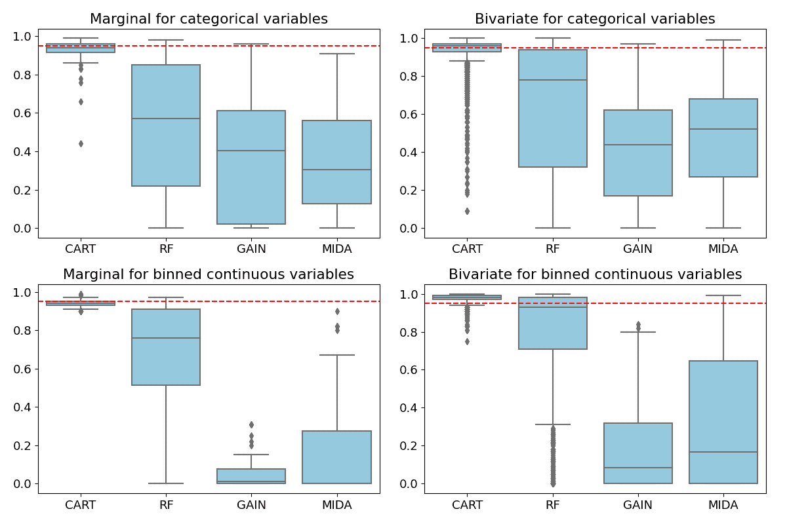
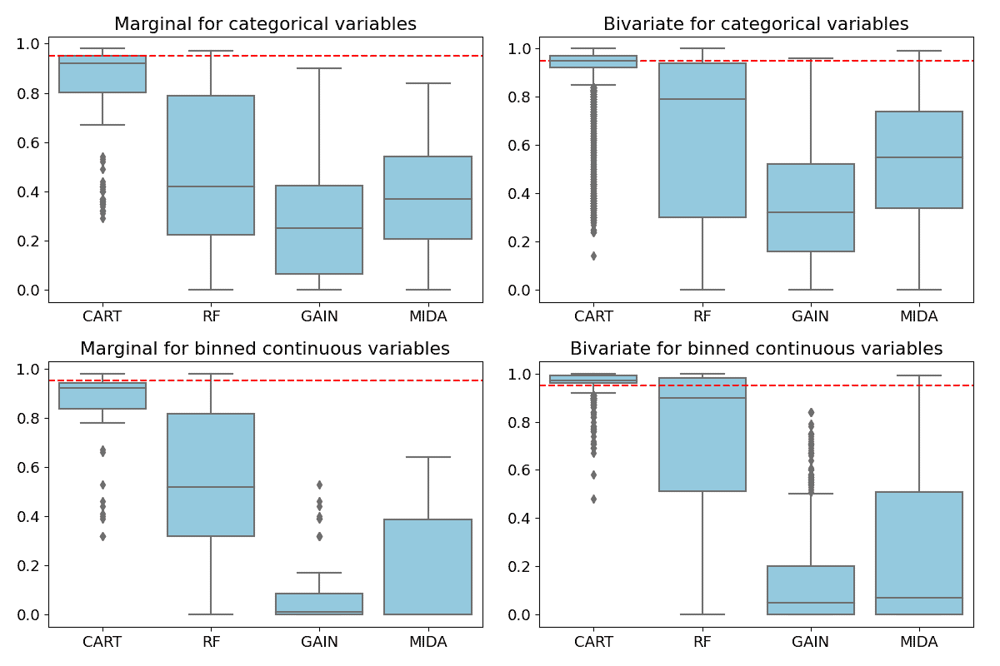
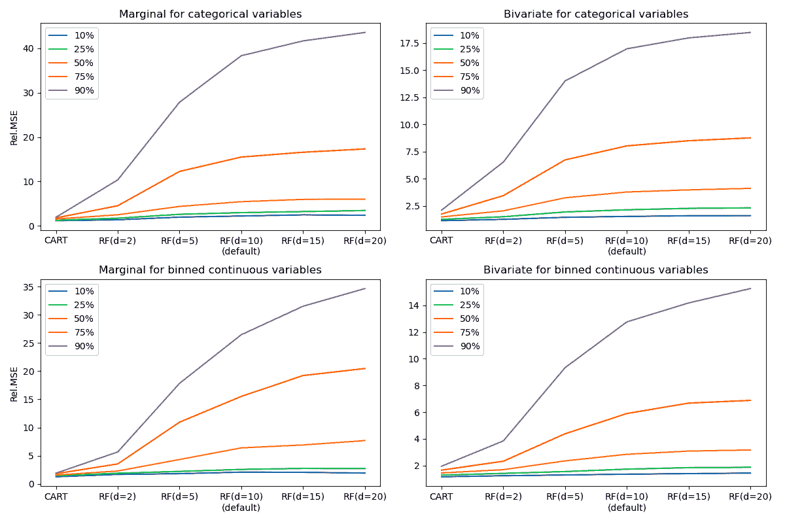

<!--yml

分类：未分类

日期：2024-09-06 19:56:17

-->

# [2103.09316] 深度学习模型在调查中缺失数据插补方面是否优越？来自实证比较的证据

> 来源：[`ar5iv.labs.arxiv.org/html/2103.09316`](https://ar5iv.labs.arxiv.org/html/2103.09316)

# 深度学习模型在调查中缺失数据插补方面是否优越？来自实证比较的证据

王振华，奥兰雷瓦朱·阿坎德，杰森·普洛斯和范莉 ¹¹1 王振华是密苏里大学统计系的博士生，地址：Columbia, MO 65211（电子邮件：zhenhua.wang@mail.missouri.edu）；奥兰雷瓦朱·阿坎德是 Meta Platforms, Inc.的研究科学家（电子邮件：akandelanre13@gmail.com）；杰森·普洛斯是哈佛医学院卫生政策系的博士后（电子邮件：poulos@hcp.med.harvard.edu）；范莉是杜克大学统计科学系的教授，地址：Box 90251, Durham, NC 27708（电子邮件：fl35@duke.edu）。

###### 摘要

多重插补（MI）是一种处理样本调查中缺失数据的流行方法。链式方程的多重插补（MICE）是多变量数据中最广泛使用的 MI 算法之一，但它缺乏理论基础且计算量大。最近，基于深度学习模型的缺失数据插补方法取得了小规模研究中的鼓舞人心的结果。然而，与 MICE 相比，特别是在大规模调查中，这些方法的实际表现研究仍然有限。我们基于美国社区调查的一个子样本进行了广泛的模拟研究，以比较四种基于机器学习的 MI 方法的重复采样特性：MICE 与分类树，MICE 与随机森林，生成对抗插补网络，以及使用去噪自编码器的多重插补。我们发现，深度学习插补方法在计算时间方面优于 MICE。然而，使用常见软件包中的默认超参数选择时，MICE 与分类树在偏差、均方误差和覆盖率方面通常大幅度优于深度学习插补方法，适用于多种现实设置。

*关键词:* 深度学习；超参数选择；缺失数据；链式方程的多重插补；模拟研究；调查数据。

## 1 引言

许多样本调查因缺失数据而受到影响，这些缺失数据可能源于单位非响应，即部分参与者未完成调查，或项目非响应，即缺失值集中在特定问题上。在民意调查中，非响应可能反映了拒绝透露偏好或缺乏偏好[11]。如果处理不当，缺失数据模式可能导致统计分析偏差，尤其是在观察数据和缺失数据之间存在系统性差异时[41, 31]。对完全观察到数据的单位进行完整案例分析通常不可行，并且在大多数情况下可能导致较大偏差[31]。因此，许多分析师通过对缺失值进行插补来处理缺失数据，然后按插补值为真实值进行分析。

多重插补（MI）[42]是一种处理缺失值的常用方法。在 MI 中，分析师通过用从基于观察数据的概率模型预测分布生成的合理值替换样本数据中的缺失值，创建$L>1$个完成的数据集。在每个完成的数据集中，分析师可以计算感兴趣的总体估计量的样本估计，并使用[42]开发的 MI 推断方法，最近还有[43, 3, 39]和[20]，将所有$L$个数据集中的样本估计进行合并。在 MI 中，估计量的方差包括插补内部和插补之间的方差，从而考虑了插补值的固有变异性。请注意，在调查研究中，单次插补，例如通过匹配或回归，仍然是处理缺失数据的常见方法，其中方差通过德尔塔方法或重抽样方法估计[10, 22]。

### 1.1 基于模型的插补

MI 有两种一般建模策略。第一种策略，称为 *联合建模* (JM)，是为数据中的所有变量指定一个联合分布，然后从隐含的条件（预测）分布中生成缺失值变量的填补值 [44]。JM 策略与 [42] 的理论基础一致，但指定具有不同类型高维变量的联合模型可能具有挑战性。确实，大多数流行的 JM 方法，如 SAS 中的 “PROC MI” [59]，以及 R 中的 “AMELIA” [23] 和 “norm” [44]，都做出了一个简化假设，即数据遵循多元高斯分布，即使对于分类变量也是如此，这可能导致偏差 [24]。最近的研究开发了基于先进的贝叶斯非参数模型（如 Dirichlet 过程混合模型）[34, 37] 的灵活 JM 模型。然而，这些方法计算开销大，通常难以扩展到高维情况。

第二种策略称为 *完全条件指定* (FCS, [51]), 在这种策略中，为每个缺失值变量单独指定一个单变量条件分布，给定所有其他变量，并逐个变量迭代填补缺失值，类似于 Gibbs 采样器。最流行的 FCS 方法是链式方程的多重填补 (MICE) [52]，通常通过指定单变量条件分布的广义线性模型 (GLMs) 实现 [38, 40, 47]。最近的研究表明，通过分类和回归树 (CART, [6, 7]) 指定条件模型在综合表现上优于使用 GLM 的 MICE [1]。MICE 与 CART 的自然扩展是使用集成树方法，如随机森林，而不是单一树 [5, 12]。

MICE 在大规模调查数据中具有吸引力，因为它在填补不同类型的变量时简单而灵活。然而，MICE 有一个关键的理论缺陷，即指定的条件分布可能不兼容，即它们与联合分布不对应 [2, 15, 27]。尽管有这个缺陷，MICE 在实际应用中表现异常出色，许多模拟研究表明它优于许多理论上可靠的基于 JM 的方法；有关案例研究请参见 [50]。然而，MICE 计算密集 [55]，且通常无法并行化。此外，流行的用于实现带有 GLMs 的 MICE 的软件包，例如 R 中的 mice [52]，在高维非连续变量的设置中，如具有多个类别的分类变量 [1]，经常崩溃。

### 1.2 使用深度学习模型进行填补

深度学习的最新进展大大拓展了高维数据复杂模型的范围。这一进展带来了希望，即基于深度学习模型的新一代缺失数据插补方法可能解决现有统计方法的理论和计算限制。例如，生成对抗网络（GANs，[18]）等深度生成模型天生适合生成多个插补，因为它们被设计为生成尽可能类似于观测数据的数据。这一领域的一种方法是生成对抗插补网络（GAIN，[57]）。另一种基于深度神经网络的生成方法是使用去噪自编码器（MIDA，[17，32]），该方法通过对损坏的输入数据进行训练，强迫网络学习输入数据的有用低维表示，而不是其身份函数[53，54]。已经提出几种方法用于使用变分自编码器[14]或递归神经网络[29，36，8，9，58]对时间序列数据进行缺失值插补。

基于深度学习的缺失数据插补（MI）方法在理论上相对于传统统计模型具有几个优势，包括（i）避免做分布假设；（ii）能够处理混合数据类型；（iii）能够建模变量之间的非线性关系；（iv）预计在高维环境中表现良好；（v）可以利用图形处理单元（GPU）加速计算。几篇论文报告了基于深度学习的缺失数据插补方法相对于 MICE 的令人鼓舞的表现[57，例如]。然而，这些结论是基于有限的证据得出的。首先，这些研究通常基于小规模模拟或几个经过充分研究的公共“基准”数据集，如第五部分中描述的，这些数据集与调查数据不相似。其次，评估通常基于几个总体性能指标，例如总体预测均方误差或准确度。这些指标可能无法全面反映比较情况，有时甚至可能误导，如后文所示。第三，考虑到缺失数据过程的不确定性，检验插补方法的重复抽样特性至关重要，但这些特性很少被评估。最后，超参数调整对机器学习模型至关重要，不同的调整可能导致截然不同的结果，但关于超参数调整及其对插补方法性能影响的细节很少提供。

由于这些局限性，本文基于真实调查数据进行广泛的模拟，以评估各种性能指标下的 MI 方法。具体而言，我们基于美国社区调查的一个子样本进行模拟，以比较四种前述 MI 方法的重复抽样特性：使用 CART 的 MICE（MICE-CART）、使用随机森林的 MICE（MICE-RF）、GAIN 和 MIDA。我们发现，基于深度学习的 MI 方法在计算时间上优于 MICE。然而，MICE-CART 在偏差、均方误差和覆盖率方面通常大幅超越深度学习方法，在各种现实设置下都表现优异。这与机器学习文献中的先前发现相矛盾，并引发了关于评估插补方法的适当指标的问题。它还强调了评估插补方法重复抽样特性的重要性。虽然本文专注于多重插补，但我们指出，上述 MI 方法在$L$设置为 1 时也可以生成单次插补。大量实证证据表明，在 MI 中，插补内的方差通常主导插补间的方差。因此，我们预计在单次插补时观察到的不同插补方法之间的模式也将保持不变。

本文的其余部分组织如下。在第二部分，我们回顾了我们评估中使用的四种 MI 方法。在第三部分，我们描述了一个具有多个指标的框架，用于评估插补方法。在第四部分，我们描述了使用大规模调查数据的模拟设计和结果，在第五部分中，我们总结了在机器学习文献中使用的基准数据集上的评估结果。最后，在第六部分中，我们总结了在实际应用中的实施指南。

## **缺失数据插补方法**

我们首先介绍符号。考虑一个包含 $n$ 单位的样本，每个单位关联 $p$ 个变量。设 $Y_{ij}$ 为个体 $i$ 的变量 $j$ 的值，其中 $j=1,\dots,p$ 且 $i=1,\dots,n$。这里，$Y$ 可以是连续的、二元的、类别的或混合的二元-连续型。对于每个个体 $i$，设 ${\bf Y}_{i}=(Y_{i1},\dots,Y_{ip})$。对于每个变量 $j$，设 ${\bf Y}_{j}=(Y_{1j},\dots,Y_{nj})$。设 ${\bf Y}=({\bf Y}_{1},\ldots,{\bf Y}_{n})$ 为包含样本中所有记录的数据的 $n\times p$ 矩阵。我们写 ${\bf Y}=({\bf Y}_{\textrm{obs}},{\bf Y}_{\textrm{mis}})$，其中 ${\bf Y}_{\textrm{obs}}$ 和 ${\bf Y}_{\textrm{mis}}$ 分别是 ${\bf Y}$ 的观测部分和缺失部分。我们写 ${\bf Y}_{\textrm{mis}}=({\bf Y}_{\textrm{mis},1},\dots,{\bf Y}_{\textrm{mis},p})$，其中 ${\bf Y}_{\textrm{mis},j}$ 表示变量 $j$ 的所有缺失值，$j=1,\dots,p$。类似地，我们将 ${\bf Y}_{\textrm{obs}}=({\bf Y}_{\textrm{obs},1},\dots,{\bf Y}_{\textrm{obs},p})$ 用于对应的观测数据。

在 MI 中，分析师使用以 ${\bf Y}_{\textrm{obs}}$ 估计的预设模型生成缺失数据 ${\bf Y}_{\textrm{mis}}$ 的值，从而得到一个完整的数据集。然后，分析师重复这一过程以生成 $L$ 个完整的数据集 $\{{\bf Y}^{(l)}:l=1,\dots,L\}$，这些数据集可用于推断或传播。对于推断，分析师可以计算每个完整数据集 $\textbf{Y}^{(l)}$ 中的样本估计，并使用 [42] 发展起来的 MI 推断规则进行合并，这将在第三部分中进行回顾。

### 2.1 使用分类树模型的 MICE

在 MICE 方法下，分析师首先为每个缺失值变量指定一个单变量条件模型。然后，分析师指定一个顺序，以便在进行填补时依次迭代这些条件模型。我们将这些变量的有序列表写作 $(\textbf{Y}_{(1)},\dots,\textbf{Y}_{(p)})$。接下来，分析师初始化每个 ${\bf Y}_{\textrm{mis},(j)}$。最常见的选项是从 (i) 相应的 ${\bf Y}_{\textrm{obs},(j)}$ 的边际分布中抽样，或 (ii) 在仅使用可用样本构建的 ${\bf Y}_{(j)}$ 条件分布中抽样。

初始化后，MICE 算法遵循一个迭代过程，该过程循环通过单变量模型序列。对于每个变量$j$的每次迭代$t$，拟合条件模型$(\textbf{Y}_{(j)}|\textbf{Y}_{\textrm{obs},(j)},\{\textbf{Y}_{(k)}^{(t)}:k<j\},\{\textbf{Y}_{(k)}^{(t-1)}:k>j\})$。接下来，用来自隐含模型$({\bf Y}_{\textrm{mis},(j)}^{(t)}|\textbf{Y}_{\textrm{obs},(j)},\{\textbf{Y}_{(k)}^{(t)}:k<j\},\{\textbf{Y}_{(k)}^{(t-1)}:k>j\})$的抽样替换${\bf Y}_{\textrm{mis},(j)}^{(t)}$。迭代过程持续$T$次，直到收敛，最终迭代的值构成一个完整的数据集${\bf Y}^{(l)}=({\bf Y}_{\textrm{obs}},{\bf Y}_{\textrm{mis}}^{(T)})$。然后整个过程重复$L$次以创建$L$个完整的数据集。我们在补充材料中提供了详细描述 MICE 算法每一步的伪代码。

在 MICE-CART 中，分析师使用 CART [6]来处理 MICE 算法中的单变量条件模型。CART 遵循一种决策树结构，使用递归二分裂将预测空间划分为不同的非重叠区域。树的顶部通常代表根节点，每一次二分裂将预测空间划分为两个新的分支，随着树的向下遍历，每个叶子的分裂标准通常是选择以最小化信息理论熵度量的方式。那些基于设定阈值未能合理减少拟合不足的分裂会被剪枝。然后树会继续构建，直到满足停止标准，例如，每个叶子中的最小观察数量。

一旦树被完全构建后，通过使用$(\{\textbf{Y}_{k}^{(t)}:k<j\},\{\textbf{Y}_{k}^{(t-1)}:k>j\})$中的组合，沿着树遍历到适当的叶子，从该叶子中的$\textbf{Y}_{(j)}^{\textrm{obs}}$值中进行采样，从而生成${\bf Y}_{\textrm{mis},(j)}^{(t)}$。也就是说，给定$(\{\textbf{Y}_{k}^{(t)}:k<j\},\{\textbf{Y}_{k}^{(t-1)}:k>j\})$中的任何组合，使用对应叶子中$\textbf{Y}_{j}^{\textrm{obs}}$值的比例来近似条件分布$(\textbf{Y}_{(j)}|\textbf{Y}_{\textrm{obs},(j)},\{\textbf{Y}_{(k)}^{(t)}:k<j\},\{\textbf{Y}_{(k)}^{(t-1)}:k>j\})$。迭代过程再次持续$T$次，总迭代次数为$T$，最终迭代的值构成了一个完整的数据集。

MICE-RF 则使用随机森林来处理 MICE 中的单变量条件模型[46, 45, 例如]。随机森林[49, 5]是一种集成树方法，通过构建多个决策树来处理数据，而不是像 CART 那样使用单一树。具体而言，随机森林使用原始数据的自助样本构建多个决策树，并且在每棵树的递归划分中仅使用一部分预测变量。这种方法可以显著减少不稳定树的出现以及树与树之间的相关性，因为它防止了相同变量在所有树中主导划分过程。从理论上讲，这种去相关性应当会使预测结果的方差减少[21]。

对于插补，分析师首先使用所有其他变量对每个$\textbf{Y}_{(j)}$训练一个随机森林模型。接下来，分析师根据该模型生成${\bf Y}_{\textrm{mis},j}$的预测。具体而言，对于任何类别的$\textbf{Y}_{(j)}$，在给定$(\{\textbf{Y}_{k}^{(t)}:k<j\},\{\textbf{Y}_{k}^{(t-1)}:k>j\})$的特定组合下，分析师首先基于该树对应叶节点中的$\textbf{Y}_{j}^{\textrm{obs}}$的值为每棵树生成预测，然后使用所有树中预测结果中最常见的多数水平。对于连续的$\textbf{Y}_{(j)}$，分析师则使用所有树中预测值的平均值。迭代过程再次遍历所有变量，共进行$T$次迭代，最终迭代的值构成一个完整的数据集。随机森林中的一个特别重要的超参数是最大树数$d$。

在我们的评估中，我们使用 mice R 包来实现 MICE-CART 和 MICE-RF，并保留包中的默认超参数设置，以模拟现实世界应用中的常见做法。具体而言，我们在 MICE-CART 中将每个终端叶节点的最小观察数设置为 5，将剪枝阈值设置为 0.0001。在 MICE-RF 中，最大树数$d$设置为 10。

### 2.2 生成对抗插补网络（GAIN）

GAIN [57] 是一种基于 GAN 的插补方法 [18]，它由生成器函数 G 和判别器函数 D 组成。对于任何数据矩阵${\bf Y}=({\bf Y}_{\textrm{obs}},{\bf Y}_{\textrm{mis}})$，我们用从均匀分布中抽样的随机噪声$Z_{ij}$替换${\bf Y}_{\textrm{mis}}$。生成器 G 将这些初始化的数据和一个掩码矩阵${\bf M}$作为输入，其中$M_{ij}\in\{0,1\}$表示${\bf Y}$的观测值，并输出观测数据和缺失数据的预测值$\hat{\bf Y}$。判别器 D 利用$\hat{\bf Y}$ = (${\bf Y}_{\textrm{obs}}$, $\hat{\bf Y}_{\textrm{mis}}$) 和一个同样维度的提示矩阵${\bf H}$来识别哪些值是 G 观测到的还是插补的，这将导致一个预测的掩码矩阵$\hat{\bf M}$。提示矩阵是从伯努利分布中抽样的，其$p$等于“提示率”超参数，向 D 揭示了关于${\bf M}$的部分信息，以帮助引导 G 学习${\bf Y}$的潜在分布。

我们首先训练 D 以最小化损失函数${L}_{D}({\bf M},\hat{\bf M})$，对于每个大小为$n_{i}$的迷你批次：

|  | ${L}_{D}({\bf M},\hat{\bf M})=\sum_{i=1}^{n_{i}}\sum_{j=1}^{J}M_{ij}\,\text{log}(\hat{M}_{ij})+(1-M_{ij})\,\text{log}(1-\hat{M}_{ij}).$ |  | (2.1) |
| --- | --- | --- | --- |

接下来，G 被训练以最小化损失函数 (2.2 ‣ 2 缺失数据插补方法 ‣ 深度学习模型是否在调查中对缺失数据插补更具优势？来自实证比较的证据"))，该函数由生成器损失${L}_{G}({\bf M},\hat{\bf M})$和重建损失${L}_{M}({\bf Y},\hat{\bf Y},{\bf M})$组成。生成器损失 (2.3 ‣ 2 缺失数据插补方法 ‣ 深度学习模型是否在调查中对缺失数据插补更具优势？来自实证比较的证据")) 在 D 错误地将插补值识别为观测值时最小化。重建损失 (2.4 ‣ 2 缺失数据插补方法 ‣ 深度学习模型是否在调查中对缺失数据插补更具优势？来自实证比较的证据")) 在预测值与观测值相似时最小化，并由超参数$\beta$加权：

|  | $\displaystyle{L}({\bf Y},\hat{\bf Y},{\bf M},\hat{\bf M})$ | $\displaystyle={L}_{G}({\bf M},\hat{\bf M})+\beta{L}_{M}({\bf Y},\hat{\bf Y},{\bf M}),$ |  | (2.2) |
| --- | --- | --- | --- | --- |
|  | $\displaystyle{L}_{G}({\bf M},\hat{\bf M})$ | $\displaystyle=\sum_{i=1}^{n_{i}}\sum_{j=1}^{J}M_{ij}\,\text{log}(1-\hat{M}_{ij}),$ |  | (2.3) |
|  | $\displaystyle{L}_{M}({\bf Y},\hat{\bf Y},{\bf M})$ | $\displaystyle=\sum_{i=1}^{n_{i}}\sum_{j=1}^{J}(1-M_{ij})\,L_{\textrm{rec}}(Y_{ij},\hat{Y}_{ij}),$ |  | (2.4) |

其中

|  | $L_{\textrm{rec}}(Y_{ij},\hat{Y}_{ij})=\begin{cases}(\hat{Y}_{ij}-Y_{ij})^{2}&amp;\text{如果 $Y_{ij}$ 是连续的}\\ -Y_{ij}\,\text{log}\hat{Y}_{ij}&amp;\text{如果 $Y_{ij}$ 是类别型的}.\end{cases}$ |  | (2.5) |
| --- | --- | --- | --- |

在我们的实验中，我们将 G 和 D 建模为全连接神经网络，每个网络有三个隐藏层，每个隐藏层有$\theta$个隐藏单元。隐藏层的权重使用 Xavier 初始化方法[16]均匀随机初始化。我们对每个隐藏层使用 leaky ReLU 激活函数[33]，对 G 的输出层（如果是类别变量）使用 softmax 激活函数，或者在数值变量的情况下以及 D 的输出中使用 sigmoid 激活函数。我们通过将所有连续变量转化为(0, 1)范围内来简化数值变量的输出层选择，使用 MinMax 归一化：$Y_{ij}^{*}=\{Y_{ij}-\text{min}(Y_{\cdot j})\}/\{\text{max}(Y_{\cdot j})-\text{min}(Y_{\cdot j})\}$，其中$\text{min}(Y_{\cdot j})$和$\text{max}(Y_{\cdot j})$分别是变量$j$的最小值和最大值。插补后，我们将每个值转换回其原始尺度。我们通过多次运行模型并对缺失值进行不同的初始插补来生成多个插补。

为了在我们的评估中实施 GAIN，我们使用与[57]中相同的架构。我们设置$\beta=100$，$\theta$等于输入数据的特征数量，并在单次模拟中调整提示率。按照 GAN 文献中的常见做法[4, 19]，我们跟踪 GAIN 生成器和判别器的损失演变，并手动调整提示率，使得两者的损失在质上相似。具体来说，我们首先在{0.1, 0.2, 0.3, 0.4, 0.5, 0.6, 0.7, 0.8, 0.9}中粗略选择提示率。然后通过额外的微调步骤确定最终值。例如，在 MAR 情景下，观察到最佳值在(0.1, 0.2)范围内后，我们在{0.11, 0.12, 0.13, 0.14, 0.15, 0.16, 0.17, 0.18, 0.19}中进行搜索。最后，我们将 MCAR 和 MAR 情景下的最佳提示率分别设置为 0.3 和 0.13。我们使用随机梯度下降（SGD）和 512 大小的迷你批次训练网络 200 个周期，以学习参数权重。我们使用 Adam 优化器来调整学习率，初始学习率为 0.001[26]。

### 2.3 使用去噪自编码器的多重插补（MIDA）

MIDA [17, 32] 扩展了一类神经网络，即去噪自编码器，用于 MI。自编码器是一个神经网络模型，训练目的是学习输入数据的恒等函数。去噪自编码器故意破坏输入数据，以防止网络学习恒等函数，而是学习输入数据的有用低维表示。MIDA 架构包括一个编码器和解码器，每个都是一个具有三个隐藏层的全连接神经网络，每层有 $\theta$ 个隐藏单元。我们首先对缺失值进行初步插补，对于连续变量使用均值，对于分类变量使用最频繁的标签，这样得到一个完成的数据 ${\bf Y}_{0}$。编码器接收 ${\bf Y}_{0}$ 作为输入，并通过随机丢弃一半的变量来破坏输入数据。破坏后的输入数据通过在编码器的每个连续隐藏层中添加 $\Theta$ 个隐藏单元来映射到更高维的表示。解码器接收编码器的输出，并将编码重新缩放回原始输入维度。所有隐藏层使用双曲正切（tanh）激活函数，而解码器的输出层在处理分类（数值）变量时使用 softmax（sigmoid）激活函数。通过使用多个运行生成多个插补，每次运行的隐藏层权重初始化为高斯随机变量。

按照 [32] 的方法，我们在两个阶段训练 MIDA：主要阶段和微调阶段。在主要阶段，我们将最初插补的数据输入 MIDA，并训练 $N_{\textrm{prime}}$ 个周期。在微调阶段，MIDA 对主要阶段的输出进行 $N_{\textrm{tune}}$ 个周期的训练，并生成结果。损失函数在两个阶段中使用，并且与 GAIN 中的重建损失非常相似。

|  | $L({Y}_{{ij}_{0}},\hat{Y}_{ij},M_{ij})=\begin{cases}(1-M_{ij})({Y}_{{ij}_{0}}-\hat{Y}_{ij})^{2}&amp;\text{如果 $Y_{ij}$ 是连续的}\\ -(1-M_{ij}){Y}_{{ij}_{0}}\,\text{log}\hat{\bf Y}_{{ij}}&amp;\text{如果 $Y_{ij}$ 是分类的}.\end{cases}$ |  | (2.6) |
| --- | --- | --- | --- |

为了在我们的评估中实现 MIDA，我们使用与 [32] 相同的架构，并在单次模拟中调整超参数。我们绘制损失函数 $L$ 的演变图，并从 {1, 2, 3, 4, 5, 6, 7 ,8, 9, 10 } 中选择附加单元的数量 $\Theta$ 以减少损失。在我们的实验中，我们将 $\theta$ 设置为输入数据的特征数量，并向编码器的三个隐藏层中的每个层添加 $\Theta=7$ 个隐藏单元。我们在主要阶段训练模型 $N_{\textrm{prime}}=100$ 个周期，在微调阶段训练 $N_{\textrm{tune}}=2$ 个周期。与 GAIN 类似，我们使用 mini-batch 大小为 512 的 SGD 来学习模型参数，并使用 Adam 优化器来调整学习率，初始学习率为 0.001。

## 3 基于模拟的插补方法评估

缺失数据插补方法通常通过基于真实数据的模拟进行评估[50]。具体而言，从完整数据集中创建缺失值，根据缺失数据机制[30]插补这些缺失值，然后根据一些指标将这些插补值与原始的“真实”值进行比较。

我们首先简要回顾 Rubin 的 MI 组合规则。设 $Q$ 为总体中的目标估计量，$q^{(l)}$ 和 $u^{(l)}$ 分别为基于第 $l$ 个插补数据集的 $Q$ 的点估计和方差估计。$Q$ 的 MI 点估计为 $\bar{q}_{L}=\sum_{l=1}^{L}q^{(l)}/L$，相应的方差估计为 $T_{L}=(1+1/L)b_{L}+\bar{u}_{L}$，其中 $b_{L}=\sum_{l=1}^{L}(q^{(l)}-\bar{q}_{L})^{2}/(L-1)$，$\bar{u}_{L}=\sum_{l=1}^{L}u^{(l)}/L$。$Q$ 的置信区间使用 $(\bar{q}_{L}-Q)\sim t_{\nu}(0,T_{L})$ 构建，其中 $t_{v}$ 是具有 $\nu=(L-1)(1+\bar{u}_{L}/[(1+1/L)b_{L}])^{2}$ 自由度的 $t$-分布。

我们基于模拟的评估程序的第一步是选择一个所有值都被观测的数据集，该数据集被视为“总体”。然后，我们选择一组目标估计量 $Q$，并从该总体数据中计算它们的值，这些值被视为“真实值”。这些估计量通常是下游分析模型中变量或参数的汇总统计量，例如回归模型中的系数[48, 25]。其次，我们从总体数据中随机抽取 $H$ 个样本，每个样本的大小为 $n$，在每个样本（$h=1,...,H$）中根据特定的缺失数据机制和预设的缺失比例创建缺失数据。第三，对于每个具有缺失数据的模拟样本，我们使用考虑中的插补方法创建 $L$ 个插补数据集，并使用 Rubin 规则构建每个估计量的点估计和区间估计。最后，我们根据前一步获得的量计算每个估计量的性能指标。

在实际应用中，我们从美国社区调查（ACS）中选择了一个大规模完整的子样本——一个具有许多大型调查数据特征的国家调查——作为我们的总体。由于离散变量在 ACS 以及大多数调查数据中普遍存在，我们关注二元和分类变量的边际概率；例如，具有$K$个类别的分类变量有$K-1$个估计量。为了评估插补方法在保留多变量分布特性方面的效果，类似于[1]，我们还考虑了二元和分类变量中所有两两组合的联合概率。另一个有用的指标是连续变量之间的有限样本配对相关性。对于连续变量，常见的估计量包括均值、中位数或方差。为了方便对分类变量和连续变量结果的有意义比较，我们建议将每个连续变量根据样本分位数离散化为$K$个类别。然后，我们根据上述边际和二元概率的估计量将这些离散化的连续变量作为分类变量进行评估。

对于每个估计量$Q$，我们考虑三种指标。第一个指标关注偏差。为了适应在分类变量的概率中普遍存在的接近零的估计量，我们考虑每个估计量$Q$的绝对标准化偏差（ASB）：

|  | $\text{ASB}={\sum_{h=1}^{H} | \bar{q}^{(h)}_{L}-Q | /(H\cdot Q)},$ |  | (3.1) |
| --- | --- | --- | --- | --- | --- |

其中$\bar{q}^{(h)}_{L}$是模拟$h$中$Q$的 MI 点估计。

第二个指标是相对均方误差（Rel.MSE），即从插补数据估计$Q$的 MSE 与在引入缺失数据之前从采样数据中估计$Q$的 MSE 之间的比率：

|  | $\text{Rel.MSE}=\frac{\sum_{h=1}^{H}(\bar{q}^{(h)}_{L}-Q)^{2}}{\sum_{h=1}^{H}(\widetilde{Q}^{(h)}-Q)^{2}},$ |  | (3.2) |
| --- | --- | --- | --- |

其中$\bar{q}^{(h)}_{L}$如前所述定义，$\widetilde{Q}^{(h)}$是$Q$的原型估计，即来自模拟$h$中完整采样数据的点估计。

第三个指标是覆盖率，即$H$次模拟中$\alpha\%$（例如 95%）置信区间$\mbox{CI}_{h}^{\alpha}$（$h=1,...,H$）包含真实$Q$的比例：

|  | $\text{Coverage}=\sum_{h=1}^{H}\mathbf{1}\{Q\in\mbox{CI}_{h}^{\alpha}\}/H.$ |  | (3.3) |
| --- | --- | --- | --- |

我们建议进行大量模拟（例如 $H\geq 100$），以获得可靠的均方误差（MSE）和覆盖率估计。这对深度学习算法来说不会成为问题，因为即使在大样本量的情况下，这些算法通常也能在几秒钟内完成。然而，对于 MICE 算法来说，当每个模拟数据量较大（例如在我们的某些模拟中 $n=100,000$）时，这可能会导致计算上的困难。在只能依赖少数几个或甚至单个模拟进行评估的情况下，我们提出了一种修订的偏差度量。具体来说，对于每个分类变量或分箱的连续变量 $j$，我们将加权绝对偏差（WAB）定义为按每个类别的真实边际概率加权的绝对偏差之和：

|  | $\text{加权绝对偏差}=\sum_{k=1}^{K}Q_{jk}\left\|\bar{q}^{(h)}_{jk}-Q_{jk}\right\|,$ |  | (3.4) |
| --- | --- | --- | --- |

其中 $K$ 是类别的总数，$Q_{jk}$ 是变量 $j$ 中类别 $k$ 的总体边际概率，而 $\bar{q}^{(h)}_{jk}$ 是在模拟 $h$ 中的相应点估计。我们还可以对重复模拟的多个样本进行加权绝对偏差的平均。

上述程序和度量方法与机器学习文献中的常见做法有所不同。例如，许多关于缺失数据插补的机器学习论文在基准数据集上进行模拟，但这些数据往往与调查数据的结构和特征差异较大，因此对本文的目标信息量较少。一个这样的数据集是 UCI 机器学习库中的乳腺癌数据集[13]，该数据集仅有 569 个样本单位，并且没有分类变量。此外，这些模拟通常是基于随机创建单一数据集的缺失值，而不是从总体中提取重复样本，因此未能考虑采样机制。此外，这些评估往往使用专注于个体预测准确性的度量指标，而不是分布特征。具体来说，最常用的度量指标是均方根误差（RMSE）和准确率[17, 57, 32]。这两个指标可以以总体或变量特定的方式定义，但机器学习文献通常关注总体版本。总体 RMSE 定义为

|  | $\text{均方根误差}=\sqrt{\frac{\sum^{n}_{i=1}\sum_{j}M_{ij}(\hat{Y}_{ij}-Y_{ij})^{2}}{\sum^{n}_{i=1}\sum_{j}M_{ij}}},$ |  | (3.5) |
| --- | --- | --- | --- |

其中 $Y_{ij}$ 是在引入缺失数据之前的完整数据中个体 $i$ 对于连续变量 $j$ 的值，$\hat{Y}_{ij}$ 是相应的插补值。对于非缺失值（即 $M_{ij}=1$），$Y_{ij}=\hat{Y}_{ij}$。对于分类变量，总体准确率定义为，即插补值等于相应的原始“真实”值的比例：

|  | $\text{Accuracy}=\frac{\sum^{n}_{i=1}\sum_{j\in S_{cat}}M_{ij}\mathbbm{1}(\hat{Y}_{ij}=Y_{ij})}{\sum^{n}_{i=1}\sum_{j\in S_{cat}}M_{ij}},$ |  | (3.6) |
| --- | --- | --- | --- |

其中，$S_{cat}$ 是分类变量的集合。

对于 RMSE 和准确率指标，有一些注意事项。首先，它们通常在单个填补样本上计算，作为填补方法的总体度量，但这忽略了填补的不确定性。其次，RMSE 和准确率都是单一值总结，无法捕捉数据的多元分布特征。第三，RMSE 没有调整变量的不同尺度，容易被几个异常值主导；此外，通常在计算时不区分连续变量和分类变量。最后，当有多个($L$)填补数据时，常见的做法是将$L$个填补值的均值作为$\hat{Y}_{ij}$在(3.5)中使用，但结果指标的统计意义不明。这对于分类变量尤其是问题。因此，我们警告不要仅使用整体 RMSE 和准确率作为比较填补方法的唯一指标，并且在解释这些指标时应谨慎。

## 4 基于 ACS 的评估

在本节中，我们评估了第二部分中描述的四种填补方法，按照第三部分中描述的程序和指标进行评估。为简便起见，在以下讨论中，我们用 CART 和 RF 来代指 MICE-CART 和 MICE-RF。

### 4.1 “人口”数据

我们使用 2018 年 ACS 的为公众使用的微观数据样本来构建我们的人口数据。2018 年 ACS 数据包含了家庭层面的变量——例如，房屋是否拥有或租赁——以及个人层面的变量——例如，家庭中每个人的年龄、收入和性别。由于个体在家庭内部通常是相互依赖的，而我们评估的填补方法通常假设所有观察值之间是独立的，因此我们将观察单位设置为家庭层面，在这里独立性更有可能成立。我们首先移除对应于空置房屋的单位。接下来，我们删除任何有缺失值的单位，只保留完整案例。在每个家庭内，我们还保留仅对应于家庭主人的个人数据，并将其与家庭层面的变量合并，形成一个具有潜在复杂联合关系的丰富变量集。

当序数变量的最高水平几乎没有质量时，生成合理的填补数据通常具有挑战性，这在 ACS 数据中的一些变量中尤为如此。按照[28]，我们将具有超过 10 个水平的序数变量视为连续变量。我们还遵循[1]的方法，排除边际概率违反$np>10$或$n(1-p)>10$的二元变量；这排除了中央极限定理可能不适用的估计量。对于每个有超过两个水平但少于 10 个水平的类别变量，如果这也可能是一个问题，我们会合并人口数据中观察数较少的水平。例如，对于家庭语言变量，我们将水平从五个重新编码为三个（英语、西班牙语和其他），因为在总体中既不讲英语也不讲西班牙语的概率小于 8.8%。

最终的总体数据包含 1,257,501 个单元，包含 18 个二元变量、20 个类别变量（每个变量有 3 到 9 个水平）以及 8 个连续变量。我们在补充材料中对这些变量进行了更详细的描述。我们计算了第三部分中描述的估计量$Q$的总体值，包括所有离散变量和分箱连续变量的边际和双变量概率。我们将模拟样本的大小从 10,000 变化到 100,000，并在这些情况下按照完全随机缺失（MCAR）或随机缺失（MAR）机制模拟缺失数据。

### 4.2 样本量为$n=10,000$的模拟

我们首先随机抽取$H=100$个样本，每个样本的大小为$n=10,000$，并将每个样本的$30\%$设置为缺失值，缺失机制为 MCAR 或 MAR。CART 或 RF 在默认参数下分别需要大约 2.8 小时和 9.2 小时，在配备单个中央处理单元（CPU）的标准桌面计算机上生成$L=10$个填补数据集。深度学习方法则要快得多，因为它们在实现于支持 GPU 的 TensorFlow 软件框架时可以利用 GPU 计算能力[35]。使用 GeForce GTX 1660 Ti GPU，GAIN 大约需要 1.5 分钟，而 MIDA 大约需要 4 分钟来生成$L=10$个完整的数据集。请注意，在每种情况下对 100 个模拟中的每一个进行超参数的手动调整是不可行的。因此，对于每种情况，我们随机选择了一个模拟，并使用第二部分中描述的程序调整超参数。然后，我们将这些选定的超参数应用于所有模拟。

#### 4.2.1 MCAR 场景

为了创建 MCAR 场景，我们随机设置每个变量的 30%值为缺失值。表格 4.1 展示了四种插补方法在插补数据中估计的 ASB 和相对均方误差的分布情况。

表格 4.1：在$n=10,000$且 30%值为 MCAR 时，四种 MI 方法的插补结果中所有边际和双变量概率的绝对标准化偏差$(\times 100)$和相对均方误差的分布情况。 “Cat.”表示分类变量，“B.Cont.”表示分箱连续变量。

| 分位数 | 边际 |  | 双变量 |
| --- | --- | --- | --- |
| CART | RF | GAIN | MIDA |  | CART | RF | GAIN | MIDA |
| ASB $(\times 100)$ |
|  | 10% | 0.05 | 0.47 | 0.76 | 0.98 |  | 0.15 | 1.14 | 1.21 | 1.54 |
|  | 25% | 0.13 | 1.25 | 1.48 | 2.22 |  | 0.40 | 2.83 | 3.08 | 3.93 |
| Cat. | 50% | 0.27 | 2.80 | 3.22 | 4.69 |  | 1.05 | 6.74 | 7.14 | 8.47 |
|  | 75% | 0.64 | 5.86 | 7.18 | 8.86 |  | 2.51 | 13.59 | 17.03 | 15.23 |
|  | 90% | 1.14 | 10.01 | 19.55 | 14.41 |  | 5.34 | 22.33 | 26.92 | 21.90 |
|  | 10% | 0.06 | 0.24 | 7.25 | 2.73 |  | 0.19 | 1.30 | 6.05 | 4.80 |
|  | 25% | 0.10 | 1.05 | 12.86 | 8.36 |  | 0.43 | 3.24 | 17.61 | 12.01 |
| B.Cont. | 50% | 0.21 | 3.59 | 27.30 | 18.51 |  | 1.02 | 6.61 | 34.29 | 24.07 |
|  | 75% | 0.43 | 5.43 | 30.21 | 26.84 |  | 1.90 | 11.76 | 49.38 | 39.54 |
|  | 90% | 0.81 | 8.49 | 46.41 | 31.36 |  | 3.42 | 20.79 | 90.90 | 64.65 |
| 相对均方误差 |
|  | 10% | 1.05 | 1.67 | 2.50 | 3.38 |  | 0.96 | 1.11 | 2.75 | 2.98 |
|  | 25% | 1.16 | 2.40 | 4.97 | 9.03 |  | 1.08 | 1.61 | 4.33 | 4.75 |
| Cat. | 50% | 1.37 | 5.99 | 10.37 | 14.89 |  | 1.25 | 3.35 | 7.40 | 8.16 |
|  | 75% | 1.49 | 10.25 | 27.73 | 26.16 |  | 1.48 | 9.07 | 14.87 | 15.80 |
|  | 90% | 1.62 | 16.22 | 97.33 | 40.16 |  | 1.89 | 23.91 | 36.37 | 27.92 |
|  | 10% | 1.19 | 1.50 | 44.06 | 4.35 |  | 0.82 | 0.86 | 7.40 | 2.05 |
|  | 25% | 1.30 | 1.77 | 74.42 | 13.82 |  | 0.92 | 1.11 | 14.80 | 4.90 |
| B.Cont. | 50% | 1.44 | 3.31 | 139.24 | 72.57 |  | 1.07 | 1.90 | 32.26 | 13.76 |
|  | 75% | 1.55 | 6.71 | 284.00 | 150.35 |  | 1.26 | 4.09 | 88.78 | 47.56 |
|  | 90% | 1.64 | 19.69 | 603.38 | 451.44 |  | 1.54 | 10.80 | 282.29 | 127.15 |

总体而言，对于分类变量和分箱连续变量的边际概率和双变量概率的估计，使用 CART 的 MICE 显著优于其他三种方法，始终产生最小的 ASB 和相对 MSE。RF 是第二好，始终优于深度学习方法。MICE 算法的优势在上分位数（如 75%和 90%）中尤为明显，表明 GAIN 和 MIDA 插补在重复样本和变量上有较大变异。实际上，MIDA 和 GAIN 在估计变量的汇总统计时会导致超长尾巴。例如，对于分箱连续变量的双变量概率，MIDA 和 GAIN 的 ASB 的 90%分位数分别约为 CART 的 20 倍和 27 倍。相对 MSE 的差异更大。MIDA 和 GAIN 的比较没有一致的模式。具体而言，对于连续变量，MIDA 通常优于 GAIN，但除上分位数外，差异较小，而 GAIN 在上分位数时往往产生非常大的偏差和相对 MSE。对于分类变量，GAIN 在一半的情况下优于 MIDA，但也导致了变量之间插补的最大变异。此外，一个有趣且稍微令人惊讶的观察是，使用 CART 的 MICE 在所有情况下始终优于 RF——有时差距很大——无论估计量或指标的选择如何。

所有方法通常对边际概率的估计（即较小的 ASB）比对双变量概率的估计更少偏差。这说明保持多变量分布特征比保持单变量特征更具挑战性。CART 在估计双变量估计量时相较于其他方法的优势比较大。有趣的是，边际概率的相对 MSE 往往高于双变量概率。这可能是因为相对 MSE 的定义中的分母（见 3.2）是引入缺失数据之前样本数据的 MSE，相比于双变量概率，边际概率的 MSE 往往较小。CART 产生的 MSE 非常接近于引入缺失数据之前的样本数据的 MSE；即，相对 MSE 接近 1。相反，深度学习方法，尤其是 GAIN，对于许多估计量可能导致极大的相对 MSE。

图 4.1：在模拟中使用四种插补方法获得的所有边际和双变量概率的 95%置信区间覆盖率，其中$n=10,000$且 30%的值为 MCAR。红色虚线为 0.95。

图 4.1 显示了边际和双变量概率的$95\%$置信区间的估计覆盖率。不同方法之间的覆盖模式与偏差和均方误差的模式类似。具体而言，CART 通常产生接近名义$95\%$水平的覆盖率，中位数始终保持在 95%左右，并且四分位数范围较窄。相比之下，RF、GAIN 和 MIDA 的覆盖率远远低于名义$95\%$水平。例如，GAIN 和 MIDA 下的中位覆盖率都低于 0.60，对于连续变量甚至低于 0.30。对每个变量的预测准确性进行更详细的观察显示，GAIN 和 MIDA 倾向于生成偏向最常见水平的填充值，特别是 GAIN 通常产生比其他方法更窄的区间。这再次提供了深度学习方法下显著偏差的证据。所有方法在双变量概率上的中位覆盖率通常高于边际概率，尽管前者的左尾通常比后者长。

#### 4.2.2 MAR 场景

我们还考虑了一个 MAR 场景，这在实践中比 MCAR 更为可信。我们设定了六个变量——年龄、性别、婚姻状况、种族、教育程度和工作类别——为完全观察变量。为每个剩余的 40 个变量指定不同的 MAR 机制将会非常繁琐，因此我们将它们随机分为三个组，分别由 10 个、15 个和 15 个变量组成。接着，我们为每组变量指定了一个单独的缺失数据模型。具体来说，我们假设每组一个基于完全观察到的六个变量的逻辑回归模型，然后基于该模型生成每个变量的二元缺失数据指示符。这个过程导致每 40 个变量中的每一个缺失率大约为 30%。我们在补充材料中对这些模型进行了更详细的描述。

表 4.2：所有方法的绝对标准化偏差$(\times 100)$和相对均方误差的分布，当$n=10,000$且 30%值为 MAR 时，针对所有可能的边际和双变量概率。“Cat.”表示分类变量，“B.Cont.”表示分箱连续变量。

| 分位数 | 边际 |  | 双变量 |
| --- | --- | --- | --- |
| CART | RF | GAIN | MIDA |  | CART | RF | GAIN | MIDA |
| ASB $(\times 100)$ |
|  | 10% | 0.05 | 0.13 | 0.15 | 0.14 |  | 0.15 | 0.71 | 0.76 | 0.89 |
|  | 25% | 0.11 | 0.44 | 0.62 | 0.61 |  | 0.40 | 2.23 | 2.55 | 3.20 |
| Cat. | 50% | 0.29 | 2.13 | 3.05 | 4.55 |  | 1.08 | 6.06 | 6.85 | 8.14 |
|  | 75% | 1.04 | 4.98 | 6.63 | 10.22 |  | 2.49 | 13.43 | 16.78 | 16.19 |
|  | 90% | 1.80 | 10.49 | 18.91 | 17.00 |  | 5.68 | 24.06 | 28.04 | 25.36 |
|  | 10% | 0.07 | 0.29 | 0.33 | 0.33 |  | 0.27 | 1.17 | 10.87 | 6.18 |
|  | 25% | 0.17 | 1.07 | 9.64 | 3.13 |  | 0.69 | 3.49 | 23.67 | 16.26 |
| B.Cont. | 50% | 0.67 | 3.14 | 32.86 | 23.85 |  | 1.58 | 7.83 | 38.52 | 31.17 |
|  | 75% | 1.20 | 6.95 | 39.57 | 36.09 |  | 3.40 | 15.20 | 53.59 | 47.34 |
|  | 90% | 3.40 | 12.39 | 63.45 | 41.99 |  | 5.94 | 25.16 | 97.47 | 85.44 |
| Rel.MSE |
|  | 10% | 1.00 | 1.00 | 1.00 | 1.00 |  | 0.97 | 1.00 | 1.53 | 1.93 |
|  | 25% | 1.08 | 1.82 | 2.56 | 4.75 |  | 1.04 | 1.39 | 3.78 | 4.03 |
| Cat. | 50% | 1.33 | 4.33 | 19.03 | 15.13 |  | 1.25 | 3.00 | 10.42 | 8.38 |
|  | 75% | 1.72 | 13.08 | 55.07 | 33.36 |  | 1.59 | 9.56 | 27.45 | 16.95 |
|  | 90% | 2.27 | 18.70 | 101.91 | 48.44 |  | 2.23 | 27.44 | 64.01 | 32.85 |
|  | 10% | 1.00 | 1.00 | 1.00 | 1.00 |  | 0.88 | 0.90 | 11.19 | 2.96 |
|  | 25% | 1.38 | 1.83 | 90.98 | 8.49 |  | 1.00 | 1.16 | 20.15 | 6.87 |
| B.Cont. | 50% | 1.70 | 4.57 | 207.58 | 96.08 |  | 1.18 | 2.29 | 45.25 | 21.33 |
|  | 75% | 2.12 | 11.47 | 692.67 | 239.69 |  | 1.50 | 6.95 | 125.39 | 70.90 |
|  | 90% | 3.12 | 50.56 | 1342.23 | 806.43 |  | 2.12 | 18.07 | 459.78 | 205.14 |

表 4.2 显示了四种方法下所有边际和双变量概率的 ASB 和相对 MSE 的分布。在 MAR 情境下，所有方法的 ASB 和相对 MSE 都比之前的 MCAR 情境更大。这是因为 MAR 是比 MCAR 更强的假设，需要基于更多信息。然而，方法间相对表现的总体模式与 MCAR 下的情况保持一致。具体来说，CART 再次产生了四种方法中 ASB 和相对 MSE 最小的估计——比 MCAR 下的差距更大——其次是 RF，然后是 MIDA 和 GAIN。一个显著的观察是，深度学习方法，特别是 GAIN，在填补连续变量时性能下降，有时相对 MSE 甚至比 CART 高出几百倍。这表明 GAIN 在填补连续变量时存在巨大的不确定性。

图 4.2：在$n=10,000$和 30%值 MAR 的模拟中，四种方法获得的所有边际和双变量概率的 95% 置信区间的覆盖率。红色虚线为 0.95。

图 4.2 展示了每种方法下边际和双变量概率的$95\%$置信区间的估计覆盖率。与偏差和 MSE 的情况类似，所有方法在 MAR 下的覆盖率通常低于 MCAR，并且在某些情况下可见的左尾更长，但方法间的整体模式保持不变。具体来说，CART 仍然倾向于产生超过 90%的覆盖率，而其他三种方法的覆盖率持续较低。特别是，GAIN 和 MIDA 在连续变量上的中位数覆盖率极低——低于 7%。这与之前观察到的深度学习方法在插补连续变量时的不确定性大有关。

最后，为了说明仅评估整体 RMSE 和准确率指标可能会产生误导，我们在表格 4.3 中展示了 100 次模拟中整体 RMSE 和准确率的均值和经验标准误，其中 MCAR 在上面板，MAR 在下面板。在这两种缺失数据机制下，对于连续变量，MIDA 的整体 RMSE 最小，其次是 CART，RF 和 GAIN 最后。对于分类变量，CART 和 GAIN 的整体准确率最高，MIDA 紧随其后，RF 最后。这些模式与之前基于边际和双变量概率以及不同指标的报告不一致。正如第三部分中讨论的，整体 RMSE 和准确率未能捕捉多变量数据的分布特征或插补方法的重复采样属性。

表 4.3: 在 100 次模拟中，连续变量的整体 RMSE 和分类变量的整体准确率的平均值，括号中为经验标准误。上面板为 MCAR，下面板为 MAR，所有情况下缺失数据为 30%。

| 机制 | 指标 | CART | RF | GAIN | MIDA |
| --- | --- | --- | --- | --- | --- |
|  | RMSE | 0.128 (0.002) | 0.159 (0.003) | 0.161 (0.008) | 0.112 (0.002) |
| MCAR | 准确率 | 0.785 (0.001) | 0.658 (0.003) | 0.782 (0.002) | 0.752 (0.004) |
|  | RMSE | 0.130 (0.003) | 0.154 (0.004) | 0.145 (0.009) | 0.110 (0.002) |
| MAR | 准确率 | 0.819 (0.001) | 0.704 (0.003) | 0.820 (0.002) | 0.780 (0.007) |

### 4.3 具有 n=100,000 和 30% MCAR 的模拟

深度学习模型通常需要大量样本来进行训练。因此，为了给 MIDA 和 GAIN 提供更有利的环境，并调查我们结果对样本大小变化的敏感性，我们生成了一个$H=10$的样本模拟场景，其中$n=100,000$，在 MCAR 条件下。也就是说，我们随机将每个变量的 30%值独立地设置为缺失。由于样本大小带来的计算成本巨大，这里我们只生成了 10 个模拟。在这个场景中，我们省略了 RF，因为在 4.2 节中的结果表明，RF 在性能和计算方面始终不如 CART。我们使用 CART、GAIN 和 MIDA 来创建$L=10$个完整的数据集。

由于通常需要更多的模拟来可靠地计算 MSE 和覆盖率，这里我们专注于加权绝对偏差指标（3.4）。表 4.4 显示了估计的加权绝对偏差的分布，这些分布是对 10 次模拟的平均值，涵盖了分类变量和分箱连续变量的边际概率。总体而言，四种方法之间的比较模式与 4.2 节中观察到的模式保持一致。具体来说，CART 在分类和连续变量中都再次表现出最小的加权绝对差异，这一优势在连续变量中尤为明显。例如，对于分类变量，MIDA 和 GAIN 的加权绝对偏差的中位数分别比 CART 大至少 9 倍和 11 倍。对于连续变量，CART 的优势分别增大到 MIDA 和 GAIN 的约 30 倍和 60 倍。此外，CART 在各变量间表现稳健，这从加权绝对偏差的较小变化中可以看出，例如在分类变量中 10%分位点为 0.07，90%分位点为 0.33。相比之下，两个深度学习模型在变量间表现出更大的变化；例如，在 MIDA 下，分类变量的 10%分位点为 0.57，90%分位点为 2.92，而 GAIN 下的变化更大。总之，除了计算时间外，无论样本大小如何，MICE 与 CART 相比在偏差和方差方面显著优于 MIDA 和 GAIN。

表 4.4: 平均绝对偏差 $(\times 100)$ 的分布，基于 10 个模拟样本，每个样本的 $n=100,000$ 和 30% 的值为 MCAR。

| 分位数 | 类别变量 |  | 分箱连续变量 |
| --- | --- | --- | --- |
| CART | GAIN | MIDA |  | CART | GAIN | MIDA |
| --- | --- | --- | --- | --- | --- | --- |
| 10% | 0.07 | 0.43 | 0.57 |  | 0.10 | 5.52 | 1.98 |
| 25% | 0.11 | 1.11 | 1.02 |  | 0.11 | 6.65 | 2.78 |
| 50% | 0.15 | 1.74 | 1.40 |  | 0.12 | 7.36 | 4.04 |
| 75% | 0.24 | 3.77 | 2.07 |  | 0.13 | 9.40 | 6.50 |
| 90% | 0.33 | 4.63 | 2.92 |  | 0.15 | 11.31 | 7.72 |

### 4.4 基于树的 MICE 中超参数的作用

CART 优于 RF 的模式令人惊讶，因为普遍认为集成方法通常优于单一决策树方法。但在另一项最近的研究中也观察到了相同的模式[56]。我们在模拟中调查了 RF 的关键超参数——最大树木数量 $d$。我们随机选择了一个大小为 $n=10,000$ 的模拟数据，其中 30% 的条目是 MCAR。我们使用 mice 包拟合不同树木数量的 RF：$d=2,5,10,15,20$，其中 $d=10$ 是默认设置。图 4.3 显示了每个 $d$ 值拟合的类别变量的相对 MSE，以及使用 CART 的结果，这揭示了一致的模式：相对 MSE 的上分位数——尤其是 50% 以上的分位数——随着 RF 中最大树木数量的增加而迅速恶化，而下分位数，例如 10%、25%，保持稳定。我们发现标准化偏差度量和连续变量也有类似的模式，因此这些结果在这里省略。这表明 RF 中的树木数量越多——至少在 mice 包中实现的——偏差和 MSE 的分布尾部越长，这可能是由于过拟合。我们不能排除 RF 的更定制化超参数调优在某些应用中优于 CART 的可能性。然而，这种特定案例的 MICE 算法微调通常不适用于大多数依赖于 mice 等流行包默认设置的 MI 用户。

图 4.3: 所有边际和双变量概率的类别变量的相对均方误差的分位数，在 CART 和具有不同树木数量的 RF 下，基于 $n=10,000$ 和 $30\%$ 值为 MCAR 的模拟样本。

## 5 基于“基准”数据集的评估

为了验证 GAIN 和 MIDA 论文中的评估[17, 57, 32]，我们还将这两种深度学习模型与基于 CART 的模型进行了比较，使用了这些论文中的五个基准数据集和模拟程序（与我们提出的框架不同）。这些数据集和模拟的详细信息见补充材料。这些数据的样本量通常不足以被视为可以反复抽样的总体数据，因此我们无法使用绝对标准偏差、相对均方误差或覆盖率以有意义的方式进行评估。因此，我们主要通过加权绝对偏差指标来评估这些方法。总的来说，CART 在所有五个基准数据集中，在分类变量和连续变量方面的加权绝对偏差上都 consistently 和显著优于 MIDA 和 GAIN。特别是在连续变量方面，性能差异尤为明显。我们还计算了总体均方误差和准确率，正如这些论文所做的那样。除了一个数据集外，即使使用作者提供的代码，我们也未能重现这些论文中报告的结果。一个可能的原因是模型超参数的调整和选择过程可能没有被明确记录，这在当前情况下确实如此。更多细节见在线补充材料。

## 6 结论

近年来，许多基于机器学习的数据缺失填补方法得到了发展，这让人们对比传统的填补方法如 MICE 有了更多的期望。然而，评估这些方法在现实世界中的表现的努力仍然很少。在本文中，我们采用了基于真实数据的模拟评估框架。我们通过基于美国社区调查的广泛模拟研究，比较了两种 MICE 方法和两种基于 GAN（GAIN）以及去噪自编码器（MIDA）的深度学习填补方法的重复抽样特性。

我们发现，深度学习模型在计算上相较于 MICE 方法具有巨大的优势，部分原因是它们可以利用 GPU 的高性能计算能力。然而，我们的模拟和在几个“基准”数据上的评估表明，使用 CART 规格的 MICE 模型在偏差、均方误差和覆盖范围方面通常比深度学习模型表现更好，通常差距显著，适用于各种现实环境。特别是，与 MICE 相比，GAIN 和 MIDA 倾向于产生不稳定的插补，重复样本之间变异巨大。一个可能的解释是，深度神经网络擅长于检测大数据的复杂子结构，但可能不适合结构简单的数据，例如这里使用的模拟数据。另一种可能性是，我们的模拟中的样本量不足以训练深度神经网络，这些网络通常需要比传统统计模型更多的数据。

这些结果与基于机器学习文献中的总体均方误差这一单一性能指标的先前研究结果相矛盾[17, 57, 32, 例如]。这一差异突显了机器学习文献中评估插补方法的常见做法的陷阱。它还展示了评估多重插补（MI）方法在多个估计量上的重复抽样特性的必要性。一个有趣的发现是，在 MICE 的背景下，集成树（例如 RF）并未优于单一树（例如 CART），这一点与另一项近期研究中的发现相匹配[56]。结合前者计算复杂度高于后者的事实，我们建议在实际操作中使用 CART 而非 RF 的 MICE。

我们的研究有一些局限性。首先，许多深度学习方法可以用于缺失数据插补，且它们可能具有不同的操作特性。我们选择了 GAIN 和 MIDA，因为生成对抗网络和去噪自编码器是非常流行的深度学习方法，而基于这些方法的插补技术被宣传为优于 MICE。然而，未来的研究中考察其他基于深度学习的插补方法是有益的。其次，机器学习方法的性能高度依赖于超参数选择。因此，可以认为 GAIN 和 MIDA 表现较差可能至少部分由于超参数选择不佳。然而，实践者可能会依赖于默认的超参数值来进行任何基于机器学习的插补方法，这也是我们在模拟中所采用的，代表了实际操作。第三，我们没有考虑任何分类变量与连续变量之间的联合分布，但我们在分类和连续变量中的评估得出了相一致的结论。最后，像任何模拟研究一样，应谨慎推广结论。通过仔细选择数据和指标，我们试图紧密模拟代表真实调查数据的设置，以便我们的结论对处理类似情况的实践者有参考价值。基于不同数据的附加评估研究是必要的，以进一步了解不同缺失数据插补方法的操作特性和比较性能。数据、代码和论文的补充材料可在：[`github.com/zhenhua-wang/MissingData_DL`](https://github.com/zhenhua-wang/MissingData_DL) 获取。

## 致谢

Poulos 和 Li 的研究得到国家科学基金会的资助，资助号 DMS-1638521，资助给统计与应用数学科学研究所。

## 参考文献

+   [1] Olanrewaju Akande, Fan Li 和 Jerome Reiter “多重插补方法在分类数据中的经验比较” 见 *The American Statistician* 71.2 Taylor & Francis, 2017, 页 162–170

+   [2] B. Arnold 和 S. Press “兼容条件分布” 见 *Journal of the American Statistical Association* 84, 1989, 页 152–156

+   [3] John Barnard 和 Xiao-Li Meng “多重插补在医学研究中的应用：从艾滋病到 NHANES” 见 *Statistical Methods in Medical Research* 8.1 Sage Publications Sage CA: Thousand Oaks, CA, 1999, 页 17–36

+   [4] David Berthelot, Tom Schumm 和 Luke Metz “BEGAN：边界平衡生成对抗网络” 见 *CoRR* abs/1703.10717, 2017 arXiv: [`arxiv.org/abs/1703.10717`](http://arxiv.org/abs/1703.10717)

+   [5] L. Breiman “随机森林” 见 *Machine Learning* 45, 2001, 页 5–32

+   [6] L. Breiman, J.. Friedman, R.. Olshen 和 C.. Stone “分类与回归树” Belmont, CA: Wadsworh, Inc.，1984

+   [7] L. Burgette 和 J.. Reiter “通过顺序回归树的多重插补” 见 *美国流行病学杂志* 172，2010，第 1070–1076 页

+   [8] Wei Cao, Dong Wang, Jian Li, Hao Zhou, Lei Li 和 Yitan Li “BRITS：双向递归插补时间序列” 见 *神经信息处理系统进展*，2018，第 6775–6785 页

+   [9] Zhengping Che, Sanjay Purushotham, Kyunghyun Cho, David Sontag 和 Yan Liu “用于多变量时间序列缺失值的递归神经网络” 见 *科学报告* 8.1 Nature Publishing Group，2018，第 1–12 页

+   [10] Sixia Chen 和 David Haziza “处理调查中项目非响应的近期进展：批判性回顾” 见 *国际统计评论* 87 Wiley Online Library，2019，第 S192–S218 页

+   [11] Edith D De Leeuw, Joop Hox 和 Mark Huisman “项目缺失的预防与治疗” 见 *官方统计学期刊-斯德哥尔摩* 19.2 ALMQVIST & WIKSELL INTERNATIONAL，2003，第 153–176 页

+   [12] L.L. Doove, S. Van Buuren 和 E. Dusseldorp “在存在交互效应的情况下，缺失数据插补的递归分区” 见 *计算统计与数据分析* 72，2014，第 92–104 页

+   [13] Dheeru Dua 和 Casey Graff “UCI 机器学习库”，2017 网址: [`archive.ics.uci.edu/ml`](http://archive.ics.uci.edu/ml)

+   [14] Vincent Fortuin, Dmitry Baranchuk, Gunnar Rätsch 和 Stephan Mandt “GP-VAE：深度概率时间序列插补” 见 *国际人工智能与统计会议*，2020，第 1651–1661 页 PMLR

+   [15] A. Gelman 和 T. Speed “通过条件来表征联合概率分布” 见 *皇家统计学会 B 系列：统计方法学期刊* 55，1993，第 185–188 页

+   [16] Xavier Glorot 和 Yoshua Bengio “理解训练深度前馈神经网络的困难” 见 *人工智能与统计学* 9，2010，第 249–256 页

+   [17] Lovedeep Gondara 和 Ke Wang “MIDA：使用去噪自编码器的多重插补” 见 *太平洋亚洲知识发现与数据挖掘会议*，2018，第 260–272 页 Springer

+   [18] Ian Goodfellow, Jean Pouget-Abadie, Mehdi Mirza, Bing Xu, David Warde-Farley, Sherjil Ozair, Aaron Courville 和 Yoshua Bengio “生成对抗网络” 见 *神经信息处理系统进展*，2014，第 2672–2680 页

+   [19] Hyungrok Ham, Tae Joon Jun 和 Daeyoung Kim “不平衡生成对抗网络：使用变分自编码器预训练生成器” 见 *arXiv 预印本 arXiv:2002.02112*，2020

+   [20] Ofer Harel 和 Xiao-Hua Zhou “多重插补：理论、实现与软件综述” 见 *医学统计学* 26.16 Wiley Online Library，2007，第 3057–3077 页

+   [21] Trevor Hastie, Robert Tibshirani 和 Jerome Friedman “统计学习的要素：数据挖掘、推断与预测” Springer，2009

+   [22] David Haziza 和 Audrey-Anne Vallée “在单次填补调查数据存在的情况下的方差估计程序：一项批判性回顾” 见 *Japanese Journal of Statistics and Data Science* 3.2 Springer，2020 年，第 583–623 页

+   [23] James Honaker, Gary King 和 Matthew Blackwell “Amelia II：一种处理缺失数据的程序” 见 *Journal of Statistical Software* 45.7，2011 年，第 1–47 页

+   [24] Nicholas J Horton, Stuart R Lipsitz 和 Michael Parzen “在多重填补中舍入时的偏差潜力” 见 *The American Statistician* 57.4 Taylor & Francis，2003 年，第 229–232 页

+   [25] Md Hamidul Huque, John B Carlin, Julie A Simpson 和 Katherine J Lee “长期研究中缺失数据的多重填补方法比较” 见 *BMC medical research methodology* 18.1 BioMed Central，2018 年，第 1–16 页

+   [26] Diederik Kingma 和 Jimmy Ba “Adam：一种用于随机优化的方法” 见 *arXiv:1412.6980*，2014 年

+   [27] F Li, Y Yu 和 DB Rubin “通过完全条件模型填补缺失数据：一些警示性示例和指导方针”，2012 年，第 1–35 页

+   [28] Fan Li, Michela Baccini, Fabrizia Mealli, Elizabeth R. Zell, Constantine E. Frangakis 和 Donald B. Rubin “通过有序单调块进行多重填补，并应用于炭疽疫苗研究计划” 见 *Journal of Computational and Graphical Statistics* 23.3 Taylor & Francis，2014 年，第 877–892 页

+   [29] Zachary C Lipton, David C Kale 和 Randall Wetzel “使用 RNNs 对临床时间序列中的缺失数据建模” 见 *Machine Learning for Healthcare* 56，2016 年

+   [30] Roderick JA Little 和 Donald B Rubin “缺失数据的统计分析” Hoboken, NJ: John Wiley & Sons，2014 年

+   [31] Roderick JA Little 和 Donald B Rubin “缺失数据的统计分析，第 3 版” New York: John Wiley & Sons，2019 年

+   [32] Haw-minn Lu, Giancarlo Perrone 和 José Unpingco “使用变换真实值和填补反馈的去噪自编码器进行多重填补” 见 *arXiv 预印本 arXiv:2002.08338*，2020 年

+   [33] Andrew L Maas, Awni Y Hannun 和 Andrew Y Ng “整流非线性改进神经网络声学模型” 见 *Proc. ICML*，30 1，2013 年，第 3 页

+   [34] D Manrique-Vallier 和 J Reiter “离散多元截断潜变量结构模型的贝叶斯估计” 见 *Journal of Computational and Graphical Statistics* 23，2014 年，第 1061–1079 页

+   [35] Martín Abadi, Ashish Agarwal, Paul Barham, Eugene Brevdo, Zhifeng Chen, Craig Citro, Greg S., Andy Davis, Jeffrey Dean, Matthieu Devin, Sanjay Ghemawat, Ian Goodfellow, Andrew Harp, Geoffrey Irving, Michael Isard, Yangqing Jia, Rafal Jozefowicz, Lukasz Kaiser, Manjunath Kudlur, Josh Levenberg, Dandelion Mané, Rajat Monga, Sherry Moore, Derek Murray, Chris Olah, Mike Schuster, Jonathon Shlens, Benoit Steiner, Ilya Sutskever, Kunal Talwar, Paul Tucker, Vincent Vanhoucke, Vijay Vasudevan, Fernanda Viégas, Oriol Vinyals, Pete Warden, Martin Wattenberg, Martin Wicke, Yuan Yu 和 Xiaoqiang Zheng “TensorFlow：在异构系统上进行大规模机器学习” 软件可从 tensorflow.org 获取，2015 年 URL: [`www.tensorflow.org/`](https://www.tensorflow.org/)

+   [36] Federico Monti, Michael Bronstein 和 Xavier Bresson “使用递归多图神经网络的几何矩阵完成” 发表在 *神经信息处理系统进展*，2017 年，第 3697–3707 页

+   [37] Jared S Murray 和 Jerome P Reiter “通过具有局部依赖性的贝叶斯混合模型对缺失的分类和连续值进行多重插补” 发表在 *美国统计协会杂志* 111.516 Taylor & Francis，2016 年，第 1466–1479 页

+   [38] Trivellore E Raghunathan, James M Lepkowski, John Van Hoewyk 和 Peter Solenberger “使用回归模型序列进行多重插补的多变量技术” 发表在 *调查方法学* 27.1，2001 年，第 85–96 页

+   [39] Jerome P Reiter 和 Trivellore E Raghunathan “多重插补的多重适应” 发表在 *美国统计协会杂志* 102.480 Taylor & Francis，2007 年，第 1462–1471 页

+   [40] Patrick Royston 和 Ian R White “链式方程的多重插补（MICE）：在 Stata 中的实现” 发表在 *统计软件杂志* 45.4，2011 年，第 1–20 页

+   [41] D.. Rubin “推断与缺失数据（附讨论）” 发表在 *生物统计学* 63，1976 年，第 581–592 页

+   [42] D.. Rubin “调查中的非响应多重插补” 纽约：John Wiley & Sons，1987 年，第 258 页

+   [43] Donald B Rubin “多重插补 18+年后” 发表在 *美国统计协会杂志* 91.434 Taylor & Francis Group，1996 年，第 473–489 页

+   [44] Joseph L Schafer “不完整多变量数据分析” Chapman & Hall：伦敦，1997 年

+   [45] Anoop Shah, Jonathan Bartlett, James Carpenter, Owen Nicholas 和 Harry Hemingway “使用 MICE 对缺失数据进行插补时随机森林与参数插补模型的比较：CALIBER 研究” 发表在 *美国流行病学杂志* 179，2014 年，第 764–74 页

+   [46] Daniel J Stekhoven 和 Peter Bühlmann “MissForest—用于混合类型数据的非参数缺失值插补” 发表在 *生物信息学* 28.1 牛津大学出版社，2012 年，第 112–118 页

+   [47] Yu-Sung Su, Andrew E Gelman, Jennifer Hill 和 Masanao Yajima “R 中的多重插补与诊断（mi）：打开黑箱的窗户” 发表在 *统计软件杂志* 45，2011 年

+   [48] Lingqi Tang, Juwon Song, Thomas R Belin 和 Jürgen Unützer 《在一项纵向随机临床试验中插补方法的比较》 载于 *医学统计学* 24.14 Wiley Online Library，2005 年，第 2111–2128 页

+   [49] Tin Kam Ho 《随机决策森林》 载于 *第三届国际文档分析与识别会议论文集* 1，1995 年，第 278–282 页，第 1 卷

+   [50] S. Buuren 《缺失数据的灵活插补》，Chapman & Hall/CRC Interdisciplinary Statistics CRC Press LLC，2018

+   [51] S. Buuren, J… Brand, C… Groothuis-Oudshoorn 和 D.. Rubin 《多变量插补中的完全条件规范》 载于 *统计计算与模拟杂志* 76.12 Taylor & Francis，2006 年，第 1049–1064 页

+   [52] Stef Buuren 和 Karin Groothuis-Oudshoorn 《mice：R 中的多变量链式方程插补》 载于 *统计软件杂志* 45.3，2011 年，第 1–67 页

+   [53] Pascal Vincent, Hugo Larochelle, Yoshua Bengio 和 Pierre-Antoine Manzagol 《使用去噪自编码器提取和组合鲁棒特征》 载于 *第 25 届国际机器学习大会论文集*，2008 年，第 1096–1103 页

+   [54] Pascal Vincent, Hugo Larochelle, Isabelle Lajoie, Yoshua Bengio, Pierre-Antoine Manzagol 和 Léon Bottou 《堆叠去噪自编码器：在具有局部去噪标准的深度网络中学习有用的表示》 载于 *机器学习研究杂志* 11.12，2010 年

+   [55] Ian R. White, Patrick Royston 和 Angela M. Wood 《使用链式方程的多重插补：问题与实践指导》 载于 *医学统计学* 30.4 John Wiley & Sons, Ltd.，2011 年，第 377–399 页

+   [56] Chayut Wongkamthong 和 Olanrewaju Akande 《多变量有序数据插补方法的比较研究》 载于 *调查统计与方法学杂志*，已接受，2021 年

+   [57] Jinsung Yoon, James Jordon 和 Mihaela Schaar 《Gain：使用生成对抗网络的缺失数据插补》 载于 *国际机器学习大会*，2018 年，第 5689–5698 页 PMLR

+   [58] Jinsung Yoon, William R Zame 和 Mihaela Schaar 《使用多方向递归神经网络估计时间数据流中的缺失数据》 载于 *IEEE 生物医学工程汇刊* 66.5 IEEE，2018 年，第 1477–1490 页

+   [59] Yang Yuan 《使用 SAS 软件的多重插补》 载于 *统计软件杂志* 45.6，2011 年，第 1–25 页
