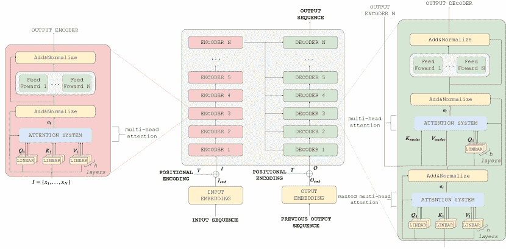

<!--yml

分类: 未分类

日期: 2024-09-06 19:56:11

-->

# [2103.16775] 注意力，请！深度学习中神经注意力模型的调研

> 来源：[`ar5iv.labs.arxiv.org/html/2103.16775`](https://ar5iv.labs.arxiv.org/html/2103.16775)

# 注意力，请！深度学习中神经注意力模型的调研

Alana de Santana Correia 和 Esther Luna Colombini，

坎皮纳斯大学计算机学院，阿尔伯特·爱因斯坦大道 1251 号 - 坎皮纳斯，SP - 巴西

电子邮件: {alana.correia, esther}@ic.unicamp.br 机器人与认知系统实验室 (LaRoCS)

###### 摘要

在人类中，注意力是所有感知和认知操作的核心属性。由于我们处理竞争来源的能力有限，注意力机制选择、调节并专注于对行为最相关的信息。几十年来，注意力的概念和功能在哲学、心理学、神经科学和计算领域得到了研究。在过去六年中，这一属性在深度神经网络中得到了广泛探索。目前，深度学习的前沿技术由多个应用领域的神经注意力模型代表。本文综述了神经注意力模型的发展情况，并进行了全面的概述和分析。我们系统地审查了该领域数百种架构，识别并讨论了在注意力显著影响的那些架构。我们还开发并公开了一种自动化的方法论，以便于该领域综述的发展。通过对 650 篇研究工作的批判性分析，我们描述了卷积、递归网络和生成模型中注意力的主要应用，识别了常见的使用和应用子组。此外，我们还描述了注意力在不同应用领域的影响及其对神经网络可解释性的影响。最后，我们列出了进一步研究的可能趋势和机会，希望本文综述能够提供该领域主要注意力模型的简明概述，并指导研究人员开发未来的方法，从而推动进一步的改进。

*关键词* 调研  $\cdot$ 注意力机制  $\cdot$ 神经网络  $\cdot$ 深度学习  $\cdot$ 注意力模型

## 1 引言

**注意力**是一个行为和认知过程，专注于信息的一个离散方面，无论是主观的还是客观的，同时忽略其他可感知的信息[1]，在人的认知和生物体的生存中发挥着重要作用。在进化较低水平的动物中，它提供了感知资源分配，使这些生物能够正确响应环境刺激，以有效逃避捕食者和捕捉猎物。在人类中，注意力作用于几乎所有的心理过程，从对环境中意外刺激的反应——保证我们在危险面前的生存——到复杂的心理过程，如规划、推理和情感。注意力是必要的，因为在任何时刻，环境呈现的感知信息远远超过了有效处理的信息，记忆中包含的竞争特征远远超过了能够记住的内容，选择、任务或可用的运动反应远远超过了能够处理的范围[2]。

在早期感官处理阶段，数据被分离为视觉、听觉、触觉、嗅觉和味觉。在这一层次上，**注意力**选择并调节每一种感官模式的处理，并直接影响相关皮层区域的处理。例如，对视觉刺激的注意会增加分辨率，并激活视网膜视觉皮层中的相关拓扑区域[3]，使观察者能够检测到对比刺激或做出更精确的区分。在听觉方面，注意力使听者能够检测到较弱的声音或极其微妙的音调差异，这对识别情绪和感受至关重要[4]。类似的注意力效应也作用于躯体感觉皮层[5]、嗅觉皮层[6]和味觉皮层[7]。除了感官感知外，我们的认知控制本质上是注意力驱动的。我们的大脑有着严重的认知限制——可以在工作记忆中保持的项数、可以选择的选项数以及可以在任何时刻生成的反应数都是有限的。因此，进化选择了选择性注意的概念，因为大脑必须进行优先排序。

早在现代心理学家参与注意力讨论之前，威廉·詹姆斯 [8] 就给出了一个精确的定义，该定义至少在一个世纪后被神经生理学研究部分验证了。根据詹姆斯的说法，“注意力意味着从某些事物中撤离，以便有效地处理其他事物……大量外界的事物存在于我的感官中，但从未真正进入我的经验中。为什么？因为它们对我没有兴趣。我的经验就是我决定关注的事物。只有那些我注意到的事物塑造了我的思想——没有选择性的兴趣，经验就是完全的混乱。” 确实，关于注意力的第一次科学研究由赫尔曼·冯·赫尔姆霍茨（1821-1894）和威廉·詹姆斯（1890-1950）在十九世纪报告。他们都进行了实验以理解注意力的作用。

在过去几十年里，注意力的概念渗透了感知和认知研究的大多数方面，被认为是多种不同感知和认知操作的属性 [1]。因此，考虑到这些机制是专业化和去中心化的，注意力反映了这种组织。这些机制广泛地相互通信，执行控制过程帮助为系统设定优先级。选择机制在整个大脑中运作，涉及几乎每个阶段，从感官处理到决策和意识。注意力已成为定义大脑如何控制其信息处理的广泛术语，其效果可以通过自觉内省、电生理学和脑成像来测量。长期以来，注意力从不同的角度进行了研究。

### 1.1 深度学习前的注意力模型

基于心理物理模型的计算注意力系统，得到神经生物学证据的支持，至少存在了三十年 [9]。特雷斯曼的特征整合理论（FIT） [10]，沃尔夫的引导搜索 [11]，三元架构 [12]，布罗德本特模型 [13]，诺曼注意模型 [14] [15]，闭环注意模型 [16]，选择性注意模型 [17]，以及其他若干模型，介绍了计算注意力系统的理论基础。

最初，注意力主要通过视觉实验来研究，其中受试者观察一个随时间变化的场景[18]。在这些模型中，注意力系统仅限于视觉搜索任务中的选择性注意成分，专注于通过传感器提取多个特征。因此，大多数注意力计算模型出现在计算机视觉领域，用于选择重要的图像区域。Koch 和 Ullman [19] 提出了基于 FIT [10] 的该领域首个视觉注意力架构。其背后的理念是多个特征并行计算，并将它们的显著性收集到显著性图上。Winner-Take-All (WTA) 确定图上最突出的区域，最终将其传递到中央表示。从那时起，只有感兴趣的区域才会继续进行更具体的处理。Neuromorphic Vision Toolkit (NVT)，源自 Koch-Ullman [20] 模型，是开发计算视觉注意力研究的基础。Navalpakkam 和 Itti 引入了 NVT 的一种衍生版本，能够处理自上而下的提示 [21]。其理念是从训练图像中学习目标的特征值，其中一个二进制掩码表示目标。Hamker [22] [23] 的注意力系统计算各种特征和对比度图，并将它们转化为感知图。随着目标信息影响处理，它们结合检测单元来判断感知图上的区域是否是眼动的候选区域。VOCUS [24] 引入了一种将自下而上和自上而下的注意力结合的方法，克服了当时的限制。文献中出现了其他几个模型，每个模型根据任务具有其特定性。许多计算注意力系统集中于计算主要的三个特征：强度、方向和颜色。这些模型采用神经网络或使用经典线性滤波器来计算特征的滤波模型。

计算注意力系统在深度学习（DL）之前在物体识别[25]、图像压缩[26]、图像匹配[27]、图像分割[26]、物体跟踪[28]、主动视觉[29]、人机交互[30]、机器人中的物体操作[31]、机器人导航[32]和 SLAM[33]中成功应用。1997 年中期，Scheier 和 Egner[34]提出了一种使用注意力进行导航的移动机器人。然而，在 90 年代，Baluja 和 Pomerleau[35]使用注意力系统来导航一辆自主汽车，该汽车跟踪了投影地图上的相关区域。Walther[27]将注意力系统与基于 SIFT 特征的物体识别器结合，展示了注意力前端如何增强识别结果。Salah 等人[25]将注意力与神经网络结合在一个可观察的马尔可夫模型中用于手写数字识别和面部识别。Ouerhani 等人[26]提出了聚焦图像压缩，根据图像区域的显著性确定分配给编码区域的比特数。高显著性区域的重建质量相较于图像的其他部分更高。

### 1.2 注意力的深度学习模型：起始

到 2014 年，深度学习（DL）社区注意到注意力机制作为推动深度神经网络发展的基本概念。当前，该领域的最先进技术使用神经注意力模型。如图 1 所示，领先存储库中发表的作品数量每年显著增长。在神经网络中，注意力机制动态管理信息流、特征和可用资源，提升学习效果。这些机制过滤掉与任务无关的刺激，并帮助网络简单处理长期依赖性。许多神经注意力模型简单、可扩展、灵活，并在多个应用领域中取得了有希望的结果[36] [37] [38]。考虑到目前的研究范围，文献中出现了与神经注意力模型相关的有趣问题：这些机制如何帮助提升神经网络的性能，哪些问题类别从这种方法中受益，以及这些益处是如何产生的。

图 1：2014 年 01 月 01 日至 2021 年 02 月 15 日期间发表的作品。主要来源包括 ArXiv、CVPR、ICCV、ICLR、IJCNN、NIPS 和 AAAI。其他类别主要指以下出版渠道：ICML、ACL、ACM、EMNLP、ICRA、ICPR、ACCV、CORR、ECCV、ICASSP、ICLR、IEEE ACCESS、Neurocomputing 及其他几本杂志。

据我们所知，大多数文献中的调查没有解决所有这些问题，或者更专注于某些领域。Wang 等人 [39] 提出了关于递归网络和计算机视觉应用的综述，Hu [40] 和 Galassi 等人 [41] 提供了关于自然语言处理（NLP）中注意力的调查。Lee 等人 [42] 提出了关于图神经网络中注意力的综述，而 Choudhari 等人 [43] 则提供了更为一般但简短的综述。

### 1.3 贡献

为了评估深度神经网络中注意力应用的广度，我们在本调查中提供了对该领域的系统综述。在我们的审查过程中，我们批判性地分析了 650 篇论文，同时定量地解决了 6,567 个问题。

我们工作的主要贡献如下：

1.  1.

    可复制的研究方法。我们在附录中提供了收集数据的详细过程，并提供了收集论文和创建图表的脚本；

1.  2.

    领域的深入概述。我们批判性地分析了 650 篇论文，并从 6,567 篇中提取了不同的指标，采用各种可视化技术突出该领域的总体趋势；

1.  3.

    我们描述了主要的注意力机制；

1.  4.

    我们展示了主要的神经网络架构，这些架构采用了注意力机制，并描述了它们如何对神经网络领域作出贡献；

1.  5.

    我们介绍了注意力模块或接口如何在经典的深度学习架构中使用，扩展了神经网络动物园图示；

1.  6.

    最后，我们提供了应用领域、趋势和研究机会的广泛描述。

本调查的结构如下。在第二部分中，我们介绍了该领域的概况，报告了 2014 年至今的主要事件。第三部分包含了注意力主要机制的描述。在第四部分中，我们分析了注意力模块在经典深度学习架构中的应用。在第五部分中，我们解释了注意力的主要问题类别和应用。最后，在第六部分中，我们讨论了该领域的局限性、未解挑战、当前趋势以及未来方向，并在第七部分中总结了进一步改进的方向。

## 2 概述

从历史上看，计算注意力系统的研究自 1980 年代以来就已存在。直到 2014 年中期，神经注意力网络（NANs）在自然语言处理（NLP）中出现，注意力机制带来了显著的进展，通过可扩展且简洁的网络提供了有前景的结果。注意力使我们能够向对话机器理解、情感分析、机器翻译、问答系统和迁移学习等复杂任务迈进，这些任务以前颇具挑战。随后，NANs 也出现在对人工智能同样重要的其他领域，如计算机视觉、强化学习和机器人技术。目前存在众多注意力架构，但其中很少有显著影响力的，如图 2 所示。在此图像中，我们描绘了按引用水平和创新组织的最相关工作组，其中 RNNSearch [44]、Transformer [37]、Memory Networks [38]、“show, attend and tell” [45]和 RAM [46]作为关键发展脱颖而出。

图 2：主要神经注意力网络（NAN）。每个圆圈对应一个架构。圆圈的半径根据 NAN 对领域的影响力来定义。影响力由引用次数和架构创新水平决定。圆圈的半径越大，架构的影响越显著，反之亦然。架构标签的颜色编码如下：橙色 - 自然语言处理，红色 - 计算机视觉，深棕色 - 计算机视觉和自然语言处理，深黄色 - 强化学习和计算机视觉，浅黄色 - 强化学习和自然语言处理，蓝色 - 模仿学习和机器人技术，紫色 - 其他。

经典编码器-解码器框架中的瓶颈问题成为深度学习中注意力研究的初始动机。在这个框架中，编码器将源句子编码为固定长度的向量，解码器从中生成翻译。主要问题是神经网络需要将所有必要的信息从源句子压缩成一个固定长度的向量。Cho 等人 [47] 表明，经典编码器-解码器的性能随着输入句子的大小增加而迅速下降。为了最小化这个瓶颈，Bahdanau 等人 [44] 提出了 RNNSearch，这是对编码器-解码器模型的扩展，学习同时对齐和翻译。RNNSearch 在每个时间步生成一个翻译词，寻找源句子中最相关词汇的一组位置。模型基于这些源位置和所有先前生成的目标词汇相关的上下文向量来预测目标词汇。主要优点是 RNNSearch 不将整个输入句子编码为单一的固定长度向量，而是将输入句子编码为向量序列，在生成翻译时自适应地选择这些向量的子集。注意力机制允许额外的信息通过网络传播，消除了固定大小上下文向量的信息瓶颈。这种方法首次证明了在长句子中，注意力模型优于经典编码器-解码器框架。

RNNSearch 在引入第一个注意力机制——软注意力（第三部分）方面发挥了重要作用。该机制的主要特点是平滑地选择网络中最相关的元素。基于 RNNSearch，已经有很多尝试在神经网络中增加新的属性。其中两个研究方向特别引人注目——注意力接口和端到端注意力。注意力接口将注意力视为一个模块或一组可选模块，可以轻松地插入到经典的深度学习神经网络中，就像 RNNSearch 一样。到目前为止，这是该领域最为深入的研究方向，主要因为其简单性、通用性和注意力接口所带来的良好泛化结果。端到端注意力是一个较新的研究方向，其中注意力模块覆盖整个神经网络。高层和低层的注意力层在所有网络抽象级别上递归或级联地作用，以生成这些模型所需的输出。端到端注意力模型在深度学习中引入了一类新的神经网络。端到端注意力的研究是有意义的，因为人脑中没有孤立的注意力中心，并且其机制被应用于不同的认知过程。

### 2.1 注意力接口

RNNSearch 是研究注意力接口的基础。该架构的注意力模块在多个其他应用中得到了广泛使用。在语音识别中 [48]，允许一个 RNN 处理音频，而另一个 RNN 在生成描述时专注于相关部分。在文本分析中 [49]，它允许模型在生成分析树时查看单词。在对话建模中 [50]，它允许模型在生成响应时专注于对话的最后部分。还有一些重要的扩展，用于处理经典的编码器-解码器问题之外的其他信息瓶颈。BiDAF [51] 提出了一个多阶段的层次化过程来进行问答。它使用双向注意力流来构建一个多阶段的层次化网络，在不同的粒度级别上有上下文段落表示。注意力层不会将上下文段落总结成一个固定长度的向量。相反，注意力在每一步都进行计算，每一步的辅助向量以及前面层的表示可以流入后续建模层。这减少了早期总结带来的信息丢失。在每个阶段，注意力仅是当前阶段查询和上下文段落的函数，不直接依赖于前一个阶段的注意力。假设这种简化导致了注意力层和建模层之间的工作分配，迫使注意力层专注于学习查询和上下文之间的注意力。

杨等人[52] 提出了层次注意网络（HAN），以捕捉关于文档结构的两个关键见解。文档具有层次结构：词语形成句子，句子形成文档。人类同样通过首先建立句子的表示，然后将其聚合成文档表示来构建文档表示。文档中的不同词语和句子具有不同的信息量。此外，词语和句子的重视程度高度依赖于上下文，即相同的词语或句子在不同的上下文中可能具有不同的重要性。为了包含对这一事实的敏感性，HAN 包含两个层次的注意机制——一个在词语层次，另一个在句子层次——让模型在构建文档表示时对个别词语和句子给予更多或更少的关注。熊等人[53] 创建了一种共同注意编码器，通过动态指向解码器捕捉问题与文档之间的交互，动态指向解码器在估计答案跨度的开始和结束之间交替进行。为了学习计算上难以处理的问题的近似解，Ptr-Net[54] 修改了 RNNSearch 的注意机制，以表示可变长度的词典。它将注意机制用作指针。

See et. al. [55] 使用了一种经典的序列到序列注意力模型和 Ptr-Net [54] 的混合模型来进行抽象文本摘要。混合指针生成器 [55] 通过指向复制源文本中的词，这有助于准确再现信息，同时保留通过生成器生成新词的能力。最后，它使用一种机制来跟踪已被总结的内容，从而避免重复。FusionNet [56] 提出了“词历史”这一新概念，以描述从最低的词嵌入级别到最高的语义级表示的注意力信息。这个概念考虑到数据输入逐渐转化为更抽象的表示，形成每个词在人的思维流中的历史。FusionNet 采用了完全感知的多级注意力机制和一种利用词历史的注意力评分函数。Rocktäschel et al. [57] 引入了双向注意力机制来识别文本蕴涵（RTE）。这一机制允许模型关注过去的输出向量，解决了 LSTM 的单元状态瓶颈。带有注意力的 LSTM 不需要在 LSTM 单元状态中捕捉前提的全部语义。相反，注意力在阅读前提时生成输出向量，并在单元状态中累积一个表示，告知第二个 LSTM 应该关注前提的哪个输出向量来确定 RTE 类别。Luong et al. [58] 提出了机器翻译中的全局注意力和局部注意力。全局注意力类似于软注意力，而局部注意力则是对硬注意力的改进——模型首先为当前目标词提供一个对齐的单一位置，并使用以该位置为中心的窗口来计算上下文向量。

注意力接口也在计算机视觉任务的架构中出现。最初，它们基于人类的眼球跳动运动和对变化的鲁棒性。人类的视觉注意机制可以探索图像中的局部差异，同时突出相关部分。一个人会同时将注意力集中在图像的某些部分，通过快速浏览整幅图像来在识别过程中找到主要区域。在这个过程中，不同区域的内部关系引导眼睛的运动，找到下一个需要关注的区域。忽略不相关的部分使得在存在混乱的情况下更容易学习。另一个优势是视觉注意的鲁棒性。我们的眼睛可以在现实场景中看到一个物体，但忽略不相关的部分。卷积神经网络（CNN）则完全不同。CNN 是刚性的，参数数量随着图像大小线性增长。而且，为了让网络捕捉到像素之间的长距离依赖，架构需要有许多层，这会妥协模型的收敛性。此外，网络对所有像素的处理是相同的。这一过程与包含视觉注意机制和提供无与伦比的目标识别性能的眼动结构的人类视觉系统并不相似。

RAM [46] 和 STN 是具有基于人类视觉注意力的前沿架构。RAM [46] 可以通过自适应选择区域序列（*glimpses*），仅对选定区域以高分辨率进行处理，从而从图像或视频中提取信息。该模型是一个递归神经网络，在每个时间点 t 处理图像（或视频帧）的不同部分，通过强化学习训练构建场景的动态内部表示。主要模型优点是参数数量减少以及架构对输入图像大小的独立性，这在卷积神经网络中并不存在。这种方法是通用的。它可以使用静态图像、视频或与环境交互的代理的感知模块。STN（空间变换网络）[59] 是一个对空间变换变化具有鲁棒性的模块。在 STN 中，如果输入经过变换，模型必须生成正确的分类标签，即使它以不寻常的方式扭曲。STN 作为一个注意力模块，可以附加 – 仅需少量修改 – 到任何神经网络，以主动空间变换特征图。STN 在训练过程中学习变换。与池化层不同，池化层的感受野是固定的和局部的，而空间变换器是一种动态机制，可以空间变换图像或特征图，为每个输入样本产生适当的变换。变换在整个图上进行，可能包括尺度变化、裁剪、旋转和非刚性变形。这种方法使网络能够选择最相关的图像区域（*attention*）并将其变换为所需的标准位置，从而简化后续层中的识别。

根据 RAM 方法，深度递归注意力写作者（DRAW）[36]代表了一种更自然的图像构建方式，其中场景的部分是独立创建的。这个过程类似于人类通过顺序重建视觉场景来绘制图像，不断细化图像的各个部分，并在每次修改后重新评估作品。尽管对人类来说很自然，但大多数自动图像生成方法旨在一次生成完整场景。这意味着所有像素都在单一潜在分布中进行条件化，使得扩展大型图像方法具有挑战性。DRAW 属于变分自编码器家族。它有一个在训练过程中压缩图像的编码器和一个重建图像的解码器。与其他生成模型不同，DRAW 通过累积解码器发出的修改来迭代构建场景，每次修改都被编码器观察到。DRAW 使用 RAM 注意力机制来选择性地关注场景的部分，同时忽略其他部分。这个机制的主要挑战是学习关注的区域，这通常通过强化学习技术来解决。然而，在 DRAW 中，注意力机制是可微分的，使得可以使用反向传播。

### 2.2 多模态性

首次在深度学习中使用注意力接口的领域仅限于自然语言处理和计算机视觉，用于解决孤立任务。目前，注意力接口在多模态学习中得到了研究。神经网络中的感觉多模态性是一个历史性的问题，科学界对此进行了广泛讨论[60] [61]。多模态数据通过互补性和冗余性提高了感知的鲁棒性。人脑不断处理多模态数据，并将其整合为对世界的连贯表征。然而，使用不同传感器会面临一系列计算挑战，如数据不完整或虚假、不同属性（即维度或数值范围）以及数据对齐关联的需求。多个传感器的集成依赖于对数据的推理结构，以建立共同的表征，这在经典神经网络中并不存在。适用于多模态感知的注意力接口是对不同传感器源的错位数据进行推理的有效替代方案。

对多模态的广泛应用首次出现在卷积神经网络与长短期记忆网络（LSTM）之间的注意力接口，用于图像字幕生成[45]。在这一模型中，CNN 处理图像，提取高层特征，而 LSTM 则利用这些特征逐个生成描述性词语。注意力机制引导 LSTM 对每个词的生成定位到相关的图像信息，相当于人类的视觉注意机制。多模态任务中注意力权重的可视化提高了对架构工作的理解。这种方法源于无数其他处理视频-文本数据[62] [63] [64]、图像-文本数据[65] [66]、单目/RGB-D 图像[67] [68] [69]、雷达[68]、遥感数据[70] [71] [72] [73]、音视频[74] [75]、以及各种传感器[76] [77] [78]的注意力接口，如图 3 所示。

Zhang 等人 [79] 使用了一种自适应注意力机制来学习在时尚零售对话系统中强调不同的视觉和文本来源。自适应注意力方案会根据视觉和文本上下文自动决定用于跟踪对话状态的证据来源。Dual Attention Networks [80] 提出了注意力机制来捕捉图像和文本信息之间的细粒度相互作用。该机制允许视觉和文本注意力在协同推理过程中相互引导。HATT [63] 提出了基于注意力的分层融合方法，以逐步探索多模态特征的互补特征，将时间、运动、音频和语义标签特征融合用于视频表示。该模型由三层注意力层组成。首先，低级注意力层处理每种模态内部及模态间的时间、运动和音频特征。其次，高级注意力层选择性地关注语义标签特征。最后，序列注意力层结合由编码的低级注意力和高级注意力生成的隐藏信息。Hori 等人 [74] 扩展了简单的注意力多模态融合。与简单的多模态融合方法不同，特征级别的注意力权重可以根据解码器状态和上下文向量变化，使得解码器网络在预测描述中的每个后续词时能够关注不同的特征或模态。Memory Fusion Network [76] 提出了 Delta-memory Attention 模块用于多视角序列学习。首先，每种模态的 LSTM 系统对模态特定的动态和交互进行编码。Delta-memory attention 发现了 LSTM 的不同记忆维度中的跨模态和时间交互。最后，多视角门控记忆（统一记忆）存储了随时间变化的跨模态交互。

黄等人[81] 通过利用双向注意力来研究图像-文本匹配问题，该注意力具有视觉区域和文本词汇之间的细粒度关联。双向注意力将词汇与区域以及对象与词汇相连接，以学习图像-文本匹配。李等人[82] 引入了受人类指向行为启发的长短期记忆网络（LSTM-P）[83]，以及指针网络[54]。指向机制封装了动态上下文信息（当前输入词汇和 LSTM 单元输出），以处理图像描述场景中的新颖对象。刘等人[84] 提出了一个跨模态注意力引导的擦除方法，用于参考表达。之前的注意力模型仅关注两种模态中最具主导性的特征，忽略了图像和参考表达之间的文本-视觉对应关系。为了解决这个问题，跨模态注意力从文本或视觉领域中丢弃最主导的信息，以生成困难的训练样本，并推动模型发现互补的文本-视觉对应关系。阿布尔哈塞米等人[85] 展示了一种通过演示增强深度视觉运动策略的方法，该方法结合了任务专注视觉注意力（TFA）。注意力机制接收自然语言文本中指定的操作任务、带有环境的图像作为输入，并返回机器人需要操作的对象所在区域作为输出。TFA 使策略比基线策略（即无视觉注意力）显著更强健。蒲等人[66] 自适应地从多个 CNN 层中选择特征用于视频描述。之前的模型通常使用 CNN 的特定层的输出作为视频特征。然而，这种注意力模型自适应地、顺序地关注 CNN 特征的不同层。

图 3：展示神经注意力模型的感官模态的图示。径向分段对应于注意力架构，每条轨迹对应于一种模态。模态包括：（A）音频，（B）生物医学信号，（I）图像，（O）其他传感器，（L）激光雷达，（R）遥感数据，（T）文本，以及（V）视频。个别分段使用以下颜色约定：白色（该模态未实现）、浅黄色（CNN）、浅橙色（RNN）、橙色（自注意网络）、红色（记忆网络）、深红色（框架）和棕色（GNN）。此图强调多模态架构，因此仅显示最具代表性的单一模态（即文本或图像）架构。大多数多模态架构使用图像/文本或视频/文本模态。

### 2.3 注意力增强记忆

注意力接口还允许神经网络与其他认知元素（即，记忆、工作记忆）进行迭代。记忆控制和逻辑流对于学习至关重要。然而，这些是经典架构中不存在的元素。经典 RNN 的记忆通过隐藏状态和权重进行编码，通常是最小的，不足以准确记住过去的事实。大多数深度学习模型没有简单的方法来读写外部记忆组件。神经图灵机（NTM）[86]和记忆网络（MemNN）[38]——一种新的神经网络类别——引入了神经网络处理可寻址记忆的可能性。NTM 是一种可微分的方法，可以通过梯度下降算法进行训练，产生一个实用的学习程序机制。NTM 记忆是一个用于信息的短期存储空间，其规则基础的操作。计算上，这些规则是简单的程序，其中数据是这些程序的参数。因此，NTM 类似于一个工作记忆，旨在解决需要规则的任务，其中变量迅速与记忆槽关联。NTM 使用注意过程选择性地读写内存中的元素。这个注意机制使网络学会使用工作记忆，而不是实现固定的数据符号规则集。

记忆网络[38]是一种相对较新的模型框架，旨在通过为序列中的每个标记提供明确的记忆表示来缓解学习长期依赖性的问题。记忆网络不会忘记过去，而是明确考虑输入历史，为每个历史元素提供专门的向量表示，有效地消除了遗忘的可能性。内存大小的限制变成了一个超参数进行调整，而不是模型本身的固有限制。该模型在问答任务中得到了应用，其中长期记忆有效地充当了一个（动态的）知识库，输出是一个文本响应。进行了大规模的问答测试，证明了记忆网络在回答需要深入分析动词意图的问题时的推理能力。主要由于 MemNN 的成功，带有外部记忆的网络成为了深度学习中的一个发展方向，多个分支正在开发中，如图 4 所示。

图 4: 基于记忆的神经网络（MemNN）。架构标签的颜色编码如下：橙色 - 自然语言处理，红色 - 计算机视觉，紫色 - 其他。端到端记忆网络是 MemNN 的第一个端到端可微版本。GMN [87] 和 MemGNN [87] 是第一个具有记忆的图网络。DMN [88]、MemGNN [87]、情节图记忆网络 [89]、情节 CAMN [90]，是情节记忆框架的第一个实例。

端到端记忆网络 [91] 是适用于现实、可训练端到端场景的第一版 MemNN，这需要在训练过程中低监督。Aug Oh. 等人 [92] 扩展了记忆网络以适应半监督视频对象分割任务。具有对象掩码的帧被放置在记忆中，而需要分割的帧作为查询。记忆通过提供的新掩码进行更新，并面临如变化、遮挡和错误累积等挑战，且没有在线学习。该算法作为一个注意力时空系统，计算何时何地满足每个查询像素，以决定该像素是否属于前景对象。Kumar 等人 [93] 提出了第一个具有情节记忆的网络——一种与人类极为相关的记忆——通过注意力接口迭代输入模块发出的表示并更新其内部状态。在 [89] 中，具有键值检索机制的情节记忆选择通过全面注意力关注输入的哪些部分。该模块然后产生记忆的总结表示，考虑查询和存储的记忆。最后，最新的研究投入于图记忆网络（GMN），即 GNNs 中的记忆 [94]，以利用键值结构化记忆 [95] [87] [87] [96] 更好地处理非结构化数据。

### 2.4 端到端注意力模型

在 2017 年中期，旨在端到端注意力模型的研究在该领域出现。神经 Transformer (NT) [37] 和图注意力网络 [97] - 完全基于注意力的架构 - 向科学界展示了注意力是深度学习未来发展的关键元素。Transformer 的目标是使用自注意力（第 3 节）来最小化传统递归神经网络的困难。神经 Transformer 是第一种仅使用注意力模块和全连接神经网络成功处理序列数据的神经架构。它摒弃了递归和卷积，能够捕捉序列元素之间的关系，而不受距离的限制。注意力使得 Transformer 简单、可并行化且训练成本低 [37]。图注意力网络 (GATs) 是图神经网络 (GNNs) 的端到端注意力版本 [94]。它们具有多层注意力机制，帮助模型关注无结构数据中最相关的部分以作出决策。注意力的主要目的是通过提高信噪比 (SNR) 来避免图的噪声部分，同时减少结构的复杂性。此外，它们为解决问题提供了更具可解释性的结构。例如，在分析图中不同组件下模型的注意力时，可以识别出对实现特定响应条件的主要因素。

图 5：基于 Transformer 的神经网络。架构标签的颜色编码如下：橙色 - 自然语言处理，红色 - 计算机视觉，紫色 - 其他。

对于 NT 和 GAT 的兴趣日益增长，已经提出了一些扩展[98] [99] [100] [101]，如图 5 所示的众多基于 Transformer 的架构。这些架构以及所有使用自注意力的网络属于一种新的神经网络类别，称为自注意力神经网络。它们旨在在各种任务中探索自注意力，并改善以下缺点：1) 大量的参数和训练迭代以收敛；2) 每层的高内存成本和根据序列长度的内存二次增长；3) 自回归模型；4) 解码器层的低并行性。具体而言，Weighted Transformer [102] 提出了在注意力层中进行修改，从而实现了 40%更快的收敛。多头注意力模块被称为分支注意力的模块所取代，模型在训练过程中学习如何匹配这些模块。Star-transformer [103] 提出了一个轻量级的替代方案，通过星形拓扑结构来减少模型的复杂性。为了降低内存成本，Music Transformer [104] 和 Sparse Transformer [105] 分别引入了相对自注意力和分解自注意力。Lee 等人 [106] 还展示了一种注意力机制，将自注意力从二次降低为线性，允许对高输入和数据集进行扩展。

一些方法将 Transformer 适应于新的应用和领域。在自然语言处理领域，几种新的架构出现了，主要集中在多模态学习上。Doubly Attentive Transformer [107] 提出了一个多模态机器翻译方法，结合了视觉信息。它修改了注意力解码器，允许使用来自预训练 CNN 编码器的文本特征和视觉特征。Multi-source Transformer [108] 探索了四种不同的策略，将输入合并到多头注意力解码层中，以实现多模态翻译。Style Transformer [109]、Hierarchical Transformer [110]、HighWay Recurrent Transformer [111]、Lattice-Based Transformer [112]、Transformer TTS Network [113]、Phrase-Based Attention [114] 是风格迁移、文档摘要和机器翻译中的一些重要架构。NLP 中的迁移学习是 Transformer 的主要贡献领域之一。BERT [115]、GPT-2 [116] 和 GPT-3 [117] 基于 NT 架构来解决 NLP 中迁移学习的问题，因为当前技术限制了预训练表示的能力。在计算机视觉中，图像生成是 Transformer 的一个重要进展。Image Transformer [118]、SAGAN [119] 和 Image GPT [120] 使用自注意力机制来关注局部邻域。尽管每层的感受野比典型的卷积神经网络大得多，但模型在实际应用中处理图像的大小显著增加。最近，在 2021 年初，OpenAI 向科学界介绍了基于 Transformer 和 GPT-3 的最新语言模型 DALL·E [121]，它能够从文本生成图像，将 GPT-3 的知识扩展到仅有 120 亿参数的视图生成能力。

### 2.5 今日关注

目前，采用深度学习中注意力机制主要关键发展的混合模型（图 6）引起了科学界的兴趣。主要是基于 Transformer、GATs 和 Memory Networks 的混合模型已出现，用于多模态学习和其他多个应用领域。Hyperbolic Attention Networks (HAN) [122]、Hyperbolic Graph Attention Networks (GHN) [123]、Temporal Graph Networks (TGN) [124] 和基于记忆的图网络 (MGN) [87] 是一些最具前景的发展。超曲面网络是一类新架构，结合了自注意力、记忆、图和超曲面几何的优势，用于激活神经网络，以高容量推理深度神经网络生成的嵌入。从 2019 年以来，这些网络作为一种新的研究方向脱颖而出，因为它们在神经机器翻译、图学习和视觉问答任务上代表了最新的泛化，同时保持了神经表示的紧凑性。自 2019 年以来，GATs 也因其在生物学、粒子物理学、社交网络和推荐系统等广泛问题中的能力而受到广泛关注。为了提高节点表示并扩展 GATs 处理动态数据（即随时间变化的特征或连接）的能力，提出了结合记忆模块和时间维度的架构，如 MGNs 和 TGNs。

图 6：深度学习中注意力机制的关键发展时间线。RNNSearch 提出了第一个注意力机制。Neural Turing 机和 Memory networks 引入了记忆和动态流控制。RAM 和 DRAW 学会了结合多视角、视觉注意力和顺序处理。Spatial Transformer 引入了一个模块，以提高 CNN 对空间变换的鲁棒性。Show, attend and tell 为多模态创建了注意力机制。Pointer network 使用注意力作为指针。BiDAF、HAN 和 DCN 提出了对齐不同层次数据的注意力技术。ACT 引入了计算时间主题。Transformer [37] 是第一个采用端到端注意力方法的自注意力神经网络。GATs 在 GNNs 中引入了注意力。BERT [115]、GPT-2 [116]、GPT-3 [117] 和 DALL·E [121] 是语言模型和文本到图像生成领域的最新技术。最后，BRIMs [125] 学会了结合自下而上和自上而下的信号。

到 2020 年底，文献中仍然未被充分探讨的两个研究分支得到了加强：1）在双向递归神经网络中明确结合自下而上的刺激和自上而下的刺激，2）自适应计算时间。经典的递归神经网络在特定的表示层次内执行递归迭代，而不是使用自上而下的迭代，其中高层在低层上起作用。然而，Mittal 等人[125]重新审视了具有注意力机制的双向递归层，以明确路由自下而上的信息流和自上而下的信息流，促进了两个刺激层次之间的选择迭代。这种方法将隐藏状态分成几个模块，以便自下而上和自上而下的信号之间的上升迭代可以得到适当的集中。层次结构具有并发模块，以便每个层次层可以在自下而上和自上而下的方向上发送信息。

自适应计算时间是一个有趣且未被充分探讨的主题，尽管最初的研究始于 2017 年，但在 2020 年才开始扩展。ACT 适用于不同的神经网络（例如 RNN、CNN、LSTM、Transformers）。一般来说，复杂的数据可能需要更多的计算才能生成最终结果，而一些不重要或简单的数据则可能需要更少。注意力机制动态决定处理网络训练数据的时间长度。Graves 等人的开创性方法[126]对 RNN 进行了小幅修改，使网络能够在每个输入阶段执行可变数量的状态转换和输出。结果输出是中间输出的加权和，即软注意力。一个停止单元决定网络何时停止或继续。为了限制计算时间，注意力通过阻止网络处理不必要的数据时间来给成本函数添加时间惩罚。这种方法最近已更新并扩展到其他架构。空间自适应计算时间（SACT）[127]将 ACT 调整为根据卷积层中块的每个空间位置调整计算量，学习将计算集中在感兴趣的区域，并在特征图“足够好”时停止。最后，可微分自适应计算时间（DACT）[128]引入了首个可微分的端到端计算时间方法，适用于递归网络。

## 3 注意力机制

深度注意力机制可以分为软注意力（全局注意力）、硬注意力（局部注意力）和自注意力（内部注意力）。

软注意力。软注意力为每个输入元素分配 0 到 1 之间的权重。它决定了每个元素应该集中多少注意力，考虑到深度神经网络机制和目标之间的相互依赖。它在注意力层中使用 softmax 函数来计算权重，以确保整个注意力模型是确定性的和可微分的。软注意力可以在空间和时间上下文中发挥作用。空间上下文主要用于提取最相关特征的特征或加权。对于时间上下文，它通过调整滑动时间窗口中所有样本的权重来工作，因为不同时间的样本有不同的贡献。尽管是确定性和可微分的，但对于大输入，软机制具有较高的计算成本。图 7 展示了一个软注意力机制的直观示例。

图 7：一个直观的 Soft Attention 示例。视觉 QA 架构根据输入的图像和文本问题输出答案。它使用软注意力机制对任务的视觉特征进行加权，以便进一步处理。前提是视觉特征的范数与其相关性相关。此外，那些具有高幅度的特征向量对应于包含相关语义内容的图像区域。

硬注意力。硬注意力确定机制的输入部分是否应该被考虑，反映了机制的输入与深度神经网络目标之间的相互依赖。分配给输入部分的权重要么是 0，要么是 1。因此，由于输入元素要么被看到，目标是不可微分的。该过程涉及选择关注的部分。例如，在时间上下文中，模型关注输入的某一部分以获取信息，并根据已知信息决定下一步关注的位置。神经网络可以根据这些信息做出选择。然而，由于没有明确的标准来指示正确的选择策略，硬注意力类型机制由随机过程表示。由于模型不可微分，需要使用强化学习技术来训练具有硬注意力的模型。一旦整个输入不被存储或处理，相比软机制，推理时间和计算成本会降低。图 8 展示了一个硬注意力机制的直观示例。

图 8：一个直观的**Hard Attention**示例。给定一张图像和一个文本问题作为输入，Visual QA 架构会输出一个答案。它使用一种硬注意力机制，只选择对任务重要的视觉特征进行进一步处理。

自注意力。自注意力量化机制的输入元素之间的相互依赖关系。该机制允许输入之间进行“自我”互动，并确定应该更加关注什么。与软机制和硬机制相比，自注意力层的主要优势在于对长输入的并行计算能力。该机制层使用简单且易于并行化的矩阵计算来检查所有相同输入元素的注意力。图 9 展示了自注意力机制的直观示例。

图 9：自注意力示例。a) 句子中的自注意力 b) 图像中的自注意力。第一张图展示了五个代表性的查询位置，带有颜色编码的点和对应的颜色编码箭头，总结了最受关注的区域。

## 4 基于注意力的经典深度学习架构

本节介绍了经典深度学习架构中的注意力接口的详细信息。具体来说，我们展示了注意力在卷积、递归网络和生成模型中的应用。

### 4.1 基于注意力的卷积神经网络（CNNs）

在 CNN 中，注意力机制用于过滤信息并高效分配资源到神经网络中。使用注意力机制的方法多种多样，这使得总结其发生方式和每种使用的影响变得非常困难。我们将注意力机制的应用分为六个不同的组（图 10 ‣ 4 基于注意力的经典深度学习架构 ‣ 注意力，请！深度学习中的神经注意力模型调研")）：1) DCN 注意力池 – 注意力机制替代了经典的 CNN 池化机制；2) DCN 注意力输入 – 注意力模块作为输入数据的过滤掩模。该掩模对与神经网络处理无关的区域分配低权重，对相关区域分配高权重；3) DCN 注意力层 – 注意力机制位于卷积层之间；4) DCN 注意力预测 – 注意力机制直接协助模型进行预测过程；5) DCN 残差注意力 – 从特征图中提取信息，并呈现给下一层的残差输入连接；6) DCN 注意力输出 – 注意力机制捕捉特征图的重要刺激，供其他架构或同一架构的其他实例使用。为了保持与深度神经网络领域的一致性，我们扩展了神经网络动物园示意图¹¹1https://www.asimovinstitute.org/neural-network-zoo/以适应注意力元素。

图 10: 基于注意力的卷积神经网络。DCN 注意力池组使用注意力池，而不是常规池化，作为确定给定特征图窗口中每个个体重要性的策略。前提是这些窗口中只有少数几个是重要的，必须根据特定目标进行选择。DCN 注意力输入组使用类似于人类视觉注意力的结构。DCN 注意力层组收集高（语义级别）和低级别（显著性）的重要刺激，以供架构的后续层使用。DCN 注意力预测组在预测的最后阶段使用注意力，有时作为集成元素。DCN 残差注意力组将注意力作为任何卷积层之间的残差模块使用，以减轻消失问题，仅捕捉每个特征图中的相关刺激。DCN 注意力输出组可以代表递归注意力过程的类别。

DCN 注意力输入主要使用注意力来过滤输入数据 - 这种结构类似于多视觉窥探机制和人类的视觉注意力。多视觉窥探是指快速扫描整个图像并找到与识别过程相关的主要区域的能力，而视觉注意力则通过提取关键特征来聚焦于关键区域以理解场景。当一个人关注图像的某一部分时，捕捉到了不同区域的内在关系，引导眼睛移动以找到下一个相关区域 - 忽略不相关的部分，容易在混乱环境中学习。因此，人类视觉在物体识别方面具有无与伦比的性能。CNN 的输入在注意力方面的主要贡献是鲁棒性。如果我们的眼睛在现实场景中看到一个物体，那么远离物体的部分就会被忽略。因此，固定物体的远处背景不会干扰识别。然而，CNN 对图像的所有部分都一视同仁。不相关的区域会混淆分类，并使其对视觉干扰变得敏感，包括背景、摄像机视角变化和光照条件。CNN 输入中的注意力在多个方面增加了鲁棒性：1) 使体系结构更具可扩展性，其中参数的数量与输入图像的大小不成线性变化；2) 消除干扰物；3) 最小化改变摄像机光照、比例和视图的影响。4) 它允许扩展模型以执行更复杂的任务，例如细粒度分类或分割。5) 简化了 CNN 编码。6) 通过为体系结构包括相关的优先级，有助于学习。

赵等人[129] 使用基于视觉注意力的图像处理生成焦点图像。然后，将焦点图像输入 CNN 进行分类。根据分类结果，信息熵指导强化学习代理达到更好的图像分类策略。王等人[130] 利用注意力创建富含运动信息的表示用于动作识别。注意力通过运动和外观信息提取显著性图来计算对象分数。对于视频，注意力逐帧处理生成每一帧的显著性感知图。经典的流程仅使用 CNN 序列特征作为 LSTM 的输入，未能捕捉相邻帧的运动信息。显著性感知图仅捕捉相关运动区域，使 CNN 编码对任务变得简单且具有代表性。刘等人[131] 使用注意力作为 CNN 的输入，以提供在拥挤任务中重要的先验信息。注意力图生成器首先为系统提供两种类型的先验：候选拥挤区域和拥挤区域的拥堵程度。先验指导后续 CNN 更关注拥挤区域，提高其抗噪能力。具体来说，拥堵程度先验为系统提供细粒度的密度估计。

在经典 CNN 中，感受野的大小相对较小。它们大多通过卷积操作局部提取特征，这无法捕捉图像中像素之间的长期依赖关系。然而，更大的感受野允许更好地利用训练输入，能够获取更多的上下文信息，但这也可能导致训练的不稳定甚至无法收敛。此外，传统 CNN 对通道特征的处理是平等的。这种简单处理缺乏处理低频和高频信息的灵活性。一些频率可能对任务更相关，但网络的平等处理使得模型难以收敛。为了缓解这些问题，大多数文献方法在卷积层之间使用注意力（即 DCN 注意力层和 DCN 残差注意力），如图 11 ‣ 4 Attention-based Classic Deep Learning Architectures ‣ Attention, please! A survey of Neural Attention Models in Deep Learning")所示。在层之间，注意力主要用于特征重校准，捕捉长期依赖关系，内化并正确使用过去的经验。

采用卷积层间注意力的开创性方法是 2016 年创建的**Squeeze-and-Excitation Networks** [132]，并在 2017 年赢得了 ILSVRC。这也是首个通过两个步骤——压缩和激励，即 SE 块，来建模通道间依赖关系以重新校准滤波器响应的架构。为了探索局部依赖性，压缩模块将空间信息编码为通道描述符。输出是整个图像的具有表达特征的局部描述符集合。为了利用压缩操作聚合的信息，激励通过学习通道之间的非线性且非互斥关系来捕捉通道级依赖性，确保多个通道可以被强调。从这个意义上讲，SE 块本质上引入了注意力动态，以提升卷积层之间的特征区分度。

图 11：基于注意力的卷积神经网络主架构按任务和注意力使用分类。

文献中广泛探讨了捕捉长期依赖的通道间和通道内注意力，同时利用高低级刺激。Zhang 等人[133]提出了由主干和掩码分支组成的残差局部和非局部注意力块。他们的注意力机制有助于从层次特征中学习局部和非局部信息，进一步保持低级特征的同时维护高级特征的表示质量。Cbam[134]在通道和空间两个独立维度上推断注意力图，用于自适应特征细化。[135]中的双重注意力块聚合并传播全球信息特征，考虑图像和视频的整个时空背景，允许后续卷积层高效地访问跨空间的资源。在第一阶段，注意力通过分组将所有空间的特征汇集到一个紧凑的集合中。在第二阶段，它选择并自适应地分配每个架构位置的资源。遵循类似的探索提案，几个注意力模块可以轻松地插入经典 CNN 中[136] [137] [138] [139]。

Hackel 等人 [140] 探讨了在卷积操作中保持稀疏性的注意力机制。大于 $1\times 1$ 的卷积核会产生填充，从而降低特征图的稀疏性。通常，数据稀疏性的变化对网络输出影响不大，但当这种变化发生在多个层中时，内存消耗和执行时间会显著增加。为了保证低内存消耗，注意力机制充当 $k$-选择过滤器，有两种不同的选择方式：1) 它作用于卷积的输出，倾向于选择最大的 $k$ 个正响应，类似于修正线性单元；2) 它选择 $k$ 个绝对值最大的响应，表达对大幅度响应的偏好。参数 $k$ 控制稀疏数据的级别，因此在训练和推理过程中影响计算资源。结果显示，使用注意力控制数据稀疏性的训练可以将单层的前向传播运行时间减少超过 $200\%$。

为了总结先前的聚合信息并动态地指向过去的经验，SNAIL [141]——一种基于注意力的元学习器的开创性类别——提出了将时间卷积与软注意力相结合。这种方法表明，注意力机制可以补充卷积的缺点。注意力机制允许在无限大的上下文中进行精确访问，而卷积则以有限上下文为代价提供高带宽访问。通过将卷积层与注意力层合并，SNAIL 可以有效地访问前面的经验，并且模型可以学习到更高效的特征表示。作为额外的好处，SNAIL 架构比经典的 RNN 更容易训练。

DCN 注意力组使用注意力机制与其他架构或当前架构的实例共享相关特征图。通常，主要目标是促进特征融合、多模态以及外部知识。在某些情况下，注意力机制通过将经典 CNN 转变为递归卷积神经网络——一种应对具有挑战性的图像问题的新趋势。RA-CNN [142] 是递归卷积网络的开创性框架。在他们的框架中，注意力机制沿两个维度进行，即判别特征学习和复杂的部分定位。给定输入图像，经典 CNN 提取特征图，注意力提议网络将卷积特征映射到一个特征向量，这个特征向量可以与类别条目匹配。然后，注意力机制估计下一个 CNN 实例的关注区域，即下一个更精细的尺度。一旦确定了关注区域，系统会将该区域切割并放大到更高分辨率的精细尺度，以提取更精细的特征。因此，堆叠中的每个 CNN 都生成一个预测，以使堆叠的最深层生成更准确的预测。

为了融合特征，Cheng 等人 [143] 提出了用于图像分割的特征融合编码器-解码器网络（FED-net）。他们的模型使用注意力机制来融合编码器中不同级别的特征。在每个编码器级别，注意力模块将当前级别的特征与后续级别的特征进行合并。合并后，解码器使用来自每个注意力级别的信息执行卷积上采样，这有助于调节最相关的刺激以进行分割。Tian 等人 [144] 在人脸检测任务中使用基于特征金字塔的注意力机制，将有意义的语义特征与语义较弱但视觉上强的特征进行结合。他们的目标是在所有级别上学习更多具有丰富语义和细节的判别层次特征，以检测难以检测的人脸，如微小或部分遮挡的人脸。他们的注意力机制通过结合转置卷积和逐元素相乘递归地融合从上到下的不同特征图，从而最大化低层次和高层次表示之间的互信息。

Delta [145] 框架提出了一种高效的迁移学习策略。他们的注意力系统充当源模型和目标模型之间的行为调节器。注意力系统识别源模型的完全可迁移通道，保留其响应，并识别不可迁移的通道以动态调节其信号，从而提高目标模型的泛化能力。具体而言，注意力系统通过特征图的输出表征源/目标模型之间的距离，并将该距离纳入损失函数的正则化中。优化通常影响神经网络的权重，并将泛化能力分配给目标模型。由注意力在高语义和低语义刺激上调节的正则化管理了语义问题中的重要步骤，以引入外部知识。

DCN 注意力预测组直接在预测过程中使用注意力。各种注意力系统从不同的卷积层捕获特征作为输入，并生成预测作为输出。不同预测器之间的投票生成最终预测。重新使用 CNN 特征图的激活来在不同深度找到图像中最具信息量的部分，使预测任务更具判别力。每个注意力系统学习将刺激与基于部分的细粒度特征相关联，这些特征虽然相关，但在经典方法中未被一起探索。Zheng 等人 [146] 提出了一个多注意力机制来对通道进行分组，创建部分分类子网络。该机制以卷积层的特征图作为输入，并生成多个空间上相关的细微模式作为紧凑表示。子网络通过每个单独的部分对图像进行分类。[147] 提出的注意力机制使用了类似的方法。然而，注意力系统不是将特征分组为簇，而是通过注意力头选择最相关的特征图区域。输出头根据关注的信息生成一个假设，置信度门为每个注意力头生成置信度分数。

最后，DCN 注意力池组用基于注意力的池化替代经典的池化策略。其目标是创建一个非线性编码，以仅选择与任务相关的刺激，因为经典策略仅选择最对比的刺激。为了调节结果刺激，注意力池化层通常捕捉特征图之间或不同层之间的不同关系。例如，Wang 等人[148] 创建了一种注意力机制，通过训练过程中学习的相关矩阵捕捉卷积上下文窗口与关系类嵌入之间的相关关系。相关矩阵调节卷积窗口，最后机制选择最突出的刺激。类似的方法也在[149]中用于建模句子对。

### 4.2 基于注意力的递归神经网络（RNNs）

在 RNN 中，注意力主要负责捕捉长距离依赖关系。目前，用于 RNN 的注意力方法不多。RNNSearch 的编码器-解码器框架机制激发了大多数方法[44]。我们将注意力的用途分为三个不同的组（图 12）：1) 递归注意力输入——注意力选择基本输入刺激，即基本特征的第一阶段，2) 递归记忆注意力——注意力历史权重成分的第一阶段，3) 递归隐藏注意力——注意力选择解码阶段的分类信息的第二阶段。

图 12: 基于注意力的递归神经网络。该架构是经典的递归网络，或者当隐藏层是递归单元时是 Bi-RNN。当隐藏层是递归记忆时，该架构是 LSTM 或 Bi-LSTM。最后，当隐藏层是门控记忆单元时，该架构是 GRU。递归注意力输入组使用注意力来过滤输入数据。递归隐藏注意力组自动选择所有时间步长中的相关编码器隐藏状态。通常，这个组在编码器-解码器框架中实现注意力。递归记忆注意力组在记忆单元内实现注意力。据我们所知，这一类别中的架构并不多，但主要用途与过滤输入数据和加权不同历史成分以预测当前时间步长有关。

循环注意力输入组的主要用途包括项目级硬选择、本地级硬选择、项目级软选择和本地级软选择。项目级硬选择为进一步处理选择离散相关的输入数据，而本地级硬选择仅离散地关注任务中最相关的特征。项目级软选择为每个输入数据分配一个连续权重，给定一系列项目作为输入，而本地级软选择在输入特征之间分配一个连续权重。本地级软选择对与任务的全局上下文相关性较高的特征估计较高的权重。硬选择在计算机视觉方法中使用得更为频繁[46] [150]。另一方面，软机制通常应用于其他领域，主要是自然语言处理。软选择通常对系列或输入特征的相关部分进行加权，而注意力层是一个前馈网络，具有可微分性和低计算成本。软方法对过滤时间序列中的噪声以及动态学习输入特征与输出之间的相关性非常有趣[151] [152] [153]。此外，这种方法对于解决图到序列学习问题非常有用，该问题学习图结构输入与序列输出之间的映射，而当前的 Seq2Seq 和 Tree2Seq 可能不足以处理[154]。

硬机制受到人类执行视觉序列识别任务的启发，例如通过不断移动中央凹点到下一个相关对象或字符来阅读，识别个体实体，并将知识添加到我们的内部表征中。深度循环神经网络在每一步处理输入图像的多分辨率裁剪，称为“瞥视”。网络使用来自“瞥视”的信息来更新其内部表征，并输出下一个“瞥视”位置。瞥视网络捕获关于输入图像特定位置和区域大小的显著信息。内部状态由循环神经网络的隐藏单元 $h_{t}$ 形成，随着时间的推移由核心网络进行更新。在每一步，位置网络估计下一个焦点定位，动作网络依赖于任务（例如，对于分类任务，动作网络的输出是对类别标签的预测）。硬注意力并非完全可微分，因此使用强化学习。

RAM [46] 是首个使用递归网络实现硬选择进行图像分类任务的架构。虽然该模型在各种图像数据集上学习了成功的策略，但它仅使用了几种静态的视角大小。CRAM [150] 使用了一个额外的子网络来动态调整视角大小，目的是提高性能，而 Jimmy 等人 [155] 探索了在实际图像任务和多物体分类中对 RAM 进行的修改。CRAM 是一个类似于 RAM 的模型，但有两个主要区别：首先，动态更新的注意力机制限制了视角网络观察到的输入区域和发射网络预测的下一个输出区域——发射网络综合了位置和容量信息以及过去的信息。更直接地说，子网络在每个时间步决定焦点区域的容量应是多少。其次，容量子网络的输出会依次添加到发射网络的输入中，这将最终生成下一个焦点区域的信息——允许发射网络将来自位置和容量网络的信息结合起来。

几乎所有该领域的重要工作都属于递归隐藏注意力组，如图 13 ‣ 4 Attention-based Classic Deep Learning Architectures ‣ Attention, please! A survey of Neural Attention Models in Deep Learning")所示。在这一类别中，注意力机制选择 RNN 隐藏层中的元素进行对齐、上下文嵌入、多输入处理、记忆管理和捕捉长期依赖，这是递归神经网络的一个典型问题。对齐涉及编码器-解码器框架，这两个网络之间的注意力模块是最常见的方法。该机制动态构建一个上下文向量，基于所有先前的解码器隐藏状态和当前的编码器隐藏状态。在对齐中，注意力机制帮助最小化瓶颈问题，RNNSearch [44] 是其在机器翻译任务中的第一个代表。此外，其他几个架构在其他任务中也实现了相同的方法 [156] [52] [51]。例如，Zichao Yang 等人 [52] 将软选择扩展到层次注意力结构，这允许在 GRU 网络编码器中在词级别和句子级别计算软注意力，用于文档分类。

图 13：基于注意力的递归神经网络主要架构按任务和注意力使用情况分类。

为了创建上下文嵌入并处理多模态输入，协同注意力在文本匹配应用中非常有效。协同注意力使得可以学习成对的注意力，即基于计算两个文档之间的词级亲和度分数来进行关注。这种机制设计用于由查询和上下文组成的架构，例如问题和答案及情感分析。协同注意力模型可以是细粒度的，也可以是粗粒度的。细粒度模型会考虑输入的每个元素与另一个输入的每个元素之间的关系。粗粒度模型则为每个输入计算注意力，使用另一个输入的嵌入作为查询。尽管高效，协同注意力由于预期的总结会导致目标和上下文的信息丢失。注意力流作为解决总结问题的替代方案出现。与协同注意力不同，注意力流在每个时间阶段链接和合并上下文与查询信息，允许来自前一层的嵌入流向后续的建模层。注意力流层并不用于将查询和上下文总结成唯一特征的向量，从而减少信息丢失。注意力在两个方向上计算：从上下文到查询，以及从查询到上下文。输出的是查询感知的上下文词表示。注意力流允许一个多阶段的层级过程以不同的粒度水平表示上下文，而无需预期的总结。

硬注意力机制通常不会出现在递归隐藏注意力网络中。然而，Nan Rosemary 等人[157]证明了基于当前状态检索过去隐藏状态的硬选择模拟了类似于大脑能力的效果。与经典的 RNN 和自注意力网络不同，人类使用非常稀疏的过去经验子集，能够直接访问这些经验并与当前情况建立关联。硬注意力是 RNN 恢复稀疏记忆的高效机制。它在前向传播中决定哪些记忆会被选择，从而决定哪些记忆会接收梯度更新。在时间$t$，RNN 接收一个隐藏状态向量$h^{t-1}$、一个细胞状态向量$c^{t-1}$和一个输入$x^{t}$，并计算新的细胞状态$c^{t}$和一个临时隐藏状态向量$\widetilde{h}^{t}$，后者也作为临时输出。首先，将临时隐藏状态向量$\widetilde{h}^{t}$与记忆$M$中的每个记忆向量$m_{i}$进行连接。MLP 将每个向量映射到一个注意力权重$a^{t}_{i}$，表示记忆$i$在当前时刻$t$的相关性。利用注意力权重$a^{t}_{i}$，稀疏注意力计算出一个硬决策。注意力机制是可微分的，但实施了一个硬选择，以忘记那些在其他记忆中不显著的记忆。这与典型的方法大相径庭，因为该机制不允许梯度直接流向训练过程中的前一步。而是将其传播到某些局部时间步，作为对记忆的局部信用。

最后，递归记忆注意力组在记忆单元内实现了注意力。根据我们的研究，这一类别的架构不多。Pengfei 等人[69]提出了一种方法，通过为每个输入元素/维度分配不同的重视程度，在记忆单元内自适应地调节输入，如图 14 ‣ 4 Attention-based Classic Deep Learning Architectures ‣ Attention, please! A survey of Neural Attention Models in Deep Learning")a 所示。Dilruk 等人[158]提出了在记忆单元内的注意力机制，以改善细胞状态向量中的过去编码历史，因为数据历史的所有部分对当前预测的相关性并不相等。如图 14 ‣ 4 Attention-based Classic Deep Learning Architectures ‣ Attention, please! A survey of Neural Attention Models in Deep Learning")b 所示，该机制使用额外的门来更新 LSTM 的当前细胞。

图 14：递归记忆注意力方法。a) GRU 中逐元素注意力门的示意图。具体来说，输入调制适应内容，并以细粒度、逐元素而非输入为单位执行。b) LSTM 中的门控注意力。该模型计算注意力分数，以加权不同历史部分的相关性。还有两个额外的门，用于使用之前的状态$h_{A}^{t-1}$更新当前单元。第一个，输入注意力门层，分析当前输入$i^{\triangle t}$和$h_{A}^{t-1}$，以确定在当前单元$C^{t}$中更新哪些值。第二个，调制注意力门，分析当前输入$i^{\triangle t}$和$h_{A}^{t-1}$，然后计算在更新当前单元状态$C^{t}$时必须添加的一组候选值。记忆单元中的注意力机制有助于更容易地捕捉长期依赖关系和数据稀缺问题。

### 4.3 基于注意力的生成模型

注意力在生成模型中的出现本质上是为了增强记忆。目前，关于在生成模型中使用注意力的方法不多。由于 GANs 不是神经网络架构，而是一个框架，因此我们不讨论 GANs 中的注意力使用，而是自编码器。我们将注意力的使用分为三组（见图 15）：1) 自编码器输入注意力——注意力为给定输入的所有部分提供空间掩码，而组件自编码器（如 AE、VAE、SAE）独立建模掩码指示的每个部分。2) 自编码器记忆注意力——注意力模块作为编码器-解码器之间的一个层，以增强记忆。3) 自编码器注意力编码器-解码器——完全注意力架构作用于编码器、解码器或两者。

图 15：基于注意力的生成模型。自编码器输入注意力组使用注意力来促进场景在抽象构建块中的分解。掩码提取的输入组件具有显著的属性，并帮助想象新的场景。这种方法对于网络学习在语义上重要的组件之间分解具有挑战性的场景非常高效。自编码器记忆注意力组处理一个允许读/写操作并且随着时间保持持久的记忆缓冲区。这些模型通常通过受注意力系统指导的写/读操作来处理输入和输出到记忆缓冲区。在自编码器中使用注意力和记忆历史有助于提高架构的泛化能力。自编码器注意力编码器-解码器使用模型（通常是自注意力模型）来增强泛化能力。

MONet [159] 是少数在 VAE 输入处实现注意力机制的架构之一。VAE 是一个神经网络，其中编码器由$\phi$参数化，解码器由$\theta$参数化。编码器对组件潜变量 $z_{k}$ 进行参数化，该参数化依赖于输入数据 x 和注意力掩码 $m_{k}$。该掩码指示了 VAE 应该专注于通过其潜在后验分布 $q\phi(z_{k}|x,m_{k})$ 表示输入的哪些区域。在训练过程中，VAE 的解码器似然项在损失 $p_{\theta}(x|z_{k})$ 中根据掩码加权，使得在掩码区域外没有约束。在 [160] 中，作者使用带有学习记忆内容的软注意力来增强模型，使其在自编码器中具有更多的参数。在 [161] 中，生成匹配网络使用注意力访问示例记忆，地址权重基于观察在地址上的学习相似性函数与生成模型潜在状态的函数进行计算。在 [162] 中，外部记忆和注意力机制作为一种实现一次性泛化的方法，通过在增量生成过程中每一步通过软注意力机制访问条件示例作为记忆条目，类似于 DRAW [36]。尽管大多数方法使用软注意力来处理记忆，但在 [163] 中，作者使用了一种随机硬注意力方法，这使得在少样本学习的背景下可以对其进行变分推断。

在 [164] 中，自注意力网络提高了自编码器的泛化能力。使用这种模型而不是其他替代方案，如递归编码器或卷积编码器的优势在于该模型仅基于自注意力和传统注意力来处理编码器创建的整体表示。这种方法使我们能够轻松地将网络的不同组件（编码器和解码器）作为模块，在推理过程中可以与网络的其他部分一起使用，而无需先前步骤的信息。

## 5 个应用

几年来，由于其多功能性、可解释性和结果的重要性，神经注意力网络在多个领域得到了应用。这些网络主要在计算机视觉、自然语言处理和多模态任务中得到了探索，如图 16 所示。在一些应用中，这些模型完全改变了领域（即问答系统、机器翻译、文档表示/嵌入、图嵌入），主要是由于对相关任务的显著性能影响。在其他应用中，它们帮助学习更好的表示，并处理长距离的时间依赖性。本节探讨了应用领域和子领域的列表，主要讨论每个领域的主要模型及其如何受益于注意力。我们还展示了每个领域内最具代表性的实例，并列出了一系列应用中的参考方法。

图 16：展示神经注意力网络主要现有应用的示意图。主要领域包括自然语言处理 (NLP)、计算机视觉 (CV)、多模态任务（主要是图像和文本 - CV/NLP）、强化学习 (RL)、机器人技术、推荐系统及其他（如图嵌入、可解释性）。

### 5.1 自然语言处理 (NLP)

在自然语言处理领域，注意力在许多子领域中发挥着至关重要的作用，如图 16 所示。有几种最先进的方法，主要涉及语言建模、机器翻译、自然语言推理、问答系统、情感分析、语义分析、语音识别和文本摘要。表 1 ‣ 5 应用 ‣ 注意力，请！深度学习中神经注意力模型的调研")总结了这些领域中开发的工作。几个应用正在面临不断扩展，少数有代表性的工作包括情感识别、语音分类、序列预测、语义匹配和语法修正，如表 2 ‣ 5 应用 ‣ 注意力，请！深度学习中神经注意力模型的调研")所示。

| 任务 | 参考文献 |
| --- | --- |
| 语言建模 |

&#124; [165] [166] [157] [156] [167] [168] [169] [170] [171] &#124;

|

| 机器翻译 |
| --- |

&#124; [172] [37] [122] [173] [165] [44] [58] [174] [175] &#124;

&#124; [176] [177] [178] [179] [180] [181] [182] [183] [184] &#124;

&#124; [185] [186] [187] [188] [189] [190] [191] &#124;

|

| 自然语言推断 |
| --- |

&#124; [172] [192] [193] [156] [194] [103] [195] [196] &#124;

|

| 问答系统 |
| --- |

&#124; [172] [197] [198] [165] [38] [93] [50] [199] &#124;

&#124; [200] [51] [201] [202] [203] [204] [205] [206] [207] &#124;

&#124; [208] [209] [210] [211] [91] [212] [213] [214] [215] &#124;

&#124; [216] [56] [217] [218] [219] &#124;

|

| 情感分析 |
| --- |

&#124; [220] [193] [156] [221] [222] [223] [224] [225] [226] &#124;

&#124; [227] [228] [229] [230] [231] [232] [233] [234] &#124;

|

| 语义分析 |
| --- |

&#124; [57] [235] [236] [237] [238] [239] [240] &#124;

|

| 语音识别 |
| --- |

&#124; [241] [175] [242] [243] [244] [245] [246] [247] [248] &#124;

&#124; [249] [250] [251] [252] [253] [254] [255] [256] [257] &#124;

|

| 文本摘要 |
| --- |

&#124; [258] [259] [260] [55] [175] [261] [262] [263] [264] &#124;

|

表 1：总结了多个自然语言处理子领域的最前沿方法。

对于机器翻译（MT）、问答（QA）和自动语音识别（ASR），注意力机制主要在对齐输入和输出序列中起作用，捕捉长期依赖关系。例如，在 ASR 任务中，注意力机制对齐声学帧，从锚词中提取信息，以识别主要发言者，同时忽略背景噪声和干扰语音。因此，解码器仅使用所需语音的信息，因为它提供了一种直接的方式将每个输出符号与具有选择性噪声解码的不同输入帧对齐。在 MT 中，自动对齐使得长句子的翻译更加高效。它是多语言机器翻译（NMT）的强大工具，能够高效捕捉不同语言中句子的主语、动词和名词，这些语言在句法结构和语义上差异很大。

在 QA 中，对齐通常发生在查询和内容之间，寻找关键术语以回答问题。经典的 QA 方法不支持非常长的序列，无法正确建模依赖上下文的词语的意义。不同的词可能有不同的意义，这增加了在不同段落的上下文中提取每句话的核心语义逻辑流的难度。这些模型无法处理需要额外信息来回答特定问题的不确定情况。相比之下，注意力网络通过在查询-上下文和上下文-查询方向上对显式记忆或对齐结构的机制，允许丰富的对话。

注意力机制也有助于总结或分类文本/文档。它主要帮助构建更有效的嵌入，通常考虑词汇、短语和段落之间的上下文、语义和层次信息。具体而言，在摘要任务中，注意力机制减少了以下关键问题：1）关键词建模；2）抽象句子的总结；3）句子的层次结构捕捉；4）不一致短语的重复；5）生成保留其意义的短句。

图 17：RNNSearch [44] 机器翻译的示意图，以及 End-to-End Memory Networks [91] 的问答示意图。a) RNNSearch 架构。由解码器的先前状态指导的注意力机制动态地搜索下一个时间步骤的重要源词。b) End-to-End Memory Networks。该架构由外部记忆和几个堆叠的注意力模块组成。为了生成响应，模型在记忆中进行多个跳跃，仅使用注意力层。

图 18：神经转换器的示意图 [37] 用于机器翻译。该架构由多个堆叠的注意力编码器和解码器组成。编码器处理过程是大规模并行的，消除了递归，而解码器则按顺序生成翻译后的单词。每个编码器使用多个自注意力机制的头部，之后是融合和归一化层。类似地，为了生成输出，每个解码器都有多个自注意力头和掩码自注意力，用于掩盖尚未生成的单词。

图 17 ‣ 5 应用 ‣ 注意力，请！深度学习中的神经注意力模型调查") 说明了两种在 NLP 任务中工作的模型：RNNSearch [44]，用于机器翻译，以及端到端记忆网络 [91]，用于问答。在 RNNSearch 中，由解码器的前一个状态指导的注意力机制动态地搜索下一个时间步的重要源词。它由一个编码器和一个解码器组成。编码器是一个双向 RNN (BiRNN) [265]，包括前向和后向 RNN。前向 RNN 按顺序读取输入序列，并计算前向隐藏状态序列。后向 RNN 以相反的顺序读取序列，得到后向隐藏状态序列。解码器具有一个 RNN 和一个注意力系统，该系统计算从上下文向量中所有可能输出符号的概率分布。

在端到端记忆网络中，注意力机制通过对齐函数寻找与查询 $q$ 最相关的记忆元素，从而简化了 RNN 的复杂结构。它由一个记忆体和一系列相同的注意力系统组成。每一层 $i$ 以输入集 $\left\{x_{1},...,x_{N}\right\}$ 作为存储在记忆中的内容。输入集被转换为记忆向量 $\left\{m_{1},...,m_{N}\right\}$ 和 $\left\{h_{1},...,h_{N}\right\}$，在最简单的情况下，使用嵌入矩阵 $A^{i}\in\mathbb{R}^{d\times V}$ 生成每个 $m_{i}\in\mathbb{R}^{d}$，使用矩阵 $C^{i}\in\mathbb{R}^{d\times V}$ 生成每个 $h_{i}\in\mathbb{R}^{d}$。在第一层中，查询 $q$ 也通过嵌入矩阵 $B^{1}$ 嵌入以获得内部状态 $u^{1}$。从第二层开始，内部状态 $u^{i+1}$ 是 $i$ 层输出和内部状态 $u^{i}$ 的总和。最后，最后一层生成 $\hat{a}$。

神经变换器 [37]，如图 18 ‣ 5 应用 ‣ 注意力，请注意！深度学习中神经注意力模型的调查") 所示，是 NLP 最先进结果的基础模型。该架构由任意数量的堆叠编码器和解码器组成。每个编码器具有线性层、一个注意力系统、前馈神经网络和归一化层。注意力系统有多个并行头。每个头有 $N$ 个注意力子系统，它们执行相同的任务但具有不同的上下文输入。编码器接收一个词嵌入矩阵 $I=\left\{x_{1},...,x_{N}\right\}$，$I$ $\in\mathbb{R}^{N\times d_{emb}}$ 作为输入。由于该架构不使用递归，因此输入标记的位置信息不是显式的，但它是必要的。为了表示空间位置信息，变换器为每个嵌入向量添加了位置编码。位置编码是固定的，并使用正弦函数。

输入 $I$ 经过线性层，为每个词生成一个查询向量 ($q_{i}$)、一个键向量 ($k_{i}$) 和一个值向量 ($v_{i}$)。注意力系统接收所有 $Q$、$K$ 和 $V$ 数组作为输入，并使用多个并行注意力头。使用多头结构的动机是探索多个子空间，因为每个头获得数据的不同投影。每个头学习输入的不同注意力方面，计算不同的注意力分布。变换器上具有多个头类似于 CNN 上的多个特征提取滤波器。头输出一个注意力掩码，将所有查询与某个键相关联。简化地说，头执行的操作是查询矩阵与键矩阵之间的矩阵乘法。

最后，数据被加到来自前一层的残差输出中并进行归一化，表示编码器输出。这些数据作为输入传递给下一个编码器。最后一个编码器的数据被转换为注意力矩阵 $K_{encdec}$ 和 $V_{encdec}$。它们作为输入传递给所有解码器层。这些数据帮助解码器专注于输入序列中的适当位置。解码器具有两个注意力层、前馈层和归一化层。注意力层包括掩码多头注意力和解码器多头注意力。

掩蔽的多头注意力与编码器的多头注意力非常相似，不同之处在于注意力矩阵 $Q$、$K$ 和 $V$ 仅使用先前的数据词创建，在 softmax 步骤之前用 $-\infty$ 值掩蔽未来的位置。解码器多头注意力与编码器多头注意力相等，只不过它从上一层的数据创建 Q 矩阵，并使用编码器输出的 $K_{encdec}$ 和 $V_{encdec}$ 矩阵。$K_{encdec}$ 和 $V_{encdec}$ 矩阵是网络的记忆结构，存储输入序列的上下文信息，并且根据解码器中的先前词，选择记忆中的相关信息来预测下一个词。最后，一个线性层加上 softmax 函数将最后的解码器向量投影成一个概率向量，其中每个位置定义了输出词是给定词汇中的一个词的概率。在每个时间步 $t$，选择概率值最高的位置，并且与之相关联的词即为输出。

| 任务 | 参考文献 |
| --- | --- |
| 代码总结 | [266] |
| 语言识别 | [267] |
| 情感识别 |

&#124; [268] [269] [270] [271] [272] [273] [274] &#124;

|

| 文本分类 | [275] [103] |
| --- | --- |
| 语音分类 | [276] [277] |
| 关系分类 |

&#124; [278] [279] [148] [280] [281] [282] &#124;

|

| 意图分类 | [283] |
| --- | --- |
| 文档分类 | [284] [52] |
| 音频分类 | [285] |
| 迁移学习 | [286] [287] |
| 文本转语音 | [288] [289] [113] |
| 语法分析 | [290] |
| 语音翻译 | [291] |
| 语音转录 | [48] |
| 语音生成 | [292] |
| 序列预测 | [293] |
| 语义匹配 | [294] |
| 关系抽取 | [295] |
| 阅读理解 | [194] [202] [296] [297] [298] |
| 自然语言理解 | [299] |
| 自然语言转导 | [300] |
| 自然语言生成 | [154] |
| 机器阅读 | [301] |
| 意图检测 | [302] |
| 语法纠错 | [303] |
| 实体解析 | [304] [305] |
| 实体描述 | [138] |
| 嵌入 | [306] [307] [308] |
| 依存句法分析 | [309] [310] |
| 对话模型 | [311] [312] |
| 自动问题标记 | [313] |

表 2：总结了自然语言处理中的注意力其他应用。

### 5.2 计算机视觉 (CV)

视觉注意力在许多计算机视觉任务中变得流行。动作识别、人群计数、图像分类、图像生成、物体检测、人物识别、分割、显著性检测、文本识别和目标跟踪是最为深入探讨的子领域，如表 3 ‣ 5 Applications ‣ Attention, please! A survey of Neural Attention Models in Deep Learning")所示。其他子领域的应用仍有少数代表性工作，如聚类、压缩、去模糊、深度估计、图像恢复等，如表 4 ‣ 5 Applications ‣ Attention, please! A survey of Neural Attention Models in Deep Learning")所示。

图像分类任务中的视觉注意力最早由 Graves 等人提出[46]。在这个领域，有一些受人类眼跳运动启发的顺序方法[46]和增强型前馈结构 CNN（第四部分）。一般目标通常是放大细粒度识别，改进在遮挡、视角突变、光照和旋转存在时的分类。一些方法旨在学习关注输入图像中最相关的部分，而其他方法则通过特征重新校准和通过注意力的集成预测器来区分辨别区域。对于细粒度识别，通过递归卷积网络在鸟类亚种分类[142]和通过强化学习训练的架构来分类车辆亚型[129]取得了重要进展。

| 任务 | 参考文献 |
| --- | --- |
| 动作识别 |

&#124; [314] [315] [316] [317] [69] [135] [318] [319] [153] [320] &#124;

&#124; [321] [322] [323] [324] [325] [326] [130] [327] [328] &#124;

&#124; [329] [330] &#124;

|

| 人群计数 |
| --- |

&#124; [331] [332] [333] [334] [131] &#124;

|

| 图像分类 |
| --- |

&#124; [142] [335] [336] [337] [140] [338] [46] [135] [157] [147] &#124;

&#124; [339] [59] [340] [167] [132] [341] [342] [343] [344] [344] &#124;

&#124; [345] [346] [73] [347] [348] [349] [350] [134] [351] [352] &#124;

&#124; [71] [353] [354] [355] [356] [357] [72] [358] [359] &#124;

|

| 图像生成 |
| --- |

&#124; [36] [119] [360] [361] [163] [362] [118] [363] [105] [364] &#124;

&#124; [365] &#124;

|

| 对象识别 |
| --- |

&#124;  [366] [146] [367] [368] [369] [370] [371] [372] [373] &#124;

|

| 对象检测 |
| --- |

&#124;  [374] [375] [376] [377] [378] [379] &#124;

|

| 人物识别 |
| --- |

&#124; [380] [381] [382] [383] [384] [385] [386] [387] [388] [389] &#124;

&#124; [390] [391] [392] &#124;

|

| 分割 |
| --- |

&#124; [393] [394] [395] [396] [397] [398] [399] [400] [401] [402] &#124;

&#124; [403] [404] [405] [406] [143] [407] [408] [409] [410] &#124;

|

| 显著性检测 | [411] [412] [412] [413] [414] |
| --- | --- |
| 文本识别 | [415] [416] [417] [418] [419] [420] |
| 目标跟踪 |

&#124; [393] [394] [395] [396] [397] [398] [399] [400] [401] [402] &#124;

&#124; [403] [404] [405] [406] [143] &#124;

|

表 3：计算机视觉子领域的最新技术总结。

视觉注意力在动作识别任务中也提供了显著的好处，通过捕捉时空关系来实现。经典方法面临的最大挑战是捕捉图像或视频序列中的运动区分特征。注意力机制允许网络仅关注相关的关节或运动特征。通常，主要方法使用以下策略：1）显著性图：时空注意力模型直接从人类注视数据学习在视频中观察的位置。这些模型表达了每个像素的显著性概率。深度 3D CNNs 仅从高显著性区域提取特征，以在片段级别表示空间和短时间关系，LSTMs 将时间域从几帧扩展到几秒钟[319]；2）自注意力：建模上下文依赖性。被分类的人是查询（Q），而围绕此人的片段是记忆，由键（K）和值（V）向量表示。网络处理查询和记忆以生成更新的查询向量。直观上，自注意力将上下文添加到片段中的其他人和物体，以辅助后续分类[315]；3）递归注意力机制：捕捉关节或运动特征的相关位置，并通过递归结构在每个时间步精炼注意力焦点[67] [153]；4）时间注意力：捕捉相关的时空位置[320] [320] [317] [421] [422] [423]。

刘等人[67]的模型是一种递归注意力方法，用于捕捉人的相关位置。该模型提出了一种开创性的方法，使用两层 LSTM 和上下文记忆单元，这些单元相互递归交互，如图 19 ‣ 5 Applications ‣ Attention, please! A survey of Neural Attention Models in Deep Learning")a 所示。首先，一层 LSTM 生成骨架序列的编码，初始化上下文记忆单元。记忆表示作为输入传递给第二层 LSTM，并帮助网络选择性地关注每一帧的信息表达。最后，注意力表示将上下文记忆单元反馈回去，再次通过更可靠的注意力精炼焦点的方向。类似地，杜等人[153]提出了 RPAN——一种递归注意力方法，结合了 LSTM 与卷积特征提取器进行序列建模。首先，CNN 从当前帧中提取特征，而由 LSTM 先前隐藏状态指导的注意力机制估计一系列与运动语义相关的人体表达特征。然后，这些高度区分的特征被输入到 LSTM 时间序列中。

图 19：全球上下文感知注意力[67]在动作识别中的应用，以及 DRAW[36]在图像生成中的应用。a) 上下文感知注意力网络。第一个 LSTM 层对骨架序列进行编码，并生成初始的全球上下文记忆。第二层在全球上下文记忆的帮助下对输入进行注意力操作，并生成精炼的表示。精炼的表示随后被反馈回全球上下文。多次注意力迭代被执行，以逐步精炼全球上下文。最后，记忆信息被用于分类。b) DRAW 架构。在每个时间步$t$，输入通过注意力读取并传递给编码器 RNN。编码器的输出用于计算潜在变量的近似后验。在右侧，插图展示了生成一些图像的迭代过程。每一行显示了单个数字生成的连续阶段。网络在注意力的指导下，逐步绘制和精炼区域。红色矩形标记了网络在每个时间步关注的区域。

在图像生成中，也有显著的好处。DRAW [36] 引入了视觉注意力，采用创新的方法 - 图像块被顺序生成并逐步细化，从而在一次传递中生成整个图像（图 19 ‣ 5 Applications ‣ Attention, please! A survey of Neural Attention Models in Deep Learning")b）。随后，注意力机制出现在生成对抗网络（GANs）中，以最小化在建模具有结构约束的图像时的挑战。自然地，GANs 有效合成了按纹理区分的元素（即海洋、天空、自然景观），但在生成几何图案（即面孔、动物、人、细节）时表现较差。核心问题在于卷积未能建模远程区域之间的依赖关系。此外，模型的统计和计算效率受层叠多层的影响。注意力机制，特别是自注意力，提供了一种计算成本低的替代方案，轻松建模长程依赖关系。自注意力作为卷积的补充，显著推动了该领域的发展，能够生成细节丰富的图像[119]、高分辨率图像，以及复杂的几何图案[120]。

在表达识别中，注意力优化了整个分割过程，通过扫描输入作为整体序列，选择最相关的区域来描述分割符号或隐式空间操作符[424]。在信息检索中，注意力有助于使用单独的类别语义资源获取适当的语义资源，逐步定向视觉辅助工具以生成注意力图，权衡不同局部区域的重要性[425]。

在医学图像分析中，注意力机制有助于隐式地学习抑制输入图像中的无关区域，同时突出特定任务的有用资源。这使得我们能够消除使用显式外部组织/器官定位模块的需要，利用卷积神经网络（CNNs）。此外，它还允许在无监督学习中生成图像和注意力图，这对于数据注释非常有用。为此，有 ATA-GANS [360] 和注意力门[426]模块，分别用于无监督和监督学习。

| 任务 | 参考文献 |
| --- | --- |
| 聚类 |

&#124; [106] &#124;

|

| 压缩 | [427] |
| --- | --- |
| 去模糊 | [428] |
| 深度估计 | [429] [430] |
| 图像恢复 | [133] [431] [432] |
| 图像到图像翻译 | [433] [434] |
| 信息检索 | [425] [435] [436] |
| 医学图像分析 | [360] [426] [437] |
| 多实例学习 | [438] |
| 光学字符识别（Ocr） | [439] |
| 一次学习 | [162] |
| 姿态估计 | [440] |
| 超分辨率 | [441] |
| 转移学习 | [442] [443] [145] |
| 视频分类 | [444] [445] |
| 面部检测 | [144] [446] [447] |
| 跌倒检测 | [448] |
| 人物检测 | [449] [450] |
| 手势检测 | [451] |
| 文本检测 | [415] [452] [453] [454] |
| 人脸识别 | [139] |
| 面部表情识别 | [455] [456] [457] |
| 序列识别 | [458] |

表 4：计算机视觉中注意力的其他应用总结。

对于人物识别，注意力机制在现场重新识别（re-id）中变得至关重要[336] [388] [380]。重新识别旨在搜索从不同地点安装的监控摄像头中看到的人。在经典方法中，检测到的人的边界框未针对重新识别进行优化，存在对齐问题、背景杂乱、遮挡和缺失身体部位。对齐问题是最大的挑战之一，因为人们通常以不同的姿势被捕捉，系统需要比较不同的图像。在这方面，神经注意力模型开始引领发展，主要通过不同边界框之间的多重注意力机制来解决对齐问题。

仍有一些较少被关注的应用，但其中注意力机制起着至关重要的作用。自注意力模型在聚类任务中对输入集合进行迭代[106]。注意力机制在深度估计和边缘检测中对多尺度特征图进行细化和融合[459] [429]。在视频分类中，注意力机制帮助捕捉全局和局部资源，生成全面的表示[460]。它还衡量序列中每个时间间隔的相关性[423]，促进对内容对视频受欢迎程度影响的更直观解释，提供对预测贡献最大的区域[444]。在人脸检测中，注意力机制动态选择脸部的主要参考点[447]。它改善了每个卷积层的去模糊效果，保留了细节[428]。最后，在情感识别中，它通过获取音频和视频数据中与情感相关的区域，捕捉音频和视频数据之间的复杂关系[75]。

### 5.3 多模态任务（计算机视觉/自然语言处理）

注意力已被广泛应用于多模态学习，主要用于映射不同感官模态之间的复杂关系。在这一领域，注意力的重要性是相当直观的，因为交流和人类感官处理是完全的多模态的。首个方法出现在 2015 年，灵感来自一个名为“展示、关注和讲述：带有视觉注意力的神经图像字幕生成”的注意力编码-解码框架，由 Xu 等人提出[45]。在该框架中，如图 20 ‣ 5 应用 ‣ 注意力，请！深度学习中的神经注意力模型调查")a 所示，在每个时间步$t$，注意力基于之前生成的单词生成一个具有动态视觉特征上下文的向量——这一原理与 RNNSearch 中提出的非常相似[44]。后来，使用视觉和文本来源的更复杂方法主要在图像字幕生成、视频字幕生成和视觉问答中得到发展，如表 5 ‣ 5 应用 ‣ 注意力，请！深度学习中的神经注意力模型调查")所示。

| 任务 | 参考文献 |
| --- | --- |
| 情感识别 | [461] [76] [77] |
| 表情理解 | [462] |
| 图像分类 | [463] |
| 文本到图像生成 | [464] |
| 图像到文本生成 | [465] |
| 图像字幕生成 |

&#124; [466] [467] [45] [468] [469] [470] [471] [472] &#124;

&#124; [81] [473] [474] [475] [476] [82] [477] [70] [478] &#124;

&#124; [479] [480] [481] [466] &#124;

|

| 视频字幕生成 |
| --- |

&#124; [482] [63] [483] [484] [66] [62] [485] [74] [486] &#124;

&#124; [321] [487] [483] [488] [489] [490] [491] [492] [493] &#124;

&#124; [494] &#124;

|

| 视觉问答 |
| --- |

&#124; [495] [496] [497] [498] [122] [499] [500] &#124;

&#124; [80] [190] [501] [502] [503] [504] [505] [88] [506] &#124;

&#124; [507] [508] [509] [510] [511] [512] [513] [514] [79] &#124;

&#124; [515] [516] [517] [518] [466] [519] &#124;

|

表 5：多模态任务（CV/NLP）中的最新方法总结。

对于图像字幕生成，Yan 等人[474]扩展了 Xu 等人的划时代框架[45]，引入了 review attention，一系列模块用于捕捉隐藏状态中不同阶段的全局信息，并生成更加精简、抽象和全局的上下文向量。Zhu 等人[467]提出了一种三重注意力模型，增强了文本生成阶段的对象信息。两种注意力机制在输入中捕捉语义视觉信息，而预测阶段的机制更好地集成了单词和图像信息。Lu 等人[469]提出了一种自适应注意力编码器-解码器框架，该框架决定何时信任视觉信号，何时仅信任语言模型。具体而言，他们的机制具有两个互补的元素：视觉哨兵向量决定何时查看图像，哨兵门决定解码器从图像中想要获得多少新信息。最近，Pan 等人[481]基于双线性池化提出了基于注意力机制的方法，能够捕捉多模式特征之间的高阶交互，与仅捕捉一阶特征交互的经典机制不同。

同样，在视觉问答任务中，方法通过前向或循环的软注意力机制[466] [499] [500] [517]来使显著的文本特征与视觉特征对齐。最新的方法旨在生成复杂的跨模态表示。在这方面，Kim 等人[516]提出了超图注意力网络（HANs），用于减小不同感官来源的不同抽象层次之间的差异。到目前为止，HAN 是首个使用每种模态的符号图定义共同语义空间，并基于构建的语义空间中的协同注意力图提取跨模态表示的方法，如图 20 ‣ 5 Applications ‣ Attention, please! A survey of Neural Attention Models in Deep Learning")b 所示。Liang 等人[497]利用注意力捕捉不直接相关的图像-文本对序列之间的层次关系。目标是回答问题并解释系统结果基于答案的依据。

对于视频字幕生成，大多数方法通常通过简单的软注意力机制对齐文本特征和视觉特征的时空表示[482] [485] [62] [74]。例如，Pu 等人[66]设计了软注意力，以自适应地强调不同的 CNN 层，同时在特定层的特征图的局部时空区域内施加注意力。这些机制定义了区域和层的重要性，以基于词历史信息生成单词。最近，self-attention 机制也被用来捕捉不同模态之间更复杂和明确的关系。Zhu 等人[484]提出了 ActBERT，一种基于 transformer 的方法，通过自监督学习训练，用于编码全球动作与局部、区域对象及语言描述之间的复杂关系。Zhou 等人[483]提出了一种通过监督学习的多模态 transformer，该方法利用掩码网络将注意力限制在编码特征上的提议事件上。

图 20：Xu 等人提出的经典注意力编码器-解码器框架[45]和用于问答任务的超图注意力网络[516]的示意图。a) 显示、关注和讲述框架。在每个时间步$t$，注意力将视觉特征图和解码器的先前隐藏状态作为输入，并生成一个动态上下文向量，该向量包含预测下一个词所需的关键视觉特征。b) 超图注意力网络。对于给定的图像和问题对，构建两个符号图$G_{i}$和$G_{q}$。然后，构建两个带有随机游走超边的超图$HG_{i}$和$HG_{q}$，并通过共同注意力图$A$将它们结合起来。最后，最终表示$Z_{s}$用于预测给定问题的答案。

其他应用也受益于注意力。在情感识别领域，主要方法使用受人脑通信理解机制启发的记忆融合结构。从生物学角度看，不同的区域通过神经链接处理和理解不同的模态，以在时间上整合多模态信息。类似地，在现有方法中，一个注意力组件通过递归神经网络建模每种模态内的视角特定动态，另一个组件同时在每个递归时间步找到多个视角交叉动态，并将其存储在混合记忆中。记忆更新基于所见的所有顺序数据。最后，为生成输出，预测器整合了两个层次的信息：视角特定信息和多个视角记忆信息[76] [77]。

目前针对分类的多模态方法仍然较少。Whang 等人 [463] 提出了一个开创性的框架，用于同时从文本和视觉来源分类和描述图像区域。他们的框架通过 LSTM 和 CNN 的多层关注模块端到端地检测、分类并生成关于胸部 X 射线图像中观察到的异常的解释性报告。在 LSTM 中，注意力结合所有隐藏状态并生成动态上下文向量，然后由文本机制引导的空间机制突出图像中更有意义的信息区域。直观上，图像的显著特征是基于高相关文本区域提取的。

### 5.4 推荐系统 (RS)

注意力也被用于推荐系统中的用户行为建模。捕捉用户兴趣对神经网络而言是一个具有挑战性的问题，因为有些迭代是暂时的，有些点击是无意的，并且兴趣在同一会话中可以迅速变化。经典方法（即马尔可夫链和 RNN）在预测用户的下一步动作时性能有限，在稀疏和密集数据集中表现不同，并且存在长期记忆问题。在这方面，注意力主要用于为用户的交互项目分配权重，比传统方法更有效地捕捉长期和短期兴趣。自注意力和记忆方法已被探索以改善该领域的发展。基于注意力和记忆的 STAMP [520] 模型管理用户的长期记忆中的一般兴趣和短期记忆中的当前兴趣，从而产生更连贯的行为表征。协同过滤 [521] 框架和 SASRec [338] 探索了自注意力在捕捉长期语义方面，以便找到用户历史中最相关的项目。

### 5.5 强化学习 (RL)

注意力也逐渐被引入到强化学习中，以处理奖励和行动依赖于过去状态的非结构化环境，并且保证马尔可夫性质是具有挑战性的。具体而言，目标是提高代理的泛化能力并最小化长期记忆问题。目前，主要的注意力强化学习方法包括计算机视觉、图形推理、自然语言处理和虚拟导航，如表 6 ‣ 5 Applications ‣ Attention, please! A survey of Neural Attention Models in Deep Learning")所示。

| 任务 | 参考文献 |
| --- | --- |
| 计算机视觉 |

&#124; [155] [522] [523] [524] [525] &#124;

&#124; [129] [526] [150] [527] &#124;

|

| 图形推理 | [528] |
| --- | --- |
| 自然语言处理 | [78] |
| 导航 | [141] [529] [530] [78] [531] |

表 6：注意力强化学习任务中主要前沿方法的总结。

为了提高在部分可观测环境中的泛化能力，一些方法在策略网络中使用注意力。Mishra 等人[141] 使用注意力轻松捕捉在随机迷宫中的代理视觉导航任务中的长期时间依赖关系。在每个时间步$t$，模型接收当前观察$o_{t}$和先前的观察序列、奖励和动作作为输入，从而使注意力允许策略保持对过去情节的长期记忆。其他方法直接将注意力实现到状态的表示中。状态表示是强化学习中的经典且关键问题，因为状态空间是训练技术速度、效率和泛化的主要瓶颈之一。在这种意义上，注意力在这个主题上的重要性是相当直观的。

然而，目前仍有少数方法探索状态的表示。神经图谱[529] 在代理中通过注意力机制保持内部记忆。当代理在环境中导航时，注意力机制会改变内部记忆，动态构建历史总结。同时，另一个机制基于记忆的上下文信息和状态的当前观察生成表示$o_{t}$。然后，策略网络接收$o_{t}$ 作为输入，并生成股份的分布。一些较新的方法通过场景中实体之间的自注意力的迭代推理[530] [531]，或在当前观察$o_{t}$ 和记忆单元之间[78]来影响状态当前的$o_{t}$观察，从而指导无模型政策。

最常讨论的话题是使用策略网络来引导代理的窥视传感器在环境中关注的注意力焦点，以便状态的表示仅涉及整个操作环境的一小部分。这种方法最初由 Graves 等人提出 [46]，在混合训练循环网络进行图像分类任务时采用了策略梯度方法（即 REINFORCE 算法）。他们的模型包括一个只捕获输入图像部分的窥视传感器，一个维护代理所看到的补丁历史摘要的核心网络，一个估计所看到图像类别的行动网络，以及一个通过强化学习训练的位置网络，估计下一个时间步的窥视焦点，如图 21 ‣ 5 Applications ‣ Attention, please! A survey of Neural Attention Models in Deep Learning")a 所示。该结构将网络视为代理，将图像视为环境，奖励是一集中网络评级的正确数量。Stollenga 等人提出了类似的方法，但是直接针对卷积神经网络（CNNs），如图 21 ‣ 5 Applications ‣ Attention, please! A survey of Neural Attention Models in Deep Learning")b 所示。该结构允许每个层通过注意力自下而上和自上而下的连接来影响其他所有层的卷积滤波器活动。在监督训练之后，注意力连接的权重通过强化学习和 SNES [532]实现了一个控制策略。该策略通过改进初始监督训练未捕获的难例的分类来抑制或增强各个层的特征。随后，类似于这些方法的变体出现在多个图像分类 [155] [150] [129]、动作识别 [527] 和面部图像增强 [525] 中。

图 21：RAM [46] 和 dasNet [524] 在图像分类任务中的示意图。a) RAM 框架。在每个时间步 $t$，glimpse 网络基于输入图像和焦点位置 $l_{t-1}$ 提取类似视网膜的表示。核心网络将 glimp 代表作为输入，并将其与上一个时间步的内部表示结合，产生模型的新内部状态 $h_{t}$。位置网络和动作网络使用 $h_{t}$ 来生成下一个位置 $l_{t}$ 以进行关注和分类。b) dasNet 网络。每个图像在通过 CNNs 经过 $T$ 次后被分类。在每次前向传播后，特征图的平均值被组合成观察向量 $o_{t}$，由确定性策略选择动作 $a_{t}$，该动作改变所有特征图的焦点，以便对同一图像进行下一次传递。最终，经过 $T$ 次传递后，输出用于对图像进行分类。

### 5.6 机器人技术

在机器人技术中，神经注意模型的应用仍然很少。目前的工作小部分集中在控制、视觉里程计、导航和人机交互上，如表 7 所示。

| 任务 | 参考文献 |
| --- | --- |
| 控制 | [533] [85] |
| 视觉里程计 | [534] [535] [536] [537] [538] [539] |
| 导航 | [540] [541] [542] [543] |
| 人机交互 | [544] |

表 7：机器人技术中前沿主流方法的总结。

导航和视觉里程计是最受关注的领域，尽管仍有很少的公开研究。对于经典的深度学习方法，实际或复杂环境中的导航任务仍然非常具有挑战性。这些方法在动态和非结构化环境以及长期任务中的表现有限。在真实环境中，机器人必须处理周围人类和其他障碍物的动态和意外变化。此外，决策依赖于过去收到的信息以及推断环境未来状态的能力。文献中的一些开创性方法展示了注意力机制在不妨碍技术计算成本的情况下最小化这些问题的潜力。Sadeghian 等人[540] 提出了 Sophie：一个基于生成对抗网络（GANs）的可解释框架，针对在人群环境中的机器人代理。该框架通过注意力机制提取两个层次的信息：物理提取器学习空间和物理约束，生成一个 $C$ 上下文向量，专注于每个代理的可行路径。相对地，社会提取器学习代理之间的互动及其对每个代理未来路径的影响。最后，基于 GAN 的 LSTM 生成真实样本，捕捉未来路径的特性，注意力机制使框架能够预测代理的物理和社会上可行路径，在多条不同轨迹上实现了尖端性能。

Vemula 等人[541] 提出了一个轨迹预测模型，该模型通过时空图捕捉每个人在拥挤环境中导航时的相对重要性，而不考虑他们的接近程度。Chen 等人[542] 提出了基于注意力的深度强化学习的群体感知机器人导航。具体来说，自注意力机制建模了人机和人际对的互动，提升了机器人对未来环境状态的推理能力。它还捕捉了人际互动如何间接影响决策，如图 22 a)所示。Fang 等人[543] 提出了用于长时间任务的创新记忆基础策略（即场景记忆变换器 - SMT）。SMT 策略由两个模块组成：1) 场景记忆，它以嵌入形式存储所有过去的观察；2) 基于注意力的策略网络，利用更新的场景记忆计算动作的分布。SMT 模型基于编码器-解码器 Transformer，并在代理在大型环境中移动且观察数量迅速增加时表现出强大的性能。

在视觉里程计（VO）中，经典的基于学习的方法将 VO 任务视为纯粹的跟踪问题，通过从图像片段中恢复相机姿态来实现，这会导致错误的积累。这些方法往往忽视了缓解累积误差所需的关键全局信息。然而，在端到端系统中有效地保存这些信息是具有挑战性的。注意力机制代表了一种在该领域尚未被充分探索的替代方法，用于缓解这些不足。Xue 等人[534]提出了一种自适应记忆方法，以避免网络的灾难性遗忘。他们的框架主要由一个记忆、一个记忆模块和一个细化模块组成，如图 22b)所示。首先，它通过相机运动选择主要的隐藏状态，同时将选定的隐藏状态保存在记忆槽中以构建全局地图。记忆存储了整个序列的全局信息，允许对先前结果进行细化。最后，细化模块估计每个视图的绝对姿态，使得先前细化的输出可以通过递归单元，从而改进下一个估计。

在 VO 经典方法中，另一个常见问题是选择特征以导出连续帧之间的自我运动。在场景中，动态物体和无纹理表面会导致运动估计的不一致。最近，自注意力机制在动态特征重加权和语义选择图像区域以提取更精细的自我运动方面取得了成功[536] [537] [538]。此外，自注意力神经网络已被用于替代传统的递归网络，这些传统网络在时间序列的长序列的训练时间上消耗较多且不准确[539]。

图 22：展示了用于导航的深度视觉里程计与自适应记忆[534]以及人群-机器人互动[542]。a) 带有自适应记忆框架的深度视觉里程计。该框架引入了两个重要的组件：记忆和细化，而与传统框架只将视觉里程计视为跟踪任务不同。记忆通过采用自适应上下文选择来保存长期信息，而细化则利用时空特征重组机制改进先前的输出。b) 人群-机器人互动网络。该网络由三个模块组成：互动、池化和规划。互动模块提取人群中的机器人-人类互动信息。池化模块聚合所有互动信息，而规划模块基于机器人和人类估计状态值，用于在人群中进行导航。

在人机交互中，Zang 等人[544] 提出了一个框架，该框架解释了自然语言中的导航指令，并在可执行的导航计划中找到命令的映射。注意机制将导航指令与机器人在仅一个可训练的端到端模型中需要执行的命令高效关联，不同于经典方法中使用解耦训练和系统操作期间的外部干扰。在控制方面，现有应用主要使用在视觉-运动任务中的操作机器人。Duan 等人[533] 使用注意力机制在模仿学习方法中改进了复杂操作臂的模型泛化能力。其目标是建立一个一-shot 学习系统，能够成功执行训练中未见过的任务实例。因此，它使用软注意力机制处理长序列的（状态，动作）演示对。最后，Abolghasemi 等人[85] 提出了通过任务聚焦视觉注意力的深度视觉引擎策略，以使策略更具鲁棒性，并防止机器人在物理攻击下释放操作物体。

### 5.7 可解释性

对神经网络模型的长期批评之一是其缺乏可解释性[545]。学术界和工业界对可解释模型的发展非常感兴趣，主要出于以下几个方面：1) 关键决策：当需要做出关键决策时（例如医疗分析、股市、自动驾驶汽车），提供解释对于增加专家对结果的信心至关重要；2) 失败分析：一个可解释的模型可以回顾性地检查在哪里做出了不良决策，并了解如何改进系统；3) 验证：即使在测试集上出现小错误，也没有证据表明模型的鲁棒性和收敛性。很难解释虚假关联对性能的影响，以及为什么模型在某些测试案例中表现出色，而在其他测试案例中却存在缺陷；4) 模型改进：如果结果不可接受，可解释性可以指导模型结构的改进。

注意力作为一种可解释性工具仍然是一个开放讨论的话题。对于一些研究者来说，它可以用来检查模型的内部动态——假设是注意力权重的大小与数据在预测输出时的相关性相关。Li 等人[545] 提出了一个通用的方法论来分析抹去神经网络输入特定表征的效果。在分析抹除效果时，他们发现注意力焦点对于理解网络的内部运作至关重要。在[546]的研究中，结果表明较高的注意力权重通常对模型的决策有更显著的影响，但多个权重通常不能完全识别出对最终决策最相关的表征。在这项研究中，研究人员得出结论，注意力是识别哪些元素对输出负有责任的理想工具，但尚未完全解释模型的决策。

一些研究还表明，注意力编码了理解自然语言处理模型相关的语言学概念[547] [548] [549]。然而，Jain 等人[550] 表明，虽然注意力改善了自然语言处理的结果，但其提供模型预测透明性或重要解释的能力仍然值得怀疑。具体来说，研究人员通过回答以下问题来调查注意力权重与模型结果之间的关系：（i）注意力权重与特征重要性度量（特别是那些源于梯度的度量）相关的程度如何？此外，（ii）不同的注意力图是否会产生不同的预测？结果显示，在递归编码器中，关于特征重要性的直观度量（例如梯度方法、特征的抹除）与注意力权重之间的相关性较低。此外，除了注意力分布之外的特征选择对输出的影响不显著，因为注意力权重的随机交换也会引起最小的输出变化。研究人员还得出结论，这些结果在很大程度上取决于架构类型，因为前馈编码器在注意力权重和输出之间获得了比其他模型更一致的关系。

Vashishth 等人[551] 通过对 NLP 任务中的单序列模型、对序列模型和自注意力神经网络进行实验，系统地调查了研究人员不同观点的解释。实验表明，单序列任务中的注意力权重像门控一样工作，并不反映模型预测背后的推理，这也解释了 Jain 等人[550] 的观察。然而，对于对序列任务，注意力权重对解释模型的推理至关重要。手动测试也显示，注意力权重与人工观察者的注意力评估高度相似。最近，Wiegreffe 等人[552] 通过广泛的实验协议深入调查了这些问题。作者观察到，注意力作为解释的有效性取决于所考虑的可解释性的定义。如果重点是可信的可解释性，作者得出结论，注意力可以帮助解释模型的见解。然而，如果重点是模型在输入和输出之间建立的链接的真实和准确的解释，结果并不总是积极的。这些作者确认，LSTM 和分类任务中可以找到好的替代分布，正如 Jain 等人[550] 所假设的。然而，在一些实验中，对抗训练的替代分布在注意力的传统机制方面表现不佳。这些结果表明，主要在 RNN 中训练的注意力机制学习到了关于标记和预测之间关系的某些重要信息，这些信息不容易被破解。最终，他们显示出注意力作为解释的效率取决于数据集和模型的特性。

## 6 趋势与机会

注意力在近年来深度学习领域中一直是最具影响力的观点之一，主要在计算机视觉和自然语言处理方面取得了几项深刻的进展。然而，仍有很大的发展空间，许多贡献尚待出现。在这一部分，我们强调了这一情境中的一些差距和机遇。

### 6.1 端到端注意力模型

在过去八年中，大多数文献中发表的论文涉及注意力机制。最先进的深度学习模型使用注意力机制。特别是，我们注意到端到端注意力网络，如 Transformers[37]和图注意力网络[97]，已显著扩展，并在多个领域的任务中取得了成功（第二部分）。特别是，Transformer 引入了一种新形式的计算，其中神经网络的核心完全是注意力机制。基于 Transformer 的语言模型，如 BERT[286]、GPT2[116]和 GPT3[117]，是 NLP 中最先进的语言模型。Image GPT[120]最近在图像中的无监督学习结果上取得了革命性进展。提出基于 Transformer 的稀疏注意力机制模型，以将 Transformer 的复杂性从平方级降至线性级，并使用注意力机制处理 GATs 中的多模态性已经成为一种趋势。然而，Transformer 仍然是解码器中的自回归架构，并未使用其他认知机制，如记忆。由于注意力和深度学习的研究仍处于早期阶段，文献中仍有大量空间用于新的注意力机制，我们相信端到端注意力架构可能在深度学习未来的模型中具有重要影响。

### 6.2 学习多模态性

注意力在从多模态数据学习的增长中发挥了关键作用。多模态性对学习复杂任务极为重要。人类在解释情况和决定采取何种行动时，始终使用不同的感官信号。例如，在识别情感时，人类使用视觉数据、手势和语音语调来分析情感。注意力使模型能够学习不同感官数据之间的协同关系，即使它们未同步，从而推动了主要在情感识别[75]、情感[461]和基于语言的图像生成[121]等领域的应用的发展。我们注意到，多模态应用近年来不断增长。然而，大多数研究工作仍然集中在关联一对感官数据，主要是视觉和文本数据。可以轻松扩展以处理多个传感器对的架构尚未被广泛探索。文献中对语音数据、RGBD 图像、单目相机图像、来自各种传感器（如加速度计、陀螺仪、GPS、雷达、生物医学传感器）的数据进行多模态学习的研究仍然很少。

### 6.3 认知元素

**Attention** 提出了一个新的思维方式来构建神经网络的架构。多年来，科学界忽视了在神经网络架构中使用其他认知元素，如记忆和逻辑流控制。**Attention** 使得在神经网络中包含人类认知中广泛重要的其他元素成为可能。**Memory Networks** [38] 和 **Neural Turing Machine** [86] 是一些关键方法，其中 **Attention** 在外部记忆中进行更新和恢复。然而，这一领域的研究仍处于早期阶段。**Neural Turing Machine** 在多个应用领域尚未得到探索，只在简单的数据集上用于算法任务，且收敛速度慢且不稳定。我们相信在各种问题中探索 **NTM** 的优势并开发更稳定高效的模型还有很大的空间。尽管 **Memory Networks** [38] 展示了一些进展（见第二部分），但很少有研究探索使用 **Attention** 管理复杂和层次化的记忆结构。在同时管理不同记忆类型（即工作记忆、声明性记忆、非声明性记忆、语义记忆以及长期和短期记忆）方面的 **Attention** 在文献中仍然缺失。据我们所知，最显著的进展是在 **Dynamic Memory Networks** [93] 中使用了情节记忆。另一个开放性挑战是如何利用 **Attention** 将外部知识融入记忆并加快训练速度。最后，无疑，最大挑战之一仍然是将其他人类认知元素如想象力、推理、创造力和意识与 **Attention** 结构和谐地结合起来。

### 6.4 计算机视觉

**Recurrent Attention Models (RAM)** [46] 引入了一种新的图像计算形式，使用了**glimpses** 和 **hard attention**。该架构简单、可扩展且灵活。**Spatial Transformer (STN)** [59] 提出了一个简单的模块，用于学习图像变换，可以轻松地集成到不同的架构中。我们注意到 **RAM** 在许多卷积神经网络难以处理的任务中具有很高的潜力，例如大型高分辨率图像。然而，目前 **RAM** 主要在简单的数据集上进行研究。我们认为在复杂的分类和回归任务中验证 **RAM** 是有趣的。另一个建议是向架构中添加新模块，如记忆、多模态**glimpses** 和缩放。将 **STN** 与 **RAM** 结合在分类任务中进行探索，或使用 **STN** 预测图像集之间的变换是很有趣的。**RAM** 与 **STN** 的结合可以帮助解决对空间变换的鲁棒性问题，学习视觉里程计任务中的系统动态，增强多实例学习，处理多视角问题。

### 6.5 胶囊神经网络

胶囊网络（CapsNets）是由 Hinton 等人最近提出的一类新的深度神经网络架构[553]，在许多领域，特别是图像识别和自然语言处理方面表现出色。然而，文献中很少有研究在胶囊网络中实现注意力机制。AR CapsNet[554]实现了一种动态路由算法，通过注意力模块在胶囊之间进行路由。注意力路由是一种快速的前向传递，同时保持空间信息。DA-CapsNet[555]提出了一种双重注意力机制，第一个层级添加在卷积层之后，第二个层级添加在主胶囊之后。SACN[556]是第一个将自注意力机制作为一个整体层的模型。最近，Tsai 等人[557]介绍了一种新的注意力路由机制，其中子胶囊根据父胶囊的状态和子胶囊的投票来路由到父胶囊。我们特别认为注意力机制对于提高胶囊网络提出的关系性和层次性至关重要。旨在胶囊动态注意力路由的研究工作，以及将自注意力、软注意力和硬注意力的胶囊融入其中，可以为当前模型带来显著成果。

### 6.6 神经符号学习与推理

根据 LeCun[558]的说法，人工智能面临的一个重大挑战是将连接主义系统（即神经网络）的鲁棒性与符号表示结合起来，以执行复杂的推理任务。虽然符号表示高度递归和声明性，神经网络则通过调整权重隐式地编码知识。几十年来，科学界忽视了连接主义和符号系统之间融合的探索。只有在过去十年中，使用这两种 AI 方法的混合方法的研究才重新增长。提出了如统计关系学习（SRL）[559]和神经符号学习[560]等方法。最近，注意力机制已被集成到一些神经符号模型中，这些模型的发展仍处于初期阶段。记忆网络[38]（第二部分）和神经图灵机[86]（第二部分）是首次将推理纳入深度连接主义模型的倡议。

在神经逻辑编程的背景下，已利用**注意力**来推理知识图谱或记忆结构，以结合逻辑规则的参数和结构学习。神经逻辑编程 [561] 在神经控制器上使用注意力，该控制器学习选择一组操作和记忆内容来执行一阶规则。逻辑注意力网络 [562] 促进了归纳 KG 嵌入，并使用注意力来聚合来自图邻居的信息以及规则和注意力权重。pGAT [563] 利用注意力进行知识库补全，涉及预测知识图谱中实体之间缺失的关系。尽管取得了显著进展，但最近的深度网络推理方法尚未充分解决符号推理的任务。目前的工作仅集中于利用注意力确保高效的记忆管理。我们相信，**注意力**可以更好地探索，以理解哪些知识片段对形成假设提供正确答案是相关的，这在当前的神经推理系统中很少存在。

### 6.7 增量学习

增量学习是未来几年 DL 社区面临的挑战之一。机器学习分类器被训练以识别固定的类别集合。然而，希望能够在不重新训练整个训练集的情况下，有灵活性地学习额外的类别。**注意力**可以显著推动这一领域的进展，但尚未得到充分探索。Ren 等人 [356] 是首批在这一领域引入开创性工作的研究者。他们使用注意力吸引网络来规范新类别的学习。在每个阶段，训练一组新的权重以识别新类别，直到它们收敛。注意力吸引网络帮助识别新类别，同时记住之前的类别，而无需修订原始训练集。

### 6.8 信用分配问题 (CAP)

在强化学习（RL）中，导致最终累计奖励更高的行动应具有更高的价值。因此，应该为其分配比导致较低最终奖励的行动更多的“信用”。然而，衡量行动对未来奖励的个体贡献并不简单，RL 社区已经研究了多年。至少有三种 CAP 问题的变体已被探讨。时间 CAP 指的是识别哪些行动在获得最终反馈中是有用的或无用的。结构 CAP 旨在寻找在某一感官情境中，给定行动序列将产生相同结果的情况。迁移 CAP 指的是学习如何在任务中概括行动序列。文献中对 CAP 问题的关注很少。我们认为，注意力将是推动信用分配研究的基础。最近，Ferret 等人[564] 开始了该领域的首项研究，提出了一个开创性的工作，通过一个独立的监督问题来学习如何分配信用，并将信用分配能力转移到新环境中。

### 6.9 注意力与可解释性

有研究验证注意力作为可解释性工具的有效性。一些最近的研究表明，注意力可以被认为是可靠的。然而，其他研究者批评使用注意力权重作为分析工具。Jain 和 Wallace [550] 证明注意力与其他可解释性度量不一致，并且很容易创建与训练模型相似的分布，但产生不同的结果。他们的结论是，改变注意力权重不会显著影响模型的预测，这与 Rudin [565] 和 Riedl [566] 的研究（第 5.7 节）相反。另一方面，一些研究发现神经模型中的注意力如何捕捉各种句法和共指概念[547] [549] [548]。在这种困惑中，Vashishth 等人[551] 更系统地研究了注意力。他们尝试通过在各种 NLP 任务中进行实验来证明两种观察类型（即，当注意力是可解释的和不可解释的）。结论是，注意力权重是可解释的，并与特征重要性的度量相关。然而，这仅适用于权重对预测模型至关重要的情况，不能简单地减少为一个门控单元。尽管已有研究，但仍有大量研究机会来开发系统的方法来分析注意力作为可解释性工具。目前的结论基于少量架构在特定的 NLP 应用中的实验。

### 6.10 无监督学习

在过去十年中，无监督学习也被认定为机器学习中最关键的挑战之一，因为实际上，人类学习主要是无监督的[558]。一些研究最近成功地在纯无监督模型中探索了注意力机制。在生成对抗网络（GANs）中，注意力被用来改善模型的全球感知（即模型学习图像的哪些部分比其他部分更受关注）。SAGAN [119] 是在卷积生成对抗网络中引入自注意力的开创性工作之一，以提高生成图像的质量。图像转换器（Image Transformer）是一个端到端的注意力网络，用于生成高分辨率图像，在 2018 年显著超越了 ImageNet 的现有技术水平。AttGan [567] 利用注意力机制轻松利用多模态性来改善图像生成。将图像的一个区域与相应的词语上下文向量结合，有助于在每个阶段生成更具细节的新特征。

注意力机制在简化、扩展和提高生成模型稳定性方面仍然探索较少。也许文献中唯一较深入探索这些方面的方法是 DRAW [36]，它提供了一种顺序而直接的图像生成方式，可以在捕捉到更多信息的同时细化图像补丁。然而，该架构仅在简单数据集上进行了测试，留下了新的发展空间。对使用自编码器的注意力机制的探索还不多。使用变分自编码器（VAEs），Bornschein 等人[163] 增强了具有外部记忆的生成模型，并使用注意力系统来处理和检索相应的记忆内容。

在自然语言处理领域，注意力机制在无监督模型中主要用于提取情感分析的方面。它还在自编码器中用于生成短语的语义表示[568][569]。然而，大多数研究仍然使用监督学习的注意力机制，且很少有方法关注计算机视觉和自然语言处理。因此，我们认为在无监督背景下，特别是在无监督学习的背景中，构建纯粹自下而上的注意力系统还有很大的研究和探索空间，这些系统可以带来巨大的价值，并伴有抑制和反馈机制。

### 6.11 新任务与机器人技术

尽管注意力机制已在多个领域得到应用，但仍有潜在的应用可以从中受益。时间序列预测、医学应用和机器人应用是文献中尚未深入探索的领域。随着序列长度的增加，时间序列预测变得具有挑战性。注意力神经网络可以显著提高结果。具体而言，我们认为，探索 RAM [46] 通过多个视角观察序列的不同部分或不同频率范围，可能会引入一种新的时间序列计算方法。在医学应用中，尚有少量工作探索了在注意力架构中的生物医学信号。将注意力应用于所有应用领域，包括图像分割和分类、疾病诊断支持以及帕金森病、阿尔茨海默病和其他慢性病等治疗支持，仍有很大机会。

对于机器人技术来说，机会无处不在。多年来，机器人社区一直在努力使机器人以安全的方式执行任务，并展现出更接近人类的行为。然而，深度学习技术需要很好地处理多模态、主动学习、增量学习、识别未知事物、不确定性估计、物体和场景语义、推理、意识以及规划等任务。像 RAM [46]、DRAW [36] 和 Transformer [37] 这样的架构可以通过应用于视觉里程计、SLAM 和地图绘制任务做出巨大贡献。

## 7 结论

在这项调查中，我们提供了关于深度学习中注意力机制的文献系统回顾，以概述该领域的主要方法、历史里程碑、注意力的使用、应用及研究机会。总的来说，我们批判性地分析了 2014 年至今发表的 600 多篇相关论文。根据我们的了解，这是文献中最广泛的调查，因为现有的大多数评论仅涵盖了特定领域，并且审阅的作品数量较少。在本文中，我们识别并讨论了在建立的深度神经网络模型中注意力机制的关系，重点是 CNNs、RNNs 和生成模型。我们讨论了注意力如何带来性能提升、计算效率改进以及对网络知识的更好理解。我们呈现了应用领域的详尽清单，讨论了注意力的主要好处，突出了每个领域中最具代表性的实例。我们还展示了关于模型解释性和可解释性的注意力机制的最新讨论，这是当前广泛讨论的研究分支。最后，我们呈现了我们认为围绕注意力模型的新发展趋势和机会。我们希望这项调查能帮助读者理解不同的研究方向，并为科学界在生成未来研究时提供重要背景。

值得一提的是，我们的调查结果来源于对 2014 年 01 月 01 日到 2021 年 02 月 15 日之间在机器学习及相关领域的中央出版库中发表的论文进行的广泛而详尽的搜索、筛选和批判性分析。我们总共收集了超过 20,000 篇论文。经过连续的自动和手动筛选，我们选择了大约 650 篇论文进行批判性分析，并对超过 6,000 篇论文进行了定量分析，这些论文主要涉及识别主要应用领域、出版地点和主要架构。对于自动筛选，我们使用了来自该领域的关键词，并设置了不同的过滤器组合，以消除心理学和经典计算视觉注意力技术（即显著性图）的噪音。在手动筛选中，我们按年份分开论文，并将工作的原创性和引用数量作为主要选择标准。在附录中，我们提供了完整的方法论和搜索代码链接，以便于改进该领域任何主题的未来修订。

我们目前正在通过对主要神经注意力模型的理论分析来补充本调查。这项补充调查将帮助满足对基于理论的注意力框架的迫切需求，这些框架基于深度学习时代之前的注意力理论。现有的分类系统还未使用理论概念，并且难以扩展到各种架构和应用领域。受经典概念启发的分类系统对于理解注意力在深度神经网络中的作用至关重要，并且这些作用是否与心理学和神经科学中研究了超过 40 年的理论基础相符。这项研究已经进入我们团队的最后阶段，希望能帮助研究人员开发出在文献中尚未深入探索的新型注意力结构。我们希望尽快向科学界发布这项研究。

## 附录

本调查采用系统性综述（SR）方法，旨在收集、批判性评估并综合多个关于深度学习中注意力的主要研究结果。对文献的选择和评估应细致且易于重复。此外，SR 应该是客观的、系统的、透明的和可重复的。尽管近期使用注意力机制的深度学习研究广泛，但我们仍系统性地回顾了文献，从各种来源收集了相关研究。SR 包含以下步骤：定义科学问题、识别数据库、建立选择论文的标准、搜索数据库、进行批判性分析以选择最相关的工作，以及准备最相关论文的批判性总结，如图 23 所示。

图 23：本调查中使用的系统性综述步骤。

本调查涵盖以下方面：1) 深度学习中注意力的应用；2) 注意力机制；3) 注意力的用途；4) 注意力的应用；5) 注意力与可解释性；6) 趋势与挑战。这些方面提供了关于深度学习中注意力的主要主题，有助于理解该领域的基础知识。第二步识别了机器学习领域的主要数据库，如 arXiv、DeepMind、Google AI、OpenAI、Facebook AI 研究、Microsoft 研究、Amazon 研究、Google Scholar、IEEE Xplore、DBLP、ACM、NIPS、ICML、ICLR、AAAI、CVPR、ICCV、CoRR、IJCNN、Neurocomputing 和 Google 通用搜索（包括博客、Distill 和 Quora）。我们的搜索时间段包括 2014 年 01 月 01 日至 2019 年 06 月 30 日（第一阶段）和 2019 年 07 月 01 日至 2021 年 02 月 15 日（第二阶段），搜索是通过 Phyton 脚本执行的 ²²2https://github.com/larocs/attention_dl。论文的标题、摘要、年份、DOI 和来源出版物被下载并存储在 JSON 文件中。通过结合我们研究组的专家知识，部分搜索领域定义了最合适的关键词集合。最终的关键词集合为：attention、attentional 和 attentive。

然而，这些关键词在心理学和视觉注意力中也很相关。因此，我们进行了第二次筛选，以排除这些论文，并移除与 DL 领域无关的重复论文。去除重复项后，剩余 18,257 篇不同的论文。在下一步筛选中，我们依次应用了三种类型的过滤器：1) 过滤器 I：选择具有一般注意力术语的工作（即 attention、attentive、attentional、saliency、top-down、bottom-up、memory、focus 和 mechanism）；2) 过滤器 II：选择与 DL 相关的术语的工作（即 deep learning、neural network、ann、dnn deep neural、encoder、decoder、recurrent neural network、recurrent network、rnn、long short term memory、long short-term memory、lstm、gated recurrent unit、gru、autoencoder、ae、variational autoencoder、vae、denoising ae、dae、sparse ae、sae、markov chain、mc、hopfield network、boltzmann machine、em、restricted boltzmann machine、rbm、deep belief network、dbn、deep convolutional network、dcn、deconvolution network、dn、deep convolutional inverse graphics network、dcign、generative adversarial network、gan、liquid state machine、lsm、extreme learning、machine、elm、echo state network、esn、deep residual network、drn、konohen network、kn、turing machine、ntm、convolutional network、cnn 和 capsule network）；3) 过滤器 III：选择具有深度学习中特定注意力词的工作（即 attention network、soft attention、hard attention、self-attention、self attention deep attention、hierarchical attention、transformer、local attention、global attention、coattention、co-attention、flow attention、attention-over-attention、way attention、intra-attention、self-attentive 和 self attentive）。

图 24：选择相关工作的过滤策略。搜索 I 对应于 2014 年 01 月 01 日至 2019 年 06 月 30 日收集的文章（第一阶段），搜索 II 对应于 2019 年 07 月 01 日至 2021 年 02 月 15 日收集的论文（第二阶段）。

带有第二次选择的决策树如图 24 所示。第三次过滤选择了在深度学习中至少包含一个特定注意术语的作品。在下一次过滤中，我们删除了没有摘要的论文，过滤器集合验证是否至少有一个特定的深度学习术语，并移除包含以下关键词的作品：视觉注意、显著性和眼动追踪。对于有摘要的论文，选择过程更复杂，需要满足三个级联条件：1) 第一条件：选择过滤器 II 中有五个以上术语的作品；2) 第二条件：选择过滤器 II 中有三到五个术语的作品，并且至少包含以下之一：注意模型、注意机制、注意或关注；3) 第三条件：选择过滤器 II 中有一个或两个术语的作品；不包含以下术语：显著性、视觉注意、关注和注意机制。最终剩下 6,338 篇作品供手动选择。我们手动排除了没有标题、摘要或与 DL 领域相关的引言的论文。经过手动筛选后，共有 3,567 篇作品存储在 Zotero 中。考虑到论文数量，我们按年分组，并选择了超过阈值（组内平均引用）的论文。只有超过平均水平的作品被阅读和分类为相关或不相关以进行关键分析。为了查找引用数量，我们使用 Python 脚本自动化了这一过程。650 篇论文被认为对本次调查的关键分析具有相关性，6,567 篇用于执行定量分析。

## 参考文献

+   [1] 埃斯特·卢娜·科伦比尼、A·达·席尔瓦·西莫斯和 CHC·里贝罗。《智能机器人代理的注意模型》。博士论文，巴西圣保罗州圣若泽·杜斯坎普斯航空技术学院，2014 年。

+   [2] 马文·M·春、朱莉·D·戈隆布和尼古拉斯·B·特克-布朗。《外部和内部注意的分类》。心理学年评，62:73–101，2011 年。

+   [3] 罗杰·BH·图特尔、努钦·哈吉基哈尼、E·凯文·霍尔、肖恩·马雷特、温姆·范杜费尔、J·托马斯·沃恩和安德斯·M·戴尔。《视觉空间注意的视网膜映射》。神经元，21(6):1409–1422，1998 年。

+   [4] 马蒂·G·沃尔多夫、克里斯托弗·C·加伦、斯科特·A·汉普森、史蒂文·A·希利亚德、克里斯托·潘特夫、大卫·索贝尔和弗洛伊德·E·布鲁姆。《在听觉选择注意期间对人类听觉皮层早期感觉处理的调制》。美国国家科学院院刊，90(18):8722–8726，1993 年。

+   [5] Heidi Johansen-Berg 和 Donna M Lloyd。选择性触觉注意的生理学与心理学。《前沿生物学》，5:D894–D904，2000。

+   [6] Christina Zelano、Moustafa Bensafi、Jess Porter、Joel Mainland、Brad Johnson、Elizabeth Bremner、Christina Telles、Rehan Khan 和 Noam Sobel。人类初级嗅觉皮层中的注意力调节。《自然神经科学》，8(1):114–120，2005。

+   [7] Maria G Veldhuizen、Genevieve Bender、R Todd Constable 和 Dana M Small。在无味溶液中尝试检测味道：注意对味觉的早期调节。《化学感官》，32(6):569–581，2007。

+   [8] William James。《心理学原理》。Dover Publications，1890。

+   [9] Simone Frintrop、Erich Rome 和 Henrik Christensen。计算视觉注意系统及其认知基础：一项综述。《ACM 应用感知学报》，7，2010 年 1 月。

+   [10] Anne M Treisman 和 Garry Gelade。注意的特征整合理论。《认知心理学》，12(1):97–136，1980。

+   [11] Jeremy M Wolfe、Kyle R Cave 和 Susan L Franzel。引导搜索：一种视觉搜索的特征整合模型替代方案。《实验心理学杂志：人类感知与表现》，15(3):419，1989。

+   [12] Ronald A Rensink。《场景的动态表征》。视觉认知，7(1-3):17–42，2000。

+   [13] Donald Eric Broadbent。《感知与交流》。Elsevier，2013。

+   [14] Donald A Norman。迈向记忆与注意的理论。《心理学评论》，75(6):522，1968。

+   [15] Daniel Kahneman。《注意与努力》，第 1063 卷。Citeseer，1973。

+   [16] Frank Van der Velde、Marc de Kamps 等。Clam：用于视觉搜索的闭环注意模型。《神经计算》，58:607–612，2004。

+   [17] R Hans Phaf、AHC Van der Heijden 和 Patrick TW Hudson。Slam：一个用于视觉选择任务的连接主义注意模型。《认知心理学》，22(3):273–341，1990。

+   [18] Simone Frintrop、Erich Rome 和 Henrik I Christensen。计算视觉注意系统及其认知基础：一项综述。《ACM 应用感知学报》(TAP)，7(1):1–39，2010。

+   [19] Christof Koch 和 Shimon Ullman。选择性视觉注意的转变：朝向潜在的神经回路。《智能问题》，第 115–141 页。Springer，1987。

+   [20] Laurent Itti、Christof Koch 和 Ernst Niebur。基于显著性的视觉注意模型用于快速场景分析。《IEEE PAMI》，20(11):1254–1259，1998。

+   [21] Vidhya Navalpakkam 和 Laurent Itti。一个集成的自上而下和自下而上的注意模型用于优化检测速度。在 2006 IEEE CVPR，第 2 卷，第 2049–2056 页。IEEE，2006。

+   [22] Fred H Hamker。通过基于人群的推理出现的注意及其在视觉分布处理和认知控制中的作用。《计算机视觉与图像理解》，100(1-2):64–106，2005。

+   [23] Fred H Hamker。将基于特征的注意建模为一个主动的自上而下推理过程。《生物系统》，86(1-3):91–99，2006。

+   [24] Simone Frintrop. VOCUS：一种用于物体检测和目标导向搜索的视觉注意力系统，第 3899 卷。Springer，2006 年。

+   [25] Albert Ali Salah, Ethem Alpaydin, 和 Lale Akarun. 一种基于选择性注意力的视觉模式识别方法及其在手写数字识别和人脸识别中的应用. IEEE PAMI, 24(3):420–425, 2002 年。

+   [26] Nabil Ouerhani. 视觉注意力：从生物启发建模到实时实现. 博士论文，洛桑大学，2003 年。

+   [27] Dirk Walther. 视觉注意力与物体识别的交互：计算建模、算法和心理物理学. 博士论文，加州理工学院，2006 年。

+   [28] Dirk Walther, Duane R Edgington, 和 Christof Koch. 水下视频中的物体检测和跟踪. 在 IEEE CVPR 会议论文集中，第 1 卷，I–I 页。IEEE，2004 年。

+   [29] James J Clark 和 Nicola J Ferrier. 一种注意力视觉系统的模态控制. 在 IEEE ICCV 会议论文集中，514–523 页。IEEE，1988 年。

+   [30] Cynthia Breazeal 和 Brian Scassellati. 社会机器人中的上下文相关注意力系统. rn, 255:3, 1999 年。

+   [31] A Rotenstein, Alexander Andreopoulos, Ehzan Fazl, David Jacob, Matt Robinson, Ksenia Shubina, Yuliang Zhu, 和 J Tsotsos. 朝着智能视觉引导轮椅的梦想迈进. 在第 2 届国际技术与老龄化会议论文集中，2007 年。

+   [32] James J Clark 和 Nicola J Ferrier. 注意力视觉伺服. 在主动视觉。Citeseer，1992 年。

+   [33] Simone Frintrop 和 Patric Jensfelt. 视觉 SLAM 中的注意力标志和主动注视控制. IEEE 机器人学汇刊, 24(5):1054–1065, 2008 年。

+   [34] Christian Scheier 和 Steffen Egner. 移动机器人中的视觉注意力. 在 ISIE'97 IEEE 国际工业电子学会议论文集中，第 1 卷，SS48–SS52 页。IEEE，1997 年。

+   [35] Shumeet Baluja 和 Dean A Pomerleau. 基于期望的选择性注意力用于机器人视觉监控和控制. 机器人与自主系统, 22(3-4):329–344, 1997 年。

+   [36] Karol Gregor, Ivo Danihelka, Alex Graves, Danilo Jimenez Rezende, 和 Daan Wierstra. DRAW：一种用于图像生成的递归神经网络. arXiv 预印本 arXiv:1502.04623, 2015 年。

+   [37] Ashish Vaswani, Noam Shazeer, Niki Parmar, Jakob Uszkoreit, Llion Jones, Aidan N. Gomez, Lukasz Kaiser, 和 Illia Polosukhin. 注意力即你所需. arXiv:1706.03762 [cs], 2017 年 6 月。arXiv: 1706.03762。

+   [38] Jason Weston, Sumit Chopra, 和 Antoine Bordes. 记忆网络. arXiv 预印本 arXiv:1410.3916, 2014 年。

+   [39] Feng Wang 和 David MJ Tax. 基于注意力的 RNN 模型及其在计算机视觉中的应用综述. arXiv 预印本 arXiv:1601.06823, 2016 年。

+   [40] Dichao Hu. NLP 问题中注意力机制的入门综述. 在 SAI 智能系统大会论文集中，432–448 页。Springer，2019 年。

+   [41] Andrea Galassi, Marco Lippi, 和 Paolo Torroni. 自然语言处理中的注意力. IEEE 神经网络与学习系统汇刊, 2020 年。

+   [42] 约翰·博阿兹·李、瑞安·A·罗西、成柱·金、内斯林·K·艾哈迈德 和 尹熙。图中的注意力模型：综述。arXiv:1807.07984 [cs]，2018 年 7 月。arXiv: 1807.07984。

+   [43] 斯涅哈·乔杜哈里、贡戈尔·波拉特坎、罗汉·拉马纳斯 和 瓦伦·米萨尔。注意力模型的细致综述。arXiv 预印本 arXiv:1904.02874，2019 年。

+   [44] 德米特里·巴赫达瑙、京洪·赵 和 约书亚·本吉奥。通过联合学习对齐和翻译进行神经机器翻译。arXiv 预印本 arXiv:1409.0473，2014 年。

+   [45] 凯尔文·徐、吉米·巴、瑞安·基罗斯、京洪·赵、亚伦·库尔维尔、鲁斯兰·萨拉赫丁诺夫、理查德·泽梅尔 和 约书亚·本吉奥。展示、关注和叙述：带有视觉注意力的神经图像描述生成。发表于国际机器学习会议，第 2048–2057 页，2015 年 6 月。

+   [46] 沃洛基米尔·姆尼赫、尼古拉斯·赫斯、亚历克斯·格雷夫斯 和 科雷·卡夫克丘。视觉注意力的递归模型。arXiv 预印本 arXiv:1406.6247，2014 年。

+   [47] 京洪·赵、巴特·范·梅里恩博尔、德米特里·巴赫达瑙 和 约书亚·本吉奥。神经机器翻译的性质：编码器-解码器方法。arXiv 预印本 arXiv:1409.1259，2014 年。

+   [48] 威廉·陈、纳夫迪普·贾特利、郭·V·李 和 奥里奥尔·维尼尔斯。倾听、关注和拼写。arXiv 预印本 arXiv:1508.01211，2015 年。

+   [49] 奥里奥尔·维尼尔斯、卢卡斯·凯瑟、特里·库、斯拉夫·彼得罗夫、伊利亚·苏茨克维 和 杰弗里·辛顿。语法作为外语。发表于神经信息处理系统进展，第 2773–2781 页，2015 年。

+   [50] 奥里奥尔·维尼尔斯 和 郭·李。神经对话模型。arXiv 预印本 arXiv:1506.05869，2015 年。

+   [51] 闵俊·肖、安努鲁德哈·肯巴维、阿里·法尔哈迪 和 汉娜赫·哈吉什尔齐。双向注意力流用于机器理解。arXiv:1611.01603 [cs]，2016 年 11 月。arXiv: 1611.01603。

+   [52] 杨自超、杨第易、克里斯·戴尔、肖东·赫、亚历克斯·斯莫拉 和 埃杜阿德·霍维。用于文档分类的层次注意力网络。发表于 2016 年北美计算语言学协会会议：人类语言技术会议论文集，第 1480–1489 页，2016 年。

+   [53] 蔡明·熊、维克托·钟 和 理查德·索彻。用于问题回答的动态共注意力网络。arXiv 预印本 arXiv:1611.01604，2016 年。

+   [54] 奥里奥尔·维尼尔斯、梅尔·福图纳托 和 纳夫迪普·贾特利。指针网络。发表于神经信息处理系统进展，第 2692–2700 页，2015 年。

+   [55] 阿比盖尔·西、彼得·J·刘 和 克里斯托弗·D·曼宁。直达要点：使用指针生成网络的摘要。arXiv 预印本 arXiv:1704.04368，2017 年。

+   [56] 黄欣源、郑光、沈业龙 和 陈伟铸。Fusionnet：通过全知注意力融合，并应用于机器理解。arXiv 预印本 arXiv:1711.07341，2017 年。

+   [57] 蒂姆·罗克特谢尔、爱德华·格雷芬斯特特、卡尔·莫里茨·赫尔曼、托马斯·科西基 和 菲尔·布伦索姆。通过神经注意力推理蕴涵关系。arXiv 预印本 arXiv:1509.06664，2015 年。

+   [58] Thang Luong, Hieu Pham 和 Christopher D. Manning. 基于注意力的神经机器翻译的有效方法。在 2015 年自然语言处理经验方法会议论文集中，页面 1412–1421，葡萄牙里斯本，2015 年\. 计算语言学协会。

+   [59] Max Jaderberg, Karen Simonyan, Andrew Zisserman 和 Koray Kavukcuoglu. 空间变换网络。在 C. Cortes, N. D. Lawrence, D. D. Lee, M. Sugiyama 和 R. Garnett 编辑的《神经信息处理系统进展 28》中，页面 2017–2025\. Curran Associates, Inc.，2015 年。

+   [60] Dhanesh Ramachandram 和 Graham W Taylor. 深度多模态学习：关于近期进展和趋势的调查。《IEEE 信号处理杂志》，34(6):96–108，2017 年。

+   [61] Jing Gao, Peng Li, Zhikui Chen 和 Jianing Zhang. 关于深度学习在多模态数据融合中的应用调查。《神经计算》，32(5):829–864，2020 年。

+   [62] Li Yao, Atousa Torabi, Kyunghyun Cho, Nicolas Ballas, Christopher Pal, Hugo Larochelle 和 Aaron Courville. 利用时间结构描述视频。在 IEEE 国际计算机视觉会议论文集中，页面 4507–4515，2015 年。

+   [63] Chunlei Wu, Yiwei Wei, Xiaoliang Chu, Sun Weichen, Fei Su 和 Leiquan Wang. 基于层次注意力的多模态融合用于视频字幕生成。《神经计算》，315:362–370，2018 年。

+   [64] Rasool Fakoor, Abdel-rahman Mohamed, Margaret Mitchell, Sing Bing Kang 和 Pushmeet Kohli. 增强记忆的注意力建模用于视频。arXiv 预印本 arXiv:1611.02261，2016 年。

+   [65] Jiang Tian, Cong Li, Zhongchao Shi 和 Feiyu Xu. 基于半监督注意力机制的肝肿瘤 CT 图像诊断报告生成器。在国际医学图像计算与计算机辅助干预会议论文集中，页面 702–710\. Springer，2018 年。

+   [66] Yunchen Pu, Martin Renqiang Min, Zhe Gan 和 Lawrence Carin. 自适应特征抽象用于视频到文本的转换。在第 32 届 AAAI 人工智能大会上，2018 年 4 月。

+   [67] Jun Liu, Gang Wang, Ping Hu, Ling-Yu Duan 和 Alex C Kot. 用于 3D 动作识别的全局上下文感知注意力 LSTM 网络。在 IEEE 计算机视觉与模式识别会议论文集中，页面 1647–1656，2017 年。

+   [68] Liang Zhang, Guangming Zhu, Lin Mei, Peiyi Shen, Syed Afaq Ali Shah 和 Mohammed Bennamoun. 卷积 LSTM 中的注意力用于手势识别。在《神经信息处理系统进展》中，页面 1953–1962，2018 年。

+   [69] Pengfei Zhang, Jianru Xue, Cuiling Lan, Wenjun Zeng, Zhanning Gao 和 Nanning Zheng. 向递归神经网络中的神经元添加注意力。在欧洲计算机视觉会议 (ECCV) 论文集中，页面 135–151，2018 年。

+   [70] Xiangrong Zhang, Xin Wang, Xu Tang, Huiyu Zhou 和 Chen Li. 使用属性注意力机制生成遥感图像描述。《遥感》，11(6):612，2019 年。

+   [71] 方贝, 李颖, 张浩奎, 和 陈乔纳森·陈. 基于密集卷积网络与光谱级注意力机制的高光谱图像分类。遥感，11(2):159，2019 年。

+   [72] 王琪, 刘少腾, 乔赛琳·查努索特, 和 李学龙. 基于递归注意力的 VHR 遥感图像场景分类。IEEE 地球科学与遥感学报，57(2):1155–1167，2018 年。

+   [73] 梅晓光, 潘尔婷, 马勇, 戴晓兵, 黄俊, 范凡, 杜庆磊, 郑洪, 和 马佳怡. 高光谱图像分类的光谱-空间注意力网络。遥感，11(8):963，2019 年。

+   [74] 堀千织, 堀高明, 李腾焰, 铃木和广, 约翰·R·赫希, 和 提姆·K·马克斯. 基于注意力的多模态融合用于视频描述。arXiv:1701.03126 [cs]，2017 年 1 月。arXiv: 1701.03126。

+   [75] 张媛媛, 王梓瑞, 和 杜军. 深度融合：一种注意力引导的分解双线性池化用于音视频情感识别。载于 2019 年国际神经网络联合会议（IJCNN），第 1–8 页。IEEE，2019 年。

+   [76] 阿米尔·扎德赫, 保罗·普·梁, 纳沃尼尔·马祖姆德, 索佳娜·波里亚, 埃里克·坎布里亚, 和 路易斯-菲利普·莫伦西. 多视角序列学习的记忆融合网络。载于第三十二届 AAAI 人工智能大会，2018 年。

+   [77] 阿米尔·扎德赫, 保罗·普·梁, 索佳娜·波里亚, 普拉提克·维杰, 埃里克·坎布里亚, 和 路易斯-菲利普·莫伦西. 用于人类沟通理解的多重注意力递归网络。载于第三十二届 AAAI 人工智能大会，2018 年。

+   [78] 亚当·桑托罗, 瑞安·福克纳, 大卫·拉波索, 杰克·雷, 迈克·赫尔扎诺夫斯基, 特奥法内·韦伯, 丹·维尔斯特拉, 奥里奥尔·维尼亚尔斯, 拉兹万·帕斯卡努, 和 提莫西·利利克拉普. 关系递归神经网络。arXiv 预印本 arXiv:1806.01822，2018 年。

+   [79] 郑章, 廖丽子, 黄敏磊, 朱晓燕, 和 邱达生. 具有自适应注意力的神经多模态信念跟踪器用于对话系统。载于世界广网会议，第 2401–2412 页，2019 年。

+   [80] 南贤洙, 郑宇浩, 和 金晶熙. 用于多模态推理和匹配的双重注意力网络。载于 IEEE 计算机视觉与模式识别会议论文集，第 299–307 页，2017 年。

+   [81] 黄飞然, 张晓明, 赵中华, 和 李周俊. 双向空间-语义注意力网络用于图像-文本匹配。IEEE 图像处理学报，28(4):2008–2020，2018 年。

+   [82] 李叶豪, 姚婷, 潘英伟, 赵洪阳, 和 梅涛. 图像字幕中的新颖物体指点。载于 IEEE/CVF 计算机视觉与模式识别会议论文集，第 12497–12506 页，2019 年。

+   [83] 丹妮尔·马修斯, 谭雅·贝恩, 艾琳娜·利文, 和 迈克尔·托马塞洛. 人类指点手势的起源：一项训练研究。发展科学，15(6):817–829，2012 年。

+   [84] Xihui Liu, Zihao Wang, Jing Shao, Xiaogang Wang 和 Hongsheng Li。通过跨模态注意引导擦除来改进指代表达的定位。发表于 IEEE/CVF 计算机视觉与模式识别会议论文集，页码 1950–1959，2019 年。

+   [85] Pooya Abolghasemi, Amir Mazaheri, Mubarak Shah 和 Ladislau Boloni。注意力！通过任务专注的视觉注意来增强深度视觉运动策略。发表于 IEEE 计算机视觉与模式识别会议论文集，页码 4254–4262，2019 年。

+   [86] Alex Graves, Greg Wayne 和 Ivo Danihelka。神经图灵机。arXiv:1410.5401 [cs]，2014 年 10 月。arXiv: 1410.5401。

+   [87] Amir Hosein Khasahmadi, Kaveh Hassani, Parsa Moradi, Leo Lee 和 Quaid Morris。基于记忆的图网络。arXiv 预印本 arXiv:2002.09518，2020 年。

+   [88] Caiming Xiong, Stephen Merity 和 Richard Socher。用于视觉和文本问题回答的动态记忆网络。arXiv:1603.01417 [cs]，2016 年 3 月。arXiv: 1603.01417。

+   [89] Xinkai Lu, Wenguan Wang, Martin Danelljan, Tianfei Zhou, Jianbing Shen 和 Luc Van Gool。具有情景图记忆网络的视频对象分割。arXiv 预印本 arXiv:2007.07020，2020 年。

+   [90] Abrar H Abdulnabi, Bing Shuai, Stefan Winkler 和 Gang Wang。情景标记的情景记忆网络：基于上下文注意的记忆网络与迭代反馈。发表于 IEEE 计算机视觉与模式识别会议论文集，页码 5561–5570，2017 年。

+   [91] Sainbayar Sukhbaatar, Jason Weston, Rob Fergus 等。端到端记忆网络。发表于神经信息处理系统进展，页码 2440–2448，2015 年。

+   [92] Seoung Wug Oh, Joon-Young Lee, Ning Xu 和 Seon Joo Kim。使用时空记忆网络的视频对象分割。发表于 IEEE 国际计算机视觉会议论文集，页码 9226–9235，2019 年。

+   [93] Ankit Kumar, Ozan Irsoy, Peter Ondruska, Mohit Iyyer, James Bradbury, Ishaan Gulrajani, Victor Zhong, Romain Paulus 和 Richard Socher。问我任何事：用于自然语言处理的动态记忆网络。发表于国际机器学习会议论文集，页码 1378–1387。PMLR，2016 年。

+   [94] Zonghan Wu, Shirui Pan, Fengwen Chen, Guodong Long, Chengqi Zhang 和 S Yu Philip。图神经网络的综合综述。IEEE 神经网络与学习系统汇刊，2020 年。

+   [95] Alexander Miller, Adam Fisch, Jesse Dodge, Amir-Hossein Karimi, Antoine Bordes 和 Jason Weston。直接读取文档的键值记忆网络。arXiv 预印本 arXiv:1606.03126，2016 年。

+   [96] Seungwhan Moon, Pararth Shah, Anuj Kumar 和 Rajen Subba。用于可解释记忆驱动问题回答的记忆图网络。发表于第 23 届计算自然语言学习会议（CoNLL）论文集，页码 728–736，2019 年。

+   [97] Petar Veličković, Guillem Cucurull, Arantxa Casanova, Adriana Romero, Pietro Lio 和 Yoshua Bengio。图注意力网络。arXiv 预印本 arXiv:1710.10903，2017 年。

+   [98] Xiao Wang、Houye Ji、Chuan Shi、Bai Wang、Yanfang Ye、Peng Cui 和 Philip S Yu。异质图注意力网络。在世界范围的网络会议，页面 2022–2032，2019 年。

+   [99] Lei Wang、Yuchun Huang、Yaolin Hou、Shenman Zhang 和 Jie Shan。用于点云语义分割的图注意力卷积。在 IEEE 计算机视觉与模式识别会议论文集，页面 10296–10305，2019 年。

+   [100] Sami Abu-El-Haija、Bryan Perozzi、Rami Al-Rfou 和 Alexander A Alemi。小心脚下：通过图注意力学习节点嵌入。在神经信息处理系统进展，页面 9180–9190，2018 年。

+   [101] Linjie Li、Zhe Gan、Yu Cheng 和 Jingjing Liu。关系感知图注意力网络用于视觉问答。在 IEEE 国际计算机视觉会议论文集，页面 10313–10322，2019 年。

+   [102] Karim Ahmed、Nitish Shirish Keskar 和 Richard Socher。用于机器翻译的加权变换器网络。arXiv 预印本 arXiv:1711.02132，2017 年。

+   [103] Qipeng Guo、Xipeng Qiu、Pengfei Liu、Yunfan Shao、Xiangyang Xue 和 Zheng Zhang。星形变换器。arXiv 预印本 arXiv:1902.09113，2019 年。

+   [104] Cheng-Zhi Anna Huang、Ashish Vaswani、Jakob Uszkoreit、Noam Shazeer、Ian Simon、Curtis Hawthorne、Andrew M Dai、Matthew D Hoffman、Monica Dinculescu 和 Douglas Eck。音乐变换器。arXiv 预印本 arXiv:1809.04281，2018 年。

+   [105] Rewon Child、Scott Gray、Alec Radford 和 Ilya Sutskever。使用稀疏变换器生成长序列。arXiv 预印本 arXiv:1904.10509，2019 年。

+   [106] Juho Lee、Yoonho Lee、Jungtaek Kim、Adam R Kosiorek、Seungjin Choi 和 Yee Whye Teh。集合变换器：一种基于注意力的排列不变神经网络框架。arXiv 预印本 arXiv:1810.00825，2018 年。

+   [107] Hasan Sait Arslan、Mark Fishel 和 Gholamreza Anbarjafari。双重注意力变换器机器翻译。arXiv 预印本 arXiv:1807.11605，2018 年。

+   [108] Jindřich Libovickỳ、Jindřich Helcl 和 David Mareček。多源变换器解码器的输入组合策略。arXiv 预印本 arXiv:1811.04716，2018 年。

+   [109] Ning Dai、Jianze Liang、Xipeng Qiu 和 Xuanjing Huang。风格变换器：无需解缠结潜在表示的无配对文本风格转换。arXiv 预印本 arXiv:1905.05621，2019 年。

+   [110] Yang Liu 和 Mirella Lapata。用于多文档摘要的层次化变换器。arXiv 预印本 arXiv:1905.13164，2019 年。

+   [111] Ting-Rui Chiang、Chao-Wei Huang、Shang-Yu Su 和 Yun-Nung Chen。通过高速公路递归变换器学习对话响应选择的多层次信息。arXiv 预印本 arXiv:1903.08953，2019 年。

+   [112] Fengshun Xiao、Jiangtong Li、Hai Zhao、Rui Wang 和 Kehai Chen。基于格的变换器编码器用于神经机器翻译。arXiv 预印本 arXiv:1906.01282，2019 年。

+   [113] Naihan Li, Shujie Liu, Yanqing Liu, Sheng Zhao, 和 Ming Liu. 具有变压器网络的神经语音合成。在人工智能 AAAI 大会论文集上，页面 6706-6713, 2019 年。

+   [114] Phi Xuan Nguyen 和 Shafiq Joty. 基于短语的注意力机制。arXiv 预印本 arXiv:1810.03444, 2018 年。

+   [115] Jacob Devlin, Ming-Wei Chang, Kenton Lee, 和 Kristina Toutanova. Bert: 深度双向转换器的语言理解预训练。arXiv:1810.04805 [cs]，2018 年 10 月。arXiv:1810.04805。

+   [116] Alec Radford, Jeffrey Wu, Rewon Child, David Luan, Dario Amodei, 和 Ilya Sutskever. 语言模型是无监督多任务学习器。OpenAI 博客，1(8):9, 2019 年。

+   [117] Tom B Brown, Benjamin Mann, Nick Ryder, Melanie Subbiah, Jared Kaplan, Prafulla Dhariwal, Arvind Neelakantan, Pranav Shyam, Girish Sastry, Amanda Askell, 等人. 语言模型是少样本学习器。arXiv 预印本 arXiv:2005.14165, 2020 年。

+   [118] Niki Parmar, Ashish Vaswani, Jakob Uszkoreit, Lukasz Kaiser, Noam Shazeer, Alexander Ku, 和 Dustin Tran. 图像变换器。在国际机器学习会议上，页面 4055-4064\. PMLR, 2018 年。

+   [119] Han Zhang, Ian Goodfellow, Dimitris Metaxas, 和 Augustus Odena. 自注意力生成对抗网络。在国际机器学习会议上，页面 7354-7363\. PMLR, 2019 年。

+   [120] Mark Chen, Alec Radford, Rewon Child, Jeff Wu, Heewoo Jun, Prafulla Dhariwal, David Luan, 和 Ilya Sutskever. 图像预训练生成模型。在第 37 届国际机器学习会议上发表的文章，卷 1, 2020 年。

+   [121] Aditya Ramesh, Mikhail Pavlov, Gabriel Goh, 和 Scott Gray. Dall·e: 从文本中创建图像，2021 年。

+   [122] Caglar Gulcehre, Misha Denil, Mateusz Malinowski, Ali Razavi, Razvan Pascanu, Karl Moritz Hermann, Peter Battaglia, Victor Bapst, David Raposo, Adam Santoro, 等人. 双曲关注网络。arXiv 预印本 arXiv:1805.09786, 2018 年。

+   [123] Yiding Zhang, Xiao Wang, Xunqiang Jiang, Chuan Shi, 和 Yanfang Ye. 双曲线图注意力网络。arXiv 预印本 arXiv:1912.03046, 2019 年。

+   [124] Emanuele Rossi, Ben Chamberlain, Fabrizio Frasca, Davide Eynard, Federico Monti, 和 Michael Bronstein. 动态图的深度学习时间图网络。arXiv 预印本 arXiv:2006.10637, 2020 年。

+   [125] Sarthak Mittal, Alex Lamb, Anirudh Goyal, Vikram Voleti, Murray Shanahan, Guillaume Lajoie, Michael Mozer, 和 Yoshua Bengio. 学习如何在递归神经网络中结合自顶向下和自底向上信号，并通过模块化的注意力机制。在国际机器学习会议上，页面 6972-6986\. PMLR, 2020 年。

+   [126] Alex Graves. 递归神经网络的自适应计算时间。arXiv:1603.08983 [cs]，2016 年 3 月。arXiv:1603.08983。

+   [127] 迈克尔·费古尔诺夫, 麦克斯韦·D·柯林斯, 朱玉坤, 张力, 乔纳森·黄, 德米特里·维特罗夫, 和 鲁斯兰·萨拉胡丁诺夫. 残差网络的空间自适应计算时间. 在 IEEE 计算机视觉与模式识别会议论文集中，第 1039–1048 页, 2017.

+   [128] 克里斯托瓦尔·埃萨圭雷和 阿尔瓦罗·索托. 用于视觉推理的可微自适应计算时间. 在 IEEE/CVF 计算机视觉与模式识别会议论文集中，第 12817–12825 页, 2020.

+   [129] 赵东宾, 陈亚然, 和 吕乐. 使用视觉注意力的深度强化学习进行车辆分类. IEEE 认知与发展系统汇刊, 9(4):356–367, 2016.

+   [130] 王轩涵, 高连立, 宋景宽, 和 沈恒涛. 超越帧级 CNN: 带 LSTM 的显著性意识 3-D CNN 用于视频动作识别. IEEE 信号处理快报, 24(4):510–514, 2016.

+   [131] 刘宁, 龙永超, 邹长青, 牛群, 潘力, 和 吴赫峰. Adcrowdnet: 一种用于人群理解的注意力注入可变形卷积网络. 在 IEEE/CVF 计算机视觉与模式识别会议论文集中，第 3225–3234 页, 2019.

+   [132] 胡杰, 沈李, 塞缪尔·阿尔巴尼, 孙刚, 和 吴恩华. 挤压-激励网络. arXiv:1709.01507 [cs], 2017 年 9 月. arXiv: 1709.01507.

+   [133] 张玉伦, 李坤鹏, 李凯, 钟秉能, 和 傅云. 用于图像恢复的残差非局部注意力网络. arXiv 预印本 arXiv:1903.10082, 2019.

+   [134] 宋贤浩, 朴钟灿, 李俊英, 和 崔仁硕. CBAM: 卷积块注意力模块. 在 欧洲计算机视觉会议（ECCV）论文集中，第 3–19 页, 2018.

+   [135] 陈云鹏, 雅尼斯·卡兰蒂迪斯, 李剑恕, 颜水成, 和 冯佳时. A²-nets: 双重注意力网络. 在 S. Bengio, H. Wallach, H. Larochelle, K. Grauman, N. Cesa-Bianchi, 和 R. Garnett 编者的《神经信息处理系统进展 31》中，第 352–361 页。Curran Associates, Inc., 2018.

+   [136] 福井博, 平川翼, 山下高义, 和 藤吉博信. 注意力分支网络: 视觉解释的注意力机制学习. 在 IEEE/CVF 计算机视觉与模式识别会议论文集中，第 10705–10714 页, 2019.

+   [137] 韩志忠, 王西洋, 方志满, 刘宇深, 马蒂亚斯·兹维克, 和 CL 陈. 3dviewgraph: 从无序视图图谱中学习 3D 形状的全局特征并引入注意力. arXiv 预印本 arXiv:1905.07503, 2019.

+   [138] 姜国亮, 刘康, 何世柱, 和 赵军. 利用句子级注意力和实体描述进行关系抽取的远程监督. 在 AAAI 人工智能大会论文集中, 2017.

+   [139] Jiaolong Yang、Peiran Ren、Dongqing Zhang、Dong Chen、Fang Wen、Hongdong Li 和 Gang Hua。用于视频面部识别的神经聚合网络。在 IEEE 计算机视觉与模式识别会议论文集，页码 4362–4371，2017 年。

+   [140] Timo Hackel、Mikhail Usvyatsov、Silvano Galliani、Jan D. Wegner 和 Konrad Schindler。推理、学习和利用稀疏性并在卷积网络中保持稀疏性的注意机制。arXiv:1801.10585 [cs]，2018 年 1 月。arXiv: 1801.10585。

+   [141] Nikhil Mishra、Mostafa Rohaninejad、Xi Chen 和 Pieter Abbeel。一种简单的神经注意力元学习器。arXiv:1707.03141 [cs, stat]，2017 年 7 月。arXiv: 1707.03141。

+   [142] Jianlong Fu、Heliang Zheng 和 Tao Mei。更仔细地观察以获得更好的效果：用于细粒度图像识别的递归注意卷积神经网络。在 2017 IEEE 计算机视觉与模式识别会议（CVPR），页码 4476–4484，夏威夷檀香山，2017 年 7 月。IEEE。

+   [143] Xueying Chen、Rong Zhang 和 Pingkun Yan。用于自动肝脏病变分割的特征融合编码解码网络。在 2019 IEEE 第 16 届国际生物医学成像研讨会（ISBI 2019），页码 430–433。IEEE，2019 年。

+   [144] Wanxin Tian、Zixuan Wang、Haifeng Shen、Weihong Deng、Yiping Meng、Binghui Chen、Xiubao Zhang、Yuan Zhao 和 Xiehe Huang。通过特征融合和分割监督来学习更好的面部检测特征。arXiv 预印本 arXiv:1811.08557，2018 年。

+   [145] Xingjian Li、Haoyi Xiong、Hanchao Wang、Yuxuan Rao、Liping Liu、Zeyu Chen 和 Jun Huan。Delta：用于卷积网络的基于注意力的特征图深度学习迁移。arXiv 预印本 arXiv:1901.09229，2019 年。

+   [146] Heliang Zheng、Jianlong Fu、Tao Mei 和 Jiebo Luo。用于细粒度图像识别的多重注意卷积神经网络。在 IEEE 国际计算机视觉会议论文集，页码 5209–5217，2017 年。

+   [147] Pau Rodríguez、Guillem Cucurull、Jordi Gonzàlez、Josep M Gonfaus 和 Xavier Roca。用于卷积神经网络的无痛注意机制。ICLR 2018，2018 年。

+   [148] Linlin Wang、Zhu Cao、Gerard De Melo 和 Zhiyuan Liu。通过多级注意力卷积神经网络进行关系分类。在第 54 届计算语言学协会年会（第 1 卷：长篇论文）论文集，页码 1298–1307，2016 年。

+   [149] Wenpeng Yin、Hinrich Schütze、Bing Xiang 和 Bowen Zhou。ABCNN：用于建模句子对的基于注意力的卷积神经网络。计算语言学协会学报，4:259–272，2016 年。

+   [150] Marcus Edel 和 Joscha Lausch。容量视觉注意网络。在 GCAI，页码 72–80，2016 年。

+   [151] Yao Qin、Dongjin Song、Haifeng Chen、Wei Cheng、Guofei Jiang 和 Garrison Cottrell。用于时间序列预测的双阶段基于注意力的递归神经网络。arXiv 预印本 arXiv:1704.02971，2017 年。

+   [152] Yuxuan Liang, Songyu Ke, Junbo Zhang, Xiuwen Yi 和 Yu Zheng. Geoman: 多级注意力网络用于地理传感时间序列预测。在 IJCAI，页码 3428–3434，2018 年。

+   [153] Wenbin Du, Yali Wang 和 Yu Qiao. Rpan: 用于视频动作识别的端到端递归姿态注意力网络。在 IEEE 国际计算机视觉会议论文集中，页码 3725–3734，2017 年。

+   [154] Kun Xu, Lingfei Wu, Zhiguo Wang, Yansong Feng, Michael Witbrock 和 Vadim Sheinin. Graph2seq: 基于注意力的神经网络的图到序列学习。arXiv 预印本 arXiv:1804.00823，2018 年。

+   [155] Jimmy Ba, Volodymyr Mnih 和 Koray Kavukcuoglu. 使用视觉注意力的多对象识别。arXiv:1412.7755 [cs]，2014 年 12 月。arXiv: 1412.7755。

+   [156] Jianpeng Cheng, Li Dong 和 Mirella Lapata. 用于机器阅读的长短期记忆网络。arXiv 预印本 arXiv:1601.06733，2016 年。

+   [157] Nan Rosemary Ke, Anirudh Goyal, Olexa Bilaniuk, Jonathan Binas, Michael C Mozer, Chris Pal 和 Yoshua Bengio. 稀疏注意力回溯: 通过提醒进行时间信用分配。arXiv 预印本 arXiv:1809.03702，2018 年。

+   [158] Dilruk Perera 和 Roger Zimmermann. 用于在线跨网络推荐的 LSTM 网络。arXiv 预印本 arXiv:2008.10849，2020 年。

+   [159] Christopher P Burgess, Loic Matthey, Nicholas Watters, Rishabh Kabra, Irina Higgins, Matt Botvinick 和 Alexander Lerchner. Monet: 无监督场景分解与表示。arXiv 预印本 arXiv:1901.11390，2019 年。

+   [160] Chongxuan Li, Jun Zhu 和 Bo Zhang. 学习生成与记忆。在国际机器学习会议，页码 1177–1186，2016 年。

+   [161] Sergey Bartunov 和 Dmitry P Vetrov. 使用生成匹配网络在生成模型中快速适应。arXiv 预印本 arXiv:1612.02192，2016 年。

+   [162] Danilo Jimenez Rezende, Shakir Mohamed, Ivo Danihelka, Karol Gregor 和 Daan Wierstra. 深度生成模型中的一次性泛化。arXiv 预印本 arXiv:1603.05106，2016 年。

+   [163] Jörg Bornschein, Andriy Mnih, Daniel Zoran 和 Danilo J Rezende. 生成模型中的变分记忆寻址。arXiv 预印本 arXiv:1709.07116，2017 年。

+   [164] Carlos Escolano, Marta R Costa-jussà 和 José AR Fonollosa. (自注意力) 基于自编码器的通用语言表示用于机器翻译。arXiv 预印本 arXiv:1810.06351，2018 年。

+   [165] Mostafa Dehghani, Stephan Gouws, Oriol Vinyals, Jakob Uszkoreit 和 Łukasz Kaiser. 通用变换器。arXiv:1807.03819 [cs, stat]，2018 年 7 月。arXiv: 1807.03819。

+   [166] Armand Joulin 和 Tomas Mikolov. 使用堆栈增强递归网络推断算法模式。arXiv 预印本 arXiv:1503.01007，2015 年。

+   [167] Oriol Vinyals, Charles Blundell, Timothy Lillicrap, Koray Kavukcuoglu 和 Daan Wierstra. 一次性学习的匹配网络。arXiv:1606.04080 [cs, stat]，2016 年 6 月。arXiv: 1606.04080。

+   [168] Zihang Dai, Zhilin Yang, Yiming Yang, Jaime Carbonell, Quoc V. Le, 和 Ruslan Salakhutdinov. Transformer-xl: 超越固定长度上下文的注意力语言模型。arXiv:1901.02860 [cs, stat]，2019 年 1 月。arXiv: 1901.02860。

+   [169] Sainbayar Sukhbaatar, Edouard Grave, Piotr Bojanowski, 和 Armand Joulin. Transformer 中的自适应注意力跨度。arXiv 预印本 arXiv:1905.07799，2019 年。

+   [170] Alexei Baevski 和 Michael Auli. 神经语言建模的自适应输入表示。arXiv 预印本 arXiv:1809.10853，2018 年。

+   [171] Michał Daniluk, Tim Rocktäschel, Johannes Welbl, 和 Sebastian Riedel. 神经语言建模中的令人沮丧的短注意力跨度。arXiv 预印本 arXiv:1702.04521，2017 年。

+   [172] Yoon Kim, Carl Denton, Luong Hoang, 和 Alexander M. Rush. 结构化注意力网络。arXiv:1702.00887 [cs]，2017 年 2 月。arXiv: 1702.00887。

+   [173] Jiangtao Feng, Lingpeng Kong, Po-Sen Huang, Chong Wang, Da Huang, Jiayuan Mao, Kan Qiao, 和 Dengyong Zhou. 神经短语到短语的机器翻译。arXiv:1811.02172 [cs, stat]，2018 年 11 月。arXiv: 1811.02172。

+   [174] Peter Shaw, Jakob Uszkoreit, 和 Ashish Vaswani. 带有相对位置表示的自注意力，2018 年。

+   [175] Colin Raffel, Douglas Eck, Peter Liu, Ron J. Weiss, 和 Thang Luong. 通过强制单调对齐实现在线和线性时间注意力，2017 年。

+   [176] Kyunghyun Cho, Bart van Merrienboer, Caglar Gulcehre, Dzmitry Bahdanau, Fethi Bougares, Holger Schwenk, 和 Yoshua Bengio. 使用 RNN 编码器-解码器学习短语表示以用于统计机器翻译。arXiv:1406.1078 [cs, stat]，2014 年 6 月。arXiv: 1406.1078。

+   [177] Rico Sennrich, Barry Haddow, 和 Alexandra Birch. 使用子词单元进行稀有词的神经机器翻译。收录于《第 54 届计算语言学协会年会（第 1 卷：长篇论文）》，页码 1715–1725，德国柏林，2016 年 8 月。计算语言学协会。

+   [178] Thomas Zenkel, Joern Wuebker, 和 John DeNero. 向神经翻译模型添加可解释的注意力以改善词对齐。arXiv 预印本 arXiv:1901.11359，2019 年。

+   [179] Baosong Yang, Jian Li, Derek F Wong, Lidia S Chao, Xing Wang, 和 Zhaopeng Tu. 上下文感知自注意力网络。收录于《AAAI 人工智能会议论文集》，页码 387–394，2019 年。

+   [180] Baosong Yang, Longyue Wang, Derek Wong, Lidia S Chao, 和 Zhaopeng Tu. 卷积自注意力网络。arXiv 预印本 arXiv:1904.03107，2019 年。

+   [181] Jie Hao, Xing Wang, Baosong Yang, Longyue Wang, Jinfeng Zhang, 和 Zhaopeng Tu. 针对 transformer 的递归建模。arXiv 预印本 arXiv:1904.03092，2019 年。

+   [182] Felix Hieber, Tobias Domhan, Michael Denkowski, David Vilar, Artem Sokolov, Ann Clifton, 和 Matt Post. Sockeye: 神经机器翻译工具包。arXiv 预印本 arXiv:1712.05690，2017 年。

+   [183] Xiangwen Zhang、Jinsong Su、Yue Qin、Yang Liu、Rongrong Ji 和 Hongji Wang。用于神经机器翻译的异步双向解码。见 *Proceedings of the AAAI Conference on Artificial Intelligence*，2018 年。

+   [184] Joost Bastings、Ivan Titov、Wilker Aziz、Diego Marcheggiani 和 Khalil Sima’an。用于语法感知神经机器翻译的图卷积编码器。arXiv 预印本 arXiv:1704.04675，2017 年。

+   [185] Jie Zhou、Ying Cao、Xuguang Wang、Peng Li 和 Wei Xu。具有快速前向连接的深度递归模型用于神经机器翻译。*Transactions of the Association for Computational Linguistics*，4:371–383，2016 年。

+   [186] Yonghui Wu、Mike Schuster、Zhifeng Chen、Quoc V Le、Mohammad Norouzi、Wolfgang Macherey、Maxim Krikun、Yuan Cao、Qin Gao、Klaus Macherey 等。谷歌的神经机器翻译系统：弥合人类与机器翻译之间的差距。arXiv 预印本 arXiv:1609.08144，2016 年。

+   [187] Akiko Eriguchi、Kazuma Hashimoto 和 Yoshimasa Tsuruoka。树到序列的注意力神经机器翻译。见 *Proceedings of the 54th Annual Meeting of the Association for Computational Linguistics (Volume 1: Long Papers)*，第 823–833 页，2016 年。

+   [188] Jian Li、Baosong Yang、Zi-Yi Dou、Xing Wang、Michael R Lyu 和 Zhaopeng Tu。基于一致性路由的多头注意力信息聚合。arXiv 预印本 arXiv:1904.03100，2019 年。

+   [189] Orhan Firat、Kyunghyun Cho 和 Yoshua Bengio。具有共享注意力机制的多向、多语言神经机器翻译。arXiv 预印本 arXiv:1601.01073，2016 年。

+   [190] Yuntian Deng、Yoon Kim、Justin Chiu、Demi Guo 和 Alexander Rush。潜在对齐和变分注意力。见 S. Bengio、H. Wallach、H. Larochelle、K. Grauman、N. Cesa-Bianchi 和 R. Garnett 编，*Advances in Neural Information Processing Systems 31*，第 9712–9724 页。Curran Associates, Inc.，2018 年。

+   [191] Haijun Zhang、Jingxuan Li、Yuzhu Ji 和 Heng Yue。通过字符级序列到序列学习理解字幕。*IEEE Transactions on Industrial Informatics*，13(2):616–624，2016 年。

+   [192] Ankur P. Parikh、Oscar Täckström、Dipanjan Das 和 Jakob Uszkoreit。用于自然语言推理的可分解注意力模型。arXiv:1606.01933 [cs]，2016 年 6 月。arXiv: 1606.01933。

+   [193] Tao Shen、Tianyi Zhou、Guodong Long、Jing Jiang、Shirui Pan 和 Chengqi Zhang。DISAN：用于 RNN/CNN 自由语言理解的方向性自注意力网络。见 *Proceedings of the AAAI Conference on Artificial Intelligence*，2018 年。

+   [194] Tao Shen、Tianyi Zhou、Guodong Long、Jing Jiang 和 Chengqi Zhang。用于快速和内存高效序列建模的双向块自注意力。arXiv 预印本 arXiv:1804.00857，2018 年。

+   [195] Shuohang Wang 和 Jing Jiang。使用 LSTM 学习自然语言推理。arXiv 预印本 arXiv:1512.08849，2015 年。

+   [196] Yang Liu、Chengjie Sun、Lei Lin 和 Xiaolong Wang。使用双向 LSTM 模型和内在注意力进行自然语言推理学习。arXiv 预印本 arXiv:1605.09090，2016 年。

+   [197] Arvind Neelakantan、Quoc V. Le 和 Ilya Sutskever。神经程序员：通过梯度下降引导潜在程序。arXiv:1511.04834 [cs, stat]，2015 年 11 月。arXiv: 1511.04834。

+   [198] Chen Xing、Yu Wu、Wei Wu、Yalou Huang 和 Ming Zhou。用于响应生成的层次递归注意力网络。发表于 AAAI 人工智能会议，2018 年。

+   [199] Liu Yang、Qingyao Ai、Jiafeng Guo 和 W. Bruce Croft。ANMM：使用基于注意力的神经匹配模型对短答案文本进行排名。arXiv:1801.01641 [cs]，2018 年 1 月。arXiv: 1801.01641。

+   [200] Yi Tay、Anh Tuan Luu、Siu Cheung Hui 和 Jian Su。用于阅读理解的密集连接注意力传播。在 S. Bengio、H. Wallach、H. Larochelle、K. Grauman、N. Cesa-Bianchi 和 R. Garnett 编辑的《神经信息处理系统进展 31》中，页面 4906–4917。Curran Associates, Inc.，2018 年。

+   [201] Adams Wei Yu、David Dohan、Minh-Thang Luong、Rui Zhao、Kai Chen、Mohammad Norouzi 和 Quoc V Le。QANet：结合局部卷积与全局自注意力用于阅读理解。arXiv 预印本 arXiv:1804.09541，2018 年。

+   [202] Wei Wang、Ming Yan 和 Chen Wu。用于阅读理解和问答的多粒度层次注意力融合网络。发表于第 56 届计算语言学协会年会论文集，页面 1705–1714，2018 年。

+   [203] Xiangyang Zhou、Lu Li、Daxiang Dong、Yi Liu、Ying Chen、Wayne Xin Zhao、Dianhai Yu 和 Hua Wu。基于深度注意力匹配网络的多轮响应选择。发表于第 56 届计算语言学协会年会（第 1 卷：长篇论文），页面 1118–1127，2018 年。

+   [204] Cicero dos Santos、Ming Tan、Bing Xiang 和 Bowen Zhou。注意力池化网络。arXiv 预印本 arXiv:1602.03609，2016 年。

+   [205] Victor Zhong、Caiming Xiong、Nitish Shirish Keskar 和 Richard Socher。用于多证据问答的粗细粒度共注意力网络。arXiv 预印本 arXiv:1901.00603，2019 年。

+   [206] Louis Shao、Stephan Gouws、Denny Britz、Anna Goldie、Brian Strope 和 Ray Kurzweil。使用序列到序列模型生成高质量和信息丰富的对话响应。arXiv 预印本 arXiv:1701.03185，2017 年。

+   [207] Chenguang Zhu、Michael Zeng 和 Xuedong Huang。SDNet：用于会话问答的上下文化注意力深度网络。arXiv 预印本 arXiv:1812.03593，2018 年。

+   [208] Ming Tan、Cicero dos Santos、Bing Xiang 和 Bowen Zhou。基于 LSTM 的深度学习模型用于非事实型答案选择。arXiv 预印本 arXiv:1511.04108，2015 年。

+   [209] Bhuwan Dhingra、Hanxiao Liu、Zhilin Yang、William W Cohen 和 Ruslan Salakhutdinov。用于文本理解的门控注意力阅读器。arXiv 预印本 arXiv:1606.01549，2016 年。

+   [210] 杨超浩、袁哲张、康刘、时柱赫、占毅刘、华吴和俊赵。结合全球知识的交叉注意力的端到端知识库问答模型。发表于《第 55 届计算语言学协会年会（第一卷：长篇论文）》，第 221–231 页，2017 年。

+   [211] 鲁道夫·卡德雷克、马丁·施密德、翁日·巴伊加尔和扬·克莱因迪恩斯特。通过注意力求和阅读网络进行文本理解。发表于《第 54 届计算语言学协会年会（第一卷：长篇论文）》，第 908–918 页，2016 年。

+   [212] 托森杜伦·蒙赫代和洪宇。用于文本理解的神经树索引器。发表于会议论文集。《计算语言学协会会议》，第一卷，第 11 页。NIH 公共访问，2017 年。

+   [213] 金善勋、申浩康和高俊。基于密集连接递归和共同注意力信息的语义句子匹配。发表于《AAAI 人工智能会议论文集》，第 6586–6593 页，2019 年。

+   [214] 丽莎·鲍尔、易诚王和莫希特·班萨尔。生成性多跳问答任务的常识。arXiv 预印本 arXiv:1809.06309，2018 年。

+   [215] 邱然、彭李、伟伟胡和 jie 周。用于多选阅读理解的选项比较网络。arXiv 预印本 arXiv:1903.03033，2019 年。

+   [216] 卡尔·莫里茨·赫尔曼、托马斯·科西基、爱德华·格雷芬斯特、拉斯·埃斯波赫特、威尔·凯、穆斯塔法·苏莱曼和菲尔·布伦索姆。教机器阅读和理解。发表于《神经信息处理系统进展》，第 1693–1701 页，2015 年。

+   [217] 陈兴、魏武、余吴、jie 刘、雅楼黄、明周和魏颖马。主题感知神经响应生成。发表于《AAAI 人工智能会议论文集》，2017 年。

+   [218] 亚历山德罗·索尔多尼、菲利普·巴赫曼、亚当·特里施勒和约书亚·本吉奥。用于机器阅读的迭代交替神经注意力。arXiv 预印本 arXiv:1606.02245，2016 年。

+   [219] 冰宁王、康刘和俊赵。基于内在注意力的递归神经网络用于答案选择。发表于《第 54 届计算语言学协会年会（第一卷：长篇论文）》，第 1288–1297 页，2016 年。

+   [220] 叶全王、敏莉黄、肖燕朱和李赵。基于注意力的 LSTM 用于方面级情感分类。发表于《2016 年自然语言处理实证方法会议》，第 606–615 页，2016 年。

+   [221] 德宏马、苏建李、肖栋张和侯峰王。用于方面级情感分类的交互注意力网络。arXiv 预印本 arXiv:1709.00893，2017 年。

+   [222] 开双、辛涛任、钱钱杨、瑞李和乔纳森·卢。Aela-dlstms：用于方面级情感分类的注意力启用和位置感知双重 LSTM。神经计算，334:25–34，2019 年。

+   [223] Christos Baziotis, Nikos Pelekis, 和 Christos Doulkeridis. Datastories 在 SemEval-2017 任务 4: 带注意力的深度 LSTM 用于消息级和主题级情感分析。在第 11 届国际语义评估研讨会（SemEval-2017）论文集，页码 747–754, 2017。

+   [224] Wei Xue 和 Tao Li. 基于门控卷积网络的方面情感分析。arXiv 预印本 arXiv:1805.07043, 2018。

+   [225] Shi Feng, Yang Wang, Liran Liu, Daling Wang, 和 Ge Yu. 基于注意力的层次 LSTM 网络用于上下文感知的微博情感分类。国际万维网, 22(1):59–81, 2019。

+   [226] Youwei Song, Jiahai Wang, Tao Jiang, Zhiyue Liu, 和 Yanghui Rao. 针对目标情感分类的注意力编码器网络。arXiv 预印本 arXiv:1902.09314, 2019。

+   [227] Bonggun Shin, Timothy Lee, 和 Jinho D Choi. 集成词典的带注意力的 CNN 模型用于情感分析。arXiv 预印本 arXiv:1610.06272, 2016。

+   [228] Minchae Song, Hyunjung Park, 和 Kyung-shik Shin. 基于注意力的长短期记忆网络使用情感词典嵌入进行韩语方面级情感分析。信息处理与管理, 56(3):637–653, 2019。

+   [229] Jiachen Du, Lin Gui, Yulan He, Ruifeng Xu, 和 Xuan Wang. 基于卷积的神经注意力用于情感分类。IEEE Access, 7:27983–27992, 2019。

+   [230] Peng Chen, Zhongqian Sun, Lidong Bing, 和 Wei Yang. 基于记忆的递归注意力网络用于方面情感分析。在 2017 年自然语言处理经验方法会议论文集，页码 452–461, 2017。

+   [231] Yukun Ma, Haiyun Peng, 和 Erik Cambria. 通过将常识知识嵌入到注意力 LSTM 中进行针对性方面级情感分析。在 AAAI 人工智能会议论文集，2018。

+   [232] Jiangming Liu 和 Yue Zhang. 目标情感的注意力建模。在第 15 届欧洲计算语言学协会会议论文集：第 2 卷，短文，页码 572–577, 2017。

+   [233] Huimin Chen, Maosong Sun, Cunchao Tu, Yankai Lin, 和 Zhiyuan Liu. 带用户和产品注意力的神经情感分类。在 2016 年自然语言处理经验方法会议论文集，页码 1650–1659, 2016。

+   [234] Jiangfeng Zeng, Xiao Ma, 和 Ke Zhou. 利用位置上下文增强基于注意力的 LSTM 进行方面级情感分类。IEEE Access, 7:20462–20471, 2019。

+   [235] Heng She, Bin Wu, Bai Wang, 和 Renjun Chi. 通过层次注意力和实体描述进行关系提取的远程监督。在 IEEE IJCNN 会议论文集，页码 1–8，IEEE，2018。

+   [236] Biao Zhang, Deyi Xiong, Jinsong Su, 和 Min Zhang. 通过注意力网络学习更好的话语表示以识别隐含话语关系。神经计算, 275:1241–1249, 2018 年 1 月。

+   [237] Tao Shen, Tianyi Zhou, Guodong Long, Jing Jiang, Sen Wang 和 Chengqi Zhang. 强化自注意力网络：用于序列建模的硬注意力与软注意力的混合. arXiv:1801.10296 [cs], 2018 年 1 月。arXiv: 1801.10296。

+   [238] Zhixing Tan, Mingxuan Wang, Jun Xie, Yidong Chen 和 Xiaodong Shi. 使用自注意力的深层语义角色标注. 发表在 2018 年 AAAI 人工智能会议论文集中。

+   [239] Li Dong 和 Mirella Lapata. 使用神经注意力从语言到逻辑形式. 发表在第 54 届计算语言学协会年会（卷 1：长篇论文）论文集中，第 33–43 页，2016 年。

+   [240] Wenya Wu, Yufeng Chen, Jinan Xu 和 Yujie Zhang. 基于注意力的卷积神经网络用于中文关系抽取. 发表在《中国计算语言学与基于自然标注大数据的自然语言处理》论文集中，第 147–158 页。Springer，2018。

+   [241] Jan Chorowski, Dzmitry Bahdanau, Dmitriy Serdyuk, Kyunghyun Cho 和 Yoshua Bengio. 基于注意力的语音识别模型. 发表在第 28 届国际神经信息处理系统会议-卷 1 论文集中，第 577–585 页，2015 年。

+   [242] Rohit Prabhavalkar, Tara Sainath, Yonghui Wu, Patrick Nguyen, Zhifeng Chen, Chung-Cheng Chiu 和 Anjuli Kannan. 基于注意力的序列到序列模型的最小词错误率训练, 2018 年。

+   [243] Kazuki Irie, Albert Zeyer, Ralf Schlüter 和 Hermann Ney. 使用深度变换器的语言建模. arXiv 预印本 arXiv:1905.04226, 2019。

+   [244] Christoph Lüscher, Eugen Beck, Kazuki Irie, Markus Kitza, Wilfried Michel, Albert Zeyer, Ralf Schlüter 和 Hermann Ney. RWTH ASR 系统用于 LibriSpeech：混合与注意力–无数据增强. arXiv 预印本 arXiv:1905.03072, 2019。

+   [245] Linhao Dong, Feng Wang 和 Bo Xu. 自注意力对齐器：使用自注意力网络和块跳跃的端到端延迟控制模型. 发表在 ICASSP 2019-2019 IEEE 国际声学、语音和信号处理会议（ICASSP）论文集中，第 5656–5660 页。IEEE，2019。

+   [246] Julian Salazar, Katrin Kirchhoff 和 Zhiheng Huang. 自注意力网络在语音识别中的连接时序分类. 发表在 ICASSP 2019-2019 IEEE 国际声学、语音和信号处理会议（ICASSP）论文集中，第 7115–7119 页。IEEE，2019。

+   [247] Xiaofei Wang, Ruizhi Li, Sri Harish Mallidi, Takaaki Hori, Shinji Watanabe 和 Hynek Hermansky. 基于流注意力的多阵列端到端语音识别. 发表在 ICASSP 2019-2019 IEEE 国际声学、语音和信号处理会议（ICASSP）论文集中，第 7105–7109 页。IEEE，2019。

+   [248] Shiyu Zhou, Linhao Dong, Shuang Xu 和 Bo Xu. 基于音节的序列到序列的普通话语音识别与变换器. arXiv 预印本 arXiv:1804.10752, 2018。

+   [249] Shinji Watanabe, Takaaki Hori, Suyoun Kim, John R Hershey, 和 Tomoki Hayashi。用于端到端语音识别的混合 CTC/注意力架构。IEEE 选定信号处理主题期刊，11(8):1240–1253，2017 年。

+   [250] Dzmitry Bahdanau, Jan Chorowski, Dmitriy Serdyuk, Philemon Brakel, 和 Yoshua Bengio。端到端基于注意力的大词汇量语音识别。发表于 2016 IEEE 国际声学、语音与信号处理会议 (ICASSP)，页码 4945–4949。IEEE，2016 年。

+   [251] Jan Chorowski, Dzmitry Bahdanau, Kyunghyun Cho, 和 Yoshua Bengio。基于注意力的递归神经网络的端到端连续语音识别：初步结果。arXiv 预印本 arXiv:1412.1602，2014 年。

+   [252] FA Rezaur rahman Chowdhury, Quan Wang, Ignacio Lopez Moreno, 和 Li Wan。基于注意力的文本依赖说话人验证模型。发表于 2018 IEEE 国际声学、语音与信号处理会议 (ICASSP)，页码 5359–5363。IEEE，2018 年。

+   [253] Yiming Wang, Xing Fan, I-Fan Chen, Yuzong Liu, Tongfei Chen, 和 Björn Hoffmeister。端到端锚定语音识别。发表于 ICASSP 2019-2019 IEEE 国际声学、语音与信号处理会议 (ICASSP)，页码 7090–7094。IEEE，2019 年。

+   [254] Albert Zeyer, Kazuki Irie, Ralf Schlüter, 和 Hermann Ney。改进的端到端注意力模型训练用于语音识别。arXiv 预印本 arXiv:1805.03294，2018 年。

+   [255] Suyoun Kim, Takaaki Hori, 和 Shinji Watanabe。基于 CTC-注意力的端到端语音识别的多任务学习。发表于 2017 IEEE 国际声学、语音与信号处理会议 (ICASSP)，页码 4835–4839。IEEE，2017 年。

+   [256] Koji Okabe, Takafumi Koshinaka, 和 Koichi Shinoda。深度说话人嵌入的注意力统计池化。arXiv 预印本 arXiv:1803.10963，2018 年。

+   [257] Takaaki Hori, Shinji Watanabe, Yu Zhang, 和 William Chan。基于深度 CNN 编码器和 RNN-LM 的联合 CTC-注意力端到端语音识别的进展。arXiv 预印本 arXiv:1706.02737，2017 年。

+   [258] Sumit Chopra, Michael Auli, 和 Alexander M. Rush。基于注意力的递归神经网络的抽象句子摘要。发表于 2016 年北美计算语言学协会会议：人类语言技术会议论文集，页码 93–98，美国加利福尼亚州圣地亚哥，2016 年。计算语言学协会。

+   [259] Romain Paulus, Caiming Xiong, 和 Richard Socher。用于抽象摘要的深度强化模型。arXiv 预印本 arXiv:1705.04304，2017 年。

+   [260] Ramesh Nallapati, Bowen Zhou, Caglar Gulcehre, Bing Xiang 等。使用序列到序列 RNN 的抽象文本摘要及其扩展。arXiv 预印本 arXiv:1602.06023，2016 年。

+   [261] Alexander M Rush, Sumit Chopra, 和 Jason Weston。用于抽象句子摘要的神经注意力模型。arXiv 预印本 arXiv:1509.00685，2015 年。

+   [262] Angela Fan, Mike Lewis, 和 Yann Dauphin。分层神经故事生成。arXiv 预印本 arXiv:1805.04833，2018。

+   [263] Banafsheh Rekabdar，Christos Mousas 和 Bidyut Gupta。使用策略梯度的生成对抗网络进行文本摘要。在 2019 年 IEEE 第 13 届国际语义计算会议（ICSC）上，第 204–207 页。IEEE，2019。

+   [264] Arman Cohan, Franck Dernoncourt, Doo Soon Kim, Trung Bui, Seokhwan Kim, Walter Chang, 和 Nazli Goharian。针对长文档的抽象摘要的认知感知注意力模型。arXiv 预印本 arXiv:1804.05685，2018。

+   [265] Mike Schuster and Kuldip K Paliwal。双向递归神经网络。IEEE 信号处理杂志，1997 年，第 45 卷(11)：2673–2681 页。

+   [266] Miltiadis Allamanis, Hao Peng, and Charles Sutton. 用于源代码极端摘要的卷积注意力网络。在国际机器学习大会上，2016 年，第 2091–2100 页。

+   [267] 黄杰,周翁刚,张骐霖,李厚强, 和李伟平。视频基于手语识别的无时间分割方法。在第 32 届 AAAI 人工智能大会上，2018 年。

+   [268] Seyedmahdad Mirsamadi, Emad Barsoum, 和 Cha Zhang。使用本地注意力的递归神经网络进行自动语音情感识别。在 2017 年 IEEE 国际声学、语音和信号处理会议（ICASSP）上，第 2227–2231 页。IEEE，2017。

+   [269] Akshi Kumar, Saurabh Raj Sangwan，Anshika Arora，Anand Nayyar，Mohamed Abdel-Basset 等。使用基于软注意力的双向长短期记忆模型与卷积网络进行讽刺检测。IEEE access, 2019 年，第 7 卷：23319–23328 页。

+   [270] Kun-Yi Huang，Chung-Hsien Wu，和 Ming-Hsiang Su。基于注意力的卷积神经网络和长短期记忆用于基于引起的语音响应的情绪失调的短期检测。 模式识别，2019 年，第 88 卷：668–678 页。

+   [271] Navonil Majumder, Soujanya Poria, Devamanyu Hazarika, Rada Mihalcea, Alexander Gelbukh, 和 Erik Cambria。Dialoguernn：情感检测中的注重 RNN 对话。在人工智能 AAAI 会议论文集中，2019 年，第 6818–6825 页。

+   [272] Yuanyuan Zhang, Jun Du, Zirui Wang, Jianshu Zhang, 和 Yanhui Tu。基于注意力的全卷积网络用于语音情感识别。在 2018 年亚太信号与信息处理协会年度峰会和会议（APSIPA ASC）上，2018 年，第 1771–1775 页。IEEE 出版。

+   [273] Michael Neumann 和 Ngoc Thang Vu。基於注意力的卷积神经网络语音情感识别：对输入特征、信号长度和表演语音影响的研究。arXiv 预印本 arXiv:1706.00612，2017。

+   [274] Wenya Wang, Sinno Jialin Pan, Daniel Dahlmeier, 和 Xiaokui Xiao。用于共提取方面和意见术语的耦合多层注意力。在人工智能 AAAI 会议论文集中，2017 年。

+   [275] Gang Liu 和 Jiabao Guo. 带有注意力机制和卷积层的双向 LSTM 用于文本分类。Neurocomputing, 337:325–338，2019 年。

+   [276] Atta Norouzian, Bogdan Mazoure, Dermot Connolly 和 Daniel Willett. 探索用于将语音发声分类为系统指导和非系统指导的注意力机制。见于 ICASSP 2019-2019 年 IEEE 国际声学、语音与信号处理会议（ICASSP），页 7310–7314。IEEE，2019 年。

+   [277] Xinyu Li, Venkata Chebiyyam 和 Katrin Kirchhoff. 用于环境声音分类的具有时间注意力的多流网络。arXiv 预印本 arXiv:1901.08608，2019 年。

+   [278] Patrick Verga, Emma Strubell 和 Andrew McCallum. 同时自注意所有提及以进行完整摘要的生物关系抽取。arXiv 预印本 arXiv:1802.10569，2018 年。

+   [279] Xiaoyu Guo, Hui Zhang, Haijun Yang, Lianyuan Xu 和 Zhiwen Ye. 用于关系分类的单一基于注意力的 CNN 和 RNN 组合。IEEE Access, 7:12467–12475，2019 年。

+   [280] Peng Zhou, Wei Shi, Jun Tian, Zhenyu Qi, Bingchen Li, Hongwei Hao 和 Bo Xu. 基于注意力的双向长短期记忆网络用于关系分类。见于第 54 届计算语言学协会年会（第 2 卷：短篇论文）论文集，页 207–212，2016 年。

+   [281] Yankai Lin, Shiqi Shen, Zhiyuan Liu, Huanbo Luan 和 Maosong Sun. 具有选择性注意力的神经关系抽取。见于第 54 届计算语言学协会年会（第 1 卷：长篇论文）论文集，页 2124–2133，2016 年。

+   [282] Yuhao Zhang, Victor Zhong, Danqi Chen, Gabor Angeli 和 Christopher D Manning. 位置感知注意力和监督数据改善槽位填充。见于 2017 年自然语言处理实证方法会议论文集，页 35–45，2017 年。

+   [283] Qian Chen, Zhu Zhuo 和 Wen Wang. Bert 用于联合意图分类和槽位填充。arXiv 预印本 arXiv:1902.10909，2019 年。

+   [284] Minsuk Choi, Cheonbok Park, Soyoung Yang, Yonggyu Kim, Jaegul Choo 和 Sungsoo Ray Hong. Aila：通过基于注意力的深度神经网络进行文档分类的互动标签助手。见于 2019 年 CHI 人机交互系统会议论文集，页 1–12，2019 年。

+   [285] Qiuqiang Kong, Yong Xu, Wenwu Wang 和 Mark D Plumbley. 使用注意力模型的音频集分类：一种概率视角。见于 2018 年 IEEE 国际声学、语音与信号处理会议（ICASSP），页 316–320。IEEE，2018 年。

+   [286] Jacob Devlin, Ming-Wei Chang, Kenton Lee 和 Kristina Toutanova. Bert：深度双向转换器的预训练用于语言理解。arXiv 预印本 arXiv:1810.04805，2018 年。

+   [287] Christoph Alt, Marc Hübner 和 Leonhard Hennig. 通过预训练语言表示改进关系抽取。arXiv 预印本 arXiv:1906.03088，2019 年。

+   [288] Yusuke Yasuda、Xin Wang、Shinji Takaki 和 Junichi Yamagishi。增强的 Tacotron 文本到语音合成系统的自注意力机制在声调重音语言中的研究。发表于 ICASSP 2019-2019 IEEE 国际声学、语音与信号处理会议（ICASSP），第 6905–6909 页。IEEE，2019 年。

+   [289] Mingyang Zhang、Xin Wang、Fuming Fang、Haizhou Li 和 Junichi Yamagishi。基于多源 Tacotron 和 WaveNet 的文本到语音和语音转换的联合训练框架。arXiv 预印本 arXiv:1903.12389，2019 年。

+   [290] Adhiguna Kuncoro、Miguel Ballesteros、Lingpeng Kong、Chris Dyer、Graham Neubig 和 Noah A Smith。递归神经网络语法对句法学的学习。arXiv 预印本 arXiv:1611.05774，2016 年。

+   [291] Matthias Sperber、Graham Neubig、Jan Niehues 和 Alex Waibel。用于鲁棒性和数据高效的端到端语音翻译的注意力传递模型。《计算语言学协会会刊》，第 7 卷：313–325，2019 年。

+   [292] Hideyuki Tachibana、Katsuya Uenoyama 和 Shunsuke Aihara。基于深度卷积网络和引导注意力的高效可训练文本到语音系统。发表于 2018 IEEE 国际声学、语音与信号处理会议（ICASSP），第 4784–4788 页。IEEE，2018 年。

+   [293] Arthur Mensch 和 Mathieu Blondel。用于结构化预测和注意力的可微分动态规划。arXiv 预印本 arXiv:1802.03676，2018 年。

+   [294] Ting Zhang、Bang Liu、Di Niu、Kunfeng Lai 和 Yu Xu。用于相关匹配的多分辨率图注意力网络。发表于第 27 届 ACM 国际信息与知识管理会议论文集，第 933–942 页，2018 年。

+   [295] Ningyu Zhang、Shumin Deng、Zhanlin Sun、Guanying Wang、Xi Chen、Wei Zhang 和 Huajun Chen。通过知识图谱嵌入和图卷积网络进行长尾关系抽取。arXiv 预印本 arXiv:1903.01306，2019 年。

+   [296] Yiming Cui、Zhipeng Chen、Si Wei、Shijin Wang、Ting Liu 和 Guoping Hu。用于阅读理解的注意力-超-注意力神经网络。发表于第 55 届计算语言学协会年会（第 1 卷：长篇论文），第 593–602 页，2017 年。

+   [297] Shanshan Liu、Sheng Zhang、Xin Zhang 和 Hui Wang。R-trans：用于中文机器阅读理解的 RNN Transformer 网络。《IEEE Access》，第 7 卷：27736–27745，2019 年。

+   [298] Yiming Cui、Ting Liu、Zhipeng Chen、Shijin Wang 和 Guoping Hu。基于共识注意力的中文阅读理解神经网络。arXiv 预印本 arXiv:1607.02250，2016 年。

+   [299] Young-Bum Kim、Dongchan Kim、Anjishnu Kumar 和 Ruhi Sarikaya。基于个性化注意力的大规模领域分类。arXiv 预印本 arXiv:1804.08065，2018 年。

+   [300] Edward Grefenstette、Karl Moritz Hermann、Mustafa Suleyman 和 Phil Blunsom。学习无界记忆的转换。发表于《神经信息处理系统进展》，第 1828–1836 页，2015 年。

+   [301] Bishan Yang 和 Tom Mitchell. 利用知识库中的 LSTM 改进机器阅读。arXiv 预印本 arXiv:1902.09091, 2019。

+   [302] Bing Liu 和 Ian Lane. 基于注意力的递归神经网络模型用于意图检测和槽填充。arXiv 预印本 arXiv:1609.01454, 2016。

+   [303] Sina Ahmadi. 基于注意力的编码器-解码器网络用于拼写和语法错误修正。arXiv 预印本 arXiv:1810.00660, 2018。

+   [304] Rajarshi Das, Arvind Neelakantan, David Belanger, 和 Andrew McCallum. 使用递归神经网络对实体、关系和文本进行推理链分析。arXiv 预印本 arXiv:1607.01426, 2016。

+   [305] Octavian-Eugen Ganea 和 Thomas Hofmann. 基于局部神经注意力的深度联合实体消歧。arXiv 预印本 arXiv:1704.04920, 2017。

+   [306] Zhouhan Lin, Minwei Feng, Cicero Nogueira dos Santos, Mo Yu, Bing Xiang, Bowen Zhou, 和 Yoshua Bengio. 结构化自注意句子嵌入。arXiv 预印本 arXiv:1703.03130, 2017。

+   [307] Timo Schick 和 Hinrich Schütze. 关注性模拟：通过关注信息上下文来改进词嵌入。arXiv 预印本 arXiv:1904.01617, 2019。

+   [308] Yingke Zhu, Tom Ko, David Snyder, Brian Mak, 和 Daniel Povey. 自注意力说话人嵌入用于文本无关的说话人验证。发表于 Interspeech, 页码 3573–3577, 2018。

+   [309] Timothy Dozat 和 Christopher D Manning. 用于神经依赖分析的深度双仿射注意力。arXiv 预印本 arXiv:1611.01734, 2016。

+   [310] Emma Strubell, Patrick Verga, Daniel Andor, David Weiss, 和 Andrew McCallum. 语言学信息自注意力用于语义角色标注。arXiv 预印本 arXiv:1804.08199, 2018。

+   [311] Hao Zhou, Tom Young, Minlie Huang, Haizhou Zhao, Jingfang Xu, 和 Xiaoyan Zhu. 结合常识知识的对话生成与图注意力。发表于 IJCAI, 页码 4623–4629, 2018。

+   [312] Jing-Xuan Zhang, Zhen-Hua Ling, Li-Juan Liu, Yuan Jiang, 和 Li-Rong Dai. 用于语音转换的序列到序列声学建模。IEEE/ACM 音频、语音和语言处理汇刊, 27(3):631–644, 2019。

+   [313] Bo Sun, Yunzong Zhu, Yongkang Xiao, Rong Xiao, 和 Yungang Wei. 基于深度神经网络的自动问题标记。IEEE 学习技术汇刊, 12(1):29–43, 2018。

+   [314] Shikhar Sharma, Ryan Kiros, 和 Ruslan Salakhutdinov. 使用视觉注意力的动作识别。arXiv 预印本 arXiv:1511.04119, 2015。

+   [315] Rohit Girdhar, Joao Carreira, Carl Doersch, 和 Andrew Zisserman. 视频动作转换网络。发表于 IEEE/CVF 计算机视觉与模式识别会议论文集，页码 244–253, 2019。

+   [316] Rohit Girdhar 和 Deva Ramanan. 用于动作识别的注意力池化。arXiv 预印本 arXiv:1711.01467, 2017。

+   [317] Sijie Song, Cuiling Lan, Junliang Xing, Wenjun Zeng, 和 Jiaying Liu. 用于从骨架数据中识别人体动作的端到端时空注意力模型。发表于 AAAI 人工智能会议论文集，2017。

+   [318] Jun Liu, Gang Wang, Ping Hu, Ling-Yu Duan, 和 Alex C. Kot. 全局上下文感知注意力 LSTM 网络用于 3D 动作识别。在 IEEE 计算机视觉与模式识别会议（CVPR）, 2017 年 7 月。

+   [319] Loris Bazzani, Hugo Larochelle, 和 Lorenzo Torresani. 递归混合密度网络用于时空视觉注意力。arXiv 预印本 arXiv:1603.08199, 2016 年。

+   [320] Zhenyang Li, Kirill Gavrilyuk, Efstratios Gavves, Mihir Jain, 和 Cees GM Snoek. Videolstm 卷积、关注与流动用于动作识别。计算机视觉与图像理解, 166:41–50, 2018 年。

+   [321] Chih-Yao Ma, Asim Kadav, Iain Melvin, Zsolt Kira, Ghassan AlRegib, 和 Hans Peter Graf. 关注与互动：用于视频理解的高阶对象交互。arXiv:1711.06330 [cs], 2017 年 11 月。arXiv: 1711.06330。

+   [322] Yunbo Wang, Lu Jiang, Ming-Hsuan Yang, Li-Jia Li, Mingsheng Long, 和 Li Fei-Fei. Eidetic 3D LSTM: 用于视频预测及其他应用的模型。在国际学习表征会议, 2018 年。

+   [323] Dong Li, Ting Yao, Ling-Yu Duan, Tao Mei, 和 Yong Rui. 统一的时空注意力网络用于视频中的动作识别。IEEE 多媒体汇刊, 21(2):416–428, 2018 年。

+   [324] Pengfei Zhang, Cuiling Lan, Junliang Xing, Wenjun Zeng, Jianru Xue, 和 Nanning Zheng. 视角自适应递归神经网络用于高性能骨架数据中的人体动作识别。在 IEEE 国际计算机视觉会议论文集中, 页码 2117–2126, 2017 年。

+   [325] Wu Zheng, Lin Li, Zhaoxiang Zhang, Yan Huang, 和 Liang Wang. 用于基于骨架的动作识别的关系网络。在 2019 IEEE 国际多媒体与博览会（ICME）论文集中, 页码 826–831\. IEEE, 2019 年。

+   [326] Harshala Gammulle, Simon Denman, Sridha Sridharan, 和 Clinton Fookes. 双流 LSTM：用于人体动作识别的深度融合框架。在 2017 IEEE 冬季计算机视觉应用会议（WACV）论文集中, 页码 177–186\. IEEE, 2017 年。

+   [327] Zhaoxuan Fan, Xu Zhao, Tianwei Lin, 和 Haisheng Su. 基于注意力的多视角重新观察融合网络用于骨架动作识别。IEEE 多媒体汇刊, 21(2):363–374, 2018 年。

+   [328] Chenyang Si, Wentao Chen, Wei Wang, Liang Wang, 和 Tieniu Tan. 一种增强注意力的图卷积 LSTM 网络用于基于骨架的动作识别。在 IEEE/CVF 计算机视觉与模式识别会议论文集中, 页码 1227–1236, 2019 年。

+   [329] Swathikiran Sudhakaran, Sergio Escalera, 和 Oswald Lanz. LSTA：用于自我中心动作识别的长短期注意力。在 IEEE/CVF CVPR 会议论文集中, 页码 9954–9963, 2019 年。

+   [330] Jun Liu, Gang Wang, Ling-Yu Duan, Kamila Abdiyeva, 和 Alex C Kot. 基于骨架的人体动作识别与全局上下文感知注意力 LSTM 网络。IEEE 图像处理汇刊, 27(4):1586–1599, 2017 年。

+   [331] 江柳、陈强高、德宇孟和亚历山大·G·豪普特曼。Decidenet：通过注意力引导检测和密度估计计数不同密度的人群。在 IEEE 计算机视觉与模式识别会议论文集，第 5197–5206 页，2018 年。

+   [332] 灵博刘、洪军王、关宾李、万里欧阳和梁林。使用深度递归空间感知网络的人群计数。arXiv 预印本 arXiv:1807.00601，2018 年。

+   [333] 穆罕默德·霍赛因、梅赫达德·霍赛因扎德、奥米特·昌达和杨汪。使用尺度感知注意力网络的人群计数。在 2019 年 IEEE 计算机视觉应用冬季会议（WACV），第 1280–1288 页。IEEE，2019 年。

+   [334] 游梅张、春峦周、法良张和亚历克斯·C·科特。用于人群计数的多分辨率注意力卷积神经网络。神经计算，329：144–152，2019 年。

+   [335] 乔安·塞拉、迪达克·苏里斯、马里乌斯·米龙和亚历山德罗斯·卡拉佐格卢。通过对任务的硬注意力克服灾难性遗忘。在国际机器学习会议论文集，第 4548–4557 页。PMLR，2018 年。

+   [336] 凯汉、建元郭、超张和名健朱。用于细粒度表示学习的属性感知注意力模型。arXiv:1901.00392 [cs]，2019 年 1 月。arXiv: 1901.00392。

+   [337] 皮埃尔·塞尔曼、安德里亚·弗罗梅和埃斯特班·瑞尔。细粒度分类的注意力。arXiv 预印本 arXiv:1412.7054，2014 年。

+   [338] 郭亮康、梁正、闫闫和易阳。用于无监督领域适应的深度对抗性注意力对齐：目标期望最大化的好处。arXiv:1801.10068 [cs]，2018 年 1 月。arXiv: 1801.10068。

+   [339] 费旺、孟清江、陈千、朔杨、程李、洪刚张、肖刚王和肖欧唐。用于图像分类的残差注意力网络。在 IEEE 计算机视觉与模式识别会议论文集，第 3156–3164 页，2017 年。

+   [340] 保罗·洪粹克·徐、哲林、斯科特·科恩、肖辉申和博兴韩。层次注意力网络。CoRR, abs/1606.02393，2016 年。

+   [341] 周夏王、田水陈、关宾李、瑞佳徐和梁林。通过递归发现注意力区域的多标签图像识别。在 IEEE ICCV 会议论文集，第 464–472 页，2017 年。

+   [342] 伊尔万·贝洛、巴雷特·佐普、阿希什·瓦斯瓦尼、乔纳森·斯伦斯和阮武·V·李。增强注意力的卷积网络。在 IEEE/CVF 国际计算机视觉会议论文集，第 3286–3295 页，2019 年。

+   [343] 林吴、杨汪、薛李和俊斌高。基于深度注意力的空间递归网络用于细粒度视觉识别。IEEE 网络与系统学报，49(5)：1791–1802，2018 年。

+   [344] 柏赵、肖吴、贾士锋、强彭和水成颜。用于细粒度物体分类的多样化视觉注意力网络。IEEE 多媒体学报，19(6)：1245–1256，2017 年。

+   [345] 叶汉佳、胡赫翔、詹德川和沙飞。少样本学习的嵌入适应学习。arXiv 预印本 arXiv:1812.03664，7，2018。

+   [346] E·佩斯切、P·伊普西兰提斯、S·怀斯、R·贝克韦尔、V·戈和 G·蒙塔纳。学习检测包含肺结节的胸部 X 光图像，使用视觉注意力网络。arXiv 预印本 arXiv:1712.00996，2017。

+   [347] 赵斌、李学龙、陆晓强和王志刚。用于多标签天气识别的 cnn-rnn 架构。《神经计算》，322:47–57，2018。

+   [348] 尹琦林、王金伟、罗向阳、翟江涛、苏尼尔·克·贾和石云青。用于彩色图像分类和取证的四元数卷积神经网络。《IEEE 访问》，7:20293–20301，2019。

+   [349] 萧天俊、徐义重、杨奎元、张家兴、彭宇新和郑章。两级注意力模型在深度卷积神经网络中的应用，用于细粒度图像分类。发表于《IEEE CVPR 会议论文集》，第 842–850 页，2015。

+   [350] 福井宏、平川翼、山下高义和藤吉广信。注意力分支网络：视觉解释中的注意力机制学习。发表于《IEEE/CVF 计算机视觉与模式识别会议论文集》，第 10705–10714 页，2019。

+   [351] 胡海林、安晓、张赛、李杨阳、石萱玲、姜涛、张林奇、张磊和曾建阳。Deephint：通过深度学习和注意力理解 HIV-1 整合。《生物信息学》，35(10):1660–1667，2019。

+   [352] 关青姬、黄亚平、钟峻、郑哲东、郑亮和杨轶。像放射科医生一样诊断：基于注意力的卷积神经网络用于胸部疾病分类。arXiv 预印本 arXiv:1801.09927，2018。

+   [353] 张建明、萨拉·阿德尔·巴尔戈、林哲、乔纳森·布兰特、沈晓辉和斯坦·斯克拉夫。通过激励反向传播的自顶向下神经注意力。《计算机视觉国际期刊》，126(10):1084–1102，2018。

+   [354] 王文冠、许元璐、申建兵和朱松纯。用于时尚地标检测和服装类别分类的注意力时尚语法网络。发表于《IEEE 计算机视觉与模式识别会议论文集》，第 4271–4280 页，2018。

+   [355] 金元锡、布哈维亚·戈亚尔、库纳尔·查夫拉、郑敏李和权建洲。基于注意力的深度度量学习集成。发表于《欧洲计算机视觉会议论文集（ECCV）》，第 736–751 页，2018。

+   [356] 任孟也、廖仁杰、伊桑·费塔亚和理查德·泽梅尔。基于注意力吸引器网络的增量式小样本学习。发表于《神经信息处理系统进展》，第 5275–5285 页，2019。

+   [357] 彭宇新、何向腾和赵俊杰。用于细粒度图像分类的对象部分注意力模型。《IEEE 图像处理汇刊》，27(3):1487–1500，2017。

+   [358] 海泽尔·道赫提、瓦尔特里奥·马约尔-库埃瓦斯和迪玛·达门。优缺点：用于长视频技能确定的排名感知时序注意力。见于 IEEE/CVF 计算机视觉与模式识别会议论文集，第 7862–7871 页，2019 年。

+   [359] 彭宇鑫、肖腾赫和赵俊杰。基于目标部件注意力驱动的细粒度图像分类定位。CoRR，abs/1704.01740，2017 年。

+   [360] 德米特里斯·卡斯塔尼奥蒂斯、伊奥娜·恩蒂努、迪米特里奥斯·楚伦尼斯、乔治·埃科诺穆和斯皮罗斯·福托普洛斯。注意力感知生成对抗网络（ata-gans）。在 2018 年 IEEE 第 13 届图像、视频和多维信号处理研讨会（IVMSP），第 1–5 页。IEEE，2018 年。

+   [361] 余佳辉、林哲、杨基梅、沈晓辉、卢鑫和托马斯·S·黄。具有上下文注意力的生成图像修补。arXiv:1801.07892 [cs]，2018 年 1 月。arXiv: 1801.07892。

+   [362] 斯科特·里德、陈玉田、托马斯·佩恩、阿伦·范·登·奥德、S·M·阿里·埃斯拉米、丹尼洛·雷泽德、奥里奥尔·维尼亚尔斯和南多·德·弗雷塔斯。少样本自回归密度估计：迈向学习分布。arXiv:1710.10304 [cs]，2017 年 10 月。arXiv: 1710.10304。

+   [363] 陈新元、徐畅、杨晓康和陶大程。用于野外图像中的目标变换的注意力生成对抗网络。见于欧洲计算机视觉会议（ECCV）论文集，第 164–180 页，2018 年。

+   [364] 李佳楠、杨基梅、亚伦·赫茨曼、张建明和徐婷法。Layoutgan：用线框判别器生成图形布局。arXiv 预印本 arXiv:1901.06767，2019 年。

+   [365] 唐浩、徐丹、尼库·塞贝、王燕之、杰森·J·科索和闫彦。多通道注意力选择生成对抗网络与级联语义指导用于视角间图像转换。见于 IEEE/CVF 计算机视觉与模式识别会议论文集，第 2417–2426 页，2019 年。

+   [366] 蔡琦、欧阳万里、李洪生、王晓刚、刘彬和余能海。利用基于 CNN 的单目标跟踪器和时空注意力机制的在线多目标跟踪。见于 IEEE 国际计算机视觉会议论文集，第 4836–4845 页，2017 年。

+   [367] 郑哲东、郑亮和杨奕。大规模行人再识别的行人对齐网络。IEEE 视频技术电路与系统汇刊，29(10):3037–3045，2018 年。

+   [368] 刘西辉、赵海瑜、田茂青、卢胜、邢绍、易帅、闫俊杰和王晓刚。Hydraplus-net：用于行人分析的注意力深度特征。见于 IEEE 国际计算机视觉会议论文集，第 350–359 页，2017 年。

+   [369] 何安峰、罗聪、田欣梅和曾文俊。一种双重孪生网络用于实时目标跟踪。见于 IEEE 计算机视觉与模式识别会议论文集，第 4834–4843 页，2018 年。

+   [370] Xinlei Chen, Li-Jia Li, Li Fei-Fei 和 Abhinav Gupta. 超越卷积的迭代视觉推理。发表于 IEEE 计算机视觉与模式识别会议论文集，页码 7239–7248，2018 年。

+   [371] Jianlou Si, Honggang Zhang, Chun-Guang Li, Jason Kuen, Xiangfei Kong, Alex C Kot 和 Gang Wang. 基于上下文感知特征序列的双重注意力匹配网络用于行人重识别。发表于 IEEE CVPR 会议论文集，页码 5363–5372，2018 年。

+   [372] Chunfeng Song, Yan Huang, Wanli Ouyang 和 Liang Wang. 掩模引导对比注意力模型用于行人重识别。发表于 IEEE CVPR 会议论文集，页码 1179–1188，2018 年。

+   [373] Yi Zhou 和 Ling Shao. 面向车辆重识别的自适应多视图推理。发表于 IEEE CVPR 会议论文集，页码 6489–6498，2018 年。

+   [374] Xiaoning Zhang, Tiantian Wang, Jinqing Qi, Huchuan Lu 和 Gang Wang. 进阶注意力引导递归网络用于显著物体检测。发表于 IEEE CVPR 会议，2018 年 6 月。

+   [375] Tao Kong, Fuchun Sun, Chuanqi Tan, Huaping Liu 和 Wenbing Huang. 深度特征金字塔重配置用于物体检测。发表于欧洲计算机视觉会议（ECCV）论文集，页码 169–185，2018 年。

+   [376] Guanbin Li, Yukang Gan, Hejun Wu, Nong Xiao 和 Liang Lin. 跨模态注意力上下文学习用于 RGB-D 物体检测。IEEE 图像处理学报，28(4):1591–1601，2018 年。

+   [377] Shuhan Chen, Xiuli Tan, Ben Wang 和 Xuelong Hu. 用于显著物体检测的逆向注意力。发表于欧洲计算机视觉会议（ECCV）论文集，页码 234–250，2018 年。

+   [378] Hao Chen 和 Youfu Li. 三流注意力感知网络用于 RGB-D 显著物体检测。IEEE 图像处理学报，28(6):2825–2835，2019 年。

+   [379] Xudong Wang, Zhaowei Cai, Dashan Gao 和 Nuno Vasconcelos. 通过领域注意力实现通用物体检测。发表于 IEEE/CVF 计算机视觉与模式识别会议论文集，页码 7289–7298，2019 年。

+   [380] Wei Li, Xiatian Zhu 和 Shaogang Gong. 和谐注意力网络用于行人重识别。发表于 IEEE 计算机视觉与模式识别会议（CVPR），2018 年 6 月。

+   [381] Hao Liu, Jiashi Feng, Meibin Qi, Jianguo Jiang 和 Shuicheng Yan. 用于行人重识别的端到端比较注意力网络。IEEE 图像处理学报，26(7):3492–3506，2017 年。

+   [382] Xingyu Liao, Lingxiao He, Zhouwang Yang 和 Chi Zhang. 基于视频的行人重识别通过 3D 卷积网络和非局部注意力。发表于亚洲计算机视觉会议，页码 620–634。Springer，2018 年。

+   [383] Dapeng Chen, Hongsheng Li, Tong Xiao, Shuai Yi 和 Xiaogang Wang. 视频行人重识别与竞争性片段相似性聚合和共注意片段嵌入。发表于 IEEE 计算机视觉与模式识别会议论文集，页码 1169–1178，2018 年。

+   [384] Liming Zhao、Xi Li、Yueting Zhuang 和 Jingdong Wang。用于行人再识别的深度学习部件对齐表示。在 IEEE 国际计算机视觉会议论文集中，第 3219–3228 页，2017 年。

+   [385] Zhen Zhou、Yan Huang、Wei Wang、Liang Wang 和 Tieniu Tan。见树而不见林：用于基于视频的行人再识别的联合空间和时间递归神经网络。在 IEEE 计算机视觉与模式识别会议论文集中，第 4747–4756 页，2017 年。

+   [386] Jing Xu、Rui Zhao、Feng Zhu、Huaming Wang 和 Wanli Ouyang。用于行人再识别的注意力感知组合网络。在 IEEE CVPR 会议论文集中，第 2119–2128 页，2018 年。

+   [387] Shuang Li、Slawomir Bak、Peter Carr 和 Xiaogang Wang。用于基于视频的行人再识别的多样性正则化时空注意力。在 IEEE 计算机视觉与模式识别会议论文集中，第 369–378 页，2018 年。

+   [388] Meng Zheng、Srikrishna Karanam、Ziyan Wu 和 Richard J Radke。使用一致的注意力孪生网络进行再识别。在 IEEE/CVF 计算机视觉与模式识别会议论文集中，第 5735–5744 页，2019 年。

+   [389] Deqiang Ouyang、Yonghui Zhang 和 Jie Shao。通过时空注意力和双流融合卷积网络进行基于视频的行人再识别。模式识别快报，117:153–160，2019 年。

+   [390] Cheng Wang、Qian Zhang、Chang Huang、Wenyu Liu 和 Xinggang Wang。Mancs：用于行人再识别的多任务注意力网络与课程采样。在欧洲计算机视觉会议（ECCV）论文集中，第 365–381 页，2018 年。

+   [391] Shuangjie Xu、Yu Cheng、Kang Gu、Yang Yang、Shiyu Chang 和 Pan Zhou。用于基于视频的行人再识别的联合注意力时空池化网络。在 IEEE 国际计算机视觉会议论文集中，第 4733–4742 页，2017 年。

+   [392] Ruimao Zhang、Jingyu Li、Hongbin Sun、Yuying Ge、Ping Luo、Xiaogang Wang 和 Liang Lin。Scan：用于视频行人再识别的自我和协作注意力网络。IEEE 图像处理学报，28(10):4870–4882，2019 年。

+   [393] Jun Fu、Jing Liu、Haijie Tian、Zhiwei Fang 和 Hanqing Lu。用于场景分割的双重注意力网络。arXiv:1809.02983 [cs]，2018 年 9 月。arXiv: 1809.02983。

+   [394] Kunpeng Li、Ziyan Wu、Kuan-Chuan Peng、Jan Ernst 和 Yun Fu。告诉我看哪里：引导注意力推断网络。arXiv:1802.10171 [cs]，2018 年 2 月。arXiv: 1802.10171。

+   [395] Mengye Ren 和 Richard S. Zemel。带有递归注意力的端到端实例分割。在 IEEE 计算机视觉与模式识别会议（CVPR），2017 年 7 月。

+   [396] Pingping Zhang、Wei Liu、Hongyu Wang、Yinjie Lei 和 Huchuan Lu。用于大规模街道级场景分割的深度门控注意力网络。模式识别，88:702–714，2019 年 4 月。

+   [397] Liang-Chieh Chen, Yi Yang, Jiang Wang, Wei Xu, 和 Alan L Yuille. 注意尺度: 尺度感知语义图像分割. 见于《IEEE 计算机视觉与模式识别会议论文集》，第 3640–3649 页，2016 年。

+   [398] Saumya Jetley, Nicholas A. Lord, Namhoon Lee, 和 Philip H. S. Torr. 学会关注. arXiv:1804.02391 [cs]，2018 年 4 月。arXiv: 1804.02391。

+   [399] Shikun Liu, Edward Johns, 和 Andrew J Davison. 端到端多任务学习与注意力机制. 见于《IEEE/CVF 计算机视觉与模式识别会议论文集》，第 1871–1880 页，2019 年。

+   [400] Yuhui Yuan 和 Jingdong Wang. OCNet: 用于场景解析的对象上下文网络. arXiv 预印本 arXiv:1809.00916, 2018 年。

+   [401] Hanchao Li, Pengfei Xiong, Jie An, 和 Lingxue Wang. 金字塔注意力网络用于语义分割. arXiv 预印本 arXiv:1805.10180, 2018 年。

+   [402] Xiaowei Hu, Lei Zhu, Chi-Wing Fu, Jing Qin, 和 Pheng-Ann Heng. 面向方向的空间上下文特征用于阴影检测. 见于《IEEE 计算机视觉与模式识别会议论文集》，第 7454–7462 页，2018 年。

+   [403] Zitao Zeng, Weihao Xie, Yunzhe Zhang, 和 Yao Lu. RIC-UNet: 一种改进的基于 UNet 的神经网络用于组织学图像中的细胞核分割. IEEE Access, 7:21420–21428, 2019 年。

+   [404] Bing Shuai, Zhen Zuo, Bing Wang, 和 Gang Wang. 使用 dag 递归神经网络的场景分割. IEEE PAMI, 40(6):1480–1493, 2017 年。

+   [405] Xinxin Hu, Kailun Yang, Lei Fei, 和 Kaiwei Wang. ACNet: 基于注意力的网络用于挖掘 RGBD 语义分割的互补特征. 见于 2019 年 IEEE 国际图像处理会议（ICIP），第 1440–1444 页。IEEE，2019 年。

+   [406] Ozan Oktay, Jo Schlemper, Loic Le Folgoc, Matthew Lee, Mattias Heinrich, Kazunari Misawa, Kensaku Mori, Steven McDonagh, Nils Y Hammerla, Bernhard Kainz, 等. Attention u-net: 学习在哪里寻找胰腺. arXiv 预印本 arXiv:1804.03999, 2018 年。

+   [407] Ruirui Li, Mingming Li, Jiacheng Li, 和 Yating Zhou. 连接敏感的注意力 u-net 用于精确的视网膜血管分割. arXiv 预印本 arXiv:1903.05558, 2019 年。

+   [408] Shu Kong 和 Charless Fowlkes. 基于像素的注意力门控用于场景解析. 见于 2019 年 IEEE 计算机视觉应用冬季会议（WACV），第 1024–1033 页。IEEE，2019 年。

+   [409] Xiaoxiao Li 和 Chen Change Loy. 视频对象分割与联合再识别和注意力感知掩码传播. 见于《欧洲计算机视觉会议论文集（ECCV）》，第 90–105 页，2018 年。

+   [410] Hengshuang Zhao, Yi Zhang, Shu Liu, Jianping Shi, Chen Change Loy, Dahua Lin, 和 Jiaya Jia. PSANet: 用于场景解析的逐点空间注意力网络. 见于《欧洲计算机视觉会议论文集（ECCV）》，第 267–283 页，2018 年。

+   [411] Jason Kuen、Zhenhua Wang 和 Gang Wang。《用于显著性检测的递归注意力网络》。在 IEEE 计算机视觉与模式识别会议论文集，页码 3668–3677，2016 年。

+   [412] Nian Liu、Junwei Han 和 Ming-Hsuan Yang。《Picanet：学习像素级上下文关注以进行显著性检测》。在 IEEE 计算机视觉与模式识别会议论文集，页码 3089–3098，2018 年。

+   [413] Marcella Cornia、Lorenzo Baraldi、Giuseppe Serra 和 Rita Cucchiara。《通过基于 LSTM 的显著性注意模型预测人眼注视》。IEEE 图像处理汇刊，27(10)：5142–5154，2018 年。

+   [414] Xiaowei Hu、Chi-Wing Fu、Lei Zhu、Tianyu Wang 和 Pheng-Ann Heng。《Sac-net：用于显著目标检测的空间衰减上下文》。IEEE 计算机与系统视频技术汇刊，2020 年。

+   [415] Tong He、Zhi Tian、Weilin Huang、Chunhua Shen、Yu Qiao 和 Changming Sun。《一个端到端的文本定位器，具有显式对齐和注意力》。arXiv:1803.03474 [cs]，2018 年 3 月。arXiv: 1803.03474。

+   [416] Z. Cheng、F. Bai、Y. Xu、G. Zheng、S. Pu 和 S. Zhou。《关注注意力：迈向自然图像中的准确文本识别》。在 2017 IEEE 国际计算机视觉会议（ICCV），页码 5086–5094，2017 年 10 月。

+   [417] Canjie Luo、Lianwen Jin 和 Zenghui Sun。《Moran：一种用于场景文本识别的多对象校正注意力网络》。模式识别，90：109–118，2019 年。

+   [418] Hongtao Xie、Shancheng Fang、Zheng-Jun Zha、Yating Yang、Yan Li 和 Yongdong Zhang。《用于场景文本识别的卷积注意力网络》。ACM 多媒体计算、通讯与应用汇刊（TOMM），15(1s)：1–17，2019 年。

+   [419] Hui Li、Peng Wang、Chunhua Shen 和 Guyu Zhang。《展示、注意并阅读：一种简单而强大的不规则文本识别基线》。在 AAAI 人工智能会议论文集，页码 8610–8617，2019 年。

+   [420] Zhanzhan Cheng、Fan Bai、Yunlu Xu、Gang Zheng、Shiliang Pu 和 Shuigeng Zhou。《关注注意力：迈向自然图像中的准确文本识别》。在 IEEE ICCV 会议论文集，页码 5076–5084，2017 年。

+   [421] Miao Xin、Hong Zhang、Mingui Sun 和 Ding Yuan。《基于注意力的动作识别的递归时间稀疏自编码器》。在 2016 国际神经网络联合会议（IJCNN），页码 456–463。IEEE，2016 年。

+   [422] Jinliang Zang、Le Wang、Ziyi Liu、Qilin Zhang、Gang Hua 和 Nanning Zheng。《基于注意力的时间加权卷积神经网络用于动作识别》。在 IFIP 国际人工智能应用与创新会议，页码 97–108。Springer，2018 年。

+   [423] Wenjie Pei、Tadas Baltrusaitis、David Mj Tax 和 Louis-Philippe Morency。《用于鲁棒序列分类的时间注意力门控模型》。在 IEEE 计算机视觉与模式识别会议论文集，页码 6730–6739，2017 年。

+   [424] Jianshu Zhang, Jun Du 和 Lirong Dai. 基于 GRU 的编码器-解码器方法结合注意力用于在线手写数学表达式识别. 在 2017 年第 14 届 IAPR 国际文档分析与识别会议 (ICDAR), 卷 1, 页码 902–907. IEEE, 2017.

+   [425] Zhong Ji, Yanwei Fu, Jichang Guo, Yanwei Pang, Zhongfei Mark Zhang 等. 堆叠语义引导的注意力模型用于细粒度零样本学习. 在《神经信息处理系统进展》中, 页码 5995–6004, 2018.

+   [426] Jo Schlemper, Ozan Oktay, Michiel Schaap, Mattias Heinrich, Bernhard Kainz, Ben Glocker 和 Daniel Rueckert. 注意力门控网络: 学习利用医学图像中的显著区域. 医学图像分析, 53:197–207, 2019.

+   [427] Xiandong Meng, Xuan Deng, Shuyuan Zhu, Shuaicheng Liu, Chuan Wang, Chen Chen 和 Bing Zeng. Mganet: 一种用于压缩视频质量增强的鲁棒模型. arXiv 预印本 arXiv:1811.09150, 2018.

+   [428] Dongwon Park, Jisoo Kim 和 Se Young Chun. 在多尺度深度神经网络中使用学习到的卷积核进行降采样用于非均匀单幅图像去模糊. arXiv 预印本 arXiv:1903.10157, 2019.

+   [429] Dan Xu, Wei Wang, Hao Tang, Hong Liu, Nicu Sebe 和 Elisa Ricci. 结构化注意力引导的卷积神经场用于单目深度估计. 在《IEEE 计算机视觉与模式识别会议论文集》中, 页码 3917–3925, 2018.

+   [430] Shikun Liu, Edward Johns 和 Andrew J Davison. 端到端多任务学习与注意力. 在《IEEE/CVF 计算机视觉与模式识别会议论文集》中, 页码 1871–1880, 2019.

+   [431] Masanori Suganuma, Xing Liu 和 Takayuki Okatani. 基于注意力的自适应操作选择用于在存在未知组合失真情况下的图像恢复. 在《IEEE 计算机视觉与模式识别会议论文集》中, 页码 9039–9048, 2019.

+   [432] Rui Qian, Robby T Tan, Wenhan Yang, Jiajun Su 和 Jiaying Liu. 用于从单幅图像中去除雨滴的注意力生成对抗网络. 在《IEEE 计算机视觉与模式识别会议论文集》中, 页码 2482–2491, 2018.

+   [433] Youssef Alami Mejjati, Christian Richardt, James Tompkin, Darren Cosker 和 Kwang In Kim. 无监督注意力引导的图像到图像转换. 在《神经信息处理系统进展》中, 页码 3693–3703, 2018.

+   [434] Hao Tang, Dan Xu, Nicu Sebe 和 Yan Yan. 注意力引导的生成对抗网络用于无监督图像到图像的转换. 在 2019 年国际联合神经网络会议 (IJCNN), 页码 1–8. IEEE, 2019.

+   [435] Sheng Jin, Hongxun Yao, Xiaoshuai Sun, Shangchen Zhou, Lei Zhang 和 Xiansheng Hua. 深度显著性哈希. arXiv 预印本 arXiv:1807.01459, 2018.

+   [436] Zhan Yang, Osolo Ian Raymond, Wuqing Sun 和 Jun Long. 深度注意力引导的哈希. IEEE Access, 7:11209–11221, 2019.

+   [437] 姜慧岩、石天宇、白志奇和黄亮亮。Ahcnet：一种用于 CT 体积肝肿瘤分割的注意力机制和混合连接的应用。IEEE Access，7:24898–24909，2019 年。

+   [438] 马克西米连·伊尔斯、雅库布·M·汤姆恰克和马克斯·威林。基于注意力的深度多实例学习。arXiv 预印本 arXiv:1802.04712，2018 年。

+   [439] 李晨宇和西蒙·奥辛德罗。带有注意力建模的递归递归网络用于野外 OCR。发表于《IEEE 计算机视觉与模式识别会议论文集》，第 2231–2239 页，2016 年。

+   [440] 肖楚、魏阳、万里欧阳、程马、艾伦·L·尤尔和王晓刚。多上下文注意力用于人体姿态估计。发表于《IEEE 计算机视觉与模式识别会议论文集》，第 1831–1840 页，2017 年。

+   [441] 张钰伦、李昆鹏、李凯、李晨、钟宾能和傅云。利用非常深的残差通道注意力网络进行图像超分辨率。发表于《欧洲计算机视觉会议（ECCV）论文集》，第 286–301 页，2018 年。

+   [442] 谢尔盖·扎戈鲁伊科和尼科斯·科莫达基斯。更多关注注意力：通过注意力转移提高卷积神经网络的性能。arXiv:1612.03928 [cs]，2016 年 12 月。arXiv: 1612.03928。

+   [443] 张晓宇、石海超、李长生、郑凯、朱晓彬和段立新。学习可迁移的自注意力表示用于弱监督下的未裁剪视频动作识别。发表于《AAAI 人工智能会议论文集》，第 9227–9234 页，2019 年。

+   [444] 亚当·比尔斯基和托马斯·特尔津斯基。关注病毒性：通过注意力机制理解社交媒体视频的流行度。发表于《IEEE CVPR 研讨会论文集》，第 2335–2337 页，2018 年。

+   [445] 向龙、常灿、杰拉德·德·梅洛、吴佳俊、刘晓和温世磊。注意力簇：基于注意力的局部特征集成用于视频分类。发表于《IEEE 计算机视觉与模式识别会议论文集》，第 7834–7843 页，2018 年。

+   [446] 张云东、向旭和刘晓涛。鲁棒且高性能的面部检测器。arXiv 预印本 arXiv:1901.02350，2019 年。

+   [447] 肖生涛、冯佳仕、邢军良、赖汉江、严水成和阿什拉夫·卡西姆。通过递归注意力-细化网络进行鲁棒的面部标志检测。发表于《欧洲计算机视觉会议》，第 57–72 页。施普林格，2016 年。

+   [448] 卢娜、吴怡丹、李峰和宋金波。用于跌倒检测的深度学习：结合 LSTM 的三维 CNN 用于视频运动数据。《IEEE 生物医学与健康信息学期刊》，23(1):314–323，2018 年。

+   [449] 张璐、刘智勇、张世峰、徐杨、乔红和黄开竹。跨模态交互注意力网络用于多光谱行人检测。《信息融合》，50:20–29，2019 年。

+   [450] 张珊珊、杨健和贝恩特·谢勒。通过在卷积神经网络中引导注意力进行遮挡行人检测。载于《IEEE 计算机视觉与模式识别会议论文集》，第 6995–7003 页，2018 年。

+   [451] 袁源、熊志同和王琦。VSSA-net：用于交通标志检测的垂直空间序列注意力网络。《IEEE 图像处理汇刊》，28(7):3423–3434，2019 年。

+   [452] 兹比格涅夫·沃伊纳、亚历山大·N·戈尔班、李达翔、凯文·墨菲、俞倩和朱利安·伊巴尔兹。基于注意力的街景图像结构化信息提取。载于 2017 年第 14 届国际图像分析与识别会议（ICDAR），第 1 卷，第 844–850 页。IEEE，2017 年。

+   [453] 何攀、黄伟林、何瞳、朱启乐、俞俏和李晓林。单次检测文本的区域注意力。载于《IEEE 国际计算机视觉会议论文集》，第 3047–3055 页，2017 年。

+   [454] 安坎·库马尔·布尼亚、艾什克·孔沃尔、阿扬·库马尔·布尼亚、阿比尔·布霍米克、帕尔塔·P·罗伊和乌玛帕达·帕尔。使用基于注意力的卷积-LSTM 网络在自然场景图像和视频帧中进行脚本识别。《模式识别》，85:172–184，2019 年 1 月。

+   [455] 谢思悦、胡海峰和吴永波。深度多路径卷积神经网络结合显著区域注意力进行面部表情识别。《模式识别》，92:177–191，2019 年。

+   [456] 谢尔文·米纳伊和阿米拉利·阿卜杜尔拉希迪。Deep-emotion：使用注意力卷积网络进行面部表情识别。arXiv 预印本 arXiv:1902.01019，2019 年。

+   [457] 李勇、曾佳蓓、单士光和陈熙林。使用带有注意力机制的卷积神经网络进行遮挡感知的面部表情识别。《IEEE 图像处理汇刊》，28(5):2439–2450，2018 年。

+   [458] 方杨、金连文、赖松璇、高雪和李兆海。用于水表读数的全卷积序列识别网络。《IEEE Access》，7:11679–11687，2019 年。

+   [459] 徐丹、欧阳万里、哈维尔·阿拉梅达-皮内达、艾丽莎·里奇、王晓刚和尼库·塞贝。利用注意力引导的条件随机场学习深度结构化多尺度特征以进行轮廓预测。载于《神经信息处理系统进展》，第 3961–3970 页，2017 年。

+   [460] 褚泫、邓成、王浩、李超和陶大鹏。具有多尺度金字塔注意力的语义对抗网络用于视频分类。载于《AAAI 人工智能会议论文集》，第 33 卷，第 9030–9037 页，2019 年。

+   [461] 谭志轩、阿鲁什·戈埃尔、阮清松和德斯蒙德·C·翁。用于预测听者共情反应的多模态 LSTM。载于 2019 年第 14 届 IEEE 国际自动面部与姿态识别会议（FG 2019），第 1–4 页。IEEE，2019 年。

+   [462] Licheng Yu, Zhe Lin, Xiaohui Shen, Jimei Yang, Xin Lu, Mohit Bansal 和 Tamara L Berg。Mattnet：用于参考表达理解的模块化注意力网络。发表于 IEEE 计算机视觉与模式识别会议论文集，第 1307–1315 页，2018 年。

+   [463] Xiaosong Wang, Yifan Peng, Le Lu, Zhiyong Lu 和 Ronald M Summers。Tienet：用于胸部 X 光片的常见胸腔疾病分类和报告的文本-图像嵌入网络。发表于 IEEE 计算机视觉与模式识别会议论文集，第 9049–9058 页，2018 年。

+   [464] Tao Xu, Pengchuan Zhang, Qiuyuan Huang, Han Zhang, Zhe Gan, Xiaolei Huang 和 Xiaodong He。Attngan：利用注意力生成对抗网络进行精细化文本到图像生成。发表于 IEEE 计算机视觉与模式识别会议论文集，第 1316–1324 页，2018 年。

+   [465] Jason Poulos 和 Rafael Valle。基于字符的手写文本转录与注意力网络。arXiv 预印本 arXiv:1712.04046，2017 年。

+   [466] Peter Anderson, Xiaodong He, Chris Buehler, Damien Teney, Mark Johnson, Stephen Gould 和 Lei Zhang。用于图像描述和视觉问答的自下而上和自上而下的注意力。发表于 IEEE 计算机视觉与模式识别会议论文集，第 6077–6086 页，2018 年。

+   [467] Xinxin Zhu, Lixiang Li, Jing Liu, Ziyi Li, Haipeng Peng 和 Xinxin Niu。使用三重注意力和堆叠并行 LSTM 的图像描述。Neurocomputing, 319:55–65, 2018 年 11 月。

+   [468] Shuang Ma, Jianlong Fu, Chang Wen Chen 和 Tao Mei。Da-gan：通过深度注意力生成对抗网络进行实例级图像翻译。发表于 IEEE 计算机视觉与模式识别会议论文集，第 5657–5666 页，2018 年。

+   [469] Jiasen Lu, Caiming Xiong, Devi Parikh 和 Richard Socher。知道何时查看：通过视觉哨兵的自适应注意力进行图像描述。发表于 IEEE 计算机视觉与模式识别会议论文集，第 375–383 页，2017 年。

+   [470] Quanzeng You, Hailin Jin, Zhaowen Wang, Chen Fang 和 Jiebo Luo。使用语义注意力的图像描述。发表于 IEEE 计算机视觉与模式识别会议 (CVPR)，2016 年 6 月。

+   [471] Long Chen, Hanwang Zhang, Jun Xiao, Liqiang Nie, Jian Shao, Wei Liu 和 Tat-Seng Chua。Sca-cnn：用于图像描述的卷积网络中的空间和通道注意力。发表于 IEEE 计算机视觉与模式识别会议 (CVPR)，2017 年 7 月。

+   [472] Xinwei He, Yang Yang, Baoguang Shi 和 Xiang Bai。Vd-san：用于图像描述生成的视觉密集语义注意力网络。Neurocomputing, 328:48–55, 2019 年 2 月。

+   [473] Hao Fang, Saurabh Gupta, Forrest Iandola, Rupesh K Srivastava, Li Deng, Piotr Dollár, Jianfeng Gao, Xiaodong He, Margaret Mitchell, John C Platt 等。从描述到视觉概念再回到描述。发表于 IEEE 计算机视觉与模式识别会议论文集，第 1473–1482 页，2015 年。

+   [474] Zhilin Yang, Ye Yuan, Yuexin Wu, Ruslan Salakhutdinov 和 William W. Cohen. 用于描述生成的复审网络。arXiv:1605.07912 [cs]，2016 年 5 月。arXiv: 1605.07912。

+   [475] Marco Pedersoli, Thomas Lucas, Cordelia Schmid 和 Jakob Verbeek. 图像描述中的注意力区域。arXiv:1612.01033 [cs]，2016 年 12 月。arXiv: 1612.01033。

+   [476] Ting Yao, Yingwei Pan, Yehao Li 和 Tao Mei. 探索图像描述中的视觉关系。在欧洲计算机视觉会议（ECCV）论文集中，第 684–699 页，2018 年。

+   [477] Xiaodan Liang, Zhiting Hu, Hao Zhang, Chuang Gan 和 Eric P Xing. 用于视觉段落生成的递归主题转换 GAN。在 IEEE ICCV 会议论文集中，第 3362–3371 页，2017 年。

+   [478] Anna Rohrbach, Marcus Rohrbach, Ronghang Hu, Trevor Darrell 和 Bernt Schiele. 通过重建将文本短语定位到图像中。在欧洲计算机视觉会议论文集中，第 817–834 页。施普林格，2016 年。

+   [479] Lukasz Kaiser, Aidan N Gomez, Noam Shazeer, Ashish Vaswani, Niki Parmar, Llion Jones 和 Jakob Uszkoreit. 一模型学习所有内容。arXiv 预印本 arXiv:1706.05137，2017 年。

+   [480] Kuang-Huei Lee, Xi Chen, Gang Hua, Houdong Hu 和 Xiaodong He. 用于图像-文本匹配的堆叠交叉注意力。在欧洲计算机视觉会议（ECCV）论文集中，第 201–216 页，2018 年。

+   [481] Yingwei Pan, Ting Yao, Yehao Li 和 Tao Mei. 用于图像描述的 X-linear 注意力网络。在 IEEE/CVF 计算机视觉与模式识别会议论文集中，第 10971–10980 页，2020 年。

+   [482] Kyunghyun Cho, Aaron Courville 和 Yoshua Bengio. 使用基于注意力的编码器-解码器网络描述多媒体内容。IEEE 多媒体学报，17(11):1875–1886，2015 年 11 月。arXiv: 1507.01053。

+   [483] Luowei Zhou, Yingbo Zhou, Jason J Corso, Richard Socher 和 Caiming Xiong. 使用掩码变换器的端到端密集视频描述。在 IEEE 计算机视觉与模式识别会议论文集中，第 8739–8748 页，2018 年。

+   [484] Linchao Zhu 和 Yi Yang. Actbert: 学习全局-局部视频-文本表示。在 IEEE/CVF 计算机视觉与模式识别会议论文集中，第 8746–8755 页，2020 年。

+   [485] Haonan Yu, Jiang Wang, Zhiheng Huang, Yi Yang 和 Wei Xu. 使用层次递归神经网络的视频段落描述。arXiv:1510.07712 [cs]，2015 年 10 月。arXiv: 1510.07712。

+   [486] Ranjay Krishna, Kenji Hata, Frederic Ren, Li Fei-Fei 和 Juan Carlos Niebles. 视频中的密集描述事件。在 IEEE 国际计算机视觉会议论文集中，第 706–715 页，2017 年。

+   [487] Yi Bin, Yang Yang, Fumin Shen, Ning Xie, Heng Tao Shen 和 Xuelong Li. 使用基于注意力的双向 LSTM 描述视频。IEEE 计算机学报，49(7):2631–2641，2018 年。

+   [488] Lorenzo Baraldi, Costantino Grana, 和 Rita Cucchiara。用于视频字幕生成的层次边界感知神经编码器。载于《IEEE 计算机视觉与模式识别会议论文集》，第 1657–1666 页，2017 年。

+   [489] Silvio Olivastri, Gurkirt Singh, 和 Fabio Cuzzolin。视频字幕生成的端到端基线。arXiv 预印本 arXiv:1904.02628，2019 年。

+   [490] Zhong Ji, Kailin Xiong, Yanwei Pang, 和 Xuelong Li。基于注意力的编码器-解码器网络的视频摘要。《IEEE 视频技术电路与系统汇刊》，30(6):1709–1717，2019 年。

+   [491] Jingkuan Song, Zhao Guo, Lianli Gao, Wu Liu, Dongxiang Zhang, 和 Heng Tao Shen。调整时间注意力的层次 LSTM 用于视频字幕生成。arXiv 预印本 arXiv:1706.01231，2017 年。

+   [492] Xiangpeng Li, Zhilong Zhou, Lijiang Chen, 和 Lianli Gao。基于残差注意力的 LSTM 用于视频字幕生成。《国际互联网世界》，22(2):621–636，2019 年。

+   [493] Lianli Gao, Zhao Guo, Hanwang Zhang, Xing Xu, 和 Heng Tao Shen。基于注意力的 LSTM 和语义一致性的视频字幕生成。《IEEE 多媒体汇刊》，19(9):2045–2055，2017 年。

+   [494] Jingwen Wang, Wenhao Jiang, Lin Ma, Wei Liu, 和 Yong Xu。具有上下文门控的双向注意融合用于密集视频字幕生成。载于《IEEE 计算机视觉与模式识别会议论文集》，第 7190–7198 页，2018 年。

+   [495] Junyeong Kim, Minuk Ma, Trung Pham, Kyungsu Kim, 和 Chang D Yoo。用于多模态视频问答的模态转换注意力网络。载于《IEEE/CVF 计算机视觉与模式识别会议论文集》，第 10106–10115 页，2020 年。

+   [496] Ming Jiang, Shi Chen, Jinhui Yang, 和 Qi Zhao。奇妙的答案及其发现：沉浸式问题导向视觉注意力。载于《IEEE/CVF 计算机视觉与模式识别会议论文集》，第 2980–2989 页，2020 年。

+   [497] Junwei Liang, Lu Jiang, Liangliang Cao, Jia Li, 和 Alexander Haupmann。用于视觉问答的焦点视觉-文本注意力。载于 CVPR，2018 年。

+   [498] Drew A Hudson 和 Christopher D Manning。用于机器推理的组成注意力网络。arXiv 预印本 arXiv:1803.03067，2018 年。

+   [499] Ahmed Osman 和 Wojciech Samek。用于视觉问答的双重递归注意力单元。arXiv:1802.00209 [cs, stat]，2018 年 2 月。arXiv: 1802.00209。

+   [500] Jiasen Lu, Jianwei Yang, Dhruv Batra, 和 Devi Parikh。用于视觉问答的层次问题-图像共注意力。载于 D. D. Lee, M. Sugiyama, U. V. Luxburg, I. Guyon, 和 R. Garnett 主编，《神经信息处理系统进展第 29 卷》，第 289–297 页。Curran Associates, Inc.，2016 年。

+   [501] Jin-Hwa Kim, Jaehyun Jun, 和 Byoung-Tak Zhang。双线性注意力网络。载于 S. Bengio, H. Wallach, H. Larochelle, K. Grauman, N. Cesa-Bianchi, 和 R. Garnett 主编，《神经信息处理系统进展第 31 卷》，第 1564–1574 页。Curran Associates, Inc.，2018 年。

+   [502] Duy-Kien Nguyen 和 Takayuki Okatani。通过密集对称共同注意改进视觉和语言表示的融合用于视觉问答。见于《IEEE 计算机视觉与模式识别会议 (CVPR)》，2018 年 6 月。

+   [503] Jacob Andreas、Marcus Rohrbach、Trevor Darrell 和 Dan Klein。基于神经模块网络的深度组合问答。CoRR，abs/1511.02799，2015 年。

+   [504] Jin-Hwa Kim、Sang-Woo Lee、Donghyun Kwak、Min-Oh Heo、Jeonghee Kim、Jung-Woo Ha 和 Byoung-Tak Zhang。用于视觉问答的多模态残差学习。见于 D. D. Lee、M. Sugiyama、U. V. Luxburg、I. Guyon 和 R. Garnett 编辑的《神经信息处理系统进展》29，页码 361–369。Curran Associates, Inc.，2016 年。

+   [505] Kevin J Shih、Saurabh Singh 和 Derek Hoiem。查看哪里：视觉问答的焦点区域。见于《IEEE 计算机视觉与模式识别会议》，页码 4613–4621，2016 年。

+   [506] Yuke Zhu、Oliver Groth、Michael Bernstein 和 Li Fei-Fei。Visual7w：图像中的基础问答。arXiv:1511.03416 [cs]，2015 年 11 月。arXiv: 1511.03416。

+   [507] Jiasen Lu、Anitha Kannan、Jianwei Yang、Devi Parikh 和 Dhruv Batra。兼收并蓄：将知识从判别学习转移到生成视觉对话模型。arXiv 预印本 arXiv:1706.01554，2017 年。

+   [508] Zhou Yu、Jun Yu、Chenchao Xiang、Jianping Fan 和 Dacheng Tao。超越双线性：用于视觉问答的广义多模态分解高阶池化。IEEE Trans. Neural Netw. Learn. Syst., 29(12):5947–5959，2018 年。

+   [509] Aishwarya Agrawal、Dhruv Batra、Devi Parikh 和 Aniruddha Kembhavi。不要仅仅假设；观察并回答：克服视觉问答中的先验。见于《IEEE CVPR 会议》，页码 4971–4980，2018 年。

+   [510] Yan Zhang、Jonathon Hare 和 Adam Prügel-Bennett。学习在自然图像中计数对象以进行视觉问答。arXiv 预印本 arXiv:1802.05766，2018 年。

+   [511] Zhe Gan、Yu Cheng、Ahmed El Kholy、Linjie Li、Jingjing Liu 和 Jianfeng Gao。通过递归双重注意力进行多步骤推理以实现视觉对话。arXiv 预印本 arXiv:1902.00579，2019 年。

+   [512] Kan Chen、Jiang Wang、Liang-Chieh Chen、Haoyuan Gao、Wei Xu 和 Ram Nevatia。ABC-CNN：一种基于注意力的卷积神经网络用于视觉问答。arXiv 预印本 arXiv:1511.05960，2015 年。

+   [513] Huijuan Xu 和 Kate Saenko. 提问、关注与回答：探索基于问题引导的空间注意力用于视觉问答。见于《欧洲计算机视觉会议》，页码 451–466。Springer，2016 年。

+   [514] Yundong Zhang、Juan Carlos Niebles 和 Alvaro Soto。通过注意力监督挖掘进行可解释的视觉问答。见于 2019 年 IEEE 冬季计算机视觉应用会议 (WACV)，页码 349–357。IEEE，2019 年。

+   [515] Junwei Liang, Lu Jiang, Liangliang Cao, Yannis Kalantidis, Li-Jia Li, 和 Alexander G Hauptmann. 用于 Memex 问题回答的聚焦视觉-文本注意力。IEEE PAMI, 41(8):1893–1908，2019 年。

+   [516] Eun-Sol Kim, Woo Young Kang, Kyoung-Woon On, Yu-Jung Heo, 和 Byoung-Tak Zhang. 用于多模态学习的超图注意力网络。在 IEEE/CVF 计算机视觉与模式识别会议论文集，页码 14581–14590，2020 年。

+   [517] Zichao Yang, Xiaodong He, Jianfeng Gao, Li Deng, 和 Alex Smola. 用于图像问题回答的堆叠注意力网络。在 IEEE 计算机视觉与模式识别会议论文集，页码 21–29，2016 年。

+   [518] Dongfei Yu, Jianlong Fu, Tao Mei, 和 Yong Rui. 多层次注意力网络用于视觉问题回答。在 IEEE 计算机视觉与模式识别会议论文集，页码 4709–4717，2017 年。

+   [519] Zhou Yu, Jun Yu, Jianping Fan, 和 Dacheng Tao. 基于共注意力学习的多模态分解双线性池化用于视觉问题回答。在 IEEE 国际计算机视觉会议论文集，页码 1821–1830，2017 年。

+   [520] Qiao Liu, Yifu Zeng, Refuoe Mokhosi, 和 Haibin Zhang. Stamp: 会话推荐的短期注意力/记忆优先模型。在第 24 届 ACM SIGKDD 国际知识发现与数据挖掘大会论文集，页码 1831–1839，2018 年。

+   [521] Jingyuan Chen, Hanwang Zhang, Xiangnan He, Liqiang Nie, Wei Liu, 和 Tat-Seng Chua. 注意力协同过滤: 具有项目和组件级注意力的多媒体推荐。在第 40 届国际 ACM SIGIR 信息检索研究与开发会议论文集，页码 335–344，2017 年。

+   [522] Hongyang Li, Jun Chen, Ruimin Hu, Mei Yu, Huafeng Chen, 和 Zengmin Xu. 使用视觉注意力和强化学习进行动作识别。在 Ioannis Kompatsiaris, Benoit Huet, Vasileios Mezaris, Cathal Gurrin, Wen-Huang Cheng, 和 Stefanos Vrochidis 编辑的《多媒体建模》计算机科学讲义中，页码 365–376。Springer International Publishing，2019 年。

+   [523] Yongming Rao, Jiwen Lu, 和 Jie Zhou. 注意力感知的深度强化学习用于视频人脸识别。在 IEEE 国际计算机视觉会议论文集，页码 3931–3940，2017 年。

+   [524] Marijn Stollenga, Jonathan Masci, Faustino Gomez, 和 Jürgen Schmidhuber. 通过反馈连接的内部选择性注意力的深度网络。arXiv 预印本 arXiv:1407.3068，2014 年。

+   [525] Qingxing Cao, Liang Lin, Yukai Shi, Xiaodan Liang, 和 Guanbin Li. 通过深度强化学习的注意力感知人脸幻觉。在 IEEE 计算机视觉与模式识别会议论文集，页码 690–698，2017 年。

+   [526] Donghui Hu, Shengnan Zhou, Qiang Shen, Shuli Zheng, Zhongqiu Zhao, 和 Yuqi Fan. 基于视觉注意力和深度强化学习的数字图像隐写分析。IEEE Access, 7:25924–25935，2019 年。

+   [527] Serena Yeung、Olga Russakovsky、Greg Mori 和 Li Fei-Fei。基于视频帧瞬间的端到端动作检测学习。发表于 2016 IEEE 计算机视觉与模式识别会议（CVPR）论文集，页码 2678–2687, 拉斯维加斯, NV, 美国, 2016 年 6 月。IEEE。

+   [528] John Boaz Lee、Ryan Rossi 和 Xiangnan Kong。使用结构注意力的图分类。发表于第 24 届 ACM SIGKDD 国际知识发现与数据挖掘大会论文集，页码 1666–1674, 2018。

+   [529] Emilio Parisotto 和 Ruslan Salakhutdinov。神经地图：深度强化学习的结构化记忆。arXiv 预印本 arXiv:1702.08360, 2017。

+   [530] Vinicius Zambaldi、David Raposo、Adam Santoro、Victor Bapst、Yujia Li、Igor Babuschkin、Karl Tuyls、David Reichert、Timothy Lillicrap、Edward Lockhart 等。关系深度强化学习。arXiv 预印本 arXiv:1806.01830, 2018。

+   [531] Bowen Baker、Ingmar Kanitscheider、Todor Markov、Yi Wu、Glenn Powell、Bob McGrew 和 Igor Mordatch。来自多智能体自动课程的工具使用涌现。arXiv 预印本 arXiv:1909.07528, 2019。

+   [532] Tom Schaul、Tobias Glasmachers 和 Jürgen Schmidhuber。自然进化策略的高维度和重尾。发表于第 13 届遗传与进化计算年会论文集，页码 845–852, 2011。

+   [533] Yan Duan、Marcin Andrychowicz、Bradly Stadie、OpenAI Jonathan Ho、Jonas Schneider、Ilya Sutskever、Pieter Abbeel 和 Wojciech Zaremba。一-shot 模仿学习。发表于神经信息处理系统进展，页码 1087–1098, 2017。

+   [534] Fei Xue、Xin Wang、Junqiu Wang 和 Hongbin Zha。具有自适应记忆的深度视觉里程计。arXiv 预印本 arXiv:2008.01655, 2020。

+   [535] Adrian Johnston 和 Gustavo Carneiro。利用自注意力和离散视差体的自监督单目深度估计。发表于 IEEE/CVF 计算机视觉与模式识别会议论文集，页码 4756–4765, 2020。

+   [536] Xin-Yu Kuo、Chien Liu、Kai-Chen Lin 和 Chun-Yi Lee。基于动态注意力的视觉里程计。发表于 IEEE/CVF CVPR 研讨会论文集，页码 36–37, 2020。

+   [537] Hamed Damirchi、Rooholla Khorrambakht 和 Hamid D Taghirad。探索视觉里程计中的自注意力。arXiv 预印本 arXiv:2011.08634, 2020。

+   [538] Feng Gao、Jincheng Yu、Hao Shen、Yu Wang 和 Huazhong Yang。用于动态场景中自监督深度-姿态学习的注意力分离与聚合网络。arXiv 预印本 arXiv:2011.09369, 2020。

+   [539] Xiangyu Li、Yonghong Hou、Pichao Wang、Zhimin Gao、Mingliang Xu 和 Wanqing Li。基于变换器的几何模型用于流式无监督视觉里程计。神经计算与应用，页码 1–12, 2021。

+   [540] Amir Sadeghian, Vineet Kosaraju, Ali Sadeghian, Noriaki Hirose, Hamid Rezatofighi 和 Silvio Savarese. Sophie：一种关注型 GAN，用于预测符合社会和物理约束的路径。在 IEEE 计算机视觉与模式识别会议论文集，页 1349–1358，2019。

+   [541] Anirudh Vemula, Katharina Muelling 和 Jean Oh. 社会注意力：建模人群中的注意力。在 IEEE ICRA，页 1–7\. IEEE，2018。

+   [542] Changan Chen, Yuejiang Liu, Sven Kreiss 和 Alexandre Alahi. 群体-机器人互动：基于注意力的深度强化学习的群体感知机器人导航。在 2019 IEEE ICRA，页 6015–6022\. IEEE，2019。

+   [543] Kuan Fang, Alexander Toshev, Li Fei-Fei 和 Silvio Savarese. 用于长时间跨度任务的具身智能体场景记忆变换器。在 IEEE CVPR 会议论文集，页 538–547，2019。

+   [544] Xiaoxue Zang, Ashwini Pokle, Marynel Vázquez, Kevin Chen, Juan Carlos Niebles, Alvaro Soto 和 Silvio Savarese. 将自然语言中的导航指令翻译为高层次的行为机器人导航计划。arXiv 预印本 arXiv:1810.00663，2018。

+   [545] Jiwei Li, Will Monroe 和 Dan Jurafsky. 通过表示擦除理解神经网络。arXiv 预印本 arXiv:1612.08220，2016。

+   [546] Sofia Serrano 和 Noah A Smith. 注意力是否可解释？arXiv 预印本 arXiv:1906.03731，2019。

+   [547] Jesse Vig 和 Yonatan Belinkov. 分析变换器语言模型中注意力的结构。arXiv 预印本 arXiv:1906.04284，2019。

+   [548] Ian Tenney, Dipanjan Das 和 Ellie Pavlick. BERT 重新发现了经典 NLP 流程。arXiv 预印本 arXiv:1905.05950，2019。

+   [549] Kevin Clark, Urvashi Khandelwal, Omer Levy 和 Christopher D Manning. BERT 关注什么？对 BERT 注意力的分析。arXiv 预印本 arXiv:1906.04341，2019。

+   [550] Sarthak Jain 和 Byron C Wallace. 注意力并非解释。arXiv 预印本 arXiv:1902.10186，2019。

+   [551] Shikhar Vashishth, Shyam Upadhyay, Gaurav Singh Tomar 和 Manaal Faruqui. 各种 NLP 任务中的注意力可解释性。arXiv 预印本 arXiv:1909.11218，2019。

+   [552] Sarah Wiegreffe 和 Yuval Pinter. 注意力并非解释。arXiv 预印本 arXiv:1908.04626，2019。

+   [553] Sara Sabour, Nicholas Frosst 和 Geoffrey E Hinton. 胶囊之间的动态路由。arXiv 预印本 arXiv:1710.09829，2017。

+   [554] Jaewoong Choi, Hyun Seo, Suii Im 和 Myungjoo Kang. 胶囊之间的注意力路由。在 IEEE/CVF ICCV 研讨会论文集，页 0–0，2019。

+   [555] Wenkai Huang 和 Fobao Zhou. Da-capsnet：双重注意力机制胶囊网络。Scientific Reports，10(1)：1–13，2020。

+   [556] Assaf Hoogi, Brian Wilcox, Yachee Gupta 和 Daniel L Rubin. 自注意力胶囊网络用于图像分类。arXiv 预印本 arXiv:1904.12483，2019。

+   [557] Yao-Hung Hubert Tsai, Nitish Srivastava, Hanlin Goh 和 Ruslan Salakhutdinov. 带有倒置点积注意力路由的胶囊。arXiv 预印本 arXiv:2002.04764，2020。

+   [558] Yann LeCun、Yoshua Bengio 和 Geoffrey Hinton。深度学习。自然，521(7553)：436–444，2015 年。

+   [559] Hassan Khosravi 和 Bahareh Bina. 关于统计关系学习的调查。发表于《加拿大人工智能会议》，第 256–268 页。Springer，2010 年。

+   [560] Tarek R Besold、Artur d’Avila Garcez、Sebastian Bader、Howard Bowman、Pedro Domingos、Pascal Hitzler、Kai-Uwe Kühnberger、Luis C Lamb、Daniel Lowd、Priscila Machado Vieira Lima 等。神经-符号学习与推理：调查与解读。arXiv 预印本 arXiv:1711.03902，2017 年。

+   [561] Fan Yang、Zhilin Yang 和 William W Cohen。逻辑规则的可微分学习用于知识库推理。发表于《神经信息处理系统进展》，第 2319–2328 页，2017 年。

+   [562] Peifeng Wang、Jialong Han、Chenliang Li 和 Rong Pan。基于逻辑注意力的邻域聚合用于归纳知识图谱嵌入。发表于《AAAI 人工智能会议论文集》，第 33 卷，第 7152–7159 页，2019 年。

+   [563] L Vivek Harsha Vardhan、Guo Jia 和 Stanley Kok。用于推理的概率逻辑图注意力网络。发表于《Web 会议 2020 附录》，第 669–673 页，2020 年。

+   [564] Johan Ferret、Raphaël Marinier、Matthieu Geist 和 Olivier Pietquin。自注意力信用分配用于强化学习中的迁移。arXiv 预印本 arXiv:1907.08027，2019 年。

+   [565] Cynthia Rudin。请停止为高风险决策解释黑箱模型。arXiv 预印本 arXiv:1811.10154，1，2018 年。

+   [566] Mark O Riedl。以人为本的人工智能与机器学习。人类行为与新兴技术，1(1)：33–36，2019 年。

+   [567] Zhenliang He、Wangmeng Zuo、Meina Kan、Shiguang Shan 和 Xilin Chen。Attgan：仅通过更改所需内容来进行面部属性编辑。IEEE 图像处理汇刊，28(11)：5464–5478，2019 年。

+   [568] Biao Zhang、Deyi Xiong 和 Jinsong Su。Battrae：基于双维注意力的递归自编码器用于学习双语短语嵌入。发表于《AAAI 人工智能会议论文集》，2017 年。

+   [569] Tian Tian 和 Zheng Felix Fang。基于注意力的自编码器主题模型用于短文本。计算机科学程序学报，151：1134–1139，2019 年。
