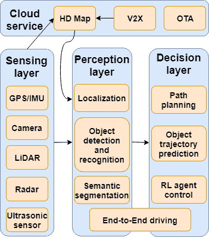
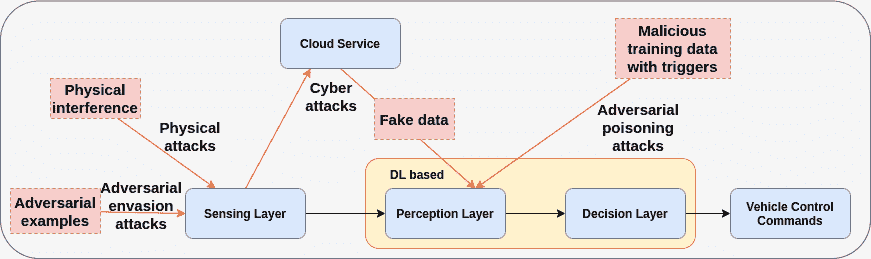
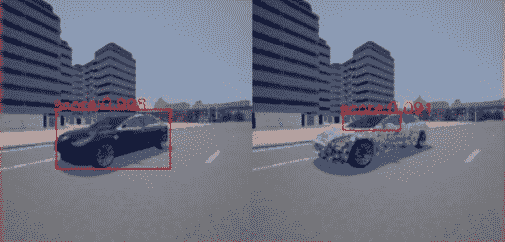
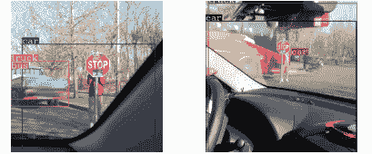
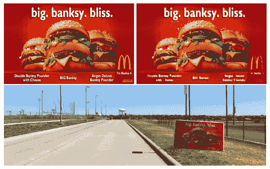
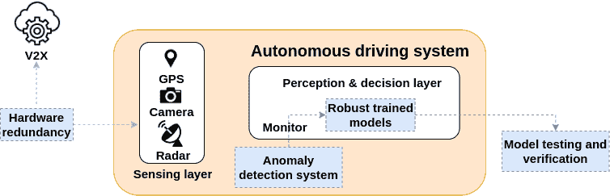

<!--yml

分类：未分类

日期：2024-09-06 19:56:06

-->

# [2104.01789] 基于深度学习的自动驾驶系统：攻击与防御的调查

> 来源：[`ar5iv.labs.arxiv.org/html/2104.01789`](https://ar5iv.labs.arxiv.org/html/2104.01789)

# 基于深度学习的自动驾驶系统：攻击与防御的调查

Yao Deng、Tiehua Zhang、Guannan Lou、Xi Zheng、Jiong Jin 和 Qing-Long Han 这项工作部分由澳大利亚研究委员会联接项目资助，资助编号 LP190100676。Yao Deng、Guannan Lou 和 Xi Zheng 现为澳大利亚悉尼麦考瑞大学计算系成员（电子邮件：yao.deng@hdr.mq.edu.au; lougnroy@gmail.com; james.zheng@mq.edu.au）。Tiehua Zhang、Jiong Jin 和 Qing-Long Han 现为澳大利亚墨尔本斯温伯恩科技大学软件与电气工程学院成员（电子邮件：tiehuazhang@swin.edu.au; jiongjin@swin.edu.au; qhan@swin.edu.au）。

###### 摘要

人工智能的快速发展，特别是深度学习技术，推动了自动驾驶系统（ADSs）的进步，提供了几乎可以应对任何驾驶事件的精确控制决策，从抗疲劳安全驾驶到智能路线规划。然而，ADSs 仍然面临来自不同攻击的日益增加的威胁，这些威胁可以分为物理攻击、网络攻击和基于学习的对抗攻击。不可避免地，基于深度学习的自动驾驶的安全性和保障受到这些攻击的严重挑战，必须全面分析和研究应对措施，以减少所有潜在风险。该调查提供了对可能危害 ADSs 的不同攻击的深入分析，以及相应的最先进防御机制。分析通过深入概述 ADS 工作流程中的每一步展开，涵盖了各种深度学习模型的对抗攻击以及物理和网络环境中的攻击。此外，建议了一些有前景的研究方向，以提高基于深度学习的自动驾驶安全性，包括模型鲁棒性训练、模型测试和验证，以及基于云/边缘服务器的异常检测。

###### 关键词：

自动驾驶，深度学习，网络攻击，对抗攻击，防御

## 引言

随着人工智能技术的发展，自主驾驶在学术界和工业界都受到相当大的关注。从 1987 年到 1995 年，最早的自主驾驶项目之一——Eureka PROMETHEUS 项目（PROgraMme for a European Traffic of Highest Efficiency and Unprecedented Safety）[1]由戴姆勒-奔驰公司实施。2005 年，举办了一场著名的自主驾驶竞赛——DARPA [2] Grand Challenge。从那时起，许多先进自主驾驶系统（ADSs）的开发和改进方案陆续提出。目前，自主驾驶汽车仍在经历从第 0 级（无自动化）到第 4 级（高度自动驾驶）五个级别的转型。像特斯拉 [3] 这样的公司大多专注于开发第 3 级 ADS，这些系统能够在某些条件下（如高速公路上）实现有限的自动驾驶。领先者谷歌 Waymo [4] 目前致力于研究和工业化第 4 级 ADS，这些系统在大多数情况下不需要人类干预。更重要的是，人们已经达成共识，认为自主驾驶汽车的出现将显著改善人们的驾驶体验。然而，自主驾驶汽车的研究仍处于初级阶段。一些关键问题，尤其是与安全相关的问题，需要在全面工业化之前得到妥善解决。例如，最近 Uber 车辆的致命事故 [5] 显示了优先研究自主驾驶安全性的重要性。

深度学习，作为人工智能中最流行的技术，广泛应用于自动驾驶车辆以完成不同的感知任务以及进行实时决策。图 1 展示了基于深度学习的自动驾驶系统（ADS）的工作流程和架构。简而言之，由各种传感器收集的原始数据和来自云端的高清（HD）地图信息首先被输入到感知层的深度学习模型中，以提取环境的周围信息，然后，决策层中的不同指定的深度/强化学习模型启动实时决策过程。例如，在百度 Apollo [6] 中，该系统应用于百度 Go Robotaxi 服务 [7]，在感知和决策模块中使用了多种深度学习模型。特斯拉也部署了先进的 AI 模型进行物体检测，以实现 Autopilot [8]。然而，采用这种管道结构的基于深度学习的 ADSs 进一步发展的过程中存在许多问题。首先，传感器容易受到多种物理攻击，在这些攻击下，大多数传感器无法正常工作，无法以良好的质量收集数据，或者可能被恶意指令收集虚假数据，导致所有后续层的学习模型性能严重下降。此外，最近的研究表明，深度神经网络容易受到对抗性攻击 [9]，这些攻击专门设计用来引导学习模型产生错误的预测。最常见的对抗性攻击是构造所谓的对抗样本，这些样本与原始输入仅有微小差异，以迷惑模型中的神经元。先前的研究文献中有一些结果集中在研究这些对抗性攻击 [9, 10, 11, 12, 13, 14, 15, 16, 17, 18, 19, 20, 21]，显示了这些威胁对基于深度学习的 ADSs 安全性的重大影响。

ADS 的潜在风险对自主车辆的开发和部署具有影响。如果自主车辆在运行时无法确保安全，它们将不会被公众接受。因此，弄清楚深度学习基础的 ADS 是否存在漏洞、如何被攻击、攻击可能造成的损害程度以及提出了哪些防御措施是至关重要的。行业需要这些信息和进一步的见解，以提高 ADS 的安全性和鲁棒性。尽管之前对自主车辆和自主车辆网络的安全威胁和防御进行了研究 参考文献 [22, 23]，但没有研究深度学习基础的 ADS 中的安全问题。另一方面，大多数安全深度学习研究集中在图像分类任务上的对抗攻击。例如，在[24]和[25]中，对计算机视觉任务的对抗攻击和防御进行了详细介绍。然而，这些工作没有涉及深度学习系统在更复杂的自主驾驶任务中的攻击和防御分析。

因此，本文进行了一项全面的调查，汇集了最近对深度学习基础的 ADS 工作流程、最先进攻击及相应防御策略的研究努力。本文的贡献如下：

+   •

    对深度学习基础的 ADS 管道中各种攻击进行了详细的回顾和分析。

+   •

    深度学习基础的自动驾驶系统（ADS）的最先进攻击方法及防御方法被全面阐述。

+   •

    提出了应用新攻击以及保护和提高深度学习基础的 ADS 鲁棒性的未来研究方向。

论文组织如下：第 II 节介绍了深度学习基础的 ADS 的管道细节以及对系统采取的潜在威胁模型。第 III 节介绍了管道中可能发生的不同攻击及其威胁模型。第 IV 节总结了与上述攻击相关的防御方法，并讨论了这些方法在保护 ADS 方面的有效性。第 V 节揭示了未来保护 ADS 的研究方向。第 VI 节给出了结论。

## II 基于深度学习的自动驾驶系统工作流程

基于深度学习的自动驾驶系统通常由三个功能层组成，包括感知层、感知层和决策层，以及一个附加的云服务层，如图 1 所示。在感知层中，使用异构传感器如 GPS、相机、激光雷达、雷达和超声波传感器来收集实时环境信息，包括当前位置和时空数据（例如时间序列图像帧）。另一方面，感知层包含深度学习模型，以分析感知层收集的数据，然后从原始数据中提取有用的环境信息以供进一步处理。决策层则作为决策单元，根据从感知层提取的信息输出有关速度和转向角度的指令。接下来的部分将揭示基于深度学习的自动驾驶系统的工作流程。

图 1: 自动驾驶系统架构

### II-A 感知层

感知层包括异构传感器，用于收集自动驾驶车辆周围的环境信息。领先的自动驾驶车辆公司，如百度，最常使用和部署的传感器包括 GPS/惯性测量单元（IMU）、相机、激光雷达（LiDAR）、雷达和超声波传感器。具体来说，GPS 通过地球静止卫星提供绝对位置数据，而 IMU 则提供方向、速度和加速度数据。

相机也用于捕捉自动驾驶车辆周围的视觉信息，为感知层提供丰富的信息以进行分析，从而使车辆能够识别交通标志和障碍物。此外，激光雷达也用于通过测量物体与车辆之间的距离来帮助检测物体，该距离基于光的反射。这对于更精确的实时定位也很有帮助。此外，雷达和超声波传感器也通过电磁脉冲和超声波脉冲波来检测物体。

### II-B 感知层

在感知层中，通过光流[26]和深度学习模型等算法从原始数据中提取语义信息。目前，摄像头拍摄的图像数据和激光雷达获得的点云数据被广泛应用于感知层的深度学习模型中，用于各种任务，如定位、物体检测和语义分割。

#### II-B1 定位

定位在自动驾驶系统中的路线规划任务中扮演着至关重要的角色。通过利用定位技术，自动驾驶车辆能够获得其在地图上的准确位置，并了解实时的环境信息。目前，定位主要是通过 GPS、IMU、LiDAR 点云和高清地图的融合数据来实现的。具体来说，这些融合数据用于里程估计和地图重建任务。这些任务旨在估计自动驾驶车辆的运动，重建车辆周围的地图，并最终确定车辆的当前位置。在[27]中，CNN 和 RNN 被用来通过相机拍摄的连续图像来估计车辆的运动和姿态。在[28]中，应用了深度自编码器将观察到的图像编码成紧凑的格式，用于地图重建和定位。

#### II-B2 道路物体检测与识别

道路物体检测是自动驾驶车辆面临的一个关键问题，因为在实时和不断变化的环境中正确检测大量不同形状的物体，如车道、交通标志、其他车辆和行人，具有很大的复杂性。在物体检测领域，Faster RCNN [31] 被认为是一种有效的图像物体检测方法。You Only Look Once (YOLO) [32] 是另一种著名的物体检测算法，它将检测任务转换为回归问题。目前，基于 LiDAR 的物体检测深度学习模型受到研究人员和行业从业者的广泛研究。VoxelNet [33] 是第一个端到端的模型，直接基于 LiDAR 点云预测物体。PointRCNN [34] 将 RCNN 的架构适应为以 3D 点云作为输入进行物体检测，并取得了优异的性能。

#### II-B3 语义分割

语义分割在自动驾驶中将图像的不同部分语义地分割成特定类别，如车辆、行人和地面。这有助于定位车辆、检测物体、标记车道和重建地图。在语义分割领域，Fully Convolutional Network (FCN) [35] 是一个基本的深度学习模型，能够实现良好的性能，其本质上将普通 CNN 中的全连接层修改为卷积层。此外，PSPNet [36] 是一个著名的语义分割网络，应用了金字塔池化架构来更好地从图像中提取信息。

### II-C 云服务

云服务器通常被用作自动驾驶领域许多依赖资源的服务的服务提供者。首先，自动驾驶公司利用 LiDAR 以及其他传感器在云端构建一个先验的高清地图（HD Map）。高清地图包含大量有价值的信息，如道路车道、标志和障碍物。因此，车辆可以利用这些数据启动预路规划并增强对周围环境的感知。同时，其他自动驾驶车辆的实时原始数据和感知数据可以通过车联网（V2X）服务上传至云端，以帮助保持高清地图的最新，使高清地图能够提供更多相关的实时信息，如同一路上的周围车辆。另一方面，所有应用于自动驾驶车辆的深度学习模型首先在云端的模拟环境中进行训练。当这些模型经过验证后，云端提供空中升级（OTA）以远程升级自动驾驶车辆的软件和深度学习模型。

### II-D 决策层

#### II-D1 路径规划与物体轨迹预测

路径规划被视为自动驾驶车辆的基本任务，它涉及在起始位置和期望目的地之间决定路线，而物体轨迹预测任务要求自动驾驶车辆利用传感器和感知层预测感知障碍物的轨迹。最近，一些研究人员尝试使用逆向强化学习以在路径规划中取得更优的结果。通过学习来自人类驾驶员的奖励函数，车辆被训练成能够生成更像人类的路线[37]。对于轨迹预测，提出了一些 RNN 和 LSTM 的变体[38]以实现高预测精度和效率。此外，Luo 等人尝试了 3D 时空数据和单一 CNN 来预测汽车轨迹[39]。

#### II-D2 通过深度强化学习进行车辆控制

传统的基于规则的算法无法简单地覆盖所有复杂的驾驶场景。因此，训练智能体在不同场景下学习如何行动的深度强化学习在自动驾驶场景中更具前景。在[40]中，提出了一种基于 CNN 的逆向强化学习模型，用于利用在许多普通驾驶场景中收集的 2D 和 3D 数据来规划驾驶路径。在[41]中，提出了一种基于 DQN 的强化学习模型用于自动驾驶的转向控制。

#### II-D3 端到端驾驶

E2E 驾驶模型是一种特殊的深度学习模型，它结合了感知和决策过程。在这种情况下，模型基于环境传感信息预测当前的转向角度和行驶速度。在 [42] 中，一种名为 DAVE-2 系统的 CNN 架构 E2E 驾驶模型以前置摄像头图像作为输入，并预测当前的转向角度。

## III 自动驾驶系统中的攻击

在本节中，我们详细介绍了针对自动驾驶系统的各种攻击。图 2 展示了自动驾驶系统各部分攻击的概述，本节将详细介绍这些攻击。表 I 和 II 总结了对自动驾驶系统的物理攻击和对抗攻击。

图 2：自动驾驶系统各部分攻击的概述

### III-A 传感器的物理攻击

传感层通常被认为是自动驾驶系统（ADS）的前沿层，自然成为对手攻击的目标。攻击者意图通过添加噪声信号或伪造数据信号来降低传感器数据的质量，或者使传感器收集虚假的数据。低质量或甚至虚假的数据会影响感知层和决策层中深度学习模型的性能，进一步影响自动驾驶车辆的行为。在这一威胁模型中，假设对手对自动驾驶车辆上应用的传感器的硬件和规格有一定了解，但不需要了解其他层中深度学习模型的详细信息。因此，对传感层的物理攻击可以被视为对基于深度学习的自动驾驶系统的黑箱攻击。

对传感器的物理攻击中，攻击者可以通过一些外部硬件扰乱从传感器收集的数据或伪造信号以欺骗传感器。在这种情况下，最常见的两种物理攻击是干扰攻击和伪造攻击。

#### III-A1 干扰攻击

干扰攻击被视为最基本的物理攻击，使用特定的硬件向环境中添加噪声，以降低传感器数据的质量，使环境中的物体无法检测到。

在[47]中实验了对摄像头的干扰攻击，攻击者通过向摄像头发射强光来使其失明。当摄像头接收到的光线强度远超正常环境时，摄像头的自动曝光功能无法正常工作，从而导致捕获的图像过度曝光，深度学习模型在感知层无法识别。在实验中设置了不同距离和光强的前/侧面攻击。结果显示，在黑暗环境下的短距离失明攻击会严重损害捕获图像的质量，这意味着在发生这种攻击时，感知系统无法有效识别物体。另一个失明攻击在[49]中进行了实验，攻击者使用激光对摄像头造成温度损害。在[50]中提出了一种针对 LiDAR 的失明攻击，其中 LiDAR 暴露在与其相同波长的强光源下。结果是 LiDAR 未能从光源方向感知物体。在[49]中实验了对超声波传感器和雷达的干扰攻击，其中通过超声波干扰器对四辆车的停车辅助系统发起路边攻击。结果表明，在干扰攻击下，车辆无法检测周围的障碍物。为了攻击雷达，使用了信号发生器和频率倍增器生成电磁波，对特斯拉自动驾驶系统进行攻击，导致自动驾驶系统也受到影响。在[51]中模拟了对超声波传感器的干扰攻击。结果显示，其他方向的超声波传感器可能会显著干扰目标超声波传感器的读数。在[52]中，针对陀螺传感器的声音噪声攻击被发起，这些传感器在无人机（UAV）中使用广泛，导致了一架无人机的坠毁。在[53]中发现，GPS 信号容易受到能够产生大量射频噪声的 GPS 干扰设备的攻击，这可能对导航系统产生不利影响。

#### III-A2 伪装攻击

欺骗是一种攻击方式，攻击者使用硬件在传感器数据收集阶段伪造或注入信号。伪造的信号数据可能会影响对环境的感知，并进一步导致自主车辆的异常行为。在 [47]中，对 LiDAR 进行了伪造攻击。具体而言，由于 LiDAR 可以通过监听光的反射来区分不同位置的物体，伪造信号可能会在真实信号之前返回。因此，LiDAR 接收到伪造信号会导致车辆与物体之间距离的错误计算。基于这个想法，在实验中，将墙壁的真实输出信号延迟，并创建了墙壁的伪造信号，以产生错误的距离信息，并成功使 LiDAR 检测到错误距离的物体。在 [48]中，通过将欺骗性的物理信号注入受害传感器来实现了对 LiDAR 的伪造攻击，这使得 LiDAR 忽略了合法输入。类似地，伪造的超声波脉冲和雷达信号 [49]被用来攻击超声波传感器和雷达。GPS 也是伪造攻击的另一个受害者。2013 年，一艘游艇遇到了 GPS 伪造攻击，导致它偏离了预设的航线 [54]。在 [55]中，提出了一种开源 GPS 伪造生成器，可以阻塞所有合法信号。在 [56]中，实现了一种类似的 GPS 伪造设备，成功攻击了商业民用 GPS 接收器。在 [57]中，提出了一种专门设计用于操控导航系统的 GPS 伪造攻击。一种 GPS 伪造设备可以稍微移动 GPS 位置，然后进一步操控导航系统的路由算法，从而使自主车辆偏离原始路线。除了对传感器的攻击，还有对摄像头的伪造攻击。在 [58]中，提出了一种针对无人机光流传感的伪造攻击。攻击者可以改变地面平面的外观，这将被光流摄像头捕捉到。然后，改变后的图像可能会不利地影响算法处理光流信息的方式，攻击者可以通过这种简单的方法控制无人机。另一种伪造攻击称为中继攻击，通常发生在 LiDAR 上，旨在通过从另一个位置重新发送原始信号来欺骗目标传感器。实验在 [47]中显示，由于中继攻击，LiDAR 检测到了两个不同位置的虚假墙壁。在 [59]中，使用投影仪在车辆的摄像头上投射伪造的交通标志，使车辆将伪造的交通标志解读为真实标志。

表 I: 对 ADS 的物理攻击

| 攻击 | 目标传感器 | 行动 | 影响 | 示例 |
| --- | --- | --- | --- | --- |
| 干扰攻击 | 相机 | 大范围光线致盲攻击 |

&#124; 使图像过曝且无法识别; &#124;

&#124; 造成相机温度损坏 &#124;

| [47] |
| --- |
| LiDAR |

&#124; 强光致盲攻击 &#124;

&#124; 与 LiDAR 波长相同 &#124;

|

&#124; LiDAR 无法感知物体 &#124;

&#124; 光源方向 &#124;

| [50] |
| --- |
| 超声波传感器 | 超声波干扰设备 | 障碍物无法检测 | [49] |
| 超声波传感器 |

&#124; 放置另一个超声波传感器 &#124;

&#124; 与目标物体相反 &#124;

|

&#124; 两个超声波传感器都无法收集 &#124;

&#124; 精确数据 &#124;

| [51] |
| --- |
| 雷达 | 生成电磁波 | 被检测到的障碍物消失 | [49] |
| 陀螺仪传感器 | 声音噪声 | 无人机坠落 | [52] |
| GPS | GPS 干扰设备 | 导航系统无法正常工作 | [53] |
| 欺骗攻击 | LiDAR |

&#124; 中继物体的信号 &#124;

&#124; 另一个位置 &#124;

| LiDAR 检测“幽灵”物体 | [47] |
| --- | --- |

|

&#124; LiDAR, 雷达; &#124;

&#124; 超声波传感器 &#124;

| 伪造虚假信号 |
| --- |

&#124; 传感器检测到错误的距离; &#124;

&#124; LiDAR 忽略合法物体 &#124;

|

&#124; [47], [49] &#124;

&#124; [48] &#124;

|

| GPS |
| --- |

&#124; 使用 GPS 欺骗设备 &#124;

&#124; 注入虚假信号 &#124;

| 导航系统被操控 |
| --- |

&#124; [54], [57], &#124;

&#124; [55, 56] &#124;

|

|

&#124; 光流 &#124;

&#124; 相机 &#124;

|

&#124; 改变 &#124;

&#124; 地面平面 &#124;

| 无人机被接管 | [58] |
| --- | --- |

|

&#124; 相机 &#124;

|

&#124; 使用投影仪进行投射 &#124;

&#124; 欺骗性的交通标志对 ADAS 的影响 &#124;

|

&#124; 车辆将欺骗性 &#124;

&#124; 交通标志识别为真实标志 &#124;

| [59] |
| --- |

### III-B 云服务上的网络攻击

从对手的角度来看，云可能成为许多攻击的目标，因为云与自动驾驶车辆之间的持续通信，这最终可能导致自动驾驶车辆的不稳定。

请注意，高清地图可以通过 V2X 实时更新来自其他车辆的信息。这个过程可能会被攻击者控制。例如，Sybil 攻击[60]和消息伪造攻击[60]旨在干扰自动导航的效率。具体而言，Sybil 攻击集中于 V2X 中的实时高清地图更新，通过伪造 GPS 信息在目标位置系统中创建大量“假司机”。这些攻击旨在通过交通拥堵来欺骗系统，并进一步干扰车辆中的定位和导航任务。对于消息伪造攻击，它们拦截和篡改从车辆到高清地图服务器更新的交通信息，并在通过该服务器更新高清地图信息时伪装其他车辆。

传统的云攻击威胁到 V2X 网络，其中自主车辆连接以交换信息。无论是服务拒绝攻击（DoS）还是分布式拒绝服务攻击（DDoS）[61, 62]，都可能导致服务资源的耗尽，从而导致高延迟甚至 V2X 网络的不可用。在这种情况下，自主车辆可能无法连接到高清地图以获得准确的导航和感知服务，这严重危及自主车辆的安全。

一种攻击变体旨在云中的空中传输（OTA）通道，攻击者可能会劫持云与自主车辆之间的数据传输通道，并将恶意软件注入到车辆中[63]。

然而，由于针对云服务的攻击更多地涉及网络攻击，我们不会在本次调查中详细讨论这些攻击及相应的防御方法。

### III-C 对抗攻击在感知层和决策层的深度学习模型中的应用

近期研究表明，深度学习模型特别容易受到对抗样本的攻击，这些样本在原始输入图像上添加了难以察觉的噪声。尽管对抗样本在人类视角下看起来与正常图像相似，但它们可能会误导深度学习模型产生错误的预测。根据定义，对抗攻击是一种构造此类对抗样本的攻击。因此，由于深度学习模型在感知层和决策层的广泛使用，对抗攻击对自动驾驶系统（ADSs）构成了相当大的威胁。

在本节中，我们首先介绍了对抗攻击的定义以及一些相关概念。然后我们总结了文献综述，回顾了对抗攻击在不同深度学习模型在自动驾驶系统（ADSs）中的进展。

#### III-C1 对抗攻击简介

根据攻击者的能力，对抗攻击可以分为白盒攻击和黑盒攻击。在白盒攻击中，假设攻击者知道目标深度学习模型的所有细节，包括训练数据、神经网络架构、参数和超参数，并且可以访问模型在运行时的梯度和结果。

对抗攻击有两种类型，即发生在模型推断时的对抗规避攻击和发生在模型训练期间的投毒攻击。对抗规避攻击首次在图像分类任务中研究。给定目标深度学习模型$f$和原始图像$x\in\mathcal{X}$及其类别$c$，对抗攻击可以构造一个人眼不可察觉的扰动$\delta$，形成对抗样本$x^{\prime}=x+\delta$，这可以*误导*模型做出错误的预测$c^{\prime}\neq c$。

通常，有三种不同的白盒方法生成对抗样本，即基于梯度的方法、基于优化的方法和基于生成模型的方法。

+   •

    基于梯度的方法：这些攻击方法[10, 11, 12, 13]基于快速梯度符号法（FGSM），如公式(1）所示，通过在原始图像的每个像素上添加损失的梯度来直接生成对抗样本[10]。

    |  | $x^{\prime}=x+\epsilon\,sign(\nabla J_{\theta}(x,c))$ |  | (1) |
    | --- | --- | --- | --- |

+   •

    基于优化的方法：这些攻击方法[9, 14, 16]将问题转化为如下优化问题

    |  | $\operatorname*{argmin}_{x^{\prime}}\alpha&#124;&#124;x-x^{\prime}&#124;&#124;_{p}+\ell(J_{\theta,\textbf{c}^{\prime}}(x^{\prime}))$ |  | (2) |
    | --- | --- | --- | --- |

    其中第一部分是原始图像和对抗图像之间的$L_{p}$距离，第二部分是对抗图像的损失约束[64]。通过解决这个优化问题，可以生成一个对抗图像$x^{\prime}$，该图像在$L_{p}$距离上接近$x$，但被分类为$c^{\prime}$。

+   •

    基于生成模型的方法：这类攻击[19, 20]利用生成模型从原始图像生成针对性的对抗样本。这些方法通常通过优化目标函数来学习生成模型$\mathcal{G}$。

    |  | $\mathcal{L}=\mathcal{L}_{\mathcal{Y}}+\alpha\mathcal{L}_{\mathcal{G}}$ |  | (3) |
    | --- | --- | --- | --- |

    其中，$\mathcal{L}_{\mathcal{Y}}$ 表示对抗样本分类与目标类别之间的交叉熵损失，$\mathcal{L}_{\mathcal{G}}$ 衡量对抗样本与原始图像之间的相似性。

对于黑箱攻击，假设攻击者没有目标模型的先验知识，但他们可以无限制地查询模型并获取模型的输出。生成黑箱对抗样本的三种不同方法如下：

+   •

    基于迁移的方法：发现针对特定模型的对抗图像在处理其他深度学习模型时也有效，这种属性称为对抗样本的迁移性 [64]。因此，攻击者可以基于目标模型的输入和输出实现一个类似的模型，然后对自己的模型进行白箱攻击。基于自己模型构建的对抗样本可以用于攻击目标黑箱模型。

+   •

    基于评分的方法：尽管在黑箱模型中无法直接获取梯度信息，但可以根据目标模型的概率得分输出来估计梯度值，然后用来生成对抗样本 [65]。

+   •

    基于决策的方法：这些方法仅依赖于目标模型的最终决策（例如，top-1 分类结果）来生成对抗样本，基于随机生成的大扰动，然后迭代地减少扰动，同时保持对抗特征 [66]。

对于自动驾驶系统的攻击，黑箱攻击更具现实性。此外，针对自动驾驶系统的攻击应发生在物理世界中，其中传感器从不同的角度、光照条件和距离收集环境信息（例如图像和点云）。因此，本文旨在涵盖在模拟环境和现实世界中实验的物理黑箱规避攻击。

#### III-C2 对自动驾驶系统的对抗性规避攻击

本节首先回顾了在模拟环境中实验的相关攻击，无论是实际世界录制的数据还是模拟的实际世界场景。此外，还回顾了在现实世界中进行的研究，展示了对抗性规避攻击对自动驾驶系统在现实生活中的危害。

在[67]中，提出了一种名为 DeepBillboard 的方法，通过用对抗扰动替换路边的原始广告牌来攻击端到端驾驶模型。具体来说，对抗广告牌是通过前述的基于优化的方法生成的。该方法在三个数据集上的两个端到端驾驶模型上进行了测试，并测试了广告牌在不同位置和角度的不同场景。结果显示，他们的攻击可以使转向角度预测最多偏差 23 度。在[68]中，提出了一种基于贝叶斯优化的方法，生成路面上的黑线画作以伪造车道线，使车辆偏离原始方向。实验在 CARLA 模拟器[69]中进行，结果显示端到端驾驶模型被攻击并偏离了攻击者选择的方向。在[70]中，提出了一种更新的方法，再次应用了基于梯度的优化算法，实现了更快生成黑线并产生更大的偏差。在[71]中，提出了一种基于决策的方法，搜索并制作车辆的对抗纹理。当呈现带有对抗纹理的车辆时，ADS 中物体检测器的平均预测分数和精度急剧下降（如图 3 所示）。此外，一些研究还探讨了在模拟环境中对基于 LiDAR 的物体检测的攻击。在[72]中，提出了一种基于白盒优化的方法来生成对抗点，并展示了如何通过激光将这些点注入原始的障碍物点云中。实验使用了由百度 Apollo 发布的模拟器中的 LiDAR 传感器数据。实验结果表明，攻击的平均成功率高达 90%，而注入的对抗点数量超过 60。第一种针对 LiDAR 的黑盒攻击在[73]中提出，旨在将攻击痕迹插入点云中，以迷惑基于 LiDAR 的物体检测器。KITTI 数据集上的实验结果达到了约 80% 的平均成功率。

图 3：左侧：车辆可以正常检测；右侧：带有对抗纹理的车辆无法识别（图片来源：[71]）

除了在模拟环境下进行的研究外，还有其他研究探讨了现实世界中的对抗性规避攻击。例如，在[74]中提出了一种名为 ShapeShifter 的方法，用于攻击目标检测模型 Faster R-CNN。对抗性扰动是通过解决一个名为“期望变换”的优化问题生成的，该问题旨在创建一个在不同角度和不同光照条件下都能保持鲁棒的扰动。在实验中，对抗性扰动的交通标志被打印到现实世界中。目标攻击成功率和非目标攻击成功率分别报告为 $87\%$ 和 $93\%$。在[75]中，提出了一种生成鲁棒物理扰动的方法。在实验中，攻击者可以打印带有扰动的道路标志，并用这些扰动标志替换真实的道路标志（微妙海报攻击），或仅打印不同颜色的物理扰动作为贴纸并贴在道路标志上（伪装抽象艺术攻击）。在道路测试中，微妙海报攻击和伪装抽象艺术攻击的成功率分别达到了 $100\%$ 和 $84.8\%$，两者都使用了名为 LISA-CNN 的 CNN 模型[76]。

图 4：带有对抗性贴纸的停车标志在不同距离和角度下无法识别（图片来源：77）

在[21]中，提出了一种基于生成模型的方法，称为感知敏感 GAN，其中将注意力模型整合到 GAN 中，以生成对抗性补丁。基于黑箱设置下的物理世界进行的实验表明，这些攻击可以将分类准确率从 86.7% 降低到平均 17.2%。类似地，在[77]中提出的方法可以生成鲁棒的对抗性贴纸，用于攻击目标检测器，有两种模式：隐藏攻击使检测器无法检测到物体，出现攻击使检测器识别错误的物体。除了目标检测器，[79]揭示了在物理世界设置中对 E2E 驾驶模型的攻击。提出了一种名为 PhysGAN 的方法，用于生成与原始广告牌相似的真实广告牌，但它可能使自动驾驶车辆偏离原始路线。实验结果表明，PhysGAN 生成的广告牌可以使 E2E 驾驶模型的转向角度预测偏差达到 19.17 度。

图 5：左上角：原始广告牌；右上角：由 PhysGAN 生成的对抗性广告牌；下方：在现实世界中放置对抗性广告牌（图片来源：79）

#### III-C3 对自适应系统的对抗性中毒攻击

投毒攻击也属于对抗性攻击类型。更具体地说，投毒攻击通过向原始训练数据中注入带有触发器和误导标签的恶意数据，迫使模型学习触发器的特定模式。在推理阶段，当输入包含恶意触发器时，模型会被诱导产生错误的预测。投毒攻击也被认为类似于木马攻击或后门攻击。在 [88] 中，对 E2E 驾驶模型进行了木马攻击模拟。构造了如方块或苹果标志等对抗性触发器，并将其放置在原始输入图像的角落。实验结果表明，如果道路图像中包含这些恶意触发器，车辆可能会轻易偏离预定轨道。在 [89] 中，使用四种不同触发器对四个交通标志识别数据集进行了投毒攻击，其中一个特定类别的交通标志成为目标。实验结果表明，当投毒图像的比例超过 5%时，CNN 模型能够学习触发器的模式，并在这些投毒图像上达到 95%以上的准确率。同时，总测试数据集的整体准确率超过 99%，这表明仅通过观察测试准确率的结果，很难判断模型是否遇到投毒攻击。在 [90] 中，提出了对深度生成模型如 GAN 进行的投毒攻击，用于去除雨滴。恶意数据对被注入到原始训练数据中，迫使 GAN 学习从输入域到输出域的错误映射。实验结果表明，当 GAN 去除雨滴时，它同时将红灯变为绿灯，或改变限速标志上的数字。

### III-D 攻击分析

1\. 物理攻击直接但在一定范围内有限。对传感器的物理攻击可能通过干扰数据收集过程来破坏深度学习模型。然而，这种攻击类型要求目标在对手的接近范围内。例如，摄像头致盲攻击只有在激光光束放置在目标车辆前面时才会发生，这使得此类攻击难以实施。

2\. 网络攻击有害且具有挑战性。对云的网络攻击可能会影响连接在 V2X 网络中的众多自动驾驶车辆，从而导致严重后果。然而，对于云的网络攻击，对手需要伪造云与车辆之间传输的数据或通过大型僵尸网络实施 DDoS 攻击。然而，数据传输过程的加密可能会阻碍这两种攻击，云还可以部署如 [91, 92] 所示的检测系统，在一定程度上防御 DDoS 攻击。

3\. 对抗性攻击是有效的，并且在现实世界中构成威胁。对抗性攻击，特别是躲避攻击，由于黑盒设置中的对抗性扰动的存在，会对深度学习模型构成相当大的风险。表 II 展示了一些研究工作，这些工作实现了黑盒躲避攻击，并从不同角度、距离和光照条件下在模拟环境或真实世界中实验了其方法对端到端驾驶模型或自动驾驶系统感知层中的目标检测器的攻击效果。对于这一类攻击，攻击者可以随意制作恶意贴纸并偷偷粘贴在各处。对抗性污染攻击可能发生在公司间谍有机会污染训练数据的情况下，这种攻击也可能是隐蔽且危险的。因此，总结当前对抗攻击防御的研究是至关重要的。从攻击的角度来看，可能存在更强大的攻击来破坏自动驾驶车辆，从中可以进行进一步的研究。

表 II: 对抗性攻击在自动驾驶中的应用

| 攻击类型 | 攻击目标 | 文献 | 方法 | 攻击设置 | 实验设置 |
| --- | --- | --- | --- | --- | --- |
| 躲避攻击 | 端到端驾驶模型 | [67] |

&#124; 通过 &#124; 用对抗性广告牌替换原始广告牌

&#124; 解决优化问题 &#124;

| 白盒 | 数字数据集 |
| --- | --- |
| [68] |

&#124; 通过贝叶斯方法在路面上绘制黑条 &#124;

&#124; 优化方法 &#124;

| 黑盒 | 模拟环境 |
| --- | --- |
| [70] |

&#124; 通过基于梯度的方法在路面上绘制黑条 &#124;

&#124; 优化方法 &#124;

| 黑盒 |
| --- |
| 目标检测 | [71] |

&#124; 通过 &#124; 在其他车辆上绘制对抗性纹理

&#124; 离散搜索方法 &#124;

| 黑盒 |
| --- |
| 3D 对象检测 | [72] |

&#124; 通过优化生成对抗点 &#124;

&#124; 基于方法 &#124;

| 白盒 |
| --- |
| [73] | 将攻击痕迹插入原始点云 | 黑盒 | 数字数据集 |
| 交通标志识别 | [74] |

&#124; 用对抗性交通标志替换真实交通标志 &#124;

&#124; 通过解决优化问题生成的 &#124;

| 白盒 | 真实世界 |
| --- | --- |
| [75] |

&#124; 粘贴通过优化生成的对抗性贴纸 &#124;

&#124; 交通标志的攻击方法 &#124;

| 白盒 | 真实世界 |
| --- | --- |
| [21] | 通过 GAN 生成可转移的对抗性补丁 | 黑盒 | 真实世界 |
| [77] |

&#124; 通过 &#124; 生成可转移的对抗性交通标志和贴纸

&#124; 特征干扰增强 &#124;

| 黑盒 | 现实世界 |
| --- | --- |
| E2E 驾驶模型 | [79] | 通过 GAN 生成对抗性广告牌 | 白盒 | 现实世界 |
| 中毒攻击 | E2E 驾驶模型 | [64] | 将带触发器的中毒图像添加到训练数据中 | 白盒 |

&#124; 模拟 &#124;

&#124; 环境 &#124;

|

| 交通标志识别 | [89] | 白盒 | 数字数据集 |
| --- | --- | --- | --- |
| 雨滴去除 | [90] | 将带触发器的中毒图像对添加到训练数据中 | 白盒 | 数字数据集 |

## IV 防御方法

在本节中，我们将详细查看一些针对物理攻击和对抗攻击的现有防御方法。我们还将简要讨论云服务的防御。当前对抗规避和中毒攻击的防御局限性在表 III 中进一步分析和总结。

### IV-A 针对物理传感器攻击的防御

在所有物理传感器攻击的对策中，冗余[47, 49, 51] 是防御干扰攻击最有前途的策略。冗余意味着部署多个相同的传感器来收集指定类型的数据，并将它们融合为感知层的最终输入。例如，当攻击者对一个摄像头实施盲目攻击时，其他摄像头仍能收集环境感知所需的正常图像。毫无疑问，这种方法会导致更多的财务成本。此外，传感器数据融合通常被认为是一个难以处理的研究问题。为了提高摄像头的鲁棒性，另一种方法是使用近红外切割滤镜来过滤白天的近红外光，以提高图像质量[47]，但该方法在夜间效果有限。另一种选择是使用光致变色镜片来过滤特定类型的光，以提升摄像头性能。随后，可以减轻对这些摄像头的干扰攻击。对于超声波传感器和雷达，由于在正常工作环境中噪声很少出现，构建一个检测系统来检测即将到来的干扰攻击并不困难[49]。此外，[53]提出了一种用于 GPS 的干扰检测系统，通过来自路边监测站和手机的多个来源加速 GPS 信息，以提高 GPS 信息的准确性。

防御欺骗攻击的一种有效方法是引入数据收集的随机性 [47, 49]。例如，攻击者可能会对 LiDAR 进行准确攻击，因为 LiDAR 有一个固定的探测窗口来接收信号。如果探测时间设置为随机的，攻击者发送伪造信号将变得更加困难。PyCRA 是基于这一理念的欺骗检测系统 [93]。此外，数据融合机制被认为对防御欺骗攻击有效。因此，融合来自摄像头、LiDAR、雷达和超声波传感器的数据可以帮助稳定感知层的性能。

现有传感器攻击存在一些明显的限制。例如，许多攻击需要外部硬件在目标车辆附近短距离内生成噪音和伪造信号。人类可能会识别如车辆前方的摄像头盲区攻击，并接管车辆以避免事故。因此，即使自动驾驶车辆的发展达到了高度自动化水平，车辆中仍然需要设置安全防护作为保障。

### IV-B 云服务防御

在 V2X 地图更新过程中，HD 地图需要确保其真实性和完整性。每个地图包应包含服务提供者的唯一身份。更新过程中也应确保完整性和机密性，以防数据被窃取或篡改。在 [57]中，应用了加密和认证来防御 GPS 数据传输中的消息伪造攻击。在 [94]中，提出了一种基于对称密钥加密的更新技术，用于在服务供应商和车辆之间应用链路密钥，以形成安全的包更新连接。在 [95]中，提出了一种基于哈希函数的更新技术。该技术首先将包分成若干数据片段，然后按递减顺序创建这些数据片段的哈希链。在车辆收集包之前，哈希链中的元素使用预共享的加密密钥进行了编码。

### IV-C 对抗对抗性规避攻击

目前，许多对抗逃避攻击的防御方法已被提出。在本次调查中，我们回顾了现有的防御方法，并将其分为不同的类别。对抗性防御可以分为主动防御和被动防御方法。前者关注于提高目标深度学习模型的鲁棒性，而后者则旨在检测并反制在模型输入前的对抗样本。主要的主动防御方法包括对抗性训练、网络蒸馏、网络正则化、模型集成和认证防御。主要的被动防御方法称为对抗性检测和对抗性变换。虽然大多数防御方法仅在图像分类任务中进行了实验，但这些防御方法的思想可以很好地推广到自主驾驶的其他任务中，考虑到提升模型鲁棒性或对模型输入进行预处理的类似方法不仅限于图像分类。为了验证这些防御是否可以应用于自动驾驶系统，我们在第 IV-E 节中分析和比较了它们。

表 III: 对抗性防御的总结

|  | 名称 | 功能 | 示例 | 分析 |
| --- | --- | --- | --- | --- |
| 主动防御 | 对抗性训练 |

&#124; 基于新的预测训练新的鲁棒模型 &#124;

&#124; 包含对抗样本的数据集。 &#124;

| [10] [11] [13] | 增加时间和资源消耗以进行自主驾驶模型训练；仅对简单攻击有效 |
| --- | --- |
| 防御性蒸馏 |

&#124; 通过蒸馏原始模型的隐藏 &#124;

&#124; 层信息训练新的鲁棒模型 &#124;

| [96] |
| --- |
| 模型集成 |

&#124; 集成多个模型以进行最终决策 &#124;

&#124; 以提高鲁棒性 &#124;

| [97] [98] [99] | 增加资源消耗 |
| --- | --- |
| 网络正则化 |

&#124; 基于新的目标训练鲁棒模型 &#124;

&#124; 包含基于扰动的正则化函数 &#124;

| [100] [101] [102] | 增加时间和资源消耗以进行自主驾驶模型训练；仅对简单攻击有效 |
| --- | --- |
| 认证鲁棒性 |

&#124; 更改模型的架构以使 &#124;

&#124; 对某些对抗样本具有可证明的鲁棒性 &#124;

| [103] [104] [105] |
| --- |
| 被动防御 | 对抗性检测 |

&#124; 通过检测器检测对抗样本或 &#124;

&#124; 验证输入的特征表示； &#124;

&#124; 检测带有触发器的劫持图像或识别 &#124;

&#124; 模型中的中毒攻击 &#124;

|

&#124; [106] [107] [108] &#124;

&#124; [115] [116] [117] &#124;

|

&#124; 如果探测器需要大量资源，它将不可用 &#124;

&#124; 资源 &#124;

|

| 对抗变换 |
| --- |

&#124; 应用变换以转换对抗样本 &#124;

&#124; 返回以清理图像 &#124;

| [109] [110] [111] [112] |
| --- |

&#124; 它们可能会降低 &#124;

&#124; 正常条件下的自动驾驶模型 &#124;

|

#### IV-C1 主动防御

对抗训练最初在 [10] 中提出。这种防御方法旨在在结合原始数据和对抗样本的数据集上重新训练一个更鲁棒的模型。在 [11] 中，实验结果显示对抗训练仅对通过一次操作生成对抗样本的一步攻击有效。在 [13] 中，提出了一种将多个攻击组合在一起的方法，以生成用于对抗训练的对抗样本。然而，它未能提高模型对未见攻击的鲁棒性。

防御性蒸馏在 [96]中被提出。这种防御方法通过使用原始模型的概率对数信息作为软标签来训练新模型。这样训练的新模型对梯度的变化不那么敏感，因此对抗样本的鲁棒性更强。然而，在 [14]中提出了一种新的基于优化的攻击来绕过该防御。

网络正则化方法通过将另一种基于对抗扰动的正则项添加到原始目标函数中来训练模型以应对对抗样本 [100]。在 [101] 中，提出了收缩自编码器，并通过使用层次雅可比矩阵的 $L_{2}$ 范数作为正则项将其推广到神经网络中。在 [102] 中，引入了一个参数 $\alpha$ 来控制整个模型的 Lipschitz 常数。对 CIFAR-10/CIFAR-100 [113] 的实验表明，这种网络正则化模型对 FGSM 攻击的鲁棒性优于原始模型。

模型集成方法旨在通过构建一个集成模型，该模型聚合了多个单独的模型来提高鲁棒性 [97]。在 [98] 中，提出了一种随机自集成的方法，通过对注入模型的随机噪声进行预测平均来得出最终的预测结果。这种方法相当于集成无限数量的噪声模型。在 [99] 中，提出了一种自适应方法来训练具有更大多样性的单个模型。然后，单个模型的集成可以实现更好的鲁棒性，因为攻击在单个模型之间转移更困难。

认证鲁棒性方法旨在提供对抗攻击的可证明防御，使用由多种威胁模型生成的对抗样本[103, 104, 105]。在[103]中，提出了一种称为 PixelDP 的认证防御方法。该方法在原始模型中增加了一层额外的噪声，以实现随机扰动，其大小小于原始输入或特征表示上的阈值。如果注入的扰动小于预定义的阈值，则新模型对对抗样本具有更强的鲁棒性。

#### IV-C2 反应性防御

对抗检测可以通过引入另一个分类器来检测对抗样本，该分类器能够区分对抗样本的特征表示与自然图像。在[106]中，提出了一种内在防御器（I-defender）来识别来自原始图像的对抗样本，适用于未知攻击方法。I-defender 探索目标模型的内在特性，例如正常训练集的隐藏状态分布，然后利用这些内在特性来检测对抗样本。类似地，在[107]中，提出了一种有效的方法来检测包括分布外（OOD）和对抗样本在内的异常样本，适用于具有 softmax 层的 DNN。该方法的思路是使用高斯判别分析[114]来测量测试样本在 DNN 特征空间上的概率密度。在[108]中，提出了一种称为特征压缩的方法，通过压缩每个像素的颜色位深来检测对抗样本。如果原始输入和压缩输入上的预测差异超过阈值，则原始输入更可能是对抗样本。

对抗性变换是一组可以对对抗样本应用变换以将其重新构建为干净图像的方法。在 [109] 中，研究了五种图像变换在防御 FGSM、I-FGSM、DeepFool 和 C&W 攻击中的效果。结果表明，变换对防御对抗扰动有一定效果，而随机变换（如图像裁剪）和不可微分变换（如总变差最小化）则表现出更强的防御能力。在 [110] 中，提出了一个名为 defense-GAN 的框架，它学习图像数据集的底层分布，并能够生成符合该分布的图像。当对抗样本输入到目标模型中时，defense-GAN 生成许多在 $L_{2}$ 距离上与对抗样本相似的图像，然后搜索最佳图像作为目标模型的输入。在 [111] 中，提出了另一种 GAN 模型，称为对抗扰动消除 GAN（APE-GAN），用于去噪对抗样本，它使用对抗样本 $X^{\prime}$ 作为输入，直接输出其对应的去噪图像 $\mathbf{G}(X^{\prime})$。实验确认 APE-GAN 能够防御常见的攻击。在 [112] 中，提出了高层次表示引导去噪器（HGD），通过自编码器网络对对抗样本进行变换。HGD 的关键思想是，它不是最小化生成图像和原始图像之间的 $L_{2}$ 距离，而是缩短目标模型 $f$ 的第 $l$ 层特征表示的距离。实验结果显示，HGD 在 NIPS 对抗性防御竞赛中排名第一 [97]。

### IV-D 对抗性投毒攻击的防御

一些近期研究工作中提出了针对投毒攻击的防御方法。一般的思路是仅检测当前输入图像是否为带有触发器的劫持图像。另一种高层次的想法是识别模型中的投毒攻击，然后移除后门或特洛伊木马。这两种思路都属于反应性对抗检测防御。在 [115] 中，提出了一种名为 STRIP 的检测方法，它比较了原始输入图像和通过叠加来自训练数据的另一张干净图像生成的扰动输入图像的预测。如果输入图像不包含触发器，则输入图像和扰动图像的预测应该不同。然而，如果输入图像被认为包含触发器，则预测应该相同，因为扰动图像也包含触发器，这主导了模型的预测。通过这种方式，可以检测到带有触发器的劫持图像。

在[116]中，提出了一种检测方法，用于通过触发器区分干净的输入图像和恶意图像。该方法基于一个观察结果，即使干净的图像和被劫持的图像被分类为相同标签，最后激活层的输出也会大相径庭。基于这一观察，方法采用了聚类算法来将有毒数据分组。在[117]中，提出了一种全面的方法来识别和缓解模型层面的中毒攻击。首先，为每个标签创建了不同的触发器，然后移除了由检测到的触发器激活的神经元的权重，使触发器失效。实验结果表明，这种方法可以显著降低攻击成功率，有些中毒攻击的成功率甚至从超过 90%降到了 0%。

### IV-E 防御分析

防御物理传感器攻击虽然成本高，但效果显著。冗余防御要求使用多种相同类型的传感器来收集目标数据，并在将数据发送到感知层之前将其合并。尽管这会导致传感器的开支显著增加，但冗余被认为是一种简单而有效的防御干扰攻击的方式。除了成本之外，数据融合的技术问题也需要考虑。

2). 当前的对抗防御方法不适用于自动驾驶车辆。表格 III 总结了评审的防御技术。对于主动防御方法，对抗训练和防御蒸馏需要在原始模型训练后训练一个新的鲁棒模型。然而，自动驾驶模型的训练通常需要大规模的数据集，并且耗时较长。引入这些技术无疑会导致资源开销。此外，对抗训练和防御蒸馏只对处理像 FGSM 这样的简单对抗攻击有效。如前文所述，模型集成方法利用多个模型的结果来提高鲁棒性，但也会导致大量额外的资源开销。另一方面，网络正则化和鲁棒性方法可以集成到自动驾驶模型的训练过程中，而不会产生大量额外的资源开销。然而，值得一提的是，这些方法大多是在具有简单网络架构的深度学习模型上进行实验的，其在自动驾驶系统中的有效性需要进一步验证。对于反应性方法，对抗变换过程在应用于对抗样本时可能会取得令人满意的结果。然而，它在正常输入上的表现可能会下降，这对安全至关重要的自动驾驶车辆来说是不可接受的。至于对抗检测，一些技术建议利用其他分类器来检测对抗样本，但这也是不可行的，因为分类器需要额外的计算资源，并可能违反自动驾驶系统中的严格时限要求。因此，可以在自动驾驶模型中结合其他不会造成较大资源开销的对抗检测方法。此外，还应在未来探索其他有助于提高自动驾驶模型鲁棒性的技术。另外，由于自动驾驶是一个实时交互过程，因此实时监控和防御对于保持自动驾驶车辆的安全至关重要。

图 6：自动驾驶系统防御框架概览

## V 未来方向

在本调查中，我们对一些现有的攻击进行了全面回顾，包括物理攻击和对抗攻击，以及相应的防御方法，并详细分析了它们在基于深度学习的自动驾驶系统中的可用性和局限性。本调查讨论了可能对深度学习自动驾驶模型造成危害的各种对抗攻击，并识别相关的安全威胁。在这一部分，我们揭示了对自动驾驶系统可能的攻击的进一步研究方向以及提高自动驾驶系统对抗对抗攻击鲁棒性的策略。特别是，我们提出了明确适用于当前自主驾驶车辆的潜在检测机制，以防御对抗攻击，因为大多数现有的对抗防御方法最初并未针对基于深度学习的自动驾驶系统设计。

### V-A 未来研究中的潜在攻击

#### V-A1 对整个自动驾驶系统的对抗攻击

大多数现有的攻击相关研究通常关注单一目标（例如，物理攻击摄像头或 GPS）或自动驾驶系统中的子任务（例如，对目标检测器的对抗攻击）。一些研究将自动驾驶系统简化为一个端到端的驾驶模型进行攻击。然而，由于自动驾驶系统由多个层组成，并且来自不同传感器的输入通常会首先融合以提供环境信息，对一个传感器或一个深度学习模型的攻击成功并不一定意味着它会有效地使自动驾驶系统产生错误的控制决策。例如，自动驾驶车辆中的目标检测可能通过基于摄像头和激光雷达的深度学习模型的融合实现，仅攻击其中一个可能不会影响最终的识别结果。因此，研究针对多模态输入模型的攻击和针对完整堆栈自动驾驶系统（如 Apollo 和 Autoware）的攻击至关重要。

#### V-A2 语义对抗攻击

目前，一些研究开始探讨专注于改变特定属性（如光照条件和输入清晰度）以生成自然对抗样本的语义对抗攻击。语义对抗攻击的存在表明，即使没有对抗者，深度学习模型在现实世界中也容易出错，这意味着天气、光线或其他条件很容易巧合地变成语义对抗属性。这种不确定性将对自主驾驶车辆构成意外威胁。因此，在实现深度学习模型在自动驾驶系统中更好性能和鲁棒性方面，研究语义对抗攻击是必要的。

#### V-A3 逆向工程攻击

除了对抗性攻击，针对自动驾驶系统（ADS）的逆向工程攻击也是一个可能的研究方向。例如，在[118]中提出了一种构建元模型的方法，用于预测黑箱分类器的属性。基于提取的属性，可以创建对抗样本来攻击黑箱分类器。此外，还可以使用侧信道分析技术[119]来恢复神经网络的参数。由于深度学习模型现在在行业中被广泛应用，因此应该安全地保护模型结构和参数中包含的有价值信息。简单来说，模型应该足够稳健，以抵御各种逆向工程攻击，从而保持模型的完整性和稳定性。

### V-B 增强鲁棒性的策略

基于已审查的攻击和防御，我们提出了一个防御框架，以提高自动驾驶系统的鲁棒性，如图 6 所示。该框架可以在行业中应用于实际操作。具体来说，我们提出了四种策略：硬件冗余、鲁棒模型训练、模型测试与验证以及异常检测，这些策略可以在未来进行研究。

#### V-B1 硬件冗余

正如在章节 V-A1 中讨论的，目前的攻击仅关注自动驾驶系统中的一个特定目标，因此应用多个传感器感知环境是一种提高鲁棒性的良好方式。此外，随着 V2X 的发展，自动驾驶车辆可以从路边单元（如监控摄像头）或其他附近车辆接收信息。通过融合来自 V2X 客户端的传感器数据和车辆上传感器收集的数据，感知环境信息会更能抵御被转化为对抗性输入的风险。

#### V-B2 模型鲁棒性训练

从对抗防御的角度来看，训练对抗样本自然鲁棒的自动驾驶模型是一个有前景的研究方向。例如，网络正则化遵循了这种思路。然而，许多网络正则化方法仅关注特定的对抗样本。最近，在[120]中，提出了一种通过引入代理损失来提高模型鲁棒性的新的正则化方法。这种方法在 2018 年 NeurIPS 对抗视觉挑战赛中获得了第一名，成功防御了对抗样本。另一种提升鲁棒性的可靠方法是修改模型的网络结构。

#### V-B3 模型测试与验证

在模型训练阶段之后，同样需要对训练好的模型应用可行的测试和验证技术，以测量其对对抗样本的性能。数据驱动的深度学习模型与传统软件有很大不同，因此难以从现有的软件工程测试方法中受益[122]。目前，一些测试和验证工具已被开发出来以应对这个问题。例如，在[123]中，提出了一个白盒框架，用于全面搜索对抗样本。因此，应用测试和验证技术来预防对抗样本是另一个有前景的研究方向。

#### V-B4 实时对抗攻击检测

最后，在部署一个稳健的自动驾驶系统（ADS）之前，急需一个健全的对抗攻击检测和监控系统，作为对各种实时攻击的最后防线。目前的对抗攻击检测方法通常依赖于辅助模型来检测对抗样本，这在资源受限的自动驾驶车辆上可能不可行。因此，如何在不增加资源开销的情况下检测由对抗样本引起的异常行为是一个重要的研究方向。像[107]中在第 IV 节探讨的对抗检测技术，不会在原始自动驾驶模型中引入新的模型或层，因此不会造成大量开销。然而，这些研究仅在公开数据集如 MNIST 和 CIFAR-10 上进行过实验。对真实世界自动驾驶任务的数据集进行全面实验是至关重要的。另一个可能的研究方向是在云/边缘服务器上部署异常检测系统，以监控和分析自动驾驶车辆上传的数据。云/边缘服务器具有强大的计算能力，因此我们可以实施更准确的检测方法来检测对抗样本。然而，如何确保及时响应、处理时间同步以及在运行时处理大量传感器数据仍然是未解决的问题。在[124]中，提出了一种去中心化的快速警觉框架，用于以超低延迟识别异常输入。在[128]中，创建了一种高度可扩展的异常检测机制，实现了在高度分布的环境中事件数据的收集和压缩，在响应时间和准确性之间达到了良好的平衡。

## VI 结论

基于深度学习的自动驾驶系统（ADS）是实现更智能自驾系统的关键。然而，该系统对各种攻击非常脆弱。在本次调查中，分析了深度学习基于 ADS 工作流程中的潜在安全威胁攻击，包括物理攻击、网络攻击和对抗攻击。物理攻击直接了当，但展示了某些局限性，这些局限性可以通过防御方法有效应对。网络攻击被认为难以大规模发起，而系统防御方法实施起来较为容易。对抗攻击有效，需要更多的防御方法，因为传统的防御方法在自驾环境中并不适用。在未来的研究中，LiDAR 和深度强化模型上的对抗攻击及逆向工程攻击是需要研究的潜在攻击。为了提高 ADS 的鲁棒性，模型鲁棒性训练、模型测试与验证以及实时对抗攻击检测也应彻底研究。

## 参考文献

+   [1] Eureka，欧洲交通系统最高效率和前所未有安全性的计划，https://www.eurekanetwork.org/，（访问时间：220 年 12 月 1 日）。

+   [2] M. Buehler, K. Iagnemma 和 S. Singh，《2005 年 DARPA 大挑战：伟大的机器人竞赛》，Springer，2007 年。

+   [3] Tesla，特斯拉自动驾驶，https://www.tesla.com/autopilot，（访问时间：2019 年 9 月 30 日）。

+   [4] Waymo，Waymo llc，https://waymo.com/，（访问时间：2019 年 9 月 30 日）。

+   [5] M. Berboucha，Uber 自动驾驶车事故：究竟发生了什么，https://bit.ly/2YKu9WN，（访问时间：2019 年 9 月 30 日）。

+   [6] 百度，ApolloAuto，https://github.com/ApolloAuto/apollo，2020 年。

+   [7] 环球时报，百度在北京全面开放 Apollo Go Robotaxi 服务，https://www.globaltimes.cn/content/1203174.shtml，（访问时间：2021 年 3 月 1 日）。

+   [8] Tesla，自动驾驶，https://www.tesla.com/en_AU/autopilotAI，（访问时间：2021 年 3 月 1 日）。

+   [9] C. Szegedy, W. Zaremba, I. Sutskever, J. Bruna, D. Erhan, I. J. Goodfellow 和 R. Fergus，“神经网络的迷人特性”，发表于 Proc. ICLR, Banff, AB, Canada, 2014 年 4 月。

+   [10] I. J. Goodfellow, J. Shlens 和 C. Szegedy，“解释和利用对抗样本”，发表于 Proc. ICLR, San Diego, CA, USA, 2015 年 5 月。

+   [11] A. Kurakin, I. Goodfellow 和 S. Bengio，“大规模对抗性机器学习”，发表于 Proc. ICLR, Toulon, France, 2017 年 4 月。

+   [12] A. Kurakin, I. J. Goodfellow 和 S. Bengio，“物理世界中的对抗样本”，发表于 Proc. ICLR, Toulon, France, 2017 年 4 月。

+   [13] F. Tramèr, A. Kurakin, N. Papernot, I. J. Goodfellow, D. Boneh 和 P. D. McDaniel，“集成对抗性训练：攻击与防御”，发表于 Proc. ICLR, Vancouver, BC, Canada, 2018 年 4 月。

+   [14] N. Carlini 和 D. A. Wagner，“评估神经网络鲁棒性”，发表于 Proc. SP, San Jose, CA, USA, 2017 年 5 月，第 39–57 页。

+   [15] P. Y. Chen, Y. Sharma, H. Zhang, J. F. Yi, 和 C. Hsieh，“EAD：通过对抗样本对深度神经网络进行弹性网络攻击，”在 Proc. AAAI, 新奥尔良, 路易斯安那州, USA, 2018 年 2 月，pp. 10–17。

+   [16] S. Moosavi-Dezfooli, A. Fawzi, 和 P. Frossard，“DeepFool：一种简单且准确的欺骗深度神经网络的方法，”在 Proc. CVPR, 拉斯维加斯, NV, USA, 2016 年 6 月，pp. 2574–2582。

+   [17] J. Su, D. V. Vargas, 和 K. Sakurai，“针对深度神经网络的单像素攻击，”IEEE Trans. Evolutionary Computation, vol. 23, no. 5, pp. 828–841, 2019 年 10 月。

+   [18] S. Moosavi-Dezfooli, A. Fawzi, O. Fawzi, 和 P. Frossard，“通用对抗扰动，”在 Proc. CVPR, 檀香山, HI, USA, 2017 年 7 月，pp. 86–94。

+   [19] O. Poursaeed, I. Katsman, B. Gao, 和 S. J. Belongie，“生成对抗扰动，”在 Proc. CVPR, 盐湖城, UT, USA, 2018 年 6 月，pp. 4422–4431。

+   [20] C. Xiao, B. Li, J. Zhu, W. He, M. Liu, 和 D. Song，“利用对抗网络生成对抗样本，”在 Proc. IJCAI, 斯德哥尔摩, 瑞典, 2018 年 7 月，pp. 3905–3911。

+   [21] A. Liu, X. Liu, J. Fan, Y. Ma, A. Zhang, H. Xie, 和 D. Tao，“用于生成对抗补丁的感知敏感 GAN，”在 Proc. AAAI, 檀香山, 夏威夷, USA, 2019 年 2 月, vol. 33, pp. 1028–1035。

+   [22] K. Ren, Q. Wang, C. Wang, Z. Qin, 和 X. Lin，“自动驾驶的安全性：威胁、防御与未来方向，”Proceeding of the IEEE, vol. 108, no. 2, pp. 357–372, 2019 年。

+   [23] M. Pham 和 K. Xiong，“关于连接和自动驾驶车辆的安全攻击和防御技术的调查，”CoRR, vol. abs/2007.08041, 2020 年。

+   [24] N. Akhtar 和 A. Mian，“计算机视觉中深度学习的对抗攻击威胁：一项调查，”IEEE Access, vol. 6, pp. 14410–14430, 2018 年。

+   [25] X. Yuan, P. He, Q. Zhu 和 X. Li，“对抗样本：深度学习的攻击与防御，”IEEE Trans. Neural Networks Learn. Syst., vol. 30, no. 9, pp. 2805–2824, 2019 年。

+   [26] A. Agarwal, S. Gupta, 和 D. K. Singh，“移动目标检测的光流技术综述，”在 Proc. IC3I, 诺伊达, 印度, 2016 年 12 月，pp. 409–413。

+   [27] S. Wang, R. Clark, H. Wen, 和 N. Trigoni，“DeepVO：利用深度递归卷积神经网络实现端到端视觉里程计，”CoRR, vol. abs/1709.08429, 2017 年。

+   [28] M. Bloesch, J. Czarnowski, R. Clark, S. Leutenegger, 和 A. J. Davison，“CodeSLAM—学习一种紧凑且可优化的密集视觉 SLAM 表示，”在 Proc. CVPR, 盐湖城, UT, USA, 2018 年 6 月，pp. 2560–2568。

+   [29] M. Lu, W. Chen, X. Shen, H.-C. Lam, 和 J. Liu，“在高度密集的城市区域和建筑工地中定位和跟踪建筑车辆，”Automat. Constr., vol. 16, no. 5, pp. 647–656, 2007 年 8 月。

+   [30] F. Ghallabi, F. Nashashibi, G. El-Haj-Shhade, 和 M. Mittet，“基于激光雷达的车道标记检测用于 HD 地图中的车辆定位，”在 Proc. ITSC, 茂宜岛, HI, USA, 2018 年 11 月，pp. 2209–2214。

+   [31] R. B. Girshick, “快速 R-CNN，”发表于 Proc. ICCV, 圣地亚哥, 智利, 2015 年 12 月, 页码 1440–1448。

+   [32] J. Redmon, S. K. Divvala, R. B. Girshick, 和 A. Farhadi, “你只需看一次：统一的实时目标检测，”发表于 Proc. CVPR, 拉斯维加斯, NV, USA, 2016 年 6 月, 页码 779–788。

+   [33] Y. Zhou 和 O. Tuzel, “Voxelnet：用于点云基础的 3D 目标检测的端到端学习，”发表于 Proc. CVPR, 盐湖城, UT, USA, 2018 年 6 月, 页码 4490–4499。

+   [34] S. Shi, X. Wang, 和 H. Li, “PointRCNN：点云中的 3D 目标提议生成与检测，”发表于 Proc. CVPR, 长滩, CA, USA, 2019 年 6 月, 页码 770–779。

+   [35] J.Long, E. Shelhamer, 和 T. Darrell, “全卷积网络用于语义分割，”发表于 Proc. CVPR, 波士顿, MA, USA, 2015 年 6 月, 页码 3431–3440。

+   [36] H. Zhao, J. Shi, X. Qi, X. Wang, 和 J. Jia, “金字塔场景解析网络，”发表于 Proc. CVPR, 檀香山, HI, USA, 2017 年 7 月, 页码 6230–6239。

+   [37] T. Y. Gu, J. M. Dolan, 和 J. Lee, “类人计划的自动驾驶车辆转向操作，”发表于 Proc. IV, 哥德堡, 瑞典, 2016 年 6 月, 页码 716–721。

+   [38] A. Gupta, J. Johnson, F. F. Li, S. Savarese, 和 A. Alahi, “社会化 GAN：生成对抗网络中的社会可接受轨迹，”发表于 Proc. CVPR, 盐湖城, UT, USA, 2018 年 6 月, 页码 2255–2264。

+   [39] W. Luo, B. Yang, 和 R. Urtasun, “快速与激烈：实时端到端 3D 检测、跟踪和运动预测通过单一卷积网络，”发表于 Proc. CVPR, 盐湖城, UT, USA, 2018 年 6 月, 页码 3569–3577。

+   [40] M. Wulfmeier, D. Z. Wang, 和 I. Posner, “观看这个：城市环境中路径规划的可扩展成本函数学习，”发表于 Proc. IROS, 大田, 韩国, 2016 年 10 月, 页码 2089–2095。

+   [41] P. Wolf, C. Hubschneider, M. Weber, A. Bauer, J. Härtl, F. Durr, 和 J. M. Zöllner, “在真实世界仿真中利用深度 Q 网络学习驾驶，”发表于 Proc. IV, 洛杉矶, CA, USA, 2017 年 6 月, 页码 244–250。

+   [42] M. Bojarski, D. D. Testa, D. Dworakowski, B. Firner, B. Flepp, P. Goyal, L. D. Jackel, M. Monfort, U. Muller, J. K. Zhang, X. Zhang, J. Zhang, 和 K. Zieba, “端到端自驾车学习，”CoRR, vol. abs/1604.07316, 2016 年 4 月。

+   [43] A. Hussein, M.M. Gaber, E. Elyan, 和 C. Jayne, “模仿学习：学习方法的综述，”ACM Computing Surveys, vol. 50, no. 2, 页码 1–35, 2017 年 6 月。

+   [44] F. Codevilla, M. Miuller, A. López, V. Koltun, 和 A. Dosovitskiy, “通过条件模仿学习的端到端驾驶，”发表于 Proc. ICRA, 布里斯班, 澳大利亚, 2018 年 5 月, 页码 1–9。

+   [45] H. Xu, Y. Gao, F. Yu, 和 T. Darrell, “从大规模视频数据集中学习驾驶模型的端到端方法，”发表于 Proc. CVPR, 檀香山, HI, USA, 2017 年 7 月, 页码 2174–2182。

+   [46] M. Sundermeyer, R. Schlüter, 和 H. Ney, “LSTM 神经网络用于语言建模，”发表于 Proc. ISCA, 波特兰, OR, USA, 2012 年 9 月, 页码 194–197。

+   [47] J. Petit, B. Stottelaar, M. Feiri 和 F. Kargl，"对自动化车辆传感器的远程攻击：相机和激光雷达实验"，Black Hat Europe，荷兰阿姆斯特丹，2015 年 11 月。

+   [48] Y. Park, S. Yunmok, S. Hocheol, D. Kim 和 Y. Kim，"这不是你的剂量：对医疗注射泵的传感器欺骗攻击"，在 WOOT 会议中，奥斯汀，美国，2016 年 8 月。

+   [49] C. Yan, W. Xu 和 J. Liu，"你能信任自动驾驶车辆吗：针对自驾车传感器的无接触攻击"，DEF CON，法国巴黎，2016 年 8 月。

+   [50] H. Shin, D. Kim, Y. Kwon 和 Y. Kim，"幻觉与炫目：针对汽车应用激光雷达的对抗光学通道利用"，在 CHES 会议中，台北，台湾，2017 年 9 月，页码 445–467。

+   [51] B. S. Lim, S. L. Keoh 和 V. L. L. Thing，"自主车辆超声波传感器的脆弱性及影响评估"，在 IoTWF 会议中，新加坡，2018 年 2 月，页码 231–236。

+   [52] Y. Son, H. Shin, D. Kim, Y. Park, J. Noh, K. Choi, J. Choi 和 Y. Kim，"通过意图性声音噪声摇晃无人机的陀螺仪传感器"，在 USENIX 会议中，华盛顿特区，美国，2015 年 8 月，页码 881–896。

+   [53] G. Kar, H. A. Mustafa, Y. Wang, Y. Chen, W. Xu, M. Gruteser 和 T. Vu，"检测发出 GPS 干扰的道路车辆"，在 SIGSAC 会议中，斯科茨代尔，美国，2014 年 11 月，页码 621–632。

+   [54] M. Psiaki 和 T. Humphreys，"保护 GPS 免受欺骗对未来导航至关重要"，IEEE 频谱，第 10 卷，2016 年 7 月。

+   [55] Q. Meng, L. T. Hsu, B. Xu, X. Luo 和 A. El-Mowafy，"一种基于开源矢量追踪接收器的 GPS 欺骗生成器"，传感器，第 19 卷，第 18 期，页码 3993，2019 年 5 月。

+   [56] J. S. Warner 和 G. Roger，"简单演示全球定位系统 (GPS) 对欺骗攻击的脆弱性"，安全管理期刊，第 25 卷，第 22 期，页码 19–27，2002 年。

+   [57] K. Zeng, S. Liu, Y. Shu, D. Wang, H. Li, Y. Dou, G. Wang 和 Y. Yang，"你所有的 GPS 都归我们：朝向隐蔽操控道路导航系统"，在 USENIX 会议中，巴尔的摩，美国，2018 年 8 月，页码 1527–1544。

+   [58] D. Davidson, H. Wu, R. Jellinek, V. Singh 和 T. Ristenpart，"通过传感器输入欺骗攻击控制无人机"，在 UNISEX 研讨会中，奥斯汀，美国，2016 年 8 月。

+   [59] D. Nassi, R. B. Netanel, Y. Elovici 和 B. Nassi，"MobilBye：通过相机欺骗攻击 ADAS"，CoRR，卷 abs/1906.09765，2019 年。

+   [60] M. B. Sinai, N. Partush, S. Yadid 和 E. Yahav，"利用社交导航"，CoRR，卷 abs/1410.0151，2014 年 10 月。

+   [61] M. Long, C. Wu 和 J. Y. Hung，"对网络控制系统的拒绝服务攻击：影响与缓解"，IEEE 工业信息学汇刊，第 1 卷，第 2 期，页码 85–96，2005 年 5 月。

+   [62] M. Du 和 K. Wang，"一种用于工业物联网中分布式拒绝服务攻击的 SDN 启用伪蜜罐策略"，IEEE 工业信息学汇刊，第 16 卷，第 1 期，页码 648–657，2020 年 1 月。

+   [63] L. B. Othmane, H. Weffers, M. Mohamad, 和 M. Wolf, “连接车辆的安全性与隐私调查，” 在无线传感器和移动自组网， 第 217–247 页，2015 年。

+   [64] Y. Liu, X. Chen, C. Liu, 和 D. Song, “深入研究可转移的对抗样本和黑盒攻击，” 在 ICLR 会议论文集，法国土伦，2017 年 4 月。

+   [65] P. Chen, H. Zhang, Y. Sharma, J. Yi, 和 C. Hsieh, “Zoo：基于零阶优化的黑盒攻击，针对无需训练替代模型的深度神经网络，” 在 AISec 会议论文集，美国纽约，2017 年 8 月，第 15–26 页。

+   [66] W. Brendel, J. Rauber, 和 M. Bethge, “基于决策的对抗攻击：针对黑盒机器学习模型的可靠攻击，” 在 ICLR 会议论文集，加拿大温哥华，2018 年 2 月。

+   [67] H. Zhou, W. Li, Y. Zhu, Y. Zhang, B. Yu, L. Zhang, 和 C. Liu, “Deepbillboard：系统化的自动驾驶系统物理世界测试，” 在 ICSE 会议论文集，韩国首尔，2020 年 6 月。

+   [68] A. Boloor, K. Garimella, X. He, C. Gill, Y. Vorobeychik, 和 X. Zhang, “攻击端到端自动驾驶模型中的基于视觉的感知，” 系统架构杂志，101766。

+   [69] A. Dosovitskiy, G. Ros, F. Codevilla, A. Lopez, 和 V. Koltun, “CARLA：一个开放的城市驾驶模拟器，” CoRR，第 abs/1711.03938 卷，2017 年。

+   [70] J. Yang, A. Boloor, A. Chakrabarti, X. Zhang, 和 Y. Vorobeychik, “通过快速且可微分的图像合成寻找自动驾驶的物理对抗样本，” CoRR，第 abs/2010.08844 卷，2020 年。

+   [71] T. Wu, X. Ning, W. Li, R. Huang, H. Yang, 和 Y. Wang, “在 CARLA 模拟器中对车辆检测器进行物理对抗攻击，” CoRR，第 abs/2007.16118 卷，2020 年。

+   [72] Y. Cao, C. Xiao, B. Cyr, Y. M. Zhou, W. Park, S. Rampazzi, Q. A. Chen, K. Fu, 和 Z. M. Mao, “激光雷达感知中的对抗传感器攻击，” 在 CCS 会议论文集，英国伦敦，2019 年 11 月，第 2267–2281 页。

+   [73] J. Sun, Y. Cao, Q.A. Chen, 和 Z.M. Mao, “迈向自动驾驶中的鲁棒激光雷达感知：通用黑盒对抗传感器攻击及其对策，” 在 USENIX 安全研讨会论文集，2018 年 8 月，第 877–894 页。

+   [74] S. T. Chen, C. Cornelius, J. Martin, 和 D. H. Chau, “Shapeshifter：针对 Faster R-CNN 目标检测器的鲁棒物理对抗攻击，” 在 ECML PKDD 会议论文集，爱尔兰都柏林，2018 年 9 月，第 3354–3361 页。

+   [75] K. Eykholt, I. Evtimov, E. Fernandes, B. Li, A. Rahmati, C. W. Xiao, A. Prakash, T. Kohno, 和 D. Song, “对深度学习视觉分类的鲁棒物理世界攻击，” 在 CVPR 会议论文集，美国盐湖城，2018 年 6 月，第 1625–1634 页。

+   [76] A. Møgelmose, M. M. Trivedi, 和 T. B. Moeslund, “基于视觉的交通标志检测与分析用于智能驾驶辅助系统：展望与调查，” IEEE 智能交通系统汇刊，第 13 卷，第 4 期，第 1484–1497 页，2012 年 12 月。

+   [77] Y. Zhao, H. Zhu, R. Liang, Q. Shen, S. Zhang, 和 K. Chen, “眼见未必为实: 针对现实世界物体检测器的更鲁棒对抗攻击,” 见于 Proc. SIGSAC, 英国伦敦, 2019 年 11 月, 第 1989-2004 页。

+   [78] N. Papernot, P. D. McDaniel, I. J. Goodfellow, S. Jha, Z. B. Celik, 和 A. Swami, “针对机器学习的实际黑箱攻击,” 见于 Proc. AsiaCCS, 阿联酋阿布扎比, 2017 年 4 月, 第 506–519 页。

+   [79] Z. Kong, J. Guo, A. Li, 和 C. Liu, “PhysGAN: 为自动驾驶生成物理世界抗干扰的对抗样本,” 见于 Proc. CVPR, 美国华盛顿州西雅图, 2020 年 6 月, 第 14254–14263 页。

+   [80] M. Wicker 和 M. Kwiatkowska, “在对抗设置下 3D 深度学习的鲁棒性,” 见于 Proc. CVPR, 美国加州长滩, 2019 年 6 月, 第 11767–11775 页。

+   [81] C. Qi, H. Su, K. Mo, 和 L. J. Guibas, “PointNet: 用于 3D 分类和分割的点集深度学习,” 见于 Proc. CVPR, 美国夏威夷檀香山, 2017 年 7 月, 第 77–85 页。

+   [82] D. Maturana 和 S. Scherer, “Voxnet: 一种用于实时物体识别的 3D 卷积神经网络,” 见于 Proc. IROS, 德国汉堡, 2015 年 9 月, 第 922–928 页。

+   [83] C. Xiang, C. R. Qi, 和 B. Li, “生成 3D 对抗点云,” 见于 Proc. CVPR, 美国加州长滩, 2019 年 6 月, 第 9136–9144 页。

+   [84] S. H. Huang, N. Papernot, I. J. Goodfellow, Y. Duan, 和 P. Abbeel, “对神经网络策略的对抗攻击,” 见于 Proc. ICLR, 法国图盎, 2017 年 4 月。

+   [85] V. Mnih, A. Badia, M. Mirza, A. Graves, T. P. Lillicrap, T. Harley, D. Silver, 和 K. Kavukcuoglu, “深度强化学习的异步方法,” 见于 Proc. ICML, 美国纽约市, 2016 年 6 月, 第 1928–1937 页。

+   [86] J. Kos 和 D. Song, “深入探讨对深度策略的对抗攻击,” 见于 Proc. ICLR, 法国图盎, 2017 年 11 月。

+   [87] Y. Lin, Z. Hong, Y. Liao, M. Shih, M. Liu, 和 M. Sun, “对深度强化学习代理的对抗攻击策略,” 见于 Proc. ICLR, 法国图盎, 2017 年 11 月。

+   [88] Y. Liu, S. Ma, Y. Aafer, W. Lee, J.Zhai, W. Wang, 和 X. Zhang, “对神经网络的特洛伊木马攻击,” 见于 Proc. NDSS, 美国加利福尼亚州圣地亚哥, 2018 年 2 月。

+   [89] H. Rehman, A. Ekelhart, 和 R. Mayer, “神经网络中的后门攻击 - 对多个交通标志数据集的系统评估,” 见于 Proc. CD-MAKE, 英国坎特伯雷, 2019 年 8 月, 第 285–300 页。

+   [90] S. Ding, Y. Tian, F Xu, Q Li, 和 S. Zhong, “对深度生成模型的投毒攻击,” 见于 EAI SecureComm, 2019 年 10 月。

+   [91] F. Zhang, H. Kodituwakku, J. W. Hines, 和 J. Coble, “基于网络、系统和过程数据的工业控制系统多层数据驱动网络攻击检测系统,” IEEE Trans. Industrial Informatics, 第 15 卷，第 7 期，第 4362–4369 页, 2019 年 7 月。

+   [92] Q. Sun, K. Zhang, 和 Y. Shi, “在 DOS 攻击下的网络物理系统弹性模型预测控制,” IEEE Trans. Industrial Informatics, 第 16 卷，第 7 期，第 4920–4927 页, 2020 年 7 月。

+   [93] Y. Shoukry, P. Martin, Y. Yona, S. N. Diggavi, 和 M. B. Srivastava，“Pycra：针对主动传感器的物理挑战响应认证，防御欺骗攻击”，发表于 SIGSAC 会议，科罗拉多州丹佛，美国，2015 年 10 月，页码 1004–1015。

+   [94] S. Mahmud, S. Shanker, 和 I. Hossain，“通过无线通信链路在智能车辆中安全地上传软件”，发表于 IV 会议，拉斯维加斯，内华达，美国，2005 年，页码 588–593。

+   [95] D. Nilsson 和 U. E. Larson， “智能车辆的安全固件更新”，发表于 ICC Workshops 会议，北京，中国，2008 年，页码 380–384。

+   [96] N. Papernot, P. D. McDaniel, X. Wu, S. Jha, 和 A. Swami，“通过蒸馏对抗深度神经网络的对抗性扰动”，发表于 SP 会议，加州圣荷西，美国，2016 年 5 月，页码 582–597。

+   [97] A. Kurakin, I. Goodfellow, S. Bengio, Y. Dong, F. Liao, M. Liang, 和 J. Wang，“对抗攻击和防御竞赛”，CoRR，第 abs/1804.00097 卷，2018 年。

+   [98] X. Liu, M. Cheng, H. Zhang, 和 C. J. Hsieh，“通过随机自集成实现鲁棒神经网络”，发表于 ECCV 会议，德国慕尼黑，2018 年 11 月，页码 369–385。

+   [99] T. Pang, K. Xu, C. Du, N. Chen, 和 J. Zhu，“通过促进集成多样性来提高对抗鲁棒性”，发表于 ICML 会议，加州长滩，美国，2019 年 5 月，页码 4970–4979。

+   [100] Z. Yan, Y. Guo, 和 C. Zhang，“深度防御：训练具有改进对抗鲁棒性的 DNN”，发表于 NeurIPS 会议，蒙特利尔，加拿大，2018 年 12 月，页码 417–426。

+   [101] S. X. Gu 和 L. Rigazio，“朝着对抗样本鲁棒的深度神经网络架构前进”，发表于 ICLR 会议，加州圣地亚哥，美国，2015 年 5 月。

+   [102] M. Cissé, P. Bojanowski, E. Grave, Y. N. Dauphin, 和 N. Usunier，“Parseval 网络：提高对抗性样本的鲁棒性”，发表于 ICML 会议，悉尼，新南威尔士，澳大利亚，2017 年 8 月，第 70 卷，页码 854–863。

+   [103] M. Lecuyer, V. Atlidakis, R. Geambasu, D. Hsu, 和 S. Jana，“具有差分隐私的对抗样本的认证鲁棒性”，发表于 SP 会议，加州旧金山，美国，2019 年 5 月，页码 656–672。

+   [104] A. Raghunathan, J. Steinhardt, 和 P. Liang，“针对对抗样本的认证防御”，CoRR，第 abs/1801.09344 卷，2018 年。

+   [105] E. Wong 和 Z. Kolter，“通过凸外对抗多面体的可证明防御”，发表于 ICML 会议，斯德哥尔摩，瑞典，2018 年 7 月，页码 5286–5295。

+   [106] Z. Zheng 和 P. Hong，“通过建模深度神经网络的内在特性来强健地检测对抗性攻击”，发表于 NeurIPS 会议，蒙特利尔，加拿大，2018 年 12 月，页码 7924–7933。

+   [107] K. Lee, K. Lee, H. Lee, 和 J. Shin，“用于检测分布外样本和对抗攻击的简单统一框架”，发表于 NeurIPS 会议，蒙特利尔，加拿大，2018 年 12 月，页码 7167–7177。

+   [108] W. Xu, D. Evans, 和 Y. Qi，“特征压缩：检测深度神经网络中的对抗性样本”，CoRR，第 abs/1704.01155 卷，2017 年。

+   [109] C. Guo, M. Rana, M. Cissé, 和 L. V. D. Maaten，“通过输入变换对抗对抗性图像”，发表于 ICLR 会议，加拿大不列颠哥伦比亚省温哥华，2018 年 4 月。

+   [110] P. Samangouei, M. Kabkab, 和 R. Chellappa，“Defense-gan：利用生成模型保护分类器免受对抗攻击”，发表于 ICLR 会议，加拿大不列颠哥伦比亚省温哥华，2018 年 4 月。

+   [111] G. Jin, S. Shen, D. Zhang, F. Dai, 和 Y. Zhang，“APE-GAN：利用 GAN 消除对抗扰动”，发表于 ICASSP 会议，英国布莱顿，2019 年 5 月，第 3842–3846 页。

+   [112] F. Liao, M. Liang, Y. Dong, T. Pang, X. Hu, 和 J. Zhu，“利用高层表示引导去噪器防御对抗攻击”，发表于 CVPR 会议，美国犹他州盐湖城，2018 年 6 月，第 1778–1787 页。

+   [113] A. Krizhevsky 和 G. Hinton，“从微小图像中学习多层特征”，技术报告，2009 年 4 月。

+   [114] T. Hastie 和 R. Tibshirani，“通过高斯混合进行判别分析”，《皇家统计学会 B 系列统计方法论杂志》，第 58 卷，第 1 期，第 155–176 页，1996 年。

+   [115] Y. S. Gao, C. G. Xu, D. R. Wang, S. P. Chen, D. C. Ranasinghe, 和 S. Nepal，“STRIP：对抗深度神经网络中的特洛伊攻击的防御”，发表于 ACSAC 会议，美国波多黎各圣胡安，2019 年 12 月，第 113–125 页。

+   [116] B. Chen, W. Carvalho, N. Baracaldo, H. Ludwig, B. Edwards, T. Lee, I. Molloy, 和 B. Srivastava，“通过激活聚类检测深度神经网络中的后门攻击”，发表于 AAAI 研讨会，美国夏威夷州檀香山，2019 年 1 月，

+   [117] B. Wang, Y. Yao, S. Shan, H. Li, B. Viswanath, H. Zheng, 和 B. Zhao，“Neural cleanse：识别和缓解神经网络中的后门攻击”，发表于 SP 会议，美国加利福尼亚州旧金山，2019 年 5 月，第 707–723 页。

+   [118] S. J. Oh, B. Schiele, 和 M. Fritz，“反向工程黑箱神经网络”，发表于《可解释的 AI：解释、说明和可视化深度学习》，2019 年 9 月，第 121–144 页。

+   [119] L. Batina, S. Bhasin, D. Jap, 和 S. Picek，“CSI NN：通过电磁侧信道逆向工程神经网络架构”，发表于 UNISEX 会议，美国加利福尼亚州圣克拉拉，2019 年 8 月，第 515–532 页。

+   [120] H. Y. Zhang, Y. D. Yu, J. T. Jiao, E. P. Xing, L. E. Ghaoui, 和 M. I. Jordan，“理论上原则性的鲁棒性和准确性之间的权衡”，发表于 ICML 会议，美国加利福尼亚州长滩，第 97 卷，2019 年 6 月，第 7472–7482 页。

+   [121] M. Lécuyer, V. Atlidakis, R. Geambasu, D. Hsu, 和 S. Jana，“具有差分隐私的对抗样本的认证鲁棒性”，发表于 SP 会议，美国加利福尼亚州旧金山，2019 年 5 月，第 656–672 页。

+   [122] C. Murphy, G. E. Kaiser, 和 M. Arias，“机器学习应用的软件测试方法”，发表于 SEKE 会议，美国马萨诸塞州波士顿，2007 年 7 月。

+   [123] X. W. Huang, M. Kwiatkowska, S. Wang, 和 M. Wu，“深度神经网络的安全性验证”，发表于 CAV 会议，德国海德堡，2017 年 7 月，第 3–29 页。

+   [124] G. Li, K. Ota, M. Dong, J. Wu, 和 J. Li, “Desvig: 去中心化的快速警觉系统对抗工业人工智能系统中的对抗攻击,” IEEE Trans. Industrial Informatics, 卷 16, 期 5, 页 3267–3277, 2020 年 5 月。

+   [125] X. Zheng, C. Julien, R. M. Podorozhny, F. Cassez, 和 T. Rakotoarivelo, “高效且可扩展的网络物理系统运行时监控，” IEEE Systems Journal, 卷 12, 期 2, 页 1667–1678, 2018 年 6 月。

+   [126] W. Lu, Y. Zhou, G. Wan, S. Hou, 和 S. Song, “L3-net: 基于学习的激光雷达定位用于自动驾驶,” 在 Proc. CVPR, 洛杉矶, CA, USA, 2019 年 6 月, 页 6389–6398。

+   [127] W. Zhang 和 C. Xiao, “Pcan: 利用上下文信息进行点云检索的 3D 注意力图学习,” 在 Proc. CVPR, 洛杉矶, CA, USA, 2019 年 6 月, 页 12436–12445。

+   [128] X. Zheng, C. Julien, R. M. Podorozhny, F. Cassez, 和 T. Rakotoarivelo, “高效且可扩展的网络物理系统运行时监控，” IEEE Systems Journal, 卷 12, 期 2, 页 1667–1678, 2018 年 6 月。

| ![[未标注图像]](img/7b3f2e0e90fc4f4db415ea15ab10c076.png) | 姚邓 (S’21) 于 2018 年 3 月获得澳大利亚迪肯大学信息技术学士学位，2018 年 7 月获得中国西南大学软件工程学士学位，并于 2020 年获得澳大利亚麦考瑞大学计算学研究硕士学位。他目前在麦考瑞大学攻读博士学位。他的研究兴趣包括对抗攻击与防御、变形测试、模拟测试和自动驾驶系统中的异常检测。 |
| --- | --- |
| ![[未标注图像]](img/fa51cf29bed2d20dd8469e7d525e44c8.png) | 张铁华 (S’21) 于 2013 年获得中国吉林大学计算机科学与技术学院的学士学位，2015 年获得澳大利亚墨尔本大学计算与信息系统学院的硕士学位，并于 2020 年获得澳大利亚斯威本科技大学软件与电气工程学院的博士学位。随后，他在麦考瑞大学计算系担任博士后研究员。2015 年至 2017 年，他在澳大利亚担任软件工程师，专注于工业项目和解决方案。他目前在中国蚂蚁集团担任 AI 专家。他的研究兴趣包括协作学习/优化、物联网、雾计算和边缘智能。 |
| ![[未标注的图片]](img/a1b25dbf25fa3abc32b8c2f894b13452.png) | Guannan Lou (S’21) 于 2018 年 3 月获得澳大利亚迪肯大学的信息技术学士学位，于 2018 年 7 月获得中国西南大学的软件工程学士学位，并于 2020 年获得澳大利亚悉尼大学的数据科学硕士学位。目前，他正在麦考瑞大学攻读博士学位。他的研究兴趣包括机器学习、机器学习安全、变形测试和自然语言处理。 |
| ![[未标注的图片]](img/47ad9f60a4094a83896e91e4518cde87.png) | Xi Zheng (M’12) 于 2015 年在德克萨斯大学奥斯汀分校获得软件工程博士学位。从 2005 年到 2012 年，他担任 Menulog 澳大利亚的首席解决方案架构师。他目前是智能系统研究组（ITSEG.ORG）的主任、讲师（即美国副教授）以及麦考瑞大学软件工程副项目负责人，所在地点为澳大利亚悉尼。他的研究兴趣包括 CPS 验证、机器学习安全、人车交互、边缘智能和智能软件工程。他有多篇被引用频次很高的论文，并曾担任 IEEE 国际普适计算与通信会议（PerCom）（CORE A*）和国际计算与通信中的信任、安全和隐私会议（TrustCom）（CORE A）的程序委员会成员。 |
| ![[未标注的图片]](img/b13158f724bc96dc7d6df903a801434b.png) | Jiong Jin (M’11) 于 2006 年在新加坡南洋理工大学获得计算机工程一等荣誉学士学位，并于 2011 年在澳大利亚墨尔本大学获得电气与电子工程博士学位。从 2011 年到 2013 年，他在墨尔本大学电气与电子工程系担任研究员。他目前是澳大利亚斯威本科技大学软件与电气工程学院的副教授。他的研究兴趣包括网络设计与优化、边缘计算与分布式系统、机器人技术与自动化，以及网络物理系统和物联网及其在智能制造、智能交通和智能城市中的应用。 |
| ![[未标注图片]](img/74b7e089252e14713bb354efbaafea38.png) | **韩青龙**（M’09-SM’13-F’19）于 1983 年获得中国济南山东师范大学的数学学士学位，1992 年和 1997 年分别获得中国上海东华大学控制工程硕士和博士学位。韩教授是澳大利亚墨尔本斯威本科技大学的研究质量副校长和杰出教授。他曾在澳大利亚格里菲斯大学和中央昆士兰大学担任过多个学术和管理职位。他的研究兴趣包括网络控制系统、多代理系统、时延系统、智能电网、无人水面车辆和神经网络。根据 Clarivate Analytics 的数据，韩教授是一位高被引研究员。他是澳大利亚工程师学会的会士。他曾被评为澳大利亚工程与计算机科学领域的前五名终身成就者（《澳大利亚人》2020 年研究杂志）。他获得了 2021 年 M. A. Sargent 奖，该奖项由澳大利亚工程师学会颁发，以表彰在科学或电气工程实践中的长期杰出贡献。荣誉 M. A. Sargent 奖是澳大利亚工程师学会电气学院的最高奖项，包括一枚铜奖牌和一张证书。他还获得了 2020 年 IEEE 系统、人类和控制论（SMC）学会 Andrew P. Sage 最佳论文奖、2020 年 IEEE 工业信息学交易杰出论文奖，以及 2019 年 IEEE SMC 学会 Andrew P. Sage 最佳论文奖。韩教授是《澳大利亚电气与电子工程杂志》的副编辑，还担任 12 个国际期刊的副编辑，包括 IEEE TRANSACTIONS ON CYBERNETICS、IEEE TRANSACTIONS ON INDUSTRIAL INFORMATICS、IEEE INDUSTRIAL ELECTRONICS MAGAZINE、IEEE/CAA JOURNAL OF AUTOMATICA SINICA、控制工程实践和信息科学，并且是 13 个特刊的客座编辑。 |
