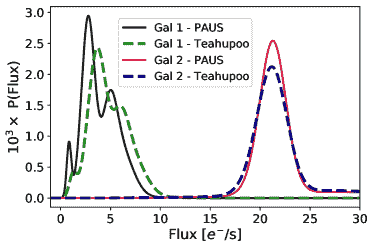
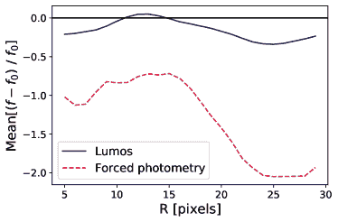
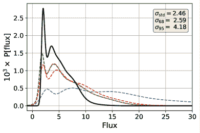

<!--yml

分类：未分类

日期：2024-09-06 19:55:57

-->

# [2104.02778] PAU 调查：使用深度学习估计星系光度

> 来源：[`ar5iv.labs.arxiv.org/html/2104.02778`](https://ar5iv.labs.arxiv.org/html/2104.02778)

# PAU 调查：使用深度学习估计星系光度

L. Cabayol¹，M. Eriksen¹，A. Amara⁴，J. Carretero¹³³脚注标记：3，R. Casas^(2,3)，F. J. Castander^(2,3)，J. De. Vicente⁸，E. Fernández¹，J. García-Bellido⁵，E. Gaztanaga^(2,3)，H. Hildebrandt⁶，R. Miquel^(1,7)，C. Padilla¹，E. Sánchez⁸，S. Serrano²，I. Sevilla-Noarbe⁸，P. Tallada-Crespí⁸³³脚注标记：3

¹高能物理研究所（IFAE），巴塞罗那科学与技术研究所，08193 Bellaterra（巴塞罗那），西班牙

²空间科学研究所（ICE, CSIC），UAB 校园，Carrer de Can Magrans, s/n，08193 巴塞罗那，西班牙

³加泰罗尼亚空间研究所（IEEC），08193 巴塞罗那，西班牙

⁴宇宙学与引力研究所，朴茨茅斯大学，丹尼斯·夏马大楼，伯纳比路，朴茨茅斯 PO1 3FX，英国

⁵马德里自治大学/CSIC 理论物理研究所，28049 马德里，西班牙

⁶波鸿鲁尔大学，物理与天文学学院，天文研究所（AIRUB），

德国宇宙学透镜中心，44780 波鸿，德国

⁷加泰罗尼亚高级研究与研究所，E-08010 巴塞罗那，西班牙

⁸能源、环境与技术研究中心（CIEMAT），西班牙马德里 电子邮件：lcabayol@ifae.es 电子邮件：eriksen@pic.es 还在科学信息港（PIC），UAB 校园，C. Albareda s/n，08193 Bellaterra（Cerdanyola del Vallès），西班牙（接受时间 XXX。收到时间 YYY；原稿时间 ZZZ）

###### 摘要

随着预计来自欧几里得卫星和维拉·C·鲁宾天文台的高质量星系数据的显著增加，对快速高精度测量星系通量的方法的需求也将上升。这些方法对于推断星系的红移至关重要。在本文中，我们介绍了 Lumos，一种用于从星系图像中测量光度的深度学习方法。Lumos 基于 BKGnet，一种预测背景及其相关误差的算法，并预测背景扣除后的通量概率密度函数。我们已经为“加速宇宙物理调查”（PAUS）的数据开发了 Lumos，这是一项使用 40 个窄带滤光镜相机（PAUCam）的成像调查。PAUCam 图像受散射光的影响，显示出可以预测和校正的背景噪声模式。与光圈光度算法相比，Lumos 平均将观测的信噪比提高了 2 倍。它还具有其他优势，如对扭曲伪影（例如宇宙射线或散射光）的鲁棒性、去混叠能力以及对用于推断光度的星系轮廓参数的不确定性的较低敏感性。实际上，与光圈光度法相比，标记的光度异常观测数量从 10%减少到 2%。此外，使用 Lumos 光度，Deepz 机器学习光度红移代码的光度红移散布减少了约 10%，光度红移异常率降低了 20%。虽然光度红移的改进低于从信噪比增加中预期的水平，但目前光度校准和光度中的异常值似乎是其限制因素。

###### 关键词：

技术：光度测量 – 技术：图像处理 – 星系：光度测量 – 宇宙学：观测^†^†出版年份：^†^†页码范围：PAU 调查：利用深度学习估算星系光度–数据可用性

## 1 引言

宽场银河调查是宇宙学中一种强有力的工具。银河红移是任何宇宙学或银河演化研究中最基本的属性。光谱调查，例如 Sloan 数字天空调查（SDSS，Ahumada 等，2020），可以测量非常高精度的红移，但这仅限于大约一百万个对象（例如 BOSS，Dawson 等，2013）。相比之下，成像调查在对象数量上大约领先 2 个数量级，但这些调查的光谱分辨率较低，从而使红移测量的精度降低。当前和过去的成像调查，例如千度调查（KiDS，de Jong 等，2013），超广角相机 Subaru（HSC，Aihara 等，2018）或黑暗能源调查（DES，DES 合作组等，2021），已经探测到数亿个银河系，而即将进行的调查如 Euclid（Laureijs 等，2011）或 Vera C. Rubin 天文台（LSST，Ivezić 等，2019）将把这个数字提高到数十亿。因此，需要快速而精确的方法来分析和提取银河属性（例如流量、大小、形状）。

有许多不同的算法用于估计银河光度。一个广泛使用的例子是 SExtractor（Bertin & Arnouts，1996），它应用了受 Kron（1980）首次矩算法启发的光圈光度法（Ni 等，2019）。这种技术通过在源周围放置一个光圈并测量光圈内捕获的光来测量目标银河的流量。另一种技术是模型拟合（Heasley，1999），它通过将银河图像拟合到理论模型中来提取其光度。这包括 GaaP（Kuijken，2008）算法，该算法通过将像素化的银河图像拟合到极坐标形状（Refregier，2003；Massey & Refregier，2005）来估计总流量，将银河图像分解成具有明确旋转对称性的分量。

还有许多其他例子，例如 ProFound（Robotham 等，2018），T-PHOT（Merlin 等，2015）和 Tractor（Lang 等，2016），每个算法都经过调整，以在特定数据集上表现优于其他算法。例如，某些光度算法可以优化以在许多混叠的银河图像上表现良好（例如 Boucaud 等，2020），而另一些则旨在改善非常嘈杂的银河的光度。因此，根据数据类型和科学目标，应用不同的方法论来改善光度估计。

尽管所有这些算法已证明有效，但它们也有其不足之处。 aperture photometry 在干净的图像上表现很好，但对于诸如混合星系、可变背景光和宇宙射线等扭曲效应则不够稳健。另一方面，模型拟合对模型参数化很敏感。相比之下，机器学习技术不受此限制，它们学习适应数据的模型。此外，深度学习在图像识别和计算机视觉（例如 Girshick, 2015; Zhao et al., 2019）方面已经证明非常强大，这使它成为处理具有伪影和变异效应的图像的稳健工具。此外，训练好的机器学习算法的评估非常迅速，这在处理大量数据时非常重要。例如，Haigh et al. (2021) 比较了几种源提取代码，并得出结论，目前还没有一种工具足够快速和准确，适合大规模自动分割。

深度学习已经被应用于天文成像光度的不同步骤，例如混合星系的光度（Boucaud et al., 2020）、PSF 模拟（Herbel et al., 2018）、宇宙射线排除（Zhang & Bloom, 2020）或源检测（Hausen & Robertson, 2020）。深度学习技术在目标检测或图像识别任务上的强大能力使这些数据处理步骤，尤其是其他步骤，非常适合应用机器学习。虽然用经典方法处理这些问题可能困难且计算成本高，但深度学习是解决这些问题的有效工具。

在这篇论文中，我们介绍了 Lumos¹¹1 代码可在 https://github.com/PAU-survey/lumos 下的 GPL-3 许可证中获得。——一种基于深度学习的算法，用于从天文图像中提取光度数据。它由一个在输入星系图像上工作的卷积神经网络和一个输出星系通量概率分布的混合密度网络组成。Lumos 基于 BKGnet (Cabayol-Garcia et al., 2020)，一种用于预测和修正强烈变化的天文背景的深度学习算法。Lumos 估计背景去除后的星系通量的概率分布，这需要隐式地估计和去除背景噪声。

我们已经使用来自加速宇宙物理调查（PAUS）的图像开发和测试了 Lumos。PAUS 是一个成像调查，测量高精度的光度红移，能够达到微弱的 $i_{\rm AB}<22.5$，同时覆盖大面积的天空（Martí 等，2014）。这是得益于 PAUCam 仪器（Castander 等，2012; Padilla 等，2016, 2019），它配备了 40 个窄带滤光片，覆盖光学光谱（Casas 等，2016）。使用模板拟合算法 BCNz2（Eriksen 等，2019），PAUS 对最佳 50% 样本的光度红移精度达到 $\sigma(z)/(1+z)\approx 0.0035$，而广带测量的典型精度为 0.05。使用 Delight，一种结合了高斯过程的混合模板-机器学习光度红移算法（Soo 等，2021），可以获得类似的结果。两种方法都通过 Deepz（Eriksen 等，2020）得到了进一步改进，Deepz 是一种深度学习算法，用于测量光度红移，将 $\sigma_{\rm 68}$ 的散布减少了 50%，相对于模板拟合方法，在较暗的星系中效果最佳。此外，Alarcon 等（2021）展示了在 COSMOS 区域计算的高精度光度红移目录，使用了 PAUS NB 和 26 个宽带、中带和窄带的组合，覆盖 UV、可见光和近红外光谱。尽管 Lumos 是为 PAUS 开发的，但它可以适用于任何成像调查，例如 Euclid 或 Rubin。

本文的结构如下。在 $\S$2 中，我们介绍了本文使用的 PAUS 数据和用于训练的模拟数据。3 节介绍了我们用来与 Lumos 性能进行比较的不同流量估计替代方案。在 §4 中，我们介绍了 Lumos 及其架构和训练程序。5 节展示了 Lumos 在模拟数据上的结果，包括流量概率分布的验证、与其他流量估计方法的比较以及去混叠测试。最后，$\S$6 展示了 Lumos 在 PAUS 数据上的结果，包括单次曝光光度、叠加流量和通过 Lumos 光度测得的光度红移。结论和讨论可以在 §7 中找到。

## 2 数据

在本节中，我们展示了 PAUS 数据（$\S$2.1）和 Teahupoo 模拟（$\S$2.2），这些模拟的星系图像在整个论文中被使用。

### 2.1 PAUS 数据

PAUS 数据由威廉·赫歇尔望远镜（WHT）在西班牙加那利群岛拉帕尔马岛的 Observatorio del Roque de los Muchachos 进行观测。图像通过 PAUCam 仪器（Castander 等， 2012；Padilla 等， 2019）获得，这是一种配备了 40 个窄带滤光片的光学相机（Casas 等， 2016）。窄带滤光片的全宽半最大值（FWHM）为 130Å，连续波段之间的间隔为 100Å。相机配备了 18 个对红光敏感的完全耗尽的 Hamamatsu CCD 探测器（Casas 等， 2012），但目前仅使用其中 8 个中央 CCD 进行窄带成像。每个 CCD 的像素为 4096x2048，像素尺度为 0.263 角秒/像素。窄带滤光片安装在五个托盘中，每个托盘上有 8 个滤光片，可以更换并放置在中央 CCD 前面。窄带滤光片组有效地测量低分辨率光谱（$R\approx 50$）。

PAUS 从 2015B 学期开始观测，截至 2021A，PAUS 已经进行了 160 个晚上的观测。它部分覆盖了 CFHTLS 区域²²2http://www.cfht.hawaii.edu/Science/CFHTLS_Y_WIRCam

/cfhtlsdeepwidefields.html W1、W2 和 W3 以及 COSMOS 区域³³3http://cosmos.astro.caltech.edu/。目前，PAUS 数据在 W1 和 W2 区域覆盖了 10 平方度，在 W3 区域覆盖了 20 平方度，并且覆盖了 COSMOS 区域的 2 平方度。PAUS 数据存储在 Port d’Informació Científica (PIC) 中，数据在那里进行处理和分发（Tonello 等， 2019）。

#### 2.1.1 COSMOS 样本

本论文重点关注来自 COSMOS 区域的数据（Lilly 等， 2009），这些数据是在 2015B、2016A、2016B 和 2017B 学期中获得的。这些数据用于 BKGnet 论文以及迄今为止所有已发表的 photo-z 研究。COSMOS 区域观测包括总计 9749 张图像，每个窄带有 243 张图像。在观测 COSMOS 时，PAU 相机进行了修改，以通过在每个滤光片托盘的窄带滤光片边缘引入遮光板来减轻散射光的影响。这次相机干预改变了 PAUS 图像的噪声模式。COSMOS 区域的一半图像是在相机修改前拍摄的，另一半是在之后拍摄的。COSMOS 区域的基准曝光时间从最蓝的滤光片托盘到最红的滤光片托盘分别为 70、80、90、110 和 130 秒。完整的光度目录包含 64,476 个星系，$i_{\rm AB}$ < 23，在 40 个窄带滤光片中。这对应于约 1250 万次星系观测（约每个星系和窄带滤光片 5 次观测）。

#### 2.1.2 标准数据处理流程

PAUS 数据处理过程包括两个管道：Nightly 和 MEMBA 管道。Nightly 管道（Serrano et al. in prep.）是第一步，进行仪器去趋势处理，例如电子或照明偏差。电子偏差通过超扫描减法来校正，即用快门关闭和零曝光时间的观察。望远镜校正器的光晕、像素间的变化或坏点通过圆顶平场（10 秒均匀和均匀照明屏幕的曝光）来检测和校正。点扩散函数（PSF）使用 PSFex（Bertin，2011）进行建模，使用来自 COSMOS 高级相机的星观测（ACS，Leauthaud et al.，2007）。使用拉普拉斯边缘检测器（van Dokkum，2001）检测和掩蔽图像中的宇宙射线。狭带图像的天文测量使用 SCAMP（Bertin，2006）进行校准，参考目录为 Gaia DR2 星（Gaia Collaboration et al.，2018）。

MEMBA 管道（Serrano et al. in prep.）是数据处理的第二步。它对从外部检测目录中选择的目标应用强制孔径光度测量（详细信息请参见$\S$3.2）。在 COSMOS 领域，检测母目录由 Ilbert et al.提供（2008），光度校准相对于 SDSS 星（Castander et al. in prep.）。光度校准的简要描述可以在 Eriksen et al.（2019）中找到。

本文开发的机器学习算法提供了一种替代 MEMBA 的方法。它旨在在存在诸如混合或散射光等扭曲效应的情况下更具鲁棒性。它还旨在提供更好的银河系光度测量，即使在母目录银河系轮廓参数存在误差的情况下。

### 2.2 Teahupoo 模拟

图 1：从左到右，Teahupoo 银河图像，$i$-波段亮度为$18.5,20.3$和$22.3$，在 PAUS "NB685"中。这些是模拟的，曝光时间为 90 秒，即"NB685"滤镜中的基准 PAUS 曝光时间。

在这项工作中，我们构建了 Teahupoo⁴⁴4，命名来源于第一作者最喜欢的三明治。模拟了一组 PAUS 样式的银河图像。图 1 中展示了三种 Teahupoo 银河系图像，$i$-波段亮度为$i_{\rm AB}=18.5,20.3$和 22.3。注意到即使在$i_{\rm AB}\approx 20$时也很难将银河与背景噪声区分开，且当$i_{\rm AB}>22$时，银河信号被背景波动视觉上遮蔽。

Teahupoo 光线轮廓使用单一的 Sérsic 轮廓建模。每个星系的生成方式为

|  | $I(R)=I_{\rm e}\exp{\left\{-(2n_{\rm s}-1/3)\left[\left(\frac{R}{R_{\rm 50}}\right)^{\rm 1/n_{\rm s}}-1\right]\right\}},$ |  | (1) |
| --- | --- | --- | --- |

其中 $I_{\rm e}$、$r_{\rm 50}$ 和 $n_{\rm s}$ 分别是表面亮度、半光半径和 Sérsic 指数。由于星系的形状和大小是相关的，为了确保星系的真实性，我们从 COSMOS 领域的分布中联合抽样半光半径、Sérsic 指数和椭圆率。通过根据 COSMOS 领域的 $b/a$ 分布拉伸半光半径来模拟椭圆星系。图 2 显示了 COSMOS 领域 PAUS 星系的 $r_{\rm 50}$（左上）和 Sérsic 指数（右上）的分布，这些数据由 Ilbert 等人提供（2009）。

图 2：COSMOS 领域 PAUS 星系的半光半径 ($r_{\rm 50}$)（左上）、Sérsic 指数 ($n_{\rm s}$)（右上）、PSF FWHM（左下）和 $I_{\rm auto}$ 星等（右下）的分布。

Teahupoo 图像模拟是使用 Astropy 生成的 60x60 像素图像（Astropy Collaboration et al., 2013; Price-Whelan et al., 2018）。Astropy 方法在每个像素的中心评估星系轮廓（方程 1），而不是沿像素集成。这对小型和陡峭的星系轮廓（高 $n_{\rm s}$）存在问题，因为沿像素的通量变化显著。为纠正此效应，星系最初在 600x600 网格上绘制，然后进行尺寸缩减。此外，在更大的网格上绘制允许在亚像素级别从中心移动星系。在 Teahupoo 星系图像中包括亚像素偏移也被证明对减少真实 PAUCam 星系的光度异常值非常重要。

Teahupoo 图像使用了真实 PAUCam 图像的背景剪贴。这些剪贴可能包含伪影，如其他银河系、宇宙射线或串扰。这对我们的网络非常重要，因为它学习如何在这些伪影存在时进行预测（参见例如 $\S$5.3 和 $\S$6.1）。背景光噪声模式在 CCD 上依赖于窄带，并且在 PAUCam 相机修改时发生了变化。因此，背景印章是取自使用相同 NB 过滤器观察的 PAUCam 图像，并且我们跟踪它是在相机干预之前还是之后观察的（参见 $\S$4.1）。银河信号也依赖于波长。因此，我们从四十个流量分布中独立采样银河流量，每个 NB 过滤器一个。

模拟的银河与在背景剪贴源图像中检测到的 PSF 进行卷积（Bertin，2011）。COSMOS 领域中的 PSF 分布也显示在图 2（左下角面板）。对银河和背景噪声使用相同的 PSF 至关重要。否则，网络可能会人为地学习到银河与背景有不同的 PSF 并用其来估计干净的流量，这在 PAUCam 数据上是行不通的。在结合背景剪贴和银河之前，我们在银河上模拟光子噪声。请注意，其他的附加噪声源，如读出或电子噪声，并不是必需的，因为背景剪贴已经包含了这些噪声。这是使用真实 PAUCam 背景印章的另一个好处，因为模拟真实噪声通常很困难，并且可能导致模拟和数据之间的差异。

由于模拟是从真实的 PAUS 流量测量和 PAUCam 背景剪裁生成的，这两个数据中的异常值可能最终会在 Teahupoo 图像中出现。这些异常可能包括具有虚假效应的背景图像或目录级别的异常流量测量（即，人工低或高的流量）。为了减少受影响的 Teahupoo 星系数量，用于创建它们的流量分布在 0 和 1000 e^-/s 之间进行裁剪。这确保了图像模拟中既不会出现负流量，也不会出现人工明亮的例子。此外，我们还进行了 PAUCam 图像的视觉检查。这会过滤掉非常差的观测结果，但无法处理 CCD 区域的局部效应，例如饱和像素，因此少数异常值仍会泄漏到 Teahupoo 目录中。

生成 Teahupoo 图像的方法与 Balrog 模拟（Suchyta et al., 2016; Eckert et al., 2020）非常相似。Balrog 和 Teahupoo 之间的主要相似之处在于，两者都在真实的调查图像上添加了模拟星系。相比之下，也存在差异，因为 Balrog 使用 Galsim（Rowe et al., 2015）绘制模拟星系，而 Teahupoo 星系则使用 Astropy 构建。此外，Teahupoo 星系在超分辨率网格中构建，这增加了小物体的分辨率，并允许包含来自印记中心的亚像素位移。

### 2.3 PAUCam 和 Teahupoo 星系的比较

监督学习算法需要一个训练样本，即一组已知解的数据，用于找出网络从输入到输出的非线性映射。拥有一个良好且大的训练样本是训练过程中的关键部分，理想情况下，我们希望在具有已知光度的 PAUCam 图像样本上训练 Lumos。然而，在缺乏这种数据的情况下，我们使用 Teahupoo 图像进行训练。这些模拟需要代表测试数据，小的 PAUS 和 Teahupoo 星系之间的差异可能会导致预测的退化。

为了测试 PAUCam 和 Teahupoo 星系之间的相似性，我们生成了一组受控的 Teahupoo-PAUCam 星系对。对于一个 PAUS 星系，其模拟配对通过 Sérsic 模型构建，使用相同的轮廓参数（`$r_{\rm 50},n_{\rm s}$`）和相同的光量。模拟的背景印记从与其真实 PAUCam 配对图像相同的图像中的无源区域中选取。

图 3 显示了三个 Teahupoo -PAUCam 星系对，其 $i$-带星等分别为 18.6、19.4 和 21.0。该图显示了图像中央行沿的像素值，这些值经过了以印章的平均背景（不包括源）进行标准化。因此，没有星系光贡献的像素应在单位值附近波动，而具有较高值的像素将显示星系光度轮廓。一般而言，PAUS 和 Teahupoo 星系在背景光和光子噪声波动方面匹配良好。左侧第一个图是一个明显的例子。在中间的星系中，两个星系也相当匹配，但它也显示了星系峰值之间的小偏移，可能是由于天体测量的不准确性。右侧图显示了在较暗源上的比较要困难得多，因为较暗的星系几乎无法从背景波动中分辨出来（另见图 1）。

一些因素可能导致 Teahupoo 和 PAUCam 星系之间的差异。例如，数据处理过程中的任何步骤的不准确性，如光度标定、天体测量或 PSF 测量，在模拟中可能不会被完全体现。PSF 就是一个明显的例子，因为目前每个 PAUCam 图像仅取一个 PSF 测量值，假设 PSF 在整个 CCD 上是恒定的，这可能会导致模拟数据之间的差异。此外，如果实际星系无法通过单一的 Sérsic 模型进行建模，这也会导致两幅图像之间的差异。这些差异将会在光度估计中引发更大的误差。然而，请注意，标定、建模或 PSF 中的不准确性也会影响其他光度估计方法（例如孔径光度测定或模型拟合）的测量。此外，Lumos 使用星系图像和建模轮廓图像，这使得它可以提供考虑了星系与模型之间差异的光度不确定性。这也允许检测例如天体测量或 PSF 中的不准确性，这些都会被纳入不确定性测量中（见第 §6.1 段落末尾）。

图 3：PAUCam 星系（实线黑色）与 Teahupoo 模拟星系（虚线浅蓝色）之间的单像素行光谱对比。Teahupoo 星系被构造为精确模仿其真实的 PAUCam 对。图中显示了沿中央像素行（穿过源）的像素值除以平均图像背景噪声。因此，x = 30 处的中央峰值对应于星系光贡献。从左到右，星系的光度为$i_{\rm AB}$ = 18.6, 19.4 和 21.0。

## 3 种通量估计方法

在本节中，我们介绍其他通量估计方法，这些方法将与 Lumos 的性能进行比较。特别地，我们考虑了一个轮廓拟合方法 (§3.1)、孔径光度法 (§3.2) 和星系像素的线性加权和 (§3.3)。

### 3.1 轮廓拟合

在轮廓拟合方法中，背景减去的星系图像被拟合到一个理论星系模型中，以推断轮廓幅度。假设星系可以建模为$I(r)=I_{\rm e}R(r)$，其中$I_{\rm e}$是轮廓幅度，R($r_{\rm i}$)对应于像素 i 处的 Sérsic 光谱，我们可以将图像拟合到理论轮廓中

|  | $\chi^{2}=\sum_{\rm i}\frac{(f_{\rm i}-I(r_{\rm i}))^{2}}{\sigma_{\rm F,i}^{2}},$ |  | (2) |
| --- | --- | --- | --- |

其中 i 对像素求和，f 是背景减去的通量（$f\equiv F-B$，其中 F 和 B 分别为总通量和背景噪声），$I(r_{\rm i})$是像素 i 处的星系理论模型。假设泊松误差，前面的方程变为

|  | $\chi^{2}(I_{e})=\sum_{\rm i}\frac{(f_{\rm i}-I_{e}R(r_{i}))^{2}}{I_{e}R(r_{i})+B},$ |  | (3) |
| --- | --- | --- | --- |

其中 B 是每像素的平均背景。总通量通过最小化方程[3]来测量 $I_{\rm e}$（参见 3）。注意，参数$I_{\rm e}$在方程中出现了两次，这使得闭式解不可行。相反，我们使用了 SciPy 的 Nealder-Mead 算法（Jones 等人，2001）来最小化方程[3]。

### 3.2 孔径光度法

光度测量（Mighell，1999）广泛应用于大量的调查中，例如 DES（Drlica-Wagner 等，2018）或 Pan-STARRS（Magnier 等，2020），以及 PAUS。该方法测量一个半径为 R 的光圈内所有像素的贡献，并减去背景光，即

|  | $f=\iint_{\rm R}{\rm d}A\,\left(S(r)-\bar{b}\right),$ |  | (4) |
| --- | --- | --- | --- |

其中 $S$ 是每像素的信号，$\bar{b}$ 是每像素的背景均值，R 是光圈半径，A 是光圈面积。

在 PAUS 中，光圈是椭圆形的，其面积设置为目标固定量的星系光，在我们的例子中是 62.5% 的通量。因此，获得总通量需要将测量（Eq. 4）缩放 1/0.625。给定目标光百分比，R 是使用与图像 PSF 卷积的模拟星系轮廓（Sérsic 指数、大小、椭圆度）来估计的。背景光是通过测量目标星系中心 $R_{\rm in}=30$ 像素，$R_{\rm out}=45$ 像素的环形区域内像素值的均值来获得的。环内的像素会事先进行 $\sigma$-裁剪，以防止伪影影响背景测量。

### 3.3 加权像素和

在光圈光度测量中，光圈内的所有像素对总通量的贡献相等，即，星系边缘的低 SNR 像素和星系中心的像素贡献相同。从总 SNR 的角度看，这并不理想，尤其是对于小而微弱的星系，其所有信号分布在非常少量的像素中。对每个像素的贡献进行不同的加权可能会提高测量的 SNR。

权重的选择有多种，有些提供的 SNR 高于其他权重。确实要注意，光圈光度测量只是像素加权的一个简单情况，其中光圈内的像素权重为 1，光圈外的像素则不予考虑。

我们感兴趣的加权是提供最优无偏线性解的加权。这意味着无偏估计器提供最大 SNR，可以写成

|  | ${\rm SNR}=\frac{\sum_{\rm i}w_{\rm i}m_{\rm i}}{\sqrt{\sum_{\rm i}w_{\rm i}^{2}(m_{\rm i}+b_{\rm i})}},$ |  | (5) |
| --- | --- | --- | --- |

其中 $b_{\rm i}$、$m_{\rm i}$ 和 $w_{\rm i}$ 分别是背景平均值、信号平均值和像素 i 的最佳权重。将信噪比（Eq. 5）作为像素权重 $w_{i}$ 的函数最大化，得到

|  | $w_{\rm x}=\frac{\sum_{\rm i}m_{\rm i}}{\sum_{\rm i}m_{\rm i}^{2}/(m_{\rm i}+b_{\rm i})}\frac{1}{1+b_{\rm x}/m_{\rm x}},$ |  | (6) |
| --- | --- | --- | --- |

其中 $w_{\rm x}$ 是像素 x 的最优权重（有关更详细的推导，请参见附录 A）。这是提供最精确无偏通量测量的线性估计器。然而，获得方程 6 中的最优权重需要对星系光谱有完美的了解，因此，像素信号和背景噪声的不确定性会降低通量测量的精度。然而，这种方法对线性方法测量星系通量的能力设定了限制，可用于基准测试 Lumos 的性能。

## 4 Lumos：利用 CNN 测量通量

在本节中，我们将介绍 Lumos，我们的深度学习算法，用于测量天体的光度。有关理解本节所需的深度学习概念的简短介绍，可以在附录 B 中找到。我们将讨论 Lumos 输入数据（§4.1）、其架构（§4.2）以及训练过程（§4.3，§4.4）。在 §4.2、§4.3 和 §4.4 中，我们描述了网络架构和训练过程的技术细节，这些细节并不是理解本工作的主要结果所绝对必要的。

### 4.1 输入数据

Lumos 输入由两种类型的数据组成。最重要的输入包括两张 60x60 像素的图像。第一张图像是以目标星系为中心的图像剪切，由于 PAUS 像素比例为 0.263，它覆盖了夜空中的 16x16 角秒。尽管大多数 PAUS 星系的半光半径在 1 到 3 像素之间，不需要如此大的剪切，但在 Cabayol-Garcia 等人（2020）的研究中，我们已经展示了网络需要更大的图像印章以准确建模背景噪声波动和散射光模式。第二张图像包含了使用外部目录参数绘制的卷积星系轮廓。我们测试了其他可能性，如使用真实星系轮廓、PSF 轮廓或两者分开，结果发现卷积星系轮廓效果最佳。请注意，在训练阶段，输入星系剪切是 Teahupoo 图像模拟（见 §2.2），而在测试阶段则是实际星系剪切图像。

虽然网络可以仅使用图像直接估计光度，但我们发现附加信息可以改善结果。这些信息是第二种输入，目前包括：

1.  1.

    从外部目录获得的目标星系的 i 带光度。这不是严格需要的，因为网络在没有这些信息的情况下也能工作。然而，它有助于提供更好的光度不确定性，迄今为止 Lumos 无论如何需要外部目录中的其他信息（星系轮廓、坐标）。

1.  2.

    CCD 坐标。PAUCam 图像包含在 CCD 上具有带依赖空间模式的散射光。这使得 CCD 位置和带宽成为网络相关的信息（见 Cabayol-Garcia 等人（2020）中的图 1 和图 2）。

1.  3.

    窄带滤镜识别。每个窄带滤镜的星系光通量分布不同。此外，散射光模式也依赖于 NB 滤镜（见 Cabayol-Garcia 等人（2020）中的图 2）。因此，这个带宽提供了关于预期光通量和背景噪声模式的宝贵额外知识。

1.  4.

    相机干预标志。观察 COSMOS 领域时相机进行了修改（见 §2）。因此，网络也能从知道图像是相机干预前还是干预后拍摄的中受益。这些信息与 NB 过滤器的信息结合，作为一个 80x10 的可训练矩阵（见 §4.2 以获取更多细节）。实际上，网络在所有意图和目的上有效地表现为拥有 80 种不同的过滤器而不是 40 种。

如何将这些输入组合并提供给网络在下一小节中描述。

### 4.2 Lumos 架构

图 4: Lumos 架构。橙色立方体对应卷积层，蓝色立方体是池化层，紫色的是批量归一化层。两个 CNN 块之间的向量对应于前一个块的输出维度和后一个块的输入维度。CNN 的输出被线性化（绿色棒），与外部信息（坐标、NB 滤光片和 i 带亮度）结合，并输入到 MDN 中。MDN 输出总流量的概率分布，作为五个高斯的线性组合。

Lumos 架构（见图 4）分为两个不同的部分，一个是卷积神经网络（CNN），另一个是混合密度网络（MDN）。CNN 直接处理输入图像，并由五个卷积-池化-批量归一化模块构成（详见附录 B）。这些层在图 4 中分别用橙色、蓝色和紫色的堆叠块表示。CNN 的输出被转化为包含星系图像信息的 1D 数组，然后与外部信息结合，包括 i 带的亮度、CCD 中的位置、观测时使用的 NB 滤光片以及相机干预标志（见§4.1）。对于带信息，网络使用一个 80x10 的矩阵，其中每个带$\times$相机干预标志（之前/之后）的组合由 10 个特征表示，以供训练。

CNN 的输出数组与星系信息结合，作为 MDN 的输入。MDNs（Bishop, 1994）是一种神经网络变体，结合了前馈网络和混合模型。MDN 返回总流量预测的概率分布，作为 k 个分布的线性组合。这些分布可以是任何类型的基函数，例如高斯函数或多二次函数。然而，在这项工作中，我们仅考虑了高斯分布。

|  | $p(f&#124;G)=\sum_{\rm i}^{\rm k}\alpha_{\rm i}N_{\rm i}(\mu_{\rm i},\sigma_{\rm i})\,,$ |  | (7) |
| --- | --- | --- | --- |

其中$f$是星系通量，G 是星系数据，$N_{\rm i}(\mu_{\rm i},\sigma_{\rm i})$是第$i$个高斯结果分布，而参数$\alpha_{i}$是所谓的混合系数。这些参数表示每个高斯组件对总概率分布的相对贡献。注意，混合系数的集合必须加和为 1，因此它们可以理解为每个高斯组件的先验概率。

Lumos 中的 MDN 包括 4 层密集层，参数为 5000:1000:100:15\。它输出五个混合系数（$\alpha$）以及五对$(\mu,\sigma)$来参数化高斯组件（N）。这种网络架构在 Eriksen 等人（2020）的 PAUS 数据上已经使用过，用于预测红移概率分布。

损失函数的选择是构建神经网络中的关键步骤。Lumos 结合了两个损失函数，第一个如方程 8 中的方程所示，以及在方程 10 中的修改版。

高斯 MDN 的常见损失函数是

|  | ${\rm\mathcal{L}_{\rm MDN}}=\sum_{\rm i=1}^{k}\left[\log(\alpha_{\rm i})-\frac{(f_{\rm i}-\bar{f})^{2}}{\sigma_{\rm i}^{2}}-2\log{(\sigma_{\rm i})}\right],$ |  | (8) |
| --- | --- | --- | --- |

这对应于具有均值$\bar{f}$和方差$\sigma_{\rm i}^{2}$的高斯分布的负对数似然。

在 Lumos 中，我们还考虑了一个变体，受到物理星系具有正通量值这一事实的启发。这个替代损失函数也对应于高斯负对数似然，但从 0 到$\infty$积分，这改变了 PDF 的归一化。

高斯 PDF（$G(x)$）从 0 到$\infty$的对数是

|  | $\displaystyle\log\left({G(x)}\right)=\log{\left(\frac{2}{\pi}\right)}+\log{\left(\exp\left(\frac{-\frac{1}{2}(x-\mu)^{2}}{\sigma^{2}}\right)\right)}+$ |  |
| --- | --- | --- |
|  | $\displaystyle\log{\left(\sigma{\rm Erf}\left(\frac{\mu}{\sqrt{2}\sigma}\right)+\sigma\right)}\>,$ |  | (9) |

这会导致以下损失函数

|  | $\displaystyle{\rm\mathcal{L}_{\rm MDN}}=\sum_{\rm i=1}^{k}\log{(\alpha_{\rm i})}-\frac{(f_{\rm i}-\bar{f})^{2}}{\sigma_{\rm i}^{2}}-2\log{(\sigma_{\rm i})}-$ |  |
| --- | --- | --- |
|  | $\displaystyle\log{\left({\rm Erf}\left(\frac{\bar{f}}{\sqrt{2}\sigma_{\rm i}}\right)+1\right)}\>,$ |  | (10) |

其中 $\bar{f}$ 是真实的通量，$\sigma_{\rm i}$ 是通量的不确定性。因此，高斯分布的截断有效地对应于损失函数中的一个额外项。Lumos 结合了这两种损失函数，并在 $i_{\rm AB}<20.5$ 的对象上使用方程 8，对其余样本使用方程 10。选择一个单一的损失函数用于所有的亮度也有效，但结合这两种方法可以改善最暗和最亮星系的光度测量。

### 4.3 无监督迁移学习

迁移学习（Tan et al., 2018; Zhuang et al., 2019）是一种深度学习技术，旨在将一个经过训练以进行特定任务预测的模型调整以适应类似但不同的问题。例如，将一个训练用来区分猫和狗的分类器调整为区分马和斑马。与从头开始训练不同，斑马-马分类器采用猫-狗分类器的参数作为初始参数，这样网络已经学会提取共享特征，比如检测边缘或形状。这些共同特征通常在网络的较浅层中提取，而较深层则捕捉更微妙的数据特征。因此，许多时候迁移学习只需要训练网络的深层，而较浅层可以在不同网络之间共享。

相同的思想可以应用于将训练于模拟数据的模型调整以在实际数据上表现良好（Tercan et al., 2018; Eriksen et al., 2020）。要训练一个监督网络，需要具有已知解的数据（标记数据）。很多时候，虽然有标记数据可用，但不足以从头开始训练网络。在这种情况下，一个可能的解决方案是先在模拟数据上训练网络，然后使用一个小的标记数据集将模型调整为实际数据。这需要两个连续的训练过程，一个是初步的模拟训练，另一个是在模拟训练完成后，使用模拟训练中的网络参数作为起点在实际数据上进行的训练。Domínguez Sánchez et al. 2019 还探讨了使用迁移学习将一个在一个调查数据上训练的模型调整到另一个调查上的可能性。特别是，它将一个在 SDSS 图像上训练的形态学分类器调整为在 DES 图像上工作。

Lumos 在 Teahupoo 图像模拟上进行训练（更多细节见§2），由于没有已知光度的数据，我们无法应用监督迁移学习。相反，我们将利用在相同 NB 滤镜下对同一星系的独立观测的兼容性，应用所谓的无监督迁移学习。

为此，我们收集了一组 PAUCam 观测的星系对，每对星系有两个独立的图像，使用相同的窄带滤镜观测。Lumos 应该为同一目标的两个观测预测兼容的通量 PDFs，学习忽略背景噪声或点扩散函数（PSF）等差异。因此，在 Teahupoo 图像模拟上训练 Lumos 之后，我们将在 PAUCam 星系对的集合上对其进行重新训练，强制两个通量测量之间的兼容性。通过这种方法，我们确保 Lumos 在对测试样本进行评估之前已经看到过真实的数据。

无监督迁移学习损失函数是通过比较两个观测值的概率分布来构建的。在比较概率密度函数（PDFs）之前，需要用图像零点进行标定（更多细节见§2.1）。这些 PDFs 由五个高斯分布进行参数化（如 Lumos 提供的，见§4.2），以便将第一次观测中的每个高斯成分与第二次观测中的所有成分进行比较。两个预测 PDF 之间差异的负对数似然具有如下形式：

|  | $\displaystyle{\rm\mathcal{L}_{\rm UTL}}=\sum_{\rm i}\sum_{\rm j}\log{\alpha_{\rm i}}+\log{\beta_{\rm j}}-\frac{1}{2}\frac{(f_{i}-f_{j})^{2}}{\sigma_{\rm i}^{2}+\sigma_{\rm j}^{2}}$ |  |
| --- | --- | --- |
|  | $\displaystyle-\sqrt{\sigma_{f_{\rm i}}^{2}+\sigma_{f_{\rm j}}^{2}}-\log{\left[1+{\rm Erf}\left(\frac{f_{\rm i}}{\sqrt{2}\sigma_{\rm i}}\right)\right]}$ |  |
|  | $\displaystyle-\log{\left[1+{\rm Erf}\left(\frac{f_{\rm j}}{\sqrt{2}\sigma_{\rm j}}\right)\right]}$ |  |
|  | $\displaystyle+\log{\left[1+{\rm Erf}\left(\frac{f_{\rm i}/\sigma_{\rm i}^{2}+f_{\rm j}/\sigma_{\rm j}^{2}}{\sqrt{1/\sigma_{\rm i}^{2}+1/\sigma_{\rm j}^{2}}}\right)\right]},$ |  | (11) |

其中 $f_{\rm i}$ ($f_{\rm j}$) 是第一次（第二次）曝光中的第 i 个（第 j 个）高斯成分，$\sigma$ 同样适用。

### 4.4 训练过程

Lumos 使用 500,000 张模拟图像进行训练，这些图像是通过组合模拟星系和真实的 PAUCam 背景构建的（参见§2.2）。样本分为 90%用于训练，10%用于验证。我们还生成了 10,000 个独立的模拟星系用于测试。Lumos 经过 100 个周期的训练，初始学习率为$10^{-4}$，每 40 个周期降低一个 10 倍。我们使用 Adam（Kingma & Ba, 2015）作为优化算法。训练使用 NVIDIA TITAN V GPU 大约需要 20 小时。

网络以 500 个星系的批量大小进行训练，这是一个相对较大的批量大小。由于模拟是基于真实的 PAUS 流量测量和 PAUCam 背景剪辑构建的，Teahupoo 图像模拟可能包含一些异常值。我们已经应用了过滤来减少这些异常值（参见§2.2 中的最后一段），然而，一些较差的样本仍然可能成为 Teahupoo 图像的一部分，这些异常样本非常难以检测。拥有一个较大的批量大小可以减少它们对整体损失函数的影响，从而提高训练效果。

在监督训练之后，我们应用了无监督迁移学习。这一部分使用了 20,000 对星系进行训练。应用无监督迁移学习的一个危险是，没有任何机制防止网络偏向于流量预测，因为方程 11 并没有直接约束流量预测，而是约束了成对的一致性。因此，我们还包括了使用 20,000 个模拟进行的监督训练。损失函数最终结合了方程 8、10 和 11，因此变为

|  | ${\rm\mathcal{L}}={\rm\mathcal{L}_{\rm MDN}}+{\rm\mathcal{L}_{\rm UTL}}.$ |  | (12) |
| --- | --- | --- | --- |

这两个损失在损失函数中加权相等。然而，这并不是严格必要的，可以考虑对它们进行不同的加权。

Lumos 已经在可靠的模拟数据上进行了训练，因此在无监督迁移学习训练之前，它的参数应该接近最优。因此，迁移学习只调整最后一层线性层的参数，而其他所有参数保持不变。无监督迁移学习阶段训练了 100 个周期，初始学习率为 $10^{-5}$，每 50 个周期将其降低 10 倍。

## 5 个 Lumos 模拟数据上的通量测量

在本节中，我们将测试 Lumos 在 Teahupoo 星系上的表现。我们将首先验证通量概率分布（§5.1），然后与其他通量估计方法进行比较（§5.2）。最后，我们将测试 Lumos 在混叠星系上的表现（§5.3）。

### 5.1 通量概率分布

大多数光度测量算法只提供通量测量及其不确定性。相比之下，Lumos 提供的通量概率分布是五个高斯分布的线性组合（见 §4.2）。图 5 显示了两个 PAUCam 星系（实线）和两个模拟的 Teahupoo 星系（虚线）的预测通量 PDF（见 §2.3）。数据和模拟中的通量概率分布非常相似，这进一步增强了对 Teahupoo 星系可靠性的信心。

另外，注意到结果的 PDF 不是高斯分布。这在最暗的星系中特别明显，显示出主峰左侧和右侧的次级峰。这种类型的 PDF 在 Lumos 预测中很常见，其中较暗的星系表现出比较亮的星系更多的非高斯性。一般而言，在红色波段，Lumos 的 PDF 更加高斯，因为星系也较亮。在蓝色波段，许多 PAUS 星系的通量非常接近 0，Lumos 通常提供非常非高斯的 PDF（见 §6.3 以进一步讨论）。

图 5：Lumos 为两个 PAUCam 星系（Gal1, Gal2，实线）及其 Teahupoo 模拟（虚线）提供的通量概率分布。

#### 5.1.1 模拟中的概率积分变换（PIT）

概率积分变换（PIT）（Dawid, 1984; Gneiting 等, 2005; Bordoloi 等, 2010）测试概率分布的质量，其定义为

|  | ${\rm PIT}\equiv\int_{\rm-\infty}^{f^{*}}{\rm d}f\,\phi(f)\,$ |  | (13) |
| --- | --- | --- | --- |

其中 $f^{*}$ 是真实通量值，$\phi(f)$ 是概率分布。当 $\phi(f)$ 真实地表示出真实值时，PIT 分布是均匀分布 U[0,1]。

在图 6 on simulations ‣ 5.1 Flux probability distributions ‣ 5 Lumos flux measurements on simulations ‣ The PAU survey: Estimating galaxy photometry with deep learning") 中，我们估算了 10,000 个 Teahupoo 星系的 PIT 值，已知真实通量。图示显示了两种分布，一种包含（实线蓝色）CCD 坐标，另一种不包含（虚线红色）CCD 坐标。当训练不包括坐标时，PIT 分布在图的第一个和最后一个 bin 处显示出两个异常值峰。这些异常值对应于背景光强烈变化的星系，需要准确了解不同 NB 滤镜中的背景噪声模式。

相比之下，当训练包括 CCD 坐标时，PIT 测试显示出平坦的 U[0,1]，这表明 Lumos 提供了稳健的通量概率分布，CCD 坐标对于具有不同背景的切割区域是至关重要的。这与 Cabayol-Garcia 等人 (2020) 图 7 中的结果一致，其中 CCD 坐标被证明对于准确预测背景（实线黑色）至关重要。

图 6：Lumos 通量 PDF 在 10,000 个 Teahupoo 星系上的 PIT 分布。我们测试了包含（实线蓝色）和不包含（红色虚线）CCD 坐标的 Lumos PDF。如果不包含 CCD 坐标，Lumos 会提供异常值（在 0 和 1 处的峰值），对应于受散射光影响的物体。

#### 5.1.2 单通量和通量不确定性测量

尽管通量 PDF 提供了更多信息，但许多应用需要单一的通量测量和不确定性。点状通量估计可以通过均值、中位数或峰值等不同统计估计量计算。对于（几乎）高斯 PDF，这些估计量提供非常相似的通量测量。然而，当 PDF 偏离高斯分布时，这些估计量之间可能会出现显著差异。例如，在 Lumos 中，多峰分布倾向于用中位数提供比用峰值更高的通量测量。这是因为这些 PDF 通常属于主峰非常接近零且次级峰和尾部向较高通量移动的微弱物体（参见图 17 以获取示例）。

对于通量的不确定性，最直接的估计量是标准差。然而，另一种可能性是：

|  | $\sigma_{\rm 68}\equiv\frac{1}{2}[q_{\rm 84}-q_{\rm 16}]\,,$ |  | (14) |
| --- | --- | --- | --- |

其中 $q_{\rm 16}$（$q_{\rm 84}$）是第 16 位（84 位）分位数。对于高斯分布，这两个估计量是一致的。然而，在非高斯 PDF 的情况下，$\sigma_{\rm 68}$ 对尾部分布更为稳健，但在存在多个峰值时提供更高的不确定性（参见 §6.3 以获取进一步讨论）。

尽管中位数或 $\sigma_{\rm 68}$ 对噪声较大的概率密度函数（PDFs）更为稳健，但它们需要根据 Lumos 提供的高斯参数化明确构建 PDF。这是耗时的，因为我们在小 COSMOS 区域中已有超过 1000 万个星系曝光。一个快速的替代方法是从高斯分量参数中解析确定均值和方差。均值通量（$f$）估计为：

|  | $f=\sum_{\rm i}\alpha_{\rm i}\textperiodcentered\mu_{\rm i}\,,$ |  | (15) |
| --- | --- | --- | --- |

其中 $\alpha_{\rm i}$ 和 $\mu_{\rm i}$ 分别是第 i 个高斯分量的混合系数和期望值。相关的方差（$\sigma_{\rm f}^{2}$）由下式给出：

|  | $\sigma^{2}_{\rm f}=\sum_{\rm i}\left[\alpha_{\rm i}\ \left(\sigma_{\rm i}^{2}+\ \mathinner{\!\left\lVert\mu_{\rm i}-\sum_{\rm j}\alpha_{\rm j}\mu_{\rm j})\right\rVert}^{2}\right)\right],$ |  | (16) |
| --- | --- | --- | --- |

其中 $\sigma_{\rm i}^{2}$ 是第 i 个高斯分量的方差。

### 5.2 与不同通量估计方法的比较

尽管 Lumos 已被证明能够提供可靠的通量概率分布，但其他方法如模型拟合或孔径光度测量也能够提供准确的通量估计（例如 Lang et al., 2016；Drlica-Wagner et al., 2018；Kuijken et al., 2019）。在这一部分，我们将使用模拟来比较 Lumos 与轮廓拟合方法（§3.1），孔径光度测量（§3.2）以及像素加权和（§3.3）的性能。为了量化通量测量的质量，我们将使用

|  | $\displaystyle{\rm\textbf{偏差}\mathrel{\mathop{\mathchar 58\relax}}}$ | $\displaystyle{\rm 中位数}\left[(f-f_{\rm 0})/f_{\rm 0}\right],$ |  | (17) |
| --- | --- | --- | --- | --- |
|  | 离散度： | $\displaystyle\sigma_{68}\left[(f-f_{\rm 0})/f_{\rm 0}\right],$ |  | (18) |

其中 $f_{\rm 0}$ 是真实的通量。

图 7 比较了四种方法的通量预测偏差（左面板）和离散度（右面板）作为 $I_{\rm auto}$ 亮度的函数。模型拟合方法（紫色虚线点划线）显示了随亮度增加的偏差系统性增大，在微弱端有 20%的偏差。PAUS 星系在亮度 $i_{\rm AB}>20$ 时已经很难与背景波动区分（见图 2），这可能在更微弱的亮度下严重影响拟合。

第二种方法是像素加权和。对于 $i<21$ 的物体是无偏的，但对于更微弱的物体有 10%的偏差。虽然最佳权重（公式 6）可以确保无偏通量估计，但这些也需要对星系轮廓和背景光有完美的了解。在模拟中，星系光分布是已知的，但背景光不是。因此，在星系信号与背景波动相当微弱的情况下，权重（公式 6）似乎对背景噪声的不准确性非常敏感。相比之下，孔径光度测量和 Lumos 提供的估计在亮度 22 以下的无偏估计达 5%的水平。

就分散度而言，Lumos 是最精确的方法，$\sigma_{\rm 68}=0.36$。这意味着与线性像素加权方法相比提高了 28%，线性像素加权方法是第二好的方法，$\sigma_{\rm 68}=0.47$。正如预期的那样，最优加权和是最精确的无偏线性方法，但在较暗的亮度下会退化。Lumos 通过非线性映射克服了线性最优加权，并在所有亮度下提供良好的通量估计。

之前的结果结合了所有 NB 滤镜的测量数据。考虑到每个 NB 滤镜的独立测量，较蓝的波段显示出更高的分散度，这很正常，因为它们的 SNR 较低。此外，所有 NB 滤镜中的通量测量在 3%水平上是不偏倚的，这些测量对于所有银河系大小（$r_{\rm 50}$和 PSFs）也是不偏倚的。

图 7：Lumos、孔径光度法、模型拟合和最优像素加权方法之间的通量测量的偏差（左面板）和分散度（右面板）的比较。这些结果包括在 40 个 PAUS NB 滤镜中的银河系图像模拟。I 波段的亮度对应于 HST-ACS 在 COSMOS 场上测量的 AUTO 亮度。

### 5.3 使用 Lumos 进行解混叠

混叠是沿视线方向将银河系与其他天体叠加。这影响了光度和形状测量，导致弱引力透镜研究中的系统误差（Arcelin 等，2021）。解混叠将是未来地基光度调查的挑战，如 Rubin（Ivezić等，2019）或 Euclid（Laureijs 等，2011），最近已经通过深度学习技术（如 Arcelin 等，2021; Boucaud 等，2020）进行了处理。

在本节中，我们测试 Lumos 是否能够在目标银河系与其他天体混叠时提取银河系光度。尽管 Lumos 并非专门构建用于预测存在其他银河系的光度，但模拟训练样本是使用 PAUCam 图像中的背景裁剪构建的（参见§2）。这些图像裁剪位于随机的 CCD 位置，不考虑附近是否有其他伪影。因此，训练样本包含了混叠银河系的例子以供学习。这是机器学习算法的一大优势。它们足够灵活，通过仅包含训练样本中的示例来学习如何提取混叠源的光度，而无需专门为此任务构建算法。

我们生成了 3600 个 60x60 像素的相同目标 Teahupoo 星系的实现，每个实现都将该星系置于邮票的中央像素。这些实现还包含相同的 PAUS 星系，每次中心位置不同。PAUS 星系在邮票上按一个像素的步幅移动，这样当其位于中央像素时，相当于与 Teahupoo 星系完全混合。最终，通过所有实现，PAUS 星系覆盖了邮票上的所有像素。

图 8 展示了光度测量在重叠源距离上的准确性。目标星系比重叠星系更暗，分别为$i_{\rm AB}=22$和$i_{\rm AB}=20$。使用孔径光度测量（红色虚线），在所有距离 R 下，光度存在显著偏差。这是预期的，因为在孔径内求和所有贡献无法区分光属于目标源还是重叠源。因此，对于$R<15$，偏差测量是由于孔径内包含的重叠源的光。对于更大的 R 值，背景噪声预测也受到重叠源的影响。在 PAUS 孔径光度测量管道中，背景在距离目标源 30 像素的 15 像素宽的环形区域内进行估计。当重叠源非常亮时，如本例所示，它可以同时影响背景预测和光度预测，从而进一步降低性能。

另一方面，Lumos（蓝色实线）对混合星系的光度提取效果更佳。图 8 中测量的相对偏差在不同距离 R 之间波动约为 2-10%。与孔径光度测量不同，Lumos 能够区分两个星系，并将重叠的星系视为噪声源。

在图 9 中，我们进一步探索了 Lumos 的去混叠能力，作为亮度和重叠星系距离的函数。对于顶部图，我们模拟了 20 个图像切片，每个切片中都包含一个中心亮度为 $i_{\rm AB}\approx 21$ 的星系（这 20 次实现都是相同的）。在每个切片中，我们包含了一个总是位于中心五个像素处的第二个源，但其亮度在实现中有所不同。图表展示了 Lumos（蓝色实线）和孔径光度测量（红色虚线）对于不同亮度重叠源的光度准确度。对于本研究，我们还对圆环区域应用了 $\sigma$-clipping，以使孔径光度测量中的背景测量更加稳健。如前一测试所示，Lumos 对于重叠的近源表现出更强的鲁棒性，即使这些源很亮。在所有情况下，孔径光度测量由于源的接近性而提供了有偏的测量，这总是被计算在孔径像素内。

对于底部图，我们采用了类似的方法。我们生成了十个相同星系的实现，每个星系的亮度为 $i_{\rm AB}\approx 21$，在每个切片中，我们包括了一个亮度为 $i_{\rm AB}\approx 22$ 的第二个源，但它位于距离目标源不同的距离处。图表展示了光度准确度作为目标源与重叠源之间距离的函数。同样，图表显示 Lumos 的准确度明显优于孔径光度测量。

图 8：当目标星系 $(i_{\rm AB=22}$) 与另一个源 $(i_{\rm AB=20}$) 混合时，通量测量的准确度作为 Teahupoo 目标星系与“混合”PAUS 星系之间相对距离（R）的函数。实线蓝色线条代表 Lumos，而红色虚线代表强制光度测量。

图 9：在存在重叠源的情况下，Lumos（蓝色实线）和孔径光度测量（红色虚线）在通量预测的准确度，作为 *顶部*：重叠源的亮度。*底部*：目标和重叠源之间的像素距离。

## 6 Lumos 在 PAUS 数据上的光度测量

在这一部分，我们使用 Lumos 从 COSMOS 领域的 PAUCam 图像中提取出了测光结果。首先，我们展示了单次观测的测量结果（§6.1）并将其与 SDSS 测量结果进行了比较（§6.2）。然后，我们讨论了合并流量的测量结果（§6.3）并展示了使用 Lumos 测光的光度红移结果（§6.4）。

### 6.1 单次曝光测量

PAUS 在 COSMOS 领域拍摄了约 1 万张图像（§2.1），其中包含一千万个星系观测。在本节中，我们仅展示了光谱样本中$i_{\rm AB}<22.5$的结果，即来自 1.5 万个星系的约 300 万次曝光。对于目标确定，我们使用了 Ilbert 等人（2008）的目录，这是与 MEMBA（PAUS 光圈测光算法，见§2.1）相同的外部目录。对于给定的 PAUCam 图像，Lumos 与检测目录进行匹配，并创建源周围的切割图像。每个源还与外部目录进行匹配，该目录提供了半光度半径、椭圆度和 Sérsic 指数的值。根据这些值，Lumos 生成了建模的星系轮廓（见§4.1）。然后，它提供了观测到的星系的流量概率分布。

图 10：按照等人口的星等范围，Lumos 和 MEMBA 测光之间的流量和流量不确定性比率。阴影区域对应于第 16 和 84 个分位数。

#### 6.1.1 流量和流量误差测量

在本节中，我们将使用作为 Lumos flux PDFs 的均值和方差计算的 flux 和 flux error 点估计（见§5.1），这对应于总的星系 flux。对于 MEMBA，我们将使用来自光圈光度测量的 flux 数据，这些数据使用了 BKGnet 的背景减法，相比于用环形区域估计的结果更为准确。图 10 显示了 Lumos 和 MEMBA 光度测量在所有 NB 滤波器中的 flux（虚线蓝色）和 flux error（实线红色）比率。阴影区域对应于第 16 和第 84 百分位数。对于完整样本，两个光度测量的 flux 比率为 0.99。在亮度区间中，这一比率在 0.95 和 1.02 之间波动，Lumos 在最亮（$i_{\rm AB}<18$）和最暗（$i_{\rm AB}>22$）区间的 flux 测量值约少 4%。在最暗的区域，flux 比率的变化增加，这很自然，因为这些星系的噪声更大。独立研究每个 NB 滤波器，所有比率除了来自三个最蓝色带（’NB455’，’NB465’和’NB475’）的比率之外，均在 0.95 和 1.03 之间波动。三个最蓝色带显示了 MEMBA 和 Lumos 之间的比率约为 0.9，这归因于在 MEMBA 中具有负 flux 测量的非常微弱的星系，这在 Lumos 中是不允许的。MEMBA 已被证明足够准确，可以获得非常精确的 photo-z，因此 MEMBA 和 Lumos 测量类似的 flux 是一个很好的初步测试。

总体来说，Lumos 的通量不确定性比 MEMBA 低 40%，在 85% 的测量中显示了较低的误差。Lumos 和 MEMBA 通量不确定性之间的比率（图 10）随星等的变化而不同。对于 $i_{\rm AB}>22$ 的天体，Lumos 显示的误差低 60%。这个数值单调减少，例如在 $i_{\rm AB}=21$ 时减少到 30%，在 $i_{\rm AB}=20.5$ 时减少到 10%，而一些最亮的天体在 MEMBA 下显示出较低的误差。在最亮的端点，可以注意到误差比率的较大散布。这归因于一些非常亮的星系在 Lumos 下的误差显著较大。然而，请注意，孔径光度测量提供的是纯统计误差，而在 Lumos 中，任何额外的不确定性来源，例如切片中的伪影、用于推断光度的轮廓参数的不准确（$n_{\rm s}$、$r_{\rm 50}$）或训练模拟中未充分表示的数据减少问题，也会被纳入误差估计中。由于 Lumos 提供了星系图像和模型，它能够捕捉差异或潜在的不准确来源，并将其考虑在通量不确定性中。按照这一研究方向，轮廓参数的不准确性可能对大型、明亮且分辨率高的星系的光度产生更大的影响，例如稍微低估 $r_{50}$ 可能会导致相当偏差的通量测量。这也可以解释在最亮端点不确定性比率的扩展增加。

#### 6.1.2 颜色直方图

假设星系具有潜在的颜色分布，则颜色直方图的宽度是光度测量不确定性的估计。颜色直方图的固有宽度因光度不确定性而变宽，因此提供更窄颜色直方图的光度测量具有最低的不确定性。Wright 等人（2016）使用颜色直方图来比较光度测量，并展示并应用了 LAMBDAR 以改进银河系和质量组装（GAMA，Driver 等人，2011）的光度测量。

图 11 展示了 NB785-NB795 颜色分布（更多颜色直方图请参见附录 E）。通过视觉观察可以发现，Lumos 提供的颜色分布比 MEMBA 更窄。我们使用$\sigma_{\rm 68}$（公式 14）和$\sigma_{\rm 95}$（等效于$\sigma_{\rm 68}$但考虑了 2.5 和 97.5 分位数，即宽度覆盖 95%的数据）估计了这些颜色直方图的宽度。具体来说，MEMBA 提供了$\sigma_{\rm 68}$ = 0.26，而 Lumos 的结果是$\sigma_{\rm 68}$ = 0.19，这对应于有效宽度降低 30%。考虑到$\sigma_{\rm 95}$，Lumos 将宽度减少了约 3 倍，从 0.74 降至 0.41。这也表明 Lumos 减少了光度离群值的数量，这些离群值不会影响$\sigma_{\rm 68}$，但会增大$\sigma_{\rm 95}$。这些光度离群值不对称地分布在分布的尾部，这引发了直方图的偏斜，从而导致 MEMBA 直方图的中位数相对于 Lumos 的中位数发生了偏移。这可以在 NB785-NB795 颜色直方图中注意到，也可以在图 22 中的其他颜色直方图中看到。

所有其他窄带也显示出更窄的颜色直方图，使用 Lumos（更多细节请参见附录 E）。此外，$\sigma_{\rm 95}$的相对差异系统性地高于$\sigma_{\rm 68}$。这可能与具有噪声光度和离群值的曝光有关，这些离群值位于颜色直方图的尾部（更多细节请参见附录 E）。

图 11：MEMBA（红色虚线）和 Lumos（实黑线）的 NB 颜色（NB785-NB795）颜色直方图。请注意，具有较低不确定性的光度显示出更窄的颜色直方图，在这种情况下是 Lumos 光度。

.

#### 6.1.3 流量不确定性的验证

为了测试 Lumos 流量的不确定性并确保这些不确定性不是人为降低的，我们利用 PAUS 在同一狭窄带滤光片下对同一星系进行多次观测。考虑到在相同的 NB 下对同一星系的两次观测，其流量测量值和不确定性必须是兼容的。这可以表述为

|  | $D\equiv\frac{(f_{\rm 1}-f_{\rm 2})}{\sqrt{(\sigma^{2}_{\rm 1}+\sigma^{2}_{\rm 2})}}\,,$ |  | (19) |
| --- | --- | --- | --- |

其中 $f_{\rm 1}$、$f_{\rm 2}$ 是同一对象两次曝光的流量估计值，$\sigma_{\rm 1}$、$\sigma_{\rm 2}$ 是其相关的不确定性。

图 12 显示了在等量级区间内$D$分布的宽度。如果光度的不确定性得到妥善考虑，则$D$的分布（公式 19）应该是标准差为单位的高斯分布。为了减少受异常值的影响，我们用$\sigma_{\rm 68}$（公式 14）估计了 D 的宽度，Lumos 和 MEMBA 在测试的亮度范围内都显示了相当恒定的单位$\sigma_{\rm 68}[D]$（分别为实线黑色和红色虚线）。在 MEMBA 的情况下，背景估计使用光圈光度法在亮度端提供了 20%的低估误差。这一趋势通过使用 BKGnet 得到修正（见 Cabayol-Garcia 等人 (2020) 的图 11）。

图 13 显示了方程 19 中定义的量的分布，使用 Lumos（实线黑色）和 MEMBA（虚线红色）光度测量。正如预期的那样，它们都符合均值为零和方差为单位的高斯分布，但我们可以注意到 MEMBA 光度测量中存在尾部异常值，而 Lumos 中没有。这可能与 Lumos 提供的不完全是统计性不确定性有关。虽然 MEMBA 流量误差中不考虑轮廓参数的误差或图像级别的污染效应，但 Lumos 足够灵活，能够提供一个已经考虑这些效应的误差估计。例如，如果母目录为特定星系提供了 10% 低估的 $r_{\rm 50}$，那么使用光圈光度测量时，光圈大小及其测量的流量也会被低估。然而，流量的不确定性只会考虑光圈内像素的统计变化，而不会考虑星系轮廓中的误差。相比之下，Lumos 提供了星系和星系建模图像，因此，两个之间的差异被捕捉并计入流量的不确定性中。

图 12: 方程 19 中 Lumos 和 MEMBA 流量预测的分布宽度，在相同数量的光度 bin 中。稳健的不确定性必须提供一个单位宽度（由厚灰色虚线标记）。

图 13: 在对数尺度下，使用 Lumos（实线黑色）和 MEMBA（虚线红色）光度测量估算的 D (方程 19) 的分布。

图 14 比较了 MEMBA 和 Lumos 在 $i_{\rm AB}<22.5$ 的星系中每个窄带的中位 SNR。阴影区域对应 SNR 分布的第 16 和 84 个分位数。对于完整的光度目录，Lumos 平均提供了 54% 更高的 SNR。此外，Lumos 在所有波长下提供了更高的中位 SNR，尽管相对于 MEMBA 的增量在蓝色波段更高。对于 $i_{\rm AB}>22$ 的星系，Lumos 的 SNR 高出 2.5 倍。考虑到仅最蓝的窄带（“NB455”）时，该比率增加到 3，而对于最红的窄带（“NB845”）则降低到 2。这是自然的，因为 Lumos 在暗弱物体的 SNR 提升方面最为显著。总体而言，$\approx 85\%$ 的观测使用 Lumos 光度测量提供了更高的 SNR。

图 14：Lumos 和 MEMBA 通量测量的每个窄带滤镜的中位 SNR。阴影区域为 SNR 分布的第 16 和 84 个分位数。

#### 6.1.4 观测标志

MEMBA 流水线已经为其测量提供了异常值标志。这是一个离散值，用于标记存在图像缩减问题的物体，例如饱和像素、串扰、化妆品、扭曲或目标源附近的不良伪影，如散射光、宇宙射线和混合。Lumos 使用的是受到这些效应影响的 PAUCam 图像。然而，正如我们在 Cabayol-Garcia 等人（2020）以及本文早期部分（§5.3）中已经展示的，Lumos 处理了如散射光或混合的重复问题。图 15 显示了受到散射光（左面板）和宇宙射线（右面板）影响的观测示例。对于前者，MEMBA 提供了 -43.87 $e^{\rm-}$/s 的通量，而 Lumos 测得为 23.01 $e^{\rm-}$/s。在宇宙射线的例子中，MEMBA 提供了 -211.21 $e^{\rm-}$/s 的校准通量，而 Lumos 提供的是 110.76 $e^{\rm-}$/s。相同星系在相同 NB 滤镜下的其他观测提供了 100.75 $e^{\rm-}$/s 的平均通量，这表明 Lumos 测量的通量更接近正确值。

目前使用孔径光度法，有 10%的观测被标记。在这些被标记的对象中，72%是受散射光影响的观测，18%有图像失真的影响，其余则分布在其他少数效应中，如串扰、宇宙射线或美学效果。我们观察到，Lumos 预测仅在存在图像失真、美学效果和饱和像素时受到影响，这将标记观测的比例从 10%减少到 2%。这一减少突显了 Lumos 对光度异常值的鲁棒性，这一点尤其有趣，因为网络并未明确训练以处理如宇宙射线或串扰信号等伪影。然而，通过使用真实的 PAUCam 背景裁剪，我们在训练样本中包含了这些效应的例子，从中 Lumos 学习进行鲁棒的预测。因此，Lumos 增加了被认为可靠的星系样本的大小。

图 15：受散射光（左面板）和宇宙射线（右面板）影响的观测。虽然 MEMBA 为这两种观测提供了异常值通量测量，但 Lumos 估计的通量接近于同一对象在其他曝光中的测量值。

### 6.2 与 SDSS 光谱比较

为了进一步验证通量估计，我们将我们的测量与合成的 PAUS 光度进行了比较。这些合成数据通过将 SDSS 星系光谱与 PAUCam 滤光片的透过率卷积得到。不幸的是，合成的 PAUS 数据对应于一个亮度样本，其亮度极限为$i_{\rm AB}<20.5$，这仅提供了亮源的验证。将 PAUS 与 PAUS 合成数据进行比较需要有相同星系的光谱和 PAUS 光度，并按天区位置匹配它们（我们已将星系配对在 0.5 角秒内）。这还需要通过一个乘法零点（zp）来缩放合成的 PAUS 通量。零点是通过最小化 PAUS 观测和 PAUS 合成通量之间的$\chi^{2}$获得的，即

|  | $\chi^{2}=\sum_{\rm i}\frac{\left(f_{\rm SDSS,i}-{\rm zp}\cdot f_{\rm SDSS_{\rm PAUS,i}}\right)^{2}}{\sigma_{\rm SDSS,i}^{2}+{\rm zp}^{2}\cdot\sigma_{\rm SDSS_{\rm PAUS,i}}^{2}},$ |  | (20) |
| --- | --- | --- | --- |

其中 SDSS 是观测的 SDSS 光度，${\rm SDSS}_{\rm PAUS}$是 SDSS-PAUS 合成通量，和（i）是对$gri$波段的总和。这个最小化提供了一个中位数为 1.64，$\sigma_{\rm 68}$ = 1.01。

图 16 显示了 MEMBA 和 Lumos 都与 SDSS-PAUS 卷积通量测量结果相符。MEMBA 的分散度低于 Lumos，分别为 $\sigma_{\rm 68}$ = 0.22 和 0.24。尽管如此，Lumos 显示出 5% 的偏差，而 MEMBA 的偏差则达到 10%。此外，Lumos 中的 $5\sigma$ 远离分布均值的观测数量减少了 2，从 3% 减少到 1.5%。

图 16：PAUS 通量测量与使用 PAUCam 滤镜卷积的 SDSS 测量（PAUS 合成通量）的比较。实线黑色线条对应于 Lumos 测量，红色虚线对应于 MEMBA。

### 6.3 合并通量测量

合并的通量测量是通过结合相同星系在相同狭窄波段的单独观测来构建的。合并曝光增加了星系光度的信噪比，并且对剔除错误观测非常有帮助。在合并单独观测之前，需要进行每幅图像的零点校准，在我们的情况下是相对于 SDSS 进行的（有关 PAUS 数据的更多细节，请参见 §2.1）。合并通量测量 ($f_{\rm coadd}$) 的一种常见方法，也是 PAUS 当前实施的方法，是对单个观测的加权和。

|  | $f_{\rm coadd}=\frac{\sum_{\rm i}f_{\rm i}/\sigma_{i}^{2}}{\sum_{\rm i}1/\sigma_{i}^{2}},$ |  | (21) |
| --- | --- | --- | --- |

其中权重是观测的逆方差，$f_{\rm i}$ 和 $\sigma_{i}^{2}$ 分别是第 i 次观测的通量测量及其方差。

Lumos 通过光度零点对高斯分量进行单独标定，使得当这些分量组合在一起时，它们已经提供了一个校准后的通量观测 PDF。使用 Lumos，将点状估计与方程 21 结合仍然是可能的。然而，它也可以生成合并测量，结合各个星系观测的概率分布。图 17 显示了一个微弱星系的合并通量 PDF 示例。虚线彩色线对应于各个观测，而黑线是合并后的 PDF。这个例子还展示了在 PDF 级别创建合并测量的好处。将点状值结合只会提供接近合并 PDF 峰值的通量测量。相比之下，结合 PDF 可以保留来自次级峰值和尾部的贡献，因此它包含比单一的点状估计更多的有价值信息。

此外，拥有 PDF 可以使用不同的统计估计量计算通量及通量误差，例如中位数或峰值。从合并通量 PDF 中，我们估计了均值、中位数、峰值、方差、$\sigma_{\rm 68}$ 和 $\sigma_{\rm 95}$。从这两个最新的量中，我们构建了一个 PDF 高斯性的测量，

|  | $\eta\equiv\sigma_{\rm 95}/\sigma_{\rm 68}-1\,,$ |  | (22) |
| --- | --- | --- | --- |

这有助于决定哪些是最佳的通量和通量误差估计量。对于尖锐和有峰值的 PDF（$\eta\gtrapprox 1$），峰值或中位数会提供类似的通量估计，而在非高斯 PDF 中，如图 17 所示的星系，这两种估计量会给出显著不同的测量。PDF 高斯性也会影响通量不确定性估计量。一般来说，$\eta>1$ 的星系有 $\sigma_{\rm 68}<\sigma_{\rm std}$，而 $\eta<1$ 的星系则相反。图 17（$\eta=0.56$）也是一个多峰 PDF 的例子，其中 $\sigma_{\rm 68}$ > $\sigma_{\rm std}$（有关更多细节，请参见图右上角的框）。

我们已经测试了基于$\eta$参数的不同流量和流量误差估计器。然而，最终我们发现，无论 PDF 的高斯性如何，流量 PDF 的峰值是最好的估计器，而使用$\sigma_{\rm 68}$、$\sigma_{\rm std}$或$\sigma_{\rm 95}/2$不会导致显著差异。

图 17：从各个观测（彩色虚线）构建的联合流量概率分布（黑色实线）。上方的框显示了联合 PDF 的$\sigma_{\rm std}$、$\sigma_{\rm 68}$和$\sigma_{\rm 95}$。

### 6.4 光度红移估计

准确的光度红移估计对于许多科学应用至关重要。提高光度信噪比（SNR）有望改善光度红移估计。在本节中，我们测试了 BCNz2（Eriksen et al., 2019）和 Deepz（Eriksen et al., 2020）的 Lumos 光度：一种基于模板的方法和一种专门用于估计 PAUS 光度红移的深度学习算法。由于没有已知光度的星系样本，测试光度红移也特别有助于发现和修正一些在其他验证测试中遗漏的 Lumos 光度问题。其中一个例子是表现出振荡光度的星系。这类对象被检测为光度红移异常值，我们可以追踪到这些是由于与邮票中心相对的子像素偏移的星系图像所触发的。

图 18 显示了使用 Lumos 光度对$i_{\rm AB}<22.5$的 BCNz2 或 Deepz 光度红移的离散度。我们还包括了 MEMBA 强制孔径光度的光度红移结果作为对比。使用 BCNz2 时，Lumos 光度将光度红移散布减少了 5-15%，适用于$i_{\rm AB}>20.5$的星系。然而，右侧面板也显示了在最暗星系中 BCNz2 在 Lumos 光度下的轻微降级（虚线蓝色线）。这种降级与星系红移有关，而非其亮度。在高红移下，Lumos 光度的光度红移在统计上更好，但存在一些高红移异常值，这增加了$\sigma_{\rm 68}$。排除光谱红移（$z_{\rm s}$）$z_{\rm s}$ > 0.8 的星系，最暗的星系（$i_{\rm AB}>22$）在 Lumos 光度下的光度红移散布比 MEMBA 光度低 14%。

使用 Deepz 的光度红移在高红移下并没有显示出这种降级。对于$i_{\rm AB}>20.5$的星系，Deepz 的光度红移在 Lumos 光度下比其他光度提高了 10%到 20%。此外，在$i_{\rm AB}>22$且没有红移切割的情况下，光度红移提高了 15%。这表明，BCNz2 在高红移下的轻微降级是由光度红移代码引起的。

使用这两种光度-红移代码时，Lumos 光度学在最亮的端点表现下降。这可能是由于 Teahupoo 图像模拟与数据之间的差异引发的。亮星系具有更高的 SNR，因此训练模拟与数据之间的差异更为明显，这可能对网络的性能产生更强的影响。然而，受此影响的对象比例较小，而且这些是最亮的星系，而不是我们更感兴趣的对象。

图 18: *左:* 使用 Lumos 或 MEMBA 光度学的 BCNz2 和 Deepz 的光度-红移精度。 *右*: 使用 Lumos 或 MEMBA 光度学的光度-红移之间的相对差异。

在 PAUS 中，如果一个星系被认为是离群值

|  | $&#124;z_{\rm p}-z_{\rm s}&#124;\ /\ (1+z_{\rm s})>0.02\,,$ |  | (23) |
| --- | --- | --- | --- |

其中$z_{\rm p}$是光度-红移，$z_{\rm s}$是光谱-红移。与宽带光度学相比，这种离群值定义非常严格，其中常见的离群值定义为$|z_{\rm p}-z_{\rm s}|>0.15\,(1+z_{\rm s})$，例如 Ilbert 等人（2006）；Bilicki 等人（2018）。Lumos 光度学在 BCNz2 和 Deepz 中都减少了离群值率。使用 BCNz2 时，完全目录中的离群值率减少了 5%。使用 Deepz 时，改进更大，离群值减少了 20%。对于$i_{\rm AB}>22$的对象，这一数字增加到 23%。

据我们所知，目前没有任何光度-红移代码能够妥善处理流量 PDFs，而 BCNz2 和 Deepz 都需要流量及其不确定性的点估计。在这里，这些量被估计为共同流量 PDF 的峰值和$\sigma_{\rm 68}$。我们还测试了其他量，例如中位数和标准差，或基于$\eta$参数选择不同的估计量（参见公式 22）。然而，峰值和$\sigma_{\rm 68}$提供了最佳的光度-红移估计。

使用 Lumos 光度测量得到的 photo-z 改进低于预期，考虑到 SNR 的增量。在附录 D 中，我们使用 PAUS 模拟样本测试了 BCNz2 在 SNR 下的表现以及在样本光度中人为注入问题的行为。结果表明，如果样本具有完美光度测量，photo-z 改进应该比我们实际看到的数据大 $\approx$90%。然而，零点校准的错误和流量测量中的异常值迅速降低了 photo-z 性能，表明这些可能是 photo-z 性能的潜在限制因素。

## 7 结论与讨论

准确的星系光度测量是成像调查获得精确光度红移的关键因素。我们开发了 Lumos，这是一种深度学习方法，用于估计天文图像的星系流量。Lumos 是 BKGnet 的演进，BKGnet 是一种深度学习方法，能够预测具有强烈变化噪声模式的天文图像的背景光。相比之下，Lumos 预测的是背景扣除后的星系流量，这需要进行内在背景噪声测量。该算法已为 PAUCam 图像开发。

Lumos 通过 Teahupoo 星系进行训练，Teahupoo 星系图像是为此工作特别构建的图像模拟（参见图 2）。Teahupoo 星系图像使用 PAUCam 图像剪辑作为背景噪声。首先，天文图像包含扭曲效应，例如散射光或串扰，以及像宇宙射线或混合星系这样的伪影，这些都会导致光度测量的不准确。将真实的 PAUCam 剪辑纳入我们的模拟中，确保了 Lumos 有训练示例来学习如何处理这些效应。如果不专门开发 Lumos 来在扭曲伪影存在的情况下提供光度测量，网络在受散射光、宇宙射线或其他需要用孔径光度法标记的污染效应影响的 PAUCam 观测数据中，仍然能提供可靠的流量测量。

此外，我们已经在模拟中测试了 Lumos 的去混叠能力（参见 §5.3）。即使在训练样本中没有明确包含混叠的星系，Lumos 也能比光圈光度测量更好地提取目标星系的光度（图 8）。虽然光圈光度测量对混叠源提供了灾难性的流量测量，但 Lumos 能够提供 2-10%精度的流量，具体取决于与重叠源的像素距离。这一点特别有趣，因为 Lumos 并不是为了去混叠星系而编写的，但通过使用深度学习和真实的 PAUCam 背景噪声模式，这一结果并未增加额外的成本。

Lumos 由一个 CNN 和一个 MDN 组成（图. 4）。虽然大多数光度算法提供了一个流量值和相关的不确定性，Lumos 输出的是作为五个高斯分布线性组合的流量概率分布。即使许多科学应用需要光度点估计，拥有 PDF 能够生成一个共同的流量 PDF（§6.3）。共同流量 PDF 保留了关于单个流量曝光分布的有价值的信息，而这些信息在点估计合并时会丢失。虽然使用完整的 PDF 需要对使用光度作为输入的流程进行重新设计，但这也可以是一个端到端光度机器学习流程的一部分，该流程从图像到光度 z 估计。网络可以从完整 PDF 中的所有信息中受益，以提供更精确的光度 z 估计。

在 PAUS 观测中，Lumos 提供的通量与基线光圈光度测量的差异小于 1%（见图 10）。关于不确定性，我们的光度误差比光圈光度法低 40%。这转化为 Lumos 的信噪比比 MEMBA 高 1.5 至 3 倍，最显著的改进发生在较暗的星系（图 14）。我们已经使用 Lumos 光度运行了 BCNz2 和 Deepz 代码，结果显示两者的光度红移散布都有所减少（图 18）。使用 Lumos 光度的光度红移改进在 Deepz 中比在 BCNz2 中更大，全目录的总体散布减少了 10%，$i_{\rm AB}>22$ 的星系减少了 13%，离群率减少了 $\approx$ 20%。然而，附录 D 显示，光度红移的改进受到光度校准和样本中离群值的限制。这些离群值可能具有不同的性质，例如 Lumos 光度本身或减少的 PAUCam 图像中的问题。

Lumos 在更暗的星系中获得了最大的改进，相比光圈光度法显示出更少的退化。未来的成像调查，如 Euclid 或 Rubin，将观察到具有非常低信噪比的更深层次的星系，其中 Lumos 可能是提高光度的一个非常有用的工具。此外，Lumos 已被证明对混合源具有鲁棒性，这对于未来更深层次的调查也可能是有益的，因为混合星系的数量将显著增加。

尽管我们目前只在 PAUCam 图像上测试了该方法，但我们相信该方法应当可以很容易地应用于其他成像调查。针对其他调查的网络训练可以通过使用目标调查的真实背景剪裁来从头开始训练网络，模拟星系来解决。然而，应用于更深层调查的方法的一个潜在难点是模型化星系轮廓输入的要求。虽然 PAUS 星系较浅，因此存在之前的观测，但像 Rubin 这样的更深层调查将观察到没有先前知识的星系。不使用模型化轮廓进行训练对总体预测的通量测量几乎没有影响，但会使信噪比降低 15%。

Lumos 取代了 BKGnet，并提供了背景减除的通量测量，这需要测量背景光的贡献。因此，Lumos 处理了银河通量和背景光之间潜在的相关性，这些相关性难以用分析方法解决。此外，在这项工作中，我们结合了两个独立的网络，Lumos 和 Deepz，提供了获得的最佳 photo-z。这激励我们构建一个端到端的管道，取代 Lumos，提供银河光度测量和光度红移。

## 致谢

作者感谢 Malgorzata Siudek、Pablo Renard、Giorgio Manzoni、Jacobo Asorey、Luca Tortorelli 和 Helena Sánchez-Domínguez 对论文提供的反馈。

PAU Survey 部分由 MINECO 支持，资助编号包括 CSD2007-00060、AYA2015-71825、ESP2017-89838、PGC2018-094773、PGC2018-102021、SEV-2016-0588、SEV-2016-0597、MDM-2015-0509、PID2019-111317GB-C31 以及 Juan de la Cierva 研究奖学金、LACEGAL 和 EWC Marie Sklodowska-Curie 资助编号 734374 和 776247，以及来自欧盟 Horizon 2020 计划的 ERDF 资金，其中一些包括来自欧盟的 ERDF 资金。IEEC 和 IFAE 部分由 Generalitat de Catalunya 的 CERCA 和 Beatriu de Pinos 计划资助。PAUS 的资助还来自 Durham University（通过 ERC StG DEGAS-259586）、ETH Zurich、Leiden University（通过 ERC StG ADULT-279396 和荷兰科学研究组织（NWO）Vici 资助 639.043.512）、Bochum University（通过德国研究联合会的 Heisenberg 资助（Hi 1495/5-1）以及 ERC Consolidator Grant（编号 770935））、University College London、Portsmouth 通过 Royal Society Wolfson 研究奖学金和来自欧盟 Horizon 2020 研究与创新计划的资助，资助协议编号 776247 EWC。

PAU 数据中心由 Port d’Informació Científica (PIC) 托管，由 CIEMAT 和 IFAE 合作维护，并得到 Universitat Autònoma de Barcelona 和 ERDF 的额外支持。我们感谢 PIC 服务部门团队的支持和富有成效的讨论。我们衷心感谢 NVIDIA Corporation 捐赠的 Titan V GPU 对本研究的支持。

## 数据可用性

PAUS 原始数据通过 ING 小组公开提供。一些已减少的图像可以在 https://www.pausurvey.org 上公开获取。

## 参考文献

+   Ahumada 等人（2020 年）Ahumada R. 等人，2020 年，[Astrophys. J. Suppl.](http://dx.doi.org/10.3847/1538-4365/ab929e)，249，3

+   Aihara 等人（2018 年）Aihara H. 等人，2018 年，[PASJ](http://dx.doi.org/10.1093/pasj/psx081)，[70, S8](https://ui.adsabs.harvard.edu/abs/2018PASJ...70S...8A)

+   Alarcon 等人（2021 年）Alarcon A. 等人，2021 年，[MNRAS](http://dx.doi.org/10.1093/mnras/staa3659)，[501, 6103](https://ui.adsabs.harvard.edu/abs/2021MNRAS.501.6103A)

+   Arcelin 等人 (2021) Arcelin B., Doux C., Aubourg E., Roucelle C., LSST 暗能量科学合作组 2021, [MNRAS](http://dx.doi.org/10.1093/mnras/staa3062), [500, 531](https://ui.adsabs.harvard.edu/abs/2021MNRAS.500..531A)

+   Astropy 合作组等人 (2013) Astropy 合作组等人, 2013, [A&A](http://dx.doi.org/10.1051/0004-6361/201322068), [558, A33](http://adsabs.harvard.edu/abs/2013A%26A...558A..33A)

+   Bertin (2006) Bertin E., 2006, 见 Gabriel C., Arviset C., Ponz D., Enrique S. 主编, 《太平洋天文学会会议系列》第 351 卷, 《天文数据分析软件与系统 XV》。第 112 页

+   Bertin (2011) Bertin E., 2011, 见 Evans I. N., Accomazzi A., Mink D. J., Rots A. H. 主编, 《太平洋天文学会会议系列》第 442 卷, 《天文数据分析软件与系统 XX》。第 435 页

+   Bertin & Arnouts (1996) Bertin E., Arnouts S., 1996, [天文学与天体物理学补充系列](http://dx.doi.org/10.1051/aas:1996164), [117, 393](https://ui.adsabs.harvard.edu/#abs/1996A&AS..117..393B)

+   Bilicki 等人 (2018) Bilicki M. 等人, 2018, [A&A](http://dx.doi.org/10.1051/0004-6361/201731942), [616, A69](https://ui.adsabs.harvard.edu/abs/2018A&A...616A..69B)

+   Bishop (1994) Bishop C. M., 1994, 技术报告, Mixture density networks

+   Bordoloi 等人 (2010) Bordoloi R., Lilly S. J., Amara A., 2010, [MNRAS](http://dx.doi.org/10.1111/j.1365-2966.2010.16765.x), [406, 881](https://ui.adsabs.harvard.edu/abs/2010MNRAS.406..881B)

+   Boucaud 等人 (2020) Boucaud A. 等人, 2020, [MNRAS](http://dx.doi.org/10.1093/mnras/stz3056), [491, 2481](https://ui.adsabs.harvard.edu/abs/2020MNRAS.491.2481B)

+   Cabayol-Garcia 等人 (2020) Cabayol-Garcia L. 等人, 2020, [MNRAS](http://dx.doi.org/10.1093/mnras/stz3274), [491, 5392](https://ui.adsabs.harvard.edu/abs/2020MNRAS.491.5392C)

+   Casas 等人 (2012) Casas R. 等人, 2012, 见《高能、光学和红外天文探测器 V》。第 845326 页, [doi:10.1117/12.924640](http://dx.doi.org/10.1117/12.924640)

+   Casas 等人 (2016) Casas R. 等人, 2016, 见《地基和空中天文仪器 VI》。第 99084K 页, [doi:10.1117/12.2232422](http://dx.doi.org/10.1117/12.2232422)

+   Castander 等人 (2012) Castander F. J. 等人, 2012, 见《地基和空中天文仪器 IV》。第 84466D 页, [doi:10.1117/12.926234](http://dx.doi.org/10.1117/12.926234)

+   DES 合作组等人 (2021) DES 合作组等人, 2021, arXiv 预印本, [p. arXiv:2105.13549](https://ui.adsabs.harvard.edu/abs/2021arXiv210513549D)

+   Dawid (1984) Dawid A. P., 1984, 《皇家统计学会杂志 A 系列 (普通)》，147, 278

+   Dawson 等人 (2013) Dawson K. S. 等人, 2013, [AJ](http://dx.doi.org/10.1088/0004-6256/145/1/10), [145, 10](https://ui.adsabs.harvard.edu/abs/2013AJ....145...10D)

+   Domínguez Sánchez 等人 (2019) Domínguez Sánchez H. 等人, 2019, [MNRAS](http://dx.doi.org/10.1093/mnras/sty3497), [484, 93](https://ui.adsabs.harvard.edu/abs/2019MNRAS.484...93D)

+   Driver 等（2011）Driver S. P., 等, 2011, [MNRAS](http://dx.doi.org/10.1111/j.1365-2966.2010.18188.x), [413, 971](https://ui.adsabs.harvard.edu/abs/2011MNRAS.413..971D)

+   Drlica-Wagner 等（2018）Drlica-Wagner A., 等, 2018, [ApJS](http://dx.doi.org/10.3847/1538-4365/aab4f5), [235, 33](https://ui.adsabs.harvard.edu/abs/2018ApJS..235...33D)

+   Eckert 等（2020）Eckert K., 等, 2020, [Mon. Not. Roy. Astron. Soc.](http://dx.doi.org/10.1093/mnras/staa2133), 497, 2529

+   Eriksen 等（2019）Eriksen M., 等, 2019, [MNRAS](http://dx.doi.org/10.1093/mnras/stz204), [484, 4200](https://ui.adsabs.harvard.edu/abs/2019MNRAS.484.4200E)

+   Eriksen 等（2020）Eriksen M., 等, 2020, [Mon. Not. Roy. Astron. Soc.](http://dx.doi.org/10.1093/mnras/staa2265), 497, 4565

+   Fisher（1922）Fisher R. A., 1922, [doi:https://doi.org/10.1098/rsta.1922.0009](http://dx.doi.org/https://doi.org/10.1098/rsta.1922.0009), 222, 309

+   Gaia Collaboration 等（2018）Gaia Collaboration 等, 2018, [A&A](http://dx.doi.org/10.1051/0004-6361/201833051), [616, A1](https://ui.adsabs.harvard.edu/abs/2018A&A...616A...1G)

+   Girshick（2015）Girshick R., 2015, 在 2015 年 IEEE 国际计算机视觉会议（ICCV），第 1440–1448 页, [doi:10.1109/ICCV.2015.169](http://dx.doi.org/10.1109/ICCV.2015.169)

+   Gneiting 等（2005）Gneiting T., Raftery A. E., Westveld A. H., Goldman T., 2005, [Monthly Weather Review](http://dx.doi.org/10.1175/MWR2904.1), 133, 1098

+   Haigh 等（2021）Haigh C., Chamba N., Venhola A., Peletier R., Doorenbos L., Watkins M., Wilkinson M. H. F., 2021, [A&A](http://dx.doi.org/10.1051/0004-6361/201936561), [645, A107](https://ui.adsabs.harvard.edu/abs/2021A&A...645A.107H)

+   Hausen & Robertson（2020）Hausen R., Robertson B. E., 2020, [ApJS](http://dx.doi.org/10.3847/1538-4365/ab8868), [248, 20](https://ui.adsabs.harvard.edu/abs/2020ApJS..248...20H)

+   Heasley（1999）Heasley J. N., 1999, 在 Craine E. R., Crawford D. L., Tucker R. A., 主编, 天文协会太平洋会议系列第 189 卷, 精密 CCD 光度学. 第 56 页

+   Herbel 等（2018）Herbel J., Kacprzak T., Amara A., Refregier A., Lucchi A., 2018, [J. Cosmology Astropart. Phys.](http://dx.doi.org/10.1088/1475-7516/2018/07/054), [2018, 054](https://ui.adsabs.harvard.edu/abs/2018JCAP...07..054H)

+   Ilbert 等（2006）Ilbert O., 等, 2006, [A&A](http://dx.doi.org/10.1051/0004-6361:20065138), [457, 841](https://ui.adsabs.harvard.edu/abs/2006A&A...457..841I)

+   Ilbert 等（2008）Ilbert O., 等, 2008, 在 Kodama T., Yamada T., Aoki K., 主编, 天文协会太平洋会议系列第 399 卷, 银河系形成与演化的全景观察. 第 169 页

+   Ilbert 等（2009）Ilbert O., 等, 2009, [ApJ](http://dx.doi.org/10.1088/0004-637X/690/2/1236), [690, 1236](https://ui.adsabs.harvard.edu/abs/2009ApJ...690.1236I)

+   Ioffe & Szegedy (2015) Ioffe S., Szegedy C., 2015, 在 Bach F., Blei D., 主编, 机器学习研究第 37 卷论文集, 第 32 届国际机器学习会议论文集. PMLR, 里尔，法国, 页 448–456, [`proceedings.mlr.press/v37/ioffe15.html`](http://proceedings.mlr.press/v37/ioffe15.html)

+   Ivezić 等 (2019) Ivezić Ž., 等, 2019, [ApJ](http://dx.doi.org/10.3847/1538-4357/ab042c), [873, 111](https://ui.adsabs.harvard.edu/abs/2019ApJ...873..111I)

+   Jones 等 (2001) Jones E., Oliphant T., Peterson P., 等, 2001, SciPy: 开源科学工具用于 Python, [`www.scipy.org/`](http://www.scipy.org/)

+   Kelley (1960) Kelley H. J., 1960, Ars Journal, 30, 947

+   Kennicutt (1998) Kennicutt Robert C. J., 1998, [ARA&A](http://dx.doi.org/10.1146/annurev.astro.36.1.189), [36, 189](https://ui.adsabs.harvard.edu/abs/1998ARA&A..36..189K)

+   Kingma & Ba (2015) Kingma D. P., Ba J., 2015, 在 Bengio Y., LeCun Y., 主编, 第三届国际学习表征会议，ICLR 2015, 圣地亚哥，加州，美国, 2015 年 5 月 7-9 日, 会议论文集. [`arxiv.org/abs/1412.6980`](http://arxiv.org/abs/1412.6980)

+   Krizhevsky 等 (2012) Krizhevsky A., Sutskever I., Hinton G. E., 2012, 在第 25 届国际神经信息处理系统会议论文集中 - 卷 1. NIPS’12. Curran Associates Inc., USA, 页 1097–1105, [`dl.acm.org/citation.cfm?id=2999134.2999257`](http://dl.acm.org/citation.cfm?id=2999134.2999257)

+   Kron (1980) Kron R. G., 1980, [ApJS](http://dx.doi.org/10.1086/190669), [43, 305](https://ui.adsabs.harvard.edu/abs/1980ApJS...43..305K)

+   Kuijken (2008) Kuijken K., 2008, [A&A](http://dx.doi.org/10.1051/0004-6361:20066601), [482, 1053](https://ui.adsabs.harvard.edu/abs/2008A&A...482.1053K)

+   Kuijken 等 (2019) Kuijken K., 等, 2019, [A&A](http://dx.doi.org/10.1051/0004-6361/201834918), [625, A2](https://ui.adsabs.harvard.edu/abs/2019A&A...625A...2K)

+   Lang 等 (2016) Lang D., Hogg D. W., Schlegel D. J., 2016, [天文学杂志](http://dx.doi.org/10.3847/0004-6256/151/2/36), 151, 36

+   Laureijs 等 (2011) Laureijs R., 等, 2011, 预印本 (arXiv:1110.3193)

+   Leauthaud 等 (2007) Leauthaud A., 等, 2007, [ApJS](http://dx.doi.org/10.1086/516598), [172, 219](https://ui.adsabs.harvard.edu/abs/2007ApJS..172..219L)

+   Lecun 等 (1998) Lecun Y., Bottou L., Bengio Y., Haffner P., 1998, [IEEE 会议论文集](http://dx.doi.org/10.1109/5.726791), 86, 2278

+   Lilly 等 (2009) Lilly S. J., 等, 2009, [ApJS](http://dx.doi.org/10.1088/0067-0049/184/2/218), [184, 218](https://ui.adsabs.harvard.edu/abs/2009ApJS..184..218L)

+   Magnier 等 (2020) Magnier E. A., 等, 2020, [ApJS](http://dx.doi.org/10.3847/1538-4365/abb82a), [251, 6](https://ui.adsabs.harvard.edu/abs/2020ApJS..251....6M)

+   Martí et al. (2014) Martí P., Miquel R., Castander F. J., Gaztañaga E., Eriksen M., Sánchez C., 2014, [MNRAS](http://dx.doi.org/10.1093/mnras/stu801), [442, 92](https://ui.adsabs.harvard.edu/#abs/2014MNRAS.442...92M)

+   Massey & Refregier (2005) Massey R., Refregier A., 2005, [MNRAS](http://dx.doi.org/10.1111/j.1365-2966.2005.09453.x), [363, 197](https://ui.adsabs.harvard.edu/abs/2005MNRAS.363..197M)

+   Merlin et al. (2015) Merlin E., 等, 2015, [A&A](http://dx.doi.org/10.1051/0004-6361/201526471), [582, A15](https://ui.adsabs.harvard.edu/abs/2015A&A...582A..15M)

+   Mighell (1999) Mighell K. J., 1999, 在 Craine E. R., Crawford D. L., Tucker R. A., eds, 天文学会太平洋会议系列 Vol. 189, 精密 CCD 光度计. p. 50

+   Ni et al. (2019) Ni Q., Timlin J., Brandt W. N., Yang G., 2019, [美国天文学会研究笔记](http://dx.doi.org/10.3847/2515-5172/aaf8af), 3, 5

+   Padilla et al. (2016) Padilla C., 等, 2016, 在地面和空气仪器天文学 VI. p. 99080Z, [doi:10.1117/12.2231884](http://dx.doi.org/10.1117/12.2231884)

+   Padilla et al. (2019) Padilla C., 等, 2019, [AJ](http://dx.doi.org/10.3847/1538-3881/ab0412), [157, 246](https://ui.adsabs.harvard.edu/abs/2019AJ....157..246P)

+   Price-Whelan et al. (2018) Price-Whelan A. M., 等, 2018, [AJ](http://dx.doi.org/10.3847/1538-3881/aabc4f), [156, 123](https://ui.adsabs.harvard.edu/#abs/2018AJ....156..123T)

+   Refregier (2003) Refregier A., 2003, [皇家天文学会月刊](http://dx.doi.org/10.1046/j.1365-8711.2003.05901.x), 338, 35

+   Robotham et al. (2018) Robotham A. S. G., Davies L. J. M., Driver S. P., Koushan S., Taranu D. S., Casura S., Liske J., 2018, [MNRAS](http://dx.doi.org/10.1093/mnras/sty440), [476, 3137](https://ui.adsabs.harvard.edu/abs/2018MNRAS.476.3137R)

+   Rowe et al. (2015) Rowe B. T. P., 等, 2015, [Astronomy and Computing](http://dx.doi.org/10.1016/j.ascom.2015.02.002), [10, 121](https://ui.adsabs.harvard.edu/abs/2015A&C....10..121R)

+   Soo et al. (2021) Soo J. Y. H., 等, 2021, 预印本 (arXiv:2101.03723),

+   Suchyta et al. (2016) Suchyta E., 等, 2016, [Mon. Not. Roy. Astron. Soc.](http://dx.doi.org/10.1093/mnras/stv2953), 457, 786

+   Tan et al. (2018) Tan C., Sun F., Kong T., Zhang W., Yang C., Liu C., 2018, [Lecture Notes in Computer Science](http://dx.doi.org/10.1007/978-3-030-01424-7_27), [p. arXiv:1808.01974](https://ui.adsabs.harvard.edu/abs/2018arXiv180801974T)

+   Tercan et al. (2018) Tercan H., Guajardo A., Heinisch J., Thiele T., Hopmann C., Meisen T., 2018, [Procedia CIRP](http://dx.doi.org/https://doi.org/10.1016/j.procir.2018.03.087), 72, 185

+   Tonello et al. (2019) Tonello N., 等, 2019, [Astronomy and Computing](http://dx.doi.org/10.1016/j.ascom.2019.04.002), [27, 171](https://ui.adsabs.harvard.edu/abs/2019A&C....27..171T)

+   Wright et al. (2016) Wright A. H., 等, 2016, [MNRAS](http://dx.doi.org/10.1093/mnras/stw832), [460, 765](https://ui.adsabs.harvard.edu/abs/2016MNRAS.460..765W)

+   Zhang & Bloom（2020） Zhang K.、Bloom J. S.，2020，[ApJ](http://dx.doi.org/10.3847/1538-4357/ab3fa6)，[889, 24](https://ui.adsabs.harvard.edu/abs/2020ApJ...889...24Z)

+   Zhao 等（2019） Zhao Z.、Zheng P.、Xu S.、Wu X.，2019，[IEEE 神经网络与学习系统汇刊](http://dx.doi.org/10.1109/TNNLS.2018.2876865)，30，3212

+   Zhuang 等（2019） Zhuang F.、Qi Z.、Duan K.、Xi D.、Zhu Y.、Zhu H.、Xiong H.、He Q.，2019，预印本（arXiv:1911.02685）

+   de Jong 等（2013） de Jong J. T. A. 等，2013，The Messenger，[154, 44](https://ui.adsabs.harvard.edu/abs/2013Msngr.154...44D)

+   van Dokkum（2001） van Dokkum P. G.，2001，[PASP](http://dx.doi.org/10.1086/323894)，[113, 1420](https://ui.adsabs.harvard.edu/abs/2001PASP..113.1420V)

## 附录 A 通量估计方法：推导

本附录推导了给出无偏差且最佳通量测量的像素值线性组合（方程 6）。当组合具有平均值 $m$ 和权重 $w$ 的像素时，测量的信噪比（SNR）是

|  | ${\rm SNR}=\frac{\sum_{\rm i}w_{\rm i}m_{\rm i}}{\sqrt{\sum_{\rm i}w_{\rm i}^{2}(m_{\rm i}+b_{\rm i})}},$ |  | (24) |
| --- | --- | --- | --- |

其中 $b_{i}$ 是背景均值。通过要求所有权重的驻点导数来找到最佳 SNR，这会得到

|  | $w_{\rm x}=\lambda\frac{m_{\rm x}}{(m_{\rm x}+b_{\rm x})}$ |  | (25) |
| --- | --- | --- | --- |

其中 $\lambda$ 是一个常数。无偏差的通量测量意味着

|  | $\sum_{\rm i}m_{\rm i}=\sum_{\rm i}w_{\rm i}m_{\rm i}.$ |  | (26) |
| --- | --- | --- | --- |

使用此要求，像素权重（方程 25）变为

|  | $w_{\rm x}=\frac{\sum_{\rm i}m_{\rm i}}{\sum_{\rm i}m_{\rm i}^{2}/(m_{\rm i}+b_{\rm i})}\frac{1}{1+b_{\rm x}/m_{\rm x}}$ |  | (27) |
| --- | --- | --- | --- |

注意，给定一个像素 x，它的权重 $w_{\rm x}$ 依赖于该具体像素上的真实通量 ($m_{\rm x}$) 和背景 ($b_{\rm x}$)。

## 附录 B 卷积神经网络

机器学习方法是数据分析技术，算法从数据中学习。特别地，目前最受欢迎的算法之一是神经网络（Lecun 等，1998），它们旨在识别模式，通常从训练数据中学习（监督方法）。它们主要用于回归和分类问题。深度学习是机器学习的一个子集，指的是涉及大量层次的神经网络技术的发展。

另一个需要了解的术语是 epoch 和 batch。一个 epoch 是对完整训练数据集的一次迭代。然而，通常的做法是将数据分批输入网络。分批喂入网络有助于加快学习速度，因为每次对一个 batch 进行迭代时，都会更新所有权重。然后，不是每个 epoch 更新一次，而是每个 batch 更新一次，从而加快了处理速度。

深度学习方法，通常任何监督式机器学习算法，通过优化一组可训练的参数来建模一个问题。这分为三个阶段：前向传播、反向传播和权重优化。网络从前向传播开始。在这一阶段，输入数据通过所有网络层传播，为每个输入样本生成预测。之后，通过将预测与已知真实值（标签）进行比较，网络使用损失函数估计预测误差。训练过程的最终目标是最小化损失函数。

为了最小化损失，需要在评估损失函数后执行一个叫做反向传播的过程。反向传播包括计算每个权重对损失函数的贡献（Kelley, 1960）。这些贡献是通过链式法则计算得出的。权重优化包括使用估计的导数更新网络参数。整个过程重复进行，每次迭代后减少损失函数，同时将参数适应数据。每次迭代允许的变化量由学习率调节。

每一层之后都有一个激活函数，它是将层的输出映射到下一层输入的非线性函数。这是为了在模型中产生非线性。激活函数的一个例子是修正线性单元（ReLu）（Krizhevsky et al., 2012）。

在本工作中，我们使用卷积神经网络（CNN; Lecun et al., 1998）。我们的网络包含四种不同类型的层：

*卷积层*：

这一层使网络在图像和模式识别任务中具有强大的能力。它具有一个滤波器，技术上称为卷积核，通常是二维的，包含一组可训练的权重用于卷积图像。该层的输出是输入图像与卷积核进行卷积的结果。在给定的卷积层中，每个输出都是不同卷积的线性组合。这些卷积中的每一个都会生成一个卷积图像，我们称之为通道。所有这些通道一起构成了下一层的输入。

*池化层*：

这一层减少了卷积图像集的维数。它对一组空间上连接的像素应用某些函数（例如最大值、总和、均值），并减少该组的维数。例如，本文中使用的最大池化（Max-Pooling）将 (2x2) 像素组的值转换为它们的最大值。虽然我们用它来处理卷积后生成的数据量，但它也对模型进行正则化，以避免从训练数据中的不可概括噪声和细节中学习（也称为过拟合）。

*批量归一化层*：

在这一层，网络对前一激活层的输出进行归一化。它减去均值并除以标准差。批量归一化有助于提高神经网络的稳定性，避免过拟合问题（Ioffe & Szegedy, 2015）。

*全连接层*：

这些层通常是网络中的最后几层，其输入是前面层的线性化结果（在我们的网络中：卷积、池化和批量归一化）。它对输入到输出应用线性变换。

## 附录 C 预测轮廓参数误差的影响

在 §3 中描述的算法需要有关银河轮廓属性的信息，使得通量测量的准确性对这些参数的误差很敏感。这里我们将使用 Fisher 预测方法（Fisher, 1922）量化输入银河参数误差对通量测量的影响。特别是，我们将测试神经网络是否对输入参数的误差更为稳健。

一种光度测量算法 ($\Phi$) 用于测量通量 ($\tilde{f}$)

|  | $\tilde{f}=\Phi(I,f,r_{\rm 50},n_{\rm s},PSF,e,b)$ |  | (28) |
| --- | --- | --- | --- |

首要依赖于银河图像 ($I$)，同时也依赖于诸如总通量 ($f$)、半光半径 ($r_{\rm 50}$)、Sérsic 指数 ($n_{\rm s}$)、PSF 全宽半高（FWHM）、椭圆度 ($e$) 和背景光 ($b$) 等参数。这是因为例如孔径算法使用这些量来缩放像素，并且它们用于构建拟合轮廓。我们可以使用 Fisher 矩阵方法来估计这些参数对通量的误差。Fisher 矩阵通过以下方式估计

|  | $\textbf{{FM}}_{\rm\mu\nu}=\frac{\partial\tilde{f}}{\partial\mu}\left(\sigma_{\tilde{f}}^{-2}\right)\frac{\partial\tilde{f}}{\partial\nu}\,,$ |  | (29) |
| --- | --- | --- | --- |

其中索引 $\mu$ 和 $\nu$ 是总通量依赖的不同参数（见方程 28）。

通量测量的协方差矩阵可以估计为 Fisher 矩阵的逆。图 19 显示了四种通量估计方法中参数$Flux, r_{\rm 50}, n_{\rm s}, PSF, e$和$b$的相关矩阵。这些相关矩阵对于不同的星系类型（例如，不同的形态或亮度）是不同的。这里我们构造了一个星系，其$r_{50}$、$n_{\rm s}$和$PSF$值对应于它们分布的均值。模型拟合方法（左上角面板）以及最佳加权（左下角面板）是那些显示出通量与轮廓参数之间更多相关性的。相反，强制光圈光度法和 Lumos 显示出较低的相关性。较低的相关性使这些方法更具鲁棒性，因为参数的不确定性影响也较小。

除了 Lumos 方法，所有方法与背景估计都有很高的相关性。背景光不是 Lumos 的输入参数，因为它在方法内部本质上被测量。这使得 Lumos 对该参数的外部误差不敏感。

图 19：参数$f, r_{\rm 50}, n_{\rm s}, PSF, e$和$bkg$的相关矩阵：*左上：* 模型拟合方法，*右上：* 强制光圈光度法，*左下：* 最佳加权像素和，*右下：* Lumos。

如前所述，图 19 中的相关矩阵是针对特定的普通星系。为了估计这些参数的要求，我们研究了轮廓参数的误差如何传播到通量测量的误差。为此，我们假设每个输入参数的先验误差为 10%，即

|  | $\textbf{{FM}}_{\rm comb}=\textbf{{FM}}+\textbf{{FM}}_{\rm priors},$ |  | (30) |
| --- | --- | --- | --- |

其中，$\textbf{{FM}}_{\rm priors}$是一个对角矩阵，包含每个参数的逆先验方差。通量参数的方差为

|  | $\textbf{{$\sigma^{2}_{\rm f}$}}={\left(\textbf{{FM}}^{\rm-1}_{\rm comb}\right)}_{\rm ff}$ |  | (31) |
| --- | --- | --- | --- |

其中矩阵下标（ff）表示选择对应于通量参数的行/列。

表格 1 显示了参数中的误差百分比，这些误差会传播到 10%的通量测量误差。在研究特定参数时，我们总是假设其余参数是固定的。由于对参数的敏感性可能因星系类型而异，表格 1 中的结果是从一百个独立随机星系中平均得出的。Lumos 是一种需要更高参数误差才能传播到 10%通量误差的方法，即它表现为最稳健的方法。正如图 19 所预期的，PSF 是其最敏感的参数，其次是半光半径。然而，在这两种情况下，它仍然比其他方法的敏感性低。

Lumos 的稳健性很可能源于其对星系图像的使用。Lumos 提供了星系及其建模的轮廓图像，这使得可以比较和检测问题轮廓，而不是盲目依赖输入参数。此外，当这些参数被编码在轮廓中而不是直接输入到方法中时，小误差更为微妙且难以检测。

|  | $r_{\rm 50}$ | $n_{\rm s}$ | PSF | e | b |
| --- | --- | --- | --- | --- | --- |
| 模型拟合 | 4 | 4 | 4 | 5 | 1 |
| 强制光度测量 | 21 | 59 | 19 | 1 | 1 |
| 优化加权和 | 8 | 11 | 4 | 13 | 1 |
| Lumos | 28 | 80 | 14 | 83 | - |

表格 1: $r_{\rm 50}$、$n_{\rm s}$、PSF、椭圆率（$e$）和背景噪声（$b$）的误差百分比，这些误差会传播到 10%的总通量误差。请注意，在研究其中一个参数时，其余参数保持固定。同时注意，高误差表明该方法更稳健，因为它需要较大的参数误差才能传播到 10%的通量误差。

## 附录 D 使用 BCNz2 对 PAUS 星系模拟数据进行光度红移测量

在这一部分，我们将对 PAUS 星系模拟数据运行 BCNz2。此测试的目的是了解我们在数据中应期望的 photo-z 改进。

我们使用与 Flagship 模拟（Castander et al (in prep.)）相同的管道生成了 PAUS 光度数据，包含 500K 个物体，覆盖 25 $deg^{2}$，红移限制为 2.25。初始时，通过光晕质量函数与 SDSS 星系之间的丰度匹配生成星系的静态光度。接着，使用演化群体合成模型估计星系的红移。然后，将模拟星系与 Ilbert et al. (2008)中的 COSMOS 星系匹配，为每个星系分配灭绝和 SED。SED 模板还考虑了发射线。$H_{\rm\alpha}$ 从超紫外线计算，参考 Kennicutt (1998)。其他线通量则根据观察到的关系计算。最后，SED 与滤光片透过曲线卷积以生成通量。

在本工作中，我们使用了 PAUS 窄带、CFHT $u$-带和 Subaru $BVriz$宽带，并假设噪声为高斯不确定性。我们随机选择了 10,000 个无噪声的星系，并加入了不确定性，以模拟 Lumos 提供的 SNR（见图 20）。对于宽带，我们生成了错误以模拟 Eriksen et al. (2019)中的 SNR。

图 21 显示，PAUS-mock 上的 photo-z（黑色实线）平均比数据（蓝色实线）散布小 90%。考虑到两个样本的 SNR 相似，因此预期表现也会类似，这一结果表明 photo-zs 受到其他因素的限制，而非光度 SNR。

紫色实线显示了光度标定的效果。对于每个通量测量，我们生成了五次个体观测，模拟 PAUS 在 COSMOS 场的观测次数，这些观测基于一个以累加通量为中心的高斯分布。每次观测都随机分配一个光度零点及其不确定性，来自 PAUS COSMOS 数据中的零点分布。这些零点在其不确定性范围内散布，每个星系的零点从高斯分布中重新采样。将这些个体观测值与散布的零点合并，以得到单个通量误差。

COSMOS 中的 PAUS 数据的中位零点不确定度约为 4%。在 photo-z 中包括这一效应（图 21 中的紫色实线）会使精度相较于完美光度（黑色实线）退化 40%，从$\sigma_{\rm 68}$ = 0.0026 退化到$\sigma_{\rm 68}$ = 0.0041，其中暗星系受影响更多。然而，在包含校准效应之后，PAUS 模拟中的 photo-z 散布仍显著低于数据上的结果。图 21 中的有色虚线显示了光度中进一步效应的 photo-z 离散度，这些效应可能会导致 photo-z 退化。所有的线都基于紫色线，假设了校准效应。

绿色虚线研究了在 20%的光度零点中增加额外 20%误差的效果。请注意，这种额外误差没有被计入最终的光度误差，并可能使一个正确的观测成为异常值。这进一步将 photo-z 精度降低到$\sigma_{\rm 68}$ = 0.0050，显著影响了亮星系。实际上，这种效应对于理解数据中与模拟相比的亮端 photo-z 退化是必需的。

在橙色虚线中，我们在 PAUS 模拟光度中人工注入了 1.5%的异常值。这些异常值直接影响了累加光度测量，因此，1.5%的受影响光度对应了更高比例的受影响星系。特别是，PAUS 模拟中的 45%星系至少有一个受影响的 NB 光度测量，$\approx 10\%$的星系有多个受影响的光度测量。然而，需注意并非所有受影响光度的星系都会导致更差的红 shift 估计。实际上，这些异常值几乎不影响亮端的星系，在那里星系有较高的 SNR，并且 photo-z 算法能很好地处理某一个带中的异常值。相反，在暗端，异常值会使 photo-z 的散布增加约 2 倍。我们还测试了其他百分比的异常值，发现 1%太少，无法解释数据的退化，2%则太多。1.5%的异常值使 photo-z 的精度退化了 80%，提供了$\sigma_{\rm 68}$ = 0.0074。虚线红线结合了这两种先前的效应，给出了接近于数据上获得的 photo-z 精度。

图 20：用于运行 BCNz2 的 PAUS 星系模拟的 SNR。红色实线对应于 SNR 与 Lumos 提供的类似的 PAUS 模拟。作为比较，黑色虚线对应于使用 Lumos 光度在 PAUS 数据上观察到的 SNR。

图 21：使用 BCNz2 对星系模型的 $i$-带幅度的 Photo-z 离散度进行分析，显示 Lumos SNR（黑色实线）和 PAUS 数据中的 Lumos 光度学（蓝色实线）。紫色线包含了 PAUS 模型的光度学校准。虚线包括 PAUS 模型光度学中的离群点和校准误差。红色虚线结合了两条虚线的效果。

## 附录 E 完整窄波段集中的颜色直方图

颜色直方图可用于比较相同图像的不同光度学。假设存在一个基础的银河色彩分布，光度学的不确定性会使这种分布变宽，因此颜色直方图的宽度可以反映光度学的不确定性。因此，对于一组星系，最佳的光度学是提供较窄颜色分布的光度学。在图 11 (§6.1) 中，我们展示了 NB785-NB795 直方图，结果显示 Lumos 的分布比 MEMBA 更加狭窄。在这里，我们展示了其余波段的颜色直方图结果。图 22 展示了九个不同窄波段的颜色直方图，其中 Lumos 光度学（黑色实线）和 MEMBA 光度学（红色虚线）进行了对比。

此外，图 23 显示了 Lumos 和 MEMBA 的光度测量中颜色直方图有效宽度的相对差异。如在第 6.1 节中所述，有效宽度通过 $\sigma_{\rm 68}$（公式 14）和 $\sigma_{\rm 95}$ 来估计，后者等同于 $\sigma_{\rm 68}$，但考虑了 2.5 和 97.5 分位数。Lumos 在所有 NB 滤光器中提供了更窄的颜色直方图。相对差异 $\sigma_{\rm 68}$ 在所有 NB 中波动在 30% 到 40% 之间，但在最蓝的波段中为 $\approx$15%。使用 $\sigma_{\rm 95}$ 时，相对有效宽度在前八个较蓝的波段中较低，为 $\approx$30%，而在其余波段中增加到 $\approx$70%。相对差异 $\sigma_{\rm 95}$ 系统性地大于 $\sigma_{\rm 68}$，这可能与非常嘈杂的测量有关。颜色直方图尾部的光度测量不会影响 $\sigma_{\rm 68}$ 测量，但这些测量会被计入 $\sigma_{\rm 95}$ 中。因此，图 23 可能显示 Lumos 的离群值观察数量低于 MEMBA。

图 22：使用 Lumos（实线黑色）或 MEMBA（虚线红色）光度测量的九种不同窄带滤光器的颜色直方图。

图 23：Lumos 和 MEMBA 的 PAUS 光度测量的颜色直方图有效宽度的相对差异。有效宽度通过 $\sigma_{\rm 68}$（蓝色线）和 $\sigma_{\rm 95}$（红色线）来估计。

## 附录 F 光度与星系参数的照片-z 相关性

图 24：*左侧：作为星系尺寸 ($r_{\rm 50}$)*、星系形状（Sérsic 指数）、椭圆度（b/a）和 PSF 的函数的光度测量偏差。*右侧*：作为相同参数函数的光度测量精度。

图 25：*左侧*：作为星系尺寸 ($r_{\rm 50}$) 的函数的照片-z 测量偏差

), 星系形状（Sérsic 指数）和光谱红移（$z_{\rm z}$）。*右侧*: 光度红移精度作为相同参数的函数。

图 7 仅显示了 Lumos 获得的光度测量的偏差和精度（蓝色实线），作为模拟中的星等的函数。在本附录中，我们扩展了对光度测量（§F.1）和光度红移（§F.2）预测的探索，作为其他星系参数如星系大小或椭圆度的函数。

### F.1 Lumos 光度测量与星系参数的相关性

图 24 显示了 Lumos 光度测量的偏差和精度，作为星系大小（$r_{\rm 50}$）、星系形状（Sérsic 指数，n）、星系椭圆度（b/a）和 PSF 的函数，并分为十个等人数的区间。光度测量与任何星系参数没有显著的偏差。需要注意的是，PSF 值较高时星系偏差的增加是预期中的，因为这个参数与数据质量直接相关。数据集中最大的星系往往会有略微低估的光通量预测（$\approx$ 1-2%）。这可能是由于固定的邮票大小导致的一点光漏。然而，这对 Lumos 的影响应当比其他不可训练的算法小，因为网络可以学习在星系部分位于邮票外部时预测合理的光通量。

光度测量的精度在较大的星系中更好。此外，较大的 Sérsic 指数的精度也更高，这与较大的 Sérsic 指数对应于较大且较亮的星系是相符的。相比之下，我们没有看到光度精度与星系椭圆度之间的任何相关性。

### F.2 光度红移与星系参数的相关性

图 25 探讨了使用 BCNz2 模板拟合和 Deepz 机器学习代码的照片红移表现与星系大小（$r_{\rm 50}$）、星系形状（Sérsic 指数）和光谱红移的关系。这在 Lumos 和 MEMBA 光度学下均有呈现。在这种情况下，这些量被分为 10 个等间隔的区间，以便我们可以探索训练集分布边缘的照片红移表现。

总体而言，照片红移偏差（第一和第二列）不受任何代码或光度学的星系大小或形状的影响。照片红移也不会受到光谱红移的偏差，只在高红移下，使用 MEMBA 光度学和 Deepz 代码（蓝色实线）呈现出约 1%的偏差。使用 Deepz 在 Lumos 光度学下也呈现出约 0.5%的偏差，而 BCNz2 算法在两种光度学下的偏差消失。这表明可能是由照片红移方法引发的。

照片红移精度（第三和第四行）显示出与星系大小和形状的类似趋势，使用 MEMBA 或 Lumos 光度学。注意，Lumos 为小型星系提供了更好的照片红移精度，而 MEMBA 则为大型星系提供了更好的照片红移。这可能与训练图像模拟和数据之间的差异有关（参见§6.4）。这种差异对大型亮星系影响更大，因为这些星系的分辨率更高。Sérsic 指数的函数也可以观察到类似的效应。

光谱红移的照片红移精度对于两种光度学表现出类似的趋势，在$z_{\rm s}$>1 的情况下，BCNz2 和 Deepz 代码在 Lumos 光度学下的照片红移效果更好。在高红移下，Lumos 光度学和 Deepz 代码的改进非常显著。
