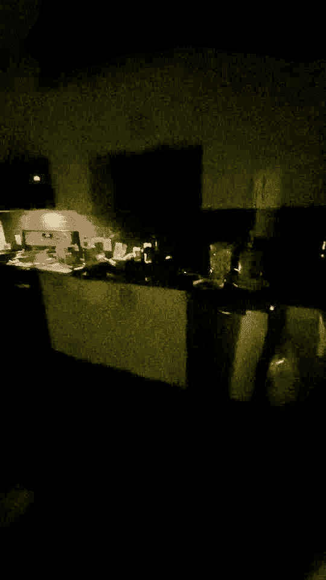
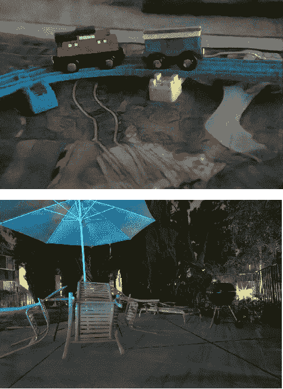
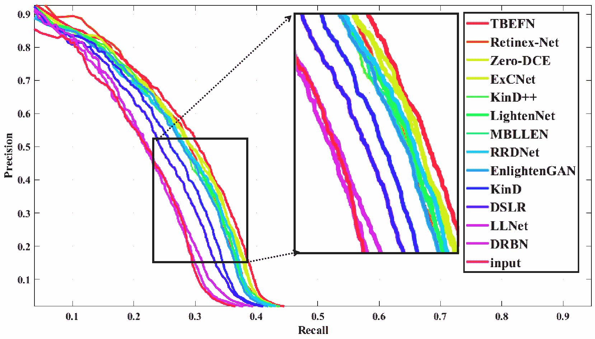

<!--yml

类别：未分类

日期：2024-09-06 19:55:51

-->

# [2104.10729] 使用深度学习的低光照图像和视频增强：一项综述

> 来源：[`ar5iv.labs.arxiv.org/html/2104.10729`](https://ar5iv.labs.arxiv.org/html/2104.10729)

\WarningFilter

latexFont shape \WarningFilterlatexfontFont shape

\justify

# 低光照图像和视频增强

使用深度学习：一项综述

Chongyi Li、Chunle Guo、Linghao Han、Jun Jiang、Ming-Ming Cheng、

Jinwei Gu、Chen Change Loy C. Li 和 C. C. Loy 均隶属于新加坡南洋理工大学（NTU）的 S-Lab（电子邮件：chongyi.li@ntu.edu.sg 和 ccloy@ntu.edu.sg）。C. Guo、L. Han 和 M. M. Cheng 隶属于中国天津南开大学计算机学院（电子邮件：guochunle@nankai.edu.cn、lhhan@mail.nankai.edu.cn 和 cmm@nankai.edu.cn）。J. Jiang 和 J. Gu 隶属于 SenseTime（电子邮件：jiangjun@sensebrain.site 和 gujinwei@sensebrain.site）。C. Li 和 C. Guo 贡献相等。C. C. Loy 为通讯作者。

###### 摘要

低光照图像增强（LLIE）的目标是提高在光照不足环境下拍摄图像的感知或可解释性。该领域的最新进展主要由基于深度学习的解决方案主导，许多学习策略、网络结构、损失函数、训练数据等已被应用于此论文中。我们提供了一个全面的调查，涵盖从算法分类到未解决的开放问题的各个方面。为了检验现有方法的泛化能力，我们提出了一个低光照图像和视频数据集，其中图像和视频是由不同手机摄像头在不同光照条件下拍摄的。此外，我们首次提供了一个统一的在线平台，涵盖了许多流行的 LLIE 方法，用户可以通过友好的网页界面生成结果。除了对公开可用数据集和我们提出的数据集上的现有方法进行定性和定量评估外，我们还验证了它们在黑暗中的人脸检测性能。该调查以及提出的数据集和在线平台可作为未来研究的参考来源，促进该研究领域的发展。所提出的平台和数据集，以及收集的方法、数据集和评估指标都是公开的，并将定期更新。项目页面：[`www.mmlab-ntu.com/project/lliv_survey/index.html`](https://www.mmlab-ntu.com/project/lliv_survey/index.html)。

###### 关键词：

图像和视频修复，低光照图像数据集，低光照图像增强平台，计算摄影学。

## 1 引言

图像常常在次优光照条件下拍摄，受背光、不均匀光线和暗光的影响，这些情况是由于不可避免的环境和/或技术限制，比如照明不足和曝光时间有限。这些图像在美学质量上有所妥协，并且在高层次任务如目标跟踪、识别和检测中传递信息效果不佳。图 1 展示了一些由次优光照条件引起的退化示例。

低光增强在不同领域中有广泛的应用，包括视觉监控、自动驾驶和计算摄影。特别是，智能手机摄影已经变得无处不在且非常显著。由于相机光圈的大小、实时处理的需求以及内存限制，在昏暗环境中用智能手机摄像头拍照尤其具有挑战性。在这些应用中，增强低光图像和视频是一个令人兴奋的研究领域。

|  |  |  |
| --- | --- | --- |
| (a) 背光 | (b) 不均匀光 | (c) 暗光 |
|  |  |  |
| (d) 极低光 | (e) 彩色光 | (f) 增强噪声 |

图 1：在次优光照条件下拍摄的图像示例。这些图像受到场景内容隐藏、对比度降低、噪声增强和颜色不准确的影响。

图 2：基于深度学习的低光图像和视频增强方法的简明里程碑。监督学习方法：LLNet [1], Chen 等人 [2], MBLLEN [3], Retinex-Net [4], LightenNet [5], SCIE [6], DeepUPE [7], Chen 等人 [8], Jiang 和 Zheng [9], Wang 等人 [10], KinD [11], Ren 等人 [12], Xu 等人 [13], Fan 等人 [14], Lv 等人 [15], EEMEFN [16], SIDGAN [17], LPNet [18], DLN [19], TBEFN [20], DSLR [21], Zhang 等人 [22], PRIEN [23], 和 Retinex-Net [24]。强化学习方法：DeepExposure [25]。无监督学习方法：EnlightenGAN [26]。零样本学习方法：ExCNet [27], Zero-DCE [28], RRDNet [29], Zero-DCE++ [30], RetinexDIP [31], 和 RUAS [32]。半监督学习方法：DRBN [33] 和 DRBN [34]。

传统的低光增强方法包括基于直方图均衡化的方法 [35, 36] 和基于 Retinex 模型的方法 [37, 38, 39, 40, 41, 42, 43, 44]。后者受到了相对更多的关注。典型的基于 Retinex 模型的方法通过先验或正则化将低光图像分解为反射成分和照明成分。估计的反射成分被视为增强结果。这些方法存在一些限制：1）假设反射成分为增强结果的理想假设并不总是成立，尤其是面对各种照明特性时，这可能导致不切实际的增强效果，如细节丢失和颜色失真；2）噪声通常在 Retinex 模型中被忽略，因此在增强结果中可能会被保留或放大；3）找到有效的先验或正则化是具有挑战性的。不准确的先验或正则化可能会导致增强结果中的伪影和颜色偏差；4）由于其复杂的优化过程，运行时间相对较长。

近年来，深度学习基础的低光图像增强（LLIE）取得了显著的成功，自首个开创性研究[1]以来，深度学习解决方案在准确性、鲁棒性和速度方面优于传统方法，因此受到越来越多的关注。深度学习基础的 LLIE 方法的一个简明里程碑如图 2 所示。如图所示，自 2017 年以来，深度学习基础的解决方案数量逐年增加。这些解决方案使用的学习策略包括**监督学习（SL）**、**强化学习（RL）**、**无监督学习（UL）**、**零样本学习（ZSL）**和**半监督学习（SSL）**。请注意，我们在图 2 中仅报告了一些具有代表性的方法。实际上，从 2017 年到 2021 年，有超过 100 篇关于深度学习基础方法的论文。此外，虽然一些通用的照片增强方法[45, 46, 47, 48, 49, 50, 51, 52, 53]可以在一定程度上提高图像的亮度，但由于这些方法并未针对多样化的低光条件进行设计，我们在本综述中将其省略。我们重点关注那些专门开发用于低光图像和视频增强的深度学习基础解决方案。

尽管深度学习已经主导了 LLIE 的研究，但关于基于深度学习的解决方案的深入全面综述仍然缺乏。现有两篇关于 LLIE 的综述[54, 55]。Wang 等人[54]主要综述了传统的 LLIE 方法，而我们的工作系统地、全面地回顾了基于深度学习的 LLIE 的最新进展。相比之下，Liu 等人[55]综述了现有的 LLIE 算法，衡量了不同方法的机器视觉性能，提供了一个同时服务于低级和高级视觉增强的低光照图像数据集，并开发了一个增强的面部检测器，而我们的综述从不同的角度回顾了低光照图像和视频增强，具有以下独特特点。1) 我们的工作主要集中在基于深度学习的低光照图像和视频增强的最新进展上，提供了各种方面的深入分析和讨论，涵盖学习策略、网络结构、损失函数、训练数据集、测试数据集、评估指标、模型大小、推理速度、增强性能等。因此，本综述专注于深度学习及其在低光照图像和视频增强中的应用。2) 我们提出了一个数据集，其中包含在不同光照条件下由不同手机摄像头拍摄的图像和视频，以评估现有方法的泛化能力。这个新的具有挑战性的数据集是现有低光照图像和视频增强数据集的补充，因为在该研究领域中缺乏这样的数据集。此外，据我们所知，我们首次比较了基于深度学习的低光照图像增强方法在这种数据上的性能。3) 我们提供了一个在线平台，涵盖了许多流行的基于深度学习的低光照图像增强方法，结果可以通过用户友好的网页界面生成。通过我们的平台，即使没有 GPU 的用户也可以在线评估不同方法对任何输入图像的结果，这加速了该研究领域的发展，并有助于创造新的研究。我们希望我们的综述能够提供新颖的见解和灵感，以促进对基于深度学习的 LLIE 的理解，促进对提出的开放问题的研究，并加快该研究领域的发展。

## 2 基于深度学习的 LLIE

### 2.1 问题定义

我们首先给出基于深度学习的低光照图像增强（LLIE）问题的常见公式。对于宽度为$W$、高度为$H$的低光照图像$I\in\mathbb{R}^{W\times H\times 3}$，该过程可以建模为：

|  | $\widehat{R}=\mathcal{F}(I;\theta),$ |  | (1) |
| --- | --- | --- | --- |

其中$\widehat{R}\in\mathbb{R}^{W\times H\times 3}$是增强结果，$\mathcal{F}$表示具有可训练参数$\theta$的网络。深度学习的目的是找到能够最小化误差的最佳网络参数$\widehat{\theta}$：

|  | $\widehat{\theta}=\operatorname*{argmin}_{\theta}\mathcal{L}(\widehat{R},R),$ |  | (2) |
| --- | --- | --- | --- |

其中 $R\in\mathbb{R}^{W\times H\times 3}$ 是真实值，而损失函数 $\mathcal{L}(\widehat{R},R)$ 驱动网络的优化。可以使用各种损失函数，如监督损失和无监督损失。更多细节将在第三部分中介绍。

### 2.2 学习策略

根据不同的学习策略，我们将现有的 LLIE 方法分为监督学习、强化学习、无监督学习、零样本学习和半监督学习。从不同角度的统计分析见图 3。接下来，我们将回顾每种策略的一些代表性方法。

监督学习。对于基于监督学习的 LLIE 方法，它们进一步分为端到端、深度 Retinex 基础和现实数据驱动的方法。

第一个基于深度学习的低光图像增强（LLIE）方法 LLNet [1] 使用了堆叠稀疏去噪自编码器的变体 [56]，同时进行图像亮度增强和去噪。这一开创性工作激发了端到端网络在 LLIE 中的应用。Lv 等人 [3] 提出了一个端到端的多分支增强网络（MBLLEN）。MBLLEN 通过特征提取模块、增强模块和融合模块提取有效的特征表示，从而提高了 LLIE 的性能。同样的作者 [15] 提出了其他三个子网络，包括 Illumination-Net、Fusion-Net 和 Restoration-Net，以进一步提升性能。Ren 等人 [12] 设计了一个更复杂的端到端网络，包括一个用于图像内容增强的编码器-解码器网络和一个用于图像边缘增强的递归神经网络。类似于 Ren 等人 [12]，Zhu 等人 [16] 提出了一个名为 EEMEFN 的方法。EEMEFN 包含两个阶段：多曝光融合和边缘增强。为 LLIE 提出了一个多曝光融合网络 TBEFN [20]。TBEFN 在两个分支中估计一个传递函数，可以获得两个增强结果。最后，采用简单的平均方案来融合这两张图像，并通过一个细化单元进一步优化结果。此外，将金字塔网络（LPNet） [18]、残差网络 [19] 和拉普拉斯金字塔 [21]（DSLR）引入 LLIE。这些方法通过常用的端到端网络结构有效地整合特征表示。基于噪声在不同频率层中表现出不同对比度的观察，Xu 等人 [57] 提出了一个基于频率的分解和增强网络。该网络在低频层中恢复图像内容并抑制噪声，同时在高频层中推断细节。最近，提出了一个渐进递归低光图像增强网络 [23]，使用递归单元逐步增强输入图像。为了解决处理低光视频时的时间不稳定性，Zhang 等人 [22] 提出了从单幅图像中学习和推断运动场，然后强制时间一致性。

与直接在端到端网络中学习增强结果相比，基于深度 Retinex 的方法在大多数情况下由于物理上可解释的 Retinex 理论 [58, 59]，享有更好的增强性能。基于深度 Retinex 的方法通常通过专门的子网络分别增强光照成分和反射成分。提出了一种 Retinex-Net [4]，它包括一个 Decom-Net，用于将输入图像分为光照无关的反射成分和结构感知的平滑光照，以及一个 Enhance-Net，用于调整低光照增强的光照图。最近，通过添加新的约束和先进的网络设计来扩展 Retinex-Net [4]，以获得更好的增强性能 [24]。为了减少计算负担，Li 等 [5] 提出了一个轻量级的 LightenNet 用于弱光图像增强，该网络仅由四层组成。LightenNet 以弱光图像作为输入，然后估计其光照图。基于 Retinex 理论 [58, 59]，通过将输入图像除以光照图来获得增强图像。为了准确估计光照图，Wang 等 [60] 提出了 DeepUPE 网络，通过提取全局和局部特征来学习图像到光照的映射。Zhang 等 [11] 分别开发了三个子网络用于层分解、反射恢复和光照调整，称为 KinD。此外，作者通过多尺度光照注意力模块减轻了 KinD [11] 结果中留下的视觉缺陷。改进后的 KinD 被称为 KinD++ [61]。为了解决深度 Retinex 方法中噪声被忽略的问题，Wang 等 [10] 提出了一个渐进式 Retinex 网络，其中 IM-Net 估计光照，NM-Net 估计噪声水平。这两个子网络以渐进机制工作，直到获得稳定结果。Fan 等 [14] 将语义分割与 Retinex 模型结合起来，以进一步提升实际情况中的增强性能。核心思想是利用语义先验指导光照成分和反射成分的增强。

尽管一些方法能够达到不错的性能，但由于使用了合成训练数据，在真实的低光情况下它们表现出较差的泛化能力。为了解决这个问题，一些工作尝试生成更真实的训练数据或捕获真实数据。蔡等人[6]构建了一个多曝光图像数据集，其中不同曝光级别的低对比度图像有对应的高质量参考图像。每个高质量的参考图像是通过从 13 个不同方法增强的结果中主观选择最佳输出得到的。此外，通过一个两阶段结构，对构建的数据集训练了一个频率分解网络，分别增强高频层和低频层。陈等人[2]收集了一个真实的低光图像数据集（SID），并训练了 U-Net[62]来学习从低光原始数据到相应的长曝光高质量参考图像的映射。此外，陈等人[8]将 SID 数据集扩展到低光视频（DRV）。DRV 包含了与相应的长曝光真实图像相对应的静态视频。为了确保处理动态场景视频的泛化能力，他们提出了一个孪生网络。为了增强暗处的移动物体，蒋和郑[9]设计了一个共轴光学系统来捕捉时间上同步的、在空间上对齐的低光和高光视频对（SMOID）。与 DRV 视频数据集[8]不同，SMOID 视频数据集包含了动态场景。为了学习从原始低光视频到高光视频的映射，提出了一个基于 3D U-Net 的网络。考虑到之前的低光视频数据集的限制，如 DRV 数据集[8]只包含静态视频，而 SMOID 数据集[9]只有 179 个视频对，Triantafyllidou 等人[17]提出了一种低光视频合成管线，称为 SIDGAN。SIDGAN 可以通过一种半监督的双向 CycleGAN 和中间域映射产生动态视频数据（原始到 RGB）。为了训练这个管线，他们从 Vimeo-90K 数据集[63]中收集了真实世界的视频。低光原始视频数据和相应的长曝光图像是从 DRV 数据集[8]中采样得到的。通过合成训练数据，该工作采用了与陈等人[2]相同的 U-Net 网络用于低光视频增强。

强化学习。在没有配对训练数据的情况下，Yu 等人[25] 通过强化对抗学习来曝光照片，命名为 DeepExposure。具体来说，首先根据曝光将输入图像分割成子图像。对于每个子图像，策略网络根据强化学习依次学习局部曝光。奖励评估函数通过对抗学习来近似。最后，每个局部曝光被用来修饰输入图像，从而获得在不同曝光下的多个修饰图像。最终结果是通过融合这些图像实现的。

无监督学习。在配对数据上训练深度模型可能导致过拟合和有限的泛化能力。为了解决这个问题，提出了一种名为 EnlightenGAN 的无监督学习方法[26]。EnlightenGAN 采用了一个注意力引导的 U-Net [62] 作为生成器，并使用全球-局部判别器来确保增强结果看起来像真实的正常光照图像。除了全球和局部对抗损失，还提出了全球和局部自特征保留损失，以保留图像在增强前后的内容。这是这种单路径生成对抗网络（GAN）结构稳定训练的关键点。

零样本学习。监督学习、强化学习和无监督学习方法要么具有有限的泛化能力，要么在训练过程中不稳定。为了解决这些问题，提出了零样本学习，旨在仅从测试图像中学习增强。需要注意的是，在低级视觉任务中，零样本学习的概念用于强调该方法不需要配对或未配对的训练数据，这与其在高级视觉任务中的定义不同。张等人[27] 提出了一个名为 ExCNet 的零样本学习方法，用于背光图像恢复。首先使用网络估计与输入图像最匹配的 S 曲线。一旦估计出 S 曲线，就使用引导滤波器[64] 将输入图像分离为基础层和细节层。然后，基础层通过估计的 S 曲线进行调整。最后，使用 Weber 对比度[65] 融合细节层和调整后的基础层。为了训练 ExCNet，作者将损失函数形式化为基于块的能量最小化问题。朱等人[29] 提出了一个三分支 CNN，称为 RRDNet，用于低曝光图像恢复。RRDNet 通过迭代最小化特别设计的损失函数将输入图像分解为照明、反射率和噪声。为了驱动零样本学习，提出了结合 Retinex 重建损失、纹理增强损失和照明引导噪声估计损失的方法。赵等人[31] 通过神经网络执行 Retinex 分解，然后基于 Retinex 模型增强低光图像，称为 RetinexDIP。受到 Deep Image Prior (DIP) [66] 启发，RetinexDIP 通过随机采样的白噪声生成输入图像的反射成分和照明成分，其中如照明平滑度等与成分特征相关的损失用于训练。刘等人[32] 提出了一个受 Retinex 启发的解卷积方法用于低光图像增强（LLIE），在该方法中使用合作架构搜索发现轻量级的基本块先验架构，并使用非参考损失来训练网络。与基于图像重建的方法[1, 3, 12, 21, 4, 11, 61] 不同，提出了一个深度曲线估计网络 Zero-DCE[28]。Zero-DCE 将光增强形式化为图像特定曲线估计任务，该任务以低光图像为输入，输出高阶曲线。这些曲线用于对输入图像的动态范围进行像素级调整，以获得增强图像。此外，还提出了加速和轻量化版本，称为 Zero-DCE++[30]。这种基于曲线的方法在训练过程中不需要任何配对或未配对的数据。它们通过一组非参考损失函数实现零参考学习。此外，与需要高计算资源的图像重建方法不同，图像到曲线的映射仅需轻量级网络，从而实现了快速推断速度。

|  |  |  |  |
| --- | --- | --- | --- |
| (a) 学习策略 | (b) 网络结构 | (c) Retinex 模型 | (d) 数据格式 |
|  |  |  |  |
| (e) 损失函数 | (f) 训练数据集 | (g) 测试数据集 | (h) 评估指标 |

图 3：基于深度学习的低光图像增强（LLIE）方法的统计分析，包括学习策略、网络特征、Retinex 模型、数据格式、损失函数、训练数据集、测试数据集和评估指标。最佳查看方式是放大。

半监督学习。为了结合监督学习和无监督学习的优点，近年来提出了半监督学习。Yang 等人 [33] 提出了半监督深度递归带网络（DRBN）。DRBN 首先在监督学习下恢复增强图像的线性带表示，然后通过基于无监督对抗学习的可学习线性变换重新组合给定的带，从而获得改进的结果。通过引入长短期记忆（LSTM）网络和在美学视觉分析数据集上预训练的图像质量评估网络，DRBN 得到了扩展，从而实现了更好的增强性能 [34]。

观察图 3(a)，我们可以发现，监督学习是基于深度学习的 LLIE 方法中的主流，其中比例达到 73%。这是因为使用配对训练数据集，如 LOL [4]、SID [2] 和多样的低光/正常光图像合成方法时，监督学习相对简单。然而，基于监督学习的方法面临一些挑战：1) 收集覆盖多样真实低光条件的大规模配对数据集困难，2) 合成低光图像不能准确代表真实的光照条件，如空间变化的光照和不同水平的噪声，3) 在配对数据上训练深度模型可能导致对多样化光照属性的真实世界图像的泛化能力有限。

因此，一些方法采用无监督学习、强化学习、半监督学习和零样本学习来绕过监督学习中的挑战。虽然这些方法取得了竞争性能，但它们仍然存在一些限制：1) 对于无监督学习/半监督学习方法，如何实现稳定训练、避免颜色偏差和建立跨领域信息的关系挑战当前方法，2) 对于强化学习方法，设计有效的奖励机制和实施高效稳定的训练是复杂的，3) 对于零样本学习方法，当需要考虑颜色保留、伪影去除和梯度反向传播时，非参考损失的设计并非简单。

表 I: 代表性深度学习方法的基本特征总结。“Retinex”表示模型是否基于 Retinex。“模拟的”意味着测试数据由与合成训练数据相同的方法模拟。“自选”指作者选择的真实世界图像。“#P”代表可训练参数的数量。“-”表示该项目在论文中不可用或未指明。

|  | 方法 | 学习 | 网络结构 | 损失函数 | 训练数据 | 测试数据 | 评估指标 | 格式 | 平台 | Retinex |
| --- | --- | --- | --- | --- | --- | --- | --- | --- | --- | --- |
| 2017 | LLNet [1] | SL | SSDA | SRR 损失 |

&#124; 由…模拟 &#124;

&#124; 伽马校正 & &#124;

&#124; 高斯噪声 &#124;

|

&#124; 模拟的 &#124;

&#124; 自选 &#124;

|

&#124; PSNR SSIM &#124;

| RGB | Theano |  |
| --- | --- | --- |
| 2018 | LightenNet [5] | SL | 四层 | $L_{2}$ 损失 |

&#124; 由…模拟 &#124;

&#124; 随机光照值 &#124;

|

&#124; 模拟的 &#124;

&#124; 自选 &#124;

|

&#124; PSNR MAE &#124;

&#124; SSIM &#124;

&#124; 用户研究 &#124;

| RGB |
| --- |

&#124; Caffe &#124;

&#124; MATLAB &#124;

| ✓ |
| --- |
|  | Retinex-Net [4] | SL | 多尺度网络 |

&#124; $L_{1}$ 损失 平滑损失 &#124;

&#124; 不变反射率损失 &#124;

|

&#124; LOL &#124;

&#124; 由…模拟 &#124;

&#124; 调整直方图 &#124;

| 自选 | - | RGB | TensorFlow | ✓ |
| --- | --- | --- | --- | --- |
|  | MBLLEN [3] | SL | 多分支融合 |

&#124; SSIM 损失 区域损失 &#124;

&#124; 感知损失 &#124;

|

&#124; 由…模拟 &#124;

&#124; 伽马校正 & &#124;

&#124; 泊松噪声 &#124;

|

&#124; 模拟的 &#124;

&#124; 自选 &#124;

|

&#124; PSNR SSIM &#124;

&#124; AB VIF &#124;

&#124; LOE TOMI &#124;

| RGB |
| --- |

&#124; TensorFlow &#124;

|  |
| --- |
|  | SCIE [6] | SL | 频率分解 |

&#124; $L_{2}$ 损失 $L_{1}$ 损失 SSIM 损失 &#124;

| SCIE | SCIE |
| --- | --- |

&#124; PSNR FSIM &#124;

&#124; 运行时 FLOPs &#124;

| RGB |
| --- |

&#124; Caffe &#124;

&#124; MATLAB &#124;

|  |
| --- |
|  | Chen et al. [2] | SL | U-Net | $L_{1}$ 损失 | SID | SID |

&#124; PSNR SSIM &#124;

| 原始 | TensorFlow |  |
| --- | --- | --- |
|  | Deepexposure [25] | RL |

&#124; 策略网络 &#124;

&#124; GAN &#124;

|

&#124; 确定性策略梯度 &#124;

&#124; 对抗损失 &#124;

| MIT-Adobe FiveK | MIT-Adobe FiveK |
| --- | --- |

&#124; PSNR SSIM &#124;

| 原始 | TensorFlow |  |
| --- | --- | --- |
| 2019 | Chen 等人 [8] | SL | Siamese 网络 |

&#124; $L_{1}$ 损失 &#124;

&#124; 自一致性损失 &#124;

| DRV | DRV |
| --- | --- |

&#124; PSNR &#124;

&#124; SSIM &#124;

&#124; MAE &#124;

| 原始 | TensorFlow |  |
| --- | --- | --- |
|  | Jiang 和 Zheng [9] | SL | 3D U-Net | $L_{1}$ 损失 | SMOID | SMOID |

&#124; PSNR SSIM MSE &#124;

| 原始 | TensorFlow |  |
| --- | --- | --- |
|  | DeepUPE [60] | SL | 照明图 |

&#124; $L_{1}$ 损失 颜色损失 &#124;

&#124; 平滑性损失 &#124;

| 修复图像对 | MIT-Adobe FiveK |
| --- | --- |

&#124; PSNR SSIM &#124;

&#124; 用户研究 &#124;

| RGB | TensorFlow | ✓ |
| --- | --- | --- |
|  | KinD [11] | SL |

&#124; 三个子网络 &#124;

&#124; U-Net &#124;

|

&#124; 反射相似性损失 &#124;

&#124; 照明平滑性损失 &#124;

&#124; 互一致性损失 &#124;

&#124; $L_{1}$ 损失 $L_{2}$ 损失 SSIM 损失 &#124;

&#124; 纹理相似性损失 &#124;

&#124; 照明调整损失 &#124;

| LOL |
| --- |

&#124; LOL LIME &#124;

&#124; NPE MEF &#124;

|

&#124; PSNR SSIM &#124;

&#124; LOE NIQE &#124;

| RGB | TensorFlow | ✓ |
| --- | --- | --- |
|  | Wang 等人 [10] | SL |

&#124; 两个子网络 &#124;

&#124; 点对点卷积 &#124;

| $L_{1}$ 损失 |
| --- |

&#124; 模拟的 &#124;

&#124; 相机成像模型 &#124;

|

&#124; IP100 FNF38 &#124;

&#124; MPI LOL NPE &#124;

|

&#124; PSNR SSIM &#124;

&#124; NIQE &#124;

| RGB | Caffe | ✓ |
| --- | --- | --- |
|  | Ren 等人 [12] | SL |

&#124; 类 U-Net 网络 &#124;

&#124; RNN 膨胀卷积 &#124;

|

&#124; $L_{2}$ 损失 感知损失 &#124;

&#124; 对抗损失 &#124;

|

&#124; MIT-Adobe FiveK &#124;

&#124; 带伽马校正 &#124;

&#124; & 高斯噪声 &#124;

|

&#124; 模拟的 &#124;

&#124; 自选 DPED &#124;

|

&#124; PSNR SSIM &#124;

&#124; 运行时 &#124;

| RGB | Caffe |  |
| --- | --- | --- |
|  | EnlightenGAN [26] | UL | 类 U-Net 网络 |

&#124; 对抗损失 &#124;

&#124; 自特征保持损失 &#124;

| 无配对的真实图像 |
| --- |

&#124; NPE LIME &#124;

&#124; MEF DICM &#124;

&#124; VV BBD-100K &#124;

&#124; ExDARK &#124;

|

&#124; 用户研究 NIQE &#124;

&#124; 分类 &#124;

| RGB | PyTorch |  |
| --- | --- | --- |
|  | ExCNet. [27] | ZSL |

&#124; 全连接层 &#124;

| 能量最小化损失 | 真实图像 | $IE_{ps}D$ |
| --- | --- | --- |

&#124; 用户研究 &#124;

&#124; CDIQA LOD &#124;

| RGB | PyTorch |  |
| --- | --- | --- |
| 2020 | Zero-DCE [28] | ZSL | 类 U-Net 网络 |

&#124; 空间一致性损失 &#124;

&#124; 曝光控制损失 &#124;

&#124; 颜色恒常性损失 &#124;

&#124; 照明平滑性损失 &#124;

| SICE |
| --- |

&#124; SICE NPE &#124;

&#124; LIME MEF &#124;

&#124; DICM VV &#124;

&#124; DARK FACE &#124;

|

&#124; 用户研究 PI &#124;

&#124; PNSR SSIM &#124;

&#124; MAE 运行时 &#124;

&#124; 人脸检测 &#124;

| RGB | PyTorch |  |
| --- | --- | --- |
|  | DRBN [33] | SSL | 递归网络 |

&#124; SSIM 损失 感知损失 &#124;

&#124; 对抗损失 &#124;

|

&#124; LOL &#124;

&#124; 由 MOS 选择的图像 &#124;

| LOL |
| --- |

&#124; PSNR SSIM &#124;

&#124; SSIM-GC &#124;

| RGB | PyTorch |  |
| --- | --- | --- |
|  | Lv 等人 [15] | SL | 类 U-Net 网络 |

&#124; Huber 损失 &#124;

&#124; SSIM 损失 &#124;

&#124; 感知损失 &#124;

&#124; 光照平滑损失 &#124;

|

&#124; 通过一个 &#124;

&#124; 修复模块 &#124;

|

&#124; LOL SICE &#124;

&#124; DeepUPE &#124;

|

&#124; 用户研究 PSNR &#124;

&#124; SSIM VIF &#124;

&#124; LOE NIQE &#124;

&#124; #P 运行时 &#124;

&#124; 人脸检测 &#124;

| RGB |
| --- |

&#124; TensorFlow &#124;

| ✓ |
| --- |
|  | Fan 等人 [14] | SL |

&#124; 四个子网络 &#124;

&#124; 类 U-Net 网络 &#124;

&#124; 特征调制 &#124;

|

&#124; 互相平滑损失 &#124;

&#124; 重建损失 &#124;

&#124; 光照平滑损失 &#124;

&#124; 交叉熵损失 &#124;

&#124; 一致性损失 &#124;

&#124; SSIM 损失 &#124;

&#124; 梯度损失 &#124;

&#124; 比率学习损失 &#124;

|

&#124; 通过 &#124;

&#124; 光照调整， &#124;

&#124; 轻微的颜色失真， &#124;

&#124; 和噪声模拟 &#124;

|

&#124; 模拟的 &#124;

&#124; 自选 &#124;

|

&#124; PSNR SSIM &#124;

&#124; NIQE &#124;

| RGB | - | ✓ |
| --- | --- | --- |
|  | Xu 等人 [57] | SL |

&#124; 频率分解 &#124;

&#124; 类 U-Net 网络 &#124;

|

&#124; $L_{2}$ 损失 &#124;

&#124; 感知损失 &#124;

| RGB 中的 SID |
| --- |

&#124; RGB 中的 SID &#124;

&#124; 自选 &#124;

|

&#124; PSNR SSIM &#124;

| RGB | PyTorch |  |
| --- | --- | --- |
|  | EEMEFN [16] | SL |

&#124; 类 U-Net 网络 &#124;

&#124; 边缘检测网络 &#124;

|

&#124; $L_{1}$ 损失 &#124;

&#124; 加权交叉熵损失 &#124;

| SID | SID |
| --- | --- |

&#124; PSNR SSIM &#124;

| 原始 |
| --- |

&#124; TensorFlow &#124;

&#124; PaddlePaddle &#124;

|  |
| --- |
|  | DLN [19] | SL |

&#124; 残差学习 &#124;

&#124; 互动因子 &#124;

&#124; 反向投影网络 &#124;

|

&#124; SSIM 损失 &#124;

&#124; 总变差损失 &#124;

|

&#124; 通过 &#124;

&#124; 光照调整， &#124;

&#124; 轻微的颜色失真， &#124;

&#124; 和噪声模拟 &#124;

|

&#124; 模拟的 &#124;

&#124; LOL &#124;

|

&#124; 用户研究 PSNR &#124;

&#124; SSIM NIQE &#124;

| RGB | PyTorch |  |
| --- | --- | --- |
|  | LPNet [18] | SL |

&#124; 金字塔网络 &#124;

|

&#124; $L_{1}$ 损失 &#124;

&#124; 感知损失 &#124;

&#124; 亮度损失 &#124;

|

&#124; LOL RGB 中的 SID &#124;

&#124; MIT-Adobe FiveK &#124;

|

&#124; LOL RGB 中的 SID &#124;

&#124; MIT-Adobe FiveK &#124;

&#124; MEF NPE DICM VV &#124;

|

&#124; PSNR SSIM &#124;

&#124; NIQE #P &#124;

&#124; FLOPs 运行时 &#124;

| RGB | PyTorch |  |
| --- | --- | --- |
|  | SIDGAN [17] | SL | U-Net | CycleGAN 损失 | SIDGAN | SIDGAN |

&#124; PSNR SSIM &#124;

&#124; TPSNR TSSIM ATWE &#124;

| 原始 |
| --- |

&#124; TensorFlow &#124;

|  |
| --- |
|  | RRDNet [29] | ZSL | 三个子网络 |

&#124; Retinex 重建损失 &#124;

&#124; 纹理增强损失 &#124;

&#124; 噪声估计损失 &#124;

| - |
| --- |

&#124; NPE LIME &#124;

&#124; MEF DICM &#124;

|

&#124; NIQE CPCQI &#124;

| RGB | PyTorch | ✓ |
| --- | --- | --- |
|  | TBEFN [20] | SL |

&#124; 三个阶段 &#124;

&#124; 类似 U-Net 的网络 &#124;

|

&#124; SSIM 损失 &#124;

&#124; 感知损失 &#124;

&#124; 平滑损失 &#124;

|

&#124; SCIE &#124;

&#124; LOL &#124;

|

&#124; SCIE LOL &#124;

&#124; DICM MEF &#124;

&#124; NPE VV &#124;

|

&#124; PSNR SSIM &#124;

&#124; NIQE 运行时 &#124;

&#124; #P FLOPs &#124;

| RGB | TensorFlow | ✓ |
| --- | --- | --- |
|  | DSLR [21] | SL |

&#124; 拉普拉斯金字塔 &#124;

&#124; 类似 U-Net 的网络 &#124;

|

&#124; $L_{2}$ 损失 &#124;

&#124; 拉普拉斯损失 &#124;

&#124; 颜色损失 &#124;

| MIT-Adobe FiveK |
| --- |

&#124; MIT-Adobe FiveK &#124;

&#124; 自选 &#124;

|

&#124; PSNR SSIM &#124;

&#124; NIQMC NIQE &#124;

&#124; BTMQI CaHDC &#124;

| RGB | PyTorch |  |
| --- | --- | --- |
| 2021 | RUAS [32] | ZSL | 神经架构搜索 |

&#124; 协作损失 &#124;

&#124; 相似损失 &#124;

&#124; 总变差损失 &#124;

|

&#124; LOL &#124;

&#124; MIT-Adobe FiveK &#124;

|

&#124; LOL &#124;

&#124; MIT-Adobe FiveK &#124;

|

&#124; PSNR SSIM &#124;

&#124; 运行时 #P FLOPs &#124;

| RGB | PyTorch | ✓ |
| --- | --- | --- |
|  | Zhang et al. [22] | SL | U-Net |

&#124; $L_{1}$ 损失 &#124;

&#124; 一致性损失 &#124;

|

&#124; 通过照明模拟 &#124;

&#124; 调整和噪声模拟 &#124;

|

&#124; 模拟 &#124;

&#124; 自选 &#124;

|

&#124; 用户研究 PSNR &#124;

&#124; SSIM AB &#124;

&#124; MABD WE &#124;

| RGB |
| --- |

&#124; PyTorch &#124;

|  |
| --- |
|  | Zero-DCE++ [30] | ZSL | 类似 U-Net 的网络 |

&#124; 空间一致性损失 &#124;

&#124; 曝光控制损失 &#124;

&#124; 颜色恒常性损失 &#124;

&#124; 照明平滑损失 &#124;

| SICE |
| --- |

&#124; SICE NPE &#124;

&#124; LIME MEF &#124;

&#124; DICM VV &#124;

&#124; DARK FACE &#124;

|

&#124; 用户研究 PI &#124;

&#124; PNSR SSIM #P &#124;

&#124; MAE 运行时 &#124;

&#124; 人脸检测 FLOPs &#124;

| RGB | PyTorch |  |
| --- | --- | --- |
|  | DRBN [34] | SSL | 递归网络 |

&#124; 感知损失 &#124;

&#124; 细节损失质量损失 &#124;

| LOL | LOL |
| --- | --- |

&#124; PSNR SSIM &#124;

&#124; SSIM-GC &#124;

| RGB | PyTorch |  |
| --- | --- | --- |
|  | Retinex-Net [24] | SL | 三个子网络 |

&#124; $L_{1}$ 损失 $L_{2}$ 损失 &#124;

&#124; SSIM 损失 &#124;

&#124; 总变差损失 &#124;

|

&#124; LOL &#124;

&#124; 通过调整直方图模拟 &#124;

|

&#124; LOL 模拟 &#124;

&#124; NPE DICM VV &#124;

|

&#124; PNSR SSIM &#124;

&#124; UQI OSS 用户研究 &#124;

| RGB | PyTorch | ✓ |
| --- | --- | --- |
|  | RetinexDIP [31] | ZSL | 编码器-解码器网络 |

&#124; 重建损失 &#124;

&#124; 照明一致性损失 &#124;

&#124; 反射损失 &#124;

&#124; 照明平滑性损失 &#124;

| - |
| --- |

&#124; DICM, ExDark &#124;

&#124; Fusion LIME &#124;

&#124; NASA NPE VV &#124;

|

&#124; NIQE &#124;

&#124; NIQMC CPCQI &#124;

| RGB | PyTorch | ✓ |
| --- | --- | --- |
|  | PRIEN [23] | SL | 递归网络 | SSIM 损失 |

&#124; MEF LOL &#124;

&#124; 通过调整直方图进行模拟 &#124;

|

&#124; LOL LIME &#124;

&#124; NPE MEF VV &#124;

|

&#124; PNSR SSIM &#124;

&#124; LOE TMQI &#124;

| RGB | PyTorch |  |
| --- | --- | --- |

## 3 技术评审与讨论

在本节中，我们首先总结了基于深度学习的 LLIE 方法的代表性方法，如表 1 所示，然后分析和讨论它们的技术特点。

### 3.1 网络结构

现有模型中使用了多种网络结构和设计，涵盖了基本的 U-Net、金字塔网络、多阶段网络以及频域分解网络。分析图 3(b)后可以观察到，U-Net 和 U-Net-like 网络是 LLIE 中主要采用的网络结构。这是因为 U-Net 可以有效整合多尺度特征，并利用低层次和高层次特征。这些特性对于实现满意的低光照增强至关重要。

尽管如此，当前 LLIE 网络结构中可能忽视了一些关键问题：1) 在经过若干卷积层后，极低光照图像的梯度可能在梯度反向传播过程中消失，因为其像素值很小。这会降低增强性能并影响网络训练的收敛性。2) U-Net-like 网络中使用的跳跃连接可能会在最终结果中引入噪声和冗余特征。如何有效过滤噪声并整合低层次和高层次特征应仔细考虑。3) 尽管为 LLIE 提出了一些设计和组件，但大多数都是从相关低层次视觉任务中借用或修改而来的。在设计网络结构时应考虑低光照数据的特性。

### 3.2 深度模型与 Retinex 理论的结合

如图 3(c) 所示，几乎 1/3 的方法将深度网络设计与 Retinex 理论结合，例如，设计不同的子网络以估计 Retinex 模型的组件，并估计照明图以指导网络的学习。尽管这种结合可以弥合基于深度学习和基于模型的方法，但它们各自的弱点可能会被引入到最终模型中：1) 在 Retinex 基于 LLIE 方法中，反射率是最终增强结果的理想假设仍会影响最终结果；2) 尽管使用了 Retinex 理论，深度网络中的过拟合风险仍然存在。当研究人员将深度学习与 Retinex 理论结合时，应仔细考虑如何筛选出最佳部分并过滤掉杂质。

### 3.3 数据格式

如图 3(d) 所示，RGB 数据格式主导了大多数方法，因为它通常是智能手机相机、Go-Pro 相机和无人机相机生成的最终图像格式。虽然原始数据仅限于特定传感器，如基于 Bayer 模式的传感器，但这些数据涵盖了更广的色域和更高的动态范围。因此，基于原始数据训练的深度模型通常能恢复清晰的细节和高对比度，获得生动的颜色，减少噪声和伪影的影响，并改善极低光照图像的亮度。在未来的研究中，将不同模式的原始数据平滑地转换为 RGB 格式，将有可能结合 RGB 数据的便利性和原始数据高质量增强的优势，用于低光照图像增强。

### 3.4 损失函数

在图 3(e) 中，LLIE 模型中常用的损失函数包括重建损失 ($L_{1}$, $L_{2}$, SSIM)、感知损失和光滑损失。此外，根据不同的需求和公式，还会采用颜色损失、曝光损失、对抗损失等。我们将详细介绍具有代表性的损失函数。

重建损失。不同的重建损失各有优缺点。$L_{2}$ 损失倾向于惩罚较大的错误，但对小错误较为宽容。$L_{1}$ 损失由于错误的权重与局部结构无关，因此能较好地保留颜色和亮度。SSIM 损失则能很好地保留结构和纹理。详细分析请参见这篇研究论文[67]。

感知损失。感知损失[68]，特别是特征重建损失，旨在在特征空间中使结果与真实情况相似。该损失改善了结果的视觉质量。它被定义为增强结果的特征表示与对应真实情况的特征表示之间的欧几里得距离。特征表示通常从在 ImageNet 数据集[70]上预训练的 VGG 网络[69]中提取。

平滑损失。为了去除增强结果中的噪声或保持邻近像素的关系，平滑损失（TV 损失）常常用于约束增强结果或估计的光照图。

对抗损失。为了鼓励增强结果与参考图像难以区分，对抗学习解决了一个最大最小优化问题[71, 72]。

曝光损失。作为关键的非参考损失之一，曝光损失在没有配对或非配对图像作为参考图像的情况下衡量增强结果的曝光水平。

在 LLIE 网络中常用的损失函数也被用于图像重建网络中的图像超分辨率[73]、图像去噪[74]、图像去训练[75, 76, 77]和图像去模糊[78]。不同于这些多功能损失，专为 LLIE 设计的曝光损失激发了非参考损失的设计。非参考损失使模型具有更好的泛化能力。考虑图像特征以设计损失函数仍是一个正在进行的研究。

### 3.5 训练数据集

图 3(f)报告了用于训练低光照增强网络的多种配对训练数据集的使用。这些数据集包括真实世界捕获的数据集和合成数据集。我们在表 II 中列出了它们。

由伽马校正模拟。由于其非线性和简单性，伽马校正用于调整视频或静态图像系统中的亮度或三刺激值。它由一个幂律表达式定义：

|  | $V_{\text{out}}=AV_{\text{in}}^{\gamma},$ |  | (3) |
| --- | --- | --- | --- |

其中输入 $V_{\text{in}}$ 和输出 $V_{\text{out}}$ 通常在 [0,1] 范围内。常数 $A$ 在常见情况下设置为 1。功率 $\gamma$ 控制输出的亮度。直观地，当 $\gamma<$1 时，输入变亮；而当 $\gamma>$1 时，输入变暗。输入可以是图像的三个 RGB 通道或与亮度相关的通道，例如 CIELab 色彩空间中的 $L$ 通道和 YCbCr 色彩空间中的 $Y$ 通道。调整亮度相关通道后，通过相同比例调整色彩空间中的相应通道，以避免产生伪影和颜色偏差。

为了模拟在现实世界低光场景中拍摄的图像，将高斯噪声、泊松噪声或现实噪声添加到 Gamma 校正图像中。使用 Gamma 校正合成的低光图像可以表示为：

|  | $I_{\text{low}}=n(g(I_{\text{in}};\gamma)),$ |  | (4) |
| --- | --- | --- | --- |

其中 $n$ 代表噪声模型，$g(I_{\text{in}};\gamma)$ 代表具有 Gamma 值 $\gamma$ 的 Gamma 校正函数，$I_{\text{in}}$ 是普通光照和高质量图像或与亮度相关的通道。虽然这个函数通过改变 Gamma 值 $\gamma$ 生成不同光照水平的低光图像，但由于非线性调整，它倾向于在合成低光图像中引入伪影和颜色偏差。

表 II: 配对训练数据集汇总。‘Syn’ 代表合成数据。

| 名称 | 数量 | 格式 | 实际/合成 | 视频 |
| --- | --- | --- | --- | --- |
| Gamma Correction | +$\infty$ | RGB | 合成 |  |
| 随机光照 | +$\infty$ | RGB | 合成 |  |
| LOL [4] | 500 | RGB | 实际 |  |
| SCIE [6] | 4,413 | RGB | 实际 |  |
| VE-LOL-L [55] | 2,500 | RGB | 实际+合成 |  |
| MIT-Adobe FiveK [79] | 5,000 | 原始 | 实际 |  |
| SID [4] | 5,094 | 原始 | 实际 |  |
| DRV [8] | 202 | 原始 | 实际 | ✓ |
| SMOID [9] | 179 | 原始 | 实际 | ✓ |

通过随机光照模拟。根据 Retinex 模型，图像可以分解为反射成分和光照成分。假设图像内容与光照成分独立，并且光照成分中的局部区域具有相同的强度，可以通过

|  | $I_{\text{low}}=I_{\text{in}}L,$ |  | (5) |
| --- | --- | --- | --- |

其中 $L$ 是范围为 [0,1] 的随机光照值。噪声可以添加到合成图像中。这样一个线性函数可以避免伪影，但强假设要求合成仅在局部区域具有相同亮度的图像块上进行。基于这样的图像块训练的深度模型可能因忽视上下文信息而导致次优性能。

LOL。LOL [4] 是第一个在真实场景中拍摄的低光/正常光图像配对数据集。低光图像通过改变曝光时间和 ISO 进行收集。LOL 包含 500 对大小为 400$\times$600 的低光/正常光图像，保存为 RGB 格式。

SCIE。SCIE 是一个低对比度和高对比度图像对的多曝光图像数据集。它包括 589 个室内和室外场景的多曝光序列。每个序列有 3 到 18 张不同曝光级别的低对比度图像，总共包含 4,413 张多曝光图像。589 张高质量参考图像是从 13 种代表性增强算法的结果中挑选出来的。也就是说，许多多曝光图像具有相同的高对比度参考图像。图像分辨率在 3,000$\times$2,000 到 6,000$\times$4,000 之间。SCIE 中的图像以 RGB 格式保存。

MIT-Adobe FiveK。MIT-Adobe FiveK [79] 收集用于全局色调调整，但也用于 LLIE。这是因为输入图像具有低光和低对比度。MIT-Adobe FiveK 包含 5,000 张图像，每张图像由 5 名训练有素的摄影师修饰，以获得视觉上令人愉悦的效果，类似于明信片。所有图像均为原始格式。为了训练能够处理 RGB 格式图像的网络，需要使用 Adobe Lightroom 对图像进行预处理，并按照专用管道保存为 RGB 格式¹¹1[`github.com/nothinglo/Deep-Photo-Enhancer/issues/38#issuecomment-449786636`](https://github.com/nothinglo/Deep-Photo-Enhancer/issues/38#issuecomment-449786636)。图像通常被调整为长边 500 像素。

SID。SID [2] 包含 5,094 张原始短曝光图像，每张都有对应的长曝光参考图像。长曝光参考图像的数量为 424 张。换句话说，多张短曝光图像对应同一张长曝光参考图像。这些图像使用两台相机拍摄：Sony $\alpha$7S II 和 Fujifilm X-T2，拍摄场景包括室内和室外。因此，这些图像具有不同的传感器模式（Sony 相机的 Bayer 传感器和 Fuji 相机的 APS-C X-Trans 传感器）。分辨率为 Sony 的 4,240$\times$2,832 和 Fuji 的 6,000$\times$4,000。通常，长曝光图像使用 libraw（一个原始图像处理库）进行处理，并以 RGB 颜色空间保存，训练时随机裁剪为 512$\times$512 的补丁。

VE-LOL。VE-LOL [55] 包含两个子集：用于训练和评估 LLIE 方法的配对 VE-LOL-L 和用于评估 LLIE 方法在面部检测中效果的未配对 VE-LOL-H。具体来说，VE-LOL-L 包含 2,500 对配对图像。其中，1,000 对是合成的，1,500 对是实际的。VE-LOL-H 包含 10,940 张未配对图像，其中人脸经过手动标注并加上了边界框。

DRV。DRV [8] 包含 202 个静态原始视频，每个视频都有一个对应的长时间曝光真实图像。每个视频以大约 16 到 18 帧每秒的连续拍摄模式拍摄，最多有 110 帧。图像由 Sony RX100 VI 相机在室内和室外场景中拍摄，因此全部为 Bayer 模式的原始格式。分辨率为 3,672$\times$5,496。

SMOID。SMOID [9] 包含 179 对由共轴光学系统拍摄的视频，每对视频有 200 帧。因此，SMOID 包括 35,800 个极低光照下的 Bayer 模式原始数据及其对应的良好照明 RGB 图像。SMOID 由在不同光照条件下的移动车辆和行人组成。

一些问题挑战了上述配对训练数据集：1）在合成数据上训练的深度模型可能会在处理真实世界图像和视频时引入伪影和色彩偏差，因为合成数据和真实数据之间存在差距，2）真实训练数据的规模和多样性令人不满，因此一些方法结合合成数据来增强训练数据。这可能导致次优的增强效果，3）由于运动、硬件和环境的影响，输入图像和对应的真实图像可能存在对齐问题。这会影响使用逐像素损失函数训练的深度网络的性能。

### 3.6 测试数据集

除了配对数据集中的测试子集 [4, 6, 79, 2, 8, 9, 55]，还收集了若干来自相关工作的测试数据或常用于实验比较的数据。此外，一些数据集如暗光下的人脸检测 [80] 和低光图像中的检测与识别 [81] 被用于测试 LLIE 对高级视觉任务的效果。我们在表 III 中总结了常用的测试数据集，并介绍了代表性的测试数据集如下。

表 III：测试数据集总结。

| Name | Number | Format | Application | Video |
| --- | --- | --- | --- | --- |
| LIME [39] | 10 | RGB |  |  |
| NPE [37] | 84 | RGB |  |  |
| MEF [82] | 17 | RGB |  |  |
| DICM [83] | 64 | RGB |  |  |
| VV²²2[`sites.google.com/site/vonikakis/datasets`](https://sites.google.com/site/vonikakis/datasets) | 24 | RGB |  |  |
| BBD-100K [84] | 10,000 | RGB | ✓ | ✓ |
| ExDARK [81] | 7,363 | RGB | ✓ |  |
| DARK FACE [80] | 6,000 | RGB | ✓ |  |
| VE-LOL-H [55] | 10,940 | RGB | ✓ |  |

BBD-100K。BBD-100K [84] 是最大的驾驶视频数据集，包含 10,000 个视频，涵盖了 1,100 小时的驾驶体验，涉及一天中的多个时间、天气条件和驾驶场景，并且有 10 个任务注释。BBD-100K 中夜间拍摄的视频用于验证 LLIE 在高级视觉任务中的效果以及在实际场景中的增强性能。

ExDARK。ExDARK [81] 数据集用于低光图像中的目标检测和识别。ExDARK 数据集包含 7,363 张从极低光环境到暮光的低光图像，具有 12 个对象类别，并标注了图像类别标签和局部对象边界框。

DARK FACE。DARK FACE [80] 数据集包含 6,000 张夜间拍摄的低光图像，每张图像都标记有人脸的边界框。

从图 III(g) 和表 I 中，我们可以观察到实验中更倾向于使用自收集的测试数据。主要原因有三点：1) 除了成对数据集的测试分区外，尚无公认的评估基准，2) 常用的测试集存在一些缺陷，例如规模较小（某些测试集仅包含 10 张图像）、内容和照明属性重复以及实验设置不明确，3) 一些常用的测试数据不是最初为评估 LLIE 收集的。总体而言，当前的测试数据集可能导致偏差和不公平的比较。

### 3.7 评估指标

除了基于人类感知的主观评价外，图像质量评估（IQA）指标，包括全参考和无参考 IQA 指标，可以客观地评估图像质量。此外，用户研究、可训练参数数量、FLOPs、运行时间和应用也反映了 LLIE 模型的性能，如图 3(h) 所示。我们将详细介绍它们。

PSNR 和 MSE。PSNR 和 MSE 是广泛使用的 IQA 指标。它们总是非负的，值越接近无穷大（PSNR）和零（MSE）越好。然而，逐像素的 PSNR 和 MSE 可能无法准确指示图像质量的视觉感知，因为它们忽略了相邻像素之间的关系。

MAE。MAE 代表均值绝对误差，用于衡量成对观测值之间的误差。MAE 值越小，相似度越好。

SSIM。SSIM 用于衡量两幅图像之间的相似度。这是一个基于感知的模型，考虑到图像退化被感知为结构信息的变化。值为 1 仅在两组数据完全相同时才可能达到，表示完美的结构相似性。

LOE。LOE 表示光亮度顺序误差，反映了增强图像的自然性。对于 LOE 而言，LOE 值越小，光亮度顺序保持得越好。

应用。除了提高视觉质量外，图像增强的一个目的也是服务于高层次视觉任务。因此，LLIE 对高层次视觉应用的效果通常会被检查，以验证不同方法的性能。

当前在 LLIE 中使用的评估方法在几个方面需要改进：1）尽管 PSNR、MSE、MAE 和 SSIM 是经典且流行的指标，但它们仍远未捕捉到人类的真实视觉感知；2）一些指标最初并非为低光图像设计。它们用于评估图像信息和对比度的保真度。使用这些指标可能反映图像质量，但距离低光增强的真实目的还很远；3）专门为低光图像设计的指标缺乏，除了 LOE 指标外。而且，尚无评估低光视频增强的指标；4）期待一种能够平衡人类视觉和机器感知的指标。

## 4 基准测试与实证分析

本节提供了实证分析，并突出了基于深度学习的 LLIE 的一些关键挑战。为方便分析，我们提出了一个低光图像和视频数据集，以检验不同解决方案的性能。我们还开发了第一个在线平台，通过用户友好的网络界面生成 LLIE 模型的结果。在本节中，我们对几个基准测试和我们提出的数据集进行了广泛评估。

在实验中，我们比较了 13 种代表性的基于 RGB 格式的方法，包括八种基于监督学习的方法（LLNet [1]，LightenNet [5]，Retinex-Net [4]，MBLLEN [3]，KinD [11]，KinD++ [61]，TBEFN [20]，DSLR [21]），一种基于无监督学习的方法（EnlightenGAN [26]），一种基于半监督学习的方法（DRBN [33]），以及三种基于零样本学习的方法（ExCNet [27]，Zero-DCE [28]，RRDNet [29]）。此外，我们还比较了两种基于原始格式的方法，包括 SID [85] 和 EEMEFN [16]。请注意，基于 RGB 格式的方法在 LLIE 中占据主导地位。而且，大多数基于原始格式的方法未公开其代码。因此，我们选择了两种代表性的方法进行实证分析和洞察。对于所有比较的方法，我们使用公开的代码生成结果以确保公平比较。

表 IV: LLIV-Phone 数据集汇总。LLIV-Phone 数据集包含 120 个视频（45,148 张图像），由 18 款不同手机的摄像头拍摄。“#视频”和“#图像”分别表示视频和图像的数量。

| 手机品牌 | #视频 | #图像 | 分辨率 |
| --- | --- | --- | --- |
| iPhone 6s | 4 | 1,029 | 1920$\times$1080 |
| iPhone 7 | 13 | 6,081 | 1920$\times$1080 |
| iPhone7 Plus | 2 | 900 | 1920$\times$1080 |
| iPhone8 Plus | 1 | 489 | 1280$\times$720 |
| iPhone 11 | 7 | 2,200 | 1920$\times$1080 |
| iPhone 11 Pro | 17 | 7,739 | 1920$\times$1080 |
| iPhone XS | 11 | 2,470 | 1920$\times$1080 |
| iPhone XR | 16 | 4,997 | 1920$\times$1080 |
| iPhone SE | 1 | 455 | 1920$\times$1080 |
| 小米 Mi 9 | 2 | 1,145 | 1920$\times$1080 |
| 小米 Mi Mix 3 | 6 | 2,972 | 1920$\times$1080 |
| Pixel 3 | 4 | 1,311 | 1920$\times$1080 |
| Pixel 4 | 3 | 1,923 | 1920$\times$1080 |
| Oppo R17 | 6 | 2,126 | 1920$\times$1080 |
| Vivo Nex | 12 | 4,097 | 1280$\times$720 |
| LG M322 | 2 | 761 | 1920$\times$1080 |
| OnePlus 5T | 1 | 293 | 1920$\times$1080 |
| 华为 Mate 20 Pro | 12 | 4,160 | 1920$\times$1080 |

### 4.1 一个新的低光图像和视频数据集

我们提出了一种低光照图像和视频数据集，称为 LLIV-Phone，以全面和深入地验证 LLIE 方法的性能。LLIV-Phone 是此类数据集中最大的和最具挑战性的真实世界测试数据集。特别是，该数据集包含 120 个视频（45,148 张图像），由 18 部不同的手机摄像头拍摄，包括 iPhone 6s、iPhone 7、iPhone7 Plus、iPhone8 Plus、iPhone 11、iPhone 11 Pro、iPhone XS、iPhone XR、iPhone SE、小米 Mi 9、小米 Mi Mix 3、Pixel 3、Pixel 4、Oppo R17、Vivo Nex、LG M322、OnePlus 5T、华为 Mate 20 Pro，在不同的光照条件下（例如，弱光、曝光不足、月光、黄昏、黑暗、极暗、逆光、不均匀光和彩色光）拍摄，包括室内和室外场景。LLIV-Phone 数据集的总结见表 IV。图 4 展示了 LLIV-Phone 数据集的几个样本。LLIV-Phone 数据集可以在项目页面上获取。

这个具有挑战性的数据集是在真实场景中收集的，包含了多样化的低光照图像和视频。因此，它适合用来评估不同低光照图像和视频增强模型的泛化能力。特别地，该数据集可以作为无监督学习的训练数据集，也可以作为合成方法生成真实低光数据的参考数据集。

图 4：从所提议的 LLIV-Phone 数据集中采样的几个图像。这些图像和视频是由不同设备在不同光照条件和场景下拍摄的。

|  |  |  |  |  |
| --- | --- | --- | --- | --- |
| (a) 输入 | (b) LLNet [1] | (c) LightenNet [5] | (d) Retinex-Net [4] | (e) MBLLEN [3] |
|  |  |  |  |  |
| (f) KinD [11] | (g) KinD++ [61] | (h) TBEFN [20] | (i) DSLR [21] | (j) EnlightenGAN [26] |
|  |  |  |  |  |
| (k) DRBN [33] | (l) ExCNet [27] | (m) Zero-DCE [28] | (n) RRDNet [29] | (o) GT |

图 5：来自 LOL-test 数据集的低光图像上不同方法的视觉结果。

|  |  |  |  |  |
| --- | --- | --- | --- | --- |
| (a) 输入 | (b) LLNet [1] | (c) LightenNet [5] | (d) Retinex-Net [4] | (e) MBLLEN [3] |
|  |  |  |  |  |
| (f) KinD [11] | (g) KinD++ [61] | (h) TBEFN [20] | (i) DSLR [21] | (j) EnlightenGAN [26] |
|  |  |  |  |  |
| (k) DRBN [33] | (l) ExCNet [27] | (m) Zero-DCE [28] | (n) RRDNet [29] | (o) GT |

图 6：来自 MIT-Adobe FiveK-test 数据集的低光图像上不同方法的视觉结果。

### 4.2 在线评估平台

不同的深度模型可以在不同的平台上实现，如 Caffe、Theano、TensorFlow 和 PyTorch。因此，不同的算法需要不同的配置、GPU 版本和硬件规格。这些要求对许多研究人员来说是难以承受的，尤其是对那些刚入门且可能没有 GPU 资源的初学者。为了解决这些问题，我们开发了一个 LLIE 在线平台，称为 LLIE-Platform，网址为 [`mc.nankai.edu.cn/ll/`](http://mc.nankai.edu.cn/ll/)。

截至提交之日，LLIE-Platform 覆盖了包括 LLNet [1]、LightenNet [5]、Retinex-Net [4]、EnlightenGAN [26]、MBLLEN [3]、KinD [11]、KinD++ [61]、TBEFN [20]、DSLR [21]、DRBN [33]、ExCNet [27]、Zero-DCE [28]、Zero-DCE++ [30] 和 RRDNet [29] 在内的 14 种流行的深度学习基础 LLIE 方法，其中任何输入的结果都可以通过用户友好的网页界面生成。我们将定期在此平台上提供新方法。我们希望 LLIE-Platform 能通过提供灵活的接口，帮助不断增长的研究社区运行现有的深度学习基础 LLIE 方法，并开发他们自己的新 LLIE 方法。

|  |  |  |  |  |  |  |  |
| --- | --- | --- | --- | --- | --- | --- | --- |
| (a) | (b) | (c) | (d) | (e) | (f) | (g) |  |
|  |  |  |  |  |  |  |
| (h) | (i) | (j) | (k) | (l) | (m) | (n) |  |

图 7：来自 LLIV-Phone-imgT 数据集的低光照图像不同方法的视觉结果。 (a) 输入图像。 (b) LLNet [1]。 (c) LightenNet [5]。 (d) Retinex-Net [4]。 (e) MBLLEN [3]。 (f) KinD [11]。 (g) KinD++ [61]。 (h) TBEFN [20]。 (i) DSLR [21]。 (j) EnlightenGAN [26]。 (k) DRBN [33]。 (l) ExCNet [27]。 (m) Zero-DCE [28]。 (n) RRDNet [29]。

|  |  |  |  |  |  |  |  |
| --- | --- | --- | --- | --- | --- | --- | --- |
| (a) | (b) | (c) | (d) | (e) | (f) | (g) |  |
|  |  |  |  |  |  |  |  |
| (h) | (i) | (j) | (k) | (l) | (m) | (n) |  |

图 8：不同方法在 LLIV-Phone-imgT 数据集中采样的低光图像上的视觉结果。 (a) 输入。 (b) LLNet [1]。 (c) LightenNet [5]。 (d) Retinex-Net [4]。 (e) MBLLEN [3]。 (f) KinD [11]。 (g) KinD++ [61]。 (h) TBEFN [20]。 (i) DSLR [21]。 (j) EnlightenGAN [26]。 (k) DRBN [33]。 (l) ExCNet [27]。 (m) Zero-DCE [28]。 (n) RRDNet [29]。

|  Bayer            APS-C X-Trans  |  |     |     |     |
| --- | --- | --- | --- | --- |
|  |   (a) 输入 |    (b) SID [85] |    (c) EEMEFN [16] |    (d) GT |

图 9：不同方法在 SID-test-Bayer 和 SID-test-X-Trans 测试数据集中采样的两张原始低光图像上的视觉结果。为了可视化，输入被放大。

### 4.3 基准测试结果

为了定性和定量评估不同的方法，除了提出的 LLIV-Phone 数据集外，我们还采用了常用的 LOL [4] 和 MIT-Adobe FiveK [79] 数据集用于 RGB 格式的方法，以及 SID [85] 数据集用于原始格式的方法。更多的视觉结果可以在补充材料中找到。不同手机摄像头拍摄的真实低光视频的对比结果可以在 YouTube [`www.youtube.com/watch?v=Elo9TkrG5Oo&t=6s`](https://www.youtube.com/watch?v=Elo9TkrG5Oo&t=6s) 中查看。

我们平均从 LLIV-Phone 数据集的每个视频中选择五张图像，形成一个包含 600 张图像的测试数据集（标记为 LLIV-Phone-imgT）。此外，我们从 LLIV-Phone 数据集中每个手机品牌的视频中随机选择一个视频，形成一个包含 18 个视频的测试数据集（标记为 LLIV-Phone-vidT）。我们将 LLIV-Phone-imgT 和 LLIV-Phone-vidT 中的帧分辨率减半，因为一些基于深度学习的方法无法处理全分辨率的测试图像和视频。对于 LOL 数据集，我们采用包括 15 张在真实场景中捕捉的低光图像的原始测试集进行测试，标记为 LOL-test。对于 MIT-Adobe FiveK 数据集，我们按照 Chen 等人[47]的协议将图像解码为 PNG 格式，并使用 Lightroom 将其长边调整为 512 像素。我们采用与 Chen 等人[47]相同的测试数据集 MIT-Adobe FiveK-test，包括 500 张由专家 C 修饰的图像作为相应的真实值。对于 SID 数据集，我们使用 EEMEFN [16]中使用的默认测试集进行公平比较，标记为 SID-test（SID-test-Bayer 和 SID-test-X-Trans），这是 SID [85]的一个部分测试集。SID-test-Bayer 包括 93 张 Bayer 模式的图像，而 SID-test-X-Trans 包括 94 张 APS-C X-Trans 模式的图像。

表 V：在 LOL-test 和 MIT-Adobe FiveK-test 测试数据集上，MSE（$\times 10^{3}$）、PSNR（dB）、SSIM [86]和 LPIPS [87]的定量比较。最佳结果用红色标记，第二和第三最佳结果分别用蓝色和紫色标记。

| 学习 | 方法 | LOL-test | MIT-Adobe FiveK-test |
| --- | --- | --- | --- |
| MSE$\downarrow$ | PSNR $\uparrow$ | SSIM$\uparrow$ | LPIPS$\downarrow$ | MSE$\downarrow$ | PSNR $\uparrow$ | SSIM$\uparrow$ | LPIPS$\downarrow$ |
|  | 输入 | 12.613 | 7.773 | 0.181 | 0.560 | 1.670 | 17.824 | 0.779 | 0.148 |
|  | LLNet [1] | 1.290 | 17.959 | 0.713 | 0.360 | 4.465 | 12.177 | 0.645 | 0.292 |
|  | LightenNet [5] | 7.614 | 10.301 | 0.402 | 0.394 | 4.127 | 13.579 | 0.744 | 0.166 |
|  | Retinex-Net [4] | 1.651 | 16.774 | 0.462 | 0.474 | 4.406 | 12.310 | 0.671 | 0.239 |
| SL | MBLLEN [3] | 1.444 | 17.902 | 0.715 | 0.247 | 1.296 | 19.781 | 0.825 | 0.108 |
|  | KinD [11] | 1.431 | 17.648 | 0.779 | 0.175 | 2.675 | 14.535 | 0.741 | 0.177 |
|  | KinD++ [61] | 1.298 | 17.752 | 0.760 | 0.198 | 7.582 | 9.732 | 0.568 | 0.336 |
|  | TBEFN [20] | 1.764 | 17.351 | 0.786 | 0.210 | 3.865 | 12.769 | 0.704 | 0.178 |
|  | DSLR [21] | 3.536 | 15.050 | 0.597 | 0.337 | 1.925 | 16.632 | 0.782 | 0.167 |
| UL | EnlightenGAN [26] | 1.998 | 17.483 | 0.677 | 0.322 | 3.628 | 13.260 | 0.745 | 0.170 |
| SSL | DRBN [33] | 2.359 | 15.125 | 0.472 | 0.316 | 3.314 | 13.355 | 0.378 | 0.281 |
|  | ExCNet [27] | 2.292 | 15.783 | 0.515 | 0.373 | 2.927 | 13.978 | 0.710 | 0.187 |
| ZSL | Zero-DCE [28] | 3.282 | 14.861 | 0.589 | 0.335 | 3.476 | 13.199 | 0.709 | 0.203 |
|  | RRDNet [29] | 6.313 | 11.392 | 0.468 | 0.361 | 7.057 | 10.135 | 0.620 | 0.303 |

表 VI: 在 SID-test 测试数据集上的定量比较，涉及 MSE ($\times 10^{3}$), PSNR（单位 dB），SSIM [86] 和 LPIPS [87]。每种情况的最佳结果用红色标出。为了计算输入原始数据的定量评分，我们使用了 Chen 等人 [85] 提供的相机 ISP 流程将原始数据转换为 RGB 格式。

| 学习 | 方法 | SID-test–Bayer | SID-test–X-Trans |
| --- | --- | --- | --- |
| MSE$\downarrow$ | PSNR $\uparrow$ | SSIM$\uparrow$ | LPIPS$\downarrow$ | MSE$\downarrow$ | PSNR $\uparrow$ | SSIM$\uparrow$ | LPIPS$\downarrow$ |
|  | 输入 | 5.378 | 11.840 | 0.063 | 0.711 | 4.803 | 11.880 | 0.075 | 0.796 |
| SL | SID [85] | 0.140 | 28.614 | 0.757 | 0.465 | 0.235 | 26.663 | 0.680 | 0.586 |
|  | EEMEFN [16] | 0.126 | 29.212 | 0.768 | 0.448 | 0.191 | 27.423 | 0.695 | 0.546 |

定性比较。我们首先展示了不同方法在从 LOL-test 和 MIT-Adobe FiveK-test 数据集中采样的图像上的结果，如图 5 和 6。

如图 5 所示，所有方法都改善了输入图像的亮度和对比度。然而，当结果与真实情况进行比较时，没有一种方法能够成功恢复输入图像的准确颜色。特别是，LLNet [1] 产生了模糊的结果。LightenNet [5] 和 RRDNet [29] 产生了曝光不足的结果，而 MBLLEN [3] 和 ExCNet [27] 则过度曝光。KinD [11]、KinD++ [61]、TBEFN [20]、DSLR [21]、EnlightenGAN [26] 和 DRBN [33] 引入了明显的伪影。在图 6 中，LLNet [5]、KinD++ [61]、TBEFN [20] 和 RRDNet [29] 产生了过度曝光的结果。Retinex-Net [4]、KinD++ [61] 和 RRDNet [29] 在结果中出现了伪影和模糊。

我们发现 MIT-Adobe FiveK 数据集的真实图像仍然包含一些暗区。这是因为该数据集最初设计用于全球图像修饰，其中恢复低光区域不是任务的主要优先级。我们还观察到 LOL 数据集和 MIT-Adobe FiveK 数据集中的输入图像相对干净，没有噪声，这与真实的低光场景不同。尽管一些方法 [60、18、21] 将 MIT-Adobe FiveK 数据集作为训练或测试数据集，我们认为该数据集不适用于 LLIE 任务，因为其与 LLIE 不匹配或不令人满意的真实情况。

为了检验不同方法的泛化能力，我们对从 LLIV-Phone-imgT 数据集中采样的图像进行了比较。不同方法的视觉结果展示在图 7 和图 8 中。如图 7 所示，所有方法都无法有效提高输入低光图像的亮度并去除噪声。此外，Retinex-Net [4]、MBLLEN [3]和 DRBN [33]产生了明显的伪影。在图 8 中，所有方法都增强了输入图像的亮度。然而，只有 MBLLEN [3]和 RRDNet [29]在视觉上获得了令人满意的增强效果，没有颜色偏差、伪影或过/欠曝光。值得注意的是，对于有光源的区域，没有一种方法能够在不放大这些区域噪声的情况下提亮图像。考虑到光源的 LLIE 将是一个有趣的研究方向。结果表明，增强 LLIV-Phone-imgT 数据集的图像非常困难。真实的低光图像由于这些方法的泛化能力有限，几乎无法被现有的 LLIE 方法处理。潜在原因包括使用合成训练数据、小规模训练数据，或不切实际的假设，如局部光照一致性和在 Retinex 模型中将反射成分视为最终结果。

我们进一步展示了基于原始格式方法的视觉比较，如图 9 所示。可以看出，输入的原始数据存在明显的噪声。SID [2]和 EEMEFN [16]都能有效去除噪声的影响。与 SID [2]中使用的简单 U-Net 结构相比，EEMEFN [16]的复杂结构在亮度恢复方面表现更好。然而，它们的结果仍然远离相应的 GT，尤其是在 APS-C X-Trans 模式的输入下。

定量比较。对于具有真实标签的测试集，如 LOL-test、MIT-Adobe FiveK-test 和 SID-test，我们采用 MSE、PSNR、SSIM [86] 和 LPIPS [87] 指标来定量比较不同方法。LPIPS [87] 是一种基于深度学习的图像质量评估指标，通过深度视觉表示来衡量结果与其对应真实标签之间的感知相似度。对于 LPIPS，我们采用基于 AlexNet 的模型来计算感知相似度。较低的 LPIPS 值表明结果在感知相似度上更接近对应的真实标签。在表格 V 和表格 VI 中，我们分别展示了基于 RGB 格式的方法和基于原始格式的方法的定量结果。

如表格 V 所示，监督学习方法的定量评分优于无监督学习、半监督学习和零样本学习方法在 LOL-test 和 MIT-Adobe FiveK-test 数据集上的表现。其中，LLNet [1] 在 LOL-test 数据集上获得了最佳的 MSE 和 PSNR 值，但在 MIT-Adobe FiveK-test 数据集上的表现下降。这可能是由于 LLNet [1] 对 LOL 数据集的偏向，因为它是使用 LOL 训练数据集训练的。在 LOL-test 数据集上，TBEFN [20] 获得了最高的 SSIM 值，而 KinD [11] 实现了最低的 LPIPS 值。尽管某些方法是在 LOL 训练数据集上训练的，但在 LOL-test 数据集上这四项评估指标中并没有赢家。对于 MIT-Adobe FiveK-test 数据集，MBLLEN [3] 在四项评估指标中优于所有比较方法，尽管它是在合成训练数据上训练的。然而，MBLLEN [3] 仍未能在两个测试数据集上取得最佳表现。

如表格 VI 所示，SID [85] 和 EEMEFN [16] 都能提升输入原始数据的质量。与 SID [85] 的定量评分相比，EEMEFN [16] 在不同的原始数据模式和评估指标中始终表现更佳。

对于 LLIV-Phone-imgT 测试集，我们使用无参考 IQA 指标，即 NIQE [88]、感知指数（PI）[89, 90, 88]、LOE [37] 和 SPAQ [91] 来定量比较不同的方法。在 LOE 方面，LOE 值越小，光亮顺序保持得越好。对于 NIQE，NIQE 值越小，视觉质量越好。较低的 PI 值表明感知质量更好。SPAQ 是用于智能手机摄影感知质量评估的指标。SPAQ 值越大，表明智能手机摄影的感知质量越好。定量结果见表 VII。

TABLE VII: LLIV-Phone-imgT 数据集的定量比较，涉及到 NIQE [88]、LOE [37]、PI [89, 90, 88] 和 SPAQ [91]。最佳结果用红色标记，而第二和第三最佳结果分别用蓝色和紫色标记。

| Learning | Method | LoLi-Phone-imgT |
| --- | --- | --- |
| NIQE$\downarrow$ | LOE $\downarrow$ | PI$\downarrow$ | SPAQ$\uparrow$ |
|  | input | 6.99 | 0.00 | 5.86 | 44.45 |
|  | LLNet [1] | 5.86 | 5.86 | 5.66 | 40.56 |
|  | LightenNet [5] | 5.34 | 952.33 | 4.58 | 45.74 |
|  | Retinex-Net [4] | 5.01 | 790.21 | 3.48 | 50.95 |
| SL | MBLLEN [3] | 5.08 | 220.63 | 4.27 | 42.50 |
|  | KinD [11] | 4.97 | 405.88 | 4.37 | 44.79 |
|  | KinD++ [61] | 4.73 | 681.97 | 3.99 | 46.89 |
|  | TBEFN [20] | 4.81 | 552.91 | 4.30 | 44.14 |
|  | DSLR [21] | 4.77 | 447.98 | 4.31 | 41.08 |
| UL | EnlightenGAN [26] | 4.79 | 821.87 | 4.19 | 45.48 |
| SSL | DRBN [33] | 5.80 | 885.75 | 5.54 | 42.74 |
|  | ExCNet [27] | 5.55 | 723.56 | 4.38 | 46.74 |
| ZSL | Zero-DCE [28] | 5.82 | 307.09 | 4.76 | 46.85 |
|  | RRDNet [29] | 5.97 | 142.89 | 4.84 | 45.31 |

TABLE VIII: LLIV-Phone-vidT 数据集的定量比较，涉及到的指标是平均亮度方差（ALV）得分。最佳结果用红色标记，而第二和第三最佳结果分别用蓝色和紫色标记。

| Learning | Method | LoLi-Phone-vidT |
| --- | --- | --- |
| ALV$\downarrow$ |
|  | input | 185.60 |
|  | LLNet [1] | 85.72 |
|  | LightenNet [5] | 643.93 |
|  | Retinex-Net [4] | 94.05 |
| SL | MBLLEN [3] | 113.18 |
|  | KinD [11] | 98.05 |
|  | KinD++ [61] | 115.21 |
|  | TBEFN [20] | 58.69 |
|  | DSLR [21] | 175.35 |
| UL | EnlightenGAN [26] | 90.69 |
| SSL | DRBN [33] | 115.04 |
|  | ExCNet [27] | 1375.29 |
| ZSL | Zero-DCE [28] | 117.22 |
|  | RRDNet [29] | 147.11 |

观察表格 VII，我们可以发现 Retinex-Net [4]、KinD++ [61] 和 EnlightenGAN [26] 的表现相对优于其他方法。Retinex-Net [4] 达到了最佳的 PI 和 SPAQ 分数。这些分数表明 Retinex-Net [4] 增强的结果具有良好的感知质量。然而，从图 7(d) 和图 8(d) 中可以明显看出，Retinex-Net [4] 的结果显然存在伪影和颜色偏差。此外，KinD++ [61] 的 NIQE 分数最低，而原始输入的 LOE 分数最低。对于实际标准 LOE 指标，我们质疑亮度顺序是否能够有效地反映增强性能。总体而言，非参考 IQA 指标在某些情况下对低光图像质量的评估存在偏差。

为了准备 LLIV-vidT 测试集中的视频，我们首先丢弃连续帧中没有明显对象的视频。共选择了 10 个视频。对于每个视频，我们选择一个在所有帧中出现的对象。然后，我们使用跟踪器 [92] 来跟踪输入视频中连续帧的对象，并确保同一对象出现在边界框中。我们丢弃了跟踪不准确的帧。每帧中的边界框坐标被收集。我们使用这些坐标来裁剪不同方法增强结果中的相应区域，并计算对象在连续帧中的平均亮度方差 (ALV) 分数，公式为：$ALV=\frac{1}{N}\sum\limits_{i=1}^{N}(L_{i}-L_{\text{avg}})^{2}$，其中 $N$ 是视频帧的数量，$L_{i}$ 表示第 $i$ 帧中边界框区域的平均亮度值，$L_{\text{avg}}$ 表示视频中所有边界框区域的平均亮度值。较低的 ALV 值表示增强视频的时间一致性更好。表 VIII 显示了不同方法在 LLIV-vidT 测试集的 10 个视频中的平均 ALV 值。每个视频中不同方法的 ALV 值可以在补充材料中找到。此外，我们按照 Jiang 和 Zheng [9] 的方法在补充材料中绘制了他们的亮度曲线。

如表 VIII 所示，TBEFN [20] 在 ALV 值方面获得了最佳的时间一致性，而 LLNet [1] 和 EnlightenGAN [26] 分别排名第二和第三。相比之下，ExCNet [27] 的 ALV 值为 1375.29，是表现最差的。这是因为基于零参考学习的 ExCNet [27] 在连续帧的增强中表现不稳定。ExCNet [27] 可以有效提升一些帧的亮度，但在其他帧上效果不佳。

表 IX：计算复杂度的定量比较，包括运行时间（以秒为单位）、可训练参数的数量（#Parameters）（以百万为单位）以及 FLOPs（以十亿为单位）。最佳结果用红色标出，第二和第三最佳结果分别用蓝色和紫色标出。‘-’表示结果不可用。

| Learning | Method | RunTime$\downarrow$ | #Parameters $\downarrow$ | FLOPs$\downarrow$ | Platform |
| --- | --- | --- | --- | --- | --- |
|  | LLNet [1] | 36.270 | 17.908 | 4124.177 | Theano |
|  | LightenNet [5] | - | 0.030 | 30.540 | MATLAB |
|  | Retinex-Net [4] | 0.120 | 0.555 | 587.470 | TensorFlow |
| SL | MBLLEN [3] | 13.995 | 0.450 | 301.120 | TensorFlow |
|  | KinD [11] | 0.148 | 8.160 | 574.954 | TensorFlow |
|  | KinD++ [61] | 1.068 | 8.275 | 12238.026 | TensorFlow |
|  | TBEFN [20] | 0.050 | 0.486 | 108.532 | TensorFlow |
|  | DSLR [21] | 0.074 | 14.931 | 96.683 | PyTorch |
| UL | EnlightenGAN [26] | 0.008 | 8.637 | 273.240 | PyTorch |
| SSL | DRBN [33] | 0.878 | 0.577 | 196.359 | PyTorch |
|  | ExCNet [27] | 23.280 | 8.274 | - | PyTorch |
| ZSL | Zero-DCE [28] | 0.003 | 0.079 | 84.990 | PyTorch |
|  | RRDNet [29] | 167.260 | 0.128 | - | PyTorch |

### 4.4 计算复杂度

在表 IX 中，我们比较了基于 RGB 格式的方法的计算复杂度，包括运行时间、可训练参数和 FLOPs，这些是基于使用 NVIDIA 1080Ti GPU 处理 32 张 1200$\times$900$\times$3 尺寸的图像的平均值。为了公平比较，我们省略了 LightenNet [5]，因为它的代码只有 CPU 版本公开。此外，我们未报告 ExCNet [27] 和 RRDNet [29] 的 FLOPs，因为这些数字依赖于输入图像（不同的输入需要不同的迭代次数）。

如表 IX 所示，Zero-DCE [28] 的运行时间最短，因为它只通过轻量级网络估计几个曲线参数。因此，它的可训练参数和 FLOPs 远少于其他方法。此外，LightenNet [5] 的可训练参数和 FLOPs 在比较的方法中最少。这是因为 LightenNet [5] 通过一个包含四层卷积层的小型网络估计输入图像的光照图。相比之下，LLNet [1] 和 KinD++ [61] 的 FLOPs 极其庞大，分别达到 4124.177G 和 12238.026G。SSL 基于的 ExCNet [27] 和 RRDNet [29] 的运行时间较长，因为优化过程耗时较长。

图 10: 黑暗环境中人脸检测的 P-R 曲线。

表 X: 不同 IoU 阈值下的黑暗环境中人脸检测的 AP 定量比较。最佳结果用红色标出，而第二和第三最佳结果分别用蓝色和紫色标出。

| 学习 | 方法 | IoU 阈值 |
| --- | --- | --- |
| 0.5 | 0.6 | 0.7 |
|  | input | 0.195 | 0.061 | 0.007 |
|  | LLNet [1] | 0.208 | 0.063 | 0.006 |
|  | LightenNet [5] | 0.249 | 0.085 | 0.010 |
|  | Retinex-Net [4] | 0.261 | 0.101 | 0.013 |
| SL | MBLLEN [3] | 0.249 | 0.092 | 0.010 |
|  | KinD [11] | 0.235 | 0.081 | 0.010 |
|  | KinD++ [61] | 0.251 | 0.090 | 0.011 |
|  | TBEFN [20] | 0.268 | 0.099 | 0.011 |
|  | DSLR [21] | 0.223 | 0.067 | 0.007 |
| UL | EnlightenGAN [26] | 0.246 | 0.088 | 0.011 |
| SSL | DRBN [33] | 0.199 | 0.061 | 0.007 |
|  | ExCNet [27] | 0.256 | 0.092 | 0.010 |
| ZSL | Zero-DCE [28] | 0.259 | 0.092 | 0.011 |
|  | RRDNet [29] | 0.248 | 0.083 | 0.010 |

### 4.5 基于应用的评估

我们调查了低光照图像增强方法在黑暗中的人脸检测性能。根据 Guo 等人所提出的设置[28]，我们使用了 DARK FACE 数据集[80]，该数据集由黑暗中拍摄的含有面孔的图像组成。由于测试集的边界框没有公开，我们在从训练集和验证集中随机抽取的 500 张图像上进行评估。我们使用在 WIDER FACE 数据集[94] 上训练的双重拍摄人脸检测器 (DSFD) [93] 作为人脸检测器。我们将不同 LLIE 方法的结果输入 DSFD [93]，并在图 10 下描绘 0.5 IoU 阈值下的精度-召回 (P-R) 曲线。我们使用 DARK FACE 数据集[80] 提供的评估工具³³3[`github.com/Ir1d/DARKFACE_eval_tools`](https://github.com/Ir1d/DARKFACE_eval_tools) 比较了不同 IoU 阈值下的平均精度 (AP)，结果见表 X。

如图 10 所示，所有基于深度学习的解决方案都提高了黑暗中面部检测的性能，表明基于深度学习的低光照图像增强解决方案在黑暗环境中的面部检测效果显著。如表 X 所示，不同 IoU 阈值下最佳表现者的 AP 分数范围为 0.268 到 0.013，而输入在不同 IoU 阈值下的 AP 分数非常低。结果表明，仍有改进空间。值得注意的是，Retinex-Net [4]、Zero-DCE [28] 和 TBEFN [20] 在黑暗中的面部检测上表现出相对较强的鲁棒性。我们在图 11 中展示了不同方法的视觉结果。尽管 Retinex-Net [4] 在 AP 分数上表现优于其他方法，但其视觉结果中存在明显的伪影和不自然的纹理。总体而言，Zero-DCE [28] 在 AP 分数和黑暗环境中面部检测的感知质量之间取得了良好的平衡。请注意，黑暗中面部检测的结果不仅与增强结果有关，还与面部检测器，包括检测器模型和检测器的训练数据相关。在此，我们仅以预训练的 DSFD [93] 为例，验证不同方法在低光照图像增强方面的性能。

### 4.6 讨论

从实验结果中，我们获得了一些有趣的观察和见解：

|  |  |  |  |
| --- | --- | --- | --- |
| (a) 输入 | (b) LightenNet [5] | (c) Retinex-Net [4] | (d) MBLLEN [3] |
|  |  |  |  |
| (e) KinD++ [61] | (f) TBEFN [20] | (g) DSLR [21] | (h) EnlightenGAN [26] |
|  |  |  |  |
| (i) DRBN [33] | (j) ExCNet [27] | (k) Zero-DCE [28] | (l) RRDNet [29] |

图 11: 从 DARK FACE 数据集中采样的低光图像上不同方法的视觉结果。为了更好地查看人脸的边界框，请放大查看。

1) 不同方法的性能根据测试数据集和评估指标的不同而显著变化。在常用测试数据集的全参考图像质量评估指标方面，MBLLEN [3]、KinD++ [61] 和 DSLR [21] 通常优于其他对比方法。对于由手机拍摄的真实低光图像，基于监督学习的 Retinex-Net [4] 和 KinD++ [61] 在非参考图像质量评估指标中获得了更好的分数。对于由手机拍摄的真实低光视频，TBEFN [20] 更好地保持了时间一致性。在计算效率方面，LightenNet [5] 和 Zero-DCE [28] 表现突出。从黑暗中的人脸检测方面来看，TBEFN [20]、Retinex-Net [4] 和 Zero-DCE [28] 排名前三。没有任何一种方法始终获胜。总体而言，Retinex-Net [4]、[20]、Zero-DCE [28] 和 DSLR [21] 在大多数情况下是更好的选择。对于原始数据，EEMEFN [16] 在定性和定量性能方面相对于 SID [85] 表现较好。然而，从视觉结果来看，EEMEFN [16] 和 [85] 在与对应的真实情况相比时，色彩恢复效果不佳。

2) LLIV-Phone 数据集对大多数方法表现不佳。现有方法的泛化能力需要进一步提升。值得注意的是，仅使用平均亮度方差来评估不同方法在低光视频增强中的性能是不够的。更有效和全面的评估指标将引导低光视频增强的发展走向正确的轨道。

3) 关于学习策略，监督学习在大多数情况下表现更好，但需要高计算资源和配对的训练数据。相比之下，零样本学习在实际应用中更具吸引力，因为它不需要配对或未配对的训练数据。因此，基于零样本学习的方法具有更好的泛化能力。然而，它们的定量性能不如其他方法。

视觉结果与定量 IQ 评分之间存在差距。换句话说，良好的视觉效果不一定会产生良好的 IQ 评分。人类感知与 IQ 评分之间的关系值得更多的研究。追求更好的视觉感知或定量评分取决于具体应用。例如，为了向观察者展示结果时，应更加关注视觉感知。相比之下，当 LLIE 方法应用于黑暗中的人脸检测时，准确性更为重要。因此，在比较不同方法时应进行更全面的比较。

基于深度学习的 LLIE 方法对黑暗中的人脸检测有益。这些结果进一步支持了增强低光图像和视频的重要性。然而，与正常光照图像中人脸检测的高准确率相比，尽管使用了 LLIE 方法，在黑暗中的人脸检测准确率仍然极低。

与基于 RGB 格式的低光图像增强（LLIE）方法相比，基于原始格式的 LLIE 方法通常能更好地恢复细节，获得更生动的颜色，并更有效地减少噪声和伪影。这是因为原始数据包含更多的信息，如更广的色域和更高的动态范围。然而，基于原始格式的 LLIE 方法受到特定传感器和格式的限制，例如索尼相机的 Bayer 模式和富士相机的 APS-C X-Trans 模式。相比之下，基于 RGB 格式的 LLIE 方法更为方便和多样化，因为 RGB 图像通常是移动设备生成的最终图像形式。然而，RGB 格式的 LLIE 方法在处理低光和过多噪声的情况下表现不佳。

## 5 开放问题

在这一部分，我们总结了低光图像和视频增强中的开放问题，如下所示。

泛化能力。尽管现有方法可以产生一些视觉上令人满意的结果，但它们的泛化能力有限。例如，在 MIT-Adobe FiveK 数据集[79]上训练的方法不能有效地增强 LOL 数据集[4]中的低光图像。尽管使用合成数据来增加训练数据的多样性，但在真实和合成数据组合上训练的模型无法很好地解决这一问题。提高 LLIE 方法的泛化能力仍然是一个未解决的开放问题。

去除未知噪声。观察现有方法在不同类型手机摄像头捕捉的低光图像上的效果，我们可以发现这些方法无法很好地去除噪声，甚至会放大噪声，尤其是在噪声类型未知的情况下。尽管一些方法在训练数据中加入了高斯噪声和/或泊松噪声，但噪声类型与真实噪声不同，因此这些方法在真实场景中的表现并不令人满意。去除未知噪声仍然是一个未解决的问题。

去除未知伪影。可能会增强从互联网下载的低光图像。该图像可能经历了一系列的降解，例如 JPEG 压缩或编辑。因此，图像可能包含未知的伪影。抑制未知伪影仍然是现有低光图像和视频增强方法面临的挑战。

修正不均匀照明。真实场景中的图像通常表现出不均匀的照明。例如，夜间拍摄的图像既有黑暗区域，也有正常光照或过曝区域，例如光源区域。现有的方法往往会将黑暗区域和光源区域一起增亮，从而影响增强结果的视觉质量。理想情况下，应该增强黑暗区域而抑制过曝区域。然而，现有的低光图像增强（LLIE）方法尚未很好地解决这一开放性问题。

区分语义区域。现有方法往往在没有考虑不同区域的语义信息的情况下增强低光图像。例如，低光图像中的黑色头发被增强为灰白色，因为黑色头发被视为低光区域。理想的增强方法应仅增强由外部环境引起的低光区域。如何区分语义区域仍是一个开放性问题。

使用邻近帧。尽管已经提出了一些方法来增强低光视频，但它们通常是逐帧处理视频。如何充分利用邻近帧来提高增强性能并加快处理速度仍是一个未解决的开放性问题。例如，可以利用邻近帧中的良好照明区域来增强当前帧。另一个例子是，可以重用处理邻近帧的估计参数来增强当前帧，以减少参数估计的时间。

## 6 未来研究方向

低光增强是一个具有挑战性的研究课题。从第四部分中展示的实验和第五部分中的未解决的开放性问题可以观察到，仍有改进的空间。我们建议以下潜在的未来研究方向。

有效的学习策略。如前所述，目前的 LLIE（低光照图像增强）模型主要采用监督学习，这需要大量的配对训练数据，并且可能在特定的数据集上出现过拟合。尽管一些研究人员尝试将无监督学习引入 LLIE，但 LLIE 与这些学习策略之间的内在关系尚不明确，并且它们在 LLIE 中的有效性还需要进一步的改进。零样本学习在实际场景中表现出强大的性能，同时不需要配对训练数据。其独特的优势表明，零样本学习可能是一个有潜力的研究方向，特别是在零参考损失、深度先验和优化策略的制定上。

专用网络结构。网络结构可以显著影响增强性能。如前所述，大多数 LLIE 深度模型采用 U-Net 或类似 U-Net 的结构。尽管在某些情况下它们已经取得了令人鼓舞的性能，但是否这种编码器-解码器网络结构最适合 LLIE 任务的调查仍然缺乏。一些网络结构由于其较大的参数空间，需要较高的内存占用和较长的推理时间。这些网络结构对于实际应用来说是不可接受的。因此，考虑到低光照图像的特性，如非均匀照明、小的像素值、噪声抑制和颜色恒常性，研究更有效的 LLIE 网络结构是有价值的。还可以通过考虑低光照图像的局部相似性或考虑更高效的操作，例如深度可分离卷积层[95]和自校准卷积[96]，来设计更高效的网络结构。神经架构搜索（NAS）技术[97, 98]可以考虑用来获得更有效和高效的 LLIE 网络结构。将变换器架构[99, 100]引入 LLIE 可能是一个有潜力且有趣的研究方向。

损失函数。损失函数约束了输入图像与真实情况之间的关系，并驱动深度网络的优化。在 LLIE 中，常用的损失函数借鉴了相关视觉任务。因此，设计更适合 LLIE 的损失函数是理想的。最近的研究表明，使用深度神经网络来逼近人类对图像质量的视觉感知是可能的[101, 102]。这些思想和基本理论可以用来指导低光照增强网络的损失函数设计。

真实的训练数据。虽然有几个 LLIE 训练数据集，但它们的真实性、规模和多样性仍然不及真实低光照条件。因此，如第四部分所示，当前的 LLIE 深度模型在处理真实世界场景中捕获的低光照图像时无法达到令人满意的性能。需要更多努力来研究收集大规模和多样化的真实世界配对 LLIE 训练数据集，或生成更真实的合成数据。

标准测试数据。目前，没有公认的 LLIE 评估基准。研究人员倾向于选择可能偏向于其提出方法的测试数据。尽管一些研究人员留下一些配对数据作为测试数据，但训练和测试数据的划分在文献中大多是随意的。因此，在不同方法之间进行公平比较往往是艰巨的，甚至是不可能的。此外，一些测试数据要么容易处理，要么原本未用于低光照增强。希望能拥有一个标准的低光照图像和视频测试数据集，其中包括大量测试样本及其相应的真实数据，涵盖各种场景和具有挑战性的照明条件。

特定任务评估指标。LLIE 中常用的评估指标在一定程度上可以反映图像质量。然而，如何衡量 LLIE 方法增强结果的好坏仍然挑战当前的 IQA 指标，尤其是对无参考测量的情况。当前的 IQA 指标要么关注人类视觉感知，如主观质量，要么强调机器感知，如对高级视觉任务的影响。因此，预计在这一研究方向上会有更多工作，努力设计更准确和特定任务的评估指标。

鲁棒的泛化能力。观察真实世界测试数据上的实验结果，大多数方法由于其有限的泛化能力而失败。泛化能力差是由合成训练数据、小规模训练数据、无效的网络结构或不切实际的假设等多个因素造成的。探索提高泛化能力的方法非常重要。

扩展到低光照视频增强。与视频去模糊 [103]、视频去噪 [104] 和视频超分辨率 [105] 等其他低级视觉任务中视频增强的快速发展不同，低光照视频增强的关注度较低。现有 LLIE 方法直接应用于视频通常会导致不满意的结果和闪烁伪影。需要更多努力来有效去除视觉闪烁，利用相邻帧之间的时间信息，并加快增强速度。

集成语义信息。语义信息对低光增强至关重要。它引导网络在增强过程中区分不同区域。没有语义先验的网络可能会轻易偏离区域的原始颜色，例如，增强后将黑发变为灰色。因此，将语义先验集成到 LLIE 模型中是一个有前途的研究方向。类似的工作已经在图像超分辨率[106, 107]和面部修复[108]上完成。

## 致谢

本研究在 RIE2020 产业对接基金产业合作项目（IAF-ICP）资助计划下得到支持，并得到了行业合作伙伴的现金和实物贡献。同时，部分资金由 NTU SUG 和 NAP 资助。Chunle Guo 得到了 CAAI-Huawei MindSpore 开放基金的赞助。

## 参考文献

+   [1] K. G. Lore, A. Akintayo, 和 S. Sarkar，“LLNet：一种用于自然低光图像增强的深度自编码器方法，” *PR*，第 61 卷，页 650–662，2017 年。

+   [2] C. Chen, Q. Chen, J. Xu, 和 V. Koltun，“学习在黑暗中观察，” *CVPR*，2018 年，页 3291–3300。

+   [3] F. Lv, F. Lu, J. Wu, 和 C. Lim，“MBLLEN：使用 CNN 的低光图像/视频增强，” *BMVC*，2018 年。

+   [4] C. Wei, W. Wang, W. Yang, 和 J. Liu，“用于低光增强的深度 Retinex 分解，” *BMVC*，2018 年。

+   [5] C. Li, J. Guo, F. Porikli, 和 Y. Pang，“LightenNet：一种用于弱光图像增强的卷积神经网络，” *PRL*，第 104 卷，页 15–22，2018 年。

+   [6] J. Cai, S. Gu, 和 L. Zhang，“从多曝光图像中学习深度单图像对比度增强器，” *TIP*，第 27 卷，第 4 期，页 2049–2062，2018 年。

+   [7] R. Wang, Q. Zhang, C.-W. Fu, X. Shen, W.-S. Zheng, 和 J. Jia，“使用深度照明估计进行曝光不足的照片增强，” *CVPR*，2019 年，页 6849–6857。

+   [8] C. Chen, Q. Chen, M. N. Do, 和 V. Koltun，“在黑暗中观察运动，” *ICCV*，2019 年，页 3185–3194。

+   [9] H. Jiang 和 Y. Zheng，“学习在黑暗中观察运动物体，” *ICCV*，2019 年，页 7324–7333。

+   [10] Y. Wang, Y. Cao, Z. Zha, J. Zhang, Z. Xiong, W. Zhang, 和 F. Wu，“渐进式 Retinex：用于低光图像增强的互相强化的照明噪声感知网络，” *ACMMM*，2019 年，页 2015–2023。

+   [11] Y. Zhang, J. Zhang, 和 X. Guo，“点燃黑暗：一种实用的低光图像增强方法，” *ACMMM*，2019 年，页 1632–1640。

+   [12] W. Ren, S. Liu, L. Ma, Q. Xu, X. Xu, X. Cao, J. Du, 和 M.-H. Yang，“通过深度混合网络进行低光图像增强，” *TIP*，第 28 卷，第 9 期，页 4364–4375，2019 年。

+   [13] K. Xu, X. Yang, B. Yin, 和 R. W. H. Lau，“通过分解与增强学习恢复低光图像，” *CVPR*，2020 年，页 2281–2290。

+   [14] M. Fan, W. Wang, W. Yang, 和 J. Liu，“将语义分割与 Retinex 模型集成用于低光图像增强，” *ACMMM*，2020 年，页 2317–2325。

+   [15] F. Lv, B. Liu, 和 F. Lu，“使用轻量级 CNNs 进行非均匀光照图像的快速增强”，在*ACMMM*，2020 年，1450–1458 页。

+   [16] M. Zhu, P. Pan, W. Chen, 和 Y. Yang，“EEMEFN：通过边缘增强多曝光融合网络进行低光图像增强”，在*AAAI*，2020 年，13 106–13 113 页。

+   [17] D. Triantafyllidou, S. Moran, S. McDonagh, S. Parisot, 和 G. Slabaugh，“使用合成数据和中间域映射进行低光视频增强”，在*ECCV*，2020 年，103–119 页。

+   [18] J. Li, J. Li, F. Fang, F. Li, 和 G. Zhang，“感光度感知金字塔网络用于低光图像增强”，*TMM*，2020 年。

+   [19] L. Wang, Z. Liu, W. Siu, 和 D. P. K. Lun，“低光图像增强的光网络”，*TIP*，第 29 卷，7984–7996 页，2020 年。

+   [20] K. Lu 和 L. Zhang，“TBEFN：用于低光图像增强的双分支曝光融合网络”，*TMM*，2020 年。

+   [21] S. Lim 和 W. Kim，“DSLR：深度堆叠拉普拉斯修复器用于低光图像增强”，*TMM*，2020 年。

+   [22] F. Zhang, Y. Li, S. You, 和 Y. Fu，“从单张图像中学习时间一致性以增强低光视频”，在*CVPR*，2021 年。

+   [23] J. Li, X. Feng, 和 Z. Hua，“通过渐进递归网络增强低光图像”，*TCSVT*，2021 年。

+   [24] W. Yang, W. Wang, H. Huang, S. Wang, 和 J. Liu，“稀疏梯度正则化的深度 Retinex 网络用于鲁棒低光图像增强”，*TIP*，第 30 卷，2072–2086 页，2021 年。

+   [25] R. Yu, W. Liu, Y. Zhang, Z. Qu, D. Zhao, 和 B. Zhang，“DeepExposure：通过异步增强对抗学习学习曝光照片”，在*NeurIPS*，2018 年，2149–2159 页。

+   [26] Y. Jiang, X. Gong, D. Liu, Y. Cheng, C. Fang, X. Shen, J. Yang, P. Zhou, 和 Z. Wang，“EnlightenGAN：无需配对监督的深度光线增强”，*TIP*，第 30 卷，2340–2349 页，2021 年。

+   [27] L. Zhang, L. Zhang, X. Liu, Y. Shen, S. Zhang, 和 S. Zhao，“使用深度内部学习的零样本反向光图像恢复”，在*ACMMM*，2019 年，1623–1631 页。

+   [28] C. Guo, C. Li, J. Guo, C. C. Loy, J. Hou, S. Kwong, 和 R. Cong，“零参考深度曲线估计用于低光图像增强”，在*CVPR*，2020 年，1780–1789 页。

+   [29] A. Zhu, L. Zhang, Y. Shen, Y. Ma, S. Zhao, 和 Y. Zhou，“通过鲁棒的 Retinex 分解进行零样本曝光图像恢复”，在*ICME*，2020 年，1–6 页。

+   [30] C. Li, C. Guo, 和 C. C. Loy，“通过零参考深度曲线估计增强低光图像”，*TPAMI*，2021 年。

+   [31] Z. Zhao, B. Xiong, L. Wang, Q. Ou, L. Yu, 和 F. Kuang，“Retinexdip：统一的深度框架用于低光图像增强”，*TCSVT*，2021 年。

+   [32] R. Liu, L. Ma, J. Zhang, X. Fan, 和 Z. Luo，“受 Retinex 启发的解卷积与合作先验架构搜索用于低光图像增强”，在*CVPR*，2021 年。

+   [33] W. Yang, S. Wang, Y. Fang, Y. Wang, 和 J. Liu，“从保真度到感知质量：一种半监督方法用于低光图像增强”，在*CVPR*，2020 年，3063–3072 页。

+   [34] W. Yang, S. Wang, Y. F. 和 Yue Wang, 和 J. Liu, “基于带状表示的半监督低光图像增强：弥合信号保真度和感知质量之间的差距，” *TIP*，第 30 卷，第 3461–3473 页，2021 年。

+   [35] H. Ibrahim 和 N. S. P. Kong, “保持亮度的动态直方图均衡化用于图像对比度增强，” *TCE*，第 53 卷，第 4 期，第 1752–1758 页，2007 年。

+   [36] M. Abdullah-AI-Wadud, M. H. Kabir, M. A. A. Dewan, 和 O. Chae, “用于图像对比度增强的动态直方图均衡化，” *TCE*，第 53 卷，第 2 期，第 593–600 页，2007 年。

+   [37] S. Wang, J. Zheng, H. Hu, 和 B. Li, “用于非均匀光照图像的自然保持增强算法，” *TIP*，第 22 卷，第 9 期，第 3538–3548 页，2013 年。

+   [38] X. Fu, Y. Liao, D. Zeng, Y. Huang, X. Zhang, 和 X. Ding, “一种带有同步光照和反射估计的图像增强概率方法，” *TIP*，第 24 卷，第 12 期，第 4965–4977 页，2015 年。

+   [39] X. Guo, Y. Li, 和 H. Ling, “LIME：通过光照图估计的低光图像增强，” *TIP*，第 26 卷，第 2 期，第 982–993 页，2016 年。

+   [40] S. Park, S. Yu, B. Moon, S. Ko, 和 J. Paik, “使用变分优化基于 Retinex 模型的低光图像增强，” *TCE*，第 63 卷，第 2 期，第 178–184 页，2017 年。

+   [41] M. Li, J. Liu, W. Yang, X. Sun, 和 Z. Guo, “通过鲁棒 Retinex 模型揭示结构的低光图像增强，” *TIP*，第 27 卷，第 6 期，第 2828–2841 页，2018 年。

+   [42] Z. Gu, F. Li, F. Fang, 和 G. Zhang, “一种针对严重低光图像的新型 Retinex 基础分数阶变分模型，” *TIP*，第 29 卷，第 3239–3253 页，2019 年。

+   [43] X. Ren, W. Yang, W.-H. Cheng, 和 J. Liu, “LR3M：通过低秩正则化的 Retinex 模型实现鲁棒的低光增强，” *TIP*，第 29 卷，第 5862–5876 页，2020 年。

+   [44] S. Hao, X. Han, Y. Guo, X. Xu, 和 M. Wang, “使用半解耦分解的低光图像增强，” *TMM*，第 22 卷，第 12 期，第 3025–3038 页，2020 年。

+   [45] Y. Hu, H. He, C. Xu, B. Wang, 和 S. Lin, “Exposure：一个白盒照片后处理框架，” *ACM Graph.*，第 37 卷，第 2 期，第 1–17 页，2018 年。

+   [46] M. Gharbi, J. Chen, J. T. Barron, S. W. Hasinoff, 和 F. Durand, “用于实时图像增强的深度双边学习，” *ACM Graph.*，第 36 卷，第 4 期，第 1–12 页，2017 年。

+   [47] Y. Chen, Y. Wang, M. Kao, 和 Y. Chuang, “深度照片增强器：通过 GANs 的无配对学习进行图像增强，” 见 *CVPR*，2018 年，第 6306–6314 页。

+   [48] Y. Deng, C. C. Loy, 和 X. Tang, “基于对抗学习的美学驱动图像增强，” 见 *ACMMM*，2018 年，第 870–878 页。

+   [49] Z. Yan, H. Zhang, B. Wang, S. Paris, 和 Y. Yu, “使用深度神经网络的自动照片调整，” *ACM Graph.*，第 35 卷，第 2 期，第 1–15 页，2016 年。

+   [50] Q. Chen, J. Xu, 和 V. Koltun, “利用全卷积网络进行快速图像处理，” 见 *CVPR*，2017 年，第 2497–2506 页。

+   [51] Z. Ni, W. Yang, S. Wang, L. Ma, 和 S. Kwong, “面向无监督深度图像增强的生成对抗网络，” *TIP*，第 29 卷，页 9140–9151，2020 年。

+   [52] H. Zeng, J. Cai, L. Li, Z. Cao, 和 L. Zhang, “实时高性能照片增强的图像自适应 3D 查找表学习，” *TPAMI*，2020 年。

+   [53] C. Li, C. Guo, Q. Ai, S. Zhou, 和 C. C. Loy, “用于照片增强的灵活分段曲线估计，” *arXiv 预印本 arXiv:2010.13412*，2020 年。

+   [54] W. Wang, X. Wu, X. Yuan, 和 Z. Gao, “基于实验的低光图像增强方法综述，” *IEEE Access*，第 8 卷，页 87 884–87 917，2020 年。

+   [55] J. Liu, D. Xu, W. Yang, M. Fan, 和 H. Huang, “低光图像增强及其超越的基准测试，” *IJCV*，2021 年。

+   [56] V. Jain 和 S. Seung, “使用卷积网络的自然图像去噪，” 见 *NeurIPS*，2008 年，页 1–8。

+   [57] K. Xu, X. Yang, B. Yin, 和 R. W. H. Lau, “通过分解和增强学习恢复低光图像，” 见 *CVPR*，2020 年，页 2281–2290。

+   [58] E. H. Land, “在视网膜理论中计算设计者的替代技术，” *国家科学院院刊*，第 83 卷，第 10 期，页 3078–3080，1986 年。

+   [59] D. J. Jobson, Z. ur Rahman, 和 G. A. Woodell, “中心/周围视网膜的属性和性能，” *TIP*，第 6 卷，第 3 期，页 451–462，1997 年。

+   [60] R. Wang, Q. Zhang, C.-W. Fu, X. Shen, W.-S. Zheng, 和 J. Jia, “使用深度光照估计进行曝光不足照片增强，” 见 *CVPR*，2019 年，页 6849–6857。

+   [61] X. Guo, Y. Zhang, J. Ma, W. Liu, 和 J. Zhang, “超越亮化低光图像，” *IJCV*，2020 年。

+   [62] O. Ronneberger, P. Fischer, 和 T. Brox, “U-Net：用于生物医学图像分割的卷积网络，” 见 *MICCAI*，2015 年，页 234–241。

+   [63] T. Xue, B. Chen, J. Wu, D. Wei, 和 W. T. Freeman, “基于任务导向流的视频增强，” *IJCV*，第 127 卷，第 8 期，页 1106–1125，2019 年。

+   [64] K. He, J. Sun, 和 X. Tang, “引导图像滤波，” *TPAMI*，第 35 卷，第 6 期，页 1397–1409，2013 年。

+   [65] P. Whittle, “对比度亮度的心理物理学，” *A. L. Gilchrist (编)，亮度、光度和透明度 (1994 年)*，页 35–110，1993 年。

+   [66] D. Ulyanov, A. Vedaldi, 和 V. Lempitsky, “深度图像先验，” 见 *CVPR*，2018 年。

+   [67] H. Zhao, O. Gallo, I. Frosio, 和 J. Kautz, “用于图像恢复的神经网络损失函数，” *TIP*，第 3 卷，第 1 期，页 47–56，2017 年。

+   [68] C. Ledig, L. Theis, F. Huszar, J. Caballero, A. Cunningham, A. Acosta, A. Aitken, A. Tejani, J. Totz, Z. Wang, 和 W. Shi, “使用生成对抗网络的照片真实单图像超分辨率，” 见 *CVPR*，2017 年，页 4681–4690。

+   [69] K. Simoayan 和 A. Zisserman, “用于大规模图像识别的非常深卷积网络，” *arXiv 预印本 arXiv:1409.1556*，2014 年。

+   [70] J. Deng, W. Dong, R. Socher, L. Li, K. Li, 和 L. Fei-Fei, “ImageNet：一个大规模分层图像数据库，” 见 *CVPR*，2009 年，页 248–255。

+   [71] C. Ledig, L. Theis, F. Huszar, J. Caballero, A. Cunningham, A. Acosta, A. Aitken, A. Tejani, J. Totz, Z. Wang, 和 W. Shi, “使用生成对抗网络进行照片级真实单幅图像超分辨率，” 发表在*CVPR*，2017 年。

+   [72] X. Wang, K. Yu, S. Wu, J. Gu, Y. Liu, C. Dong, Y. Qiao, 和 C. C. Loy, “ESRGAN: 增强的超分辨率生成对抗网络，” 发表在*ECCVW*，2018 年。

+   [73] C. Dong, C. C. Loy, K. He, 和 X. Tang, “使用深度卷积网络进行图像超分辨率，” *TPAMI*，第 38 卷，第 2 期，第 295–307 页，2015 年。

+   [74] Q. Xu, C. Zhang, 和 L. Zhang, “去噪卷积神经网络，” 发表在*ICIA*，2015 年，第 1184–1187 页。

+   [75] X. Fu, J. Huang, D. Zeng, Y. Huang, X. Ding, 和 J. Paisley, “通过深度细节网络从单幅图像中去除雨水，” 发表在*CVPR*，2017 年，第 3855–3863 页。

+   [76] W. Yang, R. T. Tan, J. Feng, J. Liu, Z. Guo, 和 S. Yan, “深度联合雨水检测与去除，” 发表在*CVPR*，2017 年，第 1357–1366 页。

+   [77] X. Fu, Q. Qi, Z. Zha, X. Ding, F. Wu, 和 J. Paisley, “图像去雨的成功图卷积网络，” *IJCV*，第 129 卷，第 5 期，第 1691–1711 页，2021 年。

+   [78] J. Sun, W. Cao, Z. Xu, 和 J. Ponce, “学习一个卷积神经网络用于去除非均匀运动模糊，” 发表在*CVPR*，2015 年，第 769–777 页。

+   [79] V. Bychkovsky, S. Paris, E. Chan, 和 F. Durand, “通过输入/输出图像对数据库学习摄影全球色调调整，” 发表在*CVPR*，2011 年，第 97–104 页。

+   [80] Y. Yuan, W. Yang, W. Ren, J. Liu, W. JScheirer, 和 W. Zhangyang, “UG+ Track 2: 一个评估和推动恶劣可见环境下图像理解的集体基准努力，” *arXiv arXiv:1904.04474*，2019 年。

+   [81] Y. P. Loh 和 C. S. Chan, “通过专用黑暗数据集了解低光图像，” *CVIU*，第 178 卷，第 30–42 页，2019 年。

+   [82] L. Chulwoo, L. Chul, L. Young-Yoon, 和 K. Chang-su, “基于直方图均衡化的发光显示器的功率约束对比度增强，” *TIP*，第 21 卷，第 1 期，第 80–93 页，2012 年。

+   [83] C. Lee, C. Lee, 和 C.-S. Kim, “基于 2d 直方图分层差异表示的对比度增强，” *TIP*，第 22 卷，第 12 期，第 5372–5384 页，2013 年。

+   [84] F. Yu, W. Xian, Y. Chen, F. Liu, M. Liao, V. Madhavan, 和 T. Darrell, “BDD100K: 一个多样化的驾驶视频数据库，具有可扩展的注释工具，” *arXiv preprint arXiv:1805.04687*，2018 年。

+   [85] C. Chen, Q. Chen, J. Xu, 和 V. Koltun, “学习在黑暗中看见，” 发表在*CVPR*，2018 年，第 3291–3300 页。

+   [86] Z. Wang, A. C. Bovik, H. R. Sheikh, 和 E. P. Simoncelli, “图像质量评估：从错误可见性到结构相似性，” *TIP*，第 13 卷，第 4 期，第 600–612 页，2004 年。

+   [87] R. Zhang, P. Isola, A. A. Efros, E. Shechtman, 和 O. Wang, “深度特征作为感知度量的非凡有效性，” 发表在*CVPR*，2018 年，第 586–595 页。

+   [88] A. Mittal, R. Soundararajan, 和 A. C. Bovik, “制作一个完全盲的图像质量分析器，” *SPL*，第 20 卷，第 3 期，第 209–212 页，2013 年。

+   [89] Y. Blau 和 T. Michaeli，“感知-失真权衡，”发表于*CVPR*，2018 年，页码 6228–6237。

+   [90] C. Ma, C.-Y. Yang, X. Yang, 和 M.-H. Yang，“为单图像超分辨率学习一种无参考质量度量，”*CVIU*，第 158 卷，页码 1–16，2017 年。

+   [91] Y. Fang, H. Zhu, Y. Zeng, K. Ma, 和 Z. Wang，“智能手机摄影的感知质量评估，”发表于*ICCV*，2020 年，页码 3677–3686。

+   [92] M. Danelljan, G. Bhat, F. S. Khan, 和 M. Felsberg，“ECO：用于跟踪的高效卷积算子，”发表于*CVPR*，2017 年，页码 6638–6646。

+   [93] J. Li, Y. Wang, C. Wang, Y. Tai, J. Qian, J. Yang, C. Wang, J. Li, 和 F. Huang，“DSFD：双镜头人脸检测器，”发表于*CVPR*，2019 年，页码 5060–5069。

+   [94] S. Yang, P. Luo, C. C. Loy, 和 X. Tang，“Wider Face：一个人脸检测基准，”发表于*CVPR*，2016 年，页码 5525–5533。

+   [95] A. G. Howard, M. Zhu, B. Chen, D. Kalenichenko, W. Wang, T. Weyand, M. Andreetto, 和 H. Adam，“MobileNets：用于移动视觉应用的高效卷积神经网络，”*arXiv 预印本 arXiv:1704.04861*，2017 年。

+   [96] J. Liu, Q. Hou, M. M. Cheng, C. Wang, 和 J. Feng，“通过自校准卷积改进卷积网络，”发表于*CVPR*，2020 年，页码 10 096–10 105。

+   [97] C. Liu, B. Zoph, M. Neumann, J. Shlens, W. Hua, L. Li, L. F. Fei, A. Yuille, J. Huang, 和 K. Murphy，“渐进式神经架构搜索，”发表于*ECCV*，2018 年，页码 19–34。

+   [98] C. Liu, L. C. Chen, F. Schroff, H. Adam, W. Hua, A. Yuille, 和 L. F. Fei，“Auto-Deeplab：用于语义图像分割的分层神经架构搜索，”发表于*CVPR*，2019 年，页码 82–92。

+   [99] A. Dosovitskiy, L. Beyer, A. Kolesnikov, D. Weissenborn, X. Zhai, T. Unterthiner, M. D. M. Minderer, G. Heigold, S. Gelly, J. Uszekoreit, 和 N. Houlsby，“一张图像值 16x16 个词：用于大规模图像识别的变压器，”*arXiv 预印本 arXiv:2010.11929*，2020 年。

+   [100] H. Chen, Y. Wang, T. Guo, C. Xu, Y. Deng, Z. Liu, S. Ma, C. Xu, C. Xu, 和 W. Gao，“预训练图像处理变压器，”*arXiv 预印本 arXiv:2012.00364*，2020 年。

+   [101] Y. Fang, H. Zhu, Y. Zeng, K. Ma, 和 Z. Wang，“智能手机摄影的感知质量评估，”发表于*CVPR*，2020 年，页码 3677–3686。

+   [102] H. Talebi 和 P. Milanfar，“NIMA：神经图像评估，”*TIP*，第 27 卷，第 8 期，页码 3998–4011，2018 年。

+   [103] T. H. Kim, K. M. Lee, B. Scholkopf, 和 M. Hirsch，“通过动态时间融合网络进行在线视频去模糊，”发表于*ICCV*，2017 年，页码 4038–4047。

+   [104] T. Ehret, A. Davy, J.-M. Morel, G. Facciolo, 和 P. Arias，“通过逐帧训练进行模型盲视频去噪，”发表于*CVPR*，2019 年，页码 11 369–11 378。

+   [105] K. C. K. Chan, X. Wang, K. Yu, C. Dong, 和 C. C. Loy，“BasicVSR：视频超分辨率及其以外的基本组件搜索，”发表于*CVPR*，2021 年。

+   [106] X. Wang, K. Yu, C. Dong, 和 C. C. Loy，“通过深度空间特征变换恢复图像超分辨率中的真实纹理，”发表于*CVPR*，2018 年，页码 606–615。

+   [107] K. C. K. Chan, X. Wang, X. Xu, J. Gu, and C. C. Loy, “GLEAN: 大因子图像超分辨率的生成潜在库”，发表于 *CVPR*，2021 年。

+   [108] X. Li, C. Chen, S. Zhou, X. Lin, W. Zuo, and L. Zhang, “通过深度多尺度组件字典进行盲人脸修复”，发表于 *ECCV*，2020 年，第 399–415 页。

| ![[未标注图片]](img/0459bb4441d0e984facf544269493f84.png) | 李崇义是新加坡南洋理工大学计算机科学与工程学院的研究助理教授。他于 2018 年获得中国天津大学的博士学位。2016 年至 2017 年，他是澳大利亚国立大学的联合培养博士生。在加入南洋理工大学之前，他曾在 2018 至 2021 年期间担任香港城市大学和南洋理工大学的博士后研究员。他目前的研究重点是图像处理、计算机视觉和深度学习，特别是在图像修复和增强领域。他担任《信号、图像与视频处理杂志》的副编辑，以及 IEEE《海洋工程杂志》的首席客座编辑。 |
| --- | --- |
| ![[未标注图片]](img/48273b9fa9f26bbc51966676caeea411.png) | 郭春乐在中国天津大学获得博士学位，在郭纪昌教授的指导下进行研究。他在伦敦大学皇后玛丽学院（QMUL）电子工程与计算机科学学院作为访问学生进行了博士研究。从 2018 年到 2019 年，他在香港城市大学计算机科学系担任研究副助理。他目前是南开大学程明明教授团队的博士后研究员。他的研究兴趣包括图像处理、计算机视觉和深度学习。 |
| ![[未标注图片]](img/800006ebed0e2ebe55ab7451995a1fa9.png) | 韩霖浩目前是南开大学计算机学院的硕士研究生，在程明明教授的指导下进行研究。他的研究兴趣包括深度学习和计算机视觉。 |
| ![[未标注图片]](img/b7fe11913bc18b8b30e91178edb61e1e.png) | 冈江俊获得了 2013 年罗切斯特理工学院的色彩科学博士学位。他是 SenseBrain 的高级研究员，专注于算法开发，以改善智能手机相机的图像质量。他的研究兴趣包括计算摄影、低级计算机视觉和深度学习。 |
| ![[未标注的图片]](img/81ebc4192603be9885c0cf76b7de7edc.png) | 程明明（IEEE 高级会员）于 2012 年获得清华大学博士学位。随后，他在牛津大学与 Philip Torr 教授进行了为期两年的研究员工作。他目前是南开大学的教授，并领导媒体计算实验室。他的研究兴趣包括计算机图形学、计算机视觉和图像处理。他获得了包括 ACM 中国新星奖、IBM 全球 SUR 奖和 CCF-Intel 青年教师研究员计划在内的多个研究奖项。他还是 IEEE《图像处理学报》（TIP）的编辑委员会成员。 |
| ![[未标注的图片]](img/4c0832ab6f7b3282a476ae918cc382a9.png) | 顾金伟（IEEE 高级会员）是 SenseTime USA 的研发执行董事。他目前的研究集中在低级计算机视觉、计算摄影、智能视觉感知和机器人技术。他于 2010 年在哥伦比亚大学获得博士学位，2002 年和 2005 年分别获得清华大学的本科和硕士学位。在加入 SenseTime 之前，他曾在 2015 至 2018 年担任 NVIDIA 研究院高级研究科学家。在此之前，他在 2010 至 2013 年期间是罗切斯特理工学院的助理教授，并在 2013 至 2015 年期间担任未来伟科技媒体实验室的高级研究员。他是 IEEE《计算成像学报》的副编辑，并自 2018 年起成为 IEEE 高级会员。 |
| ![[未标注的图片]](img/c31cca88521d432e787ceed6c3d63b80.png) | 陈常磊（IEEE 高级会员）是新加坡南洋理工大学计算机科学与工程学院的副教授。他还是香港中文大学的兼职副教授。他于 2010 年在伦敦玛丽女王大学获得计算机科学博士学位。在加入南洋理工大学之前，他曾在 2013 至 2018 年担任香港中文大学 MMLab 的研究助理教授。他在 2010 至 2013 年期间曾是伦敦玛丽女王大学和 Vision Semantics Limited 的博士后研究员。他担任 IEEE《模式分析与机器智能学报》和《计算机视觉国际杂志》的副编辑。他还曾是 ICCV、CVPR、ECCV 和 AAAI 等主要会议的领域主席。他的研究兴趣包括图像/视频恢复与增强、生成任务和表征学习。 |
