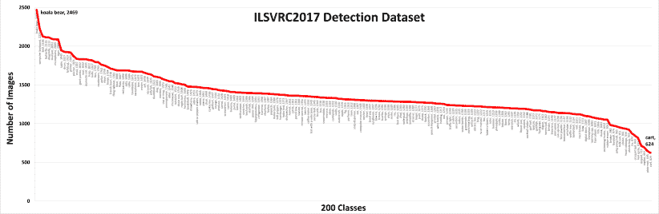

<!--yml

分类：未分类

日期：2024-09-06 19:55:33

-->

# [2104.11892] 现代深度学习基础的目标检测模型调查

> 来源：[`ar5iv.labs.arxiv.org/html/2104.11892`](https://ar5iv.labs.arxiv.org/html/2104.11892)

# 现代深度学习基础的目标检测模型调查

Syed Sahil Abbas Zaidi, Mohammad Samar Ansari, Asra Aslam,

Nadia Kanwal, Mamoona Asghar 和 Brian Lee S.S.A. Zaidi, N. Kanwal, M Asghar 和 B. Lee 均在爱尔兰的阿斯隆技术学院工作。M.S. Ansari 在印度的阿里格尔穆斯林大学工作。A. Aslam 在爱尔兰国立大学戈尔韦分校的数据分析洞察中心工作。（电子邮件：sahilzaidi78@gmail.com, samar.ansari@zhect.ac.in, asra.aslam@insight-centre.org, nkanwal@ait.ie, masghar@ait.ie, blee@ait.ie）

###### 摘要

目标检测是图像或视频中物体的分类和定位任务。由于其广泛的应用，这一领域近年来得到了显著关注。本文调查了基于深度学习的目标检测器的最新发展，并简要概述了检测中使用的基准数据集和评估指标，以及一些用于识别任务的显著骨干架构。它还涵盖了在边缘设备上使用的当代轻量级分类模型。最后，我们比较了这些架构在多个指标上的性能。

###### 索引术语：

目标检测与识别，卷积神经网络（CNN），轻量级网络，深度学习^†^†publicationid: pubid: 预印本提交至 IET 计算机视觉。

## I 引言

对人类来说，目标检测是一项微不足道的任务。几个月大的婴儿就能开始识别常见物体，但直到上个十年的转折点，将其教给计算机一直是个艰巨的任务。这涉及到在视野范围内识别和定位所有物体实例（如汽车、人类、街道标志等）。类似地，分类、分割、运动估计、场景理解等其他任务一直是计算机视觉中的基本问题。

早期的目标检测模型是通过手工设计的特征提取器（如 Viola-Jones 检测器 [viola_rapid_2001]、方向梯度直方图 (HOG) [dalal_histograms_2005] 等）构建的。这些模型较慢、不准确，并且在不熟悉的数据集上表现不佳。卷积神经网络 (CNNs) 和深度学习的重新引入改变了视觉感知的格局。AlexNet [NIPS2012_c399862d] 在 ImageNet 大规模视觉识别挑战 (ILSVRC) 2012 挑战中的应用激发了对其在计算机视觉中应用的进一步研究。今天，目标检测从自动驾驶汽车和身份识别到安全和医疗用途都有应用。近年来，它随着新工具和技术的快速发展而呈指数增长。

本综述提供了基于深度学习的目标检测器和轻量级分类架构的全面回顾。虽然现有的综述已经相当详尽 [zou_object_2019, liu_deep_2018, chahal_survey_2018, jiao_survey_2019]，但它们大多数缺乏领域内的新进展。本文的主要贡献如下：

1.  1.

    本文对两个类别的主要目标检测器进行了深入分析——单阶段检测器和双阶段检测器。此外，我们还回顾了这些方法的发展历程。

1.  2.

    我们对标志性的骨干架构和轻量级模型进行了详细评估。我们未能找到任何一篇论文对这两个主题提供广泛的概述。

在本文中，我们系统地回顾了各种目标检测架构及其相关技术，如图 1 所示。本文其余部分的组织结构如下。在 II 节中，讨论了目标检测问题及其相关挑战。各种基准数据集和评估指标列在 III 节中。在 IV 节中，检查了现代目标检测器中使用的几个里程碑式的骨干架构。 V 节分为三个主要子节，每个子节研究不同类别的目标检测器。接着在 VI 节中分析了一种特殊分类的目标检测器，称为轻量级网络，并在 VII 节中进行比较分析。未来趋势在 LABEL:FuT 节中提及，论文在 LABEL:Con 节中总结。

图 1：论文结构。

(a) PASCAL VOC 12

(b) MS-COCO

(c) ILSVRC

(d) OpenImage

图 2：来自不同数据集的示例图像。

## II 背景

### II-A 问题陈述

目标检测是目标分类的自然延伸，目标分类仅旨在识别图像中的对象。目标检测的目标是检测所有预定义类别的实例，并通过轴对齐的框在图像中提供粗略定位。检测器应能够识别所有对象类别的实例，并绘制边界框。它通常被视为一个监督学习问题。现代目标检测模型可以访问大量标注图像进行训练，并在各种经典基准上进行评估。

### II-B 目标检测中的关键挑战

计算机视觉在过去十年中取得了长足进展，但仍面临一些主要挑战。这些挑战中一些在实际应用中面临的关键问题包括：

+   •

    类内变异：同一对象的实例之间的类内变异在自然界中相对常见。这种变异可能由于遮挡、光照、姿态、视角等各种原因造成。这些不受限制的外部因素会对对象的外观产生显著影响[liu_deep_2018]。预计对象可能会发生非刚性变形或出现旋转、缩放或模糊现象。有些对象可能具有不显眼的周围环境，使得提取变得困难。

+   •

    类别数量：可供分类的对象类别数量庞大，这使得问题解决起来具有挑战性。这也需要更多高质量的标注数据，而这些数据难以获得。使用较少的示例训练检测器仍是一个开放的研究问题。

+   •

    效率：现代模型需要高计算资源才能生成准确的检测结果。随着移动设备和边缘设备的普及，高效的目标检测器对计算机视觉领域的进一步发展至关重要。

## III 数据集和评估指标

### III-A 数据集

本节概述了可用的数据集，并且这些数据集在目标检测任务中被最常使用。

#### III-A1 PASCAL VOC 07/12

Pascal 视觉对象类别（VOC）挑战是促进视觉感知领域发展的多年努力。它始于 2005 年，包括四个物体类别的分类和检测任务[everingham_pascal_2010]，但是两个版本的这个挑战赛被多数人用作标准基准。虽然 VOC07 挑战有 5 千张训练图片和超过 12 千个标记物体[pascal-voc-2007]，VOC12 挑战增加到了 11 千张训练图片和超过 27 千个标记物体[everingham_pascal_2012]。物体类别扩展到 20 个类别，并且还包括了分割和动作检测等任务。Pascal VOC 引入了 0.5 IoU（交并比）的平均精度均值（mAP）来评估模型的性能。图 3 描述了 Pascal VOC 数据集中不同类别图片数量的分布。

#### III-A2 ILSVRC

ImageNet 大规模视觉识别挑战（ILSVRC）[russakovsky_imagenet_2015]是一个从 2010 年到 2017 年每年举办的挑战赛，成为了评估算法性能的基准。数据集的规模扩大到了一百多万张图片，包括 1000 个目标分类类别。其中有 200 个类别被挑选出来用于目标检测任务，包括超过 50 万张图片。数据集的构建使用了包括 ImageNet [deng_imagenet_2009]和 Flikr 在内的各种来源。ILSVRC 还通过放宽 IoU 阈值来更新了评估指标，以帮助包含更小的目标检测。图 4 描述了 ImageNet 数据集中不同类别图片数量的分布。

#### III-A3 MS-COCO

微软常见对象数据集 (MS-COCO) [Lin_ms_coco_2014] 是最具挑战性的数据集之一。它包含 91 个在自然环境中常见的对象，这些对象是 4 岁的儿童可以轻松识别的。该数据集于 2015 年推出，自那时以来其受欢迎程度不断增加。它包含超过两百万个实例，平均每张图像 3.5 个类别。此外，它每张图像包含 7.7 个实例，明显多于其他流行的数据集。MS COCO 还包含来自不同视角的图像。它还引入了一种更严格的方法来衡量检测器的性能。与 Pascal VOC 和 ILSVCR 不同，它计算 IoU 从 0.5 到 0.95，每步 0.05，然后使用这 10 个值的组合作为最终度量，称为平均精度 (AP)。除此之外，它还利用 AP 分别衡量小型、中型和大型对象，以比较不同尺度的性能。图 5 描述了 MS-COCO 数据集中不同类别的图像数量分布。

表 I：各种对象检测数据集的比较。

| 数据集 | 类别 | 训练 | 验证 | 测试 |
| --- | --- | --- | --- | --- |
|  |  | 图像 | 对象 | 对象/图像 | 图像 | 对象 | 对象/图像 |  |
| --- | --- | --- | --- | --- | --- | --- | --- | --- |
| PASCAL VOC 12 | 20 | 5,717 | 13,609 | 2.38 | 5,823 | 13,841 | 2.37 | 10,991 |
| MS-COCO | 80 | 118,287 | 860,001 | 7.27 | 5,000 | 36,781 | 7.35 | 40,670 |
| ILSVRC | 200 | 456,567 | 478,807 | 1.05 | 20,121 | 55,501 | 2.76 | 40,152 |
| OpenImage | 600 | 1,743,042 | 14,610,229 | 8.38 | 41,620 | 204,621 | 4.92 | 125,436 |

#### III-A4 开放图像

谷歌的开放图像数据集 [kuznetsova_open_2020] 由 920 万张图像组成，附有图像级标签、对象边界框和分割掩码等注释。该数据集于 2017 年推出，并已经接收了六次更新。对于对象检测，开放图像数据集在 190 万张图像上有 1600 万个边界框，涵盖 600 个类别，这使得它成为最大的对象定位数据集。其创建者特别挑选了有趣、复杂和多样化的图像，每张图像包含 8.3 个对象类别。对 AP 进行了几项更改，例如忽略未标注的类别、对类别及其子类的检测要求等。图 6 描述了开放图像数据集中不同类别的图像数量分布。

图 3：（此图像最佳查看方式为放大 PDF 格式）PascalVOC 数据集中不同类别的图像数量注释 [aslam2021survey]

图 4: （此图像在放大状态下以 PDF 形式查看效果最佳）ImageNet 数据集中不同类别的图像数量 [aslam2021survey]

图 5: （此图像在放大状态下以 PDF 形式查看效果最佳）MS-COCO 数据集中不同类别的图像数量 [aslam2021survey]

图 6: （此图像在放大状态下以 PDF 形式查看效果最佳）Open Images 数据集中不同类别的图像数量 [aslam2021survey]

#### III-A5 数据偏斜/偏差问题

在观察图 3 到图 6 时，一个警觉的读者肯定会注意到，不同类别的图像数量在所有数据集中差异显著[aslam2021survey]。上述四个数据集中有三个（Pascal VOC、MS-COCO 和 Open Images 数据集）在前五个最频繁的类别之外，图像数量显著减少。正如图 3 中可以清楚地观察到，包含‘人’的图像有 13775 张，而包含‘车’的图像有 2829 张。这个数据集中其余 18 个类别的图像数量几乎线性减少到‘羊’的 55 张图像。同样，在 MS-COCO 数据集中，类别‘人’有 262465 张图像，接下来最频繁的类别‘车’有 43867 张图像。下降趋势持续，直到‘吹风机’类别的图像数量只有 198 张。Open Images 数据集中也观察到了类似现象，其中‘人’类别最为频繁，有 378077 张图像，而‘纸刀’类别仅有 3 张图像。这明显代表了数据集的偏差，并且必然会在任何目标检测模型的训练过程中产生偏倚。因此，在这些偏斜的数据集上训练的目标检测模型很可能会对训练数据中图像数量更多的类别表现出更好的检测性能。尽管仍然存在，但这个问题在 ImageNet 数据集中略微减少，可以从图 4 中观察到，其中最频繁的类别‘考拉’有 2469 张图像，而最不频繁的类别‘手推车’有 624 张图像。然而，这引出了 ImageNet 数据集的另一个问题：最频繁的类别是‘考拉’，其次是‘电脑键盘’，这些显然不是现实世界目标检测场景中最受关注的对象（如人、车、交通标志等）。

### III-B 指标

目标检测器使用多个标准来衡量检测器的性能，例如每秒帧数（FPS）、精确度和召回率。然而，平均精度均值（mAP）是最常用的评估指标。精确度源自交并比（IoU），即真实框和预测边界框之间重叠区域与联合区域的比率。设置一个阈值来确定检测是否正确。如果 IoU 大于阈值，则分类为真正例（True Positive），而 IoU 低于阈值则分类为假正例（False Positive）。如果模型未能检测到真实框中存在的物体，则称为假负例（False Negative）。精确度测量的是正确预测的百分比，而召回率测量的是相对于真实框的正确预测。

|  | $\begin{split}Precision&amp;=\frac{True\ Positive}{True\ Positive+False\ Positive}\\ &amp;=\frac{True\ Positive}{All\ Observations}\end{split}$ |  | (1) |
| --- | --- | --- | --- |
|  | $\begin{split}Recall&amp;=\frac{True\ Positive}{True\ Positive+False\ Negative}\\ &amp;=\frac{True\ Positive}{All\ Ground\ Truth}\end{split}$ |  | (2) |

根据上述公式，平均精度是针对每个类别单独计算的。为了比较检测器之间的性能，使用所有类别的平均精度的均值，称为平均精度均值（mAP），它作为最终评估的单一指标。

## IV 主干网络架构

主干网络架构是目标检测器最重要的组成部分之一。这些网络从模型使用的输入图像中提取特征。这里，我们讨论了一些在现代检测器中使用的里程碑式主干网络架构：

### IV-A AlexNet

Krizhevsky 等人提出了 AlexNet [NIPS2012_c399862d]，这是一种基于卷积神经网络的图像分类架构，并赢得了 2012 年 ImageNet 大规模视觉识别挑战（ILSVRC）。它的准确性比当时的模型高出相当多（超过 26%）。AlexNet 由八个可学习的层组成——五个卷积层和三个全连接层。全连接层的最后一层连接到一个 N 类（N: 类别数）的 softmax 分类器。它在整个网络中使用多个卷积核来从图像中提取特征。它还使用 dropout 和 ReLU 分别用于正则化和更快的训练收敛。卷积神经网络通过在 AlexNet 中的重新引入获得了新的生命，并迅速成为处理图像数据的首选技术。

### IV-B VGG

尽管 AlexNet [NIPS2012_c399862d] 及其后续模型如 [zeiler_visualizing_2014] 关注于通过较小的感受野来提高准确性，但 Simonyan 和 Zisserman 研究了网络深度对其影响。他们提出了 VGG [simonyan_very_2015]，该网络使用小卷积滤波器构建不同深度的网络。虽然一组较小的卷积滤波器可以捕捉到更大的感受野，但它会显著减少网络参数并更快地收敛。论文展示了深度网络架构（16-19 层）如何用于执行分类和定位，并提供了更高的准确性。VGG 是通过添加一系列卷积层、三个全连接层以及一个 softmax 层而创建的。根据作者的说法，卷积层的数量可以从 8 层到 16 层不等。VGG 经过多次迭代训练；首先，用随机初始化训练最小的 11 层架构，然后使用其权重训练更大的网络，以防止梯度不稳定。VGG 在单网络性能类别中超越了 ILSVRC 2014 的获胜者 GoogLeNet [szegedy_going_2014]。它很快成为对象分类和检测模型中最常用的网络骨干之一。

### IV-C GoogLeNet/Inception

尽管分类网络在向更快、更准确的网络发展，但将它们部署到实际应用中仍然遥不可及，因为这些网络资源消耗很大。随着网络规模的扩大，计算成本呈指数级增加。Szegedy 等人在 [szegedy_going_2014] 中提出，网络计算的浪费是其主要原因之一。更大的模型也有大量的参数，容易导致数据过拟合。他们提出使用局部稀疏连接架构来替代完全连接的架构，以解决这些问题。因此，GoogLeNet 是一个 22 层深的网络，由多个 Inception 模块堆叠而成。Inception 模块是在同一层级上具有不同尺寸滤波器的网络。输入特征图通过这些滤波器，并被拼接后传递到下一层。网络还在中间层中具有辅助分类器，以帮助正则化和传播梯度。GoogLeNet 展示了如何通过有效利用计算块来与其他参数密集型网络相媲美。它在 ImageNet [russakovsky_imagenet_2015] 数据集上实现了 93.3% 的 top-5 准确率，并且比其他当代模型更快。更新版本的 Inception 如 [szegedy_rethinking_2016]、[szegedy_inception-v4_2016] 也在随后的几年中发布，进一步提升了其性能，并提供了精细稀疏连接架构应用的进一步证据。

### IV-D ResNets

随着卷积神经网络变得越来越深，Kaiming He 等人在 [kaiming_resnet_2016] 中展示了其准确性如何先饱和后迅速下降。他们提出使用残差学习来解决性能衰退问题。这是通过在层之间添加跳跃连接来实现的。这个连接是输入和块输出之间的逐元素加法，不会给网络增加额外的参数或计算复杂度。一个典型的 34 层 ResNet [kaiming_resnet_2016] 基本上是一个大型 (7x7) 卷积滤波器，后跟 16 个瓶颈模块（成对的小 3x3 滤波器，中间有身份捷径），最终是一个全连接层。瓶颈架构可以通过堆叠 3 个卷积层（1x1,3x3,1x1）来适应更深的网络，而不是 2 个。Kaiming He 等人还展示了 16 层 VGG 网络的复杂性高于他们深得多的 101 层和 152 层 ResNet 架构，同时准确性较低。在随后的论文中，作者提出了 ResNetv2 [he_identity_2016]，该架构在块中使用了批量归一化和 ReLU 层。它更加通用，训练更容易。ResNet 被广泛用于分类和检测主干网络，其核心原则也启发了许多网络（[huang_densely_2018, xie_aggregated_2017, szegedy_inception-v4_2016]）。

### IV-E ResNeXt

现有传统方法通过增加模型的深度或宽度来提高模型的准确性。然而，增加这些参数会导致模型复杂性和参数数量增加，同时收益边际迅速减少。Xie 等人引入了 ResNeXt [xie_aggregated_2017] 架构，它比其他现有模型更简单、更高效。ResNeXt 的灵感来源于 VGG/ResNet[kaiming_resnet_2016, NIPS2012_c399862d] 中相似块的堆叠以及 Inception 模块[szegedy_going_2014] 的“分裂-变换-合并”行为。它本质上是一个 ResNet，每个 ResNet 块都被类似 Inception 的 ResNeXt 模块所替代。Inception 中复杂的、量身定制的变换模块被 ResNeXt 块中的拓扑结构相同的模块所替代，使得网络更容易扩展和泛化。Xie 等人还强调，基数（ResNeXt 块中的拓扑路径）可以被视为第三个维度，与深度和宽度一起用于提高模型准确性。ResNeXt 优雅且更加简洁。它在具有明显较少的超参数的情况下达到了更高的准确性。它也是 ILSVRC 2016 挑战的第一名亚军。

表 II：主干网络架构的比较。

| 模型 | 年份 | 层数 | 参数（百万） | Top-1 精度% | FLOPs（十亿） |
| --- | --- | --- | --- | --- | --- |
| AlexNet | 2012 | 7 | 62.4 | 63.3 | 1.5 |
| VGG-16 | 2014 | 16 | 138.4 | 73 | 15.5 |
| GoogLeNet | 2014 | 22 | 6.7 | - | 1.6 |
| ResNet-50 | 2015 | 50 | 25.6 | 76 | 3.8 |
| ResNeXt-50 | 2016 | 50 | 25 | 77.8 | 4.2 |
| CSPResNeXt-50 | 2019 | 59 | 20.5 | 78.2 | 7.9 |
| EfficientNet-B4 | 2019 | 160 | 19 | 83 | 4.2 |

### IV-F CSPNet

现有的神经网络在计算机视觉任务中取得了令人惊叹的高准确率；然而，它们依赖于过多的计算资源。王等人认为，通过减少网络中的重复梯度信息，可以降低推理计算的复杂度。他们提出了 CSPNet [wang_cspnet_2019]，该网络为梯度流创建了不同的路径。CSPNet 在基础层将特征图分为两个部分。一部分通过部分卷积网络块（例如，DenseNet [huang_densely_2018] 中的 Dense 和 Transition 块或 ResNeXt [xie_aggregated_2017] 中的 Res(X) 块），而另一部分则在后续阶段与其输出进行结合。这减少了参数的数量，提高了计算单元的利用率，并减轻了内存占用。它易于实现且足够通用，适用于其他架构，如 ResNet [kaiming_resnet_2016]、ResNeXt [xie_aggregated_2017]、DenseNet [huang_densely_2018]、Scaled-YOLOv4 [wang_scaled-yolov4_2020] 等。将 CSPNet 应用于这些网络将计算量减少了 10% 到 20%，同时准确率保持不变或有所提高。内存成本和计算瓶颈也通过这种方法显著减少。它在许多最先进的检测器模型中得到了应用，同时也被用于移动设备和边缘设备。

图 7：CNN 架构的可视化²²2 使用的工具： https://netron.app/。从左到右：AlexNet、VGG$-$16、GoogLeNet、ResNet$-$50、CSPResNeXt$-$50、EfficientNet$-$B4。

### IV-G EfficientNet

Tan 等人系统地研究了网络扩展及其对模型性能的影响。他们总结了改变网络参数如深度、宽度和分辨率如何影响其准确性。单独扩展任何参数都会带来相关的成本。增加网络的深度可以帮助捕捉更丰富和复杂的特征，但由于梯度消失问题，这些特征难以训练。同样，扩展网络宽度将使捕捉细粒度特征变得更容易，但在获取高级特征方面会有困难。提高图像分辨率带来的收益，像深度和宽度一样，会随着模型的扩展而饱和。在论文 [tan_efficientnet_2020] 中，Tan 等人提出使用复合系数来均匀扩展所有三个维度。每个模型参数都有一个相关的常数，这个常数通过将系数固定为 $1$ 并对基准网络进行网格搜索来找到。基准架构受到他们之前工作 [tan_mnasnet_2018] 的启发，通过在优化准确性和计算的搜索目标上进行神经架构搜索来开发。EfficientNet 是一个简单而高效的架构。它在准确性和速度上超过了现有模型，同时体积显著更小。通过提供显著的效率提升，它有可能在高效网络领域开辟一个新时代。

## V 目标检测器

我们根据两种检测器类型——两阶段检测器和单阶段检测器，划分了这篇综述。然而，我们也讨论了开创性工作，简要考察了一些传统的目标检测器。一个具有单独模块来生成区域提议的网络被称为两阶段检测器。这些模型在第一阶段试图在图像中找到任意数量的目标提议，然后在第二阶段对它们进行分类和定位。由于这些系统有两个独立的步骤，它们通常需要更长的时间生成提议，具有复杂的架构并缺乏全局上下文。单阶段检测器通过密集采样在一次操作中分类和定位语义对象。它们使用预定义的框/关键点来定位对象，并具有比两阶段检测器更好的实时性能和更简单的设计。

### V-A 开创性工作

#### V-A1 Viola-Jones

Viola-Jones 目标检测器 [viola_rapid_2001] 主要用于人脸检测，2001 年提出，是一个准确且强大的检测器。它结合了多种技术，如 Haar 类似特征、积分图像、Adaboost 和级联分类器。第一步是通过在输入图像上滑动窗口来搜索 Haar 类似特征，并使用积分图像进行计算。接着，它使用训练过的 Adaboost 找到每个 Haar 特征的分类器并将其级联。Viola-Jones 算法仍在小型设备中使用，因为它非常高效和快速。

#### V-A2 HOG 检测器

在 2005 年，Dalal 和 Triggs 提出了方向梯度直方图（HOG）[dalal_histograms_2005] 特征描述符，用于提取对象检测的特征。它相较于其他检测器如 [lowe_distinctive_2004, lowe_object_1999, mohan_example-based_2001, yan_ke_pca-sift_2004] 有了改进。HOG 提取边缘的梯度及其方向来创建特征表。图像被划分为网格，然后使用特征表为网格中的每个单元创建直方图。HOG 特征生成区域感兴趣的部分，并输入线性 SVM 分类器进行检测。该检测器最初是为行人检测提出的，但也可以训练检测各种类别。

#### V-A3 DPM

可变形部件模型（DPM）[felzenszwalb_discriminatively_2008] 由 Felzenszwalb 等人提出，并在 2009 年赢得了 Pascal VOC 挑战赛。该模型利用对象的单个“部件”进行检测，准确性高于 HOG。它遵循分而治之的理念；在推理时单独检测对象的各个部件，并标记它们的可能排列为检测结果。例如，人类身体可以看作是头部、手臂、腿部和躯干等部件的集合。一个模型会被分配来捕捉整个图像中的一个部件，这个过程对所有这样的部件重复进行。然后，模型会去除这些部件组合的可能性配置，以生成检测结果。DPM 基础的模型 [felzenszwalb_object_2010, felzenszwalb_cascade_2010] 是深度学习时代之前最成功的算法之一。

### V-B 两阶段检测器

#### V-B1 R-CNN

基于区域的卷积神经网络（R-CNN）[girshick_rich_2014] 是 R-CNN 系列中的首篇论文，展示了卷积神经网络（CNN）如何极大地提升检测性能。R-CNN 使用与 CNN 结合的类无关区域提议模块，将检测问题转换为分类和定位问题。首先，将均值减去的输入图像传递通过区域提议模块，该模块生成 2000 个对象候选框。该模块使用选择性搜索 [uijlings_selective_2013] 找到图像中具有较高物体发现概率的部分。这些候选框随后经过 CNN 网络的变形和传播，为每个提议提取一个 4096 维的特征向量。Girshick 等人使用 AlexNet [NIPS2012_c399862d] 作为检测器的骨干网络。特征向量随后传递给训练过的类特定支持向量机（SVM）以获得置信度分数。基于其 IoU 和类别，之后对评分区域应用非极大值抑制（NMS）。一旦识别出类别，算法使用训练好的边界框回归器预测其边界框，回归器预测四个参数，即框的中心坐标及其宽度和高度。

R-CNN 具有复杂的多阶段训练过程。第一阶段是用大型分类数据集对 CNN 进行预训练。接着，通过用一个随机初始化的 N+1 类分类器替换分类层，并使用领域特定的图像（均值减去，扭曲的提案），对检测进行微调，其中 N 为类别数量，使用随机梯度下降（SGD）[lecun_backpropagation_1989]。每个类别训练一个一行 SVM 和边界框回归器。

R-CNN 带来了对象检测领域的新潮流，但其处理速度较慢（每张图像 47 秒）且在时间和空间上都很昂贵 [girshick_fast_2015]。其训练过程复杂，即使在一些计算共享的情况下，也需要几天的时间来训练小型数据集。

#### V-B2 SPP-Net

He 等人提出了使用空间金字塔池化（SPP）层 [grauman_pyramid_2005] 来处理任意大小或纵横比的图像。他们意识到，只有 CNN 的全连接部分需要固定输入。SPP-net [he_spatial_2015] 仅将 CNN 的卷积层移到区域提议模块之前，并添加了一个池化层，从而使网络不受大小/纵横比的影响并减少计算量。选择性搜索 [uijlings_selective_2013] 算法用于生成候选窗口。通过将输入图像传递通过 ZF-5 [zeiler_visualizing_2014] 网络的卷积层来获得特征图。然后将候选窗口映射到特征图上，这些特征图随后通过金字塔池化层的空间区块转换为固定长度的表示。这个向量传递到全连接层，最终传递到 SVM 分类器以预测类别和得分。类似于 R-CNN [girshick_rich_2014]，SPP-net 具有后处理层，通过边界框回归来改善定位。它也使用相同的多阶段训练过程，不同之处在于，仅对全连接层进行微调。

SPP-Net 在准确性相当的情况下，比 R-CNN 模型快得多。它可以处理任意形状/纵横比的图像，从而避免由于输入变形而导致的物体形变。然而，由于其架构类似于 R-CNN，它也继承了 R-CNN 的缺点，如多阶段训练、计算开销大以及训练时间长等。

#### V-B3 快速 R-CNN

R-CNN/SPP-Net 的主要问题之一是需要分别训练多个系统。Fast R-CNN [girshick_fast_2015] 通过创建一个单一的端到端可训练系统解决了这个问题。网络以图像及其对象建议作为输入。图像通过一系列卷积层处理，对象建议则映射到获得的特征图上。Girshick 用一个称为 RoI pooling 层的单一空间箱替代了 SPP-net [he_spatial_2015] 的金字塔结构的池化层。这个层连接到两个全连接层，然后分支成一个 N+1 类 SoftMax 层和一个边界框回归层，后者也有一个全连接层。该模型还将边界框回归器的损失函数从 L2 改为平滑 L1，以提高性能，同时引入了多任务损失来训练网络。

作者使用了修改版的现有最先进的预训练模型，如 [NIPS2012_c399862d]、[simonyan_very_2015] 和 [jia_caffe_2014] 作为骨干。网络通过随机梯度下降（SGD）和一个包含 2 张图像的迷你批量进行了一步训练。这帮助网络更快地收敛，因为反向传播在两个图像的 RoIs 之间共享了计算。

Fast R-CNN 作为一种在速度上（比 R-CNN 快 146 倍）的改进被引入，而准确性的提高是附加的。它简化了训练过程，移除了金字塔池化，并引入了新的损失函数。该对象检测器在没有区域提议网络的情况下，以接近实时的速度报告了相当的准确性。

图 8: 不同两阶段对象检测器的内部架构示意图⁴⁴4 特征由：https://poloclub.github.io/cnn-explainer/ 创建。

#### V-B4 Faster R-CNN

尽管 Fast R-CNN 更接近实时目标检测，但其区域提议生成仍然慢了一个数量级（每张图片 2 秒，而不是 0.2 秒）。Ren 等人建议了一种全卷积网络 [long_fully_2015] 作为区域提议网络（RPN），在 [ren_faster_2015] 中使用，它接收任意输入图像并输出一组候选窗口。每个这样的窗口都有一个关联的物体评分，用于确定物体的可能性。与之前的 [felzenszwalb_object_2010, girshick_fast_2015, kaiming_resnet_2016] 使用图像金字塔解决物体尺寸变异不同，RPN 引入了 Anchor boxes。它使用了多种不同纵横比的边界框，并对其进行回归以定位物体。输入图像首先通过 CNN 以获得一组特征图。这些特征图被传递到 RPN，RPN 产生边界框及其分类。选择的提议随后被映射回从之前 CNN 层获得的特征图中，在 RoI 池化层中，最终输入到全连接层，再送入分类器和边界框回归器。Faster R-CNN 本质上是带有 RPN 作为区域提议模块的 Fast R-CNN。

Faster R-CNN 的训练过程更为复杂，因为两个模型之间存在共享层，而它们执行的任务截然不同。首先，RPN 在 ImageNet 数据集 [deng_imagenet_2009] 上进行预训练，并在 PASCAL VOC 数据集 [everingham_pascal_2010] 上进行微调。然后，从 RPN 提出的区域开始训练 Fast R-CNN。在这之前，网络没有共享卷积层。现在，我们固定检测器的卷积层，并微调 RPN 中的独特层。最后，Fast R-CNN 从更新后的 RPN 进行微调。

Faster R-CNN 将检测精度提高了超过 3%，超越了之前的最先进技术 [girshick_fast_2015]，并将推理时间缩短了一个数量级。它解决了缓慢区域提议的瓶颈，并以每秒 5 帧的接近实时速度运行。使用 CNN 进行区域提议的另一个优点是它可以学习生成更好的提议，从而提高准确性。

#### V-B5 FPN

使用图像金字塔来获取多级特征金字塔（或特征化图像金字塔）是一种常见的方法，用于增加对小物体的检测。尽管它提高了检测器的平均精度，但推断时间的增加却是显著的。Lin 等人提出了特征金字塔网络（FPN）[lin2017feature]，它具有自上而下的架构，并通过侧向连接来构建不同尺度的高级语义特征。FPN 具有两条路径，一条是自下而上的路径，它是一个在多个尺度上计算特征层次的 ConvNet，另一条是自上而下的路径，它将来自高层的粗糙特征图上采样成高分辨率特征。这些路径通过 1x1 卷积操作通过侧向连接相连，以增强特征中的语义信息。在这里，FPN 被用作基于 ResNet-101 [kaiming_resnet_2016] 的 Faster R-CNN 的区域提议网络（RPN）。

FPN 可以在所有尺度上提供高级语义，这减少了检测中的错误率。它成为了未来检测模型中的标准构建块，并提高了模型的准确性。它还导致了其他改进网络的开发，如 PANet [liu_path_2018]、NAS-FPN [ghiasi_nas-fpn_2019] 和 EfficientNet [tan_efficientnet_2020]，这些都是当前的最先进检测器。

#### V-B6 R-FCN

Dai 等人提出了基于区域的全卷积网络（R-FCN）[dai_r-fcn_2016]，该网络几乎共享了所有的计算，与之前的两阶段检测器不同，后者在每个提议上应用了资源密集型技术。他们反对使用全连接层，转而使用卷积层。然而，卷积网络中的深层对平移不变，因此在定位任务中效果不佳。作者提出使用位置敏感的得分图来解决这个问题。这些敏感得分图编码了对象的相对空间信息，并在之后进行池化以识别准确的定位。R-FCN 通过将感兴趣区域划分为 k x k 网格，并与检测类别特征图评分每个单元的可能性来实现这一点。这些得分随后被平均，并用于预测对象类别。R-FCN 检测器是四个卷积网络的组合。输入图像首先通过 ResNet-101[kaiming_resnet_2016] 生成特征图。一个中间输出（Conv4 层）传递给区域提议网络（RPN）以识别 RoI 提议，而最终输出则通过卷积层进一步处理，并输入分类器和回归器。分类层将生成的位置敏感图与 RoI 提议结合起来生成预测，而回归网络则输出边界框细节。R-FCN 以类似 Faster-RCNN [ren_faster_2015] 的 4 步方式进行训练，同时使用了结合交叉熵和框回归损失的方法。在训练过程中，它还采用了在线困难样本挖掘（OHEM）[shrivastava_training_2016]。

Dai 等人提出了一种新方法来解决卷积神经网络中的平移不变性问题。R-FCN 结合了 Faster R-CNN 和 FCN，实现了一个更快、更准确的检测器。尽管它没有显著提高准确性，但比其对应方法快了 2.5 到 20 倍。

#### V-B7 Mask R-CNN

Mask R-CNN [he2018mask] 在 Faster R-CNN 的基础上进行扩展，通过增加另一个并行分支来进行像素级对象实例分割。该分支是一个全连接网络，应用于 RoI 上，以将每个像素分类到不同的分段中，总体计算成本较低。它使用与 Faster R-CNN 相似的基本架构进行对象提议，但在分类和边界框回归头旁边增加了一个掩码头。一个主要的区别是使用 RoIAlign 层，而不是 RoIPool 层，以避免由于空间量化而导致的像素级对齐误差。作者选择了 ResNeXt-101 [xie_aggregated_2017] 作为其骨干网络，并配合特征金字塔网络（FPN）以提高准确性和速度。Faster R-CNN 的损失函数被更新为掩码损失，并且与 FPN 一样，使用了 5 个锚框和 3 种长宽比。整体上，Mask R-CNN 的训练与 Faster R-CNN 相似。

Mask R-CNN 在现有的单模型架构中表现更好，增加了实例分割的额外功能，计算开销很小。它易于训练，灵活，并且在关键点检测、人类姿态估计等应用中具有很好的泛化能力。然而，它的实时性能仍低于$>$30 fps。

#### V-B8 DetectoRS

许多现代的两阶段检测器如[ren_faster_2015, chen_hybrid_2019, cai_cascade_2017]使用了“看两次再想”的机制，即先计算目标提议，然后用它们提取特征以检测目标。DetectoRS [qiao_detectors_2020]在网络的宏观和微观层面上应用了这一机制。在宏观层面上，他们提出了递归特征金字塔（RFP），由多个特征金字塔网络（FPN）堆叠而成，并且 FPN 的自上而下路径中的顶部到底部层有额外的反馈连接。FPN 的输出在传递到下一个 FPN 层之前经过了 Atrous Spatial Pyramid Pooling 层（ASPP）[chen_deeplab_2017]处理。一个融合模块用于通过创建注意力图来结合来自不同模块的 FPN 输出。在微观层面上，Qiao 等人提出了可切换的扩张卷积（SAC）来调节卷积的膨胀率。使用带有 5x5 滤波器的平均池化层和 1x1 卷积作为开关函数，以决定扩张卷积[holschneider_real-time_1990]的膨胀率，帮助骨干网络实时检测各种尺度的目标。他们还将 SAC 打包在两个全局上下文模块[hu_squeeze-and-excitation_2019]之间，因为这有助于实现更稳定的切换。这两种技术，递归特征金字塔和可切换扩张卷积的结合形成了 DetectoRS。作者将上述技术与 Hybrid Task Cascade（HTC）[chen_hybrid_2019]作为基线模型，并使用了 ResNext-101 骨干网络。

DetectoRS 结合了多个系统来提高检测器的性能，并为两阶段检测器设定了最新水平。其 RFP 和 SAC 模块具有良好的泛化能力，可以用于其他检测模型。然而，它不适合实时检测，因为它每秒只能处理约 4 帧。

### V-C 单阶段检测器

#### V-C1 YOLO

两阶段检测器将目标检测视为一个分类问题，一个模块展示一些候选框，网络将其分类为目标或背景。然而，YOLO 或“你只看一次”[redmon_you_2016]将其重新定义为回归问题，直接预测图像像素作为目标及其边界框属性。在 YOLO 中，输入图像被划分为 S x S 网格，目标中心所在的单元负责检测目标。一个网格单元预测多个边界框，每个预测数组由 5 个元素组成：边界框中心的 x 和 y，框的尺寸 w 和 h，以及置信度分数。

YOLO 的灵感来源于用于图像分类的 GoogLeNet 模型 [szegedy_going_2014]，该模型使用了较小卷积网络的级联模块 [lin_network_2014]。它在 ImageNet 数据 [deng_imagenet_2009] 上进行预训练，直到模型达到高准确率，然后通过添加随机初始化的卷积和全连接层进行修改。在训练时，网格单元仅预测一个类别，因为这样收敛效果更好，但在推理时可以增加。多任务损失，即所有预测组件的综合损失，用于优化模型。非最大抑制（NMS）去除特定类别的多重检测。

YOLO 在准确度和速度上大幅超越了当代的单阶段实时模型。然而，它也存在显著的缺陷。小物体或聚集物体的定位准确性以及每个单元的物体数量限制是其主要缺点。这些问题在 YOLO 的后续版本中得到解决 [redmon_yolo9000_2016, redmon_yolov3_2018, bochkovskiy_yolov4_2020]。

#### V-C2 SSD

单阶段多框检测器（SSD） [liu_ssd_2016] 是第一个在保持实时速度的同时达到与当代两阶段检测器如 Faster R-CNN [ren_faster_2015] 相同准确度的单阶段检测器。SSD 构建在 VGG-16 [simonyan_very_2015]上，并添加了额外的辅助结构以提高性能。这些附加的卷积层被添加到模型的末端，大小逐渐减小。SSD 在网络的早期阶段检测到较小的物体，当图像特征还不太粗糙时，而深层则负责默认框的偏移和纵横比 [erhan_scalable_2014]。

在训练过程中，SSD 将每个真实框与具有最佳 Jaccard 重叠度的默认框匹配，并相应地训练网络，这与 Multibox [erhan_scalable_2014]类似。他们还使用了困难负样本挖掘和大量的数据增强。类似于 DPM [felzenszwalb_discriminatively_2008]，它利用定位和置信度损失的加权和来训练模型。最终输出通过执行非最大抑制来获得。

尽管 SSD 在速度和准确度上显著优于 YOLO 和 Faster R-CNN 等最先进的网络，但它在检测小物体方面存在困难。这个问题后来通过使用更好的主干架构如 ResNet 和其他小修复得到解决。

图 9: 不同两阶段和单阶段目标检测器的内部架构示意图²²脚注标记: 2。

#### V-C3 YOLOv2 和 YOLO9000

YOLOv2 [redmon_yolo9000_2016]，作为 YOLO [redmon_you_2016] 的改进，提供了速度和准确性之间的简单权衡，同时 YOLO9000 模型可以实时预测 9000 个物体类别。他们用 DarkNet-19 [redmon_darknet_2016] 替换了 GoogLeNet [szegedy_going_2014] 的主干架构。它结合了许多令人印象深刻的技术，如批归一化 [he_delving_2015] 来提高收敛性、分类和检测系统的联合训练以增加检测类别、去除全连接层以提高速度，并使用学习到的锚框来提高召回率并有更好的先验。Redmon 等人还结合了分类和检测数据集，使用 WordNet [miller_introduction_1991] 进行层次结构处理。这个 WordTree 可以用于预测更高条件概率的上位词，即使下位词没有正确分类，也能提高系统的整体性能。

YOLOv2 提供了更好的灵活性来选择速度和准确性上的模型，并且新架构的参数更少。正如论文标题所示，它“更好、更快、更强” [redmon_yolo9000_2016]。

#### V-C4 RetinaNet

鉴于单阶段和两阶段检测器的准确性差异，Lin 等人提出单阶段检测器滞后的原因是“极端的前景-背景类别不平衡” [lin_focal_2017]。他们提出了一种重新调整的交叉熵损失，称为 Focal 损失，以解决这种不平衡。Focal 损失参数减少了来自简单示例的损失贡献。作者通过一个简单的单阶段检测器 RetinaNet [lin_focal_2017] 展示了其有效性，该检测器通过在位置、尺度和长宽比上对输入图像进行密集采样来预测物体。它使用由特征金字塔网络（FPN）[lin2017feature] 增强的 ResNet [kaiming_resnet_2016] 作为主干网，并且有两个类似的子网络——分类和边界框回归器。每一层来自 FPN 的输出都传递给子网络，使其能够检测不同尺度的物体。分类子网络为每个位置预测物体分数，而边界框回归子网络将每个锚点的偏移回归到真实值。两个子网络都是小型全卷积网络（FCN），并在各自网络之间共享参数。与大多数先前的工作不同，作者使用了无类别的边界框回归器，并发现它们同样有效。

RetinaNet 训练简单，收敛速度快且易于实现。它在准确性和运行时间上比两阶段检测器表现更好。RetinaNet 还通过引入新的损失函数，推动了物体检测器优化方式的发展。

#### V-C5 YOLOv3

YOLOv3 相较于之前的 YOLO 版本 [redmon_you_2016, redmon_yolo9000_2016] 有了“逐步改进”。Redmon 等人用更大的 Darknet-53 网络 [redmon_darknet_2016] 替换了特征提取网络。他们还融合了数据增强、多尺度训练、批量归一化等多种技术。分类器层中的 Softmax 被替换为逻辑分类器。

尽管 YOLOv3 比 YOLOv2 [redmon_yolo9000_2016] 更快，但它并没有带来颠覆性的变化，甚至比一年前的最先进检测器 [lin_focal_2017] 精度还低。

#### V-C6 CenterNet

Zhou 等人在 [zhou_objects_2019] 中采取了非常不同的建模方式，将物体建模为点，而不是传统的边界框表示。CenterNet 将物体预测为边界框中心的一个点。输入图像经过 FCN 生成热图，其峰值对应检测物体的中心。它使用 ImageNet 预训练的堆叠 Hourglass-101 [newell_stacked_2016] 作为特征提取网络，并具有三个头部——热图头用于确定物体中心，尺寸头用于估计物体大小，偏移头用于修正物体点的偏移。三个头部的多任务损失在训练过程中被反向传播到特征提取网络。在推理时，使用偏移头的输出确定物体点，最终生成一个框。由于预测的是点而不是边界框，因此后处理不需要非极大值抑制 (NMS)。

CenterNet 带来了新的视角，抛弃了多年的物体检测领域进展。它比其前身更准确，推理时间更短。它在 3D 物体检测、关键点估计、姿态、实例分割、方向检测等多个任务中具有高精度。然而，它需要不同的骨干网络，因为与其他检测器兼容的通用网络在这里表现较差，反之亦然。

#### V-C7 EfficientDet

EfficientDet [tan_efficientdet_2020] 构建了一个具有更高准确性和效率的可扩展检测器。它引入了高效的多尺度特征、BiFPN 和模型缩放。BiFPN 是一个双向特征金字塔网络，具有可学习的权重，用于不同尺度输入特征的交叉连接。它改进了 NAS-FPN [ghiasi_nas-fpn_2019]，后者需要大量训练且网络复杂，通过去除单输入节点和添加额外的侧向连接来优化。这消除了效率较低的节点，并增强了高层特征融合。与现有检测器通过增加更大的、更深的主干或堆叠 FPN 层来扩大规模不同，EfficientDet 引入了一个复合系数，可以用来“联合缩放主干网络、BiFPN 网络、类别/框网络和分辨率” [tan_efficientdet_2020]。EfficientDet 采用 EfficientNet [tan_efficientnet_2020] 作为主干网络，并将多组 BiFPN 层串联作为特征提取网络。来自最终 BiFPN 层的每个输出都发送到类别和框预测网络。该模型使用 SGD 优化器以及同步批量归一化进行训练，并使用 swish 激活 [ramachandran_searching_2017]，而不是标准的 ReLU 激活，这种激活函数可微分、效率更高、性能更佳。

EfficientDet 在保持较小和计算成本较低的同时，比之前的检测器实现了更好的效率和准确性。它易于扩展，对其他任务具有良好的泛化能力，是当前单阶段目标检测的**最先进**模型。

#### V-C8 YOLOv4

YOLOv4 [bochkovskiy_yolov4_2020] 融入了许多令人兴奋的想法，设计了一种快速且易于训练的目标检测器，可以在现有的生产系统中运行。它利用了“免费赠品”，即只增加训练时间而不影响推理时间的方法。YOLOv4 采用了数据增强技术、正则化方法、类别标签平滑、CIoU-loss [zheng_distance-iou_2019]、Cross mini-Batch Normalization (CmBN)、自对抗训练、Cosine annealing scheduler [loshchilov_sgdr_2017] 和其他技巧来改进训练。也添加了只影响推理时间的方法，称为“特别赠品”，包括 Mish 激活 [misra_mish_2020]、Cross-stage partial connections (CSP) [wang_cspnet_2019]、SPP-Block [he_spatial_2015]、PAN path aggregated block [liu_path_2018]、多输入加权残差连接 (MiWRC) 等。它还使用了遗传算法来搜索超参数。它具有一个在 ImageNet 上预训练的 CSPNetDarknet-53 主干、SPP 和 PAN block neck，以及 YOLOv3 作为检测头。

现有的大多数检测算法需要多个 GPU 来训练模型，但 YOLOv4 可以轻松地在单个 GPU 上进行训练。它的速度是 EfficientDet 的两倍，同时性能相当。它是实时单阶段检测器的**最先进**技术。

#### V-C9 Swin Transformer

Transformers [vaswani2017attention] 自问世以来对自然语言处理（NLP）领域产生了深远的影响。在语言模型中，如 BERT（双向编码器表示 Transformer） [devlin2019bert]、GPT（生成预训练 Transformer） [radford2018improving]、T5（文本到文本转换 Transformer） [2020t5] 等应用，推动了该领域的技术进步。Transformers [vaswani2017attention] 使用注意力模型来建立序列元素之间的依赖关系，并能处理比其他顺序架构更长的上下文。Transformers 在 NLP 领域的成功引发了对其在计算机视觉中应用的兴趣。尽管 CNN 一直是视觉领域进展的骨干，但它们也存在一些固有的缺点，比如对全局上下文的重要性不足、固定的后训练权重 [khan2021transformers] 等。

Swin Transformer [liu2021swin] 旨在为计算机视觉任务提供一个基于 Transformer 的骨干网。它将输入图像分割成多个不重叠的块，并将这些块转换成嵌入。然后，在四个阶段中对这些块应用大量的 Swin Transformer 模块，每个后续阶段减少块的数量，以保持层次表示。Swin Transformer 模块由局部多头自注意力（MSA）模块组成，基于交替的移动块窗口。在局部自注意力中，计算复杂度随着图像大小线性增长，而移动窗口使得跨窗口连接成为可能。[liu2021swin] 还展示了移动窗口如何以较小的开销提高检测准确率。

Transformers 展示了一种从基于 CNN 的神经网络到新范式的转变。虽然其在视觉领域的应用仍处于初期阶段，但它替代卷积的潜力非常真实。Swin Transformer 在 MS COCO 数据集上达到了最先进的水平，但相比卷积模型使用了更高的参数量。

## VI 轻量级网络

最近几年，出现了一个新的研究方向，旨在为资源受限的环境设计小型高效的网络，这在物联网（IoT）部署中很常见 [abbas2021lightweight, karakanis2021lightweight, jadon2020low, jadon2019firenet]。这一趋势也影响到了高效物体检测器的设计。尽管大量物体检测器在准确性上表现出色并能实时推断，但这些模型中的大多数需要过多的计算资源，因此无法在边缘设备上部署。

过去，许多不同的方法已显示出令人兴奋的结果。利用高效组件和压缩技术，如剪枝（[lecun_optimal_1990, hassibi_advances_1993]）、量化（[han_deep_2016, courbariaux_binaryconnect_2016]）、哈希（[chen_compressing_2015]）等，已经提高了深度学习模型的效率。使用训练好的大型网络来训练较小模型，称为蒸馏（[hinton_distilling_2015]），也显示了有趣的结果。然而，在本节中，我们将深入探讨一些高效神经网络设计的突出示例，以在边缘设备上实现高性能。

### VI-A SqueezeNet

最近在卷积神经网络（CNN）领域的进展大多集中在提高基准数据集上的最先进精度，这导致了模型大小和参数的激增。但在 2016 年，Iandola 等人提出了一种更小、更智能的网络，称为 SqueezeNet（[iandola_squeezenet_2016]），它在保持性能的同时减少了参数。他们通过采用三种主要设计策略来实现这一点，即使用更小的滤波器，将输入通道数减少到 3x3 滤波器，并将下采样层放置在网络的后面。前两种策略减少了参数数量，同时试图保持精度，而第三种策略则提高了网络的精度。SqueezeNet 的基本模块称为火模块，包含两个层次：一个挤压层和一个扩展层，每个层都具有 ReLU 激活。挤压层由多个 1x1 滤波器组成，而扩展层则是 1x1 和 3x3 滤波器的混合，从而限制了输入通道的数量。SqueezeNet 架构由 8 个火模块堆叠在卷积层之间组成。受到 ResNet（[kaiming_resnet_2016]）的启发，还提出了带有残差连接的 SqueezeNet，这提高了相对于基础模型的精度。作者还实验了深度压缩（[han_deep_2016]），在保持基线精度的同时，实现了与 AlexNet 相比的 510$\times$模型大小减少。SqueezeNet 成为提升神经网络架构硬件效率的一个不错候选。

### VI-B MobileNets

MobileNet [howard_mobilenets_2017] 摒弃了传统的小模型方法，如缩小、剪枝、量化或压缩，而是使用了高效的网络架构。该网络采用了深度可分离卷积，将标准卷积分解为深度卷积和 1x1 点卷积。标准卷积在所有输入通道上使用卷积核，并在一步中将其组合，而深度卷积对每个输入通道使用不同的卷积核，并使用点卷积来组合输入。这种过滤和组合特征的分离减少了计算成本和模型大小。MobileNet 由 28 个独立的卷积层组成，每个卷积层后面都跟着批量归一化和 ReLU 激活函数。Howard 等人还引入了两个模型缩小的超参数：宽度和分辨率乘子，以进一步提高速度和减少模型的大小。宽度乘子通过减少输入和输出通道均匀地调整网络的宽度，而分辨率乘子影响输入图像及其在整个网络中的表示的大小。MobileNet 在保持模型尺寸较小的同时，达到了与一些全面模型相当的准确度。Howard 等人还展示了它如何在面部属性、地理定位和物体检测等各种应用中进行泛化。然而，它过于简单且像 VGG 一样线性，因此梯度流的途径较少。这些问题在后续版本的模型 [sandler_mobilenetv2_2019, howard_searching_2019] 中得到了修复。

### VI-C ShuffleNet

2017 年，张等人引入了 ShuffleNet [zhang_shufflenet_2018]，这是一种极其计算高效的神经网络架构，专为移动设备设计。他们认识到许多高效网络在缩小规模时效果会减弱，并认为这是由于昂贵的 1x1 卷积所致。为了克服信息流受限的缺点，他们提出结合通道洗牌和使用组卷积。ShuffleNet 主要由标准卷积组成，后面跟随三个阶段分组的 ShuffleNet 单元。ShuffleNet 单元类似于 ResNet 块，其中在 3x3 层使用深度卷积，并用点卷积组卷积替代 1x1 层。深度卷积层之前进行了通道洗牌操作。ShuffleNet 的计算成本由两个超参数管理：组数用于控制连接稀疏性，缩放因子用于调整模型大小。随着组数增大，错误率趋于饱和，因为每组的输入通道减少，从而可能降低表示能力。ShuffleNet 在体积明显较小的情况下超越了同时期的模型（[NIPS2012_c399862d, szegedy_going_2014, iandola_squeezenet_2016, howard_mobilenets_2017]）。由于 ShuffleNet 唯一的改进是通道洗牌，因此模型的推理速度没有提高。

### VI-D MobileNetv2

改进了 MobileNetv1 [howard_mobilenets_2017]，Sandler 等人于 2018 年提出了 MobileNetv2 [sandler_mobilenetv2_2019]。它引入了倒置残差与线性瓶颈，这是一种新颖的层模块，用于减少计算并提高准确性。该模块将输入的低维表示扩展到高维，使用深度卷积进行过滤，然后再将其投影回低维，与常见的残差块不同，后者执行压缩、卷积然后扩展操作。MobileNetv2 包含一个卷积层，随后是 19 个残差瓶颈模块，然后是两个卷积层。残差瓶颈模块仅在步幅为 1 时具有捷径连接。对于更高的步幅，由于尺寸差异，不使用捷径。他们还采用了 ReLU6 作为非线性函数，而不是简单的 ReLU，以限制计算。对于目标检测，作者将 MobileNetv2 用作 SSD [liu_ssd_2016]的计算高效变体的特征提取器。这个模型称为 SSDLite，声称相比于原始 SSD 具有 8 倍更少的参数，同时实现了竞争力的准确性。它在其他数据集上表现良好，易于实现，因此受到社区的广泛欢迎。

### VI-E PeleeNet

现有的轻量级深度学习模型如[howard_mobilenets_2017, zhang_shufflenet_2018, sandler_mobilenetv2_2019]严重依赖深度可分离卷积，但这种方法的实现效率不高。Wang 等人提出了一种基于传统卷积的新型高效架构，名为 PeleeNet [wang_pelee_2018]，使用了一系列节省计算资源的技术。PeleeNet 以 DenseNet [huang_densely_2018]为核心，同时参考了许多其他模型。它引入了双向密集层、stem 块、瓶颈中动态通道数、过渡层压缩以及传统的后激活，以减少计算成本并提高速度。受到[szegedy_going_2014]的启发，双向密集层有助于获得不同尺度的感受野，使得识别较大物体变得更容易。为了减少信息损失，stem 块的使用方式类似于[szegedy_inception-v4_2016, shen_dsod_2018]。他们还与[huang_densely_2018]中使用的压缩因子不同，因为它会影响特征表达并降低准确性。PeleeNet 由一个 stem 块、四个阶段的修改过的密集和过渡层，最终是分类层组成。作者还提出了一个实时目标检测系统，称为 Pelee，该系统基于 PeleeNet 并且是 SSD [liu_ssd_2016]的变体。它在移动和边缘设备上的表现相较于当代目标检测器有了进步，但展示了简单的设计选择如何在整体性能上产生巨大差异。

### VI-F ShuffleNetv2

2018 年，Ningning Ma 等人提出了一套设计高效网络架构的全面指南，在 ShuffleNetv2 [ma_shufflenet_2018]中。他们主张使用直接指标如速度或延迟来衡量计算复杂度，而不是使用间接指标如 FLOPs。ShuffleNetv2 基于四个指导原则：1) 输入和输出通道宽度相等，以最小化内存访问成本；2) 根据目标平台和任务精心选择组卷积；3) 多路径结构以更高的准确性换取效率；4) 元素级操作如加法和 ReLU 在计算上不可忽视。遵循上述原则，他们设计了一种新的构建块。它通过通道分割层将输入分为两部分，然后经过三层卷积层，再与残差连接拼接，并通过通道混洗层传递。对于下采样模型，通道分割被移除，残差连接使用深度可分离卷积层。将这些块组合在几个卷积层之间，即得到 ShuffleNetv2。作者还尝试了更大的模型（50/162 层），并获得了更高的准确性，且 FLOPs 大大减少。ShuffleNetv2 超越了其重量级，并在相似复杂度下超越了其他最先进的模型。

### VI-G MnasNet

随着对各种边缘设备上精确、快速和低延迟模型需求的增加，设计这样的神经网络变得比以往任何时候都更加具有挑战性。2018 年，Tan 等人提出了 Mnasnet [tan_mnasnet_2018]，它是基于自动化神经网络架构搜索（NAS）方法设计的。他们将搜索问题公式化为多目标优化，旨在同时达到高精度和低延迟。它还通过将 CNN 分解为独特的块，并随后在这些块中分别搜索操作和连接，从而减少了搜索空间。这也使得每个块具有独特的设计，与早期模型 [zoph_neural_2016, liu_progressive_2017, real_regularized_2019] 不同，后者堆叠了相同的块。作者使用基于 RNN 的强化学习代理作为控制器，同时使用训练器来测量精度，并使用移动设备来测试延迟。每个采样模型都在任务上进行训练以获得其精度，并在真实设备上运行以测量延迟。这用于实现软奖励目标，控制器会进行更新。这个过程会重复，直到达到最大迭代次数或得出合适的候选模型。它由 16 个多样化的块组成，其中一些带有残差连接。MnasNet 的速度几乎是 MobileNetv2 的两倍，同时具有更高的精度。然而，与其他基于强化学习的神经网络架构搜索模型一样，MnasNet 的搜索时间需要巨大的计算资源。

### VI-H MobileNetv3

MobileNetv3 [howard_searching_2019] 的核心方法与 MnasNet [tan_mnasnet_2018] 相同，但进行了部分修改。在一个分解的层次化搜索空间中执行平台感知自动神经架构搜索，并由 NetAdapt [yang_netadapt_2018] 进行优化，该过程通过多个迭代移除网络中未充分利用的组件。一旦获得了架构提案，就会修剪通道，随机初始化权重，然后对其进行微调以提高目标指标。该模型进一步修改以去除架构中的一些昂贵层，从而获得额外的延迟改进。Howard 等人认为架构中的滤波器通常是彼此的镜像，即使丢弃其中一半，这种准确性也能保持。使用这种技术减少了计算量。MobileNetv3 使用 ReLU 和硬 swish 的混合作为激活滤波器，后者主要用于模型的末尾。硬 swish 与 swish 函数没有明显区别，但计算上更便宜，同时保持了准确性。对于不同的资源使用场景，[howard_searching_2019] 引入了两个模型——MobileNetv3-Large 和 MobileNetv3-Small。MobileNetv3-Large 由 15 个瓶颈块组成，而 MobileNetv3-Small 有 11 个。它还在构建块上包含了 squeeze 和 excitation 层 [hu_squeeze-and-excitation_2019]。与 [sandler_mobilenetv2_2019] 类似，这些模型在 SSDLite 中充当特征检测器，比早期版本 [tan_mnasnet_2018, sandler_mobilenetv2_2019] 快 35%，同时实现了更高的 mAP。

表 III：在相似输入图像大小下，MS COCO 和 PASCAL VOC 2012 数据集上各种目标检测器的性能比较。

| Model | Year | Backbone | Size | AP[[0.5:0.95]] | AP[0.5] | FPS |
| --- | --- | --- | --- | --- | --- | --- |
| R-CNN* | 2014 | AlexNet | 224 | - | 58.50% | $\sim$0.02 |
| SPP-Net* | 2015 | ZF-5 | Variable | - | 59.20% | $\sim$0.23 |
| Fast R-CNN* | 2015 | VGG-16 | Variable | - | 65.70% | $\sim$0.43 |
| Faster R-CNN* | 2016 | VGG-16 | 600 | - | 67.00% | 5 |
| R-FCN | 2016 | ResNet-101 | 600 | 31.50% | 53.20% | $\sim$3 |
| FPN | 2017 | ResNet-101 | 800 | 36.20% | 59.10% | 5 |
| Mask R-CNN | 2018 | ResNeXt-101-FPN | 800 | 39.80% | 62.30% | 5 |
| DetectoRS | 2020 | ResNeXt-101 | 1333 | 53.30% | 71.60% | $\sim$4 |
| YOLO* | 2015 | (Modified) GoogLeNet | 448 | - | 57.90% | 45 |
| SSD | 2016 | VGG-16 | 300 | 23.20% | 41.20% | 46 |
| YOLOv2 | 2016 | DarkNet-19 | 352 | 21.60% | 44.00% | 81 |
| RetinaNet | 2018 | ResNet-101-FPN | 400 | 31.90% | 49.50% | 12 |
| YOLOv3 | 2018 | DarkNet-53 | 320 | 28.20% | 51.50% | 45 |
| CenterNet | 2019 | Hourglass-104 | 512 | 42.10% | 61.10% | 7.8 |
| EfficientDet-D2 | 2020 | Efficient-B2 | 768 | 43.00% | 62.30% | 41.7 |
| YOLOv4 | 2020 | CSPDarkNet-53 | 512 | 43.00% | 64.90% | 31 |
| Swin-L | 2021 | HTC++ | - | 57.70% | - | - |
| ^a 带有 * 标记的模型在 PASCAL VOC 2012 上进行比较，而其他模型在 MS COCO 上进行比较。灰色行表示实时检测器（$>$30 FPS）。 |

表 IV：轻量级模型的比较。

| 模型 | 年份 | Top-1 准确率% | 延迟 (毫秒) | 参数 (百万) | FLOPs (百万) |
| --- | --- | --- | --- | --- | --- |
| SqueezeNet | 2016 | 60.5 | - | 3.2 | 833 |
| MobileNet | 2017 | 70.6 | 113 | 4.2 | 569 |
| ShuffleNet | 2017 | 73.3 | 108 | 5.4 | 524 |
| MobileNetv2 | 2018 | 74.7 | 143 | 6.9 | 300 |
| PeleeNet | 2018 | 72.6 | - | 2.8 | 508 |
| ShuffleNetv2 | 2018 | 75.4 | 178 | 7.4 | 597 |
| MnasNet | 2018 | 76.7 | 103 | 5.2 | 403 |
| MobileNetv3 | 2019 | 75.2 | 58 | 5.4 | 219 |
| OFA | 2020 | 80.0 | 58 | 7.7 | 595 |

### VI-I 一次性所有 (OFA)

近年来，神经架构搜索（NAS）用于架构设计，产生了最先进的模型。然而，由于样本模型训练，它们的计算开销很大。Cai 等人在 [cai2020onceforall] 中提出了一种新颖的方法，将模型训练阶段与神经架构搜索阶段解耦。模型只训练一次，并且可以根据需要从中提取子网络。一次性所有（OFA）网络在卷积神经网络的四个重要维度——深度、宽度、卷积核大小和维度——提供了灵活性。由于这些子网络嵌套在 OFA 网络中并且会干扰训练，因此引入了渐进收缩策略。首先，训练最大的网络，将所有参数设置为最大。随后，通过逐渐减少参数维度（如卷积核大小、深度和宽度）对网络进行微调。对于弹性卷积核，使用大卷积核的中心作为小卷积核。由于中心是共享的，使用卷积核变换矩阵来保持性能。为了改变深度，使用前几层，并从大网络中跳过其余层。弹性宽度采用通道排序操作来重新组织通道，并在较小模型中使用最重要的通道。OFA 在 ImageNet top-1 准确率中达到了 80% 的最先进水平，并赢得了第 4 届低功耗计算机视觉挑战（LPCVC），同时减少了多个数量级的 GPU 训练时间。这展示了针对各种硬件需求设计轻量级模型的新范式。

## VII 比较结果

我们比较了在 PASCAL VOC 2012 [everingham_pascal_2012] 和 Microsoft COCO [Lin_ms_coco_2014] 数据集上，单阶段和双阶段检测器的性能。物体检测器的性能受到多个因素的影响，如输入图像大小和尺度、特征提取器、GPU 架构、建议数量、训练方法、损失函数等，这使得在没有共同基准环境的情况下，比较不同模型变得困难。在表格 III 中，我们根据各自论文中的结果评估了模型的性能。模型的比较基于平均精度 (AP) 和推理时的处理帧率 (FPS)。AP[0.5] 是当预测的边界框与真实值的 IoU $>$ 0.5 时，所有类别的平均精度。COCO 数据集引入了另一种性能指标 AP[[0.5:0.95]]，或简称 AP，它是从 0.5 到 0.95 的 IoU 平均 AP，步长为 0.5。我们有意在类似大小的输入图像上比较检测器的性能，以提供合理的评估，因为作者通常会引入一系列模型，以在准确性和推理时间之间提供灵活性。在图表 LABEL:fig:chart 中，我们仅使用了可能的物体检测器系列模型中的最先进模型。轻量级模型在表格 IV 中进行了比较，我们比较了它们在 ImageNet Top-1 分类准确率、延迟、参数数量和 MFLOPs 复杂度上的表现。预计 MFLOPs 少于 600 的模型在移动设备上能够表现良好。
