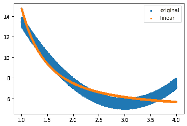
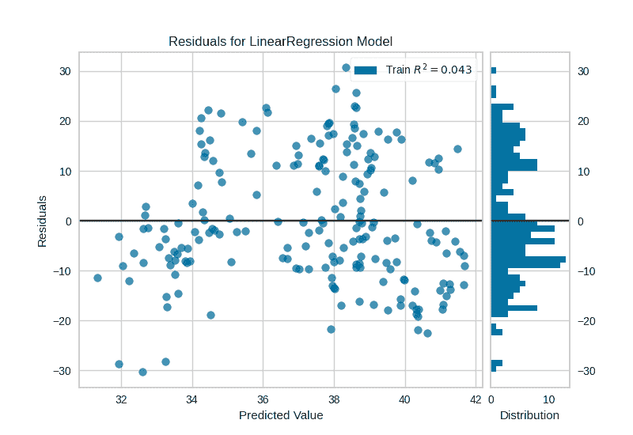

<!--yml

类别: 未分类

日期: 2024-09-06 19:55:27

-->

# [2104.12647] 回归算法及其与深度学习的联系综述

> 来源：[`ar5iv.labs.arxiv.org/html/2104.12647`](https://ar5iv.labs.arxiv.org/html/2104.12647)

# 回归算法及其与深度学习的联系综述

Yunpeng Tai Yunpeng Tai 是苏州科技大学的一名新生。

电子邮件: yunpengtai@foxmail.com。

###### 摘要

由于回归在预测值等任务中的有效性，最近引起了极大的关注。而回归在经济学、金融学、商业、生物学等多个领域有着广泛的应用。虽然已有不少研究提出了一些令人印象深刻的模型，但很少有研究提供关于回归如何及在何种程度上发展的完整图景。为了帮助初学者理解不同回归算法之间的关系，本文描述了一系列广泛且深思熟虑的近期回归算法，提供了现有工作和常用模型的有组织、全面的概述。本文还讨论了回归与深度学习之间的关系，并得出结论：未来深度学习可以与回归模型结合，发挥更强大的作用。

###### 索引词：

回归，综述，算法比较，普通最小二乘法的不同视角，回归未来的洞察。

## 1 引言

回归是一种获得输入空间与输出空间之间关系的方法。这种关系由函数 $f:X\longmapsto Y$ 表示，其中 $X$ 被称为自变量，$Y$ 为因变量。最早由 Legendre [1] 于 1805 年提出，他在回归中应用了最小二乘法。随后，Gauss [2] 在 1821 年发表了最小二乘法的进一步发展，即普通最小二乘法。

回归属于监督学习，而 $Y$ 是连续的，即 $Y\in R$。毫无疑问，回归非常强大，并在众多领域产生了巨大影响。因此，过去几十年中，越来越多的研究对回归模型进行了基础性的改进。

最近提出的回归模型数量激增，以至于研究人员和初学者可能会发现很难弄清楚每个模型的确切含义以及它们之间的关系。因此，对现有回归模型的综述对初学者（那些只是想了解回归皮毛的人）和希望系统了解回归模型并从这些智能模型中获得洞见的研究人员都是有益的。

回归分析的关键组成部分是普通最小二乘法（OLS）。根据高斯-马尔可夫定理，只要满足六个必要的假设，它就能够产生一个无偏差的最小方差线性模型[2]。然而，如果 OLS 应用于特定领域，其中一些假设可能会被违反，从而使得 OLS 在预测值时失效。因此，掌握这些假设并在其中一个假设被打破时找出可能的解决方案是非常重要的。这些与 OLS 相关的广泛关注促成了大量模型的设计，以修正这些违反，例如岭回归[3][4]、套索回归[5]、弹性网回归[6]等。

本文与其他论文的不同之处在于，本文的前半部分以 OLS 为中心，并详细讨论了当一些假设被打破时不同模型提供的替代解决方案（见图 1）。本文将模型之间的关系整体进行考察，并具体而明确地讨论了不同模型的细节。此外，本文还提供了一些不常见的回归模型的详细介绍。更重要的是，本文还涉及了回归未来可能的发展方向。

图 1：OLS 的问题及不同模型提供的可能解决方案。N 是输入空间的大小。P 是输入空间中每个样本的特征数量。

(a) $X_{T}=log(x)$

(b) $X_{T}=\sqrt{x}$

(c) $X_{T}=exp(x)$

(d) $X_{T}=\frac{1}{x}$

(e) $X_{T}=(x-3)^{2}$

(f) $X_{T}=x^{3}$

(g) $X_{T}=x^{4}$

(h) $X_{T}=x^{5}$

(i) $X_{T}=x+1$

(j) $X_{T}=\frac{1}{x^{2}}$

图 2：可视化变换结果。每个图形对应一个函数。

本文组织如下。第二部分简要介绍了回归任务和本文中的约定。在第三部分中，OLS 及其假设和违反假设的可能解决方案得到了全面解释。第四部分包含了多个回归模型，这些模型能够激发 OLS 的潜力，尽管真实数据挑战了其假设，并且发生了一些意外情况。第五部分探讨了广义线性模型和一种不常见的回归方法——逐步回归。第六部分旨在快速概述回归与深度学习之间的紧密联系。在第七部分中，得出关于回归的结论，并讨论了未来回归与深度学习的可能结合。总之，本文是对回归模型及其与深度学习关系的概述，希望本文是有意义的。

## 2 回归任务

我们的数据看起来像$\left\{(x_{1},y_{1}),(x_{2},y_{2}),...,(x_{n},y_{n})\right\}$，其中$y_{i}\in R$。我们打算从数据集中训练一个模型，并在未知的测试集中实施它。机器表现良好的标准是低残差（从预测值到标签的距离）。当涉及到回归任务时，实现线性回归是常见的方法。

|  |
| --- |
|  | $\displaystyle y$ | $\displaystyle=\hat{y}+\epsilon$ |  | (\theparentequation.1) |
|  |  | $\displaystyle=\theta x+b+\epsilon$ |  | (\theparentequation.2) |

$\theta$被称为斜率（梯度）或系数，$b$被称为截距。$\theta$解释了当$x$变化时，$\hat{y}$将变化到什么程度。$X=\left\{x_{1},x_{2},...,x_{n}\right\}$被称为输入空间，而$Y=\left\{y_{1},y_{2},...,y_{n}\right\}$被称为输出空间。$x_{i}$被称为样本，$x_{ij}$表示第$i$个样本的第$j$个特征。$y$是标签，$\hat{y}$是预测值。$\epsilon$是每个预测值伴随的误差，也称为从$\hat{y}$到$y$的距离（残差）。在普通最小二乘法中，模型假设$y$实际上是从高斯分布中采样的，每个样本都有噪声。因此，它也可以称为统计中的噪声。但在本文中，我将用误差来表示。

## 3 普通最小二乘法

在机器学习中，我们总是通过最小化目标函数来找出最佳模型，该目标函数也称为成本函数。OLS（普通最小二乘法）作为一种有效的损失函数，只要模型满足六个必要的假设，就能发挥作用。然后，通过最小化下面的函数，它可以选择一个方差最小的无偏模型。并且$J(\theta)$是凸的。因此，设置$\theta$的偏导数为零，然后我们可以得到最佳参数$\theta^{*}$。请注意，只有当$X^{T}X$是满秩时，方程（3）才有意义。有些书籍可能会将$J(\theta)$乘以$1/n$，这对于计算很方便。请注意，$X$和$Y$是矩阵。

|  | $\displaystyle J(\theta)$ | $\displaystyle=\sum\limits_{i}^{n}(y_{i}-(\theta x_{i}+b))^{2}$ |  | (2) |
| --- | --- | --- | --- | --- |
|  | $\displaystyle\theta^{*}$ | $\displaystyle=(X^{T}X)^{-1}X^{T}Y$ |  | (3) |

### 3.1 先验假设

本节研究了六个必要的假设，并涵盖了不满足情况的可能解决方案。

+   •

    线性。换句话说，只允许直线模型。如果 $X$ 和 $y$ 之间的关系是非线性模型，例如 $y=X^{4}$，整个回归模型就会崩溃。应对这种情况的方法是应用特征变换。通过这样做，$X$ 和 $y$ 之间的整体关系会得到根本改变。因此，我们还必须考虑 $X$ 和 $y$ 之间的相关性。相关性可以通过计算 $R^{2}$（决定系数）来表示，这表示通过观察 $X$ 来预测 $y$ 的能力。当 $R^{2}=1$ 时，表示该预测器的损失为 0。如果 $R^{2}=0$，则等于该预测器是常数，表明 $X$ 与 $y$ 无关。如表 1 所示，在 $R^{2}$ 列中，括号中的值表示原始系数。线性列也是如此。注意，我使用了来自 $y=2(X-3)^{2}+5+N$ 的 10000 个随机点，其中 N 代表噪声，范围从 0 到 1。X 服从随机且均匀分布。

    |  | $\displaystyle\overline{y}$ | $\displaystyle=\frac{1}{n}\sum\limits_{i=1}^{n}y_{i}$ |  | (4) |
    | --- | --- | --- | --- | --- |
    |  | $\displaystyle R^{2}$ | $\displaystyle=1-\frac{\sum\limits_{i=1}^{n}(y_{i}-\hat{y_{i}})^{2}}{\sum\limits_{i=1}^{n}(y_{i}-\overline{y})^{2}}$ |  | (5) |

    

    (a) 误差

    

    (b) 正态分布

    

    (c) 正态分布的 Q-Q 图

    图 3：在图（a）中，误差不对称且 Q-Q 图看起来不像一条直线，这表明误差不符合正态分布。图（b）和图（c）显示，当误差符合正态分布时，直方图应该呈钟形曲线，而 Q-Q 图应该是一条直线。

    表 I：关于 $R^{2}$ 和线性的变换结果

    | $X$ | $y$ | $变换$ | $R^{2}$(-1.602) | $线性（非线性）$ |
    | --- | --- | --- | --- | --- |
    | 1.450 | 9.994 | $X_{T}=log_{10}(x)$ | 0.764 | 非线性 |
    | 1.003 | 13.475 | $X_{T}=\sqrt{x}$ | 0.693 | 非线性 |
    | 3.179 | 5.935 | $X_{T}=exp(x)$ | 0.281 | 非线性 |
    | 3.801 | 6.726 | $X_{T}=\frac{1}{x}$ | 0.870 | 非线性 |
    | 1.294 | 11.704 | $X_{T}=(x-3)^{2}$ | 0.983 | 线性 |
    | 1.399 | 10.915 | $X_{T}=x^{3}$ | 0.344 | 非线性 |
    | 3.591 | 5.951 | $X_{T}=x^{4}$ | 0.253 | 非线性 |
    | 2.987 | 6.742 | $X_{T}=x^{5}$ | 0.188 | 非线性 |
    | 3.161 | 5.906 | $X_{T}=x+1$ | 0.616 | 非线性 |
    | 2.065 | 7.647 | $X_{T}=\frac{1}{x^{2}}$ | 0.904 | 非线性 |

    如表 1 所示，当应用特征变换时，$R^{2}$ 发生变化。其目的是找到具有最佳 $R^{2}$ 的线性模型。注意线性是指 $y$ 相对于变换后的 $X$。如果是这样，原始 $X$ 和预测 $y$ 的散点图应适合原始分布图。这个假设对于线性回归来说是最重要的，它可能解释了为什么岭回归或套索回归在关系是非线性时也表现不佳。

+   •

    常数误差方差 [7]。这意味着误差是均匀分布的，在统计学中称为没有异方差性。当我们应用我们的模型时，我们可以通过观察$X$获得一系列预测值。然后，我们可以计算真实值与预测值之间的误差。我们还可以计算误差的方差。如果误差遵循正态分布（公式 5），则其方差是恒定的（$\sigma^{2}$）。此外，其分布是对称的。反过来，误差的分布也应该是均匀和对称的。因此，我们可以使用误差图来检测它（图 3）。Q-Q 图可以检测误差是否遵循正态分布。我使用的数据可以从[这里](https://www.kaggle.com/quantbruce/real-estate-price-prediction)下载。我选择 X2 房屋年龄作为 $X$，Y 单位面积的房屋价格作为 $y$。注意我去除了 $X$ 等于 $0$ 的点。我选择了 200 个点进行研究。

    |  | $\displaystyle f(x)$ | $\displaystyle=\frac{1}{\sigma\sqrt{2\pi}}e^{-\frac{1}{2}(\frac{x-\mu}{\sigma})^{2}}$ |  | (6) |
    | --- | --- | --- | --- | --- |
    |  | $\displaystyle f(x)$ | $\displaystyle=\frac{1}{\sqrt{2\pi}}e^{(-\frac{x^{2}}{2})}$ |  | (7) |

    方程（6）表示标准正态分布，$\mu=0,\sigma=1$。如图 3 所示，如果误差遵循正态分布，则分布应像图 (b) 一样均匀，直方图应类似钟形曲线。我们还可以得出一个安全的结论：如果误差遵循正态分布，则其分布应适合 Q-Q 图中的线。

    

    (a) 对数前

    

    (b) 对数后

    图 4：残差与对数的关系

    在确定了异方差性之后，我们可以提出一个问题：它如何影响我们的模型以及如何改进它。最常见的方法是尝试特征变换，例如对数。正如图 4 所示，它在一定程度上可以使我们误差的分布稍微更稳定。这始终是一个尝试的选项，但不是解决问题的有效方法。

    此外，我们可以应用 Box-Cox 变换，这可以使数据更接近正态分布。在统计学中，如果数据服从正态分布，则噪声（误差）的方差是一个常数（$\sigma^{2}$）。因此，数据的正态性可能会缓解异方差性。数据可以从[这里](https://archive.ics.uci.edu/ml/machine-%0Alearning-databases/wine-quality/winequality-white.csv)下载。我选择总硫酸盐作为 $X$，质量作为 $y$。在图 5 中，它可能会缓解异方差性。注意，你不能总是依赖于它。它也可能变得更糟（图 6）。

+   •

    独立误差（无自相关，简称 AC）。例如，你想预测股市中的股票。然而，误差是相关的，而它们应该是 $i.i.d$（独立同分布的）。当发生金融危机时，股票在接下来的几个月会变得极不稳定，这意味着误差会急剧增加。这可以通过杜宾-沃森检验（表 3）或绘制 AC 图来检测。如果 AC 图中的 y 轴值变化范围为 $(0,1]$，则表示正自相关。如果值等于 0，则表示无自相关。否则，表示负自相关。

    表 II: 杜宾-沃森检验

    | $Value$ | $Relationship$ |
    | --- | --- |
    | 2.0 | 无自相关 |
    | 0.0-2.0 | 正自相关 |
    | 2.0 - 4.0 | 负自相关 |

    自相关可能会影响误差的标准差，但不太可能影响模型的系数和截距 [8]。

    有两种常见的解决方法。第一种是添加遗漏的变量。例如，你想通过时间预测股票表现。毫无疑问，模型具有很高的自相关性。然而，我们可以添加标普 500 指数。希望它可以缓解自相关性。第二种是更换其他函数。你可以将线性模型转换为平方模型。

+   +   •

        (a) 密度分布

        

        (b) 原始残差

        

        (c) 最终残差

    图 5: Box-Cox 变换可能有帮助

+   •

    无多重共线性。如果自变量之间相关，则数据中存在多重共线性。我们可以使用方差膨胀因子（VIF）来检测它（$R^{2}$ 是决定系数）。如果值 = 1，表示预测变量之间没有多重共线性。如果值 >5，则表示存在潜在的多重共线性。如果值 >10，则表示明显的多重共线性。

    |  | $softmax(x)=\frac{e^{x_{i}}}{\sum_{i=1}^{n}e^{x_{i}}}$ |  | (8) |
    | --- | --- | --- | --- |

    我们回归模型的目标是通过找到合适的系数来弄清楚自变量（X）和因变量（y）之间的关系。但当存在多重共线性时，系数无法解释。我们实际上不知道具体的关系是什么。然而，如果我们只是想进行良好的预测，这仍然是有效的[7]。如果多重共线性的程度适中，你不必太过担心。我们可以去除高度相关的变量或增加样本量。

+   •

    数据的正态性[7]。Box-Cox 变换是使数据更接近正态分布的有效变换。标准化和一些基本特征变换可能有所帮助。同时尝试增加数据量。

+   •

    非外生性。如果我们选择的$X$对$y$的影响很小，这意味着真正的预测不依赖于$X$，那么就存在外生性[7]。最佳解决方案是对究竟是什么影响我们的预测值进行良好的分析，并选择一个合适的$X$。

## 4 替代模型

在这一部分，将会在背景部分展示普通最小二乘法（OLS）的弱点。每个背景代表一个特定的问题。

### 4.1 岭回归

+   •

    背景：高方差。OLS 使得预测器在训练集上表现良好，但这也意味着在测试集上的表现可能很差，这也被称为过拟合。一般来说，模型越复杂，其在未知数据集上的表现越差。根据奥卡姆剃刀原则，如果模型简单，则更有可能在未知数据集上表现良好。并且模型具有较高的泛化能力。

+   •

    收缩。现实生活中应用 OLS 时，预测变量的系数可能在绝对值上过大。与$y$相关性较大的变量的系数很大，而与$y$相关性较小的变量的系数也很大，这对于理解$X$与$y$之间的关系是具有误导性的[3]。这种现象可以解释在未知数据集上的表现不佳。因此，岭回归将对系数实施收缩，收缩的程度取决于相关性。通常，如果一个变量具有很强的预测能力，它的系数更有可能很大[4]。

+   •

    非正交解[3]。OLS 是否可以通过导数直接计算，主要依赖于$X^{T}X$是否是正交的。如果$X^{T}X$是非正交的，这意味着$X^{T}X$不可逆，直接计算无法进行。$I$是单位矩阵。$kI$的对角线上只有很小的正数，与零的分布相比，对角线看起来像是一个岭（公式 9）。

    

    (a) 密度分布

    

    (b) 原始残差

    

    (c) 最终残差

    图 6: Box Cox 转换可能很糟糕

+   •

    有偏模型。Ridge 的潜在假设是 $X^{T}X$ 是非正交的且系数需要收缩。因此，Ridge 实际上是在偏差和方差之间进行权衡，它使用增加的偏差来获得降低的方差。由于 Ridge 的假设在大多数情况下是正确的，它能够生成低方差的模型。

+   •

    L2-惩罚。方程 10 是 Ridge 的损失函数。这个损失函数意味着不仅要求模型准确，其系数也应尽可能小。而 $\lambda/2||\theta_{i}||^{2}$ 被称为 L2-范数。这种方法被称为正则化，因为正则化生成的模型具有很高的泛化能力。除了直接计算，梯度下降是获得最佳参数的常用方法。Ridge 总是减去系数向量（方程 11.1 和 11.2）。

    |  | $\theta^{*}=(X^{T}X+kI)^{-1}X^{T}Y$ |  | (9) |
    | --- | --- | --- | --- |
    |  | $J(\theta)=\frac{1}{n}\sum\limits_{i}^{n}(y_{i}-\hat{y_{i}})^{2}+\frac{\lambda}{2}&#124;&#124;\theta_{i}&#124;&#124;^{2}$ |  | (10) |
    |  |
    |  | $\displaystyle\frac{\partial J(\theta)}{\partial\theta}$ | $\displaystyle=\frac{\partial MSE}{\partial\theta}+\lambda\theta$ |  | (\theparentequation.1) |

    |  |  | <math alttext="\displaystyle=\begin{bmatrix}\frac{\partial M(\theta)}{\partial\theta_{1}}\\ \frac{\partial M(\theta)}{\partial\theta_{2}}\\

    \vdots\\

    \frac{\partial M(\theta)}{\partial\theta_{n}}\end{bmatrix}+\lambda\begin{bmatrix}\theta_{1}\\

    \theta_{2}\\

    \vdots\\

    \(\displaystyle=\begin{bmatrix}\frac{\partial M(\theta)}{\partial\theta_{1}}\\ \frac{\partial M(\theta)}{\partial\theta_{2}}\\ \vdots\\ \frac{\partial M(\theta)}{\partial\theta_{n}}\end{bmatrix}+\lambda\begin{bmatrix}\theta_{1}\\ \theta_{2}\\ \vdots\\ \theta_{n}\end{bmatrix}\)

### 4.2 Lasso 回归

+   •

    背景：Ridge 对离群点的表现不佳。与 OLS 相比，Ridge 非常强大，但收缩意味着它仅减少了系数对结果的影响能力。因此，每个系数仍然对结果有影响，这进一步表明 Ridge 仍然关心每个样本的损失。然而，当数据中出现离群点时，Ridge 无法处理，因为它对离群点敏感。

+   •

    特征选择 [5]。与 Ridge 不同，Lasso 实现了特征选择，因为只保存一个系数，其余的都设置为零，这称为稀疏解。因此，只有一个样本对预测有影响，这意味着 Lasso 对离群点不敏感，并且对小的变化具有鲁棒性。特征选择会导致优化过程中的振荡，这意味着 Ridge 在梯度下降中比 Lasso 更稳定（图 7）。此外，尽管 Lasso 考虑了所有数据，但只有一个样本才有意义。因此，Lasso 也能够避免过拟合。如果 Lasso 的表现出色，那么我们可以说哪个样本有效。因此，与 OLS 和 Ridge 相比，Lasso 是一个更具可解释性的模型。

    

    图 7：Ridge 在优化过程中比 Lasso 更稳定（2016\. 深度学习。麻省理工学院出版社）。

+   •

    L1 惩罚。Lasso 在梯度下降中减去一个常数（公式 13.1 & 13.2）。假设我们站在山顶，Lasso 的做法是继续向前移动一段距离，而 Ridge 则沿着更陡峭的方向前进。因此，Ridge 比 Lasso 更快。因此，当值相当大时，Ridge 应该是比 Lasso 更好的选择。但当值较小时，Lasso 应该是更好的选择。

|  | $\displaystyle J(\theta)$ | $\displaystyle=\frac{1}{n}\sum\limits_{i}^{n}(y_{i}-\hat{y_{i}})^{2}+\lambda&#124;&#124;\theta_{i}&#124;&#124;$ |  | (12) |
| --- | --- | --- | --- | --- |
|  |
|  | $\displaystyle\frac{\partial J(\theta)}{\partial\theta}$ | $\displaystyle=\frac{\partial MSE}{\partial\theta}+\lambda sign(\theta)$ |  | (\theparentequation.1) |

|  |  | <math   alttext="\displaystyle=\begin{bmatrix}\frac{\partial M(\theta)}{\partial\theta_{1}}\\ \frac{\partial M(\theta)}{\partial\theta_{2}}\\

\vdots\\

\frac{\partial M(\theta)}{\partial\theta_{n}}\end{bmatrix}+\lambda\begin{bmatrix}sign(\theta_{1})\\

sign(\theta_{2})\\

\vdots\\

\displaystyle=\begin{bmatrix}\frac{\partial M(\theta)}{\partial\theta_{1}}\\ \frac{\partial M(\theta)}{\partial\theta_{2}}\\ \vdots\\ \frac{\partial M(\theta)}{\partial\theta_{n}}\end{bmatrix}+\lambda\begin{bmatrix}sign(\theta_{1})\\ sign(\theta_{2})\\ \vdots\\ sign(\theta_{n})\end{bmatrix}

### 4.3 支持向量回归

+   •

    边际最大化。SVM（支持向量机）最初是为分类问题发明的 [9]。与其他算法不同，SVM 不仅需要正确分类所有数据，还要求数据到超平面的距离最大，这被称为最宽街道。我们的线性模型是 $y=\theta^{T}X+b$。在所有数据点中，最接近超平面的正样本点到超平面的距离加上最接近超平面的负样本点的相同距离就是边际（$\gamma$）。然后，SVM 被转化为最大化边际。SVR 也是如此。我们可以将最大化 $\frac{2}{||\theta||}$ 转化为最小化 $\frac{||\theta||^{2}}{2}$。因为 $||\theta||$ 大于 0，$||\theta||^{2}$ 与 $||\theta||$ 成正比。因此，SVR 的问题类似于方程 15。在方程 15 中，C 是一个正则化系数，而 $L(x)$ 是一个未定义的损失函数。

    |  | $\min_{\theta,b}\,\frac{1}{2} | | \theta | | ^{2}+C\sum_{i=1}^{n}L(y_{i}-\hat{y_{i}})$ |  | (14) |
    | --- | --- | --- | --- | --- | --- | --- | --- |

    

    图 8：$\epsilon$-不敏感损失。Smola 和 Sch$\ddot{o}$lkopf，2002

+   •

    $\epsilon$-不敏感损失。SVR 可以容忍不超过 $\epsilon$ 的错误，如果这些点在虚线区域 $[f(x)-\epsilon,f(x)+\epsilon]$ 内被错误预测，那么这些点的损失为零，这被称为 $\epsilon$-不敏感损失（图 8）。在方程 16 中，z 代表损失。实际上，这只是对误差和模型复杂性之间的权衡。因此，SVR 不容易过拟合数据。这样，SVR 可以减少 OLS 的方差。

    |  | <math   alttext="\displaystyle\centering l_{\epsilon}(z)=\begin{cases}0\,,if\,|z|\leq\epsilon\\ |z|-\epsilon\,,otherwise\\

    \end{cases}\@add@centering" display="inline"><semantics ><mrow ><mrow ><msub ><mi >l</mi><mi >ϵ</mi></msub><mo lspace="0em" rspace="0em" >​</mo><mrow ><mo stretchy="false" >(</mo><mi >z</mi><mo stretchy="false" >)</mo></mrow></mrow><mo >=</mo><mrow ><mo >{</mo><mtable columnspacing="5pt" rowspacing="0pt" ><mtr ><mtd columnalign="left" ><mn >0</mn></mtd><mtd columnalign="left" ><mrow ><mo >,</mo><mi >i</mi><mi >f</mi><mo fence="false" lspace="0.170em" rspace="0.167em" stretchy="false" >&#124;</mo><mi >z</mi><mo fence="false" stretchy="false" >&#124;</mo><mo lspace="0.167em" >≤</mo><mi >ϵ</mi></mrow></mtd></mtr><mtr ><mtd  columnalign="left" ><mrow ><mrow ><mo stretchy="false" >&#124;</mo><mi >z</mi><mo stretchy="false" >&#124;</mo></mrow><mo >−</mo><mi >ϵ</mi></mrow></mtd><mtd  columnalign="left" ><mrow ><mi >o</mi><mo lspace="0em" rspace="0em" >​</mo><mi >t</mi><mo lspace="0em" rspace="0em" >​</mo><mi >h</mi><mo lspace="0em" rspace="0em" >​</mo><mi >e</mi><mo lspace="0em" rspace="0em" >​</mo><mi >r</mi><mo lspace="0em" rspace="0em" >​</mo><mi >w</mi><mo lspace="0em" rspace="0em" >​</mo><mi >i</mi><mo lspace="0em" rspace="0em" >​</mo><mi >s</mi><mo lspace="0em" rspace="0em" >​</mo><mi >e</mi></mrow></mtd></mtr></mtable></mrow></mrow><annotation encoding="application/x-tex" >\displaystyle\centering l_{\epsilon}(z)=\begin{cases}0&,if\,&#124;z&#124;\leq\epsilon\\ &#124;z&#124;-\epsilon&otherwise\\ \end{cases}\@add@centering</annotation></semantics></math> |  | (15) |

+   •

    对偶问题。可以在优化问题（方程 18）中引入松弛变量。这些变量表示允许的超出$\epsilon$的误差量。

    |  | $\displaystyle\min_{\theta,b}\,\frac{1}{2}&#124;&#124;\theta&#124;&#124;^{2}$ | $\displaystyle+C\sum_{i=1}^{n}L(\xi_{i}+\hat{\xi}_{i})$ |  | (16) |
    | --- | --- | --- | --- | --- |
    |  | $\displaystyle y_{i}-\hat{y_{i}}$ | $\displaystyle\leq\epsilon+\xi_{i}$ |  | (17) |
    |  | $\displaystyle\hat{y_{i}}-y_{i}$ | $\displaystyle\leq\epsilon+\hat{\xi_{i}}$ |  | (18) |
    |  | $\displaystyle\xi_{i}\geq 0\,$ | $\displaystyle,\hat{\xi_{i}}\geq 0$ |  | (19) |

    我们可以引入拉格朗日乘子$\mu_{i}\geq 0,\hat{\mu_{i}}\geq 0,\alpha_{i}\geq 0,\hat{\alpha_{i}}\geq 0$。

    |  |  | $\displaystyle L(\theta,b,\alpha,\hat{\alpha},\xi,\hat{\xi},\mu,\hat{\mu})$ |  | (20) |
    | --- | --- | --- | --- | --- |
    |  |  | $\displaystyle=\frac{1}{2}&#124;&#124;\theta&#124;&#124;^{2}+C\sum_{i=1}^{n}(\xi_{i}+\hat{\xi_{i}})-\sum_{i=1}^{n}\mu_{i}\xi_{i}-\sum_{i=1}^{n}\hat{\mu_{i}}\hat{\xi_{i}}$ |  |
    |  |  | $\displaystyle+\sum_{i=1}^{n}\alpha_{i}(y_{i}-\hat{y_{i}}-\epsilon-\xi_{i})+\sum_{i=1}^{n}\hat{\alpha_{i}}(\hat{y_{i}}-y_{i}-\epsilon-\hat{\xi_{i}})$ |  |

    并将 w、b、$\xi_{i}$和$\hat{\xi_{i}}$的偏导数设为零。

    |  | $\displaystyle w$ | $\displaystyle=\sum_{i=1}^{n}(\hat{\alpha_{i}}-\alpha_{i})x_{i}$ |  | (21) |
    | --- | --- | --- | --- | --- |
    |  | $\displaystyle 0$ | $\displaystyle=\sum_{i=1}^{n}(\hat{\alpha_{i}}-\alpha_{i})$ |  | (22) |
    |  | $\displaystyle C$ | $\displaystyle=\alpha_{i}+\mu_{i}$ |  | (23) |
    |  | $\displaystyle C$ | $\displaystyle=\hat{\alpha_{i}}+\hat{\mu_{i}}$ |  | (24) |

    因此，我们可以得到 SVR 的对偶问题。

    |  | $\displaystyle\max_{\alpha,\hat{\alpha}}$ | $\displaystyle\sum_{i=1}^{n}\hat{y_{i}}(\hat{\alpha_{i}}-\alpha_{i})-\epsilon(\hat{\alpha_{i}}+\alpha_{i})$ |  | (25) |
    | --- | --- | --- | --- | --- |
    |  |  | $\displaystyle-\frac{1}{2}\sum_{i=1}^{n}\sum_{j=1}^{n}(\hat{\alpha_{i}}-\alpha_{i})(\hat{\alpha_{j}}-\alpha_{j})(x_{i})^{T}x_{j}$ |  |
    |  | $\displaystyle s.t.$ | $\displaystyle\,\sum_{i=1}^{n}(\hat{\alpha_{i}}-\alpha_{i})=0$ |  |

+   •

    核技巧。通常，模型在一维空间中是非线性的。因此，我们使用 $\phi(x)$ 来表示变换后的 x。一些常见的核函数列在表 3 中。

    |  | $\displaystyle w$ | $\displaystyle=\sum_{i=1}^{n}(\hat{\alpha_{i}}-\alpha_{i})\phi(x)$ |  | (26) |
    | --- | --- | --- | --- | --- |
    |  | $\displaystyle f(x)$ | $\displaystyle=\sum_{i=1}^{n}(\hat{\alpha_{i}}-\alpha_{i})k(x,x_{i})+b$ |  | (27) |

    表 III: 常见核函数

    | $名称$ | $表达式$ | $参数$ |
    | --- | --- | --- |
    | 线性核函数 | $\mathrm{k}\left(\mathrm{x}_{i},x_{j}\right)=\left(x_{i}\right)^{T}x_{j}$ | d = 1 |
    | 多项式核函数 | $\mathrm{k}\left(\mathrm{x}_{i},x_{j}\right)=\left(\left(x_{i}\right)^{T}x_{j}\right)^{d}$ | $\geq 1$ |
    | 高斯核函数 | $\mathrm{k}\left(\mathrm{x}_{i},x_{j}\right)=\exp\left(-\frac{\left\&#124;x_{i}-x_{j}\right\&#124;^{2}}{2\sigma^{2}}\right)$ | $\sigma>0$ |
    | Sigmoid 核函数 | $\mathrm{k}\left(\mathrm{x}_{i},x_{j}\right)=\tanh\left(\beta\left(x_{i}\right)^{T}x_{j}+\theta\right)$ | $\beta>0,\theta\textless 0$ |

### 4.4 随机森林回归

+   •

    树结构 [12]。本节将介绍树结构。在回归树中，有根节点、内部节点和叶节点。例如，如果我们要预测一个人的身高，并且我们获取了男性和女性的身高数据。那么，根节点是“是否是男性”。如果我们需要预测的点是 $(68,171)$，这意味着一个体重 68kg 的男性身高是 171cm。如果我们使用树回归，那么我们的内部节点是 $>60?$ 第二个内部节点是 $<70?$ 以此类推。最后，叶节点就是我们预测的结果。因此，叶节点就是预测的身高。

+   •

    分类与回归树[13]。CART 包括特征选择、生成树和剪枝。CART 假设决策树是一个二叉树。决策树等同于递归地将特征分为两组。它将输入空间划分为有限的单元并预测分布。假设我们的数据是$D=\{(x_{1},y_{1}),(x_{2},y_{2}),\dots,(x_{n},y_{n})\}$。决策树将输入空间划分为$M$个单元$R_{1},R_{2},\dots,R_{M}$，每个单元的末端是输出值$c_{m}$。我们可以最小化输出值与真实值的平方误差。显然，每个单元中最佳的输出值应为平均值。但问题是如何划分输入空间。我们随机选择$x_{j}$及其输出值$s$。然后我们通过其输出值将输入空间划分为两个空间。$R_{1}(j,s)=\{x|x_{j}\leq s\}$和$R_{2}(j,s)=\{x|x_{j}>s\}$，$x_{j}$称为分裂变量，$s$是分裂点。我们通过平方最小误差在$R_{1},R_{2}$中找到$c_{1},c_{2}$。我们还希望$c_{1}+c_{2}$尽可能小。这就是我们最终得到 j 和 s 的方法。

    |  | $\displaystyle\min\sum_{i=1}^{n}(y_{i}-\hat{y_{i}})^{2}$ |  | (28) |
    | --- | --- | --- | --- |
    |  | $\displaystyle\hat{c_{m}}=average(y_{i} | x_{i}\in R_{m})$ |  | (29) |
    |  | $\displaystyle\min_{j,s}(\min_{c1}\sum_{x_{i}\in R_{1}}(y_{i}-c_{1})^{2}+\min_{c_{2}}\sum_{x_{i}\in R_{2}}(y_{i}-c_{2})^{2})$ |  | (30) |

+   •

    剪枝[13]。决策树通过递归二叉分裂来实现更准确的预测。如果数据量和输入空间非常大，树的结构会变得复杂。遗憾的是，复杂的模型容易导致过拟合。因此，有必要简化我们的模型。因此，我们从树的底部剪掉一些子树。然后我们可以得到一个树序列$\{T_{0},T_{1},\dots,T_{n}\}$（$T_{0}$是根节点）。接着，我们使用交叉验证从中选择最佳的子树。同时，我们也希望我们的模型表现良好。因此，我们应用损失函数来测量剪枝过程中性能的差异。在公式(32)中，T 是任意的子树。C(T)表示训练数据上的误差。$|T|$是子树中的叶子节点数。$\alpha$是一个参数，它决定了正则化项。如果$\alpha$很大，意味着严厉的惩罚，这将导致一个简单的树。如果$\alpha$很小，意味着温和的惩罚，这将导致一个更复杂的树。

    |  | $C_{\alpha}(T)=C(T)+\alpha | T | $ |  | (31) |
    | --- | --- | --- | --- | --- | --- |

+   •

    集成学习 [14]。我们使用 $1/3$ 的数据来评估模型，这称为袋外数据。使用 $2/3$ 的数据作为新的数据集。然后我们从新的数据集中随机选择子集，这称为 Bagging。每次我们选择一个完整数据集的子集，然后该子集被放回。不同子集中的点数是相同的。我们为每个不同的数据训练不同的树模型。最后，我们对所有树的变量取平均，作为最终模型变量，以减少方差。因此，它是一个准确的模型。尽管大多数数据缺失，但由于模型只随机选择一个子集进行训练，它能够保持准确性。然而，当数据中存在一些离群点时，可能会过拟合数据。

### 4.5 提升回归树

+   •

    偏倚特征选择 [15]。这与随机森林几乎相同。它们都选择随机子集，然后生成一棵新树。在随机森林中，数据被选择的概率是相同的，几乎没有偏差。但在提升回归树中，它会给每个数据点赋予权重。例如，第一次我们选择一个子集并为其建立一棵树模型。在该子集被放回之前，会计算每个点的预测误差。如果误差很高，该点可能会被赋予较大的权重，这表明它被选择的概率高于其他点。总之，提升回归树关注误差并进行混合。而如果数据中有许多离群点，它表现得很差。但它对缺失值具有鲁棒性，就像随机森林一样，因为它们都选择子集进行拟合。

### 4.6 弹性网回归

+   •

    背景：多重共线性。OLS 的假设之一是没有多重共线性。然而，在多变量回归中，$X$ 有时可能是相关的。如果发生这种情况，OLS、Ridge 和 Lasso 都无法发挥作用。

+   •

    鼓励群体效应 [6]。在多变量回归中，如果一些样本彼此相关，OLS 可能只选择一个样本，而不在意选择的是哪个，同时强相关的样本在弹性网回归中被视为一整体，这称为群体效应。它进行自动变量选择和连续收缩，并选择相关样本的组 [6]，这类似于聚类方法。然而，该模型并不能减少方差，额外的偏差会增加。

+   •

    Lasso 和 Ridge 的生成。弹性网是 Ridge 回归和 Lasso 回归之间的折中方案。它将 Lasso 的损失函数与 Ridge 的混合。它有参数 r 来控制混合比例。如果 $r=0$，就是 Ridge。如果 $r=1$，就是 Lasso。

+   •

    $N\gg P$。N 是样本数量，P 是每个样本的特征数量。在多变量回归中，当 $N\gg P$ 时，弹性网回归可以发挥关键作用。

|  | $\displaystyle J(\theta)$ | $\displaystyle=\frac{1}{n}\sum\limits_{i}^{n}(y_{i}-\hat{y_{i}})^{2}+r\lambda&#124;&#124;\theta_{i}&#124;&#124;+\frac{1-r}{2}\lambda&#124;&#124;\theta_{i}&#124;&#124;^{2}$ |  | (32) |
| --- | --- | --- | --- | --- |

### 4.7 最小角回归

+   •

    联合最小二乘方向 [16]。首先，模型选择系数 $\beta_{j}$ 并计算误差。当某个其他样本 $x_{k}$ 对误差的相关性比 $x_{j}$ 更高时，模型将增加 $(\beta_{j},\beta_{k})$ 的联合最小二乘方向，直到 $x_{m}$ 对误差的相关性更高。因此，模型将增加 $(\beta_{j},\beta_{k},\beta_{m})$ 的联合最小二乘方向。模型将继续进行直到所有样本都被包括在模型中。因此，它也可以解决高维数据的自相关问题。OLS 是 LARS 的特例。当 LARS 不再增加联合最小二乘方向时，模型变成 OLS。顺便提一下，LARS 在 $N\gg P$ 时也很强大，就像弹性网回归一样。

+   •

    对外点敏感。LARS 是一种迭代重新拟合误差的方法。当数据中存在外点时，LARS 是没有意义的。

+   •

    易于修改。LARS 很容易与其他模型如 Lasso 结合。LARS-Lasso 采用 Lasso 的损失函数并应用 LARS 的系数选择方法。

### 4.8 RANSAC 回归

+   •

    背景。尽管 Lasso 对少量外点不敏感，但当数据中充满大量外点时，Lasso 失效，更不用说 OLS 了。

+   •

    随机样本一致性集 [17]。RANSAC 是一种迭代方法，并且具有一个误差阈值 $\epsilon$。首先，它选择整个数据的一个子集并找到一个模型来拟合它。然后，使用模型测试其余的数据。如果点在模型上的损失不超过 $\epsilon$，则将其添加到一致性集，这个集满是内点。这个过程是迭代的。当达到迭代次数时，过程结束。RANSAC 旨在使一致性集中的点数尽可能多。

    迭代次数 ni = 0 当 *i <n* 时       从数据中随机选择内点       找到一个模型 M 来拟合       通过模型测试其他数据       如果 *点符合 M*     则             内点集 $\leftarrow$ 点      否则            外点集 $\leftarrow$ 点

    算法 1 随机样本一致性

+   •

    投票方案。RANSAC 有点像投票过程。数据的一个子集提出其想法，然后其余的数据对这个想法进行投票。在每个独立的过程中，有两种数据。一种同意这个想法，而另一种反对。RANSAC 将选择支持者最多的过程。因此，RANSAC 是有偏的。如果模型要对外点具有鲁棒性，则必须有足够多的好特征来投票支持正确的模型，而外点不能一致地投票。

+   •

    缺点。当数据中离群值较少时，RANSAC 不能发挥作用，因为每个过程之间的差异很小。只有当数据受到严重污染时，RANSAC 才能发挥作用。此外，阈值必须手动设置，这要求用户在不同数据上决定具体阈值。最后但同样重要的是，计算成本较高，因为它是一个迭代方法，模型中所需的次数是未知的。

### 4.9 Theil-Sen 回归

+   •

    中位数方法 [18]。有许多数据对用于计算系数。$\theta=y_{a}-y_{b}/x_{a}-x_{b}$ 而 $\theta$ 是所有 $\theta$ 的中位数。$b=y-\theta x$，b 也是 $bs$ 的中位数。因此，它是一种非参数技术。然而，完全计算导致速度较低。

+   •

    突破点。特别地，Theil-Sen 只能容忍 29.3% 的数据为离群值。当模型应用于高维回归时，这一比例会减少。

### 4.10 Huber 回归

+   •

    Huber 损失 [19]。它在面对不同值时会调整其损失函数。当值较大时，即有很高的可能性是离群值，Huber 会将其损失函数转变为线性损失，以最小化其对模型的影响。$\delta$ 作为一个阈值，决定数据的大小是否需要线性损失。而且，它在三种鲁棒回归中速度最快。

    |  | <math   alttext="\displaystyle\centering HuberLoss=\begin{cases}\frac{1}{2}a^{2}&amp;,if&#124;a&#124;\leq\delta\\ \delta(&#124;a&#124;-\frac{1}{2}\delta)&amp;otherwise\\

    \end{cases}\@add@centering" display="inline"><semantics ><mrow ><mrow ><mi >H</mi><mo lspace="0em" rspace="0em" >​</mo><mi >u</mi><mo lspace="0em" rspace="0em" >​</mo><mi >b</mi><mo lspace="0em" rspace="0em" >​</mo><mi >e</mi><mo lspace="0em" rspace="0em" >​</mo><mi >r</mi><mo lspace="0em" rspace="0em" >​</mo><mi >L</mi><mo lspace="0em" rspace="0em" >​</mo><mi >o</mi><mo lspace="0em" rspace="0em" >​</mo><mi >s</mi><mo lspace="0em" rspace="0em" >​</mo><mi >s</mi></mrow><mo >=</mo><mrow ><mo >{</mo><mtable columnspacing="5pt" rowspacing="0pt" ><mtr ><mtd columnalign="left" ><mrow ><mfrac ><mn >1</mn><mn >2</mn></mfrac><mo lspace="0em" rspace="0em" >​</mo><msup ><mi >a</mi><mn >2</mn></msup></mrow></mtd><mtd columnalign="left" ><mrow ><mo >,</mo><mi >i</mi><mi >f</mi><mo fence="false" rspace="0.167em" stretchy="false" >&#124;</mo><mi >a</mi><mo fence="false" stretchy="false" >&#124;</mo><mo lspace="0.167em" >≤</mo><mi >δ</mi></mrow></mtd></mtr><mtr ><mtd  columnalign="left" ><mrow ><mi >δ</mi><mo lspace="0em" rspace="0em" >​</mo><mrow ><mo stretchy="false" >(</mo><mrow ><mrow ><mo stretchy="false" >&#124;</mo><mi >a</mi><mo stretchy="false" >&#124;</mo></mrow><mo >−</mo><mrow ><mfrac ><mn >1</mn><mn >2</mn></mfrac><mo lspace="0em" rspace="0em" >​</mo><mi >δ</mi></mrow></mrow><mo stretchy="false" >)</mo></mrow></mrow></mtd><mtd columnalign="left" ><mrow ><mi >o</mi><mo lspace="0em" rspace="0em" >​</mo><mi >t</mi><mo lspace="0em" rspace="0em" >​</mo><mi >h</mi><mo lspace="0em" rspace="0em" >​</mo><mi >e</mi><mo lspace="0em" rspace="0em" >​</mo><mi >r</mi><mo lspace="0em" rspace="0em" >​</mo><mi >w</mi><mo lspace="0em" rspace="0em" >​</mo><mi >i</mi><mo lspace="0em" rspace="0em" >​</mo><mi >s</mi><mo lspace="0em" rspace="0em" >​</mo><mi >e</mi></mrow></mtd></mtr></mtable></mrow></mrow><annotation encoding="application/x-tex" >\displaystyle\centering HuberLoss=\begin{cases}\frac{1}{2}a^{2}&,if&#124;a&#124;\leq\delta\\ \delta(&#124;a&#124;-\frac{1}{2}\delta)&otherwise\\ \end{cases}\@add@centering</annotation></semantics></math> |  | (33) |

### 4.11 多元自适应回归样条

+   •

    划分 [20]。MARS 以数据划分开始，然后在每个不同的划分上进行线性回归。它对标签和样本之间的关系没有假设。MARS 最初有大量的基函数。两个线性模型的交汇点称为节点。每个节点有一对基函数。这些函数用于描述 $x$ 和 $y$ 之间的关系。第一个基函数是 $max(0,x-y)$。第二个基函数是 $max(0,y-x)$。

+   •

    删除基函数 [20]。在 MARS 划分数据并建立模型后，它应用最小二乘模型来拟合数据。每个结点有两个基函数。这些基函数的结果可以视为输入变量。最小二乘模型估计每个基函数输出值的损失。如果一个基函数对模型拟合的影响较小，则将被移除。

+   •

    优点和缺点。它可以拟合大量预测变量，并且是一个有效且快速的算法。此外，它对异常值具有鲁棒性。然而，它从大量模型开始，这很容易导致过拟合。同时，它对缺失数据问题非常敏感。

### 4.12 多项式回归

+   •

    背景：当 $X$ 和 $y$ 之间的关系是非线性时，OLS 的效果较差。

+   •

    多项式变换 [21]。多项式回归用多项式替换原始 $X$，以获得比以前更线性的关系，或由于某些原因改变特征。因此，它不可解释。有趣的是，它有点像泰勒展开。当你的模型违反线性假设时，你可以尝试所有的多项式回归，以找到最佳的，这是一种有效的策略。如果特征的维度是 2，

+   •

    order = 1$\Rightarrow$ $[1,X_{1},X_{2}]$

+   •

    order = 2$\Rightarrow$ $[1,X_{1},X_{2},X_{1}^{2},X_{1}X_{2},X_{2}^{2}]$

+   •

    order = 3$\Rightarrow$ $[1,X_{1},X_{2},X_{1}^{2},X_{1}X_{2},X_{2}^{2},X_{1}^{3},X_{1}^{2}X_{2},X_{1}X_{2}^{2},X_{2}^{3}]$

### 4.13 加权最小二乘法

+   •

    背景。OLS 的一个假设是误差方差常数。在第三部分中，我提出了对数方法。然而，它无效。

+   •

    转换权重 [22]。当 $w_{i}$ 全部等于 1 时，应为 OLS。在 OLS 中，模型对每个点给予相同的关注。但在遇到更多异方差情形时，它处于同方差性之下。这个想法是我们对错误较小的点给予更多关注。因此，模型给予这些点更大的权重。

+   •

    稳定的截距和敏感的系数 [23]。注意，我为前 20 个权重选择了不同的值，其余的始终为 1。不同的权重对错误的异常分布是等效的。如表 4 所示，截距始终正确。然而，系数变化剧烈。因此，我们不能用它来推断和检验系数相关的假设。

    |  | $WLS=\sum\limits_{i=1}^{n}w_{i}(y_{i}-\hat{y_{i}})^{2}$ |  | (34) |
    | --- | --- | --- | --- |

    

    (a) w = 1

    

    (b) w = 10

    

    (c) w = 20

    图 9：中间线显示 OLS 和 MLS 拟合数据。而其他线显示不同算法预测值的范围

    表 IV：斜率和截距

    | $Weights$ | $Slopes$ | $Intercepts$ |
    | --- | --- | --- |
    | 1.0 | 1.444 | 0.059 |
    | 10.0 | 1.4887 | 0.059 |
    | 20.0 | 1.5146 | 0.058 |
    | 40.0 | 1.5407 | 0.058 |
    | 80.0 | 1.5615 | 0.057 |
    | 160.0 | 1.5755 | 0.057 |

    如图 9 所示，图 (a) 显示当权重 = 1 时，OLS 是 WLS 的特殊情况。而图 (b) 和图 (c) 显示当权重变化时，截距几乎保持不变。

### 4.14 广义最小二乘法

+   •

    背景。OLS 假设误差必须是独立的，即一个误差不能与其他误差相关。但是当发生误差自相关时，OLS 除了失败别无选择。

+   •

    更好的 OLS [24]。GLS 在数据的线性变换版本上类似于 OLS。GLS 是无偏的、一致的和有效的。WLS 是 GLS 的特殊情况，这意味着 GLS 也可以解决异方差性 [25]。

### 4.15 可行广义最小二乘法

+   •

    可实现的 GLS。虽然 GLS 听起来很强大，但它不能应用于特定的回归任务。FGLS 是 GLS 的一个可实现版本。FGLS 需要一些关键假设以确保误差协方差矩阵的一致估计量。

+   •

    小数据下的低效。虽然在异方差性或自相关性情况下，GLS 比 OLS 更强大，但 FGLS 并非如此。当数据量非常小时，FGLS 比 OLS 更低效。因此，有些人更倾向于在小数据下使用 FGLS，而不是 OLS。但当数据量变大时，FGLS 是更好的选择。

### 4.16 贝叶斯回归

+   •

    背景。众所周知，OLS 精确地估计了值的均值，这无法提供自变量和因变量之间关系的全面图景。在某些情况下，我们希望获得标签的可能分布，而不是均值。

+   •

    贝叶斯定理 [27]。例如，我们将使用一个模型来区分一封电子邮件是正常的还是垃圾邮件。因此，我们的模型面临的是必须对未知的电子邮件进行预测。我们的数据有 100 封电子邮件，其中 10% 是垃圾邮件。因此，垃圾邮件的百分比是 10%。但这绝不是全部故事。在贝叶斯理论中，这被称为先验概率，它意味着分布的基本假设，这就是贝叶斯开始的地方。在算法开始时，贝叶斯是有偏的，模型容易受到原始分布的影响。例如，如果我们只有 10 封正常的电子邮件，那么未来不出现垃圾邮件几乎是不可能的。换句话说，如果我们的数据量非常小，使用贝叶斯的激励就不大。然而，当训练次数不断增加时，我们最终应该能获得理想的结果。在下面的方程中，$P(B)$ 是归一化项，$P(A)$ 是先验概率。$P(A|B)$ 被称为后验概率（条件概率）。总之，当我们有大量数据时，贝叶斯可能是一个值得尝试的好选择，它的表现与其他算法相似。

|  | $\displaystyle P(A | B)$ | $\displaystyle=\frac{P(B | A)P(A)}{P(B)}$ |  | (35) |
| --- | --- | --- | --- | --- | --- | --- |

+   •

    最大似然估计 [28]。一般来说，我们的目标是弄清楚真实的数据分布，这几乎是不可能的。因此，我们希望从问题领域中找到一个接近我们数据分布的数据分布。MLE（最大似然估计）表示我们希望最大化真实数据从假设分布中抽样的概率。

|  | $\beta^{*}=\arg\max\limits_{\beta}P_{\beta}(D)$ |  | (36) |
| --- | --- | --- | --- |

+   •

    最大后验估计 [29]。通常，我们可以使用 MAP（最大后验估计）来替代 MLE。它基于贝叶斯定理。而 MAP 是贝叶斯回归（方程 37）的基础。与其他标准算法不同，贝叶斯回归不会产生一个单一的值，而是可能的分布范围。在大多数情况下，MLE 和 MAP 可能会得到相同的结果。然而，当 MAP 的假设与 MLE 不同，它们无法达到相同的结果。当先验概率均匀分布时，它们可以得到相同的结果。从另一个角度来看，如果我们对数据有一些精确的理解，贝叶斯回归是一个很好的选择，因为它作为先验概率，或者我们可以像加权最小误差一样对每个不同的选择进行加权。有趣的是，先验可以视为一种正则化或模型的偏差，因此这种先验可以解释为 L2 范数，也称为贝叶斯岭回归。方程（38）表示给定一个模型 $m$，输出 $y$ 的概率。而 $\beta$（系数）和 $\sigma$（标准差）是任意值。

|  | $\displaystyle P(\beta\mid D)$ | $\displaystyle=\frac{P(D\mid \beta)P(\beta)}{P(D)}$ |  | (37) |
| --- | --- | --- | --- | --- |
|  | $\displaystyle P(y\mid m)$ | $\displaystyle=\frac{P(\beta,\sigma\mid m)P(y\mid X,\beta,\sigma,m)}{P(\beta,\sigma\mid y,X,m)}$ |  | (38) |
|  | $\displaystyle y$ | $\displaystyle\sim(\beta^{T}X,\sigma^{2})$ |  | (39) |

### 4.17 分位数回归

+   •

    转换损失函数 [30]。QR 有一个参数 $q$，决定了数据的分割比例。一个是 $q\%$ 的数据，另一个是 $(1-q)\%$ 的数据。例如，如果 $q = 0.5$，则数据分成两部分。我们在 OLS 中最小化平方损失，而现在我们在 QR 中最小化绝对损失。

|  | $J(\theta)=\sum_{i=1}^{n}\left | q-y_{i}-\hat{y_{i}}\right | +\sum_{i=1}^{n}(1-q)\left | y_{i}-\hat{y_{i}}\right | $ |  | (40) |
| --- | --- | --- | --- | --- | --- | --- | --- |

+   •

    优势。不言而喻，QR 能够提供比 OLS 更全面的关系视角。而且，它对异常值以及误差方差不是常数的情况也很鲁棒。

### 4.18 序数回归

+   •

    背景。在某些情况下，标签的值是排名数字。例如，0-5 可以表示他在社会科学中的沟通能力。而 OLS 无法对这些进行准确预测。

+   •

    排名学习 [31]。在运筹学中，模型有一组阈值$\theta_{1},\theta_{2},\dots,\theta_{n}$，用于将预测分成独立的区间，每个区间对应一个$y$。该模型可以通过 sigmoid 函数表示，其输出值代表可能性。

|  | $P(y\leq i\mid x)=\sigma(\theta_{i}-\hat{y_{i}})$ |  | (41) |
| --- | --- | --- | --- |

## 5 额外模型

### 5.1 广义线性模型

+   •

    广义函数 [32]。顾名思义，它是不同函数的泛化。它包括两个重要部分。第一部分是$y$的概率分布，如正态分布（OLS）。第二部分是线性预测器，它决定了系数如何与自变量结合。GLM 包括多个回归模型，如二项回归、伯努利回归、泊松回归等。它们的应用不太广泛，与 OLS 相比，仅仅是在这两个部分上进行了调整。因此，本文中未予讨论。

+   •

    优势与劣势。它可以有效处理$y$不符合正态分布的情况。然而，它需要大数据集，并且对离群值敏感。

### 5.2 步骤回归

+   •

    前向选择 [33]。该方法从无变量开始。它涉及以迭代方法测试变量的添加，这对提高准确性非常有用。模型重复进行，直到没有改进。

+   •

    后向消除。该方法从许多候选变量开始。它涉及测试通过删除变量后的模型损失。如果损失较小，则该变量将被删除。模型重复进行，直到没有变量可以删除。

+   •

    双向消除。这是上述两种方法的结合。是否添加或删除变量在每一步都决定。总之，步骤回归包含了大量可能的模型，这可能导致过拟合。

+   •

    停止的原因 [34]。首先，F 检验和 t 检验等测试存在偏差，因此可能不准确。其次，广泛的错误使用和替代模型（如集成学习）的出现导致了停止使用该算法的呼声。

## 6 与深度学习的关系

### 6.1 广义回归神经网络

图 10：GRNN 结构。来源：https://www.mdpi.com/1424-8220/20/9/2625。

+   •

    网络结构 [35]。GRNN 包括输入层、模式层、求和层和输出层。输入层和输出层是独立向量和依赖向量。模式层可以看作是一个充满系数的向量。例如，如果我们想应用 $y=\theta x$，那么一个模式神经元代表 $\theta_{i}x_{i}$。输出层可以通过下面的方程来表示。这个模型可以在小数据量下保持其准确性，并且对异常值具有鲁棒性。然而，网络的结构复杂，因此计算成本较高。

|  | $\displaystyle Y(x)=\frac{\sum_{i=1}^{n}y_{i}K(x,x_{i})}{\sum_{i=1}^{n}K(x,x_{i})}$ |  | (42) |
| --- | --- | --- | --- |
|  | $\displaystyle K(x,x_{i})=e^{-d_{i}/2\sigma^{2}}$ |  | (43) |
|  | $\displaystyle d_{i}=(x-x_{i})^{T}(x-x_{i})$ |  | (44) |

+   •

    广泛应用 [36]。许多回归模型如泊松回归和序数回归都成功地使用了 GRNN。我们可以得出一个安全的结论：复杂的网络结构可以表示任何类型的回归。但只有少数模型被证明是成功的。神经网络是强大的，而经典的回归算法结构良好。也许回归可以在神经网络中应用而不失去其原有功能。人类在回归方面已经取得了基础性的进展。如果我们能够将回归与神经网络完美结合，那么这将是另一幅画面。

## 7 结论

在本文中，我提出了 OLS 的必要假设，并提供了一些小技巧来修正当假设被违反时的问题。令人惊讶的是，OLS 似乎几乎是所有回归模型的起点。大量的回归模型设计成更好的 OLS。它们可以在 OLS 无法工作的情况下发挥作用。我认为并非每种算法都需要详细介绍。因此，广泛使用的算法得到了足够的关注，而其他算法则被迅速说明。最后，我对 GRNN 进行了快速概述。从本文中，我得出三个结论。

+   •

    了解你的模型。请注意，回归算法并不是即插即用的。你必须了解每个模型的应用范围，并能够处理模型假设不满足的情况。

+   •

    未来的回归。与深度学习相比，回归显得较为古老，但每个经典算法背后的伟大思想从未过时。人们总是希望预测未知值，而回归任务确实令人着迷。深度学习非常强大。如果回归能够从深度学习中学习并保留其优点，我相信回归在不久的将来会变得更加强大。

+   •

    看起来回归算法已经过时。然而，就我而言，每个算法背后的美妙思想是共享的。换句话说，深入这些旧算法可以让我们获得对算法的洞察和直觉，并提出与回归算法有相同思想的新算法，这些新算法只是处理新问题的不同实现而已。

## 参考文献

+   [1] A.M. Legendre。《确定彗星轨道的新方法》，Firmin Didot，巴黎，1805 年。 “最小二乘法”作为附录出现。

+   [2] C.F. 高斯。最小误差观察组合理论

+   [3] Arthur E. Hoerl & Robert W. Kennard (1970) 岭回归：对非正交问题的偏倚估计，技术统计学，12:1, 55-67, DOI: 10.1080/00401706.1970.10488634

+   [4] Arthur E. Hoerl & Robert W. Kennard (1970) 岭回归：对非正交问题的应用，技术统计学，12:1, 69-82, DOI: 10.1080/00401706.1970.10488635

+   [5] Tibshirani, R. (1996), 《Lasso 回归收缩与选择》。皇家统计学会：B 系列（方法论），58: 267-288。 https://doi.org/10.1111/j.2517-6161.1996.tb02080.x

+   [6] Zou, H. 和 Hastie, T. (2005), 《通过弹性网的正则化与变量选择》。皇家统计学会：B 系列（统计方法论），67: 301-320。 https://doi.org/10.1111/j.1467-9868.2005.00503.x

+   [7] Hayashi, Fumio (2000). 《计量经济学》。普林斯顿大学出版社。第 15 页。

+   [8] Gubner, John A. (2006). 《电气与计算机工程师的概率与随机过程》。剑桥大学出版社。ISBN 978-0-521-86470-1。

+   [9] V. Vapnik，“函数估计的支持向量方法，” 见 J.A.K. Suykens 和 J. Vandewalle (编)《非线性建模：先进的黑箱技术》，Kluwer 学术出版社，波士顿，第 55–85 页，1998 年。

+   [10] Drucker, Harris; Burges, Christ. C.; Kaufman, Linda; Smola, Alexander J.; 和 Vapnik, Vladimir N. (1997); “支持向量回归机器”，见《神经信息处理系统进展 9》，NIPS 1996，155–161，MIT 出版社。

+   [11] Smola, A.J., Schölkopf, B. 支持向量回归教程。统计与计算 14, 199–222 (2004). https://doi.org/10.1023/B:STCO.0000035301.49549.88

+   [12] S. R. Safavian 和 D. Landgrebe，“决策树分类器方法概述，” 见《IEEE 系统、人工智能与控制论学报》，第 21 卷，第 3 期，第 660-674 页，1991 年 5-6 月，doi: 10.1109/21.97458。

+   [13] Loh, W.‐Y. (2011), 分类与回归树。WIREs 数据挖掘与知识发现，1: 14-23。 https://doi.org/10.1002/widm.8

+   [14] Liaw A, Wiener M. 《通过随机森林进行分类和回归》[J]。《R 新闻》，2002，2(3): 18-22。

+   [15] Elith J, Leathwick J R, Hastie T. 《提升回归树工作指南》[J]。《动物生态学杂志》，2008，77(4): 802-813。

+   [16] Efron, Bradley; Hastie, Trevor; Johnstone, Iain; Tibshirani, Robert (2004). “最小角回归”（PDF）。*统计年鉴*。32 (2): 第 407–499 页。arXiv:math/0406456。doi:10.1214/009053604000000067。MR 2060166。

+   [17] Fischler, M. & Bolles, R. (1981). *随机样本一致性：一种模型拟合范式及其在图像分析和自动制图中的应用*。*ACM 通讯*，24, 381-395。

+   [18] Theil, H. (1950), “一种对秩不变的线性和多项式回归分析方法 I, II, III”，*荷兰科学院通讯*，53: 386–392, 521–525, 1397–1412, MR 0036489。

+   [19] Huber, Peter J. (1964). “位置参数的鲁棒估计”。*统计年鉴*。53 (1): 73–101。doi:10.1214/aoms/1177703732。JSTOR 2238020。

+   [20] Friedman J H. *多变量自适应回归样条*[J]. *统计年鉴*，1991: 1-67。

+   [21] Stigler, Stephen M. (1974 年 11 月). “Gergonne 的 1815 年论文关于多项式回归实验的设计和分析”。*数学史*。1 (4): 431–439。doi:10.1016/0315-0860(74)90033-0。

+   [22] Ruppert D, Wand M P. *多变量局部加权最小二乘回归*[J]. *统计年鉴*，1994: 1346-1370。

+   [23] Suykens J A K, De Brabanter J, Lukas L, 等. *加权最小二乘支持向量机：鲁棒性和稀疏逼近*[J]. *神经计算*，2002, 48(1-4): 85-105。

+   [24] Amemiya, Takeshi (1985). “广义最小二乘理论”。*高级计量经济学*。哈佛大学出版社。ISBN 0-674-00560-0。

+   [25] Kmenta, Jan (1986). “广义线性回归模型及其应用”。*计量经济学要素*（第二版）。纽约：Macmillan。第 607–650 页。ISBN 0-472-10886-7。

+   [26] Kariya T, Kurata H. *广义最小二乘*[M]. John Wiley & Sons, 2004。

+   [27] Bernardo J M, Smith A F M. *贝叶斯理论*[M]. John Wiley & Sons, 2009。

+   [28] Myung I J. *最大似然估计教程*[J]. *数学心理学期刊*，2003, 47(1): 90-100。

+   [29] Gauvain J L, Lee C H. *最大后验估计用于马尔可夫链的多变量高斯混合观测*[J]. IEEE *语音与音频处理汇刊*，1994, 2(2): 291-298。

+   [30] Koenker R, Hallock K F. *分位数回归*[J]. *经济学视角期刊*，2001, 15(4): 143-156。

+   [31] Harrell Jr F E. *回归建模策略：应用于线性模型、逻辑回归、序数回归和生存分析*[M]. Springer, 2015。

+   [32] Faraway J J. *使用 R 扩展线性模型：广义线性、混合效应和非参数回归模型*[M]. CRC press, 2016。

+   [33] Efroymson, MA (1960) “多重回归分析。” 编者：Ralston, A. 和 Wilf, HS，*数学方法用于数字计算机*。Wiley。

+   [34] Flom, P. L. 和 Cassell, D. L. (2007) “停止逐步法：为什么逐步法和类似选择方法不好，以及你应该使用什么，” NESUG 2007。

+   [35] Specht, D. F. (2002-08-06). “一般回归神经网络”。IEEE 神经网络汇刊。2 (6): 568–576\. doi:10.1109/72.97934\. PMID 18282872。

+   [36] Dreiseitl S, Ohno-Machado L. 逻辑回归与人工神经网络分类模型：方法论回顾[J]. 《生物医学信息学杂志》，2002, 35(5-6): 352-359。

+   [37] Hutcheson G D. 普通最小二乘回归[J]. L. Moutinho 和 GD Hutcheson, 《SAGE 定量管理研究词典》，2011: 224-228。

+   [38] Dismuke C, Lindrooth R. 普通最小二乘[J]. 《结果研究方法与设计》，2006, 93: 93-104。

+   [39] Kiers H A L. 使用普通最小二乘算法的加权最小二乘拟合[J]. 《心理计量学》，1997, 62(2): 251-266。

+   [40] Marquardt D W, Snee R D. 实践中的岭回归[J]. 《美国统计学家》，1975, 29(1): 3-20。

+   [41] Hoerl A E, Kannard R W, Baldwin K F. 岭回归：一些模拟[J]. 《统计通讯-理论与方法》，1975, 4(2): 105-123。

+   [42] Le Cessie S, Van Houwelingen J C. 逻辑回归中的岭回归估计量[J]. 《皇家统计学会杂志：C 系列（应用统计学）》，1992, 41(1): 191-201。

+   [43] Osborne M R, Presnell B, Turlach B A. 关于套索及其对偶[J]. 《计算与图形统计学杂志》，2000, 9(2): 319-337。

+   [44] Zou H. 自适应套索及其 Oracle 性质[J]. 《美国统计协会杂志》，2006, 101(476): 1418-1429。

+   [45] Park T, Casella G. 贝叶斯套索[J]. 《美国统计协会杂志》，2008, 103(482): 681-686。

+   [46] Zhao P, Yu B. 关于套索的模型选择一致性[J]. 《机器学习研究杂志》，2006, 7: 2541-2563。

+   [47] Meinshausen N. 松弛套索[J]. 《计算统计与数据分析》，2007, 52(1): 374-393。

+   [48] Zou H, Hastie T. 通过弹性网进行回归收缩与选择及其在微阵列中的应用[J]. 《皇家统计学会 B 系列杂志》，2003, 67: 301-320。

+   [49] Ogutu J O, Schulz-Streeck T, Piepho H P. 使用正则化线性回归模型的基因组选择：岭回归、套索、弹性网及其扩展[C]//BMC 会议记录。BioMed Central, 2012, 6(2): 1-6。

+   [50] Ceperic E, Ceperic V, Baric A. 通过支持向量回归机进行短期负荷预测的策略[J]. IEEE 电力系统汇刊，2013, 28(4): 4356-4364。

+   [51] Angiulli G, Cacciola M, Versaci M. 通过支持向量回归机对微波器件和天线进行建模[J]. IEEE 磁学汇刊，2007, 43(4): 1589-1592。

+   [52] Xu S, An X, Qiao X, 等. 多输出最小二乘支持向量回归机[J]. 《模式识别快报》，2013, 34(9): 1078-1084。

+   [53] Segal M R. 机器学习基准测试与随机森林回归[J]. 2004。

+   [54] Svetnik V, Liaw A, Tong C, 等. 随机森林：用于化合物分类和 QSAR 建模的分类和回归工具[J]. 化学信息与计算科学杂志, 2003, 43(6): 1947-1958.

+   [55] Cootes T F, Ionita M C, Lindner C, 等. 使用随机森林回归投票的稳健且准确的形状模型拟合[C]//欧洲计算机视觉大会. Springer, Berlin, Heidelberg, 2012: 278-291.

+   [56] Jöreskog K G, Goldberger A S. 通过广义最小二乘法进行因子分析[J]. 心理计量学, 1972, 37(3): 243-260.

+   [57] Orsini N, Bellocco R, Greenland S. 用于总结剂量–反应数据趋势估计的广义最小二乘法[J]. Stata 杂志, 2006, 6(1): 40-57.

+   [58] Browne M W. 协方差结构分析中的广义最小二乘估计量[J]. 南非统计杂志, 1974, 8(1): 1-24.

+   [59] Hao L, Naiman D Q, Naiman D Q. 分位数回归[M]. Sage, 2007.

+   [60] Yu K, Lu Z, Stander J. 分位数回归：应用与当前研究领域[J]. 皇家统计学会杂志：D 系列（统计学家）, 2003, 52(3): 331-350.

+   [61] Meinshausen N, Ridgeway G. 分位数回归森林[J]. 机器学习研究杂志, 2006, 7(6).

+   [62] Bishop C M, Tipping M E. 贝叶斯回归与分类[J]. 北约科学系列子系列 III 计算机与系统科学, 2003, 190: 267-288.

+   [63] Gelman A, Goodrich B, Gabry J, 等. 贝叶斯回归模型的 R 平方[J]. 美国统计学家, 2019.

+   [64] Koop G M. 贝叶斯计量经济学[M]. John Wiley & Sons Inc., 2003.

+   [65] Yu K, Moyeed R A. 贝叶斯分位数回归[J]. 统计与概率通讯, 2001, 54(4): 437-447.

+   [66] Willett J B, Singer J D. 关于 R 2 的另一条警告：其在加权最小二乘回归分析中的使用[J]. 美国统计学家, 1988, 42(3): 236-238.

+   [67] Chang P T, Lee E S. 广义模糊加权最小二乘回归[J]. 模糊集与系统, 1996, 82(3): 289-298.

+   [68] Blatman G, Sudret B. 基于最小角回归的自适应稀疏多项式混沌展开[J]. 计算物理学杂志, 2011, 230(6): 2345-2367.

+   [69] Khan J A, Van Aelst S, Zamar R H. 基于最小角回归的稳健线性模型选择[J]. 美国统计协会期刊, 2007, 102(480): 1289-1299.

+   [70] Hesterberg T, Choi N H, Meier L, 等. 最小角度和 l1 惩罚回归：综述[J]. 统计调查, 2008, 2: 61-93.

+   [71] Christensen R H B. ordinal—用于有序数据的回归模型[J]. R 包版本, 2015, 28: 2015.

+   [72] Elith J, Leathwick J. 用于生态建模的提升回归树[J]. R 文档. 在线获取: https://cran.r-project.org/web/packages/dismo/vignettes/brt.pdf（访问日期: 2011 年 6 月 12 日），2017.

+   [73] Tyree S, Weinberger K Q, Agrawal K, 等. 用于网页搜索排序的并行提升回归树[C]//第 20 届国际万维网会议论文集. 2011: 387-396.

+   [74] Choi S, Kim T, Yu W. RANSAC 家族的性能评估[J]. 计算机视觉期刊，1997，24(3): 271-300。

+   [75] Derpanis K G. RANSAC 算法概述[J]. 图像，罗切斯特 NY，2010，4(1): 2-3。

+   [76] Wilcox R. 关于 Theil‐Sen 回归估计量的说明，当回归变量是随机的且误差项是异方差时[J]. 生物统计学期刊：数学方法在生物科学中的应用，1998，40(3): 261-268。

+   [77] Fernandes R, Leblanc S G. 在测量误差存在的情况下，预测生物物理参数的参数（修正最小二乘）和非参数（Theil–Sen）线性回归[J]. 环境遥感，2005，95(3): 303-316。

+   [78] Sun Q, Zhou W X, Fan J. 自适应 Huber 回归[J]. 美国统计学会杂志，2020，115(529): 254-265。

+   [79] Fox J, Weisberg S. 鲁棒回归[J]. 应用回归的 R 和 S-Plus 伴侣，2002，91。

+   [80] Ostertagová E. 使用多项式回归进行建模[J]. 工程学会学报，2012，48: 500-506。

+   [81] Theil H. 线性和多项式回归分析的秩不变方法[M]//Henri Theil 对经济学和计量经济学的贡献。Springer，多德雷赫特，1992: 345-381。

+   [82] Bendel R B, Afifi A A. 前向“逐步”回归中停止规则的比较[J]. 美国统计学会杂志，1977，72(357): 46-53。

+   [83] Zheng B, Agresti A. 总结广义线性模型的预测能力[J]. 医学统计，2000，19(13): 1771-1781。

+   [84] Graybill F A. 线性模型的理论与应用[M]. 北斯库特，马萨诸塞州：Duxbury 出版社，1976。
