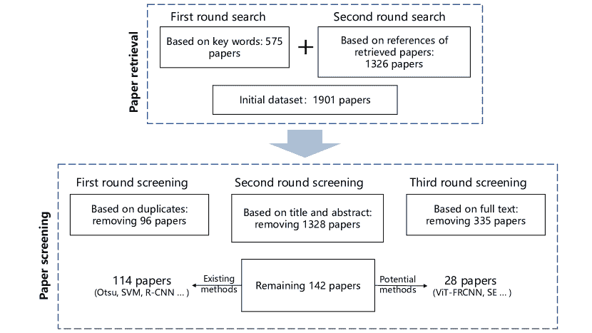
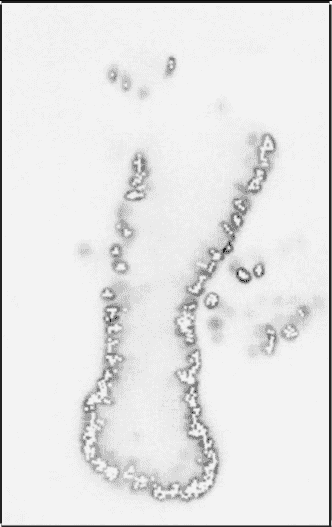
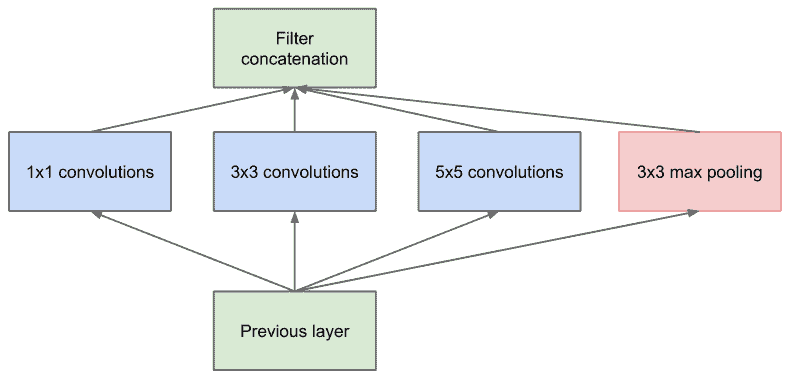
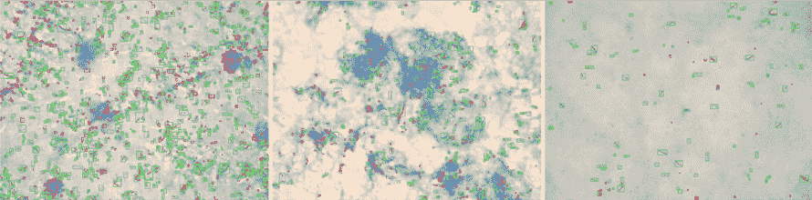

<!--yml

类别：未分类

日期：2024-09-06 19:55:22

-->

# [2105.03148] 微生物图像分析中物体检测技术的前沿调查：从经典方法到深度学习方法

> 来源：[`ar5iv.labs.arxiv.org/html/2105.03148`](https://ar5iv.labs.arxiv.org/html/2105.03148)

∎

¹¹机构文本：马平力、李晨、Md Mamunur Rahaman、张佳伟、邹硕佳、赵欣 ²²机构文本：东北大学医药与生物信息工程学院，微观图像与医学图像分析组，中国

通讯作者：李晨，²²电子邮件：lichen201096@hotmail.com ³³机构文本：姚宇东 ⁴⁴机构文本：美国斯蒂文斯理工学院电气与计算机工程系 ⁵⁵机构文本：马尔钦·格热戈日克 ⁶⁶机构文本：德国吕贝克大学生物医学信息学院

# 微生物图像分析中物体检测技术的前沿调查：从经典方法到深度学习方法

马平力    李晨    Md Mamunur Rahaman    姚宇东    张佳伟    邹硕佳    赵欣    马尔钦·格热戈日克（收到日期 / 接受日期）

###### 摘要

微生物在人的生活中发挥着重要作用。因此，微生物检测对人类具有重要意义。然而，传统的手动显微检测方法存在检测周期长、在大数量级下检测准确率低以及检测不常见微生物难度大等缺点。因此，将计算机图像分析技术应用于微生物检测领域是有意义的。计算机图像分析可以实现对微生物的高精度和高效率检测。在这篇综述中，我们首先按时间顺序分析了现有的微生物检测方法，从传统的图像处理和传统的机器学习到深度学习方法。然后，我们分析和总结了这些现有方法，并介绍了一些潜在的方法，包括视觉变换器。最后，讨论了微生物检测的未来发展方向和挑战。总体而言，我们总结了从 1985 年至今的 142 篇相关技术论文。这篇综述将帮助研究人员更全面地了解微生物检测领域的发展过程、研究现状和未来趋势，并为其他领域的研究人员提供参考。

###### 关键词：

微生物 图像 微观图像 图像分析 物体检测 机器学习 视觉变换器

## 1 引言

### 1.1 微生物知识

微生物具有适应极端条件的独特能力。它们存在于每一个可以想象的环境中。微生物指的是具有独立生活功能的微小生物，这意味着它们能够自行吸收能量、成长和繁殖。现代微生物分类采用三域系统。该系统包括古细菌（Archaea）、真核生物（Eucarya）和细菌（Bacteria）Pepper-2011-EM。细菌、放线菌和蓝绿藻（青藻）属于原核生物。真核生物（eukarya）包括真菌、原生动物、藻类、植物和微小动物。病毒是强制性细胞内寄生物，既不属于这两组中的任何一种 Bitton-2005-WM。微生物在人的生活中扮演着非常重要的角色，无论好坏。例如，植物生长促进根际细菌的存在可以对植物健康和生长产生有益影响。它也可以抑制致病微生物 Babalola-2010-BBOA。有害根际细菌可以通过产生植物毒素来抑制植物生长 Nehl-1997-DRB。乳酸菌可以从多个方面影响人类，例如调节胃肠道菌群、正常进行人类代谢以及抑制有害细菌的繁殖 Masood-2011-BEO。严重急性呼吸综合症冠状病毒 2 型（SARS-CoV-2）可以导致发热、不适、干咳、呼吸急促，严重情况下甚至死亡 Hui-2020-TC2。总之，微生物分析工作对人类具有重要意义。

在显微镜下观察是一种常见且重要的微生物分析方法。立体扫描电子显微镜用于土壤中的微生物分析 Gray-1967-SEM。在 Daley-1975-DCO 中，基于显微镜的改良荧光技术用于水生细菌计数。在 Collins-1993-AOE 中，环境扫描电子显微镜用于微生物分析。然而，这些显微镜方法有一些缺点。首先，微生物种类繁多。根据 Locey-2016-SLP 的估计，地球上存在$10^{11}$-$10^{12}$种微生物。因此，专家的知识总是有限的。当专家使用这种方法进行微生物分析时，他们通常需要查阅大量文献。其次，研究人员的培训周期和整体检测时间需要很长时间。例如，传统显微镜方法对浮游植物的计数需要很长时间。此外，操作员需要掌握大量的专业知识 Embleton-2003-ACO。第三，待分析的微生物通常数量级较大。显微镜方法难以处理大数据量的分析问题。大样本量会影响操作员的分析准确性 Van-2002-OTC。由于显微镜方法的这些缺点，我们需要一种更高效的微生物分析方法。例如，计算机图像分析是一种可行的方法。

### 1.2 动机

计算机图像分析是计算机视觉和图像处理的一部分。通常，图像分析用于深入了解原始图像并提取所需的信息 Umbaugh-2005-CID。就微生物分析而言，使用图像分析相对于显微镜方法有许多优势。首先，图像分析不关心微生物种类的数量。计算机能够存储和记住比专家更多的不同微生物信息。核糖体数据库项目存储了 2460 种不同的物种。随着信息的录入，这个数量将继续增加 Maidak-2000-TRD。其次，图像分析所需的时间较少。在图像分析的帮助下，浮游植物分析只需 30 到 40 分钟 Embleton-2003-ACO。第三，对于图像分析，大量级的微生物分析任务不会造成任何困难。第四，图像分析的操作简单。在使用图像分析时，通常只需要进行数据导入和几个简单步骤，例如微生物生态图像分析系统 Dazzo-2015-UOC。基于以上原因，将计算机辅助图像分析应用于微生物分析是可行的。

目前，许多人在这个领域进行研究，例如微生物分割 Kulwa-2019-ASO 、微生物聚类 Li-2020-AROC 、微生物分类 Li-2019-ASF 、微生物计数 Li-2021-ACR 等。然而，目前没有关于微生物检测的具体综述。为了全面了解现有的微生物检测研究，我们讨论了许多材料。根据我们的搜索，一些综述涉及微生物检测。在 Benfield-2007-RRO 中，总结了浮游生物成像系统的发展和从图像数据集中提取信息的进展，其中在所有 56 篇参考文献中有十二篇涉及微生物检测。在 Schaap-2012-LOA 中，提供了当前芯片实验室技术在藻类检测和监测中的现状综述。在这项工作中，所有 81 篇参考文献中提到有二十四篇与藻类检测相关。在 Gopinath-2014-BDF 中，提出了现有细菌检测方法的综述，其中分析了从手动显微镜检测到基于智能手机的检测的方法。在这项调查中，所有 126 篇参考文献中有十二篇与细菌检测相关。一项综述专注于使用计算机图像分析来检查显微镜下的物体 Puchkov-2016-IAI 。在这项工作中，所有 102 篇参考文献中有二十二篇与微生物检测相关。在 Li-2019-ASF 中，回顾了基于内容的显微图像分析方法在微生物分类中的发展历史，其中所有 317 篇参考文献中有二十四篇与微生物检测相关。在 Zhou-2020-RAI 中，回顾了几十年来硅藻检测的发展，并讨论了用于硅藻检测的新型深度学习方法。在这项工作中，所有 34 篇参考文献中有两篇与硅藻检测相关。因此，这些综述都没有对微生物图像分析中的物体检测进行全面研究。事实上，微生物检测方法的分析可以促进其他微生物图像分析领域的发展，如微生物图像分类 Zhao-2021-ACO ; Kulwa-2021-ANP ; Li-2021-EEM ; Xu-2020-AEF ; Li-2019-ASF ; Kosov-2018-EMC ; Li-2016-EMA ; Li-2015-AOC 、微生物图像分割 Zhang-2021-ACR ; Zhang-2021-LAN ; Zhang-2020-AMC ; Kulwa-2019-ASS 和微生物图像检索 Zou-2016-EMI ; Zou-2017-CIR 。

如图 1 所示，早期的微生物检测工作主要基于经典的图像处理方法，如图像分割 福田-1989-ESD 和二值化 布鲁姆-1995-FAD。随着机器学习领域的发展，逐渐出现了传统机器学习方法，如人工神经网络（ANN） 维德默-2005-UOA，支持向量机（SVM） 伦塞恩-2007-SVM 和遗传算法-神经网络（GA-NN） 奥斯曼-2010-AGA。近年来，基于深度学习的方法变得非常流行，如更快的区域卷积神经网络（Faster R-CNN） 维特-2019-PWE 和 Mask R-CNN 鲁伊斯-2020-SVI。此外，许多新方法也可以应用于微生物检测，如单次检测器（SSD） 刘-2016-SSM。此外，视觉变换器基的方法比当前著名的卷积神经网络（CNNs）具有更强的全局信息表示能力，这意味着它们可以消除在完整图像中描述的微生物结构问题。因此，视觉变换器领域近年来发展迅速。事实上，视觉变换器已被应用于细胞检测并取得了令人满意的结果 奥布雷维尔-2017-AGS。然而，视觉变换器尚未应用于微生物检测，尽管基于视觉变换器的方法显示出在微生物检测中的巨大应用潜力，如挤压与激励（SE） 胡-2018-SN 和 Vision Transformer-Faster RCNN（ViT-FRCNN） 比尔-2020-TTO。相关工作的数量稳步上升。图 1 中的数据表明，微生物目标检测具有良好的发展趋势和巨大的发展潜力。因此，我们决定编写一份关于微生物图像分析目标检测技术的调研报告，其中总结了约 142 项相关工作。文中提到的方法主要分为经典图像处理方法、传统机器学习方法、深度学习方法和潜在方法，如图 2 所示。

图 1：有关微生物检测的相关工作的总数。

图 2：本调查中提到的微生物图像检测方法。

### 1.3 论文检索与筛选

我们特别搜索了微生物学领域的论文。因此，根据微生物的定义（具有独立生存的小型生物），一些优秀的文章由于研究领域不符合要求而未在本文中分析和讨论，例如组织学细胞的 Aubreville-2017-AGS、胃部组织病理图像的 Chen-2021-GAM、细胞病理学细胞的 Liu-2021-ITA 和胃部组织病理图像的 Hu-2022-GAN。

本综述涉及的论文的检索和筛选流程如图 3 所示。在检索阶段，我们首先在 Google Scholar 中搜索以下短语的随机组合：微生物、检测、识别、分类、图像分析、图像处理，共收集了 575 篇论文。然后，根据收集到的论文的参考文献，我们累计增加了 1326 篇论文。因此，总共获得了 1901 篇论文。在筛选阶段，我们主要通过三个步骤来去除论文。首先，通过检查论文是否重复来筛选，去除了 96 篇论文。在保留的论文中，1325 篇论文的摘要或标题与我们的综述无关，因此被删除。最后，经过仔细阅读，去除了 335 篇剩余的论文。简而言之，最终保留了 142 篇论文进行分析。其中，65 篇论文与经典图像处理相关；34 篇论文与传统机器学习相关；13 篇论文与深度学习相关；1 篇与经典图像处理和传统机器学习相关；1 篇与传统机器学习和深度学习相关；28 篇论文与潜在方法相关，包括基于视觉变换器的方法。

图 3：涉及论文的检索和筛选流程。

### 1.4 本综述的结构

本文根据不同的检测方法总结了微生物检测。首先，对现有的微生物检测方法进行分类。然后，分别描述和分析每一类。此外，介绍了研究动机、目标检测的基础知识以及不同方法的评价标准。对于一些关键方法，展示了流程图或样本图，以加深理解。

本综述的其余部分结构如下：在第二部分中，我们介绍了目标检测的基本知识和一些常用的评估指标。然后，在第三部分、第四部分和第五部分中，我们分别介绍了基于经典图像处理的方法、传统机器学习方法和深度学习方法。之后，以上三类方法在第六部分中进行了总结。此外，还分析了潜在的方法。最后，第七部分总结了整个工作并展望了未来的研究方向。通过这种结构，相关研究人员可以更好地了解相关工作。

## 2 微生物检测概述

在对微生物检测方法进行概述之前，我们回顾了目标检测的基本知识。接着，根据检测结果的形式，微生物检测的历史被划分为早期阶段和当前阶段。我们将按时间顺序概述微生物检测的发展历程。

### 2.1 目标检测的基本知识

物体检测是计算机视觉中的一个长期而具有挑战性的任务 Fischler-1973-TRA。作为计算机视觉的主要任务之一，物体检测的**最终**目标是提供物体的类别和位置。因此，物体检测是许多其他计算机视觉任务的基础，例如物体跟踪 Son-2017-MTW 和场景理解 Pan-2017-SAD。自物体检测提出以来，检测方法一直在不断发展。本节我们全面总结了过去二十年物体检测方法的发展，并将物体检测方法分为传统的基于手工特征的方法和基于深度学习的方法 Zou-2019-ODI。其中，基于深度学习的方法根据不同的处理流程包括一阶段方法和二阶段方法。图 4 展示了过去二十年检测方法的发展。图 4 中涉及的方法包括：Viola-Jones(VJ) Viola-2001-ROD，方向梯度直方图(HOG) Dalal-2005-HOO，可变形部件模型(DPM) Felzenszwalb-2008-ADT，R-CNN Girshick-2014-RFH，空间金字塔池化网络(SPPNet) He-2015-SPP，Fast R-CNN Girshick-2015-FR，Faster R-CNN Ren-2016-FRT，金字塔网络 Lin-2017-FPN，Mask R-CNN He-2017-MR，OverFeat Sermanet-2013-OIR，You Only Look Once (YOLO) Redmon-2016-YOLO，单次多框检测器 (SSD) Liu-2016-SSS，YOLO9000 Redmon-2017-YBF，Retina-Net Lin-2017-FLF，YOLOv3 Redmon-2018-YAI，YOLOv4 Bochkovskiy-2020-YOS，视觉变换器-Faster RCNN (ViT-FRCNN) Beal-2020-TTO，DEtection TRansformer (DETR) Carion-2020-EOD，Pointformer Pan-2020-3OD，可变形 DETR Zhu-2021-DDD 和 Swin Transformer Liu-2021-STH。

### 2.2 微生物检测的早期阶段

在早期的微生物检测阶段，主要目的是确定对象是否存在。在这一阶段，微生物检测与微生物分割密切相关。图 5 展示了基于分割的检测示例。在 Bloem-1995-FAD 中，土壤细菌的检测基于分割的二值图像和灰度图像的组合。在 Rachna-2013-DOT 中，分别采用$k$-均值聚类和 Otsu 阈值来分割结核分枝杆菌图像以进行结核分枝杆菌检测。此外，微生物检测还与分类密切相关。在 Lenseigne-2007-SVM 中，结核分枝杆菌的自动检测基于 SVM 分类器。在 Verikas-2014-AIA 中，SVM 以及随机森林（RF）分类器用于区分小圆核藻（P. minimum）细胞和其他对象。

图 4: 过去二十年检测方法的发展。

图 5: 基于分割的检测示例。

### 2.3 目前的微生物检测阶段

与早期的微生物检测阶段不同，目前的微生物检测阶段精确地给出了对象的类别和位置。在这一阶段，检测结果包括围绕每个检测对象的多个边界框以及各自的类别标签。此阶段的微生物检测主要基于深度学习方法 Lecun-2015-DL。图 6 展示了基于深度学习的检测结果示例。

深度学习有着悠久的发展历史。1943 年，McCulloch-Pitts (MCP) 模型的出现，被认为是人工神经网络模型 (ANN) 的原始版本，这标志着深度学习的初步实现 Mcculloch-1943-ALC。在 MCP 之后，深度学习领域经历了长期的稳定发展，直到解决了由硬件限制造成的问题。2014 年之后，得益于图形处理单元 (GPU) 强大的计算能力和卷积神经网络 (CNN) 模型的实现，深度学习得以快速发展，尤其是在目标检测任务中。事实上，Faster R-CNN，作为典型的两阶段目标检测模型，直到 2016 年才被提出。至于 YOLO，作为典型的一阶段目标检测模型，它的提出甚至比 Faster R-CNN 晚了五个月。只有在深度学习技术相对成熟之后，它才被应用于微生物检测。因此，虽然深度学习广泛用于目标检测，但基于深度学习的微生物检测研究却很少。然而，从图 1 可以看出，尽管起步较晚，深度学习在微生物检测领域的发展非常迅速。通过查阅大量资料，我们发现了 13 项与深度学习相关的研究。在 Hung-2017-AFR 中，Faster R-CNN 首次应用于检测疟疾感染血液的明场显微镜图像中的细胞。在 Ruiz-2020-SVI 中，Mask R-CNN 首次用于检测图像中的硅藻，其中包含许多硅藻壳。

图 6：基于深度学习的检测示例。

### 2.4 评估标准

为了评估微生物检测仪的有效性，在不同相关工作中提供了一些适当的标准。观察到目前没有广泛接受的评估检测性能的标准。在不同的研究场景中应用了不同的标准。对于计数工作的检测，主要标准是与专家计数结果或实际数字的相关性，例如 Ogawa-2005-MDI , Hung-2017-AFR 。使用这种标准时，专家计数结果或实际数字被视为基准。因此，检测结果与参考基准的接近程度越高，效果越好。在 Jan-2015-DOT 中，通过样本图像中的物体数量和检测到的物体数量来评估结核分枝杆菌(TB)的检测结果的有效性，如方程 1 所示。

|  | $准确度=\rm\frac{样本图像中的物体数量}{检测到的 TB 细菌数量}\ $ |  | (1) |
| --- | --- | --- | --- |

对于分类中的检测工作，准确性、敏感性、特异性和精确度被广泛用作标准。为了更好地解释如何计算这些评估标准，我们在表 1 中说明了四个基本概念。正面和负面代表模型的判断结果。真实和虚假表示模型的决策是否正确。通过结合正面、负面、真实和虚假，我们可以得到真正的正例 (TP)、虚假的正例 (FP)、真正的负例 (TN) 和虚假的负例 (FN)。此外，为了判断实际检测结果属于 TP、FP、TN 还是 FN，不仅要考虑检测类别，还必须考虑交并比 (IoU)。在实际应用中，IoU 用于评估输出框与真实值之间的距离。IoU 的计算方法如图 7 所示，其中框 1 和框 2 分别代表真实框和预测结果，浅蓝色区域和深蓝色区域分别代表预测框和实际框的交集和并集。最后，IoU 通过交集比并集来计算。

表 1：TP、FN、FP 和 TN 的说明表。

|  | 预测标签 |
| --- | --- |
| 是 | 否 |
| 真实标签 | 是 | TP | FN |
| 编号 | FP | TN |

图 7：IoU 计算的示意图。

基于表 1 中的四个标准，准确性、敏感度、特异性和精度的计算方法见表 2。一些研究仅使用了准确性 Hiremath-2010-DIA 或敏感度 Verikas-2012-AIA 作为评价指标。然而，少数研究考虑了多个指标，如敏感度和特异性 Shah-2016-ADA，以及准确性、敏感度和特异性 Osman-2010-DOM。

表 2：准确性、敏感度、精度和特异性的公式。

|  | 准确性 | 敏感度 | 特异性 | 精度 |
| --- | --- | --- | --- | --- |
| 公式 |

&#124; $\frac{TP+TN}{TP+TN+FP+FP}$ &#124;

|

&#124; $\frac{TP}{TP+FN}$ &#124;

|

&#124; $\frac{TN}{FP+TN}$ &#124;

|

&#124; $\frac{TP}{TP+FP}$ &#124;

|

除了上述常见的标准外，还使用了 F-score、平均精度均值(mAP)、真正接受率(TAR)、错误接受率(FAR)、错误拒绝率(FRR)和检测准确率。表 3 展示了它们的数学表达式。对于 F-score 的计算，召回率与之前提到的敏感度相同。对于 mAP，AP 指每个类别的精度值均值，$m$表示检测的类别数量。AP 的值由精度-敏感度曲线确定。

表 3：mAP、TAR、FAR、FPR 和 F-score 的公式。

|  | mAP | TAR | FAR | FRR | F-score |
| --- | --- | --- | --- | --- | --- |
| 公式 | $\frac{1}{n}*\sum\limits_{i=1}^{n}AP_{i}$ | $\frac{TA}{TA+FA+FR}$ | $\frac{FA}{TA+FA+FR}$ | $\frac{FR}{TA+FA+FR}$ | $\left(1+\beta^{2}\right)*\frac{Precision*Recall}{\beta^{2}*Precision+Recall}$ |

### 2.5 总结

微生物检测方法在几十年中发生了巨大的变化。在表达形式方面，微生物检测从简单的计数发展到实现定位和分类。在实施技术方面，微生物检测从显微镜的直接观察发展到使用现代图像处理技术的更高效的方法。随着检测方法的不断改进，相应的评价标准也在不断设计。

## 3 经典图像处理方法

本节将基于经典图像处理的微生物检测方法分为基于分割的方法和基于分类的方法，分别在 Sect.3.1 和 Sect.3.2 中介绍。之后，在 Sect.3.3 中准备了一个简明的表格。在 Tab.LABEL:tab:4 中，展示了相关工作的出版日期、文献链接、研究对象及其领域、主要方法和评估指标。

### 3.1 基于分割的方法

本小节介绍了使用分割方法进行微生物检测的相关工作。

在 Sieracki-1985-DEA 中，为了减少手动计数的主观性，提出了一种基于荧光显微镜和图像分析仪的新方法。第一步是图像增强，包括在每个检测到的物体旁边设置小亮点，并对每个物体的整个检测区域进行亮度增强。第二步是手动使用光笔区分物体和其他区域。最后一步是使用 Artek Systems Corp 提供的一般分析软件进行物体计数。通过将图像分析的计数与视觉计数进行比较来分析所提出系统的有效性。实验结果表明，该系统在细菌检测中能够达到与视觉计数相同的准确性。

为了分析菌丝形态的特征，Adams-1988-TUO 中引入了一种半自动图像分析方法。第一步是通过均值算子和边缘增强算子进行预处理，以去噪和锐化图像。第二步是分割和骨架化。之后，使用光笔手动识别分支。最后，根据 Magiscan 2A 随附的软件确定主菌丝的长度。实验在五个样本上进行。结果显示，与传统的数字化台方法相比，半自动图像分析具有时间消耗短和高便利性的优点。

在 Packer-1990-MMO 中，开发了一种用于丝状微生物形态学测量的完全自动化系统，提高了速度。第一步是基于预设灰度值对图像进行二值化。第二步是通过圆度测试去除处理图像中除微生物之外的物体，如灰尘、介质颗粒。接着，对结果图像中的每个物体进行骨架化处理。随后，将处理后的二值图像分为包含可测量微生物的图像和包含聚集（或聚合）物质的图像。最后，对处理后的图像进行测量。实验在约 100 个微生物的八个样本上进行。结果表明，完全自动化的方法比手动图像分析方法稍快，比数字化方法快得多。

在 Masuko-1991-ANM 中，提出了一种基于超高灵敏度电视摄像机的细菌计数新方法。第一步是使用超高灵敏度电视摄像机对发光的小物体进行计数。菌落生长后，获得膜滤器的发光图像。最后，通过将光子计数图像与膜滤器的发光图像进行比较来判断计数的准确性。实验结果表明，该算法在用光检测单个细菌时可靠。

在 Bloem-1995-FAD 中，为了计数细胞数量和计算土壤涂片中细菌的一些几何参数，提出了一种完全自动化的图像处理方法。首先，使用卷积、形态学腐蚀和膨胀来去除噪声，以平滑灰度图像。然后，对图像中的孔洞进行填补，实现背景均衡。通过应用两个顶帽变换，背景被消除。最后，进行图像锐化操作以获得更好的检测效果。检测到阈值高于固定值的粒子。此外，细胞数量由最大灰度值的检测粒子数量确定。该方法在 30 分钟内检测约 1500 个细胞具有高效率。此外，所提出方法的检测结果与手动检测结果类似。

在 Baillieul-1998-ODO 中，描述了一种用于测量许多同时移动的相似物体的平均速度的图像分析系统。首先，操作员手动在图像上定位一个活动窗口，以集中关注感兴趣的区域。第二步是基于固定阈值将物体设置为 1，将背景设置为 0。最后，通过实时收集一系列帧中的轨迹，计算物体的平均速度。实验中测试了三组 25 只桡足类动物。结果表明，该系统是客观量化速度的有用工具。

在 Wang-2003-3AO 中，提出了一种基于统计的非参数框架方法用于三维（3-D）对象检测和标记。第一步是从观察图像中提取细胞核。在这一步中，图像被分割为规则的不重叠的立方体。然后根据定义的标准检查每个立方体。被识别为细胞核的立方体被设置为白色。最后，通过迭代合并算法将同一细胞中的所有白色立方体合并成一个整体。图 8 显示了基于提出的方法获得的结果。实验表明，提出的方法在准备好的数据上实现了快速的细胞检测，耗时 148 秒。

(a) 病菌检测

(b) 细胞核标记

(c) 标记结果的体积渲染

(d) 动态检查包含对象的体积渲染图像

图 8: Wang-2003-3AO 中提到的提出方法的概览。该图对应于原文中的图 8。

在 Wang-2003-3BO 中，描述了一种低计算复杂度且稳健的 3-D 生物对象检测与标记方法。第一步是从观察图像中提取细胞核。在这一步中，图像被划分为规则的不重叠的立方体。然后根据定义的标准检查每个立方体。被识别为细胞核的立方体被设置为白色。最后，通过迭代合并算法将同一细胞中的所有白色立方体合并成一个整体。通过对真实图像数据进行多次实验来验证其适用性。实验中检测到 439 个细胞核。

在 Qing-2006-AOM 中，提出了一种识别和计数藻类显微色彩图像的方法。该方法依次对图像执行以下操作：通过中值滤波进行图像平滑，基于图像的色调饱和度和亮度（HSI）颜色空间特征进行阈值分割，种子填充，基于噪声区域阈值分割的噪声消除，精细化和最终的总计算量步骤。实验将提出的系统与人工统计在包含眼虫和双叉眼虫的 40 张藻类细胞图像上的表现进行了比较。结果表明，与人工识别方法相比，提出的系统的识别率超过 90$\%$，表明该方法是可行的。

为了提高传统图像分割和图像增强算法的准确性，在 Li-2007-EDO 中，提出了一种基于直方图均衡化和软数学形态学的图像边缘检测方法。该方法基于结合传统图像增强和图像分割。第一步是预处理，包括直方图均衡化和直方图规格化。第二步是灵活的形态学操作，包括腐蚀和扩展。最后一步是基于灰度值变化程度的边缘检测。基于该方法，可以提高检测准确性并较好地保护边缘细节。

在 Costa-2008-AIO 中，为了减少临床医生在诊断结核病时的劳动负担和患者的费用，提出了一种用于结核病的自动检测算法。首先，从红绿蓝 (RGB) 彩色格式中获得差异图像（R 通道减去 G 通道）。其次，应用全局自适应阈值操作进行结核病分割。最后，使用几种过滤操作将分枝杆菌从伪影中分离出来。实验中分析了约 50 张图像，专家识别的数量被视为参考标准。实验结果显示，所提出的算法具有最高的灵敏度 76.65$\%$ 和最佳的假阳性率 12$\%$。

在 Zhang-2008-AAB 中，为了提高细菌菌落的计数效率，介绍了一种完全自动化且成本效益高的细菌菌落计数器。首先，将原始图像分类为彩色图像和非彩色图像。对于所有图像，应用 Otsu 阈值进行前景对象区域的分割，称为盘子/碟子区域。随后，对于彩色图像，应用 Otsu 阈值进一步从盘子/碟子区域分割出对象。对具有多个菌落的对象采用分水岭算法进行最终分割。对于非彩色图像，从盘子/碟子区域进一步分割对象则基于统计方法。最终检测数量通过将彩色图像中检测到的数量与非彩色图像中检测到的数量相加得出。实验测试中，准备了 100 张彩色和非彩色图像。此外，还进行了受控实验，使用了 Otsu 方法。结果显示，与 Otsu 方法相比，所提出的算法具有更好的性能，满意率为 96$\%$。

在 Wang-2008-MMT 中，介绍了一种用于追踪运动微生物的自动方法。通过 XY 平台的运动来追踪运动中的微生物。这项工作的主要图像处理方法是基于多重阈值的对象识别。对于二值图像，目标掩模的质心被视为计算目标在时间序列图像中运动的速度和方向的坐标。跟踪控制系统在单细胞光合作用藻类 Chlamydomonas reinhardtii 上进行了测试。实验结果表明，结合提出的微生物检测方法，该系统可以连续追踪运动细胞长达 300 秒。

在 Fernandez-2006-MDI ; Fernandez-2008-MVA 中，提出了一种基于自动机器视觉的方法用于微生物囊体的检测，该方法不仅能提供令人满意的检测结果，还需要很少的时间。系统中提到了两种检测方法。第一种方法是两次阈值处理。首先，对图像的亮度和暗度部分分别进行阈值处理。之后，对处理后的两个图像进行或操作和去噪处理。最后，通过使用 Danielsson 圆检测方法来检测对象。另一种方法基于独立的红色和绿色颜色空间。在绿色平面上，检测 Cryptosporidium 的壁和细胞核。在红色平面上，仅检测细胞核。从红色图像中获得核的数量。通过两者相减获得细胞壁的数量。实验结果表明，该方法成功检测率达到了 100$\%$。

在 Coltelli-2007-RMA 中，提出了一种新型数字系统用于测量微观图像中运动物体的速度。第一步是对两个连续帧进行减法操作。基于这一操作，视频中的运动物体被检测出来，而静止物体被排除。然后存储差异图像。第三步是自动标记运动中的细胞。最后，计算面积变化并将其作为速度的度量。测试使用了 10 幅图像的时间序列（400 毫秒）。测试数据表明， Dunaliella 细胞的速度约为 100 $\rm\mu$/秒，这与之前研究 Rose-1974-VHA 报告的 Dunaliella 细胞速度 100 $\rm\mu$/秒 相似。这意味着该系统可以准确测量运动物体的速度。

为了提供医生一种更快速的结核病诊断方法，并减少患者开支，Sotaquira-2009-DAQ 中描述了一种基于图像处理技术的方法。该方法可以进行细菌分割和聚类检测，以用于结核病诊断。首先，将原始图像的 RGB 颜色空间转换为 YCbCr 和 Lab 颜色空间。然后分别对 YCbCr 颜色空间中的 Cr 平面和 Lab 颜色空间中的一个平面进行阈值分割。最后，将两个分割的图像合并进行最终检测。使用了 1400 张来自 14 名患者的图像来测试该方法，以图像中检测到的物体总数与正确分割的物体数的比例作为标准。实验结果表明，该方法在检测性能方面表现良好，平均效率为 96.3$\%$。

在 Vallotton-2010-SOD 中，提出了一种用于表征细菌的新型检测方法，该方法基于高分辨率相位差图像。第一步是通过 Marr Hildreth 边缘检测器进行边界检测。第二步是选择用于检测分裂的特征，包括在特定候选点的图像对比度、隔膜处的收缩、由概率模型提供的特征和角度特征。之后，使用归一化算子对上述四个选择的特征进行归一化，使其值介于零和一之间，然后进行相乘。最后，根据第三步获得的值和预设阈值进行分割。结果表明，该系统不仅比人工计数略有更好的结果，还提供了细菌形状的可靠信息。图。9 显示了分割结果的示例。

图 9：在 Vallotton-2010-SOD 中提出方法的检测结果。该图对应于原始论文中的图 5。

在 Mukti-2010-DAC 中，提出了一种检测和计数结核分枝杆菌的方法。通过该方法，可以获得适合图像的阈值。在此基础上，可以实现颜色阈值和图像分割的主要目标。第一步是通过颜色阈值方法进行图像分割。然后，使用计数器根据结果的二值图像计数黑色结核分枝杆菌细胞的数量。通过采用该方法，可以准确判断患者的疾病等级。

在 Verikas-2012-AIA 中，为了更好地保护环境，提出了一种自动检测 P. minimum 的系统，该系统能够获取目标的定量浓度估计。首先，通过对 Lab 图像进行分割创建目标图像。然后分别确定圆形目标的中心和轮廓。之后，根据面积阈值去除圆形噪声。对于多个目标的图像，该方法采用顺序检测方法，逐个去除检测到的目标。开发的算法在 114 张由彩色相机记录的图像上进行了测试。根据测试结果，引入的算法在检测率为 93.25$\%$的情况下表现良好。

在 Raof-2011-ISO 中，为处理大量结核病（TB）病例，提出了一种结核病图像分割方法，其准确性与手动诊断相同但效率更高。主要包括两个步骤。一是图像增强，涉及调整图像的亮度、对比度和颜色操作。另一个步骤是通过使用颜色阈值技术实现的。在这一阶段，收集颜色信息用于结核病像素的检测。图中展示了分割结果的示例见图 10。最终图像表明，基于所提出的方法，可以准确检测原始图像中的结核病。

图 10：在 Raof-2011-ISO 中提出的方法的分割结果。该图对应于原论文中的图 6。

在 Shi-2012-FBA 中，为提高计数总菌落数量的效率，提出了一种具有高实际价值的细菌自动检测方法。其主要思想是设计一种基于活细菌周围低亮度和中心高亮度特征的圆形滤波器进行检测。通过比较手动检测和机器检测的结果，表明该系统的识别误差在 10$\%$以内。

在 Rachna-2013-DOT 中，开发了一种基于图像处理的算法用于识别痰中的结核菌，这可以减少医生在诊断结核病时的工作量。第一步是预处理。然后，应用全局阈值去除组织和背景。之后，分别应用 $k$-均值聚类方法和 Otsu 阈值方法来检测结核菌，以比较它们的性能。最后，应用区域生长方法标记和去除噪声及 $k$-均值聚类方法或 Otsu 阈值方法提取的对象中的大量过度污染区域。完全自动化的结核菌分割方法在 25 个阳性组织切片上进行了测试。测试结果显示，该方法在结核菌分割中表现出令人满意的性能，准确率为 98.00$\%$。

在 Matuszewski-2013-PDA 中，为了在视频流中检测和跟踪小物体，设计了一组空间滤波器。第一步是计算样本图像的傅里叶变换。第二步是通过高于阈值参数的值创建一个二值滤波器。第三步，将输入图像转换到频率域，并将其频谱与滤波器相乘。之后，计算结果的逆傅里叶变换，得到一幅非常模糊的图像。最后，对输出图像应用其他阈值。实验表明，所提出的方法适合检测和跟踪已知物体。

在 Kowalski-2014-ASL 中，提出了一种有效的线虫提取方法，以获得更多关于线虫行为的信息。首先，使用自适应阈值方法将灰度图像二值化。其次，应用全局阈值从原始图像中提取参考标签。然后，在第一步获得的二值图像与提取标记的二值图像之间进行异或操作。最后，通过最大斑点的中心确定检测到的线虫的位置。基于该方法，线虫的位置可以准确确定。同时，借助该方法，可以更好地跟踪线虫。

在 Wang-2013-IFT 中，为了用基于机器视觉的自动观察替代人工观察，本文提出了一种更适合低对比度图像的边缘检测方法。首先，使用 Canny 算子对低对比度图像进行分割，同时在备份图像中也应用了数学形态学以实现相同的目的。然后，分别用两种方法得到的两个分割图像通过小波变换进行融合。实验表明，融合后的分割图像比基于单一方法分割的图像效果更佳。从图 11 中可以看出，融合的分割图像能够更完整、清晰地反映物体特征。

图 11：在 Wang-2013-IFT 中提出的方法的分割结果。该图对应于原文中的图 1-图 4。

在 Kurtulmucs-2014-DOD 中，提出了一种利用计算机视觉检测和计数显微镜图像中**Heterobacter elegans**死亡的新方法，以更好地控制农业害虫并提高**Heterobacter elegans**的检测效率。第一步是通过中值滤波器、Otsu 阈值、面积开运算和填充运算获得线虫的光滑中轴线。然后通过骨架分析将重叠的线虫分开。最后，使用两种不同的路径分析方法来检测死亡的线虫，这两种方法都基于均值的标准误差。为了验证所提方法的性能，准备了一个包含总共 685 张图像的数据集，其中包括 935 条活线虫和 780 条死线虫。实验结果表明，该算法能以 85$\%$的检测率获得良好的性能。

在 Farahi-2015-ASO 中，为了更好地诊断内脏利什曼病，提出了一种分割利什曼体的方法。第一步是通过线性对比度拉伸变换进行预处理。为了提高最终分割的性能，通过应用形态学闭运算提取图像中的所有小椭圆对象。在此步骤中，提取了包括利什曼体在内的其他形状类似的对象。为了提取检测到的对象的边界，采用了 CV 水平集方法。最后，为了去除其他形状类似对象的影响，应用了局部阈值。实验结果表明，该方法的平均分割误差为 9.76$\%$。

在 Goyal-2015-ADO 中，为提高结核病诊断的效率，提出了一种可靠的方法。第一步是将输入图像的颜色空间转换为灰度空间。之后，为了提高结核病分割的性能，采用了 tubeness 滤波来突出显示目标。第三步是基于 Otsu 全局阈值粗略提取细菌。对提取出的细菌进行标记后，去除所有其他噪声。与专家手动检测相比，本工作提出的自动检测算法获得的细菌计数与手动结果有较强的相关性。

在 Shah-2016-ADA 中，为提高结核病检测的敏感性和特异性，介绍了一种在智能手机上使用的自动检测方法。第一步是预处理，包括灰度转换和对比度增强。第二步是基于阈值对图像进行二值化，以将细菌与背景分离。然后进行形态学闭运算和填充。在第四步中，基于几何特征去除伪影。最后，通过分水岭算法对重叠（接触的）分枝杆菌进行分割和分离，并对结核病进行标记。准备了 30 张来自智能手机的图像，其中一半为结核阳性，另一半为结核阴性。实验结果表明，该方法实现了 93.3$\%$ 的敏感性和 87$\%$ 的特异性。

在 Zhou-2016-MCE 中，提出了一种微生物轮廓提取方法，用于从污水显微图像中提取目标轮廓。首先，使用 Sobel 算子计算图像的梯度。基于计算得出的值，采用四个自适应阈值来获得更好的目标边缘。之后，基于设计的边缘连接方法连接提取出的边缘。最后，从经过边缘连接处理的图像中提取最外层轮廓边缘。实验表明，与传统的边缘检测算法相比，该方法可以提取出更高质量的微生物轮廓。

在 Payasi-2017-DAC 中，为提高结核病诊断的效率，提出了一种可行的算法。第一步是将图像的颜色空间从 RGB 转换为 HSI。第二步是对色调（Hue）组件图像进行分割。经过基于区域阈值的去噪处理后，还填补了孔洞。最后，从处理后的图像中分割出目标，并计算目标的面积和周长。对准备好的数据进行的实验结果表明，该方法在结核病检测中取得了超过 90$\%$ 的高准确率。

在 Kemmler-2011-DOM 中，为了减少在明场显微镜中标记和计数细菌的工作量，对几种语义分割技术进行了比较。引入的方法之一是基于区域的水平集分割方法。为测试准备了一个包含五种不同微生物物种的数据库，每个类别的微生物数量从 40 直到 470 不等。采用平均识别率来评估检测性能。本文涉及的其他方法在其类别的对应章节中进行了说明。

### 3.2 基于分类的方法

在本小节中，介绍了使用分类方法进行微生物检测的相关工作。为了更清晰地呈现这些工作，我们决定根据采用的特征分别介绍所涉及的方法。传统图像分类中常用的特征，如图 12 所示，包括形状特征、几何特征、颜色特征、纹理特征、统计特征等。

图 12: 传统图像分类中常用的特征。

#### 3.2.1 基于形状特征的分类方法

形状特征在传统图像检测方法中被广泛使用，主要包括轮廓特征和面积特征。更具体地，它包括如方形度、角度、圆度、不变矩、离心率、多边形描述和曲线描述等特征参数。

在 Dubuisson-1994-SAC；Javidi-2006-RA3；Yeom-2006-R3S；Liu-2014-AOI；Liu-2014-VID 中，轮廓特征作为一种形状特征用于微生物检测。在 Dubuisson-1994-SAC 中，轮廓特征通过 Canny 边缘检测器和阈值分割提取。基于轮廓特征，成功区分和检测了 Methanospirillum hungatei 和 Methanosarcina mazei。描述算法的具体过程见图 13。在 Javidi-2006-RA3；Yeom-2006-R3S 中，轮廓特征与刚性图匹配（RGM）方法结合，用于在 3-D 图像中分割和检测生物微生物。分割结果和检测结果分别展示在图 14 中。在 Liu-2014-AOI；Liu-2014-VID 中，提出了一种光流体成像系统，该系统通过名为 ImageJ 的图像处理软件获取轮廓特征和其他信息。在 Liu-2014-AOI 中，该系统用于检测大肠杆菌、志贺氏菌和霍乱弧菌。在 Liu-2014-VID 中，同一研究小组提出使用该系统检测流感病毒。实验结果表明，所有准备的微生物均可以有效地检测和分类。

图 13：在 Dubuisson-1994-SAC 中提到的提出方法概述。该图对应原始论文中的图 1。

(a) 矽藻原图

(b) (a)的分割结果

(c) 参考样本

(d) (c)的识别结果

图 14：在 Javidi-2006-RA3 中提出方法的检测结果。该图对应原始论文中的图 6 和图 10。

在 Rizvandi-2008-SAO ; Huang-2008-ADA ; Rizvandi-2008-ELB ; Rizvandi-2008-AID ; Zhou-2008-UMV 中，提出了一些基于角度特征的相似方法来检测秀丽隐杆线虫。这些方法包含几个相似的步骤。第一步是预处理，包括图像二值化、小孔填充、骨架提取和修剪。第二步是通过处理特定像素将骨架分割成独立的分支。然后，通过应用分支合并方法重建所有独立的骨架。最后，使用从提出的骨架中提取的角度特征进行秀丽隐杆线虫的检测。Rizvandi-2008-ELB 中实验的结果如图 15 所示。相关结果表明，正确检测到的线虫的最佳百分比约为 83$\%$。

图 15：在 Rizvandi-2008-ELB 中提出方法的检测结果。该图对应于原论文中的图 5。

在 Zhai-2010-AIO ；Hiremath-2011-SAI ；Badsha-2013-ACA 中，圆度特征被特别用于检测大致呈圆形的微生物。Zhai-2010-AIO 中提出的方法包括图像分割和通过圆度和粗糙度检测杆菌。其中，圆度用于区分单杆菌对象和相互接触的杆菌对象。实验使用了 100 张图片。结果显示，95%的样品总共有超过 80%的良好检测准确率。在 Hiremath-2011-SAI 中，经过多种预处理算子，比如灰度转换，图片强度值调整和二值化，从二值化对象中得到了圆度数据。最后，所有轮状病毒-A 颗粒根据圆度和预设规则进行了识别。准备了 50 张图片来测试所提出算法的性能。实验结果表明，所提出算法的识别率为 98%。在 Badsha-2013-ACA 中，圆度结合离心率用于检测隐孢子虫和贾第鞭毛虫（子）囊。相应的检测过程在图 16 中展示。准备了 40 张包含隐孢子虫和贾第鞭毛虫（子）囊的图片来测试所描述方法的性能。通过核计数率评估性能。此外，为了更客观地评估该方法的性能，将其结果与手动计数进行比较。实验结果表明，所提出方法达到了 97%的检测率。

图 16：在 Badsha-2013-ACA 中检测隐孢子虫和贾第鞭毛虫（子）囊。该图对应于原始论文中的图 8。

#### 3.2.2 基于几何特征的分类方法

几何特征通常指图像中对象的位置和方向，以及对象的周长、面积、距离和其他特征。几何特征更直观和简单，可以在目标检测中发挥良好作用。

在 Fang-2008-AIO ; Liu-2014-AOI ; Liu-2014-VID ; Yu-2014-DOI 中，物体的面积被选为准确检测的重要特征。在 Fang-2008-AIO 中，面积和神经网络（NN）用于自动识别酸快染色痰涂片中的结核分枝杆菌。对 44 张含 533 个结核分枝杆菌的酸快染色显微镜图像进行实验显示，感知机的灵敏度为 100%且特异性为 39.8%；前馈反向传播网络的灵敏度为 97.8%且特异性为 72.4%。在 Liu-2014-AOI ; Liu-2014-VID 中，不仅应用了前一小节提到的形状特征 3.2.1，还应用了面积特征。结果表明，本研究提出的方法通过结合形状特征和面积特征，在检测各种细菌方面表现良好。在 Yu-2014-DOI 中，面积被认为是检测噬菌体存在和估计噬菌体数量的重要指标。在 Coltelli-2013-AAR 中，从处理图像中提取的质心距离谱被选用于微藻检测。该方法在 3423 个样本中达到了 96.6%的高准确率，这些样本包含 24 种微藻。在 Mader-2015-IST 中，提出了一种使用宽度信息的图像分析方案来检测真菌感染。准备了 415 张图像用于评估所提方法的性能，其中 194 个为阳性样本，221 个为阴性样本。实验结果表明，该方法在准备的数据上具有 83%的灵敏度和 79%的特异性。

实际上，针对不同微生物选择的几种合适的几何特征的组合可以实现更好的检测。在 Fukuda-1989-ESD ; Forero-2003-AIT ; Kumar-2008-GAO ; Coltelli-2013-AAR ; Mader-2015-IST ; Jan-2015-DOT ; Perner-2004-ROA ; Sklarczyk-2007-IAA 中，通过使用不同的几何特征组合，实现了对不同微生物的准确而高效的检测。在 Fukuda-1989-ESD 中，提出了一种新方法，将完整的微生物个体视为由几个基本形状组成的个体。基于这些基本形状的长度和面积特征，系统将图像与预先准备的数据库进行匹配。对三种微生物的识别实验表明，在 Nitzschia Fonticola 中，最佳检测性能的检测率为 90$\%$。在 Forero-2003-AIT 中，许多几何特征被随机组合并测试，以选择最适合的特征组合。最后，长度、宽度和马氏距离与分类树的组合在杆菌检测中取得了最佳结果。在 Perner-2004-ROA ; Sklarczyk-2007-IAA 中，应用了面积与长度比率来确定目标与准备模板的接近程度。整个系统架构如图 17 所示。使用提出的方法对六种不同的空气传播真菌孢子（见图 18）进行了测试。Scopulariopsis Brevicaulis 的识别率最高，达到了 98.2$\%$。在 Kumar-2008-GAO 中，通过 Image-Pro Plus 获取了一些区域兴趣（ROI）的几何特征，以探索一种可靠且自动的微生物检测技术，包括宽度、长度、面积、周长和长宽比。在 Jan-2015-DOT 中，提出了一种应用面积和边界框的方法，大大提高了医生对结核病的诊断效率。在颜色空间转换、若干形态学操作和边缘检测之后，获得了关于面积和边界框的数据。对 100 个阳性样本和 10 个阴性样本的实验表明，该方法达到了 90$\%$的高准确率。

图 17：在 Sklarczyk-2007-IAA 中提到的所提方法的概述。该图与原文中的图 6 对应。

图 18：在 Perner-2004-ROA 中的测试对象。该图与原文中的表 2 对应。

#### 3.2.3 基于颜色、纹理或统计特征的分类方法

颜色特征可以描述图像或图像区域中对应场景的表面属性。颜色特征的描述可以分为颜色直方图、颜色分布、颜色集合等。在 Ogawa-2005-MDI 中，描述了一种用于细菌检测和代谢活动评估的新型多色检测方法。结果显示，与专家手动检测相比，本研究中提出的自动检测算法获得的细菌计数与手动结果具有较强的相关性。在 Tripathi-2007-DAI 中，提出了一种基于拉曼化学成像显微镜和颜色特征的方法，用于检测和识别单个细菌细胞和孢子。结果表明，拉曼化学成像显微镜能够区分革兰氏阳性 Bacillus atrophaeus 孢子和革兰氏阴性 E. coli 细胞。此外，颜色特征通常与其他特征结合以获得更好的检测性能。在 Kumar-2008-GAO；Coltelli-2013-AAR 中，颜色特征和几何特征一起构成了对象的特征参数。在 Forero-2003-AIT；Fang-2008-AIO 中，颜色特征被视为初步筛选区域的标准。

纹理特征可以反映对象表面组织结构排列属性的缓慢变化。在 Thiel-1995-TAD 中，纹理特征被用于检测和区分 Anabaena 和 Oscillatoria。在这项工作中，准备了 14 个 Anabaena cylindrica 和 20 个 Oscillatoria agardhii 作为测试组。实验结果表明，该方法以超过 90$\%$的准确率区分了 Anabaena 和 Oscillatoria。在 Javidi-2005-TIA 中，提出了一种通过应用纹理特征和 RGM 方法进行实时微生物检测的方法。实验结果显示，该方法在移动物体和不同条件下表现出强大的性能。此外，在 Zhai-2010-AIO 中，纹理特征与形状特征结合用于 TB 检测。

统计特征包括均值、方差、能量、序列等。统计特征计算简单，对颜色像素的确切空间分布不敏感。在 Moon-2010-ATM；Javidi-2010-DIA 中，提出了一种基于统计采样方法的自动化 3-D 传感和生物微生物识别方法。具体步骤如图 19 所示。测试结果表明，通过比较方差，可以准确检测到生物微生物。在 Daneshpanah-2010-3HI 中，结合 Schaa-l2009-MCD 的逃逸力测量与其他细胞识别方法，用于检测、分类和控制微生物和细胞。在 Shin-2010-OSF 中，描述了一个由微流控设备、数字全息显微镜和相关统计识别算法组成的系统，用于微生物的 3-D 传感和检测。首先，微流控设备提供微生物供系统处理。然后，微生物的菲涅尔衍射图样被光学记录为数字全息图。接着，从重建的波前数据中随机提取采样段特征。最后，应用统计识别算法进行细胞识别。实验中使用的微生物为绿藻和钩虫。实验结果表明，光学流体 3-D 传感和识别方法是可行的。在 Yourassowsky-2014-HTH 中，提出了一个由数字全息显微镜 (DHM) 和部分相干光源组成的系统，用于检测和提取准备样本中的物体。首先，应用非零复幅度来确定物体是否存在。之后，进行逆傅里叶变换和阈值操作以获得物体的位置。为了评估 DHM 的性能，使用了贾第虫囊体图像进行测试。实验表明，获得的相位和强度图像可用于检测和分类。

图 19：在 Moon-2010-ATM 中提到的提出的方法概览。该图对应于原始论文中的图 Fig.2。

#### 3.2.4 总结

基于对使用分类方法进行微生物检测的相关研究的上述分析，我们可以发现：

+   •

    使用分类方法进行微生物检测已有超过 30 年的发展历史。早在 1989 年，Fukuda-1989-ESD 就已经将几何特征作为微生物检测的分类特征。

+   •

    形状特征和几何特征因其计算简单和易于使用而广泛用于微生物检测。

+   •

    使用多种特征的组合可以比单一特征获得更好的检测结果。

### 3.3 表格分析

在过去四十年中，用于微生物检测的经典图像处理方法不断发展。所有相关工作可以分为基于分割的方法和基于分类的方法。为了更好地统计相关工作，设计了 Tab.LABEL:tab:4，其中展示了出版日期、文献链接、研究对象及其领域、主要方法和评估指标。

表 4: 基于经典图像处理的目标检测方法汇总。

| 日期 | 参考文献 | 微生物 | 领域 | 方法 | 评估 |
| --- | --- | --- | --- | --- | --- |
| 基于分割的方法 |
| 1985 | Sieracki-1985-DEA | 细菌 | 水体污染 | 对象标记 | 与目视计数相比 |
| 1988 | Adams-1988-TUO | 菌丝体 | 医疗 | 分割、骨架化 | 总体百分比 标准误差 = 0.25$\%$ |
| 1990 | Packer-1990-MMO | 线状微生物 | 医疗 | 二值化、圆度测试、骨架化 | 与人工分析相比 |
| 1991 | Masuko-1991-ANM | 荧光细菌 | 环境 | 发光物体的检测 | - |
| 1995 | Bloem-1995-FAD | 细菌 | 环境 | 形态学操作、阈值分割 | 与目视计数相比 |
| 1998 | Baillieul-1998-ODO | 微生物 | 水体污染 | 阈值 | - |
| 2003 | Wang-2003-3AO ; Wang-2003-3BO | 大鼠第一结肠腺的细胞 | 医疗 | 提取细胞核，将图像分成规则不重叠的立方体 | - |
| 2006 | Qing-2006-AOM | 藻类 | 环境 | 阈值分割 | 识别率 $\geq$ 90$\%$ |
| 2007 | Li-2007-EDO | 细菌 | 食品 | 直方图均衡、形态学操作、边缘检测 | - |
| 2007 | Coltelli-2007-RMA | 细菌 | 水体污染 | 两个连续帧之间的减法操作 | - |
| 2008 | Costa-2008-AIO | 结核菌 | 医疗 | 基于颜色通道的差异操作、全局自适应阈值 | 灵敏度 = 76.5$\%$ |
| 2008 | Zhang-2008-AAB | 细菌菌落 | 科学 | 菜盘/盘子检测、Otsu | 满意率 = 96$\%$ |
| 日期 | 参考文献 | 微生物 | 领域 | 方法 | 评估 |
| 基于分割的方法 |
| 2008 | Wang-2008-MMT | 微生物 | 水体污染 | 多阈值 | - |
| 2008 | Fernandez-2008-MVA | 微生物卵囊 | 水生环境 | 双阈值分割，基于颜色的检测 | 正确检测率 = 100$\%$ |
| 2009 | Sotaquira-2009-DAQ | 结核分枝杆菌 | 医疗 | 阈值分割，逻辑与 | 平均效率 = 96.3$\%$ |
| 2010 | Vallotton-2010-SOD | 细菌 | 科学 | Marr Hildreth 边缘检测器，阈值分割 | 与手动计数相比 |
| 2010 | Mukti-2010-DAC | 结核分枝杆菌 | 医疗 | 颜色阈值分割 | - |
| 2011 | Kemmler-2011-DOM | 细菌，真菌 | 医疗 | 基于区域的水平集 | 酵母的平均识别率 = 95$\%$ |
| 2011 | Raof-2011-ISO | 结核分枝杆菌 | 医疗 | 图像增强，颜色阈值分割 | - |
| 2012 | Verikas-2012-AIA | P. minimum | 水生环境 | 阈值分割，圆形检测 | 检测率 = 93.25$\%$ |
| 2012 | Shi-2012-FBA | 菌落 | 食品 | 设计圆形滤波器 | 识别误差 $\leq$10$\%$ |
| 2013 | Matuszewski-2013-PDA | 微生物 | 水生环境 | 傅里叶变换，阈值，逆傅里叶变换 | - |
| 2013 | Wang-2013-IFT | 原生动物 | 环境 | Canny 边缘检测，小波变换 | - |
| 2013 | Rachna-2013-DOT | 结核分枝杆菌 |  | Otsu 阈值化方法 | 准确率 = 98$\%$ |
| 2014 | Kowalski-2014-ASL | 绦虫 | 科学 | 自适应阈值化 | - |
| 2014 | Kurtulmucs-2014-DOD | 异杆菌 | 医疗 | 中值滤波器，Otsu 阈值，骨架化 | 识别率 $\geq$ 85$\%$ |
| 日期 | 参考文献 | 微生物 | 领域 | 方法 | 评估 |
| 基于分割的方法 |
| 2015 | Farahi-2015-ASO | 利什曼体 | 医疗 | 形态学操作，CV 水平集 | 全局模型的平均分割误差 = 10.90$\%$ |
| 2015 | Goyal-2015-ADO | 结核分枝杆菌 | 医疗 | Otsu 全局阈值化 | 与专家手动检测相比 |
| 2016 | Shah-2016-ADA | 结核分枝杆菌 | 医疗 | 阈值分割，分水岭算法 | 灵敏度 = 93.3$\%$，特异性 = 87$\%$ |
| 2016 | Zhou-2016-MCE | 微生物 | 水生环境 | 自适应阈值，边缘连接 | - |
| 2017 | Payasi-2017-DAC | 结核分枝杆菌 | 医疗 | 颜色空间转换，分割，去噪 | 计数准确率 = 90$\%$ |
| 基于分类的方法 |
| 1989 | Fukuda-1989-ESD | 微生物 | 工业 | 基本形状匹配 | 识别率 = 90$\%$ |
| 1994 | Dubuisson-1994-SAC | 微生物 |  | 模式识别 | - |
| 1995 | Thiel-1995-TAD | 螺旋藻，螺旋状细菌 | 水生环境 | 基于纹理特征的分类 | 准确率 $\geq$ 90$\%$ |
| 2003 | Forero-2003-AIT | 结核分枝杆菌 | 医疗 | Canny 算子，分类树 | 特异性 = 96.09$\%$ |
| 2004 | Perner-2004-ROA | 真菌孢子 | 环境 | 生成模板，模板匹配 | 识别率 = 98.2$\%$ |
| 2005 | Javidi-2005-TIA | 藻类 | 水传播 | 阈值，RGM | - |
| 2005 | Ogawa-2005-MDI | 细菌 | 医学 | 基于颜色的分类 | 与视觉计数比较 |
| 2006 | Javidi-2006-RA3 ; Yeom-2006-R3S | 螺旋藻，三角藻 | 水传播 | RGM，统计算法 | - |
| 日期 | 参考文献 | 微生物 | 领域 | 方法 | 评估 |
| 基于分类的方法 |
| 2007 | Sklarczyk-2007-IAA | 真菌 | 空气传播 | 基于案例的匹配 | 识别率 = 98.2$\%$ |
| 2007 | Tripathi-2007-DAI | 细菌 | 科学 | 拉曼化学成像显微镜 | - |
| 2008 | Kumar-2008-GAO | 细菌 | 食品 | 分析几何参数和三个光学参数 | - |
| 2008 | Rizvandi-2008-ELB | 线虫 | 科学 | 二值化，骨架化 | 正确检测率 = 83$\%$ |
| 2008 | Rizvandi-2008-SAO | 线虫 | 科学 | 二值化，骨架化 | FRR = 7.9$\%$，FAR = 8.4$\%$ |
| 2008 | Huang-2008-ADA | 圆线虫 | 科学 | 自适应阈值，形态学闭合，骨架化 | - |
| 2008 | Rizvandi-2008-AID | 圆线虫 | 科学 | 二值化，骨架化 | 检测准确率 = 89$\%$ |
| 2008 | Zhou-2008-UMV | 圆线虫 | 科学 | 二值化，骨架化 | - |
| 2008 | Fang-2008-AIO | 结核分枝杆菌 | 医学 | 基于颜色的检测，基于几何特征的分类 | 灵敏度 = 97.8$\%$，特异性 = 72.4$\%$ |
| 2010 | Zhai-2010-AIO | 结核分枝杆菌 | 医学 | 结合两种颜色空间分割结果 | 检测准确率 $\geq$80$\%$ |
| 2010 | Moon-2010-ATM ; Javidi-2010-DIA | 微生物 | 水传播 | 分水岭变换，统计采样 | - |
| 2010 | Daneshpanah-2010-3HI | 藻类 | 水传播 | 数字全息显微镜 | - |
| 2010 | Shin-2010-OSF | 原生动物 | 水传播 | 微流体设备，数字全息显微镜，统计识别算法 | - |
| 2011 | Hiremath-2011-SAI | 轮状病毒-A | 医学 | 基于形状特征的分类 | 识别率 = 98$\%$ |
| 日期 | 参考文献 | 微生物 | 领域 | 方法 | 评估 |
| 基于分类的方法 |
| 2013 | Badsha-2013-ACA | 原生动物 | 水传播 | 阈值分割，圆度度量和离心率基于分类 | 识别率 = 97$\%$ |
| 2013 | Coltelli-2013-AAR | 微藻 | 水传播 | 质心距离谱，不相似性度量和基于颜色的分类 | 准确率 = 96.6$\%$ |
| 2014 | 尤拉索斯基-2014-HTH | 贾第虫囊肿 | 水源性 | 高通量过滤、傅里叶变换、傅里叶逆变换 | - |
| 2014 | 刘-2014-AOI | 细菌 | 水源性 | 基于数据的大小、形状和折射率分类 | - |
| 2014 | 余-2014-DOI | 病毒 | 医学 | 一种光学成像技术 | - |
| 2015 | 马德尔-2015-IST | 真菌 | 医学 | 基于统计特征的分类 | 总体敏感性 = 83$\%$，特异性 = 79$\%$ |
| 2015 | 简-2015-DOT | 结核 | 医学 | 阈值、边缘检测 | 准确率 = 90$\%$ |

## 4 传统机器学习方法

传统机器学习是近年来一个受欢迎的研究领域，在许多计算机视觉任务中取得了良好的结果。基于传统机器学习的方法在物体检测中被广泛尝试。本节按时间顺序介绍了基于传统机器学习的微生物检测相关工作。随后，为了更清晰地展示近年来这些研究的进展，在 Sect.4.2 中准备了一个简洁的表格。

### 4.1 相关工作

在本小节中，介绍了基于传统机器学习的相关工作，包括动机、主要方法、实验数据和结果。此外，还插入了一些流程图，以更好地说明一些研究思路。

在尹-2009-RMF 中，为了检测蔬菜中的细菌，提出了一种基于反向传播神经网络（BPNN）的识别算法。第一步是基于迭代阈值的图像分割。第二步是去除噪声和提取对象。基于提取的对象，获得了细菌的多个形态特征。最后，通过将获得的特征数据作为输入，应用 BPNN 进行细菌识别。所提出算法的准确性通过与传统平板计数方法的结果进行比较来判断。实验表明，在 75 种不同蔬菜样本的测试中，两种方法的结果相关性为 99.87$\%$。

在 Ochoa-2010-AIO 中，提出了一种用于群体图像中*秀丽隐杆线虫*的自动识别方法。第一步应用了一个脊线分割方法 Steger-1998-AUD 进行图像分割。然后通过应用开放轮廓获得形状和外观数据。最后，采用概率分类器进行*秀丽隐杆线虫*的识别。准备了 2000 个线性物体中的 687 个*秀丽隐杆线虫*进行测试。结果显示最佳的真正率为 95$\%$。

在 Osman-2010-AGA 中，提出了一种遗传算法-神经网络（GA-NN）算法，以协助病理学家进行结核病诊断。第一步是图像分割，包括颜色过滤、移动 $k$-均值聚类和区域生长。第二步是基于胡矩不变量技术的特征提取和基于遗传算法的特征选择。最后一步是使用神经网络（NN）进行分类。总共准备了 120 个样本，其中包含 360 个结核病和 600 个可能的结核病样本。其中，200 个结核病和 200 个可能的结核病样本用于训练集。其他样本被均等分配到验证集和测试集中。结果显示最高测试准确率为 88.57$\%$。

在 White-2010-RAA 中，提出了一种分层方法，用于测量图像中胚胎、幼虫和成虫的数量。所提出的方法由四个层组成，分别用于查找感兴趣的区域、过滤和分割、将区域分解为对象部分以及对象分类，见图。20。准备了超过 1700 张*秀丽隐杆线虫*的图像。评估了每个发育阶段的分割和标注的精确度和召回率。

图 20：在 White-2010-RAA 中提到的所提出方法的概述。该图对应于原文中的图 2。

在 Osman-2010-DOM 中，为了在 ZN 染色组织图像中识别结核病，描述了一种自动化方法。第一步是初始过滤，去除所有颜色范围外的颜色，只保留红色。第二步是使用移动 $k$-均值聚类进行分割。在第三步中，提取了矩不变量特征。最后一步是通过应用混合多层感知器（HMLP）网络进行检测。为实验准备了 15 张切片，每张切片产生 30 到 50 张图像。实验结果表明，所提出的方法达到 98.07$\%$ 的准确率和 96.19$\%$ 的特异性。

在 Kumar-2010-RDO 中，为了识别食品中的病原体，提出了一种自动快速检测方法。第一步是背景校正，并将处理后的图像中的每个细胞分离成独立的图像。第二步是选择感兴趣的区域。之后，获取处理图像的各种几何、光学和纹理参数。最后，设计并建立了**概率神经网络**（PNN）用于对微生物进行分类。在对 155 张图像的测试中，PNN 能够使用九个最佳分类参数以 100$\%$的准确率对微生物进行分类。

在 Khutlang-2010-ADO 中，为了检测结核病，提出了一种自动可靠的检测方法。为了检测可能的杆菌，第一阶段采用了一类像素分类器，该分类器输出带有物体颜色的图像。高斯混合像素分类器的结果如图 21 所示。第二阶段的目的是进一步分割第一阶段获得的图像。准备了八个样本，其中包含 1064 个正样本和 1157 个负样本用于测试。实验结果表明，高斯混合分类器表现最佳，准确率为 93.47$\%$。

图 21：在 Khutlang-2010-ADO 中提出方法的检测结果。该图对应于原文中的图 1。

在 Zhang-2010-AOS 中，提出了一种高效的检测方法，用于自动检测食品中的细菌。第一步是预处理，包括原始图像与背景图像之间的减法、中值滤波、灰度直方图均衡化。第二步是基于 Otsu 算法的二值化。第三步是通过形态学算法填充空洞区域。最后，应用支持向量机（SVM）分类器将对象分类为三个类别。准备了 50 张第一类图像、30 张第二类图像和 20 张第三类图像作为训练样本。结果显示，所提方法与视觉计数结果之间的相对误差小于 3$\%$。

在 Hiremath-2010-DIA 中，针对不同类型的球菌细胞，提出了一种低时间消耗且高精度的自动检测方法。第一步是将原始图像转换为灰度图像，并调整强度值。第二步是通过主动轮廓进行图像分割。第三步是对分割图像进行标记，并计算每个标记区域的几何形状特征。最后一步是将 3$\sigma$分类器、$k$-最近邻（$k$-NN）分类器和 NN 分类器应用于特征集，并输出识别细胞的分类。准备了 100 张每个阶段的细菌细胞的彩色图像用于测试。测试图像样本如图 22 所示。结果显示，NN 分类器的准确率为 98$\%$至 100$\%$。在 Hiremath-2010-AIA 中，相同的研究小组使用相同的方法对细菌细胞的生长阶段进行识别和分类。此外，模糊分类器也应用于本实验。结果显示，模糊分类器的准确率为 98$\%$至 100$\%$，而 NN 分类器的准确率为 95$\%$至 100$\%$。

图 22: Hiremath-2010-AIA 中测试的对象。该图对应于原始论文中的图 2。

在 Kemmler-2011-DOM 中，已经在第 3.1 节 提到，提出了一种基于条件随机场（CRFs）的分段分类方法。为测试准备了一个包含五种不同微生物物种的数据库，每个类别有 40 到 470 个微生物样本。

在 Mansoor-2011-ARS 中，针对淡水热带布特拉贾亚湖的四种蓝藻属的自动检测，提出了一种基于人工神经网络（ANN）系统的方法。自动藻类识别系统的步骤如图 23 所示。准备了 400 个样本，涵盖四种蓝藻属，即微囊藻（Microcystis）、螺旋藻（Oscillatoria）、诺卡氏菌（Anabaena）和球藻（Chroococcus），每个属有 100 个样本，其中 80 个用于训练，20 个用于测试。结果表明，对这四种蓝藻属的输入样本的识别和分类成功率超过 95$\%$。

图 23：在 Mansoor-2011-ARS 中提到的提出的方法概述。该图对应于原文中的图 2。

在 Osman-2011-TBD 中，为了提高检测性能并避免计算机辅助结核病诊断系统的错误决策，设计了一种有效的分类器。第一步是图像分割和基于$k$-均值聚类算法的 TB 提取。第二步是后处理，包括中值滤波、区域生长和基于面积的去噪。最后，为每个分割区域计算一组六个仿射矩不变量，并将其输入到单隐藏层前馈神经网络（SLFNN）中，将分割区域分类为三类：“TB”、“重叠 TB”和“非 TB”。实验中使用了 500 张图像中的 1603 个‘TB’、‘重叠 TB’或‘非 TB’对象（见图 24），其中 1000 个对象用于训练，603 个对象用于测试。结果表明，使用标准极限学习机（ELM）方法训练的 SLFNN 达到了 75.46$\%$的高准确度。

在 Osman-2011-CSH 中，使用标准 ELM 算法训练的 SLFNN 与 Compact-SLFNN（C-SLFNN）进行了比较。结果显示，标准 ELM 的分类准确度优于 C-SLFN。然而，标准 ELM 需要比 C-SLFN 更多的隐藏节点。在 Osman-2011-HMP 中，比较了修改递归预测误差-ELM（MRPE-ELM）训练的 HMLP 网络、MRPE 训练的 HMLP 网络和 ELM 训练的 SLFNN 的分类性能。结果表明，MRPE-ELM 的分类性能优于 MRPE 算法。

在 Hiremath-2012-SBC 中，提出了一种低时间消耗且高准确度的自动化方法来检测不同类型的螺旋细菌。第一步是将原始图像转换为灰度图像并调整强度值。第二步是通过主动轮廓进行图像分割。第三步是标记分割图像并计算所有标记对象的几何形状特征。最后一步是将 3$\sigma$分类器、$k$-NN 分类器、NN 和神经模糊分类器应用于特征集并输出识别细胞的分类。准备了 300 个三种细菌的颜色样本。结果显示，NN 分类器和神经模糊分类器在准备的数据上都达到了 100$\%$的满意准确度。

图 24：Osman-2011-TBD 中测试的物体。该图对应于原始论文中的图 3。

在 Ding-2012-RDB 中，设计了一种低成本快速检测系统，以满足大肠杆菌的快速检测需求。第一步是预处理，包括创建一个新的内存区域，灰度化图像，中值滤波去噪和阈值分割。然后提取特征参数，包括形状和颜色特征参数。最后，构建并应用主成分神经网络（PCNN）进行大肠杆菌的检测。结果表明，PCNN 在非训练样本上实现了 91.33％的预测准确率。

在 Mosleh-2012-APS 中，通过结合图像处理和人工神经网络（ANN），提出了一种用于检测某些特殊淡水藻类的自动化方法。第一步是图像预处理，包括图像调整大小，图像增强和噪声去除。第二步是基于 Canny 边缘检测的图像分割。在第三步中，提取形状和纹理特征，然后通过应用主成分分析进行归一化处理。最后，使用反向传播误差算法训练的多层感知器（MLP）ANN 用于分类。实验证明，该方法成功检测到了 100 个准备样本中的 93 个。

在 Chang-2012-ATD 中，提出了一种具有高准确性的自动检测 TB 的算法，该算法由候选 TB 识别步骤、特征表示步骤和判别分类步骤组成。图 25 显示了设计算法的框图。专家在 296 个阳性 TB 图像中标记了 92 个 TB 物体，得到了 1597 个阳性 TB 物体。候选物体通过交集核心（IK）支持向量机（SVM）进行分类，平均精度为 91.3％。

图 25：Chang-2012-ATD 中提到的方法概述。该图对应于原始论文中的图 3。

在 Verikas-2012-PCD 中，提出了一种新的检测 P. minimum 物种的技术。在第一步中，通过应用基于相位一致性的图像边缘增强方法 Kovesi-2000-PCA 来增强图像边缘。第二步是基于随机优化的物体轮廓确定。最后，设计了一个结合了高斯核 SVM 和 RF 分类器的自动检测系统。图 26 展示了最终的检测结果，其中所有 P. minimum 细胞都被检测到。在 114 张图像中的 2088 个 P. minimum 上的实验表明，所提系统实现了 93.2$\%$的检测准确率。

在 Zhai-2012-ROM 中，为了减轻医生在结核病诊断中的工作负担，提出了一种基于颜色和梯度特征的图像分割和识别算法。该算法主要包括两个步骤。一个是图像分割，包括预分割、自适应分割和融合分割。另一个是图像分类。首先，提取两个梯度特征和五个形状特征。然后基于获得的特征生成特征向量。最后，应用贝叶斯分类器进行分类。实验结果显示，该算法在来自不同结核病患者的 100 张图像上，物体识别率可以达到 91$\%$。

在 Li-2013-AMA 中，为了识别环境微生物（EMs），提出了一个低成本、低时间消耗的内容基图像分析框架。第一步是图像分割。通过比较六种分割方法的结果，并考虑实际工作需求，最终选择了采用 Sobel 边缘检测器的半自动分割方法作为第一步。第二步是基于边缘直方图、傅里叶描述符、扩展几何特征以及内部结构直方图的形状特征描述。最后，基于上述特征应用多类 SVM 进行分类。实验在一个包含 10 个类别，每类 20 张图像的数据集上进行。每个类别的十个样本用于训练，剩下的 10 个样本用于测试。结果显示最佳分类率为 89.7$\%$。

图 26：在 Verikas-2012-PCD 中提出的方法的检测结果。该图对应于原始论文中的图 12。

在 Santiago-2013-AAS 中，设计了一种自动筛查系统，用于检测样本中的病原体，并根据这些测试对受试者（例如病态/健康）做出综合决策。该系统主要包括两个阶段。第一个是分类阶段。首先，将图像划分为许多补丁，然后基于最小绿色颜色选择补丁。接着，使用 Canny 边缘检测进行图像分割。然后，从每个候选对象中提取一组旋转和平移不变特征。最后，通过应用 SVM 分类器对补丁进行分类。另一个阶段是通过应用贝叶斯方法进行综合决策。训练集包含 34 个 TB 阴性受试者和 11 个 TB 阳性受试者，而测试集包含 15 个 TB 阴性受试者和 13 个 TB 阳性受试者。实验结果表明，TB 分类器的灵敏度为 73.53$\%$。

在 Xu-2014-DOT 中，为了提高医生诊断的效率，提出了一种基于计算机图像处理的 TB 检测算法。第一步是基于$k$-均值算法的预处理。第二步是特征提取。最后，使用最大期望算法训练高斯混合模型，然后应用于样本分类。所有数据的分类结果显示，分类灵敏度为 66.7$\%$，准确率为 96.2$\%$。

在 Zetsche-2014-IDH 中，描述了一个结合了 DHM 和成像流系统的检测和分类浮游生物的系统。第一步是从相位图像中进行对象定位，包括经典的基于阈值的 XY 定位、基于稳健重聚焦准则的 Z 定位和基于重新分割的 XY 坐标精炼。第二步是特征提取，包括来自强度图像和相位图像的纹理特征以及来自相位图像的形态特征。最后一步是基于 SVM 分类器的分类。结果表明，所有测试数据的正确预测率为 92.4$\%$。

在 Promdaen-2014-AMI 中，提出了一种新方法来自动检测泰国水资源中的 12 种常见微藻。第一步是 Sobel 和 Canny 边缘检测。然后，处理后的图像通过基于轴比、凸区域和面积比的特征的序列最小优化（SMO）分类器被分类为杆状和非杆状。对于杆状藻类图像，应用多分辨率边缘检测方法进行重新分割。最后，使用 SMO 分类器进行最终分类。实验在包含十二个微藻属的数据集上进行（见图 27），每个属 60 张图像（45 张用于训练，15 张用于测试）。实验结果表明，提出的算法的准确率为 97.22$\%$。

图 27：在 Promdaen-2014-AMI 中测试的对象。该图对应于原始论文中的图 1。

在 Yang-2014-SCO 中，为了识别 EMs，提出了一种低成本、低时间消耗的基于内容的图像分析框架。此外，特别引入了一种新型 2-D 特征描述符用于 EM 形状。第一步是通过使用 Sobel 边缘检测器进行图像分割。在第二步中，设计的形状描述符用于特征提取。最后，使用多类别 SVM 进行分类。实验在包含 10 类 EMs 的数据集上测试，每类 20 张图像。每类 10 张样本用于训练，剩余 10 张用于测试。基于提出的特征描述符，整体分类率从 89.7$\%$提高了 2.8$\%$。

在 Verikas-2014-AIA 中，提出了一种用于 P. minimum 检测的综合方法。首先，应用基于直方图的图像二值化技术处理原始图像。然后，确定、分类和计算分类所需的特征。最后，结合 SVM 和 RF 的委员会进行决策。该方法在 158 张图像（包含 920 个 P. minimum 细胞）上进行。结果表明，该方法对 P. minimum 细胞的整体识别率为 97$\%$。

在 Nugroho-2015-FEA 中，提出了一种基于图像处理的疟原虫细胞检测方法。第一步是图像增强，包括对比度拉伸和中值滤波。第二步是基于$k$-均值算法的图像分割。最后一步中提取基于直方图的纹理特征，并应用多层感知器反向传播算法进行最终分类。准备的数据集包含 60 张图像，分为滋养体、裂殖体和配子体。结果表明，该算法在准备的数据中实现了良好的检测性能，准确率为 87.8$\%$，特异性为 90.8$\%$。

在 Li-2015-EMC 中，描述了一种 EMs 分类方法，解决了小训练数据集和噪声图像的问题。所提出的算法包含三个步骤如下：稀疏编码特征提取、基于区域（RB）SVM 设计和最终的定位与分类。图 28 显示了基本 RBSVM 和改进 RBSVM 的比较。数据库包含 15 类微生物，每类 20 张图像（10 张用于训练，10 张用于测试）。选择平均精度均值（MAP）作为评价指标。结果显示，(RBSVM$+$NNSC)的 MAP 也高于(RBSVM$+$BoVW)。

图 28：在 Li-2015-EMC 中提到的 RBSVM 架构。该图对应于原始论文中的图 2。

在 Shan-2015-ATF 中，提出了一种基于各向异性管状滤波（ATF）的算法，用于自动检测结核病。首先，ATF 用于图像增强，主要是增加物体和背景之间的对比度。然后，根据颜色阈值对可能的抗酸杆菌（AFBs）进行分割。接着，计算每个候选 AFB 的傅里叶描述符和 Hu 矩。最后，采用基于区域函数（RBF）SVM 对每个候选 AFB 进行分类。300 个样本中，有 161 个被专家标记为阳性，另外 139 个被标记为阴性。此外，180 张图像被分为训练集，其余的分为测试集。比较结果显示，提出的方法在傅里叶描述符下具有最高的灵敏度、F1 分数和准确性。

在 Dannemiller-2015-ANM 中，提出了一种基于 Retinex 和 SVM 的藻类图像分割新方法。该算法主要包含两个步骤。一个是通过应用 Retinex 滤波技术提高图像质量。另一个是基于 SVM 对图像中的藻类进行分割。此外，从准备好的 32 张图像中获得了 100 个仅含藻类的样本和 100 个仅含背景的样本。结果显示，所提出的算法的总体检测率超过 95$\%$。

在 Sajedi-2019-ASR 中，为了检测放线菌物种，提出了一种基于主成分分析（PCA）和 MLP 的算法。第一步是通过应用高斯模糊进行数据增强。第二步，生成特征向量，包括小波变换和降维。最后，使用 MLP 对上述获得的特征向量进行分类。实验在名为 UTMC.V2.DB 的数据库上进行。此外，少于八张图像的类别未被考虑。结果表明，准确率约为 80.5$\%$。

在 Dhindsa-2020-AEM 中，为了识别水体中的藻类，分别使用了一些分类算法。首先，对灰度图像进行像素聚类。然后，使用 Otsu 方法和 Kirsch 滤波器提取微生物的边界。第三，提取与不同分类器对应的对象特征。最后，使用以下分类器进行最终分类：比较分类和回归树（CART）、$k$-NN、高斯朴素贝叶斯、线性回归、线性判别分析和 SVM。对 10 种藻类进行分类器性能测试实验。实验评估和分类算法研究表明，CART 算法是最适合的。

### 4.2 总结

在最近十年，基于传统机器学习的检测方法在微生物检测中使用越来越广泛。相关工作汇总在 Tab.LABEL:tab:5 中，其中展示了出版日期、文献链接、研究对象、主要方法和评价指标。

表 5：基于传统机器学习的目标检测方法总结。

| 日期 | 参考文献 | 微生物 | 方法 | 评价 |
| --- | --- | --- | --- | --- |
| 2009 | Yin-2009-RMF | 细菌 | 迭代阈值、BPNN | 相关性 = 0.99.87$\%$ |
| 2010 | Ochoa-2010-AIO | C. elegans | 开放轮廓、概率分类器 | TP = 95$\%$ |
| 2010 | Osman-2010-AGA | TB | $k$-均值聚类、GA-NN | 准确率 = 88.57$\%$ |
| 2010 | White-2010-RAA | C. elegans | 分层方法 | 精确度与召回率图 |
| 2010 | Osman-2010-DOM | TB | 初始过滤、移动 $k$-均值聚类、HLMP 网络 | 准确率 = 98.07$\%$，灵敏度 = 100$\%$，特异性 = 96.19$\%$ |
| 2010 | Kumar-2010-RDO | 五种微生物 | 背景校正、PNN | 准确率 = 100$\%$ |
| 2010 | Zhang-2010-AOS | 细菌 | Otsu 算法、SVM | 相对误差 $\leq$3$\%$ |
| 2010 | Khutlang-2010-ADO | TB | 高斯混合分类器 | 准确率 = 93.47$\%$ |
| 2010 | Hiremath-2010-DIA | 球菌 | 活动轮廓、3$\sigma$ 分类器、$k$-NN 分类器和 NN | NN 分类器的准确率 = 98$\%$ 到 100$\%$ |
| 2010 | Hiremath-2010-AIA | 细菌细胞 | 活动轮廓、3$\sigma$ 分类器、$k$-NN 分类器、NN 和模糊分类器 | 模糊分类器的准确率 = 98$\%$ 到 100$\%$ |
| 2011 | Mansoor-2011-ARS | 四种蓝藻 | ANN 模型 | 分类率 = 95$\%$ |
| 2011 | Osman-2011-TBD ; Osman-2011-CSH ; Osman-2011-HMP | TB | $k$-均值聚类、区域生长、SLFNN、ELM、C-SLFNN、MRPE、HMLP | 准确率 |
| 日期 | 参考文献 | 微生物 | 方法 | 评价 |
| 2011 | Kemmler-2011-DOM | 微生物 | CRF | 大肠杆菌的平均识别率 = 85$\%$ |
| 2012 | Hiremath-2012-SBC | 不同螺旋状细菌细胞 | 活动轮廓、3$\sigma$ 分类器、$k$-NN 分类器、NN 和神经模糊分类器 | NN 分类器的准确率 = 100$\%$，神经模糊分类器的准确率 = 100$\%$ |
| 2012 | Ding-2012-RDB | 大肠杆菌 | 中值滤波去噪、阈值、PCNN | 预测准确率 = 91.33$\%$ |
| 2012 | Chang-2012-ATD | TB | 模板匹配、IKSVM | 平均精度 = 91.3$\%$ |
| 2012 | Mosleh-2012-APS | 淡水藻类属 | 图像增强、Canny 边缘检测、MLP、ANN | 准确率 = 93$\%$ |
| 2012 | Verikas-2012-PCD | P. minimum | 边缘增强、SVM、RF | 准确率 = 93.2$\%$ |
| 2012 | Zhai-2012-ROM | TB | 自适应分割、融合分割、贝叶斯分类器 | 识别率 = 91$\%$ |
| 2013 | Li-2013-AMA | EMs | Sobel 边缘检测器、多类 SVM | 分类率 = 89.7$\%$ |
| 2013 | Santiago-2013-AAS | TB | 阈值、Canny 边缘检测、贝叶斯方法 | 敏感性 = 73.53$\%$ |
| 2014 | Xu-2014-DOT | TB | $k$-均值、高斯混合模型 | 敏感性 = 66.7$\%$，准确率 = 96.2$\%$ |
| 日期 | 参考文献 | 微生物 | 方法 | 评价 |
| 2014 | Zetsche-2014-IDH | 浮游生物 | 鲁棒重聚焦标准、SVM | 预测率 = 92.4$\%$ |
| 2014 | Yang-2014-SCO | EMs | Sobel 边缘检测器、新特征描述符、多类 SVM | 分类率 = 92.5$\%$ |
| 2014 | Promdaen-2014-AMI | 12 种常见微藻 | Sobel 边缘检测、Canny 边缘检测、SMO 分类器 | 准确率 = 97.22$\%$ |
| 2014 | Verikas-2014-AIA | P. minimum | 基于直方图的二值化，SVM，RF | 总体识别率 = 97$\%$ |
| 2015 | Nugroho-2015-FEA | 疟疾寄生虫细胞 | $k$-means，MLP | 准确率 = 87.8$\%$，灵敏度 = 81.7$\%$，特异性 = 90.8$\%$。 |
| 2015 | Li-2015-EMC | EMs | RBSVM，稀疏编码特征 | MAP |
| 2015 | Shan-2015-ATF | 结核病 | ATF，RBFSVM | 灵敏度，特异性，F1-Score，准确率 |
| 2015 | Dannemiller-2015-ANM | 藻类 | Retinex 过滤技术，SVM | 总体检测率 $\geq$ 95$\%$ |
| 2019 | Sajedi-2019-ASR | 放线菌株 | PCA，MLP | 准确率 = 80.5$\%$。 |
| 2020 | Dhindsa-2020-AEM | 藻类 | Otsu，Kirsch 过滤器，多种机器学习分类器 | 准确率，召回率，精确度，F1-score |

## 5 基于深度学习的方法

最近，深度学习迅速发展，在图像分析方面取得了一系列优异的结果。在本节中，我们首先介绍深度学习方法的优势。然后，总结基于深度学习的微生物检测相关工作。之后，设计了一个简明的表格，以更清晰地展示深度学习在微生物检测中的进展。

### 5.1 深度学习方法的优势

相较于传统的机器学习方法，深度学习方法具有广泛的应用范围和强大的适应性。深度学习方法通过结合多个简单但非线性的模块构建其网络框架，使其能够设计相应的模块组合以根据不同问题实现功能映射 Lecun-2015-DP 。此外，在检测处理的特征提取步骤中，传统机器学习方法应用手工特征工程方法，这既费力又耗时。深度学习方法不仅能够通过其先进的网络结构实现特征的自动学习，还能够从简单特征中学习复杂特征。接下来，将通过介绍一些深度学习网络的主干来更好地展示深度学习在目标检测中的优势。

在 Simonyan-2014-VDC 中，提出了 VGG 骨干网络，该网络有两个结构：VGG-16 和 VGG-19。网络层的加深使得 VGG 能够获得更大的特征图。此外，多小卷积核的叠加增强了 VGG 的特征学习能力。相关的对比实验表明，VGG 能够比以往传统机器学习方法学习到更复杂和更多的特征信息。VGG 是单次检测器（SSD）Liu-2016-SSS 的骨干网络，这是一种具有高速度和高准确率的目标检测模型。在 Szegedy-2015-GDW 中，提出了基于 Inception 模块的 GoogLeNet，如图 29 所示。GoogLeNet 确认了利用现成的稠密构建块获得最优稀疏结构的可行性。GoogLeNet 不仅加深了网络的深度和宽度，还减少了参数量。在 He-2016-DRL 中，提出了一种称为 ResNet 的残差学习框架，以解决网络层数加深时训练难度增加的问题。通过使用残差块，如图 30 所示，有效解决了训练更深网络层时出现的梯度消失问题。基于 ResNet 骨干网络，Faster R-CNN Ren-2015–FRT 和 Mask R-CNN He-2017-MR 均取得了优异的检测结果。

图 29：在 Szegedy-2015-GDW 中提到的 Inception 模块。该图对应于原论文中的图 2。

图 30：在 He-2016-DRL 中提到的残差块。该图对应于原论文中的图 2。

### 5.2 相关工作

本节介绍了基于深度学习的相关工作，包括动机、主要方法、实验数据和结果。此外，还插入了一些流程图，以更好地说明部分研究思想。

在 Akintayo-2016-AEC 中，设计了一种基于深度卷积网络的新型选择性自编码器算法，用于检测大豆囊肿线虫卵。首先，用训练补丁训练所提出的深度卷积网络，应用了误差反向传播算法。其次，使用测试补丁对训练好的网络进行测试，并输出测试结果。图 31 显示了两种备选模型结构的卷积自编码器架构。在 644 张图像中提取并存储了每个大豆囊肿线虫卵的边界框，其中 80$\%$用于训练，20$\%$用于验证。结果显示，所提出方法的平均检测准确率为 94.33$\%$。

图 31：所提出模型的架构，提到的文献为 Akintayo-2016-AEC。该图对应原论文中的图 3。

在 Hung-2017-AFR 中，首先采用更快的区域卷积神经网络（Faster R-CNN）检测血液中的细胞并确定其阶段。首先，采用传统分割方法和机器学习进行此任务。根据其性能，建立了基线。之后，选择了两阶段的检测和分类方法，如图 32 所示。在第一阶段，应用 Faster R-CNN 对物体周围的边界框进行红细胞（RBC）或非 RBC 分类。在第二阶段，将第一阶段检测到的非 RBC 送至 AlexNet 进行进一步分类。准备了包含约 100000 个单标签细胞的 1300 张图像。实验结果表明，两阶段算法的总准确率为 98$\%$。

图 32：所提出方法的概述和检测结果，提到的文献为 Hung-2017-AFR。该图对应原论文中的图 4。

在 Tahir-2018-AFS 中，提出了一种基于 CNN 的真菌检测方法，并区分不同类型的真菌。此外，开发了一个包含五种不同类型真菌孢子和污垢的新真菌数据集。用于检测真菌的 CNN 架构总结在图 33 中。该方法使用 30000 张图像（每类 5000 张）进行训练，并在 10800 张图像（每类 1800 张）上进行测试。结果显示，该方法的准确率为 94.8$\%$。

图 33：在 Tahir-2018-AFS 中提到的 CNN 架构。该图对应原文中的图 5。

在 Panicker-2018-ADO 中，为了在显微镜下的痰涂片图像中检测结核病，提出了一种基于 CNN 的检测方法。该方法主要包括两个阶段。一个是使用 Otsu 阈值算法的图像二值化阶段。另一个是应用 CNN 对从第一阶段提取的区域进行像素分类的阶段。准备了 22 张包含高密度和低密度图像的显微镜图像。结核病的分割和分类结果如图 34 所示，表明该方法的召回率为 97.13$\%$，精确率为 78.4$\%$，F 值为 86.76$\%$。

图 34：在 Panicker-2018-ADO 中提出的方法的检测结果。该图对应原文中的图 5。

在 Treebupachatsakul-2019-BCU 中，提出了一种基于 CNN 的细菌检测系统，以减少分析时间并提高诊断过程的准确性。收集了 400 张金黄色葡萄球菌（S. aureus）样本图像和 400 张乳酸菌（L. delbrueckii）样本图像。每种类型的图像被分为 20$\%$的训练数据集和 80$\%$的测试数据集。结果显示，最佳验证准确率为 96$\%$。

在 Pedraza-2018-LAP 中，比较了 R-CNN 和 YOLO 在硅藻检测中的表现。基于 R-CNN 的方法包括四个基本步骤：生成边缘框用于区域提议，拒绝提议区域，区域分类和框合并。YOLO 基于的方法也包含四个步骤。首先，将输入图像划分为单元矩阵，每个单元提出固定数量的候选区域。第二步是将每个框移动以适应候选对象。之后，每个框被分类并提供置信度分数。最后，大多数框根据阈值被拒绝。这两种方法在来自 10 个物种的 11000 张图像上进行测试。RCNN 和 YOLO 的检测结果如图 35 所示。结果表明，与 R-CNN 相比，YOLO 在硅藻检测中的表现更好，最高 F-measure 达到 84$\%$。

图 35：在 Pedraza-2018-LAP 中提出方法的检测结果。该图对应于原始论文中的图 6。

在 Sajedi-2019-ASR 中，提出了两种基于深度学习的方法，用于检测固体培养板上的放线菌物种。第一种方法应用 CNN 进行放线菌株检测。第二种方法包含两个步骤。一个是数据增强步骤，包括模糊、裁剪和水平旋转。另一个是基于 ResNet 的分类步骤，其训练机制为迁移学习。分别命名为 UTMC.V1.DB 和 UTMC.V2.DB 的两个数据集被准备好。UTMC.V1.DB 包含来自 55 个不同类别的 703 张图像。UTMC.V2.DB 包含来自 97 个不同类别的 1303 张图像。结果显示，第一种方法在 UTMC.V1.DB 和 UTMC.V2.DB 上的准确率分别达到 80.81$\%$和 84.81$\%$。第二种方法在 UTMC.V1.DB 上获得了 90.24$\%$的准确率，在 UTMC.V2.DB 上获得了 85.96$\%$的准确率。

在 Viet-2019-PWE 中，为了检测寄生虫卵，提出了一种应用 Faster R-CNN 的自动算法。图 36 展示了 Faster R-CNN 的架构。此外，边界框回归的决策指标是交并比必须大于 70$\%$。从患者粪便样本中获得的图像被准备进行测试。结果显示，基于 Faster R-CNN 的检测的 mAP 非常高，达到了 97.67$\%$。

在周-2019-DWI 中，提出了一种用于硅藻分类的自动检测系统。对于该方法，采用并训练了 GoogLeNet Inception V3 架构以识别硅藻。所使用模型的架构见图 37。灵敏度和特异性被用于评估该方法的性能。在这个实验中，收集了 43 张幻灯片图像用于训练，10 张幻灯片图像用于验证。结果显示，感兴趣区域（ROI）的成功识别率达到了 89.6$\%$。

图 36：在 Viet-2019-PWE 中提到的 Faster R-CNN 架构。该图对应于原文中的图 2。

图 37：在周-2019-DWI 中提到的 Inception V3 架构。该图对应于原文中的图 1。

在钱-2020-MDL 中，提出了一种基于 Faster R-CNN 的自动化方法用于藻类检测。所提出的框架如图 39 所示。如图 38 所示，原始的 Faster R-CNN 通过增加额外的分类分支进行了扩展。准备了一个包含 1859 个样本的藻类数据集，涵盖六个生物类别，并标注了属和类。在这个实验中，少于 10 张图像的藻类被全部分类为其他属。因此，使用了 27 个藻类属。每个属 80$\%$的图像被分组为训练集，其余图像被分组为测试集。结果显示，该方法在属级检测中实现了 74.64$\%$的 mAP，在类级检测中实现了 81.17$\%$的 mAP。

图 38：在钱-2020-MDL 中提到的模型架构。该图对应于原文中的图 2。

在 Baek-2020-IAE 中，设计了一种基于 Fast R-CNN 和 CNN 的系统，用于检测五种蓝藻。该系统结合了分类部分和计数部分。用于藻类检测的建议方法概述如图 39 所示。为每种蓝藻（Microcystis aeruginosa, Microcystis wesenbergii, Dolichospermum, Oscillatoria, 和 Aphanizomenon）获取了 200 张图像。使用精度-召回指数评估分类性能，同时选择决定系数和均方根误差来确定细胞计数性能的准确性。结果表明，所提出的模型在五种蓝藻中的 Microcystis wesenbergii 上获得了最高的 AP 值 0.973。

图 39：在 Baek-2020-IAE 中提到的建议方法的概述。该图对应于原文中的图 2。

在 Kang-2020-SCO 中，提出了一种名为“Fusion-Net”的混合深度学习框架，用于检测食品中的病原菌，包含了长短期记忆网络、ResNet 和 1D-CNN。Fusion-Net 通过超参数优化、多个深度学习架构选择和 Fusion-Net 构建生成。Fusion-Net 的框架如图 40 所示。准备了 5000 个细菌细胞，涵盖五种常见食品病原菌，这些细胞被随机分为训练数据集（72%）、验证数据集（18%）和测试数据集（10%）。基于 Fusion-Net，分类准确率提高到 98.4%。

图 40：在 Kang-2020-SCO 中提到的 Fusion-Net 架构。该图对应于原文中的图 2。

在 Salido-2020-ALA 中，为选择最适合的硅藻检测算法，对 YOLO 和 SegNet 的性能进行了比较。准备的数据集中包含 80 种硅藻，每种硅藻包含几十到几百张图像。通过对两种模型的检测结果的特异性、敏感性和精度进行全面比较和分析，最终选择 YOLO 模型并将其集成到显微镜软件中，以提供实时硅藻检测。

在 Ruiz-2020-SVI 中，比较了语义分割和实例分割在检测硅藻方面的性能。选择了 SegNet 作为语义分割模型来检测硅藻，Mask R-CNN 作为实例分割模型。共分析了 126 张来自十个不同分类的图像，其中 105 张用于训练，其余用于验证。与语义分割方法相比，所提出的实例分割方法在敏感度为 85$\%$和特异性为 91$\%$的情况下取得了更好的性能。此外，在不考虑特异性和精确度降低的情况下，语义分割方法的平均敏感度为 95$\%$。

### 5.3 总结

随着深度学习的快速发展，越来越多的研究采用深度学习方法进行微生物检测。相关工作如表 LABEL:tab:6 所示，展示了出版日期、文献链接、研究对象、主要方法和评估指标。

表 6：基于深度学习的物体检测方法总结。

| 日期 | 参考文献 | 微生物 | 方法 | 评估 |
| --- | --- | --- | --- | --- |
| 2016 | Akintayo-2016-AEC | 大豆囊肿线虫卵 | 端到端卷积选择自编码器 | 平均准确率 = 94.33$\%$ |
| 2017 | Hung-2017-AFR | 红细胞 | Faster RCNN, ALexNet | 总准确率 = 98$\%$ |
| 2018 | Tahir-2018-AFS | 真菌 | CNN | 准确率 = 94.8$\%$ |
| 2018 | Panicker-2018-ADO | 结核分枝杆菌 | Otsu, CNN | 召回率 = 97.13$\%$，精确度 = 78.4$\%$，F-分数 = 86.76$\%$ |
| 2018 | Pedraza-2018-LAP | 硅藻 | R-CNN, YOLO | YOLO 的 F-测量 = 84$\%$ |
| 2019 | Viet-2019-PWE | 人体寄生虫卵 | Faster R-CNN | MAP = 97.67$\%$ |
| 2019 | Treebupachatsakul-2019-BCU | 细菌 | CNN | 准确率 = 96$\%$ |
| 2019 | Sajedi-2019-ASR | 放线菌属 | CNN, ResNet, 迁移学习 | 准确率 |
| 2019 | Zhou-2019-DWI | 硅藻 | Inception V3 | 识别率 = 89.6$\%$ |
| 2020 | Qian-2020-MDL | 藻类 | Faster R-CNN | MAP |
| 2020 | Baek-2020-IAE | 蓝藻 | Fast R-CNN, CNN | AP |
| 2020 | Kang-2020-SCO | 食源性病原体 | Fusion-Net | 分类准确率 = 98.4$\%$。 |
| 2020 | Salido-2020-ALA | 硅藻 | YOLO, SegNet | 特异性、敏感度、精确度 |
| 2020 | Ruiz-2020-SVI | 硅藻 | SegNet, Mask R-CNN | 精确度、敏感度、特异性 |

## 6 方法论分析

本节深入分析了经典图像处理方法、传统机器学习方法和深度学习方法。然后，介绍了可以直接或间接用于微生物检测的不限于视觉变换器的方法。之后，介绍并分析了其他研究领域，其中本综述中提到的检测方法有潜在应用。最后，对本节进行了简要总结。

### 6.1 常用方法分析

在这一小节中，进一步分析了经典图像处理方法、传统机器学习方法和深度学习方法。对于每种方法类别，提供了一个总结图表来说明常用的方法。

#### 6.1.1 经典图像处理方法分析

根据关于微生物检测的经典图像处理方法的调查，这些方法的检测过程主要包括四个步骤：预处理、分割、后处理和分类。图 41 展示了主要的处理流程和常用算法。用于检测的最广泛使用的分割算法是阈值分割，它计算简单且计算效率高。基于阈值的相关论文有 Bloem-1995-FAD 、Baillieul-1998-ODO 、Qing-2006-AOM 、Costa-2008-AIO 、Zhang-2008-AAB 、Rizvandi-2008-ELB 、Rizvandi-2008-SAO 、Huang-2008-ADA 、Rizvandi-2008-AID 、Zhou-2008-UMV 、Wang-2008-MMT 、Fernandez-2008-MVA 、Sotaquira-2009-DAQ 、Zhai-2010-AIO 、Raof-2011-ISO 、Shi-2012-FBA 、Badsha-2013-ACA 、Kowalski-2014-ASL 、Payasi-2017-DAC 、Javidi-2005-TIA 、Fernandez-2006-MDI。有许多阈值类型可供选择 Sezgin-2004-SOI。更常用的阈值选择方法是 Otsu 阈值。其主要思想是通过判别准则从灰度直方图中自动选择最佳阈值 Otsu-1979-ATS。基于 Otsu 阈值的相关论文有 Zhang-2008-AAB 、Badsha-2013-ACA 、Rachna-2013-DOT 、Kurtulmucs-2014-DOD 、Goyal-2015-ADO。

Otsu 阈值的计算过程简单且具有较强的通用性 Otsu-1979-ATS。此外，采用 Otsu 阈值可以获得令人满意的结果，即使两类的像素值接近 Sezgin-2004-SOI。然而，当目标区域远小于背景区域时，Otsu 阈值不能提供良好的分割结果 Lee-1990-COA。目标和背景强度的方差较大以及均值差异较小是导致 Otsu 阈值性能下降的原因 Lee-1990-ACP。

#### 6.1.2 传统机器学习方法的分析

常见的传统机器学习方法包括支持向量机（SVM）、条件随机场（CRF）、感知机、$k$-最近邻（k-NN）、决策树和逻辑回归模型。主要的处理流程、广泛使用的特征和分类算法如图 42 所示。根据对微生物检测的传统机器学习方法的调查，最广泛应用的分类模型是 SVM，见于 White-2010-RAA、Khutlang-2010-ADO、Chang-2012-ATD、Verikas-2012-PCD、Li-2013-AMA、Zetsche-2014-IDH、Santiago-2013-AAS、Li-2015-EMC、Verikas-2014-AIA、Shan-2015-ATF。SVM 是一种通过示例学习将标签分配给对象的计算机算法 Boser-1992-ATA。它在一个更高维的空间中构建一个最优分离超平面，将数据映射到 Suykens-1999-LSS。此外，最广泛提取的特征是形状特征，见于 Ochoa-2010-AIO、Kumar-2010-RDO、Zhang-2010-AOS、Hiremath-2010-DIA、Mansoor-2011-ARS、Kemmler-2011-DOM、Osman-2011-TBD、Hiremath-2012-SBC、Ding-2012-RDB、Chang-2012-ATD、Mosleh-2012-APS、Verikas-2012-PCD、Zhai-2012-ROM、Zetsche-2014-IDH、Verikas-2014-AIA。实际上，形状特征被认为是在检测大多数微生物时最有用的传统特征。

图 41: 第一类检测方法的主要处理流程和常用算法。

图 42: 第二类检测方法的主要处理流程和广泛使用的特征及分类算法。

SVM 可以有效地使用较小的训练样本。这使得 SVM 在较小的训练集上能够实现更高的分类准确率 Mercier-2003-SVM。此外，选择最佳超平面的思想使得 SVM 具有出色的泛化能力 Tzotsos-2008-SVM。然而，SVM 不适合解决多分类任务 Noble-2006-WIA。此外，SVM 对参数和核函数的选择非常敏感 Chang-2011-LAL。这意味着不同的选择会对 SVM 的最终分类准确性产生很大影响。

#### 6.1.3 基于深度学习的方法分析

深度学习擅长处理更复杂的任务，如图像识别、物体检测、语音识别和趋势预测。图 43 展示了用于微生物检测的深度学习模型以及每个模型的出版年份。作为经典的深度学习模型之一，CNN 及其衍生模型常用于微生物检测任务，如 Panicker-2018-ADO 、Tahir-2018-AFS 、Sajedi-2019-ASR 中提到的 CNN， Pedraza-2018-LAP 中提到的 R-CNN， Hung-2017-AFR 、Viet-2019-PWE 、Baek-2020-IAE 、Qian-2020-MDL 中提到的 Faster R-CNN，以及 Pedraza-2018-LAP 、Salido-2020-ALA 中提到的 YOLO 和 Ruiz-2020-SVI 中提到的 Mask R-CNN。其中，Faster R-CNN 是最常用的方法。与 Fast R-CNN 相比，Faster R-CNN 结合了区域提议网络（RPN），突破了区域提议计算的瓶颈 Ren-2016-FRT。

图 43：用于微生物检测的深度学习模型。中间的水平箭头表示时间轴。时间轴上方的是单阶段检测模型，时间轴下方的是两阶段检测模型。

RPN 的使用使得 Faster R-CNN 不仅能够提高整体检测效率和准确性，还真正实现了端到端检测 Ren-2016-FRT。尽管 Faster R-CNN 的检测性能非常好，但它无法进行实时检测。此外，Faster R-CNN 的特征图与原始图像之间存在偏差，这在 Mask R-CNN 中通过 RoIAlign 层得到解决 He-2017-MR。此外，基于 RPN 的区域提议提取方法需要大量的计算。

### 6.2 微生物检测的潜在方法

本小节关注一些尚未用于微生物检测但具有潜力的新方法。在 Sect.6.2.1 中，首先简要介绍了视觉变换器，该变换器在计算机视觉领域受到了广泛关注。此外，还分析了将计算机视觉应用于微生物检测的可行性。在 Sect.6.2.2 中，介绍并分析了其他潜在方法。

#### 6.2.1 潜在视觉变换器方法

变换器首先应用于自然语言处理 Devlin-2018-BPO 。考虑到变换器架构在自然语言处理领域取得的一系列成就，变换器被尝试应用于计算机视觉。事实上，由于比 CNNs 具有更强的全球信息表示能力，它可以在视觉应用中取代 CNNs 的角色。事实证明，视觉变换器方法在计算机视觉的许多领域取得了良好的结果，例如图像分割 Chen-2021-TTM；Liang-2020-PDP ，图像分类 Chen-2021-CCM；Liu-2020-AUR ，图像检测 Aubreville-2017-AGS；Sun-2021-RTS 。虽然视觉变换器方法展示了巨大的潜力，但尚未应用于微生物检测领域。接下来，将介绍和分析一些在微生物检测中具有潜在应用的变换器。

在 Hu-2018-SN 中，设计了一种基于通道域注意机制的新块，称为 squeeze-and-excitation (SE)，用于重新校准通道级特征响应，如图 44 所示。基于 SE 块，提出了具有良好泛化能力的 SENet。实验结果表明，SE 能够在最小的额外计算成本下显著提升现有深度架构的性能。

图 44：提到的 Hu-2018-SN 中的架构。该图对应于原文中的图 1。

在 Jaderberg-2015-STN 中，提出了一种基于空间域注意机制的新型可学习模块，称为空间变换器，可以对神经网络中的特征进行显式空间变换。空间变换器模块可以为每个输入样本提供适当的空间变换。空间变换模块的架构如图 45 所示。实验结果表明，空间变换器的参与可以有效提高测试中 CNN 的检测性能。因此，空间变换器有可能改善 CNN 在微生物检测中的性能。

图 45：在 Jaderberg-2015-STN 中提到的空间变换模块的架构。该图对应原始论文中的图 2。

在 Devries-2017-DAI 中，提出了一种数据集增强方法，与领域无关。其关键思想是通过序列自编码器构建特征空间，然后通过添加噪声、插值或外推来转换编码数据。实验结果显示，外推非常适合在特征空间中进行数据集增强。此外，该方法还为微生物检测中的数据增强提供了思路。

在 Beal-2020-TTO 中，提出了一种 Vision Transformer-Faster RCNN（ViT-FRCNN），以确认 Vision Transformer 在执行目标检测任务中的可行性。ViT-FRCNN 的关键思想是，首先应用 ViT 生成空间特征图，然后将其输入到 Faster R-CNN 中进行最终检测。ViT-FRCNN 的架构如图 46 所示。COCO 2017 验证集上的实验结果表明，ViT-FRCNN 在检测任务中可以实现可靠的性能。这意味着 ViT-FRCNN 不仅可以用于微生物检测，还有望取得良好结果。

图 46：在 Beal-2020-TTO 中提到的 ViT-FRCNN 的架构。该图对应原始论文中的图 1。

在 Woo-2018-CCB 中，提出了一种基于通道和空间域注意机制的卷积块注意模块（CBAM）。在获得特征图后，CBAM 分别推断通道和空间域的注意力图，这些注意力图随后被传递到输入特征图中。结果表明，CBAM 不仅可以轻松集成到任何 CNN 架构中，还能提高检测性能。

在 Carion-2020-EOD 中，提出了一种名为 DEtection TRansformer（DETR）的新型框架，用于实现端到端的目标检测。DETR 的主要架构包括一个用于特征提取的 CNN 骨干网、一个编码器-解码器变换器和一个基于前馈网络的检测预测网络。DETR 的具体框架见图 47。在 COCO 上的实验结果表明，DETR 和 Faster R-CNN 的结果相当。这意味着 DETR 有潜力用于微生物检测。

图 47：在 Carion-2020-EOD 中提到的 DETR 架构。该图对应于原文中的图 2。

在 Pan-2020-3OD 中，提出了一种为 3-D 点云设计的 Transformer 骨干网，称为 Pointformer，该骨干网具有有效学习特征的能力。图 48 展示了 Pointformer 的骨干网，包括一个局部 Transformer、一个局部-全局 Transformer 和一个全局 Transformer。使用 Pointformer 的检测模型的实验结果显示了显著的性能提升。这表明，借助 Pointformer，3-D 微生物检测的性能有可能得到改善。

图 48：在 Pan-2020-3OD 中提到的架构。该图对应于原文中的图 2。

在 Zhu-2021-DDD 中，为了克服 DETR 在处理图像特征时收敛缓慢和特征空间分辨率有限的问题，提出了一种 Deformable DETR。Deformable DETR 的框架如图 49 所示。作为一种端到端的目标检测器，Deformable DETR 的注意力模块仅关注一小部分关键采样点。这使得 Deformable DETR 比 DETR 更高效。COCO 上的实验结果表明，Deformable DETR 在目标检测中是可靠的。因此，DETR 能够在微生物检测中获得良好的性能。

图 49：在 Zhu-2021-DDD 中提到的 Deformable DETR 的架构。该图对应于原始论文中的图 1。

在 Liu-2021-STH 中，设计了一种名为 Swin Transformer 的新型变换器，以便更好地将应用于语言领域的变换器应用于计算机视觉领域。图 50 详细说明了 Swin Transformer（Swin-T）及两个 Swin Transformer 块的结构。通过设计一个由 Shifted windows 计算的分层特征，Swin Transformer 能够高效地解决图像尺寸大和分辨率高的问题。实验表明，该方法在 COCO 测试开发集上取得了优秀的检测结果。在 Yang-2021-FSF 中，提出了一种名为 Focal Transformer 的改进型变换器，其结构与 Swin Transformer 类似。与 Swin Transformer 不同，Focal Transformer 将自注意力替换为 Focal 自注意力。这使得 Focal Transformer 能够以更低的成本实现与 Swin Transformer 相同数量的注意力区域。此外，Focal 自注意力能够更高效地结合局部信息和全局信息。对比实验表明，Focal Transformer 可以实现比 Swin Transformer 更好的检测结果。

图 50：Swin Transformer（Swin-T）的模型架构以及在 Liu-2021-STH 中提到的两个 Swin Transformer 块。该图对应于原始论文中的图 3。

图 51：在 Yang-2021-FSF 中提到的 Focal Transformer 的架构。该图对应于原始论文中的图 2。

在 Dai-2021-DHU 中，为了统一目标检测头与注意力机制，提出了一种基于结合尺度感知、空间感知和任务感知注意力的动态头框架。动态头的详细实现见图 52。作为一个网络模块，动态头可以很容易地与现有检测模型结合，以获得更好的检测结果。

图 52：在 Dai-2021-DHU 中提到的动态头的详细实现。该图对应于原论文中的图 2。

#### 6.2.2 其他潜在方法

对于每种相关方法，首先进行简要介绍，然后分析其在微生物检测中的可行性。最后，展示了本小节提到的方法的总结表格，见 Tab.LABEL:tab:7，其中显示了发布日期、参考链接、类别、主要方法及相关工作的潜在贡献。

在 Dai-2016-ROD 中，提出了一种准确可靠的目标检测模型，即基于区域的全卷积网络（R-FCN）。R-FCN 是基于 ResNet-101 的改进设计。与之前的基于区域的检测器相比，R-FCN 是全卷积的，这意味着所有必要的计算都共享在整个图像上。该方法在 PASCAL VOC 2007 数据集上测试，mAP 达到 83.6$\%$。此外，R-FCN 的检测时间远少于 Faster R-CNN。这意味着 R-FCN 有潜力减少微生物检测的时间。

在 Liu-2016-SSM 中，提出了用于目标检测的 SSD。SSD 的网络架构如图 53 所示。与 Faster R-CNN 相比，SSD 在消除了边界框候选和特征上采样过程后，检测效率更高。实验结果表明，SSD 在检测准确性不低于 Faster R-CNN 的情况下，可以减少检测时间。因此，SSD 有可能实现微生物的高精度和高效率检测。

图 53：在 Liu-2016-SSM 中提到的 SSD 架构。该图对应于图 2。

在 Shrivastava-2016-TRO 中，提出了一种在线困难样本挖掘（OHEM）算法，用于训练基于区域的 ConvNet 检测器，如 Faster R-CNN、Mask R-CNN。OHEM 的关键思想是简化训练，自动选择困难样本，消除几种常见的启发式和超参数。结果表明，OHEM 能够有效提高训练的收敛速度和最终的检测准确性。借助 OHEM 的帮助，现有基于区域的 ConvNet 检测器在微生物检测中的性能得以提高。

在 Li-2017-FFF 中，提出了基于 SSD 的新型特征融合单镜头多盒探测器（FSSD）。与 SSD 相比，FSSD 能够轻松地从不同尺度融合特征，而 SSD 则不行。在特征融合阶段，FSSD 将不同层次和不同尺度的特征串联在一起。在 PASCAL VOC 2007 的结果表明，FSSD 的性能不仅优于 SSD，还优于 Faster R-CNN 和 YOLO。FSSD 为获得更好的微生物检测结果提供了可能性。

在 Wen-2017-IF 中，设计了一种对低对比度图像中的病变进行检测的对称身份 inception 完全卷积网络（II-FCN）。II-FCN 的网络架构显示在图 54. 结果表明，II-FCN 能够提供低对比度图像的准确分割结果。这意味着 II-FCN 有潜力改善某些低对比度图像的微生物检测性能。

图 54：Wen-2017-IF 中提到的 II-FCN 的架构。该图对应于原始论文中的图 2。

在 Coletta-2019-CCA 中，设计了一种有意义的图像检测器，用于检测未标记的新类。所提出的检测器是通过结合 SVM 和聚类算法迭代得到的。结果表明，所提出的检测器能够利用未标记实例随时间检测新类。因此，它在检测微生物的新类方面提供了新的思路。

在 Mittal-2019-AE 中，引入了一种可靠的基于多阈值方法的边缘检测算法（B-Edge），用于克服边缘连接性和边缘厚度问题。B-Edge 主要包括三个阶段：graythresh 和阈值计算阶段，强度调整阶段和灰度转换阶段。结果显示，B-Edge 能够检测到较少噪音的细边缘。借助 B-Edge 的帮助，提高微生物检测的准确性成为可能。

在 Sert-2019-BTS 中，提出了一种称为中立集专家最大模糊确定性熵（NS-EMFSE）的方法，用于最困难的脑肿瘤分割——胶质母细胞瘤。实验结果证明，NS-EMFSE 的性能优于其他方法。这意味着，NS-EMFSE 有潜力通过提高分割准确性来改善微生物检测的性能。

在 Liu-2020-STS 中，提出了一种基于去卷积区域卷积神经网络（DR-CNN）的自动小型交通标志检测方法。实验结果表明，DR-CNN 能够很好地应对在大场景中检测小物体的挑战。这意味着，当目标微生物的面积远小于其所处的显微图像时，可以通过参考 DR-CNN 的思路解决微生物检测的难题。

在 Xu-2020-AEF 中，提出了一种增强的生成对抗网络框架（EF-GANs），用于解决小数据集的图像增强问题。EF-GANs 主要包括三个步骤：颜色空间增强、GANs 和图像旋转。实验结果表明，基于 EF-GANs 数据扩展，相应分类器的分类准确率有所提高。这意味着，EF-GANs 有可能解决微生物检测中遇到的训练样本过少的问题，这也是该领域的一个常见问题。

在 Abdel-2020-OED 中，提出了一种通过应用遗传算法优化的边缘检测技术。首先，通过平衡对比度增强技术改善图像特征。之后，结合所提遗传算法和适当的训练数据集，检测精细边缘。通过比较实验，证明了该方法在磁共振图像边缘检测中的性能优于经典边缘检测技术。这意味着，在微生物检测中应用该方法，可能会提供更好的边缘检测结果。

在 Nsaif-2021-FCF 中，提出了一种结合 Gabor 滤波器和朴素贝叶斯（FRCNN-GNB）模型的 Faster R-CNN，以提高眼睛检测的准确性。与现有方法相比，该模型可以解决眼睛检测中的遮挡或玻璃反射问题。Faster R-CNN 用于检测眼睛区域的初始边界框。在这些边界框中，使用 Gabor 滤波器和朴素贝叶斯模型来确定哪些框属于眼睛区域。结果表明，该算法能够以高精度检测眼睛。该方法的思路有可能提高微生物检测的准确性。

在 Qiao-2021-DDO 中，提出了 DetectoRS，一种在宏观和微观层面都有改进的检测器。宏观层面采用递归特征金字塔从图像中提取更适合目标检测的特征。此外，在微观层面采用可切换的空洞卷积，使 DetectoRS 能够更灵活有效地选择训练尺度。递归特征金字塔和可切换的空洞卷积的结构见图 55。在 COCO 数据集上的结果表明，DetectoRS 取得了 55.7$\%$ 的高框 AP 值用于目标检测。

图 55: (a): 递归特征金字塔; (b): 可切换的空洞卷积。该图对应于 Qiao-2021-DDO 中的图 1。

到目前为止，仅有 YOLO 系列中的 YOLO 在微生物检测中取得了良好的效果。与 YOLO 相比，YOLO9000 Redmon-2017-YBF 能够在应用多数据集联合训练、新的骨干网络（DarkNet19）和 $k$-均值聚类算法生成锚框的基础上，更准确地预测和识别更多对象，同时确保处理速度不下降。YOLOv3 Redmon-2018-YAI 通过应用多级特征融合和新的骨干网络（DarkNet53），在检测精度上有所提升，但检测速度略有下降，相比于 YOLO9000。YOLOv4 Bochkovskiy-2020-YOS 不仅实现了快速准确的检测，而且在训练和使用过程中对 GPU 的性能要求较低。在 Ge-2021-YEY 中，YOLOX 被提出作为一个优秀的检测器。与 YOLO 系列中的先前检测器相比，YOLOX 采用了解耦头来加速收敛并提高检测结果的 AP 值。YOLOR 在 Wang-2021-YOL 中被提出，通过将显式知识学习与隐式知识学习相结合进行了一种新颖的改进。实验结果表明，引入隐式知识学习可以略微提高检测准确性。根据除了原始 YOLO 外所有 YOLO 系列的性能，它们都有潜力提高微生物检测的性能。

表 7: 微生物检测潜在其他方法的总结。

| 日期 | 参考文献 | 类别 | 方法 | 潜在贡献 |
| --- | --- | --- | --- | --- |
| 2020 | Xu-2020-AEF | 数据增强 | EF-GANs | 扩展数据集 |
| 2019 | Mittal-2019-AE | 图像分割 | B-Edge | 提供更好的边缘检测 |
| 2019 | Sert-2019-BTS | NS-EMFSE | 提高分割精度 |
| 2020 | Abdel-2020-OED | 基于遗传算法的边缘检测 | 提供更好的边缘检测 |
| 2016 | Dai-2016-ROD | 检测器 | R-FCN | 减少时间 |
| 2016 | Liu-2016-SSM | SSD | 提高精度和效率 |
| 2017 | Li-2017-FFF | FSSD | 提高精度和效率 |
| 2017 | Wen-2017-IF | II-FCN | 在低对比度图像中检测目标 |
| 2017 | Redmon-2017-YBF | YOLO9000 | 提高精度 |
| 2018 | Redmon-2018-YAI | YOLOv3 | 提高精度 |
| 2019 | Coletta-2019-CCA | 迭代检测器 | 检测新类别 |
| 2020 | Liu-2020-STS | DR-CNN | 在大场景中检测小物体 |
| 2020 | Bochkovskiy-2020-YOS | YOLOv4 | 提高精度和效率 |
| 2021 | Nsaif-2021-FCF | FRCNN-GNB | 提高精度 |
| 2021 | Qiao-2021-DDO |  | DetectoRS | 提供更高效的特征信息 |
| 2021 | Ge-2021-YEY |  | YOLOX | 加速收敛 |
| 2021 | Wang-2021-YOL |  | YOLOR | 提供更高效的特征信息 |

### 6.3 潜在应用领域

对微生物检测方法进行深入研究后，所回顾的方法可以应用于其他一些领域，如生态系统监测 Coppin-2004-RAC、公路车辆检测 Sun-2006-OVD、织物缺陷检测 Ngan-2011-AFD、裂纹检测 Mohan-2018-CDU、森林火灾检测 Alkhatib-2014-ARO、行人检测 Enzweiler-2008-MPD、光学遥感图像中的目标检测 Cheng-2016-ASO、遥感数字图像分析 Richards-1999-RSD、组织病理图像分析 Ai-2021-ASR； Chen-2022-IAI； Li-2022-ACR； Li-2021-ACRO； Xue-2020-APO； Zhou-2020-ACR； Li-2020-ARF； Li-2019-CHI； Sun-2020-GHI，细胞病理图像分析 Rahaman-2021-DAD； Rahaman-2020-ASF； Li-2017-FCA，视频分析 Chen-2022-SDA； Li-2020-FFF； Shen-2015-ITO 和 COVID-19 图像分析 Rahaman-2020-IOC； Li-2020-ASM。总体而言，本文分析的方法为许多其他涉及检测的研究领域提供了新的研究思路和更好的检测结果。

## 7 结论与未来工作

本综述介绍了微生物图像分析中目标检测技术的最新进展：从经典图像处理和传统机器学习到当前的深度学习和潜在的视觉变换器方法。首先，我们在第一部分中介绍了微生物检测的基本信息，包括研究动机和研究现状。其次，我们按照时间顺序概述了微生物检测方法的早期和当前阶段的发展，包括第二部分中的标准评价标准。第三，我们在第 3、第 4 和第五部分中总结了经典图像处理、传统机器学习和基于深度学习的方法的相关工作。对于每一类检测方法，我们按时间顺序展示了相关研究。对于一些突出的研究，我们展示了其流程图或结果图，以便更好地理解。最后，第六部分是方法分析部分，我们分析了上述三类方法，并进一步基于性能分析了一些方法的优缺点。同时，还介绍了微生物检测中的潜在方法。其中，基于视觉变换器的方法在微生物检测中显示出了巨大潜力。

基于对微生物检测方法发展的分析，预测了未来的发展趋势和挑战。该领域最有前景的发展可能是现有检测模型与视觉变换器的结合。由于变换器在自然语言处理中的成功应用，许多研究人员正在尝试将视觉变换器应用于多个计算机视觉任务。因此，将视觉变换器与其他方法结合的方式有潜力在微生物检测领域取得良好表现。一个挑战可能是实时检测。随着相关技术的发展，对检测速度的要求越来越高。在微生物追踪、病原体检测和野生微生物监测等许多方面，检测速度将显著影响其实际应用。此外，获取优质微生物数据的困难和高处理成本导致数据集质量不足，从而影响实验结果。数据集不足和质量差的问题是微生物检测的一大挑战。然而，环境微生物图像数据集第七版（EMDS-7）已公开 Yang-2021-EEM。该数据集包含 41 种环境微生物。作为一个多对象数据集，它在 2365 张图像中有 13216 个对象。此外，所有 2365 张图像都有对应的“.XML”标注文件。考虑到微生物检测领域的巨大开发前景，相信越来越多的团队将生产类似 EMDS-7 的高质量数据库。

## 致谢

本研究得到了“中国国家自然科学基金”（编号 61806047）的支持。我们还感谢李子贤女士和李国贤先生的重要讨论。

## 利益冲突声明

作者声明他们没有利益冲突。

## 参考文献

+   [1] I.L.Pepper, C.P.Gerba, T.J.Gentry 和 R.M.Maier. 环境微生物学。学术出版社，2011。

+   [2] G.Bitton. 废水微生物学。约翰·威利父子公司，2005。

+   [3] O.O.Babalola. 农业重要的有益细菌。生物技术快报，32(11):1559–1570, 2010。

+   [4] D.B.Nehl, S.J.Allen 和 J.F.Brown. 有害的根际细菌：一种综合视角。应用土壤生态学，5(1):1–20, 1997。

+   [5] M.I.Masood, M.I.Qadir, J.H.Shirazi 和 I.U.Khan. 乳酸菌对人类的有益作用。微生物学批评评论，37(1):91–98, 2011。

+   [6] D.S.Hui, E.I.Azhar, T.A.Madani, F.Ntoumi, R.Kock, O.Dar, G.Ippolito, T.D.Mchugh, Z.A.Memish, C.Drosten 等. 2019-nCoV 大流行对全球健康的持续威胁——2019 年武汉的新型冠状病毒疫情。国际传染病杂志，91:264–266, 2020。

+   [7] T.R. Gray。土壤微生物的立体扫描电子显微镜。《科学》，155(3770)：1668–1670，1967 年。

+   [8] R.J. Daley 和 J.E. Hobbie。通过改良的荧光显微技术直接计数水生细菌 1。《湖沼学与海洋学》，20(5)：875–882，1975 年。

+   [9] S.P. Collins、R.K. Pope、R.W. Scheetz、R.I. Ray、P.A. Wagner 和 B.J. Little。环境扫描电子显微镜在微生物研究中的优势。《显微镜研究与技术》，25(5-6)：398–405，1993 年。

+   [10] K.J. Locey 和 J.T. Lennon。尺度规律预测全球微生物多样性。《美国国家科学院院刊》，113(21)：5970–5975，2016 年。

+   [11] K.V. Embleton、C.E. Gibson 和 S.I. Heaney。通过模式识别自动计数浮游植物：与手动计数方法的比较。《浮游生物研究期刊》，25(6)：669–681，2003 年。

+   [12] D.A. Van、A.H. Salim、E. Cooreman、M.A. Hossain、A. Rema、N. Chambugonj、M. Hye、A. Kawria、E. Declercq 等。通过直接痰涂片显微镜检测结核病病例的最佳方法：更多是否更好？《国际结核病与肺病期刊》，6(3)：222–230，2002 年。

+   [13] S.E. Umbaugh。计算机成像：数字图像分析与处理。《CRC 出版社》，2005 年。

+   [14] B.L. Maidak、J.R. Cole、T.G. Lilburn、C.T. Parker Jr、P.R. Saxman、J.M. Stredwick、G.M. Garrity、B. Li、G.J. Olsen、S. Pramanik 等。RDP（核糖体数据库项目）继续发展。《核酸研究》，28(1)：173–174，2000 年。

+   [15] F.B. Dazzo 和 B.C. Niccum。使用 CMEIAS 图像分析软件准确计算细胞大小、形态、空间聚集和颜色分割属性，这些属性表示微生物生物膜群落中的原位生态生理适应。《计算》，3(1)：72–98，2015 年。

+   [16] F. Kulwa、C. Li、X. Zhao、B. Cai、N. Xu、S. Qi、S. Chen 和 Y. Teng。微生物图像分割方法及未来潜力的前沿调查。《IEEE Access》，7：100243–100269，2019 年。

+   [17] C. Li、F. Kulwa、J. Zhang、Z. Li、H. Xu 和 X. Zhao。微生物图像分析中聚类方法的综述。《生物医学信息技术》，13–25 页，2020 年。

+   [18] C. Li、K. Wang 和 N. Xu。基于内容的显微图像分析在微生物分类领域应用的调查。《人工智能评论》，51(4)：577–646，2019 年。

+   [19] C. Li、J. Zhang、M.M. Rahaman、Y. Yao、P. Ma、J. Zhang、X. Zhao、T. Jiang 和 M. Grzegorzek。微生物计数图像分析方法的全面综述：从经典图像处理到深度学习方法，2021 年。

+   [20] M.C. Benfield、P. Grosjean、P.F. Culverhouse、X. Irigoien、M.E. Sieracki、A. Lopez-Urrutia、H.G. Dam、Q. Hu、C.S. Davis、A. Hansen 等。RAPID：自动化浮游生物识别的研究。《海洋学》，20(2)：172–187，2007 年。

+   [21] A. Schaap、T. Rohrlack 和 Y. Bellouard。用于藻类检测的微芯片技术：综述。《生物光子学杂志》，5(8-9)：661–672，2012 年。

+   [22] S.C.B.Gopinath, T.Tang, Y.Chen, M.Citartan, 和 T.Lakshmipriya. 细菌检测：从显微镜到智能手机。生物传感器与生物电子学，60:332–342，2014 年。

+   [23] E.Puchkov. 微生物学中的图像分析：综述。计算机与通信期刊，04:8–32，2016 年 01 月。

+   [24] Y.Zhou, Y.Cao, J.Huang, K.Deng, K.Ma, T.Zhang, L.Chen, J.Zhang, 和 P.Huang. 法医硅藻测试的研究进展。法医科学研究，页码 1–8，2020 年。

+   [25] P.Zhao, C.Li, M.M.Rahaman, H.Yang, T.Jiang, 和 M.Grzegorzek. 小规模图像数据集上的深度学习分类方法比较：从卷积神经网络到视觉变换器。arXiv 预印本 arXiv:2107.07699，2021 年。

+   [26] F.Kulwa, C.Li, J.Zhang, K.Shirahama, S.Kosov, X.Zhao, H.Sun, T.Jiang, 和 M.Grzegorzek. 环境微生物图像分析的新一对深度学习特征。arXiv 预印本 arXiv:2102.12147，2021 年。

+   [27] Z.Li, C.Li, Y.Yao, J.Zhang, M.M.Rahaman, H.Xu, F.Kulwa, B.Lu, X.Zhu, 和 T.Jiang. EMDS-5：环境微生物图像数据集第五版，适用于多种图像分析任务。PloS ONE，16(5):e0250631，2021 年。

+   [28] H.Xu, C.Li, M.M.Rahaman, Y.Yao, Z.Li, J.Zhang, F.Kulwa, X.Zhao, S.Qi, 和 Y.Teng. 用于环境微生物图像增强的生成对抗网络（EF-GANs）增强框架，适用于有限旋转不变训练数据。IEEE Access，8:187455–187469，2020 年。

+   [29] S.Kosov, K.Shirahama, C.Li, 和 M.Grzegorzek. 使用条件随机场和深度卷积神经网络进行环境微生物分类。模式识别，77:248–261，2018 年。

+   [30] C.Li, K.Shirahama, 和 M.Grzegorzek. 基于内容的图像分析辅助环境微生物学研究。模式分析与应用，19(2):531–547，2016 年。

+   [31] C.Li, K.Shirahama, 和 M.Grzegorzek. 基于内容的图像分析在环境微生物分类中的应用。生物控制与生物医学工程，35(1):10–21，2015 年。

+   [32] J.Zhang, C.Li, M.M.Rahaman, Y.Yao, P.Ma, J.Zhang, X.Zhao, T.Jiang, 和 M.Grzegorzek. 微生物计数的图像分析方法综合评述：从经典图像处理到深度学习方法。人工智能综述，页码 1–70，2021 年。

+   [33] J.Zhang, C.Li, S.Kosov, M.Grzegorzek, K.Shirahama, T.Jiang, C.Sun, Z.Li, 和 H.Li. LCU-Net：一种新型低成本 U-Net 用于环境微生物图像分割。模式识别，115:107885，2021 年。

+   [34] J.Zhang, C.Li, F.Kulwa, X.Zhao, C.Sun, Z.Li, T.Jiang, H.Li, 和 S.Qi. 一种多尺度 CNN-CRF 框架用于环境微生物图像分割。生物医学研究国际，2020 年，2020 年。

+   [35] F.Kulwa, C.Li, X.Zhao, B.Cai, N.Xu, S.Qi, S.Chen, 和 Y.Teng. 微生物图像分割方法的最新调查及未来潜力。IEEE Access，7:100243–100269，2019 年。

+   [36] Y.Zou, C.Li, K.Shirahama, T.Jiang, 和 M.Grzegorzek. 使用多色通道融合和粒子群优化的环境微生物图像检索。见 2016 IEEE 国际图像处理会议 (ICIP), 页码 2475–2479\. IEEE, 2016。

+   [37] Y.Zou, C.Li, K.Shirahama, T.Jiang, 和 M.Grzegorzek. 基于内容的环境微生物图像检索，采用双阶段优化融合。信息工程快报, 3(4):43–53, 2017。

+   [38] T.Fukuda 和 O.Hasegawa. 专家系统驱动的图像处理用于微生物的识别和鉴定。见国际工业应用机器智能与视觉研讨会, 页码 33–38\. IEEE, 1989。

+   [39] J.Bloem, M.Veninga, 和 J.Shepherd. 通过共聚焦激光扫描显微镜和图像分析对土壤细菌数量、细胞体积及分裂细胞频率的完全自动化测定。应用与环境微生物学, 61(3):926–936, 1995。

+   [40] K.W.Widmer, D.Srikumar, 和 S.D.Pillai. 使用人工神经网络准确识别隐孢子虫卵囊和贾第虫囊肿图像。应用与环境微生物学, 71(1):80–84, 2005。

+   [41] B.Lenseigne, P.Brodin, H.K.Jeon, T.Christophe, 和 A.Genovesio. 支持向量机用于在共聚焦显微镜图像中自动检测结核分枝杆菌。见 2007 第 4 届 IEEE 生物医学成像国际研讨会：从纳米到宏观, 页码 85–88\. IEEE, 2007。

+   [42] M.K.Osman, F.Ahmad, Z.Saad, M.Y.Mashor, 和 H.Jaafar. 一种用于 Ziehl-Neelsen 染色组织切片图像中结核分枝杆菌检测的遗传算法-神经网络方法。见 2010 第 10 届智能系统设计与应用国际会议, 页码 1229–1234\. IEEE, 2010。

+   [43] N.Q.Viet, D.T.ThanhTuyen, 和 T.H.Hoang. 基于 Faster R-CNN 的显微镜粪便图像中寄生虫卵的自动检测。见第 3 届国际机器学习与软计算会议论文集, 页码 197–202, 2019。

+   [44] J.Ruiz-Santaquiteria, G.Bueno, O.Deniz, N.Vallez, 和 G.Cristobal. 微观藻类检测中的语义分割与实例分割。工程应用人工智能, 87:103271, 2020。

+   [45] W.Liu, D.Anguelov, D.Erhan, C.Szegedy, S.Reed, C.Fu, 和 A.C.Berg. Ssd: 单次多框检测器。见欧洲计算机视觉会议, 页码 21–37. Springer, 2016。

+   [46] M.Aubreville, M.Krappmann, C.Bertram, R.Klopfleisch, 和 A.Maier. 一种用于组织学细胞分化的引导空间变换网络。arXiv 预印本 arXiv:1707.08525, 2017。

+   [47] J.Hu, L.Shen, 和 G.Sun. 挤压与激励网络。见 IEEE 计算机视觉与模式识别会议论文集, 页码 7132–7141, 2018。

+   [48] J.Beal, E.Kim, E.Tzeng, D.H.Park, A.Zhai, 和 D.Kislyuk. 面向基于 Transformer 的目标检测。arXiv 预印本 arXiv:2012.09958, 2020。

+   [49] C.Haoyuan, L.Chen, L.Xiaoyan, W.Ge, H.Weimin, L.Yixin, L.Wanli, S.Changhao, Y.Yudong, T.Yueyang 和 G.Marcin. GasHis-Transformer：一种用于胃部组织病理图像分类的多尺度视觉 Transformer 方法，2021 年。

+   [50] W.Liu, C.Li, M.M.Rahaman, T.Jiang, H.Sun, X.Wu, W.Hu, H.Chen, C.Sun, Y.Yao 等. 细胞的长宽比在深度学习中重要吗？多尺度细胞病理图像分类的深度学习方法的稳健比较：从卷积神经网络到视觉 Transformer。生物医学计算机，页码 105026，2021 年。

+   [51] W.Hu, C.Li, X.Li, M.M.Rahaman, J.Ma, Y.Zhang, H.Chen, W.Liu, C.Sun, Y.Yao 等. GasHisSDB：用于计算机辅助胃癌诊断的新型胃部组织病理图像数据集。生物医学计算机，页码 105207，2022 年。

+   [52] M.A.Fischler 和 R.A.Elschlager. 图像结构的表示与匹配。IEEE 计算机学报，100(1):67–92，1973 年。

+   [53] J.Son, M.Baek, M.Cho 和 B.Han. 使用四重卷积神经网络进行多目标跟踪。见于 IEEE 计算机视觉与模式识别会议论文集，页码 5620–5629，2017 年。

+   [54] X.Pan, J.Shi, P.Luo, X.Wang 和 X.Tang. Spatial as Deep：用于交通场景理解的空间卷积神经网络。arXiv 预印本 arXiv:1712.06080，2017 年。

+   [55] Z.Zou, Z.Shi, Y.Guo 和 J.Ye. 20 年来的目标检测：综述。arXiv 预印本 arXiv:1905.05055，2019 年。

+   [56] P.Viola 和 M.Jones. 使用简单特征的提升级联进行快速目标检测。见于 2001 年 IEEE 计算机学会计算机视觉与模式识别会议论文集。CVPR 2001，第 1 卷，页码 I–I。IEEE，2001 年。

+   [57] N.Dalal 和 B.Triggs. 用于人体检测的方向梯度直方图。见于 2005 年 IEEE 计算机学会计算机视觉与模式识别会议（CVPR’05），第 1 卷，页码 886–893。IEEE，2005 年。

+   [58] P.Felzenszwalb, D.McAllester 和 D.Ramanan. 一种具有多尺度变形部件模型的判别训练方法。见于 2008 年 IEEE 计算机视觉与模式识别会议论文集，页码 1–8。IEEE，2008 年。

+   [59] R.Girshick, J.Donahue, T.Darrell 和 J.Malik. 用于准确目标检测和语义分割的丰富特征层次结构。见于 IEEE 计算机视觉与模式识别会议论文集，页码 580–587，2014 年。

+   [60] K.He, X.Zhang, S.Ren 和 J.Sun. 在深度卷积网络中进行空间金字塔池化以实现视觉识别。IEEE 模式分析与机器智能学报，37(9):1904–1916，2015 年。

+   [61] R.Girshick. Fast R-CNN。见于 IEEE 国际计算机视觉会议论文集，页码 1440–1448，2015 年。

+   [62] S.Ren, K.He, R.Girshick 和 J.Sun. Faster R-CNN：基于区域提议网络的实时目标检测。IEEE 模式分析与机器智能学报，39(6):1137–1149，2016 年。

+   [63] T.Lin, P.Dollár, R.Girshick, K.He, B.Hariharan 和 S.Belongie. 用于目标检测的特征金字塔网络. 发表在 IEEE 计算机视觉与模式识别会议论文集，页面 2117–2125，2017 年。

+   [64] K.He, G.Gkioxari, P.Dollár 和 R.Girshick. Mask R-CNN. 发表在 IEEE 国际计算机视觉会议论文集，页面 2961–2969，2017 年。

+   [65] P.Sermanet, D.Eigen, X.Zhang, M.Mathieu, R.Fergus 和 Y.LeCun. Overfeat：使用卷积网络的集成识别、定位和检测. arXiv 预印本 arXiv:1312.6229，2013 年。

+   [66] J.Redmon, S.Divvala, R.Girshick 和 A.Farhadi. 你只看一次：统一的实时目标检测. 发表在 IEEE 计算机视觉与模式识别会议论文集，页面 779–788，2016 年。

+   [67] W.Liu, D.Anguelov, D.Erhan, C.Szegedy, S.Reed, C.Fu 和 A.C.Berg. SSD：单次多框检测器. 发表在欧洲计算机视觉会议论文集，页面 21–37。Springer，2016 年。

+   [68] J.Redmon 和 A.Farhadi. YOLO9000：更好、更快、更强. 发表在 IEEE 计算机视觉与模式识别会议论文集，页面 7263–7271，2017 年。

+   [69] T.Lin, P.Goyal, R.Girshick, K.He 和 P.Dollár. 用于密集目标检测的焦点损失. 发表在 IEEE 国际计算机视觉会议论文集，页面 2980–2988，2017 年。

+   [70] J.Redmon 和 A.Farhadi. YOLOv3：一种增量改进. arXiv 预印本 arXiv:1804.02767，2018 年。

+   [71] A.Bochkovskiy, C.Wang 和 H.M.Liao. YOLOv4：目标检测的最佳速度与准确度. arXiv 预印本 arXiv:2004.10934，2020 年。

+   [72] N.Carion, F.Massa, G.Synnaeve, N.Usunier, A.Kirillov 和 S.Zagoruyko. 使用变换器的端到端目标检测. 发表在欧洲计算机视觉会议论文集，页面 213–229。Springer，2020 年。

+   [73] X.Pan, Z.Xia, S.Song, L.E.Li 和 G.Huang. 使用 Pointformer 的 3D 目标检测. arXiv 预印本 arXiv:2012.11409，2020 年。

+   [74] X.Zhu, W.Su, L.Lu, B.Li, X.Wang 和 J.Dai. 可变形 DETR：用于端到端目标检测的可变形变换器，2021 年。

+   [75] Z.Liu, Y.Lin, Y.Cao, H.Hu, Y.Wei, Z.Zhang, S.Lin 和 B.Guo. Swin Transformer：使用平移窗口的分层视觉变换器. 发表在 IEEE/CVF 国际计算机视觉会议论文集，页面 10012–10022，2021 年。

+   [76] H.B.Rachna 和 M.S.M.Swamy. 使用图像处理技术检测结核分枝杆菌. 《国际软计算与工程期刊》(IJSCE), 3(4), 2013 年。

+   [77] A.Verikas, A.Gelzinis, M.Bacauskiene, I.Olenina 和 E.Vaiciukynas. 一种综合分析浮游植物图像的方法. 《IEEE 海洋工程期刊》，40(2):315–326，2014 年。

+   [78] Y.LeCun, Y.Bengio 和 G.Hinton. 深度学习. 《自然》, 521(7553):436–444, 2015 年。

+   [79] W.S.McCulloch 和 W.Pitts. 神经活动内在思想的逻辑演算. 《数学生物物理学公报》，5(4):115–133，1943 年。

+   [80] J.Hung 和 A.Carpenter. 在疟疾图像上应用更快的 R-CNN 进行目标检测。在 IEEE 计算机视觉与模式识别会议论文集, 页 56–61, 2017。

+   [81] M.Ogawa, K.Tani, A.Ochiai, N.Yamaguchi 和 M.Nasu. 用于细菌鉴定和同时评估其呼吸活动的多色数字图像分析系统。应用微生物学杂志, 98(5):1101–1106, 2005。

+   [82] Z.Jan, M.Rafiq, H.Muhammad 和 N.Zada. 使用形态特征在痰标本图像中检测结核分枝杆菌。在国际会议：超越数据库、架构和结构, 页 408–414。Springer, 2015。

+   [83] P.Hiremath 和 P.Bannigidad. 使用主动轮廓方法的球菌细菌细胞数字图像分析。在 2010 年国际信号与图像处理会议, 页 163–168。IEEE, 2010。

+   [84] A.Verikas, A.Gelzinis, M.Bacauskiene, I.Olenina, S.Olenin 和 E.Vaiciukynas. 基于自动化图像分析和软计算的入侵性瞳孔藻 Prorocentrum minimum (Pavillard) Schiller 的检测。应用专家系统, 39(5):6069–6077, 2012。

+   [85] M.Shah, S.Mishra, M.Sarkar 和 S.Sudarshan. 从相机启用的智能手机显微图像中自动检测和分类结核分枝杆菌。在 2016 年第四届国际并行、分布式与网格计算会议 (PDGC), 页 287–290。IEEE, 2016。

+   [86] M.K.Osman, M.Y.Mashor 和 H.Jaafar. 使用 Zernike 矩和混合多层感知网络在 Ziehl-Neelsen 染色组织图像中检测结核分枝杆菌。在 2010 年 IEEE 国际系统、人类与控制论会议, 页 4049–4055。IEEE, 2010。

+   [87] M.E.Sieracki, P.W.Johnson 和 J.M.Sieburth. 通过图像分析的荧光显微镜检测、计数和定量浮游细菌。应用与环境微生物学, 49(4):799–810, 1985。

+   [88] H.L.Adams 和 C.R.Thomas. 使用图像分析进行丝状微生物的形态测量。生物技术与生物工程, 32(5):707–712, 1988。

+   [89] H.L.Packer 和 C.R.Thomas. 通过完全自动化图像分析对丝状微生物进行形态测量。生物技术与生物工程, 35(9):870–881, 1990。

+   [90] M.Masuko, S.Hosoi 和 T.Hayakawa. 一种新颖的使用超高灵敏度电视摄像机在广视野中检测和计数单个细菌的方法，无需显微镜。FEMS 微生物学通讯, 81(3):287–290, 1991。

+   [91] M.Baillieul 和 P.Scheunders. 通过图像分析在线确定同时移动生物体的速度，以检测亚致死性毒性。水研究, 32(4):1027–1034, 1998。

+   [92] J. Wang, C. Graffigne A. Trubuil, 和 B. Kaeffer. 从多变量共聚焦显微镜图像中进行三维聚合物体检测与标记：一种模型验证方法。IEEE 系统、管理和控制论学报，B 部分（控制论），33(4)：572–581，2003 年。

+   [93] J. Wang, A. Trubuil, 和 C. Graffigne. 多维显微镜成像中的三维生物对象检测与标记。见于第 11 届国际图像分析与处理会议论文集，页码 215–220。IEEE，2001 年。

+   [94] S. Qing, Y. Wu, J. Juan, X. Zhao, 和 X. Que. 微观彩色图像处理在藻类识别与统计中的应用。农业机械化研究，6：199–203，2006 年。

+   [95] X. Li 和 C. Chen. 基于直方图均衡化和软数学形态学的微生物图像边缘检测。计算机工程与设计，11：2597–2599，2007 年。

+   [96] M. Costa, C. Filho, J. Sena, J. Salem, 和 M. Lima. 使用常规光学显微镜自动识别结核分枝杆菌。见于 2008 年第 30 届 IEEE 医学与生物工程年会，页码 382–385。IEEE，2008 年。

+   [97] C. Zhang, W. Chen, W. Liu, 和 C. Chen. 自动化细菌菌落计数系统。见于 2008 年 IEEE 国际传感器网络、无处不在与可信计算会议（sutc 2008），页码 233–240。IEEE，2008 年。

+   [98] P. Wang, C. Wen, W. Li, 和 Y. Chen. 使用微视觉伺服控制的运动微生物跟踪系统。见于 2008 年第 3 届 IEEE 国际纳米/微型工程和分子系统会议，页码 178–182。IEEE，2008 年。

+   [99] H. Fernandez-Canque, B. Beggs, E. Smith, T. Boutaleb, H. Smith, 和 S. Hintea. 使用图像处理检测饮用水中的微生物。细胞，15：4–2，2006 年。

+   [100] H. Fernandez, S. Hintea, G. Csipkes, A. Pellow, 和 H. Smith. 机器视觉应用于饮用水中微生物的检测。见于国际知识基础与智能信息及工程系统会议，页码 302–309。Springer，2008 年。

+   [101] P. Coltelli, M. Evangelisti, V. Evangelista, 和 P. Gualtieri. 显微镜场中移动物体的平移和旋转速度的实时测量与分析。见于医学、生物技术和化学图像及信号的大数据分析国际会议，页码 128–135。Springer，2007 年。

+   [102] A. Rose. 视觉：人类与电子。物理学今日，1974 年。

+   [103] M. Sotaquira, L. Rueda, 和 R. Narvaez. 痰涂片样本中分枝杆菌和簇的检测与定量：一种新算法用于肺结核诊断。见于 2009 年国际数字图像处理会议，页码 117–121。IEEE，2009 年。

+   [104] P. Vallotton, L. Mililli, L. Turnbull, 和 C. Whitchurch. 密集二维分枝杆菌群体的分割。见于 2010 年国际数字图像计算：技术与应用会议，页码 82–86。IEEE，2010 年。

+   [105] J.Mukti, K.V.Kale, A.T.Gaikwad, A.Kulkarni, 和 S.Gadre. 使用图像处理检测和计数结核分枝杆菌细胞。计算机视觉与信息技术：进展与应用，页码 279，2010。

+   [106] R.A.A.Raof, M.Y.Mashor, R.B.Ahmad, 和 S.S.M.Noor. Ziehl-Neelsen 痰液切片图像的图像分割用于结核分枝杆菌检测。图像分割，页码 365–378，2011。

+   [107] H.Shi, Y.Shi, 和 Y.Yin. 基于图像处理的食品细菌自动识别方法。吉林大学学报（工程版），42(04):1049–1053，2012。

+   [108] D.J.Matuszewski 和 R.MLopes. 使用频率过滤进行浮游生物检测和追踪。见于 2013 年离岸造船计算与自动化研讨会，页码 75–80。IEEE，2013。

+   [109] M.Kowalski, P.Kaczmarek, R.Kabaciński, M.Matuszczak, K.Tranbowicz, 和 R.Sobkowiak. 用于蠕虫追踪系统的同时定位与跟踪方法。应用数学与计算机科学国际期刊，24(3):599–609，2014。

+   [110] Y.Wang, S.Tao, 和 J.Chen. 基于数字显微镜的水质监测中的图像融合技术应用。见于应用力学与材料，卷 295，页码 909–914。Trans Tech Publ，2013。

+   [111] F.Kurtulmuş 和 T.C.Ulu. 使用计算机视觉检测显微镜图像中的死亡昆虫病原线虫。生物系统工程，118:29–38，2014。

+   [112] M.Farahi, H.Rabbani, A.Talebi, O.Sarrafzadeh, 和 S.Ensafi. 使用改进的 cv level set 方法在显微图像中自动分割利什曼原虫。见于第七届图形与图像处理国际会议（ICGIP 2015），卷 9817，页 98170K。国际光学与光子学学会，2015。

+   [113] A.Goyal, M.Roy, P.Gupta, M.K.Dutta, S.Singh, 和 V.Garg. 在染色痰液和尿液涂片图像中自动检测结核分枝杆菌。临床微生物学档案，6(3):1，2015。

+   [114] F.Zhou 和 J.Liu. 基于边缘检测的微生物轮廓提取。见于 2016 年第八届无线通信与信号处理国际会议（WCSP），页码 1–5。IEEE，2016。

+   [115] Y.Payasi 和 S.Patidar. 使用数字图像处理进行结核分枝杆菌的诊断和计数。见于 2017 年信息、通信、仪器与控制国际会议（ICICIC），页码 1–5。IEEE，2017。

+   [116] M.Kemmler, B.Fröhlich, E.Rodner, 和 J.Denzler. 复杂显微镜图像中的微生物检测 1。TMBWK ProExzellenz 项目“MikroPlex”（PE113-1），2011。

+   [117] M.Dubuisson, A.K.Jain, 和 M.K.Jain. 细菌培养图像的分割与分类。微生物学方法期刊，19(4):279–295，1994。

+   [118] B.Javidi, S.Yeom, I.Moon, 和 M.Daneshpanah. 实时自动化 3D 传感、检测和识别动态生物微观事件。光学快报，14(9):3806–3829，2006。

+   [119] S.Yeom, I.Moon, 和 B.Javidi. 实时 3-D 传感、可视化和动态生物微生物的识别。IEEE 会议录，94(3):550–566，2006 年。

+   [120] P.Y.Liu, L.K.Chin, W.Ser, T.C.Ayi, P.H.Yap, T.Bourouina, 和 Y.Leprince-Wang. 一种光流体成像系统，用于测量单个水传播细菌的生物物理特征。芯片实验室，14(21):4237–4243，2014 年。

+   [121] P.Y.Liu, L.K.Chin, W.Ser, T.C.Ayi, P.H.Yap, T.Bourouina, 和 Y.Leprince-Wang. 通过有效折射率使用光流体成像检测病毒感染性。第 18 届化学和生命科学微型化系统国际会议 MicroTAS 2014，2014 年。

+   [122] N.B.Rizvandi, A.Pizurica, F.Rooms, 和 W.Philips. 针对孤立和重叠的线虫 C. elegans 的人口图像骨架分析。见于 2008 年第 16 届欧洲信号处理会议，第 1–5 页。IEEE，2008 年。

+   [123] K.M.Huang, P.Cosman, 和 W.R.Schafer. 自动检测和分析秀丽隐杆线虫的觅食行为。神经科学方法期刊，171(1):153–164，2008 年。

+   [124] N.B.Rizvandi, A.Pizurica, W.Philips, 和 D.Ochoa. 基于边缘连接的方法来检测和分离培养中的单个秀丽隐杆线虫。见于 2008 数字图像计算：技术与应用，第 65–70 页。IEEE，2008 年。

+   [125] N.B.Rizvandi, A.Pizurica, 和 W.Philips. 使用骨架分析自动检测和分离多个重叠的线虫。见于国际图像分析与识别会议，第 817–826 页。Springer，2008 年。

+   [126] B.T.Zhou 和 J.H.Baek. 使用机器视觉检测线状微观生物的独特行为表型。见于计算智能在生物学中的应用，第 161–182 页。Springer，2008 年。

+   [127] Y.Zhai, Y.Liu, D.Zhou, 和 S.Liu. 从 ZN 染色的痰涂片中自动识别结核分枝杆菌：算法与系统设计。见于 2010 IEEE 国际机器人与仿生学大会，第 41–46 页。IEEE，2010 年。

+   [128] P.S.Hiremath, P.Bannigidad, 和 M.Hiremath. 使用活动轮廓模型在数字显微图像中分割和识别轮状病毒-A。见于 Thinkquest~ 2010，第 177–181 页。Springer，2011 年。

+   [129] S.Badsha, N.Mokhtar, H.Arof, Y.A.L.Lim, M.Mubin, 和 Z.Ibrahim. 在处理过的水中自动检测隐孢子虫和贾第虫的存活性。EURASIP 图像与视频处理期刊，2013(1):1–10，2013 年。

+   [130] S.P.Fang, H.J.Hsu, L.L.Hung, 和 Y.S.Wu. 通过图像处理和神经网络自动识别酸-fast 染色痰涂片中的结核分枝杆菌。电子工程系，2008 年。

+   [131] J.Q.Yu, W.Huang, L.K.Chin, L.Lei, Z.P.Lin, W.Ser, H.Chen, T.C.Ayi, P.H.Yap, C.H.Chen 等。用于 $\lambda$-噬菌体检测的液滴光流体成像，通过与宿主细胞大肠杆菌的共培养。芯片实验室，14(18):3519–3524，2014 年。

+   [132] P. Coltelli, L. Barsanti, V. Evangelista, A. M. Frassanito, V. Passarelli 和 P. Gualtieri。通过色素特征和形状进行自动实时微藻识别。《环境科学：过程与影响》，15(7):1397–1410，2013 年。

+   [133] U. Mäder, N. Quiskamp, S. Wildenhain, T. Schmidts, P. Mayser, F. Runkel 和 M. Fiebich。用于检测皮肤表面真菌感染的图像处理方案。《计算与数学医学方法》，2015，2015 年。

+   [134] M. Forero, G. Cristobal 和 J. Alvarez-Borreg。结核分枝杆菌的自动识别技术。在《数字图像处理应用 XXVI》中，卷 5203，第 71–81 页。国际光学与光子学学会，2003 年。

+   [135] S. Kumar 和 G. S. Mittal。用于图像处理快速检测的五种微生物的几何和光学特征。《生物系统工程》，99(1):1–8，2008 年。

+   [136] P. Perner, H. Perner, S. Janichen 和 A. Buhring。数字显微图像中空气传播的真菌孢子的识别。在第 17 届国际模式识别会议论文集中，2004\. ICPR 2004.，卷 3，第 566–569 页。IEEE，2004 年。

+   [137] C. Sklarczyk, H. Perner, H. Rieder, W. Arnold 和 P. Perner。空气中危险生物材料的图像采集和分析。在《医学、生物技术和化学图像及信号的大规模数据分析国际会议》中，第 1–14 页。施普林格，2007 年。

+   [138] A. Tripathi, R. E. Jabbour, P. J. Treado, J. H. Neiss, M. P. Nelson, J. L. Jensen 和 A. P. Snyder。通过拉曼化学成像显微镜检测和识别 E. coli 细胞与 B. subtilis 孢子的水混合物。在《化学和生物传感 VIII》中，卷 6554，第 65540J 页。国际光学与光子学学会，2007 年。

+   [139] S. Thiel 和 R. J. Wiltshire。使用数字图像处理技术自动检测蓝藻。国际环境，21(2):233–236，1995 年。

+   [140] B. Javidi, I. Moon, S. Yeom 和 E. Carapezza。使用单次曝光在线 (SEOL) 数字全息摄影进行微生物的三维成像和识别。《光学快报》，13(12):4492–4506，2005 年。

+   [141] I. Moon, F. Yi 和 B. Javidi。使用数字全息摄影和统计采样进行自动化三维微生物传感和识别。《传感器》，10(9):8437–8451，2010 年。

+   [142] B. Javidi, I. Moon 和 M. Daneshpanah。通过计算机三维光学成像检测、识别和跟踪生物微小/纳米生物体。在《生物传感 III》中，卷号 7759，第 77590R 页。国际光学与光子学学会，2010 年。

+   [143] M. DaneshPanah, S. Zwick, F. Schaal, M. Warber, B. Javidi 和 W. Osten。用于非侵入性细胞识别和跟踪的 3D 全息成像和捕捉。《显示技术期刊》，6(10):490–499，2010 年。

+   [144] F. Schaal, M. Warber, S. Zwick, K. H. van der, T. Haist 和 W. Osten。通过全息光学镊子进行无标记细胞分辨。《欧洲光学学会-快速出版物期刊》，4，2009 年。

+   [145] D.Shin, M.Daneshpanah, A.Anand, 和 B.Javidi. 使用数字全息显微镜的光流体系统用于微生物的三维传感和识别。光学快报, 35(23):4066–4068, 2010 年。

+   [146] C.Yourassowsky 和 F.Dubois. 高通量流动全息成像用于广泛浮游生物体积范围的分析。Optics express, 22(6):6661–6673, 2014 年。

+   [147] Y.Yin 和 Y.Ding. 基于计算机视觉的蔬菜总活菌快速计数方法。CSAE 学报, 25(7):249–254, 2009 年。

+   [148] D.Ochoa, S.Gautama, 和 W.Philips. 通过形状能量特征自动识别秀丽隐杆线虫群体图像。显微学杂志, 238(2):173–184, 2010 年。

+   [149] C.Steger. 一种无偏的曲线结构检测器。IEEE 模式分析与机器智能汇刊, 20(2):113–125, 1998 年。

+   [150] A.G.White, P.G.Cipriani, H.Kao, B.Lees, D.Geiger, E.Sontag, K.C.Gunsalus, 和 F.Piano. 基于高通量图像数据的秀丽隐杆线虫发育阶段的快速准确识别。见于 2010 年 IEEE 计算机视觉与模式识别会议，第 3089–3096 页。IEEE，2010 年。

+   [151] S.Kumar 和 G.S.Mittal. 使用图像处理参数和神经网络的微生物快速检测。食品与生物处理技术, 3(5):741–751, 2010 年。

+   [152] R.Khutlang, S.Krishnan, A.Whitelaw, 和 T.S.Douglas. 使用两个一类分类器的 Ziehl-Neelsen 染色痰涂片中的结核分枝杆菌自动检测。显微学杂志, 237(1):96–102, 2010 年。

+   [153] R.Zhang, S.Zhao, Z.Jin, N.Yang, 和 H.Kang. SVM 在食品细菌图像识别和计数中的应用。见于 2010 年第三届国际图像与信号处理大会，第 4 卷，第 1819–1823 页。IEEE，2010 年。

+   [154] P.S.Hiremath 和 P.Bannigidad. 细菌细胞生长阶段的自动识别与分类。IJCA 图像处理与模式识别近期趋势特刊, 1(2):48–52, 2010 年。

+   [155] H.Mansoor, M.Sorayya, S.Aishah, A.Mogeeb, 和 A.Mosleh. 使用图像处理技术和 ANN 方法的某些蓝绿藻自动识别系统。见于环境与计算机科学国际会议 IPCBEE，第 19 卷，第 73–78 页，2011 年。

+   [156] OM.K.Osman, M.Y.Mashor, 和 H.Jaafar. 使用仿射矩不变量和极限学习机在 Ziehl-Neelsen 染色组织中检测结核分枝杆菌。见于 2011 年 IEEE 第七届信号处理及其应用国际研讨会，第 232–236 页。IEEE，2011 年。

+   [157] M.K.Osman, M.H.M.Noor, M.Y.Mashor, 和 H.Jaafar. 用于结核分枝杆菌检测的紧凑型单隐层前馈网络。见于 2011 年 IEEE 国际控制系统、计算与工程会议，第 432–436 页。IEEE，2011 年。

+   [158] M.K.Osman, M.Y.Mashor 和 H.Jaafar. 通过修改递归预测误差极限学习机训练的混合多层感知器网络用于结核分枝杆菌检测。见第 5 届吉隆坡国际生物医学工程会议，第 667–673 页。Springer，2011 年。

+   [159] P.S.Hiremath 和 P.Bannigidad. 使用活动轮廓法分析螺旋细菌细胞图像。《计算机应用国际期刊》，37(8):5–9，2012 年。

+   [160] Y.Ding, Y.Yin 和 M.Wang. 基于机器视觉的蔬菜中大肠杆菌的快速检测。《中国农业机械学会学报》，第 02 页，2012 年。

+   [161] M.A.A.Mosleh, H.Manssor, S.Malek, P.Milow 和 A.Salleh. 自动化淡水藻类识别与分类系统的初步研究。见 BMC 生物信息学，第 13 卷，第 1–13 页。BioMed Central，2012 年。

+   [162] J.Chang, P.Arbeláez, N.Switz, C.Reber, A.Tapley, J.L.Davis, A.Cattamanchi, D.Fletcher 和 J.Malik. 使用来自移动显微镜的荧光图像自动化结核病诊断。见国际医学图像计算与计算机辅助干预会议，第 345–352 页。Springer，2012 年。

+   [163] A.Verikas, A.Gelzinis, M.Bacauskiene, I.Olenina, S.j.Olenin 和 E.Vaiciukynas. 基于相位一致性的圆形物体检测应用于浮游植物图像分析。《模式识别》，45(4):1659–1670，2012 年。

+   [164] P.Kovesi. 相位一致性：一种低级图像不变量。《心理研究》，64(2):136–148，2000 年。

+   [165] Y.Zhai, D.Zhou 和 Y.Liu. 基于颜色和梯度特征的显微镜图像中结核分枝杆菌识别。《国防科技大学学报》，34(5):146–152，2012 年。

+   [166] C.Li, K.Shirahama, J.Czajkowsk, M.Grzegorzek, F.Ma 和 B.Zhou. 环境微生物自动分类的多阶段方法。见国际图像处理、计算机视觉和模式识别会议论文集，第 1 页。世界计算机科学大会指导委员会，2013 年。

+   [167] R.Santiago-Mozos, F.Pérez-Cruz, M.G.Madden 和 A.Artés-Rodríguez. 结核病自动筛查系统。《IEEE 生物医学与健康信息学期刊》，18(3):855–862，2013 年。

+   [168] W.Xu 和 J.Ying. 基于高斯混合模型的痰涂片图像结核病检测。《计算机知识与技术》，第 10 页，2014 年。

+   [169] E.Zetsche, A.E.Mallahi, F.Dubois, C.Yourassowsky, J.C.Kromkamp 和 F.J.R.Meysman. Imaging-in-Flow: 数字全息显微镜作为检测和分类纳米浮游生物的新工具。《湖泊与海洋学：方法》，12(11):757–775，2014 年。

+   [170] S.Promdaen, P.Wattuya 和 N.Sanevas. 自动化微藻图像分类。《计算机科学程序》，29:1981–1992，2014 年。

+   [171] C.Yang, C.Li, O.Tiebe, K.Shirahama 和 M.Grzegorzek. 基于形状的环境微生物分类。见于 2014 年第 22 届国际模式识别大会，页码 3374–3379。IEEE，2014 年。

+   [172] H.A.Nugroho, S.A.Akbar 和 E.E.H.Murhandarwati. 特征提取和分类用于检测薄血涂片中的疟原虫。见于 2015 年第 2 届信息技术、计算机与电气工程国际会议（ICITACEE），页码 197–201。IEEE，2015 年。

+   [173] C.Li, K.Shirahama 和 M.Grzegorzek. 使用稀疏编码和弱监督学习进行环境微生物分类。见于第 2 届环境多媒体检索国际研讨会论文集，页码 9–14，2015 年。

+   [174] M.Q.Shan e Ahmed Razaa, M.A.Marjanb, F.S.Farhana Buttc 和 N.M.Rajpoota. 用于在数字化显微图像中自动检测抗酸杆菌的各向异性管状滤波。生物医学光学与成像进展 - SPIE 会议论文集，2015 年。

+   [175] K.Dannemiller, K.Ahmadi 和 E.Salari. 使用 Retinex 和支持向量机对藻类图像进行分割的新方法。见于 2015 年 IEEE 电气/信息技术国际会议（EIT），页码 361–364。IEEE，2015 年。

+   [176] H.Sajedi, F.Mohammadipanah 和 S.A.H.Rahimi. 通过机器学习方法识别放线菌株。多媒体工具与应用，78(14):20285–20307，2019 年。

+   [177] A.Dhindsa, S.Bhatia, S.Agrawal 和 B.S.Sohi. 一种高效的微生物检测系统，使用显微图像通过形态学和相关特征。生物医学与药理学杂志，13(3):1113–1124，2020 年。

+   [178] Y.LeCun, Y.Bengio 和 G.Hinton. 深度学习。自然，521(7553):436–444，2015 年。

+   [179] K.Simonyan 和 A.Zisserman. 用于大规模图像识别的非常深卷积网络。arXiv 预印本 arXiv:1409.1556，2014 年。

+   [180] C.Szegedy, W.Liu, Y.Jia, P.Sermanet, S.Reed, D.Anguelov, D.Erhan, V.Vanhoucke 和 A.Rabinovich. 深入卷积。见于 IEEE 计算机视觉与模式识别会议论文集，页码 1–9，2015 年。

+   [181] K.He, X.Zhang, S.Ren 和 J.Sun. 深度残差学习用于图像识别。见于 IEEE 计算机视觉与模式识别会议论文集，页码 770–778，2016 年。

+   [182] S.Ren, K.He, R.Girshick 和 J.Sun. Faster r-cnn：通过区域提议网络实现实时目标检测。神经信息处理系统的进展，28，2015 年。

+   [183] A.Akintayo, N.Lee, V.Chawla, M.Mullaney, C.Marett, A.Singh, A.Singh, G.Tylka, B.Ganapathysubramaniam 和 S.Sarkar. 一种端到端卷积选择性自编码器方法用于大豆囊线虫卵检测。arXiv 预印本 arXiv:1603.07834，2016 年。

+   [184] M.W.Tahir, N.A.Zaidi, A.A.Rao, R.Blank, M.J.Vellekoop, 和 W.Lang. 一种真菌孢子数据集及基于卷积神经网络的真菌检测方法。IEEE 纳米生物科学杂志, 17(3):281–290, 2018。

+   [185] R.O.Panicker, K.S.Kalmady, J.Rajan, 和 M.K.Sabu. 利用深度学习方法自动检测显微镜痰涂片图像中的结核分枝杆菌。生物控制论与生物医学工程, 38(3):691–699, 2018。

+   [186] T.Treebupachatsakul 和 S.Poomrittigul. 利用图像处理和深度学习进行细菌分类。在 2019 年第 34 届国际电路/系统、计算机与通信技术会议 (ITC-CSCC)，第 1–3 页。IEEE, 2019。

+   [187] A.Pedraza, G.Bueno, O.Deniz, J.Ruiz-Santaquiteria, C.Sanchez, S.Blanco, M.Borrego-Ramos, A.Olenici, 和 G.Cristobal. 卷积神经网络在硅藻识别中的优势与陷阱。在光学、光子学和数字技术用于成像应用 V, 第 10679 卷, 第 106790G 页。国际光学与光子学学会, 2018。

+   [188] Y.Zhou, J.Zhang, J.Huang, K.Deng, J.Zhang, Z.Qin, Z.Wang, X.Zhang, Y.Tuo, L.Chen, 等. 使用卷积神经网络算法进行数字全切片图像分析，以自动检测溺水法医学案件中的硅藻。法医学国际, 302:109922, 2019。

+   [189] P.Qian, Z.Zhao, H.Liu, Y.Wang, Y.Peng, S.Hu, J.Zhang, Y.Deng, 和 Z.Zeng. 多目标深度学习用于藻类检测与分类。在 2020 年第 42 届 IEEE 医学与生物学工程学会年会 (EMBC)，第 1954–1957 页。IEEE, 2020。

+   [190] S.Baek, J.Pyo, Y.Pachepsky, Y.Park, M.Ligaray, C.Ahn, Y.Kim, J.A.Chun, 和 K.H.Cho. 使用深度神经网络识别和计数蓝藻种类。生态指标, 115:106395, 2020。

+   [191] R.Kang, B.Park, M.Eady, Q.Ouyang, 和 K.Chen. 利用高光谱显微镜成像结合深度学习框架进行食品病原体的单细胞分类。传感器与执行器 B：化学, 309:127789, 2020。

+   [192] J.Salido, C.Sánchez, J.Ruiz-Santaquiteria, G.Cristóbal, S.Blanco, 和 G.Bueno. 一种低成本自动化数字显微镜平台用于自动识别硅藻。应用科学, 10(17):6033, 2020。

+   [193] M.Sezgin 和 B.Sankur. 图像阈值技术的综述及定量性能评估。电子成像杂志, 13(1):146–165, 2004。

+   [194] N.Otsu. 一种从灰度直方图中选择阈值的方法。IEEE 系统、人类与控制论杂志, 9(1):62–66, 1979。

+   [195] H.Lee 和 R.Park. 关于“图像分割的最佳多阈值方案”的评论。IEEE 系统、人类与控制论杂志, 20(3):741–742, 1990。

+   [196] S.U.k.Lee, S.Y.Chung, 和 R.H.Park. 几种全局阈值技术在分割中的比较性能研究。计算机视觉、图形学与图像处理, 52(2):171–190, 1990。

+   [197] B.E.Boser, I.M.Guyon, 和 V.N.Vapnik. 最优边际分类器的训练算法。发表于第五届计算学习理论年会论文集, 页码 144–152, 1992.

+   [198] J.A.K.Suykens 和 J.Vandewalle. 最小二乘支持向量机分类器。神经处理信件, 9(3):293–300, 1999.

+   [199] G.Mercier 和 M.Lennon. 用于高光谱图像分类的支持向量机与基于光谱的核。IGARSS 2003. 2003 IEEE 国际地球科学与遥感会议. 论文集（IEEE 编号 03CH37477），第 1 卷，页码 288–290. IEEE, 2003.

+   [200] A.Tzotsos 和 D.Argialas. 支持向量机分类用于基于对象的图像分析。发表于《基于对象的图像分析》, 页码 663–677. Springer, 2008.

+   [201] W.S.Noble. 什么是支持向量机？自然生物技术, 24(12):1565–1567, 2006.

+   [202] C.Chang 和 C.Lin. LIBSVM：一个支持向量机的库。ACM 智能系统与技术交易（TIST）, 2(3):1–27, 2011.

+   [203] J.Devlin, M.Chang, K.Lee, 和 K.Toutanova. Bert: 深度双向变换器的预训练用于语言理解。arXiv 预印本 arXiv:1810.04805, 2018.

+   [204] J.Chen, Y.Lu, Q.Yu, X.Luo, E.Adeli, Y.Wang, L.Lu, A.L.Yuille, 和 Y.Zhou. Transunet: 变换器作为医学图像分割的强编码器。arXiv 预印本 arXiv:2102.04306, 2021.

+   [205] J.Liang, N.Homayounfar, W.Ma, Y.Xiong, R.Hu, 和 R.Urtasun. Polytransform: 深度多边形变换器用于实例分割。发表于 IEEE/CVF 计算机视觉与模式识别大会论文集, 页码 9131–9140, 2020.

+   [206] C.R.Chen, Q.Fan, 和 R.Panda. Crossvit: 跨注意力多尺度视觉变换器用于图像分类。发表于 IEEE/CVF 国际计算机视觉大会论文集, 页码 357–366, 2021.

+   [207] L.Liu, W.Hamilton, G.Long, J.Jiang, 和 H.Larochelle. 用于少样本图像分类的通用表示变换器层。arXiv 预印本 arXiv:2006.11702, 2020.

+   [208] Z.Sun, S.Cao, Y.Yang, 和 K.M.Kitani. 重新思考基于变换器的集合预测在目标检测中的应用。发表于 IEEE/CVF 国际计算机视觉大会论文集, 页码 3611–3620, 2021.

+   [209] M.Jaderberg, K.Simonyan, A.Zisserman, 和 K.Kavukcuoglu. 空间变换器网络。arXiv 预印本 arXiv:1506.02025, 2015.

+   [210] T.DeVries 和 G.W.Taylor. 特征空间中的数据集增强。arXiv 预印本 arXiv:1702.05538, 2017.

+   [211] S.Woo, J.Park, J.Lee, 和 I.S.Kweon. Cbam: 卷积块注意力模块。发表于欧洲计算机视觉会议（ECCV）论文集, 页码 3–19, 2018.

+   [212] J.Yang, C.Li, P.Zhang, X.Dai, B.Xiao, L.Yuan, 和 J.Gao. 焦点自注意力用于视觉变换器中的局部-全局交互。arXiv 预印本 arXiv:2107.00641, 2021.

+   [213] X. Dai, Y. Chen, B. Xiao, D. Chen, M. Liu, L. Yuan, 和 L. Zhang. 动态头：通过注意机制统一目标检测头。IEEE/CVF 计算机视觉与模式识别会议论文集, 页码 7373–7382, 2021 年。

+   [214] J. Dai, Y. Li, K. He, 和 J. Sun. R-fcn：通过基于区域的全卷积网络进行目标检测。arXiv 预印本 arXiv:1605.06409, 2016 年。

+   [215] A. Shrivastava, A. Gupta, 和 R. Girshick. 使用在线困难样本挖掘训练基于区域的目标检测器。IEEE 计算机视觉与模式识别会议论文集, 页码 761–769, 2016 年。

+   [216] Z. Li 和 F. Zhou. FSSD: 特征融合单次多框检测器。arXiv 预印本 arXiv:1712.00960, 2017 年。

+   [217] H. Wen. 用于皮肤病变分析的 II-FCN 以检测黑色素瘤。arXiv 预印本 arXiv:1702.08699, 2017 年。

+   [218] L. F. S. Coletta, M. Ponti, E. R. Hruschka, A. Acharya, 和 J. Ghosh. 结合聚类和主动学习以检测和学习新图像类别。Neurocomputing, 358:150–165, 2019 年。

+   [219] M. Mittal, A. Verma, I. Kaur, B. Kaur, M. Sharma, L. M. Goyal, S. Roy, 和 T. Kim. 一种高效的边缘检测方法，以提供更好的边缘连接性用于图像分析。IEEE Access, 7:33240–33255, 2019 年。

+   [220] E. Sert 和 D. Avci. 使用中性专家最大模糊-确定熵和其他方法进行脑肿瘤分割。生物医学信号处理与控制, 47:276–287, 2019 年。

+   [221] Z. Liu, D. Li, S. S. Ge, 和 F. Tian. 从大图像中检测小型交通标志。应用智能, 50(1):1–13, 2020 年。

+   [222] A. H. Abdel-Gawad, L. A. Said, 和 A. G. Radwan. 优化边缘检测技术用于 MR 图像中的脑肿瘤检测。IEEE Access, 8:136243–136259, 2020 年。

+   [223] A. K. Nsaif, S. H. M. Ali, K. N. Jassim, A. K. Nseaf, R. Sulaiman, A. Al-Qaraghuli, O. Wahdan, 和 N. A. Nayan. FRCNN-GNB: 带有 Gabor 滤波器和朴素贝叶斯的级联 Faster R-CNN 以增强眼部检测。IEEE Access, 9:15708–15719, 2021 年。

+   [224] S. Qiao, L. Chen, 和 A. Yuille. 检测器：通过递归特征金字塔和可切换的空洞卷积检测对象。IEEE/CVF 计算机视觉与模式识别会议论文集, 页码 10213–10224, 2021 年。

+   [225] Z. Ge, S. Liu, F. Wang, Z. Li, 和 J. Sun. Yolox: 超越 YOLO 系列的 2021 年。arXiv 预印本 arXiv:2107.08430, 2021 年。

+   [226] W. Chien-Yao, Y. I-Hau, 和 M. L. Hong-Yuan. 你只需学习一种表示：统一网络用于多任务，2021 年。

+   [227] P. Coppin, I. Jonckheere, K. Nackaerts, B. Muys, 和 E. Lambin. 综述文章生态系统监测中的数字变化检测方法：综述。国际遥感杂志, 25(9):1565–1596, 2004 年。

+   [228] Z. Sun, G. Bebis, 和 R. Miller. 道路车辆检测：综述。IEEE 交易模式分析和机器智能, 28(5):694–711, 2006 年。

+   [229] H. Y. T. Ngan, G. K. H. Pang, 和 N. H. C. Yung. 自动化织物缺陷检测——综述。图像与视觉计算, 29(7):442–458, 2011 年。

+   [230] A.Mohan 和 S.Poobal. 使用图像处理进行裂纹检测：一个批判性回顾和分析。Alexandria Engineering Journal, 57(2):787–798, 2018.

+   [231] A.A.A.Alkhatib. 关于森林火灾检测技术的回顾。International Journal of Distributed Sensor Networks, 10(3):597368, 2014.

+   [232] M.Enzweiler 和 D.M.Gavrila. 单目行人检测：调查与实验。IEEE Transactions on Pattern Analysis and Machine Intelligence, 31(12):2179–2195, 2008.

+   [233] G.Cheng 和 J.Han. 光学遥感图像中的目标检测调查。ISPRS Journal of Photogrammetry and Remote Sensing, 117:11–28, 2016.

+   [234] J.A.Richards 和 J.A.Richards. 遥感数字图像分析，第 3 卷。Springer, 1999.

+   [235] S.Ai, C.Li, X.Li, T.Jiang, M.Grzegorzek, C.Sun, M.M.Rahaman, J.Zhang, Y.Yao, 和 H.Li. 关于胃部组织病理图像分析方法和未来发展的最前沿回顾。BioMed Research International, 2021, 2021.

+   [236] H.Chen, C.Li, X.Li, M.M.Rahaman, W.Hu, Y.Li, W.Liu, C.Sun, H.Sun, X.Huang, 等. IL-MCAM：一种基于交互学习和多通道注意机制的弱监督结直肠组织病理图像分类方法。Computers in Biology and Medicine, 页码 105265, 2022.

+   [237] X.Li, C.Li, M.M.Rahaman, H.Sun, X.Li, J.Wu, Y.Yao, 和 M.Grzegorzek. 计算机辅助全切片图像分析的全面回顾：从数据集到特征提取、分割、分类和检测方法。Artificial Intelligence Review, 页码 1–70, 2022.

+   [238] Y.Li, C.Li, X.Li, K.Wang, M.M.Rahaman, C.Sun, H.Chen, X.Wu, H.Zhang, 和 Q.Wang. 关于病理图像分析中马尔可夫随机场和条件随机场方法的全面回顾。Archives of Computational Methods in Engineering, 页码 1–31, 2021.

+   [239] D.Xue, X.Zhou, C.Li, Y.Yao, M.M.Rahaman, J.Zhang, H.Chen, J.Zhang, S.Qi, 和 H.Sun. 转移学习和集成学习技术在宫颈组织病理图像分类中的应用。IEEE Access, 8:104603–104618, 2020.

+   [240] X.Zhou, C.Li, M.M.Rahaman, Y.Yao, S.Ai, C.Sun, Q.Wang, Y.Zhang, M.Li, X.Li, 等. 使用经典和深度神经网络的乳腺组织病理图像分析的全面回顾。IEEE Access, 8:90931–90956, 2020.

+   [241] C.Li, H.Chen, X.Li, N.Xu, Z.Hu, D.Xue, S.Qi, H.Ma, L.Zhang, 和 H.Sun. 使用机器视觉方法进行宫颈组织病理图像分析的回顾。Artificial Intelligence Review, 53(7):4821–4862, 2020.

+   [242] C.Li, H.Chen, L.Zhang, N.Xu, D.Xue, Z.Hu, H.Ma, 和 H.Sun. 使用多层隐式条件随机场和弱监督学习进行宫颈组织病理图像分类。IEEE Access, 7:90378–90397, 2019.

+   [243] C.Sun, C.Li, J.Zhang, M.M.Rahaman, S.Ai, H.Chen, F.Kulwa, Y.Li, X.Li, 和 T.Jiang. 基于分层条件随机场的胃部组织病理图像分割。Biocybernetics and Biomedical Engineering, 40(4):1535–1555, 2020.

+   [244] M.M.Rahaman, C.Li, Y.Yao, F.Kulwa, X.Wu, X.Li 和 Q.Wang. DeepCervix：基于深度学习的框架，通过混合深度特征融合技术对宫颈细胞进行分类。生物医学计算机，136：104649，2021。

+   [245] M.M.Rahaman, C.Li, X.Wu, Y.Yao, Z.Hu, T.Jiang, X.Li 和 S.Qi. 使用深度学习进行宫颈细胞病理图像分析的综述。IEEE Access，8：61687–61710，2020。

+   [246] C.Li, X.Huang, T.Jiang 和 N.Xu. 基于内容的显微图像分析用于干细胞聚类的全自动计算机辅助系统。生物控制学与生物医学工程，37(3)：540–558，2017。

+   [247] A.Chen, C.Li, S.Zou, M.M.Rahaman, Y.Yao, H.Chen, H.Yang, P.Zhao, W.Hu, W.Liu 等人. SVIA 数据集：用于计算机辅助精子分析的新型显微视频和图像数据集。生物控制学与生物医学工程，2022。

+   [248] X.Li, C.Li, F.Kulwa, M.M.Rahaman, W.Zhao, X.Wang, D.Xue, Y.Yao, Y.Cheng, J.Li 等人. 动态对象行为描述的折叠特征在显微视频中的应用。IEEE Access，8：114519–114540，2020。

+   [249] M.Shen, C.Li, W.Huang, P.Szyszka, K.Shirahama, M.Grzegorzek, D.Merhof 和 O.Deussen. 昆虫姿态的交互式跟踪。模式识别，48(11)：3560–3571，2015。

+   [250] M.M.Rahaman, C.Li, Y.Yao, F.Kulwa, M.A.Rahman, Q.Wang, S.Qi, F.Kong, X.Zhu 和 X.Zhao. 使用深度学习从胸部 X 射线图像中识别 COVID-19 样本：迁移学习方法的比较。X 射线科学与技术杂志，28(5)：821–839，2020。

+   [251] C.Li, J.Zhang, F.Kulwa, S.Qi 和 Z.Qi. SARS-CoV-2 显微图像数据集，包含真实图像和视觉特征。中国模式识别与计算机视觉会议 (PRCV)，第 244–255 页。Springer，2020。

+   [252] Y.Hechen, L.Chen, Z.Xin, C.Bencheng, Z.Jiawei, M.Pingli, Z.Peng, C.Ao, J.Tao, S.Hongzan, T.Yueyang, Q.Shouliang, J.Tao 和 G.Marcin. EMDS-7：环境微生物图像数据集第七版，用于多对象检测评估，2021。
