<!--yml

分类: 未分类

日期: 2024-09-06 19:55:12

-->

# [2105.04387] 基于深度学习的对话系统的最新进展：系统性调查

> 来源：[`ar5iv.labs.arxiv.org/html/2105.04387`](https://ar5iv.labs.arxiv.org/html/2105.04387)

# 基于深度学习的对话系统的最新进展：系统性调查

Jinjie Ni 南洋理工大学，新加坡。{jinjie001, yang0552, fuzhao001}@e.ntu.edu.sg，{vlad.pandelea, cambria}@ntu.edu.sg Tom Young¹¹1 等贡献 南洋理工大学，新加坡。{jinjie001, yang0552, fuzhao001}@e.ntu.edu.sg，{vlad.pandelea, cambria}@ntu.edu.sg Vlad Pandelea¹¹脚注标记: 1 南洋理工大学，新加坡。{jinjie001, yang0552, fuzhao001}@e.ntu.edu.sg，{vlad.pandelea, cambria}@ntu.edu.sg Fuzhao Xue 南洋理工大学，新加坡。{jinjie001, yang0552, fuzhao001}@e.ntu.edu.sg，{vlad.pandelea, cambria}@ntu.edu.sg Erik Cambria³³3 通讯作者 南洋理工大学，新加坡。{jinjie001, yang0552, fuzhao001}@e.ntu.edu.sg，{vlad.pandelea, cambria}@ntu.edu.sg

###### 摘要

对话系统是一个受欢迎的自然语言处理（NLP）任务，因为它在实际应用中具有很大的潜力。由于涉及到许多值得研究的 NLP 任务，这也是一个复杂的任务。因此，许多关于这一任务的创新性研究被开展，其中大多数基于深度学习，因为其卓越的性能。在本次调查中，我们主要关注基于深度学习的对话系统。我们全面回顾了对话系统的最先进研究成果，并从两个角度进行分析：模型类型和系统类型。具体来说，从模型类型的角度，我们讨论了在对话系统中广泛使用的不同模型的原理、特点和应用。这将帮助研究人员了解这些模型，并看到它们如何在最先进的框架中应用，这对设计新的对话系统非常有帮助。从系统类型的角度，我们讨论了任务导向型和开放领域对话系统作为两大研究方向，提供了相关热点话题的见解。此外，我们还全面回顾了对话系统的评估方法和数据集，以为未来的研究铺平道路。最后，基于最近的研究成果，我们确定了一些可能的研究趋势。根据我们的了解，这项调查目前是针对基于深度学习的对话系统最全面、最新的调查，广泛覆盖了流行的技术¹¹1 这些框架、主题和数据集源于对最先进研究的广泛文献综述。我们已尽力覆盖所有内容，但可能仍遗漏一些工作。欢迎读者对文章中的遗漏和错误提出建议。我们还打算随着时间的推移更新这篇文章，以反映社区中提出和使用的新方法或定义。我们推测，这项工作是学术界初次接触对话系统或希望迅速掌握该领域最新技术的一个良好起点。

关键词  对话系统、聊天机器人、对话式人工智能、自然语言处理、深度学习

## 1 引言

对话系统（或聊天机器人）在全球扮演着越来越重要的角色。人们可能仍然对聊天机器人有一种刻板印象，认为它们只是那些在银行电话中出现的呆板代理。然而，得益于人工智能的复兴，现代聊天机器人可以就丰富的话题进行对话，从你的生日聚会到拜登的演讲，如果你愿意，它们甚至可以为你的聚会预订场地或播放演讲视频。目前，对话系统是自然语言处理领域的热门话题，并且在行业和日常生活中需求很高。预计聊天机器人的市场规模将从 2021 年的 26 亿美元增长到 2024 年的 94 亿美元，年复合增长率（CAGR）为 29.7%²²²统计来源：[`markets.businessinsider.com`](https://markets.businessinsider.com)，而 80%的企业预计将在 2021 年底配备聊天机器人自动化³³³统计来源：[`outgrow.co`](https://outgrow.co)。

对话系统通过对话与人类进行闲聊或作为助手服务。根据应用，对话系统通常被分为两类：任务导向型对话系统（TOD）和开放领域对话系统（OOD）。任务导向型对话系统解决特定领域中的问题，例如电影票预订、餐馆桌位预订等。开放领域对话系统则不关注任务完成，而是旨在与用户进行无任务和领域限制的对话（Ritter et al., 2011），这些系统通常完全基于数据驱动。任务导向型和开放领域对话系统都可以视为从用户消息 $U=\{\mathrm{\mathbf{u}}^{(1)},\mathrm{\mathbf{u}}^{(2)},...,\mathrm{\mathbf{u}}^{(i)}\}$ 到代理响应 $R=\{\mathrm{\mathbf{r}}^{(1)},\mathrm{\mathbf{r}}^{(2)},...,\mathrm{\mathbf{r}}^{(j)}\}$ 的映射：$R=\varphi(U)$，其中 $\mathrm{\mathbf{u}}^{(i)}$ 和 $\mathrm{\mathbf{r}}^{(j)}$ 分别表示用户消息中的第 $i$ 个标记和代理响应中的第 $j$ 个标记。在许多开放领域和任务导向型对话系统中，这种映射还考虑了外部知识/数据库 $K$ 作为输入：$R=\varphi(U,K)$。表 1 展示了任务导向型和开放领域对话系统的输入和输出示例。更多具体细节和相关工作将在第 3 和 4 节中讨论。

表 1：数据集中任务导向和开放领域对话系统的输入输出示例。一些数据集为每个对话对提供外部知识注释，例如，在任务导向对话系统中，外部知识可以从餐馆数据库中检索；在开放领域对话系统中，它可以从常识知识图谱（KG）中检索。

| 类别 | 用户消息 ($U$) | 代理响应 ($R$) | 外部知识 ($K$) |
| --- | --- | --- | --- |
| 任务导向 | 我需要找到一家在马德里提供昂贵泰国菜的好餐馆。 | 有一家叫做 Bangkok City 的餐馆，位于 9 Red Ave。 | 餐馆数据库 |
| 开放领域 | 我非常喜欢烤鱼！ | 是的，这是道著名的中式菜肴。 | 常识 KG |

传统的任务导向对话系统采用流水线结构，包含四个功能模块：自然语言理解、对话状态跟踪、策略学习和自然语言生成，这些将在第三部分中详细讨论。许多先进的工作设计了端到端的任务导向对话系统，以实现比流水线方法更好的优化。开放域对话系统通常分为三类：生成系统、基于检索的系统和集成系统。生成系统应用序列到序列模型（参见第 2.2.5 ‣ 2.2 Recurrent Neural Networks and Vanilla Sequence-to-sequence Models ‣ 2 Neural Models in Dialogue Systems ‣ Recent Advances in Deep Learning Based Dialogue Systems: A Systematic Survey")节）将用户消息和对话历史映射到可能在训练语料库中未出现的响应序列。相比之下，基于检索的系统尝试从某个响应集选择一个预存在的响应。集成系统以两种方式结合生成方法和基于检索的方法：检索到的响应可以与生成的响应进行比较，以选择最佳响应；生成模型也可以用于完善检索到的响应（Zhu et al., 2018; Song et al., 2016; Qiu et al., 2017; Serban et al., 2017b）。生成系统可以生成灵活且与对话上下文相关的响应，但有时缺乏连贯性⁴⁴4 即不仅在词语/子词之间而且在不同时间步的响应之间也要逻辑一致。并且往往会产生枯燥的响应（Serban et al., 2016; Vinyals and Le, 2015; Sordoni et al., 2015b）。基于检索的系统从人工响应集中选择响应，因此在表层语言上能够实现更好的连贯性。然而，检索系统受到响应集有限性的限制，有时检索到的响应与对话上下文的相关性较弱（Zhu et al., 2018）。

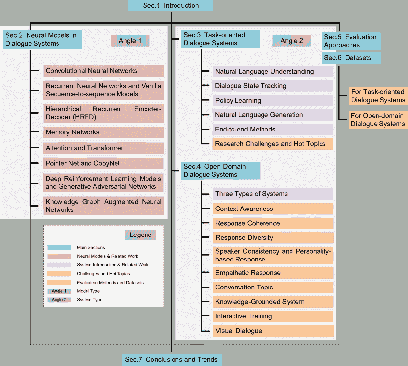

图 1：本文的总体示意图

对于对话系统，现有的调查（Arora et al., 2013; Wang and Yuan, 2016; Mallios and Bourbakis, 2016; Chen et al., 2017a; Gao et al., 2018）要么过时，要么不全面。这些论文中的一些定义目前已经不再使用，许多新的工作和话题没有涵盖。此外，它们大多数缺乏多角度分析。因此，在这项调查中，我们全面回顾了近年来的高质量研究，重点关注基于深度学习的方法，并从模型角度和系统角度提供了对最先进研究的见解。此外，本调查根据最先进的研究更新了定义/名称。例如，我们使用“开放领域对话系统”而不是“闲聊对话系统”，因为大多数文章（根据我们的调查，大约 70%）将其称为前者。我们还广泛涵盖了对话系统中的各种热门话题，并扩展了一些在当前研究社区中流行的新话题（例如，领域适应、对话状态跟踪效率、任务导向对话系统的端到端方法；可控生成、互动训练和开放领域对话系统的视觉对话）。

传统的对话系统大多数是基于规则的（Arora et al., 2013）和非神经网络的机器学习系统。基于规则的系统实现简单，响应自然，这使得它们在早期行业产品中非常受欢迎。然而，这些系统的对话流程是预定的，这限制了对话系统的应用场景。非神经网络的机器学习系统通常进行模板填充来处理某些任务。与基于规则的系统相比，这些系统更具灵活性，因为对话流程不是预定的。然而，它们在模板填充中无法实现高 F1 分数（Powers, 2020）⁵⁵5 模板填充是一种高效的方法，用于从文本中提取和结构化复杂信息，以填充预定义的模板。它们主要用于任务导向的对话系统，并且由于固定模板的原因，也受到应用场景和响应多样性的限制。目前大多数（如果不是全部的话）最先进的对话系统都是基于深度学习的系统（神经系统）。深度学习的快速发展提升了对话系统的性能（Chen et al., 2017a）。深度学习可以被视为具有多层神经网络的表示学习。深度学习架构被广泛应用于对话系统及其子任务。第二部分讨论了各种流行的深度学习架构。

除了对话系统，NLP 中还有许多与对话相关的任务，包括但不限于问答、阅读理解、对话解缠、视觉对话、视觉问答、对话推理、对话语义解析、对话关系提取、对话情感分析、仇恨言论检测、MISC 检测等。在本调查中，我们也涉及了一些处理这些对话相关任务的研究，因为对话系统的设计可以从这些相关领域的进展中受益。

我们为本文制作了一张图表，以帮助读者熟悉整体结构（图 1）。在本调查中，第一部分 1 简要介绍了对话系统和深度学习；第二部分 2 讨论了现代对话系统中流行的神经模型及相关工作；第三部分 3 介绍了面向任务的对话系统的原理和相关工作，并讨论了研究挑战和热点话题；第四部分 4 简要介绍了三种系统，并重点关注开放领域对话系统中的热点话题；第五部分 5 回顾了对话系统的主要评价方法；第六部分 6 综合总结了对话系统中常用的数据集；最后，第七部分 7 总结了论文并提供了一些研究趋势的见解。

## 2 神经模型在对话系统中的应用

在本节中，我们介绍了在最先进的对话系统及相关子任务中流行的神经模型。我们还讨论了这些模型或其变体在现代对话系统研究中的应用，以便从模型的角度为读者提供一个全景。这将帮助研究人员熟悉这些模型，并了解它们在最先进框架中的应用，这对于设计新的对话系统非常有帮助。讨论的模型包括：卷积神经网络（CNNs）、递归神经网络（RNNs）、基础序列到序列模型、层次递归编码器-解码器（HRED）、记忆网络、注意力网络、Transformer、Pointer Net 和 CopyNet、深度强化学习模型、生成对抗网络（GANs）、知识图谱增强神经网络。我们从一些经典模型（例如，CNNs 和 RNNs）开始，熟悉它们的原理和在对话系统中的应用的读者可以选择性阅读。

### 2.1 卷积神经网络

深度神经网络被认为是最强大的模型之一。“深度”指的是它们是多层的，通过堆叠前馈层提取特征。前馈层可以定义为：$y=\sigma(Wx+b)$。其中，$\sigma$ 是激活函数；$W$ 和 $b$ 是可训练参数。前馈层因激活函数而强大，它使得本来线性的操作变为非线性。然而，使用前馈层时存在一些问题。首先，前馈层或多层神经网络的操作只是模板匹配，它们不考虑数据的具体结构。此外，传统多层神经网络的全连接机制导致参数数量激增，从而导致泛化问题。LeCun 等人 (1998) 提出了早期的 CNN——LeNet-5。CNN 的发明在一定程度上缓解了上述问题。

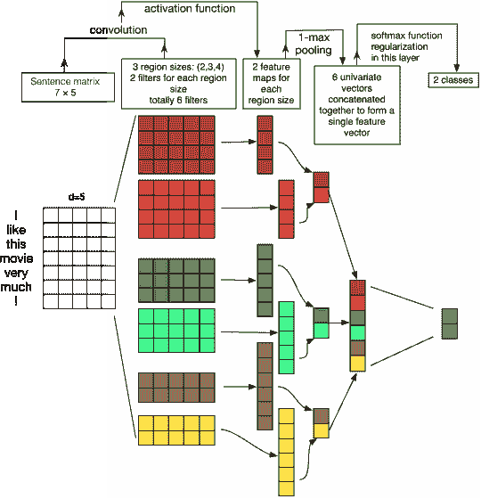

图 2：用于文本分类的 CNN 结构（Zhang 和 Wallace，2017）

CNN（图 2）通常由卷积层、池化层和前馈层组成。卷积层应用卷积核进行卷积操作：

|  | $G(m,n)=(f*h)(m,n)=\sum_{j}\sum_{k}h(j,k)f(m-j,n-k)$ |  | (1) |
| --- | --- | --- | --- |

其中 $m$ 和 $n$ 分别是结果矩阵的行和列索引。$f$ 表示输入矩阵，$h$ 表示卷积核。池化层对卷积层的结果进行降采样，以获得更高层次的特征，前馈层将这些特征映射到概率分布中以预测类别分数。

滑动窗口特性使卷积层能够捕捉局部特征，而池化层可以生成层次化特征。这两个机制赋予了卷积神经网络（CNNs）局部感知和全局感知的能力，有助于捕捉数据的一些特定内部结构。参数共享机制缓解了参数爆炸问题和过拟合问题，因为可训练参数的减少导致模型复杂性降低，从而提高了模型的泛化能力。

由于这些优良特性，CNN 已广泛应用于许多工作中。其中，计算机视觉任务受益最大，因为 CNN 能够完美捕捉图像或视频的时空数据结构。有关更详细的机制说明和 CNN 的其他变体，读者可以参考以下具有代表性的算法论文或综述： (Krizhevsky et al., 2012; Zeiler and Fergus, 2014; Simonyan and Zisserman, 2014; Szegedy et al., 2015; He et al., 2016; Aloysius and Geetha, 2017; Rawat and Wang, 2017)。在本综述中，我们专注于对话系统。

近年来，CNN 在自然语言处理（NLP）中的应用显著增加。许多任务以单词作为基本单元。然而，短语、句子甚至段落对语义表示也是有用的。因此，CNN 是语言的层次建模的理想工具（Conneau et al., 2016）。

CNNs 是很好的文本特征提取器，但可能不是理想的序列编码器。一些对话系统（Qiu et al., 2019; Bi et al., 2019; Ma et al., 2020a）直接使用 CNNs 作为话语或知识的编码器，但大多数最先进的对话系统，如 Feng et al. (2019); Wu et al. (2016); Tao et al. (2019); Wang et al. (2019b); Chauhan et al. (2019); Feldman 和 El-Yaniv (2019); Chen et al. (2019c); Lu et al. (2019b) 和 Coope et al. (2020) 选择在编码文本信息后使用 CNNs 作为层次特征提取器，而不是直接将其作为编码器。这是由于 CNNs 固定的输入长度和有限的卷积范围。一般来说，有两种主要情况 CNNs 被用来处理对话系统中的编码信息。第一种情况是基于编码器的特征向量直接应用 CNNs 提取特征（Wang et al., 2019b; Chauhan et al., 2019; Feldman 和 El-Yaniv, 2019; Chen et al., 2019c）和 Coope et al. (2020)。在上述工作中，Feldman 和 El-Yaniv (2019) 从字符级嵌入中提取特征，展示了 CNNs 的层次提取能力。CNNs 被使用的另一种情况是在响应检索任务中提取特征图。一些工作构建了基于检索的对话系统（Wu et al., 2016; Feng et al., 2019; Tao et al., 2019; Lu et al., 2019b）。他们使用独立的编码器对对话上下文和候选响应进行编码，然后使用 CNN 作为从编码的对话上下文和候选响应中计算的相似度矩阵的提取器。他们的实验表明，这种方法在响应检索任务中可以取得良好的性能。

更近期的工作不选择 CNNs 作为对话编码器的主要原因是它们无法持续且灵活地提取跨时间序列步的信息（Krizhevsky et al., 2012）。一些后续引入的模型不会独立处理数据点，这些模型是编码器所期望的。

### 2.2 循环神经网络和普通序列到序列模型

NLP 任务，包括对话相关任务，试图处理和分析顺序语言数据点。尽管标准神经网络以及 CNNs 是强大的学习模型，但它们存在两个主要的限制（Lipton et al.，2015）。其一是它们假设数据点彼此独立。如果数据点是独立产生的，这种假设是合理的，但在处理互相关联的数据点（例如文本、音频、视频）时，可能会遗漏重要信息。此外，它们的输入通常是固定长度的，这在处理长度可变的顺序数据时是一个限制。因此，能够表示顺序信息流的顺序模型是理想的。

马尔可夫模型如隐马尔可夫模型（HMMs）是传统的顺序模型，但由于推理算法的时间复杂度（Viterbi，1967）以及转移矩阵的大小随着离散状态空间的增加而显著增长，因此在处理涉及大量可能隐藏状态的问题时，实际上它们并不适用。马尔可夫模型的隐藏状态仅受当前隐藏状态的影响，这进一步限制了该模型的能力。

RNN 模型并非最近提出，但它们极大地解决了上述问题，一些变体在对话相关任务以及许多其他 NLP 任务中都能惊人地实现最先进的性能。递归模型的归纳偏差在许多场景中是不可替代的，许多最新的模型都融入了递归机制。

#### 2.2.1 Jordan 类型和 Elman 类型 RNN

1982 年，Hopfield 引入了早期的 RNN 家族来解决模式识别任务（Hopfield，1982）。Jordan（1986）和 Elman（1990）分别介绍了两种 RNN 架构。一般来说，现代 RNN 可以分为 Jordan 类型 RNN 和 Elman 类型 RNN。

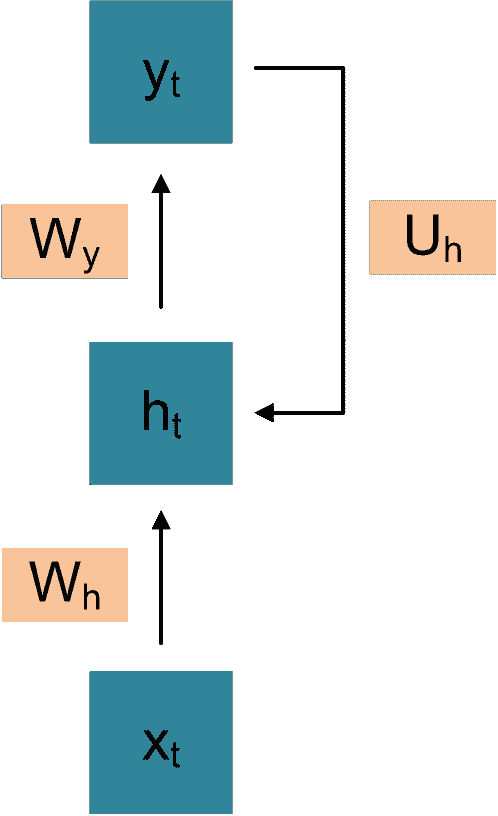

(a) Jordan 类型 RNN

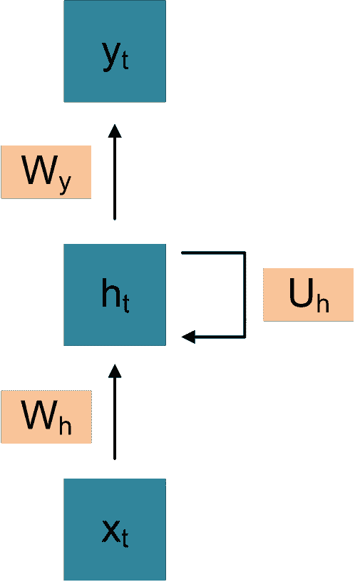

(b) Elman 类型 RNN

图 3：两种基本 RNN 类型的图示模型

Jordan 类型 RNN 如图 3(a) 所示。$x_{t}$、$h_{t}$ 和 $y_{t}$ 分别是时间步 $t$ 的输入、隐藏状态和输出。$W_{h}$、$W_{y}$ 和 $U_{h}$ 是权重矩阵。每次隐藏状态的更新由当前输入和上一个时间步的输出决定，而每个输出由当前隐藏状态决定。因此，时间步 $t$ 的隐藏状态和输出可以计算为：

|  | $h_{t}=\sigma_{h}(W_{h}x_{t}+U_{h}y_{t-1}+b_{h})$ |  | (2) |
| --- | --- | --- | --- |
|  | $y_{t}=\sigma_{y}(W_{y}h_{t}+b_{y})$ |  | (3) |

其中 $b_{h}$ 和 $b_{y}$ 是偏置。$\sigma_{h}$ 和 $\sigma_{y}$ 是激活函数。

Elman 类型的 RNN 如图 3(b) 所示。不同之处在于每个隐藏状态由当前输入和上一个时间步的隐藏状态决定。因此，时间步 $t$ 的隐藏状态和输出可以计算为：

|  | $h_{t}=\sigma_{h}(W_{h}x_{t}+U_{h}h_{t-1}+b_{h})$ |  | (4) |
| --- | --- | --- | --- |
|  | $y_{t}=\sigma_{y}(W_{y}h_{t}+b_{y})$ |  | (5) |

简单的 RNN 理论上可以建模长期依赖关系。但在实际训练中，长范围依赖关系很难学习（Bengio et al., 1994; Hochreiter et al., 2001）。在许多时间步上反向传播误差时，简单的 RNN 会遇到梯度消失和梯度爆炸的问题（Hochreiter 和 Schmidhuber, 1997）。一些解决方案被提出以解决这些问题（Williams 和 Zipser, 1989; Pascanu et al., 2013），这导致了传统递归网络的一些变体的发明。

#### 2.2.2 LSTM

Hochreiter 和 Schmidhuber (1997) 引入了 LSTM 中的门控机制，主要是为了应对梯度消失问题。引入了输入门、遗忘门和输出门来决定应保留多少来自新输入和过去记忆的信息。该模型可以用以下方程描述：

|  | $\hat{h}^{(t)}=tanh\left(W^{\hat{h}x}x^{(t)}+W^{\hat{h}h}h^{(t-1)}+b_{\hat{h}}\right)$ |  | (6) |
| --- | --- | --- | --- |
|  | $i^{(t)}=\sigma\left(W^{ix}x^{(t)}+W^{ih}h^{(t-1)}+b_{i}\right)$ |  | (7) |
|  | $f^{(t)}=\sigma\left(W^{fx}x^{(t)}+W^{fh}h^{(t-1)}+b_{f}\right)$ |  | (8) |
|  | $o^{(t)}=\sigma\left(W^{ox}x^{(t)}+W^{oh}h^{(t-1)}+b_{o}\right)$ |  | (9) |
|  | $s^{(t)}=\hat{h}^{(t)}\odot i^{(t)}+s^{(t-1)}\odot f^{(t)}$ |  | (10) |
|  | $h^{(t)}=tanh(s^{(t)})\odot o^{(t)}$ |  | (11) |

其中 $t$ 代表时间步 $t$。$i$、$f$ 和 $o$ 是门控，分别表示输入门、遗忘门和输出门。$x$、$\hat{h}$、$s$ 和 $h$ 分别是输入、短期记忆、长期记忆和输出。$b$ 是偏置，$W$ 是权重矩阵。$\odot$ 表示逐元素乘法。

“长短期记忆”这一术语的直观意义在于，提出的模型应用了长期和短期记忆向量来编码序列数据，并使用门控机制来控制信息流。LSTM 的表现令人印象深刻，因为它在许多 NLP 任务中作为骨干模型取得了最先进的结果，尽管该模型是在 1997 年提出的。

#### 2.2.3 GRU

受到门控机制的启发，Cho et al. (2014b) 提出了门控递归单元（GRU），其可以通过以下方程建模：

|  | $z^{(t)}=\sigma\left(W^{z}x^{(t)}+U^{z}h^{(t-1)}+b_{z}\right)$ |  | (12) |
| --- | --- | --- | --- |
|  | $r^{(t)}=\sigma\left(W^{r}x^{(t)}+U^{r}h^{(t-1)}+b_{r}\right)$ |  | (13) |
|  | $\hat{h}^{(t)}=tanh\left(W^{h}x^{(t)}+U^{h}(r^{(t)}\odot h^{(t-1)})+b_{h}\right)$ |  | (14) |
|  | $h^{(t)}=(1-z^{(t)})\odot h^{(t-1)}+z^{(t)}\odot\hat{h}^{(t)}$ |  | (15) |

其中$t$代表时间步$t$。$z$和$r$是门，分别表示更新门和重置门。$x$、$\hat{h}$和$h$分别是输入、候选激活向量和输出。$b$是偏置，$W$和$U$是权重矩阵。$\odot$表示逐元素相乘。

LSTM 和 GRU 作为两种门控单元，非常相似 (Chung et al., 2014)。它们之间最显著的共同点是，从时间步$t$到时间步$t+1$，引入了一个加性组件来更新状态，而简单的 RNN 总是替换激活。LSTM 和 GRU 都保留了一定的旧组件，并将其与新内容混合。这一特性使得这些单元能够记住更远历史步骤的信息，更重要的是，避免了反向传播错误时的梯度消失问题。

它们之间还存在一些差异。LSTM 在输出门的控制下暴露其记忆内容，而 GRU 中的相同内容则以不受控制的方式存在。此外，与 LSTM 不同，GRU 不独立控制新增记忆内容的数量。从实验角度来看，GRU 参数较少，这有助于其更快的收敛和更好的泛化能力。研究表明，GRU 在较小的数据集上能取得更好的性能 (Chung et al., 2014)。然而，Gruber 和 Jockisch (2020) 表明，在大规模神经机器翻译分析中，LSTM 单元表现出持续较好的性能。

#### 2.2.4 双向递归神经网络

在序列学习中，不仅过去的信息对模型推断至关重要，未来的信息也应考虑以实现更好的推断能力。Schuster 和 Paliwal (1997) 提出了双向递归神经网络（BRNNs），它具有两种隐藏层：第一种编码过去时间步的信息，而第二种则编码反向信息。该模型可以用以下方程描述：

|  | $h^{(t)}=\sigma\left(W^{hx}x^{(t)}+W^{hh}h^{(t-1)}+b_{h}\right)$ |  | (16) |
| --- | --- | --- | --- |
|  | $z^{(t)}=\sigma\left(W^{zx}x^{(t)}+W^{zz}z^{(t+1)}+b_{z}\right)$ |  | (17) |
|  | $\hat{y}^{(t)}=softmax\left(W^{yh}h^{(t)}+W^{yz}z^{(t)}+b_{y}\right)$ |  | (18) |

其中$h$和$z$是两个隐藏层。其他变量的定义与 LSTM 和 GRU 中的相同。

#### 2.2.5 原始序列到序列模型（编码器-解码器模型）

Sutskever 等人（2014）首次提出了序列到序列模型来解决机器翻译任务。序列到序列模型的目的是通过首先使用编码器将输入序列映射为一个中间向量，然后由解码器基于中间向量和解码器生成的历史进一步生成输出，从而将输入序列映射到输出序列。下述方程展示了编码器-解码器模型：

|  | $Encoder:h_{t}=E(h_{t-1},x_{t})$ |  | (19) |
| --- | --- | --- | --- |
|  | $Decoder:y_{t}=D(h_{t},y_{t-1})$ |  | (20) |

其中 $t$ 是时间步，$h$ 是隐藏向量，$y$ 是输出向量。$E$ 和 $D$ 分别是编码器和解码器使用的顺序单元。编码器的最后隐藏状态是中间向量，这个向量通常用于初始化解码器的第一个隐藏状态。在编码时，每个隐藏状态由前一个时间步的隐藏状态和当前时间步的输入决定，而在解码时，每个隐藏状态由当前隐藏状态和前一个时间步的输出决定。

该模型之所以强大，是因为它不受限于固定长度的输入和输出。相反，源序列和目标序列的长度可以不同。基于该模型，已经开发出了许多更先进的序列到序列模型，这些模型将在本节及后续章节中讨论。

RNN 在神经对话系统中扮演了重要角色，因为它们具有强大的编码顺序文本信息的能力。RNN 及其变体在许多对话系统中都有应用。任务导向系统使用 RNN 作为对话上下文、对话状态、知识库条目和领域标签的编码器（Moon 等人，2019；Chen 等人，2019b；Wu 等人，2019b，a）。开放域系统则将 RNN 作为对话历史的编码器（Sankar 等人，2019；Du 和 Black，2019；Ji 等人，2020；Chen 等人，2020b），其中基于检索的系统将对话历史和候选响应一起建模（Zhu 等人，2018；Tang 等人，2019；Feldman 和 El-Yaniv，2019；Lu 等人，2019b）。在知识基础系统中，RNN 作为外部知识来源的编码器（例如背景、个性、话题等）（Shuster 等人，2019；Majumder 等人，2020b；Chen 等人，2020b；Cho 和 May，2020）。

此外，作为对话系统中序列到序列模型的解码器（Huang et al., 2020c; Song et al., 2019; Liu et al., 2019; Lin et al., 2019），RNN 通常通过贪心搜索或束搜索来解码话语序列的隐藏状态（Aubert et al., 1994）。这些解码机制会引发诸如通用响应等问题，后续章节将对此进行讨论。

一些研究（Liu et al., 2019; Mehri et al., 2019; Chen et al., 2019c; Ma et al., 2020a）将 RNN 结合为对话表示模型的一部分，以训练对话嵌入，并进一步提高了对话相关任务的性能。这些嵌入模型在对话任务上进行了训练，并呈现出更多对话特征。当这些上下文表示模型没有针对特定任务进行微调时，它们在某些对话任务中的表现始终优于最先进的上下文表示模型（如 BERT、ELMo 和 GPT）。

### 2.3 层次递归编码器-解码器 (HRED)

层次递归编码器-解码器 (HRED) 是一个上下文感知的序列到序列模型。它最初由 Sordoni et al. (2015a) 提出，旨在解决上下文感知的在线查询建议问题。它被设计为能够关注历史查询，并且提出的模型能够提供稀有且高质量的结果。

随着序列到序列模型的流行，Serban et al. (2016) 将 HRED 扩展到对话领域，并建立了一个端到端的上下文感知对话系统。HRED 在对话和端到端问答中取得了显著的改进。这项工作比原始论文更受关注，因为对话系统是 HRED 应用的完美场景。传统对话系统（Ritter et al., 2011）基于单轮消息生成响应，这牺牲了对话历史中的信息。Sordoni et al. (2015b) 将对话历史轮次与大小为 3 的窗口结合，作为序列到序列模型的输入进行响应生成，但这种方法也有限，因为它们仅在标记级别编码对话历史。对话的“轮次”特征表明轮次级别的信息也很重要。HRED 学习了标记级别和轮次级别的表示，从而展示了有希望的对话上下文感知能力。

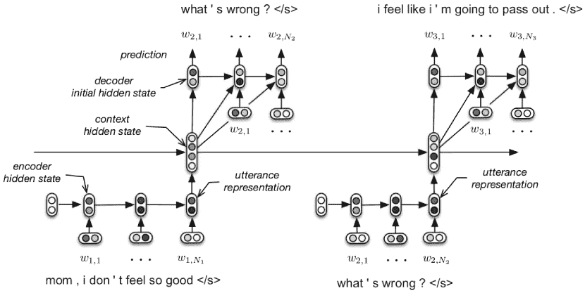

图 4：对话设置中的 HRED 模型（Serban et al., 2016）

图 4 ‣ 2 对话系统中的神经模型 ‣ 基于深度学习的对话系统的最新进展：系统性调查") 显示了对话环境中的 HRED。HRED 通过两个层次的 RNN 层次化建模令牌级别和轮次级别的序列：一个由编码器和解码器组成的令牌级 RNN，以及一个轮次级上下文 RNN。编码器 RNN 将每轮的发言逐个令牌编码为隐藏状态。这个隐藏状态在每个轮次级时间步中作为上下文 RNN 的输入。因此，轮次级上下文 RNN 迭代地跟踪历史发言。轮次级上下文 RNN 在轮次 $t$ 的隐藏状态表示了直到轮次 $t$ 的发言摘要，并用来初始化解码器 RNN 的第一个隐藏状态，这类似于序列到序列模型中的标准解码器 (Sutskever et al., 2014)。上述三个 RNN 都使用 GRU 单元作为递归单元，编码器和解码器的参数对于每个发言是共享的。

Serban 等人 (2017a) 进一步提出了潜变量层次递归编码器-解码器 (VHRED) 以建模序列之间的复杂依赖关系。在 HRED 的基础上，VHRED 将潜变量结合到解码器中，将解码过程转变为两步生成过程：在第一步中采样潜变量，然后根据条件生成响应。VHRED 使用对数似然的变分下界进行训练，并在生成响应的多样性、长度和质量方面表现出有希望的改进。

最近在对话相关任务中的许多研究应用了基于 HRED 的框架来捕捉层次化的对话特征。张等人（2019a）认为标准的 HRED 对对话历史中的所有上下文进行了不加区分的处理。受 Transformer（Vaswani et al., 2017）架构的启发，他们提出了 ReCoSa，一种基于自注意力的层次化模型。该模型首先应用 LSTM 将标记级别的信息编码成上下文隐藏向量，然后计算上下文向量和掩蔽响应向量的自注意力。在解码阶段，计算了编码器-解码器注意力以促进解码。沈等人（2019）提出了一种包含 3 个层次的层次化模型：话语级别捕捉全球知识，配对级别捕捉话语对中的主题信息，话语级别捕捉内容信息。这种多层次结构提高了响应的质量，包括多样性、一致性和流畅性。Chauhan 等人（2019）将 HRED 和 VGG-19 应用于多模态 HRED（MHRED）。HRED 对层次化对话上下文进行编码，而 VGG-19 提取了相应轮次中所有图像的视觉特征。通过增加位置感知注意力机制，该模型在视觉基础设置中展示了更具多样性和准确性的响应。Mehri 等人（2019）通过四个子任务学习对话上下文表示，其中三个（下一个话语生成、掩蔽话语检索和不一致性识别）利用 HRED 作为上下文编码器，并取得了良好的性能。Cao 等人（2019）使用 HRED 对治疗师和患者之间的对话历史进行编码，以对治疗师和客户的 MI 行为编码进行分类，并预测未来的编码。Qiu 等人（2020）应用了一种基于 LSTM 的 VHRED，以无监督的方式解决两代理和多代理对话结构归纳问题。在此基础上，他们在两代理对话中应用了条件随机场模型，在多代理对话中应用了非投影依赖树，这两者在对话结构建模方面都取得了更好的性能。

### 2.4 记忆网络

记忆在处理与过去经验或外部知识来源相关的问题时是一个关键组件。人脑的海马体和计算机的硬盘是人类和计算机读取和写入记忆所依赖的组件。传统模型很少有记忆组件，因此缺乏知识重用和推理的能力。RNN 通过时间步迭代地传递历史信息，这在某种程度上可以被视为一种记忆模型。然而，即使是 LSTM，这种具备长期和短期记忆的强大 RNN 变体，其记忆模块也过于简单，且事实没有被明确区分，因此无法压缩特定的知识事实并在任务中重用。

Weston 等人 (2014) 提出了记忆网络，这是一种具有记忆组件的模型。正如他们的工作中所描述的，记忆网络有五个模块：一个存储记忆事实表示的记忆模块；一个将输入记忆事实映射到嵌入表示的‘I’模块；一个决定记忆模块更新的‘G’模块；一个根据输入表示和记忆表示生成输出的‘O’模块；一个根据‘O’模块的输出组织最终响应的‘R’模块。该模型需要对每个模块提供强监督信号，因此不适合端到端训练。

Sukhbaatar 等人 (2015) 将他们之前的工作扩展到端到端的记忆网络，这被普遍接受为一种标准记忆网络，易于训练和应用。

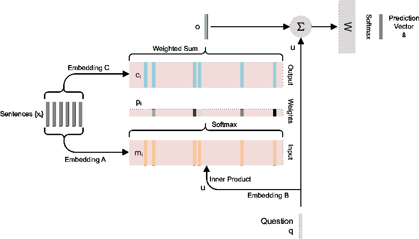

图 5：端到端记忆网络的结构 (Sukhbaatar 等，2015)

图 5 表示了提出的端到端记忆网络。其架构包括三个阶段：权重计算、记忆选择和最终预测。

权重计算。模型首先使用表示模型$A$将输入记忆集$\{x_{i}\}$转换为记忆表示$\{m_{i}\}$。然后，使用另一个表示模型$B$将输入查询映射到其嵌入空间，获得嵌入向量$u$。最终的权重计算如下：

|  | $p_{i}=Softmax(u^{T}m_{i})$ |  | (21) |
| --- | --- | --- | --- |

其中$p_{i}$是与每个输入记忆$x_{i}$在查询条件下对应的权重。

记忆选择。在生成最终预测之前，通过首先使用另一种表示模型$C$将输入记忆$x_{i}$编码为嵌入向量$c_{i}$，然后根据在上一阶段计算的权重对$\{c_{i}\}$进行加权求和，生成一个选择的记忆向量：

|  | $o=\sum_{i}p_{i}c_{i}$ |  | (22) |
| --- | --- | --- | --- |

其中 o 代表选择的记忆向量。这个向量在记忆表示中无法找到。软记忆选择有助于梯度计算的可微性，使得整个模型可以端到端训练。

最终预测。最终预测是通过将选定记忆 $o$ 和嵌入查询 $u$ 的和向量映射到概率向量 $\hat{a}$ 获得的：

|  | $\hat{\alpha}=Softmax(W(o+u))$ |  | (23) |
| --- | --- | --- | --- |

许多与对话相关的工作将记忆网络纳入其框架中，特别是对于涉及外部知识库的任务，如任务导向对话系统、知识驱动对话系统和问答系统。

##### 任务导向对话系统的记忆网络

陈等人（2019c）认为，最先进的任务导向对话系统往往将对话历史和知识库条目结合在一个记忆模块中，这影响了响应质量。他们提出了一个由三个记忆模块组成的任务导向系统：两个长期记忆模块分别存储对话历史和知识库；一个工作记忆模块记忆两个分布并控制最终的词预测。何等人（2020a）使用“两个教师一个学生”框架训练了一个任务导向对话系统，以提高记忆网络的知识检索和响应质量。他们首先使用带有互补目标奖励函数的强化学习分别训练了两个教师网络。然后通过 GAN 框架，训练了两个判别器来教学生记忆网络生成类似于教师的响应，将专家知识从两个教师转移到学生。其优势在于这个训练框架只需要弱监督，学生网络可以从教师网络的互补目标中受益。金等人（2019）通过一个记忆网络解决了任务导向对话系统中的对话状态追踪问题。与其他工作不同的是，他们并没有从头更新记忆模块中的所有对话状态。相反，他们的模型首先预测需要更新的状态，然后覆盖目标状态。通过选择性地覆盖记忆模块，他们提高了对话状态追踪任务的效率。戴等人（2020）应用了 MemN2N（Sukhbaatar 等人，2015）作为任务导向的发言编码器，记忆现有的响应和对话历史。然后他们使用模型无关的元学习（MAML）（Finn 等人，2017）训练框架，以少量样本的方式检索正确的响应。

##### 开放域对话系统的记忆网络

Tian 等人 (2019) 提出了一个基于知识的聊天系统。使用了记忆网络来存储查询-响应对，在响应生成阶段，生成器根据输入查询和记忆对生成响应。它从记忆中的查询-响应对中提取关键信息，并将这些信息组合到标记预测中。Xu 等人 (2019) 提议使用元词在开放域系统中以可控的方式生成响应。元词是描述响应属性的短语。通过使用目标跟踪记忆网络，他们记住了元词，并基于用户消息生成响应，同时结合了元词。Gan 等人 (2019) 在对话历史记忆模块和视觉记忆模块的条件下进行了多步骤推理。这两个记忆模块反复优化表示，以进行下一步推理。实验结果表明，结合图像和对话线索有助于提高视觉对话系统的性能。Han 等人 (2019) 训练了一个强化学习代理来决定当记忆模块满时可以替换哪个记忆向量，以提高文档基础问答任务的准确性和效率。他们通过学习与每个记忆相关的查询特定值解决了记忆网络的可扩展性问题。Gao 等人 (2020c) 在对话机器阅读任务中解决了同样的问题。他们提出了一种显式记忆追踪器（EMT），以决定记忆中提供的信息是否足够用于最终预测。此外，代理采用了粗到细的策略，提出澄清问题以请求额外信息并完善推理。

### 2.5 注意力机制和变换器

如第 2.2 节中介绍的，传统的序列到序列模型在解码时依据当前隐藏状态和上一个时间步的输出向量进行解码，其公式为：

|  | $P(y_{i}&#124;y_{1},...,y_{i-1},x)=g(y_{i-1},h_{i})$ |  | (24) |
| --- | --- | --- | --- |

其中 g 是一个顺序模型，将输入向量映射到概率向量。

但是，当输入句子很长时，这种解码方案存在局限性。循环神经网络无法将所有信息编码为固定长度的隐藏向量。Cho 等人（2014a）通过实验证明，当输入序列变长时，序列到序列模型的性能会下降。此外，由于固定长度隐藏向量的表达能力有限，方程（24）中的解码方案的性能在很大程度上取决于前几个解码步骤。如果解码器没有一个良好的启动，整个序列都会受到负面影响。

#### 2.5.1 注意力

图像 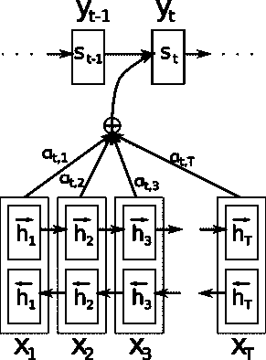

图 6：注意力模型（Bahdanau 等人，2014）

Bahdanau 等人（2014）在机器翻译任务中提出了注意力机制。他们将该方法描述为“联合对齐和翻译”，将序列到序列翻译模型作为带有注意力的编码器-解码器模型进行了说明。在解码阶段，每个解码状态都会考虑与编码的源句子相关的部分，而不仅仅依赖于之前的输出标记。输出概率分布可以描述为：

|  | $P(y_{i}&#124;y_{1},...,y_{i-1},x)=g(y_{i-1},s_{i},c_{i})$ |  | (25) |
| --- | --- | --- | --- |

其中，$i$表示第$i$个时间步；$y_{i}$是输出标记，$s_{i}$是解码器隐藏状态，$c_{i}$是加权的源句子：

|  | $s_{i}=f(s_{i-1},y_{i-1},c_{i})$ |  | (26) |
| --- | --- | --- | --- |
|  | $c_{i}=\sum_{j=1}^{T_{x}}\alpha_{ij}h_{j}$ |  | (27) |

其中$\alpha_{ij}$是归一化的权重分数：

|  | $\alpha_{ij}=\frac{exp(e_{ij})}{\sum_{k=1}^{T_{x}}exp(e_{ik})}$ |  | (28) |
| --- | --- | --- | --- |

$e_{ij}$是$s_{i-1}$和第$j$个编码器隐藏状态$h_{j}$之间的相似性分数，该分数是由相似性模型$a$预测的：

|  | $e_{ij}=a(s_{i-1},h_{j})$ |  | (29) |
| --- | --- | --- | --- |

图[6]（#S2.F6 "Figure 6 ‣ 2.5.1 Attention ‣ 2.5 Attention and Transformer ‣ 2 Neural Models in Dialogue Systems ‣ Recent Advances in Deep Learning Based Dialogue Systems: A Systematic Survey")说明了注意力模型，其中 t 和 T 分别表示解码器和编码器的时间步。

内存网络与注意力网络在操作方式上类似，唯一不同之处在于相似性模型的选择。在内存网络中，编码内存可以被看作是注意力中编码的源句子。然而，Sukhbaatar 等人（2015）提出的内存模型选择了余弦距离作为相似性模型，而 Bahdanau 等人（2014）提出的注意力则使用了一个可训练的前馈网络，该网络与整个序列到序列模型一起进行训练。

#### 2.5.2 Transformer

在变换器出现之前，大多数工作将注意力与递归单元结合，除了少数工作如 Parikh 等（2016）和 Gehring 等（2017）。递归模型将每个隐藏状态基于前一个隐藏状态和当前输入进行条件化，并且对序列长度具有灵活性。然而，由于其顺序性质，递归模型不能并行训练，这严重削弱了其潜力。Vaswani 等（2017）提出了 Transformer，该模型完全利用了注意力机制而没有任何递归单元，并且部署了更多的并行化以加快训练速度。它应用了自注意力和编码器-解码器注意力，分别实现局部和全局依赖。

图 7 表示了变换器。以下详细介绍其关键机制。

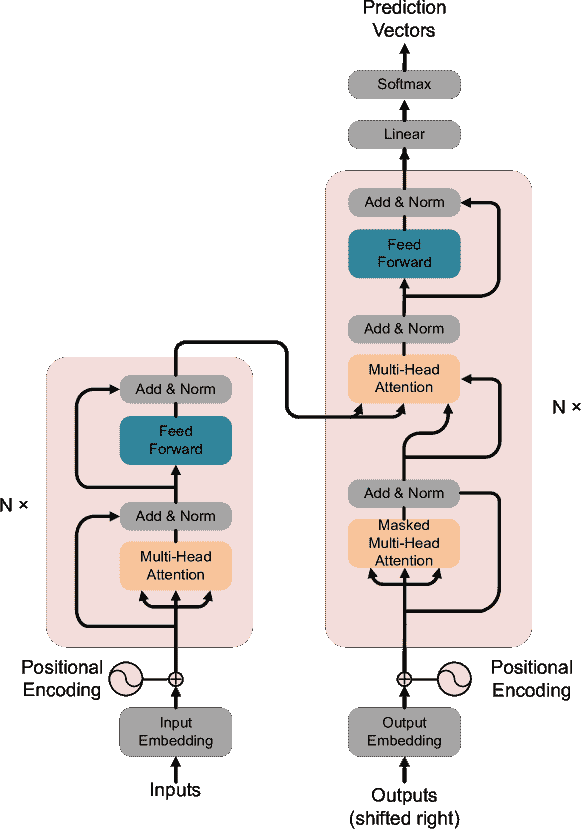

图 7：变换器模型（Vaswani 等，2017）

##### 编码器-解码器

Transformer 包括一个编码器和一个解码器。编码器将输入序列$(x_{1},\ldots,x_{n})$映射到连续的隐藏状态$(z_{1},\ldots,z_{n})$。解码器进一步基于编码器的隐藏状态生成输出序列$(y_{1},\ldots,y_{n})$。Transformer 的概率模型与第 2.2.5 ‣ 2.2 Recurrent Neural Networks and Vanilla Sequence-to-sequence Models ‣ 2 Neural Models in Dialogue Systems ‣ Recent Advances in Deep Learning Based Dialogue Systems: A Systematic Survey")节中介绍的普通序列到序列模型形式相同。Vaswani 等（2017）堆叠了 6 个相同的编码器层和 6 个相同的解码器层。一个编码器层包括一个多头注意力组件和一个简单的前馈网络，两者都应用了残差结构。解码器层的结构几乎与编码器层相同，只是多了一个额外的编码器-解码器注意力层，该层计算当前时间步的解码器隐藏状态与编码器输出向量之间的注意力。解码器的输入被部分遮蔽，以确保每个预测基于之前的标记，避免在存在未来信息的情况下进行预测。编码器和解码器的输入都使用位置编码机制。

##### 自注意力

对于输入句子 $x=(x_{1},\ldots,x_{n})$，每个 token $x_{i}$ 对应三个向量：查询、键和值。自注意力机制通过将 $x_{i}$ 的查询与 $x$ 中所有其他 token 的键逐一相乘，计算每个 token $x_{i}$ 对所有其他 token 的注意力权重。为了并行计算，将所有 token 的查询、键和值向量合并成三个矩阵：查询（Q）、键（K）和值（V）。输入句子 $x$ 的自注意力由以下公式计算：

|  | $Attention(Q,K,V)=softmax(\frac{QK^{T}}{\sqrt{d_{k}}})V$ |  | (30) |
| --- | --- | --- | --- |

其中 $d_{k}$ 是查询或键的维度。

##### 多头注意力

为了共同考虑嵌入的不同子空间的信息，查询、键和值向量通过不同的线性变换映射到 $h$ 个相同形状的向量，其中 $h$ 表示头的数量。对这些向量中的每一个并行计算注意力，然后将结果拼接起来并进一步投影。多头注意力可以描述为：

|  | $MultiHead(Q,K,V)=Concat(head_{1},...,head_{h})W^{O}$ |  | (31) |
| --- | --- | --- | --- |

其中 $head_{i}=Attention(QW_{i}^{Q},KW_{i}^{K},VW_{i}^{V})$，$W$ 表示线性变换。

##### 位置编码

提出的 Transformer 架构没有循环单元，这意味着序列的顺序信息被省略。位置编码与输入嵌入一起添加以提供位置相关信息。本文选择了余弦函数用于位置编码：

|  | $PE_{(pos,2i)}=sin(pos/10000^{2i/d_{model}})$ |  | (32) |
| --- | --- | --- | --- |
|  | $PE_{(pos,2i+1)}=cos(pos/10000^{2i/d_{model}})$ |  | (33) |

其中 $pos$ 表示目标 token 的位置，$i$ 表示维度，这意味着位置矩阵的每个维度使用不同的波长进行编码。

##### 基于 Transformer 的预训练模型和 Transformer 变体

最近，许多基于 Transformer 的预训练模型被开发出来。与 Peters 等人（2018）提出的基于 LSTM 的上下文嵌入模型 ELMo 不同，基于 Transformer 的预训练模型更强大。最受欢迎的两个模型是 GPT-2 [6](https://openai.com/blog/better-language-models/)和 BERT（Devlin 等人，2018）。GPT-2 和 BERT 都由 12 个 Transformer 块组成，而 BERT 通过使训练双向来进一步改进。由于它们能够在预训练后适应新任务，这些模型非常强大。这一特性在许多 NLP 任务中取得了显著的改进。此外，还出现了许多 Transformer 变体（Zaheer 等人，2020；Dai 等人，2019；Guo 等人，2019），这些变体旨在减少模型参数/计算复杂性，或在不同场景中提升原始 Transformer 的性能。Lin 等人（2021）和 Tay 等人（2020）系统总结了最新的 Transformer 变体，供学术界有兴趣的研究者参考。

##### 对话系统中的注意力机制

注意力机制用于捕捉目标序列中不同部分的重要性。Zhu 等人（2018）应用了两级注意力机制来生成词语。在用户消息和由检索系统选择的候选响应的情况下，生成器首先计算词级注意力权重，然后使用句子级注意力来重新调整权重。这种两级注意力机制帮助生成器根据编码的上下文捕捉不同的重要性。Liu 等人（2019）使用基于注意力的递归架构来生成响应。他们设计了一个多级编码器-解码器，其中多级编码器尝试将原始词汇、低级簇和高级簇映射到层次化嵌入表示，而多级解码器则利用注意力机制来利用这些层次化表示，然后生成响应。在每个解码阶段，该模型为高层解码器的输出和当前层编码器的隐藏状态计算两个注意力权重。Chen 等人（2019b）计算了对话行为预测器输出的多头自注意力。不同于 Transformer 将不同头的输出连接起来，他们直接将输出传递到下一个多头层。然后，堆叠的多头层使用对话行为作为输入生成响应。

##### 对话系统中的 Transformer

Transformer 是强大的序列到序列模型，同时，它们的编码器也能作为良好的对话表示模型。Henderson 等人 (2019b) 构建了一个基于 Transformer 的响应检索模型，用于任务导向的对话系统。设计了一个双通道 Transformer 编码器，用于编码用户消息和响应，这些消息和响应最初以 unigram 和 bigram 的形式呈现。随后，应用了简单的余弦距离来计算用户消息和候选响应之间的语义相似性。Li 等人 (2019d) 构建了多个增量 Transformer 编码器来编码多轮对话及其相关文档知识。将上一轮的编码发言和相关文档视为下一轮 Transformer 编码器的输入的一部分。预训练模型能够适应多个领域，仅需目标领域的一小部分数据。Bao 等人 (2019b) 使用堆叠的 Transformer 进行对话生成预训练。除了响应生成任务外，他们还将模型与潜在行为预测任务一同预训练。应用潜在变量来解决响应生成中的“一对多”问题。多任务训练方案提高了所提出的 Transformer 预训练模型的性能。

##### 基于 Transformer 的对话系统预训练模型

大型基于 Transformer 的预训练模型适用于许多任务，因此在近期工作中非常受欢迎。Golovanov 等人 (2019) 使用 GPT 作为序列到序列模型直接生成发言，并比较了单输入和多输入设置下的性能。Majumder 等人 (2020b) 首先使用概率模型检索相关新闻语料库，然后将新闻语料库和对话上下文结合作为 GPT-2 生成器的输入以生成响应。他们提出，通过使用话语模式识别和疑问类型预测作为多任务学习的两个子任务，对话建模可以进一步改进。Wu 等人 (2019c) 使用 BERT 作为其目标导向响应检索系统中的上下文和候选响应的编码器，而 Zhong 等人 (2020) 构建了 Co-BERT，一种基于 BERT 的响应选择模型，用于检索具有同理心的响应，前提是基于人格训练语料库。Zhao 等人 (2020b) 以合成的方式构建了一个知识驱动的对话系统。他们使用 BERT 和 GPT-2 联合进行知识选择和响应生成，其中 BERT 用于知识选择，GPT-2 基于对话上下文和选择的知识生成响应。

### 2.6 Pointer Net 和 CopyNet

#### 2.6.1 Pointer Net

在一些自然语言处理任务中，如对话系统和问答系统，代理有时需要直接引用用户消息中的内容。Pointer Net（Oriol 等，2015）（图 8）解决了直接从输入句子中复制标记的问题。

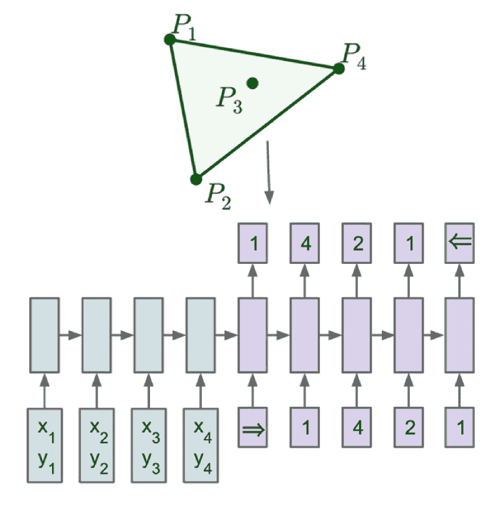

(a) 序列到序列

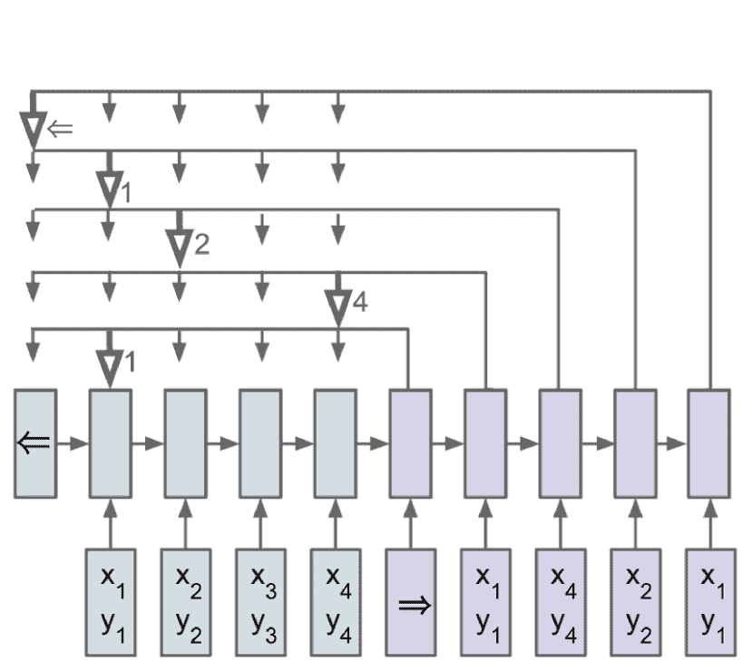

(b) Pointer Net

图 8： (a) 序列到序列 - RNN（蓝色）处理输入序列以生成一个编码向量，然后通过概率链规则和另一个 RNN 生成输出序列（紫色）。问题的维度决定了输出的维度，该维度在训练和推理过程中保持不变。 (b) Pointer Net - 输入序列通过编码 RNN 转换为编码（蓝色），然后输入生成网络（紫色）。生成网络在每一步生成一个向量，调节基于内容的注意力过程。注意力机制产生一个 softmax 分布，字典大小等于输入长度。（Oriol 等，2015）

传统的序列到序列模型（Sutskever 等，2014；Graves 等，2014）采用编码器-解码器结构将源句子映射到目标句子。通常，这些模型首先使用编码器将源句子映射到隐藏状态向量，然后根据隐藏状态预测输出序列。序列预测是逐步完成的，每一步使用贪婪搜索或束搜索预测一个标记。总体的序列到序列模型可以用以下概率模型描述：

|  | $P(C^{P}&#124;P;\theta)=\prod_{i=1}^{m(P)}p(C_{i}&#124;C_{1},...,C_{i-1},P;\theta)$ |  | (34) |
| --- | --- | --- | --- |

其中 $(P,C_{p})$ 构成一个训练对，$P$ = $\{P_{1},...,P_{n}\}$ 表示输入序列，而 $C_{p}$ = $\{C_{1},...,C_{m(p)}\}$ 表示目标序列。$\theta$ 是一个解码模型。

序列到序列模型有普通骨干和基于注意力的骨干。普通模型仅基于编码器的最后一个隐藏状态预测目标序列，并在不同的解码时间步中传递。这样的机制限制了在每个解码阶段解码器接收的信息。基于注意力的模型在每个解码步骤中考虑编码器的所有隐藏状态，并在利用它们时计算它们的重要性。为了比较 Pointer Net 和 Attention 的机制，我们再次呈现了在第 2.2 节中解释的方程。解码器基于编码器隐藏状态$d_{i}$的加权和部分预测标记：

|  | $d_{i}=\sum_{j=1}^{T_{x}}\alpha_{ij}h_{j}$ |  | (35) |
| --- | --- | --- | --- |

其中$\alpha_{ij}$是归一化权重分数：

|  | $\alpha_{ij}=\frac{exp(e_{ij})}{\sum_{k=1}^{T_{x}}exp(e_{ik})}$ |  | (36) |
| --- | --- | --- | --- |

$e_{ij}$是$s_{i-1}$和第$j$个编码器隐藏状态$h_{j}$之间的相似度分数，该分数由相似度模型$a$预测：

|  | $e_{ij}=a(s_{i-1},h_{j})$ |  | (37) |
| --- | --- | --- | --- |

在每个解码步骤中，普通和基于注意力的序列到序列模型都会预测一个固定词典$X=\{x_{1},...,x_{n}\}$上的分布，其中$x_{i}$表示标记，$n$表示训练语料库中不同标记的总数。然而，在从输入句子中复制单词时，我们不需要如此大的词典。相反，$n$等于输入序列中的标记数量（包括重复的标记），并且不是固定的，因为它会根据输入序列的长度而变化。Pointer Net 对基于注意力的序列到序列模型进行了一个简单的修改：它直接使用归一化权重$\alpha_{i}$作为预测分布，而不是基于编码器隐藏状态$d_{i}$的加权和来预测标记分布：

|  | $P(C_{i}\mid C_{1},...,C_{i-1},P)=\alpha_{i}$ |  | (38) |
| --- | --- | --- | --- |

其中$\alpha_{i}$是一组概率数$\{\alpha_{i}^{1},...,\alpha_{i}^{j}\}$，它表示对输入序列中标记的概率分布。显然，标记预测问题现在转变为位置预测问题，模型只需要预测输入序列中的一个位置。这个机制就像一个指针指向它的目标，因此得名“Pointer Net”。

#### 2.6.2 CopyNet

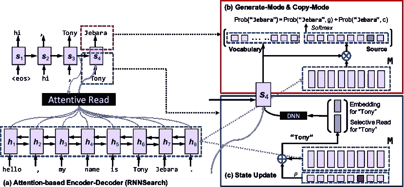

图 9：CopyNet 的整体架构（Gu 等，2016）

在实际应用中，仅仅从源消息中复制是不够的。在对话系统和问答系统等任务中，代理还需要生成源句子中没有的单词的能力。CopyNet (Gu et al., 2016) (图 9) 被提出以将复制机制融入传统的序列到序列模型。该模型在每个解码阶段决定是从源中复制还是生成一个源中不存在的新令牌。

CopyNet 的编码器与传统的序列到序列模型相同，而解码器与传统的基于注意力的解码器相比有一些区别。在预测时间步 $t$ 的令牌时，它结合了生成模式和复制模式的概率模型：

|  | $P(y_{t}&#124;s_{t},y_{t-1},c_{t},M)=P_{g}(y_{t}&#124;s_{t},y_{t-1},c_{t},M)+P_{c}(y_{t}&#124;s_{t},y_{t-1},c_{t},M)$ |  | (39) |
| --- | --- | --- | --- |

其中 $t$ 是时间步。$s_{t}$ 是解码器隐藏状态，$y_{t}$ 是预测的令牌。$c_{t}$ 和 $M$ 分别表示编码器隐藏状态的加权和和编码器隐藏状态。$g$ 和 $c$ 分别表示生成模式和复制模式。

此外，尽管它仍然使用 $y_{t-1}$ 和加权注意力向量 $c_{t}$ 来更新解码器隐藏状态，但 $y_{t-1}$ 是通过其嵌入和位置特定隐藏状态进行唯一编码的；同时，CopyNet 结合了注意力读取和选择性读取来捕获来自编码器隐藏状态的信息，其中选择性读取是 Pointer Net 中使用的相同方法。与 Neural Turing Machines (Graves et al., 2014; Kurach et al., 2015) 不同，CopyNet 具有基于位置的机制，使模型能够以更微妙的方式注意到训练数据中的一些特定细节。

复制机制适用于涉及术语或外部知识源的对话，并且在知识驱动或任务导向的对话系统中很受欢迎。

##### 知识驱动对话系统的复制机制

对于知识驱动的系统，外部文档或对话是复制的来源。Lin 等人（2020a）结合了递归知识交互解码器和知识感知指针网络，以实现知识驱动生成和知识复制。在提出的模型中，他们首先计算了对外部知识的注意力分布，然后使用两个指针分别指向对话上下文和知识源，以复制词汇表外（OOV）单词。Wu 等人（2020b）应用了一个多类分类器，以灵活地融合三种分布：生成的单词、生成的知识实体和复制的查询单词。他们使用了上下文-知识融合和灵活模式融合来共同执行知识检索、响应生成和复制，使生成的响应准确、一致且富有知识性。Ji 等人（2020）提出了一种交叉复制网络，分别从内部发言（对话历史）和外部发言（类似案例）中进行复制。他们首先使用预训练语言模型进行类似案例检索，然后结合两个指针的概率分布来进行预测。他们只在法庭辩论和客户服务内容生成任务中进行了实验，其中类似案例容易获得。

##### 针对任务导向对话系统的复制机制

许多对话状态追踪任务使用复制组件生成槽和槽值（Wu 等，2019a；Ouyang 等，2020；Gangadharaiah 和 Narayanaswamy，2020；Chen 等，2020a；Zhang 等，2020；Li 等，2020d）。其中 Wu 等（2019a），Ouyang 等（2020）和 Chen 等（2020a）解决了多领域对话状态追踪的问题。Wu 等（2019a）提出了可转移对话状态生成器（TRADE），一种基于复制的对话状态生成器。生成器对每个可能的（领域，槽）对进行多次解码，然后应用槽门来决定哪个对属于对话。输出分布是从词汇表和对话历史中选择的（领域，槽）对的槽值的复制。Chen 等（2020a）使用了与 TRADE 不同的复制策略。他们没有使用整个对话历史作为复制源，而是分别从用户话语和系统消息中复制状态值，这将槽级上下文作为输入。Ouyang 等（2020）提出了槽连接机制，以有效利用来自其他领域的现有状态。计算了注意力权重以衡量目标槽与其他领域中相关槽值元组之间的连接。最终，对代币生成、对话上下文复制和过去状态复制的三个分布进行了门控和融合，以预测下一个代币。Gangadharaiah 和 Narayanaswamy（2020）将指针网络与基于模板的树解码器相结合，递归和分层地填充模板。复制机制还缓解了端到端任务导向对话系统中数据注释昂贵的问题。经过复制增强的对话生成模型被证明在有限的领域特定或多领域数据下表现显著优于强基线（Zhang 等，2020；Li 等，2020d；Gao 等，2020a）。

##### 对话相关任务的复制机制

指针网络和 CopyNet 也用于解决其他对话相关任务。Yu 和 Joty（2020）应用了指针网络进行在线对话分离。指针模块指向当前消息回复的祖先消息，分类器预测两条消息是否属于同一线程。在对话解析任务中，指针网络作为主干解析模型用于构建话语树（Aghajanyan 等，2020；Lin 等，2019）。Tay 等（2019）使用了指针-生成器框架在长跨度上进行机器阅读理解，其中复制机制减少了在上下文中包含目标答案的需求。

### 2.7 深度强化学习模型与生成对抗网络

近年来，有两种令人兴奋的方法展示了人工智能的潜力。第一种是深度强化学习，它在许多复杂问题上超越了人类，如大规模游戏、对话和汽车驾驶。另一种技术是 GAN，展现了在生成任务中的惊人能力。由 GAN 模型生成的数据样本，如文章、画作甚至视频，有时与人类创作的难以区分。

AlphaGo（Silver et al., 2016）在近年来再次激发了对强化学习的研究兴趣（Graves et al., 2016；Mnih et al., 2016；Wang et al., 2016；Tamar et al., 2016；Jaderberg et al., 2016；Mirowski et al., 2016）。强化学习是机器学习的一个分支，旨在训练代理在与某个环境互动时执行适当的动作。它是机器学习的三个基本分支之一，另两个是监督学习和无监督学习。它也可以被视为监督学习和无监督学习之间的中间体，因为它只需要弱信号进行训练（Wang et al., 2016）。

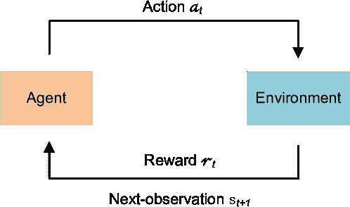

图 10：强化学习框架

图 10 展示了强化学习框架，包括一个代理和一个环境。该框架是一个马尔可夫决策过程（MDP）（Puterman，2014），可以用一个五元组 M = $\langle S,A,P,R,\gamma\rangle$ 来描述。$S$ 代表环境状态的无限集合；$A$ 代表代理根据给定环境状态 $s$ 选择的动作集合；$P$ 是 MDP 中的转移概率矩阵，表示代理采取动作后环境状态转移的概率；$R$ 是代理在状态 $s$ 下采取动作后从环境中获得的平均奖励；$\gamma$ 是折扣因子。该框架的流程是以下两个步骤的循环：代理首先对当前环境状态 $s_{t}$ 进行观察，并根据其策略选择一个动作；然后根据转移概率矩阵 $P$，环境的状态转移到 $s_{t+1}$，同时提供奖励 $r_{t}$。

强化学习适用于解决对话系统中的许多挑战，因为对话系统具有代理-环境的特性。一个双方对话系统由一个智能聊天机器人（代理）和一个用户或用户模拟器（环境）组成。在这里，我们主要讨论深度强化学习。

深度强化学习意味着将深度神经网络应用于建模强化学习框架中的价值函数或策略。“深度模型”与“浅层模型”相对。浅层模型通常指传统的机器学习模型，如决策树或 KNN。特征工程，通常基于浅层模型，既耗时又耗力，同时也过于具体和不完整。与此不同的是，深度神经模型设计简便，并具有强大的拟合能力，这促进了近年来许多突破。深度表示学习摆脱了人工劳动，并自动利用数据中的层次特征，显著增强了语义表达性和领域相关性。

我们讨论了两种典型的强化学习模型：Deep Q-Networks（Mnih et al., 2015）和 REINFORCE（Williams, 1992; Sutton et al., 1999）。它们分别属于 Q-learning 和策略梯度，这两种强化学习的家族。

#### 2.7.1 深度 Q 网络

深度 Q 网络是一个基于价值的强化学习模型。它根据 Q 函数确定最佳策略：

|  | $\pi^{*}(s)=arg\max_{a}Q^{*}(s,a)$ |  | (40) |
| --- | --- | --- | --- |

其中 $Q^{*}(s,a)$ 是一个最优 Q 函数，$\pi^{*}(s)$ 是相应的最优策略。在深度 Q 网络中，Q 函数使用深度神经网络建模，例如 CNNs、RNNs 等。

如 Gao et al.（2018）所述，Q 模型的参数使用以下规则更新：

|  | $\theta\leftarrow\theta+\alpha\underbrace{\left(r_{t}+\gamma\max_{a_{t+1}}Q(s_{t+1},a_{t+1};\theta)-Q(s_{t},a_{t};\theta)\right)}_{\text{时间差分}}\bigtriangledown_{\theta}Q(s_{t},a_{t};\theta)$ |  | (41) |
| --- | --- | --- | --- |

其中 $(s_{t},a_{t},r_{t},s_{t+1})$ 是一个观测到的轨迹。$\alpha$ 表示步长，参数更新是通过时间差分（Sutton, 1988）来计算的。然而，这种更新机制存在不稳定性，并且需要大量的训练样本。为了实现更高效和稳定的参数更新，有两种典型的技巧。

第一种方法是经验回放（Lin, 1992; Mnih et al., 2015）。它不是一次使用一个训练样本来更新参数，而是使用一个缓冲区来存储训练样本，并从缓冲池中迭代地检索训练样本进行参数更新。它避免了在训练期间遇到分布变化过快的训练样本，从而提高了学习的稳定性；此外，它多次使用每个训练样本，从而提高了效率。

第二种方法是双网络实现（Mnih et al., 2015）。该方法在 Q 函数优化中使用两个网络，一个是 Q 网络，另一个是目标网络。目标网络用于计算时间差异，其参数 $\theta_{target}$ 在训练时保持不变，定期与 $\theta$ 对齐。然后使用以下规则更新参数：

|  | $\theta\leftarrow\theta+\alpha\underbrace{\left(r_{t}+\gamma\max_{a_{t+1}}Q(s_{t+1},a_{t+1};\theta_{target})-Q(s_{t},a_{t};\theta)\right)}_{\text{带有目标网络的时间差}}\bigtriangledown_{\theta}Q(s_{t},a_{t};\theta)$ |  | (42) |
| --- | --- | --- | --- |

由于 $\theta_{target}$ 在一段时间内不会改变，目标网络以稳定的方式计算时间差异，这有助于训练的收敛。

#### 2.7.2 REINFORCE

REINFORCE 是一种基于策略的强化学习算法，没有价值网络。它直接优化策略。策略由一个策略网络参数化，其输出是对连续或离散动作的分布。通过收集长度为 $H$ 的轨迹样本来计算长期奖励，以评估策略网络：

|  | $J(\theta)=E\left[\sum_{t=1}^{H}\gamma^{t-1}r_{t}\vert a_{t}\sim\pi(s_{t};\theta)\right]$ |  | (43) |
| --- | --- | --- | --- |

$J(\theta)$ 表示长期奖励，目标是优化策略网络以最大化 $J(\theta)$。这里使用**随机梯度上升**作为优化器：

|  | $\theta\leftarrow\theta+\alpha\bigtriangledown_{\theta}J(\theta)$ |  | (44) |
| --- | --- | --- | --- |

其中 $\bigtriangledown_{\theta}J(\theta)$ 通过以下方式计算：

|  | $\bigtriangledown_{\theta}J(\theta)=\sum_{t=1}^{H-1}\gamma^{t-1}\left(\bigtriangledown_{\theta}log\pi(a_{t}\vert s_{t};\theta)\sum_{h=t}^{H}\gamma^{h-t}r_{h}\right)$ |  | (45) |
| --- | --- | --- | --- |

两种模型各有优点：深度 Q 网络在样本效率上更高，而 REINFORCE 则更稳定（Li, 2017）。在近期的研究中，REINFORCE 更为流行。现代研究涉及更大的动作空间，这意味着像深度 Q 网络这样的基于值的强化学习模型不适合解决这些问题。基于值的方法“选择一个动作以最大化价值”，这意味着它们的动作集合应该是离散且规模适中的；而像 REINFORCE 这样的策略梯度方法则不同，它们通过策略网络直接预测动作，对动作空间没有限制。因此，策略梯度方法更适合处理涉及更大动作空间的任务。

考虑到 Q-learning 和策略梯度各自带来的好处，一些工作已将基于值的方法与基于策略的方法结合起来。演员-评论家算法（Konda and Tsitsiklis, 2000; Sutton et al., 1999）被提出以缓解在策略梯度方法中计算梯度时的严重方差问题。它为方程式中的项$\sum_{h=t}^{H}\gamma^{h-t}r_{h}$进行值函数估计，并将其纳入策略优化。方程式 (45) 然后被转换为如下公式：

|  | $\bigtriangledown_{\theta}J(\theta)=\sum_{t=1}^{H-1}\gamma^{t-1}\left(\bigtriangledown_{\theta}log\pi(a_{t} | s_{t};\theta)\hat{Q}(s_{t},a_{t},h)\right)$ |  | (46) |
| --- | --- | --- | --- | --- |

其中 $\hat{Q}(s_{t},a_{t},h)$ 代表估计的值函数。

#### 2.7.3 GANs

由于其相似的内部结构和逻辑，容易将演员-评论家模型与另一框架——GANs （Goodfellow et al., 2014; Zhang et al., 2018c; Feng et al., 2020a）进行联系（Pfau and Vinyals, 2016）。实际上，近年来有相当多的对话系统研究利用强化学习框架训练 GANs（Zhu et al., 2018; Wu et al., 2019b; He et al., 2020a; Zhu et al., 2020; Qin et al., 2020）。

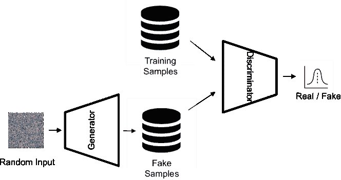

图 11：GAN 框架

图 11 展示了包含生成器和判别器的 GAN，其中训练过程可以被视为它们之间的竞争：生成器试图生成数据分布以欺骗判别器，而判别器则试图区分真实数据（真实）和生成的数据（伪造）。在训练过程中，生成器以噪声作为输入生成数据分布，而判别器则以真实和伪造的数据作为输入，二分类标注作为标签。整个 GAN 模型作为生成器和判别器的连接进行端到端训练，以最小化以下交叉熵损失：

|  | $L_{1}(D,G)=-E_{\omega\sim P_{data}}[logD(\omega)]-E_{z\sim N(0,I)}[log(1-D(G(z)))]$ |  | (47) |
| --- | --- | --- | --- |
|  | $L_{2}(D,G)=-E_{z\sim N(0,I)}[logD(G(z))]$ |  | (48) |

其中 $L_{1}$ 和 $L_{2}$ 表示一个双层损失，其中 $D$ 和 $G$ 分别为判别器和生成器。$z\sim N(0,I)$ 是生成器的噪声输入，$w$ 是判别器的输入。

##### RL 与 GAN 的关系

GAN 可以被视为一种特殊的演员-评论员(Pfau and Vinyals, 2016)。在 GAN 的学习架构中，生成器充当演员，判别器充当评论员或环境，提供真实/伪造的反馈作为奖励。然而，演员所采取的行动不能改变环境的状态，这意味着 GAN 的学习架构是一个无状态的马尔可夫决策过程。同时，演员无法访问环境的状态，只是基于高斯噪声生成数据分布，这意味着 GAN 框架中的生成器是一个盲目的演员/代理。总而言之，GAN 是一种特殊的演员-评论员，其中演员是盲目的，整个过程是一个无状态的 MDP。

对话系统的互动特性激励了在其研究中广泛应用强化学习和 GAN 模型。

##### 面向任务的对话系统中的 RL

强化学习在对话系统中的一个常见应用是任务导向系统中的强化对话管理。对话状态追踪和策略学习是对话管理器的两个典型模块。黄等人 (2020c) 和李等人 (2020d) 使用强化学习训练了对话状态追踪器。他们都在追踪器中结合了奖励管理器，以提高追踪准确性。对于策略学习模块，强化学习似乎是最佳选择，因为几乎所有近期相关的研究都通过强化学习来学习策略 (张等人，2019c；王等人，2020d；朱等人，2020；王等人，2020a；高信等人，2020；黄等人，2020b；徐等人，2020a)。强化学习在策略学习任务中的日益偏好归因于其特点：在策略学习任务中，模型基于来自 DST 模块的状态 (state) 预测对话动作 (action)，这与强化学习框架中代理的功能完全一致。

##### RL 在开放域对话系统中的应用

由于直接生成语言需要庞大的动作空间，许多使用强化学习框架训练的开放域对话系统不生成回应，而是选择回应。基于检索的系统有一个有限的动作集，适合在强化学习方案中训练。一些研究在基于检索的对话任务中取得了令人鼓舞的成果（Bouchacourt 和 Baroni，2019；Li 等，2016a；Zhao 和 Eskenazi，2016）。然而，检索系统无法在所有用户消息中进行泛化，可能给出无关的回应（Qiu 等，2017），这使得生成式对话系统更为可取。尽管考虑到动作空间问题，一些研究通过结合检索和生成方法构建系统（Zhu 等，2018；Serban 等，2017b）。Zhu 等（2018）选择首先检索一组 n 最佳回应候选，然后基于检索结果和用户消息生成回应。相比之下，Serban 等（2017b）首先生成和检索不同对话模型的候选回应，然后用在线强化学习训练评分模型，从生成和检索的回应中选择回应。由于从头开始使用强化学习训练生成对话代理特别困难，先用监督学习进行预训练以热启动是一个不错的选择。Wu 等（2019b），He 等（2020a），Williams 和 Zweig（2016）以及 Yao 等（2016）在对话学习中应用了这种预训练和微调策略，并取得了出色的成果，这证明了强化学习可以提高数据驱动聊天机器人的回应质量。同样，预训练和微调也适用于领域迁移问题。一些研究在源领域中预训练模型，并通过强化训练扩展领域范围（Mo 等，2018；Li 等，2016d）。

##### 知识驱动对话系统的强化学习

一些系统使用强化学习从外部信息如个性、文档、知识图谱等中进行选择，并相应地生成响应。Majumder 等（2020a）和 Jaques 等（2020）同时进行了个性选择和基于个性的响应生成，并通过强化学习框架训练了他们的智能体。Bao 等（2019a）和 Zhao 等（2020b）构建了文档基础的系统。他们也使用强化学习来完成文档选择和知识基础的响应生成。同时，也有一些工作将知识图谱结合到对话系统中，并将其视为外部知识源（Moon 等，2019；Xu 等，2020a）。在强化训练框架中，智能体根据当前节点和状态为每一步选择一条边，然后将知识结合到响应生成过程中。

##### 对话相关任务的强化学习

对话相关任务如对话关系提取（Li 等，2019c）、问答（Hua 等，2020）和机器阅读理解（Guo 等，2020）也从强化学习中受益，因为这些任务具有交互性和注释数据的稀缺性。

##### 对话系统中的 GAN

GAN 在对话系统中的应用分为两个方向。第一个方向将 GAN 框架应用于增强响应生成（Li 等，2017a；Zhu 等，2018；Wu 等，2019b；He 等，2020a；Zhu 等，2020；Qin 等，2020）。判别器将生成的响应与人类响应区分开来，这激励了智能体，即 GAN 中的生成器，生成更高质量的响应。另一个方向将 GAN 作为对话系统的评估工具（Kannan 和 Vinyals，2017；Bruni 和 Fernandez，2017）。在将生成器和判别器作为一个整体框架进行训练后，判别器被单独用作评分器来评估对话智能体的表现，并显示出与传统的参考基准指标如 BLEU、METEOR、ROUGE-L 等相比，与人类评估的相关性更高。我们将在第五部分讨论对话系统的评估作为一个挑战。

### 2.8 知识图谱增强神经网络

使用带注释的数据进行监督训练试图学习数据集的知识分布。然而，数据集相对稀疏，因此学习可靠的知识分布需要大量的注释数据（Annervaz 等，2018）。

知识图谱（KG）近年来吸引了越来越多的研究兴趣。KG 是一个由实体及其关系组成的结构化知识源（Ji 等，2022）。换句话说，KG 是以图形格式呈现的知识事实。

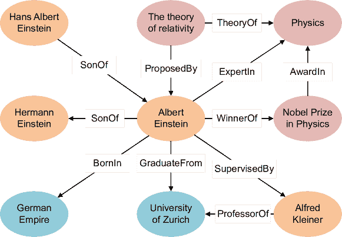

图 12：知识图谱中的实体和关系（Ji 等，2022）

图 12 展示了一个由实体及其关系组成的 KG 示例。KG 以三元组形式存储在资源描述框架（RDF）下。例如，阿尔伯特·爱因斯坦、苏黎世大学及其关系可以表示为$(AlbertEinstein,GraduateFrom,UniversityofZurich)$。

知识图谱增强的神经网络首先在较低维度空间中表示实体及其关系，然后使用神经模型检索相关事实（Ji 等，2022）。知识图谱表示学习通常可以分为两类：基于结构的表示和语义增强的表示。基于结构的表示使用多维向量来表示实体和关系。诸如 TransE（Bordes 等，2013）、TransR（Lin 等，2015）、TransH（Wang 等，2014）、TransD（Ji 等，2015）、TransG（Xiao 等，2015）、TransM（Fan 等，2014）、HolE（Nickel 等，2016）和 ProjE（Shi 和 Weninger，2017）等模型属于这一类别。语义增强的表示模型如 NTN（Socher 等，2013）、SSP（Xiao 等，2017）和 DKRL（Xie 等，2016）将语义信息融入实体和关系的表示中。神经检索模型也有两个主要方向：基于距离的匹配模型和语义匹配模型。基于距离的匹配模型（Bordes 等，2013）考虑投影实体之间的距离，而语义匹配模型（Bordes 等，2014）计算实体和关系的语义相似性来检索事实。

##### 知识图谱增强对话系统

知识基础对话系统从 KG 的结构化知识格式中获益良多，其中事实之间广泛关联。对 KG 的推理是将常识知识融入响应生成的理想方法，从而生成准确且信息丰富的回应（Young et al., 2018）。Jung et al. (2020) 提出了 AttnIO，一种用于知识检索的双向图探索模型。注意力权重在每一步遍历时进行计算，因此模型可以选择更广泛的知识路径，而不是每次只选择一个节点。在这种方案中，即使只有目标节点作为标签，模型也能预测出合适的路径。Zhang et al. (2019b) 构建了 ConceptFlow，一个引导更有意义未来对话的对话代理。它在常识知识图中遍历以探索概念级对话流。最后，它使用门控机制决定在词汇单词、中心概念词和外部概念词之间生成。Majumder et al. (2020a) 提出了基于角色生成响应的方法，通过首先使用 COMET (Bosselut et al., 2019) 在 9 种关系类型下扩展角色句子，然后应用预训练模型根据对话历史和角色变量生成响应。Yang et al. (2020) 将知识图谱作为任务导向对话系统中的外部知识源，以将领域特定知识纳入响应中。首先，将对话历史解析为依赖树并编码为固定长度的向量。然后，他们利用注意力机制在图上进行多跳推理。解码器最终通过从图实体中复制或生成词汇单词来预测标记。Moon et al. (2019) 提出了 DialKG Walker 用于对话推理任务。他们计算了预测 KG 嵌入和实际 KG 嵌入之间的零样本相关性分数，以促进跨领域预测。此外，他们应用基于注意力的图行走器根据相关性分数生成图路径。Huang et al. (2020a) 通过结合话语级上下文表示和主题级图表示来评估对话系统。他们首先基于编码的（上下文、回应）对构建对话图，然后在图上推理以获得主题级图表示。最终分数通过将上下文表示和图表示的串联向量传递到前馈网络中计算得出。

## 3 任务导向对话系统

本节介绍了包括模块化和端到端系统的面向任务的对话系统。面向任务的系统解决特定领域中的问题，如电影票预订、餐厅桌位预订等。我们关注基于深度学习的系统，因为它们表现优异。对于那些想了解传统规则基础和统计模型的读者，可以参考一些综述文章（Theune, 2003; Lemon and Pietquin, 2007; Mallios and Bourbakis, 2016; Chen et al., 2017a; Santhanam and Shaikh, 2019）。

本节的组织结构如下。我们首先分别讨论模块化和端到端系统，介绍其原理并回顾近期的工作。之后，我们全面讨论面向任务的对话系统在近期研究中的相关挑战和热点话题，以提供一些重要的研究方向。

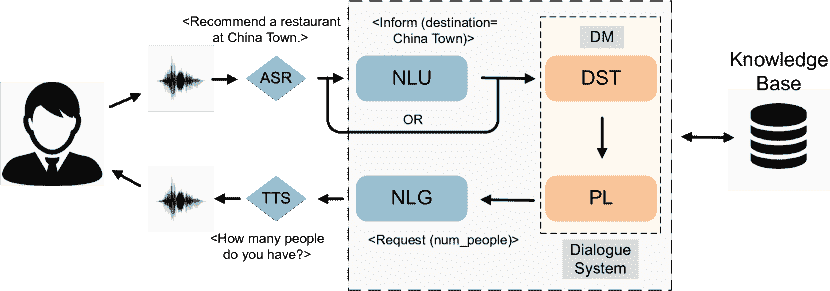

图 13：任务完成流程中的面向任务的对话系统结构

面向任务的对话系统需要更严格的响应约束，因为它旨在准确处理用户消息。因此，提出了模块化方法以更可控的方式生成响应。基于模块化的系统架构如图 13 所示。它由四个模块组成：

自然语言理解（NLU）。该模块将原始用户消息转换为语义槽，同时进行领域和用户意图的分类。然而，一些近期的模块化系统省略了此模块，直接使用原始用户消息作为下一个模块的输入，如图 13 所示。这种设计旨在减少模块间的错误传播，并减轻原始错误的影响（Kim et al., 2018）。

对话状态追踪（DST）。该模块根据当前输入和对话历史反复校准对话状态。对话状态包括相关的用户动作和槽值对。

对话策略学习。基于来自 DST 模块的校准对话状态，该模块决定对话代理的下一个动作。

自然语言生成（NLG）。该模块将选定的对话动作转换为表面层次的自然语言，这通常是响应的*终极*形式。

其中，对话状态跟踪和对话策略学习构成了对话管理器（DM），它是任务导向对话系统的中央控制器。通常，任务导向系统还与外部知识库（KB）交互，以检索有关目标任务的基本知识。例如，在电影票预订任务中，在理解用户消息的需求后，代理与电影知识库交互，以搜索符合特定约束条件的电影，如电影名称、时间、电影院等。

### 3.1 自然语言理解

已证明，NLU 模块对整个系统的响应质量有显著影响（Li 等，2017b）。NLU 模块将用户生成的自然语言信息转换为语义槽，并进行分类。表 2 展示了 NLU 模块的输出格式示例。NLU 模块管理三个任务：领域分类、意图检测和槽填充。领域分类和意图检测是分类问题，使用分类器来预测输入语言序列与预定义标签集之间的映射。在给定的示例中，预测的领域是“movie”，意图是“find_movie”。槽填充是标注问题，可以视为序列到序列的任务。它将原始用户消息映射到一系列槽名称。在这个示例中，NLU 模块读取用户消息“Recommend a movie at Golden Village tonight.”并输出相应的标签序列。它识别“Golden Village”作为去的地方，将其标记为“B_desti”和“I_desti”。类似地，令牌“tonight”被转换为“B_time”。‘B’表示一个块的开始，‘I’表示该标签在目标块内部。对于那些无关的令牌，使用‘O’，表示该令牌在任何感兴趣的块之外。这种标注方法称为 Inside-Outside-Beginning (IOB) 标注（Ramshaw 和 Marcus，1999），这是命名实体识别（NER）任务中的一种常用方法。

表 2：NLU 模块的输出示例

| 句子 | 推荐 | 一部 | 电影 | 在 | 金源 | 村 | 今晚 |
| --- | --- | --- | --- | --- | --- | --- | --- |
| 槽 | O | O | O | O | B-desti | I-desti | B-time |
| 意图 |  |  |  | find_movie |  |  |  |
| 领域 |  |  |  | 电影 |  |  |  |

##### 领域分类和意图检测的技术

领域分类和意图检测属于相同类别的任务。深度学习方法被提出用于解决对话领域和意图的分类问题。邓等人 (2012) 和 Tur 等人 (2012) 是首批成功提高对话意图识别准确率的研究者。他们构建了深度凸网络，将先前网络的预测和当前话语的预测作为当前网络的综合输入。一个深度学习框架也被用来以半监督的方式分类对话领域和意图（Yann 等人，2014）。为了解决训练深度神经网络进行领域和意图预测的难题，限制玻尔兹曼机（RBM）和深度置信网络（DBNs）被应用于初始化深度神经网络的参数（Sarikaya 等人，2014）。为了利用递归神经网络（RNN）在序列处理中的优势，一些研究使用 RNN 作为话语编码器，并对意图和领域类别进行预测（Ravuri 和 Stolcke，2015，2016）。Hashemi 等人 (2016) 使用卷积神经网络（CNN）提取层次化的文本特征进行意图检测，并展示了 CNN 的序列分类能力。Lee 和 Dernoncourt (2016) 提出了一个短话语意图分类模型。短话语因单个对话回合信息不足而难以进行意图检测。本文使用 RNN 和 CNN 架构来整合对话历史，从而将上下文信息作为当前回合消息之外的额外输入。该模型在三个意图分类数据集上取得了令人满意的性能。最近，Wu 等人 (2020a) 预训练了任务导向对话 BERT（TOD-BERT），显著提高了意图检测子任务的准确率。该模型还展示了强大的少样本学习能力，并有效缓解了特定领域数据不足的问题。

##### 插槽填充技术

槽位填充问题也被称为语义标注，是一个序列分类问题。由于模型需要一次预测多个对象，这使得问题更加具有挑战性。深度信念网络（DBNs）在深度架构的学习中展现了良好的能力，并已被应用于包括语义标注在内的许多任务中。Sarikaya 等人（2011）使用了一个以 DBN 初始化的神经网络来完成呼叫路由任务中的槽位填充。Deoras 和 Sarikaya（2013）建立了一个基于 DBN 的序列标注器。除了传统标注器使用的命名实体识别（NER）输入特征外，他们还将词性（POS）和句法特征作为输入的一部分。递归架构使得序列标注任务受益，因为它们能够跟踪过去时间步的信息，以充分利用序列信息。Yao 等人（2013）首次提出，相比于简单地预测单词，RNN 语言模型（RNN-LMs）可以应用于序列标注。在 RNN-LMs 的输出端，预测的是标签而不是普通词汇。Mesnil 等人（2013）和 Mesnil 等人（2014）进一步研究了不同递归架构在槽位填充任务中的影响，发现所有 RNN 都优于条件随机场（CRF）基线。作为一种强大的递归模型，LSTM 在 ATIS 数据集上显示出良好的标注准确性，这得益于其门控机制的记忆控制（Yao 等人，2014）。Gangadharaiah 和 Narayanaswamy（2020）认为传统语义标注的浅层输出表示缺乏表示结构化对话信息的能力。为了改进，他们将槽位填充任务视为一个基于模板的树解码任务，通过迭代生成和填充模板来实现。与传统序列标注方法不同，Coope 等人（2020）通过将槽位填充任务视为基于回合的跨度提取任务来解决这个问题。他们应用了对话预训练模型 ConveRT，并利用预训练向量中嵌入的丰富语义信息来解决领域数据不足的问题。ConveRT 的输入是请求的槽位和话语，而输出是作为槽位值的感兴趣跨度。

##### 统一领域分类、意图检测和槽位填充

一些研究选择将领域分类、意图检测和槽填充结合到一个多任务学习框架中，以共同优化共享的潜在空间。Hakkani-Tür 等人（2016）应用了双向 RNN-LSTM 架构来共同执行这三项任务。刘和 Lane（2016）在传统的 RNN 编码器-解码器模型中增加了注意力机制，以管理意图检测和槽填充。槽填充应用了显式对齐。Chen 等人（2016）提出了一个端到端的记忆网络，并使用记忆模块存储用户意图和槽值在历史对话中。进一步应用了注意力机制来迭代选择解码阶段的相关意图和槽值。三项 NLU 子任务的多任务学习有助于领域扩展，并在转移到新领域时促进了零样本或少样本训练（Bapna 等人，2017；Lee 和 Jha，2019）。张等人（2018a）通过应用基于胶囊的神经网络捕捉了对话语义在 NLU 多任务学习中的层次结构。通过动态的协议路由策略，该架构提高了 SNIPS-NLU 和 ATIS 数据集上的意图检测和槽填充的准确性。

##### 新颖观点

最近，一些新颖的想法出现在 NLU 研究中，为进一步改进提供了新的可能性。传统的 NLU 模块依赖于通过自动语音识别（ASR）模块将用户的音频消息转换为文本。然而，Singla 等人（2020）跳过了 ASR 模块，直接使用音频信号作为 NLU 的输入。他们发现，通过减少管道系统的模块数量，预测结果更为稳健，因为广播的错误更少。Su 等人（2019b）认为自然语言理解（NLU）和自然语言生成（NLG）是逆向过程。因此，他们可以通过双重监督学习框架来利用它们的双重关系。实验显示两项任务都有所改进。

### 3.2 对话状态跟踪

对话状态跟踪（DST）是对话管理器的第一个模块。它基于整个对话历史跟踪用户的目标及相关细节，并提供基于此信息的信息，以便策略学习模块（下一个模块）决定代理采取的行动。

##### NLU 与 DST 之间的差异

NLU 和 DST 模块密切相关。NLU 和 DST 都为对话进行槽位填充。然而，它们实际上扮演着不同的角色。NLU 模块尝试对当前用户消息进行分类，如意图和领域类别，以及每个消息标记属于的槽位。例如，给定用户消息“推荐今晚在 Golden Village 的电影。”，NLU 模块会将原始消息转换为“$inform(domain=movie;\ destination=GoldenVillage;\ date=today;\ time=evening)$”，其中槽位通常通过标记用户消息中的每个单词来填充，如第 3.1 节所述。然而，DST 模块不会对用户消息进行分类或标记。相反，它会根据整个对话历史为预先存在的槽位列表中的每个槽位名称寻找槽位值。例如，有一个预先存在的槽位列表“$intent:\_;\ domain:\_;\ name:\_;\ pricerange:\_;\ genre:\_;\ destination:\_;\ date:\_$”，其中冒号后的下划线是占位符，表示此处可以填入一个值。每轮，DST 模块会查看直到当前轮次的整个对话历史，并决定哪个内容可以填入槽位列表中的特定槽位。如果用户消息“推荐今晚在 Golden Village 的电影。”是对话中的唯一消息，那么槽位列表可以填充为“$intent:inform;\ domain:movie;\ name:None;\ pricerange:None;\ genre:None;\ destination:GoldenVillage;\ date:today$”，其中用户当前轮次未指定的槽位可以填充为“$None$”。总之，NLU 模块尝试标记用户消息，而 DST 模块尝试从用户消息中找到值来填充预先存在的表单。一些对话系统将 NLU 模块的输出作为 DST 模块的输入（Williams et al., 2013; Henderson et al., 2014a, b），而其他系统则直接使用原始用户消息来追踪状态（Kim et al., 2019; Wang et al., 2020e; Hu et al., 2020）。

对话状态追踪挑战（DSTCs）是一系列在 DST 中受欢迎的挑战，提供了基准数据集、标准评估框架和研究测试平台（Williams et al., 2013; Henderson et al., 2014a, b; Kim et al., 2016, 2017）。DSTCs 涵盖了许多领域，如餐馆、旅游等。

对话状态包含了在响应中传达的所有基本信息（Henderson, 2015）。根据 DSTC2（Henderson 等, 2014a）的定义，给定对话回合的对话状态包括信息槽位 Sinf 和请求槽位 Sreq。信息槽位是用户指定的属性，用于约束数据库的搜索，而请求槽位是用户查询其值的属性。例如，电影票的序列号通常是请求槽位，因为用户在订票时很少指定特定的序列号。具体来说，对话状态有三个组成部分：

+   •

    与信息槽位对应的目标约束。约束可以是对话中用户提到的具体值或特殊值。特殊值包括 Dontcare，表示用户对该槽位的无所谓，以及 None，表示用户尚未在对话中指定该值。

+   •

    请求的槽位。它可以是用户向系统请求答案的槽位名称列表。

+   •

    当前回合的搜索方法。它由指示交互类别的值组成。通过约束表示用户尝试在其需求中指定约束信息；通过替代表示用户要求一个替代实体；完成表示用户打算结束对话。

然而，考虑到诸如跟踪效率、跟踪准确性、领域适应性和端到端训练等众多挑战，最近提出了许多替代表示方法，后续将对此进行深入探讨。

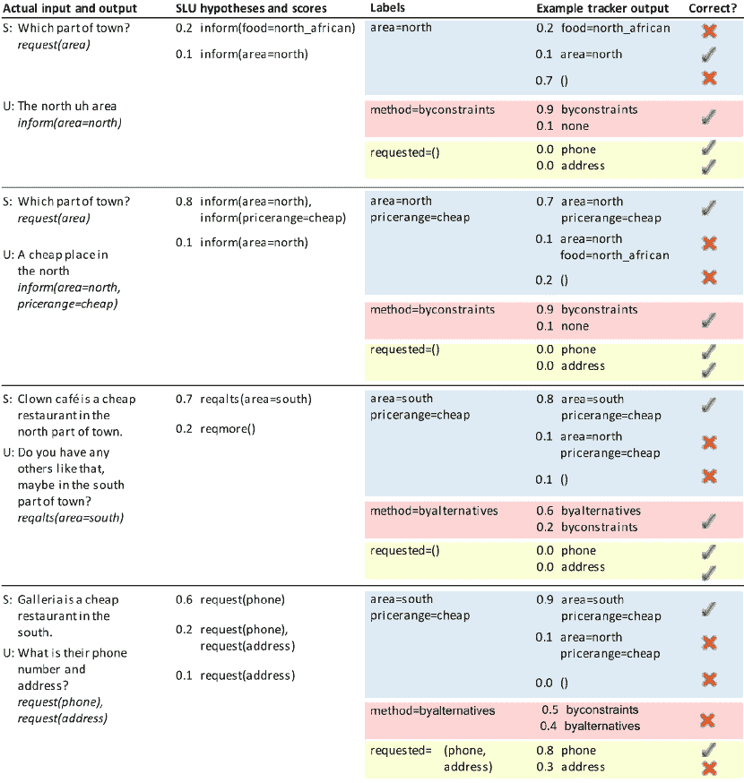

图 14: DST 过程的示例（Henderson 等，2014a）

图 14 是一个在餐厅预订任务中 4 个对话回合的 DST 过程示例。第一列包括原始对话发言，其中$S$表示系统消息，$U$表示用户消息。第二列包括 NLU 模块的 N-best 输出列表及其对应的置信度分数。第三列包括一个回合的标签，指示真实的槽位-值对。第四列包括示例 DST 输出及其对应的置信度分数。第五列表示跟踪器输出的正确性。

早期的工作使用手工规则或统计方法来解决 DST 任务。虽然在工业对话系统中广泛使用，但基于规则的 DST 方法（Goddeau 等人，1996）有许多限制，例如泛化能力有限、高错误率、领域适应性差等（Williams，2014）。统计方法（Lee，2013；Lee 和 Eskenazi，2013；Ren 等人，2013；Williams，2013，2014）也受到噪声条件和歧义的困扰（Young 等人，2010）。

最近，许多神经跟踪器出现了。神经跟踪器相比于基于规则和统计的跟踪器有多个优势。一般来说，它们被分为两类。第一类有预定义的槽名称和值，每轮 DST 模块尝试根据对话历史找到最合适的槽-值对；第二类没有固定的槽值列表，因此 DST 模块尝试直接从对话上下文中找到值或根据对话上下文生成值。显然，后一种方式更加灵活，实际上，越来越多的工作正在以第二种方式解决 DST。我们在这里讨论这两类工作的情况。

##### 带有预定义槽名称和值的神经跟踪器

第一类可以视为多类或多跳分类任务。对于多类分类 DST，跟踪器从多个值中预测正确的类别，但当值集变大时，这种方法会受到高复杂性的困扰。另一方面，对于多跳分类任务，跟踪器每次只读取一个槽-值对并执行二元预测。这种方式降低了模型的复杂性，但由于每个槽会有多个跟踪过程，系统反应时间也会增加。Henderson 等人 (2013) 是首个在 DST 任务中使用深度学习模型的研究者。他们将许多特征函数（例如 SLU 分数、排名分数、肯定分数等）作为神经网络的输入，然后预测每个槽-值对的概率。Mrkšić等人 (2015) 应用了 RNN 作为神经跟踪器，以获得对对话上下文的意识。Mrkšić等人 (2016) 提出了一个多跳神经跟踪器，该跟踪器将系统输出和用户话语作为前两个输入（以建模对话上下文），将候选槽-值对作为第三个输入。跟踪器最终根据对话历史对当前槽-值对进行二元预测。

##### 带有不固定槽名称和值的神经跟踪器

第二类方法引起了更多关注，因为它不仅降低了 DST 任务的模型和时间复杂性，还促进了任务导向对话系统的端到端训练。此外，当目标领域发生变化时，它也很灵活。Lei 等人（2018）提出了信念跨度，即对话上下文中对应特定槽位的文本跨度。他们构建了一个两阶段的 CopyNet 来从对话历史中复制和存储槽位值。槽位被存储以准备神经响应生成。信念跨度促进了对话系统的端到端训练，并提高了在词汇表外情况中的跟踪准确性。基于此，Lin 等人（2020c）提出了最小信念跨度，并认为当系统与来自不同领域的 API 交互时，从头生成信念状态不可扩展。提出的 MinTL 框架在上下文和最小信念跨度的基础上，对上一个回合的对话状态执行插入（INS）、删除（DEL）和替换（SUB）。Wu 等人（2019a）提出了 TRADE 模型。该模型还应用了复制机制，并使用软门控指针生成器基于领域-槽位对和编码的对话上下文生成槽位值。Quan 和 Xiong（2020）认为简单地连接对话上下文并不可取。他们使用了 [sys] 和 [usr] 来区分系统和用户消息。这种简单的长上下文建模方法与基线相比提高了 7.03%。Cheng 等人（2020）提出了 Tree Encoder-Decoder (TED) 架构，该架构利用层次树结构来表示对话状态和系统行为。TED 根据对话历史、对话动作和上一个回合的对话状态生成当前回合的树状对话状态。这种方法使得对话状态和用户目标的表示在平面空间中的先进 DST 基线上提高了 20%。Chen 等人（2020a）构建了一个交互编码器，以利用回合内和回合之间的依赖关系。此外，他们使用了注意机制分别构建用户和系统的槽位级上下文，这些上下文是嵌入向量，根据这些向量，生成器从对话上下文中复制值。Shan 等人（2020）应用了 BERT 进行多任务学习并生成对话状态。他们首先对词级和回合级上下文进行了编码。然后，他们通过应用词级和回合级注意机制，从上下文中检索每个槽位的相关信息。此外，基于检索到的信息预测了槽位值。类似地，Wang 等人（2020e）使用 BERT 进行槽位值预测。他们执行了槽位注意（SA）以检索相关跨度，并进行了值规范化（VN）以将跨度转换为最终值。Huang 等人（2020c）提出了 Meta-Reinforced MultiDomain State Generator (MERET)，这是一个进一步通过策略梯度强化学习微调的对话状态生成器。

### 3.3 策略学习

策略学习模块是对话管理器的另一个模块。该模块根据来自 DST 模块的输出对话状态控制系统将采取的动作。假设我们拥有当前轮次的对话状态$S_{t}$和动作集$A=\{a_{1},...,a_{n}\}$，该模块的任务是学习一个映射函数$f$: $S_{t}\to a_{i}\in A$。与其他模块相比，这个模块在任务定义上相对简单，但实际上，任务本身具有挑战性（Peng 等人，2017）。例如，在电影票和餐厅预订的任务中，如果用户预订了一个两小时的电影时段并打算之后去晚餐，那么代理需要知道电影时段和餐厅时段之间的时间间隔必须超过两个小时，因为从电影院到餐厅的通勤时间也要考虑在内。

监督学习和强化学习是对话策略学习的主流训练方法（Chen 等人，2017a）。以监督方式学习的策略表现出出色的决策能力（Su 等人，2016; Dhingra 等人，2016; Williams 等人，2017; Liu 和 Lane，2017）。在一些特定任务中，监督策略模型可以准确完成任务，但训练过程完全依赖于训练数据的质量。此外，注释数据集需要大量人工劳动，而且决策能力受限于特定任务和领域，表现出较弱的迁移能力。随着强化学习方法的普及，越来越多的任务导向型对话系统使用强化学习来学习策略。对话策略学习适合强化学习的设置，因为强化学习的代理也学习将环境状态映射到动作的策略。

通常，强化学习策略的环境是用户或模拟用户，其中设置训练的过程称为在线学习。然而，在在线学习场景中从头开始学习策略是数据和时间密集型的，因此需要暖启动方法来加速训练过程。Henderson 等人（2008）使用专家数据来限制初始动作空间的探索。Chen 等人（2017b）应用了教师-学生学习框架，将教师专家知识转移到目标网络，以便进行暖启动。

##### 强化策略学习技术

目前几乎所有的对话策略学习工作都基于强化学习方法。在线学习是一种理想的方法，可以为强化学习代理迭代获取训练样本，但人工劳动非常有限。张等人（2019c）提出了预算意识调度（BCS）来更好地利用有限的用户交互，其中用户交互被视为预算。BCS 使用概率调度器在训练期间分配预算。此外，一个控制器决定是否使用真实用户交互或模拟交互。此外，还应用了基于目标的采样模型来模拟策略学习的经验。这样的预算控制机制在实际训练过程中达到了理想的效果。考虑到获取真实在线用户交互的困难以及训练用户模拟器所需的大量注释数据，Takanobu 等人（2020）提出了多代理对话策略学习，他们让两个代理互相交互，既执行用户角色又执行代理角色，同时学习策略。此外，他们还结合了角色特定奖励来促进基于角色的响应生成。实验中观察到高任务完成率。王等人（2020d）引入了带有双重 Q 对抗网络（MCTS-DDU）的蒙特卡洛树搜索（MCTS），提出了决策时间规划，而不是背景规划。他们使用蒙特卡洛模拟来对对话状态进行树搜索。戈登-霍尔等人（2020）以弱监督的方式训练专家示范者来执行来自示范的深度 Q 学习（DQfD）。此外，还提出了强化微调学习以促进领域迁移。在强化对话策略学习中，代理通常在对话结束时收到反馈，这对于学习来说并不高效。黄等人（2020b）提出了一种创新的奖励学习方法，根据专家示范来约束对话进展。专家示范可以是注释的，也可以不是，因此这种方法不是劳动密集型的。王等人（2020b）提出了共同生成对话动作和响应，以保持对话的固有语义结构。同样，Le 等人（2020b）提出了一个统一的框架，同时执行对话状态跟踪、对话策略学习和响应生成。实验表明，统一框架在其子任务和领域适应性方面表现更好。徐等人（2020a）使用知识图谱提供动作集合的先验知识，并以图形化的方式解决策略学习任务。通过结合知识图谱，获得了长期奖励，为策略代理提供了在选择动作时的长期视野。此外，由于先验知识，候选动作的质量更高。策略学习进一步以更可控的方式进行。

### 3.4 自然语言生成

自然语言生成（NLG）是任务导向对话系统管道的最后一个模块。它负责将从对话管理器生成的对话动作转换为最终的自然语言表示。例如，假设“Inform (name = Wonder Woman; genre = Action; desti = Golden Village)”是策略学习模块中的对话动作，那么 NLG 模块将其转换为诸如“在 Golden Village 有一部名为 Wonder Woman 的动作片。”的语言表示。

传统的 NLG 模块是管道系统。根据 Siddharthan (2001)的定义，NLG 的标准管道包括四个组件，如图 15 所示。

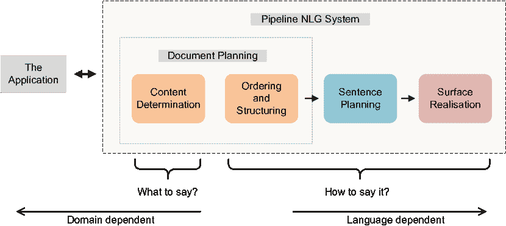

图 15：管道 NLG 系统

这个管道的核心模块是内容确定、句子规划和表层实现，如 Reiter (1994)提出的那样。Cahill 等人 (1999) 进一步改进了 NLG 管道，增加了三个组件：词汇化、指代表达生成和聚合。然而，这个模型的一个缺点是系统的输入存在歧义。

##### 端到端的 NLG 技术

深度学习方法被进一步应用于提升 NLG 性能，并且将管道整合为单个模块。端到端自然语言生成取得了令人期待的进展，并且是近期研究中执行 NLG 的最流行方法。Wen 等人（2015a）认为语言生成应完全基于数据，而不依赖任何专家规则。他们提出了一种基于 RNN 的统计语言模型来学习带有语义约束和语法树的响应生成。此外，他们使用 CNN 重新排序器进一步选择更好的响应。类似地，Wen 等人（2015b）使用 LSTM 模型同时学习句子规划和表面实现。Tran 和 Nguyen（2017）进一步使用 GRU 提高了多个领域的生成质量。所提出的生成器在多个领域 consistently 生成高质量的响应。为了提高递归模型的领域适应性，Wen 等人（2016b）建议首先在从域外数据集合成的数据上训练递归语言模型，然后在相对较小的领域内数据集上进行微调。这一训练策略在人工评估中被证明是有效的。上下文感知在对话响应生成中非常重要，因为仅仅依赖当前轮次的对话行动可能会导致不合逻辑的响应。Zhou 等人（2016）构建了一个基于注意力的上下文感知 LSTM（CA-LSTM），将目标用户问题、所有语义值和对话行动作为输入生成上下文感知的回答。类似地，Dušek 和 Jurčíček（2016a）将前一用户话语与对话行动向量拼接，并将其输入到 LSTM 模型中。Dušek 和 Jurčíček（2016b）对他们的神经响应生成器施加了语法约束。提出了一个两阶段的序列生成过程。首先，生成一个语法依赖树，以对话话语进行结构化表示。在第二阶段，生成器整合了句子规划和表面实现，生成自然语言表示。

##### 强大的自然语言生成

更近期的研究集中在生成响应的可靠性和质量上。Balakrishnan 等人 (2019) 提出了树状语义表示，以实现更好的内容规划和表面实现性能。他们进一步设计了一种新型的束搜索算法，以提高生成响应的语义正确性。为了避免诸如槽值缺失或生成响应中的冗余等错误，Li 等人 (2020d) 提出了迭代修正网络（IRN），这是一种使用监督学习训练并通过强化学习微调的框架。它通过将槽不一致惩罚纳入奖励中，迭代修正生成的标记。Golovanov 等人 (2019) 将大规模预训练模型应用于自然语言生成（NLG）任务。在比较了单输入和多输入方法后，他们得出结论，不同类型的输入上下文会在生成响应中造成不同的归纳偏差，并进一步提出利用这一特性来更好地将预训练模型适应新任务。Baheti 等人 (2020) 解决了对话问答中的 NLG 可靠性问题。虽然有不同的流水线结构，他们使用了类似的方法来提高生成响应的流畅性和语义正确性。他们提出了句法转换（STs）来生成候选响应，并使用 BERT 来对其质量进行排序。这些生成的响应可以视为对原始数据集的增强，以便在 NLG 模型学习中进一步使用。Oraby 等人 (2019) 提出了从易于获得的用户评论中创建具有丰富风格标记的数据集的方法。他们进一步基于生成的数据训练了多个 NLG 模型，以实现语义正确性和语言风格的联合控制。类似地，Elder 等人 (2020) 提出了数据增强方法，该方法对响应生成施加了限制。虽然这种限制导致了乏味且多样性较差的响应，他们认为在任务导向的系统中，可靠性比多样性更重要。

### 3.5 端到端方法

上述模块在各自的任务中可以通过最近的相关进展取得良好的性能。然而，模块化系统存在两个显著缺点（Zhao 和 Eskenazi，2016）：（1）许多管道系统中的模块有时不可微分，这意味着错误无法从末端传播回每个模块。在实际对话系统训练中，通常只有用户响应这一信号，而对话状态和对话动作等其他监督信号较少。（2）尽管模块共同促进了对话系统的成功，但一个模块的改进不一定会提高整个系统的响应准确性或质量。这会导致其他模块需要额外训练，这既费力又耗时。此外，由于管道任务导向系统中的手工特征，如对话状态，通常很难将模块化系统迁移到另一个领域，因为预定义的本体需要修改。

任务导向对话系统的端到端训练存在两种主要方法。一种是使管道系统的每个模块都可微分，然后整个管道可以视为一个大型可微分系统，参数可以通过反向传播以端到端的方式进行优化（Le 等，2020b）。另一种方法是使用一个端到端模块同时执行知识库检索和响应生成，这通常是一个多任务学习神经模型。

##### 端到端可训练管道 TOD

神经模型应用的增加使得模块变得可微分。尽管许多模块很容易微分，但仍有一个任务使得微分具有挑战性：知识库查询。许多面向任务的对话系统需要外部知识来源来检索用户所需的相关知识事实。例如，在餐厅预订任务中，知识事实可以是某个特定餐厅的一个可用时间段。传统方法使用符号查询来根据属性匹配条目。系统对用户消息进行语义解析，以根据用户目标表示符号查询（Li et al., 2017b; Williams and Zweig, 2016; Wen et al., 2016c）。然而，这种检索过程是不可微分的，这使得整个框架无法实现端到端的训练。随着键值记忆网络的应用（Miller et al., 2016），Eric 和 Manning（2017）使用键值检索机制来检索相关事实。所提出的架构通过引入注意力机制来计算对话的发话表示和知识库的键表示之间的相关性。Dhingra et al.（2016）提出了一种软检索机制，使用对知识库的“软”后验分布来替代符号查询。他们进一步将这一软检索机制结合到强化学习框架中，以实现基于用户反馈的完整端到端训练。Williams et al.（2017）提出了混合代码网络（HCNs），将领域特定知识编码到软件和系统动作模板中，从而实现知识检索模块的可微分性。他们没有明确建模对话状态，而是学习潜在表示，并通过监督学习和强化学习联合优化 HCN。Ham et al.（2020）使用 GPT-2 形成了一个神经管道，并在管道中执行领域预测、对话状态跟踪、策略学习、知识检索和响应生成。该系统能够轻松与外部系统互动，因为它从每个模块输出显式的中间结果，因此具有可解释性。同样，Hosseini-Asl et al.（2020）也使用 GPT-2 构建了一个神经管道，并为每个神经模块明确生成结果。

##### 端到端可训练的单模块 TOD

更近期的研究工作往往不再以流水线的方式构建端到端系统。相反，它们使用复杂的神经模型来隐式地表示关键功能，并将模块整合为一个整体。针对任务导向的端到端神经模型的研究主要集中在训练方法或模型架构上，这些是响应正确性和质量的关键。**王等人**（2019a）提出了一个增量学习框架来训练他们的端到端任务导向系统。其主要思想是构建一个不确定性估计模块，以评估生成的适当响应的置信度。如果置信度评分高于某个阈值，则接受该响应，否则引入人工响应。代理还可以通过在线学习从人工响应中学习。**戴等人**（2020）使用模型无关的元学习（MAML）来提高适应性和可靠性，并且只需少量训练样本即可在实际在线服务任务中进行改进。类似地，**钱和余**（2019）也使用 MAML 训练了端到端神经模型，以促进领域适应，这使得模型可以首先在丰富资源的任务上进行训练，然后在数据有限的新任务上进行训练。**林等人**（2020c）提出了简约转移学习（MinTL），以即插即用的大规模预训练模型进行对话任务完成中的领域转移。为了保持生成响应的顺序正确性，**吴等人**（2019b）以无监督的方式训练了一个不一致顺序检测模块。该模块检测话语对是否按顺序排列，以引导任务完成代理生成更连贯的响应。**何等人**（2020a）提出了一个“两个老师一个学生”的训练框架。在第一阶段，两个教师模型在强化学习框架中进行训练，目标分别是检索知识事实和生成类似人类的响应。然后，在第二阶段，学生网络被迫模仿教师网络的输出。因此，两个教师网络的专家知识被转移到学生网络。**巴拉克里希南等人**（2019）引入了一种受限解码方法，以提高所提端到端系统生成响应的语义正确性。许多端到端任务导向系统使用了一个记忆模块来存储相关的知识事实和对话历史。**陈等人**（2019c）认为单一的记忆模块不足以进行精确检索。他们使用了两个长期记忆模块分别存储知识元组和对话历史，然后应用了一个工作记忆来控制令牌生成。**张等人**（2020）提出了 LAtent BElief State（LABES）模型，该模型将对话状态视为离散的潜在变量，以减少对轮次级 DST 标签的依赖。为了应对一些任务中的数据不足问题，**高等人**（2020a）在他们的端到端系统中用一个同义词模型增强了响应生成模型。该同义词模型与整个框架共同训练，旨在增加训练样本。**杨等人**（2020）利用了知识图谱和对话上下文依赖树的图结构信息。他们提出了一种递归单元架构，以在图上学习表示，并执行多跳推理以利用知识图谱中的实体链接。通过图信息的增强，在两个任务导向数据集上取得了一致的改进。

### 3.6 研究挑战与热点话题

在本节中，我们回顾了任务导向对话系统中的最新研究工作，并指出了频繁研究的主题，以提供一些重要的研究方向。本节可以被视为对前面章节文献综述的扩展，讨论了为每个模块开发的技术，并更关注当前研究社区中需要解决的一些特定问题。

#### 3.6.1 NLU 的预训练模型

自然语言理解任务将用户消息转换为预定义的语义槽位格式。执行 NLU 的一种流行方式是通过微调大规模预训练语言模型。Wu 和 Xiong (2020) 比较了许多预训练语言模型，包括基于 BERT 和 GPT 的系统，涉及任务导向对话系统的三个子任务——领域识别、意图检测和槽位标记。这篇实证论文旨在提供关于预训练模型选择和应用的见解和指南。Wu 等人 (2020a) 预训练了 TOD-BERT，并在意图检测任务中超越了强基线。该模型还具有强大的少量样本学习能力，以缓解数据不足的问题。Coope 等人 (2020) 提出了 Span-ConveRT，这是一种为槽位填充任务设计的预训练模型。它将槽位填充任务视为基于轮次的跨度提取问题，并且在少量样本学习场景中表现良好。

#### 3.6.2 NLU 的领域迁移

NLU 研究中的另一个挑战或热点话题是领域迁移问题，这也是任务导向对话系统的关键问题。Hakkani-Tür 等人 (2016) 构建了一个 RNN-LSTM 架构用于领域分类、意图检测和槽位填充问题的多任务学习。来自多个领域的训练样本被结合在一个模型中，其中各领域的数据相互增强。Bapna 等人 (2017) 使用了一个多任务学习框架来利用槽位名称编码和槽位描述编码，从而隐式地对齐跨领域的槽位填充模型。同样，Lee 和 Jha (2019) 也应用了槽位描述来利用不同领域槽位之间的相似语义概念，解决了过去在多领域槽位填充中遇到的次优概念对齐和长训练时间问题。

#### 3.6.3 DST 的领域迁移

领域适应性也是对话状态跟踪器的一个重要议题。由于以下三大主要原因，DST 中的领域转移具有挑战性（Ren et al., 2018）：(1) 当领域发生变化时，本体中的槽值不同，这导致模型不兼容。(2) 领域变化时，槽的数量也会改变，导致模型参数的数量不同。(3) 手工制作的词典使得跨领域泛化变得困难。Mrkšić et al. (2015) 使用了去词典化的 n-gram 特征，通过将所有指定的槽名称和槽值替换为通用符号，解决了领域不兼容问题。Lin et al. (2020c) 引入了 Levenshtein 信念范围（Lev），这是与用户消息相关的短上下文范围。与之前从零开始生成对话状态的方法不同，他们基于过去的状态进行了替换（SUB）、删除（DEL）和插入（INS），以缓解对标注的领域内训练样本的依赖。Huang et al. (2020c) 应用了模型无关的元学习（MAML），首先在几个源领域上进行学习，然后在目标领域进行适应，而 Campagna et al. (2020) 通过使用抽象对话模型和领域本体合成领域内数据，从而改善了零样本迁移学习。Ouyang et al. (2020) 建立了显式的槽连接模型，以利用其他领域中出现的现有槽。因此，跟踪器可以直接从连接的槽中复制槽值，减轻了推理和学习的负担。Wang et al. (2020e) 提出了值归一化（VN），将支持对话范围转换为状态值，并且只用 30% 的可用本体就能实现高准确率。

#### 3.6.4 DST 的跟踪效率

跟踪效率是对话状态跟踪挑战中的另一个热门话题。通常，一个对话中有多个状态，因此在试图减少系统反应时间时，如何在没有冗余步骤的情况下计算槽值变得非常重要。Kim et al. (2019) 认为每次都从头预测对话状态是不高效的。他们提出首先预测每个槽上要采取的操作（即 Carryover、Delete、Dontcare、Update），然后根据预测执行相应的操作。Ouyang et al. (2020) 使用了槽连接机制，直接从源槽中复制槽值，从而减少了推理开销。Hu et al. (2020) 和 Wang et al. (2020e) 提出了槽注意力机制，以计算槽与对话上下文之间的关系，从而在每次迭代时仅关注相关的槽。

#### 3.6.5 PL 的训练环境

政策学习框架的环境一直是一个长期存在的问题。Li 等人（2017b）构建了一个用户模拟器，将用户反馈建模为环境的奖励信号。他们建模了一个类似堆栈的用户议程，以迭代地改变用户目标，从而改变对话状态。虽然使用用户模拟器进行环境建模似乎很有前途，因为它涉及比较少的人类交互，但 Zhang 等人（2019c）认为训练用户模拟器需要大量的带注释数据。Takanobu 等人（2020）提出了多智能体对话政策学习，他们让两个智能体相互交互，同时执行用户和代理，学习策略。此外，他们融入了角色特定的奖励，以促进基于角色的响应生成，这两个智能体也充当对方的环境。

#### 3.6.6 自然语言生成的响应一致性

自然语言生成中的响应一致性是一个具有挑战性的问题，因为它不能仅通过增加训练样本来解决。相反，应设计额外的更正或规范。Wen 等人（2015b）提出了语义控制的 LSTM（SC-LSTM），它使用语义规划门来控制对话动作的保留或放弃，从而确保响应的一致性。同样地，Tran 和 Nguyen（2017）还应用了门控机制来共同执行句子规划和表面实现，其中对话动作特征在进入 GRU 单元之前被门控。Li 等人（2020d）提出了迭代修正网络（IRN），将槽不一致奖励结合到强化学习框架中。因此，该模型循环检查槽和相应值的正确性。

#### 3.6.7 端到端任务型对话系统

端到端系统通常完全依赖数据，这有助于它们生成鲁棒且自然的回应。然而，由于标注训练样本的有限性，如何在数据有限的情况下提高端到端任务导向对话系统的回应质量是一个热门的研究话题。使用基于规则的方法来约束回应生成是提升回应质量的一种方式。Balakrishnan 等人（2019）使用线性化的树结构表示作为输入，以获得对话层次和句子层次语义概念的控制。Kale 和 Rastogi（2020）使用模板来提高生成回应的语义正确性。他们将回应生成分解为两个阶段：首先根据槽生成语义正确但可能不连贯的回应，并使用模板进行约束；然后在第二阶段，应用预训练的语言模型将生成的发言整理成连贯的回应。用强化学习训练网络是另一个缓解对标注数据依赖的策略。He 等人（2020a）使用强化学习框架训练了两个教师网络，分别以知识检索和回应生成为目标。然后，学生网络通过模仿教师网络的输出学习生成回应。Dai 等人（2020）在监督学习中尝试优化学习策略，以提高有限数据下模型的学习效率。他们将元学习算法与人机交互相结合，与未使用元学习算法的强基线相比，取得了显著的改善。解决监督学习中数据有限性问题的一个更直接的方法是扩充数据集（Elder 等人，2020），这在一定程度上也提高了回应质量。此外，近年来一个流行的方法是先在通用语料库上预训练大规模模型，然后将其应用于缺乏标注数据的领域（Henderson 等人，2019b；Mehri 等人，2019；Bao 等人，2019b）。

#### 3.6.8 面向任务对话系统的检索方法

基于检索的方法在任务导向的系统中较为罕见，因为候选条目的不足无法覆盖所有可能的回答，这些回答通常涉及来自外部知识库的特定知识。然而，Henderson 等人（2019b）认为，在一些与特定知识事实无关的情况下，基于检索的方法更为精确和有效。他们首先在通用领域语料上预训练了响应选择模型，然后在小规模目标领域数据上进行了微调。对来自不同领域的六个数据集的实验验证了预训练响应选择模型的有效性。Lu 等人（2019b）构建了时空上下文特征以促进响应选择，并在 Ubuntu IRC 数据集上取得了显著的改进。

## 4 开放领域对话系统

本节讨论开放领域对话系统，也称为闲聊对话系统或非任务导向对话系统。几乎所有最先进的开放领域对话系统都基于神经方法。我们通过简要介绍开放领域对话系统不同分支的概念来组织本节内容，然后重点讨论不同的研究挑战和热点话题。我们将这些挑战和热点话题视为开放领域对话系统中的不同研究方向。

开放领域对话系统的目标是与用户进行闲聊，而不受任务和领域限制（Ritter 等人，2011），通常完全以数据驱动。开放领域对话系统一般分为三类：生成系统、基于检索的系统和集成系统。生成系统使用序列到序列模型将用户消息和对话历史映射为可能在训练语料中不存在的响应序列。相比之下，基于检索的系统则尝试从特定响应集找到预先存在的响应。集成系统通过两种方式结合生成方法和基于检索的方法：检索到的响应可以与生成的响应进行比较，以选择最佳响应；生成模型也可以用来优化检索到的响应（Zhu 等人，2018；Song 等人，2016；Qiu 等人，2017；Serban 等人，2017b）。生成系统能够产生灵活且与对话上下文相关的响应，但有时缺乏连贯性，并且容易产生沉闷的响应。基于检索的系统从人工响应集选择响应，因此能够在表面语言上实现更好的连贯性。然而，检索系统受限于响应集的有限性，有时检索到的响应与对话上下文的相关性较弱（Zhu 等人，2018）。

在接下来的几个小节中，我们将讨论开放域对话系统中的一些研究挑战和热点话题。我们的目标是通过系统化讨论解决特定问题的文章，帮助研究人员快速掌握当前的研究趋势。

### 4.1 上下文感知

对话上下文由用户和系统消息组成，是对话代理生成回应的重要信息来源，因为对话上下文决定了对话的主题和用户目标（Serban 等，2017a）。一个具有上下文感知的对话代理不仅依赖于当前消息，还基于对话历史进行回应。早期基于深度学习的系统将对话历史中的所有词表示相加，或者使用固定大小的窗口来关注最近的上下文（Sordoni 等，2015b；Li 等，2015）。Serban 等人（2016）提出了层次递归编码器-解码器（HRED），这一创新在构建上下文感知对话系统方面具有突破性意义。他们构建了一个词级编码器来编码发言，并且一个轮次级编码器来进一步总结并传递过去轮次中的主题信息。Xing 等人（2018）通过加入注意力机制来增强层次神经网络，帮助模型集中关注对话历史中更有意义的部分。

生成型和基于检索的系统都高度依赖对话上下文建模。Shen 等人（2019）提出了对话语义关系 RNN（CSRR），在三个层级（发言级、对级、话语级）上建模对话上下文，分别捕捉内容信息、用户-系统主题和全局主题。Zhang 等人（2019a）认为层次编码器-解码器在解码器与对话上下文互动时对某些部分的重视不够。此外，他们声称基于注意力的 HRED 模型也存在位置偏差和相关性假设不足的问题。因此，他们提出了 ReCoSa，其架构受到变换器的启发。该模型首先使用词级 LSTM 来编码对话上下文，然后应用自注意力更新发言表示。在最终阶段，计算了编码器-解码器注意力以促进回应生成过程。此外，Mehri 等人（2019）考察了大规模预训练模型在对话上下文学习中的几种应用，为上下文建模中的大规模网络选择提供了指导。

一些工作提出了结构化注意力来改善上下文感知。Qiu 等人（2020）通过将结构化注意力与变分递归神经网络（VRNN）相结合，学习了结构化对话背景。相比之下，Ferracane 等人（2019）检查了 Liu 和 Lapata（2018）提出的 RST 话语树模型，并观察到学习到的潜在树中几乎没有或根本没有话语结构。因此，他们认为结构化注意力未能使对话建模受益，有时甚至可能损害性能。

有趣的是，Feng 等人（2020b）不仅利用了对话历史，还利用了未来对话。考虑到在实际推理情境中，对话代理不能明确知道未来信息，他们首先在过去和未来背景下联合训练了一个基于场景的模型，然后使用模仿框架将场景知识转移到目标网络。

更好的背景建模改善了基于检索的对话系统的响应选择性能（Jia 等人，2020）。Tao 等人（2019）提出了交互-交互网络（IoI），它由多个交互块组成，以在对话背景和候选回应之间进行更深入的交互。Jia 等人（2020）通过对对话历史进行依赖关系分类，将其组织为对话线程。他们进一步使用预训练的 Transformer 模型对线程和候选回应进行编码，以计算匹配分数。Lin 等人（2020b）认为，响应检索数据集不应仅用相关或无关的响应进行标注。相反，应使用灰度度量来衡量给定对话背景的响应的相关程度，从而提高检索模型的上下文感知能力。

对话重写问题旨在将若干条消息转换为一条传达相同信息的消息，而对话背景意识对于这一任务至关重要（Xu 等人，2020b）。Su 等人（2019a）通过对话重写建模多轮对话，并受益于重写话语的简洁性。

### 4.2 响应一致性

一致性是一个优秀生成器所追求的品质之一（Stent 等人，2005）。一致性意味着在对话中保持逻辑和连贯性，这在互动过程中至关重要，因为逻辑和语法一致性差的回应难以理解。一致性在生成系统中是一个热点话题，但在基于检索的系统中却不是，因为检索方法中的候选回应通常是人工回应，天然具有一致性。

精炼句子功能的顺序或粒度是一种提高语言连贯性的流行策略。吴等人 (2019b) 通过不一致顺序检测任务提高了响应连贯性。对话系统通过联合学习响应生成和顺序检测，这是一种自监督的多任务学习。徐等人 (2019) 提出了元词的概念。元词是描述响应的多样化属性。基于元词的对话学习有助于以更可控的方式促进响应生成。刘等人 (2019) 使用三种粒度的编码器来编码原始词汇、低级别簇和高级别簇。该架构称为词汇金字塔网络（VPN），对分层词汇进行多次编码和解码过程，以生成连贯的响应。沈等人 (2019) 还建立了一个三级层次对话模型，以捕捉更丰富的特征，并提高了响应质量。季等人 (2020) 构建了交叉拷贝网络（CCN），使用拷贝机制基于当前对话上下文从相似对话中拷贝。因此，系统从预先存在的连贯响应中受益，减少了从头开始进行推理的需求。

许多工作采用策略以在更高层次上实现响应一致性，从而提高生成响应的整体质量。Li 等（2019b）通过引入不相似损失来控制分布不匹配，从而提高了生成话语的逻辑一致性。Bao 等（2019a）提出了一种生成-评估框架，评估生成响应的质量，包括一致性。反馈被进一步视为强化学习框架中的奖励信号，通过策略梯度指导更好的对话策略，从而提高响应质量。Gao 等（2020b）通过根据用户反馈（如点赞、点踩和社交网络上的评论）对生成响应进行排名，从而提高了响应质量。Zhu 等（2018）构建了一个检索增强生成模型，从两个方面提升了生成响应。首先，利用检索系统训练了一个鉴别器，然后在鉴别器的监督信号下，生成器在 GAN 框架中进行训练。其次，检索到的响应也作为生成器输入的一部分，提供了生成器的连贯示例。Xu 等（2020a）通过从语料库中构建知识图谱，实现了全球一致的对话。他们进一步执行图谱遍历，以决定“说什么”和“如何说”，从而改善了对话流的连贯性。Mesgar 等（2019）提出了一种对话一致性评估方法，通过将对话行为预测与多任务学习框架结合，并学习丰富的对话表示。

还发展了一些数据方面的方法以改善响应一致性。Bi 等（2019）建议在现有对话数据集中注释句子功能，以提高生成响应的句子逻辑和一致性。Akama 等（2020）也关注数据有效性。他们通过对相关性和连贯性进行评分，筛选出低质量的发言对，这被证明在提高响应一致性方面有效。Akama 等（2020）提出了一种评估数据集发言对质量的方法，依据连贯性和相关性。所提出的评分技术基于已广泛传播于对话和语言学领域的研究成果。Lison 和 Bibauw（2017）在他们的神经网络架构中加入了一个加权模型。该加权模型基于对话数据，为每个训练样本分配一个数值权重，反映其对对话建模的内在质量，并在实验中取得了良好效果。

### 4.3 响应多样性

乏味和通用的响应是生成对话系统中长期存在的问题。由于训练样本中“我不知道”等通用响应的高频率以及神经序列到序列模型的束搜索解码方案，生成对话系统往往响应通用但毫无意义的发言 (Serban 等人, 2016; Vinyals 和 Le, 2015; Sordoni 等人, 2015b)。例如，回应用户消息“我真的很想吃饭”，代理通常选择简单的回应如“没问题”，而不是回应更复杂的句子，如建议和推荐。

早期的工作通过修改解码目标或添加重新排序过程来解决这一挑战。Li 等人 (2015) 用互信息替代了传统的似然目标 $p(R|C)$。互信息目标的优化旨在实现最大互信息（MMI）。具体来说，任务是根据对话上下文 $C$ 找到最佳响应 $R$，以最大化它们的互信息：

|  | $\begin{split}\hat{R}&amp;=arg\max_{R}{log\frac{P(C,R)}{P(C)P(R)}}\\ &amp;=arg\max_{R}{logP(R&#124;C)-logP(R)}\end{split}$ |  | (49) |
| --- | --- | --- | --- |

目标 $p(R|C)$ 会使模型选择高概率的响应，即使响应在数据集中无条件地频繁，从而导致模型忽略 $C$ 的内容。最大化互信息，如公式 (49) 通过在安全性和相关性之间取得平衡来解决此问题。

根据上述相似的直觉，通过在推理时修改解码方案以增加响应多样性已经在早期工作中得到探索。Vijayakumar 等人 (2016) 在束搜索目标中结合了一个不相似性项，提出了多样束搜索（DBS）以促进多样性。类似地，Shao 等人 (2017) 通过在选择前 B 个响应时进行随机采样，提出了一种随机束搜索算法。在束搜索算法中，共享相同父节点的兄弟节点往往会引导到相似的序列。受到此启发，Li 等人 (2016c) 使用束搜索目标中的额外项对共享相同父节点的兄弟节点进行惩罚。这鼓励算法通过从不同的父节点扩展以搜索更多的多样路径。一些工作进一步添加了重新排序阶段，以在生成的 N-best 列表中选择更多的多样响应 (Li 等人, 2015; Sordoni 等人, 2015b; Shao 等人, 2017)。

用户消息可以映射到多个可接受的响应，这也被称为一对多映射问题。Qiu 等人 (2019) 研究了开放域对话系统中的一对多映射问题，并提出了一个两阶段生成模型来增加响应多样性——第一阶段提取多个真实响应的共性特征，第二阶段提取独特特征。Ko 等人 (2020) 通过分类任务解决了一对多映射问题，以学习潜在的语义表示。这样，给定一个示例响应，可以通过探索潜在空间中的语义相近的向量生成不同的响应。

已提出不同的训练策略以增加响应的多样性。Bao 等人 (2019a) 在强化学习设置中使用人类本能或预定义目标作为奖励信号，促使智能体避免生成乏味的响应。然而，在强化学习框架中，Zhu 等人 (2020) 进行了反事实推理，以探索潜在的响应空间。给定一个预先存在的响应，模型推断出另一个策略，代表另一种可能的响应，从而增加响应的多样性。He 和 Glass (2019) 使用负训练方法来最小化平淡响应的生成。他们首先收集负样本，然后基于这些样本提供负训练信号来微调模型，阻止模型生成平淡的响应。为了获得更好的性能，Du 和 Black (2019) 基于提升训练合成了不同的对话模型，以提高响应多样性。集成模型显著优于其每个基础模型。

利用外部知识来源是提高生成响应多样性的另一种方式，因为它可以丰富内容。Wu 等人 (2020b) 构建了一个常识对话生成模型，基于对话历史寻找高度相关的知识事实。同样，Su 等人 (2020) 结合外部知识来源以多样化响应生成，但不同的是，他们利用非对话文本如新闻文章作为相关知识事实，这显然更容易获得。Tian 等人 (2019) 使用记忆模块来抽象和存储训练语料库中的有用信息，以生成多样化的响应。

另一种多样化响应生成的方法是对训练语料库进行修改。Csáky 等人（2019）通过使用基于熵的算法过滤掉数据集中的通用响应，解决了这个挑战，这种方法简单但有效。Gao 等人（2020b）在加入人类反馈数据后，提出通过一个基于反馈数据训练的响应排序框架对生成的响应进行重新排序，并选择了包括多样性在内的高质量响应。Stasaski 等人（2020）提出通过迭代计算数据集中来自不同人类参与者的响应多样性来改变数据收集流程，并选择那些倾向于生成信息丰富且多样化响应的参与者。

### 4.4 演讲者一致性和基于个性化的响应

在开放领域对话系统中，一个大问题是响应完全基于训练数据学习。当询问系统一些个人事实（例如年龄、爱好）时，可能会收到不一致的响应。如果数据集中包含多个关于年龄的对话对，那么生成的响应往往会有所偏移，这是不可接受的，因为个人事实通常不是随机的。因此，对于数据驱动的聊天机器人来说，有必要意识到其角色，并根据固定的个性进行回应。

显式建模个性是近期研究的主要策略。Liu 等人（2020b）提出了一种基于个性的对话生成器，包括接收器和发射器。接收器负责通过多个回合的对话建模对话者的个性，而发射器则基于代理和对话者的个性以及对话内容生成发言。该模型通过建模彼此的个性，支持两个基于个性的聊天机器人之间的对话。Kim 等人（2020）在没有额外自然语言推理标签的情况下，构建了一个跟随普通生成器的虚拟听众，该听众对生成器生成的标记进行推理，并预测某一空间中的个性后验分布。随后，一个自我意识的发言者生成了与预测个性一致的标记。同样，Boyd 等人（2020）使用了增强的 GPT-2 对过去的对话进行推理，并建模目标演员的个性，从而实现了个性一致性。

使用人格进行回应需要依据一些人格描述。例如，为了构建一个慷慨的代理，模型输入中需要包含类似“我是一位慷慨的人”的描述。然而，这些描述需要手工设计特征，这非常费力。Madotto et al. (2019) 提出了使用模型无关元学习（MAML）来适应新的人格，只需少量训练样本且不需要人格描述。Majumder et al. (2020a) 依赖于外部知识来源扩展当前的人格描述，从而获得更丰富的人格描述，使得模型能够将当前描述与一些常识事实关联起来。

Song et al. (2020a) 认为传统的人格系统是单阶段系统，它们生成的回应仍然包含许多人格不一致的词。为了解决这个问题，他们提出了一个三阶段架构以确保人格一致性。实现了生成-删除-重写机制，以去除原型回应中生成的不接受的词汇并进行重写。

### 4.5 同理回应

同理心意味着能够感知他人的感受（Ma et al., 2020b）。一个同理对话系统能够感知用户的情感变化，并产生带有某种情感的适当回应。这是闲聊系统中的一个重要话题，因为它直接影响用户的感受，并在一定程度上决定回应的质量。像微软的 Cortana、Facebook M、Google Assistant 和亚马逊的 Alexa 等行业系统都配备了同理心模块（Wang et al., 2020g）。

生成带有情感的发言有两种方法：一种是将显式情感词作为输入的一部分；另一种是隐式地结合神经网络词汇（Song et al., 2019）。Song et al. (2019) 提出了一个统一的框架，使用基于词典的注意力机制显式地插入情感词，并使用序列级情感分类器来分类输出序列，通过反向传播隐式地引导生成器生成情感响应。Zhong et al. (2020) 使用 CoBERT 进行基于人格的同理回应选择，并进一步研究了人格对同理回应的影响。Smith et al. (2020) 将知识渊博、同理心和角色意识的技能融合在一个开放领域对话模型中，并解决了在融合这些技能时的偏见问题。

由于可用于同理对话的数据集稀缺，Rashkin et al. (2018) 提供了一个新的基准和数据集用于同理对话系统。Oraby et al. (2019) 构建了一个具有丰富情感标记的对话数据集，并进一步提出了一种生成具有丰富标记的类似数据集的新方法。

### 4.6 可控生成

可控对话生成是开放域对话系统中的一个重要方向，因为仅仅从数据样本分布中学习会导致许多不确定的回应。一些对话系统基于外部知识，如知识图谱和文档。然而，仅仅依靠这些知识而没有明确的控制和语义目标可能会导致输出准确但模糊的结果。

我们可以从语言生成和机器翻译的先前工作中获得一些灵感，因为类似于对话系统，它们也是基于生成或序列到序列的问题。一些相关工作旨在强制用户指定的约束，最显著的是使用词汇约束（Hokamp and Liu, 2017; Hu et al., 2019; Miao et al., 2019）。这些方法仅在推理时使用约束。约束可以在训练期间包含到潜在空间中，从而获得更好的预测。其他研究（See et al., 2019; Keskar et al., 2019; Tang et al., 2019）探讨了非词汇约束，但没有研究它们如何帮助扎根于外部知识。这些出版物还假设系统可以始终提供（黄金）约束，这限制了方法展示更大收益的能力。

可控文本生成也被用于从文本风格迁移中的上下文信息中提取高级风格信息（Hu et al., 2017）及其他任务（Ficler and Goldberg, 2017; Dong et al., 2017; Gao et al., 2019），允许前者独立修改。Zhao et al. (2018) 使用离散潜在动作学习对话系统的可解释表示。虽然现有研究采用“风格”描述符（例如，正面/负面，正式/非正式）作为控制信号，但 Wu et al. (2020c) 使用特定的词汇约束来调节生成，从而实现更细致的语义控制。内容规划生成（Wiseman et al., 2017; Hua and Wang, 2019）将回应生成聚焦于少量关键字或表格条目。另一方面，这一方向的工作并不需要考虑话语上下文，而这对于回应生成至关重要。

### 4.7 对话主题

人们的日常聊天通常涉及一个话题或目标。实际上，话题或目标是保持每个参与者参与对话的关键，因此对聊天机器人至关重要。在实际应用中，一个好的话题模型有助于检索相关知识并引导对话，而不是被动地回应用户的消息（Xing et al., 2017）。例如，如果用户提到“我喜欢晴天”，一个了解话题的系统可能会根据相关的外部知识推理并产生类似“我知道海边附近有一个不错的公园，你去过那里吗？”的回应。因此，代理将对话推向一个更具吸引力的阶段，并丰富了对话内容。

几乎所有的话题感知对话代理都需要建模显式话题，这些话题可以是来自外部知识库的实体，或具有某些语义意义的话题嵌入。Wu et al. (2019c) 尝试改变传统的被动响应模式，并彻底追求对话的主动引导。对话代理由一个领导者和一个跟随者组成，其中领导者对知识图谱进行推理并决定对话话题。同样，Liu et al. (2020c) 使用常识知识图谱来引导对话话题并做出推荐。Tang et al. (2019) 构建了一个话题感知的检索型聊天机器人。它旨在逐步将对话话题引导到目标话题上。它使用关键词预测器预测轮次级关键词，并基于此选择话语级关键词。话语级关键词进一步输入到检索模型中，以检索关于特定话题的回应。Chen 和 Yang (2020) 构建了一个多视角的序列到序列模型，通过首先提取非结构化闲聊对话的对话结构，然后使用 BART 解码器生成话题总结来学习对话话题。

在某些场景的应用中，对话话题至关重要，这些场景就是可以应用话题感知对话代理的地方。Zhang 和 Danescu-Niculescu-Mizil (2020) 研究了咨询对话中的话题感知聊天机器人。在咨询对话中，代理通过在当前范围内富有同情心地处理情况和转向新的目标解决方案之间进行决定，从而引导对话话题。Cao et al. (2019) 研究了心理治疗领域的聊天机器人，并建立了一个话题预测模型来预测即将到来的对话的行为代码，从而引导对话。

### 4.8 知识驱动系统

外部知识，例如常识，是组织言语时的重要信息来源。人类将当前对话的上下文与他们的经验和记忆联系起来，产生有意义的相关回应，这种能力导致了人类与机器闲聊系统之间的差距。如前所述，早期的闲聊系统只是机器翻译系统的变体，可以视为序列到序列的语言模型。然而，对话生成比机器翻译要复杂得多，因为它具有更高的自由度和更模糊的约束。因此，闲聊系统不能简单地由序列到序列的映射组成，因为合适且信息丰富的回应总是与某些外部常识知识相关。相反，必须有一个模块来整合世界知识。

许多研究人员致力于构建基于知识的对话系统。一种代表性的模型是内存网络，在 2.4 节中介绍。基于知识的系统使用内存网络来存储外部知识，生成器在生成阶段从中检索相关的知识事实（Ghazvininejad et al., 2018; Vougiouklis et al., 2016; Yin et al., 2015）。Tian et al. (2019) 构建了一个增强记忆的对话模型。该模型从训练样本中提取出有用的样本并将其存储在记忆模块中。Zhao et al. (2020b) 构建了一个基于 GPT-2 的知识基础对话生成系统。他们将知识选择模块与语言模型结合起来，同时学习知识选择和回应生成。Lin et al. (2020a) 提出了知识交互与知识复制（KIC）。他们在解码阶段执行递归知识交互，以计算记忆的注意力分布。然后，他们使用知识感知指针网络进行知识复制，根据计算出的注意力分布复制知识词汇。

文档包含大量的知识事实，但它们的一个缺点是通常过长，以至于很难从中提取有用的信息 (Li 等人，2019d)。Li 等人 (2019d) 构建了一个多轮文档基础系统。他们使用增量变换器来编码多轮对话上下文和检索到的相关文档。在生成阶段，他们设计了一个两阶段生成方案。第一阶段以对话上下文作为输入，生成连贯的响应；第二阶段利用第一阶段的发言和当前轮次的检索文档来生成响应。在这种情况下，基于对话上下文和生成的响应选择知识被称为后验知识选择，而仅基于对话上下文选择知识被称为先验知识选择，这只利用了先前的信息。Wang 等人 (2020c) 构建了一个在线对话中的文档引用模型，并研究了引用句子与潜在对话主题之间的一致性。

知识图谱是另一种外部信息来源，由于其结构化的特性，在基于知识的系统中变得越来越受欢迎。Jung 等人 (2020) 提出了一个对话条件下的图遍历模型用于基于知识的对话系统。该模型利用了双向的注意力流，并充分利用了知识图谱的结构化信息，以灵活决定节点和边的扩展范围。同样，Zhang 等人 (2019b) 将图注意力应用于遍历概念空间，这是一个常识知识图谱。图注意力有助于根据对话上下文移动到更有意义的节点。Xu 等人 (2020a) 将知识图谱作为外部来源来控制粗略的发言生成。因此，对话得到了常识知识的支持，代理以更合理的方式引导对话主题。Moon 等人 (2019) 构建了一个基于图推理任务检索响应的检索系统。他们使用图遍历器根据对话上下文的符号转移遍历图。Huang 等人 (2020a) 提出了图增强表示用于自动对话评估（GRADE），这是一种用于开放领域对话系统的新型评估指标。该指标考虑了上下文化表示和主题级图表示。其主要思想是使用外部知识图谱来建模对话逻辑流，作为评估标准的一部分。

包含上下文-知识-响应三元组的知识基础数据集稀缺且难以获得。Cho 和 May (2020) 收集了一个包含 26000 多个即兴对话回合的大型数据集，并通过一个更大的电影语料库作为外部知识进一步进行了基础化。为了应对数据不足的问题，Li 等 (2020b) 提出了一种不需要上下文-知识-响应三元组进行训练的方法，从而实现了数据高效性。他们将知识视为一个潜在变量，以桥接上下文和响应。变分方法从知识语料库和对话语料库中学习生成器的参数，这两个语料库是彼此独立的。

### 4.9 互动训练

互动训练，也称为人机互动训练，是一种独特的对话系统训练方法。标注数据是固定且有限的，无法覆盖所有对话场景。此外，训练一个良好的系统需要很长时间。但在一些工业产品中，对话系统在完成任务时不一定需要完美。因此，互动训练是可取的，因为对话系统可以通过随时随地与用户的互动来提升自身，这是一个更灵活且便宜的调整参数的方法。

最近几年已经开发出具有上述直觉的训练方案。Li 等 (2016a) 介绍了一个基于强化学习的在线学习框架。代理与一个人类对话伙伴互动，伙伴提供反馈作为奖励信号。Asghar 等 (2016) 首先通过两阶段监督学习训练代理，然后使用基于互动的强化学习进行微调。每次用户从预训练模型生成的 K 个响应中选择最佳一个，然后对该选中的响应进行回应。Li 等 (2016b) 提出了一个主动提问寻求改进的模型，而不是通过被动评分来学习。主动学习适用于离线和在线学习环境。Hancock 等 (2019) 认为，大多数代理看到的对话样本发生在其预训练和部署之后。因此，他们提出了一个从其参与的真实对话中训练代理的框架。代理从每回合用户的回应中评估用户的满意度，并在认为出现错误时明确请求用户反馈。这些用户反馈进一步用于学习。Bouchacourt 和 Baroni (2019) 将互动学习放在合作游戏中，并通过 Reinforce 算法尝试学习长期隐式策略。这些工作中的一些已经被行业产品采用，是一个非常有前景的研究方向。

### 4.10 视觉对话

越来越多的研究人员将目光投向更广泛的领域，不再仅仅局限于自然语言处理。计算机视觉和自然语言处理的结合催生了如视觉问答等任务，吸引了大量兴趣。视觉问答任务是根据图片或视频的内容回答问题。最近，这一任务演变为更具挑战性的任务：视觉对话，它将对话条件化于视觉信息和对话历史。对话由一系列查询组成，查询形式通常更为非正式，这使得它比视觉问答更复杂。

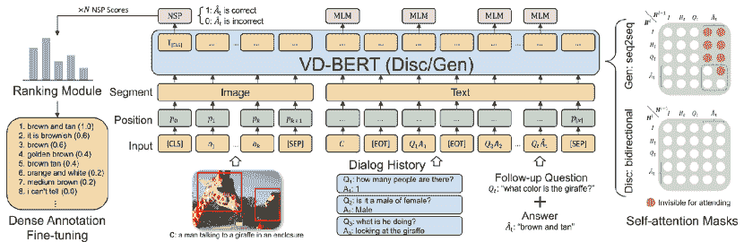

图 16：VD-BERT 的架构，最先进的视觉对话系统（Wang et al.，2020f）

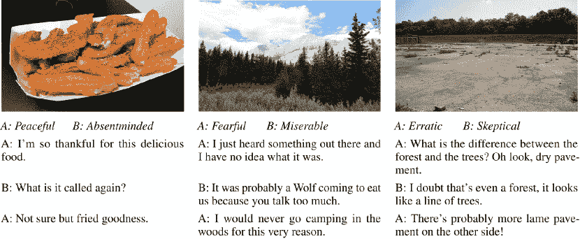

图 17：来自 IMAGE-CHAT 数据集的三个样本（Shuster et al.，2020）

视觉对话可以被视为一个多步骤的推理过程，涉及一系列问题（Gan et al.，2019）。Gan et al.（2019）基于对话历史和给定的图像学习了问题的语义表示，并反复更新该表示。Shuster et al.（2019）提出了一组基于图像的任务并提供了强有力的基线。Wang et al.（2020f）使用了 R-CNN 作为图像编码器，并通过 VD-BERT 融合了视觉和对话模态。所提出的架构实现了多轮对话与图像之间的充分交互。所提出的架构在图 16 中展示了作为视觉对话任务的示例模型。

与基于图像的对话系统相比，基于视频的对话系统更有趣但也更具挑战性。Le 和 Hoi（2020）声称视频对话面临两个主要挑战。其一是视频中存在空间和时间特征，这增加了特征提取的难度。其二是视频对话特征跨越多个对话轮次，因此更加复杂。Le 和 Hoi（2020）应用了 GPT-2 模型，能够融合不同层次的多模态信息。同样，Le et al.（2019）构建了一个多模态变换网络，以整合来自不同模态的信息，并进一步应用了查询感知注意力，以从非文本模态中提取上下文相关特征。Le et al.（2020a）提出了一种双向时空学习（BiST），利用时间到空间和空间到时间的推理过程，能够适应视频中动态演变的语义。

一些研究者对对话历史在视觉对话中的有效性持不同意见。Takmaz 等人 (2020) 提出了许多表达方式在之前的回合中已经被提及，并基于图像和对话历史构建了一个视觉对话模型。他们进一步证明了当模型基于对话上下文时，能取得更好的性能。然而，Agarwal 等人 (2020) 认为尽管利用对话历史可以使视觉对话模型获得更好的结果，但实际上只有少部分案例从历史中受益。此外，他们还证明了现有的视觉对话评估指标促使了通用的回答。

视觉对话任务从基于预训练的学习中受益匪浅。NLP 预训练的流行引发了对多模态预训练的兴趣。VideoBERT (Sun et al., 2019b) 被广泛认可为多模态预训练领域的开创性工作。它是一个在视频帧特征和文本上进行预训练的模型。CBT (Sun et al., 2019a)，同样在视频-文本对上进行预训练，是 VideoBERT 的当代工作。对于视频表示学习，Miech et al. (2020) 使用了未标记的叙述影片。更多研究者将注意力集中在视觉-语言预训练上，受早期多模态预训练工作的启发。为了实现这一目标，主要有两种模型设计。一种是单流模型（Alberti et al., 2019; Chen et al., 2019d; Gan et al., 2020; Li et al., 2020a, 2019a, c; Su et al., 2019c; Zhou et al., 2020b）。例如，（Li et al., 2020a）使用 BERT 模型处理对象和词的串联，并用三项标准任务对其进行预训练。Chen et al. (2019d) 和 Qi et al. (2020) 提出了类似的方法，但使用了更多的预训练任务和更大的数据集。通过对抗训练技术，Gan et al. (2020) 进一步增强了模型。Su et al. (2019c) 采用了相同的架构，但结合了单模态数据，并对目标检测器进行了预训练。Huang et al. (2020d) 试图直接进入像素，而不是使用已识别的对象。Li et al. (2020c) 使用对象标签来改进跨模态对齐。Zhou et al. (2020b) 提出了一个单流模型，该模型同时学习字幕生成和 VQA 任务。另一种模型架构是双流模型（Lu et al., 2019a, 2020; Tan and Bansal, 2019; Yu et al., 2020）。Tan and Bansal (2019) 提出了一个具有协同注意力的双流模型，并仅使用领域内数据来训练模型。Lu et al. (2019a) 引入了一个具有更复杂协同注意力模型的类似架构，他们用领域外数据对其进行了预训练，而 Lu et al. (2020) 则通过多任务学习改进了 VilBERT。Yu et al. (2020) 最近在模型中添加了场景图，提升了性能。除了这些研究，Singh et al. (2020) 还考察了预训练数据集选择对下游任务性能的影响。

可视对话的标注工作繁重，因此相关数据集非常稀缺。最近，一些研究人员尝试解决数据不足的问题。Shuster 等人 (2020) 收集了一个数据集（IMAGE-CHAT，如图 17 所示），该数据集包含了基于图像的人际对话，其中发言者需要根据提供的情感氛围或风格进行角色扮演，因为这些特征的使用也是吸引力的重要因素。Kamezawa 等人 (2020) 构建了一个视觉基础的对话数据集。有趣的是，它还额外标注了对话者在图像中的视线位置，以提供对话者关注的内容。Cogswell 等人 (2020) 提出了在适应新任务时利用 VQA 数据的方法，减少了对昂贵的对话数据的需求。

## 5 评估方法

评估是对话系统研究的一个重要部分。它不仅是评估代理性能的一种方式，还可以作为学习框架的一部分，提供信号以促进学习（Bao 等人，2019a）。本节讨论了任务导向和开放领域对话系统的评估方法。

### 5.1 任务导向对话系统的评估方法

任务导向系统旨在完成任务，因此有更直接的指标来评估其性能，例如任务完成率和任务完成成本。一些评估方法还涉及诸如 BLEU 的指标，以将系统响应与人类响应进行比较，这将在后续讨论。此外，人为评估和用户模拟器能够提供真实的对话样本。

任务完成率是所有任务完成尝试中成功事件的比例。它衡量了对话系统的任务完成能力。例如，在电影票预订任务中，任务完成率是满足用户指定的所有要求的对话的比例，如电影时间、电影院位置、电影类型等。任务完成率已在许多任务导向对话系统中应用（Walker 等人，1997；Williams，2007；Peng 等人，2017）。此外，一些研究（Singh 等人，2002；Yih 等人，2015）使用了部分成功率。

任务完成成本是完成任务所需的资源。时间效率是属于任务完成成本的重要指标。在对话相关任务中，通常使用对话轮次来衡量时间效率，而在完成相同任务时，较少的对话轮次是更可取的。

人工评估为系统评估提供了用户对话和用户满意度评分。人工评估主要有两种形式。一种是通过众包平台招募人工来测试对话系统。众包工人与对话系统就预定义的任务进行对话，然后可以计算诸如任务完成率和任务完成成本等指标。另一种是在真实用户交互中计算评估指标，即在系统部署到实际使用中后进行评估。

用户模拟器基于预定义的规则或模型提供模拟用户对话。由于招募人工成本高且在系统成熟部署之前无法获得真实用户交互，用户模拟器能够以较低的成本提供任务导向的对话。用户模拟器有两种类型。一种是基于议程的模拟器（Schatzmann and Young, 2009; Li et al., 2016e; Ultes et al., 2017），它们仅通过预定义的用户目标作为用户消息来喂给对话系统，而不涉及表面实现。另一种是基于模型的模拟器（Chandramohan et al., 2011; Asri et al., 2016），它们利用语言模型在给定约束信息的情况下生成用户发言。

### 5.2 开放域对话系统的评估方法

开放域对话系统的评估一直是一个具有挑战性的问题。与任务导向系统不同，没有像任务完成率或任务完成成本这样的明确指标。在这些年里，为开放域对话系统（ODD）开发了人工和自动评估方法。许多研究（Ritter et al., 2011; Shang et al., 2015; Sordoni et al., 2015b）采用了人工评估与对话代理进行对话并评分。然而，人工评估并不是理想的方法，因为人工成本高且评估结果高度主观，因人而异。研究人员倾向于雇佣众包工人（Ritter et al., 2011; Shang et al., 2015; Sordoni et al., 2015b）或随机人员（Moon et al., 2019; Jung et al., 2020）进行人工评估，这两种方法都有两个主要缺点：1. 评估者组高度随机，不同知识水平或不同领域的人之间存在巨大差距。2. 尽管通过增加评估者人数可以减少个体偏见，但由于预算有限，评估者组不能太大（在上述文章中，人工评估者组的规模通常为 5-20 人）。因此，自动和客观的评估指标是理想的。通常，最近的研究中有两类自动评估指标：词汇重叠指标和神经网络指标。

基于词重叠的度量在机器翻译和摘要任务中被广泛使用，它们计算生成序列与真实序列之间的相似性。代表性的度量如 BLEU (Papineni 等人, 2002) 和 ROUGE (Lin, 2004) 是 n-gram 匹配度量。METEOR (Banerjee 和 Lavie, 2005) 在 BLEU 的基础上进一步提出了改进。它识别生成序列与真实序列之间的同义词和释义。Galley 等人 (2015) 通过利用响应的数值评分扩展了 BLEU。Liu 等人 (2016) 认为词重叠度量与人工评价的相关性不高。这些度量在机器翻译中有效，因为每个源句子都有一个真实值可供比较，而在对话中，一个用户消息可能对应多个可能的响应，因此如果仅计算词重叠度量，接受的响应可能会得到低分。

神经度量是由神经模型计算的度量。与基于词重叠的度量相比，神经方法在适应性方面提高了评估效果，但需要额外的训练过程。Su 等人 (2015) 使用了 RNN 和 CNN 模型来提取序列中的轮次级特征并给出评分。Tao 等人 (2018) 提出了 Ruber，这是一种结合了参考和非参考组件的自动度量。参考组件计算生成响应表示与真实值表示之间的相似性，而非参考组件则学习了一个评分模型来评估查询-响应对。Lowe 等人 (2017) 使用 RNN 学习对话话语的表示，然后计算生成响应与真实响应之间的点积作为评估得分。Kannan 和 Vinyals (2017) 和 Bruni 与 Fernandez (2017) 使用 GAN 框架的判别器来区分生成的响应和人类响应。如果生成的响应取得了高置信度得分，这表明它类似于人类响应，因此是期望的。

开放领域对话系统的评估目前是一个热门话题，许多研究者最近将目光投向了这一任务。一些论文介绍了两种或更多自定义评估指标，以便更好地进行评估，例如响应多样性、响应一致性、自然性、知识性、可理解性等，以研究“什么需要评估”。Bao 等人（2019a）通过设计两个指标来评估生成的响应。一个是信息量指标，用于计算回合中的信息利用情况。另一个是连贯性指标，通过 GRUs 预测，给定响应、上下文和背景作为输入。类似地，Akama 等人（2020）设计了评分函数来计算发言对的连贯性和内容相关性作为两个评估指标，并使用另一个融合函数来结合这些指标。Pang 等人（2020）在他们的自动评估框架中结合了四个指标：基于 GPT-2 的上下文连贯性指标；基于 GPT-2 的短语流畅性指标；基于 n-grams 的多样性指标；基于文本蕴含推理的逻辑自一致性指标。Mehri 和 Eskenazi（2020）提出了一种无参考评估指标。他们对响应进行标注，考虑以下质量：可理解性（0-1）、保持上下文（1-3）、自然性（1-3）、知识使用（0-1）、趣味性（1-3）、总体质量（1-5）。此外，还训练了一个变换器来计算这些标注对话的质量得分。

除了“评估什么”之外，还有大量研究“如何评估”的论文，这些论文更侧重于优化评估过程。Liang 等人 (2020) 提出了一个三阶段框架来去噪自我评分过程。他们首先通过自监督表示学习进行对话流异常检测，然后使用平滑的自报告用户评分对模型进行微调。最后，他们通过计算 Shapley 值执行去噪程序，并移除具有负值的样本。Zhao 等人 (2020a) 训练了 RoBERTa 作为响应评分器，以实现无参考和半监督评估。Sato 等人 (2020) 通过首先基于一个用户消息生成多个响应来构建测试集，然后进行人工评估，为每个响应标注分数，其中分数最高的响应被视为真实响应，其余的被视为虚假响应。对话系统进一步通过比较测试集上的响应选择准确性进行评估，其中计算了生成响应与候选响应之间的交叉熵损失以执行选择操作。同样，Sinha 等人 (2020) 训练了一个基于 BERT 的模型来区分真实和虚假响应，其中虚假响应是自动生成的。该模型还被用来预测基于对话上下文的响应评估分数。Huang 等人 (2020a) 认为响应不应仅仅基于表面特征进行评估，而是话题级特征更为重要。他们在评估框架中结合了常识图谱，以获得话题级图表示。话题级图表示和话语级表示被联合考虑，用于评估开放域对话系统生成响应的一致性。

排序也是一种有效评估对话系统的方法。Gao 等人 (2020b) 利用大规模的人类反馈数据，如点赞、点踩和回复，来训练一个基于 GPT-2 的响应排序器。因此，响应根据排序器给出的排名进行评估。Deriu 等人 (2020) 也通过排序来评估对话系统。他们提出了一个低成本的人类参与评估框架，其中不同的对话代理进行对话，人类的职责是标注生成的发言是否像人类一样。通过比较其响应被评判为人类响应的回合数来评估系统。

## 6 数据集

数据集是对话系统研究中最重要的组成部分之一。如今，无论是任务导向还是开放领域对话系统的数据集都不够，特别是对于那些需要额外注释的任务（Novikova 等， 2017）。对于任务导向对话系统，数据可以通过两种主要方法收集。一种是通过众包平台招聘人工生成特定任务的对话。另一种是收集实际任务完成中的对话，如电影票预订。对于开放领域对话系统，除了在实际交互中收集的对话外，社交媒体也是一个重要的数据来源。一些社交媒体公司如 Twitter 和 Reddit 提供对小部分帖子 API 访问，但这些服务受到许多法律条款的限制，影响了研究的可重复性。因此，许多最新的对话系统工作收集自己的数据集用于训练和测试。

在本节中，我们回顾并分类这些数据集，并做了全面的总结。根据我们的最佳知识，表 LABEL:Datasets_for_Task-oriented_dialogue_systems 和 LABEL:Datasets_for_Open-domain_dialogue_systems 几乎涵盖了最近任务导向或开放领域对话系统中使用的所有可用数据集。

### 6.1 任务导向对话系统的数据集

表 3：任务导向对话系统的数据集

|  |  |  |  |
| --- | --- | --- | --- |
| Name | 描述 | 任务 | 来源 |
| Schema | 主要用于对话状态跟踪的数据集。 | 对话状态跟踪 | Rastogi 等 (2020) |
| MetaLWOZ | 通过众包平台收集，涵盖 227 个任务和 47 个领域。该数据集旨在用于未见领域的学习。 | 领域迁移 | Lee 等 (2019) |
| E2E | 餐厅领域的端到端对话生成数据集。数据通过众包方式收集。 | 端到端任务导向对话系统 | Novikova 等 (2017) |
| MSR-E2E | 包含涵盖 3 个领域的对话：电影票预订、餐厅预订和出租车预订。 | 端到端任务导向对话系统 | Li 等 (2018) |
| YELPNLG | 一个由跨越不同餐厅属性的发言组成的语料库。 | 自然语言生成 | Oraby 等 (2019) |
| Clinical Conversation data set | 包含医生和参与者之间的对话。 | 自然语言理解 | Du 等 (2019) |
| OOS | 一个用于意图检测的大规模数据集。 | 自然语言理解 | Larson 等 (2019) |
| ATIS | 一个由打算进行航班预订的人的语音通话组成的数据集。 | 自然语言理解；对话状态跟踪 | Tur 等 (2010) |
| MultiWOZ | 涵盖多领域的富有注释的人类书面对话。 | 任务导向对话 | Budzianowski 等 (2018) |
| SNIPS-NLU | 以众包方式收集的任务导向对话数据集，用于训练语音助手。 | 任务导向对话 | [`github.com/snipsco/nlubenchmark`](https://github.com/snipsco/nlubenchmark) |
| bAbI | 餐厅桌位预订对话。 | 任务导向对话 | Bordes 等 (2016) |
| JDC | 一个中文客服数据集，包括上下文-回应对。 | 任务导向对话 | [`www.jddc.jd.com`](https://www.jddc.jd.com) |
| UbuntuV2 | 包含通过 Ubuntu 问答论坛收集的对话。 | 任务导向对话 | Lowe 等 (2015) |
| MICROSOFT DIALOGUE CHALLENGE data set | 通过 Amazon Mechanical Turk 收集的任务导向数据集。 | 任务导向对话 | Li 等 (2018) |
| WOZ | 以众包方式收集的任务导向数据。 | 任务导向对话 | Wen 等 (2016c) |
| DSTC series | 多领域任务导向数据集。 | 任务导向对话 | [`www.microsoft.com/en-us/research/event/dialog-state-tracking-challenge/`](https://www.microsoft.com/en-us/research/event/dialog-state-tracking-challenge/) |
| SimDial | 跨多个领域的模拟对话。 | 任务导向对话 | Zhao 和 Eskenazi (2018) |
| SMD | 人与人之间的对话，涉及天气、导航和日程安排领域。 | 任务导向对话 | Eric 和 Manning (2017) |
| BANKING | 包含 77 个电子银行领域的问答对。 | 任务导向对话 | Henderson 等 (2019b) |
| Weather forecast | 天气领域的任务导向数据集。 | 任务导向对话 | Balakrishnan 等 (2019) |
| MedDialog-(EN,CN) | 医疗领域的大规模数据集，包括医生和患者之间的对话。 | 任务导向对话 | He 等 (2020b) |
| CamRest | 包含餐厅领域的人与人之间的多轮对话。 | 任务导向对话 | Wen 等 (2016a) |
| Taskmaster | 包含跨越 6 个领域的对话，平均对话轮次为 22.9。 | 任务导向对话 | Byrne 等 (2019) |
| Frames | 带有语义框架跟踪标注的对话数据集。 | 任务导向对话 | Asri 等 (2017) |
| JDDC | 一个中文客服数据集，包括上下文-回应对。 | 任务导向对话 | Chen 等 (2019a) |
| Court Debate Dataset | 法律领域的任务导向数据集，包含法庭辩论对话。 | 任务导向对话 | Ji 等 (2020) |
| TreeDST | 一个任务导向的数据集，带有树状结构的对话状态和代理行为标注。 | 任务导向对话 | Cheng 等 (2020) |
| RiSAWOZ | 包含 12 个领域的发言，并带有丰富的语义信息。 | 任务导向对话 | Quan 等 (2020) |
| Cambridge Restaurant | 一个任务导向的数据集，涉及餐厅预订领域。 | 任务导向对话 | Wen 等 (2016c) |
| SB-TOP | 一个任务导向的数据集，带有语义解析注释。涵盖 4 个领域：提醒、天气、呼叫和音乐。 | 任务导向对话 | Aghajanyan 等 (2020) |
| GSIM | 一个机器间任务导向的数据集。涵盖两个领域：餐厅桌位预订和电影票预订。 | 任务导向对话 | Shah 等 (2018) |
| SGD | 一个覆盖多个领域的模式引导数据集。 | 任务导向对话 | Rastogi 等 (2020) |
| cite-8K | 一个任务导向的数据集，收集于餐厅预订电话中。 | 任务导向对话 | Coope 等 (2020) |

### 6.2 开放域对话系统的数据集

表 4: 开放域对话系统的数据集

|  |  |  |  |
| --- | --- | --- | --- |
| 名称 | 描述 | 任务 | 来源 |
| 大规模对话解缠数据集 | 一个包含带有回复结构图的消息的数据集，用于对话解缠。 | 对话解缠 | Kummerfeld 等 (2018) |
| DuConv | 收集于对话引导者和对话跟随者之间的对话。 | 对话主题 | Wu 等 (2019c) |
| PERSUASION FOR GOOD | 一个以话题为导向的数据集，带有说服策略的注释。 | 对话主题 | Wang 等 (2019b) |
| MutualFriends | 一个以话题为导向的数据集，基于机器人间的策略对话。 | 对话主题 | He 等 (2017) |
| SAMSum | 一个大规模的对话摘要数据集。 | 对话主题 | Gliwa 等 (2019) |
| OpenDialKG | 它由两个代理之间的对话组成，每个对话对应一个知识图谱路径注释。 | 对话主题；对话推理 | Moon 等 (2019) |
| doc2dial | 一个数据集，包含带有目标和相关文档的对话。 | 对话主题；知识基础系统 | Feng 等 (2020c) |
| DialEdit | 一个为通过对话语言指令进行图像编辑而构建的数据集。 | 对话图像编辑 | Manuvina-kurike 等 (2018) |
| CHART DIALOGS | 一个包含描述 matplotlib 绘图特征的对话的数据集。 | 对话绘图 | Shao 和 Nakashole (2020) |
| CONAN | 一个多语言的数据集，用于处理仇恨言论。 | 对话分类 | Chung 等 (2019) |
| Dialogue NLI | 一个 NLI 数据集，句子带有蕴涵（E）、中立（N）或矛盾（C）的注释。 | 对话推理 | Welleck 等 (2018) |
| MuTual | 一个对话推理数据集，包含英语听力理解考试。 | 对话推理 | Cui 等人 (2020) |
| RST-DT | 包含来自 385 篇新闻文章的样本，这些样本标注了对话特征。 | 话语解析 | Carlson 等人 (2002) |
| NLPCC | 一个包含情感分类数据的数据集。 | 具同理心的回应 | [`tcci.ccf.org.cn/nlpcc.php`](http://tcci.ccf.org.cn/nlpcc.php) |
| MELD | 一个包含情感注释的多方对话数据集。 | 具同理心的回应 | Poria 等人 (2019) |
| EMPATHETIC DIALOGUES | 一个包含标注了情感标签的对话的数据集。 | 具同理心的回应 | Rashkin 等人 (2018) |
| IEMOCAP | 包含多方对话。每个对话标注了情感标签。 | 具同理心的回应 | Busso 等人 (2008) |
| EmoryNLP | 从《老友记》电视剧中收集，标注了情感标签。 | 具同理心的回应 | Zahiri 和 Choi (2017) |
| MojiTalk | 一个大规模的数据集，来自 Twitter，包含表情符号。 | 具同理心的回应 | Zhou 和 Wang (2017) |
| CBET | 一个对话数据集，标注了九种情感标签：惊讶、愤怒、爱、悲伤、喜悦、恐惧、内疚、厌恶和感激。 | 具同理心的回应 | Yadollahi 等人 (2017) |
| Stanford Politeness Corpus | 一个标注了礼貌标签的对话数据集。 | 具同理心的回应 | Danescu-Niculescu-Mizil 等人 (2013) |
| AIT-2018 | 收集自 SemEval-2018 任务 1：推文中的情感。 | 具同理心的回应 | Mohammad 等人 (2018) |
| EMOTyDA | 一个包含多方对话的短视频数据集，每个视频标注了相应的情感。 | 具同理心的回应；视觉对话 | Saha 等人 (2020) |
| Wizard of Wikipedia | 一个大规模的数据集，包含以维基百科知识为基础的对话。 | 知识驱动系统 | Dinan 等人 (2018) |
| CMU DoG | 一个包含以维基百科文章为基础的流行电影对话的数据集。 | 知识驱动系统 | Zhou 等人 (2018) |
| Holl-E | 包含基于文档的对话。 | 知识驱动系统 | Moghe 等人 (2018) |
| Interview | 一个包含以采访形式进行的多方对话的数据集。 | 知识驱动系统 | Majumder 等人 (2020b) |
| Curiosity | 一个开放域数据集，标注了现有用户知识和对话行为，同时以维基百科为基础。 | 知识驱动系统 | Rodriguez 等人 (2020) |
| KdConv | 一个中文知识驱动对话数据集。 | 知识驱动系统 | Zhou 等人 (2020a) |
| ELI5 | 一个基于检索文档的问答数据集。 | 知识驱动系统 | Fan 等人 (2019) |
| Topical Chat | 一个知识驱动的数据集，涵盖八个不同的话题。 | 知识驱动系统；对话话题 | Gopalakrishnan 等 (2019) |
| WHERE ARE YOU? | 带有定位信息注释的对话数据集。 | 定位对话 | Hahn 等 (2020) |
| MMD | 一个包含销售代理和购物者之间对话的多模态数据集。 | 多模态对话 | Saha 等 (2018) |
| OpenSubtitles | 一个由电影字幕组成的多语言数据集，包含约 80 亿个词汇。 | 开放领域对话 | Tiedemann (2012) |
| NTCIR | 从新浪微博收集的社交媒体数据集。 | 开放领域对话 | [`research.nii.ac.jp/ntcir/data/data-en.html`](http://research.nii.ac.jp/ntcir/data/data-en.html) |
| Twitter | 从 Twitter 收集的社交媒体数据集。 | 开放领域对话 | [`github.com/Marsan-Ma-zz/chatcorpus`](https://github.com/Marsan-Ma-zz/chatcorpus) |
| 豆瓣对话语料库 | 从豆瓣收集的社交媒体数据集。 | 开放领域对话 | 张等 (2018d) |
| 电子商务对话语料库 | 包含淘宝上客户与客服之间的对话。 | 开放领域对话 | 张等 (2018d) |
| REDDIT | 从 REDDIT 收集的社交媒体数据集。 | 开放领域对话 | Henderson 等 (2019a) |
| STC-SeFun | 从贴吧、知道、豆瓣和微博收集的社交媒体数据集。 | 开放领域对话 | Bi 等 (2019) |
| DailyDialog | 包含日常对话的数据集，注释有对话意图和情感信息。 | 开放领域对话 | Li 等 (2017c) |
| PDTB | 带有话语关系注释的对话数据集。 | 开放领域对话 | Prasad 等 (2008) |
| Luna | 带有意大利语关系注释的对话数据集。 | 开放领域对话 | Tonelli 等 (2010) |
| Edina-DR | 带有英语关系注释的对话数据集，基于 Luna 数据集。 | 开放领域对话 | Ma 等 (2019) |
| 康奈尔电影对话语料库 | 通过 IMDB 数据库收集的对话数据集。 | 开放领域对话 | Danescu-Niculescu-Mizil 和 Lee (2011) |
| Reddit 电影对话数据集 | 从 Reddit 收集的电影对话数据集。 | 开放领域对话 | Liu 等 (2020a) |
| LIGHT | 一个具有可配置文本冒险环境的对话数据集。 | 开放领域对话 | Urbanek 等 (2019) |
| This American Life | 在长篇说明性播客集里收集的媒体对话数据集。 | 开放领域对话 | Mao 等 (2020) |
| RadioTalk | 从广播稿本中收集的媒体对话数据集。 | 开放领域对话 | Beeferman 等 (2019) |
| French EPAC | 从新闻中收集的媒体对话数据集。 | 开放领域对话 | Esteve 等人 (2010) |
| TREC Conversational Assistance | 一个涵盖 30 个对话主题的开放领域数据集。 | 开放领域对话 | Dalton 等人 (2020) |
| Search as a Conversation | 一个用于与搜索引擎对话的数据集。 | 开放领域对话 | Ren 等人 (2020) |
| Amazon Alexa Prize Competition | 一个包含 Amazon Alexa 客户和冠军聊天机器人 Gunrock 之间真实对话的数据集。 | 开放领域对话 | Ram 等人 (2018) |
| SwitchBoard | 一个包含英语电话对话的开放领域数据集。 | 开放领域对话 | Jurafsky (1997) |
| Zhihu | 一个包含帖子和评论的中文社交媒体数据集。 | 开放领域对话 | [`www.zhihu.com`](https://www.zhihu.com) |
| SPOLIN | 一个包含“是”和“否”对话的数据集。 | 开放领域对话 | Cho 和 May (2020) |
| CRD3 | 一个从角色扮演游戏《地下城与龙》中收集的数据集。 | 开放领域对话 | Rameshkumar 和 Bailey (2020) |
| Baidu Zhidao | 一个包含帖子和评论的中文社交媒体数据集。 | 开放领域对话 | [`zhidao.baidu.com/`](https://zhidao.baidu.com/) |
| Webis Gmane Email Corpus 2019 | 一个从 153M 邮件中收集的对话数据集。 | 开放领域对话 | Bevendorff 等人 (2020) |
| LibreSpeech Corpus | 包含 500 小时的演讲，由 1252 名参与者生成。 | 开放领域对话 | Panayotov 等人 (2015) |
| Motivational Interviewing | 关于会话心理治疗的对话数据集。 | 开放领域对话 | Tanana 等人 (2016) |
| SubTle Corpus | 联系 Ameixa 获取数据。 | 开放领域对话 | Lubis 等人 (2018) |
| TED-LIUM | TED 演讲独白。 | 开放领域对话 | Fung 等人 (2016) |
| ECG NLPCC 2017 Data | 从微博中提取的对话数据集。 | 开放领域对话 | Huang 等人 (2018) |
| SEMEVAL15 | 一个通过 Amazon Mechanical Turk 提供答案质量注释的 QA 数据集。 | 问答系统 | Nakov 等人 (2019) |
| AMAZONQA | 一个解决一对多问题的 QA 数据集。 | 问答系统 | Wan 和 McAuley (2016) |
| TGIF-QA | 一个基于视频的 QA 数据集。 | 问答系统 | Jang 等人 (2017) |
| QuAC | 一个包含 14K QA 对话的 QA 数据集。 | 问答系统 | Choi 等人 (2018) |
| SQuAD | 一个通过众包方式收集的问答数据集。 | 问答系统 | Rajpurkar 等人 (2018) |
| LIF | 一个基于 QuAC 构建的数据集。 | 问答系统 | Kundu 等人 (2020) |
| Yelp | 由 Yelp 数据集挑战中的客户评论组成。 | 回复检索 | Tang 等人 (2015) |
| Debates | 数据集包括关于国会法案的辩论。 | 回答检索 | Thomas et al. (2006) |
| PERSONACHAT | 提供了代理人的个人信息和用户的背景。 | 发言者一致性和个性回应 | Zhang et al. (2018b) |
| KvPI | 包含回应与相应键值配置文件之间的一致性注释。 | 发言者一致性和个性回应 | Song et al. (2020b) |
| ConvAI2 | 一个基于 Persona-Chat 构建的数据集，每个对话都有来自包含人物候选集的配置文件。 | 发言者一致性和个性回应 | Dinan et al. (2019) |
| PEC | 一个带有人物标签的开放域数据集。 | 发言者一致性和个性回应；同理回应 | Zhong et al. (2020) |
| GuessWhat?! | 一个关于物体识别的两人游戏的视觉对话数据集。 | 视觉对话 | De Vries et al. (2017) |
| VisDial | 一个视觉对话数据集，其图像来源于 COCO 数据集。 | 视觉对话 | [`visualdialog.org/data`](https://visualdialog.org/data) |
| AVSD | 一个视频为基础的对话数据集。 | 视觉对话 | Yoshino et al. (2018) |
| VFD | 一个带有独特注视位置的视觉对话数据集。 | 视觉对话 | Kamezawa et al. (2020) |
| PhotoBook | 一个用于任务导向视觉对话的数据集。 | 视觉对话 | Haber et al. (2019) |
| IGC | 一个包含讨论给定图像的对话的数据集。 | 视觉对话 | Mostafazadeh et al. (2017) |
| Image-Chat | 包含基于图像的对话。这些对话还带有个性注释。 | 视觉对话；发言者一致性和个性回应 | Shuster et al. (2018) |

## 7 结论与趋势

越来越多的研究者正在研究对话任务。对话任务受欢迎的一个因素是工业和日常生活中对聊天机器人的需求不断增加。像苹果的 Siri、微软的 Cortana、Facebook M、谷歌助手和亚马逊的 Alexa 等工业代理为人们的生活带来了极大的便利。另一个原因是大量的自然语言数据以对话形式存在，这也促进了对话研究的努力。

在本文中，我们从模型和系统类型两个角度讨论了对话系统。对话系统是一项复杂但充满前景的任务，因为它涉及到代理与人类之间整个交流过程。近年来的研究工作显示，无论是在任务导向的还是开放领域的对话系统中，都有一种压倒性的偏好倾向于神经方法。神经方法优于传统的规则基础方法、统计方法和机器学习方法，因为神经模型具有更强的拟合能力，并且需要更少的手工特征工程。

我们系统地总结和分类了对话系统以及其他对话相关任务的最新工作。我们希望这些讨论和见解能提供该领域最前沿的全面图景，并为进一步的研究铺平道路。最后，我们讨论了一些从所审阅的工作中可能出现的研究趋势：

##### 多模态对话系统

世界是多模态的，人类通过视觉、听觉、嗅觉、味觉和触觉等多个感官来观察它。在对话交互中，人类往往不仅根据文本做出回应，还会根据他们看到和听到的内容做出反应。因此，一些研究人员认为聊天机器人也应该具备从不同模态融合信息的能力。最近有一些工作试图建立多模态对话系统（Le 等，2019；Chauhan 等，2019；Saha 等，2020；Singla 等，2020；Young 等，2020），但这些系统仍然远未成熟。

##### 多任务对话系统

对话系统被分为任务导向型和开放领域型。这种研究边界已经存在很长时间，因为任务导向的对话系统涉及对话状态，这限制了解码过程。然而，端到端任务导向对话系统和知识基础开放领域系统的研究工作提供了一种将这两类系统融合到一个框架甚至一个模型中的可能性。这种融合的对话系统同时作为助手和聊天机器人进行工作。

##### 互联网语料库探索

在第六部分中，我们回顾了许多对话系统训练的数据集。然而，数据仍远未足够以训练一个完美的对话系统。许多学习技术被设计用来缓解这个问题，如强化学习、元学习、迁移学习和主动学习。但许多研究忽略了一个重要的信息来源，即互联网上的对话语料库。互联网上有大量的对话语料库，但人们无法访问原始语料，因为其中许多是杂乱无章的。未来，对话代理应能够实时探索互联网上有用的语料进行训练。这可以通过标准化在线语料的访问及其相关法律条款来实现。此外，实时对话语料探索可以作为一个独立的任务值得研究。

##### 用户建模

用户建模是对话生成（Gür 等人，2018；Serras 等人，2019）和对话系统评估（Kannan 和 Vinyals，2017）中的一个热门话题。基本上，用户建模模块试图模拟真实用户的决策和行为。它基于对话状态或对话历史做出决策。在对话生成任务中，建模用户帮助代理基于背景信息甚至说话习惯进行更连贯的对话。除此之外，一个成熟的用户模拟器可以提供一个互动的训练环境，减少对标注训练样本的依赖。在对话系统评估任务中，用户模拟器提供用户消息以测试对话代理。更新的用户模拟器还提供关于对话代理生成的回应的反馈。然而，用户建模是一项具有挑战性的任务，因为无论是显式的用户模拟还是隐式的用户建模，实际上都与回应生成同样困难。由于回应生成系统尚不完美，用户建模仍然是一个值得研究的课题。

##### 带有长期目标的对话生成

我们日常的大多数对话都是没有目的的闲聊。然而，也有不少场景下我们有意引导对话内容以实现特定目标。当前的开放领域对话系统往往在没有长期目标的情况下建模，这显得智能程度不够。一些近期的研究应用了强化学习策略，以建模长期奖励，鼓励代理在对话中实现长期目标，例如徐等人（2020a）的工作。这一主题将引导强人工智能的发展，对于一些现实应用，如谈判或讲故事的聊天机器人，是非常有用的。

## 致谢

本研究/项目得到了 A*STAR 产业对接基金 (LOA 奖项 I1901E0046) 的支持。

## 参考文献

+   Agarwal 等人 (2020) Agarwal S, Bui T, Lee JY, Konstas I, Rieser V (2020) 视觉对话中的历史：我们真的需要它吗？arXiv 预印本 arXiv:200507493

+   Aghajanyan 等人 (2020) Aghajanyan A, Maillard J, Shrivastava A, Diedrick K, Haeger M, Li H, Mehdad Y, Stoyanov V, Kumar A, Lewis M, 等 (2020) 对话语义解析。arXiv 预印本 arXiv:200913655

+   Akama 等人 (2020) Akama R, Yokoi S, Suzuki J, Inui K (2020) 通过连接性和内容相关性过滤噪声对话语料库。arXiv 预印本 arXiv:200414008

+   Alberti 等人 (2019) Alberti C, Ling J, Collins M, Reitter D (2019) 在视觉问答中融合检测到的文本对象。arXiv 预印本 arXiv:190805054

+   Aloysius 和 Geetha (2017) Aloysius N, Geetha M (2017) 深度卷积神经网络的综述。在：2017 年国际通信与信号处理会议 (ICCSP)，IEEE，第 0588–0592 页

+   Annervaz 等人 (2018) Annervaz K, Chowdhury SBR, Dukkipati A (2018) 超越数据集的学习：用于自然语言处理的知识图谱增强神经网络。arXiv 预印本 arXiv:180205930

+   Arora 等人 (2013) Arora S, Batra K, Singh S (2013) 对话系统：简要回顾。arXiv 预印本 arXiv:13064134

+   Asghar 等人 (2016) Asghar N, Poupart P, Jiang X, Li H (2016) 对话生成的深度主动学习。arXiv 预印本 arXiv:161203929

+   Asri 等人 (2016) Asri LE, He J, Suleman K (2016) 用于口语对话系统的序列到序列模型。arXiv 预印本 arXiv:160700070

+   Asri 等人 (2017) Asri LE, Schulz H, Sharma S, Zumer J, Harris J, Fine E, Mehrotra R, Suleman K (2017) Frames：一个用于向目标导向对话系统中添加记忆的语料库。arXiv 预印本 arXiv:170400057

+   Aubert 等人 (1994) Aubert X, Dugast C, Ney H, Steinbiss V (1994) 华尔街日报数据的大词汇量连续语音识别。在：ICASSP’94 会议论文集。IEEE 国际声学、语音与信号处理会议，IEEE，第 2 卷，第 II–129 页

+   Bahdanau 等人 (2014) Bahdanau D, Cho K, Bengio Y (2014) 通过联合学习对齐和翻译的神经机器翻译。arXiv 预印本 arXiv:14090473

+   Baheti 等人 (2020) Baheti A, Ritter A, Small K (2020) 对话问答的流畅响应生成。arXiv 预印本 arXiv:200510464

+   Balakrishnan 等人 (2019) Balakrishnan A, Rao J, Upasani K, White M, Subba R (2019) 基于任务导向对话的组合表示的神经自然语言生成的约束解码。arXiv 预印本 arXiv:190607220

+   Banerjee 和 Lavie (2005) Banerjee S, Lavie A (2005) Meteor：一种自动化的机器翻译评估指标，与人工评估的相关性有所提升。在：ACL 研讨会论文集，讨论机器翻译和/或总结的内在和外在评估指标，第 65–72 页

+   Bao 等（2019a）Bao S, He H, Wang F, Lian R, Wu H (2019a) 了解彼此更多：通过复合评估发展对话策略。arXiv 预印本 arXiv:190600549

+   Bao 等（2019b）Bao S, He H, Wang F, Wu H, Wang H (2019b) Plato：具有离散潜变量的预训练对话生成模型。arXiv 预印本 arXiv:191007931

+   Bapna 等（2017）Bapna A, Tur G, Hakkani-Tur D, Heck L (2017) 面向领域扩展的零样本框架语义解析。arXiv 预印本 arXiv:170702363

+   Beeferman 等（2019）Beeferman D, Brannon W, Roy D (2019) Radiotalk：一个大规模广播电台转录语料库。arXiv 预印本 arXiv:190707073

+   Bengio 等（1994）Bengio Y, Simard P, Frasconi P (1994) 用梯度下降学习长期依赖性是困难的。IEEE 神经网络事务 5(2):157–166

+   Bevendorff 等（2020）Bevendorff J, Al Khatib K, Potthast M, Stein B (2020) 大规模爬取和预处理邮件列表用于对话分析。 In: 第 58 届计算语言学协会年会论文集，第 1151–1158 页

+   Bi 等（2019）Bi W, Gao J, Liu X, Shi S (2019) 面向短文本对话的细粒度句子功能。arXiv 预印本 arXiv:190710302

+   Bordes 等（2013）Bordes A, Usunier N, Garcia-Duran A, Weston J, Yakhnenko O (2013) 翻译嵌入以建模多关系数据。 In: 神经信息处理系统（NIPS），第 1–9 页

+   Bordes 等（2014）Bordes A, Glorot X, Weston J, Bengio Y (2014) 一种用于学习多关系数据的语义匹配能量函数。机器学习 94(2):233–259

+   Bordes 等（2016）Bordes A, Boureau YL, Weston J (2016) 端到端目标导向对话学习。arXiv 预印本 arXiv:160507683

+   Bosselut 等（2019）Bosselut A, Rashkin H, Sap M, Malaviya C, Celikyilmaz A, Choi Y (2019) Comet：用于自动知识图谱构建的常识变换器。arXiv 预印本 arXiv:190605317

+   Bouchacourt 和 Baroni（2019）Bouchacourt D, Baroni M (2019) Miss tools and mr fruit：代理学习物体可用性的紧急通信。arXiv 预印本 arXiv:190511871

+   Boyd 等（2020）Boyd A, Puri R, Shoeybi M, Patwary M, Catanzaro B (2020) 大规模多演员生成对话建模。arXiv 预印本 arXiv:200506114

+   Bruni 和 Fernandez（2017）Bruni E, Fernandez R (2017) 开放领域对话生成的对抗评估。 In: 第 18 届 SIGdial 会议论文集，第 284–288 页

+   Budzianowski 等（2018）Budzianowski P, Wen TH, Tseng BH, Casanueva I, Ultes S, Ramadan O, Gašić M (2018) Multiwoz–一个大规模多领域的 Wizard-of-Oz 数据集，用于任务导向对话建模。arXiv 预印本 arXiv:181000278

+   Busso 等（2008）Busso C, Bulut M, Lee CC, Kazemzadeh A, Mower E, Kim S, Chang JN, Lee S, Narayanan SS (2008) Iemocap：交互式情感二人运动捕捉数据库。语言资源与评估 42(4):335–359

+   Byrne 等（2019）伯恩·B、克里希纳穆尔西·K、桑卡·C、尼拉坎坦·A、达克沃斯·D、亚武兹·S、古德里奇·B、杜比·A、塞迪尔尼克·A、金·KY（2019）Taskmaster-1：迈向现实和多样化的对话数据集。arXiv 预印本 arXiv:190905358

+   Cahill 等（1999）卡希尔·L、多兰·C、埃文斯·R、梅利什·C、帕伊瓦·D、里普·M、斯科特·D、蒂珀·N（1999）寻找 NLG 系统的参考架构。第 7 届欧洲自然语言生成研讨会论文集，Citeseer，pp 77–85

+   Campagna 等（2020）坎帕尼亚·G、福里齐亚兹·A、莫拉德沙希·M、拉姆·MS（2020）使用合成数据进行零样本迁移学习以进行多领域对话状态跟踪。arXiv 预印本 arXiv:200500891

+   Cao 等（2019）曹静、塔纳娜·M、伊梅尔·ZE、普瓦特拉斯·E、阿特金斯·DC、斯里库玛·V（2019）观察治疗中的对话：分类和预测行为代码。arXiv 预印本 arXiv:190700326

+   Carlson 等（2002）卡尔森·L、奥库罗夫斯基·ME、马尔库·D（2002）RST 语篇树库。语言数据联盟，宾夕法尼亚大学

+   Chandramohan 等（2011）钱德拉莫汉·S、盖斯特·M、勒费弗尔·F、皮特昆·O（2011）在对话系统中使用逆向强化学习的用户模拟。第十二届国际语音通信协会年会

+   Chauhan 等（2019）乔汉·H、费尔道斯·M、埃克巴尔·A、巴塔查尔亚·P（2019）在多模态对话系统中的序数和属性感知响应生成。收录于第 57 届计算语言学协会年会论文集，pp 5437–5447

+   Chen 等（2017a）陈华、刘鑫、尹东、唐江（2017a）对话系统调查：最新进展与新前沿。ACM Sigkdd Explorations Newsletter 19(2):25–35

+   Chen 和 Yang（2020）陈静、杨达（2020）具有对话结构的多视角序列到序列模型用于抽象对话摘要。arXiv 预印本 arXiv:201001672

+   Chen 等（2020a）陈静、张锐、毛逸、徐俊（2020a）用于多领域对话状态生成的并行交互网络。arXiv 预印本 arXiv:200907616

+   Chen 等（2017b）陈林、周晓、常聪、杨锐、于凯（2017b）基于代理意识的 Dropout DQN 用于安全高效的在线对话策略学习。收录于 2017 年自然语言处理经验方法会议论文集，pp 2454–2464

+   Chen 等（2019a）陈敏、刘睿、沈亮、袁爽、周杰、吴越、贺鑫、周博（2019a）JDDC 语料库：一个大规模多轮中文对话数据集，用于电子商务客服。arXiv 预印本 arXiv:191109969

+   Chen 等（2019b）陈伟、陈静、秦鹏、严旭、王伟瑜（2019b）通过层次化解耦自注意力生成语义条件对话响应。arXiv 预印本 arXiv:190512866

+   Chen 等（2019c）陈晓、徐俊、徐波（2019c）用于任务导向对话响应生成的工作记忆模型。收录于第 57 届计算语言学协会年会论文集，pp 2687–2693

+   Chen 等（2020b）Chen X, Meng F, Li P, Chen F, Xu S, Xu B, Zhou J（2020b）弥合先验知识与后验知识选择的差距用于知识驱动的对话生成。在：2020 年自然语言处理经验方法会议（EMNLP）论文集，第 3426–3437 页

+   Chen 等（2019d）Chen YC, Li L, Yu L, El Kholy A, Ahmed F, Gan Z, Cheng Y, Liu J（2019d）Uniter：学习通用的图像-文本表示。ECCV

+   Chen 等（2016）Chen YN, Hakkani-Tür D, Tür G, Gao J, Deng L（2016）具有知识传递的端到端记忆网络用于多轮口语理解。在：Interspeech，第 3245–3249 页

+   Cheng 等（2020）Cheng J, Agrawal D, Alonso HM, Bhargava S, Driesen J, Flego F, Kaplan D, Kartsaklis D, Li L, Piraviperumal D, 等（2020）对话状态跟踪的对话语义解析。arXiv 预印本 arXiv:201012770

+   Cho 和 May（2020）Cho H, May J（2020）用即兴对话来扎根对话。arXiv 预印本 arXiv:200409544

+   Cho 等（2014a）Cho K, Van Merriënboer B, Bahdanau D, Bengio Y（2014a）神经机器翻译的特性：编码器-解码器方法。arXiv 预印本 arXiv:14091259

+   Cho 等（2014b）Cho K, Van Merriënboer B, Gulcehre C, Bahdanau D, Bougares F, Schwenk H, Bengio Y（2014b）使用 rnn 编码器-解码器学习短语表示用于统计机器翻译。arXiv 预印本 arXiv:14061078

+   Choi 等（2018）Choi E, He H, Iyyer M, Yatskar M, Yih Wt, Choi Y, Liang P, Zettlemoyer L（2018）Quac：上下文中的问题回答。arXiv 预印本 arXiv:180807036

+   Chung 等（2014）Chung J, Gulcehre C, Cho K, Bengio Y（2014）对序列建模的门控递归神经网络的经验评估。arXiv 预印本 arXiv:14123555

+   Chung 等（2019）Chung YL, Kuzmenko E, Tekiroglu SS, Guerini M（2019）Conan–通过细分来源的反叙事：一个多语言的数据集用于对抗网络仇恨言论。arXiv 预印本 arXiv:191003270

+   Cogswell 等（2020）Cogswell M, Lu J, Jain R, Lee S, Parikh D, Batra D（2020）无对话数据的对话：从 vqa 数据中学习视觉对话代理。arXiv 预印本 arXiv:200712750

+   Conneau 等（2016）Conneau A, Schwenk H, Barrault L, Lecun Y（2016）非常深度的卷积网络用于文本分类。arXiv 预印本 arXiv:160601781

+   Coope 等（2020）Coope S, Farghly T, Gerz D, Vulić I, Henderson M（2020）Span-convert：使用预训练对话表示进行少量样本的跨度提取。arXiv 预印本 arXiv:200508866

+   Csáky 等（2019）Csáky R, Purgai P, Recski G（2019）通过基于熵的数据过滤改进神经对话模型。arXiv 预印本 arXiv:190505471

+   Cui 等（2020）Cui L, Wu Y, Liu S, Zhang Y, Zhou M（2020）Mutual：一个用于多轮对话推理的数据集。arXiv 预印本 arXiv:200404494

+   Dai 等（2020）Dai Y, Li H, Tang C, Li Y, Sun J, Zhu X（2020）《学习低资源的端到端目标导向对话以实现快速和可靠的系统部署》。发表于：第 58 届计算语言学协会年会论文集，第 609–618 页

+   Dai 等（2019）Dai Z, Yang Z, Yang Y, Carbonell J, Le QV, Salakhutdinov R（2019）《Transformer-xl：超越固定长度上下文的注意力语言模型》。arXiv 预印本 arXiv:190102860

+   Dalton 等（2020）Dalton J, Xiong C, Callan J（2020）《Trec cast 2019：对话助手轨道概述》。arXiv 预印本 arXiv:200313624

+   Danescu-Niculescu-Mizil 和 Lee（2011）Danescu-Niculescu-Mizil C, Lee L（2011）《想象对话中的变色龙：理解对话中语言风格协调的新方法》。arXiv 预印本 arXiv:11063077

+   Danescu-Niculescu-Mizil 等（2013）Danescu-Niculescu-Mizil C, Sudhof M, Jurafsky D, Leskovec J, Potts C（2013）《一种计算方法的礼貌研究及其在社会因素中的应用》。arXiv 预印本 arXiv:13066078

+   De Vries 等（2017）De Vries H, Strub F, Chandar S, Pietquin O, Larochelle H, Courville A（2017）《猜猜是什么？！通过多模态对话进行视觉对象发现》。发表于：IEEE 计算机视觉与模式识别会议论文集，第 5503–5512 页

+   Deng 等（2012）Deng L, Tur G, He X, Hakkani-Tur D（2012）《使用内核深度凸网络和端到端学习进行口语语言理解》。发表于：2012 年 IEEE 口语语言技术研讨会（SLT），IEEE，第 210–215 页

+   Deoras 和 Sarikaya（2013）Deoras A, Sarikaya R（2013）《基于深度信念网络的语义标注器用于口语语言理解》。发表于：Interspeech，第 2713–2717 页

+   Deriu 等（2020）Deriu J, Tuggener D, von Däniken P, Campos JA, Rodrigo A, Belkacem T, Soroa A, Agirre E, Cieliebak M（2020）《识别机器人：一种用于对话系统评估的鲁棒且高效的框架》。arXiv 预印本 arXiv:201002140

+   Devlin 等（2018）Devlin J, Chang MW, Lee K, Toutanova K（2018）《BERT：用于语言理解的深度双向变换器的预训练》。arXiv 预印本 arXiv:181004805

+   Dhingra 等（2016）Dhingra B, Li L, Li X, Gao J, Chen YN, Ahmed F, Deng L（2016）《面向信息访问的对话代理的端到端强化学习》。arXiv 预印本 arXiv:160900777

+   Dinan 等（2018）Dinan E, Roller S, Shuster K, Fan A, Auli M, Weston J（2018）《维基百科的魔法师：知识驱动的对话代理》。arXiv 预印本 arXiv:181101241

+   Dinan 等（2019）Dinan E, Logacheva V, Malykh V, Miller A, Shuster K, Urbanek J, Kiela D, Szlam A, Serban I, Lowe R 等（2019）《第二届对话智能挑战赛（convai2）》。arXiv 预印本 arXiv:190200098

+   Dong 等（2017）Dong L, Huang S, Wei F, Lapata M, Zhou M, Xu K（2017）从属性中生成产品评价的学习。载于：第 15 届计算语言学协会欧洲章节会议：卷 1，长篇论文，第 623–632 页

+   Du 等（2019）Du N, Chen K, Kannan A, Tran L, Chen Y, Shafran I（2019）从临床对话中提取症状及其状态。arXiv 预印本 arXiv:190602239

+   Du 和 Black（2019）Du W, Black AW（2019）提升对话回应生成。载于：第 57 届计算语言学协会年会论文集，第 38–43 页

+   Dušek 和 Jurčíček（2016a）Dušek O, Jurčíček F（2016a）一个上下文感知的自然语言生成器用于对话系统。arXiv 预印本 arXiv:160807076

+   Dušek 和 Jurčíček（2016b）Dušek O, Jurčíček F（2016b）通过深度语法树和字符串的序列到序列生成用于口语对话。arXiv 预印本 arXiv:160605491

+   Elder 等（2020）Elder H, O’Connor A, Foster J（2020）如何使神经自然语言生成在任务导向对话中与模板一样可靠。载于：2020 年自然语言处理实证方法会议（EMNLP）论文集，第 2877–2888 页

+   Elman（1990）Elman JL（1990）在时间中寻找结构。认知科学 14(2):179–211

+   Eric 和 Manning（2017）Eric M, Manning CD（2017）面向任务的对话中的键值检索网络。arXiv 预印本 arXiv:170505414

+   Esteve 等（2010）Esteve Y, Bazillon T, Antoine JY, Béchet F, Farinas J（2010）EPAC 语料库：法语广播新闻对话语音的手动和自动注释。载于：LREC，Citeseer

+   Fan 等（2019）Fan A, Jernite Y, Perez E, Grangier D, Weston J, Auli M（2019）Eli5：长篇问答。arXiv 预印本 arXiv:190709190

+   Fan 等（2014）Fan M, Zhou Q, Chang E, Zheng F（2014）基于过渡的知识图谱嵌入与关系映射属性。载于：第 28 届亚太语言、信息与计算会议论文集，第 328–337 页

+   Feldman 和 El-Yaniv（2019）Feldman Y, El-Yaniv R（2019）开放域问答中的多跳段落检索。arXiv 预印本 arXiv:190606606

+   Feng 等（2019）Feng J, Tao C, Wu W, Feng Y, Zhao D, Yan R（2019）学习一个匹配模型与共教学用于基于检索的对话系统中的多轮回应选择。arXiv 预印本 arXiv:190604413

+   Feng 等（2020a）Feng S, Chen H, Li K, Yin D（2020a）Posterior-gan：通过后验生成对抗网络实现信息丰富且连贯的回应生成。载于：AAAI 人工智能会议论文集，第 34 卷，第 7708–7715 页

+   Feng 等（2020b）Feng S, Ren X, Chen H, Sun B, Li K, Sun X（2020b）通过模仿隐式场景来规范对话生成。arXiv 预印本 arXiv:201001893

+   Feng 等人（2020c）Feng S, Wan H, Gunasekara C, Patel SS, Joshi S, Lastras LA（2020c）“doc2dial：一个目标导向的文档基础对话数据集。”arXiv 预印本 arXiv:201106623。

+   Ferracane 等人（2019）Ferracane E, Durrett G, Li JJ, Erk K（2019）“评估结构化文本表示中的话语。”arXiv 预印本 arXiv:190601472。

+   Ficler 和 Goldberg（2017）Ficler J, Goldberg Y（2017）“控制神经语言生成中的语言风格方面。”arXiv 预印本 arXiv:170702633。

+   Finn 等人（2017）Finn C, Abbeel P, Levine S（2017）“面向快速适应深度网络的模型无关元学习。”见于《国际机器学习会议》，PMLR，第 1126–1135 页。

+   Fung 等人（2016）Fung P, Dey A, Siddique FB, Lin R, Yang Y, Bertero D, Wan Y, Chan RHY, Wu CS（2016）“Zara：一个结合情感、情绪和个性识别的虚拟互动对话系统。”见于《COLING 2016：第 26 届计算语言学国际会议：系统演示》，第 278–281 页。

+   Galley 等人（2015）Galley M, Brockett C, Sordoni A, Ji Y, Auli M, Quirk C, Mitchell M, Gao J, Dolan B（2015）“deltableu：一种用于生成任务的判别性指标，具有内在多样的目标。”arXiv 预印本 arXiv:150606863。

+   Gan 等人（2019）Gan Z, Cheng Y, Kholy AE, Li L, Liu J, Gao J（2019）“通过递归双重注意力进行多步推理用于视觉对话。”arXiv 预印本 arXiv:190200579。

+   Gan 等人（2020）Gan Z, Chen YC, Li L, Zhu C, Cheng Y, Liu J（2020）“大规模对抗训练用于视觉和语言表示学习。”arXiv 预印本 arXiv:200606195。

+   Gangadharaiah 和 Narayanaswamy（2020）Gangadharaiah R, Narayanaswamy B（2020）“基于递归模板的框架生成用于任务导向对话。”见于《第 58 届计算语言学协会年会论文集》，第 2059–2064 页。

+   Gao 等人（2018）Gao J, Galley M, Li L（2018）“对话 AI 的神经方法。”见于《第 41 届国际 ACM SIGIR 信息检索研究与开发会议》，第 1371–1374 页。

+   Gao 等人（2020a）Gao S, Zhang Y, Ou Z, Yu Z（2020a）“通过释义增强的任务导向对话生成。”arXiv 预印本 arXiv:200407462。

+   Gao 等人（2019）Gao X, Zhang Y, Lee S, Galley M, Brockett C, Gao J, Dolan B（2019）“用于风格化响应生成的潜在空间结构化。”arXiv 预印本 arXiv:190905361。

+   Gao 等人（2020b）Gao X, Zhang Y, Galley M, Brockett C, Dolan B（2020b）“对话响应排序训练与大规模人类反馈数据。”arXiv 预印本 arXiv:200906978。

+   Gao 等人（2020c）Gao Y, Wu CS, Joty S, Xiong C, Socher R, King I, Lyu M, Hoi SC（2020c）“具有粗到细推理的显式记忆跟踪器用于对话机器阅读。”见于《第 58 届计算语言学协会年会论文集》，第 935–945 页。

+   Gehring 等 (2017) Gehring J, Auli M, Grangier D, Yarats D, Dauphin YN (2017) 卷积序列到序列学习。在：国际机器学习会议，PMLR，第 1243–1252 页

+   Ghazvininejad 等 (2018) Ghazvininejad M, Brockett C, Chang MW, Dolan B, Gao J, Yih Wt, Galley M (2018) 一个基于知识的神经对话模型。在：AAAI 人工智能会议论文集，第 32 卷

+   Gliwa 等 (2019) Gliwa B, Mochol I, Biesek M, Wawer A (2019) Samsum 语料库：一个用于抽象总结的人类注释对话数据集。arXiv 预印本 arXiv:191112237

+   Goddeau 等 (1996) Goddeau D, Meng H, Polifroni J, Seneff S, Busayapongchai S (1996) 用于口语语言应用的基于表单的对话管理器。在：第四届国际口语语言处理会议论文集。ICSLP’96，IEEE，第 2 卷，第 701–704 页

+   Golovanov 等 (2019) Golovanov S, Kurbanov R, Nikolenko S, Truskovskyi K, Tselousov A, Wolf T (2019) 用于自然语言生成的大规模迁移学习。在：第 57 届计算语言学协会年会论文集，第 6053–6058 页

+   Goodfellow 等 (2014) Goodfellow IJ, Pouget-Abadie J, Mirza M, Xu B, Warde-Farley D, Ozair S, Courville A, Bengio Y (2014) 生成对抗网络。arXiv 预印本 arXiv:14062661

+   Gopalakrishnan 等 (2019) Gopalakrishnan K, Hedayatnia B, Chen Q, Gottardi A, Kwatra S, Venkatesh A, Gabriel R, Hakkani-Tür D, AI AA (2019) Topical-chat：面向知识驱动的开放域对话。在：INTERSPEECH，第 1891–1895 页

+   Gordon-Hall 等 (2020) Gordon-Hall G, Gorinski PJ, Cohen SB (2020) 从弱演示中学习对话策略。arXiv 预印本 arXiv:200411054

+   Graves 等 (2014) Graves A, Wayne G, Danihelka I (2014) 神经图灵机。arXiv 预印本 arXiv:14105401

+   Graves 等 (2016) Graves A, Wayne G, Reynolds M, Harley T, Danihelka I, Grabska-Barwińska A, Colmenarejo SG, Grefenstette E, Ramalho T, Agapiou J, 等 (2016) 使用具有动态外部记忆的神经网络进行混合计算。《自然》538(7626):471–476

+   Gruber 和 Jockisch (2020) Gruber N, Jockisch A (2020) GRU 单元在文本动机分类中是否更具特异性，而 LSTM 单元是否更具敏感性？《人工智能前沿》3(40):1–6

+   Gu 等 (2016) Gu J, Lu Z, Li H, Li VO (2016) 在序列到序列学习中结合复制机制。在：第 54 届计算语言学协会年会论文集（第 1 卷：长篇论文），计算语言学协会，德国柏林，第 1631–1640 页，DOI 10.18653/v1/P16-1154，网址 [`www.aclweb.org/anthology/P16-1154`](https://www.aclweb.org/anthology/P16-1154)

+   Guo 等 (2019) Guo Q, Qiu X, Liu P, Shao Y, Xue X, Zhang Z (2019) 星形变换器。arXiv 预印本 arXiv:190209113

+   Guo 等人（2020）Guo X, Yu M, Gao Y, Gan C, Campbell M, Chang S（2020）《将互动小说游戏作为多段落阅读理解与强化学习》。arXiv 预印本 arXiv:201002386

+   Gür 等人（2018）Gür I, Hakkani-Tür D, Tür G, Shah P（2018）《任务导向对话的用户建模》。发表于 2018 年 IEEE 语言技术研讨会（SLT），IEEE，页 900–906

+   Haber 等人（2019）Haber J, Baumgärtner T, Takmaz E, Gelderloos L, Bruni E, Fernández R（2019）《照片书数据集：通过视觉基础对话建立共同基础》。arXiv 预印本 arXiv:190601530

+   Hahn 等人（2020）Hahn M, Krantz J, Batra D, Parikh D, Rehg JM, Lee S, Anderson P（2020）《你在哪里？ 从具身对话中进行定位》。arXiv 预印本 arXiv:201108277

+   Hakkani-Tür 等人（2016）Hakkani-Tür D, Tür G, Celikyilmaz A, Chen YN, Gao J, Deng L, Wang YY（2016）《使用双向 rnn-lstm 的多领域联合语义框架解析》。发表于 Interspeech，页 715–719

+   Ham 等人（2020）Ham D, Lee JG, Jang Y, Kim KE（2020）《用于目标导向对话系统的端到端神经管道，使用 gpt-2》。发表于第 58 届计算语言学协会年会论文集，页 583–592

+   Han 等人（2019）Han M, Kang M, Jung H, Hwang SJ（2019）《情节记忆阅读器：从流数据中学习记住什么以回答问题》。arXiv 预印本 arXiv:190306164

+   Hancock 等人（2019）Hancock B, Bordes A, Mazare PE, Weston J（2019）《部署后的对话学习：喂自己，聊天机器人！》arXiv 预印本 arXiv:190105415

+   Hashemi 等人（2016）Hashemi HB, Asiaee A, Kraft R（2016）《使用卷积神经网络的查询意图检测》。发表于国际网络搜索与数据挖掘会议，查询理解研讨会

+   He 等人（2017）He H, Balakrishnan A, Eric M, Liang P（2017）《使用动态知识图嵌入学习对称协作对话代理》。arXiv 预印本 arXiv:170407130

+   He 等人（2016）He K, Zhang X, Ren S, Sun J（2016）《用于图像识别的深度残差学习》。发表于 IEEE 计算机视觉与模式识别会议论文集，页 770–778

+   He 和 Glass（2019）He T, Glass J（2019）《神经对话响应生成的负训练》。arXiv 预印本 arXiv:190302134

+   He 等人（2020a）He W, Yang M, Yan R, Li C, Shen Y, Xu R（2020a）《通过对抗训练将两个教师的知识融合用于任务导向对话系统》。发表于 2020 年自然语言处理实证方法会议（EMNLP）论文集，页 3498–3507

+   He 等人（2020b）He X, Chen S, Ju Z, Dong X, Fang H, Wang S, Yang Y, Zeng J, Zhang R, Zhang R 等（2020b）《Meddialog：两个大规模医学对话数据集》。arXiv 电子预印本 pp arXiv–2004

+   Henderson 等人（2008）Henderson J, Lemon O, Georgila K（2008）《从固定数据集中学习对话策略的混合强化/监督学习》。计算语言学 34(4):487–511

+   Henderson (2015) Henderson M (2015) 对话状态追踪的机器学习：综述。载于: 第一届国际口语语言处理中的机器学习研讨会论文集

+   Henderson 等 (2013) Henderson M, Thomson B, Young S (2013) 用于对话状态追踪挑战的深度神经网络方法。载于: SIGDIAL 2013 会议论文集，第 467–471 页

+   Henderson 等 (2014a) Henderson M, Thomson B, Williams JD (2014a) 第二届对话状态追踪挑战赛。载于: 第 15 届话语与对话特别兴趣小组年会 (SIGDIAL) 论文集，第 263–272 页

+   Henderson 等 (2014b) Henderson M, Thomson B, Williams JD (2014b) 第三届对话状态追踪挑战赛。载于: 2014 IEEE 口语语言技术研讨会 (SLT)，IEEE，第 324–329 页

+   Henderson 等 (2019a) Henderson M, Budzianowski P, Casanueva I, Coope S, Gerz D, Kumar G, Mrkšić N, Spithourakis G, Su PH, Vulić I, 等 (2019a) 对话数据集的存储库。arXiv 预印本 arXiv:190406472

+   Henderson 等 (2019b) Henderson M, Vulić I, Gerz D, Casanueva I, Budzianowski P, Coope S, Spithourakis G, Wen TH, Mrkšić N, Su PH (2019b) 训练用于任务导向对话系统的神经响应选择。arXiv 预印本 arXiv:190601543

+   Hochreiter 和 Schmidhuber (1997) Hochreiter S, Schmidhuber J (1997) 长短期记忆。神经计算 9(8):1735–1780

+   Hochreiter 等 (2001) Hochreiter S, Bengio Y, Frasconi P, Schmidhuber J, 等 (2001) 递归网络中的梯度流：学习长期依赖的困难

+   Hokamp 和 Liu (2017) Hokamp C, Liu Q (2017) 使用网格束搜索的词汇约束解码生成序列。arXiv 预印本 arXiv:170407138

+   Hopfield (1982) Hopfield JJ (1982) 神经网络和具有涌现集体计算能力的物理系统。国家科学院学报 79(8):2554–2558

+   Hosseini-Asl 等 (2020) Hosseini-Asl E, McCann B, Wu CS, Yavuz S, Socher R (2020) 一种简单的任务导向对话语言模型。arXiv 预印本 arXiv:200500796

+   Hu 等 (2020) Hu J, Yang Y, Chen C, Yu Z, 等 (2020) SAS: 通过槽注意力和槽信息共享进行对话状态追踪。载于: 第 58 届计算语言学协会年会论文集，第 6366–6375 页

+   Hu 等 (2019) Hu JE, Rudinger R, Post M, Van Durme B (2019) Parabank: 通过词汇约束神经机器翻译生成单语双语文本和句子改写。载于: AAAI 人工智能会议论文集，第 33 卷，第 6521–6528 页

+   Hu 等 (2017) Hu Z, Yang Z, Liang X, Salakhutdinov R, Xing EP (2017) 朝向受控文本生成。载于: 国际机器学习会议，PMLR，第 1587–1596 页

+   Hua 和 Wang (2019) Hua X, Wang L (2019) 神经文本生成的句子级内容规划和风格规范。arXiv 预印本 arXiv:190900734

+   Hua 等（2020）Hua Y, Li YF, Haffari G, Qi G, Wu T（2020）《通过元强化学习进行少量复杂知识库问答》。arXiv 预印本 arXiv:201015877

+   Huang 等（2020a）Huang L, Ye Z, Qin J, Lin L, Liang X（2020a）《Grade：用于评估开放域对话系统的自动图增强一致性度量》。arXiv 预印本 arXiv:201003994

+   Huang 等（2018）Huang X, Jiang J, Zhao D, Feng Y, Hong Y（2018）《自然语言处理与中文计算：第 6 届 CCF 国际会议，NLPCC 2017，大连，中国，2017 年 11 月 8–12 日，会议论文集，第 10619 卷》。Springer

+   Huang 等（2020b）Huang X, Qi J, Sun Y, Zhang R（2020b）《通过随机奖励估计进行半监督对话策略学习》。arXiv 预印本 arXiv:200504379

+   Huang 等（2020c）Huang Y, Feng J, Hu M, Wu X, Du X, Ma S（2020c）《用于对话系统的元强化多领域状态生成器》。在：第 58 届计算语言学协会年会论文集，第 7109–7118 页

+   Huang 等（2020d）Huang Z, Zeng Z, Liu B, Fu D, Fu J（2020d）《Pixel-bert：通过深度多模态变换器对齐图像像素与文本》。arXiv 预印本 arXiv:200400849

+   Jaderberg 等（2016）Jaderberg M, Mnih V, Czarnecki WM, Schaul T, Leibo JZ, Silver D, Kavukcuoglu K（2016）《具有无监督辅助任务的强化学习》。arXiv 预印本 arXiv:161105397

+   Jang 等（2017）Jang Y, Song Y, Yu Y, Kim Y, Kim G（2017）《Tgif-qa：面向视觉问答中的时空推理》。在：IEEE 计算机视觉与模式识别会议论文集，第 2758–2766 页

+   Jaques 等（2020）Jaques N, Shen JH, Ghandeharioun A, Ferguson C, Lapedriza A, Jones N, Gu SS, Picard R（2020）《通过离线强化学习进行以人为中心的对话训练》。arXiv 预印本 arXiv:201005848

+   Ji 等（2020）Ji C, Zhou X, Zhang Y, Liu X, Sun C, Zhu C, Zhao T（2020）《用于对话生成的交叉复制网络》。arXiv 预印本 arXiv:201011539

+   Ji 等（2015）Ji G, He S, Xu L, Liu K, Zhao J（2015）《通过动态映射矩阵进行知识图谱嵌入》。在：第 53 届计算语言学协会年会和第 7 届国际自然语言处理联合会议论文集（第 1 卷：长篇论文），第 687–696 页

+   Ji 等（2022）Ji S, Pan S, Cambria E, Marttinen P, Yu PS（2022）《关于知识图谱的调查：表示、获取与应用》。IEEE 神经网络与学习系统汇刊 33（10）

+   Jia 等（2020）Jia Q, Liu Y, Ren S, Zhu KQ, Tang H（2020）《基于对话依赖关系的多轮响应选择》。arXiv 预印本 arXiv:201001502

+   Jordan（1986）Jordan M（1986）《序列顺序：一种并行分布处理方法》。技术报告，1985 年 6 月-1986 年 3 月。加州大学，圣地亚哥，拉荷亚（美国）。认知科学研究所

+   Jung et al. (2020) Jung J, Son B, Lyu S (2020) Attnio：通过内外注意流探索知识图谱以实现知识驱动对话。载于《2020 年自然语言处理经验方法会议（EMNLP）论文集》，页 3484–3497

+   Jurafsky (1997) Jurafsky D (1997) Switchboard swbd-damsl 浅层话语功能注释编码员手册。认知科学研究所技术报告

+   Kale and Rastogi (2020) Kale M, Rastogi A (2020) 任务导向对话的模板引导文本生成。载于《2020 年自然语言处理经验方法会议（EMNLP）论文集》，计算语言学协会，在线，页 6505–6520, DOI 10.18653/v1/2020.emnlp-main.527, URL [`www.aclweb.org/anthology/2020.emnlp-main.527`](https://www.aclweb.org/anthology/2020.emnlp-main.527)

+   Kamezawa et al. (2020) Kamezawa H, Nishida N, Shimizu N, Miyazaki T, Nakayama H (2020) 带有言语和非言语响应的视觉基础第一人称对话数据集。载于《2020 年自然语言处理经验方法会议（EMNLP）论文集》，页 3299–3310

+   Kannan and Vinyals (2017) Kannan A, Vinyals O (2017) 对话模型的对抗性评估。arXiv 预印本 arXiv:170108198

+   Keskar et al. (2019) Keskar NS, McCann B, Varshney LR, Xiong C, Socher R (2019) Ctrl：一种用于可控生成的条件变换器语言模型。arXiv 预印本 arXiv:190905858

+   Kim et al. (2018) Kim A, Song HJ, Park SB, 等 (2018) 一种用于任务导向对话处理的两步神经对话状态跟踪器。《计算智能与神经科学》2018

+   Kim et al. (2020) Kim H, Kim B, Kim G (2020) 我会听起来像我吗？通过实用自我意识改善对话中的个性一致性。载于《2020 年自然语言处理经验方法会议（EMNLP）论文集》，页 904–916

+   Kim et al. (2016) Kim S, D’Haro LF, Banchs RE, Williams JD, Henderson M, Yoshino K (2016) 第五届对话状态追踪挑战赛。载于《2016 年 IEEE 语音语言技术研讨会（SLT）》，IEEE，页 511–517

+   Kim et al. (2017) Kim S, D’Haro LF, Banchs RE, Williams JD, Henderson M (2017) 第四届对话状态追踪挑战赛。载于《与社交机器人对话》，Springer，页 435–449

+   Kim et al. (2019) Kim S, Yang S, Kim G, Lee SW (2019) 通过选择性覆盖记忆实现高效的对话状态追踪。arXiv 预印本 arXiv:191103906

+   Ko et al. (2020) Ko WJ, Ray A, Shen Y, Jin H (2020) 从语义潜在空间生成对话响应。arXiv 预印本 arXiv:201001658

+   Konda and Tsitsiklis (2000) Konda VR, Tsitsiklis JN (2000) 演员-评论家算法。载于《神经信息处理系统进展》，Citeseer，页 1008–1014

+   Krizhevsky et al. (2012) Krizhevsky A, Sutskever I, Hinton GE (2012) 基于深度卷积神经网络的 Imagenet 分类。《神经信息处理系统进展》25:1097–1105

+   Kummerfeld 等 (2018) Kummerfeld JK, Gouravajhala SR, Peper J, Athreya V, Gunasekara C, Ganhotra J, Patel SS, Polymenakos L, Lasecki WS (2018) 用于对话解缠结的大规模语料库。arXiv 预印本 arXiv:181011118

+   Kundu 等 (2020) Kundu S, Lin Q, Ng HT (2020) 学习识别会话问答中的后续问题。载于：第 58 届计算语言学协会年会论文集，第 959–968 页

+   Kurach 等 (2015) Kurach K, Andrychowicz M, Sutskever I (2015) 神经随机访问机器。arXiv 预印本 arXiv:151106392

+   Larson 等 (2019) Larson S, Mahendran A, Peper JJ, Clarke C, Lee A, Hill P, Kummerfeld JK, Leach K, Laurenzano MA, Tang L, 等 (2019) 意图分类和超出范围预测的评估数据集。arXiv 预印本 arXiv:190902027

+   Le 和 Hoi (2020) Le H, Hoi SC (2020) 使用预训练生成语言模型的视频基础对话。arXiv 预印本 arXiv:200615319

+   Le 等 (2019) Le H, Sahoo D, Chen NF, Hoi SC (2019) 用于端到端视频基础对话系统的多模态 Transformer 网络。arXiv 预印本 arXiv:190701166

+   Le 等 (2020a) Le H, Sahoo D, Chen NF, Hoi SC (2020a) Bist：视频基础对话的双向时空推理。arXiv 预印本 arXiv:201010095

+   Le 等 (2020b) Le H, Sahoo D, Liu C, Chen NF, Hoi SC (2020b) Uniconv：一种统一的对话神经架构用于多领域任务导向对话。arXiv 预印本 arXiv:200414307

+   LeCun 等 (1998) LeCun Y, Bottou L, Bengio Y, Haffner P (1998) 基于梯度的学习应用于文档识别。IEEE 会议录 86(11):2278–2324

+   Lee 和 Dernoncourt (2016) Lee JY, Dernoncourt F (2016) 使用递归和卷积神经网络的序列短文本分类。arXiv 预印本 arXiv:160303827

+   Lee (2013) Lee S (2013) 用于对话状态追踪的结构化判别模型。载于：SIGDIAL 2013 会议论文集，第 442–451 页

+   Lee 和 Eskenazi (2013) Lee S, Eskenazi M (2013) 构建稳健的语音对话状态追踪器的配方：对话状态追踪挑战系统描述。载于：SIGDIAL 2013 会议论文集，第 414–422 页

+   Lee 和 Jha (2019) Lee S, Jha R (2019) 适用于会话语言理解的零样本自适应迁移。载于：AAAI 人工智能会议论文集，第 33 卷，第 6642–6649 页

+   Lee 等 (2019) Lee S, Schulz H, Atkinson A, Gao J, Suleman K, El Asri L, Adada M, Huang M, Sharma S, Tay W, 等 (2019) 多领域任务完成对话挑战。对话系统技术挑战 8:9

+   Lei 等 (2018) Lei W, Jin X, Kan MY, Ren Z, He X, Yin D (2018) Sequicity：通过单一的序列到序列架构简化任务导向对话系统。载于：第 56 届计算语言学协会年会论文集（第 1 卷：长论文），第 1437–1447 页

+   Lemon 和 Pietquin (2007) Lemon O, Pietquin O (2007) 机器学习用于语音对话系统。见：第八届国际语音通信协会年会

+   Li 等人 (2020a) Li G, Duan N, Fang Y, Gong M, Jiang D (2020a) Unicoder-vl: 一种通过跨模态预训练的通用编码器用于视觉和语言。见：AAAI 人工智能会议论文集，第 34 卷，第 11336–11344 页

+   Li 等人 (2015) Li J, Galley M, Brockett C, Gao J, Dolan B (2015) 用于神经对话模型的多样性促进目标函数。arXiv 预印本 arXiv:151003055

+   Li 等人 (2016a) Li J, Miller AH, Chopra S, Ranzato M, Weston J (2016a) 人机协作的对话学习。arXiv 预印本 arXiv:161109823

+   Li 等人 (2016b) Li J, Miller AH, Chopra S, Ranzato M, Weston J (2016b) 通过提问进行对话交互学习。arXiv 预印本 arXiv:161204936

+   Li 等人 (2016c) Li J, Monroe W, Jurafsky D (2016c) 一种简单快速的多样性解码算法用于神经生成。arXiv 预印本 arXiv:161108562

+   Li 等人 (2016d) Li J, Monroe W, Ritter A, Galley M, Gao J, Jurafsky D (2016d) 对话生成的深度强化学习。arXiv 预印本 arXiv:160601541

+   Li 等人 (2017a) Li J, Monroe W, Shi T, Jean S, Ritter A, Jurafsky D (2017a) 对抗性学习用于神经对话生成。arXiv 预印本 arXiv:170106547

+   Li 等人 (2020b) Li L, Xu C, Wu W, Zhao Y, Zhao X, Tao C (2020b) 零资源知识驱动对话生成。arXiv 预印本 arXiv:200812918

+   Li 等人 (2019a) Li LH, Yatskar M, Yin D, Hsieh CJ, Chang KW (2019a) Visualbert: 一种简单而高效的视觉和语言基线。arXiv 预印本 arXiv:190803557

+   Li 等人 (2019b) Li M, Roller S, Kulikov I, Welleck S, Boureau YL, Cho K, Weston J (2019b) 别这么说！通过不可能性训练使不一致对话不太可能发生。arXiv 预印本 arXiv:191103860

+   Li 等人 (2016e) Li X, Lipton ZC, Dhingra B, Li L, Gao J, Chen YN (2016e) 用于任务完成对话的用户模拟器。arXiv 预印本 arXiv:161205688

+   Li 等人 (2017b) Li X, Chen YN, Li L, Gao J, Celikyilmaz A (2017b) 端到端任务完成神经对话系统。arXiv 预印本 arXiv:170301008

+   Li 等人 (2018) Li X, Wang Y, Sun S, Panda S, Liu J, Gao J (2018) 微软对话挑战：构建端到端任务完成对话系统。arXiv 预印本 arXiv:180711125

+   Li 等人 (2019c) Li X, Yin F, Sun Z, Li X, Yuan A, Chai D, Zhou M, Li J (2019c) 实体-关系提取作为多轮问答。arXiv 预印本 arXiv:190505529

+   Li 等人 (2020c) Li X, Yin X, Li C, Zhang P, Hu X, Zhang L, Wang L, Hu H, Dong L, Wei F, 等 (2020c) Oscar: 面向视觉-语言任务的对象语义对齐预训练。见：欧洲计算机视觉会议，Springer，第 121–137 页

+   Li (2017) Li Y (2017) 深度强化学习：概述。arXiv 预印本 arXiv:170107274

+   李等（2017c）李 Y, 苏 H, 沈 X, 李 W, 曹 Z, 牛 S (2017c) Dailydialog：一个手工标注的多轮对话数据集。arXiv 预印本 arXiv:171003957

+   李等（2020d）李 Y, 姚 K, 秦 L, 车 W, 李 X, 刘 T (2020d) 用于任务导向对话系统的槽一致 nlg 与迭代修正网络。载于：第 58 届计算语言学协会年会论文集，第 97–106 页

+   李等（2019d）李 Z, 牛 C, 孟 F, 冯 Y, 李 Q, 周 J (2019d) 带有深思解码器的增量变换器用于文档基础对话。arXiv 预印本 arXiv:190708854

+   梁等（2020）梁 W, 邹 J, 于 Z (2020) 超越用户自报告的 Likert 量表评分：自动对话评估的比较模型。arXiv 预印本 arXiv:200510716

+   林（2004）林 CY (2004) Rouge：自动摘要评估的包。载于：文本摘要扩展，第 74–81 页

+   林（1992）林 LJ (1992) 基于强化学习、规划和教学的自我改进反应性代理。机器学习 8(3-4):293–321

+   林等（2021）林 T, 王 Y, 刘 X, 邱 X (2021) 转换器的综述。arXiv 预印本 arXiv:210604554

+   林等（2019）林 X, Joty S, Jwalapuram P, Bari MS (2019) 用于句子级话语解析的统一线性时间框架。arXiv 预印本 arXiv:190505682

+   林等（2020a）林 X, 闵 W, 何 J, 王 T, 楚 W (2020a) 使用递归知识交互和知识复制生成信息丰富的对话响应。载于：第 58 届计算语言学协会年会论文集，第 41–52 页

+   林等（2015）林 Y, 刘 Z, 孙 M, 刘 Y, 朱 X (2015) 学习实体和关系嵌入以完成知识图谱。载于：AAAI 人工智能会议论文集，第 29 卷

+   林等（2020b）林 Z, 蔡 D, 王 Y, 刘 X, 郑 H, 石 S (2020b) 世界不是二元的：使用灰度数据学习排名以进行对话响应选择。载于：2020 年自然语言处理经验方法会议（EMNLP）论文集，第 9220–9229 页

+   林等（2020c）林 Z, 马多托 A, 韦纳塔 GI, 冯 P (2020c) Mintl：任务导向对话系统的极简主义迁移学习。arXiv 预印本 arXiv:200912005

+   Lipton 等（2015）Lipton ZC, Berkowitz J, Elkan C (2015) 对递归神经网络在序列学习中的关键性审查。arXiv 预印本 arXiv:150600019

+   李森和比博（2017）李森 P, 比博 S (2017) 并非所有对话都是平等的：神经对话模型的实例加权。arXiv 预印本 arXiv:170408966

+   刘和莱恩（2016）刘 B, 莱恩 I (2016) 基于注意力的递归神经网络模型用于联合意图检测和槽填充。arXiv 预印本 arXiv:160901454

+   刘和莱恩（2017）刘 B, 莱恩 I (2017) 在端到端可训练的任务导向神经对话模型中的迭代策略学习。载于：2017 IEEE 自动语音识别与理解研讨会（ASRU），IEEE，第 482–489 页

+   Liu et al. (2019) 刘 C, 何 S, 刘 K, 赵 J (2019) 词汇金字塔网络：通过多层词汇进行多次编码和解码以生成响应。在：计算语言学协会第 57 届年会上，pp 3774–3783

+   Liu et al. (2016) 刘 CW, 洛威 R, 塞尔班 IV, 诺斯沃西 M, 查林 L, 皮诺 J (2016) 如何不评估你的对话系统：对对话响应生成的无监督评估指标的实证研究。arXiv 预印本 arXiv:160308023

+   Liu et al. (2020a) 刘 H, 王 W, 王 Y, 刘 H, 刘 Z, 唐 J (2020a) 使用对抗学习缓解神经对话生成中的性别偏见。arXiv 预印本 arXiv:200913028

+   Liu et al. (2020b) 刘 Q, 陈 Y, 陈 B, 陆 JG, 陈 Z, 周 B, 张 D (2020b) 你给我留下了深刻印象：通过互相角色感知生成对话。arXiv 预印本 arXiv:200405388

+   Liu and Lapata (2018) 刘 Y, 拉帕塔 M (2018) 学习结构化文本表示。计算语言学协会会刊 6:63–75

+   Liu et al. (2020c) 刘 Z, 王 H, 牛 ZY, 吴 H, 车 W, 刘 T (2020c) 迈向多类型对话中的对话推荐。arXiv 预印本 arXiv:200503954

+   Lowe et al. (2015) 洛威 R, 鲍 N, 塞尔班 I, 皮诺 J (2015) Ubuntu 对话语料库：用于非结构化多轮对话系统研究的大型数据集。arXiv 预印本 arXiv:150608909

+   Lowe et al. (2017) 洛威 R, 诺斯沃西 M, 塞尔班 IV, 安杰拉尔-贡蒂埃 N, 本吉奥 Y, 皮诺 J (2017) 迈向自动图灵测试：学习评估对话响应。arXiv 预印本 arXiv:170807149

+   Lu et al. (2019a) 陆 J, 巴特拉 D, 帕里克 D, 李 S (2019a) Vilbert：预训练任务无关的视觉语言表示，用于视觉和语言任务。arXiv 预印本 arXiv:190802265

+   Lu et al. (2019b) 陆 J, 张 C, 谢 Z, 凌 G, 周 TC, 徐 Z (2019b) 为多轮响应选择构建可解释的时空特征。在：计算语言学协会第 57 届年会上，pp 44–50

+   Lu et al. (2020) 陆 J, 戈斯瓦米 V, 罗赫巴赫 M, 帕里克 D, 李 S (2020) 12 合 1：多任务视觉和语言表示学习。在：IEEE/CVF 计算机视觉与模式识别会议论文集，pp 10437–10446

+   Lubis et al. (2018) Lubis N, Sakti S, 吉野 K, 中村 S (2018) 通过情感敏感对话生成引发积极情绪：一种神经网络方法。在：AAAI 人工智能大会论文集，第 32 卷，第 1 期

+   Ma et al. (2019) 马 MD, 鲍登 KK, 吴 J, 崔 W, 沃克 M (2019) 开放领域对话中的隐含话语关系识别。arXiv 预印本 arXiv:190703975

+   Ma et al. (2020a) 马 W, 崔 Y, 刘 T, 王 D, 王 S, 胡 G (2020a) 基于检索的对话系统的对话词嵌入。arXiv 预印本 arXiv:200413249

+   Ma et al. (2020b) 马 Y, 阮 KL, 邢 FZ, 卡姆布里亚 E (2020b) 同情对话系统的综述。信息融合 64:50–70

+   Madotto 等（2019）Madotto A, Lin Z, Wu CS, Fung P（2019）通过元学习个性化对话代理。收录于：第 57 届计算语言学协会年会论文集，第 5454–5459 页

+   Majumder 等（2020a）Majumder BP, Jhamtani H, Berg-Kirkpatrick T, McAuley J（2020a）喜欢远足？你可能喜欢自然：基于常识扩展的个性化对话。arXiv 预印本 arXiv:201003205

+   Majumder 等（2020b）Majumder BP, Li S, Ni J, McAuley J（2020b）访谈：具有话语模式和知识基础的大规模媒体对话建模。收录于：2020 年自然语言处理实证方法会议（EMNLP）论文集，第 8129–8141 页

+   Mallios 和 Bourbakis（2016）Mallios S, Bourbakis N（2016）关于人机对话系统的综述。收录于：2016 年第七届国际信息、智能、系统与应用会议（iISA），IEEE，第 1–7 页

+   Manuvina-kurike 等（2018）Manuvina-kurike R, Brixey J, Bui T, Chang W, Artstein R, Georgila K（2018）Dialedit：口语对话图像编辑的注释。收录于：第 14 届 ACL-ISO 语义注释联合研讨会论文集，第 1–9 页

+   Mao 等（2020）Mao HH, Li S, McAuley J, Cottrell G（2020）长对话的语音识别和多说话人分段。arXiv 预印本 arXiv:200508072

+   Mehri 和 Eskenazi（2020）Mehri S, Eskenazi M（2020）Usr：一种无监督且无需参考的对话生成评价指标。arXiv 预印本 arXiv:200500456

+   Mehri 等（2019）Mehri S, Razumovskaia E, Zhao T, Eskenazi M（2019）对话上下文表示学习的预训练方法。arXiv 预印本 arXiv:190600414

+   Mesgar 等（2019）Mesgar M, Bücker S, Gurevych I（2019）无显式对话行为标签的对话连贯性评估。arXiv 预印本 arXiv:190808486

+   Mesnil 等（2013）Mesnil G, He X, Deng L, Bengio Y（2013）对递归神经网络架构和学习方法在口语理解中的研究。收录于：Interspeech，第 3771–3775 页

+   Mesnil 等（2014）Mesnil G, Dauphin Y, Yao K, Bengio Y, Deng L, Hakkani-Tur D, He X, Heck L, Tur G, Yu D 等（2014）使用递归神经网络进行口语理解中的槽位填充。IEEE/ACM 音频、语音与语言处理汇刊 23(3):530–539

+   Miao 等（2019）Miao N, Zhou H, Mou L, Yan R, Li L（2019）CGMH：通过 Metropolis-Hastings 采样的约束句子生成。收录于：AAAI 人工智能会议论文集，第 33 卷，第 6834–6842 页

+   Miech 等（2020）Miech A, Alayrac JB, Smaira L, Laptev I, Sivic J, Zisserman A（2020）从未整理的教学视频中端到端学习视觉表示。收录于：IEEE/CVF 计算机视觉与模式识别会议论文集，第 9879–9889 页

+   Miller 等（2016）Miller A, Fisch A, Dodge J, Karimi AH, Bordes A, Weston J（2016）用于直接读取文档的键值记忆网络。arXiv 预印本 arXiv:160603126

+   Mirowski 等人 (2016) Mirowski P, Pascanu R, Viola F, Soyer H, Ballard AJ, Banino A, Denil M, Goroshin R, Sifre L, Kavukcuoglu K, 等 (2016) 学习在复杂环境中导航。arXiv 预印本 arXiv:161103673

+   Mnih 等人 (2015) Mnih V, Kavukcuoglu K, Silver D, Rusu AA, Veness J, Bellemare MG, Graves A, Riedmiller M, Fidjeland AK, Ostrovski G, 等 (2015) 通过深度强化学习实现人类级控制。自然 518(7540):529–533

+   Mnih 等人 (2016) Mnih V, Badia AP, Mirza M, Graves A, Lillicrap T, Harley T, Silver D, Kavukcuoglu K (2016) 深度强化学习的异步方法。发表于：国际机器学习会议，PMLR，页 1928–1937

+   Mo 等人 (2018) Mo K, Zhang Y, Li S, Li J, Yang Q (2018) 通过迁移强化学习个性化对话系统。发表于：AAAI 人工智能会议论文集，第 32 卷，第 1 期

+   Moghe 等人 (2018) Moghe N, Arora S, Banerjee S, Khapra MM (2018) 利用背景知识构建对话系统。arXiv 预印本 arXiv:180908205

+   Mohammad 等人 (2018) Mohammad S, Bravo-Marquez F, Salameh M, Kiritchenko S (2018) Semeval-2018 任务 1：推特中的情感。发表于：第 12 届语义评估国际研讨会论文集，页 1–17

+   Moon 等人 (2019) Moon S, Shah P, Kumar A, Subba R (2019) Opendialkg：基于注意力的知识图谱漫游的可解释对话推理。发表于：第 57 届计算语言学协会年会论文集，页 845–854

+   Mostafazadeh 等人 (2017) Mostafazadeh N, Brockett C, Dolan B, Galley M, Gao J, Spithourakis GP, Vanderwende L (2017) 图像引导对话：自然问答生成的多模态上下文。arXiv 预印本 arXiv:170108251

+   Mrkšić 等人 (2015) Mrkšić N, Séaghdha DO, Thomson B, Gašić M, Su PH, Vandyke D, Wen TH, Young S (2015) 使用递归神经网络的多领域对话状态跟踪。arXiv 预印本 arXiv:150607190

+   Mrkšić 等人 (2016) Mrkšić N, Séaghdha DO, Wen TH, Thomson B, Young S (2016) 神经信念跟踪器：数据驱动的对话状态跟踪。arXiv 预印本 arXiv:160603777

+   Nakov 等人 (2019) Nakov P, Màrquez L, Magdy W, Moschitti A, Glass J, Randeree B (2019) Semeval-2015 任务 3：社区问答中的答案选择。arXiv 预印本 arXiv:191111403

+   Nickel 等人 (2016) Nickel M, Rosasco L, Poggio T (2016) 知识图谱的全息嵌入。发表于：AAAI 人工智能会议论文集，第 30 卷，第 1 期

+   Novikova 等人 (2017) Novikova J, Dušek O, Rieser V (2017) e2e 数据集：端到端生成的新挑战。arXiv 预印本 arXiv:170609254

+   Oraby 等人 (2019) Oraby S, Harrison V, Ebrahimi A, Walker M (2019) 策划和生成：用于神经 NLG 的语义和风格联合控制的语料库和方法。arXiv 预印本 arXiv:190601334

+   Oriol 等（2015）Oriol V, Meire F, Navdeep J（2015）指针网络。神经信息处理系统进展 28：2692–2700

+   欧阳等（2020）Ouyang Y, Chen M, Dai X, Zhao Y, Huang S, Jiajun C（2020）对话状态追踪与显式槽连接建模。见：第 58 届计算语言学协会年会论文集，第 34–40 页

+   Panayotov 等（2015）Panayotov V, Chen G, Povey D, Khudanpur S（2015）Librispeech：一个基于公共领域有声书的 ASR 语料库。见：2015 年 IEEE 国际声学、语音与信号处理会议（ICASSP），IEEE，第 5206–5210 页

+   庞等（2020）Pang B, Nijkamp E, Han W, Zhou L, Liu Y, Tu K（2020）朝向开放域对话生成的整体和自动化评估。见：第 58 届计算语言学协会年会论文集，第 3619–3629 页

+   Papineni 等（2002）Papineni K, Roukos S, Ward T, Zhu WJ（2002）BLEU：一种自动评估机器翻译的方法。见：第 40 届计算语言学协会年会论文集，第 311–318 页

+   Parikh 等（2016）Parikh AP, Täckström O, Das D, Uszkoreit J（2016）用于自然语言推理的可分解注意力模型。arXiv 预印本 arXiv:160601933

+   Pascanu 等（2013）Pascanu R, Mikolov T, Bengio Y（2013）训练递归神经网络的困难。见：机器学习国际会议，PMLR，第 1310–1318 页

+   彭等（2017）Peng B, Li X, Li L, Gao J, Celikyilmaz A, Lee S, Wong KF（2017）通过分层深度强化学习的复合任务完成对话策略学习。arXiv 预印本 arXiv:170403084

+   彼得斯等（2018）Peters ME, Neumann M, Iyyer M, Gardner M, Clark C, Lee K, Zettlemoyer L（2018）深层上下文化的词表示。arXiv 预印本 arXiv:180205365

+   Pfau 和 Vinyals（2016）Pfau D, Vinyals O（2016）连接生成对抗网络和演员-评论家方法。arXiv 预印本 arXiv:161001945

+   Poria 等（2019）Poria S, Hazarika D, Majumder N, Naik G, Cambria E, Mihalcea R（2019）MELD：一个用于对话情感识别的多模态多方数据集。见：ACL，第 527–536 页

+   Powers（2020）Powers DMW（2020）评估：从精确度、召回率和 F-measure 到 ROC、信息度、标记性和相关性。ArXiv abs/2010.16061

+   Prasad 等（2008）Prasad R, Dinesh N, Lee A, Miltsakaki E, Robaldo L, Joshi AK, Webber BL（2008）Penn 语篇树库 2.0。见：LREC，Citeseer

+   Puterman（2014）Puterman ML（2014）马尔可夫决策过程：离散随机动态规划。John Wiley & Sons

+   齐等（2020）Qi D, Su L, Song J, Cui E, Bharti T, Sacheti A（2020）ImageBERT：使用大规模弱监督图像-文本数据的跨模态预训练。arXiv 预印本 arXiv:200107966

+   钱和于（2019）Qian K, Yu Z（2019）通过元学习的领域自适应对话生成。arXiv 预印本 arXiv:190603520

+   Qin 等人（2020）Qin L, Xu X, Che W, Zhang Y, Liu T（2020）用于多领域端到端任务导向对话的动态融合网络。arXiv 预印本 arXiv:200411019

+   Qiu 等人（2019）Qiu L, Li J, Bi W, Zhao D, Yan R（2019）训练样本是否相关？学习生成带有多个参考的对话响应。在：第 57 届计算语言学协会年会论文集，第 3826–3835 页

+   Qiu 等人（2020）Qiu L, Zhao Y, Shi W, Liang Y, Shi F, Yuan T, Yu Z, Zhu SC（2020）无监督对话结构诱导的结构化注意力。arXiv 预印本 arXiv:200908552

+   Qiu 等人（2017）Qiu M, Li FL, Wang S, Gao X, Chen Y, Zhao W, Chen H, Huang J, Chu W（2017）Alime chat：一个基于序列到序列和重排序的聊天机器人引擎。在：第 55 届计算语言学协会年会论文集（卷 2：短文），第 498–503 页

+   Quan 和 Xiong（2020）Quan J, Xiong D（2020）建模任务导向对话状态生成的长上下文。arXiv 预印本 arXiv:200414080

+   Quan 等人（2020）Quan J, Zhang S, Cao Q, Li Z, Xiong D（2020）Risawoz：一个大规模多领域的 Wizard-of-Oz 数据集，具有丰富的语义注释，用于任务导向对话建模。arXiv 预印本 arXiv:201008738

+   Rajpurkar 等人（2018）Rajpurkar P, Jia R, Liang P（2018）了解你不知道的：SQUAD 的不可回答问题。arXiv 预印本 arXiv:180603822

+   Ram 等人（2018）Ram A, Prasad R, Khatri C, Venkatesh A, Gabriel R, Liu Q, Nunn J, Hedayatnia B, Cheng M, Nagar A 等（2018）对话 AI：Alexa 奖背后的科学。arXiv 预印本 arXiv:180103604

+   Rameshkumar 和 Bailey（2020）Rameshkumar R, Bailey P（2020）通过对话讲故事：一个关键角色的《龙与地下城》数据集。在：第 58 届计算语言学协会年会论文集，第 5121–5134 页

+   Ramshaw 和 Marcus（1999）Ramshaw LA, Marcus MP（1999）使用基于转换的学习进行文本块划分。在：使用超大型语料库的自然语言处理，Springer，第 157–176 页

+   Rashkin 等人（2018）Rashkin H, Smith EM, Li M, Boureau YL（2018）朝向具有同理心的开放域对话模型：一个新的基准和数据集。arXiv 预印本 arXiv:181100207

+   Rastogi 等人（2020）Rastogi A, Zang X, Sunkara S, Gupta R, Khaitan P（2020）朝向可扩展的多领域对话代理：基于 schema 的对话数据集。在：AAAI 人工智能会议论文集，第 34 卷，第 5 期，第 8689–8696 页

+   Ravuri 和 Stolcke（2015）Ravuri S, Stolcke A（2015）用于词汇发话分类的递归神经网络和 LSTM 模型。在：第十六届国际语音通信协会年会

+   Ravuri 和 Stolcke（2016）Ravuri S, Stolcke A（2016）递归神经网络模型在词汇领域分类中的比较研究。在：2016 IEEE 国际声学、语音和信号处理会议（ICASSP），IEEE，第 6075–6079 页

+   Rawat 和 Wang (2017) Rawat W, Wang Z (2017) 用于图像分类的深度卷积神经网络：一项全面的综述。神经计算 29(9):2352–2449

+   Reiter (1994) Reiter E (1994) 是否出现了共识的自然语言生成架构，并且它是否心理语言学上合理？arXiv 预印本 cmp-lg/9411032

+   Ren 等 (2013) Ren H, Xu W, Zhang Y, Yan Y (2013) 使用条件随机场的对话状态追踪。在：SIGDIAL 2013 会议论文集，pp 457–461

+   Ren 等 (2018) Ren L, Xie K, Chen L, Yu K (2018) 朝着通用对话状态追踪迈进。arXiv 预印本 arXiv:181009587

+   Ren 等 (2020) Ren P, Chen Z, Ren Z, Kanoulas E, Monz C, de Rijke M (2020) 与搜索引擎的对话。arXiv 预印本 arXiv:200414162

+   Ritter 等 (2011) Ritter A, Cherry C, Dolan WB (2011) 社交媒体中的数据驱动响应生成。在：2011 年自然语言处理经验方法会议论文集，pp 583–593

+   Rodriguez 等 (2020) Rodriguez P, Crook P, Moon S, Wang Z (2020) 以学习精神进行信息寻求：一个对话好奇心数据集。arXiv 预印本 arXiv:200500172

+   Saha 等 (2018) Saha A, Khapra M, Sankaranarayanan K (2018) 朝着构建大规模多模态领域感知对话系统迈进。在：AAAI 人工智能会议论文集，第 32 卷，第 1 期

+   Saha 等 (2020) Saha T, Patra A, Saha S, Bhattacharyya P (2020) 朝着情感辅助的多模态对话行为分类迈进。在：第 58 届计算语言学协会年会论文集，pp 4361–4372

+   Sankar 等 (2019) Sankar C, Subramanian S, Pal C, Chandar S, Bengio Y (2019) 神经对话系统是否有效利用对话历史？一项实证研究。arXiv 预印本 arXiv:190601603

+   Santhanam 和 Shaikh (2019) Santhanam S, Shaikh S (2019) 自然语言生成技术的调查，重点关注对话系统——过去、现在及未来方向。arXiv 预印本 arXiv:190600500

+   Sarikaya 等 (2011) Sarikaya R, Hinton GE, Ramabhadran B (2011) 用于自然语言呼叫路由的深度信念网络。在：2011 年 IEEE 国际声学、语音与信号处理会议（ICASSP），IEEE，pp 5680–5683

+   Sarikaya 等 (2014) Sarikaya R, Hinton GE, Deoras A (2014) 深度信念网络在自然语言理解中的应用。IEEE/ACM 音频、语音与语言处理学报 22(4):778–784

+   Sato 等 (2020) Sato S, Akama R, Ouchi H, Suzuki J, Inui K (2020) 通过响应选择评估对话生成系统。arXiv 预印本 arXiv:200414302

+   Schatzmann 和 Young (2009) Schatzmann J, Young S (2009) 隐藏议程用户模拟模型。IEEE 音频、语音与语言处理学报 17(4):733–747

+   Schuster 和 Paliwal (1997) Schuster M, Paliwal KK (1997) 双向递归神经网络。IEEE 信号处理学报 45(11):2673–2681

+   See 等（2019）See A, Roller S, Kiela D, Weston J（2019）什么样的对话是好的？可控属性如何影响人类判断。arXiv 预印本 arXiv:190208654

+   Serban 等（2016）Serban I, Sordoni A, Bengio Y, Courville A, Pineau J（2016）使用生成层次神经网络模型构建端到端对话系统。在：AAAI 人工智能会议论文集，第 30 卷，第 1 期

+   Serban 等（2017a）Serban I, Sordoni A, Lowe R, Charlin L, Pineau J, Courville A, Bengio Y（2017a）用于生成对话的层次潜变量编码器-解码器模型。在：AAAI 人工智能会议论文集，第 31 卷，第 1 期

+   Serban 等（2017b）Serban IV, Sankar C, Germain M, Zhang S, Lin Z, Subramanian S, Kim T, Pieper M, Chandar S, Ke NR 等（2017b）一种深度强化学习聊天机器人。arXiv 预印本 arXiv:170902349

+   Serras 等（2019）Serras M, Torres MI, del Pozo A（2019）基于目标条件的对话系统用户建模，采用随机双自动机。在：ICPRAM，第 128–134 页

+   Shah 等（2018）Shah P, Hakkani-Tür D, Tür G, Rastogi A, Bapna A, Nayak N, Heck L（2018）通过对话自我游戏在一夜之间构建对话代理。arXiv 预印本 arXiv:180104871

+   Shan 等（2020）Shan Y, Li Z, Zhang J, Meng F, Feng Y, Niu C, Zhou J（2020）一种具有自适应目标的上下文层次注意力网络，用于对话状态跟踪。arXiv 预印本 arXiv:200601554

+   Shang 等（2015）Shang L, Lu Z, Li H（2015）用于短文本对话的神经响应机器。arXiv 预印本 arXiv:150302364

+   Shao 等（2017）Shao L, Gouws S, Britz D, Goldie A, Strope B, Kurzweil R（2017）利用神经对话模型生成长且多样的回应。ArXiv abs/1701.03185

+   Shao 和 Nakashole（2020）Shao Y, Nakashole N（2020）Chartdialogs：从自然语言指令绘制图表。在：第 58 届计算语言学协会年会论文集，第 3559–3574 页

+   Shen 等（2019）Shen L, Feng Y, Zhan H（2019）在多轮对话中利用层次潜变量建模语义关系。arXiv 预印本 arXiv:190607429

+   Shi 和 Weninger（2017）Shi B, Weninger T（2017）Proje：用于知识图谱补全的嵌入投影。在：AAAI 人工智能会议论文集，第 31 卷，第 1 期

+   Shuster 等（2018）Shuster K, Humeau S, Bordes A, Weston J（2018）图像聊天：引人入胜的基础对话。arXiv 预印本 arXiv:181100945

+   Shuster 等（2019）Shuster K, Ju D, Roller S, Dinan E, Boureau YL, Weston J（2019）对话十二项全能：开放领域知识和图像基础的对话代理。arXiv 预印本 arXiv:191103768

+   Shuster et al. (2020) Shuster K, Humeau S, Bordes A, Weston J (2020) 图像聊天：引人入胜的现场对话。在：第 58 届计算语言学年会论文集，计算语言学协会，在线，2414-2429 页，DOI 10.18653/v1/2020.acl-main.219，URL [`www.aclweb.org/anthology/2020.acl-main.219`](https://www.aclweb.org/anthology/2020.acl-main.219)

+   Siddharthan (2001) Siddharthan A (2001) Ehud Reiter 和 Robert Dale. 构建自然语言生成系统。《自然语言工程》7(3)：271

+   Silver et al. (2016) Silver D, Huang A, Maddison CJ, Guez A, Sifre L, Van Den Driessche G, Schrittwieser J, Antonoglou I, Panneershelvam V, Lanctot M 等（2016）通过深度神经网络和树搜索掌握围棋。自然 529(7587)：484-489

+   Simonyan and Zisserman (2014) Simonyan K, Zisserman A (2014) 大规模图像识别的非常深层卷积网络。arXiv 预印本 arXiv:14091556

+   Singh et al. (2020) Singh A, Goswami V, Parikh D (2020) 我们是否正确地预训练了它？更深入地挖掘视觉语言预训练。arXiv 预印本 arXiv:200408744

+   Singh et al. (2002) Singh S, Litman D, Kearns M, Walker M (2002) 用强化学习优化对话管理：njfun 系统的实验。《人工智能研究杂志》16：105-133

+   Singla et al. (2020) Singla K, Chen Z, Atkins D, Narayanan S (2020) 从心理治疗对话中预测行为代码的端到端学习近在眼前。在：第 58 届计算语言学年会论文集，3797-3803 页

+   Sinha et al. (2020) Sinha K, Parthasarathi P, Wang J, Lowe R, Hamilton WL, Pineau J (2020) 学习无参考度量进行在线对话评估。arXiv 预印本 arXiv：200500583

+   Smith et al. (2020) Smith EM, Williamson M, Shuster K, Weston J, Boureau YL (2020) 能否将其整合起来：评估会话代理在技能融合方面的能力。arXiv 预印本 arXiv:200408449

+   Socher et al. (2013) Socher R, Chen D, Manning CD, Ng A (2013) 用神经张量网络推理完成知识库补全。在：神经信息处理系统的进展，Citeseer，926-934 页

+   Song et al. (2020a) Song H, Wang Y, Zhang WN, Liu X, Liu T (2020a) 生成、删除和重写：提高对话生成的个人一致性的三阶段框架。arXiv 预印本 arXiv:200407672

+   Song et al. (2020b) Song H, Wang Y, Zhang WN, Zhao Z, Liu T, Liu X (2020b) 用于开放域对话代理的个人一致性识别。arXiv 预印本 arXiv:200909680

+   Song et al. (2016) Song Y, Yan R, Li X, Zhao D, Zhang M (2016) 优于一的是两个：一个基于检索和生成的对话系统的整体。arXiv 预印本 arXiv:161007149

+   Song et al. (2019) Song Z, Zheng X, Liu L, Xu M, Huang XJ (2019) 在对话中生成具有特定情感的回应。载于：第 57 届计算语言学协会年会论文集，第 3685–3695 页

+   Sordoni et al. (2015a) Sordoni A, Bengio Y, Vahabi H, Lioma C, Grue Simonsen J, Nie JY (2015a) 一种层次递归编码器-解码器用于生成上下文感知查询建议。载于：第 24 届 ACM 国际信息与知识管理会议论文集，第 553–562 页

+   Sordoni et al. (2015b) Sordoni A, Galley M, Auli M, Brockett C, Ji Y, Mitchell M, Nie JY, Gao J, Dolan B (2015b) 基于神经网络的上下文敏感对话生成。arXiv 预印本 arXiv:150606714

+   Stasaski et al. (2020) Stasaski K, Yang GH, Hearst MA (2020) 通过多样性信息数据收集获取更多多样化对话数据集。载于：第 58 届计算语言学协会年会论文集，第 4958–4968 页

+   Stent et al. (2005) Stent A, Marge M, Singhai M (2005) 评估生成中的评估方法以应对变异。载于：国际智能文本处理与计算语言学会议，Springer，第 341–351 页

+   Su et al. (2019a) Su H, Shen X, Zhang R, Sun F, Hu P, Niu C, Zhou J (2019a) 通过话语重写器提升多轮对话建模。arXiv 预印本 arXiv:190607004

+   Su et al. (2020) Su H, Shen X, Zhao S, Zhou X, Hu P, Zhong R, Niu C, Zhou J (2020) 通过非对话文本多样化对话生成。arXiv 预印本 arXiv:200504346

+   Su et al. (2015) Su PH, Vandyke D, Gasic M, Kim D, Mrksic N, Wen TH, Young S (2015) 从真实用户学习：通过神经网络在语音对话系统中进行强化学习的对话成功率评估。arXiv 预印本 arXiv:150803386

+   Su et al. (2016) Su PH, Gasic M, Mrksic N, Rojas-Barahona L, Ultes S, Vandyke D, Wen TH, Young S (2016) 持续学习的神经对话管理。arXiv 预印本 arXiv:160602689

+   Su et al. (2019b) Su SY, Huang CW, Chen YN (2019b) 用于自然语言理解和生成的双重监督学习。arXiv 预印本 arXiv:190506196

+   Su et al. (2019c) Su W, Zhu X, Cao Y, Li B, Lu L, Wei F, Dai J (2019c) Vl-bert: 预训练通用视觉语言表示。arXiv 预印本 arXiv:190808530

+   Sukhbaatar et al. (2015) Sukhbaatar S, Szlam A, Weston J, Fergus R (2015) 端到端记忆网络。arXiv 预印本 arXiv:150308895

+   Sun et al. (2019a) Sun C, Baradel F, Murphy K, Schmid C (2019a) 使用对比双向变换器学习视频表示。arXiv 预印本 arXiv:190605743

+   Sun et al. (2019b) Sun C, Myers A, Vondrick C, Murphy K, Schmid C (2019b) Videobert: 视频与语言表示学习的联合模型。载于：IEEE/CVF 国际计算机视觉会议论文集，第 7464–7473 页

+   Sutskever 等（2014）Sutskever I, Vinyals O, Le QV（2014）使用神经网络的序列到序列学习。arXiv 预印本 arXiv:14093215

+   Sutton（1988）Sutton RS（1988）通过时间差分方法进行预测学习。机器学习 3（1）：第 9–44 页

+   Sutton 等（1999）Sutton RS, McAllester DA, Singh SP, Mansour Y 等（1999）带有函数逼近的强化学习中的策略梯度方法。发表于 NIPs，Citeseer，第 99 卷，第 1057–1063 页

+   Szegedy 等（2015）Szegedy C, Liu W, Jia Y, Sermanet P, Reed S, Anguelov D, Erhan D, Vanhoucke V, Rabinovich A（2015）通过卷积深入探究。发表于 IEEE 计算机视觉与模式识别会议论文集，第 1–9 页

+   Takanobu 等（2020）Takanobu R, Liang R, Huang M（2020）基于角色感知奖励分解的多智能体任务导向对话策略学习。arXiv 预印本 arXiv:200403809

+   Takmaz 等（2020）Takmaz E, Giulianelli M, Pezzelle S, Sinclair A, Fernández R（2020）参考、重用、减少：在视觉和对话上下文中生成后续引用。arXiv 预印本 arXiv:201104554

+   Tamar 等（2016）Tamar A, Wu Y, Thomas G, Levine S, Abbeel P（2016）价值迭代网络。arXiv 预印本 arXiv:160202867

+   Tan 和 Bansal（2019）Tan H, Bansal M（2019）Lxmert：从变换器学习跨模态编码器表示。arXiv 预印本 arXiv:190807490

+   Tanana 等（2016）Tanana M, Hallgren KA, Imel ZE, Atkins DC, Srikumar V（2016）自动编码动机面谈的自然语言处理方法比较。物质滥用治疗杂志 65：第 43–50 页

+   Tang 等（2015）Tang D, Qin B, Liu T（2015）学习用户和产品的语义表示用于文档级情感分类。发表于第 53 届计算语言学协会年会暨第 7 届国际自然语言处理联合会议论文集（第 1 卷：长篇论文），第 1014–1023 页

+   Tang 等（2019）Tang J, Zhao T, Xiong C, Liang X, Xing EP, Hu Z（2019）目标引导的开放域对话。arXiv 预印本 arXiv:190511553

+   Tao 等（2018）Tao C, Mou L, Zhao D, Yan R（2018）Ruber：一种用于开放域对话系统自动评估的无监督方法。发表于 AAAI 人工智能会议论文集，第 32 卷，第 1 期

+   Tao 等（2019）Tao C, Wu W, Xu C, Hu W, Zhao D, Yan R（2019）一次交互可能不够：通过交互-交互网络深入探讨对话中的回应选择。发表于第 57 届计算语言学协会年会论文集，第 1–11 页

+   Tay 等（2019）Tay Y, Wang S, Tuan LA, Fu J, Phan MC, Yuan X, Rao J, Hui SC, Zhang A（2019）简单而有效的课程指针生成网络用于长篇叙事阅读理解。arXiv 预印本 arXiv:190510847

+   Tay 等（2020）Tay Y, Dehghani M, Bahri D, Metzler D（2020）高效的变换器：综述。arXiv 预印本 arXiv:200906732

+   Theune (2003) Theune M (2003) 《对话的自然语言生成：系统综述》。特门大学电信与信息技术中心

+   Thomas 等人 (2006) Thomas M, Pang B, Lee L (2006) 《投票支持或反对：从国会辩论记录中确定立场》。arXiv 预印本 cs/0607062

+   Tian 等人 (2019) Tian Z, Bi W, Li X, Zhang NL (2019) 《学习抽象以增强记忆的对话回应生成》。发表于：第 57 届计算语言学协会年会论文集，第 3816–3825 页

+   Tiedemann (2012) Tiedemann J (2012) 《Opus 中的平行数据、工具和接口》。发表于：Lrec，卷 2012，第 2214–2218 页

+   Tonelli 等人 (2010) Tonelli S, Riccardi G, Prasad R, Joshi AK (2010) 《对话发言中的话语关系注释》。发表于：LREC

+   Tran 和 Nguyen (2017) Tran VK, Nguyen LM (2017) 《语义细化的基于 GRU 的神经语言生成用于口语对话系统》。发表于：国际计算语言学协会太平洋会议，Springer，第 63–75 页

+   Tur 等人 (2010) Tur G, Hakkani-Tür D, Heck L (2010) 《在 ATIS 中还剩下什么需要理解的？》。发表于：2010 年 IEEE 语音语言技术研讨会，IEEE，第 19–24 页

+   Tur 等人 (2012) Tur G, Deng L, Hakkani-Tür D, He X (2012) 《迈向更深的理解：用于语义发言分类的深度凸网络》。发表于：2012 年 IEEE 国际声学、语音与信号处理会议（ICASSP），IEEE，第 5045–5048 页

+   Ultes 等人 (2017) Ultes S, Barahona LMR, Su PH, Vandyke D, Kim D, Casanueva I, Budzianowski P, Mrkšić N, Wen TH, Gasic M, 等 (2017) 《Pydial：多领域统计对话系统工具包》。发表于：ACL 2017 会议论文集，系统演示，第 73–78 页

+   Urbanek 等人 (2019) Urbanek J, Fan A, Karamcheti S, Jain S, Humeau S, Dinan E, Rocktäschel T, Kiela D, Szlam A, Weston J (2019) 《学习在幻想文字冒险游戏中说话和行动》。arXiv 预印本 arXiv:190303094

+   Vaswani 等人 (2017) Vaswani A, Shazeer N, Parmar N, Uszkoreit J, Jones L, Gomez AN, Kaiser Lu, Polosukhin I (2017) 《注意力即一切》。发表于：Guyon I, Luxburg UV, Bengio S, Wallach H, Fergus R, Vishwanathan S, Garnett R (编) 《神经信息处理系统进展》，Curran Associates, Inc., 卷 30，URL [`proceedings.neurips.cc/paper/2017/file/3f5ee243547dee91fbd053c1c4a845aa-Paper.pdf`](https://proceedings.neurips.cc/paper/2017/file/3f5ee243547dee91fbd053c1c4a845aa-Paper.pdf)

+   Vijayakumar 等人 (2016) Vijayakumar AK, Cogswell M, Selvaraju RR, Sun Q, Lee S, Crandall D, Batra D (2016) 《多样化束搜索：从神经序列模型中解码多样化解决方案》。arXiv 预印本 arXiv:161002424

+   Vinyals 和 Le (2015) Vinyals O, Le Q (2015) 《一种神经对话模型》。arXiv 预印本 arXiv:150605869

+   Viterbi (1967) Viterbi A (1967) 《卷积码的误差界限和渐近最优解码算法》。IEEE 信息理论交易 13(2):260–269

+   Vougiouklis et al. (2016) Vougiouklis P, Hare J, Simperl E (2016) 基于知识驱动的回应生成的神经网络方法。见：COLING 2016，第 26 届计算语言学国际会议：技术论文，COLING 2016 组织委员会，大阪，日本，第 3370–3380 页，网址 [`www.aclweb.org/anthology/C16-1318`](https://www.aclweb.org/anthology/C16-1318)。

+   Walker et al. (1997) Walker MA, Litman DJ, Kamm CA, Abella A (1997) Paradise：评估口语对话代理的框架。arXiv 预印本 cmp-lg/9704004。

+   Wan and McAuley (2016) Wan M, McAuley J (2016) 在意见问答系统中建模歧义、主观性和不同观点。见：2016 年 IEEE 第 16 届数据挖掘国际会议（ICDM），IEEE，第 489–498 页。

+   Wang et al. (2020a) Wang H, Peng B, Wong KF (2020a) 从示范中学习高效的对话策略。见：第 58 届计算语言学协会年会论文集，第 6355–6365 页。

+   Wang et al. (2020b) Wang K, Tian J, Wang R, Quan X, Yu J (2020b) 多领域对话行为和回应共同生成。arXiv 预印本 arXiv:200412363。

+   Wang et al. (2020c) Wang L, Li J, Zeng X, Zhang H, Wong KF (2020c) 话题、互动与查询的连续性：学习在在线对话中引用。见：2020 年自然语言处理实证方法会议论文集（EMNLP），第 6640–6650 页。

+   Wang et al. (2020d) Wang S, Zhou K, Lai K, Shen J (2020d) 通过蒙特卡罗树搜索与对抗网络进行任务完成对话策略学习。见：2020 年自然语言处理实证方法会议论文集（EMNLP），计算语言学协会，在线，第 3461–3471 页，DOI 10.18653/v1/2020.emnlp-main.278，网址 [`www.aclweb.org/anthology/2020.emnlp-main.278`](https://www.aclweb.org/anthology/2020.emnlp-main.278)。

+   Wang et al. (2019a) Wang W, Zhang J, Li Q, Hwang MY, Zong C, Li Z (2019a) 从头开始的增量学习用于任务导向对话系统。arXiv 预印本 arXiv:190604991。

+   Wang and Yuan (2016) Wang X, Yuan C (2016) 人机对话的最新进展。CAAI 智能技术学报 1(4):303–312。

+   Wang et al. (2019b) Wang X, Shi W, Kim R, Oh Y, Yang S, Zhang J, Yu Z (2019b) 为善而劝说：面向社会公益的个性化劝说对话系统。arXiv 预印本 arXiv:190606725。

+   Wang et al. (2020e) Wang Y, Guo Y, Zhu S (2020e) 用于多领域对话状态跟踪的槽注意力与值归一化。见：2020 年自然语言处理实证方法会议论文集（EMNLP），第 3019–3028 页。

+   Wang 等（2020f）Wang Y, Joty S, Lyu M, King I, Xiong C, Hoi SC（2020f）VD-BERT：一个统一的视觉和对话 Transformer 与 BERT。在：2020 年自然语言处理实证方法会议（EMNLP）论文集，计算语言学协会，线上，页码 3325–3338，DOI 10.18653/v1/2020.emnlp-main.269，网址 [`www.aclweb.org/anthology/2020.emnlp-main.269`](https://www.aclweb.org/anthology/2020.emnlp-main.269)

+   Wang 等（2014）Wang Z, Zhang J, Feng J, Chen Z（2014）通过在超平面上转换进行知识图谱嵌入。在：AAAI 人工智能会议论文集，第 28 卷，第 1 期

+   Wang 等（2016）Wang Z, Schaul T, Hessel M, Hasselt H, Lanctot M, Freitas N（2016）用于深度强化学习的对抗网络架构。在：国际机器学习会议，PMLR，页码 1995–2003

+   Wang 等（2020g）Wang Z, Ho S, Cambria E（2020g）情感感知综述：分类模型与算法。Multimedia Tools and Applications 79:35553–35582

+   Welleck 等（2018）Welleck S, Weston J, Szlam A, Cho K（2018）对话自然语言推理。arXiv 预印本 arXiv:181100671

+   Wen 等（2015a）Wen TH, Gasic M, Kim D, Mrksic N, Su PH, Vandyke D, Young S（2015a）使用卷积句子重排序的递归神经网络中的随机语言生成。arXiv 预印本 arXiv:150801755

+   Wen 等（2015b）Wen TH, Gasic M, Mrksic N, Su PH, Vandyke D, Young S（2015b）用于口语对话系统的语义条件 LSTM 基自然语言生成。arXiv 预印本 arXiv:150801745

+   Wen 等（2016a）Wen TH, Gasic M, Mrksic N, Rojas-Barahona LM, Su PH, Ultes S, Vandyke D, Young S（2016a）神经对话系统中的条件生成与快照学习。arXiv 预印本 arXiv:160603352

+   Wen 等（2016b）Wen TH, Gasic M, Mrksic N, Rojas-Barahona LM, Su PH, Vandyke D, Young S（2016b）用于口语对话系统的多领域神经网络语言生成。arXiv 预印本 arXiv:160301232

+   Wen 等（2016c）Wen TH, Vandyke D, Mrksic N, Gasic M, Rojas-Barahona LM, Su PH, Ultes S, Young S（2016c）基于网络的端到端可训练任务导向对话系统。arXiv 预印本 arXiv:160404562

+   Weston 等（2014）Weston J, Chopra S, Bordes A（2014）记忆网络。arXiv 预印本 arXiv:14103916

+   Williams 等（2013）Williams J, Raux A, Ramachandran D, Black A（2013）对话状态跟踪挑战。在：SIGDIAL 2013 会议论文集，计算语言学协会，法国美茵兹，页码 404–413，网址 [`www.aclweb.org/anthology/W13-4065`](https://www.aclweb.org/anthology/W13-4065)

+   Williams（2007）Williams JD（2007）用于口语对话管理的部分可观察马尔可夫决策过程。博士论文，剑桥大学

+   Williams（2013）Williams JD（2013）对话状态跟踪中的多领域学习与泛化。在：SIGDIAL 2013 会议论文集，页码 433–441

+   威廉姆斯（2014）威廉姆斯 JD (2014) 用于对话状态跟踪的 Web 风格排名和 SLU 组合。载于：第 15 届话语和对话特别兴趣小组年会论文集（SIGDIAL），第 282–291 页

+   威廉姆斯和齐普瑟（2016）威廉姆斯 JD, 齐普瑟 G (2016) 通过监督和强化学习优化的端到端 LSTM 对话控制。arXiv 预印本 arXiv:160601269

+   威廉姆斯等（2017）威廉姆斯 JD, 阿萨迪 K, 齐普瑟 G (2017) 混合代码网络：具有监督学习和强化学习的实用高效端到端对话控制。arXiv 预印本 arXiv:170203274

+   威廉姆斯（1992）威廉姆斯 RJ (1992) 用于连接主义强化学习的简单统计梯度跟随算法。机器学习 8(3-4):229–256

+   威廉姆斯和齐普瑟（1989）威廉姆斯 RJ, 齐普瑟 D (1989) 一种用于持续运行的完全递归神经网络的学习算法。神经计算 1(2):270–280

+   威斯曼等（2017）威斯曼 S, 希伯 SM, 拉什 AM (2017) 数据到文档生成中的挑战。arXiv 预印本 arXiv:170708052

+   吴和熊（2020）吴 CS, 熊 C (2020) 从语言模型中探测任务导向对话表示。arXiv 预印本 arXiv:201013912

+   吴等（2019a）吴 CS, 马多托 A, 霍塞尼-阿斯尔 E, 熊 C, 索切 R, 冯 P (2019a) 适用于任务导向对话系统的可转移多领域状态生成器。arXiv 预印本 arXiv:190508743

+   吴等（2020a）吴 CS, 侯 S, 索切 R, 熊 C (2020a) Tod-bert：用于任务导向对话的预训练自然语言理解。arXiv 预印本 arXiv:200406871

+   吴等（2019b）吴 J, 王 X, 王 WY (2019b) 自监督对话学习。arXiv 预印本 arXiv:190700448

+   吴等（2020b）吴 S, 李 Y, 张 D, 周 Y, 吴 Z (2020b) 具有上下文特定常识知识意识的多样化和信息丰富的对话生成。载于：第 58 届计算语言学协会年会论文集，第 5811–5820 页

+   吴等（2019c）吴 W, 郭 Z, 周 X, 吴 H, 张 X, 连 R, 王 H (2019c) 具有明确对话目标的主动人机对话。arXiv 预印本 arXiv:190605572

+   吴等（2016）吴 Y, 吴 W, 邢 C, 周 M, 李 Z (2016) 序列匹配网络：用于基于检索的聊天机器人的多轮响应选择的新架构。arXiv 预印本 arXiv:161201627

+   吴等（2020c）吴 Z, 加利 M, 布罗凯特 C, 张 Y, 高 X, 奎克 C, 孔采尔-凯奇奥尔斯基 R, 高 J, 哈吉什尔兹 H, 奥斯滕多夫 M, 等 (2020c) 一种可控的基础响应生成模型。arXiv 预印本 arXiv:200500613

+   肖等（2015）肖 H, 黄 M, 郝 Y, 朱 X (2015) Transg：用于知识图谱嵌入的生成混合模型。arXiv 预印本 arXiv:150905488

+   肖等（2017）肖 H, 黄 M, 孟 L, 朱 X (2017) Ssp：用于知识图谱嵌入的语义空间投影，结合文本描述。载于：AAAI 人工智能会议论文集，第 31 卷，第 1 期

+   Xie 等（2016）Xie R, Liu Z, Jia J, Luan H, Sun M（2016）带实体描述的知识图谱表示学习。在：AAAI 人工智能会议论文集，第 30 卷，第 1 期

+   Xing 等（2017）Xing C, Wu W, Wu Y, Liu J, Huang Y, Zhou M, Ma WY（2017）话题感知神经响应生成。在：AAAI 人工智能会议论文集，第 31 卷，第 1 期

+   Xing 等（2018）Xing C, Wu Y, Wu W, Huang Y, Zhou M（2018）用于响应生成的层次递归注意力网络。在：AAAI 人工智能会议论文集，第 32 卷，第 1 期

+   Xu 等（2019）Xu C, Wu W, Tao C, Hu H, Schuerman M, Wang Y（2019）带元词的神经响应生成。arXiv 预印本 arXiv:190606050

+   Xu 等（2020a）Xu J, Wang H, Niu ZY, Wu H, Che W, Liu T（2020a）基于对话图的策略学习用于开放领域对话生成。在：第 58 届计算语言学协会年会论文集，第 1835–1845 页

+   Xu 等（2020b）Xu K, Tan H, Song L, Wu H, Zhang H, Song L, Yu D（2020b）语义角色标注引导的多轮对话重写器。arXiv 预印本 arXiv:201001417

+   Yadollahi 等（2017）Yadollahi A, Shahraki AG, Zaiane OR（2017）从观点到情感挖掘的文本情感分析现状。ACM 计算调查（CSUR）50(2):1–33

+   Yang 等（2020）Yang S, Zhang R, Erfani S（2020）Graphdialog：将图知识集成到端到端任务导向对话系统中。arXiv 预印本 arXiv:201001447

+   Yann 等（2014）Yann D, Tur G, Hakkani-Tur D, Heck L（2014）利用深度学习进行语义话语分类的零样本学习和聚类。在：国际学习表征会议（引用于第 28 页）

+   Yao 等（2013）Yao K, Zweig G, Hwang MY, Shi Y, Yu D（2013）用于语言理解的递归神经网络。在：Interspeech，第 2524–2528 页

+   Yao 等（2014）Yao K, Peng B, Zhang Y, Yu D, Zweig G, Shi Y（2014）使用长短期记忆神经网络进行口语理解。在：2014 IEEE 口语语言技术研讨会（SLT），IEEE，第 189–194 页

+   Yao 等（2016）Yao K, Peng B, Zweig G, Wong KF（2016）具有改进特异性的注意力神经对话模型。arXiv 预印本 arXiv:160601292

+   Yih 等（2015）Yih Wt, He X, Gao J（2015）深度学习和连续表示在自然语言处理中的应用。在：第 2015 届北美计算语言学协会年会论文集：教程摘要，第 6–8 页

+   Yin 等（2015）Yin J, Jiang X, Lu Z, Shang L, Li H, Li X（2015）神经生成问答。arXiv 预印本 arXiv:151201337

+   Yoshino 等（2018）Yoshino K, Hori C, Perez J, D’Haro LF, Polymenakos L, Gunasekara C, Lasecki WS, Kummerfeld J, Galley M, Brockett C 等（2018）第七届对话系统技术挑战。arXiv 预印本

+   Young 等人 (2010) Young S, Gašić M, Keizer S, Mairesse F, Schatzmann J, Thomson B, Yu K (2010) 隐藏信息状态模型：基于 POMDP 的语音对话管理实用框架。计算机语音与语言 24(2):150–174

+   Young 等人 (2018) Young T, Cambria E, Chaturvedi I, Zhou H, Biswas S, Huang M (2018) 通过常识知识增强端到端对话系统。在：AAAI，页 4970–4977

+   Young 等人 (2020) Young T, Pandelea V, Poria S, Cambria E (2020) 带有音频上下文的对话系统。Neurocomputing 388:102–109

+   Yu 等人 (2020) Yu F, Tang J, Yin W, Sun Y, Tian H, Wu H, Wang H (2020) Ernie-vil：通过场景图增强的知识视觉语言表示。arXiv 预印本 arXiv:200616934 1:12

+   Yu 和 Joty (2020) Yu T, Joty S (2020) 基于指针网络的在线对话解缠。arXiv 预印本 arXiv:201011080

+   Zaheer 等人 (2020) Zaheer M, Guruganesh G, Dubey KA, Ainslie J, Alberti C, Ontanon S, Pham P, Ravula A, Wang Q, Yang L, 等 (2020) Big bird: 适用于长序列的变换器。神经信息处理系统进展 33:17283–17297

+   Zahiri 和 Choi (2017) Zahiri SM, Choi JD (2017) 基于序列的卷积神经网络在电视节目转录中的情感检测。arXiv 预印本 arXiv:170804299

+   Zeiler 和 Fergus (2014) Zeiler MD, Fergus R (2014) 卷积网络的可视化与理解。在：欧洲计算机视觉会议，Springer，页 818–833

+   Zhang 等人 (2018a) Zhang C, Li Y, Du N, Fan W, Yu PS (2018a) 通过胶囊神经网络联合插槽填充和意图检测。arXiv 预印本 arXiv:181209471

+   Zhang 等人 (2019a) Zhang H, Lan Y, Pang L, Guo J, Cheng X (2019a) Recosa: 利用自注意力检测多轮对话生成中的相关上下文。arXiv 预印本 arXiv:190705339

+   Zhang 等人 (2019b) Zhang H, Liu Z, Xiong C, Liu Z (2019b) 以常识知识图谱为指导的基础对话生成。arXiv 预印本 arXiv:191102707

+   Zhang 和 Danescu-Niculescu-Mizil (2020) Zhang J, Danescu-Niculescu-Mizil C (2020) 在咨询对话中平衡目标：向前推进还是回顾过去。arXiv 预印本 arXiv:200504245

+   Zhang 等人 (2018b) Zhang S, Dinan E, Urbanek J, Szlam A, Kiela D, Weston J (2018b) 个性化对话代理：我有一只狗，你也有宠物吗？arXiv 预印本 arXiv:180107243

+   Zhang 和 Wallace (2017) Zhang Y, Wallace B (2017) 卷积神经网络在句子分类中的敏感性分析（及实践指南）。在：第八届国际自然语言处理联合会议论文集（第 1 卷：长篇论文），亚洲自然语言处理联合会，台北，台湾，页 253–263，网址 [`www.aclweb.org/anthology/I17-1026`](https://www.aclweb.org/anthology/I17-1026)

+   Zhang 等 (2018c) Zhang Y, Galley M, Gao J, Gan Z, Li X, Brockett C, Dolan B (2018c) 通过对抗信息最大化生成信息丰富且多样化的对话响应。arXiv 预印本 arXiv:180905972

+   Zhang 等 (2020) Zhang Y, Ou Z, Wang H, Feng J (2020) 一种概率性端到端任务导向对话模型，具备潜在信念状态，面向半监督学习。arXiv 预印本 arXiv:200908115

+   Zhang 等 (2018d) Zhang Z, Li J, Zhu P, Zhao H, Liu G (2018d) 通过深度发话聚合建模多轮对话。arXiv 预印本 arXiv:180609102

+   Zhang 等 (2019c) Zhang Z, Li X, Gao J, Chen E (2019c) 面向任务导向对话系统的预算策略学习。arXiv 预印本 arXiv:190600499

+   Zhao 和 Eskenazi (2016) Zhao T, Eskenazi M (2016) 面向对话状态跟踪和管理的端到端学习，使用深度强化学习。arXiv 预印本 arXiv:160602560

+   Zhao 和 Eskenazi (2018) Zhao T, Eskenazi M (2018) 跨领域潜在动作的零-shot 对话生成。arXiv 预印本 arXiv:180504803

+   Zhao 等 (2018) Zhao T, Lee K, Eskenazi M (2018) 无监督离散句子表示学习，用于可解释的神经对话生成。arXiv 预印本 arXiv:180408069

+   Zhao 等 (2020a) Zhao T, Lala D, Kawahara T (2020a) 设计精准且鲁棒的对话响应评估器。arXiv 预印本 arXiv:200404908

+   Zhao 等 (2020b) Zhao X, Wu W, Xu C, Tao C, Zhao D, Yan R (2020b) 基于知识的对话生成与预训练语言模型。arXiv 预印本 arXiv:201008824

+   Zhong 等 (2020) Zhong P, Zhang C, Wang H, Liu Y, Miao C (2020) 面向个性化同理心对话模型。In: 2020 年自然语言处理经验方法会议（EMNLP）论文集，第 6556–6566 页，DOI 10.18653/v1/2020.emnlp-main.531

+   Zhou 等 (2016) Zhou H, Huang M, Zhu X (2016) 面向口语对话系统的上下文感知自然语言生成。In: COLING 2016 会议论文集，第 26 届国际计算语言学大会技术论文，第 2032–2041 页

+   Zhou 等 (2020a) Zhou H, Zheng C, Huang K, Huang M, Zhu X (2020a) Kdconv: 一个面向多轮知识驱动对话的中文多领域对话数据集。arXiv 预印本 arXiv:200404100

+   Zhou 等 (2018) Zhou K, Prabhumoye S, Black AW (2018) 一个文档基础对话的数据集。arXiv 预印本 arXiv:180907358

+   Zhou 等 (2020b) Zhou L, Palangi H, Zhang L, Hu H, Corso J, Gao J (2020b) 统一的视觉-语言预训练，用于图像描述和视觉问答。In: AAAI 人工智能会议论文集，第 34 卷，第 13041–13049 页

+   Zhou 和 Wang (2017) Zhou X, Wang WY (2017) Mojitalk: 大规模生成情感响应。arXiv 预印本 arXiv:171104090

+   Zhu 等 (2018) Zhu Q, Cui L, Zhang W, Wei F, Liu T (2018) 检索增强的对抗训练用于神经响应生成。arXiv 预印本 arXiv:180904276

+   Zhu 等人（2020）**朱庆**，**张伟**，**刘婷**，**王伟阳**（2020）《用于神经对话生成的反事实离线策略训练》。载于：2020 年自然语言处理实证方法会议（EMNLP）论文集，第 3438–3448 页。
