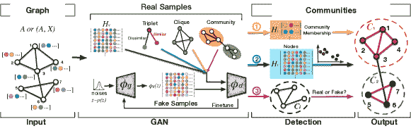

<!--yml

类别：未分类

日期：2024-09-06 19:55:06

-->

# [2105.12584] 深度学习下社区检测的综合调查

> 来源：[`ar5iv.labs.arxiv.org/html/2105.12584`](https://ar5iv.labs.arxiv.org/html/2105.12584)

# 深度学习下社区检测的综合调查

Xing Su, Shan Xue, Fanzhen Liu, Jia Wu, Jian Yang, Chuan Zhou, Wenbin Hu,

Cecile Paris、Surya Nepal、Di Jin、Quan Z. Sheng 和 Philip S. Yu X. Su、S. Xue、F. Liu、J. Wu、J. Yang、Q. Z. Sheng 均来自澳大利亚悉尼的麦考瑞大学计算学院。电子邮件：{xing.su2, fanzhen.liu}@students.mq.edu.au，{emma.xue, jia.wu, jian.yang, michael.sheng}@mq.edu.au。C. Zhou 来自中国科学院数学与系统科学研究院，北京，中国。电子邮件：zhouchuan@amss.ac.cn。W. Hu 来自中国武汉大学计算机科学学院，武汉，中国。电子邮件：hwb@whu.edu.cn。S. Xue、C. Paris 和 S. Nepal 均来自澳大利亚悉尼的 CSIRO Data61。电子邮件：{emma.xue, surya.nepal, cecile.paris}@data61.csiro.au。D. Jin 来自中国天津大学计算机科学与技术学院。电子邮件：jindi@tju.edu.cn。P.S. Yu 来自美国伊利诺伊大学芝加哥分校计算机科学系，芝加哥。电子邮件：psyu@uic.edu。

###### 摘要

社区揭示了网络中其成员的特征和连接，这些特征和连接与其他社区不同。检测社区在网络分析中具有重要意义。尽管存在经典的谱聚类和统计推断方法，但我们注意到近年来深度学习技术在社区检测中的显著发展，其在处理高维网络数据方面具有优势。因此，通过深度学习对社区检测最新进展的综合概述对学术界和实践者来说是及时的。本调查设计并提出了一种新的分类法，涵盖了包括基于深度神经网络的深度学习模型、深度非负矩阵分解和深度稀疏滤波器在内的不同最先进方法。主要类别，即深度神经网络，进一步分为卷积网络、图注意力网络、生成对抗网络和自编码器。该调查还总结了流行的基准数据集、评估指标和开源实现，以解决实验设置。然后，我们讨论了社区检测在各个领域的实际应用，并指出了实施场景。最后，我们通过建议在这一快速发展的深度学习领域中的挑战性主题来概述未来的方向。

###### 索引词：

社区检测，深度学习，社交网络，网络表示，图神经网络

## I 引言

社区的研究早在 1920 年代的社会学和社会人类学中就已展开[1]。然而，直到 21 世纪，先进的科学工具主要基于真实世界数据开发[2]。自 2002 年起[3]，Girvan 和 Newman 通过图划分开辟了一个新方向。在过去的十年里，计算机科学领域的研究人员广泛研究了社区检测[4]，通过利用网络拓扑结构[5, 6, 7, 8]和语义信息[9, 10]，研究了静态和动态网络[11, 12, 13]以及小型和大型网络[14, 15]。基于图的方法正在不断发展，以检测具有复杂数据结构的环境中的社区[16, 17]。社区检测中可以详细分析网络动态和社区影响，如谣言传播、病毒爆发和肿瘤演变。

(a) 图

(b) 社区

图 1： (a) 图示化了一个图，其中节点表示社交网络中的用户。 (b) 图示化了基于用户职业预测的两个社区（$C_{1}$ 和 $C_{2}$）。检测利用了用户在在线活动中的亲密度（拓扑）和账户资料（属性）。

社区检测是一个具有日益实际意义的研究领域。正如所说，物以类聚[18]。基于六度分隔理论，世界上任何一个人都可以通过六个熟人认识其他任何人[19]。实际上，我们的世界是由一系列社区形成的庞大网络。例如，在社交网络中（见图 1），平台赞助商向检测到的社区中的目标用户推广产品[20, 21]。在引用网络中[22]，社区检测决定了研究主题的重要性、互联性、演变，并识别研究趋势。在代谢网络[23, 24]和蛋白质-蛋白质相互作用（PPI）网络[25]中，社区检测揭示了具有相似生物功能的代谢过程和蛋白质的复杂性。同样，大脑网络中的社区检测[26, 17]反映了大脑区域的功能和解剖学分隔。

许多传统技术，如谱聚类[27, 28]和统计推断[29, 30, 31]，应用于小型网络和简单案例。然而，现实世界中的丰富非线性信息使得传统模型在复杂拓扑和高维特征的实际应用中效果较差，其计算成本也较高。深度学习的强大技术提供了灵活的解决方案，具有良好的社区检测性能： (1) 学习非线性网络特性，例如表示节点之间边的关系， (2) 表示低维网络嵌入，保留复杂的网络结构，以及 (3) 从各种信息中实现更好的社区检测。因此，深度学习在社区检测中的应用是一个新的趋势，亟需及时的全面综述¹¹1 本文是我们在 IJCAI-20 上发布的综述[4]的扩展视角，这是第一篇关于深度学习在社区检测方法中的综述的已发布工作。

据我们所知，本文是首个全面调研深度学习在社区检测中贡献的综述。发现固有模式和功能[32, 33]，现有综述主要集中于特定技术上的社区检测[34, 35, 36, 13, 12, 37]，不同网络类型[11, 38, 5]，社区类型[6, 7]，以及应用场景[39, 9]。特定技术的综述总结但不限于基于概率图模型的部分检测[34, 37]、标签传播算法（LPAs）[35, 36]，以及用于单目标和多目标优化的进化计算[13, 12]。在不同网络类型方面，研究人员对动态网络[11]、有向网络[38]和多层网络[5]进行了概述。此外，检测技术在不相交和重叠[6, 7]社区类型方面也有所回顾。关于应用场景，重点放在社交网络的技术上[39, 9]。

通过观察过去、现在和未来的趋势，本文旨在帮助研究人员和从业者理解社区检测领域，具体包括：

+   •

    系统化分类和综合评审。我们为本次调查提出了一个新的系统化分类（参见图 2）。对于每一类，我们回顾、总结并比较了代表性的工作。我们还简要介绍了社区检测在现实世界中的应用。这些场景为未来的社区检测研究和实践提供了新的视角。

+   •

    丰富的资源和高影响力的参考文献。该调查收集了开放资源，包括基准数据集、评估指标和技术实现。最新高影响力国际会议和高质量同行评审期刊上的出版物涵盖了数据挖掘、人工智能、机器学习和知识发现。

+   •

    未来方向。由于深度学习是一个新兴研究领域，我们讨论了当前的局限性、关键挑战以及未来方向的开放机会。

文章的其余部分组织如下：II 节定义了深度学习方法的基本符号、概念、输入和输出。III 节概述了社区检测的发展。IV 节介绍了深度学习的分类法。V–X 节总结了每个分类的综合评述。XI 节和 XII 节组织了流行的实施资源和实际应用。最后，XIII 节讨论了当前的挑战，并在 XIV 节前建议未来的研究方向。支持材料可以在附录 A（文献核心技术总结表）、附录 B–D（数据集、评估指标和实施项目资源描述）和附录 E（缩略语）中找到。

## II 定义与初步概述

本节包括初步定义、I 表中的符号，以及基于深度学习的社区检测模型的一般输入和输出。

Definition 1: 网络。给定一个基本网络$\mathcal{G}=(V,E)$，其中$V=\{v_{1},\cdots,v_{n}\}$是节点集合，$E=\{e_{ij}\}_{i,j=1}^{n}$表示节点之间的边集合。$N(v_{i})=\{u\in V|(v_{i},u)\in E\}$定义了节点$v_{i}$的邻域。$\bm{A}=[a_{ij}]$表示一个$n\times n$维的邻接矩阵，其中$a_{ij}=1$如果$e_{ij}\in E$，否则$a_{ij}=0$。如果$a_{ij}\neq a_{ji}$，则$\mathcal{G}$是一个有向网络，否则是一个无向网络。如果$a_{ij}$由$w_{ij}\in\bm{W}$加权，则$\mathcal{G}=(V,E,\bm{W})$是一个加权网络，否则是一个非加权网络。如果$a_{ij}$的值在$+1$（正）和$-1$（负）之间有所不同，则$\mathcal{G}$是一个带符号网络。如果节点$v_{i}\in V$由$\bm{x}_{i}\in\bm{X}\subseteq\mathbb{R}^{n\times d}$属性标记，则$\mathcal{G}=(V,E,\bm{X})$是一个带属性网络，否则是一个不带属性网络。 |

TABLE I: 本文中使用的符号和描述 |

| 符号 | 描述 |
| --- | --- |
| $\mathbb{R}$ | 数据空间 |
| $\mathcal{G}$ | 图 |
| $V$, $E$, $\mathcal{C}$ | 节点集合，边集合，社区集合 |
| $v_{i}$, $e_{ij}$, $C_{k}$ | 第$i$个节点，($v_{i},v_{j}$)的边，第$k$个社区 |
| $N(v_{i})$ | 节点$v_{i}$的邻域 |
| $\bm{A}$, $a_{ij}$ | 邻接矩阵，值 |
| $\bm{X}$, $\bm{x}_{i}$ | 节点属性矩阵，向量 |
| $y_{i}$, $c_{k}$ | 节点$v_{i}$的标签，$C_{k}$的社区标签 |
| $y^{k}_{i}$ | 节点$v_{i}$在$C_{k}$中的二值社区标签 |
| $n$, $m$, $K$, $d$ | 节点数，边数，社区数，属性数 |
| $\mathcal{A}_{ij}$ | 图$(\mathcal{G}_{i},\mathcal{G}_{j})$之间的锚链接 |
| $\mathcal{V}$, $\mathcal{E}$, $\mathcal{X}$ | 异构节点、边、属性的集合 |
| $E^{(r)}$ | 多重网络中第$r$类边 |
| $\bm{A}(+,-)$ | 带符号网络的邻接矩阵 |
| $\hat{\bm{A}}$ | 重建的邻接矩阵 |
| $\widetilde{\bm{X}}$ | 损坏的节点属性矩阵 |
| $\bm{D}$ | 度矩阵 |
| $\bm{B}$, $b_{ij}$ | 模块度矩阵，值 |
| $\bm{S}$, $s_{ij}$ | 相似度矩阵，值 |
| $\bm{O}$, $o_{ij}$ | 节点对约束矩阵，值 |
| $\bm{P}$, $p_{ij}$ | 社区成员矩阵，($v_{i},C_{j}$)的概率 |
| $\bm{L}$, $\bm{M}$ | 拉普拉斯矩阵，马尔可夫矩阵 |
| $\bm{Z}$, $\bm{z}$ | 潜在变量矩阵，向量 |
| $\Theta$ | 可训练参数 |
| $\bm{W}^{(l)}$ | DNN 中第$l$层的权重矩阵 |
| $\bm{H}^{(l)}$, $\bm{h}_{i}^{(l)}$ | 第$l$层表示矩阵，向量 |
| $\sigma(\cdot)$ | 激活函数 |
| $\mathcal{L}$ | 损失函数 |
| $\Omega$ | 稀疏性惩罚 |
| $&#124;\cdot&#124;$ | 集合的长度 |
| $\&#124;\cdot\&#124;$ | 范数算子 |
| $\phi_{g}$, $\phi_{d}$ | 生成器，判别器 |
| $\phi_{e}$, $\phi_{r}$ | 编码器，解码器 |

定义 2：社区。给定一组社区 $\mathcal{C}=\{C_{1},C_{2},\cdots,C_{K}\}$，每个社区 $C_{k}$ 是一个 $\mathcal{G}$ 的划分，它保持了区域结构和簇属性。一个被划分到社区 $C_{k}$ 的节点 $v_{i}$ 应满足社区内部节点度数大于其外部度数的条件。假设 $C_{k}\cap C_{k^{\prime}}=\emptyset$ （$\forall k,k^{\prime}$），$\mathcal{C}$ 表示互不重叠的社区；否则为重叠社区。

图 2：传统社区检测方法及基于深度学习的方法分类。

图 3：社区检测发展的时间线。

社区检测输入。深度学习模型将网络拓扑和网络属性作为输入。由节点和边组成的拓扑可以用矩阵表示，如邻接矩阵 $\bm{A}$、带符号的邻接矩阵 $\bm{A}(+,-)$ 以及度量矩阵如模块度矩阵 $\bm{B}$。网络属性表示网络实体的附加信息，例如节点属性 $\bm{X}$。

社区检测输出。社区检测方法的目标是输出一组社区，这些社区可以是互不重叠的，也可以是重叠的。附录 A 中的表格 V–VIII 表示了不同社区检测方法的不同输出。互不重叠的社区例如代表只允许学生加入一个社团的学生社团。重叠社区则描述了例如在社交网络中参与多个圈子的用户。用于检测重叠社区的方法也可以检测互不重叠的社区。

## III 社区检测的发展

社区检测在网络分析和数据挖掘中具有重要意义。图 3 展示了其从传统到深度学习的发展时间线。它们各自的类别在图 2 的左侧和右侧部分进行了总结。两类方法显示了发展的变化。传统方法主要从网络结构中探索社区。我们将在本节中简要回顾这七类方法。深度学习揭示了深层网络信息，并将复杂关系从高维数据模型化为低维向量。这些将在接下来的部分中回顾。

图划分。这些方法，广为人知的图聚类[32]，被应用于深度学习模型中。它们将网络划分为具有给定数量$K$的社区。Kernighan-Lin [40]是一个具有代表性的启发式算法。它最初将网络划分为两个任意的子图，并对节点进行优化。谱二分[41]是另一种代表性方法，应用谱拉普拉斯矩阵。

统计推断。随机块模型（SBM）[29]是一种广泛应用的生成模型，通过将节点分配到社区并控制其可能性来实现。其变体包括度校正 SBM（DCSBM）[30]和混合成员 SBM（MMB）[31]。

层次聚类。这组方法以三种方式发现层次社区结构（即树状图）：分裂式、凝聚式和混合式。Girvan-Newman（GN）算法通过连续去除边以找到社区结构，使新社区出现[3, 42]。Fast Modularity（FastQ）[2, 43]，一种凝聚式算法，逐步合并节点，每个节点最初被视为一个社区。基于结构相似性的社区检测算法（CDASS）[44]以混合方式联合应用分裂式和凝聚式策略。

动态方法。随机游走用于动态检测社区。例如，WalkTrap [45]中的随机游走计算节点距离和社区成员概率。信息映射（InfoMap）[46]应用最小长度编码。标签传播算法（LPA）[47]通过信息传播机制识别扩散社区。

谱聚类。网络谱反映了社区结构。谱聚类 [27] 在归一化拉普拉斯矩阵和正则化邻接矩阵上对网络进行划分，并在伪似然算法中拟合 SBM。在归一化拉普拉斯矩阵的谱上，Siemon 等人[28] 整合了宏观和微观神经脑网络中的社区以获得聚类。

基于密度的算法。重要的聚类算法包括基于密度的空间聚类（DBSCAN） [48]、网络结构聚类算法（SCAN） [49] 和用于社区检测的结构中心定位（LCCD） [50]。它们通过测量实体的密度来识别社区、枢纽和异常值。

图 4：基于 CNN 的社区检测的一般框架，详细信息见第 V-A 节。作为卷积神经网络（CNN）的输入，图被预处理为节点或边的图像数据。$d$ 维潜在特征在多个 CNN 隐藏层中进行卷积映射，最终全连接层输出每个节点或每条边的表示以进行分类。关注节点时，流程 ① 预测社区标签，将相同标签的节点聚集成一个社区。关注边时，流程 ② 预测边标签为两类，即内部和外部。初步社区通过移除社区间的边形成，并通过合并和模块度 $Q$ 等度量进行优化。

优化。社区检测通常通过最大化似然函数来实现优化。模块度（Q）[42] 是最经典的优化函数，其变体 FastQ [2, 43] 也同样受到广泛应用。Louvain [51] 是另一种著名的优化算法，它采用节点移动策略来优化模块度。此外，贪婪优化的扩展包括模拟退火 [52]、极值优化 [53] 和谱优化 [54]。在局部和全局搜索 [55] 中，进化优化包括单目标和多目标。例如，Multi-Agent Genetic Algorithm (MAGA-Net) [56] 应用单一的模块度函数。Combo [57] 结合了归一化互信息（NMI）[58] 和导电性（CON）[59]。Q、NMI 和 CON 估算网络划分质量，详细信息见附录 C。

为什么社区检测需要深度学习？以简单的方式捕捉连接信息可能会导致次优的社区检测结果。深度学习模型[60]为社区检测带来了以下额外优势。因此，基于深度学习的社区检测已成为一个新兴领域。其通用框架从复杂结构关系的高维数据中学习低维向量[10, 61, 62, 63]。因此，它通过先进的机器学习和数据挖掘技术实现知识发现。具有表示的框架还可以进一步嵌入非结构特征，例如节点属性，以增加对社区成员资格的了解[64, 65, 66]。此外，来自节点[61]、边[67]、邻域[68]或多图[69]的信息组可以在深度学习过程中特别关注并共同识别，从而获得有效的社区检测结果。随着深度学习处理大数据的能力，越来越多的大规模[15]、高稀疏[70]、复杂结构[71, 72]、动态[73]网络在现实场景中得以探索。尽管在相对短的时间内取得了成果（见图 3")），但深度学习领域中的社区检测发展仍面临一系列挑战。本文回顾了第 V–XII 节的成就，并在第 XIII 节指出了机会和挑战。

## IV 深度学习中的社区检测分类

本文提出了一种深度社区检测方法的分类法，根据所使用的深度学习模型的标志性特征进行分类。该分类法总结了六个类别：卷积网络、图注意力网络（GAT）、生成对抗网络（GAN）、自编码器（AE）、深度非负矩阵分解（DNMF）和深度稀疏过滤（DSF）。在这个分类法中，卷积网络包括卷积神经网络（CNN）和图卷积网络（GCN）。这两者都通过卷积操作在社区检测中表示潜在特征。GAT 在社区信号的特殊关注方面具有重要意义。GAN 模型中输入图与伪样本之间的对抗训练过程被成功地应用于社区检测。在通用 AE 框架中，子类别包括堆叠 AE、稀疏 AE、去噪 AE、图卷积 AE、图注意力 AE 和变分 AE（VAE）。分类法结构如图 2 所示。以下章节 V–X 分别概述了每种方法的类别。

## V 基于卷积网络的社区检测

应用卷积网络模型的社区检测包括卷积神经网络（CNNs）和图卷积网络（GCNs）。CNNs [74] 是一种特定类型的前馈深度神经网络（DNN），旨在处理网格状拓扑数据，如图像数据，其中卷积层减少了计算成本，池化操作确保了 CNN 在特征表示中的鲁棒性。GCNs [75] 是基于 CNNs 提出的，用于图结构数据，并在谱滤波器的一级近似上进行操作。GCNs 层级传播的规则是：

|  | $\small\bm{H}^{(l+1)}=\sigma(\tilde{\bm{D}}^{-\frac{1}{2}}\tilde{\bm{A}}\tilde{\bm{D}}^{-\frac{1}{2}}\bm{H}^{(l)}\bm{W}^{(l)}),$ |  | (1) |
| --- | --- | --- | --- |

其中，第$l$层的潜在表示保存在矩阵$\bm{H}^{(l)}$中（$\bm{H}^{(0)}=\bm{X}$），通过激活函数$\sigma(\cdot)$与层特定的可训练权重矩阵$\bm{W}^{(l)}$进行计算；$\tilde{\bm{A}}=\bm{A}+\bm{I}_{n}$，其中$\bm{I}_{n}$表示单位矩阵；以及$\tilde{\bm{D}}_{ii}=\sum_{j}\tilde{a}_{ij}$，其中$\tilde{a}_{ij}\in\tilde{\bm{A}}$。

### V-A 基于 CNN 的社区检测

现有的基于 CNN 的社区检测方法实现了具有严格数据输入限制的 CNN 模型，因此它们需要对图像格式和标记数据进行预处理（见图 4）。下面的技术解决了社区检测中的特定问题，详细总结见表 IV。

传统的社区检测是一种无监督学习任务，深度学习模型的缺陷拓扑结构影响其邻域分析，并降低了社区检测的准确性。然而，现实世界中的网络具有有限的结构信息。为此，Xin 等人[8]提出了第一个基于监督 CNN 的拓扑不完整网络（TINs）社区检测模型。该模型有两个 CNN 层，使用最大池化操作进行网络表示，还有一个完全连接的 DNN 层用于社区检测。CNN 架构逐步从基础输入中恢复完整的潜在特征。卷积层从不同视角表示每个节点的局部特征。最后的全连接层$f$为每个节点$v_{i}$更新社区：

|  | $\small o_{i}^{k}=\sigma(b_{k}^{f}+\bm{W}_{k}^{f}\bm{h}^{(2)}_{i}),$ |  | (2) |
| --- | --- | --- | --- |

其中，$\sigma$表示 sigmoid 函数，$\bm{W}_{k}^{f}$和$b_{k}^{f}$是第$k$个神经元$o_{i}^{k}$的权重和偏置，$\bm{h}^{(2)}_{i}$是前两个卷积层输出的节点表示向量。模型执行反向传播以最小化：

|  | $\small\mathcal{L}=\frac{1}{2}\sum\nolimits_{i}\&#124;\bm{o}_{i}-\bm{y}_{i}\&#124;_{2}^{2}=\frac{1}{2}\sum\nolimits_{i}\sum\nolimits_{k}(o_{i}^{k}-y^{k}_{i})^{2},$ |  | (3) |
| --- | --- | --- | --- |

其中，$\bm{y}_{i}$表示节点$v_{i}$的真实标签向量，其中$y^{k}_{i}\in\{0,1\}$表示$v_{i}$是否属于第$k$个社区。该模型在 TINs 中对 10%标记节点和其余未标记节点的社区检测准确率达到了约 80%，表明多跳范围内的高阶邻域表示可以提高社区检测的准确性。

为了处理大规模社交网络中的高稀疏性，以下两种方法针对特定的稀疏矩阵（即邻接矩阵中的非零元素）进行高效的社区检测。Sperlí[70]将稀疏矩阵卷积（SparseConv）设计成 CNN。Santo 等人[76]进一步提出了一种带有 SparseConv2D 操作符的稀疏 CNN 方法，从而显著减少了该方法中的操作数量。

Community Network Local Modularity R (ComNet-R) [77] 是一个用于社区检测的边-2-图模型，通过 CNN 对社区内外的边进行分类。ComNet-R 去除社区间的边，以准备断开的初步社区。优化过程旨在基于局部模块性合并社区。

图 5：GCN 基础的社区检测的一般框架，详细信息见第 V-B 节。它输入一个图结构 $\bm{A}$ 和可选的节点属性 $\bm{X}$。在多个图卷积网络 (GCN) 层内，图的潜在特征根据社区检测需求进行平滑。图表示学习由 $\sigma(\cdot)$ 激活。图中 ①–④ 说明了四个社区检测框架，应用了最终节点表示 (① 和 ②) 或隐藏层中的时间表示 (③ 和 ④)。给定节点标签，在 ① 中基于节点分类检测社区，而 ② 在嵌入 $\bm{H}$ 上实现节点聚类，并可以在 ③ 中通过测量，例如互信息 (MI)，进一步优化以获得最佳社区归属。④ 联合优化聚类结果和 GCN 表示，逐步将每个节点检测到社区中，利用卷积表示的节点嵌入。

### 基于 V-B GCN 的社区检测

GCN 在深层图卷积层中聚合节点邻域的信息，以全球捕捉复杂特征用于社区检测（图 5）。基于 GCN 的社区检测方法有两类：（1）监督/半监督社区分类，以及（2）利用无监督网络表示的社区聚类。社区分类方法受到现实世界中标签缺乏的限制。相比之下，网络表示更灵活，通过矩阵重构和目标优化等技术聚类社区。附录 A 中的表 V 比较了这些技术。

GCN 使用一些传统的社区检测方法作为深度图操作符，例如用于统计推断的 SBMs、用于谱分析的拉普拉斯矩阵和用于信念传播的概率图模型。例如，线图神经网络（LGNN）[78]是一个监督社区检测模型，它通过改进 SBMs 来提升社区检测性能并减少计算成本。通过将非回溯操作符与信念传播的消息传递规则结合，LGNN 在有向网络中学习节点表示特征。Softmax 函数识别节点$v_{i}$属于社区$C_{k}$的条件概率($o_{i,k}=p(y_{i}=c_{k}|\Theta,\mathcal{G}$)，并在所有可能的社区标签排列$S_{\mathcal{C}}$中最小化交叉熵损失。

|  | $\small\mathcal{L}(\Theta)=\min_{\pi\in S_{\mathcal{C}}}{-\sum\nolimits_{i}\log{o_{i,\pi(y_{i})}}}.$ |  | (4) |
| --- | --- | --- | --- |

由于 GCN 最初并未针对社区检测任务设计，社区结构不是学习节点嵌入时的重点。为了解决这一问题，半监督 GCN 社区检测模型 MRFasGCN 通过扩展特定于网络的马尔可夫随机场作为新的卷积层（eMRF），来表征隐藏社区，使 MRFasGCN 具有社区导向，并对 GCN 的粗糙结果进行平滑的细化。为了实现无监督社区检测，GCN 基础框架 SGCN [79]设计了一个局部标签采样模型来定位社区检测的结构中心。通过将标签采样模型与 GCN 结合，SGCN 在训练每个节点的社区成员资格时，编码了网络拓扑和节点属性，而无需任何先验标签信息。

从概率推断框架的角度来看，检测重叠社区可以通过生成模型来解决，该模型推断节点的社区隶属关系。例如，神经重叠社区检测（NOCD）[80]结合了伯努利–泊松（BP）概率模型和一个两层 GCN，通过最小化 BP 的负对数似然来学习社区隶属向量。通过设置阈值来识别和移除弱隶属关系，最终得到社区。

谱 GCNs 表示来自节点邻域的所有潜在特征。通过在深层 GCN 层中反复操作拉普拉斯平滑，邻近节点的特征会收敛到相同的值。然而，这些模型在社区检测中导致了过度平滑的问题。为减少负面影响，图卷积梯形网络（GCLN）[81] 设计为一种新的 GCN 架构，用于无监督社区检测（$k$-means），该架构基于 CNN 领域的 U-Net。在 GCLN 中对称构建了收缩路径和扩展路径。从收缩路径捕获的上下文特征与在扩展路径中学习到的局部信息融合。逐层传播遵循 Eq. (1)。

由于不同类型的连接通常被视为普通边，GCNs 表示每种连接类型并将其聚合，从而导致冗余表示。独立促进图解耦网络（IPGDN）[82] 将邻域区分为不同部分，并自动发现图的独立潜在特征的细微差别，从而减少检测社区的难度。IPGDN 通过 Hilbert-Schmidt 独立性准则（HSIC）正则化 [83] 在邻域路由中得到支持。

对于属性图，GCNs 的社区检测依赖于结构信息和属性特征，其中邻近节点和具有相似特征的节点可能会聚集在同一个社区。因此，图卷积将上述两个图信号相乘，并需要平滑地过滤掉高频噪声。为此，适应性图卷积（AGC）[64] 嵌入了一个低通滤波器，通过：

|  | $\small p(\lambda_{q})=(1-\frac{1}{2}\lambda_{q})^{k},$ |  | (5) |
| --- | --- | --- | --- |

其中，$\mathcal{G}$ 的频率响应函数表示 $p(\Lambda)=\text{diag}\left(p\left(\lambda_{1}\right),\cdots,p\left(\lambda_{n}\right)\right)$ 在所有特征值上递减且非负。AGC 卷积选择适当的邻域跳跃大小 $k$，并通过 $k$ 阶图卷积表示图特征，如：

|  | $\small\bar{\bm{X}}=(I-\frac{1}{2}\bm{L}_{s})^{k}\bm{X},$ |  | (6) |
| --- | --- | --- | --- |

其中，$\bm{L}_{s}$ 表示 $\lambda_{q}$ 上的对称归一化图拉普拉斯。该滤波器对节点嵌入 $\bar{\bm{X}}$ 进行平滑调整，$k$ 值较高会导致更好的滤波性能。

自适应图编码器（AGE）[84] 是另一种可扩展到社区检测的平滑滤波模型。AGE 自适应地执行节点相似性测量（$\bm{S}=\left[s_{ij}\right]$）和 $t$-堆叠拉普拉斯平滑滤波器（$\bar{\bm{X}}=(\bm{I}-\gamma\bm{L})^{t}\bm{X}$）：

|  | $\small\mathcal{L}=\sum\nolimits_{(v_{i},v_{j})\in V^{\prime}}-s^{\prime}_{ij}\log(s_{ij})-(1-s^{\prime}_{ij})\log(1-s_{ij}),$ |  | (7) |
| --- | --- | --- | --- |

其中 $V^{\prime}$ 表示正样本（相似）和负样本（不相似）上的平衡训练集，$s^{\prime}_{ij}$ 是节点对 $(v_{i},v_{j})$ 上的排名二元相似性标签。

一些工作对 GCN 的滤波器做出了重要贡献。例如，具有 Cayley 多项式的图卷积神经网络（CayleyNets） [85] 在谱图卷积架构中，提出了一种有效的 Cayley 滤波器，用于社区检测中的高阶近似。它专注于窄带滤波，因为低频包含大量的社区信息，用于社区检测目标表示。CayleyNets 与 Cayley 滤波器配合，涉及在谱卷积层中进行均值池化，并在节点上进行半监督 softmax 分类器，用于社区成员预测。

为了捕捉社区检测的全局聚类结构，属性图聚类的谱嵌入网络（SENet） [86] 通过最小化谱聚类的损失，将其引入到三层 GCN 的输出层中：

|  | $\small\mathcal{L}=-\operatorname{tr}((\bm{H}^{(3)})^{\top}\bm{D}^{-\frac{1}{2}}\bm{K}\bm{D}^{-\frac{1}{2}}\bm{H}^{(3)}),$ |  | (8) |
| --- | --- | --- | --- |

其中 $\bm{K}$ 是编码类型和属性的核矩阵。

Community Deep Graph Infomax (CommDGI) [87] 通过在节点和社区上进行互信息（MI）来联合优化图表示和聚类，并通过最大化图的模块性来测量图的模块性。它应用对比训练来获得更好的表示，使用 $k$-均值进行节点聚类并以此作为聚类中心。赵等人 [88] 提出了一个图去偏对比学习方法，该方法同时进行表示和聚类，从而提高聚类结果和判别表示的质量。

图 6: 一般的 GAT 基础社区检测框架，详细信息见第 VI 节。图注意力网络（GAT）在 $l$-th 隐藏层中为每个邻域 $N(v_{i})$ 分配注意力系数 $\bm{\alpha}^{(l)}_{ij}$：{绿色，蓝色，紫色}。表示向量 $\bm{h}^{\prime}_{i}$ 汇总了可用的信息：① 多重网络中同一节点对之间的不同颜色边，或 ② 异质网络中的元路径或上下文路径。GAT 嵌入 $\bm{H}$ 被分析以进行社区聚类。

## VI 图注意力网络基础的社区检测

图注意力网络（GATs） [89] 通过具有可训练权重的注意力来汇总邻域节点的特征：

|  | $\small\bm{h}_{i}^{(l+1)}=\sigma\left(\sum\nolimits_{j\in N(v_{i})}\alpha_{ij}^{(l+1)}\bm{W}^{(l+1)}\bm{h}_{j}^{(l)}\right),$ |  | (9) |
| --- | --- | --- | --- |

其中 $\bm{h}_{i}^{(l)}$ 代表节点 $v_{i}$ 在第 $l$ 层的表示（$\bm{h}_{i}^{(0)}=\bm{x}_{i}$），$\alpha_{ij}^{(l)}$ 是 $v_{i}$ 和 $v_{j}\in N(v_{i})$ 之间的注意力系数。在社区检测（图 6）中，注意力机制有助于自适应地学习邻域中每个节点的重要性。相似节点之间的关联被计算得接近社区成员身份的实际情况，这在 GAT 的表示中得以继承。这些注意力机制过滤空间关系或整合元路径。因此，在属性、复合、异构网络中的社区可以被轻松检测（表 VI）。

在深度社区检测模型中，关系需要特别关注。例如，引文和共同主题关系在将论文聚类到研究主题中都很重要。多重网络是通过反映在边上的多种关系类型（即 $E^{(r)}$）构建的。每种类型的边被分组到一个层 $r$ 中。因此，GAT 可以关注关系类型。用于属性多重网络嵌入的深度图信息最大化（DMGI）[61] 独立地嵌入每种关系类型，并通过最大化全球共享特征来计算网络嵌入，以检测社区。其对比学习在每一层通过判别器在原始网络和一个被破坏的网络之间进行。随后应用共识正则化和注意力系数来整合最终的嵌入。应用注意力机制的好处是通过削弱系数来预处理不太重要的关系，尤其是在呈现多种关系类型时。

尽管外部监督信号在多重关系中全球共享，DMGI 仍无法捕捉到节点嵌入中的内在信号，其中节点属性被考虑。为填补这一空白，开发了高阶深度多重信息最大化（HDMI）[65]，以捕捉信号及其相互作用。HDMI 进一步设计了一个融合模块，用于基于社区成员身份的语义注意力[90]，在多重网络层上组合节点嵌入。

异质信息网络（HIN）涉及多种类型的节点 $\mathcal{V}$ 和边 $\mathcal{E}$。在异质网络上进行深度社区检测表示异质类型和属性 $\mathcal{X}$。元路径聚合图神经网络（MAGNN）[72] 通过多信息语义元路径提供了卓越的社区检测解决方案，这些元路径在图注意力层中区分了异质结构。MAGNN 从语义信息中生成节点属性。由于异质节点和边存在于内元路径和外元路径中，MAGNN 通过聚合节点和元路径上的语义变化，利用注意力机制在它们的嵌入中。因此，MAGNN 减少了高度异质性，并嵌入了更丰富的拓扑和语义信息，从而提高社区检测结果。此外，HeCo [91] 嵌入了来自 HIN 的网络模式和元路径。采用了改进的对比学习来指导两个嵌入部分。顺序地，注意力机制作用于节点重要性、网络异质性和语义特征，从而有利于社区检测。

上述两个研究都利用元路径来促进社区检测，但定义有意义的元路径需要大量领域知识。因此，基于上下文路径的图神经网络（CP-GNN）[92] 被构建来通过上下文路径学习节点嵌入，其中利用了注意力机制来区分不同关系的重要性。非预定义的上下文路径在捕捉高阶关系以进行社区检测方面具有重要意义。

图 7：基于 GAN 的社区检测的一般框架，详细信息见第 VII 节。生成对抗网络（GAN）通过生成器 $\phi_{g}$ 生成假样本 $\phi_{g}(\bm{z})$ 来欺骗鉴别器 $\phi_{d}$。GAN 的真实样本可以是节点嵌入 $\bm{H}_{v}$、局部拓扑（例如，三元组、团体）或社区。因此，真实样本和假样本竞争性地微调社区特征：流程 ① 通过团体级 GAN 获得社区成员资格。流程 ② 基于来自 $\bm{H}_{v}$ 或三元组的竞争性节点级表示来检测社区。流程 ③ 通过鉴别器直接区分社区。

## VII 基于生成对抗网络的社区检测

对抗训练在生成模型中效果显著，并提高了判别能力。然而，在应用于社区检测时，它需要解决过拟合问题（参见图 7 和 表 VII）。生成对抗网络（GANs）[93] 在对抗框架中竞争性地训练生成器 $\phi_{g}$ 和判别器 $\phi_{d}$。$\phi_{d}(\bm{x})$ 代表输入数据的概率，而 $\phi_{g}(\bm{z})$ 通过输入噪声变量 $p_{\bm{z}}(\bm{z})$ 学习生成器的分布 $p_{g}$。生成器通过生成虚假样本来欺骗判别器。其目标函数定义为：

|  | $\displaystyle\min_{\phi_{g}}\max_{\phi_{d}}$ | $\displaystyle\mathbb{E}_{\bm{x}\sim p_{data}(\bm{x})}[\log\phi_{d}(\bm{x})]$ |  | (10) |
| --- | --- | --- | --- | --- |
|  |  | $\displaystyle+\mathbb{E}_{\bm{z}\sim p_{\bm{z}}(\bm{z})}[\log(1-\phi_{d}(\phi_{g}(\bm{z})))].$ |  |

通过生成对抗学习（SEAL）[94] 从选定的种子节点生成种子感知社区，使用图指针网络进行增量更新（iGPN）。它由四个社区级别的组件组成，即生成器、判别器、种子选择器和定位器。判别器采用图同构网络（GINs）来根据社区标签的真实情况修改生成的社区。定位器旨在向生成器提供正则化信号，以便在社区检测中可以消除无关节点。

对于不平衡的社区，双重正则化图卷积网络（DR-GCN）[95] 将条件 GAN 纳入双重正则化 GCN 模型中，即潜在分布对齐正则化和类条件对抗正则化。第一个正则化项 $\mathcal{L}=(1-\alpha)\mathcal{L}_{gcn}+\alpha\mathcal{L}_{dist}$ 通过最小化多数和少数社区类别之间的 Kullback-Leibler (KL) 散度 $\mathcal{L}_{dist}$，结合标准 GCN 训练 $\mathcal{L}_{gcn}$ 来平衡社区。第二个正则化项旨在区分标记节点表示上的社区：

|  | $\displaystyle\min_{\phi_{g},\mathcal{L}}$ | $\displaystyle\max_{\phi_{d}}\mathcal{L}(\phi_{d},\phi_{g})=\mathbb{E}_{v_{i}\sim p_{data}(v_{i})}\log\phi_{d}(v_{i}&#124;y_{i})$ |  | (11) |
| --- | --- | --- | --- | --- |
|  |  | $\displaystyle+\mathbb{E}_{\bm{z}\sim p_{\bm{z}}(\bm{z})}[\log(1-\phi_{d}(\phi_{g}(\bm{z}&#124;y_{i})))+\mathcal{L}_{reg}],$ |  |

其中 $\mathcal{L}_{reg}=\sum_{u\in N(v_{i})}\|\bm{h}_{v^{\prime}_{i}}-\bm{h}_{u}\|_{2}$ 强制生成的假节点 $v^{\prime}_{i}$ 重建相应的邻域关系（如 $u\sim v_{i}$），$y_{i}$ 是节点 $v_{i}$ 的真实标签。

与仅生成一种假样本不同，联合对抗网络嵌入（JANE）[62] 使用拓扑和节点属性的两种网络信息来捕捉真实和虚假样本对抗组中的语义变化。具体来说，JANE 通过多头自注意力编码器 $\phi_{e}$ 表示嵌入 $\bm{H}$，在假特征中加入高斯噪声以进行生成器 $\phi_{g}$ 和鉴别器 $\phi_{d}$ 之间的竞争：

|  | $\displaystyle\min_{\phi_{g},\phi_{e}}\max_{\phi_{d}}$ | $\displaystyle{\mathcal{L}(\phi_{d},\phi_{e},\phi_{g})}=$ |  | (12) |
| --- | --- | --- | --- | --- |
|  |  | $\displaystyle\mathbb{E}_{(\bm{a},\bm{x})\sim p_{\bm{AX}}}[\underbrace{\mathbb{E}_{\bm{h}\sim p_{\phi_{e}}(\cdot\mid\bm{a},\bm{x})}[\log\phi_{d}(\bm{h},\bm{a},\bm{x})]}_{\log\phi_{d}(\phi_{e}(\bm{a},\bm{x}),\bm{a},\bm{x})}]$ |  |
|  | $\displaystyle+$ | $\displaystyle\mathbb{E}_{\bm{h}\sim p_{\bm{H}}}[\underbrace{\mathbb{E}_{(\bm{a},\bm{x})\sim p_{\phi_{g}}(\cdot\mid\bm{h})}[\log(1-\phi_{d}(\bm{h},\bm{a},\bm{x}))]}_{\log(1-\phi_{d}(\bm{h},\phi_{g}(\bm{h})))}],$ |  |

其中 $p_{\bm{AX}}$ 表示拓扑 $\bm{A}$ ($\bm{a}\subseteq\bm{A}$) 和采样节点属性 $\bm{X}$ ($\bm{x}\subseteq\bm{X}$) 的联合分布。

(a) 基于 AE 的社区检测通用框架

(b) 静态无属性图

(c) 静态带属性图

(d) 动态图

(e) 跨域图

(f) 异质图

(g) 带属性的多视图图

图 8：基于 AE 的社区检测的总体框架包括（a）输入层、AE 和聚类层以及输出层的框架和（b）-（g）针对每种图类型的基于 AE 的社区检测过程：（a）输入可以是其中一个图。这些图具有拓扑和属性信息，通过邻接矩阵 $\bm{A}$（①-③, ⑥）、节点属性向量 $\bm{X}$（②, ⑥）、节点相似度矩阵 $\bm{S}$（④）和元路径 $\Phi$（⑤）表示。可以包含多个 AE，每个 AE 嵌入部分输入。两个可选的工作流程分别输出节点嵌入 $\bm{H}_{v}$ 和社区成员矩阵 $\bm{H}_{c}$，用于社区检测结果（即 AE 输出层）。（b）输入的拓扑 $\bm{A}$，AE 通过最小化重建损失 $\mathcal{L}_{re}$（实线箭头）输出节点嵌入 $\bm{H}_{v}$，或通过进一步最小化 $\bm{P}$ 和 $\bm{Q}$ 分布上的聚类损失输出社区成员矩阵 $\bm{H}_{c}$，该分布衡量节点在社区中的概率（虚线箭头）。社区先验信息用于 $\mathcal{L}(\bm{O},\bm{H})$（虚线箭头）或稀疏惩罚用于 $\Omega(\rho\|\sum{\bm{h}_{i}/n})$（虚线箭头），可选择性地指导 AE 学习隐藏层嵌入 $\bm{h}_{i}\in\bm{H}$。（c）以 $\bm{H}_{v}$ 或 $\bm{H}_{c}$ 为目标，拓扑 $\bm{A}$ 和节点属性 $\bm{X}$ 分别由 AE1 和 AE2 表示（实线箭头）。它们的嵌入 $\bm{H}_{\bm{A}}$ 和 $\bm{H}_{\bm{X}}$ 通过最小化一致性损失进行聚合。否则（虚线箭头），一个 AE 将所有输入嵌入到 $(\bm{A},\bm{X})$ 中。（d）动态图中的第 $t$ 个快照 $\bm{A}_{(t)}$ 被表示为节点嵌入 $\bm{H}_{(t)}$。时间平滑正则化优化 $\bm{H}_{(t)}$ 相对于前一个快照的嵌入。$\bm{O}$ 可选使用。（e）两个 AE 分别将源域和目标域的相似度矩阵表示为 $\bm{H}_{s}$ 和 $\bm{H}_{t}$，其中 $\bm{H}_{s}$ 指导 AE2 的训练，目标图的节点嵌入 $\bm{H}_{t}$ 被输出。（f）每个元路径在 AE 中用输入特征向量 $\{\bm{x}_{i\Phi}\}$ 表示，表示元路径 $\Phi$ 中节点 $v_{i}$ 之间的元接近度 $\bm{p}_{i}\in\bm{P}$。所有元路径的嵌入在这些堆叠的 AEs 中的全连接层中为 $\bm{H}_{v}$ 进行聚合。（g）每个视图中的属性与 $A$ 一起输入到 AE 中，其中不同视图中的节点嵌入通过聚类损失进行优化。

近邻关系可以捕捉社区中的潜在关系。然而，现实世界中稀疏连接的网络并未提供足够的边。网络中的属性不能通过近邻关系来度量。为了解决这些限制，**近邻生成对抗网络**（ProGAN）[66] 从一组实例化的三元组中编码每个节点的近邻关系，以便在低维空间中发现和保留社区关系。

**生成对抗网络的社区检测**（CommunityGAN）[96] 针对重叠社区进行提出，该方法通过为每个节点-社区对分配非负因子来获得节点表示。其目标函数通过一个图案级生成器 $\phi_{g}(\cdot|v_{i};\Theta_{g})$ 和鉴别器 $\phi_{d}(\cdot,\Theta_{d})$ 来优化：

|  | $\displaystyle\min_{\Theta_{g}}\max_{\Theta_{d}}$ | $\displaystyle{\mathcal{L}(\phi_{g},\phi_{d})}=\sum_{i}(\mathbb{E}_{C^{\prime}\sim p_{true}(\cdot | v_{i})}\left[\log\phi_{d}(C^{\prime};\Theta_{d})\right]$ |  | (13) |
| --- | --- | --- | --- | --- | --- |
|  |  | $\displaystyle+\mathbb{E}_{V^{\prime}\sim\phi_{g}(V^{\prime} | v_{i};\Theta_{g})}\left[\log(1-\phi_{d}(V^{\prime};\Theta_{d})\right]),$ |  |

其中，$\Theta_{g}$ 和 $\Theta_{d}$ 统一了生成器和鉴别器中节点 $v_{i}$ 的所有非负表示向量，$V^{\prime}\subseteq V$ 表示节点子集，$C^{\prime}$ 代表图案（即，团体），条件概率 $p_{true}(C^{\prime}|v_{i})$ 描述了 $C^{\prime}$ 覆盖 $v_{i}$ 相对于所有其他图案 $C^{\prime}\in\mathcal{C^{\prime}}$ 的偏好分布。

为了捕捉全局结构信息，**社区感知网络嵌入**（CANE）[97] 将一个社区检测模型，即隐狄利克雷分配（LDA），集成到对抗节点表示过程中：

|  | $\displaystyle\min_{\Theta_{g}}$ | $\displaystyle\max_{\Theta_{d}}{\mathcal{L}(\phi_{g},\phi_{d})}=$ |  | (14) |
| --- | --- | --- | --- | --- |
|  | $\displaystyle\sum_{i}$ | $\displaystyle(\mathbb{E}_{v\sim p_{true}(v | v_{i})}\left[\log\phi_{d}(v,v_{i};\Theta_{d})+P_{\phi}(v | v_{i})\right]$ |  |
|  |  | $\displaystyle+\mathbb{E}_{v\sim\phi_{g}(v | v_{i};\Theta_{g})}\left[\log(1-\phi_{d}(v,v_{i};\Theta_{d})-P_{\phi}(v | v_{i})\right]),$ |  |

其中，$P_{\phi}(v|v_{i})$ 表示节点 $v_{i}$ 和节点样本 $v$ 之间的社区相似性，$\phi_{g}(v|v_{i};\Theta_{g})$ 输出节点连接分布。反过来，表示的特征描述了社区属性。

基于对抗学习的网络嵌入和重叠社区检测（ACNE） [98] 进一步生成负社区作为假样本，以学习区分的社区表示。ACNE 利用感知的步态策略来辅助节点的重叠社区采样，并利用判别器共同映射节点和社区成员嵌入，以保留节点-社区在表示中的相关性。

## VIII 基于自编码器的社区检测

自编码器（AEs）在社区检测中最常用，因为其无监督设置，包括堆叠自编码器、稀疏自编码器、去噪自编码器、卷积自编码器和变分自编码器（VAE）。自编码器可以描绘非线性、噪声干扰的现实世界网络，并通过重构来表示来自丰富信息的社区。自编码器的通用框架 [99] 由编码器 $\bm{H}=\phi_{e}(\bm{A},\bm{X})$ 和解码器 $\hat{\bm{A}}=\phi_{r}(\bm{H})$ 或 $\bm{\hat{X}}=\phi_{r}(\bm{H})$ 组成。编码器 $\phi_{e}$ 将高维网络结构 $\bm{A}$ 和可能的属性 $\bm{X}$ 映射到低维潜在特征空间 $\bm{H}$。解码器 $\phi_{r}$ 从编码器的表示 $\bm{H}$ 重构出解码网络，使得 $\hat{\bm{A}}$ 和 $\bm{\hat{X}}$ 继承了 $\bm{A}$ 和 $\bm{X}$ 中的首选信息。设计了损失函数 $\mathcal{L}(\bm{x},\phi_{r}(\phi_{e}(\bm{x})))$ 以最大化源数据 $\bm{x}$ 和解码数据 $\phi_{r}(\phi_{e}(\bm{x}))$ 之间的似然度。图 8 显示了自编码器在社区检测中的一般应用，表 VIII 对这些技术进行了比较。

### VIII-A 基于堆叠自编码器的社区检测

相比单一的自编码器（AE），在深层隐藏层中开发的一组堆叠自编码器（AEs）可以更好地嵌入高维社区特征，每个编码器在堆叠中单独表示一种输入数据。在这种架构中，堆叠自编码器表示多层次和动态信息，灵活支持广泛的社区检测实现 [100]。

带有深度神经网络（DNN）的半监督非线性重建算法（semi-DRN）[63] 设计了一个堆叠自编码器社区检测模型，其中一个模块化矩阵在自编码器中学习非线性节点表示，而$k$-均值算法获得最终的社区结构。给定邻接矩阵$\bm{A}=[a_{ij}]$中节点 $v_{i}$ 和 $v_{j}$ 之间的边，模块化矩阵$\bm{B}$中的模块化度 [101] $b_{ij}=a_{ij}-\frac{k_{i}k_{j}}{2m}$被优化以实现最大化。基于节点表示编码节点对相似性（社区成员），同时定义了一个对偶约束矩阵 $\bm{O}=[o_{i,j}\in\{0,1\}]$，以提供先验知识，即节点 $v_{i}$ 和 $v_{j}$ 是否属于同一社区（$o_{i,j}=1$）或不属于同一社区（$o_{i,j}=0$）。因此，semi-DRN 通过最小化损失函数来优化。

|  | $\small\mathcal{L}=\mathcal{L}(\bm{B},\bm{\hat{B}})+\lambda\mathcal{L}(\bm{O},\bm{H}),$ |  | (15) |
| --- | --- | --- | --- |

其中$\bm{\hat{B}}$表示通过一系列自编码器重建的$\bm{B}$，$\lambda$表示 AE 重建损失$\mathcal{L}(\bm{B},\bm{\hat{B}})$和对偶约束$\mathcal{L}(\bm{O},\bm{H})$之间的调整权重，而$\mathcal{L}(\bm{O},\bm{H})$度量每对社区成员 $o_{ij}$ 和潜在表示 $(\bm{h}_{i},\bm{h}_{j})$在堆叠自编码器中的关系。

类似地，具有结构平衡保留的深度网络嵌入（DNE-SBP）[67] 将签名网络中的对偶约束调整权重融入其中，以便堆叠自编码器（AE）可以将由正负连接区分的最接近节点进行聚类。统一无权多组件网络嵌入（UWMNE）及其局部增强变体（WMCNE-LE）[102] 保留了来自网络拓扑和语义信息的社区属性，并从局部网络结构的角度整合了深度自编码器中的多样信息。

为了发现$t$时间变化的社区结构，半监督进化自编码器（sE-Autoencoder）[73] 在进化聚类框架内开发，假设之前时间步骤的社区结构逐步引导当前时间步骤的检测。为此，sE-Autoencoder 在以下目标函数中添加了一个时间平滑正则化项$\mathcal{L}(\bm{H}_{(t)},\bm{H}_{(t-1)})$以进行最小化[63]：

|  | $\small\mathcal{L}=\mathcal{L}(\bm{S}_{(t)},\bm{\hat{S}}_{(t)})+\lambda\mathcal{L}(\bm{O},\bm{H}_{(t)})+(1-\lambda)\mathcal{L}(\bm{H}_{(t)},\bm{H}_{(t-1)}),$ |  | (16) |
| --- | --- | --- | --- |

其中重建误差 $\mathcal{L}(\bm{S}_{(t)},\bm{\hat{S}}_{(t)})$ 使相似矩阵 $\bm{S}_{(t)}$ 和重建矩阵 $\bm{\hat{S}}_{(t)}$ 在时间步 $t$ 之间的损失最小化，参数 $\lambda$ 控制节点对约束 $\mathcal{L}(\bm{O},\bm{H}_{(t)})$ 和时间 $t$ 的图表示 $\bm{H}_{(t)}$ 上的时间平滑正则化。

对于属性网络，深度属性网络嵌入（Deep Attributed Network Embedding, DANE）[103] 开发了一种双分支自编码器（AE）框架：一个分支将高度非线性的网络结构映射到低维特征空间，另一个分支协作学习节点属性。由于相似节点更可能被聚集在同一社区中，DANE 通过在表示学习中对网络拓扑和属性信息的系列接近度来衡量这些相似性，其中优化首先应用于第一阶接近度 $\mathcal{L}_{f}$、高阶接近度 $\mathcal{L}_{h}$ 和语义接近度 $\mathcal{L}_{s}$，并通过负对数似然控制 $\mathcal{L}_{c}$ 来获得一致且互补的表示。

为了解决分布偏移、特征不平衡或数据不足的问题，受迁移学习启发的深度传递自编码器社区检测（Transfer Learning-inspired Community Detection with Deep Transitive Autoencoder, Transfer-CDDTA）[104] 使用迁移学习框架并将其修改为无监督社区检测任务。在源域和目标域上，Transfer-CDDTA 通过 KL 散度在学习节点嵌入的同时平衡堆叠自编码器。CDDTA 旨在将社区信息映射到一个平滑的特征空间，通过相似矩阵 $\bm{S}_{s}$ 和 $\bm{S}_{t}$ 将输入邻接矩阵 $\bm{A}$ 分成源域 $s$ 和目标域 $t$，以保持每个堆叠自编码器的节点对相似度值。Transfer-CDDTA 然后将领域无关的特征纳入以下最小化：

|  | $\small\mathcal{L}=\mathcal{L}_{s}(\bm{S}_{s},\bm{\hat{S}}_{s})+\mathcal{L}_{t}(\bm{S}_{t},\bm{\hat{S}}_{t})+\alpha KL(\bm{H}_{s},\bm{H}_{t})+\beta\mathcal{L}(\Theta;\gamma),$ |  | (17) |
| --- | --- | --- | --- |

其中 $\alpha$、$\beta$、$\gamma$ 是折衷参数，$\mathcal{L}_{s}$ 和 $\mathcal{L}_{t}$ 分别表示源域和目标域的重建损失，$KL$ 平滑编码特征（$\bm{H}_{s}$，$\bm{H}_{t}$）在两个领域之间的 KL 散度，$\mathcal{L}(\Theta)$ 是对可训练变量的正则化项，以减少优化中的过拟合。

深度对齐自编码器嵌入（DIME）[105] 将自编码器堆叠用于异质社交网络中的多个对齐结构。它利用元路径表示不同的关系（异质链接表示$\mathcal{A}_{ij}$，表示多个对齐网络$\mathcal{G}_{i}$和$\mathcal{G}_{j}$之间的锚链接）和各种属性信息$\mathcal{X}=\{\bm{X}_{i}\}$。相应地，为每个元路径开发了一组元接近度测量，并将相邻节点嵌入低维潜在特征空间中的近似区域。相对接近的区域反映了即将被检测到的社区。

### VIII-B 基于稀疏自编码器的社区检测

稀疏性在现实世界网络中普遍存在，并导致社区检测算法的计算困难。为了解决这些问题，稀疏自编码器（AEs）[106] 在隐藏层$\bm{h}$中引入了稀疏性惩罚$\Omega(\bm{h})$。重构损失函数如下：

|  | $\small\mathcal{L}(\bm{x},\phi_{r}(\phi_{e}(\bm{x})))+\Omega(\bm{h}).$ |  | (18) |
| --- | --- | --- | --- |

基于自编码器的图聚类模型（GraphEncoder）[107] 是首个将自编码器用于图聚类的工作。它通过稀疏项处理稀疏性，作为以下损失函数的一部分：

|  | $\small\mathcal{L}(\Theta)=\sum\nolimits_{i}\&#124;\bm{\hat{x}_{i}}-\bm{x}_{i}\&#124;_{2}+\beta\Omega(\rho\&#124;\frac{1}{n}\sum\nolimits_{i}\bm{h}_{i}),$ |  | (19) |
| --- | --- | --- | --- |

其中，权重参数$\beta$控制稀疏性惩罚$\Omega(\cdot\|\cdot)$在配置值$\rho$（如$0.01$的小约束）和隐藏层激活值的平均值上的作用。GraphEncoder 提高了大规模网络的聚类效率，并证明稀疏网络能够提供足够的结构信息用于表示。加权社区检测模型（WCD）[108] 通过在二阶邻居中使用稀疏自编码器进一步开发了针对加权网络的模型。

基于深度学习的模糊聚类模型（DFuzzy）[109] 提出了在并行处理框架内检测稀疏大规模网络中重叠社区的方法。DFuzzy 引入了一种堆叠稀疏自编码器，针对头节点演化重叠和不相交的社区，基于模块度测量。DFuzzy 在非深度学习基线方法中表现出 63%（Q）和 34%（CON）的提高。

基于集成聚类的社区检测方法（CDMEC）[110] 将稀疏自编码器与迁移学习模型结合起来，从局部网络结构中发现更有价值的信息。为此，CDMEC 构建了四个相似性矩阵，并通过自编码器的参数利用迁移学习共享局部信息。共识矩阵用于汇总由四个相似性矩阵分别生成的社区检测结果，并由$k$-均值支持。最终的社区是基于共识矩阵的分解进行全局确定的。

### VIII-C 基于去噪自编码器的社区检测

去噪过程，通过在深度神经网络层中减去噪声，可以有效增强模型的鲁棒性。去噪自编码器（AEs）[111] 最小化输入$\bm{x}$与在损坏的$\widetilde{\bm{x}}$上的自编码器特征之间的重建损失：

|  | $\small\mathcal{L}(\bm{x},\phi_{r}(\phi_{e}(\widetilde{\bm{x}}))).$ |  | (20) |
| --- | --- | --- | --- |

图表示的深度神经网络（DNGR）[112] 应用堆叠去噪编码器，以提高在检测社区时捕捉局部结构信息的鲁棒性。具体而言，它通过在社区间随机游走生成一个概率共现矩阵和一个移动的正点对点互信息矩阵。基于深度神经网络的聚类导向网络嵌入（DNC）[113] 是 DNGR 的扩展，它联合学习节点嵌入和集群分配。

对于被损坏的节点属性，图聚类与动态嵌入（GRACE）[68] 通过自我训练聚类，关注动态变化的社区间活动，指导影响传播在邻域内进行。

边缘化图自编码器（MGAE）[111] 通过边缘化过程去噪图属性和结构，从而改善社区检测。它通过随机移除一些属性在$\eta$次中获得被损坏的属性$\widetilde{\bm{X}}$。MGAE 训练中的目标函数为：

|  | $\small\mathcal{L}=\frac{1}{\eta}\sum\nolimits_{i=1}^{\eta}\&#124;\bm{X}-\widetilde{\bm{D}}^{-\frac{1}{2}}\widetilde{\bm{A}}\widetilde{\bm{D}}^{-\frac{1}{2}}\widetilde{\bm{X}}\bm{W}\&#124;_{2}+\lambda\mathcal{L}(\bm{W}),$ |  | (21) |
| --- | --- | --- | --- |

其中$\mathcal{L}(\bm{W})$表示自编码器参数$\bm{W}$的正则化项，系数为$\lambda$。

### VIII-D 基于图卷积自编码器的社区检测

将 GCNs 引入 AEs 是一项伟大的成功：GCNs 通过对社区表示的邻域聚合提供信息，而 AEs 缓解了 GCNs 中的过平滑问题，从而明确社区边界。例如，结构化深度聚类网络（SDCN）[114]设计了一个传递算子，将 AE 和 GCN 连接在 DNN 层中以获得结构感知的表示。当 SDCN 将结构信息集成到深度聚类中时，它通过在反向传播中应用双重自监督优化来更新社区。

基于 GCN 的无监督社区检测方法（GUCD）[115]在卷积层中采用半监督 MRF [10]作为编码器，并提出了一个以社区为中心的双解码器，用于识别属性网络中的社区。双解码器重建网络拓扑和节点属性。

One2Multi 图自编码器用于多视角图聚类（O2MAC）[69]通过将多视角图划分为多个单视角图并为每个图分配一个 AE 来处理多视角图，命名为 One2Multi。在编码器中，GCN 用于嵌入一组视角分离的图。解码器分别为单视角图选择最有信息的图以表示多视角图。O2MAC 显著捕捉多视角图之间的共享特征，并通过自我训练优化提高聚类结果。

### VIII-E 基于图注意力 AE 的社区检测

这个社区检测类别没有集成 GCNs，而是将 GATs 应用于 AEs，其中 GAT 作为编码器用于对邻域内的节点重要性进行排序。例如，深度注意嵌入图聚类（DAEGC）[116]利用高阶邻居在自我训练下进行社区聚类。图嵌入聚类与特定集群分布（GEC-CSD）[117]将图注意力 AE 作为生成器，在对抗学习集成自我训练的框架中学习区分的社区表示，其中判别器可以确保集群分布的多样性。

考虑到网络中的多视角属性，多视角属性图卷积网络（MAGCN）[118]设计了一个双路径编码器：第一路径使用具有去噪能力的多视角属性 GAT 进行编码，第二路径开发一个编码器以在多视角属性上获得一致的嵌入。因此，噪声和分布方差被去除以进行社区检测。自监督图卷积网络用于多视角聚类（SGCMC）[119]通过在不同视角中共享系数矩阵从 MAGCN 中开发出来。

深度多图聚类（DMGC）[120]引入 AEs 来表示每个图，并利用注意系数，使多个图的节点嵌入聚集到跨图中心以在 Cauthy 分布上获取社区。

### VIII-F 基于 VAE 的社区检测

变分自编码器（VAE）是基于变分推断（例如特征的均值和协方差）的自编码器的扩展[121]。它首先由变分图自编码器（VGAE）[122]引入图学习领域，假设先验分布并应用 GCN 作为编码器，通过该编码器，学习到的表示$\bm{Z}$是一个潜在分布。基于 VAE 的社区检测通过算法如 SBM 激活，以便快速推断节点表示中的社区成员[123]。推断过程考虑了网络的不确定性[124, 125]，例如连接多个社区的边界节点的邻居之间的社区矛盾。VAE 还需处理社区检测中的稀疏性。同时，VAE 能够轻松地结合更深层的非线性关系信息。例如，三元（变分）图自编码器（TGA/TVGA）[126]用新的三元解码器替代了 VAE/VGAE 的解码器，描述了社区中的实际存在的三元闭合特性。

变分图嵌入与拉普拉斯特征映射聚类（VGECLE）[124]将图表示分为均值和协方差，同时生成性地检测社区，指示每个节点对其实际地理位置的隐含关系的不确定性。通过高斯混合先验和教师-学生（T-S）正则化，VGECLE 旨在使节点$v_{i}$（学生）学习一个接近其邻居（教师）的分布。

深度生成潜在特征关系模型（DGLFRM）[123]和阶梯伽马变分自编码器（LGVG）[127]进一步捕捉每个节点的社区成员强度。DGLFRM 通过贝塔-伯努利过程对稀疏节点嵌入进行建模，从而检测重叠社区并推断社区数量。LGVG 旨在学习多层次和伽马分布的嵌入，以便从细粒度和粗粒度的层次检测社区。

为了捕捉社区的高阶结构特征，变分图自编码器社区检测（VGAECD）[125]采用高斯混合模型（GMM）通过引入社区分配参数来推广网络生成过程。VGAECD 定义了生成过程的联合概率，其详细表达为：

|  | $\small p(\bm{a},\bm{z},c)=p(\bm{a}&#124;\bm{z})p(\bm{z}&#124;c)p(c),$ |  | (22) |
| --- | --- | --- | --- |

其中 $p(c)=\pi_{c}$ 表示社区 $C_{c}$ 的先验概率，$p(\bm{z}|c)$ 是从与社区 $C_{c}$ 对应的高斯分布计算得出的，其均值为 $\mu_{c}$，标准差为 ${\sigma}_{c}$，来自于一个 GCN 层（即 $\bm{z}\sim\mathcal{N}(\mu_{c},{\sigma}_{c}^{2}\bm{I})$），而 $\bm{a}$ 以后验（重建）概率 $p(\bm{a}|\bm{z})$ 从由 $\mu_{x}$ 参数化的多变量伯努利分布中采样，该 $\mu_{x}$ 从解码器中学习到，作用于 $\bm{z}$。变分分布可以通过整体损失函数获得，如下：

|  | $\small\mathcal{L}_{\mathrm{ELBO}}(\bm{x})=\mathbb{E}_{q(\bm{z}&#124;\bm{x},\bm{a})}[\log p(\bm{x},\bm{a}&#124;\bm{z})]-KL[q(c&#124;\bm{x})\&#124;p(c&#124;\bm{z})],$ |  | (23) |
| --- | --- | --- | --- |

其中第一个项计算重建损失，$KL$ 散度最小化聚类损失。通过最大化证据下界 (ELBO) 来优化函数。

VGAECD 的训练进度揭示了在最小化重建损失方面优于社区损失，这导致了次优的社区检测结果。为了解决这个问题，优化变分图自编码器以进行社区检测 (VGAECD-OPT) [124] 提出了双重优化，以学习社区感知的潜在表示，ELBO 最大化变为：

|  | $\small\mathcal{L}_{\mathrm{ELBO}}(\bm{a})=\mathbb{E}_{q(\bm{z},c&#124;\bm{a})}[\log p(\bm{a}&#124;\bm{z})]-KL[q(\bm{z},c&#124;\bm{a})\&#124;p(\bm{z},c)].$ |  | (24) |
| --- | --- | --- | --- |

针对现实世界中的稀疏性和噪声，生成对抗正则化变分图自编码器 (ARVGA) [128] 在对抗 AE 框架下嵌入了基于先验分布 $p_{z}$ 的潜在表示 $\bm{Z}$。$\bm{Z}$ 由一个变分图编码器表示，旨在实现鲁棒的社区检测。同时，设计了一个特殊的判别器 $\phi_{d}$，用于对 $p_{z}$ 指导的嵌入 $\bm{Z}$ 和真实样本的编码 $\phi_{g}(\bm{X},\bm{A})$ 进行对抗判断：

|  | $\displaystyle\min_{\Theta_{g}}\max_{\Theta_{d}}$ | $\displaystyle\mathbb{E}_{\bm{z}\sim p_{z}}[\log\phi_{d}(\bm{Z})]$ |  | (25) |
| --- | --- | --- | --- | --- |
|  |  | $\displaystyle+\mathbb{E}_{\bm{x}\sim p(\bm{x})}[\log(1-\phi_{d}(\phi_{g}(\bm{X},\bm{A})))].$ |  |

## IX 深度非负矩阵分解基础的社区检测

在网络嵌入领域，非负矩阵分解（NMF）[129] 是一种特殊技术，它将邻接矩阵 $\bm{A}$ 分解成两个非负矩阵（$\bm{U}\in\mathbb{R}^{n\times k}$ 和 $\bm{P}\in\mathbb{R}^{k\times n}$），并施加 $\bm{U}\geq 0$ 和 $\bm{P}\geq 0$ 的非负约束。矩阵 $\bm{U}$ 对应于给定网络与社区成员空间之间的映射。矩阵 $\bm{P}=[p_{ij}]$ 中的每一列表示每个节点 $(v_{i},C_{j})$ 的社区成员资格的概率 $p_{ij}$。NMF 适用于不相交和重叠的社区检测。虽然现实世界的网络包含复杂的拓扑信息，但传统的 NMF 无法充分揭示这些信息以检测社区。深度 NMF（DNMF）[130] 堆叠了多个层次的 NMF $\{\bm{U}_{1},\cdots,\bm{U}_{p}\}$，以捕捉在不同层次/方面的节点对相似性，就像 GCN 和 AE 中的深度层。

在社区检测领域，类似深度自编码器的非负矩阵分解（DANMF）[131] 是无监督学习环境中具有影响力的模型。与传统的基于 NMF 的社区检测将简单社区成员资格映射的方式不同，DANMF 采用 AE 框架在层次映射上进行网络重建。社区成员资格 $\bm{P}_{p}$ 和层次映射 $\{\bm{U}_{i}\}^{p}_{1}$ 的学习目标通过结合重建损失和 $\lambda$ 加权图正则化来训练：

|  | <math alttext="\small\begin{aligned} \min_{\bm{P}_{p},\bm{U}_{i}}&\mathcal{L}(\bm{P}_{p},\bm{U}_{i})=\&#124;\bm{A}-\bm{U}_{1}\cdots\bm{U}_{p}\bm{P}_{p}\&#124;_{F}^{2}\\ &+\&#124;\bm{P}_{p}-\bm{U}_{p}^{T}\cdots\bm{U}_{1}^{T}\bm{A}\&#124;_{F}^{2}+\lambda tr(\bm{P}_{p}\bm{L}\bm{P}_{p}^{T})\\

\text{s.t.}~{}~{}&amp;\bm{P}_{p}\geq 0,\bm{U}_{i}\geq 0,\forall i=1,\cdots,p\end{aligned}," display="block"><semantics ><mrow  ><mtable columnspacing="0pt" displaystyle="true" rowspacing="0pt" ><mtr  ><mtd columnalign="right"  ><munder ><mi mathsize="90%" >min</mi><mrow ><msub  ><mi mathsize="90%"  >𝑷</mi><mi mathsize="90%"  >p</mi></msub><mo mathsize="90%"  >,</mo><msub ><mi mathsize="90%" >𝑼</mi><mi mathsize="90%"  >i</mi></msub></mrow></munder></mtd><mtd columnalign="left"  ><mrow ><mrow ><mi  mathsize="90%" >ℒ</mi><mo lspace="0em" rspace="0em"  >​</mo><mrow ><mo maxsize="90%" minsize="90%"  >(</mo><msub ><mi mathsize="90%" >𝑷</mi><mi mathsize="90%"  >p</mi></msub><mo mathsize="90%"  >,</mo><msub ><mi mathsize="90%" >𝑼</mi><mi mathsize="90%"  >i</mi></msub><mo maxsize="90%" minsize="90%"  >)</mo></mrow></mrow><mo mathsize="90%"  >=</mo><msubsup ><mrow ><mo maxsize="90%" minsize="90%" >‖</mo><mrow ><mi mathsize="90%" >𝑨</mi><mo mathsize="90%" >−</mo><mrow ><msub ><mi mathsize="90%" >𝑼</mi><mn mathsize="90%" >1</mn></msub><mo lspace="0em" rspace="0em"  >​</mo><mi mathsize="90%" mathvariant="normal"  >⋯</mi><mo lspace="0em" rspace="0em"  >​</mo><msub ><mi mathsize="90%"  >𝑼</mi><mi mathsize="90%"  >p</mi></msub><mo lspace="0em" rspace="0em"  >​</mo><msub ><mi mathsize="90%"  >𝑷</mi><mi mathsize="90%"  >p</mi></msub></mrow></mrow><mo maxsize="90%" minsize="90%"  >‖</mo></mrow><mi mathsize="90%"  >F</mi><mn mathsize="90%"  >2</mn></msubsup></mrow></mtd></mtr><mtr ><mtd columnalign="left"  ><mrow ><mrow  ><mo mathsize="90%"  >+</mo><msubsup ><mrow ><mo maxsize="90%" minsize="90%" >‖</mo><mrow ><msub ><mi mathsize="90%" >𝑷</mi><mi mathsize="90%" >p</mi></msub><mo mathsize="90%" >−</mo><mrow ><msubsup ><mi mathsize="90%"  >𝑼</mi><mi mathsize="90%"  >p</mi><mi mathsize="90%"  >T</mi></msubsup><mo lspace="0em" rspace="0em"  >​</mo><mi mathsize="90%" mathvariant="normal"  >⋯</mi><mo lspace="0em" rspace="0em"  >​</mo><msubsup ><mi mathsize="90%"  >𝑼</mi><mn mathsize="90%"  >1</mn><mi mathsize="90%"  >T</mi></msubsup><mo lspace="0em" rspace="0em"  >​</mo><mi mathsize="90%"  >𝑨</mi></mrow></mrow><mo maxsize="90%" minsize="90%"  >‖</mo></mrow><mi mathsize="90%"  >F</mi><mn mathsize="90%"  >2</mn></msubsup></mrow><mo mathsize="90%"  >+</mo><mrow ><mi mathsize="90%" >λ</mi><mo lspace="0em" rspace="0em"  >​</mo><mi mathsize="90%"  >t</mi><mo lspace="0em" rspace="0em"  >​</mo><mi mathsize="90%"  >r</mi><mo lspace="0em" rspace="0em"  >​</mo><mrow ><mo maxsize="90%" minsize="90%"  >(</mo><mrow ><msub ><mi mathsize="90%"  >𝑷</mi><mi mathsize="90%"  >p</mi></msub><mo lspace="0em" rspace="0em"  >​</mo><mi mathsize="90%"  >𝑳</mi><mo lspace="0em" rspace="0em"  >​</mo><msubsup ><mi mathsize="90%"  >𝑷</mi><mi mathsize="90%"  >p</mi><mi mathsize="90%"  >T</mi></msubsup></mrow><mo maxsize="90%" minsize="90%"  >)</mo></mrow></mrow></mrow></mtd></mtr><mtr ><mtd columnalign="right"  ><mtext mathsize="90%" >s.t.</mtext></mtd><mtd columnalign="left"  ><mrow ><mrow ><msub ><mi mathsize="90%" >𝑷</mi><mi mathsize="90%" >p</mi></msub><mo mathsize="90%" >≥</mo><mn mathsize="90%" >0</mn></mrow><mo mathsize="90%" >,</mo><mrow ><mrow ><msub ><mi mathsize="90%" >𝑼</mi><mi mathsize="90%" >i</mi></msub><mo mathsize="90%" >≥</mo><mn mathsize="90%"  >0</mn></mrow><mo mathsize="90%"  >,</mo><mrow ><mrow ><mo mathsize="90%" rspace="0.167em"  >∀</mo><mi mathsize="90%"  >i</mi></mrow><mo mathsize="90%"  >=</mo><mrow ><mn mathsize="90%"  >1</mn><mo mathsize="90%"  >,</mo><mi mathsize="90%" mathvariant="normal"  >⋯</mi><mo mathsize="90%"  >,</mo><mi mathsize="90%"  >p</mi></mrow></mrow></mrow></mrow></mtd></mtr></mtable><mo mathsize="90%"  >,</mo></mrow><annotation-xml encoding="MathML-Content" ><matrix ><matrixrow  ><apply ><csymbol cd="ambiguous" >subscript</csymbol><list ><apply ><csymbol cd="ambiguous" >subscript</csymbol><ci >𝑷</ci><ci >𝑝</ci></apply><apply ><csymbol cd="ambiguous" >subscript</csymbol><ci >𝑼</ci><ci >𝑖</ci></apply></list></apply><apply ><apply  ><ci >ℒ</ci><interval closure="open"  ><apply ><csymbol cd="ambiguous"  >subscript</csymbol><ci >𝑷</ci><ci >𝑝</ci></apply><apply ><csymbol cd="ambiguous"  >subscript</csymbol><ci >𝑼</ci><ci >𝑖</ci></apply></interval></apply><apply ><csymbol cd="ambiguous" >superscript</csymbol><apply ><csymbol cd="ambiguous" >subscript</csymbol><apply ><csymbol cd="latexml"  >norm</csymbol><apply ><ci >𝑨</ci><apply ><apply ><csymbol cd="ambiguous"  >subscript</csymbol><ci >𝑼</ci><cn type="integer"  >1</cn></apply><ci >⋯</ci><apply ><csymbol cd="ambiguous"  >subscript</csymbol><ci >𝑼</ci><ci >𝑝</ci></apply><apply ><csymbol cd="ambiguous"  >subscript</csymbol><ci >𝑷</ci><ci >𝑝</ci></apply></apply></apply></apply><ci >𝐹</ci></apply><cn type="integer"  >2</cn></apply></apply></matrixrow><matrixrow ><cerror ><csymbol cd

其中 $\|\cdot\|_{F}$ 表示 Frobenius 范数，$\bm{L}$ 代表图拉普拉斯矩阵，图正则化关注于网络拓扑相似性，以将邻近节点进行聚类。进一步的工作 [132] 在上述基于 DNMF 的社区检测中添加了一个稀疏性约束。

尽管 DNMF 提供了一种映射多个因素以形成社区的解决方案，但矩阵分解的计算成本相对较高。为了解决这个问题，模块化深度非负矩阵分解（MDNMF）[133] 将模块化（详细内容见 Eq. (36)) 直接应用于一个基础的多层深度学习结构，旨在社区检测中。社区中的节点隶属关系 $\bm{P}_{p}$ 可以通过最小化下面的目标函数来实现：

|  | <math   alttext="\small\begin{aligned} \mathcal{L}=&amp;\&#124;\bm{A}-\bm{U}_{1}\cdots\bm{U}_{p}\bm{P}_{p}\&#124;_{F}^{2}+\alpha\&#124;\bm{M^{\prime}}-\bm{P}_{p}^{T}\bm{K}^{T}\&#124;_{F}^{2}\\ &amp;-\beta tr(\bm{M^{\prime}}^{T}\bm{BM^{\prime}})+\lambda tr(\bm{P}_{p}\bm{L}\bm{P}_{p}^{T})\\

\(\mathcal{L} = \|\bm{

其中 $\bm{B}$ 和 $\bm{M^{\prime}}$ 是模块化矩阵和相应的社区成员资格矩阵，$\bm{K}$ 是一个额外的非负矩阵，结合了模块化信息，以便 DNMF 可以探索网络拓扑的隐藏特征。

## X 基于深度稀疏过滤的社区检测

稀疏过滤（SF）[134] 是一个两层学习模型，能够处理高维图数据。具有许多 $0$ 元素的高稀疏输入 $\bm{A}$ 被表示为具有非零值的低维特征向量 $\bm{h}_{i}$。为了探索更深层的信息，例如社区成员资格，Deep SF (DSF) 堆叠多个隐藏层来微调超参数 $\Theta$ 并广泛平滑数据分布 $Pr(\bm{h}_{i})$。

作为一种代表性方法，基于深度稀疏过滤的社区发现（DSFCD）[135] 被开发为三个阶段：网络表示、社区特征映射和社区发现。网络表示阶段在邻接矩阵 $\bm{A}$、模块化矩阵 $\bm{B}$ 以及两个相似度矩阵 $\bm{S}$ 和 $\bm{S}^{\prime}$ 上进行处理。选择最佳表示作为输入进入 DSF，用于在每个节点 $\bm{h}_{i}$ 上表示社区特征。同时，$\bm{h}_{i}$ 保留了原网络 $\bm{A}$ 中的节点相似性和潜在的社区成员特征。节点相似性在损失函数中进行建模：

|  | $\small\mathcal{L}=\sum\nolimits_{i}\&#124;\bm{h}_{i}\&#124;_{1}+\lambda\sum\nolimits_{i}KL(\bm{h}_{i},\bm{h}^{*}_{j}),$ |  | (28) |
| --- | --- | --- | --- |

其中 $\|\cdot\|_{1}$ 是用于优化稀疏性的 $L_{1}$ 范数惩罚项，$\bm{h}^{*}_{j}$ 表示通过 KL 散度测量与 $v_{i}$ 最相似的节点的表示。当学习过程在最小化损失的基础上进行优化时，相似的节点会被聚类到一起。DSF 架构在真实数据集上的实验中表现出显著的效果。DSFCD 发现的社区比 SF 更准确。

表 II: 社区检测中常用评估指标的总结。

| 指标 | 重叠 | 真实情况 | 发表文献 |
| --- | --- | --- | --- |
|  |  |  | [70, 10, 81, 87, 64, 84, 82, 95, 66, 62, 103, 102, 111, 69, 85, 115, 114, 116, 118, 120, 79, 86, 88, 113, 117, 119], |
| ACC | $\checkmark$ | 是 | [124, 126, 125, 136, 128, 133, 131] |
|  |  |  | [8, 77, 10, 73, 79, 86, 88, 80, 81, 87, 92, 64, 84, 82, 61, 72, 95, 66, 62, 96, 63, 104, 102, 107] |
| NMI | $\times$ | 是 | [110, 112, 111, 113, 117, 119] |
| Overlapping-NMI | $\checkmark$ |  | [115, 114, 69, 116, 118, 120, 126, 125, 136, 128, 133, 131, 65, 91] |
| Precision | $\checkmark$ | 是 | [8, 81, 82, 95, 62, 111, 126, 128] |
| Recall | $\checkmark$ | 是 | [111] |
| F1-Score | $\checkmark$ | 是 | [77, 81, 87, 64, 82, 61, 94, 95, 62, 96, 68, 111, 114, 69, 116, 126, 128, 76, 92] |
| ARI | $\checkmark$ | 是 | [81, 87, 84, 82, 72, 62, 111, 114, 69, 116, 118, 126, 128, 131, 91, 86, 88, 92, 113, 117, 119] |
| Q | $\times$ |  | [104, 73, 109, 110, 125, 136, 108] |
| Extended-Q | $\checkmark$ | 否 | [98] |
| Jaccard | $\checkmark$ | 是 | [8, 94, 68] |
| CON | $\checkmark$ | 否 | [125, 136, 97] |
| TPR | $\checkmark$ | 否 | [125, 136] |
| “Overlap” 指示该指标是否可以评估在第 II 节中定义的重叠社区。“Ground Truth” 指示是否需要网络的实际社区结构。 |

表 III: 开源实现的总结。

| 类别 | 工具 | 方法 | 网址 |
| --- | --- | --- | --- |
|  |  | AGE[84] | [`github.com/thunlp/AGE`](https://github.com/thunlp/AGE) |
|  |  | LGNN[78] | [`github.com/zhengdao-chen/GNN4CD`](https://github.com/zhengdao-chen/GNN4CD) |
|  | PyTorch | NOCD[80] | [`github.com/shchur/overlapping-community-detection`](https://github.com/shchur/overlapping-community-detection) |
|  |  | AGC[64] | [`github.com/karenlatong/AGC-master`](https://github.com/karenlatong/AGC-master) |
| GCN | TensorFlow | CayleyNet[85] | [`github.com/amoliu/CayleyNet`](https://github.com/amoliu/CayleyNet) |
|  |  | CP-GNN [92] | [`github.com/RManLuo/CP-GNN`](https://github.com/RManLuo/CP-GNN) |
|  |  | DMGI[61] | [`github.com/pcy1302/DMGI`](https://github.com/pcy1302/DMGI) |
|  |  | MAGNN[72] | [`github.com/cynricfu/MAGNN`](https://github.com/cynricfu/MAGNN) |
|  |  | HDMI [65] | [`github.com/baoyujing/HDMI`](https://github.com/baoyujing/HDMI) |
| GAT | PyTorch | HeCo [91] | [`github.com/liun-online/HeCo`](https://github.com/liun-online/HeCo) |
|  | PyTorch | SEAL[94] | [`github.com/yzhang1918/kdd2020seal`](https://github.com/yzhang1918/kdd2020seal) |
| GAN | TensorFlow | CommunityGAN[96] | [`github.com/SamJia/CommunityGAN`](https://github.com/SamJia/CommunityGAN) |
|  |  | DANE[103] | [`github.com/gaoghc/DANE`](https://github.com/gaoghc/DANE) |
|  | TensorFlow | DIME[105] | [`www.ifmlab.org/files/code/Aligned-Autoencoder.zip`](http://www.ifmlab.org/files/code/Aligned-Autoencoder.zip) |
|  |  |  | [`github.com/shenxiaocam/Deep-network-embedding-for-`](https://github.com/shenxiaocam/Deep-network-embedding-for-graph-representation-learning-in-signed-networks) |
|  |  | DNE-SBP[67] | [graph-representation-learning-in-signed-networks](https://github.com/shenxiaocam/Deep-network-embedding-for-graph-representation-learning-in-signed-networks) |
| 堆叠 AE | Matlab | semi-DRN[63] | [`yangliang.github.io/code/DC.zip`](http://yangliang.github.io/code/DC.zip) |
| 稀疏 AE | PyTorch | GraphEncoder[107] | [`github.com/zepx/graphencoder`](https://github.com/zepx/graphencoder) |
|  | Keras | DNGR[112] | [`github.com/MdAsifKhan/DNGR-Keras`](https://github.com/MdAsifKhan/DNGR-Keras) |
| 去噪 AE | Matlab | MGAE[111] | [`github.com/FakeTibbers/MGAE`](https://github.com/FakeTibbers/MGAE) |
|  | PyTorch | SDCN[114] | [`github.com/bdy9527/SDCN`](https://github.com/bdy9527/SDCN) |
| 图卷积 AE | TensorFlow | O2MAC[69] | [`github.com/songzuolong/WWW2020-O2MAC`](https://github.com/songzuolong/WWW2020-O2MAC) |
| 图注意力 |  | DMGC[120] | [`github.com/flyingdoog/DMGC`](https://github.com/flyingdoog/DMGC) |
| AE | TensorFlow | SGCMC[119] | [`github.com/xdweixia/SGCMC`](https://github.com/xdweixia/SGCMC) |
| Variational |  | ARGA/ARVGA[128] | [`github.com/Ruiqi-Hu/ARGA`](https://github.com/Ruiqi-Hu/ARGA) |
| AE | TensorFlow | DGLFRM[123] | [`github.com/nikhil-dce/SBM-meet-GNN`](https://github.com/nikhil-dce/SBM-meet-GNN) |

## XI 发布资源

从第 V 至 X 节的文献调研中，流行和可用的基准数据集、评估指标和开源实现被总结在本节中，详细信息见附录 B 至 D。

### XI-A 数据集

真实世界数据集和合成数据集都被广泛发布。社区检测实验中的真实世界数据集来源于实际应用，这些数据集测试了提出的方法在实际适用方面的表现。合成数据集是通过特定模型和手工设计规则生成的，这些数据集可以测试特定的功能。最先进的流行真实世界数据集可以分为引用/合作作者网络、社交网络（在线和离线）、网页网络和产品共同购买网络。涵盖各种网络形状（即未标注、标注、多视角、带符号、异质和动态）的典型数据集汇总在表 IX 中。相关描述详细见附录 B（真实世界数据集）。Girvan-Newman (GN) 网络[3]和 Lancichinetti–Fortunato–Radicchi (LFR) 网络[137]是两种广泛应用的合成基准，在附录 B（合成基准数据集）中有描述。

### XI-B 评估指标

本节总结了从已审阅的深度社区检测文献中提炼出的十二个最流行和常用的评估指标（详细信息见附录 C）。检测性能的评估在社区类型（即，分离或重叠）和实际情况（即，有或无）中有所不同。我们通过指标在表 II 中总结了“出版物”对“重叠”和“实际情况”的内容。

### XI-C 开源实现

开源实现通过工具、类别、仓库链接在表 III 中总结。大多数实现使用 Python 3.x，包括 PyTorch、TensorFlow 和 Keras。还有一些实现使用 Matlab。每个实现项目都被简要描述，并按实现工具和深度学习模型在附录 D 中组织。

## XII 实际应用

社区检测在不同任务和领域中有许多应用，如图 9 所总结。我们现在详细介绍以下领域中的一些典型应用。

推荐系统。社区结构在基于图的推荐系统中发挥着至关重要的作用[138, 139]，因为社区成员可能有相似的兴趣和偏好。通过检测节点之间的关系（即用户–用户、物品–物品、用户–物品），模型如 CayleyNets[85]和 UWMNE/WMCNE-LE[102]可以生成高质量的推荐。

生物化学。在这一领域中，节点代表复合物和分子图中的蛋白质或原子，而边缘表示它们的相互作用。社区检测可以识别新蛋白质[8, 107]的复合体和在区域器官（例如，大脑[140]）或疾病的致病因素（例如，基于社区的肺癌检测[141]）中的化学化合物。对于基因组数据集中的各种肿瘤类型，先前的研究[142]显示了社区生存率与肿瘤类型在社区中的分布之间的相关性。

在线社交网络。分析在线社交活动可以识别在线社区，并将其与现实世界中的社区关联起来。在如 Twitter、LinkedIn 和 Facebook 等在线社交网络[3]上的实践揭示了在线用户之间的相似兴趣，个体偏好可以自动提供。同时，社区检测可用于在线隐私[143]，以及根据在线社交行为识别犯罪分子[144]，他们支持和传播犯罪思想，甚至可能从事恐怖活动[145]。

社区欺骗。为了隐藏自己免受社区检测，社区欺骗[146]涵盖了社交网络中的一群用户，如 Facebook。欺骗对虚拟社区既可能有害，也可能无害，只是提供合理的利益。从基于社区的结构熵来看，残差熵最小化（REM）有效地消除了社区检测算法[147]。对社区检测对欺骗的鲁棒性进行的大规模系统评估[148]。

社区搜索。社区搜索旨在排队一系列基于社区的节点[15]。例如，一个用户（节点）在另一个用户（节点）之后搜索兴趣（社区）。为此，社区根据用户的兴趣临时形成。在这一场景中应用了几种实践。局部社区搜索[14]假设一次查询一个节点，并在其周围扩展搜索空间。这一策略反复尝试，直到社区找到所有成员。属性三角社区（ATC）[149]在查询节点之间以类似的查询节点属性互连社区。

图 9：社区检测的实际应用。

## XIII 未来方向

尽管深度学习将社区检测带入了繁荣的时代，但仍有一些开放问题需要进一步研究。在本节中，我们推荐了十二个未来方向。

### XIII-A 一个未知数量的社区

在现实世界的社区检测中，大多数数据由于高成本获取而未标记，因此社区数量$K$通常是未知的。深度学习中的无监督检测方法提供了一种有效处理这种未知情况的方式，但它们通常需要将$K$指定为先验知识。这一现象带来了一个两难困境：方法需要不存在的先验知识。因此，迫切需要解决未知社区数量的问题。

机会：对网络拓扑结构的分析提供了一种潜在的解决方案来应对这一挑战，已有一些研究工作 [109]。通常，这些方法通过随机游走来获取初步社区，并通过模块度来细化检测结果。然而，当它们应用于实际的断裂网络时，随机游走无法涵盖每个节点，导致检测性能下降。因此，这一未解决的问题需要一个完整的解决方案和进一步的研究。

### XIII-B 社区嵌入

节点嵌入方法传统上保留节点的邻域信息，但忽略了社区的结构信息 [150]。为此，设计社区感知的学习过程以表征社区信息可以提高社区检测的准确性 [151]。

机会：迄今为止，少有研究将社区嵌入整合到深度学习模型中，因此这一有前景的领域需要更多的努力。一般来说，由于社区嵌入需要在每个社区上学习表示，增加了计算成本，未来的工作需要开发旨在加快计算的算法。此外，社区嵌入中超参数的优化机制需要新的设计，以使深度社区检测能达到预期效果。

### XIII-C 层次网络

网络如同 Web 通常展示了不同尺度的社区树状层次组织，其中较低层次的小社区聚集在一起形成较高层次的大社区。因此，需要社区检测从低到高层次进行社区检测。

机会：传统方法通常遵循以下三种工作路线之一：（1）直接估计层次结构，（2）以自下而上的方式递归合并社区，以及（3）以自上而下的方式递归拆分社区。它们的性能受到大量参数或对网络密度要求的限制 [152]。网络嵌入对这些问题表现出高效 [71, 153]。然而，将社区层次结构保留到嵌入中仍然没有解决 [153]。随着高阶关系表示的进步，我们相信深度学习模型可以促进层次社区检测的发展。

### XIII-D 多层网络

现实系统通常具有多层的特性。为了展示这一特性，提取了多层网络。它由多个相互依赖的图组成，称为层，每层表示实体之间的不同类型的交互，而跨层链接反映了实体之间的依赖关系[154]。例如，在多层社交网络中，节点可以是个人，每层的层内连接可以代表友谊、亲情或同学等，而层间连接则对齐相同的个体[5]。因此，这样的网络中的社区检测可以利用更多的信息以提高结果。

机会：与单层网络中的社区检测工作繁荣相比，多层网络的研究仍处于起步阶段[155]。一种直接的方法是将多层网络的信息融合为一个层，然后使用单层社区检测方法。在深度学习架构中，类似的解决方案是将多层信息在低维表示中展平，面临以下一般性开放问题：（1）交互类型之间的差异，（2）层内的稀疏性变化，（3）层间可能的连接，以及（4）层的可扩展性方案。

### XIII-E 异质网络

要准确描绘现实，网络需要涉及异质信息[156]，这些信息表征不同类型实体之间的关系，例如演员与电影之间的角色扮演关系。由于同质网络设计的社区检测方法不能直接使用，因为缺乏建模复杂结构和语义信息的能力，异质网络上的社区检测研究充满挑战。

机会：元路径是一项有前景的研究工作，用于处理多样的语义信息，它描述了涉及的节点类型之间的复合关系。它允许深度模型通过聚合来自第一阶结构的不同元路径的信息来表示节点，并测量节点相似性以聚类社区[105, 157, 72]。然而，选择最有意义的元路径仍然是一个开放问题。未来的工作应关注灵活的元路径选择方案以及能够利用各种类型关系的新模型。

### XIII-F 网络异质性

网络异质性 [158] 可以解释为一种现象，即连接的节点属于不同的社区或具有不同的特征。例如，欺诈者故意与正常用户建立连接以避免被发现。在社区检测中，跨社区连接的边界节点符合这一特性。捕捉网络异质性对社区划分提供了宝贵的信息。

机会：由于大多数方法严重依赖于同质性，它们假设连接的节点具有更多相似性，更有可能来自同一社区。利用网络异质性的深度学习方法有望提供更好的社区检测性能。

### XIII-G 拓扑不完整网络

现实世界中的关系并不总是可用，这导致网络拓扑不完整和孤立的子图 [8]。例如，蛋白质-蛋白质相互作用（PPI）网络通常是不完整的，因为监测所有蛋白质-蛋白质相互作用的成本很高 [159]。从有限的拓扑信息中得出有意义的社区知识在这种情况下至关重要。

机会：对完整网络拓扑的要求降低了社区检测方法的适用性，特别是那些基于邻域聚合的方法。为此，深度学习方法应进一步发展，结合信息恢复机制，以实现对 TINs 的准确社区检测。

### XIII-H 跨领域网络

在现实世界中，有许多类似的网络，如 Facebook 和 Twitter。每个网络都有其独立的域。借用信息丰富域的知识有利于目标域中的网络学习 [160]。因此，建议社区检测发展其自身的深度学习模型，以改善检测结果 [104]。

机会：通过社区适应，从源领域到目标领域的潜在表示面临以下挑战：（1）缺乏明确的社区结构，（2）节点标签不足，（3）缺少社区的真实情况，（4）由于网络结构较差而导致的表示性能差，（5）小规模网络上的深度学习。未来的方法旨在测量跨领域的系数、分布变化，并控制计算成本。

### XIII-I 属性多视角网络

现实世界的网络复杂且包含独特的特征数据 [161]。属性多视角网络提供了一种新方式来描述多种信息视角中的关系信息，每个视角包含一种属性 [162]。社区最初在每个单视角网络上被检测，并在多个视角中进行深度编码，这是一种昂贵的方法。因此，廉价的社区检测方法旨在利用多视角的互补性 [163]。

机会：一种直接的工作流程是将从每个视图中分别学习到的表示进行组合，但这可能会导致噪声和冗余，从而恶化社区检测结果。为了开发一个集成框架，深度学习尝试通过学习一个共同的聚类嵌入来提取多个视图之间的一致性信息以进行社区检测 [118]。由于多视图节点属性在学习过程中仍需更好的集成方案，未来的研究需要在具有多视图属性的网络上开发合适的集成方案。同时，鼓励更多的研究来探讨多视图下社区检测的全球表示，以避免子优化。

### XIII-J 带符号网络

越来越多的人注意到，并非所有发生的连接都会让实体更接近。通常，友谊表示积极情感（例如，喜欢和支持），而敌对则表达消极态度（例如，不喜欢）。这些区别反映在网络边缘上，称为带符号边缘和带符号网络 [164]。由于积极和消极联系的影响不同，现有在未签名网络上工作的社区检测方法不适用于带符号网络。

机会：在带符号网络中进行社区检测，主要挑战在于适应负面联系。应利用深度学习技术来表示这两种联系。负面联系在学习带符号网络嵌入时提供区分性社区知识 [67]。未来的工作应致力于处理带符号边缘，并进一步自动识别边缘上的正面/负面信息。

### XIII-K 动态网络

真实网络可能会在动态结构和时间语义特征中演变。节点/边的添加/移除会改变社区结构。因此，深度学习模型应迅速捕捉网络的演变以探索社区变化。根据我们的文献综述，只有一项研究涉及这个话题，设计了一个进化的 AE 以发现平稳变化的社区结构 [73]。

机会：深度学习和社区检测都需要处理变化的分布和不断演变的数据规模。对快照的重复训练既昂贵又缓慢。从动态网络中检测社区的技术挑战主要来自空间和时间部分的动态控制。未来的方向包括：(1) 分析社区的空间变化，(2) 识别动态网络模式，以及 (3) 网络动态和社区检测鲁棒性的跟踪。

### XIII-L 大规模网络

大规模网络可能包含大量的节点、边和社区。它们固有的规模特征，如规模无关性或称为幂律度分布[19，165]，可以影响深度社区检测的性能。可扩展性是大规模网络中的另一个关键问题[15]。对此主题的建议方向是开发一种灵活的深度学习方法，旨在具有高鲁棒性的协同计算。

机会：深度学习中的常见维度减少策略，如矩阵低秩近似，无法处理大规模网络中的高维关系。目前的分布式计算解决方案过于昂贵。因此，急需开发超越当前精度和速度基准的新型深度学习框架、模型和算法。

## XIV 结论

本调查提供了最先进的社区检测方法的全面概述。在最近十年中，基于深度学习模型的方法得到了显著发展。这一趋势彻底改变了社区检测框架，导致了大量关于多个领域的高影响力国际会议和同行评审期刊的出版物。根据我们的调查，这些方法显著提高了社区检测的有效性、效率、鲁棒性和适用性。新技术比传统方法更具灵活性，并且可以在粗略预处理阶段利用更大规模的数据。我们设计了一个新的分类法，将方法选择性地分为六个类别。在每个类别中，社区检测由深度学习模型来实现，即编码表示和优化聚类结果。我们讨论了每个深度学习模型对社区检测任务的贡献。此外，我们总结并提供了便捷的资源，即数据集、评估指标、开源实现，基于我们回顾的文献。我们还对一系列社区检测应用进行了深入探讨。为了激发该领域的进一步研究，我们确定了十二个开放方向。

## 参考文献

+   [1] S. A. Rice，“小型政治团体中块的识别，”*The American Political Science Review*，第 21 卷，第 3 期，第 619–627 页，1927 年。

+   [2] M. E. Newman，“检测网络中社区结构的快速算法，”*Physical Review E*，第 69 卷，第 6 期，第 066133 页，2004 年。

+   [3] M. Girvan 和 M. E. Newman，“社会和生物网络中的社区结构，”*PNAS*，第 99 卷，第 12 期，第 7821–7826 页，2002 年。

+   [4] F. Liu, S. Xue, J. Wu, C. Zhou, W. Hu, C. Paris, S. Nepal, J. Yang, 和 P. S. Yu，“深度学习在社区检测中的进展、挑战与机遇，”刊登于*IJCAI*，2020，第 4981–4987 页。

+   [5] J. Kim 和 J.-G. Lee，“多层图中的社区检测：综述，”*ACM SIGMOD Record*，第 44 卷，第 3 期，第 37–48 页，2015 年。

+   [6] J. Xie, S. Kelley, 和 B. K. Szymanski, “网络中的重叠社区检测：最先进的技术和比较研究”，*ACM Computing Surveys*，第 45 卷，第 4 期，第 1–35 页，2013 年。

+   [7] M. A. Javed, M. S. Younis, S. Latif, J. Qadir, 和 A. Baig, “网络中的社区检测：一项多学科回顾”，*Journal of Network and Computer Applications*，第 108 卷，第 87–111 页，2018 年。

+   [8] X. Xin, C. Wang, X. Ying, 和 B. Wang, “在拓扑不完整网络中的深度社区检测”，*Physica A: Statistical Mechanics and its Applications*，第 469 卷，第 342–352 页，2017 年。

+   [9] P. Chunaev, “节点属性社交网络中的社区检测：综述”，*Computer Science Review*，第 37 卷，第 100286 页，2020 年。

+   [10] D. Jin, Z. Liu, W. Li, D. He, 和 W. Zhang, “图卷积网络与马尔科夫随机场的结合：属性网络中的半监督社区检测”，发表于 *AAAI*，2019 年，第 152–159 页。

+   [11] G. Rossetti 和 R. Cazabet, “动态网络中的社区发现：综述”，*ACM Computing Surveys*，第 51 卷，第 2 期，第 37 页，2018 年。

+   [12] C. Pizzuti, “网络中的社区检测的进化计算：综述”，*IEEE Transactions on Evolutionary Computation*，第 22 卷，第 3 期，第 464–483 页，2018 年。

+   [13] Q. Cai, L. Ma, M. Gong, 和 D. Tian, “基于进化计算的网络社区检测综述”，*International Journal of Bio-Inspired Computation*，第 8 卷，第 2 期，第 84–98 页，2016 年。

+   [14] W. Cui, Y. Xiao, H. Wang, 和 W. Wang, “大规模图中的社区局部搜索”，发表于 *SIGMOD*，2014 年，第 991–1002 页。

+   [15] J. Li, X. Wang, K. Deng, X. Yang, T. Sellis, 和 J. X. Yu, “在大规模社交网络中搜索最具影响力的社区”，发表于 *ICDE*，2017 年，第 871–882 页。

+   [16] J. Leskovec 和 J. J. Mcauley, “学习发现自我网络中的社交圈”，发表于 *NIPS*，2012 年，第 539–547 页。

+   [17] C. Nicolini, C. Bordier, 和 A. Bifone, “超越分辨率极限的加权脑连接网络中的社区检测”，*Neuroimage*，第 146 卷，第 28–39 页，2017 年。

+   [18] M. McPherson, L. Smith-Lovin, 和 J. M. Cook, “物以类聚：社交网络中的同质性”，*Annual Review of Sociology*，第 27 卷，第 1 期，第 415–444 页，2001 年。

+   [19] D. J. Watts 和 S. H. Strogatz, “‘小世界’网络的集体动态”，*Nature*，第 393 卷，第 6684 期，第 440–442 页，1998 年。

+   [20] J. Xie 和 B. K. Szymanski, “面向线性时间的社交网络重叠社区检测”，发表于 *PAKDD*，2012 年，第 25–36 页。

+   [21] J. Yang, J. McAuley, 和 J. Leskovec, “具有节点属性的网络中的社区检测”，发表于 *ICDM*，2013 年，第 1151–1156 页。

+   [22] P. Chen 和 S. Redner, “物理评论引文网络的社区结构”，*Journal of Informetrics*，第 4 卷，第 3 期，第 278–290 页，2010 年。

+   [23] E. Ravasz, A. L. Somera, D. A. Mongru, Z. N. Oltvai, 和 A.-L. Barabási, “代谢网络中的模块化分层组织”，*Science*，第 297 卷，第 5586 期，第 1551–1555 页，2002 年。

+   [24] R. Guimera 和 L. A. N. Amaral, “复杂代谢网络的功能制图，” *自然*，第 433 卷，第 7028 期，页码 895–900，2005 年。

+   [25] J. Chen 和 B. Yuan, “在酵母蛋白–蛋白相互作用网络中检测功能模块，” *生物信息学*，第 22 卷，第 18 期，页码 2283–2290，2006 年。

+   [26] O. Sporns 和 R. F. Betzel, “模块化脑网络，” *心理学年鉴*，第 67 卷，页码 613–640，2016 年。

+   [27] A. A. Amini, A. Chen, P. J. Bickel, E. Levina *等*， “大型稀疏网络中社区检测的伪似然方法，” *统计年鉴*，第 41 卷，第 4 期，页码 2097–2122，2013 年。

+   [28] S. de Lange, M. de Reus, 和 M. Van Den Heuvel, “神经网络的拉普拉斯谱，” *计算神经科学前沿*，第 7 卷，页码 189，2014 年。

+   [29] P. W. Holland, K. B. Laskey, 和 S. Leinhardt, “随机块模型：初步步骤，” *社交网络*，第 5 卷，第 2 期，页码 109–137，1983 年。

+   [30] B. Karrer 和 M. E. Newman, “随机块模型和网络中的社区结构，” *物理评论 E*，第 83 卷，第 1 期，页码 016107，2011 年。

+   [31] E. M. Airoldi, D. M. Blei, S. E. Fienberg, 和 E. P. Xing, “混合成员随机块模型，” *机器学习研究杂志*，第 9 卷，第 Sep 期，页码 1981–2014，2008 年。

+   [32] S. Fortunato, “图中的社区检测，” *物理学报告*，第 486 卷，第 3-5 期，页码 75–174，2010 年。

+   [33] S. Fortunato 和 D. Hric, “网络中的社区检测：用户指南，” *物理学报告*，第 659 卷，页码 1–44，2016 年。

+   [34] E. Abbe, “社区检测和随机块模型：近期发展，” *机器学习研究杂志*，第 18 卷，第 177 期，页码 1–86，2018 年。

+   [35] S. E. Garza 和 S. E. Schaeffer, “使用标签传播算法进行社区检测：综述，” *物理 A：统计力学及其应用*，第 534 卷，页码 122058，2019 年。

+   [36] J. H. Chin 和 K. Ratnavelu, “一种带约束的半同步标签传播算法用于复杂网络中的社区检测，” *科学报告*，第 7 卷，第 1 期，页码 1–12，2017 年。

+   [37] D. Jin, Z. Yu, P. Jiao, S. Pan, P. S. Yu, 和 W. Zhang, “社区检测方法综述：从统计建模到深度学习，” *arXiv 预印本 arXiv:2101.01669*，2021 年。

+   [38] F. D. Malliaros 和 M. Vazirgiannis, “定向网络中的聚类和社区检测：综述，” *物理学报告*，第 533 卷，第 4 期，页码 95–142，2013 年。

+   [39] P. Bedi 和 C. Sharma, “社交网络中的社区检测，” *威利跨学科评论：数据挖掘与知识发现*，第 6 卷，第 3 期，页码 115–135，2016 年。

+   [40] B. W. Kernighan 和 S. Lin, “一种高效的图分割启发式程序，” *贝尔系统技术杂志*，第 49 卷，第 2 期，页码 291–307，1970 年。

+   [41] E. R. Barnes, “一种图节点分割算法，” *SIAM 代数离散方法杂志*，第 3 卷，第 4 期，页码 541–550，1982 年。

+   [42] M. E. Newman 和 M. Girvan, “在网络中寻找和评估社区结构，” *Physical Review E*，第 69 卷，第 2 期，第 026113 页，2004 年。

+   [43] A. Clauset, M. E. Newman, 和 C. Moore, “在非常大网络中发现社区结构，” *Physical Review E*，第 70 卷，第 6 期，第 066111 页，2004 年。

+   [44] F. D. Zarandi 和 M. K. Rafsanjani, “利用结构相似性进行复杂网络的社区检测，” *Physica A: Statistical Mechanics and its Applications*，第 503 卷，第 882–891 页，2018 年。

+   [45] P. Pons 和 M. Latapy, “利用随机游走计算大规模网络中的社区，”发表于 *Computer and Information Sciences*，2005 年，第 284–293 页。

+   [46] M. Rosvall 和 C. T. Bergstrom, “复杂网络中随机游走的地图揭示了社区结构，” *PNAS*，第 105 卷，第 4 期，第 1118–1123 页，2008 年。

+   [47] U. N. Raghavan, R. Albert, 和 S. Kumara, “一种近似线性时间的算法用于检测大规模网络中的社区结构，” *Physical Review E*，第 76 卷，第 3 期，第 036106 页，2007 年。

+   [48] M. Ester, H.-P. Kriegel, J. Sander, 和 X. Xu, “一种基于密度的算法用于发现大规模空间数据库中的簇（含噪声），”发表于 *KDD*，1996 年，第 226–231 页。

+   [49] X. Xu, N. Yuruk, Z. Feng, 和 T. A. Schweiger, “SCAN：一种网络结构聚类算法，”发表于 *KDD*，2007 年，第 824–833 页。

+   [50] X. Wang, G. Liu, J. Li, 和 J. P. Nees, “定位结构中心：一种基于密度的社区检测聚类方法，” *PloS One*，第 12 卷，第 1 期，第 e0169355 页，2017 年。

+   [51] V. D. Blondel, J.-L. Guillaume, R. Lambiotte, 和 E. Lefebvre, “大规模网络中的社区快速展开，” *Journal of Statistical Mechanics: Theory and Experiment*，第 2008 卷，第 10 期，第 P10008 页，2008 年。

+   [52] S. Kirkpatrick, C. D. Gelatt, 和 M. P. Vecchi, “模拟退火优化，” *Science*，第 220 卷，第 4598 期，第 671–680 页，1983 年。

+   [53] S. Boettcher 和 A. G. Percus, “利用极值动力学进行优化，” *Complexity*，第 8 卷，第 2 期，第 57–62 页，2002 年。

+   [54] M. E. J. Newman, “用于社区检测和图划分的谱方法，” *Physical Review E*，第 88 卷，第 042822 页，2013 年。

+   [55] F. Liu, J. Wu, C. Zhou, 和 J. Yang, “动态社交网络中的进化社区检测，”发表于 *IJCNN*，2019 年，第 1–7 页。

+   [56] Z. Li 和 J. Liu, “一种用于复杂网络社区检测的多智能体遗传算法，” *Physica A: Statistical Mechanics and its Applications*，第 449 卷，第 336–347 页，2016 年。

+   [57] S. Sobolevsky, R. Campari, A. Belyi, 和 C. Ratti, “用于复杂网络中高质量社区检测的通用优化技术，” *Physical Review E*，第 90 卷，第 1 期，第 012811 页，2014 年。

+   [58] L. Ana 和 A. K. Jain, “鲁棒数据聚类，”发表于 *CVPR*，第 2 卷，2003 年。

+   [59] R. Kannan, S. Vempala, 和 A. Vetta, “关于聚类：好、坏和谱，” *Journal of the ACM*，第 51 卷，第 3 期，第 497–515 页，2004 年。

+   [60] Y. LeCun, Y. Bengio, 和 G. Hinton, “深度学习，” *Nature*，第 521 卷，第 436–444 页，2015 年。

+   [61] C. Park, D. Kim, J. Han, 和 H. Yu, “无监督属性多层网络嵌入，” 见 *AAAI*, 2020, 第 5371–5378 页。

+   [62] L. Yang, Y. Wang, J. Gu, C. Wang, X. Cao, 和 Y. Guo, “JANE: 联合对抗网络嵌入，” 见 *IJCAI*, 2020, 第 1381–1387 页。

+   [63] L. Yang, X. Cao, D. He, C. Wang, X. Wang, 和 W. Zhang, “基于模块性的社区检测与深度学习，” 见 *IJCAI*, 2016, 第 2252–2258 页。

+   [64] X. Zhang, H. Liu, Q. Li, 和 X.-M. Wu, “通过自适应图卷积进行属性图聚类，” 见 *IJCAI*, 2019, 第 4327–4333 页。

+   [65] B. Jing, C. Park, 和 H. Tong, “HDMI: 高阶深度多层信息最大化，” 见 *WWW*, 2021, 第 2414–2424 页。

+   [66] H. Gao, J. Pei, 和 H. Huang, “ProGAN: 通过邻近生成对抗网络进行网络嵌入，” 见 *KDD*, 2019, 第 1308–1316 页。

+   [67] X. Shen 和 F.-L. Chung, “签名网络中的深度网络嵌入用于图表示学习，” *IEEE Transactions on Cybernetics*, 第 50 卷，第 4 期，第 1556–1568 页, 2018 年。

+   [68] C. Yang, M. Liu, Z. Wang, L. Liu, 和 J. Han, “具有动态嵌入的图聚类，” *arXiv preprint arXiv:1712.08249*, 2017 年。

+   [69] S. Fan, X. Wang, C. Shi, E. Lu, K. Lin, 和 B. Wang, “One2Multi 图自编码器用于多视角图聚类，” 见 *WWW*, 2020, 第 3070–3076 页。

+   [70] G. Sperlì, “一种基于深度学习的社区检测方法，” 见 *SAC*, 2019, 第 1107–1110 页。

+   [71] L. Du, Z. Lu, Y. Wang, G. Song, Y. Wang, 和 W. Chen, “银河网络嵌入：一种层次社区结构保持方法，” 见 *IJCAI*, 2018, 第 2079–2085 页。

+   [72] X. Fu, J. Zhang, Z. Meng, 和 I. King, “MAGNN: 元路径聚合图神经网络用于异构图嵌入，” 见 *WWW*, 2020, 第 2331–2341 页。

+   [73] Z. Wang, C. Wang, C. Gao, X. Li, 和 X. Li, “一种用于动态社区检测的进化自编码器，” *Science China Information Sciences*, 第 63 卷，第 11 期，第 1–16 页, 2020 年。

+   [74] Y. LeCun, Y. Bengio *et al.*, “用于图像、语音和时间序列的卷积网络，” *The Handbook of Brain Theory and Neural Networks*, 第 3361 卷，第 10 期, 1995 年。

+   [75] T. N. Kipf 和 M. Welling, “基于图卷积网络的半监督分类，” 见 *ICLR*, 2017。

+   [76] A. De Santo, A. Galli, V. Moscato, 和 G. Sperlì, “一种用于在线社交网络半监督社区检测的深度学习方法，” *Knowledge-Based Systems*, 第 229 卷, 第 107345 页, 2021 年。

+   [77] B. Cai, Y. Wang, L. Zeng, Y. Hu, 和 H. Li, “基于卷积神经网络的边分类用于复杂网络中的社区检测，” *Physica A: Statistical Mechanics and its Applications*, 第 556 卷, 第 124826 页, 2020 年。

+   [78] Z. Chen, L. Li, 和 J. Bruna, “基于线图神经网络的监督社区检测，” 见 *ICLR*, 2019。

+   [79] X. Wang, J. Li, L. Yang, 和 H. Mi, “基于图卷积网络的属性网络社区检测的无监督学习，” *Neurocomputing*, 第 456 卷, 第 147–155 页, 2021 年。

+   [80] O. Shchur 和 S. Günnemann, “使用图神经网络的重叠社区检测，” 在 *KDD Workshop on Deep Learning for Graphs*，2019 年。

+   [81] R. Hu, S. Pan, G. Long, Q. Lu, L. Zhu, 和 J. Jiang, “深入探索：图卷积阶梯形网络，” 在 *AAAI*，2020 年，页 2838–2845。

+   [82] Y. Liu, X. Wang, S. Wu, 和 Z. Xiao, “独立促进图解缠网络，” 在 *AAAI*，2020 年，页 4916–4923。

+   [83] A. Gretton, O. Bousquet, A. Smola, 和 B. Schölkopf, “使用希尔伯特-施密特范数测量统计依赖性，” 在 *ALT*，2005 年，页 63–77。

+   [84] G. Cui, J. Zhou, C. Yang, 和 Z. Liu, “用于属性图嵌入的自适应图编码器，” 在 *KDD*，2020 年，页 976–985。

+   [85] R. Levie, F. Monti, X. Bresson, 和 M. M. Bronstein, “CayleyNets: 具有复杂有理谱滤波器的图卷积神经网络，” *IEEE 信号处理学报*，第 67 卷，第 1 期，页 97–109，2018 年。

+   [86] X. Zhang, H. Liu, X.-M. Wu, X. Zhang, 和 X. Liu, “用于属性图聚类的谱嵌入网络，” *神经网络*，第 142 卷，页 388–396，2021 年。

+   [87] T. Zhang, Y. Xiong, J. Zhang, Y. Zhang, Y. Jiao, 和 Y. Zhu, “CommDGI: 面向社区检测的深度图信息最大化，” 在 *CIKM*，2020 年，页 1843–1852。

+   [88] H. Zhao, X. Yang, Z. Wang, E. Yang, 和 C. Deng, “具有联合表示聚类的图去偏对比学习，” 在 *IJCAI*，2021 年，页 3434–3440。

+   [89] P. Veličković, G. Cucurull, A. Casanova, A. Romero, P. Lio, 和 Y. Bengio, “图注意网络，” 在 *ICLR*，2018 年。

+   [90] Q. You, H. Jin, Z. Wang, C. Fang, 和 J. Luo, “带有语义注意的图像描述，” 在 *CVPR*，2016 年，页 4651–4659。

+   [91] X. Wang, N. Liu, H. Han, 和 C. Shi, “带有对比学习的自监督异质图神经网络，” 在 *KDD*，2021 年。

+   [92] L. Luo, Y. Fang, X. Cao, X. Zhang, 和 W. Zhang, “从异质图中检测社区：一种基于上下文路径的图神经网络模型，” 在 *CIKM*，2021 年。

+   [93] I. Goodfellow, J. Pouget-Abadie, M. Mirza, B. Xu, D. Warde-Farley, S. Ozair, A. Courville, 和 Y. Bengio, “生成对抗网络，” 在 *NIPS*，2014 年，页 2672–2680。

+   [94] Y. Zhang, Y. Xiong, Y. Ye, T. Liu, W. Wang, Y. Zhu, 和 P. S. Yu, “SEAL: 使用生成对抗网络学习社区检测启发式方法，” 在 *KDD*，2020 年，页 1103–1113。

+   [95] M. Shi, Y. Tang, X. Zhu, D. Wilson, 和 J. Liu, “多类不平衡图卷积网络学习，” 在 *IJCAI*，2020 年，页 2879–2885。

+   [96] Y. Jia, Q. Zhang, W. Zhang, 和 X. Wang, “CommunityGAN: 使用生成对抗网络进行社区检测，” 在 *WWW*，2019 年，页 784–794。

+   [97] J. Wang, J. Cao, W. Li, 和 S. Wang, “CANE: 社区感知网络嵌入通过对抗训练，” *知识与信息系统*，第 63 卷，第 2 期，页 411–438，2021 年。

+   [98] J. Chen, Z. Gong, J. Mo, W. Wang, C. Wang, X. Dong, W. Liu, 和 K. Wu，“自我训练增强：通过对抗学习的网络嵌入和重叠社区检测”，*IEEE Transactions on Neural Networks and Learning Systems*，2021 年。

+   [99] G. E. Hinton 和 R. R. Salakhutdinov，“使用神经网络减少数据的维度”，*科学*，第 313 卷，第 5786 期，页 504–507，2006 年。

+   [100] F. Liu, J. Wu, S. Xue, C. Zhou, J. Yang, 和 Q. Sheng，“检测动态社交网络中的演变社区结构”，*万维网*，第 23 卷，页 715–733，2020 年。

+   [101] M. E. Newman，“网络中的模块化和社区结构”，*PNAS*，第 103 卷，第 23 期，页 8577–8582，2006 年。

+   [102] D. Jin, M. Ge, L. Yang, D. He, L. Wang, 和 W. Zhang，“通过深度联合重建的综合网络嵌入”，发表于*IJCAI*，2018 年，页 3407–3413。

+   [103] H. Gao 和 H. Huang，“深度属性网络嵌入”，发表于*IJCAI*，2018 年，页 3364–3370。

+   [104] Y. Xie, X. Wang, D. Jiang, 和 R. Xu，“使用深度传递自编码器的高性能社交网络社区检测”，*信息科学*，第 493 卷，页 75–90，2019 年。

+   [105] J. Zhang, C. Xia, C. Zhang, L. Cui, Y. Fu, 和 S. Y. Philip，“BL-MNE：通过对齐自编码器的广泛学习进行新兴异构社交网络嵌入”，发表于*ICDM*，2017 年，页 605–614。

+   [106] A. Ng *et al.*, “稀疏自编码器”，*CS294A 讲义*，第 72 卷，第 2011 期，页 1–19，2011 年。

+   [107] F. Tian, B. Gao, Q. Cui, E. Chen, 和 T.-Y. Liu，“学习用于图聚类的深度表示”，发表于*AAAI*，2014 年，页 1293–1299。

+   [108] S. Li, L. Jiang, X. Wu, W. Han, D. Zhao, 和 Z. Wang，“基于深度学习的加权网络社区检测算法”，*应用数学与计算*，第 401 卷，页 126012，2021 年。

+   [109] V. Bhatia 和 R. Rani，“DFuzzy：一种基于深度学习的大型图的模糊聚类模型”，*知识与信息系统*，第 57 卷，第 1 期，页 159–181，2018 年。

+   [110] R. Xu, Y. Che, X. Wang, J. Hu, 和 Y. Xie，“基于堆叠自编码器的社区检测方法通过集成聚类框架”，*信息科学*，第 526 卷，页 151–165，2020 年。

+   [111] C. Wang, S. Pan, G. Long, X. Zhu, 和 J. Jiang，“MGAE：边缘图自编码器用于图聚类”，发表于*CIKM*，2017 年，页 889–898。

+   [112] S. Cao, W. Lu, 和 Q. Xu，“用于学习图表示的深度神经网络”，发表于*AAAI*，2016 年，页 1145–1152。

+   [113] B. Li, D. Pi, Y. Lin, 和 L. Cui，“DNC：一种基于深度神经网络的聚类导向网络嵌入算法”，*网络与计算机应用杂志*，第 173 卷，页 102854，2021 年。

+   [114] D. Bo, X. Wang, C. Shi, M. Zhu, E. Lu, 和 P. Cui，“结构深度聚类网络”，发表于*WWW*，2020 年，页 1400–1410。

+   [115] D. He, Y. Song, D. Jin, Z. Feng, B. Zhang, Z. Yu, 和 W. Zhang，“以社区为中心的图卷积网络用于无监督社区检测”，发表于*IJCAI*，2020 年，页 3515–3521。

+   [116] C. Wang、S. Pan、R. Hu、G. Long、J. Jiang 和 C. Zhang，“属性图聚类：一种深度注意力嵌入方法，” 见 *IJCAI*，2019 年，第 3670–3676 页。

+   [117] H. Xu、W. Xia、Q. Gao、J. Han 和 X. Gao，“图嵌入聚类：带有群体特异性分布的图注意力自编码器，” *Neural Networks*，第 142 卷，第 221–230 页，2021 年。

+   [118] J. Cheng、Q. Wang、Z. Tao、D. Xie 和 Q. Gao，“用于聚类的多视图属性图卷积网络，” 见 *IJCAI*，2020 年，第 2973–2979 页。

+   [119] W. Xia、Q. Wang、Q. Gao、X. Zhang 和 X. Gao，“用于多视图聚类的自监督图卷积网络，” *IEEE Transactions on Multimedia*，2021 年。

+   [120] D. Luo、J. Ni、S. Wang、Y. Bian、X. Yu 和 X. Zhang，“通过关注的跨图关联进行深度多图聚类，” 见 *WSDM*，2020 年，第 393–401 页。

+   [121] D. P. Kingma 和 M. Welling，“变分贝叶斯自编码，” 见 *ICLR*，2014 年。

+   [122] T. N. Kipf 和 M. Welling，“变分图自编码器，” 见 *NIPS*，2016 年。

+   [123] N. Mehta、L. C. Duke 和 P. Rai，“随机块模型遇见图神经网络，” 见 *ICML*，2019 年，第 4466–4474 页。

+   [124] Z. Chen、C. Chen、Z. Zhang、Z. Zheng 和 Q. Zou，“带有拉普拉斯特征映射的变分图嵌入和聚类，” 见 *IJCAI*，2019 年，第 2144–2150 页。

+   [125] J. J. Choong、X. Liu 和 T. Murata，“利用变分自编码器学习社区结构，” 见 *ICDM*，2018 年，第 69–78 页。

+   [126] H. Shi、H. Fan 和 J. T. Kwok，“利用三元闭包在图自编码器中的有效解码，” 见 *AAAI*，2020 年，第 906–913 页。

+   [127] A. Sarkar、N. Mehta 和 P. Rai，“通过梯形伽马变分自编码器进行图表示学习，” 见 *AAAI*，2020 年，第 5604–5611 页。

+   [128] S. Pan、R. Hu、G. Long、J. Jiang、L. Yao 和 C. Zhang，“用于图嵌入的对抗正则化图自编码器，” 见 *IJCAI*，2018 年，第 2609–2615 页。

+   [129] D. D. Lee 和 H. S. Seung，“通过非负矩阵分解学习物体的部分，” *Nature*，第 401 卷，第 6755 期，第 788–791 页，1999 年。

+   [130] H. A. Song、B.-K. Kim、T. L. Xuan 和 S.-Y. Lee，“用于分类任务的多层非负矩阵分解网络的层次特征提取，” *Neurocomputing*，第 165 卷，第 63–74 页，2015 年。

+   [131] F. Ye、C. Chen 和 Z. Zheng，“类似深度自编码器的非负矩阵分解用于社区检测，” 见 *CIKM*，2018 年，第 1393–1402 页。

+   [132] B.-J. Sun、H. Shen、J. Gao、W. Ouyang 和 X. Cheng，“一种非负对称编码解码方法用于社区检测，” 见 *CIKM*，2017 年，第 597–606 页。

+   [133] J. Huang、T. Zhang、W. Yu、J. Zhu 和 E. Cai，“基于模块化深度非负矩阵分解的社区检测，” *International Journal of Pattern Recognition and Artificial Intelligence*，第 35 卷，第 02 期，第 2159006 页，2021 年。

+   [134] J. Ngiam、Z. Chen、S. A. Bhaskar、P. W. Koh 和 A. Y. Ng，“稀疏过滤，” 见 *NIPS*，2011 年，第 1125–1133 页。

+   [135] Y. Xie、M. Gong、S. Wang 和 B. Yu，“在深度稀疏过滤的网络中发现社区，”*模式识别*，第 81 卷，页码 50–59，2018 年。

+   [136] J. J. Choong、X. Liu 和 T. Murata，“优化变分图自编码器以进行社区检测，”发表于*BigData*，2019 年，页码 5353–5358。

+   [137] A. Lancichinetti、S. Fortunato 和 F. Radicchi，“用于测试社区检测算法的基准图，”*物理评论 E*，第 78 卷，第 4 期，页码 046110，2008 年。

+   [138] C.-Y. Liu、C. Zhou、J. Wu、Y. Hu 和 L. Guo，“具有本质偏好空间的社交推荐，”发表于*AAAI*，2018 年，页码 346–353。

+   [139] L. Gao、J. Wu、Z. Qiao、C. Zhou、H. Yang 和 Y. Hu，“事件推荐的协作社交群体影响，”发表于*CIKM*，2016 年，页码 1941–1944。

+   [140] J. O. Garcia、A. Ashourvan、S. Muldoon、J. M. Vettel 和 D. S. Bassett，“社区检测技术在脑图中的应用：算法考虑及其对神经功能的影响，”*IEEE 汇刊*，第 106 卷，第 5 期，页码 846–867，2018 年。

+   [141] J. J. Bechtel、W. A. Kelley、T. A. Coons、M. G. Klein、D. D. Slagel 和 T. L. Petty，“在初级保健门诊实践中识别气流阻塞患者的肺癌检测，”*Chest*，第 127 卷，第 4 期，页码 1140–1145，2005 年。

+   [142] N. Haq 和 Z. J. Wang，“从人类癌症的基因组数据集中检测社区，”发表于*GlobalSIP*，2016 年，页码 1147–1150。

+   [143] C. Remy、B. Rym 和 L. Matthieu，“利用社区检测跟踪比特币用户活动，”发表于*CNA*，2017 年，页码 166–177。

+   [144] Z. Chen、W. Hendrix 和 N. F. Samatova，“基于社区的进化网络异常检测，”*智能信息系统期刊*，第 39 卷，第 1 期，页码 59–85，2012 年。

+   [145] T. Waskiewicz，“恐怖分子社交网络中的朋友影响，”发表于*国际人工智能会议*，2012 年。

+   [146] V. Fionda 和 G. Pirrò，“从社区检测到社区欺骗，”*arXiv 预印本 arXiv:1609.00149*，2016 年。

+   [147] Y. Liu、J. Liu、Z. Zhang、L. Zhu 和 A. Li，“REM：从结构熵到社区结构欺骗，”发表于*NIPS*，2019 年，页码 12 938–12 948。

+   [148] V. Fionda 和 G. Pirro，“社区欺骗或：如何停止害怕社区检测算法，”*IEEE 知识与数据工程汇刊*，第 30 卷，第 4 期，页码 660–673，2017 年。

+   [149] X. Huang 和 L. V. Lakshmanan，“属性驱动的社区搜索，”*VLDBJ*，第 10 卷，第 9 期，页码 949–960，2017 年。

+   [150] B. Perozzi、R. Al-Rfou 和 S. Skiena，“DeepWalk：社交表征的在线学习，”发表于*KDD*，2014 年，页码 701–710。

+   [151] S. Cavallari、V. W. Zheng、H. Cai、K. C.-C. Chang 和 E. Cambria，“通过社区检测和图上的节点嵌入学习社区嵌入，”发表于*CIKM*，2017 年，页码 377–386。

+   [152] T. Li, L. Lei, S. Bhattacharyya, K. V. den Berge, P. Sarkar, P. J. Bickel, 和 E. Levina, “通过递归分区进行层次社区检测，”*Journal of the American Statistical Association*，第 1–18 页，2020 年。

+   [153] Q. Long, Y. Wang, L. Du, G. Song, Y. Jin, 和 W. Lin, “保持层次社区结构的网络嵌入：一种子空间方法，”发表于 *CIKM*，2019 年，第 409–418 页。

+   [154] J. Wu, S. Pan, X. Zhu, C. Zhang, 和 P. S. Yu, “图分类的多结构视角学习，”*IEEE Transactions on Neural Networks and Learning Systems*，第 29 卷，第 7 期，第 3236–3251 页，2018 年。

+   [155] X. Huang, D. Chen, T. Ren, 和 D. Wang, “多层网络中的社区检测方法综述，”*Data Mining and Knowledge Discovery*，第 35 卷，第 1–45 页，2021 年。

+   [156] Y. Cao, H. Peng, J. Wu, Y. Dou, J. Li, 和 P. S. Yu, “通过异质 GNNs 进行知识保留增量社交事件检测，”发表于 *WWW*，2021 年。

+   [157] X. Wang, H. Ji, C. Shi, B. Wang, Y. Ye, P. Cui, 和 P. S. Yu, “异质图注意力网络，”发表于 *WWW*，2019 年，第 2022–2032 页。

+   [158] J. Zhu, Y. Yan, L. Zhao, M. Heimann, L. Akoglu, 和 D. Koutra, “图神经网络中的超越同质性：当前限制和有效设计，”发表于 *NIPS*，2020 年。

+   [159] H. Jeong, S. P. Mason, A.-L. Barabási, 和 Z. N. Oltvai, “蛋白质网络中的致命性和中心性，”*Nature*，第 411 卷，第 6833 期，第 41–42 页，2001 年。

+   [160] S. Xue, J. Lu, 和 G. Zhang, “跨领域网络表示，”*Pattern Recognition*，第 94 卷，第 135–148 页，2019 年。

+   [161] J. Wu, X. Zhu, C. Zhang, 和 Z. Cai, “多实例多图双嵌入学习，”发表于 *ICDM*，2013 年，第 827–836 页。

+   [162] J. Wu, Z. Hong, S. Pan, X. Zhu, Z. Cai, 和 C. Zhang, “用于图分类的多图视角学习，”发表于 *ICDM*，2014 年，第 590–599 页。

+   [163] R. Li, C. Zhang, Q. Hu, P. Zhu, 和 Z. Wang, “用于子空间聚类的灵活多视角表示学习，”发表于 *IJCAI*，2019 年，第 2916–2922 页。

+   [164] P. Xu, W. Hu, J. Wu, 和 B. Du, “带有签名潜在因素的链接预测在签名社交网络中，”发表于 *KDD*，2019 年，第 1046–1054 页。

+   [165] A.-L. Barabási 和 E. Bonabeau, “无尺度网络，”*Scientific American*，第 288 卷，第 5 期，第 60–69 页，2003 年。

+   [166] D. Bahdanau, K. Cho, 和 Y. Bengio, “通过联合学习对齐和翻译的神经机器翻译，”发表于 *ICLR*，2015 年。

+   [167] A. Vaswani, N. Shazeer, N. Parmar, J. Uszkoreit, L. Jones, A. N. Gomez, Ł. Kaiser, 和 I. Polosukhin, “注意力即一切，”发表于 *NIPS*，2017 年，第 5998–6008 页。

+   [168] W. W. Zachary, “小组中的信息流模型：冲突和分裂，”*Journal of Anthropological Research*，第 33 卷，第 4 期，第 452–473 页，1977 年。

+   [169] D. Lusseau, “海豚社交网络的涌现特性，”*Proceedings of the Royal Society B: Biological Sciences*，第 270 卷，补刊 2，第 S186–S188 页，2003 年。

+   [170] H. Yin, A. R. Benson, J. Leskovec, 和 D. F. Gleich, “局部高阶图聚类，”发表于 *KDD*，2017 年，第 555–564 页。

+   [171] L. A. Adamic 和 N. Glance，“政治博客圈与 2004 年美国大选：分裂的博客，”在 *KDD Workshop on Link Discovery*，2005 年，第 36–43 页。

+   [172] J. Yang 和 J. Leskovec，“基于真实情况定义和评估网络社区，” *Knowledge and Information Systems*，第 42 卷，第 1 期，第 181–213 页，2015 年。

+   [173] C. Yang, Z. Liu, D. Zhao, M. Sun 和 E. Y. Chang，“具有丰富文本信息的网络表示学习，”在 *IJCAI*，2015 年，第 2111–2117 页。

+   [174] P. Sen, G. Namata, M. Bilgic, L. Getoor, B. Galligher 和 T. Eliassi-Rad，“网络数据中的集体分类，” *AI magazine*，第 29 卷，第 3 期，第 93–93 页，2008 年。

+   [175] X. Huang, J. Li 和 X. Hu，“加速属性网络嵌入，”在 *SDM*，2017 年，第 633–641 页。

+   [176] Z. Wu, S. Pan, F. Chen, G. Long, C. Zhang 和 S. Y. Philip，“图神经网络的综合调查，” *IEEE Transactions on Neural Networks and Learning Systems*，第 32 卷，第 1 期，第 4–24 页，2021 年。

+   [177] G. Namata, B. London, L. Getoor, B. Huang 和 U. EDU，“用于集体分类的查询驱动主动调查，”在 *KDD Workshop on Mining and Learning with Graphs*，第 8 卷，2012 年。

+   [178] P. Massa 和 P. Avesani，“有争议的用户要求本地信任度量：对 Epinions.com 社区的实验研究，”在 *AAAI*，第 5 卷，2005 年，第 121–126 页。

+   [179] J. Kunegis, A. Lommatzsch 和 C. Bauckhage，“Slashdot 动物园：挖掘具有负边的社交网络，”在 *WWW*，2009 年，第 741–750 页。

+   [180] J. Leskovec, D. Huttenlocher 和 J. Kleinberg，“社交媒体中的治理：维基百科推广过程的案例研究，”在 *ICWSM*，第 1 期，2010 年。

+   [181] I. Cantador, P. Brusilovsky 和 T. Kuflik，“推荐系统中的信息异质性与融合第二次研讨会（HetRec2011），”在 *RecSys*，2011 年，第 387–388 页。

+   [182] J. Gao, F. Liang, W. Fan, Y. Sun 和 J. Han，“基于图的共识最大化在多个监督和无监督模型之间，” *Advances in Neural Information Processing Systems*，第 22 卷，第 585–593 页，2009 年。

+   [183] P. Vanhems, A. Barrat, C. Cattuto, J.-F. Pinton, N. Khanafer, C. Régis, B.-a. Kim, B. Comte 和 N. Voirin，“使用可穿戴接近传感器估计医院病房中的潜在感染传播路径，” *PloS One*，第 8 卷，第 9 期，第 e73970 页，2013 年。

+   [184] L. Isella, J. Stehlé, A. Barrat, C. Cattuto, J.-F. Pinton 和 W. Van den Broeck，“人群中有什么？面对面行为网络的分析，” *Journal of theoretical biology*，第 271 卷，第 1 期，第 166–180 页，2011 年。

+   [185] B. Klimt 和 Y. Yang，“介绍 Enron 语料库。”在 *CEAS*，2004 年。

+   [186] R. Rossi 和 N. Ahmed，“具有互动图形分析和可视化的网络数据存储库，”在 *AAAI*，2015 年，第 4292–4293 页。

+   [187] R. Mastrandrea, J. Fournet 和 A. Barrat，“高中中的接触模式：对使用可穿戴传感器、接触日志和友谊调查收集的数据的比较，” *PloS One*，第 10 卷，第 9 期，第 e0136497 页，2015 年。

+   [188] A. Lancichinetti 和 S. Fortunato，“测试有重叠社区的有向加权图社区检测算法的基准，” *物理评论 E*，第 80 卷，第 1 期，页码 016118，2009 年。

+   [189] A. F. McDaid, D. Greene, 和 N. Hurley，“归一化互信息用于评估重叠社区发现算法，” *arXiv 预印本 arXiv:1110.2515*，2011 年。

+   [190] H. Shen, X. Cheng, K. Cai 和 M.-B. Hu，“检测网络中的重叠和层次社区结构，” *物理 A：统计力学及其应用*，第 388 卷，第 8 期，页码 1706–1712，2009 年。

+   [191] F. Wu, A. Souza, T. Zhang, C. Fifty, T. Yu 和 K. Weinberger，“简化图卷积网络，” 发表在 *ICML*，2019 年，页码 6861–6871。

| ![[未标注的图像]](img/8d7f73a3608c084d6278ab5164c8c1e8.png) | Xing Su 于 2020 年在中国兰州大学获得计算机技术硕士学位。她目前是澳大利亚麦考瑞大学计算机学院的博士研究生。她当前的研究兴趣包括社区检测、深度学习和社交网络分析。 |
| --- | --- |
| ![[未标注的图像]](img/1a77708380cfb78e40077593490bd7bb.png) | Shan Xue 于 2019 年在澳大利亚悉尼科技大学人工智能中心获得计算机科学博士学位，并于 2018 年在中国上海大学管理学院获得信息管理博士学位。她目前是澳大利亚悉尼麦考瑞大学科学与工程学院计算机学院的博士后研究员，同时也是澳大利亚联邦科学与工业研究组织数据 61 的研究员。她当前的研究兴趣包括人工智能、机器学习和知识挖掘。 |
| ![[未标注的图像]](img/231f2ec52c32ebce41b564f8217c4fa4.png) | Fanzhen Liu 获得了澳大利亚悉尼麦考瑞大学的研究硕士学位。他目前正在澳大利亚悉尼麦考瑞大学攻读计算机科学博士学位。他当前的研究兴趣包括图挖掘和机器学习。 |
| ![[未标注的图像]](img/4218cfd138280e2f7162b99cdf530d19.png) | Jia Wu 是澳大利亚悉尼麦考瑞大学计算机学院的 ARC DECRA 研究员。他获得了澳大利亚悉尼科技大学的博士学位。他当前的研究兴趣包括数据挖掘和机器学习。他在上述领域发表了 100 多篇经过同行评审的研究论文，如 TPAMI、TKDE、TNNLS、TMM、NIPS、KDD、ICDM、IJCAI、AAAI 和 WWW。吴博士曾获得 SDM’18 数据科学领域最佳论文奖和 IJCNN’17 最佳学生论文奖。他目前担任《ACM 数据知识发现论文集》（TKDD）的副主编。他是 IEEE 的高级会员。 |
| ![[未标注的图片]](img/9599e39406d0f471a9dacc31bdc22f43.png) | Jian Yang 是麦考瑞大学计算学院的教授。她于 1995 年在澳大利亚国立大学获得数据集成博士学位。她的主要研究兴趣包括：业务流程管理、数据科学、社交网络。杨教授在国际期刊和会议上发表了超过 200 篇论文，涵盖 IEEE Transactions、Information Systems、Data and Knowledge Engineering、VLDB、ICDE、ICDM、CIKM 等。她目前担任澳大利亚计算研究与教育协会的执行委员会成员。 |
| ![[未标注的图片]](img/140d2cea242398d66993f33287fc630b.png) | Chuan Zhou 于 2013 年获得中国科学院博士学位。他于 2014 年获得中国科学院优秀博士论文奖、ICCS-14 最佳论文奖和 IJCNN-17 最佳学生论文奖。目前，他是中国科学院数学与系统科学研究院的副教授。他的研究兴趣包括社交网络分析和图挖掘。迄今为止，他已发表了超过 80 篇论文，包括 TKDE、ICDM、AAAI、IJCAI、WWW 等。 |
| ![[未标注的图片]](img/4baf044c1b6c3b93a010c15ca93bf72d.png) | Wenbin Hu 目前是武汉大学计算机学院的教授。他目前的研究兴趣包括智能和复杂网络、数据挖掘和社交网络。他在多个顶级会议（如 SIGKDD、IJCAI、AAAI 和 ICDM）和期刊（如 IEEE TKDE、IEEE TMC、IEEE TITS 和 ACM TKDD）上发表了超过 80 篇论文。 |
| ![[未标注的图片]](img/2d9ca993b29a20d43c417a2a2d0a9dc7.png) | Cecile Paris 是自然语言处理和用户建模的先驱，更广泛地说，是人工智能和人机通信领域的开创者。她拥有加州大学伯克利分校的学士学位和哥伦比亚大学的博士学位，拥有超过 25 年的研究和研究管理经验，并发表了超过 300 篇同行评审的论文。她是 CSIRO Data61 的首席研究科学家、技术、科学与工程学院（ATSE）和新南威尔士皇家学会的院士，并且是麦考瑞大学的名誉教授。 |
| ![[未标注的图片]](img/97f3aa7a061d645f57dcd426a118a123.png) | **Surya Nepal**是 CSIRO Data61 的高级首席研究科学家，也是网络安全合作研究中心（CRC）的副研究主任。他自 2000 年起在 CSIRO 工作，目前领导着一个由 30 名员工和 50 名博士生组成的分布式系统安全组。他的主要研究方向是分布式系统，特别关注安全、隐私和信任。他拥有 250 多篇经过同行评审的出版物。他是 IEEE TSC、ACM TOIT 和 IEEE DSC 的编辑委员会成员。Nepal 博士还担任麦考瑞大学的名誉教授以及新南威尔士大学的联合教员。 |
| ![[未标注的图片]](img/7b381f1ea285975328a36eda3f2f4149.png) | **Di Jin**于 2012 年获得吉林大学计算机科学博士学位。他曾于 2013 至 2014 年在英国普尔的博恩茅斯大学设计、工程和计算学院担任博士后研究员。他目前是中国天津大学智能与计算学院的副教授。他在社区检测、社交网络分析和机器学习领域发表了 50 多篇国际期刊和会议论文。 |
| ![[未标注的图片]](img/de167adb4454906283a8c5fe0f0c9efd.png) | **Quan Z. Sheng**是澳大利亚悉尼麦考瑞大学计算学院的教授及学院院长。他的研究兴趣包括大数据分析、服务导向计算和物联网。Sheng 教授拥有新南威尔士大学计算机科学博士学位。他发表了 400 多篇论文。Sheng 教授获得了 2019 年 AMiner 物联网领域最具影响力学者奖、2014 年 ARC 未来奖学金、2012 年 Chris Wallace 杰出研究贡献奖和 2003 年微软奖学金。他被微软学术排名为服务计算领域最具影响力的作者之一（排名前 5）。 |
| ![[未标注的图片]](img/94d92c9dda467083657adc352813d9d3.png) | **Philip S. Yu**（F’93）是伊利诺伊大学芝加哥分校的杰出计算机科学教授，同时担任信息技术领域的 Wexler 讲席教授。他的研究兴趣包括大数据、数据挖掘、数据流、数据库和隐私。他在同行评审的期刊和会议上发表了 990 多篇论文。他拥有或申请了 300 多项美国专利。他曾担任 IEEE TKDE 的主编（2001-2004）。他获得了包括两项 IBM 杰出创新奖在内的多项 IBM 荣誉。Yu 教授是 ACM 和 IEEE 的会士。 |

## 附录 A 深度学习基础的社区检测方法总结

表 IV–VIII 汇总了在 V-A (基于 CNN 的社区检测)、V-B (基于 GCN 的社区检测)、VI (基于 GAT 的社区检测)、VII (基于 GAN 的社区检测)和 VIII (基于 AE 的社区检测) 的文献。关于“输入”，不同的方法需要不同的输入，例如网络拓扑 $\bm{A}$、节点属性 $\bm{X}$ 及其他预处理数据。关于真实标签的可用性，方法在监督、半监督和无监督“学习”上有所不同。同时，能够输出重叠社区的方法在“重叠”栏目中标记为“$\checkmark$”。能够检测重叠社区的方法也适用于非重叠社区检测。有关其他特殊要求，请参见相应的章节。

表 IV：基于 CNN 的社区检测方法汇总。

| 方法 | 输入 | 学习 | 预处理 | 共技术 | 重叠 | 网络 |
| --- | --- | --- | --- | --- | --- | --- |
| Xin 等 [8] | $\bm{A}$ | 监督 | 节点到图像 | – | $\times$ | TINs |
| SparseConv [70] | $\bm{A}$ | 监督 | 节点到图像 | 稀疏矩阵 | $\times$ | 稀疏网络 |
| SparseConv2D [76] | $\bm{A}$ | 半监督 | 节点到图像 | 稀疏矩阵 | $\times$ | 稀疏网络 |
| ComNet-R [77] | $\bm{A}$ | 监督 | 边到图像 | 局部模块化 | $\times$ | 大规模网络 |

表 V：基于 GCN 的社区检测方法汇总。

| 方法 | 输入 | 学习 | 卷积 | 聚类 | 共技术 | 重叠 |
| --- | --- | --- | --- | --- | --- | --- |
| LGNN[78] | $\bm{A},\bm{X}$ | 监督 | 一阶 + 线图 | – | 边特征 | $\checkmark$ |
| MRFasGCN[10] | $\bm{A},\bm{X}$ | 半监督 | 一阶 + 平均场近似 | – | eMRF | $\times$ |
| SGCN[79] | $\bm{A},\bm{X}$ | 无监督 | 一阶 | – | 标签采样 | $\times$ |
| NOCD[80] | $\bm{A},\bm{X}$ | 无监督 | 一阶 | – | 伯努利泊松 | $\checkmark$ |
| GCLN[81] | $\bm{A},\bm{X}$ | 无监督 | 一阶 | $k$-means | U-Net 架构 | $\times$ |
| IPGDN[82] | $\bm{A},\bm{X}$ | 无监督 | 一阶 + 解耦表示 | $k$-means | 作为正则化器的 HSIC | $\times$ |
| AGC[64] | $\bm{A},\bm{X}$ | 无监督 | $k$阶 + 拉普拉斯平滑滤波器 | 谱聚类 | – | $\times$ |
| AGE[84] | $\bm{A},\bm{X}$ | 无监督 | 拉普拉斯平滑滤波器 | 谱聚类 | 自适应学习 | $\times$ |
| CayleyNet[85] | $\bm{A},\bm{X}$ | 半监督 | 拉普拉斯平滑滤波器 | – | Cayley 多项式 | $\times$ |
| SENet[86] | $\bm{A},\bm{X}$ | 无监督 | 三阶 + 谱聚类损失 | $k$-means | 核矩阵学习 | $\times$ |
| CommDGI[87] | $\bm{A},\bm{X}$ | 无监督 | 一阶 + 采样 | – | 联合优化 | $\times$ |
| Zhao et al.[88] | $\bm{A},\bm{X}$ | 无监督 | 一阶 + 采样 | – | 联合优化 | $\times$ |

第 VI 表：基于 GAT 的社区检测方法摘要。

| 方法 | 输入 | 元路径 | 学习 | 注意机制 | 共技巧 | 聚类 | 重叠 | 网络 |
| --- | --- | --- | --- | --- | --- | --- | --- | --- |
| DMGI[61] | $V,E^{(r)},\bm{X}$ | $\times$ | 无监督 | [166] | 对比学习 | $k$-means | $\times$ | 多重网络 |
| HDMI[65] | $V,E^{(r)},\bm{X}$ | $\times$ | 无监督 | [90] | 互信息 | $k$-means | $\times$ | 多重网络 |
| MAGNN[72] | $\mathcal{V},\mathcal{E},\mathcal{X}$ | $\checkmark$ | 无监督 | [167] | – | $k$-means | $\times$ | 异质 |
| HeCo[91] | $\mathcal{V},\mathcal{E}$ | $\checkmark$ | 无监督 | [166] | 对比学习 | $k$-means | $\times$ | 异质 |
| CP-GNN[92] | $\mathcal{V},\mathcal{E}$ | $\times$ | 无监督 | [167] | – | $k$-means | $\times$ | 异质 |

第 VII 表：基于 GAN 的社区检测方法摘要。

| 方法 | 输入 | 学习 | 生成器 | 判别器 | 生成样本 | 聚类 | 重叠 |
| --- | --- | --- | --- | --- | --- | --- | --- |
| SEAL[94] | $\bm{A},\bm{X}$ | 半监督 | iGPN | GINs | 社区 | – | $\checkmark$ |
| DR-GCN[95] | $\bm{A},\bm{X}$ | 半监督 | MLP | MLP | 嵌入 | $k$-means | $\times$ |
|  |  |  |  |  | 拓扑结构，属性， |  |  |
| JANE[62] | $\bm{A},\bm{X}$ | 无监督 | 各种 | MLP | 嵌入 | – | $\times$ |
| ProGAN[66] | $\bm{A},\bm{X}$ | 无监督 | MLP | MLP | 三元组 | $k$-means | $\times$ |
| CommunityGAN[96] | $\bm{A}$ | 无监督 | AGM | AGM | Motifs | – | $\checkmark$ |
| CANE[97] | $\bm{A}$ | 无监督 | Softmax | MLP | 节点对 | $k$-均值 | $\times$ |
| ACNE[98] | $\bm{A}$ | 无监督 | Softmax | MLP | 节点，社区 | – | $\checkmark$ |

表 VIII: 基于 AE 的社区检测方法总结。

| 类别 | 方法 | 输入 | 学习 | 编码器 | 解码器 | 损失 | 重叠 |
| --- | --- | --- | --- | --- | --- | --- | --- |
|  | semi-DNR[63] | $\bm{B}$ | 半监督 | MLP | MLP | 重建+成对 | $\times$ |
|  | DNE-SBP[67] | $\bm{A}(+,-)$ | 半监督 | MLP | MLP | 重建+正则化+成对 | $\times$ |
|  | UWMNE/WMCNE-LE[102] | $\bm{B},\bm{X}$ | 无监督 | MLP | MLP | 重建+成对 | $\times$ |
|  | sE-Autoencoder[73] | $\{\bm{A}_{t}\}$ | 半监督 | MLP | MLP | 重建+正则化+成对 | $\times$ |
|  | DANE[103] | $\bm{A},\bm{X}$ | 无监督 | MLP | MLP | 重建+接近度 | $\times$ |
|  | Transfer-CDDTA[104] | $\bm{S}_{s},\bm{S}_{t}$ | 无监督 | MLP | MLP | 重建+正则化+接近度 | $\times$ |
|  |  | $\mathcal{V}$, $\mathcal{E}$, |  |  |  | 重建+正则化 |  |
| 堆叠 AE | DIME [105] | $\mathcal{X},\{\mathcal{A}_{ij}\}$ | 无监督 | MLP | MLP | +信息融合 | $\times$ |
|  | GraphEncoder[107] | $\bm{A},\bm{D},\bm{S}$ | 无监督 | MLP | MLP | 重建+正则化+稀疏性 | $\times$ |
|  | WCD[108] | $\bm{S}$ | 无监督 | MLP | MLP | 重建+稀疏性 | $\times$ |
|  | DFuzzy[109] | $\bm{A}$ | 无监督 | MLP | MLP | 重建+稀疏性 | $\checkmark$ |
| 稀疏 AE | CDMEC[110] | $\bm{S}_{s},\bm{S}_{t}$ | 无监督 | MLP | MLP | 重建+稀疏性 | $\times$ |
|  | DNGR[112] | $\bm{A}$ | 无监督 | MLP | MLP | 重建 | $\times$ |
|  | DNC[113] | $\bm{A}$ | 无监督 | MLP | MLP | 重建+聚类 | $\times$ |
|  | GRACE[68] | $\bm{A},\bm{X}$ | 无监督 | MLP | MLP | 重建+聚类 | $\times$ |
| 去噪 AE | MGAE[111] | $\bm{A},\bm{X}$ | 无监督 | GCN | GCN | 重建+正则化 | $\times$ |
|  | GUCD[115] | $\bm{A},\bm{X}$ | 无监督 | MRFasGCN | MLP | 重建+成对 | $\times$ |
|  | SDCN[114] | $\bm{A},\bm{X}$ | 无监督 | GCN+DNN | DNN | 重建+聚类 | $\times$ |
| 图卷积 AE | O2MAC[69] | $\{\bm{A}\},\bm{X}$ | 无监督 | GCN | 内积 | 重建+聚类 | $\times$ |
|  | DAEGC[116] | $\bm{A},\bm{X}$ | 无监督 | GAT | 内积 | 重建+聚类 | $\times$ |
|  |  |  |  |  | 内积 | 重建+正则化 |  |
|  | GEC-CSD[117] | $\bm{A},\bm{X}$ | 无监督 | GAT | +GAT | +聚类+对抗 | $\times$ |
|  |  |  |  |  | 内积 | 重建+聚类 |  |
|  | MAGCN[118] | $\bm{A},\{\bm{X}\}$ | 无监督 | GAT+MLP | +GCN | +一致性 | $\times$ |
|  |  |  |  |  |  | 重建+正则化 |  |
|  | SGCMC[119] | $\bm{A},\{\bm{X}\}$ | 无监督 | GAT | GAT | +聚类+一致性 | $\times$ |
|  |  |  |  |  |  | 重建+正则化 |  |
| 图注意力 AE | DMGC[120] | $\{A\}$ | 无监督 | MLP | MLP | +邻近+聚类 | $\times$ |
|  | TGA/TVGA[126] | $\bm{A}$,$\bm{X}$ | 无监督 | GCN | 三元组 | 重建 | $\times$ |
|  | VGECLE[124] | $\bm{A}$ | 半监督 | DNN | DNN | 重建+成对 | $\times$ |
|  | DGLFRM[123] | $\bm{A},\bm{X}$ | 半监督 | GCN | DNN | 重建+正则化 | $\checkmark$ |
|  | LGVG[127] | $\bm{A},\bm{X}$ | 半监督 | GCN | DNN | 重建+正则化 | $\checkmark$ |
|  | VGAECD[125] | $\bm{A},\bm{X}$ | 无监督 | GCN | 内积 | 重建+聚类 | $\times$ |
|  | VGAECD-OPT[136] | $\bm{A},\bm{X}$ | 无监督 | GCN | 内积 | 重建+聚类 | $\times$ |
| 变分 AE | ARGA/ARVGA[128] | $\bm{A},\bm{X}$ | 无监督 | GCN | 内积 | 重建 | $\times$ |

## 附录 B 详细描述：数据集

### 现实世界数据集

引用/合作网络。 Citeseer、Cora 和 Pubmed²²2[`linqs.soe.ucsc.edu/data`](https://linqs.soe.ucsc.edu/data) 是在社区检测实验中用于属性网络的最受欢迎的论文引用网络，其中节点代表出版物，链接表示引用。节点由二进制词向量描述。主题是类别标签。DBLP³³3[`snap.stanford.edu/data/com-DBLP.html`](http://snap.stanford.edu/data/com-DBLP.html) 是来自计算机科学文献网站的合作网络。真实的社区标签表示那些在同一期刊或会议上发表论文的作者。在复杂情况下，可以考虑诸如合作、引用等多样化的信息来提取异质的 DBLP。ACM⁴⁴4[`dl.acm.org/`](http://dl.acm.org/) 是一个具有两个视图的论文网络，一个视图描述两篇论文是否由同一作者撰写，另一个视图则描绘两篇论文的主题是否相同。节点（即论文）由关键词的词袋描述。异质的 ACM 也可以构建。

在线社交网络。在大多数在线社交网络数据集中，节点代表用户，边描绘了他们之间的关系，如友谊或关注。在 YouTube⁵⁵5[`snap.stanford.edu/data/com-Youtube.html`](http://snap.stanford.edu/data/com-Youtube.html) 数据集中，社交网络由拥有友谊的用户形成，每个用户创建的视频分享组是一个社区。LiveJournal⁶⁶6[`snap.stanford.edu/data/soc-LiveJournal1.html`](http://snap.stanford.edu/data/soc-LiveJournal1.html) 是从一个在线博客社区中收集的友谊社交网络，其中用户相互声明友谊并定义可以作为真实社区的组。PolBlogs⁷⁷7[`www-personal.umich.edu/~mejn/netdata/`](http://www-personal.umich.edu/~mejn/netdata/) 是一个关于美国政治的社交博客网络，节点是博客，节点之间的超链接提取为边。一些数据集还收集节点属性。例如，在 Facebook⁸⁸8[`snap.stanford.edu/data/ego-Facebook.html`](http://snap.stanford.edu/data/ego-Facebook.html) 和 Twitter⁹⁹9[`snap.stanford.edu/data/ego-Twitter.html`](http://snap.stanford.edu/data/ego-Twitter.html) 数据集中，属性由用户资料描述，而节点和边分别表示用户及其连接。异质的 Twitter 提取来自用户、推文和位置的不同类型的信息。Flickr 提供了一个在线平台供用户分享照片，网络由用户互相关注形成，属性是图片标签，社区标签代表不同的兴趣组。Blogcatalog 是另一个博客社区，其中属性从用户的博客中提取，社区标签表示各种话题。Gplus¹⁰¹⁰10[`snap.stanford.edu/data/ego-Gplus.html`](http://snap.stanford.edu/data/ego-Gplus.html) 是由用户在 Google+ 中分享其圈子构建的自我网络，其中如果用户互相关注则存在链接，他们的资料被提取为属性。此外，还有三个签名的在线社交网络，Slashdot 从技术新闻网站 Slashdot 提取，用户形成朋友或敌人的关系，这些关系由正向或负向链接表示。Epinions 是从 Epinions 站点¹¹¹¹11[`www.epinions.com/`](http://www.epinions.com/) 构建的谁信任谁网络，其中正向和负向边反映用户是否互相信任。签名 Wiki 数据集描述了用户之间的维基百科管理员选举，边表示用户对其他用户的投票（正向）或反对（负向）。考虑到异质信息，Last.fm 作为一个音乐网站¹²¹²12[`www.last.fm/`](https://www.last.fm/) 通过跟踪来自各种来源的用户收听信息构建用户、艺术家和艺术家标签的网络。Foursquare 是另一个异质社交网络，由各种位置相关服务形成。

传统社交网络。Karate、Dolphin 和 Football 数据集是社区检测中最广泛使用的社交网络。**Karate**^(7) 描述了 Zachary 的空手道俱乐部 34 名成员之间的友谊。在 **Dolphin**^(7) 社交网络中，节点和边分别代表海豚及两个海豚之间的紧密连接。在 **Football**^(7) 数据集中，节点代表不同的足球队，而边表示它们之间的比赛。其他传统社交网络数据集包括：构建高中友谊网络的 Friendship6 和 Friendship7 数据集，以及描述欧盟研究机构电子邮件通信的 **Email**¹³¹³13[`snap.stanford.edu/data/email-Eu-core.html`](https://snap.stanford.edu/data/email-Eu-core.html) 数据集。考虑到网络的发展，**Cellphone Calls**¹⁴¹⁴14[`www.cs.umd.edu/hcil/VASTchallenge08/download/Download.htm`](http://www.cs.umd.edu/hcil/VASTchallenge08/download/Download.htm) 包含了一组为期十天的手机通话记录，其中节点是手机，边表示电话通话。**Rados**¹⁵¹⁵15[`networkrepository.com/ia-radoslaw-email.php`](http://networkrepository.com/ia-radoslaw-email.php) 和 **Enron Email**¹⁶¹⁶16[`www.cs.cmu.edu/%7Eenron/`](http://www.cs.cmu.edu/%7Eenron/) 是流行的电子邮件数据集，记录了员工在一段时间内的通信情况，其中发件人或收件人由节点表示，如果两人之间有电子邮件往来则存在边。另有三个动态网络：**High School**、**Hospital** 和 **Hypertext**¹⁷¹⁷17[`www.sociopatterns.org/datasets`](http://www.sociopatterns.org/datasets)。**High School** 形成了一个高中学生在一周内不同班级之间的时间友谊网络。**Hospital** 构建了一个医院中患者、患者与医疗工作者以及工作者之间的时间变化网络，覆盖几天时间。**Hypertext** 提取了 ACM Hypertext 2009 会议期间与会者的社交网络。

表 IX：真实世界基准数据集总结。

| 网络 | 数据集 | 节点数 | 边数 | 属性数 | 给定的社区数 |  |
| --- | --- | --- | --- | --- | --- | --- |
| 类别 | 名称 | 节点 | 边 | 属性 | 社区 | 发表文献 |
|  | **Karate** [168] | 34 | 78 | 0 | 2 | [77, 63, 104, 110, 125, 135, 79] |
|  | 海豚 [169] | 62 | 159 | 0 | 2 | [77、63、104、110、135、79] |
|  | Friendship6 [6] | 69 | 220 | 0 | 6 | [63、104、110] |
|  | Friendship7 [6] | 69 | 220 | 0 | 7 | [63、104、110] |
|  | Polbooks [101] | 105 | 441 | 0 | 3 | [63、104、110、79] |
|  |  |  |  |  |  | [8、77、63、104、110、133、108、79]、 |
|  | 足球 [3] | 115 | 613 | 0 | 12 | [135] |
|  | 邮件 [170] | 1,005 | 25,571 | 0 | 42 | [131、133] |
|  | Polblogs [171] | 1,490 | 16,718 | 0 | 2 | [63、104、110、125、133、135] |
|  | 亚马逊 [172] | 334,863 | 925,872 | 0 | 75,149 | [77、78、94、96、104、109、110、132] |
|  | DBLP [172] | 317,080 | 1,049,866 | 0 | 13,477 | [77、78、94、96、104、109、114、132] |
|  | YouTube [172] | 1,134,890 | 2,987,624 | 0 | 8,385 | [8、77、78、94、96、109、76] |
| 未标明网络 | LiveJournal [173] | 3,997,962 | 34,681,189 | 0 | 287,512 | [8、109] |
|  | 德克萨斯 [174] | 187 | 328 | 1,703 | 5 | [10、102、115、79] |
|  | 康奈尔 [174] | 195 | 304 | 1,703 | 5 | [10、102、115、79] |
|  | 华盛顿 [174] | 230 | 446 | 1,703 | 5 | [10、102、115、79] |
|  | 威斯康星 [174] | 265 | 530 | 1,703 | 5 | [10、102、115、79] |
|  | 维基 [173] | 2,405 | 17,981 | 4,973 | 19 | [64、84、103、112、111、131、98、119] |
|  |  |  |  |  |  | [10、63、81、82、68、64、84、62、66、79]、 |
|  |  |  |  |  |  | [86, 87, 88, 103, 95, 104, 110, 112, 111, 98], |
|  | Cora [174] | 2,708 | 5,429 | 1,433 | 7 | [115, 116, 118, 126, 123, 127, 125, 124, 128, 131, 135, 117, 119] |
|  |  |  |  |  |  | [10, 68, 81, 82, 64, 84, 62, 66, 79], |
|  |  |  |  |  |  | [87, 86, 88, 103, 95, 104, 110, 112, 111, 115, 114, 113, 123], |
|  | Citeseer [174] | 3,312 | 4,715 | 3,703 | 6 | [117, 118, 126, 127, 128, 131, 135, 119] |
|  | UAI2010 [174] | 3,363 | 45,006 | 4,972 | 19 | [10, 102, 115] |
|  | Facebook [16] | 4,039 | 88,234 | 1,283 | 193 | [80, 94, 109, 68] |
|  | Blogcatalog [175] | 5,196 | 171,743 | 8,189 | 6 | [66, 124, 86, 113] |
|  | Flickr [175] | 7,564 | 239,365 | 12,047 | 9 | [66, 124, 113] |
|  | DBLP[176] | 17,725 | 52,890 | 6,974 | 4 | [95, 98] |
|  |  |  |  |  |  | [68, 79, 87, 81, 82, 64, 84, 62, 86, 88], |
|  |  |  |  |  |  | [102, 103, 112, 115, 116, 118, 123, 117, 125], |
|  | PubMed [177] | 19,717 | 44,338 | 500 | 3 | [127, 128, 131] |
|  | Twitter [16] | 81,306 | 1,768,149 | 216,839 | 4,065 | [94, 109, 68, 115] |
| Attributed Network | GPlus [16] | 107,614 | 13,673,453 | 15,907 | 468 | [109, 68] |
|  |  |  | View1 View2 |  |  |  |
|  | ACM [157] | 3,025 | 29,281 2,210,761 | 1,830 | 3 | [61, 69, 65] |
| 多视角网络 | IMDB [157] | 4,780 | 98,010     21,018 | 1,232 | 3 | [61, 72, 69, 65] |
|  |  |  | 边 (+) | 边 (-) |  |  |
|  | Epinions [178] | 7,000 | 404,006 | 47,143 | – | [67] |
|  | Slashdot [179] | 7,000 | 181,354 | 56,675 | – | [67] |
| 签名网络 | Wiki [180] | 7,118 | 81,318 | 22,357 | – | [67] |
|  |  |  |  | 元路径 |  |  |
|  | ACM[157] | 8,916 | 12,769 | ✓ | – | [92, 91] |
|  | IMDB[157] | 11,616 | 17,106 | ✓ | – | [72, 92] |
|  | Last.fm[181] | 20,612 | 128,804 | ✓ | – | [72] |
|  | DBLP[182] | 26,128 | 119,783 | ✓ | – | [72, 92, 91] |
|  | Foursquare[105] | 93,069 | 174,484 | $\times$ | – | [105] |
| 异构网络 | Twitter[105] | 9,793,112 | 10,271,142 | $\times$ | – | [105] |
|  |  |  |  | 时间步 |  |  |
|  | Hospital [183] | 75 | 32,424 | 9 | – | [73] |
|  | 超文本 [184] | 113 | 20,818 | 5 | – | [73] |
|  | Enron Mail [185] | 151 | 33,124 | 12 | – | [73] |
|  | Rados [186] | 167 | 82,927 | 10 | – | [73] |
|  | 高中 [187] | 327 | 188,508 | 9 | – | [73] |
| 动态网络 | 手机通话 [73] | 400 | 9,834 | 10 | – | [73] |

网页网络。网页网络连接了某种类型的全球网页资源。IMDB¹⁸¹⁸18[`www.imdb.com/`](https://www.imdb.com/) 是一个电影网站，包含演员、剧情和用户评论等信息。异构 IMDB 通过电影、演员和导演来表示节点。多视角 IMDB 利用演员关系和导演关系。提取的情节词袋作为属性，社区可以通过电影的类型进行标记。Wiki¹⁹¹⁹19[`linqs.soe.ucsc.edu/data`](https://linqs.soe.ucsc.edu/data) 是一个网页网络，其中节点代表特定网页，边表示超链接连接任意两个网页，并且属性来自加权词向量。另一个 wiki 数据集是 UAI2010，它从英文维基百科页面中提取相关的文章信息。WebKB²⁰²⁰20[`linqs-data.soe.ucsc.edu/public/lbc/WebKB.tgz`](https://linqs-data.soe.ucsc.edu/public/lbc/WebKB.tgz) 是一个网页数据集，包含来自四所不同大学（即康奈尔大学、德克萨斯大学、华盛顿大学和威斯康星大学）的 4 个子数据集。

产品共购网络。Amazon²¹²¹21[`snap.stanford.edu/data/#amazon`](http://snap.stanford.edu/data/#amazon) 数据集由亚马逊网站提供，用于分析共购产品，其中节点表示产品，边连接那些经常被共购的两个产品。真实社区的标签由产品类别标记。Polbooks^(7) 描述了在 2004 年美国总统选举期间对政治书籍的购买情况。节点表示书籍，边连接那些被相同买家频繁共购的两本书，社区标签反映了买家的政治态度。

### B-B 合成基准数据集

Girvan-Newman (GN) 网络[3]：经典的 GN 基准网络包含 128 个节点，这些节点被划分为 4 个社区，每个社区包含 32 个节点。每个节点具有固定的平均度 $k_{in}$ 并连接到另一个社区中预定义数量的节点 $k_{out}$。例如，$k_{in}+k_{out}=16$。参数 $\mu$ 控制每个节点在其他社区中的邻居比例。

Lancichinetti–Fortunato–Radicchi (LFR) 网络 [137]：LFR 基准数据集模拟了现实世界网络中节点的度和网络的无尺度特性，以适应更灵活的网络。社区验证更具挑战性，结果更具说服力。LFR 生成工具通过一组参数控制合成网络拓扑，包括网络规模 $n$、平均度 $k$ 和最大度 $Maxk$、最小社区大小 $Minc$ 和最大社区大小 $Maxc$ 以及混合参数 $\mu$。节点度和社区大小由功率法则分布控制，分别具有 $\gamma$ 和 $\beta$ 的指数。LFR 是社区检测研究中最常见的模拟基准，扩展的 LFR 基准可以生成有重叠的社区，适用于有向和加权网络 [188]。

## 附录 C 详细描述：评估指标

归一化互信息（NMI）：该指标对社区检测结果 $\mathcal{C}$ 和真实情况 $\mathcal{C^{*}}$ 提供标准的评估。它报告了在归一化得分中的共同部分：

|  | $\small\operatorname{NMI}(\mathcal{C},\mathcal{C^{*}})=\frac{-2\sum_{i=1}^{K}\sum_{j=1}^{K^{*}}n_{ij}\log\frac{n_{ij}n}{n_{i}n_{j}}}{\sum_{i=1}^{K}n_{i}\log\frac{n_{i}}{n}+\sum_{j=1}^{K^{*}}n_{j}\log\frac{n_{j}}{n}},$ |  | (29) |
| --- | --- | --- | --- |

其中 $K$ 和 $K^{*}$ 分别是检测到的和实际的社区数量，$n$ 是节点数量。$n_{ij}$ 表示同时出现在第 $i$ 个检测到的社区 $C_{i}$ 和第 $j$ 个实际社区 $C_{j}^{*}$ 中的节点数量。$n_{i}$ 和 $n_{j}$ 分别表示 $C_{i}$ 和 $C_{j}^{*}$ 中的节点总数。NMI 可以通过其变体来评估重叠社区：重叠社区的归一化互信息（Overlapping-NMI）[189]。

准确率（ACC）：ACC 通过以下方式评估每个节点的社区归属：

|  | $\small\operatorname{ACC}\left(\mathcal{C},\mathcal{C^{*}}\right)=\frac{1}{n}\sum_{i=1}^{n}\delta(y_{i},y_{i}^{*}),$ |  | (30) |
| --- | --- | --- | --- |

其中 $y_{i}$ 和 $y_{i}^{*}$ 分别表示第 $i$ 个节点在社区检测结果中的社区标签和实际标签。如果 $y_{i}=y_{i}^{*}$，克罗内克 delta 函数 $\delta=1$，否则为 $0$。

精确度：在社区检测评估中，精确度描述了每个检测到的社区中簇内节点在实际社区中存在的百分比：

|  | $\small\operatorname{Precision}(C_{k},C^{*}_{k})=\frac{ | C_{k}\cap C^{*}_{k} | }{ | C_{k} | },$ |  | (31) |
| --- | --- | --- | --- | --- | --- | --- | --- |

其中 $C_{k}$ 和 $C_{k}^{*}$ 分别表示第 $k$ 个检测到的社区和实际社区。

召回率：相应地，召回率通过计算第 $k$ 个社区来衡量在检测到的社区中发现的每个社区的实际节点百分比：

|  | $\small\operatorname{Recall}(C_{k},C^{*}_{k})=\frac{ | C_{k}\cap C^{*}_{k} | }{ | C_{k}^{*} | }.$ |  | (32) |
| --- | --- | --- | --- | --- | --- | --- | --- |

F1-score：F1-score 平衡了精确度和召回率：

|  | $\small\begin{aligned} \operatorname{F1-score}&\left(C_{k},C^{*}_{k}\right)=\\ &2\cdot\frac{\operatorname{Precision}\left(C_{k},C^{*}_{k}\right)\cdot\operatorname{Recall}\left(C_{k},C^{*}_{k}\right)}{\operatorname{Precision}\left(C_{k},C^{*}_{k}\right)+\operatorname{Recall}\left(C_{k},C^{*}_{k}\right)}\end{aligned}.$ |  | (33) |
| --- | --- | --- | --- |

在整个社区集合中，F1-score 详细评估了真正/假正/假负节点的聚类结果：

|  | $\small\begin{aligned} \operatorname{F1-score}&\left(\mathcal{C},\mathcal{C}^{*}\right)=\\ &\sum\nolimits_{C_{k}\in\mathcal{C}}\frac{ | C_{k} | }{\sum_{C_{k}\in\mathcal{C}} | C_{k} | }\max\limits_{C_{k}^{*}\in\mathcal{C}^{*}}\operatorname{F1-score}\left(C_{k},C_{k}^{*}\right)\end{aligned}.$ |  | (34) |
| --- | --- | --- | --- | --- | --- | --- | --- |

调整兰德指数（ARI）：ARI 是兰德指数（RI）的变体，它衡量了基于真正/假正/假负结果的正确划分节点的百分比：

|  | $\small\begin{aligned} \operatorname{ARI}&amp;(\mathcal{C},\mathcal{C}^{*})=\\ &amp;\frac{\sum_{ij}\tbinom{n_{ij}}{2}-\left[\sum_{i}\tbinom{n_{i}}{2}\sum_{j}\tbinom{n_{j}}{2}\right]/\tbinom{n}{2}}{\frac{1}{2}\left[\sum_{i}\tbinom{n_{i}}{2}+\sum_{j}\tbinom{n_{j}}{2}\right]-\left[\sum_{i}\tbinom{n_{i}}{2}\sum_{j}\tbinom{n_{j}}{2}\right]/\tbinom{n}{2}}\end{aligned},$ |  | (35) |
| --- | --- | --- | --- |

其中 $n$ 是节点的数量，$n_{i}$ 是第 $i$ 个检测到的社区 $C_{i}$ 中的节点数量，而 $n_{j}$ 表示第 $j$ 个真实社区 $C_{j}^{*}$ 中的节点数量。$n_{ij}$ 表示同时出现在 $C_{i}$ 和 $C_{j}^{*}$ 中的节点数量。

模块度（Q）：Q 被广泛用于评估没有真实值的检测社区的强度。它与一个空模型进行比较，该模型是一个具有与原始图相同度数分布的随机图：

|  | $\small Q=\sum_{k}(e_{kk}-a_{k}^{2}),$ |  | (36) |
| --- | --- | --- | --- |

其中 $e_{kk}$ 是连接第 $k$ 个社区 $C_{k}$ 内节点的边的比例与网络中总边数的比例，$a_{k}$ 是与社区 $C_{k}$ 中的节点相关的边与总边数的比例。扩展的模块度 [190] 用于评估重叠社区检测的性能。

Jaccard：Jaccard 测量第 $k$ 个检测到的社区 $C_{k}$ 与其真实值 $C_{k}^{*}$ 的相似度如下：

|  | $\small\operatorname{JC}(C_{k},C_{k}^{*})=\frac{&#124;C_{k}\cap C_{k}^{*}&#124;}{&#124;C_{k}\cup C_{k}^{*}&#124;}.$ |  | (37) |
| --- | --- | --- | --- |

对于所有社区，Jaccard 指数计算如下：

|  | $\small\begin{aligned} \operatorname{JC}\left(\mathcal{C},\mathcal{C}^{*}\right)=&amp;\sum_{C_{k}\in\mathcal{C}}\frac{\max_{C_{k}^{*}\in\mathcal{C}^{*}}\operatorname{JC}(C_{k},C_{k}^{*})}{2&#124;\mathcal{C}&#124;}\\ &amp;+\sum_{C_{k}^{*}\in\mathcal{C}^{*}}\frac{\max_{C_{k}\in\mathcal{C}}\operatorname{JC}(C_{k},C_{k}^{*})}{2&#124;\mathcal{C^{*}}&#124;}\end{aligned}.$ |  | (38) |
| --- | --- | --- | --- |

导电性（CON）：CON 通过计算 $C_{k}$ 中连接到外部社区的边的比例来测量第 $k$ 个检测到的社区的可分离性：

|  | $\small\operatorname{CON}(C_{k})=\frac{m_{k}^{out}}{2m_{k}^{in}+m_{k}^{out}},$ |  | (39) |
| --- | --- | --- | --- |

其中 $m_{k}^{in}$ 表示社区 $C_{k}$ 内部边的数量，而 $m_{k}^{out}$ 是 $C_{k}$ 跨社区边界的外部边数量。

三角形参与比（TPR）：TPR 通过测量检测到的社区 $C_{k}$ 内三元组的比例来指示社区密度。其定义如下：

|  | $\small\begin{array}[]{r}\operatorname{TPR}(C_{k})=\mid\left\{v_{i}:v_{i}\in C_{k},\left\{\left(v_{j},v_{w}\right):v_{j},v_{w}\in C_{k},\right.\right.\\ \left.\left.\left(v_{i},v_{j}\right),\left(v_{j},v_{w}\right),\left(v_{i},v_{w}\right)\in E\right\}\neq\emptyset\right\}&#124;/&#124;C_{k}&#124;\end{array}.$ |  | (40) |
| --- | --- | --- | --- |

## 附录 D 详细描述：开源实现

在 PyTorch 和 GCN 下：LGNN[78] 在图中实现社区检测，分别运行 5 类扭曲 SBM 基于的 GNN 和 GCN 基于的 LGNN。NOCD[80] 的主要算法及其他工具实现了重叠社区检测。AGE[84] 实现了自适应图编码器用于属性图嵌入，并测试了节点聚类实验结果。在 PyTorch 和 GAT 下：DMGI[61] 和 HDMI[65] 检查了在无监督属性多重网络嵌入上的图聚类性能。MAGNN[72] 的实现提供了通过元路径聚合的 GNN 在异质图中检测节点簇的说明。HeCo[91] 证明了模型在异质网络上的节点聚类性能，并提供了四个预处理数据集。CP-GNN[92] 在四个真实世界异质图上实现了社区检测实验。SEAL [94] 在 Python 和 Shell 上运行算法，验证了 50 个社区。 在 PyTorch 和 AE 下：GraphEncoder[107] 实现了深度表示上的图聚类。在 DNN 架构下，SDCN[114] 在 AE 嵌入上对图进行聚类。

在 TensorFlow 和 GCN 下：AGC[64] 通过自适应图卷积和簇内距离计算对属性图进行聚类。CayleyNet[85] 展示了用于各种不同网络的社区检测实现，包括稀疏滤波器和带有 Jacobi 的理性谱滤波器。TensorFlow 和 GAN 下实现了 CommunityGAN [96] 方法。DIME[105] 和 DANE[103] 是基于堆叠 AE 的实现，应用了 TensorFlow。在异质网络上：Foursquare 和 Twitter，DIME[105] 检查了社区检测结果和超参数。对于基于图卷积的 AE 社区检测任务，TensorFlow 被 O2MAC[69] 和 SGCMC[119] 用于多视图图，而 DMGC[120] 通过跨图关联的注意力进行深度多图聚类。此外，DGLFRM[123] 和 ARGA/ARVGA[128] 应用 TensorFlow 于 VAE 基于的社区检测。其他 Python 包，如 Keras，被用于我们的总结实现，例如 DNGR[112]。

尽管 Python 很受欢迎，Matlab 也是实现深度社区检测方法的另一种流行工具。semi-DRN[63] 通过堆叠自编码器（AE）实现社区检测。DNE-SBP [67] 将带符号的邻接矩阵输入到节点表示上以检测 $k$ 个网络社区。MGAE[111] 利用边缘化图自编码器对图进行聚类。

## 附录 E 缩写

表 X: 本调查中的缩写。

| 缩写 | 全名 | 参考 | 论文标题 |
| --- | --- | --- | --- |
| ACC | 精确度 |  |  |
|  | 网络嵌入和重叠社区 |  | 自训练增强：网络嵌入和重叠社区 |
| ACNE[98] | 对抗学习的检测 | [98] | 基于对抗学习的社区检测 |
| AE | 自编码器 |  |  |
| AGC | 自适应图卷积 | [64] | 通过自适应图卷积进行属性图聚类 |
| AGE | 自适应图编码器 | [84] | 用于属性图嵌入的自适应图编码器 |
| ARGA | 对抗正则化图自编码器 | [128] | 用于图嵌入的对抗正则化图自编码器 |
| ARI | 调整兰德指数 |  |  |
|  | 对抗正则化变分图 |  |  |
| ARVGA | 自编码器 | [128] | 用于图嵌入的对抗正则化图自编码器 |
| ATC | 属性三角形社区 | [149] | 属性驱动的社区搜索 |
| BP | 伯努利–泊松 |  |  |
|  |  |  | CANE：通过对抗性进行社区感知的网络嵌入 |
| CANE | 社区感知网络嵌入 | [97] | 训练 |
|  | 图卷积神经网络与 |  | CayleyNets：具有复杂的图卷积神经网络 |
| CayleyNets | Cayley 多项式 | [85] | 有理谱滤波器 |
|  | 基于社区检测算法 |  | 使用结构化的复杂网络进行社区检测 |
| CDASS | 结构相似性 | [44] | 相似性 |
|  | （堆叠自编码器基础）社区 |  | 基于堆叠自编码器的社区检测方法 |
| CDMEC | 基于集成聚类的检测方法 | [110] | 一种集成聚类框架 |
| CNN | 卷积神经网络 |  |  |
| CommDGI | 社区深度图信息最大化 | [87] | CommDGI：面向社区检测的深度图信息最大化 |
|  | 生成对抗网络的社区检测 |  | CommunityGAN：使用生成对抗网络的社区检测 |
| CommunityGAN | 对抗网络 | [96] | 对抗网络 |
|  |  |  |  |
| ComNet-R | 社区网络局部模块性 R | [77] | 用于复杂网络中的社区检测 |
| CON | 导电性 |  |  |
|  |  |  | 从异构图中检测社区：一种上下文方法 |
| CP-GNN | 基于上下文路径的图神经网络 | [92] | 基于路径的图神经网络模型 |
| DAEGC | 深度注意力嵌入图聚类 | [116] | 属性图聚类：一种深度注意力嵌入方法 |
| DANE | 深度属性网络嵌入 | [103] | 深度属性网络嵌入 |
|  | 深度自编码器-like 非负 |  | 基于卷积神经网络的边分类的深度自编码器-like 非负矩阵分解 |
| DANMF | 矩阵分解 | [131] | 社区检测 |
|  | 基于密度的空间聚类 |  | 一种基于密度的算法，用于发现大规模数据中的聚类 |
| DBSCAN | 噪声应用 | [48] | 带噪声的空间数据库 |
| DCSBM | 度校正随机块模型 | [30] | 随机块模型与网络中的社区结构 |
|  | 基于深度学习的模糊 |  | DFuzzy：一种基于深度学习的模糊聚类模型用于大规模数据 |
| DFuzzy | 聚类模型 | [109] | 图 |
|  | 深度生成潜在特征关系 |  |  |
| DGLFRM | 模型 | [123] | 随机块模型与图神经网络相结合 |
|  |  |  | BL-MNE：新兴异质社交网络嵌入 |
| DIME | 基于深度对齐自编码器的嵌入 | [105] | 通过广泛学习与对齐自编码器进行的嵌入 |
| DMGC | 深度多图聚类 | [120] | 通过关注跨图关联进行深度多图聚类 |
|  | 用于属性的深度图信息最大化 |  |  |
| DMGI | 多层网络嵌入 | [61] | 无监督属性多层网络嵌入 |
|  | 基于深度神经网络的聚类导向 |  | DNC：一种基于深度神经网络的聚类导向网络嵌入算法 |
| DNC | 网络嵌入 | [113] | 嵌入算法 |
|  | 基于深度网络嵌入的 |  | 用于图表示学习的深度网络嵌入 |
| DNE-SBP | 结构平衡保留 | [67] | 在有符号网络中的应用 |
| DNGR | 深度神经网络用于图表示 | [112] | 深度神经网络用于学习图表示 |
| DNMF | 深度非负矩阵分解 |  |  |

表 XI: 本调查中的缩写（续-1）。

| 缩写 | 全名 | 参考文献 | 论文标题 |
| --- | --- | --- | --- |
| DNN | 深度神经网络 |  |  |
|  | 双正则化图卷积 |  |  |
| DR-GCN | 网络 | [95] | 多类不平衡图卷积网络学习 |
| DSF | 深度稀疏过滤 |  |  |
|  | 深度社区发现 |  |  |
| DSFCD | 稀疏过滤 | [135] | 使用深度稀疏过滤的网络社区发现 |
| ELBO | 证据下界 |  |  |
| EM | 期望最大化算法 |  |  |
|  |  |  | 图卷积网络与马尔可夫随机场相结合的研究： |
| eMRF | 扩展网络马尔可夫随机场 | [10] | 属性网络中的半监督社区检测 |
| FastQ | 快速模块性 |  |  |
| GAN | 生成对抗网络 |  |  |
| GAT | 图注意力网络 |  |  |
| GCLN | 图卷积阶梯形网络 | [81] | 深入研究：图卷积阶梯形网络 |
| GCN | 图卷积网络 |  |  |
|  | 基于图嵌入的聚类与 |  | 基于图嵌入的聚类：图注意力自编码器 |
| GEC-CSD | 聚类特异性分布 | [117] | 聚类特异性分布 |
| GIN | 图同构网络 |  |  |
| GMM | 高斯混合模型 |  |  |
| GN | Girvan-Newman 网络 |  |  |
| GRACE | 带有动态嵌入的图聚类 | [68] | 动态嵌入的图聚类 |
| GraphEncoder | 基于自编码器的图聚类模型 | [107] | 学习图聚类的深度表示 |
|  | 基于 GCN 的方法进行无监督 |  | 面向社区的图卷积网络用于无监督 |
| GUCD | 社区检测 | [115] | 社区检测 |
| HDMI | 高阶深度多重信息最大化 | [65] | HDMI：高阶深度多重信息最大化 |
|  | 用于 |  | 具有协同对比学习机制的自监督异质图神经网络 |
| HeCo | 异质图神经网络 | [91] | 学习 |
| HIN | 异质信息网络 |  |  |
| HSIC | Hilbert-Schmidt 独立性标准 | [83] | 使用 Hilbert-Schmidt 范数测量统计依赖性 |
| InfoMap | 信息映射 | [46] | 随机游走在复杂网络上的映射揭示社区结构 |
|  | 带有增量更新的图指针网络 |  | SEAL：利用生成对抗网络学习社区检测启发式方法 |
| iGPN | 更新 | [94] | 对抗网络 |
|  | 独立性促进的图解缠结 |  |  |
| IPGDN | 网络 | [82] | 独立性促进的图解缠结网络 |
| JANE | 联合对抗网络嵌入 | [62] | JANE：联合对抗网络嵌入 |
| KL | Kullback-Leibler 散度 |  |  |
|  | 定位社区的结构中心 |  | 定位结构中心：一种基于密度的聚类方法用于 |
| LCCD | 检测 | [50] | 社区检测 |
| LDA | 潜在狄利克雷分配 |  |  |
| LFR | Lancichinetti–Fortunato–Radicchi 网络 |  |  |
| LGNN | 线图神经网络 | [78] | 使用线图神经网络进行监督社区检测 |
|  | 阶梯伽马变分自编码器用于 |  |  |
| LGVG | 图形 | [127] | 通过阶梯伽马变分自编码器进行图表示学习 |
| LPA | 标签传播算法 |  |  |
|  |  |  | 一种用于复杂网络中社区检测的多智能体遗传算法 |
| MAGA-Net | 多智能体遗传算法 | [56] | 网络 |
|  | 多视角属性图卷积 |  |  |
| MAGCN | 网络 | [118] | 用于聚类的多视角属性图卷积网络 |
|  |  |  | MAGNN：用于异质社区检测的元路径聚合图神经网络 |
| MAGNN | 元路径聚合图神经网络 | [72] | 图嵌入 |
|  | 模块化深度非负矩阵 |  | 基于模块化深度非负矩阵的社区检测 |
| MDNMF | 分解 | [133] | 分解 |
| MGAE | 边缘化图自编码器 | [111] | MGAE: 用于图聚类的边缘化图自编码器 |

TABLE XII: 本调查中的缩略语（续-2）。

| Abbr. | 全名 | Ref. | 论文标题 |
| --- | --- | --- | --- |
| MI | 互信息 |  |  |
| MMB | 混合会员随机块模型 | [31] | 混合会员随机块模型 |
|  | 作为卷积的马尔可夫随机场 |  | 图卷积网络与马尔可夫随机场的结合: |
| MRFasGCN | 图卷积网络中的层 | [10] | 属性网络中的半监督社区检测 |
| NMF | 非负矩阵分解 |  |  |
| NMI | 归一化互信息 |  |  |
| NOCD | 神经重叠社区检测 | [80] | 使用图神经网络进行重叠社区检测 |
| One2Multi | 从单视图到多视图 | [69] | One2multi 图自编码器用于多视图图聚类 |
|  | One2Multi 图自编码器用于多视图 |  |  |
| O2MAC | 图聚类 | [69] | One2multi 图自编码器用于多视图图聚类 |
| PPI | 蛋白质-蛋白质相互作用 |  |  |
|  |  |  | Progan: 通过近邻生成对抗进行网络嵌入 |
| ProGAN | 近邻生成对抗网络 | [66] | 对抗网络 |
| Q | 模块度 |  |  |
| SBM | 随机块模型 |  |  |
| SCAN | 网络的结构聚类算法 | [49] | SCAN: 一种用于网络的结构聚类算法 |
| SDCN | 结构深度聚类网络 | [114] | 结构深度聚类网络 |
|  | 生成对抗的种子扩展 |  | SEAL: 用于社区检测的启发式学习 |
| SEAL | 学习 | [94] | 生成对抗网络 |
|  | 半监督非线性重建 |  |  |
| semi-DRN | 深度神经网络算法 | [63] | 基于模块度的深度学习社区检测 |
| sE-Autoencoder | 半监督演化自编码器 | [73] | 用于动态社区检测的演化自编码器 |
| SENet | 谱嵌入网络 | [86] | 用于属性图聚类的谱嵌入网络 |
| SF | 稀疏过滤 |  |  |
| SGC | GCN 的简化 | [191] | 简化图卷积网络 |
|  | 自监督图卷积网络 |  |  |
| SGCMC | 用于多视图聚类 | [119] | 自监督图卷积网络用于多视图聚类 |
|  | 局部标签采样模型框架 |  | 用于属性图的无监督学习 |
| SGCN | 和 GCN 模型 | [79] | 基于图卷积网络的网络 |
| SGVB | 随机梯度变分贝叶斯 |  |  |
| SparseConv | 稀疏矩阵卷积 | [70] | 基于深度学习的社区检测方法 |
| REM | 残差熵最小化 |  |  |
| TGA/TVGA | 三元组（变分）图自编码器 | [126] | 在图自编码器中使用三元闭包进行有效解码 |
| TIN | 拓扑不完整网络 |  |  |
|  | 启发自迁移学习的社区 |  | 使用 |
| Transfer-CDDTA | 使用深度传递自编码器检测 | [104] | 一个深度传递自编码器 |
| TPR | 三角参与比例 |  |  |
|  | 统一的无权重多组件 |  |  |
| UWMNE | 网络嵌入 | [102] | 通过深度联合重建的综合网络嵌入 |
| VAE | 变分自编码器 | [121] | 自编码变分贝叶斯 |
| VGAE | 变分图自编码器 | [122] | 变分图自编码器 |
|  | 变分图自编码器用于 |  |  |
| VGAECD | 社区检测 | [125] | 使用变分自编码器学习社区结构 |
|  | 优化变分图自编码器 |  |  |
| VGAECD-OPT | 用于社区检测 | [136] | 优化变分图自编码器用于社区检测 |
|  | 变分图嵌入与聚类 |  |  |
| VGECLE | 使用拉普拉斯特征映射 | [124] | 使用拉普拉斯特征映射的变分图嵌入和聚类 |
| WalkTrap | WalkTrap | [45] | 使用随机游走计算大型网络中的社区 |
|  |  |  | 基于深度的加权网络社区检测算法 |
| WCD | 加权社区检测 | [108] | 学习 |
|  | 无权重多组件网络 |  |  |
| WMCNE-LE | 带局部增强的嵌入 | [102] | 通过深度联合重建的综合网络嵌入 |
