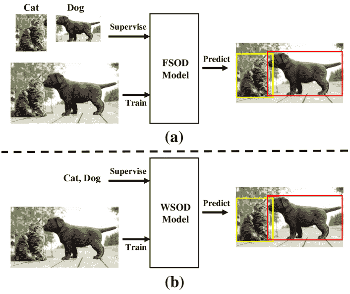

<!--yml

类别：未分类

日期：2024-09-06 19:54:58

-->

# [2105.12694] 弱监督目标检测与目标定位的深度学习：综述

> 来源：[`ar5iv.labs.arxiv.org/html/2105.12694`](https://ar5iv.labs.arxiv.org/html/2105.12694)

# 《弱监督目标检测与目标定位的深度学习：综述》

**费飞·邵**、**龙·陈**、**建·邵**、**伟·季**、**少宁·肖**、**陆·叶**、**悦婷·庄**、**君·肖** 这些作者均来自中国杭州的浙江大学，邮政编码 310027。电子邮件：{sff, jshao, shaoningx, yzhuang, junx}@zju.edu.cn。**龙·陈** 现为美国纽约的哥伦比亚大学的研究员，本工作部分完成时 **L. Chen** 是浙江大学的博士生。电子邮件：zjuchenlong@gmail.com（通讯作者）。**伟·季** 现为新加坡国立大学的研究员，邮政编码 117417。电子邮件：weiji0523@gmail.com。**陆·叶** 现为中国杭州的浙江科技学院的研究员，邮政编码 310023。电子邮件：yelue@zust.edu.cn

###### 摘要

弱监督目标检测（WSOD）和定位（WSOL），即利用图像级标签在图像中检测多个和单个实例的边界框，是计算机视觉领域长期存在且具有挑战性的任务。随着深度神经网络在目标检测中的成功，WSOD 和 WSOL 都受到了前所未有的关注。在深度学习时代，已经提出了数百种 WSOD 和 WSOL 方法以及大量技术。为此，本文将 WSOL 视为 WSOD 的一个子任务，并对 WSOD 的最新成果进行了全面的综述。具体来说，我们首先描述了 WSOD 的定义和设置，包括背景、挑战和基本框架。同时，我们总结并分析了所有先进的技术和提高检测性能的训练技巧。然后，我们介绍了 WSOD 中广泛使用的数据集和评估指标。最后，我们讨论了 WSOD 的未来方向。我们相信，这些总结能够为未来的 WSOD 和 WSOL 研究铺平道路。

###### 关键词：

弱监督目标检测，弱监督目标定位，基本框架，技术，未来方向。

## I 引言

目标检测 [1, 2] 是一项基础而富有挑战性的任务，旨在定位和分类图像中的目标实例。目标定位是使用边界框（一个紧密包围目标的轴对齐矩形）尽可能多地搜索图像中目标的空间位置和范围 [3, 4]。目标分类是评估图像中是否存在给定类别的目标。作为计算机视觉中的核心任务之一，目标检测是许多高级应用的**不可或缺**的技术，例如机器人视觉 [5]、人脸识别 [6]、图像检索 [7, 8]、增强现实 [9]、自动驾驶 [10]、变化检测 [11] 等。随着卷积神经网络（CNNs）在视觉识别中的发展 [12, 13, 14] 和大规模数据集的发布 [4, 15]，目前最先进的目标检测器在完全监督设置下可以实现近乎完美的性能，即完全监督的目标检测（FSOD） [16, 17, 18, 19, 20, 21]。不幸的是，这些完全监督的目标检测方法存在两个不可避免的限制：1）大规模实例注释难以获取且劳动密集。2）标注这些数据时可能会无意中引入注释噪声。

为了避免上述问题，社区开始在弱监督设置下解决目标检测，即弱监督的目标检测（WSOD）。与完全监督设置不同（见图 1（a）），WSOD 旨在仅使用图像级标签（例如，整幅图像中的实例类别）来检测实例。同时，WSOD 可以利用来自网络的大规模数据集，如 Facebook 和 Twitter。另一个类似的任务是弱监督的目标定位（WSOL），其仅检测图像中的一个实例。由于 WSOD 和 WSOL 分别检测多个实例和单个实例，我们将 WSOL 视为 WSOD 的一个子任务。在以下论文中，我们使用 WSOD 来代表 WSOD 和 WSOL。

图 1：（a）完全监督的目标检测（FSOD）使用*实例级*注释作为监督。（b）弱监督的目标检测（WSOD）使用*图像级*注释作为监督。

图 2：本文的主要内容。

在本文中，我们回顾了所有典型的 WSOD 方法，并对 WSOD 的最新进展进行了全面综述（参见图 2）。由于 WSOD 论文数量庞大，我们对未能纳入本综述的 WSOD 及其他相关领域的研究者表示诚挚的歉意。在第 II 节中，我们介绍了背景、主要挑战和基本框架。在第 III 节中，我们根据 WSOD 的发展时间线详细介绍了几种现代经典方法。接着，对主要挑战的所有先进技术和技巧进行了深入分析。在第 VIII 节中，我们展示了 WSOD 的所有流行基准和标准评估指标。在第 IX 节中，我们简要讨论了未来的研究方向。

## II WSOD

### II-A 问题定义

WSOD 旨在仅使用图像级标签来分类和定位目标实例。如图 1 (b) 所示，给定一张包含猫和狗的图像，WSOD 不仅对猫和狗进行分类，还使用边界框来定位它们的位置。与图 1 (a) 所示的 FSOD 不同，后者可以在训练阶段使用实例级标注，而 WSOD 仅访问图像级标签。由于这一限制，尽管已有数百种 WSOD 方法被提出，但 WSOD 与 FSOD 之间的性能差距仍然很大。例如，最先进的 FSOD 方法 [22] 和 WSOD 方法 [23] 在 PASCAL VOC 2007 数据集上，mAP 分别为 86.9% 和 54.9% [24]。因此，在 WSOD 任务中，研究人员仍面临许多挑战，特别是在提高检测性能方面。

表 I：当前最先进的 WSOD 方法总结。对于提议，SS 代表选择性搜索，EB 代表边缘框，SW 代表滑动窗口。挑战项表示对应论文的主要贡献。

| 方法 | 年份 | 提议 | 网络 | 挑战 | Github 代码 |
| --- | --- | --- | --- | --- | --- |
| 基于 MIL | 基于 CAM | 区分性区域 | 多实例 | 速度 |
| --- | --- | --- | --- | --- |
| WSDDN [25] | CVPR2016 | EB | $\surd$ |  |  |  |  | hbilen/WSDDN |
| CAM [26] | CVPR2016 | Heatmap |  | $\surd$ |  |  | $\surd$ | zhoubolei/CAM |
| WSLPDA [27] | CVPR2016 | EB | $\surd$ |  | $\surd$ |  |  | jbhuang0604/WSL |
| WELDON [28] | CVPR2016 | SW | $\surd$ |  | $\surd$ |  | $\surd$ |  |
| ContextLocNet [29] | ECCV2016 | SS | $\surd$ |  | $\surd$ |  |  | vadimkantorov/contextlocnet |
| Grad-CAM [30] | ICCV2017 | Heatmap |  | $\surd$ | $\surd$ |  | $\surd$ | ramprs/grad-cam |
| OICR [31] | CVPR2017 | SS | $\surd$ |  | $\surd$ |  |  | ppengtang/oicr |
| WCCN [32] | CVPR2017 | EB | $\surd$ |  | $\surd$ |  |  |  |
| ST-WSL [33] | CVPR2017 | EB | $\surd$ |  | $\surd$ | $\surd$ |  |  |
| WILDCAT [34] | CVPR2017 | Heatmap |  | $\surd$ | $\surd$ |  | $\surd$ | durandtibo/wildcat.pytorch |
| SPN [35] | ICCV2017 | SW | $\surd$ |  |  |  | $\surd$ | ZhouYanzhao/SPN |
| TP-WSL [36] | ICCV2017 | Heatmap |  | $\surd$ | $\surd$ |  | $\surd$ |  |
| PCL [37] | TPAMI2018 | SS | $\surd$ |  | $\surd$ | $\surd$ |  | ppengtang/pcl.pytorch |
| GAL-fWSD [38] | CVPR2018 | EB | $\surd$ |  |  |  | $\surd$ |  |
| W2F [39] | CVPR2018 | SS | $\surd$ |  | $\surd$ | $\surd$ | $\surd$ |  |
| ACoL [40] | CVPR2018 | Heatmap |  | $\surd$ | $\surd$ |  | $\surd$ | xiaomengyc/ACoL |
| ZLDN [41] | CVPR2018 | EB | $\surd$ |  | $\surd$ |  |  |  |
| TS²C [42] | ECCV2018 | SS | $\surd$ |  | $\surd$ |  |  |  |
| SPG [43] | ECCV2018 | Heatmap |  | $\surd$ |  |  | $\surd$ | xiaomengyc/SPG |
| WSRPN [44] | ECCV2018 | EB | $\surd$ |  |  |  |  |  |
| C-MIL [45] | CVPR2019 | SS | $\surd$ |  |  |  |  | WanFang13/C-MIL |
| WS-JDS [46] | CVPR2019 | EB | $\surd$ |  | $\surd$ |  |  | shenyunhang/WS-JDS |
| ADL [47] | CVPR2019 | Heatmap |  | $\surd$ |  |  | $\surd$ | junsukchoe/ADL |
| Pred NET [48] | CVPR2019 | SS | $\surd$ |  |  |  |  |  |
| WSOD2 [49] | ICCV2019 | SS | $\surd$ |  | $\surd$ |  |  | researchmm/WSOD2 |
| OAILWSD [50] | ICCV2019 | SS | $\surd$ |  | $\surd$ |  |  |  |
| TPWSD [51] | ICCV2019 | SS | $\surd$ |  | $\surd$ |  |  |  |
| SDCN [52] | ICCV2019 | SS | $\surd$ |  | $\surd$ |  |  |  |
| C-MIDN [53] | ICCV2019 | SS | $\surd$ |  | $\surd$ |  |  |  |
| DANet [54] | ICCV2019 | Heatmap |  | $\surd$ |  |  | $\surd$ | xuehaolan/DANet |
| NL-CCAM [55] | WACV2020 | Heatmap |  | $\surd$ | $\surd$ |  | $\surd$ | Yangseung/NL-CCAM |
| ICMWSD [23] | CVPR2020 | SS | $\surd$ |  | $\surd$ |  |  |  |
| EIL [56] | CVPR2020 | Heatmap |  | $\surd$ | $\surd$ |  | $\surd$ | Wayne-Mai/EIL |
| SLV [57] | CVPR2020 | SS | $\surd$ |  | $\surd$ |  |  |  |

### II-B 主要挑战

WSOD 的主要挑战来自两个方面：定位准确性和速度。在定位准确性方面，问题包括判别区域问题和同一类别的多个实例问题。在速度方面，它是实际应用中的一个重要特性。在 TABLE I 中，我们总结了所有典型的 WSOD 方法及其对这些挑战的贡献。

判别区域问题。检测器[25, 26]倾向于关注物体的最具判别性的部分。在训练过程中，物体周围可能存在多个提议，且物体的最具判别性部分区域可能具有最高分（例如，图 3（左）中的区域 A 是最具判别性的区域，其分数高于其他区域）。如果模型仅根据分数选择正提议，则容易关注物体的最具判别性的部分，而忽视整个物体的范围。

图 3：未进行分类器优化（左）和进行了分类器优化（右）的模型检测结果。该图来自[31]。

多实例问题。它表示检测器[25, 31]在图像中可能存在多个相同类别的物体时，很难准确识别多个实例。虽然图像中有多个相同类别的实例，但这些检测器[25, 31]仅选择每个类别的最高分提议作为正提议，并忽略其他可能的实例提议。

速度问题。目前，WSOD 方法的速度瓶颈主要集中在提议生成上。广泛使用于 WSOD 的选择性搜索（SS）[58]和边缘框（EB）[59]过于耗时。

### II-C 基本 WSOD 框架

WSOD 方法的基本框架可以根据对多个实例和单个实例的检测分为 MIL 基础网络和 CAM 基础网络。

#### II-C1 MIL 基础网络

当检测网络预测图像中的多个实例时，它被视为多实例学习（MIL）问题 [60]。以图 Fig. 1 (b) 为例，在 MIL 问题中，一张图像被解释为提案的集合。如果图像标记为猫，则意味着至少有一个提案紧密包含了猫实例。否则，所有区域都不包含猫实例（狗也是如此）。基于 MIL 的网络基于 WSDDN [25] 的结构，包含三个组件：提案生成器、主干网络和检测头。

提案生成器。在基于 MIL 的网络中通常使用多种提案生成器。1) 选择性搜索（SS）[58]：它利用了全面搜索和分割的优势来生成初始提案。2) 边缘框（EB）[59]：它利用物体边缘生成提案，并在许多方法中广泛使用 [25, 27, 32, 33, 41, 44, 46]。3) 滑动窗口（SW）：它表示特征图的每个点对应于原始图像相对位置上的一个或多个提案。滑动窗口在提案生成中比选择性搜索 [58] 和边缘框 [59] 更快。

Backbone。随着卷积神经网络（CNNs）和大规模数据集（如 ImageNet [4]）的发展，预训练的 AlexNet [61]、VGG16 [12]、GoogLeNet [13]、ResNet [14] 和 SENet [62] 成为分类和物体检测中的主流特征表示网络。

检测头。它包括一个分类流和一个定位流。分类流预测每个提案的类别分数，定位流预测每个提案在每个类别中的存在概率分数。然后，这两个分数被汇总以预测整个图像的置信度分数，这些分数用于在学习中注入图像级的监督。

给定一张图像，我们首先将其输入到提案生成器和主干网络中，分别生成提案和特征图。然后，特征图和提案被传送到空间金字塔池化（SPP）[63] 层，以生成固定大小的区域。最后，这些区域被送入检测头，以分类和定位物体实例。

#### II-C2 基于 CAM 的网络

当检测网络仅预测图像中的单一实例时，它被视为物体定位问题。基于 CAM 的网络基于 CAM [26] 的结构，包含三个组件：主干网络、分类器和类别激活图。

主干网络。它类似于在第 II-C1 节中介绍的基于 MIL 的网络。

分类器。它旨在对图像的类别进行分类，包括一个全局平均池化（GAP）层和一个全连接层。

类别激活图。它通过使用简单的分割技术来定位物体实例。由于类别激活图是通过将全连接层的权重与最后一层卷积层的特征图进行矩阵乘法生成的，因此它突出显示了每个激活图中的类别特定区分区域。因此，通过对类别的激活图进行分割，可以轻松生成每个类别的边界框。

给定一张图像，我们首先将其输入到主干网络中以生成该图像的特征图。然后，将特征图传递到分类器中以对图像的类别进行分类。同时，我们将全连接层的权重与最后一层卷积层的特征图进行矩阵乘法，以生成类别激活图。最后，我们对最高概率类别的激活图进行分割，以产生用于物体定位的边界框。

#### II-C3 讨论

在本节中，我们讨论基于 MIL 的网络和基于 CAM 的网络之间的区别。

首先，基于 MIL 的网络利用 SS [58]、EB [59] 或 SW 生成数千个初始提案，而基于 CAM 的网络将激活图分割成每个类别一个提案。因此，在检测图像中具有相同类别的多个实例时，基于 MIL 的网络优于基于 CAM 的网络，但基于 CAM 的网络的训练和推理速度比基于 MIL 的网络更快。

其次，由于 SS 或 EB 产生的提案大小不一致，基于 MIL 的网络利用 SPP 层生成固定大小的向量，然后将这些固定大小的向量输入到全连接层进行后续训练。然而，基于 CAM 的网络利用 GAP 层在特征图上生成固定大小的向量。然后，将向量输入到全连接层进行分类。

最后，无论是基于 MIL 的网络还是基于 CAM 的网络都会面临区分区域问题和多实例问题。此外，基于 MIL 的网络还会面临训练和测试速度问题，因为 SS 和 EB 太耗时，并且会产生大量的初始提案。

## WSOD 的里程碑

自 2016 年以来，WSOD 研究中出现了一些重要的方法（参见图 4）。接下来，我们将简要介绍这些里程碑。

图 4：自 2016 年以来 WSOD 的里程碑。

### III-A 基于 MIL 的方法

WSDDN。WSDDN [25] 的最大贡献是使用双流网络，旨在分别执行分类和定位。WSDDN 首先在特征图的顶部使用 SPP [63]，并在经过两次全连接层处理后生成一个特征向量。接下来，特征向量被输入到分类流和定位流中。具体而言，分类流负责计算每个区域的类别得分，而定位流则用于计算每个类别的区域存在概率。然后，将每个区域的类别得分和每个类别的存在概率的矩阵积视为最终预测得分。然而，由于训练阶段仅访问图像级标签，因此训练时最具区分性的部分会比整个对象实例受到更多关注。由于上述限制，WSDDN 遭遇了区分区域问题。

OICR。为了缓解区分区域问题，OICR [31] 使用 WSDDN 作为其基线，并在基线之后添加了三个实例分类器细化程序。每个实例分类器细化程序，包括两个全连接层，旨在进一步预测每个提议的类别得分。由于每个实例分类器细化程序的输出是其后续细化程序的监督，OICR 可以继续学习，从而使较大区域的得分高于 WSDDN。尽管 WSDDN 的预测可能仅关注物体的区分部分，但在经过几个实例分类器细化程序后会得到改进。

SDCN。SDCN [52] 引入了分割-检测协作机制。它由检测分支和分割分支组成，分别负责检测边界框和生成分割掩膜。在 SDCN 中，检测结果将通过将所有像素的分类得分设置为分割分支的监督掩膜来转换为热图。同时，与分割掩膜中的连接区域重叠度最高的提议将成为检测分支的伪地面真实框。检测分支和分割分支交替优化并相互促进，因此 SDCN 比 OICR 实现了更好的检测性能。

ICMWSD。与使用对象检测和分割协作机制的 SDCN 不同，ICMWSD [23] 通过利用上下文信息来解决集中于物体最具区分性部分的问题。首先，ICMWSD 通过丢弃最具区分性的部分来获得丢失的特征。然后，最大化丢失特征的损失以迫使 ICMWSD 关注周围的上下文区域。

### III-B 基于 CAM 的方法

CAM。CAM [26] 的最大贡献是使用类别激活图预测实例。CAM 首先在最后的卷积特征图上利用 GAP 层生成特征向量。然后，特征向量被输入到具有全连接层的分类器中，生成图像的预测分数。最后，CAM 通过使用简单的阈值技术对每个类别的激活图进行分割，生成每个类别的边界框。然而，CAM 的类别激活图突出了物体最具区分性的区域，因此 CAM 也面临与 WSDDN 相同的区分区域问题。

WCCN。为了缓解区分区域问题，WCCN [32] 提出了使用一个具有三个级联阶段的级联网络，该网络在端到端的管道中进行训练。第一个阶段是 CAM [26] 网络，旨在生成类别激活图和初始提案。第二个阶段是一个分割网络，利用类别激活图训练物体分割以优化物体定位。最终阶段是 MIL 网络，对第二阶段提取的提案进行多实例学习。由于第二和第三阶段优化物体定位，WCCN 缓解了通常集中于物体最具区分性的部分的问题。

ACoL。为了缓解区分区域问题，ACoL [40] 引入了两个并行分类器，用于通过对抗性互补学习进行物体定位。具体来说，它首先利用第一个分类器来定位最具区分性的区域。然后，ACoL 通过将第一个分类器发现的最具区分性的区域进行遮罩，来使用遮罩后的特征图作为第二个分类器的输入特征图。这迫使第二个分类器选择下一个区分区域。最后，ACoL 融合两个分类器的类别激活图，通过分割最高概率类别的激活图生成每个类别的边界框。

## IV 解决区分区域问题的具体技术

在本节中，我们将介绍几种解决区分区域问题的高级技术。

### IV-A 上下文建模

一个区域的上下文是该区域的外部信息，可以通过用特定数字（如零）对特征图的区域进行遮罩来获取。使用上下文建模的策略有两种类型，如下所示。

策略 A。它选择那些分数与其上下文区域的分数之间存在较大差距的区域作为正提议。例如，WSLPDA [27] 首先将一个提议中的像素值替换为零，以获得上下文区域。然后，WSLPDA 比较提议及其上下文区域的分数。如果两个分数之间的差距很大，则表示该提议可能为正提议。ContextLocNet [29] 从一个提议的定位分数中减去提议的外部矩形区域的定位分数。然后，这一减法被视为提议的最终定位分数。类似于 WSLPDA 和 ContextLocNet，TS²C [42] 通过比较一个提议及其周围区域的像素的平均对象性分数来选择正提议。但为了减轻周围区域背景像素的影响，TS²C 仅使用周围区域中置信度较高的像素计算平均对象性分数。

策略 B。它通过利用上下文区域的损失来选择正提议。例如，OAILWSD [50] 认为，如果一个提议的上下文特征图的损失倾向于减少，那么该提议可能并未紧密覆盖对象实例。因此，OAILWSD 首先利用上下文分类损失对区域进行标记。然后，它选择那些上下文类别概率低的高分区域作为正提议。ICMWSD [23] 首先丢弃特征图中最具区分性的部分，以获得上下文特征图。然后，它最大化上下文特征图的损失，以迫使其关注上下文区域。

### IV-B 自训练算法

在自训练算法中，早期预测实例会被用作检测器的伪真实实例用于后续训练。自训练算法有两种类型：流间自训练和历时自训练。在流间自训练中，每个流的实例监督其后续流。在历时自训练中，每个历时的实例监督其后续历时。自训练的关键思想是，即使早期高分提议可能只关注对象的区分部分，但经过若干次精细化程序后，它们会被进一步优化。

#### IV-B1 流间自训练

OICR [31] 期望 B、C 和 D 可以继承 A 的类别分数，从而正确地定位图 3 (右侧) 中的对象。因此，OICR 在 WSDDN 中添加了三个包含两个全连接层的细化分类器，以解决图 3 (左侧) 中显示的问题。具体来说，第一个细化分类器的监督是 WSDDN 的输出。至于其他细化分类器，当前细化分类器的监督是其前一个细化分类器的输出。受 OICR 启发，WSOD2 [49] 包含了许多分类器。ICMWSD [23] 也在 WSDDN 中插入了细化流，但每个细化流包括一个分类器和一个回归器。此外，一些方法 [39, 53, 50, 51] 使用 OICR 作为其基准。

#### IV-B2 代间自训练

Self-Taught-WS [33] 使用相邻两个周期中每个提案得分的相对改善 (RI) 作为选择正样本的标准。具体来说，它选择与最大 RI 提案的交并比 (IoU) $\geq 0.5$ 的前一周期提案作为当前周期的正样本。

### IV-C 级联网络

级联网络包括多个阶段，当前阶段的监督是前一阶段的输出。例如，WCCN [32] 和 TS²C [42] 包含三个阶段。第一阶段是 CAM 模块，用于生成初始提案，使用类别激活图。中间阶段是对象分割模块，旨在细化初始提案。最终阶段是多实例学习模块，负责检测准确的对象。

### IV-D 边界框回归

边界框回归可以在训练阶段使用实例级注释来提高对象定位性能，但 WSOD 任务仅访问图像级标签。为了使用边界框回归来细化 SS [58] 或 EB [59] 中的初始提案，一些方法建议生成高质量的伪真实框作为边界框回归的监督。

目前，许多方法 [48, 49, 51, 23, 57] 包含至少一个边界框回归器。回归器的监督是前一分类器的输出。

### IV-E 判别区域移除

从图 3（左侧），一些研究人员发现最高得分的区域仅覆盖了对象最具判别性的部分。为了定位整个对象的范围，设计了遮罩对象最具判别性的部分，以迫使检测器找到下一个判别性区域。

TP-WSL [36] 是一个两阶段学习网络，通过遮罩最具判别性的区域来检测下一个判别性区域。在第一阶段，它生成类别激活图，并使用最高概率类别的激活图中的阈值遮罩最具判别性的区域。在第二阶段，它将遮罩后的激活图与第二个网络的特征图相乘，以细化特征图，从而检测下一个判别性区域。

不同于具有两个主干网络的 TP-WSL，ACoL [40] 由一个共享主干网络和两个并行分类器组成。第一个分类器的遮罩特征图被输入到第二个分类器中，以生成类别激活图。最终，ACoL 通过融合两个分类器的类别激活图来定位对象实例。EIL [56] 提议共享 ACoL 的两个并行分类器的权重，并且它仅从未遮罩的分支中分割最高概率类别的激活图，以生成对象提议。与 ACoL 相比，C-MIDN [53] 有三个区别。首先，C-MIDN 的检测网络是 WSDDN [25]，而 ACoL 的检测网络是 CAM [26]。其次，C-MIDN 在第二个分支中不计算与第一个检测模块的高重叠提议的损失，但 ACoL 在第二个分支中将第一个检测模块的高分提议的区域遮罩为零。最后，C-MIDN 选择第二个检测模块的高分提议和第一个检测模块中与所选提议低重叠的高分提议作为正提议，而 ACoL 通过分割融合的类别激活图生成正提议。

### IV-F 结合低级特征

低级特征通常保留更丰富的对象细节，如边缘、角点、颜色、像素等。如果充分利用这些低级特征，我们可以获得准确的对象定位。例如，Grad-CAM [30] 利用高分辨率的 Guided Backpropagation [64] 强调图像的细节，以创建高分辨率且具有类别区分性的可视化。WSOD2 [49] 首先计算区域提议的得分。然后，它在低级图像特征（例如超像素）中选择相同的区域，并计算该区域的得分。最后，两者得分的乘积即为区域提议的最终得分。

### IV-G 分割-检测协作机制

分割-检测协作机制包括一个分割分支和一个检测分支。协作机制的主要原因如下：1）MIL（检测）可以正确地将一个区域区分为物体，但它不擅长检测该区域是否包含整个物体。2）分割可以覆盖整个物体实例，但无法区分该区域是否为真实物体[52]。因此，一些模型通过相互监督来深度合作检测与分割，以实现准确的定位。

WS-JDS [46] 首先选择由语义分割分支生成的得分最高的区域提案作为检测分支的正样本。然后，它将检测分支中每个正样本内的所有像素的分类得分设为分割分支的监督掩码。类似于 WS-JDS，SDCN [52] 也将检测分支与分割分支结合起来，这在第 III-A 节中介绍。

### IV-H 将 WSOD 转化为 FSOD

将 WSOD 转化为 FSOD 是另一种利用图像级标签实现目标检测的流行技术，旨在使用 WSOD 模型的输出训练 FSOD 模型。转化的主要问题是从 WSOD 中生成良好的伪地面实况框。挖掘伪地面实况框的策略有几种：1）最高得分：许多方法[31, 37, 42, 46, 52, 53] 选择 WSOD 的最高得分检测框作为伪地面实况框。2）相对改进（RI）：ST-WSL [33] 选择两个相邻轮次中相对得分改进最大的框作为伪地面实况框。3）合并：W2F [39] 将几个小框合并为一个大的候选框，并使用这些合并后的框作为后续训练的伪地面实况框。SLV [57] 首先将几个框的得分合并到像素上，然后使用简单的阈值技术生成每个类别的边界框。

此外，还有几个 FSOD 模型被使用，包括：Fast R-CNN [65]、Faster R-CNN [16] 和 SSD [17]。许多方法[31, 33, 37, 42, 46, 52, 53, 57] 使用 WSOD 的预测框作为伪地面实况框来训练 Fast R-CNN。W2F [39] 使用 WSOD 的预测框来训练 Faster R-CNN。GAL-fWSD [38] 使用 WSOD 的预测框来训练 SSD。

### IV-I 讨论

在前面的章节中，我们逐一介绍了几种常用的技术，通过详细列举众多方法来改善检测性能。在本节中，我们将比较和讨论这些技术。

首先，背景建模和区分区域移除是两种类似的技术。背景建模是分别计算提议及其背景区域的得分。然后，它选择由这两个得分派生的正提议。另一方面，区分区域移除则是通过在第一个分支的特征图中设置零值直接擦除得分最高的区域，然后将擦除后的特征图输入到第二个分支中。

其次，自训练算法通常与边界框回归同时出现。边界框回归负责细化来自 SS [58]或 EB [59]的初始提议。而自训练算法旨在优化基线的预测结果。自训练算法和边界框回归的核心问题是生成好的伪地面真实框。

其次，级联网络和分割-检测协作机制是两种类似的技术。它们利用分割模块来提高对象检测模块的性能。级联网络是一个顺序结构，其中前一个模块负责训练后一个模块。然而，分割-检测协作机制是一个循环结构，通过检测和分割之间的深度合作来相互监督以实现准确定位。

最后，结合低级特征技术利用低级特征的高分辨率特性来提高对象定位。将 WSOD 技术转化为 FSOD 技术的关键思想是充分利用 FSOD 模型的网络结构优势（例如，Fast R-CNN [65]）。

## V 多实例问题的具体技术

在本节中，我们将介绍如何充分利用提议的空间关系来解决第 II-B 节中提出的多实例问题。具体来说，彼此距离较远的两个提议很可能对应两个对象实例，而重叠较大的两个提议可能对应同一个对象实例。

ST-WSL [33] 利用图形来检测图像中相同类别的多个实例。它首先选择每个正类的 N 个高评分提案作为图的节点。两个节点之间的边表示它们之间有较大的重叠。然后，它使用非极大值抑制（NMS）算法 [66] 选择度数最大的（与其他节点的连接数）节点作为正提案。PCL [37] 引入了提案簇，取代了包含每个类别所有提案的提案包。PCL 将相同标签和空间相邻的提案分配到同一个提案簇中。如果提案之间没有重叠，它们将被分配到不同的提案簇中。然后，PCL 从每个提案簇中选择得分最高的提案作为正提案。W2F [39] 迭代地将高度重叠的高评分提案合并为大的提案。最后，这些大的提案被视为正提案。

## VI 速度问题的具体技术

在本节中，我们将介绍几种解决第 II-B 节中提出的速度问题的高级技术。速度慢的主要原因是 MIL 基于方法采用 SS [58] 或 EB [59] 生成大量初始提案，其中大多数是负样本。

提高速度的方法可以大致分为三类：1) 基于变换的 [39, 38]: 这些方法将预测框用作伪真实框来训练 Faster R-CNN [16] 或 SSD [17]，然后使用 Faster R-CNN 或 SSD 来推断图像。2) 基于滑动窗口的 [28, 35]: 这些方法使用滑动窗口技术，通过遍历特征图上的每个点快速生成提案。3) 基于热图的 [26, 30, 34, 36, 40, 43, 47, 54, 55, 56]: 这些方法通过使用阈值对热图进行分割来生成提案，从而提高提案生成的速度。

## VII 训练技巧

除了上一章中的技术外，不改变网络结构的训练技巧也能提高检测结果。在本节中，我们将介绍几种用于改善物体定位的训练技巧。

### VII-A 从易到难的策略

以前的方法 [25, 26, 28, 29, 31, 32, 36] 直接使用所有图像进行检测模型的训练，而没有训练序列。易到难策略意味着模型通过逐渐增加难度的图像进行训练。这样，模型可以获得更好的检测结果。例如，ZLDN [41] 首先计算图像的难度分数。然后，所有图像根据难度分数按升序排列。最后，ZLDN 使用难度逐渐增加的图像进行逐步训练。

### VII-B 负证据

负证据包含低分区域、激活和激活图。例如，WELDON [28] 使用前 $k$ 个高分提案和 $m$ 个低分提案的分类分数，通过简单求和生成图像的分类分数。WILDCAT [34] 利用激活图中的 $k^{+}$ 个最高概率激活和 $k^{-}$ 个最低概率激活生成预测分数。NL-CCAM [55] 使用最低概率的激活图。具体来说，它首先根据每个类别的概率对所有激活图进行降序排序。然后，它使用特定的组合函数将这些类别激活图融合成一个图，从中分割出目标实例进行预测。

### VII-C 优化平滑损失函数

如果模型的损失函数是非凸的，它倾向于陷入次优解并在训练过程中错误地定位对象部分而漏掉完整对象的范围 [45]。因此，C-MIL [45] 用一系列平滑损失函数替代非凸损失函数，以缓解模型倾向于陷入局部最小值的问题。在训练开始时，C-MIL 首先执行图像分类任务。在训练过程中，C-MIL 的损失函数会逐渐从凸的图像分类损失转变为非凸的目标检测损失函数。

### VII-D 讨论

在前面的章节中，我们分别介绍了几个独立于网络结构的训练技巧。在这一部分，我们将比较和讨论这些技巧。

首先，采用从易到难的策略来处理数据阶段，这一阶段负责调整训练图像的顺序。其次，负证据作用于训练阶段，旨在优化正样本提案或特征图。最后，优化平滑损失函数作用于优化阶段，负责避免次优解。

## VIII 数据集和性能评估

### VIII-A 数据集

数据集在 WSOD 任务中发挥着重要作用。大多数 WSOD 方法使用 PASCAL VOC [3]、MSCOCO [15]、ILSVRC [4] 或 CUB-200 [67] 作为训练和测试数据集。

PASCAL VOC。它包括 20 个类别和数万张带有实例注释的图像。PASCAL VOC 有几个版本，例如 PASCAL VOC 2007、2010 和 2012。具体来说，PASCAL VOC 2007 包含 2,501 张训练图像、2,510 张验证图像和 4,092 张测试图像。PASCAL VOC 2010 包含 4,998 张训练图像、5,105 张验证图像和 9,637 张测试图像。PASCAL VOC 2012 包含 5,717 张训练图像、5,823 张验证图像和 10,991 张测试图像。

MSCOCO。它是一个大规模的目标检测、分割和描述数据集。MSCOCO 具有 80 个目标类别、33 万张图像（>20 万张带标签）、150 万个目标实例。在目标检测中，MSCOCO 与 PASCAL VOC 数据集同样受欢迎。由于 MSCOCO 的图像和类别比 PASCAL VOC 数据集更多，因此在 MSCOCO 数据集上的训练难度高于 PASCAL VOC 数据集。

ILSVRC。ImageNet 大规模视觉识别挑战赛 (ILSVRC) 是一个大规模数据集。在 ILSVRC 中，模型通常使用 200 个完全标记的类别和 1,000 个目标检测和目标定位的类别。ILSVRC 有几个版本，例如 ILSVRC 2013、ILSVRC 2014 和 ILSVRC 2016。具体来说，ILSVRC 2013 通常用于目标检测，包含 12,125 张训练图像、20,121 张验证图像和 40,152 张测试图像。此外，ILSVRC 2014 和 2016 继承了 ILSVRC 2012 数据集中的目标定位，训练集中包含 1,000 个类别的 120 万张图像。ILSVRC 2012 数据集在验证集和测试集中分别有 50,000 张和 100,000 张带标签的图像。

CUB-200。Caltech-UCSD 鸟类 200 (CUB-200) 包含 200 种鸟类，是一个具有挑战性的图像数据集。它专注于从属分类的研究。CUB-200-2011 [68] 是 CUB-200 的扩展版本，增加了每个类别的许多图像并标注了新的部位定位注释。CUB-200-2011 包含 5,994 张训练图像和 5,794 张测试图像。

### VIII-B 评估指标

在最先进的 WSOD 方法中，有三种标准评估指标：mAP、CorLoc 和 top error。

mAP（均值平均精度）。平均精度 (AP) 通常用于图像分类和目标检测。它由精度和召回率组成。如果 $tp$ 表示所有正样本中正确预测样本的数量，$fp$ 表示所有正样本中错误预测样本的数量，$fn$ 表示所有负样本中错误预测样本的数量，则精度和召回率可以计算为

|  | 召回率 | $\displaystyle=tp/(tp+fn),$ |  | (1) |
| --- | --- | --- | --- | --- |
|  | 精度 | $\displaystyle=tp/(tp+fp),$ |  |

其中正确的预测样本表示正样本及其对应真实框的 IoU $\geq$ 0.5。与此同时，IoU 被定义为

|  | ${\rm IoU}(b,b^{g})=area(b\cap b^{g})/area(b\cup b^{g}),$ |  | (2) |
| --- | --- | --- | --- |

其中 $b$ 表示一个预测样本，$b^{g}$ 表示一个对应的真实框，$area$ 表示交集或并集的区域大小。mAP 是所有类别平均精度的均值，是测试数据集上性能的最终评估指标。

CorLoc（正确定位）。CorLoc 表示在这些图像中每个类别的预测框与真实框的 IoU $\geq$ 50% 的图像百分比。CorLoc 是训练验证数据集上定位准确度的最终评估指标。

Top Error（顶部错误）。Top Error 包括 Top-1 分类错误（1-err cls）、Top-5 分类错误（5-err cls）、Top-1 定位错误（1-err loc）和 Top-5 定位错误（5-err loc）。具体来说，Top-1 分类错误等于 $1.0-cls_{1}$，其中 $cls_{1}$ 表示最高预测分数的准确度（Top-1 定位错误也类似）。Top-5 分类错误等于 $1.0-cls_{5}$，其中 $cls_{5}$ 表示如果五个预测中有一个是正确的，就算正确（Top-5 定位错误也类似）。许多方法 [26, 40, 43, 54, 55] 使用 Top Error 来评估模型性能。

### VIII-C 实验结果

Pascal VOC 上的结果。最先进的 WSOD 方法在 Pascal VOC 2007、2010 和 2012 数据集上的结果如表 II 所示。带有“+FR”标记的 WSOD 方法表示它们的初始预测被输入到 Fast R-CNN [65] 中，并作为伪真实框标注，即这些方法将 WSOD 转换为 FSOD 问题。从结果中可以观察到，所有三个 Pascal VOC 数据集上的性能在最近几年取得了前所未有的进展（例如，CVPR’20 上 Pascal VOC 2012 的 mAP 为 52.1%，而 CVPR’16 为 29.1%）。同时，比较这些方法与其 Fast R-CNN 对应方法（例如，OICR 与 OICR+FR），我们可以发现，使用这种 FSOD 转换策略可以进一步提升检测性能。

MSCOCO 上的结果。表格 III 展示了最先进的 WSOD 方法在 MSCOCO 数据集上的结果。我们仅报告 AP 指标，AP[50]表示 IoU 阈值为$0.5$。类似地，MSCOCO 上的性能在过去几年也翻了一番（例如，测试集中的 AP[50]从 11.5%提升到 24.8%）。由于 MSCOCO 包含的物体类别比 PASCAL VOC 数据集更多，因此在 MSCOCO 上的结果仍然远未令人满意。然而，将 WSOD 转换为 FSOD 带来的性能提升相对较小（例如，PCL 模型在 AP 上的提升为 0.7%）。

ILSVRC 2020 和 CUB-200 上的结果。表 IV 总结了最先进的 WSOD 方法在这两个数据集上的物体定位性能。与 PASCAL VOC 和 MSCOCO 相比，很少有 WSOD 方法在这两个基准上评估其性能。从表 IV 中可以发现，性能提升也很显著（ILSVRC 2012 中的 1-err cls 35.6% vs. 27.7%）。

表 II：最先进的 WSOD 方法在 Pascal VOC 2007、2010 和 2012 数据集上的检测结果汇总（mAp (%) 和 CorLoc (%)）。FR 指的是 Fast R-CNN [65]。

| 方法 | 2007 | 2010 | 2012 |
| --- | --- | --- | --- |
| mAP | CorLoc | mAP | CorLoc | mAP | CorLoc |
| WSDDN [25]${}_{\text{CVPR2016}}$ | 39.3 | 58.0 | 36.2 | 59.7 | - | - |
| WSLPDA [27]${}_{\text{CVPR2016}}$ | 39.5 | 52.4 | 30.7 | - | 29.1 | - |
| ContextLocNet [29]${}_{\text{ECCV2016}}$ | 36.3 | 55.1 | - | - | 35.3 | 54.8 |
| OICR [31]${}_{\text{CVPR2017}}$ | 42.0 | 61.2 | - | - | 38.2 | 63.5 |
| WCCN [32]${}_{\text{CVPR2017}}$ | 42.8 | 56.9 | 39.5 | - | 37.9 | - |
| ST-WSL [33]${}_{\text{CVPR2017}}$ | 41.7 | 56.1 | - | - | 39.0 | 58.8 |
| SPN [35]${}_{\text{ICCV2017}}$ | - | 60.6 | - | - | - | - |
| TST [69]${}_{\text{ICCV2017}}$ | 34.5 | 60.8 | - | - | - | - |
| PCL [37]${}_{\text{TPAMI2018}}$ | 45.8 | 63.0 | - | - | 41.6 | 65.0 |
| GAL-fWSD [38]${}_{\text{CVPR2018}}$ | 47.0 | 68.1 | 45.1 | 68.3 | 43.1 | 67.2 |
| W2F [39]${}_{\text{CVPR2018}}$ | 52.4 | 70.3 | - | - | 47.8 | 69.4 |
| ZLDN [41]${}_{\text{CVPR2018}}$ | 47.6 | 61.2 | - | - | 42.9 | 61.5 |
| MELM [70]${}_{\text{CVPR2018}}$ | 47.3 | 61.4 | - | - | 42.4 | - |
| TS²C [42]${}_{\text{ECCV2018}}$ | 44.3 | 61.0 | - | - | 40.0 | 64.4 |
| C-WSL [71]${}_{\text{ECCV2018}}$ | 45.6 | 63.3 | - | - | 43.0 | 64.9 |
| WSRPN [44]${}_{\text{ECCV2018}}$ | 47.9 | 66.9 | - | - | 43.4 | 67.2 |
| C-MIL [45]${}_{\text{CVPR2019}}$ | 40.7 | 59.5 | - | - | 46.7 | 67.4 |
| WS-JDS [46]${}_{\text{CVPR2019}}$ | 45.6 | 64.5 | 39.9 | 63.1 | 39.1 | 63.5 |
| Pred NET [48]${}_{\text{CVPR2019}}$ | 53.6 | 71.4 | - | - | 49.5 | 70.2 |
| WSOD2 [49]${}_{\text{ICCV2019}}$ | 53.6 | 69.5 | - | - | 47.2 | 71.9 |
| OAILWSD [50]${}_{\text{ICCV2019}}$ | 47.6 | 66.7 | - | - | 43.4 | 66.7 |
| TPWSD [51]${}_{\text{ICCV2019}}$ | 51.5 | 68.0 | - | - | 45.6 | 68.7 |
| SDCN [52]${}_{\text{ICCV2019}}$ | 50.2 | 68.6 | - | - | 43.5 | 67.9 |
| C-MIDN [53]${}_{\text{ICCV2019}}$ | 52.6 | 68.7 | - | - | 50.2 | 71.2 |
| ICMWSD [23]${}_{\text{CVPR2020}}$ | 54.9 | 68.8 | - | - | 52.1 | 70.9 |
| SLV [57]${}_{\text{CVPR2020}}$ | 53.5 | 71.0 | - | - | 49.2 | 69.2 |
| OICR [31]+FR${}_{\text{CVPR2017}}$ | 47.0 | 64.3 | - | - | 42.5 | 65.6 |
| PCL [37]+FR${}_{\text{TPAMI2018}}$ | 48.8 | 66.6 | - | - | 44.2 | 68.0 |
| MEFF [72]+FR${}_{\text{CVPR2018}}$ | 51.2 | - | - | - | - | - |
| C-WSL [71]+FR${}_{\text{ECCV2018}}$ | 47.8 | 65.6 | - | - | 45.4 | 66.9 |
| WSRPN [44]+FR${}_{\text{ECCV2018}}$ | 50.4 | 68.4 | - | - | 45.7 | 69.3 |
| WS-JDS [46]+FR${}_{\text{CVPR2019}}$ | 52.5 | 68.6 | 45.7 | 68.1 | 46.1 | 69.5 |
| SDCN [52]+FR${}_{\text{ICCV2019}}$ | 53.7 | 72.5 | - | - | 46.7 | 69.5 |
| C-MIDN [53]+FR${}_{\text{ICCV2019}}$ | 53.6 | 71.9 | - | - | 50.3 | 73.3 |
| SLV [57]+FR${}_{\text{CVPR2020}}$ | 53.9 | 72.0 | - | - | - | - |

表 III: MSCOCO 数据集的检测结果来自 [23]。这些模型使用 VGG16 作为其卷积神经网络。在 MSCOCO 上，AP 和 mAP 没有差别。

| 方法 | 年份 | 验证集 | 测试集 |
| --- | --- | --- | --- |
| AP | AP[50] | AP | AP[50] |
| WSDDN [25] | CVPR2016 | - | - | - | 11.5 |
| WCCN [32] | CVPR2017 | - | - | - | 12.3 |
| PCL [37] | TRAMI2018 | 8.5 | 19.4 | - | - |
| C-MIDN [53] | ICCV2019 | 9.6 | 21.4 | - | - |
| WSOD2 [49] | ICCV2019 | 10.8 | 22.7 | - | - |
| ICMWSD [23] | CVPR2020 | 11.4 | 24.3 | 12.1 | 24.8 |
| Diba et al. [73]+SSD [17] | arXiv 2017 | - | - | - | 13.6 |
| OICR [31]+Ens+FR [65] | CVPR2017 | 7.7 | 17.4 | - | - |
| MEFF [72]+FR [65] | CVPR2018 | 8.9 | 19.3 | - | - |
| PCL [37]+Ens.+FR [65] | TPAMI2018 | 9.2 | 19.6 | - | - |

表 IV: ILSVRC 2012 和 CUB-200-2011 数据集上的目标定位性能。

| 方法 | 年份 | ILSVRC 2012 (最高错误率 %) | CUB-200-2011 (最高错误率 %) |
| --- | --- | --- | --- |
| 1-err cls | 5-err cls | 1-err loc | 5-err loc | 1-err cls | 5-err cls | 1-err loc | 5-err loc |
| CAM [26] | CVPR2016 | 35.6 | 13.9 | 57.78 | 45.26 | - | - | - | - |
| ACoL [40] | CVPR2018 | 32.5 | 12.0 | 54.17 | 36.66 | - | - | 54.08 | 39.05 |
| SPG [43] | ECCV2018 | - | - | 51.4 | 35.05 | - | - | 53.36 | 40.62 |
| DANet [54] | ICCV2019 | 32.5 | 12.0 | 54.17 | 40.57 | 24.6 | 7.7 | 47.48 | 38.04 |
| NL-CCAM [55] | WACV2020 | 27.7 | - | 49.83 | 39.31 | 26.6 | - | 47.6 | 34.97 |
| EIL [56] | CVPR2020 | 29.73 | - | 53.19 | - | 25.23 | - | 42.54 | - |

表 V: 提高检测结果的某些技术和技巧以及利用这些技术的方法。1) Cont: 上下文建模，2) Self-t: 自我训练算法，3) Casc: 级联网络，4) BboxR: 边界框回归，5) DisRR: 判别区域移除，6) Low-l: 融合低级特征，7) Seg-D: 分割-检测协作机制，8) Trans: 将 WSOD 转化为 FSOD，9) E-t-h: 从易到难策略，10) NegE: 负证据，11) SmoL: 优化平滑损失函数。

| 方法 | 针对判别区域问题的特定技术 | 训练技巧 |
| --- | --- | --- |
| Cont | Self-t | Casc | BboxR | DisRR | Low-l | Seg-D | Trans | E-t-h | NegE | SmoL |
| WSDDN [25] |  |  |  |  |  |  |  |  |  |  |  |
| CAM [26] |  |  |  |  |  |  |  |  |  |  |  |
| WSLPDA [27] | $\surd$ |  |  |  |  |  |  |  |  |  |  |
| WELDON [28] |  |  |  |  |  |  |  |  |  | $\surd$ |  |
| ContextLocNet [29] | $\surd$ |  |  |  |  |  |  |  |  |  |  |
| Grad-CAM [30] |  |  |  |  |  | $\surd$ |  |  |  |  |  |
| OICR [31] |  | $\surd$ |  |  |  |  |  | $\surd$ |  |  |  |
| WCCN [32] |  |  | $\surd$ |  |  |  |  |  |  |  |  |
| ST-WSL [33] |  | $\surd$ |  |  |  |  |  | $\surd$ |  |  |  |
| WILDCAT [34] |  |  |  |  |  |  |  |  |  | $\surd$ |  |
| SPN [35] |  |  |  |  |  |  |  |  |  |  |  |
| TP-WSL [36] |  |  |  |  | $\surd$ |  |  |  |  |  |  |
| PCL [37] |  | $\surd$ |  |  |  |  |  | $\surd$ |  |  |  |
| GAL-fWSD [38] |  |  |  |  |  |  |  | $\surd$ |  |  |  |
| W2F [39] |  | $\surd$ |  |  |  |  |  | $\surd$ |  |  |  |
| ACoL [40] |  |  |  |  | $\surd$ |  |  |  |  |  |  |
| ZLDN [41] |  |  |  |  |  |  |  |  | $\surd$ |  |  |
| TS²C [42] | $\surd$ |  | $\surd$ |  |  |  |  | $\surd$ |  |  |  |
| SPG [43] |  |  |  |  |  |  |  |  |  |  |  |
| WSRPN [44] |  |  |  |  |  |  |  |  |  |  |  |
| C-MIL [45] |  |  |  |  |  |  |  |  |  |  | $\surd$ |
| WS-JDS [46] |  |  |  |  |  |  | $\surd$ | $\surd$ |  |  |  |
| ADL [47] |  |  |  |  |  |  |  |  |  |  |  |
| Pred NET [48] |  |  |  | $\surd$ |  |  |  | $\surd$ |  |  |  |
| WSOD2 [49] |  | $\surd$ |  | $\surd$ |  | $\surd$ |  |  |  |  |  |
| OAILWSD [50] | $\surd$ | $\surd$ |  |  |  |  |  |  |  |  |  |
| TPWSD [51] |  | $\surd$ |  | $\surd$ |  |  |  |  |  |  |  |
| SDCN [52] |  |  |  |  |  |  | $\surd$ | $\surd$ |  |  |  |
| C-MIDN [53] |  | $\surd$ |  |  | $\surd$ |  |  | $\surd$ |  |  |  |
| DANet [54] |  |  |  |  |  |  |  |  |  |  |  |
| NL-CCAM [55] |  |  |  |  |  |  |  |  |  | $\surd$ |  |
| ICMWSD [23] | $\surd$ | $\surd$ |  | $\surd$ |  |  |  |  |  |  |  |
| EIL [56] |  |  |  |  | $\surd$ |  |  |  |  |  |  |
| SLV [57] |  | $\surd$ |  | $\surd$ |  |  |  | $\surd$ |  |  |  |

## IX 未来方向与任务

尽管我们总结了许多提升检测结果的先进技术和技巧，但仍有几个研究方向可以进一步探索。

### IX-A 模型方向

更好的初始提案。现有方法的主要提案生成器包括选择性搜索 [58]、边缘框 [59]、热图和滑动窗口。选择性搜索和边缘框耗时太长，并产生大量初始提案，其中大多数是负样本提案。热图分割往往集中在物体的区分部分。滑动窗口的性能严重依赖于物体的大小。例如，如果物体实例的大小基本固定，则滑动窗口效果很好。否则，效果较差。由于这些生成器存在固有缺陷，我们需要设计一个能够生成更少且更准确初始提案的生成器。初始提案的质量直接影响检测器的检测性能。因此，如何生成良好的初始提案可能是一个新的研究方向。

更好的正样本提案。大多数 WSOD 方法选择得分最高的提案作为正样本，这些提案通常集中在物体的最具区分性的部分，而不是整个物体区域。由于上述问题，ST-WSL [33]根据周围提案的数量选择正样本。Self-Taught-WS [33]依赖于两个相邻时期每个提案得分的相对提升（RI）来选择正样本。此外，自我训练和级联网络的关键是选择准确的提案作为后续训练的伪真值框。因此，如何设计一个能够准确选择正样本的更好算法可能是一个重要的研究方向。

轻量级网络。当前最先进的目标检测器[14, 20]利用非常深的 CNN 提取图像特征图和高维全连接层来检测目标实例，从而实现令人满意的检测性能。但深度 CNN 和高维全连接层依赖于大内存和强大的 GPU 计算能力。因此，深度网络难以在 CPU 设备（如手机）上部署。随着移动设备的普及，具有较少参数的轻量级网络受到了越来越多研究人员的关注，例如 Light-Head R-CNN[74]。因此，在弱监督目标检测中设计轻量级网络可能是一个新的研究方向。

### IX-B 应用方向

医学影像。随着深度学习的发展，它已经演变为与多个学科的交叉学习，特别是医学领域。由于缺乏足够标签的脑部磁共振成像（MRI）和 X 光图像，弱监督脑部病变检测[75, 76]引起了研究人员的关注。弱监督脑部病变检测的目的是赋予模型准确定位病变区域和分类病变类别的能力，以帮助医生完成疾病的诊断。弱监督病变检测不仅应用于脑部疾病，还应用于其他器官疾病，如胸部、腹部和盆腔。除了病变检测，弱监督学习还应用于疾病预后[77]。在医院就诊期间，患者需要进行大量检查以确定疾病。这些检查通常以图形报告的形式呈现给医生和患者。然而，这些众多的图形报告缺乏正确的标注信息。因此，医学影像可能是弱监督设置下的另一个潜在研究方向。

3D 目标检测。近年来，随着图像目标检测精度的不断提高 [16, 17, 18, 19, 20, 21, 78, 79, 80]，3D 目标检测 [81, 82, 83, 84] 收到了前所未有的关注。3D 目标检测的目的是在点云中使用 3D 边界框检测目标实例。与 2D 目标检测相比，3D 目标检测通常需要更多的计算，其监督更难获得且劳动密集。因此，如何在点云中使用简单标签训练轻量且准确的 3D 检测模型可能是一个重大挑战。幸运的是，弱监督目标检测已成功应用于 2D 目标检测。根据以上分析，我们认为在 3D 场景中使用弱监督（例如，2D 边界框和文本标签）训练目标检测模型的 3D 弱监督目标检测可能是一个热门研究方向。

视频目标检测。视频目标检测 [85, 86] 是在一段视频中对目标实例进行分类和定位。一个解决方案是将视频切分为许多帧，检测器在这些帧图像中实现目标检测 [87, 88]。然而，检测器将面临一个大问题，即这些帧图像的质量已经下降。为了提高视频目标检测的性能，扩展训练数据集是一个很好的方法。不幸的是，在视频中标注目标位置和类别比在 2D 图像中要困难得多。因此，在弱监督设置下训练视频目标检测是必要的。

## X 结论

在本文中，我们总结了大量深度学习 WSOD 方法，并提供了许多解决上述挑战的方案。总而言之，本文的主要内容如下。

+   •

    我们分析了 WSOD 的背景、主要挑战和基本框架。此外，我们详细介绍了几个标志性方法。

+   •

    针对主要挑战，我们分析了自 2016 年以来几乎所有的 WSOD 方法，并总结了大量的技术和训练技巧（参见 TABLE V）。

+   •

    我们介绍了当前流行的数据集和 WSOD 任务中的重要评估指标。

+   •

    我们总结并讨论了对未来模型和应用方向进展的宝贵见解和指导方针。

## 致谢

这项工作得到了中国国家自然科学基金（U19B2043, 61976185）、浙江省自然科学基金（LR19F020002, LZ17F020001）、中央高校基本科研业务费、中国工程科学与技术知识中心的支持。

## 参考文献

+   [1] Z.-Q. Zhao, P. Zheng, S.-t. Xu, 和 X. Wu，“基于深度学习的目标检测：综述”，*IEEE 神经网络与学习系统汇刊*，2019 年。

+   [2] L. Liu, W. Ouyang, X. Wang, P. Fieguth, J. Chen, X. Liu, 和 M. Pietikäinen，“通用目标检测的深度学习：综述”，*国际计算机视觉杂志*，2020 年。

+   [3] M. Everingham, L. Van Gool, C. K. Williams, J. Winn, 和 A. Zisserman，“Pascal 视觉目标类别（VOC）挑战”，*国际计算机视觉杂志*，2010 年。

+   [4] O. Russakovsky, J. Deng, H. Su, J. Krause, S. Satheesh, S. Ma, Z. Huang, A. Karpathy, A. Khosla, M. Bernstein *等*，“ImageNet 大规模视觉识别挑战”，*国际计算机视觉杂志*，2015 年。

+   [5] S. James, P. Wohlhart, M. Kalakrishnan, D. Kalashnikov, A. Irpan, J. Ibarz, S. Levine, R. Hadsell, 和 K. Bousmalis，“通过模拟到模拟的真实：通过随机到规范的适配网络实现数据高效的机器人抓取”，在*IEEE 计算机视觉与模式识别会议论文集*，2019 年。

+   [6] P. Hu 和 D. Ramanan，“寻找微小人脸”，在*IEEE 计算机视觉与模式识别会议论文集*，2017 年。

+   [7] C. Bai, H. Li, J. Zhang, L. Huang, 和 L. Zhang，“无监督对抗实例级图像检索”，*IEEE 多媒体汇刊*，2021 年。

+   [8] W. Chen, Y. Liu, N. Pu, W. Wang, L. Liu, 和 M. S. Lew，“基于特征估计的相关性蒸馏用于增量图像检索”，*IEEE 多媒体汇刊*，2021 年。

+   [9] M. Tomei, M. Cornia, L. Baraldi, 和 R. Cucchiara，“Art2real：通过语义感知的图像到图像翻译展开艺术品的现实”，在*IEEE 计算机视觉与模式识别会议论文集*，2019 年。

+   [10] A. Behl, O. Hosseini Jafari, S. Karthik Mustikovela, H. Abu Alhaija, C. Rother, 和 A. Geiger，“边界框、分割和目标坐标：在自动驾驶场景中，识别对于 3D 场景流估计有多重要？”在*IEEE/CVF 国际计算机视觉会议论文集*，2017 年。

+   [11] J. Liu, M. Gong, K. Qin, 和 P. Zhang，“一种基于异构光学和雷达图像的深度卷积耦合网络用于变化检测”，*IEEE 神经网络与学习系统汇刊*，2016 年。

+   [12] K. Simonyan 和 A. Zisserman，“用于大规模图像识别的非常深的卷积网络”，*arXiv 预印本 arXiv:1409.1556*，2014 年。

+   [13] C. Szegedy, W. Liu, Y. Jia, P. Sermanet, S. Reed, D. Anguelov, D. Erhan, V. Vanhoucke 和 A. Rabinovich, “深入卷积网络”，见 *IEEE 计算机视觉与模式识别会议论文集*，2015 年。

+   [14] K. He, X. Zhang, S. Ren 和 J. Sun, “深度残差学习用于图像识别”，见 *IEEE 计算机视觉与模式识别会议论文集*，2016 年。

+   [15] T.-Y. Lin, M. Maire, S. Belongie, J. Hays, P. Perona, D. Ramanan, P. Dollár 和 C. L. Zitnick, “Microsoft coco：上下文中的常见物体”，见 *欧洲计算机视觉会议*，2014 年。

+   [16] S. Ren, K. He, R. Girshick 和 J. Sun, “Faster r-cnn：基于区域提议网络的实时物体检测”，见 *IEEE 模式分析与机器智能学报*，2015 年。

+   [17] W. Liu, D. Anguelov, D. Erhan, C. Szegedy, S. Reed, C.-Y. Fu 和 A. C. Berg, “Ssd：单次多框检测器”，见 *欧洲计算机视觉会议*，2016 年。

+   [18] J. Redmon, S. Divvala, R. Girshick 和 A. Farhadi, “你只看一次：统一的实时物体检测”，见 *IEEE 计算机视觉与模式识别会议论文集*，2016 年。

+   [19] K. He, G. Gkioxari, P. Dollár 和 R. Girshick, “Mask r-cnn”，见 *IEEE/CVF 国际计算机视觉会议论文集*，2017 年。

+   [20] T.-Y. Lin, P. Dollár, R. Girshick, K. He, B. Hariharan 和 S. Belongie, “用于物体检测的特征金字塔网络”，见 *IEEE 计算机视觉与模式识别会议论文集*，2017 年。

+   [21] H. Law 和 J. Deng, “Cornernet：将物体检测为配对关键点”，见 *欧洲计算机视觉会议*，2018 年。

+   [22] B. Singh, M. Najibi 和 L. S. Davis, “Sniper：高效的多尺度训练”，见 *arXiv 预印本 arXiv:1805.09300*，2018 年。

+   [23] Z. Ren, Z. Yu, X. Yang, M.-Y. Liu, Y. J. Lee, A. G. Schwing 和 J. Kautz, “实例感知、关注上下文和高效记忆的弱监督物体检测”，见 *IEEE 计算机视觉与模式识别会议论文集*，2020 年。

+   [24] M. Everingham, L. Van Gool, C. K. Williams, J. Winn 和 A. Zisserman, “Pascal 视觉目标类别挑战赛 2007（voc2007）结果”，2007 年。

+   [25] H. Bilen 和 A. Vedaldi, “弱监督深度检测网络”，见 *IEEE 计算机视觉与模式识别会议论文集*，2016 年。

+   [26] B. Zhou, A. Khosla, A. Lapedriza, A. Oliva 和 A. Torralba, “用于区分定位的深度特征学习”，见 *IEEE 计算机视觉与模式识别会议论文集*，2016 年。

+   [27] D. Li, J.-B. Huang, Y. Li, S. Wang 和 M.-H. Yang, “弱监督物体定位与渐进式领域适应”，见 *IEEE 计算机视觉与模式识别会议论文集*，2016 年。

+   [28] T. Durand, N. Thome, 和 M. Cord，“Weldon：弱监督学习深度卷积神经网络，”发表于*IEEE 计算机视觉与模式识别会议论文集*，2016 年。

+   [29] V. Kantorov, M. Oquab, M. Cho, 和 I. Laptev，“Contextlocnet：针对弱监督定位的上下文感知深度网络模型，”发表于*欧洲计算机视觉会议*，2016 年。

+   [30] R. R. Selvaraju, M. Cogswell, A. Das, R. Vedantam, D. Parikh, 和 D. Batra，“Grad-cam：通过基于梯度的定位从深度网络中获得视觉解释，”发表于*IEEE/CVF 国际计算机视觉会议论文集*，2017 年。

+   [31] P. Tang, X. Wang, X. Bai, 和 W. Liu，“带有在线实例分类器精化的多实例检测网络，”发表于*IEEE 计算机视觉与模式识别会议论文集*，2017 年。

+   [32] A. Diba, V. Sharma, A. Pazandeh, H. Pirsiavash, 和 L. Van Gool，“弱监督级联卷积网络，”发表于*IEEE 计算机视觉与模式识别会议论文集*，2017 年。

+   [33] Z. Jie, Y. Wei, X. Jin, J. Feng, 和 W. Liu，“针对弱监督物体定位的深度自我学习，”发表于*IEEE 计算机视觉与模式识别会议论文集*，2017 年。

+   [34] T. Durand, T. Mordan, N. Thome, 和 M. Cord，“Wildcat：弱监督学习深度卷积网络用于图像分类、逐点定位和分割，”发表于*IEEE 计算机视觉与模式识别会议论文集*，2017 年。

+   [35] Y. Zhu, Y. Zhou, Q. Ye, Q. Qiu, 和 J. Jiao，“用于弱监督物体定位的软提议网络，”发表于*IEEE/CVF 国际计算机视觉会议论文集*，2017 年。

+   [36] D. Kim, D. Cho, D. Yoo, 和 I. So Kweon，“弱监督物体定位的两阶段学习，”发表于*IEEE/CVF 国际计算机视觉会议论文集*，2017 年。

+   [37] P. Tang, X. Wang, S. Bai, W. Shen, X. Bai, W. Liu, 和 A. Yuille，“Pcl：用于弱监督物体检测的提议集群学习，”*IEEE 模式分析与机器智能学报*，2018 年。

+   [38] Y. Shen, R. Ji, S. Zhang, W. Zuo, 和 Y. Wang，“生成对抗学习用于快速弱监督检测，”发表于*IEEE 计算机视觉与模式识别会议论文集*，2018 年。

+   [39] Y. Zhang, Y. Bai, M. Ding, Y. Li, 和 B. Ghanem，“W2f：从弱监督到完全监督的物体检测框架，”发表于*IEEE 计算机视觉与模式识别会议论文集*，2018 年。

+   [40] X. Zhang, Y. Wei, J. Feng, Y. Yang, 和 T. S. Huang，“针对弱监督物体定位的对抗互补学习，”发表于*IEEE 计算机视觉与模式识别会议论文集*，2018 年。

+   [41] X. Zhang, J. Feng, H. Xiong, 和 Q. Tian，“弱监督物体检测的锯齿形学习”，发表于*IEEE 计算机视觉与模式识别会议论文集*，2018 年。

+   [42] Y. Wei, Z. Shen, B. Cheng, H. Shi, J. Xiong, J. Feng, 和 T. Huang，“Ts2c: 紧凑框挖掘与周围分割上下文用于弱监督物体检测”，发表于*欧洲计算机视觉会议*，2018 年。

+   [43] X. Zhang, Y. Wei, G. Kang, Y. Yang, 和 T. Huang，“自生成指导用于弱监督物体定位”，发表于*欧洲计算机视觉会议*，2018 年。

+   [44] P. Tang, X. Wang, A. Wang, Y. Yan, W. Liu, J. Huang, 和 A. Yuille，“弱监督区域提议网络与物体检测”，发表于*欧洲计算机视觉会议*，2018 年。

+   [45] F. Wan, C. Liu, W. Ke, X. Ji, J. Jiao, 和 Q. Ye，“C-mil: 续接多实例学习用于弱监督物体检测”，发表于*IEEE 计算机视觉与模式识别会议论文集*，2019 年。

+   [46] Y. Shen, R. Ji, Y. Wang, Y. Wu, 和 L. Cao，“循环指导用于弱监督联合检测与分割”，发表于*IEEE 计算机视觉与模式识别会议论文集*，2019 年。

+   [47] J. Choe 和 H. Shim，“基于注意力的 dropout 层用于弱监督物体定位”，发表于*IEEE 计算机视觉与模式识别会议论文集*，2019 年。

+   [48] A. Arun, C. Jawahar, 和 M. P. Kumar，“基于相异性系数的弱监督物体检测”，发表于*IEEE 计算机视觉与模式识别会议论文集*，2019 年。

+   [49] Z. Zeng, B. Liu, J. Fu, H. Chao, 和 L. Zhang，“Wsod2: 学习自下而上与自上而下的物体性蒸馏用于弱监督物体检测”，发表于*IEEE/CVF 国际计算机视觉会议论文集*，2019 年。

+   [50] S. Kosugi, T. Yamasaki, 和 K. Aizawa，“面向物体的实例标注用于弱监督物体检测”，发表于*IEEE/CVF 国际计算机视觉会议论文集*，2019 年。

+   [51] K. Yang, D. Li, 和 Y. Dou，“迈向精准的端到端弱监督物体检测网络”，发表于*IEEE/CVF 国际计算机视觉会议论文集*，2019 年。

+   [52] X. Li, M. Kan, S. Shan, 和 X. Chen，“结合分割的弱监督物体检测”，发表于*IEEE/CVF 国际计算机视觉会议论文集*，2019 年。

+   [53] Y. Gao, B. Liu, N. Guo, X. Ye, F. Wan, H. You, 和 D. Fan，“C-midn: 结合分割指导的耦合多实例检测网络用于弱监督物体检测”，发表于*IEEE/CVF 国际计算机视觉会议论文集*，2019 年。

+   [54] H. Xue, C. Liu, F. Wan, J. Jiao, X. Ji, 和 Q. Ye，“Danet: 异质激活用于弱监督物体定位”，发表于*IEEE/CVF 国际计算机视觉会议论文集*，2019 年。

+   [55] S. Yang, Y. Kim, Y. Kim 和 C. Kim，“用于弱监督对象定位的组合类别激活图，” 在*IEEE/CVF 计算机视觉应用冬季会议论文集*，2020。

+   [56] J. Mai, M. Yang 和 W. Luo，“集成学习消除：一种简单而有效的弱监督对象定位方法，” 在*IEEE 计算机视觉与模式识别会议论文集*，2020。

+   [57] Z. Chen, Z. Fu, R. Jiang, Y. Chen 和 X.-S. Hua，“SLV：用于弱监督对象检测的空间似然投票，” 在*IEEE 计算机视觉与模式识别会议论文集*，2020。

+   [58] J. R. Uijlings, K. E. Van De Sande, T. Gevers 和 A. W. Smeulders，“用于对象识别的选择性搜索，” *计算机视觉国际杂志*，2013。

+   [59] C. L. Zitnick 和 P. Dollár，“边缘框：从边缘定位对象建议，” 在*欧洲计算机视觉会议*，2014。

+   [60] T. G. Dietterich, R. H. Lathrop 和 T. Lozano-Pérez，“用轴对齐矩形解决多个实例问题，” *人工智能*，1997。

+   [61] A. Krizhevsky, I. Sutskever 和 G. E. Hinton，“使用深度卷积神经网络进行 Imagenet 分类，” 在*神经信息处理系统进展*，2012。

+   [62] J. Hu, L. Shen 和 G. Sun，“挤压与激励网络，” 在*IEEE 计算机视觉与模式识别会议论文集*，2018。

+   [63] K. He, X. Zhang, S. Ren 和 J. Sun，“用于视觉识别的深度卷积网络中的空间金字塔池化，” *IEEE 模式分析与机器智能汇刊*，2015。

+   [64] J. T. Springenberg, A. Dosovitskiy, T. Brox 和 M. Riedmiller，“追求简洁：全卷积网络，” *arXiv 预印本 arXiv:1412.6806*，2014。

+   [65] R. Girshick，“快速 R-CNN，” 在*IEEE/CVF 国际计算机视觉会议论文集*，2015。

+   [66] A. Neubeck 和 L. Van Gool，“高效的非最大抑制，” 在*第 18 届国际模式识别会议*，2006。

+   [67] P. Welinder, S. Branson, T. Mita, C. Wah, F. Schroff, S. Belongie 和 P. Perona，“Caltech-UCSD 鸟类 200，” 2010。

+   [68] C. Wah, S. Branson, P. Welinder, P. Perona 和 S. Belongie，“Caltech-UCSD 鸟类数据集-200-2011，” 2011。

+   [69] M. Shi, H. Caesar 和 V. Ferrari，“使用物品和物质转移进行弱监督对象定位，” 在*IEEE/CVF 国际计算机视觉会议论文集*，2017。

+   [70] F. Wan, P. Wei, J. Jiao, Z. Han 和 Q. Ye，“用于弱监督对象检测的最小熵潜在模型，” 在*IEEE 计算机视觉与模式识别会议论文集*，2018。

+   [71] M. Gao, A. Li, R. Yu, V. I. Morariu 和 L. S. Davis，“C-WSL：计数指导的弱监督定位，” 在*欧洲计算机视觉会议*，2018。

+   [72] W. Ge, S. Yang, 和 Y. Yu，“基于弱监督学习的多标签分类、物体检测和语义分割的多证据过滤与融合，”在*IEEE 计算机视觉与模式识别会议论文集*，2018 年。

+   [73] A. Diba, V. Sharma, R. Stiefelhagen, 和 L. Van Gool，“通过生成对抗网络和排序网络进行物体发现，”*arXiv 预印本 arXiv:1711.08174*，2017 年。

+   [74] Z. Li, C. Peng, G. Yu, X. Zhang, Y. Deng, 和 J. Sun，“Light-Head R-CNN：捍卫双阶段物体检测器，”*arXiv 预印本 arXiv:1711.07264*，2017 年。

+   [75] K. Wu, B. Du, M. Luo, H. Wen, Y. Shen, 和 J. Feng，“通过注意力表示学习的弱监督脑病灶分割，”在*国际医学图像计算与计算机辅助干预会议*，2019 年。

+   [76] Z. Ji, Y. Shen, C. Ma, 和 M. Gao，“基于涂鸦的层次弱监督学习用于脑肿瘤分割，”在*国际医学图像计算与计算机辅助干预会议*，2019 年。

+   [77] M. Liu, J. Zhang, C. Lian, 和 D. Shen，“基于 MRI 和不完整临床评分的弱监督深度学习脑病预后，”*IEEE 控制论学报*，2019 年。

+   [78] Q. Ren, S. Lu, J. Zhang, 和 R. Hu，“通过融合局部和全局上下文进行显著性物体检测，”*IEEE 多媒体学报*，2020 年。

+   [79] S. Wu, Y. Xu, B. Zhang, J. Yang, 和 D. Zhang，“用于物体检测的可变形模板网络（dtn），”*IEEE 多媒体学报*，2021 年。

+   [80] C. Deng, M. Wang, L. Liu, Y. Liu, 和 Y. Jiang，“用于小物体检测的扩展特征金字塔网络，”*IEEE 多媒体学报*，2021 年。

+   [81] X. Chen, H. Ma, J. Wan, B. Li, 和 T. Xia，“用于自动驾驶的多视角 3D 物体检测网络，”在*IEEE 计算机视觉与模式识别会议论文集*，2017 年。

+   [82] Z. Yang, Y. Sun, S. Liu, X. Shen, 和 J. Jia，“STD：稀疏到密集的 3D 物体检测器，”在*IEEE/CVF 国际计算机视觉会议论文集*，2019 年。

+   [83] J. Chen, B. Lei, Q. Song, H. Ying, D. Z. Chen, 和 J. Wu，“用于点云 3D 物体检测的层次图网络，”在*IEEE 计算机视觉与模式识别会议论文集*，2020 年。

+   [84] W. Shi 和 R. Rajkumar，“Point-GNN：用于点云中 3D 物体检测的图神经网络，”在*IEEE 计算机视觉与模式识别会议论文集*，2020 年。

+   [85] F. Xiao 和 Y. Jae Lee，“具有对齐时空记忆的视频物体检测，”在*欧洲计算机视觉会议*，2018 年。

+   [86] J. Deng, Y. Pan, T. Yao, W. Zhou, H. Li, 和 T. Mei，“单次视频物体检测器，”*IEEE 多媒体学报*，2020 年。

+   [87] H. Deng, Y. Hua, T. Song, Z. Zhang, Z. Xue, R. Ma, N. Robertson, 和 H. Guan，《面向视频物体检测的对象引导外部记忆网络》，见于 *IEEE/CVF 国际计算机视觉大会论文集*，2019 年。

+   [88] Y. Chen, Y. Cao, H. Hu, 和 L. Wang，《用于视频物体检测的记忆增强全球-局部聚合》，见于 *IEEE 计算机视觉与模式识别大会论文集*，2020 年。
