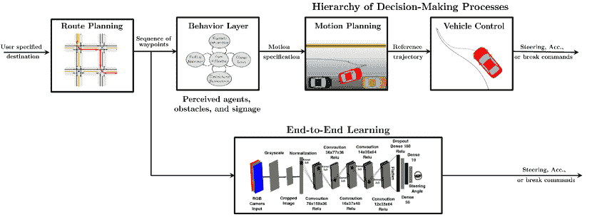
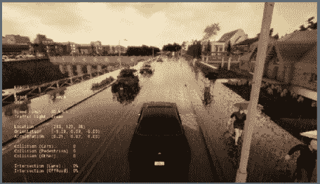
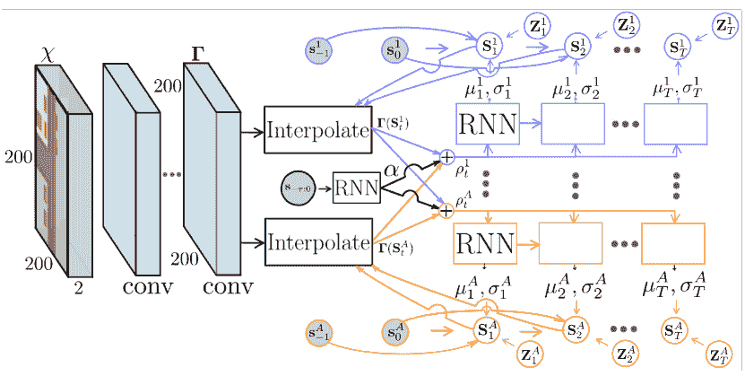
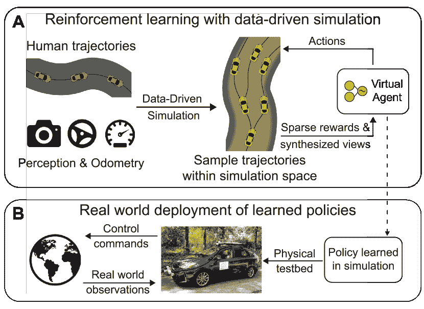

<!--yml

分类：未分类

日期：2024-09-06 19:54:55

-->

# [2105.14218] 深度强化学习算法在自主车辆运动规划与控制中的应用调研

> 来源：[`ar5iv.labs.arxiv.org/html/2105.14218`](https://ar5iv.labs.arxiv.org/html/2105.14218)

# 深度强化学习算法在

自主车辆的运动规划与控制

费叶¹、沈章²、潘旺³ 和 陈青尧³ ¹ 费叶在 TuSimple Inc. 工作，地址：9191 Towne Centre Dr. Ste 600, San Diego, CA 92122, USA。邮箱：fei.ye@tusimple.ai。² 沈章在乔治亚理工学院工作，地址：Atlanta, GA 30332, USA。邮箱：shenzhang@gatech.edu。³ 潘旺和陈青尧在加州大学伯克利分校的 California PATH 工作，地址：Richmond, CA 94804, USA。邮箱：{pin_wang, cychan}@berkeley.edu。

###### 摘要

在这项调研中，我们系统地总结了将强化学习（RL）应用于自主车辆运动规划与控制的现有文献。许多现有贡献可以归因于管道方法，该方法由许多手工制作的模块组成，每个模块的功能选择旨在方便人类解释。然而，由于缺乏系统级优化，这种方法并不能自动保证最大性能。因此，本文还介绍了一种日益增长的趋势，即端到端方法，该方法通常提供更好的性能和更小的系统规模。然而，它们的性能也受到缺乏专家数据和泛化问题的影响。最后，总结了将深度强化学习算法应用于自主驾驶的剩余挑战，并提出了未来的研究方向，以应对这些挑战。

## I 引言

自动化和半自动化车辆在辅助我们日常交通中的受欢迎程度日益提高。过去十年中，针对自主驾驶应用的研究数量相当可观 [1, 2, 3, 4, 5, 6]。具体而言，基于深度学习的大量研究活动已开展用于高级驾驶辅助系统（ADAS）和自动驾驶应用，旨在尽可能多地自动化驾驶任务。监督学习方法高度依赖大量标注数据，以便能够进行泛化，并且基本上是针对每个任务单独训练的。然而，获得每个单独任务的大量数据成本高昂且耗时。此外，这需要大量的人力来标注这些数据，并且仍然可能无法涵盖真实驾驶中的所有复杂情况。

另一方面，强化学习（RL）算法已广泛应用于车辆决策制定和控制问题 [5, 6]。具体而言，RL 能够通过试错方式进行学习，并且不需要对每个数据样本进行显式的人工标记或监督。相反，它需要一个定义良好的奖励函数来在学习过程中接收奖励信号。此外，深度强化学习算法种类繁多，实施层面具有高度的灵活性，如状态空间、动作空间和奖励函数等。

一般来说，将深度强化学习应用于自动驾驶车辆的运动规划和控制的现有工作可以分为分层（管道）方法和端到端方法 [7]，如图 1 所示。具体来说，管道方法通常可以分为不同的模块，如感知、决策制定、运动规划、低级控制等。在本文中，我们将回顾和研究那些应用深度强化学习算法以实现运动规划和车辆控制功能的论文。这些模块中的每一个都是手动设计的，模块之间的接口通常是人工实现的。然而，这种模块化分布显然是为了方便人类解释，而不是为了达到最高的系统性能。例如，如果一个管道系统中有些部分可以通过数据改进，而有些则不能，那么那些无法通过数据改进的部分最终将成为瓶颈。

最近，更多的努力被投入到由深度强化学习（deep RL）支持的第二种方法，即端到端的方法。该方法可以优化所有这些抽象模块，将感官输入映射到控制命令，同时减少处理步骤。我们可能希望将端到端技术应用于自动驾驶的主要原因有两个：1）更好的性能；2）更小的系统规模 [8]。更好的性能是因为内部组件可以自我优化以最大化整体系统性能，而不是优化人工选择的中间标准。较小的网络是可能的，因为系统学会以最少的处理步骤解决问题。

图 1：运动规划和控制自动驾驶车辆的管道和端到端方法的示意图，图源自 [2]。

在这一背景下，本文旨在总结现有的工作，解释当深度强化学习算法与深度神经网络表示结合时，如何能够泛化并执行自动驾驶车辆的决策和控制。本文的其余部分组织如下。在第二和第三部分，我们介绍了如何利用不同的深度强化学习算法来实现管道方法中的行为决策、运动规划和控制模块。接下来，在第四部分，我们深入探讨了针对实际应用和从模拟到实际的方法的端到端学习方法。第五部分总结了在将深度强化学习应用于自主驾驶车辆中的现有挑战和未来工作方向。最后，第六部分提供了结论。

## II 深度强化学习在决策和运动规划中的应用

在这一部分，我们重点关注基于深度强化学习的自主驾驶车辆在行为决策和运动规划方面的最新进展。如图 1 所示，自主驾驶系统的典型流程处理来自车载传感器的观测流，并将其高层路由计划转化为可执行的控制输出，如转向角、加速度和制动动作。通常，在自主驾驶规划系统的设计中，期望采用层次结构，因为驾驶自然是层次性的，高层决策基于离散状态转换，而低层执行则在连续状态空间中进行。行为层是一个决策系统，它确定中层驾驶行为（如变道、跟车、左转/右转等）的离散状态转换。当行为决策做出时，运动规划系统负责提供一个安全、舒适且动态可行的连续轨迹，以实现决策系统所选择的驾驶行为。

深度强化学习在车辆行为决策领域取得了巨大成功，特别是在高速公路场景和城市交叉口。为了减少样本复杂度，一些研究选择采用来自感知系统处理的中级输入，并提取车辆状态和周围车辆的相对状态作为输入。Hoel 等人 [9] 在仿真环境中训练了一个深度 Q 网络（DQN），用于发出驾驶行为命令（例如，向右/左变道、在当前车道上巡航等），并比较了不同神经网络结构对代理性能的影响。为了迁移训练好的 RL 代理的安全性能问题，通常会添加基于规则的安全约束，以便在执行前验证不安全的操作。在 [10] 中，提出了一种将预测模型与深度 Q 网络相结合的方法，利用感知系统的输出标记未保护转弯场景中的不安全行为决策。一些研究 [11, 12] 则选择基于 DQN 训练一个变道决策系统进行行为层级决策，并使用基础的规则层在车辆控制系统执行之前验证规划轨迹的安全性。在 [13] 中，提出了一种基于层次化 RL 的架构，将变道决策和运动规划结合起来。具体而言，训练一个深度 Q 网络（DQN）以基于安全性考虑决定何时进行机动，同时设计一个具有二次逼近器的深度 Q 学习框架以完成纵向方向的机动。另一方面，一些研究选择通过模仿学习从人类示范中学习，并引入扰动以抑制不良行为 [14]。

最近，演员-评论员基于策略的 RL 方法被引入自主车辆的决策制定和运动规划。与通过神经网络在离线方式下逼近价值函数的基于价值的 RL 方法（如深度 Q 网络）相比，演员-评论员基于策略的 RL 方法的主要优点是它们可以直接从策略梯度计算动作，而不是从价值函数优化，同时在函数逼近过程中保持稳定。另一方面，评论员的优点是向演员提供低方差的性能知识。演员-评论员算法已成功应用于离散行为决策和连续运动规划任务 [15, 16]。

## III 深度强化学习在车辆控制中的应用

在管道方法中，感知层如 CNN 通常用于处理和识别数字图像中的对象。随后，可以应用深度 RL 算法来理解和学习智能动作和控制。许多论文致力于使用深度 RL 方法实现低级车辆控制，如车道保持[17, 18]，横向控制[19, 20, 21]，纵向控制[22, 23, 24, 25, 26, 27, 28]，或两者兼顾[29, 30, 31]。

对于车道保持问题，在[17]中实现了 DDPG 模型于连续状态和动作空间，以指导其训练并应用于解决自驾驶或自主驾驶中的车道保持（转向控制）问题。结果表明，与未利用状态-动作允许性指导的 RL 算法以及采用约束动作空间探索策略的其他基线相比，所提出的方法能够显著加速车道保持任务的 RL 训练。为了提高效率并减少自主车辆中的故障，[18]中提出了两种不同的算法，即鲁棒对抗 RL 和神经虚拟自我对局，并比较了在车道保持和车道变换场景中的表现。结果显示，相较于传统 RL 方法生成的基线控制策略，所提出的方法在提高驾驶效率的同时有效降低了碰撞率。

在车辆横向控制方面，为了解决模型预测控制（MPC）在实时实施中的高计算复杂度，[19]提出了一种快速集成的规划和控制框架，该框架结合了驾驶策略层和执行层。几个示例驾驶场景表明，策略层的性能可以迅速且持续地在线改进。在[20]中，DDPG 被实现用来在无模型的动态驾驶环境中制定具有连续动作的车道变换行为，并且奖励函数考虑了位置偏差状态和操控时间。最终，RL 代理在模拟中训练以在各种驾驶情况下以 100%的成功率平稳且稳定地变换到目标车道。在[21]中，基于视觉的横向控制系统被拆分为感知模块和控制模块，基于深度 RL 根据来自感知模块的特征做出控制决策。在视觉 TORCS 中训练的 RL 控制器在不同赛道上优于线性二次调节器（LQR）控制器和模型 MPC 控制器。

## IV 端到端深度强化学习用于自主驾驶

前两节总结了现有的管道方法工作，这些方法包括许多精心设计的模块，以便于人工解释，例如感知、运动规划、决策制定、低级控制等。然而，这种管道方法不能保证系统的最大性能，如果某些模块部分无法通过数据改进，最终将成为瓶颈。

另一方面，端到端的方法预计在自动驾驶方面具有更好的性能和更小的系统。通过端到端训练，无法在系统的不同模块之间做出清晰的区分，例如网络中的哪些部分主要作为特征提取器，哪些作为控制器。然而，它能够在减少处理步骤的同时优化所有这些抽象模块，这表明这些抽象将被为需要解决的任务最优且自动地调整，而不是优化人为选择的中间标准。

### IV-A 现实世界应用中的联合优化

在 1989 年，Pomerleau 的开创性工作中成功地使用端到端方法控制汽车在公共道路上行驶，早期尝试的一个例子[32]，其中使用神经网络系统训练控制自主陆地车辆。在 2000 年代初，LeCun 等人构建了一个小型越野机器人，该机器人使用端到端学习系统仅通过视觉输入来避开障碍物[33]。名为 DAVE 的机器人通过从人类驾驶视频中采样的图像和相应的转向命令$1/r$进行训练。虽然 DAVE 展示了端到端学习的潜力，但其性能在复杂环境中平均撞击距离约为 20 米，不够可靠，无法完全替代更模块化的越野驾驶方法。

随着硬件计算能力的演进和现代深度学习算法的进步，在 2016 年，NVIDIA 的研究人员提出了一种基于 CNN 的端到端学习，该方法学习了直接控制汽车所需的整个处理管道[34]。训练数据来自少于一百小时的专家驾驶，涵盖了各种道路，并配有由人类驾驶员生成的时间同步的转向命令。采样图像被输入到一个包含五个卷积层和三个全连接层的 CNN 中，随后计算出建议的转向命令。CNN 的权重通过最小化建议命令与该图像的基准命令之间的均方误差来优化。这一里程碑还实证验证了 CNN 可以“学习车道和道路跟随的整个任务，而无需手动分解为道路或车道标记检测、语义抽象、路径规划和控制”[34]。

直接的深度监督学习通常需要大量数据来学习通用驾驶策略以及训练的地面真相标签。例如，[35] 提出了一个新颖的 FCN-LSTM 架构，通过使用带有完全卷积视觉编码器的长短期记忆时间编码器来利用之前的车辆状态和当前的视觉观察。同时，这项工作还发布了伯克利深度驾驶视频数据集（BDDV），用于学习驾驶模型，并使用人类驾驶行为作为训练的地面真相标签。因此，人类标注可能会很昂贵且耗时。此外，该策略被训练以模仿人类行为在特定场景下的表现，且很难涵盖所有实际场景。

相比之下，完全的端到端强化学习方法以试错的方式学习策略，不需要这种监督。如第二和第三节所述，深度强化学习算法已被广泛应用于自主车辆的独立运动规划或控制模块。如果扩展，它们也可以与卷积层一起训练，通过联合优化构成端到端方法。例如，使用单一的单目图像作为输入，在[36]中采用了演员-评论家算法来学习车道跟随策略，通过少量训练回合训练，以最大化在安全驾驶员介入之前，代理可以行驶的距离的奖励。类似地，[37]中建立的异步演员评论家（A3C）框架用于学习车辆控制，并对未见过的赛道和法律速度限制进行了全面评估。这项工作还展示了在实际视频上测试所提控制命令时的良好领域适应能力。

除了前述的需要泛化到更大领域并应对移动物体（如汽车和行人）的端到端公路驾驶任务外，[38] 提出了一个仅使用低成本车载传感器的敏捷越野自主驾驶端到端学习系统。与铺装道路相比，我们的泥土赛道表面不断变化且高度随机。因此，为了成功进行高速驾驶，任务中需要对转向和油门命令进行高频决策和执行。通过模仿最优控制器，成功训练了一个深度神经网络控制策略，将原始的高维观察映射到连续的转向和油门命令上。

### IV-B 模拟

尽管端到端学习在实际应用中取得了显著进展，但仍然存在许多挑战，这些挑战阻碍了其在完全自主的道路上的部署。具体来说，许多挑战源于这些车辆很少在所有可能的场景（包括极端情况）中进行训练或测试。然而，手动创建这些情况并在现实世界中收集数据可能是一个昂贵且通常不切实际的过程。

因此，一种非常有前途的方法是利用模拟来获得这些情况的经验。在模拟中，设置障碍物或模拟车祸的成本微不足道，但仍然提供了有价值的经验，而在现实世界中，这些意外事件可能导致严重的财务损失，甚至威胁到行人或邻近车辆中人员的生命。

图 2：Carla 环境：城镇 1 的暴雨 [39]。

尽管模拟早已成为测试自动驾驶系统的重要组成部分，例如 Waymo 的 Carcraft [40] 和 NVIDIA 的 Drive Constellation [41]，但仅最近模拟才被应用于构建和训练端到端自驾车的驾驶模拟平台，包括 TORCS [42, 43, 44, 45, 46, 47]，CARLA [48, 49, 50, 51, 39]，Unity [52]，WRC6 [53, 37] 和 Vdrift [54]。

作为一个高度便携的多平台赛车模拟器，TORCS [55] 可以用作普通的赛车游戏，也可以用作研究平台。据我们了解，第一次使用端到端技术在 TORCS 上控制车辆的尝试是在 [42] 中提出的，旨在一个 RL 竞赛 [56] 中使用来自驾驶员视角的视觉数据，后续处理使用 CNN 和 RNN。从那时起，许多不同的深度 RL 算法被应用于在该平台上端到端驾驶车辆，例如深度确定性策略梯度（DDPG） [43, 46, 47]，SafeDAgger [44] 和 A3C [45] 等。具体而言， [43] 是提出 DDPG 算法来处理连续领域中的复杂状态和动作空间的原创论文，这对生成能够适应复杂现实驾驶场景的连续动作空间极为有用。

CARLA [57] 和 Unity [58] 都可以用来高效地创建更具现实感的模拟环境，这些环境在感知和物理复杂性方面都很丰富。它们的主要区别在于，CARLA 是一个显式的驾驶模拟器，而基本的 Unity 是一个更通用的引擎，并没有描述一个非常具体的实现。CARLA 已经开发以支持自动驾驶系统的开发、训练和验证，它还提供了一个接口，允许 RL 代理控制车辆并与动态环境互动。图 2 展示了带有强降雨的 CARLA 环境。由于训练的车辆在测试时无法控制（即，无法在即将到来的交叉路口做出特定转弯），在 [48] 中提出了一种条件模仿学习方法，使得学习到的驾驶策略可以像司机一样处理感觉运动协调，同时继续响应导航命令。为了缓解探索大型连续动作空间的低效性，这种低效性通常阻碍了经典 RL 在具有挑战性的实际驾驶任务中的使用，[49] 提出了基于 DDPG 的可控模仿 RL，通过模仿人类演示的编码经验在合理约束的动作空间内进行探索。大量的 CARLA 实验表明，其在成功完成任务的百分比和未见环境中的良好泛化能力方面表现优越。类似地，为了提高代理在复杂和不稳定环境中的学习策略的鲁棒性，[39] 中实现了一种带有多步回报的优势演员-评论员算法。

图 3: 一个结合深度模仿学习和基于模型的强化学习的自动驾驶模型 [51]。

另一种值得提及的创新深度强化学习算法由 Rhinehart 等在 [50] 和 [51] 中介绍。具体来说，该提出的模仿模型，如图 3 所示，将模仿学习与基于模型的强化学习结合，开发了概率模型，以克服指定适当奖励函数的困难，这些奖励函数对激发期望的行为至关重要。依赖于 LiDAR 数据输入，通过 CARLA 验证了所提出的模仿模型在预测专家级别的车辆轨迹方面的有效性，但未包含其他车辆和行人。

表 I：自动驾驶车辆运动规划中不同深度强化学习公式的汇总。

|  | 算法 | 状态 $s_{t}\in S$ | 动作 $a_{t}\in A$ | 奖励 $R$ / 损失 $\ell$ |
| --- | --- | --- | --- | --- |
| 运动规划（流程） |  |  |  |  |
| Hoel 等（2018）[9] | DQN | 车辆及相对状态 | $A=\{\mathrm{车道~{}变换,加速,刹车}\}$ | $R\{\mathrm{+:效率,舒适性,安全}\}$ |
| Isele 等（2018）[10] | 经典强化学习 | 局部状态 | $A=\{\mathrm{安全~{}驾驶~{}决策}\}$ | $R\{\mathrm{+:安全}\}$ |
| Bansal 等（2018）[14] | 模仿学习 | 交通灯/动态物体状态 | $A=\{\mathrm{驾驶~{}轨迹}\}$ | 9 次训练损失 |
| Wang 等（2019）[11] | DQN | 车辆状态 | $A=\{\mathrm{车道~{}变换~{}决策}\}$ | $R\{\mathrm{+:速度;-:碰撞,无效~{}决策}\}$ |
| Mirchevska 等（2018）[12] | DQN | 车辆及相对状态 | $A=\{\mathrm{车道~{}变换~{}决策}\}$ | $R\{\mathrm{+:速度}\}$ |
| Ferdowsi 等（2018）[59] | 对抗性强化学习 | 车辆状态 | $A=\{\mathrm{最优~{}安全~{}动作}\}$ | $R\{\mathrm{+:安全（距离）}\}$ |
| Ye 等（2019）[15] | DDPG | 车辆及相对状态 | $A=\{\mathrm{车道~{}变换~{}决策}\}$ | $R\{\mathrm{+:效率,舒适性,安全}\}$ |
| Shi 等（2019）[13] | DQN | 车辆相对状态 | $A=\{\mathrm{车道~{}变换~{}决策}\}$ | 手工制作 $R(s_{t},a_{t})$ |
| Nishi 等（2019）[60] | MPDM & pAC | 车辆相对状态 | $A=\{\mathrm{车道~{}合并~{}轨迹}\}$ | 手工制作 $R(s_{t},a_{t})$ |
| You 等（2019）[61] | 深度逆向强化学习 | 网格形式状态 | $A=\{\mathrm{最优~{}驾驶~{}策略}\}$ | 手工制作 $R(s_{t},a_{t})$ |
| Bouton 等（2019）[62] | Q-learning | 车辆及代理状态 | $A=\{\mathrm{战略~{}机动}\}$ | $R\{\mathrm{+:目标,效率;-:碰撞}\}$ |
| Ye 等（2020）[16] | PPO | 车辆及相对状态 | $A=\{\mathrm{车道~{}变换~{}决策,车~{}跟随}\}$ | $R\{\mathrm{+:效率,舒适性,安全}\}$ |
| 端到端 |  |  |  |  |
| LeCun 等 (2005) [33] | 模仿学习 | 相机图像 | $A=\{a&#124;a\in[-\max Left,+\max Right]\}$ | $\ell^{2}~{}\mathrm{损失}$ |
| Lillicrap 等 (2015) [43] | DDPG | 模拟器图像 | $A=\{\mathrm{方向盘,加速,刹车}\}$ | $R\{\mathrm{+1:方向;-1:碰撞}\}$ |
| Bojarski 等 (2016) [34] | 模仿学习 | 相机图像 | $A=\{1/r&#124;r\in\mathrm{\{转弯半径\}}\}$ | $\ell^{2}~{}\mathrm{损失}$ |
| Vitelli 等 (2016) [54] | DQN | 图像和估计状态 | $A=\{\mathrm{方向盘,加速,刹车}\}$ | 手工设计的 $R(s_{t},a_{t})$ |
| Xu 等 (2016) [35] | FCN-LSTM | 视觉和传感器状态 |

&#124; 离散 $A=\{\text{直行, 停车, 左转, 右转}\}$ &#124;

&#124; 连续 $A=\left\{\vec{v}&#124;\vec{v}\in\mathbb{R}^{2}\right\}$ &#124;

| 交叉熵损失 |
| --- |
| Zhang 等 (2016) [44] | SafeDAgger | 相机图像 | $A=\{\mathrm{方向盘,加速,刹车}\}$ | $R\{\mathrm{+1:无碰撞}\}$ |
| Perot 等 (2017) [53] | A3C | 游戏状态 | $A=\{\mathrm{方向盘,加速,刹车}\}$ | $R=v(\cos\theta-d)$ |
| Codevilla 等 (2017) [48] | 模仿学习 | 图像 & 驾驶员内部状态 | $A=\{\mathrm{方向盘,加速}\}$ | $\ell^{2}~{}\mathrm{损失}$ |
| Pan, Cheng 等 (2017) [38] | 模仿学习 | 相机图像 & 车辆速度 | $A=\{\mathrm{方向盘,油门}\}$ | 方向盘/油门损失 |
| Pan, You 等 (2017) [45] | A3C | 虚拟世界图像 | $A=\{\mathrm{方向盘,加速,刹车}\}$ | $R=\{+v(\cos\alpha-d),-\mathrm{碰撞}\}$ |
| Wang 等 (2018) [46] | DDPG | LiDAR 传感器 & 相机图像 | $A=\{\mathrm{方向盘,加速,刹车}\}$ |

&#124; $R_{t}=V_{x}\cos(\theta)-\alpha V_{x}\sin(\theta)$ &#124;

&#124; $~{}~{}~{}~{}~{}~{}-\gamma&#124;Pos&#124;-\beta V_{x}&#124;Pos&#124;$ &#124;

|

| Kendall 等 (2018) [36] | DDPG | 相机图像 | $A=\{\mathrm{方向盘,速度}\}$ | 行驶距离无违规 |
| --- | --- | --- | --- | --- |
| Jaritz 等 (2018) [37] | A3C | 输入图像 | $A=\{\mathrm{方向盘,加速,刹车,手刹}\}$ | $R\{\mathrm{+1:在车道;保持车道}\}$ |
| Klose 等 (2018) [52] | DQN | 原始传感器输入 | $A=\{\mathrm{加速,刹车}\}$ | $R=\sum_{i=1}^{3}\exp\left(-0.5\cdot\left[{x_{t}^{i}}/{\theta_{i}}\right)^{2}\right]$ |
| Liang 等 (2018) [49] | 模仿强化学习 | 人类驾驶视频 | $A=\{\mathrm{方向盘,加速,刹车}\}$ | $R\{\mathrm{+:速度;-1:碰撞,方向盘}\}$ |
| Rhinehart 等 (2018) [50] | 模仿模型 | LiDAR 图像 | $A=\{\mathrm{行驶路径点}\}$ | 概率推断目标 |
| Min 等 (2019) [63] | DDPG | 原始传感器输入 | $A=\{\mathrm{车道变换,加速,刹车}\}$ | $R\{\mathrm{+1:速度;-1:碰撞}\}$ |
| Chhor 等（2019）[47] | DDPG | 原始传感器输入 | $A=\{\mathrm{Steering,Acc.,Brake,Hand~{}brake}\}$ | $R=V\cos\theta-V\sin\theta-V&#124;trackPos&#124;$ |
| Jaafra 等（2019）[39] | A2C | 摄像头图像 | $A=\{\mathrm{Steering,Throttle,Break}\}$ | $R\{\mathrm{+1:Closing~{}goals;-1:Not~{}in~{}lane}\}$ |
| Rhinehart 等（2019）[51] | 模仿模型 | LiDAR 图像 | $A=\{\mathrm{Driving~{}way~{}points}\}$ | 概率推断目标 |

### IV-C Sim-to-Real 方法

通过利用模拟的驾驶场景和通过模拟获得的经验，sim-to-real 方法是训练端到端驾驶策略而无需使用真实数据的一个良好替代方案，如图 4 所示。近年来，该领域引起了大量关注，并且[64]中显示，通过非常仔细地随机化模拟器，政策可以通过模拟数据训练出能够在室内飞行无人机的策略，而不需要进行非常仔细的系统识别。

具体来说，模拟器可以通过生成大量标记数据来促进深度神经网络的训练，以处理许多边角案例，从中提取任务相关特征并获得良好的状态表示，所学知识有望促进现实世界场景中的更快学习和更好性能。因此，sim-to-real 转移是一个重要的研究领域，可以将从车辆交通模拟中获得的知识适应于现实世界环境，以进行决策、规划和控制。

然而，在城市环境中自主驾驶涉及多个任务，这些任务包含复杂且不确定的驾驶行为以及与周围交通的互动。除了与高速公路驾驶共享的一些典型任务，如保持车道、变换车道、超车和跟车外，城市环境驾驶还包括左转、遵守交通标志和信号灯、留意低速行驶的行人和骑自行车的人等。虽然这些具体任务中的每一个都可以在模拟器中单独建模，以训练出具有优异性能的自主驾驶策略，但由于任务的数量和复杂性，模拟器与现实世界场景之间的差异进一步加剧，知识迁移将更加具有挑战性。此外，还有其他技术挑战，例如现实世界中的视觉信号噪声，以及汽车驾驶模拟器中的训练环境在视觉外观上通常与现实世界驾驶大相径庭[45]。

由于上述挑战，虽然许多研究工作在模拟平台上应用了某种变体的深度 RL 算法，但只有少数几项尝试将从模拟器中学到的知识转移到现实应用中，即 [37]。实际上，[37] 自称为“深度 RL 驾驶首次使用模拟器训练并在真实图像上展示”，并预见到基于模拟的 RL 可以作为实际应用中网络的初始化策略。然而，[65] 报告称“仅在 CARLA 中训练的端到端模型无法转移到现实世界”，因此需要一些领域随机化和领域适应方法来弥合模拟与现实之间的差距。

图 4：从 Sim-to-Real 转移中的策略训练和部署 [65]。

### IV-D 总结

为了提供不同深度 RL 公式在自主车辆运动规划和控制方面的全面且直观的比较，TABLE I 总结了本次综述中所包含的特定算法、状态空间、动作空间和具体的奖励/损失设计。

## V 挑战和未来工作方向

### V-A 挑战

#### V-A1 管道方法

为每个模块选择手工制作的抽象（特征）可能会限制整个系统的性能。一旦设计完成，这些抽象的改进能力会有限，那些无法随着数据改进的部分最终会成为瓶颈。例如，如果感知系统变得更好，但规划系统没有相应改进来利用这些好处，最终规划系统将成为瓶颈。*最终*，我们实际上并不知道如何准确地构建适合现实世界的正确抽象，*最终*这些抽象会给我们带来麻烦。

一种可能的方法是对所有这些抽象层进行端到端训练，这意味着这些抽象被最优地适应于需要解决的任务。

#### V-A2 Sim-to-Real 方法

一般来说，仅用人类驾驶员的数据进行训练是不够的，收集每一种可能驾驶条件下的足够数据可能非常昂贵且危险。虽然从模拟到现实的方法可以帮助人们完全不使用真实世界数据，这种方法可能仍然不足以解决问题，即使它仍然是初始化网络和参数的极好方式。这是因为我们不仅要手动设计这些管道模块，还需要手动设计我们的模拟器。最终，由于开发一个足够真实的具有多样环境的模拟器的挑战，模拟器将成为瓶颈[66]，包括对任何具有真实动态的交互交通参与者的建模。

### V-B 未来工作方向

尽管应用深度强化学习算法在自动驾驶任务中取得了令人兴奋的进展，这些方法大多是为一个任务训练一次，每个新任务都需要训练一个新的代理，这在数据上效率低下，并且无法利用相似任务的学习特性。相比之下，人类不仅能够学习复杂任务，还能快速适应新的或不断变化的情况。

因此，已经提出了一些方法来提高深度强化学习算法在各种驾驶任务中的泛化能力。一方面，已应用随机化模拟器环境来泛化训练策略[67]。另一方面，最近探索了通过持续学习和元学习转移过去经验积累的知识，以促进强化学习[68]和模仿学习[69]中的泛化。能够持续学习并迅速适应对实现现实世界自动驾驶至关重要，这激励了进一步研究将迁移学习和元学习概念引入自动驾驶领域的深度强化学习中。

## VI 结论

本文系统地回顾了现有文献中采用深度强化学习算法对自动驾驶车辆的运动规划和控制的研究，这是在过去五年中引起了业界和学术界关注的一个领域。管道和端到端的方法都已被广泛讨论。研究表明，尽管深度强化学习算法需要较长时间和大量数据集进行训练，但它们能够以试错的方式有效地与环境互动，并且不需要对每个数据样本进行显式的人类标注或监督，这使得它们成为在实际应用中实现自动驾驶的有希望的候选者。

## 参考文献

+   [1] D. González, J. Pérez, V. Milanés, 和 F. Nashashibi, “自动化车辆的运动规划技术综述，” *IEEE 智能交通系统汇刊*, 第 17 卷，第 4 期，第 1135-1145 页，2015 年。

+   [2] B. Paden, M. Čáp, S. Z. Yong, D. Yershov, 和 E. Frazzoli, “自驾城市车辆的运动规划与控制技术综述，” *IEEE 智能车辆汇刊*，第 1 卷，第 1 期，页 33–55，2016 年。

+   [3] W. Schwarting, J. Alonso-Mora, 和 D. Rus, “自动驾驶车辆的规划与决策，” *控制、机器人与自主系统年度综述*，2018 年。

+   [4] E. Yurtsever, J. Lambert, A. Carballo, 和 K. Takeda, “自动驾驶综述：常见实践与新兴技术，” *arXiv 预印本 arXiv:1906.05113*，2019 年。

+   [5] V. Talpaert, I. Sobh, B. R. Kiran, P. Mannion, S. Yogamani, A. El-Sallab, 和 P. Perez, “探索深度强化学习在现实世界自动驾驶系统中的应用，” *arXiv 预印本 arXiv:1901.01536*，2019 年。

+   [6] B. R. Kiran, I. Sobh, V. Talpaert, P. Mannion, A. A. A. Sallab, S. Yogamani, 和 P. Pérez, “用于自动驾驶的深度强化学习综述，” *arXiv 预印本 arXiv:2002.00444*，2020 年。

+   [7] S. Aradi, “自动驾驶车辆运动规划的深度强化学习综述，” *IEEE 智能交通系统汇刊*，2020 年。

+   [8] S. Levine, “模仿、预测和基于模型的强化学习在自动驾驶中的应用，” [在线]. 可用: [`slideslive.com/38917941/imitation-prediction-and-modelbased-reinforcement-learning-for-autonomous-driving`](https://slideslive.com/38917941/imitation-prediction-and-modelbased-reinforcement-learning-for-autonomous-driving)，访问时间: 2019 年 10 月。

+   [9] C.-J. Hoel, K. Wolff, 和 L. Laine, “使用深度强化学习的自动化速度和车道变换决策，” 在 *2018 年第 21 届智能交通系统国际会议 (ITSC)*. IEEE，2018 年，页 2148–2155。

+   [10] D. Isele, A. Nakhaei, 和 K. Fujimura, “自动驾驶车辆的安全强化学习，” 在 *2018 IEEE/RSJ 国际机器人与系统会议 (IROS)*，2018 年 10 月，页 1–6。

+   [11] J. Wang, Q. Zhang, D. Zhao, 和 Y. Chen, “通过深度强化学习和基于规则的约束进行车道变换决策，” 在 *2019 国际联合神经网络会议 (IJCNN)*. IEEE，2019 年，页 1–6。

+   [12] B. Mirchevska, C. Pek, M. Werling, M. Althoff, 和 J. Boedecker, “基于强化学习的安全且合理的自动车道变换的高层决策，” 在 *2018 年第 21 届智能交通系统国际会议 (ITSC)*. IEEE，2018 年，页 2156–2162。

+   [13] T. Shi, P. Wang, X. Cheng, 和 C.-Y. Chan, “基于深度强化学习的自动车道变换驾驶决策与控制，” *arXiv 预印本 arXiv:1904.10171*，2019 年。

+   [14] M. Bansal, A. Krizhevsky, 和 A. Ogale, “Chauffeurnet：通过模仿最佳和综合最差来学习驾驶，” *arXiv 预印本 arXiv:1812.03079*，2018 年。

+   [15] Y. Ye、X. Zhang 和 J. Sun，“使用深度强化学习和高保真模拟环境的自动驾驶车辆行为决策”，*Transportation Research Part C: Emerging Technologies*，第 107 卷，页码 155–170，2019 年。

+   [16] F. Ye、X. Cheng、P. Wang 和 C.-Y. Chan，“使用基于邻近策略优化的深度强化学习进行自动车道变换策略”，*arXiv 预印本 arXiv:2002.02667*，2020 年。

+   [17] S. Mazumder、B. Liu、S. Wang、Y. Zhu、L. Liu 和 J. Li，“深度强化学习中的动作许可性及其在自主驾驶中的应用”，*KDD’18 深度学习日*，2018 年。

+   [18] X. Ma、K. Driggs-Campbell 和 M. J. Kochenderfer，“使用对抗性强化学习提高自主车辆控制的鲁棒性和安全性”，发表于 *2018 IEEE Intelligent Vehicles Symposium (IV)*。 IEEE，2018 年，页码 1665–1671。

+   [19] L. Sun、C. Peng、W. Zhan 和 M. Tomizuka，“通过模仿学习实现的自主驾驶快速集成规划与控制框架”，发表于 *ASME 2018 动态系统与控制会议*。 美国机械工程师学会数字集，2017 年。

+   [20] P. Wang、H. Li 和 C.-Y. Chan，“基于深度确定性策略梯度算法的自动车道变换行为的连续控制”，发表于 *2019 IEEE Intelligent Vehicles Symposium (IV)*。 IEEE，2019 年，页码 1454–1460。

+   [21] D. Li、D. Zhao、Q. Zhang 和 Y. Chen，“基于强化学习和深度学习的自主驾驶横向控制 [应用说明]”，*IEEE 计算智能杂志*，第 14 卷，第 2 期，页码 83–98，2019 年。

+   [22] O. Pietquin、F. Tango 和 R. Aras，“用于优化纵向驾驶辅助策略的批量强化学习”，发表于 *2011 IEEE 计算智能在车辆和交通系统中的研讨会 (CIVTS) 论文集*。 IEEE，2011 年，页码 73–79。

+   [23] S. Lefevre、A. Carvalho 和 F. Borrelli，“用于自主驾驶的基于学习的速度控制框架”，*IEEE 自动化科学与工程汇刊*，第 13 卷，第 1 期，页码 32–42，2015 年。

+   [24] L. Schultz 和 V. Sokolov，“用于动态城市交通问题的深度强化学习”，*arXiv 预印本 arXiv:1806.05310*，2018 年。

+   [25] M. Zhu、X. Wang 和 Y. Wang，“具有深度强化学习的人类化自主车-following 模型”，*Transportation Research Part C: Emerging Technologies*，第 97 卷，页码 348–368，2018 年。

+   [26] G. Hartmann、Z. Shiller 和 A. Azaria，“使用先验知识的时间最优速度控制的深度强化学习”，发表于 *2019 IEEE 第 31 届人工智能工具国际会议 (ICTAI)*。 IEEE，2019 年，页码 186–193。

+   [27] Y. Lin、J. McPhee 和 N. L. Azad，“使用深度强化学习进行车-following 控制的纵向动态模型与运动学模型比较”，发表于 *2019 IEEE Intelligent Transportation Systems Conference (ITSC)*。 IEEE，2019 年，页码 1504–1510。

+   [28] J. Chen, B. Yuan, 和 M. Tomizuka，“用于城市自动驾驶的无模型深度强化学习，”在*2019 IEEE 智能交通系统会议 (ITSC)*。 IEEE，2019 年，第 2765–2771 页。

+   [29] S. Shalev-Shwartz, S. Shammah, 和 A. Shashua，“安全的多智能体强化学习用于自动驾驶，”*arXiv 预印本 arXiv:1610.03295*，2016 年。

+   [30] X. He, D. Xu, H. Zhao, M. Moze, F. Aioun, 和 F. Guillemard，“通过学习自然驾驶数据的人类轨迹规划方法，”在*2018 IEEE 智能车辆研讨会 (IV)*。 IEEE，2018 年，第 339–346 页。

+   [31] P. Wang, H. Li, 和 C.-Y. Chan，“用于学习连续控制的二次 Q 网络，”*arXiv 预印本 arXiv:1912.00074*，2019 年。

+   [32] D. A. Pomerleau，“Alvinn：一个神经网络中的自主陆地车辆，”在*神经信息处理系统进展*，1989 年，第 305–313 页。

+   [33] Y. Lecun, E. Cosatto, J. Ben, U. Muller, 和 B. Flepp，“Dave：使用端到端学习的自动越野车辆控制，”*DARPA-IPTO 最终报告*，2004 年。

+   [34] M. Bojarski, D. Del Testa, D. Dworakowski, B. Firner, B. Flepp, P. Goyal, L. D. Jackel, M. Monfort, U. Muller, J. Zhang *等*，“自驾车的端到端学习，”*arXiv 预印本 arXiv:1604.07316*，2016 年。

+   [35] H. Xu, Y. Gao, F. Yu, 和 T. Darrell，“从大规模视频数据集中端到端学习驾驶模型，”在*IEEE 计算机视觉与模式识别会议论文集*，2017 年，第 2174–2182 页。

+   [36] A. Kendall, J. Hawke, D. Janz, P. Mazur, D. Reda, J.-M. Allen, V.-D. Lam, A. Bewley, 和 A. Shah，“一天学会驾驶，”在*2019 国际机器人与自动化会议 (ICRA)*，2019 年，第 8248–8254 页。

+   [37] M. Jaritz, R. de Charette, M. Toromanoff, E. Perot, 和 F. Nashashibi，“使用深度强化学习的端到端赛道驾驶，”在*2018 IEEE 国际机器人与自动化会议 (ICRA)*。 IEEE，2018 年，第 2070–2075 页。

+   [38] Y. Pan, C.-A. Cheng, K. Saigol, K. Lee, X. Yan, E. Theodorou, 和 B. Boots，“为敏捷越野自动驾驶学习深度神经网络控制策略，”在*The NIPS 深度强化学习研讨会*，2017 年。

+   [39] Y. Jaafra, J. L. Laurent, A. Deruyver, 和 M. S. Naceur，“用于自动驾驶的稳健强化学习，”*APIA*，第 52 页，2019 年。

+   [40] A. C. Madrigal，“Waymo 的秘密世界用于训练自驾车的内幕，”[在线]。可用： [`www.businessinsider.com/waymo-engineer-explains-why-testing-self-driving-cars-virtually-is-critical-2018-8`](https://www.businessinsider.com/waymo-engineer-explains-why-testing-self-driving-cars-virtually-is-critical-2018-8)，访问日期：2020 年 3 月。

+   [41] NVIDIA，“Nvidia drive constellation – 虚拟现实自动驾驶模拟器，”[在线]。可用： [`www.nvidia.com/en-us/self-driving-cars/drive-constellation/`](https://www.nvidia.com/en-us/self-driving-cars/drive-constellation/)，访问日期：2020 年 3 月。

+   [42] J. Koutník, G. Cuccu, J. Schmidhuber 和 F. Gomez，“为基于视觉的强化学习进化大规模神经网络”，发表于*第 15 届年度遗传与进化计算会议论文集*，2013 年，第 1061-1068 页。

+   [43] T. P. Lillicrap, J. J. Hunt, A. Pritzel, N. Heess, T. Erez, Y. Tassa, D. Silver 和 D. Wierstra，“深度强化学习中的连续控制”，*arXiv 预印本 arXiv:1509.02971*，2015 年。

+   [44] J. Zhang 和 K. Cho，“高效查询的模仿学习用于端到端自动驾驶”，*arXiv 预印本 arXiv:1605.06450*，2016 年。

+   [45] X. Pan, Y. You, Z. Wang 和 C. Lu，“虚拟到真实的强化学习用于自动驾驶”，*arXiv 预印本 arXiv:1704.03952*，2017 年。

+   [46] S. Wang, D. Jia 和 X. Weng，“用于自动驾驶的深度强化学习”，*arXiv 预印本 arXiv:1811.11329*，2018 年。

+   [47] G. Chhor, S. Pandey 和 V. Patel，“用于自动驾驶的鲁棒深度强化学习”，2018 年。

+   [48] F. Codevilla, M. Miiller, A. López, V. Koltun 和 A. Dosovitskiy，“通过条件模仿学习实现端到端驾驶”，发表于*2018 IEEE 国际机器人与自动化会议 (ICRA)*，2018 年，第 1-9 页。

+   [49] X. Liang, T. Wang, L. Yang 和 E. Xing，“Cirl: 视觉自驾车的可控模仿强化学习”，发表于*欧洲计算机视觉会议 (ECCV)*，2018 年，第 584-599 页。

+   [50] N. Rhinehart, R. McAllister 和 S. Levine，“用于灵活推理、规划和控制的深度模仿模型”，*arXiv 预印本 arXiv:1810.06544*，2018 年。

+   [51] N. Rhinehart, R. McAllister, K. Kitani 和 S. Levine，“Precog: 视觉多智能体环境中基于目标的预测”，发表于*IEEE 国际计算机视觉会议论文集*，2019 年，第 2821-2830 页。

+   [52] P. Klose 和 R. Mester，“在真实驾驶环境中使用深度强化学习和确定性有限状态机进行模拟自动驾驶”，发表于*第 2 届智能系统应用国际会议论文集*，2019 年，第 1-6 页。

+   [53] E. Perot, M. Jaritz, M. Toromanoff 和 R. De Charette，“在现实赛车游戏中使用深度强化学习实现端到端驾驶”，发表于*IEEE 计算机视觉与模式识别研讨会论文集*，2017 年，第 3-4 页。

+   [54] M. Vitelli 和 A. Nayebi，“Carma: 一种深度强化学习方法用于自动驾驶”，斯坦福大学技术报告，2016 年。

+   [55] TORCS，“开放赛车模拟器”，[在线]. 可用：[`torcs.sourceforge.net/`](http://torcs.sourceforge.net/)，访问日期：2020 年 3 月。

+   [56] D. Loiacono, P. L. Lanzi, J. Togelius, E. Onieva, D. A. Pelta, M. V. Butz, T. D. Lönneker, L. Cardamone, D. Perez, Y. Sáez, M. Preuss 和 J. Quadflieg，“2009 年模拟赛车锦标赛”，*IEEE 计算智能与游戏人工智能汇刊*，第 2 卷，第 2 期，第 131-147 页，2010 年 6 月。

+   [57] A. Dosovitskiy, G. Ros, F. Codevilla, A. Lopez 和 V. Koltun，"CARLA: 开放的城市驾驶模拟器"，在*第 1 届年度机器人学习会议论文集*，2017 年，第 1–16 页。

+   [58] Unity，"轻松构建自动驾驶培训环境"，[在线]。可用: [`unity.com/solutions/automotive-transportation/autonomous-vehicle-training`](https://unity.com/solutions/automotive-transportation/autonomous-vehicle-training)，访问时间: 2020 年 3 月。

+   [59] A. Ferdowsi, U. Challita, W. Saad 和 N. B. Mandayam，"用于自动驾驶系统的安全性和保障的鲁棒深度强化学习"，在*2018 年第 21 届国际智能交通系统会议 (ITSC)*，IEEE，2018 年，第 307–312 页。

+   [60] T. Nishi, P. Doshi 和 D. Prokhorov，"在拥挤的高速公路交通中使用多策略决策和被动演员-评论家学习进行并入"，*IEEE 智能车辆学报*，第 4 卷，第 2 期，第 287–297 页，2019 年。

+   [61] C. You, J. Lu, D. Filev 和 P. Tsiotras，"利用强化学习和深度逆强化学习的自动驾驶高级规划"，*机器人与自动化系统*，第 114 卷，第 1–18 页，2019 年。

+   [62] M. Bouton, J. Karlsson, A. Nakhaei, K. Fujimura, M. J. Kochenderfer 和 J. Tumova，"具有概率保证的强化学习用于自动驾驶"，*arXiv 预印本 arXiv:1904.07189*，2019 年。

+   [63] K. Min, H. Kim 和 K. Huh，"基于深度分布式强化学习的高级驾驶策略确定"，*IEEE 智能车辆学报*，第 4 卷，第 3 期，第 416–424 页，2019 年 9 月。

+   [64] F. Sadeghi 和 S. Levine，"Cad2rl: 无需真实图像的单图像飞行"，*arXiv 预印本 arXiv:1611.04201*，2016 年。

+   [65] A. Amini, I. Gilitschenski, J. Phillips, J. Moseyko, R. Banerjee, S. Karaman 和 D. Rus，"从数据驱动的模拟中学习鲁棒控制策略用于端到端自动驾驶"，*IEEE 机器人与自动化快报*，第 5 卷，第 2 期，第 1143–1150 页，2020 年。

+   [66] W. Zhao, J. P. Queralta 和 T. Westerlund，"深度强化学习中的模拟到现实转移：综述"，在*2020 IEEE 计算智能研讨会系列 (SSCI)*，2020 年，第 737–744 页。

+   [67] J. Tobin, R. Fong, A. Ray, J. Schneider, W. Zaremba 和 P. Abbeel，"用于将深度神经网络从模拟环境转移到真实世界的领域随机化"，在*2017 IEEE/RSJ 国际智能机器人与系统会议 (IROS)*，IEEE，2017 年，第 23–30 页。

+   [68] F. Ye, P. Wang, C.-Y. Chan 和 J. Zhang，"基于元强化学习的自动驾驶车道变换策略"，*arXiv 预印本 arXiv:2008.12451*，2020 年。

+   [69] A. E. Sallab, M. Saeed, O. A. Tawab 和 M. Abdou，"自动驾驶的元学习框架"，2017 年。
