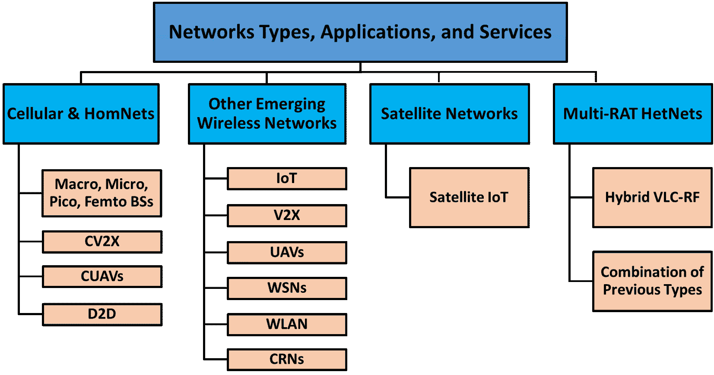
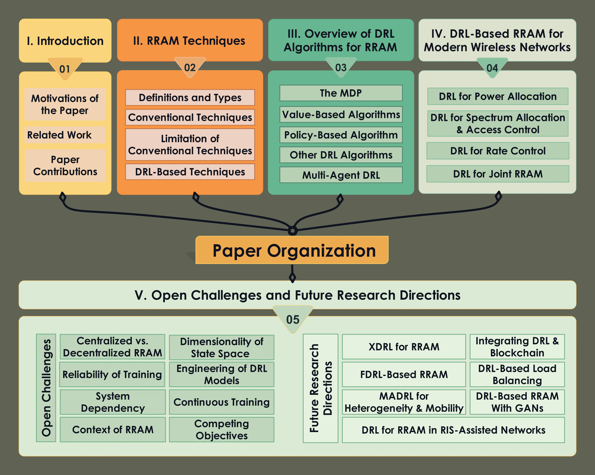
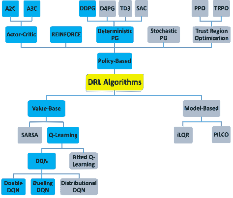
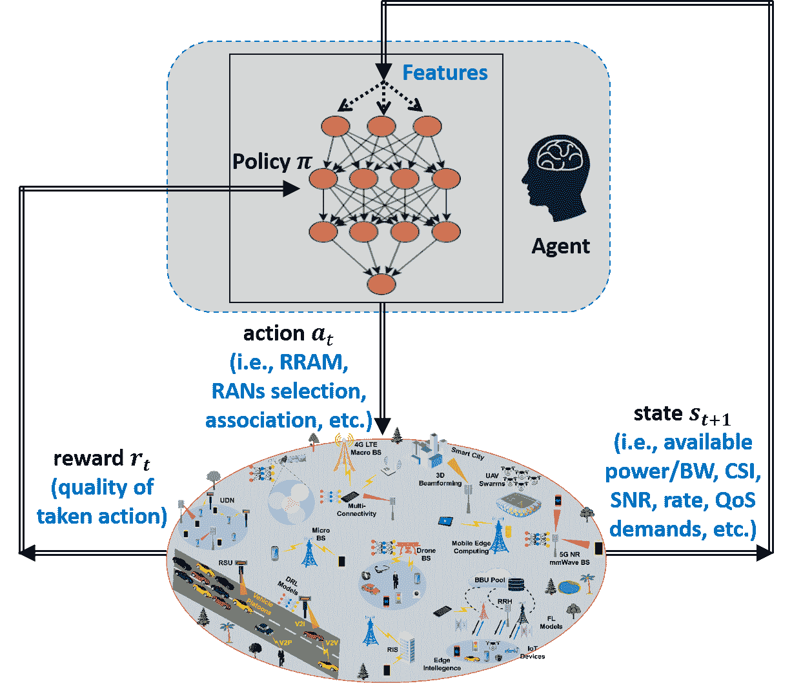
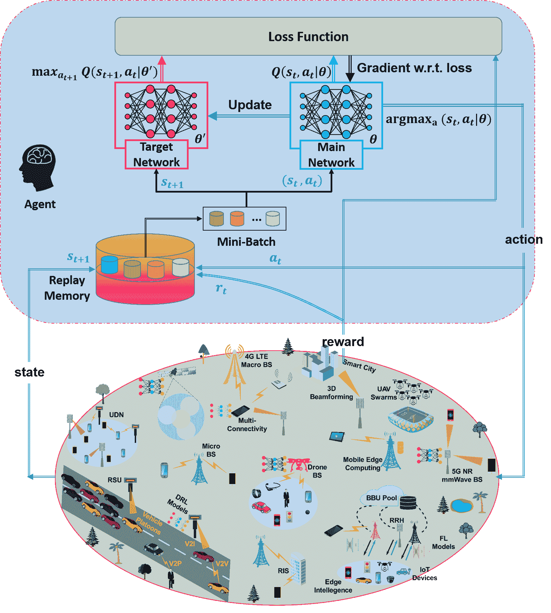
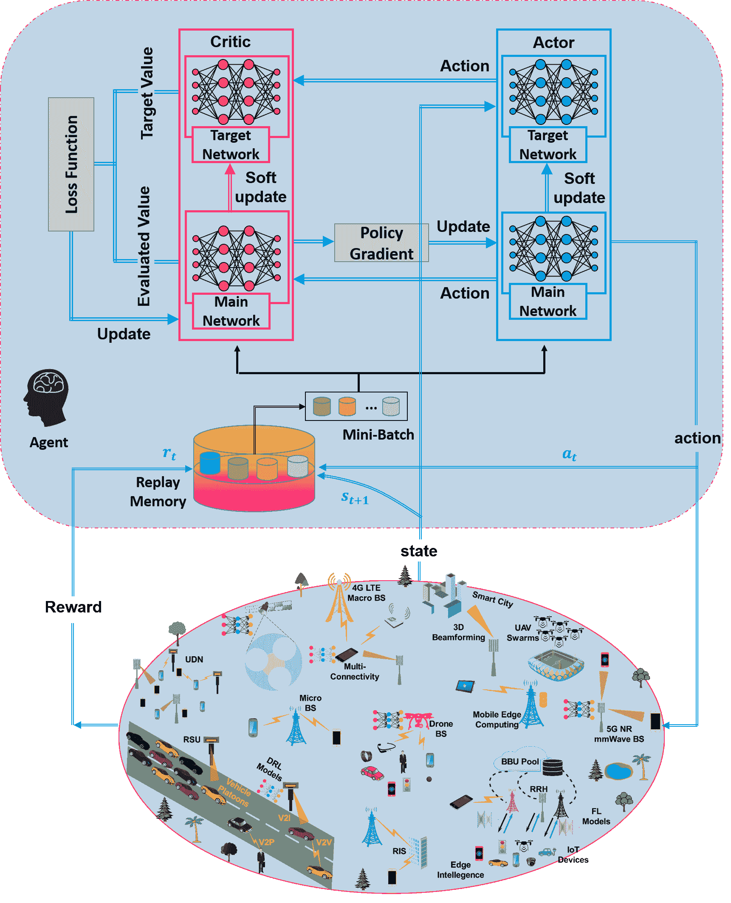
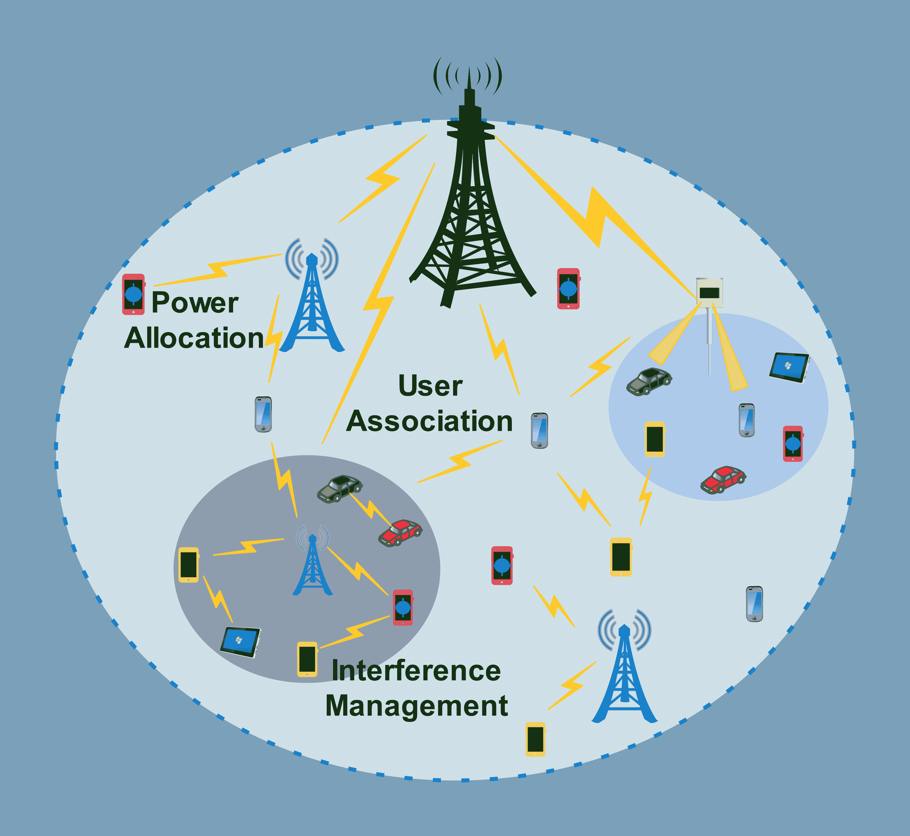

<!--yml

category: 未分类

date: 2024-09-06 19:54:52

-->

# [2106.00574] 深度强化学习在下一代异质无线网络中的无线资源分配和管理：综述

> 来源：[`ar5iv.labs.arxiv.org/html/2106.00574`](https://ar5iv.labs.arxiv.org/html/2106.00574)

# 深度强化学习在下一代异质无线网络中的无线资源分配和管理：综述

Abdulmalik Alwarafy, Mohamed Abdallah, , Bekir Sait Ciftler, ,

Ala Al-Fuqaha, 和 Mounir Hamdi，作者来自卡塔尔哈马德本哈利法大学科学与工程学院信息与计算技术部门（电子邮件：aalwarafy@hbku.edu.qa; moabdallah@hbku.edu.qa; bciftler@hbku.edu.qa; aalfuqaha@hbku.edu.qa; mhamdi@hbku.edu.qa）。此工作已提交给 IEEE，以便可能发表。版权可能会在没有通知的情况下转移，转移后该版本可能不再可访问。

###### Abstract

下一代无线网络由于其包含的网络架构类型、所服务的智能物联网设备的类型和数量以及支持的新兴应用类型等方面的巨大异质性，预计将极其复杂。在这种大规模异质网络（HetNets）中，无线资源分配和管理（RRAM）成为系统设计和部署中面临的主要挑战之一。在这种背景下，新兴的深度强化学习（DRL）技术预计将成为解决未来无线 HetNets 中 RRAM 的主要 enabling 技术。本文系统地深入且全面地调查了 DRL 技术在下一代无线网络 RRAM 中的应用。为此，我们首先概述了现有的传统 RRAM 方法，并识别出它们的局限性，这些局限性促使了 DRL 技术在 RRAM 中的应用。然后，我们提供了最广泛使用的 DRL 算法的全面回顾，包括基于值和策略的算法。提供了每种算法的优点、局限性和使用案例。接着，我们进行了全面而深入的文献回顾，并根据它们所涉及的无线资源类型和研究的无线网络类型对现有相关工作进行了分类。为此，我们仔细识别了每项相关工作中使用的 DRL 算法类型、这些算法的元素及每项相关工作的主要发现。最后，我们突出显示了重要的开放挑战，并提供了关于 DRL 基础的 RRAM 未来研究方向的见解。本调查旨在指导和激发更多研究工作，致力于为未来无线网络构建高效和精细的 DRL 基础的 RRAM 方案。

###### Index Terms:

无线资源分配与管理，深度强化学习，下一代无线网络，异质网络，功率，带宽，速率，接入控制。

## I 引言

无线资源分配和管理（RRAM）被认为是现代无线通信网络中遇到的关键挑战之一[1]。如今，现代无线网络在集成的新兴无线接入网络（RANs）类型、服务的智能设备数量和类型、以及支持的颠覆性应用和服务类型方面变得越来越异质和复杂[2, 3]。预计未来的网络将整合陆地、空中、空间和深海无线网络，形成一个单一的网络，以满足全连接世界愿景的严格要求[4, 5]，如图 1 所示。这将确保用户设备在覆盖范围、可靠性和吞吐量方面的服务质量（QoS）得到增强。此外，未来用户设备也将面临前所未有的数据需求应用数量和类型的增加[3, 6]。预计到 2023 年，用户网络设备和连接的数量，包括智能手机、平板电脑、可穿戴设备和传感器，将达到 293 亿[6]，并生成超过 50 万亿 GB 的数据率[1]。所有这些趋势将加重系统设计、规划、部署、操作和管理中的负担。特别是在如此复杂和大规模的网络中，RRAM 将变得至关重要，以保证更好的通信体验。

图 1：展示了下一代无线网络的示意图，这些网络在 RAN 基础设施、服务的用户设备类型和数量、以及支持的应用和服务类型方面具有巨大的异质性。

RRAM 在现代无线网络的基础规划、实施和资源优化过程中发挥着关键作用。高效的 RRAM 解决方案将保证增强网络连接性，提高系统效率，并降低能源消耗。无线网络的性能在很大程度上取决于两个方面。首先，网络无线资源的利用、管理和编排，包括发射功率控制，频谱信道分配和用户接入控制。其次，系统如何有效地响应网络动态的快速变化，包括无线信道统计，用户移动模式，瞬时无线资源的可用性和流量负荷的可变性。高效的 RRAM 技术必须有效动态地考虑这些设计方面，以确保高网络服务质量（QoS）和增强用户体验质量（QoE）。

### I-A 论文的动机

本工作的主要动机源于三个方面。首先，未来无线网络中分配无线资源的至关重要性。其次，现有最先进的 RRAM 技术的局限性和不足之处。第三，深度强化学习技术在缓解这些限制并在 RRAM 环境下提供高效性能方面的稳健性。在这里，我们更详细地阐述每个方面。

#### I-A1 RRAM 在现代无线网络中的重要性

现代智能设备数量和类型的爆炸式增长，如智能手机/平板电脑和可穿戴设备等，导致了颠覆性的无线通信和网络技术的出现，例如 5G NR 蜂窝网络，物联网网络，个人（或无线体域网络），设备对设备（D2D）通信，全息成像和触觉通信，以及车载网络[3, 7, 8, 4, 9, 10, 11]。预计这类网络将通过支持高数据速率，覆盖范围和连接性，并显着提高可靠性，降低延迟，减少能源消耗来满足新兴应用和服务的严格要求。

然而，在如此大规模、多功能和复杂的无线网络中实现这一目标相当具有挑战性，因为这需要对网络有限的无线资源进行合理的分配和管理[12, 13]。特别是，必须开发更高效和更先进的 RRAM 解决方案，以平衡提升网络性能与保证无线资源有效利用之间的权衡。此外，高效的 RRAM 解决方案还必须在优化网络无线资源和满足用户 QoE 之间进行智能的权衡。例如，RRAM 技术必须共同提升网络的频谱效率（SE）、能效（EE）和吞吐量，同时减轻干扰、减少延迟并提高用户设备的速率。

与传统技术相比，高效且先进的 RRAM 方案可以通过依赖先进的信道和/或源编码方法显著提升系统的 SE。RRAM 在覆盖广泛地理区域的广播无线网络以及由多个相邻和密集的接入点（APs）组成的现代蜂窝通信网络中至关重要，这些接入点通常共享和重用相同的无线频率。

从成本角度来看，部署无线 AP 和站点，例如基站（BS），包括房地产成本、规划、维护和能源，是与频率许可费用一起最关键的方面。因此，RRAM 的目标是在用户公平相关的一些约束条件下，最大化网络的 SE，以比特/秒/Hz/面积单位或 Erlang/MHz/站点为单位。例如，服务等级必须满足最低可接受的 QoS 水平，包括覆盖某些地理区域，同时减少由于干扰、噪声、大规模衰落（由于路径损失和阴影效应）和小规模衰落（由于多径效应）引起的网络中断。服务等级还取决于由于接入控制、调度错误或无法满足边缘设备（EDs）某些 QoS 需求而导致的阻塞。

#### I-A2 传统 RRAM 技术在哪里失败？

未来的无线通信网络由于其大规模、多功能和异质性质而变得复杂。为了在这种网络中最佳分配和管理无线资源，我们通常将 RRAM 形式化为复杂的优化问题。这些问题的目标是在给定可用无线资源和用户设备的 QoS 需求的情况下，实现特定目标，例如最大化网络总速率、SE 和 EE。不幸的是，现代网络的巨大异质性在制定优化问题以及应用传统技术（如优化、启发式和博弈论算法）解决这些问题的过程中带来了巨大的挑战。

下一代网络的大规模特性使得制定 RRAM 优化问题变得非常困难，这些问题通常是不可处理的非凸问题。此外，解决 RRAM 问题的传统技术需要对无线环境有完全或准完全的了解，包括准确的信道模型和实时 CSI。然而，在这些大规模网络中实时获取这些信息是非常困难甚至不可能的。此外，传统技术通常计算开销大，耗时 considerable。这使得它们对于大多数新兴的时间敏感应用（如自动驾驶车辆和机器人）来说效率低下。

此外，基于博弈论的技术不适用于未来的异构网络（HetNets），因为这些技术是为同质玩家设计的。网络 APs 和用户设备数量的爆炸性增长将对基于博弈论的技术造成额外的负担。特别是，网络玩家（如 BSs、APs 和用户设备）需要交换大量的数据和信令。这将引起难以管理的开销，极大地增加了网络元素的延迟、计算和能量/内存消耗。

#### I-A3 DRL 如何克服这些挑战并提供高效的 RRAM 解决方案？

新兴的人工智能（AI）技术，如深度强化学习（DRL），在解决现代无线通信网络中的各种问题方面表现出高效的性能，包括解决复杂的 RRAM 优化问题[14, 15, 16, 17, 18, 19, 20, 21, 22]。在 RRAM 的背景下，DRL 方法主要被用作克服上述传统 RRAM 技术的缺陷和局限性的替代方案。特别是，DRL 技术能够解决复杂的网络 RRAM 优化问题，并在只有有限的网络统计信息的情况下做出明智的控制决策。它们通过使网络实体（如基站（BSs）、无线接入网（RAN）的接入点（APs）、边缘服务器（ESs）、网关节点和用户设备）能够做出智能和自主的控制决策（如 RRAM、用户关联和 RAN 选择），从而实现各种网络目标，如总速率最大化、可靠性增强、延迟减少和频谱效率/能源效率最大化。此外，DRL 技术是无模型的，允许不同的网络实体根据与无线环境的持续互动学习关于网络的最佳策略，如 RRAM 和用户关联，而无需事先了解确切的信道模型或其他网络统计数据。这些吸引人的特点使得 DRL 方法成为解决现代无线通信网络中的 RRAM 问题的主要关键技术之一[3, 2]。

### I-B 相关工作

目前专注于 DRL 在 RRAM 中作用的调查数量有限。现有相关调查列在表 1 中。该表还总结了这些调查所涵盖的主题，并与本文的相关部分进行映射，同时对相对于这些调查的改进和增值进行了分类讨论。总体而言，如表 1 所示，这些已发布的调查仍存在几个研究空白，而本调查旨在填补这些空白。我们将其总结如下。

+   •

    一些现有调查集中于无线通信和网络中的 DRL 应用，但未过多关注 RRAM [15, 18]。例如，现有调查涵盖了与 DRL 使能技术、使用案例、架构、安全性、调度、聚类和数据聚合、流量管理等相关的主题。

+   •

    一些已发布的调查集中于使用 ML 和/或 DL 技术的无线网络中的 RRAM，而未过多关注 DRL 技术 [1, 23, 12, 24]。例如，他们考虑了诸如卷积神经网络（CNN）、递归神经网络（RNN）、监督学习、贝叶斯学习、K-means 聚类、主成分分析（PCA）等 ML 技术。

+   •

    即使是针对无线网络中 RRAM 的 DRL 的调查，也集中在特定的无线网络类型或应用上 [17, 19, 25, 16, 20]，遗漏了一些近期研究，没有提供对最广泛使用的 DRL 算法在 RRAM 中的充分概述 [20]，或未深入探讨 RRAM，而只是覆盖了有限数量的无线资源。

因此，本文的作用是填补这些研究空白并克服这些不足。特别地，我们提供了一个关于 DRL 技术在下一代无线通信网络中应用的全面调查。我们仔细引用了最新的调查和相关研究工作。我们需要强调的是，本文的范围仅集中在无线（或通信）资源上，研究和分析中不包括计算资源。图 2 显示了本文所涉及的无线资源或问题。然而，计算资源方面如卸载、存储、任务调度、缓存等，可以在其他研究中找到，例如 [26, 27, 28, 29, 30] 及其引用文献。

表 I：本调查与现有基于 DRL 的 RRAM 无线网络调查之间的关系

| 论文 | 调查贡献总结 |
| --- | --- |

&#124; 相关内容 &#124;

&#124; 本文中的内容 &#124;

| 本文增值部分 |
| --- |
| Luong 等人[15] | DRL 在通信和网络中的应用 | 第 III/IV 节 | 特别关注 DRL 在 RRAM 中的使用以及增强的文献列表 |
| Hussain 等人[1] | 基于 ML 和 DL 的蜂窝无线和 IoT 网络资源管理机制 | 第 II/IV 节 | 对用于 RRAM 的 DRL 算法的深入和全面覆盖，对 DRL 在 RRAM 中的现有论文进行深入回顾，并覆盖更多类型的无线网络 |
| Lin 等人[31] | AI 方法在资源管理中的应用，如频谱、计算和缓存 | 第 V 节 | 特别关注 DRL 方法，包括更多的无线电资源，以及深入的文献综述 |
| Liang 等人[12] | 基于 DL 的资源分配及其在车载网络中的应用 | 第 II/IV 节 | 关注 DRL 技术用于 RRAM 的情况，深入的文献综述，并包括各种类型的现代无线网络 |
| Obite 等人[17] | 认知无线电网络中的频谱感知 | 第 IV 节 | 对更多无线电资源的详细调查，对更多无线网络的全面覆盖，以及对现有论文的最新深入回顾 |
| Chen 等人 [23] | ML 算法在解决无线网络问题中的应用 | 无 | 关注 DRL 在解决 RRAM 无线问题中的应用，以及覆盖更多无线网络 |
| Gupta 等人 [18] | 用于 DRL 的一般研究和仿真工具 | 第 III 节 | 专门关注 DRL 算法以及在 RRAM 语境下进行的相关研究 |
| Du 等人 [19] | 探讨如何通过基于架构和算法创新的能量分配实现绿色 DRL 进行无线资源管理 | 第 IV 节 | 进一步扩展到更多无线资源和更现代的无线网络 |
| Pham 等人 [32] | 无线接入网络中资源管理技术的分层分类 | 第 II 节 | 全面研究传统和新兴的基于 ML 的 RRAM 技术，应用于现代无线网络，并包含更多无线资源 |
| Almazrouei 等人 [33] | 使用 ML 在无线电频谱中可能的好处和挑战 | 第 II 节 | 扩展分析以纳入更多无线资源，关注 DRL 方法用于 RRAM，并提供深入的文献综述 |
| Dhilipkumar 等人 [34] | 讨论 D2D 网络在蜂窝网络中的各种资源分配方案 | 第 II/IV 节 | 关注 DRL 基于 RRAM 的无线网络服务中各种应用的资源分配方案 |
| Arulkumaran 等人[35], Zhang 等人[36] | DRL 方法的总体概述，包括应用和模型 | 第 III 节 | 关注于 RRAM 在无线网络中使用的 DRL 方法，并提供详细的文献综述 |
| Zappone 等人[24] | 关于在无线通信网络中使用 DL 技术的动机、应用、愿景和案例研究 | NA | 特别关注于无线通信网络中 RRAM 背景下的 DRL 技术 |
| Lee 等人[16] | 基于 DRL 的资源管理方案，涉及 5G HetNets 的能量采集、网络切片、认知 HetNets、协调多点传输和大数据 | 第 III 节 | 深入分析了用于 RRAM 的 DRL 方法，包括 DRL 算法、无线网络类型、研究的无线电资源类型以及广泛的文献综述 |
| Qian 等人[20] | RL 和 DRL 在三项技术中的应用：移动边缘计算、软件定义网络和 5G 网络虚拟化 | NA | 关注于细胞和其他新兴无线网络中的 RRAM 的 DRL |
| Khorasgani 等人[25] | 使用 DRL 解决矿业动态调度问题的主要限制和挑战 | 第 IV 节 | 扩展研究，涵盖各种无线网络，并重点关注无线电资源 |

### I-C 论文贡献

本文的主要贡献总结如下。

1.  1.

    我们详细讨论了在无线网络中使用的最先进的 RRAM 技术，包括它们的类型、缺点和局限性，这些因素促使了 DRL 解决方案的采用。

1.  2.

    我们识别出在无线网络 RRAM 中最广泛使用的 DRL 技术，并对这些技术进行了全面概述。讨论了每种技术的优点、特性和局限性。因此，读者可以深入了解应针对每个 RRAM 问题采用哪些 DRL 技术。

1.  3.

    我们进行了一次广泛而最新的文献综述，并根据文献中报告的无线资源类型（如图 2 所示）和它们所考虑的无线网络类型、应用和服务（如图 3 所示）对论文进行了分类。具体来说，对于每篇被审阅的论文，我们确定其所解决的问题、研究的无线网络类型、实现的 DRL 模型类型、DRL 模型的主要元素（即代理、状态空间、动作空间和奖励函数）以及主要发现。这为读者提供了有关如何高效工程化 DRL 模型以解决无线通信中 RRAM 问题的深入技术知识。

1.  4.

    基于本次综述中审阅的论文，我们概述并识别了一些现有挑战，并对使用 DRL 解决无线网络中 RRAM 问题的一些有前景的未来研究方向提供了深入的见解。

图 4 显示了相关工作的百分比，这些工作根据每篇论文中讨论的无线资源类型进行了分类，如图 4 (a)，以及根据每篇论文中研究的无线网络类型进行了分类，如图 4 (b)。本综述设计时仔细遵循了图 5 中说明的评审协议。由于本综述主要关注无线网络中用于无线资源分配与管理的深度强化学习，因此我们在搜索阶段包含了以下术语及其”AND/OR”组合：”深度强化学习”，”DRL”，”资源分配”，”资源管理”，”功率”，”频谱”，”带宽”，”接入控制”，”用户关联”，”网络选择”，”小区选择”，”速率控制”，”联合资源”，”无线网络”，”卫星网络”，”蜂窝网络”，以及”异构网络”。找到的论文数量和搜索的数据库在图 5 中详细说明。纳入标准是那些处理图 2 中展示的无线网络的无线资源管理和分配的 DRL 技术的论文。排除标准包括：1) 处理计算资源的论文，例如任务卸载、存储、调度等，2) 使用传统 RRAM 方法的论文，即未使用 DRL 技术，3) 使用 ML/DL 技术的论文，或 4) 处理非无线网络的论文，例如有线网络、光网络等。在图 5 中，经过详细检查后排除的论文数量为 43，这些论文与我们的综述直接相关，但未明确识别使用的 DRL 算法类型、DRL 模型的元素（即代理、状态空间、动作空间和奖励函数）、涵盖的无线网络类型，和/或写作不佳。

一般而言，本调查旨在解决的研究问题如下。如何实施 DRL 技术以解决现代无线网络中的 RRAM 问题？使用 DRL 工具相比于最先进的 RRAM 方法能够获得哪些性能优势？在无线网络中使用 DRL 进行 RRAM 的背景下，从所审查的论文中产生了哪些挑战和可能的研究方向？图 5 中显示的 94 篇论文被仔细挑选，以帮助回答这些问题，正如我们将在接下来的部分中详细说明的。

从图 4（a）中观察到，大多数相关工作集中在频谱和接入控制无线资源上，其次是联合无线资源。此外，正如图 4（b）所示，关于物联网和其他新兴无线网络的相关工作受到了比其他无线网络类型更多的关注，其次是蜂窝网络和同质网络（HomNets）。

图 2：基于论文中处理的无线资源（或问题）的分类。

图 3：基于论文中涵盖的网络类型的分类。

图 4：基于（a）覆盖的无线资源类型和（b）调查的网络类型及应用的相关工作百分比。RA：资源分配。

图 5：本调查中遵循的审查协议。

本文的其余部分组织如下。表 II 列出了本文中使用的缩写词及其定义。第 II 节讨论了现有的 RRAM 技术，包括传统方法和基于 DRL 的方法。讨论了现有技术的定义、类型和局限性。此外，还解释了使用 DRL 技术进行 RRAM 的优点。第 III 节提供了广泛用于 RRAM 的 DRL 技术的概述，包括它们的类型和架构。第 IV 节提供了对现有研究工作的深入分类。现有论文根据无线电资源和所涵盖的网络类型进行了分类。第 V 节提供了关键的开放挑战及未来研究方向的见解。最后，第 VI 节总结了本文。本文的组织结构在图 6 中图示。

图 6：论文的组织结构。

表 II：使用的缩写及其定义

| 缩写 | 定义 | 缩写 | 定义 | 缩写 | 定义 |
| --- | --- | --- | --- | --- | --- |
| RRA | 无线电资源分配 | RRAM | 无线电资源分配与管理 | UE | 用户端 |
| VLC | 可见光通信 | RL | 强化学习 | EE | 能效 |
| DRL | 深度强化学习 | DL | 深度学习 | TD | 时间差 |
| ML | 机器学习 | DQN | 深度 Q 网络 | OU | 奥恩斯坦-乌伦贝克 |
| MDP | 马尔可夫决策过程 | DDQN | 双重深度 Q 网络 | D2D | 设备对设备 |
| DNN | 深度神经网络 | DDPG | 深度确定性策略梯度 | BS | 基站 |
| QoS | 服务质量 | RAT | 无线接入技术 | mmWave | 毫米波 |
| A2C | 优势演员评论家 | MADRL | 多智能体深度强化学习 | RF | 无线电频率 |
| NOMA | 非正交多重接入 | FL | 联邦学习 | AP | 接入点 |
| HetNets | 异构网络 | NTNs | 非地面网络 | SE | 频谱效率 |
| IAB | 集成接入和回传 | WMMSE | 加权最小均方误差 | IoT | 物联网 |
| CSI | 通道状态信息 | WLAN | 无线局域网 | V2V | 车对车 |
| M2M | 机器对机器 | UAV | 无人机 | V2X | 车对一切 |
| CRN | 认知无线电网络 | PPO | 近端策略优化 | V2I | 车对基础设施 |
| DSA | 动态频谱接入 | CV2X | 蜂窝车载通信 | MeNB | 大型 eNodeB |
| SNR | 信噪比 | SINR | 信号与干扰加噪声比 | RSU | 道路侧单元 |
| SIoT | 卫星物联网 | A3C | 异步演员评论家算法 | PU | 主用户 |
| IIoT | 工业物联网 | AI | 人工智能 | RB | 资源块 |
| SU | 次要用户 | OFDM | 正交频分复用 | TDD | 时分双工 |
| LTE | 长期演进 | D3QN | 对抗双重深度 Q 网络 | UDN | 超密集网络 |
| C-RAN | 云无线接入网 | RRH | 远程射频头 | BBU | 基带单元 |
| FP | 分数编程 | ADMM | 交替方向乘子法 | QoE | 体验质量 |
| OMA | 正交多重接入 | MCC | 任务关键通信 | LEO | 低地球轨道卫星 |
| ANN | 注意力神经网络 | RIS | 可重构智能表面 | HSR | 高速铁路 |
| RAN | 无线接入网 | VANETs | 车载自组织网络 | PED | 患者边缘设备 |
| RNC | 无线网络控制器 | WSN | 无线传感器网络 | NE | 纳什均衡 |
| DPG | 确定性策略梯度 | CUAV | 认知无人机 | XAI | 可解释的人工智能 |
| GAN | 生成对抗网络 | KPI | 关键性能指标 | MCA | 多信道接入 |

## II 无线资源分配与管理技术

在本节中，我们定义了主要的无线资源，并总结了无线网络中用于 RRAM 的传统技术和工具。同时，强调了这些传统技术的局限性，这些局限性促使了 DRL 解决方案的使用。随后，我们讨论了 DRL 技术如何成为这些传统方法的有效替代方案。

### II-A 无线资源：定义与类型（或问题）

一般来说，无线网络资源的分配和管理包括无线（即通信）和计算资源。本文仅关注 RRAM 问题。这涉及到控制和管理无线网络参数和资源的策略和算法，如发射功率、频谱分配、用户关联/分配、速率控制、接入控制等。无线网络的一般目标是尽可能高效地利用和管理这些可用的无线资源，以提供增强的网络 QoS，如提升的数据速率、SE、EE、可靠性、连接性和覆盖范围，同时满足用户的 QoS 需求。

高效的 RRAM 方案相比传统依赖于先进信道和/或源编码方法的技术，可以显著提升系统的 SE。RRAM 在下一代异构网络（HetNet）中至关重要，因为它将覆盖广泛的地理区域，采用超密集网络（UDN）部署。在这些 UDN 中，大量相邻的 AP 通常需要共享和重用相同的通信资源，如无线频率和信道。

控制无线网络性能的最关键的无线资源或问题总结如下。

+   •

    电源资源：这是现代无线网络中 RRAM 最关键的问题之一。从网络接入点（APs），如基站（BSs）、边缘服务器（ESs）和网关的下行/上行传输功率分配，对于保证通信链路的满意 QoS 至关重要。从两个角度来看，功率控制是必不可少的：物理限制和通信链路角度。实际上，最大功率受到 APs 功率放大器的能力或政府法规的限制。在电池驱动的用户设备中，功率控制更加关键，因为高传输功率往往会迅速耗尽电池存储。因此，在无线网络的设计和实施过程中，将有限的电源资源作为约束条件是一种常见做法。另一方面，功率控制也是保证增强网络的 QoS 和用户设备的 QoE 所必需的。例如，在大规模和极密集的现代无线网络中，如毫米波和 THz 频段系统[37, 3, 2]，信号衰减由于路径和穿透损耗必须在功率链路预算分析中加以考虑。此外，基站小区的覆盖范围以及小区间和小区内的干扰问题变得至关重要，这些问题主要由传输功率水平决定。因此，必须制定复杂且精细的功率分配和干扰管理策略以应对这些挑战。此外，许多新兴无线网络、应用和服务具有异质/同质的特性，网络拓扑、网络流量、用户 QoS 需求和信道特性极为多样化[3]。因此，适应性和动态地分配传输功率以应对物理信道、网络条件和用户 QoS 需求的快速变化变得相当具有挑战性。

+   •

    频谱资源和访问控制：这也是现代无线网络中 RRAM 的另一个主要问题。用户设备必须被分配频率通道才能开始以可接受的 SNR 传输/接收数据。现有的无线网络，如 6 GHz 以下的频段，面临严重的带宽短缺问题，这一问题随着用户设备的爆炸性增长而加剧[6]。幸运的是，毫米波和新兴的 THz 频段可以通过提供额外的 3.25 GHz 和 10-100 GHz 带宽来显著克服这一短缺[38]。预计现代无线用户设备将配备先进的能力，使其能够聚合这三种频段，即 6 GHz 以下、毫米波和 THz，以支持未来的颠覆性技术和服务[39]。然而，在多 RAN 中为大量用户设备分配和管理这三种频段的无线通道需要开发先进的信号处理技术。不幸的是，这些技术需要对网络统计数据和 CSI 有完美的了解，由于现代无线网络的大规模和巨大异质性，这一点相当困难甚至不可能。因此，预计现代无线网络将结合 DRL 和先进的信号处理技术来解决这个问题。

+   •

    用户关联：随着未来物联网智能设备数量的不断增加以及未来应用程序 QoS 需求的变化，确保这些设备的网络超连接性变得必要[2，37]。具体而言，用户关联定义了每个用户设备在每个时间点必须连接/关联到的基站（BS）、无线 RAN 的接入点（AP）或无线边缘服务器，以保证其 QoS 需求。考虑到现代无线网络的多 RAN 和多连接特性[3]，预计未来智能设备将配备 SDR 能力，使其能够同时支持多关联/分配到多个 RAN[39]。根据用户的 QoS 需求，设备可以以多模式或多接入方式运行。在多模式方式下，每个设备将与单个 RAN AP 关联[40，39]，类似于传统方式。而在多接入方式下，每个用户设备可以同时与多个 RAN AP 关联，以聚合其无线资源，如无线信道和数据速率。然而，实现这一目标也是另一个挑战性问题。获取网络统计信息，如 CSI、流量负载、RAN 占用情况、用户设备数量及其 QoS 需求，需要难以管理和不可容忍的开销，这将显著降低系统性能。因此，在这种情况下，可以有效采用 DRL 技术以动态学习信道并进行自主用户关联/分配决策。在设计用户关联方案时，我们通常包括约束分配过程的参数，例如无线网络的可用无线资源、用户的 QoS 要求和通信链路的质量。

+   •

    速率控制：通常，RRAM 的主要目标是最大化无线网络的 QoS，就网络的总速率或 SE 来说。这通常通过制定复杂的无线网络优化问题并推导其最佳解决方案来实现，需考虑网络的可用无线资源，如功率预算和频谱可用性，同时尊重用户设备的数据速率需求。获得的最佳解决方案代表了实际 RRAM 算法对网络性能的界限。

    然而，对于这种优化问题的准确解决方案需要完全了解无线信道增益，包括大尺度和小尺度衰落 [41]。然而，由于现代无线网络的基础 RANs、用户设备数量和应用类型的快速增长，实时获取这些参数非常困难。此外，最近还提出了多 RAN 数据速率聚合 [42, 39]，以支持新兴数据密集型无线应用的多 Gbps 数据速率需求。因此，开发能够在对无线信道了解有限的情况下实现速率聚合的高效方案变得至关重要。DRL 技术可以有效地实现这一目标 [42, 39, 40]。

### II-B 传统 RRAM 技术

在这一小节中，我们概述了用于现代无线系统中的 RRAM 的最先进的方法和工具。一般来说，RRAM 技术可以根据其对无线环境的适应性分为两大类；即静态或动态方法。每种方法还可以根据各种标准进一步分类，例如集中式或分布式、瞬时或遍历、最优或次优、单小区或多小区、合作或非合作，以及这些变体的不同组合。在本文中，我们讨论了静态和动态技术的特点以及它们的类型。

RRAM 一直是使用传统方法的无线网络中的主要研究兴趣之一。它已经对各种无线网络和系统进行了广泛的调查。表 III 列出了使用传统方法进行资源分配和管理的一些现有调查以及它们研究的无线网络和系统类型。

表 III：使用传统方法的无线网络和系统资源分配与管理的现有调查

| 论文 | 研究的无线网络和系统类型 |
| --- | --- |
| [43, 44, 45] | 认知无线电网络 (CRNs) |
| [46, 47, 48, 49] | 无线异构网络 |
| [50] | 机器对机器通信网络 |
| [51, 52, 53, 54] | OFDM 系统 |
| [55] | MIMO-OFDM 系统 |
| [56, 57] | 设备间通信网络 |
| [58] | 无人机通信 |
| [59, 60] | 车载通信 (V2X) |
| [61] | 铁路通信 |
| 本文增值 | 专注于 DRL 技术在下一代无线网络中的 RRAM 应用，如蜂窝 HomNets、物联网（IoT）网络、卫星网络、多 RAT 网络、异构网络（HetNet）等。 |

#### II-B1 静态技术

静态方法是基于先验统计信息设计的，不能适应无线网络参数，如流量负载、用户移动模式、信道条件/质量、网络频谱占用和用户 QoS 需求。这些技术虽然简单，但存在多个降级问题，如无线电资源严重不足、网络中断增加、网络吞吐量降低和网络 QoS 差。

静态 RRAM 技术被应用于多个传统无线通信网络中，例如蜂窝通信网络和 WLAN。静态 RRAM 技术的例子包括使用频分多址（FDMA）和时分多址（TDMA）方案的电路模式通信，以及固定无线电资源分配，例如固定功率和信道分配。

#### II-B2 动态技术

相反，动态或自适应 RRAM 方法更为高效，因为它们可以动态调整网络无线电资源，以准确跟踪传播条件和用户 QoS 需求的变化。

动态 RRAM 方案在现代无线系统设计中被广泛应用。它们在减少昂贵的人工网络规划和实现更紧密的无线电资源利用方面显示了高效的结果，这将最终提高网络的 SE。一些 RRAM 方案是集中式的，其中多个基站（BS）、边缘服务器（ES）、无线接入点（AP）和网络网关由中央无线网络控制器（RNC）控制。其他则是分布式的，或在智能用户设备、BS、ES 或 AP 中实施自主算法，或通过在这些网络实体之间交换信息进行协调。动态 RRAM 方案的例子包括功率控制算法、动态频谱/信道分配算法、多接入控制方案、链路自适应算法、预编码方案、流量自适应算法、信道依赖调度方案和认知无线电方法。

在动态 RRAM 中，我们通常将无线电资源分配问题表述为一个复杂的优化问题。此类问题的主要目标是最大化/最小化某些效用/成本函数，例如网络总速率、能效（EE）和谱效（SE），同时约束可用网络的无线电资源，例如可用功率和带宽。解决这些无线 RRAM 优化问题的最先进方法包括基于启发式的方法、基于优化的方法和基于博弈论的方法。这些方法采用先进的算法来优化或次优地解决 RRAM 问题。

##### II-B2a   基于启发式的技术

这些技术以次优的方式分配无线资源，并且没有任何性能保证。它们通常用于提供近似和次优解，当所制定的优化问题的解相当复杂或难以处理时。现代无线通信系统如 4G LTE 实施了一些类型的贪婪启发式算法[34]。启发式算法的例子包括递归分支限界状态空间搜索算法[62]，alpha-beta 搜索算法[63]，以及粒子群优化（PSO）。

##### II-B2b 优化基础技术

通常，现代无线网络中的大多数 RRAM 优化问题都是非凸的（例如，连续功率分配）[64]，组合的（例如，用户关联和频道访问）[12]，或混合整数非线性规划（MINP）（例如，连续型和离散型问题的结合）[39]。已经开发了许多算法来系统地解决这些问题，并找到全球最优[12]解或次优解。这些算法包括，分数规划（FP）[65, 64]，遗传算法[66]，加权最小均方误差（WMMSE）[65, 64]，等。

这些算法计算量极大，通常在一个具有网络统计和 CSI 的完整实时信息的中央 RNC 中执行。

##### II-B2c 基于博弈论的方法

博弈论技术通常用于现代无线网络的分布式 RRAM，当网络实体（即玩家）在无线资源上进行合作或竞争时。这些技术已显示出高效的结果，广泛用于以去中心化的方式建模复杂的无线优化问题[1]。特别地，RRAM 问题被构建为网络实体之间的合作或非合作博弈/优化问题，例如基站（BSs），RAN 的接入点（APs）和用户设备。在合作博弈技术中，玩家通过启发式或基于优化的技术共同解决底层 RRAM 博弈，以实现特定的网络目标，如总速率或 SE 最大化。然而，在非合作博弈技术中，玩家试图以贪婪和非合作的方式解决 RRAM 博弈，以实现他们自己的目标（例如，满足他们自己的 QoS 需求）。大多数博弈论算法的主要目标是找到底层 RRAM 问题的纳什均衡（NE）解。

### II-C 传统 RRAM 技术的局限性

不幸的是，所有这些最先进的方法在未来的无线网络中将面临严重的局限性，这主要激励了 DRL 在 RRAM 中的使用。我们在这里总结了主要的局限性，有兴趣的读者还可以参考[1]。

+   •

    大多数这些方法需要对无线环境进行完全或准完全的了解，包括准确的信道模型和实时信道状态信息（CSI）。然而，在下一代无线网络中获得这样准确的信息是相当困难甚至不可能的，因为系统的大规模、超密集和大量的异质性特性。

+   •

    当用户设备数量变得非常庞大或在具有多小区多目标同质/异质场景的超密集无线网络（UDNs）中使用时，这些方法通常缺乏可扩展性，并且会遇到几个挑战。主要原因是优化空间变得过大，以至于无法涵盖整个无线网络。这将导致在寻找最佳解决方案时计算复杂性显著增加。随着未来无线网络的大规模和大量异质性特性，从计算和性能的角度来看，必须开发更高效和实用的实施方案变得至关重要。此外，在许多场景中，数学上规划 RRAM 优化问题甚至变得相当具有挑战性，或者我们最终可能会遇到的是一个不明确甚至是难以处理的优化问题。出现这种情况通常是由于诸多原因，如无线信道的不确定性、网络流量负载、用户的移动模式等。因此，必须开发新的创新性的 RRAM 解决方案来解决这些挑战。在这种情况下，在动态无线网络上应用基于数据驱动的人工智能（AI）RRAM 技术成为了可行的解决方案，并且在动态无线网络上的应用时表现出了高效的适应性。

+   •

    这些方法严重依赖系统，并且对于快速变化的系统或无线环境不够准确。然而，它们需要重新配置以反映新的系统设置。不幸的是，现代无线网络需要支持具有大规模快速性的高度动态系统，例如车载和铁路网络。这使得传统方法在这种情况下变得不切实际。

+   •

    大多数这些方法在计算上都很昂贵，且会产生相当大的时序开销。这使它们对于大多数新兴的对时间敏感的应用，如自动车辆/无人机应用，效率不高。此外，这些方法的计算复杂性随着网络规模的增加成比例地增加，导致它们不具备可扩展性，不适合现代大规模无线网络。而且，由于大多数传统算法在计算上都很昂贵，它们只能在拥有高计算能力的复杂基础设施中实施，例如超级计算机和服务器。因此，微小的、自供电的用户设备将无法支持它们。

+   •

    无线网络中的 RRAM 优化问题通常是复杂且非凸的 [39]。因此，利用传统的优化算法来解决这些问题可能会导致局部最优解而非全局最优解。这种情况在无线优化问题中经常出现，因为局部最优解过多。

+   •

    基于博弈论的技术不适用于系统架构和用户设备高度异质化的网络。特别是，NE 解决方案是基于所有参与者同质、具有统计上相等的能力并拥有完整网络信息的假设。然而，现代无线网络中，网络实体在物理、通信和计算能力方面极其异质。

+   •

    最后，基于博弈论的技术的复杂性以及竞争玩家之间交换的信息量与节点数量成正比。不幸的是，未来无线网络在网络 AP 和用户设备的数量上预计将达到极大规模 [2、6]。因此，这些技术将会失败。特别是在大量玩家之间交换和更新大量数据和信令将产生额外且难以管理的开销，并导致网络玩家的延迟、计算以及能源/内存消耗急剧增加。

### II-D 使用基于 DRL 的技术进行 RRAM 的优势

新兴的 AI 工具，如 ML、DL 和 DRL 方法，最近已被有效地用于解决无线通信和网络不同领域中的各种问题和挑战，包括 RRAM [1、24、23、67、68、21、12、15、16]。下一代无线网络将生成大量与网络统计相关的数据，如用户流量、信道占用、信道质量等。AI 算法可以利用这些数据开发自动化和细粒度的方案来优化网络无线资源。本文专注于提供关于 DRL 在现代无线网络中 RRAM 应用的全面调查。然而，ML 和 DL 技术在各种无线领域的应用可以在 [1、12、23、24] 及其中的参考文献中找到。

DRL 是一种先进的数据驱动人工智能技术，它将神经网络（NNs）与传统的强化学习（RL）结合起来。它主要用于提高 RL 算法的学习速度，并解决高维无线通信和网络问题 [16, 35, 17, 36]。由于 DRL 技术在不确定环境下（如无线信道）做出明智的控制决策方面的优越性，近年来它们获得了相当大的声誉。它们使得各种网络组件（如 BSs、RAT APs、边缘服务器（ESs）、网关节点和用户设备）能够做出自主和本地的决策，例如 RRAM、RATs 选择、缓存和卸载，以实现各种无线网络的目标，包括总速率最大化和 SE/EE 最大化。由于传统方法无法解决未来无线网络的 RRAM 问题，最近提出了 DRL 方法作为替代解决方案。特别是，由于以下独特的特点，DRL 技术对于下一代无线通信网络具有吸引力。

首先，它们使网络控制器能够在仅有关于无线网络的有限信息的情况下解决复杂的网络优化问题，包括 RRAM 和其他无线控制问题。其次，DRL 方法使网络实体（例如 BSs、RAT APs、ESs、网关节点和用户设备）能够作为代理（即决策者）学习并构建关于无线环境的知识。这是通过基于代理与无线环境之间的持续互动学习最优策略（如无线资源分配、RATs 选择和调度决策）来实现的，而无需事先知道准确的信道模型或基础系统的统计数据。DRL 算法利用在与环境持续互动过程中收集的数据作为训练数据集来训练它们的模型。一旦 DRL 代理学会了最优策略，它们可以以在线的方式部署，以根据在无线环境中进行的本地观察做出智能和自主的决策。

DRL 技术从网络和用户设备的角度提供了高效的解决方案，以克服传统 RRAM 方法的问题。通过使用 DRL 技术，各种网络实体可以学习无线环境，以优化系统配置。网络实体将能够以最优方式和自主分配最佳的发射功率，以减轻信号干扰和降低能耗。为此，可以利用先进的 DRL 技术，如深度确定性策略梯度（DDPG）方法及其变体。另一方面，DRL 还可以使智能设备自主访问无线电通道。为此，可以利用深度 Q 网络（DQN）及其变体。由于用户设备和通道对象的快速移动等因素，无线通道非常随机。因此，准确的实时通道状态信息（CSI）变得非常困难，而 DRL 技术可以有效地用于学习无线通道统计信息。

最后，频谱预测和预报也是 DRL 技术支持的一个有前途的领域。新兴的深度学习模型，如递归神经网络（RNN）和卷积神经网络（CNN），可以与 DRL 集成，为 DRL 算法增加“预测”能力。此外，传统优化技术未考虑上下文，因此无法根据无线环境中的突发变化和变化进行适应和反应。因此，这些传统方法将导致资源管理和利用不可靠且效果差。然而，DRL 技术可以动态适应并学习无线环境的上下文，使其 RRAM 解决方案更加准确和可靠。

总结而言，DRL 技术在 RRAM 问题中的应用主要有四种情境；当对无线网络统计信息了解不足时，缺乏准确的数学模型时，需要将推断信息纳入决策过程时，或者存在数学模型但无法应用传统算法时。通常，现代无线网络中的大多数 RRAM 问题都属于上述情境。主要原因是网络的规模庞大且异质性严重，包括基础设施的类型和数量、用户设备以及应用的服务质量（QoS）需求。

所有上述独特的深度强化学习（DRL）技术特性使其成为领先的基于人工智能的赋能技术之一，可以用于解决未来无线通信网络中的 RRAM 问题[2, 3]。

## III DRL 技术在 RRAM 中的概述

在本节中，我们简要回顾了 DRL 的基础知识，例如马尔可夫决策过程（MDP），并展示了如何将 RRAM 问题建模为 MDP。图 7 展示了现有 DRL 技术/算法的详细分类。回顾所有这些技术超出了本文的范围，我们更关注文献中最广泛使用的技术，以解决 RRAM 问题。然而，有兴趣的读者可以参考[14, 15]进行对其余算法的全面回顾。此外，我们还简要回顾了用于 RRAM 问题的其他新兴技术，例如联邦/分布式学习（FL）和多智能体 DRL（MARDL）模型。因此，本节专门设计了提供读者有关最广泛使用的 DRL 技术在 RRAM 领域中的基础知识、优点、局限性和使用案例。

表 IV 列出了现代无线网络中广泛使用的 RRAM DRL 技术/算法。请注意，所有这些都是无模型学习算法，这意味着代理不会构建无线环境或奖励的模型；相反，它直接将状态映射到相应的动作。

根据 RRAM 问题的维度，我们可以选择最适合问题设置的 DRL 算法。例如，RRAM 问题可能具有离散的动作空间，例如频道接入、用户关联、RAN 分配等，或具有连续的动作空间，例如功率分配和连续频谱分配。

图 7：所有 DRL 算法的分类。蓝色标记的算法在第 III 节中介绍。

表 IV：现代无线网络中广泛使用的无模型 DRL 算法列表

| 家族 | 算法 | 动作空间 | 策略类型 |
| --- | --- | --- | --- |
|  | $Q$-学习 | 离散（也包括离散状态空间） |  |
|  | DQN | 离散 |  |
|  | 双重 DQN | 离散 |  |
| 基于值的 | 对抗 DQN | 离散 | 关 |
|  | REINFORCE | 离散 & 连续 | 开 |
|  | A2C-A3C | 离散 & 连续 | 开 |
| 基于策略的 | DDPG | 连续 | 关 |

### III-A 马尔可夫决策过程（MDP）

在现代无线网络的不确定和随机环境下，RRAM 或任何决策问题，包括控制问题，通常通过所谓的马尔可夫决策过程（MDP）来建模。它为建模结果随机且由决策者（即代理）控制的决策问题提供了一个数学框架。MDP 还有另一种变体，称为部分可观察的 MDP（POMDP），它用于建模部分可观察无线环境中的决策问题。

RRAM 中的常规做法是将无线资源分配公式化为一个优化问题，其目标是最大化/最小化某些网络效用/成本函数，同时对可用的网络无线资源和用户设备的可选 QoS 需求进行约束。然而，正如我们在第 II 节中讨论的那样，在公式化这些问题或/和甚至在解决这些问题时，会遇到巨大的挑战，这使得传统方法不适用。因此，RL/DRL 技术被用来替代。

为了将 DRL 应用于解决无线资源分配（RRA）问题，我们首先需要将公式化的优化问题转换为 MDP 框架。得到的基于 MDP 的模型必须包含七个元素：代理（s）、环境、动作空间 $\mathcal{A}$、状态空间 $\mathcal{S}$、即时奖励函数 $r$、转移概率 $p$ 和策略 $\pi$，如图 8 ‣ III Overview of DRL Techniques Used for RRAM ‣ Deep Reinforcement Learning for Radio Resource Allocation and Management in Next Generation Heterogeneous Wireless Networks: A Survey")所示。MDP 通常用元组 ($\mathcal{S}$, $\mathcal{A}$, $p$, $r$) 在数学上表示。

在 RRAM 问题中，按照 MDP 框架，智能体学习过程的动态性如图 8 ‣ III RRAM 使用的 DRL 技术概述 ‣ 下一代异构无线网络中的无线资源分配和管理的深度强化学习：综述") 所示，描述如下。在时间 $t$，智能体从状态空间 $\mathcal{S}$ 中观察到状态 $s_{t}$。状态空间应包含有关无线网络环境的有用和有效的信息，如可用无线资源、信噪比、用户设备数量、所需服务质量、速率等。然后，智能体从动作空间 $\mathcal{A}$ 中采取动作 $a_{t}$，如 RRA、RAN 分配等。所采取的动作必须实现网络效用目标，如总速率最大化、谱效用/能效最大化等。然后，状态转移到新状态 $s_{t+1}$，具有转移概率 $p$，智能体接收到反馈的即时奖励 $r_{t}$，以量化所采取动作的质量。这个交互，即 $(s_{t},a_{t},r_{t},s_{t+1})$，在智能体和无线环境之间反复进行，智能体将利用收到的即时奖励信号调整其策略，直到学到最优策略 $\pi^{*}$。智能体的策略 $\pi$ 定义了从状态到相应动作 $\mathcal{S}$ $\leftarrow$ $\mathcal{A}$ 的映射，即 $a_{t}=\pi(s_{t})$。通常，我们定义长期奖励为时间范围 $T$ 上的期望累积折扣即时奖励，由 ${\cal R}=\mathbb{E}\left[\sum_{t=1}^{T}{\gamma r_{t}(s_{t},\pi(s_{t}))}\right]$ 给出。参数 $0\leq\gamma\leq 1$ 是折扣因子，用于权衡即时奖励和未来奖励。MDP 中智能体的主要目标是获得最优决策策略 $\pi^{*}$（即选择最优无线资源），从而最大化长期奖励，即 $\pi^{*}=\underset{\pi}{\text{max}}~{}{\cal R}$。

接下来，我们讨论最广泛使用的 DRL 算法来处理 MDP 问题，即 RRAM 问题。如图 7 所示，这些算法属于两大主要方法类别；即基于价值的方法和基于策略的方法。

图 8：DRL 模型的框架。

### III-B 基于价值的算法

这类方法用于估计代理的值函数。然后利用该值函数隐式且贪婪地获得最优策略。存在两种值函数：值函数 $V^{\pi}(s)$ 和状态-动作函数 $Q(s_{t},a_{t})$。两者都表示在采取动作 $a_{t}$（在值函数中为状态 $s_{t}$）或在对状态-动作对 $(s_{t},a_{t})$ 进行处理后，跟随策略 $\pi$ 所获得的期望累计折扣奖励。这些函数非常重要，因为它们代表了 MDP 数学公式与 DRL 公式之间的联系，它们的表示形式如下 [14]：

|  | $V^{\pi}(s)=\mathbb{E}\left[\sum_{t=0}^{\infty}\gamma^{t}r_{t}(s_{t},a_{t},s_{t+1})\mid a_{t}\sim\pi(. \mid s_{t}),s_{0}=s\right],$ |  |
| --- | --- | --- |
|  | $\displaystyle\begin{split}Q^{\pi}(s,a)=\mathbb{E}\Big{[}\sum_{t=0}^{\infty}\gamma^{t}r_{t}(s_{t},a_{t},s_{t+1})&\mid\\ a_{t}\sim\pi(. \mid s_{t}),s_{0}=s,a_{0}=a\Big{]}.\end{split}$ |  |

最优值函数 $V^{*}(s)$ 和状态-动作函数 $Q^{*}(s,a)$ 通过解以下贝尔曼最优性方程获得 [14, 22, 15]：

|  | $V^{*}(s)=\underset{a_{t}}{\text{max}}\Big{[}r_{t}(s_{t},a_{t})+\gamma\mathbb{E}_{\pi}V^{*}(s_{t+1})\Big{]},$ |  |
| --- | --- | --- |
|  | $Q^{*}(s,a)=r_{t}(s_{t},a_{t})+\gamma\mathbb{E}_{\pi}\left[\underset{a_{t+1}}{\text{max}}Q^{*}(s_{t+1},a_{t+1})\right].$ |  |

请记住，MDP 的主要目标是获得最优策略 $\pi^{*}$（即将状态映射到最佳动作），其表示为 $\pi^{*}=\underset{\pi}{\text{argmax}}~{}{\cal R}=\underset{\pi}{\text{argmax}}~{}=\mathbb{E}\left[\sum_{t=1}^{T}{\gamma r_{t}(s_{t},\pi(s_{t}))}\right]$。因此，可以通过最大化上述值函数来获得最优动作，最优策略将是最大化这些值函数的策略 [14]。特别地，$Q$-函数 $Q^{\pi}(s,a)$ 常被使用，获得最优策略的问题变为 $\pi^{*}(s)=\underset{a}{\text{argmax}}~{}Q^{\pi^{*}}(s_{t},a_{t})$。所有基于值的 DRL 算法的最终目标是近似这个函数，如下文小节中所讨论。

#### III-B1 $Q$-学习技术

在 RL 中，$Q$-学习是解决 MDP 的最广泛使用的算法之一。它通过以下贝尔曼方程更新规则迭代获得 $Q$-函数的最优值。

|  | $\begin{split}Q(s_{t},a_{t})&=Q(s_{t},a_{t})+\\ &\alpha_{t}\left[r_{t}(s_{t},a_{t})+\gamma\underset{a_{t+1}}{\text{max}}Q(s_{t+1},a_{t+1})-Q(s_{t},a_{t})\right]\end{split}$ |  |
| --- | --- | --- |

其中 $\alpha_{t}$ 是学习率，它定义了新信息对现有 $Q$ 值的贡献程度。这个 Bellman 规则的主要思想是找到当前 $Q$ 值 ($Q(s_{t},a_{t})$) 与预测的 $Q$ 值 ($r_{t}(s_{t},a_{t})+\gamma\underset{a_{t+1}}{\text{max}}Q(s_{t+1},a_{t+1})-Q(s_{t},a_{t})$) 之间的时间差（TD）。$Q$-学习算法使用这个 Bellman 方程来构建每个状态-动作对的所有可能 $Q$ 值的表格。当我们达到一定次数的迭代或所有 $Q$ 值都已收敛时，算法终止。在这种情况下，最优策略将确定在每个状态下采取的最优动作，以使 $Q^{\pi^{*}}(s_{t},a_{t})$ 在状态空间中的所有状态中最大化，即 $\pi^{*}=\underset{a_{t+1}}{\text{argmax}}~{}Q^{\pi^{*}}(s_{t},a_{t})$。这一最优策略表示在任何状态下，我们采取的行动将最终获得最高的累积奖励。

然而，$Q$-学习算法在现代无线网络中应用于 RRAM 时存在许多局限性。首先，它仅适用于状态和动作空间维度较低的问题，这使得它不可扩展。其次，它仅适用于具有离散状态空间和动作空间的 RRAM，如信道访问和 RAN 分配。然而，如果它们应用于具有连续动作空间性质的问题，如功率分配，则动作空间必须被离散化。这使得它们由于量化误差变得不准确。

#### III-B2 深度 Q 网络（DQN）技术

由于 $Q$-学习算法依赖于为 $Q$ 值构建表格，当状态空间和动作空间变得过于庞大时，它将无法获得最优策略。这种情况在现代无线系统的 RRAM 问题中较为常见。为了克服这一问题，开发了 DQN 算法，它继承了 $Q$-学习和深度学习技术的优点。其主要思想是用一个 DNN 代替 $Q$-学习算法中的表格，以近似 $Q$ 值。因此，DNN 也称为函数逼近器，表示为 $Q(s_{t},a_{t}|\theta)$，其中 $\theta$ 表示 DNN 的训练参数（即权重）。图 9 技术 ‣ III-B 基于价值的算法 ‣ III 深度强化学习技术概述 ‣ 下一代异构无线网络中的无线资源分配与管理的深度强化学习：综述") 显示了 DQN 架构。回放记忆表示为 $\mathcal{D}$，主要用于打破训练样本或过渡之间的相关性，即通过使其独立同分布 i.i.d.。在策略学习过程中，我们将与无线环境交互时生成的训练过渡存储在 $\mathcal{D}$ 中。然后，DQN 的智能体将从 $\mathcal{D}$ 中随机选择小批量过渡样本来训练其 DNN。为了提高 DQN 模型的稳定性，使用了目标 $Q$ 网络，其权重将定期更新以跟踪主 $Q$ 网络的权重。

由于 DQN 算法主要用于学习最优策略，即 $\pi^{*}=\underset{a}{\text{argmax}}~{}Q^{\pi^{*}}(s_{t},a_{t})$，因此最优的 $Q$-函数源自以下迭代贝尔曼方程：

|  | $Q(s_{t},a_{t})=r_{t}(s_{t},a_{t})+\gamma\underset{a_{t+1}}{\text{max}}Q(s_{t+1},a_{t}),$ |  |
| --- | --- | --- |

然后，通过迭代更新其 DNN 的权重 $\theta$ 来优化 DQN 算法，以最小化以下贝尔曼损失函数；

|  | $\begin{split}L(\theta_{t})&amp;=\mathbb{E}_{{s_{t},a_{t},r_{t},s_{t+1}}\in\mathcal{D}}\Big{[}r_{t}(s_{t},a_{t})+\\ &amp;\gamma\underset{a_{t+1}}{\text{max}}Q(s_{t+1},a_{t}&#124;\theta^{{}^{\prime}})-Q(s_{t},a_{t}&#124;\theta)\Big{]}^{2}.\end{split}$ |  |
| --- | --- | --- |

其中 $\theta^{{}^{\prime}}$ 是目标 $Q$ 网络的权重。

DQN 算法适用于各种 RRAM 问题，特别是那些具有离散动作空间的问题。正如我们将在第 IV 节中深入探讨的那样，DQN 技术可以高效地用于频道分配、访问控制、频谱访问、用户关联和 RAN 分配。DQN 算法也可以通过离散化动作空间来处理具有连续动作空间的 RRAM 问题，如功率控制。然而，这种方法使得 DQN 易受严重的量化误差影响，这可能会显著降低其准确性。基本 DQN 还有其他限制，我们将在以下章节中讨论各种 $Q$-学习算法来克服这些限制。

图 9：DQN 架构示意图。

#### III-B3 双重 DQN 算法

双重 DQN 技术在 [69] 中被提出，以增强基本的 DQN 算法。DQN 算法倾向于高估 $Q$ 值，这可能会降低训练过程并导致次优策略。高估的原因是 Bellman 方程中的最大操作引起的正偏差。具体来说，根本原因是相同的训练过渡在选择和评估动作时被使用。作为解决方案，[69] 的作者建议使用两个 $Q$ 值函数，一个用于选择最佳动作，另一个用于评估最佳动作。动作选择仍然基于在线权重参数 $\theta$，而第二个权重参数 $\theta^{{}^{\prime}}$ 用于评估该策略的值。因此，与传统的 $Q$ 学习一样，策略的值仍然基于当前的 $Q$ 值进行估计。权重参数 $\theta^{{}^{\prime}}$ 通过在 $\theta$ 和 $\theta^{{}^{\prime}}$ 之间切换来更新。

因此，目标 $Q$ 值是根据以下修改的 Bellman 方程推导出的 [69]：

|  | $Q(s_{t},a_{t})=r_{t}(s_{t},a_{t})+\gamma Q(s_{t+1},\underset{a_{t+1}}{\text{argmax}}Q(s_{t+1},a_{t}&#124;\theta_{t}),\theta_{t}^{{}^{\prime}}),$ |  |
| --- | --- | --- |

双重 DQN 算法使用以下修改的 Bellman 损失函数来更新其权重；

|  | $\begin{split}L(\theta_{t})&amp;=\mathbb{E}_{{s_{t},a_{t},r_{t},s_{t+1}}\in\mathcal{D}}[r_{t}(s_{t},a_{t})+\\ &amp;\gamma Q(s_{t+1},\underset{a_{t+1}}{\text{argmax}}Q(s_{t+1},a_{t}&#124;\theta_{t}),\theta_{t}^{{}^{\prime}})-Q(s_{t},a_{t}&#124;\theta_{t})]^{2}.\end{split}$ |  |
| --- | --- | --- |

Double DQN 算法在 RRAM 问题中也被广泛使用，正如我们将在下一节讨论的那样。尽管该算法相较于基础 DQN 算法有其优势，但它们也共享相同的缺点。

#### III-B4 对战 DQN 算法

该算法是对基本 DQN 的另一种改进，提议于 [70]。回顾网络的目标是估计 $Q$ 值，即 $Q(s_{t},a_{t})$。该函数可以分为两个部分：状态价值函数 $V(s)$，它表示处于某一状态的重要性，以及动作价值函数（或优势函数）$A(s,a)$，它表示在所有可用动作中选择特定动作的重要性。因此，$Q$ 值函数可以写成 $Q(s,a)=V(s)+A(s,a)$。[70] 的作者利用了这一概念，建议拥有两个主要独立的全连接层路径，而不是基础 DQN 中的单一路径。一条路径将估计 $V(s)$，另一条路径将估计 $A(s,a)$。这两条路径最终将结合生成一个单一的输出，即 $Q(s,a)$ 如 [70] 所述。

|  | $\begin{split}Q(s_{t},a_{t};\theta,\alpha,\beta)&amp;=V(s_{t};\theta,\beta)+\\ &amp;\left(A(s_{t},a_{t};\theta,\alpha)-\frac{1}{\mathcal{A}}\sum_{a_{t+1}}{A(s_{t},a_{t+1};\theta,\alpha)}\right)\end{split}$ |  |
| --- | --- | --- |

其中 $\mathcal{A}$ 是动作空间中的动作数量，$\beta$ 和 $\alpha$ 分别是两个路径 $V(s_{t};\theta,\beta)$ 和 $A(s_{t},a_{t};\theta,\alpha)$ 的全连接层的权重。这里，损失函数的获取方式类似于 DQN 和 Double DQN 算法。

### III-C 基于策略的算法

基于策略的技术是策略梯度方法家族的一部分。它们提供了解决具有高维度和连续动作空间的 MDP 问题的替代方法。回顾前述小节讨论的基于价值的方法的主要思想是状态-动作价值函数 $Q(s,a)$。该函数定义为从某一状态采取特定动作所获得的期望总折扣奖励。如果这些 $Q$ 值已知，则通过选择在每个状态中最大化 $Q$ 值的动作来定义最优策略。然而，在具有连续动作空间的环境中，如无线系统中的功率控制，由于无法在连续动作空间中进行全面搜索以获得最优动作，因此 $Q$ 函数无法获得。因此，基于价值的方法不适用于连续动作空间的问题，而应使用基于策略的方法。

在基于策略的方法 [71, 14] 中，我们避免计算 $Q$ 值，直接获得最大化代理预期累计奖励 $J$ 的最优策略 $\pi_{\theta}(a|s)$，即 $J(\theta)=\mathbb{E}_{\pi_{\theta}}\left[\sum_{t=0}^{\infty}\gamma^{t}r_{t}(s_{t},a_{t})\right]$。策略梯度方法通过对函数 $J$ 执行梯度上升来学习最优的网络权重 $\theta^{*}$。特别地，策略梯度是从当前策略获得的轨迹中推导出来的，它们由 [71] 给出：

|  | $\begin{split}\triangledown_{\theta}J(\theta)=\mathbb{E}_{\pi_{\theta}}\left[\sum_{t=0}^{T}{\triangledown\log\pi_{\theta}(a_{t}\mid s_{t})Q^{\pi_{\theta}}(s_{t},a_{t})}\right].\end{split}$ |  |
| --- | --- | --- |

在每次梯度更新中，代理与环境交互以收集新的和新鲜的轨迹，这也是为什么策略梯度方法被称为 on-policy 算法。在这个公式中，函数 $Q^{\pi_{\theta}}(s_{t},a_{t})$ 是未知的，以下是一些用于估计它的算法：

#### III-C1 REINFORCE 算法

该算法的主要思想是增加好动作的概率，并减少坏动作的概率。通常，REINFORCE 算法与 $Q$ 学习方法在三个核心方面有所不同。首先，REINFORCE 算法在训练过程中不需要重放缓存 $\mathcal{D}$，因为它属于 on-policy 家族，仅需新鲜的训练转移。尽管这提高了其收敛速度，但它需要更多的环境交互。其次，REINFORCE 算法隐式执行探索过程，因为它依赖于网络返回的概率，这些概率包含均匀随机的代理行为。第三，REINFORCE 算法不需要目标网络，因为 $Q$ 值是从环境经验中获得的。

REINFORCE 算法中网络的权重 $\theta$ 被更新以最小化以下损失函数：

|  | $\begin{split}L=-\sum_{t=0}^{T}{Q^{\pi_{\theta}}(s_{t},a_{t})\log\pi_{\theta}(a_{t}\mid s_{t})}.\end{split}$ |  |
| --- | --- | --- |

REINFORCE 算法的缺点是其方差较高，这意味着回报的任何小变化都会导致不同的策略。这一限制促使了 actor-critic 算法的出现。

#### III-C2 Actor-Critic 算法

Actor-critic 方法主要是为了提高策略梯度方法的收敛速度和稳定性（即，减少方差）。与基于策略的方法类似，它利用累计的折扣奖励 $J$ 来获得策略的梯度 $\triangledown J$，从而提供增强策略的方向。该算法学习一个评价器来减少梯度估计的方差，因为它利用了各种样本，而 REINFORCE 算法只利用单一的样本轨迹。

为了在任何状态下选择最佳动作，使用动作的总折扣奖励，即 $Q(s,a)$。总奖励可以分解为状态值函数 $V(s)$ 和优势函数 $A(s,a)$，即 $Q(s,a)=V(s)+A(s,a)$。因此，另一个 DNN 用于估计 $V(s)$，该网络基于贝尔曼方程进行训练。估计的 $V(s)$ 然后被用来获取策略梯度并更新策略网络，以增加具有良好优势值的动作的概率。因此，演员是返回动作概率分布的策略网络 $\pi(a|s)$，而评论员网络评估所采取动作的质量，即 $V(s)$。该算法也称为优势演员评论员方法（A2C）。

在 A2C 算法中，演员网络的权重 $\theta_{\pi}$ 和评论员网络的权重 $\theta_{\text{v}}$ 分别使用累计策略梯度 $\partial\theta_{\pi}$ 和价值梯度 $\partial\theta_{\text{v}}$ 进行更新，更新公式如下 [72]：

|  | $\begin{split}\partial\theta_{\pi}\leftarrow\partial\theta_{\pi}+\triangledown_{\theta}\log\pi_{\theta}(a_{t}&#124;s_{t})(R-V_{\theta}(s_{t})),\\ \partial\theta_{\text{v}}\leftarrow\partial\theta_{\text{v}}+\frac{\partial\left(R-V_{\theta}(s_{t})\right)^{2}}{\partial\theta_{\text{v}}}.\end{split}$ |  |
| --- | --- | --- |

其中 $R\leftarrow r_{t}(s_{t},a_{t})+R$。权重被更新以朝向策略梯度的方向，并在价值梯度的相反方向移动。

#### III-C3 A3C 算法

异步优势演员评论员（A3C）算法是基本 A2C 的扩展 [72]。该算法用于解决梯度中的高方差问题，这会导致非最优策略。A3C 算法并行实现了演员-评论员算法，其中演员和评论员共享网络层。一个全局 NN 被训练以输出动作概率和优势函数 $A(s_{t},a_{t}|\theta_{\pi},\theta_{\text{v}})$ 的估计值，由 $\sum_{i=0}^{k-1}\gamma^{i}r_{t+1}+\gamma^{k}V(s_{t+k}|\theta_{\text{v}})-V(s_{t}|\theta_{\text{v}})$ 给出，其中 $k$ 依赖于状态并且上限为最大时间步数。A3C 中的更新规则如下 [72]：

|  | $\begin{split}\triangledown_{\theta_{\pi}^{{}^{\prime}}}\log\pi(a_{t}&#124;s_{t};\theta^{{}^{\prime}})A(s_{t},a_{t}&#124;\theta_{\pi},\theta_{\text{v}}).\end{split}$ |  |
| --- | --- | --- |

其中 $\theta_{\pi}^{{}^{\prime}}$ 是特定线程的权重。

实例化了多个并行的 actor 学习者，每个学习者都拥有环境和全局神经网络（NN）权重的副本。每个学习者独立地与其环境互动，并收集训练过渡来推导相对于其 NN 权重的梯度。学习者随后将其梯度传播到全局 NN 以更新其权重。这个机制确保了全局模型定期更新，并且每个学习者提供的过渡是多样的。

#### III-C4 深度确定性策略梯度（DDPG）算法

DDPG 是解决无线网络中高维和连续动作空间的 RRAM 问题的最广泛使用的深度强化学习（DRL）技术之一 [73]。DDPG 算法属于 actor-critic 家族，它结合了 $Q$-学习和策略梯度算法。它由 actor 和 critic 网络组成。actor 网络将状态作为输入，并输出精确的 “确定性” 动作，而不是像 actor-critic 算法中的动作概率分布。critic 则是一个 $Q$-值网络，它同时接收状态和动作作为输入，并输出一个 $Q$-值作为单一输出。

确定性策略梯度（DPG）算法在 [74] 中被提出，以克服 $Q$-学习算法中 $max$ 操作符的限制，即 $\underset{a_{t+1}}{\text{max}}Q(s_{t+1},a_{t})$。它同时学习 $Q$-函数和策略。特别地，DPG 算法有一个参数化的 actor 函数 $\mu(s|\theta^{\mu})$，其权重为 $\theta$，它学习给出对应于 $\underset{a_{t+1}}{\text{max}}Q(s_{t+1},a_{t})$ 的最优动作的确定性策略。critic $Q(s,a)$ 通过最小化 Bellman 损失函数来学习，就像 $Q$-学习算法中一样。

actor 策略的学习过程通过相对于 $\theta^{\mu}$ 的梯度上升来更新，以解决由以下链式法则给出的目标 [74]：

|  | $\displaystyle J(\theta)=\mathbb{E}_{s\in\mathcal{D}}\Big{[}Q(s,\mu(s&#124;\theta^{\mu}))\Big{]},$ |  |
| --- | --- | --- |
|  | $\displaystyle\triangledown_{\theta^{\mu}}J=\mathbb{E}_{s\in\mathcal{D}}\Big{[}\triangledown_{a}Q(s,a&#124;\theta^{Q})&#124;_{s=s_{t},a=\mu(s_{t})}\triangledown_{\theta^{\mu}}\mu(s&#124;\theta^{\mu})&#124;_{s=s_{t}}\Big{]}.$ |  |

在[73]中提出的 DDPG 算法是基于 DPG 算法构建的，其中策略和评论家都是深度神经网络，如图 10 Algorithm ‣ III-C Policy-Based Algorithm ‣ III Overview of DRL Techniques Used for RRAM ‣ Deep Reinforcement Learning for Radio Resource Allocation and Management in Next Generation Heterogeneous Wireless Networks: A Survey")所示。DDPG 算法创建了演员和评论家网络的副本$Q^{{}^{\prime}}(s,a|\theta^{Q^{{}^{\prime}}})$和$\mu^{{}^{\prime}}(s|\theta^{\mu^{{}^{\prime}}})$来计算目标值。然后，这两个目标网络的权重$\theta^{Q^{{}^{\prime}}}$和$\theta^{\mu^{{}^{\prime}}}$会被更新，以缓慢追踪已学习网络的权重，从而提供更稳定的训练，使用$\theta^{{}^{\prime}}\leftarrow\tau\theta+(1-\tau)\theta^{{}^{\prime}}$，其中$\tau\ll 1$。评论家网络会被更新以最小化以下贝尔曼损失函数[73]；

|  | $\begin{split}L(\theta^{Q})&amp;=\mathbb{E}_{s_{t},a_{t},r_{t},s_{t+1}\in\mathcal{D}}\Bigg{[}\bigg{(}r_{t}(s_{t},a_{t})+\\ &amp;\gamma\underset{a_{t+1}}{\text{max}}Q(s_{t+1},\mu(s_{t+1}&#124;\theta^{\pi^{{}^{\prime}}})&#124;\theta^{Q^{{}^{\prime}}})-Q(s_{t},a_{t}&#124;\theta^{Q})\bigg{)}^{2}\Bigg{]}.\end{split}$ |  |
| --- | --- | --- |

请注意，DDPG 算法是离线策略算法，这意味着我们使用回放缓冲区$\mathcal{D}$来存储训练过渡。

通过在策略选择的动作中添加 Ornstein–Uhlenbeck (OU)过程或一些高斯噪声$\mathcal{N}$来解决探索-利用问题，即$\mu(s_{t}|\theta_{t}^{\mu})+\varepsilon\mathcal{N}$[73]。

图 10：DDPG 演员-评论家架构的示意图。

### III-D 其他 DRL 算法

上述讨论的 DRL 算法是解决无线网络中 RRAM 问题的常用方法，我们将在下一节中讨论。尽管还有其他几种算法，但它们在此类问题中的应用非常少。因此，它们未被包含在本文中。然而，一般来说，所有其他变体主要是为了提高上述基本算法的性能。为了完整性，本节将突出介绍一些感兴趣的读者可能会关注的这些变体。

基于值的算法的其他变体是为了提高原始 DQN 算法在稳定性、收敛速度、实现复杂性、样本/学习效率等方面的性能。这些变体包括优先经验回放 DQN[75]、分布式优先经验回放 DQN[76]、分布式 DQN[77]、Rainbow DQN[78]和递归 DQN[79]。

对于基于策略的算法，几种算法被设想来改善过度估计问题，例如 Twin Delayed DDPG (TD3) [80]，提升稳定性和鲁棒性，例如 Soft Actor-Critic (SAC) [81]，以及提升稳定性、收敛性和样本效率，例如分布式分布式 DDPG (D4PG) [82]。

### III-E 多智能体 DRL 算法

多智能体 DRL (MADRL) 是单智能体 DRL 的自然推广，允许多个智能体同时基于与环境及彼此的交互来学习最优策略。这些智能体可以合作部署，其中所有智能体相互交互以学习相同的全局策略，也可以非合作部署，其中每个智能体学习自己的策略。相较于单智能体情况，MADRL 在学习策略的质量、收敛速度等方面提供了几个性能优势。然而，它也面临一些挑战，如可扩展性、部分可观测性和智能体的非平稳性。Nguyen 等人 [83] 提供了关于 MADRL 系统及其应用的调查。不同的方法进行了回顾，并讨论了它们的优缺点。在 [84] 中，作者对 MARL 的理论和算法进行了选择性概述。

MADRL 在解决无线网络中的各种问题时被广泛应用。文献 [22] 提供了 MADRL 算法的概述，并重点介绍了它们在未来无线网络中的应用。MADRL 中的学习框架也进行了研究。文献 [85] 研究了 MARL 在解决车载网络问题中的应用。在 [86] 中，概述了合作 MARL 算法的发展，重点强调了分布式优化。

现代无线网络中的大多数 RRAM 问题具有多智能体的特性 [22]。网络实体如用户设备、基站和无线 AP 可以作为合作/非合作的多智能体，学习最优的无线电资源分配策略，解决复杂的网络优化问题。例如，频道接入控制可以被形式化为 MADRL 问题，其中每个用户设备代表一个学习智能体，该智能体感知无线电频道，并与其他智能体协调以避免冲突。

在接下来的章节中，我们将讨论如何利用这些算法来形式化和解决无线通信网络中的 RRAM 问题。

## IV 基于 DRL 的下一代无线网络无线电资源分配与管理

本节对使用 DRL 技术进行 RRAM 的相关工作进行了广泛且深入的回顾。我们根据它们所研究的无线资源（或问题）以及它们覆盖的无线网络类型进行分类，如图 2 和 3 所示。需要注意的是，本调查仅限于 DRL 算法在无线资源上的应用，即不包括计算资源，这些内容可以在[15]中找到。

DRL 算法使各种网络实体能够高效地学习无线网络，从而使它们能够做出最佳的控制决策，实现某些网络效用函数。例如，DRL 方法可以用于最大化网络总速率、最小化网络能耗或提高频谱效率。在这一部分，我们回顾了 DRL 方法在以下 RRAM 问题中的应用：功率分配、频谱分配和访问控制、速率控制，以及这些无线资源的联合使用。

### IV-A DRL 用于功率分配

能源高效通信是现代无线网络的主要目标之一。通过高效的功率分配来实现，以确保高 QoS、更好的覆盖范围和增强的数据速率，如图 11 所示。功率分配主要涉及关键网络操作，如调制和编码方案、路径损耗补偿、干扰管理等。另一方面，几乎所有现代用户设备和物联网传感器都是电池供电的，电池容量和充电能力非常有限。因此，设计能源高效的资源分配方案、协议和算法在动态无线网络环境中变得尤为重要。

传统上，已经应用了几种功率分配和管理的方法。大多数方法依赖于解决功率约束优化问题，例如 FP 算法 [65] 和 WMMSE 算法 [87]。这些方法是迭代式和模型驱动的，这意味着它们需要一个数学上可处理且准确的模型。它们通常以集中式方式执行，其中网络控制器拥有完整的 CSI。在这种机制下，基站（BS）、无线接入点（AP）和/或用户设备需要等待集中式控制器的迭代收敛，然后通过回程链路发送结果。然而，如第 II 节所述，由于现代无线网络的大规模性质和获取准确且即时 CSI 的困难，这些方法变得不切实际。因此，使用 DRL 技术，因为它们在基于有限 CSI 获取最佳功率分配策略方面具有优势。

图 11：现代无线通信网络中功率分配的重要性。

#### IV-A1 在蜂窝和 HomNets 中

在接下来的段落中，我们回顾了使用深度强化学习（DRL）算法来解决蜂窝网络、蜂窝物联网（IoT）和无线同质网络（HomNets）中的功率分配问题的工作，如图 2 所示。

在 [88] 中，作者提出了一种基于多智能体 $Q$-学习的 RL 模型，以解决蜂窝系统中的下行功率控制和速率适配问题。智能体是一个位于小区中的网络实体，例如 eNB。动作空间是离散的，对应于分配小区的下行发射功率。状态空间包括四个元素：小区功率、平均参考信号接收功率、平均干扰和小区奖励。奖励函数是连续的，根据 $\alpha$-公平资源分配效用函数定义。它由与无线小区中所有用户相关的无线测量或性能指标定义。系统级仿真显示，他们提出的方法能够快速学习功率控制策略，为网络用户提供显著的节能和公平性。

[89]中的作者提出了一种单智能体 DQN 方法，用于解决燃料电池供电的数据中心电网中的电力资源使用问题。在模型中，智能体是数据中心架构，其状态空间是离散的，包括以下元素：1）当前和下一个时间槽中前一节的数据中心数量，2）当前时间槽的动作，3）当前时间槽的奖励函数。动作空间是选择数据中心，而奖励是每个时间槽中所有数据中心电力需求的总和的函数。他们的方法与最先进的方法进行了比较，并基于现实世界的追踪数据进行了评估，结果显示其能减少能源差距，并节省大约 5%的能源。

在[90]中，作者提出了单智能体和多智能体演员-评论家（actor-critic）DRL 方法，用于通过功率分配解决多小区、多用户蜂窝网络中下行链路总速率最大化的问题。在他们的模型中，智能体是基站（BSs），其状态空间是连续的，包括网络 CSI 和之前基站的功率分配。动作空间是连续的，代表功率分配，而奖励函数是蜂窝网络的总谱效（SE）。实验结果表明，他们提出的基于 DRL 的方法在 SE 上优于传统的优化算法，如分数规划（FP）和加权最小均方误差（WMMSE），并且比这些传统方法快两倍。

[91]中的工作提出了一种基于分布式多智能体 DDPG 的深度强化学习（DRL）算法，用于解决无线移动网络中通过连续功率控制最大化总速率的问题。智能体是每个发射器（如移动设备、链路等），其状态是三个特征组的组合：本地信息、干扰邻居和被干扰邻居特征组。每个智能体的动作是选择发射功率水平，而奖励是总速率最大化问题的一个函数。模拟结果表明，他们提出的方法在性能上优于传统的 FP 方法，并与 WMMSE 方法的结果相当。

D2D 通信已成为现代无线网络的主要支持技术之一。在[92]中，作者提出了一种基于集中式多智能体 DQN 的 DRL 算法，用于解决时变环境中 D2D 蜂窝通信的功率分配问题。智能体是 D2D 发射器，其状态空间是连续的，包括用户的 SINR 和信道增益。动作空间是离散的，表示每个 D2D 用户的发射功率，而奖励是系统吞吐量的函数。模拟结果表明，他们提出的算法在网络容量和用户实现的 QoS 方面优于传统的强化学习方法。

5G UDNs 的特点是对小区间干扰高度敏感，这可以通过明智的功率管理大大减少。为此，Saeidian 等人 [93] 提出了基于多智能体 DQN 算法的数据驱动方法来解决密集 5G 蜂窝网络中的下行功率控制问题。智能体是基站，其状态空间是连续的，包括路径增益、SINR、下行速率和下行功率。动作空间是离散的，表示下行功率，而奖励是网络整体吞吐量的调和均值的函数。仿真结果表明，他们的方法可以在保证较低发射功率的同时提高小区边缘的数据速率，相较于基线固定功率分配方法具有优势。

非正交多址接入（NOMA）技术最近成为提升毫米波（mmWave）通信系统的 QoS 和 EE 的有效工具，通过提高接收信号的功率水平来实现。在这种背景下，[94] 的作者提出了一种基于多智能体 DQN 的 DRL 框架，以优化毫米波 UDN 下行全双工协作 NOMA 的 EE。智能体是接近用户的中继，其状态空间是连续的，包括与无线环境和信道相关的信息、用户的电池容量、能量传输系数、自干扰消除残余系数以及附近中继用户的缓冲区大小。动作空间是指定接近中继用户组与边缘用户组之间的配对，以及 EE 功率分配的预处理。奖励是毫米波网络 EE 的函数。实验结果与传统的集中式迭代算法进行比较，证明了其提出的算法在收敛速度和提供接近最优结果的效率方面的优势。

由于功率分配在多用户蜂窝网络中的重要性，[95] 的作者在其初步研究 [96] 的基础上解决了这个问题。提出了一种基于多智能体 DQN 的 DRL 算法，其中每个 BS-用户链路被视为一个智能体。状态空间是连续的，包括对数归一化干扰、链路对应的下行速率和发射功率。动作空间是离散的，对应于下行功率分配，而奖励是连续的，是通信链路下行数据速率的函数。实验结果表明，他们提出的 DQN 在可实现的平均总速率和收敛时间方面优于 FP、WMMSE、随机功率分配和最大功率分配等基准算法，特别是在考虑不同用户密度时。

在另一项有趣的工作[97]中，作者设计了一个基于多代理 DQN 和 DDPG 的 DRL 框架来解决 HetNets 中的功率控制问题。设计了一种集中训练和分布执行的算法，其中 AP 是代理，每个 AP 实现一个本地 DNN。每个本地 DNN 的状态空间是连续的，表示本地状态信息，而本地动作空间是连续的，表示传输功率。然后，提出了多参与者共享评论者方法（MASC）来单独训练每个本地 DNN，并且以在线方式。其主要思想是 MASC 训练方法包括多个 actor DNN 和一个共享评论者 DNN。对于每个本地 DNN 首先在核心网络中建立一个 actor DNN，并且每个 actor DNN 的结构与相应的本地 DNN 相同。然后，在核心网络中为这些 actor DNN 建立一个共享评论者 DNN。将历史全局信息提供给评论者 DNN，并且评论者 DNN 的输出将从全局视角评估每个 actor DNN 的输出功率是否最优。奖励函数是连续的，表示每个 AP 与其关联用户之间的数据速率。模拟结果显示，他们提出的算法在收敛速率和计算复杂度方面优于 WMMSE 和 FP 算法。

虚拟化网络中的无线资源管理最近越来越受到关注。在这个背景下，[98]中的作者们解决了 C-RAN 中的吞吐量最大化问题，通过虚拟化 5G 网络中的功率分配。作者们提出了基于多代理 DQN 的 DRL 算法来解决这个问题，其中代理是 RRH 和用户之间的每个链路。动作空间是离散的，对应于传输功率。状态空间是连续的，表示当前的部分 CSI 和相应的功率集。每个切片的奖励是离散的，定义为其租户速率的总和的函数。通过模拟，作者们展示了他们提出的方案相比于基于贪婪搜索的功率分配方法实现了更高的总速率。

#### IV-A2 在物联网和其他新兴无线网络中

在接下来的段落中，我们回顾了利用 DRL 算法解决物联网和其他新兴无线网络中的功率分配问题，如图 2 所示。

开发高效的频谱共享方案被视为 CRN 中的主要持久目标和挑战之一。在[99]中，作者提出了一种基于非合作单智能体 DQN 的 DRL 方案，以通过功率控制解决 CRN 中的频谱共享问题。在他们的模型中，智能体是 SU，其行动空间是离散的，对应于从预定义功率集选择发射功率。状态空间是离散的，由四部分定义；PU 和 SU 的发射功率、PU 与测量 RSS 的传感器之间的路径损失、SU 与测量 RSS 的传感器之间的路径损失，以及一些高斯随机变量。奖励是一个离散函数，由实现的 SINR 水平和 PU 与 SU 的最小 SINR 要求定义。仿真结果表明，他们提出的算法对状态观察的随机变化具有鲁棒性，SU 与 PU 有效互动，直到达到两个用户都成功传输自己数据的状态。

在[13]中，作者提出了一种非合作的多智能体算法，以解决基于三种 DQN（即 DQN、Double DQN 和 Dueling DQN）的 D2D 通信网络中的功率分配问题。智能体是每对 D2D 中的 D2D 发射机，其状态空间是离散的，由干扰指示函数的级别组成。行动空间是离散的，表示发射功率级别的集合，而奖励是系统 EE 的一个函数。仿真结果显示，这种基于 DQN 的模型能够为基础 D2D 网络提供节能的功率分配。

在[100]中，提出了一种基于多智能体 DQN 的 DRL 算法，以解决多小区蜂窝网络中的下行功率分配问题。智能体是基站（BS），其状态空间是混合的，包括连接到基站的用户数量和相应的功率分配。行动空间对应于选择基站子载波上的功率调整值，而奖励是网络总体容量的函数。实验结果表明，他们提出的算法在模型稳定性和收敛速度方面优于水填充功率分配方法和$Q$-学习方法。

无人机网络由于其在恶劣和关键环境中提供增强服务质量（QoS）通信的能力，最近受到相当大的关注。然而，功率管理是此类网络中的关键挑战之一。在这种背景下，[101]中的作者解决了超密集 UAV 网络中的下行功率控制问题，旨在最大化网络的能效（EE）。提出了一种基于多智能体 DQN 的 DRL 模型，其中智能体是网络中的 UAV。状态空间是连续的，表示 UAV 的剩余能量和邻近 UAV 引起的干扰。动作空间是离散的，表示可能的离散传输功率值集合，而奖励函数是 UAV 网络的能效。仿真结果与$Q$-学习和随机算法进行了比较，显示了他们提出的方案在收敛速度和能效方面的优势。

另一项插入的工作[102]提出了一种基于多智能体 DQN 的深度强化学习（DRL）方法来研究无线网络中的传输功率控制问题。智能体是发射机，其状态空间是连续的，由三个主要特征组组成：本地信息、干扰邻居和受干扰邻居。动作空间是离散的，对应于离散的功率级别，而奖励是整个网络加权总速率的函数。实验结果表明，所提出的分布式算法在性能结果上与现有文献中的最先进优化算法相当，甚至更优。

另一项有趣的工作在[103]中提出。作者提出了一种单智能体平滑 DQN 网络来控制认知无线电网络中的功率分配。该智能体是传感器，其状态空间是离散的，包括一组接收信号强度（RSS）信息。动作空间是离散的，对应于选择传输功率，而奖励是信噪比（SINR）的函数。通过仿真结果，作者展示了所提出的平滑 DQN 在基于认知的无线电网络中优于传统 DQN。

在[104]中，作者提出了一种基于多智能体 DDPG 的深度强化学习（DRL）方法，以解决多无人机（UAV）无线网络中的联合轨迹设计和功率分配问题。在他们的方案中，智能体是 UAV，其状态空间是一个离散的二元指示函数，表示用户端（UEs）的服务质量（QoS）是否得到满足。动作空间也是离散的，对应于选择 UAV 的轨迹和传输功率。奖励是一个连续函数，由联合轨迹设计和功率分配以及 UAV 覆盖的 UE 数量定义。仿真结果显示，所提出的算法在无线 UAV 网络中实现了比其他优化方法更高的网络效用和容量，同时计算复杂度较低。

高速铁路（HSR）系统是下一代无线网络中一种新兴的物联网应用。这些系统的特点是无线环境的快速变化，这就要求开发轻量级的 RRAM 解决方案。对此，Xu 等人[105]提出了一种基于多智能体 DDPG 的 DRL 模型，用于通过功率分配在混合波束成形的毫米波 HSR 系统中解决和率最大化的问题。在他们的方法中，每个移动中继（MR）作为一个智能体。动作空间是连续的，对应于每个 MR 智能体的传输功率水平。此外，状态空间也是连续的，由以下因素定义：每个 MR 自己的信号通道、每个 MR 的本地观察信息，即波束成形设计、每个 MR 的可达速率，以及每个 MR 在上一个时间步骤中的传输功率。奖励函数是连续的，由网络的可达和率定义。仿真结果表明，他们提出的算法的 SE 与全数字波束成形方案相当，并且优于传统方法，如最大功率分配、随机功率分配、DQN 和 FP。

联邦深度强化学习（FDRL）是一种新兴技术，它结合了 FD 和 DRL 方法。FDRL 可以作为一个有效工具，用于提升大规模分布式系统中的 RRAM 解决方案。例如，[106]中提出了一种有趣的方法，其中作者提出了一个基于合作多智能体演员-评论家的 FDRL 框架，用于分布式无线网络。作者特别针对通过分布式功率分配实现能源/频谱效率最大化的问题。在他们提出的模型中，智能体是边缘用户，其动作空间是连续的，定义为功率分配策略。状态空间是连续的，由分配的传输功率、分配 RB 上的 SINR 以及前一个训练时间步骤的奖励定义。系统被定义为一个局部连续成本函数，用 SINR、功率、路径损耗和环境噪声来表示。通过仿真结果，作者证明了他们提出的框架在功率分配方面比其他方法如贪婪算法、非合作功率分配和传统 FL 表现出更好的性能准确性。

#### IV-A3 在卫星网络中

在接下来的段落中，我们回顾了使用 DRL 技术解决卫星网络以及新兴卫星物联网系统中功率分配问题的工作。

管理卫星网络中的下行传输功率也是主要的持久性挑战之一。为此，[107] 的作者扩展了他们在 [108] 中的工作，并提出了一个基于单代理的 Proximal Policy Optimization (PPO) 深度强化学习模型，以解决多波束卫星系统中的功率分配问题。在他们的模型中，代理是分配卫星内功率的处理引擎，其状态空间是连续的，由每个波束的需求要求集和前两次时间步骤的最优功率分配组成。动作空间是连续的，表示每个波束的功率分配，而奖励是波束实现的链路数据速率和代理设置的功率的函数。实验结果表明，他们提出的深度强化学习算法在多波束卫星系统的动态功率资源分配中表现出稳健性。

NOMA 技术在提高地面毫米波蜂窝系统性能方面已显示出高效的结果 [109]。这激励了在卫星通信系统中使用 NOMA。然而，在这种系统中管理无线资源成为一个迫切问题。在这种背景下，Yan 等人 [110] 研究了使用单代理 DQN 基于深度强化学习方案的 NOMA 支持 SIoT 的功率分配问题。在他们的系统中，代理是卫星，其动作空间是离散的，对应于为每个 NOMA 用户选择功率分配系数。状态空间是连续的，由 NOMA 用户的平均 SNR、链路预算和延迟 QoS 要求组成，而奖励是离散的，是每个 NOMA 用户有效容量的函数。实验结果表明，他们提出的基于深度强化学习的功率分配方案可以产生最优/接近最优的动作，并且提供了优于固定功率分配策略和 OMA 方案的性能。

#### IV-A4 在多无线接入技术异构网络中

多无线接入技术无线异构网络是现代无线系统（包括 6G 网络）的一项主要支撑技术 [3]。在异构网络中，几种具有不同操作特性的无线接入技术共同存在，以增强网络覆盖和可靠性，同时为用户提供更好的体验。基础无线接入技术拥有非重叠的无线资源，因此网络中通常不会出现干扰。

由于单独的网络与单一的无线接入技术（RAT）无法满足新兴颠覆性应用的严格要求，因此现代智能用户设备配备了先进的功能，使其能够聚合各种无线资源以提升其**用户体验**（QoE）。现代用户设备可以在多模式场景中操作，在这种场景中，每个用户设备可以随时连接到一个单一的 RAT。或者，用户设备也可以在多重连接场景中操作，从而可以同时连接到多个 RAT，以聚合其无线资源，如带宽和数据速率。多 RAT 网络包括 RAT 的共存，如授权频段网络、非授权频段网络、混合系统以及图中所示的任何组合的无线网络 3。

可见光通信（VLC）是一种有前景的 RAT，能够在无线链路上支持多 Gbps 的数据速率[111]。它主要用于室内应用；然而，近年来它也受到相当大的关注用于室外应用[112]。这促使研究人员提出将 VLC 与传统无线系统集成以提升总数据速率的解决方案。然而，在这些集成系统中管理无线资源成为一项挑战。在这种背景下，在[40]中，作者提出了一种基于多智能体$Q$-学习的双时间尺度方案，以解决多重连接混合 RF/VLC 网络的功率分配问题。在他们的技术中，智能体是 RF 和 VLC 接入点（AP），其动作空间是离散的，对应于选择确保多重连接用户的**服务质量**（QoS）满足的下行功率级别。状态空间也是离散的，它是 RF 和 VLC AP 的用户可实现和目标速率的函数。奖励也是离散的，它是所有 RF 和 VLC AP 的实际和目标速率的函数。实验结果表明，用户的目标速率不仅得到了满足，而且算法也能够适应网络的动态变化。

对于[40]中相同的网络设置，Ciftler 等人[42]提出了一种基于 DRL 的方案来提升结果并克服缺陷。特别是，[42]中的作者提出了一种非合作的多智能体 DQN 算法来解决混合 RF/VLC 网络中的功率分配问题。这些智能体是 RF 和 VLC AP，其动作空间是离散的，表示发射功率。状态空间是连续的，由实际速率和目标速率组成，而奖励函数是连续的，并且是目标速率带、目标速率和实际速率的函数。通过模拟结果，作者展示了 DQN 算法的收敛率为 96.1%，而基于$Q$-学习的算法收敛率为 72.3%。

##### 综合与反思

在本节中，我们回顾了 DRL 技术在现代无线网络中用于功率分配和管理的应用。所回顾的论文总结在表五中。我们观察到，各种 DRL 技术可以有效解决多样化无线网络场景中的功率分配优化问题，并且其性能优于最先进的启发式方法。此外，正如我们在前面的段落中讨论的那样，DRL 方法可以提供与传统集中优化方法相媲美的结果，这些方法对无线环境有全面的了解，如[91]所报告，甚至可以提供更好的结果，如[97]所报告。

我们还观察到，大多数论文实现了多代理 DRL 互动，并且基于值的 DRL 算法，如 DQN 和 $Q$-学习，使用的频率高于基于策略的算法。由于功率分配问题属于连续动作空间，使用基于值的算法处理这类问题会使得学习的策略容易受到离散化误差的影响，从而降低学习模型的准确性和可靠性。因此，基于策略的算法，如 DDPG 和 actor-critic，最近受到了更多关注，并且与基于值的算法相比，它们在额外复杂度下表现出了更准确和可靠的结果，如 [91, 90, 97, 105] 所讨论的那样。此外，大多数论文将速率最大化、SE 和 EE 作为关键性能指标（例如 [105, 90, 94]）。然而，在设计 DRL 框架时，还必须考虑其他 KPI 指标，如延迟、可靠性和覆盖范围，特别是对于新兴的实时和时间敏感的 IoT 应用。

此外，我们从表 V 中观察到，蜂窝 HomeNets 和新兴的 IoT 无线网络获得的关注比卫星和多 RAT 网络更多，这些网络仍处于早期阶段，需要更深入的研究。

表 V：与 DRL 功率分配相关的论文总结列表。

|  |  |  | 学习算法 |
| --- | --- | --- | --- |
| 网络类型 | 参考文献 | 无线资源（或解决的问题） | 模式 | 算法 |
| 蜂窝 & HomNets | 蜂窝系统 | Ghadimi 等人[88] | 功率控制 & 速率适应 | 多代理 | $Q$-学习 |
| 数据中心电力网 | Hu 等人[89] | 电力资源使用 | 单一代理 | DQN |
| 多小区蜂窝 | Khan 等人[90] | 下行功率分配 | 单一代理 & 多代理 | Actor-critic |
| 无线移动网络 | Nasir 等人[91] | 连续功率控制 | 多代理 | DDPG |
| D2D 蜂窝 | Bi 等人[92] | 功率分配 | 多代理 | DQN |
| 密集 5G 蜂窝 | Saeidian 等人[93] | 下行功率控制 | 多代理 | DQN |
| NOMA mmWave UDNs | Zhang 等人[94] | 能效功率分配 | 多代理 | DQN |
| 蜂窝网络 | Meng 等人[96, 95] | 下行功率分配 | 多代理 | DQN |
| HetNets | Zhang 等人[97] | 功率控制 | 多代理 | DQN & DDPG |
| 虚拟化 5G 网络 | Mohsenivatani 等人[98] | 功率分配 | 多代理 | DQN |
| IoT & 新兴网络 | CRNs | Li et al.[99] | 功率控制 | 单智能体 | DQN |
| D2D 网络 | Nguyen et al.[13] | 功率分配 | 多智能体 | DQN, DDQN, & Dueling DQN |
| 多小区蜂窝 | Zhang et al.[100] | 下行功率分配 | 多智能体 | DQN |
| 超密集无人机 | Li et al.[101] | 下行功率控制 | 多智能体 | DQN |
| 无线网络 | Nasir et al.[102] | 发射功率控制 | 多智能体 | DQN |
| CRNs | Wang et al.[103] | 功率分配 | 单智能体 | DQN |
| 多无人机 | Zhao et al.[104] | 功率分配 | 多智能体 | DDPG |
| 毫米波高速铁路系统 | Xu et al.[105] | 功率分配 | 多智能体 | DDPG |
| 分布式网络 | Yan et al.[106] | 分布式功率分配 | 多智能体 | Actor-critic |
| 卫星 | 多波束卫星 | Luis et al.[108, 107] | 功率分配 | 单智能体 | PPO |
|  | 支持 NOMA 的 SIoT | Yan et al.[110] | 功率分配 | 单智能体 | DQN |
| 多 RAT | 混合 RF/VLC 网络 | Kong et al.[40] | 功率分配 | 多智能体 | $Q$-学习 |
|  | 混合 RF/VLC 网络 | Ciftler et al.[42] | 功率分配 | 多智能体 | DQN |

### IV-B DRL 在频谱分配和接入控制中的应用

在现代无线通信网络中，一个显著的挑战是频谱管理和接入控制，这仍然需要更多的研究。在这种背景下，DRL 技术由于其在动态和随机环境中做出最佳决策的鲁棒性，近年来吸引了大量研究兴趣。本节介绍了 DRL 算法在现代无线网络中用于无线频谱分配的相关工作。这包括诸如动态网络接入、用户关联或小区选择、频谱接入或信道选择/分配以及这些问题的联合问题，如图 3 所示。

在现代无线网络中，大量用户设备可能会同时请求访问无线频道。这可能会严重超载和拥塞频道，导致通信失败和不可靠的服务质量。因此，必须开发有效的通信方案和协议，以通过采用各种访问调度和优先级技术来解决这一问题。现代无线网络的无线资源管理（RRAM）需要考虑动态负载均衡和访问管理方法，以支持未来无线网络的大容量和连接需求，同时高效利用其无线资源。最近，深度强化学习（DRL）方法已被用来解决这些问题，并在大规模频道访问的背景下展示了有效的结果。

另一方面，蜂窝网络中的用户设备需要与基站（BS）或网络接入点（AP）关联或分配才能获得服务。关联过程可以是对称的，即上行链路和下行链路都来自同一基站/接入点，或者可能是非对称的，其中上行链路和下行链路可能关联到不同的基站/接入点。这个关联或小区选择过程必须小心处理，因为它对网络无线资源的分配有很大影响。不幸的是，这类问题通常是非凸的和组合性的[39]，需要准确的网络信息以获得最佳解决方案。在这种情况下，DRL 技术在解决现代无线网络中的用户关联和小区选择问题上也展示了有效的结果。

#### IV-B1 在蜂窝网络和异构网络中

在接下来的段落中，我们回顾了采用 DRL 算法解决蜂窝网络和异构网络（见图 2")中频谱和访问控制问题的研究。

无人机辅助的蜂窝网络中的无线资源管理（RRAM）也是主要的新兴挑战之一。为此，在[113]中，一个多代理 DQN 模型解决了一个由无人机服务地面用户组成的 LTE 网络中的联合用户关联、频谱分配和内容缓存问题。在他们的模型中，代理是无人机（UAV），这些无人机具有存储单元并能在 LTE 基站中缓存内容。这些无人机代理可以访问已授权的频谱带以及未授权的频谱带，远程云服务器用于控制它们。授权的蜂窝频谱带用于从云端到无人机的传输。每个无人机代理必须获得 1）其用户关联，2）授权频谱带中的带宽分配指标，3）未授权频谱带中的时间槽指标，以及 4）用户请求的内容。DQL 的输入是其他代理的动作（无人机-用户关联方案），输出是无人机可以处理的用户集合。仿真结果表明，他们提出的 DQL 策略相比标准的$Q$-学习策略，用户数量提升了多达 50%。

基于他们在[114]中的初步工作，[115]的作者提出了一种基于多代理对抗双重深度 Q 网络（D3QN）的深度强化学习（DRL）模型，以处理宏基站和微基站网络中共享一组无线电频道的联合基站（BS）和频道选择。在他们的方案中，代理是用户设备（UE），其状态空间是一个离散的二进制向量，显示 UE 的信噪比（SINR）是否高于最低服务质量（QoS）要求。动作空间是离散的，对应于基站和频道关联。奖励函数是离散的，如果 QoS 要求满足，UE 代理将获得一个效用作为奖励；否则，将获得一个负值作为奖励。仿真结果表明，他们提出的策略在泛化、系统容量和收敛速度方面优于标准的$Q$-学习策略。

在[116]中研究了蜂窝物联网网络中的用户关联问题。目标是将物联网设备分配给特定的蜂窝用户，以最大化物联网网络的总传输速率。提出了两种单智能体 DQN 深度强化学习算法；第一种利用全局信息一次性对所有物联网设备进行决策，而另一种算法使用局部信息对每次只有一个物联网设备进行分布式决策。在他们的模型中，基站作为智能体，其状态空间是连续的，包括历史 CSI 和干扰信息。动作空间是离散的，表示网络所有可能的关联方案以及仅对单个物联网设备的单独关联。第一个 DQN 算法的奖励函数是所有物联网设备的总传输速率，而第二个 DQN 算法的奖励函数包括物联网设备的当前传输速率和与其他物联网设备的干扰。实验结果表明，他们提出的深度强化学习框架具有良好的可扩展性，并且其性能与最优用户关联策略相当。

在[117]中的另一项有趣工作中，作者研究了新兴的集成接入和回传（IAB）蜂窝网络中频谱分配的问题，这些网络以其动态环境和大规模部署为特征。这个问题被表述为一个非凸混合整数非线性规划问题，并提出了一种基于单智能体 Double DQN 和演员-评论员算法的深度强化学习框架来解决它。在他们的模型中，智能体是一个位于中心的控制器或分布式用户设备。状态空间是离散的，表示用户设备的 QoS 状态，动作空间是离散的，对应于捐赠基站和 IAB 节点的分配矩阵。奖励函数被建模为优化网络的比例公平分配。实验结果表明，他们的框架与其他传统的频谱分配策略相比，具有良好的前景。

大规模和动态无线网络中的负载均衡问题也是一个重要问题。在这种情况下，作者在[118]中提出了一种基于多智能体$Q$-学习的算法来解决车载网络中的用户关联问题以实现负载均衡。在他们的方案中，智能体是基站，其动作空间是离散的，表示与网络中的车辆的关联。状态空间是混合的（连续和离散），包括服务资源及其服务需求、SINR 矩阵和关联矩阵。奖励是通过关联矩阵和 SINR 矩阵定义的连续函数。通过对真实场景出租车移动的实验，作者评估了他们提出的算法的性能，并表明与传统的关联方法相比，它提供了更高质量的负载均衡。

在其他工作 [119] 中，作者提出了一种基于多智能体 $Q$-学习的算法，用于解决 5G HetNets 中的认知 RAT 选择问题。在他们的模型中，智能体是终端设备，其动作是离散的，对应于识别可用的 RAT。状态空间也是离散的，对应于当前活动的 RAT 关联，而奖励函数是连续的，由平均测得的吞吐量和切换掉话率定义。通过实验结果，作者表明他们提出的框架优于随机和最大 SINR 决策方法。

郑等人 [120] 提出了一个基于单智能体演员-评论家 DRL 算法，以解决混合 NOMA 基于的 5G 蜂窝网络中的频道分配问题。智能体是 BS，其动作空间是离散的，对应于为用户分配频道。状态空间是混合的（连续和离散），由三个元素组成；CSI 矩阵、上一个时间槽内用户的实际数据速率，以及上一个时间槽内分配的频道。奖励是一个离散函数，根据用户的 SE、使用 NOMA 进行传输的频道数量以及数据速率为零的用户数量来定义。仿真结果表明，他们提出的方法在网络 SE 和总速率方面优于一些传统方法，如贪婪、随机、匹配理论基础和遗传算法。

在 [121] 中，基于分布式多智能体 DQN 解决了无线 DSA 中的频谱管理问题。在他们的方法中，智能体是每个 DSA 用户，其动作空间是离散的，对应于每个频道的发射功率变化。状态空间是离散的，定义为无线频道上的发射功率。奖励是一个连续函数，由 SE 和对 PUs 的干扰造成的惩罚定义。实验结果表明，他们提出的基于回声状态网络的 DQN 模型在可达数据速率和 PU 保护方面获得了更高的奖励。

#### IV-B2 物联网及其他新兴无线网络

在接下来的段落中，我们回顾了使用 DRL 算法解决物联网和新兴无线网络中的频谱及接入控制问题的工作，如图 2 所示。

在[122、123、124]中，作者提出了一种基于单一代理的 DQN 深度强化学习（DRL）方案，以解决物联网传感器网络中动态信道接入的问题。在他们的方案中，代理是传感器，其动作是离散的，对应于在每个时间槽中选择一个信道来传输其数据包。状态空间是离散的，它是先前时间槽中的奖励和动作的组合。奖励函数也是离散的，如果所选信道的干扰较低并且传输成功，则奖励为“+1”；否则，如果所选信道的干扰较高且传输失败，则奖励为“-1”。仿真结果表明，他们提出的方案相比于使用传统的目光短浅策略[125]（需要对系统的转移矩阵有紧凑的知识）实现了平均奖励为 4.4。

在[126]中，其他工作开发了一种基于单一代理的 DQN 深度强化学习（DRL）模型，以解决基于能量收集的物联网传感器中的信道选择问题。在该工作中，代理是基站（BS），它控制能量收集传感器的信道分配。代理的问题是预测传感器的电池电量，并分配信道以使总速率最大化。用于解决该问题的 DQL 模型具有两个长短期记忆（LSTM）神经网络（NN）层，一个用于预测传感器的电池状态，另一个用于根据从第一层获得的预测状态获取信道接入策略。代理的动作是所有需要接入信道的传感器。状态包含信道接入调度的历史、真实和预测的电池信息历史以及当前传感器的信道状态信息（CSI）。仿真结果表明，使用 DQL 方案获得的总速率为 6.8 kbps，而优化方案的速率为 7 kbps。

在[127]中，提出了一种基于多代理的 DQN 深度强化学习（DRL）模型，以解决认知无线网络（CRN）中的合作频谱感知问题。在他们的方案中，代理是次用户（SU），其动作是离散的，对应于在不干扰主用户（PU）的情况下对频谱进行感知以寻找可能的传输机会。状态空间是离散的，由四个元素组成，分别表示频谱被感知为占用、在特定时间槽未感知到频谱、频谱被感知为空闲以及其他 SU 首先广播感知结果。奖励函数是二元指示器，如果频谱被感知为空闲，则奖励为“+1”，否则为“0”。仿真结果表明，他们提出的算法比传统的$Q$-学习算法具有更快的收敛速度和更好的奖励性能。

Xu 等人[128]提出了一种基于单智能体 DQN 和 DDQN 的 DRL 方法，以解决无线网络中动态频谱访问的问题。在他们的模型中，智能体是无线节点（例如用户），其动作是离散的，对应于感知离散频率频道以进行可能的数据传输。状态空间是离散的，定义了时间槽$t$内频道是否被占用。奖励函数是离散的，成功传输的奖励范围为 0 到 100；否则，如果频道状态被占用且用户传输失败，则奖励为“-10”。通过仿真结果表明，DQN 和 DDQN 均能够学习不同节点的通信模式，并在没有系统动态先验知识的情况下实现接近最优的性能。

根据他们在[129]中的初步工作，[130]中的作者提出了一种分布式的单智能体和多智能体基于 DQN 的深度强化学习（DRL）方案，以解决 V2X 网络中的频谱共享问题。在他们提出的系统中，多个 V2V 链路重用被 V2I 链路占用的频谱。智能体是 V2V 链路，其动作空间是离散的，对应于频谱子带和功率选择。每个智能体的局部观察空间包括局部信道信息（如其自身信号的信道增益、来自其他 V2V 发射机的干扰信道、从其自身发射机到基站的干扰信道，以及所有 V2I 发射机的干扰信道）、剩余的 V2V 负载和剩余的时间预算。奖励是连续的，既是所有 V2I 链路的瞬时总容量函数，又是直到负载传输完成的有效 V2V 传输速率函数。实验结果表明，智能体通过协作学习出一种策略，使它们能够同时提高 V2I 链路的总容量和 V2V 链路的负载传输速率。作者还展示了他们为单智能体和多智能体设置提出的模型，其性能与传统的穷举搜索非常接近。

[131]中的作者提出了一个单代理 DQN 模型，以解决多传感器场景中的联合信道访问和数据包转发问题。在提出的方案中，一个传感器是代理，它作为中继将来自周围传感器的数据包转发到汇聚点。该代理有一个缓冲区用于存储到达的数据包。代理的动作是选择数据包转发的信道、在这些信道上传输的数据包，以及每个时间槽的调制方案，以最大化其效用（定义为传输的数据包数量与传输功率的比率）。状态是缓冲区和信道状态的组合。DQL 模型的输入是状态，而输出是相应的动作选择。仿真结果表明，提出的 DQL 方案在系统效用（即 0.63）方面优于传统的随机动作选择方案（即 0.37）。

Khan 等人[132]提出了一种基于多代理 A3C 的 DRL 方案，以解决毫米波 V2X 网络中的车辆-基站关联问题。代理是 RSUs，其动作是离散的，对应于确定 RSU 的最佳车辆-RSU 关联。状态空间是混合型（离散和连续），根据最后的信道观察、速率阈值违规指示符和车辆的实际数据速率定义。奖励函数是连续的，依据每辆车的平均速率和阈值速率定义。实验结果表明，与基准方法相比，他们提出的算法在总速率提升约 15%以及车辆用户中断减少 20%方面表现出色。

[133]中探讨了 CRNs 中动态频谱访问的问题，通过结合 DRL 和进化博弈理论。特别是，考虑了非合作的多代理 DQN，其中代理是那些动作是离散的 SUs，对应于选择访问信道。状态空间是离散的，包括两个主要部分：代理选择的信道和在选定信道上传输后的效用。奖励函数是基于进化博弈理论定义的。仿真结果表明，与没有学习的情况相比，他们提出的算法在平均系统容量方面表现出性能提升。

另一项有趣的工作在 [134] 中提出，作者提出了一种基于 DQN 的多代理 DRL 算法，以解决非地面网络 (NTNs) 中最佳多用户接入控制问题。在他们的模型中，UEs 是独立的代理，将其经验和本地观察报告给位于回程网络的集中训练控制器。然后，集中训练控制器将利用收集的经验来更新全局 DQN 参数。代理的状态空间是连续的，包括之前时间段内 UE 连接的 NT-BS、UE 的 RSS、每个 NT-BS 连接的 UE 数量和 UE 的传输速率。动作空间是离散的，表示 UE 的二进制指示函数，而奖励是 UE 传输速率的函数。实验性能结果表明，他们提出的方案在解决 NTNs 基础设施部署中的基本问题方面是有效的，并且在数据速率和切换次数方面优于传统算法。

在 [135] 中，作者提出了一种基于 DQN 的多代理 DRL 方案，以解决认知无线电网络 (CRNs) 中动态联合频谱接入和模式选择 (SAMS) 问题。这些代理是次级用户 (SUs)，其动作空间是离散的，对应于选择接入通道和接入模式。每个 SU 代理的状态空间是离散的，包括第 $m$ 个 SU 代理采取的行动、所有 SU 代理的 ACK 和第 $m$ 个 SU 代理的 ACK。奖励函数是离散的，如果行动选择过程成功，则为 ”1”；否则，将发生碰撞，代理将获得 ”0” 奖励。

Tomovic 等人 [136] 提出了一种单代理 DRL 模型，该模型基于 Double deep $Q$-learning 架构和 RNN 的集成，以解决多通道无线网络中的 DSA 问题。特别地，代理是 SU 节点，其动作空间是离散的，代表选择一个通道进行感知。状态空间也是离散的，由二进制观察历史和已采取行动的历史组成。奖励函数是一个离散的二进制函数，如果观察结果是 ”1”，则为 ”1”，否则为 ”0”。仿真结果表明，他们提出的方法能够在较少的迭代次数中找到接近最优的策略，并且能够支持广泛的通信环境条件。

在 [137] 的其他工作中，作者提出了基于深度演员-评论家 DRL 的单智能体和多智能体框架，用于无线网络中的动态多频道访问。在他们的系统中，智能体是用户，其动作空间是离散的，对应于选择频道。观察空间也是离散的，基于频道状态和碰撞状态进行定义。奖励函数是离散的，如果选择的频道良好，则为 “+1”；否则为 “-1”。使用模拟结果，作者展示了他们提出的演员-评论家框架在完全了解频道动态的情况下，优于基于 DQN 的算法、随机访问和最佳策略。

DSA 在 CRN 中的问题在 [138] 中进行了研究，基于一个无协调和分布式的多智能体 DQN 模型。这些智能体是 CRs，其动作是离散的，表示可能的发射功率。状态空间是离散的，反映了 DSA 限制是否得到满足，这取决于所有主要网络链路的相对吞吐量变化。奖励也是离散的，它是链路吞吐量和环境状态的函数。实验结果显示，他们提出的方案找到的策略在 3% 以内的性能与穷尽搜索解相当，并且在近 70% 的情况下找到最佳策略。

工业物联网（IIoT）最近作为一种创新的网络生态系统出现，旨在促进数据收集和交换，以提高网络效率、生产力及其他经济效益 [139]。在这样的复杂生态系统中，RRAM 也是一个需要进一步研究的挑战。在这种背景下，最近在 [140] 中，作者提出了一种针对 IIoT 网络的频谱资源管理解决方案，目的是实现不同类型 UEs 之间的频谱共享。特别是，提出了一种单智能体 DQN 算法，其中智能体是 BS。动作空间是离散的，对应于为所有 UEs 分配频谱资源。观察空间是混合的（连续和离散），由四个元素组成：当前动作（即频谱资源的分配）、类型 I UEs 的数据优先级、类型 II UE 的缓冲区长度，以及第一类 UEs 的通信状态。奖励函数是连续的，定义用于解决优化问题。它被分为四个目标；1) 最大化频谱资源利用率；2) 快速传输高优先级数据；3) 满足第一类 UEs 的阈值速率要求；4) 确保第二类 UEs 按时完成传输。使用模拟结果证明，他们提出的算法相比其他算法在网络性能和收敛速度方面表现更优。

在[141]中，作者提出了一种基于多智能体双重 DQN 的 DRL 模型，以解决分布式无线网络中的 DSA 问题。特别地，他们设计了一种频道接入方案，以最大化频道吞吐量并确保公平的频道接入。该方案中的代理是用户。动作空间是离散的，如果用户在当前时间槽中不尝试发送数据包，则为“0”，如果尝试发送，则为“1”。状态空间也是离散的，由四个主要元素组成；当前时间槽中每个用户的动作，频道容量（可以是负的、正的或零），显示用户是否成功发送的二进制确认信号，以及一个使每个用户能够估计其他用户情况的参数。奖励是一个离散的二进制函数，如果用户成功发送，则取值为“1”；否则，为“0”，意味着用户发生了碰撞。通过仿真结果显示，他们的方案可以在努力实现用户之间公平资源分配的同时，最大化总吞吐量。此外，仿真结果还表明，他们提出的方案在总吞吐量方面优于传统的 Slotted-Aloha 方案。

王等人[142]通过提出一个有趣的方案，解决了 VANETs 中的 DSA 问题，该方案结合了通过车辆进行的多跳转发和 DSA。最佳的 DSA 策略被定义为频道利用率的联合最大化和数据包丢失率的最小化。他们提出了一种多智能体 DRL 网络结构，将 RNN 和 DQN 结合起来，用于学习系统的时变过程。在他们的方案中，每个用户充当一个代理，其动作空间是离散的，对应于选择在时间槽$t$进行传输的频道。状态空间也是离散的，由三个组成部分组成；二进制传输条件$\eta$，如果传输成功则为“1”，否则为“0”，频道选择动作，以及每次动态接入过程后的频道状态指示符。奖励是一个离散的二进制函数，如果$\eta=1$，则取正值，否则取“0”。仿真结果显示，他们提出的方案：1）将数据包丢失率从 0.8 降低到约 0.1，2）在减少碰撞概率和频道闲置概率方面优于 Slotted-Aloha 和 DQN 约 60%，3）提高了约 20%的传输成功率。

最近在[143]中，作者提出了基于多智能体 DQN 的 DRL 方案，以解决集群认知无人机（CUAV）通信网络中的联合协作频谱感知和信道接入问题。提出了三种算法：1) 基于虚拟控制器（VC-EXH）的时间槽多轮次重访穷尽搜索，2) 基于独立学习者（IL-Q）的$Q$-学习，3) 基于独立学习者（IL-DQN）的 DQN。这些智能体是网络中的 CUAV。任何 CUAV 智能体的行动空间是一个离散函数，由该智能体在时间槽$t$中相对于在时间槽$t-1$中选择的 PU 信道环上的信道按顺时针方向移动的步骤定义。状态空间是一个离散集合，由两个主要元素组成：1) 在上一个时间槽中选择了特定信道以进行感知和接入的 CUAV 智能体数量，2) 显示在上一个时间槽中某一特定信道占用状态的二进制指示函数。奖励是一个离散函数，基于频谱感知、信道接入、效用和成本来定义。实验结果表明，所有三种提出的算法在收敛速度和闲置频谱资源利用率的提升方面都显示出高效的结果。

在[144]中，作者提出了一种基于深度递归 Q 网络的多智能体 DRL 模型，以解决动态异构环境中部分观测下的 DSA 问题。在他们的工作中，作者考虑了一个案例研究，其中多个异构 PU 共享多个独立的无线电信道。这些智能体是 SUs，其行动空间是离散的，决定是否在特定频段进行传输或在下一个时间槽中等待。状态空间是离散的，表示信道是占用、空闲还是未知。奖励函数是离散的，由两个值表示；每个信道成功传输奖励 100，碰撞则每个信道惩罚-50。通过仿真结果，作者展示了他们提出的算法能够处理各种动态通信环境，其性能优于传统的短视方法，并接近基于优化的方法。

#### IV-B3 在卫星网络中的应用

在接下来的段落中，我们回顾了使用 DRL 算法来解决卫星网络和新兴卫星物联网系统中的频谱和接入控制问题的工作。

工作中[145]提出了一种基于单一智能体 DQN 的深度强化学习（DRL）算法，该算法考虑了多波束卫星系统中的频道分配问题。在他们的方案中，智能体是卫星，其动作是离散的，包括一个指示新到用户已占用频道的索引。智能体的奖励也是离散的，如果服务满足则包含一个正值，如果服务不满足或被阻塞则包含一个负值。状态空间也是离散的，包括三个元素：当前用户、当前频道分配矩阵和新用户到达列表。实验结果表明，他们提出的方案降低了阻塞概率，并将承载流量提高了最高 24.4%，同时相比于传统的固定频道分配方法，提高了频谱效率。

作者在[146]中提出了一种基于单一智能体 DQN 的 DRL 算法，用于解决多波束卫星系统中的动态频道分配问题。特别地，考虑了系统环境上的类似图像的张量表示，以提取流量的空间和时间特征。他们模型中的智能体是卫星，其动作空间是离散的，对应于确定资源分配方案。状态空间是连续的，由两个元素组成：系统资源分配状态和用户服务请求状态。奖励函数是离散的，按照优化目标函数来定义。

最近，作者在[147]中提出了一种基于单一智能体 DQN 的 DRL 方法，用于在 SIoT 中实现节能的频道分配。他们模型中的智能体是 LEO 卫星，其动作空间是离散的，对应于从新到节点任务映射到待分配的频道。状态空间是离散的，包括用户任务的信息，如任务的大小和位置。奖励是连续的，分为两个归一化的奖励函数组件：电力效率奖励和服务阻塞率的归一化值。这两个奖励组件都是由智能体设定的功率、波束位置决定的最佳功率和服务节点数量的函数。实验结果表明，他们提出的算法在与一些传统方法相比，节省了大约 67.86% 的能耗。

在[148]中，作者提出了一种基于集中式单智能体 DQN 的方案，以解决 SIoT 中的动态信道分配问题。其模型中的智能体是卫星，其动作是离散的，对应于选择将信道分配给哪些传感器。状态空间是离散的，由三部分组成：每个时间步的任务数量、传感器节点所需的带宽以及新任务的持续时间。奖励是连续的，是传感器数据传输持续时间的函数。使用模拟结果表明，与传统的信道分配算法相比，他们提出的算法不仅提供了更高的传输成功率，而且将数据传输延迟减少了至少 87.4%。

郑等人[149]提出了一种基于单智能体$Q$-学习的 RL 模型，以解决使用集中资源池的低轨道卫星网络体系结构中固定信道预分配和动态信道调度的组合分配问题。在他们的模型中，卫星作为智能体，其动作是离散的，对应于将信道分配给用户。状态空间是离散的，由每个波束中的用户信道分配定义。奖励是连续的，是用户供需比的函数。实验结果表明，与拉格朗日算法信道分配方法的静态信道分配相比，他们提出的方法提高了系统供需比 14%和 18%。

#### IV-B4 在多无线接入技术异构网络中的应用

在以下段落中，我们回顾了采用 DRL 算法解决多无线接入技术异构网络（multi-RAT HetNets）中频谱和接入控制问题的研究。这包括图 2 中显示的各种无线网络变体的共存。

在[150]中，提出了一种基于多智能体 DQN 的模型，联合解决了在共享一组未授权频道的长期演进（LTE）网络中的小基站（SBSs）中动态信道选择和干扰管理问题。在该方案中，SBSs 是智能体，每个时间槽中选择一个可用的信道进行数据包传输。智能体的动作是信道访问和信道选择概率。DQL 输入包括 SBSs 和无线局域网（WLAN）的信道流量历史，而输出是智能体预测的动作向量。模拟结果显示，与传统的$Q$-学习方案相比，他们提出的 DQL 策略使平均数据速率提高了高达 28%。

在 [151] 中，提出了一种基于单代理 DQN 的模型，以解决在同一网络设置下共享一组 $K$ 通道的多个用户的动态频谱分配问题。该方案中，代理是用户，其动作是选择一个具有特定尝试概率的通道或选择不传输。代理的状态包括代理的历史动作及其当前观察。DQL 模型的输入是先前的动作及其观察，而输出是与动作对应的 Q 值。仿真结果表明，他们提出的 DQL 策略相比于最先进的时隙 Aloha 方案实现了双倍的数据传输速率。

Wang 等人 [152] 提出了一种基于单代理预测-DDPG 的深度强化学习（DRL）算法，用于研究动态 HetNets 中混合长期演进（LTE-WLAN）聚合的动态多通道接入（MCA）问题。该代理是中央基站控制器，其状态空间是连续的，包括通道的服务速率和用户的需求速率。另一方面，动作空间是离散的，表示用户的索引。提供了两个奖励函数：在线流量实际奖励和在线流量预测奖励，每个函数都是用户需求、通道供应、系统波动程度、相对资源利用率和用户体验质量的函数。通过仿真结果，作者展示了与传统方法相比，所提出的预测-DDPG 模型在解决动态 MCA 问题上的效率。

在 [153] 中，作者研究了在基于多接入边缘计算（MEC）的车载网络中，频谱、计算和存储资源的联合分配。特别是，作者提出了基于多代理 DDPG 的 DRL 算法，以分层方式解决该问题，考虑了一个由宏基站（MeNB）和 Wi-Fi 接入点（AP）组成的网络。代理是安装在 MEC 服务器上的控制器。代理的动作空间是离散的，包括频谱切片比率集、MeNB 和每个 Wi-Fi AP 的频谱分配比例集、计算资源分配比例和存储资源分配比例。状态空间是离散的，表示 MEC 服务器覆盖区域内车辆的信息，包括车辆数量、x-y 坐标、移动状态、位置和任务信息。奖励函数是离散的，以延迟要求和请求的存储资源为定义，以保证离加载任务的 QoS 需求。实验结果表明，他们提出的方案与随机分配技术相比，获得了较高的 QoS 满意度比率。

最近在[154]中，作者提出了一种基于蒙特卡洛树搜索（MCTS）的单代理 DQN 算法，以解决 4G LTE 与 5G NR 系统之间的动态频谱共享问题。具体来说，作者使用 MuZero 算法实现 4G LTE 与 5G NR 之间的主动带宽分配。该代理是位于网络核心的控制器，其动作空间是离散的，对应于将带宽水平划分到 4G LTE 和 5G NR。状态空间是离散的，由五个元素定义：1) 用户是否为 NR 用户的指示器，2) 用户缓冲区中的比特数，3) 用户是否配置有多媒体广播单频网络（MBSFN）的指示器，4) 在给定子帧中可以传输的比特数，以及 5) 未来子帧中每个用户将到达的比特数。奖励函数是一个连续函数，定义为每用户延迟包的指数和。实验结果表明，他们提出的方案在性能上与最先进的优化解决方案相当。

##### 综合与反思

本节回顾了深度强化学习（DRL）在现代无线网络中动态频谱分配和访问控制的应用。这些无线资源类型本质上与用户关联、网络/RAT 选择、动态多频道访问和动态频谱分配（DSA）相互耦合。表 VI 总结了本节回顾的论文。总体而言，DRL 在频谱分配和访问控制问题上的应用最近受到了相当大的关注。我们观察到，大多数 DRL 算法在非物联网（IoT）网络中部署时，通常是在网络控制器（如基站、路边单元和卫星）上以集中式方式实现的[116, 132, 145]。这样做是为了利用控制器强大的先进硬件能力来收集网络信息和设计跨层策略。因此，我们观察到 DRL 模型在网络控制器上作为单一代理部署[140]。相反，DRL 在多样化的物联网网络和系统中提供了一种灵活的工具，传统上涉及动态系统建模和多代理互动，例如认知无线电网络（CRNs）和分布式系统。

此外，这类无线资源的管理属于离散动作空间。因此，基于值的算法比基于策略的算法使用得更多。我们还从表 VI 中观察到，DRL 技术在物联网和新兴无线网络中的应用受到的关注高于其他网络，特别是对于认知无线电系统，如 [143]。

智能物联网设备的指数级增长要求在本地做出自主决策，特别是对于延迟敏感的物联网应用和服务。在这种背景下，我们预测，未来物联网网络中使用分布式多代理 DRL 算法进行频谱分配和接入控制的研究将会吸引更多关注，如 [130, 132, 142, 143]。

表 VI：与频谱分配和接入控制的 DRL 相关论文总结列表。

|  |  |  | 学习算法 |
| --- | --- | --- | --- |
| 网络类型 | 参考文献 | 无线资源（或解决的问题） | 模式 | 算法 |
| 蜂窝网 & 同质网络 | UAV 辅助 LTE | Chen et al.[113] | 联合用户关联、频谱分配 & 内容缓存 | 多代理 | DQN |
| 宏基站 & 微基站 | Zhao et al. [115, 114] | 联合基站 & 频道选择 | 多代理 | Dueling DDQN |
| 蜂窝物联网 | Zhang et al.[116] | 用户关联 | 单代理 | DQN |
| IAB 蜂窝网络 | Lei et al.[117] | 动态频谱分配 | 单代理 | DDQN & actor-critic |
| CV2X | Li et al.[118] | 用户关联 | 多代理 | $Q$-学习 |
| 5G 异构网络 | Perez et al.[119] | 用户关联 | 多代理 | $Q$-学习 |
| 混合 NOMA 基于 5G | Zheng et al.[120] | 动态频谱分配 | 单代理 | actor-critic |
| 无线 DSA | Song et al.[121] | 动态频谱分配 | 多代理 | DQN |
|   物联网 & 其他新兴无线网络 | 物联网传感器网络 | Wang et al.[122, 123, 124] | 动态多频道接入 | 单代理 | DQN |
| 能量采集基础的物联网传感器 | Chu et al.[126] | 动态频谱分配 | 单代理 | DQN |
| CRNs | Zhang et al.[127] | 动态多频道接入 | 多代理 | DQN |
| 无线网络 | Xu et al.[128] | DSA | 单代理 | DQN & DDQN |
| V2X | Liang et al.[130, 129] | 动态频谱共享 | 单 & 多代理 | DQN |
| 多传感器场景 | Zhu et al.[131] | 联合频道接入与数据包转发 | 单代理 | DQN |
| mmWave V2X | Khan et al.[132] | 用户关联 | 多代理 | A3C |
| CRNs | Yang et al.[133] | DSA | 多代理 | DQN |
| NTNs | Cao et al.[134] | 动态多频道接入 | 多代理 | DQN |
| CRNs | Yang et al.[135] | 联合动态频谱接入与模式选择 | 多代理 | DQN |
| 多频道无线网络 | Tomovic et al.[136] | DSA | 单代理 | 基于 RNN 的 DDQN |
| 无线网络 | Zhong et al.[137] | 动态多频道接入 | 单代理与多代理 | actor-critic |
| CRNs | Tondwalkar et al.[138] | DSA | 多代理 | DQN |
| IIoT 网络 | Shi et al.[140] | 动态频谱共享 | 单代理 | DQN |
| 分布式无线网络 | Janiar et al.[141] | DSA | 多代理 | DDQN |
| VANETs | Wang et al.[142] | DSA | 多代理 | 基于 RNN 的 DQN |
| CUAV | Jiang et al.[143] | 联合频谱感知与频道接入 | 多代理 | DQN |
| 异构环境 | Xu et al.[144] | DSA | 多代理 | 基于 RNN 的 DQN |
|   卫星网络 | 多波束卫星系统 | Liu et al.[145] | 动态频谱分配 | 单代理 | DQN |
| 多波束卫星系统 | Hu et al.[146] | 动态频谱分配 | 单代理 | DQN |
| SIoT | Zhao et al.[147] | 动态频谱分配 | 单代理 | DQN |
| SIoT | Liu et al.[148] | 动态频谱分配 | 单代理 | DQN |
|   | LEO 卫星 | Zheng et al.[149] | 联合频道预分配与动态频道调度 | 单代理 | $Q$-学习 |
|   多 RAT | 小型基站蜂窝 | Challita et al.[150] | 联合动态频道选择与干扰管理 | 多代理 | DQN |
| 小型基站蜂窝 | Naparstek et al.[151] | 动态频谱分配 | 单代理 | DQN |
| LTE-WLAN HetNets | Wang et al.[152] | 动态多频道接入 | 单代理 | 预测-DDPG |
| MEC 基础的 V2X | Peng et al.[153] | 频谱、计算和存储的联合分配 | 多代理 | DDPG |
| 4G LTE 和 5G NR 系统 | Challita et al.[154] | 动态频谱共享 | 单代理 | DQN |

### IV-C DRL 用于速率控制

这指的是无线网络中上行链路和下行链路的自适应速率控制。随着用户设备数量的爆炸性增长和大量数据需求应用的出现 [3]，在数据速率和用户体验（QoE）方面保持高网络关键性能指标（KPI）变得至关重要。自适应速率控制方案必须确保在高度动态和不可预测的无线环境中提供令人满意的服务质量（QoS）。在这种情况下，DRL 技术可以高效地用于解决自适应速率控制问题，而不是传统方法中存在的高复杂性和对准确网络信息及瞬时信道状态信息（CSI）的高度依赖。

在以下段落中，我们回顾了采用 DRL 算法来解决蜂窝网络和 HomNets 中速率控制问题的工作。

Liu 等人 [155] 解决了 5G 网络切片中网络资源分配（速率）的问题。该问题被分解为主从结构，然后提出了一种基于多智能体 DDPG 的 DRL 方案来解决它。这些智能体位于每个网络切片中，其动作空间是连续的，定义了对网络切片中用户的资源分配。状态空间是连续的，有两个主要部分；第一个部分显示了用户获得的效用与其最低效用需求的比较，而第二部分显示了来自主问题的辅助变量和对偶变量。奖励是一个连续函数，根据效用、效用需求以及辅助变量和对偶变量进行定义。仿真结果表明，他们提出的算法优于基线方法，并提供了接近最优的解决方案。

在 [156] 中，作者提出了一种基于单一智能体 DQN 的 DRL 算法，用于解决高移动性 5G HetNets 中动态上行/下行无线资源分配的问题。该算法基于时分双工（TDD）配置，其中智能体是基站（BS），其动作空间是离散的，对应于基站 TDD 子帧分配的配置。状态空间是离散的，由基站的不同特征组成，包括上行/下行占用情况、缓冲区占用情况，以及所有上行/下行到基站的信道状况。奖励是离散的，定义为上行和下行信道效用的函数，主要依赖于选择的 TDD 配置下的信道占用情况。通过实验结果，作者展示了他们提出的算法在网络吞吐量和数据包丢失率方面相较于一些传统 TDD 资源分配算法取得了性能提升。

##### 综合与反思

本节回顾了 DRL 技术在现代无线网络中自适应速率控制的应用。总体而言，专门解决速率无线资源问题的研究有限。大多数研究集中在视频流应用中，如 [15] 总结的那样。然而，正如我们在前几节讨论的，数据速率控制问题通常通过控制其他无线资源如功率和频谱来解决。此外，自适应速率控制通常作为与其他无线资源的联合优化来解决，我们将在下一节详细说明，例如 [157, 158]。

我们还观察到，针对蜂窝网络和同质网络的 DRL 方法比其他无线网络受到更多关注，而关于 IoT 和卫星网络的自适应速率控制的研究仍然不足。这也值得更深入的研究和分析。

### IV-D DRL 在联合 RRAM 中的应用

由于现代无线网络的复杂性和大规模特性，设计考虑联合无线资源的高效方案变得必要。在许多场景中，无线网络中的设计问题可能会面临相互竞争的目标。例如，在超密集网络（UDNs）中，提高功率水平有助于对抗路径损耗并增强接收到的信号质量。然而，这可能会对邻近的用户设备和基站造成严重干扰。因此，功率水平控制和干扰管理的联合设计变得必不可少。传统的解决联合 RRAM 问题的方法需要对网络统计信息（如流量负载、频道质量和无线资源可用性）有完全和即时的了解。然而，在如此大规模的网络中获取这些信息是不可能的。在这种背景下，DRL 技术可以被采用来学习系统动态和通信环境，以克服无线参数知识的局限。

本节深入回顾了实现 DRL 算法以解决现代无线网络中联合 RRAM 问题的研究工作。特别是，我们展示了在图 2 中显示的联合优化无线资源的相关工作，例如功率分配、频谱资源、用户关联、动态频道接入、基站选择等。

#### IV-D1 在蜂窝网络和同质网络中

在接下来的段落中，我们回顾了采用 DRL 算法解决蜂窝网络和同质网络中的联合 RRAM 问题的研究工作，如图 2 所示。

研究[159]提出了一种基于 DDPG 的单智能体 DRL 模型，用于研究用户模式选择、带宽分配、功率控制和信道选择的联合优化，目标是最大化 D2D 启用的蜂窝异构网络中的能效。智能体是宏基站中的控制器，其状态空间是连续的，表示用户的 QoS 满意度。动作空间是连续的，包括选择功率、信道和带宽分配因子，而奖励是由系统能效定义的连续函数。实验结果表明，与其他基准方案相比，作者提出的算法在收敛速度和提高 D2D 启用的异构网络中的能效方面都表现出色。

在另一项有趣的研究[160]中，作者研究了 CV2X 的传输模式选择和资源分配的联合优化问题。他们提出了单智能体设置，其中集成了 DQN 和联邦学习（FL）模型，以提高模型的鲁棒性。在他们的模型中，智能体是每对 V2V。动作空间是离散的，表示资源块（RB）分配、通信模式选择和 V2V 发射机的发射功率级别。状态空间是混合的（连续和离散的），包括五个主要部分：前一个子帧中 V2V 接收机和基站每个 RB 上的接收干扰功率、前一个子帧中每个 RB 上选择的邻居数量、从 V2V 发射机到其对应 V2V 接收机和基站的大尺度信道增益、当前负载以及满足延迟阈值的剩余时间。奖励是一个连续函数，以车载用户的总容量以及车载用户和 V2V 对的 QoS 要求为定义。实验结果表明，作者提出的双时间尺度联邦 DRL 算法优于其他去中心化基准。

Jang 等人[161]提出了一种基于 DQN 的多智能体算法，以解决通过资源分配和功率控制的联合优化来最大化总速率的问题，应用于小区无线网络。他们提出的模型中的智能体是小区基站，其动作空间是离散的，对应于选择小型基站在 RB 上的资源分配和功率控制。状态空间是连续的，包括小型基站在 RB 上收集的所有 CSI，例如本地 CSI、发射机的本地 CSI 等。奖励是一个连续函数，由其自身服务用户和其他小型基站的平均总速率表示。实验结果表明，他们提出的方法在相同 CSI 假设下优于传统算法，并在 CSI 数量与可实现的总速率之间提供了灵活的折衷。

在另一项有趣的工作中[162]，作者提出了一个基于模型驱动的多智能体双重 DQN 框架，用于 UDNs 中的资源分配。特别地，他们首先开发了一个基于 DNN 的优化框架，该框架由一系列使用 CSI 作为学习权重的 ADMM 迭代过程组成。然后，提出了一种缺乏信道信息的$Q$-学习资源分配算法，用于训练 DNN 优化方案而无需大量标记数据，其中 EE、SE 和公平性被共同优化。每个智能体是一个 D2D 发射器，其动作空间是离散的，对应于选择一个子载波和相应的传输功率。状态空间是一个混合（连续和离散）的组合，包含两个部分；用户关联信息和干扰功率。奖励函数是连续的，由两个部分组成；网络 EE 和服务质量的公平性，通过授权用户之间的吞吐量方差来表示。实验结果表明，他们提出的算法具有快速收敛速度，能够很好地表征部分 CSI 的优化目标，并且优于其他现有的资源分配算法。

刘等人[163]提出了一种单智能体对抗 DQN 的 DRL 模型，以解决 5G 超密集网络（UDNs）中能效（EE）和谱效（SE）联合优化的问题。在他们的方法中，智能体是一个宏基站（MgNB），其状态空间是连续的，包括所有小区的数量和吞吐量以及网络中所有资源块（RB）的分配。智能体的动作空间是定义网络中小区重用哪些 RB，而奖励是 SE 和 EE 之间权衡的函数。实验结果表明，他们提出的算法比传统的$Q$-学习和 DQN 表现更好。

作者在[164]中提出了一种基于多智能体 Double DQN 的方案，用以解决 D2D 基础 5G 蜂窝网络中的联合子载波分配和功率分配问题。他们模型中的智能体是 D2D 对，其行动空间是离散的，对应于确定在可用子载波上的传输功率分配。状态空间是混合的（连续和离散），由四个部分组成：1) 本地信息（包括之前的传输功率、之前传输者获得的 SE、信道增益和 SINR），2) 每个智能体在 BS 侧造成的干扰，3) 从智能体干扰邻居那里接收到的干扰以及智能体邻居获得的 SE，4) 每个智能体对其邻居造成的干扰。奖励是一个包含三个元素的连续函数：1) 每个智能体获得的 SE，2) 智能体干扰的邻居的 SE 降级，3) 由于 BS 产生的干扰而产生的惩罚。实验结果表明，他们提出的算法在 D2D 对的 SE 方面优于穷举和随机子载波及功率（RSEP）分配方法。

在之前的工作[165]中，作者提出了一种基于多智能体$Q$-学习的方案，用以解决自主 D2D 基础异构蜂窝网络中的联合信道和功率等级选择问题。考虑了两种频谱使用场景：D2D 对通过专用频谱带进行传输和它们共享蜂窝/D2D 信道。智能体是 D2D 对，其行动空间是离散的，定义为其可能的信道和功率等级决策集合。状态空间也是离散的，当 SINR 大于某个预定阈值时，状态值为”1”；否则，状态值为”0”。智能体的奖励是一个连续函数，由当前智能体的状态及其部分可观测的行动定义。实验结果表明，他们提出的算法在经过少量迭代后具有相对较快的收敛速度和近乎最优的性能。

最近在[166]中，作者提出了一种基于多代理 DQN 的 DRL 方案，以解决 5G 网络中任务关键通信（MCC）的频谱分配和功率控制问题。在 MCC 中，多台 D2D 用户在没有基站的情况下重复使用蜂窝用户的非正交无线资源，以增强网络的可靠性。该论文旨在帮助 D2D 用户自主选择频道并分配功率，以最大化系统容量和频谱效率，同时最小化对蜂窝用户的干扰。代理是 D2D 发射器，其动作空间是离散的，对应于频道和功率等级的选择。状态空间是离散的，定义在一个三维矩阵中，包括用户的频道状态、功率等级状态和 D2D 对的数量。奖励函数是离散的，以总系统容量和约束条件来定义。模拟结果表明，与传统方法相比，他们提出的学习方法显著改善了频谱分配和功率控制。

作者在[167]中提出了一种基于多代理 DQN 的模型，以解决 OFDMA 无线异构网络中的用户联合关联和功率控制问题。代理是用户设备（UEs），其动作空间是离散的，对应于与基站联合关联并确定发射功率。状态空间是离散的，由所有 UE 与基站的关联情况和功率控制定义。奖励函数是连续的，以所有 UE 的总能量效率（EE）来定义。通过模拟结果表明，他们提出的方法在收敛性和能量效率（EE）方面优于$Q$-学习方法。

作者在[168]中提出了一种去中心化的多代理 DQN 方案，以解决 D2D 叠加蜂窝网络中联合频道资源和发射功率的问题。在他们的方案中，代理是每个 D2D 发射器。动作空间是离散的，对应于选择每个 D2D 的频道资源和用于数据传输的发射功率。状态空间是离散的，由六个元素组成；蜂窝用户的发射功率等级、每个 D2D 发射器的最大发射功率、蜂窝用户与 D2D 接收设备之间的距离、D2D 发射设备与 D2D 接收设备之间的距离、其他代理选择的频道和其他代理选择的发射功率等级。奖励是一个连续函数，由网络中 D2D 对的总有效吞吐量定义。模拟结果表明，他们提出的算法在总有效数据传输速率方面优于随机资源分配方法。

在[169]中，提出了一种基于单代理 DQN 的 DRL 模型，以解决 HetNets 中用户关联、资源分配和功率分配的联合优化问题。代理是基站，其动作是离散的，对应于向用户分配功率。状态空间是离散的，由信道增益矩阵和用户关联集合定义。奖励函数是连续的，由用户获得的数据速率的效用函数定义。通过模拟结果，作者展示了他们提出的算法在 SE 和收敛速度方面优于一些现有方法。

黄等人[170]提出了一种单代理 DQN 模型，以通过联合频谱和功率资源分配来解决 mmWave 移动混合接入网络中的延迟最小化问题。代理位于路边的基站，其动作空间是离散的，对应于分配频谱和功率资源用于数据。状态空间是离散的，包括资源池当前功率和频谱的信息、所需的频谱和功率，以及频谱和功率等级的数量。奖励信号是一个连续函数，以队列延迟和每个数据所需的资源长度为定义。通过模拟结果显示，他们提出的模型在负载不超过 130%时保证了 URLLC 延迟约束，优于随机和贪婪算法等传统方法。

#### IV-D2 在物联网和其他新兴无线网络中

在接下来的段落中，我们回顾了采用 DRL 算法来解决物联网和新兴无线网络中联合 RRAM 问题的工作，如图 2 所示。

对于[102]中的相同系统设置，作者在[64]中扩展了他们的工作，并提出了一种基于多智能体 DDPG 的 DRL 框架，以解决无线网络中联合频谱和功率分配的问题。提出了两种基于 DRL 的算法，这两种算法在两个层次中同时执行和训练，以联合优化离散子带选择和连续功率分配。其方法中的智能体是每个发射器。在顶层，所有智能体的动作空间是离散的，代表离散子带选择，而底层则有一个连续的动作空间，对应于传输功率分配。状态空间是混合的（连续和离散），包含实现的 SE、传输功率、子带选择、等级和下行链路信道增益的信息。奖励由两个层次共享，是一个连续函数，定义为智能体对干扰和频谱效率的外部性。通过实验结果，作者展示了他们提出的框架优于传统的分数规划算法。

基于他们在[171]中的初步工作，作者在[172]中扩展了他们的研究，并提出了一种基于分布式多智能体 DQN 的 DRL 方案，以解决 D2D 网络中联合信道选择和功率控制的问题。其模型中的智能体是 D2D 对，每个智能体的动作空间是离散的，对应于选择一个信道和一个传输功率。每个智能体的状态空间是混合的（连续和离散），包含三组信息：局部信息、来自智能体接收邻居集的非局部信息以及来自智能体发射邻居集的非局部信息。每个智能体的奖励函数是连续的，分解为以下几个元素：自身接收到的信号功率、总接收到的 SINR、对发射邻居造成的干扰、接收到的信号功率以及发射邻居的总接收 SINR。通过仿真结果表明，即使在不知道瞬时全局 CSI 的情况下，他们的方案的性能也接近于基于 FP 的算法。

在[173]中，作者扩展了他们之前在[174, 175]的工作，并提出了一种基于分布式多智能体 DQN 的模型，以解决 V2V 通信网络中的子带选择与功率水平控制问题。他们提出的模型适用于单播和广播场景。智能体是 V2V 链路或车辆，其动作空间是离散的，对应于选择频带和传输功率水平，这些选择会对所有 V2V 和 V2I 链路产生小的干扰，同时确保有足够的资源以满足延迟约束。状态空间是连续的，包含以下信息：V2I 链路的 CSI、上一时间槽接收到的干扰信号强度、上一时间槽邻居选择的频道索引、剩余的传输负荷以及违反延迟约束之前的剩余时间。奖励函数是连续的，由三个组成部分构成：V2I 链路的容量、V2V 链路的容量和延迟约束。实验结果表明，智能体在满足 V2V 链路的延迟约束的同时，最小化对 V2I 通信的干扰。

在[176]中，作者提出了一种基于单智能体 Double DQN 的 DRL 方法，以解决 CRN 中联合信道选择和功率分配的问题。研究的目标是为认知用户提供高的频谱效率和服务质量。智能体是整体 CRN，其动作空间是离散的，对应于 SU 的信道选择和功率分配。状态空间是连续的，由 PU 的 SINR 定义。奖励函数是连续的，作为系统频谱效率、用户服务质量、干扰温度和干扰温度阈值的函数。实验结果表明，他们提出的算法在频谱效率和服务质量上有所提高，相比于 $Q$-学习和 DQN 算法提供了更快的收敛速度和更稳定的性能。

表 VII：解决联合 RRAM 的相关工作的总结。

|  |  |  | 学习算法 |
| --- | --- | --- | --- |
| 网络类型 | 参考文献 | 联合无线资源类型（或解决的问题） | 模式 | 算法 |
| 蜂窝网络与 HomNets | 支持 D2D 的蜂窝网络 | Zhang 等人[159] | 用户模式选择、带宽分配、功率控制与频道选择 | 单智能体 | DDPG |
| CV2X | Zhang 等人[160] | 传输模式选择与资源分配 | 单智能体 | DQN |
| 小区网络 | Jang 等人[161] | 资源分配与功率控制 | 多智能体 | DQN |
| UDNs | Liao 等人[162] | 子载波选择与传输功率 | 多智能体 | DDQN |
| 5G UDNs | Liu 等人[163] | 能效与频谱效率 | 单智能体 | Dueling DQN |
| D2D 5G 蜂窝网络 | Zhang 等人[164] | 子载波分配与功率分配 | 多智能体 | DDQN |
| 基于 D2D 的异构蜂窝网络 | Asheralieva et al.[165] | 通道与功率水平选择 | 多智能体 | $Q$-学习 |
| 5G 中的任务关键型应用 | Wang et al.[166] | 频谱分配与功率控制 | 多智能体 | DQN |
| 基于 OFDMA 的网络 | Ding et al.[167] | 用户关联与功率控制 | 多智能体 | DQN |
| D2D 下的蜂窝网络 | Yu et al.[168] | 通道资源与传输功率 | 多智能体 | DQN |
| HetNets 蜂窝网络 | Zhang et al.[169] | 用户关联、资源分配与功率分配 | 单智能体 | DQN |
| mmWave 移动混合接入 | Huang et al.[170] | 频谱与功率资源分配 | 单智能体 | DQN |
|   物联网与新兴网络 | 无线网络 | Nasir et al.[64] | 频谱与功率分配 | 多智能体 | DDPG |
| D2D 网络 | Tan et al.[172, 171] | 通道选择与功率控制 | 多智能体 | DQN |
| V2V 网络 | Ye et al.[173, 174, 175] | 子带选择与功率水平控制 | 多智能体 | DQN |
| CRNs | Yuan et al.[176] | 通道选择与功率分配 | 单智能体 | DDQN |
| 基于 5G 的 NOMA 系统 | Zhang et al.[177] | 子载波分配与功率分配 | 多智能体 | DQN & DDPG |
| 多载波 NOMA 系统 | He et al.[178] | 通道分配与功率分配 | 单智能体 | DQN |
| 无线网络 | Jiang et al.[179] | 通道选择与功率分配 | 多智能体 | DQN |
| 基于 NOMA 的 V2X 网络 | Xu et al.[180] | 频谱与功率分配 | 多智能体 | DDPG |
| UAV 辅助物联网网络 | Munaye et al.[158] | 带宽、吞吐量与功率 | 多智能体 | DQN |
|   多 RAT | 混合 RF/VLC 系统 | Shrivastava et al.[181] | 带宽、功率与用户关联 | 多智能体 | DQN |
|  | 多 RAT HetNets | Alwarafy et al.[39] | RAT 选择与功率控制 | 单智能体与多智能体 | DQN & DDPG |
|  | 异构健康系统 | Chkirbene et al.[157] | RAT 选择、数据拆分控制与压缩比控制 | 单智能体 | DDPG |

在[177]中，解决了上行多用户 5G 基于 NOMA 系统中联合子载波分配和功率分配的问题。提出了一种多代理两步 DRL 算法；第一步使用 DQN 算法输出最优的子载波分配策略，而第二步使用 DDPG 算法动态分配网络用户的传输功率。代理是位于 BS 的控制器，其动作空间是混合型（离散和连续），对应子载波分配决策和功率分配决策。状态空间是连续的，以每个子载波的用户信道增益来定义。奖励函数定义为 NOMA 系统的总能效（EE）。实验结果显示，他们提出的算法在能效方面比固定和基于 DQN 的功率分配方案提供了更好的表现。

在[178]中，作者提出了一种基于单一代理的 DQN 算法，以解决多载波 NOMA 系统中联合信道分配和功率分配的问题。作者使用了一种基于注意力的神经网络（ANN）来执行信道分配过程。他们的方法中的代理是 BS，其动作是离散的，代表为用户选择一个信道。状态空间是离散的，以用户-信道分配对定义的信道信息为特征。奖励函数是连续的，以用户实现的数据速率定义。通过模拟结果，作者展示了他们提出的算法在总速率方面比最先进的穷举搜索方法和[182]中报告的方法具有更好的系统性能。

在另一项工作[179]中，作者解决了基于分布式多代理 DQN 算法的无线网络中信道选择和功率分配的动态优化问题。作者采用了部分分布式框架，旨在最小化网络用户的长期平均数据积压。在他们的模型中，代理是用户，其动作空间是离散且有限的，代表用户对数据缓冲区中数据块的传输功率分配。状态空间也是离散且有限的，由两个部分组成：用户的数据大小和数据块剩余的生命周期。奖励函数是连续的，以数据块中剩余数据的大小和从数据块中传输的数据量来定义。实验结果表明，他们提出的解决方案在能效（EE）和数据积压方面优于传统的穷举搜索和基于区块坐标下降的优化算法。

作者们在[180]中提出了一种基于多代理 DDPG 的模型，以解决 NOMA-based V2X 网络中功率和频谱分配的联合问题。特别是，作者们希望最大化 V2I 通信的总速率。代理是 V2V 通信链路。状态空间是离散的，由 V2I 和 V2V 通信链路执行的一组动作定义。该集合包括 V2I 和 V2V 链路的发射功率以及 V2V 链路的频谱复用因子。状态空间是连续的，由五部分定义：每个 V2V 链路的本地信道增益信息、来自其他 V2V 通信链路的干扰信道、每个链路自身发射器到 BS 的干扰信道、所有 V2I 发射器的干扰信道，以及每个 V2V 发射器缓冲区中的队列长度状态。奖励函数是连续的，由 V2I 通信链路的总速率和 V2V 通信链路的交付概率定义。与 DQN 算法和随机资源分配方案相比，仿真结果表明，他们提出的算法在最大化 V2I 通信链路的总速率，同时满足 V2V 通信的延迟和可靠性要求方面表现更好。

Munaye 等人[158]提出了一种基于多代理 DQN 的 DRL 模型，以解决无人机辅助物联网网络中带宽、吞吐量和功率的联合无线资源问题。代理是无人机，其动作空间是离散的，对应于联合选择带宽、吞吐量和功率的频道分配。状态空间是离散的，包括三个组成部分：用户使用的空地频道、功率消耗速率和干扰。奖励是一个离散函数，定义为吞吐量、功率分配、带宽和 SINR 水平。仿真结果表明，他们提出的算法在准确性、收敛速度和误差方面优于其他算法。

#### IV-D3 在多 RAT HetNets 中

在接下来的段落中，我们回顾了使用 DRL 算法解决多 RAT HetNets 中联合 RRAM 问题的研究。这包括各种无线网络变体的共存，如图 2 所示。

最近，作者在[181]中提出了一种基于多智能体 DQN 的算法，以解决混合 RF/VLC 系统中带宽、功率和用户关联的联合优化问题。APs 是智能体，其动作是离散的，表示带宽、关联功能和功率水平。状态空间是离散的，取决于问题约束，如系统带宽、关联功能和功率水平。奖励是离散的，取决于 APs 交付的速率。实验结果表明，他们的算法在可实现的总速率和收敛的迭代次数方面分别提高了 10%和 54%，相比于使用传统优化方法获得的结果。

另一个有趣的工作由 Alwarafy 等人在[39]中提出。在这项工作中，作者提出了一种基于 DQN 和 DDPG 的层次化多智能体算法，以解决多 RAT 多连接无线异构网络中的总速率最大化问题。作者解决了最大化网络总速率的多 RAT 分配和连续功率分配问题。在他们的模型中，提出了单智能体和多智能体的方案。边缘服务器作为由 DQN 使用的单智能体，而 RAT APs 作为由 DDPG 使用的多智能体。对于单智能体 DQN 模型，动作空间是离散的，对应于 RAT-EDs 分配过程。DQN 的状态空间是连续的，包括链路增益和用户所需的数据速率。DQN 智能体的奖励函数是连续的，由实际速率和用户所需速率之间的差异定义。对于多智能体 DDPG 模型，动作空间是连续的，表示每个 RAT AP 智能体的功率分配。状态空间是混合的（连续和离散），由四个元素组成：由 DQN 智能体执行的 RAT-EDs 分配过程、用户的最小数据速率、链路增益以及实际数据速率。实验结果表明，他们的算法性能约为 98.1%和 95.6%，相比于假设完全了解无线环境的传统 CVXPY 求解器。

一项有趣的工作在[157]中提出，其中作者解决了网络选择的问题，旨在优化异构健康系统中的医疗数据传输。特别地，提出了一个优化问题，将网络选择问题与自适应压缩集成，以最小化网络能耗和延迟，同时满足应用程序的 QoS 要求。提出了一种基于 DDPG 的单代理 DRL 模型来解决此问题。代理是一个集中实体，可以访问所有无线接入网（RAN）的信息和运行在核心网络中的患者边缘节点（PEN）数据。动作空间是离散的，对应于现有 RAN 上数据的联合选择和适当的压缩比。状态空间是一个混合（连续和离散）的空间，由两个元素定义：PEN 在特定 RAN 上应该使用的时间比例和当前时间戳下调查的 PEN。奖励是一个连续函数，定义为：通过 RAN 传输的 PEN 数据的比例，PEN 在通过 RAN 传输比特时消耗的能量，失真，RAN 的预期延迟，PEN 使用 RAN 的货币成本，资源份额，PEN 在特定 RAN 上应该使用的时间比例，以及数据速率。仿真结果表明，他们提出的方案在最小化能耗和延迟方面优于贪婪技术，同时满足不同 PEN 的需求。

##### 合成与反思

本节回顾了 DRL 方法在联合无线资源中的应用。表 VII 总结了本节回顾的论文。我们观察到，DRL 工具可以高效地用于解决不同类型的联合无线资源问题，以应对多样化的网络场景。使用 DRL 模型获得的结果优于启发式方法[158, 180]，并且与最先进的优化方法[172]相当。

我们还观察到，基于价值的算法的多代理 DRL 部署比基于策略的算法受到更多关注。这是因为用户倾向于对其频道选择、数据控制和传输模式选择有更多控制，因此我们发现 DRL 代理在本地物联网设备中的实现更为普遍。此外，基于价值和基于策略的算法在联合 RRAM 中的整合也是一个有趣的概念，如[177, 39]中所示，这需要进一步研究，特别是在多代理部署场景中。

我们还观察到，相比于多无线接入技术（RAT）网络，深度强化学习（DRL）方法在蜂窝网络、同质网络（HomNets）以及物联网无线网络中获得了更多关注，特别是在设备对设备（D2D）通信方面。此外，关于 DRL 在新兴物联网应用中的应用，如最近在[157]中研究的医疗保健系统，仍然缺乏研究，这也是一个需要更多关注的有前景领域。此外，我们还观察到对卫星网络中联合 RRAM 的 DRL 应用的研究不足，这同样值得更深入的调查。

## V 开放挑战与未来研究方向

在前一部分中，我们展示了 DRL 算法在解决现代无线网络复杂 RRAM 问题方面相较于传统方法的优势。然而，仍然存在一些挑战和未解决的问题，这些问题要么尚未探索，要么需要进一步探讨。本节重点介绍这些开放挑战，并提供有关下一代无线网络中 DRL-based RRAM 未来研究方向的见解。

#### V-1 开放挑战

##### V-1a   集中式与分布式 RRAM 技术

未来的无线网络主要由无线接入网络（RAN）的巨大异质性、用户设备的数量以及应用类型所特征化。基于集中式深度强化学习（DRL）的无线资源管理（RRAM）方案在保证网络服务质量（QoS）和无线资源分配公平性方面效率高。它们还确保了 RRAM 优化问题不会由于其对系统的整体视角而陷入局部最小值。然而，在如此大规模的异构网络（HetNets）中，制定和解决 RRAM 优化问题变得极其困难。因此，集中式 DRL-based RRAM 解决方案通常缺乏可扩展性。这促使了分布式多智能体 DRL-based 算法的发展，这些算法使边缘设备能够在本地做出资源分配决策。基于随机博弈的 DRL 算法是在这种背景下一个有前景的研究方向[22]。然而，边缘设备（玩家）数量的快速增加使得这些网络中的信息交换变得难以管理。此外，智能体的部分可观测性可能导致次优的 RRAM 策略。因此，开发能够在 RRAM 中优化平衡集中化和分布化问题的 DRL 辅助算法仍然是一个开放挑战。

##### V-1b   异构网络中的状态空间维度

在现代无线异构网络中，服务需求和网络条件正在迅速变化。因此，单智能体 DRL 算法必须被设计来捕捉和响应这些快速变化的网络。为此，需要在学习过程中减少状态空间和动作空间，这不可避免地降低了学习策略的质量。多智能体及其交互的存在还会使智能体的环境变得复杂，并且极大地增加状态空间的维度，这将减慢学习算法的速度。

##### V-1c   训练数据集的可靠性

尽管我们之前审查的基于 DRL 的 RRAM 解决方案展示了高效的性能结果，但几乎所有模型都是基于模拟训练和测试数据集开发的。模拟数据集通常是基于一些随机模型生成的，这些模型提供了实际系统的简化版本，并且极大地忽略了隐藏的系统模式。这种方法大大削弱了开发政策的可靠性，因为它们在实际网络上的表现可能会受到怀疑。因此，开发生成精确模拟数据集并尽可能捕捉实际系统设置的更有效、更可靠的方法是迫在眉睫的。这确保了在开发的 RRAM 政策的训练和测试阶段的高可靠性和信心。由于未来无线环境的大规模特性和快速变化，开发这种方法仍然是一个挑战。

另一方面，DRL 模型对输入数据的任何变化都很敏感。输入数据的任何小变化都会导致模型输出的显著变化。这主要恶化了 DRL 算法的可靠性，特别是在用于需要超高可靠性的现代物联网应用时，如远程手术或其他任何任务关键的物联网应用。因此，确保 DRL 模型的高可靠性是一个具有挑战性的问题。

##### V-1d   RRAM 的 DRL 模型工程设计

由于 DRL 使用 DNN 作为奖励函数的函数逼近器，因此 DRL 模型将继承 DNN 世界中的一些挑战。例如，优化 DNN 超参数仍然具有挑战性，例如所使用的 DNN 类型（例如，卷积型、全连接型或 RNN）、隐藏层的数量、每个隐藏层的神经元数量、学习率等。在多智能体环境中，这一挑战更加严重，因为所有智能体共享相同的无线资源，并且必须同时收敛到某些策略。

另一方面，DRL 参数的工程设计，例如状态空间和奖励函数，对 RRAM 来说是具有挑战性的。状态空间必须被工程化以捕获有关无线环境的有用和代表性的信息，例如可用的无线资源、用户的 QoS 需求、信道质量等。这些信息至关重要，并且在很大程度上定义了 DRL 智能体的学习和收敛行为。正如在 [22] 中讨论的那样，存在多智能体的情况会使这一点更加具有挑战性。此外，由于 DRL 模型是以奖励驱动的学习算法，奖励函数的设计对于在策略学习阶段指导智能体也至关重要。制定能够捕捉网络目标并考虑可用无线资源的奖励函数也是具有挑战性的。

##### V-1e   DRL 模型的系统依赖性

DRL 模型依赖于系统，因为它们是为特定的无线环境和网络进行训练和测试的。因此，当它们用于解决特定类型的问题时，会提供有效的结果。然而，如果无线环境的特征或 RRAM 问题的性质发生重大变化，如网络拓扑和可用无线资源，DRL 模型必须重新训练，因为旧模型不再反映新的训练经验。在现代无线 HetNets 中，这种情况经常出现，尤其是在实时应用或高度动态环境中。在这种情况下，DRL 代理在处理来自 HetNet 环境的快速变化的输入信息时更新和重新训练其 DNNs 将变得非常具有挑战性 [1]。

##### V-1f   DRL 模型的连续训练

DRL 算法需要大量数据集来训练模型，这通常会伴随着高昂的成本 [15]。在信息收集过程中，网络系统需要支付这些成本，例如高延迟、额外开销和能耗。大量实时应用和服务的出现甚至增加了这种训练成本。在这种背景下，为了保持更新并确保准确和长期的控制决策，DRL 模型需要不断用从无线环境中收集的新数据进行重新训练。在如此大规模的 HetNets 环境中进行手动重新训练是不切实际的。因此，更倾向于连续重新训练，可以使用专门的自主系统来持续评估和重新训练旧的 DRL 模型。然而，由于环境的快速变化，新自主系统可能难以迅速执行此操作。此外，在多智能体场景中监控和更新 DRL 模型变得非常昂贵。

##### V-1g   RRAM 的背景

DRL 算法的实现基本上依赖于使用案例。在开发 DRL 模型时，必须考虑需要 RRAM 的上下文和部署场景。例如，健康领域 IoT 应用中的 RRAM 与环境 IoT 应用中的 RRAM 是不同的。由于健康领域应用中数据的高度敏感性，必须执行额外的数据预处理，包括数据压缩和加密 [157]。这将直接影响为这些应用分配的无线资源数量。因此，DRL 模型必须意识到应用的上下文方面，这被认为是另一个挑战。

##### V-1h   DRL 模型的竞争目标设计

下一代无线网络预计将提供增强的系统质量服务（QoS），在高数据速率、高能效/频谱效率（EE/SE）和减少延迟方面，以支持新兴的物联网（IoT）关键应用。根据部署场景，制定多目标 RRAM 优化问题通常会面临许多相互竞争的目标和/或约束。例如，在蜂窝超密网络（UDNs）中，例如功率分配或信道的高资源利用率可能会导致严重的干扰。此外，对于如车辆通信等物联网应用，我们需要确保超可靠和低延迟的通信链路，这通常是相互竞争的目标。因此，开发能够适应这些竞争要求的多目标基于深度强化学习（DRL）的 RRAM 模型仍然是一个持续的挑战。

#### V-2  未来研究方向

##### V-2a  基于可解释人工智能（XDRL）的深度强化学习（DRL）用于 RRAM

可解释人工智能（XAI）最近成为提高 DRL 模型性能的一种有效技术。它主要旨在揭示传统机器学习方法的“黑箱”性质，并为 DRL 模型提供可解释性[183]。特别是，XAI 通过完全理解这些模型的精确工作原理，解释了 DRL 模型（或一般的机器学习模型）做出某些预测的原因。因此，确保 DRL 算法政策开发和决策过程中的信任、可靠性和透明度。在无线通信领域，XAI 技术的研究仍处于初级阶段，在下一代无线网络的 RRAM 上下文中，仍存在一些关键问题需要未来的研究。例如，DRL 模型在解决复杂 RRAM 问题时容易陷入局部最优解。这一问题可以通过 XAI 得到显著缓解。幸运的是，现代无线异构网络中的信息异质性将大大有助于实现对 DRL 算法的解释。在这种背景下，通过实体识别、实体关系提取和表示学习，开发用于无线异构网络的 RRAM 方案，使 DRL 模型的解释更加可靠、准确和直观，这是一个有前景的研究方向。

##### V-2b  将 DRL 与区块链技术集成

基于区块链的 RRAM 最近成为未来无线异构网络中一种有前景的启用技术[3]。由于其提供智能、安全和高效的分布式资源共享和管理的能力，它最近获得了相当大的动力。将 DRL 与区块链集成也是一个有趣的研究方向，如[184, 185, 186]所示。例如，DRL 算法可以在参与者内部或集中式频谱接入系统中分布式部署，以促进频谱拍卖和交易[186]。此外，未来无线异构网络中的许多拍卖赢家确定问题预计将极为复杂且难以处理，因为参与者的数量大幅增加，例如，竞标者和卖家。因此，DRL 算法是解决这类问题的有效工具。

##### V-2c   基于联邦 DRL（FDRL）的 RRAM

联邦学习（FL）框架主要旨在保护机器学习算法中的数据隐私[187, 188]。在 FL 中，机器学习算法在无线网络边缘本地分布，数据在本地处理而不会在全球范围内共享。然后，利用本地机器学习模型来训练一个集中式的全球模型。在这种情况下，当许多无线用户设备需要做出自主的本地决策时，可以利用联邦深度强化学习（FDRL）方案。在这种情况下，DRL 代理不会交换其本地观察结果，并且并不是所有的代理都会接收奖励信号[189]。

表 VIII：总结了在未来无线网络中使用 DRL 进行 RRAM 的挑战和未来研究方向。

|  | 开发基于 DRL 的算法，以最佳地平衡未来大规模大规模异构网络中的 RRAM 的集中化和分布问题。 |
| --- | --- |
|  | 在学习过程中减少分布式 MADRL 算法中的状态空间维度，而不会降低或降低所学 RRAM 策略的质量。 |
|  | 开发更有效且可靠的训练方法，以生成准确的仿真数据集并捕捉实际系统设置。 |
|  | 优化 DRL 模型的超参数，特别是在 MADRL 场景中，并设计状态空间和奖励函数，以捕捉关于系统动态的代表性信息。 |
|  | 设计灵活的 DRL 算法，能够快速更新和重新训练深度神经网络，以响应来自高度动态的异构网络环境的输入信息的快速变化。 |
|  | 在未来的大规模和快速变化的无线环境中，使用新数据对 DRL 模型，尤其是 MADRL 模型，进行持续的重新训练。 |
| 开放挑战 | 开发能够了解上下文方面和各种新兴应用用例的 DRL 模型。 |
|  | 开发能够适应新兴应用的多目标竞争的 DRL 算法。 |
|  | 基于可解释人工智能（XAI）概念，开发用于下一代 HetNets 中 RRAM 的高效可靠的 DRL 算法，例如实体识别、实体关系提取和表示学习。 |
|  | 开发基于 DRL 的区块链技术，以解决未来大规模 HetNets 中分布式资源共享和管理的问题，例如促进频谱拍卖和交易，解决拍卖赢家确定等问题。 |
|  | 开发保证全局解决方案的 FDRL 算法，用于复杂的 RRAM 优化问题，同时在信息共享和模型更新过程中保证数据和模型的隐私。 |
|  | 开发 DRL 模型以实现未来自我维持（或自组织）异构网络（HetNets）的智能负载均衡。 |
|  | 开发轻量级且灵活的网络化多代理 DRL（MADRL）算法，使得具有不同异质奖励函数的代理能够进行合作，并适应快速移动的环境。 |
|  | 通过整合 DRL 算法和生成对抗网络（GAN）技术，开发超可靠的 RRAM 方案，以支持对高可靠性要求的新兴物联网（IoT）应用。 |
| 未来研究方向 | 开发端到端的基于 DRL 的算法，联合优化 RIS 系统的配置，即元素的相位和幅度，以及网络的无线资源，例如下行链路发射功率。 |

在深度强化学习（DRL）中，当状态空间较小且训练数据集非常有限时，开发细粒度策略会变得具有挑战性[190]。在联邦深度强化学习（FDRL）中，由于直接交换数据会破坏联邦学习（FL）方案的隐私承诺，因此不可能在代理之间直接交换数据。相反，可以开发和训练本地的 DRL 模型，以帮助其他代理，同时保护用户数据隐私，如[191]所示。因此，开发在信息共享和模型更新过程中保证数据和模型隐私的算法和方案是一个有趣的研究方向。

FDRL 框架也可以在现代无线网络的 RRAM 中发挥作用。例如，它可以用于解决复杂的无线网络优化问题，如蜂窝超密网络（UDNs）中的功率控制。在这种情况下，FDRL 可以确保复杂网络优化问题的全局解决方案，而无需在基站之间共享信息；每个基站在本地解决其优化问题，并与邻近的基站共享结果。

##### V-2d   基于 DRL 的自我维持网络负载均衡

现代无线 UDN 中的负载均衡是另一个有前景的研究方向。目标是通过将一些用户从拥挤的基站移动到未拥挤的基站来平衡无线网络，从而提高基站利用率并提供增强的服务质量保障。尽管在文献中使用传统的资源管理方法对负载均衡领域进行了大量研究，如[192、193、194]，但在将 DRL 应用于这一领域时仍存在研究空白。在这种背景下，可以采用 DRL 实现下一代无线网络的自我维持（或自我组织）愿景[3]。因此，开发单/多智能体 DRL 模型以实现未来 HetNets 中的智能负载均衡是一个可能的研究方向。

##### V-2e   支持大规模异质性和移动性的 MADRL 算法

在现代无线网络中，大规模异质性是提供无处不在的覆盖和增强系统可靠性的主要技术之一。然而，一些数学框架，如马尔可夫博弈，基本上是为同质系统开发的。为了克服这一挑战，提出了采用网络化的 MADRL 算法，使具有不同奖励函数的智能体之间能够合作[22]，这是一个有趣的研究方向。此外，高移动性网络（如车辆和铁路通信）的 RRAM 仍是一个持续的挑战。在这种背景下，开发轻量级和灵活的 MADRL 算法，以适应和应对快速的网络移动性是另一个有趣的研究方向。

##### V-2f   基于 DRL 的 RRAM 与生成对抗网络（GANs）的 RRAM

确保 DRL 算法的可靠性是基于 DRL 的 RRAM 方法中的主要挑战和目标之一。在许多实际场景中，我们可能需要部署 DRL 模型来分配资源于要求超高可靠性的关键系统，如物联网医疗应用[157]。在这种背景下，最近提出了生成对抗网络（GANs），这是一种有效的技术，可以增强 DRL 算法的可靠性[195]。

实际上，训练 DRL 模型和学习最佳策略所需的现实训练数据集短缺是一个具有挑战性的问题。为了克服这一问题，使用了 GANs，它们通过扩展有限的实时数据集生成大量合成的现实数据集。从 DRL 的角度来看，GAN 生成的合成数据比传统的数据增强方法更有效、更可靠[67]。这是因为 DRL 代理将通过结合现实数据和合成数据暴露于各种极端挑战和实际情况，从而使 DRL 模型能够在未预测和罕见事件中进行训练。GAN 相对于传统数据增强方法的另一个优势是，它消除了合成数据中的数据集偏差，这大大提高了生成数据的质量，并增强了 DRL 模型训练和学习过程中的可靠性。

总的来说，基于 GANs 的 DRL 方法在 RRAM 中的研究仍处于早期阶段，我们相信这一研究方向在未来将进一步发展。

##### V-2g   RIS 辅助无线网络中的 DRL for RRAM

可重构智能表面（RIS）作为一种创新技术，最近出现以提高未来无线网络的服务质量[196, 197]。RIS 可以作为被动反射元素部署在蜂窝网络中，为用户提供接近视距的通信链接，从而增强通信可靠性和减少延迟[198, 199]。然而，部署 RIS 以辅助蜂窝通信需要明智的 RRAM 方案以优化网络性能。这个研究领域仍处于初期阶段，未来的研究和调查仍有许多工作要做，特别是在基于 DRL 的 RRAM 技术背景下。为此，需要开发端到端的基于 DRL 的算法，这些算法能够联合优化 RIS 系统的配置，即元素的相位和幅度，以及基站的无线资源。例如，设计 DRL 模型智能且优化地分配下行基站的发射功率和 RIS 元素的幅度及相位变化是一项有前景的研究方向，如[41]所示。我们还相信，目前正在进行的 RIS 辅助无线网络研究，例如[41, 200, 201, 202]，将成为重要基石。

表格 VIII-Based RRAM ‣ V-2 Future Research Directions ‣ V Open Challenges and Future Research Directions ‣ Deep Reinforcement Learning for Radio Resource Allocation and Management in Next Generation Heterogeneous Wireless Networks: A Survey") 总结了本节提供的开放挑战和未来研究方向。

## VI 结论

本文对 DRL 技术在下一代无线 HetNets 中应用于 RRAM 的情况进行了全面调查。我们全面回顾了 RRAM 的传统方法，包括它们的类型、优点和局限性。随后，我们阐述了新兴的 DRL 方法如何克服这些不足，以实现基于 DRL 的 RRAM。接着，我们展示了如何将 RRAM 优化问题形式化为 MDP，并利用 DRL 技术进行解决。此外，我们对在解决 RRAM 问题中广泛使用的最有效的 DRL 算法进行了深入概述，包括基于价值和策略的算法。提供了每种算法的优点、局限性和使用案例。然后，我们进行了全面和深入的文献回顾，并根据它们所涉及的无线电资源和考虑的无线网络类型对现有相关工作进行了分类。为此，仔细识别了这些相关工作中开发的 DRL 模型类型及其主要元素。最后，我们概述了重要的开放挑战，并提供了关于 DRL-based RRAM 未来研究方向的见解。

## 致谢

本出版物得到了卡塔尔国家研究基金（卡塔尔基金会的成员）NPRP-标准（NPRP-S）第十三（$13^{\text{th}}$）周期资助 # NPRP13S-0201-200219 的支持。文中的发现反映了作者的工作，并完全由作者负责。

## 参考文献

+   [1] F. Hussain, S. A. Hassan, R. Hussain, 和 E. Hossain, “用于资源管理的机器学习：潜力、当前解决方案和开放挑战,” *IEEE 通讯调查与教程*, vol. 22, no. 2, pp. 1251–1275, 2020.

+   [2] K. B. Letaief, W. Chen, Y. Shi, J. Zhang, 和 Y.-J. A. Zhang, “通往 6G 的路线图：AI 赋能的无线网络,” *IEEE 通讯杂志*, vol. 57, no. 8, pp. 84–90, 2019.

+   [3] W. Saad, M. Bennis, 和 M. Chen, “6G 无线系统的愿景：应用、趋势、技术和开放研究问题,” *IEEE 网络*, 2019.

+   [4] Z. Zhang, Y. Xiao, Z. Ma, M. Xiao, Z. Ding, X. Lei, G. K. Karagiannidis, 和 P. Fan, “6G 无线网络：愿景、需求、架构和关键技术,” *IEEE 车载技术杂志*, vol. 14, no. 3, pp. 28–41, 2019.

+   [5] “6G 峰会：连接未连接的世界,” [`6gsummit.org`](https://6gsummit.org), 访问时间：。

+   [6] G. Forecast, “思科视觉网络指数：全球移动数据流量预测更新，2017–2022,” *更新*, vol. 2017, p. 2022, 2019.

+   [7] I. Tomkos, D. Klonidis, E. Pikasis, 和 S. Theodoridis, “迈向 6G 网络时代：机会与挑战,” *IT 专业*, vol. 22, no. 1, pp. 34–38, 2020.

+   [8] P. Yang, Y. Xiao, M. Xiao, 和 S. Li, “6G 无线通信：愿景和潜在技术,” *IEEE 网络*, vol. 33, no. 4, pp. 70–75, 2019.

+   [9] K. David 和 H. Berndt, “6G 视角与要求：是否需要超越 5G？” *IEEE 车辆技术杂志*，第 13 卷，第 3 期，第 72–80 页，2018。

+   [10] S. Elmeadawy 和 R. M. Shubair, “6G 无线通信：未来技术与研究挑战”，载于*2019 年国际电气与计算技术应用会议 (ICECTA)*，IEEE，会议记录，第 1–5 页。

+   [11] T. Huang, W. Yang, J. Wu, J. Ma, X. Zhang 和 D. Zhang, “关于绿色 6G 网络的调查：架构与技术”，*IEEE Access*，第 7 卷，第 175758–175768 页，2019。

+   [12] L. Liang, H. Ye, G. Yu 和 G. Y. Li, “基于深度学习的无线资源分配及其在车载网络中的应用”，*IEEE 期刊*，第 108 卷，第 2 期，第 341–356 页，2020。

+   [13] K. K. Nguyen, T. Q. Duong, N. A. Vien, N.-A. Le-Khac 和 M.-N. Nguyen, “D2D 通信中的非合作能效功率分配博弈：一种多智能体深度强化学习方法”，*IEEE Access*，第 7 卷，第 100480–100490 页，2019。

+   [14] R. S. Sutton 和 A. G. Barto, *强化学习：导论*，MIT press，2018。

+   [15] N. C. Luong, D. T. Hoang, S. Gong, D. Niyato, P. Wang, Y.-C. Liang 和 D. I. Kim, “深度强化学习在通信与网络中的应用：一项调查”，*IEEE 通信调查与教程*，2019。

+   [16] Y. L. Lee 和 D. Qin, “关于深度强化学习在 5G 异构网络资源管理中的应用的调查”，载于*2019 年亚太信号与信息处理协会年会与会议 (APSIPA ASC)*，IEEE，2019，第 1856–1862 页。

+   [17] F. Obite, A. D. Usman 和 E. Okafor, “深度强化学习在认知无线电网络频谱感知中的概述”，*数字信号处理*，第 103014 页，2021。

+   [18] S. Gupta, G. Singal 和 D. Garg, “深度强化学习技术在多样化领域中的应用：调查”，*计算方法工程档案*，第 1–40 页，2021。

+   [19] Z. Du, Y. Deng, W. Guo, A. Nallanathan 和 Q. Wu, “绿色深度强化学习用于无线资源管理：架构、算法压缩与挑战”，*IEEE 车辆技术杂志*，第 16 卷，第 1 期，第 29–39 页，2021。

+   [20] Y. Qian, J. Wu, R. Wang, F. Zhu 和 W. Zhang, “关于通信网络中强化学习应用的调查”，*通信与信息网络杂志*，第 4 卷，第 2 期，第 30–39 页，2019。

+   [21] Z. Xiong, Y. Zhang, D. Niyato, R. Deng, P. Wang 和 L.-C. Wang, “移动 5G 及更高版本的深度强化学习：基础、应用与挑战”，*IEEE 车辆技术杂志*，第 14 卷，第 2 期，第 44–52 页，2019。

+   [22] A. Feriani 和 E. Hossain, “AI 驱动无线网络中的单智能体与多智能体深度强化学习：教程”，*IEEE 通信调查与教程*，第 1–1 页，2021。

+   [23] M. Chen, U. Challita, W. Saad, C. Yin 和 M. Debbah，“基于人工神经网络的无线网络机器学习：教程，” *IEEE 通信调查与教程*，第 21 卷，第 4 期，第 3039–3071 页，2019 年。

+   [24] A. Zappone, M. Di Renzo 和 M. Debbah，“深度学习时代的无线网络设计：基于模型、基于人工智能，还是两者兼具？” *IEEE 通信事务*，第 67 卷，第 10 期，第 7331–7376 页，2019 年。

+   [25] H. Khorasgani, H. Wang 和 C. Gupta，“在动态调度中应用深度强化学习的挑战，” *arXiv 预印本 arXiv:2011.05570*，2020 年。

+   [26] G. S. Rahman, T. Dang 和 M. Ahmed，“基于深度强化学习的低延迟雾无线接入网络的计算卸载和资源分配，” *智能与融合网络*，第 1 卷，第 3 期，第 243–257 页，2020 年。

+   [27] A. Mohammed, H. Nahom, A. Tewodros, Y. Habtamu 和 G. Hayelom，“基于深度强化学习的区块链多无人机支持的移动边缘计算中的计算卸载和资源分配，” 载于 *2020 年第 17 届国际计算机会议：小波主动媒体技术与信息处理（ICCWAMTIP）*。IEEE，2020 年，第 295–299 页。

+   [28] S. Sheng, P. Chen, Z. Chen, L. Wu 和 Y. Yao，“基于深度强化学习的物联网边缘计算任务调度，” *传感器*，第 21 卷，第 5 期，第 1666 页，2021 年。

+   [29] X. Chen 和 G. Liu，“通过深度强化学习实现增强现实在移动边缘网络中的能效任务卸载和资源分配，” *IEEE 互联网事务期刊*，2021 年。

+   [30] Q. Liu, T. Han 和 E. Moges，“Edgeslice：使用去中心化深度强化学习对无线边缘计算网络进行切片，” *arXiv 预印本 arXiv:2003.12911*，2020 年。

+   [31] M. Lin 和 Y. Zhao，“人工智能赋能的未来无线通信资源管理：综述，” *中国通信*，第 17 卷，第 3 期，第 58–77 页，2020 年。

+   [32] Q. T. A. Pham, K. Piamrat 和 C. Viho，“无线接入网络中的资源管理：基于层次的分类-版本 1.0，” 2014 年。

+   [33] E. Almazrouei, G. Gianini, N. Almoosa 和 E. Damiani，“机器学习能为无线电频谱管理做些什么？” 载于 *第 16 届 ACM 无线和移动网络 QoS 与安全研讨会论文集*，2020 年，第 15–21 页。

+   [34] S. Dhilipkumar, C. Arunachalaperumal 和 K. Thanigaivelu，“D2D 网络在蜂窝网络下的资源分配方案比较研究，” *无线个人通信*，第 106 卷，第 3 期，第 1075–1087 页，2019 年。

+   [35] K. Arulkumaran, M. P. Deisenroth, M. Brundage 和 A. A. Bharath，“深度强化学习：简要综述，” *IEEE 信号处理杂志*，第 34 卷，第 6 期，第 26–38 页，2017 年。

+   [36] Z. Zhang, D. Zhang 和 R. C. Qiu，“深度强化学习在电力系统应用中的概述，” *CSEE 电力与能源系统期刊*，第 6 卷，第 1 期，第 213–225 页，2019 年。

+   [37] T. S. Rappaport, Y. Xing, O. Kanhere, S. Ju, A. Madanayake, S. Mandal, A. Alkhateeb 和 G. C. Trichopoulos，“100 GHz 以上的无线通信和应用：6G 及更远的机会和挑战，” *IEEE Access*，第 7 卷，第 78 729–78 757 页，2019 年。

+   [38] H. Tataria, M. Shafi, A. F. Molisch, M. Dohler, H. Sjöland 和 F. Tufvesson，“6G 无线系统：愿景、需求、挑战、洞察和机会，” *arXiv preprint arXiv:2008.03213*，2020 年。

+   [39] A. Alwarafy, B. S. Ciftler, M. Abdallah 和 M. Hamdi，“DeepRAT：用于异构网络中的多 RAT 分配和功率分配的 DRL 基框架，” 见 *2021 IEEE International Conference on Communications (ICC)*。IEEE，2021 年，第 1–6 页。

+   [40] J. Kong, Z.-Y. Wu, M. Ismail, E. Serpedin 和 K. A. Qaraqe，“基于 Q 学习的双时间尺度功率分配用于多宿主混合 RF/VLC 网络，” *IEEE Wireless Communications Letters*，2019 年。

+   [41] G. Lee, M. Jung, A. T. Z. Kasgari, W. Saad 和 M. Bennis，“用于具有可重构智能表面的节能网络的深度强化学习，” 见 *ICC 2020-2020 IEEE International Conference on Communications (ICC)*。IEEE，2020 年，第 1–6 页。

+   [42] B. S. Ciftler, A. Alwarafy, M. Abdallah 和 M. Hamdi，“基于 DQN 的多用户功率分配用于混合 RF/VLC 网络，” *arXiv preprint arXiv:2102.01884*，2021 年。

+   [43] A. Ahmad, S. Ahmad, M. H. Rehmani 和 N. U. Hassan，“认知无线电传感网络中的无线资源分配调查，” *IEEE Communications Surveys & Tutorials*，第 17 卷，第 2 期，第 888–917 页，2015 年。

+   [44] M. El Tanab 和 W. Hamouda，“下层认知无线电网络的资源分配：综述，” *IEEE Communications Surveys & Tutorials*，第 19 卷，第 2 期，第 1249–1276 页，2017 年。

+   [45] M. Naeem, A. Anpalagan, M. Jaseemuddin 和 D. C. Lee，“协作认知无线电网络中的资源分配技术，” *IEEE Communications Surveys & Tutorials*，第 16 卷，第 2 期，第 729–744 页，2014 年。

+   [46] S. Manap, K. Dimyati, M. N. Hindia, M. S. Abu Talip 和 R. Tafazolli，“5G 异构网络中无线资源管理的调查，” *IEEE Access*，第 8 卷，第 131 202–131 223 页，2020 年。

+   [47] M. Peng, C. Wang, J. Li, H. Xiang 和 V. Lau，“下层异构网络的最新进展：干扰控制、资源分配和自组织，” *IEEE Communications Surveys & Tutorials*，第 17 卷，第 2 期，第 700–729 页，2015 年。

+   [48] Y. Teng, M. Liu, F. R. Yu, V. C. M. Leung, M. Song 和 Y. Zhang，“超密集网络的资源分配：综述、一些研究问题和挑战，” *IEEE Communications Surveys & Tutorials*，第 21 卷，第 3 期，第 2134–2168 页，2019 年。

+   [49] K. Piamrat, A. Ksentini, J.-M. Bonnin 和 C. Viho，“新兴异构无线网络中的无线资源管理，” *Computer Communications*，第 34 卷，第 9 期，第 1066–1076 页，2011 年。

+   [50] N. Xia, H. Chen, 和 C. Yang, “机器对机器通信中的无线资源管理—综述，” *IEEE Communications Surveys & Tutorials*，第 20 卷，第 1 期，第 791–828 页，2018 年。

+   [51] S. Sadr, A. Anpalagan, 和 K. Raahemifar, “多用户 OFDM 通信系统下行链路的无线资源分配算法，” *IEEE Communications Surveys & Tutorials*，第 11 卷，第 3 期，第 92–106 页，2009 年。

+   [52] E. Yaacoub 和 Z. Dawy, “OFDMA 无线网络上行链路资源分配综述，” *IEEE Communications Surveys & Tutorials*，第 14 卷，第 2 期，第 322–337 页，2012 年。

+   [53] R. O. Afolabi, A. Dadlani, 和 K. Kim, “基于 OFDMA 系统的组播调度和资源分配算法：综述，” *IEEE Communications Surveys & Tutorials*，第 15 卷，第 1 期，第 240–254 页，2013 年。

+   [54] S. Chieochan 和 E. Hossain, “OFDMA 系统中自适应无线资源分配：前沿方法的综述，” *Wireless Communications and Mobile Computing*，第 9 卷，第 4 期，第 513–527 页，2009 年。

+   [55] D. Niyato 和 E. Hossain, “MIMO-OFDM 网状网络中的无线资源管理：问题与方法，” *IEEE Communications Magazine*，第 45 卷，第 11 期，第 100–107 页，2007 年。

+   [56] W. Zhao 和 S. Wang, “蜂窝网络下设备间通信的资源共享方案，” *IEEE Transactions on Communications*，第 63 卷，第 12 期，第 4838–4848 页，2015 年。

+   [57] L. Song, D. Niyato, Z. Han, 和 E. Hossain, “用于设备间通信的博弈论资源分配方法，” *IEEE Wireless Communications*，第 21 卷，第 3 期，第 136–144 页，2014 年。

+   [58] Y. Kawamoto, H. Nishiyama, N. Kato, F. Ono, 和 R. Miura, “迈向未来无人机网络：架构、资源分配和现场实验，” *IEEE Wireless Communications*，第 26 卷，第 1 期，第 94–99 页，2019 年。

+   [59] A. Masmoudi, K. Mnif, 和 F. Zarai, “V2X 通信的无线资源分配综述，” *Wireless Communications and Mobile Computing*，第 2019 卷，2019 年。

+   [60] M. Allouch, S. Kallel, A. Soua, O. Shagdar, 和 S. Tohme, “长期演进-车辆中的无线资源分配调查，” *Concurrency and Computation: Practice and Experience*，第 e6228 页，2021 年。

+   [61] S. Xu, G. Zhu, B. Ai, 和 Z. Zhong, “高速铁路通信综述：无线资源管理视角，” *Computer Communications*，第 86 卷，第 12–28 页，2016 年。

+   [62] J. Clausen, “分支界限算法—原理与示例，” *丹麦哥本哈根大学计算机科学系*，第 1–30 页，1999 年。

+   [63] D. S. Nau, V. Kumar, 和 L. Kanal, “一般分支界限法及其与 ${A}^{\ast}$ 和 ${AO}^{\ast}$ 的关系，” *Artificial Intelligence*，第 23 卷，第 1 期，第 29–58 页，1984 年。

+   [64] Y. S. Nasir 和 D. Guo, “用于蜂窝网络中联合频谱和功率分配的深度强化学习，” *arXiv preprint arXiv:2012.10682*，2020 年。

+   [65] K. Shen 和 W. Yu, “通信系统中的分数规划—第一部分：功率控制和波束形成，” *IEEE 信号处理学报*，第 66 卷，第 10 号，第 2616–2630 页，2018 年。

+   [66] M. Kim 和 I.-Y. Ko, “基于遗传算法的高效资源分配方法：针对物联网环境中的复合服务，” 见 *2015 IEEE 国际网络服务会议*。   IEEE，2015 年，第 543–550 页。

+   [67] M. Naeem, S. T. H. Rizvi, 和 A. Coronato, “强化学习及其在不同领域的应用简介，” *IEEE Access*，2020 年。

+   [68] H. Sun, X. Chen, Q. Shi, M. Hong, X. Fu, 和 N. D. Sidiropoulos, “优化学习：为干扰管理训练深度神经网络，” *IEEE 信号处理学报*，第 66 卷，第 20 号，第 5438–5453 页，2018 年。

+   [69] H. Van Hasselt, A. Guez, 和 D. Silver, “双重 Q 学习的深度强化学习，” 见 *AAAI 人工智能会议论文集*，第 30 卷，第 1 号，2016 年。

+   [70] Z. Wang, T. Schaul, M. Hessel, H. Hasselt, M. Lanctot, 和 N. Freitas, “深度强化学习的对抗网络架构，” 见 *国际机器学习会议*。   PMLR，2016 年，第 1995–2003 页。

+   [71] R. SUTTON, “基于函数逼近的强化学习策略梯度方法，” *神经信息处理系统进展*，第 12 卷，第 1057–1063 页，2000 年。

+   [72] V. Mnih, A. P. Badia, M. Mirza, A. Graves, T. Lillicrap, T. Harley, D. Silver, 和 K. Kavukcuoglu, “深度强化学习的异步方法，” 见 *国际机器学习会议*。   PMLR，2016 年，第 1928–1937 页。

+   [73] T. P. Lillicrap, J. J. Hunt, A. Pritzel, N. Heess, T. Erez, Y. Tassa, D. Silver, 和 D. Wierstra, “通过深度强化学习进行连续控制，” 2015 年。

+   [74] D. Silver, G. Lever, N. Heess, T. Degris, D. Wierstra, 和 M. Riedmiller, “确定性策略梯度算法，” 见 *第 31 届国际机器学习会议论文集*，第 32 卷，第 1 号。   PMLR，2014 年，第 387–395 页。 [在线]. 可用: [`proceedings.mlr.press/v32/silver14.html`](http://proceedings.mlr.press/v32/silver14.html)

+   [75] T. Schaul, J. Quan, I. Antonoglou, 和 D. Silver, “优先经验重放，” *arXiv 预印本 arXiv:1511.05952*，2015 年。

+   [76] D. Horgan, J. Quan, D. Budden, G. Barth-Maron, M. Hessel, H. Van Hasselt, 和 D. Silver, “分布式优先经验重放，” *arXiv 预印本 arXiv:1803.00933*，2018 年。

+   [77] M. G. Bellemare, W. Dabney, 和 R. Munos, “强化学习的分布视角，” 见 *国际机器学习会议*。   PMLR，2017 年，第 449–458 页。

+   [78] M. Hessel, J. Modayil, H. Van Hasselt, T. Schaul, G. Ostrovski, W. Dabney, D. Horgan, B. Piot, M. Azar, 和 D. Silver, “彩虹：深度强化学习的改进结合，” 见 *AAAI 人工智能会议论文集*，第 32 卷，第 1 号，2018 年。

+   [79] M. Hausknecht 和 P. Stone，“用于部分可观察马尔可夫决策过程的深度递归 Q 学习”，2015 年。

+   [80] S. Fujimoto, H. Hoof 和 D. Meger，“解决演员-评论家方法中的函数逼近误差”，见于 *国际机器学习会议*。PMLR，2018 年，第 1587–1596 页。

+   [81] T. Haarnoja, A. Zhou, P. Abbeel 和 S. Levine，“软演员-评论家：离策略最大熵深度强化学习。”

+   [82] G. Barth-Maron, M. W. Hoffman, D. Budden, W. Dabney, D. Horgan, D. Tb, A. Muldal, N. Heess 和 T. Lillicrap，“分布式分布确定性策略梯度”，*arXiv 预印本 arXiv:1804.08617*，2018 年。

+   [83] T. T. Nguyen, N. D. Nguyen 和 S. Nahavandi，“用于多智能体系统的深度强化学习：挑战、解决方案和应用的综述”，*IEEE 控制论交易*，第 50 卷，第 9 期，第 3826–3839 页，2020 年。

+   [84] K. Zhang, Z. Yang 和 T. Başar，“多智能体强化学习：理论和算法的选择性概述”，*arXiv 预印本 arXiv:1911.10635*，2019 年。

+   [85] I. Althamary, C.-W. Huang 和 P. Lin，“关于车辆网络的多智能体强化学习方法的调查”，见于 *2019 年第 15 届国际无线通信与移动计算会议（IWCMC）*。IEEE，2019 年，第 1154–1159 页。

+   [86] D. Lee, N. He, P. Kamalaruban 和 V. Cevher，“强化学习优化：从单一智能体到合作智能体”，*IEEE 信号处理杂志*，第 37 卷，第 3 期，第 123–135 页，2020 年。

+   [87] Q. Shi, M. Razaviyayn, Z.-Q. Luo 和 C. He，“用于 MIMO 干扰广播信道的分布式总效用最大化的迭代加权 MMSE 方法”，*IEEE 信号处理交易*，第 59 卷，第 9 期，第 4331–4340 页，2011 年。

+   [88] E. Ghadimi, F. D. Calabrese, G. Peters 和 P. Soldati，“用于蜂窝网络中的功率控制和速率适应的强化学习方法”，见于 *2017 IEEE 国际通信会议（ICC）*。IEEE，2017 年，第 1–7 页。

+   [89] X. Hu 和 Y. Sun，“基于深度强化学习的燃料电池数据中心功率资源管理”，*电子学*，第 9 卷，第 12 期，第 2054 页，2020 年。

+   [90] A. A. Khan 和 R. S. Adve，“集中式和分布式深度强化学习方法用于下行链路总速率优化”，*IEEE 无线通信交易*，第 19 卷，第 12 期，第 8410–8426 页，2020 年。

+   [91] Y. S. Nasir 和 D. Guo，“无线移动网络中的深度演员-评论家学习用于分布式功率控制”，*arXiv 预印本 arXiv:2009.06681*，2020 年。

+   [92] Z. Bi 和 W. Zhou，"基于深度强化学习的 D2D 网络功率分配"，见于 *2020 IEEE 第 91 届车辆技术会议（VTC2020-Spring）*。IEEE，2020 年，第 1–5 页。

+   [93] S. Saeidian, S. Tayamon 和 E. Ghadimi，“通过深度强化学习实现密集 5G 无线接入网中的下行链路功率控制”，见于 *ICC 2020-2020 IEEE 国际通信会议（ICC）*。IEEE，2020 年，第 1–6 页。

+   [94] Z. Zhang, H. Qu, J. Zhao, 和 W. Wang, “下一代无线网络中节能资源分配的深度强化学习方法，” 见 *2020 年计算、网络与物联网国际会议论文集*，2020 年，第 18–24 页。

+   [95] F. Meng, P. Chen, L. Wu, 和 J. Cheng, “多用户蜂窝网络中的功率分配：深度强化学习方法，” *IEEE 无线通信汇刊*，第 19 卷，第 10 期，第 6255–6267 页，2020 年。

+   [96] F. Meng, P. Chen, 和 L. Wu, “使用深度 Q 学习方法在多用户蜂窝网络中的功率分配，” 见 *ICC 2019-2019 IEEE 国际通信会议（ICC）*。 IEEE，2019 年，第 1–6 页。

+   [97] L. Zhang 和 Y.-C. Liang, “异构网络中多智能体功率控制的深度强化学习，” *IEEE 无线通信汇刊*，2020 年。

+   [98] M. Mohsenivatani, M. Darabi, S. Parsaeefard, M. Ardebilipour, 和 B. Maham, “通过多智能体深度强化学习在 C-RAN 启用的虚拟化无线网络中实现吞吐量最大化，” 见 *2020 IEEE 第 31 届个人、室内和移动无线通信国际研讨会*。 IEEE，第 1–6 页。

+   [99] X. Li, J. Fang, W. Cheng, H. Duan, Z. Chen, 和 H. Li, “认知无线电中的频谱共享智能功率控制：一种深度强化学习方法，” *IEEE Access*，第 6 卷，第 25 463–25 473 页，2018 年。

+   [100] Y. Zhang, C. Kang, T. Ma, Y. Teng, 和 D. Guo, “多小区网络中的功率分配使用深度强化学习，” 见 *2018 IEEE 第 88 届车辆技术会议（VTC-Fall）*。 IEEE，2018 年，第 1–6 页。

+   [101] L. Li, Q. Cheng, K. Xue, C. Yang, 和 Z. Han, “基于均值场博弈和深度强化学习的超密集无人机网络下行发射功率控制，” *IEEE 车载技术汇刊*，2020 年。

+   [102] Y. S. Nasir 和 D. Guo, “无线网络中动态功率分配的多智能体深度强化学习，” *IEEE 选择领域通讯汇刊*，第 37 卷，第 10 期，第 2239–2250 页，2019 年。

+   [103] W. Wang, “在认知无线电中用于频谱共享的功率控制的平滑深度强化学习。”

+   [104] N. Zhao, Z. Liu, 和 Y. Cheng, “多智能体深度强化学习用于多无人机网络中的轨迹设计和功率分配，” *IEEE Access*，第 8 卷，第 139 670–139 679 页，2020 年。

+   [105] J. Xu 和 B. Ai, “基于多智能体深度强化学习的毫米波高速铁路系统中的经验驱动功率分配，” *IEEE 智能交通系统汇刊*，2021 年。

+   [106] M. Yan, B. Chen, G. Feng, 和 S. Qin, “去中心化无线网络中功率分配的联合合作与增强，” *IEEE Access*，第 8 卷，第 48 088–48 100 页，2020 年。

+   [107] J. G. Luis, M. Guerster, I. del Portillo, E. Crawley, 和 B. Cameron，“高通量卫星中连续功率分配的深度强化学习架构，”*arXiv 预印本 arXiv:1906.00571*，2019 年。

+   [108] J. J. G. Luis, M. Guerster, I. del Portillo, E. Crawley, 和 B. Cameron，“用于灵活高通量卫星的连续功率分配的深度强化学习，”在 *2019 IEEE 航空航天应用认知通信研讨会 (CCAAW)*。IEEE，2019 年，第 1–4 页。

+   [109] O. Maraqa, A. S. Rajasekaran, S. Al-Ahmadi, H. Yanikomeroglu, 和 S. M. Sait，“具有未来无线网络启用技术的速率最优功率域 NOMA 综述，”*IEEE 通信调查与教程*，第 22 卷，第 4 期，第 2192–2235 页，2020 年。

+   [110] X. Yan, K. An, Q. Zhang, G. Zheng, S. Chatzinotas, 和 J. Han，“基于深度强化学习的 NOMA 启用卫星物联网中的延迟约束资源分配，”*IEEE 物联网期刊*，2020 年。

+   [111] A. Alwarafy, M. Alresheedi, A. F. Abas, 和 A. Alsanie，“室内可见光通信系统的时空编码技术性能评估，”在 *2018 国际光网络设计与建模会议 (ONDM)*，2018 年，第 88–93 页。

+   [112] A. Memedi 和 F. Dressler，“车载可见光通信：综述，”*IEEE 通信调查与教程*，第 23 卷，第 1 期，第 161–181 页，2021 年。

+   [113] M. Chen, W. Saad, 和 C. Yin，“液态状态机器学习在缓存支持的 LTE-U 无人机网络中的资源分配，”在 *GLOBECOM 2017-2017 IEEE 全球通信大会*。IEEE，会议录，第 1–6 页。

+   [114] N. Zhao, Y.-C. Liang, D. Niyato, Y. Pei, 和 Y. Jiang，“在异构网络中进行用户关联和资源分配的深度强化学习，”在 *2018 IEEE 全球通信大会 (GLOBECOM)*。IEEE，2018 年，第 1–6 页。

+   [115] N. Zhao, Y.-C. Liang, D. Niyato, Y. Pei, M. Wu, 和 Y. Jiang，“在异构蜂窝网络中进行用户关联和资源分配的深度强化学习，”*IEEE 无线通信事务*，第 18 卷，第 11 期，第 5141–5152 页，2019 年。

+   [116] Q. Zhang, Y.-C. Liang, 和 H. V. Poor，“使用深度强化学习的共生无线网络的智能用户关联，”*IEEE 无线通信事务*，2020 年。

+   [117] W. Lei, Y. Ye, 和 M. Xiao，“基于深度强化学习的集成接入与回程网络中的频谱分配，”*IEEE 认知通信与网络事务*，2020 年。

+   [118] Z. Li, C. Wang, 和 C.-J. Jiang，“车载网络中负载均衡的用户关联：一种在线强化学习方法，”*IEEE 智能交通系统事务*，第 18 卷，第 8 期，第 2217–2228 页，2017 年。

+   [119] J. S. Perez, S. K. Jayaweera, 和 S. Lane, “机器学习辅助的认知 RAT 选择用于 5G 异构网络，” 在 *2017 IEEE 国际黑海通信与网络会议 (BlackSeaCom)*。 IEEE, 2017 年, 页 1–5。

+   [120] J. Zheng, X. Tang, X. Wei, H. Shen, 和 L. Zhao, “基于深度强化学习的混合 NOMA 系统的信道分配，” *IEEE Wireless Communications Letters*, 2021 年。

+   [121] H. Song, L. Liu, J. Ashdown, 和 Y. Yi, “用于动态频谱接入的深度强化学习框架，” *IEEE Internet of Things Journal*, 2021 年。

+   [122] S. Wang, H. Liu, P. H. Gomes, 和 B. Krishnamachari, “深度强化学习用于无线网络中的动态多信道接入，” *IEEE Transactions on Cognitive Communications and Networking*, 卷 4, 期 2, 页 257–265, 2018 年。

+   [123] S. Wang, H. Liu, H. Gomes, 和 B. Krishnamachari, “深度强化学习用于无线网络中的动态多信道接入，” 2018 年。

+   [124] S. Wang, H. Liu, P. Gomes, 和 B. Krishnamachari, “深度强化学习用于动态多信道接入，” 在 *国际计算、网络与通信会议 (ICNC)*, 2017 年, 页 257–265。

+   [125] S. H. A. Ahmad, M. Liu, T. Javidi, Q. Zhao, 和 B. Krishnamachari, “多信道机会接入中近视感知的最优性，” *IEEE Transactions on Information Theory*, 卷 55, 期 9, 页 4040–4050, 2009 年。

+   [126] M. Chu, H. Li, X. Liao, 和 S. Cui, “基于强化学习的多接入控制与能源收集的电池预测在物联网系统中的应用，” *IEEE Internet of Things Journal*, 卷 6, 期 2, 页 2009–2020, 2018 年。

+   [127] Y. Zhang, P. Cai, C. Pan, 和 S. Zhang, “基于多智能体深度强化学习的合作频谱感知与上置信界探索，” *IEEE Access*, 卷 7, 页 118 898–118 906, 2019 年。

+   [128] Y. Xu, J. Yu, W. C. Headley, 和 R. M. Buehrer, “深度强化学习用于无线网络中的动态频谱接入，” 在 *MILCOM 2018-2018 IEEE 军事通信会议 (MILCOM)*。 IEEE, 会议论文集, 页 207–212。

+   [129] L. Liang, H. Ye, 和 G. Y. Li, “车载网络中的多智能体强化学习用于频谱共享，” 在 *2019 IEEE 第 20 届国际无线通信信号处理进展研讨会 (SPAWC)*。 IEEE, 2019 年, 页 1–5。

+   [130] ——, “基于多智能体强化学习的车载网络中的频谱共享，” *IEEE Journal on Selected Areas in Communications*, 卷 37, 期 10, 页 2282–2292, 2019 年。

+   [131] J. Zhu, Y. Song, D. Jiang, 和 H. Song, “一种基于深度 Q 学习的新型传输调度机制用于认知物联网，” *IEEE Internet of Things Journal*, 卷 5, 期 4, 页 2375–2385, 2017 年。

+   [132] H. Khan, A. Elgabli, S. Samarakoon, M. Bennis, 和 C. S. Hong，“基于强化学习的高移动毫米波通信中的车辆-基站关联算法，” *IEEE 认知通信与网络学报*，第 5 卷，第 4 期，第 1073–1085 页，2019 年。

+   [133] P. Yang, L. Li, J. Yin, H. Zhang, W. Liang, W. Chen, 和 Z. Han，“在认知无线电网络中使用深度强化学习和进化博弈的动态频谱接入，”在 *2018 IEEE/CIC 中国通信国际会议（ICCC）*。 IEEE，2018 年，第 405–409 页。

+   [134] Y. Cao, S.-Y. Lien, 和 Y.-C. Liang，“用于非地面网络中多用户接入控制的深度强化学习，” *IEEE 通信学报*，2020 年。

+   [135] N. Yang, H. Zhang, 和 R. Berry，“用于认知资源管理的部分可观测多智能体深度强化学习，”在 *GLOBECOM 2020-2020 IEEE 全球通信大会*。 IEEE，2020 年，第 1–6 页。

+   [136] S. Tomovic 和 I. Radusinovic，“一种用于动态频谱接入的新型深度 Q 学习方法，”在 *2020 年第 28 届电信论坛（TELFOR）*。 IEEE，2020 年，第 1–4 页。

+   [137] C. Zhong, Z. Lu, M. C. Gursoy, 和 S. Velipasalar，“用于动态多信道接入的深度演员-评论家强化学习框架，” *IEEE 认知通信与网络学报*，第 5 卷，第 4 期，第 1125–1139 页，2019 年。

+   [138] A. Tondwalkar 和 D. A. Kwasinski，“用于分布式非协调认知无线电资源分配的深度强化学习，” *arXiv 预印本 arXiv:1911.03366*，2019 年。

+   [139] K. Al-Gumaei, K. Schuba, A. Friesen, S. Heymann, C. Pieper, F. Pethig, 和 S. Schriegel，“物联网和大数据集成解决方案在工业 4.0 中的应用概述，”在 *2018 IEEE 第 23 届新兴技术与工厂自动化国际会议（ETFA）*，第 1 卷，2018 年，第 1417–1424 页。

+   [140] Z. Shi, X. Xie, H. Lu, H. Yang, M. Kadoch, 和 M. Cheriet，“基于深度强化学习的工业物联网频谱资源管理，” *IEEE 物联网期刊*，2020 年。

+   [141] S. B. Janiar 和 V. Pourahmadi，“无线网络中公平分布式动态频谱接入的深度强化学习，”在 *2021 IEEE 第 18 届年度消费者通信与网络会议（CCNC）*。 IEEE，2021 年，第 1–4 页。

+   [142] Y. Wang, X. Li, P. Wan, 和 R. Shao，“使用深度强化学习的智能动态频谱接入用于 VANETs，” *IEEE 传感器期刊*，2021 年。

+   [143] W. Jiang 和 W. Yu，“基于多智能体强化学习的联合协作频谱感知与频道接入用于认知无人机网络，” *arXiv 预印本 arXiv:2103.08181*，2021 年。

+   [144] Y. Xu, J. Yu, 和 R. M. Buehrer，“深度强化学习在动态异构环境中具有部分观测的分布式频谱接入的应用，” *IEEE 无线通信学报*，第 19 卷，第 7 期，第 4494–4506 页，2020 年。

+   [145] S. Liu, X. Hu 和 W. Wang，“基于深度强化学习的多波束卫星系统动态信道分配算法”，*IEEE Access*，第 6 卷，页码 15,733–15,742，2018 年。

+   [146] X. Hu, S. Liu, R. Chen, W. Wang 和 C. Wang，“基于深度强化学习的多波束卫星系统动态资源分配框架”，*IEEE 通信快报*，第 22 卷，第 8 期，页码 1612–1615，2018 年。

+   [147] B. Zhao, J. Liu, Z. Wei 和 I. You，“一种基于深度强化学习的卫星物联网节能信道分配方法”，*IEEE Access*，第 8 卷，页码 62,197–62,206，2020 年。

+   [148] J. Liu, B. Zhao, Q. Xin 和 H. Liu，“通过深度强化学习实现卫星物联网的动态信道分配”，在 *2020 国际信息网络会议 (ICOIN)*，IEEE，2020 年，页码 465–470。

+   [149] F. Zheng, Z. Pi, Z. Zhou 和 K. Wang，“基于强化学习的 LEO 卫星信道分配方案”，*移动信息系统*，第 2020 卷，2020 年。

+   [150] U. Challita, L. Dong 和 W. Saad，“LTE-U 系统中的主动资源管理：深度学习视角”，*arXiv 预印本 arXiv:1702.07031*，2017 年。

+   [151] O. Naparstek 和 K. Cohen，“用于分布式动态频谱访问的深度多用户强化学习”，*IEEE 无线通信学报*，第 18 卷，第 1 期，页码 310–323，2018 年。

+   [152] S. Wang 和 T. Lv，“基于深度强化学习的 HetNets 动态多信道访问”，在 *2019 IEEE 无线通信与网络会议 (WCNC)*，IEEE，2019 年，页码 1–6。

+   [153] H. Peng 和 X. S. Shen，“基于深度强化学习的车载网络多接入边缘计算资源管理”，*IEEE 网络科学与工程学报*，2020 年。

+   [154] U. Challita 和 D. Sandberg，“用于 LTE 和 NR 动态频谱共享的深度强化学习”，*arXiv 预印本 arXiv:2102.11176*，2021 年。

+   [155] Q. Liu, T. Han, N. Zhang 和 Y. Wang，“Deepslicing：深度强化学习辅助的网络切片资源分配”，*arXiv 预印本 arXiv:2008.07614*，2020 年。

+   [156] F. Tang, Y. Zhou 和 N. Kato，“高移动性 5G HetNet 中的动态上行/下行资源分配的深度强化学习”，*IEEE 选择领域通信学报*，2020 年。

+   [157] Z. Chkirbene, A. Awad, A. Mohamed, A. Erbad 和 M. Guizani，“用于异构健康系统的网络选择深度强化学习”，*IEEE 网络科学与工程学报*，2021 年。

+   [158] Y. Y. Munaye, R.-T. Juang, H.-P. Lin, G. B. Tarekegn 和 D.-B. Lin，“基于深度强化学习的无人机辅助物联网网络资源管理”，*应用科学*，第 11 卷，第 5 期，页码 2163，2021 年。

+   [159] T. Zhang, K. Zhu 和 J. Wang，“面向 D2D 启用的异构网络的节能模式选择和资源分配：一种深度强化学习方法”，*IEEE 无线通信学报*，2020 年。

+   [160] X. Zhang, M. Peng, S. Yan, 和 Y. Sun, “基于深度强化学习的模式选择和资源分配，用于蜂窝 V2X 通信，” *IEEE 物联网学报*，第 7 卷，第 7 期，第 6380–6391 页，2019 年。

+   [161] J. Jang 和 H. J. Yang, “基于深度强化学习的小区资源分配和功率控制，具有有限信息交换，” *IEEE 车辆技术学报*，第 69 卷，第 11 期，第 13 768–13 783 页，2020 年。

+   [162] X. Liao, J. Shi, Z. Li, L. Zhang, 和 B. Xia, “一种模型驱动的深度强化学习启发式算法，用于超密集蜂窝网络中的资源分配，” *IEEE 车辆技术学报*，第 69 卷，第 1 期，第 983–997 页，2020 年。

+   [163] Z. Liu, X. Chen, Y. Chen, 和 Z. Li, “基于深度强化学习的 5G 超密集网络中的动态资源分配，” 在 *2019 IEEE 智能物联网国际会议（SmartIoT）*，IEEE，2019 年，第 168–174 页。

+   [164] X. Zhang, Z. Lin, B. Ding, B. Gu, 和 Y. Han, “用于 D2D 通信的深度多智能体强化学习资源分配，嵌入蜂窝网络中，” 在 *2020 年第 21 届亚太网络运营与管理研讨会（APNOMS）*，IEEE，2020 年，第 55–60 页。

+   [165] A. Asheralieva 和 Y. Miyanaga, “一种基于自主学习的算法，用于异构蜂窝网络中 D2D 对的联合信道和功率水平选择，” *IEEE 通信学报*，第 64 卷，第 9 期，第 3996–4012 页，2016 年。

+   [166] D. Wang, H. Qin, B. Song, K. Xu, X. Du, 和 M. Guizani, “基于深度强化学习的 d2d 通信的联合资源分配和功率控制，在 mcc 中，” *物理通信*，第 45 卷，第 101262 页，2021 年。

+   [167] H. Ding, F. Zhao, J. Tian, D. Li, 和 H. J. A. H. N. Zhang, “一种用于异构网络中的用户关联和功率控制的深度强化学习，” *第 102 卷，第 102069 页*，2020 年。

+   [168] S. Yu, Y. J. Jeong, 和 J. W. Lee, “基于深度强化学习的设备到设备通信的资源分配方案，” 在 *2021 国际信息网络大会（ICOIN）*，IEEE，2021 年，第 712–714 页。

+   [169] Y. Zhang, C. Kang, Y. Teng, S. Li, W. Zheng, 和 J. Fang, “用于异构网络中联合资源分配的深度强化学习框架，” 在 *2019 IEEE 第 90 届车辆技术大会（VTC2019-Fall）*，IEEE，2019 年，第 1–6 页。

+   [170] Q. Huang, X. Xie, 和 M. Cheriet, “基于强化学习的混合频谱资源分配方案，针对 URLLC 服务的高负载，” *EURASIP 无线通信与网络学报*，第 2020 卷，第 1 期，第 1–21 页，2020 年。

+   [171] J. Tan, L. Zhang, 和 Y.-C. Liang, “用于 D2D 网络的信道选择和功率控制的深度强化学习，” 在 *2019 IEEE 全球通信大会（GLOBECOM）*，IEEE，2019 年，第 1–6 页。

+   [172] J. Tan、Y.-C. Liang、L. Zhang 和 G. Feng， “用于 D2D 网络中联合信道选择和功率控制的深度强化学习”， *IEEE 无线通信汇刊*，2020 年。

+   [173] H. Ye、G. Y. Li 和 B.-H. F. Juang， “基于深度强化学习的 V2V 通信资源分配”， *IEEE 车载技术汇刊*，第 68 卷，第 4 期，第 3163–3173 页，2019 年。

+   [174] H. Ye 和 G. Y. Li， “V2V 通信中的深度强化学习资源分配”，发表于 *2018 年 IEEE 国际通信大会（ICC）*。IEEE，2018，第 1–6 页。

+   [175] H. Ye 和 G. Li， “基于深度强化学习的 V2V 广播分布式资源分配”，发表于 *2018 年第 14 届国际无线通信与移动计算会议（IWCMC）*。IEEE，2018，第 440–445 页。

+   [176] S. Yuan、Y. Zhang、W. Qie、T. Ma 和 S. Li， “认知无线电网络中基于深度强化学习的网络切片资源分配”， *计算机科学与信息系统*，第 00 期，第 55–55 页，2020 年。

+   [177] Y. Zhang、X. Wang 和 Y. Xu， “在上行 NOMA 系统中使用深度强化学习进行节能资源分配”，发表于 *2019 年第 11 届国际无线通信与信号处理会议（WCSP）*。IEEE，2019，第 1–6 页。

+   [178] C. He、Y. Hu、Y. Chen 和 B. Zeng， “基于深度强化学习的 NOMA 联合功率分配和信道分配”， *IEEE 选定领域通信汇刊*，第 37 卷，第 10 期，第 2200–2210 页，2019 年。

+   [179] Z. Jiang、C. Hao、Y. Huang、Q. Wu 和 F. Zhou， “基于强化学习的部分分布式信道和功率管理”， *通信与信息网络杂志*，第 5 卷，第 4 期，第 423–437 页，2020 年。

+   [180] Y.-H. Xu、C.-C. Yang、M. Hua 和 W. Zhou， “基于深度确定性策略梯度（DDPG）的 NOMA 车载通信资源分配方案”， *IEEE Access*，第 8 卷，第 18 797–18 807 页，2020 年。

+   [181] S. Shrivastava、B. Chen、C. Chen、H. Wang 和 M. Dai， “基于深度 Q 网络学习的混合 RF/VLC 系统下行资源分配”， *IEEE Access*，第 8 卷，第 149 412–149 434 页，2020 年。

+   [182] J. Zhu、J. Wang、Y. Huang、S. He、X. You 和 L. Yang， “下行非正交多址系统的最优功率分配”， *IEEE 选定领域通信汇刊*，第 35 卷，第 12 期，第 2744–2757 页，2017 年。

+   [183] A. Adadi 和 M. Berrada， “窥视黑箱：可解释人工智能（XAI）综述”， *IEEE Access*，第 6 卷，第 52 138–52 160 页，2018 年。

+   [184] Y. He、Y. Wang、C. Qiu、Q. Lin、J. Li 和 Z. Ming， “基于区块链的物联网边缘计算资源分配：一种深度强化学习方法”， *IEEE 物联网汇刊*，第 8 卷，第 4 期，第 2226–2237 页，2021 年。

+   [185] F. Guo, F. R. Yu, H. Zhang, H. Ji, M. Liu 和 V. C. M. Leung, “未来无线网络中的自适应资源分配：基于区块链和移动边缘计算，” *IEEE 无线通信汇刊*，第 19 卷，第 3 期，第 1689–1703 页，2020 年。

+   [186] S. Hu, Y. C. Liang, Z. Xiong 和 D. Niyato, “区块链和人工智能在 6G 及更远发展中的动态资源共享，” *IEEE 无线通信*，第 1–7 页，2021 年。

+   [187] O. A. Wahab, A. Mourad, H. Otrok 和 T. Taleb, “联邦机器学习：调查、分层分类、期望标准及未来方向，” *IEEE 通信调查与教程*，第 1–1 页，2021 年。

+   [188] N. H. Tran, W. Bao, A. Zomaya, M. N. Nguyen 和 C. S. Hong, “无线网络中的联邦学习：优化模型设计与分析，” *IEEE INFOCOM 2019-IEEE 计算机通信会议*。IEEE，2019 年，第 1387–1395 页。

+   [189] S. Wang, T. Tuor, T. Salonidis, K. K. Leung, C. Makaya, T. He 和 K. Chan, “在资源受限的边缘计算系统中进行自适应联邦学习，” *IEEE 精选领域通信杂志*，第 37 卷，第 6 期，第 1205–1221 页，2019 年。

+   [190] X. Wang, C. Wang, X. Li, V. C. Leung 和 T. Taleb, “用于物联网的联邦深度强化学习，配合去中心化的协作边缘缓存，” *IEEE 物联网杂志*，第 7 卷，第 10 期，第 9441–9455 页，2020 年。

+   [191] H. H. Zhuo, W. Feng, Q. Xu, Q. Yang 和 Y. Lin, “联邦强化学习，” *arXiv 预印本 arXiv:1901.08277*，2019 年。

+   [192] B. Das 和 S. Roy, “无线网状网络的负载均衡技术：综述，” *2013 年国际计算与商业智能研讨会*，2013 年，第 247–253 页。

+   [193] L. Zhu, W. Shen, S. Pan, R. Li 和 Z. Li, “一种用于空间数据网络服务的动态负载均衡方法，” *2009 年第五届国际无线通信、网络与移动计算会议*，2009 年，第 1–3 页。

+   [194] H. Desai 和 R. Oza, “网格环境中动态负载均衡的研究，” *2016 年无线通信、信号处理与网络国际会议（WiSPNET）*，2016 年，第 128–132 页。

+   [195] A. T. Z. Kasgari, W. Saad, M. Mozaffari 和 H. V. Poor, “通过生成对抗网络（GANs）进行经验深度强化学习，用于无模型的超可靠低延迟通信，” *IEEE 通信汇刊*，第 69 卷，第 2 期，第 884–899 页，2021 年。

+   [196] R. Alghamdi, R. Alhadrami, D. Alhothali, H. Almorad, A. Faisal, S. Helal, R. Shalabi, R. Asfour, N. Hammad, A. Shams, N. Saeed, H. Dahrouj, T. Y. Al-Naffouri 和 M. S. Alouini, “6G 无线网络的智能表面：优化和性能分析技术综述，” *IEEE Access*，第 8 卷，第 202 795–202 818 页，2020 年。

+   [197] C. Huang, S. Hu, G. C. Alexandropoulos, A. Zappone, C. Yuen, R. Zhang, M. Di Renzo 和 M. Debbah, “6G 无线网络的全息 MIMO 表面：机遇、挑战和趋势，” *IEEE Wireless Communications*, 第 27 卷，第 5 期，第 118–125 页, 2020 年。

+   [198] Q. Wu 和 R. Zhang, “迈向智能和可重构环境：智能反射面辅助无线网络，” *IEEE Communications Magazine*, 第 58 卷，第 1 期，第 106–112 页, 2020 年。

+   [199] C. Pan, H. Ren, K. Wang, M. Elkashlan, M. Chen, M. Di Renzo, Y. Hao, J. Wang, A. L. Swindlehurst, X. You *等*, “6G 及未来的可重构智能表面：动机、原理、应用及研究方向，” *arXiv 预印本 arXiv:2011.04300*, 2020 年。

+   [200] A. Taha, Y. Zhang, F. B. Mismar 和 A. Alkhateeb, “智能反射面深度强化学习：迈向独立操作，” 见于 *2020 IEEE 第 21 届无线通信信号处理进展国际研讨会 (SPAWC)*, 2020 年，第 1–5 页。

+   [201] C. Huang, R. Mo 和 C. Yuen, “利用深度强化学习的可重构智能表面辅助的多用户 MISO 系统，” *IEEE Journal on Selected Areas in Communications*, 第 38 卷，第 8 期，第 1839–1850 页, 2020 年。

+   [202] Z. Yang, Y. Liu, Y. Chen 和 J. T. Zhou, “针对 RIS 辅助的非正交多址下行网络的深度强化学习，” 见于 *GLOBECOM 2020 - 2020 IEEE 全球通信大会*, 2020 年，第 1–6 页。
