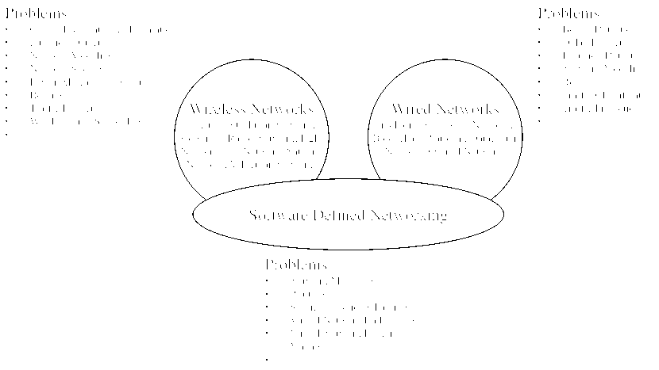
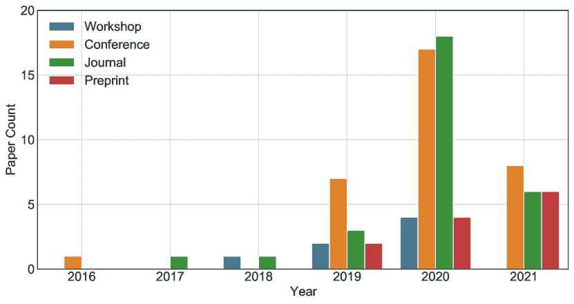
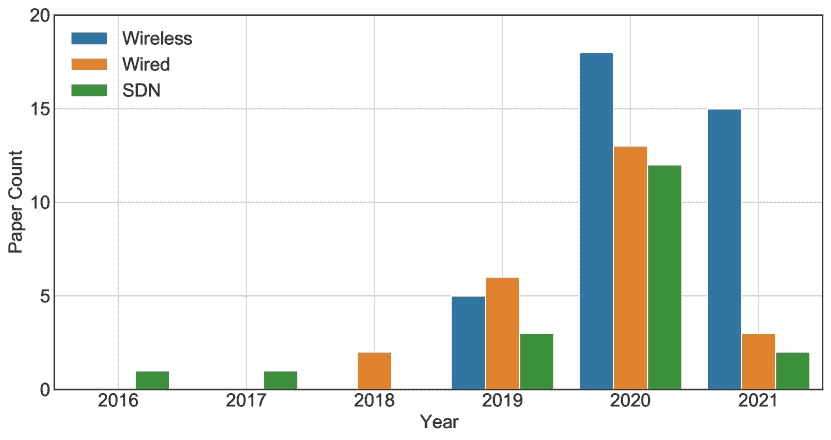
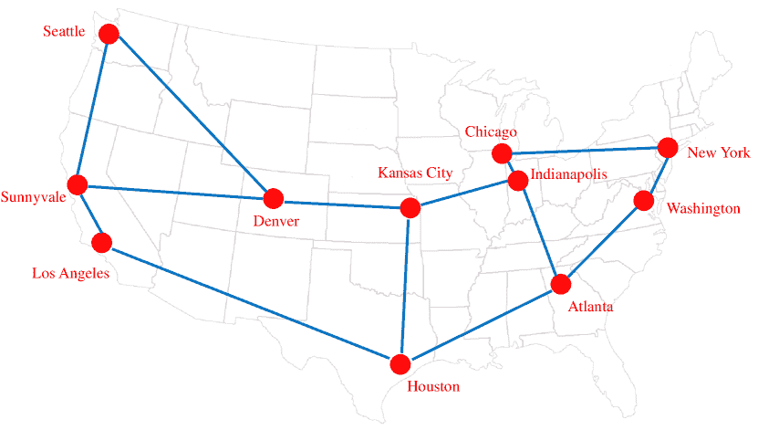
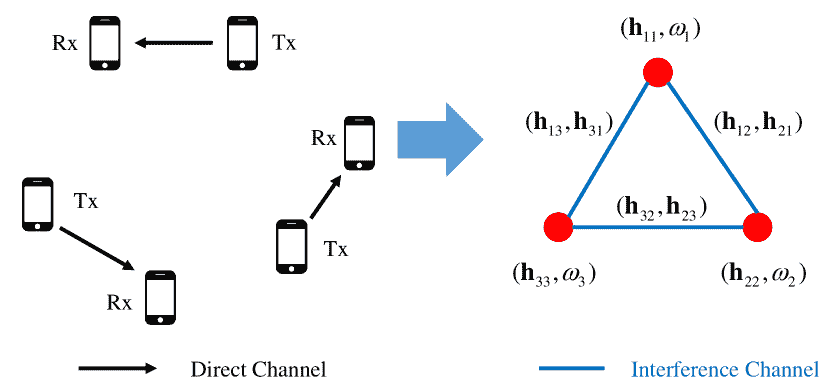
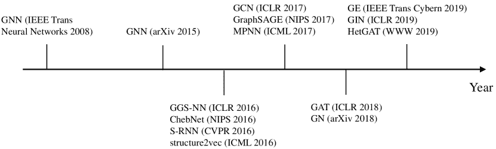

<!--yml

分类：未分类

日期：2024-09-06 19:54:33

-->

# [2106.02533] 基于图的深度学习在通信网络中的应用：综述

> 来源：[`ar5iv.labs.arxiv.org/html/2106.02533`](https://ar5iv.labs.arxiv.org/html/2106.02533)

# 基于图的深度学习在通信网络中的应用：综述

Weiwei Jiang 清华大学电子工程系，北京 100084，中国

###### 摘要

通信网络是现代社会的重要基础设施。仍有许多挑战尚未完全解决，并且在这一活跃的研究领域中不断提出新解决方案。近年来，为了建模网络拓扑，基于图的深度学习在通信网络中的一系列问题中取得了最先进的性能。在这项综述中，我们回顾了使用不同基于图的深度学习模型（如图卷积网络和图注意力网络）在各种通信网络（如无线网络、有线网络和软件定义网络）问题中的迅速增长的研究。我们还呈现了每项研究问题及解决方案的整理列表，并确定了未来的研究方向。据我们所知，这篇论文是首个关注于基于图的深度学习方法在涉及有线和无线场景的通信网络中的应用的综述。为了跟踪后续研究，我们创建了一个公共的 GitHub 仓库，相关论文将持续更新。

###### 关键词：

图，深度学习，图神经网络，通信网络，软件定义网络^†^†期刊：LaTeX 模板期刊

## 1 引言

通信网络在现代社会中无处不在，从广泛使用的互联网和 4G/5G 蜂窝网络到快速增长的物联网（IoT）网络。通信网络的发展超出了其设计者的想象。例如，根据思科年度互联网报告（2018–2023）白皮书，到 2023 年，全球近三分之二的人口将拥有互联网接入¹¹1[`www.cisco.com/c/en/us/solutions/collateral/executive-perspectives/annual-internet-report/white-paper-c11-741490.html`](https://www.cisco.com/c/en/us/solutions/collateral/executive-perspectives/annual-internet-report/white-paper-c11-741490.html)。运营和管理如此庞大的网络将是非常具有挑战性的，新的网络类型不断带来新问题。例如，在现代网络中，手动配置变得不可行或效率低下。虽然通信网络的研究有着悠久的历史，但它仍然是一个活跃的领域，不断有新的想法出现，如软件定义网络（SDN）和空间-空中-地面集成网络（SAGIN）。挑战可能不仅包括传统问题，如路由和负载均衡、功率控制和资源分配，还包括新兴问题，如 SDN 中的虚拟网络嵌入。

为了解决这些挑战，各种解决方案被引入到网络领域，尤其是深度学习[1]。以深度神经网络为代表的深度学习在许多问题上取得了巨大的成功，尤其是在图像识别、自然语言处理和时间序列问题上[2, 3, 4, 5, 6]。深度学习模型也被应用于各种通信网络，并被证明在一系列问题上极其有用，例如网络设计、流量预测、资源分配等[7, 8, 9, 10]。然而，在这些研究中，网络拓扑结构并未得到充分利用，因为大多数深度神经网络是为欧几里得结构数据（如图像和视频）设计的。为了弥补这一缺陷，近年来提出了以图神经网络（GNNs）为代表的基于图的深度学习，专门处理非欧几里得结构数据[11, 12, 13, 14, 15, 16]。最近，GNNs 与深度强化学习结合，用于一系列问题中的决策，例如，GNN 被用于处理图信息并提高分布式计算中的流调度能力[17]。

GNNs 适用于通信网络中的问题，因为它们具有强大的学习能力，可以捕捉网络拓扑中隐藏的空间信息，并且具有在动态网络中用于未见过的拓扑的泛化能力。如本综述所讨论，基于 GNN 的解决方案被证明在不同网络场景中的各种问题上有效，并且值得在未来深入探讨。

据作者了解，本文首次呈现了针对通信网络问题的基于图的深度学习研究的文献综述，涵盖了 2016 年至 2021 年间的 81 篇论文，包括有线和无线场景。与最近的类似综述[18]相比，后者仅涵盖了 GNNs 在无线网络中的应用，我们的综述具有更广泛的覆盖面，并包含几乎所有[18]中调查的研究。由于通信网络的范围很广，因此我们从广泛的期刊和会议中选择了调查的论文。由于这是一个快速发展的研究领域，我们还包括了尚未经过传统同行评审过程的预印本（例如 arXiv 论文），以展示最新进展。

调查的论文被分类为三种主要场景，如图 1 所示。一些常见问题在两种或三种场景中讨论，例如网络建模、路由、流量预测。其他问题只在其中一个场景中提到。这种组织方式并非唯一，因为 SDN 的思想可以应用于无线和有线网络。基于图的深度学习经常用于未来软件化网络的假设中，不受制于所使用的底层网络类型。将 SDN 场景作为一个独立部分，相关讨论将对无线和有线场景的未来工作都具有启发性。

图 1: 本调查的组织结构。

在本调查中，解决的问题、基于图的解决方案以及每项研究中使用的具体 GNN 模型被识别和总结。我们还尝试指出 GNN 在通信网络中的应用未来方向。我们的目标是提供相关工作的最新总结，并为对相关主题感兴趣的新研究者提供一个有用的起点。除了这篇论文，我们还创建了一个开放的 GitHub 仓库²²2[`github.com/jwwthu/GNN-Communication-Networks`](https://github.com/jwwthu/GNN-Communication-Networks)以持续更新新论文。

我们的贡献总结如下：

1) 综合评述：我们呈现了过去六年（2016-2021）各种通信网络问题的基于图的深度学习解决方案的最新综合评述。

2) 组织良好的总结：我们以统一格式总结了解决的问题、基于图的解决方案以及每项研究中使用的 GNN，这将作为参考手册非常有用。

3) 未来方向：我们提出了几个对相关主题感兴趣的研究者的潜在未来方向。

作为参考，本调查中经常使用的缩略语列表总结见表 LABEL:tab:acronyms。

表 1: 本调查中使用的缩略语列表。

| 缩略语 | 全名 |
| --- | --- |
| BGP | 边界网关协议 |
| DC-STGCN | 双通道图卷积网络 |
| DCRNN | 扩散卷积递归神经网络 |
| DL | 深度学习 |
| DQN | 深度 Q 网络 |
| DRL | 深度强化学习 |
| FDS-MARL | 完全去中心化软多智能体强化学习 |
| GASTN | 图注意力时空网络 |
| GAT | 图注意力网络 |
| GCLR | 基于 GNN 的跨层优化 |
| GCN | 图卷积网络 |
| GE | 图嵌入 |
| GGS-NN | 门控图序列神经网络 |
| GIN | 图同构网络 |
| GN | 图网络 |
| GNN | 图神经网络 |
| HIGNN | 异质干扰图神经网络 |
| HetGAT | 异质图注意力网络 |
| IGCNet | 干扰图卷积神经网络 |
| ML | 机器学习 |
| MPGNNs | 消息传递图神经网络 |
| MPLS | 多协议标签交换 |
| MPNN | 消息传递神经网络 |
| MSTNN | 多尺度时空图神经网络 |
| NFV | 网络功能虚拟化 |
| REGNNs | 随机边图神经网络 |
| S-RNN | 结构化 RNN |
| SDN | 软件定义网络 |
| SFC | 服务功能链 |
| SGCRN | 时空图卷积递归网络 |
| TCN | 时间卷积网络 |
| TGCN | 时间图卷积网络 |
| UWMMSE | 展开迭代加权最小均方误差 |
| VNE | 虚拟网络嵌入 |
| VNF | 虚拟网络功能 |

本论文的其余部分组织如下。在第二部分中，我们介绍了文献检索和选择的进展。在第三部分中，我们介绍了在审查研究中使用的 GNN。在第四部分中，我们总结了无线网络中的研究。在第五部分中，我们总结了有线网络中的研究。在第六部分中，我们总结了软件定义网络中的研究。在第七部分中，我们指出了未来的方向。在第八部分中，我们得出结论。

## 2 调查方法论

为了收集相关研究文献，使用两组关键词的各种组合进行检索。第一组关于图基深度学习技术，如“Graph”，“Graph Embedding”，“Graph Neural Network”，“Graph Convolutional Network”，“Graph Attention Networks”，“GraphSAGE”，“Message Passing Neural Network”，“Graph Isomorphism Network”等。第二组关于通信网络以及具体问题，如“Wireless Network”，“Cellular Network”，“Computer Network”，“Software Defined Networking”，“Traffic Prediction”，“Routing”，“Service Function Chaining”，“Virtual Network Function”等。对主要出版商的数据库逐一进行了仔细覆盖，如 ACM、Elsevier、IEEE、Springer、Wiley 等。为了追踪这些论文之间的引用关系并避免遗漏小型出版商的记录，也利用了 Google Scholar 进行文献检索。

总共选取了 81 篇论文进行调查，最早的一篇发表于 2016 年，如图 2 所示。大多数调查论文发表于最近三年，即 2019、2020 年及 2021 年前五个月。与 2019 年的 14 篇论文相比，2020 年的论文增长了 207%，共有 43 篇。虽然 2021 年前五个月仅有 20 篇论文，但预计随着基于图的深度学习方法在网络领域应用的影响力增长，剩余月份会有更多相关研究发表或公布。我们还展示了不同网络类型的论文统计数据，如图 3 所示。无线网络场景引起的关注多于其他两种，预计这一趋势会在 2021 年继续。

图 2：不同类型的论文年度数量。

图 3：不同网络类型的论文年度数量。

本调查全面覆盖了相关研究、研讨会、会议及期刊论文以及预印本论文，以追踪最新成果和持续进展。期刊列表（按字母顺序）见表 2。会议列表（按字母顺序）见表 3。研讨会列表（按字母顺序）见表 4。所有预印本论文来自 arXiv 平台 ³³3[`arxiv.org/`](https://arxiv.org/)。由于我们涵盖了各种通信网络的广泛领域，论文来自各种出版物或会议论文集，其中一些可能专注于电信或相关主题，而另一些可能是跨学科的。作为一个新兴主题，基于图的深度学习近年来用于解决网络相关问题，大多数期刊或会议中仅选择了一篇论文。

表 2：本研究覆盖的期刊列表及对应的研究。

| 期刊名称 | 研究 |
| --- | --- |
| 计算机网络 | [19, 20] |
| 电子学 | [21] |
| IEEE Access | [22, 23] |
| IEEE 通信信函 | [24, 25, 26, 27] |
| IEEE 物联网期刊 | [28] |
| IEEE《选择通信领域的期刊》 | [29, 30, 31, 32] |
| IEEE 系统期刊 | [33] |
| IEEE《工业信息学汇刊》 | [34] |
| IEEE《信息取证与安全汇刊》 | [35] |
| IEEE《移动计算汇刊》 | [36, 37] |
| IEEE《网络科学与工程汇刊》 | [38] |
| IEEE《网络与服务管理汇刊》 | [39] |
| IEEE《信号处理汇刊》 | [40] |
| IEEE《车载技术汇刊》 | [41] |
| IEEE《无线通信汇刊》 | [42, 43] |
| 《国际网络管理杂志》 | [44] |
| 性能评估 | [45] |
| 传感器 | [46] |
| 《新兴电信技术汇刊》 | [47] |

表 3: 本研究涵盖的源会议及相应的研究列表。

| 会议名称 | 研究 |
| --- | --- |
| ACM SIGCOMM 会议 | [48] |
| ACM SDN 研究研讨会（SOSR） | [49] |
| 亚太网络运营与管理研讨会（APNOMS） | [50, 51] |
| IEEE 年会消费通信与网络会议（CCNC） | [52] |
| IEEE 计算机通信会议（INFOCOM） | [53] |
| IEEE 网络功能虚拟化与软件定义网络会议（NFV-SDN） | [54] |
| IEEE 全球通信会议（GLOBECOM） | [55, 56] |
| IEEE《声学、语音与信号处理国际会议（ICASSP）》 | [57, 58] |
| IEEE《通信国际会议（ICC）》 | [59, 60, 61, 62, 63] |
| IEEE 计算机与通信研讨会（ISCC） | [64] |
| IEEE 车载技术会议（VTC） | [65] |
| IEEE 无线通信与网络会议（WCNC） | [66, 67, 68] |
| IFIP 网络会议（IFIP Networking） | [69] |
| 《信息网络国际会议（ICOIN）》 | [70, 71] |
| 《信息与通信技术融合国际会议（ICTC）》 | [72] |
| 《网络与服务管理国际会议（CNSM）》 | [73, 74, 75] |
| 《实时网络与系统国际会议（RTNS）》 | [76] |
| 《无线通信与信号处理国际会议（WCSP）》 | [77] |
| 国际新兴网络实验与技术会议 (CoNEXT) | [78] |
| 国际网络、计算机与通信研讨会 (ISNCC) | [79] |
| 光电子与通信会议 (OECC) | [80] |

表 4：我们在本研究中涵盖的源研讨会及相应的研究列表。

| 研讨会名称 | 研究 |
| --- | --- |
| MLSys 会议的 AutoML 网络与系统研讨会 | [81] |
| IEEE Globecom 研讨会 (GC Wkshps) | [82] |
| IEEE 国际无线通信信号处理进展研讨会 (SPAWC) | [83、84] |
| 大数据分析与数据通信网络机器学习研讨会 | [85] |
| 网络遇见 AI & ML 研讨会 | [86、87] |

## 3 基于图的深度学习介绍

在本节中，我们首先展示一些用于通信网络的图结构的典型示例。然后，我们简要介绍基于图的深度学习模型，特别是那些在调查的论文中使用的模型。最后，我们讨论基于图的深度学习模型在网络领域应用的优缺点。

### 3.1 通信网络中的图

从图论来看，简单图定义为 $G=(V,E)$，其中 $V$ 是节点集，$E$ 是节点间的边集。在通信网络中，边可以是有向的也可以是无向的，具体取决于特定问题。节点和边都可以与一些属性相关联作为特征，这些特征可以是静态的也可以是动态的。

给出了有线和无线场景的两个图示例。在图 4 中，展示了 Abilene 网络的通信图，该图包含 11 个节点和 14 条边。每个节点代表物理骨干路由器，节点特征包括流入和流出流量。每条边代表物理传输链路，边的特征包括传输指标，如带宽和延迟。类似的通信图也在其他网络拓扑中构建，例如诺贝尔、GÉANT、Germany50 和 AT&T 骨干网络，详见[47、59、33]。

图 4：Abilene 网络通信图的示例。

在图 5 中，展示了一个由 3 个节点和 3 条边组成的均匀自组网的干扰图。与图 4 不同，图 5 中的节点是虚拟节点，每个虚拟节点对应一个发射接收对（Tx, Rx）。节点 $i$ 的特征包括直接的信道状态信息（CSI） $\mathbf{h}_{ii}$ 和其他环境信息，例如，节点 $i$ 的权重 $\omega_{i}$ [82]。节点 $i$ 和节点 $j$ 之间的无向边建模了两个发射接收对之间的干扰，边的特征是干扰 CSI $\mathbf{h}_{ij}$ 和 $\mathbf{h}_{ji}$。针对异构自组网情况构建的干扰图可以在 [88] 中进一步查找。

图 5：来自 [82] 的干扰图示例。

引入了邻接矩阵 $\mathbf{A}$ 来将网络拓扑信息融入神经网络的架构中。设 $e_{ij}$ 表示节点 $v_{i}$ 和节点 $v_{j}$ 之间的边。则邻接矩阵 $A$ 的元素定义如下：$A_{ij}=1$ 如果 $e_{ij}\in E$，否则 $A_{ij}=0$。这里的二值矩阵 $A$ 仅捕获连接关系。如果 $\mathbf{A}$ 是对称的，图是无向的，否则图是有向的。更复杂的邻接矩阵可以类似地定义，例如距离矩阵或干扰矩阵。

在下一部分定义 GNN 时，这里引入了更多符号。根据连接关系，$\mathcal{N}(v_{i})$ 表示 $v_{i}$ 的邻居节点集，度矩阵 $\mathbf{D}$ 的每个元素为 $\mathbf{D}_{ii}=\|\mathcal{N}(v_{i})\|$。无向图的拉普拉斯矩阵定义为 $\mathbf{L}=\mathbf{D}-\mathbf{A}$，归一化拉普拉斯矩阵进一步定义为 $\tilde{\mathbf{L}}=\mathbf{I}_{N}-\mathbf{D}^{-\frac{1}{2}}\mathbf{A}\mathbf{D}^{-\frac{1}{2}}$，其中 $N$ 是节点数量，$\mathbf{I}_{N}$ 是大小为 $N$ 的单位矩阵。图的节点特征矩阵定义为 $\mathbf{X}\in{R}^{N\times d}$，其中 $d$ 是节点特征向量的维度。

### 3.2 基于图的通信网络模型

由于基于图的深度学习研究仍在快速发展，新模型不断出现，我们并不打算对基于图的模型进行全面的文献检索。在本节中，我们将简要介绍调查研究中使用的 GNN。对于那些对图神经网络的全貌及技术细节深入讨论感兴趣的人，推荐最近的综述[11, 12, 13, 14, 15]。相关的图基深度学习模型按时间顺序列在图 6 中。请注意，列出的会议可能会落后于预印本版本，这些版本可能会提前一到两年发布。

图 6：本综述的相关图基深度学习模型。

作为一项开创性的研究，GNN 在[89]中被引入，它将神经网络的应用从欧几里得结构数据扩展到非欧几里得结构数据。GNN 基于消息传递机制，每个节点通过与其他节点交换信息来更新其状态，直到达到某种稳定状态。之后，提出了各种 GNN 变体，如图卷积网络（GCN）和图注意力网络（GAT）。

我们首先介绍图嵌入（GE）模型。在数学中，嵌入是一个映射函数 $f:X\rightarrow Y$，其中一个空间 $X$ 中的点被映射到另一个空间 $Y$。嵌入通常是从高维抽象空间到低维空间。一般来说，映射到低维空间的表示对神经网络更易处理。在图的情况下，图嵌入用于将节点、边及其特征转化为向量空间，同时尽可能保留图结构和信息等属性。对于本综述涵盖的研究，包括 structure2vec [90]、GraphSAGE [91] 和 GE [92]。在传导学习方法中，Structure2vec [90] 基于这样一个观点：如果两个节点的所有邻居组成的两个序列相似，那么这两个节点也是相似的。GraphSAGE [91] 是归纳学习的代表。它不直接学习每个节点的表示，而是学习聚合函数。对于新节点，其嵌入表示直接生成，无需重新学习。此外，[92] 提出了一个新颖的对抗正则化框架用于图嵌入。

接下来介绍 GCN 模型。GCN 将卷积操作从传统数据（如图像）扩展到图数据，受到在图像任务中极为成功的卷积神经网络的启发。核心思想是学习一个函数映射，通过这个映射，节点可以汇聚自身特征和邻居的特征以生成新的表示。一般来说，GCN 模型有两种类型，即谱方法和空间方法。

基于图信号处理，谱方法的 GCNs 在谱域（例如傅里叶域）定义卷积操作。为了进行卷积操作，图信号通过图傅里叶变换转换到谱域。然后，将卷积后的结果通过逆图傅里叶变换转换回来。在调查的研究中使用了几种谱方法的 GCNs，例如 GNN [93]、ChebNet [94]和 GCN [95]，它们通过不同技术改进了卷积操作。通过引入平滑系数的参数化，GNN [93]试图使谱滤波器在空间上局部化。ChebNet [94]将对角矩阵学习为 Chebyshev 多项式在$K$阶截断扩展的近似。

为了避免过拟合，GCN [95]中使用了$K=1$。更具体地说，GCN 中的图卷积操作$*G$定义如下：

|  | $\mathbf{X}_{*G}=\mathbf{W}(\mathbf{I}_{N}+\mathbf{D}^{-\frac{1}{2}}\mathbf{A}\mathbf{D}^{-\frac{1}{2}})\mathbf{X}$ |  | (1) |
| --- | --- | --- | --- |

其中 $\mathbf{W}$ 是一个可学习的权重矩阵，即模型参数。为了缓解潜在的梯度爆炸问题，图卷积操作进一步转换为：

|  | $\mathbf{X}_{*G}=\mathbf{W}(\tilde{\mathbf{D}}^{-\frac{1}{2}}\tilde{\mathbf{A}}\tilde{\mathbf{D}}^{-\frac{1}{2}})\mathbf{X}$ |  | (2) |
| --- | --- | --- | --- |

其中 $\tilde{\mathbf{A}}=\mathbf{A}+\mathbf{I}_{N}$ 和 $\tilde{\mathbf{D}}_{ii}=\sum_{j}{\tilde{\mathbf{A}}_{ij}}$。

调查的研究中也使用了几种基于空间的 GCNs，这些方法直接在图的拓扑结构上定义卷积操作。为了统一不同的空间方法变体，Message Passing Neural Network (MPNN) [96]提出了使用消息传递函数，这些函数包括消息传递阶段和读取阶段。消息传递阶段定义如下：

|  | $\mathbf{m}_{v_{i}}^{(t)}=\sum_{v_{j}\in\mathcal{N}{(v_{i})}}\mathcal{M}^{(t)}(\mathbf{X}_{i}^{(t-1)},\mathbf{X}_{j}^{(t-1)},\mathbf{e}_{ij})$ |  | (3) |
| --- | --- | --- | --- |

其中 $\mathbf{m}_{v_{i}}^{(t)}$ 是从节点 $v_{i}$ 的邻居处聚合的消息，$\mathcal{M}^{(t)}(\cdot)$ 是第 $t$ 次迭代中的聚合函数，$\mathbf{X}_{i}^{(t)}$ 是节点 $v_{i}$ 在第 $t$ 次迭代中的隐藏状态，$\mathbf{e}_{ij}$ 是节点 $v_{i}$ 和节点 $v_{j}$ 之间的边特征向量。读出阶段进一步定义如下：

|  | $\mathbf{X}_{i}^{(t)}=\mathcal{U}^{(t)}(\mathbf{X}_{i}^{(t-1)},\mathbf{m}_{v_{i}}^{(t)})$ |  | (4) |
| --- | --- | --- | --- |

其中 $\mathcal{U}^{(t)}(\cdot)$ 是第 $t$ 次迭代中的读出函数。

图网络（GN）[97] 通过学习节点级、边级和图级表示，统一了许多 GNN 变体。图同构网络（GIN）[98] 更进一步，指出之前基于 MPNN 的方法无法根据图嵌入区分不同的图结构，并通过可学习参数调整中心节点的权重来修正这一缺陷。基于注意力的 GNN 模型可以分为基于空间的类型。GAT [99] 将注意力机制融入传播步骤，并进一步利用多头注意力机制来稳定学习过程，定义如下：

|  | $\mathbf{X}_{i}^{(t)}=\&#124;_{k}\sigma(\sum_{j\in\mathcal{N}{(v_{i})}}\alpha^{k}(\mathbf{X}_{i}^{(t-1)},\mathbf{X}_{j}^{(t-1)})\mathbf{W}^{(t-1)}\mathbf{X}_{j}^{(t-1)})$ |  | (5) |
| --- | --- | --- | --- |

其中 $\|$ 是连接操作，$\sigma$ 是激活方法，$\alpha^{k}(\cdot)$ 是第 $k$ 个注意力机制。

除了卷积操作外，递归操作也可以应用于 GNN 的传播模块。主要区别在于卷积操作使用不同的权重，而递归操作共享相同的权重。例如，门控图序列神经网络（GGS-NN）[100] 在传播步骤中使用门控递归单元（GRU）。

在现实网络中，网络拓扑可能会偶尔发生变化，例如，路由器的添加或删除，这对应于动态图的情况，而不是静态图。为处理动态图，提出了几种 GNN 变体。扩散卷积递归神经网络（DCRNN）[101] 利用 GNN 收集空间信息，并进一步用于序列到序列模型。通过扩展静态图结构与时间连接，结构化 RNN（S-RNN）[102] 可以同时学习空间和时间信息。

最后要讨论的案例是异构图，其中节点和边是多类型或多模态的。在这种情况下，引入了元路径作为路径方案，该方案决定了路径中每个位置的节点类型，然后一个异构图可以简化为几个同质图以执行图学习算法。为了生成节点的最终表示，在元路径基础上的邻居上执行图注意力，并在异构图注意力网络（HetGAT）[103]中对所有元路径方案下的节点输出嵌入使用语义注意力。

### 3.3 基于图模型的优缺点

机器学习已成为解决各种网络问题和自动化网络管理的新范式[50]。与传统方法相比，机器学习模型在解决网络相关问题时提供了许多好处。第一个优点是机器学习模型可以自动从经验中学习和改进，而无需明确编程[50]。尽管训练机器学习模型需要一些努力，但应用训练好的模型时推断时间要小得多。这些努力在应用基于各种优化技术的传统方法时也是不可避免的，传统方法可能需要较长的迭代更新过程。第二个优点是机器学习模型在学习广泛和动态变化的数据方面比统计和启发式方法更有效。基于这些优点，机器学习模型，特别是深度学习模型，已在网络领域得到了广泛应用。

故事并未到此为止。虽然机器学习在许多研究领域，如计算机视觉、自然语言处理和时间序列处理，取得了巨大成功。这些领域大多使用欧几里得域数据，对于这些数据，前馈神经网络、CNN 和 RNN 已经足够。然而，对于其他领域，如化学和生物学，这些模型对于学习非欧几里得图数据不够充分，这些数据包含了每对邻近元素之间丰富的关系信息。许多种图结构数据也存在于前面介绍的通信网络中，这超出了非 GNN 机器学习模型的能力。受到图结构数据的驱动，GNN 更为可取，因为 GNN 可以自动学习网络中每个节点的凝聚表示，包含有关节点、其邻居及其互联拓扑的信息[74]，并支持关系推理和组合泛化[20]。

除了处理图结构的能力外，GNN（图神经网络）还为其他尚未被之前的机器学习模型完全解决的挑战带来了新的机会，例如网络状态的复杂性和网络中的非平稳性，并具有更好的泛化能力。通信网络是复杂且动态的系统，整体网络性能可能受到许多因素的影响，例如，延迟度量通过影响网络协议来影响网络效率[33]。传统技术，例如用于路由的开放最短路径优先协议（OSPF），无法应对这些挑战。当发生链路故障和拥塞等情况时，这些传统技术无法快速适应这些以前未见过的情况。当网络拓扑发生变化时，例如链路断开，非 GNN 机器学习模型将不再适用，需要新的训练数据[20]。由于网络拓扑通常是动态变化的，因此 GNN 在实际网络中使用动态图。换句话说，GNN 能够理解网络中拓扑、路由和流量之间的复杂关系，并在任意拓扑、路由方案和可变流量强度上泛化训练的神经网络参数[20]。此外，已证明 GNN 的训练效率高于其他神经网络，例如，GNN 的收敛速度比多层感知机快$O(n\log n)$倍，并且其泛化误差在理论上比通信网络中的多层感知机低$O(n)$倍[104]。

尽管如此，GNN 并不是万灵药。关于在网络领域应用 GNN 仍然存在一些问题，并且并非所有问题都已得到完全解决。第一个问题是关于 GNN（以及其他机器学习模型）的训练数据的收集。与拥有大规模开放基准数据集的成熟研究领域（例如计算机视觉的 ImageNet）相比，用于训练有效 GNN 模型的训练数据集仍然稀缺（至少开放数据集是稀缺的）。即使对于那些已在现有研究中使用的数据，数据量也有限，远远不能满足在实际网络中应用的需求。

第二个关注点是 GNN 模型的深度。对于其他神经网络，例如 CNN，使用更深的结构（例如 ResNet）已被证明是有效的。然而，对于 GNN，类似的好处并不明显。研究发现，当使用超过两个 GCN 层时，性能会随着 GCN 层数的增加而变差。这是因为 GNN 依赖于对邻居节点特征的聚合操作，经过多层后，结果变得过于平滑，缺乏区分度。随着网络的继续叠加，最终所有节点都会学习到相同的表达，GNN 会失效。图神经网络是否需要深度结构，或者是否可以设计深度网络结构以避免网络领域中的过平滑问题，仍然存在疑问。

第三个关注点是 GNN 模型的稳定性，包括在随机扰动和对抗攻击下的稳定性 [105, 106, 107]。随机扰动出现在通信网络中，如链路故障和拥塞时。而对抗攻击则出现在针对底层网络的攻击中。这些问题在其他神经网络中已经存在，并且可以通过利用节点特征或图结构设计更多攻击类型。研究发现，GNN 的稳定性受到多个因素的影响，例如图滤波器、非线性、架构宽度和深度等 [106]。为了设计对扰动或攻击具有鲁棒性的 GNN，已经投入了大量的努力。随着 GNN 在各种网络问题中的深入应用，可能会出现更多潜在的脆弱情况，这需要设计出更加鲁棒的 GNN。

最后但同样重要的关注点是 GNN 在网络问题中的可解释性。深度学习模型的可解释性和可视化的研究有很长的历史，深度学习也因其“黑箱”特性受到批评。图结构为可解释性问题带来了新的挑战。尽管在解释 GNN 预测结果的后处理技术方面已有一些进展，但在网络领域中 GNN 的可解释性仍未得到全面解决 [108, 109]。

## 无线网络

在本节中，我们专注于无线网络场景中的相关研究。对于无线网络，我们指的是那些通过无线数据连接传输信息而不使用电缆的网络，包括无线局域网、蜂窝网络、无线自组织网络、认知无线电网络、设备对设备（D2D）网络、卫星网络、车载网络等。在不同形式的无线网络中，一些问题是普遍存在的，例如功率控制。我们将首先讨论这些一般无线网络场景中的问题。然后讨论专注于特定无线网络场景的论文。

### 4.1 一般无线网络

与其他深度学习模型相比，GNNs 具有处理拓扑信息的优势，而这在以往的欧几里得深度学习模型研究中可能未被利用。在密集部署的无线局域网中，信道资源有限。为了提高系统吞吐量，必须高效分配信道。[22]中使用 GCN 模型提取了带有拓扑信息的信道向量特征。然后开发了一种深度强化学习用于信道分配，它利用了 GCN 提取的特征。拓扑信息也在[110]中用于无线网络优化。结合 GE 单元和深度前馈网络，提出并验证了一个两阶段的拓扑感知框架，用于网络流优化问题，达到了计算时间和推断性能之间的平衡。

与有线通信相比，无线传输可能不够完善，错误更多。尽管 GNNs 可以应用于无线网络，但传输的不确定性会恶化 GNNs 的鲁棒性。这个挑战在[111]中被考虑，其中使用了去中心化的 GNN 二分类器来解决多个问题，例如功率控制或无线链路调度。为应对这种情况，提出了重新传输机制来增强 GNN 分类器的鲁棒性，无论是对未编码还是编码的无线通信系统。

能量分配或控制是无线网络场景中的一个重要问题，其中连接到网络的设备可能由具有有限能量存储的电池供电。如果未正确控制功率，自由空间中的传输也可能会相互干扰。为了解决这个问题，提出了多个基于 GNN 的解决方案 [83, 58, 40, 57, 42, 112, 82, 32, 84]。在一系列的研究中 [83, 58, 40, 112]，选择了随机边图神经网络（REGNNs）作为功率分配和控制优化问题的最佳解决方案，并考虑了各种系统约束。REGNNs 凭借其基本的置换不变性特性在规模不断增长的网络中表现优异。对于单跳自组织无线网络中的最佳功率分配，提出了一种迭代加权最小均方误差方法，名为 UWMMSE，其中使用 GNNs 来学习模型参数 [57, 42]。UWMMSE 有效降低了计算复杂度，而不损害功率控制的性能，相比于经典的功率控制算法。在以无监督的方式解决类似问题的同时，提出了干扰图卷积神经网络（IGCNet），并在 [82] 中进行了验证，该网络对不完美的信道状态信息（CSI）具有鲁棒性。在[32] 中进一步考虑到波束赋形，其中提出了消息传递图神经网络（MPGNNs）来解决功率控制和波束赋形问题。类似地，在学习最佳功率分配决策的无监督方法中，提出了一种原始-对偶对立优化方法，在 [84] 中使用 GNNs 处理网络拓扑结构。

总而言之，在通用无线网络场景中列出了论文，详见表 5。还列出了目标问题、提出的解决方案和相关的 GNN 组件。后续章节中的论文摘要也适用类似的表格格式。

表 5：无线网络场景中的论文列表。

| 问题 | 论文 | 解决方案 | GNN |
| --- | --- | --- | --- |
| 二分类 | [111] | 分散式 GNN | GCN [95], GIN [98] |
| 通道分配 | [22] | 带有 GCN 的 DRL | ChebNet [94] |
| 网络流优化 | [110] | 两阶段拓扑感知机器学习框架 | MPNN [96] |
| 能量分配 | [83, 58, 40] | REGNN | GNN [93] |
| 功率分配 | [57, 42] | UWMMSE 方法 | GCN [95] |
| 功率控制 | [112] | REGNN | GNN [93] |
| 功率控制 | [82] | IGCNet | GIN [98] |
| 功率控制与波束成形 | [32] | MPGNNs | GIN [98], GCN [95] |
| 功率控制 | [84] | 无监督的原始对偶反事实优化 | GNN [93] |

### 4.2 蜂窝网络

本部分单独讨论了蜂窝网络，不仅因为有超过十篇论文专注于这一特定场景，还因为蜂窝网络具有广泛的应用。例如，截至 2020 年第四季度，全球 LTE 订阅量已达 59.5 亿⁴⁴4[`gsacom.com/paper/lte-and-5g-subscribers-march-2021-q4/`](https://gsacom.com/paper/lte-and-5g-subscribers-march-2021-q4/)。尽管增长趋势可能受到 COVID-19 的影响，蜂窝网络仍然是访问互联网的主要方式之一。

由于巨大的需求，蜂窝网络场景中的研究不断增加，包括利用基于图的深度学习模型解决一些传统的通信问题，例如资源分配、功率控制和流量预测。在 SDN 的思想驱动下，一些新问题也出现在蜂窝网络场景中，例如网络切片和虚拟网络嵌入。这两类问题都在调查的论文中进行了研究。

为了充分利用网络资源，考虑在 5G 网络中使用多路径 TCP，它可以同时通过多个路径传输数据包。然而，5G 网络中的网络异质性使得多路径路由问题变得更加复杂，现有的路由算法难以处理。提出了一种基于 GNN 的多路径路由模型作为解决方案，见 [23]。在 SDN 框架下的实验表明，基于 GNN 的模型可以显著提高吞吐量。

蜂窝网络中也考虑了流量预测，近年来提出了基于 GNN 的解决方案 [56, 37, 21, 36]。作为预测问题，时间依赖性可以通过递归神经网络建模，例如长短期记忆（LSTM）或 GRU。也可以结合不同的注意力机制。作为对基线的改进，GNN 能够建模不同节点之间的空间相关性，例如一个基站或接入点。现有研究中探讨了不同的结构，例如 [56, 37]中的 GAT，[21]中的 GCN，以及[36]中的 GraphSAGE。

能耗是 5G 网络的另一个关注点，它旨在实现更密集的网络，包括微型基站、家庭基站和小型基站。为了更好地控制传输功率，基于 GNN 的功率控制解决方案在[66, 68]中被提出。具有新型参数共享方案的异构 GNN（HetGNNs）被提出用于多用户多小区网络中的功率控制[66]。更进一步，[68]中考虑了下行链路的用户关联和功率控制的联合优化问题，其中使用无监督 GNN 进行功率分配，使用谱聚类算法进行用户关联。

绿色网络管理被提出以提高能源效率。一个特定问题，空闲时间窗口（ITWs）预测，在[29]中被考虑。为了捕捉时空特征，提出了一种新型的时间图卷积网络（TGCN）用于学习网络表示，提升了预测性能。对于更密集的基站，[26]中使用了由 3rd Generation Partnership Project（3GPP）定义的集成接入和回传（IAB）架构。IAB 拓扑设计被形式化为一个图优化问题，并提出了深度强化学习和图嵌入的组合来高效地解决这个问题。

卫星-地面网络的集成被提议用于未来的 6G 网络。在这个方向上，高空平台站（HAPS）是一个在大约 20 公里高度的平流层中操作的网络节点，对于提供通信服务至关重要[113]。对于 HAPS，GAT 首先在[114, 62]中用于信道估计，所提出的 GAT 估计器在全双工信道估计中优于传统的最小二乘法，并且对硬件缺陷和小尺度衰落特性的变化具有鲁棒性。

作为一个软件化概念，网络切片已被提出用于 5G 网络，利用网络虚拟化将单一网络连接分割成多个提供不同服务质量（QoS）要求的虚拟连接。然而，日益增加的网络复杂性对网络切片的部署构成了巨大挑战。一个具有 GNN 的可扩展数字双胞胎（DT）技术在[34]中被开发用于镜像网络行为和预测端到端延迟，它也可以应用于未知的网络情况。更进一步，GAT 被融入深度 Q 网络（DQN）中用于设计智能资源管理策略，在[67]中通过模拟验证了其有效性。

虚拟网络嵌入（VNE）也是一个软件化的概念，可用于建模 5G 网络切片的资源分配。由于 VNE 问题是 NP-难题，因此提出了启发式方法和深度学习模型来解决这个特定问题。深度强化学习（DRL）和图卷积网络（GCN）被结合起来解决这一问题[79, 52]，其中将不同的 GCN 模型应用于情景马尔可夫决策过程。

总结来说，蜂窝网络场景中的论文列于表 6 中。

表 6：蜂窝网络场景中论文的列表。

| 问题 | 论文 | 解决方案 | GNN |
| --- | --- | --- | --- |
| 信道估计 | [114, 62] | 基于 GAT 的估计器 | GAT [99] |
| 空闲时间窗口预测 | [29] | TGCN | GCN [95] |
| 集成接入和回程拓扑设计 | [26] | 带图嵌入的 DRL | structure2vec [90] |
| 网络建模，网络切片 | [34] | 基于 GNN 的数字双胞胎 | GraphSAGE [91] |
| 网络切片 | [67] | 带 GAT 的 DQN | GAT [99] |
| 功率控制 | [66] | 异构 GNNs | HetGAT [103] |
| 路由 | [23] | GCLR | MPNN [96] |
| 流量预测 | [36] | 基于图的时序卷积网络 | GraphSAGE [91] |
| 流量预测 | [56, 37] | GASTN | S-RNN [102] |
| 流量预测 | [21] | DC-STGCN | GCN [95] |
| 用户关联、功率控制 | [68] | 无监督图模型 | GraphSAGE [91] |
| VNE | [79, 52] | 带 GCN 的 DRL | GCN [95] |

### 4.3 其他无线网络

在这一部分，我们讨论了其他格式的无线网络及其挑战和解决方案。

第一个案例是认知无线电网络，其目标是通过次级用户机会性使用主要用户未使用的空闲频谱来提高频谱利用率。在这种情况下，挑战在于提高资源利用率，同时不降低主要用户的服务质量（QoS）。为了解决这个挑战，提出了一种联合信道选择和功率适配方案[46]，在该方案中利用 GCN 提取关键的干扰特征。基于估计的 CSI，进一步使用 DRL 框架来有效分配频谱资源。

第二种情况是设备对设备（D2D）网络，它使用两个用户或设备之间的直接通信，而无需经过基站或路由器。在不需要部署额外基础设施的情况下，D2D 网络有望提供超低延迟的通信服务。然而，实现这一目标仍面临许多挑战。为了最小化 D2D 网络中的内容获取延迟，考虑了合作缓存和获取的联合优化，并提出了一种基于 DRL 的算法。在该算法中，使用了 GAT 进行合作的代理协调。对于 D2D 网络中的功率控制和波束成形，提出了一种基于无监督学习的框架，在其中使用了异质图和 GNNs 来处理多样化的链路特征和干扰关系。无线链路调度也在一系列研究中被考虑。在提出的方法中，基于图嵌入的方法在[61, 43]中被提出，其中图嵌入过程基于通信链路和干扰链路的距离，无需精确的 CSI。该方法成功显著降低了链路调度问题的计算复杂性。

第三种情况是物联网（IoT）网络，该网络设计用于连接智能设备，如智能电表，智能灯泡，连接的阀门和泵等。物联网网络的应用涵盖广泛，例如智能工厂，智能农业，智能城市等。广泛的应用也引发了许多挑战，例如资源利用效率，计算和通信的电池限制以及安全问题。其中一些挑战可以通过基于图的方法来解决。一个例子是在[114]中考虑的信道估计问题，其中使用直接到卫星（DtS）通信用于全球连接的物联网，必须考虑高路径损耗。提出了 GAT 作为解决方案，并进一步在考虑的场景中用于可重构智能表面。另一个例子是网络入侵检测，在近年来引起越来越多的关注。在[115]中使用 GraphSAGE 来使用边缘特征对网络流进行分类，将其分为良性和攻击类型。该新解决方案在六个基准数据集上证明比现有方法更有效。SDN 概念也应用于物联网网络，并可以与基于图的解决方案结合使用。[28]考虑了基于 NFV 的服务功能链（SFC），其中的挑战是 SFC 应该动态自适应地重新配置，以实现较低的资源消耗和更高的收入。该问题被制定为离散时间马尔可夫决策过程，并提出了深度 Dyna-Q（DDQ）方法作为解决方案，其中 GNN 用于预测可用的虚拟网络功能（VNFs）。

第四种情况是卫星网络，其中考虑了卫星之间的通信。随着商业公司发射的低轨道卫星（如 Starlink 和 OneWeb）的增多，卫星网络受到了更多关注，有潜在应用于物联网和未来的 6G 网络。卫星网络的流量预测问题在[77]中得到了考虑，其中通过 GCN 捕捉网络拓扑的空间依赖性，并通过 GRU 捕捉时间依赖性。使用卫星网络流量的模拟显示，与单个 GRU 模型相结合的 GCN 可以提高性能。

最后一种情况是车载网络，其目的是连接车辆节点。车载网络已被提议作为未来智能城市中自动驾驶的重要基础设施。一个挑战是提高频谱分配效率。车对一切（V2X）网络在 [55] 中被考虑，其中 GNN 用于学习低维特征，DRL 用于进行频谱分配决策。这种 GNN-DRL 组合已经在其他网络类型的类似问题中得到应用。另一个挑战是在车载网络中减少通信延迟，特别是在大规模和快速移动的场景中。为了建模车辆与基础设施之间的通信延迟， [116] 中提出了一个名为 SMART 的基于图的框架，其中 GCN 与深度 Q 网络算法结合，以捕捉有限观测区域内的空间和时间模式。然后对整个地理区域的延迟性能进行重构。

总结来说，其他无线网络场景中的文献列在表 7。

表 7：其他无线网络场景中的文献列表。

| 场景 | 问题 | 论文 | 解决方案 | GNN |
| --- | --- | --- | --- | --- |
| 认知无线电网络 | 资源分配 | [46] | 基于 GCN 的 DRL | GCN [95] |
| D2D 网络 | 协作缓存和提取 | [41] | FDS-MARL | GAT [99] |
| D2D 网络 | 功率控制和波束赋形 | [88] | HIGNN | GN [97] |
| D2D 网络 | 无线链路调度 | [43, 61] | 基于图嵌入的方法 | structure2vec [90] |
| D2D 网络 | 无线链路调度 | [65] | 基于图嵌入的方法 | structure2vec [90] |
| 物联网网络 | 入侵检测 | [115] | E-GraphSAGE | GraphSAGE [91] |
| 物联网网络 | 服务功能链动态重配置 | [28] | 深度 Dyna-Q 方法 | GNN [89] |
| 卫星网络 | 流量预测 | [77] | GCN-GRU | GCN [95] |
| 车载网络 | 通信延迟建模 | [116] | SMART 框架 | GCN [95] |
| 车载网络 | 频谱分配 | [55] | 基于 GNN 的 DQN | GNN [89] |

## 5 有线网络

对于有线网络，我们主要指通过电缆连接的计算机网络，如笔记本电脑或台式计算机。一个典型的例子是以太网。在本节中，我们首先从五个方面讨论有线网络场景中的基于图的研究，即网络建模、网络配置、网络预测、网络管理和网络安全。然后进一步讨论三个特殊案例，即区块链平台、数据中心网络和光网络。

GNNs 适用于网络建模，因为计算机网络通常被建模为图。随着现代互联网的趋势不断增长，理解整体网络拓扑、架构、不同的网络元素及其配置变得越来越具有挑战性。为了解决这个挑战，提出了 GNNs 用于网络建模。它们不仅用于重建现有网络，还用于建模不存在的网络，以便为网络运营商提供对未见案例的估算，从而在未来做出更好的网络部署决策。通过建模网络，调查研究中关注了不同端到端指标的估算，给定输入的网络拓扑、路由方案和网络流量矩阵，以监督 [48, 78, 117, 45] 或半监督 [71] 方式进行。延迟和抖动在 [48, 78, 117, 71] 中被考虑，而 TCP 流的吞吐量和 UDP 流的端到端延迟在 [45] 中被考虑。不同的 GNNs 被用于网络建模，包括 [45] 中的 GGS-NN， [48, 78] 中的 MPNN，[117] 中的 GN 和 GNN，以及 [71] 中的 GCN。GNNs 还用于 [53, 38, 64] 中的网络演算分析。

基于 GNN 的建模能力，进一步提出了网络配置的可行性分析或决策。根据集成 GNN 模型的预测，不同的网络配置在[76]中进行评估，绑定于截止日期约束。[86]中考虑了边界网关协议（BGP）配置合成，该协议是标准的跨域路由协议，用于在广域网（WANs）之间交换可达性信息。GNN 被采用来表示网络拓扑及部分网络配置，在一个名为 DeepBGP 的系统中，该系统进一步在华为和思科设备上进行了验证，并满足运营商要求。另一个相关研究是使用 GNN 进行多协议标签交换（MPLS）配置分析。[69]中提出了一种基于 GNN 的解决方案 DeepMPLS，用于加速网络属性分析，并在网络属性不满足时建议配置更改。该 GNN 解决方案在现实世界网络拓扑中实现了低执行时间和高准确度。

GNNs 还可以用于网络预测，例如延迟预测[27]和流量预测[47, 59, 118]。更好的预测是主动管理的基础。[27]中进行了排队网络延迟预测的案例研究，使用 MPNN 进行拓扑表示和网络操作。几个研究关注于基于真实世界网络流量数据和 GNN 解决方案的数据驱动流量预测。[47]中提出了一个名为时空图卷积递归网络（SGCRN）的框架，它结合了 GCN 和 GRU，并在四个真实 IP 骨干网络的网络流量数据上进行了验证。另一个名为多尺度时空图神经网络（MSTNN）的框架用于起点-终点流量预测（ODTP），并使用了两个真实世界的数据集进行评估[59]。受为道路交通开发的预测模型 DCRNN[101]的启发，[118]中使用了一种非自回归图形神经网络用于网络流量预测，并在美国能源部的专用科学网络上进行了评估。

网络预测结果可以进一步用于网络运营优化和管理 [119]，例如流量工程、负载均衡、路由等。在准备这项调查时，路由问题考虑了基于图的深度学习模型 [85, 87]。在最短路径和最大最小路由中，提出了一种名为 Graph-Query Neural Network 的新型半监督架构 [85]。另一个基于图的框架 NGR 提出了用于最短路径路由和负载均衡 [87]。这些基于图的路由解决方案通过使用案例得到了验证，显示了较高的准确性和对数据包丢失的鲁棒性。

最后但同样重要的是，基于图的深度学习解决方案被用于计算机网络中的网络安全问题 [81, 24]。在 [81]中，自动检测 Botnets（DDoS 攻击和垃圾邮件的来源）得到了考虑。GNN 被用来检测 Botnet 连接中隐藏的模式，并被证明比非学习方法更有效。他们的数据集也对未来的研究开放。在另一项研究中，考虑了入侵检测 [24]。提出了一种名为 Alert-GCN 的基于 GCN 的框架，将入侵警报问题视为节点分类任务。警报图使用来自更远邻居的警报信息构建，作为 GCN 模块的输入。实验表明，Alert-GCN 在关联警报方面优于传统分类模型。

总结一下，表 8 中列出了有线网络场景中的论文。

表 8：有线网络场景中论文的列表。

| 问题 | 论文 | 解决方案 | GNN |
| --- | --- | --- | --- |
| BGP 配置综合 | [86] | DeepBGP | GraphSAGE [91], GNN [89] |
| Botnet 检测 | [81] | GNN 方法 | GCN [95] |
| 通信延迟估计 | [71] | 带有半监督学习的 GNNs | GCN [95] |
| 延迟预测 | [27] | 消息传递神经网络 | MPNN [96] |
| 入侵检测 | [24] | Alert-GCN | GCN [95] |
| MPLS 配置分析 | [69] | DeepMPLS | GNN [89] |
| 网络微积分分析 | [53, 38, 64] | DL 辅助的串联匹配分析 | GNN [89] |
| 网络配置可行性 | [76] | 集成 GNN 模型 | GN [97] |
| 网络建模 | [48] | RouteNet | MPNN [96] |
| 网络建模 | [78] | 扩展 RouteNet | MPNN [96] |
| 网络建模 | [117] | 基于图的 DL | GN [97], GNN [89] |
| 网络建模 | [45] | DeepComNet | GGS-NN [100] |
| 路由 | [85] | 图查询神经网络 | GNN [89] |
| 路由和负载均衡 | [87] | 基于 DL 的分布式路由 | GNN [89] |
| 流量预测 | [47] | SGCRN | GCN [95] |
| 流量预测 | [59] | MSTNN | GAT [99] |
| 流量预测 | [118] | 非自回归图神经网络 | DCRNN [101] |

除了通用计算机网络案例外，讨论了三个特定的网络案例，均采用基于图的方法。

第一个案例是区块链平台，由于比特币这一最著名的加密货币而广为人知。一般来说，区块链是一个存储有数字签名的区块链，在一个去中心化和分布式的网络中，除了数字加密货币之外，区块链还有广泛的应用，例如金融和社会服务、风险管理、医疗设施等[120]。在[35]中考虑了加密流量分类的特定任务。为此任务提出了一种基于 GNN 的 DApp 指纹识别方法，称为 GraphDApp，并构建了一种名为 Traffic Interaction Graph (TIG)的新颖图结构，作为加密 DApp 流的表示和 GNN 的输入。实验使用了来自 1300 个 DApp、超过 169,000 条流的真实世界流量数据集，结果表明，GraphDApp 在分类准确性方面优于其他最先进的方法。

第二个案例是数据中心网络，它连接所有数据中心以共享数据或计算能力。如今，数据中心在云服务中被广泛使用。在这种情况下，流量工程变得越来越重要，以避免数据中心网络中的流量拥堵并提高路由效率。然而，这项任务仍然具有挑战性，尤其是在网络拓扑发生变化时。在最近的一项研究中[20]，利用 GNN 的泛化能力来预测流量完成时间（FCT），并进一步设计了一种基于 GNN 的优化器，用于流量路由、流量调度和拓扑管理。实验表明，GNN 在推理准确性和 FCT 减少能力方面均表现出色。

最后一种情况是光网络，它使用光信号而非电子信号在两个或多个点之间发送信息。使用光信号进行通信时会出现许多独特的问题，例如波长分配。在一种特殊网络类型，即自由空间光学（FSO）前传网络中的最佳资源分配问题在 [121] 中被考虑，并且 GNN 被用于评估和选择资源分配策略。光传输网络（OTN）场景中的路由优化在 [122] 中被考虑，并且 GNN 的学习和泛化能力与 DRL 结合用于未知网络拓扑的路由。与蜂窝网络和计算机网络类似，光网络场景中也考虑了流量预测 [80]，解决方案由 GCN 和 GRU 结合而成。

总结一下，其他有线网络场景中的论文列在表 9。

表 9: 列出了其他有线网络场景中的论文。

| 场景 | 问题 | 论文 | 解决方案 | GNN |
| --- | --- | --- | --- | --- |
| 区块链平台 | 加密流量分类 | [35] | 基于 GNN 的 DApps 指纹识别 | GIN [98] |
| 数据中心网络 | 流量优化 | [20] | 基于 GNN 的优化器 | GN [97] |
| 光网络 | 资源分配 | [121] | GNN | GNN [93] |
| 光网络 | 路由 | [122] | 结合 GNN 的 DRL | MPNN [96] |
| 光网络 | 流量预测 | [80] | GCN-GRU | GCN [95] |

## 6 软件定义网络

SDN 作为一种最有前景的解决方案，正在引领网络建设的革命。根据开放网络基金会（ONF）发布的白皮书，移动设备和内容的爆炸、服务器虚拟化以及云服务的出现是推动网络行业重新审视传统网络架构的趋势之一 ⁵⁵5[`opennetworking.org/sdn-resources/whitepapers/software-defined-networking-the-new-norm-for-networks/`](https://opennetworking.org/sdn-resources/whitepapers/software-defined-networking-the-new-norm-for-networks/)。虽然 SDN 的概念早在 1996 年就已提出，但自那时以来，其概念经历了很多变化。根据 [123] 中广泛使用的定义，在 SDN 架构中，控制平面和数据平面是解耦的，网络智能和状态是逻辑上集中化的，而基础网络基础设施则与应用程序抽象开来。

SDN（软件定义网络）的集中控制能力在许多场景中成为网络优化的基础，并引发了一些图基深度学习方法所关注的问题。根据本文所调查的研究，越来越多的研究趋势是将 GNN（图神经网络）与 SDN 结合，或者在特定的网络场景中应用 SDN 概念。这种组合的好处有两个方面。对于 GNN 来说，SDN 提供了网络性能测量的能力，这些数据用于训练 GNN。对于 SDN 来说，GNN 作为使用网络拓扑信息建模和优化网络的最佳选项。在近年来，提出了许多基于图的解决方案，解决了与 SDN 概念相关的各种问题。

基于拓扑、路由和输入流量的 MPNN（消息传递神经网络）模型被证明能够准确估计每个源/目的地每包数据的延迟分布和丢包情况，最差的平均相对误差（MRE）为 15.4%，这些估计结果可以进一步用于高效的路由优化和网络规划[49, 30]。控制平面和数据平面的解耦为路由优化提供了更多的计算能力。基于这一观察，在[33]中设计了一种基于图感知神经网络的智能路由策略，其中构建了一种新颖的图感知卷积结构，以高效地学习拓扑信息。在另一项关于路由优化的研究中，提出了一种基于 GN（图神经网络）的解决方案，以实现最大带宽利用率，该方案实现了令人满意的准确度，并且预测时间比遗传算法（GA）快 150 倍[70]。

在 SDN 中，网络虚拟化是一种高效利用网络基础设施的强大方式。虚拟网络功能（VNFs）是运行在物理资源上的虚拟化网络服务。如何将 VNFs 映射到共享底层网络中已成为 SDN 中一个具有挑战性的问题，这被称为虚拟网络嵌入（VNE）或 VNF 部署，这已被证明是 NP-hard 的。为有效解决此问题，文献中提出了一些启发式算法。最近，基于图的模型也被用于这一问题[75, 39, 73, 44, 74, 50, 25]，能够在短时间内获得接近最优的解。为了预测 VNFs 的未来资源需求，基于 VNF 转发图拓扑信息的 GNN 算法被提出于[75, 39]。该算法在虚拟化的 IP 多媒体子系统中部署，并用实际 VoIP 流量测试，相比于不使用 GNN 的情况，预测准确率达到 90%，并将呼叫建立延迟提高了 29% 以上。基于空间 GNN 的并行化 VNE 解决方案被提出于[74]，相较于其他模拟算法，收益与成本比提高了约 18%。类似地，系列研究中提出了基于 GNN 的 VNF 资源预测和管理算法[73, 44, 50]。另一方面，DRL 通常与 GNN 结合用于自动虚拟网络嵌入[54, 31, 60, 19]。在[54]中提出了异步 DRL 增强的 GNN，用于动态环境中拓扑感知的 VNF 资源预测。在[31]中提出了一种高效的将 DRL 与 GCN 结合的算法，与现有的最先进解决方案相比，接受率和平均收益分别提高了 39.6% 和 70.6%。在[60, 19]中考虑了一个更具体的问题，即不同网络功能实例之间的流量迁移，其中 GNN 被用于迁移延迟建模，DRL 被用于部署动态有效的流量迁移策略。

最后但同样重要的是，服务功能链（SFC）在多个研究中被考虑到 [124, 51, 72, 63]。SFC 利用 SDN 的可编程性创建连接的虚拟网络服务的服务链，从而生成提供端到端链路和流量引导的服务功能路径。GNN 可以提取网络拓扑的图结构特性，相比 DNN 对于 SFC 更具优势 [51, 72]。然而，大多数现有的 SFC 研究采用监督学习方法，这可能不适用于动态 VNF 资源、多样化的请求和拓扑变化。为解决这一问题，DRL 被应用于对各种网络拓扑进行无标记数据的模型训练 [124]，在新的拓扑中实现了显著的灵活性，无需重新设计和重新训练，同时保持了与监督学习方法相当的性能水平。DRL 也被用于自适应 SFC 放置，以最大化长期平均收益 [63]。

总结来说，SDN 场景中的论文列在表 10 中。

表 10：SDN 场景中的论文列表。

| 问题 | 论文 | 解决方案 | GNN |
| --- | --- | --- | --- |
| 网络建模 | [49, 30] | RouteNet | MPNN [96] |
| 路由 | [33] | 修订的图感知神经网络 | 一种新型图感知卷积结构 |
| 路由优化，带宽利用最大化 | [70] | 基于 GN 的模型 | GN [97] |
| SFC | [124] | 基于 GNN 的 DRL | GNN [89] |
| SFC | [51] | 基于 GNN 的 SFC | GCN [95] |
| SFC 部署，流量引导 | [72] | 基于 GNN 的知识定义网络系统 | GNN [89] |
| SFC 放置 | [63] | DRL-SFCP | GCN [95] |
| NFV 中的流量迁移 | [60, 19] | 基于 GNN 的 DRL | GN [97] |
| VNE | [74] | GraphViNE 解决方案 | GraphSAGE [91], GE [92] |
| VNE | [31] | 基于 GCN 的 DRL | GCN [95] |
| VNF 部署预测 | [73, 44] | 基于 GNN 的算法 | GNN [89] |
| VNF 管理 | [50] | 基于 GNN 的算法 | GNN [89] |
| VNF 放置 | [25] | 基于 GNN 的 DRL | GN [97] |
| VNF 资源预测 | [54] | 异步 DRL 增强的 GNN | GNN [89] |
| VNF 资源预测 | [75, 39] | 基于 GNN 的算法 | GNN [89] |

## 7 未来方向

在本节中，我们讨论了图基深度学习在通信网络中的一些未来方向。尽管本综述已经涵盖了不同的网络场景和应用，但该主题仍有许多开放的研究机会。

第一个研究方向是 GNN 与其他人工智能技术的结合。在本综述中已经看到了一些例子，例如，GNN 与 GRU 结合用于交通预测 [77, 80]，GNN 与 DRL 结合用于资源分配 [46]，路由 [122]，以及 VNE [31]。GNN 的优点包括对拓扑依赖的学习能力和对未见网络拓扑的泛化能力，但 GNN 并不是万能的。例如，对于缺乏训练数据或收集真实数据过于昂贵的某些情况，生成对抗网络（GANs） [125] 是一种可能的解决方案。尽管 GANs 已经在其他领域如图像和视频中得到广泛应用，但 GANs 与 GNNs [126] 的结合尚未在通信网络中应用，至少在本综述的范围内是这样。另一个例子是自动机器学习（AutoML）技术 [127]，它可以用于自动优化 GNN 参数。

另一个研究方向是将图基深度学习应用于更大的网络。在大多数被调查的研究中，网络拓扑较小，例如少于 100 个节点，与现代网络相比。然而，对更大网络的建模需要巨大的计算需求。图分区和并行计算基础设施是解决这一问题的两个可能方案。更大的网络可以被分解成较小的网络，从而在计算能力范围内。然而，最优的分而治之方法仍然未知，可能在不同的网络场景中有所不同。另一个问题是，与传统方法相比，图基模型是否值得在增加的计算负担下实现较窄的性能差距。

最后，我们认为这是图基深度学习在通信网络研究中的早期阶段。在更广泛的网络场景中，特别是那些目前关注较少的场景中，应用新颖的 GNNs 有很多机会。本综述中涵盖的研究仅仅是这一激动人心的研究领域的开始。我们将持续跟踪这一领域，并在公共 Github 仓库中更新进展和新出版物。

## 8 结论

本文综述了图基深度学习在通信网络中的应用。相关研究按三种网络场景进行组织，即无线网络、有线网络和软件定义网络。对于每项研究，本综述列出了问题和基于图神经网络的解决方案。进一步指出了未来的研究方向。我们希望此综述能够成为总结最新进展的里程碑，并为新入门者提供参考手册。

## 参考文献

+   [1] I. Goodfellow, Y. Bengio, A. Courville, Y. Bengio, 深度学习，第 1 卷，麻省理工学院出版社剑桥，2016 年。

+   [2] K. He, X. Zhang, S. Ren, J. Sun, 图像识别的深度残差学习，载于：IEEE 计算机视觉与模式识别大会论文集，2016 年，页码 770–778。

+   [3] W. Jiang, L. Zhang, 从地理空间数据到图像：用于交通预测的深度学习框架，《清华科学技术》24(1) (2018) 52–64。

+   [4] T. Young, D. Hazarika, S. Poria, E. Cambria, 基于深度学习的自然语言处理的最新趋势，《IEEE 计算智能杂志》13(3) (2018) 55–75。

+   [5] W. Jiang, 深度学习在股票市场预测中的应用：最新进展，《专家系统与应用》 (2021) 115537。

+   [6] W. Jiang, 时间序列分类：最近邻与深度学习模型的对比，《SN 应用科学》2(4) (2020) 1–17。

+   [7] A. Zappone, M. Di Renzo, M. Debbah, 深度学习时代的无线网络设计：基于模型的、基于人工智能的，还是两者兼备？，《IEEE 通信学报》67(10) (2019) 7331–7376。

+   [8] C. Zhang, P. Patras, H. Haddadi, 移动和无线网络中的深度学习：综述，《IEEE 通信调查与教程》21(3) (2019) 2224–2287。

+   [9] J. Wang, C. Jiang, H. Zhang, Y. Ren, K.-C. Chen, L. Hanzo, 机器学习三十年：通向帕累托最优无线网络的道路，《IEEE 通信调查与教程》22(3) (2020) 1472–1514。

+   [10] M. Abbasi, A. Shahraki, A. Taherkordi, 网络流量监控与分析（NTMA）的深度学习：综述，《计算机通信》。

+   [11] Z. Wu, S. Pan, F. Chen, G. Long, C. Zhang, S. Y. Philip, 图神经网络的综合综述，《IEEE 神经网络与学习系统学报》。

+   [12] J. Zhou, G. Cui, S. Hu, Z. Zhang, C. Yang, Z. Liu, L. Wang, C. Li, M. Sun, 图神经网络：方法与应用综述，《AI Open》1 (2020) 57–81。

+   [13] Z. Zhang, P. Cui, W. Zhu, 图上的深度学习：综述，《IEEE 知识与数据工程学报》。

+   [14] F. Xia, K. Sun, S. Yu, A. Aziz, L. Wan, S. Pan, H. Liu, 图学习：综述，《IEEE 人工智能学报》。

+   [15] L. Ruiz, F. Gama, A. Ribeiro, 图神经网络：架构、稳定性和可迁移性，《IEEE 学报》109(5) (2021) 660–682。

+   [16] W. Jiang, J. Luo, 图神经网络在交通预测中的应用：综述，arXiv 预印本 arXiv:2101.11174。

+   [17] P. Sun, Z. Guo, J. Wang, J. Li, J. Lan, Y. Hu, Deepweave：通过深度强化学习基于协作流调度加速作业完成时间，见：第二十九届国际人工智能联合会议论文集，2021 年，第 3314–3320 页。

+   [18] S. He, S. Xiong, Y. Ou, J. Zhang, J. Wang, Y. Huang, Y. Zhang, 图神经网络在无线网络中的应用概述，《IEEE 开放通讯学会杂志》2 (2021) 2547–2565。

+   [19] P. Sun, J. Lan, J. Li, Z. Guo, Y. Hu, T. Hu, 基于图感知深度强化学习的 NFV 高效流迁移，《计算机网络》183 (2020) 107575。

+   [20] J. Li, P. Sun, Y. Hu, 基于图神经网络的数据中心流量建模与优化，《计算机网络》181 (2020) 107528。

+   [21] C. Pan, J. Zhu, Z. Kong, H. Shi, W. Yang, DC-STGCN：基于双通道的图卷积网络用于网络流量预测，《电子学》10(9) (2021) 1014。

+   [22] K. Nakashima, S. Kamiya, K. Ohtsu, K. Yamamoto, T. Nishio, M. Morikura, 基于图卷积网络的无线局域网深度强化学习信道分配，《IEEE 访问》8 (2020) 31823–31834。

+   [23] T. Zhu, X. Chen, L. Chen, W. Wang, G. Wei, GCLR：基于 GNN 的跨层优化用于多路径 TCP 路由，《IEEE 访问》8 (2020) 17060–17070。

+   [24] Q. Cheng, C. Wu, S. Zhou, 通过图卷积网络发现攻击场景，IEEE 通讯快报。

+   [25] P. Sun, J. Lan, J. Li, Z. Guo, Y. Hu, 将深度强化学习与图神经网络相结合以优化 VNF 部署，IEEE 通讯快报。

+   [26] M. Simsek, O. Orhan, M. Nassar, O. Elibol, H. Nikopour, IAB 拓扑设计：一种图嵌入和深度强化学习方法，《IEEE 通讯快报》。

+   [27] K. Rusek, P. Chołda, 消息传递神经网络学习小定律，《IEEE 通讯快报》23(2) (2018) 274–277。

+   [28] Y. Liu, Y. Lu, X. Li, Z. Yao, D. Zhao, 关于物联网网络中的动态服务功能链重配置，《IEEE 物联网杂志》7(11) (2020) 10969–10984。

+   [29] L. Fang, X. Cheng, H. Wang, L. Yang, 基于深度时空建模的蜂窝网络空闲时间窗口预测，《IEEE 选择领域通信杂志》37(6) (2019) 1441–1454。

+   [30] K. Rusek, J. Suárez-Varela, P. Almasan, P. Barlet-Ros, A. Cabellos-Aparicio, Routenet：利用图神经网络进行 SDN 网络建模和优化，《IEEE 选择领域通信杂志》38(10) (2020) 2260–2270。

+   [31] Z. Yan, J. Ge, Y. Wu, L. Li, T. Li, 自动虚拟网络嵌入：一种基于图卷积网络的深度强化学习方法，《IEEE 选择领域通信杂志》38(6) (2020) 1040–1057。

+   [32] Y. Shen, Y. Shi, J. Zhang, K. B. Letaief, 可扩展无线资源管理的图神经网络: 架构设计与理论分析, IEEE Journal on Selected Areas in Communications 39 (1) (2020) 101–115.

+   [33] Z. Zhuang, J. Wang, Q. Qi, H. Sun, J. Liao, 在路线规划中实现更高智能: 一种图感知的深度学习方法, IEEE Systems Journal 14 (2) (2019) 1658–1669.

+   [34] H. Wang, Y. Wu, G. Min, W. Miao, 基于图神经网络的数字双胞胎用于网络切片管理, IEEE Transactions on Industrial Informatics.

+   [35] M. Shen, J. Zhang, L. Zhu, K. Xu, X. Du, 通过加密流量分析实现准确的去中心化应用识别, IEEE Transactions on Information Forensics and Security 16 (2021) 2367–2380.

+   [36] F. Sun, P. Wang, J. Zhao, N. Xu, J. Zeng, J. Tao, K. Song, C. Deng, J. C. Lui, X. Guan, 通过利用时间演变的用户移动模式进行移动数据流量预测, IEEE Transactions on Mobile Computing.

+   [37] K. He, X. Chen, Q. Wu, S. Yu, Z. Zhou, 基于图注意力的时空网络与协同全局-局部学习用于全市移动流量预测, IEEE Transactions on Mobile Computing.

+   [38] F. Geyer, S. Bondorf, 基于图的深度学习用于快速和紧密的网络演算分析, IEEE Transactions on Network Science and Engineering.

+   [39] R. Mijumbi, S. Hasija, S. Davy, A. Davy, B. Jennings, R. Boutaba, 拓扑感知的虚拟网络功能资源需求预测, IEEE Transactions on Network and Service Management 14 (1) (2017) 106–120.

+   [40] M. Eisen, A. Ribeiro, 使用随机边图神经网络的无线资源优化分配, IEEE Transactions on Signal Processing 68 (2020) 2977–2991.

+   [41] Y. Yan, B. Zhang, C. Li, C. Su, 在 D2D 通信中进行协作缓存和获取——一种完全去中心化的多智能体强化学习方法, IEEE Transactions on Vehicular Technology 69 (12) (2020) 16095–16109.

+   [42] A. Chowdhury, G. Verma, C. Rao, A. Swami, S. Segarra, 使用图神经网络展开 WMMSE 以实现高效的功率分配, IEEE Transactions on Wireless Communications.

+   [43] M. Lee, G. Yu, G. Y. Li, 基于图嵌入的无线链路调度与少量训练样本, IEEE Transactions on Wireless Communications.

+   [44] H.-G. Kim, S. Park, S. Lange, D. Lee, D. Heo, H. Choi, J.-H. Yoo, J. W.-K. Hong, 基于图神经网络的虚拟网络功能部署优化, International Journal of Network Management (2021) e2164.

+   [45] F. Geyer, Deepcomnet: 使用基于图的深度学习评估网络拓扑性能, Performance Evaluation 130 (2019) 1–16.

+   [46] D. Zhao, H. Qin, B. Song, B. Han, X. Du, M. Guizani, 基于图卷积网络的深度强化学习方法用于认知无线电网络中的资源分配, Sensors 20 (18) (2020) 5216.

+   [47] J. Zhao, H. Qu, J. Zhao, H. Dai, D. Jiang, 时空图卷积递归网络用于流量矩阵预测，Emerging Telecommunications Technologies 期刊 31 (11) (2020) e4056。

+   [48] J. Suárez-Varela, S. Carol-Bosch, K. Rusek, P. Almasan, M. Arias, P. Barlet-Ros, A. Cabellos-Aparicio, 挑战图神经网络在网络建模中的泛化能力，载于：ACM SIGCOMM 2019 会议海报和演示文稿论文集，2019，第 114–115 页。

+   [49] K. Rusek, J. Suárez-Varela, A. Mestres, P. Barlet-Ros, A. Cabellos-Aparicio, 揭示图神经网络在 SDN 中的网络建模和优化潜力，载于：2019 年 ACM SDN 研究研讨会论文集，2019，第 140–151 页。

+   [50] H.-G. Kim, S. Park, S. Lange, D. Lee, D. Heo, H. Choi, J.-H. Yoo, J. W.-K. Hong, 基于图神经网络的虚拟网络功能管理，载于：2020 年第 21 届亚太网络运营与管理研讨会（APNOMS），IEEE，2020，第 13–18 页。

+   [51] D. Heo, S. Lange, H.-G. Kim, H. Choi, 基于图神经网络的服务功能链用于自动网络控制，载于：2020 年第 21 届亚太网络运营与管理研讨会（APNOMS），IEEE，2020，第 7–12 页。

+   [52] A. Rkhami, Y. Hadjadj-Aoul, A. Outtagarts, 学习以提升：一种新颖的深度强化学习方法用于超越 5G 的网络切片，载于：2021 IEEE 第 18 届年度消费通信与网络会议（CCNC），IEEE，2021，第 1–6 页。

+   [53] F. Geyer, S. Bondorf, Deeptma：使用图神经网络预测网络演算中的有效争用模型，载于：IEEE INFOCOM 2019-IEEE 计算机通信会议，IEEE，2019，第 1009–1017 页。

+   [54] N. Jalodia, S. Henna, A. Davy, 深度强化学习用于 NFV 环境中的拓扑感知 VNF 资源预测，载于：2019 IEEE 网络功能虚拟化与软件定义网络会议（NFV-SDN），IEEE，2019，第 1–5 页。

+   [55] Z. He, L. Wang, H. Ye, G. Y. Li, B.-H. F. Juang, 基于图神经网络的车载通信资源分配，载于：GLOBECOM 2020-2020 IEEE 全球通信大会，IEEE，2020，第 1–5 页。

+   [56] K. He, Y. Huang, X. Chen, Z. Zhou, S. Yu, 基于图注意力时空网络的深度学习移动流量预测，载于：2019 IEEE 全球通信大会（GLOBECOM），IEEE，2019，第 1–6 页。

+   [57] A. Chowdhury, G. Verma, C. Rao, A. Swami, S. Segarra, 使用图神经网络和深度算法展开的高效功率分配，载于：ICASSP 2021-2021 IEEE 国际声学、语音和信号处理会议（ICASSP），IEEE，2021，第 4725–4729 页。

+   [58] M. Eisen, A. Ribeiro, 可转移政策用于大规模无线网络的图神经网络，载于：ICASSP 2020-2020 IEEE 国际声学、语音和信号处理会议（ICASSP），IEEE，2020，第 5040–5044 页。

+   [59] C. Yang, Z. Zhou, H. Wen, L. Zhou, mstnn：一种基于图学习的起点-终点交通预测方法，收录于：ICC 2020-2020 IEEE 国际通信会议（ICC），IEEE，2020，第 1–6 页。

+   [60] P. Sun, J. Lan, Z. Guo, D. Zhang, X. Chen, Y. Hu, Z. Liu, deepmigration：基于图的深度强化学习用于 NFV 的流迁移，收录于：ICC 2020-2020 IEEE 国际通信会议（ICC），IEEE，2020，第 1–6 页。

+   [61] M. Lee, G. Yu, G. Y. Li, 基于图嵌入技术的无线 D2D 通信链路调度，收录于：ICC 2020-2020 IEEE 国际通信会议（ICC），IEEE，2020，第 1–6 页。

+   [62] K. Tekbıyık, G. K. Kurt, C. Huang, A. R. Ekti, H. Yanikomeroglu, 使用图注意力网络的全双工 RIS 辅助 HAPS 回程的信道估计，收录于：ICC 2021-2021 IEEE 国际通信会议（ICC），IEEE，2021，第 1–6 页。

+   [63] T. Wang, Q. Fan, X. Li, X. Zhang, Q. Xiong, S. Fu, M. Gao, drl-sfcp：使用深度强化学习的自适应服务功能链放置，收录于：ICC 2021-2021 IEEE 国际通信会议（ICC），IEEE，2021，第 1–6 页。

+   [64] F. Geyer, S. Bondorf, 关于深度学习预测的争用模型在网络演算中的鲁棒性，收录于：2020 IEEE 计算机与通信研讨会（ISCC），IEEE，2020，第 1–7 页。

+   [65] J. Fu, N. Ma, M. Ye, M. Lee, G. Yu, 基于图嵌入的无线 D2D 网络链路调度，收录于：2020 IEEE 第 92 届车载技术会议（VTC2020-Fall），IEEE，2020，第 1–5 页。

+   [66] J. Guo, C. Yang, 使用异构图神经网络的蜂窝系统功率控制学习，收录于：2021 IEEE 无线通信与网络会议（WCNC），IEEE，2021，第 1–6 页。

+   [67] Y. Shao, R. Li, Z. Zhao, H. Zhang, 基于图注意力网络的深度强化学习用于密集蜂窝网络中的网络切片管理，收录于：2021 IEEE 无线通信与网络会议（WCNC），IEEE，2021，第 1–6 页。

+   [68] K. Hou, Q. Xu, X. Zhang, Y. Huang, L. Yang, 基于无监督图模型的用户关联与功率分配在超密集网络中，收录于：2021 IEEE 无线通信与网络会议（WCNC），IEEE，2021，第 1–6 页。

+   [69] F. Geyer, S. Schmid, deepmpls：使用深度学习快速分析 MPLS 配置，收录于：2019 年 IFIP 网络会议（IFIP Networking），IEEE，2019，第 1–9 页。

+   [70] K. Sawada, D. Kotani, Y. Okabe, 基于图网络的机器学习网络路由优化，具有抗拓扑变化的鲁棒性，收录于：2020 年国际信息网络会议（ICOIN），IEEE，2020，第 608–615 页。

+   [71] T. Suzuki, Y. Yasuda, R. Nakamura, H. Ohsaki, 使用图卷积网络与半监督学习估计通信延迟，收录于：2020 年国际信息网络会议（ICOIN），IEEE，2020，第 481–486 页。

+   [72] A. 拉菲克, T. A. 卡恩, M. 阿法克, W.-C. 宋, 基于图神经网络的 SDN 服务功能链和流量引导，发表于：2020 年信息与通信技术融合国际会议 (ICTC)，IEEE，2020，页码 500–505。

+   [73] H.-G. 金, S. 朴, D. 许, S. 兰格, H. 崔, J.-H. 裴, J. W.-K. 洪, 基于图神经网络的虚拟网络功能部署预测，发表于：2020 年第 16 届网络与服务管理国际会议 (CNSM)，IEEE，2020，页码 1–7。

+   [74] F. 哈比比, M. 多拉提, A. 孔萨里, M. 盖德里, 使用图神经网络加速虚拟网络嵌入，发表于：2020 年第 16 届网络与服务管理国际会议 (CNSM)，IEEE，2020，页码 1–9。

+   [75] R. 米君比, S. 哈西贾, S. 达维, A. 达维, B. 詹宁斯, R. 布塔巴, 一种连接主义方法用于虚拟化网络功能的动态资源管理，发表于：2016 年第 12 届网络与服务管理国际会议 (CNSM)，IEEE，2016，页码 1–9。

+   [76] T. L. 麦, N. 纳维, 基于深度学习的交换以太网网络配置可行性预测改进，发表于：第 29 届实时网络与系统国际会议 (RTNS2021)，2021，页码 1–11。

+   [77] L. 杨, X. 顾, H. 石, 基于 gcn-gru 的新型卫星网络流量预测方法，发表于：2020 年国际无线通信与信号处理会议 (WCSP)，IEEE，2020，页码 718–723。

+   [78] A. 巴迪亚-桑佩拉, J. 苏亚雷斯-巴雷拉, P. 阿尔马桑, K. 鲁塞克, P. 巴雷特-罗斯, A. 卡贝洛斯-阿帕里西奥, 基于图神经网络的更现实的网络模型，发表于：第 15 届新兴网络实验与技术国际会议论文集，2019，页码 14–16。

+   [79] A. 拉赫米, T. A. Q. 范, Y. 哈贾杰-阿乌尔, A. 奥塔加尔, G. 鲁比诺, 关于图神经网络在虚拟网络嵌入中的应用，发表于：2020 年国际网络、计算机与通信研讨会 (ISNCC)，IEEE，2020，页码 1–6。

+   [80] Y. 桂, D. 王, L. 关, M. 张, 基于图卷积神经网络的光网络流量预测，发表于：2020 年光电子与通信大会 (OECC)，IEEE，2020，页码 1–3。

+   [81] J. 周, Z. 许, A. M. 拉什, M. 余, 使用图神经网络自动化僵尸网络检测，发表于：MLSYS 2020 会议的 AutoML 网络与系统研讨会，2020，页码 1–8。

+   [82] Y. 申, Y. 石, J. 张, K. B. 莱泰夫, 一种用于可扩展无线电力控制的图神经网络方法，发表于：2019 年 IEEE Globecom 研讨会 (GC Wkshps)，IEEE，2019，页码 1–6。

+   [83] M. 艾森, A. 里贝罗, 大规模无线电力分配与图神经网络，发表于：2019 年 IEEE 第 20 届无线通信信号处理进展国际研讨会 (SPAWC)，IEEE，2019，页码 1–5。

+   [84] N. Naderializadeh, M. Eisen, A. Ribeiro，《通过图神经网络的反事实优化进行无线功率控制》，载于：2020 IEEE 第 21 届无线通信信号处理进展国际研讨会（SPAWC），IEEE，2020 年，第 1–5 页。

+   [85] F. Geyer, G. Carle，《使用图基深度学习学习和生成分布式路由协议》，载于：2018 年大数据分析和数据通信网络机器学习研讨会论文集，2018 年，第 40–45 页。

+   [86] M. Bahnasy, F. Li, S. Xiao, X. Cheng，《Deepbgp：一种用于 BGP 配置综合的机器学习方法》，载于：网络与 AI & ML 会议论文集，2020 年，第 48–55 页。

+   [87] S. Xiao, H. Mao, B. Wu, W. Liu, F. Li，《神经数据包路由》，载于：网络与 AI & ML 会议论文集，2020 年，第 28–34 页。

+   [88] X. Zhang, H. Zhao, J. Xiong, L. Zhou, J. Wei，《在异构无线网络中使用图神经网络进行可扩展的功率控制/波束成形》，载于：GLOBECOM 2021-2021 IEEE 全球通信大会，IEEE，2021 年。

+   [89] F. Scarselli, M. Gori, A. C. Tsoi, M. Hagenbuchner, G. Monfardini，《图神经网络模型》，IEEE《神经网络》20 (1) (2008) 61–80。

+   [90] H. Dai, B. Dai, L. Song，《用于结构化数据的潜在变量模型的区分嵌入》，载于：国际机器学习会议，PMLR，2016 年，第 2702–2711 页。

+   [91] W. Hamilton, Z. Ying, J. Leskovec，《大规模图上的归纳表示学习》，载于：神经信息处理系统进展，2017 年，第 1024–1034 页。

+   [92] S. Pan, R. Hu, S.-f. Fung, G. Long, J. Jiang, C. Zhang，《使用对抗训练方法学习图嵌入》，IEEE《网络控制论》50 (6) (2019) 2475–2487。

+   [93] M. Henaff, J. Bruna, Y. LeCun，《图结构数据上的深度卷积网络》，arXiv 预印本 arXiv:1506.05163。

+   [94] M. Defferrard, X. Bresson, P. Vandergheynst，《图上的卷积神经网络与快速局部谱滤波》，载于：神经信息处理系统会议，2016 年。

+   [95] T. N. Kipf, M. Welling，《使用图卷积网络进行半监督分类》，载于：国际学习表征会议（ICLR ’17），2017 年。

+   [96] J. Gilmer, S. S. Schoenholz, P. F. Riley, O. Vinyals, G. E. Dahl，《用于量子化学的神经信息传递》，载于：国际机器学习会议，PMLR，2017 年，第 1263–1272 页。

+   [97] P. W. Battaglia, J. B. Hamrick, V. Bapst, A. Sanchez-Gonzalez, V. Zambaldi, M. Malinowski, A. Tacchetti, D. Raposo, A. Santoro, R. Faulkner 等，《关系归纳偏差、深度学习和图网络》，arXiv 预印本 arXiv:1806.01261。

+   [98] K. Xu, W. Hu, J. Leskovec, S. Jegelka，《图神经网络的能力有多强？》，载于：国际学习表征会议（ICLR ’19），2019 年。

+   [99] P. Veličković, G. Cucurull, A. Casanova, A. Romero, P. Liò, Y. Bengio, 图注意力网络，载于：国际学习表示会议（ICLR ’18），2018 年。

+   [100] Y. Li, D. Tarlow, M. Brockschmidt, R. Zemel, 门控图序列神经网络，载于：国际学习表示会议（ICLR ’16），2016 年。

+   [101] Y. Li, R. Yu, C. Shahabi, Y. Liu, 扩散卷积递归神经网络：数据驱动的交通预测，载于：国际学习表示会议（ICLR ’18），2018 年。

+   [102] A. Jain, A. R. Zamir, S. Savarese, A. Saxena, Structural-rnn: 时空图上的深度学习，载于：IEEE 计算机视觉与模式识别会议论文集，2016 年，第 5308–5317 页。

+   [103] X. Wang, H. Ji, C. Shi, B. Wang, Y. Ye, P. Cui, P. S. Yu, 异质图注意力网络，载于：全球网络大会，2019 年，第 2022–2032 页。

+   [104] Y. Shen, J. Zhang, K. B. Letaief, 神经架构如何影响通信网络的深度学习？，arXiv 预印本 arXiv:2111.02215。

+   [105] D. Zügner, A. Akbarnejad, S. Günnemann, 图数据的神经网络对抗攻击，载于：第 24 届 ACM SIGKDD 国际知识发现与数据挖掘会议论文集，2018 年，第 2847–2856 页。

+   [106] F. Gama, J. Bruna, A. Ribeiro, 图神经网络的稳定性特性，IEEE 信号处理学报 68 (2020) 5680–5695。

+   [107] N. Keriven, A. Bietti, S. Vaiter, 大型随机图上的图卷积网络的收敛性与稳定性，载于：神经信息处理系统，2020 年。

+   [108] P. E. Pope, S. Kolouri, M. Rostami, C. E. Martin, H. Hoffmann, 图卷积神经网络的可解释性方法，载于：IEEE 计算机视觉与模式识别会议论文集，2019 年，第 10772–10781 页。

+   [109] Z. Ying, D. Bourgeois, J. You, M. Zitnik, J. Leskovec, Gnnexplainer: 生成图神经网络的解释，载于：神经信息处理系统进展，2019 年，第 9244–9255 页。

+   [110] S. Zhang, B. Yin, Y. Cheng, 面向拓扑的深度学习用于无线网络优化，arXiv 预印本 arXiv:1912.08336。

+   [111] M. Lee, G. Yu, H. Dai, 使用图神经网络进行无线通信系统的分散推断，IEEE 移动计算学报。

+   [112] I. Nikoloska, O. Simeone, 通过元学习实现随机边图神经网络的快速功率控制适应，arXiv 预印本 arXiv:2105.00459。

+   [113] G. K. Kurt, M. G. Khoshkholgh, S. Alfattani, A. Ibrahim, T. S. Darwish, M. S. Alam, H. Yanikomeroglu, A. Yongacoglu, 高空平台站（HAPS）网络的愿景与框架，IEEE 通讯调查与教程。

+   [114] K. Tekbıyık, G. K. Kurt, A. R. Ekti, H. Yanikomeroglu, 图注意力网络用于 RIS 辅助卫星物联网通信中的信道估计，arXiv 预印本 arXiv:2104.00735。

+   [115] W. W. Lo, S. Layeghy, M. Sarhan, M. Gallagher, M. Portmann, E-graphsage: 基于图神经网络的入侵检测系统，arXiv 预印本 arXiv:2103.16329。

+   [116] J. Liu, Y. Xiao, Y. Li, G. Shiyz, W. Saad, H. V. Poor, 使用图卷积网络进行大规模车载网络的时空建模，收录于：ICC 2021-2021 IEEE 国际通信会议（ICC），IEEE，2021 年。

+   [117] M. Ferriol-Galmés, J. Suárez-Varela, P. Barlet-Ros, A. Cabellos-Aparicio, 将基于图的深度学习应用于现实网络场景，arXiv 预印本 arXiv:2010.06686。

+   [118] T. Mallick, M. Kiran, B. Mohammed, P. Balaprakash, 用于广域网流量预测的动态图神经网络，arXiv 预印本 arXiv:2008.12767。

+   [119] T. Otoshi, Y. Ohsita, M. Murata, Y. Takahashi, K. Ishibashi, K. Shiomoto, 动态交通工程中的流量预测，计算机网络 85 (2015) 36–50。

+   [120] A. A. Monrat, O. Schelén, K. Andersson, 从应用、挑战和机遇的角度综述区块链，IEEE Access 7 (2019) 117134–117151。

+   [121] Z. Gao, M. Eisen, A. Ribeiro, 通过图神经网络在自由空间光前传网络中的资源分配，arXiv 预印本 arXiv:2006.15005。

+   [122] P. Almasan, J. Suárez-Varela, A. Badia-Sampera, K. Rusek, P. Barlet-Ros, A. Cabellos-Aparicio, 深度强化学习与图神经网络相遇：探索路由优化用例，arXiv 预印本 arXiv:1910.07421。

+   [123] S. Sezer, S. Scott-Hayward, P. K. Chouhan, B. Fraser, D. Lake, J. Finnegan, N. Viljoen, M. Miller, N. Rao, 我们准备好进行 SDN 了吗？软件定义网络的实施挑战，IEEE 通信杂志 51 (7) (2013) 36–43。

+   [124] D. Heo, D. Lee, H.-G. Kim, S. Park, H. Choi, 图神经网络的强化学习用于服务功能链，arXiv 预印本 arXiv:2011.08406。

+   [125] I. J. Goodfellow, J. Pouget-Abadie, M. Mirza, B. Xu, D. Warde-Farley, S. Ozair, A. C. Courville, Y. Bengio, 生成对抗网络，收录于：NIPS，2014 年。

+   [126] H. Wang, J. Wang, J. Wang, M. Zhao, W. Zhang, F. Zhang, X. Xie, M. Guo, Graphgan: 使用生成对抗网络进行图表示学习，收录于：AAAI 人工智能会议论文集，第 32 卷，2018 年。

+   [127] X. He, K. Zhao, X. Chu, AutoML: 最新进展的综述，知识基础系统 212 (2021) 106622。

+   [128] H. Cai, V. W. Zheng, K. C.-C. Chang, 图嵌入的全面综述：问题、技术和应用，IEEE 知识与数据工程学报 30 (9) (2018) 1616–1637。

+   [129] X. Zhang, Z. Zhang, L. Yang, 通过半监督表示学习在异构超密集网络中进行联合用户关联和功率分配，arXiv 预印本 arXiv:2103.15367。

+   [130] Z. Wang, M. Eisen, A. Ribeiro, 针对自组织无线网络的无监督学习资源分配，见：ICASSP 2021-2021 IEEE 国际声学、语音和信号处理会议（ICASSP），IEEE，2021 年，第 8143–8147 页。

+   [131] Z. Wang, M. Eisen, A. Ribeiro, 使用图神经网络学习去中心化无线资源分配，arXiv 预印本 arXiv:2107.01489。

+   [132] T. Chen, X. Zhang, M. You, G. Zheng, S. Lambotharan, 一种基于 GNN 的有监督学习框架用于无线物联网网络中的资源分配，IEEE 物联网期刊。

+   [133] Z. Zhao, G. Verma, C. Rao, A. Swami, S. Segarra, 使用图神经网络的分布式调度，见：ICASSP 2021-2021 IEEE 国际声学、语音和信号处理会议（ICASSP），IEEE，2021 年，第 4720–4724 页。

+   [134] S. He, S. Xiong, W. Zhang, Y. Yang, J. Ren, Y. Huang, GBLINKS：用于超密集 D2D 毫米波网络的 GNN-based 波束选择和链路激活，arXiv 预印本 arXiv:2107.02412。

+   [135] V. Ranasinghe, N. Rajatheva, M. Latva-aho, 基于图神经网络的无蜂窝大规模 MIMO 系统接入点选择，arXiv 预印本 arXiv:2107.02884。

+   [136] J. Dong, S. Chen, P. Y. J. Ha, Y. Li, S. Labi, 基于 DRL 的多智能体协作控制框架用于 CAV 网络：一种图卷积 Q 网络，arXiv 预印本 arXiv:2010.05437。

+   [137] S. Zhao, X. Jiang, G. Jacobson, R. Jana, W.-L. Hsu, R. Rustamov, M. Talasila, S. A. Aftab, Y. Chen, C. Borcea, 包含切换的蜂窝网络流量预测：一种图卷积方法，见：2020 年第 17 届 IEEE 国际传感、通信与网络会议（SECON），IEEE，2020 年，第 1–9 页。

+   [138] W. Yan, D. Jin, Z. Lin, F. Yin, 大规模网络定位的图神经网络，见：ICASSP 2021-2021 IEEE 国际声学、语音和信号处理会议（ICASSP），IEEE，2021 年，第 5250–5254 页。

+   [139] P. Soto, M. Camelo, K. Mets, F. Wilhelmi, D. Góez, L. A. Fletscher, N. Gaviria, P. Hellinckx, J. F. Botero, S. Latré, Atari：一种用于下一代无线局域网性能预测的图卷积神经网络方法，Sensors 21 (13) (2021) 4321。

+   [140] M. Liu, J. Li, H. Lu, 小型卫星网络中的路由：一种基于 GNN 的学习方法，arXiv 预印本 arXiv:2108.08523。
