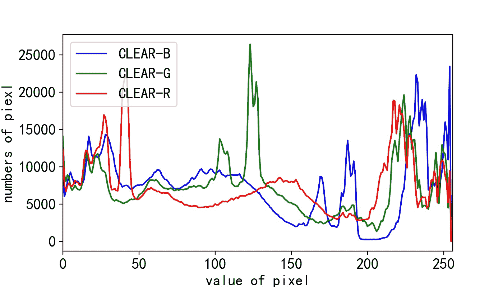
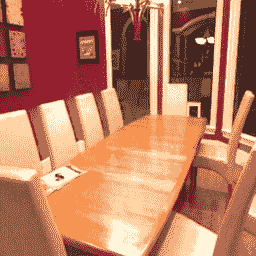
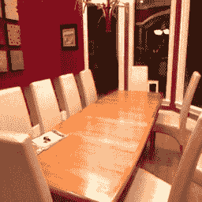
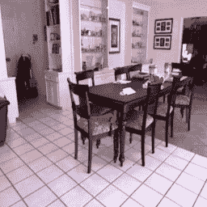
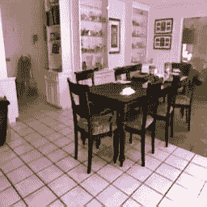

<!--yml

类别：未分类

日期：2024-09-06 19:54:30

-->

# [2106.03323] 《基于深度学习的单幅图像去雾的综合调查与分类》

> 来源：[`ar5iv.labs.arxiv.org/html/2106.03323`](https://ar5iv.labs.arxiv.org/html/2106.03323)

# 《基于深度学习的单幅图像去雾的综合调查与分类》

Jie Gui guijie@seu.edu.cn 东南大学网络科学与工程学院及紫金山实验室 南京 江苏 中国 210000，Xiaofeng Cong 东南大学网络科学与工程学院 南京 中国 cxf_svip@163.com，Yuan Cao 中国海洋大学 青岛 中国 cy8661@ouc.edu.cn，Wenqi Ren 中国科学院信息工程研究所 北京 中国 renwenqi@iie.ac.cn，Jun Zhang 安徽大学 合肥 中国 wwwzhangjun@163.com，Jing Zhang 悉尼大学 悉尼 澳大利亚 jing.zhang1@sydney.edu.au，Jiuxin Cao 东南大学网络科学与工程学院 南京 中国 以及 Dacheng Tao 京东探索学院，中国和悉尼大学 悉尼 澳大利亚 dacheng.tao@gmail.com（2022）

###### 摘要。

随着卷积神经网络的发展，已经提出了数百种基于深度学习的去雾方法。本文提供了关于监督学习、半监督学习和无监督学习单幅图像去雾的综合调查。我们首先讨论了常用的物理模型、数据集、网络模块、损失函数和评估指标。然后，对各种去雾算法的主要贡献进行了分类和总结。此外，还进行了各种基线方法的定量和定性实验。最后，指出了尚未解决的问题和挑战，这些问题和挑战可以激发未来的研究。更多有用的去雾材料可以在 [`github.com/Xiaofeng-life/AwesomeDehazing`](https://github.com/Xiaofeng-life/AwesomeDehazing) 获取。

图像去雾，监督学习，半监督学习，无监督学习，大气散射模型。^†^†版权：acm 版权^†^†期刊年份：2022^†^†doi：XXXXXXX.XXXXXXX^†^†会议：请确保输入您权利确认邮件中的正确会议标题；2018 年 6 月 03–05 日；纽约伍德斯托克^†^†价格：15.00^†^†isbn：978-1-4503-XXXX-X/18/06^†^†ccs：计算方法 机器人视觉^†^†ccs：计算方法 计算摄影^†^†ccs：计算方法 计算机视觉

## 1. 引言

由于雾霾环境中漂浮颗粒的吸收，摄像机拍摄的图像质量会降低。雾霾天气中的图像质量下降对摄影工作产生负面影响。图像的对比度会降低，颜色会偏移。同时，场景中物体的纹理和边缘会变得模糊。如图 1 所示，雾霾图像和无雾图像的像素直方图存在明显差异。对于目标检测和图像分割等计算机视觉任务，低质量的输入会降低在无雾图像上训练的模型的性能。

因此，许多研究人员试图从雾霾图像中恢复高质量的清晰场景。在深度学习广泛应用于计算机视觉任务之前，图像去雾算法主要依赖于各种先验假设（He 等，2010）和大气散射模型（ASM）（McCartney，1976）。这些基于统计规则的方法的处理流程具有良好的可解释性。然而，它们在面对复杂的真实世界场景时可能会显示出缺陷。例如，著名的暗通道先验（He 等，2010）（DCP，CVPR 2009 最佳论文）无法很好地处理包含天空的区域。

受到深度学习的启发，（Ren 等，2016；Cai 等，2016；Ren 等，2020）将 ASM 和卷积神经网络（CNN）结合起来，以估计 ASM 的参数。定量和定性实验结果表明，深度学习可以在监督方式下帮助预测这些参数。

继而，（秦等，2020；刘等，2019a；梁等，2019；张等，2022c；郑等，2021）已经证明，端到端的监督去雾网络可以独立于 ASM 进行实现。得益于 CNN 强大的特征提取能力，这些非 ASM 基础的去雾算法可以达到与 ASM 基础算法相当的准确性。

基于 ASM 的和非 ASM 基础的监督算法都表现出了令人印象深刻的性能。然而，它们通常需要与真实世界雾霾图像不一致的合成配对图像。因此，最近的研究重点是更加适合真实世界去雾任务的方法。（Cong 等，2020；Golts 等，2020；Li 等，2020b）探索了不需要合成数据的无监督算法，而其他研究（Li 等，2020a；An 等，2022；Chen 等，2021b；张和李，2021）提出了利用合成配对数据和真实世界无配对数据的半监督算法。

(a) 清晰图像                                (c) 有雾图像                                 

(b) (a) 的直方图                   (d) (c) 的直方图

图 1\. 清晰图像 (a) 和有雾图像 (c) 的像素直方图。

随着这一领域的迅速发展，已经提出了数百种去雾方法。为了激发和指导未来的研究，迫切需要一项全面的调查。虽然有一些论文尝试部分回顾去雾研究的最新进展，但大多数研究仍有所欠缺。例如，(Singh and Kumar, 2019; Li et al., 2017b; Xu et al., 2015) 总结了非深度学习的去雾方法，包括深度估计、小波、增强、滤波，但缺乏对近期基于 CNN 的方法的研究。Parihar et al. (Parihar et al., 2020) 提供了关于监督去雾模型的调查，但没有充分关注半监督和无监督方法的最新探索。Banerjee et al. (Banerjee and Chaudhuri, 2021) 介绍并归类了现有的夜间图像去雾方法，但白天的去雾方法很少被分析。Gui et al. (Gui et al., 2021) 简要分类和分析了监督与无监督算法，但未总结最近提出的各种半监督方法。与现有的综述不同，我们对基于深度学习的监督、半监督和无监督的白天去雾模型进行了全面的调查。

图 2\. 大气散射模型（ASM），与 (Cai et al., 2016) 相同。

表 1\. 去雾方法的分类。红色编号索引代表基于 ASM 的方法，黑色编号索引代表非 ASM 基础的方法。

| 类别 | 关键思想 | 方法 |
| --- | --- | --- |
| 监督学习 | $t(x)$ 的学习 |

&#124; DehazeNet (Cai et al., 2016), ABC-Net (Wang et al., 2020), MSCNN (Ren et al., 2016), &#124;

&#124; MSCNN-HE (Ren et al., 2020), SID-JMP (Huang et al., 2018), LATPN (Liu et al., 2018) &#124;

|

| $t(x)$ 和 $A$ 的联合学习 |
| --- |

&#124; DCPDN (Zhang and Patel, 2018), DSIEN (Guo et al., 2019b), LDPID (Liu et al., 2019b), &#124;

&#124; PMHLD (Chen et al., 2020), HRGAN (Pang et al., 2018) &#124;

|

| 非显式嵌入 ASM |
| --- |

&#124; AOD-Net (Li et al., 2017a), FAMED-Net (Zhang and Tao, 2020), DehazeGAN (Zhu et al., 2018), PFDN (Dong and Pan, 2020), &#124;

&#124; SI-DehazeGAN (Zhu et al., 2021) &#124;

|

| 生成对抗网络 |
| --- |

&#124; EPDN (屈等，2019), PGC-UNet (赵等，2021a), RI-GAN (杜丹等，2019), &#124;

&#124; DHGAN (沈等，2018), SA-CGAN (香玛等，2020) &#124;

|

| 级别感知 | LAP-Net (李等，2019b), HardGAN (邓等，2020) |
| --- | --- |
| 多功能融合 | DMMFD (邓等，2019) |
| 输入的变换与分解 | GFN (任等，2018a), MSRL-DehazeNet (叶等，2019), DPDP-Net (杨等，2019), DIDH (夏姆等，2021) |
| 知识蒸馏 | KDDN (洪等，2020), KTDN (吴等，2020), SRKTDN (陈等，2021a), DALF (方等，2021) |
| 颜色空间变换 | AIP-Net (王等，2018a), MSRA-Net (盛等，2022), TheiaNet (梅赫拉等，2021), RYF-Net (杜丹和穆拉拉，2019b) |
| 对比学习 | AECR-Net  (吴等，2021) |
| 非确定性输出 | pWAE (金等，2021), DehazeFlow (李等，2021b) |
| Retinex 模型 | RDN (李等，2021c) |
| 残差学习 | GCA-Net(陈等，2019c), DRL (杜和李，2018), SID-HL (肖等，2020), POGAN (杜和李，2019) |
| 频域 |

&#124; Wavelet U-net  (杨和傅，2019), MsGWN (董等，2020c), EMRA-Net (王等，2021d), &#124;

&#124; TDN (刘等，2020b), DW-GAN (傅等，2021) &#124;

|

| 联合去雾与深度估计 |
| --- |

&#124; SDDE (李等，2020a), S2DNet (汉巴尔德和穆拉拉，2020), DDRL (郭和蒙戈，2020), &#124;

&#124; DeAID (杨和张，2022), TSDCN-Net  (程和赵，2021) &#124;

|

| 去雾检测与分割 | LEAAL (李等，2020c), SDNet  (张等，2022a), UDnD (张等，2020g) |
| --- | --- |
| 端到端 CNN |

&#124; FFA-Net (秦等，2020), GridDehazeNet (刘等，2019a), SAN (梁等，2019) &#124;

&#124; HFF (张等，2022c), 4kDehazing (郑等，2021) &#124;

|

| 半监督 | 预训练骨干网络和微调 | PSD (陈等，2021b), SSDT (张和李，2021) |
| --- | --- | --- |
| 解耦与重建 | DCNet (陈等，2021c), FSR (刘等，2021), CCDM (张等，2020f) |
| 两分支训练 | DAID (邵等，2020), SSID (李等，2020a), SSIDN (安等，2022) |
| 无监督 | 无监督领域转换 |

&#124; Cycle-Dehaze (Engin et al., 2018), CDNet (Dudhane and Murala, 2019a), E-CycleGAN (Liu et al., 2020a) &#124;

&#124; USID (Huang et al., 2019), DCA-CycleGAN (Mo et al., 2022), DHL (Cong et al., 2020) &#124;

|

| 无需去雾图像的学习 | Deep-DCP (Golts et al., 2020) |
| --- | --- |
| 无监督图像分解 | Double-DIP (Gandelsman et al., 2019) |
| 零样本学习 | ZID (Li et al., 2020b), YOLY (Li et al., 2021a) |

### 1.1. 本调查的范围和目标

本调查不涵盖所有去雾研究主题。我们重点关注基于深度学习的算法，这些算法使用单目白天图像。这意味着我们不会详细讨论非深度学习去雾、潜水去雾 (Wang et al., 2021b, 2017; Li et al., 2016)、视频去雾 (Ren et al., 2018b)、高光谱去雾 (Mehta et al., 2020)、夜间去雾 (Zhang et al., 2020a, 2017a, 2014)、双目去雾 (Pang et al., 2020) 等。因此，当我们在本文中提到“去雾”时，通常指基于深度学习的算法，其输入数据满足四个条件：单帧图像、白天、单目、地面。总之，本文的贡献有以下三点。

+   •

    常用的物理模型、数据集、网络模块、损失函数和评估指标已被总结。

+   •

    介绍了监督、半监督和无监督方法的分类。

+   •

    根据现有成果和未解决的问题，展望了未来的研究方向。

### 1.2. 阅读本调查的指南

部分 2 介绍了物理模型 ASM、合成与生成以及现实世界数据集、损失函数、去雾网络中常用的基本模块以及各种算法的评估指标。部分 3 提供了对监督去雾算法的全面讨论。半监督和无监督去雾方法的综述分别在部分 4 和 5 中进行。部分 6 展示了三类基线算法的定量和定性实验结果。部分 7 讨论了去雾研究中的开放问题。

对去雾研究进行逻辑性和全面性综述的一个关键挑战是如何正确分类现有方法。在表格 1 的分类中，有几个项目需要指出如下。

+   •

    DCP 在去雾任务上得到了验证，并且推断过程利用了 ASM。因此，利用 DCP 的方法被认为是基于 ASM 的。

+   •

    本调查将基于知识蒸馏的监督去雾网络视为一种监督算法，而不是弱监督/半监督算法。

+   •

    使用总变差损失或生成对抗网络（GAN）损失的监督去雾方法仍然被归类为监督学习方法。

这里给出本调查的符号约定。除非另有说明，所有符号均有如下含义：$I(x)$ 表示有雾图像；$J(x)$ 表示无雾图像。$t(x)$ 代表传输图；$x$ 在 $I(x)$、$J(x)$ 和 $t(x)$ 中为像素位置。下标“$rec$”表示“重建”，例如 $I_{rec}(x)$ 是重建的有雾图像。下标“$pred$”表示预测输出。根据 (Gandelsman 等，2019)，大气光可以视为常量 $A$ 或非均匀矩阵 $A(x)$。在本调查中，大气光统一记作 $A$。此外，许多论文为其提出的算法提供了缩写名称，例如 GFN (Ren 等，2018a)（用于单图像去雾的门控融合网络）。为了可读性，本调查使用这些缩写作为参考。对于少量没有为其算法命名的论文，我们根据相应论文的标题指定缩写名称。

## 2\. 相关工作

去雾算法的共同点主要体现在四个方面。首先，网络建模依赖于物理模型 ASM 或完全基于神经网络。其次，用于训练网络的数据集需要包含传输图、大气光值或配对监督信息。第三，去雾网络采用不同类型的基本模块。第四，使用不同类型的损失函数进行训练。基于这四个因素，研究人员设计了多种有效的去雾算法。因此，本节介绍了 ASM、数据集、损失函数和网络架构模块。此外，本节还讨论了如何评估去雾结果。

### 2.1\. 去雾过程建模

雾霾是一种自然现象，可以通过 ASM 近似解释。McCartney（McCartney，1976）首次提出了基本的 ASM 以描述雾霾形成的原理。随后，Narasimhan（Narasimhan 和 Nayar，2003）和 Nayar（Nayar 和 Narasimhan，1999）扩展和发展了目前广泛使用的 ASM。ASM 为图像去雾研究提供了可靠的理论基础。其公式为

| (1) |  | $I(x)=J(x)t(x)+A(1-t(x)),$ |  |
| --- | --- | --- | --- |

其中 $x$ 是像素位置，$A$ 表示全球大气光。在不同的论文中，$A$ 可能被称为气光或环境光。为了便于理解，在本调查中 $A$ 记作大气光。对于基于 ASM 的去雾方法，$A$ 通常是未知的。$I(x)$ 代表有雾图像，$J(x)$ 表示清晰场景图像。对于大多数去雾模型，$I(x)$ 是输入，$J(x)$ 是期望输出。$t(x)$ 表示介质传输图，其定义为

| (2) |  | $t(x)=e^{-\beta{d(x)}},$ |  |
| --- | --- | --- | --- |

其中 $\beta$ 和 $d(x)$ 分别表示大气散射参数和 $I(x)$ 的深度。因此，$t(x)$ 由 $d(x)$ 决定，可用于合成雾霾图像。如果可以估计 $t(x)$ 和 $A$，则可以通过以下公式获得无雾图像 $J(x)$：

| (3) |  | $J(x)=\frac{I(x)-A(1-t(x))}{t(x)}.$ |  |
| --- | --- | --- | --- |

ASM 的成像原理如图 2 所示。可以看到，从物体到达相机的光线受到空气中颗粒的影响。一些工作使用 ASM 描述雾霾的形成过程，并以显式或隐式的方式求解大气散射模型中的参数。如表 1 所示，ASM 对去雾研究有深远的影响，包括监督式 (Ren et al., 2016; Cai et al., 2016; Li et al., 2017a; Zhang and Patel, 2018)，半监督式 (Li et al., 2020a; Liu et al., 2021; Chen et al., 2021b)，以及无监督算法 (Li et al., 2021a; Golts et al., 2020)。

### 2.2\. 去雾任务的数据集

表 2\. 图像去雾任务的数据集。Syn 代表合成的雾霾图像。HG 表示从雾霾生成器生成的雾霾图像。Real 代表真实世界场景。S&R 代表 Syn&Real。I 和 O 分别表示室内和室外。P 和 NP 分别表示配对和非配对。

| 数据集 | 类型 | 数量 | I/O | P/NP |
| --- | --- | --- | --- | --- |
| D-HAZY (Ancuti et al., 2016) | Syn | 1400+ | I | P |
| HazeRD (Zhang et al., 2017b) | Syn | 15 | O | P |
| I-HAZE (Ancuti et al., 2018b) | HG | 35 | I | P |
| O-HAZE (Ancuti et al., 2018c) | HG | 45 | O | P |
| RESIDE (Li et al., 2019c) | S&R | 10000+ | I&O | P&NP |
| Dense-Haze (Ancuti et al., 2019a) | HG | 33 | O | P |
| NH-HAZE (Ancuti et al., 2020a) | HG | 55 | O | P |
| MRFID (Liu et al., 2020a) | Real | 200 | O | P |
| BeDDE (Zhao et al., 2020) | Real | 200+ | O | P |
| 4KID (Zheng et al., 2021) | Syn | 10000 | O | P |

对于计算机视觉任务，如目标检测、图像分割和图像分类，准确的真实标签可以通过仔细标注获得。然而，对于自然场景中的雾霾图像，几乎不可能获得清晰、准确且逐像素的标签（即配对的无雾图像）。目前，主要有两种方法来获得配对的雾霾和无雾图像。第一种方法是借助 ASM 获得合成数据，如 D-HAZY（Ancuti et al., 2016）、HazeRD（Zhang et al., 2017b）和 RESIDE（Li et al., 2019c）。通过选择不同的 ASM 参数，研究人员可以轻松获得具有不同雾霾密度的图像。合成雾霾图像需要四个组件：清晰图像、与清晰图像内容对应的深度图$d(x)$、大气光$A$和大气散射参数$\beta$。因此，我们可以将合成数据集分为两个阶段。在第一阶段，需要成对收集清晰图像及其对应的深度图。为了确保合成的雾霾尽可能接近现实世界的雾霾，深度信息必须足够准确。图 3 展示了 NYU-Depth 数据集中清晰图像及其对应的深度图（Silberman et al., 2012）。在第二阶段，大气光$A$和大气散射参数$\beta$被指定为固定值或随机选择。常用的 D-HAZY（Ancuti et al., 2016）数据集是在$A$和$\beta$均为$1$时合成的。若干研究选择不同的$A$和$\beta$以增加合成图像的多样性，从而提高训练模型的泛化能力。例如，MSCNN（Ren et al., 2016）将$A\in(0.7,1.0)$和$\beta\in(0.5,1.5)$。图 4 展示了当$\beta$取$6$个不同值时的对应雾霾图像。

(a) 清晰图像       (b) 清晰图像的深度

图 3\. NYU-Depth 数据集中清晰图像及对应的深度图（Silberman et al., 2012）。

图 4\. 通过设置不同的大气散射参数 $\beta$，基于 NYU-Depth 数据集 (Silberman 等人，2012) 合成的不同密度的雾霾图像。

第二种方法是使用雾生成器生成雾霾图像，例如 I-HAZE (Ancuti 等人，2018b)、O-HAZE (Ancuti 等人，2018c)、Dense-Haze (Ancuti 等人，2019a) 和 NH-HAZE (Ancuti 等人，2020a)。著名的“新趋势图像修复与增强”（NTIRE 2018-2020）去雾挑战赛 (Ancuti 等人，2018a、2019b、2020b) 基于这些生成的数据集。图 5 显示了四对包含在由雾生成器模拟的数据集中的雾霾和无雾霾示例。图 5 中的图像 (a) 来自室内场景，而 (b)、(c) 和 (d) 都是户外视图。这三种户外数据集的雾霾模式存在差异。图像 (b) 和 (c) 的雾霾均匀分布在整个图像中，而 (d) 中的雾霾则在整个场景中不均匀。此外，图像 (c) 中的雾霾密度显著高于 (b) 和 (d)。这些具有不同特征的数据集为去雾算法的设计提供了有用的见解。例如，为了去除 Dense-Haze 中的高密度雾霾，需要设计具有更强特征提取和恢复能力的去雾模型。

(a) 室内雾霾             (b) 户外雾霾         (c) 密集雾霾      (d) 非均匀雾霾

图 5\. 例图来自 I-HAZE (Ancuti 等人，2018b)、O-HAZE (Ancuti 等人，2018c)、Dense-Haze (Ancuti 等人，2019a) 和 NH-HAZE (Ancuti 等人，2020a)。

合成和生成的雾的主要优点是减轻了数据采集过程中的困难。然而，基于 ASM 合成的雾图像或由雾生成器生成的雾图像无法完美模拟现实世界雾的形成过程。因此，合成数据和真实世界数据之间存在固有差异。一些研究已注意到人工数据的问题，并尝试构建真实世界的数据集，如 MRFID（Liu et al., 2020a）和 BeDDE（Zhao et al., 2020）。然而，由于数据收集的高成本和困难，当前的真实世界数据集无法包含像合成数据集那样的足够多的例子，例如 RESIDE（Li et al., 2019c）。为了便于不同数据集的比较，我们在表 2 中总结了各种数据集的特点。

### 2.3. 网络块

CNNs 在当前基于深度学习的去雾网络中被广泛使用。常用的模块包括标准卷积、扩张卷积、多尺度融合、特征金字塔、跨层连接和注意力机制。通常，多个基本块被组成一个去雾网络。为了便于理解不同去雾算法的原理，总结了网络架构中常用的基本块如下。

+   •

    标准卷积：研究表明，使用标准卷积以顺序连接的方式构建神经网络是有效的。因此，标准卷积通常与其他块一起用于去雾模型（Li et al., 2017a; Ren et al., 2016; Sharma et al., 2020; Zhang et al., 2020e）。

+   •

    扩张卷积：扩张卷积可以在保持卷积核大小不变的情况下增加感受野。研究（Chen et al., 2019c; Zhang et al., 2020c; Zhang and He, 2020; Lee et al., 2020b; Yan et al., 2020）表明，扩张卷积可以提高全局特征提取的性能。此外，融合不同扩张率的卷积层可以从不同的感受野中提取特征。

+   •

    多尺度融合：具有多尺度卷积核的卷积神经网络（CNN）在各种视觉任务中的特征提取上已被证明有效（Szegedy 等人，2015）。通过使用不同尺度的卷积核并融合提取的特征，去雾方法（Wang 等人，2018a；Tang 等人，2019；Dudhane 等人，2019；Wang 等人，2020）已经证明融合策略可以获得对图像恢复有用的多尺度细节。在特征融合过程中，一种常见的方法是空间上连接或添加由不同大小卷积核获得的输出特征。

+   •

    特征金字塔：在数字图像处理的研究中，图像金字塔可以用来获取不同分辨率的信息。基于深度学习的去雾网络（Zhang 等人，2020e；Zhang 和 Patel，2018；Zhang 等人，2018b；Singh 等人，2020；Zhao 等人，2021a；Yin 等人，2020；Chen 等人，2019a）在网络的中间层使用了这种策略来提取多尺度的空间和通道信息。

+   •

    跨层连接：为了增强不同层之间的信息交换并提高网络的特征提取能力，卷积神经网络中常常使用跨层连接。在去雾网络中主要有三种跨层连接类型，分别是残差连接（Zhang 等人，2020g；Qu 等人，2019；Hong 等人，2020；Liang 等人，2019；Chen 等人，2019d）由 ResNet（He 等人，2016）提出，密集连接（Zhu 等人，2018；Zhang 等人，2022a；Dong 等人，2020a；Chen 和 Lai，2019；Guo 等人，2019a；Li 等人，2019a）由 DenseNet（Huang 等人，2017）设计，以及跳跃连接（Zhao 等人，2021a；Dudhane 等人，2019；Yang 和 Zhang，2022；Lee 等人，2020b）受到 U-Net（Ronneberger 等人，2015）的启发。

+   •

    去雾中的注意力机制：注意力机制已经成功应用于自然语言处理的研究中。在计算机视觉中，常用的注意力模块包括通道注意力和空间注意力。在二维图像的特征提取和重建过程中，通道注意力可以强调特征图的有用通道。这种不均等的特征图处理策略使模型能够更加关注有效的特征信息。空间注意力机制则关注特征图内部位置区域的差异，如整个图像上的雾霾分布。通过在网络中嵌入注意力模块，一些去雾方法（Liang 等，2019；Chen 等，2019d；Liu 等，2019a；Qin 等，2020；Yin 等，2020；Lee 等，2020b；Yan 等，2020；Dong 等，2020c；Yan 等，2020；Zhang 等，2020e；Yin 等，2021；Metwaly 等，2020；Wang 等，2021d）已取得了优异的去雾效果。

### 2.4\. 损失函数

本节介绍了在监督式、半监督式和无监督式去雾模型中常用的损失函数，这些函数可用于传输图估计、清晰图像预测、雾霾图像重建、大气光回归等。一些算法通过组合多个损失函数来获得更好的去雾性能。不同去雾方法使用的损失函数的详细分类和总结见表 3。在下文介绍的损失函数中，$X$和$Y$分别表示预测值和真实值。

#### 2.4.1\. 保真度损失

广泛用于去雾研究的逐像素损失函数有 L1 损失和 L2 损失，其定义如下：

| (4) |  | $L1=&#124;&#124;X-Y&#124;&#124;_{1}.$ |  |
| --- | --- | --- | --- |
| (5) |  | $L2=&#124;&#124;X-Y&#124;&#124;_{2}.$ |  |

#### 2.4.2\. 感知损失

对图像超分辨率的研究（Ledig 等，2017；Wang 等，2018b）和风格迁移（Johnson 等，2016）表明，人类视觉系统在感知评估过程中的属性并不能完全通过 L1 或 L2 损失来反映。同时，L2 损失可能导致过度平滑的输出（Ledig 等，2017）。最近的研究使用预训练的分类神经网络来计算特征空间中的感知损失。最常用的预训练模型是 VGG（Simonyan 和 Zisserman，2015），其某些层被用来计算预测图像和参考图像在特征空间中的距离，即，

| (6) |  | $L_{per}(X,Y)=\sum_{i=1}^{N}&#124;&#124;\psi_{i}(X)-\psi_{i}(Y)&#124;&#124;_{2},$ |  |
| --- | --- | --- | --- |

其中 $N$ 代表用于计算的特征数量；$i$ 表示特征图的索引；$\psi(\cdot)$ 表示预训练的 VGG。在计算感知损失和网络优化过程中，VGG 的参数始终被冻结。

#### 2.4.3\. 结构损失

作为去雾方法的度量，结构相似性（SSIM）（Wang 等，2004）也在优化过程中用作损失函数。研究（Dong 等，2020a；Yu 等，2020）表明，SSIM 损失可以在图像恢复过程中提高结构相似性。MS-SSIM（Wang 等，2003）将多尺度评估引入 SSIM，这也被去雾算法用作损失函数，即，

| (7) |  | $L_{ssim}=1-SSIM(X,Y),$ |  |
| --- | --- | --- | --- |
| (8) |  | $L_{msssim}=1-MSSSIM(X,Y).$ |  |

#### 2.4.4\. 梯度损失

梯度损失，也称为边缘损失，用于更好地恢复无雾图像的轮廓和边缘信息。边缘提取可以通过拉普拉斯算子、Canny 算子等来实现。例如，SA-CGAN（Sharma 等，2020）使用标准差为 $\sigma$ 的高斯拉普拉斯算子对二维图像 $F$ 进行二次微分：

| (9) |  | $\displaystyle L(m,n)$ | $\displaystyle=\bigtriangledown^{2}F(m,n)=\frac{\partial^{2}F}{\partial{m^{2}}}+\frac{\partial^{2}F}{\partial{n^{2}}}=-\frac{1}{\pi{\sigma^{4}}}[1-\frac{m^{2}+n^{2}}{2\sigma^{2}}]\exp{(-\frac{m^{2}+n^{2}}{2\sigma^{2}})},$ |  |
| --- | --- | --- | --- | --- |

其中 $(m,n)$ 表示像素位置，$L(m,n)$ 分别对 $X$ 和 $Y$ 进行计算。然后，L1 和 L2 等回归目标函数用于计算梯度损失。

#### 2.4.5\. 总变差损失

总变差（TV）损失（Rudin 等，1992）可以用来平滑图像并去除噪声。训练目标是最小化以下函数：

| (10) |  | $L_{TV}=&#124;&#124;\partial_{m}{X}&#124;&#124;_{1}+&#124;&#124;\partial_{n}{X}&#124;&#124;_{1},$ |  |
| --- | --- | --- | --- |

其中 $m$ 和 $n$ 分别表示水平和垂直坐标。从公式中可以看出，TV 损失可以添加到以无监督方式训练的网络中，而无需使用真实值 $Y$。

表 3\. 去雾任务的损失函数

| 损失函数 | 算法 |
| --- | --- |
| L1 |  (Mondal 等, 2018; Chen 等, 2019b; Deng 等, 2019; Liang 等, 2019; Yin 等, 2019; Dong 和 Pan, 2020; Chen 等, 2020; Yan 等, 2020; Qin 等, 2020; Hong 等, 2020; Li 等, 2020d; Zhang 等, 2020b; Zhao 等, 2021a; Park 等, 2020; Shin 等, 2022; Zhang 等, 2022a) |
| L2 |  (Li 等, 2017a; Pang 等, 2018; Zhu 等, 2018; Zhang 等, 2018a; Guo 等, 2019b; Morales 等, 2019; Chen 等, 2019d; Yang 等, 2019; Tang 等, 2019; Dong 等, 2020b; Zhang 等, 2020d; Yin 等, 2020; Zhang 等, 2021b, a, 2022c; Huang 等, 2021; Sheng 等, 2022) |
| SSIM |  (Dong 等, 2020a; Yu 等, 2020; Metwaly 等, 2020; Wei 等, 2020; Singh 等, 2020; Li 等, 2020e; Jo 和 Sim, 2021; Shyam 等, 2021; Zhao 等, 2021a) |
| MS-SSIM |  (Sun 等, 2021; Guo 等, 2019a; Cong 等, 2020; Yu 等, 2021; Fu 等, 2021) |
| 感知损失 |  (Sim 等, 2018; Pang 等, 2018; Zhu 等, 2021; Zhang 等, 2022c; Wang 等, 2021c; Deng 等, 2020; Liu 等, 2019a; Hong 等, 2020; Qu 等, 2019; Chen 和 Lai, 2019; Li 等, 2019a; Chen 等, 2019d; Singh 等, 2020; Dong 等, 2020a; Shyam 等, 2021; Engin 等, 2018) |
| TV 损失 |  (Das 和 Dutta, 2020; Li 等, 2020a; Shao 等, 2020; Huang 等, 2019; Wang 等, 2021c; He 等, 2019) |
| Gradient |  (Zhang 和 Patel，2018；Zhang 等，2019a，2020b，2020e；Yin 等，2020；Zhang 等，2022b；Li 等，2021c；Dudhane 等，2019；Yin 等，2021) |

### 2.5\. 图像质量指标

由于存在雾霾，图像的饱和度和对比度降低，图像的颜色由于不确定性模式而失真。为了测量去雾图像与真实无雾图像之间的差异，需要使用客观指标来评估各种去雾算法得到的结果。

大多数论文使用峰值信噪比（PSNR） (Huynh-Thu 和 Ghanbari，2008)和 SSIM (Wang 等，2004)来评估去雾后的图像质量。计算 PSNR 需要使用公式（11）来获得均方误差（MSE）：

| (11) |  | $MSE=\frac{1}{H\times{W}}\sum_{i=1}^{H}\sum_{j=1}^{W}(X(i,j)-Y(i,j))^{2},$ |  |
| --- | --- | --- | --- |

其中$X$和$Y$分别表示要评估的两幅图像。$H$和$W$是它们的高度和宽度，即$X$和$Y$的维度应完全一致。图像的像素位置索引由$i$和$j$表示。然后，可以通过对数计算得到 PSNR，如下所示：

| (12) |  | $PSNR=10log_{10}[\frac{({2^{N}-1)^{2}}}{MSE}],$ |  |
| --- | --- | --- | --- |

其中$N$等于$8$用于$8$位图像。SSIM 基于人类视觉感知与结构信息之间的相关性，其公式定义如下：

| (13) |  | $SSIM(X,Y)=\frac{{2u_{x}}{u_{y}}+C_{1}}{u_{x}^{2}+u_{y}^{2}+C_{1}}\frac{2\sigma_{xy}+C_{2}}{\sigma_{x}^{2}+\sigma_{y}^{2}+C_{2}},$ |  |
| --- | --- | --- | --- |

其中$\mu_{x}$、$\mu_{y}$、$\sigma_{x}$和$\sigma_{y}$分别表示$X$和$Y$的均值和方差；$\sigma_{xy}$是两个变量之间的协方差；$C_{1}$和$C_{2}$是用于确保数值稳定性的常数。

由于雾霾可能导致场景和物体的颜色发生变化，一些研究使用 CIEDE2000 (Sharma 等，2005)作为颜色偏移度的评估。PSNR、SSIM 和 CIEDE 属于全参考评估指标，这意味着必须使用与雾霾图像对应的清晰图像作为参考。然而，现实世界中的雾霾和无雾图像对很难在内容上完全相同。例如，场景中的光照和物体在雾霾出现前后可能发生变化。因此，为了保持评估过程的准确性，有必要合成对应的雾霾图像与清晰图像 (Min 等，2019)。

除了全参考度量 PSNR、SSIM 和 CIEDE 外，近期的研究（Li et al., 2020c, 2019c）还利用了无参考度量 SSEQ (Liu et al., 2014) 和 BLIINDS-II (Saad et al., 2012) 来评估没有真实标签的去雾图像。无参考度量对于现实世界的去雾评估至关重要。然而，当前的去雾算法通常在包含雾霾图像和去雾图像配对的数据集上进行评估。由于全参考度量更适用于配对数据集，因此它比无参考度量使用得更广泛。

## 3\. 有监督去雾

有监督去雾模型通常需要不同类型的监督信号来指导训练过程，如传输图、大气光、去雾图像标签等。概念上，有监督去雾方法可以分为基于 ASM 的和非 ASM 基于的方法。然而，由于基于 ASM 和非 ASM 的算法可能涉及其他计算机视觉任务，如分割、检测和深度估计，这种分类方法可能会有重叠。因此，本节根据主要贡献对有监督算法进行分类，以便清晰地观察对去雾研究有价值的技术。

### 3.1\. $t(x)$ 的学习

根据 ASM，去雾过程可以分为三个部分：传输图估计、大气光预测和去雾图像恢复。MSCNN (Ren et al., 2016) 提出了以下三个步骤来解决 ASM： (1) 使用 CNN 估计传输图 $t(x)$，(2) 采用统计规则预测大气光 $A$，(3) 通过 $t(x)$ 和 $A$ 共同解决 $J(x)$。MSCNN 采用多尺度卷积模型进行传输图估计，并使用 L2 损失优化。此外，可以通过选择 $t(x)$ 中 $0.1\%$ 最暗的像素来获得 $A$，这些像素对应于 $I(x)$ 中的最高强度（He et al., 2010）。从而可以获得清晰图像 $J(x)$。

| (14) |  | $J(x)=\frac{I(x)-A}{max{\{0.1,t(x)\}}}+A.$ |  |
| --- | --- | --- | --- |

不同的论文可能使用不同的统计先验来估计 $A$，但它们用于去雾的策略与 MSCNN 相似。ABC-Net (Wang et al., 2020) 使用最大池化操作从 $I(x)$ 的每个通道中获得最大值。SID-JPM (Huang et al., 2018) 通过最小滤波器内核过滤 RGB 输入图像的每个通道。然后，将每个通道的最大值用作估计的 $A$。LAPTN (Liu et al., 2018) 也结合使用最小滤波器和最大滤波器来预测 $A$。这些方法通常不需要大气光注释，但需要雾霾图像和传输图的配对。

### 3.2\. $t(x)$ 和 $A$ 的联合学习

一些研究通过完全使用 CNN 来实现物理参数的预测，而不是将卷积网络和统计先验联合使用来估计 ASM 的物理参数。DCPDN (Zhang 和 Patel, 2018) 通过一个金字塔密集连接的编码器-解码器网络估计传输图，并使用对称 U-Net 来预测大气光 $A$。为了提高传输图的边缘准确性，DCPDN 设计了一种混合边缘保留损失，包括 L2 损失、双向梯度损失和特征边缘损失。

DHD-Net (Xie 等, 2020) 设计了一种基于分割的雾霾密度估计算法，能够分割密集的雾霾区域并划分全球大气光 $A$ 的候选区域。HRGAN (Pang 等, 2018) 利用多尺度融合的扩张卷积网络来预测 $t(x)$，并使用单层卷积模型来估计 $A$。PMHLD (Chen 等, 2020) 使用补丁图生成器和细化网络来估计传输图，并利用 VGG-16 进行大气光估计。值得注意的是，如果使用回归训练来获得 $A$，通常需要真实标签。

### 3.3\. 非显式嵌入 ASM

ASM 可以以重新公式化或嵌入的方式融入 CNN。AOD-Net (Li 等, 2017a) 发现端到端的神经网络仍然可以用来解决 ASM，而不直接使用真实的 $t(x)$ 和 $A$。根据原始 ASM，$J(x)$ 的表达式为

| (15) |  | $J(x)=\frac{1}{t(x)}I(x)-A\frac{1}{t(x)}+A.$ |  |
| --- | --- | --- | --- |

AOD-Net 提出了 $K(x)$ 作为描述 $t(x)$ 和 $A$ 的中间参数，它没有实际的物理意义。$K(x)$ 被定义为

| (16) |  | $K(x)=\frac{\frac{1}{t(x)}(I(x)-A)+(A-b)}{I(x)-1},$ |  |
| --- | --- | --- | --- |

其中 $b$ 等于 $1$。根据 ASM 理论，$J(x)$ 可以通过 $K(x)$ 唯一确定，如下所示

| (17) |  | $J(x)=K(x)I(x)-K(x)+1.$ |  |
| --- | --- | --- | --- |

AOD-Net 认为非联合的传输图和大气光预测过程可能会产生累积误差。因此，独立估计 $K(x)$ 可以减少系统误差。FAMED-Net (Zhang 和 Tao, 2020) 在多尺度框架中扩展了这一公式，并利用全点卷积实现快速准确的去雾性能。DehazeGAN (Zhu 等, 2018) 将可微分编程的思想融入 $A$ 和 $t(x)$ 的估计过程中。结合重新公式化的 ASM，DehazeGAN 还实现了端到端的去雾管道。PFDN (Dong 和 Pan, 2020) 将 ASM 嵌入网络设计中，并提出了一种特征去雾单元，该单元在精心设计的特征空间中去除雾霾，而不是在原始图像空间中。值得指出的是，ASM 仍然可以帮助非显式参数估计的去雾任务。

图 6\. 生成对抗网络用于去雾，其中 gt 表示真实值。

### 3.4\. 生成对抗网络

生成对抗网络对去雾研究有着重要影响。一般来说，依赖配对数据的监督去雾网络可以将对抗损失作为辅助监督信号。对抗损失 (Gui et al., 2022) 可以看作是两个部分：生成器的训练目标是生成被判别器认为真实的图像。判别器的优化目标是尽可能区分生成的图像与数据集中包含的真实图像。在去雾任务中，对抗损失的作用是使生成的图像更接近真实图像，这有利于优化无雾的 $J(x)$ 和传输图 $t(x)$ (Zhang et al., 2019a)，如图 6 所示。

受 patchGAN (Isola et al., 2017) 启发，它可以更好地保留高频信息，DH-GAN (Sim et al., 2018)、RI-GAN (Dudhane et al., 2019) 和 DehazingGAN (Zhang et al., 2020c) 使用 $N\times N$ 补丁而不是单一值作为判别器的输出。一些研究探讨了多个判别器的联合训练机制，例如 EPDN (Qu et al., 2019) 和 PGC-UNet (Zhao et al., 2021a)。判别器 $D_{1}$ 用于在细尺度上引导生成器，而判别器 $D_{2}$ 帮助生成器在粗尺度上生成全局逼真的输出。为了实现两个判别器的联合训练，EPDN 将 $D_{1}$ 的输入图像下采样 $2$ 倍作为 $D_{2}$ 的输入。对抗损失为

| (18) |  | $L_{adv}=\min_{G}[\max_{D_{1},D_{2}}\sum_{k=1,2}\ell_{A}(G,D_{k})],$ |  |
| --- | --- | --- | --- |

对抗损失 $\ell_{A}$ 的形式与单一 GAN 相同。GAN 的探索为监督算法带来了即插即用的工具。由于判别器的训练可以以无监督的方式进行，因此去雾图像的质量可以在无需额外标签的情况下得到改善。然而，GAN 的训练有时会遭遇不稳定性和非收敛性，这可能为去雾网络的训练带来某些额外困难。

### 3.5\. 级别感知

根据散射理论，场景距离相机越远，通过的气溶胶颗粒越多。这意味着在单一雾霾图像中，距离相机较远的区域具有更高的雾霾密度。因此，LAP-Net (Li et al., 2019b) 提出算法应考虑图像内的雾霾密度差异。通过多阶段联合训练，LAP-Net 实现了一种由易到难的模型，通过阶段性损失关注特定的雾霾密度水平。

| (19) |  | $\hat{t}^{s}(x)=\begin{cases}\mathcal{F}(I(x),\theta^{s}),\text{if }s=1,\\ \mathcal{F}(I(x),\theta^{s},\hat{t}^{s-1}(x)),\text{if }s>1,\end{cases}$ |  |
| --- | --- | --- | --- |

其中 $\mathcal{F}$ 表示带有参数 $\theta^{s}$ 的传输图预测网络。在第一阶段，传输图预测网络负责估计轻度雾霾的情况。在第二阶段及后续阶段，使用上一阶段的预测结果和雾霾图像作为联合输入来处理更高密度的雾霾。

雾的密度可能与温度、风速、海拔和湿度等条件有关。因此，雾的形成应该是空间变化的且不均匀的。基于这一观察，HardGAN (Deng et al., 2020) 认为估计去雾的传输图可能不准确。通过将大气亮度编码为 $1\times 1\times 2$ 矩阵 $\gamma_{i}^{G}\&\beta_{i}^{G}$ 和逐像素空间信息编码为 $H\times W\times 2$ 矩阵 $\gamma_{i}^{L}\&\beta_{i}^{L}$，针对输入 $x$ 的 $i$-th 通道，HardGAN 设计了大气亮度的控制函数 $G_{i}$ 和空间信息的控制函数 $L_{i}$ 如下：

|  | $\displaystyle G_{i}=\gamma_{i}^{G}\frac{x-\mu}{\sigma}+\beta_{i}^{G},$ |  |
| --- | --- | --- |
| (20) |  | $\displaystyle L_{i}=\gamma_{i}^{L}\frac{x-\mu}{\sigma}+\beta_{i}^{L},$ |  |

其中 $\mu$ 和 $\sigma$ 分别表示 $x$ 的均值和标准差。获取 $G_{i}$ 和 $L_{i}$ 后，HardGAN 使用线性模型将它们融合以恢复无雾图像。

| (21) |  | $J_{pred_{i}}(x)=(1-HA_{i})*G_{i}+HA_{i}*L_{i},$ |  |
| --- | --- | --- | --- |

其中 $HA$ 是通过 HardGAN 的中间特征图计算的，使用实例归一化后跟随 sigmoid 层，而 $*$ 表示逐元素乘积。

### 3.6\. 多功能融合

DMMFD (Deng et al., 2019) 设计了一种层分离和融合模型以提高学习能力，包括重新构造的 ASM、乘法、加法、指数和对数分解：

|  | $\displaystyle J_{0}(x)=\frac{I(x)-A_{0}\times(1-t_{0}(x))}{t_{0}(x)},$ |  |
| --- | --- | --- |
|  | $\displaystyle J_{1}(x)=I(x)\times R_{1}(x),$ |  |
|  | $\displaystyle J_{2}(x)=I(x)+R_{2}(x),$ |  |
|  | $\displaystyle J_{3}(x)=(I(x))^{R_{3}(x)},$ |  |
| (22) |  | $\displaystyle J_{4}(x)=\log(1+I(x)\times R_{4}(x)),$ |  |

其中 $R_{i}(x)$ 代表网络中的层；$A_{0}$ 和 $t_{0}(x)$ 分别是特征提取网络估计的大气光和传输图。$J_{1}{(x)}$、$J_{2}{(x)}$、$J_{3}{(x)}$ 和 $J_{4}{(x)}$ 可以作为四个独立的雾霾层分离模型。该模型基于这样的假设：输入的雾霾图像 $I(x)$ 可以被分离为无雾层 $J(x)$ 和另一层 $H(x)$，表示为 $I(x)=\phi(J(x),H(x))$。最终的去雾结果通过五个学习到的注意力图 $W_{0}$、$W_{1}$、$W_{2}$、$W_{3}$ 和 $W_{4}$ 对中间输出 $J_{0}{(x)}$、$J_{1}{(x)}$、$J_{2}{(x)}$、$J_{3}{(x)}$ 和 $J_{4}{(x)}$ 进行加权融合得到。

| (23) |  | $\displaystyle J_{pred}(x)=$ | $\displaystyle W_{0}\times J_{0}{(x)}+W_{1}\times J_{1}{(x)}+W_{2}\times J_{2}{(x)}+W_{3}\times J_{3}{(x)}+W_{4}\times J_{4}{(x)}.$ |  |
| --- | --- | --- | --- | --- |

通过消融研究，DMMFD 已经证明，多个层的融合可以改善场景恢复过程的质量。

### 3.7\. 输入的变换和分解

GFN (Ren et al., 2018a) 提出了雾霾影响的两个观察。首先，在大气光的影响下，雾霾图像的颜色可能会有一定程度的扭曲。其次，由于存在散射和衰减现象，远离相机的场景中的物体可见性会降低。因此，GFN 使用三种增强策略来处理原始雾霾图像，并将其作为输入与去雾网络一起使用。白平衡输入 $I_{wb}(x)$ 是从灰世界假设中获得的。对比度增强输入 $I_{ce}(x)$ 由平均亮度值 $\widetilde{I}(x)$ 和控制因子 $\mu$ 组成，如下所示：

| (24) |  | $I_{ce}{(x)}=\mu(I(x)-\widetilde{I}{(x)}),$ |  |
| --- | --- | --- | --- |

其中 $\mu=2\cdot(0.5+\widetilde{I}(x))$。通过非线性伽玛校正，可以获得用于增强 $I(x)$ 可见性的 $I_{gc}(x)$，其计算公式为：

| (25) |  | $I_{gc}{(x)}=\alpha{I(x)^{\gamma}},$ |  |
| --- | --- | --- | --- |

其中 $\alpha=1$，$\gamma=2.5$。最终的去雾图像 $J(x)$ 由三个输入的组合决定，其中 $C_{wb}$、$C_{ce}$ 和 $C_{gc}$ 是融合过程的置信度图：

| (26) |  | $J(x)=C_{wb}\circ{I_{wb}{(x)}}+C_{ce}\circ{I_{ce}{(x)}}+C_{gc}\circ{I_{gc}{(x)}}.$ |  |
| --- | --- | --- | --- |

MSRL-DehazeNet (Yeh et al., 2019) 将雾霾图像分解为低频和高频，分别作为基础组件 $I_{base}{(x)}$ 和细节组件 $I_{detail}{(x)}$。基本组件可以被看作图像的主要内容，而高频组件则表示边缘和纹理。因此，通过基础组件的去雾函数 $D(\cdot)$ 和细节组件的增强函数 $E(\cdot)$ 可以获得去雾图像。整个过程可以通过线性模型表示，如下所示：

|  | $\displaystyle I(x)=I_{base}{(x)}+I_{detail}{(x)},$ |  |
| --- | --- | --- |
| (27) |  | $\displaystyle J(x)=D(I_{base}{(x)})+E(I_{detail}{(x)}).$ |  |

DIDH (Shyam 等，2021) 将输入的模糊图像 $I(x)$ 和预测的无雾图像 $J(x)$ 分解为 $(I(x),LF(I(x)))$、$(I(x),HF(I(x)))$、$(J(x),LF(J(x)))$ 和 $J(x),HF(J(x))$，其中 $LF(\cdot)$ 和 $HF(\cdot)$ 分别表示高斯滤波器和拉普拉斯滤波器。通过将分解后的数据与预分解数据融合作为判别器的输入，DIDH 可以提高对抗训练过程中生成图像的质量。在判别器 $D_{LF}$ 和 $D_{HF}$ 的帮助下，去雾网络可以以对抗方式进行优化。

与传统的数据增强方法（如旋转、水平或垂直镜像对称、随机裁剪）相比，输入图像的变换和分解是一种更高效的模糊图像利用策略。

图 7\. 一般知识蒸馏策略，应用于 KDDN (Hong 等，2020)、KTDN (Wu 等，2020)、SRKTDN (Chen 等，2021a) 等。

### 3.8\. 知识蒸馏

知识蒸馏 (Gou 等，2021) 提供了一种将教师网络学到的知识转移到学生网络的策略，这已经应用于高层次计算机视觉任务，如目标检测和图像分类 (Wang 等，2019)。最近的工作 (Hong 等，2020) 提出了将知识蒸馏应用于去雾任务的三个挑战。首先，什么样的教师任务可以帮助去雾任务。第二，教师网络如何在训练过程中帮助去雾网络。第三，应该选择哪种教师任务与学生任务之间的相似度度量。图 7 显示了各种去雾算法采用的知识蒸馏策略。不同的方法可能使用不同数量和位置的输出特征来计算特征损失。

KDDN（Hong 等，2020）设计了一种面向过程的学习机制，其中教师网络 $T$ 是用于高质量无雾图像重建的自编码器。在训练去雾网络时，教师网络协助特征学习，并优化 $L_{T}=||J(x)-T(J(x))||_{1}$。因此，KDDN 提出的教师任务和学生任务是两个不同的任务。为了充分利用教师网络学习到的特征信息并帮助去雾网络的训练，KDDN 使用通过线性变换函数 $g$ 表示的特征匹配损失和雾密度感知损失，这些分别由 (28) 和 (29) 表示。

| (28) |  | $L_{rm}=\sum_{(m,n)\in{C}} | T^{m}(J(x))-g(S^{n}(I(x))) | ,$ |  |
| --- | --- | --- | --- | --- | --- |
| (29) |  | $L_{wrm}=\sum_{(m,n)\in{C}}\psi\times{ | T^{m}(J(x))-g(S^{n}(I(x))) | },$ |  |

其中 $T^{m}$ 表示教师网络的第 $m$ 层，相应的 $S^{n}$ 表示学生网络的第 $n$ 层；$\psi$ 是通过归一化操作获得的。KDDN 可以在没有真实传输图的情况下进行训练，用雾图和无雾图之间的残差替代。

KTDN（Wu 等，2020）使用具有相同结构的教师网络和去雾网络进行联合训练。通过特征层级的损失，教师网络所拥有的先验知识可以转移到去雾网络中。SRKTDN（Chen 等，2021a）使用在 ImageNet 上预训练的 ResNet18（去掉分类层）作为教师网络，将许多统计经验转移到 Res2Net101 编码器中以进行去雾。DALF（Fang 等，2021）将双重对抗训练整合到知识蒸馏的训练过程中，以提高学生网络对教师网络的模仿能力。将知识蒸馏应用于去雾网络提供了一种引入外部先验知识的新方法和高效途径。

### 3.9\. 颜色空间的转换

去雾网络的输入数据通常是 RGB 模式的三通道彩色图像。通过计算 Dense-Haze 数据集中 RGB 空间和 YCrCb 空间中雾霾图像和无雾图像的均方误差，Bianco 等（Bianco et al., 2019）发现雾霾在这两个空间中显示出明显的数值差异。RGB 空间中红、绿、蓝通道的误差值非常接近。然而，在 YCrCb 空间中，亮度通道的误差值显著大于蓝色和红色色度分量的误差值。AIP-Net（Wang et al., 2018a）对合成数据集中的色彩空间转换进行了类似的误差比较，并得出了与（Bianco et al., 2019）相同的结论。通过在 YCrCb 色彩空间中训练去雾网络获得的定量结果（Wang et al., 2018a; Bianco et al., 2019）显示，RGB 空间并不是基于深度学习的去雾方法中唯一有效的颜色模式。此外，TheiaNet（Mehra et al., 2021）综合分析了在 RGB、YCrCb、HSV 和 LAB 色彩空间中训练去雾模型所获得的性能。实验（Singh et al., 2020; Sheng et al., 2022; Chen et al., 2021a; Dudhane 和 Murala，2019b）表明，将图像从 RGB 空间转换到其他色彩空间进行模型训练是一种有效的方案。

### 3.10\. 对比学习

在训练基于非 ASM 的监督去雾网络的过程中，一种常见的方法是将雾霾图像作为网络的输入，期望得到清晰的图像。在这个过程中，清晰的图像作为正样本来指导网络的优化。通过设计正负样本对，AECR-Net 为处理有雾和无雾图像提供了新的视角。具体来说，清晰图像$J(x)$和去雾图像$J_{pred}(x)$被视为一对正样本，而雾霾图像$I(x)$和去雾图像$J_{pred}{(x)}$被视为一对负样本。根据对比学习（Khosla 等，2020），$J_{pred}(x)$、$J(x)$和$I(x)$可以分别视为锚点、正样本和负样本。对于预训练模型$G(\cdot)$，去雾损失可以看作是重建损失和正则化项的总和，如下所示：

| (30) |  | $\min{&#124;&#124;J(x)-\psi(I(x))&#124;&#124;_{1}}+\lambda\sum_{i=1}^{N}{\omega_{i}}\cdot\frac{&#124;&#124;G_{i}(J(x)),G_{i}(\phi(I(x)))&#124;&#124;_{1}}{&#124;&#124;G_{i}(I(x)),G_{i}(\phi(I(x)))&#124;&#124;_{1}},$ |  |
| --- | --- | --- | --- |

其中 $G_{i}$ 代表预训练模型第 $i$ 层的输出特征；$\lambda$ 是图像重建损失和正则化项之间的权重比例；$w_{i}$ 是特征输出的权重因子；$\phi$ 是去雾网络。AECR-Net 为现有方法提供了一种通用的对比正则化策略，而无需增加额外的参数。

### 3.11\. 非确定性输出

基于深度学习的去雾方法通常将优化目标设定为获得单一的去雾图像。通过引入二维潜在张量，pWAE（Kim 等，2021）可以生成不同风格的去雾图像，从而扩展了通用训练目的。pWAE 提出了去雾潜在空间 $z_{h}$ 和风格潜在空间 $z_{s}$，并应用均值函数 $\mu(\cdot)$ 和标准差函数 $\sigma(\cdot)$ 来执行空间转换：

| (31) |  | $z_{h\to{s}}=\sigma(z_{s})(\frac{z_{h}-\mu{(z_{h})}}{\sigma(z_{h})})+\mu{(z_{s})}.$ |  |
| --- | --- | --- | --- |

一个自然的问题是如何调整空间映射的幅度以控制风格转换的程度。pWAE 使用线性模块 $z_{h}^{s}=\alpha{z_{h\to{s}}}+(1-\alpha)z_{h}$ 来调整去雾图像与风格信息之间的权重。通过控制 $\alpha$，可以获得与风格图像对应的不同程度的风格化去雾图像。

DehazeFlow（Li 等，2021b）提出去雾任务本身是一个病态问题，因此学习一个确定性的一对一映射是不可靠的。通过条件归一化流网络，DehazeFlow 可以从给定的有雾图像中计算清晰图像的条件分布。因此，它可以学习一对多的映射，并在推理阶段获得不同的去雾结果。非确定性输出（Kim 等，2021；Li 等，2021b）为去雾算法带来了可解释的灵活性。由于个体人类的视觉评估标准本质上不同，一对多的去雾映射为摄影工作提供了更多的选择。

### 3.12\. Retinex 模型

非深度学习研究（Galdran 等，2018）展示了 Retinex 和图像去雾之间的对偶性。除了已经广泛使用的 ASM，最近的工作（Li 等，2021c）探索了 Retinex 模型与 CNN 结合进行去雾的可能性。Retinex 理论提出图像可以被视为反射图像 $R$ 和照明图 $L$ 的逐元素乘积。假设反射图像 $R$ 对照明不变，那么有雾图像和无雾图像之间的关系可以通过基于 Retinex 的分解模型进行建模，如下所示：

| (32) |  | $I(x)=J(x)\ast\frac{L_{I}}{L_{J}}=J(x)\ast L_{r},$ |  |
| --- | --- | --- | --- |

其中 $*$ 表示逐元素的乘法。$L_{r}$ 可以被看作是由雾霾引起的吸收和散射光，这由有雾图像的光照图 $L_{I}$ 和自然光照图 $L_{J}$ 的比率决定。

与已经被证明可靠的 ASM 相比，Retinex 具有更紧凑的物理形态和更少的参数需要估计，但尚未广泛与 CNN 结合用于去雾。

### 3.13\. 残差学习

与其直接学习从有雾到无雾图像的映射，几种方法认为残差学习方法可以减少网络的学习难度。基于残差学习的去雾方法在图像层面上进行。GCANet (Chen et al., 2019c) 使用去雾图像和有雾图像之间的残差 {$J(x)-I(x)$} 作为优化目标。DRL (Du 和 Li, 2018)、SID-HL (Xiao et al., 2020) 和 POGAN (Du 和 Li, 2019) 认为残差学习的方法与 ASM 相关，且可以通过重新表述 ASM 获得这种关系：

| (33) |  | $\displaystyle I(x)$ | $\displaystyle=J(x)+(A-J(x))(1-t(x))=J(x)+r(x),$ |  |
| --- | --- | --- | --- | --- |

其中 $r(x)=(A-J(x))(1-t(x))$ 可以解释为结构误差项。通过预测非线性信号依赖的退化 $r(x)$，可以得到清晰图像 $J(x)=I(x)-r(x)$。

### 3.14\. 频率域

基于 CNN 的去雾方法通常使用下采样和上采样进行特征提取和清晰图像重建，这一过程较少考虑图像中的频率信息。目前有两种方法将频率分析与去雾网络结合。第一种是将频率分解函数嵌入卷积网络中，第二种是将频率分解作为损失计算的约束。对于给定图像，通过小波分解可以得到一个低频分量和三个高频分量。Wavelet U-net (Yang 和 Fu, 2019) 使用离散小波变换（DWT）和逆离散小波变换（IDWT）以便高质量恢复清晰图像中的边缘信息。通过 1D 尺度函数$\phi(\cdot)$和小波函数$\psi(\cdot)$，计算二维小波低-低（LL）、低-高（LH）、高-低（HL）和高-高（HH）如下

|  | $\displaystyle\Phi_{LL}(m,n)=\phi(m)\phi(n),$ |  |
| --- | --- | --- |
|  | $\displaystyle\Psi_{LH}(m,n)=\phi(m)\psi(n),$ |  |
|  | $\displaystyle\Psi_{HL}(m,n)=\psi(m)\phi(n),$ |  |
| (34) |  | $\displaystyle\Psi_{HH}(m,n)=\psi(m)\psi(n).$ |  |

其中 $m$ 和 $n$ 分别表示水平和垂直坐标。MsGWN (Dong et al., 2020c) 使用 Gabor 小波分解进行特征提取和重建。通过设置不同的角度值，MsGWN 的特征提取模块可以获得不同方向的频率信息。EMRA-Net (Wang et al., 2021d) 使用 Haar 小波分解作为下采样操作，而不是最近邻下采样和步幅卷积，以避免图像纹理细节的丢失。通过将小波分析嵌入卷积网络或损失函数，近期研究 (Yang et al., 2020; Dharejo et al., 2021; Fu et al., 2021) 已经显示 2D 小波变换可以提高小波域高频信息的恢复。这些工作成功地将小波理论和神经网络应用于去雾任务。

此外，TDN (Liu et al., 2020b) 在频域引入了快速傅里叶变换（FFT）损失作为约束。借助于对幅度和相位的监督训练，图像的视觉感知质量得到了提升，而推理阶段没有任何额外的计算。

### 3.15\. 联合去雾与深度估计

在雾霾环境中的散射颗粒会影响 LiDAR 设备收集的深度信息的准确性。S2DNet (Hambarde and Murala, 2020) 证明了高质量的深度估计算法可以帮助去雾任务。根据 ASM，可以知道传输图 $t(x)$ 和深度图 $d(x)$ 具有负指数关系 $t(x)=e^{-\beta{d(x)}}$。基于这种物理依赖性，SDDE (Lee et al., 2020a) 使用四个解码器将大气光、清晰图像、传输图和深度图的估计集成到端到端的训练流程中。特别地，SDDE 提出了基于观察的深度-传输一致性损失，标准偏差值 ($std$) 的传输图和深度图对应该趋近于零：

| (35) |  | $L=&#124;&#124;std(\ln(t_{pred}{(x)}/d_{pred}{(x)}))&#124;&#124;_{2},$ |  |
| --- | --- | --- | --- |

其中 $t_{pred}{(x)}$ 和 $d_{pred}{(x)}$ 分别表示预测的传输图和深度图。为了更好的去雾，TSDCN-Net (Cheng and Zhao, 2021) 设计了一个级联网络用于具有深度信息预测的两阶段方法。定量实验结果 (Yang and Zhang, 2022) 显示，这种联合估计方法可以提高去雾任务的准确性。

### 3.16\. 分割与去雾检测

现有实验（Li et al., 2017a）表明，图像雾霾的存在可能导致检测算法出现各种问题，如目标遗漏、不准确的定位和不自信的类别预测。最近的工作（Sakaridis et al., 2018）显示，雾霾还给语义场景理解带来了困难。作为高层计算机视觉任务的预处理模块，去雾过程通常与高层计算机视觉任务分开。

Li 等人（Li et al., 2017a）联合优化了目标检测算法和 AOD-Net，结果证明去雾算法可以促进检测任务。LEAAL（Li et al., 2020c）提出，在联合训练过程中微调目标检测器的参数可能导致检测器偏向于由预训练去雾网络生成的无雾图像。不同于 Li 等人（Li et al., 2017a）的微调操作，LEAAL 将目标检测作为去雾的辅助任务，在训练过程中目标检测器的参数不会被完全更新。

UDnD（Zhang et al., 2020g）通过联合训练去雾网络和密集感知多域目标检测器相互利用对方的优势。目标检测网络通过采用 Region Proposal Network 和 Region of Interest 使用的分类和定位术语进行训练。UDnD 使用的多任务训练方法可以考虑不同密度级别的减少的领域间差距和剩余的领域内差距。

最近的研究探讨了在不使用 ASM 的情况下同时执行去雾和高层计算机视觉任务。SDNet（Zhang et al., 2022a）将语义分割和去雾结合成一个统一的框架，以利用语义先验作为优化过程的约束。通过将分割图的预测嵌入去雾网络，SDNet 执行像素级分类损失和回归损失的联合优化。分类损失是

| (36) |  | $L_{sem}(s,s^{*})=-\frac{1}{P}\sum_{i}s_{i}^{*}{\log(s_{i})},$ |  |
| --- | --- | --- | --- |

其中 $P$ 是像素的总数；$s_{i}$ 是位置 $i$ 的类别预测；$s^{*}$ 表示真实的语义标注。

(Zhang et al., 2022a, 2020g; Li et al., 2020c) 表明，可以通过将去雾网络嵌入实现分割和检测。联合去雾任务和高层视觉任务的方式可能通过共享学习到的特征在一定程度上减少计算负担，这可以扩展去雾研究的目标。

### 3.17\. 端到端 CNN

“端到端” CNN 代表非 ASM 基于的监督算法，这些算法通常由设计良好的神经网络组成，该网络以单张有雾图像作为输入，输出无雾图像。采用了基于不同思想的网络，概述如下。

+   •

    注意力机制：FFA-Net（Qin 等，2020）、GridDehazeNet（Liu 等，2019a）、SAN（Liang 等，2019）、HFF（Zhang 等，2022c）。

+   •

    编码器-解码器：CAE（Chen 和 Lai，2019）。

+   •

    基于密集块：123-CEDH（Guo 等，2019a）。

+   •

    U 型结构：DSEU（Lee 等，2020b）、MSBDN（Dong 等，2020b）。

+   •

    层次网络：DMHN（Das 和 Dutta，2020）。

+   •

    双边网格学习融合：4kDehazing（Zheng 等，2021）。

端到端去雾网络对整个去雾领域产生了重要影响，证明了众多深度学习模型对去雾任务是有益的。

## 4\. 半监督去雾

与对监督方法的研究相比，半监督去雾（Zhao 等，2021b; Chen 等，2021b）算法获得的关注相对较少。半监督方法的一个重要优势是能够利用标记数据集和未标记数据集。因此，与完全监督的去雾模型相比，半监督去雾模型可以缓解配对的有雾和无雾图像的需求。对于去雾任务，标记数据集通常是合成的或人工生成的，而未标记数据集通常包含真实世界的有雾图像。根据第二部分的数据集分析，合成数据和真实世界数据之间存在固有差异。因此，半监督算法通常具有减轻合成域和真实域之间差距的能力。

图 8 展示了各种半监督去雾模型的原理，其中网络是示意图。

(a) 预训练和微调              (b) 解耦和重建           (c) 两分支训练

图 8\. 半监督去雾方法。

### 4.1\. 预训练骨干网和微调

PSD（Chen 等人, 2021b）提出了一种可以通过现有模型扩展的领域适应方法。它首先使用强大的骨干网络进行预训练，以获得适用于合成数据的基础模型。然后，对真实领域进行无监督微调，从而提高模型对真实世界雾图像的泛化能力。为了在真实领域实现微调，PSD 将 DCP 损失、亮通道先验（BCP）（Wang 等人, 2013）损失和对比度限制自适应直方图均衡（CLAHE）损失结合在一起。BCP 损失和 CLAHE 损失为

| (37) |  | $L_{BCP}=&#124;&#124;t_{BCP}(x)-t_{pred}(x)&#124;&#124;_{1},$ |  |
| --- | --- | --- | --- |
| (38) |  | $L_{CLAHE}=&#124;&#124;I(x)-I_{CLAHE}(x)&#124;&#124;_{1},$ |  |

其中 $t_{BCP}$ 表示 BCP 估计的传输图，$t_{pred}$ 是网络的预测输出。$I_{CLAHE}$ 是由 CLAHE 和其他物理参数重建的雾图像。

在微调过程中，模型可能会忘记在预训练阶段学到的有用知识。因此，PSD 提出了特征级约束，通过计算微调网络与预训练网络之间的特征图差异来实现。通过分别将合成数据和真实数据输入微调网络和预训练网络，可以获得四个特征图：$F_{syn}^{tune}$、$F_{syn}^{pre}$、$F_{real}^{tune}$ 和 $F_{real}^{pre}$。然后，可以计算防止知识遗忘的损失：

| (39) |  | $L_{lwf}=&#124;&#124;F_{syn}^{tune}-F_{syn}^{pre}&#124;&#124;_{1}+&#124;&#124;F_{real}^{tune}-F_{real}^{pre}&#124;&#124;_{1}.$ |  |
| --- | --- | --- | --- |

如图 8(a) 所示，首先进行监督预训练，然后在无监督形式下对去雾网络进行微调。

SSDT（Zhang 和 Li, 2021）使用编码器-解码器网络进行领域翻译形式的预训练。预训练后，选择两个编码器和一个解码器来获得整体去雾网络 $G(\cdot)$。然后，$G(\cdot)$ 通过合成雾图像和真实世界雾图像进行微调。上述两阶段方法需要确保预训练过程能够满足准确性要求，否则可能会将累积误差带入微调过程。

### 4.2\. 解耦与重建

从双重学习的角度来看，去雾任务和雾生成任务可以相互辅助。在此假设基础上，DCNet（Chen et al., 2021c）提出了一种双任务循环网络，该网络通过去雾网络$DN(\cdot)$和雾生成网络$HGN(\cdot)$共同利用标记数据集$N$和未标记数据集$M$。总损失由去雾损失$L_{DN}$和重建损失$L_{HGN}$组成，即$L_{total}=L_{DN}+L_{HGN}$，如下所示：

| (40) |  | $\displaystyle L_{total}=$ | $\displaystyle\sum_{i=1}^{M+N}P(I_{i}(x))L(DN(I_{i}(x)),J_{i}(x),\epsilon_{1})+\lambda{L(HGN(DN(I_{i}(x))),I_{i}(x),\epsilon_{2})},$ |  |
| --- | --- | --- | --- | --- |

其中$\epsilon_{1}$和$\epsilon_{2}$是正则化超参数；当$I_{i}(x)$来自标记数据集$N$时，$P(I_{i}(x))$等于$1$，否则等于$0$。如图 8（b）所示，首先通过左侧网络获得预测的无雾图像$J_{pred}(x)$，然后通过右侧网络重建雾霾图像$I_{rec}(x)$。

刘等人（Liu et al., 2021）使用了一个解缠结图像去雾网络（DID-Net）和一个解缠结一致性均值教师网络（DMT-Net）来结合标记数据和未标记数据。DID-Net 负责将雾霾图像解缠结为无雾图像、传输图和全局大气光。DMT-Net 用于通过解缠结一致性损失共同利用标记的合成数据和未标记的真实世界数据。监督损失由四项组成：无雾图像预测$L_{J}^{s}$，传输图预测$L_{t}^{s}$，大气光预测$L_{A}^{s}$，以及雾霾图像重建$L_{rec}$：

|  | $\displaystyle L_{J}^{s}=&#124;&#124;G_{J}-P_{J}&#124;&#124;_{1}+&#124;&#124;G_{J}-\hat{P}_{J}&#124;&#124;_{1},$ |  |
| --- | --- | --- |
|  | $\displaystyle L_{T}^{s}=&#124;&#124;G_{T}-P_{T}&#124;&#124;_{1}+&#124;&#124;G_{T}-\hat{P}_{T}&#124;&#124;_{1},$ |  |
|  | $\displaystyle L_{A}^{s}=&#124;&#124;G_{A}-P_{A}&#124;&#124;_{1}+&#124;&#124;G_{A}-\hat{P}_{A}&#124;&#124;_{1},$ |  |
| (41) |  | $\displaystyle L_{rec}=&#124;&#124;I(x)-P_{I}&#124;&#124;_{1}+&#124;&#124;I(x)-\hat{P}_{I}&#124;&#124;_{1},$ |  |

其中$G$代表真实值，$P$是第一阶段的预测，$\hat{P}$是第二阶段的预测。监督损失$L^{s}(x)$是上述四种损失的加权和，即$L^{s}(x)=L_{J}^{s}+\alpha_{1}L_{T}^{s}+\alpha_{2}L_{A}^{s}+\alpha_{3}L_{rec}$。对于未标记数据，使用一致性损失来约束教师网络$T$和学生网络$S$：

|  | $\displaystyle L_{J}^{c}=&#124;&#124;S_{J}-T_{J}&#124;&#124;_{1}+&#124;&#124;S_{\hat{J}}-T_{\hat{J}}&#124;&#124;_{1},$ |  |
| --- | --- | --- |
|  | $\displaystyle L_{T}^{c}=&#124;&#124;S_{T}-T_{T}&#124;&#124;_{1}+&#124;&#124;S_{\hat{T}}-T_{\hat{T}}&#124;&#124;_{1},$ |  |
|  | $\displaystyle L_{A}^{c}= | | S_{A}-T_{A} | | _{1}+ | | S_{\hat{A}}-T_{\hat{A}} | | _{1},$ |  |
| (42) |  | $\displaystyle L_{rec}^{c}= | | S_{I}-T_{I} | | _{1}+ | | S_{\hat{I}}-T_{\hat{I}} | | _{1},$ |  |

其中下标 $\hat{J}$、$\hat{T}$、$\hat{A}$ 和 $\hat{I}$ 表示第二阶段预测的结果。因此，无标记数据集的损失为 $L^{c}(y)=L_{J}^{c}+\alpha_{4}L_{T}^{c}+\alpha_{5}L_{A}^{c}+\alpha_{6}L_{rec}^{c}$。半监督框架的最终损失函数由标记数据集 $N$ 上的监督损失和无标记数据集 $M$ 上的一致性损失组成，即 $L_{total}=\sum_{x\in N}{L^{s}{(x)}}+\lambda\sum_{y\in M}{L^{c}{(y)}}$。

CCDM (Zhang et al., 2020f) 设计了一个颜色约束去雾模型，可以扩展到半监督框架，这通过雾霾图像的重建、$t(x)$ 和 $A$ 的平滑损失等实现。实验 (Liu et al., 2021; Zhang et al., 2020f; Chen et al., 2021c) 表明，雾霾图像的重建可以以无监督的方式提供有效的监督信号，这对半监督框架具有指导意义。

### 4.3. 两分支训练

SSID (Li et al., 2020a) 设计了一个集成了监督学习分支和无监督学习分支的端到端网络。SSID 的训练过程使用了标记数据集和无标记数据集，具体过程如下：

| (43) |  | $J_{pred}(x)=G(I(x)),$ |  |
| --- | --- | --- | --- |

其中 $G(\cdot)$ 由一个监督部分 $G_{s}(\cdot)$ 和一个无监督部分 $G_{u}(\cdot)$ 组成。监督损失由 L2 损失和感知损失组成，用于确保预测图像 $J_{pred}(x)$ 与其对应的真实图像尽可能接近，这与监督去雾算法相同。无监督训练使用总变差损失和暗通道损失的组合。如图 8(c) 所示，监督训练和无监督训练以共享权重的方式进行。

SSIDN (An et al., 2022) 也结合了监督和无监督训练过程。监督训练用于学习从雾霾图像到无雾图像的映射。在暗通道先验和亮通道先验 (Wang et al., 2013) 指导训练过程的情况下，无监督分支结合了传输图和大气光的估计。

DAID（Shao 等，2020）采用领域适应模型来联合训练多个子网络。$G_{S\to{R}}$ 和 $G_{R\to{S}}$ 是用于合成领域和真实领域之间转换的图像翻译模块，其中 $R$ 和 $S$ 分别代表真实领域和合成领域。通过使用图像级判别器 $D_{R}^{img}$ 和特征级判别器 $D_{R}^{feat}$，可以计算转换过程的对抗损失。为了确保在转换过程中图像内容得到保留，DAID 使用循环一致性损失来约束转换网络。此外，在转换过程中还使用了身份映射损失，以限制两个领域中图像生成过程的身份。去雾网络 $G_{R}$ 的训练是无监督和监督过程的结合。监督过程通过最小化 $L_{rm}$ 损失，使去雾图像 $J_{S\to{R}}$ 更接近对应的无雾霾图像 $Y_{S}$：

| (44) |  | $L_{rm}=&#124;&#124;J_{S\to{R}}-Y_{S}&#124;&#124;_{2}^{2}.$ |  |
| --- | --- | --- | --- |

然后，总变差损失和暗通道损失被用作无监督损失。在去雾网络 $G_{S}$ 的训练中，也结合了监督损失和无监督损失。借助领域转换和无监督损失，DAID 可以有效减少合成领域和真实领域之间的差距。

如上所述（Li 等，2020a；An 等，2022；Shao 等，2020），使用监督分支和无监督分支进行联合训练来建立半监督框架，可以有效缓解领域偏移的问题。

## 5\. 无监督去雾

监督和半监督去雾方法在公共数据集上取得了优异的性能。然而，训练过程需要配对数据（即雾霾图像和无雾霾图像/传输图），这些数据在现实世界中难以获得。对于包含草地、水域或移动物体的户外场景，很难保证在雾霾和晴朗天气下拍摄的两张图像具有完全相同的内容。如果无雾霾标签不够准确，去雾图像的准确性将降低。因此，（Engin 等，2018；Dudhane 和 Murala，2019a；Liu 等，2020a；Wei 等，2021）探索了无监督的去雾算法。

(a) 在两个领域之间      (b) 在多个领域之间             (c) 没有目标               (d) 零样本

图 9\. 无监督去雾算法示意图。

### 5.1\. 无监督领域迁移

在图像风格迁移和图像对图像转换的研究中，提出了 CycleGAN (Zhu et al., 2017)，它提供了一种学习两个领域之间双向映射函数的方法。受到 CycleGAN 的启发，(Engin et al., 2018; Dudhane 和 Murala, 2019a; Liu et al., 2020a) 被设计用于模糊和无雾/传输领域的无监督变换。Cycle-Dehaze (Engin et al., 2018) 包含两个生成器 $G$ 和 $F$，分别用于学习从模糊领域到无雾领域的映射以及反向映射。如图 9 (a) 所示，模糊图像和无雾图像通过两个生成器互相转换。通过从模糊领域 $X$ 和无雾领域 $Y$ 中采样 $x$ 和 $y$，Cycle-Dehaze 使用感知度量（记作 $\psi(\cdot)$）来获得循环感知一致性损失：

| (45) |  | $\displaystyle L_{cyc-p}=$ | $\displaystyle{&#124;&#124;\psi(x)-\psi(F(G(x)))}{&#124;&#124;}_{2}^{2}+{&#124;&#124;\psi(y)-\psi(G(F(y)))}{&#124;&#124;}_{2}^{2}.$ |  |
| --- | --- | --- | --- | --- |

Cycle-Dehaze 的整体损失函数由循环感知一致性损失和 Cycle-GAN 的损失函数组成，这可以缓解对配对数据的需求。CDNet (Dudhane 和 Murala, 2019a) 也采用了循环一致的对抗方法用于无监督去雾网络训练。与 Cycle-Dehaze 不同，CDNet 将 ASM 嵌入到网络架构中以估计传输图，这使其在恢复无雾图像的同时能够获取物理参数。E-CycleGAN (Liu et al., 2020a) 在 CycleGAN 的基础上增加了 ASM 和先验统计规律，以估计大气光，从而使其能够对天空区域进行独立的参数估计。

USID (Huang et al., 2019) 引入了雾霾掩模 $H(x)$ 和常数偏置 $\epsilon$ 的概念，这可以得到重新公式化的 ASM，如下所示

| (46) |  | $J(x)=\frac{I(x)-A}{H(x)}+A+\epsilon.$ |  |
| --- | --- | --- | --- |

通过结合循环一致性损失，USID 还在无监督多任务学习的方式中去除了对显式配对雾霾/深度数据的要求。为了分离内容和雾霾信息，USID-DR（刘，2019）在 CycleGAN 中设计了一个内容编码器和一个雾霾编码器。这种解耦方法可以增强在循环一致性训练过程中的特征提取和重建。USID-DR 提出，通过潜在回归损失使编码器的输出符合高斯分布，可以提高雾霾图像合成过程的质量，从而改善整体去雾性能。DCA-CycleGAN（Mo 等，2022）利用暗通道构建输入并生成处理非均匀雾霾的注意力。这些基于 CycleGAN 的方法表明，无监督雾霾与无雾霾图像领域转换可以从 ASM 基于和非 ASM 基于的角度实现与监督算法相同的性能。

对于去雾任务，雾图像中的雾密度可能非常不同。大多数监督、半监督和无监督去雾方法认为雾图像和无雾图像应被视为两个领域，而不考虑不同示例之间的密度。最近的研究（Jin et al., 2020）提出，将雾密度信息应用于无监督训练过程是一个重要问题，从而提高去雾模型对不同密度雾图像的泛化能力。一个无监督条件解耦网络，称为 UCDN（Jin et al., 2020），通过将条件信息纳入 CycleGAN 的训练过程中来设计。此外，DHL-Dehaze（Cong et al., 2020）分析了雾图像的多个雾密度水平，并提出在去雾过程中应充分利用雾密度的差异。与包含四个子模块的 UCDN 相比，DHL-Dehaze 仅有两个网络进行训练。DHL-Dehaze 的理念基于多领域图像到图像转换的研究。如图 9(b)所示，不同密度的图像$I_{1}(x)$、$I_{2}(x)$和$I_{3}(x)$可以转换到其他领域，其中$I_{3}(x)$可以解释为无雾领域。DHL-Dehaze 的训练包括一个对抗过程和一个分类过程。通过采样$X_{ori}=\{x_{ori}^{(1)},x_{ori}^{(2)},\ldots,x_{ori}^{(m)}\}$及其相应的密度标签$L_{ori}=\{l_{ori}^{(1)},l_{ori}^{(2)},\ldots,l_{ori}^{(m)}\}$，可以通过(47)和(48)得到源领域的分类损失$L_{cls}^{ori}$和对抗损失$L_{dis}^{ori}$：

| (47) |  | $L_{cls}^{ori}=\frac{1}{m}\sum_{i=1}^{m}-logD_{cls}(l_{ori}^{(i)}\mid x_{ori}^{(i)}),$ |  |
| --- | --- | --- | --- |
| (48) |  | $L_{dis}^{ori}=\frac{1}{m}\sum_{i=1}^{m}-logD_{dis}(x_{ori}^{(i)}).$ |  |

为了生成目标领域的图像，需要目标领域的标签$L_{tar}=\{l_{tar}^{(1)},l_{tar}^{(2)},\ldots,l_{tar}^{(m)}\}$。DHL-Dehaze 将$X_{ori}$和$L_{tar}$一起送入多尺度生成器（MST），并获得与$L_{tar}$具有相同属性的新图像：

| (49) |  | $X_{tar}=MST(X_{ori},L_{tar}).$ |  |
| --- | --- | --- | --- |

然后，可以使用 (50) 和 (51) 来获得目标领域图像的分类损失 $L_{cls}^{tar}$ 和对抗损失 $L_{dis}^{tar}$：

| (50) |  | $L_{cls}^{tar}=\frac{1}{m}\sum_{i=1}^{m}-logD_{cls}(l_{tar}^{(i)}\mid x_{tar}^{(i)}),$ |  |
| --- | --- | --- | --- |
| (51) |  | $L_{dis}^{tar}=\frac{1}{m}\sum_{i=1}^{m}logD_{dis}(x_{tar}^{(i)}).$ |  |

值得注意的是，UCDN 和 DHL-Dehaze 不使用同一场景的有雾和无雾图像进行监督，而是将雾的密度作为训练过程中的监督信息。

无监督领域转换算法的训练比监督算法更困难。基于 GAN 的领域转换算法的收敛性难以确定，这可能导致图像过度增强。

### 5.2\. 无需无雾图像的学习

基于 CycleGAN 的方法和 DHL-Dehaze 的训练过程不需要配对数据，这大大降低了数据收集的难度。此外，Deep-DCP (Golts 等， 2020) 提出仅使用有雾图像进行训练。领域转换去雾算法的策略是学习有雾图像和无雾/透射领域之间的映射关系，而 Deep-DCP 的主要思想是最小化 DCP (He 等， 2010) 能量函数。根据统计假设，透射图可以以无监督的方式进行估计。基于估计的透射图和软分割，可以获得能量函数 $E(t_{\theta},I(x))$，其中 $\theta$ 是调整的参数。因此，训练的目标是最小化能量函数：

| (52) |  | $\theta^{*}=\mathop{\arg\min}_{\theta}[\frac{1}{N}\sum_{i=1}^{N}E(t_{\theta}(I_{i}(x)),I_{i}(x))].$ |  |
| --- | --- | --- | --- |

如图 9(c) 所示，网络可以自动学习从有雾到无雾图像的映射，而无需目标领域标签。

### 5.3\. 无监督图像分解

Double-DIP (Gandelsman 等， 2019) 提出了一个无监督的层次解耦框架，基于混合层的内部统计比构成它的单层更复杂的观察。假设 $Z$ 是独立随机变量 $X$ 和 $Y$ 的线性和。从统计角度来看，$Z$ 的熵大于其独立组件，即 $H(Z)\geq\max{\{H(X),H(Y)\}}$。基于此，Double-DIP 提出了用于图像层分解的损失：

| (53) |  | $L=L_{reconst}+\alpha\cdot L_{excl}+\beta\cdot L_{reg},$ |  |
| --- | --- | --- | --- |

其中 $L_{reconst}$ 表示模糊图像的重建损失，$L_{excl}$ 是两个 DIP 之间的排除损失，$L_{reg}$ 是用于获取连续和平滑的传输图的正则化损失。

### 5.4\. 零样本学习去雾

数据驱动的无监督去雾方法已经取得了显著的成绩。不同于那些需要大量数据进行网络训练的模型，ZID（Li 等，2020b）提出了一种仅需单个示例的神经网络去雾过程。通过结合无监督学习和零样本学习的优势，ZID 进一步减少了参数学习过程对数据的依赖。三个子网络 $f_{J}(\cdot)$（J-Net）、$f_{T}(\cdot)$（T-Net）和 $f_{A}(\cdot)$（A-Net）分别用于估计 $J(x)$、$t(x)$ 和 $A$。通过重建过程，可以通过最小化 $L_{rec}$ 损失来解耦模糊图像 $I(x)$：

| (54) |  | $L_{rec}=&#124;&#124;I_{rec}(x)-I(x)&#124;&#124;_{p},$ |  |
| --- | --- | --- | --- |

其中 $I_{rec}(x)$ 是重建的模糊图像，$p$ 表示 $p$-范数。解耦的大气光 $f_{A}(x)$ 和 Kullback-Leibler 散度用于获取大气光 $A$，如以下公式所示：

| (55) |  | $\displaystyle L_{A}=$ | $\displaystyle L_{H}+L_{KL}=&#124;&#124;f_{A}(x)-A(x)&#124;&#124;_{p}+KL(N(u_{z},\delta_{z}^{2})&#124;&#124;N(0,I)),$ |  |
| --- | --- | --- | --- | --- |

其中 $L_{H}$ 是 $f_{A}(x)$ 的损失，初始提示值 $A(x)$ 从数据中自动学习。需要注意的是，ZID 中的 $A(x)$ 与 ASM 中的 $A$ 不同；$N(0,I)$ 表示高斯分布；$z$ 是从输入 $x$ 中学习到的。J-Net 中使用的无监督通道损失 $L_{J}$ 用于无雾图像 $J(x)$ 的分解过程。$L_{J}$ 基于暗通道计算，其公式为 $L_{J}=||\min_{c\in\{r,g,b\}}(J^{c}(y))||_{p}$，其中 $c$ 表示颜色通道，$y$ 代表 J-Net 输出的局部补丁。$L_{reg}$ 的目的是增强模型的稳定性，使 $A$ 和 $t(x)$ 平滑。ZID 的总体损失函数为

| (56) |  | $L=L_{rec}+L_{A}+L_{J}+L_{reg}.$ |  |
| --- | --- | --- | --- |

YOLY（Li 等，2021a）使用三个联合解耦子网络进行清晰图像和物理参数估计，实现了无监督和未训练的去雾。如图 9(d) 所示，ZID 和 YOLY 可以使用单个未标记示例学习从模糊图像到无雾图像的映射。

零样本算法的限制在于其泛化能力有限，网络必须为每个未见过的示例重新训练，以获得良好的去雾性能。

## 6\. 实验和性能分析

本节提供了基线监督、半监督和无监督算法的去雾性能的定量和定性分析。实验中使用的训练样本是来自 RESIDE 的室内数据 ITS 和室外数据 OTS（Li et al., 2019c）。为了准确比较去雾图像和真实清晰图像，使用了 RESIDE 提供的 SOTS 中的室内和室外图像作为测试集。为确保实验结果的公平性和代表性，选择了 10 个具有代表性的算法进行比较：

+   •

    监督：AOD-Net (Li et al., 2017a)，4kDehazing (Zheng et al., 2021)，DMMFD (Deng et al., 2019)，FFA-Net (Qin et al., 2020)，GCA-Net (Chen et al., 2019c)，GridDehazeNet (Liu et al., 2019a)，MSBDN (Dong et al., 2020b)。

+   •

    半监督：SSID (Li et al., 2020a)。

+   •

    无监督：Cycle-Dehaze (Engin et al., 2018)，ZID (Li et al., 2020b)。

算法实现使用的框架是 PyTorch，运行平台为 NVIDIA Tesla V100 32 GB（2 个 GPU）。除零样本 ZID 外，所有算法在训练阶段均使用批量大小为 8。对于 ITS 和 OTS 数据集，训练轮数分别按照 (Qin et al., 2020) 和 (Liu et al., 2019a) 设置。对于监督去雾方法，采用了四种损失函数策略，包括 L1、L2、L1 + P、L2 + P，其中 P 表示感知损失。对于半监督和无监督方法，损失函数遵循各自论文中的设置。在实验中，我们首先比较了不同监督算法在设置为 0.001、0.0005 或 0.0002 时的收敛曲线，并选择了收敛效果最佳的值作为最佳学习率。训练过程结束后，所有监督模型的损失值均已稳定收敛。对于半监督和无监督算法，使用了相应论文推荐的学习率。

为了确保实验中干扰因素尽可能少，实验中未使用以下策略：（1）预训练，（2）动态学习率调整，（3）更大批量大小，以及（4）数据增强。因此，以下实验中获得的定量结果可能略低于各算法论文中提供的最佳结果。

表 4 和 5 显示了在 RESIDE SOTS 的室内和室外测试集上获得的 PSNR/SSIM 值，其中最高值以 **粗体** 显示。可以得出结论，FFA-Net 在室内测试集上表现最佳，具有最高的 PSNR 和 SSIM。不同算法在室外测试集上的最佳表现由不同方法实现。从表 4 和 5 也可以看出，感知损失对模型的性能有一定影响，但并不明显。

图 10 和图 11 显示了由监督、半监督和无监督算法分别获得的视觉结果，其中监督算法使用的损失函数是 L1 损失。视觉结果显示，与半监督/无监督算法相比，监督算法得到的去雾图像在颜色和细节上更接近真实图像。

表 4\. 在 RESIDE SOTS 室内的结果，其中 SSIM 和 PNSR 值用斜杠分隔。

| Config | L1 | L1 + P | L2 | L2 + P |
| --- | --- | --- | --- | --- |
| AODNet | 0.839/19.375 | 0.841/19.454 | 0.851/19.576 | 0.839/19.388 |
| 4kDehazing | 0.932/23.881 | 0.949/26.569 | 0.928/23.370 | 0.928/23.353 |
| DMMDF | 0.959/30.585 | 0.960/30.383 | 0.961/30.631 | 0.961/30.725 |
| FFA-Net | 0.983/32.730 | 0.983/32.536 | 0.978/32.224 | 0.978/32.178 |
| GCA-Net | 0.924/25.044 | 0.930/25.638 | 0.917/24.716 | 0.909/24.714 |
| GridDehazeNet | 0.962/25.671 | 0.962/25.655 | 0.935/22.940 | 0.940/23.052 |
| MSBDN | 0.955/28.341 | 0.955/28.562 | 0.941/27.237 | 0.937/25.662 |
| SSID | 0.814/20.959 |
| Cycle-Dehaze | 0.810/18.880 |
| ZID | 0.835/19.830 |

表 5\. 在 RESIDE SOTS 室外的结果，其中 SSIM 和 PNSR 值用斜杠分隔。

| Config | L1 | L1 + P | L2 | L2 + P |
| --- | --- | --- | --- | --- |
| AODNet | 0.913/23.613 | 0.917/23.683 | 0.912/23.253 | 0.916/23.488 |
| 4kDehazing | 0.963/28.476 | 0.964/28.473 | 0.958/28.103 | 0.950/27.546 |
| DMMDF | 0.905/25.805 | 0.963/30.237 | 0.963/30.535 | 0.965/30.682 |
| FFA-Net | 0.921/27.126 | 0.925/27.299 | 0.913/28.176 | 0.920/28.441 |
| GCA-Net | 0.953/27.784 | 0.949/27.559 | 0.946/27.20 | 0.943/27.273 |
| GridDehazeNet | 0.964/28.296 | 0.964/28.388 | 0.963/27.807 | 0.963/27.766 |
| MSBDN | 0.962/29.944 | 0.963/30.277 | 0.964/29.843 | 0.956/28.782 |
| SSID | 0.840/20.905 |
| Cycle-Dehaze | 0.861/20.347 |
| ZID | 0.633/13.520 |

(a) 模糊       (b) 4kDehazing       (c) AODNet       (d) DMMFD         (e) FFA-Net       (f) GCA-Net

     

(g) GridDehazeNet   (h) MSBDN        (i) SSID        (j) Cycle-Dehaze        (k) ZID          (l) 清晰

图 10\. 在 RESIDE SOTS 室内的视觉结果。

为了公平比较基准方法的计算速度，基于零-shot 的 ZID 和高分辨率的 4kDehazing 被排除在外。图 12 显示了每个算法运行 1000 次的平均时间，使用 PyTorch 框架。可以看出，AODNet 是最快的，能够实现对不同尺寸输入的实时效果。FFA-Net 最慢，处理 $672\times 672$ 的输入需要超过 0.3 秒。

(a) 有雾       (b) 4k 去雾       (c) AODNet       (d) DMMFD         (e) FFA-Net       (f) GCA-Net

     

(g) GridDehazeNet   (h) MSBDN        (i) SSID        (j) Cycle-Dehaze        (k) ZID          (l) 清晰

图 11\. RESIDE SOTS 户外的视觉结果。

图 12\. 不同输入大小下的运行速度。

## 7\. 挑战与机遇

对于图像去雾任务，目前的监督式、半监督式和无监督式方法已经取得了良好的性能。然而，仍然存在一些问题和未来研究中应探索的开放问题。接下来，我们将讨论这些挑战。

### 7.1\. 更有效的 ASM

目前的 ASM 已被证明适用于描述雾霾形成过程，通过许多监督式、半监督式和无监督式去雾方法。然而，近期工作 (Ju 等，2021) 发现 ASM 的固有限制会导致去雾后图像变暗。通过添加新参数，提出了一种增强的 ASM (EASM) (Ju 等，2021)。对 ASM 的改进将对依赖于 ASM 的现有去雾方法的去雾性能产生重要影响。因此，探索更准确的雾霾形成过程模型是值得的。

### 7.2\. 真实域与合成域之间的转变

当前去雾模型的训练过程通常需要足够的数据。由于在真实世界中收集雾霾图像和无雾图像的配对数据较为困难，去雾任务需要合成数据。然而，合成雾霾图像与真实世界的雾霾图像之间存在固有差异。为了解决领域迁移问题，以下三个方向值得探索。

+   •

    基于 ASM 合成的雾霾无法完全模拟真实世界中的雾霾形成，因此我们可以尝试设计一种更现实的雾霾图像合成算法，以弥补领域之间的差异。

+   •

    通过将领域适应、半监督和无监督方法引入网络设计，实验表明这些算法在真实世界的去雾任务中表现良好。

+   •

    最近的工作 (MRFID/BeDDE) 收集了一些真实世界的配对数据，但数量不如 RESIDE 多。构建一个大规模的真实世界数据集，以用于大容量 CNN 基础的去雾模型，具有挑战性。

### 7.3\. 计算效率和新指标

去雾模型通常作为高级计算机视觉任务的预处理模块使用。例如，轻量级的 AOD-Net 应用于物体检测任务。在去雾模型的应用中，有三个问题需要考虑。

+   •

    为了帮助后续任务，去雾模型应确保去雾图像具有高质量。

+   •

    模型的推理速度必须足够快，以满足实时要求。

+   •

    几个存储小的终端设备对去雾模型的参数数量非常敏感。

因此，我们需要平衡定量性能、推理时间和参数数量。高质量的去雾图像，具有高 PSNR 和 SSIM，是当前研究的主要目标。FAMED-Net (Zhang 和 Tao, 2020) 讨论了 14 种模型的计算效率，表明一些性能优越的算法可能非常耗时和占用内存。基于深度学习的去雾算法通常需要使用图形计算单元进行模型训练和部署。在实际应用中，算法的前向推理速度是一个重要的评估指标。4kDehazing (Zheng 等, 2021) 探索了高分辨率输入的快速去雾，在单个 Titan RTX GPU 上处理一张 4K (3840×2160) 图像仅需$8$毫秒 ($125$ fps)。未来的研究可以尝试设计一种新的评估指标，综合考虑去雾质量、运行速度和模型大小。

### 7.4\. 感知损失

在大规模数据集上预训练的模型可以用来计算感知损失。如表 3 所示，许多去雾模型将 VGG16 或 VGG19 获得的感知损失作为整体损失的一部分，以提升最终结果的质量。因此，一个自然的问题是，感知损失能否与 L1/L2 损失相同，作为图像去雾任务的一般损失？或者，有没有更高效、更优质的计算感知损失的方法？例如，通过其他预训练模型获得感知损失是否是更好的解决方案？目前，还没有关于感知损失与去雾任务之间关系的综合研究。

### 7.5\. 去雾方法对高级计算机视觉任务的影响

许多去雾算法已在高级计算机视觉任务上进行了验证，如图像分割和目标检测。实验表明，这些去雾方法能够在雾霾条件下提升高级计算机视觉任务的性能。然而，最近的研究（Pei et al., 2018）显示，尽管去雾能力已被证明，但一些去雾算法在图像分类方面可能效果不佳。实验结果（Pei et al., 2018）表明，在合成和真实雾霾数据上的一些精心设计的去雾模型对分类模型的性能几乎没有积极影响，有时甚至可能在某种程度上降低分类准确性。

此外，还提出了领域适应和泛化方法来处理包括雾霾在内的恶劣天气条件下的高级计算机视觉任务，如目标检测（Wang et al., 2022, 2021a）和语义分割（Zhang et al., 2019b; Gao et al., 2021），这些方法可以视为通过将雾霾图像特征与干净图像特征对齐来减轻雾霾在特征空间中的副作用。研究并减少雾霾对高级计算机视觉任务在图像级（即去雾）和特征级（即领域适应）的影响将是一个有趣的研究课题。

### 7.6\. 先验知识与学习模型

在深度学习广泛应用于图像去雾任务之前，基于图像的先验统计知识是指导去雾过程的重要部分。现在，大量工作已经表明，深度学习技术可以有效地独立去除图像中的雾霾，而不依赖物理模型。同时，最近的一些研究发现，先验统计知识可以用于半监督（Li 等，2020a）和无监督（Golts 等，2020）网络训练。有效的先验知识可以在一定程度上减少模型对数据的依赖，提高模型的泛化能力。然而，目前没有证据表明哪些统计先验始终有效。因此，值得验证可用于基于 CNN 的去雾算法的通用先验知识。

## 8\. 结论

本论文提供了基于深度学习的去雾研究的全面调查。首先，总结了常用的物理模型、高质量数据集、通用损失函数、有效的网络模块和评估指标。然后，从不同的技术角度对有监督、半监督和无监督的去雾研究进行了分类和分析。此外，讨论了各种基准方法的定量和定性去雾性能。最后，我们讨论了几个有价值的研究方向和未解决的问题。

###### 致谢。

本工作部分得到了中国国家自然科学基金（资助编号 62172090, 62172089）；阿里巴巴集团通过阿里巴巴创新研究计划；CAAI-Huawei MindSpore 开放基金的资助。所有通信应直接联系 Xiaofeng Cong 和 Yuan Cao。Jing Zhang 博士由 ARC 研究项目 FL-170100117 资助。

## 附录 A 本调查中未讨论的内容

我们注意到几篇论文的公式描述和开源代码可能不一致。特别是，有些论文中未提供的损失函数被用于训练代码中。在这种情况下，我们以论文中提供的损失函数作为指南，而不考虑代码实现。此外，尚未正式发表的几篇公共论文，如 arxiv 上的论文，未在本调查中涵盖，因为它们的内容可能在未来发生变化。

## 参考文献

+   (1)

+   An 等（2022）Shunmin An, Xixia Huang, Le Wang, Linling Wang, 和 Zhangjing Zheng。2022。半监督图像去雾网络。*视觉计算机* 38, 6 (2022), 2041–2055。

+   Ancuti 等（2016）Cosmin Ancuti, Codruta O Ancuti, 和 Christophe De Vleeschouwer。2016。D-hazy：一个定量评估去雾算法的数据集。见于*国际图像处理会议*。2226–2230。

+   Ancuti 等（2018a）Cosmin Ancuti, Codruta O Ancuti, 和 Radu Timofte。2018a。Ntire 2018 挑战：图像去雾的方法和结果。见于*计算机视觉与模式识别会议研讨会*。891–901。

+   Ancuti et al. (2018b) Cosmin Ancuti, Codruta O Ancuti, Radu Timofte, 和 Christophe De Vleeschouwer. 2018b. I-HAZE: 一个真实雾霾和无雾霾室内图像的去雾基准。在 *国际智能视觉系统先进概念会议*。620–631。

+   Ancuti et al. (2019a) Codruta O Ancuti, Cosmin Ancuti, Mateu Sbert, 和 Radu Timofte. 2019a. Dense-Haze: 一个用于图像去雾的基准数据集，包括密集雾霾和无雾霾图像。在 *国际图像处理会议*。1014–1018。

+   Ancuti et al. (2020a) Codruta O. Ancuti, Cosmin Ancuti, 和 Radu Timofte. 2020a. NH-HAZE: 一个非均匀雾霾和无雾霾图像的去雾基准。在 *计算机视觉与模式识别会议工作坊*。1798–1805。

+   Ancuti et al. (2018c) Codruta O Ancuti, Cosmin Ancuti, Radu Timofte, 和 Christophe De Vleeschouwer. 2018c. O-HAZE: 一个真实雾霾和无雾霾户外图像的去雾基准。在 *计算机视觉与模式识别会议工作坊*。754–762。

+   Ancuti et al. (2019b) Codruta O Ancuti, Cosmin Ancuti, Radu Timofte, Luc Van Gool, Lei Zhang, 和 Ming-Hsuan Yang. 2019b. NTIRE 2019 图像去雾挑战报告。在 *计算机视觉与模式识别会议工作坊*。2241–2253。

+   Ancuti et al. (2020b) Codruta O Ancuti, Cosmin Ancuti, Florin-Alexandru Vasluianu, 和 Radu Timofte. 2020b. NTIRE 2020 挑战赛：非均匀去雾。在 *计算机视觉与模式识别会议工作坊*。2029–2044。

+   Banerjee 和 Chaudhuri (2021) Sriparna Banerjee 和 Sheli Sinha Chaudhuri. 2021. 夜间图像去雾：综述与定量基准。*计算方法与工程档案* 28 (2021), 2943–2975。

+   Bianco et al. (2019) Simone Bianco, Luigi Celona, Flavio Piccoli, 和 Raimondo Schettini. 2019. 高分辨率单图像去雾使用编码器-解码器架构。在 *计算机视觉与模式识别会议工作坊*。1927–1935。

+   Cai et al. (2016) Bolun Cai, Xiangmin Xu, Kui Jia, Chunmei Qing, 和 Dacheng Tao. 2016. Dehazenet: 一个端到端的单图像去雾系统。*IEEE 图像处理学报* 25, 11 (2016), 5187–5198。

+   Chen et al. (2019c) Dongdong Chen, Mingming He, Qingnan Fan, Jing Liao, Liheng Zhang, Dongdong Hou, Lu Yuan, 和 Gang Hua. 2019c. 门控上下文聚合网络用于图像去雾和去雨。在 *冬季计算机视觉应用会议*。1375–1383。

+   Chen 和 Lai (2019) Rongsen Chen 和 Edmund M-K Lai. 2019. 卷积自编码器用于单图像去雾。在 *国际图像处理会议*。4464–4468。

+   Chen et al. (2019a) Shuxin Chen, Yizi Chen, Yanyun Qu, Jingying Huang, 和 Ming Hong. 2019a. 多尺度自适应去雾网络。在 *计算机视觉与模式识别会议工作坊*。2051–2059。

+   Chen et al. (2021a) Tianyi Chen, Jiahui Fu, Wentao Jiang, Chen Gao, 和 Si Liu. 2021a. SRKTDN：将超分辨率方法应用于去雾任务。发表于 *计算机视觉与模式识别会议*。487–496。

+   Chen et al. (2019b) Wei-Ting Chen, Jian-Jiun Ding, 和 Sy-Yen Kuo. 2019b. PMS-Net：基于补丁映射的鲁棒去雾算法。发表于 *计算机视觉与模式识别会议*。11673–11681。

+   Chen et al. (2020) Wei-Ting Chen, Hao-Yu Fang, Jian-Jiun Ding, 和 Sy-Yen Kuo. 2020. PMHLD：基于补丁映射的混合学习去雾网络用于单图像去雾。*IEEE 图像处理汇刊* 29 (2020)，6773–6788。

+   Chen et al. (2019d) Xuesong Chen, Haihua Lu, Kaili Cheng, Yanbo Ma, Qiuhao Zhou, 和 Yong Zhao. 2019d. 编码器-解码器网络中顺序精炼的空间和通道特征聚合用于单图像去雾。发表于 *国际图像处理会议*。2776–2780。

+   Chen et al. (2021b) Zeyuan Chen, Yangchao Wang, Yang Yang, 和 Dong Liu. 2021b. PSD：由物理先验引导的有原则的合成到真实去雾。发表于 *计算机视觉与模式识别会议*。7180–7189。

+   Chen et al. (2021c) Zhihua Chen, Yu Zhou, Ping Li, Xiaoyu Chi, Lei Ma, 和 Bin Sheng. 2021c. DCNet：用于端到端图像去雾的双任务循环网络。发表于 *国际多媒体与博览会*。1–6。

+   Cheng and Zhao (2021) Lu Cheng 和 Li Zhao. 2021. 基于深度信息和跨尺度非局部注意力的两阶段图像去雾。发表于 *国际大数据会议*。3155–3162。

+   Cong et al. (2020) Xiaofeng Cong, Jie Gui, Kai-Chao Miao, Jun Zhang, Bing Wang, 和 Peng Chen. 2020. 离散雾霾水平去雾网络。发表于 *ACM 国际多媒体会议*。1828–1836。

+   Das and Dutta (2020) Sourya Dipta Das 和 Saikat Dutta. 2020. 快速深度多补丁分层网络用于非均匀图像去雾。发表于 *计算机视觉与模式识别会议研讨会*。482–483。

+   Deng et al. (2020) Qili Deng, Ziling Huang, Chung-Chi Tsai, 和 Chia-Wen Lin. 2020. Hardgan：用于单图像去雾的雾感知表示蒸馏 GAN。发表于 *欧洲计算机视觉会议*。722–738。

+   Deng et al. (2019) Zijun Deng, Lei Zhu, Xiaowei Hu, Chi-Wing Fu, Xuemiao Xu, Qing Zhang, Jing Qin, 和 Pheng-Ann Heng. 2019. 基于深度多模型融合的单图像去雾。发表于 *国际计算机视觉会议*。2453–2462。

+   Dharejo et al. (2021) Fayaz Ali Dharejo, Yuanchun Zhou, Farah Deeba, Munsif Ali Jatoi, Muhammad Ashfaq Khan, Ghulam Ali Mallah, Abdul Ghaffar, Muhammad Chhattal, Yi Du, 和 Xuezhi Wang. 2021. 基于小波变换的单图像去雾深度混合神经网络。*Optik* 231 (2021)，166462。

+   Dong et al. (2020b) Hang Dong, Jinshan Pan, Lei Xiang, Zhe Hu, Xinyi Zhang, Fei Wang, 和 Ming-Hsuan Yang. 2020b. 多尺度增强去雾网络与密集特征融合。发表于 *计算机视觉与模式识别会议*。2157–2167。

+   Dong et al. (2020c) 董航、张鑫怡、郭宇、王飞。2020c 年。深度多尺度 Gabor 小波网络用于图像恢复。发表于*国际声学、语音与信号处理会议*。2028–2032。

+   Dong and Pan (2020) 董江欣和潘锦山。2020 年。基于物理的特征去雾网络。发表于*欧洲计算机视觉会议*。188–204。

+   Dong et al. (2020a) 董宇、刘易浩、张赫、陈世锋、乔宇。2020a 年。FD-GAN: 带有融合判别器的生成对抗网络用于单幅图像去雾。发表于*AAAI 人工智能会议*。10729–10736。

+   Du and Li (2018) 杜毅新和李鑫。2018 年。用于单幅图像去雾的递归深度残差学习。发表于*计算机视觉与模式识别会议研讨会*。730–737。

+   Du and Li (2019) 杜毅新和李鑫。2019 年。通过感知优化生成对抗网络（POGAN）的递归图像去雾。发表于*计算机视觉与模式识别会议研讨会*。1824–1832。

+   Dudhane and Murala (2019a) 阿克谢·杜丹和苏布拉赫曼亚姆·穆拉拉。2019a 年。Cdnet: 使用未配对对抗训练的单幅图像去雾。发表于*计算机视觉应用冬季会议*。1147–1155。

+   Dudhane and Murala (2019b) 阿克谢·杜丹和苏布拉赫曼亚姆·穆拉拉。2019b 年。RYF-Net: 用于单幅图像雾霾去除的深度融合网络。*IEEE 图像处理学报* 29 (2019)，628–640。

+   Dudhane et al. (2019) 阿克谢·杜丹、哈希杰特·辛格·奥拉赫和苏布拉赫曼亚姆·穆拉拉。2019 年。Ri-gan: 一种端到端的单幅图像雾霾去除网络。发表于*计算机视觉与模式识别会议研讨会*。2014–2023。

+   Engin et al. (2018) 德尼兹·恩金、安尼尔·根奇、哈兹姆·凯马尔·埃肯尔。2018 年。Cycle-dehaze: 增强的 CycleGAN 用于单幅图像去雾。发表于*计算机视觉与模式识别会议研讨会*。825–833。

+   Fang et al. (2021) 方征云、赵铭、余正涛、李美玉、杨勇。2021 年。用于单幅图像去雾的引导教学与双对抗学习框架。*视觉计算* (2021)，1–13。

+   Fu et al. (2021) 傅名汉、刘欢、俞延坤、陈俊、王科言。2021 年。DW-GAN: 用于非均匀去雾的离散小波变换 GAN。发表于*计算机视觉与模式识别会议研讨会*。203–212。

+   Galdran et al. (2018) 阿德里安·加尔德兰、阿伊托尔·阿尔瓦雷斯-吉拉、亚历山德罗·布里亚、哈维尔·巴斯克斯-科拉尔、马塞洛·贝塔尔米奥。2018 年。关于 Retinex 与图像去雾之间的对偶性。发表于*计算机视觉与模式识别会议*。8212–8221。

+   Gandelsman et al. (2019) 约瑟夫·甘德尔斯曼、阿萨夫·肖赫和米哈尔·伊拉尼。2019 年。“Double-DIP”：通过耦合深度图像先验进行无监督图像分解。发表于*计算机视觉与模式识别会议*。11026–11035。

+   Gao et al. (2021) 李高、张静、张乐飞、陶大成。2021 年。Dsp: 用于无监督领域自适应语义分割的双软粘贴。发表于*ACM 国际多媒体会议*。2825–2833。

+   Golts et al. (2020) Alona Golts, Daniel Freedman, 和 Michael Elad。2020。利用暗通道先验损失的无监督单图像去雾。*IEEE 图像处理汇刊* 29 (2020), 2692–2701。

+   Gou et al. (2021) Jianping Gou, Baosheng Yu, Stephen J Maybank, 和 Dacheng Tao。2021。知识蒸馏：综述。*计算机视觉国际期刊* 129, 6 (2021), 1789–1819。

+   Gui et al. (2021) Jie Gui, Xiaofeng Cong, Yuan Cao, Wenqi Ren, Jun Zhang, Jing Zhang, 和 Dacheng Tao。2021。基于深度学习的图像去雾全面综述。发表于*国际人工智能联合会议*。4426–4433。

+   Gui et al. (2022) Jie Gui, Zhenan Sun, Yonggang Wen, Dacheng Tao, 和 Jieping Ye。2022。生成对抗网络综述：算法、理论及应用。*IEEE 知识与数据工程汇刊* (2022)。

+   Guo et al. (2019a) Tiantong Guo, Venkateswararao Cherukuri, 和 Vishal Monga。2019a。密集‘123’色彩增强去雾网络。发表于*计算机视觉与模式识别会议工作坊*。2131–2139。

+   Guo et al. (2019b) Tiantong Guo, Xuelu Li, Venkateswararao Cherukuri, 和 Vishal Monga。2019b。用于去雾的密集场景信息估计网络。发表于*计算机视觉与模式识别会议工作坊*。2122–2130。

+   Guo and Monga (2020) Tiantong Guo 和 Vishal Monga。2020。强化深度感知深度学习用于单图像去雾。发表于*国际声学、语音与信号处理会议*。8891–8895。

+   Hambarde and Murala (2020) Praful Hambarde 和 Subrahmanyam Murala。2020。S2dnet：从单张图像和稀疏样本中进行深度估计。*IEEE 计算成像汇刊* 6 (2020), 806–817。

+   He et al. (2010) Kaiming He, Jian Sun, 和 Xiaoou Tang。2010。利用暗通道先验进行单图像雾霾去除。*IEEE 模式分析与机器智能汇刊* 33, 12 (2010), 2341–2353。

+   He et al. (2016) Kaiming He, Xiangyu Zhang, Shaoqing Ren, 和 Jian Sun。2016。用于图像识别的深度残差学习。发表于*计算机视觉与模式识别会议*。770–778。

+   He et al. (2019) Linyuan He, Junqiang Bai, 和 Meng Yang。2019。用于雾霾去除的特征聚合卷积网络。发表于*国际图像处理会议*。2806–2810。

+   Hong et al. (2020) Ming Hong, Yuan Xie, Cuihua Li, 和 Yanyun Qu。2020。通过异质任务模仿进行图像去雾蒸馏。发表于*计算机视觉与模式识别会议*。3462–3471。

+   Huang et al. (2017) Gao Huang, Zhuang Liu, Laurens Van Der Maaten, 和 Kilian Q Weinberger。2017。密集连接卷积网络。发表于*计算机视觉与模式识别会议*。4700–4708。

+   Huang et al. (2019) Lu-Yao Huang, Jia-Li Yin, Bo-Hao Chen, 和 Shao-Zhen Ye。2019。基于深度学习的无监督单图像去雾。发表于*国际图像处理会议*。2741–2745。

+   Huang 等（2021）Pengcheng Huang, Li Zhao, Runhua Jiang, Tao Wang 和 Xiaoqin Zhang。2021。具有自支持模块的自滤波图像去雾。*神经计算* 432（2021），57–69。

+   Huang 等（2018）Yimin Huang, Yiyang Wang 和 Zhixun Su。2018。通过联合深度建模进行单幅图像去雾。发表于*国际图像处理会议*。2840–2844。

+   Huynh-Thu 和 Ghanbari（2008）Quan Huynh-Thu 和 Mohammed Ghanbari。2008。PSNR 在图像/视频质量评估中的有效范围。*电子信函* 44, 13（2008），800–801。

+   Isola 等（2017）Phillip Isola, Jun-Yan Zhu, Tinghui Zhou 和 Alexei A Efros。2017。使用条件对抗网络的图像到图像翻译。发表于*计算机视觉与模式识别会议*。1125–1134。

+   Jin 等（2020）Yizhou Jin, Guangshuai Gao, Qingjie Liu 和 Yunhong Wang。2020。无监督条件解缠网用于图像去雾。发表于*国际图像处理会议*。963–967。

+   Jo 和 Sim（2021）Eunsung Jo 和 Jae-Young Sim。2021。用于非均匀去雾的多尺度选择性残差学习。发表于*计算机视觉与模式识别会议研讨会*。507–515。

+   Johnson 等（2016）Justin Johnson, Alexandre Alahi 和 Li Fei-Fei。2016。用于实时风格转换和超分辨率的感知损失。发表于*欧洲计算机视觉会议*。694–711。

+   Ju 等（2021）Mingye Ju, Can Ding, Wenqi Ren, Yi Yang, Dengyin Zhang 和 Y Jay Guo。2021。IDE：使用增强的大气散射模型进行图像去雾和曝光。*IEEE 图像处理汇刊* 30（2021），2180–2192。

+   Khosla 等（2020）Prannay Khosla, Piotr Teterwak, Chen Wang, Aaron Sarna, Yonglong Tian, Phillip Isola, Aaron Maschinot, Ce Liu 和 Dilip Krishnan。2020。监督对比学习。发表于*神经信息处理系统*。18661–18673。

+   Kim 等（2021）Guisik Kim, Sung Woo Park 和 Junseok Kwon。2021。用于高生成性去雾的像素级 Wasserstein 自编码器。*IEEE 图像处理汇刊* 30（2021），5452–5462。

+   Ledig 等（2017）Christian Ledig, Lucas Theis, Ferenc Huszár, Jose Caballero, Andrew Cunningham, Alejandro Acosta, Andrew Aitken, Alykhan Tejani, Johannes Totz, Zehan Wang 等。2017。使用生成对抗网络的照片真实单幅图像超分辨率。发表于*计算机视觉与模式识别会议*。4681–4690。

+   Lee 等（2020a）Byeong-Uk Lee, Kyunghyun Lee, Jean Oh 和 In So Kweon。2020a。基于 CNN 的同时去雾和深度估计。发表于*国际机器人与自动化会议*。9722–9728。

+   Lee 等（2020b）Yean-Wei Lee, Lai-Kuan Wong 和 John See。2020b。具有上下文注意力 U-NET 的图像去雾。发表于*国际图像处理会议*。1068–1072。

+   Li 等人（2021a） Boyun Li, Yuanbiao Gou, Shuhang Gu, Jerry Zitao Liu, Joey Tianyi Zhou, 和 Xi Peng. 2021a. 你只看自己: 无监督和未训练的单张图像去雾神经网络。*International Journal of Computer Vision* 129, 5 (2021), 1754–1767。

+   Li 等人（2020b） Boyun Li, Yuanbiao Gou, Jerry Zitao Liu, Hongyuan Zhu, Joey Tianyi Zhou, 和 Xi Peng. 2020b. 零-shot 图像去雾。*IEEE Transactions on Image Processing* 29 (2020), 8457–8466。

+   Li 等人（2017a） Boyi Li, Xiulian Peng, Zhangyang Wang, Jizheng Xu, 和 Dan Feng. 2017a. AOD-Net: 一体化去雾网络。在 *International Conference on Computer Vision*。4780–4788。

+   Li 等人（2019c） Boyi Li, Wenqi Ren, Dengpan Fu, Dacheng Tao, Dan Feng, Wenjun Zeng, 和 Zhangyang Wang. 2019c. 单张图像去雾及其超越的基准测试。*IEEE Transactions on Image Processing* 28, 1 (2019), 492–505。

+   Li 等人（2019a） Chongyi Li, Chunle Guo, Jichang Guo, Ping Han, Huazhu Fu, 和 Runmin Cong. 2019a. PDR-Net: 基于感知的单张图像去雾网络与优化。*IEEE Transactions on Multimedia* 22, 3 (2019), 704–716。

+   Li 等人（2016） Chongyi Li, Jichang Guo, Runmin Cong, Yanwei Pang, 和 Bo Wang. 2016. 通过最小信息丢失和直方图分布先验进行水下图像增强去雾。*IEEE Transactions on Image Processing* 25, 12 (2016), 5664–5677。

+   Li 等人（2021b） Hongyu Li, Jia Li, Dong Zhao, 和 Long Xu. 2021b. DehazeFlow: 用于单张图像去雾的多尺度条件流网络。在 *ACM International Conference on Multimedia*。2577–2585。

+   Li 等人（2020e） Hui Li, Qingbo Wu, King Ngi Ngan, Hongliang Li, 和 Fanman Meng. 2020e. 面向单张图像去雾的区域自适应双重网络。在 *International Conference on Multimedia and Expo*。1–6。

+   Li 等人（2020a） Lerenhan Li, Yunlong Dong, Wenqi Ren, Jinshan Pan, Changxin Gao, Nong Sang, 和 Ming-Hsuan Yang. 2020a. 半监督图像去雾。*IEEE Transactions on Image Processing* 29 (2020), 2766–2779。

+   Li 等人（2021c） Pengyue Li, Jiandong Tian, Yandong Tang, Guolin Wang, 和 Chengdong Wu. 2021c. 用于单张图像去雾的深度 Retinex 网络。*IEEE Transactions on Image Processing* 30 (2021), 1100–1115。

+   Li 等人（2020d） Runde Li, Jinshan Pan, Min He, Zechao Li, 和 Jinhui Tang. 2020d. 面向任务的图像去雾网络。*IEEE Transactions on Image Processing* 29 (2020), 6523–6534。

+   Li 等人（2020c） Yuenan Li, Yuhang Liu, Qixin Yan, 和 Kuangshi Zhang. 2020c. 具有潜在集成结构和对抗学习的深度去雾网络。*IEEE Transactions on Image Processing* 30 (2020), 1354–1368。

+   Li 等人（2019b） Yunan Li, Qiguang Miao, Wanli Ouyang, Zhenxin Ma, Huijuan Fang, Chao Dong, 和 Yining Quan. 2019b. LAP-Net: 级别感知渐进网络用于图像去雾。在 *International Conference on Computer Vision*。3276–3285。

+   Li et al. (2017b) Yu Li, Shaodi You, Michael S Brown, and Robby T Tan. 2017b. 雾霾可见性增强：综述与定量基准测试。*计算机视觉与图像理解* 165 (2017), 1–16。

+   Liang et al. (2019) Xiao Liang, Runde Li, and Jinhui Tang. 2019. 用于图像去雾和去雨的选择性注意力网络。在 *ACM Multimedia Asia*。1–6。

+   Liu et al. (2020b) Jing Liu, Haiyan Wu, Yuan Xie, Yanyun Qu, and Lizhuang Ma. 2020b. Trident 去雾网络。在 *计算机视觉与模式识别会议工作坊*。430–431。

+   Liu et al. (2014) Lixiong Liu, Bao Liu, Hua Huang, and Alan Conrad Bovik. 2014. 基于空间和光谱熵的无参考图像质量评估。*信号处理：图像通信* 29, 8 (2014), 856–863。

+   Liu (2019) Qian Liu. 2019. 基于解耦表示的无监督单幅图像去雾。在 *国际视频与图像处理会议*。106–111。

+   Liu et al. (2018) Risheng Liu, Xin Fan, Minjun Hou, Zhiying Jiang, Zhongxuan Luo, and Lei Zhang. 2018. 学习聚合传输传播网络以去除雾霾及其他。在 *IEEE 神经网络与学习系统汇刊* 30, 10 (2018), 2973–2986。

+   Liu et al. (2020a) Wei Liu, Xianxu Hou, Jiang Duan, and Guoping Qiu. 2020a. 基于增强循环一致对抗网络的端到端单幅图像去雾。*IEEE 图像处理汇刊* 29 (2020), 7819–7833。

+   Liu et al. (2019a) Xiaohong Liu, Yongrui Ma, Zhihao Shi, and Jun Chen. 2019a. GridDehazeNet：基于注意力的多尺度网络用于图像去雾。在 *国际计算机视觉会议*。7313–7322。

+   Liu et al. (2019b) Yang Liu, Jinshan Pan, Jimmy Ren, and Zhixun Su. 2019b. 学习图像去雾的深度先验。在 *国际计算机视觉会议*。2492–2500。

+   Liu et al. (2021) Ye Liu, Lei Zhu, Shunda Pei, Huazhu Fu, Jing Qin, Qing Zhang, Liang Wan, and Wei Feng. 2021. 从合成到真实：利用未标记真实数据进行图像去雾。在 *ACM 国际多媒体会议*。50–58。

+   McCartney (1976) Earl J McCartney. 1976. 大气光学：分子和颗粒的散射。*物理学公报* (1976), 1–421。

+   Mehra et al. (2021) Aryan Mehra, Pratik Narang, and Murari Mandal. 2021. TheiaNet：针对图像去雾的快速且经济的 CNN 设计选择。*视觉通信与图像表示杂志* 77 (2021), 103137。

+   Mehta et al. (2020) Aditya Mehta, Harsh Sinha, Pratik Narang, and Murari Mandal. 2020. Hidegan：一种高光谱引导的图像去雾生成对抗网络。在 *计算机视觉与模式识别会议工作坊*。212–213。

+   Metwaly et al. (2020) Kareem Metwaly, Xuelu Li, Tiantong Guo, and Vishal Monga. 2020. 非局部通道注意力用于非均质图像去雾。在 *计算机视觉与模式识别会议工作坊*。452–453。

+   Min et al. (2019) Xiongkuo Min, Guangtao Zhai, Ke Gu, Yucheng Zhu, Jiantao Zhou, Guodong Guo, Xiaokang Yang, Xinping Guan, 和 Wenjun Zhang. 2019. 使用合成雾霾图像的图像去雾方法质量评估。*IEEE 多媒体汇刊* 21, 9 (2019), 2319–2333。

+   Mo et al. (2022) Yaozong Mo, Chaofeng Li, Yuhui Zheng, 和 Xiaojun Wu. 2022. DCA-CycleGAN: 使用暗通道注意力优化 CycleGAN 的无监督单幅图像去雾。*视觉通信与图像表示期刊* 82 (2022), 103431。

+   Mondal et al. (2018) Ranjan Mondal, Sanchayan Santra, 和 Bhabatosh Chanda. 2018. 通过双向一致性损失最小化 FCN 联合估计透射率和空气光来去雾。发表于 *计算机视觉与模式识别会议工作坊*。920–928。

+   Morales et al. (2019) Peter Morales, Tzofi Klinghoffer, 和 Seung Jae Lee. 2019. 高效单幅图像去雾的特征转发。发表于 *计算机视觉与模式识别会议工作坊*。2078–2085。

+   Narasimhan and Nayar (2003) Srinivasa G Narasimhan 和 Shree K Nayar. 2003. 天气退化图像的对比度恢复。*IEEE 模式分析与机器智能汇刊* 25, 6 (2003), 713–724。

+   Nayar and Narasimhan (1999) Shree K Nayar 和 Srinivasa G Narasimhan. 1999. 恶劣天气中的视觉。发表于 *国际计算机视觉会议*。820–827。

+   Pang et al. (2020) Yanwei Pang, Jing Nie, Jin Xie, Jungong Han, 和 Xuelong Li. 2020. BidNet: 无需显式视差估计的双目图像去雾。发表于 *计算机视觉与模式识别会议*。5930–5939。

+   Pang et al. (2018) Yanwei Pang, Jin Xie, 和 Xuelong Li. 2018. 通过统一的生成对抗网络进行视觉雾霾去除。*IEEE 视频技术电路与系统汇刊* 29, 11 (2018), 3211–3221。

+   Parihar et al. (2020) Anil Singh Parihar, Yash Kumar Gupta, Yash Singodia, Vibhu Singh, 和 Kavinder Singh. 2020. 图像去雾算法的比较研究。发表于 *国际通信与电子系统会议*。766–771。

+   Park et al. (2020) Jaihyun Park, David K Han, 和 Hanseok Ko. 2020. 异构对抗网络的融合用于单幅图像去雾。*IEEE 图像处理汇刊* 29 (2020), 4721–4732。

+   Pei et al. (2018) Yanting Pei, Yaping Huang, Qi Zou, Yuhang Lu, 和 Song Wang. 2018. 雾霾去除是否有助于基于 CNN 的图像分类？发表于 *欧洲计算机视觉会议*。697–712。

+   Qin et al. (2020) Xu Qin, Zhilin Wang, Yuanchao Bai, Xiaodong Xie, 和 Huizhu Jia. 2020. FFA-Net: 特征融合注意力网络用于单幅图像去雾。发表于 *AAAI 人工智能会议*。11908–11915。

+   Qu et al. (2019) Yanyun Qu, Yizi Chen, Jingying Huang, 和 Yuan Xie. 2019. 增强的 Pix2pix 去雾网络。发表于 *计算机视觉与模式识别会议*。8152–8160。

+   Ren 等（2016）Wenqi Ren, Si Liu, Hua Zhang, Jinshan Pan, Xiaochun Cao, 和 Ming-Hsuan Yang。2016。《通过多尺度卷积神经网络进行单幅图像去雾》。发表于*欧洲计算机视觉会议*。154–169。

+   Ren 等（2018a）Wenqi Ren, Lin Ma, Jiawei Zhang, Jinshan Pan, Xiaochun Cao, Wei Liu, 和 Ming-Hsuan Yang。2018a。《用于单幅图像去雾的门控融合网络》。发表于*计算机视觉与模式识别会议*。3253–3261。

+   Ren 等（2020）Wenqi Ren, Jinshan Pan, Hua Zhang, Xiaochun Cao, 和 Ming-Hsuan Yang。2020。《通过多尺度卷积神经网络与整体边缘进行单幅图像去雾》。*计算机视觉国际期刊* 128, 1 (2020), 240–259。

+   Ren 等（2018b）Wenqi Ren, Jingang Zhang, Xiangyu Xu, Lin Ma, Xiaochun Cao, Gaofeng Meng, 和 Wei Liu。2018b。《通过语义分割进行深度视频去雾》。*IEEE 图像处理学报* 28, 4 (2018), 1895–1908。

+   Ronneberger 等（2015）Olaf Ronneberger, Philipp Fischer, 和 Thomas Brox。2015。《U-net：用于生物医学图像分割的卷积网络》。发表于*医学图像计算与计算机辅助干预国际会议*。234–241。

+   Rudin 等（1992）Leonid I Rudin, Stanley Osher, 和 Emad Fatemi。1992。《基于非线性全变差的噪声去除算法》。*物理学 D：非线性现象* 60, 1-4 (1992), 259–268。

+   Saad 等（2012）Michele A Saad, Alan C Bovik, 和 Christophe Charrier。2012。《盲图像质量评估：基于 DCT 域自然场景统计的方法》。*IEEE 图像处理学报* 21, 8 (2012), 3339–3352。

+   Sakaridis 等（2018）Christos Sakaridis, Dengxin Dai, Simon Hecker, 和 Luc Van Gool。2018。《利用合成和真实数据进行模型适应，以实现语义密集雾霾场景理解》。发表于*欧洲计算机视觉会议*。687–704。

+   Shao 等（2020）Yuanjie Shao, Lerenhan Li, Wenqi Ren, Changxin Gao, 和 Nong Sang。2020。《图像去雾的领域自适应》。发表于*计算机视觉与模式识别会议*。2805–2814。

+   Sharma 等（2005）Gaurav Sharma, Wencheng Wu, 和 Edul N Dalal。2005。《CIEDE2000 色差公式：实施说明、补充测试数据和数学观察》。*色彩研究与应用：由国际色彩委员会等机构认可* 30, 1 (2005), 21–30。

+   Sharma 等（2020）Prasen Sharma, Priyankar Jain, 和 Arijit Sur。2020。《用于图像去雾的尺度感知条件生成对抗网络》。发表于*计算机视觉应用冬季会议*。2355–2365。

+   Sheng 等（2022）Jiechao Sheng, Guoqiang Lv, Gang Du, Zi Wang, 和 Qibin Feng。2022。《用于单幅图像去雾的多尺度残差注意力网络》。*数字信号处理* 121 (2022), 103327。

+   Shin 等（2022）Joongchol Shin, Hasil Park, 和 Joonki Paik。2022。《通过双重监督的三卷积网络进行区域基础去雾》。*IEEE 多媒体学报* 24 (2022), 245–260。

+   Shyam 等人（2021）Pranjay Shyam, Kuk-Jin Yoon, 和 Kyung-Soo Kim. 2021. 朝着领域不变的单幅图像去雾。在*AAAI 人工智能会议*。9657–9665。

+   Silberman 等人（2012）Nathan Silberman, Derek Hoiem, Pushmeet Kohli, 和 Rob Fergus. 2012. 从 rgbd 图像进行室内分割与支持推断。在*欧洲计算机视觉会议*。746–760。

+   Sim 等人（2018）Hyeonjun Sim, Sehwan Ki, Jae-Seok Choi, Soomin Seo, Saehun Kim, 和 Munchurl Kim. 2018. 高分辨率图像去雾关于训练损失和感受野大小。在*计算机视觉与模式识别研讨会*。912–919。

+   Simonyan 和 Zisserman（2015）K. Simonyan 和 A. Zisserman. 2015. 用于大规模图像识别的深度卷积网络。在*国际学习表征会议*。1–14。

+   Singh 等人（2020）Ayush Singh, Ajay Bhave, 和 Dilip K Prasad. 2020. 使用反向投影金字塔网络处理多种雾霾场景的单幅图像去雾。在*欧洲计算机视觉会议*。166–181。

+   Singh 和 Kumar（2019）Dilbag Singh 和 Vijay Kumar. 2019. 计算去雾技术的综合综述。*计算方法工程档案* 26, 5（2019），1395–1413。

+   Sun 等人（2021）Lexuan Sun, Xueliang Liu, Zhenzhen Hu, 和 Richang Hong. 2021. WFN-PSC: 加权融合网络与多尺度卷积用于图像去雾。在*ACM 国际多媒体会议（亚洲）*。1–7。

+   Szegedy 等人（2015）Christian Szegedy, Wei Liu, Yangqing Jia, Pierre Sermanet, Scott Reed, Dragomir Anguelov, Dumitru Erhan, Vincent Vanhoucke, 和 Andrew Rabinovich. 2015. 深度卷积网络。在*计算机视觉与模式识别会议*。1–9。

+   Tang 等人（2019）Guiying Tang, Li Zhao, Runhua Jiang, 和 Xiaoqin Zhang. 2019. 通过轻量级多尺度网络进行单幅图像去雾。在*国际大数据会议*。5062–5069。

+   Wang 等人（2018a）Anna Wang, Wenhui Wang, Jinglu Liu, 和 Nanhui Gu. 2018a. AIPNet: 图像到图像的单幅图像去雾与大气照明先验。*IEEE 图像处理汇刊* 28, 1（2018），381–393。

+   Wang 等人（2020）Cong Wang, Yuexian Zou, 和 Zehan Chen. 2020. ABC-NET: 避免阻塞效应与颜色偏移网络用于单幅图像去雾，通过限制传输偏差。在*国际图像处理会议*。1053–1057。

+   Wang 等人（2021c）Juan Wang, Chang Ding, Minghu Wu, Yuanyuan Liu, 和 Guanhai Chen. 2021c. 轻量级多尺度补丁去雾网络用于现实世界的雾霾图像。*KSII 互联网与信息系统汇刊* 15, 12（2021），4420–4438。

+   Wang 等人（2021d）Jixiao Wang, Chaofeng Li, 和 Shoukun Xu. 2021d. 一种集成多尺度残差注意网络（EMRA-net）用于图像去雾。*多媒体工具与应用*（2021），29299–29319。

+   Wang 等人（2019）Tao Wang、Li Yuan、Xiaopeng Zhang 和 Jiashi Feng。2019 年。《通过细粒度特征模仿提炼目标检测器》。发表于 *Conference on Computer Vision and Pattern Recognition*。4928–4937。

+   Wang 等人（2021a）Wen Wang、Yang Cao、Jing Zhang、Fengxiang He、Zheng-Jun Zha、Yonggang Wen 和 Dacheng Tao。2021a 年。《探索序列特征对齐用于领域自适应检测变换器》。发表于 *ACM International Conference on Multimedia*。1730–1738。

+   Wang 等人（2022）Wen Wang、Jing Zhang、Wei Zhai、Yang Cao 和 Dacheng Tao。2022 年。《通过对抗新风格探索进行鲁棒目标检测》。*IEEE Transactions on Image Processing* 31（2022），1949–1962。

+   Wang 等人（2018b）Xintao Wang、Ke Yu、Shixiang Wu、Jinjin Gu、Yihao Liu、Chao Dong、Yu Qiao 和 Chen Change Loy。2018b 年。《Esrgan: 增强超分辨率生成对抗网络》。发表于 *European Conference on Computer Vision*。63–79。

+   Wang 等人（2021b）Yang Wang、Yang Cao、Jing Zhang、Feng Wu 和 Zheng-Jun Zha。2021b 年。《利用深度统计进行水下图像增强》。*ACM Transactions on Multimedia Computing, Communications, and Applications* 17, 3s（2021），1–20。

+   Wang 等人（2017）Yang Wang、Jing Zhang、Yang Cao 和 Zengfu Wang。2017 年。《一种深度 CNN 方法用于水下图像增强》。发表于 *IEEE International Conference on Image Processing*。1382–1386。

+   Wang 等人（2013）Yinting Wang、Shaojie Zhuo、Dapeng Tao、Jiajun Bu 和 Na Li。2013 年。《使用亮通道先验进行自动局部曝光校正以应对曝光不足的图像》。*Signal processing* 93, 11（2013），3227–3238。

+   Wang 等人（2004）Zhou Wang、Alan C Bovik、Hamid R Sheikh、Eero P Simoncelli 等人。2004 年。《图像质量评估：从错误可见性到结构相似性》。*IEEE Transactions on Image Processing* 13, 4（2004），600–612。

+   Wang 等人（2003）周望、Eero P Simoncelli 和 Alan C Bovik。2003 年。《多尺度结构相似性用于图像质量评估》。发表于 *Asilomar Conference on Signals, Systems & Computers*。1398–1402。

+   Wei 等人（2020）Haoran Wei、Qingbo Wu、Hui Li、King Ngi Ngan、Hongliang Li 和 Fanman Meng。2020 年。《通过人工多次拍摄和多维上下文进行单图像去雾》。发表于 *International Conference on Image Processing*。1023–1027。

+   Wei 等人（2021）Pan Wei、Xin Wang、Lei Wang 和 Ji Xiang。2021 年。《SIDGAN: 无需配对监督的单图像去雾》。发表于 *International Conference on Pattern Recognition*。2958–2965。

+   Wu 等人（2020）Haiyan Wu、Jing Liu、Yuan Xie、Yanyun Qu 和 Lizhuang Ma。2020 年。《用于非均匀去雾的知识转移去雾网络》。发表于 *Conference on Computer Vision and Pattern Recognition Workshops*。478–479。

+   Wu 等人（2021）Haiyan Wu、Yanyun Qu、Shaohui Lin、Jian Zhou、Ruizhi Qiao、Zhizhong Zhang、Yuan Xie 和 Lizhuang Ma。2021 年。《用于紧凑单图像去雾的对比学习》。发表于 *Conference on Computer Vision and Pattern Recognition*。10551–10560。

+   Xiao et al. (2020) Jinsheng Xiao, Mengyao Shen, Junfeng Lei, Jinglong Zhou, Reinhard Klette, 和 HaiGang Sui. 2020. 基于雾层学习的单幅图像去雾。*Neurocomputing* 389 (2020), 108–122。

+   Xie et al. (2020) Liangru Xie, Hao Wang, Zhuowei Wang, 和 Lianglun Cheng. 2020. DHD-Net: 一种新型深度学习去雾网络。在 *International Joint Conference on Neural Networks* 中。1–7。

+   Xu et al. (2015) Yong Xu, Jie Wen, Lunke Fei, 和 Zheng Zhang. 2015. 视频和图像去雾算法及图像恢复和增强相关研究的综述。*IEEE Access* 4 (2015), 165–188。

+   Yan et al. (2020) Lan Yan, Wenbo Zheng, Chao Gou, 和 Fei-Yue Wang. 2020. 单幅图像去雾的特征聚合注意力网络。在 *International Conference on Image Processing* 中。923–927。

+   Yang et al. (2019) Aiping Yang, Haixin Wang, Zhong Ji, Yanwei Pang, 和 Ling Shao. 2019. 在 *International Joint Conference on Artificial Intelligence* 中的“双路径网络中的双路径”。4627–4634。

+   Yang and Zhang (2022) Fei Yang 和 Qian Zhang. 2022. 深度感知图像去雾。*The Visual Computer* 38, 5 (2022), 1579–1587。

+   Yang and Fu (2019) Hao-Hsiang Yang 和 Yanwei Fu. 2019. 小波 u-net 和单幅图像去雾的色彩适配变换。在 *International Conference on Image Processing* 中。2736–2740。

+   Yang et al. (2020) Hao-Hsiang Yang, Chao-Han Huck Yang, 和 Yi-Chang James Tsai. 2020. Y-net: 具有小波结构相似性损失函数的多尺度特征聚合网络用于单幅图像去雾。在 *International Conference on Acoustics, Speech and Signal Processing* 中。2628–2632。

+   Yeh et al. (2019) Chia-Hung Yeh, Chih-Hsiang Huang, 和 Li-Wei Kang. 2019. 基于多尺度深度残差学习的单幅图像雾去除通过图像分解。*IEEE Transactions on Image Processing* 29 (2019), 3153–3167。

+   Yin et al. (2019) Jia-Li Yin, Yi-Chi Huang, Bo-Hao Chen, 和 Shao-Zhen Ye. 2019. 用于图像去雾的颜色转移卷积神经网络。*IEEE Transactions on Circuits and Systems for Video Technology* 30, 11 (2019), 3957–3967。

+   Yin et al. (2020) Shibai Yin, Yibin Wang, 和 Yee-Hong Yang. 2020. 一种新颖的图像去雾网络，具有并行注意力块。*Pattern Recognition* 102 (2020), 107255。

+   Yin et al. (2021) Shibai Yin, Xiaolong Yang, Yibin Wang, 和 Yee-Hong Yang. 2021. 具有多层特征精炼和融合的视觉注意力去雾网络。*Pattern Recognition* 118 (2021), 108021。

+   Yu et al. (2020) Mingzhao Yu, Venkateswararao Cherukuri, Tiantong Guo, 和 Vishal Monga. 2020. 非均匀雾的集成去雾网络。在 *Conference on Computer Vision and Pattern Recognition Workshops* 中。450–451。

+   Yu et al. (2021) Yankun Yu, Huan Liu, Minghan Fu, Jun Chen, Xiyao Wang, 和 Keyan Wang. 2021. 一种通过集成学习进行非均匀去雾的双分支神经网络。在 *Conference on Computer Vision and Pattern Recognition Workshops* 中。193–202。

+   Zhang 和 Patel (2018) He Zhang 和 Vishal M Patel。2018。密集连接的金字塔去雾网络。见于 *计算机视觉与模式识别会议*。3194–3203。

+   Zhang 等 (2018b) He Zhang、Vishwanath Sindagi 和 Vishal M Patel。2018b。使用感知金字塔深度网络的多尺度单图像去雾。见于 *计算机视觉与模式识别会议研讨会*。902–911。

+   Zhang 等 (2019a) He Zhang、Vishwanath Sindagi 和 Vishal M Patel。2019a。使用深度网络的联合透射图估计与去雾。*IEEE 电路与系统视频技术学报* 30, 7 (2019)，1975–1986。

+   Zhang 等 (2017a) Jing Zhang、Yang Cao、Shuai Fang、Yu Kang 和 Chang Wen Chen。2017a。利用最大反射率先验进行夜间图像快速雾霾去除。见于 *计算机视觉与模式识别会议*。7418–7426。

+   Zhang 等 (2014) Jing Zhang、Yang Cao 和 Zengfu Wang。2014。基于新成像模型的夜间雾霾去除。见于 *国际图像处理会议*。4557–4561。

+   Zhang 等 (2020a) Jing Zhang、Yang Cao、Zheng-Jun Zha 和 Dacheng Tao。2020a。带有合成基准的夜间去雾。见于 *ACM 国际多媒体会议*。2355–2363。

+   Zhang 等 (2022b) Jingang Zhang、Wenqi Ren、Shengdong Zhang、He Zhang、Yunfeng Nie、Zhe Xue 和 Xiaochun Cao。2022b。层次化密度感知去雾网络。*IEEE 网络系统学报* 52, 10 (2022)，11187–11199。

+   Zhang 和 Tao (2020) Jing Zhang 和 Dacheng Tao。2020。FAMED-Net：一种快速准确的多尺度端到端去雾网络。*IEEE 图像处理学报* 29 (2020)，72–84。

+   Zhang 和 Li (2021) Kuangshi Zhang 和 Yuenan Li。2021。通过半监督领域转换和架构搜索的单幅图像去雾。*IEEE 信号处理快报* 28 (2021)，2127–2131。

+   Zhang 等 (2019b) Qiming Zhang、Jing Zhang、Wei Liu 和 Dacheng Tao。2019b。类别锚点引导的无监督领域适应用于语义分割。见于 *神经信息处理系统*。433–443。

+   Zhang 和 He (2020) Shengdong Zhang 和 Fazhi He。2020。DRCDN：学习深度残差卷积去雾网络。*视觉计算* 36 (2020)，1797–1808。

+   Zhang 等 (2020b) Shengdong Zhang、Fazhi He 和 Wenqi Ren。2020b。NLDN：用于密集雾霾去除的非局部去雾网络。*神经计算* 410 (2020)，363–373。

+   Zhang 等 (2020c) Shengdong Zhang、Fazhi He 和 Wenqi Ren。2020c。通过上下文生成对抗网络实现真实感去雾。*机器视觉与应用* 31 (2020)，1–12。

+   Zhang 等 (2020d) Shengdong Zhang、Fazhi He、Wenqi Ren 和 Jian Yao。2020d。单幅图像去雾的图像细节与透射图联合学习。*视觉计算* 36, 2 (2020)，305–316。

+   Zhang 等（2022a）Shengdong Zhang、Wenqi Ren、Xin Tan、Zhi-Jie Wang、Yong Liu、Jingang Zhang、Xiaoqin Zhang 和 Xiaochun Cao。2022a。《基于语义感知的去雾网络与自适应特征融合》。*IEEE 控制论学报*（2022）。

+   Zhang 等（2018a）Shengdong Zhang、Wenqi Ren 和 Jian Yao。2018a。《Feed-Net：完全端到端去雾》。在*国际多媒体与博览会会议*上，1–6。

+   Zhang 等（2020f）Shengdong Zhang、Yue Wu、Yuanjie Zhao、Zuomin Cheng 和 Wenqi Ren。2020f。《颜色约束去雾模型》。在*计算机视觉与模式识别会议研讨会*上，870–871。

+   Zhang 等（2021a）Xiaoqin Zhang、Runhua Jiang、Tao Wang 和 Wenhan Luo。2021a。《通过双路径递归网络进行单张图像去雾》。*IEEE 图像处理学报* 30（2021），5211–5222。

+   Zhang 等（2022c）Xiaoqin Zhang、Jinxin Wang、Tao Wang 和 Runhua Jiang。2022c。《具有混合卷积注意的分层特征融合用于单张图像去雾》。*IEEE 视频技术电路与系统学报* 32，2（2022），510–522。

+   Zhang 等（2021b）Xiaoqin Zhang、Tao Wang、Wenhan Luo 和 Pengcheng Huang。2021b。《多层次融合和注意力引导 CNN 用于图像去雾》。*IEEE 视频技术电路与系统学报* 31，11（2021），4162–4173。

+   Zhang 等（2020e）Xiaoqin Zhang、Tao Wang、Jinxin Wang、Guiying Tang 和 Li Zhao。2020e。《基于金字塔通道的特征注意网络用于图像去雾》。*计算机视觉与图像理解* 197-198（2020），103003。

+   Zhang 等（2017b）Yanfu Zhang、Li Ding 和 Gaurav Sharma。2017b。《HazeRD：用于单张图像去雾的户外场景数据集和基准》。在*国际图像处理会议*上，3205–3209。

+   Zhang 等（2020g）Zhengxi Zhang、Liang Zhao、Yunan Liu、Shanshan Zhang 和 Jian Yang。2020g。《在真实世界雾霾场景中的统一密度感知图像去雾和目标检测》。在*亚洲计算机视觉会议*上，119–135。

+   Zhao 等（2021a）Dong Zhao、Long Xu、Lin Ma、Jia Li 和 Yihua Yan。2021a。《用于图像去雾的金字塔全局上下文网络》。*IEEE 视频技术电路与系统学报* 31，8（2021），3037–3050。

+   Zhao 等（2020）Shiyu Zhao、Lin Zhang、Shuaiyi Huang、Ying Shen 和 Shengjie Zhao。2020。《去雾评估：真实世界基准数据集、标准和基线》。*IEEE 图像处理学报* 29（2020），6947–6962。

+   Zhao 等（2021b）Shiyu Zhao、Lin Zhang、Ying Shen 和 Yicong Zhou。2021b。《RefineDNet：一种弱监督的单张图像去雾精炼框架》。*IEEE 图像处理学报* 30（2021），3391–3404。

+   Zheng 等（2021）Zhuoran Zheng、Wenqi Ren、Xiaochun Cao、Xiaobin Hu、Tao Wang、Fenglong Song 和 Xiuyi Jia。2021。《通过多引导双边学习实现超高分辨率图像去雾》。在*计算机视觉与模式识别会议*上，16180–16189。

+   Zhu 等人（2021）Hongyuan Zhu、Yi Cheng、Xi Peng、Joey Tianyi Zhou、Zhao Kang、Shijian Lu、Zhiwen Fang、Liyuan Li 和 Joo-Hwee Lim。2021。《通过组成对抗网络进行单图像去雾》。*IEEE 网络学报* 51, 2 (2021), 829–838。

+   Zhu 等人（2018）Hongyuan Zhu、Xi Peng、Vijay Chandrasekhar、Liyuan Li 和 Joo-Hwee Lim。2018。《DehazeGAN: 当图像去雾遇上微分编程》。发表于 *国际人工智能联合会议*。1234–1240。

+   Zhu 等人（2017）Jun-Yan Zhu、Taesung Park、Phillip Isola 和 Alexei A Efros。2017。《使用循环一致对抗网络的未配对图像到图像翻译》。发表于 *计算机视觉国际会议*。2223–2232。
