<!--yml

类别：未分类

日期：2024-09-06 19:54:16

-->

# [2106.07178] 深度学习下的图异常检测综合调查

> 来源：[`ar5iv.labs.arxiv.org/html/2106.07178`](https://ar5iv.labs.arxiv.org/html/2106.07178)

# 综合调查

深度学习下的图异常检测

马小小、吴佳、薛山、杨健、周川

Quan Z. Sheng 和 Hui Xiong，以及 Leman Akoglu X. Ma、J. Wu、S. Xue、J. Yang、Q. Z. Sheng 都在澳大利亚悉尼的麦考瑞大学计算系工作。电子邮件：{xiaoxiao.ma2@students., jia.wu, emma.xue, jian.yang, michael.sheng}mq.edu.au。周川在中国科学院数学与系统科学研究院工作。电子邮件：zhouchuan@amss.ac.cn。H. Xiong 在新泽西州立大学罗格斯分校管理科学与信息系统系工作。电子邮件：hxiong@rutgers.edu。Leman Akoglu 是美国卡内基梅隆大学海因茨信息系统与公共政策学院的海因茨学院副教授。电子邮件：lakoglu@andrew.cmu.edu。

通讯作者：吴佳

###### 摘要

异常是指那些在样本中显著偏离其他数据记录或事件的稀有观察结果。在过去的几十年里，由于这些现象在诸多领域的影响——例如，安全、金融和医学——异常挖掘的研究受到了越来越多的关注。因此，旨在识别这些稀有观察结果的异常检测已成为全球最重要的任务之一，并在防止金融欺诈、网络入侵和社交垃圾邮件等有害事件方面展现了其强大能力。检测任务通常通过识别特征空间中的离群数据点来解决，这种方法本质上忽略了现实世界数据中的关系信息。同时，图结构被广泛用于表示结构/关系信息，这就引出了图异常检测问题——即在单个图中识别异常的图对象（即节点、边和子图），或者在图集合/数据库中识别异常图。传统的异常检测技术由于图数据的复杂性（例如，结构不规则、关系依赖、节点/边类型/属性/方向/多重性/权重、大规模等）难以有效解决这一问题。然而，得益于深度学习的出现打破了这些限制，基于深度学习的图异常检测最近受到了越来越多的关注。在这项调查中，我们旨在提供对当代深度学习技术在图异常检测中的系统和全面的综述。具体来说，我们提供了一种基于任务驱动的分类法，根据现有工作可以检测的异常图对象对其进行分类。我们特别关注该研究领域中的挑战，并讨论各种技术在每个类别中的关键直觉、技术细节以及相对优势和劣势。根据调查结果，我们重点提出了 12 个未来的研究方向，涵盖了图数据、异常检测、深度学习和实际应用中引入的未解决和新兴问题。此外，为了为未来的研究提供丰富的资源，我们编制了一套开源实现、公共数据集和常用评估指标。通过这项调查，我们的目标是创建一个“一站式”平台，提供对问题类别和现有方法的统一理解，公开的动手资源，以及基于深度学习的图异常检测领域中的高影响力开放挑战。

###### 索引词：

异常检测、离群点检测、欺诈检测、谣言检测、假新闻检测、垃圾邮件检测、虚假信息、图异常检测、深度学习、图嵌入、图表示、图神经网络。

## 1 引言

异常最早由 Grubbs 于 1969 年定义为“一个明显偏离其所在样本的其他成员的值”，异常检测的研究是由统计学界在 19 世纪发起的。对我们来说，异常可能表现为社交媒体中的社会垃圾邮件或虚假信息；社交网络中的诈骗者、机器人用户或性侵犯者；计算机网络中的网络入侵者或恶意软件，以及工业系统中的故障设备或故障模块，它们通常会对它们出现的现实世界系统造成巨大损害。根据 FBI 2014 年互联网犯罪报告¹¹[链接](https://www.fbi.gov/file-repository/2014_ic3report.pdf/view)，仅在下半年，社交媒体上的犯罪造成的财务损失就超过了 6000 万美元，而更新的报告²²[链接](https://www.zdnet.com/article/online-fake-news-costing-us-78-billion-globally-each-year/)显示，2020 年全球在线虚假新闻的经济成本达到了约 780 亿美元。

在计算机科学领域，对异常检测的研究可以追溯到 1980 年代，并且在图数据上的异常检测从一开始就是一个重要的数据挖掘范式。然而，现实世界对象之间连接的广泛存在和过去十年图数据挖掘的进展彻底改变了我们对图异常检测问题的理解，以至于这一研究领域在过去五年中受到了显著的关注增加。最显著的变化之一是，图异常检测已从严重依赖人类专家的领域知识发展到消除人为干预的机器学习技术，最近更是进化到各种深度学习技术。这些深度学习技术不仅能够比以往更准确地识别图中的潜在异常，而且还能够实时进行。

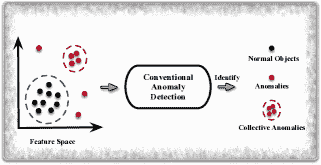

(a) 传统异常检测

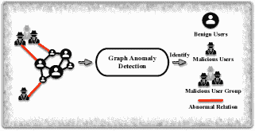

(b) 图异常检测

图 1：传统异常检测与图异常检测的示例。除了（b）中展示的异常外，图异常检测还识别图级异常，详细内容见第 8 ‣ A Comprehensive Survey on Graph Anomaly Detection with Deep Learning")和第九部分。

对于我们今天的目的，异常现象，也被称为离群点、例外、特例、稀有现象、新奇现象等，在不同的应用领域中，指的是与标准、正常或预期显著不同的异常对象。尽管这些对象在现实世界中很少发生，但它们包含支持下游应用的关键信息。例如，欺诈者的行为为反欺诈检测提供证据，而异常的网络流量则揭示了网络入侵保护的信号。在许多情况下，异常现象也可能产生真实的负面影响，例如，社交媒体中的虚假新闻可能会因误导性信念而引发恐慌和混乱 [hooi2016birdnest, ahmed2019combining, nguyen2020fang, tam2019anomaly]，在线评价系统中的不可信评论可能会影响顾客的购物选择 [yu2016survey, benamira2019semi, kumar2018rev2]，网络入侵可能会将个人隐私信息泄露给黑客 [mongiovi2013netspot, miller2013efficient, DBLP:journals/compsec/MiaoSZ20, perozzi2016scalable]，金融欺诈可能对经济系统造成巨大损害 [xuexiong2022, 10.1145/3394486.3403361, 10.1145/3394486.3403354, DBLP:conf/www/GuoLAHHZZ19]。

异常检测是旨在识别数据集中偏离大多数的异常模式的数据挖掘过程 [iglewicz1993detect, chandola2009anomaly, Fraud2020]。为了检测异常，传统技术通常将现实世界的对象表示为特征向量（例如，社交媒体中的新闻被表示为词袋 [sun2018detecting]，网页中的图像被表示为颜色直方图 [DBLP:conf/icdm/WuHPZCZ14]），然后在向量空间中检测异常数据点 [DBLP:conf/ijcai/WangL20, DBLP:conf/kdd/PangCCL18, DBLP:journals/corr/abs-2007-02500]，如图 1(a)所示。尽管这些技术在表格数据格式下定位偏离数据点方面显示出强大能力，但它们固有地忽略了对象之间的复杂关系 [akoglu2015graph]。

然而，实际上，许多对象之间有丰富的关系，这些关系可以为异常检测提供有价值的补充信息。以在线社交网络为例，假用户可以使用正常用户的有效信息创建，或者通过模仿良性用户的属性来伪装自己[hooi2017graph, CARE-GNN]。在这种情况下，假用户和良性用户可能具有几乎相同的特征，传统的异常检测技术可能仅凭特征信息无法识别它们。同时，假用户通常与大量良性用户建立关系以提高他们的声誉和影响力，从而获得意外的好处，而良性用户很少表现出这样的活动[pandit2007netprobe, Densealert]。因此，这些由假用户形成的密集和意外的连接表示了它们与良性用户的偏离，更多的综合检测技术应该考虑这些结构信息，以找出异常的偏离模式。

为了表示结构信息，图（Graphs）中节点/顶点代表实际对象，而边则代表它们之间的关系，这种结构在多个应用领域被广泛使用[liu2008spotting, wu2014multi, gao2017collaborative, aggarwal2011outlier, wu2017multiple, NIPS20201]，包括社交活动、电子商务、生物学、学术界和通信。图中包含的结构信息使得图中的异常检测成为一个更加复杂的异常检测问题，在非欧几里得空间中进行图异常检测（GAD），旨在识别单个图中的异常图对象（即节点、边或子图）以及在一组/数据库的图中识别异常图[akoglu2015graph, DBLP:journals/jiis/ChenHS12, GBGP]。如图 1(b)中的示例所示，在给定的在线社交网络中，图异常检测旨在识别异常节点（即恶意用户）、异常边（即异常关系）和异常子图（即恶意用户组）。然而，由于大量的图异常类型无法直接在欧几里得特征空间中表示，因此直接将传统异常检测技术应用于图异常检测是不切实际的，研究人员最近加强了对 GAD 的研究。

在该领域的早期工作中，检测方法主要依赖于手工特征工程或由领域专家构建的统计模型[akoglu2010oddball, eswaran2018spotlight, li2014probabilistic]。这本质上限制了这些技术检测未知异常的能力，并且这些工作往往非常劳动密集。许多机器学习技术，如矩阵分解[li2017radar, DBLP:journals/pnas/MahoneyD09]和支持向量机[SVM, DBLP:journals/pr/ErfaniRKL16]，也被应用于检测图异常。然而，现实世界中的网络通常包含数百万个节点和边，这会导致极高维度和大规模数据，这些技术很难高效地扩展到如此数据上。实际上，它们在存储和执行时间上都会表现出高计算开销[DBLP:journals/jbd/ThudumuBJS20]。这些与图数据相关的一般性挑战对于检测技术来说是显著的，我们在本调查中将它们归类为数据特定挑战（Data-CHs）。相关总结见附录 A。

表 I：现有异常检测调查的比较。我们在本调查中标记边、子图和图检测为 ![[未标注的图像]](img/7c2a71e3758421d1478a1ca8508df00a.png)，因为我们审查了比任何之前的调查更多的基于深度学习的工作。

| 调查 | AD | DAD | GAD | GADL | 源代码 | 数据集 |
| --- | --- | --- | --- | --- | --- | --- |
| 节点 | 边 | 子图 | 图 | 现实世界 | 合成 |
| 我们的调查 | ![[未标注的图像]](img/b7251f2d1ac67bc7db55be05a167c97b.png) | ![[未标注的图像]](img/d38f8a5ff64544aaa7394ab806963cb8.png) | ![[未标注的图像]](img/cb77bd81bd80a0cbfa97010ed6543eb2.png) | ![[未标注的图像]](img/964eba5485a243504442b8a9a702a731.png) | ![[未标注的图像]](img/29cb2b06f1f2574c39813baa94528293.png) | ![[未标注的图像]](img/9e5f3d82d12a7add6a9235a1af2184a6.png) | ![[未标注的图像]](img/18b66dae66ddc7fde011f4c00377f8a5.png) | ![[未标注的图像]](img/cc1766113b39fd5da0e1fabcf3419535.png) | ![[未标注的图像]](img/7e626f315f4861233fce1e3c4b3b28c3.png) | ![[未标注的图像]](img/4d63d6919e29568b80dbabb56b7f4bff.png) |
| Chandola 等人 [chandola2009anomaly] | ![[未标注的图像]](img/f12f82b2ef12e3ba3bf1624138ffbe43.png) | - | - | - | - | - | - | - | - | - |
| Boukerche 等人 [DBLP:journals/csur/BoukercheZA20] | ![[未标注的图像]](img/55bee1b11ee33c573613c0efdd9c242b.png) | ![[未标注的图像]](img/6f306b54f7ea1bbb107f5beb375f9324.png) | - | - | - | - | - | - | - | - |
| Bulusu 等人 [DBLP:journals/corr/abs-2003-06979] | ![[未标注的图像]](img/b228876c3ecc0a3c596d15a81a9a0da4.png) | ![[未标注的图像]](img/3010d842cebad80d04eadedaa29901be.png) | - | - | - | - | - | - | - | - |
| Thudumu 等人 [DBLP:journals/jbd/ThudumuBJS20] | ![[未加说明的图像]](img/a5772d5130e240020c037f199bea4af7.png) | ![[未加说明的图像]](img/bfc3437626e37ca2de9acaa00d287074.png) | ![[未加说明的图像]](img/da4c0ccb7720d88a412d2c371cbf5de5.png) | - | - | - | - | - | - | - |
| Pang 等人 [DBLP:journals/corr/abs-2007-02500] | ![[未加说明的图像]](img/8cf347f5ae4a83acf2c3081fc52efcdf.png) | ![[未加说明的图像]](img/72635e47392af7e8a85497664e93603c.png) | ![[未加说明的图像]](img/1e2ea310962ad89ef76c2619521992d0.png) | ![[未加说明的图像]](img/6258566abe2ff5b0c281f44394465760.png) | ![[未加说明的图像]](img/be516f0937fbcedeca90515e221201a4.png) | - | - | ![[未加说明的图像]](img/e715df4bb8fd614523b5cb81bf199af8.png) | ![[未加说明的图像]](img/4282421b36b52a6cddcadcc6466e20a1.png) | - |
| Chalapathy 和 Chawla [chalapathy2019deep] | ![[未加说明的图像]](img/2ff4e9580cbcc1bddafef3cfeead96bc.png) | ![[未加说明的图像]](img/f573a67a5abc99ca85b81761efb58f92.png) | - | - | - | - | - | ![[未加说明的图像]](img/85f697b437d35811b7d31e1304fa41b1.png) | ![[未加说明的图像]](img/bc6ae1f053971c456636f5a3a3a5b921.png) | - |
| Akoglu 等人 [akoglu2015graph] | ![[未加说明的图像]](img/cb77bf9a632ab1e29e9b09e214c4cd75.png) | - | ![[未加说明的图像]](img/5440f4e8b76f5275d9e72df86e2614f4.png) | - | - | - | - | - | - | - |
| Ranshous 等人 [ranshous2015anomaly] | ![[未加说明的图像]](img/090d846176b189edba1cf2c9eec0b809.png) | - | ![[未加说明的图像]](img/2b9417298433351f21bed74eee9e29a2.png) | - | - | - | - | ![[未加说明的图像]](img/82a509e6c3ff41e98350b03fee03bd4a.png) | - | - |
| Jennifer 和 Kumar [d2021anomaly] | ![[未加说明的图像]](img/13c6b81e98a45095786e8246b5d13b83.png) | - | ![[未加说明的图像]](img/2aaf6383627e0c9a220032cf9b4af975.png) | - | - | - | - | - | - | - |
| Eltanbouly 等人 [DBLP:conf/iciot3/EltanboulyBACE20] | ![[未加说明的图像]](img/da5321c6e8e57cb7e44e360ce8e93ef5.png) | ![[未加说明的图像]](img/fd8cad989a576b5eae47234d6b9e42f2.png) | ![[未加说明的图像]](img/cbf9849ffdd6cef447ab6ceed894988c.png) | - | - | - | - | - | - | - |
| Fernandes 等人 [DBLP:journals/telsys/FernandesRCAP19] | ![[未加说明的图像]](img/a366b10769f06d39a64f5d44bd480850.png) | ![[未加说明的图像]](img/3ad42bf5a0b08bcbc2ade04d3c9d3092.png) | ![[未加说明的图像]](img/e4a9a855b123ff2a1455674c27142d31.png) | - | - | - | - | - | - | - |
| Kwon 等人 [kwon2019survey] | ![[未加说明的图像]](img/c32226450ac8fbbc9cf7f78b72d62ac7.png) | ![[未加说明的图像]](img/b60f5fc4ad2dea0a3141bfcd5a4decb3.png) | - | - | - | - | - | - | ![[未加说明的图像]](img/478b4c7449367f2f5eda1cd5d0b830c2.png) | - |
| Gogoi 等人 [DBLP:journals/cj/GogoiBBK11] | ![[未加说明的图像]](img/0493a98135d25e375307a8742d4f32cc.png) | ![[未加说明的图像]](img/0afaf41e996ca28bb4e4c3d903ec885b.png) | - | - | - | - | - | - | - | - |
| Savage 等人 [savage2014anomaly] | ![[未标注的图像]](img/68ab8859c23d780d31b992c787272f0d.png) | - | ![[未标注的图像]](img/61d1466bbb636894cc49fbb2fc473b10.png) | - | - | - | - | - | - | - |
| Yu 等人 [yu2016survey] | ![[未标注的图像]](img/2a1e18e08952460a75a07fc409190d52.png) | - | ![[未标注的图像]](img/e2f47b57b3b6a1f3c1a18b33cf94c6d0.png) | - | - | - | - | - | - | - |
| Hunkelmann 等人 [ahmed2019combining] | ![[未标注的图像]](img/a864de8cedb51ad0be491002572618d3.png) | - | ![[未标注的图像]](img/cc4190cc3534b6d1409745b6c4fc0fc3.png) | - | - | - | - | - | - | - |
| Pourhabibi 等人 [Fraud2020] | ![[未标注的图像]](img/2e79dceab40b89f967cfd6c9c71c06fa.png) | ![[未标注的图像]](img/109aa9b6ad84fc29bf470ef611bd85d3.png) | ![[未标注的图像]](img/bfe88fc6aa0bb029b3a2ac4c62cb34a9.png) | ![[未标注的图像]](img/dc63ce8b012bf1e2f02abc44d74282dd.png) | - | - | - | - | - | - |
| * AD: 异常检测，DAD: 基于深度学习的异常检测，GAD: 图异常检测。 |
| * GADL: 基于深度学习的图异常检测。 |
| * -: 未包括，![[未标注的图像]](img/b97ff0839336341394a575b706cf2b1e.png)（包含 1-2 条参考文献），![[未标注的图像]](img/6d725d0f5b8e5c9efdead161a8214534.png)（包含 3-10 条参考文献），![[未标注的图像]](img/7c2a71e3758421d1478a1ca8508df00a.png)（包含 10 条以上参考文献）。 |

非深度学习基础的方法也缺乏捕捉真实物体非线性特性的能力 [DBLP:journals/corr/abs-2007-02500]。因此，这些方法学习的物体表示不够有表现力，无法充分支持图异常检测。为了解决这些问题，更近期的研究寻求采用深度学习技术来识别异常图对象的潜力。作为数据挖掘的强大工具，深度学习在数据表示和模式识别方面取得了巨大成功 [DBLP:conf/wsdm/WangNWYL20, zhang2019unsupervised, DBLP:conf/icdm/WangZ00ZX20]。其深层架构及其参数和变换层似乎很好地适应了上述问题。更近期的研究，如深度图表示学习和图神经网络（GNNs），进一步丰富了深度学习在图数据挖掘中的能力 [ijcai2020-693, wu2020comprehensive, cui2018survey, NIPS20202, su2021comprehensive]。通过提取具有表现力的表示，使图异常和正常对象能够轻松区分，或者通过深度学习技术直接学习异常的偏离模式，基于深度学习的图异常检测（GADL）正开始在异常检测的前沿中领先。作为一项前沿技术，基于深度学习的图异常检测因此预计将在检测异常和为社会带来更便捷的生活方面产生更有成果的结果。

### 1.1 基于深度学习的图异常检测中的挑战

由于异常检测和图数据挖掘的复杂性[noble2003graph, DBLP:conf/ijcai/TengYEL18, shah2016edgecentric, DBLP:conf/icdm/WangGF17, GAL]，除了前述的数据特定挑战外，采用深度学习技术进行图异常检测还面临技术方面的诸多挑战。这些与深度学习相关的挑战被归类为技术特定挑战（Tech-CHs），并总结如下。

技术挑战 1\. 异常感知训练目标。深度学习模型在很大程度上依赖于训练目标来微调所有可训练的参数。对于图异常检测，这需要合适的训练目标或损失函数，以便 GADL 模型能够有效地捕捉正常和异常对象之间的差异。设计异常感知目标非常具有挑战性，因为没有关于真实异常及其相对于大多数的偏离模式的先验知识。如何通过训练有效地将异常与正常对象分开，仍然是深度学习模型中的关键问题。

技术挑战 2\. 异常可解释性。在实际场景中，检测到的异常的可解释性也至关重要，因为我们需要提供令人信服的证据来支持后续的异常处理过程。例如，金融机构的风险管理部门必须在封锁识别出的异常用户账户之前提供合法证据。由于深度学习在可解释性方面的局限性[DBLP:journals/jzusc/ZhangZ18, DBLP:journals/corr/abs-2007-02500]，如何证明检测到的图异常仍然是深度学习技术面临的一大挑战。

技术挑战 3\. 高训练成本。尽管 D(G)NNs 能够处理图数据中的丰富信息（例如，结构信息和属性）以进行异常检测，这些 GADL 模型由于其异常感知的训练目标，比传统的深度神经网络或机器学习方法更复杂。这种复杂性必然导致高时间和计算资源的训练成本。

技术挑战 4\. 超参数调优。D(G)NNs 自然展示了一组大规模的超参数，如每个神经网络层中的神经元数量、学习率、权重衰减和训练轮次。这些超参数的值会显著影响它们的学习性能。然而，由于实际场景中缺乏标记数据，如何有效地选择检测模型的最佳/次优设置仍然是一个严重的挑战。

由于深度学习模型对其相关超参数敏感，设置良好的超参数值对于任务的成功至关重要。在有标签数据的监督学习中，调整超参数相对简单。例如，用户可以通过比较模型输出与真实值，找到最优/次优的超参数集（例如，通过随机搜索、网格搜索）。然而，无监督异常检测没有可用的标签数据来判断模型在不同超参数设置下的性能 [`akoglu2021anomaly`, `zhao2020automating`]。选择理想的超参数值对无监督检测模型来说仍然是应用于各种实际场景中的一个关键障碍。

### 1.2 现有的异常检测综述

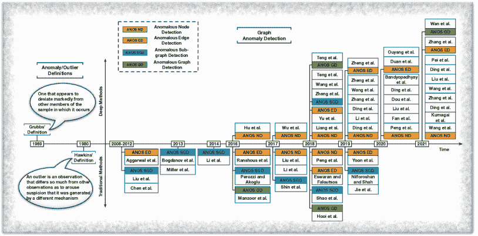

图 2：图异常检测及其回顾技术的时间线。

认识到异常检测的重要性，过去十年中进行了许多综述工作，涵盖了多种异常检测主题：深度学习中的异常检测、图异常检测、深度学习中的图异常检测，以及图异常检测的特定应用，如社交媒体、社交网络、欺诈检测和网络安全等。

有一些关于通用异常检测技术的代表性综述 - [`chandola2009anomaly`], [`DBLP:journals/csur/BoukercheZA20`] 和 [`DBLP:journals/jbd/ThudumuBJS20`]。但只有最新的工作 Thudumu 等人 [`DBLP:journals/jbd/ThudumuBJS20`] 涵盖了图异常检测的话题。认识到深度学习的力量，三篇当代综述，Ruff 等人 [`ruff2021unifying`], Pang 等人 [`DBLP:journals/corr/abs-2007-02500`] 和 Chalapathy 和 Chawla [`chalapathy2019deep`] 特别回顾了基于深度学习的异常检测技术。

关于图异常检测，Akoglu 等人 [akoglu2015graph]、Ranshous 等人 [ranshous2015anomaly] 和 Jennifer 与 Kumar [d2021anomaly] 将注意力集中在图异常检测上，回顾了该领域的许多传统方法，包括统计模型和机器学习技术。其他综述则致力于图异常检测的特定应用，例如计算机网络入侵检测和在线社交网络中的异常检测，例如 [yu2016survey, ahmed2019combining, Fraud2020] 和 [DBLP:conf/iciot3/EltanboulyBACE20, DBLP:journals/telsys/FernandesRCAP19, kwon2019survey, DBLP:journals/cj/GogoiBBK11, savage2014anomaly]。这些工作对这些高需求和关键领域中的异常检测/图异常检测技术应用进行了深入评述。然而，如表 I 所示，提到的综述中没有专门针对深度学习的图异常检测技术，因此没有提供这些技术的系统性和全面性评审。

### 1.3 贡献

我们的贡献总结如下：

+   •

    首个关于深度学习图异常检测的综述。根据我们的了解，我们的综述是首个回顾图异常检测前沿深度学习技术的工作。大多数相关综述要么关注于使用非深度学习技术的传统图异常检测方法，要么关注于广义异常检测技术（如表格/点数据、时间序列等）。迄今为止，还没有专门且全面的关于深度学习图异常检测的综述。我们的工作弥补了这一空白，我们期待有组织且系统的综述能推动该领域的研究。

+   •

    系统且全面的评述。在本综述中，我们回顾了在深度学习、数据挖掘、网络服务和人工智能领域的有影响力的国际会议和期刊上发布的最新深度学习技术，包括：TKDE、TKDD、TPAMI、NeurIPS、SIGKDD、ICDM、WSDM、SDM、SIGMOD、IJCAI、AAAI、ICDE、CIKM、ICML、WWW、CVPR 等。我们首先总结了深度学习图异常检测中的七个数据特定挑战和四个技术特定挑战。然后，我们从以下几个方面全面回顾现有工作：1）深度方法背后的动机；2）识别图异常的主要思想；3）对传统非深度学习技术的简要介绍；4）深度学习算法的技术细节。图 2 给出了图异常检测和已评审工作的简要时间线。

+   •

    未来方向。从调查结果中，我们突出了 12 个未来研究方向，涵盖了图数据、异常检测、深度学习模型和实际应用带来的新兴问题。这些未来机会指示了尚未充分解决的挑战，因此未来需要更多的努力。

+   •

    丰富的资源。我们的调查还提供了大量开源异常检测算法、公共数据集、合成数据集生成技术以及常用评估指标，以推动图异常检测的最新技术。这些公开资源提供了基准数据集和未来研究的基线。

+   •

    新的分类法。我们根据图或图数据库中存在的不同类型的异常（即节点、边、子图和图）组织了本调查。我们还指出了不同类型图异常之间的差异和相似之处。

本调查的其余部分组织如下。在第二部分中，我们提供了关于不同设置的初步介绍。从第 3 ‣ A Comprehensive Survey on Graph Anomaly Detection with Deep Learning")节到第九部分，我们分别回顾了现有的检测异常节点、边、子图和图的技术。在第十部分中，我们首先提供了已发布的图异常检测算法和数据集的集合，然后总结了常用的评估指标和合成数据生成策略。我们在第十一部分中突出介绍了涉及图异常检测中深度学习的 12 个未来方向，并在第十二部分中总结了我们的调查。我们调查的具体分类法见附录 B。

## 2 初步介绍

在本节中，我们提供了在节点/边/子图级别异常检测中最常用的不同类型图的定义（第三部分到第七部分）。为了保持一致性，我们遵循了现有工作的传统图分类[akoglu2015graph, ranshous2015anomaly, kwon2019survey]，将图分为静态图、动态图和图数据库。除非另有说明，否则以下各节中提到的所有图都是静态的。同时，由于图级异常检测在第 13 页讨论，为了提高可读性，图数据库的定义将在第八部分中更靠近相关材料的地方给出。

定义 1（普通图）。一个静态普通图 $G=\{V,E\}$ 包含一个节点集 $V=\{v_{i}\}_{1}^{n}$ 和一个边集 $E=\{e_{i,j}\}$，其中 $n$ 是节点数量，$e_{i,j}=(v_{i},v_{j})$ 表示节点 $v_{i}$ 和 $v_{j}$ 之间的一条边。邻接矩阵 $A=[a_{i,j}]_{n\times n}$ 还原了图的结构，其中 $a_{i,j}=1$ 如果节点 $v_{i}$ 和 $v_{j}$ 连接，否则 $a_{i,j}=0$。

定义 2（属性图）。一个静态属性图 $G=\{V,E,X\}$ 包含一个节点集 $V$、一个边集 $E$ 和一个属性集 $X$。在属性图中，图的结构遵循定义 1 中的定义。属性矩阵 $X=[\mathbf{x}_{i}]_{n\times k}$ 由节点的属性向量组成，其中 $\mathbf{x}_{i}$ 是与节点 $v_{i}$ 关联的属性向量，$k$ 是向量的维度。此后，“属性”和“特征”这两个术语可以互换使用。

定义 3（动态图）。一个动态图 $G(t)=\{V(t),E(t),X_{v}(t),X_{e}(t)\}$ 包含随时间变化的节点和边。$V(t)$ 是图在特定时间步 $t$ 的节点集，$E(t)$ 是相应的边集，$X_{v}(t)$ 和 $X_{e}(t)$ 是图中时间步 $t$ 的节点属性矩阵和边属性矩阵（如果存在）。

实际上，节点或边可能还会关联数值或类别标签以指示它们的类别（例如，正常或异常）。当标签信息可用/部分可用时，可以有效地训练监督/半监督检测模型。

## 3 异常节点检测（ANOS ND）

异常节点通常被认为是与其他节点显著不同的个体节点。在实际应用中，这些节点通常代表个别异常对象，例如计算机网络中的单一网络入侵者、在线社交网络中的独立欺诈用户或社交媒体上的特定虚假新闻。在这一部分，我们专注于静态图中的异常节点检测。动态图的相关评审可以在第 4 节找到。第 II 节末提供了 ANOS ND 技术的总结。

在静态图中检测异常节点时，异常和常规节点之间的差异主要来自图的结构信息和节点/边的属性 [li2017radar, bojchevski2018bayesian, zhu2020mixedad, perozzi2014focused]。给定关于静态图的先验知识（即社区结构、属性），异常节点可以进一步分为以下三种类型：

+   •

    全球异常只考虑节点属性。它们是那些属性与图中其他节点显著不同的节点。

+   •

    结构异常只考虑图的结构信息。它们是具有不同连接模式（例如，连接不同社区、与其他节点形成密集连接）的异常节点。

+   •

    社区异常考虑了节点属性和图的结构信息。它们被定义为与同一社区中的其他节点相比具有不同属性值的节点。

在图 3 ‣ A Comprehensive Survey on Graph Anomaly Detection with Deep Learning")中，节点 14 是一个全球异常，因为其第 4 个特征值为 1，而图中所有其他节点在相应特征上的值为 0。节点 5、6 和 11 被识别为结构异常，因为它们与其他社区有连接，而它们社区中的其他节点没有形成跨社区的链接。节点 2 和 7 是社区异常，因为它们的特征值与其所属社区中的其他节点不同。

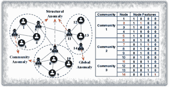

图 3: 三种异常节点类型：结构异常、社区异常和全球异常。

### 3.1 在普通图上的 ANOS ND

普通图致力于表示实际网络中的结构信息。为了检测普通图中的异常节点，图结构已从各个角度被广泛利用。在这里，我们首先总结了具有代表性的传统非深度学习方法，然后介绍基于表示学习的更先进的检测技术。

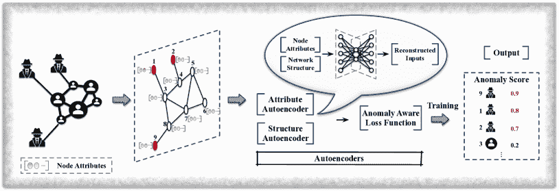

图 4：基于属性图的 ANOS ND – 深度神经网络方法。例如，使用自编码器来捕获图结构和节点属性。通过专门设计的异常感知损失函数，将为每个节点分配异常分数，前 k 个节点被视为异常（例如，前 3 名的节点 9、1 和 2）。

#### 3.1.1 传统非深度学习技术

在最近深度学习和其他先进数据挖掘技术取得进展之前，传统非深度学习技术已被广泛应用于许多实际网络中，以识别异常实体。这些技术背后的一个关键理念是将图异常检测转化为传统异常检测问题，因为含有丰富结构信息的图数据不能直接用传统检测技术（仅适用于表格数据）处理。为了弥补这一差距，许多方法 [akoglu2010oddball, DBLP:conf/kdd/DingKBKC12, hooi2016fraudar] 使用与每个节点相关的统计特征，如入度/出度，来检测异常节点。

例如，OddBall [akoglu2010oddball] 利用从每个节点及其 1-hop 邻居中提取的统计特征（如 1-hop 邻居和边的数量、边的总权重）来检测特定的结构异常，这些异常：1) 形成近似完全图或星形的局部结构；2) 与邻居有重连接，使得总权重极大；或者 3) 与一个邻居有一个主导的重连接。

通过适当选择统计特征，可以识别出具有偏离特征模式的异常节点。但在实际情况下，从大量候选特征中选择最合适的特征非常困难，领域专家总是可以设计新的统计特征，例如边的最大/最小权重。因此，这些技术通常在评估最重要特征时成本高昂，且未能有效捕捉结构信息。

#### 3.1.2 基于网络表示的技术

为了从图结构中捕获更多有价值的信息以进行异常检测，网络表示技术已被广泛应用。通常，这些技术将图结构编码到嵌入向量空间中，并通过进一步分析来识别异常节点。例如，Hu 等人 [hu2016embedding] 提出了一个有效的嵌入方法来检测与许多社区连接的结构异常。该方法首先采用图划分算法（如 METIS [DBLP:journals/siamsc/KarypisK98]）将节点分组到 $d$ 个社区中（$d$ 是用户指定的数量）。然后，该方法采用特别设计的嵌入程序来学习节点嵌入，这些嵌入能够捕获每个节点与 $d$ 个社区之间的链接信息。将节点 $i$ 的嵌入表示为 $Z_{i}=\{z_{i}^{1},\cdots,z_{i}^{d}\}$，该程序根据节点 $i$ 属于社区 $c$ 的情况初始化每个 $z_{i}^{c}\in Z_{i}$（如果节点 $i$ 属于该社区，则 $z_{i}^{c}=\frac{1}{\sqrt{2}}$；否则，值为 0.），并优化节点嵌入，使得直接连接的节点具有相似的嵌入，而未连接的节点则不相似。

在生成节点嵌入后，节点 $i$ 与 $d$ 个社区之间的链接信息被量化以进行进一步的异常检测分析。对于给定的节点 $i$，该信息表示为：

|  | $\overline{NB(i)}=(y_{i}^{1},...,y_{i}^{d})=\mathop{\sum}\limits_{j\in NB(i)}(1-\&#124;Z_{i}-Z_{j}\&#124;)\cdot Z_{j},$ |  | (1) |
| --- | --- | --- | --- |

$NB(i)$ 包括节点 $i$ 的邻居。如果 $i$ 与社区 $c$ 之间有许多链接，那么相应维度 $y_{i}^{c}$ 的值将会很大。

在最后一步，Hu 等人 [hu2016embedding] 公式化了一个评分函数来分配异常分数，计算方法如下：

|  | $AScore(i)=\mathop{\sum}\limits_{k=1}^{d}\frac{y_{i}^{k}}{y_{i}^{*}},y_{i}^{*}=\max\{y_{i}^{1},...,y_{i}^{d}\}.$ |  | (2) |
| --- | --- | --- | --- |

正如预期的那样，结构异常由于与不同的社区连接而获得更高的分数。实际上，给定一个预定义的阈值，超过阈值的节点会被识别为异常。

迄今为止，许多简单的网络表示方法，如 Deepwalk [perozzi2014deepwalk]、Node2Vec [grover2016node2vec] 和 LINE [tang2015line]，已经显示出在生成节点表示方面的有效性，并被用于异常检测性能验证 [bandyopadhyay2020outlier, bandyopadhyay2019outlier, yu2018netwalk, cai2020structural]。通过将传统的异常检测技术，如基于密度的技术 [breunig2000lof] 和基于距离的技术 [aggarwal2001outlier]，与节点嵌入技术配对，可以识别出在嵌入空间中具有可区分位置（即低密度区域或远离大多数）的异常节点。

#### 3.1.3 基于强化学习的技术

强化学习（RL）在解决现实世界决策问题上的成功引起了异常检测社区的广泛关注。检测异常节点自然可以视为一个决定节点属于哪一类——异常还是正常——的问题。作为一般选择性采集任务的一个特殊场景，异常节点检测问题可以通过[morales2021selective]中的最新工作来解决，该工作直观地将强化学习和网络嵌入技术结合用于选择性采集。所提出的模型 NAC 通过标记数据进行训练，无需任何人工干预。具体而言，它首先选择一个由部分观察到的节点和边组成的种子网络。然后，从种子网络开始，NAC 采用强化学习来学习一个节点选择计划，以便在未发现的区域识别异常节点。这是通过奖励能够选择标记异常并获得更高收益的选择计划来实现的。通过离线训练，NAC 将学习一个最优/次优的异常节点选择策略，并逐步发现未发现图中的潜在异常。

### 3.2 属性图上的 ANOS ND

除了结构信息之外，现实世界的网络还包含丰富的与节点相关的属性信息 [hamilton2017inductive, hamilton2017representation]。这些属性提供了有关真实对象的补充信息，与图结构一起，可以更好地检测出那些非显而易见的隐藏异常。

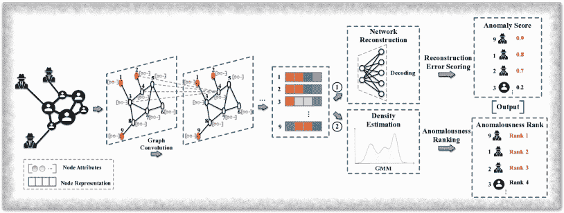

图 5：在属性图上的 ANOS ND——基于 GCN 的方法。通过 GCN 层生成节点表示。然后根据重构损失（①）或嵌入空间中的嵌入分布（②）来检测异常。

为了清晰起见，我们在本调查中区分深度神经网络和图神经网络。我们回顾了基于深度神经网络（Deep NN）的技术、基于 GCN 的技术和基于强化学习的技术用于 ANOS ND。由于篇幅限制，其他现有工作，包括传统的非深度学习技术、基于 GAT [velivckovic2017graph] 的技术、基于 GAN 的技术和基于网络表示的技术，已在附录 C 中进行了调查。

#### 3.2.1 基于深度神经网络的技术

深度学习模型，如自编码器和深度神经网络，为学习数据表示提供了坚实的基础。最近，采用这些模型进行更有效的异常节点检测引起了广泛关注。

例如，Bandyopadhyay 等人 [bandyopadhyay2020outlier] 开发了一个无监督深度模型 DONE，用于检测属性图中的全球异常、结构异常和社区异常。具体而言，该工作对每个节点测量三个异常分数，这些分数指示了以下情况的可能性：1) 节点与不同社区的节点具有相似属性 ($o_{i}^{a}$)；2) 节点与其他社区相连 ($o_{i}^{s}$)；3) 节点在结构上属于一个社区，但属性遵循另一个社区的模式 ($o_{i}^{com}$)。如果某个节点表现出这些特征中的任何一个，则会被分配更高的分数，并被视为异常。

为了获取这些分数，DONE 采用了两个独立的自编码器（AE），即结构 AE 和属性 AE，如图 4 ‣ 基于深度学习的图异常检测综合调查") 所示。两个 AE 都通过最小化重建误差和保持假设相连节点在图中具有相似表示的同质性进行训练。在训练 AE 时，表现出预定义特征的节点难以重建，因此会引入更多的重建误差，因为它们的结构或属性模式不符合标准行为。因此，为了实现最小化误差，应该减轻异常的负面影响。因此，DONE 特别设计了一个异常感知的损失函数，包含五个项：$\mathcal{L}_{str}^{Recs}$、$\mathcal{L}_{attr}^{Recs}$、$\mathcal{L}_{str}^{Hom}$、$\mathcal{L}_{attr}^{Hom}$ 和 $\mathcal{L}^{Com}$。$\mathcal{L}_{str}^{Recs}$ 和 $\mathcal{L}_{attr}^{Recs}$ 是结构重建误差和属性重建误差，其公式为：

|  | $\begin{split}\mathcal{L}_{str}^{Recs}=\frac{1}{N}\sum_{i=1}^{N}\log(\frac{1}{o_{i}^{s}})\|\mathbf{t}_{i}-\mathbf{\hat{t}}_{i}\|_{2}^{2},\end{split}$ |  | (3) |
| --- | --- | --- | --- |

和

|  | $\begin{split}\mathcal{L}_{attr}^{Recs}=\frac{1}{N}\sum_{i=1}^{N}\log(\frac{1}{o_{i}^{a}})\|\mathbf{x}_{i}-\mathbf{\hat{x}}_{i}\|_{2}^{2},\end{split}$ |  | (4) |
| --- | --- | --- | --- |

其中 $N$ 是节点的数量，$\mathbf{t}_{i}$ 和 $\mathbf{x}_{i}$ 存储节点 $i$ 的结构信息和属性，$\mathbf{\hat{t}}_{i}$ 和 $\mathbf{\hat{x}}_{i}$ 是重建的向量。$\mathcal{L}_{str}^{Hom}$ 和 $\mathcal{L}_{attr}^{Hom}$ 被提出用于保持同质性，其公式为：

|  | $\begin{split}\mathcal{L}_{str}^{Hom}=\frac{1}{N}\sum_{i=1}^{N}\log(\frac{1}{o_{i}^{s}})\frac{1}{\|N(i)\|}\sum_{j\in N(i)}\|\mathbf{h}_{i}^{s}-\mathbf{h}_{j}^{s}\|_{2}^{2},\end{split}$ |  | (5) |
| --- | --- | --- | --- |

和

|  | $\begin{split}\mathcal{L}_{attr}^{Hom}=\frac{1}{N}\sum_{i=1}^{N}\log(\frac{1}{o_{i}^{a}})\frac{1}{\|N(i)\|}\sum_{j\in N(i)}\|\mathbf{h}_{i}^{a}-\mathbf{h}_{j}^{a}\|_{2}^{2},\end{split}$ |  | (6) |
| --- | --- | --- | --- |

其中 $\mathbf{h}_{i}^{s}$ 和 $\mathbf{h}_{i}^{a}$ 分别是结构 AE 和属性 AE 学习到的潜在表示。$\mathcal{L}^{Com}$ 对由两个 AE 生成的每个节点的表示施加了进一步的限制，使得图结构和节点属性相互补充。其形式为：

|  | $\begin{split}\mathcal{L}^{Com}=\frac{1}{N}\sum_{i=1}^{N}\log(\frac{1}{o_{i}^{com}})&#124;&#124;\mathbf{h}_{i}^{s}-\mathbf{h}_{i}^{a}&#124;&#124;_{2}^{2},\end{split}$ |  | (7) |
| --- | --- | --- | --- |

通过最小化这些损失函数的总和，量化每个节点的异常分数，并识别出得分较高的 top-k 节点作为异常。

#### 3.2.2 基于 GCN 的技术

图卷积神经网络（GCNs） [kipf2016gcn] 在许多图数据挖掘任务（如链接预测、节点分类和推荐）中取得了不错的成功，这得益于其捕获图结构和节点属性中全面信息的能力。因此，许多异常节点检测技术开始研究 GCN。图 5 展示了现有工作的总体框架。

在 [ding2019deep] 中，Ding 等人通过结构和属性的网络重建误差为每个节点测量了异常分数。所提出的方法 DOMINANT 包括三个部分，即图卷积编码器、结构重建解码器和属性重建解码器。图卷积编码器通过多个图卷积层生成节点嵌入。结构重建解码器倾向于从学习到的节点嵌入中重建网络结构，而属性重建解码器重建节点属性矩阵。整个神经网络被训练以最小化以下损失函数：

|  | $\begin{split}\mathcal{L}_{DOMINANT}&amp;=(1-\alpha)\mathcal{R}_{S}+\alpha\mathcal{R}_{A}\\ &amp;=(1-\alpha)&#124;&#124;A-\hat{A}&#124;&#124;_{F}^{2}+\alpha&#124;&#124;X-\hat{X}&#124;&#124;_{F}^{2},\end{split}$ |  | (8) |
| --- | --- | --- | --- |

其中 $\alpha$ 是系数，$A$ 描述了图的邻接矩阵，$\mathcal{R}_{S}$ 和 $\mathcal{R}_{A}$ 分别量化了与图结构和节点属性相关的重建误差。当训练完成后，会根据每个节点对总重建误差的贡献分配异常分数，计算方法如下：

|  | $\textit{score}(i)=(1-\alpha)&#124;&#124;\mathbf{a}_{i}-\mathbf{\hat{a}}_{i}&#124;&#124;_{2}+\alpha&#124;&#124;\mathbf{x}_{i}-\mathbf{\hat{x}}_{i}&#124;&#124;_{2},$ |  | (9) |
| --- | --- | --- | --- |

其中 $\mathbf{a}_{i}$ 和 $\mathbf{x}_{i}$ 是节点 $i$ 的结构向量和属性向量，$\mathbf{\hat{a}}_{i}$ 和 $\mathbf{\hat{x}}_{i}$ 是它们对应的重建向量。然后，根据异常分数对节点进行降序排名，并将前 k 个节点识别为异常节点。

为了提升异常节点检测的性能，Peng 等人 [peng2020deep] 进一步探索了来自多个属性视角的节点属性来检测异常。这些多个属性视角用于描述对象的不同方面 [sheng2019multi, 6848779, wu2013multi]。例如，在在线社交网络中，用户的 demographic 信息和发布的内容是两个不同的属性视角，分别描述个人信息和社交活动。研究不同视角的基本直觉是，异常在一个视角中可能看起来正常，但在另一个视角中却显得异常。

为了捕捉这些信号，所提出的方法 ALARM 应用多个 GCN 来编码不同视角中的信息，并采用加权聚合生成节点表示。该模型的训练策略类似于 DOMINANT [ding2019deep]，旨在最小化网络重建损失和属性重建损失，可以表示为：

|  | $\begin{split}\mathcal{L}_{ALARM}=&amp;\sum_{i=1}^{n}\sum_{j=1}^{n}-[\gamma A_{ij}\log\hat{A}_{ij}+(1-A_{ij})\log(1-\hat{A}_{ij})]\\ &amp;+&#124;&#124;X-\tilde{X}&#124;&#124;^{F}_{2},\end{split}$ |  | (10) |
| --- | --- | --- | --- |

其中 $\gamma$ 是平衡误差的系数，$A_{ij}$ 是邻接矩阵 $A$ 中坐标 $(i,j)$ 处的元素，$\hat{A}_{ij}$ 是重建邻接矩阵 $\hat{A}$ 中对应的元素，$X$ 是原始节点特征矩阵，$\tilde{X}$ 是重建的节点特征矩阵。最后，ALARM 采用与 [ding2019deep] 相同的评分函数，得分前 k 高的节点被认为是异常的。

Li 等人 [li2019specae] 提出的 SpecAE 通过密度估计方法，即高斯混合模型（GMM），来检测全局异常和社区异常，而不是通过重建误差来发现意外节点。全局异常可以通过仅考虑节点属性来识别。对于社区异常，则需要联合考虑结构和属性，因为它们对邻居具有独特的属性。因此，SpecAE 研究了一种图卷积编码器来学习节点表示，并通过反卷积解码器重建节点属性。然后，使用节点表示来估计 GMM 中的参数。由于全局和社区异常的属性模式不同，正常节点在 GMM 中预期会表现出更大的能量，概率最低的 k 个节点被认为是异常节点。

在 [wang2019fdgars] 中，Wang 等人开发了一种新型检测模型，利用关系和特征识别欺诈者。他们提出的方法 Fdgars，首先将在线用户的评论和访问过的项目建模为特征，然后基于这些特征识别出一小部分显著的欺诈者。在最后一步，使用用户-用户网络、用户特征和标记用户以半监督的方式训练一个 GCN。训练后，该模型可以直接标记未见过的用户。

更近期的工作 GraphRfi [GraphRfi] 也探索了将异常检测与其他下游图分析任务相结合的潜力。它旨在利用异常检测来识别恶意用户，并通过减轻这些不可信用户的影响，向服务正常用户提供更准确的推荐。具体来说，部署了一个 GCN 框架，将用户和项目编码到共享的嵌入空间中进行推荐，并通过额外的神经随机森林对其嵌入进行分类，判断用户是欺诈者还是正常用户。对于用户和项目之间的评分预测，该框架通过为训练损失分配较少的权重来减少可疑用户的相应影响。同时，用户的评分行为也为欺诈者检测提供了辅助信息。这两个应用（异常检测和推荐）之间的互利关系表明了多个图学习任务之间信息共享的潜力。

#### 3.2.3 基于强化学习的技术

与 NAC 相对，Ding 等人 [ding2019interactive] 探讨了在属性图中使用强化学习进行异常节点检测。他们提出的算法 GraphUCB，建模了属性信息和结构信息，并继承了上下文多臂赌博机技术 [langford2008epoch] 的优点来输出潜在异常。通过根据节点特征将其分组为 $k$ 个簇，GraphUCB 形成了一个 $k$-臂赌博机模型，并测量选择特定节点作为潜在异常进行专家评估的收益。通过专家对预测异常的反馈，决策策略会不断优化。最终，可以选择出最有潜力的异常。

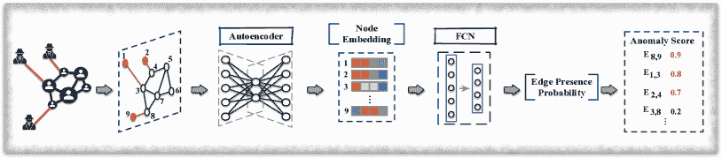

图 6: ANOS ED on 静态图 – 基于深度神经网络的方法。例如，检测技术使用自编码器和全连接网络来学习每个边的存在概率。根据这些概率分配异常分数，并将前 k 个边标记为异常（例如，$E_{8,9}$、$E_{1,3}$ 和 $E_{2,4}$ 位列前 3）。

## 4 ANOS ND on 动态图

真实世界的网络可以建模为动态图，以表示不断发展的对象及其之间的关系。除了结构信息和节点属性外，动态图还包含丰富的时间信号 [DBLP:conf/wsdm/RossiGNH13]，例如图结构和节点属性的演变模式。一方面，这些信息本质上使得在动态图上进行异常节点检测更加具有挑战性。这是因为动态图通常引入大量数据，同时也需要捕获时间信号以进行异常检测。但另一方面，它们也可以提供关于异常的更多细节 [ranshous2015anomaly, akoglu2015graph, wang2019detecting]。实际上，一些异常可能在每个时间戳的图快照中看起来是正常的，只有在考虑图结构的变化时，它们才会变得显著。

在本节中，我们回顾了基于网络表示的技术和基于 GAN 的技术。传统非深度学习方法的相关技术在附录 D 中进行了回顾。

表 II: 异常节点检测技术的总结。

| 图类型 | 方法 | 类别 | 目标函数 | 测量 | 输出 |
| --- | --- | --- | --- | --- | --- |
| 静态图 - 简单 | [hu2016embedding] | NR | $\mathop{\sum}\limits_{(i,j)\in E}\&#124;\mathbf{Z_{i}}-\mathbf{Z_{j}}\&#124;^{2}+\alpha\mathop{\sum}\limits_{(i,j)\notin E}(\&#124;\mathbf{Z_{i}}-\mathbf{Z_{j}}\&#124;-1)^{2}$ | 异常分数 | $\mathop{\sum}\limits_{k=1}^{d}\frac{y_{i}^{k}}{y_{i}^{*}}$ |
|  | DCI [wang2021decoupling] | NR | $\frac{1}{K}\mathop{\sum}\limits_{k=1}^{K}\mathcal{L}_{DCI}^{k}$ | 异常预测 | 预测标签 |
|  | NAC [morales2021selective] | RL | 累积奖励 | - | 异常 |
| 静态图 - 属性 | ALAD [liu2017accelerated] | 非 DP | $\min\limits_{W,H}\&#124;A-WW^{T}\&#124;_{F}^{2}+\alpha\&#124;X-WH\&#124;_{F}^{2}+\gamma(\&#124;W\&#124;_{F}^{2}+\&#124;H\&#124;_{F}^{2})$ | 异常分数 | $\frac{\mathbf{W}_{n,c}}{\sum_{c}\mathbf{W}_{n,c}}cos(\mathbf{A}_{n*},\mathbf{H}_{c*})$ |
|  | Radar [li2017radar] | 非 DP | $\min\limits_{W,R}\&#124;X-W^{T}X-R\&#124;_{F}^{2}+\alpha\&#124;W\&#124;_{2,1}+\beta\&#124;R\&#124;_{2,1}+\gamma tr(R^{T}LR)$ | 残差分析 | 残差值 |
|  | ANOMALOUS [peng2018anomalous] | 非 DP | $\min\limits_{W,\tilde{R}}&#124;&#124;X-XWX-\tilde{R}&#124;&#124;_{F}^{2}+\alpha&#124;&#124;W&#124;&#124;_{2,1}+\beta&#124;&#124;W^{T}&#124;&#124;_{2,1}+\gamma&#124;&#124;\tilde{R}^{T}&#124;&#124;_{2,1}+\varphi tr(\tilde{R}L\tilde{R}^{T})$ | 残差分析 | 残差值 |
|  | SGASD [wu2017adaptive] | 非差分隐私 | $\min\limits_{\mathbf{w,c}}\frac{1}{2}\sum_{i=1}^{m}\mathbf{c_{i}}(V_{i,*}\mathbf{w}-y_{i})^{2}+\frac{\lambda_{1}}{2}&#124;&#124;\mathbf{w}&#124;&#124;_{2}^{2}+\lambda_{2}\sum_{i=0}^{d}\sum_{j=1}^{n_{i}}&#124;&#124;\mathbf{c}_{G_{j}^{i}}&#124;&#124;_{2}$ | 异常预测 | 预测标签 |
|  | DONE [bandyopadhyay2020outlier] | DNN | $\alpha_{1}\mathcal{L}_{str}^{Recs}+\alpha_{2}\mathcal{L}_{attr}^{Recs}+\alpha_{3}\mathcal{L}_{str}^{Hom}+\alpha_{4}\mathcal{L}_{attr}^{Hom}+\alpha_{5}\mathcal{L}^{Com}$ | 异常分数 | $o_{i}^{s},o_{i}^{a},o_{i}^{com}$ |
|  | DOMINANT [ding2019deep] | GCN | $(1-\alpha)\mathcal{R}_{S}+\alpha\mathcal{R}_{A}$ | 异常分数 | $(1-\alpha)&#124;&#124;\mathbf{a}_{i}-\mathbf{\hat{a}}_{i}&#124;&#124;_{2}+\alpha&#124;&#124;\mathbf{x}_{i}-\mathbf{\hat{x}}_{i}&#124;&#124;_{2}$ |
|  | ALARM [peng2020deep] | GCN | $\sum_{i=1}^{n}\sum_{j=1}^{n}-[\gamma A_{ij}\log\hat{A}_{ij}+(1-A_{ij})\log(1-\hat{A}_{ij})]+\mathcal{L}_{a}$ | 异常分数 | $(1-\alpha)&#124;&#124;\mathbf{a}_{i}-\mathbf{\hat{a}}_{i}&#124;&#124;^{2}_{2}+\alpha&#124;&#124;\mathbf{x}_{i}-\mathbf{\hat{x}}_{i}&#124;&#124;^{2}_{2}$ |
|  | SpecAE [li2019specae] | GCN | $\mathbb{E}[dis(X,\hat{X})]+\mathbb{E}[dis(X,\tilde{X})]+\lambda_{1}\mathbb{E}(E(Z))+\lambda_{2}KL$ | 密度估计 | 异常等级 |
|  | Fdgars [wang2019fdgars] | GCN | $\mathcal{L}_{GCN}$ | 异常预测 | 预测标签 |
|  | GraphRfi [GraphRfi] | GCN | $\mathcal{L}_{rating}+\lambda\mathcal{L}_{fraudster}$ | 异常预测 | 预测标签 |
|  | ResGCN [pei2021resgcn] | GCN | $(1-\alpha)&#124;&#124;A-\hat{A}&#124;&#124;^{2}_{F}+\alpha&#124;&#124;X-\hat{X}-\lambda R&#124;&#124;^{2}_{F}$ | 异常分数 | $&#124;&#124;R_{i,:}&#124;&#124;_{2}$ |
|  | GraphUCB [ding2019interactive] | 强化学习 | 专家判断 | - | 异常 |
|  | AnomalyDAE [fan2020anomalydae] | GAT | $\alpha&#124;&#124;(A-\hat{A})\odot\bm{\theta}&#124;&#124;_{F}^{2}+(1-\alpha)&#124;&#124;(X-\hat{X})\odot\bm{\eta}&#124;&#124;_{F}^{2}$ | 重构损失 | 异常等级 |
|  | SemiGNN [SemiGNN] | GAT | $\alpha\mathcal{L}_{sup}+(1-\alpha)\mathcal{L}_{unsup}+\lambda\mathcal{L}_{reg}$ | 异常预测 | 预测标签 |
|  | AEGIS [ding2020inductive] | GAN | $\mathcal{L}_{AE}+\mathcal{L}_{GAN}$ | 异常分数 | $1-D(\mathbf{z}_{i})$ |
|  | REMAD [zhang2019robust] | 非鲁棒 | $\mathcal{L}_{res}+\beta\&#124;R^{T}\&#124;_{2,1}$ | 残差分析 | 残差值 |
|  | CARE-GNN [CARE-GNN] | 非鲁棒 | $\mathcal{L}_{GNN}+\lambda_{1}\mathcal{L}_{Simi}^{(1)}+\lambda_{2}\mathcal{L}_{reg}$ | 异常预测 | 预测标签 |
|  | SEANO [liang2018semi] | 非鲁棒 | $-\sum_{i\in V_{L}}\log p(y_{i}&#124;\mathbf{x}_{i},\bar{\mathbf{x}}_{N_{i}})-\sum_{i\in V}\sum_{v\prime\in C_{i}}\log p(v\prime&#124;\mathbf{x}_{i},\bar{\mathbf{x}}_{N_{i}})$ | 异常分数 | 判别器输出 |
|  | OCGNN [wang2020ocgnn] | NR | $\frac{1}{\beta K}\sum\limits_{v_{i}\in\mathbf{V}_{tr}}[&#124;&#124;g(X,A;\mathcal{W})_{v_{i}}-c&#124;&#124;^{2}-r^{2}]^{+}+r^{2}+\frac{\lambda}{2}\sum\limits_{l=1}^{L}&#124;&#124;W^{(l)}&#124;&#124;^{2}$ | 嵌入空间中的位置 | 到超球体中心的距离 |
|  | GAL [GAL] | NR | $\max\{0,\max\limits_{y_{v^{\prime}}\neq y_{u}}g(u,v^{\prime})-\min\limits_{y_{v}=y_{u}}g(u,v)+\Delta_{y_{u}}\}$ | 异常预测 | 预测标签 |
|  | CoLA [liu2021anomaly] | NR | $-\sum\limits_{i=1}^{N}y_{i}\log(CLM(v_{i},\mathcal{G}_{i}))+(1-y_{i})\log(1-CLM(v_{i},\mathcal{G}_{i}))$ | 异常评分 | $\frac{\sum\limits_{r=1}^{R}(s_{i,r}^{(-)}-s_{i,r}^{(+)})}{R}$ |
|  | COMMANDER [ding2021cross] | NR | $-\mathcal{L}_{D}+\mathcal{L}_{C}+\mathcal{L}_{R}$ | 异常评分 | $\bar{y_{i}}&#124;&#124;\mathbf{\tilde{x}_{i}}-\mathbf{x}_{i}&#124;&#124;_{2}^{2}$ |
|  | FRAUDRE [zhangge1] | NR | $\sum\limits_{i=1}^{n}f^{*}(y_{i},\mathbf{h}_{i}^{(final)}\mathbf{W}_{2})$ | 异常预测 | 预测标签 |
|  | Meta-GDN [ding2021few] | NR | $(1-y_{i})\cdot&#124;dev(v_{i})&#124;+y_{i}\cdot\max(0,dev(v_{i}))$ | 异常评分 | $\mathbf{u}_{s}^{T}\mathbf{o}_{i}+b_{s}$ |
| 动态图 - 纯 | NetWalk [yu2018netwalk] | DNN | $\gamma\mathcal{L}_{AE}+\mathcal{L}_{Clique}+\lambda\&#124;W\&#124;_{F}^{2}+\beta KL$ | 异常评分 | 最近的簇中心距离 |
| 动态图 - 属性 | MTHL [teng2017anomaly] | 非 DP | $\mathop{min}_{\mathcal{P}}f(\mathcal{P})$ | 异常评分 | 到超球体质心的距离 |
|  | OCAN [zheng2019one] | GAN | $\mathcal{L}_{LSTM-AE}+\mathcal{L}_{GAN}$ | 异常评分 | 判别器输出 |
| * 非 DP: 非深度学习技术，DNN: 基于深度神经网络的技术，GCN: 基于 GCN 的技术，RL: 基于强化学习的技术。 |
| * GAT: 基于 GAT 的技术，NR: 基于网络表示的技术，GAN: 基于生成对抗网络的技术。 |

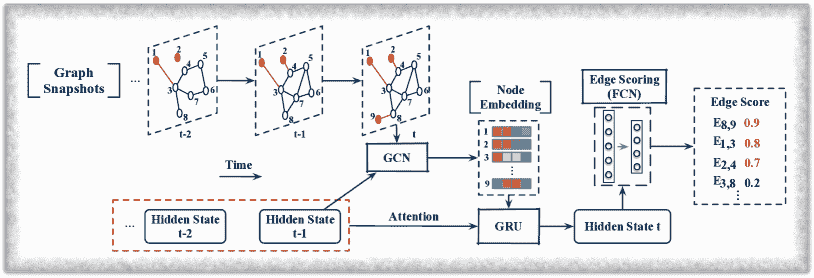

图 7: 动态图上的 ANOS ED – 基于 GCN 的方法。GCN 被用来从每个时间戳的时间图中学习节点嵌入。基于注意力的 GRU 使用节点嵌入和之前的隐藏状态生成当前的隐藏状态。边缘评分函数（例如 FCN）被学习以分配异常分数，前 k 个边被表示为异常。

### 4.1 网络表示基础的技术

在将图编码为嵌入空间之后进行异常检测的研究方向下，动态网络表示技术在最近的工作中得到了探讨。具体来说，在[yu2018netwalk]中，Yu 等人提出了一种灵活的深度表示技术，称为 NetWalk，用于仅使用结构信息检测动态（平面）图中的异常节点。它采用自编码器在初始图上学习节点表示，并在添加新边或删除现有边时逐步更新这些表示。为了检测异常，NetWalk 首先执行流式 $k$-均值聚类算法[ailon2009streaming]，将当前时间戳中的现有节点分组到不同的簇中。然后，每个节点的异常分数根据其与 $k$ 个簇的最近距离来测量。当节点表示更新时，簇中心和异常分数会相应地重新计算。

### 4.2 基于 GAN 的技术

在实际应用中，异常检测面临着来自真实异常样本不足的巨大挑战。因此，许多研究工作投入到建模异常或常规对象的特征，以便有效识别异常。在这些技术中，生成对抗网络（GAN）[goodfellow2014generative]因其在捕捉真实数据分布和生成模拟数据方面的出色表现而受到了广泛关注。

受到最近在“坏” GAN[dai2017good]方面的进展的启发，Zheng 等人[zheng2019one]仅使用观察到的正常用户属性绕过了欺诈者检测问题。基本思路是捕捉正常活动模式，并检测行为显著不同的异常。所提出的方法 OCAN 首先通过历史社交行为（例如历史帖子、帖子 URL）提取正常用户的内容特征，因此该方法被归类为动态类别。采用基于长短期记忆（LSTM）的自编码器[DBLP:conf/icml/SrivastavaMS15]来实现，并假设正常用户和恶意用户在特征空间中处于不同区域。接下来，训练了一个新颖的单类对抗网络，包括生成器和判别器。具体而言，生成器生成位于正常用户相对低密度区域的补充数据点。判别器则旨在区分生成的样本和正常用户。训练后，判别器学习了正常用户区域，从而可以根据其位置识别异常。

NetWalk [yu2018netwalk] 和 OCAN [zheng2019one] 在异常节点检测问题上表现出色，但它们分别只考虑了结构或属性。鉴于静态图异常检测技术成功分析了这两个方面，当动态图中的结构和属性信息共同考虑时，可以预见检测性能的提升。因此，我们在第十一部分中强调了这一未被探索的领域作为未来工作的重点。

## 5 异常边检测（ANOS ED）

与针对个别节点的异常节点检测不同，ANOS ED 旨在识别异常链接。这些链接通常揭示了实际对象之间的意外或不寻常的关系 [chang2021f]，例如图中所示的欺诈者与正常用户之间的异常互动 1，或计算机网络中攻击者节点与正常用户机器之间的可疑互动。按照之前的分类法，本节回顾了静态图的最先进 ANOS ED 方法，而第六部分总结了动态图的技术。相关总结见表 III。本节包括基于深度神经网络、图卷积网络和网络表示的方法。非深度学习技术在附录 E 中进行回顾。

### 5.1 基于深度神经网络的技术

类似于基于深度 NN 的 ANOS ND 技术，自动编码器和全连接网络（FCN）也被用于异常边检测。例如，Ouyang 等人 [DBLP:conf/ijcnn/Ouyang0020] 通过深度模型建模边的分布，以识别现有边中最不可能出现异常的边（如图 6 ‣ A Comprehensive Survey on Graph Anomaly Detection with Deep Learning") 所示）。每条边 $e_{u,v}$ 的概率由 $P(v|u,N(u))$ 和 $P(u|v,N(v))$ 决定，这两个概率分别通过节点 $u$ 及其邻居 $N(u)$ 和节点 $v$ 及其邻居 $N(v)$ 来测量边的概率。为了计算 $P(v|u,N(u))$，提出的方法 UGED 首先通过 FCN 层将每个节点编码成低维向量，并通过对自身及其邻居的向量的均值聚合生成节点 $u$ 的表示。接下来，节点表示被输入到另一个 FCN 中以估计 $P(v|u,N(u))$。预测表达为 $\hat{P}(v|u,N(u))=\text{Softmax}(W\cdot H(u))|_{v}$，其中 $W$ 表示可训练参数，$H(u)$ 是 $u$ 的表示。UGED 的训练方案旨在通过基于交叉熵的损失函数 $\text{CE}(\hat{P}(v|u,N(u)),v)$ 最大化现有边的预测。训练后，通过 $1-P(v|u,N(u))$ 和 $1-P(u|v,N(v))$ 的平均值为每条边分配异常分数。因此，具有较低概率的现有边将获得较高的分数，并且前 k 名边被报告为异常。

### 5.2 GCN 基于的技术

按照边分布建模的思路，一些研究利用 GCNs 来更好地捕捉图结构信息。Duan 等人 [AANE] 证明了训练数据中异常边的存在阻碍了传统 GCN 模型捕捉真实的边分布，从而导致了次优的检测性能。这本质上提出了一个问题：为了获得更好的检测性能，节点嵌入过程应该减轻异常边的负面影响，但这些边是通过学习到的嵌入来检测的。为了解决这个问题，提出的方法 AANE 通过在训练过程中迭代更新嵌入和检测结果来共同考虑这两个问题。

在每次训练迭代中，AANE 通过 GCN 层生成节点嵌入 $Z$ 并学习一个指标矩阵 $I$ 以发现潜在的异常边。给定一个带有邻接矩阵 $A$ 的输入图 $G$，指标矩阵 $I$ 中的每个项 $I_{uv}$ 如果 $\hat{A}_{uv}<\text{mean}_{v^{\prime}\in N_{u}}\hat{A}_{uv^{\prime}}-\mu\cdot\text{std}_{v^{\prime}\in N_{u}}\hat{A}_{uv^{\prime}}$ 则为 1，否则为 0。这里，$\hat{A}_{uv}$ 是节点 $u$ 和 $v$ 之间的预测链接概率，计算为 $u$ 和 $v$ 嵌入的双曲正切函数，$\mu$ 是预定义的阈值。通过这种方式，当边 $uv$ 的预测概率低于节点 $u$ 所有链接的平均值减去预定义的阈值时，该边被识别为异常。

AANE 的总损失函数包含两个部分：一个异常感知损失（$\mathcal{L}_{aal}$）和一个调整的拟合损失（$\mathcal{L}_{afl}$）。$\mathcal{L}_{aal}$ 被提出用来惩罚链接预测结果和指标矩阵 $I$，使得异常边在 $I$ 中标记为 1 时会有更低的预测概率。这表示为：

|  | $\mathcal{L}_{aal}=\sqrt{\sum_{u\in V}\sum_{v\in N(u)}((1-\hat{A}^{2}_{uv})(1-I_{uv})+\hat{A}^{2}_{uv}I_{uv})},$ |  | (11) |
| --- | --- | --- | --- |

其中 $V$ 是节点集合，$N(u)$ 是 $u$ 的邻居集合。$\mathcal{L}_{afl}$ 量化了与潜在异常边移除相关的重建损失，表示为：

|  | $\mathcal{L}_{afl}=\|B-\hat{A}\|^{2}_{2},$ |  | (12) |
| --- | --- | --- | --- |

其中 $B$ 是一个调整后的邻接矩阵，它从输入邻接矩阵 $A$ 中移除了所有预测的异常值。通过最小化这两个损失，AANE 识别出概率最低的前 k 条边作为异常。

### 5.3 基于网络表示的技术

除了使用节点嵌入进行 ANOS ED 外，从图中直接学习的边表示也可用于区分异常。如果边表示能够很好地保留节点对之间的图结构和交互内容（例如，在线社交网络中的消息、引用网络中的合作论文），则可以期望获得增强的检测性能。迄今为止，一些研究，如 Xu 等人 [DBLP:journals/ijdsa/XuWCY20]，在生成边表示方面显示了有希望的结果。尽管它们并不是专门为图异常检测设计的，但它们指出了一种可能的 ANOS ED 方法。这在第 11.1 节中被强调为潜在的未来方向。

## 6 动态图上的 ANOS ED

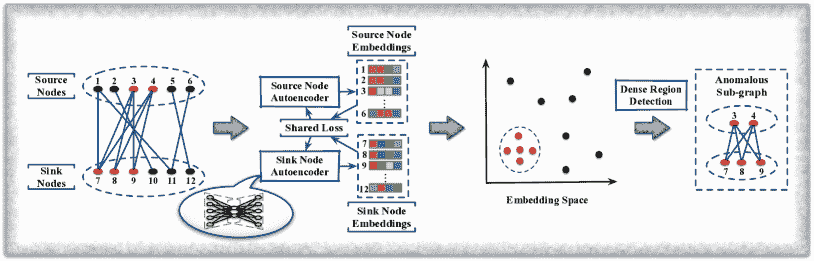

图 8: ANOS SGD。实际网络通常被表示为二分图，以反映两种不同类型对象之间的互动。为了检测 ANOS SGD，源节点和汇节点分别使用两个自编码器（通过共享损失函数连接）进行嵌入。通过在嵌入空间中应用密集区域检测算法来识别异常子图。

动态图在反映边缘随时间的出现/消失方面非常强大 [ranshous2016scalable]。可以通过建模图结构的变化和捕捉每个时间步的边缘分布来区分异常边。本文节回顾了动态图上的 ANOS ED 的最新方法。

### 6.1 基于网络表示的技术

基于网络表示的技术的直观理解是将动态图结构信息编码到边缘表示中，并应用上述传统异常检测技术来发现不规则边。这非常直接，但在图结构演变时生成/更新信息丰富的边缘表示仍然存在重要挑战。为了缓解这一挑战，ANOS ND 模型 NetWalk [yu2018netwalk] 也能够检测动态图中的异常边。沿用基于距离的异常检测方法，NetWalk 使用节点嵌入将边编码到共享潜在空间中，并根据边缘到潜在空间中最近边缘簇中心的距离来识别异常。在实际操作中，NetWalk 生成边缘表示作为源节点和目标节点表示的 Hadamard 乘积，表示为: $\mathbf{z}_{u,v}=\mathbf{z}_{u}\odot\mathbf{z}_{v}$。当新的边缘到达或现有边缘消失时，节点和边缘表示会从每个时间戳的临时图中的随机游走中更新，然后重新计算边缘簇中心和边缘异常分数。最后，将最远的前 k 个边缘报告为异常。

### 6.2 基于 GCN 的技术

尽管 NetWalk 能够检测动态图中的异常，但它只是更新边缘表示，而没有考虑长期/短期节点和图结构的演变模式。为了更有效的 ANOS ED，Zheng 等人 [zheng2019addgraph] 直观地将时间、结构和属性信息结合起来，以衡量动态图中边缘的异常性。他们提出了一种半监督模型 AddGraph，该模型包括一个 GCN 和带有注意力机制的门控递归单元 (GRU) [cui2019hierarchical]，以捕捉每个时间戳中来自时间图的更具代表性的结构信息及其之间的依赖关系。

在每个时间戳 $t$，GCN 使用时间 $t-1$ 的输出隐藏状态 ($H^{t-1}$) 来生成节点嵌入，然后 GRU 从节点嵌入和之前隐藏状态的注意力中学习当前隐藏状态 $H^{t}$（如图 7 所示）。在获取所有节点的隐藏状态 $H^{t}$ 后，AddGraph 根据与之相关的节点为时间图中的每条边分配异常分数。所提出的异常评分函数的公式为：

|  | $f(u,v,w)=w\cdot\sigma(\beta\cdot(&#124;&#124;\mathbf{a}\odot\mathbf{h}_{u}+\mathbf{b}\odot\mathbf{h}_{v}&#124;&#124;^{2}_{2}-\mu)),$ |  | (13) |
| --- | --- | --- | --- |

其中 $u$ 和 $v$ 是相应的节点，$w$ 是边的权重，$\mathbf{a}$ 和 $\mathbf{b}$ 是可训练的参数，$\beta$ 和 $\mu$ 是超参数，而 $\sigma(\cdot)$ 是非线性激活函数。为了学习 $\mathbf{a}$ 和 $\mathbf{b}$，Zheng 等人进一步假设动态图中所有现有的边在训练阶段都是正常的，并将不存在的边采样为异常。具体来说，他们将损失函数构造为：

|  | $\begin{split}\mathcal{L}_{AddGraph}=&\min\sum_{{(u,v,w)\in\varepsilon^{t}}}\sum_{{(u^{\prime},v^{\prime},w)\notin\varepsilon^{t}}}\\ &\max\{0,\gamma+f(u,v,w)-f(u^{\prime},v^{\prime},w)\}+\lambda\mathcal{L}_{reg},\end{split}$ |  | (14) |
| --- | --- | --- | --- |

其中 $\varepsilon^{t}$ 是边集，$(u^{\prime},v^{\prime})$ 是时间戳 $t$ 时采样的不存在的边，$\lambda$ 是超参数，而 $\mathcal{L}_{reg}$ 对模型中所有可训练参数进行正则化。训练后，评分函数通过基于 Eq. 13 为测试数据中的异常边分配较高的异常分数来识别它们。

## 7 异常子图检测（ANOS SGD）

在实际生活中，异常也可能与其他人勾结并集体行动以获得利益。例如，在线评论网络中的欺诈用户群体，如图 1 所示，可能发布误导性评论来推广或抹黑某些商品。当这些数据以图的形式呈现时，异常及其交互通常形成可疑的子图，而 ANOS SGD 被提出以将其与正常的图区分开来。

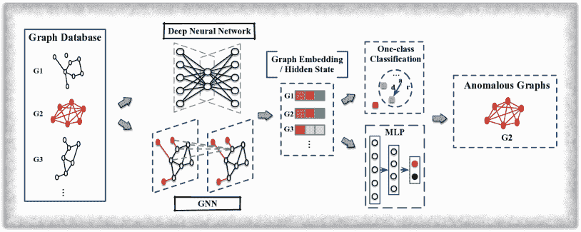

图 9: 图数据库上的 ANOS GD。通常，图级异常检测技术以图数据库作为输入。通过 D(G)NNs 为数据库中的每个单独图生成嵌入/隐藏状态，异常图可以通过一类分类器或 MLP 来描绘。

与单个节点或边的个体和独立图异常不同，每个可疑子图中的节点和边可能是正常的。然而，当作为集合考虑时，它们会变得异常。此外，这些子图的大小和内部结构也各不相同，使得异常子图检测比 ANOS ND/ED [dGraphScan] 更具挑战性。尽管大量努力已投入解决这个问题，但深度学习技术仅在过去五年才开始解决这个问题。作为参考，传统的非深度学习技术在附录 F 中简要介绍了，对于 ANOS SGD 评审的技术总结见于第九部分末尾的表 III。

由于异构图在表示不同种类真实对象之间复杂关系上的灵活性，最近的几项研究利用深度网络表示技术通过 ANOS SGD 检测真实世界的异常。例如，Wang 等人 [wang2018deep] 将在线购物网络表示为二分图（一种具有两种节点和一种边的异构图），其中用户是源节点，项目是汇节点。然后根据这些图中形成的可疑密集块来检测欺诈组。

Wang 等人 [wang2018deep] 旨在学习用户的异常感知表示，使得同组的可疑用户在向量空间中彼此靠近，而良性用户则远离（如图 8 的嵌入空间所示）。根据观察到的用户节点属于一个欺诈组的情况，更容易与相同的项目节点连接，开发的模型 DeepFD 通过测量两个用户行为的相似性 $sim_{ij}$ 来评估，即他们审阅的所有项目中共享项目的百分比。然后，通过传统的自动编码器生成用户表示，该自动编码器使用三种损失进行训练，并遵循编码-解码过程。第一个损失是重构损失 $\mathcal{L}_{res}$，它确保可以使用学习到的用户表示和项目表示正确重构二分图结构。第二项损失 $\mathcal{L}_{sim}$ 保留了学习到的用户表示中的用户相似性信息。即，如果两个用户具有相似的行为，他们的表示也应该相似。该损失公式为：

|  | $\mathcal{L}_{sim}=\sum_{i,j=1}^{m}sim_{ij}\cdot\&#124;\widehat{sim}_{ij}-sim_{ij}\&#124;_{2}^{2},$ |  | (15) |
| --- | --- | --- | --- |

其中，$m$是用户节点的数量，$\widehat{sim}_{ij}$使用 RBF 核或其他替代方法来衡量用户$i$和$j$的表示的相似度。第三个损失$\mathcal{L}_{reg}$对所有可训练参数进行正则化。最后，使用 DBSCAN [DBSCAN]检测出那些预计在向量空间中形成密集区域的可疑密集块。

另一个研究，FraudNE [FraudNE]，也将在线评论网络建模为二分图，并进一步检测恶意用户和相关的操控项，遵循密集块检测原则。与 DeepFD 不同，FraudNE 希望将这两种类型的节点编码到一个共享的潜在空间中，使得属于同一密集块的可疑用户和项非常接近，而其他节点则均匀分布（如图 8 所示）。FraudNE 采用了两种传统的自编码器，即源节点自编码器和汇节点自编码器，分别用于学习用户表示和项表示。这两个自编码器共同训练，以最小化各自的重建损失和一个共享损失函数，总损失可以表示为：

|  | $\mathcal{L}_{FraudNE}=\mathcal{L}_{res}^{source}+\mathcal{L}_{res}^{sink}+\alpha\mathcal{L}_{share}+\eta\mathcal{L}_{reg},$ |  | (16) |
| --- | --- | --- | --- |

其中，$\alpha$和$\eta$是超参数，$\mathcal{L}_{reg}$对所有可训练参数进行正则化。具体而言，重建损失（即$\mathcal{L}_{res}^{source}$和$\mathcal{L}_{res}^{sink}$）衡量输入用户/项特征（从图结构中提取）与其解码特征之间的差距。共享损失函数旨在限制表示学习过程，使得每对链接的用户和项具有相似的表示。由于 DBSCAN [DBSCAN]算法在检测密集区域方面非常方便，FraudNE 也使用它来区分由可疑用户和项形成的密集子图。

迄今为止，仅有少数研究致力于将深度学习技术应用于 ANOS SGD。然而，随着对子图表示学习研究兴趣的加深，我们鼓励更多关于 ANOS SGD 的研究，并在第 11.1 节中指出这是一种潜在的未来方向。

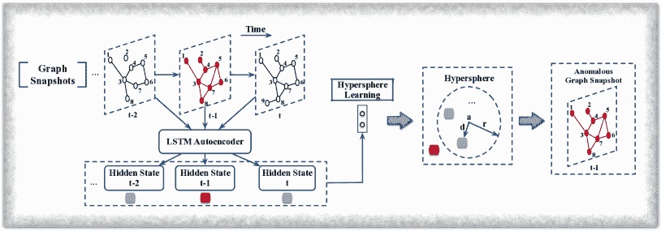

图 10：动态图上的 ANOS GD。对于动态图中的每个图快照，LSTM 自编码器使用其邻接矩阵和先前的隐藏状态生成其隐藏状态。通过超球体学习，学习一个具有质心 $a$ 和半径 $r$ 的超球体，使得异常快照位于其外部。

## 8 异常图检测（ANOS GD）

除了异常节点、边和子图，图异常还可能表现为图集合/数据库中的异常图。通常，图数据库被定义为：

定义 4（图数据库）。图数据库 $\mathcal{G}=\{G_{i}=(V_{i},E_{i},X_{v}(i),X_{e}(i))\}^{N}_{i=1}$ 包含 $N$ 个个体图。在这里，每个图 $G_{i}$ 由节点集 $V_{i}$ 和边集 $E_{i}$ 组成。 $X_{v}(i)$ 和 $X_{e}(i)$ 是 $G_{i}$ 的节点属性矩阵和边属性矩阵（如果它是带属性的图）。

该图级别的 ANOS GD 旨在检测与其他图显著偏离的个体图。ANOS GD 的一个具体示例是异常分子检测。当化学化合物被表示为分子/化学图，其中原子和化学键被表示为节点和边 [6702420, sun2021sugar]，异常分子可以被识别，因为它们对应的图具有偏离其他图的结构和/或特征。脑部疾病检测是另一个示例。可以通过分析脑图在不同老化阶段的动态，并在特定时间戳找到不一致的快照来诊断脑部疾病。

先前审查的技术（即，ANOS ND/ED/SGD）与 ANOS GD 不兼容，因为它们专注于检测单个图中的异常，而 ANOS GD 则致力于检测图级别的异常。这个问题通常通过以下方法解决：1）使用图核 [manzoor2016fast] 测量图的成对相似性；2）检测由异常节点组创建的异常图信号 [hooi2018changedar]；或 3）使用频繁模式对图进行编码 [noble2003graph]。然而，这些方法都不是基于深度学习的。截至撰写时，很少有使用深度学习的 ANOS GD 研究。因此，这在第 11.1 节中被强调为一个潜在的未来方向。

### 8.1 基于 GNN 的技术

受 GNN 在各种图分类任务中成功的启发，ANOS GD 中的最新工作采用 GNN 将单一图分类为正常/异常。具体来说，Dou 等人 [dou2021user] 将假新闻检测转化为 ANOS GD 问题，通过将新闻建模为树结构传播图，其中根节点表示新闻片段，子节点表示与根新闻互动的用户。他们的端到端框架 UPFD，通过文本嵌入模型（例如 word2vec、BERT）和用户互动嵌入过程分别提取新闻和用户的两个嵌入。对于每个新闻图，其潜在表示是这两个嵌入的扁平连接，并用于训练具有新闻标签的神经分类器。由训练模型标记为假的传播图被视为异常。

Zhao 和 Akoglu [zhao2020using] 的另一项代表性工作采用了 GIN 模型和一种类分类（即 DeepSVDD [ruff2018deep]）损失，以端到端方式训练图级异常检测框架。对于图数据库中的每个单独图，通过对其节点的节点级嵌入进行均值池化来生成图级嵌入。如果一个图位于学习到的超球体之外，则最终被描绘为异常，如图 9 ‣ A Comprehensive Survey on Graph Anomaly Detection with Deep Learning")所示。

### 8.2 网络表示基础技术

将通用图级网络表示技术应用于 ANOS GD 也是可能的。使用这些方法，检测问题被转化为嵌入空间中的传统离群点检测问题。与能够以端到端方式检测图异常的 D(G)NN 基础技术相比，采用这些表示技术进行异常检测是两阶段的。首先，使用图级表示技术（例如 Graph2Vec [narayanan2017graph2vec]、FGSD [verma2017hunt]）将数据库中的图编码到一个共享的潜在空间中。然后，通过现成的离群点检测器来测量每个单一图的异常程度。本质上，这种方法涉及在两个阶段中配对现有的方法，但这两个阶段是相互独立的，因此检测性能可能会较差，因为嵌入相似度不一定是为了异常检测而设计的。

## 9 动态图上的 ANOS GD

对于动态图环境，图级异常检测旨在识别异常的图快照/时间图。类似于动态图上的 ANOS ND 和 ED，给定一系列图，可以根据其异常的演变模式、异常的图级特征或其他特征来区分异常图。

表 III：异常边、子图和图检测技术总结。

| 图类型 | 方法 | 类别 | 目标函数 | 测量 | 输出 |
| --- | --- | --- | --- | --- | --- |
| 异常边检测技术 |
| 静态图 - 普通 | UGED [DBLP:conf/ijcnn/Ouyang0020] | DNN | $\text{cross-entropy}(f(u,N(u)),v)$ | 异常得分 | $\text{mean}(1-P(v&#124;u,N(u)),1-P(u&#124;v,N(v)))$ |
|  | AANE [AANE] | GCN | $\mathcal{L}=\mathcal{L}_{afl}+\gamma\mathcal{L}_{aal}$ | 异常排序 | 边存在概率 |
| 静态图 - 属性图 | eFraudCom [zhangge2] | NR | $\mathcal{L}_{MAIN}-\lambda\mathcal{L}_{MI}$ | 异常预测 | 预测标签 |
| 动态图 - 普通 | NetWalk [yu2018netwalk] | NR | $\gamma\mathcal{L}_{AE}+\mathcal{L}_{Clique}+\lambda\&#124;W\&#124;_{F}^{2}+\beta KL$ | 异常得分 | 到簇中心的最近距离 |
| 动态图 - 属性图 | AddGraph [zheng2019addgraph] | GCN | $\text{min}\sum_{{e\in\varepsilon^{t}}}\sum_{{e^{\prime}\notin\varepsilon^{t}}}\text{max}\{0,\gamma+f(i,j,w)-f(i^{\prime},j^{\prime},w)\}+\lambda\mathcal{L}_{reg}$ | 异常得分 | $f(i,j,w)=w\cdot\sigma(\beta\cdot(&#124;&#124;\mathbf{a}\odot\mathbf{h}_{i}+\mathbf{b}\odot\mathbf{h}_{j}&#124;&#124;^{2}_{2}-\mu))$ |
| 异常子图检测技术 |
| 静态图 - 普通 | DeepFD [wang2018deep] | NR | $\mathcal{L}_{recon}+\alpha\mathcal{L}_{sim}+\gamma\mathcal{L}_{reg}$ | 基于密度的方法 (DBSCAN) | 稠密子图 |
|  | FraudNE [FraudNE] | NR | $\mathcal{L}_{res}^{source}+\mathcal{L}_{res}^{sink}+\alpha\mathcal{L}_{share}+\eta\mathcal{L}_{reg}$ | 基于密度的方法 (DBSCAN) | 稠密子图 |
| 异常图检测技术 |
| 图数据库 - 属性图 | UPFD [dou2021user] | NR | $-(y\log(p)+(1-y)\log(1-p))$ | 异常预测 | 预测标签 |
|  | OCGIN [zhao2020using] | GNN | $\min\limits_{W}\frac{1}{N}\sum\limits_{i=1}^{N}&#124;&#124;GIN(G_{i},W)-c&#124;&#124;^{2}+\frac{\lambda}{2}\sum\limits_{l=1}^{L}&#124;&#124;W^{l}&#124;&#124;^{2}_{F}$ | 嵌入空间中的位置 | 到超球中心的距离 |
| 动态图 - 普通 | DeepSphere [teng2018deep] | DNN | $\mathcal{L}=\mathcal{L}_{h}+\lambda\mathcal{L}_{res}$ | 嵌入空间中的位置 | 异常标签 |
|  | GLAD-PAW [wan2021glad] | GNN | $\text{cross-entropy}(\mathbf{y},\mathbf{\hat{y}})$ | 异常预测 | 预测标签 |
| * DNN: 深度神经网络技术，GCN: 基于 GCN 的技术，NR: 网络表示技术。 |
| * GNN: 基于图神经网络的技术。 |

为了推导每个图快照/时序图的特征，常用的 GNN、LSTM 和自编码器是可行的。例如，Teng 等人[teng2018deep]应用了 LSTM 自编码器来检测异常图快照，如图 10 ‣ A Comprehensive Survey on Graph Anomaly Detection with Deep Learning")所示。在他们提出的模型 DeepSphere 中，动态图被描述为三阶张量的集合，$\{\mathcal{X}_{k},k=1,2...\}$，其中每个$\mathcal{X}\in\mathcal{R}^{N\times N\times T}$，沿时间维度的切片是图快照的邻接矩阵。为了识别异常张量，DeepSphere 首先使用 LSTM 自编码器将每个图快照嵌入到潜在空间中，然后利用一个一类分类目标[ruff2018deep]来学习一个超球体，使得正常的快照被覆盖，而异常快照则在其外部。LSTM 自编码器顺序地接收邻接矩阵作为输入，并通过训练尝试重建这些输入矩阵。超球体通过一个神经网络层进行学习，其目标函数被公式化为：

|  | $\mathcal{L}_{h}=r^{2}+\gamma\sum_{k=1}^{m}\epsilon_{k}+\frac{1}{m}\sum_{k=1}^{m}\&#124;\textbf{z}_{k}-\textbf{a}\&#124;^{2},$ |  | (17) |
| --- | --- | --- | --- |

其中$\textbf{z}_{k}$是 LSTM 自编码器生成的潜在表示，a 是超球体的质心，$r$是半径，$\epsilon_{k}$是离群点惩罚（$\epsilon_{k}=\|\textbf{z}_{k}-\textbf{a}\|^{2}-r^{2}$），$m$是训练图快照的数量，$\gamma$是一个超参数。DeepSphere 的总体目标函数表示为：

|  | $\mathcal{L}=\mathcal{L}_{h}+\lambda\mathcal{L}_{res},$ |  | (18) |
| --- | --- | --- | --- |

其中$\mathcal{L}_{res}$是 LSTM 自编码器的重建损失。当训练完成后，DeepSphere 如果发现给定的未见数据$\mathcal{X}$的嵌入位于半径为$r$的学习超球体之外，则将其标记为异常。

除了上述所有 ANOS ND、ED、SGD 和 GD 技术之外，还值得提及的是，扰动图（即对图分类算法或 GNN 进行攻击的对抗模型生成的图）[zhang2021backdoor, dai2018adversarial, 9338329]也可以被视为（内涵性）异常。在扰动图中，节点和边被故意修改，以偏离其他节点和边。我们在本调查中没有审视这些内容，因为它们的主要目的是攻击 GNN 模型。这些方法背后的关键思想是攻击/扰动策略，在这个领域的研究很少关注检测或推理模块以识别扰动图或其子结构，即异常节点、边、子图或图。

表 IV: 已发布的算法和模型

| 模型 | 语言 | 平台 | 图 | 代码库 |
| --- | --- | --- | --- | --- |
| AnomalyDAE [fan2020anomalydae] | Python | Tensorflow | 静态属性图 | https://github.com/haoyfan/AnomalyDAE |
| MADAN [gutierrez2020multi] | Python | - | 静态属性图 | https://github.com/leoguti85/MADAN |
| PAICAN [bojchevski2018bayesian] | Python | Tensorflow | 静态属性图 | http://www.kdd.in.tum.de/PAICAN/ |
| ONE [bandyopadhyay2019outlier] | Python | - | 静态属性图 | https://github.com/sambaranban/ONE |
| DONE&AdONE [bandyopadhyay2020outlier] | Python | Tensorflow | 静态属性图 | https://bit.ly/35A2xHs |
| SLICENDICE [nilforoshan2019slicendice] | Python | - | 静态属性图 | http://github.com/hamedn/SliceNDice/ |
| FRAUDRE [zhangge1] | Python | Pytorch | 静态属性图 | https://github.com/FraudDetection/FRAUDRE |
| SemiGNN [SemiGNN] | Python | Tensorflow | 静态属性图 | https://github.com/safe-graph/DGFraud |
| CARE-GNN [CARE-GNN] | Python | Pytorch | 静态属性图 | https://github.com/YingtongDou/CARE-GNN |
| GraphConsis [GraphConsis] | Python | Tensorflow | 静态属性图 | https://github.com/safe-graph/DGFraud |
| GLOD [zhao2020using] | Python | Pytorch | 静态属性图 | https://github.com/LingxiaoShawn/GLOD-Issues |
| OCAN [zheng2019one] | Python | Tensorflow | 静态图 | https://github.com/PanpanZheng/OCAN |
| DeFrauder [DBLP:conf/ijcai/DhawanGK019] | Python | - | 静态图 | https://github.com/LCS2-IIITD/DeFrauder |
| GCAN [lu2020gcan] | Python | Keras | 异构图 | https://github.com/l852888/GCAN |
| HGATRD [huang2020heterogeneous] | Python | Pytorch | 异构图 | https://github.com/201518018629031/HGATRD |
| GLAN [yuan2019jointly] | Python | Pytorch | 异构图 | https://github.com/chunyuanY/RumorDetection |
| GEM [liu2018heterogeneous] | Python | - | 异构图 | https://github.com/safe-graph/DGFraud/tree/master/algorithms/GEM |
| eFraudCom [zhangge2] | Python | Pytorch | 异构图 | https://github.com/GeZhangMQ/eFraudCom |
| DeepFD [wang2018deep] | Python | Pytorch | 二分图 | https://github.com/JiaWu-Repository/DeepFD-pyTorch |
| ANOMRANK [yoon2019fast] | C++ | - | 动态图 | https://github.com/minjiyoon/anomrank |
| MIDAS [DBLP:conf/aaai/0001HYSF20] | C++ | - | 动态图 | https://github.com/Stream-AD/MIDAS |
| Sedanspot [eswaran2018sedanspot] | C++ | - | 动态图 | https://www.github.com/dhivyaeswaran/sedanspot |
| F-FADE [chang2021f] | Python | Pytorch | 动态图 | http://snap.stanford.edu/f-fade/ |
| DeepSphere [teng2018deep] | Python | Tensorflow | 动态图 | https://github.com/picsolab/DeepSphere |
| Changedar [hooi2018changedar] | Matlab | - | 动态图 | https://bhooi.github.io/changedar/ |
| UPFD [dou2021user] | Python | Pytorch | 图数据库 | https://github.com/safe-graph/GNN-FakeNews |
| OCGIN [zhao2020using] | Python | Pytorch | 图数据库 | https://github.com/LingxiaoShawn/GLOD-Issues |
| DAGMM [zong2018deep] | Python | Pytorch | 非图形 | https://github.com/danieltan07/dagmm |
| DevNet [pang2019deep] | Python | Tensorflow | 非图形 | https://github.com/GuansongPang/deviation-network |
| RDA [zhou2017anomaly] | Python | Tensorflow | 非图形 | https://github.com/zc8340311/RobustAutoencoder |
| GAD [GAD] | Python | Tensorflow | 非图形 | https://github.com/raghavchalapathy/gad |
| Deep SAD [ruff2019deep] | Python | Pytorch | 非图形 | https://github.com/lukasruff/Deep-SAD-PyTorch |
| DATE [10.1145/3394486.3403339] | Python | Pytorch | 非图形 | https://github.com/Roytsai27/Dual-Attentive-Tree-aware-Embedding |
| STS-NN [STS-NN] | Python | Pytorch | 非图形 | https://github.com/JiaWu-Repository/STS-NN |
| * -: 无专用平台。 |

表 V：已发布的数据集。

| 类别 | 数据集 | #G | #N | #E | #FT | #AN | 参考文献 | 链接 |
| --- | --- | --- | --- | --- | --- | --- | --- | --- |
| 引文网络 | ACM | 1 | 16K | 71K | 8.3K | - | [ding2019deep, ding2019interactive, fan2020anomalydae, ding2020inductive] | http://www.arnetminer.org/open-academic-graph |
|  | Cora | 1 | 2.7K | 5.2K | 1.4K | - | [li2019specae, bandyopadhyay2020outlier, bandyopadhyay2019outlier, liang2018semi, bojchevski2018bayesian] | http://linqs.cs.umd.edu/projects/projects/lbc |
|  | Citeseer | 1 | 3.3K | 4.7K | 3.7K | - | [bandyopadhyay2020outlier, bandyopadhyay2019outlier, liang2018semi, perozzi2016scalable] | http://linqs.cs.umd.edu/projects/projects/lbc |
|  | Pubmed | 1 | 19K | 44K | 500 | - | [li2019specae, bandyopadhyay2020outlier, bandyopadhyay2019outlier, liang2018semi] | http://linqs.cs.umd.edu/projects/projects/lbc |
|  | DBLP | 1 | - | - | - | - | [yu2018netwalk, eswaran2018sedanspot, bojchevski2018bayesian, hu2016embedding, perozzi2016scalable] | http://www.informatik.uni-trier.de/˜ley/db/ |
| 社交网络 | Enron | - | 80K | - | - | - | [li2017radar, peng2018anomalous, zhang2019robust, gutierrez2020multi, wang2019detecting, yoon2019fast, eswaran2018sedanspot, eswaran2018spotlight, rayana2016less] | http://odds.cs.stonybrook.edu/#table2 |
|  | UCI Message | 1 | 5K | - | - | - | [yu2018netwalk, cai2020structural, zheng2019addgraph] | http://archive.ics.uci.edu/ml |
|  | Google+ | 4 | 75M | 11G | - | - | - | https://wangbinghui.net/dataset.html |
|  | Twitter Sybil | 3 | 41M | - | - | 100K | - | https://wangbinghui.net/dataset.html |
|  | Twitter WorldCup2014 | - | 54K | - | - | - | [rayana2016less] | http://shebuti.com/SelectiveAnomalyEnsemble/ |
|  | Twitter Security2014 | - | 130K | - | - | - | [rayana2016less] | http://shebuti.com/SelectiveAnomalyEnsemble/ |
|  | Reality Mining | - | 9.1K | - | - | - | [rayana2016less] | http://shebuti.com/SelectiveAnomalyEnsemble/ |
|  | NYTNews | - | 320K | - | - | - | [rayana2016less] | http://shebuti.com/SelectiveAnomalyEnsemble/ |
|  | Politifact | 314 | 41K | 40K | - | 157 | [dou2021user] | https://github.com/safe-graph/GNN-FakeNews |
|  | Gossipcop | 5.4K | 314K | 308K | - | 2.7K | [dou2021user] | https://github.com/safe-graph/GNN-FakeNews |
| 共同购买网络 | 迪士尼 | 1 | 124 | 334 | 30 | 6 | [li2017radar, peng2018anomalous, liu2017accelerated, zhang2019robust, gutierrez2020multi] | https://www.ipd.kit.edu/mitarbeiter/muellere/consub/ |
|  | Amazon-v1 | 1 | 314K | 882K | 28 | 6.2K | [peng2018anomalous, hooi2017graph, zhu2020mixedad, kumar2018rev2, bojchevski2018bayesian, hu2016embedding, hooi2016fraudar] | https://www.ipd.kit.edu/mitarbeiter/muellere/consub/ |
|  | Amazon-v2 | 1 | 11K | - | 25 | 821 | - | https://github.com/dmlc/dgl/blob/master/python/dgl/data/fraud.py |
|  | Elliptic | 1 | 203K | 234K | 166 | 4.5K | - | https://www.kaggle.com/ellipticco/elliptic-data-set |
|  | Yelp | 1 | 45K | - | 32 | 6.6K | - | https://github.com/dmlc/dgl/blob/master/python/dgl/data/fraud.py |
| 交通网络 | 纽约市出租车 | - | - | - | - | - | [teng2018deep, teng2017anomaly, eswaran2018spotlight] | http://www.nyc.gov/html/tlc/html/about/triprecorddata.shtml |
| * -: 未给出, #G: 图的数量, #N: 节点的数量, #E: 边的数量, #FT: 特征的数量, #AN: 异常的数量, REF: 参考文献。 |

## 10 已发布的算法和数据集

获取开源实现和包含实际异常的真实数据集在图异常检测的学术研究中远非易事。这里，我们首先列出具有公开实现的已发布算法，然后提供一个公共基准数据集的集合，并总结常用的评估指标。最后，由于真实数据集中标注异常的不足，我们回顾了现有工作中使用的三种合成数据集生成策略。所有资源都可以在以下网址获得： https://github.com/XiaoxiaoMa-MQ/Awesome-Deep-Graph-Anomaly-Detection/。

### 10.1 已发布算法

已发布的算法和模型的实现有助于基准实验。表格 IV 提供了已发布实现的总结，概述了它们的语言和平台、它们可以处理的图以及代码库的 URL。

### 10.2 已发布数据集

表 V 总结了最常用的数据集，将它们根据应用领域分为不同的组。值得注意的是，只有 Enron、Twitter Sybil、Disney、Amazon、Elliptic 和 Yelp 数据集中提供了标记的异常，缺乏异常的真实数据。DBLP、UCI 消息、Digg、Wikipedia 和纽约市出租车数据集的详细信息没有提供，因为这些公共数据集只包含原始数据，在大多数现有工作中，它们被进一步处理以构建不同的图（例如，同质图、二分图）。知名的引文网络通常用于通过注入异常生成合成数据集——异常的数量因研究而异。

除了这些异常检测数据集，表 V 还列出了八个图分类数据集。如 10.3 中提到的，通过下采样，这些数据集可以用作评估异常检测性能的基准。

### 10.3 合成数据集生成

鉴于真实异常的稀缺性，许多研究人员已采用合成数据集来研究其提出方法的有效性 [bandyopadhyay2019outlier, DBLP:journals/aim/SenNBGGE08, DBLP:conf/icdm/SanchezMLKB13]。通常，这些数据集可以分类如下：

+   •

    注入异常的合成图。追求这种策略时，图被创建以模拟真实世界网络。所有节点和边都手动添加，使用知名的基准（例如，Lanchinetti-Fornunato-Radicchi (LFR) [lancichinetti2009community]，小世界 [watts1998collective]，无标度图 [akoglu2009rtg]）。构建完成后，将真实异常植入网络中。为了生成期望规模的网络，这种策略主要被以往的工作用于验证其在异常检测中的基本直觉。

+   •

    注入异常的真实世界数据集。这些数据集是基于真实世界网络构建的。具体而言，异常可以通过修改现有节点/边/子图的拓扑结构或属性，或插入不存在的图对象来创建。

+   •

    下采样图分类数据集。广泛使用的图分类数据集（例如 [zhao2020using] 中的 NCI1、IMDB、ENZYMES）可以通过两个步骤轻松转换为适合异常检测的数据集。首先，选择一个特定类别及其数据记录来代表正常对象。然后，将其他数据记录在指定的下采样率下下采样为异常。这样生成的图异常检测数据集实际上是原始数据集的一个子集。这一策略的最大优点是没有任何数据记录被修改。

### 10.4 评价指标

目前，用于评估异常检测性能的最常用指标包括准确率、精确率、召回率、F1 分数和 AUC-AP（平均精度）。它们的公式/描述见表 VI。然而，由于异常检测对不同应用有不同的要求 [bozarth2020toward, DBLP:conf/cybersecpods/ElmrabitZL020, DBLP:conf/nss/EnglyLM20]，例如假阴性和假阳性，因此需要进行更专门的分析，并引入一些新的评价指标来进一步检验性能。例如，网络入侵防御系统对假阴性错误更为敏感，而假阳性错误则被认为相对无害。这是因为任何风险连接都应该被关闭以防止信息泄露。相反，其他应用则更关注假阳性，例如在审计领域，公司通常为审计员审查标记出的异常设置预算，他们希望高精度/较低假阳性率，以便审计员的时间得到最佳利用。因此，在评估检测性能时，我们建议回顾应用领域的具体要求，以便进行公平且适合的比较。

表 VI：评价指标。$tp$: 真阳性；$tn$: 真阴性；$fp$: 假阳性；$fn$: 假阴性。

| 评价指标 | 公式/描述 |
| --- | --- |
| 准确率 | $\frac{tp+tn}{tp+tn+fp+fn}$ |
| 精确率 | $\frac{tp}{tp+fp}$ |
| 召回率 | $\frac{tp}{tp+fn}$ |
| F1 分数 | $2*\frac{召回率*精确率}{召回率+精确率}$ |
| AUC-ROC | ROC 曲线下面积 |
| AUC-AP | 精度-召回曲线下面积 |

## 11 未来方向

到目前为止，我们已经回顾了致力于图异常检测的当代深度学习技术。从我们的调查中显而易见的是，异常检测的复杂性、图数据以及深度学习技术在图数据挖掘中的不成熟性带来了许多复杂的挑战。另一个观察结果是，图异常检测中的深度学习技术仍然局限于相对较少的研究，大多数集中在异常节点检测上。作为衡量标准，可以简单比较表格 II 和 III 的长度。边、子图和图级别的异常检测显然受到的关注远远少于异常节点检测。为了填补这些空白并推动未来的工作，我们已确定了 12 个未来的研究方向，以利用深度学习进行图异常检测。

### 11.1 异常边、子图和图的检测

在现实世界的图中，异常通常表现为对象之间的不寻常关系、由异常群体形成的子结构或异常图，这些分别称为异常边、子图和图。正如我们在综述中所指出的，现有的异常边/子图/图检测技术与各种应用领域（如社交网络、计算机网络、金融网络）对更高级解决方案的新兴需求之间存在巨大的差距。在检测异常边/子图/图时，提出的方法应能够利用图中包含的丰富信息来寻找线索和特征，以区分特定应用中的正常对象和异常情况。通常，这涉及到提取边/子图/图级别的特征、建模这些特征的模式，并相应地衡量异常。然而，目前基于深度学习的图异常检测技术在这方面付出的努力非常有限。

机会：我们相信，在异常边、子图和图的检测方面，考虑到其在实际应用中的重要性，可以进行更多的研究。解决这一差距的可能方案是首先考虑应用领域，并探索领域知识以寻找作为这些问题基础的补充线索。然后，受到最近在边、子图和图级表示学习方面的进展的启发 [DBLP:journals/ijdsa/XuWCY20, DBLP:conf/nips/AlsentzerFLZ20]，可以进行广泛的工作来学习一个异常感知的嵌入空间，以便能够提取异常模式。尽管这一方向看似很直接，但真正的挑战在于具体的应用领域。因此，领域知识、异常模式识别和异常感知的深度学习技术应同时得到强化。

### 11.2 动态图中的异常检测

动态图提供了强大的机制，用于捕捉真实对象及其属性之间不断演变的关系。它们不断变化的结构和属性信息使得在这些场景中进行异常检测非常具有挑战性，这导致了两个主要问题。首先是考虑每个图快照在不同时间戳所包含的空间和时间信息，其次是探索节点、边、子图和图的演变模式，以及它们随时间变化的节点/边属性交互。当这些挑战通过成熟的解决方案得到解决时，检测技术将取得更好的效果。

机会：从我们的观察来看，大多数基于深度学习的动态图异常检测技术都是建立在 DeepWalk [perozzi2014deepwalk]、GCN [kipf2016gcn] 或其他直观上为静态图设计的深度模型上。这意味着其他信息，如属性的演变模式 [wang2019time, zhang2018salient]，在检测任务中没有得到充分利用。因此，我们可以确定以下未来研究的方向。

+   •

    使用动态图挖掘工具。作为一个热门研究主题，深度学习在动态图数据挖掘中的应用 [DBLP:conf/wsdm/SankarWGZY20, DBLP:journals/jmlr/KazemiGJKSFP20] 已显示出其在支持动态图分析方面的有效性，如节点聚类和图分类 [cui2018survey]。未来可以预见更多的工作将采用这些技术进行异常检测。

+   •

    为异常检测提供有力证据。动态图中的丰富结构、属性和时间信息是识别异常的宝贵资源。除了当前研究中广泛使用的指标，如节点对之间的连接突增或突然消失的连接，我们建议深入探索结构和属性变化。通过这些研究，我们可能会获得额外的信息来增强检测性能，例如异常属性的出现。

+   •

    处理复杂动态。现实世界网络总是展示出网络结构和节点属性的变化，但只有极少数研究涉及这种情况。大多数前沿技术仅考虑这些方面中的一个变化。尽管这种“双重”场景极其复杂，检测这种动态图中的异常非常具有挑战性，但由于这些图高度反映了实际网络数据，因此值得研究。

### 11.3 异质图的异常检测

异质图是一种特定类型的图，包含多种类型的节点和边。例如，Twitter 可以直观地建模为一个由推文、用户、词语等组成的异质图。

机会：为了利用异质图中不同类型节点之间的复杂关系进行异常检测，代表性工作如 HGATRD [huang2020heterogeneous]、GCAN [lu2020gcan] 和 GLAN [yuan2019jointly]，通常根据元路径将异质图分解为单独的图，例如，一个包含推文和用户的图，另一个包含推文和词语的图。然后，他们使用 D(G)NNs 来学习图的嵌入进行异常检测。这种分解方式固有地忽视了不同类型节点/边之间的直接相互关系，并降低了嵌入的效果。一个可能的解决方案是揭示不同类型的节点和边之间的复杂关系，并将其编码成唯一的表示，以提升检测性能。

### 11.4 大规模图的异常检测

方法在高维和大规模数据中的可扩展性是异常检测技术面临的持续且重大挑战。面对包含数十亿用户和好友链接的大规模网络，如 Facebook 和 Twitter，数据的大小无论是在图的规模还是节点属性的数量上都极为庞大。然而，大多数现有工作由于是传导模型，需要将整个图作为输入进行进一步分析，缺乏在这种大规模数据中检测异常的能力。随着网络规模的扩大，计算时间和内存成本急剧增加，这阻碍了现有技术在大规模网络中的应用。

机会：因此，需要可扩展的图异常检测技术。一种可能的方法是归纳学习方案，该方案首先在整个图的一部分上训练检测模型，然后将模型应用于未见数据中的异常检测。由于一些归纳学习模型，如 GraphSAGE[GraphSAGE]，在大规模图的链接预测和节点分类中显示了其有效性，因此这种方法预计为大规模图的异常检测提供了基础，并且类似的技术可以在未来进行探讨。

### 11.5 多视图图异常检测

在现实世界的网络中，对象可能与其他对象形成不同种类的关系（例如，用户在 Twitter 上的关注和好友）。它们的属性信息可能来自不同的资源，例如用户的个人资料、历史帖子。这会导致两种类型的多视图图谱：1) 包含多个边类型的多图谱[DBLP:conf/aaai/KhanB19, fan2020one2multi]；2) 在不同属性视图中存储节点属性的多属性视图图谱[DBLP:conf/ijcai/ChengWTXG20, peng2020deep, zhang2016identifying]。

机会：这些多视角基本上允许我们从不同的角度分析真实对象的特征。每个视角还提供了对其他视角的补充信息，它们在异常检测中的重要性可能不同。例如，在一个视角中异常可能难以区分，但在另一个视角中则明显偏离大多数。在数据挖掘领域，关于多视图学习的工作种类繁多[xiao2015temporal, gujral2020beyond]。然而，能够结合多视图图谱以及节点的多视图属性以进行异常检测的工作仍处于起步阶段。此外，这些工作中忽略了多视角中包含的丰富信息以及它们之间的不一致性。为此，我们认为在这个方向上需要更多的研究努力。消化视角之间的关系对于其成功至关重要，因为两个视角可能为异常检测提供相反/补充的信息。

### 11.6 伪装/对抗异常检测

在线平台的便捷性使它们成为欺诈者、攻击者和其他恶意代理进行恶意活动的便利目标。尽管已经部署了各种异常检测系统以保护良性对象，但异常仍然可以隐藏自己以避免检测[shah2014spotting]。这些被称为伪装异常的实体通常伪装成常规对象。如果检测技术对这些情况不够强健，即不能迅速有效地适应寻求规避攻击者的不断变化的行为，异常就会被放任造成破坏。

机会：面对伪装，异常与正常物体之间的边界变得模糊，使得异常更难以识别。我们认为应该对检测这些异常投入大量努力，因为迄今为止，只有极少数研究关注图中伪装异常的处理 [CARE-GNN, hooi2016fraudar, hooi2017graph]。为了填补这一空白，一个主要方向可能是联合分析超图中对象的属性、相关性，例如三元关系、四元关系或高阶关系 [chen2020multi, guzzo2017malevolent, sun2021heterogeneous, silva2008hypergraph]，以及图中包含的其他信息。通过这种方式，可以有效识别仅伪装其局部结构或属性的异常。提升现有技术可能是另一个方向。这涉及到将特别设计用于区分伪装异常的额外检测机制或功能模块与现有检测技术结合。因此，这些技术将弥补大部分现有工作和伪装异常检测之间的差距。

### 11.7 不平衡图异常检测

异常现象较为罕见，这意味着异常检测总是与训练数据中的类别不平衡共存。由于深度学习模型严重依赖于训练数据，这种不平衡对图异常检测提出了巨大挑战，并且这仍然是深度学习技术面临的一个重要障碍。通常，不平衡的类别分布会降低检测技术捕捉异常和非异常之间差异的能力。数据中异常样本过少甚至可能导致对异常类别的过拟合。如果检测模型忽视了这一关键事实并且训练不当，检测性能将会次优。

机会：实际上，类别不平衡在多个研究领域已经得到了广泛探讨 [zhangge1, ding2021cross]。如对多数类进行欠采样或修改算法等进展对解决不平衡的训练问题提供了重要启示。然而，当前的图异常检测方法很少结合这些技术。为了更有效的检测技术，偏向于异常的模型，如对误分类的异常施加额外训练损失的惩罚，可能是绕过这一问题的一个方向。此外，在采用图神经网络（如 GCN 或 GraphSAGE）来聚合邻居信息到目标节点时，应防止连接节点特征之间的过度平滑，以便保留异常的可区分特征来支持异常检测。

### 11.8 多任务异常检测

图异常检测与其他图挖掘任务密切相关，包括社区检测[ijcai2020-693]、节点分类[tang2016node]以及链接预测[gao2011temporal]。例如，在检测社区异常时，通常会使用社区检测技术来提取社区结构，然后再进行异常检测。同时，异常检测结果可以用于优化社区结构。这种异常检测与其他任务之间的互惠合作固有地暗示了多任务学习的机会，该方法可以同时处理多种任务并在任务之间共享信息。

机会：多任务学习提供了有效的机制来整合相关任务[DBLP:conf/aaai/SanhWR19, DBLP:conf/aaai/HesselSE0SH19]。其**最大**优势在于，来自其他任务的训练信号可以提供互补信息，以区分异常与非异常。这将提高检测性能。然而，目前对此的尝试非常有限。除了当前的工作，例如[GraphRfi]联合执行异常节点检测和个性化推荐，探索将其他学习任务与图异常检测结合起来可能会成为一个有前途的未来方向。

### 11.9 图异常可解释性

异常检测技术的可解释性对随后的异常处理过程至关重要。当将这些技术应用于实际应用中，例如金融和保险系统时，必须提供可解释的合法证据来支持检测结果。然而，大多数现有工作缺乏提供此类证据的能力。为了识别异常，最常用的指标是 top-k 排名和简单异常评分函数。这些指标足够灵活，可以将对象标记为异常或非异常，但无法提供明确的解释。此外，由于深度学习技术也因其低可解释性而受到批评，未来基于深度学习的图异常检测工作应更加关注这一点[pang2020self]。

机会：为了弥合这一差距，将专门设计的解释算法或机制[DBLP:conf/nips/Sanchez-Lengeling20, attribution1]整合到检测框架中可能是一种解决方案，但需注意这会固有地引入更高的计算成本。因此，未来的工作应在异常检测性能和可解释性之间取得平衡。基于可视化的方法，例如仪表盘、图表，也可能是以用户友好的方式展示异常与非异常之间区别的可行方案。如果能提供可解释的可视化结果，进一步的研究将会取得成功[hohman2019s]。

### 11.10 图异常识别策略

在现有的无监督图异常检测技术中，异常主要基于残差分析[peng2018anomalous, li2017radar]、重构损失[fan2020anomalydae]、基于距离的统计[yu2018netwalk]、基于密度的统计[li2019specae]、图扫描统计[kulldorff1997spatial, neill2005detection, sharpnack2013near, berk1979goodness]和一类分类[wang2020ocgnn]来识别。这些识别策略的基本直觉是，异常具有与常规对象不一致的数据模式，因此它们将：1）引入更多的残差错误或更难以重构；或 2）位于低密度区域或在异常感知特征空间中远离大多数类。目前，针对 GNN 的异常检测设计新型损失函数的努力相当有限[GAL]。

机会：虽然这些策略可以捕捉到异常的数据模式，它们也有不同的局限性。具体而言，残差分析、一类分类和重构损失策略对噪声训练数据非常敏感。噪声节点、边缘或子图也会表现出较大的残差、较大的距离到原点/超球体中心以及较高的重构损失。同时，基于距离和基于密度的策略只能在异常和非异常在低维空间中明显分开时应用。如果异常和非异常之间的差距不明显，检测性能也会显著下降。这要求未来进行广泛的努力，以突破这些局限并探索新的异常识别策略。

### 11.11 系统化基准测试

系统化基准测试是评估图异常检测技术性能的关键。如我们在第 10.4 节的分析所示，最近的研究不断引起对更全面和有效的基准测试的关注[bozarth2020toward, DBLP:conf/cybersecpods/ElmrabitZL020, DBLP:conf/nss/EnglyLM20, zhao2020using]。通常，基准测试框架包括基准数据集、基线方法、评估指标和进一步的分析工具。在用其他基线评估技术性能时，评估数据集和指标变得非常重要，因为每个模型的性能可能会根据设置而有所不同。公共数据集和（公共可用）基线方法的不足也对有效评估提出了很大挑战。尽管我们调查的一个目标是提供广泛的材料，例如开源实现、数据集和评估指标，但这项工作只能作为未来系统化基准测试的基础。我们邀请异常检测社区对这一重要问题进行更多努力。当然，严格关注设计更好的基准测试框架将有助于揭示各种检测技术的进展和不足，并从根本上跟踪该领域公正和准确的进展记录。

### 11.12 统一异常检测框架

图异常可以被分类为单个图中的异常节点、边和子图，或图数据库中的异常图。这些异常通常在现实世界的数据集中共存。例如，在线社交网络中同时存在个体欺诈者、异常关系和欺诈团体，如图 1 所示。此外，某种类型的异常可能有不同的定义方式，比如社区异常值与异常社区，或基于属性的异常与结构性异常。在实际应用中部署检测技术时，期望能识别所有类型的异常，同时消耗最少的资源和时间。一种直接的方法是整合独立的异常节点、边和子图检测技术。尽管这种方法适用于相对较小的网络，但其高计算成本肯定会阻止这种方法扩展到大型网络，如 Facebook 和 Twitter，因为相同的图数据必须被不同的技术加载和处理多次。

机会：可以检测多种异常类型的统一框架 [DBLP:conf/bigdataconf/BabaieCAY14, DBLP:conf/issre/LiCJHY20] 可能提供了填补空白的可行解决方案。构建此类框架的一种可能方向是同时捕获不同检测技术所需的所有信息，以便这些技术能够应用。这个想法似乎不具挑战性，但在深度学习中，设计能够满足这一需求的神经网络层和学习策略的方法将需要大量的努力。

## 12 结论

由于现实世界对象之间的复杂关系和近期在深度学习方面的进展，尤其是图神经网络，结合深度学习的图异常检测目前处于异常检测的前沿。根据我们所知，这是首个致力于现代深度学习技术下图异常检测的综合评述。具体来说，我们已根据可以检测的图异常类型对现代深度学习技术进行了综述和分类，包括：(1) 异常节点检测；(2) 异常边检测；(3) 异常子图检测；以及最终的(4) 异常图检测。我们对不同工作的清晰总结和比较提供了图异常检测领域当前工作和进展的完整而深入的图景。

此外，为推动未来研究，我们通过汇编广泛使用的数据集、开源实现和合成数据集生成技术，为系统性基准测试提供了基础。基于调查结果，我们进一步强调了 12 个潜在的未来工作方向。我们坚信，结合深度学习的图异常检测不仅仅是一时的兴趣，未来几年来自各个领域的众多应用必将从中受益。

## 参考文献

+   [1] F. E. Grubbs, “检测样本中离群观察值的程序，” *Technometrics*, 第 11 卷，第 1 期，页码 1–21, 1969 年。

+   [2] B. Hooi, N. Shah, A. Beutel, S. Günnemann, L. Akoglu, M. Kumar, D. Makhija, 和 C. Faloutsos, “Birdnest: 基于贝叶斯推断的评分欺诈检测，” 在 *Proc. SIAM Int. Conf. Data Mining*, 2016 年，页码 495–503。

+   [3] S. Ahmed, K. Hinkelmann, 和 F. Corradini, “将机器学习与知识工程结合以检测社交网络中的假新闻—综述，” 在 *Proc. AAAI Conf. Artif. Intell.*, 第 12 卷, 2019 年, 页码 8。

+   [4] V. Nguyen, K. Sugiyama, P. Nakov, 和 M. Kan, “Fang: 利用图表示的社交上下文进行假新闻检测，” 在 *Proc. ACM 29th Int. Conf. Inf. Knowl. Manage.*, 2020 年，页码 1165–1174。

+   [5] N. T. Tam, M. Weidlich, B. Zheng, H. Yin, N. Q. V. Hung, 和 B. Stantic, “从异常检测到利用社交平台数据流进行谣言检测，” *VLDB J.*, 第 12 卷，第 9 期，页码 1016–1029, 2019 年。

+   [6] R. Yu, H. Qiu, Z. Wen, C. Lin, 和 Y. Liu，“社交媒体异常检测的综述”，*SIGKDD Explor.*，第 18 卷，第 1 期，第 1–14 页，2016 年。

+   [7] A. Benamira, B. Devillers, E. Lesot, A. K. Ray, M. Saadi, 和 F. D. Malliaros，“半监督学习与图神经网络用于假新闻检测”，见于 *Int. Conf. Adv. Social Netw. Anal. Mining*，2019 年，第 568–569 页。

+   [8] S. Kumar, B. Hooi, D. Makhija, M. Kumar, C. Faloutsos, 和 V. S. Subrahmanian，“Rev2: 评级平台中的欺诈用户预测”，见于 *Proc. ACM Int. Conf. Web Search Data Mining*，2018 年，第 333–341 页。

+   [9] P. Bogdanov, C. Faloutsos, M. Mongiovì, E. E. Papalexakis, R. Ranca, 和 A. K. Singh，“Netspot: 在动态网络上发现显著异常区域”，见于 *Proc. SIAM Int. Conf. Data Mining*，2013 年，第 28–36 页。

+   [10] B. A. Miller, N. Arcolano, 和 N. T. Bliss，“动态属性图中的高效异常检测：新兴现象与大数据”，见于 *Proc. IEEE Int. Conf. Intell. Secur. Inf.*，2013 年，第 179–184 页。

+   [11] K. Miao, X. Shi, 和 W. Zhang，“工业控制系统入侵检测的攻击信号估计”，*Comput. Secur.*，第 96 卷，第 101926 页，2020 年。

+   [12] B. Perozzi 和 L. Akoglu，“可扩展的属性邻域异常排名”，见于 *Proc. SIAM Int. Conf. Data Mining*，2016 年，第 207–215 页。

+   [13] X. Luo, J. Wu, A. Beheshti, J. Yang, X. Zhang, Y. Wang, 和 S. Xue，“Comga: 关注社区的属性图异常检测”，见于 *Proc. ACM Int. Conf. Web Search Data Mining*，2022 年。

+   [14] B. Branco, P. Abreu, A. S. Gomes, M. S. C. Almeida, J. T. Ascensão, 和 P. Bizarro，“交错序列 RNN 用于欺诈检测”，见于 *Proc. ACM SIGKDD 26th Int. Conf. Knowl. Discov. Data Mining*，2020 年，第 3101–3109 页。

+   [15] C. Liu, Q. Zhong, X. Ao, L. Sun, W. Lin, J. Feng, Q. He, 和 J. Tang，“通过行为树与局部意图校准检测欺诈交易”，见于 *Proc. ACM SIGKDD 26th Int. Conf. Knowl. Discov. Data Mining*，2020 年，第 3035–3043 页。

+   [16] Q. Guo, Z. Li, B. An, P. Hui, J. Huang, L. Zhang, 和 M. Zhao，“通过对抗机器学习方法保护大规模电子商务平台中的深度欺诈检测器”，见于 *Proc. Int. Conf. World Wide Web*，2019 年，第 616–626 页。

+   [17] B. Iglewicz 和 D. C. Hoaglin，*如何检测和处理异常值*。 Asq Press，1993 年，第 16 卷。

+   [18] V. Chandola, A. Banerjee, 和 V. Kumar，“异常检测：综述”，*ACM Comput. Surv.*，第 41 卷，第 3 期，第 15:1–15:58 页，2009 年。

+   [19] T. Pourhabibi, O. Kok-Leong, B. H. Kam, 和 B. Y. Ling，“欺诈检测：基于图的异常检测方法的系统文献综述”，*Decis. Support Syst.*，第 113303 页，2020 年。

+   [20] X. Sun, C. Zhang, G. Li, D. Sun, F. Ren, A. Y. Zomaya, 和 R. Ranjan，“利用社交媒体检测用户的异常情感以进行商业智能”，*J. Comput. Sci.*，第 25 卷，第 193–200 页，2018 年。

+   [21] J. Wu, Z. Hong, S. Pan, X. Zhu, Z. Cai, 和 C. Zhang，“用于图分类的多图视图学习，” 在 *Proc. IEEE Int. Conf. Data Mining*, 2014, 第 590–599 页。

+   [22] Z. Wang 和 C. Lan，“迈向多视角异常检测的分层贝叶斯模型，” 在 *Proc. 29th Int. Joint Conf. Artif. Intell.*, 2020, 第 2420–2426 页。

+   [23] G. Pang, L. Cao, L. Chen, 和 H. Liu，“用于随机距离异常检测的超高维数据表示学习，” 在 *Proc. ACM SIGKDD 24th Int. Conf. Knowl. Discov. Data Mining*, 2018, 第 2041–2050 页。

+   [24] G. Pang, C. Shen, L. Cao, 和 A. V. D. Hengel，“深度学习用于异常检测，” *ACM Comput. Surv.*, 第 54 卷，第 2 期，第 1–38 页，2021 年。

+   [25] L. Akoglu, H. Tong, 和 D. Koutra，“基于图的异常检测和描述：一项综述，” *Data Min. Knowl. Discovery*, 第 29 卷，第 3 期，第 626–688 页，2015 年。

+   [26] B. Hooi, K. Shin, H. A. Song, A. Beutel, N. Shah, 和 C. Faloutsos，“面对伪装的图基欺诈检测，” *ACM Trans. Knowl. Discovery Data*, 第 11 卷，第 4 期，第 44:1–44:26 页，2017 年。

+   [27] Y. Dou, Z. Liu, L. Sun, Y. Deng, H. Peng, 和 P. S. Yu，“增强图神经网络基础的欺诈检测器，以抵御伪装的欺诈者，” 在 *Proc. ACM Int. Conf. Inf. Knowl. Manage.*, 2020, 第 315–324 页。

+   [28] S. Pandit, D. H. Chau, S. Wang, 和 C. Faloutsos，“Netprobe：快速且可扩展的在线拍卖网络欺诈检测系统，” 在 *Proc. 16th Int. Conf. World Wide Web*, 2007, 第 201–210 页。

+   [29] K. Shin, B. Hooi, J. Kim, 和 C. Faloutsos，“Densealert：张量流中的增量密集子张量检测，” 在 *Proc. ACM SIGKDD 23rd Int. Conf. Knowl. Discov. Data Mining*, 2017, 第 1057–1066 页。

+   [30] Z. Liu, J. X. Yu, Y. Ke, X. Lin, 和 L. Chen，“在演化图中识别显著变化的子图，” 在 *Proc. IEEE 8th Int. Conf. Data Mining*, 2008, 第 917–922 页。

+   [31] J. Wu, Z. Hong, S. Pan, X. Zhu, C. Zhang, 和 Z. Cai，“具有正样本和未标记样本的多图学习，” 在 *Proc. SIAM Int. Conf. Data Mining*, 2014, 第 217–225 页。

+   [32] L. Gao, J. Wu, C. Zhou, 和 Y. Hu，“基于用户画像演化的协同动态稀疏主题回归用于项目推荐，” 在 *Proc. AAAI Conf. Artif. Intell.*, 第 31 卷，第 1 期，2017 年。

+   [33] C. C. Aggarwal, Y. Zhao, 和 S. Y. Philip，“图流中的异常检测，” 在 *Proc. IEEE 27th Int. Conf. Data Eng.*, 2011, 第 399–409 页。

+   [34] J. Wu, S. Pan, X. Zhu, C. Zhang, 和 P. S. Yu，“用于图分类的多结构视图学习，” *IEEE Trans. Neural Netw. Learn. Syst.*, 第 29 卷，第 7 期，第 3236–3251 页，2018 年。

+   [35] H. Wang, C. Zhou, X. Chen, J. Wu, S. Pan, 和 J. Wang，“图随机神经网络用于半监督学习，” 在 *Proc. Int. Conf. Neural Inf. Process. Syst.*, 2020。

+   [36] Z. Chen, W. Hendrix, 和 N. F. Samatova，“基于社区的演化网络异常检测，” *J. Intell. Inf. Syst.*, 第 39 卷，第 1 期，第 59–85 页，2012 年。

+   [37] F. Jie, C. Wang, F. Chen, L. Li 和 X. Wu，"用于互依网络的异常模式检测的块结构优化"，见 *Proc. IEEE Int. Conf. Data Mining*，2019 年，页码 1138–1143。

+   [38] L. Akoglu, M. McGlohon 和 C. Faloutsos，"Oddball：在加权图中发现异常"，见 *Pacific-Asia Conf. Knowl. Discov. Data Mining*。Springer，2010 年，页码 410–421。

+   [39] D. Eswaran, C. Faloutsos, S. Guha 和 N. Mishra，"聚焦：检测流图中的异常"，见 *Proc. ACM SIGKDD 24th Int. Conf. Knowl. Discov. Data Mining*，2018 年，页码 1378–1386。

+   [40] N. Li, H. Sun, K. C. Chipman, J. George 和 X. Yan，"揭示属性图异常的概率方法"，见 *Proc. SIAM Int. Conf. Data Mining*，2014 年，页码 82–90。

+   [41] J. Li, H. Dani, X. Hu 和 H. Liu，"Radar：用于属性网络的异常检测的残差分析"，见 *Proc. 26th Int. Joint Conf. Artif. Intell.*，2017 年，页码 2152–2158。

+   [42] M. W. Mahoney 和 P. Drineas，"CUR 矩阵分解以改进数据分析"，*Proc. Natl. Acad. Sci. USA*，第 106 卷，第 3 期，页码 697–702，2009 年。

+   [43] S. M. Erfani, S. Rajasegarar, S. Karunasekera 和 C. Leckie，"使用深度学习的线性一类 SVM 进行高维大规模异常检测"，*Pattern Recognit.*，第 58 卷，页码 121–134，2016 年。

+   [44] S. Thudumu, P. Branch, J. Jin 和 J. J. Singh，"高维大数据异常检测技术的综合调查"，*J. Big Data*，第 7 卷，第 1 期，页码 42，2020 年。

+   [45] A. Boukerche, L. Zheng 和 O. Alfandi，"离群点检测：方法、模型与分类"，*ACM Comput. Surv.*，第 53 卷，第 3 期，页码 55:1–55:37，2020 年。

+   [46] S. Bulusu, B. Kailkhura, B. Li, P. K. Varshney 和 D. Song，"深度学习中的异常实例检测：综述"，*arXiv preprint arXiv:2003.06979*，2020 年。

+   [47] R. Chalapathy 和 S. Chawla，"深度学习用于异常检测：综述"，*arXiv preprint arXiv:1901.03407*，2019 年。

+   [48] S. Ranshous, S. Shen, D. Koutra, S. Harenberg, C. Faloutsos 和 N. F. Samatova，"动态网络中的异常检测：综述"，*Wiley Interdiscip. Rev. Comput. Stat.*，第 7 卷，第 3 期，页码 223–247，2015 年。

+   [49] D. J. D’Souza 和 K. U. K. Reddy，"使用高效技术进行大数据异常检测：综述"，*AIDE*，页码 1067–1080，2021 年。

+   [50] S. Eltanbouly, M. Bashendy, N. AlNaimi, Z. Chkirbene 和 A. Erbad，"网络异常检测的机器学习技术：综述"，见 *Int. Conf. Inform. IoT Enabling Technol.*，2020 年，页码 156–162。

+   [51] G. Fernandes, J. J. Rodrigues, L. F. Carvalho, J. F. Al-Muhtadi 和 M. L. Proença，"关于网络异常检测的综合调查"，*Telecommun. Syst.*，第 70 卷，第 3 期，页码 447–489，2019 年。

+   [52] D. Kwon, H. Kim, J. Kim, S. C. Suh, I. Kim 和 K. J. Kim，"基于深度学习的网络异常检测综述"，*Clust. Comput.*，第 22 卷，页码 949–961，2019 年。

+   [53] P. Gogoi, D. K. Bhattacharyya, B. Borah, 和 J. K. Kalita, “网络异常识别中的异常检测方法综述”，*计算机学报*，第 54 卷，第 4 期，第 570–588 页，2011 年。

+   [54] D. Savage, X. Zhang, X. Yu, P. Chou, 和 Q. Wang, “在线社交网络中的异常检测”，*社会网络*，第 39 卷，第 62–70 页，2014 年。

+   [55] R. Wang, K. Nie, T. Wang, Y. Yang, 和 B. Long, “深度学习在异常检测中的应用”，发表于 *ACM 第 13 届国际网页搜索与数据挖掘会议会议录*，2020 年，第 894–896 页。

+   [56] Y. Zhang, J. Wu, Z. Cai, B. Du, 和 S. Y. Philip, “用于 RVFL 神经网络的无监督参数学习模型”，*神经网络*，第 112 卷，第 85–97 页，2019 年。

+   [57] Q. Wang, W. Zhao, J. Yang, J. Wu, C. Zhou, 和 Q. Xing, “ATNE-Trust：用于在线社交网络的属性信任网络嵌入以进行信任预测”，发表于 *IEEE 国际数据挖掘会议会议录*，2020 年，第 601–610 页。

+   [58] F. Liu, S. Xue, J. Wu, C. Zhou, W. Hu, C. Paris, S. Nepal, J. Yang, 和 P. S. Yu, “深度学习在社区检测中的应用：进展、挑战与机遇”，发表于 *第 29 届国际人工智能联合会议会议录*，2020 年，第 4981–4987 页。

+   [59] Z. Wu, S. Pan, F. Chen, G. Long, C. Zhang, 和 P. S. Yu, “图神经网络全面综述”，*IEEE 神经网络与学习系统汇刊*，第 32 卷，第 1 期，第 4–24 页，2021 年。

+   [60] P. Cui, X. Wang, J. Pei, 和 W. Zhu, “网络嵌入综述”，*IEEE 知识与数据工程汇刊*，第 31 卷，第 5 期，第 833–852 页，2019 年。

+   [61] S. Zhu, S. Pan, C. Zhou, J. Wu, Y. Cao, 和 B. Wang, “图几何交互学习”，发表于 *国际神经信息处理系统会议会议录*，2020 年。

+   [62] X. Su, S. Xue, F. Liu, J. Wu, J. Yang, C. Zhou, W. Hu, C. Paris, S. Nepal, D. Jin *等*，“基于深度学习的社区检测全面综述”，*arXiv 预印本 arXiv:2105.12584*，2021 年。

+   [63] C. C. Noble 和 D. J. Cook, “基于图的异常检测”，发表于 *ACM SIGKDD 第九届国际知识发现与数据挖掘会议会议录*，2003 年，第 631–636 页。

+   [64] X. Teng, M. Yan, A. M. Ertugrul, 和 Y. Lin, “深入超球面：动态网络中的鲁棒和无监督异常发现”，发表于 *第 27 届国际人工智能联合会议会议录*，2018 年，第 2724–2730 页。

+   [65] N. Shah, A. Beutel, B. Hooi, L. Akoglu, S. Günnemann, D. Makhija, M. Kumar, 和 C. Faloutsos, “Edgecentric：边属性网络中的异常检测”，发表于 *IEEE 第 16 届国际数据挖掘会议会议录*，2016 年，第 327–334 页。

+   [66] B. Wang, N. Z. Gong, 和 H. Fu, “Gang：通过有向图中的‘联结感’检测在线社交网络中的欺诈用户”，发表于 *IEEE 国际数据挖掘会议会议录*，2017 年，第 465–474 页。

+   [67] T. Zhao, C. Deng, K. Yu, T. Jiang, D. Wang, 和 M. Jiang, “图神经网络的误差界限图异常损失”，发表于 *ACM 国际信息与知识管理会议会议录*，2020 年，第 1873–1882 页。

+   [68] Q. Zhang 和 S. Zhu, “深度学习的可视化解释性：综述”，*前沿信息技术与电子工程*，第 19 卷，第 1 期，第 27–39 页，2018 年。

+   [69] L. Akoglu, “异常挖掘–过去、现在与未来，” *arXiv 预印本 arXiv:2105.10077*，2021 年。

+   [70] Y. Zhao, R. A. Rossi 和 L. Akoglu, “通过元学习自动化异常检测，” *arXiv 预印本 arXiv:2009.10606*，2020 年。

+   [71] L. Ruff, J. R. Kauffmann, R. A. Vandermeulen, G. Montavon, W. Samek, M. Kloft, T. G. Dietterich 和 K.-R. Müller, “深度和浅层异常检测的统一回顾，” *IEEE*，2021 年。

+   [72] A. Bojchevski 和 S. Günnemann, “贝叶斯鲁棒属性图聚类：部分异常和群体结构的联合学习，” 在 *Proc. AAAI 第 32 届人工智能会议*，2018 年。

+   [73] M. Zhu 和 H. Zhu, “Mixedad：一种可扩展的算法用于检测属性图中的混合异常，” 在 *Proc. AAAI 人工智能会议*，第 34 卷，第 01 期，2020 年，页码 1274–1281。

+   [74] B. Perozzi, L. Akoglu, P. I. Sánchez 和 E. Müller, “大规模属性图中的聚焦聚类和异常检测，” 在 *Proc. ACM SIGKDD 第 20 届国际知识发现与数据挖掘大会*，2014 年，页码 1346–1355。

+   [75] Q. Ding, N. Katenka, P. Barford, E. D. Kolaczyk 和 M. Crovella, “入侵作为（反）社会通信：特征和检测，” 在 *Proc. ACM SIGKDD 第 18 届国际知识发现与数据挖掘大会*，2012 年，页码 886–894。

+   [76] B. Hooi, H. A. Song, A. Beutel, N. Shah, K. Shin 和 C. Faloutsos, “Fraudar：在伪装面前界定图形欺诈，” 在 *Proc. ACM SIGKDD 第 22 届国际知识发现与数据挖掘大会*，2016 年，页码 895–904。

+   [77] R. Hu, C. C. Aggarwal, S. Ma 和 J. Huai, “一种用于异常检测的嵌入方法，” 在 *Proc. IEEE 第 32 届国际数据工程大会*，2016 年，页码 385–396。

+   [78] G. Karypis 和 V. Kumar, “一种快速高效的多层次方案用于不规则图的划分，” *J. Sci. Comput.*，第 20 卷，第 1 期，页码 359–392，1998 年。

+   [79] B. Perozzi, R. Al-Rfou 和 S. Skiena, “Deepwalk：社会表征的在线学习，” 在 *Proc. ACM SIGKDD 第 20 届国际知识发现与数据挖掘大会*，2014 年，页码 701–710。

+   [80] A. Grover 和 J. Leskovec, “Node2vec：可扩展的特征学习用于网络，” 在 *Proc. ACM SIGKDD 第 22 届国际知识发现与数据挖掘大会*，2016 年，页码 855–864。

+   [81] J. Tang, M. Qu, M. Wang, M. Zhang, J. Yan 和 Q. Mei, “Line：大规模信息网络嵌入，” 在 *Proc. 第 24 届国际万维网大会*，2015 年，页码 1067–1077。

+   [82] S. Bandyopadhyay, L. N, S. V. Vivek 和 M. N. Murty, “抗异常的无监督深度架构用于属性网络嵌入，” 在 *Proc. ACM 第 13 届国际网络搜索数据挖掘大会*，2020 年，页码 25–33。

+   [83] S. Bandyopadhyay, N. Lokesh 和 M. N. Murty, “关注异常的网络嵌入用于属性网络，” 在 *Proc. AAAI 人工智能会议*，第 33 卷，第 01 期，2019 年，页码 12–19。

+   [84] W. Yu, W. Cheng, C. C. Aggarwal, K. Zhang, H. Chen 和 W. Wang, “Netwalk：一种灵活的深度嵌入方法用于动态网络中的异常检测，” 在 *Proc. ACM SIGKDD 第 24 届国际知识发现与数据挖掘大会*，2018 年，页码 2672–2681。

+   [85] L. Cai, Z. Chen, C. Luo, J. Gui, J. Ni, D. Li 和 H. Chen，“用于动态图中异常检测的结构时间图神经网络”，*arXiv 预印本 arXiv:2005.07427*，2020 年。

+   [86] M. M. Breunig, H.-P. Kriegel, R. T. Ng 和 J. Sander，“LOF：基于密度的局部异常点识别”，见 *ACM SIGMOD 国际数据管理会议论文集*，2000 年，页 93–104。

+   [87] C. C. Aggarwal 和 P. S. Yu，“高维数据的异常检测”，见 *ACM SIGMOD 国际数据管理会议论文集*，2001 年，页 37–46。

+   [88] P. Morales, R. S. Caceres 和 T. Eliassi-Rad，“通过深度强化学习在嵌入空间上进行选择性网络发现”，*应用网络科学*，第 6 卷，第 1 期，页 1–20，2021 年。

+   [89] W. L. Hamilton, Z. Ying 和 J. Leskovec，“大规模图上的归纳表示学习”，见 *第 31 届国际神经信息处理系统会议论文集*，2017 年，页 1024–1034。

+   [90] W. L. Hamilton, R. Ying 和 J. Leskovec，“图上的表示学习：方法与应用”，*IEEE 数据工程快报*，第 40 卷，第 3 期，页 52–74，2017 年。

+   [91] P. Velickovic, G. Cucurull, A. Casanova, A. Romero, P. Liò 和 Y. Bengio，“图注意力网络”，*arXiv:1710.10903*，2017 年。

+   [92] T. N. Kipf 和 M. Welling，“基于图卷积网络的半监督分类”，见 *国际学习表示会议论文集*，2017 年。

+   [93] K. Ding, J. Li, R. Bhanushali 和 H. Liu，“基于属性网络的深度异常检测”，见 *SIAM 国际数据挖掘会议论文集*，2019 年，页 594–602。

+   [94] Z. Peng, M. Luo, J. Li, L. Xue 和 Q. Zheng，“用于属性网络的深度多视角框架异常检测”，*IEEE 知识数据工程汇刊*，2020 年。

+   [95] X.-R. Sheng, D.-C. Zhan, S. Lu 和 Y. Jiang，“多视角异常检测：局部邻域的重要性”，见 *AAAI 人工智能会议论文集*，第 33 卷，第 01 期，2019 年，页 4894–4901。

+   [96] J. Wu, S. Pan, X. Zhu 和 Z. Cai，“多图分类的提升方法”，*IEEE 网络学报*，第 45 卷，第 3 期，页 416–429，2015 年。

+   [97] J. Wu, X. Zhu, C. Zhang 和 Z. Cai，“多实例多图双重嵌入学习”，见 *IEEE 第 13 届国际数据挖掘会议论文集*，2013 年，页 827–836。

+   [98] Y. Li, X. Huang, J. Li, M. Du 和 N. Zou，“Specae：用于属性网络的谱自编码器异常检测”，见 *ACM 第 28 届国际信息与知识管理会议论文集*，2019 年，页 2233–2236。

+   [99] J. Wang, R. Wen, C. Wu, Y. Huang 和 J. Xion，“FDGARS：通过图卷积网络在在线应用评论系统中的欺诈检测”，见 *国际万维网会议论文集*，2019 年，页 310–316。

+   [100] S. Zhang, H. Yin, T. Chen, Q. V. H. Nguyen, Z. Huang 和 L. Cui，“基于 GCN 的用户表示学习，用于统一鲁棒推荐和欺诈检测”，见 *第 43 届国际 ACM SIGIR 信息检索会议论文集*，2020 年，页 689–698。

+   [101] K. Ding, J. Li 和 H. Liu，“基于属性网络的交互式异常检测”，见 *ACM 第 12 届国际网络搜索与数据挖掘会议论文集*，2019 年，页 357–365。

+   [102] J. Langford 和 T. Zhang， “带有侧信息的多臂赌博机的 epoch-greedy 算法，” 见 *Proc. Int. Conf. Neural Inf. Process. Syst.*, 2008，第 817–824 页。

+   [103] R. A. Rossi, B. Gallagher, J. Neville, 和 K. Henderson， “建模大型不断演变图中的动态行为，” 见 *Proc. ACM 6th Int. Conf. Web Search Data Mining*, 2013，第 667–676 页。

+   [104] H. Wang, J. Wu, W. Hu, 和 X. Wu， “检测和评估不断发展的社交网络中节点的异常进化行为，” *ACM Trans. Knowl. Discovery Data*, 卷 13，第 1 期，第 12:1–12:24 页，2019。

+   [105] Y. Wang, J. Zhang, S. Guo, H. Yin, C. Li, 和 H. Chen， “针对基于 GNN 的异常检测的表示学习与分类解耦，” 见 *Proc. Int. ACM SIGIR 44th Conf. Res. Develop. Inf. Retrieval*, 2021，第 1239–1248 页。

+   [106] N. Liu, X. Huang, 和 X. Hu， “通过解决属性网络加速局部异常检测，” 见 *Proc. 26th Int. Joint Conf. Artif. Intell.*, 2017，第 2337–2343 页。

+   [107] Z. Peng, M. Luo, J. Li, H. Liu, 和 Q. Zheng， “Anomalous：一种用于属性网络异常检测的联合建模方法，” 见 *Proc. 27th Int. Joint Conf. Artif. Intell.*, 2018，第 3513–3519 页。

+   [108] L. Wu, X. Hu, F. Morstatter, 和 H. Liu， “通过稀疏群体建模自适应垃圾邮件检测，” 见 *Proc. AAAI Int. Conf. Web Soc. Media*, 2017，第 319–326 页。

+   [109] Y. Pei, T. Huang, W. van Ipenburg, 和 M. Pechenizkiy， “Resgcn：基于注意力的深度残差建模用于属性网络的异常检测，” *Mach. Learn.*, 第 1–23 页，2021。

+   [110] H. Fan, F. Zhang, 和 Z. Li， “Anomalydae：用于属性网络的双重自编码器异常检测，” 见 *Proc. IEEE Int. Conf. Acoustics Speech Signal Processing*, 2020，第 5685–5689 页。

+   [111] D. Wang, Y. Qi, J. Lin, P. Cui, Q. Jia, Z. Wang, Y. Fang, Q. Yu, J. Zhou, 和 S. Yang， “一种用于金融欺诈检测的半监督图注意网络，” 见 *Proc. IEEE Int. Conf. Data Mining*, 2019，第 598–607 页。

+   [112] K. Ding, J. Li, N. Agarwal, 和 H. Liu， “在属性网络上的归纳异常检测，” 见 *Proc. 29th Int. Joint Conf. Artif. Intell.*, 2020，第 1288–1294 页。

+   [113] L. Zhang, J. Yuan, Z. Liu, Y. Pei, 和 L. Wang， “用于属性网络异常检测的鲁棒嵌入方法，” 见 *Proc. Int. Joint Conf. Neural Netw.*, 2019，第 1–8 页。

+   [114] J. Liang, P. Jacobs, J. Sun, 和 S. Parthasarathy， “在包含离群值的属性网络中的半监督嵌入，” 见 *Proc. SIAM Int. Conf. Data Mining*, 2018，第 153–161 页。

+   [115] X. Wang, B. Jin, Y. Du, P. Cui, Y. Tan, 和 Y. Yang， “用于属性网络异常检测的单类图神经网络，” *Neural Comput. Appl.*, 第 1–13 页，2021。

+   [116] Y. Liu, Z. Li, S. Pan, C. Gong, C. Zhou, 和 G. Karypis， “通过对比自监督学习进行属性网络的异常检测，” *IEEE Trans. Neural Networks Learn. Syst.*, 2021。

+   [117] K. Ding, K. Shu, X. Shan, J. Li, 和 H. Liu，“跨领域图异常检测”，*IEEE Trans. Neural Networks Learn. Syst.*, 2021 年。

+   [118] G. Zhang, J. Wu, J. Yang, A. Beheshti, S. Xue, C. Zhou, 和 Q. Z. Sheng，“Fraudre：对图不一致性和不平衡双重抗性的欺诈检测”，在 *Proc. IEEE Int. Conf. Data Mining*, 2021 年，第 66–77 页。

+   [119] K. Ding, Q. Zhou, H. Tong, 和 H. Liu，“通过跨网络元学习进行少样本网络异常检测”，在 *Proc. Web Conf.*, 2021 年，第 2448–2456 页。

+   [120] X. Teng, Y. Lin, 和 X. Wen，“使用多视角时间序列超球体学习进行动态网络中的异常检测”，在 *Proc. ACM Int. Conf. Inf. Knowl. Manage.*, 2017 年，第 827–836 页。

+   [121] P. Zheng, S. Yuan, X. Wu, J. Li, 和 A. Lu，“用于欺诈检测的单类对抗网络”，在 *Proc. AAAI Conf. Artif. Intell.*, 第 33 卷，第 01 期，2019 年，第 1286–1293 页。

+   [122] N. Ailon, R. Jaiswal, 和 C. Monteleoni，“流式 k-means 近似”，在 *Proc. Int. Conf. Neural Inf. Process. Syst.*, 第 4 卷，2009 年，第 2 页。

+   [123] I. J. Goodfellow, J. Pouget-Abadie, M. Mirza, B. Xu, D. Warde-Farley, S. Ozair, A. C. Courville, 和 Y. Bengio，“生成对抗网络”，在 *Proc. Int. Conf. Neural Inf. Process. Syst.*, 2014 年。

+   [124] Z. Dai, Z. Yang, F. Yang, W. W. Cohen, 和 R. Salakhutdinov，“好的半监督学习需要一个坏的生成对抗网络”，在 *Proc. Int. Conf. Neural Inf. Process. Syst.*, 2017 年。

+   [125] N. Srivastava, E. Mansimov, 和 R. Salakhutdinov，“使用 LSTM 进行视频表示的无监督学习”，在 *Int. Conf. Mach. Learn.*, 第 37 卷，2015 年，第 843–852 页。

+   [126] Y.-Y. Chang, P. Li, R. Sosic, M. Afifi, M. Schweighauser, 和 J. Leskovec，“F-fade：用于边流中的异常检测的频率因子分解”，在 *Proc. ACM 14th Int. Conf. Web Search Data Mining*, 2021 年，第 589–597 页。

+   [127] L. Ouyang, Y. Zhang, 和 Y. Wang，“基于统一图嵌入的异常边检测”，在 *Proc. Int. Joint Conf. Neural Netw.*, 2020 年，第 1–8 页。

+   [128] D. Duan, L. Tong, Y. Li, J. Lu, L. Shi, 和 C. Zhang，“Aane：用于异常链接检测的异常感知网络嵌入”，在 *Proc. IEEE Int. Conf. Data Mining*, 2020 年，第 1002–1007 页。

+   [129] L. Xu, X. Wei, J. Cao, 和 P. S. Yu，“Icane：通过节点和边的共同嵌入进行交互内容感知网络嵌入”，*Int. J. Data Sci. Anal.*, 第 9 卷，第 4 期，第 401–414 页，2020 年。

+   [130] S. Ranshous, S. Harenberg, K. Sharma, 和 N. F. Samatova，“一种基于草图的近似方法，用于边流中的离群点检测”，在 *Proc. SIAM Int. Conf. Data Mining*, 2016 年，第 189–197 页。

+   [131] L. Zheng, Z. Li, J. Li, Z. Li, 和 J. Gao，“Addgraph：使用基于注意力的时间图卷积网络进行动态图中的异常检测”，在 *Proc. Int. Joint Conf. Artif. Intell.*, 2019 年，第 4419–4425 页。

+   [132] Q. Cui, S. Wu, Y. Huang, 和 L. Wang，“基于层次上下文注意力的网络用于序列推荐”，*Neurocomputing*, 第 358 卷，第 141–149 页，2019 年。

+   [133] M. Shao, J. Li, F. Chen 和 X. Chen，“在动态网络中检测演变异常子图的高效框架”，见 *Proc. IEEE 计算与通信会议*，2018 年，第 2258–2266 页。

+   [134] H. Wang, C. Zhou, J. Wu, W. Dang, X. Zhu 和 J. Wang，“用于欺诈检测的深度结构学习”，见 *Proc. IEEE 国际数据挖掘会议*，2018 年，第 567–576 页。

+   [135] M. Ester, H. Kriegel, J. Sander 和 X. Xu，“一种基于密度的算法用于发现大空间数据库中的聚类”，见 *Proc. ACM 国际知识发现与数据挖掘会议*，1996 年，第 226–231 页。

+   [136] M. Zheng, C. Zhou, J. Wu, S. Pan, J. Shi 和 L. Guo，“Fraudne：一种用于欺诈检测的联合嵌入方法”，见 *Proc. 国际神经网络联合会议*，2018 年，第 1–8 页。

+   [137] J. Wu, X. Zhu, C. Zhang 和 P. S. Yu，“面向多图分类的袋约束结构模式挖掘”，*IEEE 知识与数据工程学报*，第 26 卷，第 10 期，第 2382–2396 页，2014 年。

+   [138] Q. Sun, J. Li, H. Peng, J. Wu, Y. Ning, P. S. Yu 和 L. He，“Sugar：具有强化池化和自监督互信息机制的子图神经网络”，见 *Proc. 国际万维网会议*，2021 年，第 2081–2091 页。

+   [139] E. A. Manzoor, S. M. Milajerdi 和 L. Akoglu，“在流式异构图中进行快速内存高效异常检测”，见 *Proc. ACM SIGKDD 第 22 届国际知识发现与数据挖掘会议*，2016 年，第 1035–1044 页。

+   [140] B. Hooi, L. Akoglu, D. Eswaran, A. Pandey, M. Jereminov, L. Pileggi 和 C. Faloutsos，“Changedar：图上传感器数据的在线局部变化检测”，见 *Proc. ACM 第 27 届国际信息与知识管理会议*，2018 年，第 507–516 页。

+   [141] Y. Dou, K. Shu, C. Xia, P. S. Yu 和 L. Sun，“用户偏好感知的虚假新闻检测”，*arXiv 预印本 arXiv:2104.12259*，2021 年。

+   [142] L. Zhao 和 L. Akoglu，“使用分类数据集评估图异常检测：独特观察和新见解”，*arXiv 预印本 arXiv:2012.12931*，2020 年。

+   [143] L. Ruff, R. Vandermeulen, N. Goernitz, L. Deecke, S. A. Siddiqui, A. Binder, E. Müller 和 M. Kloft，“深度一类分类”，见 *国际机器学习会议*，2018 年，第 4393–4402 页。

+   [144] A. Narayanan, M. Chandramohan, R. Venkatesan, L. Chen, Y. Liu 和 S. Jaiswal，“graph2vec：学习图的分布式表示”，*arXiv 预印本 arXiv:1707.05005*，2017 年。

+   [145] S. Verma 和 Z.-L. Zhang，“在图上寻找独特、稳定、稀疏且快速的特征学习”，见 *Proc. 第 31 届国际神经信息处理系统会议*，2017 年，第 87–97 页。

+   [146] G. Zhang, Z. Li, J. Huang, J. Wu, C. Zhou, J. Yang 和 J. Gao，“efraudcom：通过竞争图神经网络进行电子商务欺诈检测”，*ACM 信息系统学报*，2021 年。

+   [147] X. Teng, M. Yan, A. M. Ertugrul 和 Y. Lin，“深入超球面：在动态网络中进行鲁棒且无监督的异常发现”，见 *Proc. 第 27 届国际人工智能联合会议*，2018 年，第 2724–2730 页。

+   [148] Y. Wan, Y. Liu, D. Wang, 和 Y. Wen，“Glad-paw: 基于图的日志异常检测，通过位置感知加权图注意力网络，”见于*Pacific-Asia Conf. Knowl. Discov. Data Mining*, 2021, 第 66–77 页。

+   [149] Z. Zhang, J. Jia, B. Wang, 和 N. Z. Gong，“对图神经网络的后门攻击，”见于*Proc. 26th ACM Symp. Access Control Models Technol.*, 2021, 第 15–26 页。

+   [150] H. Dai, H. Li, T. Tian, X. Huang, L. Wang, J. Zhu, 和 L. Song，“图结构数据上的对抗攻击，”见于*Int. Conf. Mach. Learn.*, 2018, 第 1115–1124 页。

+   [151] X. Lin, C. Zhou, H. Yang, J. Wu, H. Wang, Y. Cao, 和 B. Wang，“图神经网络的探索性对抗攻击，”见于*Proc. IEEE Int. Conf. Data Mining*, 2020, 第 1136–1141 页。

+   [152] L. Gutiérrez-Gómez, A. Bovet, 和 J.-C. Delvenne，“基于属性网络的多尺度异常检测，”见于*Proc. AAAI Conf. Artif. Intell.*, 第 34 卷，第 01 期, 2020, 第 678–685 页。

+   [153] H. Nilforoshan 和 N. Shah，“Slicendice: 使用多视角图挖掘可疑的多属性实体组，”见于*Proc. IEEE Int. Conf. Data Sci. Adv. Anal.*, 2019, 第 351–363 页。

+   [154] Z. Liu, Y. Dou, P. S. Yu, Y. Deng, 和 H. Peng，“缓解将图神经网络应用于欺诈检测时的不一致性问题，”见于*Proc. 43rd Int. ACM SIGIR Conf. Res. Develop. Inf. Retrieval*, 2020, 第 1569–1572 页。

+   [155] S. Dhawan, S. C. R. Gangireddy, S. Kumar, 和 T. Chakraborty，“在客户评论中识别在线欺诈的集体行为，”见于*Proc. Int. Joint Conf. Artif. Intell.*, 2019, 第 245–251 页。

+   [156] Y.-J. Lu 和 C.-T. Li，“GCAN: 用于社交媒体上可解释虚假新闻检测的图感知协同注意力网络，”见于*Proc. Annu. Meet. Assoc. Comput. Linguist. Proc. Conf.*, 2020, 第 505–514 页。

+   [157] Q. Huang, J. Yu, J. Wu, 和 B. Wang，“用于早期检测 Twitter 上谣言的异构图注意力网络，”见于*Proc. Int. Joint Conf. Neural Netw.*, 2020, 第 1–8 页。

+   [158] C. Yuan, Q. Ma, W. Zhou, J. Han, 和 S. Hu，“联合嵌入异构图的局部和全局关系以检测谣言，”见于*Proc. IEEE Int. Conf. Data Mining*, 2019, 第 796–805 页。

+   [159] Z. Liu, C. Chen, X. Yang, J. Zhou, X. Li, 和 L. Song，“用于恶意账户检测的异构图神经网络，”见于*Proc. ACM 27th Int. Conf. Inf. Knowl. Manage.*, 2018, 第 2077–2085 页。

+   [160] M. Yoon, B. Hooi, K. Shin, 和 C. Faloutsos，“在动态图中使用双重方法进行快速准确的异常检测，”见于*Proc. ACM SIGKDD 25th Int. Conf. Knowl. Discov. Data Mining*, 2019, 第 647–657 页。

+   [161] S. Bhatia, B. Hooi, M. Yoon, K. Shin, 和 C. Faloutsos，“Midas: 基于微集群的边缘流异常检测器，”见于*Proc. AAAI Conf. Artif. Intell.*, 第 34 卷，第 04 期, 2020, 第 3242–3249 页。

+   [162] D. Eswaran 和 C. Faloutsos，“Sedanspot: 检测边缘流中的异常，”见于*Proc. IEEE Int. Conf. Data Mining*, 2018, 第 953–958 页。

+   [163] B. Zong、Q. Song、M. R. Min、W. Cheng、C. Lumezanu、D. Cho 和 H. Chen，“用于无监督异常检测的深度自编码高斯混合模型”，见于 *国际学习表征会议*，2018 年。

+   [164] G. Pang、C. Shen 和 A. van den Hengel，“使用偏差网络进行深度异常检测”，见于 *ACM SIGKDD 第 25 届国际知识发现与数据挖掘会议*，2019 年，第 353–362 页。

+   [165] C. Zhou 和 R. C. Paffenroth，“使用鲁棒深度自编码器进行异常检测”，见于 *ACM SIGKDD 第 23 届国际知识发现与数据挖掘会议*，2017 年，第 665–674 页。

+   [166] R. Chalapathy、E. Toth 和 S. Chawla，“使用深度生成模型进行群体异常检测”，见于 *欧洲机器学习与知识发现数据库会议*。 Springer，2018，第 173–189 页。

+   [167] L. Ruff、R. A. Vandermeulen、N. Görnitz、A. Binder、E. Müller、K. Müller 和 M. Kloft，“深度半监督异常检测”，*arXiv 预印本 arXiv:1906.02694*，2019 年。

+   [168] S. Kim、Y. Tsai、K. Singh、Y. Choi、E. Ibok、C. Li 和 M. Cha，“Date：用于海关欺诈检测的双重注意力树嵌入”，见于 *ACM SIGKDD 第 26 届国际知识发现与数据挖掘会议*，2020 年，第 2880–2890 页。

+   [169] Q. Huang、C. Zhou、J. Wu、L. Liu 和 B. Wang，“深度时空结构学习用于 Twitter 上的谣言检测”，*神经计算应用*，2020 年 8 月。

+   [170] S. Rayana 和 L. Akoglu，“少即是多：构建选择性异常集成”，*ACM 知识发现与数据*，第 10 卷，第 4 期，第 1–33 页，2016 年。

+   [171] P. Sen、G. Namata、M. Bilgic、L. Getoor、B. Gallagher 和 T. Eliassi-Rad，“网络数据中的集体分类”，*人工智能杂志*，第 29 卷，第 3 期，第 93–106 页，2008 年。

+   [172] P. I. Sánchez、E. Müller、F. Laforet、F. Keller 和 K. Böhm，“用于挖掘属性图的统计一致子空间选择”，见于 *IEEE 第 13 届国际数据挖掘会议*，2013 年，第 647–656 页。

+   [173] A. Lancichinetti 和 S. Fortunato，“社区检测算法：比较分析”，*物理学报 E*，第 80 卷，第 5 期，第 056117 页，2009 年。

+   [174] D. J. Watts 和 S. H. Strogatz，“‘小世界’网络的集体动力学”，*自然*，第 393 卷，第 6684 期，第 440–442 页，1998 年。

+   [175] L. Akoglu 和 C. Faloutsos，“Rtg：一种使用随机打字的递归现实图生成器”，见于 *欧洲机器学习与知识发现数据库会议*。 Springer，2009，第 13–28 页。

+   [176] L. Bozarth 和 C. Budak，“朝着更好的假新闻分类性能评估框架”，见于 *AAAI 国际网络社会媒体会议*，2020 年，第 60–71 页。

+   [177] N. Elmrabit、F. Zhou、F. Li 和 H. Zhou，“机器学习算法在异常检测中的评估”，见于 *网络安全*，2020 年，第 1–8 页。

+   [178] A. H. Engly、A. R. Larsen 和 W. Meng，“结合不平衡校正和特征选择的基于异常的入侵检测评估”，见于 *网络安全国际会议*，第 12570 卷，2020 年，第 277–291 页。

+   [179] E. Alsentzer, S. G. Finlayson, M. M. Li, 和 M. Zitnik, “子图神经网络，” 见于 *国际神经信息处理系统会议论文集*，2020。

+   [180] H. Wang, Q. Zhang, J. Wu, S. Pan, 和 Y. Chen, “带有标记和未标记数据的时间序列特征学习，” *模式识别*，第 89 卷，第 55–66 页，2019。

+   [181] Q. Zhang, J. Wu, P. Zhang, G. Long, 和 C. Zhang, “时间序列聚类的显著子序列学习，” *IEEE 模式分析与机器智能学报*，第 41 卷，第 9 期，第 2193–2207 页，2018。

+   [182] A. Sankar, Y. Wu, L. Gou, W. Zhang, 和 H. Yang, “Dysat：通过自注意力网络在动态图上进行深度神经表示学习，” 见于 *ACM 国际网页搜索与数据挖掘会议论文集*，2020，第 519–527 页。

+   [183] S. M. Kazemi, R. Goel, K. Jain, I. Kobyzev, A. Sethi, P. Forsyth, 和 P. Poupart, “动态图的表示学习：综述，” *机器学习研究杂志*，第 21 卷，第 70:1–70:73 页，2020。

+   [184] W. L. Hamilton, Z. Ying, 和 J. Leskovec, “在大型图上的归纳表示学习，” 见于 *第 31 届国际神经信息处理系统会议论文集*，2017，第 1024–1034 页。

+   [185] M. R. Khan 和 J. E. Blumenstock, “Multi-gcn：多视角网络的图卷积网络，及其在全球贫困中的应用，” 见于 *AAAI 人工智能会议论文集*，第 33 卷，第 01 期，2019，第 606–613 页。

+   [186] S. Fan, X. Wang, C. Shi, E. Lu, K. Lin, 和 B. Wang, “One2multi 图自编码器用于多视角图聚类，” 见于 *国际万维网会议论文集*，2020，第 3070–3076 页。

+   [187] J. Cheng, Q. Wang, Z. Tao, D. Xie, 和 Q. Gao, “用于聚类的多视角属性图卷积网络，” 见于 *国际人工智能联合会议论文集*，2020，第 2973–2979 页。

+   [188] J. Zhang, B. Cao, S. Xie, C. Lu, P. S. Yu, 和 A. B. Ragin, “通过多侧视引导的深度架构识别脑疾病的连接模式，” 见于 *SIAM 国际数据挖掘会议论文集*，2016，第 36–44 页。

+   [189] H. Xiao, J. Gao, D. S. Turaga, L. H. Vu, 和 A. Biem, “网络流量分析中的时间多视角不一致检测，” 见于 *第 24 届国际万维网会议论文集*，2015，第 455–465 页。

+   [190] E. Gujral, R. Pasricha, 和 E. Papalexakis, “超越排名-1：在多方面图中发现丰富的社区结构，” 见于 *国际万维网会议论文集*，2020，第 452–462 页。

+   [191] N. Shah, A. Beutel, B. Gallagher, 和 C. Faloutsos, “使用 fbox 识别可疑链接行为：一种对抗性视角，” 见于 *IEEE 国际数据挖掘会议论文集*，2014，第 959–964 页。

+   [192] H. Chen, H. Yin, X. Sun, T. Chen, B. Gabrys, 和 K. Musial, “跨平台锚点链接预测的多级图卷积网络，” 见于 *ACM SIGKDD 第 26 届国际知识发现与数据挖掘会议论文集*，2020，第 1503–1511 页。

+   [193] A. Guzzo, A. Pugliese, A. Rullo, D. Sacca, 和 A. Piccolo, “基于超图模型的恶意活动检测，” *IEEE 知识与数据工程学报*，第 29 卷，第 5 期，第 1115–1128 页，2017。

+   [194] X. Sun, H. Yin, B. Liu, H. Chen, J. Cao, Y. Shao 和 N. Q. Viet Hung，“用于图分类的异质超图嵌入”，发表于 *Proc. ACM 14th Int. Conf. Web Search Data Mining*，2021 年，第 725–733 页。

+   [195] J. Silva 和 R. Willett，“基于超图的高维共现异常检测”，*IEEE Trans. Pattern Anal. Mach. Intell.*，第 31 卷，第 3 期，第 563–569 页，2008 年。

+   [196] J. Tang, C. C. Aggarwal 和 H. Liu，“签名社交网络中的节点分类”，发表于 *Proc. SIAM Int. Conf. Data Mining*，2016 年，第 54–62 页。

+   [197] S. Gao, L. Denoyer 和 P. Gallinari，“通过整合内容和结构信息进行时序链接预测”，发表于 *Proc. ACM 20th Int. Conf. Inf. Knowl. Manage.*，2011 年，第 1169–1174 页。

+   [198] V. Sanh, T. Wolf 和 S. Ruder，“一种用于从语义任务中学习嵌入的层次多任务方法”，发表于 *Proc. AAAI Conf. Artif. Intell.*，第 33 卷，第 01 期，2019 年，第 6949–6956 页。

+   [199] M. Hessel, H. Soyer, L. Espeholt, W. Czarnecki, S. Schmitt 和 H. van Hasselt，“使用 popart 的多任务深度强化学习”，发表于 *Proc. AAAI Conf. Artif. Intell.*，第 33 卷，第 01 期，2019 年，第 3796–3803 页。

+   [200] G. Pang, C. Yan, C. Shen, A. v. d. Hengel 和 X. Bai，“用于端到端视频异常检测的自训练深度序数回归”，发表于 *Proc. IEEE/CVF Conf. Comput. Vis. Pattern Recognit.*，2020 年，第 12 173–12 182 页。

+   [201] B. Sanchez-Lengeling, J. N. Wei, B. K. Lee, E. Reif, P. Wang, W. W. Qian, K. McCloskey, L. J. Colwell 和 A. B. Wiltschko，“图神经网络的归因评估”，发表于 *Proc. Int. Conf. Neural Inf. Process. Syst.*，2020 年。

+   [202] T. Idé, A. Dhurandhar, J. Navrátil, M. Singh 和 N. Abe，“带有似然补偿的异常归因”，发表于 *Proc. AAAI Conf. Artif. Intell.*，第 35 卷，第 5 期，2021 年，第 4131–4138 页。

+   [203] F. Hohman, H. Park, C. Robinson 和 D. H. P. Chau，“Summit：通过可视化激活和归因摘要来扩展深度学习解释性”，*IEEE Trans. Vis. Comput. Graph.*，第 26 卷，第 1 期，第 1096–1106 页，2019 年。

+   [204] M. Kulldorff，“空间扫描统计量”，*Commun. Stat.- Theory Methods*，第 26 卷，第 6 期，第 1481–1496 页，1997 年。

+   [205] D. B. Neill, A. W. Moore, M. Sabhnani 和 K. Daniel，“新兴时空簇的检测”，发表于 *Proc. ACM SIGKDD 11th Int. Conf. Knowl. Discov. Data Mining*，2005 年，第 218–227 页。

+   [206] J. L. Sharpnack, A. Krishnamurthy 和 A. Singh，“使用 Lovasz 扩展扫描统计量的近似最优图异常检测”，发表于 *Proc. 26th Int. Conf. Neural Inf. Process. Syst.*，2013 年，第 1959–1967 页。

+   [207] R. H. Berk 和 D. H. Jones，“支配 Kolmogorov 统计量的拟合优度检验统计量”，*Wahrsch. Verw. Gebiete.*，第 47 卷，第 1 期，第 47–59 页，1979 年。

+   [208] T. Babaie, S. Chawla, S. Ardon 和 Y. Yu，“统一的网络异常检测方法”，发表于 *BigData*，2014 年，第 650–655 页。

+   [209] X. Li, P. Chen, L. Jing, Z. He, 和 G. Yu, “Swisslog: 强健且统一的基于深度学习的日志异常检测方法用于多种故障，” *在 IEEE 第 31 届国际软件可靠性工程研讨会论文集*，2020 年，第 92–103 页。

## 附录 A 图异常检测中的挑战

由于异常检测和图数据挖掘的复杂性，采用深度学习技术进行图异常检测面临许多挑战：

数据-CH1\. 真实数据稀缺。在大多数情况下，对于实际应用中异常的特征或模式几乎没有或没有先验知识。真实异常通常由领域专家识别，这通常成本高昂。因此，标记的真实异常在广泛的学科中往往无法用于分析。

数据-CH2\. 各种类型的图。不同的图模型化不同的现实世界数据。例如，简单图仅包含结构信息，属性图同时包含结构和属性信息，而异构图则表示不同类型对象之间的复杂关系。这些图以不同形式反映现实世界数据，图异常在不同类型的图中会呈现出不同的偏离模式。

数据-CH3\. 各种类型的图异常。给定一个特定类型的图，图异常可能表现为一个特定的节点、边、子图或整个图，而且这些异常的每种类型之间存在显著的差异。这意味着检测方法必须包含异常的简明定义，并能够识别关于异常偏离模式的具体线索。

数据-CH4\. 高维度和大规模。表示现实世界网络的结构信息通常会导致高维度和大规模数据 [NIPS20201]，因为现实世界网络通常包含数百万或数十亿个节点。因此，图异常检测技术应具备处理如此高维度和大规模数据的能力；这包括在执行时间和可行计算资源的限制下提取异常模式的能力。

数据-CH5\. 依赖性和动态性。现实对象之间的关系揭示了它们的相互依赖性，这些对象不能再单独处理以进行异常检测。也就是说，检测技术需要通过评估在常规图或超图中恢复的对象之间的成对、三元组以及更高层次的关系来考虑异常的偏离模式 [silva2008hypergraph, sun2021heterogeneous, guzzo2017malevolent, chen2020multi]。此外，现实世界网络的动态特性使得检测问题变得更加具有挑战性。

数据-CH6\. 类别不平衡。由于异常情况非常少见，实际数据中可能只有极少部分是异常的。这自然引入了异常检测中的一个关键类别不平衡问题，因为正常对象的数量远大于训练数据中的异常。如果不采取进一步措施来应对这一挑战，基于学习的异常检测技术可能会忽略异常模式，从而导致次优结果。

数据-CH7\. 异常的未知性和伪装。在现实中，对异常的知识主要来自人类的专业知识。在不同应用领域仍然存在许多未知的异常，未来可能出现新的异常类型。然而，现实世界中的异常可能会隐藏或伪装成良性对象，以绕过现有的检测系统。在图中，异常可能通过与许多正常节点连接或模仿其属性来隐藏自己。因此，检测方法需要适应未知和新型异常，并且对伪装的异常具有鲁棒性。

这些数据特定挑战和技术特定挑战（讨论见第 1.1 节）在表 VII 中进行了总结，并列出了旨在解决这些问题的相关文章。

表 VII：挑战和方法。

| 挑战 | 细节 | 方法 |
| --- | --- | --- |
| 数据特定挑战 |
| 数据-CH1 | 基准数据稀缺 | [li2017radar, ding2019interactive, bandyopadhyay2020outlier, bandyopadhyay2019outlier, yu2018netwalk, liu2017accelerated, ding2020inductive, teng2018deep, zheng2019one, peng2020deep, wang2019fdgars, SemiGNN, DBLP:conf/ijcnn/Ouyang0020, zheng2019addgraph] |
| 数据-CH2 | 各种类型的图表 | [liang2018semi, peng2018anomalous, ding2019deep, li2019specae, ding2019interactive, fan2020anomalydae, bandyopadhyay2020outlier, bandyopadhyay2019outlier, liu2017accelerated, zhang2019robust, peng2020deep, CARE-GNN, wang2018deep, FraudNE, dou2021user] |
| 数据-CH3 | 各种类型的图异常 | [li2019specae, ding2019interactive, peng2020deep, CARE-GNN, AANE] |
| 数据-CH4 | 高维度和大规模 | [zong2018deep, fan2020anomalydae, bandyopadhyay2020outlier, yu2018netwalk, liu2017accelerated, teng2018deep, hu2016embedding, wu2017adaptive] |
| 数据-CH5 | 依赖关系和动态性 | [peng2018anomalous, ding2019deep, li2019specae, ding2019interactive, fan2020anomalydae, bandyopadhyay2020outlier, bandyopadhyay2019outlier, yu2018netwalk, liu2017accelerated, teng2018deep, gutierrez2020multi, hu2016embedding, wu2017adaptive, peng2020deep, wang2019fdgars, SemiGNN, teng2017anomaly, DBLP:conf/ijcnn/Ouyang0020, AANE, zheng2019addgraph, wang2018deep, FraudNE, dou2021user] |
| Data-CH6 | 类别不平衡 | [zong2018deep, SemiGNN, GAL, zhao2020using] |
| Data-CH7 | 异常的未知性和伪装 | [li2017radar, peng2018anomalous, liu2017accelerated, hooi2017graph, ding2020inductive, teng2018deep, CARE-GNN, zheng2019addgraph, wang2018deep, FraudNE] |
| 技术特定挑战 |
| Tech-CH1 | 异常感知训练目标 | [bandyopadhyay2020outlier, bandyopadhyay2019outlier, yu2018netwalk, liu2017accelerated, ding2020inductive, teng2018deep, zheng2019one, wang2019fdgars, DBLP:conf/ijcnn/Ouyang0020, zheng2019addgraph, gutierrez2020multi, hu2016embedding, wu2017adaptive, SemiGNN, teng2017anomaly, AANE, liang2018semi, peng2018anomalous, ding2019deep, li2019specae, ding2019interactive, fan2020anomalydae, zhang2019robust, peng2020deep, CARE-GNN, wang2018deep, FraudNE, dou2021user, zhu2020mixedad, GAL, zhao2020using] |
| Tech-CH2 | 异常解释性 | [hu2016embedding, SemiGNN] |
| Tech-CH3 | 高训练成本 | [yu2018netwalk, wang2019fdgars, wang2018deep, peng2020deep, chang2021f, zhu2020mixedad] |
| Tech-CH4 | 超参数调整 | [zhao2020automating, GAL] |

## 附录 B 分类法

本调查的分类法如图 11 所示。

## 附录 C 静态图上的 ANOS ND

根据第 3.2 节 ‣ A Comprehensive Survey on Graph Anomaly Detection with Deep Learning")的分类，本节回顾了为静态属性图上的 ANOS ND 设计的传统非深度学习技术，随后介绍了基于 GATs、GANs 和网络表示的技术。

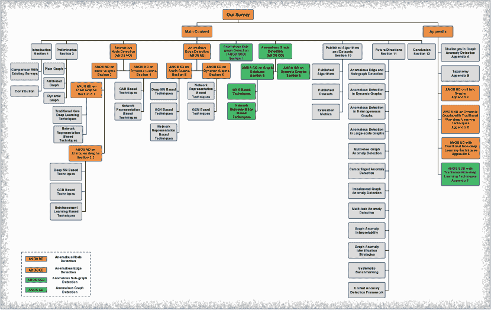

图 11：我们的调查分类法。

### C.1 传统非深度学习技术

传统技术，如统计模型、矩阵分解和 KNN，已广泛应用于提取异常节点的结构/属性模式，以便进行后续检测过程。

在这些方法中，基于矩阵分解（MF）的技术在捕捉拓扑结构和节点属性方面表现出强大的能力，实现了有希望的检测性能。早期尝试这种方法的是刘等人[liu2017accelerated]。他们旨在通过开发的模型 ALAD 来检测社区异常（定义在第 3 ‣ A Comprehensive Survey on Graph Anomaly Detection with Deep Learning")节）。如图 12(a)所示，通过非负矩阵分解，ALAD 结合了图结构$A$和节点属性$X$来推导社区结构$W$及其属性分布向量$H$。当矩阵被分解时，ALAD 根据节点与其所属社区之间的属性相似度来衡量每个节点的正常性。通过对节点正常性得分进行升序排序，前 k 个节点被识别为社区异常。

Li 等人[li2017radar]则从不同的角度使用残差分析来处理 ANOS ND。如假设所述，异常会导致更大的属性重构残差误差，因为它们不符合大多数的属性模式。因此，提出的模型 Radar 通过分解节点属性$X$来学习残差误差$R$，如图 12(b)所示。为了结合结构信息以获得这些误差，Radar 对学习的残差施加了明确的限制，使得直接相连的节点在$R$中具有相似的残差模式（称为同质性效应）。最终，$R$中具有较大范数的前 k 个节点被识别为异常。

尽管同类假设为利用结构信息提供了强有力的支持，但它可能并不总是成立。实际上，真实对象可能具有与其连接的邻居不同的属性，并且在特征空间中调整所有连接对象在每个维度上共享类似值并非易事。因此，Peng et al. [peng2018anomalous]指出存在结构上无关的节点属性，这些属性不符合同类假设。事实上，这些结构上无关的节点属性会对基于该假设开发的异常检测技术产生不利影响。为了解决这个问题，他们开发的模型 ANOMALOUS 使用 CUR [DBLP:journals/pnas/MahoneyD09]分解来选择与网络结构密切相关的属性，然后通过残差分析检测异常，方法类似于 Radar（如图 12(c)所示）。

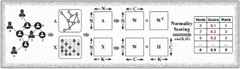

(a) ALAD [liu2017accelerated]的框架

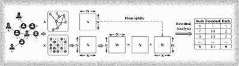

(b) Radar [li2017radar]的框架

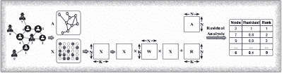

(c) ANOMALOUS [peng2018anomalous]的框架

图 12：基于矩阵分解的 ANOS ND 于属性图中的应用。这三种代表性的 MF 技术采用不同的分解策略来融合图的结构信息和节点属性。然后通过评分函数或残差分析来检测异常节点。

除了矩阵分解之外，线性回归模型也被设计用于在给定标记的训练数据时训练异常分类器。一个代表性的工作是 Wu et al. [wu2017adaptive]。他们的监督模型 SGASD 在利用社交网络结构、社交媒体中的内容信息和用户标签识别社交垃圾邮件者方面取得了令人鼓舞的结果。

这些非深度学习技术能够从图的拓扑结构和节点属性中捕获有价值的信息，但由于矩阵分解操作和回归模型的高计算成本，它们在实际网络（通常是大规模的）中的应用和普适性受到严格限制。

### C.2 基于 GAT 的技术

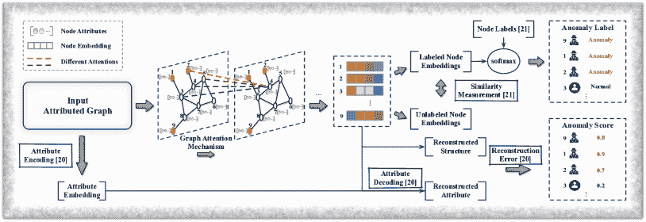

图 13：基于 GAT 的 ANOS ND 于属性图中的应用。给定输入图，这些技术采用图注意力神经网络来学习节点嵌入。无监督技术 AnomalyDAE [fan2020anomalydae]基于重建损失对每个节点进行评分，并将前 k 个节点标记为异常，而半监督技术 SemiGNN [SemiGNN]则训练分类器来预测节点标签。

尽管 GCN 为将图结构与节点属性结合提供了有效的解决方案（见第 3.2.2 ‣ A Comprehensive Survey on Graph Anomaly Detection with Deep Learning") 节），但其从邻域捕捉最相关信息的能力仍不尽如人意。这是因为简单的卷积操作将邻居信息平等地聚合到目标节点上。最近，图注意力机制（GAT）[velivckovic2017graph] 被用来替代传统的图卷积。例如，Fan 等人 [fan2020anomalydae] 应用了图注意力神经网络来编码网络结构信息（结构编码）。该方法 AnomalyDAE 还采用了一个独立的属性自编码器来嵌入节点属性（属性编码）。通过无监督的编码-解码过程，每个节点根据其对应的重构损失进行排名，引入最大损失的前 k 个节点被识别为异常。具体而言，属性解码过程利用通过结构和属性编码过程学习到的节点嵌入来重构节点属性，如图 13 所示，而图拓扑仅使用 GAT 输出的嵌入进行重构。为了获得更好的重构结果，AnomalyDAE 被训练以最小化整体损失函数，表示为：

|  | $\begin{split}\mathcal{L}_{AnomalyDAE}=&amp;\alpha&#124;&#124;(A-\hat{A})\odot\bm{\theta}&#124;&#124;_{2}^{2}+\\ &amp;(1-\alpha)&#124;&#124;(X-\hat{X})\odot\bm{\eta}&#124;&#124;_{2}^{2},\end{split}$ |  | (19) |
| --- | --- | --- | --- |

其中 $\alpha$ 是系数，$A$ 和 $X$ 是输入的邻接矩阵和属性矩阵，$\hat{A}$ 和 $\hat{X}$ 是重构矩阵。每个 $\theta_{i,j}\in\bm{\theta}$ 和 $\eta_{i,j}\in\bm{\eta}$ 为 1，如果对应的元素 $A_{ij}$ 和 $X_{ij}$ 等于 0，否则，它们的值由大于 1 的超参数定义。

另一个不错的工作是 SemiGNN [SemiGNN]，其中 Wang 等人提出了一种基于注意力的半监督图神经网络，用于检测在线支付平台中的欺诈用户。这项工作进一步探索了从各种来源（例如交易信息和用户资料）收集的用户信息，并将真实网络表示为多视图图。图中的每个视图被建模以反映用户之间的关系或用户属性之间的相关性。对于异常检测，SemiGNN 首先通过节点级注意力机制从每个视图 $v$ 生成节点嵌入 $h_{u}^{v}$，然后利用视图级注意力机制汇聚来自每个视图的节点嵌入，为每个节点生成统一表示 $a_{u}$。最后，通过 softmax 分类器预测每个节点的类别。实际上，Wang 等人设计了一个监督分类损失和一个无监督图重建损失，以通过充分利用标记和未标记数据来共同优化模型。分类损失可以表示为：

|  | $\mathcal{L}_{sup}=-\frac{1}{ | U_{L} | }\sum_{u\in U_{L}}\sum_{i=1}^{k}I(y_{u}=i)\log\frac{\exp(a_{u}\cdot\theta_{i})}{\sum_{j=1}^{k}\exp(a_{u}\cdot\theta_{j})},$ |  | (20) |
| --- | --- | --- | --- | --- | --- |

其中 $U_{L}$ 是标记用户集，其大小为 $|U_{L}|$，$I(\cdot)$ 是指示函数，$k$ 是待预测的标签数量（在大多数情况下，标签要么是异常，要么是非异常，$k=2$），$\theta$ 表示可训练变量。同时，无监督损失鼓励通过随机游走可以到达的标记节点（用户）获得相似的表示，反之亦然。这通过负采样（不能通过随机游走到达的未标记节点是负样本）来实现，损失可以表示为：

|  | $\begin{split}\mathcal{L}_{unsup}&=\sum_{u\in U}\sum_{v\in N_{u}\cup Neg_{u}}-\log(\sigma(a_{u}^{T}a_{v}))\\ &-3\cdot E_{q\sim P_{neg}(u)}\log(\sigma(a_{u}^{T}a_{q})),\end{split}$ |  | (21) |
| --- | --- | --- | --- |

其中 $U$ 表示用户集，$N_{u}$ 表示 $u$ 的邻居集，$Neg_{u}$ 代表负样本，$P$ 是采样分布，$\sigma(\cdot)$ 是 sigmoid 函数。总损失取它们的和，表示为：

|  | $\mathcal{L}_{SemiGNN}=\alpha\mathcal{L}_{sup}+(1-\alpha)\mathcal{L}_{unsup}+\lambda\mathcal{L}_{reg},$ |  | (22) |
| --- | --- | --- | --- |

其中 $\alpha$ 是一个平衡参数，$\mathcal{L}_{reg}$ 对所有可训练变量进行正则化。

### C.3 基于 GAN 的技术

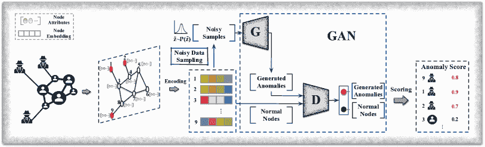

图 14：ANOS ND 在静态图上的 – 基于 GAN 的方法。生成器 G 通过从先验分布中采样噪声数据来生成潜在异常，以迷惑判别器。判别器 D 区分生成的异常和正常节点。评分函数随后根据 D 的输出量化每个节点的异常分数。

由于 GAN 在捕捉异常/常规数据分布方面效果显著（详见第 4.2 节），丁等人 [ding2020inductive] 在其开发的模型 AEGIS 中使用了 GAN，以提高对未见数据的异常可分性。如图 14 所示，该模型首先通过 GNN 从输入的属性图生成节点嵌入，然后训练生成器和判别器以识别异常。在第一阶段，异常节点和正常节点在嵌入空间中被映射到不同区域，以便 GAN 能够学习它们之间的边界。因此，丁等人构建了一个具有图差异层的自编码器网络，以捕捉每个节点与其 $k$-邻居之间的属性差异。这些差异信息使得异常得以轻松区分。嵌入的编码方式如下：

|  | $h_{i}^{l}=\sum_{k=1}^{K}\beta_{i}^{k}\sigma\left(W_{1}h_{i}^{l-1}+\sum_{j\in N_{k}(i)}\alpha_{ij}W_{2}\Delta_{ij}^{l-1}\right),$ |  | (23) |
| --- | --- | --- | --- |

其中 $h_{i}^{l}$ 是节点 $i$ 通过第 $l$ 层的嵌入特征，$\beta_{i}^{k}$ 是每个跳跃的注意力，$N_{k}(i)$ 是第 $k$ 阶邻居的集合，$\alpha_{ij}$ 是每个邻居的注意力，$\Delta_{ij}^{l-1}$ 是 $i$ 和 $j$ 之间的差异，$W_{1}$ 和 $W_{2}$ 是可训练的变量。自编码器被微调，直到节点属性可以通过学习到的嵌入最佳地重建，之后进行 GAN 训练。

在第二阶段，生成器根据先验分布 $p(\tilde{z})$ 生成异常，通过采样噪声数据，而判别器则努力区分正常节点的嵌入和生成异常的嵌入。训练过程被表述为生成器和判别器之间的最小-最大博弈，如下所示：

|  | $\min_{G}\max_{D}\mathbb{E}_{z\sim Z}[\log(D(z))]+\mathbb{E}_{\tilde{z}\sim\tilde{Z}}[\log(1-D(G(\tilde{z})))],$ |  | (24) |
| --- | --- | --- | --- |

其中 $z$ 是节点嵌入，$\tilde{z}$ 是生成的异常。训练完成后，AEGIS 直接为测试节点 $u$ 学习嵌入 $z_{u}$，并根据判别器的输出量化其异常分数，即该节点正常的可能性。评分函数的公式为：

|  | $Ascore(u)=1-D(z_{u}),$ |  | (25) |
| --- | --- | --- | --- |

并且前 k 个节点被视为异常。

### C.4 基于网络表示的技术

使用网络表示时，图形首先被编码到向量空间，然后才进行异常检测程序。如 3.1.2 ‣ A Comprehensive Survey on Graph Anomaly Detection with Deep Learning")节所述，许多关于属性图中 ANOS ND 的研究利用了深度网络表示技术。

例如，Zhang 等人[zhang2019robust]通过一个 3 层神经网络 REMAD 和残差分析检测到具有显著偏离其邻居的属性的异常节点。他们明确地将原始节点属性矩阵分为捕获异常特征的残差属性矩阵$R$和用于网络表示学习的结构相关属性矩阵$\hat{X}$。在表示学习过程中，这两个矩阵会被联合更新，从而鼓励附近节点具有相似的表示。具体而言，这些节点嵌入通过将邻居信息与每个节点的自身属性聚合生成，公式为：

|  | $h_{i}^{l}=\sigma\left(W^{l}\cdot\text{CONCAT}\{h_{i}^{l-1},h_{N_{i}}^{l}\}+b^{2}\right),$ |  | (26) |
| --- | --- | --- | --- |

其中$h_{i}^{l}$是第$l$层生成的节点$i$的表示（$h_{i}^{0}=\hat{X}$），$N_{i}$包含$i$的邻居，$\sigma()$是激活函数，$W^{l}$和$b$是可训练的变量。最后，残差矩阵$R$将包含每个节点的异常信息，前 k 个具有最大范数的节点被视为异常。

针对部分节点标签，Liang 等人[liang2018semi]开发了一种半监督表示模型 SEANO，融合了图结构、节点属性和标签信息。与 REMAD 类似，SEANO 也将邻居信息聚合到中心节点，节点表示通过嵌入层获得，公式为：

|  | $z_{i}=\lambda_{i}h^{l_{1}}(x_{i})+(1-\lambda_{i})h^{l_{1}}(\bar{x}_{N_{i}}),$ |  | (27) |
| --- | --- | --- | --- |

其中 $z_{i}$ 是 $i$ 的表示，$\lambda_{i}$ 是一个可训练的变量，用于识别 $i$ 自身属性 ($x_{i}$) 的权重，$\bar{x}_{N_{i}}$ 是节点 $i$ 的邻居表示的平均值，函数 $h^{k}(x_{i})=\phi(W^{k}h^{k-1}(x_{i})+b^{k})$ 将原始节点属性映射到低维向量。然后，一个监督组件将这些表示作为输入，通过 softmax 分类器预测节点标签，一个无监督组件则训练以重建节点上下文（节点序列）。每个节点的上下文不仅通过图上的随机游走生成，还来自属于同一类别的标记节点。训练完成后，SEANO 将 $\lambda_{i}$ 解释为节点 $i$ 的正常性评分，评分最高的前 k 个节点被归类为异常。

通过聚合邻居信息来学习节点表示已被证明对于从图结构和节点属性中捕获全面信息是有效的。但是，刘等人 [GraphConsis] 展示了这种方法可能会帮助异常值从正常节点中聚合特征，使它们看起来正常，从而导致次优的检测性能。他们确定了在应用聚合操作进行异常检测时需要考虑的三个具体问题：1）异常在网络中是稀有的对象。因此，直接聚合邻域信息会平滑异常与正常实例之间的差异，模糊它们之间的边界。2）直接连接的节点具有独特的特征，假设连接的节点共享相似的特征（作为特征聚合的基础）在这种情况下不再成立。3）真实对象也与其他对象形成多种类型的关系，这意味着不同类型关系的聚合结果将是独特的。针对这些问题，他们提出的方法 GraphConsis 遵循一种采样策略，以避免在聚合节点特征时出现潜在的异常邻居。该方法还采用了注意力机制，以不同的链接聚合邻居信息。因此，学习到的节点表示对异常值更具鲁棒性。GraphConsis 因此将其作为输入来训练一个分类器以预测标签。

Dou 等人提出的模型 [CARE-GNN] 进一步考虑了欺诈者的伪装行为，以提高检测性能。具体来说，这些伪装可以分为特征伪装或关系伪装。具体而言，异常节点要么调整其特征信息，要么与许多正常对象形成连接，以掩盖可疑信息。因此，直接使用聚合方法会忽视这些伪装，并平滑异常模式，从而消除异常节点和正常对象之间的区别。为缓解过度平滑，CARE-GNN 还采用了类似于 GraphConsis 的邻居采样策略，以过滤伪装异常，并探索用户之间形成的不同类型的关系。具体来说，在每种关系下，Dou 等人使用 MLP 通过节点特征预测节点标签，并根据 MLP 的输出测量每个节点与其邻居之间的相似性（$l1$ 距离）。然后，选择最相似的 top-k 个邻居进行特征聚合，CARE-GNN 通过组合在不同关系下学习的潜在表示来生成每个节点的表示。最后，使用这些表示训练分类器来预测节点标签。

如上所示，这些基于网络表示的技术的性能由其训练目标/损失函数决定。如果损失函数能够合理区分正常节点和异常节点，则检测性能可能会得到提升。受此启发，最新的工作 [GAL] 强调了异常感知损失函数的重要性。为了调整异常节点的边际，作者提出了一种新颖的损失函数来指导表示学习过程。具体来说，这种损失函数旨在找到异常节点和正常节点的边际之间的相对尺度。最终，使用异常感知损失引导的 GNN 生成的节点表示和节点标签训练 MLP 分类器。对于未见过的节点，分类器将根据其表示进行标记。

## 附录 D 传统非深度学习技术下动态图的 ANOS ND

为了检测动态平面图中的异常节点，传统的非深度学习技术主要依赖于对节点结构演变模式的建模。代表性工作如 [DBLP:conf/wsdm/RossiGNH13] 和 [wang2019detecting] 假设常规节点的演变行为（即与其他节点生成或移除连接）通常遵循稳定模式，这些变化对图结构的影响比异常要小。具体来说，在 [wang2019detecting]中，Wang 等人提出了一种新颖的链接预测方法，以适应大多数节点的演变模式，从而能够识别异常，因为这些异常的观察结果与预测结果显著冲突。他们进一步通过评估对图邻接矩阵施加的扰动来量化异常行为的影响。

其他传统工作还利用节点/边属性及其变化。例如，Teng 等人 [teng2017anomaly] 将节点和边属性作为描述每个节点的两个不同视角。通过将这两种信息编码到一个共享的潜在空间中，他们提出的模型从历史记录中学习了一个超球体。当给定现有节点的新观察时，该模型根据节点与超球体中心的距离来区分良性和异常。超球体外的点被识别为异常。

与嵌入技术不同，Nguyen 等人 [tam2019anomaly] 提出了一种非参数方法来检测社交平台上的异常用户、推文、标签和链接。具体来说，他们将社交平台建模为异构社交图，从而有效捕捉用户、推文、标签和链接之间的丰富关系。通过对特征进行广泛分析，如用户注册信息、推文中的关键词、链接的语言风格和标签的流行度分数，根据其偏离的特征来发现异常对象。这项工作还利用了个体对象之间的关系以及检测到的异常，检测异常对象的组。

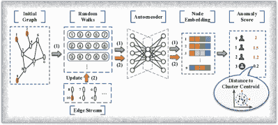

图 15：NetWalk 框架 [yu2018netwalk]。输入的动态图被建模为一个带有入边流的初始图。给定初始图后，通过在图上进行随机游走生成节点序列的主干，并且深度自编码器将每个节点编码到嵌入空间中，按照过程（1）。节点序列和节点嵌入根据入边流进行更新，遵循过程（2）。最后，NetWalk 根据每个节点在嵌入空间中与簇中心的距离分配异常分数。

## 附录 E ANOS ED 与传统非深度学习技术

传统的非深度学习方法主要关注使用时间信号（例如图结构的变化），并应用特别设计的统计度量来检测动态图上的异常边 [ranshous2016scalable, aggarwal2011outlier]。例如，Eswaran 和 Faloutsos [eswaran2018sedanspot] 将动态图建模为边的流，并利用图结构以及结构演变模式。他们识别出两个异常边的标志：1) 连接图中原本不连通的区域；2) 突发出现的连接。对于传入边，他们的模型为每条边分配异常分数，得分最高的前 k 条边被视为异常。另一项最近的研究由 Chang 等人 [chang2021f] 提出了一个新颖的频率分解算法，旨在根据观察到的频率来发现异常传入边。该方法融合了概率模型和矩阵分解的优点，以捕捉节点的时间和结构变化，并且据报道，它只需要恒定的内存来处理边流。

## 附录 F ANOS SGD 与传统非深度学习技术

### F.1 静态图上的 ANOS SGD

ANOS SGD 在静态图中的一个动机是异常子图通常表现出显著不同的属性分布。因此，传统的非深度学习技术，如 gAnomaly [li2014probabilistic]、AMEN [perozzi2016scalable] 和 SLICENDICE [nilforoshan2019slicendice]，专注于建模属性分布和测量子图的正常性。另一种研究方向是图残差分析。现实世界网络中包含的丰富属性信息提供了对象之间形成关系的洞察。因此，若干研究探测异常子图的动机是测量预期结构与观察到的结构之间的残差 [miller2013efficient]。

### F.2 动态图上的 ANOS SGD

为 ANOS SGD 设计度量标准一直是许多传统研究的主题。例如，Chen 等人 [DBLP:journals/jiis/ChenHS12] 介绍了六种用于识别基于社区的异常的度量标准，即：扩展社区、缩小社区、合并社区、分裂社区、新生社区和消失社区。虽然这些手工制作的特征或统计模式适合某些特定类型的现有异常，但它们检测未知和伪装异常的能力有限，直接应用可能会引入较高的假阴性率，这对于金融安全等应用并不理想。其他工作，如 Eswaran 等人提出的 SPOTLIGHT [eswaran2018spotlight] 和 Liu 等人提出的另一项研究 [liu2008spotting]，探索了动态图中的突发变化，并识别了与这些变化相关的异常子图。

受社交垃圾邮件和欺诈群体通常在在线社交网络中形成密集时间子图的现象的启发，许多工作，包括 [Densealert, mongiovi2013netspot]，使用手动提取的特征来发现与图的其余部分显著不同的异常密集子图。

除了这些研究之外，大量的工作讨论了各种图扫描统计量在异常子图检测中的应用，例如 Kulldorff 统计量 [kulldorff1997spatial]、泊松统计量 [neill2005detection]、升高均值扫描统计量 [sharpnack2013near] 和 Berk-Jones 统计量 [berk1979goodness]。具体来说，Shao 等人 [dGraphScan] 提出了一个非参数方法来检测动态图中异常子图，其中网络结构保持不变，但节点属性随时间变化。这种方法通过测量每个子图的异常分数来评估其包含的节点的 p 值。分数更高的子图表示更异常。另一项工作，GBGP [GBGP]，则采用升高均值扫描统计量来识别可能形成异常子图的节点，并检测遵循预定义不规则结构的异常群体。
