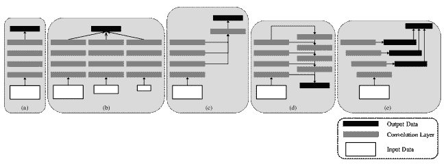

<!--yml

类别：未分类

日期：2024-09-06 19:54:06

-->

# [2106.07550] 注意机制与深度学习在机器视觉中的应用：最新研究概述

> 来源：[`ar5iv.labs.arxiv.org/html/2106.07550`](https://ar5iv.labs.arxiv.org/html/2106.07550)

∎

¹¹机构：Abdul Mueed Hafiz ²²机构：电子与通信工程系，克什米尔大学（扎库拉校区），斯利那加，J&K，190006 印度

电话：+91-7006474254

²²电子邮件：mueedhafiz@uok.edu.in ³³机构：Shabir Ahmad Parah ⁴⁴机构：电子与仪器技术系，克什米尔大学（主校区），斯利那加，J&K，190006 印度 ⁵⁵机构：Rouf Ul Alam Bhat ⁶⁶机构：电子与通信工程系，克什米尔大学（扎库拉校区），斯利那加，J&K，190006 印度

# 注意机制与深度学习在机器视觉中的应用：最新研究概述

Abdul Mueed Hafiz    Shabir Ahmad Parah    Rouf Ul Alam Bhat（收到：日期 / 接受：日期）

###### 摘要

随着基于自然启发的最先进纯注意力模型（即变换器）的出现，以及它们在自然语言处理（NLP）中的成功，它们向机器视觉（MV）任务的扩展是不可避免的并且非常必要。随后，视觉变换器（ViTs）被引入，这对现有的深度学习机器视觉技术提出了相当大的挑战。然而，像变换器这样的纯注意力模型/架构需要大量的数据、大的训练时间和大量的计算资源。一些近期的工作表明，这两个不同领域的结合可以构建具有这两个领域优点的系统。因此，本文介绍了这一最新研究领域的概述，希望能帮助读者获取关于这一有趣且潜力巨大的研究领域的有用信息。文章首先对注意机制进行了温和的介绍，然后讨论了流行的基于注意力的深度架构。接着，讨论了注意机制与深度学习在机器视觉（MV）中的交集的主要类别。之后，讨论了论文范围内的主要算法、问题和趋势。

###### 关键词：

注意 视觉 变换器 CNN 深度学习 机器视觉

## 1 引言

最近，像变压器这样的基于注意力的机制 tv_1 已成功应用于各种机器视觉任务，通过将它们作为视觉变压器（ViTs） tv_11 进行图像识别 tv_12、目标检测 tv_13；tv_14、分割 tv_15、图像超分辨率 tv_16、视频理解 tv_17；tv_18、图像生成 tv_19、文本-图像合成 tv_20 和视觉问答 tv_21；tv_22 等，取得了与既有 CNN 模型 tv 相当甚至更好的结果。然而，变压器存在各种问题，例如“数据需求量大”和训练时间长。另一方面，基于深度学习 dl_main；dl_book；dl_review 的卷积神经网络（CNNs） cnn1；cnn2 则没有如此显著的问题。因此，出现了一些技术，这些技术位于纯注意力模型和纯 CNN 之间的交集，结合了两者的最佳特性。机器视觉（MV）也从这两种重要视觉模型，即 ViTs 和 CNNs 的融合中受益。在本节中，我们将简要讨论 ViTs 和变压器的一般优势，即注意力及其类型 tv，以便读者了解新型机器视觉（MV）模型，即 ViTs。

### 1.1 自注意力

对于给定的元素序列，自注意力过程提供了一个可测量的估计，以确定一个元素与其他元素的相关性。例如，哪些元素如单词可以在句子这样的序列中组合在一起。自注意力过程是像变压器这样的基于注意力的模型的重要单元，它建模了序列中所有元素之间的依赖关系，用于形式化/结构化预测应用。简单来说，自注意力模型层通过从输入向量/序列中全局地结合信息，为结构/序列中的每个元素分配一个值。

通过 $\textbf{X}\in\mathbb{R}^{n\times d}$ 表示 n 个实体的序列 (x[1], x[2], $\ldots$ x[n])，其中 d 是表示每个元素依赖性的维度。自注意力的目的是捕捉所有 n 个元素之间的依赖关系，在对每个元素进行整体上下文知识编码后。这一过程通过定义 3 个权重矩阵来实现，这些矩阵需要学习以进行变换：查询 $\left(\textbf{W}^{Q}\in\mathbb{R}^{n\times d_{q}}\right)$、键 $\left(\textbf{W}^{K}\in\mathbb{R}^{n\times d_{k}}\right)$ 和值 $\left(\textbf{W}^{V}\in\mathbb{R}^{n\times d_{v}}\right)$。首先，将输入向量 X 投影到 3 个权重矩阵上，以获得 $\textbf{Q}=\textbf{XW}^{Q}$、$\textbf{K}=\textbf{XW}^{K}$ 和 $\textbf{V}=\textbf{XW}^{V}$。在自注意力层中，输出 $\textbf{Z}\in\mathbb{R}^{n\times d_{v}}$ 随后表示为，

|  | $Z=\textbf{softmax}\left(\frac{\textbf{QK}^{T}}{\sqrt[]{d_{q}}}\right)\textbf{V}.$ |  | (1) |
| --- | --- | --- | --- |

对于向量/序列中的某个元素，自注意力机制基本上是计算查询与所有键的点积，这一乘积随后通过 softmax 函数进行归一化，以获得注意力图得分。现在每个元素都假设为向量/序列中所有元素的加权总和，其中所有权重都等于注意力图得分。

### 1.2 掩码自注意力

{justify}

自注意力层适用于每个元素/实体。对于已被训练用于预测向量/序列中下一个实体的变换器 tv_1，解码器内部的自注意力单元会被掩码以防止它们对未来的实体进行应用。这一技术通过与掩码 $\textbf{M}\in\mathbb{R}^{n\times n}$ 进行逐元素乘积计算来实现，其中 M 是上三角矩阵。因此，掩码自注意力的计算方式为，

|  | $\textbf{softmax}\left(\frac{\textbf{QK}^{T}}{\sqrt[]{d_{q}}}{\circ}~{}\textbf{M}\right),$ |  | (2) |
| --- | --- | --- | --- |

其中 ${\circ}$ 是哈达玛积。在向量/序列中的某个元素进行预测时，未来元素的注意力图得分在掩码自注意力中被设置为 0。

### 1.3 多头注意力

{justify}

为了封装向量/序列中各个元素/实体之间的复杂依赖关系，多头注意力过程包含了原始变换器架构 tv_1 中的多个自注意力单元，h = 8。每个单元包含其自身的可学习权重矩阵 $\left\{\textbf{W}^{Q_{i}},\textbf{W}^{K_{i}},\textbf{W}^{V_{i}}\right\}$，其中 i = 0, 1, 2, … (h - 1)。对于特定输入 X，多头注意力过程中 h 个自注意力单元的输出被组合成一个矩阵 $[\textbf{Z}\textsubscript{0},\textbf{Z}\textsubscript{1},$ …$\textbf{Z}\textsubscript{h$-$ 1}]\in\mathbb{R}^{n\times h\times d_{v}}$，随后被投影到另一个权重矩阵 W $\in$ $\mathbb{R}^{h\cdot d_{v}\times d}.$

自注意力过程与卷积操作的显著区别在于，每个权重是动态计算的，而卷积操作中的静态权重在面对各种输入时保持不变。此外，自注意力过程对不同输入数量的排列和变化是不可变的，从而在不规则性上的操作更为方便，而卷积操作需要一个网格数组。有关这些概念的说明请参见 1。

图 1: 各种注意力机制的示意图 tv

## 2 注意力基于的深度学习架构

在本节中，讨论了深度学习模型中一些常见的深度注意力模型架构 DeepVisualAttentionPred，并在 2 中展示了图示。当前流行的深度基于注意力的模型架构被分类为以下重要类别：

1.  1.

    单通道模型

1.  2.

    多通道模型处理多尺度数据

1.  3.

    跳层模型

1.  4.

    自下而上/自上而下模型

1.  5.

    具有多尺度显著性单网络的跳层模型

图 2: (a)-(c) 描述了在注意力预测中使用的 3 种常见深度学习配置：(a) 单通道模型配置，(b) 具有多尺度输入数据的多通道模型配置，以及 (c) 跳层模型配置。 (d) 用于基于注意力的对象分割和实例分割的自下而上/自上而下模型配置。 (e) 使用多尺度注意力信息的修改跳层模型。 DeepVisualAttentionPred

### 2.1 单通道模型

如图 2(a)所示，单通道模型是各种基于 CNN 的注意力模型的主要配置，许多基于注意力的工作也在使用 a51 ; a14 ; a16 ; a15 。几乎所有其他类型的 CNN 配置都可以被视为单通道模型的变体。已经证明，各级别和尺度上的注意力提示对注意力至关重要 a28 。在基于注意力的模型中使用 CNN 的多尺度特征是显而易见的选择。在下一种单通道模型，即多通道模型中，沿着这条线进行了改变。

### 2.2 多通道模型

这种模型的一些实现包括 a52 ; a57 ; a32 ; a4 。多通道模型的基本概念如图 2(b)所示。这种类型的模型通过训练多个模型以处理多尺度数据输入来学习多尺度注意力信息。多个模型通道是并行的，可以具有不同尺度的各种配置。如 a58 所示，输入数据通过多个通道同时输入，然后将不同通道的特征融合并输入统一的输出层，以生成最终的注意力图。在多通道模型中，我们观察到多尺度学习发生在各个模型之外。在下一种配置中讨论的多尺度学习发生在模型内部，这通过结合来自不同卷积层层次的特征图来实现。

### 2.3 跳层模型

如图 2(c)所示，常见的跳层模型被用于 a48 ; a50 ; a59 。跳层模型不是从多个尺度图像的多个并行通道中学习，而是在一个主要通道内部学习多尺度特征图。从具有逐渐增大的接收场和下采样比率的各个层中学习到多尺度输出。接下来，这些输出被融合以输出最终的注意力图。

### 2.4 自底向上/自顶向下模型

这种相对较新的模型配置称为自顶向下/自底向上的模型，已在基于注意力的物体分割 a60 和实例分割 a61 ; hafizmmir ; mmir_review 中使用。该模型的架构如图 2(d)所示，其中分割特征图首先通过常见的自底向上的卷积技术获得，然后通过自顶向下的细化将数据从深层到浅层融合到掩码中。这种配置的主要动机是生成高保真度的分割掩码，因为深度 CNN 层会丢失细节图像。自底向上/自顶向下模型类似于一种跳层模型，因为不同层之间是相互连接的。

### 2.5 带有多尺度显著性单网络的跳层模型

该模型 DeepVisualAttentionPred 如图 2(e) 所示，受到 a58 中模型和 a22 中深度监督模型的启发。该模型使用来自各种层的多尺度和多层次的基于注意力的信息，并通过深度监督技术进行学习。该模型与之前模型的重要区别在于，前者提供了对隐藏层的直接监督，而不是仅对最后输出层进行监督并将监督输出传播回前面的层。它利用了跳过层模型的优点（图 2(c)），该模型不会从具有多尺度输入数据的多个模型通道中学习。此外，它比多通道模型（图 2(b)）和自下而上/自上而下模型（图 2(d)）更轻量。研究发现，自下而上/自上而下模型在训练过程中面临困难，而深度监督模型则显示出高效的训练效果。

在下一节中，我们将讨论注意力机制和深度学习在机器视觉中的各种技术的分类，并详细讨论每个类别。

## 3 注意力与深度学习在机器视觉中的应用：广泛类别

在本节中，我们将按类别讨论应用于机器视觉的各种注意力机制和深度学习技术。三大类是：

1.  1.

    基于注意力的 CNNs

1.  2.

    CNN 变换器管道

1.  3.

    混合变换器

这些类别将在以下小节中逐一讨论。首先，我们将在以下小节中讨论基于注意力的 CNNs。

### 3.1 基于注意力的 CNNs

最近，注意力机制已被应用于深度学习的机器视觉应用中，例如对象检测 ac1_3 ; ac1_31 ; ac1_28 ，图像描述 ac1_35 ; ac1_39 ; ac1_2 和动作识别 ac1_30 。注意力机制的核心思想是在卷积神经网络（CNNs）中定位特征图的最显著部分，以便为机器视觉应用去除冗余。通常，通过使用注意力图将注意力嵌入到 CNN 中。特别是，ac1_31 ; ac1_28 ; ac1_35 ; ac1_30 中基于注意力的图以自学习的方式产生，具备其他信息并对注意力图进行弱监督。文献中引用的其他技术 ac1_39 ; ac1_37 通过利用人类注意力数据或通过关注兴趣区域（ROIs）来指导 CNNs。接下来的小节中，我们将讨论一些在机器视觉的一般领域中值得注意的技术，这些技术使用基于注意力的 CNNs，例如在图像分类/检索、对象检测、手语识别、去噪和面部表情识别中的应用。

#### 3.1.1 图像分类/检索与目标检测

已经明确指出，注意力对人类感知有重要作用 ac2_2 ; ac2_24 ; ac2_25 。人类视觉系统的一个重要特点是，它不会一次性处理整个视觉场景。而是，通过一系列局部的观察，选择性地关注各个部分，以更好地捕捉视觉结构 ac2_26 。最近，已有几项尝试 ac2_27 ; ac2_28 ，致力于将注意力处理机制整合到大规模分类任务的 CNN 中，以提高分类准确性。Wang 等人 ac2_27 提出了一个具有编码器-解码器风格注意力机制单元的残差注意力网络。通过特征的精炼，该网络不仅提供了良好的准确性，还显示出对噪声的鲁棒性。该过程在不直接计算三维注意力图的情况下被分解，以便它独立地学习通道注意力和空间注意力。用于 3D 特征的独特注意力图生成技术计算开销小且参数受限，因此可以作为插件单元用于现有的 CNN 网络。在他们的研究 ac2_28 中，作者引入了一个紧凑单元，用于利用各通道之间的关系。在这个‘压缩与激励’单元中，作者使用了特征图的全局平均池化来计算每个通道的注意力。然而，ac2 的作者表明，ac2_28 中使用的特征对于推断精细通道注意力来说是不够的。因此，ac2 的作者还使用了最大池化的特征图。ac2 中提到，ac2_28 中缺失的空间注意力对决定关注区域有重要贡献，正如 ac2_29 所示。因此，ac2 的作者提出了卷积块注意力模块（CBAM），用于同时利用空间和通道注意力，通过强大的网络验证了同时使用这两种机制优于仅使用通道注意力机制 ac2_28 。在 ImageNet-1K 数据集 ac2_imagenet 上进行图像分类时使用了该模块。ac2 的作者还通过在两个流行的数据集 MS-COCO ac2_coco 和 VOC ac2_voc 中进行实验，证明了他们的模块在目标检测任务中的有效性。他们通过将模块插入到预先存在的单次目标检测器 ac2_30 中，在 VOC-2007 测试集中取得了令人印象深刻的结果。3 显示了 CBAM 对于通道和空间注意力过程的应用。这里我们尝试简要解释 CBAM 中的注意力机制。

图 3：CBAM ac2 中两个注意力子模块的示意图。如图所示，通道-wise 子模块利用特征输出的最大池化以及特征输出的平均池化，借助一个共享网络。另一方面，空间-wise 子模块通过沿通道轴对两个相同的特征输出进行池化，然后将其传递到卷积层。 ac2

{justify}

对于给定的输入特征图 $\textbf{F}\in\mathbb{R}^{C\times H\times W}$，CBAM ac2 生成一维的注意力图 $\textbf{M}_{c}\in\mathbb{R}^{C\times 1\times 1}$ 和二维的空间注意力图 $\textbf{M}_{s}\in\mathbb{R}^{1\times H\times W}$，如图 3 所示。该注意力机制操作可以表示为：

|  | $\textbf{F}^{{}^{\prime}}=\textbf{M}_{c}\left(\textbf{F}\right)\bigotimes\textbf{F},$ |  | (3) |
| --- | --- | --- | --- |
|  | $\textbf{F}^{{}^{\prime\prime}}=\textbf{M}_{s}\left(\textbf{F}^{\prime}\right)\bigotimes\textbf{F}^{\prime}.$ |  | (4) |

{justify}

其中 $\bigotimes$ 是元素的乘法运算符。{justify} 通道注意力的数学计算如下：

|  | $\textbf{M}_{c}\left(\textbf{F}\right)=\sigma\left(MLP\left(AvgPool\left(\textbf{F}\right)\right)+MLP\left(MaxPool\left(\textbf{F}\right)\right)\right)\\ =\sigma\left(\textbf{W}_{1}\left(\textbf{W}_{0}\left(\textbf{F}_{\mathrm{avg}}^{c}\right)\right)+\textbf{W}_{1}\left(\textbf{W}_{0}\left(\textbf{F}_{\mathrm{\max}}^{c}\right)\right)\right)$ |  | (5) |
| --- | --- | --- | --- |

{justify}

其中 $\sigma$ 是 sigmoid 函数，$\textbf{W}_{0}\in\mathbb{R}^{C/r\times C}$ 和 $\textbf{W}_{1}\in\mathbb{R}^{C\times C/r}$。多层感知器（MLP）权重 $\textbf{W}_{0}$ 和 $\textbf{W}_{1}$ 对两个输入是共享的。$\textbf{W}_{0}~{}$ 在 ReLU 激活函数之后。

|  | $\textbf{M}_{s}\left(\textbf{F}\right)=\sigma\left(f^{7\times 7}\left(\left[AvgPool\left(\textbf{F}\right);MaxPool\left(\textbf{F}\right)\right]\right)\right)=\sigma\left(f^{7\times 7}\left(\left[\textbf{F}_{\mathrm{avg}}^{s};\textbf{F}_{\mathrm{\max}}^{s}\right]\right)\right)$ |  | (6) |
| --- | --- | --- | --- |

{justify}

其中 $\sigma$ 是 sigmoid 函数，而 $f^{7\times 7}$ 是一个 $7\times 7$ 滤波器的卷积算子。ac2 的作者已将他们的技术应用于 ImageNet-1K 数据集上的图像分类/检索和 MS-COCO 及 VOC2007 数据集上的目标检测。使用他们的 CBAM 集成网络获得的结果超越了其他同时期的网络。他们还通过 grad-CAM ac2_18 可视化展示了他们技术相对于其他技术的优越性，所用图像来自 ImageNet 验证集。4 也显示了这一点。

图 4: 使用 Grad-CAM ac2_18 的热力图可视化。这些可视化展示了 CBAM 适配的 CNN，如 {ResNet50 + CBAM}、基线 {ResNet50} ac2_5 和 Squeeze 与激励方法 ac2_28（SE）集成的架构 {ResNet50 + SE}。Grad-CAM 可视化是通过最后卷积层输出的特征图获得的。GT 标签显示在每张图像的顶部，其中 P 是每个网络对于 GT 类别的 softmax 得分。（经 ac2 出版商许可再现）

在使用基于注意力的 CNN 进行图像分类/检索领域中，ac1 的作者提供了一个新颖且相关的工作，用于从医学图像分析中检测青光眼 hafizmedical。他们称其网络为用于青光眼检测的注意力基 CNN，简称 AG-CNN。该网络包括一个新颖的注意力预测子网以及其他子网。他们通过基于以下三个独立损失函数的监督实现了“端到端”训练：i) 注意力预测，ii) 特征可视化，iii) 青光眼分类。基于 ac1_16 的作者的工作，他们使用 Kullback Leibler (KL) 散度函数作为自然启发的注意力损失 $Loss_{a}$ 的等效函数，计算公式为：

|  | $\mathrm{Loss}_{a}=\frac{1}{I\cdot J}\sum_{i=1}^{I}\sum_{j=1}^{J}A_{ij}\log\left(\frac{A_{ij}}{\hat{A}_{ij}}\right)$ |  | (7) |
| --- | --- | --- | --- |

{justify}

其中 $\hat{A}$（其元素 $\hat{A}_{ij}\in\left[0,1\right]$）是注意力图，I 和 J 分别是注意力图的长度和宽度。通过融入这些新特性，ac1 的作者展示了他们提出的 AG-CNN 技术显著提升了青光眼检测的最前沿水平。

对于使用基于注意力的 CNNs 进行图像分类/检索的更多有趣技术，读者可以参考该领域一些近期的杰出工作，如 pb；hic 等。

#### 3.1.2 手语识别

手语识别（SLR）是计算机视觉相关多媒体领域中的一个有价值且具有挑战性的研究领域。传统上，SLR 依赖于手工制作的特征，其性能较低。在他们的创新工作中，sl 的作者提议使用基于注意力的 3D CNNs 进行 SLR。他们的模型有两个优点。首先，它从视频帧中学习空间和时间特征，而无需任何预处理或先验知识。注意力机制帮助模型选择线索。在捕获特征的训练过程中，模型使用空间注意力来集中关注感兴趣区域（ROIs）。之后，使用时间注意力来选择重要的运动，以确定动作类别。他们的方法在一个自制的大型中文 SL 数据集（拥有 500 个类别）和 ChaLearn14 基准 sl_6 上进行了基准测试。作者展示了他们的技术在所用数据集上优于其他最先进的技术。我们将在下面更详细地讨论这一有趣的技术。{justify} 空间注意力图的计算方法如下。他们使用基于注意力的掩码来表示每个图像像素的值。令 $x_{i,k}\in\mathbb{R}^{2}$ 表示图像 i 中视点 k 的位置，注意力图 $M_{i,k}\in\mathbb{R}^{w\times h}$ 中位置 $p\in\mathbb{R}^{2}$ 的值由下式给出：

|  | $M_{i,k}\left(p\right)=\exp\left(-\frac{\&#124;p-x_{i,k}\&#124;_{2}^{2}}{\sigma}\right),$ |  | (8) |
| --- | --- | --- | --- |

{justify}

其中 $\sigma$ 是实验选择的，w 和 h 是图像的维度。注意力掩码通过聚合先前获得的不同视点的峰值形成，利用了最大操作符，

|  | $M_{i}\left(p\right)=\mathop{\max}_{k}M_{i,k}\left(p\right).$ |  | (9) |
| --- | --- | --- | --- |

{justify}

因此，第 i^(th) 个注意力加权图像 I[i] 是如下所示的逐元素乘积，

|  | $I_{i}\left(p\right)=I_{i}\left(p\right)\times M_{i}\left(p\right).$ |  | (10) |
| --- | --- | --- | --- |

{justify}

基于上述获得的视频特征，使用基于支持向量机（SVM）的分类器 sl_18，通过将其与另一个时间注意力机制的管道结合来进行分类。与 sl_43 中的做法相同，特征被输入到一个双向 LSTM 中，以生成一个注意力向量 $s\in\mathbb{R}^{8192}$ 。特征还被输入到一个单层 MLP 中，该 MLP 生成一个隐藏向量 $H=\{h_{1},h_{2},\ldots,h_{n}\}$ ，其中 $h_{i}\in\mathbb{R}^{8192}$ 。该向量是通过注意力池化整合剪辑特征序列。这种技术通过确定每个剪辑特征与注意力向量 s 的关系来衡量每个剪辑特征的值。最后，他们结合视频和轨迹特征，并使用基于 softmax 的分类。尽管这是一种有效的技术，作者仍然承认该工作专注于孤立的 SLR。对于处理连续 SLR，即将剪辑转换为句子的情况，RNN 方法将给出结果，正如上述工作作者所承认的，他们希望在这方面进行研究。

#### 3.1.3 图像去噪

图像去噪是一个低层次的机器视觉（MV）任务。深度卷积神经网络（CNN）在低层次 MV 中非常受欢迎。通过使用非常深的网络，研究已经在这一领域提高了性能。然而，随着网络深度的增加，浅层对深层的影响会减小。因此，ac4 的作者提出了一种基于注意力机制的去噪 CNN，称为 ADNet，具有一个注意力块（AB）。AB 用于细致提取隐藏在复杂背景中的噪声数据。该技术已经被 ac4 的作者证明对于去噪具有复杂噪声的图像非常有效，例如真实噪声引起的图像。各种实验表明，ADNet 在三项任务中表现非常出色，即合成图像的去噪、真实噪声图像的去噪以及盲去噪。在这里，AB 通过使用当前网络部分来指导前一网络部分，以便学习噪声的性质。这对于具有噪声的未知图像，即真实噪声图像和盲去噪尤为有用。AB 使用两个连续步骤来实现其注意力机制。首先，对第 17 层 CNN 输出的结果进行 1x1 卷积，以将特征图压缩成一个权重向量，用于调整前一部分。接下来，利用获得的权重乘以第 16 层 CNN 的特征图输出，以提取更精细的噪声特征图。需要注意的是，受到这一新颖努力的启发，可以使用更复杂的注意力机制，并结合更专门的“去噪”深度 CNN。ADNet 的代码可在以下网址获取：https://github.com/hellloxiaotian/ADNet。

#### 3.1.4 面部表情识别

机器视觉（MV）中的一个热门话题是面部表情识别（FER），它可以用于各种 MV 领域，如人机交互（HCI）、情感计算等。在他们的工作中，ac31 作者提出了一种端到端的 CNN 网络，具有用于自动 FER 的注意机制。它包含 4 个主要部分，即特征提取单元、注意单元、重建单元和分类单元。引入的注意机制指导 CNN 更多地关注从前一个单元提取的重要特征。作者结合了他们的 LBP 特征和注意机制，以增强注意机制以获得更好的性能。他们将其技术应用于自己的数据集和其他 4 个数据集，即 JAFFE ac31_13、CK+ ac31_11、FER2013 ac31_39 和 Oulu-CASIA ac31_25，并通过实验表明他们的技术优于其他现有技术。该工作中使用的注意机制在逐像素 MV 任务中被证明是有价值的。他们的注意单元由两个分支组成。第一个用于获取特征图 F[p]，第二个结合 LBP 特征图以获取注意图 F[m]。下一步，对注意图 F[m]和特征图 F[p]进行逐元素乘法，以获得最终特征图 F[m]，其计算公式为：

|  | $F_{final}=F_{p}F_{m}$ |  | (11) |
| --- | --- | --- | --- |

{justify}

假设第二个分支的前一层输入为 f[m]，则注意图 F[m]为：

|  | $F_{m}=sigmoid\left(Wf_{m}+b\right)$ |  | (12) |
| --- | --- | --- | --- |

其中 w 和 b 分别表示卷积层的权重和偏置。该技术适用于 2D 图像，其架构需要修改以扩展到视频、3D 面部数据、深度图像数据。作者还表示他们正在考虑使用更稳健和高效的机器学习（ML）技术来增强该架构。

在 ac32 中，作者指出，尽管传统的面部表情识别（FER）系统在分析受限姿势时几乎是完美的，但对于现实世界中常见的部分遮挡姿势却表现不佳。因此，他们提出了一种基于注意力的卷积神经网络（ACNN），用于感知面部遮挡部位，重点关注高度具有区分性的未遮挡部分。他们的模型是端到端学习的。对于不同的兴趣区域（ROIs），他们引入了两种类型的 ACNN，即基于补丁的类型和全局-局部类型。第一种类型仅在面部区域的局部补丁上使用注意力。第二种类型将局部特征（在补丁级别）与全局特征（在图像级别）结合起来。评估是在他们自己的面部表情数据集上进行的，该数据集具有自然场景中的遮挡，还有两个最大的自然场景面部表情数据集，即 RAF-DB ac32_4 和 AffectNet ac32_5 以及其他多个数据集。他们通过实验证明，使用 ACNN 可以提高 FER 性能，其中 ACNN 将注意力从遮挡的面部区域转移到其他未遮挡的区域。他们还展示了他们的 ACNN 在多个重要的 FER 数据集上超越了其他最先进的技术。然而，该技术依赖于地标。作者打算解决这个问题，因为他们认为 ACNN 依赖于面部地标定位单元。因此，需要使 ACNN 在没有地标的情况下更具鲁棒性，以生成注意力图，这也是一个开放的研究领域。

在下一小节中，我们将转向机器视觉中注意力机制和深度学习的另一重要技术类别，即 CNN transformer 流水线。

### 3.2 CNN transformer 流水线

在这一小节中，我们讨论了机器视觉中注意力和深度学习的另一重要技术类别，即 CNN transformer 流水线。在这里，CNN 用于将特征图输入到 transformer 中，并作为 transformer 的“教师”，正如将要讨论的那样。下面讨论了在机器视觉（MV）各个领域下的这一类别的显著工作。

#### 3.2.1 图像识别

变换器本质上是“数据饥饿型”的。例如，大规模数据集如 ImageNet ac2_imagenet 并不足以从零开始训练一个视觉变换器。为了解决这个问题，tv_12 的工作提出了从教师 CNN 中提炼信息到学生变换器中，从而仅在 ImageNet 上训练变换器而无需额外数据。数据高效的图像变换器（DeiT） tv_12 是在没有使用像 JFT tv_39 这样的规模数据集的大规模图像分类/检索中的首例。DeiT 表明，变换器（需要大量训练数据）也可以在中等规模的数据集上（例如，1.2M 图像，与 ViT tv_11 使用的 100M+ 图像相比）成功训练，并且训练时间较短。DeiT 的一个重要贡献是其新颖的原生蒸馏技术 tv_78，它使用教师 CNN（RegNetY-16GF tv_79）的输出供变换器进行训练。来自教师 CNN 的特征图输出帮助变换器（DeiT）有效地在输入数据图像中找到重要的表示。DeiT 学到的表示与顶级 CNN，如 EfficientNet tv_80，一样优秀，并且在各种下游图像识别任务中也能高效应用。

#### 3.2.2 目标检测

类似于图像分类/检索，变换器也可以应用于从 CNNs 获得的图像特征图集，以实现精确的目标检测，其中涉及对目标边界框（BBoxes）及其对应类别标签的预测。在 DETR tv_13 中，给定从 CNN 主干网络获得的空间特征，变换器编码器沿单一轴将空间轴展平，如 5 所示，这是一种从 3D 到 1D 的特征图展平。得到的特征序列为$(d\times n)$，其中$d=$特征维度，$n=h\times w$（$[h,w]$为特征图的大小）。接下来，1D 展平的特征由多头自注意力单元进行编码和解码，如 tv_1 的工作所述。

图 5：DETR 流水线概述。 tv_13

#### 3.2.3 多模态机器视觉任务

这一类别中的机器视觉（MV）任务包括视觉-语言任务，如视觉问答（VQA） tv_135 、视觉常识推理（VSR） tv_136 、跨模态检索 tv_137 和图像描述 tv_138 。在本文的范围内，这些领域已有一定的研究工作，并在此提及了显著的研究成果。在他们的工作 tv_22 中，作者提出了 VL-BERT tv_22 ，这是一种用于学习特征的技术，可以推广到多模态 MV 下游任务，如 VSR 和 VQA。该技术涉及对齐视觉和语言线索，以便进行综合和有效的学习。为此，tv_22 使用了 BERT（Bidirectional Encoder Representations from Transformers） tv_3 架构，并将从视觉和语言领域获得的特征输入到该架构中。语言特征是输入文本序列中的标记，而视觉特征是通过使用标准的 faster R-CNN 模型 tv_83 从输入图像中获得的 ROIs。他们在各种多模态 MV 任务中的表现显示了所提技术相对于传统的“仅语言”预训练（如在 BERT tv_3 中所做的）的优势。

#### 3.2.4 视频理解

视频作为视听数据非常普遍。尽管如此，现代技术通常从短视频（最多几秒钟）中学习，使其能够解释通常的短距离关系 tv_1 ; tv_29 。然而，在不同的单模态和多模态 MV 任务中，如活动识别 tv_67 ; tv_150 ; tv_151 ; tv_152 ; tv_153 ，需要学习长距离关系。本节中，我们重点介绍了一些来自 CNN 变换器管道领域的近期技术，这些技术旨在比变换器网络更好地解决这一问题。

在他们的工作 tv_154 中，作者研究了使用变换器进行密集视频字幕生成的问题。这需要为视频中发生的每个事件生成语言数据。早期用于同一问题的技术通常按顺序进行：事件检测，然后在不同的子块中生成字幕。 tv_154 的作者提出了一种统一的变换器架构，该架构学习一个模型以联合处理上述两个任务。因此，所提出的技术结合了事件检测和字幕生成的多模态 MV 任务。在第一阶段，使用视频编码器获取逐帧特征，接着是两个解码器单元，提出相关事件和相关字幕。实际上，tv_154 是首个不使用递归模型的密集视频字幕生成技术。它使用基于自注意力的编码器，并将 CNN 输出特征作为输入。对 ActivityNet Captions tv_155 和 YouCookII tv_156 数据集的实验报告显示，相比早期的 RNN 和双阶段技术有了显著的改进。

在他们的工作 tv_134 中，作者指出在多模态 MV 任务学习技术中，如 VideoBERT tv_17 和 ViLBERT tv_133，语言处理部分通常固定为预训练模型 BERT tv_3 以减少训练复杂性。作为替代方案和首次尝试，他们提出了 PEMT，一种多模态双向变换器，可以学习端到端的音视频数据。在他们的模型中，首先使用 CNN 学习短期依赖，然后是长期依赖学习单元。该技术在训练过程中使用学习到的 CNN 特征来选择与正样本类似的负样本。结果表明，这一概念对多模态任务模型的性能有良好的影响。

传统上，基于 CNN 的视频分类技术通常在相对较小的时间间隔内进行 3D 时空操作以理解视频。在他们的工作 tv_160 中，作者提出了视频变换器网络（VTN），该网络首先通过 2D CNN 获取帧特征，然后应用变换器编码器以学习时间关系。使用变换器编码器处理空间特征有 2 个优点：（i）整个视频在一次传递中处理，（ii）通过避免成本高昂的 3D 卷积，训练和效率得到了显著改善。

图 6: 视频变换器网络（VTN）架构 tv_160

这些成就使得 VTN 适合于从长视频中学习，其中实体间的交互在长度上分布。作者在 Kinetics-400 数据集 tv_67 上进行的实验，使用了各种 CNN 和非 CNN 骨干网络，例如 ResNet tv_59 、ViT tv_11 和 DeiT tv_12 ，表现良好。6 显示了所提出模型的整体示意图。

在下一个子节中，我们转向机器视觉中注意机制和深度学习的第三类技术，即混合变换器。

### 3.3 混合变换器

变换器曾经是专门基于注意力的网络。然而，最近一些研究引入了两种新的变体，即卷积视觉变换器（CvTs）和混合 CNN-变换器模型。下面讨论这些变体。

#### 3.3.1 卷积视觉变换器

在自然语言处理（NLP）和语音识别（SR）中，卷积操作被用于修改变换器单元，无论是通过用卷积层替换多头注意力块 ct_38 ，还是通过增加更多并行卷积层 ct_39 或更多顺序卷积层 ct_13 来捕捉局部依赖。早期的研究 ct_37 提出了通过卷积操作变换的残差连接将注意力图传播到后续层。

卷积视觉变换器（CvTs）ct 通过将卷积引入视觉变换器（ViT），在性能和效率方面都得到了提升，从而融合了这两种架构的优点。这是通过两项重要修改实现的。首先，一系列变换器采用了新型卷积的 token 嵌入；其次，卷积变换单元提供了卷积投影。因此，他们建议将卷积操作引入 ViT 的两个主要部分：首先，将注意机制中每个位置使用的‘线性投影’替换为他们的新型‘卷积投影’；其次，使用他们的层次多阶段架构，实现二维重塑 token 的可变分辨率，就像 CNNs 一样。这些根本性的变化将 CNN 的期望属性引入了 ViTs，即位移、缩放和畸变不变性，同时保留了变换器的优点，即全局上下文、动态注意力和更高的泛化能力。作者通过大量实验验证了 CvT，结果表明，与其他 ViTs 和 ResNets 在 ImageNet-1k 数据集上的表现相比，他们的技术在参数数量和 FLOPs 上都更少，并且达到了最先进的性能。此外，当 CvT 在更大的数据集如 ImageNet-22k ct_9 上进行预训练后，并随后进行下游任务的微调时，性能提升依然保持。预训练在 ImageNet-22k 上使得 ImageNet-1k 验证集的 top-1 准确率达到了 87.7%。最后，他们的结果表明，现有 ViTs 中重要的成分——位置编码，在 CvT 中可以适当去除，从而简化了其架构，以更好地适应高分辨率 MV 任务。

#### 3.3.2 混合 CNN-Transformer 模型

最近在手工设计的神经网络模型用于机器视觉任务方面有了广泛的发展，这突显了探索由多样化构建模块组成的混合模型的必要性。同时，神经网络模型搜索技术的兴起寄托了减少人工努力的期望。一些研究表明，卷积神经网络（CNNs）和变换器的混合体可能比纯 CNNs 和纯变换器表现更好。尽管如此，神经架构搜索（NAS）方法是否能够有效和高效地处理具有不同候选者（如 CNNs 和变换器）的不同搜索空间仍然是一个开放的研究领域。在他们的工作中，作者提出了“块级自监督神经架构搜索”（BossNAS），这是一种无监督的 NAS 技术，解决了由于大型权重共享空间和监督偏差导致的模型评分不准确的问题。具体来说，他们将搜索空间因子化为较小的块，并利用一种称为“集成自举”的新自监督训练技术，对每个块进行单独训练，然后再进行搜索。此外，他们提出了一种称为 HyTra 的搜索空间，这类似于 CNNs 和变换器的混合搜索空间。该搜索空间包含了类似于常见 ViTs、CNNs 和混合 CNN-变换器的模型架构，涵盖了不同的尺度。在同样困难的搜索空间中，他们搜索到的混合模型 BossNet-T 在 ImageNet 上达到了 82.2%的准确率，超越了 EfficientNet 2.1%的准确率差距，同时计算时间相似。他们还报告称，在 MBConv 搜索空间和 CIFAR-100 的 NATS-Bench 搜索空间上，他们的技术在模型评分准确性上优于现有的 NAS 技术。代码和预训练模型可以在 https://github.com/changlin31/BossNAS 在线获取。

在下一节中，我们讨论机器视觉中注意力机制和深度学习技术的主要研究算法、问题和趋势。

## 4 主要研究算法、问题和趋势

在机器视觉（MV）领域，最近基于注意力的机制引起了大量关注。纯粹基于注意力的架构/模型正在稳步证明其在 MV 领域中值得摆脱深度学习的控制，因为有趣且高效的基于注意力的模型不断被构建。然而，纯粹基于注意力的模型有其自身的问题。它们非常“数据饥饿”，需要大量的数据进行预训练，然后才能在微调后应用于 MV 下游任务。例如，视觉变换器必须在包含 3 亿张图像的 JFT 数据集 tv_39 上进行预训练，并且随后必须在 ImageNet-1K ac2_imagenet 上进行微调，才能用于图像分类/检索等 MV 任务。此外，变换器的预训练时间极其漫长。因此，减少变换器的“饥饿/需求”是一个开放的研究领域。此外，通过使用高效的架构和训练技术来减少变换器的训练时间也是一个开放的研究领域。减少视觉变换器训练的计算负担/资源也是一个开放的研究领域，此外还需要找到新的方法将其移植到工业中有限的硬件/资源（便携）平台上。深度学习和 CNN 基础架构的研究工作非常丰富，变换器可以从中受益，因为 CNN 基础模型在 MV 中已占据了一席之地。深度学习和 CNN 基础模型的工业足迹也很大。基于注意力的模型可以从深度学习模型的工作和工业足迹中受益。一些研究 hc_19 ; hc_61 ; hc_3 表明，卷积神经网络（CNNs）和变换器的混合模型可能比纯 CNN 和纯变换器表现得更好。

目前，适用于变换器的算法，受益于深度学习和 CNN 架构，如之前讨论的，主要分为三大类。第一类是基于注意力的 CNN。该类别的算法旨在通过将基于注意力的组件/单元插入到经典 CNN 架构中，以在使用过程中提炼特征，从而提升经典 CNN 架构的性能。像 CBAM 这样的基于注意力的 CNN 插件已经在各种 CNN 模型/架构中成功应用，以在相对较小的计算时间开销下提升其性能。尽管如此，这一类别中的注意力量仍然有限，CNN 对基于注意力的机制的使用也较为节制。在实现卓越和打破记录的性能之前，需要更深入地整合和融合基于注意力的机制和 CNN。第二类 CNN 变换器流水线，也如前所述，该流水线类似于早期的混合两阶段分类器，其中由“教师”CNN 生成的特征图被输入到等待中的“学生”分类器，该分类器在此特征图上操作。在这一两阶段模型中，可以安全地说，第二阶段模型的性能依赖于 CNN 的图像/视频解释能力/容量。因此，第一阶段 CNN 的架构/设计在高效解释图像/视频数据方面的设计效果受到质疑。目前已知存在大量的 CNN 架构，选择正确的架构仍是一个开放的研究领域。第三类是混合 CNN-变换器，将这两种不同技术融合起来是一个困难的任务。网络架构搜索（NAS）已被用来在混合 CNN-变换器搜索空间中进行搜索。然而，考虑到其需要大量计算资源和精心设计的全面性，优化这一点也是一个开放的研究领域。尽管存在上述限制和问题，基于注意力的机制，如视觉变换器（ViTs），被认为在未来对机器视觉（MV）研究和工业领域具有潜在影响。结合深度学习的力量和经验，这两种技术的融合可能对现有和即将出现的机器视觉（MV）任务/应用产生革命性的影响，随着新的、更大、更高效的计算硬件和软件的不断发展。

## 5 结论

本文探讨了基于注意力机制和深度学习的机器视觉（MV）任务/应用的融合。在论文的开始部分，简要讨论了各种类型的注意力机制。接下来，讨论了各种基于注意力的架构。随后，讨论了注意力机制和深度学习技术在机器视觉（MV）中的各种组合类别。讨论了各种架构及其相关的机器视觉任务/应用。之后，讨论了论文范围内主要的研究算法、问题和趋势。通过使用 110+篇论文作为研究参考，期望读者能够形成知识库，并在基于注意力机制和深度学习的机器视觉组合技术领域获得一个良好的起点。

利益冲突

作者声明没有利益冲突。

## 参考文献

+   (1) URL https://www.kaggle.com/c/challenges-in-representation-learning-facial-expression-recognition-challenge/data

+   (2) 重新审视数据的非凡有效性。URL https://ai.googleblog.com/2017/07/revisiting-unreasonable-effectiveness.html

+   (3) Anderson, P., He, X., Buehler, C., Teney, D., Johnson, M., Gould, S., Zhang, L.：自下而上和自上而下的注意力机制用于图像描述和视觉问答。在：2018 IEEE/CVF 计算机视觉与模式识别会议，页码 6077–6086（2018 年）。DOI 10.1109/CVPR.2018.00636

+   (4) Antol, S., Agrawal, A., Lu, J., Mitchell, M., Batra, D., Zitnick, C.L., Parikh, D.：Vqa：视觉问答。在：2015 IEEE 国际计算机视觉会议（ICCV），页码 2425–2433（2015 年）。DOI 10.1109/ICCV.2015.279

+   (5) Ba, J., Mnih, V., Kavukcuoglu, K.：基于视觉注意力的多目标识别（2015 年）

+   (6) Bello, I.：LambdaNetworks：无注意力建模长程交互。在：国际学习表示会议（2021 年）。URL https://openreview.net/forum?id=xTJEN-ggl1b

+   (7) Berg, A., O’Connor, M., Cruz, M.T.：关键词变换器：用于关键词检测的自注意力模型（2021 年）

+   (8) Carion, N., Massa, F., Synnaeve, G., Usunier, N., Kirillov, A., Zagoruyko, S.：基于变换器的端到端目标检测。在：A. Vedaldi, H. Bischof, T. Brox, J.M. Frahm（编）计算机视觉 - ECCV 2020，页码 213–229。施普林格国际出版社，尚（2020 年）

+   (9) Carreira, J., Noland, E., Hillier, C., Zisserman, A.：关于 kinetics-700 人类动作数据集的简短说明（2019 年）

+   (10) Chen, H., Wang, Y., Guo, T., Xu, C., Deng, Y., Liu, Z., Ma, S., Xu, C., Xu, C., Gao, W.：预训练的图像处理变换器（2020 年）

+   (11) Chen, L., Zhang, H., Xiao, J., Nie, L., Shao, J., Liu, W., Chua, T.S.：SCA-CNN：用于图像描述的空间和通道注意力的卷积网络。在：2017 IEEE 计算机视觉与模式识别会议（CVPR），页码 6298–6306（2017 年）。DOI 10.1109/CVPR.2017.667

+   (12) Chu, X., Tian, Z., Zhang, B., Wang, X., Wei, X., Xia, H., Shen, C.: 面向视觉变换器的条件位置编码 (2021)

+   (13) Corbetta, M., Shulman, G.L.: 大脑中目标导向和刺激驱动注意力的控制。《自然评论神经科学》3(3), 201–215 (2002)

+   (14) Cornia, M., Baraldi, L., Serra, G., Cucchiara, R.: 一种深度多层网络用于显著性预测。在：2016 年第 23 届国际模式识别大会（ICPR），页码 3488–3493 (2016)。DOI 10.1109/ICPR.2016.7900174

+   (15) Deng, J., Dong, W., Socher, R., Li, L.J., Li, K., Fei-Fei, L.: Imagenet：大规模层次图像数据库。在：2009 年 IEEE 计算机视觉与模式识别会议，页码 248–255 (2009)。DOI 10.1109/CVPR.2009.5206848

+   (16) Deng, J., Dong, W., Socher, R., Li, L.J., Li, K., Fei-Fei, L.: Imagenet：大规模层次图像数据库。在：2009 年 IEEE 计算机视觉与模式识别会议，页码 248–255 (2009)。DOI 10.1109/CVPR.2009.5206848

+   (17) Devlin, J., Chang, M.W., Lee, K., Toutanova, K.: BERT：用于语言理解的深度双向变换器的预训练。在：2019 年北美计算语言学协会人类语言技术会议论文集，第 1 卷（长篇和短篇论文），页码 4171–4186。计算语言学协会，明尼阿波利斯，明尼苏达州 (2019)。DOI 10.18653/v1/N19-1423。URL https://www.aclweb.org/anthology/N19-1423

+   (18) Doersch, C., Gupta, A., Zisserman, A.: Crosstransformers：空间感知的少样本迁移 (2021)

+   (19) Dosovitskiy, A., Beyer, L., Kolesnikov, A., Weissenborn, D., Zhai, X., Unterthiner, T., Dehghani, M., Mindere, M., Heigold, G., Gelly, S., Uszkoreit, J., Houlsby, N.: 一张图像值 16x16 个单词：大规模图像识别的变换器 (2020)

+   (20) Dosovitskiy, A., Beyer, L., Kolesnikov, A., Weissenborn, D., Zhai, X., Unterthiner, T., Dehghani, M., Minderer, M., Heigold, G., Gelly, S., Uszkoreit, J., Houlsby, N.: 一张图像值 16x16 个单词：大规模图像识别的变换器 (2020)

+   (21) Er, M.J., Zhang, Y., Wang, N., Pratama, M.: 基于注意力池化的卷积神经网络用于句子建模。《信息科学》373, 388–403 (2016)。DOI 10.1016/j.ins.2016.08.084。URL https://www.sciencedirect.com/science/article/pii/S0020025516306673

+   (22) Escalera, S., Baró, X., Gonzàlez, J., Bautista, M.A., Madadi, M., Reyes, M., Ponce-López, V., Escalante, H.J., Shotton, J., Guyon, I.: Chalearn 2014 年关注人类挑战：数据集和结果。在：L. Agapito, M.M. Bronstein, C. Rother (编辑)《计算机视觉 - ECCV 2014 工作坊》，页码 459–473。施普林格国际出版社，香农 (2015)

+   (23) Everingham, M., Williams, C.K.: Pascal 视觉对象类别挑战 2007 (voc2007) 结果

+   (24) Gessert, N., Sentker, T., Madesta, F., Schmitz, R., Kniep, H., Baltruschat, I., Werner, R., Schlaefer, A.: 使用带有基于补丁的注意力和诊断指导损失加权的卷积神经网络进行皮肤病变分类。IEEE 生物医学工程汇刊 67(2), 495–503（2020）。DOI 10.1109/TBME.2019.2915839

+   (25) Ging, S., Zolfaghari, M., Pirsiavash, H., Brox, T.: Coot: 协作层次变换器用于视频-文本表示学习（2020）

+   (26) Girdhar, R., João Carreira, J., Doersch, C., Zisserman, A.: 视频动作转换网络。见：2019 IEEE/CVF 计算机视觉与模式识别会议（CVPR），第 244–253 页（2019）。DOI 10.1109/CVPR.2019.00033

+   (27) Goodfellow, I., Bengio, Y., Courville, A.: 深度学习。麻省理工学院出版社（2016）

+   (28) Gulati, A., Qin, J., Chiu, C.C., Parmar, N., Zhang, Y., Yu, J., Han, W., Wang, S., Zhang, Z., Wu, Y., Pang, R.: Conformer: 卷积增强的变换器用于语音识别。见：Proc. Interspeech 2020，第 5036–5040 页（2020）。DOI 10.21437/Interspeech.2020-3015。网址 ’http://dx.doi.org/10.21437/Interspeech.2020-3015

+   (29) Guo, Y., Liu, Y., Georgiou, T., Lew, M.S.: 使用深度神经网络的语义分割综述。国际多媒体信息检索期刊 7(2), 87–93（2018）。DOI 10.1007/s13735-017-0141-z

+   (30) Hafiz, A.M., Bhat, G.M.: 深度学习技术在医学诊断中的综述。见：M. Tuba, S. Akashe, A. Joshi（编）《可持续发展的信息与通信技术》，第 161–170 页。新加坡：Springer Singapore（2020）

+   (31) Hafiz, A.M., Bhat, G.M.: 实例分割的综述：现状。国际多媒体信息检索期刊 9, 171–189（2020）。DOI 10.1007/s13735-020-00195-x

+   (32) Hang, R., Li, Z., Liu, Q., Ghamisi, P., Bhattacharyya, S.S.: 利用注意力辅助的卷积神经网络进行高光谱图像分类。IEEE 地球科学与遥感汇刊 59(3), 2281–2293（2021）。DOI 10.1109/TGRS.2020.3007921

+   (33) He, K., Zhang, X., Ren, S., Sun, J.: 图像识别的深度残差学习。见：2016 IEEE 计算机视觉与模式识别会议（CVPR），第 770–778 页。IEEE 计算机学会，美国加利福尼亚州洛斯阿拉米托斯（2016）。DOI 10.1109/CVPR.2016.90。网址 https://doi.ieeecomputersociety.org/10.1109/CVPR.2016.90

+   (34) He, K., Zhang, X., Ren, S., Sun, J.: 图像识别的深度残差学习。见：IEEE 计算机视觉与模式识别会议（CVPR）论文集（2016）

+   (35) He, K., Zhang, X., Ren, S., Sun, J.: 图像识别的深度残差学习。见：IEEE 计算机视觉与模式识别会议（CVPR）论文集（2016）

+   (36) Hinton, G., Vinyals, O., Dean, J.: 提炼神经网络中的知识（2015）

+   (37) Hochreiter, S., Schmidhuber, J.: 长短期记忆。神经计算 9(8), 1735–1780（1997）。DOI 10.1162/neco.1997.9.8.1735。网址 https://doi.org/10.1162/neco.1997.9.8.1735

+   (38) Hu, J., Shen, L., Albanie, S., Sun, G., Wu, E.: Squeeze-and-excitation 网络。IEEE 模式分析与机器智能学报 42(8)，2011–2023（2020）。DOI 10.1109/TPAMI.2019.2913372

+   (39) Hu, J., Shen, L., Albanie, S., Sun, G., Wu, E.: Squeeze-and-excitation 网络。IEEE 模式分析与机器智能学报 42(8)，2011–2023（2020）。DOI 10.1109/TPAMI.2019.2913372. URL https://doi.org/10.1109/TPAMI.2019.2913372

+   (40) Huang, J., Zhou, W., Li, H., Li, W.: 基于注意力的 3D-CNN 用于大词汇量手语识别。IEEE 电路与系统视频技术学报 29(9)，2822–2832（2019）。DOI 10.1109/TCSVT.2018.2870740

+   (41) Huang, X., Shen, C., Boix, X., Zhao, Q.: Salicon：通过调整深度神经网络减少显著性预测中的语义差距。见：2015 IEEE 国际计算机视觉会议（ICCV），第 262–270 页（2015）。DOI 10.1109/ICCV.2015.38

+   (42) Huang, X., Shen, C., Boix, X., Zhao, Q.: Salicon：通过调整深度神经网络减少显著性预测中的语义差距。见：2015 IEEE 国际计算机视觉会议（ICCV），第 262–270 页（2015）。DOI 10.1109/ICCV.2015.38

+   (43) Jetley, S., Murray, N., Vig, E.: 通过概率分布预测进行端到端的显著性映射。见：2016 IEEE 计算机视觉与模式识别会议（CVPR），第 5753–5761 页（2016）。DOI 10.1109/CVPR.2016.620

+   (44) Kay, W., Carreira, J., Simonyan, K., Zhang, B., Hillier, C., Vijayanarasimhan, S., Viola, F., Green, T., Back, T., Natsev, P., Suleyman, M., Zisserman, A.: The kinetics 人类动作视频数据集（2017）

+   (45) Khan, S., Naseer, M., Hayat, M., Zamir, S.W., Khan, F.S., Shah, M.: 视觉中的变换器：综述（2021）

+   (46) Krishna, R., Hata, K., Ren, F., Fei-Fei, L., Niebles, J.C.: 视频中的密集描述事件。见：2017 IEEE 国际计算机视觉会议（ICCV），第 706–715 页（2017）。DOI 10.1109/ICCV.2017.83

+   (47) Krizhevsky, A., 等：从微小图像中学习多层特征（2009）

+   (48) Kruthiventi, S.S.S., Ayush, K., Babu, R.V.: Deepfix：一种用于预测人类眼动注视的全卷积神经网络。IEEE 图像处理学报 26(9)，4446–4456（2017）。DOI 10.1109/TIP.2017.2710620

+   (49) Kruthiventi, S.S.S., Gudisa, V., Dholakiya, J.H., Babu, R.V.: Saliency unified：一种用于同时预测眼动注视和显著性目标分割的深度架构。见：2016 IEEE 计算机视觉与模式识别会议（CVPR），第 5781–5790 页（2016）。DOI 10.1109/CVPR.2016.623

+   (50) Kumar, M., Weissenborn, D., Kalchbrenner, N.: 色彩化变换器（2021）

+   (51) Kümmerer, M., Theis, L., Bethge, M.: Deep gaze i：通过在 ImageNet 上训练的特征图提升显著性预测（2015）

+   (52) Kümmerer, M., Wallis, T.S.A., Bethge, M.: Deepgaze ii：从对象识别训练的深度特征中读取注视（2016）

+   (53) Larochelle, H., Hinton, G.：**学习将中心视野的瞬间与三阶玻尔兹曼机结合**。见：第 23 届国际神经信息处理系统会议论文集 - 第 1 卷，NIPS’10，第 1243–1251 页。Curran Associates Inc.，Red Hook，NY，美国（2010）

+   (54) LeCun, Y., Bengio, Y., Hinton, G.：**深度学习**。自然 521(7553)，436–444（2015）

+   (55) Lecun, Y., Bottou, L., Bengio, Y., Haffner, P.：**应用于文档识别的基于梯度的学习**。IEEE 汇刊 86(11)，2278–2324（1998）。DOI 10.1109/5.726791

+   (56) LeCun, Y., Kavukcuoglu, K., Farabet, C.：**卷积网络及其在视觉中的应用**。见：2010 年 IEEE 国际电路与系统研讨会论文集，第 253–256 页（2010）。DOI 10.1109/ISCAS.2010.5537907

+   (57) Lee, C.Y., Xie, S., Gallagher, P., Zhang, Z., Tu, Z.：**深度监督网络**。见：G. Lebanon, S.V.N. Vishwanathan（编）《第十八届人工智能与统计国际会议论文集》，*机器学习研究论文集*，第 38 卷，第 562–570 页。PMLR，加州圣地亚哥，美国（2015）。URL http://proceedings.mlr.press/v38/lee15a.html

+   (58) Lee, K.H., Chen, X., Hua, G., Hu, H., He, X.：**用于图像-文本匹配的堆叠交叉注意力**。见：欧洲计算机视觉会议（ECCV）论文集（2018）

+   (59) Lee, S., Yu, Y., Kim, G., Breuel, T., Kautz, J., Song, Y.：**参数高效的多模态变换器用于视频表示学习**（2020）

+   (60) Li, C., Tang, T., Wang, G., Peng, J., Wang, B., Liang, X., Chang, X.：**Bossnas：探索具有块级自监督神经架构搜索的混合 CNN-变换器**（2021）

+   (61) Li, G., Yu, Y.：**基于多尺度深度特征的视觉显著性**。见：2015 年 IEEE 计算机视觉与模式识别会议（CVPR）论文集，第 5455–5463 页（2015）。DOI 10.1109/CVPR.2015.7299184

+   (62) Li, J., Jin, K., Zhou, D., Kubota, N., Ju, Z.：**基于注意力机制的 CNN 用于面部表情识别**。神经计算 411，340–350（2020）。DOI https://doi.org/10.1016/j.neucom.2020.06.014。URL https://www.sciencedirect.com/science/article/pii/S0925231220309838

+   (63) Li, L., Xu, M., Wang, X., Jiang, L., Liu, H.：**基于注意力的青光眼检测：一个大规模数据库和 CNN 模型**。见：2019 年 IEEE/CVF 计算机视觉与模式识别会议（CVPR）论文集，第 10563–10572 页（2019）。DOI 10.1109/CVPR.2019.01082

+   (64) Li, S., Deng, W., Du, J.：**可靠的众包和深度局部保持学习用于野外表情识别**。见：IEEE 计算机视觉与模式识别会议（CVPR）论文集（2017）

+   (65) Li, Y., Zeng, J., Shan, S., Chen, X.：**基于 CNN 的遮挡感知面部表情识别与注意力机制**。IEEE 图像处理汇刊 28(5)，2439–2450（2019）。DOI 10.1109/TIP.2018.2886767

+   (66) Lin, T.Y., Maire, M., Belongie, S., Hays, J., Perona, P., Ramanan, D., Dollár, P., Zitnick, C.L.：Microsoft COCO：上下文中的常见对象。在：D. Fleet, T. Pajdla, B. Schiele, T. Tuytelaars（编）计算机视觉 - ECCV 2014，页码 740–755。Springer 国际出版公司，Cham（2014）

+   (67) Liu, N., Han, J., Liu, T., Li, X.：通过多分辨率卷积神经网络学习预测眼动。IEEE 神经网络与学习系统学报 29(2)，392–404（2018）。DOI 10.1109/TNNLS.2016.2628878

+   (68) Lu, J., Batra, D., Parikh, D., Lee, S.：Vilbert：为视觉和语言任务预训练任务无关的视觉语言表示（2019）

+   (69) Lucey, P., Cohn, J.F., Kanade, T., Saragih, J., Ambadar, Z., Matthews, I.：扩展的 Cohn-Kanade 数据集（CK+）：用于动作单元和情感特定表情的完整数据集。在：2010 年 IEEE 计算机视觉与模式识别会议 - 研讨会，页码 94–101（2010）。DOI 10.1109/CVPRW.2010.5543262

+   (70) Lyons, M., Akamatsu, S., Kamachi, M., Gyoba, J.：用 Gabor 小波编码面部表情。在：第三届 IEEE 国际自动面部和姿态识别会议论文集，页码 200–205（1998）。DOI 10.1109/AFGR.1998.670949

+   (71) Mollahosseini, A., Hasani, B., Mahoor, M.H.：Affectnet：一个用于面部表情、情感价值和激发计算的数据库。IEEE 情感计算学报 10(1)，18–31（2019）。DOI 10.1109/TAFFC.2017.2740923

+   (72) Pan, J., Sayrol, E., Giro-I-Nieto, X., McGuinness, K., O’Connor, N.E.：用于显著性预测的浅层和深层卷积网络。在：2016 年 IEEE 计算机视觉与模式识别会议（CVPR），页码 598–606（2016）。DOI 10.1109/CVPR.2016.71

+   (73) Pinheiro, P.O., Lin, T.Y., Collobert, R., Dollár, P.：学习精细化目标分割。在：B. Liebe, J. Matas, N. Sebe, M. Welling（编）计算机视觉 - ECCV 2016，页码 75–91。Springer 国际出版公司，Cham（2016）

+   (74) Radosavovic, I., Kosaraju, R.P., Girshick, R., He, K., Dollar, P.：设计网络设计空间。在：2020 年 IEEE/CVF 计算机视觉与模式识别会议（CVPR），页码 10425–10433（2020）。DOI 10.1109/CVPR42600.2020.01044

+   (75) Ramesh, A., Pavlov, M., Goh, G., Gray, S., Chen, M., Child, R., Misra, V., Mishkin, P., Krueger, G., Agarwal, S.，等：Dall· e：从文本创建图像。OpenAI 博客。https://openai.com/blog/dall-e（2021）

+   (76) Ren, S., He, K., Girshick, R., Sun, J.：Faster r-cnn：面向实时目标检测的区域提议网络。在：第 28 届国际神经信息处理系统会议论文集 - 第 1 卷，NIPS’15，页码 91–99。MIT Press，Cambridge，MA，USA（2015）

+   (77) Ren, S., He, K., Girshick, R., Sun, J.：Faster r-cnn：面向实时目标检测的区域提议网络。IEEE 模式分析与机器智能学报 39(6)，1137–1149（2017）。DOI 10.1109/TPAMI.2016.2577031

+   (78) Rensink, R.A.：场景的动态表示。Visual Cognition 7（1-3），17-42（2000 年）。DOI 10.1080/135062800394667。网址 https://doi.org/10.1080/135062800394667

+   (79) Selvaraju, R.R.，Cogswell, M., Das, A., Vedantam, R., Parikh, D., Batra, D.：Grad-cam：基于梯度的深度网络的可视化解释。在：2017 年 IEEE 国际计算机视觉大会（ICCV），pp.618-626（2017 年）。DOI 10.1109/ICCV.2017.74

+   (80) Seong, H., Hyun, J., Kim, E.：视频多任务变换器网络。在：2019 年 IEEE/CVF 国际计算机视觉会议研讨会（ICCVW），pp.1553-1561（2019 年）。DOI 10.1109/ICCVW.2019.00194

+   (81) Sharma, S., Kiros, R., Salakhutdinov, R.：使用视觉注意力进行动作识别。在：国际学习表示会议（ICLR）研讨会（2016 年）。网址 https://arxiv.org/abs/1511.04119

+   (82) Shrestha, A., Mahmood, A.: 深度学习算法和架构综述。IEEE Access 7，53040-53065（2019 年）。DOI 10.1109/ACCESS.2019.2912200

+   (83) Simonyan, K., Zisserman, A.: 非常深的卷积网络用于大规模图像识别（2015 年）

+   (84) Srinivas, A., Lin, T.Y., Parmar, N., Shlens, J., Abbeel, P., Vaswani, A.：用于视觉识别的瓶颈变换器（2021 年）

+   (85) Su, W., Zhu, X.，Cao, Y., Li, B., Lu, L., Wei, F., Dai, J.：Vl-bert：通用视觉语言表示的预训练。在：国际学习表示会议（2020 年）。网址 https://openreview.net/forum?id=SygXPaEYvH

+   (86) Sun, C., Myers, A., Vondrick, C., Murphy, K., Schmid, C.：Videobert：用于视频和语言表示学习的联合模型。在：2019 年 IEEE/CVF 国际计算机视觉大会（ICCV），pp.7463-7472（2019 年）。DOI 10.1109/ICCV.2019.00756

+   (87) Tan, H., Bansal, M.：LXMERT：从变换器中学习跨模态编码器表示。在：2019 年经验方法自然语言处理大会和第 9 届国际自然语言处理联合会议论文集（EMNLP-IJCNLP），pp.5100-5111。计算语言学协会，中国香港（2019 年）。DOI 10.18653/v1/D19-1514。网址 https://www.aclweb.org/anthology/D19-1514

+   (88) Tan, M., Le, Q.: EfficientNet：重新思考卷积神经网络的模型缩放。在：K. Chaudhuri, R. Salakhutdinov（编辑）第 36 届国际机器学习大会论文集，*机器学习研究论文集*，卷 97，pp.6105-6114。PMLR（2019 年）。网址 http://proceedings.mlr.press/v97/tan19a.html

+   (89) Tian, C., Xu, Y., Li, Z., Zuo, W., Fei, L., Liu, H.：用于图像去噪的注意力引导的 CNN。神经网络 124，117-129（2020 年）。DOI https://doi.org/10.1016/j.neunet.2019.12.024。网址 https://www.sciencedirect.com/science/article/pii/S0893608019304241

+   (90) Touvron, H., Cord, M., Douze, M., Massa, F., Sablayrolles, A., Jégou, H.：训练数据高效的图像变换器和通过注意力进行蒸馏（2021 年）

+   (91) Touvron, H., Cord, M., Douze, M., Massa, F., Sablayrolles, A., Jégou, H.：通过注意力训练数据高效的图像变换器与蒸馏（2021）

+   (92) Tran, D., Bourdev, L., Fergus, R., Torresani, L., Paluri, M.：利用 3D 卷积网络学习时空特征。见：IEEE 国际计算机视觉会议（ICCV）论文集（2015）

+   (93) Vaswani, A., Shazeer, N., Parmar, N., Uszkoreit, J., Jones, L., Gomez, A.N., Kaiser, u., Polosukhin, I.：注意力即你所需。见：第 31 届国际神经信息处理系统会议论文集，NIPS’17，第 6000–6010 页。Curran Associates Inc., Red Hook, NY, USA（2017）

+   (94) Vinyals, O., Toshev, A., Bengio, S., Erhan, D.：展示与讲述：一个神经图像字幕生成器。见：2015 IEEE 计算机视觉与模式识别会议（CVPR），第 3156–3164 页（2015）。DOI 10.1109/CVPR.2015.7298935

+   (95) Wang, F., Jiang, M., Qian, C., Yang, S., Li, C., Zhang, H., Wang, X., Tang, X.：用于图像分类的残差注意力网络。见：2017 IEEE 计算机视觉与模式识别会议（CVPR），第 6450–6458 页（2017）。DOI 10.1109/CVPR.2017.683

+   (96) Wang, W., Shen, J.：深度视觉注意力预测。IEEE 图像处理汇刊 27(5)，2368–2378（2018）。DOI 10.1109/TIP.2017.2787612

+   (97) Wang, X., Yeshwanth, C., Niebner, M.：Sceneformer：使用变换器生成室内场景（2021）

+   (98) Wang, Y., Xu, Z., Wang, X., Shen, C., Cheng, B., Shen, H., Xia, H.：端到端视频实例分割与变换器（2021）

+   (99) Wang, Y., Yang, Y., Bai, J., Zhang, M., Bai, J., Yu, J., Zhang, C., Huang, G., Tong, Y.：通过残差卷积进化的注意力（2021）

+   (100) Woo, S., Hwang, S., Kweon, I.S.：StairNet：用于精确一次性检测的自上而下的语义聚合。见：2018 IEEE 冬季计算机视觉应用会议（WACV），第 1093–1102 页（2018）。DOI 10.1109/WACV.2018.00125

+   (101) Woo, S., Park, J., Lee, J.Y., Kweon, I.S.：CBAM：卷积块注意力模块。见：V. Ferrari, M. Hebert, C. Sminchisescu, Y. Weiss（编辑）计算机视觉 - ECCV 2018，第 3–19 页。Springer 国际出版，Cham（2018）

+   (102) Wu, F., Fan, A., Baevski, A., Dauphin, Y.N., Auli, M.：用轻量级和动态卷积减少注意力（2019）

+   (103) Wu, H., Xiao, B., Codella, N., Liu, M., Dai, X., Yuan, L., Zhang, L.：CVT：将卷积引入视觉变换器（2021）

+   (104) Wu, Z., Liu, Z., Lin, J., Lin, Y., Han, S.：具有长短距离注意力的轻量变换器（2020）

+   (105) Xie, S., Tu, Z.：整体嵌套边缘检测。见：2015 IEEE 国际计算机视觉会议（ICCV），第 1395–1403 页（2015）。DOI 10.1109/ICCV.2015.164

+   (106) Xu, K., Ba, J., Kiros, R., Cho, K., Courville, A., Salakhudinov, R., Zemel, R., Bengio, Y.：《展示、关注与讲述：具有视觉注意力的神经图像字幕生成》。发表于：F. Bach, D. Blei（编辑）《第 32 届国际机器学习会议论文集》，*机器学习研究论文集*，第 37 卷，第 2048–2057 页。PMLR，法国里尔（2015 年）。网址 http://proceedings.mlr.press/v37/xuc15.html

+   (107) Xu, M., Li, C., Liu, Y., Deng, X., Lu, J.：《全景视频的主观视觉质量评估方法》。发表于：2017 年 IEEE 国际多媒体与展览会议（ICME），第 517–522 页（2017 年）。DOI 10.1109/ICME.2017.8019351

+   (108) Yang, C., Zhang, L., Lu, H., Ruan, X., Yang, M.H.：《通过基于图的流形排序进行显著性检测》。发表于：2013 年 IEEE 计算机视觉与模式识别会议，第 3166–3173 页（2013 年）。DOI 10.1109/CVPR.2013.407

+   (109) Yang, F., Yang, H., Fu, J., Lu, H., Guo, B.：《学习纹理变换网络用于图像超分辨率》。发表于：2020 年 IEEE/CVF 计算机视觉与模式识别会议（CVPR），第 5790–5799 页（2020 年）。DOI 10.1109/CVPR42600.2020.00583

+   (110) Yao, X., Han, J., Zhang, D., Nie, F.：《重新审视共同显著性检测：一种基于两阶段多视角谱旋转共同聚类的新方法》。IEEE 图像处理汇刊 26(7)，第 3196–3209 页（2017 年）。DOI 10.1109/TIP.2017.2694222

+   (111) Ye, H.J., Hu, H., Zhan, D.C., Sha, F.：《通过嵌入适应进行少样本学习，采用集合到集合函数》。发表于：2020 年 IEEE/CVF 计算机视觉与模式识别会议（CVPR），第 8805–8814 页（2020 年）。DOI 10.1109/CVPR42600.2020.00883

+   (112) Ye, L., Rochan, M., Liu, Z., Wang, Y.：《用于引用图像分割的跨模态自注意网络》。发表于：2019 年 IEEE/CVF 计算机视觉与模式识别会议（CVPR），第 10494–10503 页（2019 年）。DOI 10.1109/CVPR.2019.01075

+   (113) Yu, Y., Choi, J., Kim, Y., Yoo, K., Lee, S.H., Kim, G.：《通过人类注视数据监督视频字幕生成的神经注意力模型》。发表于：2017 年 IEEE 计算机视觉与模式识别会议（CVPR），第 6119–6127 页（2017 年）。DOI 10.1109/CVPR.2017.648

+   (114) Zellers, R., Bisk, Y., Farhadi, A., Choi, Y.：《从识别到认知：视觉常识推理》。发表于：2019 年 IEEE/CVF 计算机视觉与模式识别会议（CVPR），第 6713–6724 页（2019 年）。DOI 10.1109/CVPR.2019.00688

+   (115) Zhao, G., Huang, X., Taini, M., Li, S.Z., Pietikäinen, M.：《从近红外视频中进行面部表情识别》。图像与视觉计算 29(9)，第 607–619 页（2011 年）。DOI https://doi.org/10.1016/j.imavis.2011.07.002。网址 https://www.sciencedirect.com/science/article/pii/S0262885611000515

+   (116) Zhao, R., Ouyang, W., Li, H., Wang, X.：《通过多上下文深度学习进行显著性检测》。发表于：2015 年 IEEE 计算机视觉与模式识别会议（CVPR），第 1265–1274 页（2015 年）。DOI 10.1109/CVPR.2015.7298731

+   (117) 周亮、许畅、科索：《从网络教学视频中自动学习流程的探索》。美国人工智能协会会议论文集 32(1) (2018)。网址 https://ojs.aaai.org/index.php/AAAI/article/view/12342

+   (118) 周亮、周勇、科索·杰、索切尔、熊超：《基于遮罩变换器的端到端密集视频字幕生成》。发表于：2018 IEEE/CVF 计算机视觉与模式识别会议，页码 8739–8748 (2018)。DOI 10.1109/CVPR.2018.00911

+   (119) 朱晓、苏伟、陆林、李斌、王晓、戴俊：《可变形 DETR：用于端到端目标检测的可变形变换器》（2021）
