<!--yml

类别：未分类

日期：2024-09-06 19:54:03

-->

# [2106.08962] 高效深度学习：关于使深度学习模型更小、更快、更好的综述

> 来源：[`ar5iv.labs.arxiv.org/html/2106.08962`](https://ar5iv.labs.arxiv.org/html/2106.08962)

# 高效深度学习：关于使深度学习模型更小、更快、更好的综述

Gaurav Menghani gmenghani@google.com [0000-0003-2912-2522](https://orcid.org/0000-0003-2912-2522 "ORCID identifier") Google ResearchMountain ViewCaliforniaUSA95054

###### 摘要。

深度学习已经彻底改变了计算机视觉、自然语言理解、语音识别、信息检索等领域。然而，随着深度学习模型的不断改进，它们的参数数量、延迟、训练所需资源等都显著增加。因此，关注模型的这些足迹指标变得同样重要，而不仅仅是模型的质量。我们提出并阐明了深度学习中效率的问题，接着对模型效率的五个核心领域（涵盖建模技术、基础设施和硬件）以及相关开创性工作进行了详细调查。我们还提供了一个基于实验的指南和代码，供从业者优化模型训练和部署。我们相信，这是首个全面调查高效深度学习领域的综述，涵盖了从建模技术到硬件支持的模型效率全景。我们希望这项综述能为读者提供心智模型和必要的领域理解，以便应用通用效率技术立即获得显著改进，并为进一步研究和实验提供想法，以实现更多的收益。

## 1\. 引言

深度学习与神经网络已经成为过去十年训练新机器学习模型的主导方法。它的崛起通常归因于 2012 年的 ImageNet 竞赛（Deng et al., 2009）。那一年，多伦多大学的一个团队提交了一个深度卷积网络（AlexNet (Krizhevsky et al., 2012），以首席开发者 Alex Krizhevsky 命名），其表现比下一个最佳提交好 41%。由于这项开创性工作，出现了创造更深网络、参数数量和复杂度不断增加的竞赛。诸如 VGGNet (Simonyan and Zisserman, 2014)、Inception (Szegedy et al., 2015)、ResNet (He et al., 2016)等模型架构在随后的几年中相继打破了 ImageNet 竞赛的记录，同时其足迹（模型大小、延迟等）也在不断扩大。

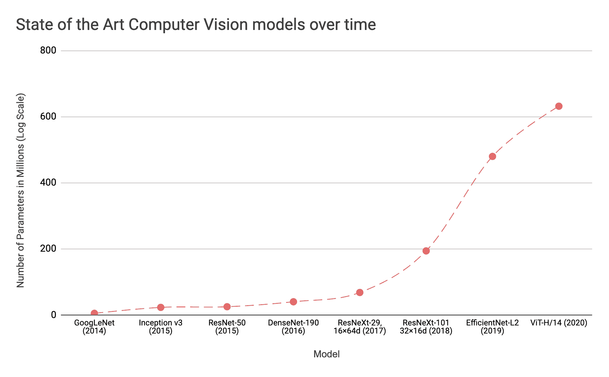

(a) 计算机视觉模型

(b) 自然语言模型

图 1. 计算机视觉模型中参数数量随时间增长的情况。（PapersWithCode.com，2021）

这种现象在自然语言理解（NLU）中也有体现，其中基于主要关注层的 Transformer（Vaswani 等，2017）架构推动了通用语言编码器的开发，如 BERT（Devlin 等，2018）、GPT-3（Brown 等，2020）等。BERT 在发布时特别打破了 11 个 NLU 基准。GPT-3 也通过其 API 在多个行业中得到了应用。这些领域的共同点在于模型足迹的快速增长（参见图 1），以及与训练和部署相关的成本。

由于深度学习研究一直集中在提升技术水平上，对图像分类、文本分类等基准的渐进改进通常与网络复杂性、参数数量、训练所需资源、预测延迟等的增加相关。例如，GPT-3 包含了 1750 亿个参数，训练一次迭代的成本达到数百万美元（（Brown 等，2020））。这不包括实验费用/尝试不同超参数组合的成本，这也是计算上昂贵的。

尽管这些模型在它们所训练的任务上表现良好，但它们可能并不一定足够高效，无法直接在现实世界中部署。当训练或部署模型时，深度学习从业者可能会面临以下挑战。

+   •

    可持续的服务器端扩展：训练和部署大型深度学习模型成本高昂。虽然训练可能是一次性成本（如果使用预训练模型则可能是免费的），但部署并长时间运行推理仍可能在服务器端 RAM、CPU 等方面变得昂贵。即便是像 Google、Facebook、Amazon 等组织，也对数据中心的碳足迹非常关注，这些组织每年在数据中心的资本支出上花费数十亿美元。

+   •

    启用设备端部署：某些深度学习应用需要在物联网和智能设备上实时运行（模型推理直接在设备上进行），原因多种多样（隐私、连接性、响应速度）。因此，优化模型以适应目标设备变得至关重要。

+   •

    隐私与数据敏感性：当用户数据可能是敏感时，尽可能少地使用数据进行训练至关重要。因此，高效地使用部分数据进行训练意味着需要收集的数据更少。

+   •

    新应用：某些新应用提出了新的约束（关于模型质量或足迹），现有的现成模型可能无法解决这些问题。

+   •

    模型爆炸：虽然单一模型可能表现良好，但在同一基础设施上（共置）训练和/或部署多个模型以满足不同应用的需求，可能会耗尽可用资源。

### 1.1\. 高效的深度学习

上述挑战的共同主题是*效率*。我们可以进一步将其分解如下：

+   •

    推理效率：这主要涉及到在部署模型时（计算模型对于给定输入的输出）可能会问的问题。模型是否较小？是否快速等？更具体地说，模型有多少个参数，磁盘大小是多少，推理期间的 RAM 消耗，推理延迟等。

+   •

    训练效率：这涉及到训练模型时可能会问的问题，比如模型训练需要多长时间？需要多少设备？模型是否可以适应内存？等。它也可能包括类似的问题，比如模型需要多少数据才能在给定任务上达到所需的性能？

如果我们有两个模型，在特定任务上表现同样出色，我们可能会选择在上述一个或两个方面表现更好的模型。如果在推理受限（如移动设备和嵌入式设备）或成本高昂（云服务器）的设备上部署模型，可能值得关注推理效率。类似地，如果在有限或昂贵的训练资源下从头开始训练一个大型模型，开发旨在提高训练效率的模型将有所帮助。

图 2\. 帕累托最优性：绿色点代表帕累托最优模型（共同形成帕累托前沿），在这些模型中，没有其他模型（红色点）能够在相同的推理延迟下获得更好的准确率，反之亦然。

无论我们优化什么，我们都希望实现*帕累托最优性*。这意味着我们选择的任何模型都是在我们关心的权衡下表现最好的。例如，在图 2 中，绿色点代表帕累托最优模型，这些模型中没有其他模型（红色点）能在相同的推理延迟下获得更好的准确率，反之亦然。帕累托最优模型（绿色点）共同形成了我们的*帕累托前沿*。定义上，帕累托前沿中的模型比其他模型更高效，因为它们在给定的权衡下表现最佳。因此，当我们寻求效率时，我们应当考虑发现并改进帕累托前沿上的模型。

为了实现这个目标，我们建议转向一系列算法、技术、工具和基础设施，这些都协同工作，以便用户能够训练和部署与模型质量及其足迹相关的*帕累托最优*模型。

## 2\. 思维模型

在本节中，我们介绍了一个思维模型，用于考虑与高效深度学习相关的算法、技术和工具的集合。我们建议将其结构化为五个主要领域，其中前四个集中在建模上，最后一个则涉及基础设施和工具。

图 3\. 一个关于算法、技术和与深度学习效率相关的工具的思维模型。

1.  (1)

    压缩技术：这些是通用技术和算法，旨在优化模型的架构，通常通过压缩其层来实现。一个经典的例子是量化（Jacob 等，2018），它试图通过减少精度（例如，从 32 位浮点值到 8 位无符号整数）来压缩层的权重矩阵，且质量损失最小。

1.  (2)

    学习技术：这些算法专注于以不同的方式训练模型（例如减少预测错误、需要更少的数据、更快地收敛等）。通过修剪参数的数量，如果需要的话，可以将改进的质量转化为更小的足迹/更高效的模型。一个学习技术的例子是蒸馏（Hinton 等，2015），它通过学习模拟更大模型来提高较小模型的准确性。

1.  (3)

    自动化：这些是用于通过自动化提高给定模型核心指标的工具。一个例子是超参数优化（HPO）（Golovin 等，2017），通过优化超参数来提高准确性，然后可以将其转化为参数更少的模型。类似地，架构搜索（Zoph 和 Le，2016）也属于这一类别，在这里，架构本身被调整，搜索帮助找到一个优化损失/准确性以及其他指标（如模型延迟、模型大小等）的模型。

1.  (4)

    高效架构：这些是从头设计的基本模块（卷积层、注意力机制等），相比之前使用的基线方法（全连接层和 RNN）具有显著的进步。例如，卷积层引入了参数共享用于图像分类，避免了为每个输入像素学习单独的权重，并使其对过拟合具有鲁棒性。类似地，注意力层（Bahdanau 等，2014）解决了 Seq2Seq 模型中的信息瓶颈问题。这些架构可以直接用于提高效率。

1.  (5)

    基础设施：最后，我们还需要一个基础设施和工具的基础，以帮助我们构建和利用高效的模型。这包括模型训练框架，如 Tensorflow (Abadi et al., 2016)、PyTorch (Paszke et al., 2019) 等（以及专门用于部署高效模型的工具，如 Tensorflow Lite (TFLite)、PyTorch Mobile 等）。我们依赖基础设施和工具来利用高效模型的优势。例如，要在量化模型中获得大小和延迟的改进，我们需要推理平台支持量化模式下的常见神经网络层。

我们将在接下来的部分中深入探讨这些领域。

## 3\. 高效深度学习的全景

### 3.1\. 压缩技术

如前所述，压缩技术通常是实现神经网络中一个或多个层更高效表示的通用技术，可能会有质量的权衡。效率目标可能是优化模型以满足一个或多个占用指标，例如模型大小、推理延迟、收敛所需的训练时间等，以换取尽可能少的质量损失。在某些情况下，如果模型过度参数化，这些技术可以提高模型的泛化能力。

#### 3.1.1\. 剪枝

给定一个神经网络 $f(X,W)$，其中 $X$ 是输入，$W$ 是参数（或权重）集合，剪枝是一种技术，用于得到一个最小的子集 $W^{\prime}$，使得其余的参数 $W$ 被剪枝（或设置为 0），同时确保模型的质量保持在期望的阈值以上。剪枝后，我们可以说网络变得 *稀疏*，稀疏度可以量化为剪枝参数的数量与原网络中参数数量的比例 ($s=(1-\frac{|W^{\prime}|}{|W|})$)。稀疏度越高，剪枝网络中的非零参数越少。

图 4\. 简化示意图，展示了在包含全连接层的神经网络中剪枝权重（连接）和神经元（节点）的过程。

该领域的一些经典工作包括 LeCun 等人的 Optimal Brain Damage (OBD) (LeCun 等，1990) 和 Hassibi 等人的 Optimal Brain Surgeon 论文 (OBD) (Hassibi 等，1993)。这些方法通常采用一个已经预训练到合理质量的网络，然后迭代剪枝具有最低“显著性”分数的参数，以尽量减少对验证损失的影响。剪枝完成后，网络会使用剩余的参数进行微调。这个过程会重复多次，直到剪除所需数量的原始参数 (算法 1)。

数据：预训练的密集网络，权重 $W$，输入 $X$，剪枝轮次 $N$，每轮剪枝的参数比例 $p$。结果：剪枝后的网络，权重为 $W^{\prime}$。1 $W^{\prime}\leftarrow W$; 2 对于 *$i\leftarrow 1$ 到 $N$* 执行 3 $S\leftarrow\texttt{compute\_saliency\_scores}(W^{\prime})$; 4 5 $W^{\prime}\leftarrow W^{\prime}-\texttt{select\_min\_k}\large(S,\frac{|W^{\prime}|}{p}\large)$; 6 $W^{\prime}\leftarrow$fine_tune($X$, $W^{\prime}$) 7 结束 返回 $W^{\prime}$

算法 1 标准网络剪枝与微调

OBD 通过使用参数的二阶导数 ($\large\frac{\partial^{2}L}{\partial w_{i}^{2}}$) 来近似显著性分数，其中 $L$ 是损失函数，$w_{i}$ 是待移除的候选参数。直观上，对于给定的参数，这个值越高，剪枝时损失函数梯度的变化就越大。

为了加速二阶导数的计算，OBD 忽略了权重之间的交互 ($\large\frac{\partial^{2}L}{\partial w_{i}\partial w_{j}}$)，因此仅计算 Hessian 矩阵的对角元素。否则，即使对于合理数量的权重，计算完整的 Hessian 矩阵也会非常繁琐 (对于 $n=10^{4}$，矩阵的大小是 $10^{4}\times 10^{4}=10^{8}$)。在结果方面，LeCun 等人展示了剪枝将一个经过良好训练的神经网络的参数减少了 8 倍（自动和手动移除的组合），且分类准确率没有下降。

在不同的剪枝策略中，核心算法可以保持相似，只是在以下方面有所变化。

+   •

    显著性：虽然 (LeCun 等，1990; Hassibi 等，1993) 使用二阶导数，其他方法则依赖于基于简单幅度的剪枝 (Han 等，2015b, a) 或基于动量的剪枝 (Dettmers 和 Zettlemoyer，2019) 等来确定显著性分数。

+   •

    结构化与非结构化：最灵活的修剪方式是非结构化（或随机）修剪，其中所有给定的参数都被平等对待。在结构化修剪中，参数按块修剪（例如，在权重矩阵中按行修剪，或在卷积滤波器中按通道修剪（Li et al., 2016; Anwar et al., 2017; Molchanov et al., 2016; Liu et al., 2019）等）。后者允许更容易利用推理时的大小和延迟的增益，因为这些修剪后的参数块可以智能地跳过存储和推理。请注意，非结构化修剪也可以看作是块大小为 1 的结构化修剪。

+   •

    分布：关于如何分配稀疏预算（需要修剪的参数数量）的决定，可以通过将网络中的所有参数汇总在一起，然后决定修剪哪些参数来做，或者通过智能地选择每层需要修剪多少参数来做（Dong et al., 2017; He et al., 2018）。(Elsen et al., 2020; google research, 2021) 发现一些架构如 MobileNetV2、EfficientNet (Tan et al., 2019) 具有较薄的第一层，这些层对参数数量没有显著贡献，修剪它们会导致准确率下降，而收益不大。因此，直观上，将稀疏度分配到每层可能会更有帮助。

+   •

    调度：另一个问题是修剪的数量和时机。我们是否应该每轮修剪相同数量的参数（LeCun et al., 1990; Hassibi et al., 1993; Han et al., 2015b），或者在开始时以较高的速度修剪，然后逐渐减少（Zhu and Gupta, 2018; Dettmers and Zettlemoyer, 2019）。

+   •

    再生：一些方法允许再生修剪的连接（Evci et al., 2020; Dettmers and Zettlemoyer, 2019），通过不断的修剪-重新分配-再生周期保持相同水平的稀疏度。Dettmers et al. (Dettmers and Zettlemoyer, 2019) 估计在整个过程中使用稀疏模型可以将训练时间加速 2.7 倍到 5.6 倍。然而，在 CPU、GPU 和其他硬件上实现稀疏操作存在差距。

| 模型架构 | 稀疏类型 | 稀疏百分比 | FLOPs | Top-1 准确率 % | 来源 |
| --- | --- | --- | --- | --- | --- |
| MobileNet v2 - 1.0 | 密集（基线） | 0% | 1x | 72.0% | Sandler et al. (Sandler et al., 2018) |
| 非结构化 | 75% | 0.27x | 67.7% | Zhu et al. (Zhu and Gupta, 2018) |
| 非结构化 | 75% | 0.52x | 71.9% | Evci et al. (Evci et al., 2020) |
| 结构化（按块） | 85% | 0.11x | 69.7% | Elsen et al. |
| 非结构化 | 90% | 0.12x | 61.8% | Zhu et al. (Zhu and Gupta, 2018) |
| 无结构 | 90% | 0.12x | 69.7% | Evci 等（Evci 等，2020） |

表 1\. 在 MobileNet v2 架构中，深度倍增器 = 1.0 的各种稀疏性结果示例。

超越模型优化：Frankle 等人（Frankle 和 Carbin，2018）关于彩票票据假设的研究从不同的角度看待了剪枝，并假设在每个大型网络中存在一个较小的网络，这个网络可以通过原始参数初始化进行提取，并重新训练以匹配或超过大型网络的性能。作者在多个数据集上展示了这些结果，但其他人（如 Gale 等，2019；Liu 等，2018b）未能在较大的数据集（如 ImageNet（Deng 等，2009））上复制这些结果。相反，Liu 等（Liu 等，2018b）展示了具有随机初始化的剪枝架构不逊色于具有训练权重的剪枝架构。

讨论：大量的研究表明，模型大小（通过参数数量）在理论上显著减少，或估算了 FLOPs 的节省（表 1）。然而，大部分结果是在*无结构*剪枝上，尚不清楚这些改进如何导致占用指标的减少（除了使用标准文件压缩工具如 GZip）。

另一方面，具有有意义的块大小的结构化剪枝有利于延迟改进。Elsen 等（Elsen 等，2020；谷歌研究，2021）构建了稀疏卷积网络，比其密集的对应物提高了 $1.3$ - $2.4\times$，参数约为 66%，同时保持相同的 Top-1 精度。他们通过他们的库将 NHWC（通道最后）标准密集表示转换为适合于 ARM 设备、WebAssembly 等快速内核的 NCHW（通道优先）‘块压缩稀疏行’（BCSR）表示来实现这一点（作者，2021k）。尽管他们也对可以加速的稀疏网络类型提出了一些限制（作者，2021l）。总体而言，这一步朝着通过剪枝网络实现占用指标的实际改进迈出了令人鼓舞的一步。

#### 3.1.2\. 量化

几乎所有典型网络的权重和激活值都是 32 位浮点值。减少模型占用空间的一个想法是通过*量化*到较低精度的数据类型（通常是 8 位定点整数）来降低权重和激活的精度。量化可以带来两种收益：（a）降低模型大小，以及（b）降低推理延迟。通常，模型大小是一个限制因素，在这种情况下，我们可以采用一种称为权重量化的技术来获得模型大小的改进（Authors, 2021f），其中只有模型权重是以降低的精度表示。为了获得延迟改进，激活值也需要以定点形式存在（激活量化 (Vanhoucke 等, 2011; Jacob 等, 2018），以确保量化图中的所有操作也在定点数学中进行。

权重量化：一种简单的*方案*用于量化权重以获得模型大小的改进（类似于（Krishnamoorthi, 2018））如下。给定模型中的一个 32 位浮点权重矩阵，我们可以将该矩阵中的最小权重值 ($x_{min}$) 映射到 $0$，将最大值 ($x_{max}$) 映射到 $2^{b}-1$（其中 $b$ 是精度的位数，$b<32$）。然后我们可以线性地将它们之间的所有值外推到 [$0,2^{b}-1$] 的整数值（图 5）。因此，我们能够将每个浮点值映射到一个定点值，其中后者所需的位数少于浮点表示。这一过程也可以应用于有符号 $b$ 位定点整数，其中输出值将位于 [-$2^{\frac{b}{2}}-1$, $2^{\frac{b}{2}}-1$] 范围内。$b$ 的一个合理值是 $8$，因为这将导致 $32/8=4\times$ 空间减少，并且由于对 uint8_t 和 int8_t 数据类型的几乎普遍支持。

在推理过程中，我们将朝相反的方向前进，其中使用 $x_{min}$ 和 $x_{max}$ 恢复原始浮点值的有损估计（*反量化*）。这种估计是有损的，因为在进行舍入时我们丢失了 $32-b$ 位的信息（另一种看法是，一系列浮点值映射到相同的量化值）。

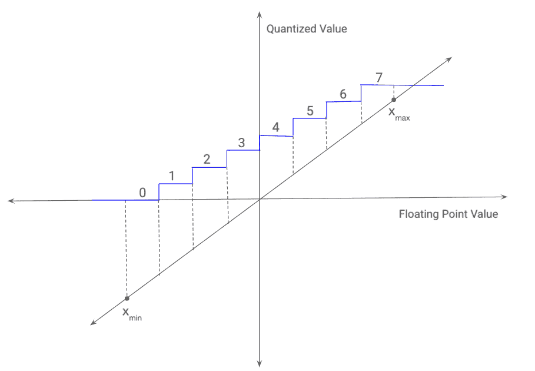

图 5\. 将浮点连续值量化为离散定点值。连续值被夹紧到 $x_{min}$ 到 $x_{max}$ 的范围，并被映射到 [$0$, $2^{b}-1$] 的离散值（在上述图中，$b=3$，因此量化后的值在 [$0,7$] 范围内）。

(Jacob 等，2018；Krishnamoorthi，2018) 通过以下两个约束来形式化量化方案：

+   •

    量化方案应为线性（仿射变换），以使精度位线性分布。

+   •

    $0.0$ 应精确映射到定点值 $x_{q_{0}}$，使得反量化 $x_{q_{0}}$ 能得到 $0.0$。这是一个实现约束，因为 $0$ 也用于填充以表示张量中的缺失元素，如果反量化 $x_{q_{0}}$ 导致非零值，则可能会被误解为该索引处的有效元素。

上述第二个约束要求 $0$ 是量化范围的一部分，这反过来又要求更新 $x_{min}$ 和 $x_{max}$，然后将 $x$ 限制在 $[x_{min},x_{max}]$ 之间。接着，我们可以通过构造分段线性变换来量化 $x$：

| (1) |  | $\small\textrm{quantize}(x)=x_{q}=\textrm{round}\bigg{(}\frac{x}{s}\bigg{)}+z$ |  |
| --- | --- | --- | --- |

$s$ 是浮点数 *缩放* 值（可以看作是斜率的倒数，可以通过 $x_{min}$、$x_{max}$ 和定点值范围来计算）。$z$ 是整数 *零点* 值，它是分配给 $x=0.0$ 的量化值。这是文献中使用的术语（Jacob 等，2018；Krishnamoorthi，2018）（算法 2）。

反量化步骤构造了 $\hat{x}$，这是 $x$ 的有损估计，因为在量化为较少的位数时，我们会失去精度。我们可以按如下方式计算它：

| (2) |  | $\small\textrm{dequantize}(x_{q})=\hat{x}=s(x_{q}-z)$ |  |
| --- | --- | --- | --- |

由于 $s$ 是浮点数，$\hat{x}$ 也是浮点数值（算法 3）。注意，量化和反量化步骤也可以通过适当地改变值 $x_{q_{min}}$（即 $b$ 位中的最低定点值）来对有符号整数进行。

数据：用于压缩的浮点张量 $\mathbf{X}$，定点表示的精度位数 $b$。结果：量化张量 $\mathbf{X_{q}}$。1  $\textbf{X}_{min},\textbf{X}_{max}\leftarrow\textrm{min}(\mathbf{X},0),\textrm{max}(\mathbf{X},0)$；2  $\mathbf{X}\leftarrow\textrm{clamp}(\mathbf{X},\textbf{X}_{min},\textbf{X}_{max})$；3  $s\leftarrow\frac{\displaystyle x_{max}-x_{min}}{\displaystyle 2^{b}-1}$；4  $z\leftarrow\textrm{round}\bigg{(}x_{q_{min}}-\frac{\displaystyle x_{min}}{\displaystyle s}\bigg{)}$；56$\mathbf{X_{q}}\leftarrow\textrm{round}\bigg{(}\frac{\displaystyle\mathbf{X}}{\displaystyle s}\bigg{)}+z$；7 返回 $\mathbf{X_{q}}$；

算法 2 量化给定的权重矩阵 $\mathbf{X}$

数据：用于解量化的定点矩阵 $\mathbf{X_{q}}$，以及在量化过程中计算得出的缩放因子 $s$ 和零点 $z$ 值。结果：解量化的浮点权重矩阵 $\widehat{\mathbf{X}}$。1  $\widehat{\mathbf{X}}\leftarrow s(\mathbf{X_{q}}-z)$；2 返回 $\widehat{\mathbf{X}}$；

算法 3 解量化给定的定点权重矩阵 $\mathbf{X_{q}}$

我们可以利用上述两个算法来量化和解量化模型的权重矩阵。对预训练模型权重进行量化以减少模型大小在文献中称为 *后训练量化*（Authors, 2021f）。当模型具有足够的表示能力时，这可能足以减少模型大小。

文献中还有其他工作（Rastegari 等人，2016；Hubara 等人，2016；Li 等人，2016）展示了略有不同的量化变体。 XNOR-Net（Rastegari 等人，2016）、二值化神经网络（Hubara 等人，2016）等使用 $b=1$，因此权重矩阵只有 $0$ 或 $1$ 两个可能的值，量化函数简单地是 $\textrm{sign}(x)$ 函数（假设权重围绕 $0$ 对称分布）。

这种极端量化方法的承诺是模型大小理论上可以减少 $32/1=32\times$，且几乎没有质量损失。一些研究声称在更大的网络如 AlexNet（Krizhevsky et al., 2012）、VGG（Simonyan and Zisserman, 2014）、Inception（Szegedy et al., 2015）等上取得了改进，这些网络可能已经更适合压缩。一个更具信息量的任务是演示在更小的网络如 MobileNet 系列（Sandler et al., 2018; Howard et al., 2019）上的极端量化。此外，二值量化（以及其他量化方案如三值量化（Li et al., 2016）、基于位移的网络（Rastegari et al., 2016）等）承诺在标准操作中实现低延迟，其中乘法和除法被加法、减法等更便宜的操作替代。这些声明需要验证，因为即使这些方法在理论上减少了 FLOPs，实际实现仍需得到底层硬件的支持。一个公平的比较是使用标准量化 $b=8$，其中乘法和除法也变得更便宜，并通过 SIMD 指令得到硬件的高效支持，这允许低级数据并行处理（例如，通过 SSE 指令集在 x86 上，通过 Neon（Ltd., 2021）指令在 ARM 上，甚至通过 Qualcomm Hexagon（Authors, 2021l）等专用 DSP）。

激活量化：为了在量化网络中获得*延迟改进*，数学运算也必须以固定点表示进行。这意味着所有中间层的输入和输出也都是固定点的，并且不需要对权重矩阵进行反量化，因为它们可以直接与输入一起使用。

Vanhoucke 等人（Vanhoucke et al., 2011）在 x86 CPU 上使用完全固定点模型实现了 $3\times$ 的推理加速，相较于同一 CPU 上的浮点模型，且没有牺牲准确性。权重仍然像训练后量化一样被量化，但所有层的输入（除了第一层）和激活值都是固定点的。在性能方面，这一改进的主要驱动力是 Intel SSE4 指令集中的固定点 SIMD 指令（Contributors to Wikimedia projects, 2021e），其中常用的构建块操作如乘加（MAC）（Contributors to Wikimedia projects, 2021d）可以并行处理。自论文发布以来，Intel 发布了这类指令集的两个新版本（Contributors to Wikimedia projects, 2021a），这可能进一步提高加速效果。

量化感知训练（QAT）：Vanhoucke 等提到的网络是一个 5 层前馈网络，经过训练后进行了量化。然而，如 Krishnamoorthi（Krishnamoorthi, 2018）、Jacob 等（Jacob et al., 2018）和 Wang 等（Wang et al., 2020）所强调，后训练量化可能会导致推理过程中质量的损失，尤其是当网络变得更复杂时。这可能是由于：（a）异常值权重使得整个输入范围的量化值计算偏向异常值，从而导致大部分范围分配的位数减少；或者（b）权重矩阵内权重的不同分布，例如，在卷积层中，每个滤波器之间的权重分布可能不同，但它们的量化方式相同。这些效应在低位宽下可能会更加明显，因为精度损失更严重。Wang 等（Wang et al., 2020）尝试保留后训练量化，但通过新的启发式方法以学习的方式分配精度位。像 TFLite 转换器（TensorFlow, 2019）这样的工具，通过用户提供的代表性数据集增强了后训练量化，通过比较量化和未量化图的激活之间的误差，主动修正模型中不同点的错误。

Jacob 等（Jacob et al., 2018）提出了一个*量化感知*的训练机制，并由 Krishnamoorthi 等（Krishnamoorthi, 2018）进一步详细说明。在这种设置下，训练是在浮点数中进行的，但前向传播会模拟推理过程中量化的行为。权重和激活都通过一个函数来模拟这种量化行为（许多文献使用“*伪量化*”这一术语（Jacob et al., 2018; Krishnamoorthi, 2018））。

假设 $\mathbf{X}$ 是待伪量化的张量，Jacob 等人（Jacob et al.，2018）建议在训练图中添加特殊的量化节点，这些节点收集与待量化的权重和激活相关的统计信息（$x_{min}$ 和 $x_{max}$ 的移动平均）（参见图 6b(a) 获取说明）。一旦我们获得了每个 $\mathbf{X}$ 的这些值，就可以使用方程式（1 和 2）推导出相应的 $\widehat{\mathbf{X}}$。

| (3) |  | <math   alttext="\small\begin{split}\widehat{\mathbf{X}}{}&amp;=\textrm{FakeQuant}(\mathbf{X})\\ &amp;=\textrm{Dequantize}(\textrm{Quantize}(\mathbf{X}))\\

&amp;=s((\textrm{round}\bigg{(}\frac{\displaystyle\textrm{clamp}(\mathbf{X},x_{min},x_{max})}{\displaystyle s}\bigg{)}+z)-z)\\

&amp;=s\bigg{(}\textrm{round}\bigg{(}\frac{\displaystyle\textrm{clamp}(\mathbf{X},x_{min},x_{max})}{\displaystyle s}\bigg{)}\bigg{)}\\

\end{split}" display="block"><semantics ><mtable columnspacing="0pt" displaystyle="true" rowspacing="0pt"  ><mtr ><mtd columnalign="right"  ><mover accent="true"  ><mi mathsize="90%" >𝐗</mi><mo mathsize="90%" >^</mo></mover></mtd><mtd columnalign="left"  ><mrow ><mo mathsize="90%" >=</mo><mrow  ><mtext mathsize="90%"  >伪量化</mtext><mo lspace="0em" rspace="0em"  >​</mo><mrow ><mo maxsize="90%" minsize="90%" >(</mo><mi mathsize="90%" >𝐗</mi><mo maxsize="90%" minsize="90%"  >)</mo></mrow></mrow></mrow></mtd></mtr><mtr ><mtd columnalign="left"  ><mrow ><mo mathsize="90%"  >=</mo><mrow ><mtext mathsize="90%" >去量化</mtext><mo lspace="0em" rspace="0em"  >​</mo><mrow ><mo maxsize="90%" minsize="90%"  >(</mo><mrow ><mtext mathsize="90%" >量化</mtext><mo lspace="0em" rspace="0em"  >​</mo><mrow ><mo maxsize="90%" minsize="90%"  >(</mo><mi mathsize="90%"  >𝐗</mi><mo maxsize="90%" minsize="90%"  >)</mo></mrow></mrow><mo maxsize="90%" minsize="90%"  >)</mo></mrow></mrow></mrow></mtd></mtr><mtr ><mtd columnalign="left"  ><mrow ><mo mathsize="90%"  >=</mo><mrow ><mi mathsize="90%" >s</mi><mo lspace="0em" rspace="0em"  >​</mo><mrow ><mo maxsize="90%" minsize="90%"  >(</mo><mrow ><mrow ><mo maxsize="90%" minsize="90%" >(</mo><mrow ><mrow ><mtext mathsize="90%" >四舍五入</mtext><mo lspace="0em" rspace="0em" >​</mo><mrow ><mo maxsize="210%" minsize="210%"  >(</mo><mfrac ><mrow ><mtext mathsize="90%" >限制</mtext><mo lspace="0em" rspace="0em" >​</mo><mrow ><mo maxsize="90%" minsize="90%"  >(</mo><mi mathsize="90%"  >𝐗</mi><mo mathsize="90%"  >,</mo><msub ><mi mathsize="90%"  >x</mi><mrow ><mi mathsize="90%"  >m</mi><mo lspace="0em" rspace="0em"  >​</mo><mi mathsize="90%"  >i</mi><mo lspace="0em" rspace="0em"  >​</mo><mi mathsize="90%"  >n</mi></mrow></msub><mo mathsize="90%"  >,</mo><msub ><mi mathsize="90%"  >x</mi><mrow ><mi mathsize="90%"  >m</mi><mo lspace="0em" rspace="0em"  >​</mo><mi mathsize="90%"  >a</mi><mo lspace="0em" rspace="0em"  >​</mo><mi mathsize="90%"  >x</mi></mrow></msub><mo maxsize="90%" minsize="90%"  >)</mo></mrow></mrow><mi mathsize="90%"  >s</mi></mfrac><mo maxsize="210%" minsize="210%"  >)</mo></mrow></mrow><mo mathsize="90%"  >+</mo><mi mathsize="90%"  >z</mi></mrow><mo maxsize="90%" minsize="90%"  >)</mo></mrow><mo mathsize="90%"  >−</mo><mi mathsize="90%"  >z</mi></mrow><mo maxsize="90%" minsize="90%"  >)</mo></mrow></mrow></mrow></mtd></mtr><mtr ><mtd columnalign="left"  ><mrow ><mo mathsize="90%"  >=</mo><mrow ><mi mathsize="90%" >s</mi><mo lspace="0em" rspace="0em"  >​</mo><mrow ><mo maxsize="210%" minsize="210%"  >(</mo><mrow ><mtext mathsize="90%" >四舍五入</mtext><mo lspace="0em" rspace="0em"  >​</mo><mrow ><mo maxsize="210%" minsize="210%"  >(</mo><mfrac ><mrow ><mtext mathsize="90%" >限制</mtext><mo lspace="0em" rspace="0em" >​</mo><mrow ><mo maxsize="90%" minsize="90%"  >(</mo><mi mathsize="90%"  >𝐗</mi><mo mathsize="90%"  >,</mo><msub ><mi mathsize="90%"  >x</mi><mrow ><mi mathsize="90%"  >m</mi><mo lspace="0em" rspace="0em"  >​</mo><mi mathsize="90%"  >i</mi><mo lspace="0em" rspace="0em"  >​</mo><mi mathsize="90%"  >n</mi></mrow></msub><mo mathsize="90%"  >,</mo><msub ><mi mathsize="90%"  >x</mi><mrow ><mi mathsize="90%"  >m</mi><mo lspace="0em" rspace="0em"  >​</mo><mi mathsize="90%"  >a</mi><mo lspace="0em" rspace="0em"  >​</mo><mi mathsize="90%"  >x</mi></mrow></msub><mo maxsize="90%" minsize="90%"  >)</mo></mrow></mrow><mi mathsize="90%"  >s</mi></mfrac><mo maxsize="210%" minsize="210%"  >)</mo></mrow></mrow><mo maxsize="210%" minsize="210%"  >)</mo></mrow></mrow></mrow></mtd></mtr></mtable><annotation-xml encoding="MathML-Content" ><apply ><apply  ><apply ><ci >^</ci><ci  >𝐗</ci></apply><apply ><ci ><mtext mathsize="90%" >伪量化</mtext></ci><ci >𝐗</ci></apply></apply><apply ><apply  ><ci ><mtext mathsize="90%" >去量化</mtext></ci><apply ><ci ><mtext mathsize="90%" >量化</mtext></ci><ci >𝐗</ci></apply></apply></apply><apply ><apply  ><ci >𝑠</ci><apply ><apply ><apply  ><ci ><mtext mathsize="90%" >四舍五入</mtext></ci><apply ><apply ><ci  ><mtext mathsize="90%"  >限制</mtext></ci><vector ><ci >𝐗</ci><apply ><csymbol cd="ambiguous"  >subscript</csymbol><ci >𝑥</ci><apply ><ci >𝑚</ci><ci >𝑖</ci><ci >𝑛</ci></apply></apply><apply ><csymbol cd="ambiguous"  >subscript</csymbol><ci >𝑥</ci><apply ><ci >𝑚</ci><ci >𝑎</ci><ci >𝑥</ci></apply></apply></vector></apply><ci >𝑠</ci></apply></apply><ci >𝑧</ci></apply><ci >𝑧</ci></apply></apply></apply><apply ><apply ><ci  >𝑠</ci><apply ><ci ><mtext mathsize="90%" >四舍五入</mtext></ci><apply ><apply  ><ci ><mtext mathsize="90%"  >限制</mtext></ci><vector ><ci >𝐗</ci><apply ><csymbol cd="ambiguous"  >subscript</csymbol><ci >𝑥</ci><apply ><ci >𝑚</ci><ci >𝑖</ci><ci >𝑛</ci></apply></apply><apply ><csymbol cd="ambiguous"  >subscript</csymbol><ci >𝑥</ci><apply ><ci >𝑚</ci><ci >𝑎</ci><

由于上述方程因舍入行为而不可直接微分，为了优化相对于$\mathbf{X}$的损失函数$L$，我们可以使用直通估计器（STE）（Bengio 等，2013）通过链式法则计算$\frac{\displaystyle\partial{L}}{\displaystyle\partial{\mathbf{X}}}$。这使我们可以通过线性近似使阶梯函数可微分（有关详细信息，请参见 (Krishnamoorthi, 2018 )）。

量化感知训练使网络能够适应推理过程中由钳制和舍入行为引入的噪声。一旦网络训练完成，工具如 TFLite 模型转换器（作者，2021h）可以从标注了量化节点的网络生成适当的定点推理模型。

其他显著工作：Polino 等（Polino 等，2018）允许通过学习量化点向量$p$来实现精度的非均匀分布，并使用蒸馏进一步减少精度损失。对于 CIFAR-10 等简单数据集的结果与(Krishnamoorthi, 2018; Jacob 等，2018) 相当。然而，当在 ImageNet 数据集上使用 ResNet 架构时，他们通过使用较浅的学生网络来实现更低的模型大小和更快的推理。这并不是一个公平的比较，因为其他工作没有将蒸馏与量化混合在一起。Fan 等（Fan 等，2020）展示了在标准 QAT（（Jacob 等，2018））基础上的准确度提升，且$b<8$。他们假设如果假量化不是同时应用于整个张量，而是允许无偏的梯度流动（而不是 STE 近似），网络将会学习得更好。相反，他们在给定张量上以块状方式随机应用假量化操作。他们还展示了在 4 位量化的 Transformer 和 EfficientNet（Tan 等，2019）网络上对 QAT 的改进。

结果：请参阅表 2 比较基准浮点模型、后训练量化模型和量化感知训练模型（作者，2021f）。后训练量化模型接近基准模型，但仍存在显著的准确度差异。模型大小减少了$4\times$，但由于推理过程中需要对权重进行去量化，延迟略有增加。具有 8 位量化感知训练（QAT）的模型在所需磁盘空间上减少了$4\times$，且比基准浮点模型快$1.64\times$。

| 模型架构 | 量化类型 | Top-1 准确度 | 大小 (MB) | 延迟 (ms, Pixel2) |
| --- | --- | --- | --- | --- |
| MobileNet v2-1.0 (224) | 基线 | 71.9% | 14 | 89 |
| 后训练量化 | 63.7% | 3.6 | 98 |
| 量化感知训练 | 70.9% | 3.6 | 54 |

表 2\. MobileNet v2 架构上 8 位量化的各种量化结果示例（TensorFlow, 2021）。我们选择 8 位结果，因为它们可以与现有的硬件和软件直接使用。

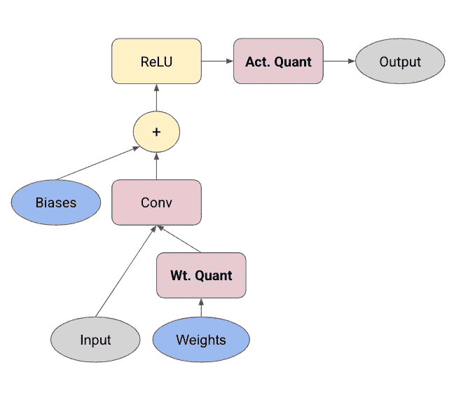

(a) 量化感知训练

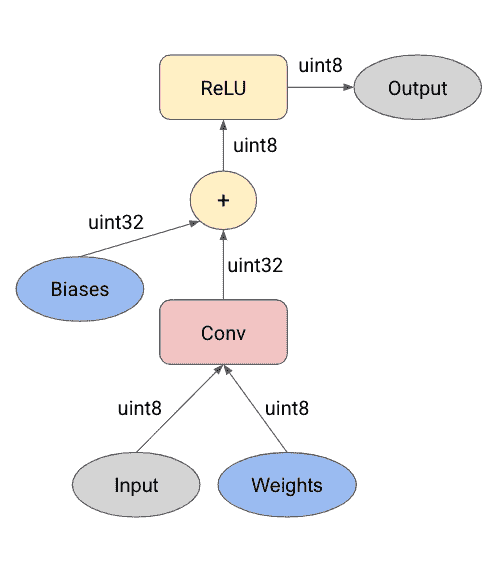

(b) 最终固定点推理图

图 6\. (a) 显示了注入伪量化节点以模拟量化效果并收集张量统计数据，以导出一个完全固定点推理图。(b) 显示了从与(a)相同的图中推导出的推理图。输入和权重为 uint8，常见操作的结果为 uint32。偏置保留为 uint32 (Jacob et al., 2018; Krishnamoorthi, 2018)

.

讨论：

+   •

    量化是一种研究充分的模型优化技术，可以显著减少模型大小（使用 8 位量化时通常为$4\times$）和推理延迟。

+   •

    权重量化足够直接，可以单独实施以减少模型大小。应强烈考虑激活量化，因为它不仅能降低延迟，还能减少模型中间计算所需的工作内存（这对于内存有限的设备至关重要）

+   •

    在可能的情况下，应使用量化感知训练。研究表明，它在准确性方面优于后训练量化。

+   •

    然而，像 Tensorflow Lite 这样的工具使得依赖后训练量化变得容易。（TensorFlow, 2019）显示，使用后训练量化时通常损失最小，并且在代表性数据集的帮助下，这种损失会进一步缩减。在有机会切换到固定点操作的地方，基础设施允许使用它们。

+   •

    出于性能原因，最好考虑跟随典型层的常见操作，如批量归一化、激活等，并将它们“折叠”到量化操作中。

#### 3.1.3\. 其他压缩技术

还有其他压缩技术，如低秩矩阵分解、K 均值聚类、权重共享等，这些技术也在积极用于模型压缩（Panigrahy, 2021），并可能适合进一步压缩模型中的热点。

### 3.2\. 学习技巧

学习技术试图以不同的方式训练模型，以获得更好的质量指标（准确率、F1 分数、精度、召回率等），同时允许补充或在某些情况下替代传统的监督学习。通过减少模型中的参数/层数，质量的改善有时可以换取更小的模型，从而在更小的模型中达到相同的基准质量。关注学习技术的一个动机是它们仅在训练阶段应用，而不会影响推断。

#### 3.2.1\. 蒸馏

集成方法广为人知，有助于提高泛化能力（Krogh 和 Vedelsby，1994；Hansen 和 Salamon，1990）。直觉上，这使得学习多个独立的假设成为可能，这些假设可能比学习单一假设更为有效。（Dietterich，2000）介绍了一些标准的集成方法，如 bagging（训练在非重叠数据上的模型然后进行集成），boosting（训练修正集成中其他模型分类错误的模型），平均（所有集成模型投票）等。Bucila 等（Buciluǎ 等，2006）使用大型集成标记他们用各种方案生成的合成数据。然后训练一个较小的神经网络，不仅从标记数据中学习，还从这些弱标记的合成数据中学习。他们发现，单个神经网络能够模仿大型集成的性能，同时体积小了$1000\times$，速度更快。这证明了将集成的累积知识转移到一个小模型是可能的。尽管如此，单靠现有标记数据可能还不够。

Hinton 等（Hinton 等，2015）在他们的开创性工作中探索了如何以稍微不同的方式让较小的网络（学生）从较大的模型/模型集成（教师）中提取“暗知识”。他们不再需要生成合成数据，而是使用较大的教师模型在现有标记数据上生成*软标签*。软标签为每个类别分配一个概率，而不是原始数据中的硬二值。直觉上，这些软标签捕捉了不同类别之间的关系，模型可以从中学习。例如，卡车比苹果更像汽车，模型可能无法直接从硬标签中学习到这一点。

学生网络学习在这些软标签上最小化交叉熵损失，同时还包括原始的硬标签。由于错误类别的概率可能非常小，logits 会通过一个 $\geq 1.0$ 的“温度”值进行缩放，以使分布“软化”。如果输入向量是 $\mathbf{X}$，教师模型的 logits 是 $\mathbf{Z^{(t)}}$，那么使用熟悉的 softmax 函数可以计算出教师模型在温度 $T$ 下的软化概率：

| (4) |  | $\small\mathbf{Y}_{i}^{(t)}=\frac{\displaystyle\exp(\mathbf{Z_{i}^{(t)}}/T)}{\displaystyle\sum_{j=1}^{n}\exp(\mathbf{Z_{j}^{(t)}}/T)}$ |  |
| --- | --- | --- | --- |

注意，随着 $T$ 的增加，$Y^{(t)}$ 各个元素之间的相对差异减小。这是因为如果所有元素都被相同的常数除，softmax 函数会导致较大值的下降更大。因此，随着温度 $T$ 的增加，我们看到 $Y^{(t)}$ 的分布进一步“软化”。

当与标记数据 ($\mathbf{X}$, $\mathbf{Y}$) 和学生模型的输出 ($\mathbf{Y^{(s)}}$) 一起训练时，我们可以描述损失函数为：

| (5) |  | $\small\begin{split}L&amp;=\lambda_{1}\cdot L_{\rm ground-truth}+\lambda_{2}\cdot L_{\rm distillation}\\ &amp;=\lambda_{1}\cdot\textrm{CrossEntropy}(\mathbf{Y},\mathbf{Y^{(s)}};\theta)+\lambda_{2}\cdot\textrm{CrossEntropy}(\mathbf{Y^{(t)}},\mathbf{Y^{(s)}};\theta)\end{split}$ |  |
| --- | --- | --- | --- |

CrossEntropy 是交叉熵损失函数，它接受标签和输出。对于第一个损失项，我们传递真实标签，对于第二个损失项，我们传递相应的来自教师模型的软标签。 $\lambda_{1}$ 和 $\lambda_{2}$ 分别控制标准真实损失和蒸馏损失的相对重要性。当 $\lambda_{1}=0$ 时，学生模型仅用蒸馏损失进行训练。类似地，当 $\lambda_{2}=0$ 时，这等同于仅用真实标签进行训练。通常，教师网络在此过程中是预训练并被冻结的，只有学生网络会被更新。有关此过程的示意图，请参见图 7。

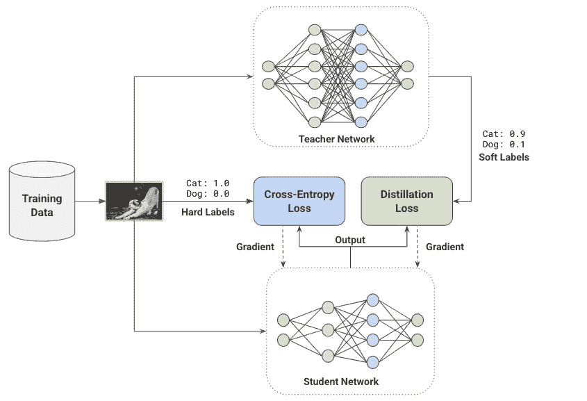

图 7\. 从较大的预训练教师模型中蒸馏出较小的学生模型。教师和学生模型接收相同的输入。教师用于生成学生的“软标签”，这为学生提供了比仅使用硬二进制标签更多的信息。学生使用常规的交叉熵损失进行训练，同时使用来自教师的软标签的蒸馏损失函数。在这种设置下，教师被冻结，只有学生接收梯度更新。

在论文中，Hinton 等人（Hinton 等人, 2015）能够使一个单一的蒸馏模型在语音识别任务中准确度接近 10 模型集成的准确度。Urban 等人（Urban 等人, 2016）进行了全面的研究，证明蒸馏显著提高了浅层学生网络的性能，甚至对于像 CIFAR-10 这样的任务仅一个隐藏层的 MLP。Sanh 等人（Sanh 等人, 2019）使用蒸馏损失压缩 BERT（Devlin 等人, 2018）模型（以及最小化教师和学生模型所见输入的两个内部向量表示之间的余弦距离的余弦损失）。他们的模型保留了 BERT-Base 97% 的性能，同时在 CPU 上体积缩小 40% 和速度提升 60%。

可以将蒸馏的总体思路应用于教师和学生的中间输出。Zagoruyko 等人（Zagoruyko 和 Komodakis, 2016）在教师和学生卷积网络之间传递中间的“注意力图”。直观上，目的是让学生关注教师关注的图像部分。MobileBERT（Sun 等人, 2020）使用了一种渐进式知识传递策略，其中在 BERT 学生和教师模型之间进行逐层蒸馏，但这是分阶段进行的，首先 $l$ 层在第 $l$ 阶段进行蒸馏。结合其他架构改进，他们获得了一个体积缩小 4.3$\times$ 和速度提升 5.5$\times$ 的 BERT，且质量损失很小。

另一个已被充分探索的想法是利用在监督训练中训练的模型对未标记数据进行标记。Blum 等人（Blum 和 Mitchell, 1998）在他们 1998 年的论文中报告，通过在使用先前分类器生成的伪标签子集上重新训练，将分类器的错误率降低了一半。这种方法通过蒸馏得到了扩展，利用教师模型对大量未标记的数据进行标记，然后可以用来提高学生模型的质量（Menghani 和 Ravi, 2019；Xie 等人, 2020；Yalniz 等人, 2019）。

总体而言，蒸馏在许多领域的学生模型的准确性和收敛速度上都有实证证明可以提高。因此，它使得训练较小的模型成为可能，而这些模型可能在部署时的质量无法接受。

讨论：

+   •

    蒸馏是一种适应性强的技术，使用时对训练基础设施的修改最小。即使教师模型无法与学生模型同时执行，也可以离线收集教师模型的预测，并将其视为另一种标签来源。

+   •

    当有足够的标签数据时，有充分证据表明蒸馏可能会改善学生模型的预测。如果有大量未标记的数据，教师模型可以用来在未标记数据上生成伪标签，这可以进一步提高学生模型的准确性。

+   •

    对于复杂网络，层间蒸馏策略也已被证明有效。在这种情况下，需要添加一个新的损失项，以最小化两个网络在某些语义上相同的中间点的输出差异。

#### 3.2.2\. 数据增强

在监督学习环境中训练大型模型时，训练数据集的大小与泛化能力的提升相关联。（Sun 等人，2017）展示了随着标记样本数量的增加，预测准确性以对数方式增长。然而，获取高质量的标记数据通常需要人类参与，并且可能成本高昂。

数据增强是一种巧妙的方法，用于通过一些*增强方法*合成地扩充现有数据集，以解决标记数据的稀缺问题。这些增强方法是可以廉价地应用于给定示例的变换，使得增强示例的新标签不会改变，或可以廉价地推断。例如，考虑给定图像被标记为猫或狗的经典图像分类任务。给定一张狗的图片，通过水平/垂直平移少量像素、旋转小角度等方式转换图像，不会实质性地改变图像，因此转换后的图像仍应被分类器标记为“狗”。这迫使分类器学习一个对这些变换具有更好泛化能力的稳健表示。

上述变换已被长期证明能够提高卷积网络的准确性（Simard et al., 2003; Cireşan et al., 2011）。它们也是图像分类领域开创性工作的核心部分。一个典型的例子是 AlexNet（Krizhevsky et al., 2012），在这个模型中，这些变换被用来将训练数据集的有效大小增加了 2048 $\times$，并赢得了 2012 年的 ImageNet 比赛。从那时起，使用这些变换进行图像分类模型（如 Inception（Szegedy et al., 2015）、XCeption（Chollet, 2017）、ResNet（He et al., 2016）等）变得很常见。

我们可以将数据增强方法分类如下（另见图 8）：

+   •

    标签不变性变换：这些是最常见的变换之一，其中变换后的样本保留了原始标签。这些变换包括简单的几何变换，如平移、翻转、裁剪、旋转、扭曲、缩放、剪切等。然而，用户需要根据特定任务验证每种变换的标签不变性特性。

+   •

    标签混合变换：像 Mixup（Zhang et al., 2017）这样的变换，通过加权的方式混合来自两个不同类别的输入，并将标签视为这两个类别的对应加权组合（按照相同比例）。直观上，模型应该能够提取出对两个类别都相关的特征。其他变换，如样本配对，也似乎有帮助（Inoue, 2018）。

+   •

    数据依赖性变换：在这种情况下，变换的选择旨在最大化该样本的损失（Fawzi et al., 2016），或被对抗性选择以迷惑分类器（Gopalan et al., 2021）。

+   •

    合成采样：这些方法合成地创建新的训练样本。像 SMOTE（Chawla et al., 2002）这样的算法可以重新平衡数据集，以弥补数据集中的偏斜，而 GANs 可以用来合成地创建新样本（Zhu and Gupta, 2018），以提高模型准确性。

+   •

    变换组合：这些是由其他变换组成的变换，标签的计算取决于堆叠的变换的性质。

图 8\. 一些常见的数据增强类型。来源：(Li, 2020)

| Transformation | Validation Accuracy Improvement (%) |
| --- | --- |
| rotate | 1.3 |
| shear-x | 0.9 |
| shear-y | 0.9 |
| translate-x | 0.4 |
| translate-y | 0.4 |
| sharpness | 0.1 |
| autoContrast | 0.1 |

表 3\. 在 CIFAR-10 数据集上训练的模型的验证准确率中，各种变换的贡献的细分。来源：(Cubuk et al., 2020)。

讨论：除了计算机视觉，数据增强还被应用于 NLP 和语音处理。在 NLP 中，一个常见的想法是“回译” (Yu et al., 2018)，通过训练两个翻译模型生成增强样本，一个模型从源语言翻译到目标语言，另一个模型则从目标语言翻译回原始源语言。由于回译不是完全准确的，这一过程能够为给定的输入生成增强样本。其他方法如 WordDropout (Sennrich et al., 2016) 随机将某些词的嵌入设置为零。SwitchOut (Wang et al., 2018) 引入了相似性度量，禁止那些与原始输入过于不同的增强。在语音处理中 (Hannun et al., 2014)，输入的音频样本在传递到解码器之前被向左/右移动。

虽然增强策略通常是手工调整的，但也有像 AutoAugment (Cubuk et al., 2019) 这样的算法，其中增强策略通过基于强化学习 (RL) 的搜索来学习，搜索要应用的变换以及它们各自的超参数。尽管这已被证明可以提高准确性，但设置一个单独的搜索来进行增强也很复杂且昂贵，在 ImageNet 上学习最佳策略可能需要多达 15000 GPU 小时。RandAugment (Cubuk et al., 2020) 论文展示了在将搜索空间缩小到仅两个超参数（增强方法的数量和失真强度）的情况下，仍然可以实现类似的结果。

总体来看，我们发现数据增强有助于提高所给模型的泛化能力。一些技术可能是针对特定领域的，如 RandAugment（视觉）、BackTranslation 和 SwitchOut（NLP）等。然而，这些技术背后的核心原理使得类似的方法也可能在其他领域中得到应用（参见我们上面的数据增强方法分类）。

#### 3.2.3\. 自监督学习

有监督学习范式高度依赖标记数据。如前所述，这需要人工干预，并且也很昂贵。为了在一个复杂的任务上达到合理的质量，所需的标记数据量也很大。尽管数据增强、蒸馏等技术有所帮助，但它们也依赖于一些标记数据来实现基准性能。

自监督学习（SSL）通过从每个示例中提取更多的监督信息，避免了对标记数据的需求，以学习泛化的表示。由于它专注于学习示例本身的鲁棒表示，因此不需要专注于标签。通常通过解决*前置任务*来完成，其中模型假装输入的某部分/结构缺失并学习预测它（参见图 9 的示例）。由于许多领域的未标记数据非常丰富（书籍、维基百科和其他文本用于 NLP，网页图像和视频用于计算机视觉等），模型在学习解决这些前置任务时不会受到数据瓶颈的限制。

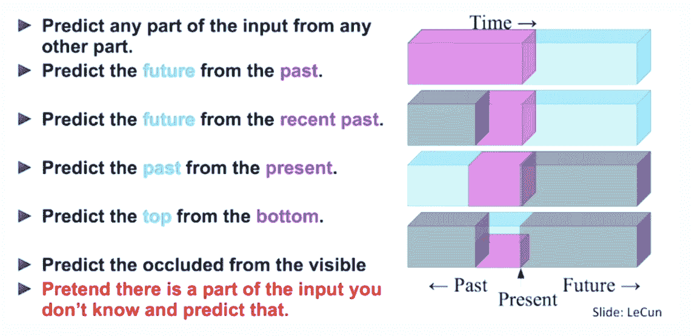

图 9\. 前置任务的一般主题。来源：（LeCun，2018）

一旦模型学习到在任务间迁移良好的通用表示，它们可以通过添加一些层将表示投射到标签空间并使用标记数据对模型进行微调，从而适应目标任务。由于标记数据不是用于学习基础特征，而是用于将高层表示映射到标签空间，因此标记数据的数量将是从头开始训练模型所需的数量的一小部分。从这个角度来看，使用自监督学习进行预训练的模型是*数据高效*的（与从头开始训练相比，它们收敛更快，在相同数量的标记数据下达到更好的质量等）((Howard 和 Ruder，2018；Devlin 等，2018)）。

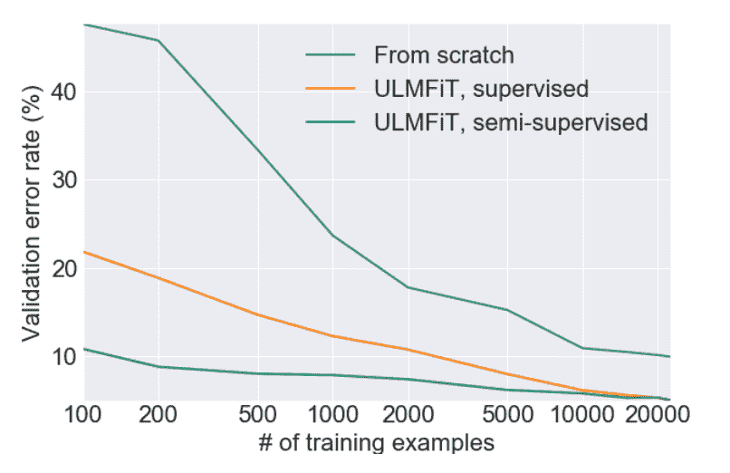

图 10\. 验证误差与 IMDb 上不同训练方法的训练样本数量的关系（从头开始，ULMFiT 有监督：使用 WikiText-103 进行预训练，并使用标记数据进行微调，ULMFit 半监督：使用 WikiText-103 和目标数据集中的未标记数据进行预训练，并使用标记数据进行微调）。来源：（Howard 和 Ruder，2018）

这种在未标记数据上进行预训练并在标记数据上进行微调的两步过程的示例已经在 NLP 社区得到了快速接受。ULMFiT（Howard 和 Ruder，2018）开创了训练通用语言模型的理念，其中模型学习解决预测给定句子中下一个单词的预任务，而无需关联标签。作者发现，使用大量预处理的未标记数据（如 WikiText-103 数据集，来源于英文维基百科页面）是预训练步骤的一个不错选择。这对于模型学习语言的一般属性是足够的，作者发现，将这种预训练模型微调到二分类问题（IMDb 数据集）仅需 100 个标记示例（大约少了 10 倍的标记示例）。参见图 10。如果我们增加一个中间步骤，使用来自相同目标数据集的未标记数据进行预训练，作者报告说需要大约 20 倍更少的标记示例。

这种先预训练后微调的思想也被应用于 BERT（Devlin 等人，2018）（以及其他相关模型如 GPT、RoBERTa、T5 等），其中预训练步骤包括学习解决两个任务。首先是掩码语言模型（Masked Language Model），在给定句子的约 15% 的标记被掩盖，模型需要预测被掩盖的标记。第二个任务是，给定两个句子 $A$ 和 $B$，预测 $B$ 是否跟随 $A$。预训练损失是两个任务损失的均值。一旦预训练完成，模型就可以通过在最后一个隐藏层上添加额外层来用于分类或 seq2seq 任务。发布时，BERT 在十一项 NLP 任务上超越了最先进的技术。

与 NLP 类似，视觉中的预任务也被用来训练学习一般表示的模型。（Doersch 等人，2015）从训练示例中提取两个补丁，然后训练模型预测它们在图像中的相对位置（参见图 11（a））。他们证明，以这种方式预训练的网络比随机初始化的网络在最终目标检测任务中的质量更高。类似地，另一个任务是预测给定旋转图像的旋转角度（Gidaris 等人，2018）。作者报告称，以这种自监督方式训练的网络可以微调到与完全监督的网络几乎一样的效果。

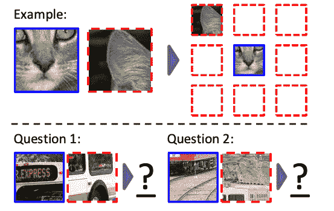

(a) 检测补丁的相对顺序。来源：(Doersch 等, 2015)。

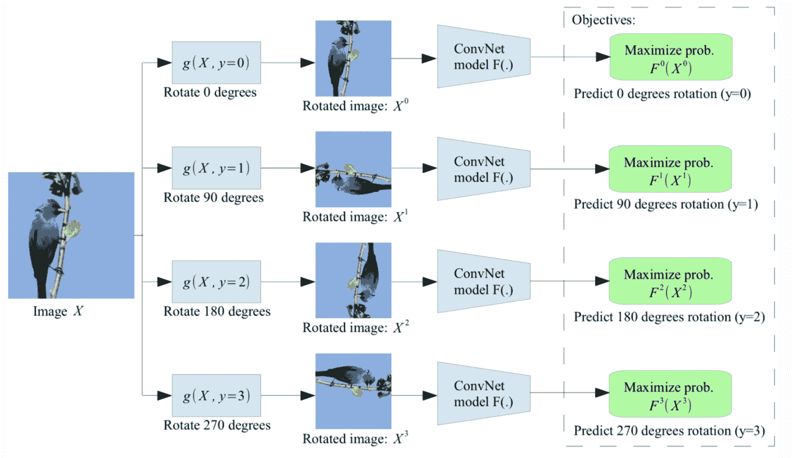

(b) 预测给定图像的旋转角度。

图 11\. 视觉问题的前置任务。

另一个常见主题是对比学习，其中模型被训练来区分相似和不相似的输入。像 SimCLR (Chen 等, 2020a; Chen 等, 2020b) 这样的框架，试图学习两个给定输入 $\tilde{x_{i}}$ 和 $\tilde{x_{j}}$ 的表示 $h_{i}$ 和 $h_{j}$，其中后者两个是同一输入的不同增强视图，使得 $h_{i}$ 和 $h_{j}$ 的投影 $z_{i}$ 和 $z_{j}$ (使用单独的函数 $g(.)$) 的余弦相似度最大化。类似地，对于不相似的输入，$z_{i}$ 和 $z_{j}$ 的余弦相似度应最小化。作者报告在 ImageNet 上仅用 1% 标签（每类 13 个标签）取得了 $73.9\%$ 的 Top-1 准确率，并且在仅用 10% 标签的情况下超越了 ResNet-50 监督基线。

图 12\. 用于学习视觉表示的 SimCLR 框架。来源：(Chen 等, 2020a)

讨论：自监督学习 (SSL) 在未标记数据的通用表征学习中取得了显著成功，然后通过微调将模型适应目标任务，使用少量标记样本。Yann LeCun 比喻自监督学习为蛋糕，而监督学习为上面的糖霜 (LeCun, 2018)，这意味着 SSL 将是未来训练高质量模型的主要方式，尤其是当我们超越标记数据丰富的任务时。

由于未标记数据几乎是无限的，SSL 的成功取决于为感兴趣的领域创建有用的前置任务。如在 NLP (Howard 和 Ruder, 2018; Devlin 等, 2018)、视觉 (Chen 等, 2020a; Patrick 等, 2020)、语音 (Glass, 2012) 等领域所示，自监督学习确实不仅有助于加速和改善收敛，还能在获取足够标记样本困难的任务中实现高质量。

实际上，对于在自定义任务（例如，远程非洲方言的语音识别模型）上训练深度学习模型的人来说，拥有一个以自监督方式训练的模型的预训练检查点（如 wav2vec (Baevski et al., 2020)，其训练方式类似于 BERT (Devlin et al., 2018))，使他们只需在数据标注和训练上花费极少的资源来微调到足够好的质量。在某些情况下，如 SimCLR (Chen et al., 2020b)，SSL 方法实际上已经超越了以前的监督基准，例如 ResNet-50。因此，我们希望 SSL 方法对 ML 从业者训练高质量模型的成本效益至关重要。

### 3.3\. 自动化

可以将部分关于效率的工作委托给自动化，让自动化方法寻找训练更高效模型的方法。除了减少人工工作外，它还降低了人工决策可能在模型训练中引入的偏差，同时系统地和自动地寻找最佳解决方案。权衡是，这些方法可能需要大量计算资源，因此必须小心应用。

#### 3.3.1\. 超参数优化（HPO）

这一类别中常用的方法之一是超参数优化（HPO）(Yu and Zhu, 2020)。初始学习率、权重衰减等超参数必须经过仔细调整以实现更快的收敛（Jeremy Jordan, 2020）。它们还可以决定网络架构，例如全连接层的数量、卷积层中的过滤器数量等。

实验可以帮助我们建立对这些参数可能范围的*直觉*，但找到最佳值需要搜索优化给定目标函数（通常是验证集上的损失值）的确切值。随着超参数及其可能值的增加，手动搜索很快变得乏味。因此，让我们探索自动化搜索的可能算法。为了形式化这个问题，假设我们在优化给定数据集验证分割上的损失值。设 $\mathcal{L}$ 为损失函数，$f$ 为通过超参数集（$\lambda$）学习得到的模型函数，$x$ 为输入，$\theta$ 为模型参数。通过搜索，我们试图找到 $\lambda^{*}$，使得，

| (6) |  | $\small\lambda^{*}=\operatorname*{argmin}_{\lambda\in\Lambda}\mathcal{L}(f_{\lambda}(x;\theta),y)$ |  |
| --- | --- | --- | --- |

$\Lambda$ 是所有可能的超参数的集合。在实际应用中，$\Lambda$ 可以是一个非常大的集合，包含所有可能的超参数组合，这通常是不可处理的，因为像学习率这样的超参数是实值的。一种常见的策略是通过选择一个有限的*试验*集合 $S=\{\lambda^{(1)},\lambda^{(2)},...,\lambda^{(n)}\}$ 来近似 $\Lambda$，使得 $S\in\Lambda$，然后我们可以用：

| (7) |  | $\small\lambda^{*}\approx\operatorname*{argmin}_{\lambda\in\{\lambda^{(1)},...,\lambda^{(n)}\}}\mathcal{L}(f_{\lambda}(x;\theta),y)$ |  |
| --- | --- | --- | --- |

如我们所见，$S$ 的选择对近似效果至关重要。用户必须为每个超参数 $\lambda_{i}\in\lambda$ 构建一个合理值的范围。这可以基于对这些超参数的先前经验。

自动化 HPO 的一个简单算法是网格搜索（也称为参数扫描），其中 $S$ 包含所有根据指定范围的超参数的不同有效组合。由于每个试验是独立的，因此可以并行运行每个试验，一旦所有试验完成，就可以找到超参数的最佳组合。由于这种方法尝试所有可能的组合，它受到了*维度诅咒*的影响，即试验总数增长非常快。

另一种方法是随机搜索，其中试验是从搜索空间中随机抽取的（Bergstra 和 Bengio, 2012）。由于每次试验是独立的，因此仍然可以随机执行。然而，随机搜索有一些关键的好处：

1.  (1)

    由于试验是独立同分布的（网格搜索则不是），因此可以在运行时调整搜索的分辨率（如果计算预算发生了变化，或某些试验失败）。

1.  (2)

    找到最佳 $\lambda^{*}$ 的可能性随着试验次数的增加而增加，这与网格搜索不同。

1.  (3)

    如果有 $K$ 个实值超参数和 $N$ 次总试验，网格搜索将为每个超参数选择 $N^{\frac{1}{K}}$。然而，并非所有的超参数都可能重要。随机搜索为每次试验中的每个超参数选择一个随机值。因此，在搜索空间的有效维度较低的情况下，随机搜索的表现优于网格搜索。

(a) 网格搜索

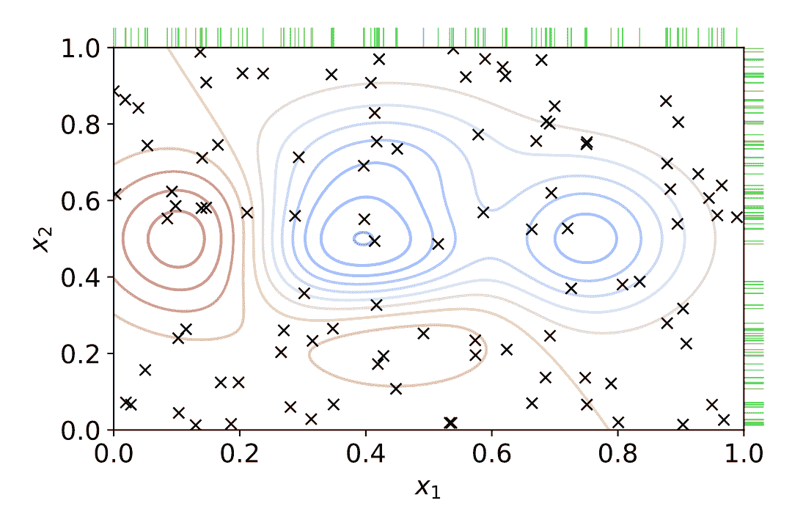

(b) 随机搜索

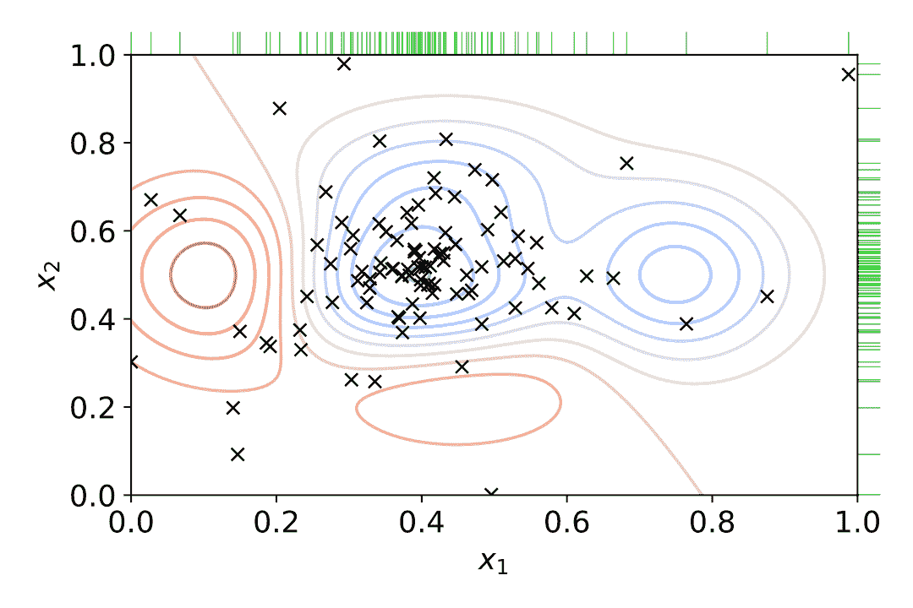

(c) 贝叶斯优化

图 13\. 超参数搜索算法。来源: (Wikimedia 项目的贡献者, 2021c)

基于贝叶斯优化（BO）的搜索（Močkus，1975；Agnihotri 和 Batra，2020）是一种*模型基*的序列方法，其中搜索通过积极估计搜索空间中不同点的目标函数值来引导，然后根据迄今为止收集的信息生成试验。目标函数的估计是使用一个*代理函数*完成的，该函数从一个先前的估计开始。试验的创建是使用*获取函数*进行的，该函数使用代理函数来选择下一个试验，考虑到是否可能改进迄今为止的最优值、是否探索/利用等。随着试验的完成，这两个函数都会细化其估计。由于该方法保持了目标函数的内部模型并根据该知识规划下一个试验，因此它是基于模型的。此外，由于试验的选择依赖于过去试验的结果，因此该方法是序列的。BO 相较于随机搜索的改进在于搜索是被引导的而非随机的，因此达到最优值所需的试验更少。然而，这也使得搜索变得序列化（虽然可以并行运行多个试验，但总体上会导致一些试验的浪费）。

节省上述搜索算法训练资源的一种策略是提前停止那些不具备潜力的试验。Google 的 Vizier（Golovin 等，2017）使用中位数停止规则进行提前停止，其中如果一个试验在时间步 $t$ 的表现低于截至该时间点所有试验的中位数表现，则终止该试验。

其他用于超参数优化的算法包括：

1.  （1）

    基于种群的训练（PBT）（Jaderberg 等，2017）：这种方法类似于遗传算法等进化方法，其中生成和训练一个固定数量的试验（称为种群）直至收敛。每个试验从一组随机的超参数开始，并训练到预定的步骤数量。在此时，所有试验都会暂停，每个试验的权重和参数可能会被到目前为止种群中“最佳”试验的权重和参数所替代。这是搜索的*利用*部分。为了*探索*，这些超参数会从其原始值中扰动。这个过程会重复直到收敛。它结合了搜索和训练在一个固定数量的并行试验中。它也仅适用于如学习率、权重衰减等自适应超参数，但不能用于超参数改变模型结构的情况。请注意，选择“最佳”试验的标准不一定需要是可微分的。

1.  （2）

    多臂老虎机算法：像逐次缩减（SHA）（Jamieson 和 Talwalkar，2016）和超带（Li 等，2017）的方法类似于随机搜索，但它们会将更多资源分配给表现良好的试验。这些方法都需要用户指定搜索的总计算预算$B$（例如，可以是训练的总轮次）。然后，它们会生成并训练固定数量的试验，使用随机采样的超参数，同时分配训练预算。预算用尽后，表现最差的部分（$\frac{\eta-1}{\eta}$）的试验会被淘汰，剩余试验的新预算会乘以$\eta$。在 SHA 的情况下，$\eta$为 2，因此底部$\frac{1}{2}$的试验被淘汰，剩余试验的训练预算翻倍。对于 Hyper-Band，$\eta$为 3 或 4。Hyper-Band 不同于 SHA，因为用户不需要指定最大并行试验数量，这在总预算与每次试验分配之间引入了权衡。

HPO 工具包：有几个软件工具包集成了 HPO 算法以及易于使用的界面（UI，以及指定超参数及其范围的方法）。Vizier（Golovin 等，2017）（一个内部 Google 工具，也可以通过 Google Cloud 进行黑箱调优）。Amazon 提供了 Sagemaker（Perrone 等，2020），功能类似，也可以作为 AWS 服务访问。NNI（Research，2019），Tune（Liaw 等，2018），Advisor（Chen，2021）是其他可以在本地使用的开源 HPO 软件包。

#### 3.3.2\. 神经架构搜索（NAS）

神经架构搜索可以被认为是超参数优化的扩展，其中我们寻找的是改变网络架构本身的参数。

我们发现文献中存在共识（Elsken 等，2019），将 NAS 归类为一个包含以下部分的系统：

1.  (1)

    搜索空间：这些是在图中允许的操作（卷积（$1\times 1,3\times 3,5\times 5$），全连接，池化等），以及这些操作及其输出如何连接到网络的其他部分的语义。

1.  (2)

    搜索算法与状态：这是控制架构搜索本身的算法。通常，适用于 HPO（网格搜索、随机搜索、贝叶斯优化、进化算法）的标准算法，也可以用于 NAS。然而，使用强化学习（RL）（Zoph 和 Le，2016）和梯度下降（Liu 等，2018a）也是流行的替代方案。

1.  (3)

    评估策略：这定义了我们如何评估模型的适应性。它可以是一个简单的传统指标，如验证损失、准确率等。或者，它也可以是一个复合指标，例如 MNasNet (Tan et al., 2019) 的情况，它基于准确率和延迟创建一个自定义的单一指标。

图 14\. 神经架构搜索：控制器可以被认为是一个编码搜索空间、搜索算法本身以及它所维护的状态（通常是帮助生成候选模型的模型）的单元。算法在搜索空间 $S$ 中生成候选模型，并接收评估反馈。这个反馈用于更新状态，并生成更好的候选模型。

用户应当明确或隐含地编码搜索空间。结合搜索算法，我们可以将其视为一个‘控制器’，它生成样本候选网络（参见图 14 ‣ 3.3\. 自动化 ‣ 3\. 高效深度学习的全景 ‣ 高效深度学习：关于使深度学习模型更小、更快、更好的调查")）。评估阶段将训练并评估这些候选模型的适应性。这个适应性值然后作为反馈传递给搜索算法，算法将利用它生成更好的候选模型。虽然这些模块的实现各不相同，但这种结构在该领域的开创性工作中是共同的。

Zoph 等人在 2016 年的论文（Zoph and Le, 2016）中展示了可以使用强化学习生成端到端的神经网络架构。在这种情况下，控制器是一个递归神经网络，它一次生成一个前馈网络的架构超参数，例如滤波器数量、步幅、滤波器大小等。他们还支持添加跳跃连接（参见图 15 ‣ 3.3\. Automation ‣ 3\. Landscape of Efficient Deep Learning ‣ Efficient Deep Learning: A Survey on Making Deep Learning Models Smaller, Faster, and Better")）。网络语义被嵌入到控制器中，因此生成一个行为不同的网络需要更改控制器。此外，训练控制器本身很昂贵（需要 22,400 GPU 小时（Zoph et al., 2018）），因为必须从头开始训练整个候选网络以进行单次梯度更新。在后续论文（Zoph et al., 2018）中，他们提出了一个改进的搜索空间，其中不再搜索端到端的架构，而是搜索*单元*：一个“正常单元”接收输入，处理它，并返回相同空间维度的输出；一个“缩减单元”处理其输入，并返回空间维度缩小一倍的输出。每个单元由$B$块组成。控制器的 RNN 一次生成一个块，它选择过去两个块的输出、应用于它们的操作以及如何将它们组合成一个输出。正常单元和缩减单元以交替方式堆叠（$N$个正常单元后跟 1 个缩减单元，其中$N$是可调的）以构建一个端到端的网络，用于 CIFAR-10 和 ImageNet。与（Zoph and Le, 2016）中的端到端网络搜索相比，单独学习这些单元似乎将搜索时间提高了 7$\times$，同时在 CIFAR-10 上超过了当时的最先进水平。

图 15\. 一个 NASNet 控制器生成架构，递归地一次做出一个决定，并在图像中生成一个单独的块（共做出 5 个决定）。来源：（Zoph et al., 2018）。

其他方法，如进化技术（Real et al., 2019），可微分架构搜索（Liu et al., 2018a），渐进搜索（Liu et al., 2018c），参数共享（Pham et al., 2018）等，试图降低架构搜索的成本（在某些情况下，将计算成本降低到几天的 GPU 时间，而不是数千天的 GPU 时间）。这些在（Elsken et al., 2019）中有详细介绍。

虽然早期的大多数论文集中在寻找在准确度等质量指标上表现最好的架构，而不受足迹指标的限制。但是，当关注效率时，我们通常对质量和足迹之间的具体权衡感兴趣。架构搜索可以帮助进行多目标搜索，以优化质量和足迹。MNasNet（Tan et al., 2019）就是其中之一。它将模型在目标设备上的延迟直接纳入目标函数，如下所示：

| (8) |  | $\small\underset{m}{\operatorname{maximize}}\quad ACC(m)\times\left[\frac{LAT(m)}{T}\right]^{w}$ |  |
| --- | --- | --- | --- |

其中 $m$ 是候选模型，$ACC$ 是准确度指标，$LAT$ 是给定模型在目标设备上的延迟。$T$ 是目标延迟。$w$ 推荐为 $-0.07$。FBNet（Wu et al., 2019）使用类似的方法，其复合奖励函数对验证集上的损失值和延迟进行加权组合。然而，它们不是测量候选模型在设备上的延迟，而是使用预计算的查找表来近似延迟，以加速搜索过程。他们实现的网络比 MobileNet 小 $2.4\times$，速度快 $1.5\times$，同时在 216 GPU 小时内完成了搜索。其他工作如 MONAS（Hsu et al., 2018）使用强化学习将功耗纳入奖励函数，同时对模型中的 MAC 操作数量施加硬约束，并在给定约束下发现帕累托前沿。

讨论：自动化在模型效率中发挥了关键作用。超参数优化（HPO）现在是训练模型的自然步骤，并且可以显著提高质量，同时最小化人工干预。如果 HPO 的成本变得很大，可以使用类似贝叶斯优化、Hyper-Band 等带有早期停止技术的算法。HPO 也可以在像 Tune（Liaw et al., 2018）、Google Cloud 的 Vizier（Golovin et al., 2017）、NNI（Research, 2019）等现成的软件包中找到。类似地，最近在神经架构搜索（NAS）方面的进展也使得以学习的方式构建架构成为可能，同时对质量和足迹都有约束（Tan et al., 2019）。假设 NAS 运行完成需要几百个 GPU 小时的计算，并且在领先的云计算服务上大约为 $3 GPU / hour 的成本，这使得使用 NAS 方法在财务上是可行的，与针对多个目标优化的手动实验成本并不相似。

### 3.4\. 高效架构

处理效率问题的另一个常见方法是回到设计阶段，设计具有高效性的层和模型来替代基线模型。它们通常设计有一定的洞察力，这可能导致设计在一般情况下更好，或者更适合特定任务。在本节中，我们列出了这种高效层和模型的示例，以阐明这一思想。

#### 3.4.1\. 视觉

在视觉领域中，高效层的经典例子之一是卷积层，它们在视觉模型中比全连接（FC）层更有优势。全连接层存在两个主要问题：

1.  (1)

    全连接层忽略了输入像素的空间信息。直观来说，通过孤立地查看单个像素值，很难建立对给定输入的理解。它们还忽略了附近区域的空间局部性。

1.  (2)

    其次，当处理即使是中等大小的输入时，使用全连接（FC）层也会导致参数数量爆炸。例如，一个$100\times 100$ RGB 图像具有 3 个通道，这将导致第一层中的每个神经元具有$3\times 10^{4}$个连接。这也使得网络容易过拟合。

卷积层通过学习‘滤波器’来避免这一问题，其中每个滤波器是一个固定大小的 3D 权重矩阵（$3\times 3$、$5\times 5$等），第三维与输入中的通道数相同。每个滤波器在输入上进行卷积以生成该滤波器的特征图。这些滤波器学习检测特定特征，将其与特定输入补丁进行卷积会产生一个标量值，如果该特征在输入补丁中存在，则该值较高。

在较低层中（例如边缘（水平、垂直、对角线等）），学到的特征较简单，而在后续层中（纹理、形状等）则更复杂。这是因为后续层使用前面层生成的特征图，并且第$i$层输入特征图中的每个像素依赖于过去的$i-1$层。随着$i$的增加，这增加了该像素的*感受野*，逐渐增加了可以在滤波器中编码的特征的复杂性。

卷积层效率的核心思想是相同的滤波器在图像中的所有位置都使用，而不论滤波器应用的位置。因此，在共享参数的同时，强制执行空间不变性。以一个$100\times 100$ RGB 图像为例，一个$5\times 5$的滤波器意味着总共有$75$个参数（$5\times 5\times 3$）。每层可以学习多个独特的滤波器，同时仍在非常合理的参数预算范围内。这也具有正则化效果，即大幅减少的参数数量使优化变得更容易，降低了过拟合的可能性。

卷积层通常与池化层配合使用，池化层通过子采样输入（聚合像素的滑动二维窗口，使用最大值、平均值等函数）来实现降维。池化操作会导致下一层处理的特征图变小，从而加快处理速度。LeNet5（Lecun 等人，1998）是第一个包含卷积层、池化等的卷积网络。随后，许多这些网络的迭代版本被提出，并进行了各种改进。AlexNet（Krizhevsky 等人，2012）、Inception（Szegedy 等人，2015）、ResNet（He 等人，2016）等在使用卷积层进行已知图像分类基准测试时都取得了显著改进。

深度可分离卷积层：在卷积操作中，每个滤波器用于在两个空间维度和第三个通道维度上进行卷积。因此，每个滤波器的大小为$s_{x}\times s_{y}\times$input_channels，其中$s_{x}$和$s_{y}$通常相等。对每个滤波器执行此操作，导致卷积操作在$x$和$y$维度上空间上进行，同时在$z$维度上进行深度卷积。

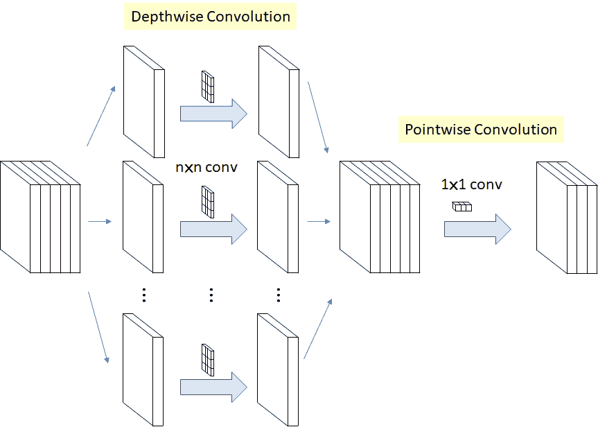

图 16\. 深度可分离卷积。来源：（Tsang，2019）。

深度可分离卷积将其拆分为两个步骤（参见图 16）：

1.  (1)

    使用$1\times 1$滤波器进行点卷积，结果特征图现在具有 output_channels 的深度。

1.  (2)

    在$x$和$y$维度上使用$s_{x}\times s_{y}$滤波器进行空间卷积。

这两种操作叠加在一起（没有任何中间的非线性激活）会产生与常规卷积相同形状的输出，但参数更少（$1\times 1\times$input_channels$\times$output_channels$)+(s_{x}\times s_{y}\times$output_channels$)$，相比之下常规卷积的参数为$s_{x}\times s_{y}\times$input_channels $\times$output_channels）。由于点卷积在对每个输入通道进行深度卷积时成本更低，因此计算量也减少了一个数量级（有关更多计算，请参阅（Sandler 等人，2018））。Xception 模型架构（Chollet，2017）证明了在 Inception 架构中使用深度可分离卷积可以更快地达到收敛，并在 ImageNet 数据集上获得更高的准确性，同时保持相同数量的参数。

MobileNet 模型架构 (Sandler 等，2018) 旨在移动和嵌入式设备上使用，采用了深度可分离层而非常规卷积层。这有助于将参数数量以及乘加操作数量减少$7-10\times$，并允许在移动设备上部署计算机视觉任务。用户可以根据模型预期的延迟在 10-100ms 之间变化。MobileNet 还通过深度乘子提供了一个调节器，用于缩放网络，以便用户在精度和延迟之间进行权衡。

#### 3.4.2\. 自然语言理解

注意力机制与 Transformer 家族：困扰经典序列到序列（Seq2Seq）模型的一个问题是信息瓶颈。Seq2Seq 模型通常有一个或多个编码器层，这些层将给定的输入序列($\mathbf{x}=(x_{1},x_{2},...,x_{T})$)编码为一个固定长度的向量（也称为上下文，$\mathbf{c}$），以及一个或多个解码器层，这些层使用这个上下文生成另一个序列。在机器翻译（MT）的情况下，输入序列可以是源语言中的一句话，而输出序列可以是目标语言中的句子。

然而，在经典 Seq2Seq 模型中，如(Sutskever 等，2014)，解码器层只能看到最终编码步骤的隐藏状态($c=h_{T}$)。这是一个*bottleneck*，因为编码器块必须将有关序列的所有信息压缩到一个单一的上下文向量中供所有解码步骤使用，解码器块必须以某种方式从中推断出整个编码序列（参见图 17）。增加上下文向量的大小是可能的，但这会导致所有中间步骤的隐藏状态增加，从而使模型变得更大、更慢。

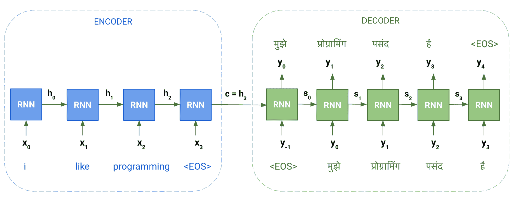

图 17\. Seq2Seq 模型中的信息瓶颈，用于将英语翻译为印地语。解码器可以访问的上下文向量$c$是固定的，通常是最后一个隐藏状态($h_{T}$)。

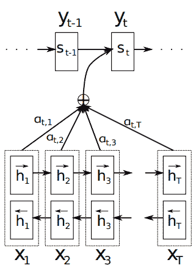

图 18\. 注意力模块为每个输出标记从隐藏状态中学习一个加权的上下文向量。来源： (Bahdanau 等，2014)。

注意力机制在 Bahdanau 等人（Bahdanau 等人，2014）的研究中引入，通过允许所有隐藏状态对解码器可见，并基于输出标记与每个输入标记的对齐关系创建加权上下文向量。实际上，新的加权上下文向量为 $c_{i}=\sum_{j}^{T}\alpha_{ij}.h_{j}$，其中 $\alpha_{ij}$ 是解码器隐藏状态 $s_{i-1}$ 和第 $j$ 个标记的隐藏状态 ($h_{j}$) 之间学习到的对齐（注意力权重）。$\alpha_{ij}$ 可以视为在处理第 $j$ 个输入标记时，第 $i$ 个输入标记应给予多少注意力。在某些情况下，这个模型通过显式的查询 ($Q$)、键 ($K$) 和值 ($V$) 向量进行了推广。我们试图学习 $Q$ 和 $K$ 之间的注意力权重分布 ($\mathbf{\alpha}$)，并用它来计算 $V$ 上的加权上下文向量 ($\mathbf{c}$)。在上述编码器-解码器架构中，$Q$ 是解码器隐藏状态 $s_{i-1}$，$K=V$ 是编码器隐藏状态 $h_{j}$。注意力机制已被用于解决各种 NLU 任务（机器翻译、问答、文本分类、情感分析），以及视觉、多模态任务等（Chaudhari 等人，2019）。我们建议读者参考（Chaudhari 等人，2019）以获取更多关于注意力模型分类的细节。

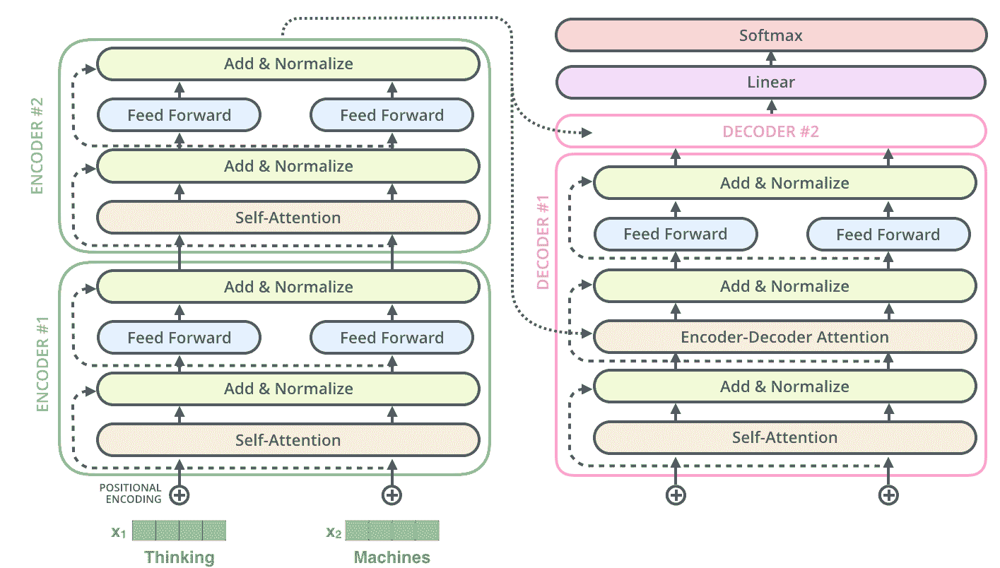

图 19\. Transformer 及其编码器和解码器模块。来源：（Alammar，2021）。

Transformer 架构（Vaswani 等人，2017）于 2017 年提出，该架构引入了用于编码器和解码器的自注意力层。他们展示了注意力层可以替代传统的基于 RNN 的 Seq2Seq 模型。在自注意力层中，查询、键和值向量都通过使用不同的投影矩阵从同一序列中导出。

自注意力机制还允许并行化处理输入序列中标记之间关系的过程。RNNs 本质上强制过程一步一步进行，即学习长程依赖关系的复杂度为 $O(n)$，其中 $n$ 是标记的数量。使用自注意力机制时，所有标记可以一起处理，并且成对关系可以在 $O(1)$ 内学习（Vaswani 等人，2017）。这使得利用优化的训练设备如 GPUs 和 TPUs 更加容易。作者报告称，与其他递归和卷积模型相比，训练 FLOPs 减少了多达 $300\times$，以达到类似的质量。Tay 等人（Tay 等人，2020）详细讨论了几种 Transformer 变体及其底层自注意力机制的计算和内存效率。

如前所述，BERT 模型架构（Devlin 等，2018）在多个 NLU 基准测试中超越了最先进的技术。BERT 是一组 Transformer 编码器层，通过双向掩蔽语言模型训练目标进行预训练。它还可以用作通用编码器，然后用于其他任务。其他类似的模型如 GPT 系列（Brown 等，2020）也被用于解决许多 NLU 任务。

随机投影层与模型 预训练的词表示（如 word2vec（Mikolov 等，2017），GLoVE（Pennington 等，2014）等）在 NLU 任务中很常见。然而，由于它们需要一个 $d$-维向量来存储每个词元，如果词汇表大小 $V$ 很大，则表所消耗的总大小会迅速增加（$O(V.d)$）。

如果模型大小是部署的限制条件，我们可以依赖于压缩技术（如前面所述）来帮助嵌入表压缩，或者评估可以绕过嵌入表需求的层和模型。基于随机投影的方法（Ravi，2017；Ravi 和 Kozareva，2018；Kaliamoorthi 等，2019；Kaliamoorthi 等，2021）就是这样的一类模型。它们提议通过将输入特征 $x$（unicode 词元/词元等）映射到低维空间来替代嵌入表和查找。这是通过随机投影算子 $\mathbb{P}$ 完成的，使得 $\mathbb{P}(x)\in\{0,1\}^{T.r}$，可以分解为 $T$ 个单独的投影操作，每个生成一个 $r$-位表示（$\mathbb{P}(x)=[\mathbb{P}_{1}(x),...,\mathbb{P}_{T}(x)]$，其中 $\mathbb{P}_{i}(x)\in{0,1}^{r}$）。$T$ 和 $r$ 可以手动选择。

每次随机投影操作 $\mathbb{P}_{i}$ 是通过局部敏感哈希（LSH）实现的（Charikar，2002；Ravi 和 Kozareva，2018），每次使用不同的哈希函数（通过不同的种子）。有关随机投影操作的理论保证，请参见（Charikar，2002），该文献展示了该操作在将这些点映射到的低维空间中保持两点之间的相似性（这对于模型学习输入的语义至关重要）。如果这种关系在低维空间中成立，那么投影操作可以用于学习给定输入的判别特征。与嵌入表相比，投影操作的核心优势是所需的空间为 $O(T)$，而不是 $O(V.d)$（$T$ 个种子用于 $T$ 个哈希函数）。另一方面，随机投影计算也是 $O(T)$，而嵌入表查找是 $O(1)$。因此，当模型大小是优化的主要关注点时，投影层显然是有用的。

在投影模型家族的各种论文中，存在实现上的细微差异（在投影操作之前 ((Ravi 和 Kozareva，2018)) 与之后 ((Kaliamoorthi 等，2019; Sankar 等，2019))，生成三元表示而非二元表示 ((Kaliamoorthi 等，2019; Kaliamoorthi 等，2021))，在其上应用复杂的层和网络，例如注意力 ((Kaliamoorthi 等，2019))，QRNN ((Kaliamoorthi 等，2021)) 等。

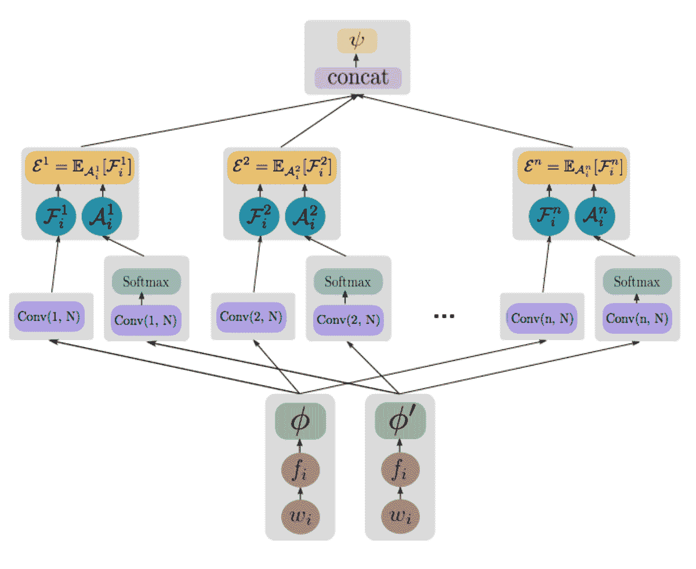

(a) PRADO 模型。来源：(Kaliamoorthi 等，2019)。

(b) PQRNN 模型。来源：(Kaliamoorthi 等，2021)

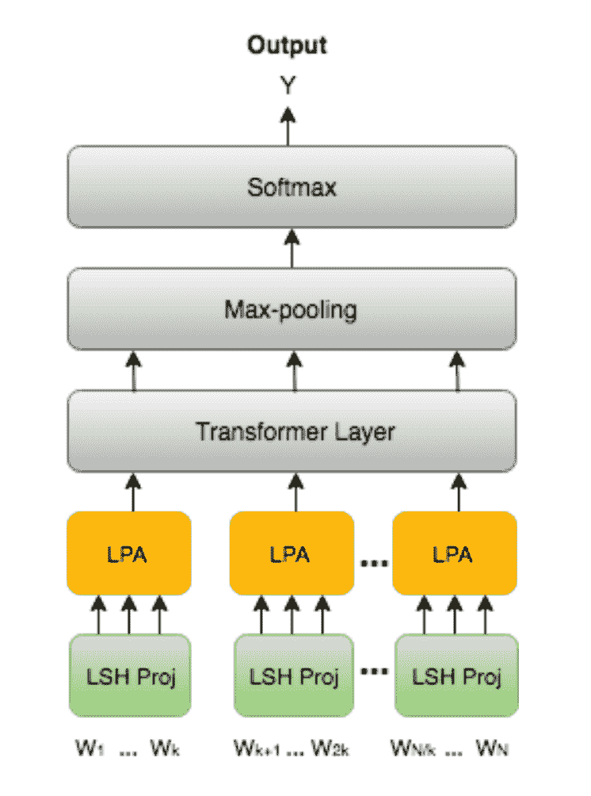

(c) Proformer 模型。来源：(Sankar 等，2020)。

图 20\. 具有显著性的随机投影模型集合。

一些基于投影的模型（参见图 20）在自然语言理解任务中展示了令人印象深刻的结果。PRADO ((Kaliamoorthi 等，2019)) 从投影输入中生成 n-gram 特征，然后在其上有一个多头注意力层。它的准确性与标准 LSTM 模型相当，同时体积比 LSTM 小 $100\times$，在 Nexus 5X 设备上推理需要 20-40 毫秒。PQRNN (Kaliamoorthi 等，2021)，另一种基于投影的模型，额外使用了快速 RNN 实现 (QRNN) (Bradbury 等，2016) 在投影特征之上。他们报告说在体积比 LSTM 小 $140\times$ 的情况下超越了 LSTM，并且在体积比 BERT-like 模型小 $350\times$ 的情况下达到了 BERT-like 模型质量的 $97.1\%$。

Proformer (Sankar 等，2020) 引入了一个本地投影注意力 (LPA) 层，它将投影操作与局部注意力相结合。他们展示了在仅占用 BERT-base 内存的 13% 的情况下，达到约 97.2% 的 BERT-base 性能。ProFormer 也有 1440 万个参数，相比之下，BERT-base 有 1.1 亿个参数。

### 3.5\. 基础设施

为了能够高效地训练和运行推理，必须有一个强大的软件和硬件基础设施基础。在这一部分，我们将讨论这两个方面。请参阅图 21 以获取关于软件和硬件基础设施及其相互作用的心理模型。在这一部分，我们提供了一个非详尽但全面的领先软件和硬件基础设施组件的调查，这些组件对模型效率至关重要。

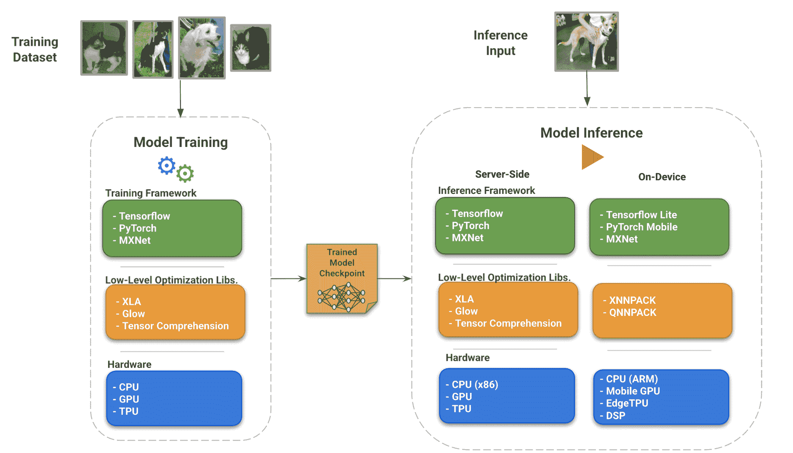

图 21\. 这是一个硬件和软件基础设施的可视化图，重点关注效率。左侧是模型训练阶段，它生成一个训练好的模型检查点。然后在推理阶段使用这个模型，这个阶段可以是在服务器端（云端或本地机器），也可以是在设备端（手机、物联网设备、边缘设备等）。

#### 3.5.1\. Tensorflow 生态系统

Tensorflow (TF) (Abadi et al., 2016; Authors, 2021g) 是一个流行的机器学习框架，已经被许多大型企业用于生产环境。它具有一些最广泛的软件支持以提高模型效率。

用于设备端使用场景的 Tensorflow Lite：Tensorflow Lite (TFLite) (Authors, 2021i) 是一组用于低资源环境下推理的工具和库。从高层次来看，我们可以将 TFLite 项目分为两个核心部分：

+   •

    解释器和操作内核：TFLite 提供了一个解释器来运行专门的 TFLite 模型，以及常见神经网络操作的实现（全连接、卷积、最大池化、ReLu、Softmax 等，每一个都是一个 *Op*）。这种操作的实现被称为 *Op Kernel*。解释器和操作内核主要针对 ARM 架构处理器进行了优化，至撰写本文时，它们也可以利用智能手机 DSP，如 Qualcomm 的 Hexagon (Authors, 2021l) 来加速执行。解释器还允许用户设置多个线程进行执行。

+   •

    转换器：正如名称所示，TFLite 转换器用于将给定的 TF 模型转换成一个用于解释器推理的单一 flatbuffer 文件。除了转换本身，它还处理许多内部细节，如准备用于量化推理的图，融合操作，添加其他元数据等。关于量化，它还允许如前所述的后训练量化，并提供一个可选的代表性数据集以提高准确性。

用于设备端推断的其他工具：TF Micro (Warden 和 Situnayake, 2019) 更进一步，由一个精简的解释器和一组较小的推断操作组成，适用于非常低资源的微控制器。TF Model Optimization toolkit (Authors, 2020) 是一个 Tensorflow 库，用于应用常见的压缩技术，如量化、剪枝、聚类等。TensorflowJS (TF.JS) 是 TF 生态系统中的一个库，可用于在浏览器中或使用 Node.js (Node.js Authors, 2021) 训练和运行神经网络。这些模型也可以通过 WebGL 接口 (Contributors to Wikimedia projects, 2021f) 通过 GPU 加速。它支持导入在 TF 中训练的模型以及从头创建新的 TF.JS 模型。

XLA 用于服务器端加速：通常，TF 模型图由 TF 的执行器进程执行，并使用标准优化内核在 CPU、GPU 等上运行。XLA (Authors, 2021j) 是一个图编译器，可以通过生成为图定制的新内核来优化模型中的线性代数计算。这些内核针对特定的模型图进行优化。例如，某些可以融合在一起的操作会合并成一个复合操作。这避免了在操作数仍在更便宜的缓存中时进行多次昂贵的 RAM 写入。Kanwar 等人 (Kanwar et al., 2021) 报告了训练吞吐量提高了 7$\times$，以及用于 BERT 训练的最大批量大小增加了 5$\times$。这允许在 Google Cloud 上训练一个 $32 的 BERT 模型。

#### 3.5.2. PyTorch 生态系统

PyTorch (Paszke et al., 2019) 是另一个在学术界和工业界广泛使用的流行机器学习平台。它常与 Tensorflow 在可用性和功能方面进行比较。

设备端使用案例：PyTorch 还具有一个轻量级解释器，使得可以在移动设备上运行 PyTorch 模型 (Authors, 2021c)，并提供了适用于 Android 和 iOS 的原生运行时。这类似于之前介绍的 TFLite 解释器和运行时。类似于 TFLite，PyTorch 提供了训练后量化 (Authors, 2021d) 以及其他图优化步骤，如常量折叠、融合某些操作、将通道格式设为最后 (NHWC) 以优化卷积层。

通用模型优化：PyTorch 还提供了即时编译（JIT）功能（作者，2021e），这可能类似于 Tensorflow 的 XLA，但实际上是一个生成序列化中间表示（高层 IR，如（Li，2020））的机制，源自 TorchScript（作者，2021e），这是 Python 的一个子集。TorchScript 对其能转换的代码施加约束，如类型检查，这使得它能够绕过典型 Python 编程的一些陷阱，同时保持 Python 兼容性。它允许在研究和开发的灵活 PyTorch 代码与可以用于生产推理的表示之间创建桥梁。例如，导出到 TorchScript 是在移动设备上运行的要求（作者，2021c）。这种表示类似于 TensorFlow 生成的静态推理模式图。在 PyTorch 世界中，XLA 的替代方案似乎是 Glow（Rotem 等，2018）和 TensorComprehension（Vasilache 等，2018）编译器。它们有助于生成从高级 IR（TorchScript，TF 图）派生的低级中间表示。这些低级深度学习编译器在（Li，2020）中详细比较。

PyTorch 提供了一个模型调优指南（作者，2021b），详细说明了 ML 从业者可以使用的各种选项。指南中的一些核心思想包括：

+   •

    在使用 NVIDIA GPUs 时，启用混合精度训练（作者，2021a）。这在 3.5.4 的 GPU 子章节中有更详细的描述。

+   •

    使用 PyTorch JIT 融合逐点操作（加、减、乘、除等）。尽管这应该会自动发生，但将 torch.jit.script 装饰器添加到完全由逐点操作组成的方法中，可以强制 TorchScript 编译器进行融合。

+   •

    启用缓冲区检查点可以仅将某些层的输出保留在内存中，并在反向传递过程中计算其余部分。这特别有助于计算成本较低但输出较大的层，如激活层。减少的内存使用可以换取更大的批量大小，从而提高训练平台（CPU、GPU、TPU 等）的利用率。

+   •

    启用设备特定的优化，如 cuDNN 库，并与 NVIDIA GPUs 进行混合精度训练（在 GPU 子章节中说明）。

+   •

    使用分布式数据并行训练，这适用于数据量大且有多个 GPU 可用于训练的情况。每个 GPU 拥有自己的模型和优化器，并在其数据子集上进行操作。每个副本的梯度会定期累积并平均。

#### 3.5.3\. 硬件优化库

我们可以通过优化神经网络运行的硬件来进一步提高效率。一个主要的部署目标是 ARM 的 Cortex 系列处理器。Cortex 通过 Neon（Ltd., 2021）架构扩展支持 SIMD（单指令多数据）指令。SIMD 指令对操作包含数据向量的寄存器非常有用，这对于通过向量化这些操作来加速线性代数操作至关重要。QNNPACK（Dukhan et al., 2020）和 XNNPACK（作者，2021k）库为 ARM Neon 优化了移动和嵌入式设备，也为 x86 SSE2、AVX 架构等进行了优化。QNNPACK 支持 PyTorch 中量化推理模式下的几种常见操作。XNNPACK 支持 TFLite 中的 32 位浮点模型和 16 位浮点。如果 XNNPACK 不支持某个操作，则会回退到 TFLite 中的默认实现。

同样，还有其他低级库如 iOS 的 Accelerate（Apple Authors, 2021）和 Android 的 NNAPI（Android Developers, 2021），它们试图将硬件级加速决策抽象到更高层的 ML 框架中。

#### 3.5.4 硬件

GPU：图形处理单元（GPUs）最初是为了加速计算机图形而设计的，但自 2007 年 CUDA 库（Wikimedia 项目贡献者，2021b）可用以来，开始用于通用用途，还有 cuBLAS 等库用于加速线性代数操作。2009 年，Raina 等人（Raina et al., 2009）展示了 GPU 可以用于加速深度学习模型。2012 年，随着 AlexNet 模型（Krizhevsky et al., 2012）在 ImageNet 竞赛中的显著改进，进一步规范了 GPU 在深度学习模型中的使用。自那时起，Nvidia 发布了几代 GPU 微架构，越来越注重深度学习性能。它还引入了 Tensor Cores（NVIDIA, 2020b；Stosic, 2020），这些是其 GPU 中的专用执行单元，专门用于深度学习应用。TensorCores 支持一系列精度（fp32, TensorFloat32, fp16, bfloat16, int8, int4）的训练和推理。正如前面量化部分所示，切换到更低的精度并不总是显著的折衷，因为模型质量的差异往往很小。

图 22. 降低精度的乘加（MAC）操作：$\mathbf{A}=(\mathbf{B}\times\mathbf{C})+\mathbf{D}$操作的示意图。$\mathbf{B}$和$\mathbf{C}$是降低精度（fp16, bfloat16, TensorFloat32 等），而$\mathbf{A}$和$\mathbf{D}$是 fp32。加速来自于以降低精度格式进行昂贵的矩阵乘法。

Tensor Cores 优化了标准的乘加（MAC）操作（Contributors to Wikimedia projects，2021d），$\mathbf{A}=(\mathbf{B}\times\mathbf{C})+\mathbf{D}$。其中，$\mathbf{B}$ 和 $\mathbf{C}$ 为降低精度（fp16, bfloat16, TensorFloat32），而 $\mathbf{A}$ 和 $\mathbf{D}$ 为 fp32。核心加速来自于以较低精度进行昂贵的矩阵乘法。乘法结果为 fp32，可以相对便宜地与 $\mathbf{D}$ 相加。在使用降低精度进行训练时，NVIDIA 报告的训练加速比为 1$\times$ 至 15$\times$，具体取决于模型架构和所选 GPU（Stosic，2020）。NVIDIA 最新的 Ampere 架构 GPU 中的 Tensor Cores 还支持带稀疏性的更快推理（特别是比率为 2:4 的结构化稀疏，其中 4 元素块中的 2 个元素为稀疏）(NVIDIA，2020a)。它们在推理时间上显示出最高 1.5$\times$ 的加速，在单个层上则最高 1.8$\times$ 的加速。NVIDIA 还提供了 cuDNN 库（NVIDIA，2020a），其中包含了标准神经网络操作的优化版本，如全连接、卷积、批归一化、激活等。

图 23\. 训练和推理中常用的浮点格式：fp32 是 IEEE-754 标准中的标准 32 位浮点数（Wang 和 Kanwar，2021）。其中一位用于存储符号。指数控制该格式所能表示的浮点值的范围，而尾数控制精度。请注意，fp16 降低了精度和范围。bfloat16 格式是一种合理的折衷，因为它保持了与 fp32 相同的范围，同时牺牲了精度，总共占用 16 位。NVidia GPU 还支持 Tensor Float 32 格式，该格式比 bfloat16 多分配了 3 位尾数，以实现更好的精度。然而，它总共占用 19 位，这使得它不是一个容易移植的格式。

TPU：TPU 是 Google 设计的专有应用特定集成电路（ASICs），用于加速与 Tensorflow 相关的深度学习应用。由于它们不是通用设备，因此不需要考虑任何非机器学习应用（大多数 GPU 必须考虑），因此它们在并行化和加速线性代数操作方面进行了精细调整。TPU 的第一次迭代是为使用 8 位整数进行推理而设计的，并在 2016 年发布之前在 Google 使用了一年（Jouppi 等，2017）。后续的 TPU 架构迭代支持浮点训练和推理。Google 还于 2018 年通过其 Google Cloud 服务开放了对这些 TPU 的访问（Google，2021a）。

(a) 一个实现乘法累加（MAC）操作的同步阵列单元。

(b) 使用同步阵列进行 4x4 矩阵乘法

图 24\. TPU 中的同步阵列：图 (a) 显示了一个实现 MAC 操作的同步阵列，其中变量 $A$ 和 $B$ 被接收到单元中，而 $C$ 是驻留的内存。$A$ 被传递到右边的水平相邻单元，而 $B$ 被传递到下方的垂直相邻单元，在下一个时钟周期。图 (b) 展示了如何使用同步阵列对两个 4$\times$4 矩阵进行乘法运算，同步阵列是图 (a) 中构造的单元网格。阵列的第 $i$ 行被馈入 $A$ 的第 $i$ 列（前面加上 $i-1$ 个 0 作为延迟）。类似地，阵列的第 $i$ 列被馈入 $B$ 的第 $i$ 列（前面加上 $i-1$ 个 0）。相应的 $a_{ij}$ 和 $b_{jk}$ 被传递到下一个时钟周期的相邻单元。

TPU 芯片的核心架构利用了同步阵列设计（Kung 和 Leiserson，1980；Kung，1982）（参见图 24），其中一个大的计算被拆分成网格状拓扑，在其中每个单元计算一个部分结果，并将其传递给下一个单元，每个时钟周期（以类似于心脏收缩节律的有节奏方式）。由于不需要访问寄存器来获取中间结果，一旦所需数据被提取，计算就不会受制于内存。每个 TPU 芯片有两个 Tensor Cores（不要与 NVIDIA 的 Tensor Cores 混淆），每个 Tensor Core 都有一个同步阵列的网格。在一个 TPU 板上有 4 个互连的 TPU 芯片。为了进一步扩展训练和推理，可以将更多的 TPU 板以网格拓扑连接起来形成一个‘pod’。根据公开发布的数据，每个 TPU 芯片（v3）可以达到 420 teraflops，一个 TPU pod 可以达到 100+ petaflops（Sato，2021）。

TPU 在 Google 内部被用于如 Google 搜索模型的训练、通用 BERT 模型（Devlin 等，2018）、DeepMind 的世界顶级 AlphaGo 和 AlphaZero 模型（Schrittwieser 等，2020）等应用，以及许多其他研究应用（Tan 等，2019）。它们在 MLPerf 基准测试中也创下了模型训练时间的纪录。类似于 GPU，TPU 支持 bfloat16 数据类型（Wang 和 Kanwar，2021），这是一种减少精度的替代方案，用于代替全浮点 32 位精度的训练。XLA 支持使得可以在不改变模型的情况下透明地切换到 bfloat16。

EdgeTPU: EdgeTPU 是 Google 设计的一款定制 ASIC 芯片，用于在边缘设备上进行推理，具有低功耗需求（4 Tera Ops / sec (TOPS) 使用 2 瓦特的功率 (Google, 2021c)）。与 TPU 类似，它专门用于加速线性代数操作，但仅用于推理，并且计算预算要低得多。它还限制在仅支持部分操作 (Google, 2021d)，并且仅与 int8 量化的 Tensorflow Lite 模型兼容。Google 通过 Coral 平台以多种形式发布 EdgeTPU，从类似 Raspberry-Pi 的开发板到独立的可焊接模块 (Google, 2021b)。它还与 Pixel 4 智能手机一起发布，作为 Pixel Neural Core (Rakowski, 2019)，用于加速设备上的深度学习应用。EdgeTPU 芯片本身比美分硬币还小，使其适合部署在多种 IoT 设备中。

Jetson: Jetson (NVIDIA, 2021) 是 Nvidia 推出的加速器系列，旨在为嵌入式和 IoT 设备提供深度学习应用。它包括 Nano，这是一款低功耗的“模块化系统” (SoM)，设计用于轻量级部署，以及更强大的 Xavier 和 TX 变体，基于 NVidia Volta 和 Pascal GPU 架构。正如预期，Jetson 系列的差异主要在于加速器上 GPU 核心的类型和数量。这使得 Nano 适合家庭自动化等应用，其余型号则适用于更计算密集型的应用，如工业机器人。

## 4\. 从业者的效率指南

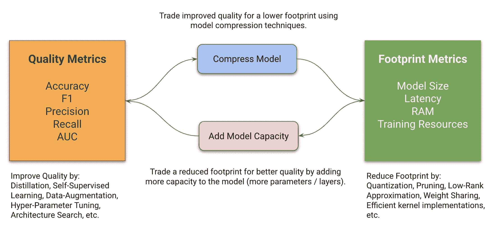

图 25\. 模型质量与足迹之间的权衡：模型质量与模型足迹之间存在权衡。可以通过诸如蒸馏、数据增强、超参数调优等技术来提高模型质量。压缩技术则可以帮助在某种程度上牺牲模型质量，以获得更好的模型足迹。通过简单地增加更多模型容量，一些/所有的足迹指标改进也可以被用来换取更好的质量。

迄今为止，我们在高效深度学习领域介绍了一系列广泛的工具和技术。在这一部分，我们提供了一个实际的指南，供从业者使用，并说明这些工具和技术如何相互配合。如前所述，我们追求的是*帕累托最优*模型，我们希望在一个维度上取得最佳结果，同时保持其他维度不变。通常，其中一个维度是质量，另一个是足迹。质量相关指标可能包括准确度、F1、精度、召回率、AUC 等。而足迹相关指标可以包括模型大小、延迟、RAM 等。

自然地，质量与占用空间之间存在权衡。更高容量/更深层次的模型更可能实现更好的准确性，但代价是模型大小、延迟等。另一方面，容量较小/较浅的模型虽然可能适合部署，但准确性也可能较差。如图 25 所示，我们可以从一个具有更好质量指标的模型开始，通过简单地压缩模型/减少模型容量（缩小）来交换部分质量以获得更好的占用空间。同样，通过向模型中添加更多容量（增长）可以简单地提高质量。增长可以通过适当增加模型容量并调整其他超参数来解决。缩小可以通过压缩技术（量化、剪枝、低秩近似等）、高效层与模型、自动化架构搜索等实现。此外，我们还可以通过学习技术（蒸馏、数据增强、自监督调优）、超参数调优等在保持占用空间不变的情况下提高质量指标。（更多例子见表 4。）

|

&#124; 增长 &#124;

&#124; (模型容量) &#124;

|

&#124; 缩小 &#124;

&#124; (占用空间) &#124;

|

&#124; 改进 &#124;

&#124; （质量）&#124;

|

| --- | --- | --- |
| --- | --- | --- |
| 手动或使用宽度/深度/复合缩放因子添加层、宽度等 |

&#124; 减少层、宽度等 &#124;

&#124; 手动或使用&#124;

&#124; 宽度/深度/复合 &#124;

&#124; 缩放因子 &#124;

|

&#124; 手动调优（架构/ &#124;

&#124; 超参数/ &#124;

&#124; 特征等）&#124;

|

|

&#124; 压缩技术: &#124;

&#124; 量化，剪枝，&#124;

&#124; 低秩分解等 &#124;

|

&#124; 学习技术: &#124;

&#124; 数据增强、蒸馏，&#124;

&#124; 无监督学习等 &#124;

|

|

&#124; 自动化: &#124;

&#124; 超参数优化，&#124;

&#124; 架构搜索等 &#124;

|

&#124; 自动化: &#124;

&#124; 超参数优化，&#124;

&#124; 架构搜索等 &#124;

|

|

&#124; 高效层与模型: &#124;

&#124; 投影、PQRNN（NLP），&#124;

&#124; 可分离卷积（视觉），&#124;

&#124; 等等 &#124;

|

&#124; 高效层与模型: &#124;

&#124; Transformer（NLP），&#124;

&#124; Vi-T（视觉）等 &#124;

|

表 4. 在增长、缩小和改进阶段使用的技术示例。

结合这三个阶段，我们提出了两种策略以实现帕累托最优模型:

1.  (1)

    足迹敏感模型的**缩减-改进**策略：如果作为从业者，你希望减少占用空间，同时保持相同的质量，这对于设备上的部署和服务器端模型优化可能是一种有用的策略。缩减应理想地在质量上尽可能少地损失（可以通过学习压缩技术、架构搜索等实现），但在某些情况下，即使是简单地减少容量，也可以通过改进阶段来弥补。也可以在缩减阶段之前进行改进阶段。

1.  (2)

    质量敏感模型的**增长-改进-缩减**策略：当你希望在保持相同占用空间的情况下部署更高质量的模型时，采用这种策略可能是合理的。这里，首先通过增长模型来增加容量，如前面所述。然后，利用学习技术、自动化等手段来改进模型，最后将模型缩减回原始大小，可能是简单的方式，也可能是学习的方式。或者，模型在增长后也可以直接以学习的方式进行缩减。

我们认为这两种策略都是从一个潜在的非帕累托最优模型转变为另一个位于帕累托前沿的模型的方式，用户可以根据需要选择合适的权衡。每种效率技术单独都能帮助我们更接近那个目标模型。

### 4.1\. 实验

为了展示我们上面提出的内容，我们进行了使给定深度学习模型高效的任务。具体而言，我们在此练习中设定了以下目标：

1.  (1)

    使用效率技术实现新的帕累托前沿。由此展示这些技术可以在实际应用中被单独使用，也可以与其他技术结合使用，来证明这些技术的有效性。

1.  (2)

    通过各种效率技术和模型缩放的组合，展示‘缩减-改进’和‘增长-改进-缩减’策略在发现和遍历帕累托前沿时的权衡。换句话说，提供实证证据，证明从业者可以减少模型容量以降低占用空间（缩减），然后恢复他们所牺牲的模型质量（改进），或者增加模型容量以提高质量（增长），然后进行模型压缩（缩减）以改善模型占用空间。

我们选择了在计算资源受限的设备（如智能手机、物联网设备等）上对 CIFAR-10 数据集（Krizhevsky 等，2009）中的图像进行分类的问题。我们设计了一个深度卷积架构，通过增加或减少“宽度乘数”（$w$）值来调整模型容量。在实现中，$w$ 调整卷积层（前两个层除外）的过滤器数量。因此，使用不同的 $w$ 值在 $[0.1,0.25,0.5,0.75,1.0]$ 范围内，我们得到了一个具有不同质量和占用空间折中模型的家族。我们对这些模型进行了手动调优，以达到质量与占用空间指标的基线。在这种情况下，我们通过准确率来衡量质量，通过参数数量、模型大小和延迟来衡量占用空间。在技术方面，我们使用了量化来缩小模型规模，数据增强和蒸馏来提高性能。许多其他技术（如超参数调优的自动化，分离卷积等高效层）也可以用来进一步阐明问题，但为了简化结果解释，这些技术被略过。我们使用了基于 Tensorflow 的 Keras API（Chollet，2020）进行训练，并使用 TFLite（Authors，2021i）框架进行推理。延迟是在三种设备上测量的，分别是低端（Oppo A5）、中端（Pixel 3XL）和高端（Galaxy S10），按其 CPU 计算能力的递增顺序。报告的模型大小是生成的 TFLite 模型的大小，延迟数据是目标设备上经过预热后的平均单线程 CPU 延迟。实验代码可通过 IPython notebook [这里](https://github.com/reddragon/efficient-dl-survey-paper/blob/main/CIFAR_10_End_to_End.ipynb) 获取。

表 5 汇总了 6 个宽度乘数的结果，范围从 $0.05$ 到 $1.0$。从最小到最大模型，参数数量增长了 $\approx 91.4\times$，模型大小增长了 $\approx 80.2\times$。根据设备，延迟数字也在 $3.5-10\times$ 之间增长。在同一行内，足迹指标不会改变，因为我们没有改变模型架构。在表 5 中，我们纯粹使用提升模型质量的技术（数据增强和蒸馏）。表 6 报告了表 5 中相应模型的量化版本的数据。我们使用量化来缩小阶段，将模型大小减少 $\approx 4\times$，并将平均延迟减少 $1.5-2.65\times$。图 26 和 27 绘制了表 5 和 6 中的显著结果。

| 宽度乘数 | 参数数量 (K) | 模型大小 (KB) |
| --- | --- | --- |

&#124; 准确率 &#124;

&#124; (%) &#124;

| 平均延迟 (ms) |
| --- | --- | --- | --- | --- |
| 基线 | 增强 |

&#124; 增强 &#124;

&#124; + 蒸馏 &#124;

|

&#124; Oppo &#124;

&#124; A5 &#124;

|

&#124; 像素 &#124;

&#124; 3XL &#124;

|

&#124; Galaxy &#124;

&#124; S10 &#124;

|

| --- | --- | --- | --- | --- | --- |
| --- | --- | --- | --- | --- | --- |
| 0.05 | 14.7 | 65.45 | 70.17 | 71.71 | 72.89 | 6.72 | 0.6 | 0.78 |
| 0.1 | 26 | 109.61 | 75.93 | 78.22 | 78.93 | 6.85 | 1.7 | 0.85 |
| 0.25 | 98.57 | 392.49 | 80.6 | 84.14 | 84.51 | 8.15 | 2.02 | 0.93 |
| 0.5 | 350.05 | 1374.11 | 83.04 | 87.47 | 88.03 | 11.46 | 2.8 | 1.33 |
| 0.75 | 764.87 | 2993.71 | 83.79 | 89.06 | 89.51 | 16.7 | 4.09 | 1.92 |
| 1 | 1343.01 | 5251.34 | 84.42 | 89.41 | 89.92 | 24 | 5.99 | 2.68 |

表 5\. CIFAR-10 数据集上浮点模型的质量和占用指标。

| 宽度倍增器 | 参数数量 (K) | 模型大小 (KB) |
| --- | --- | --- |

&#124; 准确率 &#124;

&#124; (%) &#124;

| 平均延迟 (ms) |
| --- | --- | --- | --- | --- |
| 基线 | 增强 |

&#124; 增强 &#124;

&#124; + 蒸馏 &#124;

|

&#124; Oppo &#124;

&#124; A5 &#124;

|

&#124; 像素 &#124;

&#124; 3XL &#124;

|

&#124; 银河 &#124;

&#124; S10 &#124;

|

| --- | --- | --- | --- | --- | --- |
| --- | --- | --- | --- | --- | --- |
| 0.05 | 14.7 | 26.87 | 69.9 | 71.72 | 72.7 | 4.06 | 0.49 | 0.43 |
| 0.1 | 26 | 38.55 | 75.98 | 78.19 | 78.55 | 4.5 | 1.25 | 0.47 |
| 0.25 | 98.57 | 111 | 80.76 | 83.98 | 84.18 | 4.52 | 1.31 | 0.48 |
| 0.5 | 350.05 | 359.31 | 83 | 87.32 | 87.86 | 6.32 | 1.73 | 0.58 |
| 0.75 | 764.87 | 767.09 | 83.6 | 88.57 | 89.29 | 8.53 | 2.36 | 0.77 |
| 1 | 1343.01 | 1334.41 | 84.52 | 89.28 | 89.91 | 11.73 | 3.27 | 1.01 |

表 6\. CIFAR-10 数据集上*量化*模型的质量和占用指标。每个模型都是表 5 中对应模型的量化等效模型。

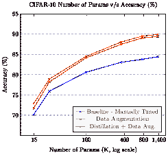

(a) 参数数量与准确率

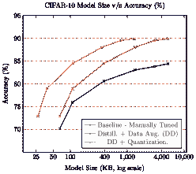

(b) 模型大小与准确率

图 26\. 准确率相对于参数数量和模型大小的变化。曲线上的每一点都是图（a）中表 5 中的一个模型，图（b）中来自表 6 中的一个模型。

(a) 低端设备延迟

(b) 中端设备延迟

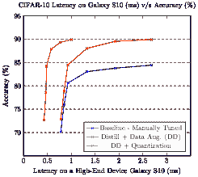

(c) 高端设备延迟

图 27\. 不同设备（低端、中端和高端智能手机）上的模型平均延迟。橙色曲线表示量化模型，并且这些模型经过了蒸馏和数据增强的训练。

### 4.2\. 讨论

让我们尝试解释上述数据，以验证我们的策略是否可以实际应用。

足迹敏感模型的压缩与改进：请参阅表格 5 和图 26。如果我们的目标是部署一个宽度乘数($w$)为$1.0$且准确率为$84.42\%$的模型，但瓶颈是模型大小（5.25 MB）和在低端设备上的延迟（Oppo A5 上的 24 ms）。这是一个经典的足迹指标未达标的情况，因此我们可以应用压缩与改进策略，首先将我们的模型简单地缩小到宽度乘数($w$)为$0.25$。这个较小的模型经过手动调优，如表 5 所示，达到了$80.76\%$的准确率。然而，当我们使用从一个准确率为$90.86\%$的独立训练的大模型中进行的数据增强与蒸馏组合时，这个较小模型的准确率提高到$84.18\%$，非常接近我们希望部署的目标模型。这个较小模型的大小为 392.49 KB，比原模型小$13.8\times$，延迟为 8.15 ms，比原模型快$2.94\times$，在相似的准确率下。通过量化进一步压缩该模型是可能的。经过量化的相同较小模型（$w=0.25$）在表 6 中，大小为 111 KB（比原模型小$47.3\times$），延迟为 4.52 ms（比原模型快$5.31\times$），同时保持$84.18\%$的准确率。其他曲线上的点对也可以进行类似的处理。

对于质量敏感模型的增长-改进-收缩：假设我们的目标是部署一个模型，其足迹指标与 $w=0.25$ 的模型（392.49 KB 模型大小，在高端 Galaxy S10 设备上的延迟为 0.93 ms）相当，但准确率优于基线的 $80.6\%$（参见表 5）。在这种情况下，我们可以选择首先将模型增长到 $w=0.5$。这会立即将模型大小扩大到 1.37 MB（$3.49\times$ 更大），延迟增加到 1.33 ms（$1.43\times$ 更慢）。然而，我们暂时忽略这一点，并通过数据增强与蒸馏将模型质量提高到 $88.03\%$。然后，使用量化进行收缩（参见表 6），我们可以得到一个大小为 359.31 KB（比原模型小 32 KB）的模型，在 Galaxy S10 上的延迟为 0.58 ms（$1.6\times$ 更快），准确率为 $87.86\%$，在保持模型大小基本不变的同时，准确率绝对提高了 7.10%，并使其速度提升了 $1.6\times$。这种策略也可以应用于其他模型对。

因此，我们已经验证了上述两种策略可以同时有效，无论你的目标是优化质量指标还是足迹指标。我们还通过图 26 和 27 直观地检查了效率技术可以改进通过手动调节构建的帕累托前沿。为了限定实验范围，我们选择了两组效率技术（压缩技术（量化）和学习技术（数据增强与蒸馏））。因此，探索其他技术也很有用，比如自动化（用于超参数调优以进一步改善结果）和高效层与模型（如在 MobileNet 中说明的可分离卷积（Sandler et al., 2018）可以替代更大的卷积层）。最后，我们还希望强调关注深度学习模型（无论是否优化）在代表性不足的类别和分布外数据上的表现，以确保模型公平性，因为单靠质量指标可能不足以发现模型的深层问题（Hooker et al., 2020）。

## 5\. 结论

在本文中，我们首先展示了深度学习模型的快速增长，并强调了如今训练和部署模型的人必须对效率做出隐式或显式的决策。然而，模型效率的领域非常广泛。

为了帮助读者理解模型效率和优化的多重关注领域，我们提供了一个心理模型。核心模型优化技术的调研为读者提供了了解最新技术的机会，能够在建模过程中应用这些技术，或将其作为探索的起点。基础设施部分还介绍了使高效模型的训练和推理成为可能的软件库和硬件。

最后，我们提供了一个明确且可行的见解部分，并附有代码，供从业人员用作指南。这一部分将为问题解决者提供具体且可行的解决方案，同时也考虑到了在训练和部署模型时需要思考的权衡。总结一下，我们认为通过这个调研，我们已经为读者提供了必要的理解，可以将从次优模型到满足其质量和占据空间约束的模型的步骤分解开来。

## 6\. 致谢

我们要感谢 Google 研究团队的 Learn2Compress 团队对本文的支持。我们还要感谢 Akanksha Saran 和 Aditya Sarawgi 在校对和改进内容方面的帮助。

## 参考文献

+   (1)

+   Abadi et al. (2016) Martín Abadi, Paul Barham, Jianmin Chen, Zhifeng Chen, Andy Davis, Jeffrey Dean, Matthieu Devin, Sanjay Ghemawat, Geoffrey Irving, Michael Isard, et al. 2016. Tensorflow：大规模机器学习的系统。 在《第 12 届 USENIX 操作系统设计与实现（OSDI 16）》中 (pp. 265-283)。

+   Agnihotri 和 Batra (2020) Apoorv Agnihotri 和 Nipun Batra. 2020. 探索贝叶斯优化。《蒸馏》（Distill），5（5），e26。

+   Alammar (2021) Jay Alammar. 2021. **图解 Transformer**。[`jalammar.github.io/illustrated-transformer`](https://jalammar.github.io/illustrated-transformer) [在线; 2021 年 6 月 3 日访问]。

+   Android 开发者（2021）Android 开发者。2021. 神经网络 API $|$ Android NDK $|$ Android 开发者。[`developer.android.com/ndk/guides/neuralnetworks`](https://developer.android.com/ndk/guides/neuralnetworks) [在线; 2021 年 6 月 3 日访问]。

+   Anwar et al. (2017) Sajid Anwar, Kyuyeon Hwang, and Wonyong Sung. 2017. 深度卷积神经网络的结构剪枝。《ACM 清华大学出版社计算机学报（JETC）》（第 13 卷，第 3 期，第 1-18 页）。

+   Apple 作者（2021）Apple 作者。2021. 加速 $|$ Apple 开发者文档。[`developer.apple.com/documentation/accelerate`](https://developer.apple.com/documentation/accelerate) [在线; 2021 年 6 月 3 日访问]。

+   作者们 (2021a) PyTorch 作者们. 2021a. 自动混合精度示例 — PyTorch 1.8.1 文档. [`pytorch.org/docs/stable/notes/amp_examples.html`](https://pytorch.org/docs/stable/notes/amp_examples.html) [在线访问; 访问日期 2021 年 6 月 3 日]。

+   作者们 (2021b) PyTorch 作者们. 2021b. 性能调优指南 — PyTorch Tutorials 1.8.1+cu102 文档. [`pytorch.org/tutorials/recipes/recipes/tuning_guide.html`](https://pytorch.org/tutorials/recipes/recipes/tuning_guide.html) [在线访问; 访问日期 2021 年 6 月 3 日]。

+   作者们 (2021c) PyTorch 作者们. 2021c. PyTorch Mobile. [`pytorch.org/mobile/home`](https://pytorch.org/mobile/home) [在线访问; 访问日期 2021 年 6 月 3 日]。

+   作者们 (2021d) PyTorch 作者们. 2021d. 量化配方 — PyTorch Tutorials 1.8.1+cu102 文档. [`pytorch.org/tutorials/recipes/quantization.html`](https://pytorch.org/tutorials/recipes/quantization.html) [在线访问; 访问日期 2021 年 6 月 3 日]。

+   作者们 (2021e) PyTorch 作者们. 2021e. torch.jit.script — PyTorch 1.8.1 文档. [`pytorch.org/docs/stable/generated/torch.jit.script.html`](https://pytorch.org/docs/stable/generated/torch.jit.script.html) [在线访问; 访问日期 2021 年 6 月 3 日]。

+   作者们 (2020) Tensorflow 作者们. 2020. TensorFlow 模型优化. [`www.tensorflow.org/model_optimization`](https://www.tensorflow.org/model_optimization) [在线访问; 访问日期 2021 年 6 月 3 日]。

+   作者们 (2021f) Tensorflow 作者们. 2021f. 训练后量化 $|$ TensorFlow Lite. [`www.tensorflow.org/lite/performance/post_training_quantization`](https://www.tensorflow.org/lite/performance/post_training_quantization) [在线访问; 访问日期 2021 年 6 月 3 日]。

+   作者们 (2021g) Tensorflow 作者们. 2021g. TensorFlow. [`www.tensorflow.org`](https://www.tensorflow.org) [在线访问; 访问日期 2021 年 6 月 3 日]。

+   作者们 (2021h) Tensorflow 作者们. 2021h. TensorFlow Lite 转换器. [`www.tensorflow.org/lite/convert`](https://www.tensorflow.org/lite/convert) [在线访问; 访问日期 2021 年 6 月 3 日]。

+   作者们 (2021i) Tensorflow 作者们. 2021i. TensorFlow Lite $|$ 移动端和边缘设备的 ML. [`www.tensorflow.org/lite`](https://www.tensorflow.org/lite) [在线访问; 访问日期 2021 年 6 月 3 日]。

+   作者们 (2021j) Tensorflow 作者们. 2021j. XLA: 机器学习优化编译器 $|$ TensorFlow. [`www.tensorflow.org/xla`](https://www.tensorflow.org/xla) [在线访问; 访问日期 2021 年 6 月 3 日]。

+   作者们 (2021k) XNNPACK 作者们. 2021k. XNNPACK. [`github.com/google/XNNPACK`](https://github.com/google/XNNPACK) [在线访问; 访问日期 2021 年 6 月 3 日]。

+   作者们 (2021l) XNNPACK 作者们. 2021l. XNNPACK 后端用于 TensorFlow Lite. [`github.com/tensorflow/tensorflow/blob/master/tensorflow/lite/delegates/xnnpack/README.md/#sparse-inference`](https://github.com/tensorflow/tensorflow/blob/master/tensorflow/lite/delegates/xnnpack/README.md/#sparse-inference) [在线访问; 访问日期 2021 年 6 月 3 日]。

+   Baevski 等（2020）**Alexei Baevski**、**Henry Zhou**、**Abdelrahman Mohamed** 和 **Michael Auli**。2020。wav2vec 2.0: 自监督学习语音表示的框架。*arXiv 预印本 arXiv:2006.11477*（2020 年）。

+   Bahdanau 等（2014）**Dzmitry Bahdanau**、**Kyunghyun Cho** 和 **Yoshua Bengio**。2014。通过联合学习对齐和翻译进行神经机器翻译。*arXiv 预印本 arXiv:1409.0473*（2014 年）。

+   Bengio 等（2013）**Yoshua Bengio**、**Nicholas Léonard** 和 **Aaron Courville**。2013。通过随机神经元估计或传播梯度以进行条件计算。*arXiv 预印本 arXiv:1308.3432*（2013 年）。

+   Bergstra 和 Bengio（2012）**James Bergstra** 和 **Yoshua Bengio**。2012。超参数优化的随机搜索。*机器学习研究杂志* 13, 2（2012 年）。

+   Blum 和 Mitchell（1998）**Avrim Blum** 和 **Tom Mitchell**。1998。通过协同训练结合标记数据和未标记数据。在*第十一届计算学习理论年会论文集*。92–100。

+   Bradbury 等（2016）**James Bradbury**、**Stephen Merity**、**Caiming Xiong** 和 **Richard Socher**。2016。准递归神经网络。*arXiv 预印本 arXiv:1611.01576*（2016 年）。

+   Brown 等（2020）**Tom B Brown**、**Benjamin Mann**、**Nick Ryder**、**Melanie Subbiah**、**Jared Kaplan**、**Prafulla Dhariwal**、**Arvind Neelakantan**、**Pranav Shyam**、**Girish Sastry**、**Amanda Askell** 等。2020。语言模型是少样本学习者。*arXiv 预印本 arXiv:2005.14165*（2020 年）。

+   Buciluǎ 等（2006）**Cristian Buciluǎ**、**Rich Caruana** 和 **Alexandru Niculescu-Mizil**。2006。模型压缩。在*第 12 届 ACM SIGKDD 国际知识发现与数据挖掘会议论文集*。535–541。

+   Charikar（2002）**Moses S Charikar**。2002。从舍入算法中估计相似性。在*第三十四届 ACM 计算理论年会论文集*。380–388。

+   Chaudhari 等（2019）**Sneha Chaudhari**、**Varun Mithal**、**Gungor Polatkan** 和 **Rohan Ramanath**。2019。注意力模型的全面调查。*arXiv 预印本 arXiv:1904.02874*（2019 年）。

+   Chawla 等（2002）**Nitesh V Chawla**、**Kevin W Bowyer**、**Lawrence O Hall** 和 **W Philip Kegelmeyer**。2002。SMOTE: 合成少数过采样技术。*人工智能研究杂志* 16（2002 年），321–357。

+   Chen（2021）**Dihao Chen**。2021。advisor。 [`github.com/tobegit3hub/advisor`](https://github.com/tobegit3hub/advisor) [在线；访问于 2021 年 6 月 3 日]。

+   Chen 等（2020a）**Ting Chen**、**Simon Kornblith**、**Mohammad Norouzi** 和 **Geoffrey Hinton**。2020a。视觉表示的对比学习简单框架。在*国际机器学习会议*。PMLR, 1597–1607。

+   Chen 等（2020b）**Ting Chen**、**Simon Kornblith**、**Kevin Swersky**、**Mohammad Norouzi** 和 **Geoffrey Hinton**。2020b。大型自监督模型是强大的半监督学习者。*arXiv 预印本 arXiv:2006.10029*（2020 年）。

+   Chollet (2017) François Chollet。2017。Xception: 深度学习与深度可分离卷积。在 *IEEE 计算机视觉与模式识别会议论文集*。1251–1258 页。

+   Chollet (2020) François Chollet。2020。Keras 博客。 [`blog.keras.io`](https://blog.keras.io) [在线；访问日期：2021 年 6 月 4 日]。

+   Cireşan 等 (2011) Dan C Cireşan, Ueli Meier, Jonathan Masci, Luca M Gambardella, 和 Jürgen Schmidhuber。2011。用于视觉对象分类的高性能神经网络。*arXiv 预印本 arXiv:1102.0183* (2011)。

+   维基媒体项目贡献者 (2021a) 维基媒体项目贡献者。2021a。AVX-512 - 维基百科。 [`en.wikipedia.org/w/index.php?title=AVX-512&oldid=1025044245`](https://en.wikipedia.org/w/index.php?title=AVX-512&oldid=1025044245) [在线；访问日期：2021 年 6 月 3 日]。

+   维基媒体项目贡献者 (2021b) 维基媒体项目贡献者。2021b。CUDA - 维基百科。 [`en.wikipedia.org/w/index.php?title=CUDA&oldid=1025500257`](https://en.wikipedia.org/w/index.php?title=CUDA&oldid=1025500257) [在线；访问日期：2021 年 6 月 3 日]。

+   维基媒体项目贡献者 (2021c) 维基媒体项目贡献者。2021c。超参数优化 - 维基百科。 [`en.wikipedia.org/w/index.php?title=Hyperparameter_optimization&oldid=1022309479`](https://en.wikipedia.org/w/index.php?title=Hyperparameter_optimization&oldid=1022309479) [在线；访问日期：2021 年 6 月 3 日]。

+   维基媒体项目贡献者 (2021d) 维基媒体项目贡献者。2021d。乘加操作 - 维基百科。 [`en.wikipedia.org/w/index.php?title=Multiply-accumulate_operation&oldid=1026461481`](https://en.wikipedia.org/w/index.php?title=Multiply-accumulate_operation&oldid=1026461481) [在线；访问日期：2021 年 6 月 3 日]。

+   维基媒体项目贡献者 (2021e) 维基媒体项目贡献者。2021e。SSE4 - 维基百科。 [`en.wikipedia.org/w/index.php?title=SSE4&oldid=1023092035`](https://en.wikipedia.org/w/index.php?title=SSE4&oldid=1023092035) [在线；访问日期：2021 年 6 月 3 日]。

+   维基媒体项目贡献者 (2021f) 维基媒体项目贡献者。2021f。WebGL - 维基百科。 [`en.wikipedia.org/w/index.php?title=WebGL&oldid=1026775533`](https://en.wikipedia.org/w/index.php?title=WebGL&oldid=1026775533) [在线；访问日期：2021 年 6 月 3 日]。

+   Cubuk 等 (2019) Ekin D Cubuk, Barret Zoph, Dandelion Mane, Vijay Vasudevan, 和 Quoc V Le。2019。Autoaugment: 从数据中学习增强策略。在 *IEEE/CVF 计算机视觉与模式识别会议论文集*。113–123 页。

+   Cubuk 等 (2020) Ekin D Cubuk, Barret Zoph, Jonathon Shlens, 和 Quoc V Le。2020。Randaugment: 具有简化搜索空间的实用自动数据增强。在 *IEEE/CVF 计算机视觉与模式识别会议研讨会论文集中*。702–703 页。

+   Deng et al. (2009) Jia Deng, Wei Dong, Richard Socher, Li-Jia Li, Kai Li, and Li Fei-Fei. 2009. ImageNet: 一个大规模的层次图像数据库。发表于*2009 IEEE 计算机视觉与模式识别会议*，248–255。[`doi.org/10.1109/CVPR.2009.5206848`](https://doi.org/10.1109/CVPR.2009.5206848)

+   Dettmers and Zettlemoyer (2019) Tim Dettmers 和 Luke Zettlemoyer. 2019. 从零开始的稀疏网络：更快的训练而不损失性能。*arXiv 预印本 arXiv:1907.04840* (2019)。

+   Devlin et al. (2018) Jacob Devlin, Ming-Wei Chang, Kenton Lee, 和 Kristina Toutanova. 2018. Bert：用于语言理解的深度双向变换器的预训练。*arXiv 预印本 arXiv:1810.04805* (2018)。

+   Dietterich (2000) Thomas G Dietterich. 2000. 机器学习中的集成方法。发表于*多分类器系统国际研讨会*，Springer，1–15。

+   Doersch et al. (2015) Carl Doersch, Abhinav Gupta, 和 Alexei A Efros. 2015. 通过上下文预测进行无监督视觉表示学习。发表于*IEEE 国际计算机视觉会议论文集*，1422–1430。

+   Dong et al. (2017) Xin Dong, Shangyu Chen, 和 Sinno Jialin Pan. 2017. 通过逐层最优脑外科医生学习修剪深度神经网络。*arXiv 预印本 arXiv:1705.07565* (2017)。

+   Dukhan et al. (2020) Marat Dukhan, Yiming Wu Wu, 和 Hao Lu. 2020. QNNPACK：用于优化移动深度学习的开源库 - Facebook 工程。 [`engineering.fb.com/2018/10/29/ml-applications/qnnpack`](https://engineering.fb.com/2018/10/29/ml-applications/qnnpack) [在线；访问日期：2021 年 6 月 3 日]。

+   Elsen et al. (2020) Erich Elsen, Marat Dukhan, Trevor Gale, 和 Karen Simonyan. 2020. 快速稀疏卷积网络。发表于*IEEE/CVF 计算机视觉与模式识别会议论文集*，14629–14638。

+   Elsken et al. (2019) Thomas Elsken, Jan Hendrik Metzen, Frank Hutter, 等. 2019. 神经架构搜索：综述。*J. Mach. Learn. Res.* 20, 55 (2019)，1–21。

+   Evci et al. (2020) Utku Evci, Trevor Gale, Jacob Menick, Pablo Samuel Castro, 和 Erich Elsen. 2020. 操控彩票：让所有票据都成为赢家。发表于*国际机器学习大会*，PMLR，2943–2952。

+   Fan et al. (2020) Angela Fan, Pierre Stock, Benjamin Graham, Edouard Grave, Rémi Gribonval, Hervé Jégou, 和 Armand Joulin. 2020. 通过量化噪声训练以实现极端模型压缩。*arXiv e-prints* (2020)，arXiv–2004。

+   Fawzi et al. (2016) Alhussein Fawzi, Horst Samulowitz, Deepak Turaga, 和 Pascal Frossard. 2016. 用于图像分类的自适应数据增强。发表于*2016 IEEE 国际图像处理会议 (ICIP)*，IEEE，3688–3692。

+   Frankle and Carbin (2018) Jonathan Frankle 和 Michael Carbin. 2018. 彩票假设：训练修剪的神经网络。*arXiv 预印本 arXiv:1803.03635* 2 (2018)。

+   Gale 等 (2019) Trevor Gale、Erich Elsen 和 Sara Hooker。2019。深度神经网络中的稀疏性现状。*CoRR* abs/1902.09574 (2019)。arXiv:1902.09574 [`arxiv.org/abs/1902.09574`](http://arxiv.org/abs/1902.09574)

+   Gidaris 等 (2018) Spyros Gidaris、Praveer Singh 和 Nikos Komodakis。2018。通过预测图像旋转进行无监督表示学习。*arXiv 预印本 arXiv:1803.07728* (2018)。

+   Glass (2012) James Glass。2012。迈向无监督语音处理。在 *2012 年第 11 届国际信息科学、信号处理及其应用会议 (ISSPA)*。IEEE，1–4。

+   Golovin 等 (2017) Daniel Golovin、Benjamin Solnik、Subhodeep Moitra、Greg Kochanski、John Karro 和 D Sculley。2017。Google Vizier：一个用于黑箱优化的服务。在 *第 23 届 ACM SIGKDD 国际知识发现与数据挖掘大会论文集*。1487–1495。

+   Google (2021a) Google。2021a。Cloud TPU $|$ Google Cloud。 [`cloud.google.com/tpu`](https://cloud.google.com/tpu) [在线; 访问于 2021 年 6 月 3 日]。

+   Google (2021b) Google。2021b。Coral。 [`coral.ai`](https://coral.ai) [在线; 访问于 2021 年 6 月 4 日]。

+   Google (2021c) Google。2021c。Edge TPU 性能基准 $|$ Coral。 [`coral.ai/docs/edgetpu/benchmarks`](https://coral.ai/docs/edgetpu/benchmarks) [在线; 访问于 2021 年 6 月 3 日]。

+   Google (2021d) Google。2021d。Edge TPU 上的 TensorFlow 模型 $|$ Coral。 [`coral.ai/docs/edgetpu/models-intro/#supported-operations`](https://coral.ai/docs/edgetpu/models-intro/#supported-operations) [在线; 访问于 2021 年 6 月 3 日]。

+   google research (2021) google research。2021。google-research。 [`github.com/google-research/google-research/tree/master/fastconvnets`](https://github.com/google-research/google-research/tree/master/fastconvnets) [在线; 访问于 2021 年 6 月 3 日]。

+   Gopalan 等 (2021) Arjun Gopalan、Da-Cheng Juan、Cesar Ilharco Magalhaes、Chun-Sung Ferng、Allan Heydon、Chun-Ta Lu、Philip Pham、George Yu、Yicheng Fan 和 Yueqi Wang。2021。神经结构学习：用结构化信号训练神经网络。在 *第 14 届 ACM 国际网络搜索与数据挖掘会议论文集*。1150–1153。

+   Han 等 (2015a) Song Han、Huizi Mao 和 William J Dally。2015a。深度压缩：通过剪枝、训练量化和霍夫曼编码压缩深度神经网络。*arXiv 预印本 arXiv:1510.00149* (2015)。

+   Han 等 (2015b) Song Han、Jeff Pool、John Tran 和 William J Dally。2015b。为高效神经网络学习权重和连接。*arXiv 预印本 arXiv:1506.02626* (2015)。

+   Hannun 等 (2014) Awni Hannun、Carl Case、Jared Casper、Bryan Catanzaro、Greg Diamos、Erich Elsen、Ryan Prenger、Sanjeev Satheesh、Shubho Sengupta、Adam Coates 等。2014。深度语音：扩展端到端语音识别。*arXiv 预印本 arXiv:1412.5567* (2014)。

+   Hansen 和 Salamon（1990）Lars Kai Hansen 和 Peter Salamon。1990。神经网络集成。*IEEE 模式分析与机器智能期刊* 12, 10（1990），993–1001。

+   Hassibi 等（1993）Babak Hassibi, David G Stork 和 Gregory J Wolff。1993。最优脑外科医生和通用网络剪枝。在 *IEEE 国际神经网络大会*。IEEE，293–299。

+   He 等（2016）Kaiming He, Xiangyu Zhang, Shaoqing Ren 和 Jian Sun。2016。用于图像识别的深度残差学习。在 *IEEE 计算机视觉与模式识别会议论文集*。770–778。

+   He 等（2018）Yihui He, Ji Lin, Zhijian Liu, Hanrui Wang, Li-Jia Li 和 Song Han。2018。Amc：用于移动设备的模型压缩和加速的 Automl。在 *欧洲计算机视觉会议（ECCV）论文集*。784–800。

+   Hinton 等（2015）Geoffrey Hinton, Oriol Vinyals 和 Jeff Dean。2015。提炼神经网络中的知识。*arXiv 预印本 arXiv:1503.02531*（2015）。

+   Hooker 等（2020）Sara Hooker, Nyalleng Moorosi, Gregory Clark, Samy Bengio 和 Emily Denton。2020。压缩模型中的偏差特征。*arXiv 预印本 arXiv:2010.03058*（2020）。

+   Howard 等（2019）Andrew Howard, Mark Sandler, Grace Chu, Liang-Chieh Chen, Bo Chen, Mingxing Tan, Weijun Wang, Yukun Zhu, Ruoming Pang, Vijay Vasudevan 等。2019。寻找 mobilenetv3。在 *IEEE/CVF 国际计算机视觉会议论文集*。1314–1324。

+   Howard 和 Ruder（2018）Jeremy Howard 和 Sebastian Ruder。2018。用于文本分类的通用语言模型微调。*arXiv 预印本 arXiv:1801.06146*（2018）。

+   Hsu 等（2018）Chi-Hung Hsu, Shu-Huan Chang, Jhao-Hong Liang, Hsin-Ping Chou, Chun-Hao Liu, Shih-Chieh Chang, Jia-Yu Pan, Yu-Ting Chen, Wei Wei 和 Da-Cheng Juan。2018。Monas：使用强化学习的多目标神经架构搜索。*arXiv 预印本 arXiv:1806.10332*（2018）。

+   Hubara 等（2016）Itay Hubara, Matthieu Courbariaux, Daniel Soudry, Ran El-Yaniv 和 Yoshua Bengio。2016。二值化神经网络。在 *第 30 届国际神经信息处理系统大会论文集*。4114–4122。

+   Inoue（2018）Hiroshi Inoue。2018。通过配对样本进行数据增强以进行图像分类。*arXiv 预印本 arXiv:1801.02929*（2018）。

+   Jacob 等（2018）Benoit Jacob, Skirmantas Kligys, Bo Chen, Menglong Zhu, Matthew Tang, Andrew Howard, Hartwig Adam 和 Dmitry Kalenichenko。2018。量化和训练神经网络以实现高效的整数算术推理。在 *IEEE 计算机视觉与模式识别会议论文集*。2704–2713。

+   Jaderberg 等（2017）Max Jaderberg, Valentin Dalibard, Simon Osindero, Wojciech M Czarnecki, Jeff Donahue, Ali Razavi, Oriol Vinyals, Tim Green, Iain Dunning, Karen Simonyan 等。2017。基于人群的神经网络训练。*arXiv 预印本 arXiv:1711.09846*（2017）。

+   Jamieson 和 Talwalkar (2016) Kevin Jamieson 和 Ameet Talwalkar. 2016. 非随机最佳臂识别与超参数优化。见 *人工智能与统计*。PMLR, 240–248。

+   Jeremy Jordan (2020) Jeremy Jordan. 2020. 设置神经网络的学习率。*Jeremy Jordan* (2020 年 8 月)。 [`www.jeremyjordan.me/nn-learning-rate`](https://www.jeremyjordan.me/nn-learning-rate)

+   Jouppi 等 (2017) Norman P Jouppi, Cliff Young, Nishant Patil, David Patterson, Gaurav Agrawal, Raminder Bajwa, Sarah Bates, Suresh Bhatia, Nan Boden, Al Borchers 等. 2017. 张量处理单元的机房内性能分析。见 *第 44 届国际计算机架构年会论文集*。1–12。

+   Kaliamoorthi 等 (2019) Prabhu Kaliamoorthi, Sujith Ravi 和 Zornitsa Kozareva. 2019. PRADO：用于设备上的文档分类的投影注意力网络。见 *2019 年自然语言处理经验方法会议暨第九届国际自然语言处理联合会议论文集 (EMNLP-IJCNLP)*。5012–5021。

+   Kaliamoorthi 等 (2021) Prabhu Kaliamoorthi, Aditya Siddhant, Edward Li 和 Melvin Johnson. 2021. 使用 pQRNN 将大型语言模型蒸馏为小型有效学生。*arXiv 预印本 arXiv:2101.08890* (2021)。

+   Kanwar 等 (2021) Pankaj Kanwar, Peter Brandt 和 Zongwei Zhou. 2021. TensorFlow 2 MLPerf 提交在 Google Cloud 上展示了行业领先的性能。 [`blog.tensorflow.org/2020/07/tensorflow-2-mlperf-submissions.html`](https://blog.tensorflow.org/2020/07/tensorflow-2-mlperf-submissions.html) [在线访问；2021 年 6 月 3 日]。

+   Krishnamoorthi (2018) Raghuraman Krishnamoorthi. 2018. 为高效推理量化深度卷积网络：白皮书。*arXiv* (2018 年 6 月)。arXiv:1806.08342 [`arxiv.org/abs/1806.08342v1`](https://arxiv.org/abs/1806.08342v1)

+   Krizhevsky 等 (2009) Alex Krizhevsky, Geoffrey Hinton 等. 2009. 从小图像中学习多个特征层。 (2009)。

+   Krizhevsky 等 (2012) Alex Krizhevsky, Ilya Sutskever 和 Geoffrey E Hinton. 2012. 使用深度卷积神经网络进行 Imagenet 分类。*神经信息处理系统进展* 25 (2012), 1097–1105。

+   Krogh 和 Vedelsby (1994) Anders Krogh 和 Jesper Vedelsby. 1994. 神经网络集成、交叉验证和主动学习。见 *NIPS’94: 第七届国际神经信息处理系统大会论文集*。MIT Press, Cambridge, MA, USA, 231–238。 [`doi.org/10.5555/2998687.2998716`](https://doi.org/10.5555/2998687.2998716)

+   Kung 和 Leiserson (1980) HT Kung 和 CE Leiserson. 1980. 《VLSI 系统导论》。*Mead, C. A_ 和 Conway, L., (编), Addison-Wesley, Reading, MA* (1980), 271–292。

+   Kung (1982) Hsiang-Tsung Kung. 1982. 为什么选择流线型架构？ *IEEE 计算机* 15, 1 (1982), 37–46。

+   LeCun（2018）Yann LeCun. 2018. Yann LeCun @EPFL - “自监督学习：机器能像人类一样学习吗？”。[`www.youtube.com/watch?v=7I0Qt7GALVk&t=316s`](https://www.youtube.com/watch?v=7I0Qt7GALVk&t=316s) [在线；访问时间 2021 年 6 月 3 日]。

+   Lecun 等（1998）Yann Lecun, Leon Bottou, Yoshua Bengio 和 Patrick Haffner. 1998. 应用于文档识别的梯度基础学习。*IEEE 会议论文集* 86, 11（1998 年 11 月），2278–2324。 [`doi.org/10.1109/5.726791`](https://doi.org/10.1109/5.726791)

+   LeCun 等（1990）Yann LeCun, John S Denker 和 Sara A Solla. 1990. 最优脑损伤。在 *神经信息处理系统进展* 中。598–605。

+   Li（2016）Fengfu Li, Bo Zhang 和 Bin Liu. 2016. 三元权重网络。*arXiv 预印本 arXiv:1605.04711*（2016）。

+   Li 等（2016）Hao Li, Asim Kadav, Igor Durdanovic, Hanan Samet 和 Hans Peter Graf. 2016. 用于高效 ConvNets 的滤波器修剪。在 *ICLR（海报）* 中。

+   Li 等（2017）Lisha Li, Kevin Jamieson, Giulia DeSalvo, Afshin Rostamizadeh 和 Ameet Talwalkar. 2017. Hyperband: 一种基于赌博的超参数优化新方法。*机器学习研究杂志* 18, 1（2017），6765–6816。

+   Li（2020）Sharon Y. Li. 2020. 自动化数据增强：实践、理论和新方向。*SAIL 博客*（2020 年 4 月）。[`ai.stanford.edu/blog/data-augmentation`](http://ai.stanford.edu/blog/data-augmentation)

+   Liaw 等（2018）Richard Liaw, Eric Liang, Robert Nishihara, Philipp Moritz, Joseph E Gonzalez 和 Ion Stoica. 2018. Tune: 一个用于分布式模型选择和训练的研究平台。*arXiv 预印本 arXiv:1807.05118*（2018）。

+   Liu 等（2018c）Chenxi Liu, Barret Zoph, Maxim Neumann, Jonathon Shlens, Wei Hua, Li-Jia Li, Li Fei-Fei, Alan Yuille, Jonathan Huang 和 Kevin Murphy. 2018c. 逐步神经架构搜索。在 *欧洲计算机视觉会议（ECCV）论文集* 中。19–34。

+   Liu 等（2018a）Hanxiao Liu, Karen Simonyan 和 Yiming Yang. 2018a. Darts: 可微分架构搜索。*arXiv 预印本 arXiv:1806.09055*（2018）。

+   Liu 等（2019）Zechun Liu, Haoyuan Mu, Xiangyu Zhang, Zichao Guo, Xin Yang, Kwang-Ting Cheng 和 Jian Sun. 2019. Metapruning: 自动神经网络通道修剪的元学习。在 *IEEE/CVF 国际计算机视觉大会论文集* 中。3296–3305。

+   Liu 等（2018b）Zhuang Liu, Mingjie Sun, Tinghui Zhou, Gao Huang 和 Trevor Darrell. 2018b. 重新思考网络修剪的价值。*CoRR* abs/1810.05270（2018）。arXiv:1810.05270 [`arxiv.org/abs/1810.05270`](http://arxiv.org/abs/1810.05270)

+   Ltd.（2021）Arm Ltd. 2021. SIMD ISAs $|$ Neon – Arm 开发者。 [`developer.arm.com/architectures/instruction-sets/simd-isas/neon`](https://developer.arm.com/architectures/instruction-sets/simd-isas/neon) [在线；访问时间 2021 年 6 月 3 日]。

+   Menghani 和 Ravi (2019) Gaurav Menghani 和 Sujith Ravi. 2019. 使用未标记数据从教师那里学习。*arXiv 预印本 arXiv:1911.05275* (2019)。

+   Mikolov 等 (2017) Tomas Mikolov, Edouard Grave, Piotr Bojanowski, Christian Puhrsch 和 Armand Joulin. 2017. 预训练分布式词表示的进展。*arXiv 预印本 arXiv:1712.09405* (2017)。

+   Močkus (1975) Jonas Močkus. 1975. 关于寻找极值的贝叶斯方法。见 *优化技术 IFIP 技术会议*。Springer, 400–404。

+   Molchanov 等 (2016) Pavlo Molchanov, Stephen Tyree, Tero Karras, Timo Aila 和 Jan Kautz. 2016. 为资源高效的迁移学习修剪卷积神经网络。*CoRR* abs/1611.06440 (2016). arXiv:1611.06440 [`arxiv.org/abs/1611.06440`](http://arxiv.org/abs/1611.06440)

+   Node.js Authors (2021) Node.js Authors. 2021. Node.js. [`nodejs.org/en`](https://nodejs.org/en) [在线; 访问时间 2021 年 6 月 3 日]。

+   NVIDIA (2020a) NVIDIA. 2020a. GTC 2020: 加速 NVIDIA Ampere 架构中的稀疏性。 [`developer.nvidia.com/gtc/2020/video/s22085-vid`](https://developer.nvidia.com/gtc/2020/video/s22085-vid) [在线; 访问时间 2021 年 6 月 3 日]。

+   NVIDIA (2020b) NVIDIA. 2020b. Inside Volta: 世界上最先进的数据中心 GPU $|$ NVIDIA 开发者博客。 [`developer.nvidia.com/blog/inside-volta`](https://developer.nvidia.com/blog/inside-volta) [在线; 访问时间 2021 年 6 月 3 日]。

+   NVIDIA (2021) NVIDIA. 2021. NVIDIA 下一代自主机器的嵌入式系统。 [`www.nvidia.com/en-us/autonomous-machines/embedded-systems`](https://www.nvidia.com/en-us/autonomous-machines/embedded-systems) [在线; 访问时间 2021 年 6 月 4 日]。

+   Panigrahy (2021) Rina Panigrahy. 2021. 矩阵压缩操作符。 [`blog.tensorflow.org/2020/02/matrix-compression-operator-tensorflow.html`](https://blog.tensorflow.org/2020/02/matrix-compression-operator-tensorflow.html) [在线; 访问时间 2021 年 6 月 5 日]。

+   PapersWithCode.com (2021) PapersWithCode.com. 2021. Papers with Code - 机器学习的最新进展。 [`paperswithcode.com`](https://paperswithcode.com) [在线; 访问时间 2021 年 6 月 3 日]。

+   Paszke 等 (2019) Adam Paszke, Sam Gross, Francisco Massa, Adam Lerer, James Bradbury, Gregory Chanan, Trevor Killeen, Zeming Lin, Natalia Gimelshein, Luca Antiga 等. 2019. Pytorch: 一种命令式风格的高性能深度学习库。*arXiv 预印本 arXiv:1912.01703* (2019)。

+   Patrick 等 (2020) Mandela Patrick, Yuki M Asano, Polina Kuznetsova, Ruth Fong, João F Henriques, Geoffrey Zweig 和 Andrea Vedaldi. 2020. 从广义数据转换中进行多模态自监督。*arXiv 预印本 arXiv:2003.04298* (2020)。

+   Pennington 等 (2014) Jeffrey Pennington, Richard Socher 和 Christopher D Manning. 2014. Glove: 用于词表示的全局向量。见 *2014 年自然语言处理经验方法会议（EMNLP）论文集*。1532–1543。

+   Perrone et al. (2020) Valerio Perrone, Huibin Shen, Aida Zolic, Iaroslav Shcherbatyi, Amr Ahmed, Tanya Bansal, Michele Donini, Fela Winkelmolen, Rodolphe Jenatton, Jean Baptiste Faddoul 等人。2020. Amazon SageMaker 自动模型调优：可扩展的黑箱优化。*arXiv 预印本 arXiv:2012.08489* (2020)。

+   Pham et al. (2018) Hieu Pham, Melody Guan, Barret Zoph, Quoc Le, 和 Jeff Dean。2018. 通过参数共享的高效神经架构搜索。见于 *国际机器学习会议*。PMLR，4095–4104。

+   Polino et al. (2018) Antonio Polino, Razvan Pascanu, 和 Dan Alistarh。2018. 通过蒸馏和量化进行模型压缩。*arXiv 预印本 arXiv:1802.05668* (2018)。

+   Raina et al. (2009) Rajat Raina, Anand Madhavan, 和 Andrew Y Ng。2009. 使用图形处理器的大规模深度无监督学习。见于 *第 26 届国际机器学习大会论文集*。873–880。

+   Rakowski (2019) Brian Rakowski。2019. Pixel 4 已经来帮助你了。*Google*（2019 年 10 月）。[`blog.google/products/pixel/pixel-4`](https://blog.google/products/pixel/pixel-4)

+   Rastegari et al. (2016) Mohammad Rastegari, Vicente Ordonez, Joseph Redmon, 和 Ali Farhadi. 2016. Xnor-net: 使用二值卷积神经网络进行 ImageNet 分类。见于 *欧洲计算机视觉会议*。Springer，525–542。

+   Ravi (2017) Sujith Ravi。2017. Projectionnet: 使用神经投影学习高效的设备端深度网络。*arXiv 预印本 arXiv:1708.00630* (2017)。

+   Ravi and Kozareva (2018) Sujith Ravi 和 Zornitsa Kozareva。2018. 自主管理的神经网络用于设备端短文本分类。见于 *2018 年自然语言处理经验方法会议论文集*。887–893。

+   Real et al. (2019) Esteban Real, Alok Aggarwal, Yanping Huang, 和 Quoc V Le。2019. 图像分类器架构搜索的正则化进化。见于 *AAAI 人工智能会议论文集*，第 33 卷。4780–4789。

+   Research (2019) 微软研究院。2019. 神经网络智能 - 微软研究院。[`www.microsoft.com/en-us/research/project/neural-network-intelligence`](https://www.microsoft.com/en-us/research/project/neural-network-intelligence) [在线; 访问日期：2021 年 6 月 3 日]。

+   Rotem et al. (2018) Nadav Rotem, Jordan Fix, Saleem Abdulrasool, Garret Catron, Summer Deng, Roman Dzhabarov, Nick Gibson, James Hegeman, Meghan Lele, Roman Levenstein 等人。2018. Glow: 神经网络的图形降级编译技术。*arXiv 预印本 arXiv:1805.00907* (2018)。

+   Sandler et al. (2018) Mark Sandler, Andrew Howard, Menglong Zhu, Andrey Zhmoginov, 和 Liang-Chieh Chen。2018. Mobilenetv2: 反向残差和线性瓶颈。见于 *IEEE 计算机视觉与模式识别会议论文集*。4510–4520。

+   Sanh 等（2019）Victor Sanh, Lysandre Debut, Julien Chaumond 和 Thomas Wolf. 2019. DistilBERT，BERT 的精简版：更小、更快、更便宜、更轻便。*arXiv 预印本 arXiv:1910.01108* (2019)。

+   Sankar 等（2019）Chinnadhurai Sankar, Sujith Ravi 和 Zornitsa Kozareva. 2019. 可迁移的神经投影表示。*arXiv 预印本 arXiv:1906.01605* (2019)。

+   Sankar 等（2020）Chinnadhurai Sankar, Sujith Ravi 和 Zornitsa Kozareva. 2020. ProFormer：面向设备的 LSH 投影基础变换器。*arXiv 预印本 arXiv:2004.05801* (2020)。

+   Sato（2021）Kaz Sato. 2021. 什么使 TPUs 为深度学习进行微调？ $|$ Google Cloud Blog. [`cloud.google.com/blog/products/ai-machine-learning/what-makes-tpus-fine-tuned-for-deep-learning`](https://cloud.google.com/blog/products/ai-machine-learning/what-makes-tpus-fine-tuned-for-deep-learning) [在线; 访问日期：2021 年 6 月 3 日]。

+   Schrittwieser 等（2020）Julian Schrittwieser, Ioannis Antonoglou, Thomas Hubert, Karen Simonyan, Laurent Sifre, Simon Schmitt, Arthur Guez, Edward Lockhart, Demis Hassabis, Thore Graepel 等. 2020. 通过计划与学习模型掌握 Atari、围棋、国际象棋和将棋。*自然* 588, 7839 (2020), 604–609。

+   Sennrich 等（2016）Rico Sennrich, Barry Haddow 和 Alexandra Birch. 2016. 爱丁堡神经机器翻译系统，适用于 wmt 16。*arXiv 预印本 arXiv:1606.02891* (2016)。

+   Simard 等（2003）Patrice Y Simard, David Steinkraus, John C Platt 等. 2003. 应用于视觉文档分析的卷积神经网络最佳实践。发表于*Icdar*，第 3 卷。Citeseer。

+   Simonyan 和 Zisserman（2014）Karen Simonyan 和 Andrew Zisserman. 2014. 用于大规模图像识别的非常深的卷积网络。*arXiv 预印本 arXiv:1409.1556* (2014)。

+   Stosic（2020）Dusan Stosic. 2020. 使用 Tensor 核心训练神经网络 - Dusan Stosic，NVIDIA。 [`www.youtube.com/watch?v=jF4-_ZK_tyc`](https://www.youtube.com/watch?v=jF4-_ZK_tyc) [在线; 访问日期：2021 年 6 月 3 日]。

+   Sun 等（2017）Chen Sun, Abhinav Shrivastava, Saurabh Singh 和 Abhinav Gupta. 2017. 重新审视深度学习时代数据的非凡有效性。发表于*IEEE 国际计算机视觉会议论文集*。843–852。

+   Sun 等（2020）Zhiqing Sun, Hongkun Yu, Xiaodan Song, Renjie Liu, Yiming Yang 和 Denny Zhou. 2020. Mobilebert：一种用于资源有限设备的紧凑型任务无关 BERT。*arXiv 预印本 arXiv:2004.02984* (2020)。

+   Sutskever 等（2014）Ilya Sutskever, Oriol Vinyals 和 Quoc V Le. 2014. 使用神经网络的序列到序列学习。*arXiv 预印本 arXiv:1409.3215* (2014)。

+   Szegedy 等（2015）Christian Szegedy, Wei Liu, Yangqing Jia, Pierre Sermanet, Scott Reed, Dragomir Anguelov, Dumitru Erhan, Vincent Vanhoucke 和 Andrew Rabinovich. 2015. 通过卷积深入研究。发表于*IEEE 计算机视觉与模式识别会议论文集*。1–9。

+   Tan et al. (2019) Mingxing Tan, Bo Chen, Ruoming Pang, Vijay Vasudevan, Mark Sandler, Andrew Howard, 和 Quoc V Le. 2019. Mnasnet：面向平台的神经网络结构搜索用于移动设备。在 *IEEE/CVF 计算机视觉与模式识别会议论文集*。2820–2828。

+   Tay et al. (2020) Yi Tay, Mostafa Dehghani, Dara Bahri, 和 Donald Metzler. 2020. 高效变换器：综述。*arXiv 预印本 arXiv:2009.06732* (2020)。

+   TensorFlow (2019) TensorFlow. 2019. TensorFlow 模型优化工具包 — 训练后整数量化。*Medium* (2019 年 11 月). [`medium.com/tensorflow/tensorflow-model-optimization-toolkit-post-training-integer-quantization-b4964a1ea9ba`](https://medium.com/tensorflow/tensorflow-model-optimization-toolkit-post-training-integer-quantization-b4964a1ea9ba)

+   TensorFlow (2021) TensorFlow. 2021. 模型优化 $|$ TensorFlow Lite. [`www.tensorflow.org/lite/performance/model_optimization`](https://www.tensorflow.org/lite/performance/model_optimization) [在线; 访问于 2021 年 6 月 3 日]。

+   Tsang (2019) Sik-Ho Tsang. 2019. 评审：Xception — 使用深度可分离卷积，优于 Inception-v3（图像分类）。*Medium* (2019 年 3 月). [`towardsdatascience.com/review-xception-with-depthwise-separable-convolution-better-than-inception-v3-image-dc967dd42568`](https://towardsdatascience.com/review-xception-with-depthwise-separable-convolution-better-than-inception-v3-image-dc967dd42568)

+   Urban et al. (2016) Gregor Urban, Krzysztof J Geras, Samira Ebrahimi Kahou, Ozlem Aslan, Shengjie Wang, Rich Caruana, Abdelrahman Mohamed, Matthai Philipose, 和 Matt Richardson. 2016. 深度卷积网络是否真的需要深度和卷积？*arXiv 预印本 arXiv:1603.05691* (2016)。

+   Vanhoucke et al. (2011) Vincent Vanhoucke, Andrew Senior, 和 Mark Z Mao. 2011. 提高神经网络在 CPU 上的速度。（2011）。

+   Vasilache et al. (2018) Nicolas Vasilache, Oleksandr Zinenko, Theodoros Theodoridis, Priya Goyal, Zachary DeVito, William S Moses, Sven Verdoolaege, Andrew Adams, 和 Albert Cohen. 2018. 张量理解：框架无关的高性能机器学习抽象。*arXiv 预印本 arXiv:1802.04730* (2018)。

+   Vaswani et al. (2017) Ashish Vaswani, Noam Shazeer, Niki Parmar, Jakob Uszkoreit, Llion Jones, Aidan N Gomez, Lukasz Kaiser, 和 Illia Polosukhin. 2017. 注意力机制是你所需要的全部。*arXiv 预印本 arXiv:1706.03762* (2017)。

+   Wang et al. (2020) Peisong Wang, Qiang Chen, Xiangyu He, 和 Jian Cheng. 2020. 通过比特拆分和拼接实现准确的训练后网络量化。在 *国际机器学习大会*。PMLR, 9847–9856. [`proceedings.mlr.press/v119/wang20c.html`](http://proceedings.mlr.press/v119/wang20c.html)

+   Wang 和 Kanwar（2021）王世博和潘卡杰·坎瓦尔。2021。BFloat16：在 Cloud TPUs 上高性能的秘密 $|$ Google Cloud Blog。 [`cloud.google.com/blog/products/ai-machine-learning/bfloat16-the-secret-to-high-performance-on-cloud-tpus`](https://cloud.google.com/blog/products/ai-machine-learning/bfloat16-the-secret-to-high-performance-on-cloud-tpus) [在线；访问于 2021 年 6 月 3 日]。

+   Wang 等（2018）王欣怡，范秀，戴自航，和格雷厄姆·纽比格。2018。Switchout：一种高效的数据增强算法用于神经机器翻译。*arXiv 预印本 arXiv:1808.07512*（2018）。

+   Warden 和 Situnayake（2019）皮特·沃登和丹尼尔·西图纳亚克。2019。*Tinyml：在 Arduino 和超低功耗微控制器上使用 TensorFlow Lite 进行机器学习*。“ O’Reilly 媒体公司”。

+   Wu 等（2019）吴碧晨，戴晓亮，张佩照，王杨涵，孙飞，吴奕铭，田宇栋，彼得·瓦伊达，贾扬青，和库尔特·库茨。2019。FbNet：通过可微分神经架构搜索进行硬件感知高效卷积网络设计。在 *IEEE/CVF 计算机视觉与模式识别会议论文集* 中。10734–10742。

+   Xie 等（2020）谢哲，吕敏腾，爱德华·霍维，和阮国维。2020。噪声学生的自我训练提高了 ImageNet 分类。在 *IEEE/CVF 计算机视觉与模式识别会议论文集* 中。10687–10698。

+   Yalniz 等（2019）伊·泽基·亚尔尼兹，赫尔维·热戈，陈侃，马诺哈尔·帕鲁里，和德鲁夫·马哈詹。2019。亿规模半监督学习用于图像分类。*arXiv 预印本 arXiv:1905.00546*（2019）。

+   Yu 等（2018）亚当斯·魏·余，大卫·多汉，吕敏腾，赵睿，陈凯，穆罕默德·诺鲁齐，和阮国维。2018。Qanet：结合局部卷积与全局自注意力进行阅读理解。*arXiv 预印本 arXiv:1804.09541*（2018）。

+   Yu 和 Zhu（2020）余彤和朱宏。2020。超参数优化：算法与应用的综述。*arXiv 预印本 arXiv:2003.05689*（2020）。

+   Zagoruyko 和 Komodakis（2016）谢尔盖·扎戈鲁伊科和尼科斯·科莫达基斯。2016。更多关注注意力：通过注意力转移提高卷积神经网络的性能。*arXiv 预印本 arXiv:1612.03928*（2016）。

+   Zhang 等（2017）张宏毅，穆斯塔法·西塞，扬·N·多芬，和大卫·洛佩斯-帕兹。2017。mixup：超越经验风险最小化。*arXiv 预印本 arXiv:1710.09412*（2017）。

+   Zhu 和 Gupta（2018）迈克尔·朱和苏尤格·古普塔。2018。修剪还是不修剪：探索模型压缩中修剪的有效性。在 *第六届国际学习表征会议，ICLR 2018，加拿大温哥华，2018 年 4 月 30 日 - 5 月 3 日，研讨会论文集* 中。OpenReview.net。 [`openreview.net/forum?id=Sy1iIDkPM`](https://openreview.net/forum?id=Sy1iIDkPM)

+   Zoph 和 Le（2016）巴雷特·佐普和阮国维。2016。利用强化学习进行神经架构搜索。*arXiv 预印本 arXiv:1611.01578*（2016）。

+   Zoph 等人（2018）巴雷特·佐夫、维贾伊·瓦苏德万、乔纳森·施伦斯和阮国维。2018 年。《用于可扩展图像识别的可迁移架构学习》。发表于*IEEE 计算机视觉与模式识别会议论文集*。8697–8710。
