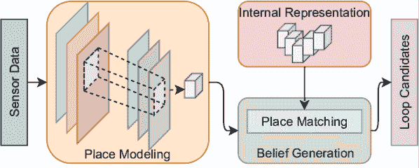
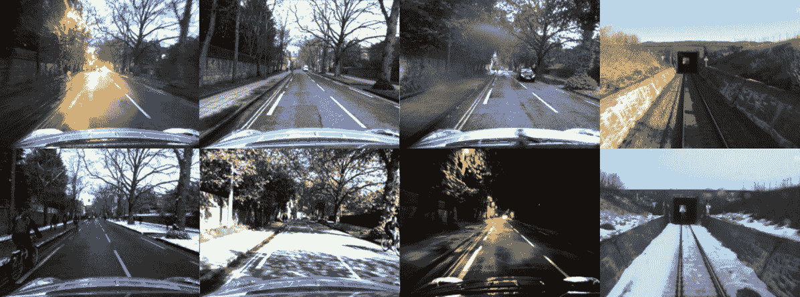
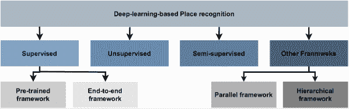
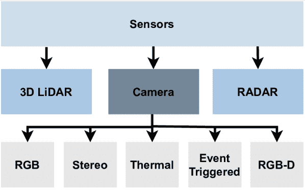
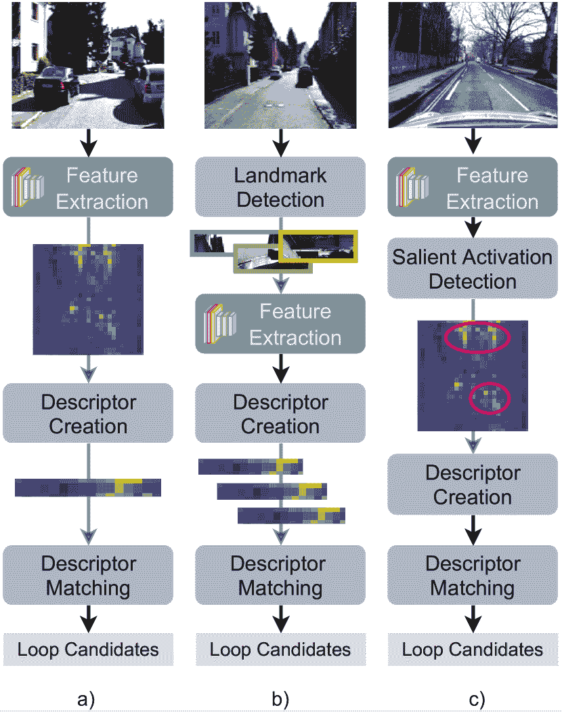
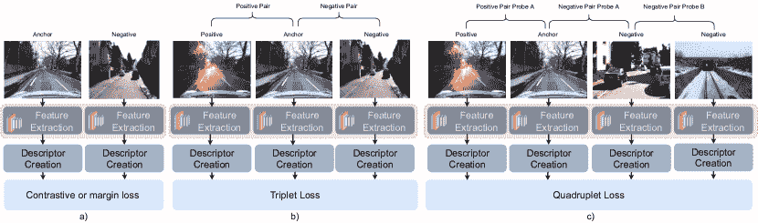
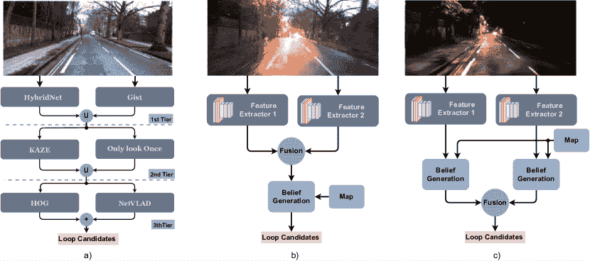

<!--yml

category: 未分类

date: 2024-09-06 19:53:56

-->

# [2106.10458] 地点识别调查：深度学习方法的更新

> 来源：[`ar5iv.labs.arxiv.org/html/2106.10458`](https://ar5iv.labs.arxiv.org/html/2106.10458)

# 地点识别调查：深度学习方法的更新

Tiago Barros, Ricardo Pereira, Luís Garrote, Cristiano Premebida, Urbano J. Nunes 作者来自葡萄牙科英布拉大学系统与机器人研究所电气与计算机工程系。电子邮件：{tiagobarros, ricardo.pereira, garrote, cpremebida, urbano}@isr.uc.pt

###### 摘要

自主车辆（AV）正变得越来越能够在复杂的环境中导航，这些环境具有动态和变化的条件。使这些智能车辆克服这些条件并变得更加自主的关键组件是感知和定位系统的复杂性。作为定位系统的一部分，地点识别受益于其他感知任务的最新发展，如地点分类或对象识别，尤其是深度学习（DL）框架的出现。本文回顾了最近在地点识别中使用的方法，特别是基于深度学习的方法。这项工作的贡献有两个方面：调查最近应用于地点识别的传感器，如 3D LiDAR 和雷达；以及将各种基于 DL 的地点识别工作分类为监督、无监督、半监督、并行和层次类别。首先，本调查介绍了关键的地点识别概念，以便让读者理解背景。接着，讨论了传感器特性。本调查进一步详细说明了各种基于 DL 的工作，为每个框架提供总结。从这项调查中得到的一些经验教训包括：NetVLAD 在监督端到端学习中的重要性；无监督方法在地点识别中的优势，特别是在跨域应用中的优势；以及最近的研究趋向于寻求不仅是更高的性能，还有更高的效率。

###### 关键词：

地点识别，深度学习，定位。

## I 引言

自驾车越来越能够处理无结构和动态环境，这主要得益于更强大的长期定位和感知系统的发展。长期定位的一个关键方面是保证映射的一致性和误差的有限性，这通过在重新访问的区域中找到环路来实现。通过采用地点识别和环闭等方法来检测重新访问的地方。具体来说，地点识别是一种基于感知的方法，通过视觉、结构或语义线索识别以前访问过的地方。

地点识别在过去十年中一直是研究的重点。智能车辆和机器视觉领域的努力，包括致力于地点识别的工作，取得了显著成就，即在外观变化和极端视角变化条件下实现了有前景的性能。尽管取得了这些成就，但仍存在一些基本挑战，当：

+   $-$

    两个不同的地方看起来相似（也称为感知混淆）；

+   $-$

    相同的地点由于昼夜变化、天气、季节性或结构变化而显示出显著的外观变化（如图 2 所示）；

+   $-$

    相同的地点从不同的视角或位置被感知。

解决这些挑战对于实现可靠的地点识别和因此的长期定位至关重要。

图 1：通用地点识别流程，包括以下模块：地点建模、信念生成和地点映射。地点建模创建内部地点表示。地点映射关注于保持随时间一致的地点表示。信念生成最终基于当前的地点模型和地图生成循环候选。

图 2：季节性环境变化的示意图。图像来自牛津机器人车[1]和 Nordland 数据集[2]。

撰写此综述论文的主要动机是提供自先前综述发布以来的最新地点识别方法的更新回顾[3, 4]。目标特别是关注基于深度学习的工作。

Lowry 等人[3] 提供了截至 2016 年的现有视觉地点识别方法的全面概述。这项工作总结并讨论了处理外观变化环境和视角变化的若干基本问题。然而，深度学习（DL）和新传感器模式（例如 3D LiDAR 和 RADAR）的快速发展正设立了前所未有的性能，将地点识别的最新技术从传统（仅手工制作）特征提取转向数据驱动方法。

这些数据驱动方法的一个关键优点是端到端训练，这使得可以直接从感官数据中学习任务，而不需要领域知识来提取特征。相反，特征在训练过程中通过卷积神经网络（CNNs）进行学习。这些特征提取方法最终成为了激励近期研究使用监督、非监督或两者结合（半监督）学习方法来提高性能的驱动力。在考虑到最近几年发布的大量采用这些方法的位置识别工作时，深度学习框架的影响尤其明显。

另一方面，深度学习方法的一个缺点是对大量训练数据的需求。这个需求尤为关键，因为创建合适的数据集是一个繁重且昂贵的过程。在这方面，位置识别从自主驾驶车辆数据集的可用性中受益匪浅，这些数据集变得越来越真实。除了更真实的现实世界条件外，新的传感器类型的数据也变得可用，例如，新的摄像机类型、3D 激光雷达以及最近的雷达[5, 6]。本工作不涉及数据集，因为这一主题已经在其他研究中概述，例如[7]关于位置识别的研究和[8]更广泛的自主驾驶数据集。

本工作的贡献是提供对近期方法和方法的全面回顾，特别关注于：

+   •

    最近引入的用于位置识别的传感器的优缺点概述见表格Ⅰ，概述图示见图 4；

+   •

    将各种基于深度学习的工作分类为监督、非监督、半监督和其他框架（如图 3 所示），以便为读者提供更全面和有意义的理解。

本文的其余部分组织如下。第 II 节专注于地点识别的关键概念。第 III 节讨论了监督地点识别方法，包括预训练和端到端框架。第 V 节讨论了无监督地点识别方法。第 VI 节讨论了结合监督和无监督的混合方法。第 VII 节讨论了利用并行和层次结构的替代框架。最后，第 VIII 节总结了本文。

图 3：最近基于深度学习的地点识别方法的分类。

## II 地点识别的关键概念

本节介绍了地点识别的基本概念和关键要素。这里讨论的大多数概念已经在[3][9][10][11]中介绍过，但在本节中简明回顾，以帮助读者理解并便于阅读。

因此，在深入细节之前，必须首先解决一些基本问题。在地点识别的背景下，什么是“地点”？地点是如何被识别和记忆的？此外，当地点随着时间变化时，面临哪些困难/挑战？

### II-A 什么是地点？

地点是物理世界中的片段，可以具有任意尺度——在极限情况下，一个地点可能代表一个单一的位置到整个离散位置的区域[3]（参见图 2 中的示例）。这些片段的物理边界可以通过不同的分割标准来定义：时间步长、行进距离或外观。特别是，外观标准在地点识别中被广泛使用。在这种情况下，每当当前位置的外观与之前观察到的位置有显著不同时，就会创建一个新地点[3]。

### II-B 地点如何被识别和记忆？

地点识别是利用来自周围环境的线索，在全球地图中识别地点的过程。这个过程通常分为三个模块（如图 1 所示）：地点建模、信念生成和地点映射。

#### II-B1 地点建模

地点建模是将传感器空间中的数据映射到描述符空间的模块。来自相机、3D LiDAR [12, 13] 或雷达 [14] 的感测数据用于建模周围环境，这通过提取有意义的特征来实现。

特征提取方法在过去十年中取得了巨大进步。经典方法依赖于手工制作的描述符，如 SWIFT [15]、SURF [16]、多尺度超像素网格 [17]、HOG [18] 或词袋模型 [19]，这些方法主要基于领域专家的知识（参见 [3] 以了解更多）。另一方面，基于 DL 的技术，即 CNN，经过优化以学习特定任务的最佳特征 [20]。随着 DL 在各种感知任务中的主导地位，地点识别也逐渐从这些技术中受益，最初使用从其他任务（例如对象识别 [21] 或地点分类 [22, 23]）中预训练的模型，最近则使用直接在地点识别任务上训练的端到端学习技术 [24, 25]。

#### II-B2 地点映射

地点映射指的是保持对物理世界的真实表示的过程。为此，地点识别方法依赖于各种映射框架和地图更新机制。关于映射框架，主要有三种方法：数据库 [26, 27]、拓扑 [28, 29, 30] 或拓扑-度量 [31, 32]。

数据库框架是抽象的地图结构，用于存储任意数量的数据，但这些数据之间没有任何关系。这些框架主要用于纯检索任务，并通过 k 维 [33, 34]、Chow Liu 树 [35] 或分层可导航小世界 (NSW) [36] 来加速最近邻搜索，从而提高检索效率。

拓扑（-度量）地图则是基于图的框架，通过节点和边表示地图。节点代表物理世界中的位置，而边代表节点之间的关系（例如，两个节点之间的相似性）。一个节点可以表示一个或多个位置，在后一种情况下定义了物理世界中的一个区域。拓扑-度量地图与纯拓扑地图的不同在于节点的关系，即，纯拓扑地图中边不使用度量信息；而拓扑-度量地图中，节点可以通过相对位置、方向或度量距离 [3] 与其他节点相关联。HTMap 方法 [37] 是这种映射方法的一个示例。

关于地图更新，数据库框架通常在操作过程中不会更新，而拓扑框架可以更新。更新策略包括简单的方法，这些方法在环路发生时更新节点 [28]，或更复杂的方法，使用基于长短期记忆的方法 [38]。

#### II-B3 信念生成

信念生成模块指的是生成信念分布的过程，该分布表示输入数据匹配地图中某个位置的可能性或信心。因此，该模块负责基于信念分数生成环路候选，这些分数可以通过基于帧对帧 [39, 40, 41]、帧序列 [42, 43, 44, 14]、层次结构、图 [45] 或概率 [46, 47, 48] 的方法进行计算。

帧对帧匹配方法是位置识别中最常见的方法。这种方法通常通过逐帧匹配来计算信念分布，并使用 KD 树 [33, 34] 或 Chow Liu 树 [35] 进行最近邻搜索，使用余弦 [41]、欧几里得距离 [49]、汉明距离 [50] 来计算相似性得分。

另一方面，基于序列的方法根据连续帧的序列计算得分，例如使用成本流最小化 [51] 在相似性矩阵中寻找匹配。序列匹配也可以在概率框架中实现，使用隐马尔可夫模型 [47] 或条件随机场 [48]。

层次方法将多种匹配方法结合在一个位置识别框架中。例如，粗到细架构 [52, 27] 在粗层中选择前几个候选者，然后从中选择最佳匹配。

### II-C 主要挑战是什么？

随着环境和操作条件越来越接近现实世界情况，地点识别方法也变得越来越复杂。当前的尖端地点识别方法就是一个例子，它们能够在现实世界条件下覆盖广泛区域，表现出前所未有的性能。尽管取得了这些成就，主要的地点识别挑战仍未解决，即：具有相似外观的地点；随着时间变化而改变外观的地点；从不同视角感知的地点；以及在大型环境中提出的方法的可扩展性。

#### II-C1 外观变化与感知混淆

外观变化的环境和感知混淆特别受到大量研究的关注。随着自主车辆长时间运行，它们的感知系统必须处理由于不同天气、季节条件或结构变化等原因而随时间变化的环境。外观变化问题源于同一地点的外观随着时间变化，而感知混淆则是由于不同地点具有相似外观造成的。这些条件特别影响地点识别，因为环路决策直接受到外观的影响。

各种研究工作从不同角度解决这些挑战。从信念生成的角度来看，基于序列的匹配方法[53, 54, 42, 55, 48]被认为在这些条件下非常有效。序列匹配是将模板和查询序列配对对齐的任务，可以通过最小成本流[42, 56]实现，或者使用隐马尔可夫模型[47]或条件随机场[48]进行概率性实现。另一种方法是从地点建模的角度来解决这个问题：提取条件不变的特征[57, 58]，例如从 CNN 的中间层提取特征[22]。另一方面，可以通过描述符归一化[23, 59]或通过无监督技术如降维[60]、变化去除[61]、K-STD[62]或 delta 描述符[43]来提高描述符的匹配质量。

#### II-C2 视角变化

从不同视角重新访问一个地方——在极限情况下对面方向（180º视角变化）[23]——对位置识别也具有挑战性。特别是对于依赖于视场受限（FoV）或没有几何传感能力的传感器的方法尤为如此。当访问一个地方时，这些传感器只能捕捉到环境的一部分，而从不同角度或位置重新访问时，场景的外观可能会有所不同，甚至可能感知到额外的元素，从而生成完全不同的地方模型。

为了克服这些不足，基于视觉的方法已经转向语义特征[41, 63]。例如，从具有语义意义的高阶 CNN 层中提取特征，已被证明对视角变化更具鲁棒性[22]。其他研究提出使用全景相机[64]或 3DLiDAR [65]，因此未来访问中位置的朝向不再重要。因此，依赖于不依赖于朝向的传感器和方法（也称为视角不变）可以使位置识别更具鲁棒性。

#### II-C3 可扩展性

位置识别的另一个关键因素与可扩展性有关[66, 67, 50, 68, 69, 67, 70]。随着自动驾驶车辆在越来越大的区域内运行，访问的地点增多，地图变得越来越大，从而增加了计算需求，这对推理效率产生了负面影响。因此，为了提高推理效率，方法包括：高效索引[71, 72]、层级搜索[73, 74]、哈希[50, 68, 75, 22, 70]、标量量化[70]、隐马尔可夫模型（HMMs）[67, 69]或学习规律性重复的视觉模式[66]。例如，在[70]中，使用了一种基于哈希的方法来进行视觉位置识别任务，数据库很大，以保持描述符空间的存储占用小并提高检索速度。

## III 传感器

任何基于感知的应用程序的重要方面是选择合适的传感器。为此，选择标准必须考虑应用程序和任务环境的特定性。在位置识别中，必须使用的传感器是相机[26、27、63、24、41、23、42、76、32]、LiDAR[77、78、65、28、79、80、46、34、13]和雷达[14、81、82、83]。虽然在更广泛的自动驾驶上下文中，这些传感器被广泛采用[84、85]，但在位置识别中，相机在文献中最受欢迎，其次是 LiDAR，而雷达在这个领域仍然是非常新的技术。在本节的其余部分，将详细介绍每种传感器，并在表 I 中展示大纲。

图 4：位置识别中的常用传感器。

在位置识别的文献中，相机是使用最广泛的传感器。视觉类别包括单目[26]、立体[86]、RGBD[87]、热成像[88]或事件触发[89]等相机传感器。相机提供密集且丰富的视觉信息，可以以高帧率（高达 60Hz）提供，并且成本相对较低。另一方面，当面对视觉外观变化和视角变化时，视觉数据非常敏感，这相比其他模态是一个巨大的劣势。除了视觉数据，相机还能够返回深度图。这可以通过 RGB-D[90、87]、立体相机[86]，或通过结构光流（SfM）[91]方法实现。在户外环境中，与最新的 3D LiDAR 的深度测量相比，有限的视场（FoV）和噪声深度测量明显是一个劣势。

随着 3D 旋转版本的出现，LiDAR 传感器在地点识别中获得了更多关注。3D LiDAR 在一次 360° 快速旋转中捕捉周围环境的空间（或几何）结构，测量反射激光束的飞行时间（ToF）。这些传感器的探测能力可达 120 米，帧率为 10 到 15 Hz。这样的特性特别适合户外环境，因为通过 ToF 测量深度不受光照或视觉外观条件的影响。这与相机相比是一个主要优势。另一方面，劣势与高成本和大尺寸有关，固态版本承诺能克服这些问题。另一个弱点是该技术对物体反射特性的敏感性。例如，玻璃、镜子、烟雾、雾气和灰尘会降低探测能力。

雷达传感器通过无线电信号的时间延迟或相位偏移来测量距离，这使得它们对不同的天气或光照条件非常鲁棒。合理的成本和长距离能力 [92] 是雷达在环境理解 [93] 和地点识别 [14] 等任务中流行的特点。然而，雷达在空间分辨率和互操作性方面仍面临缺点 [93]，这些缺点与 LiDAR 或相机相比。

表 I：地点识别传感器：优缺点。

| 传感器 | 优势 | 劣势 |
| --- | --- | --- |

| 相机 | - 低成本 - 密集的彩色信息

- 低能耗

- 高精度/分辨率

- 高帧率 | - 范围短 - 对光线敏感

- 对校准敏感

- 视场有限

- 在无纹理环境中的困难 |

| 3D LiDAR | - 长范围 - 360º 视场

- 对外观变化条件具有鲁棒性

- 高精度/分辨率 | - 高成本 - 对反射和雾霾环境敏感

- 笨重

- 机械易损 |

| 雷达 | - 低成本 - 非常长的范围

- 精确的速度估计

- 对天气条件不敏感 | - 视场狭窄 - 低分辨率 |

图 5：预训练框架的框图 a) 基于整体 b) 基于特征点和 c) 基于区域。

## IV 监督式地点识别

本节讨论了依赖监督深度学习的地点识别方法。监督机器学习技术通过利用标记数据，学习一个将输入表示（例如，图像、点云）映射到输出表示（例如，类别、分数、边界框、描述符）的函数。在深度学习中，这个函数以具有堆叠层的网络中的权重形式存在。权重通过在第一步中计算预测和真实值之间的误差，逐步学习，在第二步中，误差通过使用梯度向量进行反向传播[20]。这一过程（即误差测量和权重调整）会重复进行，直到网络的预测达到足够的性能。这种学习过程的优点，特别是使用卷积网络（CNN）时，是能够自动从训练数据中学习特征，而在经典方法中，这需要相当大的工程技能和领域专业知识。另一方面，缺点与训练所需的大量标记数据相关，而这些数据获取成本昂贵[94]。

在地点识别中，深度监督学习实现了突破。特别是，CNN 提取特征的能力导致了更具描述性的地点模型，从而改善了地点匹配。早期方法主要依赖于预训练（或现成）的 CNN，这些 CNN 在其他视觉任务上进行了训练[21, 22]。但最近，新的方法使得深度学习网络能够以端到端的方式直接在地点识别任务上进行训练 [24, 65, 95, 96]。

### IV-A 基于预训练的框架

表 II：基于预训练框架的监督地点识别的近期工作总结。所有工作都使用基于相机的数据。BG = 信念生成，PM = 地点映射。

类型 参考模型 BG/PM 数据集 基于整体的 [21] 特征提取：OxfordNet [97] 和 GoogLeNet[98];

描述符：VLAD [99] + PCA [100] L2 距离/数据库 Holidays [101]; Oxford [102];

巴黎 [103] [104] 特征提取：CNN-VTL (VGG-F[105])

描述符：Conv5 层 + 随机选择 (LDB[106]) 汉明距离/数据库 Nordland [2]; CMU-CVG 视觉定位 [107]; Alderley [51]; [22] 特征提取：AlexNet [108];

描述符：Conv3 层 汉明 KNN/数据库 Nordland[2]; Gardens Point[22]; The Campus 人类与机器人；The St. Lucia [109] 基于地标的 [23] 地标检测：左右图像区域

特征提取：CNN Places365 [110]

描述符：fc6 + 归一化 + 拼接序列匹配/数据库 Oxford Robotcar [102];

大学校园；[111] 地标检测：Edge Boxes

特征提取：ALexNet

描述符：Conv3 层 + 高斯随机投影 [112] 余弦 KNN/数据库 Gardens Point [22]; Mapillary;

图书馆机器人室内；Nordland [2]; [113] 地标检测：BING [114]

特征提取：AlexNet

描述符：pool 5 层 + 高斯随机投影 [115, 112] + 归一化 L2- KNN/数据库 Gardens Point[22]; Berlin A100、Berlin Halenseestrasse 和 Berlin Kudamm [111]; Nordland [2]; St. Lucia [109]; 基于区域的 [59] 特征提取：Fast-Net (VGG) [116]

描述符：conv3 + L2-归一化 + 稀疏随机投影 [117] 余弦距离/数据库 Cityscapes [118];

虚拟 KITTI [119];

Freiburg; [40] 特征提取：VGG16[120]

描述符：来自不同层的显著区域 + 词袋模型 [121] 交叉匹配/数据库 Gardens Point [22]; Nordland [2]; Berlin A100、Berlin Halenseestrasse 和 Berlin Kudamm [111]; [122] 特征提取：AlexNet365[123]

描述符：(区域-VLAD) 显著区域 + VLAD 余弦距离/数据库 Mapillary; Gardens Point [22]; Nordland [2]; Berlin A100、Berlin Halenseestrasse 和 Berlin Kudamm [111];

在本工作中，预训练的地点识别框架指的是从预训练的 CNN 模型中提取特征的方法，这些模型最初是针对其他感知任务（例如物体识别 [21]、地点分类 [22, 23] 或分割 [59]）进行训练的。使用这些模型的工作分为三类：整体型、地标型和基于区域的。图 5 说明了这些方法如何应用于输入图像。

#### IV-A1 整体型

全局方法指的是将整个图像输入到 CNN 中，并使用某一层的所有激活作为描述符。CNN 的层级特性使得不同层包含具有不同语义含义的特征。因此，为了评估哪些层生成的特征对地点识别最佳，研究进行了消融研究，比较了各层在外观和视角鲁棒性方面的表现，并比较了以对象为中心、地点为中心和混合网络（即分别训练用于对象识别、地点分类和两者的网络）的性能。此外，由于 CNN 层通常有很多激活，提出的方法将描述符压缩为更易处理的大小以提高效率。

Ng 等人 [21] 研究了每层的性能，使用预训练的以对象为中心的网络，如 OxfordNet [97] 和 GoogLeNet [98] 从图像中提取特征。特征被编码成 VLAD 描述符，并使用 PCA [100] 压缩。结果显示，随着特征从更深层提取，性能有所提升，但在最深层又会下降。匹配通过计算两个描述符的 L2 距离来实现。

Sünderhauf 等人 [22] 达到了类似的结论，使用从 AlexNet [124] 中提取的全局图像描述符。作者认为，中间层编码的语义信息在面临严重外观变化时能改善地点识别，而高层的特征对视角变化更具鲁棒性。该研究进一步比较了 AlexNet（以对象为中心）与 Places205 和 Hybrid [125]，两者均在场景分类任务（即地点为中心的网络） [125] 上训练，得出结论：在地点识别方面，地点为中心的网络优于以对象为中心的 CNN。网络通过基于余弦的 KNN 方法进行匹配，但出于效率考虑，余弦相似度被汉明距离 [126] 近似。

另一方面，Arroyo 等人 [104] 在多个卷积层的不同层级和粒度下融合特征，结果表明这种方法优于仅使用单层特征的方法。CNN 架构基于 VGG-F [105]，并使用随机选择方法对输出特征进行进一步压缩以实现高效匹配。

#### IV-A2 基于地标的

与前述方法相反，基于地标的方法不会将整个图像馈送到网络；而是在预处理阶段使用对象提议技术来识别图像中的潜在地标，然后将其馈送至 CNN。与整体方法不同的是，在基于地标的方法中，仅将检测到的地标的特征转换为描述符。这些工作中使用的检测方法包括边缘框、BING 或简单启发式方法。

为了解决地点识别中的极端外观和视角变化问题，Sünderhauf 等人提出了一种地标检测方法。地标是使用 Edge Boxes 检测的 [127]，并且使用来自 Alexnet 的 conv3 层的特征映射到特征空间。由于效率原因，描述符也进行了压缩，使用了高斯随机投影方法 [112]。

Kong 等人提出了一种类似的方法 [113]。然而，与使用 Edge Boxes [127] 检测地标并从 Alexnet 的 conv3 层提取特征的方法相反，这些地标是使用 BING [114] 检测并从池化层提取特征的。

Garg 等人提出了一个稍有不同的方法 [23]，该方法利用 Places365 [110]，也强调了在极端变化中（如前视和后视）地点中心语义信息的有效性。具体来说，这项工作剪裁了图像的右侧和左侧区域，这已被证明对地点描述具有有用信息 [59]。该工作突出了来自高阶层的语义感知特征对视角和条件的不变性的重要性。此外，为了提高对外观的鲁棒性，提出了一种描述符归一化方法。查询描述符和参考描述符的归一化是独立计算的，因为图像条件不同（即白天与黑夜）。匹配则使用 SeqSLAM 计算 [42]。

图 6：使用 a) 对比度和基于边距的训练策略的块图，b) 三元组和 c) 四元组损失函数。

#### IV-A3 基于区域的

基于区域的方法与基于地标的方法类似，依赖于局部特征；但是，不同于利用对象提议方法，基于区域的方法在 CNN 层上识别感兴趣的区域，检测显著的层激活。因此，基于区域的方法将整个图像馈送到 DL 模型，并且仅使用 CNN 层中的显著激活作为描述符。

针对位置识别中的视角和外观变化问题，Chen 等人 [40] 提出了一种基于区域的方法，该方法提取显著区域而不依赖于外部地标提议技术。感兴趣的区域从预训练的 VGG16 [120] 的各个 CNN 层中提取。该方法从早期层中显式提取局部特征，从后期层中提取语义信息。提取的区域被编码成描述符，使用基于词袋的方法 [121] 进行匹配。

Naseer 等人 [59] 另一方面，利用分割来学习感兴趣的激活区域。在这项工作中，感兴趣的区域代表了稳定的图像区域，这些区域使用 Fast-Net [116] 进行学习。Fast-Net 是一种上卷积网络，提供接近实时的图像分割。由于过于庞大以至于无法进行实时匹配，因此通过 L2 正则化和稀疏随机投影 [117] 将从学习到的分段中得到的特征编码为较低维度。这种方法特别学习人造结构，因为其在较长时间内更为稳定。

为了降低内存和计算成本，Khaliq 等人 [122] 提出了 Region-VLAD。这种方法利用轻量级的以地点为中心的 CNN 体系结构（AlexNet365 [123]）来提取区域特征。这些特征使用 VLAD 方法进行编码，该方法特别调整以提高计算效率和环境不变性。

表 III：近期监督端到端位置识别工作的总结。BG = 信念生成，PM = 位置映射。

传感器 参考 体系结构 损失函数 BG/PM 数据集 相机 [24] NetVLAD:

VGG/AlexNet + NetVLAD 层 三元组损失 KNN /数据库 Google 街景时间机器； Pitts250k [128]; [25] 2D CNN 视觉和 3D CNN 结构特征提取 + 特征融合网络； 基于边距的损失 [129] KNN /数据库 Oxford RobotCar [1]; [96] SPE-VLAD:

(VGG-16 网络或 ResNet18) + 空间金字塔结构 + NetVLAD 层 加权三元组 L2 /数据库 Pittsburgh [128];

TokyoTimeMachine [130];

Places365-Standard [110]; [131] Siamese-ResNet:

Siamese 网络中的 ResNet L2 基于损失 [132] L2 /数据库 TUM [133]; [50] MobileNet [134] 三元组损失 [135, 136] 哈明 K-NN /数据库 Nordland [2];

Gardens Point [22] [137] HybridNet [138] 三元组损失 余弦 /数据库 Oxford RobotCar [6]; Nordland [2]; Gardens Point [22]; 3D LiDAR [49] LPD-Net:

自适应特征提取 + 基于图的邻域聚合 + NetVLAD 层 懒惰四元组损失 L2 /数据库 牛津 Robotcar [1]; [65] PointNetVLAD:

PointNet + NetVLAD 层 懒惰三元组和四元组损失 KNN /数据库 牛津 RobotCar [1]; [34] OREOS:

CNN 如在 [120, 139] 中所示 三元组损失 [140] KNN /数据库 NCLT [141];

KITTI [142]; [13] LocNet:

孪生网络对比损失函数[143] L2 KNN /数据库 KITTI [142]

内部数据集 [144] 孪生网络对比损失 [143] L2 KNN /数据库 KITTI [142]; 内部数据集; RADAR [81] VGG-16 + NetVLAD 层 三元组损失 KNN /数据库 牛津 Radar RobotCar [6]

### IV-B 端到端框架

与预训练框架相反，端到端框架利用机器学习方法，从传感器数据中直接学习特征表示并获取描述符，同时进行位置识别任务的训练。端到端学习的一个关键方面是定义训练目标：即网络优化的内容及其优化方式。在位置识别中，网络通常被优化以生成能够识别相同物理位置的唯一描述符，无论其外观或视角如何。实现这一目标依赖于为当前任务选择合适的网络和适当的网络训练，这取决于损失函数。

#### IV-B1 损失函数

损失函数在训练阶段尤其重要，因为它代表了训练目标的数学解释，从而决定了优化过程的成功收敛。在位置识别中，损失函数包括基于三元组的[24, 96, 137, 65, 34, 81, 50]，基于边际的[25]，基于四元组的[49]，以及基于对比的[13]。图 6 说明了损失函数的各种训练策略。

对比损失在孪生网络中使用[13, 143]，这些网络有两个分支，具有共享的参数。该函数计算两个分支输出描述符之间的相似性距离，迫使网络减少正样本对（来自同一位置的输入数据）之间的距离，并增加负样本对之间的距离。该函数可以描述如下：

|  | $\begin{gathered}L=\frac{1}{2}YD^{2}+\frac{1}{2}(1-Y)\max(0,m-D)^{2}\end{gathered}$ |  | (1) |
| --- | --- | --- | --- |

其中 $D=||R_{a}-R_{x}||_{2}$ 表示锚点图像分支（$R_{a}$）和另一分支（$R_{x}$）之间的欧几里得距离。$m$ 表示边际参数，$Y$ 表示标签，其中 $Y=1$ 代表正样本对，$Y=0$ 代表负样本对。

与前面的损失类似，三元组损失在训练过程中也依赖于多个分支。然而，不同于每次迭代计算正负样本对之间的距离，三元组损失函数在同一次迭代中计算正样本对和负样本对之间的距离，从而依赖于三个分支。与前面的损失函数一样，目标是训练一个网络，使正样本对保持接近，负样本对远离。三元组损失函数可以如下表示：

|  | $L=\max(0,D_{p}^{2}-D_{n}^{2}+m)$ |  | (2) |
| --- | --- | --- | --- |

其中 $D_{p}$ 指正样本对之间的距离（即锚点与正样本之间的距离），$D_{n}$ 指负样本对之间的距离。这个函数广泛应用于位置识别，即在使用来自相机、3D LiDAR 和 RADAR 的输入数据的框架中，这些框架将该函数调整以适应训练需求。从三元组损失推导出的损失函数包括 Lazy triplet [65]、加权三元组损失 [96] 和弱监督三元组排序损失 [24]。

四元组损失是三元组损失的扩展，引入了附加约束，以推动来自不同探测样本的负样本对 [145] 与正样本对的距离，而三元组损失仅推动来自相同探测样本的负样本对与正样本对的距离。四元组损失的附加约束减少了类内变异并扩大了类间变异。这个函数可以表示为：

|  | $\begin{gathered}L=\max(0,D_{p}^{2}-D_{n}^{2}+m_{1})+\max(0,D_{p}^{2}-D_{d}^{2}+m_{2})\end{gathered}$ |  | (3) |
| --- | --- | --- | --- |

其中 $D_{p}$ 和 $D_{n}$ 分别表示正样本对和负样本对之间的距离。$m_{1}$ 和 $m_{2}$ 表示边际参数，而 $R_{d}$ 代表附加约束，表示来自不同探测点的负样本对之间的距离。在 [49, 65] 中，四元组损失函数用于训练网络以进行使用 3D LiDAR 数据的位置信息识别任务。

基于边际的损失函数是对对比损失 [129] 的简单扩展。对比函数强制正样本对尽可能接近，而基于边际的函数则只鼓励正样本对在彼此的距离范围内。

|  | $L=\max(0,\alpha+Y(D-m))$ |  | (4) |
| --- | --- | --- | --- |

其中 $Y\in{1,-1}$ 表示当对是正样本时$Y=1$，否则$Y=-1$。$\alpha$ 是一个决定正负样本边界的变量。边际损失函数在 [129] 中提出，以证明只通过在训练过程中对输入数据进行适当的采样，就可以用一个简单的损失函数实现最先进的性能。这个函数在 [25] 中用于训练多模态网络。该网络基于从图像和以体素网格格式生成的结构数据中提取的信息进行联合训练。

#### IV-B2 基于相机的网络

对于监督的端到端基于地点识别的一个重要贡献是 NetVLAD 层 [24]。受到局部聚合描述符（VLAD） [146] 的启发，Arandjelović 等人 [24] 提出了 NetVLAD 作为一种“可插拔”层，可以插入任何 CNN 架构中以输出紧凑的图像描述符。网络的参数使用弱监督的三元组排序损失函数进行学习。

于等人 [96] 也利用了图像的 VLAD 描述符，提出了一种空间金字塔增强的 VLAD (SPE-VLAD) 层。该层利用图像的空间金字塔结构来增强地点描述，使用 VGG-16 [120] 和 ResNet-18 [147] 进行特征提取，并采用加权 T 损失作为损失函数。网络的参数在弱监督场景下学习，使用 GPS 标签和图像表示之间的欧几里得距离。

丘等 [131] 将一种基于孪生网络的方法应用于环闭检测。孪生网络是双胞神经网络，它们共享相同的参数，在训练数据有限的情况下特别有用。两个子网络共享相同的参数并镜像参数的更新。在这项工作中，子网络被 ResNet 替代，以提高特征表示，并且网络使用 L2 基础的损失函数进行训练，如 [132] 所述。

Wu 等人[50] 共同从效率和性能的角度解决了位置识别问题，为此提出了一种具有类似层次结构的深度监督哈希方法。哈希是一种将高维数据映射到一组二进制代码的编码技术，具有低计算需求和高存储效率。所提框架包含三个模块：基于 MobileNet [134] 的特征提取；通过 MobileNet 的最后一层全连接层获得的哈希码学习；以及基于似然性的损失函数[135, 136]。这项工作提出了一种类似的层次方法来区分相似图像。为此，图像对之间的哈希码距离必须随着相似图像的差异增大而增加，并且在不同图像之间保持不变。这两个条件对于在位置识别中使用深度监督哈希至关重要。

另一种提高深度网络效率的技术是网络剪枝。这种技术旨在通过去除不必要的神经元或将权重设置为零来减少网络的大小[148]。Hausler 等人[137] 提出了一种特征过滤方法，该方法在网络的开始阶段去除特征图，同时在后续阶段使用用于匹配的特征图，以提高效率和性能。待去除的特征图是基于 Triplet Loss 校准程序确定的。作为特征提取框架，该方法使用了 HybridNet [138]。

与之前的单一模态工作相反，Oertel 等人[25] 提出了一种利用来自摄像头数据的视觉和结构信息的地方描述方法。这种方法在端到端的管道中联合使用来自立体摄像机的视觉和深度数据。结构信息首先通过 Direct Sparse Odometry (DSO) 框架 [149] 获得，然后离散化为规则的体素网格，以作为输入与相应的图像一起使用。管道有两个并行分支：一个用于视觉，另一个用于结构数据，分别使用 2D 和 3D 卷积层进行特征提取。两个分支通过基于边距的损失函数联合学习。分支的输出被连接成一个向量，输入到融合网络中，最终输出描述符。

#### IV-B3 3D LiDAR 基础网络

尽管 NetVLAD 最初用于图像，它也已被应用于 3D LiDAR 数据 [65, 49]。Uy 等人 [65] 和 Liu 等人 [49] 分别提出了 PointNetVLAD 和 LPD-Net，这些都是基于 NetVLAD 的 3D LiDAR 数据全局描述符学习方法。两者具有兼容的输入和输出，输入为原始点云，输出为描述符。其区别在于特征提取和特征处理方法。PointNetVLAD [65] 依赖于 PointNet [150]，这是一个用于特征提取的 3D 物体检测和分割方法。相反，LPD-Net 依赖于自适应局部特征提取模块和基于图的邻域聚合模块，将两者分别聚合在特征空间和笛卡尔空间中。关于网络训练，Uy 等人 [65] 表明，懒惰四元组损失函数比懒惰三元组损失函数具有更高的性能，这促使 Liu 等人 [49] 采用了这种方法。

[34] 中提出了一种不同的基于 3D LiDAR 的地点识别方法。Schaupp 等人提出了 OREOS，这是一种基于三元组 DL 网络的架构 [140]。OREOS 方法接收 2D 范围图像作为输入，并输出与方向和地点相关的描述符。这些 2D 范围图像是 3D 点云投影到图像表示上的结果。网络使用基于 L2 距离的三元组损失函数进行训练，以计算锚点-正样本和锚点-负样本之间的相似性。地点识别通过 k 最近邻框架进行验证。

Yin 等人 [13] 使用 3D 点云解决全局定位问题，提出了一种地点识别和度量姿态估计方法。地点识别通过 siamese LocNets 实现，这是一种针对 LiDAR 点云的半手工表示学习方法。作为输入，LocNets 接收从点云中提取的手工旋转不变表示，并输出低维指纹。网络遵循 Siamese 架构，并使用基于欧几里得距离的对比损失函数 [143] 进行学习。在信念生成方面，使用基于 L2 的 KNN 方法。[144] 中提出了一种类似的基于 LocNets 的方法。

#### IV-B4 基于雷达

关于基于雷达的地点识别，Saftescu 等人 [95] 还提出了一种基于 NetVLAD 的方法，将 FMCW 雷达扫描映射到描述符空间。特征通过基于圆柱卷积、抗混叠模糊和方位角最大池化的特别定制的 CNN 提取，以增强极坐标雷达图像的旋转不变性。关于训练，网络使用了 [151] 中提出的三元组损失函数。

## V 无监督地点识别

上述监督学习方法在学习区分性场所模型方面取得了优秀的成果。然而，这些方法有一个不便之处，即需要大量标记数据才能表现良好，这在基于监督的深度学习方法中是常见的。与监督学习不同，无监督学习不需要标记数据，这在标注数据不可用或稀缺时具有优势。

场所识别工作使用了无监督的方法，例如生成对抗网络（GAN）进行领域翻译 [152]。Latif 等人 [152] 提出的一个例子将跨季节场所识别问题视为领域翻译任务。GAN 用于学习两个领域之间的关系，而不需要跨领域图像对应。所提出的架构呈现为两个耦合的 GAN。生成器集成了一个编码-解码网络，而判别器集成了一个编码网络，并跟随两个全连接层。判别器的输出被用作场所识别的描述符。作者展示了判别器的特征空间比翻译到目标领域的图像像素更具信息性。

Yin 等人 [153] 也提出了一种基于 GAN 的方法，但用于 3D LiDAR 数据。LiDAR 数据首先映射到动态八叉树图中，从中提取鸟瞰图像。这些图像用于基于 GAN 的流程，以学习稳定且通用的场所特征。该网络通过对抗和条件熵策略进行训练，以产生更高的泛化能力，并捕捉原始数据空间与压缩潜在编码空间之间的独特映射。

Han 等人（2020） [88] 提出了一个多光谱领域不变框架，用于未配对 RGB 和热成像之间的翻译。所提出的方法基于 CycleGAN [154]，其训练依赖于单尺度结构相似性指数（SSIM [155]）损失、三元组损失、对抗损失和两种类型的一致性损失（循环损失 [154] 和逐像素损失）。所提出的框架在语义分割和领域适应任务中进一步验证。

与之前主要基于 GAN 方法的工作不同，Merril 和 Huang [94] 提出了一个基于自编码器的方法来处理特征嵌入，用于视觉回环闭合。该无监督方法专门用于将图像映射到 HOG 描述符空间，而不是重建原始图像。自编码器网络经过训练，输入为一个预处理阶段，其中利用了两种经典的几何视觉技术：方向梯度直方图（HOG） [156] 和投影变换（单应性） [157]。HOG 能够在保留显著特征的同时压缩图像。另一方面，投影变换允许将不同视点的图像关联起来。该网络具有最小架构，能够在实时中快速可靠地进行闭环检测，而无需降维。

表 IV：总结了使用无监督端到端学习技术进行地点识别的近期工作。

传感器 参考 架构 损失函数 任务 数据集 摄像头 [152] 架构：耦合 GANs + 编码器-解码器网络 循环重建损失最小化 [158] 跨域地点识别的领域翻译 Norland [2]; 摄像头 [94] 预处理：HOG [156] 和单应性 [157]

架构：小型自编码器 L2 损失函数 无监督特征嵌入用于视觉回环闭合 Places [110]; KITTI [142]; Alderley [42]; Norland [2]; Gardens Point [22]; RGB + 热成像 [88] 多光谱领域不变模型

架构：CycleGAN [154] SSIM [155] + 三元组 + 对抗 + 循环损失 [154] + 像素级损失 无监督多光谱图像翻译任务 KAIST [159]; 3D LiDAR [152] 预处理：将 LiDAR 映射到动态八叉树地图和鸟瞰图像

架构：GAN + 编码器-解码器网络 对抗学习和条件熵 无监督特征学习用于基于 3D LiDAR 的地点识别任务 KITTI [142];

NCTL [141];

表 V：结合有监督和无监督学习的地点识别系统的近期工作。

传感器 参考 架构 损失函数 任务 数据集 摄像头 [160] 特征提取：AlexNet 剪裁（conv5）

有监督：VLAD + 注意力模块

无监督：领域适应 有监督：三元组排序；

无监督：MK-MMD [161] 单域和跨域 VPR Mapillary ¹¹1https://www.mapillary.com

Beeldbank ²²2https://beeldbank.amsterdam.nl/beeldbank [162] 有监督：对抗学习

无监督：自编码器 对抗学习：最小二乘法 [163];

重建：L2 距离 跨领域 VPR Nordland 中的地点和外观特征解耦[2];

Alderley[42]; 3D LiDAR[77] 监督：潜在空间+分类网络

无监督：类似自编码器的网络 分类：softmax 交叉熵[164]

重建：二元交叉熵[165] 全球定位、3D 稠密地图重建和语义信息提取 KITTI 里程计[142];

## VI 半监督地点识别

在这项工作中，半监督方法指的是那些同时依赖于监督和无监督方法的工作。这两种学习方法的结合特别用于跨领域问题。然而，与其将一个领域转化为另一个领域，不如利用这些学习技术学习与领域外观无关的特征。最近工作的总结见表 V。

为了学习跨领域视觉地点识别的领域不变特征，王等人[160]提出了一种将弱监督学习与无监督学习相结合的方法。该架构主要包含三个模块：一个注意力模块、一个注意力感知 VLAD 模块和一个领域适配模块。监督分支使用三重排序损失函数进行训练，而无监督分支则采用多核最大均值差异（MK-MMD）损失函数。

另一方面，唐等人[162]提出了一种自监督学习方法，用于将地点相关特征与领域相关特征分离。该方法的主干架构是一个修改版的自编码器，用于对抗学习：即两个输入编码器分支汇聚到一个输出解码器中。两个特征领域的解耦通过对抗学习解决，这限制了领域特定特征的学习（即，依赖于外观的特征）；这是自编码器的重建损失无法保证的任务。对于对抗学习，提出的损失函数是最小二乘对抗损失[163]；而对于重建，损失函数是 L2 距离。

Dubé 等人[77] 提出了 SegMap，这是一种数据驱动的学习方法，用于定位和映射任务。该方法以类似自编码器的架构为主要框架，学习 3D 点云的物体分段。该框架用于两个任务：（监督式）分类和（无监督式）重建。该工作提出了一种定制的学习技术来训练网络，其中，分类部分采用 softmax 交叉熵损失函数结合 N-way 分类问题学习技术[164]，重建部分则采用二进制交叉熵损失函数[165]。在两个任务上联合学习的潜在空间被用作分段检索的描述符。所提出的框架可用于全局定位、3D 密集地图重建和语义信息提取任务。

## VII 其他框架

图 7：a) 层次化框架，b) 和 c) 并行位置识别框架的框图。b) 中的示例融合了描述符，而 c) 中则融合了置信度评分。

本节专门讨论那些具有更复杂和纠缠架构的框架：即，包含多个位置识别方法以寻找最佳的循环候选项。突出介绍了两个主要框架：并行和层次化。虽然并行框架具有非常明确的结构，层次化框架可能会假设非常复杂和纠缠的配置，但两个框架的最终目标都是表示更高效的地点识别方法。

### VII-A 并行框架

并行框架指的是依赖于多个信息流的方法，这些信息流被融合到一个分支中以生成位置识别决策。这些并行架构通过特征连接[44]、HMM[166]或在高斯分布簇上乘以归一化数据[167]等方法来融合各个分支。诸如 Oertel 等人提出的方法[25]，其中视觉和结构数据以端到端的方式融合，因特征在端到端的管道中联合学习而被视为属于第 IV-B 节。并行框架的示例见图 7，最近工作的总结见表 VI。

依赖于多个信息流可以克服单一感官数据的局限性，例如，由于环境变化条件的影响。张等人[44] 解决了在强感知别名和外观变化下的回环闭合检测问题，提出了基于鲁棒多模态序列（ROMS）。ROMS 将 LDB 特征[168]、GIST 特征[169]、基于 CNN 的深度特征[170] 和 ORB 局部特征[171] 连接在一个向量中。Hausler 等人[166] 提出了类似的（并行）架构，其中一种称为多进程融合的方法融合了四种图像处理方法：带补丁归一化的 SAD [42, 172]; HOG [173, 174]; CNN 特征的多个空间区域 [138, 175]; 和最大 CNN 激活的空间坐标 [41]。然而，与[44]中提出的将所有特征融合生成一个描述符的方法不同，这里每个特征流使用余弦距离单独匹配，并且仅将结果相似性值使用隐马尔可夫模型进行融合。

表 VI：使用并行框架的监督位置识别近期工作的总结。BG = 信念生成，PM = 位置映射。

传感器 参考 模型 融合 BG/PM 数据集 相机 [44] 特征提取：LDB [168] + GIST [169] + CNN [170] + ORB [171] 所有特征的连接 序列 / 数据库 St Lucia [109]; CMU-VL [107]; Nordland [2]; [166] 特征提取：SAD [42, 172] + HOG [173, 174] + HybridNet(Conv-5 层) 的空间区域 [138, 175] + HybridNet(Conv-5 层) 的最大激活的空间坐标 [41]

描述符：特征 + 归一化 隐马尔可夫模型 每个特征流的相似性距离 动态序列 / 数据库 St Lucia [109]

Nordland [2]

Oxford RobotCar [102]

### VII-B 层次框架

在这项工作中，层次化框架指的是位置识别方法，这些方法类似于并行框架，依赖于多种方法；然而，区别在于，其主要框架不是并行架构，而是由多个堆叠层组成的架构。层次化架构通过在每一层逐步筛选候选项来找到最佳循环候选项。一个这样的框架示例是粗到细架构，它具有粗层和细层。粗层主要用于利用计算效率高但准确性低的方法检索前几名候选项。这些前几名候选项被送到细层，细层可以使用更高计算要求的方法来找到最佳循环候选项。尽管粗到细架构是最常见的，但并不是唯一的。其他架构也存在，例如图 7 展示了一个在[176]中提出的框架，而表格 VII 则总结了最近的研究工作。

Hausler 和 Milford[176]表明，平行融合策略相比于层次化方法表现较差，因此提出了层次化多过程融合，它具有三层层次结构。在第一层，从数据库中检索基于 HybridNet[138]和 Gist[177]特征的前几名候选项。在第二层，从上一层的前几名候选项中，根据 KAZE[178]和 Only Look Once (OLO)[123]特征进行更精确的选择。最后，在第三层使用 NetVLAD[24]和 HOG[18]获得最佳循环候选项。该框架的示意图见图 7。

Garg 等人[41]也遵循了类似的框架，提出了一种称为 X-Lost 的层次化位置识别方法。在粗层，通过匹配包含来自 RefineNet[179]（一个密集分割网络）和道路、建筑物及植被类的语义标签得分的特征图的 Local Semantic Tensor (LoST)描述符来找到前几名候选项。通过验证语义上显著的关键点对应关系的空间布局，在细层中找到最佳匹配。

这种基于语义和关键点的方法在[63, 27]中得到了进一步的利用。在[63]中，前几名候选项通过在粗略阶段融合 NetVLAD[24]和 LoST[41]描述符获得，而在[27]中，通过在中间阶段从相机数据计算深度图以去除超出范围的关键点。

与之前的方法不同，An 等人[180] 解决了地点识别的效率问题，提出了一种基于 HNSW 图的高效地图管理方法。HNSW 图保证了低的地图构建和检索时间。在粗略阶段，通过使用归一化标量积 [182] 匹配从 MobileNetV2 [181] 提取的特征，从 HNSW 图中检索出前候选。最终的循环候选是通过匹配 SURF 特征的哈希码和粗略阶段检索出的前候选获得的。另一方面，Liu 等人 [52] 利用 3D 点云而不是相机数据，提出了 SeqLPD，这是我们 LPD-Net [49] 的轻量级变体。这种方法利用超级关键帧簇进行粗略搜索，而在精细搜索中，则更倾向于局部序列匹配。

表 VII：使用层次化框架的近期工作总结。BG = 信念生成，PM = 地点映射。

传感器 参考 粗略阶段 精细阶段 PM 数据集 摄像头 [41] 特征：RefineNet [179]

描述符：LosT（语义标签分数 + 卷积 5 层特征图）+ 归一化

BG：余弦距离 特征：RefineNet [179]

描述符：从 CNN 层激活中提取的关键点

GB：空间布局验证（语义标签一致性 + 加权欧几里得距离） 粗略：数据库

精细：前候选 Oxford Robotcar [1];

Synthia 数据集 [183]; [63] 描述符：LoST [41] + NetVLAD [24] 的串联

BG：余弦距离 特征：预训练 CNN

描述符：从 CNN 激活中提取的关键点

BG：空间布局一致性 粗略：数据库

精细：前候选 Oxford Robotcar [1]; MLFR; 停车场; 住宅 室内 室外 [27] 特征：RefineNet(Resnet101) [179]

描述符：卷积 5 特征图

BG：余弦距离 过滤：基于深度图的范围外关键点

描述符：与粗略阶段相同（过滤后）

BG：余弦距离 粗略：数据库

精细：前候选 Oxford Robotcar [1]

Synthia [183] （用于深度评估） [180] 前候选：

特征：MobileNetV2 [181]

描述符：最终的平均池化层

BG：最近邻 + 归一化标量积 [182] 特征：SURF

描述符：哈希码

BG：前候选和基于 SURF 的描述符之间的汉明距离 + 比率测试 [184] + RANSAC 粗略：HNSW 图

精细：前候选 KITTI [142]

马拉加 2009 停车 6L [185]

新学院 [186] [176] 第一层：

特征：HybridNet(AlexNet) [138] 和 Gist [177]

BG：差异分数 + 归一化

第二级：

特征：KAZE [178] 和 Only Look Once [40]

BG: (KAZE) 残差距离和差异得分的总和 + 归一化 第三层：

特征：NetVLAD [24] 和 HOG [18]

BG: max(平均差异得分) 第一层：数据库

第二层：第一层的顶级候选者

第三层：第二层的顶级候选者 Nordland [187]

柏林 Kurfurstendamm [111] 3D LiDAR [52] 查找聚类：

描述符：轻量级变体 LPD-Net

匹配：选择到聚类中心的最近 L2 距离作为超关键帧 描述符：与粗略匹配相同

BG: 本地序列匹配 超关键帧簇 牛津机器人车 [1]

KITTI [142]

## 第八章 结论与讨论

本文对地点识别方法进行了关键性综述，强调了在深度学习框架上的近期发展，即监督、无监督、半监督、并行和层次化方法。

提供了这些框架的概述。在监督方法中，预训练的框架倾向于通过检测地标或利用 CNN 层的区域激活来借助语义信息。另一方面，在端到端框架中，NetVLAD 层激发了各种工作，这些工作将此层集成到深度架构中，直接在使用来自相机、3D LiDAR 或 RADAR 的传感数据的地点识别上训练模型。无监督方法，如 GANs 和自编码器，主要应用于解决领域转换问题。而在半监督方法中，本研究指的是结合监督和无监督方法的工作，这些工作解决了跨领域问题，但不是将源领域转换为目标领域，而是寻求获得对领域不变的描述符空间。除了这些传统的机器学习框架外，还提出了其他框架，将多种深度学习或经典机器学习方法结合成并行或层次化架构。特别是，层次化方法已被证明能提高整体性能。直到最近，大多数已发布文章的主要动机是提高性能。然而，最近的工作除了追求高性能外，还在寻求效率。

## 致谢

本研究得到了 MATIS-CENTRO-01-0145-FEDER-000014 和 SafeForest CENTRO-01-0247-FEDER-045931 项目的支持。它还得到了 FCT 通过 UID/EEA/00048/2019 资助的部分支持。

## 参考文献

+   [1] W. Maddern, G. Pascoe, C. Linegar, 和 P. Newman，“1 年，1000 公里：牛津机器人车数据集，”*国际机器人研究期刊 (IJRR)*，第 36 卷，第 1 期，第 3–15 页，2017 年。[在线]. 可用: http://dx.doi.org/10.1177/0278364916679498

+   [2] D. Olid, J. M. Fácil, 和 J. Civera，“在季节变化下的单视角地点识别，”在*PPNIV Workshop at IROS 2018*，2018 年。

+   [3] S. Lowry, N. Sünderhauf, P. Newman, J. J. Leonard, D. Cox, P. Corke, 和 M. J. Milford，“视觉地点识别：综述，” *IEEE Transactions on Robotics*，第 32 卷，第 1 期，第 1–19 页，2015 年。

+   [4] E. Garcia-Fidalgo 和 A. Ortiz，“基于视觉的拓扑地图构建和定位方法：综述，” *Robotics and Autonomous Systems*，第 64 卷，第 1–20 页，2015 年。

+   [5] G. Kim, Y. S. Park, Y. Cho, J. Jeong, 和 A. Kim，“Mulran：用于城市地点识别的多模态范围数据集，” 收录于 *2020 IEEE International Conference on Robotics and Automation (ICRA)*，2020 年，第 6246–6253 页。

+   [6] D. Barnes, M. Gadd, P. Murcutt, P. Newman, 和 I. Posner，“牛津雷达机器人车数据集：牛津机器人车数据集的雷达扩展，” 收录于 *2020 IEEE International Conference on Robotics and Automation (ICRA)*。 IEEE，2020 年，第 6433–6438 页。

+   [7] F. Warburg, S. Hauberg, M. López-Antequera, P. Gargallo, Y. Kuang, 和 J. Civera，“Mapillary 街景序列：用于终身地点识别的数据集，” 收录于 *Proceedings of the IEEE/CVF Conference on Computer Vision and Pattern Recognition*，2020 年，第 2626–2635 页。

+   [8] Y. Kang, H. Yin, 和 C. Berger，“测试你的自动驾驶算法：公开可用的驾驶数据集和虚拟测试环境概述，” *IEEE Transactions on Intelligent Vehicles*，第 4 卷，第 2 期，第 171–185 页，2019 年。

+   [9] I. Kostavelis 和 A. Gasteratos，“移动机器人任务的语义映射：综述，” *Robotics and Autonomous Systems*，第 66 卷，第 86–103 页，2015 年。

+   [10] C. Cadena, L. Carlone, H. Carrillo, Y. Latif, D. Scaramuzza, J. Neira, I. Reid, 和 J. J. Leonard，“同时定位与地图构建的过去、现在和未来：迈向鲁棒感知时代，” *IEEE Transactions on Robotics*，第 32 卷，第 6 期，第 1309–1332 页，2016 年。

+   [11] G. Bresson, Z. Alsayed, L. Yu, 和 S. Glaser，“同时定位与地图构建：当前自动驾驶趋势的调查，” *IEEE Transactions on Intelligent Vehicles*，第 2 卷，第 3 期，第 194–220 页，2017 年。

+   [12] G. Kim 和 A. Kim，“扫描上下文：用于 3D 点云地图中的地点识别的自我中心空间描述符，” 收录于 *2018 IEEE/RSJ International Conference on Intelligent Robots and Systems (IROS)*，2018 年，第 4802–4809 页。

+   [13] H. Yin, L. Tang, X. Ding, Y. Wang, 和 R. Xiong，“Locnet：用于移动车辆的 3D 点云中的全球定位，” 收录于 *2018 IEEE Intelligent Vehicles Symposium (IV)*，2018 年，第 728–733 页。

+   [14] M. Gadd, D. De Martini, 和 P. Newman，“看看你周围：基于序列的雷达地点识别与学习到的旋转不变性，” *arXiv preprint arXiv:2003.04699*，2020 年。

+   [15] D. G. Lowe，“从局部尺度不变特征中进行物体识别，” 收录于 *Proceedings of the Seventh IEEE International Conference on Computer Vision*，第 2 卷，1999 年，第 1150–1157 页。

+   [16] H. Bay, T. Tuytelaars, 和 L. Van Gool，“Surf：加速鲁棒特征，” 收录于 *European conference on computer vision*。 Springer，2006 年，第 404–417 页。

+   [17] P. Neubert 和 P. Protzel, “超越整体描述符、关键点和固定补丁：用于变化环境中的地点识别的多尺度超像素网格”，*IEEE 机器人与自动化信函*，第 1 卷，第 1 期，页码 484–491，2016 年。

+   [18] N. Dalal 和 B. Triggs, “用于人类检测的方向梯度直方图”，收录于*2005 IEEE 计算机学会计算机视觉与模式识别会议（CVPR’05）*，第 1 卷。IEEE，2005 年，页码 886–893。

+   [19] L. Fei-Fei 和 P. Perona, “用于学习自然场景类别的贝叶斯层次模型”，收录于*2005 IEEE 计算机学会计算机视觉与模式识别会议（CVPR’05）*，第 2 卷，2005 年，页码 524–531，第 2 卷。

+   [20] Y. LeCun, Y. Bengio, 和 G. Hinton, “深度学习”，*自然*，第 521 卷，第 7553 期，页码 436–444，2015 年。

+   [21] J. Yue-Hei Ng, F. Yang, 和 L. S. Davis, “利用深度网络的局部特征进行图像检索”，收录于*IEEE 计算机视觉与模式识别会议论文集*，2015 年，页码 53–61。

+   [22] N. Sünderhauf, S. Shirazi, F. Dayoub, B. Upcroft, 和 M. Milford, “卷积网络特征在地点识别中的表现”，收录于*2015 IEEE/RSJ 国际智能机器人与系统会议（IROS）*。IEEE，2015 年，页码 4297–4304。

+   [23] S. Garg, N. Suenderhauf, 和 M. Milford, “不要回头：增强地点分类以适应视角和条件无关的地点识别”，收录于*2018 IEEE 国际机器人与自动化会议（ICRA）*，2018 年，页码 3645–3652。

+   [24] R. Arandjelović, P. Gronat, A. Torii, T. Pajdla, 和 J. Sivic, “Netvlad：用于弱监督地点识别的 CNN 架构”，*IEEE 模式分析与机器智能汇刊*，第 40 卷，第 6 期，2018 年，页码 1437–1451。

+   [25] A. Oertel, T. Cieslewski, 和 D. Scaramuzza, “通过结构线索增强视觉地点识别”，*IEEE 机器人与自动化信函*，第 5 卷，第 4 期，页码 5534–5541，2020 年。

+   [26] J. L. Schönberger, M. Pollefeys, A. Geiger, 和 T. Sattler, “语义视觉定位”，收录于*IEEE 计算机视觉与模式识别会议论文集*，2018 年，页码 6896–6906。

+   [27] S. Garg, M. Babu, T. Dharmasiri, S. Hausler, N. Suenderhauf, S. Kumar, T. Drummond, 和 M. Milford, “无需更深入：通过单视角深度估计在场景外观变化下从对立视角识别地点”，收录于*2019 国际机器人与自动化会议（ICRA）*。IEEE，2019 年，页码 4916–4923。

+   [28] R. Paul 和 P. Newman, “Fab-map 3d：结合空间和视觉外观的拓扑映射”，收录于*2010 IEEE 国际机器人与自动化会议*。IEEE，2010 年，页码 2649–2656。

+   [29] H. Korrapati, J. Courbon, Y. Mezouar, 和 P. Martinet, “用于户外制图的图像序列分割”，收录于*2012 IEEE 国际机器人与自动化会议*。IEEE，2012 年，页码 1650–1655。

+   [30] Z. Hong, Y. Petillot, D. Lane, Y. Miao, 和 S. Wang, “Textplace：通过阅读场景文本进行视觉地点识别和拓扑定位，”在 *2019 IEEE/CVF 国际计算机视觉会议（ICCV）*，2019 年，第 2861–2870 页。

+   [31] F. Dayoub, G. Cielniak 和 T. Duckett, “在变化环境中使用自适应球形视图表示进行的长期实验，” *机器人与自动系统*，第 59 卷，第 5 期，第 285–295 页，2011 年。

+   [32] W. Churchill 和 P. Newman, “基于经验的长时间定位导航，” *国际机器人研究期刊*，第 32 卷，第 14 期，第 1645–1661 页，2013 年。

+   [33] M. J. Milford, G. F. Wyeth 和 D. Prasser, “Ratslam：用于同时定位与地图构建的海马体模型，”在 *IEEE 国际机器人与自动化会议，2004 年. 会议录. ICRA ’04. 2004*，第 1 卷，2004 年，第 403–408 页 第 1 卷。

+   [34] L. Schaupp, M. Bürki, R. Dubé, R. Siegwart 和 C. Cadena, “Oreos：在户外场景中对 3D 点云的定向识别，”在 *2019 IEEE/RSJ 国际智能机器人与系统会议（IROS）*，2019 年，第 3255–3261 页。

+   [35] M. Cummins 和 P. Newman, “Fab-map：在外观空间中的概率定位和地图构建，” *国际机器人研究期刊*，第 27 卷，第 6 期，第 647–665 页，2008 年。

+   [36] Y. A. Malkov 和 D. A. Yashunin, “使用分层可导航的小世界图进行高效且稳健的近似最近邻搜索，” *IEEE 模式分析与机器智能汇刊*，2018 年。

+   [37] E. Garcia-Fidalgo 和 A. Ortiz, “用于拓扑地图构建的分层地点识别，” *IEEE 机器人学汇刊*，第 33 卷，第 5 期，第 1061–1074 页，2017 年。

+   [38] T. Morris, F. Dayoub, P. Corke, G. Wyeth 和 B. Upcroft, “在非静态环境中进行规划和导航的多地图假设，”在 *2014 IEEE 国际机器人与自动化会议（ICRA）*，2014 年，第 2765–2770 页。

+   [39] M. Zaffar, S. Ehsan, M. Milford 和 K. McDonald-Maier, “Cohog：一种轻量、高效且无需训练的视觉地点识别技术，用于变化环境，” *IEEE 机器人与自动化信函*，第 5 卷，第 2 期，第 1835–1842 页，2020 年。

+   [40] Z. Chen, F. Maffra, I. Sa 和 M. Chli, “只看一次，从卷积网络中挖掘独特地标进行视觉地点识别，”在 *2017 IEEE/RSJ 国际智能机器人与系统会议（IROS）*，2017 年，第 9–16 页。

+   [41] S. Garg, N. Suenderhauf 和 M. Milford, “迷路了？使用视觉语义进行对立视角的外观不变地点识别，” *机器人学：科学与系统第十四卷会议录*，2018 年。

+   [42] M. J. Milford 和 G. F. Wyeth, “SeqSLAM：在阳光明媚的夏日和暴风雪的冬夜进行基于视觉的路线导航，”在 *2012 IEEE 国际机器人与自动化会议*，2012 年，第 1643–1649 页。

+   [43] S. Garg, B. Harwood, G. Anand 和 M. Milford, “Delta descriptors: 基于变化的稳健视觉定位表示，” *IEEE Robotics and Automation Letters*, 第 5 卷，第 4 期, 页码 5120–5127, 2020 年。

+   [44] H. Zhang, F. Han 和 H. Wang, “通过结构稀疏性进行稳健的多模态序列基础循环闭合检测。” 见于 *Robotics: Science and Systems*, 2016 年。

+   [45] P. Gao 和 H. Zhang, “通过最坏情况图匹配进行长期位置识别，以整合地标外观和空间关系，” 见于 *2020 IEEE International Conference on Robotics and Automation (ICRA)*, 2020 年, 页码 1070–1076。

+   [46] J. Guo, P. V. K. Borges, C. Park 和 A. Gawel, “基于 lidar 强度的稳健位置识别的局部描述符，” *IEEE Robotics and Automation Letters*, 第 4 卷，第 2 期, 页码 1470–1477, 2019 年。

+   [47] P. Hansen 和 B. Browning, “使用 hmm 序列匹配的视觉位置识别，” 见于 *2014 IEEE/RSJ International Conference on Intelligent Robots and Systems*, 2014 年, 页码 4549–4555。

+   [48] C. Cadena, D. Galvez-López, J. D. Tardos 和 J. Neira, “使用立体序列的稳健位置识别，” *IEEE Transactions on Robotics*, 第 28 卷，第 4 期, 页码 871–885, 2012 年。

+   [49] Z. Liu, S. Zhou, C. Suo, P. Yin, W. Chen, H. Wang, H. Li 和 Y.-H. Liu, “LPD-Net: 用于大规模位置识别和环境分析的 3D 点云学习，” 见于 *Proceedings of the IEEE International Conference on Computer Vision*, 2019 年, 页码 2831–2840。

+   [50] L. Wu 和 Y. Wu, “具有相似层级的深度监督哈希用于位置识别，” 见于 *2019 IEEE/RSJ International Conference on Intelligent Robots and Systems (IROS)*, 2019 年, 页码 3781–3786。

+   [51] S. M. Siam 和 H. Zhang, “Fast-seqslam: 一种基于外观的快速位置识别算法，” 见于 *2017 IEEE International Conference on Robotics and Automation (ICRA)*, 2017 年, 页码 5702–5708。

+   [52] Z. Liu, C. Suo, S. Zhou, H. Wei, Y. Liu, H. Wang 和 Y.-H. Liu, “Seqlpd: 基于大规模点云描述的增强序列匹配循环闭合检测，用于自动驾驶车辆，” *arXiv 预印本 arXiv:1904.13030*, 2019 年。

+   [53] O. Vysotska 和 C. Stachniss, “使用多序列地图进行有效的视觉位置识别，” *IEEE Robotics and Automation Letters*, 第 4 卷，第 2 期, 页码 1730–1736, 2019 年。

+   [54] O. Vysotska 和 C. Stachniss, “图像序列匹配的惰性数据关联，在显著外观变化下，” *IEEE Robotics and Automation Letters*, 第 1 卷，第 1 期, 页码 213–220, 2015 年。

+   [55] L. Bampis, A. Amanatiadis 和 A. Gasteratos, “图像序列描述的编码：一种用于循环闭合检测的双层管道，” 见于 *2016 IEEE/RSJ International Conference on Intelligent Robots and Systems (IROS)*, 2016 年, 页码 4530–4536。

+   [56] T. Naseer, L. Spinello, W. Burgard 和 C. Stachniss, “使用网络流进行跨季节的稳健视觉机器人定位，” 见于 *Proceedings of the Twenty-Eighth AAAI Conference on Artificial Intelligence*, 版 AAAI’14. AAAI Press, 2014 年, 页码 2564–2570。

+   [57] P. Yin, L. Xu, X. Li, C. Yin, Y. Li, R. A. Srivatsan, L. Li, J. Ji 和 Y. He，“一种用于视觉场所识别的多域特征学习方法”，发表于 *2019 年国际机器人与自动化会议（ICRA）*，2019 年，页码 319–324。

+   [58] M. Shakeri 和 H. Zhang，“用于视觉场所识别的自然图像的光照不变表示”，发表于 *2016 年 IEEE/RSJ 国际智能机器人与系统会议（IROS）*，2016 年，页码 466–472。

+   [59] T. Naseer, G. L. Oliveira, T. Brox 和 W. Burgard，“在挑战性感知条件下的语义感知视觉定位”，发表于 *2017 年 IEEE 国际机器人与自动化会议（ICRA）*。 IEEE，2017 年，页码 2614–2620。

+   [60] Yang Liu 和 Hong Zhang，“具有紧凑图像描述符的视觉闭环检测”，发表于 *2012 年 IEEE/RSJ 国际智能机器人与系统会议*，2012 年，页码 1051–1056。

+   [61] S. Lowry 和 M. J. Milford，“用于变化环境中视觉场所识别的监督与无监督线性学习技术”，*IEEE 机器人学报*，第 32 卷，第 3 期，页码 600–613，2016 年。

+   [62] S. Schubert, P. Neubert 和 P. Protzel，“用于视觉场所识别的无监督学习方法在离散和连续变化环境中的应用”，发表于 *2020 年 IEEE 国际机器人与自动化会议（ICRA）*，2020 年，页码 4372–4378。

+   [63] S. Garg, N. Suenderhauf 和 M. Milford，“语义-几何视觉场所识别：调和对立观点的新视角”，*国际机器人研究期刊*，页码 0278364919839761，2019 年。

+   [64] R. Arroyo, P. F. Alcantarilla, L. M. Bergasa, J. J. Yebes 和 S. Gámez，“在全景图上的双向闭环检测用于视觉导航”，发表于 *2014 年 IEEE 智能车辆研讨会论文集*。 IEEE，2014 年，页码 1378–1383。

+   [65] M. Angelina Uy 和 G. Hee Lee，“Pointnetvlad：基于深度点云的大规模场所识别检索”，发表于 *IEEE 计算机视觉与模式识别会议论文集*，2018 年，页码 4470–4479。

+   [66] L. Yu, A. Jacobson 和 M. Milford，“节奏表示：学习周期性模式以在子线性存储成本下实现可扩展场所识别”，*IEEE 机器人与自动化快报*，第 3 卷，第 2 期，页码 811–818，2018 年。

+   [67] D. Doan, Y. Latif, T. Chin, Y. Liu, T. Do 和 I. Reid，“在外观变化下可扩展的场所识别用于自动驾驶”，发表于 *2019 年 IEEE/CVF 国际计算机视觉会议（ICCV）*，2019 年，页码 9318–9327。

+   [68] T.-T. Do, T. Hoang, D.-K. Le Tan, A.-D. Doan 和 N.-M. Cheung，“基于二进制深度神经网络的紧凑哈希码学习”，*IEEE 多媒体学报*，第 22 卷，第 4 期，页码 992–1004，2019 年。

+   [69] Y. Latif, A. D. Doan, T. J. Chin 和 I. Reid，“Sprint：用于智能交通的子图场所识别”，发表于 *2020 年 IEEE 国际机器人与自动化会议（ICRA）*，2020 年，页码 5408–5414。

+   [70] S. Garg 和 M. Milford，“通过基于序列的过载表示匹配进行快速、紧凑且高度可扩展的视觉地点识别，”发表于 *2020 IEEE 国际机器人与自动化会议 (ICRA)*，2020 年，第 3341–3348 页。

+   [71] M. Cummins 和 P. Newman，“仅基于外观的全尺度 SLAM 与 fab-map 2.0，”*国际机器人研究期刊*，第 30 卷，第 9 期，第 1100–1123 页，2011 年。

+   [72] T. Cieslewski 和 D. Scaramuzza，“利用分布式倒排索引进行高效的去中心化视觉地点识别，”*IEEE 机器人与自动化快报*，第 2 卷，第 2 期，第 640–647 页，2017 年。

+   [73] M. Mohan, D. Gálvez-López, C. Monteleoni, 和 G. Sibley，“环境选择与层次化地点识别，”发表于 *2015 IEEE 国际机器人与自动化会议 (ICRA)*。 IEEE，2015 年，第 5487–5494 页。

+   [74] K. MacTavish 和 T. D. Barfoot，“迈向长期自主性的层次化地点识别，”发表于 *ICRA 关于视觉地点识别在变化环境中的研讨会*，2014 年，第 1–6 页。

+   [75] L. Han 和 L. Fang，“MILD：基于外观的回环检测的多索引哈希，”发表于 *2017 IEEE 国际多媒体与博览会 (ICME)*，2017 年，第 139–144 页。

+   [76] P. Hansen 和 B. Browning，“使用 HMM 序列匹配进行视觉地点识别，”发表于 *2014 IEEE/RSJ 国际智能机器人与系统会议*。 IEEE，2014 年，第 4549–4555 页。

+   [77] R. Dubé, A. Cramariuc, D. Dugas, H. Sommer, M. Dymczyk, J. Nieto, R. Siegwart, 和 C. Cadena，“Segmap：基于段的映射和定位，使用数据驱动描述符，”*国际机器人研究期刊*，第 39 卷，第 2-3 期，第 339–355 页，2020 年。

+   [78] D. L. Rizzini, F. Galasso, 和 S. Caselli，“用于地点识别的几何关系分布，”*IEEE 机器人与自动化快报*，第 4 卷，第 2 期，第 523–529 页，2019 年。

+   [79] C. Premebida, D. R. Faria, 和 U. Nunes，“移动机器人中用于语义地点分类的动态贝叶斯网络，”*自主机器人*，第 41 卷，第 5 期，第 1161–1172 页，2017 年。

+   [80] F. Cao, Y. Zhuang, H. Zhang, 和 W. Wang，“激光 SLAM 中用于城市环境 UGV 的鲁棒地点识别与回环闭合，”*IEEE 传感器期刊*，第 18 卷，第 10 期，第 4242–4252 页，2018 年。

+   [81] Ş. Săftescu, M. Gadd, D. De Martini, D. Barnes, 和 P. Newman，“被绑架的雷达：使用旋转不变度量学习进行拓扑雷达定位，”*arXiv 预印本 arXiv:2001.09438*，2020 年。

+   [82] T. Y. Tang, D. De Martini, D. Barnes, 和 P. Newman，“RSL-Net：从地面雷达定位卫星图像，”*IEEE 机器人与自动化快报*，第 5 卷，第 2 期，第 1087–1094 页，2020 年。

+   [83] T. Cieslewski, E. Stumm, A. Gawel, M. Bosse, S. Lynen, 和 R. Siegwart，“利用稀疏视觉信息进行地点识别的点云描述符，”发表于 *2016 IEEE 国际机器人与自动化会议 (ICRA)*，2016 年，第 4830–4836 页。

+   [84] S. Campbell, N. O’Mahony, L. Krpalcova, D. Riordan, J. Walsh, A. Murphy, 和 C. Ryan，“自动驾驶车辆中的传感器技术：综述，”在*2018 年第 29 届爱尔兰信号与系统会议（ISSC）*中，2018 年，页码 1–4。

+   [85] A. Broggi, P. Grisleri, 和 P. Zani，“智能车辆感知系统的传感器技术：视觉和 3D-LIDAR 的比较，”在*第 16 届国际 IEEE 智能交通系统会议（ITSC 2013）*中，2013 年，页码 887–892。

+   [86] C. Cadena, D. Gálvez-López, F. Ramos, J. D. Tardós, 和 J. Neira，“使用立体相机的鲁棒地点识别，”在*2010 IEEE/RSJ 国际智能机器人与系统会议*中。IEEE，2010 年，页码 5182–5189。

+   [87] T. Morris, F. Dayoub, P. Corke, G. Wyeth, 和 B. Upcroft，“在非静态环境中进行规划和导航的多个地图假设，”在*2014 IEEE 国际机器人与自动化会议（ICRA）*中。IEEE，2014 年，页码 2765–2770。

+   [88] D. Han, Y. Hwang, N. Kim, 和 Y. Choi，“基于检索的地点识别的多光谱领域不变图像，”在*2020 IEEE 国际机器人与自动化会议（ICRA）*中，2020 年，页码 9271–9277。

+   [89] T. Fischer 和 M. J. Milford，“基于事件的视觉地点识别与时间窗口集成，”*IEEE 机器人与自动化信件*，2020 年。

+   [90] H. Yu, H.-W. Chae, 和 J.-B. Song，“基于表面图的移动机器人地点识别，”在*2017 年第 14 届普适机器人与环境智能国际会议（URAI）*中。IEEE，2017 年，页码 342–346。

+   [91] D. Scaramuzza, F. Fraundorfer, 和 M. Pollefeys，“通过使用词汇树闭合外观引导的全向视觉里程计回路，”*机器人与自动化系统*，第 58 卷，第 6 期，页码 820–827，2010 年。

+   [92] L. Sless, G. Cohen, B. E. Shlomo, 和 S. Oron，“自监督稀疏雷达占用网格学习用于自动驾驶，”*arXiv 预印本 arXiv:1904.00415*，2019 年。

+   [93] J. Dickmann, J. Klappstein, M. Hahn, N. Appenrodt, H.-L. Bloecher, K. Werber, 和 A. Sailer，“汽车雷达：自动驾驶的关键技术：从检测和测距到环境理解，”在*2016 IEEE 雷达会议（RadarConf）*中。IEEE，2016 年，页码 1–6。

+   [94] N. Merrill 和 G. Huang，“轻量级无监督深度回环闭合，”*arXiv 预印本 arXiv:1805.07703*，2018 年。

+   [95] S. Saftescu, M. Gadd, D. D. Martini, D. Barnes, 和 P. Newman，“被劫持雷达：使用旋转不变度量学习的拓扑雷达定位，”在*2020 IEEE 国际机器人与自动化会议，ICRA 2020，法国巴黎，2020 年 5 月 31 日-8 月 31 日*。IEEE，2020 年，页码 4358–4364。 [在线]. 可用链接： https://doi.org/10.1109/ICRA40945.2020.9196682

+   [96] J. Yu, C. Zhu, J. Zhang, Q. Huang, 和 D. Tao，“基于加权三元组损失的空间金字塔增强 NetVLAD 用于地点识别，”*IEEE 神经网络与学习系统交易*，第 31 卷，第 2 期，页码 661–674，2019 年。

+   [97] K. Simonyan 和 A. Zisserman, “用于大规模图像识别的非常深的卷积网络，” 收录于 *国际学习表示大会*，2015 年。

+   [98] C. Szegedy, Wei Liu, Yangqing Jia, P. Sermanet, S. Reed, D. Anguelov, D. Erhan, V. Vanhoucke, 和 A. Rabinovich, “深入卷积网络，” 收录于 *2015 年 IEEE 计算机视觉与模式识别大会（CVPR）*，2015 年，页码 1–9。

+   [99] H. Jegou, F. Perronnin, M. Douze, J. Sánchez, P. Perez, 和 C. Schmid, “将局部图像描述符聚合为紧凑编码，” *IEEE 模式分析与机器智能汇刊*，第 34 卷，第 9 期，页码 1704–1716，2011 年。

+   [100] H. Jégou 和 O. Chum, “图像检索中的负证据和共现：PCA 和白化的好处，” 收录于 *欧洲计算机视觉大会*。Springer 出版社，2012 年，页码 774–787。

+   [101] H. Jegou, M. Douze, 和 C. Schmid, “哈明嵌入和弱几何一致性用于大规模图像检索，” 收录于 *欧洲计算机视觉大会*。Springer 出版社，2008 年，页码 304–317。

+   [102] J. Philbin, O. Chum, M. Isard, J. Sivic, 和 A. Zisserman, “使用大型词汇和快速空间匹配进行物体检索，” 收录于 *2007 年 IEEE 计算机视觉与模式识别大会*。IEEE 出版社，2007 年，页码 1–8。

+   [103] J. Philbin, O. Chum, M. Isard, J. Sivic, 和 A. Zisserman, “在量化中迷失：提高大型图像数据库中特定物体的检索，” 收录于 *2008 年 IEEE 计算机视觉与模式识别大会*，2008 年，页码 1–8。

+   [104] R. Arroyo, P. F. Alcantarilla, L. M. Bergasa, 和 E. Romera, “CNN 特征的融合与二值化用于跨季节鲁棒的拓扑定位，” 收录于 *2016 年 IEEE/RSJ 国际智能机器人与系统会议（IROS）*，2016 年，页码 4656–4663。

+   [105] K. Chatfield, K. Simonyan, A. Vedaldi, 和 A. Zisserman, “细节中的魔鬼归来：深入探讨卷积网络，” 收录于 *英国机器视觉会议论文集*。BMVA 出版社，2014 年。

+   [106] X. Yang 和 K.-T. T. Cheng, “用于超快和独特特征描述的局部差异二值化，” *IEEE 模式分析与机器智能汇刊*，第 36 卷，第 1 期，页码 188–194，2013 年。

+   [107] H. Badino, D. Huber, 和 T. Kanade, “实时拓扑定位，” 收录于 *2012 年 IEEE 国际机器人与自动化会议*。IEEE 出版社，2012 年，页码 1635–1642。

+   [108] A. Krizhevsky, I. Sutskever, 和 G. E. Hinton, “使用深度卷积神经网络进行 Imagenet 分类，” *ACM 通讯*，第 60 卷，第 6 期，页码 84–90，2017 年。

+   [109] A. J. Glover, W. P. Maddern, M. J. Milford, 和 G. F. Wyeth, “Fab-map + ratslam：基于外观的 SLAM 用于多时间段，” 收录于 *2010 年 IEEE 国际机器人与自动化会议*，2010 年，页码 3507–3512。

+   [110] B. Zhou, A. Lapedriza, A. Khosla, A. Oliva, 和 A. Torralba，“Places：一个用于场景识别的 1000 万图像数据库，” *IEEE 模式分析与机器智能学报*，第 40 卷，第 6 期，第 1452–1464 页，2018。

+   [111] N. Sünderhauf, S. Shirazi, A. Jacobson, F. Dayoub, E. Pepperell, B. Upcroft, 和 M. Milford，“使用 convnet 地标进行位置识别：视角鲁棒，条件鲁棒，无需训练，” *机器人学：科学与系统 XII*，2015。

+   [112] S. Dasgupta，“随机投影实验，” 收录于 *第 16 届人工智能不确定性会议论文集*，系列 UAI ’00。美国加州旧金山：Morgan Kaufmann Publishers Inc.，2000，第 143–151 页。

+   [113] Y. Kong, W. Liu, 和 Z. Chen，“通过优化地标匹配实现鲁棒的 convnet 地标基础视觉位置识别，” *IEEE Access*，第 7 卷，第 30,754–30,767 页，2019。

+   [114] M. Cheng, Z. Zhang, W. Lin, 和 P. Torr，“Bing：用于对象性估计的二值化标准梯度，速度达 300fps，” 收录于 *2014 IEEE 计算机视觉与模式识别会议*，2014，第 3286–3293 页。

+   [115] E. Bingham 和 H. Mannila，“维度约简中的随机投影：应用于图像和文本数据，” 收录于 *第七届 ACM SIGKDD 国际知识发现与数据挖掘会议论文集*，2001，第 245–250 页。

+   [116] G. L. Oliveira, W. Burgard, 和 T. Brox，“高效的深度模型用于单目道路分割，” 收录于 *2016 IEEE/RSJ 国际智能机器人与系统会议 (IROS)*，2016，第 4885–4891 页。

+   [117] D. Achlioptas，“数据库友好的随机投影：使用二进制硬币的 Johnson-Lindenstrauss，” *计算机与系统科学学报*，第 66 卷，第 4 期，第 671–687 页，2003。

+   [118] M. Cordts, M. Omran, S. Ramos, T. Rehfeld, M. Enzweiler, R. Benenson, U. Franke, S. Roth, 和 B. Schiele，“用于语义城市场景理解的 cityscapes 数据集，” 收录于 *2016 IEEE 计算机视觉与模式识别会议 (CVPR)*，2016，第 3213–3223 页。

+   [119] A. Gaidon, Q. Wang, Y. Cabon, 和 E. Vig，“虚拟世界作为多目标跟踪分析的代理，” 收录于 *2016 IEEE 计算机视觉与模式识别会议 (CVPR)*，2016，第 4340–4349 页。

+   [120] K. Simonyan 和 A. Zisserman，“用于大规模图像识别的非常深的卷积网络，” *arXiv 预印本 arXiv:1409.1556*，2014。

+   [121] J. Sivic 和 A. Zisserman，“视频谷歌：一种基于文本的对象匹配方法，” 收录于 *null*。 IEEE，2003，第 1470 页。

+   [122] A. Khaliq, S. Ehsan, Z. Chen, M. Milford, 和 K. McDonald-Maier，“一种使用轻量级 cnns 的整体视觉位置识别方法，适用于显著的视角和外观变化，” *IEEE 机器人学学报*，第 36 卷，第 2 期，第 561–569 页，2020。

+   [123] Z. Chen, F. Maffra, I. Sa, 和 M. Chli, “仅查看一次，从卷积网络中挖掘独特的地标以进行视觉位置识别”，见 *2017 IEEE/RSJ 国际智能机器人与系统会议 (IROS)*。IEEE, 2017, pp. 9–16。

+   [124] A. Krizhevsky, I. Sutskever, 和 G. E. Hinton, “使用深度卷积神经网络进行 ImageNet 分类”，见 *神经信息处理系统进展*，2012, pp. 1097–1105。

+   [125] B. Zhou, A. Lapedriza, J. Xiao, A. Torralba, 和 A. Oliva, “利用 Places 数据库进行场景识别的深度特征学习”，见 *神经信息处理系统进展*，2014, pp. 487–495。

+   [126] D. Ravichandran, P. Pantel, 和 E. Hovy, “随机算法与自然语言处理：使用局部敏感哈希函数进行高速名词聚类”，见 *第 43 届计算语言学协会年会 (ACL’05)*，2005, pp. 622–629。

+   [127] C. L. Zitnick 和 P. Dollár, “边缘框：从边缘定位对象提议”，见 *欧洲计算机视觉会议*。Springer, 2014, pp. 391–405。

+   [128] A. Torii, J. Sivic, M. Okutomi, 和 T. Pajdla, “具有重复结构的视觉位置识别”，见 *IEEE 计算机视觉与模式识别汇刊*，第 37 卷，第 11 期，2015, pp. 2346–2359。

+   [129] C. Wu, R. Manmatha, A. J. Smola, 和 P. Krähenbühl, “在深度嵌入学习中采样的重要性”，见 *2017 IEEE 计算机视觉国际会议 (ICCV)*，2017, pp. 2859–2867。

+   [130] A. Torii, R. Arandjelović, J. Sivic, M. Okutomi, 和 T. Pajdla, “通过视图合成进行 24/7 地点识别”，见 *CVPR*，2015。

+   [131] K. Qiu, Y. Ai, B. Tian, B. Wang, 和 D. Cao, “Siamese-ResNet：基于 Siamese 网络实现回环闭合检测”，见 *2018 IEEE 智能车辆研讨会 (IV)*。IEEE, 2018, pp. 716–721。

+   [132] S. Chopra, R. Hadsell, 和 Y. LeCun, “通过应用于面部验证的相似度度量学习”，见 *2005 IEEE 计算机视觉与模式识别会议 (CVPR’05)*，第 1 卷。IEEE, 2005, pp. 539–546。

+   [133] J. Sturm, N. Engelhard, F. Endres, W. Burgard, 和 D. Cremers, “RGB-D SLAM 系统评估基准”，见 *2012 IEEE/RSJ 国际智能机器人与系统会议*，2012, pp. 573–580。

+   [134] A. G. Howard, M. Zhu, B. Chen, D. Kalenichenko, W. Wang, T. Weyand, M. Andreetto, 和 H. Adam, “Mobilenets：面向移动视觉应用的高效卷积神经网络”，*arXiv 预印本 arXiv:1704.04861*，2017。

+   [135] X. Wang, Y. Shi, 和 K. M. Kitani, “带有三元组标签的深度监督哈希”，见 *亚洲计算机视觉大会*。Springer, 2016, pp. 70–84。

+   [136] W.-J. Li, S. Wang, 和 W.-C. Kang, “基于深度监督哈希的特征学习与成对标签”，*arXiv 预印本 arXiv:1511.03855*，2015。

+   [137] S. Hausler, A. Jacobson, 和 M. Milford，“早期过滤，晚期匹配：改进基于网络的视觉地点识别，”发表在*2019 IEEE/RSJ 国际智能机器人与系统大会（IROS）*，2019 年，页码 3268–3275。

+   [138] Z. Chen, A. Jacobson, N. Sünderhauf, B. Upcroft, L. Liu, C. Shen, I. Reid, 和 M. Milford，“大规模深度学习特征用于视觉地点识别，”发表在*2017 IEEE 国际机器人与自动化会议（ICRA）*，2017 年，页码 3223–3230。

+   [139] S. Appalaraju 和 V. Chaoji，“使用深度 CNN 和课程学习的图像相似性，”*arXiv 预印本 arXiv:1709.08761*，2017 年。

+   [140] E. Hoffer 和 N. Ailon，“使用三元组网络的深度度量学习，”在*基于相似性的模式识别*，A. Feragen, M. Pelillo, 和 M. Loog 编，Cham: Springer International Publishing，2015 年，页码 84–92。

+   [141] N. Carlevaris-Bianco, A. K. Ushani, 和 R. M. Eustice，“密歇根大学北校区长期视觉与 LiDAR 数据集，”*国际机器人研究杂志*，第 35 卷，第 9 期，页码 1023–1035，2015 年。

+   [142] A. Geiger, P. Lenz, 和 R. Urtasun，“我们准备好自动驾驶了吗？KITTI 视觉基准套件，”发表在*2012 IEEE 计算机视觉与模式识别会议*，2012 年，页码 3354–3361。

+   [143] R. Hadsell, S. Chopra, 和 Y. LeCun，“通过学习不变映射实现维度减少，”发表在*2006 IEEE 计算机协会计算机视觉与模式识别会议（CVPR’06）*，第 2 卷，2006 年，页码 1735–1742。

+   [144] H. Yin, Y. Wang, X. Ding, L. Tang, S. Huang, 和 R. Xiong，“基于 3D LiDAR 的全局定位使用 Siamese 神经网络，”*IEEE 智能交通系统汇刊*，第 21 卷，第 4 期，页码 1380–1392，2020 年。

+   [145] W. Chen, X. Chen, J. Zhang, 和 K. Huang，“超越三元组损失：用于行人重识别的深度四元组网络，”发表在*IEEE 计算机视觉与模式识别会议论文集*，2017 年，页码 403–412。

+   [146] H. Jégou, M. Douze, C. Schmid, 和 P. Pérez，“将局部描述符聚合成紧凑的图像表示，”发表在*2010 IEEE 计算机协会计算机视觉与模式识别会议论文集*。IEEE，2010 年，页码 3304–3311。

+   [147] K. He, X. Zhang, S. Ren, 和 J. Sun，“用于图像识别的深度残差学习，”发表在*IEEE 计算机视觉与模式识别会议论文集*，2016 年，页码 770–778。

+   [148] D. Blalock, J. J. G. Ortiz, J. Frankle, 和 J. Guttag，“神经网络剪枝的现状如何？”*arXiv 预印本 arXiv:2003.03033*，2020 年。

+   [149] J. Engel, V. Koltun, 和 D. Cremers，“直接稀疏视觉里程计，”*IEEE 模式分析与机器智能汇刊*，第 40 卷，第 3 期，页码 611–625，2017 年。

+   [150] C. R. Qi, H. Su, K. Mo, 和 L. J. Guibas，“Pointnet：用于 3D 分类和分割的点集深度学习，”发表在*IEEE 计算机视觉与模式识别会议论文集*，2017 年，页码 652–660。

+   [151] F. Schroff, D. Kalenichenko, 和 J. Philbin，“Facenet：一个统一的人脸识别和聚类嵌入，” 在 *IEEE 计算机视觉与模式识别大会论文集*，2015 年，页码 815–823。

+   [152] Y. Latif, R. Garg, M. Milford, 和 I. Reid，“使用生成对抗网络解决具有挑战性的地点识别任务，” 在 *2018 IEEE 国际机器人与自动化大会（ICRA）*，2018 年，页码 2349–2355。

+   [153] P. Yin, L. Xu, Z. Liu, L. Li, H. Salman, Y. He, W. Xu, H. Wang, 和 H. Choset，“稳定化基于激光雷达的无监督特征学习以进行地点识别，” 在 *2018 IEEE/RSJ 国际智能机器人与系统大会（IROS）*，2018 年，页码 1162–1167。

+   [154] J. Zhu, T. Park, P. Isola, 和 A. A. Efros，“使用循环一致性对抗网络的无配对图像到图像转换，” 在 *2017 IEEE 国际计算机视觉大会（ICCV）*，2017 年，页码 2242–2251。

+   [155] Zhou Wang, A. C. Bovik, H. R. Sheikh, 和 E. P. Simoncelli，“图像质量评估：从误差可视性到结构相似性，” *IEEE 图像处理汇刊*，第 13 卷，第 4 期，页码 600–612，2004 年。

+   [156] N. Dalal 和 B. Triggs，“用于人类检测的方向梯度直方图，” 在 *2005 IEEE 计算机学会计算机视觉与模式识别会议（CVPR’05）*，第 1 卷，2005 年，页码 886–893，第 1 卷。

+   [157] R. Hartley 和 A. Zisserman，*计算机视觉中的多视角几何*。剑桥大学出版社，2003 年。

+   [158] T. Kim, M. Cha, H. Kim, J. K. Lee, 和 J. Kim，“利用生成对抗网络学习发现跨域关系，” *arXiv 预印本 arXiv:1703.05192*，2017 年。

+   [159] S. Hwang, J. Park, N. Kim, Y. Choi, 和 I. S. Kweon，“多光谱行人检测：基准数据集和基线，” 在 *2015 IEEE 计算机视觉与模式识别大会（CVPR）*，2015 年，页码 1037–1045。

+   [160] Z. Wang, J. Li, S. Khademi, 和 J. van Gemert，“关注年龄无关的视觉地点识别，” 在 *2019 IEEE/CVF 国际计算机视觉大会研讨会（ICCVW）*，2019 年，页码 1437–1446。

+   [161] K. M. Borgwardt, A. Gretton, M. J. Rasch, H.-P. Kriegel, B. Schölkopf, 和 A. J. Smola，“通过核最大均值差异整合结构化生物数据，” *生物信息学*，第 22 卷，第 14 期，页码 e49–e57，2006 年。

+   [162] L. Tang, Y. Wang, Q. Luo, X. Ding, 和 R. Xiong，“针对外观变化的地点识别的对抗特征解缠结，” 在 *2020 IEEE 国际机器人与自动化大会（ICRA）*，2020 年，页码 1301–1307。

+   [163] X. Mao, Q. Li, H. Xie, R. Y. K. Lau, Z. Wang, 和 S. P. Smolley，“最小二乘生成对抗网络，” 在 *2017 IEEE 国际计算机视觉大会（ICCV）*，2017 年，页码 2813–2821。

+   [164] O. M. Parkhi, A. Vedaldi, 和 A. Zisserman，“深度人脸识别，” *英国机器视觉协会*，2015 年。

+   [165] A. Brock, T. Lim, J. M. Ritchie, 和 N. Weston，“使用卷积神经网络的生成与判别体素建模，”*在：3D 深度学习研讨会，NIPS*，2016 年。

+   [166] S. Hausler, A. Jacobson, 和 M. Milford，“多处理融合：使用多种图像处理方法的视觉位置识别，”*IEEE 机器人与自动化汇刊*，第 4 卷，第 2 期，第 1924–1931 页，2019 年。

+   [167] A. Jacobson, Z. Chen, 和 M. Milford，“利用变量传感器空间分辨率的均匀多尺度位置识别框架，”*生物控制论*，第 112 卷，第 3 期，第 209–225 页，2018 年。

+   [168] R. Arroyo, P. F. Alcantarilla, L. M. Bergasa, 和 E. Romera，“通过高效匹配图像中的二进制序列实现终身视觉定位，”发表于*2015 IEEE 国际机器人与自动化会议 (ICRA)*，2015，第 6328–6335 页。

+   [169] Y. Latif, G. Huang, J. Leonard, 和 J. Neira，“一种用于视觉导航的在线稀疏感知回环闭合算法，”发表于*机器人学：科学与系统会议论文集*，美国伯克利，2014 年 7 月。

+   [170] S. Ren, K. He, R. Girshick, 和 J. Sun，“Faster R-CNN：实现实时目标检测的区域提议网络，”发表于*神经信息处理系统进展*，2015，第 91–99 页。

+   [171] R. Mur-Artal, J. M. M. Montiel, 和 J. D. Tardós，“Orb-slam：一种多功能且精确的单目 slam 系统，”*IEEE 机器人学汇刊*，第 31 卷，第 5 期，第 1147–1163 页，2015 年。

+   [172] E. Pepperell, P. I. Corke, 和 M. J. Milford，“智能全环境视觉位置识别，”发表于*2014 IEEE 国际机器人与自动化会议 (ICRA)*。 IEEE，2014，第 1612–1618 页。

+   [173] T. Naseer, W. Burgard, 和 C. Stachniss，“跨季节的稳健视觉定位，”*IEEE 机器人学汇刊*，第 34 卷，第 2 期，第 289–302 页，2018 年。

+   [174] C. McManus, B. Upcroft, 和 P. Newmann，“场景签名：用于定位的局部化和无点特征，”发表于*机器人学：科学与系统会议论文集*，美国伯克利，2014 年 7 月。

+   [175] Z. Chen, L. Liu, I. Sa, Z. Ge, 和 M. Chli，“学习上下文灵活的注意力模型用于长期视觉位置识别，”*IEEE 机器人与自动化汇刊*，第 3 卷，第 4 期，第 4015–4022 页，2018 年。

+   [176] S. Hausler 和 M. Milford，“用于视觉位置识别的层次多处理融合，”发表于*2020 IEEE 国际机器人与自动化会议，ICRA 2020，法国巴黎，2020 年 5 月 31 日 - 8 月 31 日*。 IEEE，2020，第 3327–3333 页。[在线]. 可用链接: https://doi.org/10.1109/ICRA40945.2020.9197360

+   [177] A. Oliva 和 A. Torralba，“场景形状建模：空间包络的整体表示，”*国际计算机视觉期刊*，第 42 卷，第 3 期，第 145–175 页，2001 年。

+   [178] P. F. Alcantarilla, A. Bartoli, 和 A. J. Davison，“Kaze 特征，”发表于*欧洲计算机视觉会议*。 Springer，2012，第 214–227 页。

+   [179] G. Lin, A. Milan, C. Shen, 和 I. Reid, “Refinenet: 多路径细化网络用于高分辨率语义分割,” 发表在 *IEEE 计算机视觉与模式识别会议论文集*，2017 年，第 1925–1934 页。

+   [180] S. An, G. Che, F. Zhou, X. Liu, X. Ma, 和 Y. Chen, “使用邻近图进行快速和增量式回环检测,” 发表在 *2019 IEEE/RSJ 国际智能机器人与系统会议 (IROS)*，2019 年，第 378–385 页。

+   [181] M. Sandler, A. Howard, M. Zhu, A. Zhmoginov, 和 L. Chen, “Mobilenetv2: 反向残差和线性瓶颈,” 发表在 *2018 IEEE/CVF 计算机视觉与模式识别会议*，2018 年，第 4510–4520 页。

+   [182] J. Sivic 和 A. Zisserman, “将视频的高效视觉搜索视作文本检索,” *IEEE 计算机视觉与模式分析学报*，第 31 卷，第 4 期，第 591–606 页，2008 年。

+   [183] G. Ros, L. Sellart, J. Materzynska, D. Vazquez, 和 A. M. Lopez, “Synthia 数据集: 一大集合用于城市场景语义分割的合成图像,” 发表在 *2016 IEEE 计算机视觉与模式识别会议 (CVPR)*，2016 年，第 3234–3243 页。

+   [184] D. G. Lowe, “基于尺度不变关键点的独特图像特征,” *国际计算机视觉杂志*，第 60 卷，第 2 期，第 91–110 页，2004 年。

+   [185] J.-L. Blanco, F.-A. Moreno, 和 J. Gonzalez, “一个具有厘米级准确度的户外机器人数据集集合,” *自主机器人*，第 27 卷，第 4 期，第 327 页，2009 年。

+   [186] M. Smith, I. Baldwin, W. Churchill, R. Paul, 和 P. Newman, “新学院视觉与激光数据集,” *国际机器人研究杂志*，第 28 卷，第 5 期，第 595–599 页，2009 年。

+   [187] S. Niko, P. Neubert, 和 P. Protzel, “我们到了吗？挑战 SeqSLAM 在 3000 公里的四季旅行中,” 发表在 *IEEE 国际机器人与自动化会议工作坊论文集*，2013 年。

![[未标注的图片]](img/fe64f3b2b8c15bc4f52971f46800b081.png)

Tiago Barros 于 2015 年获得了葡萄牙科英布拉大学电气与计算机工程硕士学位。他目前在葡萄牙科英布拉大学系统与机器人研究所攻读博士学位。他的研究兴趣包括深度学习、感知和定位。

![[未标注的图片]](img/a9156b2cec8a00c04c2629406c2f25fe.png)

Ricardo Pereira 获得了葡萄牙科英布拉大学电气与计算机工程硕士学位。他目前在葡萄牙科英布拉大学系统与机器人研究所攻读博士学位。他的研究兴趣包括深度学习、感知和移动机器人。

![[未标注的图片]](img/f2e9873e145fb9e687187d659bc3f2ef.png)

Cristiano Premebida 是葡萄牙科英布拉大学电气与计算机工程系的助理教授，同时是系统与机器人研究所（ISR-UC）的成员。他的主要研究兴趣包括自动驾驶车辆、自动机器人、机器人视觉、合作/连接智能运输系统（CITS）、ADAS、机器学习和传感器融合。

C. Premebida 曾参与与 C-ITS、自动驾驶和应用机器学习相关的研究项目，包括国家和国际项目。他是 IEEE-ITS 社区的成员，曾在旗舰会议 ITSC 和 IVS 担任 AE，并定期组织关于自动驾驶、AI/ML 视觉和 C-ITS 的国际研讨会。

![[未标注的图片]](img/f8e2b37ee22aa51f09d36c1ab69d98b7.png)

Luís Garrote 获得了葡萄牙科英布拉大学电气与计算机工程硕士学位。目前，他在科英布拉大学系统与机器人研究所攻读博士学位。他的研究兴趣包括深度学习、视觉感知和移动机器人。

![[未标注的图片]](img/b6a49661295e092f359242eb9a6b617b.png)

Urbano J. Nunes (S’90-M’95-SM’09) 于 1995 年在葡萄牙科英布拉大学获得电气工程博士学位。他是科英布拉大学电气与计算机工程系的全职教授，同时也是系统与机器人研究所（ISR-UC）的高级研究员，负责领导以人为本的移动机器人实验室。他曾负责多个国家和国际层面的移动机器人领域的资助项目。他还担任 IEEE Transactions on Intelligent Vehicles 的副编辑（2015-）。Nunes 教授曾参与多个国际会议：第 11 届 IEEE ICAR2003 的总主席；IEEE ITSC2006 的程序主席；第 13 届 IEEE ITSC2010 的总主席；IEEE/RSJ IROS 2012 的总主席；以及 IEEE ROMAN2017 的总主席。
