<!--yml

类别：未分类

日期：2024-09-06 19:53:52

-->

# [2106.14948] 深度学习在人脸反欺骗中的应用：综述

> 来源：[`ar5iv.labs.arxiv.org/html/2106.14948`](https://ar5iv.labs.arxiv.org/html/2106.14948)

# 深度学习在人脸反欺骗中的应用：综述

朱彤·余，云霄·秦，肖白·李，陈旭·赵，

雷震，赵国英，朱彤·余，肖白·李和赵国英在芬兰奥卢大学机器视觉与信号分析中心工作。电子邮件：{zitong.yu, xiaobai.li, guoying.zhao}@oulu.fi 云霄·秦在中国传媒大学工作。电子邮件：qinyunxiao@cuc.edu.cn 陈旭·赵在 SailYond 科技公司工作。电子邮件：zhaochenxu@sailyond.com 雷震在中国科学院自动化研究所模式识别国家实验室（NLPR）、生物特征识别与安全研究中心（CBSR）工作，同时在中国科学院大学人工智能学院（UCAS）和香港科学技术创新研究院人工智能与机器人中心（CAS-HK）工作。电子邮件：zlei@nlpr.ia.ac.cn 手稿收到时间：2021 年 6 月 26 日；修订时间：2022 年 5 月 15 日和 9 月 2 日。（通讯作者：赵国英）

###### 摘要

人脸反欺骗（FAS）由于在保护人脸识别系统免受展示攻击（PAs）方面发挥的关键作用，最近引起了越来越多的关注。随着越来越多新型的现实展示攻击的出现，基于手工特征的早期 FAS 方法由于其有限的表示能力变得不可靠。近年来，大规模学术数据集的出现使得基于深度学习的 FAS 取得了显著的成果，并主导了这一领域。然而，现有的综述主要关注手工特征，这些特征已经过时，对 FAS 社区的进展并没有激励作用。为了激发未来的研究，我们提出了首个全面回顾深度学习基础的 FAS 的最新进展的综述。它涵盖了几个新颖而有见地的组件：1）除了使用二元标签（例如，‘0’代表真实 vs. ‘1’代表 PAs）的监督，我们还研究了使用像素级监督（例如，伪深度图）的最新方法；2）除了传统的内部数据集评估，我们收集并分析了专门为领域泛化和开放集 FAS 设计的最新方法；3）除了商业 RGB 摄像头，我们总结了在多模态（例如，深度和红外）或专业（例如，光场和闪光）传感器下的深度学习应用。我们通过强调当前的开放问题和突出潜在的前景来总结这项调查。

###### 关键词：

人脸反欺骗，展示攻击，深度学习，像素级监督，多模态，领域泛化。

## 1 引言

由于其便利性和显著的准确性，人脸识别技术[1]已被应用于一些互动智能应用中，如签到和移动支付。然而，现有的人脸识别系统易受各种展示攻击（PAs）的威胁，如打印、回放、化妆、3D 面具等。因此，学术界和工业界都对开发人脸防伪（FAS）技术以保障人脸识别系统的安全给予了广泛关注。如图 1 所示，FAS（即“人脸展示攻击检测”或“人脸活体检测”）是计算机视觉中的一个活跃研究主题，近年来获得了越来越多的出版物。

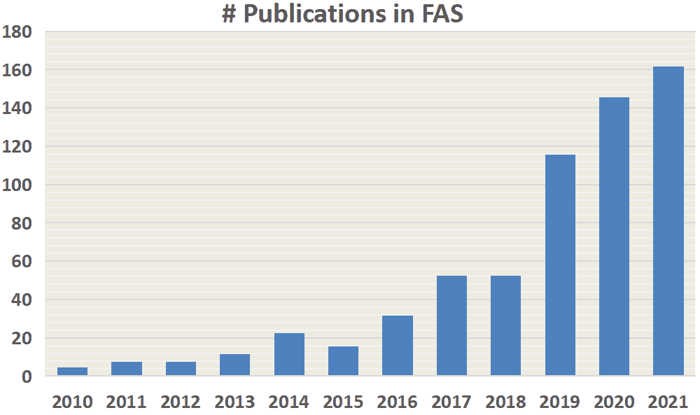

图 1：FAS 领域日益增长的研究兴趣，通过 Google Scholar 搜索关键词：allintitle: “face anti-spoofing”、“face presentation attack detection”和“face liveness detection”获得。

在早期，已经提出了大量基于传统手工特征[2, 3, 4, 5, 6]的方法用于展示攻击检测（PAD）。大多数传统算法是基于人类活体线索和手工特征设计的，这需要丰富的任务感知先验知识进行设计。关于基于活体线索的方法，研究了眼睛眨动[2, 7, 8]、面部和头部运动[9, 10]（如点头和微笑）、注视追踪[11, 12]以及远程生理信号（如 rPPG[3, 13, 14, 15]）用于动态区分。然而，这些生理活体线索通常需要从长期互动面部视频中捕捉，这对于实际部署不够方便。此外，活体线索易被视频攻击模拟，使其不够可靠。另一方面，经典的手工描述符（如 LBP[16, 4]、SIFT[6]、SURF[17]、HOG[5]和 DoG[18]）则设计用于从各种色彩空间（RGB、HSV 和 YCbCr）中提取有效的伪造模式。从附录中的表 A 1 可以看出，2018 年前的 FAS 调查主要集中在这一类别。

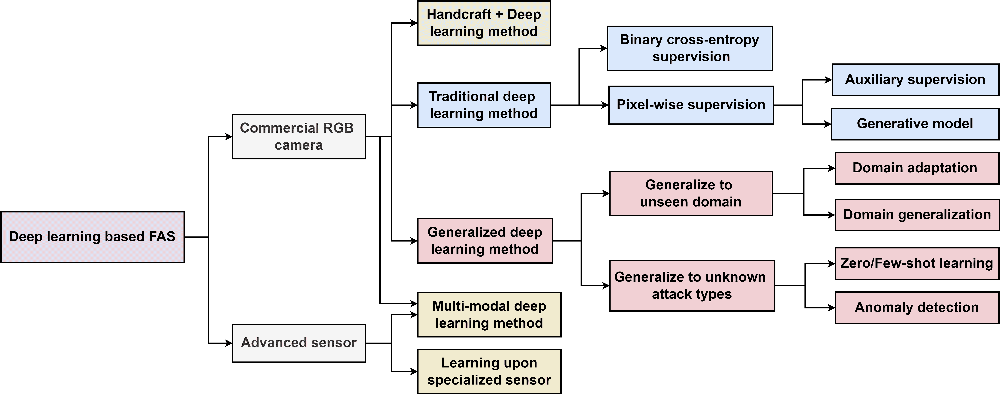

图 2：基于深度学习的 FAS 方法的拓扑结构。

随后，提出了一些混合（手工+深度学习）[19, 20, 21, 22]和端到端深度学习方法[23, 24, 13, 25, 26, 27, 28]，用于静态和动态面部伪造检测（PAD）。大多数工作[29, 30, 31, 32, 33, 34, 35]将面部伪造攻击（FAS）视为二分类问题（例如，“0”表示真实，“1”表示伪造，反之亦然），因此由简单的二分类交叉熵损失进行监督。与其他二分类视觉任务不同，FAS 是一个自我演变的问题（即攻击与防御迭代发展），这使得它更加具有挑战性。此外，其他二分类视觉任务（例如，人类性别分类）高度依赖明显的外观语义线索（例如，发型、穿着、面部形状），而 FAS 中的内在特征（例如，材料和几何形状）通常与内容无关（例如，不与面部属性和身份相关），细微且具有细粒度的细节，即使是人眼也很难区分。因此，具有单一二分类损失的卷积神经网络（CNNs）可能会合理挖掘各种语义特征用于像性别分类这样的二分类视觉任务，但发现任意且不可靠的线索（例如，屏幕边框）用于伪造模式。幸运的是，这些内在的真实/伪造线索通常与一些位置感知辅助任务密切相关。例如，打印/重放和透明面具攻击的面部表面通常具有不规则/有限的几何深度分布和异常反射。基于这些物理证据，最近，像素级监督[26, 13, 24, 36, 32, 37]受到了更多关注，因为它提供了更细粒度的上下文感知监督信号，这对深度模型学习内在的伪造线索是有益的。一方面，伪深度标签[26, 13]、反射图[24, 36]、二进制掩膜标签[32, 38, 39]和 3D 点云图[40]是典型的像素级辅助监督，它们描述了像素/补丁级的局部真实/伪造线索。另一方面，除了物理引导的辅助信号外，一些生成式深度 FAS 方法通过放松的像素级重建约束建模内在伪造模式[33, 41, 42, 43]。如附录中的表 A 1 所示，2018 至 2020 年的最新 FAS 调查研究了有限数量（$\textless$50）的深度学习方法，这些方法很难为社区研究人员提供全面的阐述。请注意，大多数在之前的调查中介绍的数据驱动方法由传统的二分类损失进行监督，且仍缺乏对出现的像素级监督方法的总结。

与此同时，大规模公共 FAS 数据集的出现，涵盖了丰富的攻击类型和记录传感器，也极大地推动了研究界的发展。首先，已经发布了样本和受试者数量庞大的数据集。例如，CelebA-Spoof [44]，记录了 10177 名受试者，包含了 156384 张和 469153 张分别用于真实和 PA 的面部图像。其次，除了常见的 PA 类型（如打印和重播攻击），一些最新的数据集包含了更多具有挑战性的 PA 类型（如 SiW-M [38] 和 WMCA [45]，包含超过 10 种 PA 类型）。然而，从表 A 1（附录中）可以发现，现有的调查只研究了一些（<15）旧的和小规模的 FAS 数据集，这些数据集无法为基于深度学习的方法提供公平的基准。第三，就记录的模式和硬件而言，除了商业可见 RGB 相机外，许多多模态和专业传感器对 FAS 任务有很大帮助。例如，CASIA-SURF [28] 和 WMCA [45] 展示了通过融合 RGB/深度/NIR 信息进行 PAD 的有效性，而配备有多光谱 SWIR [46] 和四向偏振 [47] 相机的专用系统在欺诈材料感知方面显著受益。然而，之前的调查大多集中于使用商业可见相机的单一 RGB 模式，并忽略了在高安全场景下多模态和专业系统的深度学习应用。

从评估协议的角度来看，传统的“数据集内部类型”和“数据集间类型”协议在之前的 FAS 调查中得到了广泛研究（见附录中的表 A 1）。由于 FAS 实际上在实践中是一个开放集问题，因此训练和测试条件之间的不确定差距（例如环境和攻击类型）应该被考虑。然而，现有的综述没有考虑到关于未见领域泛化 [48, 49, 50, 51] 和未知 PAD [52, 38, 53, 54] 的问题。大多数审查的 FAS 方法设计或训练 FAS 模型在预定义的场景和 PA 上。因此，训练出的模型容易在几个特定领域和攻击类型上过拟合，并且对未见领域和未知攻击较为脆弱。为了弥合学术研究与实际应用之间的差距，本文在四种 FAS 协议下全面研究了基于深度学习的方法，包括具有挑战性的领域泛化和开放集 PAD 情况。与现有文献相比，本工作的主要贡献可以总结如下：

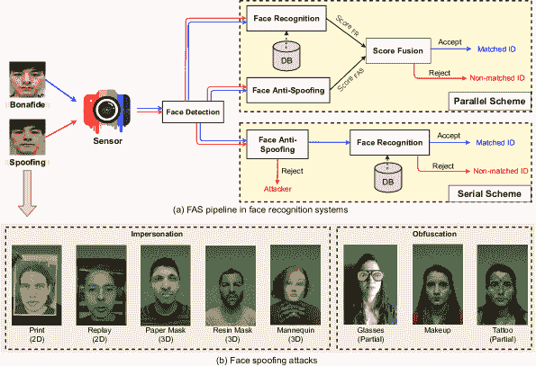

图 3：典型的面部欺骗攻击和面部反欺骗流程。（a）FAS 可以与面部识别系统集成，采用并行或串行方案以确保可靠的面部 ID 匹配。（b）几种经典面部欺骗攻击类型[55]的可视化，包括伪装/混淆、2D/3D 和整体/部分证据。

+   •

    据我们所知，这是第一篇全面涵盖（$\textgreater$100）深度学习方法的调查论文，涉及单模态和多模态 FAS 的广泛协议。与之前只考虑二进制损失监督方法的调查不同，我们还详细阐述了那些具有辅助/生成像素级监督的方法。

+   •

    与现有仅包含有限数量（$\textless$15）小规模数据集的综述[56, 57, 58]相比，我们展示了过去到现在 35 个公共数据集的详细比较，包括各种 PAs 以及先进的录制传感器。

+   •

    本文涵盖了深度学习在四种实际 FAS 协议上的最新进展（即，数据集内类型、数据集间类型、数据集内跨类型和数据集间跨类型测试）。因此，它为读者提供了具有不同应用场景（例如，未见领域泛化和未知攻击检测）的最新方法。

+   •

    在附录中的表格 A 5, 6, 7, 8, 9, 10 和 11 中，提供了对现有深度 FAS 方法的全面比较和有洞察力的分类，同时呈现了简要总结和讨论。

我们在图 2 中总结了基于深度学习的 FAS 方法在商业单目 RGB 相机和先进传感器中的拓扑结构。一方面，商业 RGB 相机在许多实际应用场景（如门禁系统和移动设备解锁）中广泛使用，因此基于这一领域的研究更加丰富。它包括三个主要类别：1）结合手工特征和深度学习特征的混合学习方法；2）传统的端到端监督深度学习方法；以及 3）针对未知领域和未知攻击类型的广义深度学习方法。除了商业 RGB 相机，研究人员还开发了使用专用传感器/硬件的传感器感知深度学习方法，以提高 FAS 效率。同时，由于多光谱成像系统在实际应用中越来越普及，多模态深度学习方法在 FAS 研究社区中变得非常热门和活跃。

本文结构如下。第二部分介绍了研究背景，包括呈现攻击、数据集、评估指标以及 FAS 任务的协议。第三部分回顾了基于可见 RGB 的 FAS 方法，按照两种监督信号（即二元损失和像素级损失）以及对未知领域和攻击的泛化学习进行讨论。第四部分对记录传感器及其模式进行比较，然后介绍特定记录输入的方法。第五部分讨论了深度 FAS 的当前问题，并指出未来的研究方向。最后，第六部分给出了结论。研究人员可以在[`github.com/ZitongYu/DeepFAS`](https://github.com/ZitongYu/DeepFAS)上跟踪最新列表。

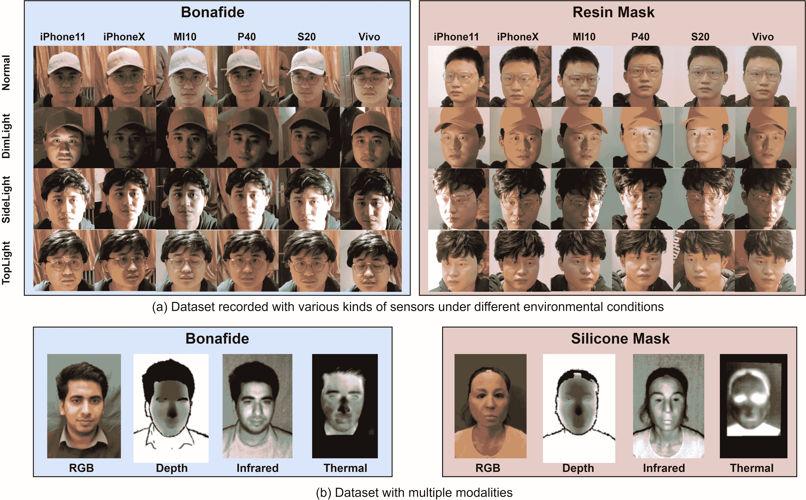

图 4：HiFiMask 数据集[59]中真实和伪造样本的可视化 (a)，在不同光照条件下使用不同相机[59]；以及 WMCA 数据集[45] (b)，包括可见 RGB、深度、红外和热成像等多种模式。

## 2 背景

本节将首先介绍常见的人脸伪造攻击，然后调查现有的 FAS 数据集及其评估指标和协议。

### 2.1 人脸伪造攻击

对自动人脸识别（AFR）系统的攻击通常分为两类：数字化操作[60, 61]和物理呈现攻击[62]。前者通过在数字虚拟领域内微妙的视觉操作来欺骗面部系统，而后者通常通过在成像传感器前展示物理介质上的人脸来误导现实世界的 AFR 系统。本文重点关注物理人脸呈现攻击的检测，其流程如图 3(a)所示。可以看到，将 FAS 与 AFR 系统集成有两种方案[63]：1) 并行融合[64]，通过 FAS 和 AFR 系统的预测分数来确定样本是否来自真实用户；2) 串行方案[65]，用于早期人脸 PAs 检测和欺骗拒绝，从而避免伪造人脸进入后续的人脸识别阶段。

在图 3(b)中，展示了一些代表性的伪造攻击类型。根据攻击者的意图，面部伪造攻击[66]可以分为两种典型情况：1) 冒充，即通过复制真实用户的面部特征到特殊媒介如照片、电子屏幕和 3D 面具上，以使伪造物被识别为其他人；2) 隐匿，即通过各种方法如眼镜、化妆、假发和伪装面部来隐藏或移除攻击者自身的身份。

根据几何属性，伪造攻击（PAs）大致分为 2D 和 3D 攻击。2D 伪造攻击[67]是通过使用照片或视频呈现面部特征来进行的。常见的 2D 攻击变体包括平面/包裹打印照片、眼睛/嘴巴切割照片和视频的数字重播。随着 3D 打印技术的成熟，面部 3D 面具[57]成为了一种新型的伪造攻击，威胁到面部识别系统。与传统的 2D 伪造攻击相比，面具在颜色、纹理和几何结构方面更为逼真。3D 面具由不同材料制成，例如，硬质/刚性面具可以由纸、树脂、石膏或塑料制成，而柔性软面具通常由硅胶或乳胶组成。

考虑到面部区域的覆盖，伪造攻击也可以分为整体攻击或部分攻击。如图 3(b)所示，与覆盖整个面部区域的常见伪造攻击（例如，打印照片、视频重播和 3D 面具）相比，一些部分攻击仅针对特定面部区域（例如，部分切割的打印照片、眼部佩戴的搞笑眼镜以及脸颊上的部分纹身），这些攻击更加隐蔽且更具挑战性。

表 I：公开可用的面部防伪数据集汇总。表格的上半部分列出了通过商业 RGB 相机记录的数据集，而下半部分则探讨了包含多种模态或专用传感器的数据集。在“#真实/伪造”列中，“I”和“V”分别表示“图像”和“视频”。“#样本”是“Subjects”的缩写。

| 数据集与参考 | 年份 | #真实/伪造 | #样本 | M&H | 设置 | 攻击类型 |
| --- | --- | --- | --- | --- | --- | --- |
| NUAA [18] | 2010 | 5105/7509(I) | 15 | VIS | N/R | 打印（平面、包裹） |
| YALE_Recaptured [68] | 2011 | 640/1920(I) | 10 | VIS | 距离 3 个 LCD 显示器 50 厘米 | 打印（平面） |
| CASIA-MFSD  [69] | 2012 | 150/450(V) | 50 | VIS | 7 种场景和 3 种图像质量 | 打印（平面、包裹、切割）、重播（平板） |
| REPLAY-ATTACK  [70] | 2012 | 200/1000(V) | 50 | VIS | 照明和持有 | 打印（平面）、重播（平板、手机） |
| Kose and Dugelay  [71] | 2013 | 200/198(I) | 20 | VIS | N/R | 面具（硬树脂） |
| MSU-MFSD [72] | 2014 | 70/210(V) | 35 | VIS | 室内场景；2 种相机类型 | 打印（平面），重播（平板，手机） |
| UVAD [73] | 2015 | 808/16268(V) | 404 | VIS |

&#124; 不同的光照，背景 &#124;

&#124; 和两个部分的地点 &#124;

| 重播（显示器） |
| --- |
| REPLAY-Mobile [74] | 2016 | 390/640(V) | 40 | VIS | 5 种光照条件 | 打印（平面），重播（显示器） |
| HKBU-MARs V2 [75] | 2016 | 504/504(V) | 12 | VIS |

&#124; 7 台相机来自静态和移动 &#124;

&#124; 设备和 6 种光照设置 &#124;

|

&#124; 面具（硬树脂）来自 &#124;

&#124; Thatsmyface 和 REAL-f &#124;

|

| MSU USSA [6] | 2016 | 1140/9120(I) | 1140 | VIS | 不受控制；2 种相机类型 | 打印（平面），重播（笔记本电脑，平板，手机） |
| --- | --- | --- | --- | --- | --- | --- |
| SMAD [76] | 2017 | 65/65(V) | - | VIS | 来自在线资源的彩色图像 | 面具（硅胶） |
| OULU-NPU [77] | 2017 | 720/2880(V) | 55 | VIS | 3 个部分的光照和背景 | 打印（平面），重播（手机） |
| Rose-Youtu [78] | 2018 | 500/2850(V) | 20 | VIS |

&#124; 5 台前置手机摄像头； &#124;

&#124; 5 种不同的光照条件 &#124;

|

&#124; 打印（平面），重播（显示器，笔记本电脑）， &#124;

&#124; 面具（纸，裁剪纸） &#124;

|

| SiW [13] | 2018 | 1320/3300(V) | 165 | VIS |
| --- | --- | --- | --- | --- |

&#124; 4 个会话有距离变化， &#124;

&#124; 姿势、光照和表情 &#124;

|

&#124; 打印（平面，包裹）， &#124;

&#124; 重播（手机，平板，显示器） &#124;

|

| WFFD [34] | 2019 |
| --- | --- |

&#124; 2300/2300(I) &#124;

&#124; 140/145(V) &#124;

| 745 | VIS |
| --- | --- |

&#124; 在线收集；超真实； &#124;

&#124; 去除低质量面孔 &#124;

| 蜡像（蜡） |
| --- |
| SiW-M [38] | 2019 | 660/968(V) | 493 | VIS |

&#124; 室内环境与姿势， &#124;

&#124; 光照和表情变化 &#124;

|

&#124; 打印（平面），重播，面具（硬树脂， &#124;

&#124; 塑料，硅胶，纸，假人）， &#124;

&#124; 化妆（化妆品，伪装， &#124;

&#124; 模糊），部分（眼镜，剪纸） &#124;

|

| Swax [79] | 2020 |
| --- | --- |

&#124; 总计 1812(I) &#124;

&#124; 110(V) &#124;

| 55 | VIS |
| --- | --- |

&#124; 在线收集；捕获 &#124;

&#124; 在不受控制的场景下 &#124;

| 蜡像（蜡） |
| --- |
| CelebA-Spoof [44] | 2020 |

&#124; 156384/ &#124;

&#124; 469153(I) &#124;

| 10177 | VIS |
| --- | --- |

&#124; 4 种照明条件； &#124;

&#124; 室内和室外；丰富的注释 &#124;

|

&#124; 打印（平面，包裹），重播（显示器， &#124;

&#124; 平板，手机），面具（纸） &#124;

|

|

&#124; RECOD- &#124;

&#124; Mtablet &#124;

[80] | 2020 | 450/1800(V) | 45 | VIS |

&#124; 户外环境和 &#124;

&#124; 低光照与动态会话 &#124;

| 打印（平面），重播（显示器） |
| --- |

|

&#124; CASIA-SURF &#124;

&#124; 3DMask &#124;

[37] | 2020 | 288/864(V) | 48 | VIS |

&#124; 高质量身份保留； &#124;

&#124; 3 种装饰和 6 种环境 &#124;

| 面具（3D 打印假人） |
| --- |

|

&#124; HiFiMask &#124;

[59] | 2021 | 13650/40950(V) | 75 | 可见光 |

&#124; 三种面具装饰；7 种录制 &#124;

&#124; 设备；6 种光照条件 &#124;

&#124; （周期性/随机）；6 个场景 &#124;

| 面具（透明，石膏，树脂） |
| --- |
| 3DMAD  [81] | 2013 | 170/85(V) | 17 | 可见光，深度 | 3 次（间隔 2 周） | 面具（纸张，硬树脂） |
| GUC-LiFFAD  [82] | 2015 | 1798/3028(V) | 80 | 光场 |

&#124; 距离 1.5$\sim$2 m &#124;

&#124; 受限条件 &#124;

|

&#124; 打印（喷墨纸，激光纸），&#124;

&#124; 重播（平板） &#124;

|

| 3DFS-DB  [83] | 2016 | 260/260(V) | 26 | 可见光，深度 | 头部运动角度丰富 | 面具（塑料） |
| --- | --- | --- | --- | --- | --- | --- |

|

&#124; BRSU &#124;

&#124; 皮肤/面部/伪造 &#124;

[46] | 2016 | 102/404(I) | 137 | 可见光，SWIR |

&#124; 多光谱 SWIR 具有 4 个波段 &#124;

&#124; 935nm，1060nm，1300nm 和 1550nm &#124;

| 面具（硅胶，塑料，树脂，乳胶） |
| --- |
| Msspoof  [84] | 2016 | 1470/3024(I) | 21 | 可见光，NIR | 7 个环境条件 | 黑白打印（平面） |
| MLFP  [85] | 2017 | 150/1200(V) | 10 |

&#124; 可见光，NIR，&#124;

&#124; 热成像 &#124;

|

&#124; 室内和室外固定 &#124;

&#124; 和随机背景 &#124;

| 面具（乳胶，纸张） |
| --- |
| ERPA  [86] | 2017 | 总计 86(V) | 5 |

&#124; 可见光，深度，&#124;

&#124; NIR，热成像 &#124;

|

&#124; 受试者接近位置（0.3$\sim$0.5m） &#124;

&#124; 2 种相机类型 &#124;

|

&#124; 打印（平面），重播（显示器），&#124;

&#124; 面具（树脂，硅胶） &#124;

|

| LF-SAD  [87] | 2018 | 328/596(I) | 50 | 光场 |
| --- | --- | --- | --- | --- |

&#124; 室内固定背景，捕获 &#124;

&#124; 由 Lytro ILLUM 相机拍摄 &#124;

| 打印（平面，包裹），重播（显示器） |
| --- |
| CSMAD  [88] | 2018 | 104/159(V+I) | 14 |

&#124; 可见光，深度，&#124;

&#124; NIR，热成像 &#124;

| 4 种光照条件 | 面具（定制硅胶） |
| --- | --- |
| 3DMA  [89] | 2019 | 536/384(V) | 67 | 可见光，NIR |

&#124; 48 个不同 ID 的面具；2 种照明 &#124;

&#124; 国家 & 4 个捕获距离 &#124;

| 面具（塑料） |
| --- |
| CASIA-SURF  [90] | 2019 |

&#124; 3000/ &#124;

&#124; 18000(V) &#124;

| 1000 |
| --- |

&#124; 可见光，深度，&#124;

&#124; NIR &#124;

|

&#124; 背景去除；随机 &#124;

&#124; 眼睛、鼻子或嘴巴区域被遮挡 &#124;

| 打印（平面，包裹，裁剪） |
| --- |
| WMCA  [45] | 2019 | 347/1332(V) | 72 |

&#124; 可见光，深度，&#124;

&#124; NIR，热成像 &#124;

|

&#124; 6 次会话与不同 &#124;

&#124; 背景和光照； &#124;

&#124; 真实记录的脉冲数据 &#124;

|

&#124; 打印（平面），重播（平板），&#124;

&#124; 部分（眼镜），面具（塑料， &#124;

&#124; 硅胶和纸张，假人） &#124;

|

| CeFA  [91] | 2020 |
| --- | --- |

&#124; 6300/ &#124;

&#124; 27900(V) &#124;

| 1607 |
| --- |

&#124; 可见光，深度，&#124;

&#124; NIR &#124;

|

&#124; 3 种民族；室内外 &#124;

&#124; 带假发和眼镜的装饰 &#124;

|

&#124; 打印（平面，包裹），重播 &#124;

&#124; 面具（3D 打印，硅胶） &#124;

|

| HQ-WMCA [55] | 2020 | 555/2349(V) | 51 |
| --- | --- | --- | --- |

&#124; 可见光，深度 &#124;

&#124; NIR，SWIR &#124;

&#124; 热成像 &#124;

|

&#124; 室内；14 种‘模态’，包括 &#124;

&#124; 4 种 NIR 和 7 种 SWIR 波长； &#124;

&#124; 面具和假人 &#124;

&#124; 加热至体温 &#124;

|

&#124; 激光或喷墨打印（平面），&#124;

&#124; 重播（平板，手机），面具（塑料，&#124;

&#124; 硅胶，纸张，假人），化妆 &#124;

&#124; 部分（眼镜，假发，纹身） &#124;

|

| PADISI-Face [92] | 2021 | 1105/924(V) | 360 |
| --- | --- | --- | --- |

&#124; 可见光，深度 &#124;

&#124; NIR，SWIR &#124;

&#124; 热成像 &#124;

|

&#124; 室内，固定的绿色背景 &#124;

&#124; 60 帧序列 &#124;

&#124; 1984 × 1264 像素图像 &#124;

|

&#124; 打印（平面），重播（平板，手机），&#124;

&#124; 部分（眼镜，有趣的眼睛），面具（塑料，&#124;

&#124; 硅胶，透明，假人）&#124;

| 

图 5：四种主流评估协议下深度 FAS 方法的性能。ACER、HTER 和 EER 越低，性能越好。（a）在 OULU-NPU 的协议-4 上的数据集内类型测试。（b）在 CASIA-MFSD 上的数据集间类型测试，当在单一 Replay-Attack 数据集（见绿色柱）或包括 OULU-NPU、MSU-MFSD 和 Replay-Attack（见紫色柱）的多个数据集上训练时。（c）在 SiW-M 上的数据集内交叉类型测试，采用留一类型的设置。（d）在 3D 面具 FAS 数据集（包括 HKBU-MARs [75] 和 CASIA-SURF 3DMask）上的数据集间交叉类型测试，当在 OULU-NPU 和 SiW 数据集上训练时，仅包含 2D 攻击。

### 2.2 面部反欺诈数据集

大规模和多样化的数据集在深度学习方法的训练和评估阶段至关重要。我们在表 I 中总结了当前流行的公共 FAS 数据集，涉及数据量、受试者数量、模态/传感器、环境设置和攻击类型。我们还在图 4（a）和（b）中可视化了在不同环境条件和模态下的一些样本。

从表格 I 可以看出，大多数数据集 [18, 68, 69, 70, 71, 72, 73] 仅包含在简单录制条件下（例如室内场景）下的少数攻击类型（例如打印和重播攻击），这些数据主要来自早期阶段（即 2010-2015 年），样本变化有限，对泛化 FAS 训练和评估具有限制。随后，数据集进展有三个主要趋势：1) 大规模数据量。例如，最近发布的数据集 CelebA-Spoof [44] 和 HiFiMask [59] 分别包含超过 600000 张图像和 50000 个视频，其中大部分带有 PA；2) 多样的数据分布。除了在可控的室内场景中记录的常见打印和重播攻击外，最近的 FAS 数据集还考虑了越来越多的新型攻击类型以及复杂的录制条件。例如，SiW-M [38] 中有 13 种细粒度攻击类型，而 HiFiMask [59] 包含三种材料（透明、石膏、树脂）下记录的 3D 面具攻击，录制了六种光照条件和六种室内/室外场景；3) 多模态和专业传感器。除了传统的可见 RGB 相机，最近的一些数据集还考虑了各种模态（例如 NIR [55, 91, 90, 45], Depth [55, 91, 90, 45], Thermal [55, 45], 和 SWIR [55]）和其他专业传感器（例如光场相机 [82, 87]）。所有这些先进因素促进了 FAS 在学术研究和工业应用中的发展。

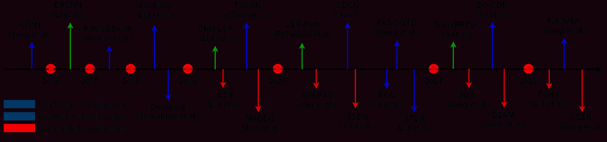

图 6：基于商业 RGB 相机的深度学习里程碑方法的时间顺序概述。

### 2.3 评估指标

由于面部反欺诈系统通常关注真人和 PA 的接受和拒绝概念，所以广泛采用两个基本指标：虚警率（FAR）和漏警率（FRR）[93]。虚警率定义为错误接受欺骗攻击的比率，而漏警率表示错误拒绝活体访问的比率[94]。面部反欺诈遵循 ISO/IEC DIS 30107- 3:2017[95]标准，评估不同场景下的系统性能。在数据集内部和跨测试场景中最常用的指标是一半总误差率（HTER）[94]、等误差率（EER）[67]和曲线下面积（AUC）。HTER 通过计算漏警率（错误拒绝真人的比率）和虚警率（错误接受 PA 的比率）的平均值得出。EER 是在 FAR 和 FRR 相等时 HTER 的特定值。AUC 代表真人和欺骗之间的可分离程度。

最近，国际标准组织（ISO）标准[95]中提到的攻击演示分类错误率（APCER）、真人演示分类错误率（BPCER）和平均分类错误率（ACER）也被用于数据集内部测试[77, 13]。BPCER 和 APCER 分别衡量真人和攻击分类错误率。ACER 是 BPCER 和 APCER 的平均值，用于评估数据集内部性能的可靠性。

### 2.4 评估协议

为了评估深度面部反欺诈模型的辨别能力和泛化能力，已经建立了多种协议。我们在图 5 和附录的表-A 2、3 和 4 中总结了深度面部反欺诈方法在四个代表性协议上的发展。

内数据集内类型协议。 内数据集内类型协议已被广泛应用于大多数 FAS 数据集中，以评估模型在轻微领域变化场景下的伪造检测能力。由于训练和测试数据都取自相同的数据集，它们在录音环境、受试者行为等方面具有相似的领域分布（参见图 4(a)的示例）。最经典的内数据集内类型测试是 OULU-NPU 数据集的 Protocol-4[77]，最近深度 FAS 方法在此协议下的性能比较见图 5(a)。由于深度学习具有强大的判别特征表示能力，许多方法（例如，CDCN++ [23]、FAS-SGTD [96]、Disentangled [97]、MT-FAS [43]、DC-CDN [98]、STDN [99]、NAS-FAS [37]、FasTCo [100]和 PatchNet [101]）在外部环境、攻击介质和录制摄像机变化方面的小领域偏移下均达到了令人满意的性能（$\textless$5% ACER）。OULU-NPU（4 个子协议）和 SiW（3 个子协议）数据集的更多内数据集内类型结果列于附录中的表-A 2。

跨数据集内类型协议。 该协议侧重于跨数据集层面的领域泛化能力测量，通常在一个或多个数据集（源领域）上训练模型，然后在未见过的数据集（偏移目标领域）上进行测试。我们在图 5(b)中总结了最近的深度 FAS 方法在两种常见的跨数据集测试中的表现[23、48]。从绿色柱子可以看出，当在 Replay-Attack 上训练并在 CASIA-MFSD 上测试时，大多数深度模型由于严重的光照和摄像机分辨率变化表现不佳（$\textgreater$20% HTER）。相比之下，当在多个源数据集（即 OULU-NPU、MSU-MFSD 和 Replay-Attack）上训练时，基于领域泛化的方法实现了可接受的性能（尤其是 SSDG [51]和 SSAN [102]，分别为 10.44%和 10.00% HTER）。在实际的跨测试案例中，可以轻松获得少量目标领域数据，这些数据也可用于领域适应[103]，以进一步缓解领域偏移。在附录中的表-A 3 可以找到在不同数量源领域进行训练的 OULU-NPU、CASIA-MFSD、Replay-Attack 和 MSU-MFSD 数据集之间的更多跨数据集内类型测试。

数据集内跨类型协议。该协议采用“留出一个攻击类型”来验证模型对未知攻击类型的泛化能力，即一种攻击类型仅在测试阶段出现。考虑到丰富的（13 种）攻击类型，在该协议中调查了 SiW-M [38]，对应的结果如图 5 (c) 所示。大多数深度模型在所有攻击类型中的 EER 约为 10%，且标准差较大，这表明该协议面临巨大挑战。得益于大规模预训练，ViTranZFAS [38] 实现了令人惊讶的 6.7% EER，表明迁移学习在未知攻击类型检测中的应用前景广阔。SiW-M 数据集内跨类型测试结果（留一个类型外设置）详见附录中的表 A 4。

跨数据集跨类型协议。尽管上述三种协议模拟了大多数实际应用中的因素，但它们并未考虑最具挑战性的情况，即跨数据集跨类型测试。[37] 提出了“跨数据集跨类型协议”，以测量 FAS 模型在未知领域和未知攻击类型上的泛化能力。在该协议中，将 OULU-NPU 和 SiW（带有 2D 攻击）混合用于训练，而 HKBU-MARs 和 3DMask（带有 3D 攻击）则用于测试。从图 5 (d) 可以看出，近年来的深度模型（DTN [38] 和 NAS-FAS [37]）在 HKBU-MARs 上对实验室控制的低保真 3D 面具检测表现出良好的泛化能力，但仍无法令人满意地检测 3DMask 上的无限制高保真面具。

除了这四种主流评估协议，关于实际协议设置的新趋势（例如，半监督/无监督、现实世界开放集和动态多模态）将在第五部分中讨论。

## 3 基于商业 RGB 摄像头的深度 FAS

由于商业 RGB 摄像头在许多现实世界应用场景中被广泛使用（例如，门禁系统和移动设备解锁），在本节中，我们将回顾现有的基于商业 RGB 摄像头的 FAS 方法。几个里程碑式的深度 FAS 方法在图 6 中进行了说明。

### 3.1 混合（手工制作 + 深度学习）方法

尽管深度学习和卷积神经网络（CNN）在许多计算机视觉任务中（如图像分类 [104, 105]，语义分割 [106]，和目标检测 [107]）取得了巨大成功，但由于训练数据的数量和多样性有限，它们在 FAS 任务中仍然面临过拟合问题。由于手工特征（如 LBP [108]，HOG [109]描述符，图像质量 [110]，光流运动 [111]，以及 rPPG 线索 [112]）已经被证明对区分真实与伪造图像具有很强的判别能力，近期一些混合工作将手工特征与深度特征结合用于 FAS。这些混合方法的典型特性总结在附录的表-A 5 中。

一些 FAS 方法首先从面部输入中提取手工特征，然后采用 CNN 进行语义特征表示（参见图 7(a) 的范式）。一方面，从每一帧中提取基于颜色纹理的静态特征，然后输入深度模型。基于丰富的低级纹理特征，深度模型能够挖掘出纹理感知的语义线索。为此，Cai 和 Chen [113] 采用多尺度颜色 LBP 特征作为局部纹理描述符，然后级联一个随机森林进行语义表示。同样，Khammari [22] 提取了编码了 CNN 特征的 LBP 和 Weber 局部描述符，这些特征被结合以保留局部强度和边缘方向信息。然而，与原始面部输入相比，基于局部描述符的特征丢失了像素级细节，从而限制了模型的性能。另一方面，跨时间帧的动态特征（如运动、光照变化、生理信号）也是有效的 CNN 输入。Feng 等人 [114] 提出从提取的密集光流运动中训练一个多层感知机，这些运动揭示了打印攻击中的异常。此外，Yu 等人 [115] 从面部视频中构建了时空 rPPG 图，并使用视觉变换器捕捉周期性心跳活性特征以辨别真实。然而，头部运动和 rPPG 信号在重放攻击中容易被模仿，使得这些动态线索的可靠性降低。基于重放攻击通常具有异常反射变化这一事实，Li 等人 [116] 提出使用 1D CNN 捕捉这些光照变化，输入为反射图像的强度差异直方图。

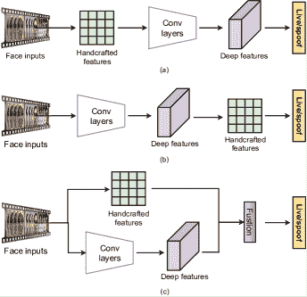

图 7：FAS 的混合框架。（a）来自手工特征的深度特征。（b）来自深度特征的手工特征。（c）融合的手工特征和深度特征。

其他几种混合 FAS 方法从深度卷积特征中提取手工制作的特征，这些方法遵循了图 7 Method ‣ 3 Deep FAS with Commercial RGB Camera ‣ Deep Learning for Face Anti-Spoofing: A Survey")(b)中的混合框架。为了减少与 FAS 无关的冗余，Li 等人[30]利用块主成分分析（PCA）从预训练的 VGG-face 模型中过滤掉无关的深度特征。除了基于 PCA 的维度减少，Agarwal 等人[117]还明确从浅层卷积特征中提取颜色 LBP 描述符，该描述符包含更丰富的低级统计信息。除了静态欺骗模式，一些工作还探索了从训练良好的深度模型中提取的手工制作的动态时间线索。Asim 等人[20]和 Shao 等人[118]分别使用 LBP-TOP[119]和光流从顺序卷积特征中提取深度动态纹理和运动特征。该混合框架的一个限制是手工制作的特征高度依赖于训练良好的卷积特征，仍不清楚浅层还是深层卷积特征更适合不同种类的手工制作特征。

由于手工制作特征和深度卷积特征具有不同的属性，另一个受欢迎的混合框架（见图 7 Method ‣ 3 Deep FAS with Commercial RGB Camera ‣ Deep Learning for Face Anti-Spoofing: A Survey")(c)）将它们融合以获得更通用的表示。为了做出更可靠的预测，Sharifi[120]提出将手工制作的 LBP 特征和深度 VGG16 模型的预测分数进行融合。然而，确定这两种特征的最佳分数权重具有挑战性。除了分数级融合，Rehmana 等人[121, 21]建议利用 HOG 和 LBP 图来扰动和调节低级卷积特征。尽管来自手工制作特征的局部先验知识增强了判别能力，但整体模型仍然受到语义表示退化的影响。在时间方法方面，为了利用真实和伪造样本之间的动态差异，Li 等人[122]通过 1D CNN 提取强度变化特征，并将其与来自运动放大面部视频的运动模糊特征融合，用于回放攻击检测。

总体而言，由于显式的专家设计特征提取的好处，混合方法能够表示特定的非纹理线索（例如，时间相对光谱图（rPPG）和运动模糊），这些线索很难通过端到端的基于纹理的 FAS 模型捕捉。然而，缺点也很明显：1）手工制作的特征高度依赖于专家知识，并且不可学习，一旦有足够的训练数据可用时效率较低；2）手工特征和深度特征之间可能存在特征差距/不兼容，导致性能饱和。

### 3.2 传统深度学习方法

由于先进 CNN 架构 [105, 123] 和正则化 [124, 125] 技术的发展以及最近发布的大规模 FAS 数据集 [77, 44, 59]，基于端到端深度学习的方法越来越受到关注，并主导了 FAS 领域。不同于融合部分手工特征的混合方法，传统的深度学习方法直接学习从面部输入到伪造检测的映射函数。传统的深度学习框架通常包括：1）用二元交叉熵损失直接监督（见图 8(a)）；2）用辅助任务（见图 8(b)）或生成模型（见图 8(c)）进行像素级监督。

#### 3.2.1 使用二元交叉熵损失的直接监督

由于 FAS 可以直观地视为一个二分类（真实 vs. 假冒）任务，许多端到端的深度学习方法直接用二元交叉熵（CE）损失以及扩展损失（例如，三元组损失 [126]）进行监督，这些方法在表 A 6（附录中）中总结。

一方面，研究人员提出了多种由二元 CE 损失监督的 FAS 网络架构。Yang 等人[29]提出了第一种使用 8 层浅层 CNN 进行特征表示的端到端深度 FAS 方法。然而，由于数据集的规模和多样性有限，基于 CNN 的模型在 FAS 任务中容易过拟合。为了解决这个问题，一些工作[127, 128, 129]对 ImageNet 预训练的模型（例如 VGG16、ResNet18 和视觉变换器）进行微调以用于 FAS。为了适应移动级别的 FAS 应用，Heusch 等人[55]考虑使用轻量级的 MobileNetV2[130]进行高效的 FAS。上述通用骨干网络通常专注于高级语义表示，而忽视了同样重要的低级特征，这些特征对伪造模式挖掘也很重要。为了更好地利用多尺度特征进行 FAS，Deb 和 Jain[131]提出使用浅层全卷积网络（FCN）以自监督的方式从面部图像中学习局部判别线索。除了基于单帧的外观特征外，几项工作[132, 133, 25, 134]考虑了真实样本和 PAs 之间的时间差异，并将多帧 CNN 特征与 LSTM[135]级联，以实现动态线索的强鲁棒性传播。

另一方面，考虑到二元 CE 中的弱类内和类间约束，一些研究工作修改了二元 CE 损失，为 CNN 提供了更具判别性的监督信号。Xu 等人[100]将 FAS 重新表述为细粒度分类问题，使用类型标签（例如真实、打印和重播）进行多类别监督。通过这种方式，可以表示 PAs 的特定属性（例如材料）。然而，使用多类别 CE 损失监督的 FAS 模型在难度较大的真实/伪造样本上仍然存在混淆的真实/伪造分布。例如，高保真 PAs 与相应的真实样本具有相似的外观线索。一方面，为了学习一个具有小类内距离但大类间距离的紧凑空间，Hao[136]和 Almeida 等人[80]分别引入了对比损失和三元组损失。然而，与视觉检索任务不同，FAS 任务中的真实样本和 PAs 通常具有不对称的类内分布（分别更紧凑和多样）。基于这一证据，Wang 等人[101]提出通过不对称角度边界 softmax 损失来监督 FAS 补丁模型，以放宽 PAs 之间的类内约束。另一方面，为了对难样本提供更有信心的预测，Chen 等人[137]采用二元焦点损失来指导模型扩大真实/伪造样本之间的间隔，并实现对难样本的强判别。

总体而言，二进制交叉熵损失及其扩展损失使用简单高效，能够快速推动深度 FAS 模型收敛。然而，这些监督信号仅提供了对真实/伪造嵌入学习的全局（空间/时间）约束，这可能导致 FAS 模型容易过拟合到不真实的模式。此外，具有二进制监督的 FAS 模型通常是黑箱的，其学习特征的特性难以理解。

#### 3.2.2 逐像素监督

深度模型直接通过二进制损失进行监督可能会容易学习到不真实的模式（例如，屏幕边框）。相比之下，逐像素监督可以提供更多细粒度和上下文相关的任务线索，从而更好地进行内在特征学习。一方面，基于物理线索和区分设计理念，开发了如伪深度标签 [26, 13]、二进制掩码标签 [32, 38, 39] 和反射图 [24, 36]等辅助监督信号，用于描述局部真实/伪造线索。另一方面，最近采用了具有显式逐像素监督的生成模型（例如，原始面部输入重建 [138, 42]），用于通用伪造模式估计。我们在表-A 7（附录中）总结了代表性的逐像素监督方法。

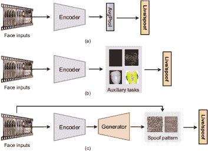

图 8：传统的端到端深度学习 FAS 框架。（a）使用二进制交叉熵损失进行直接监督。（b）通过辅助任务进行逐像素监督。（c）通过生成模型进行逐像素监督，以隐式伪造模式表示。

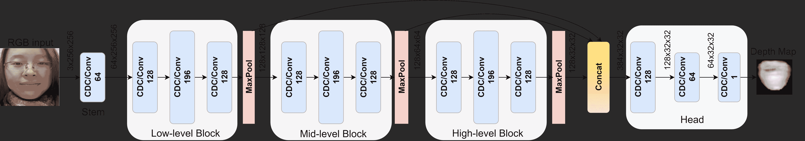

图 9：CDCN [23]/DepthNet [13]的共享架构。蓝色块内是具有 3x3 卷积核的卷积滤波器及其特征维度。“CDC”和“Conv”分别表示 CDCN 中采用的中心差分卷积和 DepthNet 中采用的普通卷积。

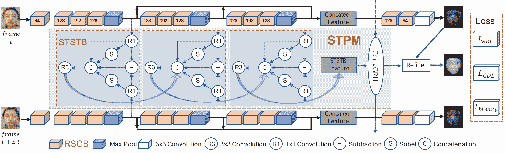

图 10：FAS-SGTD [96]的网络结构。输入是固定间隔的连续帧。每帧由级联残差空间梯度块（RSGB）处理，具有一个共享的主干网络，生成相应的粗略深度图。RSGB 立方体中的数字表示输出通道。空间-时间传播模块（STPM）被插入帧之间，用于估计时间深度并细化相应的粗略深度图。

辅助任务的像素级监督。根据对 FAS 的先验知识，大多数 PA（例如，普通打印纸和电子屏幕）几乎没有真实的面部深度信息，这些信息可以作为判别性监督信号。因此，一些最近的工作[26, 139, 23, 96]采用像素级伪深度标签来指导深度模型，强制它们对真实样本预测真实的深度，而对伪造样本预测零深度图。Atoum 等人[26]首次利用伪深度标签来指导多尺度 FCN（为简化起见称为“DepthNet”）。因此，训练良好的 DepthNet 能够预测整体深度图作为决策依据。为了进一步提升细粒度内在特征表示能力，Yu 等人[23]用中央差分卷积（CDC）替代 DepthNet 中的普通卷积，形成了 CDCN 架构（见图 9 获取详细结构）。在静态架构方面，由于其紧凑性和优异性能，DepthNet 和 CDCN 在深度 FAS 社区中受到青睐并被广泛使用。许多最近的变体[37, 98, 140]基于 DepthNet/CDCN 建立。至于时间架构，FAS-SGTD[96]因其出色的短期和长期微动作估计而著名，可以用于准确的面部深度预测。FAS-SGTD 的详细架构如图 10 所示，随后在变换器对等体[141]中进行了修改和扩展。

为每个训练样本合成 3D 形状标签是昂贵且不够准确的，同时对于具有真实深度的 PAs（例如 3D 面具和假人）也缺乏合理性。相对而言，二值面具标签 [38, 32, 142, 143, 99] 更易生成，并且对所有 PAs 更具通用性。具体来说，二值监督将提供给每个空间位置的深度嵌入特征。换句话说，通过二值面具标签，我们可以找出 PAs 是否出现在对应的补丁中，这种方法不依赖攻击类型，并且空间上具有解释性。George 和 Marcel [32] 是首批引入深度像素级二值监督来预测级联最终二值分类的中间置信度图的人。在充分的像素级监督下，骨干网络 DenseNet121 表现良好，能够提供补丁级的真实/伪造预测。由于细微的伪造线索（例如摩尔纹）通常存在于不同的空间区域且强度不同，普通的像素级二值监督对所有补丁赋予相同的贡献，这可能导致特征表示偏差。为了解决这个问题，Hossaind 等人 [142] 提出了在计算深度像素级二值损失之前添加一个可学习的注意力模块来进行特征细化，这有助于显著信息的传播。尽管灵活且易于使用，目前的二值面具标签通常假设面部区域的所有像素具有相同的真实/伪造分布，因此为真实和 PAs 生成所有的 ‘1’ 和 ‘0’ 图。然而，当遇到部分攻击（例如 FunnyEye）时，这些标签在学习过程中是不准确和噪声较大的。

除了主流的深度图和二进制掩膜标签外，还有几种信息丰富的辅助监督（例如，伪反射图[36, 24, 44]，3D 点云图[40]，三元图[39]，和傅里叶谱[144]）。根据真实皮肤和伪造介质之间的面部材料相关反射率的差异，Kim 等人[36]提出用深度和反射标签对深度模型进行监督。此外，为了进一步增强对类型无关的泛化能力，[24]中引入了二进制掩膜图，以同时训练具有所有这三种像素级监督的双边卷积网络。与考虑所有空间位置（包括与真实/伪造无关背景）的二进制掩膜标签不同，Sun 等人[39]去除了与面部无关的部分，保留整个面部区域作为一种精细化的二进制掩膜，称为“三元图”，它消除了面部外的噪声，有助于面部伪造线索的挖掘。基于真实和伪造图像之间丰富的纹理和几何差异，结合傅里叶图[33, 144]，LBP 纹理图[97]和稀疏 3D 点云图[40]的其他辅助监督的深度模型也展现了其优秀的表征能力。

总的来说，像素级辅助监督有助于物理上有意义且可解释的真实/伪造特征学习（例如，用于材料和几何体表示的反射和深度监督）。此外，一个可靠且泛化的 FAS 模型可以通过多任务学习方式使用多种互补的辅助监督（例如，深度、反射和反射率）进行监督[24]。然而，辅助监督有两个限制需要提及：1）像素级监督通常依赖于高质量（例如，高分辨率）训练数据进行精细的伪造线索挖掘，当训练数据噪声过多且质量较低时，提供有效的监督信号更为困难；2）伪辅助标签要么是人工设计的，要么是由其他现成算法生成的，这些标签并不总是值得信赖的。

使用生成模型的像素级监督。尽管辅助任务中存在细粒度的监督信号，但仍然很难理解深层黑箱模型是否代表了内在的 FAS 特征。最近，一个热门趋势是挖掘伪造样本中存在的视觉伪造模式，旨在提供对样本伪造性的更直观解释。我们在表-A 7（附录）下部分总结了这种类型的生成模型。考虑到辅助像素级监督的强物理启发式约束，一些工作放宽了这种显式监督信号，并提供了更广泛的空间来挖掘隐式伪造线索。Jourabloo 等人[33] 将 FAS 重新定义为伪造噪声建模问题，并设计了一个编码器-解码器架构，以利用放宽的像素级监督（例如，针对真实人脸的零噪声图）估计潜在的伪造模式。通过对真实样本施加这样的单方面约束，这些模型能够灵活地挖掘伪造线索。类似地，Feng 等人[41] 设计了一个伪造线索生成器，以最小化真实样本的伪造线索，同时对伪造样本不施加显式约束。与上述强制对真实样本施加严格约束的工作不同，Mohammadi 等人[138] 使用从真实人脸预训练自编码器计算的重建误差图进行伪造检测。由于这些误差图是从重建的真实人脸的残差噪声中生成的，没有人工定义的元素，因此在知识线索变化的领域迁移下具有鲁棒性。然而，从自编码器生成的低质量重建人脸可能导致噪声残差误差图。

除了直接生成伪造模式，Qin 等人[43] 提出了通过元教师框架自动生成像素级标签，该框架能够为学生 FAS 模型提供更合适的监督，以学习足够且内在的伪造线索。然而，在[43]中，仅生成了可学习的伪造监督。因此，如何自动生成针对真实样本和伪造样本的最佳像素级信号仍值得探索。

总体而言，使用生成模型的像素级监督通常会放宽专家设计的严格约束（例如，辅助任务），并让解码器重建更自然的伪造相关痕迹。因此，预测的伪造模式强烈依赖于数据，并且具有可解释的视角。生成的伪造模式在视觉上具有洞察力，并且用人工先验知识很难描述。然而，这种软性像素级监督可能容易陷入局部最优，并对意外干扰（例如，传感器噪声）过拟合，这会在现实世界场景下表现不佳。将显式辅助监督与基于生成模型的监督结合进行联合训练，可能有助于缓解这一问题。

### 3.3 泛化深度学习方法

传统的端到端深度学习基础的 FAS 方法在未见的主导条件（例如，照明、面部外观和相机质量）和未知攻击类型（例如，新材料制成的高保真面具）上可能泛化效果不佳。因此，这些方法在具有强安全需求的实际应用中不可靠。鉴于此，越来越多的研究者专注于提升深度 FAS 模型的泛化能力。一方面，领域适应和泛化技术被用来在无限领域变化下进行鲁棒的实时/欺骗分类。另一方面，零样本/少样本学习以及异常检测框架被应用于未知面部伪造类型的检测。本文中的未见领域指的是与伪造无关的外部变化（例如，照明和传感器噪声），但实际上会影响外观质量。相比之下，未知的伪造攻击通常指的是在训练阶段未出现的具有内在物理特性（例如，材料和几何）的新攻击类型。在附录中的表 A 8 和表 9 中总结了代表性的对未见领域和未知攻击类型的泛化深度 FAS 方法。

#### 3.3.1 对未见领域的泛化

如图 11 所示，源领域和目标领域之间存在严重的领域迁移，这容易导致直接在源数据集（例如，OULU-NPU、CASIA-MFSD 和 Replay-Attack）上训练深度模型时在偏倚目标数据集（例如，MSU-MFSD）上的性能较差。领域适应技术利用目标领域的知识来弥合源领域和目标领域之间的差距。相比之下，领域泛化帮助 FAS 模型从多个源领域直接学习泛化特征表示，而无需访问目标数据，这在实际应用中更为实用。

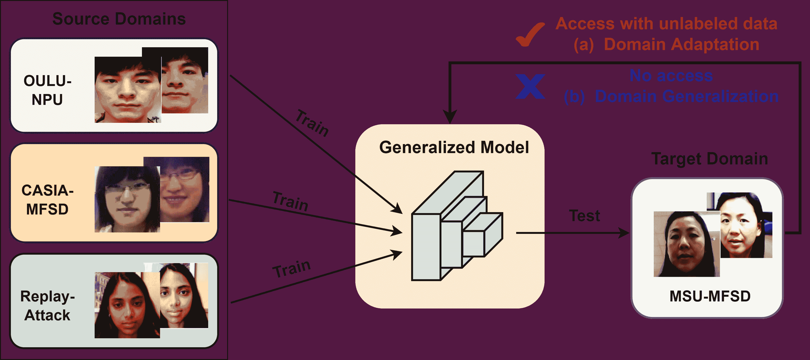

图 11：领域适应（DA）与领域泛化（DG）的框架比较。(a) DA 方法需要（未标记的）目标领域数据来学习模型，而 (b) DG 方法在没有目标领域知识的情况下学习泛化模型。

领域适应。 领域适应技术减轻了源领域和目标领域之间的差异。源领域和目标领域的特征分布通常在一个学习到的特征空间中匹配。如果特征具有相似的分布，则可以使用在源样本特征上训练的分类器来分类目标样本。

为了对齐源领域和目标领域数据的特征空间，Li 等人[78] 提出了无监督领域自适应方法，通过最小化最大均值差异（MMD）[145] 来学习一个映射函数，以对齐源目标嵌入子空间。为了进一步增强两个领域之间的泛化能力，UDA-Net[146, 147] 提出了无监督对抗领域自适应方法，以联合优化源领域和目标领域编码器。当特征在两个领域之间不可区分时，学习领域感知的公共特征空间。由于目标领域中的标签信息不可获得，通过 MMD 和对抗领域自适应约束的领域不变特征仍具有较弱的区分能力。为了缓解这一问题，半监督学习被引入领域自适应，两个工作[103, 148] 允许在目标领域中利用少量标记数据和大量未标记数据。Jia 等人[103] 提出了一个统一的无监督和半监督领域自适应网络来表示领域不变特征空间，并发现利用少量标记的目标数据（三到五个）可以显著提高目标领域的性能。类似地，Quan 等人[148] 提出了一个半监督学习 FAS 方法，仅使用少量标记的训练数据进行预训练，并在训练过程中逐步采用可靠的未标记数据以减少领域间的差距。尽管适应效果优异，但这种半监督方法严重依赖于类平衡的少样本标记数据（即同时包含真实和伪造样本），当标记的伪造样本不可用时，性能会显著下降。

与上述仅调整最终分类器层的方法不同，有一些工作设计并调整整个伪造攻击检测网络。由于不同的深层次共享不同粒度的领域信息，[149] 的作者考虑在表示层和分类器层上进行多层次的分布适应，使用 MMD 损失。尽管通过多层次线索实现了有效的适应，但这种架构可能是冗余的，并且自身的泛化能力有限。为了获得更通用的架构，Mohammadi 等人 [150] 提出了修剪在不同数据集间泛化较差的高特征差异的滤波器，从而提高网络在目标域上的性能。与特定滤波器/层的网络修剪不同，Li 等人 [151] 提出了从经过良好训练的教师网络中蒸馏整个伪造攻击检测模型，采用了来自两个领域的特征 MMD 和成对相似性嵌入进行正则化。通过这种方式，能够发现轻量但更通用的伪造攻击检测模型，但与教师伪造攻击检测网络相比，区分能力较弱。

尽管领域适应通过利用未标记的目标数据来最小化源域和目标域之间的分布差异，但在许多现实世界的伪造攻击检测场景中，收集大量未标记的目标数据（特别是伪造攻击数据）进行训练是困难且昂贵的。此外，考虑到隐私问题，在目标域上部署伪造攻击检测模型时，源脸数据通常无法访问。

域泛化。 域泛化假设存在一个通用特征空间，这个空间位于已见的多个源域和未见但相关的目标域之下，在这个空间上，从已见源域学习的模型可以很好地泛化到未见域。

一方面，一些工作采用领域感知对抗约束来学习具有判别性的但与领域无关的特征。他们假设这些特征包含跨所有见过的领域的内在线索，因此在未见过的领域中具有较好的泛化能力。Shao 等人[48] 首次提出通过多对抗判别领域泛化框架来学习由多个源领域共享的广义特征空间。同时，还在[48]中建立了跨四个 FAS 数据集的领域泛化基准。然而，有两个局限性：1）这种领域独立特征可能仍然包含与欺诈无关的线索（例如，主题 ID 和传感器噪声）；2）领域广义特征的判别效果仍然不令人满意。为了解决第一个局限性，Wang 等人[50] 提出将广义 FAS 特征从主题判别特征和领域依赖特征中解开。至于第二个局限性，考虑到不同领域的欺诈面孔之间的大分布差异，Jia 等人[51] 提出学习一个判别和广义的特征空间，其中真实特征的分布是紧凑的，而欺诈特征在领域间是分散的，但在每个领域内是紧凑的。

另一方面，一些代表性工作利用领域感知元学习来学习领域广泛的特征空间。具体而言，来自部分源领域的面孔被用作查询集，而来自剩余非重叠领域的面孔则用作支持集。基于这一设置，Shao 等人[49] 提出通过在细粒度领域感知元学习过程中找到广义学习方向来规范 FAS 模型。为了迫使元学习者在支持集（领域）上表现良好，学习的模型具有强大的泛化能力。然而，这种领域感知元学习严格依赖源数据的领域标签来构建查询集和支持集，但在实际情况中领域标签并不总是可用的。Chen 等人[152] 提出使用领域动态调整元学习来训练广义 FAS 模型，该方法通过伪领域标签迭代地将混合领域划分为簇。然而，伪领域标签分配中领域特征的不可靠性是由于通过简单的通道注意模块解开了欺诈鉴别和领域感知特征。从特征归一化的角度来看，基于实例归一化有效去除领域差异的证据，Liu 等人[153] 提出通过元学习自适应地聚合批量和实例归一化以实现广义表示。请注意，批量和实例归一化之间的自适应权衡可能会削弱实时/欺诈识别能力。

总体而言，FAS 的领域泛化是近年来的一个新热点，一些潜在和令人兴奋的趋势，如将领域泛化与适应性结合[154]，以及在没有领域标签的情况下进行学习[152]，也在进行研究。然而，仍然缺乏揭示辨别和泛化能力的研究。换句话说，领域泛化使 FAS 模型在未见领域中表现良好，但它是否会降低在已见场景中的欺骗检测能力仍然未知。

#### 3.3.2 对未知攻击类型的泛化

除了领域转移问题外，FAS 模型在现实应用中也容易受到新型 PAs 的攻击。大多数先前的深度学习方法将 FAS 视为一个闭集问题，以检测各种预定义的 PAs，这需要大规模的训练数据来覆盖尽可能多的攻击。然而，训练好的模型可能会过拟合一些常见攻击（例如打印和重放），并且仍然容易受到未知攻击类型（例如面具和化妆）的影响。最近，许多研究集中在开发用于未知欺骗攻击检测的泛化 FAS 模型。一方面，零样本/少样本学习被用于通过极少量甚至没有目标攻击类型的样本来提高新型欺骗检测。另一方面，FAS 也可以被视为一种单类分类任务，其中真实样本被紧密聚类，异常检测用于检测分布外的 PA 样本。

零样本/少样本学习。 检测新型攻击的一个直接方法是使用足够的新攻击样本来微调 FAS 模型。然而，由于欺骗手段不断演变，为每种新攻击收集标记数据是昂贵且耗时的。为了克服这一挑战，一些工作[38, 53, 155]提议将 FAS 视为一个开放集零样本和少样本学习问题。零样本学习旨在从预定义的 PAs 中学习出用于未知新型 PA 检测的泛化和辨别特征。少样本学习旨在通过从预定义的 PAs 和收集的少量新攻击样本中学习，快速适应 FAS 模型到新攻击。

在没有任何未知欺骗攻击的先验知识的情况下，Liu 等人[38]设计了一个深度树网络（DTN），以无监督的方式学习预定义攻击的语义属性，并将欺骗样本划分为语义子组。基于嵌入特征的相似性，DTN 自适应地将已知或未知的 PA 路由到相应的欺骗簇。通过 DTN 自动构建的实时/欺骗树拓扑比人工定义的类别关系更具语义和泛化能力。然而，没有任何未知攻击的先验知识，零-shot DTN 可能无法检测到新的高保真攻击。为了解决这个问题，两个工作采用了开放集少量学习框架，引入了部分但有效的未知攻击知识用于表示学习。Qin 等人[53]通过融合训练一个具有自适应内部更新学习率策略的元学习器，将零-shot 和少量-shot FAS 任务统一在一起。与此同时训练元学习器可以增强 FAS 模型对预定义 PA 和新 PA 少量实例的区分能力和泛化能力。然而，直接将少量-shot 元学习应用于新攻击容易遭遇对预定义 PA 的灾难性遗忘。为了解决这个问题，Perez-Cabo 等人[155]提出了一种持续少量学习范式，该范式通过不断扩展从连续数据流中获得的知识，并通过元学习解决方案使用少量训练样本检测新的 PA。

尽管少量学习对 FAS 模型在未知攻击检测方面有好处，但当目标攻击类型的数据不可用于适应（即零-shot 情况）时，性能明显下降。我们观察到，失败的检测通常发生在具有挑战性的攻击类型（例如，透明面具、搞笑眼睛和化妆），这些类型与真实攻击的外观分布相似。

异常检测。异常检测基础的 FAS 假设真实样本属于正常类别，因为它们具有更相似和紧凑的特征表示，而欺骗样本的特征由于攻击类型和材料的高变异性，在异常样本空间中具有较大的分布差异。基于这一假设，异常检测通常首先训练一个可靠的单类分类器来准确地聚类真实样本。然后，任何在真实样本簇的边缘之外的样本（例如，未知攻击）将被检测为攻击。

Arashloo 等人 [52] 是首个在跨类型测试协议上评估一类异常检测与传统二分类 FAS 系统的研究。他们发现，使用一类 SVM 的异常基方法并不逊色于使用二类 SVM 的二分类方法。为了更好地表示真实样本的概率分布，Nikisins 等人 [156] 提议用高斯混合模型（GMM）替代传统的一类 SVM 作为异常检测器。除了一个类 SVM 和 GMM，Xiong 和 AbdAlmageed [157] 还考虑了基于自编码器的离群点检测器，并结合 LBP 特征提取器用于开放集未知 PAD。上述工作将特征提取与一类分类器分开，这使得真实样本的表示学习具有挑战性且次优。相比之下，Baweja 等人 [158] 提出了一个端到端的异常检测方法，旨在将一类分类器和特征表示一起训练。此外，为了学习对抗分布外扰动的鲁棒真实样本表示，他们生成伪负特征以模拟 PA 类，并强制一类分类器对 PAD 进行区分。然而，生成的伪 PA 特征无法代表多样的真实世界特征，使得一类异常检测系统在实际部署中不够可靠。

尽管合理，仅利用真实面孔训练分类器通常会限制异常检测模型对新 PA 类型的泛化能力。某些研究通过度量学习训练了具有真实和伪造样本的通用异常检测系统，而不是仅使用真实样本。Pérez-Cabo 等人 [159] 提出通过三元组焦点损失来正则化 FAS 模型，以学习区分特征表示，然后引入少量后验概率估计作为未知 PA 检测的异常检测器。类似地，George 和 Marcel [160] 设计了一种成对一类对比损失（OCCL），迫使网络为真实类学习一个紧凑的嵌入，同时远离攻击的表示。然后，级联一个一类高斯混合模型（GMM）进行未知 PA 检测。尽管可以通过三元组或对比损失学习到区分性嵌入，但这些研究 [159, 160] 仍需要在嵌入特征后级联额外的异常检测器（例如一类 GMM），这影响了端到端表示学习。相比之下，Li 等人 [161] 提出通过一种新颖的超球面损失来监督深度 FAS 模型，以保持类内真实的紧凑性以及类间真实与伪造的分离。未知攻击可以直接在学习的特征空间中检测，无需额外的异常检测分类器。一个限制是，预测的真实/伪造分数是从嵌入特征的 L2 范数的平方计算得到的，这很难选择适合的预定义阈值来检测不同类型的攻击。

尽管在未知攻击检测方面具有令人满意的泛化能力，基于异常检测的 FAS 方法在现实世界的开放集场景中（即已知和未知攻击）相较于传统的真实/伪造分类方法会遭遇辨别能力的下降。

## 4 深度 FAS 与先进传感器

基于商用 RGB 相机的面部识别系统（FAS）在日常面部识别应用中在安全性和硬件成本方面是一个优秀的折中方案。然而，一些高安全性场景（如面部支付和保险库入口守卫）要求非常低的误接受错误。最近，开发了具有各种模式的先进传感器，以促进超安全的 FAS。各种传感器和硬件模块在环境条件（如照明和距离）以及攻击类型（如打印、重播和 3D 面具）方面的优缺点列在表格 II 中。

与单目可见光 RGB 相机（VIS）相比，立体相机（VIS-Stereo）[162] 在 2D 欺骗检测中有助于 3D 几何信息重建。当与动态闪光灯结合使用于演示面时，VIS-闪光[163] 能够捕捉基于内在反射的材料线索，从而检测所有三种攻击类型。

除了可见光 RGB 模式，深度和 NIR 模式在实际 FAS 部署中也被广泛使用，且成本可接受。两种深度传感器，包括飞行时间（TOF）[164] 和 3D 结构光（SL）[165] 已嵌入主流手机平台（如 iPhone、三星、OPPO 和华为）。它们提供了捕获面部的准确 3D 深度分布，用于 2D 欺骗检测。与 SL 相比，TOF 对环境条件如光照和距离更具鲁棒性。相对而言，NIR[166] 模式是可见光（VIS）之外的补充光谱（900 至 1800nm），有效利用活体和欺骗面之间的反射差异，但在长距离下成像质量较差。此外，VIS-NIR 集成硬件模块在许多门禁控制系统中具有高性价比。

与此同时，FAS 中引入了几种小众但有效的传感器。短波红外（SWIR）[55]，其波长为 940nm 和 1450nm 波段，通过测量水分吸收来区分面部图像中的活体皮肤材料与非皮肤像素，这对于检测通用欺骗攻击是可靠的。热成像相机[167]是另一种有效的 FAS 传感器，通过面部温度估计实现。然而，当被试佩戴透明面具时，其表现较差。昂贵的光场相机[87]和四向偏振传感器[47]也被探索用于 FAS，因为它们分别在面部深度和反射/折射光的表现上非常出色。

表 II：在两种环境（光照条件和距离）和三种攻击类型（打印、重播和 3D 面具）下对 FAS 传感器/硬件的比较。‘TOF’，‘SL’，‘C’，‘M’，‘E’，‘P’，‘G’，‘VG’ 分别是‘飞行时间’，‘结构光’，‘便宜’，‘中等’，‘昂贵’，‘差’，‘好’，‘非常好’的缩写。

| 传感器 | 成本 | 环境 | 攻击类型 |
| --- | --- | --- | --- |

|

&#124; 照明 &#124;

|

&#124; 距离 &#124;

|

&#124; 打印 &#124;

|

&#124; 重播 &#124;

|

&#124; 面具 &#124;

|

| --- | --- | --- | --- | --- |
| --- | --- | --- | --- | --- |
| VIS | C | M | M | M | M | M |
| VIS-Stereo | M | M | M | VG | VG | M |
| VIS-闪光 | C | M | M | G | G | M |
| 深度（TOF） | M | M | G | VG | VG | P |
| 深度（SL） | C | P | P | VG | VG | P |
| NIR | C | G | P | G | VG | M |
| VIS-NIR | M | G | M | G | VG | G |
| SWIR | E | G | M | VG | VG | G |
| 热成像 | E | G | M | G | VG | M |
| 光场 | E | P | M | VG | VG | M |
| 偏振 | E | G | M | VG | VG | G |

### 4.1 基于专用传感器的单模态深度学习

基于用于不同成像的专用传感器/硬件，研究人员开发了传感器感知的深度学习方法来实现高效的 FAS，这些方法总结在附录中的表-A 10 中。Seo 和 Chung [167] 提出了一个轻量级的热脸部卷积神经网络（Thermal Face-CNN），用于从热图像中估计面部温度，并检测具有异常温度的伪造（例如，超出 36 到 37 度的范围）。他们发现，热图像比 RGB 图像更适合于重放攻击检测。然而，这种基于热成像的方法对透明面具攻击比较脆弱。在立体基 FAS 方面，一些研究 [162, 168, 169] 证明，通过卷积神经网络（CNN）利用来自立体和双像素（DP）传感器的估计视差或深度/法线图可以在 2D 打印和重放攻击检测中取得显著性能。然而，它通常在 3D 面具攻击中表现较差，因为 3D 面具的几何分布与真实面孔相似。为了进一步捕捉详细的 3D 局部模式，Liu 等人 [87] 提出了从单次拍摄的光场相机中提取光线差异和微透镜图像，然后使用浅层 CNN 进行面部伪造检测。由于光场成像中的丰富 3D 信息，该方法有可能对细粒度伪造类型进行分类。为了实现实时和移动级别的部署，Tian 等人 [47] 提出了使用轻量级 MobileNetV2 从片上集成的偏振成像传感器中提取高效的 DOLP 特征。上述方法旨在解决特定的 PA 类型（例如重放和打印），而无法很好地推广到所有 PA 类型。相比之下，Heusch 等人 [55] 提出了使用多通道 CNN 从选择的 SWIR 差异输入中提取深度材料相关特征，该方法能够几乎完美地检测所有伪造攻击，同时确保低的真实分类错误率。

除了使用专门的硬件如红外点投影仪和专用摄像头外，一些深度 FAS 方法基于带有额外环境闪光的可见光摄像头开发。在[163]和[170]中，利用智能手机屏幕的动态闪光从多个方向照亮用户的面部，这使得通过光度立体法恢复面部表面法线成为可能。这些动态法线线索随后被输入到 CNN 中，以预测面部深度和用于 PA 检测的光 CAPTCHA。类似地，Ebihara 等人[171]设计了一种新颖的描述符来表示镜面反射和漫反射，利用闪光有无的差异线索，这优于端到端的 ResNet 与连接闪光输入。这些方法易于部署，无需额外的硬件集成，并已在移动验证和支付系统如支付宝和微信支付中使用。然而，动态闪光在户外环境中敏感，并且由于长时间的激活，用户体验不佳。

### 4.2 多模态深度学习

与此同时，多模态学习方法在 FAS 研究社区中变得热门和活跃。表-A 11（见附录）中收集了代表性的多模态融合和跨模态转换方法。

多模态融合。 通过多模态输入，主流的 FAS 方法使用特征级融合策略提取互补的多模态特征。由于多模态特征之间存在冗余，直接特征拼接很容易导致高维特征和过拟合。为缓解这一问题，Zhang 等人[28]提出了 SD-Net，使用特征重新加权机制来选择信息量大的特征，并丢弃 RGB、深度和 NIR 模态中的冗余通道特征。然而，SD-Net 中的重新加权融合仅在高层特征上进行，而忽视了多模态低层线索。为了进一步提升不同层级的多模态特征交互，[172]和[173]的作者引入了多模态多层融合分支，以增强模态间的上下文线索。尽管有先进的融合策略，但多模态融合容易受到部分模态（例如深度）的主导，因此当这些模态噪声或缺失时，表现较差。为解决此问题，Shen 等人[174]设计了一种模态特征擦除操作，以随机丢弃部分模态特征，防止模态感知的过拟合。此外，George 和 Marcel[175]提出了一种跨模态焦点损失来调节每个模态的损失贡献，这有利于模型学习模态间的互补信息。总体而言，特征级融合对多模态线索聚合灵活且有效。然而，模态特征通常从独立分支提取，计算成本高。

除了特征级融合，还有一些研究考虑了输入级和决策级融合。输入级融合假设多模态输入已经在空间上对齐，并可以直接在通道维度进行融合。在 [176]中，通过堆叠归一化图像来融合灰度、深度和 NIR 模态的复合图像，然后将其输入到深度 PA 检测器中。类似地，Liu 等人 [177]通过不同的融合操作符（即堆叠、求和和差异）组合 VIS-NIR 输入，所有融合的面部图像都通过一个多模态 FAS 网络进行实时/伪造预测。这些输入级融合方法高效且额外计算成本较少（主要集中在融合操作符和第一个网络层）。然而，过早的融合阶段容易在随后的中高层空间中消失多模态线索。相比之下，为了权衡个别模态偏差并做出可靠的二元决策，一些研究采用了基于每个模态分支预测得分的决策级融合。一方面，Yu 等人 [27]直接对来自 RGB、深度和 NIR 模态的个别模型的预测二元得分进行平均，这在 CeFA [91]数据集上优于输入级和特征级融合。另一方面，Zhang 等人 [178]设计了一种决策级融合策略，首先使用深度模态聚合多个模型的得分，然后与 IR 模型的得分级联，以进行最终的实时/伪造分类。尽管预测可靠，但决策级融合效率较低，因为它需要针对特定模态的单独训练良好的模型。

跨模态翻译。 多模态 FAS 系统需要额外的传感器来对不同模态的面部输入进行成像。然而，在一些传统场景中，可能只有部分模态（例如 RGB）可用。为了解决推理阶段的模态缺失问题，一些研究采用了跨模态翻译技术来生成缺失的模态数据以供多模态 FAS 使用。为了从 RGB 面部图像生成相应的 NIR 图像，Jiang 等人[179]首次提出了一种新颖的多类别（实时/伪造、真实/合成）图像翻译循环 GAN。基于生成的 NIR 和原始 RGB 输入，该方法能够提取比仅使用 RGB 图像更为稳健的融合特征。然而，原始循环 GAN 生成的 NIR 图像质量较低，这限制了融合特征的性能。为生成高保真度的目标 NIR 模态，Liu 等人[180]在跨模态翻译框架中设计了一种新颖的基于子空间的模态正则化。除了生成 NIR 图像外，Mallat 和 Dugelay[181]提出了一种可见光到热成像的转换方案，通过级联精炼网络从 RGB 面部图像合成热攻击。尽管在数据集内部测试中效果显著，这些方法的一个主要问题是领域转移和未知攻击可能会显著影响生成模态的质量，而使用配对的噪声模态数据时，融合特征可能会变得不可靠。

尽管自 2019 年以来有上升趋势，基于传感器的多模态 FAS 进展仍然较慢，相比于基于 RGB 的单模态方法。值得注意的是，深度 FAS 中也存在多模态方法，尽管使用的是商业 RGB 相机。例如，已在[14]中探讨了两种基于 RGB 视频的模态（即远程生理信号和面部视觉图像）的决策级融合。因此，将来自商业 RGB 相机的自然模态与来自先进传感器的模态有效融合将是一个有趣且有价值的方向。同时，一些先进传感器（如 SWIR、光场和偏振）价格昂贵且不便于实际部署。应探索更高效的专用 FAS 传感器以及多模态方法。

## 5 讨论与未来方向

得益于最近在深度学习方面的进展，FAS 在过去几年中取得了快速的改进。如图 5 所示，最近的深度 FAS 方法刷新了现有的技术水平，并在四个评估协议上分别获得了令人满意的性能（例如，$\textless$5% ACER，$\textless$15% HTER，$\textless$10% EER，和$\textless$20% HTER）。一方面，先进的架构（例如，NAS-FAS [37] 和 FAS-SGTD [96]）以及逐像素监督（例如，伪深度图和反射图）有利于 2D 攻击检测以及细粒度的欺骗材料感知（例如，硅胶和透明 3D 面具）。另一方面，基于领域和攻击泛化的方法（例如，SSDG [51]，FGHV [182]，和 SSAN [102]）挖掘了跨多个源领域和攻击类型的内在活体/欺骗线索，这些方法即使在未见过的领域和未知攻击上也能很好地泛化。这些基于深度学习的泛化方法通常能在不同场景下更稳定地检测不同类型的攻击（2D 和 3D）（具有较低的标准差误差），在留一交叉测试协议下表现更佳。此外，从附录的表 A 2、3 和 4 中可以得出一些有见地的结论：1）在单一源领域训练时，具有精细监督（例如，伪深度监督）的先进架构（例如，DC-CDN [98]）主导了测试性能。相反，当在多个（三个）领域进行训练时，泛化学习策略扮演了更重要的角色。2）从大规模预训练模型（例如，使用 ResNet18 和从 ImageNet1K 和 ImageNet21K 预训练的视觉变换器的 SSAN [102] 和 ViTranZFAS [38]）进行迁移学习，缓解了由于有限规模的活体/欺骗数据导致的过拟合问题，从而提高了泛化能力，并有利于跨数据集和跨类型测试。

然而，由于诸如细微的伪造模式表示、复杂的真实世界领域差距以及快速迭代的新攻击等挑战，FAS 仍然是一个未解决的问题。我们总结了当前发展的局限性如下：1) 受限于子最优的深度架构、监督和学习策略，实时/伪造表示能力有限。学习具有区分性和通用性的实时/伪造特征对深度 FAS 至关重要。直到现在，仍然很难找到最适合的架构和监督方法来适应所有不同的评估基准。例如，具有像素级监督的 CDCN 在内部数据集和多源领域交叉数据集测试中表现优异和差异明显，而使用二元交叉熵损失的 ResNet 则表现相反。2) 在饱和和不切实际的测试基准和协议下进行评估。例如，对于 OULU-NPU 数据集的内部测试，0.4% 和 0.8% 的 ACER 可能只是微小的差异，并表明在这样的小规模单调测试集上的性能饱和。交叉领域测试仍然远未达到真实世界场景，因为仅考虑了有限的攻击类型。3) 将抗伪造任务仅限于面部区域和物理攻击。除了面部区域的物理呈现攻击外，还应考虑更一般应用（例如，商品和文档）中的伪造，以及通过更强大的面部交换和生成模型进行的数字攻击。这些任务可能共享部分内在知识，并有助于表示学习。4) 对解释性和隐私问题考虑不足。大多数现有的 FAS 研究致力于开发针对最新技术性能的新算法，但很少考虑其背后的解释性。这种黑箱方法在实际案例中很难做出可靠的决策。此外，大多数现有工作使用大量存储的源面部数据训练和适应深度 FAS 模型，忽视了隐私和生物识别敏感性问题。根据上述讨论，我们总结了一些解决方案和潜在的研究方向，在以下小节中进行了描述。

### 5.1 架构、监督和解释性

从第 3 和 4 节可以看出，大多数研究人员选择现成的网络架构以及手工监督信号来进行深度 FAS，这可能是次优的，且难以充分利用大规模训练数据。虽然几项近期工作已将 AutoML 应用于 FAS 以搜索适合的架构[23, 37]、损失函数[54]和辅助监督[43]，但它们专注于单一模态和单帧配置，而忽视了时间序列或多模态情况。因此，一个有前途的方向是自动搜索并找到最适合的时间序列架构，特别是对于多模态应用。这样，会发现模态之间的更合理的融合策略，而不是粗略的手工设计。此外，动态监督设计中应考虑丰富的时间上下文，而不是静态的二值或像素级监督。

另一方面，设计高效的网络架构对移动设备上的实时 FAS 至关重要。在过去几年中，大多数研究集中在解决 FAS 中的准确性和泛化问题，而只有少数研究考虑了轻量级[143]或蒸馏[151]CNN 以实现高效部署。除了具有强 inductive bias 的 CNN 外，研究人员还应重新考虑一些灵活架构（例如，视觉变换器[115, 129]）在效率和计算成本方面的使用。

最近，在可解释的 FAS 方面取得了重大进展[183]。一些方法尝试利用视觉解释工具（例如，Grad-CAM [184]）或软门控策略[131]根据特征激活定位伪造区域。此外，辅助监督[13, 24]和生成[33, 42]的 FAS 模型致力于估计潜在的伪造图。除了视觉激活图，*自然语言*[185]也被引入用来用有意义的句子级描述来解释 FAS 预测。所有这些尝试帮助研究人员理解和定位伪造模式，并增强 FAS 决策的说服力。然而，由于缺乏珍贵的像素级伪造注释，估计的伪造图仍然粗略，并且容易受到不真实线索（例如，手部）的影响。应该开发更先进的特征可视化方法和精细的像素级伪造分割技术以实现可解释的 FAS。

### 5.2 表征学习

学习判别性和内在特征表示是可靠的面部欺诈检测（FAS）的关键。一些先前的研究已经证明了迁移学习[127、172]和解耦学习[97、42]在 FAS 中的有效性。前者利用来自其他大规模数据集的预训练语义特征，以缓解过拟合问题，而后者旨在从噪声表示中解耦内在的欺诈线索。为了学习在活体面孔之间具有紧凑分布和在活体/欺诈面孔之间具有可区分距离的判别性嵌入空间，深度度量学习被用于训练 FAS 模型。然而，在极端/噪声场景（例如，呈现非常高质量的欺诈样本和低质量的活体样本）中，模型预测的不确定性仍然很高。未来可以探索更先进的度量学习技术（例如，在双曲流形空间上）以挖掘微妙的欺诈模式。此外，将 FAS 重新表述为细粒度识别[24、101]问题以学习类型判别性表示是值得探索的，这受到人类通过识别特定攻击类型来检测欺诈的事实的启发。

研究人员还应注重充分利用有或没有标签的活体/欺诈训练数据来增强表示。一方面，在大规模组合数据集上进行自监督可能会减少过拟合的风险，并主动挖掘内在知识（例如，面孔补丁之间的高相似性）。另一方面，在现实世界场景中，来自各种面部识别终端的日常无标签面部数据被不断收集，这些数据可以用于半监督学习[148]。一个挑战是如何充分利用无标签的不平衡（即，活体 $\gg$ 欺诈）数据，避免意外的性能下降。此外，适合 FAS 的数据增强策略[98]仍然很少被研究。对抗性学习可能是更广泛领域中的自适应数据增强的一个好选择。

### 5.3 现实世界中的开放集 FAS

如第 2.4 节中讨论的那样，传统的 FAS 评估协议通常考虑在一个或几个小规模数据集内进行的领域内[77]、跨领域[48]和跨类型[38]测试。这些协议中的最先进方法在实际场景中无法保证始终如一的良好表现，因为 1) 数据量（尤其是测试集）相对较小，因此高性能并不十分令人信服；2) 协议只关注单一因素（例如，已见/未见领域或已知/未知攻击类型），这无法满足复杂现实场景的需求。最近，提出了更实际的协议，例如 GrandTest[155]和开放集[59, 42]。GrandTest 包含大规模混合领域数据，而开放集测试则考虑模型对已知和未知攻击类型的辨别和泛化能力。然而，现实世界中同时涉及领域和攻击类型的开放集情况仍然被忽视。应该探索更全面的协议（例如，领域和类型感知的开放集），以进行公平和实际的评估，弥合学术界和工业界之间的差距。

对于多模态协议，假设有多种模态的训练数据可用，并且广泛使用两种测试设置：1) 对应的多模态[186]；2) 仅单一模态[175, 180]（通常是 RGB）。然而，根据不同用户终端设备，现实世界中存在各种模态组合[187]（例如，RGB-NIR、RGB-D、NIR-D 和 RGB-D-NIR）。因此，为每种多模态组合训练单独的模型是相当昂贵和低效的。虽然可以通过跨模态翻译[179, 180]生成伪模态，但其真实性和稳定性仍然不如来自真实传感器的模态。设计一个动态的多模态框架，以将学到的多模态知识传播到各种模态组合中，可能是实现无限多模态部署的一个可能方向。

### 5.4 通用和统一的 PA 检测

理解面部 PAD 的内在特性以及其他相关任务（例如通用 PAD 和数字面部攻击检测）对于可解释的 FAS 非常重要。一方面，“通用”假设面部和其他物体的展示攻击可能具有独立的内容，但共享内在的伪造模式[188]。例如，不同物体（例如，面部和足球）的重播攻击是由相同的玻璃材料[24]制成的，并带有异常反射线索。因此，可以在面部 PAD 中引入通用 PAD 和材料识别数据集，以多任务学习的方式进行通用的实时/伪造特征表示。

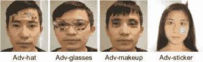

图 12：由 Adv-glasses[189]、Adv-hat[190]、Adv-makeup[191]和 Adv-sticker[192]生成的物理对抗面孔示意图。

除了常见的物理伪造攻击外，对于通用的 PAD，还应考虑两种物理对抗攻击（AFR-aware 和 FAS-aware）。如图 12 所示，从对抗生成器获得的物理眼镜[189]和帽子[190]，或含有特征模式的特殊贴纸[192]，被证明对基于深度学习的 AFR 系统有效，这些可以被攻击者打印出来并佩戴以伪造这些系统。此外，附近眼部的不可察觉的化妆[191]已被验证对商业 AFR 系统进行攻击。除了 AFR-aware 对抗攻击外，带有扰动的对抗打印/重播攻击[193]也被开发出来，以愚弄 FAS 系统。因此，有必要和预期建立具有多样化物理对抗攻击的大规模 FAS 数据集，以及带有标注攻击定位标签的数据集。

另一方面，除了物理面部展示攻击，还有许多恶意数字操控攻击（例如，Deepfake[194]）和变形攻击（例如，通过生成模型 StyleGAN[195]）对面部视频进行攻击。随着生成模型越来越强大，这些来自生成模型的直接数字攻击变得越来越具有威胁性。尽管生成方式和攻击痕迹及视觉质量各异，但这些攻击的一部分仍可能具有一致的特性。在[196, yu2022benchmarking]中，提出了一个统一的数字和物理面部攻击检测框架，用于学习一致攻击的联合表示。然而，由于数据收集成本，数字攻击和物理攻击类型之间存在严重的不平衡。换句话说，大规模数字攻击比高成本的展示攻击更容易生成。这种不平衡的分布可能会在多任务学习过程中损害内在表示，需要在未来考虑。

### 5.5 隐私保护训练

利用大规模真实/伪造面部数据，基于深度学习的 FAS 取得了巨大的突破。然而，面部数据的法律和隐私问题越来越受到关注。例如，GDPR（通用数据保护条例）[197]于 2018 年 5 月生效，将保护个人信息（例如，面部图像）隐私的重要性推到前台。因此，一个值得注意的方向是减轻隐私问题（即，存储/共享大规模用户面部数据），同时保持深度 FAS 模型的良好性能。

一方面，真实/伪造面部训练数据通常不会在数据所有者（领域）之间直接共享。为了解决这个问题，联邦学习[198]，一种分布式和隐私保护的机器学习技术，被引入到 FAS 中，以同时利用不同数据所有者处丰富的真实/伪造信息，同时维护数据隐私。具体来说，每个数据中心/所有者本地训练自己的 FAS 模型。然后，服务器通过迭代聚合所有数据中心的模型更新来学习一个全局 FAS 模型，而无需访问每个数据中心中的原始私人数据。最后，收敛的全局 FAS 模型将用于推断。为了增强服务器模型的泛化能力，在[199]中，提出了一种联邦领域解耦策略，该策略将每个数据中心视为一个领域，并将 FAS 模型分解为每个数据中心中的领域不变部分和领域特定部分。总体而言，现有的基于联邦学习的 FAS 通常关注数据集的隐私问题，但忽视了模型层面的隐私问题。因此，全球模型的训练需要多个团队共享各自的本地模型，这可能会损害商业竞争。

另一方面，由于人脸隐私和安全问题，在实际部署时源数据通常不可访问。具体而言，在一个无源[200]设置中，FAS 模型首先在（大规模）源数据上进行预训练，并释放用于部署。在部署阶段，源数据不能用于将预训练模型适配到目标数据，因为它们包含敏感的生物特征信息。Lv 等人[201]通过直接应用自我训练方法对 FAS 的无源设置进行了基准测试，由于 FAS 任务中的挑战（例如，不同身份的真实面部之间的类内距离可能超过相同身份的真实面部与伪造面部之间的类间距离），容易获得噪声目标伪标签。因此，通过适配获得的性能提升（平均减少 1.9%的 HTER）非常有限。未来值得探索如何在不访问源数据的情况下高效准确地适配源知识。

## 6 结论

本文对基于深度学习的面部反欺诈（FAS）方法、数据集以及协议进行了现代化的综述。提供了这些方法的全面分类。还涵盖了各种 FAS 方法和传感器的优缺点，并列出了潜在的研究方向。

致谢 本工作得到了芬兰学术院（Academy Professor 项目 EmotionAI 资助编号 336116 和 345122，以及 ICT2023 项目资助编号 345948）、中国国家自然科学基金（编号 61876178、61976229 和 62106264）和北京人工智能学会（BAAI）的支持。

## 参考文献

+   [1] J. Guo, X. Zhu, C. Zhao, D. Cao, Z. Lei 和 S. Z. Li，“在未见领域中学习元面部识别，”在*CVPR*，2020 年。

+   [2] G. Pan, L. Sun, Z. Wu 和 S. Lao，“基于眼睑的面部识别反欺诈方法，”在*ICCV*，2007 年。

+   [3] X. Li, J. Komulainen, G. Zhao, P.-C. Yuen 和 M. Pietikäinen，“通过检测面部视频中的脉搏来实现通用面部反欺诈，”在*ICPR*，2016 年。

+   [4] T. de Freitas Pereira, A. Anjos, J. M. De Martino 和 S. Marcel，“基于 Lbp-top 的面部伪造攻击对策，”在*ACCV*，2012 年。

+   [5] J. Komulainen, A. Hadid 和 M. Pietikainen，“基于上下文的面部反欺诈，”在*BTAS*，2013 年。

+   [6] K. Patel, H. Han 和 A. K. Jain，“安全面部解锁：智能手机上的欺诈检测，”*TIFS*，2016 年。

+   [7] H.-K. Jee, S.-U. Jung 和 J.-H. Yoo，“嵌入式面部识别系统的活体检测，”*国际生物与医学科学期刊*，2006 年。

+   [8] J.-W. Li，“基于多重 Gabor 响应波的眼睑检测，”在*ICMLC*，第 5 卷。IEEE，2008 年，第 2852–2856 页。

+   [9] L. Wang, X. Ding 和 C. Fang，“基于生理运动分析的面部活体检测方法，”*清华大学科技*，第 14 卷，第 6 期，第 685–690 页，2009 年。

+   [10] W. Bao, H. Li, N. Li, 和 W. Jiang, “一种基于光流场的人脸识别活体检测方法，” 发表在 *ICASSP*，2009 年。

+   [11] J. Bigun, H. Fronthaler, 和 K. Kollreider, “通过实时人脸跟踪确保生物识别身份验证中的活体检测，” 发表在 *CIHSPS*。IEEE，2004 年。

+   [12] A. Ali, F. Deravi, 和 S. Hoque, “利用视线共线性进行活体检测，” 发表在 *ICEST*。IEEE，2012 年。

+   [13] Y. Liu, A. Jourabloo, 和 X. Liu, “学习深度模型进行人脸反欺诈：二元还是辅助监督，” 发表在 *CVPR*，2018 年。

+   [14] B. Lin, X. Li, Z. Yu, 和 G. Zhao, “通过 RPPG 特征和基于上下文的补丁卷积神经网络进行人脸活体检测，” 发表在 *ICBEA*。ACM，2019 年。

+   [15] Z. Yu, W. Peng, X. Li, X. Hong, 和 G. Zhao, “从高度压缩的面部视频中远程测量心率：一种端到端深度学习解决方案结合视频增强，” 发表在 *ICCV*，2019 年。

+   [16] Z. Boulkenafet, J. Komulainen, 和 A. Hadid, “基于颜色纹理分析的人脸反欺诈，” 发表在 *ICIP*，2015 年。

+   [17] Boulkenafet, Zinelabidine 和 Komulainen, Jukka 和 Hadid, Abdenour, “使用加速鲁棒特征和 Fisher 向量编码的人脸反欺诈，” *SPL*，第 24 卷，第 2 期，页码 141–145，2016 年。

+   [18] X. Tan, Y. Li, J. Liu, 和 L. Jiang, “基于稀疏低秩双线性判别模型的单图像人脸活体检测，” 发表在 *ECCV*。Springer，2010 年。

+   [19] X. Song, X. Zhao, L. Fang, 和 T. Lin, “用于准确人脸欺诈检测的判别表示组合，” *Pattern Recognition*，2019 年。

+   [20] M. Asim, Z. Ming, 和 M. Y. Javed, “基于卷积神经网络的时空特征提取用于人脸反欺诈，” 发表在 *ICIVC*。IEEE，2017 年。

+   [21] Y. A. U. Rehman, L.-M. Po, 和 J. Komulainen, “通过扰动增强深度判别特征图用于人脸呈现攻击检测，” *Image and Vision Computing*，第 94 卷，页码 103858，2020 年。

+   [22] M. Khammari, “使用带有 LBP 和 WLD 的卷积神经网络进行鲁棒的人脸反欺诈，” *IET Image Processing*，2019 年。

+   [23] Z. Yu, C. Zhao, Z. Wang, Y. Qin, Z. Su, X. Li, F. Zhou, 和 G. Zhao, “搜索中央差分卷积网络用于人脸反欺诈，” 发表在 *CVPR*，2020 年。

+   [24] Z. Yu, X. Li, X. Niu, J. Shi, 和 G. Zhao, “基于人类材料感知的人脸反欺诈，” 发表在 *ECCV*，2020 年。

+   [25] X. Yang, W. Luo, L. Bao, Y. Gao, D. Gong, S. Zheng, Z. Li, 和 W. Liu, “人脸反欺诈：模型重要，数据同样重要，” 发表在 *CVPR*，2019 年。

+   [26] Y. Atoum, Y. Liu, A. Jourabloo, 和 X. Liu, “基于补丁和深度的卷积神经网络进行人脸反欺诈，” 发表在 *IJCB*，2017 年。

+   [27] Z. Yu, Y. Qin, X. Li, Z. Wang, C. Zhao, Z. Lei, 和 G. Zhao, “基于中央差分网络的多模态人脸反欺诈，” 发表在 *CVPRW*，2020 年。

+   [28] S. Zhang, A. Liu, J. Wan, Y. Liang, G. Guo, S. Escalera, H. J. Escalante, 和 S. Z. Li, “Casia-surf: 大规模多模态基准用于人脸反欺诈，” *TBIOM*，第 2 卷，第 2 期，页码 182–193，2020 年。

+   [29] J. Yang, Z. Lei, 和 S. Z. Li, “学习用于人脸反欺骗的卷积神经网络，” *arXiv 预印本 arXiv:1408.5601*，2014。

+   [30] L. Li, X. Feng, Z. Boulkenafet, Z. Xia, M. Li, 和 A. Hadid, “一种使用部分卷积神经网络的人脸反欺骗原始方法，” 在 *IPTA*，2016。

+   [31] K. Patel, H. Han, 和 A. K. Jain, “具有鲁棒特征表示的跨数据库人脸反欺骗，” 在 *CCBR*，2016。

+   [32] A. George 和 S. Marcel, “用于人脸呈现攻击检测的深度像素级二元监督，” 在 *ICB*，无. CONF，2019。

+   [33] A. Jourabloo, Y. Liu, 和 X. Liu, “人脸去欺骗：通过噪声建模的反欺骗，” 在 *ECCV*，2018。

+   [34] S. Jia, X. Li, C. Hu, G. Guo, 和 Z. Xu, “3D 人脸反欺骗与分解双线性编码，” *arXiv 预印本 arXiv:2005.06514*，2020。

+   [35] L. Li, Z. Xia, X. Jiang, F. Roli, 和 X. Feng, “Compactnet: 为人脸呈现攻击检测学习紧凑空间，” *Neurocomputing*，2020。

+   [36] T. Kim, Y. Kim, I. Kim, 和 D. Kim, “Basn: 使用双分辅助监督丰富特征表示以进行人脸反欺骗，” 在 *ICCVW*，2019。

+   [37] Z. Yu, J. Wan, Y. Qin, X. Li, S. Z. Li, 和 G. Zhao, “Nas-fas: 静态-动态中心差分网络搜索用于人脸反欺骗，” *IEEE TPAMI*，第 1-1 页，2020。

+   [38] Y. Liu, J. Stehouwer, A. Jourabloo, 和 X. Liu, “用于零样本人脸反欺骗的深度树学习，” 在 *CVPR*，2019。

+   [39] W. Sun, Y. Song, C. Chen, J. Huang, 和 A. C. Kot, “基于局部三元标签监督的全卷积网络人脸欺骗检测，” *TIFS*，2020。

+   [40] X. Li, J. Wan, Y. Jin, A. Liu, G. Guo, 和 S. Z. Li, “3dpc-net: 用于人脸反欺骗的 3D 点云网络，” 2020。

+   [41] H. Feng, Z. Hong, H. Yue, Y. Chen, K. Wang, J. Han, J. Liu, 和 E. Ding, “学习通用的欺骗线索以进行人脸反欺骗，” *arXiv 预印本 arXiv:2005.03922*，2020。

+   [42] Y. Liu 和 X. Liu, “基于物理引导的欺骗痕迹解缠绕用于通用人脸反欺骗，” *arXiv 预印本 arXiv:2012.05185*，2020。

+   [43] Y. Qin, Z. Yu, L. Yan, Z. Wang, C. Zhao, 和 Z. Lei, “用于人脸反欺骗的元教师，” *TPAMI*，2021。

+   [44] Y. Zhang, Z. Yin, Y. Li, G. Yin, J. Yan, J. Shao, 和 Z. Liu, “Celeba-spoof: 大规模人脸反欺骗数据集及其丰富注释，” 在 *ECCV*。Springer，2020。

+   [45] A. George, Z. Mostaani, D. Geissenbuhler, O. Nikisins, A. Anjos, 和 S. Marcel, “基于多通道卷积神经网络的人脸呈现攻击检测，” *TIFS*，2019。

+   [46] H. Steiner, A. Kolb, 和 N. Jung, “使用多光谱 SWIR 成像的可靠人脸反欺骗，” 在 *ICB*。IEEE，2016。

+   [47] Y. Tian, K. Zhang, L. Wang, 和 Z. Sun, “通过学习实际场景中的极化线索进行人脸反欺骗，” *arXiv 预印本 arXiv:2003.08024*，2020。

+   [48] R. Shao, X. Lan, J. Li, 和 P. C. Yuen, “用于人脸呈现攻击检测的多对抗辨别深度领域泛化，” 在 *CVPR*，2019。

+   [49] R. Shao, X. Lan, 和 P. C. Yuen，“正则化细粒度元面部反欺骗”，收录于*AAAI*，2020。

+   [50] G. Wang, H. Han, S. Shan, 和 X. Chen，“通过多域解耦表示学习进行跨域面部呈现攻击检测”，收录于*CVPR*，2020。

+   [51] Y. Jia, J. Zhang, S. Shan, 和 X. Chen，“单侧领域泛化的面部反欺骗”，收录于*CVPR*，2020。

+   [52] S. R. Arashloo, J. Kittler, 和 W. Christmas，“面部欺骗检测的异常检测方法：一种新的表述和评估协议”，*IEEE 访问*，2017。

+   [53] Y. Qin, C. Zhao, X. Zhu, Z. Wang, Z. Yu, T. Fu, F. Zhou, J. Shi, 和 Z. Lei，“学习元模型以应对零样本和少样本面部反欺骗”，收录于*AAAI*，2020。

+   [54] Y. Qin, W. Zhang, J. Shi, Z. Wang, 和 L. Yan，“单类自适应面部反欺骗与损失函数搜索”，*神经计算*，第 417 卷，第 384–395 页，2020。

+   [55] G. Heusch, A. George, D. Geissbühler, Z. Mostaani, 和 S. Marcel，“深度模型和短波红外信息用于检测面部呈现攻击”，*TBIOM*，2020。

+   [56] L. A. Pereira, A. Pinto, F. A. Andaló, A. M. Ferreira, B. Lavi, A. Soriano-Vargas, M. V. Cirne, 和 A. Rocha，“数据驱动模型在呈现攻击检测中的兴起”，收录于*深度生物识别*。Springer，2020，第 289–311 页。

+   [57] S. Jia, G. Guo, 和 Z. Xu，“关于 3D 面具呈现攻击检测和对策的调查”，*模式识别*，2020。

+   [58] Y. S. El-Din, M. N. Moustafa, 和 H. Mahdi，“用于面部和虹膜呈现攻击检测的深度卷积神经网络：调查和案例研究”，*IET 生物识别*，2020。

+   [59] A. Liu, C. Zhao, Z. Yu, J. Wan, A. Su, X. Liu, Z. Tan, S. Escalera, J. Xing, Y. Liang *等*，“用于 3D 高保真面具面部呈现攻击检测的对比上下文感知学习”，*arXiv 预印本 arXiv:2104.06148*，2021。

+   [60] R. Tolosana, R. Vera-Rodriguez, J. Fierrez, A. Morales, 和 J. Ortega-Garcia，“深度伪造及其未来：面部操控和虚假检测的调查”，*信息融合*，2020。

+   [61] G. Goswami, A. Agarwal, N. Ratha, R. Singh, 和 M. Vatsa，“检测和减轻对抗扰动以增强面部识别的鲁棒性”，*国际计算机视觉杂志*，2019。

+   [62] A. Liu, X. Li, J. Wan, Y. Liang, S. Escalera, H. J. Escalante, M. Madadi, Y. Jin, Z. Wu, X. Yu *等*，“跨种族面部反欺骗识别挑战：综述”，*IET 生物识别*，2021。

+   [63] J. Hernandez-Ortega, J. Fierrez, A. Morales, 和 J. Galbally，“面部呈现攻击检测简介”，收录于*生物特征反欺骗手册*。Springer，2019，第 187–206 页。

+   [64] T. de Freitas Pereira, A. Anjos, J. M. De Martino, 和 S. Marcel，“面部反欺骗对策能在现实世界场景中有效吗？”收录于*ICB*。IEEE，2013，第 1–8 页。

+   [65] L. Li, P. L. Correia, 和 A. Hadid，“面部识别中的欺骗攻击：对策和研究方向”，*IET 生物识别*，第 7 卷，第 1 期，第 3–14 页，2018。

+   [66] S. Marcel, M. S. Nixon, J. Fierrez 和 N. Evans，*生物识别防伪手册：呈现攻击检测*。Springer，2019 年。

+   [67] R. Ramachandra 和 C. Busch，“面部识别系统的呈现攻击检测方法：全面综述”，发表于 *ACM Computing Surveys (CSUR)*，第 50 卷，第 1 期，第 1–37 页，2017 年。

+   [68] B. Peixoto, C. Michelassi 和 A. Rocha，“在不良照明条件下的面部活体检测”，发表于 *ICIP*。IEEE，2011 年。

+   [69] Z. Zhang, J. Yan, S. Liu, Z. Lei, D. Yi 和 S. Z. Li，“一个具有多样攻击的面部防伪数据库”，发表于 *ICB*，2012 年。

+   [70] I. Chingovska, A. Anjos 和 S. Marcel，“局部二值模式在面部防伪中的有效性”，发表于 *Biometrics Special Interest Group*，2012 年。

+   [71] N. Kose 和 J.-L. Dugelay，“基于形状和纹理的对策，保护面部识别系统免受面具攻击”，发表于 *CVPRW*，2013 年。

+   [72] D. Wen, H. Han 和 A. K. Jain，“通过图像失真分析进行面部伪造检测”，发表于 *TIFS*，2015 年。

+   [73] A. Pinto, W. R. Schwartz, H. Pedrini 和 A. de Rezende Rocha，“利用视觉节奏检测基于视频的面部伪造攻击”，发表于 *TIFS*，2015 年。

+   [74] A. Costa-Pazo, S. Bhattacharjee, E. Vazquez-Fernandez 和 S. Marcel，“回放-移动面部呈现攻击数据库”，发表于 *BIOSIG*。IEEE，2016 年。

+   [75] S. Liu, P. C. Yuen, S. Zhang 和 G. Zhao，“基于远程光脉搏波的 3D 面具防伪”，发表于 *ECCV*。Springer，2016 年。

+   [76] I. Manjani, S. Tariyal, M. Vatsa, R. Singh 和 A. Majumdar，“通过深度字典学习检测硅胶面具攻击”，发表于 *TIFS*，2017 年。

+   [77] Z. Boulkenafet, J. Komulainen, L. Li, X. Feng 和 A. Hadid，“Oulu-npu：一个具有现实世界变化的移动面部呈现攻击数据库”，发表于 *FGR*，2017 年。

+   [78] H. Li, W. Li, H. Cao, S. Wang, F. Huang 和 A. C. Kot，“面部防伪的无监督领域适应”，发表于 *TIFS*，2018 年。

+   [79] R. H. Vareto, A. M. Saldanha 和 W. R. Schwartz，“SWAX 基准：用蜡像攻击生物识别系统”，发表于 *ICASSP*，2020 年。

+   [80] W. R. Almeida, F. A. Andaló, R. Padilha, G. Bertocco, W. Dias, R. d. S. Torres, J. Wainer 和 A. Rocha，“通过基于补丁的 CNN 和传感器感知损失函数检测移动设备中的面部呈现攻击”，发表于 *PloS one*，2020 年。

+   [81] N. Erdogmus 和 S. Marcel，“用 3D 面具伪造面部识别”，发表于 *TIFS*，2014 年。

+   [82] R. Raghavendra, K. B. Raja 和 C. Busch，“使用光场相机进行面部识别的呈现攻击检测”，发表于 *TIP*，第 24 卷，第 3 期，第 1060–1075 页，2015 年。

+   [83] J. Galbally 和 R. Satta，“使用三维打印模型进行三维和两维半面部识别伪造”，发表于 *IET Biometrics*，2016 年。

+   [84] I. Chingovska, N. Erdogmus, A. Anjos 和 S. Marcel，“伪造攻击下的面部识别系统”，发表于 *面部识别跨成像谱*。Springer，2016 年，第 165–194 页。

+   [85] A. Agarwal, D. Yadav, N. Kohli, R. Singh, M. Vatsa 和 A. Noore，“多光谱视频中的乳胶面具人脸呈现攻击，”发表于 *CVPRW*，2017。

+   [86] S. Bhattacharjee 和 S. Marcel，“看不见的东西可以帮助你——扩展范围成像用于 3D 面具呈现攻击检测，”发表于 *BIOSIG*。IEEE, 2017。

+   [87] M. Liu, H. Fu, Y. Wei, Y. A. U. Rehman, L.-m. Po 和 W. L. Lo，“基于光场的面部活性检测与卷积神经网络，”发表于 *Journal of Electronic Imaging*，2019。

+   [88] S. Bhattacharjee, A. Mohammadi 和 S. Marcel，“用定制硅胶面具欺骗深度人脸识别，”发表于 *BTAS*，2018。

+   [89] J. Xiao, Y. Tang, J. Guo, Y. Yang, X. Zhu, Z. Lei 和 S. Z. Li，“3DMA：一个多模态 3D 面具人脸反欺诈数据库，”发表于 *AVSS*。IEEE, 2019。

+   [90] S. Zhang, X. Wang, A. Liu, C. Zhao, J. Wan, S. Escalera, H. Shi, Z. Wang 和 S. Z. Li，“大规模多模态人脸反欺诈数据集和基准，”发表于 *CVPR*，2019。

+   [91] A. Li, Z. Tan, X. Li, J. Wan, S. Escalera, G. Guo 和 S. Z. Li，“Casia-surf cefa：一个多模态跨种族人脸反欺诈基准，”发表于 *WACV*，2021。

+   [92] M. Rostami, L. Spinoulas, M. Hussein, J. Mathai 和 W. Abd-Almageed，“新型人脸呈现攻击的检测与持续学习，”发表于 *ICCV*，2021。

+   [93] J. Galbally, F. Alonso-Fernandez, J. Fierrez 和 J. Ortega-Garcia，“基于质量相关特征的高性能指纹活性检测方法，”发表于 *Future Generation Computer Systems*，第 28 卷，第 1 期，页码 311–321，2012。

+   [94] I. Chingovska, A. R. Dos Anjos 和 S. Marcel，“在欺骗攻击下的生物特征评估，”发表于 *IEEE TIFS*，2014。

+   [95] I. J. S. Biometrics，“信息技术——生物特征呈现攻击检测——第三部分：测试与报告，”2017。

+   [96] Z. Wang, Z. Yu, C. Zhao, X. Zhu, Y. Qin, Q. Zhou, F. Zhou 和 Z. Lei，“深度空间梯度和时间深度学习用于人脸反欺诈，”发表于 *CVPR*，2020。

+   [97] K.-Y. Zhang, T. Yao, J. Zhang, Y. Tai, S. Ding, J. Li, F. Huang, H. Song 和 L. Ma，“通过解耦表示学习的人脸反欺诈，”发表于 *ECCV*。Springer, 2020。

+   [98] Z. Yu, Y. Qin, H. Zhao, X. Li 和 G. Zhao，“用于人脸反欺诈的双交叉中心差分网络，”发表于 *IJCAI*，2021。

+   [99] Y. Liu, J. Stehouwer 和 X. Liu，“解开伪造痕迹以实现通用人脸反欺诈，”发表于 *ECCV*。Springer, 2020。

+   [100] X. Xu, Y. Xiong 和 W. Xia，“提升在线人脸活性检测的时间一致性，”发表于 *ICCVW*，2021。

+   [101] C.-Y. Wang, Y.-D. Lu, S.-T. Yang 和 S.-H. Lai，“Patchnet：通过细粒度补丁识别的简单人脸反欺诈框架，”发表于 *CVPR*，2022。

+   [102] Z. Wang, Z. Wang, Z. Yu, W. Deng, J. Li, S. Li 和 Z. Wang，“通过混合风格组装的领域泛化用于人脸反欺诈，”发表于 *CVPR*，2022。

+   [103] Y. Jia, J. Zhang, S. Shan, 和 X. Chen，"用于跨场景面部防伪的统一无监督和半监督领域适应网络"，*模式识别*，2021 年。

+   [104] K. He, X. Zhang, S. Ren, 和 J. Sun，"用于图像识别的深度残差学习"，2016 年。

+   [105] G. Huang, Z. Liu, L. Van Der Maaten, 和 K. Q. Weinberger，"密集连接卷积网络"，发表于*CVPR*，2017 年。

+   [106] J. Long, E. Shelhamer, 和 T. Darrell，"用于语义分割的全卷积网络"，发表于*CVPR*，2015 年。

+   [107] S. Ren, K. He, R. Girshick, 和 J. Sun，"Faster R-CNN: 面向实时目标检测的区域提议网络"，*IEEE TPAMI*，第 39 卷，第 6 期，页码 1137–1149，2016 年。

+   [108] T. Ahonen, A. Hadid, 和 M. Pietikainen，"使用局部二值模式的面部描述: 面部识别应用"，*TPAMI*，第 12 期，页码 2037–2041，2006 年。

+   [109] N. Dalal 和 B. Triggs，"用于人体检测的方向梯度直方图"，发表于*CVPR*，IEEE，2005 年。

+   [110] J. Galbally 和 S. Marcel，"基于通用图像质量评估的面部防伪"，发表于*ICPR*，2014 年。

+   [111] T. Brox 和 J. Malik，"大位移光流: 变分运动估计中的描述符匹配"，*TPAMI*，第 33 卷，第 3 期，页码 500–513，2010 年。

+   [112] X. Niu, Z. Yu, H. Han, X. Li, S. Shan, 和 G. Zhao，"通过交叉验证特征解耦的视频基础远程生理测量"，发表于*ECCV*，Springer，2020 年。

+   [113] R. Cai 和 C. Chen，"使用多尺度局部二值模式特征的深度森林学习用于面部防伪"，*arXiv 预印本 arXiv:1910.03850*，2019 年。

+   [114] L. Feng, L.-M. Po, Y. Li, X. Xu, F. Yuan, T. C.-H. Cheung, 和 K.-W. Cheung，"图像质量和运动线索的集成用于面部防伪: 神经网络方法"，*视觉通信与图像表示期刊*，2016 年。

+   [115] Z. Yu, X. Li, P. Wang, 和 G. Zhao，"Transrppg: 用于三维面具面部呈现攻击检测的远程光电容积描记变换器"，*IEEE SPL*，2021 年。

+   [116] L. Li, Z. Xia, X. Jiang, Y. Ma, F. Roli, 和 X. Feng，"基于内在图像分析的三维面具呈现攻击检测"，*IET Biometrics*，2020 年。

+   [117] A. Agarwal, M. Vatsa, 和 R. Singh，"CHIF: 用于检测硅胶面具的卷积直方图图像特征"，发表于*BTAS*，2019 年。

+   [118] R. Shao, X. Lan, 和 P. C. Yuen，"用于三维面具面部防伪的深度动态纹理联合判别学习"，*TIFS*，2018 年。

+   [119] G. Zhao 和 M. Pietikainen，"使用局部二值模式的动态纹理识别及其在面部表情中的应用"，*IEEE TPAMI*，第 29 卷，第 6 期，页码 915–928，2007 年。

+   [120] O. Sharifi，"基于得分级的面部防伪系统，使用手工设计和深度学习特征"，*国际图像、图形和信号处理期刊*，2019 年。

+   [121] Y. A. U. Rehman, L.-M. Po, M. Liu, Z. Zou 和 W. Ou，“利用方向梯度直方图扰动卷积特征图进行人脸活体检测，” 见 *CISIS 和 ICEUTE 2019*。Springer，2019 年。

+   [122] L. Li, Z. Xia, A. Hadid, X. Jiang, H. Zhang 和 X. Feng，“基于运动模糊分析的重播视频攻击检测，” *TIFS*，2019 年。

+   [123] O. Ronneberger, P. Fischer 和 T. Brox，“U-net：用于生物医学图像分割的卷积网络，” 见 *国际医学图像计算与计算机辅助干预大会*。Springer，2015 年。

+   [124] S. Ioffe 和 C. Szegedy，“批量归一化：通过减少内部协变量偏移来加速深度网络训练，” 见 *国际机器学习大会*。PMLR，2015 年。

+   [125] N. Srivastava, G. Hinton, A. Krizhevsky, I. Sutskever 和 R. Salakhutdinov，“Dropout：一种防止神经网络过拟合的简单方法，” *机器学习研究期刊*，2014 年。

+   [126] A. Hermans, L. Beyer 和 B. Leibe，“捍卫三元组损失用于人员重新识别，” *arXiv 预印本 arXiv:1703.07737*，2017 年。

+   [127] O. Lucena, A. Junior, V. Moia, R. Souza, E. Valle 和 R. Lotufo，“使用卷积神经网络进行迁移学习以实现人脸防伪，” 见 *ICIAR*，2017 年。

+   [128] H. Chen, G. Hu, Z. Lei, Y. Chen, N. M. Robertson 和 S. Z. Li，“基于注意力的双流卷积网络进行人脸伪造检测，” *TIFS*，2019 年。

+   [129] A. George 和 S. Marcel，“关于视觉变换器在零样本人脸防伪中的有效性，” *arXiv 预印本 arXiv:2011.08019*，2020 年。

+   [130] M. Sandler, A. Howard, M. Zhu, A. Zhmoginov 和 L.-C. Chen，“Mobilenetv2：倒置残差和线性瓶颈，” 见 *CVPR*，2018 年，第 4510–4520 页。

+   [131] D. Deb 和 A. K. Jain，“局部观察全局推断：一种可推广的人脸防伪方法，” *TIFS*，2020 年。

+   [132] Z. Xu, S. Li 和 W. Deng，“使用 LSTM-CNN 架构学习时间特征以进行人脸防伪，” 见 *ACPR*，2015 年。

+   [133] U. Muhammad, T. Holmberg, W. C. de Melo 和 A. Hadid，“通过样本学习的递归神经网络（RNN）进行人脸防伪。” 见 *BMVC*，2019 年。

+   [134] H. Ge, X. Tu, W. Ai, Y. Luo, Z. Ma 和 M. Xie，“通过增强时间运动进行人脸防伪，” 见 *CTISC*。IEEE，2020 年。

+   [135] S. Hochreiter 和 J. Schmidhuber，“长短期记忆，” *神经计算*，第 9 卷，第 8 期，1735–1780 页，1997 年。

+   [136] H. Hao, M. Pei 和 M. Zhao，“基于客户身份的面部活体检测，使用孪生网络，” 见 *PRCV*。Springer，2019 年。

+   [137] B. Chen, W. Yang, H. Li, S. Wang 和 S. Kwong，“用于广义人脸防伪的相机不变特征学习，” *TIFS*，2021 年。

+   [138] A. Mohammadi, S. Bhattacharjee 和 S. Marcel，“利用人脸识别数据集提高人脸展示攻击检测系统的跨数据集性能，” 见 *ICASSP*，2020 年。

+   [139] D. Peng, J. Xiao, R. Zhu, 和 G. Gao， “TS-FEN：面部防伪的特征选择策略探究，” 发表在 *ICASS*，IEEE，2020 年。

+   [140] H. Wu, D. Zeng, Y. Hu, H. Shi, 和 T. Mei， “针对面部防伪的双重伪造解缠生成功能与深度不确定性学习，” *TCSVT*，2021 年。

+   [141] Z. Wang, Q. Wang, W. Deng, 和 G. Guo， “学习多粒度时间特征以防止面部伪造，” *TIFS*，2022 年。

+   [142] M. S. Hossain, L. Rupty, K. Roy, M. Hasan, S. Sengupta, 和 N. Mohammed， “A-deeppixbis：面部防伪的注意力角度边距，” 2020 年。

+   [143] Z. Yu, Y. Qin, X. Xu, C. Zhao, Z. Wang, Z. Lei, 和 G. Zhao， “Auto-fas：为面部防伪搜索轻量级网络，” 发表在 *ICASSP*，2020 年。

+   [144] K. Roy, M. Hasan, L. Rupty, M. Hossain, S. Sengupta, S. N. Taus, N. Mohammed *等*， “Bi-fpnfas：利用傅里叶谱进行像素级面部防伪的双向特征金字塔网络，” *传感器*，第 21 卷，第 8 期，第 2799 页，2021 年。

+   [145] A. Gretton, K. M. Borgwardt, M. J. Rasch, B. Schölkopf, 和 A. Smola， “一种核两样本检验，” *机器学习研究杂志*，2012 年。

+   [146] G. Wang, H. Han, S. Shan, 和 X. Chen， “通过对抗领域适应提高跨数据库面部呈现攻击检测，” 发表在 *ICB*，IEEE，2019 年。

+   [147] Wang, Guoqing 和 Han, Hu 和 Shan, Shiguang 和 Chen, Xilin， “用于跨领域面部呈现攻击检测的无监督对抗领域适应，” *TIFS*，2020 年。

+   [148] R. Quan, Y. Wu, X. Yu, 和 Y. Yang， “面部防伪的渐进转移学习，” *TIP*，第 30 卷，第 3946–3955 页，2021 年。

+   [149] F. Zhou, C. Gao, F. Chen, C. Li, X. Li, F. Yang, 和 Y. Zhao， “基于多层领域适应的面部防伪，” 发表在 *ICMEW*，IEEE，2019 年。

+   [150] A. Mohammadi, S. Bhattacharjee, 和 S. Marcel， “在移动环境中最小信息下的面部呈现攻击检测的领域适应，” 发表在 *ICASSP*，2020 年。

+   [151] H. Li, S. Wang, P. He, 和 A. Rocha， “基于深度神经网络蒸馏的面部防伪，” *IEEE 选择信号处理杂志*，2020 年。

+   [152] Z. Chen, T. Yao, K. Sheng, S. Ding, Y. Tai, J. Li, F. Huang, 和 X. Jin， “用于混合领域面部防伪的通用表示学习，” 发表在 *AAAI*，2021 年。

+   [153] S. Liu, K.-Y. Zhang, T. Yao, M. Bi, S. Ding, J. Li, F. Huang, 和 L. Ma， “用于通用面部防伪的自适应标准化表示学习，” 发表在 *ACM MM*，2021 年。

+   [154] J. Wang, J. Zhang, Y. Bian, Y. Cai, C. Wang, 和 S. Pu， “面部防伪的自域适应，” 发表在 *AAAI*，2021 年。

+   [155] D. Pérez-Cabo, D. Jiménez-Cabello, A. Costa-Pazo, 和 R. J. López-Sastre， “学习学习面部贴片：一种终身学习方法，” 发表在 *IJCB*，IEEE，2020 年。

+   [156] O. Nikisins, A. Mohammadi, A. Anjos, 和 S. Marcel， “针对未见伪造攻击的异常检测方法的有效性，” 发表在 *ICB*，IEEE，2018 年。

+   [157] F. Xiong 和 W. AbdAlmageed, “基于面部 RGB 图像的未知呈现攻击检测，” 见 *BTAS*，2018 年。

+   [158] Y. Baweja, P. Oza, P. Perera, 和 V. M. Patel, “基于异常检测的未知面孔呈现攻击检测，” *arXiv 预印本 arXiv:2007.05856*，2020 年。

+   [159] D. Pérez-Cabo, D. Jiménez-Cabello, A. Costa-Pazo, 和 R. J. López-Sastre, “用于广义面部反欺骗的深度异常检测，” 见 *CVPRW*，2019 年。

+   [160] A. George 和 S. Marcel, “使用多通道卷积神经网络学习单类表示以进行面部呈现攻击检测，” *TIFS*，2020 年。

+   [161] Z. Li, H. Li, K.-Y. Lam, 和 A. C. Kot, “使用超球面损失进行未见面部呈现攻击检测，” 见 *ICASSP*，2020 年。

+   [162] Y. A. U. Rehman, L.-M. Po, 和 M. Liu, “Slnet：通过动态视差图和卷积神经网络进行立体面部活性检测，” *专家系统与应用*，2020 年。

+   [163] W. Hu, G. Te, J. He, D. Chen, 和 Z. Guo, “Aurora Guard：通过光反射进行实时面部反欺骗，” *arXiv 预印本 arXiv: 1902.10311*，2019 年。

+   [164] B. Wu, M. Pan, 和 Y. Zhang, “面部反欺骗及其在中国的应用综述，” 见 *国际和谐搜索算法会议*，Springer，2019 年，第 35–43 页。

+   [165] J. Connell, N. Ratha, J. Gentile, 和 R. Bolle, “使用结构光的假虹膜检测，” 见 *ICASSP*，2013 年。

+   [166] X. Sun, L. Huang, 和 C. Liu, “基于上下文的面部欺骗检测，使用主动近红外图像，” 见 *ICPR*，2016 年。

+   [167] J. Seo 和 I.-J. Chung, “使用外部知识的热成像面部 CNN 进行面部活性检测，” *对称性*，2019 年。

+   [168] M. Kang, J. Choe, H. Ha, H.-G. Jeon, S. Im, 和 I. S. Kweon, “使用单个双像素摄像头进行面部深度和法线估计，” *arXiv 预印本 arXiv:2111.12928*，2021 年。

+   [169] X. Wu, J. Zhou, J. Liu, F. Ni, 和 H. Fan, “用于双像素摄像头的单次面部反欺骗，” *TIFS*，2020 年。

+   [170] H. Farrukh, R. M. Aburas, S. Cao, 和 H. Wang, “Facerevelio：用于智能手机单前置摄像头的面部活性检测系统，” 见 *第 26 届年度国际移动计算与网络会议论文集*，2020 年。

+   [171] A. F. Ebihara, K. Sakurai, 和 H. Imaoka, “基于镜面反射和漫反射的移动设备面部欺骗检测，” 见 *IJCB*，IEEE，2020 年。

+   [172] A. Parkin 和 O. Grinchuk, “使用面部识别网络识别多模态面部欺骗，” 见 *CVPRW*，2019 年。

+   [173] H. Kuang, R. Ji, H. Liu, S. Zhang, X. Sun, F. Huang, 和 B. Zhang, “具有平均二进制中心损失的多模态多层融合网络用于面部反欺骗，” 见 *ACM MM*，2019 年。

+   [174] T. Shen, Y. Huang, 和 Z. Tong, “Facebagnet：用于多模态面部反欺骗的局部特征包模型，” 见 *CVPRW*，2019 年。

+   [175] A. George 和 S. Marcel, “用于 RGBD 面部反欺骗的交叉模态焦点损失，” 见 *CVPR*，2021 年。

+   [176] O. Nikisins, A. George 和 S. Marcel，“多通道自编码器基础特征的领域适应，用于稳健的面部反欺骗”，发表于 *ICB*，IEEE，2019 年。

+   [177] W. Liu, X. Wei, T. Lei, X. Wang, H. Meng 和 A. K. Nandi，“基于数据融合的两阶段级联框架用于多模态面部反欺骗”，*TCDS*，2021 年。

+   [178] P. Zhang, F. Zou, Z. Wu, N. Dai, S. Mark, M. Fu, J. Zhao 和 K. Li，“Feathernets：如羽毛般轻便的卷积神经网络用于面部反欺骗”，发表于 *CVPRW*，2019 年。

+   [179] F. Jiang, P. Liu, X. Shao 和 X. Zhou，“通过生成的近红外图像进行面部反欺骗”，*Multimedia Tools and Applications*，第 79 卷，第 29 期，第 21,299–21,323 页，2020 年。

+   [180] A. Liu, Z. Tan, J. Wan, Y. Liang, Z. Lei, G. Guo 和 S. Z. Li，“通过对抗性跨模态翻译进行面部反欺骗”，*TIFS*，2021 年。

+   [181] K. Mallat 和 J.-L. Dugelay，"通过可见光到热成像光谱转换对热面部生物识别系统进行间接合成攻击"，发表于 *CVPRW*，2021 年。

+   [182] S. Liu, S. Lu, H. Xu, J. Yang, S. Ding 和 L. Ma，“可靠面部反欺骗的特征生成与假设验证”，发表于 *AAAI*，2022 年。

+   [183] A. F. Sequeira, T. Gonçalves, W. Silva, J. R. Pinto 和 J. S. Cardoso，“面部呈现攻击检测的可解释性探索研究”，*IET Biometrics*，2021 年。

+   [184] R. R. Selvaraju, M. Cogswell, A. Das, R. Vedantam, D. Parikh 和 D. Batra，“Grad-CAM：通过基于梯度的定位从深度网络中获得的可视化解释”，发表于 *ICCV*，2017 年。

+   [185] H. Mirzaalian, M. E. Hussein, L. Spinoulas, J. May 和 W. Abd-Almageed，“使用自然语言解释面部呈现攻击检测”，发表于 *FG*，IEEE，2021 年。

+   [186] A. Liu, X. Li, J. Wan, Y. Liang, S. Escalera, H. J. Escalante, M. Madadi, Y. Jin, Z. Wu, X. Yu *等*，“跨种族面部反欺骗识别挑战：综述”，*IET Biometrics*，第 10 卷，第 1 期，第 24–43 页，2021 年。

+   [187] Z. Yu, C. Zhao, K. H. Cheng, X. Cheng 和 G. Zhao，“灵活模态面部反欺骗：基准”，*arXiv 预印本 arXiv:2202.08192*，2022 年。

+   [188] J. Stehouwer, A. Jourabloo, Y. Liu 和 X. Liu，“用于通用对象反欺骗的噪声建模、合成和分类”，发表于 *CVPR*，2020 年。

+   [189] M. Sharif, S. Bhagavatula, L. Bauer 和 M. K. Reiter，“具有目标的一般对抗样本框架”，*ACM Transactions on Privacy and Security (TOPS)*，2019 年。

+   [190] S. Komkov 和 A. Petiushko，“Advhat：对 ArcFace 面部识别系统的真实世界对抗攻击”，发表于 *ICPR*，2021 年。

+   [191] B. Yin, W. Wang, T. Yao, J. Guo, Z. Kong, S. Ding, J. Li 和 C. Liu，“Adv-makeup：一种新的隐形且可转移的面部识别攻击”，发表于 *IJCAI*，2021 年。

+   [192] Y. Guo, X. Wei, G. Wang 和 B. Zhang，“物理世界中面部识别的有意义对抗性贴纸”，*arXiv 预印本 arXiv:2104.06728*，2021 年。

+   [193] B. Zhang, B. Tondi 和 M. Barni, “在物理领域攻击基于 CNN 的反欺诈人脸认证”，*arXiv 预印本 arXiv:1910.00327*, 2019。

+   [194] U. A. Ciftci, I. Demir 和 L. Yin, “FakeCatcher：利用生物信号检测合成肖像视频”，*TPAMI*, 2020。

+   [195] E. Sarkar, P. Korshunov, L. Colbois 和 S. Marcel, “基于 GAN 的变形是否威胁人脸识别？”在 *ICASSP*, 2022。

+   [196] D. Deb, X. Liu 和 A. K. Jain, “数字和物理人脸攻击的统一检测”，*arXiv 预印本 arXiv:2104.02156*, 2021。

+   [197] P. Voigt 和 A. Von dem Bussche, “欧盟通用数据保护条例 (GDPR)”，*实用指南，第 1 版，Cham: Springer International Publishing*, 2017。

+   [198] B. McMahan, E. Moore, D. Ramage, S. Hampson 和 B. A. y Arcas, “从去中心化数据中进行通信高效的深度网络学习”，在 *人工智能与统计*，PMLR，2017。

+   [199] R. Shao, B. Zhang, P. C. Yuen 和 V. M. Patel, “具有双阶段隐私保护的联邦测试时自适应人脸展示攻击检测”，在 *FG*，IEEE，2021。

+   [200] J. N. Kundu, N. Venkat, R. V. Babu *等*，“通用无源领域适应”，在 *CVPR*，2020。

+   [201] L. Lv, Y. Xiang, X. Li, H. Huang, R. Ruan, X. Xu 和 Y. Fu, “结合动态图像和预测集成进行跨域人脸反欺诈”，在 *ICASSP*, 2021。

+   [202] O. Kähm 和 N. Damer, “2D 人脸活体检测：概述”，在 *BIOSIG*，IEEE，2012。

+   [203] A. Hadid, “人脸生物特征在欺诈攻击下：漏洞、对策、开放问题和研究方向”，在 *CVPRW*, 2014。

+   [204] J. Galbally, S. Marcel 和 J. Fierrez, “生物特征反欺诈方法：人脸识别中的调查”，*IEEE Access*, 2014。

+   [205] S. Kumar, S. Singh 和 J. Kumar, “人脸欺诈攻击的比较研究”，在 *ICCCA*，IEEE，2017。

+   [206] D. R. Kisku 和 R. D. Rakshit, “人脸欺诈与反欺诈：最先进算法的综述”，*机器学习与人工智能学报*, 第 5 卷，第 2 期，第 31–31 页, 2017。

+   [207] L. Souza, L. Oliveira, M. Pamplona 和 J. Papa, “我们在人脸欺诈检测方面取得了多远的进展？”*工程应用人工智能*, 第 72 卷，第 368–381 页, 2018。

+   [208] E. A. Raheem, S. M. S. Ahmad 和 W. A. W. Adnan, “人脸活体检测的洞察：系统文献综述”，*International Journal of Electrical and Computer Engineering*, 2019。

+   [209] Z. Ming, M. Visani, M. M. Luqman 和 J.-C. Burie, “针对通用消费设备 RGB 摄像头的面部识别反欺诈方法综述”，*Journal of Imaging*, 2020。

+   [210] R. Cai, H. Li, S. Wang, C. Chen 和 A. C. Kot, “DRL-FAS：一种基于深度强化学习的人脸反欺诈新框架”，*TIFS*, 第 16 卷，第 937–951 页, 2020。

+   [211] Z. Yu, X. Li, J. Shi, Z. Xia 和 G. Zhao, “重新审视像素级监督在防人脸欺诈中的作用”，*IEEE TBIOM*, 2021。

+   [212] T. Kim 和 Y. Kim，“抑制与伪造无关的因素以实现领域无关的面部防伪”，*arXiv preprint arXiv:2012.01271*，2020 年。

+   [213] T. Ojala, M. Pietikainen, 和 T. Maenpaa，“使用局部二值模式的多分辨率灰度和旋转不变纹理分类”，*TPAMI*，第 24 卷，第 7 期，页码 971–987，2002 年。

+   [214] L. Li 和 X. Feng，“通过深度局部二值模式进行面部防伪”，发表于*Deep Learning in Object Detection and Recognition*。 Springer，2019 年，页码 91–111。

+   [215] H. Chen, Y. Chen, X. Tian, 和 R. Jiang，“一种基于面部防伪 R-CNN 和改进的 Retinex LBP 的级联面部伪造检测器”，*IEEE Access*，2019 年。

+   [216] P. K. Das, B. Hu, C. Liu, K. Cui, P. Ranjan, 和 G. Xiong，“一种基于手工制作和深度网络特征的新型面部防伪方法”，发表于*SOLI*。 IEEE，2019 年。

+   [217] D. Menotti, G. Chiachia, A. Pinto, W. R. Schwartz, H. Pedrini, A. X. Falcao, 和 A. Rocha，“用于虹膜、面部和指纹伪造检测的深度表示”，*TIFS*，2015 年。

+   [218] L. Li, Z. Xia, L. Li, X. Jiang, X. Feng, 和 F. Roli，“通过混合卷积神经网络进行面部防伪”，发表于*FADS*。 IEEE，2017 年。

+   [219] C. Nagpal 和 S. R. Dubey，“卷积神经网络在面部防伪中的性能评估”，发表于*IJCNN*。 IEEE，2019 年。

+   [220] X. Tu 和 Y. Fang，“超深神经网络用于面部防伪”，发表于*International Conference on Neural Information Processing*。 Springer，2017 年。

+   [221] Y. A. U. Rehman, L. M. Po, 和 M. Liu，“深度学习在面部防伪中的应用：一种端到端的方法”，发表于*SPA*。 IEEE，2017 年，页码 195–200。

+   [222] C. Lin, Z. Liao, P. Zhou, J. Hu, 和 B. Ni，“使用多个瞬时局部单应性参数化进行实时面部验证”，发表于*IJCAI*，2018 年。

+   [223] G. B. de Souza, J. P. Papa, 和 A. N. Marana，“关于深度局部特征学习以提高面部伪造检测的鲁棒性”，发表于*SIBGRAPI*。 IEEE，2018 年。

+   [224] Y. A. U. Rehman, L. M. Po, 和 M. Liu，“Livenet：通过卷积神经网络提高面部活体检测特征的泛化能力”，*Expert Systems with Applications*，第 108 卷，页码 159–169，2018 年。

+   [225] S. Luo, M. Kan, S. Wu, X. Chen, 和 S. Shan，“基于多尺度信息的面部防伪”，发表于*ICPR*，2018 年。

+   [226] K. Larbi, W. Ouarda, H. Drira, B. B. Amor, 和 C. B. Amar，“Deepcolorfasd：一种基于多通道颜色空间 CNN 的面部防伪解决方案”，发表于*SMC*。 IEEE，2018 年。

+   [227] R. Bresan, A. Pinto, A. Rocha, C. Beluzo, 和 T. Carvalho，“Facespoof buster：一种基于内在图像属性和深度学习的展示攻击检测器”，*arXiv preprint arXiv:1902.02845*，2019 年。

+   [228] Y. A. U. Rehman, L.-M. Po, M. Liu, Z. Zou, W. Ou, 和 Y. Zhao，“使用卷积特征融合真实和深度网络生成的面部图像进行面部活体检测”，*Journal of Visual Communication and Image Representation*，2019 年。

+   [229] R. Laurensi, A. Israel, L. T. Menon, N. Penna, O. Manoel Camillo, A. L. Koerich 和 A. S. Britto Jr，“风格迁移应用于面部活性检测中的用户中心模型，” *arXiv*，第 arXiv–1907 页，2019 年。

+   [230] X. Tu, Z. Ma, J. Zhao, G. Du, M. Xie 和 J. Feng，“学习可泛化且具有身份区分的面部防伪表示，” *ACM TIST*，第 11 卷，第 5 期，第 1–19 页，2020 年。

+   [231] J. Guo, X. Zhu, J. Xiao, Z. Lei, G. Wan 和 S. Z. Li，“通过 3D 虚拟合成提高面部防伪，” 在 *ICB*，2019 年，第 1–8 页。

+   [232] A. Pinto, S. Goldenstein, A. Ferreira, T. Carvalho, H. Pedrini 和 A. Rocha，“利用形状、反射率和从阴影中获得的反射率进行面部呈现攻击检测，” *TIFS*，2020 年。

+   [233] Y. Zuo, W. Gao 和 J. Wang，“基于活性光网络的面部活性检测算法，” 在 *HPBD&IS*。 IEEE，2020 年。

+   [234] B. Chen, W. Yang 和 S. Wang，“通过融合高低频特征实现面部防伪的高级泛化能力，” 在 *MIPR*。 IEEE，2020 年，第 199–204 页。

+   [235] A. Parkin 和 O. Grinchuk，“创建人工模态以解决 RGB 活性问题，” *arXiv 预印本 arXiv:2006.16028*，2020 年。

+   [236] Y. Huang, W. Zhang 和 J. Wang，“深度频繁时空学习用于面部防伪，” *arXiv 预印本 arXiv:2002.03723*，2020 年。

+   [237] Y. Ma, L. Wu, Z. Li *等*，“基于多区域卷积神经网络的新型面部呈现攻击检测方案，” *PR Letters*，第 131 卷，第 261–267 页，2020 年。

+   [238] W. Sun, Y. Song, H. Zhao 和 Z. Jin，“基于领域适应和无损尺寸适应的面部伪造检测方法，” *IEEE Access*，2020 年。

+   [239] W. Zheng, M. Yue, S. Zhao 和 S. Liu，“基于注意力的时空多尺度网络用于面部防伪，” *TBIOM*，2021 年。

+   [240] Y. Chen, T. Wang, J. Wang, P. Shi 和 H. Snoussi，“面部防伪的最佳实践：一种基于图像重建的方法，” 在 *CAC*。 IEEE，2019 年。

+   [241] X. Tu, H. Zhang, M. Xie, Y. Luo, Y. Zhang 和 Z. Ma，“跨领域深度迁移用于面部防伪，” *电子成像杂志*，2019 年。

+   [242] S. Saha, W. Xu, M. Kanakis, S. Georgoulis, Y. Chen, D. Pani Paudel 和 L. Van Gool，“图像和视频基础的面部防伪的领域无关特征学习，” 在 *CVPRW*，2020 年。

+   [243] S. Fatemifar, S. R. Arashloo, M. Awais 和 J. Kittler，“通过异常检测进行伪造攻击检测，” 在 *ICASSP*，2019 年。

+   [244] S. Fatemifar, M. Awais, A. Akbari 和 J. Kittler，“用于异常基础客户端特定面部伪造检测的堆叠集成，” 在 *ICIP*。 IEEE，2020 年。

+   [245] S. Fatemifar, S. R. Arashloo, M. Awais 和 J. Kittler，“面部呈现攻击检测的客户端特定异常检测，” *模式识别*，2020 年。

+   [246] M. Kowalski，“热红外中的呈现攻击检测研究，” *传感器*，第 20 卷，第 14 期，第 3988 页，2020 年。

+   [247] G. Wang, C. Lan, H. Han, S. Shan 和 X. Chen, “通过空间和通道注意力的多模态人脸呈现攻击检测，” *CVPRW* 会议，2019.

+   [248] L. Li, Z. Gao, L. Huang, H. Zhang 和 M. Lin, “一种通过轻量级网络的双模态人脸反欺骗方法，” *ASID* 会议。IEEE, 2019.

+   [249] X. Li, W. Wu, T. Li, Y. Su 和 L. Yang, “基于并行 CNN 的人脸活体检测，” *Journal of Physics: Conference Series*。IOP Publishing, 2020.

+   [250] A. George 和 S. Marcel, “你的面部检测器能做反欺骗吗？使用多通道面部检测器的人脸呈现攻击检测，” *arXiv 预印本 arXiv:2006.16836*，2020.

+   [251] Q. Yang, X. Zhu, J.-K. Fwu, Y. Ye, G. You 和 Y. Zhu, “Pipenet: 多模态人脸反欺骗的选择性模态融合网络管道，” *CVPRW* 会议，2020.

+   [252] G. Te, W. Hu 和 Z. Guo, “探索超图表示在超越 2D 攻击的人脸反欺骗中的应用，” *ICME* 会议。IEEE, 2020.

| ![[未标注的图片]](img/063c5e600f24eb807a920c1e445b9db5.png) | 子桐于 2016 年在法国南特大学获得多媒体硕士学位，并于 2022 年在芬兰奥卢大学获得计算机科学博士学位。他的研究兴趣包括人脸反欺骗、远程生理测量和视频理解。他领导的团队在 CVPR 2020 的 ChaLearn 多模态人脸反欺骗攻击检测挑战中获得第一名。 |
| --- | --- |
| ![[未标注的图片]](img/b539c27ef5e639bddfd59c354d7a2573.png) | 云霄秦于 2015 年在中国西安的西北工业大学海洋科学与工程学院获得控制理论与控制工程硕士学位，并于 2021 年在西北工业大学自动化学院获得控制科学与工程博士学位。他当前的研究兴趣包括元学习、人脸反欺骗和深度强化学习。 |
| ![[未标注的图片]](img/8cb096f1958a01d1b94437d3bcec4c4a.png) | 小白李在北京大学获得心理学学士学位，在中国科学院获得生物物理硕士学位，并在奥卢大学获得计算机科学博士学位。她目前是奥卢大学机器视觉与信号分析中心的助理教授。她的研究兴趣包括面部表情识别、微表情分析、从面部视频中测量远程生理信号以及在情感计算、医疗保健和生物识别中的相关应用。她是 IEEE TCSVT、Frontiers in Psychology 和 Image and Vision Computing 的副编辑。李博士曾担任 CVPR、ICCV、FG 和 ACM Multimedia 若干国际研讨会的共同主席。 |
| ![[未标注图像]](img/c508c52923ee7cedd492b23a07ea05f0.png) | 赵晨旭于 2016 年获得北京航空航天大学的硕士学位，并于 2014 至 2016 年在中国科学院自动化研究所模式识别国家实验室联合项目中工作。目前他是北京赛阳科技有限公司的联合创始人，并曾在北京矿灯科技有限公司担任研究总监。他的主要研究领域包括人脸分析、异常检测和元学习。 |
| ![[未标注图像]](img/075ae8b881d388e183cd25b7d5f02715.png) | 雷振获得了中国科技大学自动化专业的学士学位（2005 年）和中国科学院自动化研究所的博士学位（2010 年），现为该研究所教授。他是 IAPR Fellow 和 AAIA Fellow。 他在国际期刊和会议上发表了超过 200 篇论文，Google Scholar 引用次数超过 21000 次，h-index 为 71。他曾担任 IJCB2022 的竞赛共同主席，并担任多个会议的领域主席，目前是 IEEE 信息取证与安全期刊、模式识别期刊、神经计算期刊以及 IET 计算机视觉期刊的副编辑。他的研究兴趣包括计算机视觉、模式识别、图像处理，特别是人脸识别。他是 2019 年 IAPR 青年生物特征研究员奖的获得者。 |
| ![[未标注图像]](img/56a714e51fa89f097025631dc1b984cf.png) | 郭莹赵（IEEE Fellow 2022）于 2005 年在中国科学院计算技术研究所获得计算机科学博士学位。她目前是奥卢大学的院士教授和终身教授（2017 年终身），同时也是阿尔托大学的访问教授。她是芬兰科学院和文学学院的会员，IAPR Fellow 和 AAIA Fellow。她在期刊和会议上发表了超过 280 篇论文，Google Scholar 引用次数超过 20100 次，h-index 为 66。她是 FG 2023 的评审委员会主席，曾担任 ACM 国际多模态交互会议（ICMI 2021）的共同程序主席，FG2018 的共同宣传主席，并曾担任多个会议的领域主席，还曾是/现在是 IEEE 多媒体期刊、模式识别期刊、IEEE 电路与系统视频技术期刊以及图像与视觉计算期刊的副编辑。她当前的研究兴趣包括图像和视频描述符、面部表情和微表情识别、情感手势分析、情感计算和生物特征识别。她的研究已被芬兰电视节目、报纸和《麻省理工学院科技评论》报道。 |

表 III：FAS 中现有调查的总结。大多数关注基于手工特征的方法，仅在单一 RGB 模态下进行，且研究了有限数量的公开数据集以及评估协议。‘DL’和‘M&H’分别是‘深度学习’和‘模态与硬件’的缩写。‘VIS’，‘NIR’，‘SWIR’，‘LF’，和‘Polarized’分别表示使用商业可见 RGB，相近红外，短波红外，光场和四向偏振相机。

| 标题与参考 | 年份 | 深度学习 | 模态与硬件 | 数据集 | 协议 |
| --- | --- | --- | --- | --- | --- |
| 2D 面部活体检测：概述[202] | 2014 | 否 | VIS | 2 | 数据集内部类型 |

|

&#124; 面部生物识别在欺骗攻击下：脆弱性，对策， &#124;

&#124; 开放问题和研究方向 &#124;

[203] | 2014 | 否 | VIS | 4 | 数据集内部类型 |

| 生物特征反欺骗方法：面部识别中的调查[204] | 2015 | 否 | VIS | 6 | 数据集内部类型 |
| --- | --- | --- | --- | --- | --- |
| 关于面部欺骗攻击的比较研究[205] | 2017 | 否 | VIS | 9 | 数据集内部类型 |
| 面部欺骗与反欺骗：最新算法的调查[206] | 2017 | 否 | VIS | 6 |

&#124; 数据集内部类型， &#124;

&#124; 跨数据集内部类型 &#124;

|

|

&#124; 面部识别系统的呈现攻击检测方法： &#124;

&#124; 综合调查 &#124;

[67] | 2017 | 否 | VIS | 11 | 数据集内部类型 |

| 我们在面部欺骗检测方面取得了多远的进展？[207] | 2018 |
| --- | --- |

&#124; 是 &#124;

&#124; (少量, $\textless$10) &#124;

| VIS | 9 |
| --- | --- |

&#124; 数据集内部类型， &#124;

&#124; 跨数据集内部类型 &#124;

|

| 面部活体检测的见解：系统的文献综述[208] | 2019 | 否 | VIS | 14 | 数据集内部类型 |
| --- | --- | --- | --- | --- | --- |
| 数据驱动模型在呈现攻击检测中的崛起[56] | 2019 |

&#124; 是 &#124;

&#124; (少量, $\textless$10) &#124;

| VIS | 7 |
| --- | --- |

&#124; 数据集内部类型， &#124;

&#124; 跨数据集内部类型 &#124;

|

| 关于 3D 面具呈现攻击检测和对策的调查[57] | 2020 |
| --- | --- |

&#124; 是 &#124;

&#124; (少量, $\textless$10) &#124;

| VIS | 10 | 数据集内部类型 |
| --- | --- | --- |

|

&#124; 深度卷积神经网络用于面部和虹膜呈现攻击 &#124;

&#124; 检测：调查和案例研究 &#124;

[58] | 2020 |

&#124; 是 &#124;

&#124; (少量, $\textless$30) &#124;

| VIS | 8 |
| --- | --- |

&#124; 数据集内部类型， &#124;

&#124; 跨数据集内部类型 &#124;

|

|

&#124; 面部识别的反欺骗方法调查 &#124;

&#124; 通用消费设备的 RGB 相机 &#124;

[209] | 2020 |

&#124; 是 &#124;

&#124; (少量, $\textless$50) &#124;

| VIS | 12 |
| --- | --- |

&#124; 数据集内部类型， &#124;

&#124; 跨数据集内部类型 &#124;

|

| 深度学习在人脸防伪中的应用：综述（我们） | 2022 |
| --- | --- |

&#124; 是 &#124;

&#124; (完整, $\textgreater$100) &#124;

|

&#124; VIS, 闪光灯, &#124;

&#124; NIR, 热成像, &#124;

&#124; 深度, SWIR, &#124;

&#124; LF, 偏振 &#124;

| 36 |
| --- |

&#124; 数据集内同类型, &#124;

&#124; 跨数据集同类型, &#124;

&#124; 数据集内跨类型, &#124;

&#124; 跨数据集跨类型 &#124;

|

表 IV：在 OULU-NPU（4 个子协议）和 SiW（3 个子协议）数据集上针对常见深度学习方法的二进制交叉熵监督和像素级监督的 ACER (%) 结果。

|  | 方法 | 会议 | OULU-NPU | SiW |
| --- | --- | --- | --- | --- |
|  | Prot. 1 | Prot. 2 | Prot. 3 | Prot. 4 | Prot. 1 | Prot. 2 | Prot. 3 |
|  | STASN [25] | CVPR’19 | 1.9 | 2.2 | 2.8$\pm$1.6 | 7.5$\pm$4.7 | 1.00 | 0.28$\pm$0.05 | 12.10$\pm$ 1.50 |
|  | TSCNN [128] | TIFS’19 | 5.9 | 4.9 | 5.6$\pm$1.6 | 9.8$\pm$4.2 | - | - | - |
|    二进制 | CIFL [137] | TIFS’21 | 3.4 | 2.4 | 2.5$\pm$0.8 | 6.1$\pm$4.1 | - | - | - |
| 交叉熵 | DRL-FAS [210] | TIFS’20 | 4.7 | 1.9 | 3.0$\pm$1.5 | 7.2$\pm$3.9 | 0.00 | 0.00$\pm$0.00 | 4.51$\pm$ 0.00 |
| 监督 | SSR-FCN [131] | TIFS’20 | 4.6 | 3.4 | 2.8 $\pm$2.2 | 10:8$\pm$ 5:1 | - | - | - |
|  | FasTCo [100] | ICCVW’21 | 0.8 | 1.1 | 1.1$\pm$0.8 | 1.5$\pm$1.2 | 0.0003 | 0.01$\pm$0.01 | 2.00$\pm$0.56 |
|  | PatchNet [101] | CVPR’22 | 0.0 | 1.2 | 1.18$\pm$1.26 | 2.9$\pm$3.0 | 0.00 | 0.00$\pm$0.00 | 2.45$\pm$ 0.45 |
|  | Auxiliary [13] | CVPR’18 | 1.6 | 2.7 | 2.9$\pm$1.5 | 9.5$\pm$6.0 | 3.58 | 0.57$\pm$0.69 | 8.31$\pm$3.81 |
|  | PixBiS [32] | IJCB’19 | 0.4 | 6.0 | 11.1$\pm$9.4 | 25.0$\pm$12.7 | - | - | - |
|  | FAS-SGTD [96] | CVPR’20 | 1.0 | 1.9 | 2.7$\pm$0.6 | 5.0$\pm$2.2 | 0.40 | 0.02$\pm$ 0.04 | 2.78$\pm$ 3.57 |
| 像素级 | De-Spoof [33] | ECCV’20 | 1.5 | 4.3 | 3.6$\pm$1.6 | 5.6$\pm$5.7 | - | - | - |
| 监督 | Disentangled [97] | ECCV’20 | 1.3 | 2.4 | 2.2$\pm$ 2.2 | 4.4$\pm$ 3.0 | 0.28 | 0.10$\pm$ 0.04 | 5.59$\pm$ 4.37 |
|  | STDN [99] | ECCV’20 | 1.1 | 1.9 | 2.8$\pm$ 3.3 | 3.8$\pm$ 4.2 | 0.00 | 0.00$\pm$ 0.00 | 7.9$\pm$ 3.3 |
|  | BCN [24] | ECCV’20 | 0.8 | 1.7 | 2.5$\pm$ 1.1 | 5.2$\pm$ 3.7 | 0.36 | 0.11$\pm$0.08 | 2.45$\pm$ 0.68 |
|  | CDCN [23] | CVPR’20 | 1.0 | 1.5 | 2.3$\pm$ 1.4 | 6.9$\pm$ 2.9 | 0.12 | 0.06$\pm$ 0.04 | 1.71$\pm$ 0.11 |
|  | DC-CDN [98] | IJCAI’21 | 0.4 | 1.3 | 1.9$\pm$ 1.1 | 4.0$\pm$ 3.1 | - | - | - |
|  | NAS-FAS [37] | PAMI’21 | 0.2 | 1.2 | 1.7$\pm$0.6 | 2.9$\pm$2.8 | 0.12 | 0.04$\pm$0.05 | 1.52$\pm$0.13 |
|  | MT-FAS [43] | PAMI’21 | 0.4 | 1.4 | 2.1$\pm$ 1.7 | 3.7$\pm$ 2.9 | - | - | - |

表 V: 在 OULU-NPU (O)、CASIA-MFSD (C)、Replay-Attack (I) 和 MSU-MFSD (M) 数据集上的跨数据集内部类型测试的 HTER (%) 结果，使用不同数量的源领域进行训练。例如，“从 C 到 I”意味着在 CASIA-MFSD 上训练，然后在 Replay-Attack 上测试。

|  | 方法 | 会议 | 1 个源领域 | 2 个源领域 | 3 个源领域 |
| --- | --- | --- | --- | --- | --- |
|  | 从 C 到 I | 从 I 到 C | 从 M&I 到 C | 从 M&I 到 O | 从 O&C&I 到 M | 从 O&M&I 到 C | 从 O&C&M 到 I | 从 I&C&M 到 O |
|  | 辅助 [13] | CVPR’18 | 27.6 | 28.4 | - | - | - | 28.4 | 27.6 | - |
|  | CDCN [23] | CVPR’20 | 15.5 | 32.6 | - | - | - | - | - | - |
| 传统 | FAS-SGTD [96] | CVPR’20 | 17.0 | 22.8 | - | - | - | - | - | - |
|    深度 | BCN [24] | ECCV’20 | 16.6 | 36.4 | - | - | 19.81 | 25.12 | 22.75 | 21.24 |
| 学习 | NAS-FAS [37] | PAMI’21 | - | - | - | - | 16.85 | 15.21 | 11.63 | 13.16 |
|  | MT-FAS [43] | PAMI’21 | - | - | - | - | 11.67 | 18.44 | 11.93 | 16.23 |
|  | PS [211] | TBIOM’21 | 13.8 | 31.3 | - | - | 20.42 | 18.25 | 19.55 | 15.76 |
|  | DC-CDN [98] | IJCAI’21 | 6.0 | 30.1 | - | - | 25.31 | 15.00 | 15.88 | 18.82 |
|  | MADDG [48] | CVPR’19 | - | - | 41.02 | 39.35 | 17.69 | 24.50 | 22.19 | 27.98 |
|  | PAD-GAN [50] | CVPR’20 | - | - | 31.67 | 34.02 | 17.02 | 19.68 | 20.87 | 25.02 |
|  | RF-Meta [49] | AAAI’20 | - | - | - | - | 13.89 | 20.27 | 17.30 | 16.45 |
|  | SSDG [51] | CVPR’20 | - | - | 31.89 | 36.01 | 7.38 | 10.44 | 11.71 | 15.61 |
| 通用 | SDA [154] | AAAI’21 | - | - | - | - | 15.40 | 24.50 | 15.60 | 23.10 |
|    深度 | D²AM [152] | AAAI’21 | - | - | - | - | 12.70 | 20.98 | 15.43 | 15.27 |
| 学习 | DASN [212] | Access’21 | - | - | - | - | 8.33 | 12.04 | 13.38 | 11.77 |
|  | DRDG [liu2021dual] | IJCAI’21 | - | - | 31.28 | 33.35 | 12.43 | 19.05 | 15.56 | 15.63 |
|  | ANRL [153] | MM’21 | - | - | 31.06 | 30.73 | 10.83 | 17.83 | 16.03 | 15.67 |
|  | FGHV [182] | AAAI’22 | - | - | - | - | 9.17 | 12.47 | 16.29 | 13.58 |
|  | SSAN [102] | CVPR’22 | - | - | 30.00 | 29.44 | 6.67 | 10.00 | 8.88 | 13.72 |

表 VI: 在 SiW-M 上的跨数据集交叉类型测试的 EER (%) 结果，采用留一类型出局设置。

|  | 方法 | 会议 | 重播 | 打印 | 掩码攻击 | 修补攻击 | 部分攻击 | 平均 |
| --- | --- | --- | --- | --- | --- | --- | --- | --- |
|  |

&#124; 半 &#124;

|

&#124; 硅胶 &#124;

|

&#124; 传输 &#124;

|

&#124; 论文 &#124;

|

&#124; Manne. &#124;

|

&#124; 混淆. &#124;

|

&#124; 图像 &#124;

|

&#124; 余弦 &#124;

|

&#124; Fun. &#124;

|

&#124; 眼镜 &#124;

|

&#124; 部分 &#124;

|

| --- | --- | --- | --- | --- | --- | --- | --- | --- | --- | --- | --- |
| --- | --- | --- | --- | --- | --- | --- | --- | --- | --- | --- | --- |
|  | 辅助 [13] | CVPR’18 | 14.0 | 4.3 | 11.6 | 12.4 | 24.6 | 7.8 | 10.0 | 72.3 | 10.1 | 9.4 | 21.4 | 18.6 | 4.0 | 17.0$\pm$17.7 |
|  | CDCN [23] | CVPR’20 | 8.2 | 7.8 | 8.3 | 7.4 | 20.5 | 5.9 | 5.0 | 47.8 | 1.6 | 14.0 | 24.5 | 18.3 | 1.1 | 13.1$\pm$ 12.6 |
|  | STDN  [99] | ECCV’20 | 7.6 | 3.8 | 8.4 | 13.8 | 14.5 | 5.3 | 4.4 | 35.4 | 0.0 | 19.3 | 21.0 | 20.8 | 1.6 | 12.0$\pm$ 10.0 |
| 传统 | BCN  [24] | ECCV’20 | 13.4 | 5.2 | 8.3 | 9.7 | 13.6 | 5.8 | 2.5 | 33.8 | 0.0 | 14.0 | 23.3 | 16.6 | 1.2 | 11.3$\pm$ 9.5 |
|    深度 | SSR-FCN [131] | TIFS’20 | 6.8 | 11.2 | 2.8 | 6.3 | 28.5 | 0.4 | 3.3 | 17.8 | 3.9 | 11.7 | 21.6 | 13.5 | 3.6 | 10.1$\pm$ 8.4 |
| 学习 | PS [211] | TBIOM’21 | 10.3 | 7.8 | 8.3 | 7.4 | 10.2 | 5.9 | 5.0 | 43.4 | 0.0 | 12.0 | 23.9 | 15.9 | 0.0 | 11.5$\pm$11.4 |
|  | NAS-FAS [211] | PAMI’21 | 10.3 | 7.8 | 8.3 | 7.4 | 10.2 | 5.9 | 5.0 | 43.4 | 0.0 | 12.0 | 23.9 | 15.9 | 0.0 | 11.5$\pm$11.4 |
|  | DC-CDN [98] | IJCAI’21 | 10.3 | 8.7 | 11.1 | 7.4 | 12.5 | 5.9 | 0.0 | 39.1 | 0.0 | 12.0 | 18.9 | 13.5 | 1.2 | 10.8$\pm$10.1 |
|  | MT-FAS [43] | PAMI’21 | 7.8 | 4.4 | 11.2 | 5.8 | 11.2 | 2.8 | 2.7 | 38.9 | 0.2 | 10.1 | 20.5 | 18.9 | 1.3 | 10.4$\pm$10.2 |
|  | ViTranZFAS [129] | IJCB’21 | 15.2 | 5.8 | 5.8 | 4.9 | 5.9 | 0.1 | 3.2 | 9.8 | 0.4 | 10.7 | 20.1 | 2.9 | 1.9 | 6.7$\pm$5.6 |
|  | DTN [38] | CVPR’19 | 10.0 | 2.1 | 14.4 | 18.6 | 26.5 | 5.7 | 9.6 | 50.2 | 10.1 | 13.2 | 19.8 | 20.5 | 8.8 | 16.1$\pm$ 12.2 |
| 广义 | 超球体 [161] | ICASSP’20 | 13.2 | 14.0 | 18.1 | 24.0 | 12.4 | 3.1 | 6.2 | 34.8 | 3.1 | 16.3 | 21.4 | 21.7 | 9.3 | 15.2$\pm$ 9.0 |
| 学习 | FGHV [102] | AAAI’22 | 9.0 | 8.0 | 5.9 | 9.9 | 14.3 | 3.7 | 4.8 | 19.3 | 2.0 | 9.2 | 18.9 | 8.5 | 4.7 | 9.1$\pm$ 5.4 |

表 VII：具有二元交叉熵监督的混合（手工+深度学习）FAS 方法总结。‘S/D’，‘CE’，‘OF’，‘OFM’，‘NN’，‘HOG’，‘LBP’分别代表‘静态/动态’、‘交叉熵’、‘光流’、‘光流幅度’、‘最近邻’、‘梯度直方图 [109]’和‘局部二元模式 [213]’。

| 方法 | 年份 | 主干 | 损失 | 输入 | S/D | 描述 |
| --- | --- | --- | --- | --- | --- | --- |
| DPCNN [30] | 2016 | VGG-Face | 用 SVM 训练 | RGB | S | 具有块 PCA 的深度部分特征 |
| 多线索+NN [114] | 2016 | MLP | 二元 CE 损失 |

&#124; RGB+OFM &#124;

| D | 从图像质量线索和运动线索中融合特征 |
| --- | --- |
| CNN LBP-TOP [20] | 2017 | 5 层 CNN |

&#124; 二元 CE 损失 &#124;

&#124; SVM &#124;

| RGB | D |
| --- | --- |

&#124; 将 LBP-TOP 级联到 CNN 中提取特征 &#124;

&#124; 识别时空特征 &#124;

|

| DF-MSLBP [113] | 2018 | 深度森林 | 二元 CE 损失 | HSV+YCbCr | S | 基于多尺度 LBP 的树集成特征 |
| --- | --- | --- | --- | --- | --- | --- |
| SPMT+SSD [19] | 2018 | VGG16 |

&#124; 二元交叉熵损失 &#124;

&#124; SVM &#124;

&#124; 边框回归 &#124;

|

&#124; RGB &#124;

&#124; 地标 &#124;

| S |
| --- |

&#124; 手工制作的纹理和深度特征级联 &#124;

&#124; 使用快速深度人脸伪造检测器 &#124;

|

| CHIF [117] | 2019 | VGG-Face | 使用 SVM 训练 | RGB | S |
| --- | --- | --- | --- | --- | --- |

&#124; 细化的直方图图像特征用于精细- &#124;

&#124; 细粒度掩码纹理表示 &#124;

|

| DeepLBP [214] | 2019 | VGG-Face |
| --- | --- | --- |

&#124; 二元交叉熵损失 &#124;

&#124; SVM &#124;

|

&#124; RGB,HSV, &#124;

&#124; YCbCr &#124;

| S |
| --- |

&#124; 从中提取手工制作的特征 &#124;

&#124; 微调 CNN 模型的卷积响应 &#124;

|

|

&#124; CNN+LBP &#124;

&#124; +WLD &#124;

[22] | 2019 | CaffeNet | 二元交叉熵损失 | RGB | S |

&#124; 结合 CNN 特征与 LBP/WLD 用于保留 &#124;

&#124; 语义特征和局部信息 &#124;

|

| 内在 [116] | 2019 | 1D-CNN | 使用 SVM 训练 | 反射 | D | 深层时间线索来自反射强度直方图 |
| --- | --- | --- | --- | --- | --- | --- |
| FARCNN [215] | 2019 |

&#124; 多尺度 &#124;

&#124; 注意力 CNN &#124;

|

&#124; 回归损失 &#124;

&#124; 水晶损失 &#124;

&#124; 中心损失 &#124;

| RGB | S |
| --- | --- |

&#124; 级联检测器特征与 &#124;

&#124; 改进的 Retinex 基于 LBP &#124;

|

| CNN-LSP [122] | 2019 | 1D-CNN | 使用 SVM 训练 | RGB | D |
| --- | --- | --- | --- | --- | --- |

&#124; 联合学习的时间特征与注意力 &#124;

&#124; 从放大视频中获取的空间区域和通道 &#124;

|

| DT-Mask [118] | 2019 | VGG16 |
| --- | --- | --- |

&#124; 二元交叉熵损失 &#124;

&#124; 通道和空间- &#124;

&#124; 判别性 &#124;

| RGB+OF | D |
| --- | --- |

&#124; 联合学习的判别特征与 &#124;

&#124; 注意力空间区域和通道 &#124;

|

| VGG+LBP [216] | 2019 | VGG16 | 二元交叉熵损失 | RGB | S |
| --- | --- | --- | --- | --- | --- |

&#124; 结合深度 CNN 特征和 LBP 特征 &#124;

&#124; 从亮度和色差通道 &#124;

|

| CNN+OVLBP [120] | 2019 | VGG16 |
| --- | --- | --- |

&#124; 二元交叉熵损失 &#124;

&#124; NN 分类器 &#124;

| RGB | S |
| --- | --- |

&#124; 使用 CNN 的多数投票进行混合决策 &#124;

&#124; LBP 的重叠直方图及其融合向量 &#124;

|

| HOG-Pert. [121] | 2019 | 多尺度 CNN | 二元交叉熵损失 |
| --- | --- | --- | --- |

&#124; RGB+HOG &#124;

| S | 混合卷积特征和 HOG 特征 |
| --- | --- |
| LBP-Pert. [21] | 2020 | 多尺度 CNN | 二元交叉熵损失 |

&#124; RGB+LBP &#124;

| S | LBP 扰动增强的判别特征 |
| --- | --- |
| TransRPPG [115] | 2021 | 视觉变换器 | 二元交叉熵损失 |

&#124; rPPG 映射 &#124;

| D | 通过全注意力变换器的内在活跃特征 |
| --- | --- |

表 VIII: 传统深度学习方法的总结

基于二进制交叉熵监督的 FAS 方法。‘S/D’和‘CE’分别是‘Static/Dynamic’和‘cross-entropy’的缩写。‘Reflect.’、‘OF’和‘RP’分别表示生成的反射图、光流和排名池化。方法 年份 骨干网络 损失 输入 S/D 描述 CNN1 [29] 2014 8 层 CNN 使用 SVM 训练 RGB S 来自不同空间尺度的深度特征 LSTM-CNN [132] 2015 CNN+LSTM 二进制 CE 损失 RGB D 序列中的长距离局部和稠密特征 SpoofNet [217] 2015 2 层 CNN 二进制 CE 损失 RGB S 具有架构优化的深度表示 HybridCNN [218] 2017 VGG-Face 使用 SVM 训练 RGB S 适用于全局面部和面部补丁的混合 CNN CNN2 [219] 2017 VGG11 二进制 CE 损失 RGB S 使用连续数据随机化训练的模型 Ultra-Deep [220] 2017 ResNet50+LSTM 二进制 CE 损失 RGB D 具有丰富长距离时间上下文的超深特征 FASNet [127] 2017 VGG16 二进制 CE 损失 RGB S 基于预训练 CNN 的迁移学习特征 CNN3 [221] 2018 Inception, ResNet 二进制 CE 损失 RGB S 转移的深度特征 MILHP [222] 2018 ResNet+STN 多实例 CE 损失 RGB D 基础细微运动特征 LSCNN [223] 2018 9 PatchNets 二进制 CE 损失 RGB S 通过汇聚 9 个深度局部特征获得的全局特征 LiveNet [224] 2018 VGG11 二进制 CE 损失 RGB S 使用连续数据随机化训练的模型 MS-FANS [225] 2018 AlexNet+LSTM 二进制 CE 损失 RGB S 具有丰富空间上下文的多尺度深度特征 DeepColorFAS [226] 2018 5 层 CNN 二进制 CE 损失 RGB、HSV、YCbCr S 研究多通道颜色空间对 CNN 架构的影响，并提出了一种基于融合的投票方法 Siamese [136] 2019 AlexNet 对比损失 RGB S 由客户端身份信息指导的深度特征 FSBuster [227] 2019 ResNet50 使用 SVM 训练 RGB S 从内在图像属性中融合的深度特征 FuseDNG [228] 2019 7 层 CNN 二进制 CE 损失 重建损失 RGB S 从真实世界面部和深度自编码器生成的面部中学习的深度特征的自适应融合 STASN [25] 2019 ResNet50+LSTM 二进制 CE 损失 RGB D 来自局部显著区域的深度时空特征 TSCNN [128] 2019 ResNet18 二进制 CE 损失 RGB MSR S 带有判别性高频信息的注意力光照不变特征 FAS-UCM [229] 2019 MobileNetV2 VGG19 二进制 CE 损失 风格损失 RGB S 从生成的风格转移图像中训练的深度特征 SLRNN [133] 2019 ResNet50+LSTM 二进制 CE 损失 RGB D 通过稀疏滤波增强的时间特征 GFA-CNN [230] 2019 VGG16 二进制 CE 损失 RGB S 通过多任务和度量学习获得的可泛化特征 3DSynthesis [231] 2019 ResNet15 二进制 CE 损失 RGB S 在合成的虚拟打印攻击数据上训练 CompactNet [35] 2020 VGG19 点对中心三元组损失 RGB S 在学习到的颜色相似紧凑空间上的深度特征 SSR-FCN [131] 2020 6 层 FCN 二进制 CE 损失 RGB S 从自我区域监督中获得的局部判别特征 DRL-FAS [210] 2020 ResNet18+GRU 二进制 CE 损失 RGB S 融合的局部（子补丁）和全局（整张面部）特征 SfSNet [232] 2020 6 层 CNN 二进制 CE 损失 反照率、深度、反射 S 从形状生成的伪反照率、深度和反射图中获得的固有特征 LivenesSlight [233] 2020 6 层 CNN 二进制 CE 损失 RGB S 轻量级模型，训练时间更短 Motion-Enhancement [134] 2020 VGGface+LSTM 二进制 CE 损失 RGB D 具有欧拉运动放大和时间注意机制的深度时间动态特征 CFSA-FAS [234] 2020 ResNet18 二进制 CE 损失 RGB S 通过交叉频率空间和自通道注意模块融合高频和低频信息 MC-FBC [34] 2020 VGG16 ResNet50 二进制 CE 损失 RGB S 通过分解多彩通道的双线性编码获得的细粒度特征 SimpleNet [235] 2020 多流 5 层 CNN 二进制 CE 损失 RGB、OF、RP D 使用来自排名池化和光流的中间表示来提高模型的鲁棒性 PatchCNN [80] 2020 SqueezeNet v1.1 二进制 CE 损失 三元组损失 RGB S 使用多分辨率补丁和多目标损失函数进行训练 FreqSpatial-TempNet [236] 2020 ResNet18 二进制 CE 损失 RGB、HSV、光谱 D 频繁、空间和时间信息的判别融合特征 ViTranZFAS [129] 2021 Vision Transformer 二进制 CE 损失 RGB S 从预训练的视觉转换器模型中迁移学习 CIFL [137] 2021 ResNet18 二进制焦点损失 相机类型损失 RGB S 高频域中的相机不变欺骗特征和增强图像 FasTCo [100] 2021 ResNet50 MobileNetV2 多类 CE 损失 时间一致性损失 类一致性损失 RGB D 时间一致特征以及时间平滑预测 PatchNet [101] 2022 ResNet18 非对称 AM-Softmax 损失 自监督相似性损失 RGB 补丁 S 带有强补丁嵌入空间正则化的细粒度补丁类型实时/欺骗识别

表 IX：基于逐像素监督的代表性传统深度学习 FAS 方法总结。大多数方法（在上半部分）通过辅助任务进行监督，而最后八行的方法基于生成模型。‘S/D’是静态/动态的缩写。‘NAS’表示神经网络搜索架构。‘TSM’和‘FPN’分别表示时间移位模块和特征金字塔网络。‘Info-VAE’表示信息最大化变分自编码器。请注意，有些方法还考虑了分类损失（例如，二元交叉熵损失、三元组损失和对抗损失），这些在‘监督’一栏中没有列出。

| 方法 | 年份 | 监督 | 主干 | 输入 | S/D | 描述 |
| --- | --- | --- | --- | --- | --- | --- |
| Depth&Patch [26] | 2017 | 深度 |

&#124; PatchNet &#124;

&#124; 深度网 &#124;

|

&#124; YCbCr &#124;

&#124; HSV &#124;

| S |
| --- |

&#124; 局部补丁特征和整体 &#124;

&#124; 由双流 CNN 提取的深度图 &#124;

|

| Auxiliary [13] | 2018 |
| --- | --- |

&#124; 深度 &#124;

&#124; rPPG 谱 &#124;

| 深度网 |
| --- |

&#124; RGB &#124;

&#124; HSV &#124;

| D |
| --- |

&#124; 从 CNN-RNN 模型中学习的局部时间特征 &#124;

&#124; 具有逐像素深度和序列级 rPPG 监督 &#124;

|

| BASN [36] | 2019 |
| --- | --- |

&#124; 深度 &#124;

&#124; 反射 &#124;

|

&#124; 深度网 &#124;

&#124; 丰富化 &#124;

|

&#124; RGB &#124;

&#124; HSV &#124;

| S |
| --- |

&#124; 通过二分辅助监督获取通用特征 &#124;

|

| DTN [38] | 2019 | BinaryMask | 树网络 |
| --- | --- | --- | --- |

&#124; RGB &#124;

&#124; HSV &#124;

| S |
| --- |

&#124; 将欺骗样本划分为语义区域 &#124;

&#124; 无监督方式下的子组 &#124;

|

| PixBiS [32] | 2019 | BinaryMask | DenseNet161 | RGB | S |
| --- | --- | --- | --- | --- | --- |

&#124; 深度逐像素二元监督，无需简单的深度合成 &#124;

|

| A-PixBiS [142] | 2020 | BinaryMask | DenseNet161 | RGB | S |
| --- | --- | --- | --- | --- | --- |

&#124; 引入变体的二元交叉熵以强制 &#124;

&#124; 在角空间中设置边距以进行逐像素的注意力监督 &#124;

|

| Auto-FAS [143] | 2020 | BinaryMask | NAS | RGB | S |
| --- | --- | --- | --- | --- | --- |

&#124; 适合于移动级 FAS 的轻量级网络搜索 &#124;

|

| MRCNN [237] | 2020 | BinaryMask | 浅层 CNN | RGB | S |
| --- | --- | --- | --- | --- | --- |

&#124; 为补丁引入局部损失，并对 DepthNet 施加约束 &#124;

&#124; 整个面部区域以避免过度强调某些局部区域 &#124;

|

| FCN-LSA [238] | 2020 | BinaryMask | 深度网 | RGB | S | 从无损大小调整模块中提取高频伪造线索 |
| --- | --- | --- | --- | --- | --- | --- |
| CDCN [23] | 2020 | 深度 | 深度网 | RGB | S |

&#124; 通过聚合强度和深度信息获取内在细节模式 &#124;

&#124; 通过堆叠中心差分卷积获取梯度信息 &#124;

|

| FAS-SGTD [96] | 2020 | 深度 |
| --- | --- | --- |

&#124; 深度网 &#124;

&#124; STPM &#124;

| RGB | D |
| --- | --- |

&#124; 来自堆叠残差的详细判别动态线索 &#124;

&#124; 空间梯度块和时空传播模块 &#124;

|

| TS-FEN [139] | 2020 | 深度 |
| --- | --- | --- |

&#124; ResNet34 &#124;

&#124; FCN &#124;

|

&#124; RGB &#124;

&#124; YCbCr &#124;

&#124; HSV &#124;

| S |
| --- |

&#124; 从 &#124; 中提取的判别融合特征

&#124; 深度流和色度流网络 &#124;

|

| SAPLC [39] | 2020 | TernaryMap | DepthNet |
| --- | --- | --- | --- |

&#124; RGB &#124;

&#124; HSV &#124;

| S |
| --- |

&#124; 通过空间聚合进行准确的图像级决策 &#124;

&#124; 即使在训练样本不足的情况下，也能进行像素级局部分类 &#124;

|

| BCN [24] | 2020 |
| --- | --- |

&#124; BinaryMask &#124;

&#124; 深度 &#124;

&#124; 反射 &#124;

| DepthNet | RGB | S |
| --- | --- | --- |

&#124; 通过 &#124; 捕获的内在材料模式

&#124; 聚合多层双边宏观和微观信息 &#124;

|

| Disentangled [97] | 2020 |
| --- | --- |

&#124; 深度 &#124;

&#124; 纹理图 &#124;

| DepthNet | RGB | S |
| --- | --- | --- |

&#124; 通过解耦表示学习提取活性和内容特征 &#124;

|

| AENet [44] | 2020 |
| --- | --- |

&#124; 深度 &#124;

&#124; 反射 &#124;

| ResNet18 | RGB | S |
| --- | --- | --- |

&#124; 使用辅助信息的丰富语义特征 &#124;

&#124; 具有多任务学习框架的嵌入网络 &#124;

|

| 3DPC-Net [40] | 2020 | 3D 点云 | ResNet18 | RGB | S | 通过细粒度 3D 点云监督进行判别特征 |
| --- | --- | --- | --- | --- | --- | --- |
| PS [211] | 2020 |

&#124; BinaryMask &#124;

&#124; 深度 &#124;

|

&#124; ResNet50 &#124;

&#124; CDCN &#124;

| RGB | S |
| --- | --- |

&#124; 金字塔监督引导模型学习局部和整体 &#124;

&#124; 从多尺度空间上下文中提取细节和全局语义 &#124;

|

| NAS-FAS [37] | 2020 |
| --- | --- |

&#124; BinaryMask &#124;

&#124; 深度 &#124;

| NAS | RGB | D |
| --- | --- | --- |

&#124; 利用跨领域/类型知识和静态-动态 &#124;

&#124; 中央差分网络搜索的表示 &#124;

|

| DAM [239] | 2021 |
| --- | --- |

&#124; 深度 &#124;

|

&#124; VGG16 &#124;

&#124; TSM &#124;

| RGB | D |
| --- | --- |

&#124; 使用注意力融合的深度和多尺度时间线索 &#124;

&#124; 双流网络以及自监督对称损失 &#124;

|

| Bi-FPNFAS [144] | 2021 |
| --- | --- |

&#124; 傅里叶谱 &#124;

|

&#124; EfficientNetB0 &#124;

&#124; FPN &#124;

| RGB | S |
| --- | --- |

&#124; 多尺度双向传播特征与 &#124;

&#124; 自生成频谱监督 &#124;

|

| DC-CDN [98] | 2021 |
| --- | --- |

&#124; 深度 &#124;

| CDCN | RGB | S |
| --- | --- | --- |

&#124; 在双重交叉中央差分上进行高效特征学习 &#124;

&#124; 具有交叉特征交互模块的网络 &#124;

|

| De-Spoof [33] | 2018 |
| --- | --- |

&#124; 深度 &#124;

&#124; BinaryMask &#124;

&#124; 傅里叶图 &#124;

|

&#124; DSNet &#124;

&#124; DepthNet &#124;

|

&#124; RGB &#124;

&#124; HSV &#124;

| S |
| --- |

&#124; 反向分解欺诈人脸为欺诈 &#124;

&#124; 噪声和真实人脸，以及估计微妙的 &#124;

&#124; 带有适当监督的欺诈噪声 &#124;

|

| 重建 [240] | 2019 |
| --- | --- |

&#124; RGB 输入（实时） &#124;

&#124; ZeroMap（欺诈） &#124;

| U-Net | RGB | S | 从自编码器中提取的多层语义特征 |
| --- | --- | --- | --- |
| LGSC [41] | 2020 | ZeroMap（实时） |

&#124; U-Net &#124;

&#124; ResNet18 &#124;

| RGB | S |
| --- | --- |

&#124; 在残差网络中学习到的区分性实时-欺诈差异 &#124;

&#124; 从异常检测的角度进行学习框架 &#124;

|

|

&#124; TAE &#124;

[138] | 2020 |

&#124; Binary CE 损失 &#124;

&#124; 重建损失 &#124;

|

&#124; Info-VAE+ &#124;

&#124; DenseNet161 &#124;

| RGB | S |
| --- | --- |

&#124; 自我预训练的自编码器在大规模人脸识别中的应用 &#124;

&#124; 数据集以获取 FAS 的重建误差图像 &#124;

|

| STDN [99] | 2020 |
| --- | --- |

&#124; BinaryMask &#124;

&#124; RGB 输入（实时） &#124;

|

&#124; U-Net &#124;

&#124; PatchGAN &#124;

| RGB | S |
| --- | --- |

&#124; 通过对抗学习解耦欺诈痕迹和 &#124;

&#124; 多尺度模式的层次组合 &#124;

|

| GOGen [188] | 2020 | RGB 输入 |
| --- | --- | --- |

&#124; DepthNet &#124;

|

&#124; RGB+one- &#124;

&#124; 热向量 &#124;

| S |
| --- |

&#124; 基于 GAN 的架构用于合成和识别 &#124;

&#124; 中等/传感器组合中的欺诈噪声模式 &#124;

|

| PhySTD [42] | 2021 |
| --- | --- |

&#124; 深度 &#124;

&#124; RGB 输入（实时） &#124;

|

&#124; U-Net &#124;

&#124; PatchGAN &#124;

|

&#124; 频率 &#124;

&#124; 痕迹 &#124;

| S |
| --- |

&#124; 将欺诈人脸解耦为欺诈痕迹和 &#124;

&#124; 由物理属性引导的真实对应物 &#124;

|

| MT-FAS [43] | 2021 |
| --- | --- |

&#124; ZeroMap（实时） &#124;

&#124; LearnableMap（欺诈） &#124;

| DepthNet | RGB | S |
| --- | --- | --- |

&#124; 训练一个元教师以生成最佳的像素级 &#124;

&#124; 监督欺诈检测器的信号 &#124;

|

表 X: 总结了代表性的泛化深度学习 FAS 方法用于未见领域（领域适应和领域泛化）。‘MMD’ 是 ‘最大均值差异’ 的缩写。

|  | 方法 | 年份 | 主干网络 | 损失 | S/D | 描述 |
| --- | --- | --- | --- | --- | --- | --- |
|  |

&#124; OR-DA &#124;

[78] | 2018 |

&#124; AlexNet &#124;

|

&#124; Binary CE 损失 &#124;

&#124; MMD 损失 &#124;

| S |
| --- |

&#124; 目标领域的学习分类器和嵌入空间 &#124;

&#124; 对源领域和目标领域有相似分布 &#124;

|

|  |
| --- |

&#124; DTCNN &#124;

[241] | 2019 |

&#124; AlexNet &#124;

|

&#124; Binary CE 损失 &#124;

&#124; MMD 损失 &#124;

| S |
| --- |

&#124; 使用少量数据的领域不变特征 &#124;

&#124; 目标领域的标记样本 &#124;

|

|  |
| --- |

&#124; 对抗性 &#124;

[146] | 2019 |

&#124; ResNet18 &#124;

|

&#124; Triplet 损失 &#124;

&#124; 对抗损失 &#124;

| S |
| --- |

&#124; 通过源域和目标域学习共享嵌入空间 &#124;

&#124; 通过对抗性领域适应进行目标域模型的改进 &#124;

|

|  |
| --- |

&#124; ML-MMD &#124;

[149] | 2019 |

&#124; 多尺度 &#124;

&#124; FCN &#124;

|

&#124; 交叉熵损失 &#124;

&#124; MMD 损失 &#124;

| S |
| --- |

&#124; 在表示和分类器中进行适应 &#124;

&#124; 层之间弥合领域差异 &#124;

|

|  |
| --- |

&#124; OCA-FAS &#124;

[54] | 2020 |

&#124; DepthNet &#124;

|

&#124; 二进制交叉熵损失 &#124;

&#124; 像素级二进制损失 &#124;

|

&#124; S &#124;

|

&#124; 训练一个具有损失函数搜索的元学习器 &#124;

&#124; 仅用真实样本的一类适应 FAS 任务 &#124;

|

|

&#124; 领域 &#124;

&#124; 适应 &#124;

|

&#124; DR-UDA &#124;

[147] | 2020 |

&#124; ResNet18 &#124;

|

&#124; Center&Triplet 损失 &#124;

&#124; 对抗损失 &#124;

&#124; 解耦损失 &#124;

| S |
| --- |

&#124; 解耦与特定 &#124;

&#124; 领域，并学习共享的嵌入空间 &#124;

&#124; 空间由源域和目标域共同定义 &#124;

|

|  |
| --- |

&#124; DGP &#124;

[150] | 2020 |

&#124; DenseNet161 &#124;

|

&#124; 特征差异度量 &#124;

&#124; BinaryMask &#124;

| S |
| --- |

&#124; 修剪特定于源数据集的滤波器 &#124;

&#124; 提升目标数据集上的性能 &#124;

|

|  |
| --- |

&#124; 蒸馏 &#124;

[151] | 2020 |

&#124; AlexNet &#124;

|

&#124; 二进制交叉熵损失 &#124;

&#124; MMD 损失 &#124;

&#124; 成对相似性 &#124;

| S |
| --- |

&#124; 针对伪造特定信息的提炼 &#124;

&#124; 深度网络在应用特定领域中的应用 &#124;

|

|  |
| --- |

&#124; S-CNN &#124;

&#124; +PL+TC &#124;

[148] | 2021 |

&#124; ResNet18 &#124;

|

&#124; 标记数据中的交叉熵损失 &#124;

&#124; 以及未标记的数据集 &#124;

| D |
| --- |

&#124; 仅用少量数据的半监督学习框架 &#124;

&#124; 标记的训练数据，并逐步采用 &#124;

&#124; 带有可靠伪标签的未标记数据。 &#124;

|

|  |
| --- |

&#124; USDAN &#124;

[103] | 2021 |

&#124; ResNet18 &#124;

|

&#124; 自适应二进制交叉熵损失 &#124;

&#124; 熵损失 &#124;

&#124; 对抗损失 &#124;

| S |
| --- |

&#124; 设计不同的分布对齐操作以 &#124;

&#124; 提升对未标记和半监督数据的泛化能力 &#124;

&#124; 领域适应以解决跨场景问题 &#124;

|

|  |
| --- |

&#124; MADDG &#124;

[48] | 2019 |

&#124; DepthNet &#124;

|

&#124; 二进制交叉熵与深度损失 &#124;

&#124; 多对抗损失 &#124;

&#124; 双重强度三元组损失 &#124;

| S |
| --- |

&#124; 利用 FR 数据集中的大变异性 &#124;

&#124; 使其对导致领域偏移的因素保持不变 &#124;

|

|  |
| --- |

&#124; PAD-GAN &#124;

[50] | 2020 |

&#124; ResNet18 &#124;

|

&#124; 二进制交叉熵与 GAN 损失 &#124;

&#124; 重建损失 &#124;

| S |
| --- |

&#124; 解缠结和领域独立特征而不是 &#124;

&#124; 比主观区分性和领域相关特征 &#124;

|

|  |
| --- |

&#124; SSDG &#124;

[51] | 2020 |

&#124; ResNet18 &#124;

|

&#124; 二元 CE 损失 &#124;

&#124; 单侧对抗损失 &#124;

&#124; 非对称三元组损失 &#124;

| S |
| --- |

&#124; 学习一个特征分布的广义空间 &#124;

&#124; 真实人脸的紧凑性，而伪造人脸则较为分散 &#124;

&#124; 在领域之间具有分散性，但在每个领域内部却紧凑 &#124;

|

|  |
| --- |

&#124; RF-Meta &#124;

[49] | 2020 |

&#124; DepthNet &#124;

|

&#124; 二元 CE 损失 &#124;

&#124; 深度损失 &#124;

| S |
| --- |

&#124; 跨多个领域的元学习广义特征 &#124;

&#124; 具有辅助正则化的源领域 &#124;

|

|  |
| --- |

&#124; CCDD &#124;

[242] | 2020 |

&#124; ResNet50 &#124;

&#124; +LSTM &#124;

|

&#124; 二元 CE 损失 &#124;

&#124; 类条件损失 &#124;

| D |
| --- |

&#124; 使用领域稳健特征的区分性学习 &#124;

&#124; 类条件领域鉴别模块和 GRL &#124;

|

|  |
| --- |

&#124; DASN &#124;

[212] | 2021 |

&#124; ResNet18 &#124;

|

&#124; 二元 CE 与伪造- &#124;

&#124; 不相关因素损失 &#124;

| S |
| --- |

&#124; 采用双重对抗学习以抑制 &#124;

&#124; 伪造无关因素，强化伪造因素。 &#124;

|

|

&#124; 领域 &#124;

&#124; 泛化 &#124;

|

&#124; SDA &#124;

[154] | 2021 |

&#124; DepthNet &#124;

|

&#124; 二元 CE 与深度损失 &#124;

&#124; 重建损失 &#124;

&#124; 正交正则化 &#124;

| S |
| --- |

&#124; 使用基于元学习的适配器学习以获得更好的 &#124;

&#124; 适配器初始化，以及无监督适配器 &#124;

&#124; 适当的适配器优化损失 &#124;

|

|  |
| --- |

&#124; D²AM &#124;

[152] | 2021 |

&#124; DepthNet &#124;

|

&#124; 二元 CE 损失 &#124;

&#124; 深度损失 &#124;

&#124; MMD 损失 &#124;

| S |
| --- |

&#124; 通过区分性方法迭代划分混合领域 &#124;

&#124; 领域表示和训练可泛化模型 &#124;

&#124; 通过元学习而不使用领域标签 &#124;

|

|  |
| --- |

&#124; DRDG [liu2021dual] &#124;

| 2021 |
| --- |

&#124; DepthNet &#124;

|

&#124; 二元 CE 与深度损失 &#124;

&#124; 领域损失 &#124;

| S |
| --- |

&#124; 迭代重新加权样本之间的相对重要性 &#124;

&#124; 以及特征以提取领域无关特征 &#124;

|

|  |
| --- |

&#124; ANRL [153] &#124;

| 2021 |
| --- |

&#124; DepthNet &#124;

|

&#124; 二元 CE 与深度损失 &#124;

&#124; 跨领域兼容损失 &#124;

&#124; 类间可分离损失 &#124;

| S |
| --- |

&#124; 自适应选择特征归一化方法以进行学习 &#124;

&#124; 领域无关和区分性表示 &#124;

|

|  |
| --- |

&#124; FGHV [102] &#124;

| 2022 |
| --- |

&#124; DepthNet &#124;

|

&#124; 方差，相对相关性 &#124;

&#124; 分布判别约束 &#124;

| S |
| --- |

&#124; 特征生成网络生成真实的假设 &#124;

&#124; 人脸和已知攻击，以及两个假设验证 &#124;

&#124; 模块用于判断真实/生成分布 &#124;

|

|  |
| --- |

&#124; SSAN [102] &#124;

| 2022 |
| --- |

&#124; DepthNet &#124;

&#124; ResNet &#124;

|

&#124; 二元交叉熵损失 &#124;

&#124; 域对抗损失 &#124;

&#124; 对比损失 &#124;

| S |
| --- |

&#124; 提取并重新组装不同的内容和风格特征 &#124;

&#124; 针对风格化特征空间，并强调活体相关的 &#124;

&#124; 风格信息，同时抑制领域特定信息 &#124;

|

表 XI：总结了对未知攻击类型的广义深度学习 FAS 方法（零/少样本学习和异常检测）。‘OCSVM’，‘MD’，‘GMM’，和‘OCCL’分别是‘一类支持向量机’，‘马氏距离’，‘高斯混合模型’，和‘一类对比损失’的缩写。

|  | 方法 | 年份 | 主干 | 损失 | 输入 | 描述 |
| --- | --- | --- | --- | --- | --- | --- |
|  |

&#124; DTN &#124;

[38] | 2019 |

&#124; 深度树 &#124;

&#124; 网络 &#124;

|

&#124; 二元交叉熵损失 &#124;

&#124; 像素级二元损失 &#124;

&#124; 无监督树损失 &#124;

|

&#124; RGB &#124;

&#124; HSV &#124;

|

&#124; 自适应地将攻击路由到最相似的 &#124;

&#124; 伪造集群，并做出二元决策 &#124;

|

|

&#124; 零/少样本- &#124;

&#124; Shot &#124;

|

&#124; AIM-FAS &#124;

[53] | 2020 |

&#124; DepthNet &#124;

|

&#124; 深度损失 &#124;

&#124; 对比深度损失 &#124;

| RGB |
| --- |

&#124; 自适应内更新元特征广义化 &#124;

&#124; 对预定义 PAs 中的未见伪造类型 &#124;

|

|  |
| --- |

&#124; CM-PAD &#124;

[155] | 2021 |

&#124; DepthNet &#124;

&#124; ResNet &#124;

|

&#124; 二元交叉熵损失 &#124;

&#124; 深度损失 &#124;

&#124; 梯度对齐 &#124;

| RGB |
| --- |

&#124; 持续的元学习 PAD 解决方案 &#124;

&#124; 可在未见攻击场景上进行训练 &#124;

&#124; 灾难性已见攻击遗忘 &#124;

|

|  |
| --- |

&#124; AE+LBP &#124;

[157] | 2018 |

&#124; 自动编码器 &#124;

|

&#124; 重建损失 &#124;

| RGB |
| --- |

&#124; 从异常值中嵌入特征（与 LBP 级联） &#124;

&#124; 基于检测的神经网络自动编码器 &#124;

|

|  |
| --- |

&#124; 异常 &#124;

[159] | 2019 |

&#124; ResNet50 &#124;

|

&#124; 三元焦点损失 &#124;

&#124; 度量-Softmax 损失 &#124;

|

&#124; RGB &#124;

|

&#124; 通过引入深度异常检测 &#124;

&#124; 少样本后验概率估计 &#124;

|

|  |
| --- |

&#124; Anomaly2 &#124;

[243] | 2019 |

&#124; GoogLeNet &#124;

&#124; ResNet50 &#124;

|

&#124; MD &#124;

|

&#124; RGB &#124;

|

&#124; 针对特定主体的异常检测器在 &#124;

&#124; 仅使用单类分类器检测真实访问 &#124;

|

|  |
| --- |

&#124; 超球面 &#124;

[161] | 2020 |

&#124; ResNet18 &#124;

|

&#124; 超球面损失 &#124;

|

&#124; RGB &#124;

&#124; HSV &#124;

|

&#124; 由超球面监督的深度异常检测 &#124;

&#124; 损失，并在学习到的特征空间上直接检测 PAs &#124;

|

|

&#124; 异常- &#124;

&#124; 检测 &#124;

|

&#124; 集成- &#124;

&#124; 异常 &#124;

[244] | 2020 |

&#124; GoogLeNet &#124;

&#124; ResNet50 &#124;

|

&#124; GMM &#124;

&#124; （非端到端） &#124;

|

&#124; RGB &#124;

&#124; 图块 &#124;

|

&#124; 从不同的单类分类器集成 &#124;

&#124; 面部区域、卷积神经网络（CNNs）和异常检测器 &#124;

|

|  |
| --- |

&#124; MCCNN &#124;

[160] | 2020 |

&#124; LightCNN &#124;

|

&#124; 二元交叉熵损失 &#124;

&#124; 对比损失 &#124;

|

&#124; 灰度， &#124;

&#124; 红外线、深度 &#124;

&#124; 热红外 &#124;

|

&#124; 为真实图像学习紧凑的嵌入，同时 &#124;

&#124; 通过 &#124; 表示远离 PAs 的特征 &#124;

&#124; OCCL，并与单类 GMM 级联 &#124;

|

|  |
| --- |

&#124; 端到端- &#124;

&#124; 异常 &#124;

[158] | 2020 |

&#124; VGG-Face &#124;

|

&#124; 二元交叉熵损失 &#124;

&#124; 成对混淆 &#124;

|

&#124; RGB &#124;

|

&#124; 分类器和表示都经过学习 &#124;

&#124; 端到端与伪负类 &#124;

|

|  |
| --- |

&#124; 客户端异常 &#124;

[245] | 2020 |

&#124; ResNet50 &#124;

&#124; GoogLeNet &#124;

&#124; VGG16 &#124;

|

&#124; OCSVM &#124;

&#124; GMM &#124;

&#124; MD &#124;

|

&#124; RGB &#124;

|

&#124; 客户特定知识被用于 &#124;

&#124; 基于异常的伪造检测器以及 &#124;

&#124; 决定阈值 &#124;

|

表 XII：具有专用传感器/硬件输入的代表性深度学习 FAS 方法总结。“S/D”、“SD”、“AD”、“FM”、“APD”、“LFC”、“DP”和“DOLP”分别是“静态/动态”、“平方差异”、“绝对差异”、“特征乘法”、“近似差异”、“光场相机”、“双像素”和“线性偏振度”的缩写。

| 方法 | 年份 | 骨干网络 | 损失 | 输入 | S/D | 描述 |
| --- | --- | --- | --- | --- | --- | --- |

|

&#124; 热- &#124;

&#124; FaceCNN &#124;

[167] | 2019 |

&#124; AlexNet &#124;

| 回归损失 |
| --- |

&#124; 热红外 &#124;

&#124; 面部图像 &#124;

| S |
| --- |

&#124; 基于温度相关特征，因为 &#124;

&#124; 真实面部温度平均为 36$\sim$37 度 &#124;

|

|

&#124; SLNet &#124;

[162] | 2019 |

&#124; 17 层卷积神经网络（CNN） &#124;

| 二元交叉熵损失 |
| --- |

&#124; 立体（左&右） &#124;

&#124; 面部图像 &#124;

| S |
| --- |

&#124; 深度特征之间的差异 &#124;

&#124; 使用 SD、AD、FM 和 APD 操作进行学习 &#124;

|

|

&#124; Aurora &#124;

&#124; Guard &#124;

[163] | 2019 | U-Net |

&#124; 二元交叉熵损失 &#124;

&#124; 深度回归 &#124;

&#124; 光回归 &#124;

|

&#124; 动态铸造面部 &#124;

&#124; 由指定光线变化 &#124;

&#124; 随机光线验证码 &#124;

| D |
| --- |

&#124; 基于提取的正常线索 &#124;

&#124; 光线反射，多任务 CNN 恢复 &#124;

&#124; 两个被试的深度图和光线验证码 &#124;

|

| LFC [87] | 2019 | AlexNet | 二元 CE 损失 |
| --- | --- | --- | --- |

&#124; 光线差异/微透镜 &#124;

&#124; 来自 LFC 的图像 &#124;

| S |
| --- |

&#124; 从单次拍摄中提取的有意义特征 &#124;

&#124; LFC 图像中包含丰富的物体深度信息 &#124;

|

| PAAS [47] | 2020 | MobileNetV2 |
| --- | --- | --- |

&#124; 对比损失 &#124;

&#124; SVM &#124;

|

&#124; 四向偏振 &#124;

&#124; 面部图像 &#124;

| S |
| --- |

&#124; 从 DOLP 学到的区分和鲁棒特征 &#124;

&#124; 偏振揭示了内在属性 &#124;

|

|

&#124; 面部- &#124;

&#124; Revelio &#124;

[170] | 2020 |

&#124; Siamese- &#124;

&#124; AlexNet &#124;

| L1 距离 |
| --- |

&#124; 显示四个闪光灯 &#124;

&#124; 在屏幕的四个区域上 &#124;

| D |
| --- |

&#124; 变化的光照条件使恢复 &#124;

&#124; 通过光度立体法获取面部表面法线 &#124;

|

|

&#124; SpecDiff &#124;

[171] | 2020 |

&#124; ResNet4 &#124;

| 二元 CE 损失 |
| --- |

&#124; 拼接的面部图像 &#124;

&#124; 有无闪光灯 &#124;

| S |
| --- |

&#124; 基于镜面和漫反射的新颖描述符 &#124;

&#124; 反射，基于闪光的深度 FAS 基线 &#124;

|

|

&#124; MC- &#124;

&#124; PixBiS &#124;

[55] | 2020 |

&#124; DenseNet161 &#124;

| 二元掩码损失 | SWIR 图像差异 | S |
| --- | --- | --- |

&#124; 用于伪造攻击的区分特征 &#124;

&#124; 水在某些 SWIR 波长下吸收非常强 &#124;

|

|

&#124; 热成像- &#124;

&#124; 化 &#124;

[246] | 2020 |

&#124; YOLO V3+ &#124;

&#124; GoogLeNet &#124;

| 二元 CE 损失 |
| --- |

&#124; 热红外 &#124;

&#124; 面部图像 &#124;

| S |
| --- |

&#124; 学到的具体物理特征 &#124;

&#124; 来自 PA 的热红外成像 &#124;

|

|

&#124; DP Bin- &#124;

&#124; -Cls-Net &#124;

[169] | 2021 |

&#124; 浅层 U-Net &#124;

&#124; + Xception &#124;

|

&#124; 转换一致性 &#124;

&#124; 相对视差损失 &#124;

&#124; 二元 CE 损失 &#124;

|

&#124; DP 图像对 &#124;

| S |
| --- |

&#124; 基于 DP 对的重建深度 &#124;

&#124; 用于平面攻击检测的自监督损失 &#124;

|

表 XIII：多模态深度学习 FAS 方法的总结。‘MFEM’，‘SPM’，‘LFV’ 和 ‘MLP’ 分别是 ‘Modal Feature Erasing Module’，‘Selective Modal Pipeline’，‘Limited Frame Vote’ 和 ‘Multilayer Perceptron’ 的缩写。

| 方法 | 年份 | 骨干网络 | 损失 | 输入 | 融合 | 描述 |
| --- | --- | --- | --- | --- | --- | --- |
| FaceBagNet [174] | 2019 |

&#124; 多流 &#124;

&#124; CNN &#124;

| 二元 CE 损失 |
| --- |

&#124; RGB，深度，NIR &#124;

&#124; 面部补丁 &#124;

|

&#124; 特征- &#124;

&#124; 级别 &#124;

|

&#124; 从补丁 CNN 中提取的特定伪造特征，并 &#124;

&#124; 使用 MFEM 防止过拟合并改善融合 &#124;

|

| FeatherNets [178] | 2019 |
| --- | --- |

&#124; 集成- &#124;

&#124; FeatherNet &#124;

| 二元 CE 损失 |
| --- |

&#124; 深度, NIR &#124;

|

&#124; 决策- &#124;

&#124; 级别 &#124;

|

&#124; 由深度图像训练的单一紧凑 FeatherNet, &#124;

&#124; 然后与“集成 + 级联”结构融合 &#124;

|

| Attention [247] | 2019 | ResNet18 |
| --- | --- | --- |

&#124; 二元 CE 损失 &#124;

&#124; 中心损失 &#124;

|

&#124; RGB, 深度, NIR &#124;

|

&#124; 特征- &#124;

&#124; 级别 &#124;

|

&#124; 使用通道和空间注意力模块 &#124;

&#124; 用于细化多模态特征 &#124;

|

| mmfCNN [173] | 2019 | ResNet34 |
| --- | --- | --- |

&#124; 二元 CE 损失 &#124;

&#124; 二元中心损失 &#124;

|

&#124; RGB, NIR, 深度, &#124;

&#124; HSV, YCbCr &#124;

|

&#124; 特征- &#124;

&#124; 级别 &#124;

|

&#124; 在模态之间融合多级特征 &#124;

&#124; 一个具有权重自适应的统一框架 &#124;

|

| MM-FAS [172] | 2019 | ResNet18/50 |
| --- | --- | --- |

&#124; 二元 CE 损失 &#124;

|

&#124; RGB, NIR, 深度 &#124;

|

&#124; 特征- &#124;

&#124; 级别 &#124;

|

&#124; 利用多模态数据并聚合内部- &#124;

&#124; 多个网络层中的通道特征 &#124;

|

| AEs+MLP [176] | 2019 |
| --- | --- |

&#124; 自编码器 &#124;

&#124; MLP &#124;

|

&#124; 二元 CE 损失 &#124;

&#124; 重建损失 &#124;

|

&#124; 灰度-深度- &#124;

&#124; 红外合成 &#124;

|

&#124; 输入- &#124;

&#124; 级别 &#124;

|

&#124; 从面部补丁中进行迁移学习 &#124;

&#124; 脸部 RGB 外观到多通道模态 &#124;

|

| SD-Net [28] | 2019 | ResNet18 |
| --- | --- | --- |

&#124; 二元 CE 损失 &#124;

|

&#124; RGB, NIR, &#124;

&#124; 深度 &#124;

|

&#124; 特征- &#124;

&#124; 级别 &#124;

|

&#124; 通过特征重加权的多模态融合 &#124;

&#124; 为模态选择更具信息性的通道 &#124;

|

| Dual-modal [248] | 2019 | MoblienetV3 |
| --- | --- | --- |

&#124; 二元 CE 损失 &#124;

|

&#124; RGB, IR &#124;

|

&#124; 特征- &#124;

&#124; 级别 &#124;

|

&#124; 轻量级网络用于提取和融合 &#124;

&#124; 从 NIR-VIS 图像对中的嵌入特征 &#124;

|

|

&#124; Parallel-CNN &#124;

[249] | 2020 |

&#124; 注意力- &#124;

&#124; CNN &#124;

| 二元 CE 损失 |
| --- |

&#124; 深度, NIR &#124;

|

&#124; 特征- &#124;

&#124; 级别 &#124;

|

&#124; 从并行的深度和 IR 特征中融合 &#124;

&#124; 带空间金字塔池化的注意力 CNN &#124;

|

|

&#124; 多通道 &#124;

&#124; 检测器 &#124;

[250] | 2020 |

&#124; RetinaNet &#124;

&#124; (FPN+ResNet18) &#124;

|

&#124; 地标回归 &#124;

&#124; 焦点损失 &#124;

|

&#124; 灰度-深度- &#124;

&#124; 红外合成 &#124;

|

&#124; 输入- &#124;

&#124; 级别 &#124;

|

&#124; 学习的联合人脸检测和 PAD 基于 &#124;

&#124; 从融合的三通道图像中表示 &#124;

|

| PSMM-Net [91] | 2020 | ResNet18 |
| --- | --- | --- |

&#124; 二值交叉熵损失 &#124;

&#124; 对每个流 &#124;

|

&#124; RGB, 深度, NIR &#124;

|

&#124; 特征- &#124;

&#124; 级别 &#124;

|

&#124; 静态-动态融合机制与部分- &#124;

&#124; 提出了部分共享的融合策略 &#124;

|

| PipeNet [251] | 2020 | SENet154 |
| --- | --- | --- |

&#124; 二值交叉熵损失 &#124;

|

&#124; RGB, 深度, NIR &#124;

&#124; 面部补丁 &#124;

|

&#124; 特征- &#124;

&#124; 级别 &#124;

|

&#124; SMP 充分利用了多模态数据。 &#124;

&#124; LFV 确保稳定的视频级预测 &#124;

|

| MM-CDCN [27] | 2020 | CDCN |
| --- | --- | --- |

&#124; 像素级二值 &#124;

&#124; 损失，对比 &#124;

&#124; 深度损失 &#124;

|

&#124; RGB, 深度, NIR &#124;

|

&#124; 特征& &#124;

&#124; 决策 &#124;

&#124; 级别 &#124;

|

&#124; 捕获基于中心差分的内在 &#124;

&#124; 三种模态中的欺骗模式 &#124;

|

| HGCNN [252] | 2020 |
| --- | --- |

&#124; 超图- &#124;

&#124; CNN + MLP &#124;

|

&#124; 二值交叉熵损失 &#124;

|

&#124; RGB, 深度 &#124;

|

&#124; 特征- &#124;

&#124; 级别 &#124;

|

&#124; 辅助深度与特征中的纹理融合 &#124;

&#124; 从超图卷积的领域 &#124;

|

| MCT-GAN [179] | 2020 |
| --- | --- |

&#124; CycleGAN &#124;

&#124; ResNet50 &#124;

|

&#124; GAN 损失 &#124;

&#124; 二值交叉熵损失 &#124;

|

&#124; RGB, NIR &#124;

|

&#124; 输入- &#124;

&#124; 级别 &#124;

|

&#124; 为 VIS 输入生成 NIR 对应物 &#124;

&#124; 通过 GAN，学习融合特征 &#124;

|

| D-M-Net [177] | 2021 |
| --- | --- |

&#124; ResNeXt &#124;

|

&#124; 二值交叉熵损失 &#124;

|

&#124; 多预处理 &#124;

&#124; 深度, RGB-NIR &#124;

&#124; 组合 &#124;

|

&#124; 输入& &#124;

&#124; 特征- &#124;

&#124; 级别 &#124;

|

&#124; 两阶段级联架构以融合深度特征 &#124;

&#124; 与多尺度 RGB-NIR 复合特征 &#124;

|

| CMFL [175] | 2021 |
| --- | --- |

&#124; DenseNet161 &#124;

|

&#124; 跨模态焦点损失 &#124;

&#124; 二值交叉熵损失 &#124;

|

&#124; RGB, 深度 &#124;

|

&#124; 特征- &#124;

&#124; 级别 &#124;

|

&#124; 调节损失贡献和补充- &#124;

&#124; 从两种模态中获取的补充信息 &#124;

|

| MA-Net [180] | 2021 |
| --- | --- |

&#124; CycleGAN &#124;

&#124; ResNet18 &#124;

|

&#124; GAN 损失 &#124;

&#124; 二值交叉熵损失 &#124;

|

&#124; RGB, NIR &#124;

|

&#124; 特征- &#124;

&#124; 级别 &#124;

|

&#124; 将可见输入转换为 NIR &#124;

&#124; 图像，然后提取 VIS-NIR 特征 &#124;

|

|

&#124; FlexModal &#124;

&#124; -FAS [187] &#124;

| 2022 |
| --- |

&#124; CDCN &#124;

&#124; ResNet50, ViT &#124;

|

&#124; 二值交叉熵损失 &#124;

&#124; 像素级二值损失 &#124;

|

&#124; RGB, 深度, NIR &#124;

|

&#124; 特征- &#124;

&#124; 级别 &#124;

|

&#124; 跨注意力融合以高效挖掘 &#124;

&#124; 跨模态线索用于灵活模态部署 &#124;

|
