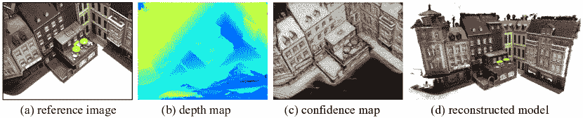
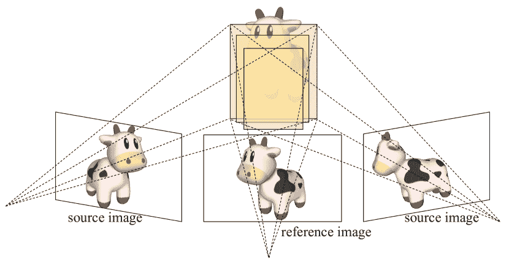
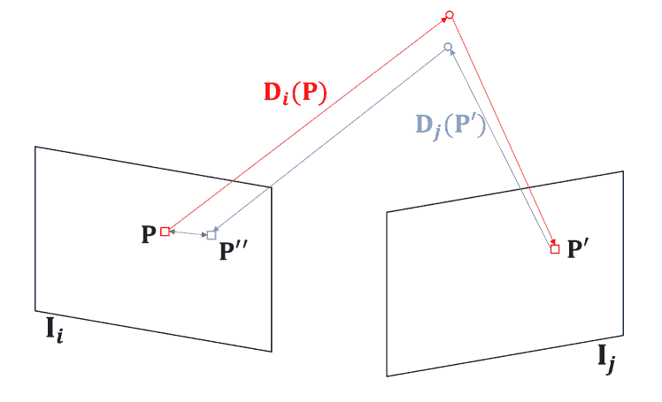
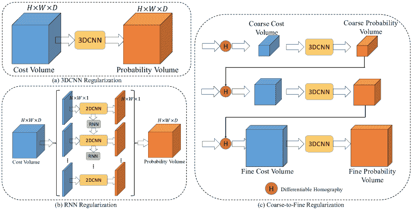

<!--yml

类别: 未分类

日期: 2024-09-06 19:53:37

-->

# [2106.15328] 深度学习在平面扫描的多视角立体视觉中的应用：综述

> 来源：[`ar5iv.labs.arxiv.org/html/2106.15328`](https://ar5iv.labs.arxiv.org/html/2106.15328)

# 深度学习在平面扫描的多视角立体视觉中的应用：综述

朱青天¹，陈敏^(1,2)，魏子庄¹，陈义松¹，王国平¹

¹北京大学

²国家国防科技创新研究院

zqt@stu.pku.edu.cn

###### 摘要

由于其在自动驾驶、机器人技术和虚拟现实等多个领域的广泛应用，3D 重建最近引起了越来越多的关注。作为人工智能领域的主流技术，深度学习已经成功应用于解决各种计算机视觉问题。然而，由于其独特的挑战和多样的处理流程，深度学习在 3D 重建领域仍处于起步阶段。为了激发未来的研究，本文综述了深度学习方法在多视角立体视觉 (MVS) 中的最新进展，MVS 被认为是基于图像的 3D 重建的关键任务。它还对多个公开可用的数据集进行了比较，提出了有见地的观察和激发未来研究方向的启示。

## 1 引言

随着 3D 获取技术的迅速发展，深度传感器变得越来越经济实惠且可靠，例如激光雷达。这些传感器已被广泛应用于实时任务，以获取周围环境的大致估计，例如在同步定位与地图构建 (SLAM) 中。然而，由于硬件和电源限制，深度传感器捕获的深度图通常是稀疏的，因此为了计算效率而放弃了精细的细节。另一种处理流程是通过一系列图像重建 3D 模型。在这种情况下，通过匹配 2D 图像来计算深度值，整个重建过程是在离线完成的。鉴于捕获图像比通过深度传感器获取深度图更具经济性和可用性，基于图像的 3D 重建对于对时间不敏感的任务是更好的选择。此外，图像实际上包含了深度传感器无法捕捉的信息，如纹理和光照。这些线索对于重建更精细和详细的 3D 模型至关重要。

多视角立体视觉（MVS）是一种计算开销大的基于图像的 3D 重建过程。任务的最普遍定义如下：给定一系列图像及其相应的标定相机参数，MVS 旨在为每张图像估计深度图，然后重建场景的稠密点云。大多数以前的尝试[26, 27]采用了这一定义。深度学习在许多计算机视觉任务中已显示出其有效性。对于双目立体视觉，[18]将深度空间离散化，将立体视觉任务转化为分类问题。平面扫描算法[4]将这一模式扩展到多图像匹配，这种模式适合深度 CNN 处理。

重申一下，本文综述了基于学习的 MVS 方法，这些方法通过平面扫描算法构建匹配成本体积，并产生每视图深度图作为中间表示，以重建稠密的 3D 点云。扫描中的每张图像轮流作为参考图像来估计深度图，并以其$N-1$个邻近图像作为源图像。总共$N$张图像被送入网络作为输入，以生成一个深度图和相应的置信度图。然后，通过过滤和融合所有图像的深度图来获得稠密点云。该流程也显示在图 1 中。

图 1：典型的 MVS 流程中的输入、中间输出和最终输出。参考图像(a)以及其$N-1$个邻近图像是网络的输入，其深度图(b)和置信度图(c)会相应生成。所有图像的深度图被过滤并融合成重建的稠密点云(d)。

## 2 背景

MVS 作为基于图像的 3D 重建管道的关键组件。在本节中，介绍了背景知识。第 2.1 节介绍了预先提出的从运动中重建（SfM）作为相机校准的来源。第 2.2 节解释了如何在基于学习的 MVS 方法中构建成本体积，这是使 CNN 预测深度的关键步骤。获得深度图后的后处理，包括深度滤波和融合，见第 2.3 节。第 2.4 节列出了几个著名的 MVS 开放数据集，第 2.5 节列出了用于评估的指标。第 2.6 节涵盖了用于基于学习的 MVS 的损失函数。为澄清，本综述仅涵盖利用平面扫描算法的基于学习的 MVS 方法。

### 2.1 从运动中重建

MVS 需要校准的相机参数来获取图像间的邻接关系，这通常通过从运动中重建算法实现。SfM 通常分为增量式和全局式。一般来说，增量式管道在局部解决优化问题，并将新相机合并到已知轨迹中。因此，增量式方法较慢，但更稳健和准确。全局 SfM 更具可扩展性，通常可以收敛到相当好的解决方案，但更容易受到离群点的影响。

特别是对于 MVS，相机校准意味着对于每张图像，通过 SfM 获得一个相机外参矩阵 $\mathbf{T}$、一个相机内参矩阵 $\mathbf{K}$ 以及一个深度范围 $[d_{min},d_{max}]$。对于大多数 MVS 方法，COLMAP [20] 提供了足够好的相机估计。

### 2.2 平面扫描

图 2：平面扫描算法的示意图。为了估算参考相机的深度图，通过单应性将相邻源图像投影到参考相机视锥体的前平行平面上。

平面扫描立体的主要原理[4]是，对于每个深度，源图像被投影到参考相机视锥的前平行平面上，投影图像的高相似度的深度假设更为可靠。大多数基于学习的 MVS 方法依赖于平面扫描算法来生成代价体积。这一做法深受双目立体的启发。在基于学习的双目立体方法中，不是直接回归深度值，而是估计视差值，即描述两个视图之间像素级距离的值。通过已知的视差几何，可以从估计的视差值计算深度值。此外，由于视差值的单位是像素，这项任务变成了一个分类任务，其中每个类别代表一个离散的视差。这种常见做法有两个潜在优点。首先，由于单位是像素，而不是米或其他实际距离的测量单位，深度估计现在与尺度无关。其次，卷积神经网络（CNN）被认为在分类方面优于回归，因此这有助于产生更可靠的结果。这种离散化依赖于平面扫描算法。

平面扫描算法的核心是验证深度假设。在通过假设深度将像素投影到空间后，平面扫描算法指出，如果一个假设的空间点被不同的相机以相似的光度捕捉到，则该点可能是一个真实点，也就是说，深度（$z$ 值）的假设是有效的。在这种情况下，我们可以将深度区间划分为离散值，并用这些值进行假设。最终深度通过选择所有假设中最有效的深度来估计。实现过程中，还有两个剩余问题。一个是匹配不同图像中的像素或在视图之间建立单应性；另一个是测量光度的相似性。注意，考虑单个像素的 RGB 颜色在匹配中不够稳健，光度通常用从原始图像中提取的特征图替代。

对于一对经过校准的双目图像，由于两个主要光轴始终平行，我们只需要通过视差假设将一个视图移到另一个视图上。对于多视图立体视觉（MVS），情况就复杂一些，因为相机分布在空间中，没有视差约束。在深度假设 $d$ 下，我们首先将源图像的所有像素投影到深度为 $d$ 的空间中，然后通过参考相机将这些点反向扭曲。因此，第 $i$ 张源图像和参考图像之间的单应性为

|  | $H_{i}(d)=d\mathbf{K}_{0}\mathbf{T}_{0}\mathbf{T}^{-1}_{i}\mathbf{K}^{-1}_{i},$ |  | (1) |
| --- | --- | --- | --- |

其中 $\mathbf{K}_{0}$ 和 $\mathbf{T}_{0}$ 是参考图像的相机内参和外参。

计算光度相似性的测量方法因方法而异。对于双目立体，[5、17] 引入了一个相关层来计算特征向量的内积；GC-Net [13] 将特征向量连接在一起。对于数量大于两个的 MVS，相主要有两个选项。MVSNet [26] 对所有特征向量应用方差；DPSNet [11] 将特征成对连接，并通过对所有 $N-1$ 个体积进行平均来获得最终的成本体积。

值得注意的是，深度空间的划分是获得良好结果的关键问题，这将在后面的第 2.6 节中讨论。

以一个例子重新陈述，假设图像分辨率为 $H\times W$，总深度假设的数量为 $D$，每像素特征向量的维度为 $F$，MVS 方法从图像特征中构建一个 $H\times W\times D\times F$ 的成本体积，然后通过神经网络对该成本体积进行正则化，以获得深度图。

### 2.3 深度过滤与融合

假设所有深度图已通过 MVS 方法获得，下一步是过滤和融合深度图，生成稠密点云。由于基于图像的 3D 重建与尺度无关，估计的深度值实际上是局部相机坐标系中像素的 $z$ 值。因此，深度图的融合非常简单，我们只需通过相机将所有像素投影到 3D 空间中即可。图像坐标与世界坐标之间的变换是

|  | $\mathbf{P}_{w}=d\mathbf{T}^{-1}\mathbf{K}^{-1}\mathbf{P}_{x},$ |  | (2) |
| --- | --- | --- | --- |

其中 $\mathbf{P}_{x}$ 和 $\mathbf{P}_{w}$ 分别表示图像坐标和世界坐标中的像素坐标。

然而，并非所有像素都适合保留在最终的点云中，例如，低置信度的像素和无限远处的像素，如天空。为解决此问题，深度图在融合之前需要进行过滤。由于基于学习的多视角立体（MVS）方法采用分类方式，每个深度图都会生成一个相应的置信度图。因此，自然可以设置一个阈值来过滤低置信度的深度值。此外，可以在相邻视图之间交叉检查深度值。这种过滤策略基于重投影误差，通常用于 SfM 的束束调整。

以 [29] 的策略为例，如图 3 所示，通过将图像 $\mathbf{I}_{i}$ 中的像素 $\mathbf{P}$ 映射到其相邻视图 $\mathbf{I}_{j}$，通过估计深度 $D_{i}(\mathbf{P})$，我们得到一个新的像素 $\mathbf{P}^{\prime}$。由于 $\mathbf{I}_{j}$ 也具有其深度图，我们可以相应地得到 $D_{j}(\mathbf{P}^{\prime})$。反过来，$\mathbf{P}^{\prime}$ 可以被投影到 $\mathbf{I}_{i}$ 中的 $\mathbf{P}^{\prime\prime}$，其深度为 $D_{j}(\mathbf{P}^{\prime})$。$\mathbf{P}^{\prime\prime}$ 在 $\mathbf{I}_{i}$ 中的深度估计记作 $D_{i}(\mathbf{P}^{\prime\prime})$。深度过滤的约束条件为

|  | $\&#124;\mathbf{P}-\mathbf{P}^{\prime\prime}\&#124;_{2}\leq\tau_{1},$ |  | (3) |
| --- | --- | --- | --- |
|  | $\frac{\&#124;D_{i}(\mathbf{P}^{\prime\prime})-D_{i}(\mathbf{P})\&#124;_{1}}{D_{i}(\mathbf{P})}\leq\tau_{2},$ |  | (4) |

其中 $\tau_{1}$ 和 $\tau_{2}$ 是阈值。至于 [29]，在至少 3 个相邻视图下满足这些约束的像素被认为足够有效以保留。

图 3：通过测量重投影误差来检查相邻视图之间几何一致性的示意图。

值得注意的是，尽管深度过滤和融合方法往往在论文中未被详细介绍，但它们对获得良好结果可能至关重要。

### 2.4 数据集

表 1 是已发布的 MVS 数据集的简要总结。请注意，对于 MVS 训练，要求有深度信息，而评估则基于点云。表面重建是从点云渲染深度图所必需的，而深度融合则用于评估重建质量。此外，如果一个数据集不包含真实的相机标定或使用开源软件获取真实标定，那么它可能不适合训练，因为平面扫掠对相机标定中的噪声非常敏感。

表 1：MVS 公开数据集概览。

| 数据集 | 提供的真实值¹ | 合成 | 在线 | 评估 |
| --- | --- | --- | --- | --- |
| 相机 | 深度 | 点云 | 基准 | 目标 |
| DTU [1] | ✓ |  | ✓ |  |  | 点云 |
| Tanks and Temples [14] |  |  | ✓ |  | ✓ | 点云 |
| ETH3D [22] | ✓ |  | ✓ |  | ✓ | 点云 |
| BlendedMVS [28] | ✓ | ✓ |  | ✓ |  | 深度图 |

+   1

    对于具有在线基准的数据集，测试集的真实值（不包括相机参数）未发布。

##### DTU

DTU 数据集 [1] 是一个在严格控制的实验室条件下收集的室内 MVS 数据集，具有准确的相机轨迹。它包含 128 个扫描，49 个视图，在 7 种不同的光照条件下进行，并分为 79 个训练扫描、18 个验证扫描和 22 个评估扫描。通过将每个图像设置为参考，总共有 27097 个训练样本。DTU 数据集官方提供的是地面真实点云，而不是深度图，这意味着需要进行表面重建以生成网格模型和渲染深度图。通常采用屏蔽泊松表面重建算法 [12]。

##### Tanks and Temples

Tanks and Temples [14] 是一个大规模的在线基准数据集，捕捉了更复杂的真实室内和室外场景。它包含中级集和高级集。不同的场景具有不同的尺度、表面反射和曝光条件。Tanks and Temples 的评估通过将重建点上传到其官方网站进行。请注意，Tanks and Temples 不提供地面真实相机参数。一个带有地面真实点云的训练集是可用的，通常用于局部离线验证。

##### ETH3D

ETH3D [22] 是一个全面的 SLAM 和立体任务基准。考虑到 MVS，它包含 25 个高分辨率场景和 10 个低分辨率场景。ETH3D 被广泛认为是最困难的 MVS 任务，因为它包含许多低纹理区域，如白色墙壁和反射地板。基于广播有效深度值的传统 MVS 方法在这种情况下表现更好。

##### BlendedMVS

BlendedMVS 数据集 [28] 是一个最近发布的大规模合成数据集，用于 MVS 训练，包含各种场景，如城市、雕塑和鞋子。该数据集由超过 17k 张高分辨率图像组成，这些图像通过重建模型渲染，并分为 106 个训练场景和 7 个验证场景。由于 BlendedMVS 是通过虚拟相机获得的，其提供的相机校准对 MVS 训练来说足够可靠。

### 2.5 评估指标

正如表格 1 中提到的，大多数数据集提供点云作为地面真实值，而不是深度图，评估指标通常基于重建的密集点云的质量。由于点云实际上是具有排列不变性的无序点，在比较之前，重建的点云应该通过每视图的相机参数对齐到地面真实点云。

##### 绝对误差

尽管基准测试采用基于点云的度量进行排名，但在网络训练期间仍然可以使用基于深度的度量进行验证。绝对误差通常用于测量深度图的质量。一个常见的做法是使用多个阈值来显示网络的整体性能，例如 2-px 绝对误差、4-px 绝对误差、6-px 绝对误差和 8-px 绝对误差。

##### 精度/准确率

精度/准确率是衡量预测点与真实点云中匹配的百分比。考虑预测点云中的一个点 $\mathbf{P}_{p}$，如果它在真实点云 $\{\mathbf{P}_{g}\}$ 中有一个良好的匹配，则满足

|  | $\&#124;\mathbf{P}_{p}-\mathop{\arg\min}\limits_{\mathbf{P}\in\{\mathbf{P}_{g}\}}\&#124;\mathbf{P}-\mathbf{P}_{p}\&#124;_{2}\&#124;_{2}\leq\lambda,$ |  | (5) |
| --- | --- | --- | --- |

其中 $\lambda$ 是由数据集分配的场景相关参数。对于较大的场景，$\lambda$ 设置为较大的值。距离的定义与 Chamfer 距离相同。精度/准确率是满足要求的预测点云中的点数占预测点云总点数的比例。请注意，在某些数据集中，精度/准确率不是通过比例（百分比）来衡量，而是通过均值或中位绝对距离来衡量。

##### 召回率/完整性

召回率/完整性衡量真实点云中有多少百分比的点能够匹配到预测点云中。计算时只需交换真实点云和预测点云。对于真实点云中的一个点 $\mathbf{P}_{g}$，如果它在预测点云 $\{\mathbf{P}_{p}\}$ 中有一个良好的匹配，则满足

|  | $\&#124;\mathbf{P}_{g}-\mathop{\arg\min}\limits_{\mathbf{P}\in\{\mathbf{P}_{p}\}}\&#124;\mathbf{P}-\mathbf{P}_{g}\&#124;_{2}\&#124;_{2}\leq\lambda,$ |  | (6) |
| --- | --- | --- | --- |

召回率/完整性是满足要求的真实点云中的点数占真实点云总点数的比例。与精度/准确率类似，召回率/完整性有时通过均值或中位绝对距离来衡量。

##### F-分数

上述两个指标测量了预测点云的准确性和完整性。然而，这些指标单独使用时不能呈现整体性能，因为不同的 MVS 方法使用了不同的先验假设。更强的假设通常会导致更高的准确性但较低的完整性。公平的比较需要这两项指标。如果只报告精度/准确性，则倾向于 favor 仅包括高确定性点的 MVS 算法。另一方面，如果只报告召回率/完整性，则倾向于 favor 包含所有点的 MVS 算法，而不考虑点的质量。因此，引入了综合指标。F-score 是精度和召回率的调和均值。调和均值对极小值非常敏感，往往更受较小值的影响，也就是说，F-score 不鼓励不平衡的结果。然而，在大多数情况下，由于真实值的局限性，F-score 仍然存在不公平的问题。由于点云的表示是非结构化和整体稀疏的，这个问题仍未解决。

### 2.6 损失函数

基于学习的多视角立体（MVS）的损失函数可以分为回归型和分类型。简要回顾，对于一个$H\times W\times D\times F$的代价体积，在代价体积正则化后，会生成一个$H\times W\times D$的概率体积。不同的损失函数对应于确定最终预测的不同方式。

如果最终的真实值预测是通过 argmax 操作确定的，那么它已经转变为纯分类任务，交叉熵损失自然适合作为损失函数，其中真实值深度图也以与平面扫描相同的方式离散化并独热编码。交叉熵损失函数如下所述：

|  | $L=\sum_{d}^{D}-G(d)\log[P(d)],$ |  | (7) |
| --- | --- | --- | --- |

其中，$G(d)$ 是相对于深度的真实值独热分布，$P(d)$ 是预测分布。分类型损失函数的一个重要优点是对深度划分实际上不敏感，这意味着划分可以是任意的，而不一定要均匀。 [27, 24 ] 使用交叉熵作为他们的损失函数。

一些方法采用回归型模式来确定预测，其中计算的是深度的数学期望。在这种情况下，采用 L1 损失作为损失函数。这种做法有助于预测更平滑的深度图。MVSNet [26]，以及后来的粗到细方法，采用了这种模式。损失函数如下所述：

|  | $L=\&#124;d_{0}-Ex[P(d)]\&#124;_{1}$ |  | (8) |
| --- | --- | --- | --- |

其中 $d_{0}$ 表示真实深度图，$Ex[\cdot]$ 表示分布的期望。然而，数学期望仅在空间划分均匀的情况下才有效。为了提升可扩展性，R-MVSNet [27] 采用了一个逆深度采样策略，其中深度平面级别与实际深度值成反比。在这种情况下，平面扫描在远离区域较精细，但类似回归的损失函数不再有效。

实证结果表明，类似分类的损失函数有助于预测准确的深度值，因为所有低于最大概率的候选值都会被压缩。然而，这通常会导致深度值的不连续性。而类似回归的方法考虑到数学期望是做 argmax 的可微分方式，这有助于预测平滑的深度图，但会丧失边缘的锐利度。

## 3 方法

本节介绍了基于学习的 MVS 网络，这些网络生成深度图用于进一步的后处理。一个典型的 MVS 网络主要包括三个部分，即特征提取网络（第 3.1 节），成本体积构造器（第 3.2 节）和成本体积正则化网络（第 3.3 节）。表 2 是基于学习的典型 MVS 方法的概述。

表 2：基于学习的典型 MVS 方法概述（通过平面扫描算法）。

| 方法 | 正则化方案¹ | 可见性 | 损失函数 |
| --- | --- | --- | --- |
| 3D CNN | RNN | 粗到精 | 分类 | 回归 |
| MVSNet [26] | ✓ |  |  |  |  | ✓ |
| R-MVSNet [27] |  | ✓ |  |  | ✓ |  |
| CasMVSNet [8] |  |  | ✓ |  |  | ✓ |
| CVP-MVSNet [25] |  |  | ✓ |  |  | ✓ |
| UCS-Net [3] |  |  | ✓ |  |  | ✓ |
| Vis-MVSNet [31] |  |  | ✓ | ✓ | ✓ |  |
| PVA-MVSNet [29] | ✓ |  |  | ✓ |  | ✓ |
| $D^{2}$HC-RMVSNet [24] |  | ✓ |  |  | ✓ |  |
| AA-RMVSNet [23] |  | ✓ |  | ✓ | ✓ |  |

+   1

    严格来说，所有的粗到精方法都基于 3D CNN。因此，使用 3D CNN 的定义排除了那些具有粗到精模式的方法。

### 3.1 特征提取

MVS 的特征提取仍然未得到充分研究，大多数方法应用了通用的 CNN 骨干网络来提取特征，例如，ResNet [9] 和 U-Net [19]。基于学习的方法的主要新颖性在于特征提取，例如，$D^{2}$HC-RMVSNet [24] 应用了多尺度特征和扩张来聚合特征。

我们可以比较不同计算机视觉任务的特征提取。在图像分类中，每张图像被分配一个标签，全球特征更为重要，因为需要对整张图像有整体感知。对于目标检测而言，本地特征比全球背景更为重要。而立体匹配，与多视角立体视觉（MVS）类似，最佳匹配应为半全局[10]。对于纹理信息丰富的高频区域，我们期望具有更局部的感受野；而那些纹理较弱的区域应在更广泛的范围内进行匹配。

### 3.2 成本体积构建

通过平面扫掠构建成本体积，其详细信息已在第 2.2 节中介绍。由于成本体积构建可以是成对进行的，还需要另一个过程将所有$N-1$个成本体积汇聚成一个。DPSNet[11]简单地通过加法将所有成本体积汇聚，基本原理是所有视角被认为是平等的。实际上，遮挡在 MVS 系统中很常见，通常会导致无效匹配。因此，输入视角的数量增加会导致更糟的预测。通过这种方式，距离参考视角更近的视角应给予更高的优先级，因为它更不容易受到遮挡。

为了缓解这一问题，PVA-MVSNet[29]应用了门控卷积[30]来自适应地汇聚成本体积。视角汇聚倾向于给予被遮挡区域较小的权重，重新加权图是根据体积本身产生的。这种做法实际上遵循了自注意力的趋势。Vis-MVSNet[31]通过检查概率分布的不确定性或置信度，明确引入了作为可见性处理的成本体积的度量。

### 3.3 成本体积正则化

不同 MVS 网络的主要差异在于成本体积正则化的方式，这将在以下章节中进行分类和介绍。图 4 展示了本文涵盖的三种正则化方案。

图 4：典型成本正则化方案的说明。（a）3D CNN 正则化简单地应用 3D CNN 来汇聚所有维度的空间上下文；（b）RNN 正则化将每个深度假设建模为时间节点，并采用具有共享权重的 2D CNN 来汇聚$H$和$W$的上下文；（c）在粗到细正则化中，依据较粗的预测构建更精细的成本体积，并在不同阶段使用 3D CNN。

#### 3.3.1 3D CNN

3D CNNs 是成本体积正则化的直接选择。字面上，3D CNNs 由 3D 卷积操作组成，其卷积核是三维的，并在成本体积的所有维度之间移动。MVSNet[26]采用 3D U-Net 来正则化成本体积。类似于 2D U-Net[19]，3D U-Net 包含一个编码器，它执行下采样 3D 卷积，以及一个解码器，它逐渐恢复原始特征分辨率。MVSNet[26]是第一个利用深度学习的 MVS 方法，使用 3D U-Net 进行成本体积正则化。

成本体积正则化的目的是根据聚合特征来聚合特征并预测相对有效的深度值。这样，3D CNNs 因其在所有维度上聚合局部和全局特征的能力而成为一种通用方法。然而，CNNs 是在规则网格上操作的，基本假设是空间的划分是均匀的。对于完整的情况，均匀的划分不足以预测可靠的深度值。此外，3D CNNs 计算开销大且消耗大量内存，这限制了$D$的值。通常，细化的（大$D$）和合适的（非均匀的）划分对于获得高质量深度图至关重要。

#### 3.3.2 RNN

使用 3D CNNs 进行成本体积正则化的一个主要缺点是内存消耗巨大。为了减少所需的内存量，一些尝试[27, 24]通过沿着$D$维度使用顺序 2D CNNs 来替代 3D CNNs。这样，GPU 内存中将始终处理一个成本切片，同时使用 RNN 来线程所有深度假设，传递$D$维度上的上下文信息。

使用递归正则化的一个巨大优势是，它改善了 MVS 方法的可扩展性，因为空间的划分可以更精细，从而可以重建更远的物体。但相应地，这种方案在空间上交换了运行效率，因为 RNN 的并行性比 CNNs 差。

#### 3.3.3 粗到细

采用从粗到精的模式进行预测是减少大量内存消耗的另一种解决方案。字面上，网络先预测一个粗略的深度图，然后基于之前的结果生成更精细的结果。粗略预测通常基于较低分辨率的下采样图像，而精细预测则基于较高分辨率的图像。这种做法采用了编码器-解码器架构，其中低分辨率特征图包含更多的低频成分，高频成分则更多地存在于高分辨率特征图中。利用粗略预测的方法各不相同。Cas-MVSNet [8]通过对之前粗略预测的特征图进行小范围深度的扭曲来再生代价体积。阶段$k+1$的级联重扭曲基于公式 1，其中$d=d^{(k)}+\Delta^{(k+1)}$，其单应性是

|  | $H_{i}^{(k+1)}(d^{(k)}+\Delta^{(k+1)})=(d^{(k)}+\Delta^{(k+1)})\mathbf{K}_{0}\mathbf{T}_{0}\mathbf{T}^{-1}_{i}\mathbf{K}^{-1}_{i},$ |  | (9) |
| --- | --- | --- | --- |

其中$k$表示阶段的数量，$d^{(k)}$是阶段$k$的估计深度值，$\Delta^{(k+1)}$是当前阶段需要确定的残差深度。

UCS-Net [3]从粗略预测中获得不确定性以辅助更精细的预测。请注意，RNN 和粗到细的正则化方法都允许更精细的深度划分，但它们关注的情况不同。RNN 正则化允许较大的$D$，因此可以有更多的假设深度平面；粗到细正则化使得深度间隔可以进行自适应细分，从而具备构建精细细节的能力。

## 4 讨论

### 4.1 结果与分析

表 3 和表 4 是典型的基于学习的 MVS 方法的定量结果。Furu [6]、Gipuma [7]和 COLMAP [21]是展示的非学习方法用于比较。

关于 DTU 数据集，显然基于学习的方法在完整性方面优于传统方法，而 Gipuma [7]，一种非学习方法，则实现了最佳准确度。一个直观的见解是，深度学习可以采用数据驱动的统计模式来预测完整的深度值，而传统方法依赖于更严格的约束，因此由于几何一致性差而忽略了这些区域。在基于学习的方法中，从粗到精的方法表现优于其他方法。考虑到 DTU 是一个具有精细细节的理想室内数据集，从粗到精的方法能够区分微妙的深度差异。

对于 Tanks 和 Temples 这类规模较大的数据集，采用 RNN 正则化方案的方法表现出其优势，例如 $D^{2}$HC-RMVSNet [24] 和 AA-RMVSNet [23]。对于真实场景，其光照和规模可能有所不同，因此重建相对完整的点云比准确度更为重要。因此，RNN 正则化方法可以进行更多的 $D$ 和逆深度采样，能够更好地预测完整的场景。

DTU 和 Tanks 与 Temples 之间的性能差异可以从正则化的角度解释。3D CNN（包括粗到细的正则化模式）是一种较强的正则化，因为它在所有维度中聚合空间上下文信息，而 RNN 中的 $D$ 维度的约束则被放宽。这种放宽导致了更好的泛化性和鲁棒性，但预测所需的时间更长。

表 3：DTU 评估集上的定量结果 [1]（值越低越好）。Acc. 代表准确度，Comp. 代表完整度。请注意，DTU 数据集使用绝对 Chamfer 距离而非百分比来进行评估。Furu [6]、Gipuma [7] 和 COLMAP [21] 是列出的非学习方法供对比。

| 方法 | 准确度（mm） | 完整度（mm） | 总体（mm） |
| --- | --- | --- | --- |
| Furu [6] | 0.613 | 0.941 | 0.777 |
| Gipuma [7] | 0.283 | 0.873 | 0.578 |
| COLMAP [21] | 0.400 | 0.664 | 0.532 |
| MVSNet [26] | 0.396 | 0.527 | 0.462 |
| R-MVSNet [27] | 0.385 | 0.459 | 0.422 |
| $D^{2}$HC-RMVSNet [24] | 0.395 | 0.378 | 0.386 |
| Vis-MVSNet [31] | 0.369 | 0.361 | 0.365 |
| CasMVSNet [8] | 0.325 | 0.385 | 0.355 |
| CVP-MVSNet [25] | 0.296 | 0.406 | 0.351 |
| UCS-Net [3] | 0.338 | 0.349 | 0.344 |
| AA-RMVSNet [23] | 0.376 | 0.339 | 0.357 |

表 4：Tanks 和 Temples 基准测试 [14] 上典型学习型 MVS 方法的定量结果。评价指标为 F-score（值越高越好）。L.H. 代表 Lighthouse，P.G. 代表 Playground。COLMAP [21] 是非学习基线方法用于对比。

| 方法 | 平均 | 家庭 | Francis | Horse | L.H. | M60 | Panther | P.G. | 火车 |
| --- | --- | --- | --- | --- | --- | --- | --- | --- | --- |
| COLMAP [21] | 42.14 | 50.41 | 22.25 | 25.63 | 56.43 | 44.83 | 46.97 | 48.53 | 42.04 |
| MVSNet [26] | 43.48 | 55.99 | 28.55 | 25.07 | 50.79 | 53.96 | 50.86 | 47.90 | 34.69 |
| R-MVSNet [27] | 50.55 | 73.01 | 54.46 | 43.42 | 43.88 | 46.80 | 46.69 | 50.87 | 45.25 |
| PVA-MVSNet [29] | 54.46 | 69.36 | 46.80 | 46.01 | 55.74 | 57.23 | 54.75 | 56.70 | 49.06 |
| CVP-MVSNet [25] | 54.03 | 76.50 | 47.74 | 36.34 | 55.12 | 57.28 | 54.28 | 57.43 | 47.54 |
| CasMVSNet [8] | 56.84 | 76.37 | 58.45 | 46.26 | 55.81 | 56.11 | 54.06 | 58.18 | 49.51 |
| UCS-Net [3] | 54.83 | 76.09 | 53.16 | 43.03 | 54.00 | 55.60 | 51.49 | 57.38 | 47.89 |
| $D^{2}$HC-RMVSNet [24] | 59.20 | 74.69 | 56.04 | 49.42 | 60.08 | 59.81 | 59.61 | 60.04 | 53.92 |
| Vis-MVSNet [31] | 60.03 | 77.40 | 60.23 | 47.07 | 63.44 | 62.21 | 57.28 | 60.54 | 52.07 |
| AA-RMVSNet [23] | 61.51 | 77.77 | 59.53 | 51.53 | 64.02 | 64.05 | 59.47 | 60.85 | 54.90 |

### 4.2 仍未研究的话题

到目前为止，基于学习的 MVS 仍然是计算机视觉的一个小众领域，许多知名且广泛使用的商业软件仍然应用传统的非学习算法。基于学习的 MVS 算法的一个典型问题是在低纹理区域缺乏有效的深度值，这也是 ETH3D 的 SOTA 方法仍然是非学习方法的原因。一些尝试使用不同的先验信息，例如表面法线 [15, 16] 来克服平面区域。但这些尝试高度依赖后处理，仍然远未达到端到端。

一个未研究的话题是适合 MVS 的特征提取器种类，如第 3.1 节中提到的。MVS 依赖于相对复杂的感受野尺寸。

评估指标并不合理。由于 MVS 是基于图像的 3D 重建的一个步骤，其最终目的是构建网格模型，而点云是中间表示。如果一个好的表面重建算法能够正确估计面，那么在 MVS 重建过程中缺乏点是可以接受的。

一些研究人员已经注意到深度图与点云之间的差距，并希望构建一个统一的训练和评估框架。例如，将深度融合合并到端到端的训练中，以便直接从点云中计算损失。一个主要的问题是如何使几何一致性检查具有可微分性。一些尝试已经进行，例如 Point-MVSNet [2]，但结果仍不够令人满意。

另一个任务是将多模态信息编码到 MVS 网络中，例如语义信息。这样，一些挑战性的领域可以单独处理，例如省略带有天空语义标签的点，并在标记为地面的区域内插值点。还需要一个合适的数据集。

最后但同样重要的是，可用的数据集数量和数据的多样性也非常有限。

## 5 结论

本文涵盖了学习基础的 MVS 算法的几个方面，包括后处理、平面扫描、相关数据集和网络模块。此外，还展示了比较结果和观察。总体而言，基于深度学习的 MVS 仍在发展中，与其他计算机视觉任务相比，社区相对较小。

## 参考文献

+   [1] 亨里克·安纳斯、拉斯穆斯·拉姆斯博尔·詹森、乔治·沃吉亚齐斯、恩金·托拉 和 安德斯·比约霍尔姆·达尔。大规模数据用于多视图立体视觉。国际计算机视觉期刊，120(2):153–168，2016 年。

+   [2] 陈睿、韩松芳、徐晶 和 苏浩。基于点的多视图立体网络。在 IEEE/CVF 国际计算机视觉会议论文集中，页码 1538–1547，2019 年。

+   [3] 程硕、徐泽翔、朱世林、李卓文、李尔然、拉维·拉马穆尔西 和 苏浩。使用适应性薄体积表示和不确定性感知的深度立体。在 IEEE/CVF 计算机视觉与模式识别会议论文集中，页码 2524–2534，2020 年。

+   [4] 罗伯特·T·柯林斯。空间扫描法用于真实的多图像匹配。在 CVPR IEEE 计算机视觉与模式识别会议论文集中，页码 358–363。IEEE，1996 年。

+   [5] 阿列克谢·多索维茨基、菲利普·费舍尔、埃迪·伊尔格、菲利普·豪瑟、卡内尔·哈兹尔巴斯、弗拉基米尔·戈尔科夫、帕特里克·范德·斯马赫特、丹尼尔·克雷默斯 和 托马斯·布罗克斯。Flownet：使用卷积网络学习光流。在 IEEE 国际计算机视觉会议论文集中，页码 2758–2766，2015 年。

+   [6] 古川康高 和 让·蓬斯。准确、密集且稳健的多视图立体视觉。IEEE 模式分析与机器智能期刊，32(8):1362–1376, 2009 年。

+   [7] 西尔瓦诺·加利亚尼、卡特琳·拉辛格 和 康拉德·辛德勒。通过表面法线扩散的高度并行多视图立体视觉。在 IEEE 国际计算机视觉会议论文集中，页码 873–881，2015 年。

+   [8] 顾晓东、范志文、朱思宇、戴左卓、谭飞通 和 谭平。用于高分辨率多视图立体视觉和立体匹配的级联成本体积。在 IEEE/CVF 计算机视觉与模式识别会议论文集中，页码 2495–2504，2020 年。

+   [9] 贺凯明、张翔宇、任少卿 和 孙剑。用于图像识别的深度残差学习。在 IEEE 计算机视觉与模式识别会议论文集中，页码 770–778，2016 年。

+   [10] 海科·赫希穆勒。通过半全局匹配和互信息进行立体处理。IEEE 模式分析与机器智能期刊，30(2):328–341，2007 年。

+   [11] 任胜勋、全海坤、林思敏 和 崔恩洙。Dpsnet：端到端深度平面扫描立体。国际学习表征会议，2018 年。

+   [12] 迈克尔·卡兹丹 和 于格斯·霍普。筛选泊松表面重建。ACM 图形学交易（ToG），32(3):1–13，2013 年。

+   [13] Alex Kendall, Hayk Martirosyan, Saumitro Dasgupta, Peter Henry, Ryan Kennedy, Abraham Bachrach 和 Adam Bry。几何和上下文的端到端学习用于深度立体回归。发表于《IEEE 国际计算机视觉大会论文集》，第 66–75 页，2017 年。

+   [14] Arno Knapitsch, Jaesik Park, Qian-Yi Zhou 和 Vladlen Koltun。坦克与寺庙：大规模场景重建基准测试。ACM《图形学学报》（ToG），36(4):1–13，2017 年。

+   [15] Uday Kusupati, Shuo Cheng, Rui Chen 和 Hao Su。法线辅助的立体深度估计。发表于《IEEE/CVF 计算机视觉与模式识别会议论文集》，第 2189–2199 页，2020 年。

+   [16] Hongmin Liu, Xincheng Tang 和 Shuhan Shen。大规模室内场景重建的深度图补全。《模式识别》，99:107112，2020 年。

+   [17] Nikolaus Mayer, Eddy Ilg, Philip Hausser, Philipp Fischer, Daniel Cremers, Alexey Dosovitskiy 和 Thomas Brox。一个大型数据集用于训练卷积网络以进行视差、光流和场景流估计。发表于《IEEE 计算机视觉与模式识别会议论文集》，第 4040–4048 页，2016 年。

+   [18] Masatoshi Okutomi 和 Takeo Kanade。多基线立体。IEEE《模式分析与机器智能汇刊》，15(4):353–363，1993 年。

+   [19] Olaf Ronneberger, Philipp Fischer 和 Thomas Brox。U-net：用于生物医学图像分割的卷积网络。发表于《医学图像计算与计算机辅助干预国际会议》，第 234–241 页。Springer，2015 年。

+   [20] Johannes L Schönberger 和 Jan-Michael Frahm。运动重建方法的再探讨。发表于《IEEE 计算机视觉与模式识别会议论文集》，第 4104–4113 页，2016 年。

+   [21] Johannes L Schönberger, Enliang Zheng, Jan-Michael Frahm 和 Marc Pollefeys。无结构多视角立体的像素级视图选择。发表于《欧洲计算机视觉会议》，第 501–518 页。Springer，2016 年。

+   [22] Thomas Schöps, Johannes L Schönberger, Silvano Galliani, Torsten Sattler, Konrad Schindler, Marc Pollefeys 和 Andreas Geiger。一个高分辨率图像和多摄像机视频的多视角立体基准测试。发表于《IEEE 计算机视觉与模式识别会议论文集》，第 3260–3269 页，2017 年。

+   [23] Zizhuang Wei, Qingtian Zhu, Chen Min, Yisong Chen 和 Guoping Wang。Aa-rmvsnet：自适应聚合递归多视角立体网络。发表于《IEEE 国际计算机视觉大会》，2021 年。

+   [24] Jianfeng Yan, Zizhuang Wei, Hongwei Yi, Mingyu Ding, Runze Zhang, Yisong Chen, Guoping Wang 和 Yu-Wing Tai。密集混合递归多视角立体网与动态一致性检查。发表于《欧洲计算机视觉会议》，第 674–689 页。Springer，2020 年。

+   [25] Jiayu Yang, Wei Mao, Jose M Alvarez 和 Miaomiao Liu。基于代价体金字塔的深度推断用于多视角立体。发表于《IEEE/CVF 计算机视觉与模式识别会议论文集》，第 4877–4886 页，2020 年。

+   [26] 姚耀、罗子新、李世伟、方天、权龙。Mvsnet：用于非结构化多视角立体的深度推断。载于欧洲计算机视觉会议（ECCV）论文集，页码 767–783，2018 年。

+   [27] 姚耀、罗子新、李世伟、沈天伟、方天、权龙。用于高分辨率多视角立体深度推断的递归 mvsnet。载于 IEEE/CVF 计算机视觉与模式识别会议论文集，页码 5525–5534，2019 年。

+   [28] 姚耀、罗子新、李世伟、张敬阳、任宇凡、周磊、方天、权龙。Blendedmvs：一个用于广义多视角立体网络的大规模数据集。载于 IEEE/CVF 计算机视觉与模式识别会议论文集，页码 1790–1799，2020 年。

+   [29] 易宏伟、魏自壮、丁明宇、张润泽、陈一松、王国平、戴宇榷。具有自适应视角聚合的金字塔多视角立体网。载于欧洲计算机视觉会议论文集，页码 766–782。Springer，2020 年。

+   [30] 余佳慧、林哲、杨继梅、沈晓辉、卢鑫、黄托马斯·S。带有门控卷积的自由形状图像修复。载于 IEEE/CVF 国际计算机视觉会议论文集，页码 4471–4480，2019 年。

+   [31] 张敬阳、姚耀、李世伟、罗子新、方天。面向可见性的多视角立体网络。英国机器视觉会议（BMVC），2020 年。
