<!--yml

类别：未分类

日期：2024-09-06 19:53:34

-->

# [2107.00272] 基于图的深度学习在计算病理学中的调查

> 来源：[`ar5iv.labs.arxiv.org/html/2107.00272`](https://ar5iv.labs.arxiv.org/html/2107.00272)

# 关于基于图的深度学习的调查

计算病理学

David Ahmedt-Aristizabal、Mohammad Ali Armin、Simon Denman、Clinton Fookes、Lars Petersson D. Ahmedt-Aristizabal、A. Armin 和 L. Petersson 隶属于澳大利亚堪培拉 CSIRO Data61 的成像与计算机视觉组。（通讯作者：david.ahmedtaristizabal@data61.csiro.au）D. Ahmedt-Aristizabal、S. Denman 和 C. Fookes 还隶属于澳大利亚布里斯班昆士兰科技大学的 SAIVT。

###### 摘要

随着表示学习在预测问题中的显著成功，我们见证了机器学习和深度学习在数字病理学和活检图像块分析中的快速扩展。然而，使用卷积神经网络在图像块特征上进行学习限制了模型捕捉全局上下文信息和全面建模组织成分的能力。组织诊断中，组织成分的表型和拓扑分布起着关键作用。因此，图数据表示和深度学习在编码组织表示以及捕捉内部和外部实体级交互方面吸引了大量关注。在这篇综述中，我们为数字病理学中的图分析提供了概念基础，包括实体图构建和图架构，并展示了它们在肿瘤定位和分类、肿瘤侵袭和分期、图像检索和生存预测方面的当前成功。我们以系统化的方式概述了这些方法，按输入图像的图表示、尺度和操作的器官进行组织。我们还概述了现有技术的局限性，并建议了该领域的潜在未来研究方向。

###### 关键词：

数字病理学、癌症分类、细胞图、组织图、层次图表示、图卷积网络、深度学习。

## 引言

最近，深度学习技术的进步迅速将这些方法转变为分析医学图像的首选方法，尤其是在组织学图像分类问题中 [1]。由于大规模高分辨率组织样本全切片图像（WSI）的日益普及，数字病理学和显微镜学已成为深度学习算法的吸引人应用领域。考虑到病理学的广泛变异和常常耗时的诊断过程，临床专家开始从能够学习最优数据特征的计算机辅助检测和诊断方法中受益 [2]。这篇详尽的综述作为生物医学工程和临床研究社区感兴趣于使用图像到图的翻译和深度学习发现组织成分与功能关系的准确指南。

有几篇综述论文分析了深度学习在提供可靠支持以进行显微镜和数字病理学诊断及治疗决策方面的好处 [3, 4, 1, 5, 6]，特别是在癌症诊断方面 [7]。与皮肤科、眼科、神经科、心脏病学和放射学等其他医学领域相比，数字病理学和显微镜学是深度学习最具主导地位的医学应用之一。推动计算病理学创新的一个重要因素是重大挑战的引入（如 NuCLS [8]、BACH [9]、MoNuSeg [10]）。开发的技术为人类病理学家提供决策支持，展示了在检测、分割和分类细胞及细胞核方面的光明前景；并且在检测和分类疾病如癌症方面也展现了潜力。

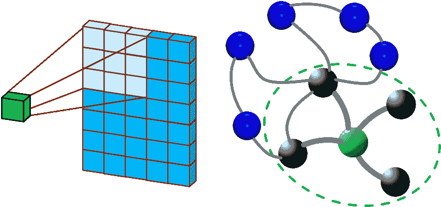

图 1：传统的卷积神经网络（CNN）在网格表示中擅长建模局部关系，其中邻域的拓扑结构是恒定的（左）。图卷积网络（GCN）可以通过超越卷积使用的局部像素邻域来考虑不同的邻接关系（全局关系）。在图上，节点的邻居是无序的且大小可变的（右）。

深度学习技术，如卷积神经网络（CNNs），在提取图像级表示方面已取得成功，但在处理关系感知表示时效率较低。现代深度学习图神经网络（GNNs）的变体在许多技术领域中对描述关系产生了重大影响。图定义上捕捉实体之间的关系，因此可以用于编码变量之间的关系信息 [11]。因此，特意强调了将 GNNs 推广到非结构化和结构化场景中的一般化。传统的 CNNs 基于固定连接（由卷积核决定）分析局部区域，导致性能有限，并且难以解释所建模的结构。另一方面，图提供了更多的灵活性来分析无序数据，通过保留邻接关系。这种差异在图 1 中进行了说明。

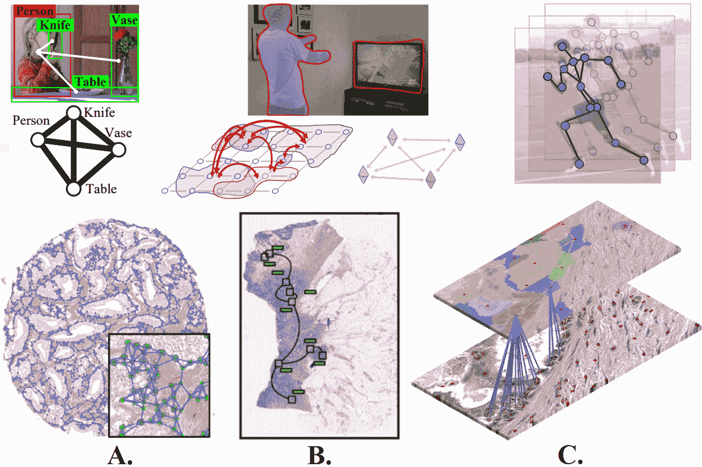

图 2：上：用于关系感知人机交互、图像分割和人体姿态估计的基于图的图像表示（从左到右）。图像改编自 [12, 13, 14]。下：A. 前列腺癌的细胞图表示。B. 结直肠癌的组织图表示。C. 乳腺癌的层次细胞到组织图表示。图像改编自 [15, 16, 17]。

深度学习从图像到图的适应已受到越来越多的关注，形成了一个新的跨领域图基深度学习领域，旨在以端到端的方式学习图的有用表示。该领域在各种任务中表现出了显著的成功，正如最近关于图深度学习框架及其应用的调查所讨论的 [18, 19, 11, 20]。图嵌入已出现在计算机视觉任务中，其中图可以有效地定义对象之间的关系，或用于图结构图像分析。对于对象检测、语义分割、基于骨架的动作识别、图像分类和人机交互任务已获得有趣的结果，如图 2（上所示）。

医学应用已经从计算机视觉和 GNNs 领域的快速进展中受益。GNNs 的发展见证了深度学习方法应用于 GNNs，例如图卷积网络（GCNs）。这些模型被提出作为一种强大的工具，用于建模功能和解剖结构、大脑电活动以及血管系统和器官的分割 [21]。

组织学图像描绘了组织样本的微观解剖结构，病理学家使用组织学图像根据组织的形态变化、细胞之间的空间关系、细胞密度和其他因素做出诊断。基于图的方法能够捕捉几何和拓扑属性，从而建模细胞级信息和整体组织微结构。在深度学习出现之前，已经研究了许多将组织病理学图像处理为图的方法 [22]。这些方法使用了经典的机器学习方法，相较于 GCNs，图分类的准确性较低。基于图的深度学习的能力，将深度学习方法与传统细胞图桥接，用于疾病诊断，尚需充分探讨。

在本综述中，我们分析了图嵌入在组织病理学诊断和分析中的应用。虽然图在这些数据中没有直接表达，但它们可以有效地描述组织区域和细胞之间的关系。这种设置为 GNNs 提供了与分析如电生理和神经影像记录等非结构化数据不同的任务，其中数据可以直接映射到图 [21]。用于捕捉和学习相关形态学区域的数字病理学中图表示的选定样本（细胞图、补丁图、组织图和细胞-组织表示）将在本综述中介绍，如图 2（底部）所示。

本综述提供了计算病理学中预处理、图模型和解释工具的全面概述，突出了 GNNs 检测和关联关键组织结构、兴趣区域及其相互依赖性的能力。虽然一些论文调查了使用手工特征的传统细胞图来表征实体 [22, 23]，其他论文则简要讨论了 GCNs 在生物学和医学中的好处 [24]，但据我们所知，尚无系统综述对基于图的表示和深度学习模型在计算病理学中的所有相关工作进行呈现和讨论。

### I-A 为什么选择基于图的深度学习来通过组织病理学切片来表征疾病？

深度学习通过仅从数据中发现图像中的形态学和纹理表示，提高了医学图像分析的潜力。尽管卷积神经网络（CNNs）在组织病理分析领域表现出色，但由于它们只能分析由卷积核确定的局部区域，因此无法捕捉复杂的邻域信息。为了提取对象之间的交互信息，CNN 需要通过堆叠多个卷积层达到足够的深度，这效率较低。这导致了解剖结构和显微样本分析性能和解释性的限制。

图卷积网络（GCNs）是一种基于深度学习的方法，专门用于图形处理，正变得越来越有用于医学诊断和分析[21]。与基于 CNN 的模型相比，GCNs 能够更好地利用不规则关系并保持邻近关系[11]。以下是当前组织病理学研究为何将分析范式从像素转向实体图处理的原因：

1.  1.

    在传统的 CNN 特征学习过程中，图像之间的潜在相关性被忽视，而 GCN 可以用于估计图像之间的依赖关系，并增强 CNN 特征的区分能力[25]。

1.  2.

    CNNs 通常用于通过使用固定的融合规则（如特征或类别分数的平均，或使用可学习权重的加权平均）对固定大小的活检图像块进行分类，从而分析整个幻灯片图像（WSI）。使用 CNN 的聚合还包括过多的空白，过度依赖组织片段的方向和位置。尽管基于 CNN 的模型通过考虑重要的图像块进行预测具有实际优点，但它们忽略了图像块之间的空间关系或全局上下文信息。需要能够处理感兴趣区域（ROIs）大小和形状变化的架构，并且必须编码单个图像块的空间上下文及其对诊断的集体贡献，这可以通过基于图的表示来解决[26, 27]。

1.  3.

    一个可靠的计算机辅助检测系统应该能够捕捉组织中的多尺度上下文特征，而这在传统的基于 CNN 的模型中可能很困难。可以将病理图像转换为图形表示，以捕捉细胞形态和拓扑（细胞图）[28]，以及组织部分的属性及其空间关系（组织图）[29, 17]。

1.  4.

    图表示法可以通过建模不同感兴趣区域之间的关系来增强最终表示的解释。基于图的模型提供了一种新方式来验证病理学中的现有观察结果。例如，带有 GCN 的注意机制能够突出信息丰富的细胞核及其相互作用，从而生成可解释的组织图像地图，展示每个细胞核及其周围环境对最终诊断的贡献 [30]。

1.  5.

    通过整合任何任务特定的先前病理信息，实体图可以以各种方式进行定制。因此，图形格式使得病理学特定的可解释性和人机协同学习成为可能 [31]。

1.  6.

    GCN（图卷积网络）是一种补充 CNN（卷积神经网络）的形态特征提取方法，它们可以在多模态融合过程中替代或补充 CNN，以实现精细化的患者分层 [32]。

### I-B 贡献和组织

与其他关于传统深度学习在组织病理切片中的最新综述相比，我们的稿件捕捉了与实体图相关的当前努力和 GCN 在疾病和病理任务中应用的最新进展。

调查中包括的论文来自各种期刊、会议论文集和开放获取的文献库。表 I 概述了所有评审出版物中涉及的应用。值得注意的是，乳腺癌分析构成了在数字病理学中主要的应用，该应用使用了基于图的深度学习技术进行分析。

本综述分为三个主要部分。在第 II 节中，我们提供了加速数字病理学研究所用的实体图表示和图形架构的技术概述。在第 III 节中，我们介绍了深度图表示学习的当前应用，并根据图的构建（细胞图、补丁图、组织图、层次图）和特征级融合方法对这些提案进行分类，随后按其操作的任务或器官分类。最后，第 IV 节重点介绍了从像素到基于实体的处理分析范式转变的开放问题和前景。具体而言，我们讨论了图的构建、嵌入专家知识、图模型的复杂性、训练范式和图模型的可解释性等主题。

表 I: 本调查中覆盖的基于图的深度学习在组织病理学中的应用总结。

| 应用 | #Applications | 参考 |
| --- | --- | --- |
| 乳腺癌 | 11 | [33, 34, 30, 28, 35, 36, 26, 37, 31, 17, 29] |
| 结直肠癌 | 6 | [38, 39, 40, 27, 41, 16] |
| 前列腺癌 | 3 | [15, 42, 30] |
| 肺癌 | 3 | [43, 44, 45] |
| 宫颈癌 | 2 | [46, 25] |
| 淋巴瘤 | 1 | [16] |
| 皮肤癌 | 1 | [47] |
| 肾癌 | 1 | [32] |

| 总计 | 28 |  | 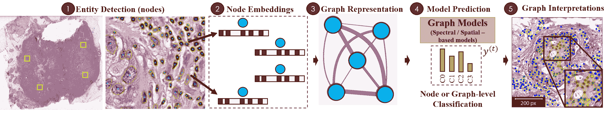

图 3：计算病理学中标准图形工作流的概述。WSI 图像首先转换为一个或多个图形。1. 实体可以是细胞核、补丁或组织区域。2. 节点特征包括手工制作或深度学习特征，用于表征实体。3. 边缘编码实体之间的内在关系（空间或语义）。4. 图编码和分类（节点级或图级预测）：图形表示通过 GNN 及其变体（如 ChebNet、GCN、GraphSAGE、GAT 和 GIN）处理，包括不同的图池策略（全局或层次池）。5. 图解释：一组 GNN 模型解释工具，如图注意力或事后图解释器（例如 GNNExplainer 和 GraphGrad-CAM）。

## II 图表示学习

在数字病理学中：背景

将患者的组织病理图像转换为图形，以编码细胞和组织的空间背景，这一方法已被用于提高各种病理任务的预测准确性。图形表示后，基于 GNN 的模型和解释性方法使病理学家能够直接理解和推理结果。GNN 还可以通过适应不同的设计来服务于各种预测目的，如执行节点级和图级预测。

标准实体-图形病理工作流需要多个阶段，如节点和图形拓扑定义，以及 GNN 架构的选择。在本节中，我们提供了这些阶段的技术见解，这些阶段是计算病理学中图形分析所必需的：(1) 图形表示（实体、嵌入和边缘定义）；(2) 图模型（处理图结构的图形结构）；(3) 可解释性（如模型基础和事后解释的解释方法）。图 3 说明了具有上述阶段的传统框架。关于每个 GNN 模型的深入分析可以在处理图形架构的调查论文中找到[11, 20]。

### II-A 组织病理学图形表示

#### II-A1 基础知识

图可以用 $G=(\mathcal{V},\mathcal{E},W)$ 表示，其中 $V$ 是一个包含 $|\mathcal{V}|=n$ 个节点的顶点集合，$\mathcal{E}$ 表示连接这些节点的边的集合。$\mathcal{V}$ 中的数据可以用特征矩阵 $\mathrm{X}\in\mathbb{R}^{n\times d}$ 表示，其中 $n$ 和 $d$ 表示输入特征维度。$W\in\mathbb{R}^{n\times n}$ 是一个二进制或加权邻接矩阵，描述 $\mathcal{V}$ 中任意两个节点之间的连接，其中第 i 行第 j 列的 $W$ 条目表示第 i 个和第 j 个节点之间连接的重要性，记作 $w_{ij}$。常用的确定 $W$ 条目 $w_{ij}$ 的方法包括皮尔逊相关图、K 最近邻（KNN）方法和基于距离的图 [48]。一般来说，GNNs 学习一个特征变换函数 $\mathrm{X}$ 并生成输出 $Z\in\mathbb{R}^{n\times d^{{}^{\prime}}}$，其中 $d^{{}^{\prime}}$ 表示输出特征维度。

在数字病理学中，呈现的图方法通常使用两种形式的数据之一。全切片图像（WSI），也称为虚拟显微镜，是通过将许多较小的图像块或条带组合并铺成单一图像而生成的高分辨率图像。组织微阵列（TMA）由石蜡块组成，这些石蜡块是通过提取圆柱形组织芯并将其插入到一个单一的接收块（微阵列）中，以精确的间距模式排列而成。通过这种技术，最多可以将 1000 个组织芯组装在一个石蜡块中，从而进行多重组织学分析。

#### II-A2 图构建

图表示法在数字病理学中已被用于多个任务，其中组织学图像被描述为实体图，图的节点和边分别表示生物实体和实体间的相互作用。实体可以是生物学定义的，如细胞核和组织区域，也可以是按块定义的。因此，为了进行计算病理学中的图分析，构建实体图需要以下预处理步骤。

##### 节点定义

WSI 通常包括显著的非组织区域。为了识别组织区域，前景使用高斯平滑和 OTSU 阈值分割 [49]。

最常见的图表示之一，细胞图，需要对细胞检测或分割进行模型训练和微调。为检测细胞核，已使用多种方法，如 Hover-Net [50]、CIA-Net [51]、UNet [52] 和 cGANs [53]，这些方法在多个器官细胞核分割数据集（MoNuSeg [54]、PanNuke [55]、CoNSep [50]）上进行了训练。也可以通过对检测到的细胞进行凝聚聚类 [56] 来计算这些实体。

图中的节点也可以通过从原始 WSI 中随机采样的固定大小的补丁（补丁图）表示，或者通过使用去除非组织区域的补丁选择方法[57]表示。可以使用颜色阈值从分割的组织中采样重要的补丁，其中具有相似特征（组织簇）的补丁被建模为一个节点。在组织数据集（例如 NCT-CRC-HE-100 [58]）上预训练的深度学习模型也被用来检测特定病理任务的肿瘤区域。

有意义的组织区域也被用作节点来捕捉组织分布（组织图）。为了分离组织结构，使用无监督算法（如简单线性迭代聚类（SLIC）[60]）获得的超像素[59]成为节点。

##### 节点嵌入

节点特征可以包括手工制作的特征，包括形态学和拓扑属性（例如形状、大小、方向、核强度，以及使用灰度共生矩阵的色度）。对于细胞图表示，一些研究包括从用于定位核的训练模型中提取的学习特征。

在补丁图方法中，深度神经网络用于自动学习来自细胞核和组织区域质心周围补丁的特征表示。如果实体大于指定的补丁大小，则处理实体内部的多个补丁，最终特征计算为补丁级深度特征的均值。一些研究聚合了来自相邻补丁的特征，并将其组合以获得中心节点表示，从而提高特征学习性能。作者采用了 CNN（MobileNetV2、DenseNet、ResNet-18 或 ResNet-50 [61]）和编码器-解码器分割模型（UNet [52]）用于深度特征提取。为了生成补丁级嵌入，使用了 ImageNet 预训练的 CNN 以及用于组织子区域分类任务的预训练 CNN。

##### 边缘定义

边缘配置编码了细胞或组织的交互，即两个相邻实体交互并形成边缘的可能性。该拓扑结构通常使用预定义的邻近阈值、最近邻规则、概率模型或 Waxman 模型[22]进行启发式定义。图拓扑结构也可以通过使用超像素的空间质心构建区域邻接图（RAG）[62]来计算。

#### II-A3 训练范式

从监督的角度来看，我们可以将图学习任务分类为不同的训练设置。这些方法也被用来从数据中提取有效的表示。

+   •

    监督学习设置提供标注数据进行训练。

+   •

    弱监督或部分监督学习指的是使用仅部分标注的示例来训练模型。

+   •

    半监督学习使用一小部分标注样本训练模型，然后为大量未标注样本生成伪标签，通过混合这两组样本来学习最终模型。

+   •

    自监督学习是一种无监督学习形式，在这种学习方式中，数据通过代理任务提供监督信号来学习表示。一旦表示被学习，就使用标注数据来微调表示。一些作为特征提取器的自监督方法包括对比预测编码 (CPC) [63]、纹理自编码器 (Deep Ten) [64] 和变分自编码器 (VAE) [65]。

### II-B 图神经网络模型

在图构建之后，实体图使用图结构数据的图深度学习模型进行处理，以执行分析。

GCNs 可以大致分为基于谱的方法[66, 67]和基于空间的方法[68]。基于谱的方法使用谱卷积神经网络，建立在图的傅里叶变换和图的标准化拉普拉斯矩阵之上。基于空间的方法定义了一种基于图节点之间空间关系的图卷积操作。

图卷积网络类似于 CNN，通过消息传递为每个节点的特征学习抽象特征表示，在消息传递过程中，节点逐步从其邻域聚合特征向量，以计算网络中下一个隐藏层的新特征向量。

一个基本的 GNN 由两个组件组成：AGGREGATE 操作可以聚合中心节点的邻居节点表示，而 COMBINE 操作则将邻域节点表示与中心节点表示结合起来，生成更新后的中心节点表示。GNN 的每个 $l$ 层的 Aggregate 和 Combine 可以定义如下：

|  | $h_{\mathcal{N}_{v}}^{(t)}=\text{AGGREGATE}^{(l)}\left(\big{\{}h_{u}^{l-1},\forall u\in\mathcal{N}_{v}\big{\}}\right),$ |  | (1) |
| --- | --- | --- | --- |

其中 $h_{\mathcal{N}_{v}}^{(t)}$ 是邻域的聚合节点特征，$h_{u}^{l-1}$ 是节点 $v$ 的邻域 $\mathcal{N}(\cdot)$ 中的节点特征。

|  | $\leavevmode\resizebox{186.45341pt}{}{$h_{v}^{(t)}=\text{COMBINE}^{(l)}\left(h_{v}^{t-1},h_{\mathcal{N}_{v}}^{(t)}\right)=\sigma(W^{t}\cdot[h_{v}^{t-1}\&#124;h_{\mathcal{N}_{v}}^{t}])$},$ |  | (2) |
| --- | --- | --- | --- |

其中 $h_{v}^{(t)}$ 是第 $l$ 次迭代中的节点表示。$h_{v}^{(0)}=x_{v}$ 其中 $x_{v}$ 是节点的初始特征向量，$\sigma$ 表示逻辑 sigmoid 函数，$\|$ 表示向量连接。

网络结构和节点内容信息作为输入，GNN 的输出可以专注于以下列出的各种图分析任务：

+   •

    节点级预测：在节点级操作的 GNN 计算图中每个节点的值，因此适用于节点分类和回归目的。在节点分类中，任务是预测图中每个节点的标签。为了计算节点级预测，将节点嵌入输入到多层感知器（MLP）中（见图 4）。

+   •

    图级预测：指的是 GNN 对整个图预测一个单一值。这通常用于分类整个图，或计算图之间的相似性。为了计算图级预测，输入到一个池化过程中的节点嵌入与节点级预测中使用的相同，然后是一个独立的 MLP（见图 5）。

在以下小节中，我们将更详细地描述在数字病理分析方法中考虑的 GNN 架构。不同的 GNN 变体采用不同的聚合器从每个节点的邻居处获取信息，以及不同的技术来更新节点的隐藏状态。在 GNN 中，参数的数量取决于节点和边特征的数量，因为它们的聚合是通过学习得到的。

#### II-B1 ChebNet

谱基 GCNs 的卷积操作在傅里叶域中通过确定图拉普拉斯算子的特征分解来定义[69]。标准化图拉普拉斯算子定义为$L=I_{N}-D^{-1/2}AD^{-1/2}=U\Lambda U^{T}$（$D$是度矩阵，$A$是图的邻接矩阵），其中$U$的列是特征向量矩阵，$\Lambda$是特征值的对角矩阵。该操作可以定义为将信号$x\in\mathbb{R}^{N}$（每个节点的标量）与参数为$\theta\in\mathbb{R}^{N}$的滤波器$g_{\theta}=\text{diag}(\theta)$进行相乘，

|  | $g_{\theta}\star x=Ug_{\theta}(\Lambda)U^{T}x.$ |  | (3) |
| --- | --- | --- | --- |

Defferrard 等人[66]提出了一种 Chebyshev 谱 CNN（ChebNet），它通过截断的 Chebyshev 多项式来近似谱滤波器，避免了计算拉普拉斯矩阵的特征向量，从而减少了计算成本。使用了在$\tilde{L}$上评估的 Chebyshev 多项式$T_{m}(x)$。因此，操作定义为，

|  | $g_{\theta}\star x\approx\sum_{m=0}^{M-1}\theta_{m}T_{m}(\tilde{L})x,$ |  | (4) |
| --- | --- | --- | --- |

其中 $\tilde{L}$ 是一个对角矩阵，缩放特征值定义为 $\tilde{L}=\nicefrac{{2L}}{{\lambda_{\text{max}}}}-I_{N}$。$\lambda_{\text{max}}$ 表示 $L$ 的最大特征值。切比雪夫多项式定义为 $T_{m}(x)=2xT_{k-1}(x)-T_{k-2}(x)$，其中 $T_{0}(x)=1$ 和 $T_{1}(x)=x$。

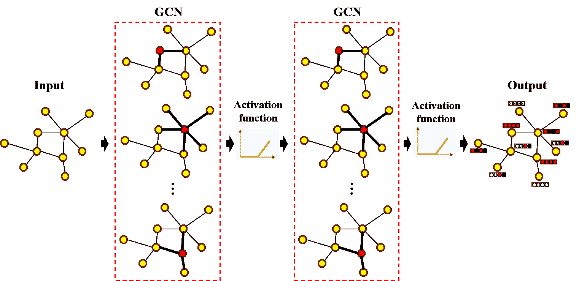

图 4：节点级分类的图架构表示。重建自 [11]。

#### II-B2 GCN

GCN 是一种基于谱的 GNN，具有均值池化聚合。Kipf 和 Welling [67] 使用切比雪夫网络的局部一阶近似提出了 GCN。它将层级卷积滤波器限制为 $K=1$，并使用 $\lambda\approx 2$ 的进一步近似，以避免过拟合并限制参数数量。因此，方程 4 可以简化为，

|  | $g_{\theta}\star x\approx\theta_{0}^{{}^{\prime}}x+\theta_{1}^{{}^{\prime}}x(L-I_{N})x=\theta_{0}^{{}^{\prime}}x+\theta_{1}^{{}^{\prime}}D^{-1/2}AD^{-1/2}x.$ |  | (5) |
| --- | --- | --- | --- |

这里，$\theta_{0}^{{}^{\prime}},\theta_{1}^{{}^{\prime}}$ 是两个不受约束的变量。GCN 进一步假设 $\theta=\theta_{0}^{{}^{\prime}}=-\theta_{1}^{{}^{\prime}}$，从而得到以下图卷积的定义：

|  | $g_{\theta}\star x\approx\theta(I_{N}+D^{-1/2}AD^{-1/2})x$ |  | (6) |
| --- | --- | --- | --- |

对信号 $X\in\mathbb{R}^{N\times C}$ 的定义，其中 $C$ 是输入通道，$F$ 是特征图滤波器，可以概括为以下形式，

|  | $Z=\tilde{D}^{-1/2}\tilde{A}\tilde{D}^{-1/2}X\Theta,$ |  | (7) |
| --- | --- | --- | --- |

其中 $\Theta\in\mathbb{R}^{C\times F}$ 是由滤波器组参数形成的矩阵，$Z\in\mathbb{R}^{N\times F}$ 是通过卷积获得的信号矩阵。从基于空间的角度来看，方程 7 被重新表述为 [70] 中的消息传递层，它按照以下方式更新节点的表示 $x_{i}^{k}$：

|  | $\begin{split}m_{i}^{k+1}=\sum_{j\in N(i)\cup i}\frac{x_{j}^{k}}{\sqrt{&#124;N(J)&#124;&#124;N(i)&#124;}},\\ x_{i}^{k+1}=\sigma(W^{k}m_{i}^{k+1}),\end{split}$ |  | (8) |
| --- | --- | --- | --- |

其中 $m_{i}^{k}$ 是消息传递迭代的输出，$|N(J)|$ 和 $|N(i)|$ 分别表示节点 $j$ 和 $i$ 的节点度，$W^{k}$ 表示特定层的可训练权重矩阵，$\sigma$ 是一个非线性函数。

#### II-B3 GraphSAGE

GraphSAGE 是一种空间-GCN，它使用带有最大池化聚合的节点嵌入。Hamilton 等人 [68] 提供了一种 GCN 扩展，用于具有可训练聚合函数的归纳无监督表示学习，而不是应用于邻域的简单卷积。作者提出了一种批量训练算法，用于节省内存，但牺牲了时间效率。在 [68] 中提出了三种聚合函数：逐元素均值、LSTM 和最大池化。均值聚合器是来自传导性 GCN 框架 [67] 的卷积操作的近似。LSTM 经过调整，以对无序集合进行操作，通过对节点的邻居进行排列。在池化聚合器中，每个邻居的隐藏状态通过一个全连接层，然后对节点邻居的集合应用最大池化操作。这些聚合函数表示为，

|  | $h_{\mathcal{N}_{v}}^{t}=\text{max}\big{\{}\sigma(W_{\text{pool}}h_{u}^{t-1}+b_{\text{pool}}),\forall u\in\mathcal{N}_{v}\big{\}},$ |  | (9) |
| --- | --- | --- | --- |

其中 $\mathcal{N}_{v}$ 是节点 $v$ 的邻域集合，$W_{\text{pool}}$ 和 $b_{\text{pool}}$ 是待学习的参数，$\text{max}\{\cdot\}$ 是逐元素的最大值。因此，按照公式 8 中的消息传递公式，节点表示根据以下方式更新，

|  | $\begin{split}m_{i}^{k+1}=MEAN_{j\in N(i)\cup i}(x_{j}^{k}),\\ x_{i}^{k+1}=\sigma(W^{k}m_{i}^{k+1}),\end{split}$ |  | (10) |
| --- | --- | --- | --- |

#### II-B4 GAT

受到自注意力机制 [71] 的启发，图注意力网络 (GAT) [72] 将注意力机制引入传播步骤中，通过修改卷积操作实现。GAT 是一种空间-GCN 模型，它将掩蔽自注意力层集成到图卷积中，并使用神经网络架构学习邻居特定的权重。Veličković 等人 [72] 通过堆叠一个单一的图注意力层 $a$ 来构建图注意力网络，该层是一个单层前馈神经网络，由权重向量 $\vec{a}\in\mathbb{R}^{2F^{i}}$ 参数化。该层通过以下方式计算节点对 $(i,j)$ 的注意力机制中的系数，

|  | $\alpha_{i,j}=\frac{\text{exp}(\text{LeakyReLu}(\vec{a}^{T}[W\vec{h}_{i}\mathbin{\&#124;}W\vec{h}_{j}]))}{\sum_{k\in N_{i}\mathbb{N}}\text{exp}(\text{LeakyReLu}(\vec{a}^{T}[W\vec{h}_{i}\mathbin{\&#124;}W\vec{h}_{k}]))},$ |  | (11) |
| --- | --- | --- | --- |

其中$\mathbin{\|}$表示连接操作。注意力层以一组节点特征$h=\{\vec{h_{1}},\vec{h_{2}},...,\vec{h_{N}}\},\vec{h_{i}}\in R^{F}$作为输入，其中$N$是输入图的节点数量，$F$是每个节点的特征数量，并生成一组新的节点特征$h^{{}^{\prime}}=\{\vec{h_{1}}^{{}^{\prime}},\vec{h_{2}}^{{}^{\prime}},...,\vec{h_{N}}^{{}^{\prime}}\},\vec{h_{i}}^{{}^{\prime}}\in R^{F}$作为输出。为了生成更高层次的特征，作为初步步骤，应用一个由权重矩阵$W\in R^{F^{\prime}*F}$参数化的共享线性变换到每个节点，随后对每个节点应用掩码注意力机制，得到以下分数，

|  | $e_{ij}=a(W\vec{h_{i}},W\vec{h_{j}}),$ |  | (12) |
| --- | --- | --- | --- |

这表示节点$j^{{}^{\prime}}$特征对节点$i$的重要性。每个节点的最终输出特征可以通过应用非线性函数$\sigma$获得，

|  | $h_{i}^{{}^{\prime}}=\sigma(\sum_{j\in N_{i}}\alpha_{ij}Wh_{j}).$ |  | (13) |
| --- | --- | --- | --- |

该层还使用多头注意力来稳定学习过程。$K$个不同的注意力头被应用于并行计算互相独立的特征，然后将这些特征连接起来。

注意力系数用于根据以下消息传递公式更新节点表示，

|  | $\begin{split}m_{i}^{k+1}=\sum_{j\in N(i)}\alpha_{i,j}^{k}W^{k}x_{j}^{k},\\ x_{i}^{k+1}=\sigma(\alpha_{i,j}^{k}W^{k}x_{j}^{k}+m_{i}^{k+1}),\end{split}$ |  | (14) |
| --- | --- | --- | --- |

#### II-B5 GIN

图同构网络（GIN）[73]是一个空间-GCN，通过对邻居节点的表示进行求和来聚合邻域信息。基于同构图的模型旨在解释具有不同节点和边的图。节点$i$自身的表示随后通过 MLP 进行更新，

|  | $\begin{split}m_{i}^{k+1}=\sum_{j\in N(i)}x_{j}^{k},\\ x_{i}^{k+1}=F((1+\epsilon)\cdot x_{i}^{k}+m_{i}^{k+1}),\end{split}$ |  | (15) |
| --- | --- | --- | --- |

其中$F$是 MLP，$\epsilon$可以是可学习的参数或固定的。GIN 的聚合和读出函数是单射的，因此设计上旨在实现最大辨别能力[73]。

#### II-B6 组织病理学中的其他 GNN 架构

其他在数字病理学中用于实体图评估的 GNN 架构包括：

+   •

    边缘图神经网络（EGNN）[38, 74]: 在利用网络中的图结构时包含边缘特征。

+   •

    鲁棒空间滤波（RSF）[30, 28, 75]: 这些基于空间的模型在处理异质图时更加灵活，因为图输入可以很容易地纳入聚合函数中。

+   •

    自适应 GraphSAGE[27, 39]: 具有更有效地学习节点间嵌入特征能力的图网络，通过使用可学习的模式自适应地聚合每个节点的多级嵌入特征。

+   •

    跳跃知识网络（JK-Net）Xu 等人[76] 提出了跳跃知识（JK）方法，通过为每个节点自适应地利用不同的邻域范围，以更好地表示特征。

+   •

    特征增强空间 GCN（FENet）[41, 73]: 该模型旨在分析非同构图，这与严格共享相同邻接矩阵的同构图不同。特征增强机制自适应地从不同的图卷积层中选择节点表示。该模型采用求和池化来捕捉整个图表示的全部结构信息。

+   •

    多尺度图小波神经网络（MS-GWNN）[29, 77]: 该谱模型利用图小波的定位特性进行多尺度分析，具有多种缩放参数并行处理，提供高效性和良好的图卷积解释性。

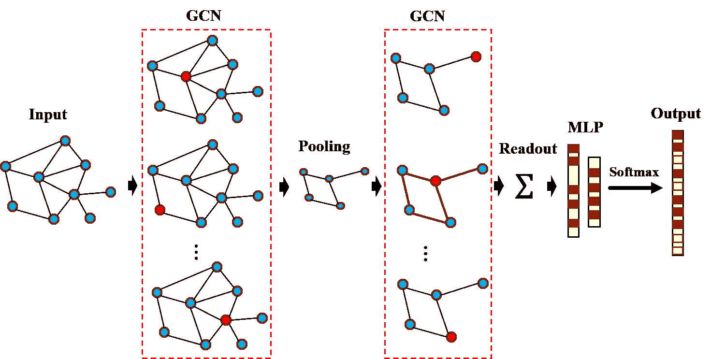

图 5：图模型用于图级分类的表示。重新创建自[11]。

### II-C 图池化

不同的图池化策略已被开发出来，以最小化图的大小，从而学习分层特征以改善图级分类，并减少计算复杂性。

##### 全局池化

图上最基本的信号池化类型是全局池化。文献中也称为读出层。类似于卷积神经网络（CNN），均值、最大值和求和函数通常作为基本池化方法。其他方法则不使用这些简单的聚合器，而是将顶点表示转换为排列不变的图级表示或嵌入。特别是，Li 等人[78] 提出了一个全局注意力池化系统，使用软注意力机制来确定哪些节点与当前图级任务相关，并从所有节点返回池化特征向量。

##### 分层池化

图卷积网络（GCN）中的图池化层将多个顶点的信息汇聚到一个顶点，以减少图的大小并扩展图滤波器的感受野。许多图分类方法使用分层池化方法，并结合最终的全局池化或读出层来表示图，如图 5 所示。下面我们概述了在数字病理学中常用的分层池化技术。

+   •

    DiffPool：Ying 等人[79]提出了可微图池化操作符（DiffPool），它使用另一种图卷积层生成每个节点的分配矩阵（即 DiffPool 不仅仅对图中的节点进行聚类，而是学习一个集群分配矩阵）。

+   •

    SAGPool 由 Lee 等人[80]提出的自注意图池化（SAGPool）是一种分层池化方法，对图中的节点嵌入进行局部池化操作。池化模块考虑了节点特征和图拓扑，通过自注意力机制学习池化特征，从而降低计算复杂度。

### II-D 图解释

图表示嵌入了生物实体及其相互作用，但其在数字病理学中的解释性较少探索。虽然细胞及其空间相互作用可以非常详细地看到，但识别相关的视觉特征却很困难。为了对模型输出进行尽职调查，并改善对疾病机制和疗法的理解，医学界需要可解释的模型。

两种最流行的解释方法是基于模型的和事后解释。前者约束模型，使其能够快速提供关于已发现关系的有意义细节（如稀疏性、模块化等）。在这里，可以访问和使用内部模型信息（如权重或结构信息）来推断训练实例之间的群体级模式。后者则旨在提取关于模型中学习到的关系的信息。这些事后方法通常用于分析单个特征输入和输出对，将解释性限制在单个样本级别。

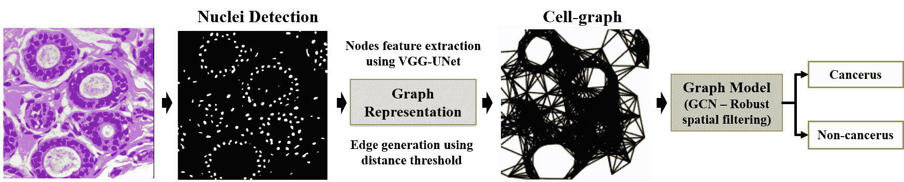

图 6：基于细胞图的表示。使用全卷积网络进行细胞核检测。然后计算边和顶点特征，以获得输入到 GCN 的实体图表示，用于癌症分类。重新创建自[28]。

#### II-D1 注意力机制

图结构数据既可能庞大又嘈杂，图的各部分重要性也不尽相同。因此，注意力机制可以引导网络集中在输入的最相关部分，抑制无信息特征，减少计算成本并提高准确性。例如，基于门控的注意力机制[81]控制每个特征的表达能力。注意力也被用作解释技术，其中注意力权重突出显示节点和边的相对重要性，并可以用来发现已经学习到的潜在依赖关系。GAT 模型的激活图和梯度敏感度用于解释群体和个体层面的显著输入特征。

在一个包含注意力机制的图模型中，选定的图层与一个注意力层相连接，所有注意力层与网络一起进行联合训练。可以用梯度基方法学习的传统注意力机制[82]可以表述为：

|  | <math   alttext="\begin{split}u_{t}=\tanh(Wh_{t}+b),\\ \alpha_{t}=\dfrac{\exp(u_{t}^{T}u_{w})}{\sum_{j=1}^{n}\exp(u_{t}^{T}u_{w})},\\

\( s_{t}=\sum_{t}\alpha_{t}h_{t} \)，其中 \( u_{t}=\tanh(Wh_{t}+b) \)，\( \alpha_{t}=\dfrac{\exp(u_{t}^{T}u_{w})}{\sum_{j=1}^{n}\exp(u_{t}^{T}u_{w})} \)，\( s_{t}=\sum_{t}\alpha_{t}h_{t} \)。

其中 $h_{t}$ 是一层的输出；$W$、$u_{w}$ 和 $b$ 是可训练的权重和偏差。通过估计 $u_{t}$ 和 $h_{t}$ 之间的相似性来衡量 $h_{t}$ 中每个元素的重要性，其中 $u_{t}$ 是随机初始化的。$\alpha_{t}$ 是一个 softmax 函数。分数乘以隐藏状态以计算加权组合 $s_{t}$（注意力加权的最终输出）。

#### II-D2 图解释器

文献中提出了几种后置特征归因图解释器，包括激活反向传播 [83]、基于节点修剪的解释器（GNNExplainer）[84]、基于梯度的解释器（GraphGrad-CAM [85] 和 GraphGrad-CAM++ [86]）、逐层相关传播解释器（GraphLRP）[87, 88] 和深度图映射器 [89]。

表 II：计算病理学中的应用和图模型总结。

| 作者 | 主题 | 应用 | 实体图 | GNN 模型 + 解释器 | 输入；训练（节点检测/嵌入）；训练（GNN 模型/病理任务）；数据集；附加备注 |
| --- | --- | --- | --- | --- | --- |
| Jaume 等人（2021）[33] | 分类 | 乳腺癌 | CG | GIN + 后置解释器 | WSI；有监督；有监督；BRACS [17]（5 类）；后置解释器：GNNExplainer、GraphGrad-CAM、GraphGrad-CAM++、GraphLRP。 |
| Jaume 等人（2020）[34] | 分类 | 乳腺癌 | CG | GIN + CGExplainer | WSI；有监督；有监督；BRACS [17]（5 类）；基于 GNNExplainer 的定制细胞图解释器。 |
| Sureka 等人（2020）[30] | 分类 | 乳腺癌 / 前列腺癌 | CG | GCN，RSF + 注意力/节点遮挡 | WSI，TMAs；有监督；有监督；乳腺癌：BACH [9]（2 类），前列腺癌：TM [90]（2 类）；Gleason 级别。 |
| Anand 等人（2020）[28] | 分类 | 乳腺癌 | CG | GCN，RSF | WSI；有监督；有监督；BACH [9]（4 类）。 |
| Studer 等人（2021）[38] | 分类 | 结直肠癌 | CG | GCN，GraphSAGE，GAT，GIN，ENN，JK-Net | WSI；有监督；有监督；pT1-腺体图 [91]（2 类）；图级输出。全局加、均值和最大池化的串联）。肠腺体的发育不良。 |
| Zhou 等人（2019）[39] | 分类 | 结直肠癌 | CG | 自适应 GraphSAGE，JK-Net，图聚类 | WSI；有监督；有监督；CRC 数据集 [92]（3 类）；图级输出。基于图聚类方法的细胞层次表示（来自 DiffPool）。 |
| Wang 等人（2020）[15] | 分类 | 前列腺癌 | CG | GraphSAGE，SAGPool | TMA；自监督；弱监督；UZH 前列腺 TMAs [93]（2 类）；图级输出。等级分类（低风险和高风险）。 |
| Ozen et al. (2020) [35] | ROI 检索 | 乳腺癌 | PG | GCN, DiffPool | WSI; 监督; 自监督; Hacettepe 大学病理科（私人）(4 类); 组织病理图像检索（切片级和 ROI 级）。 |
| Lu et al. (2020) [36] | 分类 | 乳腺癌 (HER2, PR) | TG | GIN | WSI; 监督; 监督; TCGA-BRCA [94] (2 类); 图级。人类表皮生长因子受体 2 型 (HER2) 和孕激素受体 (PR) 状态。 |
| Aygüneş et al. (2020) [26] | 分类 | 乳腺癌 | PG | GCN | WSI; 监督; 弱监督; Hacettepe 大学病理科（私人）(4 类)。ROI 级分类。 |
| Ye et al. (2019) [37] | 分类 | 乳腺癌 | PG | GCN | WSI; 监督; 监督; BACH [9] (4 类); 基于 ROI 分割图的图构建。 |
| Zhao et al. (2020) [40] | 分类 | 结直肠癌 | PG | ChebNet, SAGPool | WSI; 自监督; 弱监督; TCGA-COAD [95] (2 类); 多实例学习。图级输出。 |
| Raju et al. (2020) [27] | 分类 | 结直肠癌 | TG | 自适应 GraphSage + 注意力 | WSI; 自监督; 弱监督; MCO [96] (4 类); 多实例学习。聚类嵌入（Siamese 架构）；肿瘤节点转移分期。 |
| Ding et al. (2020) [41] | 分类 | 结直肠癌 | PG | Spatial-GCN (FENet) | WSI; 监督; 监督; TCGA-COAD 和 TCGA-READ [97] (2 类); 遗传突变预测。 |
| Adnan et al. (2020) [43] | 分类 | 肺癌 | PG | ChebNet, GraphSAGE + 全局注意力池化 | WSI; 监督; 监督; TCGA-LUSC [98] (2 类), MUSK1 [99]; 邻接学习层。多实例学习。 |
| Zheng et al. (2019) [44] | 检索 | 肺癌 | PG | GNN, DiffPool (GNN-Hash) | WSI; 监督; 相似性（汉明距离）；ACDC-LungHP [98]; 哈希方法和二进制编码。组织病理图像检索。 |
| Li et al. (2018) [45] | 分类 | 肺癌 | PG | ChebNet + 注意力 | WSI; 自监督; 监督; TCGA-LUSC [98] (2 类), NLST [100] (2 类); 生存预测。 |
| Wu et al. (2019) [47] | 分类 | 皮肤癌 | PG | GCN | WSI; 监督; 弱监督和半监督; 从 2 家不同医院收集的 BCC 数据（私人）(4 类)。 |
| Anklin et al. (2021) [42] | 分割 / 分类 | 前列腺癌 | TG | GIN (SegGini) + GraphGrad-CAM | TMA, WSI; 监督; 弱监督; UZH 前列腺 TMA [93] (4 类), SICAPv2 [101] (4 类); Gleason 级别，后验解释性。 |
| Pati 等（2021）[31] | 分类 | 乳腺癌 | CG, TG, HR | GIN-PNA（HACT-Net）+ GraphGrad-CAM | WSI；监督；监督；BRACS [17]（7 类），BACH [9]（4 类）；细胞到组织的层级结构。 |
| Pati 等（2020）[17] | 分类 | 乳腺癌 | CG, TG, HR | GIN（HACT-Net） | WSI；监督；监督；BRACS [17]（5 类）；细胞到组织的层级结构。 |
| Zhang 和 Li（2020）[29] | 分类 | 乳腺癌 | PG, HR | MS-GWNN | WSI；监督；监督；BACH [9]（4 类），BreakHis [102]（2 类）；多尺度图形特征学习（节点级和图形级预测）。 |
| Levy 等（2021）[16] | 回归 | 结直肠癌/淋巴瘤 | PG, HR | GAT，TDA + 图形映射器 | WSI；监督；监督；达特茅斯希切科克医学中心（私人）：结肠（9 类），淋巴（4 类）；分层表示。肿瘤侵袭评分和分期。 |
| Shi 等（2020）[46] | 分类 | 宫颈癌 | CCG | 融合 CNN-GCN | RGB；监督；半监督；SIPaKMed [103]（5 类），Motic [25]（7 类）；孤立细胞图像的群体分析。 |
| Shi 等（2019）[25] | 分类 | 宫颈癌 | CCG | 融合 CNN-GCN | RGB；监督；监督；SIPaKMed [103]（5 类），Motic [25]（7 类）；孤立细胞图像的群体分析。 |
| Chen 等（2020）[32] | 分类 | 肾癌 | CG | GraphSAGE, SAGPool + Attention | 融合：WSI+基因组；自监督；自监督；TCGA-GBMLGG，TCGA-KIRC [98]; 生存结果，集成梯度方法。 |
| 图形表示：细胞图（CG）；块状图（PG）；组织图（TG）；分层表示（HR）；簇心图（CCG） |

## III 图形深度学习的应用

在数字病理学中

本节中介绍的案例研究是根据所采用的图形表示方法和临床应用进行组织的。所有应用中使用的图形模型、训练范式和数据集详见表 II。我们不是提供文献的详尽回顾，而是展示关于预处理、图形构建和所采用的图形模型的主要亮点，以及它们在处理各种病理任务中的好处。

随着 TMA 和 WSI 扫描技术的发展，以及对大量数字化组织图像数据集的访问，肿瘤定位、生存预测和癌症复发预测的深度学习方法取得了显著进展 [104]。细胞的各种类型的空间排列（宏观特征）和特定细胞的细节（微观特征）对于癌症的检测和表征都是重要的。因此，有价值的组织病理数据表示必须捕捉微观特征和宏观空间关系。图形是强大的表示数据结构，因其能够表示组织结构而在组织病理图像分析中引起了广泛关注 [105]。从基于像素的研究转向基于实体的研究有可能提高深度学习技术在数字病理学中的可解释性，这对诊断具有重要意义。

### III-A 细胞图表示

这些工作大多遵循一个类似的框架，其中通过将细胞作为实体引入细胞图以捕捉细胞微环境。图像被转换为图形表示，识别出的细胞的位置作为图形顶点，边缘则根据空间距离构建。细胞级特征被提取为初始节点嵌入。细胞图被输入到图卷积网络（GCN）中以执行图像级分类。

#### III-A1 乳腺癌

乳腺癌是最常被诊断的癌症，并且在女性中登记了最多的癌症死亡病例。大多数乳腺病变在从良性到侵袭性的一系列癌症类别中被诊断。癌症诊断和乳腺癌的检测是数字病理学分析中机器学习和计算机视觉最常见的应用之一。卷积神经网络（CNN）已被用于乳腺癌诊断中的各种数字病理学任务，例如细胞核分割和分类，以及肿瘤检测和分期。然而，这些基于补丁的方法并未明确捕捉细胞核间的关系，且限制了对全球信息的访问。

Anand 等人[28] 提出了使用 GCN 来对由其组成细胞的图表示的 WSIs 进行分类。通过局部图像描述符将微观级别特征（核形态）作为顶点特征纳入，同时基于相邻核之间的欧氏距离映射将宏观级别特征（腺体形成）作为边属性纳入。顶点特征由平均 RGB 强度、形态特征和从应用于核质心周围窗口的预训练 CNN 中提取的学习特征表示。最终，通过将细胞图作为输入传递给以监督方式训练的 GCN 来对每个组织图像进行分类。作者采用了一种被称为鲁棒空间滤波（RSF）[75] 的空间 GCN，这种 GCN 可以接受异质图作为输入。该框架如图 6 所示。作者展示了与传统的基于补丁的 CNN 方法相比，使用乳腺癌组织挑战赛（BACH）数据集[9]对患者进行癌性或非癌性分组的竞争性表现。

Sureka 等人[30] 将组织学组织建模为一个核的图，并采用带有注意机制和节点遮挡的 RSF 与 GCN[75] 来突出图像中相对的细胞贡献，这符合病理学家使用的心理模型。在第一种方法中，作者遮挡了核簇，以评估正确类别概率的下降，同时还包括基于[106] 的方法来学习增强的顶点和边特征。在第二种方法中，引入了一个注意层，在第一次池化操作之前，用于可视化乳腺癌 BACH 数据集的二分类和前列腺癌[90] 数据集的 Gleason 级别分类中重要的核。

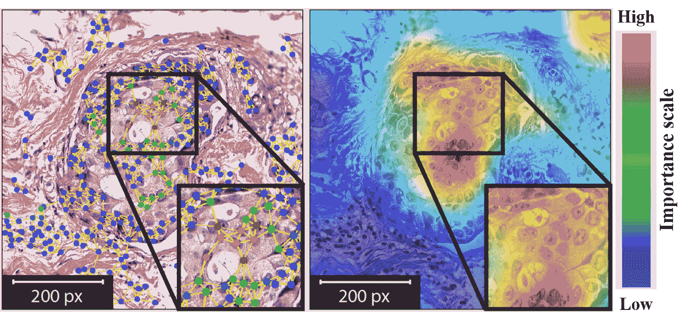

图 7：对于导管癌，图示了基于图形（左）和基于像素（右）的可解释性算法给出的解释示例。重绘自[33]。

受到 CNN 模型在图像上预测的可解释性技术的启发，多个解释器已被应用于数字病理学。然而，像素级解释未能编码肿瘤宏观环境信息，导致重要位置的视觉热图定义不明确，如图 7 所示。因此，图表示对诊断和解释都很相关。为病理学家生成直观的解释对于量化解释的质量至关重要。为此，Jaume 等人 [33] 引入了一种基于实体的图分析框架，以提供病理上可理解的概念（即使图决策对病理学家可理解）。作者提出了一套基于病理可测量细胞属性的定量指标，以表征乳腺癌亚型细胞图表示中的解释技术。

在 [33] 中，作者首先将组织学图像转换为细胞图，然后使用 GIN 模型映射到相应的类别级别。接着，事后图解释器为每个实体图生成解释。最后，使用提出的指标评估在识别推动预测的细胞核（细胞核重要性图）中解释质量。此分析考虑了四种图解释器：GNNExplainer [84]，GraphGrad-CAM [85]，GraphGrad-CAM++ [86]，以及 GraphLRP [87]。在乳腺癌亚型（BRACS）数据集 [17] 上的结果确认 GraphGrad-CAM++ 与病理学家的整体一致性最好。提出的指标，包括领域特定的用户可理解术语，可用于图解释性的定量评估。

Jaume 等人 [34] 专注于乳腺癌亚型分类中细胞及细胞相互作用的分析，并引入了一种实例级的事后图剪枝解释器，以从 BRACS 数据集中识别决定性细胞和相互作用。为了创建细胞图，使用分割算法检测细胞核，并提取包括形状、纹理和颜色属性在内的手工特征来表示每个细胞核。细胞图拓扑使用 KNN 算法，并基于空间上接近的细胞编码生物学关系的假设，因此应该创建一个边。细胞图通过 GIN 模型处理，之后使用 MLP 预测癌症阶段。

Jaume 等人[34]设计了一个细胞图解释器（CGExplainer），基于 GNNExplainer，旨在去除冗余和无信息的图组件，结果的子图将负责特定类别模式，从而有助于疾病理解。该模块旨在学习一个在节点级别激活或停用图部分的掩模。图 8 提供了解释器模块的概述。提出的解释器被证明修剪了大量节点和边，以提取有价值的信息，同时保留预测准确性（例如，解释保留了相关的肿瘤上皮细胞核用于癌症诊断）。

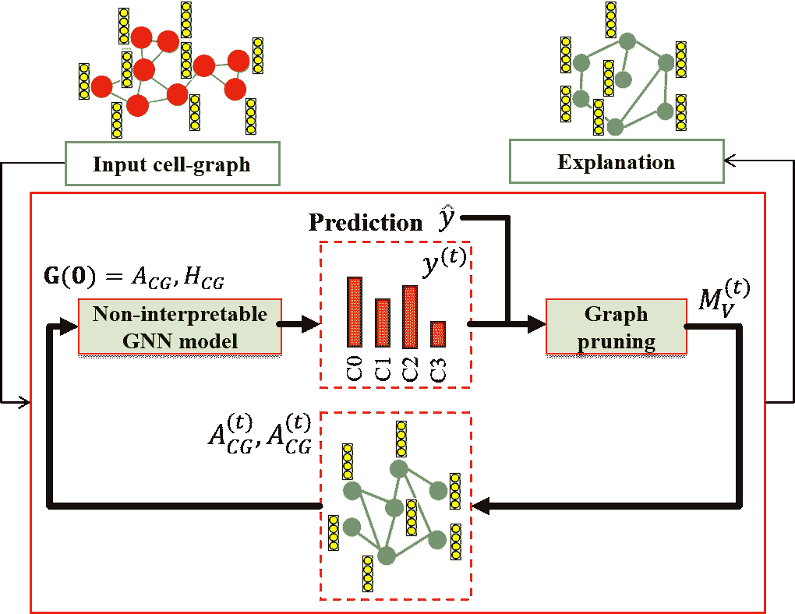

图 8：细胞图解释器（CGExplainer）：基于图修剪优化的定制后处理图解释器。重新制作自[34]。

#### III-A2 结直肠癌

结直肠癌（CRC）分级是一项关键任务，因为它在确定适当的后续治疗中发挥了关键作用，并且还指示了患者的整体预后。癌症的分级例如通过评估肿瘤中的腺体形成程度来确定。然而，基于自动 CNN 的 CRC 分级方法通常使用的图像块未能包括整个组织样本的微观结构信息，也未能捕捉组织形态学与腺体结构之间的对应关系。为建模核特征及其细胞交互，Zhou 等人[39]提出了一种用于分级 CRC 的细胞图模型，其中每个节点由原始图像中的一个细胞核表示，细胞交互通过基于节点相似性的图边来捕捉。使用核实例分割模型来检测细胞核并提取准确的节点特征，包括核形状和外观特征。诸如质心坐标、细胞核强度和从灰度共现矩阵中提取的相似度等空间特征被用作预测癌症分级的描述符。为了减少基于相对节点间距的节点和边的数量，使用了额外的采样策略。

为了进行图级分类，[39]的作者提出了自适应 GraphSAGE 模型，该模型受 GraphSAGE[68]和 JK-Net[76]的启发，以获取多层级特征（即捕捉不同尺度的腺体结构）。为了实现多尺度特征融合，自适应 GraphSAGE 采用了一种注意力技术，允许网络自适应生成有效的节点表示。

一种图聚类操作，可以看作是 DiffPool [79] 的扩展，用于根据细胞的外观和组织类型进行分组，并提取更抽象的特征以进行层次表示。然而，由于通过这种方法无法获取组织层级，因此表示中不包括高级组织特征。基于腺体分化的程度，图模型将每张图像分类为正常、低级别或高级别。与传统 CNN 相比，所提出的模型通过结合核特征和图级特征实现了更好的准确性。

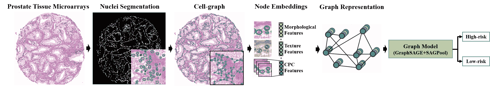

图 9：已检测到的细胞核被分割，并使用每个细胞核的质心构建图。对于每个节点，提取了形态学、纹理和对比预测编码特征，并使用 GCNs 作为图表示。重建自 [15]。

胶质腺体的异常在 pT1 期结直肠癌中尤为重要，这是侵袭性结直肠癌的最早阶段。Studer 等人 [91] 引入了 pT1 腺体图（pT1-GG）数据集，该数据集包含了健康和异常腺体的细胞图。在这项工作中，作者使用标记的细胞图和图编辑距离（GED）建立了腺体分类的基准，GED 是一种对图之间相似度的容错测量。该技术是将改进版的二分图匹配方法（BP2） [107]与 KNN 算法结合起来进行分类。

后来，同样的作者研究了不同的基于图的架构 [38]，用于在 pT1-GG 数据集上对健康腺体组织和异常腺体区域进行分类。评估的用于细胞图分类的 GNN 架构包括 GCN [67]、GraphSAGE [68]、GAT [72]、GIN [73]、EGNN [74] 和 1 维 GNN [108]。所有模型都使用了三个图卷积层进行训练，其中 GraphSAGE 和 GCN 还使用了跳跃知识（JK） [76]，通过在不同层之间聚合表示来实现自适应的邻域范围。使用全局和池化、全局均值池化和全局最大池化的连接来获得图级输出，随后使用 MLP 对输入图进行分类。结果表明，基于图的深度学习方法优于传统的基于图的方法和基于 CNN 的方法。然而，需要强调的是，每个节点仅与其两个空间上最接近的邻居连接，导致在消息传递过程中信息共享非常受限。

#### III-A3 前列腺癌

常用的 Gleason 评分基于肿瘤组织的结构模式和腺体的分布，用于确定前列腺癌的侵袭性。CNN 已被用于组织学图像分类，包括 Gleason 评分分配，但 CNN 无法捕捉细胞之间的密集空间关系，并且需要详细的像素级注释进行训练。

为了分析前列腺 TMAs 中腺体的空间分布，Wang 等人[15] 提出了一种弱监督方法用于分级分类，并对低风险和高风险病例进行分层（Gleason 评分$<6$为正常组织；Gleason 评分$\geq 6$为异常组织或高风险）。作者对每张图像进行细胞核分割，并构建了一个以细胞核为节点、邻近细胞核之间的距离为边的细胞图，如图 9 所示。利用仅有图像级标签而非像素级标签的前列腺 TMAs，通过一种称为对比预测编码（CPC）[63]的自监督技术来识别高风险患者。通过提取形态学（面积、圆度）和纹理特征（差异性、均匀性）以及 CPC 学习中的特征来生成每个节点的特征。对图表示应用了 GraphSAGE 卷积和自注意力图池化（SAGPool）[80]，以从细胞核的全球分布、细胞形态和空间特征中学习。所提出的方法能够计算注意力分数，关注更重要的节点属性，并在不同层次上聚合信息。

### III-B Patch-graphs 和 Tissue-graphs 表示

大多数后续工作将病理图像转换为补丁图，其中节点是重要的补丁，边缘编码这些补丁之间的内在关系。这些补丁通过颜色基础、细胞密度或注意机制等方法进行采样。然后，CNN 用于从这些补丁中提取特征，以生成图表示的节点嵌入的特征向量。给定构建的图，使用图深度学习模型进行节点或图分类。重要的是区分组织图（生物学上定义的，捕捉相关的形态区域）和补丁图（连接感兴趣的补丁，每个补丁可以包含多个生物实体）。

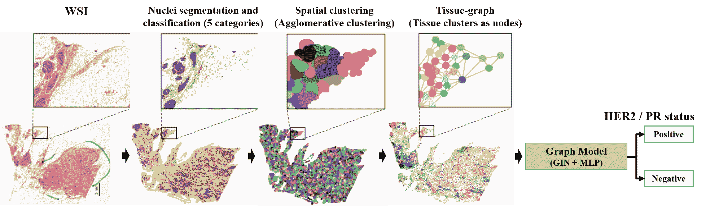

图 10：幻灯片图模型，该模型从核级别构建图到整个 WSI 级别。主要步骤如下：核的分割和分类；聚类；构建图和图分类。重建自[36]。

#### III-B1 乳腺癌

任意大小 ROI 的多类别分类是乳腺癌诊断过程中一个重要的问题。Aygüneş等人[26]提出通过基于图的 ROI 表示来结合局部上下文，涉及可变数量的补丁（节点）及其空间邻近关系（边）。使用 CNN 提取每个节点的特征向量，该节点由固定大小的 ROI 补丁表示。然后，为了在补丁之间传播信息并结合局部上下文信息，使用了两个连续的 GCN，它们还聚合补丁表示以将整个 ROI 分类到诊断类别中。分类是在补丁和 ROI 级别注释的弱监督方式下进行的，而没有访问补丁级标签。结果表明，在 Hacettepe 大学病理学系收集的私人数据上表现优于采用多数投票、学习融合和基础-倒数第二方法的 CNN 模型。

一些传统的基于 CNN 的模型建议联合分割图像的 ROI（感兴趣区域）和分类 WSI，这使分类器能更好地预测图像类别[109]。Ye 等人[37]通过 GCN 捕捉 ROI 图像的拓扑结构，其中使用包含高语义信息的图像补丁的分割掩膜构建图。每个图像补丁的分割掩膜是使用编码器-解码器语义分割框架获得的，其中每个像素被分类为 BACH[9]数据集中四类组织样本（正常、良性、原位和侵袭性）之一。图像补丁的组合分割掩膜产生了总的 ROI 分割掩膜。每个病变的面积比率计算为每个图像补丁中单位节点的值。然后，构建一个图来捕捉空间依赖关系，使用图像补丁分割掩膜的特征。最后，基于 GCN 学习的特征对 ROI 图像进行分类。

之前研究的一个局限是它们使用小的 WSI（全组织切片）补丁来构建图。Lu 等人[36]通过引入一个管道，从整个 WSI 中使用核级信息来构建图，克服了这一挑战，包括组织切片中的几何形状和细胞组织（称为组织学景观）。在构建图后，作者使用了 GIN 模型来预测人表皮生长因子受体 2（HER2）和孕激素受体（PR），这两者是乳腺癌预后的重要生物标志物。

在[36]中提出的方法包括四个步骤，如图 10 所示。该工作首先使用 Hover-Net[50] 同时对单个细胞核进行分割和分类，并提取它们的特征。然后，使用聚合聚类[56] 将空间上相邻的细胞核分组到簇中，从而减少下游分析的计算成本。利用这些簇，通过将组织簇分配给节点生成图，图的边编码 WSI 的细胞拓扑。最后，将从整个 WSI 生成的图用作 GCN 的输入，以预测 WSI 级别的 HER2 或 PR 状态。该方法的性能在 TCGA-BRCA[94] 数据集的苏木精-伊红 (H&E) 染色 WSI 图像上进行了评估，该数据集包含 608 个 HER2 阴性和 101 个 HER2 阳性样本，以及 452 个 PR 阳性和 256 个 PR 阴性样本。

基于内容的组织病理图像检索也已被研究用于数字病理学中的决策支持。该系统扫描预先存在的 WSI 数据库，查找病理学家感兴趣的区域，并返回相关区域以供病理学家比较。这些方法可以提供有价值的信息，包括专家对类似区域的诊断报告。检索方法也可以用于分类，考虑最可能的诊断[110]。然而，人工标注训练数据的数量限制了它们的能力。Ozen 等人[35] 提出了一种通用方法，将 GNN 与自监督训练方法相结合，使用对比损失函数而不需要标注数据。在这个框架中，固定大小的补丁及其空间邻近关系通过无向图进行表示。采用视觉表示的对比学习简单框架（SimCLR）[111] 来学习 ROI 的表示。通过对比损失，GNN 编码器和 MLP 投影头被训练以最大化表示之间的一致性。选择 GCN 作为模型配置，并由 DiffPool 操作跟随。

对于基于内容的检索任务，这种 GNN 在自监督环境中进行训练，用于提取 ROI 表示，其中提取的表示之间的欧几里得距离用于确定两个 ROI 的相似程度。定量结果表明，对比学习可以提高学习表示的质量，尽管不使用类别标签，却能够优于监督分类方法。

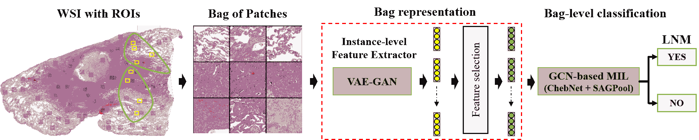

图 11：GCN 基于 MIL 方法的表示。一旦提取了区域的袋，进行实例级特征提取和选择，然后进行袋级分类。重建自 [40]。

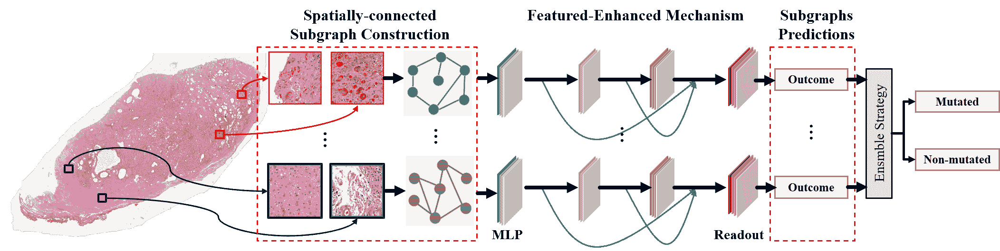

图 12：提出的 FENet 架构。对于每个 WSI，随机选择区域。每个区域对应于每个非同构子图中的一个节点，其中使用 CNN 提取节点属性。采用特征增强机制以考虑所有拓扑结构信息。采用集成方法使用多数投票来汇总所有子图的预测结果。重建自 [41]。

#### III-B2 结直肠癌

尽管基于 CNN 的方法在识别预测 CRC 重要区域方面具有实际优势，但它们没有考虑区域之间的空间关系，而这一点对于确定肿瘤的阶段至关重要。肿瘤的大小及其相对于其他组织区域的位置用于肿瘤淋巴结转移分期估计。此外，传统方法需要专家病理学家对每个全切片图像 (WSI) 进行注释。弱监督学习是一种应对医学影像稀疏注释的重要且潜在可行的解决方案。多实例学习 (MIL) 非常适合组织学切片分类，因为它旨在处理弱标注的数据 [4]。

Raju 等人 [27] 采用图注意力多实例学习框架考虑了肿瘤与其他组织区域之间的空间关系，以预测结直肠肿瘤淋巴结转移分期。每个节点表示不同组织的图作为一个实例，多个实例组成的 WSI 包有助于肿瘤阶段预测。

在 [27] 中，给定一个 WSI，使用纹理自动编码器 [64] 对随机样本区域的纹理进行编码。然后，基于 Siamese 架构的集群嵌入网络 [112] 在二分类任务上进行训练，以将相似的纹理特征分组到多个图中。每个 WSI 被划分为多个图，每个图具有来自所有集群标签的特征。作者使用组织学标注的 CRC 数据集 [113] 来为相似的图像区域分配集群标签。作者将多个图视为一个袋中的多个实例，用于通过注意力 MIL 方法 [114] 预测肿瘤分期。作者采用带有可学习注意力权重的自适应 GraphSage [39] 方法，以便对包含更多预测肿瘤阶段信息的实例赋予更多重要性。作者展示了图注意力多实例学习在分子与细胞肿瘤学 (MCO) [96] 数据集上表现优于 GCN。

结直肠癌淋巴结转移（LNM）是患者管理和预后中的一个关键因素，其识别表明需要进行手术切除以避免进一步扩散。赵等人[40]引入了一种基于 GCN 的多实例学习方法，并结合特征选择策略，以预测癌症基因组图谱（TCGA）项目中的结肠腺癌（COAD）队列中的 LNM。遵循 MIL 方法，训练数据集由多个包含一组实例的袋子组成。本研究的目标是训练模型以预测袋子标签，其中仅提供袋子级别的标签。

整体框架包括三个主要组件：实例级特征提取、实例级特征选择和袋子级分类，如图 11 所示。首先，从 WSI 中提取非重叠的补丁，这些补丁被表示为补丁的袋子。由于实例标签不可用，作者引入了变分自编码器（VAE）[65]和生成对抗网络（GAN）的组合，以自监督的方式对编码器组件进行微调，作为实例级特征提取器。在这个 VAE-GAN 模型中，VAE 的解码器网络和 GAN 的生成器网络是相同的网络。接下来，引入了特征选择组件以去除冗余和无用的特征，从而减轻生成袋子表示时的工作负担。使用最大均值差异来评估特征的重要性。最后，作者采用了 ChebNet[66]，接着是 SAGPool[80]来生成袋子表示并执行袋子级分类。作者证明了所提出的模型优于基于 CNN 和注意力的 MIL 模型。

结肠腺瘤和癌症可能由于关键的遗传改变而发生一系列组织病理学变化。因此，预测遗传突变的能力对于结肠癌的诊断非常重要。丁等人[41]提出了一种特征增强图网络（FENet），使用基于 GIN 的空间-GCN 来预测与结肠癌演变相关的所有三个关键突变预测任务（APC、KRAS 和 TP53）。在这种方法中，使用从每个患者的 WSI 中随机选择的图像补丁创建多个空间图。

特征增强机制通过聚合邻近补丁的特征，并将其组合为中心节点表示，以提高特征学习性能。作者引入了 GlobalAddPooling 作为 READOUT 函数，将节点表示转换为图表示。每个子图的预测结果通过全连接层进行分类。最后，集成策略将所有子图的预测结果结合起来，以预测突变和非突变类别。图 12 说明了提出的 FENet 网络。作者展示了在提出的模型中，多个子图结果的整合显著提高了 Cancer Genome Atlas Colon Adenocarcinoma 数据集的预测性能[97]，超越了基于图的基线模型，如 ChebNet、GraphSAGE 和 GAT。

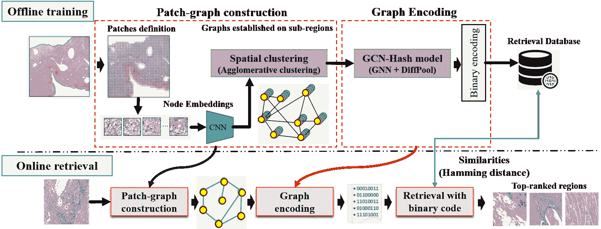

图 13：检索框架的表示。基于空间关系和补丁之间的特征距离构建补丁图，并输入到开发的 GNN-Hash 模型中进行图编码。在检索时，查询区域被转换为补丁图和二进制代码，以便与数据库中的样本进行相似性比较。重建自 [44]。

#### III-B3 肺癌

肺腺癌和肺鳞状细胞癌是最常见的肺癌亚型，区分它们需要经验丰富的病理学家进行视觉检查。在 WSI 上有效挖掘与生存相关的结构特征是提高生存分析的有前途的方法。Li 等人 [45] 介绍了一种基于 GCN 的生存预测模型，该模型通过使用 TCGA-LUSC [98] 和 NLST [100] 数据集的谱图卷积算子 (ChebNet) 将局部补丁特征与全局拓扑结构（补丁图）集成。该模型利用带有生存标签的生存特定图进行监督训练。并行图注意机制用于学习注意节点特征，通过减少补丁采样的随机性（即通过学习单个补丁的重要性进行自适应补丁选择）来提高模型的鲁棒性。这个注意网络与预测网络联合训练。作者展示了用生存特定标签微调的拓扑特征优于基于 CNN 的模型。

Adnan 等人[43]探讨了 GNN 在 MIL 中的应用。作者从 WSI 中采样重要的小块，并将其建模为一个完全连接的图，其中图被转换为向量表示进行分类。每个实例被视为图的一个节点，以学习节点之间的端到端关系。在这种方法中，使用 DenseNet 从通过颜色阈值分割的组织中提取所有重要小块的特征[57]。然后，采用使用全局信息关于小块的邻接学习层，以端到端的方式定义节点之间的连接。邻接矩阵通过邻接学习块使用一系列密集层和交叉相关计算。构建的图通过两种类型的图模型（ChebNet 和 GraphSAGE）进行处理，然后通过图池化层获得单一特征向量，以比较 TCGA[98]和 MUSK1[99]数据集中肺癌亚型的鉴别。采用的全局注意力池化[78]使用软注意力机制，能够可视化网络在做出预测时对每个小块的重要性。池化后的表示被送入两个全连接密集层，以实现肺腺癌和肺鳞状细胞癌的最终分类。所提出的模型优于使用注意力-MIL 的 CNN 模型。

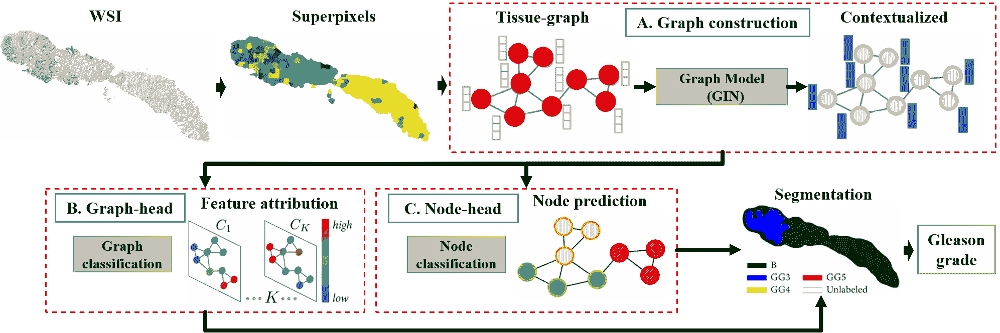

图 14：所提出的 SegGini 方法的表示。a) 组织图构建，使用组织超像素作为节点，并通过从超像素空间连通性计算的区域邻接图计算边。使用 GNN 学习判别性节点嵌入以执行语义分割。b) 图头：基于 GraphGrad-CAM 的图分类和特征归因。c) 节点头：节点分类。重建自[42]。

如前所述，基于内容的图像检索旨在找到与查询图像具有最相似形态特征的图像。二进制编码和哈希技术已成功应用于加快检索过程，以满足效率要求[115]。然而，WSI 通常被分成小块以便于区域级检索。该过程未考虑来自核周围广泛区域的上下文信息以及不同类型活检之间存在的邻接关系。

Zheng 等人[44] 提出了一个基于 GNN 和哈希的大规模 WSI 数据库检索框架，如图 13 所示。补丁图首先在离线阶段根据补丁空间邻接关系和通过预训练 CNN 提取的特征相似性建立。然后，通过 GNN-Hash 模型处理补丁图，该模型设计为使用图编码，并存储在检索数据库中。GNN-Hash 结构是通过堆叠 GNN 模块和 DiffPool 模块[79]创建的。分层 GNN-Hash 的输出在最终图嵌入层中经过二进制编码层的修改。最后，在路径学家查询的区域转换为二进制代码后，相关区域被检索并返回给病理学家。查询代码与数据库中代码的相似性使用汉明距离进行测量。使用肺癌 ACDC-LungHP[98]数据集进行估计 WSI 中局部区域之间的邻接关系和与查询区域的相似性的实验。结果表明，所提出的检索模型可以扩展到不同查询区域的大小和形状，并返回具有相似内容和结构的组织样本。

#### III-B4 皮肤癌

最常见的皮肤癌类型之一是基底细胞癌（BCC），它可能类似于开放性溃疡、红色斑块和光滑的隆起。几项研究已经证明了从病理图像中识别 BCC 的能力。Wu 等人[47] 引入了一种模型，通过将来自专家观察的先验知识和补丁之间的结构信息结合到基于图的模型中，以弱监督和半监督形式预测 WSI 中的 BCC。该先验知识的一个示例是，具有预测癌细胞的密集补丁更有可能有一个癌细胞簇，更多具有高癌症可能性的补丁增加了图像为阳性的整体可能性。

该框架包括两个模块，一个是 GCN，用于在补丁之间传播监督信息，以学习以概率分数形式呈现的补丁感知可解释性；另一个是一个聚合函数，利用先验知识连接补丁级别和图像级别的预测。该模型充分利用了不同级别的监督，通过将图像级别标签和可用的像素级分割标签的弱监督混合作为半监督信号。通过结合先验知识和结构信息，图像级分类和补丁级解释都有显著提高。

#### III-B5 前列腺癌

病理学家在精确标注图像数据时，必须超越正常的临床要求和标准。因此，语义分割方法应能从不精确、粗略和图像级别的标注中学习，而无需复杂的任务特定后处理步骤。为此，Anklin 等人 [42] 提出了基于图的弱监督语义分割方法（SegGini），该方法结合了局部和全局的组织区域关系，以便使用不精确和不完整的标签进行上下文分割。该模型在 UZH (TMAs) [93] 和 SICAPv2 (WSI) [101] 前列腺癌数据集上进行评估，针对 Gleason 模式分割和 Gleason 级别分类。图 14 展示了提出的 SegGini 方法。输入组织图像的组织图表示按照 [17] 的提议进行构建，其中图节点描绘了组织超像素。由于矩形补丁可以跨越多个不同的结构，因此使用了超像素 [59]。为了描述这些节点，提取了形态学和空间特征，并使用区域邻接图 (RAG) [62] 计算图的拓扑结构，利用超像素的空间连接性。

给定一个组织图，GIN 模型从组织微环境和组织间相互作用中学习上下文特征以进行语义分割，其中提出的 SegGini 模型为每个节点分配一个类别标签。根据弱监督的类型，得到的节点特征会由图头（图像标签）、节点头（节点标签）或两者处理。图头包含图分类和特征归属技术。作者使用了 GraphGrad-CAM 来测量每个类别分类的重要性得分，其中节点归属图确定节点标签。此外，作者在[42]中发现，节点头将图像分割简化为节点分类，其中节点标签通过在每个节点内分配最常见的类别来提取。对于不准确的图像标签和不完整的涂鸦，两种头部联合训练以改善各自的分类任务。头部的结果用于分割 Gleason 模式。最后，为了从分割图中识别图像级别的 Gleason 等级，采用了分类方法[90]。SegGini 在每类和平均分割以及分类指标方面超越了先前的模型，如 HistoSegNet[116]。该模型在不准确和完整监督下提供了可比的分割性能，并且可以应用于各种组织、器官和组织学任务。

### III-C 层次图表示（宏观和微观架构）

在以前的方法中，病理图像被表示为细胞图、补丁图或组织图。然而，单独的细胞或组织交互不足以完全表示病理结构。细胞图仅包含细胞形态和拓扑，并丢弃对适当表示组织病理结构至关重要的组织分布信息。由一系列组织区域组成的组织图则无法描绘细胞微环境。因此，为了学习癌症组织的内在特征，有必要汇总多层次的结构信息，这旨在模拟病理学家在不同放大级别分析图像时遵循的组织诊断过程。

#### III-C1 乳腺癌

早期发现癌症可以显著降低乳腺癌的死亡率，在癌症组织中捕捉多尺度的上下文特征至关重要。CNNs 的组合被用来通过多尺度特征融合对病理图像中的多尺度信息进行编码，其中尺度通常与空间位置相关。

Zhang 和 Li[29]引入了一种多尺度图小波神经网络（MS-GWNN），该网络并行使用不同尺度参数的图小波，以在图拓扑中获得多层次的组织结构信息。图小波神经网络（GWNN）[77]用具有优秀定位能力的小波变换替代了光谱 GCN 中的图卷积。对于乳腺癌分类，作者首先将病理图像转换为图结构，其中节点是非重叠的图像块。然后，通过不同尺度的 GWNN 进行节点分类（节点级预测）。之后，将多层次的节点表示结合起来进行图级分类。结果和学习到的节点嵌入的可视化展示了模型在两个公开数据集：BACH[9] 和 BreakHis[102] 上编码不同结构信息的强大能力。然而，该方法受限于手动选择适当的尺度参数。

从具有学习池化层的细胞定义的层级结构[39]不包括高级组织特征，而将细胞级别和组织级别信息连接起来的方法[32]无法利用组织表示层级之间的关系。为了解决这些问题，Pati 等人[17]提出了一种层次细胞到组织（HACT）表示方法，该方法利用细胞核和组织分布特性进行乳腺癌亚型分类。HACT 表示包括一个低层次的细胞图（CG），捕捉细胞的形态和拓扑；一个高层次的组织图（TG），捕捉组织切片的特性及其空间分布；以及细胞图和组织图之间的层级结构，捕捉细胞在组织中的相对分布。

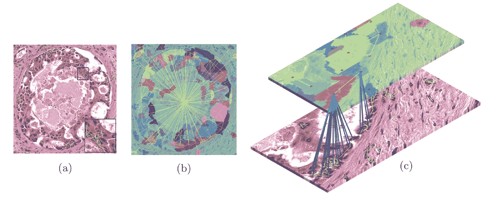

图 15：a) CG, b) TG 和 c) 层次细胞到组织的表示。图像改编自[17]。

图 15 展示了 CG、TG 和层次细胞到组织表示的样本。为了构建 CG，每个节点代表一个细胞，边表示细胞间的相互作用，其中每个细胞核提取了手工制作的特征，如形状、纹理和空间位置。然后，采用 KNN 算法来建立初始拓扑，假设相邻的细胞应该连接，而距离较远的细胞应该保持断开。使用图像空间中细胞核质心之间的欧氏距离来量化细胞距离。TG 的构建首先通过检测组织的非重叠均匀超像素并迭代地合并具有相似颜色属性的邻近超像素来识别组织区域（例如上皮、基质、腔隙、坏死）。TG 拓扑的生成假设相邻的组织部分应通过构建一个区域邻接图[62]来连接，其中包括超像素的空间质心。HACT 表示联合表示低级（CG）和高级（TG）关系，采用层次模型（HACT-Net）处理，该模型使用两个 GIN 模型[73]。学习到的细胞节点嵌入与相应的组织节点嵌入结合，用于预测类别。

为了展示层次学习，作者引入了 BRACS 数据集来分类五种乳腺癌亚型：正常、良性、非典型、原位导管癌和侵袭性癌。作者还通过在 WSI 级别拆分数据（来自同一切片的两张图像不属于不同的拆分）来评估对未知数据的泛化能力，这与以往在图像级别拆分的方法不同[15, 39]。用于分类的丰富多级 HACT 表示优于基于 CNN 的模型和独立的细胞图模型及组织图模型，确认了为了更好的结构-功能映射，低级和高级信息之间的联系必须在局部节点级别建模，而不是在图级别。

后来，Pati 等人[31]利用层次建模提高数字病理学的可解释性，旨在将组织结构映射到组织功能。作者采用了组织的层次实体图表示，通过层次 GNN 处理以学习从组织成分到相应组织类别的映射。在这项工作中，Pati 等人[31]改进了 HACT 表示和 HACT-Net 模型。HACT-Net 使用主邻域聚合（PNA）[117]层建模，这些层使用多种聚合器组合替代 GIN 中的和操作，并采用度缩放器根据节点的度来放大或抑制邻域聚合消息。每个 PNA 层后都加入图归一化和批量归一化[118]，这帮助网络在类内节点数量差异较大时学习区分性的拓扑模式。为了进一步评估方法的质量，进行了与独立病理学家的比较。招募了三位认证病理学家来标注 BRACS 测试集，但没有访问相应的 WSI。结果表明，该模型在 7 类分类任务中优于领域专家。作者使用 GraphGrad-CAM 突出显示了细胞核和组织区域节点，以展示 HACT-Net 在分类肿瘤感兴趣区域时关注的内容。

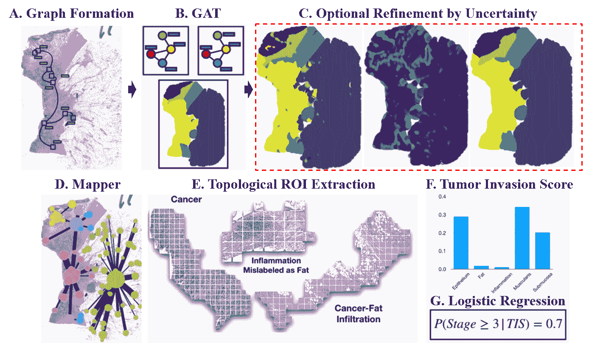

图 16：A-C。补丁级别嵌入、图表示及通过 GCN 的分类。通过不确定性估计来纳入一个细化阶段。D-E。图映射器将 WSI 上的高阶关系总结为图，其中捕捉到有意义的组织学区域。F-G。肿瘤侵袭评分用于预测模型，以形成可解释的分期评分。图像改编自[16]。

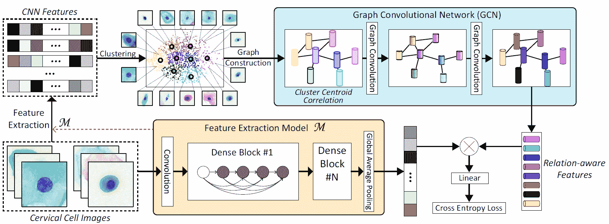

图 17：宫颈细胞图像的分类框架。特征通过在宫颈细胞分类任务上预训练的 CNN 提取。对这些 CNN 特征进行 K 均值聚类。基于内在相似性构建一个簇质心相关性的图，并作为 GCN 模型的输入。编码的表示被纳入 CNN 特征中用于分类。图像改编自[25，46]。

#### III-C2 结直肠癌

肿瘤分期包括组织阶段和淋巴结阶段，较高的数字表示更深的侵袭程度和更多的淋巴结受累。Levy 等人[16] 提出了一个框架，该框架利用不同的结构层次从组织学图像中学习局部和全局模式，以确定肿瘤侵袭的程度。图 16 ‣ III Applications of graph deep learning in digital pathology ‣ A Survey on Graph-Based Deep Learning for Computational Histopathology") 说明了提出的框架，其中作者结合了 GCNs 来解释组织区域之间的相互作用机制，以及拓扑特征提取方法[119] 来提取重要的上下文信息。通过 GCN 进行了结肠子区域的块级分类，并对块级预测进行了精炼，其中高不确定性的节点被删除，剩余的类别标签被传播到未标记的块。图形数据分析 (TDA) 工具 Graph Mapper[89] 被采用作为后验模型解释技术，以阐明 WSI 的高级拓扑结构。映射器生成一个图，其中每个节点代表 WSI 块的聚类，每条边代表这些聚类之间共享块的程度。该工具可以在 GNN 模型中提供更高层次的信息流描述，显著简化分析。利用映射器提取的感兴趣区域（块的集合），作者计算了肿瘤侵袭评分，以测量肿瘤与相邻组织区域之间的重叠程度。最后，通过使用从达特茅斯希切克医疗中心收集的私有结肠和淋巴结数据集的侵袭评分来预测癌症分期，结果展示了拓扑方法在 GNN 模型分析中的潜力。

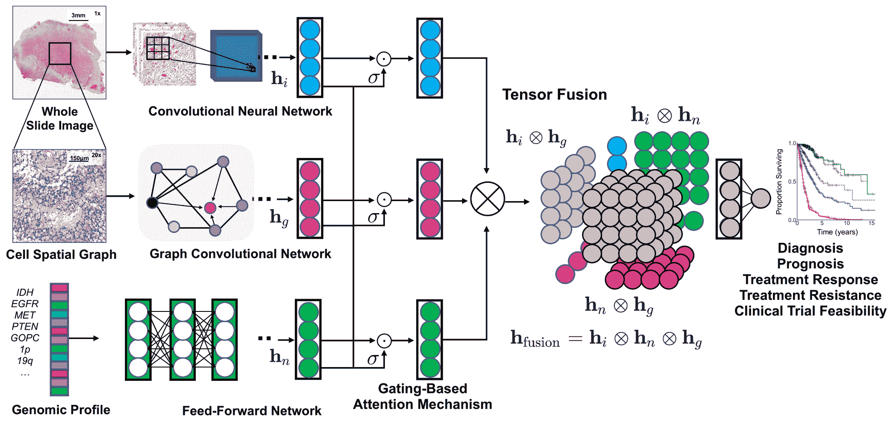

图 18：用于预测生存结果的组织学和基因组特征的多模态融合集成框架。图像基于 CNN 特征，图形基于 GCN 特征。重新创建自[32]。

### III-D 单模态和多模态特征级融合

在本小节中，我们介绍了使用融合技术提取和结合相同输入数据的多个丰富视觉表示（单模态融合），或整合来自不同输入模态的信息（多模态融合），以实现更准确和更可靠的决策。前者涉及将从不同网络获取的几个特征集集成到一个向量中，然后用于分类。这种融合发生在两个阶段：特征的归一化和特征的选择。后者旨在关联和结合不同的异质模态，以便模型可以学习成对的特征交互并控制每种模态的表达能力。多模态数据融合的主要挑战是融合的数据类型之间的差异，以及结果的解释。

#### III-D1 单模态融合（宫颈癌）

宫颈癌是女性癌症死亡的主要原因之一，而从宫颈细胞学切片中筛查异常细胞是早期检测宫颈癌的常见程序。与通过分层深度架构学习多层次特征的传统 CNN 相比，Shi 等人[25]将 GCN 输出与深度 CNN 特征结合，使用 SIPakMeD [103] 和 Motic（液基细胞学图像）[46] 数据集将孤立的宫颈细胞图像分类为五类和七类。

首先，使用一个为宫颈细胞分类任务预训练的 CNN 模型来提取每个宫颈细胞图像的特征。然后，对所有图像中提取的特征进行 K-means 聚类，构建一个图，其中每个簇的中心表示一个节点。构建的内在相似性的图可以用于进一步调查图像之间的潜在关系。因此，一个堆叠的两层 GCN 生成一个关系感知的表示，并将其编码为 CNN 特征以进行分类，如图 Fig. 17 ‣ III Applications of graph deep learning in digital pathology ‣ A Survey on Graph-Based Deep Learning for Computational Histopathology") 所示。作者展示了 GCN 生成的关系感知表示大大提升了分类性能。同一作者还发布了大量实验，以验证使用 GCN 进行宫颈细胞学分类的性能[46]。

#### III-D2 多模态融合（肾癌）

为了预测临床结果，肿瘤科医生通常使用来自基因组学和组织学的定量和定性信息 [120]。然而，当前的自动化组织学方法并未考虑基因组细节。以下工作利用形态学信息和基因组学中的分子信息中的互补知识，通过基于图的方法更好地量化肿瘤。

肾细胞癌是最常见的恶性肾脏肿瘤，属于一个多样化的肿瘤类别，具有不同的组织学特征、临床结果和治疗反应。肾细胞癌亚型可以通过深度学习框架自动分类。这些算法还可以从数字化组织病理图像中识别出预测生存结果的特征。一些作者已经使用 GCNs 进行癌症组织学分类，然而其在生存结果预测中的应用尚不多见。陈等人 [32] 提出了一个多模态融合组织学和基因组特征的框架，用于在 TCGA 数据集（胶质瘤和透明细胞肾细胞癌）上预测肾癌生存结果 [98]，该数据集包含配对的全切片图像、基因型和转录组数据。他们的模型将组织学图像（补丁特征）、细胞图谱和基因组特征融合成一个多模态张量，建模不同模态之间的相互作用，并且在生存结果预测上优于基于深度学习的特征融合。该框架在图 18 ‣ III Applications of graph deep learning in digital pathology ‣ A Survey on Graph-Based Deep Learning for Computational Histopathology")中进行了说明。

作者首先使用 CNNs 从基于图像的特征中提取形态学特征，并使用 GCNs 提取基于图谱的特征，以学习 WSI 中的细胞间相互作用。细胞在图中表示为节点，细胞通过核分割方法进行分离，并使用 KNN 建立连接。CPC 也被采用作为细胞特征提取的自监督方法。作者采用了 GraphSAGE 架构的聚合函数。层次自注意力池化策略 SAGPool [80] 被用于编码细胞图谱的层次结构。然后，为了监控每种模态的表现力，使用基于门控的注意力系统进行单模态功能融合。通过采用集成梯度方法来可视化图像显著性特征重要性，以考虑多模态的可解释性。

## IV 讨论与开放挑战

除了在分子、基因组和治疗水平生成与生物学和医学相关的预测[24]，图表示学习还被用于通过将患者记录表示为图来支持医学诊断，这些记录包括脑电活动、功能连接和解剖结构[21]。正如本综述所展示的那样，基于图的深度学习已成功用于捕捉组织病理学中的表型和拓扑分布，从而更好地促进精准医学。已经提出了许多基于实体图的组织表示和 GNN 模型，用于计算机辅助检测和诊断乳腺癌、结直肠癌、前列腺癌、肺癌、淋巴瘤、皮肤癌、结肠癌、宫颈癌和肾癌。

鉴于图在生物医学领域的实用性，特别是用于建模癌症组织的组织学，近期对图深度学习的最新进展进行了重大推动。然而，与现有的传统深度学习方法相比，这些应用仍处于起步阶段。采用 GNN 面临挑战，还有许多图方法在该领域尚待探索，这些方法可能允许对复杂生物过程进行更稳健和全面的调查，值得进一步研究。在本节中，我们讨论了几个未来研究方向，这些方向需要解决以释放图深度学习在数字病理学中的全部潜力：1）实体图构建；2）嵌入专家知识和图分析的临床应用；3）图模型的复杂性；4）训练范式；以及 5）图模型的可解释性。

### IV-A 实体图构建

定义适当的图表示，其中顶点对应于实体，边表示这些实体之间的连接，是非常相关的。对于病理任务，可以从组织学图像中选择不同的实体作为相关的生物结构。根据相关实体（如细胞核、组织区域、腺体或传统的图像块），已经定制了几种图表示。然而，在本调查中讨论的大多数方法中，图结构是手动设计的。

#### IV-A1 当前实体图构建预处理步骤的优缺点

##### 实体定义

细胞图（cell-graphs）已成为最流行的图表示之一，其中细胞作为用于编码细胞微环境的实体，包括细胞的形态和细胞间的相互作用。这种细胞图表示在[33, 34, 30, 28, 38, 39, 15, 32]中被提出。然而，由于细胞数量众多以及许多可能被孤立的细胞和弱核边界，将 WSI 建模为细胞图并非易事。这种表示法在很大程度上依赖于细胞检测或分割方法。尽管一些工作使用了代表性节点采样[39]或聚合聚类[36]来去除图中的冗余并降低计算成本，但大多数基于细胞图的提议假设细胞-细胞相互作用是最显著的信息来源。细胞图没有利用组织宏观结构或组织的层次特征。

另一种分析包含感兴趣区域（ROIs）上下文信息的 WSI 的传统技术是补丁图（patch-graphs）。尽管补丁图表示法已在许多研究中被采用[35, 26, 37, 40, 41, 43, 44, 45, 47]，但并非所有实体都是生物学上定义的，且方法受到补丁定义的限制。每个图像补丁的分辨率和最佳大小以及所提供的上下文水平相互权衡，并由数据决定。例如，腺体形态和大小的变化使得确定可接受的图像补丁大小成为问题。较低的放大倍率可能无法捕捉到细胞级别的特征，而较高的分辨率则限制了捕捉组织微环境的能力。因此，定义这些补丁区域和从输入数据中确定适当缩放参数的自动化技术至关重要。

为了改进组织结构-功能映射，基于组织区域的图表示法被提出，这也可以解决细胞图的一个限制，即重要区域可能不仅仅包含细胞[36, 27, 42]。组织图（tissue-graphs）代表了明确定义的组织区域，并用于在腺体或区域级别以逐步的方式传播信息。尽管提出了基于超像素的方法来解决补丁图的限制，但单独使用组织图无法捕捉局部细胞信息。提出了结合细胞级和补丁级特征的方法来捕捉来自组织学图像的局部和全局模式[32]。然而，这种融合方法无法利用层级之间的关系。

层次化图表示被提出作为一种适当的组织表示，因为组织结构不能仅通过细胞或组织交互完全表示。研究表明，细胞图和组织图提供了有价值的补充信息（细胞和组织交互），有助于学习癌变组织的内在特征。这种捕捉多层次组织信息的层次分析仅由[29, 17, 31, 16]解决。然而，这种方法仍然依赖于细胞中心图的构建，而细胞检测的准确性限制了这一图的构建，并且模型的复杂性受节点数量的约束。其他工作通过利用具有不同缩放参数的图小波[29]解决了细胞检测的限制，以获取组织图中的多层次组织结构信息。此外，在[16]中，组织图像的微观和宏观结构通过结合拓扑数据分析工具（细胞级别）和 GCN（组织级别）进行捕捉。

##### 特征提取

手工制作的特征和基于 CNN 的特征是表征实体的典型方法。这种深度特征提取允许使用预训练深度架构的特征。然而，这些方法的性能受到限制，因为作者通常利用预训练模型（例如，在 ImageNet 上训练）来进行网络的微调，而缺乏补丁标签，因此面临自然场景图像与组织病理图像之间的领域差距。为了解决这一限制，一些工作使用自监督方法如 CPC、VAE-GAN 和自编码器训练了特征提取器[15, 32, 40, 27]。

##### 图拓扑

在当前的实体图中，每个节点仅与其空间上最近的邻居连接，这导致在消息传递阶段信息交换相对有限。迄今为止，只有一种方法通过使用端到端的邻接学习层计算节点之间的连接，考虑了所有补丁的全局上下文[43]。在细胞图和组织图拓扑中的边嵌入是一个研究较少的领域，只有少数方法在研究中。学习主要发生在顶点处，边属性作为辅助信息。EGNN 仅在[38]中用于结直肠癌分类，其性能与基于一维 GNN 的最佳模型[108]相似。边属性还可以直接影响在顶点上进行的消息传递阶段。在 MEGNet[121]模型中，顶点通过从邻接边聚合特征进行更新。

#### IV-A2 自动化图生成

自动图结构估计旨在找到适合的数据图以作为 GNN 模型的输入。通过将图生成建模为一个序列过程，图表示（节点、边和嵌入）可以直接从数据中推断出来，这在表示具有多种复杂微观和宏观环境的组织时特别有用。然而，大多数调查的方法遵循标准的序列工作流程，这高度依赖于每个预处理步骤的个体表现，包括组织掩膜检测、细胞核检测、超像素检测、深度特征提取和图构建。使用神经网络构建生成图模型越来越受欢迎，以捕捉其拓扑和属性，这可以导致更强健的算法并帮助提供更准确的结果。然而，此类算法在组织病理图像中的有效性尚未得到研究。因此，仍需满足一些要求以实现生成过程。

采用 GCNs 进行脑电活动分析任务的若干研究[21]已经证明，从数据中学习图结构比使用预定义图拓扑的方法能提高分类性能。在数字病理学中，这些预定义参数包括用于区分非组织像素的固定阈值；用于细胞核检测的补丁大小和数量，以及细胞核和组织特征提取；代表性细胞核的样本比例；定义拓扑和边的阈值 KNN 和距离；每张图像的超像素数量和下采样因子；以及选择手工特征和从中提取深度特征的 CNN 层。这些定义限制了实体图在不同组织、器官和组织学任务中的泛化能力。一些在组织病理学诊断中值得探索的图生成方法包括 GraphGAN [122]、DGMG [123] 和 GCPN [124]。例如，DGMG [123]可以从每个组织病理学补丁中一次生成一个节点，然后逐一创建边，使用节点之间的概率依赖关系将每个节点连接到现有的部分图中。

总之，上述讨论展示了从数据中估计具有期望属性的图结构的困难。尽管该领域有新兴的工作，但仍需进一步研究。在数字病理学中，自动图生成，其中图模型从数据中推断结构内容，以及领域知识的整合，也未得到充分利用。

### IV-B 嵌入专家知识和图分析的临床应用

将领域知识融入模型已经成为一种提升医学图像分析的有前景的方法[125]。使用基于图的映射和标签表示（词嵌入）已被研究用来指导节点间的信息传播[126]。例如，在基底细胞癌分类中[47]，嵌入知识通过基于先前专家知识对图像块进行编码来表示，这弥合了图像块级别和图像级别预测之间的差距，从而提高了性能。此外，病理学家的反馈可以帮助改进图的表示，以最佳方式反映细胞和组织之间的生物关系。因此，基于图的分析激发了探索在图表示构建中加入任务特定病理学先验知识的动机[17]。

另一个尚未解决的研究问题是如何以有原则的方式整合跨学科知识，而不是逐案处理。整合电子健康记录以实现个性化医学也可以提升数字病理学的诊断能力。医学本体中固有的层级信息自然有助于创建丰富的医学知识网络，以及其他数据类型，如症状和基因组学[127]。因此，通过将患者记录整合到图表示学习环境中，可以为个体患者生成量身定制的预测。

在人工智能技术中，基于图的组织图像分析在乳腺癌分析中表现出优于或可与领域专家相媲美的性能[31]。这些结果与研究解释对临床最终用户决策影响的研究[33]结合，显示了将该技术转化为诊断病理学的一般积极结果。这种转化将需要考虑将标准化技术整合到数字病理学工作流程中，从而实现诊断的一体化方法，为病理学家提供加速工作流程、提高诊断一致性和减少错误的新工具。

尽管在数字病理学中图形分析显示出相当大的潜力，但仍面临一些挑战。这些挑战包括，例如，将诊断技术推广到包含异常值的大量患者群体的能力；以及发展需要与其他医学学科复杂互动的问题解决技能。因此，应进行更多研究，以调查病理学家如何通过“人机协同”系统来完善图模型决策[128, 129]。这些方法提供了一个重要的安全机制，用于检测和纠正可能发生的算法错误。一个尚待解决的挑战是提供具有上述功能的框架，同时减少复杂性，以降低系统与临床医生之间的障碍，帮助促进系统的应用。

实体图分析有能力通过提供加快工作流程、改善诊断和提高患者临床结果的应用来改变病理学。然而，研究与实现可靠的图形分析之间仍然存在差距，这些分析应将专家知识纳入系统，并能够集成到现有的临床工作流程中。

### IV-C 图模型的复杂性

基于图的组织学分析方法具有很高的表征能力，可以描述多种癌症的拓扑和几何属性。与基于像素的方法相比，图形表示可以更无缝地描述大范围的组织区域。然而，经典的图形模型具有很高的计算复杂性。因此，在建议的学习方法中，GNN（图神经网络）架构的选择应作为一个超参数进行处理。

本调查中使用的最常见的 GNN 包括 ChebNet[66]、GCN[67]、GraphSAGE[68]、GAT[72]、GIN[73]以及变体如 Adaptive GraphSAGE[39]、RSF[75]、MS-GWNN[29]和 FENet[41]。空间-GCN 如 GraphSAGE 和 GIN 通过使用 max-、mean-或 sum-pooling 聚合器展示了它们的学习能力。GIN 在计算病理学中尤其有效，具有可证明的强表达能力，能够从 WSI（全视野图像）中的细胞和组织结构中学习固定大小的区分图嵌入，表现出平移和旋转不变性。然而，需要注意的是，这些 GNN 模型继承了深度学习谱系中的相当复杂性，这在扩展和部署 GNN 时可能会造成负担。这可能是导致许多问题仍然保持基于补丁的方法流行的原因之一。

由于 GNNs 相比基于补丁的深度学习方法具有较高的内存消耗和推理延迟，因此其训练仍然是最困难的任务之一。GNNs 通常需要将整个图以及所有节点的中间状态保存在内存中。然而，调查的应用中采用高效训练方法的情况并不常见。各种图采样方法已被提出，以缓解训练 GNNs 的成本。与其在完整图上训练，不如在每次迭代中在采样的子图上运行，无论是采样节点级（GraphSage [68]）、层级（FastGCN [130]，$L^{2}$-GCN [131]）还是通过聚类（Cluster-GCN [132]）。

一些研究提出了更高效且简单的架构，这些架构因其在计算组织病理学中的潜在应用而值得关注。简单图卷积（SGC）[133]通过反复移除图卷积网络（GCNs）层之间的非线性，并将多个权重矩阵合并为一个线性变换，从而降低了 GCNs 的复杂性。该模型被应用于情感识别，并提高了性能速度，同时在分类准确性方面与其他网络相当[134]。简单可扩展的 Inception 图神经网络（SIGN）[135]明确设计为一种浅层架构，结合了不同尺寸的图卷积滤波器，以实现高效的预计算。高效图卷积（EGC）[136]方法不需要在自适应滤波方法的基础上在准确性与运行时内存或延迟减少之间做出权衡。GNNs 还可以在图像特征匹配中提供高性能[137]，这可以被纳入基于内容的组织病理图像检索中。

还需强调的是，一些研究利用了无需 GCN 处理复杂性的细胞图表示。组织分类问题在[138]中被提出为基于细胞检测和分类到不同细胞组件（细胞图）的细胞社区检测，以及图像补丁（补丁级图）的聚类到生物学上有意义的社区（特定组织表型）。构建图形并使用测地距离进行社区检测的概念已超越了深度神经网络和基于图的深度学习方法，如 ChebNet、GCNs 和深度图信息最大化学习（DGI）[139]。

在未来几年，一个关键的研究课题将是如何有效地学习和计算 GNN，以实现其*最终*潜力。由于图的复杂拓扑结构，图上的深度学习本质上很困难，这些结构可以由许多不同类型的实体和交互组成。因此，在表示学习之前适当选择模型的关键参数对于捕捉组织病理切片的结构信息至关重要。

### IV-D 训练范式

如前所述，训练范式可以分为两个主要类别：训练网络以学习用于图表示的节点嵌入；以及 GNN 模型的训练。

#### IV-D1 节点嵌入

节点嵌入是学习到的特征，用于表示定义的节点（例如细胞、细胞核、补丁、超级像素）。一些通过属性网络提取的嵌入特征需要标注的数据集，并需要以监督方式训练，如[33、34、30、28、38、39、35、36、26、37、41、43、44、47、31、17、29、16、46、25]中解释的那样。然而，深度学习的主要挑战之一是缺乏大量人工标注的数据进行训练，这通常对医学领域的问题构成限制。因此，自监督方法正受到关注，以通过直接从组织病理图像中学习嵌入特征来提高学习到的节点嵌入的质量[15、40、27、45、32]，而不是依赖于使用迁移学习提取特征，这在子节 IV-A 中进行了讨论。

#### IV-D2 节点/图分类

对于节点或图级分类的 GCN 训练可以通过监督、半监督甚至自监督的方式进行。如果节点或图数据有足够的标签，常见的做法是采用监督训练方法，例如[33、34、30、28、38、39、36、37、41、45、31、17、29、16、25、43]所示的方法。

尽管监督方法可以实现高性能，但它们可能对模型复杂性施加限制，并且在标注不一致或不精确时可能表现不佳。在缺乏足够标记数据的情况下，提出了弱监督或半监督框架，以更好地捕捉组织病理数据的结构并减少人工标注工作量。虽然缺失标签的问题并非图域特有，但只有少数工作采用了这些框架（像素或补丁级标签）。

在半监督或弱监督方法中，节点嵌入是从每类少量标记样本中学习的[46, 15, 26, 47]。例如，在弱监督学习方法中，训练期间无法知道各个补丁对 ROI 级诊断的贡献[26]。

除了上述内容，过去几年在深度学习方面的大量研究[140, 141, 142]表明，基于多实例学习（MIL）的决策分类器通过聚合实例级预测可以提升癌症分类的性能。MIL 仅需要对实例包进行标记，而不是单个实例，这使其非常适合组织学切片分类。一个例子是 CLAM（聚类约束注意力多实例学习[143]）。尽管这些方法具有实际优点，可以考虑预测分期的重要补丁，但它们未考虑补丁之间的空间关系。目前的多实例学习方法使用深度图[27, 40, 43]遵循这一研究方向。通过整合任意数量的实体和交互，它们可以无缝扩展到任意组织维度，因此提供了传统 MIL[143]的替代方案。MIL 方法可以与 GCN 结合，以利用实例之间的结构信息[4]。例如，SegGini 模型[42]在前列腺癌的弱监督分类中优于 CLAM[143]和 Context-Aware CNN (CACNN)[144]等几种传统的最先进方法。

自监督方法也已成功应用于 GCNs 的训练范式。例如，Ozen 等人[35]采用了 SimCLR 框架[111]以及对比损失来学习 ROI 的表示并进行分类。尽管上述训练范式表现出色，但很少有工作[43]考虑了端到端训练及其带来的挑战，如构建图或标记数据的复杂性，因此这需要在未来的工作中进一步探讨。

训练范式依赖于手动标记的数据。在医学影像，尤其是组织病理学中，获得大量标记数据是一个繁琐的过程，因此，弱监督和自监督算法在学习节点嵌入和进行图分类方面越来越受到关注。预计未来会有更多的大规模研究，利用 GCNs 以弱监督或自监督的方式分析组织病理数据。

### IV-E 图模型的可解释性

为了有效将图模型转化为临床实践，必须建立临床医生的信任。可解释性，即模型能够解释其结果并因此帮助临床医生理解模型的预测，一直被视为建立信任的关键。因此，理解模型行为超越传统性能指标已经成为机器学习研究中的一个重要部分，特别是在医疗保健领域[145]。

深度模型的可解释性集中于提供依赖输入的解释，并从不同的角度理解模型行为，包括视觉解释和突出显著区域。例如，我们可以通过查看梯度或权重来检查输入特征与预测之间的敏感性。我们还可以通过结合注意机制来突出图像中的重要特征或区域[146]。然而，与传统图像领域相比，深度学习图的可解释性和可视化尚未得到充分探讨[84]，但可解释性对于突出组织的结构成分和细胞核间关系至关重要，这在计算组织病理学中是所期望的。

尽管大多数图网络方法普遍缺乏可解释性方法，但值得注意的是，存在一些方法在数字病理学中纳入了这种解释，如表 II 所示：i) 在[47]中，GCN 在图块上传播监督信息，以学习以概率评分形式的图块感知可解释性。ii) 使用了一种基于注意力的架构和节点遮挡的强大空间过滤来捕捉每个细胞核及其邻域对预测的贡献[30]。iii) 采用了图 Mapper，一个拓扑数据分析工具，压缩组织学信息至其基本结构，捕捉到有意义的组织学区域[16]。iv) 在[32]中，使用了集成梯度方法来可视化图像显著性特征的重要性。v) 在[39]中，使用图聚类可视化来对具有相似组织结构的细胞进行分组。vi) 设计了一个后验图剪枝解释器 GCExplainer，以识别输入图中的关键细胞和相互作用[34]。vii) 梯度基础的显著性方法 GraphGrad-CAM 在[31]和[42]中被采用，以测量对每个类别分类作出贡献的重要性评分和区域。

大多数纳入解释器的方法仅限于细胞图分析。考虑到病理上对齐的多层次分层组织属性[31]，可解释性可以揭示重要实体，如细胞核、组织部分和相互作用，这些可以模拟病理学家的评估，从而增加专家与 AI 框架之间的信任度。

然而，现有的研究缺乏定义有效可解释性模型的目标，只有一项工作研究了为目标受众（即临床医生）提出的解释方法的质量和效用。在[33]中，作者评估了几种图解释器（GNNExplainer、GraphGrad-CAM、GraphGrad-CAM++、GraphLRP），以基于病理上可测量的细胞属性提供领域可理解的定量指标，使图决策对病理学家易于理解。作者发现，在概念层面上，GraphGrad-CAM++与病理学家的整体一致性最高，其次是 GraphGrad-CAM 和 GNNExplainer。

本调查中未探讨的其他方法包括：excitation BP [83]、PGM-explainer [147]、GraphMask [148]、Graphlime [149] 和 Relex [150]，这些方法专注于深度图模型的实例级解释，并值得在数字病理学中关注，用于节点、边或节点特征级别的可解释性。其他方法如 SubgraphX [151]提供了子图级解释，这可能对数字病理学更具直观性和易于理解。

了解模型结果所依据的特征子集至关重要。这使临床医生能够将模型决策与临床判断进行比较，特别是在存在差异时尤为有用。还值得注意的是，临床医生期望输入的重要性在患者和人群之间存在差异 [145]。然而，本调查中讨论的方法提供的解释仅限于单一实例，这些方法使用基于梯度的方法（GraphGrad-CAM）和基于扰动的方法（GNNExplainer）。为了验证和理解深度模型，病理学家需要检查所有输入图的解释，这既费时又不切实际。正如之前所述，单独解释每个实例的方法不足以提供对训练模型的全局理解 [152]。因此，提供 GNN 对一组实例（即人群）的预测并提供 GNN 预测的全局理解的方法在文献中探索较少。

实例级方法根据每个输入图解释 GNN，而模型级方法则不考虑任何特定输入示例来解释 GNN。后者特别研究了哪些输入图模式可以导致特定的 GNN 行为，例如最大化目标预测。然而，数字病理学中尚无关于模型级 GNN 解释的研究。XGNN [153] 通过训练图生成器来构建优化特定模型预测的图模式，从而提供模型级解释。作者将图创建表述为强化学习问题，通过图生成器预测如何在给定图上添加边，并在每一步构建新图。然后，使用基于训练图模型反馈的策略梯度来训练生成器。还使用了若干图规则，以确保解释既有效又易于理解。PGExplainer [154] 也可以通过结合生成概率模型为每个实例提供全局视角的解释。然而，目前尚不清楚 XGNN 和 PGExplainer 是否可以用于进行组织病理分析的节点分类任务，这是未来研究的重要领域。

鉴于图基处理在计算病理学中各种应用的趋势，图解释性和以临床医生可用性为重点的定量评估至关重要。可解释性是必不可少的，因为它可以帮助，例如，在癌症诊断和治疗计划中的知情决策。然而，目前为止，数字病理学中 GNNs 的可解释性尚未受到足够关注。

## V 结论

通过使用全切片图像（WSIs）和组织微阵列（TMAs），数字病理学已转变了病理诊断。这些数据的日益使用也催生了一个新的研究领域，称为计算病理学，其旨在开发机器学习技术以提供更客观和可重复的结果。深度学习，特别是卷积神经网络（CNNs），在数字病理学中的视觉表示学习中表现出了有效性。为了获得图像级别的表示，主流的 CNN 架构通常在固定大小的 WSI 补丁上汇总特征表示。然而，CNNs 使用的补丁级和像素级处理缺乏捕捉与细胞、腺体和组织类型等有意义实体相关的全局上下文信息的能力。正如本综述所示，组织病理学知识图谱能够捕捉与疾病潜在机制相关的更全面和可解释的信息。一些研究尝试采用基于图的深度学习模型来学习局部和全局模式。基于实体的分析有潜力通过识别决定性的细胞核、组织区域和相互作用来提高深度学习技术的可解释性。这也可能潜在地复制病理学家评估的整体和上下文感知部分。

我们的调查提供了对计算组织病理学中快速增长的新兴领域的详细概述。数字病理中的丰富图表示和学习在各种癌症分析中带来了卓越的表现。然而，我们强调了关于图基深度学习的开放研究方向，包括图表示学习的可解释性、图构建的方法以及图模型的复杂性和其有限的训练效率。

## VI 利益冲突声明

作者报告没有利益冲突。

## 参考文献

+   [1] S. Deng, X. Zhang, W. Yan, I. Eric, C. Chang, Y. Fan, M. Lai, 和 Y. Xu，“数字病理图像分析中的深度学习：综述，” *Front. Med.*，第 1–18 页，2020 年。

+   [2] D. Shen, G. Wu, 和 H.-I. Suk，“医学图像分析中的深度学习，” *Annu. Rev.Biomed. Eng.*，第 19 卷，第 221–248 页，2017 年。

+   [3] J. van der Laak, G. Litjens, 和 F. Ciompi，“组织病理学中的深度学习：通向临床的路径，” *Nat. Med.*，第 27 卷，第 5 期，第 775–784 页，2021 年。

+   [4] C. L. Srinidhi, O. Ciga, 和 A. L. Martel, “用于计算组织病理学的深度神经网络模型：综述，” *医学影像分析*，页 101813，2020 年。

+   [5] G. Litjens, T. Kooi, B. E. Bejnordi, A. A. A. Setio, F. Ciompi, M. Ghafoorian, J. A. Van Der Laak, B. Van Ginneken, 和 C. I. Sánchez, “医学图像分析中的深度学习综述，” *医学影像分析*，第 42 卷，页 60–88，2017 年。

+   [6] F. Xing, Y. Xie, H. Su, F. Liu, 和 L. Yang, “显微镜图像分析中的深度学习：综述，” *IEEE 神经网络与学习系统汇刊*，第 29 卷，第 10 期，页 4550–4568，2017 年。

+   [7] Y. He, H. Zhao, 和 S. T. Wong, “深度学习推动数字病理中的癌症诊断，” *计算机医学影像图形*，页 101820，2020 年。

+   [8] M. Amgad, L. A. Atteya, H. Hussein, K. H. Mohammed, E. Hafiz, M. A. Elsebaie, A. M. Alhusseiny, M. A. AlMoslemany, A. M. Elmatboly, P. A. Pappalardo *等*，“Nucls：一种可扩展的众包深度学习方法和用于细胞核分类、定位和分割的数据集，” *arXiv 预印本 arXiv:2102.09099*，2021 年。

+   [9] G. Aresta, T. Araújo, S. Kwok, S. S. Chennamsetty, M. Safwan, V. Alex, B. Marami, M. Prastawa, M. Chan, M. Donovan *等*，“Bach：乳腺癌组织学图像的重大挑战，” *医学影像分析*，第 56 卷，页 122–139，2019 年。

+   [10] N. Kumar, R. Verma, D. Anand, Y. Zhou, O. F. Onder, E. Tsougenis, H. Chen, P.-A. Heng, J. Li, Z. Hu *等*，“多脏器细胞核分割挑战赛，” *IEEE 医学影像汇刊*，第 39 卷，第 5 期，页 1380–1391，2019 年。

+   [11] Z. Wu, S. Pan, F. Chen, G. Long, C. Zhang, 和 S. Y. Philip, “图神经网络的全面调查，” *IEEE 神经网络与学习系统汇刊*，2020 年。

+   [12] S. Qi, W. Wang, B. Jia, J. Shen, 和 S.-C. Zhu, “通过图解析神经网络学习人类-物体交互，” 见于 *欧洲计算机视觉会议（ECCV）*，2018 年，页 401–417。

+   [13] Y. Chen, M. Rohrbach, Z. Yan, Y. Shuicheng, J. Feng, 和 Y. Kalantidis, “基于图的全局推理网络，” 见于 *IEEE 计算机视觉与模式识别会议（CVPR）*，2019 年，页 433–442。

+   [14] J. Li, X. Xie, Z. Zhao, Y. Cao, Q. Pan, 和 G. Shi, “基于时间图的骨架动作识别建模，” *arXiv 预印本 arXiv:2012.08804*，2020 年。

+   [15] J. Wang, R. J. Chen, M. Y. Lu, A. Baras, 和 F. Mahmood, “通过图卷积网络的弱监督前列腺 TMA 分类，” 见于 *IEEE 国际生物医学影像会议（ISBI）*，2020 年，页 239–243。

+   [16] J. Levy, C. Haudenschild, C. Bar, B. Christensen, 和 L. Vaickus, “使用图神经网络的全切片图像的拓扑特征提取和可视化，” 见于 *太平洋生物计算研讨会（PSB）*，第 26 卷，2021 年，页 285–296。

+   [17] P. Pati, G. Jaume, L. A. Fernandes, A. Foncubierta-Rodríguez, F. Feroce, A. M. Anniciello, G. Scognamiglio, N. Brancati, D. Riccio, M. Di Bonito *等*，“Hact-net：一种用于组织病理图像分类的层次细胞到组织图神经网络”，发表于 *UNSURE 和 GRAIL 与 MICCAI 联合举办*，2020 年，第 208–219 页。

+   [18] I. Makarov, D. Kiselev, N. Nikitinsky, 和 L. Subelj，“关于图嵌入及其在图上的机器学习问题中的应用的综述”，*PeerJ Comput. Sci.*，第 7 卷，2021 年。

+   [19] S. Georgousis, M. Kenning, 和 X. Xie，“图深度学习：现状与挑战”，*IEEE Access*，2021 年。

+   [20] Z. Zhang, P. Cui, 和 W. Zhu，“图上的深度学习：综述”，*IEEE Trans. Knowl. Data Eng.*，2020 年。

+   [21] D. Ahmedt-Aristizabal, M. A. Armin, S. Denman, C. Fookes, 和 L. Petersson， “基于图的深度学习用于医学诊断与分析：过去、现在和未来”，*Sensors*，第 21 卷，第 14 期，2021 年。

+   [22] H. Sharma, N. Zerbe, S. Lohmann, K. Kayser, O. Hellwich, 和 P. Hufnagl，“基于图的方法在数字组织病理学图像分析中的回顾”，*Diagnostic Pathol.*，第 1 卷，第 1 期，2015 年。

+   [23] H. Irshad, A. Veillard, L. Roux, 和 D. Racoceanu，“数字组织病理学中细胞核检测、分割和分类的方法：回顾—现状与未来潜力”，*IEEE Rev. Biomed. Eng.*，第 7 卷，第 97–114 页，2013 年。

+   [24] M. M. Li, K. Huang, 和 M. Zitnik，“生物学和医学中网络的表示学习：进展、挑战和机遇”，*arXiv 预印本 arXiv:2104.04883*，2021 年。

+   [25] J. Shi, R. Wang, Y. Zheng, Z. Jiang, 和 L. Yu，“用于宫颈细胞分类的图卷积网络”，发表于 *Proc. Med. Image Comput. Comput.-Assist. Interv. (MICCAI)*，2019 年。

+   [26] B. Aygüneş, S. Aksoy, R. G. Cinbiş, K. Kösemehmetoğlu, S. Önder, 和 A. Üner，“用于乳腺组织病理学中的感兴趣区域分类的图卷积网络”，发表于 *Med. Imaging 2020: Digit. Pathol.*，第 11320 卷，2020 年，第 113200K 页。

+   [27] A. Raju, J. Yao, M. M. Haq, J. Jonnagaddala, 和 J. Huang，“图注意力多实例学习用于准确的结直肠癌分期”，发表于 *Proc. Med. Image Comput. Comput.-Assist. Interv. (MICCAI)*，2020 年，第 529–539 页。

+   [28] D. Anand, S. Gadiya, 和 A. Sethi，“Histographs：组织病理学中的图”，发表于 *Med. Imaging 2020: Digit. Pathol.*，第 11320 卷，2020 年，第 113200O 页。

+   [29] M. Zhang 和 Q. Li，“Ms-gwnn：用于乳腺癌诊断的多尺度图小波神经网络”，*arXiv 预印本 arXiv:2012.14619*，2020 年。

+   [30] M. Sureka, A. Patil, D. Anand, 和 A. Sethi，“使用图卷积神经网络进行组织病理图像的可视化”，发表于 *Proc. IEEE Int. Conf. Bioinform. BioEng. (BIBE)*，2020 年，第 331–335 页。

+   [31] P. Pati, G. Jaume, A. Foncubierta, F. Feroce, A. M. Anniciello, G. Scognamiglio, N. Brancati, M. Fiche, E. Dubruc, D. Riccio *等*，“用于乳腺癌亚型分类的层次化细胞-组织图表示在数字病理学中的应用，”*arXiv 预印本 arXiv:2102.11057*，2021 年。

+   [32] R. J. Chen, M. Y. Lu, J. Wang, D. F. Williamson, S. J. Rodig, N. I. Lindeman, 和 F. Mahmood，“Pathomic fusion：融合组织病理学和基因组特征的癌症诊断和预后集成框架，”*IEEE 医学成像汇刊*，2020 年。

+   [33] G. Jaume, P. Pati, B. Bozorgtabar, A. Foncubierta, A. M. Anniciello, F. Feroce, T. Rau, J.-P. Thiran, M. Gabrani, 和 O. Goksel，“计算病理学中图神经网络的解释量化，”见于*IEEE 计算机视觉与模式识别会议（CVPR）*，2021 年，第 8106–8116 页。

+   [34] G. Jaume, P. Pati, A. Foncubierta-Rodriguez, F. Feroce, G. Scognamiglio, A. M. Anniciello, J.-P. Thiran, O. Goksel, 和 M. Gabrani，“迈向可解释的图表示在数字病理学中的应用，”见于*国际机器学习会议（ICML）生物计算研讨会*，2020 年，第 5453–5462 页。

+   [35] Y. Ozen, S. Aksoy, K. Kösemehmetoğlu, S. Önder, 和 A. Üner，“用于组织病理学中感兴趣区域检索的自监督学习图神经网络，”见于*国际模式识别会议（ICPR）*，2021 年，第 6329–6334 页。

+   [36] W. Lu, S. Graham, M. Bilal, N. Rajpoot, 和 F. Minhas，“在多千兆像素病理图像中捕获细胞拓扑结构，”见于*IEEE 计算机视觉与模式识别会议（CVPR）*，2020 年，第 260–261 页。

+   [37] H. Ye, D.-H. Wang, J. Li, S. Zhu, 和 C. Zhu，“使用图卷积网络改进组织病理图像的分割和分类，”见于*国际计算模式识别会议（ICCPR）*，2019 年，第 192–198 页。

+   [38] L. Studer, J. Wallau, H. Dawson, I. Zlobec, 和 A. Fischer，“使用图神经网络分类肠腺细胞图，”见于*国际模式识别会议（ICPR）*，2021 年，第 3636–3643 页。

+   [39] Y. Zhou, S. Graham, N. Alemi Koohbanani, M. Shaban, P.-A. Heng, 和 N. Rajpoot，“Cgc-net：用于结直肠癌组织学图像分级的细胞图卷积网络，”见于*IEEE 国际计算机视觉会议（ICCV）*，2019 年，第 0–0 页。

+   [40] Y. Zhao, F. Yang, Y. Fang, H. Liu, N. Zhou, J. Zhang, J. Sun, S. Yang, B. Menze, X. Fan *等*，“基于深度图卷积的多实例学习预测淋巴结转移，”见于*IEEE 计算机视觉与模式识别会议（CVPR）*，2020 年，第 4837–4846 页。

+   [41] K. Ding, Q. Liu, E. Lee, M. Zhou, A. Lu, 和 S. Zhang，“基于特征增强图网络的遗传突变预测在结肠癌组织病理图像中的应用，”见于*医学图像计算与计算机辅助手术会议（MICCAI）*，2020 年，第 294–304 页。

+   [42] V. Anklin, P. Pati, G. Jaume, B. Bozorgtabar, A. Foncubierta-Rodríguez, J.-P. Thiran, M. Sibony, M. Gabrani, 和 O. Goksel，“使用组织图从不准确和不完整的标签中学习全切片分割，” *arXiv 预印本 arXiv:2103.03129*，2021 年。

+   [43] M. Adnan, S. Kalra, 和 H. R. Tizhoosh，“使用图神经网络对组织病理图像进行表示学习，” 在 *IEEE 计算机视觉与模式识别会议（CVPR）*，2020 年，第 988–989 页。

+   [44] Y. Zheng, B. Jiang, J. Shi, H. Zhang, 和 F. Xie，“使用 GNN 对组织病理学 WSI 进行编码，以便可扩展的诊断相关区域检索，” 在 *医学图像计算与计算机辅助干预会议（MICCAI）*，2019 年，第 550–558 页。

+   [45] R. Li, J. Yao, X. Zhu, Y. Li, 和 J. Huang，“图 CNN 在全切片病理图像上的生存分析，” 在 *医学图像计算与计算机辅助干预会议（MICCAI）*，2018 年，第 174–182 页。

+   [46] J. Shi, R. Wang, Y. Zheng, Z. Jiang, H. Zhang, 和 L. Yu，“基于图卷积网络的宫颈细胞分类，” *计算方法与程序生物医学*，第 198 卷，第 105807 页，2020 年。

+   [47] J. Wu, J.-X. Zhong, E. Z. Chen, J. Zhang, J. Y. Jay, 和 L. Yu，“用于识别病理图像中基底细胞癌的弱监督和半监督图 CNN，” 在 *国际图学习医学成像研讨会（GLMI）*，2019 年，第 112–119 页。

+   [48] D. I. Shuman, S. K. Narang, P. Frossard, A. Ortega, 和 P. Vandergheynst，“图上的信号处理新兴领域：将高维数据分析扩展到网络和其他不规则领域，” *IEEE 信号处理杂志*，第 30 卷，第 3 期，第 83–98 页，2013 年。

+   [49] N. Otsu，“一种从灰度直方图中选择阈值的方法，” *IEEE 系统、人机与控制汇刊*，第 9 卷，第 1 期，第 62–66 页，1979 年。

+   [50] S. Graham, Q. D. Vu, S. E. A. Raza, A. Azam, Y. W. Tsang, J. T. Kwak, 和 N. Rajpoot，“Hover-net：在多组织组织学图像中同时进行细胞核分割和分类，” *医学图像分析*，第 58 卷，第 101563 页，2019 年。

+   [51] Y. Zhou, O. F. Onder, Q. Dou, E. Tsougenis, H. Chen, 和 P.-A. Heng，“Cia-net：通过轮廓感知信息聚合进行鲁棒的细胞核实例分割，” 在 *国际医学图像处理信息处理会议（IPMI）*，2019 年，第 682–693 页。

+   [52] O. Ronneberger, P. Fischer, 和 T. Brox，“U-net：用于生物医学图像分割的卷积网络，” 在 *医学图像计算与计算机辅助干预会议（MICCAI）*，2015 年，第 234–241 页。

+   [53] F. Mahmood, D. Borders, R. J. Chen, G. N. McKay, K. J. Salimian, A. Baras, 和 N. J. Durr，“深度对抗训练用于组织病理图像中的多脏器细胞核分割，” *IEEE 医学成像汇刊*，第 39 卷，第 11 期，第 3257–3267 页，2019 年。

+   [54] N. Kumar, R. Verma, S. Sharma, S. Bhargava, A. Vahadane, 和 A. Sethi，“用于计算病理学的广义核分割的数据集和技术，” *IEEE 医学成像汇刊*，第 36 卷，第 7 期，第 1550–1560 页，2017 年。

+   [55] J. Gamper, N. A. Koohbanani, K. Benet, A. Khuram, 和 N. Rajpoot，“Pannuke: 一个用于核实例分割和分类的开放式全癌症组织学数据集，”发表于 *Eur. Congr. Digit. Pathol.*, 2019 年, 页 11–19。

+   [56] D. Müllner，“现代层次聚合聚类算法，” *arXiv preprint arXiv:1109.2378*, 2011 年。

+   [57] S. Kalra, H. R. Tizhoosh, C. Choi, S. Shah, P. Diamandis, C. J. Campbell, 和 L. Pantanowitz，“Yottixel——一个用于大型组织病理全切片图像档案的图像搜索引擎，” *Med. Image Anal.*, 卷 65, 页 101757, 2020 年。

+   [58] J. N. Kather, N. Halama, 和 A. Marx，“10 万张人类结直肠癌及健康组织的组织学图像，”2018 年 4 月。[在线]. 可用: https://doi.org/10.5281/zenodo.1214456

+   [59] B. E. Bejnordi, G. Litjens, M. Hermsen, N. Karssemeijer, 和 J. A. van der Laak，“一种多尺度超像素分类方法用于检测全切片组织病理图像中的感兴趣区域，”发表于 *Med. Imaging 2015: Digit. Pathol.*, 卷 9420, 2015 年, 页 94200H。

+   [60] R. Achanta, A. Shaji, K. Smith, A. Lucchi, P. Fua, 和 S. Süsstrunk，“Slic 超像素与最先进超像素方法的比较，” *IEEE Trans. Pattern Anal. Mach. Intell*, 卷 34, 第 11 期, 页 2274–2282, 2012 年。

+   [61] K. He, X. Zhang, S. Ren, 和 J. Sun，“用于图像识别的深度残差学习，”发表于 *Proc. IEEE Conf. Comput. Vis. Pattern Recog. (CVPR)*, 2016 年, 页 770–778。

+   [62] F. K. Potjer，“区域邻接图与连接形态学运算符，”发表于 *Math. Morphol. Appl. Image Signal Process.*, 1996 年, 页 111–118。

+   [63] A. v. d. Oord, Y. Li, 和 O. Vinyals，“通过对比预测编码进行表征学习，” *arXiv preprint arXiv:1807.03748*, 2018 年。

+   [64] H. Zhang, J. Xue, 和 K. Dana，“Deep ten: 纹理编码网络，”发表于 *Proc. IEEE Conf. Comput. Vis. Pattern Recog. (CVPR)*, 2017 年, 页 708–717。

+   [65] D. P. Kingma 和 M. Welling，“自编码变分贝叶斯，” *arXiv preprint arXiv:1312.6114*, 2013 年。

+   [66] M. Defferrard, X. Bresson, 和 P. Vandergheynst，“在图上使用快速局部谱滤波的卷积神经网络，”发表于 *Proc. Adv Neural Inf. Process. Syst (NeurIPS)*, 2016 年, 页 3844–3852。

+   [67] T. N. Kipf 和 M. Welling，“基于图卷积网络的半监督分类，”发表于 *Proc. Int. Conf. Learn. Repr. (ICLR)*, 2017 年。

+   [68] W. Hamilton, Z. Ying, 和 J. Leskovec，“在大规模图上的归纳表征学习，”发表于 *Proc. Adv Neural Inf. Process. Syst (NeurIPS)*, 2017 年, 页 1024–1034。

+   [69] J. Bruna, W. Zaremba, A. Szlam, 和 Y. LeCun，“图上的谱网络和局部连接网络，”发表于 *Proc. Int. Conf. Learn. Repr. (ICLR)*, 2014 年。

+   [70] J. Gilmer, S. S. Schoenholz, P. F. Riley, O. Vinyals, 和 G. E. Dahl，“用于量子化学的神经消息传递，”发表于 *Proc. Int. Conf. Mach. Learn. (ICML)*, 2017 年, 页 1263–1272。

+   [71] A. Vaswani, N. Shazeer, N. Parmar, J. Uszkoreit, L. Jones, A. N. Gomez, Ł. Kaiser, 和 I. Polosukhin, “注意力机制就是你所需要的，”发表于 *先进神经信息处理系统会议（NeurIPS）*，2017 年，第 5998–6008 页。

+   [72] P. Veličković, G. Cucurull, A. Casanova, A. Romero, P. Lio, 和 Y. Bengio, “图注意力网络，”发表于 *国际学习表征会议（ICLR）*，2018 年。

+   [73] K. Xu, W. Hu, J. Leskovec, 和 S. Jegelka, “图神经网络的强大程度如何？”发表于 *国际学习表征会议（ICLR）*，2019 年。

+   [74] L. Gong 和 Q. Cheng, “利用边缘特征的图神经网络，”发表于 *IEEE 计算机视觉与模式识别会议（CVPR）*，2019 年，第 9211–9219 页。

+   [75] F. P. Such, S. Sah, M. A. Dominguez, S. Pillai, C. Zhang, A. Michael, N. D. Cahill, 和 R. Ptucha, “使用图卷积神经网络的鲁棒空间滤波，” *IEEE 选择性信号处理杂志*，第 11 卷，第 6 期，第 884–896 页，2017 年。

+   [76] K. Xu, C. Li, Y. Tian, T. Sonobe, K.-i. Kawarabayashi, 和 S. Jegelka, “基于跳跃知识网络的图表示学习，”发表于 *国际机器学习会议（ICML）*，2018 年，第 5453–5462 页。

+   [77] B. Xu, H. Shen, Q. Cao, Y. Qiu, 和 X. Cheng, “在非结构化网格上的球形卷积神经网络，”发表于 *国际学习表征会议（ICLR）*，2019 年。

+   [78] Y. Li, D. Tarlow, M. Brockschmidt, 和 R. Zemel, “门控图序列神经网络，”发表于 *国际学习表征会议（ICLR）*，2016 年。

+   [79] R. Ying, J. You, C. Morris, X. Ren, W. L. Hamilton, 和 J. Leskovec, “具有可微分池化的分层图表示学习，”发表于 *先进神经信息处理系统会议（NeurIPS）*，2018 年。

+   [80] J. Lee, I. Lee, 和 J. Kang, “自注意力图池化，”发表于 *国际机器学习会议（ICML）*。PMLR, 2019 年，第 3734–3743 页。

+   [81] J. Arevalo, T. Solorio, M. Montes-y Gómez, 和 F. A. González, “用于信息融合的门控多模态单元，” *arXiv 预印本 arXiv:1702.01992*，2017 年。

+   [82] Z. Yang, D. Yang, C. Dyer, X. He, A. Smola, 和 E. Hovy, “用于文档分类的分层注意力网络，”发表于 *北美计算语言学协会高级会议（NAACL HLT）*，2016 年，第 1480–1489 页。

+   [83] P. E. Pope, S. Kolouri, M. Rostami, C. E. Martin, 和 H. Hoffmann, “图卷积神经网络的可解释性方法，”发表于 *IEEE 计算机视觉与模式识别会议（CVPR）*，2019 年，第 10772–10781 页。

+   [84] R. Ying, D. Bourgeois, J. You, M. Zitnik, 和 J. Leskovec, “Gnnexplainer：生成图神经网络的解释，” *先进神经信息处理系统会议（NeurIPS）*，第 32 卷，第 9240 页，2019 年。

+   [85] R. R. Selvaraju, M. Cogswell, A. Das, R. Vedantam, D. Parikh, 和 D. Batra, “Grad-cam：通过基于梯度的定位进行深度网络的可视化解释，”发表于 *IEEE 国际计算机视觉会议（ICCV）*，2017 年，第 618–626 页。

+   [86] A. Chattopadhay, A. Sarkar, P. Howlader, 和 V. N. Balasubramanian, “Grad-cam++：深度卷积网络的广义梯度可视化解释，”发表于 *IEEE 冬季计算机视觉应用会议（WACV）*，2018 年，第 839–847 页。

+   [87] R. Schwarzenberg, M. Hübner, D. Harbecke, C. Alt, 和 L. Hennig，“卷积文本图分类器中的逐层相关性可视化，” 见于 *Proc. Graph-based methods Nat. Lang. Process. (TextGraphs)*，2019 年，第 58–62 页。

+   [88] F. Baldassarre 和 H. Azizpour，“图卷积网络的可解释性技术，” 见于 *Proc. Int. Conf. Mach. Learn. (ICML)*，2019 年。

+   [89] C. Bodnar, C. Cangea, 和 P. Liò，“深度图映射器：通过神经视角观察图，” 见于 *Proc. Adv Neural Inf. Process. Syst (NeurIPS)*，2020 年。

+   [90] E. Arvaniti, K. S. Fricker, M. Moret, N. Rupp, T. Hermanns, C. Fankhauser, N. Wey, P. J. Wild, J. H. Rueschoff, 和 M. Claassen，“通过深度学习对前列腺癌组织微阵列进行自动化 Gleason 分级，” *Sci. Rep.*，第 8 卷，第 1 期，第 1–11 页，2018 年。

+   [91] L. Studer, S. Toneyan, I. Zlobec, H. Dawson, 和 A. Fischer，“基于图的结直肠癌组织图像中的肠腺分类，” 见于 *Proc. Med. Image Comput. Comput.-Assist. Interv. (MICCAI)*，2019 年。

+   [92] R. Awan, K. Sirinukunwattana, D. Epstein, S. Jefferyes, U. Qidwai, Z. Aftab, I. Mujeeb, D. Snead, 和 N. Rajpoot，“用于客观评分结直肠腺癌组织学图像的腺体形态测量，” *Sci. Rep.*，第 7 卷，第 1 期，第 1–12 页，2017 年。

+   [93] Q. Zhong, T. Guo, M. Rechsteiner, J. H. Rüschoff, N. Rupp, C. Fankhauser, K. Saba, A. Mortezavi, C. Poyet, T. Hermanns *等*，“前列腺癌患者组织微阵列图像和临床结果数据的精选集合，” *Sci. Data*，第 4 卷，第 1 期，第 1–9 页，2017 年。

+   [94] C. G. A. Network *等*，“人类乳腺肿瘤的全面分子肖像，” *Nature*，第 490 卷，第 7418 期，第 61 页，2012 年。

+   [95] C. Kandoth, M. D. McLellan, F. Vandin, K. Ye, B. Niu, C. Lu, M. Xie, Q. Zhang, J. F. McMichael, M. A. Wyczalkowski *等*，“12 种主要癌症类型的突变图谱及其意义，” *Nature*，第 502 卷，第 7471 期，第 333–339 页，2013 年。

+   [96] R. L. Ward 和 N. J. Hawkins，“分子与细胞肿瘤学 (mco) 研究肿瘤收集，” *UNSW Australia*，2015 年。

+   [97] S. Kirk, Y. Lee, C. Sadow, S. Levine, C. Roche, E. Bonaccio, 和 J. Filiippini，“来自癌症基因组图谱结肠腺癌 [tcga-coad] 集合的放射学数据，” *The Cancer Imaging Archive*，2016 年。

+   [98] K. Tomczak, P. Czerwińska, 和 M. Wiznerowicz，“癌症基因组图谱 (tcga)：不可估量的知识源，” *Contemp. Oncol.*，第 19 卷，第 1A 期，第 A68 页，2015 年。

+   [99] D. Dua 和 C. Graff，“UCI 机器学习库，” 2017 年。[在线]. 可用: http://archive.ics.uci.edu/ml

+   [100] B. S. Kramer, C. D. Berg, D. R. Aberle, 和 P. C. Prorok，“低剂量螺旋 CT 进行肺癌筛查：来自国家肺筛查试验 (NLST) 的结果，” 2011 年。

+   [101] J. Silva-Rodríguez, A. Colomer, M. A. Sales, R. Molina, 和 V. Naranjo，“通过 Gleason 评分尺度深入探讨：一个自动化的全链路系统用于组织学前列腺分级和筛状模式检测，” *Comput. Methods Programs Biomed.*，第 195 卷，第 105637 页，2020 年。

+   [102] F. A. Spanhol, L. S. Oliveira, C. Petitjean, 和 L. Heutte，“用于乳腺癌组织病理图像分类的数据集，” *IEEE Trans. Biomed. Eng.*，第 63 卷，第 7 期，第 1455–1462 页，2015 年。

+   [103] M. E. Plissiti, P. Dimitrakopoulos, G. Sfikas, C. Nikou, O. Krikoni, 和 A. Charchanti，“Sipakmed：一个用于正常和病理性宫颈细胞特征及图像分类的新数据集，” 见于 *Proc. IEE Int. Conf. Image Process. (ICIP)*，2018 年，第 3144–3148 页。

+   [104] K. Bera, K. A. Schalper, D. L. Rimm, V. Velcheti, 和 A. Madabhushi，“数字病理学中的人工智能—用于诊断和精准肿瘤学的新工具，” *Nat. Rev. Clin. Oncol.*，第 16 卷，第 11 期，第 703–715 页，2019 年。

+   [105] H. Sharma, N. Zerbe, D. Heim, S. Wienert, S. Lohmann, O. Hellwich, 和 P. Hufnagl，“细胞核属性关系图用于数字病理学中胃癌的高效表示和分类，” 见于 *Med. Imaging 2016: Digit. Pathol.*，第 9791 卷，2016 年，第 97910X 页。

+   [106] S. Gadiya, D. Anand, 和 A. Sethi，“图 CNN 的一些新层架构，” *arXiv 预印本 arXiv:1811.00052*，2018 年。

+   [107] A. Fischer, K. Riesen, 和 H. Bunke，“通过结合 Hausdorff 匹配和贪婪分配改进的图编辑距离二次时间近似，” *Pattern Recog. Lett.*，第 87 卷，第 55–62 页，2017 年。

+   [108] C. Morris, M. Ritzert, M. Fey, W. L. Hamilton, J. E. Lenssen, G. Rattan, 和 M. Grohe，“Weisfeiler 和 Leman 变为神经网络：高阶图神经网络，” 见于 *Proc. AAAI Conf. Artif. Intell.*，第 33 卷，第 01 期，2019 年，第 4602–4609 页。

+   [109] S. Mehta, E. Mercan, J. Bartlett, D. Weaver, J. G. Elmore, 和 L. Shapiro，“Y-net：乳腺活检图像的联合分割和分类诊断，” 见于 *Proc. Med. Image Comput. Comput.-Assist. Interv. (MICCAI)*，2018 年，第 893–901 页。

+   [110] Y. Zheng, Z. Jiang, H. Zhang, F. Xie, Y. Ma, H. Shi, 和 Y. Zhao，“使用基于上下文的 CBIR 进行组织病理学全幻灯片图像分析，” *IEEE Trans. Med. Imaging*，第 37 卷，第 7 期，第 1641–1652 页，2018 年。

+   [111] T. Chen, S. Kornblith, M. Norouzi, 和 G. Hinton，“一种简单的对比学习视觉表示框架，” 见于 *Proc. Int. Conf. Mach. Learn. (ICML)*，2020 年，第 1597–1607 页。

+   [112] M. Ye, X. Zhang, P. C. Yuen, 和 S.-F. Chang，“通过不变和扩展实例特征进行无监督嵌入学习，” 见于 *Proc. IEEE Conf. Comput. Vis. Pattern Recog. (CVPR)*，2019 年，第 6210–6219 页。

+   [113] P. 古普塔, S.-F. 蒋, P. K. 萨胡, S. K. 莫哈帕特拉, J.-F. 尤, D. D. 安索尼, H.-Y. 洪, J.-M. 蒋, Y. 黄, 和 W.-S. 蔡，“通过机器学习方法预测结肠癌阶段和生存期，” *癌症*，第 11 卷，第 12 期，第 2007 页，2019 年。

+   [114] M. 伊尔塞, J. 汤姆查克, 和 M. 韦林，“基于注意力的深度多实例学习，”发表于 *国际机器学习会议（ICML）论文集*，2018 年，第 2127–2136 页。

+   [115] Z. 李, X. 张, H. 米勒, 和 S. 张，“大规模医学图像分析检索：综述，” *医学图像分析*，第 43 卷，第 66–84 页，2018 年。

+   [116] L. 陈, M. S. 霍塞尼, C. 罗塞尔, K. N. 普拉塔尼奥蒂斯, 和 S. 达马斯基诺斯，“Histosegnet：全切片图像中的组织类型语义分割，”发表于 *IEEE 国际计算机视觉会议（ICCV）论文集*，2019 年，第 10 662–10 671 页。

+   [117] G. 科尔索, L. 卡瓦列里, D. 比尼, P. 李奥, 和 P. 维利克诺维奇，“图网络的主要邻域聚合，”发表于 *神经信息处理系统会议（NeurIPS）论文集*，2020 年。

+   [118] V. P. 德维维迪, C. K. 乔希, T. 劳伦特, Y. 本吉奥, 和 X. 布雷森，“图神经网络基准测试，” *arXiv 预印本 arXiv:2003.00982*，2020 年。

+   [119] F. 查扎尔 和 B. 米歇尔，“拓扑数据分析简介：数据科学家的基础和实际方面，” *arXiv 预印本 arXiv:1710.04019*，2017 年。

+   [120] O. 加列戈，“复发性胶质母细胞瘤的非手术治疗，” *当前肿瘤学*，第 22 卷，第 4 期，第 e273 页，2015 年。

+   [121] C. 陈, W. 叶, Y. 左, C. 郑, 和 S. P. 王，“图网络作为分子和晶体的通用机器学习框架，” *材料化学*，第 31 卷，第 9 期，第 3564–3572 页，2019 年。

+   [122] H. 王, J. 王, J. 王, M. 赵, W. 张, F. 张, X. 谢, 和 M. 郭，“Graphgan：基于生成对抗网络的图表示学习，”发表于 *AAAI 人工智能会议*，第 32 卷，第 1 期，2018 年。

+   [123] Y. 李, O. 维尼亚尔斯, C. 代尔, R. 帕斯卡努, 和 P. 巴塔利亚，“学习图的深度生成模型，” *arXiv 预印本 arXiv:1803.03324*，2018 年。

+   [124] J. 尤, B. 刘, R. 英, V. 潘德, 和 J. 莱斯科维奇，“用于目标导向分子图生成的图卷积策略网络，”发表于 *神经信息处理系统会议（NeurIPS）论文集*，2018 年。

+   [125] X. 谢, J. 牛, X. 刘, Z. 陈, 和 S. 唐，“领域知识驱动的深度学习在医学图像分析中的应用综述，” *arXiv 预印本 arXiv:2004.12150*，2020 年。

+   [126] Z.-M. 陈, X.-S. 魏, P. 王, 和 Y. 郭，“基于图卷积网络的多标签图像识别，”发表于 *IEEE 计算机视觉与模式识别会议（CVPR）论文集*，2019 年，第 5177–5186 页。

+   [127] E. 崔, M. T. 巴哈多里, L. 宋, W. F. 斯图尔特, 和 J. 孙，“Gram: 基于图的注意力模型用于医疗保健表示学习，”发表于 *国际知识发现与数据挖掘会议（KDD）论文集*，2017 年，第 787–795 页。

+   [128] A. 辛格, S. 森古普塔, 和 V. 拉克什米纳亚南，“医学图像分析中的可解释深度学习模型，” *成像杂志*，第 6 卷，第 6 期，第 52 页，2020 年。

+   [129] W. Bulten, M. Balkenhol, J.-J. A. Belinga, A. Brilhante, A. Çakır, L. Egevad, M. Eklund, X. Farré, K. Geronatsiou, V. Molinié *等*，“人工智能辅助显著提高了病理学家对前列腺活检的 Gleason 分级”，*Modern Pathology*，第 34 卷，第 3 期，页码 660–671，2021。

+   [130] J. Chen, T. Ma 和 C. Xiao，“Fastgcn：通过重要性采样实现图卷积网络的快速学习”，在 *Proc. Int. Conf. Learn. Repr. (ICLR)*，2018。

+   [131] Y. You, T. Chen, Z. Wang 和 Y. Shen，“L2-gcn：图卷积网络的层级和学习高效训练”，在 *Proc. IEEE Conf. Comput. Vis. Pattern Recog. (CVPR)*，2020，页码 2127–2135。

+   [132] W.-L. Chiang, X. Liu, S. Si, Y. Li, S. Bengio 和 C.-J. Hsieh，“Cluster-gcn：一种高效的深度和大规模图卷积网络训练算法”，在 *Proc. Int. Conf. Knowledge Discov. Data Mining (KDD)*，2019，页码 257–266。

+   [133] F. Wu, A. Souza, T. Zhang, C. Fifty, T. Yu 和 K. Weinberger，“简化图卷积网络”，在 *Proc. Int. Conf. Mach. Learn. (ICML)*，2019，页码 6861–6871。

+   [134] P. Zhong, D. Wang 和 C. Miao，“基于 EEG 的情感识别使用正则化图神经网络”，*IEEE Trans. Affect. Comput.*，2020。

+   [135] E. Rossi, F. Frasca, B. Chamberlain, D. Eynard, M. Bronstein 和 F. Monti，“Sign：可扩展的起始图神经网络”，*arXiv 预印本 arXiv:2004.11198*，2020。

+   [136] S. A. Tailor, F. L. Opolka, P. Liò 和 N. D. Lane，“自适应滤波器和聚合器融合用于高效图卷积”，*arXiv 预印本 arXiv:2104.01481*，2021。

+   [137] P.-E. Sarlin, D. DeTone, T. Malisiewicz 和 A. Rabinovich，“Superglue：使用图神经网络学习特征匹配”，在 *Proc. IEEE Conf. Comput. Vis. Pattern Recog. (CVPR)*，2020，页码 4938–4947。

+   [138] S. Javed, A. Mahmood, M. M. Fraz, N. A. Koohbanani, K. Benes, Y.-W. Tsang, K. Hewitt, D. Epstein, D. Snead 和 N. Rajpoot，“用于结直肠癌组织学图像的细胞社区检测”，*Med. Image Anal.*，第 63 卷，文章编号 101696，2020。

+   [139] P. Velickovic, W. Fedus, W. L. Hamilton, P. Liò, Y. Bengio 和 R. D. Hjelm，“深度图信息最大化”，在 *Proc. Int. Conf. Learn. Repr. (ICLR)*，2019。

+   [140] J. N. Kather, A. T. Pearson, N. Halama, D. Jäger, J. Krause, S. H. Loosen, A. Marx, P. Boor, F. Tacke, U. P. Neumann *等*，“深度学习可以直接从组织学中预测胃肠道癌症的微卫星不稳定性”，*Nat. Med.*，第 25 卷，第 7 期，页码 1054–1056，2019。

+   [141] G. Campanella, M. G. Hanna, L. Geneslaw, A. Miraflor, V. W. K. Silva, K. J. Busam, E. Brogi, V. E. Reuter, D. S. Klimstra 和 T. J. Fuchs，“使用弱监督深度学习进行临床级计算病理学分析全幻灯片图像”，*Nat. Med.*，第 25 卷，第 8 期，页码 1301–1309，2019。

+   [142] L. Hou, D. Samaras, T. M. Kurc, Y. Gao, J. E. Davis, 和 J. H. Saltz, “基于补丁的卷积神经网络用于全切片组织图像分类，” 见 *Proc. IEEE Conf. Comput. Vis. Pattern Recog. (CVPR)*，2016 年，页 2424–2433。

+   [143] M. Y. Lu, D. F. Williamson, T. Y. Chen, R. J. Chen, M. Barbieri, 和 F. Mahmood, “数据高效且弱监督的全切片图像计算病理学，” *Nat. Biomed. Eng.*，第 5 卷，第 6 期，页 555–570，2021 年。

+   [144] M. Shaban, R. Awan, M. M. Fraz, A. Azam, Y.-W. Tsang, D. Snead, 和 N. M. Rajpoot, “用于结直肠癌组织学图像分级的上下文感知卷积神经网络，” *IEEE Trans. Med. Imaging*，第 39 卷，第 7 期，页 2395–2405，2020 年。

+   [145] S. Tonekaboni, S. Joshi, M. D. McCradden, 和 A. Goldenberg, “临床医生的需求：将可解释的机器学习情境化为临床终端使用，” 见 *Proc. Mach. Learn. Healthc. Conf.*，2019 年，页 359–380。

+   [146] M. Du, N. Liu, 和 X. Hu, “可解释机器学习的技术，” *Commun. ACM*，第 63 卷，第 1 期，页 68–77，2019 年。

+   [147] M. N. Vu 和 M. T. Thai, “Pgm-explainer: 图神经网络的概率图模型解释器，” 见 *Proc. Adv Neural Inf. Process. Syst (NeurIPS)*，2020 年。

+   [148] M. S. Schlichtkrull, N. De Cao, 和 I. Titov, “通过可微分边缘遮蔽解释图神经网络，” 见 *Proc. Int. Conf. Learn. Repr. (ICLR)*，2021 年。

+   [149] Q. Huang, M. Yamada, Y. Tian, D. Singh, D. Yin, 和 Y. Chang, “Graphlime: 图神经网络的局部可解释模型解释，” *arXiv 预印本 arXiv:2001.06216*，2020 年。

+   [150] Y. Zhang, D. Defazio, 和 A. Ramesh, “Relex: 一种模型无关的关系模型解释器，” 见 *Proc. AAAI Conf. AI Ethics Soc.*，2021 年，页 1042–1049。

+   [151] H. Yuan, H. Yu, J. Wang, K. Li, 和 S. Ji, “通过子图探索图神经网络的可解释性，” *arXiv 预印本 arXiv:2102.05152*，2021 年。

+   [152] W. Guo, S. Huang, Y. Tao, X. Xing, 和 L. Lin, “解释深度学习模型—一种贝叶斯非参数方法，” 见 *Proc. Adv Neural Inf. Process. Syst (NeurIPS)*，2018 年，页 4514–4524。

+   [153] H. Yuan, J. Tang, X. Hu, 和 S. Ji, “Xgnn: 迈向图神经网络的模型级解释，” 见 *Proc. Int. Conf. Knowledge Discov. Data Mining (KDD)*，2020 年，页 430–438。

+   [154] D. Luo, W. Cheng, D. Xu, W. Yu, B. Zong, H. Chen, 和 X. Zhang, “图神经网络的参数化解释器，” 见 *Proc. Adv Neural Inf. Process. Syst (NeurIPS)*，2020 年。
