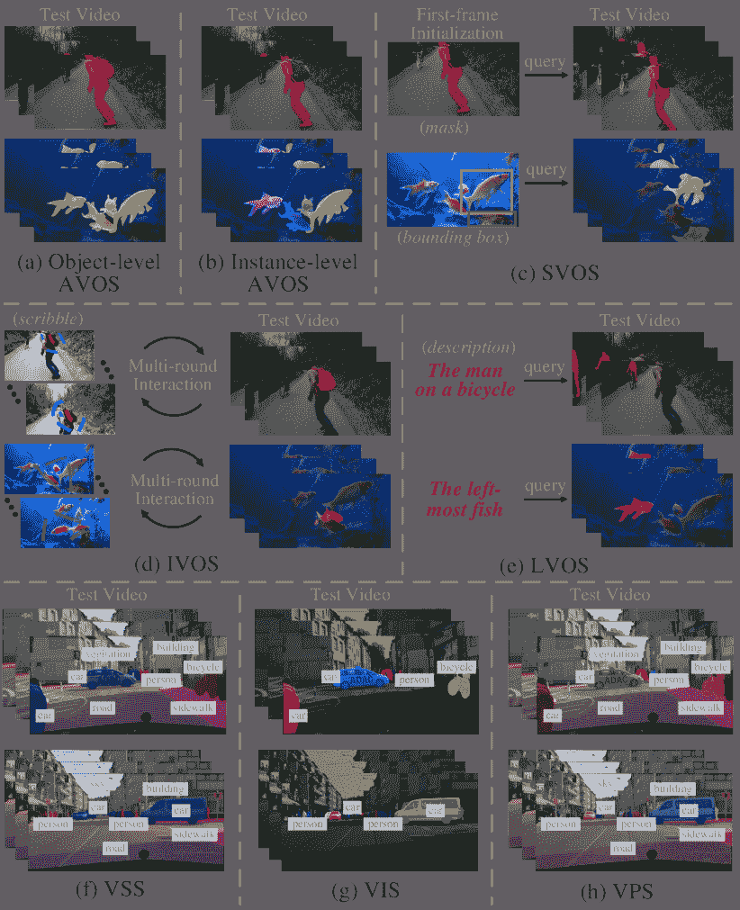

<!--yml

类别：未分类

日期：2024-09-06 19:53:29

-->

# [2107.01153] 深度学习技术在视频分割中的调查

> 来源：[`ar5iv.labs.arxiv.org/html/2107.01153`](https://ar5iv.labs.arxiv.org/html/2107.01153)

# 深度学习技术在视频分割中的调查

视频分割

Tianfei Zhou, Fatih Porikli, David J. Crandall

Luc Van Gool、Wenguan Wang、T. Zhou 和 L. Van Gool 来自 ETH Zurich。（电子邮件：ztfei.debug@gmail.com，vangool@vision.ee.ethz.ch）F. Porikli 来自澳大利亚国立大学计算机科学学院。（电子邮件：fatih.porikli@anu.edu.au）D. Crandall 来自印第安纳大学 Luddy 信息学、计算和工程学院。（电子邮件：djcran@indiana.edu）W. Wang 来自澳大利亚人工智能研究所 ReLER 实验室、悉尼科技大学（电子邮件：wenguanwang.ai@gmail.com）通讯作者：Wenguan Wang

###### 摘要

视频分割——将视频帧划分为多个片段或对象——在各种实际应用中起着关键作用，从增强电影中的视觉效果，到理解自动驾驶中的场景，再到在视频会议中创建虚拟背景。最近，随着计算机视觉中联结主义的复兴，出现了大量基于深度学习的视频分割方法，展现了引人注目的性能。在这项调查中，我们全面回顾了两条基本研究方向——视频中的通用对象分割（未知类别）和视频语义分割——通过介绍它们各自的任务设置、背景概念、需求、发展历史和主要挑战。我们还详细概述了这两种方法和数据集的代表性文献。我们进一步在多个著名数据集上基准测试了所回顾的方法。最后，我们指出了该领域中的开放问题，并提出了进一步研究的机会。我们还提供了一个公共网站，以持续跟踪这一快速发展的领域：[`github.com/tfzhou/VS-Survey`](https://github.com/tfzhou/VS-Survey)。

###### 索引词：

视频分割、视频对象分割、视频语义分割、深度学习

## 1 引言

视频分割——在视频场景中识别具有特定属性或语义的关键对象——是计算机视觉中的一个基础而具有挑战性的问题，具有众多潜在应用，包括自动驾驶、机器人技术、自动监控、社交媒体、增强现实、电影制作和视频会议。

这一问题已通过各种传统计算机视觉和机器学习技术得到解决，包括手工特征（*例如*，直方图统计，光流，*等*），启发式先验知识（*例如*，视觉注意机制${}_{\!}$ [1]，运动边界${}_{\!}$ [2]，*等*），低/中级视觉表示（*例如*，超体素${}_{\!}$ [3]，轨迹${}_{\!}$ [4]，对象提议${}_{\!}$ [5]，*等*），以及经典机器学习模型（*例如*，聚类${}_{\!}$ [6]，图模型${}_{\!}$ [7]，随机游走${}_{\!}$ [8]，支持向量机${}_{\!}$ [9]，随机决策森林${}_{\!}$ [10]，马尔可夫随机场${}_{\!}$ [11]，条件随机场${}_{\!}$ [12]，*等*）。近年来，深度神经网络，尤其是全卷积网络（FCNs）${}_{\!}$ [13]，在视频分割方面取得了显著的进展。这些基于深度学习的视频分割算法比传统方法显著更准确（有时甚至更高效）。

图 1：本调查中回顾的视频分割任务：(a) 对象级自动视频对象分割（对象级 AVOS），(b) 实例级自动视频对象分割（实例级 AVOS），(c) 半自动视频对象分割（SVOS），(d) 交互式视频对象分割（IVOS），(e) 语言引导的视频对象分割（LVOS），(f) 视频语义分割（VSS），(g) 视频实例分割（VIS），和 (h) 视频全景分割（VPS）。

<svg version="1.1" width="191.1" height="9.69" overflow="visible"><g transform="translate(0,9.69) scale(1,-1)"><g transform="translate(-680.78,303.03)"><text x="0" y="0" transform="scale(1, -1)" fill="black" font-size="70%">§<g transform="translate(0,1.383700013837) scale(1, -1)"><foreignobject width="1.383700013837" height="1.383700013837" overflow="visible">1</foreignobject></g></text></g><g transform="translate(-613.67,303.03)"><text x="0" y="0" transform="scale(1, -1)" fill="black" font-size="70%">§<g transform="translate(0,1.383700013837) scale(1, -1)"><foreignobject width="1.383700013837" height="1.383700013837" overflow="visible">2</foreignobject></g></text></g><g transform="translate(-481.53,303.03)"><text x="0" y="0" transform="scale(1, -1)" fill="black" font-size="70%">§<g transform="translate(0,1.383700013837) scale(1, -1)"><foreignobject width="1.383700013837" height="1.383700013837" overflow="visible">3</foreignobject></g></text></g><g transform="translate(-386.74,315.48)"><text x="0" y="0" transform="scale(1, -1)" fill="black" font-size="70%">§<g transform="translate(0,1.383700013837) scale(1, -1)"><foreignobject width="1.383700013837" height="1.383700013837" overflow="visible">3.1</foreignobject></g></text></g><g transform="translate(-387.44,290.58)"><text x="0" y="0" transform="scale(1, -1)" fill="black" font-size="70%">§<g transform="translate(0,1.383700013837) scale(1, -1)"><foreignobject width="1.383700013837" height="1.383700013837" overflow="visible">3.2</foreignobject></g></text></g><g transform="translate(-291.27,302.34)"><text x="0" y="0" transform="scale(1, -1)" fill="black" font-size="70%">§<g transform="translate(0,1.383700013837) scale(1, -1)"><foreignobject width="1.383700013837" height="1.383700013837" overflow="visible">4</foreignobject></g></text></g><g transform="translate(-190.95,302.34)"><text x="0" y="0" transform="scale(1, -1)" fill="black" font-size="70%">§<g transform="translate(0,1.383700013837) scale(1, -1)"><foreignobject width="1.383700013837" height="1.383700013837" overflow="visible">5</foreignobject></g></text></g><g transform="translate(-107.24,302.34)"><text x="0" y="0" transform="scale(1, -1)" fill="black" font-size="70%">§<g transform="translate(0,1.383700013837) scale(1, -1)"><foreignobject width="1.383700013837" height="1.383700013837" overflow="visible">6</foreignobject></g></text></g><g transform="translate(-48.43,302.34)"><text x="0" y="0" transform="scale(1, -1)" fill="black" font-size="70%">§<g transform="translate(0,1.383700013837) scale(1, -1)"><foreignobject width="1.383700013837" height="1.383700013837" overflow="visible">7</foreignobject></g></text></g><g transform="translate(-620.59,141.14)"><text x="0" y="0" transform="scale(1, -1)" fill="black" font-size="50%">§<g transform="translate(0,1.383700013837) scale(1, -1)"><foreignobject width="1.383700013837" height="1.383700013837" overflow="visible">2.1</foreignobject></g></text></g><g transform="translate(-624.74,109.31)"><text x="0" y="0" transform="scale(1, -1)" fill="black" font-size="50%">§<g transform="translate(0,1.383700013837) scale(1, -1)"><foreignobject width="1.383700013837" height="1.383700013837" overflow="visible">2.2</foreignobject></g></text></g><g transform="translate(-637.89,77.49)"><text x="0" y="0" transform="scale(1, -1)" fill="black" font-size="50%">§<g transform="translate(0,1.383700013837) scale(1, -1)"><foreignobject width="1.383700013837" height="1.383700013837" overflow="visible">2.3</foreignobject></g></text></g><g transform="translate(-488.45,224.16)"><text x="0" y="0" transform="scale(1, -1)" fill="black" font-size="50%">§<g transform="translate(0,1.383700013837) scale(1, -1)"><foreignobject width="1.383700013837" height="1.383700013837" overflow="visible">3.1.1 ‣ 3.1 基于深度学习的视频目标分割模型 ‣ 3 基于深度学习的视频分割 ‣ 深度学习技术在视频分割中的调查")</foreignobject></g></text></g><g transform="translate(-471.15,124.53)"><text x="0" y="0" transform="scale(1, -1)" fill="black" font-size="50%">§<g transform="translate(0,1.383700013837) scale(1, -1)"><foreignobject width="1.383700013837" height="1.383700013837" overflow="visible">3.1.2 ‣ 3.1 基于深度学习的视频目标分割模型 ‣ 3 基于深度学习的视频分割 ‣ 深度学习技术在视频分割中的调查")</foreignobject></g></text></g><g transform="translate(-488.45,59.5)"><text x="0" y="0" transform="scale(1, -1)" fill="black" font-size="50%">§<g transform="translate(0,1.383700013837) scale(1, -1)"><foreignobject width="1.383700013

图 2：本调查的概述。

随着这一领域的快速发展，大量新文献不断涌现。然而，大多数现有的调查研究早于现代深度学习时代${}_{\!}$ [14, 15]，并且通常视角狭窄，例如仅关注视频前景/背景分割${}_{\!}$ [16, 17]。在本文中，我们提供了一份**最先进**的综述，涵盖了视频${}_{\!}$分割的广泛领域${}_{\!}$，特别是为了帮助新${}_{\!}$研究者${}_{\!}$进入这个快速发展的领域。我们系统地介绍了视频分割的最新进展，从任务制定到分类法，从算法到数据集，从未解决的问题到未来的研究方向。我们涵盖了关键方面，包括任务类别（*即*，前景/背景分离与语义分割）、推理模式（*即*，自动、半自动和交互式）以及学习范式（*即*，监督、无监督和弱监督），并且尝试澄清术语（*例如*，背景减除、运动分割，*等等*）。我们希望这项调查能加速这一领域的进步。

本调查主要集中在视频分割的两个主要分支的近期进展，即视频目标分割（图 1(a-e)）和视频语义分割（图${}_{\!}$ 1(f-h)），${}_{\!}$这两个分支进一步细分为八个子领域。即使将焦点限制在基于深度学习的视频分割上，这一快速发展的领域仍有数百篇论文。我们选择了在权威期刊和会议上发表的有影响力的工作。我们还包括了一些非深度学习的视频分割模型和其他相关领域的文献，*例如*，视觉跟踪，以提供必要的背景。此外，为了促进这一领域的发展，我们提供了一个附属网页， catalog 算法和数据集，解决视频分割问题：[`github.com/tfzhou/VS-Survey`](https://github.com/tfzhou/VS-Survey)。

图 2 显示了本调查的结构。第§2 节提供了分类、术语、研究历史和相关研究领域的一些简要背景。我们在§3 和§4 中分别回顾了关于深度学习算法和视频分割数据集的代表性论文。第§5 节进行性能评估和分析，而第§6 节提出了开放性问题和研究方向。最后，我们在第§7 节做出结论性总结。

## 2 背景

在这一部分，我们首先形式化任务，分类研究方向，并讨论§2.1 中的关键挑战和驱动因素。接着，§2.2 提供了涵盖早期工作和基础的简要历史背景，而§2.3 则建立了与相关领域的联系。

### 2.1 问题表述与分类

形式上，设 $\mathcal{X}$ 和 $\mathcal{Y}$ 分别表示输入空间和输出分割空间。基于深度学习的视频分割解决方案通常寻求学习一个理想的视频到分割的映射 $f^{*\!}:\bm{\mathcal{X}}\mapsto\bm{\mathcal{Y}}$。

#### 2.1.1 视频分割类别

根据输出空间 $\mathcal{Y}$ 的定义，视频分割大致可以分为两类：视频目标（前景/背景）分割和视频语义分割。

$\bullet$ 视频前景/背景分割（视频目标分割，VOS）。VOS 是经典的视频分割设置，指的是对主要对象（类别未知）进行分割。在这种情况下，$\bm{\mathcal{Y}}$ 是一个二进制的前景/背景分割空间。VOS 通常用于视频分析和编辑应用场景，如电影编辑中的物体移除、基于内容的视频编码和视频会议中的虚拟背景创建。它通常不关心被分割对象的确切语义类别。

$\bullet$ 视频语义分割（VSS）。作为图像语义分割在时空领域的直接扩展，VSS 旨在从视频中提取预定义语义类别（*例如*，汽车、建筑、人行道、道路）中的物体。因此，$\bm{\mathcal{Y}}$ 对应于多类别的语义解析空间。VSS 作为许多应用领域的感知基础，如机器人感知、人机交互和自动驾驶，这些领域需要对物理环境有高级的理解。

备注。VOS 和 VSS 面临一些共同的挑战，如快速运动和物体遮挡。然而，由于应用场景的不同，许多挑战也是不同的。例如，VOS 通常关注人工创建的媒体，这些媒体通常有大的摄像机运动、形变和外观变化。而 VSS 则通常关注诸如自动驾驶等应用，这些应用需要在准确性和延迟之间做出良好的权衡，精确检测小物体，模型并行化，以及跨领域的泛化能力。

#### 2.1.2 视频分割的推理模式

VOS 方法可以进一步分为三类：自动、半自动和交互式，具体取决于推理过程中涉及的人工干预程度。

$\bullet$ 自动视频对象分割（AVOS）。AVOS，或无监督视频分割或零样本视频分割，以自动方式执行 VOS，无需任何手动初始化（图 1(a-b)）。输入空间 $\bm{\mathcal{X}}$ 仅指视频领域 $\bm{\mathcal{V}}$。AVOS 适用于视频分析，但不适用于需要灵活分割任意物体或其部分的视频编辑；一个典型的应用是视频会议中的虚拟背景创建。

$\bullet$ 半自动视频对象分割（SVOS）。SVOS，也称为半监督视频分割或单次视频分割 [18]，涉及有限的人类检查（通常提供在第一帧）以指定所需对象（图 1(c)）。对于 SVOS，$\bm{\mathcal{X}}_{\!}\!=_{\!}\!\bm{\mathcal{V}}\!\times\!\bm{\mathcal{M}}$，其中 $\bm{\mathcal{V}}_{\!}$ 表示视频空间，$\bm{\mathcal{M}}$ 指代人为输入。通常，人为输入是第一帧中的对象掩码，此时 SVOS 也称为像素级跟踪或掩码传播。其他形式的人为输入包括边界框和涂鸦 [8]。从这个角度来看，语言引导的视频对象分割（LVOS）是 SVOS 的一个子分支，其中人为输入以对所需对象的语言描述给出（图 1(e)）。与 AVOS 相比，SVOS 在定义目标对象方面更具灵活性，但需要人为输入。SVOS 通常应用于用户友好的环境（没有专业设备），如手机视频内容创作。SVOS 的核心挑战之一是如何充分利用来自有限人工干预的目标信息。

$\bullet$ 交互式视频对象分割（IVOS）。SVOS 模型设计为在目标确定后自动运行，而 IVOS 系统在整个分析过程中结合用户指导（图 1(d)）。IVOS 可以获得高质量的分割效果，并且在计算机生成的图像和视频后期制作中表现良好，其中可能进行繁琐的人类监督。IVOS 在图形学社区中也作为视频剪裁进行研究。IVOS 的输入空间 $\bm{\mathcal{X}}$ 是 $\bm{\mathcal{V}}\!\times\!\bm{\mathcal{S}}$，其中 $\bm{\mathcal{S}}$ 通常指人为涂鸦。主要挑战包括：1）允许用户轻松指定分割约束；2）将人类指定的约束融入分割算法；3）对约束做出快速响应。

相较于 VOS，VSS 方法通常以自动模式运行（图 1(f-h)），*即*，$\bm{\mathcal{X}}\!\equiv\!\bm{\mathcal{V}}$。只有少数早期方法涉及半自动设置，称为标签传播 [19]。

备注。术语“无监督”和“半监督”通常用于 VOS 中以指定推断过程中涉及的人类互动量。但这些术语容易与“无监督${}_{\!}$学习”${}_{\!}$和${}_{\!}$“半监督${}_{\!}$学习”${}_{\!}$混淆。我们${}_{\!}$敦促${}_{\!}$社区${}_{\!}$用“自动化”和“半自动化”替换这些模糊的术语。

#### 2.1.3 视频分割的学习范式

基于深度学习的视频分割模型可以根据用于逼近 $f^{*}$ 的学习策略分为三类：监督、无监督和弱监督。

$\bullet$ 监督学习方法。现代视频分割模型通常采用完全监督的方式进行学习，需要 $N$ 个输入训练样本及其期望输出 $y_{n}\!\!:=\!f^{*\!}(x_{n})$，其中 $\{(x_{n},y_{n})\}_{n\!}\!\subset$$\mathcal{X}$$\times$$\mathcal{Y}$。评估学习结果的标准方法遵循经验风险/损失最小化公式¹¹1 为了简洁，我们省略了正则化项。

|  | $\small\tilde{f}\in\mathop{\arg\min}_{f\in\bm{\mathcal{F}}}\frac{1}{N}\sum\nolimits_{n}\varepsilon(f(x_{n}),z(x_{n})),\vspace{-3pt}$ |  |
| --- | --- | --- |

其中 $\mathcal{F}$ 表示假设（解决方案）空间，$\varepsilon_{\!\!}:$ $\bm{\mathcal{X}}_{\!}\times\bm{\mathcal{Y}}_{\!}\mapsto\!\mathbb{R}$ 是一个误差函数，用于评估估计 $f(x_{n})$ 相对于视频分割相关的先验知识 $z(x_{n})\!\!\in$$\mathcal{Z}$。为了使 $\tilde{f}$ 成为 $f^{*\!}$ 的良好逼近，目前的监督视频分割方法直接使用期望输出 $y_{n}$，*即*，$z(x_{n})\!\!:=\!\!f^{*\!}(x_{n})$，作为先验知识，代价是需要大量的标注良好的数据。

$\bullet$ 无监督（自监督）学习方法。当仅给出数据样本 $\{x_{n}\}_{n\!\!}\!\subset$$\mathcal{X}$ 时，逼近 $f^{*\!}$ 的问题称为无监督学习。无监督学习包括完全无监督学习方法，其中方法完全不需要标签，以及自监督学习方法，其中网络通过自动生成的伪标签进行明确训练，而无需人工注释 [20]。几乎所有现有的基于无监督学习的视频分割模型都是自监督学习方法，其中先验知识 $\mathcal{Z}$ 指的是从视频数据的内在属性中获得的伪标签（*例如*，跨帧一致性）。因此，我们将“无监督学习”和“自监督学习”互换使用。

$\bullet$ 弱监督学习方法。在这种情况下，$\mathcal{Z}$通常是一个更易于标注的领域，如标签、边界框或涂鸦，$f^{*}$通过从$\mathcal{X}$$\times$$\mathcal{Z}$中获取有限数量的样本来进行近似。

备注。迄今为止，基于深度监督学习的方法在视频分割领域占据主导地位。然而，在无监督或弱监督环境下探索这一任务更具吸引力，这不仅因为它减轻了$\mathcal{Y}$的标注负担，还因为它通过探索$\mathcal{Z}$激发了对任务本质的深入理解。

### 2.2 历史与术语

数字图像分割研究已至少有 50 年的历史，最初使用 Roberts 算子[21]来识别物体边界。从那时起，提出了许多图像分割算法，许多算法也扩展到了视频领域。视频分割领域发展迅速，经历了巨大的变化。

早期的尝试集中在视频过度分割，即将视频分割为时空同质、感知上不同的区域。典型的方法包括基于像素强度在特定位置的不连续性和相似性的分层视频分割[7]、时间超像素[22]和超体素[3]，即根据强度的急剧变化分离像素或将具有相似强度的像素分组。这些方法对于早期的视频预处理很有指导意义，但无法解决对象级模式建模的问题，因为它们没有提供任何有原则的方法来将分层视频分解展平为二进制分割[9, 2]。

为了从视频序列中提取前景对象，背景减除技术从 70 年代末开始出现，并在[24]的工作后变得流行。这些技术假设背景是已知的，并且摄像机是静止的[25, 26]，或者经历可预测的参数化二维[27]或三维运动，具有三维视差[28]。这些基于几何的方法适用于特定的应用场景，例如监控系统[26, 9]，但对模型选择（二维或三维）很敏感，无法处理非刚性摄像机运动。

另一组视频分割解决方案处理了运动分割任务，即**寻找运动中的物体**。背景减除也可以视为运动分割的一个特定案例。然而，大多数运动分割模型建立在运动分析[29, 30]、因式分解[31]和/或统计[32]技术上，这些技术综合建模了移动场景的特征，而无需先验的摄像机运动知识。在众多运动分割算法中，**轨迹分割**受到特别关注[4, 33, 34, 35, 36]。轨迹是通过跟踪多个帧中的点生成的，并且可以表示长期运动模式，作为分割的有用线索。尽管令人印象深刻，基于运动的方法严重依赖光流估计的准确性，并且当物体的不同部分表现出异质运动时可能会失败。

为了克服这些限制，从不受约束的视频序列中提取通用物体的任务，即**AVOS**，引起了越来越多的研究兴趣[37]。一些方法[5, 38, 39, 40]探索了物体假设或提议[41]作为中级物体表示。它们在每一帧中生成大量物体候选，并将视频物体的分割任务视为物体区域选择问题。基于提议的算法的主要缺点是高计算成本[17]和复杂的物体推理方案。其他一些方法探索了启发式假设，如视觉注意力[1]和运动边界[2]，但在启发式假设不成立的场景中容易失败。

如前所述，上述无人值守解决方案的替代方案是引入人工标记初始化，即**SVOS**。较早的**SVOS**方法通常依赖光流[42, 8, 43, 44]，并与物体跟踪[45, 46]有类似的精神。此外，一些开创性的**IVOS**方法被提出以解决在广泛人工指导下的高质量视频分割问题，包括**rotoscoping**[47, 48]、**scribble**[49, 50, 51, 52, 8]、**contour**[53]和**points**[54]。通常需要大量工程工作来使**IVOS**系统以交互速度运行。简而言之，**SVOS**和**IVOS**为了提高灵活性和准确性而付出了代价：由于其人机交互的特性，它们在大规模应用中不可行。

在深度学习时代之前，由于任务的复杂性，考虑 VSS 的论文相对较少${}_{\!}$ [55, 56, 57, 58, 12]。这些方法通常依赖于监督分类器，如支持向量机（SVMs）和视频过分割技术。

总体而言，虽然传统的视频分割方法提供了有趣的结果，但它们受到手工特征和繁重工程的限制。但是，深度学习将视频分割的性能提升到了一个新水平，正如我们将在§3 中回顾的那样。

### 2.3 相关研究领域

有几个研究领域与视频分割密切相关，我们现在简要描述一下。

$\bullet$ 视觉跟踪。为了推断目标物体随时间的位置信息，目前的跟踪方法通常假设目标在第一帧中由一个边界框确定[59]。然而，在更一般的跟踪场景中，特别是在早期跟踪方法研究的情况下，探索了多样的对象表示[60]，包括质心、骨架和轮廓。一些视频分割技术，如背景减除，也被合并到旧的跟踪器中[61, 62]。因此，视觉跟踪和视频分割面临一些共同的挑战（*例如*，对象/相机运动、外观变化、遮挡，*等等*），促进了它们的相互协作。

$\bullet$ 图像语义分割。端到端图像语义分割[63, 64, 65]的成功激发了 VSS 的快速发展。与其逐帧直接应用图像语义分割技术，近期的 VSS 系统探索了时间连续性，以提高准确性和效率。然而，图像语义分割技术仍然作为推进视频分割的基础。

表 I: 总结了已审查 AVOS 方法的基本特征（§3.1.1 ‣ 3.1 Deep Learning-based VOS Models ‣ 3 Deep Learning-based Video Segmentation ‣ A Survey on Deep Learning Technique for Video Segmentation")）。

实例：实例或对象级分割；流：如果使用光流。

|   年份 | 方法 | 发表 | 核心架构 | 实例 | 流 | 训练数据集 |
| --- | --- | --- | --- | --- | --- | --- |
| 2017 | FSEG [66] | CVPR | 双流 FCN | 对象 | ✓ | ImageNet VID [67] + DAVIS[16] [17] |
| SFL [68] | ICCV | 双流 FCN | 对象 | ✓ | DAVIS[16] [17] |
| LVO [69] | ICCV | 双流 FCN | 对象 | ✓ | DAVIS[16] [17] |
| LMP [70] | ICCV | FCN | 对象 | ✓ | FT3D [71] |
| NRF [72] | ICCV | FCN | 物体 | ✓ | Youtube-Objects [73] |
| 2018 | IST [74] | CVPR | FCN | 物体 | ✓ | DAVIS[16] [17] |
| FGRNE [75] | CVPR | FCN + RNN | 物体 |  | SegTrackV2 [76] + DAVIS[16] [17] + FBMS [36] |
| MBN [77] | ECCV | FCN | 物体 | ✓ | DAVIS[16] [17] |
| PDB [78] | ECCV | RNN | 物体 |  | DAVIS[16] [17] |
| MOT [79] | ICRA | 双流 FCN | 物体 | ✓ | DAVIS[16] [17] |
| 2019 | RVOS [80] | CVPR | RNN | 实例 |  | DAVIS[17] [81]/YouTube-VIS [82] |
| COSNet [83] | CVPR | 孪生 FCN + 共注意力 | 物体 |  | MSRA10K [84] + DUT [85] + DAVIS[16] [17] |
| UMOD [86] | CVPR | 对抗网络 | 物体 | ✓ | SegTrackV2 [76] + DAVIS[16] [17] + FBMS [36] |
| AGS [87] | CVPR | FCN | 物体 |  | SegTrackV2 [76] + DAVIS[16] [17] + DUT [85] + PASCAL-S [88] |
| AGNN [89] | ICCV | FCN + GNN | 物体 |  | MSRA10K [84] + DUT [85] + DAVIS[16] [17] |
| MGA [90] | ICCV | 双流 FCN | 物体 | ✓ | DUTS [91] + DAVIS[16] [17] + FBMS [36] |
| AnDiff [92] | ICCV | 孪生 FCN + 共注意力 | 物体 |  | DAVIS[16] [17] |
| LSMO [93] | IJCV | 双流 FCN | 物体 | ✓ | FT3D [71] + DAVIS[16] [17] |
| 2020 | MATNet [94] | AAAI | 双流 FCN | 物体 | ✓ | Youtube-VOS [95] + DAVIS[16] [17] |
| PyramidCSA [96] | AAAI | 孪生 FCN + 共注意力 | 物体 |  | DUTS [91] + DAVIS[16] [17] + DAVSOD [97] |
| MuG [98] | CVPR | FCN | 物体 |  | OxUvA [99] |
| EGMN [100] | ECCV | FCN + 情景记忆 | 物体 |  | MSRA10K [84] + DUT [85] + DAVIS[16] [17] |
| WCSNet [101] | ECCV | 孪生 FCN | 物体 |  | SALICON [102] + PASCAL VOC 2012 [103] + DUTS [91] + DAVIS[16] [17] |
| DFNet [104] | ECCV | 孪生 FCN | 物体 |  | MSRA10K [84] + DUT [85] + DAVIS[16] [17] |
| 2021 | F2Net [105] | AAAI | 孪生 FCN | 物体 |  | MSRA10K [84] + DAVIS[16] [17] |
| TODA [106] | CVPR | 孪生 FCN | 实例 |  | DAVIS[17] [81]/YouTube-VIS [82] |
| RTNet [107] | CVPR | 双流 FCN | 物体 | ✓ | DUTS [91] + DAVIS[16] [17] |
| DyStab [108] | CVPR | 对抗网络 | Object | ✓ | SegTrackV2 [76] + DAVIS[16] [17] + FBMS [36] |
| MotionGrouping [109] | ICCV | Transformer | Object | ✓ | DAVIS16 [17]/SegTrackV2 [76]/FBMS59 [110]/MoCA [111] |

$\bullet$ 视频对象检测。为了在视频领域推广对象检测 [112]，视频对象检测器在框或特征级别上结合时间线索。视频对象检测和（实例级别）视频分割之间有许多关键技术步骤和挑战，如对象提议生成、时间信息聚合和跨帧对象关联。

## 3 基于深度学习的视频分割

### 3.1 基于深度学习的 VOS 模型

VOS 从视频序列中提取通用的前景对象，而不考虑语义类别识别。根据推断过程中涉及的人类干预程度，VOS 模型可以分为三类 (§2.1.2)：自动（AVOS，§3.1.1 ‣ 3.1 Deep Learning-based VOS Models ‣ 3 Deep Learning-based Video Segmentation ‣ A Survey on Deep Learning Technique for Video Segmentation")）、半自动（SVOS，§3.1.2 ‣ 3.1 Deep Learning-based VOS Models ‣ 3 Deep Learning-based Video Segmentation ‣ A Survey on Deep Learning Technique for Video Segmentation")）和交互式（IVOS，§3.1.3 ‣ 3.1 Deep Learning-based VOS Models ‣ 3 Deep Learning-based Video Segmentation ‣ A Survey on Deep Learning Technique for Video Segmentation")）。此外，尽管语言引导的视频对象分割（LVOS）属于 SVOS 的更广泛类别，但由于其特定的多模态任务设置，LVOS 方法被单独审视 (§3.1.4 ‣ 3.1 Deep Learning-based VOS Models ‣ 3 Deep Learning-based Video Segmentation ‣ A Survey on Deep Learning Technique for Video Segmentation")）。

#### 3.1.1 自动视频对象分割（AVOS）

现代 AVOS 方法不再使用启发式先验和手工特征来自动执行 VOS，而是以数据驱动的方式学习通用的视频对象模式。我们根据其关键技术对重要工作进行了分组。

$\bullet$ 基于深度学习模块的方法。2015 年，Fragkiadaki *等* [113] 进行了早期尝试，学习多层感知器以对提议段进行排序并推断前景物体。2016 年，Tsai *等* [43] 提出了一个用于 AVOS 和光流估计的联合优化框架，采用了来自预训练分类网络的深度特征。后来的方法 [72, 70] 学习 FCNs 从帧图像 [72, 114] 或光流场 [70] 预测初步的像素级前景估计，但仍需要若干后处理步骤。基本上，这些原始解决方案在很大程度上依赖于传统的 AVOS 技术；神经网络的学习能力尚未得到充分探索。

$\bullet$ 基于像素实例嵌入的方法。一组 AVOS 模型已经被开发出来，以利用从图像实例分割数据中学习到的更强大的深度学习描述符 [74, 77] —— 实例嵌入。它们首先生成逐像素实例嵌入，并选择代表性嵌入，这些嵌入被聚类为前景和背景。最后，将采样的嵌入标签传播到其他嵌入上。聚类和传播可以在没有视频特定监督的情况下完成。尽管使用了较少的标注，这些方法仍然受到管道碎片化和复杂化的影响。

$\bullet$ 具有短期信息编码的端到端方法。端到端模型设计已成为该领域的主流。例如，卷积递归神经网络（RNNs）被用来共同学习空间和时间视觉模式 [78, 89]。另一个重要家族是基于双流网络构建的 [66, 68, 90, 75, 93, 69, 94]，其中两个并行流用于从原始图像和光流中提取特征，这些特征进一步融合用于分割预测。双流方法明确利用了外观和运动线索，但需要计算光流和大量可学习参数。这些端到端方法提高了准确性，并展示了将神经网络应用于此任务的优势。然而，它们仅考虑非常有限时间跨度内的局部内容；它们将几帧连续图像的外观和/或运动信息堆叠作为输入，忽略了远帧之间的关系。尽管通常采用 RNNs，但其内部隐藏记忆在建模长期依赖性方面存在固有限制 [116]。

TABLE II: 被审核的 SVOS 方法（§3.1.2 ‣ 3.1 Deep Learning-based VOS Models ‣ 3 Deep Learning-based Video Segmentation ‣ A Survey on Deep Learning Technique for Video Segmentation"))的主要特征总结。流：如果使用了光流。

|   年份 | 方法 | 发布期刊 | 核心架构 | 流 | 技术特征 | 训练数据集 |
| --- | --- | --- | --- | --- | --- | --- |
| 2017 | OSVOS [18] | CVPR | FCN |  | 在线微调 | DAVIS[16] [17] |
| MaskTrack [117] | CVPR | FCN | ✓ | 基于传播 | ECSSD [118] + MSRA10K [84] + PASCAL-S [88] + DAVIS[16] [17] |
| CTN [119] | CVPR | FCN | ✓ | 基于传播 | PASCAL VOC 2012 [103] |
| VPN [120] | CVPR | 双边网络 |  | 基于传播 | DAVIS[16] [17] |
| PLM [121] | CVPR | Siamese FCN |  | 基于匹配 | DAVIS[16] [17] |
| OnAVOS [122] | BMVC | FCN |  | 在线微调 | PASCAL VOC 2012 [103] + COCO [123] + DAVIS [17] |
| Lucid [124] | IJCV | 双流 FCN | ✓ | 基于传播 | DAVIS[16] [17] |
| 2018 | CINM [125] | CVPR | 时空 MRF | ✓ | 基于传播 | DAVIS[17] [81] |
| FAVOS [126] | CVPR | FCN |  | 基于传播 | DAVIS[16] [17]/DAVIS[17] [81] |
| RGMP [127] | CVPR | Siamese FCN |  | 基于传播 | PASCAL VOC 2012 [103] + ECSSD [118] + MSRA10K [84] + DAVIS[17] [81] |
| OSMN [128] | CVPR | FCN + 元学习 |  | 在线微调 | ImageNet VID [67] + DAVIS[16] [17] |
| MONet [129] | CVPR | FCN | ✓ | 在线微调 | PASCAL VOC 2012 [103] + DAVIS[16] [17] |
| CRN [130] | CVPR | FCN + 主动轮廓 | ✓ | 基于传播 | PASCAL VOC 2012 [103] + DAVIS[16] [17] |
| RCAL [131] | CVPR | FCN + RL |  | 基于传播 | MSRA10K [84] + PASCAL-S + SOD + ECSSD [118] + DAVIS[16] [17] |
| OSVOS-S [132] | PAMI | FCN |  | 在线微调 | DAVIS[16] [17]/DAVIS[17] [81] |
| Videomatch [133] | ECCV | Siamese FCN |  | 基于匹配 | DAVIS[16] [17]/DAVIS[17] [81] |
| Dyenet [134] | ECCV | 重新识别 |  | 基于传播 | DAVIS[17] [81] |
| LSE [135] | ECCV | FCN |  | 基于传播 | PASCAL VOC 2012 [103] |
| Colorization [136] | ECCV | Siamese FCN |  | 无监督学习 | Kinetics [137] |
| 2019 | MVOS [138] | PAMI | Siamese FCN + 元学习 |  | 在线微调 | PASCAL VOC 2012 [103] + DAVIS[16] [17]/DAVIS[17] [81] |
| FEELVOS [139] | CVPR | FCN |  | 基于匹配 | COCO [123] + DAVIS[17] [81] + YouTube-VOS [95] |
| MHP-VOS [140] | CVPR | 图优化 |  | 基于传播 | COCO [123] + DAVIS[16] [17]/DAVIS[17] [81] |
| AGSS [141] | CVPR | FCN | ✓ | 基于传播 | DAVIS[17] [81]/YouTube-VOS [95] |
| AGAME [142] | CVPR | FCN |  | 基于传播 | MSRA10K [84] + PASCAL VOC 2012 [103] + DAVIS[17] [81]/YouTube-VOS [95] |
| SiamMask [143] | CVPR | Siamese FCN |  | 框初始化 | DAVIS[16] [17]/DAVIS[17] [81]/YouTube-VOS [95] |
| RVOS [80] | CVPR | RNN |  | 基于传播 | DAVIS[17] [81]/YouTube-VIS [82] |
| BubbleNet [144] | CVPR | Siamese 网络 |  | 冒泡排序 | DAVIS[17] [81] |
| RANet [145] | ICCV | Siamese FCN |  | 基于匹配 | MSRA10K [84] + ECSSD [118]+ HKU-IS [146] + DAVIS[16] [17]/DAVIS[17] [81] |
| DMM-Net [147] | ICCV | Mask R-CNN |  | 可微匹配 | DAVIS[17] [81]/YouTube-VOS [95] |
| DTN [148] | ICCV | FCN | ✓ | 基于传播 | COCO [123] + PASCAL VOC 2012 [103] + DAVIS[16]/DAVIS[17] [81] |
| STM [149] | ICCV | 记忆网络 |  | 基于匹配 | PASCAL VOC 2012 [103] + COCO [123] + ECSSD [118] + DAVIS[17] [81]/YouTube-VOS [95] |
| TimeCycle [150] | ECCV | Siamese FCN |  | 无监督学习 | VLOG [151] |
|  | UVC [152] | NeurIPS | Siamese FCN |  | 无监督学习 | COCO [123] + Kinetics [137] |
| 2020 | e-OSVOS [153] | NeurIPS | Mask R-CNN + 元学习 |  | 在线微调 | DAVIS[17] [81] + YouTube-VOS [95] |
| AFB-URR [154] | NeurIPS | 记忆网络 |  | 基于匹配 | PASCAL VOC 2012 [103] + COCO [123] + ECSSD [118] + DAVIS[17] [81]/YouTube-VOS [95] |
| Fasttan [155] | CVPR | Faster R-CNN |  | 基于传播 | COCO [123] + DAVIS[17] [81] |
| Fasttmu [156] | CVPR | FCN + RL |  | Box-Initialization | PASCAL VOC 2012 [103] + DAVIS[17] [81] |
| SAT [157] | CVPR | FCN + RL |  | 基于传播 | COCO [123] + DAVIS[17] [81] + YouTube-VOS [95] |
| FRTM-VOS [158] | CVPR | FCN |  | 基于匹配 | DAVIS[17] [81]/YouTube-VOS [95] |
| TVOS [159] | CVPR | FCN |  | 基于匹配 | DAVIS[17] [81]/YouTube-VOS [95] |
| MuG [98] | CVPR | Siamese FCN |  | 无监督学习 | OxUvA [99] |
| MAST [160] | CVPR | 记忆网络 |  | 无监督学习 | OxUvA [99] + YouTube-VOS [95] |
| GCNet [161] | ECCV | 记忆网络 |  | 基于匹配 | MSRA10K [84] + ECSSD [118] + HKU-IS [146] + DAVIS[17] [81]/YouTube-VOS [95] |
| KMN [162] | ECCV | 记忆网络 |  | 基于匹配 | PASCAL VOC 2012 [103] + COCO [123] + ECSSD [118] + DAVIS[17] [81]/YouTube-VOS [95] |
| CFBI [163] | ECCV | FCN |  | 基于匹配 | COCO [123] + DAVIS[17] [81]/YouTube-VOS [95] |
| LWL [164] | ECCV | Siamese FCN + 元学习 |  | 基于匹配 | DAVIS[17] [81] + YouTube-VOS [95] |
| MSN [165] | ECCV | 记忆网络 |  | 基于匹配 | DAVIS[17] [81]/YouTube-VOS [95] |
| EGMN [100] | ECCV | 记忆网络 |  | 基于匹配 | MSRA10K [84] + COCO [123] + DAVIS[17] [81] + YouTube-VOS [95] |
| STM-Cycle [166] | NeurIPS | 记忆网络 |  | 基于匹配 | DAVIS[17] [81] + YouTube-VOS [95] |
| 2021 | QMA [167] | AAAI | 记忆网络 |  | Box-Initialization | DUT [85] + HKU-IS [146] + MSRA10K [84] + YouTube-VOS [95] |
| SwiftNet [168] | CVPR | 记忆网络 |  | 基于匹配 | COCO [123] + DAVIS[17] [81]/YouTube-VOS [95] |
| G-FRTM [169] | CVPR | FCN + RL |  | 基于匹配 | DAVIS[17] [81] + YouTube-VOS [95] |
| SST [170] | CVPR | Transformer |  | 基于匹配 | DAVIS[17] [81] + YouTube-VOS [95] |
| GIEL [171] | CVPR | Siamese FCN |  | 基于匹配 | DAVIS[17] [81] + YouTube-VOS [95] |
| LCM [172] | CVPR | 记忆网络 |  | 基于匹配 | PASCAL VOC 2012 [103] + COCO [123] + ECSSD [118] + DAVIS[17] [81]/YouTube-VOS [95] |
| RMNet [173] | CVPR | 记忆网络 | ✓ | 基于匹配 | PASCAL VOC 2012 [103] + COCO [123] + ECSSD [118] + DAVIS[17] [81]/YouTube-VOS [95] |
| CRW [174] | NeurIPS | FCN |  | 无监督学习 | Kinetics [137] |

$\bullet$ 端到端方法与长期上下文编码。当前领先的 AVOS 模型利用长期的全局上下文。在一项开创性工作 [83]中，Lu *et al*. 提出了基于 Siamese 架构的模型，该模型为任意帧对提取特征，并通过计算像素级特征相关性来捕捉跨帧上下文。在推理过程中，对于每一帧测试图像，聚合来自其他几帧（在同一视频内）的上下文以定位目标。另一项现代工作 [92]利用了类似的思想，但仅使用第一帧作为参考。一些论文 [101, 107] 通过更好地利用来自多帧的信息 [89, 175, 176]、编码空间上下文 [105] 和结合时间一致性来提升表示能力和计算效率 [96, 104]。

$\bullet$ ${}_{\!}$无监督/弱监督${}_{\!}$ 基于${}_{\!}$ 方法。仅有少数方法能够从未标注或弱标注的数据中学习进行 AVOS。在 [87]中，使用静态图像显著目标分割和动态眼动数据（相对于视频分割数据更容易获取）来学习视频通用目标模式。在 [98]中，通过探索视频数据的多个内在属性，如帧内显著性、短期视觉一致性、长距离语义对应性和视频级区分性来学习视觉模式。在 [86]中，开发了一种对抗性上下文模型来分割移动目标，方法是通过最小化目标及其上下文运动之间的互信息来实现的。该方法在 [108]中通过采用自举策略和强制时间一致性得到进一步提升。在 [109]中，专门利用运动来发现移动对象，并设计了一种基于 Transformer 的模型，通过自监督流重建使用未标注的视频数据进行训练。

$\bullet$ 实例级 AVOS 方法。实例级 AVOS，也称为多对象无监督视频分割，随着 DAVIS[19] 挑战的推出而引入[177]。此任务设置更具挑战性，因为它不仅要求将前景对象与背景分离，还要区分不同的对象实例。为了解决这个问题，目前的解决方案通常采用自上而下的方式，*即*，为每帧生成对象候选，并在不同帧之间关联实例。在早期的尝试中[80]，Ventura *et al* 提出了一个基于递归网络的模型，该模型包括一个用于每帧实例发现的空间 LSTM 和一个用于跨帧实例关联的时间 LSTM。这个方法具有优雅的模型设计，但其表示能力过于薄弱，无法枚举所有对象实例并捕捉实例在时间域上的复杂交互。因此，后来的方法[178, 179, 175]通过以下方式加强了这一步骤：i) 使用图像实例分割模型（*例如*，Mask R-CNN [180]）来检测对象候选，ii) 利用跟踪/重识别技术和手动设计的规则进行实例关联。前景/背景 AVOS 技术[89, 83] 也用于过滤不显著的候选[179, 175]。更近期的方法，*例如*，[106]，首先生成对象候选，并通过先进的 SVOS 技术获得相应的跟踪段。总体而言，当前的实例级 AVOS 模型遵循经典的基于检测的跟踪范式，涉及多个专门设计。准确性和效率仍有相当大的提升空间。

#### 3.1.2 半自动视频对象分割 (SVOS)

基于深度学习的 SVOS 方法主要集中在第一帧掩码传播设置上。它们根据对测试时提供的对象掩码的利用情况进行分类。

$\bullet$ 在线微调方法。接下来是一个

射击原理，这类方法[18、132、129、138]在线训练一个分割模型，每次处理一个给定的物体掩膜。微调方法本质上利用了神经网络的迁移学习能力，并且通常遵循两步训练程序：i) 离线预训练：从图像和视频序列中学习一般分割特征，ii) 在线微调：从测试时监督中学习目标特定的表示。微调的想法最早在[18]中引入，其中仅使用初始的图像-掩膜对来训练一个在线的一次性、但仅仅是基于外观的 FCN 模型。然后，在[122]中，更多的像素样本在未标记的帧中被挖掘作为在线训练样本，以更好地适应随时间变化。由于[18、122]没有个体对象的概念，[132]在推断期间进一步引入实例分割模型（*例如*，Mask R-CNN [180]）。虽然由于其简洁性而优雅，但微调方法存在几个弱点：i) 预训练是固定的，并且没有针对随后的微调进行优化，ii) 在线微调的超参数通常过于手工制作，无法在测试案例之间进行泛化，iii) 现有的微调设置通常存在较高的测试运行时间（每个分割物体在线最多 1,000 次训练迭代[18]）。根本原因是这些方法选择将所有目标相关的线索（*即*，外观、掩膜）隐式编码到网络参数中。为了实现高效和自动化的微调，一些最近的方法[128、138、153]转向元学习技术，*即*，优化微调策略[138、153]（*例如*，通用模型初始化、学习率、*等等*）甚至直接修改网络权重[128]。

$\bullet$ 基于传播的方法。最近的两个研究方向

– 分别基于掩膜传播和模板匹配技术 – 尽量避免在线优化，以提供紧凑的端到端 SVOS 解决方案。特别地，基于传播的方法使用前一帧的掩膜来推断当前掩膜${}_{\!}$ [117、119、120]。例如，Jampani *et al* [120] 提出了一个双边网络，用于长范围的视频自适应掩膜传播。Perazzi *et al* [117] 通过采用修改后的 FCN 来处理 SVOS，其中前一帧的掩膜被视为额外的输入通道。后续工作采用了光流引导的掩膜对齐[129]、重的数据增强${}_{\!}$ [124]，以及多步分割精细化${}_{\!}$ [130]。其他方法应用

重新识别以检索长时间遮挡后的丢失物体[134]，设计一个强化学习代理来处理 SVOS 作为条件决策过程[131]，或在时空 MRF 模型中传播掩模以提高时间连贯性[125]。一些研究人员利用位置感知嵌入来锐化特征[135]，或直接学习序列到序列的掩模传播[95]。先进的跟踪技术也被应用于[126, 140, 157, 155]。基于传播的方法容易因遮挡和掩模传播过程中的漂移而导致误差积累。将传播条件化为初始帧掩模对[127, 141, 148]似乎是一个可行的解决方案。虽然目标特定掩模是 exp-

合法地编码进分割网络中，弥补了细调方法在一定程度上的不足，

基于传播的方法仍然将对象外观嵌入到隐藏的网络权重中。显然，这种隐式目标外观建模策略会影响灵活性和适应性（虽然[142]是一个例外——目标生成模型

背景明确地构建以帮助掩模传播）。

在互动传播中，通常考虑第一帧注释，但在没有人工反馈的挑战性场景中容易失败。此外，第一帧注释通常是详细的掩模，获取起来很繁琐：对于 COCO 的粗略多边形注释，每实例 79 秒，而高质量的则需要更多时间。因此，在交互式传播中执行 VOS

表 III：回顾的 IVOS 方法的基本特征总结（§3.1.3 ‣ 3.1 Deep Learning-based VOS Models ‣ 3 Deep Learning-based Video Segmentation ‣ A Survey on Deep Learning Technique for Video Segmentation")）。

[t] 年份 方法 期刊 核心架构 技术特点 训练数据集 2017 IIW [181] - FCN 交互传播 PASCAL VOC 2012 [103] 2018 BFVOS [182] CVPR FCN 像素级检索 DAVIS[16] [17] 2019 IVS [183] CVPR FCN 交互传播 DAVIS[17] [81]+YouTube-VOS [95] 2020 MANet [184] CVPR 孪生 FCN 交互传播 DAVIS[17] [81] ATNet [185] ECCV FCN 交互传播 SBD + DAVIS[17] [81]+YouTube-VOS [95] ScribbleBox [186] ECCV GCN 交互传播 COCO [123] + ImageNet VID [67] + YouTube-VOS [95] 2021 IVOS-W [187] CVPR FCN + RL 关键帧选择 DAVIS[17] [81] GIS [188] CVPR FCN 交互传播 DAVIS[17] [81]+YouTube-VOS [95] MiVOS [189] CVPR 记忆网络 交互传播 BL30K [189]+DAVIS[17] [81] + YouTube-VOS [95]

$\bullet$${}_{\!}$ 基于匹配的${}_{\!}$ 方法。${}_{\!}$ 这种方法可能是迄今为止最有前景的 SVOS 解决方案，通过构建一个嵌入空间来记住初始对象的嵌入，并根据像素在嵌入空间中与目标对象的相似性来对每个像素的标签进行分类。因此，初始对象的外观被显式建模，测试时不需要微调。这方面的最早努力可以追溯到${}_{\!}$ [121]。受到视觉跟踪进展的启发 [190]，Yoon *et al*. [121] 提出了一个孪生网络，以在第一帧和即将到来的帧之间进行像素级匹配。

后来，[126] 提出了从第一帧监督中学习嵌入空间，并将 VOS 视为像素检索任务：像素在学习的嵌入空间中简单地是它们各自的最近邻。[121] 的想法也在 [133] 中得到了探索，虽然它计算了两个 ma-

对每一帧进行匹配，参考在第一帧中标注的前景和背景。在[139]中，从第一帧和前一帧计算的像素级相似性被用作分割后续帧的指南。后来，提出了许多基于匹配的解决方案[145, 191]，其中最著名的可能是*Oh et al*。他们提出了一种时空记忆（STM）模型，用于在外部存储器中显式地存储以前计算的分割信息[149]。这种记忆有助于学习物体随时间的演变，并允许在较长时间内全面使用过去的分割线索。几乎所有当前领先的 SVOS 解决方案[159, 163]都是建立在 STM 之上的；它们提高了目标适应能力[158, 100, 164]，结合了局部时间连续性[162, 173, 172]，探索了实例感知线索[171]，并开发了更高效的记忆设计[165, 161, 154, 168]。最近，[170]介绍了一种基于 Transformer[192]的模型，通过对多个帧的历史进行关注来执行类似匹配的计算。总体而言，基于匹配的解决方案具有灵活且可微的模型设计以及长期对应建模的优势。另一方面，特征匹配依赖于强大且通用的特征嵌入，这可能限制其在挑战性场景中的表现。

还值得一提的是，作为一种有效的目标特定模型学习技术，在线学习被许多传播[117, 130, 125, 95, 140]和匹配[121, 145, 134]方法应用，以提升性能。

$\bullet$ 基于框初始化的方法。由于像素级标注在现实场景中耗时或甚至不切实际，因此一些研究考虑了第一帧标注以边界框形式提供的情况。具体而言，在[143]中，Siamese 跟踪器通过增加一个掩码预测分支来增强。在[156]中，引入了强化学习来为目标更新和匹配做决策。后来，在[167]中，利用外部记忆构建了更强大的 Siamese 跟踪分割器。

$\bullet$ 无监督/弱监督方法。为了减少对大规模像素级注释训练样本的需求，最近开发了几种无监督/弱监督学习基础的 SVOS 解决方案。这些解决方案通常建立在重建方案上（*即*，从一个‘查询’帧重建每一个像素，通过查找并组合来自相邻帧的相关像素）[136, 160, 193]，和/或采用循环一致性跟踪范式（*即*，鼓励像素/补丁在经过一次前向和后向跟踪后落到相同的位置）[150, 152, 98, 174]。

$\bullet$ 其他特定方法。其他文献做出了具体贡献，值得单独关注。在 [147] 中，曾*等*提取了每一帧的掩码提案，并以可微分的方式制定了对象模板与提案之间的匹配。与仅使用第一帧注释不同，[144] 学会从整个视频中选择最佳帧进行用户交互，以促进掩码传播。在 [166] 中，李*等*引入了一种基于前向-后向数据流的循环一致性机制，通过缓解误差传播问题，改进了传统的 SVOS 训练和离线推理协议。为了加速处理速度，[169] 提出了一个动态网络，根据与前一帧的相似度选择性地分配计算资源给每一帧。

#### 3.1.3 互动视频对象分割（IVOS）

AVOS 在没有任何人工干预的情况下，在分割用户感兴趣的任意对象时失去了灵活性。SVOS 添加设置越来越受到关注。与经典模型 [48, 49, 52] 需要大量专业用户干预不同，最近基于深度学习的 IVOS 解决方案通常通过多轮涂鸦监督来减少用户的努力。在这种情况下 [194]，用户在选择的帧上绘制涂鸦，算法计算批处理过程中所有视频帧的分割图。为了精细化，用户干预和分割会被重复进行。这种轮回式的交互 [183] 对于消费者级应用和专业用途中快速原型设计非常有用，其中效率是主要关注点。用户可以在时间成本的代价下控制分割质量，因为更多的交互轮次将提供更好的结果。

$\bullet$ 基于交互传播的方法。目前大多数研究[188, 189]遵循交互传播方案。在初步尝试中[181]，通过简单组合两个独立模块实现 IVOS：一个基于用户标注的交互图像分割模型[195]；和一个 SVOS 模型[18]，用于将掩码从用户标注的帧传播到其他帧。后来，[183]设计了一个更紧凑的解决方案，同样有两个模块分别用于交互和传播。然而，这两个模块通过中间特征交换在内部连接，也在外部连接，*即*，每个模块都依赖于另一个模块的输出。在[185]中，也采用了类似的模型设计，但传播部分专门设计用来处理局部掩码跟踪（在相邻帧之间）和全局传播（在远程帧之间）。然而，这些技术[181, 185]必须在每轮交互中启动新的前馈计算，随着轮数的增加，这使得它们效率低下。[184]中开发了一种更高效的解决方案。关键思想是构建一个用于区分像素嵌入学习的通用编码器，在其基础上添加两个小网络分支，分别用于交互分割和掩码传播。因此，模型只需在第一次轮次中为所有帧提取像素嵌入。在后续轮次中，前馈计算仅在两个浅层分支内进行。

$\bullet$ 其他方法。陈*等*[182] 提出了一个基于像素嵌入学习的模型，适用于 SVOS 和 IVOS。与[126]类似，该模型将 IVOS 表述为一个像素级的检索问题，*即*，根据每个像素的最近参考像素转移标签。该模型支持不同类型的用户输入，如掩码、点击和涂鸦，并且能够在用户互动后提供即时反馈。在[186]中，提出了一种用于 VOS 的交互式标注工具。标注分为两个阶段：用跟踪框标注对象，以及在这些跟踪框内标注掩码。通过使用参数曲线近似轨迹来有效标注框轨迹，注释者可以交互地进行修正。分割掩码通过时间传播的涂鸦进行修正。在[187]中，利用强化学习框架自动确定最有价值的交互帧。

表 IV: 综述 LVOS 方法的特点 (§3.1.4 ‣ 3.1 Deep Learning-based VOS Models ‣ 3 Deep Learning-based Video Segmentation ‣ A Survey on Deep Learning Technique for Video Segmentation"))。

|   年份 | 方法 | 发表 |
| --- | --- | --- |

&#124; 视觉 + 语言 &#124;

&#124; 编码器 &#124;

| 技术特征 | 训练数据集 |
| --- | --- | --- | --- | --- | --- |
| 2018 | A2DS [196] | CVPR | I3D + CNN | 动态卷积 | A2D Sentences [196] |
| LangVOS [197] | ACCV | CNN + CNN | 跨模态注意力 | DAVIS[17]-RVOS [196] |
| 2019 | AAN [198] | ICCV | I3D + CNN | 跨模态注意力 | A2D Sentences [196] |
| 2020 | CDNet [199] | AAAI | I3D + GRU | 动态卷积 | A2D Sentences [196] |
| PolarRPE [200] | IJCAI | I3D + LSTM | 动态卷积 | A2D Sentences [196] |
| VT-Capsule [201] | CVPR | I3D + CNN | 胶囊路由 | A2D Sentences [196] |
| URVOS [202] | ECCV | CNN + MLP | 跨模态注意力 | Refer-YouTube-VOS [202] |
| 2021 | CST [203] | CVPR | I3D + GRU | 跨模态注意力 | A2D Sentences [196] |
| CMSANet [204] | PAMI | CNN + 词嵌入 | 跨模态注意力 | A2D Sentences [196] |

表 V: 综述 VSS 方法的基本特征 (§3.2)。流动指示是否使用了光流。

|   年份 | 方法 | 发表 | 分割层级 | 核心架构 | 流动 | 技术特征 | 训练数据集 |
| --- | --- | --- | --- | --- | --- | --- | --- |
| 2016 | Clockwork [205] | ECCV | 语义 | FCN | ✓ | 更快的分割 | Cityscapes [206]/YouTube-Objects [73] |
| FSO [207] | CVPR | 语义 | FCN + Dense CRF | ✓ | 时间特征聚合 | Cityscapes [206]/CamVid [208] |
| JFS [209] | ECCV | 语义 | FCN | ✓ | 时间特征聚合 | KITTI MOTS [210] |
| 2017 | BANet [211] | CVPR | 语义 | FCN + LSTM |  | 关键帧选择 | CamVid [208]/KITTI |
| PEARL [212] | ICCV | 语义 | FCN | ✓ | 流指导特征聚合 | Cityscapes [206]/CamVid [208] |
| NetWarp [213] | ICCV | 语义 | Siamese FCN | ✓ | 流指导特征聚合 | Cityscapes [206]/CamVid [208] |
| DFF [214] | ICCV | 语义 | FCN |  | 流指导特征聚合 | Cityscapes [206] |
| BBF [215] | ICCV | 语义 | 双流 FCN | ✓ | 弱监督学习 | Cityscapes [206]/CamVid [208] |
| 2018 | GRFP [216] | CVPR | 语义 | FCN + GRU | ✓ | 时间特征聚合 | Cityscapes [206]/CamVid [208] |
| LVS [217] | CVPR | 语义 | FCN |  | 关键帧选择 | Cityscapes [206]/CamVid [208] |
| DVSN [218] | CVPR | 语义 | FCN+RL | ✓ | 关键帧选择 | Cityscapes [206] |
| EUVS [219] | ECCV | 语义 | 贝叶斯 CNN | ✓ | 流引导特征聚合 | CamVid [208] |
| GCRF [220] | CVPR | 语义 | FCN+CRF | ✓ | 高斯 CRF | CamVid [208] |
| 2019 | Accel [221] | CVPR | 语义 | FCN | ✓ | 关键帧选择 | KITTI |
| SSeg [222] | CVPR | 语义 | FCN |  | 弱监督学习 | Cityscapes [206]/CamVid [208] |
| MOTS [210] | CVPR | 实例 | Mask R-CNN |  | 通过检测跟踪 | KITTI MOTS [210] /MOTSChallenge [210] |
| MaskTrack R-CNN [82] | ICCV | 实例 | Mask R-CNN |  | 通过检测跟踪 | YouTube-VIS [82] |
| 2020 | EFC [223] | AAAI | 语义 | FCN | ✓ | 时间特征聚合 | Cityscapes [206]/CamVid [208] |
| TDNet [224] | CVPR | 语义 | 记忆网络 |  | 基于注意力的特征聚合 | Cityscapes [206]/CamVid [208]/NYUDv2 [225] |
| MaskProp [226] | CVPR | 实例 | Mask R-CNN |  | 实例特征传播 | YouTube-VIS [82] |
| VPS [227] | CVPR | 全景 | Mask R-CNN |  | 时空特征对齐 | VIPER-VPS [227]/Cityscapes-VPS [227] |
| MOTSNet [228] | CVPR | 实例 | Mask R-CNN |  | 无监督学习 | KITTI MOTS [210] /BDD100K [229] |
| MVAE [230] | CVPR | 实例 | Mask R-CNN+VAE |  | 变分推断 | KITTI MOTS [210] /YouTube-VIS [82] |
| ETC [231] | ECCV | 语义 | FCN + KD | ✓ | 知识蒸馏 | Cityscapes [206]/CamVid [208] |
| Sipmask [232] | ECCV | 实例 | FCOS |  | 单阶段分割 | YouTube-VIS [82] |
| STEm-Seg [233] | ECCV | 实例 | FCN |  | 时空嵌入学习 | DAVIS[17] [81]/YouTube-VIS [82]/KITTI-MOTS [210] |
| Naive-Student [234] | ECCV | 语义 | FCN+KD |  | 半监督学习 | Cityscapes [206] |
| 2021 | CompFeat [235] | AAAI | 实例 | Mask R-CNN |  | 空间-时间特征对齐 | YouTube-VIS [82] |
| TraDeS [236] | CVPR | 实例 | Siamese FCN |  | 通过检测进行跟踪 | MOT/nuScenes/KITTI MOTS [210] /YouTube-VIS [82] |
| SG-Net [237] | CVPR | 实例 | FCOS |  | 单阶段分割 | YouTube-VIS [82] |
| VisTR [238] | CVPR | 实例 | Transformer |  | 基于 Transformer 的分割 | YouTube-VIS [82] |
| SSDE [239] | CVPR | 语义 | FCN |  | 半监督学习 | Cityscapes [206] |
| SiamTrack [240] | CVPR | 全景 | Siamese FCN |  | 监督对比学习 | VIPER-VPS [227]/Cityscapes-VPS [227] |
| ViP-DeepLab [241] | CVPR | 全景 | FCN |  | 深度感知全景分割 | Cityscapes-VPS [227] |
| fIRN [242] | CVPR | 实例 | Mask R-CNN | ✓ | 弱监督学习 | YouTube-VIS [82]/Cityscapes [206] |
| SemiTrack [243] | CVPR | 实例 | SOLO |  | 半监督学习 | YouTube-VIS [82]/Cityscapes [206] |
| Propose-Reduce [244] | ICCV | 实例 | Mask R-CNN |  | 提议与减少 | DAVIS[17] [81]/YouTube-VIS [82] |
| CrossVIS [245] | ICCV | 实例 | FCN |  | 动态卷积 | YouTube-VIS [82]/OVIS [246] |

#### 3.1.4 语言引导${}_{\!}$ 视频${}_{\!}$ 目标${}_{\!}$ 分割${}_{\!}$ (LVOS)${}_{\!\!\!}$

LVOS 是一个新兴领域，始于 2018 年[196, 197]。尽管在语言和视频理解的交叉领域已有一些努力[247]，但没有一个解决像素级别的视频语言推理。LVOS 领域的大多数工作都围绕视觉和语言模态之间的高效对齐展开。根据多模态信息融合策略，现有模型可以分为三组。

$\bullet$ 基于动态卷积的方法。最早的尝试是在[196]中提出的，使用动态网络[248]进行视觉-语言关系建模。具体而言，动态生成的卷积滤波器来自语言查询，用于自适应地将视觉特征转化为期望的分割。在相同的研究方向中，[199, 200]将空间上下文纳入滤波器生成。然而，如[198]所示，输入描述的语言变化可能对句子表示产生重大影响，从而使动态滤波器不稳定，导致分割不准确。例如，“蓝色的车停在草地上”和“停在草地上的蓝色车”具有相同的意思，但生成的滤波器不同，导致性能较差。

$\bullet$ 基于胶囊路由的方法。在[201]中，视频和文本输入通过胶囊进行编码[249]，这些胶囊被认为在建模视觉/文本实体方面有效。然后，对视频和文本胶囊应用动态路由进行视觉-文本信息整合。

$\bullet$ 基于注意力的方法。神经注意力技术是

也广泛应用于 LVOS${}_{\!}$领域[197, 250, 202, 204, 251]，以全面捕捉全球视觉/文本上下文。在[198]中，开发了视觉引导的语言注意力和语言引导的视觉注意力，以捕捉视觉-文本相关性。在[203]中，学习了两种不同的注意力机制，分别用于将空间和时间相关的语言线索与静态和动态视觉嵌入对接。

### 3.2 基于深度学习的 VSS 模型

视频语义分割旨在将具有不同语义的像素进行分组（*例如*，类别或实例归属），不同的语义会导致不同类型的分割任务，例如（与实例无关的）视频语义分割（VSS，§3.2.1 视频语义分割 (VSS) ‣ 3.2 基于深度学习的 VSS 模型 ‣ 3 基于深度学习的视频分割 ‣ 视频分割的深度学习技术综述")）、视频实例分割（VIS，§3.2.2 ‣ 3.2 基于深度学习的 VSS 模型 ‣ 3 基于深度学习的视频分割 ‣ 视频分割的深度学习技术综述")）和视频全景分割（VPS，§3.2.3 ‣ 3.2 基于深度学习的 VSS 模型 ‣ 3 基于深度学习的视频分割 ‣ 视频分割的深度学习技术综述")）。

#### 3.2.1 ${}_{\!\!\!}$(与实例无关的)${}_{\!}$ 视频${}_{\!}$ 语义${}_{\!}$ 分割${}_{\!}$ (VSS)${}_{\!\!\!\!\!\!\!}$

将深度学习基础的图像语义分割技术扩展到视频领域已成为计算机视觉领域的研究重点。要实现这一点，最直接的策略是以逐帧的方式应用图像语义分割模型。但这种策略完全忽略了视频中提供的时间连续性和一致性线索。为了更好地利用时间信息，该领域的研究主要沿着两个方向进行。

$\bullet$  更准确的分割努力。一个主要的研究方向是利用跨帧关系来提高预测准确性。它们通常首先对每一帧独立应用相同的分割算法。然后，添加额外的模块，如*例如*，光流引导的特征聚合 [213, 212, 219]，以及基于序列网络的时间信息传播 [216]，以收集多帧上下文并获得更好的结果。例如，在一些先驱工作 [209, 207] 中，在对每一帧分别进行静态语义分割后，应用基于光流 [209] 或 3D CRF [207] 的后处理，以获得时间一致的分段。后来，[220] 联合学习了基于 CNN 的逐帧分割和基于 CRF 的时空推理。在 [213] 中，利用光流从之前的帧中变形的特征与当前帧特征进行结合预测。这些方法需要额外的特征聚合模块，从而增加了推理过程中的计算成本。最近，[223] 提出了将流引导的时间一致性仅纳入训练阶段，而不增加额外的推理成本。但其处理速度仍受限于所采用的逐帧分割算法，因为所有特征必须在每一帧中重新计算。对于这些方法，其在时间敏感应用领域（如移动设备和自动驾驶）的实用性有限。

$\bullet$ 对更快分割的努力。另一条补充性的工作线试图利用时间信息来加速计算。他们用更便宜的替代方法来近似昂贵的每帧前向传递，例如重用邻近帧中的特征。在[205]中，分割网络的部分内容在帧之间自适应执行，从而降低计算成本。后来的方法使用关键帧来避免处理每一帧，然后将输出或特征图传播到其他帧。例如，[214]使用光流在关键帧和非关键帧之间进行特征变形。自适应关键帧选择随后在[211, 218]中得到了应用，并通过自适应特征传播[217]进一步增强。在[221]中，Jain *et al* 使用一个大型强模型来预测关键帧，并在非关键帧中使用一个紧凑型模型。基于关键帧的方法在关键帧和非关键帧之间具有不同的计算负载，导致最大延迟高和计算资源占用不平衡，这可能降低系统效率[224]。此外，其他帧相对于关键帧的空间错位很难补偿，并且通常会导致关键帧和非关键帧之间的数量结果不同。在[231]中，提出了一种时间一致性指导的知识蒸馏技术，用于训练紧凑型网络，该网络应用于所有帧。在[224]中，多个权重共享子网络分布在连续帧上，其提取的浅层特征被组合以进行最终分割。这种方法的趋势确实加快了推理速度，但仍以降低准确性为代价。

$\bullet$ 半监督/弱监督方法。在这些主要领域之外，一些研究人员努力在标注高效的设置下学习 VSS。在[215]中，使用分类器热图仅从图像标签中学习 VSS。[222, 234] 使用有标签和无标签的视频帧来学习 VSS。他们将标注从有标签帧传播到其他无标签的邻近帧[222]，或者交替训练带有真实标注的教师和学生网络以及迭代生成的伪标签[234]。

#### 3.2.2 视频实例分割 (VIS)

在 2019 年，杨*等*人将图像实例分割扩展到视频领域[82]，这要求同时在视频中进行检测、分割和跟踪实例。这项任务也被称为多目标跟踪和分割（MOTS）[210]。根据生成实例序列的模式，现有框架大致可以分为四种范式：i) 跟踪-检测，ii) 剪辑-匹配，iii) 提议-减少，iv) 整体-分割。跟踪-检测方法对每一帧进行实例检测和分割，然后进行逐帧实例跟踪[82, 210, 235, 232, 230, 237, 252, 228, 236]。例如，在[82, 210, 253]中，Mask R-CNN[180]通过为跨帧实例关联添加跟踪分支来适应 VIS/MOTS。或者，[237]模型使用空间注意力来描述实例，从一种新颖的单阶段而优雅的视角处理任务。剪辑-匹配方法将整个视频分割成多个重叠的剪辑，并通过掩膜传播[226]或时空嵌入[233]对每个剪辑独立执行 VIS。最终实例序列通过合并相邻的剪辑生成。这两种范式都需要两个独立的步骤来生成完整的序列。它们都从视频中生成多个不完整的序列（*即*，帧或剪辑），然后通过跟踪/匹配在第二阶段合并（或完成）它们。直观上，这些范式在合并序列的过程中容易出现错误积累，尤其是在存在遮挡或快速运动时。为了解决这些限制，[244]提出了一种提议-减少范式。它首先采样几个关键帧，并通过将每个关键帧的实例分割结果传播到整个视频中来获取实例序列。然后，去除相同实例的冗余序列提议。该范式不仅省略了合并不完整序列的步骤，而且考虑多个关键帧实现了鲁棒的结果。然而，这三种类型的方法仍然需要复杂的启发式规则来关联实例和/或多个步骤来生成实例序列。整体-分割范式[238]更为优雅；它将任务直接作为序列预测问题，使用 Transformer[192]。

几乎所有的 VIS 模型都是建立在完全监督学习的基础上，[242] 和 [243] 是例外。具体来说，在[242]中，利用运动和时间一致性线索从标签视频中生成伪标签，以进行弱监督的 VIS 学习。在[243]中，提出了一种半监督嵌入学习方法，从像素级标注图像和未标记视频中学习 VIS。

#### 3.2.3 视频全景分割（VPS）

最近，Kim *et al* 扩展了图像全景分割到视频领域[227]，旨在对所有前景实例轨迹和背景区域进行全面分割，并为每个视频像素分配语义标签。他们将图像全景分割模型[254] 适配用于 VPS，通过添加两个模块分别用于时间特征融合和跨帧实例关联。后来，[240]通过学习粗略的段级匹配和细致的像素级匹配探讨了时间对应性。Qiao *et al* [241] 提出联合学习单目深度估计和视频全景分割。

<svg version="1.1" width="713.07" height="73.34" overflow="visible"><g transform="translate(0,73.34) scale(1,-1)"><g transform="translate(-341.77,121.07)"><text x="0" y="0" transform="scale(1, -1)" fill="black" font-size="50%">Youtube-Objects <g transform="translate(0,1.383700013837) scale(1, -1)"><foreignobject width="1.383700013837" height="1.383700013837" overflow="visible">[73]</foreignobject></g></text></g><g transform="translate(-265.67,121.07)"><text x="0" y="0" transform="scale(1, -1)" fill="black" font-size="50%">FBMS<g transform="translate(0,1.383700013837) scale(1, -1)"><foreignobject width="1.383700013837" height="1.383700013837" overflow="visible">${}_{59}\!$</foreignobject></g> <g transform="translate(0,1.383700013837) scale(1, -1)"><foreignobject width="1.383700013837" height="1.383700013837" overflow="visible">[36]</foreignobject></g></text></g><g transform="translate(-204.1,121.07)"><text x="0" y="0" transform="scale(1, -1)" fill="black" font-size="50%">DAVIS<g transform="translate(0,1.383700013837) scale(1, -1)"><foreignobject width="1.383700013837" height="1.383700013837" overflow="visible">${}_{16}\!$</foreignobject></g> <g transform="translate(0,1.383700013837) scale(1, -1)"><foreignobject width="1.383700013837" height="1.383700013837" overflow="visible">[17]</foreignobject></g></text></g><g transform="translate(-130.07,121.07)"><text x="0" y="0" transform="scale(1, -1)" fill="black" font-size="50%">DAVIS<g transform="translate(0,1.383700013837) scale(1, -1)"><foreignobject width="1.383700013837" height="1.383700013837" overflow="visible">${}_{17}\!$</foreignobject></g> <g transform="translate(0,1.383700013837) scale(1, -1)"><foreignobject width="1.383700013837" height="1.383700013837" overflow="visible">[81]</foreignobject></g></text></g><g transform="translate(-65.03,121.07)"><text x="0" y="0" transform="scale(1, -1)" fill="black" font-size="50%">YouTube-VOS <g transform="translate(0,1.383700013837) scale(1, -1)"><foreignobject width="1.383700013837" height="1.383700013837" overflow="visible">[95]</foreignobject></g></text></g><g transform="translate(-339.01,76.1)"><text x="0" y="0" transform="scale(1, -1)" fill="black" font-size="50%">A2D Sentence <g transform="translate(0,1.383700013837) scale(1, -1)"><foreignobject width="1.383700013837" height="1.383700013837" overflow="visible">[196]</foreignobject></g></text></g><g transform="translate(-265.67,76.1)"><text x="0" y="0" transform="scale(1, -1)" fill="black" font-size="50%">J-HMDB-S <g transform="translate(0,1.383700013837) scale(1, -1)"><foreignobject width="1.383700013837" height="1.383700013837" overflow="visible">[196]</foreignobject></g></text></g><g transform="translate(-207.56,76.1)"><text x="0" y="0" transform="scale(1, -1)" fill="black" font-size="50%">DAVIS<g transform="translate(0,1.383700013837) scale(1, -1)"><foreignobject width="1.383700013837" height="1.383700013837" overflow="visible">[17]</foreignobject></g>-RVOS <g transform="translate(0,1.383700013837) scale(1, -1)"><foreignobject width="1.383700013837" height="1.383700013837" overflow="visible">[197]</foreignobject></g></text></g><g transform="translate(-134.22,76.1)"><text x="0" y="0" transform="scale(1, -1)" fill="black" font-size="50%">Refer-Youtube-VOS​ <g transform="translate(0,1.383700013837) scale(1, -1)"><foreignobject width="1.383700013837" height="1.383700013837" overflow="visible">[202]</foreignobject></g></text></g><g transform="translate(-49.81,76.1)"><text x="0" y="0" transform="scale(1, -1)" fill="black" font-size="50%">CamVid <g transform="translate(0,1.383700013837) scale(1, -1)"><foreignobject width="1.383700013837" height="1.383700013837" overflow="visible">[208]</foreignobject></g></text></g><g transform="translate(-337.62,41.51)"><text x="0" y="0" transform="scale(1, -1)" fill="black" font-size="50%">CityScapes <g transform="translate(0,1.383700013837) scale(1, -1)"><foreignobject width="1.383700013837" height="1.383700013837" overflow="visible">[206]</foreignobject></g></text></g><g transform="translate(-278.12,41.51)"><text x="0" y="0" transform="scale(1, -1)" fill="black" font-size="50%">NYUDv2​ <g transform="translate(0,1.383700013837) scale(1, -1)"><foreignobject width="1.383700013837" height="1.383700013837" overflow="visible">[225]</foreignobject></g></text></g><g transform="translate(-220.01,41.51)"><text x="0" y="0" transform="scale(1, -1)" fill="black" font-size="50%">VSPW <g transform="translate(0,1.383700013837) scale(1, -1)"><foreignobject width="1.383700013837" height="1.383700013837" overflow="visible">[255]</foreignobject></g></text></g><g transform="translate(-167.43,41.51)"><text x="0" y="0" transform="scale(1, -1)" fill="black" font-size="50%">YouTube-VIS <g transform="translate(0,1.383700013837) scale(1, -1)"><foreignobject width="1.383700013837" height="1.383700013837" overflow="visible">[82]</foreignobject></g></text></g><g transform="translate(-83.02,41.51)"><text x="0" y="0" transform="scale(1, -1)" fill="black" font-size="50%">KITTI MOTS <g transform="translate(0,1.383700013837) scale(1, -1)"><foreignobject width="1.383700013837" height="1.383700013837" overflow="visible">[210]</foreignobject></g></text></g><g transform="translate(-345.93,2.63)"><text x="0" y="0" transform="scale(1, -1)" fill="black" font-size="50%">MOTSChallenge​ <g transform="translate(0,1.383700013837) scale(1, -1)"><foreignobject width="1.383700013837" height="1.383700013837" overflow="visible">[210]

图 3: 来自二十个著名视频分割基准数据集的示例帧。真值分割标注被覆盖在上面。

表 VI: 代表性视频分割数据集的统计信息。有关详细描述，请参见 §4.1 和 §4.2。

|   数据集 | 年份 | 发表 | 视频数量 | 训练/验证/测试/开发 | 注释 | 目的 | 类别数量 | 合成 |
| --- | --- | --- | --- | --- | --- | --- | --- | --- |
| Youtube-Objects [73] | 2012 | CVPR | 1,407 (126) | -/-/-/- | 对象级 AVOS, SVOS | 通用 | 10 |  |
| FBMS[59] ​  [36] | 2014 | PAMI | 59 | 29/30/-/- | 对象级 AVOS, SVOS | 通用 | - |  |
| DAVIS[16] ​  [17] | 2016 | CVPR | 50 | 30/20/-/- | 对象级 AVOS, SVOS | 通用 | - |  |
| DAVIS[17] [81] | 2017 | - | 150 | 60/30/30/30 | 实例级 AVOS, SVOS, IVOS | 通用 | - |  |
| YouTube-VOS [95] | 2018 | - | 4,519 | 3,471/507/541/- | SVOS | 通用 | 94 |  |
| A2D Sentence [196] | 2018 | CVPR | 3,782 | 3,017/737/-/- | LVOS | 以人为中心 | - |  |
| J-HMDB Sentence [196] | 2018 | CVPR | 928 | -/-/-/- | LVOS | 以人为中心 | - |  |
| DAVIS[17]-RVOS [197] | 2018 | ACCV | 90 | 60/30/-/- | LVOS | 通用 | - |  |
| Refer-Youtube-VOS [202] | 2020 | ECCV | 3,975 | 3,471/507/-/- | LVOS | 通用 | - |  |
| CamVid [208] | 2009 | PRL | 4 | (帧: 467/100/233/-) | VSS | 城市 | 11 |  |
| CityScapes [206] | 2016 | CVPR | 5,000 | 2,975/500/1,525 | VSS | 城市 | 19 |  |
| NYUDv2 [225] | 2012 | ECCV | 518 | (帧: 795/654/-/-) | VSS | 室内 | 40 |  |
| VSPW [255] | 2021 | CVPR | 3,536 | 2,806/343/387/- | VSS | 通用 | 124 |  |
| YouTube-VIS [82] | 2019 | ICCV | 3,859 | 2,985/421/453/- | VIS | 通用 | 40 |  |
| KITTI MOTS [210] | 2019 | CVPR | 21 | 12/9/-/- | VIS | 城市 | 2 |  |
| MOTSChallenge [210] | 2019 | CVPR | 4 | -/-/-/- | VIS | 城市 | 1 |  |
| BDD100K [229] | 2020 | ECCV | 100,000 | 7,000/1,000/2,000/- | VSS, VIS | 驾驶 | 40 (VSS), 8 (VIS) |  |
| OVIS [246] | 2021 | - | 901 | 607/140/154/- | VIS | 通用 | 25 |  |
| VIPER-VPS [227] | 2020 | CVPR | 124 | (帧: 134K/50K/70K/-) | VPS | 城市 | 23 | ✓ |
| Cityscapes-VPS [227] | 2020 | CVPR | 500 | 400/100/-/- | VPS | 城市 | 19 |  |

## 4 视频分割数据集

在过去几十年中，提出了几种视频分割数据集。图 3 ‣ 3.2 Deep Learning-based VSS Models ‣ 3 Deep Learning-based Video Segmentation ‣ A Survey on Deep Learning Technique for Video Segmentation")展示了二十个常用数据集的示例帧。我们在表 VI ‣ 3.2 Deep Learning-based VSS Models ‣ 3 Deep Learning-based Video Segmentation ‣ A Survey on Deep Learning Technique for Video Segmentation")中总结了它们的主要特征，并在下文中进行详细审查。

### 4.1 VOS 数据集

#### 4.1.1 AVOS/SVOS/IVOS 数据集

$\bullet$ Youtube-Objects 是一个大数据集，包含$1,\!407$个视频，来自 155 个网络视频，涉及 10 个物体类别（*例如*，狗、猫、飞机、*等等*）。VOS 模型通常在一个子集上测试泛化能力，该子集[256]总共有 126 个镜头和$20,\!647$帧，每 10^(th)帧提供粗略的像素级前景/背景标注。

$\bullet$ FBMS[59]​ [36] 包含 59 个视频序列，总共$13,\!860$帧。然而，仅有 720 帧进行了前景/背景分离的标注。数据集被分为 29 个训练序列和 30 个评估序列。

$\bullet$ DAVIS[16]​ [17] 具有 50 个视频（30 个用于训练集和 20 个用于验证集），总共$3,\!455$帧。每帧除了高质量的前景/背景分割标注外，还提供了一系列属性（*例如*，变形、遮挡、运动模糊、*等等*），以突出主要挑战。

$\bullet$ DAVIS[17]​ [81] 包含 150 个视频，即 60/30/30/30 个视频分别用于训练/验证/测试-dev/测试-challenge 集。其训练集和验证集扩展自 DAVIS[16]中的相应集合。总共有 10,459 帧。DAVIS[17]提供实例级标注以支持 SVOS。然后，DAVIS[18]挑战​ [194] 提供涂鸦标注以支持 IVOS。此外，由于 DAVIS[17]的原始标注偏向 SVOS 场景，DAVIS[19]挑战​ [177] 重新标注了 DAVIS[17]的验证集和测试-dev 集以支持 AVOS。

$\bullet$ YouTube-VOS​ [95] 是一个大规模的数据集，最新版本 2019 年中分为训练集（$3,\!471$个视频）、验证集（507 个视频）和测试集（541 个视频）。在 30FPS 帧率下，每五帧提供一次实例级精确标注。总共有 94 个物体类别（*例如*，人、蛇、*等等*），其中 26 个在训练集中未出现。

备注。使用了 Youtube-Objects、FBMS[59]和 DAVIS[16]。

例如，对实例无关的 AVOS 和 SVOS 评估。DAVIS[17] 在实例级 AVOS、SVOS 以及 IVOS 的全面注释方面独具特色，但其规模相对较小。YouTube-VOS 是最大的，但仅支持 SVOS 基准测试。还有其他一些 VOS 数据集，例如 SegTrack[V1] [45] 和 SegTrack[V2] [76]，但由于规模和难度有限，它们最近使用较少。

#### 4.1.2 LVOS 数据集

$\bullet$ A2D Sentence​ [196] 通过短语扩展了 A2D [257]。它包含 $3,\!782$ 个视频，其中 $7$ 个演员执行 $8$ 个动作类别。在每个视频中，提供 $3$ 到 $5$ 帧，并附有分割掩膜。数据集包含 $6,\!655$ 个描述演员及其动作的句子。数据集被分为 $3,\!017$/$737$ 用于训练/测试，$28$ 个未标注的视频被忽略 [198]。

$\bullet$ J-HMDB Sentence​ [196] 基于 J-HMDB [258] 构建。它包含 $928$ 个短视频和 $928$ 个相应句子，描述了 $21$ 种不同的动作类别。

$\bullet$ DAVIS[17]-RVOS​ [197] 通过收集标注对象的引用表达来扩展 DAVIS[17]。训练和验证集中的 90 个视频被标注了超过 1,500 个引用表达。它们提供了两种类型的注释，用于描述突出的对象：1) 基于整个视频（*即*，全视频表达）和 2) 仅使用视频的第一帧（*即*，第一帧表达）。

$\bullet$ Refer-Youtube-VOS​ [202] 包含来自 YouTube-VOS​ [95] 的 3,975 个视频，以及 27,899 个目标对象的语言描述。类似于 DAVIS[17]-RVOS [197]，提供了全视频和第一帧表达的注释。

备注：截至目前，A2D Sentence 和 J-HMDB Sentence 是主要的测试平台。然而，这些短语的产生并非为了参考，而是为了描述，并且仅限于与主要‘演员’执行显著‘动作’相关的少数几个对象类别[202]。但新引入的 DAVIS[17]-RVOS 和 Refer-Youtube-VOS 显示在视觉和语言模态上都提高了难度。

### 4.2 VSS 数据集

$\bullet$ CamVid​ [208] 由 4 个城市场景视频组成，具有 11 类像素级注释。每个视频每 30 帧进行一次标注。标注的帧通常分为 467/100/233 用于训练/验证/测试 [207]。

$\bullet$ CityScapes${}_{\!~{}}$ [206]${}_{\!~{}}$ 是${}_{\!~{}}$ 一个大规模${}_{\!~{}}$ VSS${}_{\!~{}}$ 数据集${}_{\!~{}}$，用于${}_{\!~{}}$ 街道

views。它有 2,975/500/1,525 个片段用于训练/验证/测试，以 17FPS 捕捉。每个片段包含 30 帧，仅第 20^(th) 帧密集标注了 19 个语义类别。还提供了 20,000 帧粗略标注。

$\bullet$ NYUDv2​ [225] 包含 518 个室内 RGB-D 视频，具有高质量的真实标注（每第 10 帧视频都进行了标注）。有 795 个训练帧和 654 个测试帧被校正并用 40 类语义标签注释。

$\bullet$ VSPW​ [255] 是一个最近提出的大规模 VSS 数据集。它通过考虑多种场景来处理野外的视频场景解析。数据集包含 3,536 个视频，并提供 124 个类别的像素级注释，帧率为 15FPS。训练/验证/测试集分别包含 2,806/343/387 个视频，帧数为 198,244/24,502/28,887。

$\bullet$ YouTube-VIS​ [82] 是在 YouTube-VOS [95] 的基础上构建的，具有实例级别的注释。其最新的 2021 版本包含 3,859 个视频（2,985/421/453 用于训练/验证/测试），并涵盖了 40 个语义类别。它提供了 232K 高质量注释，涵盖 8,171 个独特的视频实例。

$\bullet$ KITTI MOTS​ [210] 扩展了 KITTI 跟踪数据集 [259] 的 21 个训练序列，添加了 VIS 注释——分别为 12 个用于训练和 9 个用于验证。数据集包含 8,008 帧，分辨率为 $375\times 1242$，标注了 26,899 辆汽车和 11,420 名行人。

$\bullet$ MOTSChallenge​ [210] 标注了 MOTChallenge[2017] [260] 的 7 个训练序列中的 4 个。它包含 2,862 帧，标注了 26,894 名行人，并呈现了许多遮挡情况。

$\bullet$ BDD100K​ [229] 是一个大规模的数据集，包含 100K 个驾驶视频（每个视频 40 秒，30FPS），支持各种任务，包括 VSS 和 VIS。对于 VSS，7,000/1,000/2,000 帧被密集标注为 40 个语义类别，用于训练/验证/测试。对于 VIS，有 90 个视频，涵盖 8 个语义类别，由 129K 实例掩码注释——其中 60 个训练视频、10 个验证视频和 20 个测试视频。

$\bullet$ OVIS​ [246] 是一个新的挑战性 VIS 数据集，通常出现对象遮挡现象。它包含 901 个视频和 296K 高质量的实例掩码，涵盖 25 个语义类别。它被划分为 607 个训练视频、140 个验证视频和 154 个测试视频。

$\bullet$ VIPER-VPS​ [227] 将 VIPER [261] 重新组织为视频全景格式。VIPER 从 GTA-V 游戏引擎中提取，具有 10 个事物类别和 13 个物品类别的语义和实例分割注释，覆盖 254K 帧自视角驾驶场景，分辨率为 $1080\!\times\!1920$。

$\bullet$ Cityscapes-VPS​ [227] 基于 CityScapes​ [206]。为 Cityscapes 验证集中的 500 个片段提供了 8 个事物类别和 11 个物品类别的密集全景注释，每五帧提供一次，并且提供了时间一致的实例 ID，总共有 3,000 帧的注释。这些视频被划分为 400 个训练视频和 100 个验证视频。

备注：CamVid、CityScapes、NYUDv2 和 VSPW 用于 VSS 基准测试。YouTube-VIS、OVIS、KITTI MOTS 和 MOTSChallenge 是 VIS 数据集，但后两个数据集的多样性有限。BDD100K 具有 VSS 和 VIS 注释。VIPER-VPS 和 Cityscapes-VPS 关注 VPS 评估，但 VIPER-VPS 是一个合成数据集。

## 5 性能比较

接下来，我们列出了之前讨论的算法的性能。对于每个审查过的领域，选择最广泛使用的数据集进行性能基准测试。性能评分来自原始文章，除非另有说明。对于运行速度，我们通过在 RTX 2080Ti GPU 上运行其代码来获取大多数方法的 FPS。对于一小部分实现不够规范或公开的的方法，我们直接从相应的论文中借用数值。尽管如此，比较运行时间时的困难是显而易见的。由于不同方法具有不同的代码库和优化级别，完全公平地比较运行时间非常困难[262, 17, 63]；这些数值仅供参考。

### 5.1 对象级 AVOS 性能基准测试

#### 5.1.1 评估指标

目前，三种度量标准经常被使用[17] 来衡量对象级 AVOS 方法在该任务上的表现：

表 VII：在 DAVIS[16] [17] val (§5.1.2) 上的定量对象级 AVOS 结果，涉及区域相似度 $\mathcal{J}$、边界准确度 $\mathcal{F}$ 和时间稳定性 $\mathcal{T}$。我们还报告了 $\mathcal{J}$ 和 $\mathcal{F}$ 的召回率和随时间的衰减性能。（FPS 表示每秒帧数。^†：FPS 值来源于原始论文。三种最佳得分分别用红色、蓝色和绿色标出。这些说明也适用于其他表格。）

|   | $\mathcal{J}$ | $\mathcal{F}$ | $\mathcal{T}$ |  |
| --- | --- | --- | --- | --- |
| 方法 | mean$\uparrow$ | recall$\uparrow$ | decay$\downarrow$ | mean$\uparrow$ | recall$\uparrow$ | decay$\downarrow$ | mean$\downarrow$ | FPS$\uparrow$ |
| --- | --- | --- | --- | --- | --- | --- | --- | --- |
| MuG [98] | 58.0 | 65.3 | 2.0 | 51.5 | 53.2 | 2.1 | 30.1 | 2.5 |
| SFL [68] | 67.4 | 81.4 | 6.2 | 66.7 | 77.1 | 5.1 | 28.2 | 3.3 |
| MotionGrouping [109] | 68.3 | - | - | 67.6 | - | - | - | 83.3 |
| LVO [69] | 75.9 | 89.1 | 0.0 | 72.1 | 83.4 | 1.3 | 26.5 | 13.5 |
| LMP [70] | 70.0 | 85.0 | 1.3 | 65.9 | 79.2 | 2.5 | 57.2 | 18.3 |
| FSEG [66] | 70.7 | 83.0 | 1.5 | 65.3 | 73.8 | 1.8 | 32.8 | 7.2 |
| PDB [78] | 77.2 | 93.1 | 0.9 | 74.5 | 84.4 | -0.2 | 29.1 | 1.4 |
| MOT [79] | 77.2 | 87.8 | 5.0 | 77.4 | 84.4 | 3.3 | 27.9 | 1.0 |
| LSMO [93] | 78.2 | 91.1 | 4.1 | 75.9 | 84.7 | 3.5 | 21.2 | 0.4 |
| IST [74] | 78.5 | - | - | 75.5 | - | - | - | - |
| AGS [87] | 79.7 | 89.1 | 1.9 | 77.4 | 85.8 | 0.0 | 26.7 | 1.7 |
| MBN [77] | 80.4 | 93.2 | 4.8 | 78.5 | 88.6 | 4.4 | 27.8 | 1.0 |
| COSNet [83] | 80.5 | 93.1 | 4.4 | 79.4 | 89.5 | 5.0 | 18.4 | 2.2 |
| AGNN [89] | 81.3 | 93.1 | 0.0 | 79.7 | 88.5 | 5.1 | 33.7 | 1.9 |
| MGA [90] | 81.4 | - | - | 81.0 | - | - | - | 1.1 |
| AnDiff [92] | 81.7 | 90.9 | 2.2 | 80.5 | 85.1 | 0.6 | 21.4 | 2.8 |
| PyramidCSA [96] | 78.1 | 90.1 | - | 78.5 | 88.2 | - | - | ^†110 |
| WCSNet [101] | 82.2 | - | - | 80.7 | - | - | - | 25 |
| MATNet [94] | 82.4 | 94.5 | 5.5 | 80.7 | 90.2 | 4.5 | 21.6 | 1.3 |
| EGMN [100] | 82.5 | 94.3 | 4.2 | 81.2 | 90.3 | 5.6 | 19.8 | 5.0 |
| DFNet [104] | 83.4 | - | - | 81.8 | - | - | 15.9 | ^†3.6 |
| F2Net [105] | 83.1 | 95.7 | 0.0 | 84.4 | 92.3 | 0.8 | 20.9 | ^†10 |
| RTNet [107] | 85.6 | 96.1 | 0.5 | 84.7 | 93.8 | 0.9 | 19.9 | 6.7 |

表 8：在 DAVIS[17] [81] 验证集上的定量实例级 AVOS 结果（§5.2.2），以区域相似度 $\mathcal{J}$ 和边界准确率 $\mathcal{F}$ 为依据。

|   | $\mathcal{J}\!\&amp;\mathcal{F}$ | $\mathcal{J}$ | $\mathcal{F}$ |  |
| --- | --- | --- | --- | --- |
| 方法 | mean$\uparrow$ | mean$\uparrow$ | recall$\uparrow$ | decay$\downarrow$ | mean$\uparrow$ | recall$\uparrow$ | decay$\downarrow$ | FPS$\uparrow$ |
| --- | --- | --- | --- | --- | --- | --- | --- | --- |
| PDB [78] | 55.1 | 53.2 | 58.9 | 4.9 | 57.0 | 60.2 | 6.8 | 0.7 |
| RVOS [80] | 41.2 | 36.8 | 40.2 | 0.5 | 45.7 | 46.4 | 1.7 | 14.3 |
| AGS [87] | 57.5 | 55.5 | 61.6 | 7.0 | 59.5 | 62.8 | 9.0 | 1.1 |
| AGNN [175] | 61.1 | 58.9 | 65.7 | 11.7 | 63.2 | 67.1 | 14.3 | 0.9 |
| STEm-Seg [233] | 64.7 | 61.5 | 70.4 | -4.0 | 67.8 | 75.5 | 1.2 | 9.3 |
| UnOVOST [178] | 67.9 | 66.4 | 76.4 | -0.2 | 69.3 | 76.9 | 0.0 | ^†1.0 |
| TODA [106] | 65.0 | 63.7 | 71.9 | 6.9 | 66.2 | 73.1 | 9.4 | 9.1 |

$\bullet$ 区域 Jaccard $\mathcal{J}$ 是通过分割结果 ${\hat{Y}}\!\in\!\{0,1\}^{w\times h}$ 和真实值 ${Y}\!\in\!\{0,1\}^{w\times h}$ 之间的交并比（IoU）计算的：$\mathcal{J}={|\hat{Y}\cap Y}|/|{\hat{Y}\cup Y|}$，它计算了 $\hat{Y}$ 和 ${Y}$ 交集的像素数量，并将其除以并集的大小。

$\bullet$ 边界准确度 $\mathcal{F}$ 是边界精度 $\text{P}_{c}$ 和召回率 $\text{R}_{c}$ 的调和平均值。$\mathcal{F}$ 的值反映了分割轮廓 $c(\hat{Y})$ 与真实轮廓 $c(Y)$ 的匹配程度。通常，$\text{P}_{c}$ 和 $\text{R}_{c}$ 的值可以通过二分图匹配 [263] 来计算，然后可以通过以下公式计算边界准确度 $\mathcal{F}$：$\mathcal{F}={2\text{P}_{c}\text{R}_{c}}/({\text{P}_{c}+\text{R}_{c}})$。

$\bullet$ 时间稳定性 $\mathcal{T}$ 能够提供片段稳定性的相关信息。它通过匹配两个连续分割边界的像素级成本来计算。匹配是通过最小化形状上下文描述符 [264] 在匹配点之间的距离，同时保持点在边界多边形中的顺序。请注意，$\mathcal{T}$ 将补偿运动和小的变形，但不会惩罚轮廓的准确性 [17]。

表 10：在 DAVIS[17] [81] 验证集上定量 IVOS 结果 (§5.4.2)，以 AUC 和 $\mathcal{J}$@60 为衡量标准。

|   方法 | AUC $\uparrow$ | $\mathcal{J}$@60 $\uparrow$ |
| --- | --- | --- |
| IVS [183] | 69.1 | 73.4 |
| MANet [184] | 74.9 | 76.1 |
| IVOS-W [187] | 74.1 | - |
| ATNet [185] | 77.1 | 79.0 |
| GIS [188] | 82.0 | 82.9 |
| MiVOS [189] | 84.9 | 85.4 |

表 11：在 A2D Sentence [196] 测试集上的定量 LVOS 结果 (§5.5.2)

以 Precision@$K$、mAP 和 IoU 为衡量标准。

|   | 重叠 | mAP$\uparrow$ | IoU |  |
| --- | --- | --- | --- | --- |
| 方法 | P@0.5$\uparrow$ | P@0.6$\uparrow$ | P@0.7$\uparrow$ | P@0.8$\uparrow$ | P@0.9$\uparrow$ | 0.5:0.95 | 总体$\uparrow$ | 平均$\uparrow$ | FPS$\uparrow$ |
| --- | --- | --- | --- | --- | --- | --- | --- | --- | --- |
| A2DS [196] | 50.0 | 37.6 | 23.1 | 9.4 | 0.4 | 21.5 | 55.1 | 42.6 | - |
| CMSANet [204] | 46.7 | 38.5 | 27.9 | 13.6 | 1.7 | 25.3 | 61.8 | 43.2 | 6.5 |
| AAN [198] | 55.7 | 45.9 | 31.9 | 16.0 | 2.0 | 27.4 | 60.1 | 49.0 | 8.6 |
| VT-Capsule [201] | 52.6 | 45.0 | 34.5 | 20.7 | 3.6 | 30.3 | 56.8 | 46.0 | - |
| CDNet [199] | 60.7 | 52.5 | 40.5 | 23.5 | 4.5 | 33.3 | 62.3 | 53.1 | 7.2 |
| PolarRPE [200] | 63.4 | 57.9 | 48.3 | 32.2 | 8.3 | 38.8 | 66.1 | 52.9 | 5.4 |
| CST [203] | 65.4 | 58.9 | 49.7 | 33.3 | 9.1 | 39.9 | 66.2 | 56.1 | 8.1 |

#### 5.1.2 结果

我们选择 DAVIS[16]​[17]，这是 AVOS 中使用最广泛的数据集，用于性能基准。表 VII 展示了那些评估的 AVOS 方法在 DAVIS[16] val 集上的结果。目前最佳方案 RTNet[107]在区域相似性$\mathcal{J}$上达到了 85.6，显著超越了早期的基于深度学习的方法，如 2017 年提出的 SFL[68]。

### 5.2 实例级 AVOS 性能基准

#### 5.2.1 评估指标

在实例级 AVOS 设置中，使用区域 Jaccard $\mathcal{J}$、边界准确率$\mathcal{F}$以及$\mathcal{J}\&amp;\mathcal{F}$（$\mathcal{J}$和$\mathcal{F}$的均值）进行评估[177]。每个标注对象跟踪片段将根据$\mathcal{J}\&amp;\mathcal{F}$与预测跟踪片段匹配，使用二分图匹配。对于某一标准，最终得分将计算每个真实对象与其最佳分配之间的分数。

#### 5.2.2 结果

关于实例级 AVOS，我们考虑 DAVIS[17]​[81]，其中大多数方法都进行了评估。从表 8 中我们可以发现，UnOVOST[178]是目前得分最高的，当前$\mathcal{J}$为 67.9。

### 5.3 SVOS 性能基准

#### 5.3.1 评估指标

区域 Jaccard $\mathcal{J}$、边界准确率$\mathcal{F}$以及$\mathcal{J}\&amp;\mathcal{F}$也被广泛应用于 SVOS 性能评估[194]。

表 9：DAVIS[17]上的定量 SVOS 结果[81] val (§5.3.2)

在区域相似性$\mathcal{J}$和边界准确率$\mathcal{F}$方面。

| 方法 |
| --- |

&#124; $\mathcal{J}\!\&amp;\mathcal{F}$ &#124;

&#124; 平均值$\uparrow$ &#124;

|

&#124; $\mathcal{J}$ &#124;

&#124; 平均值$\uparrow$ &#124;

|

&#124; $\mathcal{F}$ &#124;

&#124; 平均值$\uparrow$ &#124;

| FPS$\uparrow$ | 方法 |
| --- | --- |

&#124; $\mathcal{J}\!\&amp;\mathcal{F}$ &#124;

&#124; 平均值$\uparrow$ &#124;

|

&#124; $\mathcal{J}$ &#124;

&#124; 平均值$\uparrow$ &#124;

|

&#124; $\mathcal{F}$ &#124;

&#124; 平均值$\uparrow$ &#124;

| FPS$\uparrow$ |
| --- | --- | --- | --- | --- | --- | --- | --- | --- | --- |
| OnAVOS [122] | 67.9 | 64.5 | 70.5 | 0.08 | STM [149] | 81.8 | 79.2 | 84.3 | 6.3 |
| OSVOS [18] | 60.3 | 56.7 | 63.9 | 0.22 | e-OSVOS [153] | 77.2 | 74.4 | 80.0 | 0.5 |
| CINM [125] | 67.5 | 64.5 | 70.5 | ^†0.01 | AFB-URR [154] | 74.6 | 73.0 | 76.1 | 3.8 |
| FAVOS [126] | 58.2 | 54.6 | 61.8 | 0.56 | Fasttan [155] | 75.9 | 72.3 | 79.4 | ^†7 |
| MAST [160] | 65.5 | 63.3 | 67.6 | 5.1 | STM-Cycle [166] | 71.7 | 68.7 | 74.7 | 38 |
| CRW [174] | 67.6 | 64.5 | 70.6 | 7.3 | QMA [167] | 71.9 | - | - | 6.3 |
| RGMP [127] | 66.7 | 64.8 | 68.6 | 7.7 | Fasttmu [156] | 70.6 | 69.1 | 72.1 | 9.7 |
| OSMN [128] | 54.8 | 52.5 | 57.1 | 7.7 | SAT [157] | 72.3 | 68.6 | 76.0 | ^†39 |
| OSVOS-S [132] | 68.0 | 64.7 | 71.3 | 0.22 | TVOS [159] | 72.3 | 69.9 | 74.7 | ^†37 |
| Videomatch [133] | 61.4 | - | - | ^†0.38 | GCNet [161] | 71.4 | 69.3 | 73.5 | ^†25 |
| Dyenet [134] | 69.1 | 67.3 | 71.0 | 2.4 | KMN [162] | 76.0 | 74.2 | 77.8 | 8.3 |
| MVOS [138] | 59.2 | 56.3 | 62.1 | 1.5 | CFBI [163] | 81.9 | 79.3 | 84.5 | 2.2 |
| FEELVOS [139] | 71.5 | 69.1 | 74.0 | 2.2 | LWL [164] | 70.8 | 68.2 | 73.5 | 15.6 |
| MHP-VOS [140] | 75.3 | 71.8 | 78.8 | ^†0.01 | MSN [165] | 74.1 | 71.4 | 76.8 | $\dagger$10 |
| AGSS [141] | 67.4 | 64.9 | 69.9 | ^†10 | EGMN [100] | 82.8 | 80.0 | 85.2 | 5.0 |
| AGAME [142] | 70.0 | 67.2 | 72.7 | ^†14 | SwiftNet [168] | 81.1 | 78.3 | 83.9 | ^†25 |
| SiamMask [143] | 56.4 | 64.3 | 58.5 | ^†35 | G-FRTM [169] | 76.4 | - | - | ^†18.2 |
| RVOS [80] | 60.6 | 57.5 | 63.6 | 0.56 | SST [170] | 82.5 | 79.9 | 85.1 | - |
| RANet [145] | 65.7 | 63.2 | 68.2 | ^†30 | GIEL [171] | 82.7 | 80.2 | 85.3 | 6.7 |
| DMM-Net [147] | 70.7 | 68.1 | 73.3 | 0.37 | LCM [172] | 83.5 | 80.5 | 86.5 | 8.5 |
| DTN [148] | 67.4 | 64.2 | 70.6 | 14.3 | RMNet [173] | 83.5 | 81.0 | 86.0 | ^†11.9 |

#### 5.3.2 结果

DAVIS[17] [81] 也是最重要的 SVOS 数据集之一。表 9 展示了最近 SVOS 方法在 DAVIS[17]验证集上的结果。在这种情况下，所有领先的解决方案，如 EGMN [100]、LCM [172] 和 RMNet [173]，都是基于记忆增强架构– STM [149]。

### 5.4 IVOS 性能基准

#### 5.4.1 评估指标

曲线下面积（AUC）和 60 秒时的 Jaccard ($\mathcal{J}$@60s) 是两种广泛使用的 IVOS 评估标准 [194]。

$\bullet$ AUC 旨在衡量评估的整体准确性。它是通过绘制时间与 Jaccard 的图表来计算的。图表中的每个样本都是根据某一交互的平均时间和平均 Jaccard 值来计算的。

$\bullet$ $\mathcal{J}$@60 衡量在有限时间预算（60 秒）下的准确性。它是通过在 60 秒处插值时间与 Jaccard 图表来实现的。这评估了 IVOS 方法在 60 秒内可以获得的质量。

#### 5.4.2 结果

DAVIS[17] [81] 也被广泛用于 IVOS 性能基准测试。总结的结果在表 5.1.1 中显示，程*等*[189]提出的方法是最好的。

### 5.5 LVOS 性能基准测试

#### 5.5.1 评估指标

如[196]所述，采用整体 IoU、均值 IoU 和精确度。

表 12: Cityscapes [206] 上的定量 VSS 结果 (§5.6.2)，按 IoU${}_{\text{class}}$和 IoU${}_{\text{category}}$（最大延迟：每帧最大时间成本）分类。

|   方法 | IoU${}_{\text{class}}$$\uparrow$ | IoU${}_{\text{category}}$ $\uparrow$ | FPS$\uparrow$ | 最大延迟 (ms)$\downarrow$ |
| --- | --- | --- | --- | --- |
| Clockwork [205] | 66.4 | 88.6 | 6.4 | 198 |
| DFF [214] | 69.2 | 88.9 | 5.6 | 575 |
| PEARL [212] | 75.4 | 89.2 | 1.3 | 800 |
| NetWarp [213] | 80.5 | 91.0 | - | - |
| DVSN [218] | 70.3 | - | ^†19.8 | - |
| LVS [217] | 76.8 | 89.8 | 5.8 | 380 |
| GRFP [216] | 80.6 | 90.8 | 3.9 | 255 |
| Accel [221] | 75.5 | - | ^†1.1 | - |
| VPLR [222] | 81.4 | - | ^†5.9 | - |
| TDNet [224] | 79.9 | 90.1 | 5.6 | 178 |
| EFC [223] | 83.5 | 92.2 | ^†16.7 | - |
| Lukas [239] | 71.2 | - | ^†1.9 | - |

表 14: Cityscapes-VPS [227] 上的定量 VPS 结果 (§5.8.2)，按 VPQ 进行测试。每个单元格显示 VPQ^k / VPQ^k-Thing / VPQ^k-Stuff。

|   | 时间窗口大小 |  |  |
| --- | --- | --- | --- |
| 方法 | $k=0$$\uparrow$ | $k=5$$\uparrow$ | $k=10$$\uparrow$ | $k=15$$\uparrow$ | VPQ$\uparrow$ | FPS$\uparrow$ |
| --- | --- | --- | --- | --- | --- | --- |
| VPS [227] | 64.2 / 59.0 / 67.7 | 57.9 / 46.5 / 65.1 | 54.8 / 41.1 / 63.4 | 52.6 / 36.5 / 62.9 | 57.4 / 45.8 / 64.8 | 1.3 |
| SiamTrack [240] | 63.8 / 59.4 / 66.6 | 58.2 / 47.2 / 65.9 | 56.0 / 43.2 / 64.4 | 54.7 / 40.2 / 63.2 | 57.8 / 47.5 / 65.0 | 4.5 |
| ViP-DeepLab [241] | 68.9 / 61.6 / 73.5 | 62.9 / 51.0 / 70.5 | 59.9 / 46.0 / 68.8 | 58.2 / 42.1 / 68.4 | 62.5 / 50.2 / 70.3 | 10.0 |

$\bullet$ IoU：总体 IoU 计算为所有测试数据的总交集面积与总并集面积的比值，而 mean IoU 指的是每个测试样本的 IoU 的平均值。

$\bullet$ 精确度：Precision@$K$ 计算为 IoU 分数高于阈值$K$的测试样本的百分比。五个阈值范围从 0.5 到 0.9 的精确度

报告了 mean${}_{\!}$ average${}_{\!}$ precision${}_{\!}$ (mAP)${}_{\!}$ 在 0.5:0.05:0.95${}_{\!}$上的结果。

#### 5.5.2 结果

A2D Sentence [196] 可以说是最受欢迎的数据集之一

LVOS。表 5.1.1 给出了六种最新方法在 A2D Sentence 测试集上的结果。从 2018 年提出的第一个 LVOS 模型[196]到近期复杂的解决方案[203]，显示出明显的改进趋势。在运行时间比较中，所有方法都在分辨率为$512\!\times\!512$的 16 帧视频片段和 20 词的文本序列上进行了测试。

### 5.6 VSS 性能基准测试

#### 5.6.1 评价指标

IoU 指标是 VSS 中最广泛使用的指标。此外，在 Cityscapes[206]——该领域的黄金标准基准数据集中，报告了两个 IoU 分数，即 IoU${}_{\text{category}}$和 IoU${}_{\text{class}}$，这两个分数定义了两个语义粒度。这里，“category”指高层次的语义类别（*例如*，车辆，人），而“class”表示更细粒度的语义类别（*例如*，汽车，自行车，人，骑手）。总共有[206]考虑了$19$个类别，这些类别进一步分为$8$个类别。

#### 5.6.2 结果

表 12 总结了十一种 VSS 方法在 Cityscapes[206]验证集上的结果。如所示，目前 EFC[223]表现最佳，其 IoU${}_{\text{class}}$为$83.5\%$。

### 5.7 VIS 性能基准测试

#### 5.7.1 评价指标

如在[82]中，精确度和召回率度量用于 VIS 性能评估。报告了 IoU 阈值为 0.5 和 0.75 的精确度，以及 0.50:0.05:0.95 范围内的平均精确度（mAP）。Recall@$N$ 定义为在每个视频中给定 $N$ 个分割实例时的最大召回率。这两个度量首先按类别进行评估，然后在类别集上求平均。IoU 度量类似于实例级 Jaccard $\mathcal{J}$，用于实例级 AVOS（§5.2.1）。

#### 5.7.2 结果

表 13 汇集了在 YouTube-VIS [82] 验证集上的 VIS 结果，显示基于 Transformer 的架构，即 VisTR [238]，以及基于冗余序列提议的解决方案 Propose-Reduce [244]，极大地提高了现有技术水平。

### 5.8 VPS 性能基准测试

#### 5.8.1 评估指标

在[227]中，用于图像全景分割的全景质量（PQ）度量被修改为视频全景质量（VPQ），以适应视频全景分割。

$\bullet$${}_{\!}$ VPQ：${}_{\!}$ 给定一个${}_{\!}$ 时段${}_{\!}$ $V^{t:t+k\!}$，时间窗口为${}_{\!}$ $k$，${}_{\!}$ 真正的${}_{\!}$ 正例（TP）定义为 $\text{TP}\!=\!\{(u,\hat{u})_{\!}\!\in\!U_{\!}\!\times\!\hat{U}_{\!}\!:_{\!}\text{IoU}(u,\hat{u})\!>\!0.5\}$ 其中 $U$ 和 $\hat{U}$ 分别是地面真值和预测管道的集合。假阳性（FP）和假阴性（FN）也相应定义。在所有窗口大小为 $k$ 和类别 $c$ 的片段上累积 TP[c]、FP[c] 和 FN[c] 后，我们

定义：${}_{\!}$ $\text{VPQ}^{k}_{\!}\!=_{\!}\!\frac{1}{N_{\text{class}}}\!\sum_{c}\!\frac{\sum_{(u,\hat{u})\in\text{TP}_{c}}\!\text{IoU}(u,\hat{u})}{|\text{TP}_{c}|+\frac{1}{2}|\text{FP}_{c}|+\frac{1}{2}|\text{FN}_{c}|}$.${}_{\!}$ 当${}_{\!}$ $k\!=\!1$ 时，${}_{\!}$ VPQ¹

与 PQ 等效。为了评估，$\text{VPQ}^{k}$ 在 $k\!\in\!\{0,5,10,15\}$ 上报告，最终，$\text{VPQ}\!=\!\frac{1}{4}\sum_{k\in\{0,5,10,15\}\!}\text{VPQ}^{k}$。

#### 5.8.2 结果

​Cityscapes-VPS​ [227]${}_{\!}$ 被${}_{\!}$ 选为${}_{\!}$ 测试${}_{\!}$ VPS${}_{\!}$ 方法的${}_{\!}$ 数据集。${}_{\!}$ 如${}_{\!}$ 表​ 14 所示，ViP-DeepLab​ [241]${}_{\!}$ 是${}_{\!}$ 最佳的${}_{\!}$ 方案。

表 13: YouTube-VIS 上的定量 VIS 结果[82]的 val（§5.7.2）

以 Precision@$K$, mAP, Recall@$N$和 IoU 为指标。

|   方法 | P@0.5$\uparrow$ | P@0.75$\uparrow$ | R@1$\uparrow$ | R@10$\uparrow$ |
| --- | --- | --- | --- | --- |

&#124; mAP$\uparrow$ &#124;

&#124; 0.5:0.95 &#124;

| FPS$\uparrow$ |
| --- | --- | --- | --- | --- | --- | --- |
| fIRN [242] | 27.2 | 6.2 | 12.3 | 13.6 | 10.5 | 3 |
| MaskTrack R-CNN [82] | 51.1 | 32.6 | 31.0 | 35.5 | 30.3 | 20 |
| Sipmask [232] | 53.0 | 33.3 | 33.5 | 38.9 | 32.5 | 24 |
| STEm-Seg [233] | 55.8 | 37.9 | 34.4 | 41.6 | 34.6 | 9 |
| CrossVIS [245] | 57.3 | 39.7 | 36.0 | 42.0 | 36.6 | 36 |
| SemiTrack [243] | 61.1 | 39.8 | 36.9 | 44.5 | 38.3 | 10 |
| MaskProp [226] | - | 45.6 | - | - | 42.5 | ^†1 |
| CompFeat [235] | 56.0 | 38.6 | 33.1 | 40.3 | 35.3 | ^†17 |
| TraDeS [236] | 52.6 | 32.8 | 29.1 | 36.6 | 32.6 | 26 |
| SG-Net [237] | 57.1 | 39.6 | 35.9 | 43.0 | 36.3 | 20 |
| VisTR [238] | 64.0 | 45.0 | 38.3 | 44.9 | 40.1 | 58 |
| Propose-Reduce [244] | 71.6 | 51.8 | 46.3 | 56.0 | 47.6 | 2 |

### 5.9 总结

从结果中，我们可以得出几个结论。其中最重要的是与可重现性有关。在不同的视频分割领域，许多方法并未描述实验设置，也没有提供实现的源代码。其中一些甚至没有发布分割掩模。此外，不同的方法使用不同的数据集和骨干模型。这使得公正的比较成为不可能，且损害了可重现性。

由于这项研究，发现了另一个重要事实，即对执行时间和内存使用的信息缺乏。许多方法，特别是在 AVOS、LVOS 和 VPS 领域，都没有报告执行时间，几乎没有论文报告内存使用。这种空白是因为许多方法只专注于准确性，而对运行时间效率或内存需求不关心。然而，在许多应用场景中，如移动设备和自动驾驶汽车，计算能力和内存通常是有限的。由于基准数据集和挑战对分割技术的快速发展起着主要推动作用，我们鼓励未来视频分割数据集的组织者将这种指标作为基准的重要因素。

最后，在一些广泛研究的视频分割数据集上的表现，如 AVOS 中的 DAVIS[16] [17]，SVOS 中的 DAVIS[17] [81]，LVOS 中的 A2D Sentence [196]，已经接近饱和。尽管最近提出了一些新数据集，并声称存在巨大的性能提升空间，但数据集收集者只是收集了更多具有挑战性的样本，而未必确定具体解决了哪些挑战。

## 6 未来研究方向

基于已审阅的研究，我们列出了几个我们认为应当追求的未来研究方向。

$\bullet$ 长期视频分割：长期视频分割与实际应用（如视频编辑）更为接近。然而，由于现有数据集中的序列往往跨越几秒钟，VOS 模型在长视频序列（*例如*，以分钟级别）上的表现仍未得到检验。将 VOS 引入长期设置将开启新的研究方向，并对 VOS 模型的重新检测能力提出更高的要求。

$\bullet$ 开放世界视频分割：尽管世界显然具有动态和开放的特性，当前的 VSS 算法通常是在一个闭世界范式下开发的，其中所有对象类别都是已知的。这些算法一旦暴露于开放世界的现实复杂性中，往往会变得脆弱，无法有效适应和稳健地推广到未见过的类别。例如，VSS 系统在机器人、自驾车和监控中的实际部署无法在推断时完全了解期望的类别，而是在内部进行训练。这就需要更智能的 VSS 系统，具备强大的能力在环境中识别未知类别[265]。

$\bullet$ 不同视频分割子领域的合作：VOS 和 VSS 面临许多共同的挑战，*例如*，目标遮挡、形变和快速运动。此外，目前尚无统一框架来建模这些任务。因此，我们呼吁在不同的视频分割子领域之间进行更紧密的合作。

$\bullet$ 注释高效的视频分割解决方案：尽管在各种视频分割任务中取得了重大进展，但当前领先的算法仍基于完全监督的深度学习技术，需要大量标注数据。虽然在一些文献中探索了半监督、弱监督和无监督的替代方法，但注释高效的解决方案受到的关注远远少于完全监督的方法，并且通常表现较弱。由于视频数据中的高时间相关性可以提供额外的监督线索，在视频分割领域探索现有的注释高效技术是一个有吸引力的方向。

$\bullet$ 自适应计算：广泛认为视频帧之间存在高度相关性。尽管这种数据冗余和连续性被利用来减少 VSS 中的计算成本，但几乎所有当前的视频分割模型都是固定的前馈结构，或者在重型和轻型模式之间交替工作。我们期望设计出更多灵活的分割模型，以实现更高效和自适应的计算[266]，这允许网络架构动态变化——根据输入选择性地激活网络的部分。

$\bullet$ 神经架构搜索：视频分割模型通常建立在手工设计的架构基础上，这可能对于捕捉视频数据的特性并限制最佳性能。使用神经架构搜索技术来自动设计视频分割网络是一个有前景的方向。

## 7 结论

据我们所知，这项调查是首次全面回顾视频分割领域的最新进展。

我们为读者提供了必要的背景知识，并根据任务设置、技术贡献和学习策略等各种标准总结了超过 150 个深度学习模型。我们还展示了 20 个广泛使用的视频分割数据集的结构化调查，并对 7 个最常用的数据集进行了基准测试结果的展示。我们讨论了这些结果，并对未来研究方向和领域中的开放问题提供了见解。总之，视频分割由于深度学习技术的显著发展取得了显著进展，但仍面临若干挑战。

## 参考文献

+   [1] W. Wang, J. Shen, R. Yang 和 F. Porikli，“显著性感知的视频对象分割，” *IEEE Trans. Pattern Anal. Mach. Intell.*, vol. 40, no. 1, 第 20–33 页, 2017。

+   [2] A. Papazoglou 和 V. Ferrari，“在无约束视频中的快速对象分割，” *IEEE Int. Conf. Comput. Vis.*, 2013，第 1777–1784 页。

+   [3] C. Xu 和 J. J. Corso，“超体素方法在早期视频处理中的评估，” *IEEE Conf. Comput. Vis. Pattern Recognit.*, 2012，第 1202–1209 页。

+   [4] T. Brox 和 J. Malik，“通过长期点轨迹分析进行对象分割，” *Eur. Conf. Comput. Vis.*, 2010，第 282–295 页。

+   [5] Y. J. Lee, J. Kim 和 K. Grauman，“视频对象分割的关键片段，” *IEEE Int. Conf. Comput. Vis.*, 2011，第 1995–2002 页。

+   [6] C.-P. Yu, H. Le, G. Zelinsky 和 D. Samaras，“使用参数图分割的高效视频分割，” *IEEE Int. Conf. Comput. Vis.*, 2015，第 3155–3163 页。

+   [7] M. Grundmann, V. Kwatra, M. Han 和 I. Essa，“高效的分层图形视频分割，” *IEEE Conf. Comput. Vis. Pattern Recognit.*, 2010，第 2141–2148 页。

+   [8] N. Shankar Nagaraja, F. R. Schmidt 和 T. Brox，“仅用几笔进行视频分割”，发表于*IEEE 计算机视觉国际会议论文集*，2015 年，第 3235–3243 页。

+   [9] F. Perazzi, O. Wang, M. Gross 和 A. Sorkine-Hornung，“用于视频分割的全连接对象提议”，发表于*IEEE 计算机视觉国际会议论文集*，2015 年，第 3227–3234 页。

+   [10] V. Badrinarayanan, I. Budvytis 和 R. Cipolla，“使用树结构图模型的半监督视频分割”，*IEEE 模式分析与机器智能学报*，第 35 卷，第 11 期，第 2751–2764 页，2013 年。

+   [11] W.-D. Jang 和 C.-S. Kim，“通过短期层次分割和逐帧马尔可夫随机场优化进行流视频分割”，发表于*欧洲计算机视觉会议论文集*，2016 年，第 599–615 页。

+   [12] B. Liu 和 X. He，“具有对象级主动推断的多类语义视频分割”，发表于*IEEE 计算机视觉与模式识别会议论文集*，2015 年，第 4286–4294 页。

+   [13] J. Long, E. Shelhamer 和 T. Darrell，“用于语义分割的全卷积网络”，发表于*IEEE 计算机视觉与模式识别会议论文集*，2015 年，第 3431–3440 页。

+   [14] D. M. Thounaojam, A. Trivedi, K. M. Singh 和 S. Roy，“视频分割的综述”，发表于*智能计算、网络和信息学*，2014 年，第 903–912 页。

+   [15] Y.-J. Zhang，“过去 40 年图像和视频分割的概述”，*图像和视频分割进展*，第 1–16 页，2006 年。

+   [16] R. Yao, G. Lin, S. Xia, J. Zhao 和 Y. Zhou，“视频对象分割与跟踪：综述”，*ACM 智能系统与技术学报*，第 11 卷，第 4 期，第 1–47 页，2020 年。

+   [17] F. Perazzi, J. Pont-Tuset, B. McWilliams, L. Van Gool, M. Gross 和 A. Sorkine-Hornung，“视频对象分割的基准数据集和评估方法”，发表于*IEEE 计算机视觉与模式识别会议论文集*，2016 年，第 724–732 页。

+   [18] S. Caelles, K. Maninis, J. Pont-Tuset, L. Leal-Taixé, D. Cremers 和 L. V. Gool，“一次性视频对象分割”，发表于*IEEE 计算机视觉与模式识别会议论文集*，2017 年，第 5320–5329 页。

+   [19] V. Badrinarayanan, F. Galasso 和 R. Cipolla，“视频序列中的标签传播”，发表于*IEEE 计算机视觉与模式识别会议论文集*，2010 年，第 3265–3272 页。

+   [20] L. Jing 和 Y. Tian，“使用深度神经网络进行自监督视觉特征学习：综述”，*IEEE 模式分析与机器智能学报*，第 43 卷，第 11 期，第 4037–4058 页，2020 年。

+   [21] L. G. Roberts，“三维固体的机器感知”，*光学与电子光学信息处理*，1965 年。

+   [22] J. Chang, D. Wei 和 J. W. Fisher，“使用时间超像素的视频表示”，发表于*IEEE 计算机视觉与模式识别会议论文集*，2013 年，第 2051–2058 页。

+   [23] R. Jain 和 H.-H. Nagel，“对真实场景图像序列的累积差异图分析”，*IEEE 模式分析与机器智能学报*，第 2 期，第 206–214 页，1979 年。

+   [24] C. R. Wren, A. Azarbayejani, T. Darrell 和 A. P. Pentland, “Pfinder：人体的实时跟踪，”*IEEE 模式分析与机器智能汇刊*，第 19 卷，第 7 期，第 780–785 页，1997 年。

+   [25] A. Criminisi, G. Cross, A. Blake 和 V. Kolmogorov, “实时视频的双层分割，”发表于*IEEE 计算机视觉与模式识别会议论文集*，2006 年，第 53–60 页。

+   [26] S. Brutzer, B. Höferlin 和 G. Heidemann, “视频监控背景减除技术的评估，”发表于*IEEE 计算机视觉与模式识别会议论文集*，2011 年，第 1937–1944 页。

+   [27] E. Hayman 和 J.-O. Eklundh, “针对移动观察者的统计背景减除，”发表于*IEEE 国际计算机视觉会议论文集*，2003 年，第 67–67 页。

+   [28] M. Irani 和 P. Anandan, “二维和三维场景中移动目标检测的统一方法，”*IEEE 模式分析与机器智能汇刊*，第 20 卷，第 6 期，第 577–589 页，1998 年。

+   [29] J. Y. Wang 和 E. H. Adelson, “用于运动分析的分层表示，”发表于*IEEE 计算机视觉与模式识别会议论文集*，1993 年，第 361–366 页。

+   [30] H. S. Sawhney 和 S. Ayer, “通过主导和多重运动估计进行视频的紧凑表示，”*IEEE 模式分析与机器智能汇刊*，第 18 卷，第 8 期，第 814–830 页，1996 年。

+   [31] J. Costeira 和 T. Kanade, “一种用于运动分析的多体分解方法，”发表于*IEEE 国际计算机视觉会议论文集*，1995 年，第 1071–1076 页。

+   [32] D. Cremers 和 S. Soatto, “运动竞争：一种变分方法用于分段参数运动分割，”*国际计算机视觉期刊*，第 62 卷，第 3 期，第 249–265 页，2005 年。

+   [33] P. Ochs 和 T. Brox, “视频中的对象分割：一种层次变分方法用于将转折点轨迹转化为密集区域，”发表于*IEEE 国际计算机视觉会议论文集*，2011 年，第 1583–1590 页。

+   [34] K. Fragkiadaki, G. Zhang 和 J. Shi, “通过追踪轨迹嵌入中的不连续性进行视频分割，”发表于*IEEE 计算机视觉与模式识别会议论文集*，2012 年，第 1846–1853 页。

+   [35] M. Keuper, B. Andres 和 T. Brox, “通过最小成本多重割进行运动轨迹分割，”发表于*IEEE 国际计算机视觉会议论文集*，2015 年，第 3271–3279 页。

+   [36] P. Ochs, J. Malik 和 T. Brox, “通过长期视频分析进行移动对象的分割，”*IEEE 模式分析与机器智能汇刊*，第 36 卷，第 6 期，第 1187–1200 页，2014 年。

+   [37] A. Faktor 和 M. Irani, “通过非局部共识投票进行视频分割，”发表于*英国机器视觉会议论文集*，2014 年。

+   [38] T. Ma 和 L. J. Latecki, “具有互斥约束的最大权重团用于视频目标分割，”发表于*IEEE 计算机视觉与模式识别会议论文集*，2012 年，第 670–677 页。

+   [39] D. Zhang, O. Javed 和 M. Shah, “通过空间准确和时间密集的主要对象区域提取进行视频目标分割，”发表于*IEEE 计算机视觉与模式识别会议论文集*，2013 年，第 628–635 页。

+   [40] F. Xiao 和 Y. Jae Lee，“跟踪与分割: 一种迭代的无监督视频对象提议方法，”在 *Proc. IEEE Conf. Comput. Vis. Pattern Recognit.*，2016 年，第 933–942 页。

+   [41] I. Endres 和 D. Hoiem，“类别独立的对象提议，”在 *Proc. Eur. Conf. Comput. Vis.*，2010 年，第 575–588 页。

+   [42] S. Avinash Ramakanth 和 R. Venkatesh Babu，“SeamSeg: 使用补丁缝隙进行视频对象分割，”在 *Proc. IEEE Conf. Comput. Vis. Pattern Recognit.*，2014 年，第 376–383 页。

+   [43] Y.-H. Tsai, M.-H. Yang, 和 M. J. Black，“通过对象流进行视频分割，”在 *Proc. IEEE Conf. Comput. Vis. Pattern Recognit.*，2016 年，第 3899–3908 页。

+   [44] W. Wang, J. Shen, F. Porikli, 和 R. Yang，“半监督视频对象分割与超轨迹，”*IEEE Trans. Pattern Anal. Mach. Intell.*，第 41 卷，第 4 期，第 985–998 页，2018 年。

+   [45] D. Tsai, M. Flagg, 和 J. M. Rehg，“使用多标签 MRF 优化的运动一致跟踪，”在 *Proc. British Mach. Vis. Conf.*，2010 年，第 190–202 页。

+   [46] L. Wen, D. Du, Z. Lei, S. Z. Li, 和 M.-H. Yang，“JOTS: 联合在线跟踪和分割，”在 *Proc. IEEE Conf. Comput. Vis. Pattern Recognit.*，2015 年，第 2226–2234 页。

+   [47] A. Agarwala, A. Hertzmann, D. H. Salesin, 和 S. M. Seitz，“基于关键帧的跟踪用于转描和动画，”*ACM Tran. Graphics*，第 23 卷，第 3 期，第 584–591 页，2004 年。

+   [48] W. Li, F. Viola, J. Starck, G. J. Brostow, 和 N. D. Campbell，“Roto++ 加速专业转描使用形状流形，”*ACM Tran. Graphics*，第 35 卷，第 4 期，第 1–15 页，2016 年。

+   [49] X. Bai, J. Wang, D. Simons, 和 G. Sapiro，“视频 SnapCut: 使用局部分类器的鲁棒视频对象抠图，”*ACM Tran. Graphics*，第 28 卷，第 3 期，第 70 页，2009 年。

+   [50] A. Criminisi, T. Sharp, C. Rother, 和 P. Pérez，“测地线图像和视频编辑，”*ACM Tran. Graphics*，第 29 卷，第 5 期，第 134–1 页，2010 年。

+   [51] F. Zhong, X. Qin, Q. Peng, 和 X. Meng，“关注不连续性的视频对象抠图，”*ACM Tran. Graphics*，第 31 卷，第 6 期，第 175 页，2012 年。

+   [52] Q. Fan, F. Zhong, D. Lischinski, D. Cohen-Or, 和 B. Chen，“JumpCut: 非连续遮罩转移与视频抠图插值。” *ACM Tran. Graphics*，第 34 卷，第 6 期，第 195–1 页，2015 年。

+   [53] Y. Lu, X. Bai, L. Shapiro, 和 J. Wang，“用于交互式视频对象分割的连贯参数轮廓，”在 *Proc. IEEE Conf. Comput. Vis. Pattern Recognit.*，2016 年，第 642–650 页。

+   [54] W. Wang, J. Shen, 和 F. Porikli，“选择性视频对象抠图，”*IEEE Trans. Image Process.*，第 26 卷，第 12 期，第 5645–5655 页，2017 年。

+   [55] A. Jain, S. Chatterjee, 和 R. Vidal，“使用超体素树的粗到细语义视频分割，”在 *Proc. IEEE Int. Conf. Comput. Vis.*，2013 年，第 1865–1872 页。

+   [56] A. Kae, B. Marlin, 和 E. Learned-Miller，“用于语义视频标注的形状时间随机场，”在 *Proc. IEEE Conf. Comput. Vis. Pattern Recognit.*，2014 年，第 272–279 页。

+   [57] K. Tang, R. Sukthankar, J. Yagnik, 和 L. Fei-Fei，“在弱标签视频中的区分性分割标注”，发表于 *IEEE 计算机视觉与模式识别会议论文集*，2013 年，页码 2483–2490。

+   [58] X. Liu, D. Tao, M. Song, Y. Ruan, C. Chen, 和 J. Bu，“弱监督多类视频分割”，发表于 *IEEE 计算机视觉与模式识别会议论文集*，2014 年，页码 57–64。

+   [59] A. W. Smeulders, D. M. Chu, R. Cucchiara, S. Calderara, A. Dehghan, 和 M. Shah，“视觉跟踪：实验性综述”，*IEEE 模式分析与机器智能汇刊*，第 36 卷，第 7 期，页码 1442–1468，2013 年。

+   [60] A. Yilmaz, O. Javed, 和 M. Shah，“目标跟踪：综述”，*ACM 计算调查*，第 38 卷，第 4 期，页码 1–45，2006 年。

+   [61] C. Bibby 和 I. Reid，“使用像素级后验进行鲁棒的实时视觉跟踪”，发表于 *欧洲计算机视觉会议论文集*，2008 年，页码 831–844。

+   [62] X. Ren 和 J. Malik，“将跟踪视作重复的前景/背景分割”，发表于 *IEEE 计算机视觉与模式识别会议论文集*，2007 年，页码 1–8。

+   [63] A. Garcia-Garcia, S. Orts-Escolano, S. Oprea, V. Villena-Martinez, P. Martinez-Gonzalez, 和 J. Garcia-Rodriguez，“深度学习技术在图像和视频语义分割中的综述”，*应用软计算*，第 70 卷，页码 41–65，2018 年。

+   [64] W. Wang, T. Zhou, F. Yu, J. Dai, E. Konukoglu, 和 L. Van Gool，“探索跨图像像素对比以进行语义分割”，发表于 *IEEE 国际计算机视觉会议论文集*，2021 年，页码 7303–7313。

+   [65] T. Zhou, W. Wang, E. Konukoglu, 和 L. Van Gool，“重新思考语义分割：一种原型视角”，发表于 *IEEE 计算机视觉与模式识别会议论文集*，2022 年，页码 2582–2593。

+   [66] S. D. Jain, B. Xiong, 和 K. Grauman，“Fusionseg：学习结合运动和外观以实现视频中通用对象的完全自动分割”，发表于 *IEEE 计算机视觉与模式识别会议论文集*，2017 年，页码 686–695。

+   [67] O. Russakovsky, J. Deng, H. Su, J. Krause, S. Satheesh, S. Ma, Z. Huang, A. Karpathy, A. Khosla, M. Bernstein, A. C. Berg, 和 L. Fei-Fei，“ImageNet 大规模视觉识别挑战”，*国际计算机视觉杂志*，第 115 卷，第 3 期，页码 211–252，2015 年。

+   [68] J. Cheng, Y.-H. Tsai, S. Wang, 和 M.-H. Yang，“Segflow：视频目标分割与光流的联合学习”，发表于 *IEEE 国际计算机视觉会议论文集*，2017 年，页码 686–695。

+   [69] P. Tokmakov, K. Alahari, 和 C. Schmid，“利用视觉记忆学习视频目标分割”，发表于 *IEEE 国际计算机视觉会议论文集*，2017 年，页码 4491–4500。

+   [70] ——，“学习视频中的运动模式”，发表于 *IEEE 计算机视觉与模式识别会议论文集*，2017 年，页码 531–539。

+   [71] N. Mayer, E. Ilg, P. Hausser, P. Fischer, D. Cremers, A. Dosovitskiy, 和 T. Brox，“一个大型数据集用于训练卷积网络以进行视差、光流和场景流估计”，发表于 *IEEE 计算机视觉与模式识别会议论文集*，2016 年，页码 4040–4048。

+   [72] J. Li, A. Zheng, X. Chen, 和 B. Zhou, “通过互补的 CNN 和邻域可逆流进行初步视频对象分割，” 见于 *IEEE 国际计算机视觉会议论文集*，2017 年，第 1417–1425 页。

+   [73] A. Prest, C. Leistner, J. Civera, C. Schmid, 和 V. Ferrari, “从弱标注视频中学习对象类别检测器，” 见于 *IEEE 计算机视觉与模式识别会议论文集*，2012 年，第 3282–3289 页。

+   [74] S. Li, B. Seybold, A. Vorobyov, A. Fathi, Q. Huang, 和 C.-C. Jay Kuo, “实例嵌入迁移到无监督视频对象分割，” 见于 *IEEE 计算机视觉与模式识别会议论文集*，2018 年，第 6526–6535 页。

+   [75] G. Li, Y. Xie, T. Wei, K. Wang, 和 L. Lin, “流引导递归神经编码器用于视频显著对象检测，” 见于 *IEEE 计算机视觉与模式识别会议论文集*，2018 年，第 3243–3252 页。

+   [76] F. Li, T. Kim, A. Humayun, D. Tsai, 和 J. M. Rehg, “通过跟踪多个图形-背景段进行视频分割，” 见于 *IEEE 国际计算机视觉会议论文集*，2013 年，第 2192–2199 页。

+   [77] S. Li, B. Seybold, A. Vorobyov, X. Lei, 和 C.-C. Jay Kuo, “基于运动的双边网络的无监督视频对象分割，” 见于 *欧洲计算机视觉会议论文集*，2018 年，第 215–231 页。

+   [78] H. Song, W. Wang, S. Zhao, J. Shen, 和 K.-M. Lam, “金字塔扩张深层 ConvLSTM 用于视频显著对象检测，” 见于 *欧洲计算机视觉会议论文集*，2018 年，第 744–760 页。

+   [79] M. Siam, C. Jiang, S. Lu, L. Petrich, M. Gamal, M. Elhoseiny, 和 M. Jagersand, “在人机交互（HRI）环境中使用教师-学生适应的视频分割，” 见于 *国际机器人与自动化会议*，2019 年，第 50–56 页。

+   [80] C. Ventura, M. Bellver, A. Girbau, A. Salvador, F. Marques, 和 X. Giro-i Nieto, “RVOS：端到端递归网络用于视频对象分割，” 见于 *IEEE 计算机视觉与模式识别会议论文集*，2019 年，第 5277–5286 页。

+   [81] J. Pont-Tuset, F. Perazzi, S. Caelles, P. Arbeláez, A. Sorkine-Hornung, 和 L. Van Gool, “2017 年 DAVIS 挑战赛视频对象分割，” *arXiv 预印本 arXiv:1704.00675*，2017 年。

+   [82] L. Yang, Y. Fan, 和 N. Xu, “视频实例分割，” 见于 *IEEE 国际计算机视觉会议论文集*，2019 年，第 5188–5197 页。

+   [83] X. Lu, W. Wang, C. Ma, J. Shen, L. Shao, 和 F. Porikli, “看得更多，知道更多：利用协同注意力孪生网络进行无监督视频对象分割，” 见于 *IEEE 计算机视觉与模式识别会议论文集*，2019 年，第 3623–3632 页。

+   [84] M.-M. Cheng, N. J. Mitra, X. Huang, P. H. Torr, 和 S.-M. Hu, “基于全局对比度的显著区域检测，” *IEEE 模式分析与机器智能期刊*，第 37 卷，第 3 期，第 569–582 页，2015 年。

+   [85] C. Yang, L. Zhang, H. Lu, X. Ruan, 和 M. Yang, “通过基于图的流形排序进行显著性检测，” 见于 *IEEE 计算机视觉与模式识别会议论文集*，2013 年，第 3166–3173 页。

+   [86] Y. Yang, A. Loquercio, D. Scaramuzza, 和 S. Soatto, “通过上下文信息分离进行无监督的移动物体检测，”发表于*IEEE 计算机视觉与模式识别会议论文集*，2019 年，第 879–888 页。

+   [87] W. Wang, H. Song, S. Zhao, J. Shen, S. Zhao, S. C. Hoi, 和 H. Ling, “通过视觉注意力学习无监督视频物体分割，”发表于*IEEE 计算机视觉与模式识别会议论文集*，2019 年，第 3064–3074 页。

+   [88] Y. Li, X. Hou, C. Koch, J. M. Rehg, 和 A. L. Yuille, “显著物体分割的秘密，”发表于*IEEE 计算机视觉与模式识别会议论文集*，2014 年，第 280–287 页。

+   [89] W. Wang, X. Lu, J. Shen, D. J. Crandall, 和 L. Shao, “通过注意力图神经网络进行零样本视频物体分割，”发表于*IEEE 国际计算机视觉会议论文集*，2019 年，第 9236–9245 页。

+   [90] H. Li, G. Chen, G. Li, 和 Y. Yu, “用于视频显著物体检测的运动引导注意力，”发表于*IEEE 国际计算机视觉会议论文集*，2019 年，第 7274–7283 页。

+   [91] L. Wang, H. Lu, Y. Wang, M. Feng, D. Wang, B. Yin, 和 X. Ruan, “通过图像级监督学习检测显著物体，”发表于*IEEE 计算机视觉与模式识别会议论文集*，2017 年，第 136–145 页。

+   [92] Z. Yang, Q. Wang, L. Bertinetto, W. Hu, S. Bai, 和 P. H. Torr, “用于无监督视频物体分割的锚点扩散，”发表于*IEEE 国际计算机视觉会议论文集*，2019 年，第 931–940 页。

+   [93] P. Tokmakov, C. Schmid, 和 K. Alahari, “学习分割移动物体，”*国际计算机视觉期刊*，第 127 卷，第 3 期，第 282–301 页，2019 年。

+   [94] T. Zhou, S. Wang, Y. Zhou, Y. Yao, J. Li, 和 L. Shao, “针对零样本视频物体分割的运动关注转移，”发表于*AAAI 人工智能会议*，2020 年，第 13,066–13,073 页。

+   [95] N. Xu, L. Yang, Y. Fan, D. Yue, Y. Liang, J. Yang, 和 T. Huang, “Youtube-vos：大规模视频物体分割基准，”*arXiv 预印本 arXiv:1809.03327*，2018 年。

+   [96] Y. Gu, L. Wang, Z. Wang, Y. Liu, M.-M. Cheng, 和 S.-P. Lu, “用于快速视频显著物体检测的金字塔约束自注意力网络，”发表于*AAAI 人工智能会议*，2020 年，第 10,869–10,876 页。

+   [97] D.-P. Fan, W. Wang, M.-M. Cheng, 和 J. Shen, “将更多关注转移到视频显著物体检测上，”发表于*IEEE 计算机视觉与模式识别会议论文集*，2019 年，第 8554–8564 页。

+   [98] X. Lu, W. Wang, J. Shen, Y.-W. Tai, D. J. Crandall, 和 S. C. Hoi, “从未标注的视频中学习视频物体分割，”发表于*IEEE 计算机视觉与模式识别会议论文集*，2020 年，第 8960–8970 页。

+   [99] J. Valmadre, L. Bertinetto, J. F. Henriques, R. Tao, A. Vedaldi, A. W. Smeulders, P. H. Torr, 和 E. Gavves, “野外长期跟踪：一个基准测试，”发表于*欧洲计算机视觉会议论文集*，2018 年，第 670–685 页。

+   [100] X. Lu, W. Wang, M. Danelljan, T. Zhou, J. Shen, 和 L. Van Gool, “带有情节图记忆网络的视频物体分割，”发表于*欧洲计算机视觉会议论文集*，2020 年，第 661–679 页。

+   [101] L. Zhang, J. Zhang, Z. Lin, R. Mech, H. Lu 和 Y. He，“通过联合热点跟踪的无监督视频对象分割”，在*Proc. Eur. Conf. Comput. Vis.*，2020 年，页码 490–506。

+   [102] M. Jiang, S. Huang, J. Duan 和 Q. Zhao，“Salicon：上下文中的显著性”，在*Proc. IEEE Conf. Comput. Vis. Pattern Recognit.*，2015 年，页码 1072–1080。

+   [103] M. Everingham, S. M. A. Eslami, L. J. V. Gool, C. K. I. Williams, J. M. Winn 和 A. Zisserman，“Pascal 视觉对象类别挑战：回顾”，*Int. J. Comput. Vis.*, 第 111 卷，第 1 期，页码 98–136，2015 年。

+   [104] M. Zhen, S. Li, L. Zhou, J. Shang, H. Feng, T. Fang 和 L. Quan，“通过 CRF 学习具有区分性的特征用于无监督视频对象分割”，在*Proc. Eur. Conf. Comput. Vis.*，2020 年，页码 445–462。

+   [105] D. Liu, D. Yu, C. Wang 和 P. Zhou，“F2net：学习关注前景以进行无监督视频对象分割”，在*AAAI 人工智能会议*，2021 年，页码 2109–2117。

+   [106] T. Zhou, J. Li, X. Li 和 L. Shao，“针对无监督视频多对象分割的目标感知对象发现与关联”，在*Proc. IEEE Conf. Comput. Vis. Pattern Recognit.*，2021 年，页码 6985–6994。

+   [107] S. Ren, W. Liu, Y. Liu, H. Chen, G. Han 和 S. He，“用于无监督视频对象分割的互惠变换”，在*Proc. IEEE Conf. Comput. Vis. Pattern Recognit.*，2021 年，页码 15,455–15,464。

+   [108] Y. Yang, B. Lai 和 S. Soatto，“Dystab：通过动态-静态自举的无监督对象分割”，在*Proc. IEEE Conf. Comput. Vis. Pattern Recognit.*，2021 年，页码 2826–2836。

+   [109] C. Yang, H. Lamdouar, E. Lu, A. Zisserman 和 W. Xie，“通过运动分组的自监督视频对象分割”，在*Proc. IEEE Int. Conf. Comput. Vis.*，2021 年，页码 7177–7188。

+   [110] P. Ochs, J. Malik 和 T. Brox，“通过长期视频分析分割移动对象”，第 36 卷，第 6 期，页码 1187–1200，2013 年。

+   [111] H. Lamdouar, C. Yang, W. Xie 和 A. Zisserman，“被运动背叛：通过运动分割发现伪装对象”，在*亚洲计算机视觉会议*，2020 年，页码 488–503。

+   [112] L. Jiao, R. Zhang, F. Liu, S. Yang, B. Hou, L. Li 和 X. Tang，“新一代深度学习视频对象检测：综述”，*IEEE Trans. Neural Netw. Learning Sys.*，2021 年。

+   [113] K. Fragkiadaki, P. Arbelaez, P. Felsen 和 J. Malik，“学习分割视频中的移动对象”，在*Proc. IEEE Conf. Comput. Vis. Pattern Recognit.*，2015 年，页码 4083–4090。

+   [114] W. Wang, J. Shen 和 L. Shao，“通过全卷积网络的视频显著性对象检测”，*IEEE Trans. Image Process.*, 第 27 卷，第 1 期，页码 38–49，2017 年。

+   [115] A. Fathi, Z. Wojna, V. Rathod, P. Wang, H. O. Song, S. Guadarrama 和 K. P. Murphy，“通过深度度量学习的语义实例分割”，*arXiv 预印本 arXiv:1703.10277*，2017 年。

+   [116] S. Sukhbaatar, A. Szlam, J. Weston 和 R. Fergus，“端到端记忆网络”，在*Proc. Advances Neural Inf. Process. Syst*，2015 年，页码 2440–2448。

+   [117] F. Perazzi, A. Khoreva, R. Benenson, B. Schiele, 和 A. Sorkine-Hornung, “从静态图像中学习视频物体分割，” 发表在 *Proc. IEEE Conf. Comput. Vis. Pattern Recognit.*, 2017, 第 3491–3500 页。

+   [118] Q. Yan, L. Xu, J. Shi, 和 J. Jia, “分层显著性检测，” 发表在 *Proc. IEEE Conf. Comput. Vis. Pattern Recognit.*, 2013, 第 1155–1162 页。

+   [119] W.-D. Jang 和 C.-S. Kim, “通过卷积三叉神经网络进行在线视频物体分割，” 发表在 *Proc. IEEE Conf. Comput. Vis. Pattern Recognit.*, 2017, 第 5849–5858 页。

+   [120] V. Jampani, R. Gadde, 和 P. V. Gehler, “视频传播网络，” 发表在 *Proc. IEEE Conf. Comput. Vis. Pattern Recognit.*, 2017, 第 3154–3164 页。

+   [121] J. S. Yoon, F. Rameau, J. Kim, S. Lee, S. Shin, 和 I. S. Kweon, “使用卷积神经网络的像素级匹配进行视频物体分割，” 发表在 *Proc. IEEE Int. Conf. Comput. Vis.*, 2017, 第 2186–2195 页。

+   [122] P. Voigtlaender 和 B. Leibe, “用于视频物体分割的卷积神经网络的在线适应，” 发表在 *Proc. British Mach. Vis. Conf.*, 2017。

+   [123] T.-Y. Lin, M. Maire, S. Belongie, J. Hays, P. Perona, D. Ramanan, P. Dollár, 和 C. L. Zitnick, “微软 COCO: 上下文中的常见物体，” 发表在 *Proc. Eur. Conf. Comput. Vis.*, 2014, 第 740–755 页。

+   [124] A. Khoreva, R. Benenson, E. Ilg, T. Brox, 和 B. Schiele, “清晰数据梦境用于视频物体分割，” *Int. J. Comput. Vis.*, 卷 127, 第 9 期, 第 1175–1197 页, 2019。

+   [125] L. Bao, B. Wu, 和 W. Liu, “在 MRF 中使用 CNN: 通过在基于 CNN 的高阶时空 MRF 中进行推理实现视频物体分割，” 发表在 *Proc. IEEE Conf. Comput. Vis. Pattern Recognit.*, 2018, 第 5977–5986 页。

+   [126] J. Cheng, Y.-H. Tsai, W.-C. Hung, S. Wang, 和 M.-H. Yang, “通过跟踪部分实现快速且准确的在线视频物体分割，” 发表在 *Proc. IEEE Conf. Comput. Vis. Pattern Recognit.*, 2018, 第 7415–7424 页。

+   [127] S. Wug Oh, J.-Y. Lee, K. Sunkavalli, 和 S. Joo Kim, “通过参考引导的掩膜传播实现快速视频物体分割，” 发表在 *Proc. IEEE Conf. Comput. Vis. Pattern Recognit.*, 2018, 第 7376–7385 页。

+   [128] L. Yang, Y. Wang, X. Xiong, J. Yang, 和 A. K. Katsaggelos, “通过网络调制实现高效的视频物体分割，” 发表在 *Proc. IEEE Conf. Comput. Vis. Pattern Recognit.*, 2018, 第 6499–6507 页。

+   [129] H. Xiao, J. Feng, G. Lin, Y. Liu, 和 M. Zhang, “Monet: 深度运动利用用于视频物体分割，” 发表在 *Proc. IEEE Conf. Comput. Vis. Pattern Recognit.*, 2018, 第 1140–1148 页。

+   [130] P. Hu, G. Wang, X. Kong, J. Kuen, 和 Y.-P. Tan, “用于视频物体分割的运动引导级联精化网络，” 发表在 *Proc. IEEE Conf. Comput. Vis. Pattern Recognit.*, 2018, 第 1400–1409 页。

+   [131] J. Han, L. Yang, D. Zhang, X. Chang, 和 X. Liang, “用于视频物体分割的强化学习切割代理，” 发表在 *Proc. IEEE Conf. Comput. Vis. Pattern Recognit.*, 2018, 第 9080–9089 页。

+   [132] K.-K. Maninis, S. Caelles, Y. Chen, J. Pont-Tuset, L. Leal-Taixé, D. Cremers, 和 L. Van Gool, “无时间信息的视频对象分割，” *IEEE 模式分析与机器智能汇刊*，第 41 卷，第 6 期，第 1515–1530 页，2018 年。

+   [133] Y.-T. Hu, J.-B. Huang, 和 A. G. Schwing, “Videomatch：基于匹配的视频对象分割，” *欧洲计算机视觉会议论文集*，2018 年，第 56–73 页。

+   [134] X. Li 和 C. Change Loy, “结合重识别和注意力感知掩码传播的视频对象分割，” *欧洲计算机视觉会议论文集*，2018 年，第 93–110 页。

+   [135] H. Ci, C. Wang, 和 Y. Wang, “通过学习位置敏感嵌入的视频对象分割，” *欧洲计算机视觉会议论文集*，2018 年，第 524–539 页。

+   [136] C. Vondrick, A. Shrivastava, A. Fathi, S. Guadarrama, 和 K. Murphy, “通过为视频上色来进行跟踪，” *欧洲计算机视觉会议论文集*，2018 年，第 391–408 页。

+   [137] W. Kay, J. Carreira, K. Simonyan, B. Zhang, C. Hillier, S. Vijayanarasimhan, F. Viola, T. Green, T. Back, P. Natsev *等*，“Kinetics 人类动作视频数据集，” *arXiv 预印本 arXiv:1705.06950*，2017 年。

+   [138] H. Xiao, B. Kang, Y. Liu, M. Zhang, 和 J. Feng, “用于快速视频对象分割的在线元适应，” *IEEE 模式分析与机器智能汇刊*，第 42 卷，第 5 期，第 1205–1217 页，2019 年。

+   [139] P. Voigtlaender, Y. Chai, F. Schroff, H. Adam, B. Leibe, 和 L.-C. Chen, “Feelvos：快速端到端嵌入学习的视频对象分割，” *IEEE 计算机视觉与模式识别会议论文集*，2019 年，第 9481–9490 页。

+   [140] S. Xu, D. Liu, L. Bao, W. Liu, 和 P. Zhou, “Mhp-vos：视频对象分割的多重假设传播，” *IEEE 计算机视觉与模式识别会议论文集*，2019 年，第 314–323 页。

+   [141] H. Lin, X. Qi, 和 J. Jia, “Agss-vos：注意力引导的单次视频对象分割，” *IEEE 计算机视觉与模式识别会议论文集*，2019 年，第 3949–3957 页。

+   [142] J. Johnander, M. Danelljan, E. Brissman, F. S. Khan, 和 M. Felsberg, “一种用于端到端视频对象分割的生成外观模型，” *IEEE 计算机视觉与模式识别会议论文集*，2019 年，第 8953–8962 页。

+   [143] Q. Wang, L. Zhang, L. Bertinetto, W. Hu, 和 P. H. Torr, “快速在线对象跟踪与分割：一种统一方法，” *IEEE 计算机视觉与模式识别会议论文集*，2019 年，第 1328–1338 页。

+   [144] B. A. Griffin 和 J. J. Corso, “Bubblenets：通过深度排序帧学习选择视频对象分割中的指导帧，” *IEEE 计算机视觉与模式识别会议论文集*，2019 年，第 8914–8923 页。

+   [145] Z. Wang, J. Xu, L. Liu, F. Zhu, 和 L. Shao, “Ranet：用于快速视频对象分割的排名注意力网络，” *IEEE 国际计算机视觉会议论文集*，2019 年，第 3978–3987 页。

+   [146] G. Li 和 Y. Yu, “基于多尺度深度特征的视觉显著性，” *IEEE 计算机视觉与模式识别会议论文集*，2015 年，第 5455–5463 页。

+   [147] X. Zeng, R. Liao, L. Gu, Y. Xiong, S. Fidler, 和 R. Urtasun，“Dmm-net: 可微分的掩模匹配网络用于视频目标分割，” 见 *IEEE 国际计算机视觉会议论文集*，2019 年，页码 3929–3938。

+   [148] L. Zhang, Z. Lin, J. Zhang, H. Lu, 和 Y. He，“通过动态目标网络进行快速视频目标分割，” 见 *IEEE 国际计算机视觉会议论文集*，2019 年，页码 5582–5591。

+   [149] S. W. Oh, J.-Y. Lee, N. Xu, 和 S. J. Kim，“使用时空记忆网络的视频目标分割，” 见 *IEEE 国际计算机视觉会议论文集*，2019 年，页码 9226–9235。

+   [150] X. Wang, A. Jabri, 和 A. A. Efros，“从时间的一致性学习对应关系，” 见 *IEEE 计算机视觉与模式识别会议论文集*，2019 年，页码 2566–2576。

+   [151] D. F. Fouhey, W.-c. Kuo, A. A. Efros, 和 J. Malik，“从生活方式视频到日常互动，” 见 *IEEE 计算机视觉与模式识别会议论文集*，2018 年，页码 4991–5000。

+   [152] X. Li, S. Liu, S. De Mello, X. Wang, J. Kautz, 和 M.-H. Yang，“用于时间对应的联合任务自监督学习，” 见 *神经信息处理系统进展*，2019 年，页码 318–328。

+   [153] T. Meinhardt 和 L. Leal-Taixé，“让一次性视频目标分割再次高效，” 见 *神经信息处理系统进展*，2020 年，页码 10 607–10 619。

+   [154] Y. Liang, X. Li, N. Jafari, 和 Q. Chen，“具有自适应特征库和不确定区域细化的视频目标分割，” 见 *神经信息处理系统进展*，2020 年，页码 3430–3441。

+   [155] X. Huang, J. Xu, Y.-W. Tai, 和 C.-K. Tang，“具有时间聚合网络和动态模板匹配的快速视频目标分割，” 见 *IEEE 计算机视觉与模式识别会议论文集*，2020 年，页码 8879–8889。

+   [156] M. Sun, J. Xiao, E. G. Lim, B. Zhang, 和 Y. Zhao，“用于视频目标跟踪和分割的快速模板匹配与更新，” 见 *IEEE 计算机视觉与模式识别会议论文集*，2020 年，页码 10 791–10 799。

+   [157] X. Chen, Z. Li, Y. Yuan, G. Yu, J. Shen, 和 D. Qi，“用于实时视频目标分割的状态感知跟踪器，” 见 *IEEE 计算机视觉与模式识别会议论文集*，2020 年，页码 9384–9393。

+   [158] A. Robinson, F. J. Lawin, M. Danelljan, F. S. Khan, 和 M. Felsberg，“为视频目标分割学习快速而稳健的目标模型，” 见 *IEEE 计算机视觉与模式识别会议论文集*，2020 年，页码 7406–7415。

+   [159] Y. Zhang, Z. Wu, H. Peng, 和 S. Lin，“一种视频目标分割的传导方法，” 见 *IEEE 计算机视觉与模式识别会议论文集*，2020 年，页码 6949–6958。

+   [160] Z. Lai, E. Lu, 和 W. Xie，“Mast: 一种内存增强自监督跟踪器，” 见 *IEEE 计算机视觉与模式识别会议论文集*，2020 年，页码 6479–6488。

+   [161] Y. Li, Z. Shen, 和 Y. Shan，“使用全局上下文模块的快速视频目标分割，” 见 *欧洲计算机视觉会议论文集*，2020 年，页码 735–750。

+   [162] H. Seong, J. Hyun, 和 E. Kim，“用于视频目标分割的核化记忆网络，” 见 *欧洲计算机视觉会议论文集*，2020 年，页码 629–645。

+   [163] Z. Yang, Y. Wei, 和 Y. Yang，“通过前景-背景集成进行协作视频目标分割，” *Proc. Eur. Conf. Comput. Vis.*, 2020, pp. 332–348。

+   [164] G. Bhat, F. J. Lawin, M. Danelljan, A. Robinson, M. Felsberg, L. Van Gool, 和 R. Timofte，“学习视频目标分割的学习内容，” *Proc. Eur. Conf. Comput. Vis.*, 2020, pp. 777–794。

+   [165] R. Wu, H. Lin, X. Qi, 和 J. Jia，“视频传播的记忆选择网络，” *Proc. Eur. Conf. Comput. Vis.*, 2020, pp. 175–190。

+   [166] Y. Li, N. Xu, J. Peng, J. See, 和 W. Lin，“深入探讨半监督视频目标分割中的循环机制，” *Proc. Advances Neural Inf. Process. Syst*, 2020, pp. 1218–1228。

+   [167] F. Lin, H. Xie, Y. Li, 和 Y. Zhang，“弱监督视频目标分割的查询-记忆再聚合，” *AAAI Conference on Artificial Intelligence*, 2021, pp. 2038–2046。

+   [168] H. Wang, X. Jiang, H. Ren, Y. Hu, 和 S. Bai，“Swiftnet: 实时视频目标分割，” *Proc. IEEE Conf. Comput. Vis. Pattern Recognit.*, 2021, pp. 1296–1305。

+   [169] H. Park, J. Yoo, S. Jeong, G. Venkatesh, 和 N. Kwak，“在半监督视频目标分割中使用重用门函数学习动态网络，” *Proc. IEEE Conf. Comput. Vis. Pattern Recognit.*, 2021, pp. 8405–8414。

+   [170] B. Duke, A. Ahmed, C. Wolf, P. Aarabi, 和 G. W. Taylor，“Sstvos: 稀疏时空变换器用于视频目标分割，” *Proc. IEEE Conf. Comput. Vis. Pattern Recognit.*, 2021, pp. 5912–5921。

+   [171] W. Ge, X. Lu, 和 J. Shen，“利用全局和实例嵌入学习进行视频目标分割，” *Proc. IEEE Conf. Comput. Vis. Pattern Recognit.*, 2021, pp. 16 836–16 845。

+   [172] L. Hu, P. Zhang, B. Zhang, P. Pan, Y. Xu, 和 R. Jin，“基于记忆的视频目标分割中的位置和目标一致性学习，” *Proc. IEEE Conf. Comput. Vis. Pattern Recognit.*, 2021, pp. 4144–4154。

+   [173] H. Xie, H. Yao, S. Zhou, S. Zhang, 和 W. Sun，“高效的区域记忆网络用于视频目标分割，” *Proc. IEEE Conf. Comput. Vis. Pattern Recognit.*, 2021, pp. 1286–1295。

+   [174] A. Jabri, A. Owens, 和 A. Efros，“时空对应作为对比随机游走，” *Proc. Advances Neural Inf. Process. Syst*, 2020, pp. 19 545–19 560。

+   [175] X. Lu, W. Wang, J. Shen, D. Crandall, 和 J. Luo，“使用共同关注的孪生网络进行零样本视频目标分割，” *IEEE Trans. Pattern Anal. Mach. Intell.*, vol. 44, no. 04, pp. 2228–2242, 2020。

+   [176] X. Lu, W. Wang, J. Shen, D. Crandall, 和 L. Van Gool，“从关系视觉数据中分割对象，” *IEEE Trans. Pattern Anal. Mach. Intell.*, 2021。

+   [177] S. Caelles, J. Pont-Tuset, F. Perazzi, A. Montes, K.-K. Maninis, 和 L. Van Gool，“2019 DAVIS 挑战赛：无监督多对象分割，” *arXiv:1905.00737*, 2019。

+   [178] J. Luiten, I. E. Zulfikar, 和 B. Leibe, “Unovost：无监督离线视频目标分割与跟踪，” 见于 *IEEE 冬季计算机视觉应用会议论文集*，2020 年，页 2000–2009。

+   [179] W. Wang, J. Shen, X. Lu, S. C. Hoi, 和 H. Ling, “关注视频目标模式理解，” *IEEE 模式分析与机器智能汇刊*，第 43 卷，第 7 期，页 2413–2428，2020 年。

+   [180] K. He, G. Gkioxari, P. Dollár, 和 R. Girshick, “Mask R-CNN，” 见于 *IEEE 国际计算机视觉会议论文集*，2017 年，页 2961–2969。

+   [181] A. Benard 和 M. Gygli, “野外的交互式视频目标分割，” *arXiv 预印本 arXiv:1801.00269*，2017 年。

+   [182] Y. Chen, J. Pont-Tuset, A. Montes, 和 L. Van Gool, “通过像素级度量学习进行极快的视频目标分割，” 见于 *IEEE 计算机视觉与模式识别会议论文集*，2018 年，页 1189–1198。

+   [183] S. W. Oh, J.-Y. Lee, N. Xu, 和 S. J. Kim, “通过交互和传播网络进行快速用户引导视频目标分割，” 见于 *IEEE 计算机视觉与模式识别会议论文集*，2019 年，页 5247–5256。

+   [184] J. Miao, Y. Wei, 和 Y. Yang, “用于高效交互式视频目标分割的记忆聚合网络，” 见于 *IEEE 计算机视觉与模式识别会议论文集*，2020 年，页 10 366–10 375。

+   [185] Y. Heo, Y. J. Koh, 和 C.-S. Kim, “使用全局和局部转移模块的交互式视频目标分割，” 见于 *欧洲计算机视觉会议论文集*，2020 年，页 297–313。

+   [186] B. Chen, H. Ling, X. Zeng, G. Jun, Z. Xu, 和 S. Fidler, “Scribblebox：用于视频目标分割的交互式标注框架，” 见于 *欧洲计算机视觉会议论文集*，2020 年，页 293–310。

+   [187] Z. Yin, J. Zheng, W. Luo, S. Qian, H. Zhang, 和 S. Gao, “学习推荐框架以用于野外的交互式视频目标分割，” 见于 *IEEE 计算机视觉与模式识别会议论文集*，2021 年，页 15 445–15 454。

+   [188] Y. Heo, Y. J. Koh, 和 C.-S. Kim, “基于可靠性注意力图的引导交互式视频目标分割，” 见于 *IEEE 计算机视觉与模式识别会议论文集*，2021 年，页 7322–7330。

+   [189] H. K. Cheng, Y.-W. Tai, 和 C.-K. Tang, “模块化交互式视频目标分割：从交互到掩模、传播和差异感知融合，” 见于 *IEEE 计算机视觉与模式识别会议论文集*，2021 年，页 5559–5568。

+   [190] L. Wang, W. Ouyang, X. Wang, 和 H. Lu, “使用全卷积网络的视觉跟踪，” 见于 *IEEE 国际计算机视觉会议论文集*，2015 年，页 3119–3127。

+   [191] K. Duarte, Y. S. Rawat, 和 M. Shah, “Capsulevos：使用胶囊路由的半监督视频目标分割，” 见于 *IEEE 国际计算机视觉会议论文集*，2019 年，页 8480–8489。

+   [192] A. Vaswani, N. Shazeer, N. Parmar, J. Uszkoreit, L. Jones, A. N. Gomez, L. Kaiser, 和 I. Polosukhin, “注意力机制是你所需要的一切，” 见于 *神经信息处理系统进展会议论文集*，2017 年。

+   [193] L. Li, T. Zhou, W. Wang, L. Yang, J. Li, 和 Y. Yang，“自监督对应学习的局部感知视频间和视频内重建”，发表于*Proc. IEEE Conf. Comput. Vis. Pattern Recognit.*，2022 年，第 8719–8730 页。

+   [194] S. Caelles, A. Montes, K.-K. Maninis, Y. Chen, L. Van Gool, F. Perazzi, 和 J. Pont-Tuset，“2018 年 Davis 挑战视频对象分割”，*arXiv preprint arXiv:1803.00557*，2018 年。

+   [195] N. Xu, B. Price, S. Cohen, J. Yang, 和 T. S. Huang，“深度交互式对象选择”，发表于*Proc. IEEE Conf. Comput. Vis. Pattern Recognit.*，2016 年，第 373–381 页。

+   [196] K. Gavrilyuk, A. Ghodrati, Z. Li, 和 C. G. Snoek，“从句子中进行演员和动作视频分割”，发表于*Proc. IEEE Conf. Comput. Vis. Pattern Recognit.*，2018 年，第 5958–5966 页。

+   [197] A. Khoreva, A. Rohrbach, 和 B. Schiele，“带有语言指代表达的视频对象分割”，发表于*Asian Conference on Computer Vision*，2018 年，第 123–141 页。

+   [198] H. Wang, C. Deng, J. Yan, 和 D. Tao，“用于从自然语言查询中进行演员和动作视频分割的非对称跨引导注意力网络”，发表于*Proc. IEEE Int. Conf. Comput. Vis.*，2019 年，第 3939–3948 页。

+   [199] H. Wang, C. Deng, F. Ma, 和 Y. Yang，“用于演员和动作视频分割的上下文调制动态网络”，发表于*AAAI Conference on Artificial Intelligence*，2020 年，第 12 152–12 159 页。

+   [200] K. Ning, L. Xie, F. Wu, 和 Q. Tian，“用于视频语言分割的极坐标相对位置编码”，发表于*International Joint Conferences on Artificial Intelligence*，2020 年，第 948–954 页。

+   [201] B. McIntosh, K. Duarte, Y. S. Rawat, 和 M. Shah，“用于基于文本的视频分割的视觉-文本胶囊路由”，发表于*Proc. IEEE Conf. Comput. Vis. Pattern Recognit.*，2020 年，第 9942–9951 页。

+   [202] S. Seo, J.-Y. Lee, 和 B. Han，“Urvos: 统一的指代视频对象分割网络与大规模基准”，发表于*Proc. Eur. Conf. Comput. Vis.*，2020 年，第 208–223 页。

+   [203] T. Hui, S. Huang, S. Liu, Z. Ding, G. Li, W. Wang, J. Han, 和 F. Wang，“用于语言查询的视频演员分割的协作时空建模”，发表于*Proc. IEEE Conf. Comput. Vis. Pattern Recognit.*，2021 年，第 4187–4196 页。

+   [204] L. Ye, M. Rochan, Z. Liu, X. Zhang, 和 Y. Wang，“使用跨模态自注意力网络的图像和视频中的指代分割”，*IEEE Trans. Pattern Anal. Mach. Intell.*，2021 年。

+   [205] E. Shelhamer, K. Rakelly, J. Hoffman, 和 T. Darrell，“用于视频语义分割的 Clockwork convnets”，发表于*Proc. Eur. Conf. Comput. Vis.*，2016 年，第 852–868 页。

+   [206] M. Cordts, M. Omran, S. Ramos, T. Rehfeld, M. Enzweiler, R. Benenson, U. Franke, S. Roth, 和 B. Schiele，“用于语义城市场景理解的 cityscapes 数据集”，发表于*Proc. IEEE Conf. Comput. Vis. Pattern Recognit.*，2016 年，第 3213–3223 页。

+   [207] A. Kundu, V. Vineet, 和 V. Koltun，“语义视频分割的特征空间优化，”发表于*IEEE 计算机视觉与模式识别会议论文集*，2016 年，第 3168–3175 页。

+   [208] G. J. Brostow, J. Fauqueur, 和 R. Cipolla，“视频中的语义对象类别：高清地面真值数据库，”*模式识别快报*，第 30 卷，第 2 期，第 88–97 页，2009 年。

+   [209] J. Hur 和 S. Roth，“联合光流与时间一致的语义分割，”发表于*欧洲计算机视觉会议论文集*，2016 年，第 163–177 页。

+   [210] P. Voigtlaender, M. Krause, A. Osep, J. Luiten, B. B. G. Sekar, A. Geiger, 和 B. Leibe，“MOTS：多目标跟踪与分割，”发表于*IEEE 计算机视觉与模式识别会议论文集*，2019 年，第 7942–7951 页。

+   [211] B. Mahasseni, S. Todorovic, 和 A. Fern，“预算感知深度语义视频分割，”发表于*IEEE 计算机视觉与模式识别会议论文集*，2017 年，第 1029–1038 页。

+   [212] X. Jin, X. Li, H. Xiao, X. Shen, Z. Lin, J. Yang, Y. Chen, J. Dong, L. Liu, Z. Jie *等*，“通过预测特征学习的视频场景解析，”发表于*IEEE 国际计算机视觉会议论文集*，2017 年，第 5580–5588 页。

+   [213] R. Gadde, V. Jampani, 和 P. V. Gehler，“通过表示变形的语义视频 CNNs，”发表于*IEEE 国际计算机视觉会议论文集*，2017 年，第 4453–4462 页。

+   [214] X. Zhu, Y. Xiong, J. Dai, L. Yuan, 和 Y. Wei，“用于视频识别的深度特征流，”发表于*IEEE 计算机视觉与模式识别会议论文集*，2017 年，第 2349–2358 页。

+   [215] F. S. Saleh, M. S. Aliakbarian, M. Salzmann, L. Petersson, 和 J. M. Alvarez，“将背景带入前景：在弱监督视频语义分割中使所有类别平等，”发表于*IEEE 国际计算机视觉会议论文集*，2017 年，第 2125–2135 页。

+   [216] D. Nilsson 和 C. Sminchisescu，“通过门控递归流传播的语义视频分割，”发表于*IEEE 计算机视觉与模式识别会议论文集*，2018 年，第 6819–6828 页。

+   [217] Y. Li, J. Shi, 和 D. Lin，“低延迟视频语义分割，”发表于*IEEE 计算机视觉与模式识别会议论文集*，2018 年，第 5997–6005 页。

+   [218] Y.-S. Xu, T.-J. Fu, H.-K. Yang, 和 C.-Y. Lee，“动态视频分割网络，”发表于*IEEE 计算机视觉与模式识别会议论文集*，2018 年，第 6556–6565 页。

+   [219] P.-Y. Huang, W.-T. Hsu, C.-Y. Chiu, T.-F. Wu, 和 M. Sun，“视频语义分割的高效不确定性估计，”发表于*欧洲计算机视觉会议论文集*，2018 年，第 520–535 页。

+   [220] S. Chandra, C. Couprie, 和 I. Kokkinos，“用于高效视频分割的深度时空随机场，”发表于*IEEE 计算机视觉与模式识别会议论文集*，2018 年，第 8915–8924 页。

+   [221] S. Jain, X. Wang, 和 J. E. Gonzalez，“Accel：一种用于高效视频语义分割的校正融合网络，”发表于*IEEE 计算机视觉与模式识别会议论文集*，2019 年，第 8866–8875 页。

+   [222] Y. Zhu, K. Sapra, F. A. Reda, K. J. Shih, S. Newsam, A. Tao, 和 B. Catanzaro，“通过视频传播和标签松弛改善语义分割”，发表于 *IEEE 计算机视觉与模式识别会议论文集*，2019 年，第 8856–8865 页。

+   [223] M. Ding, Z. Wang, B. Zhou, J. Shi, Z. Lu, 和 P. Luo，“每帧都重要：视频分割与光流的联合学习”，发表于 *人工智能学会会议*，2020 年，第 10 713–10 720 页。

+   [224] P. Hu, F. Caba, O. Wang, Z. Lin, S. Sclaroff, 和 F. Perazzi，“用于快速视频语义分割的时间分布网络”，发表于 *IEEE 计算机视觉与模式识别会议论文集*，2020 年，第 8818–8827 页。

+   [225] N. Silberman, D. Hoiem, P. Kohli, 和 R. Fergus，“基于 rgbd 图像的室内分割和支撑推断”，发表于 *欧洲计算机视觉会议论文集*，2012 年，第 746–760 页。

+   [226] G. Bertasius 和 L. Torresani，“通过掩模传播对视频中的物体实例进行分类、分割和跟踪”，发表于 *IEEE 计算机视觉与模式识别会议论文集*，2020 年，第 9739–9748 页。

+   [227] D. Kim, S. Woo, J.-Y. Lee, 和 I. S. Kweon，“视频全景分割”，发表于 *IEEE 计算机视觉与模式识别会议论文集*，2020 年，第 9859–9868 页。

+   [228] L. Porzi, M. Hofinger, I. Ruiz, J. Serrat, S. R. Bulo, 和 P. Kontschieder，“从自动标注中学习多目标跟踪和分割”，发表于 *IEEE 计算机视觉与模式识别会议论文集*，2020 年，第 6846–6855 页。

+   [229] F. Yu, H. Chen, X. Wang, W. Xian, Y. Chen, F. Liu, V. Madhavan, 和 T. Darrell，“Bdd100k：用于异构多任务学习的多样化驾驶数据集”，发表于 *IEEE 计算机视觉与模式识别会议论文集*，2020 年，第 2636–2645 页。

+   [230] C.-C. Lin, Y. Hung, R. Feris, 和 L. He，“具有修改的 vae 架构的视频实例分割跟踪”，发表于 *IEEE 计算机视觉与模式识别会议论文集*，2020 年，第 13 147–13 157 页。

+   [231] Y. Liu, C. Shen, C. Yu, 和 J. Wang，“通过逐帧推断实现高效的语义视频分割”，发表于 *欧洲计算机视觉会议论文集*，2020 年，第 352–368 页。

+   [232] J. Cao, R. M. Anwer, H. Cholakkal, F. S. Khan, Y. Pang, 和 L. Shao，“Sipmask：用于快速图像和视频实例分割的空间信息保留”，发表于 *欧洲计算机视觉会议论文集*，2020 年，第 1–18 页。

+   [233] A. Athar, S. Mahadevan, A. Os̆ep, L. Leal-Taixé, 和 B. Leibe，“Stem-seg：视频中实例分割的时空嵌入”，发表于 *欧洲计算机视觉会议论文集*，2020 年，第 158–177 页。

+   [234] L.-C. Chen, R. G. Lopes, B. Cheng, M. D. Collins, E. D. Cubuk, B. Zoph, H. Adam, 和 J. Shlens，“Naive-student：利用半监督学习进行城市场景分割”，发表于 *欧洲计算机视觉会议论文集*，2020 年，第 695–714 页。

+   [235] Y. Fu, L. Yang, D. Liu, T. S. Huang, 和 H. Shi，“Compfeat：用于视频实例分割的综合特征聚合”，发表于 *人工智能学会会议*，2021 年，第 1361–1369 页。

+   [236] J. Wu, J. Cao, L. Song, Y. Wang, M. Yang, 和 J. Yuan，“跟踪以检测和分割：一种在线多目标跟踪器，” *IEEE 计算机视觉与模式识别会议论文集*，2021 年，页码 12 352–12 361。

+   [237] D. Liu, Y. Cui, W. Tan, 和 Y. Chen，“Sg-net: 一阶段视频实例分割的空间粒度网络，” *IEEE 计算机视觉与模式识别会议论文集*，2021 年，页码 9816–9825。

+   [238] Y. Wang, Z. Xu, X. Wang, C. Shen, B. Cheng, H. Shen, 和 H. Xia，“基于变压器的端到端视频实例分割，” *IEEE 计算机视觉与模式识别会议论文集*，2021 年，页码 8741–8750。

+   [239] L. Hoyer, D. Dai, Y. Chen, A. Koring, S. Saha, 和 L. Van Gool，“通过自监督深度估计改善语义分割的三种方法，” *IEEE 计算机视觉与模式识别会议论文集*，2021 年，页码 11 130–11 140。

+   [240] S. Woo, D. Kim, J.-Y. Lee, 和 I. S. Kweon，“学习关联每个分割用于视频全景分割，” *IEEE 计算机视觉与模式识别会议论文集*，2021 年，页码 2705–2714。

+   [241] S. Qiao, Y. Zhu, H. Adam, A. Yuille, 和 L.-C. Chen，“Vip-deeplab: 通过深度感知的视频全景分割学习视觉感知，” *IEEE 计算机视觉与模式识别会议论文集*，2021 年，页码 3997–4008。

+   [242] Q. Liu, V. Ramanathan, D. Mahajan, A. Yuille, 和 Z. Yang，“具有时间掩膜一致性的弱监督实例分割，” *IEEE 计算机视觉与模式识别会议论文集*，2021 年，页码 13 968–13 978。

+   [243] Y. Fu, S. Liu, U. Iqbal, S. De Mello, H. Shi, 和 J. Kautz，“学习在没有视频注释的情况下跟踪实例，” *IEEE 计算机视觉与模式识别会议论文集*，2021 年，页码 8680–8689。

+   [244] H. Lin, R. Wu, S. Liu, J. Lu, 和 J. Jia，“具有提出-减少范式的视频实例分割，” *IEEE 国际计算机视觉会议论文集*，2021 年，页码 1739–1748。

+   [245] S. Yang, Y. Fang, X. Wang, Y. Li, C. Fang, Y. Shan, B. Feng, 和 W. Liu，“快速在线视频实例分割的交叉学习，” *IEEE 国际计算机视觉会议论文集*，2021 年，页码 8043–8052。

+   [246] J. Qi, Y. Gao, Y. Hu, X. Wang, X. Liu, X. Bai, S. Belongie, A. Yuille, P. Torr, 和 S. Bai， “遮挡视频实例分割，” *arXiv 预印本 arXiv:2102.01558*，2021 年。

+   [247] J. Gao, C. Sun, Z. Yang, 和 R. Nevatia，“Tall: 通过语言查询进行时间活动定位，” *IEEE 国际计算机视觉会议论文集*，2017 年，页码 5267–5275。

+   [248] Z. Li, R. Tao, E. Gavves, C. G. Snoek, 和 A. W. Smeulders，“通过自然语言规范进行跟踪，” *IEEE 计算机视觉与模式识别会议论文集*，2017 年，页码 6495–6503。

+   [249] G. E. Hinton, S. Sabour, 和 N. Frosst，“矩阵胶囊与 EM 路由，” *国际学习表征会议论文集*，2018 年。

+   [250] S. Liu, T. Hui, S. Huang, Y. Wei, B. Li, 和 G. Li，“用于参考分割的跨模态渐进理解，” *IEEE 模式分析与机器智能学报*，2021 年。

+   [251] C. Liang, W. Wang, T. Zhou, J. Miao, Y. Luo 和 Y. Yang, “语言引导的视频分割的局部-全局上下文感知变换器，” *arXiv preprint arXiv:2203.09773*, 2022 年。

+   [252] A. Hu, A. Kendall 和 R. Cipolla, “学习视频实例分割的时空嵌入，” 发表在 *Proc. Int. Conf. Learn. Representations*, 2019 年。

+   [253] Y. Cui, L. Yan, Z. Cao 和 D. Liu, “Tf-blender: 视频物体检测的时间特征混合器，” 发表在 *Proc. IEEE Int. Conf. Comput. Vis.*, 2021 年, 页码 8138–8147。

+   [254] Y. Xiong, R. Liao, H. Zhao, R. Hu, M. Bai, E. Yumer 和 R. Urtasun, “Upsnet: 一个统一的全景分割网络，” 发表在 *Proc. IEEE Conf. Comput. Vis. Pattern Recognit.*, 2019 年, 页码 8818–8826。

+   [255] J. Miao, Y. Wei, Y. Wu, C. Liang, G. Li 和 Y. Yang, “Vspw: 一个大规模的野外视频场景解析数据集，” 发表在 *Proc. IEEE Conf. Comput. Vis. Pattern Recognit.*, 2021 年, 页码 4133–4143。

+   [256] S. D. Jain 和 K. Grauman, “视频中的超像素一致前景传播，” 发表在 *Proc. Eur. Conf. Comput. Vis.*, 2014 年, 页码 656–671。

+   [257] C. Xu, S.-H. Hsieh, C. Xiong 和 J. J. Corso, “人类能飞吗？多类别演员的动作理解，” 发表在 *Proc. IEEE Conf. Comput. Vis. Pattern Recognit.*, 2015 年, 页码 2264–2273。

+   [258] H. Jhuang, J. Gall, S. Zuffi, C. Schmid 和 M. J. Black, “朝向理解动作识别，” 发表在 *Proc. IEEE Int. Conf. Comput. Vis.*, 2013 年, 页码 3192–3199。

+   [259] A. Geiger, P. Lenz 和 R. Urtasun, “我们准备好自动驾驶了吗？KITTI 视觉基准套件，” 发表在 *Proc. IEEE Conf. Comput. Vis. Pattern Recognit.*, 2012 年, 页码 3354–3361。

+   [260] A. Milan, L. Leal-Taixé, I. Reid, S. Roth 和 K. Schindler, “Mot16: 多物体跟踪基准，” *arXiv preprint arXiv:1603.00831*, 2016 年。

+   [261] S. R. Richter, Z. Hayder 和 V. Koltun, “为基准测试而玩，” 发表在 *Proc. IEEE Int. Conf. Comput. Vis.*, 2017 年, 页码 2232–2241。

+   [262] N. Märki, F. Perazzi, O. Wang 和 A. Sorkine-Hornung, “双边空间视频分割，” 发表在 *Proc. IEEE Conf. Comput. Vis. Pattern Recognit.*, 2016 年, 页码 743–751。

+   [263] D. R. Martin, C. C. Fowlkes 和 J. Malik, “学习使用局部亮度、颜色和纹理线索来检测自然图像边界，” *IEEE Trans. Pattern Anal. Mach. Intell.*, 第 26 卷，第 5 期, 页码 530–549, 2004 年。

+   [264] S. Belongie, J. Malik 和 J. Puzicha, “使用形状上下文进行形状匹配和物体识别，” *IEEE Trans. Pattern Anal. Mach. Intell.*, 第 4 期, 页码 509–522, 2002 年。

+   [265] W. Wang, M. Feiszli, H. Wang 和 D. Tran, “未识别的视频物体: 稠密开放世界分割的基准，” 发表在 *Proc. IEEE Int. Conf. Comput. Vis.*, 2021 年, 页码 10 776–10 785。

+   [266] E. Bengio, P.-L. Bacon, J. Pineau 和 D. Precup, “神经网络中的条件计算以加快模型速度，” 发表在 *Proc. Int. Conf. Learn. Representations*, 2016 年。
