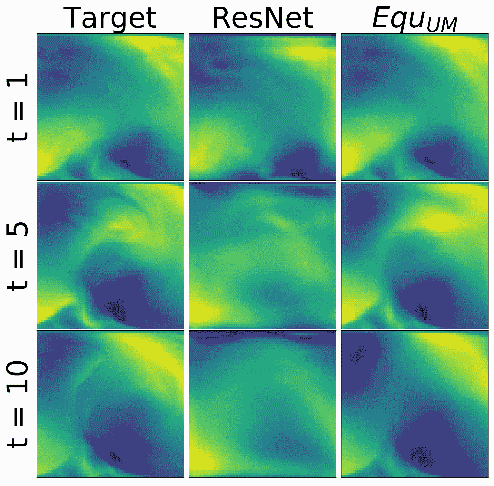

<!--yml

类别：未分类

日期：2024-09-06 19:53:25

-->

# [2107.01272] 物理引导的深度学习用于动力系统：综述

> 来源：[`ar5iv.labs.arxiv.org/html/2107.01272`](https://ar5iv.labs.arxiv.org/html/2107.01272)

# 物理引导的深度学习用于动力系统：综述

Rui (Ray) Wang

计算机科学与工程

加州大学圣迭戈分校

ruw020@ucsd.edu & Rose Yu

计算机科学与工程

加州大学圣迭戈分校

roseyu@ucsd.edu

###### 摘要

建模复杂的物理动态是科学和工程中的基本任务。传统的基于物理的模型样本效率高且可解释，但往往依赖于僵化的假设。此外，直接的数值近似通常计算量大，需要显著的计算资源和专业知识，许多现实世界的系统没有完全已知的控制规律。虽然深度学习（DL）为高效识别复杂模式和模拟非线性动态提供了新的选择，但其预测不一定遵循物理系统的控制规律，也不一定在不同系统之间具有良好的泛化能力。因此，物理引导的深度学习应运而生，并取得了很大进展。物理引导的深度学习旨在结合物理建模和最先进的深度学习模型的优点，更好地解决科学问题。本文提供了将先验物理知识或基于物理的建模整合到深度学习中的现有方法的结构化概述，特别强调了学习动力系统的方面。我们还讨论了该领域中的基本挑战和新兴机会。

## 1 引言

在广泛的空间和时间尺度上建模复杂的物理动态是许多领域中的基本任务，例如流体动力学[147]、宇宙学[156]、经济学[36]和神经科学[69]。

动态系统是用于描述自然界现象在时间和空间中演变的数学对象。动态系统通常用微分方程描述，这些方程与一个或多个未知函数及其导数相关。

###### 定义 1.

设定一个整数$k\geq 1$，令$U$表示$\mathbb{R}^{n}$的一个开子集。令$u:U\mapsto\mathbb{R}^{m}$，并写作$\bm{u}=(u^{1},...,u^{m})$，其中$x\in U$。然后，形式为

|  | $\mathcal{F}(D^{k}\bm{u}(x),D^{k-1}\bm{u}(x),...,D\bm{u}(x),\bm{u}(x),x)=0$ |  | (1) |
| --- | --- | --- | --- |

的表达式被称为$k^{\text{-th}}$阶偏微分方程系统（当$n=1$时为常微分方程），其中$\mathcal{F}:\mathbb{R}^{mn^{k}}\times\mathbb{R}^{mn^{k-1}}\times...\times\mathbb{R}^{mn}\times\mathbb{R}^{m}\times U\mapsto\mathbb{R}^{m}$。

$\mathcal{F}$ 模型描述了 $n$ 维状态 $x\in\mathbb{R}^{n}$ 的动态，它可以是线性或非线性算子。由于大多数动态随时间演变，$u$ 的一个变量通常是时间维度。一般来说，必须指定适当的边界和初始条件以确保方程 1 的解的存在。学习动态系统就是寻找一个模型 $\mathcal{F}$，它可以准确描述我们感兴趣的物理过程的行为。

作为一个学科，物理学有着利用第一性原理描述时空动态的悠久传统。物理定律极大地提高了我们对物理世界的理解。许多物理定律由高度非线性的微分方程系统描述，这些方程直接影响了对物理动态的理解和预测。然而，这些方程通常过于复杂而无法解出。目前的数值方法求解近似的范式纯粹基于物理学：已知的物理定律通过耦合微分方程系统编码，并通过数值微分和积分方案在空间和时间上进行求解[66, 67, 100, 70, 112, 131]。然而，这些方法计算量巨大，需要大量的计算资源和专业知识。另一种方法是寻求基于某些假设的简化模型，这些模型大致可以描述动态，如湍流流动的雷诺平均纳维-斯托克斯方程和气体动力学的欧拉方程[25, 88, 153]。但获得能够以令人满意的精度描述现象的简化模型是非常困难的。更重要的是，对于许多复杂的现实世界现象，仅对其动态有部分了解。方程可能无法完全代表真实的系统状态。

深度学习（DL）提供了从海量数据集中学习高维时空动态的有效替代方案。它通过直接预测输入-输出映射并绕过数值积分来实现这一点。最近的研究表明，DL 可以生成现实的预测，并且相较于数值求解器，显著加速物理动态的模拟，从湍流建模到天气预测[159, 81, 77, 76, 79]。这为 DL 与物理科学的交汇处开辟了新的机会，如分子动力学[142, 144]、流行病学[170]、心脏病学[99, 158]以及材料科学[101, 22]。

尽管取得了巨大进展，DL 本质上仍然是数据驱动的，这具有许多局限性。DL 模型仍然遵循统计推断的基本规则。真实世界动态的非线性和混沌性质对现有的 DL 框架提出了重大挑战。没有明确的约束，DL 模型容易做出物理上不可信的预测，违反物理系统的基本定律。此外，DL 模型往往在泛化方面存在困难：在一个数据集上训练的模型无法有效适应具有不同分布的未见场景，这称为分布转移。对于动态学习，分布转移的发生不仅由于动态是非平稳和非线性的，还由于系统参数的变化，例如外部力量和边界条件。总之，目前 DL 模型在学习复杂动态方面的限制在于其无法仅通过数据理解系统，并应对自然发生的分布转移。

仅依赖 DL 或纯物理方法都不足以学习科学领域中的复杂动态系统。因此，结合传统的物理基础方法与 DL 模型的需求日益增加，以便我们能够充分利用这两种方法。关于物理引导的 DL 已经有大量的工作[168, 46, 17, 86, 76, 127, 18]，但对动态系统的深度学习的关注仍处于初期阶段。物理引导的 DL 提供了一套工具，将微分方程和对称性等物理概念与深度神经网络融合在一起。一方面，这些 DL 模型在计算上相较于传统数值求解器具有显著的优势。另一方面，物理约束对 DL 模型施加了适当的归纳偏置，从而实现准确的模拟、科学有效的预测、降低样本复杂性，并保证在未知环境中的泛化能力。

本调查论文旨在提供将先验物理知识融入深度学习（DL）模型以学习动态系统的现有方法的结构化概述。论文的组织结构如下。

+   •

    第二部分 描述了物理引导 DL 的意义。

+   •

    第三部分 构造了物理引导的 DL 的四个主要学习问题，包括求解微分方程、动态预测、学习动态残差和方程发现。

+   •

    第 4$\sim$7 节将现有的物理指导深度学习方法根据物理与深度学习的结合方式分为四类。每一类都详细回顾了近期的工作作为案例研究，并根据目标或模型架构进一步分类。

    +   –

        第四部分：物理指导的损失函数：先验物理知识作为额外的软约束施加在损失函数中。

    +   –

        第五部分：物理指导的架构设计：先验物理知识严格融入神经网络模块的设计中。

    +   –

        第六部分：混合物理-深度学习模型：完整的基于物理的方法直接与深度学习模型结合。

    +   –

        第七部分：不变性和协变性深度学习模型：深度学习模型被设计为尊重给定物理系统的对称性。

+   •

    第八部分总结了该领域的挑战，并讨论了未来研究的新机会。

## 2 物理指导深度学习的重要性

本小节概述了物理指导深度学习在学习动态系统中的动机和意义。通过将物理原理、控制方程、数学建模和领域知识融入深度学习模型，迅速发展的物理指导深度学习领域有可能（1）加速数据模拟（2）构建物理上科学有效的模型（3）提高深度学习模型的泛化能力（4）发现控制方程。

### 2.1 加速数据模拟。

模拟是分析、优化和设计现实世界过程的重要方法，这些过程易于验证、沟通和理解。它作为替代建模和数字双胞胎，并为复杂物理系统提供有价值的见解。传统的基于物理的模拟通常依赖于运行数值方法：已知的物理定律通过数值微分和积分方案在空间和时间上求解耦合微分方程[66, 100, 70, 112, 131]。虽然许多物理系统的控制方程是已知的，但使用数值算法和计算机找到近似解仍然非常昂贵。这是因为当动态复杂时，离散化步长通常需要非常小，以满足稳定性约束。此外，数值方法的性能可能高度依赖于未知参数的初始猜测[68]。最近，深度学习在科学的自动化、加速和精简计算密集型工作流方面展示了巨大的成功[127, 153, 81]。

深度动态模型可以通过直接预测未来状态并绕过数值积分，直接逼近高维时空动态[161, 38, 135, 119, 135, 162, 117, 96]。这些模型通过将历史帧作为输入进行训练，进行前向预测，并且在推理过程中可以展开数百步。由于深度学习能够处理比经典求解器更大的空间或时间步长，因此通常比经典数值求解器快几个数量级[119]。

另一种常见的方法是深度神经网络可以通过基于梯度的优化直接逼近复杂耦合微分方程的解，这就是所谓的物理信息神经网络（PINNs）。这种方法在逼近各种 PDE（偏微分方程）方面已显示出成功[124, 123, 24, 60]。此外，深度生成模型，如扩散模型和基于评分的生成模型，已被证明在准确的分子图生成方面有效[57, 65]。计算机图形学界也研究了利用深度学习加速数值模拟，以生成逼真的流体动画，如水和烟雾[77, 153, 167, 172]。然而，该领域更注重模拟的视觉真实感而非物理特性。

### 2.2 构建科学有效的模型。

尽管深度学习在科学领域取得了巨大进展，例如，大气科学[127]、计算生物学[1]、材料科学[22]、量子化学[141]，但在系统地将物理原则融入这些模型的设计、训练和推断过程中仍然是一个重大挑战。DL 模型本质上是统计模型，从其训练数据中学习模式。没有显式约束的情况下，当 DL 模型仅依靠数据进行训练时，容易做出科学上不合理的预测，违背物理系统的基本规律。在许多科学应用中，DL 模型的预测结果需要与已知的物理定律和约束一致。例如，在流体动力学中，预测流体速度场的模型必须满足质量和动量守恒。在材料科学中，预测材料性质的模型必须遵循热力学定律和量子力学原理。

因此，为了建立值得信赖的科学和工程预测模型，我们需要利用已知的物理原则来引导深度学习（DL）模型学习正确的基本动态，而不仅仅是拟合观察到的数据。例如，[75、71、171、10、58、33] 通过显式地使用物理约束来正则化损失函数，从而提高了 DL 模型的物理和统计一致性。混合 DL 模型，例如，[104、4、26] 将微分方程集成到 DL 中以进行时间动态预测，并取得了良好的性能。[98] 和 [49] 研究了张量不变神经网络，这些网络能够在保持伽利略不变性的同时学习雷诺应力张量。[159] 提出了一个混合模型，该模型将数值 RANS-LES 耦合方法与定制设计的 U-net 结合。该模型利用 RANS-LES 耦合方法中的时间和空间滤波器来引导 U-net 学习大尺度和小尺度的涡流。这种方法提高了模型的准确性和物理一致性，使其在许多流体动力学应用中更有效地表示复杂的流动现象。

### 2.3 提高 DL 模型的泛化能力

深度学习模型经常面临泛化问题：在一个数据集上训练的模型无法适应在动态系统中可能自然发生的分布偏移的未知场景[84, 115, 103, 2, 160]。这是因为它们学习的是训练数据中的统计模式，而不是潜在的因果关系。此外，大多数当前的方法仍然被训练来建模特定系统和具有相近分布的多个系统，这使得满足异质环境科学领域的需求变得具有挑战性。因此，开发能够在不同参数域的系统之间学习和泛化良好的深度学习模型是至关重要的。

先验物理知识可以视为一种归纳偏置，它可以在模型类别上放置先验分布并缩小模型参数的搜索空间。在归纳偏置的指导下，深度学习模型能够更好地捕捉与物理法则一致的底层动态。在不同的数据域和系统中，物理法则保持不变。因此，将物理法则集成到深度学习中可以使模型在训练域之外甚至在不同系统中进行泛化。

将对称性嵌入深度学习模型中是一种提高泛化能力的方法，我们将在子节 7 中详细讨论。例如，[161]设计了尊重流体动力学中的旋转、缩放和均匀运动对称性的深度等变动态模型。这些模型在通过对称群变换应对分布偏移时，在理论和实验上都表现出强大的鲁棒性，并且与数据增强相比，样本复杂性较低。还有许多其他方法可以通过结合其他物理知识来提高深度学习模型的泛化能力。[162]提出了一个元学习框架，用于预测具有不同参数的系统。它利用先验物理知识来区分不同的系统。具体来说，它使用编码器来推断不同系统的物理参数，并使用预测网络来适应和预测推断出的系统。此外，[48]将 Lyapunov 稳定性编码到自编码器模型中，以预测流体流动和海面温度。他们展示了在保留 Lyapunov 稳定性的神经网络中，泛化能力的提高和预测不确定性的减少。[143]显示，将谱归一化添加到 DNN 中以正则化其 Lipschitz 连续性，可以显著提高无人机着陆控制任务对新输入域的泛化能力。

### 2.4 发现主导方程

科学的主要目标之一是发现能够解决实际问题的基本规律[46, 44]。发现支配方程至关重要，因为它使我们能够理解调节复杂系统的基本物理规律。通过识别描述系统行为的数学模型，我们可以做出准确的预测，并洞察系统在不同条件下的表现。这些知识可以应用于优化工程系统的性能、提高天气预报的精度，以及理解生物过程背后的机制等多个领域[45, 15]。然而，发现支配方程是一项具有挑战性的任务，原因有多方面。首先，现实世界中的系统通常复杂，并涉及许多相互依赖的变量，使得识别相关变量及其关系变得困难。其次，许多系统是非线性的，涉及变量之间的交互，这些交互难以用线性方程建模。第三，现有数据可能存在噪声或不完整，使得提取有意义的模式和关系具有挑战性。尽管面临这些挑战，近年来机器学习的进步使得自动化支配方程发现的过程成为可能，并从数据中识别复杂的非线性模型。这些方法可能会导致新的发现，并为广泛应用的复杂系统行为提供深入的洞察。

从数据中发现控制方程通常通过定义一大组可能的数学基函数并学习系数来实现。[19, 20, 73, 15, 138] 提出了通过创建可能的基函数字典并使用稀疏识别从数据中发现稀疏、低维和非线性模型来寻找常微分方程。更近期的工作，如 [89, 128]，结合了神经网络以进一步扩展字典，以模拟更复杂的动态系统。[23] 通过引入一种高效的一阶条件梯度算法，解决了在大量潜在非线性模型的库中找到最佳稀疏拟合观测数据的优化问题，从而推动了这一趋势。另一种方法，[110, 132]，提出了一种浅层神经网络方法 EQL，从数据中识别简洁方程。他们用预定义的基函数（包括恒等和三角函数）替换了激活函数，并使用专门设计的除法单元来模拟潜在控制方程中的除法关系。类似地，[105, 106] 设计了使用卷积来逼近微分算子的 PDE-Nets 和使用符号神经网络来逼近和恢复多变量函数的模型。这些模型可以从有噪声的数据中学习各种功能关系，包括和不包括除法。然而，可扩展性、过拟合和对高质量测量数据的过度依赖仍然是这一研究领域的关键问题 [126]。

## 3 问题定义

根据前一节中讨论的物理指导深度学习的动机和意义，本领域的主要研究工作旨在解决以下四个基本问题。

### 3.1 解常微分方程

当方程 1 中的 $\mathcal{F}$ 已知但方程 1 过于复杂而无法求解时，研究人员通常通过用深度神经网络近似 $\bm{u}(x)$ 的解，直接解决微分方程，同时在训练期间将控制方程作为对神经网络输出的软约束来执行[125, 124, 85]。这种方法可以表述为以下优化问题，

|  | $\text{min}_{\theta}\;\mathcal{L}(\bm{u})+\lambda_{\mathcal{F}}\mathcal{L}_{\mathcal{F}}(\bm{u})$ |  | (2) |
| --- | --- | --- | --- |

$\mathcal{L}(\bm{u})$ 表示神经网络预测与训练数据点之间的误差。$\theta$ 表示神经网络参数。$\mathcal{L}_{\mathcal{F}}(\bm{u})$ 是对所考虑的微分方程系统残差的约束，而 $\lambda_{\mathcal{F}}$ 是一个正则化参数，用于控制对该残差的重视程度。目标是训练神经网络以最小化公式 2 中的损失函数。

### 3.2 学习动态残差

当公式 1 中的 $\mathcal{F}$ 部分已知时，我们可以使用神经网络来学习物理模型的误差或残差 [37, 176, 74]。关键是学习物理模型的偏差，并借助深度学习对其进行修正。状态的最终预测由物理模型的模拟和神经网络的残差预测组成，如下所示，

|  | $\hat{\bm{u}}=\hat{\bm{u}}_{\mathcal{F}}+\hat{\bm{u}}_{\text{NN}}.$ |  | (3) |
| --- | --- | --- | --- |

其中 $\hat{u}_{\mathcal{F}}$ 是通过数值解法得到的预测值，$\hat{u}_{\text{NN}}$ 是神经网络的预测值，而 $\hat{u}$ 是混合物理-DL 模型做出的最终预测。

这个学习问题通常涉及两种训练策略：1) 联合训练：通过最小化系统状态的预测误差来同时优化微分方程和神经网络中的参数。2) 两阶段训练：我们首先在训练数据上拟合微分方程并获得残差，然后直接优化神经网络以预测这些残差。

### 3.3 动态预测

当公式 1 中的 $\mathcal{F}$ 未知或数值解法需要过多计算时，许多研究通过直接预测输入-输出系统状态映射并绕过数值离散化和积分来研究高维时空动态 [38, 76, 142, 161]。如果我们假设公式 1 中的 $\bm{u}$ 的第一个维度 $x_{1}$ 是时间维度 $t$，那么动态预测问题可以定义为学习一个映射 $f:\mathbb{R}^{n\times k}\mapsto\mathbb{R}^{n\times q}$，该映射将一系列历史状态映射到动态系统的未来状态，

|  | $f(\bm{u}\text{\footnotesize$(t-k+1,\cdot)$},...,\bm{u}\text{\footnotesize$(t,\cdot)$})=\bm{u}\text{\footnotesize$(t+1,\cdot)$},...,\bm{u}\text{\footnotesize$(t+q,\cdot)$}$ |  | (4) |
| --- | --- | --- | --- |

其中 $k$ 是输入长度，$q$ 是输出长度。$f$ 通常通过纯数据驱动或物理指导的神经网络来逼近，神经网络通过最小化状态 $\mathcal{L}(\bm{u})$ 的预测误差来进行优化。

### 3.4 查找控制方程

当方程 $\mathcal{F}$ 在公式 1 中未知，并且需要确定精确的控制方程以解决实际问题时，已经付出了大量努力以发现 $\mathcal{F}$ 的确切数学形式。最常见的方法是从广泛的候选函数中选择，并选择在观测数据上最小化拟合误差的模型。

更具体地说，根据定义 1，发现控制方程的目标是找到一个近似函数 $\mathcal{\hat{F}}=\Phi(\bm{u}(x),x)\bm{\theta}\approx\mathcal{F}$，其中 $\Phi(\bm{u}(x),x)=[\phi_{1}(\bm{u}(x),x),\phi_{2}(\bm{u},x),\ldots,\phi_{p}(\bm{u},x)]$ 是候选函数的库，例如多项式和三角函数，而 $\bm{\theta}\in\mathbb{R}^{p}$ 是一个稀疏向量，指示哪些候选函数在动态中是活跃的。这个问题可以被表述为一个优化问题，我们的目标是最小化以下成本函数，数据集为 $\{\bm{y}_{i}\}_{i=1}^{n}$ 的观测数据：

|  | $\mathcal{L}(\bm{\theta})=\sum_{i=1}^{n}&#124;&#124;\Phi(\bm{y}_{i},x)\bm{\theta}&#124;&#124;^{2}$ |  | (5) |
| --- | --- | --- | --- |

## 4 物理指导的损失函数和正则化

复杂的物理动态在广泛的空间和时间尺度上发生。标准的深度学习（DL）模型可能仅仅拟合观测数据，而未能学习到正确的基本动态，从而导致物理一致性差和泛化能力差。最简单且最广泛使用的物理约束方法之一是通过设计损失函数（正则化）。物理引导的损失函数（正则化）可以帮助深度学习模型捕捉与物理定律一致的正确和可泛化的动态模式。此外，由物理定律约束的损失函数可以减少参数的可能搜索空间。这种方法有时被称为施加可微分的“软”约束，接下来的章节将与施加“硬”约束（物理引导的架构）进行对比。在本章中，我们将以物理引导损失函数的案例研究开始，然后根据其目标对这些方法进行分类，包括求解微分方程、改进预测和加速数据生成。

### 4.1 案例研究：物理引导神经网络

物理引导神经网络（PINNs）方法 [123, 125, 34, 124, 21] 是将物理知识融入损失函数设计的典型例子。PINNs 在学习简单微分方程方面表现出了高效性和准确性。使用全连接神经网络，PINNs 直接通过空间坐标和时间戳作为输入来近似微分方程的解。这些网络通过最小化测量损失和通过偏微分方程的残差函数误差来训练。更具体地说，根据 Def. 1，使用全连接神经网络来建模解 $\bm{\hat{u}}(x,t|\bm{\theta}_{\text{PINN}})$，其中 $\bm{\theta}_{\text{PINN}}$ 表示 PINN 的权重，并通过最小化以下损失函数来优化。

|  | $\mathcal{L}_{\text{PINN}}=\mathcal{L}(\bm{u})+\lambda_{\mathcal{F}}\mathcal{L}_{\mathcal{F}}(\bm{u})$ |  | (6) |
| --- | --- | --- | --- |

$\mathcal{L}(\bm{u})=\|\bm{\hat{u}}-\bm{y}\|_{\Gamma}$ 是 $\bm{\hat{u}}(x,t|\bm{\theta}_{\text{PINN}})$ 与边界条件集合和点集 $\Gamma$ 上的测量数据之间的误差，其中边界条件和数据被定义。$\mathcal{L}_{\mathcal{F}}=\|\mathcal{F}(\bm{\hat{u}}(x,t|\bm{\theta}_{\text{PINN}}),x,t)\|_{\Gamma}$ 是残差函数的均方误差，用于强制 PINNs 生成的预测满足期望的微分方程。

然而，虽然 PINNs 在捕捉基础物理现象方面表现出了一些成功，但[85] 指出，由于 PDE 正则化在优化问题中带来的困难，它们往往难以学习复杂的物理系统。此外，PINNs 的效果高度依赖于输入数据的质量，在噪声或数据有限的情况下，性能可能会受到影响 [28, 6, 174]。此外，由于神经网络的泛化能力有限，PINNs 在训练集未覆盖的时空领域中难以泛化 [84, 115, 2]。这些限制给 PINNs 在实际应用中的发展和应用带来了重大挑战。然而，对 PINNs 的持续研究可能有助于克服这些挑战，并提高其捕捉和预测复杂物理现象的能力。

### 4.2 求解微分方程

继续上一节关于 PINNs 的讨论，为了克服 PINNs 的优化困难，[85] 提出了两种缓解该优化问题的方法。一种方法是从用较小的约束系数开始训练 PINN，然后逐渐增加系数，而不是立即使用较大的系数。另一种方法是训练 PINN 逐步预测每一个时间步的解，而不是一次性预测整个时空。此外，[28] 发现即使使用了物理启发的正则化器，PINNs 也可能在领域边界上过拟合并传播误差。为了解决这个问题，他们引入了基于高斯过程的边界条件平滑技术，以恢复 PINNs 在噪声和测量误差下的性能。此外，[174] 提出了一个将 PINNs 与贝叶斯网络结合的贝叶斯框架。与 PINNs 相比，混合模型能够提供不确定性量化，并在噪声较大的情况下提供更准确的预测，因为它可以避免过拟合。除了 PINNs，[184] 提议使用基于流的生成模型来学习概率偏微分方程的解，同时在损失函数中强制执行 PDE 约束。[159] 研究了使用神经网络来学习不可压缩湍流的速度场演化，其散度始终为零。研究发现，通过用无散度正则化器来约束模型，可以减少预测的散度并提高预测准确性。

### 4.3 改善预测性能

物理指导的损失函数或正则化在提高预测性能，尤其是深度学习模型的物理一致性方面，取得了巨大成功。[75] 使用神经网络对不同时间和不同深度的湖泊温度进行建模。他们通过正则化使得较密集水体的预测温度低于较少密集水体的预测温度，从而确保预测结果在物理上有意义。[71] 进一步引入了一个损失项，确保在湖泊温度建模中，传入和传出的热流之间的热能守恒。[11] 设计了保守层，以严格执行其大气对流神经网络模拟器中的守恒定律。[9] 通过在损失函数中引入约束，提出了一种更系统化的方式来强制执行神经网络中的非线性解析约束。[178] 将原子力和原子能量的损失纳入神经网络中，以提高分子动力学模拟的准确性。[101] 提出了一个新颖的多保真度物理约束神经网络用于材料建模，其中神经网络受到了由模型、初始条件和边界条件的违反造成的损失的约束。[42] 提出了一个新颖的时空动态预测范式，通过功能变量分离进行时空解耦。特定设计的时间不变性和回归损失函数确保了空间和时间信息的分离。

哈密顿力学是一个数学框架，用于描述系统的动态，基于系统的总能量，即动能和势能的总和。[58] 提出了哈密顿神经网络（HNN），通过神经网络对哈密顿量进行参数化，然后直接从数据中学习。在训练过程中，通过损失函数对期望量的守恒进行约束。提出的 HNN 在预测质量弹簧和摆系统方面取得了成功。拉格朗日力学描述了系统的动态，基于动能和势能之间的差值。[33] 提出的拉格朗日神经网络（LNN）使用神经网络对拉格朗日函数进行参数化，该函数是动能减去势能。他们使用欧拉-拉格朗日约束损失函数训练神经网络，使其能够近似地守恒系统的总能量。[52] 进一步通过显式约束简化了 HNN 和 LNN。[91] 在 HNN 中引入了元学习方法，以快速适应物理系统的新实例并找到哈密顿量的结构。[182] 基准测试了基于拉格朗日/哈密顿动力学的最新能量守恒神经网络模型在四种不同物理系统上的表现。

### 4.4 数据生成

模拟是分析、优化和设计现实世界过程的重要方法。目前的数值方法在解决混沌和复杂的微分方程时需要大量计算资源。这是因为数值离散化步长由于稳定性约束被限制为非常小[68]。此外，通过将方程拟合到观测数据来估计未知参数时，每个应用程序中都需要大量的人工工程，因为系统中未知参数的优化高度依赖于初始猜测。因此，利用深度生成模型模拟复杂物理动态的兴趣日益增加。许多研究还在损失函数中施加物理约束，以获得更好的物理一致性。

例如，[171]通过统计正则化将协方差的约束强加到标准生成对抗网络（GAN）中，这导致训练更快，物理一致性更好，与标准 GAN 相比。[172]提出了 tempoGAN 用于超分辨率流体流动，其中使用了一个对流差异损失函数来强制流体模拟的时间一致性。[166]修改了 ESRGAN，这是一种用于超分辨率的条件 GAN，通过用一个惩罚生成图像与真实数据之间能量谱误差的损失函数来替换对抗损失。条件 GAN 也被应用于[108]中模拟数值水文气候模型。通过损失函数惩罚雪水当量，进一步提高了模拟性能。[77]提出了一种生成模型来模拟流体流动，其中设计了一个新颖的基于流函数的损失函数，以确保不可压缩流体的无散运动。[55]提出了一种物理信息卷积模型用于流动超分辨率，其中通过最小化 Navier-Stokes 方程的残差来提高生成的高分辨率流场的物理一致性。

### 4.5 优缺点

尽管物理指导的损失函数易于设计和使用，并且可以提高预测准确性和物理一致性，但它们确实存在一些限制。首先，纳入损失函数的物理约束通常被视为软约束，可能不会被严格执行。这意味着当模型应用于新数据集时，所期望的物理属性可能无法得到保证。其次，PDE 正则化可能使损失函数的形状更复杂，并导致优化问题，这些问题难以解决，如[85]所述。最后，预测误差与物理指导正则化器之间可能存在权衡。例如，[159]研究了使用神经网络预测不可压湍流流动，发现虽然用无散度正则化器约束模型可以减少预测的散度，但过多的正则化可能会平滑湍流中的小涡旋，从而导致更大的预测误差。

## 5 物理指导的架构设计

虽然将物理约束作为正则化器纳入损失函数可以提高性能，但在大多数情况下，深度学习仍被用作黑箱模型。神经网络的模块化设计为设计具有特定物理属性的新型神经元、层或模块提供了机会。物理指导的神经网络架构的优点在于，它们可以施加“硬”约束，这些约束会被严格执行，而与前述的“软”约束相比，物理指导神经网络架构更具解释性和泛化能力。在本章中，我们将从湍流流场网络（TF-Net）的案例研究开始，该网络将一种流行的计算流体动力学（CFD）技术与自定义设计的 U-net 结合起来。我们进一步根据架构设计对其他相关方法进行分类。

图 1：湍流流场网络：三个相同的编码器学习不同尺度的三种成分的转换，以及一个共享解码器学习这三种成分之间的交互，以生成下一时刻的预测二维速度场。每对编码器-解码器可以视为一个 U-net，聚合过程为加权求和。

### 5.1 案例研究：湍流流场网络

TF-Net [159] 是一种物理引导的深度学习模型，用于湍流流动预测。如图 1 所示，它应用尺度分离方法分别建模不同范围的湍流流动。计算流体力学（CFD）技术是当前湍流模拟的核心。直接数值模拟（DNS）准确但在实际应用中不可行。对包括大涡模拟（LES）和 Reynolds 平均 Navier-Stokes（RANS）等替代方法给予了高度重视。两者都利用解析大尺度，同时建模小尺度，使用各种平均技术和/或低通滤波的控制方程 [112, 131]。

其中一种广泛使用的 CFD 技术，RANS-LES 结合方法 [47]，结合了 Reynolds 平均方程（RANs）和大涡模拟（LES）方法，以利用这两种方法的优势。受到 RANS-LES 结合方法的启发，TF-Net 用可训练的卷积层替代了先验的频谱滤波器。湍流被分解为三个分量，每个分量由一个专门的 U-net 近似，以保持流动的多尺度特性。一个共享解码器学习这三个分量之间的交互，并生成最终预测。这个设计的动机是明确指导机器学习模型学习与时空预测任务相关的大尺度和子网格尺度建模运动的非线性动态。换句话说，我们需要迫使模型不仅学习大涡，还要学习小涡。当我们直接在数据上使用 MSE 损失训练预测模型时，模型可能会忽视小涡，只关注大涡以实现合理的准确度。

除了 RMSE 外，物理相关的指标包括发散度和能量谱也用于评估模型预测的性能。图 2 显示了 TF-Net 在物理相关指标（发散度和能量谱）上始终优于所有基准模型。使用我们在前一节描述的无发散度正则化器对其进行约束可以进一步减少发散度。图 3 显示了 TF-Net 和三种最佳基准模型在 $x$ 方向上的实际值和预测速度。我们看到，基于运动的形状和频率，TF-Net 模型的预测最接近目标。

我们还进行了消融研究，以理解 TF-Net 的每个组件，并调查模型是否确实学习了不同尺度的流动。图 2 右侧包括了每个小 U-net 的预测和输出，而其他两个编码器被置为零。我们观察到每个小 U-net 的输出是不同尺度的流动，这表明模型能够学习多尺度行为。总之，TF-Net 能够生成既准确又具有物理意义的速度场预测，保持了相关的关键量。

图 2：从左到右：不同模型预测在不同预测时间范围的平均绝对散度；左最方块子区域中的目标、TF-Net、U-net 和 ResNet 的能量谱；消融研究：真实值、TF-Net 的预测以及每个小 U-net 的输出，而其他两个编码器被置为零。

图 3：TF-Net 和三个最佳基线（U-Net、ResNet 和 GAN）在时间$T+10$、$T+30$到$T+60$（假设$T$是最后输入帧的时间步长）处的真实值和预测速度$u$。

### 5.2 卷积架构

卷积架构在大多数计算机视觉任务中仍然占据主导地位，例如目标检测、图像分类和视频预测。由于其高效性和期望的归纳偏置，如局部性和平移等变性，卷积神经网络已被广泛应用于模拟和预测复杂的时空物理动态。研究人员已提出了多种方法将期望的物理属性融入卷积模型的设计中。

例如，[72] 提出了在 CNN 中通过快速傅里叶变换算法强制施加硬线性空间 PDE 约束。[35] 修改了 LSTM 单元，引入了一个中间变量，以在湖泊温度的卷积自编码模型中保持单调性。[113] 提出了一个物理引导的卷积模型 PhyDNN，该模型使用物理引导的结构先验和物理引导的汇总监督来建模计算流体动力学-离散元方法中作用于每个粒子的阻力。[104] 设计了 HybridNet，用于结合 ConvLSTM 预测外部力和 CeNN 进行系统动态的模型驱动计算的动态预测。HybridNet 在热对流-扩散和流体动力学预测任务中实现了更高的准确性。[64] 提出了将深度学习与可微分 PDE 求解器结合，用于理解和控制复杂的非线性物理系统，并对其进行长期预测。[141] 提出了用于建模量子相互作用的连续滤波卷积层。卷积核由神经网络参数化，神经网络以任意两点之间的相对位置作为输入。他们获得了一个联合模型，用于总能量和原子间力，遵循基本的量子化学原理。

此外，卷积层有可能揭示控制方程。例如，[105, 106] 开发了 PDE-Net，该网络利用卷积来近似不同阶数的空间域上的微分算子。它还包括一个基于 EQL [110, 132] 的符号神经网络，用于近似和恢复多变量函数。作者展示了 PDE-Net 比 SINDy 字典 [20] 更加紧凑，并且数值实验表明它可以揭示各种观测动态的隐藏 PDE。

### 5.3 图神经网络

标准卷积神经网络仅在规则或均匀网格（例如图像）上运行。图神经网络超越了规则网格的数据，朝着建模具有任意位置的对象的方向发展。例如，图神经网络可以在不规则网格上建模流体动力学，这是 CNN 无法做到的。[135] 设计了一种深度编码器-处理器-解码器图形架构，用于在拉格朗日描述下模拟流体动力学。丰富的物理状态由相互作用的粒子图表示，复杂的相互作用通过节点间的学习消息传递来近似。

[119] 利用相同的架构来学习基于网格的仿真。作者直接在数值仿真方法中构造不规则网格上的图。此外，他们提出了一种自适应重新网格算法，使模型能够准确预测大尺度和小尺度上的动态。[14] 进一步提出了两个技巧来解决训练图神经网络解决 PDE 的不稳定性和误差积累问题。一种是通过一定噪声扰动输入并仅在最后一次展开步骤上反向传播误差，另一种是同时预测多个时间步骤。这两个技巧使模型更快且更稳定。

[95] 提出了一个神经算子方法，该方法学习函数空间之间的映射，对不同的近似和网格具有不变性。更具体地说，它使用消息传递图网络从数据中学习格林函数，然后将学习到的格林函数用于计算 PDE 的最终解。[96] 进一步将其扩展为傅里叶神经算子，通过用定义在傅里叶空间中的卷积算子替换核积分算子，这比神经算子高效得多。在 [134] 中，图网络也被用于表示、学习和推断机器人系统、身体和关节。[94] 提出了学习组合性库普曼算子，使用图神经网络将状态编码为以对象为中心的嵌入，并使用块状线性过渡矩阵来正则化对象之间的共享结构。另一个重要的研究方向是将对称性融入设计等变图神经网络以建模分子动力学，详细内容将在第七部分中讨论。

### 5.4 多层感知器

多层感知器（MLP）在物理引导架构设计中的主要应用之一是寻找线性库普曼算子。库普曼理论 [83] 提供了一种使用无限维线性库普曼算子表示非线性动态系统的方法，该算子作用于系统状态的希尔伯特空间中的测量函数。然而，找到适当的测量函数将动态映射到函数空间，以及一个近似和有限维的库普曼算子，是非常困难的。获得库普曼算子近似的一种方法是通过动态模态分解算法 [139]，但这需要手动准备非线性可观察量，这在缺乏先验知识的情况下并不总是可行的。

为了解决这一挑战，近期的研究探索了使用神经网络来学习 Koopman 算子。一种流行的方法假设存在一种可以通过神经网络学习的数据变换，从而得到一个近似的有限维 Koopman 算子。例如，[175]和[148] 提出了使用全连接神经网络直接将观察到的动态映射到一个涵盖 Koopman 不变子空间的非线性可观测字典。这种映射通过一个自动编码器网络表示，该网络将观察到的动态嵌入到一个低维潜在空间，在这个空间中，Koopman 算子通过一个线性层来近似。[107] 进一步推广了这种方法，以便为具有连续谱的系统学习 Koopman 算子。[5] 还为物理过程的预测设计了类似的自动编码器架构。但是在潜在空间中，确保了正向系统和反向系统的一致性，而其他模型仅考虑正向系统。这种方法在具有正向和反向动态的系统上表现良好，能够进行长期预测。

Koopman 理论也可以用来建模没有已知控制规律的现实世界动态。[163] 开发了一种新颖的方法，Koopman 神经预报器（KNF），以一种可解释且稳健的方式预测高度非平稳的时间序列。这种方法利用 Koopman 理论将非线性现实世界动态简化为线性系统，然后通过修改 Koopman 矩阵进行操作。它使用预定义的测量函数来施加适当的归纳偏差，并使用随时间变化的 Koopman 算子来捕捉潜在的变化分布。该模型在高度非平稳的时间序列数据集上优于现有技术，包括 M4、加密货币回报预测和运动员轨迹预测。

### 5.5 优点与缺点

将物理学嵌入到模型架构的设计中，可以严格执行物理原理并理论上得到保证。这将导致更具解释性和更具泛化性的深度学习模型。然而，设计物理引导的架构，使其在不损害神经网络表示能力的情况下表现良好和具有良好的泛化能力，并非易事。强归纳偏差可以极大地提高学习的样本效率，但在数据集足够大以使模型从数据中学习所有必要的归纳偏差，或当归纳偏差不严格时，可能会变得具有限制性。

## 6 混合物理-深度学习模型

前两节讨论的论文侧重于将物理系统的已知属性融入损失函数或神经网络模块的设计中。在本节中，我们讨论那些直接将纯物理模型（如数值方法）与深度学习模型相结合的工作。

### 6.1 案例研究：神经微分方程

神经常微分方程（Neural ODEs）[27] 将传统的按离散时间步处理数据的递归神经网络（RNNs）推广为通过将数据建模为随时间变化的连续函数，从而捕捉更复杂的动态。它们将传统的离散化神经元层深度转换为连续的等效形式，使得隐藏状态的导数可以通过神经网络进行参数化。然后，网络的输出通过黑箱微分方程求解器计算，这使得神经 ODEs 成为神经网络和数值求解器的高效结合。

更具体地说，它们通过神经网络 $\bm{\hat{z}}=f_{\theta}(\bm{z},t)$ 对隐藏状态 $\bm{z}$ 的速度 $\bm{\hat{z}}$ 进行参数化。给定初始时间 $t_{0}$ 和目标时间 $t_{T}$，神经 ODEs 通过执行以下编码、积分和解码操作来预测目标状态 $\bm{\hat{y}}_{T}$：

|  | $\bm{z}(t_{0})=\phi_{\text{enc}}(\bm{y}_{0}),\;\;\;\;\;\;\bm{z}(t_{T})=\bm{z}(t_{0})+\int_{t_{0}}^{t_{T}}f_{\bm{\theta}}(\bm{z},t)dt,\;\;\;\;\;\;\bm{\hat{y}}_{T}=\psi_{\text{dec}}(\bm{z}(t_{T}))$ |  | (7) |
| --- | --- | --- | --- |

其中编码器 $\phi_{\text{enc}}$ 和解码器 $\psi_{\text{dec}}$ 可以是神经网络。数值求解 ODE 通常通过离散化和积分来完成，如简单的欧拉法和高阶的龙格-库塔法。然而，这些方法计算量大，因为它们需要在求解器的操作过程中反向传播并存储前向传递的任何中间量，导致高内存开销。因此，使用对偶方法 [121] 来高效计算反向传播过程中的梯度。要计算损失函数 $L$ 相对于初始状态 $\bm{z}(t_{0})$ 和参数 $\bm{\theta}$ 的梯度，对偶方法的关键思想是引入对偶状态 $\bm{p}(t)$，$\bm{p}(t)=\frac{\partial L}{\partial\bm{z}(t)}$，它满足以下微分方程：

|  | $\frac{d\bm{p}(t)}{dt}=-\bm{p}(t)^{T}\frac{\partial f_{\bm{\theta}}(\bm{z}(t),t)}{\partial\bm{z}}$ |  | (8) |
| --- | --- | --- | --- |

对偶状态用于计算损失函数相对于初始状态和参数的梯度，使用以下公式：

|  | $\frac{\partial L}{\partial\bm{\theta}}=-\int_{t_{T}}^{t_{0}}\bm{p}(t)^{T}\frac{\partial f_{\bm{\theta}}(\bm{z}(t),t)}{\partial\bm{\theta}}dt;$ |  | (9) |
| --- | --- | --- | --- |

总之，这些公式可以通过使用与求解正向 ODE 相同的数值方法来高效计算。正向传播过程中，ODE 求解器使用初始状态$\bm{z}(t_{0})$和函数$f_{\bm{\theta}}(\bm{z}(t),t)$计算微分方程$\bm{z}(t)$的解。反向传播过程中，伴随状态$\bm{p}(t)$通过求解从最终时间$t_{T}$开始并通过时间反向传播的方程 8 进行计算。然后使用这个伴随状态计算损失函数相对于初始状态和方程 9 中 ODE 函数的参数的梯度，这些梯度可以通过梯度下降更新模型参数。

神经 ODE 具有广泛的潜在应用，特别是在需要连续和动态模型的领域。它们为构建连续时间序列模型提供了有用的工具，这些模型可以轻松处理不规则间隔的数据。它们还允许构建归一化流，这使得跟踪密度变化变得容易，即使对于不受限制的神经架构也是如此。已有几个后续工作进一步扩展了连续神经网络的概念。例如，[43] 引入了增强型神经 ODE，这种方法比神经 ODE 更具表现力、经验上更稳定，并且计算效率更低。更重要的是，它可以学习具有互相交叉的连续轨迹映射的函数，而神经 ODE 无法表示。[120] 进一步将这种连续神经网络的思想扩展到图卷积，并提出了图神经 ODE。[102] 提出了神经随机微分方程（Neural SDE），它通过随机微分方程建模随机噪声注入。他们证明，将噪声注入正则化机制融入连续神经网络可以减少过拟合，并实现更低的泛化误差。[99] 提出了基于神经 ODE 的生成时间序列模型，该模型使用已知的微分方程，而不是将其视为隐藏单元动态，从而将机制知识整合到神经 ODE 中。[122] 利用神经网络直接近似微分方程中的未知项。通过使用伴随方法，提出的模型可以高效计算相对于模型中所有参数的梯度，包括初始条件、ODE 参数和边界条件。

### 6.2 残差建模

最简单的混合建模形式之一是残差学习，其中 DL 学习预测物理模型产生的误差或残差。关键是学习物理模型的偏差，并借助 DL 模型进行修正[54, 152]。一个代表性例子是 DeepGLEAM [170]，它结合了机制性流行病模拟模型 GLEAM 和 DL，用于预测 COVID-19 的死亡率。它使用扩散卷积 RNN [93] (DCRNN) 从 GLEAM 中学习修正项，从而在一周内的 COVID-19 死亡人数预测任务上，相比纯粹的机制模型或纯 DL 模型，性能得到了提升。

同样，[37] 将图神经网络与在粗网格上运行的 CFD 模拟器结合，用于生成高分辨率的流体流动预测。在[81]中，CNNs 被用来修正粗网格上数值解算器的速度场。[111] 利用神经网络对二维湍流的 LES 模拟进行亚网格建模。在[133]中，将神经网络模型实现于降阶建模框架中，以补偿模型降阶的误差。[74] 提出了 DR-RNN，通过训练来寻找数值离散化 ODEs 或 PDEs 的残差最小化器。他们展示了 DR-RNN 能大大减少降阶建模框架的计算成本和时间离散化误差。[176] 引入了 APHYNITY 框架，能够有效地用深度数据驱动网络增强近似物理模型。其方法的一个关键特点是能够将问题分解，使数据驱动模型仅建模物理模型无法捕捉的部分。

### 6.3 中间变量建模

DL 模型可以用来替代计算困难或未知的物理模型中的一个或多个组件。例如，[153]在欧拉流体模拟过程中，用卷积网络替代了解算泊松方程的数值解算器，得到的结果既真实又表现出良好的泛化特性。[116] 提出了使用神经网络来重建闭合模型中变量的模型修正。[39] 应用 U-net 来根据历史温度帧估计速度场，然后使用估计的速度基于平流-扩散方程的封闭形式解决方案预测海面温度。[109] 结合了高维模型表示，将其表示为每一项都是组件函数之和的模式项，利用 NNs 来建立多维潜力，其中 NNs 用于表示组件函数，从而逐项减少误差模式项。

### 6.4 优势与劣势

结合基于物理的模型和深度学习模型可以同时利用神经网络在建模动态未知部分上的灵活性以及基于物理的模型在可解释性和泛化能力上的优势。然而，值得提及的一个潜在缺点是，混合物理-深度学习模型可能会使得所有或大多数动态被神经网络捕获，而基于物理的模型对学习贡献甚微。这将损害模型的可解释性和泛化能力。我们必须确保基于物理的模型和深度学习模型之间的最佳平衡。我们需要神经网络仅用于建模那些物理先验无法表示的信息。

## 7 不变与等变深度学习模型

对称性长期以来被隐式地用于深度学习中，以设计具有已知不变性和等变性的网络。卷积神经网络通过利用平移等变性在计算机视觉领域取得了突破 [179, 90, 180]。类似地，递归神经网络 [129, 63]、图神经网络 [137, 80] 和胶囊网络 [130, 62] 都施加了对称性。虽然等变深度学习模型在图像和文本数据 [32, 164, 30, 29, 92, 82, 7, 169, 31, 51, 165, 41, 56, 146] 中取得了显著成功，但最近在学习动态系统中的等变网络研究也越来越受到关注 [97, 161, 145, 65, 155, 144]。由于对称性不仅可以通过损失函数集成到神经网络中，还可以通过神经网络层的设计进行集成，且关于物理动态的等变和不变深度学习模型的研究已经有大量的工作，我们将在本节中单独讨论这个主题。

图 4：等变性的示意图：$f(x)=2x$ 对 $T=\mathrm{rot}(\pi/4)$ 的情况

在物理学中，对称性与物理学之间有着深刻的联系。诺特定律提供了守恒量与对称群之间的对应关系。例如，平移对称性对应于能量守恒，而旋转对称性对应于角动量守恒。通过构建一个本质上尊重给定对称性的神经网络，我们使得相关量的守恒更有可能，从而使模型的预测更符合物理实际。此外，通过设计一个本质上对输入变换保持等变的模型，我们可以保证模型能够自动在这些变换上进行泛化，使其对分布变化具有鲁棒性。

一组对称性，或简称为群，由一个集合 $G$ 及其结合运算映射 $\circ\colon G\times G\to G$ 组成。该运算映射具有一个单位元 $1\in G$，并且与 $G$ 中的任何元素进行组合时都需要可逆。如果一个群 $G$ 在集合 $S$ 上有一个作用，则存在一个作用映射 $\cdot\colon G\times S\to S$，它与运算规律兼容。进一步地，我们说 $\rho:G\mapsto GL(V)$ 是一个 $G$-表示，如果集合 $V$ 是一个向量空间，并且每个群元素 $g\in G$ 都通过一个线性映射（矩阵）$\rho(g)$ 表示，该映射作用于 $V$。形式上，函数 $f\colon X\to Y$ 可以用等变的概念来描述尊重来自群 $G$ 的对称性。

###### 定义 2

假设群表示 $\rho_{\text{in}}$ 作用于 $X$，而 $\rho_{\text{out}}$ 作用于 $Y$。我们说函数 $f$ 是 $G$-等变的，如果

|  | $f(\rho_{\text{in}}(g)(x))=\rho_{\text{out}}(g)f(x)$ |  | (10) |
| --- | --- | --- | --- |

对于所有 $x\in X$ 和 $g\in G$。如果 $f$ 是 $G$-不变的，当且仅当对所有 $x\in X$ 和 $g\in G$，都有 $f(\rho_{\text{in}}(g)(x))=f(x)$。这是等变性的一个特殊情况，其中 $\rho_{\mathrm{out}}(g)=1$。有关旋转等变函数的示意图，请参见图 4。

### 7.1 案例研究：等变深度动力学模型

[161] 利用流体动力学的对称性设计了等变网络。Navier-Stokes 方程在以下五种不同变换下是不变的。每种变换单独生成系统中的一组对称性。

+   •

    空间平移：$T_{\bm{c}}^{\mathrm{sp}}\bm{w}(\bm{x},t)=\bm{w}(\bm{x-c},t)$，$\bm{c}\in\mathbb{R}^{2}$，

+   •

    时间平移：$T_{\tau}^{\mathrm{time}}\bm{w}(\bm{x},t)=\bm{w}(\bm{x},t-\tau)$，$\tau\in\mathbb{R}$，

+   •

    加利略变换：$T_{\bm{c}}^{\mathrm{gal}}\bm{w}(\bm{x},t)=\bm{w}(\bm{x}-\bm{c}t,t)+\bm{c}$，$\bm{c}\in\mathbb{R}^{2}$，

+   •

    旋转/反射：$T_{R}^{\mathrm{rot}}\bm{w}(\bm{x},t)=R\bm{w}(R^{-1}\bm{x},t),\;R\in O(2)$，

+   •

    缩放：$T_{\lambda}^{sc}\bm{w}(\bm{x},t)=\lambda\bm{w}(\lambda\bm{x},\lambda^{2}t)$，$\lambda\in\mathbb{R}_{>0}$。

考虑作用在$\hat{\mathcal{F}}_{V}$上的微分算子系统$\mathcal{D}$。设解集为$\mathrm{Sol}(\mathcal{D})\subseteq\hat{\mathcal{F}}_{V}$。我们说$G$是$\mathcal{D}$的对称群，如果$G$保持$\mathrm{Sol}(\mathcal{D})$不变。也就是说，如果$\varphi$是$\mathcal{D}$的一个解，那么对于所有$g\in G$，$g(\varphi)$也是解。为了预测系统$\mathcal{D}$的演变，我们对前向预测函数$f$建模。令$\bm{w}\in\mathrm{Sol}(\mathcal{D})$。$f$的输入是一组在时间$t-k,\ldots,t-1$的$k$个快照，记作$\bm{w}_{t-i}\in\mathcal{F}_{d}$。预测函数$f\colon\mathcal{F}_{d}^{k}\to\mathcal{F}_{d}$定义为$f(\bm{w}_{t-k},\ldots,\bm{w}_{t-1})=\bm{w}_{t}$。它基于过去的解预测时间$t$的解。设$G$为$\mathcal{D}$的对称群。那么对于$g\in G$，$g(\bm{w})$也是$\mathcal{D}$的一个解。因此$f(g\bm{w}_{t-k},\ldots,g\bm{w}_{t-1})=g\bm{w}_{t}$。因此，$f$是$G$-等变的。

他们为将每种对称性融入 CNN 用于时空动态预测而定制了不同的方法。当 CNN 以自回归方式使用时，它们是时间平移-等变的。卷积也自然是空间平移等变的。动态中的尺度等变性是独特的，因为物理法则同时决定了幅度、空间和时间的缩放。为了实现这一点，他们用群$G=(\mathbb{R}_{>0},\cdot)\ltimes(\mathbb{R}^{2},+)$的群相关层替代了标准卷积层，该群包括缩放和翻译。$G$-相关通过相对于输入同时进行卷积核的平移和缩放来升级这一操作。

|  | $\bm{v}(\bm{p},s,\mu)=\sum_{\lambda\in\mathbb{R}_{>0},t\in\mathbb{R},\bm{q}\in\mathbb{Z}^{2}}\mu\bm{w}(\bm{p}+\mu\bm{q},\mu^{2}t,\lambda)K(\bm{q},s,t,\lambda),$ |  | (11) |
| --- | --- | --- | --- |

其中$s$和$t$表示输出和输入通道的索引。它们向张量中添加了与尺度因子$\mu$相关的一个轴。此外，旋转对称性是通过在 E(2)-CNN 框架内使用$\mathrm{SO}(2)$-等变卷积和激活来建模的[164]。

为了使卷积神经网络（CNNs）对伽利略变换保持等变性，由于它们已经对平移保持等变性，因此只需使它们对均匀运动变换保持等变性，即向向量场中添加一个常量向量场。这是伽利略不变性的一部分，与所有非相对论物理建模相关。均匀运动等变性是通过与平移输入分布的模型共轭来强制执行的。基本上，对于每个卷积层中的滑动局部块，它们将输入张量的均值移到零，并在每个样本的卷积和激活函数之后将输出移回。换句话说，如果输入是$\bm{\mathcal{P}}_{b\times d_{in}\times s\times s}$，输出是$\bm{\mathcal{Q}}_{b\times d_{out}}=\sigma(\bm{\mathcal{P}}\cdot K)$对于一个滑动局部块，其中$b$是批量大小，$d$是通道数，$s$是卷积核大小，$K$是卷积核，那么

|  | $\displaystyle\bm{\mu}_{i}=\mathrm{Mean}_{jkl}\left(\bm{\mathcal{P}}_{ijkl}\right);\quad\bm{\mathcal{P}}_{ijkl}\mapsto\bm{\mathcal{P}}_{ijkl}-\bm{\mu}_{i};\quad\bm{\mathcal{Q}}_{ij}\mapsto\bm{\mathcal{Q}}_{ij}+\bm{\mu}_{i}.$ |  | (12) |
| --- | --- | --- | --- |

这将使卷积层在均匀运动方面保持等变性。如果输入是一个向量场，这个操作将应用于每个元素。

使用的深度学习模型是 ResNet 和 U-Net 及其等变对应模型。时空预测是自回归的。标准的均方根误差（RMSE）和在能量谱上计算的 RMSE 用于测量性能。模型在 Rayleigh-Bénard 对流（RBC）和再分析海洋流速数据上进行了测试。对于 RBC，测试集对每个样本应用了来自相关对称群的随机变换。这模拟了每个样本具有未知参考框架的真实数据。对于海洋数据，测试也在训练集之外的不同时间范围和不同领域上进行，表示分布变化。图 5 显示，等变模型在模拟的 RBC 数据和真实的再分析海洋流量数据上表现显著优于非等变模型。它们还显示等变模型在能量谱误差上也显著较低，并且相比于数据增强具有更有利的样本复杂度。

图 5：顶部：ResNet 和四个 Equ-ResNets 对四个测试样本应用随机均匀运动、幅度、旋转和缩放变换后，RBC 在时间步 $1$、$5$ 和 $10$ 的真实值和预测速度范数场 $\|\bm{w}\|_{2}$。第一列是目标，第二列是 ResNet 预测，第三列是 Equ-ResNets 预测。底部：ResNet（Unet）和四个 Equ-ResNets（Equ-Unets）在测试集上的海洋流速的真实值和预测速度范数场。

### 7.2 等变卷积神经网络

然而，现实世界中的动态数据很少符合严格的数学对称性，因为噪声、缺失值或潜在动态系统中的对称性破坏特征都会影响对称性。[149] 进一步探讨了近似等变卷积网络，这些网络偏向于保持对称性，但并不严格受限于此。关键思想是通过引入可以在组元素之间变化的附加可训练权重来放宽权重共享方案，从而打破严格的等变约束。所提出的近似等变网络始终可以从数据中学习到正确数量的对称性，因此在没有对称性、近似对称性和完美对称性的现实世界湍流数据上表现稳定良好。当我们将先验知识纳入神经网络时，通常需要在严格执行模型设计中的先验知识或通过正则化器进行软约束之间进行选择。但这种方法允许模型根据具体任务决定是否以及如何使用先验知识（对称性）。此外，[162] 构建了一个元学习框架 DyAd，用于预测具有不同参数的系统。具体而言，它利用一个能够提取动态系统中时间不变和平移不变部分的编码器和一个预测网络来适应和预测给定的推断系统。时间不变性是通过使用 3D 卷积和时间偏移不变损失来实现的。在具有挑战性的湍流流动预测和现实世界的海洋温度及洋流预测任务中，这是第一个可以在广泛的异质领域中进行泛化和预测动态的框架。

除了将对称性融入常规卷积之外，人们对设计等变连续卷积模型也产生了浓厚的兴趣。这是因为连续卷积允许在连续输入域上执行卷积操作。例如，[141] 提出了 SchNet，这是一个连续卷积框架，将 CNN 方法推广到连续卷积，以建模处于任意位置的粒子。连续卷积核由对原子间距离进行操作的密集神经网络生成，这确保了能量的旋转和翻译不变性。在交通预测应用中，[157] 提出了一个新模型，等变连续卷积（ECCO），它使用旋转等变的连续卷积将系统的对称性嵌入以改进轨迹预测。通过在极坐标内的权重共享方案实现了旋转等变性。ECCO 在两个实际轨迹预测数据集 Argoverse 和 TrajNet++ 上表现优于基线模型。

### 7.3 等变图神经网络

除了等变卷积之外，还开发了许多等变图神经网络，特别是用于建模原子系统和分子动力学。这是因为分子物理中普遍存在对称性，例如分子构型和坐标中的旋转-平移等变性。

[136] 设计了一个 E(n)-等变图神经网络用于预测分子性质。它通过节点之间的欧几里得距离更新边特征，并通过所有邻居的相对差异的加权和更新粒子坐标。 [142] 提出了使用基于评分的生成模型来生成分子构象。作者使用等变图神经网络来估计评分函数，因为它是旋转-平移等变的，评分函数是原子坐标对数密度的梯度场。 [3] 设计了 Cormorant，这是一种旋转协变的神经网络架构，用于学习复杂多体物理系统的行为和性质。Cormorant 在 MD-17 数据集上学习分子势能面和在 GDB-9 数据集上学习分子的几何、能量、电子和热力学性质方面取得了令人满意的结果。 [144] 提出了一个用于 3D 分子结构自回归生成的模型，结合了强化学习 (RL)。该方法使用等变状态表示进行自回归生成，主要基于 Cormorant，并将这些表示集成到现有的演员-评论家 RL 生成框架中。 [154] 进一步设计了一系列 SE(3)-等变操作和用于几何点云数据的 DL 架构构建块，用于构建 PhiSNet，这是一种能够准确预测波函数和电子密度的新型架构。

此外，排列不变性在分子动力学中也存在。例如，如果我们交换相同原子的标签，量子力学能量是不变的。然而，[151] 指出，在图神经网络中强制所有排列的等变性在建模分子时可能会非常限制。因此，他们提出将图分解为一组与预选模板图同构的局部图，使得子图在卷积应用之前可以始终标准化为模板图。通过这样做，图神经网络不仅可以变得更具表现力，还可以局部等变。[155] 提出了基于非线性 $O(d)$-等变函数可以通过轻量级标量集合通用表示的想法来构建等变神经网络，这些标量集合更容易构建。他们展示了所提出方法在两个经典物理问题中的效率和可扩展性，这两个问题分别是计算粒子的总机械能和总电磁力，这些都遵循所有平移、旋转、反射和排列对称性。此外，由于设计等变层是一项困难的任务，[13] 提出了一个李点对称数据增强方法，用于训练图神经 PDE 求解器，这种方法使得这些神经求解器能够保持多种对称性。

### 7.4 对称性发现

还有一个新兴领域是对称性发现，其关键思想是找到在具有对称性的训练数据上训练的神经网络中的权重共享模式。例如，[183] 将全连接层中的权重矩阵分解为对称（即权重共享）矩阵和滤波器参数向量。这两个部分分别在内循环和外循环训练中使用模型无关元学习算法（MAML）[50]进行学习，这是一种基于优化的元学习方法，使得对称矩阵可以从数据中学习权重共享模式。此外，[40] 提出了李代数卷积网络（L-conv），这是一种新颖的架构，可以学习李代数基，并自动从数据中发现对称性。它可以被视为群卷积的一个无穷小版本。[173] 进一步利用 L-conv 构建了 LieGAN，通过类似于生成对抗训练的范式自动从数据集中发现等变性。它将对称性表示为可解释的李代数基，并可以发现各种对称性。具体来说，生成器学习一组应用于数据的变换，这些变换保持原始分布并欺骗判别器。

### 7.5 优缺点

通过设计一个在输入变换下本质上等变或不变的模型，我们可以确保模型在这些变换下自动泛化，使其对分布变化具有弹性。相比之下，当模型应用于新数据集时，数据增强技术无法提供等变性保证。从经验和理论上看，等变和不变的神经网络在数据和参数效率方面优于数据增强技术。此外，结合对称性由于诺特定律增强了神经网络的物理一致性。

然而，过多的对称性可能会过度限制神经网络的表示能力，并减缓训练和推理过程。此外，许多现实世界的动态系统并不具有完美的对称性。一个完全等变的模型可能在学习现实世界数据中的部分或近似对称性时遇到困难。因此，理想的现实世界动态模型应该是近似等变的，并且能够自动学习数据中的正确对称性，例如我们在第 7.2 节中讨论的论文。还有一些其他工作探索了相同的思路。例如，[53]提出了软等变层，通过将一个灵活的层与一个具有强等变归纳偏置的层直接相加，以建模软等变性。

## 8 讨论

在本文中，我们系统地回顾了物理引导的深度学习在学习动态系统方面的最新进展。我们讨论了将第一性原理和物理约束注入深度学习的多种方法，包括（1）物理信息损失正则化器，（2）物理引导设计，（3）混合模型，以及（4）对称性。通过整合物理原理，深度学习模型可以实现更好的物理一致性、更高的准确性、更高的数据效率、改进的泛化能力和更强的可解释性。尽管该领域展现了巨大的潜力和令人兴奋的进展，物理引导的人工智能仍处于初级阶段。以下是我们对未来研究中物理动态学习的挑战和机遇的回顾。

### 8.1 提升泛化能力

泛化是机器学习中的核心问题。当前深度学习模型在学习复杂动态时的一个限制是它们无法仅凭数据理解系统，并处理自然发生的分布变化。大多数用于动态建模的深度学习模型是针对特定系统进行训练的，仍然在泛化上存在困难。例如，在湍流建模中，使用固定边界和初始条件训练的深度学习模型常常无法对具有不同特征的流体流动进行泛化。为了解决这一限制，一种方法是构建物理指导的深度学习模型，其中物理部分发挥主导作用，而神经网络则专注于学习未知过程[122]。另一种有前景的方向是元学习。例如，[162]提出了一种基于模型的元学习方法，称为 DyAd，它可以在流体动力学的异质领域中进行泛化。然而，该模型只能在插值物理参数的动态中进行良好的泛化，无法超出训练集中的物理参数范围。另一种思路是将数据转换为神经网络可以学习的标准分布，然后在进行预测后恢复原始数据[78]。由于神经网络在处理多个分布时存在困难，这种方法旨在找到一个能够有效代表动态的单一分布。一个值得信赖且可靠的物理动态学习模型应该能够在保持高准确度的同时，推广到具有各种参数、外部力量或边界条件的系统。因此，进一步研究具有良好泛化性的物理指导深度学习是至关重要的。

### 8.2 提升长期预测的鲁棒性

长期预测物理动态是一项具有挑战性的任务，因为它容易出现误差累积和对输入扰动的不稳定，这显著影响神经网络在长期预测中的准确性。为了解决这些问题，近年来提出了几种训练技术。其中一种技术涉及向输入中添加噪声，这使得模型对扰动的敏感性降低[14]。它还建议在以自回归方式进行预测时，神经网络应被训练在每次自回归调用中进行多步预测，而不仅仅是一步。此外，[181] 提出了一个基于时间的李雅普诺夫正则化器，加入到深度预测器的损失函数中，以避免训练误差传播，并提高长期预测的准确性。此外，[119, 8] 采用了在线归一化，即使用运行均值和标准差对当前训练样本进行归一化，这也增加了模型的预测时间范围。这些模型是在大量仿真数据上训练的。然而，对于现实世界的问题，获取如喷流实验数据等实际数据可能代价高昂，这对在有限训练数据上提高预测鲁棒性提出了重大挑战。在这种情况下，开发能够在有限训练数据上很好泛化的鲁棒预测模型至关重要。

### 8.3 在非欧几里得空间中的学习动态

时空现象，如全球洋流和传染病传播，是非欧几里得空间中动态的例子，这意味着它们不能轻易地用传统的欧几里得几何表示。为了解决这个问题，几何深度学习[16]领域应运而生。几何深度学习旨在将神经网络模型推广到图和流形等非欧几里得领域。然而，目前在这一领域的大多数工作都局限于静态图数据。因此，在非欧几里得空间中学习动态是一条有前途的方向，设计模型时必须考虑几何概念，如距离、曲率和平行传输等。例如，在建模地球上的海洋动态时，因为地球是一个球体，我们需要在神经网络的设计中编码规范等变性[32]，因为球面上没有规范的坐标系统。

### 8.4 理论分析

关于深度学习（DL）学习动态的文献大多数集中于方法论和实际应用方面。对泛化的理论分析的研究仍然不足。当前的统计学习理论基于一个典型的假设，即训练数据和测试数据是来自某个未知分布的相同且独立分布（i.i.d.）样本[177, 114]。然而，这个假设在大多数动态系统中并不成立，因为在不同时间和地点的观察值可能高度相关。[87] 提供了基于差异的时间序列预测泛化保证。在此基础上，[150] 迈出了第一步，推导了在动态预测设置中，等变模型和数据增强的泛化界限。推导的上界以分布偏移和群体变换的度量以及 Rademacher 复杂性为表达形式。然而，这些界限有时并不十分具有信息性，因为许多使用的不等式可能比较宽松。然而，为了更好地理解深度学习在学习动态中的表现，我们需要推导以动态特征（如阶数和 Lyapunov 指数）为表达形式的泛化界限。推导下界也是必要的，因为它们揭示了最佳性能场景。理论研究还可以激发对学习动态的模型设计和算法开发的研究。

### 8.5 动态系统中的因果推断

科学中的一个基本追求是识别因果关系。在动态系统的背景下，我们可能会问哪些变量通过中介直接或间接影响其他变量。虽然传统的因果发现方法涉及进行受控的真实实验[118, 12]，但近年来提出了从观察数据中识别因果关系的数据驱动方法[61, 59]。然而，大多数数据驱动方法并没有直接解决大数据因果学习的挑战。许多问题仍未解决，例如如何利用因果关系改进深度学习模型、解开复杂和多重处理的关系，以及设计环境以控制给定的动态。此外，我们还希望了解系统在干预下的响应。例如，在使用深度学习建模气候动态时，我们需要在不同的气候政策下做出准确预测，如碳定价政策和清洁能源的发展，以帮助政府更好地控制气候变化。

### 8.6 物理定律的探索

另一个有前途的方向是借助深度学习寻找物理定律。寻找实际问题的基本定律是科学的主要主题。一旦发现了动态系统的控制方程，它们可以实现准确的数学建模、提高解释性和增强预测能力。然而，目前的方法仅限于从大量可能的数学术语中选择[126, 140, 19, 89, 128]。极大的搜索空间、有限的高质量实验数据和过拟合问题是关键关注点。另一项工作是从观察到的数据中发现对称性，而不是依赖于整个动态系统，这可以借助深度学习 [40, 50]。但这些研究仅在合成数据上表现良好，并且只能发现已知的对称性。尽管如此，基于深度学习的物理定律发现数据驱动方法的研究仍处于初步阶段。

### 8.7 高效计算

鉴于高性能计算的快速增长，我们需要改善自动化并加速高计算密集型工作流的简化，以服务科学。我们应专注于如何高效地训练、测试和部署复杂的物理指导深度学习（DL）模型在大规模数据集和高性能计算系统上，以便这些模型能够迅速用于解决现实世界的科学问题。为了真正革新这一领域，这些深度学习工具需要变得更加可扩展和可转移，并汇聚成一个完整的动态系统仿真和分析管道。一个简单的例子是，我们可以将机器学习工具集成到现有的数值模拟平台中，以便每次不需要在系统之间移动数据，并且我们可以轻松地使用这两种方法之一或两者来分析数据。

总之，鉴于丰富的数据和计算的快速增长，我们预见物理学和深度学习的结合将在推进科学发现和解决重要的动态建模问题中发挥越来越重要的作用。

## 致谢

本工作部分得到美国能源部科学办公室（Grant DESC0022331）、美国陆军研究办公室（Grant W911NF-20-1-0334）、Facebook 数据科学奖、Google 教授奖以及 NSF 资助（#2037745）的支持。

## 参考文献

+   Alipanahi 等 [2015] B. Alipanahi、Andrew Delong、Matthew T. Weirauch 和 B. Frey。通过深度学习预测 DNA 和 RNA 结合蛋白的序列特异性。*自然生物技术*，33:831–838，2015。

+   Amodei 等 [2019] Dario Amodei、Chris Olah、Jacob Steinhardt、Paul Christiano、John Schulman 和 Dan Mané。人工智能安全中的具体问题。*arXiv 预印本 arXiv:1606.06565*，2019。

+   Anderson 等 [2019] Brandon Anderson、Truong-Son Hy 和 Risi Kondor。Cormorant：协变分子神经网络。在 *神经信息处理系统进展（NeurIPS）*，2019。

+   Ayed et al. [2019] Ibrahim Ayed, Emmanuel De Bézenac, Arthur Pajot, 和 Patrick Gallinari。使用神经网络学习部分观测的 PDE 动力学，2019。网址 [`openreview.net/forum?id=HyefgnCqFm`](https://openreview.net/forum?id=HyefgnCqFm)。

+   Azencot et al. [2020] Omri Azencot, N. Erichson, Vanessa Lin, 和 Michael W. Mahoney。使用一致的 Koopman 自编码器预测序列数据。*arXiv 预印本 arXiv:2003.02236*，2020。

+   Bajaj et al. [2021] Chandrajit Bajaj, Luke McLennan, Timothy Andeen, 和 Avik Roy。物理信息神经网络的鲁棒学习。*arXiv 预印本 arXiv:2110.13330*，2021。

+   Bao and Song [2019] Erkao Bao 和 Linqi Song。等变神经网络和等变化。*arXiv 预印本 arXiv:1906.07172*，2019。

+   Bartoldson et al. [2021] Brian R. Bartoldson, Rui Wang, Brenda M. Ng, Phuoc Chanh N Nguyen, Jose E. Cadena Pico, Phan Nguyen, David P. Widemann, 和 USDOE 国家核安全管理局。Meshgraphnets，2021。网址 [`www.osti.gov//servlets/purl/1834708`](https://www.osti.gov//servlets/purl/1834708)。

+   Beucler et al. [2019a] Tom Beucler, M. Pritchard, S. Rasp, J. Ott, P. Baldi, 和 P. Gentine。强制在模仿物理系统的神经网络中应用解析约束。*arXiv: 计算物理*，2019a。

+   Beucler et al. [2019b] Tom Beucler, Michael Pritchard, Stephan Rasp, Pierre Gentine, Jordan Ott, 和 Pierre Baldi。强制在模仿物理系统的神经网络中应用解析约束。*arXiv 预印本 arXiv:1909.00912*，2019b。

+   Beucler et al. [2019c] Tom Beucler, S. Rasp, M. Pritchard, 和 P. Gentine。在气候建模的神经网络模拟器中实现能量守恒。*ArXiv*，abs/1906.06622，2019c。

+   Bollt et al. [2018] E. Bollt, J. Sun, 和 J. Runge。焦点问题介绍：动态系统中的因果推断和信息流：理论与应用。*混沌*，2018。

+   Brandstetter et al. [2022a] Johannes Brandstetter, Max Welling, 和 Daniel E Worrall。用于神经 PDE 求解器的李点对称数据增强。在 *国际机器学习大会*，页码 2241–2256。PMLR，2022a。

+   Brandstetter et al. [2022b] Johannes Brandstetter, Daniel E. Worrall, 和 Max Welling。信息传递神经 PDE 求解器。在 *国际学习表征大会*，2022b。网址 [`openreview.net/forum?id=vSix3HPYKSU`](https://openreview.net/forum?id=vSix3HPYKSU)。

+   Brence et al. [2021] Jure Brence, Ljupčo Todorovski, 和 Sašo Džeroski。方程发现的概率语法。*知识基础系统*，224:107077，2021。

+   Bronstein et al. [2021] Michael M Bronstein, Joan Bruna, Taco Cohen, 和 Petar Veličković。几何深度学习：网格、群体、图形、测地线和度规。*arXiv 预印本 arXiv:2104.13478*，2021。

+   Brunton et al. [2019] S. Brunton, B. R. Noack, 和 P. Koumoutsakos。流体力学的机器学习。*ArXiv*，abs/1905.11075，2019。

+   Brunton [2021] Steven L. Brunton。应用机器学习研究流体力学。*arXiv 预印本 arXiv:2110.02083*，2021 年。

+   Brunton 等人 [2015] Steven L. Brunton, Joshua L. Proctor, 和 J. Nathan Kutz。 从数据中发现主方程：非线性动力系统的稀疏识别。*arXiv 预印本 arXiv:1509.03580*，2015 年。

+   Brunton 等人 [2016] Steven L Brunton, Joshua L Proctor, 和 J Nathan Kutz。通过稀疏识别非线性动力系统从数据中发现主方程。*Proceedings of the National Academy of Sciences*，113(15):3932–3937，2016 年。

+   Cai 等人 [2021] Shengze Cai, Zhiping Mao, Zhicheng Wang, Minglang Yin, 和 George Em Karniadakis。用于流体力学的物理信息神经网络（PINNs）：综述。*Acta Mechanica Sinica*，37(12):1727–1738，2021 年。

+   Cang 等人 [2017] Ruijin Cang, Hechao Li, Hope Yao, Yang Jiao, 和 Yi Ren。通过卷积神经网络和形态感知生成模型改善异质材料的直接物理属性预测。*arXiv: Computational Physics*，2017 年。

+   Carderera 等人 [2021] Alejandro Carderera, Sebastian Pokutta, Christof Schütte, 和 Martin Weiser。Cindy：基于条件梯度的非线性动力学识别——噪声鲁棒恢复。*arXiv 预印本 arXiv:2101.02630*，2021 年。

+   Carleo 和 Troyer [2017] G. Carleo 和 M. Troyer。用人工神经网络解决量子多体问题。*Science*，355:602 – 606，2017 年。

+   Chaoua [2017] Bruno Chaoua。混合 RANS/LES 模型在湍流流动模拟中的前沿技术。*Springer Netherlands*，99:279–327，2017 年。doi: https://doi.org/10.1007/s10494-017-9828-8。

+   Chen 等人 [2018a] Ricky T. Q. Chen, Yulia Rubanova, Jesse Bettencourt, 和 David Duvenaud。神经普通微分方程。在 S. Bengio, H. Wallach, H. Larochelle, K. Grauman, N. Cesa-Bianchi, 和 R. Garnett 主编的 *Advances in Neural Information Processing Systems 31* 中，第 6571–6583 页。Curran Associates, Inc.，2018a。网址 [`papers.nips.cc/paper/7892-neural-ordinary-differential-equations.pdf`](http://papers.nips.cc/paper/7892-neural-ordinary-differential-equations.pdf)。

+   Chen 等人 [2018b] Tian Qi Chen, Yulia Rubanova, Jesse Bettencourt, 和 David K Duvenaud。神经普通微分方程。在 *Advances in Neural Information Processing Systems* 中，第 6571–6583 页，2018b 年。

+   Chen 等人 [2021] Zhao Chen, Yang Liu, 和 Hao Sun。 从稀缺数据中学习主方程的物理信息。*Nature communications*，12(1):6136，2021 年。

+   Chidester 等人 [2018] Benjamin Chidester, Minh N. Do, 和 Jian Ma。卷积神经网络中的旋转等变性和不变性。*arXiv 预印本 arXiv:1805.12301*，2018 年。

+   Cohen 和 Welling [2016a] Taco S. Cohen 和 Max Welling。群体等变卷积网络。在 *国际机器学习会议（ICML）*，第 2990–2999 页，2016a 年。

+   Cohen 和 Welling [2016b] Taco S. Cohen 和 Max Welling。可调 steerable CNNs。*arXiv 预印本 arXiv:1612.08498*，2016b。

+   Cohen 等人 [2019] Taco S. Cohen、Maurice Weiler、Berkay Kicanaoglu 和 Max Welling。规范等变卷积网络和二十面体 CNN。发表于*第 36 届国际机器学习会议 (ICML)*，第 97 卷，第 1321–1330 页，2019 年。

+   Cranmer 等人 [2020] M. Cranmer、S. Greydanus、S. Hoyer、P. Battaglia、D. Spergel 和 S. Ho。拉格朗日神经网络。*ArXiv*，abs/2003.04630，2020 年。

+   Cuomo 等人 [2022] Salvatore Cuomo、Vincenzo Schiano Di Cola、Fabio Giampaolo、Gianluigi Rozza、Maziar Raissi 和 Francesco Piccialli。通过物理信息神经网络的科学机器学习：我们现在的位置以及未来的发展。*科学计算期刊*，92(3):88，2022 年。

+   Daw 等人 [2020] Arka Daw、R. Thomas、C. Carey、J. Read、A. Appling 和 A. Karpatne。物理引导的神经网络架构 (PGA) 用于量化湖泊温度建模中的不确定性。*ArXiv*，abs/1911.02682，2020 年。

+   Day [1994] Richard H. Day。复杂经济动态-vol. 1：动态系统和市场机制导论。*MIT 出版社*，1，1994 年。

+   de Avila Belbute-Peres 等人 [2020] Filipe de Avila Belbute-Peres、Thomas D. Economon 和 J. Z. Kolter。结合可微分 PDE 求解器和图神经网络用于流体流动预测。*ArXiv*，abs/2007.04439，2020 年。

+   de Bezenac 等人 [2018a] Emmanuel de Bezenac、Arthur Pajot 和 Patrick Gallinari。物理过程的深度学习：融入先验科学知识。发表于*国际学习表示会议*，2018a。网址 [`openreview.net/forum?id=By4HsfWAZ`](https://openreview.net/forum?id=By4HsfWAZ)。

+   de Bezenac 等人 [2018b] Emmanuel de Bezenac、Arthur Pajot 和 Patrick Gallinari。物理过程的深度学习：融入先验科学知识。发表于*国际学习表示会议*，2018b。网址 [`openreview.net/forum?id=By4HsfWAZ`](https://openreview.net/forum?id=By4HsfWAZ)。

+   Dehmamy 等人 [2021] Nima Dehmamy、Robin Walters、Yanchen Liu、Dashun Wang 和 Rose Yu。利用李代数卷积网络的自动对称发现。*神经信息处理系统进展*，34，2021 年。

+   Dieleman 等人 [2016] Sander Dieleman、Jeffrey De Fauw 和 Koray Kavukcuoglu。利用卷积神经网络中的周期对称性。发表于*国际机器学习会议 (ICML)*，2016 年。

+   Donà等人 [2021] Jérémie Donà、Jean-Yves Franceschi、Sylvain Lamprier 和 Patrick Gallinari。{PDE}-驱动的时空解耦。发表于*国际学习表示会议*，2021 年。网址 [`openreview.net/forum?id=vLaHRtHvfFp`](https://openreview.net/forum?id=vLaHRtHvfFp)。

+   Dupont 等人 [2019] E. Dupont、A. Doucet 和 Y. Teh。增强神经常微分方程。发表于*NeurIPS*，2019 年。

+   Dzeroski 和 Todorovski [2007] Saso Dzeroski 和 Ljupco Todorovski. *计算科学知识的发现：介绍、技术及在环境和生命科学中的应用*，第 4660 卷。Springer，2007 年。

+   Džeroski et al. [2007] Sašo Džeroski, Pat Langley, 和 Ljupčo Todorovski. *计算科学知识的发现*。Springer，2007 年。

+   E et al. [2019] Weinan E, Jiequn Han, 和 Linfeng Zhang. 将机器学习与基于物理的建模相结合。*arXiv:2006.02619*，2019 年。

+   E.Labourasse 和 P.Sagaut [2002] E.Labourasse 和 P.Sagaut. 使用混合 rans-les 方法重建湍流波动。*Journal of Computational Physics*，182:301–336，2002 年。

+   Erichson et al. [2019] N. Erichson, Michael Muehlebach, 和 Michael W. Mahoney. 物理信息自编码器用于 Lyapunov 稳定流体流预测。*arXiv preprint arXiv:1905.10866*，2019 年。

+   Fang et al. [2018] Rui Fang, David Sondak, Pavlos Protopapas, 和 Sauro Succi. 用于湍流通道流的深度学习。*arXiv preprint arXiv:1812.02241*，2018 年。

+   Finn et al. [2017] Chelsea Finn, Pieter Abbeel, 和 Sergey Levine. 模型无关的元学习用于深度网络的快速适应。*国际机器学习会议*，第 1126–1135 页。PMLR，2017 年。

+   Finzi et al. [2020a] Marc Finzi, Samuel Stanton, Pavel Izmailov, 和 Andrew Gordon Wilson. 为任意连续数据上的 Lie 群进行等变性的一般化卷积神经网络。*arXiv preprint arXiv:2002.12880*，2020 年。

+   Finzi et al. [2020b] Marc Finzi, K. Wang, 和 A. Wilson. 通过显式约束简化哈密顿和拉格朗日神经网络。*ArXiv*，abs/2010.13581，2020 年。

+   Finzi et al. [2021] Marc Finzi, Gregory Benton, 和 Andrew G Wilson. 用于软等变约束的残差路径先验。*Advances in Neural Information Processing Systems*，34，2021 年。

+   Forssell 和 Lindskog [1997] U. Forssell 和 P. Lindskog. 结合半物理和神经网络建模：其有效性的一个例子。u. forssell 和 p. lindskog. 1997 年。

+   Gao et al. [2020] Han Gao, Luning Sun, 和 J. Wang. 使用物理信息卷积神经网络对流体流动进行超分辨率和去噪，而无需高分辨率标签。*arXiv: Fluid Dynamics*，2020 年。

+   Ghosh 和 Gupta [2019] Rohan Ghosh 和 Anupam K. Gupta. 局部尺度不变卷积神经网络的尺度可操控滤波器。*arXiv preprint arXiv:1906.03861*，2019 年。

+   Gnaneshwar et al. [2022] Dwaraknath Gnaneshwar, Bharath Ramsundar, Dhairya Gandhi, Rachel Kurchin, 和 Venkatasubramanian Viswanathan. 基于分数的生成模型用于分子生成。*国际机器学习会议*，2022 年。

+   Greydanus et al. [2019] S. Greydanus, Misko Dzamba, 和 J. Yosinski. 哈密顿神经网络。*ArXiv*，abs/1906.01563，2019 年。

+   Guo et al. [2020] Ruocheng Guo, Lu Cheng, Jundong Li, P. R. Hahn, 和 Huan Liu. 数据驱动的因果学习调查。*ACM Computing Surveys (CSUR)*，53:1 – 37，2020 年。

+   Han et al. [2019] Jiequn Han, Linfeng Zhang, 和 E. Weinan. 使用深度神经网络求解多电子薛定谔方程。*计算物理学杂志*，399，2019 年。

+   Harradon et al. [2018] Michael Harradon, Jeff Druce, 和 Brian E. Ruttenberg. 通过自编码激活进行深度神经网络的因果学习和解释。*ArXiv*，abs/1802.00541，2018 年。

+   Hinton et al. [2011] Geoffrey E Hinton, Alex Krizhevsky, 和 Sida D Wang. 转换自编码器。发表于*国际人工神经网络会议*，第 44–51 页。施普林格出版社，2011 年。

+   Hochreiter 和 Schmidhuber [1997] Sepp Hochreiter 和 Jürgen Schmidhuber. 长短期记忆。*神经计算*，9(8):1735–1780，1997 年。

+   Holl et al. [2020] Philipp Holl, Nils Thuerey, 和 Vladlen Koltun. 学习用可微分物理控制 pde。发表于*国际学习表征会议*，2020 年。URL [`openreview.net/forum?id=HyeSin4FPB`](https://openreview.net/forum?id=HyeSin4FPB)。

+   Hoogeboom et al. [2022] Emiel Hoogeboom, Victor Garcia Satorras, Clement Vignac, 和 Max Welling. 3D 分子生成的对称扩散。发表于*国际机器学习会议*，第 8867–8887 页。PMLR，2022 年。

+   Houska et al. [2012] B. Houska, F. Logist, M. Diehl, 和 J. Van Impe. 非线性动态系统中状态和参数估计的数值方法教程。发表于 D. Alberer, H. Hjalmarsson, 和 L. Del Re 主编的*汽车系统识别，第 418 卷，控制与信息科学讲义*，第 67–88 页。施普林格出版社，2012 年。

+   Hughes [2012] Thomas JR Hughes. *有限元法：线性静态和动态有限元分析*。库里尔公司，2012 年。

+   Iserles [2009] Arieh Iserles. *微分方程的数值分析入门*。第 44 号。剑桥大学出版社，2009 年。

+   Izhikevich [2007] Eugene M. Izhikevich. *神经科学中的动态系统*。麻省理工学院出版社，2007 年。

+   J.C.Butcher [1996] J.C.Butcher. *应用数值数学*，第 20 卷。爱思唯尔 B.V.，1996 年。

+   Jia et al. [2019] Xiaowei Jia, Jared Willard, Anuj Karpatne, Jordan Read, Jacob Zwart, Michael Steinbach, 和 Vipin Kumar. 物理引导的 rnn 用于建模动态系统：湖泊温度分布模拟案例研究。发表于*2019 年 SIAM 国际数据挖掘会议论文集*，第 558–566 页。SIAM，2019 年。

+   Jiang et al. [2020] Chiyu "Max" Jiang, Karthik Kashinath, Prabhat, 和 Philip Marcus. 通过可微分{pde}层强制{cnn}中的物理约束。发表于*ICLR 2020 深度神经模型与微分方程集成研讨会*，2020 年。URL [`openreview.net/forum?id=q2noHUqMkK`](https://openreview.net/forum?id=q2noHUqMkK)。

+   Kaiser et al. [2018] Eurika Kaiser, J Nathan Kutz, 和 Steven L Brunton. 在低数据限制下的模型预测控制的非线性动态稀疏识别。*皇家学会 A 卷会议录*，474(2219):20180335，2018 年。

+   Kani 和 Elsheikh [2017] J. Kani 和 A. H. Elsheikh. DR-RNN：一种用于模型降维的深度残差递归神经网络。*ArXiv*，abs/1709.00939，2017 年。

+   Karpatne 等 [2017] Anuj Karpatne, William Watkins, Jordan Read 和 Vipin Kumar. 物理引导神经网络（pgnn）：在湖泊温度建模中的应用。*arXiv 预印本 arXiv:1710.11431*，2017 年。

+   Kashinath 等 [2020] K. Kashinath, M. Mustafa, J-L. Wu A. Albert, C. Jiang, K. Azizzadenesheli S. Esmaeilzadeh, R. Wang, A. Chattopadhyay, A. Singh, A. Manepalli, D. Chirila, R. Yu, R. Walters, B. White, H. Xiao, H. A. Tchelepi, P. Marcus, A. Anandkumar 和 P. Hassanzadeh. 物理信息机器学习：天气和气候建模的案例研究。*皇家学会 A 卷哲学交易期刊*，2020 年。

+   Kim 等 [2019] B. Kim, V. C. Azevedo, N. Thürey, Theodore Kim, M. Gross 和 B. Solenthaler. 深度流体：一种用于参数化流体模拟的生成网络。*计算机图形论坛*，38，2019 年。

+   Kim 等 [2022] Taesung Kim, Jinhee Kim, Yunwon Tae, Cheonbok Park, Jang-Ho Choi 和 Jaegul Choo. 可逆实例归一化以准确预测时间序列中的分布变化。在 *国际学习表示会议*，2022 年。网址 [`openreview.net/forum?id=cGDAkQo1C0p`](https://openreview.net/forum?id=cGDAkQo1C0p)。

+   Kima 和 Lee [2019] Junhyuk Kima 和 Changhoon Lee. 用于不同雷诺数的流入生成的深度无监督湍流学习。*arXiv:1908.10515v1*，2019 年。

+   Kipf 和 Welling [2016] Thomas N Kipf 和 Max Welling. 使用图卷积网络的半监督分类。*arXiv 预印本 arXiv:1609.02907*，2016 年。

+   Kochkov 等 [2021] D. Kochkov, J. A. Smith, A. Alieva, Qifeng Wang, M. Brenner 和 Stephan Hoyer. 机器学习加速的计算流体动力学。*ArXiv*，abs/2102.01010，2021 年。

+   Kondor 和 Trivedi [2018] Risi Kondor 和 Shubhendu Trivedi. 神经网络中等变性和卷积的推广到紧群的作用。在 *第 35 届国际机器学习会议（ICML）* 论文集中，卷 80，页 2747–2755，2018 年。

+   Koopman [1931] B. O. Koopman. 哈密顿系统和希尔伯特空间中的变换。*美国国家科学院院刊*，17 5:315–8，1931 年。

+   Kouw 和 Loog [2018] Wouter M. Kouw 和 Marco Loog. 域适应和迁移学习简介。*arXiv 预印本 arXiv:1812.11806*，2018 年。

+   Krishnapriyan 等 [2021] Aditi Krishnapriyan, Amir Gholami, Shandian Zhe, Robert Kirby 和 Michael W Mahoney. 物理信息神经网络中的可能失败模式特征。*神经信息处理系统进展*，34，2021 年。

+   Kutz [2017] J. Kutz. 流体动力学中的深度学习。*流体力学杂志*，814:1–4，2017 年。

+   Kuznetsov 和 Mohri [2020] Vitaly Kuznetsov 和 Mehryar Mohri. 基于差异的理论和算法用于预测非平稳时间序列。*数学与人工智能年鉴*，88(4):367–399，2020。

+   Labourasse 和 Sagaut [2004] E. Labourasse 和 P. Sagaut. RANS-LES 耦合的进展，综述及对 Nlde 方法的见解。*计算工程方法档案*，11:199–256，2004。

+   Lagergren 等人 [2020] John H. Lagergren, John T. Nardini, G. Michael Lavigne, E. Rutter, 和 K. Flores. 从嘈杂的时空数据中学习生物运输模型的偏微分方程。*皇家学会 A 辑会议录*，476，2020。

+   LeCun 等人 [1989] Yann LeCun, Bernhard Boser, John S Denker, Donnie Henderson, Richard E Howard, Wayne Hubbard, 和 Lawrence D Jackel. 反向传播应用于手写邮政编码识别。*神经计算*，1(4):541–551，1989。

+   Lee 等人 [2021] Seungjun Lee, Haesang Yang, 和 Woojae Seong. 通过元学习识别哈密顿系统的物理法则。发表于 *国际学习表征会议*，2021。网址 [`openreview.net/forum?id=45NZvF1UHam`](https://openreview.net/forum?id=45NZvF1UHam)。

+   Lenc 和 Vedaldi [2015] Karel Lenc 和 Andrea Vedaldi. 通过测量图像表示的等变性和等效性来理解图像表示。发表于 *IEEE 计算机视觉与模式识别会议录*，第 991–999 页，2015。

+   Li 等人 [2018] Yaguang Li, Rose Yu, Cyrus Shahabi, 和 Yan Liu. 扩散卷积递归神经网络：数据驱动的交通预测。发表于 *国际学习表征会议 (ICLR ’18)*，2018。

+   Li 等人 [2020a] Yunzhu Li, Hao He, Jiajun Wu, D. Katabi, 和 A. Torralba. 学习组合的 Koopman 操作符用于基于模型的控制。*arXiv 预印本 arXiv:1910.08264*，2020a。

+   Li 等人 [2020b] Zongyi Li, Nikola Kovachki, Kamyar Azizzadenesheli, Burigede Liu, Kaushik Bhattacharya, Andrew Stuart, 和 Anima Anandkumar. 神经操作符：用于偏微分方程的图核网络。*arXiv 预印本 arXiv:2003.03485*，2020b。

+   Li 等人 [2021] Zongyi Li, Nikola Borislavov Kovachki, Kamyar Azizzadenesheli, Burigede Liu, Kaushik Bhattacharya, Andrew Stuart, 和 Anima Anandkumar. 用于参数化偏微分方程的傅里叶神经操作符。发表于 *国际学习表征会议*，2021。网址 [`openreview.net/forum?id=c8P9NQVtmnO`](https://openreview.net/forum?id=c8P9NQVtmnO)。

+   Ling 等人 [2016] Julia Ling, Andrew Kurzawski, 和 Jeremy Templeton. 使用嵌入不变性的深度神经网络进行雷诺平均湍流建模。*流体力学期刊*，807:155–166，2016。

+   Ling 等人 [2017] Julia Ling, Andrew Kurzawski, 和 Jeremy Templeton. 使用嵌入不变性的深度神经网络进行雷诺平均湍流建模。*流体力学期刊*，2017。

+   Linial et al. [2021] Ori Linial, D. Eytan, 和 U. Shalit. 具有已知未知数的生成 ODE 建模. *健康、推理和学习会议论文集*，2021。

+   Lisitsa et al. [2012] Vadim Lisitsa, Galina Reshetova, 和 Vladimir Tcheverda. 带局部时间-空间网格细化的有限差分算法用于波浪模拟. *计算地球科学*，16(1):39–54，2012。

+   Liu 和 Wang [2019] Dehao Liu 和 Yan Wang. 多保真物理约束神经网络及其在材料建模中的应用. *机械设计杂志*，141，2019。

+   Liu et al. [2019] Xuanqing Liu, Tesi Xiao, Si Si, Qin Cao, Sanjiv Kumar, 和 Cho-Jui Hsieh. 神经 SDE: 用随机噪声稳定神经 ODE 网络. *ArXiv*，abs/1906.02355，2019。

+   Long et al. [2015] Mingsheng Long, Yue Cao, Jianmin Wang, 和 Michael Jordan. 通过深度适应网络学习可迁移特征. 见于 *国际机器学习会议*，页码 97–105\. PMLR，2015。

+   Long et al. [2019a] Yun Long, Xueyuan She, 和 Saibal Mukhopadhyay. Hybridnet: 集成基于模型和数据驱动的学习以预测动态系统的演化. *ArXiv 预印本 arXiv:1806.07439*，2019a。

+   Long et al. [2018] Zichao Long, Yiping Lu, Xianzhong Ma, 和 Bin Dong. Pde-net: 从数据中学习 PDEs. 见于 *国际机器学习会议*，页码 3214–3222，2018。

+   Long et al. [2019b] Zichao Long, Yiping Lu, 和 Bin Dong. Pde-net 2.0: 使用数值-符号混合深度网络从数据中学习 PDEs. *计算物理学杂志*，页码 108925，2019b。

+   Lusch et al. [2018] Bethany Lusch, J. N. Kutz, 和 S. Brunton. 用于非线性动态的通用线性嵌入的深度学习. *自然通讯*，9，2018。

+   Manepalli 和 Albert [2019] A. Manepalli 和 A. Albert. 使用物理信息 CGANs 模拟数值气候模型. 2019。

+   Manzhos 和 Carrington [2006] S. Manzhos 和 T. Carrington. 用于建立势能面的随机采样高维模型表示神经网络. *化学物理学杂志*，125 8:084109，2006。

+   Martius 和 Lampert [2016] Georg Martius 和 Christoph H Lampert. 外推和学习方程. *arXiv 预印本 arXiv:1610.02995*，2016。

+   Maulik et al. [2019] R. Maulik, O. San, A. Rasheed, 和 P. Vedula. 使用神经网络的二维湍流亚格网建模. *流体力学杂志*，858:122–144，2019。

+   McDonough [2007] J. M. McDonough. *湍流导论讲座*. 机械工程教科书系列，2007。网址 [`uknowledge.uky.edu/me_textbooks/2`](https://uknowledge.uky.edu/me_textbooks/2)。

+   Muralidhar et al. [2020] Nikhil Muralidhar, Jie Bu, Z. Cao, Long He, N. Ramakrishnan, D. Tafti, 和 A. Karpatne. Phynet: 用于组装中的粒子阻力预测的物理引导神经网络. 见于 *SDM*，2020。

+   Neyshabur 等人 [2017] Behnam Neyshabur, Srinadh Bhojanapalli, David McAllester 和 Nati Srebro. 探索深度学习中的泛化能力。*Advances in Neural Information Processing Systems*, 30, 2017。

+   Pan 和 Yang [2010] Sinno Jialin Pan 和 Qiang Yang. 迁移学习调查。*IEEE Transactions on Knowledge and Data Engineering*, 22(10):1345–1359, 2010。

+   Parish 和 Duraisamy [2016] Eric J. Parish 和 K. Duraisamy. 使用场反演和机器学习的数据驱动预测建模范式。*J. Comput. Phys.*, 305:758–774, 2016。

+   Pathak 等人 [2022] Jaideep Pathak, Shashank Subramanian, Peter Harrington, Sanjeev Raja, Ashesh Chattopadhyay, Morteza Mardani, Thorsten Kurth, David Hall, Zongyi Li, Kamyar Azizzadenesheli 等人. Fourcastnet: 一个使用自适应傅里叶神经算子的全球数据驱动高分辨率天气模型。*arXiv 预印本 arXiv:2202.11214*, 2022。

+   Pearl [2009] J. Pearl. 统计学中的因果推断：概述。*Statistics Surveys*, 3:96–146, 2009。

+   Pfaff 等人 [2021] Tobias Pfaff, Meire Fortunato, Alvaro Sanchez-Gonzalez 和 Peter Battaglia. 使用图网络学习基于网格的模拟。发表于 *International Conference on Learning Representations*, 2021。网址 [`openreview.net/forum?id=roNqYL0_XP`](https://openreview.net/forum?id=roNqYL0_XP)。

+   Poli 等人 [2019] Michael Poli, Stefano Massaroli, Junyoung Park, A. Yamashita, H. Asama 和 Jinkyoo Park. 图神经普通微分方程。*ArXiv*, abs/1911.07532, 2019。

+   Pontryagin [1987] Lev Semenovich Pontryagin. *最优过程的数学理论*。CRC press, 1987。

+   Rackauckas 等人 [2020] Christopher Rackauckas, Yingbo Ma, Julius Martensen, Collin Warner, Kirill Zubov, Rohit Supekar, Dominic Skinner, Ali Ramadhan 和 Alan Edelman. 用于科学机器学习的通用微分方程。*arXiv 预印本 arXiv:2001.04385*, 2020。

+   Raissi 和 Karniadakis [2018] Maziar Raissi 和 George Em Karniadakis. 隐含物理模型：非线性偏微分方程的机器学习。*Journal of Computational Physics*, 357:125–141, 2018。

+   Raissi 等人 [2017] Maziar Raissi, Paris Perdikaris 和 George Em Karniadakis. 物理信息深度学习（第 I 部分）：非线性偏微分方程的数据驱动解决方案。*arXiv 预印本 arXiv:1711.10561*, 2017。

+   Raissi 等人 [2019] Maziar Raissi, Paris Perdikaris 和 George E Karniadakis. 物理信息神经网络：解决涉及非线性偏微分方程的前向和反向问题的深度学习框架。*Journal of Computational Physics*, 378:686–707, 2019。

+   Rao 等人 [2022] Chengping Rao, Pu Ren, Yang Liu 和 Hao Sun. 从稀缺数据中发现非线性 PDE，通过物理编码学习。发表于 *International Conference on Learning Representations*, 2022。

+   Reichstein et al. [2019] 马库斯·赖希斯坦、古斯陶·坎普斯-瓦尔斯、比约恩·史蒂文斯、马丁·容、约阿希姆·登茨勒、努诺·卡瓦尔哈伊斯和普拉巴特。深度学习与过程理解在数据驱动地球系统科学中的应用。*自然*，566(7743):195–204, 2019。doi: 10.1038/s41586-019-0912-1。网址 [`doi.org/10.1038/s41586-019-0912-1`](https://doi.org/10.1038/s41586-019-0912-1)。

+   Rudy et al. [2016] 塞缪尔·H·鲁迪、史蒂文·L·布伦顿、乔舒亚·L·普罗克特和 J·内森·库茨。基于数据的偏微分方程发现。*arXiv 预印本 arXiv:1609.06401*，2016。

+   Rumelhart et al. [1986] 大卫·E·鲁梅尔哈特、杰弗里·E·辛顿和罗纳德·J·威廉姆斯。通过反向传播误差学习表示。*自然*，323(6088):533–536, 1986。

+   Sabour et al. [2017] 萨拉·萨布尔、尼古拉斯·弗罗斯特和杰弗里·E·辛顿。胶囊之间的动态路由。*arXiv 预印本 arXiv:1710.09829*，2017。

+   Sagaut et al. [2006] 皮埃尔·萨戈、塞巴斯蒂安·德克和马克·特里科。*湍流中的多尺度和多分辨率方法*。帝国理工学院出版社，2006。

+   Sahoo et al. [2018] 苏巴姆·萨霍、克里斯托夫·兰佩特和乔治·马尔修斯。学习方程用于外推和控制。在*国际机器学习大会*，第 4442–4450 页。PMLR，2018。

+   San and Maulik [2018] O·桑和 R·毛利克。用于非线性模型降阶的神经网络闭包。*计算数学进展*，44:1717–1750, 2018。

+   Sanchez-Gonzalez et al. [2018] 阿尔瓦罗·桑切斯-冈萨雷斯、N·赫斯、约斯特·托比亚斯·斯普林根贝格、J·梅雷尔、马丁·A·里德米勒、拉伊亚·哈德塞尔和 P·巴塔利亚。图网络作为可学习的物理引擎用于推理和控制。*ArXiv*，abs/1806.01242, 2018。

+   Sanchez-Gonzalez et al. [2020] 阿尔瓦罗·桑切斯-冈萨雷斯、J·戈德温、T·普法夫、雷克斯·英、J·莱斯科维奇和 P·巴塔利亚。通过图网络学习模拟复杂物理。*ArXiv*，abs/2002.09405, 2020。

+   Satorras et al. [2021] 维克多·加西亚·萨托拉斯、埃米尔·霍赫博姆和马克斯·韦林。E (n) 等变图神经网络。在*国际机器学习大会*，第 9323–9332 页。PMLR，2021。

+   Scarselli et al. [2008] 弗朗科·斯卡尔塞利、马尔科·戈里、阿·钟·蔡、马库斯·哈根布赫和加布里埃莱·蒙法尔迪尼。图神经网络模型。*IEEE 神经网络交易*，20(1):61–80, 2008。

+   Schaeffer [2017] 海登·谢弗。通过数据发现和稀疏优化学习偏微分方程。*皇家学会 A 辑：数学、物理与工程科学*, 473(2197):20160446, 2017。

+   Schmid [2008] P·施密德。数值和实验数据的动态模式分解。*流体力学杂志*，656:5–28, 2008。

+   Schmidt and Lipson [2009] 迈克尔·D·施密特和霍德·利普森。从实验数据中提炼自由形式自然法则。*科学*，324:81 – 85, 2009。

+   Schütt et al. [2017] Kristof Schütt、P. Kindermans、Huziel Enoc Sauceda Felix、Stefan Chmiela、A. Tkatchenko 和 K. Müller。Schnet: 一种用于建模量子相互作用的连续滤波卷积神经网络。在 *NIPS*，2017 年。

+   Shi et al. [2021] Chence Shi、Shitong Luo 和 Minkai Xu1。学习梯度场用于分子构象生成。*国际机器学习大会*，2021 年。

+   Shi et al. [2019] Guanya Shi、Xichen Shi、Michael O’Connell、Rose Yu、Kamyar Azizzadenesheli、Animashree Anandkumar、Yisong Yue 和 Soon-Jo Chung。Neural lander: 稳定的无人机降落控制使用学习的动力学。在 *2019 国际机器人与自动化大会（ICRA）*，第 9784–9790 页，2019 年。doi: 10.1109/ICRA.2019.8794351。

+   Simm et al. [2021] Gregor N. C. Simm、Robert Pinsler、Gábor Csányi 和 José Miguel Hernández-Lobato。面向对称的演员-评论员用于 3D 分子设计。在 *国际学习表示大会*，2021 年。网址 [`openreview.net/forum?id=jEYKjPE1xYN`](https://openreview.net/forum?id=jEYKjPE1xYN)。

+   Smidt [2021] Tess E Smidt。机器学习中的欧几里得对称性和等变性。*化学趋势*，3(2):82–85，2021 年。

+   Sosnovik et al. [2020] Ivan Sosnovik、Michał Szmaja 和 Arnold Smeulders。尺度等变可调网络。在 *国际学习表示大会*，2020 年。网址 [`openreview.net/forum?id=HJgpugrKPS`](https://openreview.net/forum?id=HJgpugrKPS)。

+   Strogatz [2018] Steven H. Strogatz。*非线性动力学与混沌：应用于物理学、生物学、化学和工程学*。CRC 出版社，2018 年。

+   Takeishi et al. [2017] Naoya Takeishi、Y. Kawahara 和 T. Yairi。学习 Koopman 不变子空间以进行动态模式分解。在 *NIPS*，2017 年。

+   Rui Wang et al. [2022a] Rui Wang、Robin Walters 和 Rose Yu。近似等变网络用于不完全对称的动力学。*国际机器学习大会（ICML）*，2022a 年。

+   Rui Wang et al. [2022b] Rui Wang、Robin Walters 和 Rose Yu。数据增强与等变网络：关于动态预测可推广性的理论研究。*国际机器学习大会，分布偏移原则研讨会*，2022b 年。

+   Thiede et al. [2021] Erik Thiede、Wenda Zhou 和 Risi Kondor。Autobahn: 基于自同构的图神经网络。*神经信息处理系统进展*，34，2021 年。

+   Thompson and Kramer [1994] Michael L. Thompson 和 M. Kramer。利用先验知识和神经网络建模化学过程。*化学工程学杂志*，40:1328–1340，1994 年。

+   Tompson et al. [2017] Jonathan Tompson、Kristofer Schlachter、Pablo Sprechmann 和 Ken Perlin。利用卷积网络加速欧拉流体模拟。在 *第 34 届国际机器学习大会论文集-第 70 卷*，第 3424–3433 页。JMLR.org，2017 年。

+   Unke 等人 [2021] Oliver Unke, Mihail Bogojeski, Michael Gastegger, Mario Geiger, Tess Smidt, 和 Klaus-Robert Müller。Se (3)-等变分子波函数和电子密度的预测。*神经信息处理系统进展*，34:14434–14447，2021 年。

+   Villar 等人 [2021] Soledad Villar, David W Hogg, Kate Storey-Fisher, Weichi Yao, 和 Ben Blum-Smith。标量是通用的：等变机器学习，结构如经典物理学。发表于*神经信息处理系统进展*，2021 年。

+   Wainwright [2005] John Wainwright。*宇宙学中的动力系统*。剑桥大学出版社，2005 年。

+   Walters 等人 [2021] Robin Walters, Jinxi Li, 和 Rose Yu。使用等变连续卷积进行轨迹预测。发表于*国际学习表征会议*，2021 年。网址 [`openreview.net/forum?id=J8_GttYLFgr`](https://openreview.net/forum?id=J8_GttYLFgr)。

+   Wang 等人 [2020a] Rui Wang, E. Huang, Uma Chandrasekaran, 和 Rose Yu。使用深度学习进行主动脉压力预测。*2020 年计算心脏病学会议*，第 1–4 页，2020 年。

+   Wang 等人 [2020b] Rui Wang, Karthik Kashinath, Mustafa Mustafa, Adrian Albert, 和 Rose Yu。向物理知识驱动的深度学习迈进，以预测湍流流动。*第 26 届 ACM SIGKDD 国际知识发现与数据挖掘会议论文集*，2020 年。

+   Wang 等人 [2020c] Rui Wang, Danielle Maddix, Christos Faloutsos, Yuyang Wang, 和 Rose Yu。弥合基于物理和数据驱动的建模以学习动力系统。*arXiv 预印本 arXiv:2011.10616*，2020 年。

+   Wang 等人 [2021a] Rui Wang, Robin Walters, 和 Rose Yu。将对称性纳入深度动力学模型以提高泛化能力。2021 年。网址 [`openreview.net/forum?id=wta_8Hx2KD`](https://openreview.net/forum?id=wta_8Hx2KD)。

+   Wang 等人 [2021b] Rui Wang, Robin Walters, 和 Rose Yu。弥合基于物理和数据驱动的建模以学习动力系统。*arXiv 预印本 arXiv:2102.10271*，2021 年。

+   Wang 等人 [2023] Rui Wang, Yihe Dong, Sercan O Arik, 和 Rose Yu。Koopman 神经算子预测时间序列中的时间分布偏移。发表于*国际学习表征会议*，2023 年。网址 [`openreview.net/forum?id=kUmdmHxK5N`](https://openreview.net/forum?id=kUmdmHxK5N)。

+   Weiler 和 Cesa [2019] Maurice Weiler 和 Gabriele Cesa。通用 E(2)-等变可旋转 CNNs。发表于*神经信息处理系统进展（NeurIPS）*，第 14334–14345 页，2019 年。

+   Weiler 等人 [2018] Maurice Weiler, Fred A. Hamprecht, 和 Martin Storath。学习可旋转滤波器以实现旋转等变 CNNs。*计算机视觉与模式识别（CVPR）*，2018 年。

+   White 等人 [2019] B. White, A. Singh, 和 A. Albert。利用 GANs 进行数值天气模型的降尺度。2019 年。

+   Wiewel 等 [2019] Steffen Wiewel, Moritz Becher, 和 Nils Thuerey。潜在空间物理：朝着学习流体流动的时间演变前进。发表于 *计算机图形学论坛*，第 38 卷，页码 71–82，2019。

+   Willard 等 [2020] Jared Willard, Xiaowei Jia, Shaoming Xu, Michael S. Steinbach, 和 Vipin Kumar。将基于物理的建模与机器学习相结合：综述。*CoRR*，abs/2003.04919，2020。网址 [`arxiv.org/abs/2003.04919`](https://arxiv.org/abs/2003.04919)。

+   Worrall 等 [2017] Daniel E Worrall, Stephan J Garbin, Daniyar Turmukhambetov, 和 Gabriel J Brostow。和谐网络：深度翻译和旋转等变性。发表于 *IEEE 计算机视觉与模式识别会议论文集*，页码 5028–5037，2017。

+   Wu 等 [2021] Dongxian Wu, Liyao Gao, X. Xiong, Matteo Chinazzi, Alessandro Vespignani, Y. Ma, 和 Rose Yu。Deepgleam：一种混合机械模型和深度学习模型用于 COVID-19 预测。*ArXiv*，abs/2102.06684，2021。

+   Wu 等 [2019] Jin-Long Wu, Karthik Kashinath, Adrian Albert, Dragos Chirila, Prabhat, 和 Heng Xiao。在生成对抗网络中强制执行统计约束以建模混沌动态系统。*arXiv e-prints*，2019 年 5 月。

+   Xie 等 [2018] You Xie, Erik Franz, Mengyu Chu, 和 Nils Thuerey。tempogan：一种时间一致的体积 GAN 用于超分辨率流体流动。*ACM 计算机图形学学报 (TOG)*，37(4):95，2018。

+   Yang 等 [2023] Jianke Yang, Robin Walters, Nima Dehmamy, 和 Rose Yu。生成对抗对称性发现。*arXiv 预印本 arXiv:2302.00236*，2023。

+   Yang 等 [2021] Liu Yang, Xuhui Meng, 和 George Em Karniadakis。B-pinns：用于带噪声数据的前向和逆向 PDE 问题的贝叶斯物理信息神经网络。*计算物理学杂志*，425:109913，2021。

+   Yeung 等 [2019] E. Yeung, Soumya Kundu, 和 Nathan Oken Hodas。为非线性动态系统的 Koopman 算子学习深度神经网络表征。*2019 年美国控制会议 (ACC)*，页码 4832–4839，2019。

+   Yin 等 [2021] Yuan Yin, Vincent LE GUEN, Jérémie DONA, Emmanuel de Bezenac, Ibrahim Ayed, Nicolas THOME, 和 Patrick Gallinari。通过深度网络增强物理模型以预测复杂动态。发表于 *国际学习表征会议*，2021。网址 [`openreview.net/forum?id=kmG8vRXTFv`](https://openreview.net/forum?id=kmG8vRXTFv)。

+   Zhang 等 [2017] Chiyuan Zhang, Samy Bengio, Moritz Hardt, Benjamin Recht, 和 Oriol Vinyals。理解深度学习需要重新思考泛化问题。发表于 *国际学习表征会议*，2017。网址 [`openreview.net/forum?id=Sy8gdB9xx`](https://openreview.net/forum?id=Sy8gdB9xx)。

+   Zhang 等 [2018] Linfeng Zhang, Jiequn Han, Han Wang, R. Car, 和 E. Weinan。深度势能分子动力学：一种具有量子力学精度的可扩展模型。*物理评论快报*，页码 143001，2018。

+   张 [1988] 魏·张。位移不变模式识别神经网络及其光学架构。在*日本应用物理学会年会论文集*，1988 年。

+   张等人 [1990] 魏·张、伊藤和义、田田君和市冈义树。具有局部空间不变互连的并行分布处理模型及其光学架构。*应用光学*，29(32):4790–4797，1990 年。

+   郑等人 [2022] 荣·郑、司存·高和玫瑰·余。Lyapunov 正则化预报器。*机器学习与物理科学研讨会，NeurIPS 2022*，2022 年。

+   钟等人 [2020] 姚峰·钟、比斯瓦迪普·德伊和阿米特·查克拉博提。评估用于从数据中学习动态的能量守恒神经网络。*arXiv 预印本 arXiv:2012.02334*，2020 年。

+   周等人 [2020] 艾伦·周、汤姆·诺尔斯和切尔西·芬。通过重参数化元学习对称性。*arXiv 预印本 arXiv:2007.02933*，2020 年。

+   朱等人 [2019] 虞浩·朱、尼古拉斯·扎巴拉斯、法伊登-斯特利奥斯·库楚雷基斯和巴黎斯·佩尔迪卡里斯。受物理约束的深度学习用于高维替代建模和无标签数据的不确定性量化。*计算物理学杂志*，394:56–81，2019 年。
