<!--yml

类别：未分类

日期：2024-09-06 19:53:11

-->

# [2107.02126] 《深度学习事件抽取调查：方法与应用》

> 来源：[`ar5iv.labs.arxiv.org/html/2107.02126`](https://ar5iv.labs.arxiv.org/html/2107.02126)

# 《深度学习事件抽取调查：方法与应用》

Qian Li、Jianxin Li、Jiawei Sheng、Shiyao Cui、Jia Wu、Yiming Hei、Hao Peng、Shu Guo、Lihong Wang、Amin Beheshti 和 **Philip S. Yu**，Qian Li 和 Jianxin Li 就职于北京航空航天大学计算机科学与工程学院及北京大数据与脑计算前沿创新中心，北京 100083，中国。电子邮件：{liqian@act.buaa.edu.cn, lijx@buaa.edu.cn} (*通讯作者：Jianxin Li*)。Jiawei Sheng 和 Shiyao Cui 就职于中国科学院信息工程研究所，北京 100083，中国，以及中国科学院网络安全学院，北京 100083，中国。电子邮件：{shengjiawei, cuishiyao}@iie.ac.cn。Yiming Hei 就职于北京航空航天大学网络科学与技术学院，北京 100083，中国。电子邮件：black@buaa.edu.cn。Hao Peng 就职于北京航空航天大学北京大数据与脑计算前沿创新中心，北京 100083，中国。电子邮件：penghao@act.buaa.edu.cn。Shu Guo 和 Lihong Wang 就职于国家计算机网络应急技术处理协调中心，北京 100029，中国。电子邮件：{guoshu, wlh}@cert.org.cn。Jia Wu 和 Amin Beheshti 就职于麦考瑞大学计算机学院，悉尼，澳大利亚。电子邮件：{jia.wu, amin.beheshti}@mq.edu.au。Philip S. Yu 就职于伊利诺伊大学芝加哥分校计算机科学系，芝加哥 60607，美国。电子邮件：psyu@uic.edu。手稿收到日期：2022 年 8 月 9 日。

###### 摘要

事件抽取是从大量文本数据中迅速获取事件信息的关键研究任务。随着深度学习的快速发展，基于深度学习技术的事件抽取已成为研究热点。文献中提出了众多方法、数据集和评估指标，这就需要一项全面且更新的调查。本文通过回顾最先进的方法，特别关注基于深度学习模型的一般领域事件抽取，填补了这一研究空白。我们根据任务定义引入了当前一般领域事件抽取研究的新文献分类。随后，我们总结了事件抽取方法的范式和模型，并详细讨论了每种方法。作为一个重要方面，我们总结了支持预测测试和评估指标的基准。本文还提供了不同方法之间的全面比较。最后，我们总结了研究领域面临的未来研究方向。

###### 索引词：

事件抽取，深度学习，评估指标，研究趋势

## 1 引言

事件提取（EE）是信息提取研究中一个重要且具有挑战性的任务。事件作为一种特定形式的信息，指的是发生在特定时间和地点的某种特定事件，涉及一个或多个参与者，通常可以描述为状态的变化[1]。事件提取任务旨在从非结构化的纯文本中提取这种事件信息，转化为结构化形式，主要描述现实世界中事件的“谁、何时、何地、什么、为什么”和“如何”。在应用方面，该任务有助于人们检索事件信息和分析人们的行为，激发信息检索[2、3]、推荐[4、5]、智能问答[6、7]、知识图谱构建[8、9]及其他与事件相关的应用[10、11、12]。

事件提取可以分为两类：闭域事件提取[13、14、15]和开放域事件提取[16、17、18]。事件通常在预定义的事件模式中考虑，其中一些特定的人和对象在特定的时间和地点进行交互。闭域事件提取任务旨在找到属于特定事件模式的词汇，这指的是发生的动作或状态变化，其提取目标包括时间、地点、人物和动作等。在开放域事件提取任务中，事件被视为与某一主题相关的描述集合，这些描述可以被表述为分类或聚类任务。开放域事件提取指的是获取与特定主题相关的一系列事件，通常由多个事件组成。无论是闭域还是开放域事件提取任务，事件提取的目的都是从大量文本中捕捉我们感兴趣的事件类型，并以结构化形式展示事件的核心论点。

一般领域的深度学习事件提取工作量很大，并且已经形成了相对成熟的研究分类体系。它从文本中发现事件提及并提取包含事件触发词和事件参数的事件，其中事件提及被称为包含一个或多个触发词和参数的句子。事件提取需要识别事件、分类事件类型、识别参数和判断参数角色。具体而言，触发词识别和触发词分类通常被视为事件检测任务[19, 20, 21, 22]，而参数识别和参数角色分类通常定义为参数提取任务。触发词分类是一个多分类任务[23, 24, 25]，用于对每个事件的类型进行分类。角色分类任务是一个基于词对的多分类任务，用于确定句子中任何一对触发词和实体之间的角色关系。从技术角度来看，事件提取可以依赖一些其他基础的自然语言处理（NLP）任务，如命名实体识别（NER）[26, 27, 28]，语义解析[29, 30, 31]，以及关系提取[32, 33, 34]。

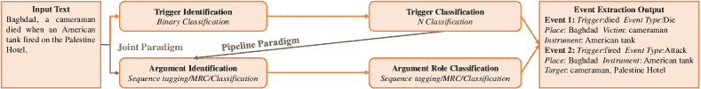

图 1：一般领域深度学习事件提取的流程图。

我们给出了如图 1 所示的一般领域深度学习事件提取的流程图。事件提取是找到关注的事件类型并提取其参数及其角色。对于流水线范式事件提取，必须区分给定文本中的事件类型，这称为触发词分类。对于不同的事件类型，设计不同的事件模式。然后，根据模式提取事件参数，包括参数识别和参数角色分类子任务。在最早的阶段，参数角色分类被视为词分类任务，每个词都被分类。此外，还有序列标注、机器阅读理解（MRC）和序列到结构生成方法。对于联合范式事件提取，模型同时分类事件类型和参数角色，以避免来自触发词分类子任务的错误。

### 1.1 贡献

对于传统的事件抽取方法，需要进行特征设计，而对于通用领域的深度学习事件抽取方法，特征可以通过深度学习模型进行端到端的提取。现有的综述主要介绍了主体事件的抽取，其中基于深度学习模型的事件抽取方法较少 [35, 18, 36]。近年来，提出了大量的事件抽取方法，基于 Transformer 的事件抽取方法取得了显著的改进 [37]。此外，事件抽取不再仅限于分类和序列标注的方式 [38, 39, 40]，还可以以机器阅读理解和生成 [41, 42] 的方式进行。因此，我们对现有的基于深度学习的通用领域事件抽取方法进行了综合分析，并展望了未来的研究工作。本文的主要贡献如下：

+   •

    我们介绍了通用领域的事件抽取技术，回顾了事件抽取方法的发展历史，并指出基于深度学习的事件抽取方法已成为主流。我们根据发表年份在表格 I 中总结了深度学习模型的必要信息。

+   •

    我们详细分析了各种基于深度学习的抽取范式和模型，包括它们的优缺点。我们介绍了当前可用的数据集，并给出了主要评估指标的公式。我们在表格 II 中总结了主要数据集的必要信息。

+   •

    我们在表格 IV 中总结了 ACE 2005 数据集上的事件抽取准确率，并讨论了事件抽取的应用。我们通过讨论未来事件抽取面临的研究趋势来总结综述。

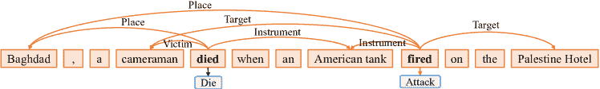

图 2：事件抽取的示意图。该示例可以分为两类事件。类型为 Die 的事件由“died”触发，具有三个论元角色：地点、受害者和工具；类型为 Attack 的事件由“fired”触发，具有三个论元角色：地点、目标和工具。

### 1.2 调研的组织

剩余的调查组织如下。第二部分介绍了事件抽取的概念和任务定义。第三部分总结了与事件抽取相关的现有范式，包括基于管道的方法和基于联合的方法，构成了一个总结表。第四部分介绍了传统事件抽取和基于深度学习的事件抽取，并进行了比较。第五部分介绍了不同场景下的事件抽取。第六部分和第七部分主要讨论了事件抽取的语料库和评估指标。然后在第八部分给出了经典事件抽取数据集中领先模型的定量结果。最后，我们在第九部分和第十部分总结了事件抽取的应用和主要挑战，然后在第十一部分对文章进行了总结。

## 2 初步

本节介绍了当前事件抽取研究中的概念、子任务和模型方法。

### 2.1 概念

事件指的是动作或状态变化的发生，通常由动词或动名词驱动。它包含涉及该动作的主要组件，如时间、地点和角色。事件提取技术从非结构化文本中提取用户感兴趣的事件，并以结构化的形式呈现给用户[39]。简而言之，事件提取检测事件及其类型，并从文本中提取核心论据，如图 2 所示。给定一个文本，事件提取技术可以预测文本中的事件提及、每个事件对应的触发词和论据，并对每个论据的角色进行分类。事件提取需要识别由“died”和“fired”分别触发的两个事件（Die 和 Attack），如图 2 所示。对于 Die 事件类型，我们识别到“Baghdad”、“cameraman”和“American tank”分别承担事件论据角色地点、受害者和工具。对于 Attack，“Baghdad”和“American tank”分别承担事件论据角色地点和工具。而“cameraman”和“Palestine Hotel”则承担事件论据角色目标。

事件提取涉及许多前沿学科，如机器学习、模式匹配和自然语言处理（NLP）。同时，各个领域的事件提取可以帮助相关人员从海量信息中快速提取相关内容，提高工作时效，并为定量分析提供技术支持。因此，事件提取在各个领域具有广泛的应用前景。通常，自动内容提取（ACE）描述了一种事件提取任务，并包含以下术语：

+   •

    `Entity`：实体是语义类别中的对象或对象群体。实体主要包括人、组织、地点、时间、事物等。在图 2 中，词汇“Baghdad”、“cameraman”、“American tank”和“Palestine Hotel”是实体。

+   •

    `Event mentions`：描述事件的短语或句子包含一个触发词和相应的论据。

+   •

    `Event type`：事件类型描述事件的性质，并指事件对应的类别，通常由事件触发词的类型表示。如图 2 中的句子，它包含 Die 和 Attack 事件类型。

+   •

    `事件触发词`：事件触发词指的是事件抽取中的核心单元，一个动词或名词。触发词识别是基于管道的事件抽取中的关键步骤。例如，图 2 中的 Die 事件，其事件触发词是“死亡”。

+   •

    `事件论据`：事件论据是事件的主要属性。它包括实体、非实体参与者和时间等。例如，图 2 中的 Die 事件，其事件论据是“巴格达”、“摄像师”和“美国坦克”。

+   •

    `论据角色`：论据角色是指论据在事件中扮演的角色，即事件论据与事件触发词之间的关系表示。例如，图 2 中 Die 事件的论据“巴格达”其角色是地点。

### 2.2 子任务

事件抽取包括四个子任务：触发词分类、触发词识别、论据识别和论据角色分类。

+   •

    `触发词识别`：通常认为触发词是事件抽取中的核心单元，能够明确表达事件的发生。触发词识别子任务是从文本中找出触发词。在图 2 中，触发词识别是识别“死亡”和“开火”这两个触发词。

+   •

    `触发词分类`：触发词分类是根据现有的触发词来判断每个句子是否为事件。此外，如果句子是事件，我们还需要确定句子属于一个或多个事件类型。例如，图 2 中的子任务旨在分类触发词“死亡”和“开火”的事件类型，分别对应 Die 和 Attack。因此，触发词分类子任务可以看作是一个多标签文本分类任务。

+   •

    `论据识别`：论据识别是从文本中识别事件类型所包含的所有论据。论据识别通常依赖于触发词分类和触发词识别的结果。例如，图 2 中的 Die 事件，论据识别就是提取“巴格达”、“摄像师”和“美国坦克”这些词汇。

+   •

    `Argument role classification`：论元角色分类基于事件提取模式中的论元，每个论元的类别根据识别出的论元进行分类。对于图 2 中的提取词，例如“摄影师”，该子任务是将该词分类为 Object 类别。因此，它也可以视为一个多标签文本分类任务。

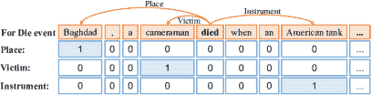

(a) 基于分类的任务。

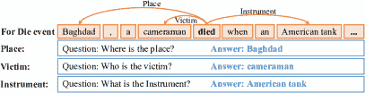

(b) 基于问答的任务。

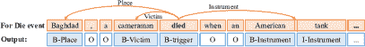

(c) 基于序列标注的任务。

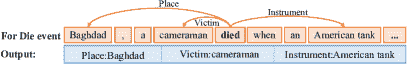

(d) 基于序列到结构生成的任务。

图 3：如何在基于分类、基于序列标注、基于问答和基于序列到结构生成的任务中实现对 Die 事件的论元提取。

### 2.3 事件提取方式

事件提取是信息提取中的一个非常具有代表性的热门话题，研究如何从包含事件信息的非结构化文本（如新闻、博客等）中提取特定类型的事件信息。它可以简化为多个分类任务，确定事件类型及每个实体所属的论元角色。例如，图 2 中的词“摄影师”，基于分类的方法是将其分类到给定角色集中的某个论元角色。分类方法依赖于命名实体识别（NER），导致错误信息的传播。在此基础上，提出了一种基于序列标注的事件提取方法，标注每个论元的开始和结束位置。基于序列标注的方法给词“摄影师”一个 BIO 标签，其中 B 代表“开始”，I 代表“内部”，O 代表“外部”。事件提取任务复杂，论元之间关系密切。采用机器阅读理解（MRC）来学习关联，通过问答对找到每个论元。MRC 基于的方法生成一个针对论元角色的问题，例如 Object，模型的任务是找到扮演 Object 角色的词。因此，事件提取任务可以看作是分类任务、序列标注任务和机器阅读理解任务。最近，一些研究集中于使用生成的方法[43, 44]。这四个任务的详细定义如下。

#### 2.3.1 基于分类的任务

对于分类任务 [45, 46]，作者通常预定义 $n$ 个事件类型及其对应的论元角色，例如事件 $e_{i}$ ($i\in[1,n]$) 包含一组论元角色 [$r_{i,1},r_{i,2}...,r_{i,l}$]。给定一个输入事件提及 $m$，模型需要输出一个结果向量 $T$，其中第 $i$ 个论元 $T_{i}$ 表示 $m$ 属于事件 $e_{i}$ 的概率。在基于分类的任务中，触发词识别是为了分类一个词是否为触发词。在获得最终事件（或一组） $e_{k}$ 后，模型输出一个矩阵 $R$，其中论元 $R_{i,j}$ 表示提取的论元 $a_{i}$ 属于论元角色 $r_{k,j}$ 的概率。如图 3(a) 所示，它将每个实体分类到预定义的论元角色中。

#### 2.3.2 基于机器阅读理解的任务

机器阅读理解模型 [47, 48, 49] 能够理解自然语言中的一段文本并回答有关它的问题 [50]。在基于机器阅读理解的任务中，触发词识别也用于分类一个词是否为触发词。首先，为每个论元角色 $r$ 设计一个问题模式 $Q_{r}$。由于不同的事件类型具有不同的论元，模型需要首先识别文本所属的事件类型。然后，根据事件类型确定需要提取的论元角色。最终，基于机器阅读理解的事件提取方法是输入文本 $T$，并将设计好的问题 $Q_{r}$ 逐一应用到提取模型中，如图 3(b) 所示。模型提取出答案 $A_{r}$，这是每个论元角色 $r$ 的对应论元。

#### 2.3.3 基于序列标注的任务

序列标注任务[51, 52, 53]是基于词级的多分类任务[54, 55, 56]，可以直接根据词级事件类型抽取来匹配事件参数。事件抽取主要包括两个核心任务：识别和分类事件类别以及抽取事件参数。基于序列标注的事件抽取可以简单快速地实现事件类型和事件参数的匹配，而无需额外的特征。在基于序列标注的任务中，触发词识别是标记一个词为触发词。序列标注方法从文本中标出目标，这对于事件抽取任务非常适合。如图 3(c) 所示，对于给定的文本 $T={x_{1},x_{2},\dots,x_{N}}$ 和事件模式，参数角色 $r$ 对应的参数由序列标注模型标记。序列标注模型的输出 $y={y_{1},y_{2},\dots,y_{N}}$ 是对文本中所有词的标记。

#### 2.3.4 基于序列到结构生成的任务

基于序列到结构生成的事件抽取以端到端的方式从文本中抽取事件[43]。在序列到结构生成的任务中，触发词识别是生成一个触发词。它将所有任务统一建模在一个模型中，并普遍预测不同的标签。如图 3(d) 所示，基于序列到结构生成的方法直接生成所有参数及其角色。它通常采用编码器-解码器模型[43]，这是一种将文本转换为结构化形式的简便方法。

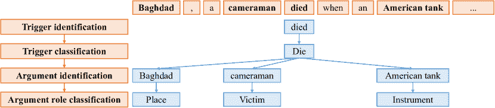

图 4：基于管道的事件抽取示例。

## 3 事件抽取范式

事件提取包括四个子任务：触发器识别、事件类型分类、论据识别和论据角色分类。根据处理这四个子任务的程序，事件提取任务被分为基于管道的事件提取和基于联合的事件提取。首先采用基于管道的方法[39, 57]。它首先检测触发器，然后根据触发器判断事件类型。然后，论据提取模型根据事件类型和触发器的预测结果提取论据并分类论据角色。为了克服事件检测导致的错误信息传播，研究人员提出了一种基于联合的事件提取范式[58, 59, 60]。它通过将事件检测和论据提取任务结合起来，减少了错误信息的传播。

### 3.1 基于管道的范式

基于管道的方法将所有子任务视为独立的分类问题[61, 62, 63]。由于它简化了整个事件提取任务，因此管道方法被广泛使用。基于管道的事件提取方法，如图 4 所示，将事件提取任务转换为多阶段分类问题。所需的分类器包括：1）触发器分类器用于确定术语是否是事件触发器及事件类型。2）论据分类器用于确定单词是否为事件的论据。3）论据角色分类器用于确定论据的类别。

经典的基于深度学习的事件提取模型动态多池卷积神经网络（DMCNN）[39]使用两个动态多池卷积神经网络进行触发器分类和论据分类。触发器分类模型识别触发器。如果存在触发器，则使用论据分类模型识别论据及其角色。PLMEE [37]也使用两个模型进行触发器提取和论据提取。论据提取器利用触发器提取结果进行推理。通过引入双向编码器表示的变换器（BERT）[64]，表现良好。

基于管道的事件提取方法通过先前的子任务为后续子任务提供额外信息，并利用子任务之间的依赖关系。Du 等人[41]采用问答方法实现事件提取。首先，模型通过设计的触发器问题模板识别输入句子中的触发器。模型的输入包括输入句子和问题。然后，根据识别出的触发器对事件类型进行分类。触发器可以为触发器分类提供额外信息，但错误的触发器识别结果也会影响触发器分类。最后，模型识别事件参数，并根据与事件类型对应的模式对参数角色进行分类。在参数提取中，模型利用上一轮历史内容的答案。

该方法最显著的缺陷是错误传播。直观地说，如果在第一步的触发器识别中存在错误，那么论证识别的准确性将降低。因此，在使用管道提取事件时，将会出现错误级联和任务拆分的问题。管道事件提取方法可以通过使用触发器的信息来提取事件参数。然而，这要求触发器识别的准确性很高。错误的触发器会严重影响参数提取的准确率。因此，管道事件提取方法将触发器视为事件的核心。

总结。基于管道的方法将事件提取任务转化为多阶段分类问题。基于管道的事件提取方法首先识别触发器，参数识别则基于触发器识别的结果。它将触发器视为事件的核心。然而，这种阶段性策略会导致错误传播。触发器的识别错误会传递到参数分类阶段，从而导致整体性能的下降。此外，由于触发器检测总是优先于参数检测，因此在检测触发器时不会考虑参数。因此，每个环节都是独立的，缺乏互动，忽略了它们之间的影响。因此，无法处理整体依赖关系。经典案例是 DMCNN [39]。

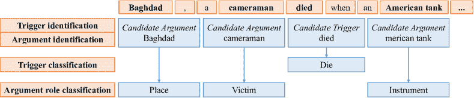

图 5：基于联合的事件提取范式的简化架构。

### 3.2 基于联合的范式

事件抽取在自然语言处理中的实际价值很大。在使用深度学习对事件抽取任务建模之前，已经在事件抽取中研究了联合学习方法。如图 5 所示，该方法在第一阶段根据候选触发词和实体来识别触发词和参数。在第二阶段，为了避免事件类型的信息错误传播，同时实现触发词分类和参数角色分类。它将触发词“died”分类为 Die 事件类型，将参数“Baghdad”分类为 Place 参数角色，等等。

基于联合模型的深度学习事件抽取方法主要利用深度学习和联合学习与特征学习进行互动，这可以避免扩展学习时间和复杂的特征工程[65, 66, 67]。李等人[38]研究了基于传统特征提取方法的触发词提取和参数提取任务的联合学习，并通过结构感知机模型获得了最佳结果。朱等人[68]设计了高效的离散特征，包括特征词中包含的所有信息的局部特征和能够连接触发词与参数信息的全局特征。阮等人[40]通过深度学习和联合学习成功构建了局部特征和全局特征。它使用递归神经网络将事件识别和参数角色分类结合起来。构建的局部特征包括文本序列特征和局部窗口特征。输入文本由词向量、实体向量和事件参数组成。然后，文本被传递到递归神经网络模型中，以获得深度学习的序列特征。同时还提出了一种具有记忆的深度学习模型，主要针对事件触发词、事件参数以及事件触发词与事件参数之间的全局特征，以同时提高任务的性能。

事件抽取涉及与实体识别等相关的任务，这些任务有助于提高事件抽取的效果。刘等人[69]利用参数的局部特征来辅助角色分类。他们首次采用了实体的联合学习任务，旨在减少任务的复杂性。之前的方法将具有特征的数据集输入并输出事件。陈等人[70]简化了这一过程，即纯文本输入和输出。在过程中间，是事件参数的联合学习。这一联合学习因素主要提供了每个输入事件中不同事件的关系和实体信息。

上述联合学习方法可以实现触发词和论元的联合建模提取。然而，在实际工作过程中，触发词和论元的提取是顺序进行的，而不是同时进行的，这仍是一个亟待讨论的问题。此外，如果将端到端模式添加到深度学习中，特征选择的工作量将显著减少，这也将在后续讨论中涉及。联合事件提取方法避免了触发词识别错误对事件论元提取的影响，认为触发词和论元同等重要，但无法利用触发词的信息。

总结。为了克服流水线方法的缺点，研究人员提出了一种联合方法。联合方法构建了一个联合学习模型，用于触发词识别和论元识别，其中触发词和论元可以相互促进提取效果。实验证明，联合学习方法的效果优于流水线学习方法。经典案例是通过递归神经网络（JRNN）[40]的联合事件提取方法。联合事件提取方法避免了事件论元提取中的触发词识别，但它无法利用触发词的信息。联合事件提取方法认为事件中的触发词和论元同等重要。然而，无论是基于流水线的事件提取还是基于联合的事件提取，都无法避免事件类型预测错误对论元提取性能的影响。此外，这些方法不能在不同事件类型之间共享信息，而是独立学习每种类型，这对只有少量标注数据的事件提取是不利的。

表 I：不同模型的基本信息。ED：事件检测，AE：论元提取，NER：命名实体识别，MRC：机器阅读理解。

| 年份 | 模型 | 设置 | 方式 | 会议 | 数据集 | ED | AE | NER |
| --- | --- | --- | --- | --- | --- | --- | --- | --- |
| 2021 | TEXT2EVENT [43] | 监督 | 生成 | ACL | ACE05-EN, ERE-EN | ✓ | ✓ | - |
| CasEE [15] | 监督 | 序列标注 | ACL(Findings) | FewFC | ✓ | ✓ | - |
| CLEVE [71] | 监督 | 分类 | ACL | ACE, MAVEN | ✓ | ✓ | ✓ |
| FEAE [72] | 监督 | MRC | ACL | RAMS | ✓ | ✓ | ✓ |
| GIT [73] | 监督 | 分类 | ACL | ChFinAnn ¹¹1http://www.cninfo.com.cn/new/index | ✓ | ✓ | ✓ |
| NoFPFN [74] | 监督 | 分类 | ACL(Findings) | ChFinAnn | ✓ | ✓ | ✓ |
| DualQA [75] | 半监督 | MRC | AAAI | ACE, FewFC | - | ✓ | - |
| GRIT [76] | 监督 | 生成 | EACL | (信息理解会议) MUC-4 | ✓ | ✓ | - |
| Wen 等人[77] | 监督 | 分类 | NAACL | ACE | ✓ | ✓ | - |
|  | HPNet [78] | 监督 | 序列标注 | COLING | ACE2005, 文本分析会议 2015 (TAC2015) | ✓ | ✓ | - |
|  | M2E2 [79] | 弱监督 | 分类 | ACL | M2E2 | ✓ | ✓ | - |
|  | MQAEE [42] | 监督 | MRC | EMNLP | ACE | ✓ | ✓ | - |
|  | Du 等人 [41] | 监督 | MRC | EMNLP | ACE | ✓ | ✓ | - |
|  | Min 等人 [80] | 监督 | 分类 | LREC | ACE | - | ✓ | - |
|  | Chen 等人 [81] | 监督 | MRC | EMNLP | ACE | - | ✓ | - |
|  | EEGCN [82] | 监督 | 序列标注 | EMNLP(发现) | ACE | ✓ | - | - |
| 2019 | Doc2EDAG²²2EDAG 指的是基于实体的有向无环图。[83] | 监督 | 生成 | EMNLP | ChFinAnn | ✓ | ✓ | ✓ |
| Chen 等人[81] | 监督 | MRC | arXiv | ACE | ✓ | ✓ | - |
| GAIL-ELMo³³3ELMo 指的是语言模型中的嵌入。[84] | 监督 | 序列标注 | Data Intell. | ACE | ✓ | ✓ | ✓ |
| DYGIE++ [85] | 监督 | 序列标注 | EMNLP | ACE, SciERC 等 | ✓ | ✓ | - |
| HMEAE [86] | 监督 | 分类 | EMNLP | ACE, TAC-KBP | - | ✓ | ✓ |
| Han 等人 [87] | 监督 | 分类 | EMNLP | TB-Dense, MATRES | ✓ | ✓ | ✓ |
| PLMEE [37] | 监督 | 序列标注 | ACL | ACE | ✓ | ✓ | ✓ |
| JointTransition [58] | 监督 | 分类 | IJCAI | ACE | ✓ | ✓ | ✓ |
| Joint3EE [88] | 监督 | 序列标注 | AAAI | ACE | ✓ | ✓ | - |
| Chan 等人 [89] | 监督 | 分类 | ACL | ACE | ✓ | ✓ | ✓ |
| Li 等人 [90] | 监督 | MRC | ACL | ACE, CoNLL04 | ✓ | ✓ | - |
| 2018 | DCFEE⁴⁴4DCFEE 指的是文档级中文金融事件提取。[91] | 距离监督 | 序列标注 | ACL | NO.(ANN, POS, NEG) | ✓ | ✓ | - |
| Zeng 等人 [92] | 距离监督 | 序列标注 | AAAI | FBWiki, ACE | ✓ | ✓ | ✓ |
| Huang 等人[61] | 监督 | 分类 | ACL | ACE | ✓ | ✓ | - |
| DEEB-RNN⁵⁵5DEEB 指的是文档嵌入增强型双向 RNN。[93] | 监督 | 分类 | ACL | ACE | ✓ | - | - |
| SELF [94] | 监督 | 分类 | ACL | ACE, TAC-KBP | ✓ | - | - |
| DBRNN [95] | 监督 | 分类 | AAAI | ACE | ✓ | ✓ | ✓ |
| JMEE [96] | 监督 | 序列标注 | EMNLP | ACE | ✓ | ✓ | ✓ |
| Ferguson 等人[14] | 半监督 | 分类 | NAACL | ACE, TAC-KBP | ✓ | ✓ | - |
| 2017 | DMCNN-MIL⁶⁶6DMCNN-MIL 指的是动态多池化卷积神经网络与多实例学习。[70] | 距离监督 | 分类 | ACL | ACE | ✓ | ✓ | ✓ |
| Liu 等人[97] | 监督 | 分类 | ACL | ACE | ✓ | - | - |
| 2016 | RBPB⁷⁷脚注标记：7 [98] | 有监督 | 分类 | ACL | ACE | ✓ | ✓ | - |
| Zeng et al.[99] | 有监督 | 序列标注 | NLPCC | ACE | ✓ | ✓ | - |
| JRNN [40] | 有监督 | 序列标注 | NAACL | ACE | ✓ | ✓ | ✓ |
| JOINTEVENTENTITY [13] | 有监督 | 序列标注 | NAACL | ACE | ✓ | ✓ | ✓ |
| BDLSTM-TNNs [100] | 有监督 | 分类 | CCL | ACE | ✓ | ✓ | ✓ |
| Liu et al. [69] | 有监督 | 分类 | ACL | ACE | ✓ | - | - |

| 2015 | DMCNN [39] | 有监督 | 分类 | ACL | ACE | ✓ | ✓ | ✓ | ⁶⁶脚注：RBPB 意为基于正则化的模式平衡方法用于事件提取。

## 4 深度学习事件提取模型

传统的事件提取方法难以深入学习特征，使得依赖复杂语义关系的事件提取任务难以改进。最近的大多数事件提取工作基于深度学习架构，如卷积神经网络 (CNN) [39, 101]、递归神经网络 (RNN) [102, 95]、图神经网络 (GNN) [96, 82, 103, 104, 105]、变换器 [37, 106, 107] 或其他网络 [58, 78]。如表 I 所示，我们展示了现有模型的基本信息，根据发布时间进行分类。包括模型探讨的领域、模型发布的会议和模型使用的数据集。此外，我们总结了每个模型是否包含事件检测、论据提取和命名实体识别。深度学习方法能够捕捉复杂的语义关系，并显著改善多个事件提取数据集。我们介绍了几种典型的事件提取模型。

### 4.1 基于 CNN 的模型

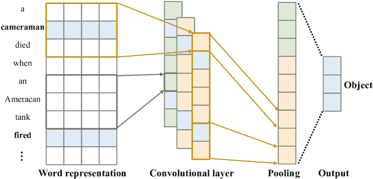

图 6：基于 CNN 的论据提取架构。它展示了一个实例的处理，其中预测触发词为“触发”且候选论据为“摄影师”。

为了在不使用复杂自然语言处理工具的情况下自动提取词汇和句子级特征，Chen 等人 [39] 引入了一种词表示模型，称为 DMCNN。它捕捉了词语的有意义的语义规则，并采用基于 CNN 的框架来捕捉句子级线索。然而，CNN 只能捕捉句子中的基本信息，它使用一个动态多池层来基于事件触发器和论元存储更多关键的信息。事件提取是一个通过动态多池卷积神经网络实现的两阶段多类分类过程，具有自动学习特征。第一阶段是触发器分类。DMCNN 对句子中的每个词进行分类，以识别触发器。对于包含触发器的句子，该阶段应用类似的 DMCNN 来分配论元给触发器并对齐论元的角色。图 6 描述了论元分类的架构。词汇级特征表示和句子级特征提取用于捕捉词汇线索并学习句子的组合语义特征。

CNN 引入了句子中 k-grams 的潜在结构。因此，一些研究人员还研究了基于卷积神经网络的事件提取技术。Nguyen 等人 [108] 使用 CNN 来研究事件检测任务，与传统的基于特征的方法相比，它克服了复杂特征工程和错误传播的限制。但是，它在很大程度上依赖于其他监督模块和手动资源来获取特征。在跨领域泛化性能方面，它显著优于基于特征的方法。此外，为了考虑非连续的 k-grams，Nguyen 等人 [102] 引入了非连续 CNN。CNN 模型通过结构化预测应用于基于管道和联合的范式，结合丰富的局部和全局特征来自动学习隐藏的特征表示。与基于管道的方法相比，联合范式可以缓解错误传播问题，并利用事件触发器和论元角色之间的相互依赖关系。

### 4.2 基于 RNN 的模型

除了基于 CNN 的事件提取方法，还有一些其他研究基于 RNN。RNN 用于建模序列信息，以提取事件中的论证，如图 7 所示。JRNN [40] 提出了一个双向 RNN 用于联合模型中的事件提取。它包括编码阶段和预测阶段。在编码阶段，它使用 RNN 总结上下文信息。此外，在预测阶段，它预测触发词和论证角色。

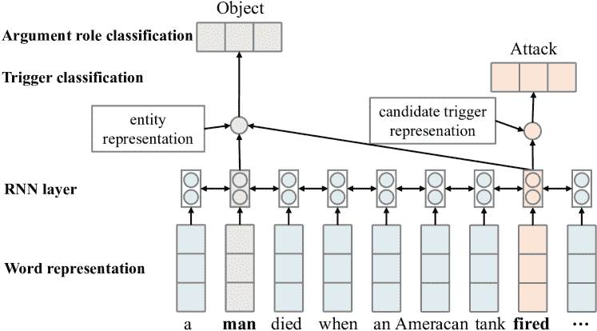

图 7：RNN 基于的论证提取的简化架构，用于输入句子“一个人在巴格达被坦克射击时死亡”中的候选触发词“射击”。

以前的方法严重依赖于语言特定知识和现有 NLP 工具。Feng 等人 [109] 提出了从数据中自动学习有用特征的更有前景的方法，开发了一种混合神经网络以捕捉特定序列和信息片段的上下文，并用于训练多语言事件检测器。该模型使用双向长短期记忆（LSTM）来获取需要识别的文档序列信息。然后，它使用卷积神经网络来获取文档中的短语块信息，将这两种信息结合起来，最终识别触发词。这种方法在多语言（英语、中文和西班牙语）检测方面表现出强大的鲁棒性、高效性和准确性。该复合模型在跨语言泛化性能方面优于传统的基于特征的方法。在深度学习中，树结构和序列结构的表现优于序列结构。为了避免对词汇和句法特征的过度依赖，基于双向 RNN 的依赖桥接递归神经网络（DBRNN） [95] 被提出用于事件提取。DBRNN 通过依赖于桥接语法相关词汇得到增强。DBRNN 是一个基于 RNN 的框架，利用依赖图信息来提取事件触发词和论证角色。

### 4.3 基于注意力的模型

深度学习模型的事件特征自动提取以及外部资源对事件特征的增强主要关注事件触发词的信息，对事件论元和词间依赖的信息关注较少。句子级别的顺序建模在捕捉非常长距离依赖时效率较低。此外，基于 RNN 和 CNN 的模型未能完全建模事件之间的关联。注意力机制中结构信息的建模逐渐引起了研究者的关注。随着研究方法的不断提出，逐渐出现了加入注意力机制的模型，如图 8 所示。注意力机制的特点决定了它可以利用全局信息来建模局部上下文，而无需考虑位置信息。在更新词语语义表示时具有良好的应用效果。

通过控制句子每个部分的不同权重信息，注意力机制使模型关注句子的重点特征信息，同时忽略其他不重要的特征信息，并合理分配资源以提取更准确的结果。与此同时，注意力机制本身可以作为一种对齐方式，解释端到端模型中输入与输出之间的对齐，使模型更加可解释。

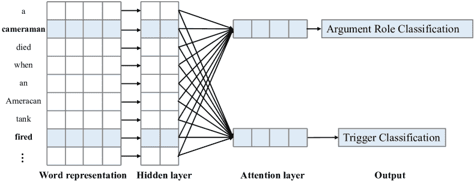

图 8：基于注意力的事件抽取架构。

一些研究者还使用层次化的注意力机制来进行信息的全局聚合。联合多事件抽取（JMEE）[96]由四个模块组成：词表示、句法图卷积网络、自注意力触发分类和论元分类模块。通过引入语法快捷弧来增强信息流。基于注意力的图卷积网络用于联合建模图信息，以提取多个事件触发词和论元。此外，它在联合提取事件触发词和论元时优化了一个有偏差的损失函数，以解决数据集的不平衡问题。

### 4.4 基于图卷积网络（GCN）的模型

句法表示提供了一种高效的方法，将词汇直接链接到其信息上下文中，以进行事件检测[110, 111, 82, 33]。Nguyen 等人[110]研究了一种基于依赖树的卷积神经网络来执行事件检测，首次将依赖树关系信息集成到神经事件检测中。该模型使用了带有图卷积网络（GCNs）[111]和基于实体提及的池化方法。它们提出了一种依赖实体提及来聚合卷积向量的新颖池化方法。该模型在当前词汇和句子中的实体提及的图卷积向量上进行池化。模型将卷积向量聚合为一个单一的向量表示，用于事件类型预测。该模型明确建模来自实体提及的信息，以提高事件检测的性能。

在[77]中，文本分析会议知识库填充（TAC-KBP）的时间槽用于填充任务中提出的四分之一时间表示，模型预测事件的最早和最晚开始时间及结束时间，从而表示事件的模糊时间跨度。模型基于共享的参数和时间关系，为每个输入文档构建文档级事件图，并使用基于图的注意力网络方法在图上传播时间信息，如图 9 所示，其中实体用下划线标出，事件以粗体显示。温等人基于事件-事件关系构建了一个文档级事件图方法用于输入文档。文档中的事件参数被提取。然后，根据“Before”和“After”等关键词及事件发生的时间逻辑，将事件按时间顺序排列。实体参数在不同事件间共享。模型实现将事件纳入更准确的时间轴中。

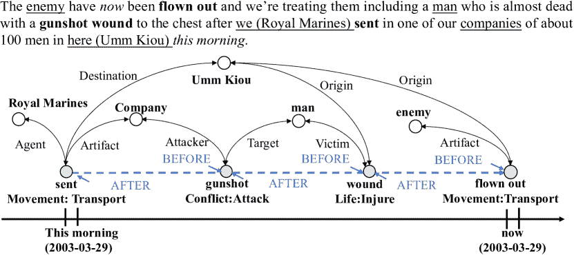

图 9：事件图示例。实线由事件参数组成，而虚线图是基于时间关系构建的[77]。

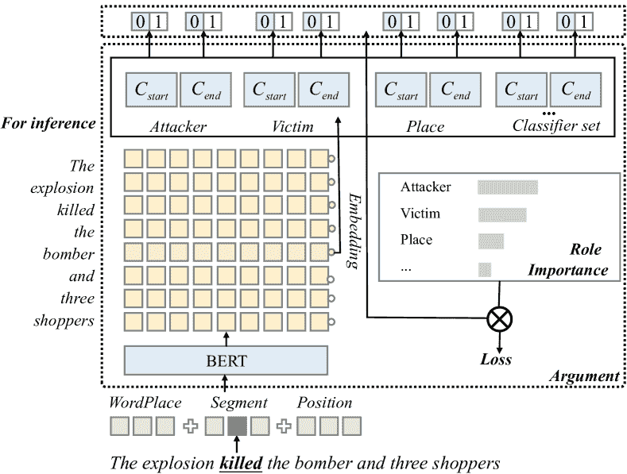

图 10：PLMEE [37] 的提取架构。

### 4.5 基于 Transformer 的模型

利用一个在各种事件中扮演不同角色的论据来改进事件提取是一项挑战。杨等人[37]采用了一种方法，通过根据论据角色分离论据预测，以克服角色重叠问题。此外，由于训练数据不足，该方法通过编辑原型和通过对质量进行排名筛选开发的样本，自动生成标记数据。他们提出了一个框架，基于预训练语言模型的事件提取器（PLMEE）[37]，如图 10 Models ‣ 4 Deep Learning Event Extraction Models ‣ A Survey on Deep Learning Event Extraction: Approaches and Applications")所示。PLMEE 通过结合提取模型和基于预训练语言模型的生成方法来促进事件提取。这是一个两阶段任务，包括触发词提取和论据提取，包含一个触发词提取器和一个论据提取器，它们都依赖于 BERT 的特征表示。然后，它利用角色的重要性来重新加权损失函数。

GAIL [84] 是一个基于 ELMo[112] 的模型，利用生成对抗网络帮助模型关注更难检测的事件。他们提出了一个基于生成对抗模仿学习的实体和事件提取框架。这是一种逆向强化学习（IRL）方法，使用生成对抗网络（GAN）。该模型通过使用 IRL 的动态机制直接评估实体和事件提取中实例的正确和错误标记。

DYGIE++¹¹1DYGIE 代表动态图信息提取。[85] 是一个基于 BERT 的框架，模型化文本跨度，并捕捉句内和跨句上下文。许多信息提取任务，如命名实体识别、关系提取、事件提取和共指解析，可以从跨句的全局上下文或从不依赖于局部的短语中受益。他们将事件提取作为附加任务，并在事件触发器及其论据的关系图中进行跨度更新。跨度表示是基于多句 BERT 编码构建的。

总结。大多数传统事件抽取方法采用人工构建特征表示的方法，并使用分类模型对触发词进行分类并识别论元的角色。近年来，深度学习在图像处理、语音识别和自然语言处理等领域表现出色。为了弥补传统方法的不足，系统地讨论了基于深度学习的事件抽取。在 BERT 模型出现之前，主流方法是从文本中找到触发词，并根据触发词判断文本的事件类型。最近，随着 BERT 引入事件抽取模型，基于全文识别事件类型的方法已成为主流。这是因为 BERT 具有出色的上下文表示能力，并在文本分类任务中表现良好，尤其是在数据量较少的情况下。

## 5 事件抽取场景

有些工作专注于文档级、低资源、多语言和中文事件抽取，其目标是提高不同场景下的事件抽取能力。

### 5.1 文档级事件抽取场景

文档级事件抽取（DEE）旨在从一篇文章中提取事件。与句子级事件抽取（SEE）相比，提出了两个挑战：（i）论元分散：一个事件的论元可能分散在文档的多个句子中，这意味着一个事件记录无法从单个句子中提取；（ii）多事件：一个文档可能同时包含多个事件，这需要对事件之间的相互依赖关系进行整体建模。迄今为止，现有的 DEE 研究大致可以分为两类。

第一类主要关注在文档中提取分散的事件论元，即第一个挑战。早期工作[113、114]将文档级论元抽取视为一种槽填充范式，遵循 MUC-4 的任务设置[115]。进一步的研究者[116、117]将文档级事件论元视为 RAMS[116]数据集中的论元链接问题，旨在识别给定事件触发词的整个文档中的事件论元。然而，上述工作是在事件类型或触发词事先给定的假设下进行的，这在现实场景中可能不够现实。

第二类工作并非直接识别事件论元，而是遵循类似于 SEE 的检测后提取范式，从文档中提取事件。具体而言，杨等人 [118]、黄等人 [119] 和李等人 [120] 首先识别特定的事件触发词以决定事件类型，然后提取超出句子边界的事件论元。此外，研究人员 [83, 121, 122] 还尝试在 ChFinAnn 数据集 [83] 中以无触发词的方式进行 DEE，其中事件类型直接根据文档语义判断。杜等人 [123] 提出了在生成模板的方式下同时识别事件类型和论元的方法。这些方法试图同时解决 DEE 的两个挑战，并引起了大量研究关注。

### 5.2 开放领域事件抽取场景

在缺乏预定义事件模式的情况下，开放领域事件抽取旨在从文本中检测事件，并且在大多数情况下，通过提取的事件关键词将相似事件进行聚类。事件关键词是主要描述事件的单词/短语，有时进一步分为触发词和参数。开放领域事件抽取 [16, 17, 18] 没有固定的论元角色模板。因此，论元通常通过提取关键词获得。Chau 等人 [16] 提出了一个方法，用于过滤无关的头条新闻并进行初步事件抽取，该方法依赖于公开的新闻头条。价格和文本都反馈到一个 3D 卷积神经网络中，以学习事件与市场变动之间的关联。刘等人 [17] 设计了一种新颖的潜变量神经模型，使用无监督生成方法来探索潜在事件类型向量和实体提及冗余。实验结果表明，该方法可以扩展到非常大的语料库。

### 5.3 低资源事件抽取场景

由于数据标注的昂贵成本，通常只有不足的数据来训练一个准确的完全监督 EE 模型。在本调查中，我们将这种情况称为低资源场景。为了缓解数据稀缺问题，现有研究探索了远程监督[91]方法以增加标注数据。此外，一些有前景的方法还研究了半监督方法[75, 14, 124]或多语言方法（见第 5.4 节）来丰富监督信息。最近，一些研究探讨了在三种典型的低资源设置下的 EE，包括少样本学习设置、零样本学习设置和增量学习设置。在本节中，我们将简要介绍上述设置中的近期 EE 方法，以供快速参考。

少样本学习设置。最近，少样本学习方法[125, 126]在多个 NLP 任务中得到了广泛研究[127, 128]，旨在利用极其有限的（如 1-shot、3-shot 等）观察训练样本进行任务预测。在事件抽取领域，大多数现有研究集中于在少样本学习设置（FSED）中应用的事件检测子任务。第一类工作[129, 130, 131, 132, 133, 134]旨在利用元学习方法对候选触发器进行触发器分类。为了接近实际应用，第二类工作[135, 136, 137]仅使用纯文本数据进行触发器识别和触发器分类。其中，Cong 等人[136]进一步使用原型化的摊销条件随机场（CRF）学习鲁棒的序列标签转移分数，取得了显著的改进。

零样本学习设置。大多数以往的监督事件抽取（EE）方法依赖于从人工标注中提取的特征，这些特征无法处理没有额外标注的新事件类型。在极具挑战性的低资源场景中，实现无标注数据的事件抽取是一个难题。为了探索这种场景的可能性，最近的研究[61, 138]探讨了零样本学习（ZSL）在事件抽取中的应用。黄等人[61]首次解决了这个问题，利用事件提及和类型的结构本体进行表示，并通过语义相似性度量进行预测。吕等人[138]进一步研究了针对新事件的迁移学习方法，将事件抽取表述为文本蕴涵（TE）和问答（QA）查询（例如，“一座城市遭到了攻击”蕴涵“发生了攻击”），并利用预训练的 TE/QA 模型进行直接迁移。尽管这些方法与监督方法仍存在较大差距，但它们揭示了有价值的视角，并为极低资源条件下的事件抽取提供了可能的改进方向。

增量学习设置。现有的事件检测（ED）方法通常需要固定数量的事件类型，并在固定数据集上进行一次性训练。这种范式通常在新的事件类型和数据不断出现时面临挑战。实际应用中，实际的 ED 系统应该能够增量学习新的事件类型，并同时保持对现有类型的预测能力，而不是需要一个固定的数据集重新训练所有事件类型。最近的研究[139, 140]关注增量学习（也称为持续学习或终身学习），重点解决灾难性遗忘问题，即系统在适应新类型时通常会在旧类型上表现显著下降。曹等人[141]是首个解决增量 ED 问题的工作，通过提出的知识巩固网络解决了灾难性遗忘和语义模糊问题，在增量 ED 中取得了有效的表现。

### 5.4 多语言事件抽取场景

在低资源环境中，单语训练也是一种有效的事件抽取方法[142, 143, 33]。Liu 等人[143] 提出了一个新的多语言方法，称为门控多语言注意力（GMLATT）框架，以同时解决这两个问题，并通过上下文注意力机制在多语言数据中开发一致的信息。它使用多语言数据中的一致证据，建模其他语言提供的线索的可信度，并控制各种语言中的信息整合。Ahmad 等人[33] 提出了一个图注意力变换器编码器（GATE）框架，该框架使用 GCNS 学习语言无关的句子。该模型将依赖结构嵌入到上下文表示中，引入自注意力机制以学习具有不同句法距离的词之间的依赖关系。该方法能够捕捉长距离依赖关系，并通过掩码算法计算词之间的句法距离矩阵。在跨语言句子级关系和事件抽取方面表现良好。

### 5.5 中文事件抽取场景

与英语语料中的事件抽取相比，中文事件抽取可以被视为事件抽取的一个特殊情况，具有特定的属性和挑战。早期方法[144, 145, 146, 147] 使用精心设计的语言特征进行中文事件抽取。随后，基于神经网络的方法[99, 148] 被提出以减少对特征工程的高度依赖。值得注意的是，与英语事件抽取相比，中文事件抽取受到自然词界限缺失的影响，因此在 token 级别而非词级别进行。为了缓解中文在 token 级别的语义限制，设计了精巧的方法将词级信息纳入以丰富 token 语义。具体而言，Lin 等人[149] 提出了 Nugget Proposal Networks (NPN)，通过捕捉字符和词的结构信息和语义信息，为事件触发器标记生成混合字符表示。然而，NPN 的事件触发器范围限制在固定大小的窗口内，使其不够灵活且受到事件触发器之间重叠的困扰。因此，Ding 等人[150] 提出了 Trigger-aware Lattice Neural Network (TLNN)，利用 Lattice-structure[151] 结合词和字符的语义。由于 NPN 和 TLNN 限制每个字符只能与一个匹配的词互动，Cui 等人[152] 提出了一个异质图，配备了两种类型的节点（词/字符）和三种类型的边，以最大限度地保留词-字符互动。

表 II：数据集的总结统计。 (文档表示数据集中的文档数量，句子表示数据集中的句子数量)。

| 数据集 | 文档 | 句子 | 事件类型 | 语言 | 相关论文 |
| --- | --- | --- | --- | --- | --- |
| MUC-4 | 1700 | - | 5 | - | [115] |
| Google | 11,909 | - | 30 | 英语 | [153] |
| Twitter | 1,000 | - | 20 | 英语 | [153] |
| NO.ANN, NO.POS, NO.NEG (DCFEE) | 2,976 | - | 4 | 中文 | [91] |
| ChFinAnn (Doc2EDAG) | 32,040 | - | 5 | 中文 | [83] |
| ACE 2005 | 599 | 18,117 | 33 | 多语言 | [33, 75, 42, 80, 89, 84, 143, 95, 154] |
| TAC KBP 2015 | 360 | 12,976 | 38 | 英语 | [14, 78] |
| TAC KBP 2016 | 500 | 9,042 | 18 | 多语言 | [86] |
| Rich ERE | 50 |  |  | 英语 | [155] |
| FSED | - | 70,852 | 100 | 英语 | [156] |
| GNBusiness | 12,985 | 1,450,336 | - | 英语 | [17] |
| FSD | - | 2,453 | 20 | 英语 | [153] |
| FBI 数据集 | - | - | 3 | 英语 | [157] |
| RAMS | 3,993 | - | 139 | 英语 | [116] |
| WIKIEVENTS | 246 | 6,132 | - | 英语 | [120] |
| MAVEN | 4,480 | 49,873 | 168 | 英语 | [22] [71] [158] |

## 6 事件提取语料库

有标注数据集的可用性已成为快速发展的主要推动力。在这一部分，我们总结了这些数据集。

### 6.1 文档级

MUC-4。MUC-4 是在第四届消息理解会议提出的[115]。该数据集包含 1,700 篇文档，其中五种类型的事件使用相关角色填充模板进行了标注。

Google。Google 数据集²²2http://data.gdeltproject.org/events/index.html 是全球事件、语言和情感 (GDELT) 事件数据库的一个子集，事件相关词汇检索文档包含 30 种事件类型，共 11,909 篇新闻文章。

Twitter。Twitter 数据集是通过 Twitter 流媒体应用程序接口 (API) 从 2010 年 12 月发布的推文中收集的，包含 20 种事件类型，共 1,000 条推文。

NO.ANN, NO.POS, NO.NEG (DCFEE)。在论文[91]中，研究人员对四种类型的金融事件进行了实验：股权冻结事件、股权质押事件、股权回购事件和股权超配事件。共标注了 2,976 个公告，数据是通过自动生成的。公告数量 (NO.ANN) 表示每种事件类型可以自动标注的公告数量。正面案例数量 (NO.POS) 表示正面案例的总提及次数。相反，负面提及数量 (NO.NEG) 表示负面提及的数量。

ChFinAnn（Doc2EDAG）。在[83]中，基于十年的 ChFinAnn4 文档³³3http://www.cninfo.com.cn/new/index 和人工总结的事件知识库，进行了一种基于远程监督（DS-based）的事件标注。新的中文事件数据集包括 32,040 份文档和 5 种事件类型：股权冻结、股权回购、股权减持、股权增持和股权质押。

RAMS。多句角色（RAMS）由 Eber 等人发布[116]，用于论证链接任务，旨在从 5 句窗口中识别给定事件触发器的事件论据。该数据集包含 3,194 份文档，其中标注了 9,124 个事件，这些事件基于 139 种事件类型和 65 种角色的本体从新闻中提取。

WIKIEVENTS。由 Li 等人发布[120]，作为文档级基准数据集。该数据集收集自描述现实世界事件的英文维基百科文章。

### 6.2 句子级别

自动内容提取（ACE）[1]。ACE 2005 是事件提取中使用最广泛的数据集。它包含用于 ACE 2005 技术评估的英文、阿拉伯文和中文的完整训练数据集。该语料库由语言数据联盟（LDC）标注了实体、关系和事件的各种数据类型。它包括 599 份文档，涵盖 8 种事件类型、33 种事件子类型和 35 种论据角色⁴⁴4https://catalog.ldc.upenn.edu/LDC2006T06。

文本分析会议知识库填充（TAC KBP）。作为 KBP 中的一个独立组件任务，TAC KBP 事件追踪（2015 年至 2017 年）的目标是提取有关事件的信息，以便适合输入到知识库中。TAC KBP 2015 ⁵⁵5https://tac.nist.gov/2015/KBP/data.html 定义了 9 种不同的事件类型和 38 种事件子类型。TAC KBP 2016 ⁶⁶6https://tac.nist.gov/2016/KBP/data.html 和 TAC KBP 2017 ⁷⁷7https://tac.nist.gov/2017/KBP/data.html 包含三种语言的语料库：英语、中文和西班牙语，其中拥有 8 种事件类型和 18 种事件子类型。

Rich ERE。它扩展了实体、关系和事件本体，并扩展了可标记的概念。Rich ERE 还引入了事件跳跃的概念，以应对事件共同引用的普遍挑战，特别是关于文档内和文档间的事件引用以及事件论据的粒度变化，为创建（分层或嵌套的）跨文档事件表示铺平了道路。

FSED。基于 ACE 2005 和 TAC KBP 2017，FSED 数据集[135]是一个特别为少样本场景定制的生成数据集。具体而言，它包含 70,852 个提及，涵盖 19 种事件类型和 100 种事件子类型。

GNBusiness。GNBusiness [17] 从 Google Business News 收集新闻报告，以描述来自不同来源的每个事件。它从 2018 年 10 月 17 日到 2019 年 1 月 22 日获得了 55,618 篇商业文章和 13,047 个新闻集群。完整文本语料库作为 GNBusinessFull-Text 发布 ⁸⁸8https://github.com/lx865712528/ACL2019-ODEE。

FSD。第一个故事检测（FSD）数据集 [153] 是一个包含 2,499 条推文的故事检测数据集。研究人员过滤掉在少于 15 个样本中提到的事件，因为在几个样本中提到的事件通常不重要。它包括 2,453 条推文和 20 种事件类型。

FBI 数据集。FBI 的城市级仇恨犯罪报告（FBI）数据集 [157] 是通过抓取约 370k 未标记的新闻文章在 Patch 的“火灾和犯罪”类别中构建的。它包含两个类别，用于分类文本中是否存在特定的仇恨犯罪。此外，它还标记了仇恨犯罪文章的属性。

表 III：用于评估指标的符号。

| 符号 | 描述 |
| --- | --- |
| $T$ | 参考触发器 |
| $TD$ | 检测到的触发器 |
| $N_{T}$ | 实际触发器数量 |
| $N_{TD}$ | 检测到的触发器数量 |
| $T_{t}$ | 真实事件类型 |
| $TD_{t}$ | 检测到的事件类型 |
| $A$ | 参考参数 |
| $AD$ | 检测到的参数 |
| $N_{A}$ | 实际参数数量 |
| $N_{AD}$ | 检测到的参数数量 |
| $A_{r}$ | 检测到的参数角色 |
| $AD_{r}$ | 检测到的参数数量 |

表 IV：使用实体注释在 ACE 2005 上的事件提取方法比较。我们展示了触发器分类和参数角色分类子任务的性能。

| 年-方法 | 神经网络 | 外部资源 | 模式 | 触发器分类 | 角色分类 |
| --- | --- | --- | --- | --- | --- |
| P | R | F1 | P | R | F1 |
| 2008 - Ji 等 [159] | - | - | - | 60.2 | 76.4 | 67.3 | 51.3 | 36.4 | 42.6 |
| 2010 - Liao 等 [160] | - | - | - | 68.7 | 68.9 | 68.8 | 45.1 | 44.1 | 44.6 |
| 2011 - Hong 等 [161] | - | - | - | 72.9 | 64.3 | 68.3 | 51.6 | 45.5 | 48.4 |
| 2013 - Li 等 [38] | - | - | - | 73.7 | 62.3 | 67.5 | 64.7 | 44.4 | 52.7 |
| 2015 - Nguyen 等 [108] | ✓ | - | - | 71.8 | 66.4 | 69.0 | - | - | - |
| 2015 - DMCNN [39] | ✓ | - | 流水线 | 75.6 | 63.6 | 69.1 | 62.2 | 46.9 | 53.5 |
| 2016 - JRNN [40] | ✓ | - | 联合 | 66.0 | 73.0 | 69.3 | 54.2 | 56.7 | 55.4 |
| 2016 - JOINTEVENTENTIT [13] | - | - | 联合 | 75.1 | 63.3 | 68.7 | 70.6 | 36.9 | 48.4 |
| 2016 - NC-CNN [102] | ✓ | - | - | - | - | 71.3 | - | - | - |
| 2016 - HNN [109] | ✓ | - | - | 84.6 | 64.9 | 73.4 | - | - | - |
| 2016 - BDLSTM-TNNs [100] | ✓ | - | 联合 | 75.3 | 63.4 | 68.9 | 62.9 | 47.5 | 54.1 |
| 2017 - DMCNN-MIL [70] | ✓ | ✓ | 联合 | 75.5 | 66.0 | 70.5 | 62.8 | 50.1 | 55.7 |
| - 2018 - DEEB-RNN [93] | ✓ | - | 流水线 | 72.3 | 75.8 | 74 | - | - | - |
| 2018 - SELF [94] | ✓ | - | 流水线 | 71.3 | 74.7 | 73.0 | - | - | - |
| 2018 - GMLATT [143] | ✓ | - | 联合 | 78.9 | 66.9 | 72.4 | - | - | - |
| 2018 - Zeng 等人 [92] | ✓ | ✓ | 流水线 | 85.3 | 79.9 | 82.5 | 41.9 | 34.6 | 37.9 |
| 2019 - Liu 等人 [162] | ✓ | - | 联合 | 62.5 | 35.7 | 45.4 | - | - | - |
| 2019 - GAIL-ELMo [84] | ✓ | - | 联合 | 74.8 | 69.4 | 72.0 | 61.6 | 45.7 | 52.4 |
| 2019 - HMEAE [86] | ✓ | - | 联合 | - | - | - | 62.2 | 56.6 | 59.3 |
| 2019 - JointTransition [58] | ✓ | - | 联合 | 74.4 | 73.2 | 73.8 | 55.7 | 51.1 | 53.3 |
| 2019 - PLMEE [37] | ✓ | - | 联合 | 81.0 | 80.4 | 80.7 | 62.3 | 54.2 | 58.0 |
| 2021 - Li 等人 [163] | ✓ | - | - | - | - | 71.1 | - | - | 53.7 |
| 2021 - GATE (En2ZH) [33] | ✓ | - | 联合 | - | - | - | - | - | 63.2 |
| 2021 - CasEE [15] | ✓ | - | 联合 | 77.9 | 78.5 | 78.2 | 71.3 | 71.5 | 71.4 |

表 V：在不使用实体注释的情况下对 ACE 2005 上事件抽取方法的比较。即使是 Text2Event 模型也没有使用令牌注释。我们展示了触发分类和论元角色分类子任务的表现。

| 年份-方法 | 神经网络 | 外部资源 | 模式 | 触发分类 | 角色分类 |
| --- | --- | --- | --- | --- | --- |
| P | R | F1 | P | R | F1 |
| 2016 - Liu 等人 [69] | ✓ | ✓ | 联合 | 77.6 | 65.2 | 70.7 | - | - | - |
| 2016 - Huang 等人 [155] | ✓ | ✓ | 联合 | 80.7 | 50.1 | 61.8 | 51.9 | 39.4 | 44.8 |
| 2016 - RBPB [98] | ✓ | - | 流水线 | 70.3 | 67.5 | 68.9 | 54.1 | 53.5 | 53.8 |
| 2017 - Liu 等人 [97] | ✓ | - | 流水线 | 78.0 | 66.3 | 71.7 | - | - | - |
| 2018 - DEEB-RNN [93] | ✓ | - | 流水线 | 72.3 | 75.8 | 74 | - | - | - |
| 2018 - SELF [94] | ✓ | - | 流水线 | 71.3 | 74.7 | 73.0 | - | - | - |
| 2018 - GMLATT [143] | ✓ | - | 联合 | 78.9 | 66.9 | 72.4 | - | - | - |
| 2019 - Joint3EE [88] | ✓ | - | 联合 | 68.0 | 71.8 | 69.8 | 52.1 | 52.1 | 52.1 |
| 2019 - Chen 等人 [81] | ✓ | - | 联合 | 66.7 | 74.7 | 70.5 | 44.3 | 40.7 | 42.4 |
| 2019 - DYGIE++ [85] | ✓ | - | 联合 | - | - | 69.7 | - | - | 48.8 |
| 2020 - Chen 等人 [81] | ✓ | - | 流水线 | 66.7 | 74.7 | 70.5 | 44.3 | 40.7 | 42.4 |
| 2020 - MQAEE [42] | ✓ | - | 流水线 | - | - | 73.8 | - | - | 55.0 |
| 2020 - Du 等人 [41] | ✓ | - | 流水线 | 71.1 | 73.7 | 72.3 | 56.7 | 50.2 | 53.3 |
| 2021 - Text2Event [43] | ✓ | - | 联合 | 69.6 | 74.4 | 71.9 | 52.5 | 55.2 | 53.8 |

## 7 指标

对于事件提取中定义的四个子任务 [15, 37, 164, 100]，使用包括精确度（P）、召回率（R）和 F1 在内的三个度量来衡量性能。

在这里，我们表示指示函数 $I(boolean)$: $I(True)=$1 和 $I(False)=0$。

1\. 触发器识别（TI）：如果触发器的跨度偏移量完全匹配参考触发器，则该触发器被正确识别。相关的度量指标包括：

|  | $\footnotesize P_{TI}=\frac{\sum{I(TD=T\wedge TD_{L}=T_{L}\wedge TD_{R}=T_{R})}}{N_{TD}},$ |  | (1) |
| --- | --- | --- | --- |
|  | $\footnotesize R_{TI}=\frac{\sum{I(TD=T\wedge TD_{L}=T_{L}\wedge TD_{R}=T_{R})}}{N_{T}},$ |  | (2) |
|  | $\footnotesize F1_{TI}=\frac{2*P_{TI}*R_{TI}}{(P_{TI}+R_{TI})},$ |  | (3) |

其中 $TD$ 是检测到的触发器，$TD_{L}$ 和 $TD_{R}$ 是 $TD$ 的左右边界，$T$ 是参考触发器，$T_{L}$ 和 $T_{R}$ 是 $T$ 的左右边界，$N_{TD}$ 和 $N_{T}$ 分别表示检测到的触发器数量和实际触发器数量。

2\. 触发器分类（TC）：如果触发器的跨度偏移量和事件子类型完全匹配参考触发器，则该触发器被正确分类。相关的度量指标包括：

|  | $\footnotesize P_{TC}=\frac{\sum{I(TD=T\wedge TD_{t}=T_{t}\wedge TD_{L}=T_{L}\wedge TD_{R}=T_{R})}}{N_{TD}},$ |  | (4) |
| --- | --- | --- | --- |
|  | $\footnotesize R_{TC}=\frac{\sum{I(TD=T\wedge TD_{t}=T_{t}\wedge TD_{L}=T_{L}\wedge TD_{R}=T_{R})}}{N_{T}},$ |  | (5) |
|  | $\footnotesize F1_{TC}=\frac{2*P_{TC}*R_{TC}}{(P_{TC}+R_{TC})},$ |  | (6) |

其中 $TD_{type}$ 和 $T_{type}$ 分别表示检测到的事件类型和真实事件类型。

3\. 参数识别（AI）：如果参数的跨度偏移量和对应的事件子类型完全匹配参考参数，则该参数被正确识别。相关的度量指标包括：

|  | $\footnotesize P_{AI}=\frac{\sum{I(AD=A\wedge TD_{t}=T_{t}\wedge AD_{L}=A_{L}\wedge AD_{R}=A_{R})}}{N_{AD}},$ |  | (7) |
| --- | --- | --- | --- |
|  | $\footnotesize R_{AI}=\frac{\sum{I(AD=A\wedge TD_{t}=T_{t}\wedge AD_{L}=A_{L}\wedge AD_{R}=A_{R})}}{N_{A}},$ |  | (8) |
|  | $\footnotesize F1_{AI}=\frac{2*P_{AI}*R_{AI}}{(P_{AI}+R_{AI})},$ |  | (9) |

其中 $AD$ 是检测到的参数，$AD_{L}$ 和 $AD_{R}$ 是 $AD$ 的左右边界，$A$ 是参考参数，$A_{L}$ 和 $A_{R}$ 是 $A$ 的左右边界，$N_{AD}$ 和 $N_{A}$ 分别表示检测到的参数数量和实际参数数量。

4\. 参数分类（AC）：如果参数的跨度偏移量、对应的事件子类型和参数角色完全匹配参考参数，则该参数被正确分类。其相关的度量指标包括：

|  | $\footnotesize\begin{array}[]{l}\text{P}_{AC}=\frac{\sum I\left(AD=A\wedge TD_{t}=T_{t}\wedge AD_{r}=A_{r}\wedge AD_{L}=A_{L}\wedge AD_{R}=A_{R}\right)}{N_{AD}},\end{array}$ |  | (10) |
| --- | --- | --- | --- |
|  | $\footnotesize\begin{array}[]{l}\operatorname{R}_{AC}=\frac{\sum I\left(AD=A\wedge TD_{\text{t }}=T_{\text{t }}\wedge AD_{\text{r}}=A_{\text{r}}\wedge AD_{L}=A_{L}\wedge AD_{R}=A_{R}\right)}{N_{A}},\end{array}$ |  | (11) |
|  | $\footnotesize F1_{AC}=\frac{2*P_{AC}*R_{AC}}{(P_{AC}+R_{AC})},$ |  | (12) |

其中$AD_{r}$和$A_{r}$分别表示检测到的论元角色和真实的论元角色。

## 8 定量结果

本节主要总结了现有的事件抽取工作，并在 ACE 2005 数据集上比较了性能，如表 IV 和 V 所示。评估指标包括准确率、召回率和 F1 值。

近年来，事件抽取方法主要基于深度学习模型。如表 IV 所示，在 F1 值方面，基于深度学习的方法在事件检测和论元抽取方面均优于基于机器学习的方法和模式匹配方法。GATE (En2ZH)⁹⁹9En2ZH 意味着模型在英语上训练并在中文上评估。[33]在从英语到中文的单源转移下表现良好。Li 等人[163]提出了一种文档级神经事件论元抽取模型，应用于 ACE 2005 进行零样本事件抽取，涵盖所有事件类型。这表明基于深度学习模型的事件抽取方法具有有效性，可能表明基于深度学习的方法能够更好地学习事件抽取任务中论元之间的依赖关系。在深度学习模型中，基于 BERT 的方法表现最佳，无论在表 IV 还是 V 中。这表明 BERT 可以更好地学习句子的上下文信息，并根据当前文本学习词表示，更好地学习当前上下文中的词汇语义关联，并有助于学习论元之间的关联。

比较基于管道的方法（RBPB [98]，和 DEEB-RNN [93]）与基于联合的方法（JRNN [40]，和 DBRNN [95]），在没有 Transformer [165] 的情况下，可以看出联合模型的事件提取方法优于管道模型，特别是在论元角色分类任务上。从 DMCNN [39] 和 DMCNN-MIL [70] 可以得出，当在基于深度学习的方法中使用外部资源时，效果显著提升，并略高于联合模型。Zeng 等人 [92] 引入外部资源，提高了触发分类的精度和 F1 值。因此，这可能表明增加外部知识是一种有效的方法，但仍需探索将外部知识引入论元提取中。

## 9 事件提取应用

在本节中，我们介绍了几个与事件相关的应用，这些应用可以视为事件提取的直接下游任务。通常，识别的事件可以用于事件图构建 [166]、事件演变分析 [167] 以及其他基于事件的 NLP 应用 [168]，如问答 [169，170] 和阅读理解 [171]。在这些任务中，我们重点关注与事件相关的三个广泛研究的任务，即脚本事件预测（SEP）、事件真实性识别（EFI）和事件关系提取（ERE）。

### 9.1 事件真实性识别

事件真实性识别（EFI）旨在识别事件是否在现实世界中实际发生的确定性程度，这可以视为事件知识图构建中的 EE 下游任务 [172]。一般而言，事件真实性可以分为五类 [173]：确定正面（肯定发生，CT+），确定负面（肯定不发生，CT-），可能正面（可能发生，PS+），可能负面（可能不发生，PS-）和未指定（事件真实性无法识别，Uu）。因此，EFI 模型应能够预测事件的真实性为 PS+。

现有的 EFI 研究大多数集中在句子级任务上 [174, 175, 176, 177]。早期的研究主要采用基于规则的方法 [178, 173, 179] 或者使用手动设计特征的机器学习方法 [180, 181, 175, 174, 182, 183]。近年来，神经网络被引入到 EFI 任务中，并取得了最先进的性能 [176, 184, 185, 186, 177]，这些方法通常采用生成对抗网络 [187] 或图神经网络 [188] 来捕捉丰富的文本信息。尽管有这些成功的努力，但句子级事件事实性仍然容易在文本中遇到表达冲突。为此，Qian 等人 [189] 提出了具有对抗神经网络的文档级 EFI 任务。此外，Cao 等人 [172] 进一步利用了文档中局部信息的不确定性和全球结构，并在文档级 EFI 任务上取得了显著的改进。

### 9.2 事件关系提取

提取事件关系是构建事件知识图谱的一项重要而具有挑战性的任务 [166]，旨在检测已识别事件之间的关系，因此也可以视为事件提取的下游任务。通常，现有的事件关系提取研究（ERE）主要集中在三种事件关系类型，包括共指关系、因果关系和时间关系。由于这三种关系类型通常是分开研究的，并且迄今为止没有一致的任务定义，本节将简要介绍这三种事件关系提取问题，作为不同的任务进行讨论。有关更详细的事件关系提取综述，我们建议读者参考 Liu 等人 [166]。

事件共指消解。事件共指消解（ECR）的目标是确定候选事件是否指向现实世界中的同一事件，这些事件可能出现在多个句子中。现有方法[190, 191] 通常将 ECR 形式化为分类或排序问题，并主要关注两个事件周围的上下文特征，如句法特征、事件主题信息和语言特征[192]。为了丰富消解的线索，现有工作还利用文档级别或主题结构[193]、事件论元信息[194, 195, 196, 197, 194] 和其他事件相关任务信息[198, 199, 200]，如事件检测[201]和实体识别[202]。

事件因果关系提取。事件因果关系提取（ECE）的目标是识别事件因果关系[203]，并区分两个事件之间的因果关系，这有助于理解现实世界事件的演变，从而促进事件检测和事件预测。根据所利用的证据，ECE 方法可以分为两类：1) 利用内部信息的方法，这些方法假设文本上下文包含足够的线索用于因果关系提取，其中上下文特征包括句法特征、词汇特征、显式因果模式[204, 205, 206]、统计因果关联[207, 208, 209]，以及文档级别结构[210]。2) 利用外部信息的方法，这些方法通过外部知识增强文本表示，如预训练语言模型[211]，以及因果相关的常识或知识库[212, 213, 214, 215]。还有研究[216, 217]采用来自知识库的远程监督来缓解 ECE 中的数据稀疏问题。

事件时间关系提取。事件时间关系提取（ETE）旨在理解文本中事件的时间顺序。大多数现有的 ETE 研究遵循 TimeML 格式 [218]，该格式广泛用于标记事件、时间表达和时间关系。一般来说，现有的 ETE 研究可以大致分为三类：1) 基于规则的方法，这些方法依赖于时间规则来推断事件的时间关系，如句法分析器 [219]、基于标记的正则表达式模式 [220] 和其他语言规则 [221]。2) 基于机器学习的方法，这些方法利用统计时间上下文特征，通过统计分类器完成任务 [222, 223]。3) 神经模型，这些模型通过神经网络（如 CNNs 和 LSTMs）捕捉时间关系 [224, 225]。神经模型中还考虑了更多的外部特征，包括依赖路径 [226]、领域知识 [227]、上下文化语言模型 [228] 等等。

### 9.3 脚本事件预测

脚本 [229] 是描述主角活动的一系列有序事件，脚本事件预测（SEP）旨在从候选事件列表中预测给定链条的后续事件。作为理解事件间演变模式的重要任务，SEP 支持了各种下游应用，包括指代解析 [230]、故事生成 [231] 和财务分析 [232]。在 SEP 中，每个事件以元组 $e=v(s,o,p)$ 的形式表示，其中 $v,s,o,p$ 分别表示事件的动词、主语、宾语和间接宾语。例如，$e=give(waiter,bob,water)$ 意味着“一个服务员给 bob 水”。迄今为止，SEP 最广泛使用的基准是 NYT 数据集 [233]，该数据集中的事件链从 Gigaword 语料库的《纽约时报》（NYT）部分提取 [234]。该数据集包含 140,331/10,000/10,000 个事件链用于训练/验证/测试。每个事件链包含 8 个事件，并有 5 个候选事件，其中只有一个是正确的后续事件。接下来，我们将介绍现有 SEP 研究的详细信息。

现有的 SEP 工作可以分为两类。第一类工作主要集中在事件共现关系上，从三个方面预测后续事件。具体来说，早期的工作[235, 236, 237, 238, 233]对事件对级别的语义关系进行建模，以预测给定事件链的后续事件。为了缓解事件链的语义限制，Lv 等人[239]将给定的事件链视为多个事件段的组合，并从不同的事件段中捕捉线索来促进事件预测。随后，研究人员对完整的事件链进行编码[240, 241, 242]，以把握语义信号来预测后续事件。Wang 等人[242]和 Zheng 等人[243]也使用图结构来建模事件链。第二类工作整合外部知识以帮助理解脚本，因为缺乏文本上下文使得脚本中的语义比正常文本更为稀疏。具体而言，Ding 等人[244]利用知识库、Event2Mind[245]和 ATlas Of MachIne Commonsens (ATOMIC)[246]来细化情感和意图信息，从而丰富脚本的语义。进一步地，Lv 等人[247]结合事件知识库 ASER (Activities, States, Events and their Relations)[248]提供事件间的因果和时间关系，以预测后续事件，并在这一任务中取得了巨大成功。

## 10 未来研究趋势

事件提取是文本挖掘中一个至关重要且具有挑战性的任务，主要从描述事件的相关文本中学习事件的结构化表示。事件提取主要分为两个子任务：事件检测和论元提取。事件提取的核心在于识别文本中的事件相关词，并将其分类为适当的类别。基于深度学习模型的事件提取方法自动提取特征，避免了手动设计特征的繁琐工作。事件提取任务被构建为一个端到端系统，使用具有丰富语言特征的词向量作为输入，以减少底层 NLP 工具带来的错误。以往的方法集中研究有效特征，以捕捉候选触发词和候选论元的词汇、句法和语义信息。此外，它们还探讨了触发词与多个与同一触发词相关的实体之间的依赖关系，以及多个触发词与同一实体相关联的关系。根据事件提取的特点和当前的研究现状，我们总结了以下技术挑战。

### 10.1 来自事件提取语料库的挑战

事件抽取数据集构建。事件抽取任务复杂，现有的预训练模型在事件抽取任务上的学习能力不足。现有的事件抽取数据集标注数据稀缺，手动标注事件抽取数据集的时间成本较高。因此，大规模事件抽取数据集的构建或自动化构建事件抽取数据集的设计也是未来的研究趋势。

外部资源。事件抽取的数据集较小。结合外部资源的深度学习和构建大规模数据集已取得了良好的成果。由于构建标注数据集的困难以及数据集的规模较小，如何更好地利用深度学习结合外部资源有效抽取事件也是一个迫切的研究方向。

事件抽取模式。事件抽取方法可以分为闭域事件抽取方法和开放域事件抽取方法。没有模式的事件抽取方法的效果难以评估，而基于模板的事件抽取方法需要根据不同的事件类型设计不同的事件模式。因此，如何根据事件特征设计通用的事件抽取模式是克服事件抽取数据集构建困难和跨类知识共享的关键手段。

### 10.2 事件抽取模型的挑战

依赖学习。当前，使用 BERT 的事件抽取方法已成为主流。然而，事件抽取与 BERT 模型在预训练阶段学习的任务不同。论元抽取需要考虑事件论元角色之间的关系，以提取同一事件类型下的不同角色。这要求事件抽取模型学习文本的句法依赖关系。因此，建立事件论元之间的依赖关系是一个亟待解决的问题，以全面准确地提取每种事件类型的论元。

端到端学习模型。基于联合模型的深度学习方法相比传统方法的优势在于联合表示形式。事件抽取依赖于实体的标签。因此，本文认为建立基于深度学习的端到端自主学习模型是一个值得研究和探索的方向，而如何设计多任务和多联合是一个重大挑战。

多事件抽取。根据事件抽取的不同粒度，可以将事件抽取分为句子级事件抽取和文档级事件抽取。目前，句子级事件抽取的研究较多，而文档级事件抽取仍处于探索阶段，且文档级事件抽取更接近实际应用。因此，如何为文本设计多事件抽取方法具有重要的研究意义。

领域事件抽取。领域文本通常包含大量技术术语，这增加了领域事件抽取的难度[249]。例如，生物医学事件抽取（BEE）旨在提取捕捉生物医学实体之间相互作用的事件[250, 251, 252, 253]。提取和利用这些事件对于医学研究和疾病预防具有重要意义[254, 255]。因此，如何设计有效的方法以理解领域文本中的深层语义信息和上下文对应关系已成为亟待解决的问题。

事件抽取的可解释性。事件抽取包括四个子任务，现有的事件抽取研究通常关注如何提高抽取的准确性，但对事件抽取的可解释性研究较少[256]。由于事件抽取任务的复杂性，直接理解模型为何将某个词划分为特定的论元角色在复杂文本中较为困难。这要求事件抽取模型具有可解释性，以便于手动辨别预测结果，这在生物学和医学领域尤为重要[257]。

## 结论

本文主要介绍了现有的用于事件抽取任务的深度学习模型。首先，我们从事件抽取的三个方面介绍了概念和定义。然后，我们将基于深度学习的事件抽取范式分为管道部分和联合部分，并分别介绍它们。基于深度学习的模型通过改进表示学习方法、模型结构以及额外的数据和知识来提升性能。接着，我们介绍了数据集，并附上了总结表和评估指标。此外，我们在 ACE 2005 数据集上的领先模型的定量结果也以总结表的形式呈现。最后，我们总结了事件抽取可能的未来研究趋势。

## 致谢

通讯作者为李建新。本论文作者得到了 NSFC 资助（项目编号：U20B2053, 62106059）以及北航大学博士生学术优秀基金的支持。Philip S. Yu 得到了 NSF 的资助（项目编号：III-1763325, III-1909323, III-2106758, SaTC-1930941）。

## 参考文献

+   [1] G. R. 多丁顿，A. 米切尔，M. A. 普日博基，L. A. 拉姆肖，S. M. 斯特拉瑟尔，和 R. M. 韦伯谢德，“自动内容提取（ACE）计划——任务、数据和评估，”在 LREC，2004。

+   [2] W. 张，X. 赵，L. 赵，D. 尹，和 G. H. 杨，“DRL4IR：深度强化学习在信息检索中的第二次研讨会，”在 ACM SIGIR，2021。

+   [3] A. 库恩勒，M. 阿罗卡-奥埃莱特，A. 巴苏，M. 森索伊，J. 瑞德，和 D. 张，“信息检索中的强化学习，”在 ACM SIGIR，2021。

+   [4] C. 刘，C. 周，J. 吴，H. 谢，Y. 胡，和 L. 郭，“CPMF：一种集体成对矩阵分解模型用于即将发生事件推荐，”在 IJCNN，2017。

+   [5] L. 高，J. 吴，Z. 乔，C. 周，H. 杨，和 Y. 胡，“事件推荐的协作社交群体影响，”在 CIKM，2016。

+   [6] J. L. 博伊德-格雷伯 和 B. 博施辛格，“问题回答可以从琐事迷那里学到什么，”在 ACL，2020。

+   [7] Q. 曹，H. 特里维迪，A. 巴拉苏布拉马尼安，和 N. 巴拉苏布拉马尼安，“Deformer：分解预训练变换器以加快问题回答速度，”在 ACL，2020。

+   [8] X. 吴，J. 吴，X. 傅，J. 李，P. 周，和 X. 姜，“自动知识图谱构建：2019 ICDM/ICBK 竞赛报告，”在 ICDM，2019。

+   [9] A. 博塞卢特，R. L. 布拉斯，和 Y. 崔，“用于零样本常识问题回答的动态神经符号知识图谱构建，”在 AAAI，2021。

+   [10] X. 苏，S. 薛，F. 刘，J. 吴，J. 杨，C. 周，W. 胡，C. 巴黎，S. 尼泊尔，D. 金，Q. Z. 盛，和 P. S. 于，“基于深度学习的社区检测全面调查，”CoRR，2021。

+   [11] F. 刘，S. 薛，J. 吴，C. 周，W. 胡，C. 巴黎，S. 尼泊尔，J. 杨，和 P. S. 于，“社区检测中的深度学习：进展、挑战和机遇，”在 IJCAI，2020。

+   [12] X. 马，J. 吴，S. 薛，J. 杨，Q. Z. 盛，和 H. 熊，“基于深度学习的图异常检测全面调查，”CoRR，2021。

+   [13] B. 杨 和 T. M. 米切尔，“在文档上下文中联合提取事件和实体，”在 NAACL HLT，2016。

+   [14] J. 弗格森，C. 洛卡德，D. S. 韦尔德，和 H. 哈吉什尔齐，“具有同义句簇的半监督事件提取，”在 NAACL-HLT，2018。

+   [15] J. 盛，S. 郭，B. 于，Q. 李，Y. 黑，L. 王，T. 刘，和 H. 许，“Casee：用于重叠事件提取的级联解码联合学习框架，”在 ACL/IJCNLP，2021。

+   [16] M. T. 曹，D. 爱斯特维斯，和 J. 莱曼，“开放领域事件提取和嵌入用于天然气市场预测，”CoRR，2019。

+   [17] X. 刘，H. 黄，和 Y. 张，“使用神经潜变量模型的开放领域事件提取，”在 ACL，2019。

+   [18] M. 梅吉里 和 J. 阿凯奇，“社交网络文本事件提取的调查，”在 LPKM，2017。

+   [19] Z. 李，X. 张，L. 姚，S. 潘，Z. 戈，和 H. 张，“为零样本事件检测和事件字幕生成建立视觉概念基础，”在 ACM SIGKDD，2020。

+   [20] J. Liao, X. Zhao, X. Li, L. Zhang, 和 J. Tang, “学习区分性神经表示用于事件检测，”发表于 ACM SIGIR, 2021。

+   [21] H. Lin, Y. Lu, X. Han, 和 L. Sun, “针对标签混淆感知事件检测的成本敏感正则化，”发表于 ACL, 2019。

+   [22] Y. Cao, H. Peng, J. Wu, Y. Dou, J. Li, 和 P. S. Yu, “通过异质 GNNs 的知识保留增量社交事件检测，”发表于 The Web Conference, 2021。

+   [23] R. Aly, S. Remus, 和 C. Biemann, “使用胶囊网络的层次化多标签文本分类，”发表于 ACL, 2019。

+   [24] I. Chalkidis, M. Fergadiotis, P. Malakasiotis, 和 I. Androutsopoulos, “针对欧盟立法的大规模多标签文本分类，”发表于 ACL, 2019。

+   [25] W. Chang, H. Yu, K. Zhong, Y. Yang, 和 I. S. Dhillon, “驯化预训练变换器用于极端多标签文本分类，”发表于 ACM SIGKDD, 2020。

+   [26] X. Li, J. Feng, Y. Meng, Q. Han, F. Wu, 和 J. Li, “一个统一的 MRC 框架用于命名实体识别，”发表于 ACL, 2020。

+   [27] J. Yu, B. Bohnet, 和 M. Poesio, “将命名实体识别视为依赖解析，”发表于 ACL, 2020。

+   [28] B. Y. Lin, D. Lee, M. Shen, R. Moreno, X. Huang, P. Shiralkar, 和 X. Ren, “Triggerner：使用实体触发器作为命名实体识别的解释进行学习，”发表于 ACL, 2020。

+   [29] R. Cao, S. Zhu, C. Yang, C. Liu, R. Ma, Y. Zhao, L. Chen, 和 K. Yu, “无监督双重释义用于两阶段语义解析，”发表于 ACL, 2020。

+   [30] E. Stengel-Eskin, A. S. White, S. Zhang, 和 B. V. Durme, “通用分解语义解析，”发表于 ACL, 2020。

+   [31] I. Abdelaziz, S. Ravishankar, P. Kapanipathi, S. Roukos, 和 A. G. Gray, “基于语义解析和推理的知识库问答方法，”发表于 AAAI, 2021。

+   [32] T. Chen, H. Shi, L. Liu, S. Tang, J. Shao, Z. Chen, 和 Y. Zhuang, “通过协同对抗训练增强远程监督关系提取，”发表于 AAAI, 2021。

+   [33] W. U. Ahmad, N. Peng, 和 K. Chang, “GATE：用于跨语言关系和事件提取的图注意力变换器编码器，”发表于 AAAI, 2021。

+   [34] K. Sun, R. Zhang, S. Mensah, Y. Mao, 和 X. Liu, “具有控制信息流的渐进式多任务学习用于联合实体和关系提取，”发表于 AAAI, 2021。

+   [35] F. Hogenboom, F. Frasincar, U. Kaymak, F. de Jong, 和 E. Caron, “用于决策支持系统的事件提取方法综述，”Decis. Support Syst., 2016。

+   [36] W. Xiang 和 B. Wang, “从文本中事件提取的综述，”IEEE Access, 2019。

+   [37] S. Yang, D. Feng, L. Qiao, Z. Kan, 和 D. Li, “探索预训练语言模型用于事件提取和生成，”发表于 ACL, 2019。

+   [38] Q. Li, H. Ji, 和 L. Huang, “通过结构化预测与全局特征联合事件提取，”发表于 ACL, 2013。

+   [39] Y. Chen, L. Xu, K. Liu, D. Zeng, 和 J. Zhao, “通过动态多池化卷积神经网络进行事件提取，”发表于 ACL, 2015。

+   [40] T. H. Nguyen, K. Cho, 和 R. Grishman, “通过递归神经网络的联合事件提取，” 发表在 NAACL HLT, 2016。

+   [41] X. Du 和 C. Cardie, “通过回答（几乎）自然问题进行事件提取，” 发表在 EMNLP, 2020。

+   [42] F. Li, W. Peng, Y. Chen, Q. Wang, L. Pan, Y. Lyu, 和 Y. Zhu, “事件提取作为多轮问答，” 发表在 EMNLP, 2020。

+   [43] Y. Lu, H. Lin, J. Xu, X. Han, J. Tang, A. Li, L. Sun, M. Liao, 和 S. Chen, “Text2event: 可控的序列到结构生成用于端到端事件提取，” 发表在 ACL/IJCNLP, 2021。

+   [44] I. Hsu, K.-H. Huang, E. Boschee, S. Miller, P. Natarajan, K.-W. Chang, N. Peng 等, “Degree: 一种数据高效的生成事件提取模型，” 发表在 CoRR, 2021。

+   [45] D. Mekala 和 J. Shang, “文本分类的上下文化弱监督，” 发表在 ACL, 2020。

+   [46] B. Guo, S. Han, X. Han, H. Huang, 和 T. Lu, “标签混淆学习以增强文本分类模型，” 发表在 AAAI, 2021。

+   [47] S. Guo, R. Li, H. Tan, X. Li, Y. Guan, H. Zhao, 和 Y. Zhang, “用于机器阅读理解的基于框架的句子表示，” 发表在 ACL, 2020。

+   [48] B. Zheng, H. Wen, Y. Liang, N. Duan, W. Che, D. Jiang, M. Zhou, 和 T. Liu, “多粒度机器阅读理解的文档建模与图注意力网络，” 发表在 ACL, 2020。

+   [49] S. Chen, Y. Wang, J. Liu, 和 Y. Wang, “双向机器阅读理解用于方面情感三元组提取，” 发表在 AAAI, 2021。

+   [50] W. Yuan, T. He, 和 X. Dai, “利用深度语言表示改进神经问题生成，” 发表在 WWW, 2021。

+   [51] L. Chen, W. Ruan, X. Liu, 和 J. Lu, “Seqvat: 用于半监督序列标注的虚拟对抗训练，” 发表在 ACL, 2020。

+   [52] T. Gui, J. Ye, Q. Zhang, Z. Li, Z. Fei, Y. Gong, 和 X. Huang, “用于序列标注的不确定性感知标签精炼，” 发表在 EMNLP, 2020。

+   [53] A. Ramponi, R. van der Goot, R. Lombardo, 和 B. Plank, “生物医学事件提取作为序列标注，” 发表在 EMNLP, 2020。

+   [54] T. Jiang, D. Wang, L. Sun, H. Yang, Z. Zhao, 和 F. Zhuang, “Lightxml: 用于高性能极端多标签文本分类的动态负采样 Transformer，” 发表在 AAAI, 2021。

+   [55] L. Xiao, X. Zhang, L. Jing, C. Huang, 和 M. Song, “头标签对长尾多标签文本分类是否有帮助，” 发表在 AAAI, 2021。

+   [56] X. Liang, D. Cheng, F. Yang, Y. Luo, W. Qian, 和 A. Zhou, “F-HMTC: 基于神经层次多标签文本分类的金融事件检测用于投资决策，” 发表在 IJCAI, 2020。

+   [57] A. Subburathinam, D. Lu, H. Ji, J. May, S. Chang, A. Sil, 和 C. R. Voss, “跨语言结构迁移用于关系和事件提取，” 发表在 EMNLP-IJCNLP, 2019。

+   [58] J. Zhang, Y. Qin, Y. Zhang, M. Liu, 和 D. Ji, “使用基于过渡的神经模型将实体和事件提取为单一任务，” 发表在 IJCAI, 2019。

+   [59] D. Li, L. Huang, H. Ji, 和 J. Han, “基于知识驱动的树 LSTM 的生物医学事件提取，” 发表在 NAACL-HLT, 2019。

+   [60] J. Sheng, Q. Li, Y. Hei, S. Guo, B. Yu, L. Wang, M. He, T. Liu, 和 H. Xu， “用于 CCKS-2020 财务事件提取任务的联合学习框架”，发表于 Data Intell., 2021。

+   [61] L. Huang, H. Ji, K. Cho, I. Dagan, S. Riedel, 和 C. R. Voss， “事件提取的零样本迁移学习”，发表于 ACL, 2018。

+   [62] H. Funke, S. Breß, S. Noll, V. Markl, 和 J. Teubner， “协处理器环境中的管道查询处理”，发表于 SIGMOD Conference, 2018。

+   [63] M. Gasmi, O. Mosbahi, M. Khalgui, L. Gomes, 和 Z. Li， “R-node：一种有效的可重构无线传感器节点的新管道方法”，发表于 IEEE Trans. Syst. Man Cybern. Syst., 2018。

+   [64] J. Devlin, M. Chang, K. Lee, 和 K. Toutanova， “BERT：用于语言理解的深度双向变换器预训练”，发表于 NAACL-HLT, 2019。

+   [65] Y. Lin, H. Ji, F. Huang, 和 L. Wu， “一种结合全局特征的联合神经模型进行信息提取”，发表于 ACL, 2020。

+   [66] M. V. Nguyen, V. D. Lai, 和 T. H. Nguyen， “用于联合信息提取的跨任务实例表示交互和标签依赖的图卷积网络”，发表于 NAACL-HLT, 2021。

+   [67] Z. Zhang 和 H. Ji， “以抽象意义表示为指导的图编码和解码用于联合信息提取”，发表于 NAACL-HLT, 2021。

+   [68] Z. Zhu, S. Li, G. Zhou, 和 R. Xia， “双语事件提取：以触发器类型确定为例”，发表于 ACL, 2014。

+   [69] S. Liu, Y. Chen, S. He, K. Liu, 和 J. Zhao， “利用 Framenet 改进自动事件检测”，发表于 ACL, 2016。

+   [70] Y. Chen, S. Liu, X. Zhang, K. Liu, 和 J. Zhao， “大规模事件提取的自动标注数据生成”，发表于 ACL, 2017。

+   [71] Z. Wang, X. Wang, X. Han, Y. Lin, L. Hou, Z. Liu, P. Li, J. Li, 和 J. Zhou， “Cleve：用于事件提取的对比预训练”，发表于 CoRR, 2021。

+   [72] K. Wei, X. Sun, Z. Zhang, J. Zhang, G. Zhi, 和 L. Jin， “触发器是不够的：利用框架感知知识进行隐性事件论元提取”，发表于 ACL-IJCNLP, 2021。

+   [73] R. Xu, T. Liu, L. Li, 和 B. Chang， “通过异构图交互模型和跟踪器进行文档级事件提取”，发表于 CoRR, 2021。

+   [74] S. Zheng, W. Cao, W. Xu, 和 J. Bian， “重新审视端到端事件提取的评估”，发表于 ACL-IJCNLP, 2021。

+   [75] Y. Zhou, Y. Chen, J. Zhao, Y. Wu, J. Xu, 和 J. Li， “角色是什么与谁扮演角色：通过双重问答的半监督事件论元提取”，发表于 AAAI, 2021。

+   [76] X. Du, A. M. Rush, 和 C. Cardie， “GRIT：用于文档级事件实体提取的生成角色填充变换器”，发表于 EACL, 2021。

+   [77] H. Wen, Y. Qu, H. Ji, Q. Ning, J. Han, A. Sil, H. Tong, 和 D. Roth， “通过图注意力网络进行事件时间提取和传播”，发表于 NAACL-HLT, 2021。

+   [78] P. Huang, X. Zhao, R. Takanobu, Z. Tan, 和 W. Xiao， “使用层次化策略网络的联合事件提取”，发表于 COLING, 2020。

+   [79] M. Li, A. Zareian, Q. Zeng, S. Whitehead, D. Lu, H. Ji, 和 S. Chang, “用于多媒体事件抽取的跨媒体结构化公共空间，” 在 ACL，2020。

+   [80] B. Min, Y. S. Chan, 和 L. Zhao, “迈向少样本事件提及检索：一个评估框架和一个孪生网络方法，” 在 LREC，2020。

+   [81] Y. Chen, T. Chen, S. Ebner, A. S. White, 和 B. V. Durme, “阅读手册：将事件抽取视作定义理解，” 在 NLP@EMNLP，2020。

+   [82] S. Cui, B. Yu, T. Liu, Z. Zhang, X. Wang, 和 J. Shi, “边缘增强图卷积网络用于带有句法关系的事件检测，” 在 EMNLP (Findings)，2020。

+   [83] S. Zheng, W. Cao, W. Xu, 和 J. Bian, “Doc2edag：一个用于中文金融事件抽取的端到端文档级框架，” 在 EMNLP-IJCNLP，2019。

+   [84] T. Zhang, H. Ji, 和 A. Sil, “通过生成对抗模仿学习进行实体和事件的联合抽取，” Data Intell., 第 2 期，2019。

+   [85] D. Wadden, U. Wennberg, Y. Luan, 和 H. Hajishirzi, “通过上下文化的跨度表示进行实体、关系和事件抽取，” 在 EMNLP-IJCNLP，2019。

+   [86] X. Wang, Z. Wang, X. Han, Z. Liu, J. Li, P. Li, M. Sun, J. Zhou, 和 X. Ren, “HMEAE：层次模块化事件参数抽取，” 在 EMNLP-IJCNLP，2019。

+   [87] R. Han, Q. Ning, 和 N. Peng, “联合事件和时间关系抽取，通过共享表示和结构化预测，” 在 EMNLP-IJCNLP，2019。

+   [88] T. M. Nguyen 和 T. H. Nguyen, “一网打尽：实体和事件的神经联合建模，” 在 AAAI，2019。

+   [89] Y. S. Chan, J. Fasching, H. Qiu, 和 B. Min, “事件抽取的快速定制，” 在 ACL，2019。

+   [90] X. Li, F. Yin, Z. Sun, X. Li, A. Yuan, D. Chai, M. Zhou, 和 J. Li, “将实体-关系抽取视作多轮问答，” 在 ACL，2019。

+   [91] H. Yang, Y. Chen, K. Liu, Y. Xiao, 和 J. Zhao, “DCFEE：一个基于自动标注训练数据的文档级中文金融事件抽取系统，” 在 ACL，2018。

+   [92] Y. Zeng, Y. Feng, R. Ma, Z. Wang, R. Yan, C. Shi, 和 D. Zhao, “通过自动训练数据生成提升事件抽取学习的规模，” 在 AAAI，2018。

+   [93] Y. Zhao, X. Jin, Y. Wang, 和 X. Cheng, “文档嵌入增强的事件检测，结合层次和监督注意力，” 在 ACL，2018。

+   [94] Y. Hong, W. Zhou, J. Zhang, Q. Zhu, 和 G. Zhou, “自我调节：利用生成对抗网络改进事件检测，” 在 ACL，2018。

+   [95] L. Sha, F. Qian, B. Chang, 和 Z. Sui, “通过依赖桥 RNN 和基于张量的参数交互共同抽取事件触发词和参数，” 在 AAAI，2018。

+   [96] X. Liu, Z. Luo, 和 H. Huang, “通过基于注意力的图信息聚合进行联合多事件抽取，” 在 EMNLP，2018。

+   [97] S. Liu, Y. Chen, K. Liu, 和 J. Zhao, “利用论元信息通过监督注意机制提升事件检测，” 在 ACL，2017。

+   [98] L. Sha, J. Liu, C. Lin, S. Li, B. Chang 和 Z. Sui，“RBPB：基于正则化的模式平衡方法用于事件抽取”，发表于 ACL，2016。

+   [99] Y. Zeng, H. Yang, Y. Feng, Z. Wang 和 D. Zhao，“一种用于中文事件抽取的卷积 BiLSTM 神经网络模型”，发表于 NLPCC，2016。

+   [100] Y. Chen, S. Liu, S. He, K. Liu 和 J. Zhao，“通过双向长短期记忆张量神经网络进行事件抽取”，发表于 CCL，2016。

+   [101] Z. Zhang, W. Xu 和 Q. Chen，“基于跳跃窗口卷积神经网络的联合事件抽取”，发表于 NLPCC，2016，2016。

+   [102] T. H. Nguyen 和 R. Grishman，“使用卷积神经网络建模跳跃词组用于事件检测”，发表于 EMNLP，2016。

+   [103] Y. Hei, R. Yang, H. Peng, L. Wang, X. Xu, J. Liu, H. Liu, J. Xu 和 L. Sun，“HAWK：通过异构图注意网络快速检测安卓恶意软件”，CoRR，2021。

+   [104] Q. Sun, J. Li, H. Peng, J. Wu, Y. Ning, P. S. Yu 和 L. He，“SUGAR：带有强化池化和自监督互信息机制的子图神经网络”，发表于 WWW，2021。

+   [105] Q. Sun, J. Li, H. Peng, J. Wu, X. Fu, C. Ji 和 P. S. Yu，“具有变分信息瓶颈的图结构学习”，发表于 AAAI，2022。

+   [106] J. Liu, Y. Chen, K. Liu, W. Bi 和 X. Liu，“将事件抽取视为机器阅读理解”，发表于 EMNLP，2020，2020。

+   [107] Q. Li, S. Guo, J. Wu, J. Li, J. Sheng, L. Wang, X. Dong 和 H. Peng，“通过关联事件类型和论元角色进行事件抽取”，CoRR，2021。

+   [108] T. H. Nguyen 和 R. Grishman，“使用卷积神经网络进行事件检测和领域适应”，发表于 ACL，2015。

+   [109] X. Feng, L. Huang, D. Tang, H. Ji, B. Qin 和 T. Liu，“一种用于事件检测的语言无关神经网络”，发表于 ACL，2016。

+   [110] T. H. Nguyen 和 R. Grishman，“带有论元感知池化的图卷积网络用于事件检测”，发表于 AAAI，2018。

+   [111] L. Yao, C. Mao 和 Y. Luo，“用于文本分类的图卷积网络”，发表于 AAAI，2019。

+   [112] M. E. Peters, M. Neumann, M. Iyyer, M. Gardner, C. Clark, K. Lee 和 L. Zettlemoyer，“深度上下文化词表示”，发表于 NAACL-HLT，2018。

+   [113] X. Du 和 C. Cardie，“使用多粒度上下文化编码的文档级事件角色填充抽取”，发表于 ACL，2020。

+   [114] X. Du, A. Rush 和 C. Cardie，“GRIT：用于文档级事件实体抽取的生成角色填充变换器”，发表于 ACL，2021。

+   [115] 第四届信息理解会议（MUC-4）：1992 年 6 月 16 日至 18 日在弗吉尼亚州麦克莱恩举行的会议论文集，1992。

+   [116] S. Ebner, P. Xia, R. Culkin, K. Rawlins 和 B. Van Durme，“多句子论元链接”，发表于 ACL，2020。

+   [117] Z. Zhang, X. Kong, Z. Liu, X. Ma 和 E. Hovy，“一种隐式事件论元检测的两步方法”，发表于 ACL，2020。

+   [118] H. Yang, Y. Chen, K. Liu, Y. Xiao 和 J. Zhao，“DCFEE：基于自动标注训练数据的文档级中文金融事件抽取系统”，发表于 ACL，2018。

+   [119] K.-H. Huang 和 N. Peng，“文档级事件抽取与高效的端到端跨事件依赖学习”，发表于《第三届叙事理解研讨会》，2021 年。

+   [120] S. Li, H. Ji 和 J. Han，“通过条件生成进行文档级事件参数抽取”，发表于 ACL，2021 年。

+   [121] H. Yang, D. Sui, Y. Chen, K. Liu, J. Zhao 和 T. Wang，“通过并行预测网络进行文档级事件抽取”，发表于 ACL-IJCNLP，2021 年。

+   [122] Y. Huang 和 W. Jia，“探索句子社区进行文档级事件抽取”，发表于 EMNLP，2021 年。

+   [123] X. Du, A. Rush 和 C. Cardie，“使用生成式变换器的模板填充”，发表于 ACL，2021 年。

+   [124] L. Huang 和 H. Ji，“半监督新事件类型引导与事件检测”，发表于 EMNLP，2020 年。

+   [125] O. Vinyals, C. Blundell, T. Lillicrap, D. Wierstra 等，“用于一次学习的匹配网络”，发表于《神经信息处理系统进展》，2016 年。

+   [126] C. Finn, P. Abbeel 和 S. Levine，“面向深度网络快速适应的模型无关元学习”，发表于国际机器学习会议，PMLR，2017 年。

+   [127] J. Sheng, S. Guo, Z. Chen, J. Yue, L. Wang, T. Liu 和 H. Xu，“面向少样本知识图谱补全的自适应注意力网络”，发表于 EMNLP，2020 年。

+   [128] Z. Ye 和 Z. Ling，“用于少样本关系分类的多层次匹配与聚合网络”，发表于 ACL，2019 年。

+   [129] V. D. Lai, F. Dernoncourt 和 T. H. Nguyen，“利用支持集中的匹配信息进行少样本事件分类”，发表于《知识发现与数据挖掘进展》，2020 年。

+   [130] V. D. Lai, F. Dernoncourt 和 T. H. Nguyen，“广泛匹配以进行少样本学习事件检测”，发表于 CoRR，2020 年。

+   [131] S. Shen, T. Wu, G. Qi, Y. Li, G. Haffari 和 S. Bi，“面向少样本事件检测的自适应知识增强贝叶斯元学习”，发表于 ACL/IJCNLP，ACL 发现，2021 年。

+   [132] V. Lai, F. Dernoncourt 和 T. H. Nguyen，“跨少样本任务学习原型表示以进行事件检测”，发表于 EMNLP，2021 年。

+   [133] J. Zheng, F. Cai, W. Chen, W. Lei 和 H. Chen，“面向分类的少样本事件检测的分类体系学习”，发表于 WWW，2021 年。

+   [134] V. D. Lai, M. V. Nguyen, T. H. Nguyen 和 F. Dernoncourt，“图学习正则化与迁移学习在少样本事件检测中的应用”，发表于 ACM SIGIR，2021 年。

+   [135] S. Deng, N. Zhang, J. Kang, Y. Zhang, W. Zhang 和 H. Chen，“基于动态记忆的原型网络的元学习用于少样本事件检测”，发表于 WSDM，2020 年。

+   [136] X. Cong, S. Cui, B. Yu, T. Liu, Y. Wang 和 B. Wang，“基于原型的摊销条件随机场的少样本事件检测”，发表于 CoRR，2020 年。

+   [137] J. Chen, H. Lin, X. Han 和 L. Sun，“蜜糖还是毒药？通过因果干预解决少样本事件检测中的触发器诅咒”，发表于 EMNLP，2021 年。

+   [138] Q. Lyu, H. Zhang, E. Sulem 和 D. Roth，“通过迁移学习进行零样本事件抽取：挑战与见解”，发表于 ACL/IJCNLP，2021 年。

+   [139] M. B. Ring 等，“强化学习环境中的持续学习”，1994 年。

+   [140] S. Thrun，“终身学习算法”，收录于《学习如何学习》，1998 年。

+   [141] P. Cao，Y. Chen，J. Zhao 和 T. Wang，“通过知识整合网络的增量事件检测”，收录于 EMNLP，2020 年。

+   [142] A. Hsi，Y. Yang，J. G. Carbonell 和 R. Xu，“利用多语言训练进行有限资源事件提取”，收录于 COLING，2016 年。

+   [143] J. Liu，Y. Chen，K. Liu 和 J. Zhao，“通过门控多语言注意机制进行事件检测”，收录于 AAAI，2018 年。

+   [144] Z. Chen 和 H. Ji，“中文事件提取中的语言特定问题与特征探索”，收录于 HLT-NAACL（短篇论文），2009 年。

+   [145] P. Li，G. Zhou，Q. Zhu 和 L. Hou，“在中文事件提取中利用组合语义和话语一致性”，收录于 EMNLP-CoNLL，2012 年。

+   [146] B. Qin，Y. Zhao，X. Ding，T. Liu 和 G. Zhai，“基于触发器扩展的事件类型识别”，《清华科学与技术》，2010 年。

+   [147] P. Li 和 G. Zhou，“利用形态结构和语义单元进行中文事件提取”，收录于 COLING，2012 年。

+   [148] N. Xu，H. Xie 和 D. Zhao，“一种用于多重中文事件提取的新型联合框架”，收录于 CNCL，2020 年。

+   [149] H. Lin，Y. Lu，X. Han 和 L. Sun，“用于中文事件检测的 Nugget 提案网络”，收录于 ACL，2018 年。

+   [150] N. Ding，Z. Li，Z. Liu，H. Zheng 和 Z. Lin，“基于触发器感知的格状神经网络进行事件检测”，收录于 EMNLP-IJCNLP，2019 年。

+   [151] Y. Zhang 和 J. Yang，“使用格状 LSTM 的中文 NER”，收录于 ACL（澳大利亚墨尔本），2018 年。

+   [152] S. Cui，B. Yu，X. Cong，T. Liu，Q. Li 和 J. Shi，“基于异质图注意网络的标签增强事件检测”，ArXiv，2020 年。

+   [153] S. Petrovic，M. Osborne，R. McCreadie，C. Macdonald，I. Ounis 和 L. Shrimpton，“Twitter 能否替代新闻线以获取突发新闻？”，收录于 ICWSM，2013 年。

+   [154] V. Lai，M. Van Nguyen，H. Kaufman 和 T. H. Nguyen，“从历史文本中提取事件：一个关于黑人民族起义的新数据集”，收录于 ACL-IJCNLP，2021 年。

+   [155] L. Huang，T. Cassidy，X. Feng，H. Ji，C. R. Voss，J. Han 和 A. Sil，“自由事件提取和事件模式引导”，收录于 ACL，2016 年。

+   [156] S. Deng，N. Zhang，J. Kang，Y. Zhang，W. Zhang 和 H. Chen，“基于动态记忆原型网络的元学习用于小样本事件检测”，收录于 WSDM，2020 年。

+   [157] A. M. Davani，L. Yeh，M. Atari，B. Kennedy，G. Portillo-Wightman，E. Gonzalez，N. Delong，R. Bhatia，A. Mirinjian，X. Ren 和 M. Dehghani，“报道未被报道的事件：分析仇恨犯罪地方表现的事件提取”，收录于 EMNLP-IJCNLP，2019 年。

+   [158] X. Wang，Z. Wang，X. Han，W. Jiang，R. Han，Z. Liu，J. Li，P. Li，Y. Lin 和 J. Zhou，“Maven：一个大规模的通用领域事件检测数据集”，CoRR，2020 年。

+   [159] H. Ji 和 R. Grishman，“通过跨文档推理精炼事件提取”，收录于 ACL，2008 年。

+   [160] S. Liao 和 R. Grishman，“利用文档级跨事件推理来改善事件提取，” 在 ACL，2010。

+   [161] Y. Hong, J. Zhang, B. Ma, J. Yao, G. Zhou, 和 Q. Zhu，“利用跨实体推理来改善事件提取，” 在 ACL，2011。

+   [162] J. Liu, Y. Chen, K. Liu, 和 J. Zhao，“基于最小平行资源的神经跨语言事件检测，” 在 EMNLP-IJCNLP，2019。

+   [163] S. Li, H. Ji, 和 J. Han，“基于条件生成的文档级事件参数提取，” 在 NAACL-HLT，2021。

+   [164] W. Li, D. Cheng, L. He, Y. Wang, 和 X. Jin，“基于从 framenet 中的层次事件模式的联合事件提取，” IEEE Access，2019。

+   [165] A. Vaswani, N. Shazeer, N. Parmar, J. Uszkoreit, L. Jones, A. N. Gomez, L. Kaiser, 和 I. Polosukhin，“注意力机制才是你所需要的，” 在 NeurIPS，2017。

+   [166] K. Liu, Y. Chen, J. Liu, X. Zuo, 和 J. Zhao，“从文本中提取事件及其关系：最近研究进展和挑战的调查，” AI Open，2020。

+   [167] X. Ding, Z. Li, T. Liu, 和 K. Liao，“ELG：事件逻辑图，” CoRR，2019。

+   [168] J. Liu, L. Min, 和 X. Huang，“事件提取及其应用概述，” CoRR，2021。

+   [169] T. S. Costa, S. Gottschalk, 和 E. Demidova，“Event-qa：一个用于知识图谱中以事件为中心的问题回答的数据集，” 在 CIKM，2020。

+   [170] J. Wang, A. Jatowt, M. Färber, 和 M. Yoshikawa，“回答长期新闻文章档案中的事件相关问题，” 在 ECIR，计算机科学讲义，2020。

+   [171] R. Han, I. Hsu, J. Sun, J. Baylon, Q. Ning, D. Roth, 和 N. Peng，“ESTER：用于推理事件语义关系的机器阅读理解数据集，” 在 EMNLP，2021。

+   [172] P. Cao, Y. Chen, Y. Yang, K. Liu, 和 J. Zhao，“不确定的局部到全球网络用于文档级事件事实性识别，” 在 EMNLP，2021。

+   [173] J. Pustejovsky 和 R. Saurí，“文本中事件的事实性分析器，” 2008。

+   [174] R. Saurí 和 J. Pustejovsky，“你确定这发生了吗？评估文本中事件的事实性程度，” 计算语言学，2012。

+   [175] M. de Marneffe, C. D. Manning, 和 C. Potts，“它发生了吗？真实性评估的实用复杂性，” 计算语言学，2012。

+   [176] R. Rudinger, A. S. White, 和 B. V. Durme，“事实性神经模型，” 在 NAACL-HLT，2018。

+   [177] A. P. B. Veyseh, T. H. Nguyen, 和 D. Dou，“基于图的神经网络用于事件事实性预测，结合句法和语义结构，” 在 ACL，2019。

+   [178] R. Nairn, C. Condoravdi, 和 L. Karttunen，“计算文本推理的相对极性，” 在第五届国际计算语义学推理研讨会（ICoS-5）论文集，2006。

+   [179] A. Lotan, A. Stern, 和 I. Dagan，“Truthteller：谓词真实性标注，” 在 NAACL-HLT，2013。

+   [180] M. T. Diab, L. S. Levin, T. Mitamura, O. Rambow, V. Prabhakaran, 和 W. Guo，“承诺信念标注与标记，” 在 LAW，2009。

+   [181] V. Prabhakaran, O. Rambow, 和 M. T. Diab，“自动承诺信念标记，”发表于 COLING, 2010。

+   [182] K. Lee, Y. Artzi, Y. Choi, 和 L. Zettlemoyer，“在非专家监督下的事件检测和事实性评估，”发表于 EMNLP, 2015。

+   [183] Z. Qian, P. Li, 和 Q. Zhu，“一种两步法用于事件事实性识别，”发表于 IALP, 2015。

+   [184] Z. Qian, P. Li, Y. Zhang, G. Zhou, 和 Q. Zhu，“通过生成对抗网络和辅助分类进行事件事实性识别，”发表于 IJCAI, 2018。

+   [185] J. Sheng, B. Zou, Z. Gong, Y. Hong, 和 G. Zhou，“中文事件事实性检测，”发表于 NLPCC, Lecture Notes in Computer Science, 2019。

+   [186] R. Huang, B. Zou, H. Wang, P. Li, 和 G. Zhou，“话语中的事件事实性检测，”发表于 NLPCC, Lecture Notes in Computer Science, 2019。

+   [187] I. J. Goodfellow, J. Pouget-Abadie, M. Mirza, B. Xu, D. Warde-Farley, S. Ozair, A. C. Courville, 和 Y. Bengio，“生成对抗网络，”发表于 NeurIPS, 2014。

+   [188] T. N. Kipf 和 M. Welling，“基于图卷积网络的半监督分类，”发表于 ICLR, 2017。

+   [189] Z. Qian, P. Li, Q. Zhu, 和 G. Zhou，“通过对抗神经网络进行文档级事件事实性识别，”发表于 NAACL-HLT, 2019。

+   [190] A. Cybulska 和 P. Vossen，“将事件槽的粒度转化为事件共指解析的特征，”发表于 EVENTS@HLP-NAACL, 2015。

+   [191] J. Lu 和 V. Ng，“学习事件共指解析的前体结构，”发表于 ICMLA, 2017。

+   [192] C. A. Bejan 和 S. M. Harabagiu，“使用丰富的语言特征进行无监督事件共指解析，”发表于 ACL, 2010。

+   [193] P. K. Choubey 和 R. Huang，“通过建模事件共指链和文档主题结构之间的相关性来改进事件共指解析，”发表于 ACL, 2018。

+   [194] Y. J. Huang, J. Lu, S. Kurohashi, 和 V. Ng，“通过从未标记数据中学习论证兼容性来改进事件共指解析，”发表于 ACL, 2019。

+   [195] Z. Chen, H. Ji, 和 R. M. Haralick，“一对一事件共指模型、特征影响和事件共指解析的评估，”发表于 Emergent Text Types Events Workshop, 2009。

+   [196] Z. Chen 和 H. Ji，“基于图的事件共指解析，”发表于 Graph-based Methods for Natural Language Processing (TextGraphs-4), 2009。

+   [197] P. K. Choubey 和 R. Huang，“通过迭代展开事件间依赖关系进行事件共指解析，”发表于 CoRR, 2017。

+   [198] C. Chen 和 V. Ng，“轻度监督信息提取管道的联合推理：针对资源匮乏语言的事件共指解析，”发表于 AAAI, 2016。

+   [199] J. Lu, D. Venugopal, V. Gogate, 和 V. Ng，“事件共指解析的联合推理，”发表于 COLING, 2016。

+   [200] J. Lu 和 V. Ng，“事件共指解析的联合学习，”发表于 ACL, 2017。

+   [201] J. Araki 和 T. Mitamura，“使用结构感知机进行事件触发器识别和事件共指解析的联合，”发表于 EMNLP, 2015。

+   [202] S. Barhom, V. Shwartz, A. Eirew, M. Bugert, N. Reimers, 和 I. Dagan，“重新审视跨文档实体和事件共指解析的联合建模，” CoRR，2019。

+   [203] P. Mirza，“提取事件之间的时间和因果关系，” CoRR，2016。

+   [204] M. Riaz 和 R. Girju，“另一种因果关系的视角：发现无监督的情境特定偶然关系，” 在 2010 IEEE 第四届国际语义计算会议，2010。

+   [205] M. Riaz 和 R. Girju，“更好地理解动词事件之间的因果关系：动词-动词关联因果力的提取和分析，” 在 SIGDIAL 会议，2013。

+   [206] C. Hashimoto, K. Torisawa, J. Kloetzer, M. Sano, I. Varga, J.-H. Oh, 和 Y. Kidawara，“迈向未来情境生成：利用语义关系、上下文和关联特征提取事件因果关系，” 在 ACL，2014。

+   [207] P. Mirza 和 S. Tonelli，“事件之间因果关系及其与时间信息的关系分析，” 在 COLING，2014。

+   [208] P. Mirza 和 S. Tonelli，“Catena：从自然语言文本中提取因果和时间关系，” 在 COLING，2016。

+   [209] Z. Hu 和 M. Walker，“推断影片中事件对之间的叙事因果关系，” 在 SIGDIAL 会议，2017。

+   [210] L. Gao, P. K. Choubey, 和 R. Huang，“文档级因果结构建模用于事件因果关系识别，” 在 ACL，2019。

+   [211] K. Kadowaki, R. Iida, K. Torisawa, J.-H. Oh, 和 J. Kloetzer，“利用多重注释者的判断和背景知识进行事件因果关系识别，” 在 EMNLP-IJCNLP，2019。

+   [212] H. Rashkin, M. Sap, E. Allaway, N. A. Smith, 和 Y. Choi，“Event2mind：关于事件、意图和反应的常识推理，” CoRR，2018。

+   [213] N. Mostafazadeh, A. Kalyanpur, L. Moon, D. Buchanan, L. Berkowitz, O. Biran, 和 J. Chu-Carroll，“Glucose：广义和情境化的故事解释，” CoRR，2020。

+   [214] J. Liu, Y. Chen, 和 J. Zhao，“知识增强的事件因果关系识别与提及掩蔽泛化，” 在 IJCAI，2020。

+   [215] P. Cao, X. Zuo, Y. Chen, K. Liu, J. Zhao, Y. Chen, 和 W. Peng，“通过潜在结构诱导网络进行知识丰富的事件因果关系识别，” 在 ACL/IJCNLP，2021。

+   [216] M. Riaz 和 R. Girju，“通过名词和动词语义识别动词-名词对中的因果关系，” 在 EACL，2014。

+   [217] X. Zuo, Y. Chen, K. Liu, 和 J. Zhao，“KnowDis：通过远程监督进行事件因果关系检测的知识增强数据扩充，” 在 COLING，2020。

+   [218] J. Pustejovsky, J. M. Castano, R. Ingria, R. Sauri, R. J. Gaizauskas, A. Setzer, G. Katz, 和 D. R. Radev，“Timeml：文本中事件和时间表达的鲁棒规范，” 新的问答方向，2003。

+   [219] C. Hagège 和 X. Tannier，“Xrce-t：Xip 时间模块用于 tempeval 活动，” 在 SemEval，2007。

+   [220] A. Chang 和 C. D. Manning，“Sutime：在 tempeval-3 中的评估，” 在 SemEval，2013。

+   [221] N. Chambers、T. Cassidy、B. McDowell 和 S. Bethard， “使用多通道架构进行密集事件排序”，发表于 TACL，2014 年。

+   [222] I. Mani、M. Verhagen、B. Wellner、C. M. Lee 和 J. Pustejovsky， “时间关系的机器学习”，发表于 ACL，2006 年。

+   [223] Q. Ning、Z. Feng 和 D. Roth， “一种结构化学习方法用于时间关系提取”，发表于 CoRR，2019 年。

+   [224] D. Dligach、T. Miller、C. Lin、S. Bethard 和 G. Savova， “神经时间关系提取”，发表于 ACL（短论文），2017 年。

+   [225] J. Tourille、O. Ferret、A. Neveol 和 X. Tannier， “用于时间关系提取的神经架构：一种双向 LSTM 方法用于检测叙事容器”，发表于 ACL，2017 年。

+   [226] F. Cheng 和 Y. Miyao， “通过双向 LSTM 对依赖路径进行时间关系分类”，发表于 ACL（短论文），2017 年。

+   [227] R. Han、Y. Zhou 和 N. Peng， “领域知识赋能的结构化神经网络用于端到端事件时间关系提取”，发表于 CoRR，2020 年。

+   [228] H. Ross、J. Cai 和 B. Min， “探索上下文化神经语言模型用于时间依赖解析”，发表于 CoRR，2020 年。

+   [229] R. C. Schank 和 R. P. Abelson， “脚本、计划、目标与理解”，1988 年。

+   [230] D. Bean 和 E. Riloff， “用于共指消解的上下文角色知识的无监督学习”，发表于 HLT-NAACL，2004 年。

+   [231] S. Chaturvedi、H. Peng 和 D. Roth， “故事理解用于预测接下来会发生什么”，发表于 EMNLP，2017 年。

+   [232] Y. Yang、Z. Wei、Q. Chen 和 L. Wu， “基于图神经网络的金融事件预测使用外部知识”，发表于 CIKM，2019 年。

+   [233] M. Granroth-Wilding 和 S. Clark， “接下来会发生什么？使用组合神经网络模型进行事件预测”，发表于 AAAI，2016 年。

+   [234] G. David 和 C. Cieri， “Graff david 和 christopher cieri”，发表于费城：语言数据联盟，2003 年。

+   [235] N. Chambers 和 D. Jurafsky， “叙事事件链的无监督学习”，发表于 ACL，2008 年。

+   [236] B. Jans、S. Bethard、I. Vulić 和 M. F. Moens， “跳过 n-gram 和排序函数用于预测脚本事件”，发表于 ACL，2012 年。

+   [237] K. Pichotta 和 R. Mooney， “使用多参数事件的统计脚本学习”，发表于 ACL，2014 年。

+   [238] R. Rudinger、P. Rastogi、F. Ferraro 和 B. Van Durme， “脚本诱导作为语言建模”，发表于 EMNLP，2015 年。

+   [239] S. Lv、W. Qian、L. Huang、J. Han 和 S. Hu， “Sam-net：整合事件级和链级注意力以预测接下来会发生什么”，发表于 AAAI，2019 年。

+   [240] K. Pichotta 和 R. Mooney， “使用 LSTM 递归神经网络学习统计脚本”，发表于 AAAI，2016 年。

+   [241] Z. Wang、Y. Zhang 和 C.-Y. Chang， “整合顺序信息和事件关系用于脚本事件预测”，发表于 EMNLP，2017 年。

+   [242] L. Wang、J. Yue、S. Guo、J. Sheng、Q. Mao、Z. Chen、S. Zhong 和 C. Li， “多级连接增强的表示学习用于脚本事件预测”，发表于 WWW，2021 年。

+   [243] J. Zheng, F. Cai, Y. Ling, 和 H. Chen, “异质图神经网络预测接下来会发生什么，” 在 COLING, 2020 年。

+   [244] X. Ding, K. Liao, T. Liu, Z. Li, 和 J. Duan, “通过外部常识知识增强事件表示学习，” 在 EMNLP-IJCNLP, 2019 年。

+   [245] H. Rashkin, M. Sap, E. Allaway, N. A. Smith, 和 Y. Choi, “Event2Mind: 事件、意图和反应的常识推理，” 在 ACL, 2018 年。

+   [246] M. Sap, R. L. Bras, E. Allaway, C. Bhagavatula, N. Lourie, H. Rashkin, B. Roof, N. A. Smith, 和 Y. Choi, “Atomic: 一种用于 if-then 推理的机器常识图谱，” ArXiv, 2019 年。

+   [247] S. Lv, F. Zhu, 和 S. Hu, “整合外部事件知识进行脚本学习，” 在 COLING, 2020 年。

+   [248] H. Zhang, X. Liu, H. Pan, Y. Song, 和 C. Leung, “Aser: 大规模事件知识图谱，” WWW, 2020 年。

+   [249] K. Huang, M. Yang, 和 N. Peng, “基于图边缘条件注意网络和层次知识图谱的生物医学事件提取，” 在 EMNLP, ACL 发现, 2020 年。

+   [250] J. A. Vanegas, S. Matos, F. A. González, 和 J. L. Oliveira, “从科学文献中提取生物分子事件的概述，” Comput. Math. Methods Medicine, 2015 年。

+   [251] J. Björne 和 T. Salakoski, “生物医学事件提取的泛化，” 在 BioNLP@ACL (共享任务), 2011 年。

+   [252] N. Chambers, T. Cassidy, B. McDowell, 和 S. Bethard, “使用多遍架构的密集事件排序，” Trans. Assoc. Comput. Linguistics, 2014 年。

+   [253] J. Björne 和 T. Salakoski, “使用卷积神经网络和依赖解析进行生物医学事件提取，” 在 BioNLP, 2018 年。

+   [254] L. Li, Y. Liu, 和 M. Qin, “使用并行多池卷积神经网络提取生物医学事件，” IEEE ACM Trans. Comput. Biol. Bioinform., 第 2 期, 2020 年。

+   [255] H. Trieu, T. T. Tran, A. D. Nguyen, A. Nguyen, M. Miwa, 和 S. Ananiadou, “Deepeventmine: 从生物医学文本中进行端到端神经嵌套事件提取，” Bioinform., 第 19 期, 2020 年。

+   [256] Z. Tang, G. Hahn-Powell, 和 M. Surdeanu, “探索事件提取中的可解释性：神经事件分类器和解释解码器的多任务学习，” 在 ACL, 2020 年。

+   [257] G. Frisoni, G. Moro, 和 A. Carbonaro, “关于自然语言理解中事件提取的调查：驾驭生物医学文献的浪潮，” IEEE Access, 2021 年。

| ![[无标题图片]](img/823b0b8549860eb8ea3e66fb25d363e5.png) | Qian Li 目前在北京航空航天大学计算机科学与工程学院及北京大数据与脑计算高级创新中心攻读博士学位。她的研究兴趣包括知识图谱和信息提取。 |
| --- | --- |
| ![[未标注图片]](img/4ecedda64eb1c5a3536dcaa38b876ff0.png) | 李建新目前是北京航空航天大学计算机科学与工程学院及北京先进创新中心大数据与脑计算的教授。他当前的研究兴趣包括社交网络、机器学习、大数据和可信计算。李博士在顶级期刊和会议上发表了研究论文，包括 IEEE TKDE、TDSC、《人工智能研究期刊》（JAIR）、《计算机协会信息系统事务》（ACM TOIS）、ACM《知识发现与数据挖掘事务》（TKDD）、知识发现与数据挖掘（KDD）、《人工智能促进协会》（AAAI）以及《万维网国际会议》（WWW）。 |
| ![[未标注图片]](img/300d846e7ef3527db673225e186f3e4e.png) | 尚佳伟目前在中国科学院信息工程研究所攻读博士学位。他当前的研究兴趣包括信息抽取、知识图谱嵌入和知识获取。 |
| ![[未标注图片]](img/b88a056ac81796a364fb6b989d993c5c.png) | 崔诗瑶目前在中国科学院信息工程研究所攻读博士学位。她当前的研究兴趣包括事件抽取、事件关系识别和脚本事件预测。 |
| ![[未标注图片]](img/d14b580f6365d9231f97712446464d93.png) | 贾武在澳大利亚新南威尔士州悉尼科技大学获得了计算机科学博士学位。贾博士目前是澳大利亚研究理事会发现早期职业研究员奖（ARC DECRA）获得者，现任职于澳大利亚悉尼麦考瑞大学计算机学院。他当前的研究兴趣包括数据挖掘和机器学习。自 2009 年以来，他已发表了 100 多篇经审稿的期刊和会议论文，包括 IEEE TPAMI、IEEE TKDE、IEEE TNNLS、IEEE TMM、ACM TKDD、Neural Information Processing Systems（NIPS）、WWW 以及 ACM 知识发现与数据挖掘特别兴趣小组（ACM SIGKDD）。 |
| ![[未标注图片]](img/ec1f229aca96ebf51dd2593ca793fffe.png) | 何一鸣目前在北京航空航天大学网络科学与技术学院攻读博士学位。他的研究兴趣包括图嵌入、信息抽取和应用安全。 |
| ![[未标注图片]](img/a02734b6f865d140fde9cd6e4dfeb71e.png) | 彭浩目前是北京航空航天大学网络科学与技术学院及北京先进创新中心大数据与脑计算的助理教授。他的研究兴趣包括表示学习、机器学习和图挖掘。 |
| ![[无标题图片]](img/e96bb2a8ab7d5c096327bbe58e1ab863.png) | Shu Guo 获得了中国科学院信息工程研究所的博士学位。她目前在中国国家计算机网络应急技术处理协调中心工作。她的研究兴趣包括知识图谱嵌入、知识获取和网络挖掘。 |
| ![[无标题图片]](img/a4707415ea98235dbb19e577eb9ee060.png) | Lihong Wang 目前是中国国家计算机网络应急技术处理协调中心的教授。她目前的研究兴趣包括信息安全、云计算、大数据挖掘与分析、信息检索和数据挖掘。 |
| ![[无标题图片]](img/b6a5d92f6efc5ce8a5f151321ef8232b.png) | Amin Beheshti 是人工智能驱动过程（AIP）研究中心的主任，也是麦考瑞大学计算系数据分析研究实验室的负责人。他同时也是麦考瑞大学数据科学的高级讲师和 UNSW 悉尼大学计算机科学的兼职学术人员。Amin 在 UNSW 悉尼大学完成了计算机科学与工程的博士学位和博士后研究，并在计算机科学领域获得了一等荣誉的硕士和学士学位。 |
| ![[无标题图片]](img/9d1ab7a34eda5556b62479e475df34b3.png) | Philip S. Yu 是伊利诺伊大学芝加哥分校计算机科学系的杰出教授及 Wexler 信息技术讲席教授，同时担任 Wexler 信息技术讲席教授。在加入 UIC 之前，他曾在 IBM Watson 研究中心工作。他是 ACM 和 IEEE 的会士。Yu 博士曾担任 ACM《数据知识发现交易》（2011-2017）和 IEEE《知识与数据工程交易》（2001-2004）的主编。 |
