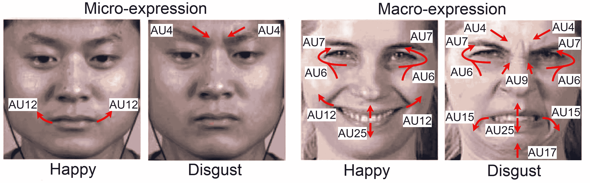
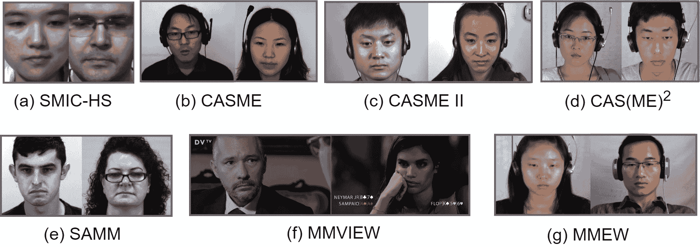
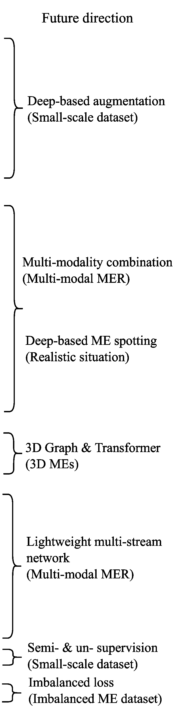
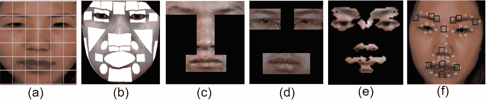
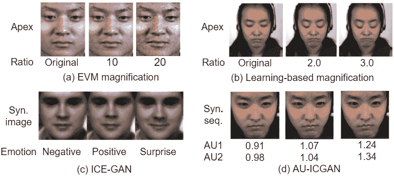
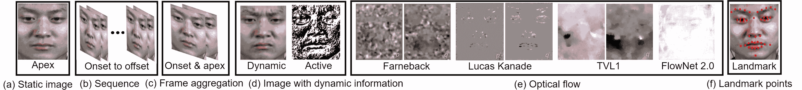
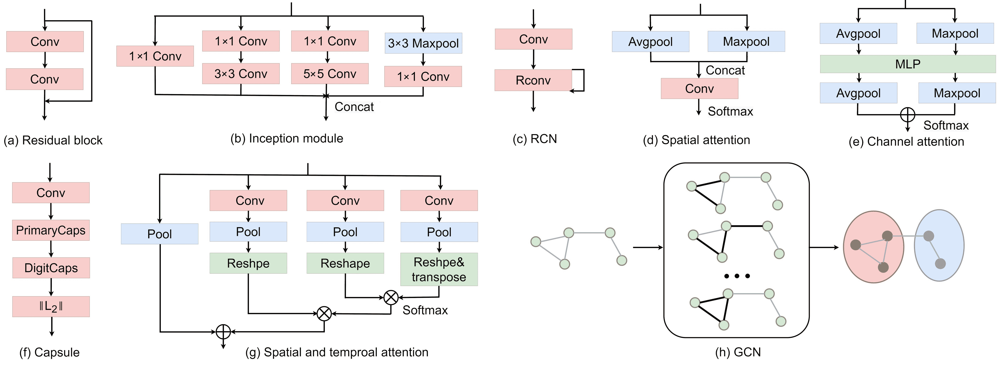
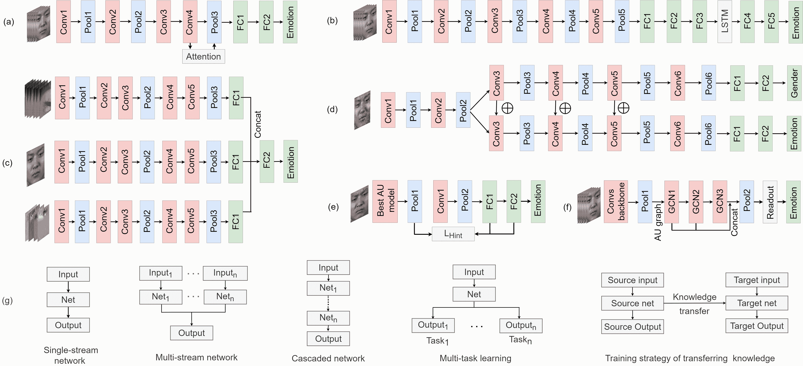

<!--yml

类别：未分类

日期：2024-09-06 19:53:03

-->

# [2107.02823] 深度学习在微表情识别中的应用：综述

> 来源：[`ar5iv.labs.arxiv.org/html/2107.02823`](https://ar5iv.labs.arxiv.org/html/2107.02823)

# 深度学习在微表情识别中的应用：综述

Yante Li、Jinsheng Wei、Yang Liu、Janne Kauttonen 和 Guoying Zhao * 表示通讯作者。Y. Li、J. Wei、Y. Liu、G. Zhao 皆为芬兰奥卢大学机器视觉与信号分析中心的成员，地址：FI-90014，Oulu，芬兰。电子邮件：firstname.lastname@oulu.fi。J. Wei 为南京邮电大学通信与信息工程学院的成员，地址：210003，南京，中国；电子邮件：2018010217@njupt.edu.cn。J. Kauttonen 为赫尔辛基应用科技大学数字商务学院的成员，地址：FI-00520，赫尔辛基，芬兰；电子邮件：Janne.Kauttonen@haaga-helia.fi。

###### 摘要

微表情（MEs）是无意识的面部运动，能够在高风险情境中揭示人们的隐藏情感，并在多个领域具有实际重要性。早期的微表情识别（MER）方法主要基于传统特征。近年来，随着深度学习（DL）在各种任务中的成功，神经网络在 MER 中的应用受到越来越多的关注。与宏观表情不同，微表情是自发的、细微的和快速的面部运动，这使得数据收集和标注变得困难，因此公开可用的数据集通常规模较小。目前，已经提出了各种深度学习方法来解决微表情问题并提高 MER 性能。在这项综述中，我们对深度 MER 进行了全面回顾，并定义了一个新的分类体系，涵盖了基于深度学习的 MER 领域的所有方面，包括数据集、深度 MER 流程的每一个步骤，以及最具影响力的方法的性能比较。我们总结并讨论了每个方面的基本方法和先进发展。此外，我们总结了设计强健 MER 系统的剩余挑战和潜在方向。最后，讨论了 MER 中的伦理考虑。据我们所知，这是对深度 MER 方法的首次综述，这项综述可以作为未来 MER 研究的参考点。

###### 关键词：

微表情识别，深度学习，微表情数据集，综述。

## 1 引言

面部表情（FE）是人类交流中最强大且最普遍的手段之一，与人类的心理状态、态度和意图高度相关。除了我们每天看到的普通面部表情（也称为宏观表情），情感在特定条件下还可以以微表情（MEs）的特殊形式表达。ME 是在高风险情况下揭示人们隐藏感受的面部表情，当人们试图掩饰真实情感时 [1]。与宏观表情不同，ME 是自发的、微妙的和快速的（1/25 到 1/3 秒）面部运动，反应于情感刺激 [2, 3]。

ME 现象最初由 Haggard 和 Isaacs 于 1966 年发现 [4]。三年后，Ekman 和 Friesen 在检查精神病患者视频以检测谎言时，也宣布发现了 ME [5]。在接下来的几年中，Ekman 等人继续研究 ME，并开发了面部动作编码系统（FACS） [6] 和微表情训练工具（METT） [7]。具体来说，FACS 将面部表情分解为肌肉运动的单独组成部分，称为动作单元（AUs） [6]。AU 分析可以有效解决表示个体表情的模糊性问题，并提高面部表情识别（FER）性能 [8]。图 1 展示了微表情和宏观表情的示例，以及每个 FE 中激活的 AUs。另一方面，METT 有助于提高人们的情感意识。它可以促进手动 ME 检测性能，为建立可靠的 ME 数据集提供潜在机会。

图 1：CASME II [9] 中的微表情和 MMI [10] 中的宏观表情示例，以及活动的 AUs。红色箭头表示肌肉运动方向。AU4、AU6、AU7、AU9、AU12、AU15 和 AU25 分别代表降眉、颊部上升、眼睑紧闭、鼻子皱纹、嘴角上扬、嘴角下垂和嘴唇分开。

MER（情感识别任务）是将 ME（微表情）片段分类到各种情感类别中。在每个 ME 片段中，启动面部运动的帧称为开始帧，而结束帧称为结束帧。具有最大强度的帧为顶点帧。像 FER（面部表情识别）一样，MER 也将面部图像/序列分类为愤怒、惊讶和幸福等类别。然而，MER 更具挑战性，因为自发的 ME 是无意识的、微妙的和短暂的。此外，ME 还可能受到情感背景和文化背景的影响 [11, 12, 13]。因此，收集和标注 ME 数据非常困难，导致 ME 数据集规模较小，现有方法无法处理其微妙性和短暂性。

由于其在许多人机交互系统中的实际重要性，MER 最近引起了越来越多的关注。首次自发的 MER 研究可以追溯到 Pfister 等人 [14] 的工作，该工作利用了三正交平面的局部二值模式（LBP-TOP）[15]，并应用于第一个公开的自发 ME 数据集：SMIC [16]。在 [15] 的工作之后，提出了各种基于外观和几何特征的方法 [17, 18]，以提高 MER 的性能。

近年来，随着深度学习（DL）的进步及其在目标检测 [19]、人类跟踪 [20, 21]、图像检索 [22, 23] 和面部表情识别（FER） [24, 25, 26] 等领域的成功应用，研究人员开始利用 DL 来探索 MER。尽管由于 ME 样本有限且强度低，使得基于 DL 的 MER 变得具有挑战性，但通过设计有效的浅层网络、探索生成对抗网络（GAN）[27]等方法，在 MER 上取得了显著进展。目前，基于 DL 的 MER 已达到最先进的性能。

在这项调查中，我们回顾了自 2016 年 DL 技术首次应用于 MER 以来基于 DL 的 MER 研究。由于篇幅限制，我们特别讨论了在知名期刊和会议上发表的代表性工作，如 IEEE TPAMI、IEEE TAC、IEEE TIP 和 ACM MM。本调查未考虑普通 FER 方法和基于传统学习方法的 MER。虽然已有一些 MER 调查讨论了 MER 的历史演变和算法流程 [28, 29, 30, 31, 32, 33]，但它们主要集中在传统方法上，仅介绍了一些近期的 DL 方法。基于 DL 的 MER 尚未被系统地和具体地讨论。据我们所知，这是首个基于 DL 的 MER 调查。与以往调查不同，我们分析了动态网络输入的优缺点，这对于基于 DL 的 MER 非常重要。此外，网络模块、架构、训练策略和损失函数也进行了详细讨论和总结，并确定了未来的研究方向。本调查的目标是提供一个基于 DL 的 MER 词典，作为未来 MER 研究的参考点。

图 2：用于 MER 的 ME 数据集中的 ME 样本示例。

本文组织如下：第二部分介绍自发 ME 数据集。第三部分介绍了我们为 MER 基于深度学习定义的分类。第四部分讨论了深度 MER 的各种输入。第五部分提供了关于 MER 的神经网络的详细回顾。评估矩阵、协议和代表性的基于深度学习的 MER 性能在第六部分中描述。第七部分总结了当前的挑战和潜在的研究方向。最后，第八部分讨论了伦理考量。

表 I: MER 的自发数据集

| 数据库 | 分辨率 | 面部大小 | 帧率 | 样本 | 受试者 | 表情 | AU | Apex | Eth | Env |
| --- | --- | --- | --- | --- | --- | --- | --- | --- | --- | --- |
| SMIC HS/NIR/VIS [16] | $640\times 480$ | $190\times 230$ | 100/25/25 | 164/71/71 | 16/8/8 | Pos (51) Neg (70) Sur (43) / Pos (28) Neg (23) Sur (20) / Pos (28) Neg (24) Sur (19) | $\circ$ | $\circ$ | 3 | L |
| CASME [34] | $640\times 480$ $1280\times 720$ | $150\times 90$ | 60 | 195 | 35 | Hap (5) Dis (88) Sad (6) Con (3) Fea (2) Ten (28) Sur (20) Rep (40) | $\bullet$ | $\bullet$ | 1 | L |
| CASME II [9] | $640\times 480$ | $250\times 340$ | 200 | 247 | 35 |  Hap (33) Sur (25) Dis (60) Rep (27) Oth (102) | $\bullet$ | $\bullet$ | 1 | L |
| CAS(ME)²  [35] | $640\times 480$ | - | 30 | Macro 300 Micro 57 | 22 | Hap (51) Neg (70) Sur (43) Oth (19) | $\bullet$ | $\bullet$ | 1 | L |
| SAMM [36] | $2040\times 1088$ | $400\times 400$ | 200 | 159 | 32 | Hap (24) Ang (20) Sur (13) Dis (8) Fea (7) Sad (3) Oth (84) | $\bullet$ | $\bullet$ | 13 | L |
| MEVIEW [37] | $720\times 1280$ | - | 25 | 31 | 16 | Hap (6) Ang (2) Sur (9) Dis (1) Fea (3) Unc (13) Con(6) | $\bullet$ | $\circ$ | - | W |
| MMEW [32] | $1920\times 1080$ | $400\times 400$ | 90 | 300 | 36 | Hap (36) Ang (8) Sur (80) Dis (72) Fea (16) Sad (13) Oth (102) | $\bullet$ | $\bullet$ | 1 | L |
| 复合 ME [38] | $640\times 480$ $1280\times 720$ $720\times 1280$ | $150\times 90$ $250\times 340$ $400\times 400$ | 200 | 442 | 68 | Pos (109), Neg (250), 和 Sur (83) | $\circ\bullet$ | $\circ\bullet$ | 13 | L |
| 复合 ME [39] | $640\times 480$ $1280\times 720$ $720\times 1280$ | $150\times 90$ | 200 | 1050 | 90 | Neg (233) Pos (82) Sur (70) PS (74) N S (236) PN (197) NN (158) | $\circ\bullet$ | $\circ\bullet$ | 13 | L |

¹ Eth: 种族; Env : 环境。

² Pos: 积极；Neg: 消极；Sur: 惊讶；Hap: 快乐；Dis: 厌恶；Rep: 压抑；Ang: 生气；Fea: 恐惧；Sad: 伤心；Con: 蔑视；Unc: 不明确；Oth: 其他；PS: 积极惊讶；NS: 消极惊讶；PN: 积极消极；NN: 消极消极；L: 实验室；W: 野外。

³ $\circ$ 代表未标记；$\bullet$ 代表已标记；- 代表未知

## 2 数据集

与我们日常生活中容易捕捉到的宏观表情不同，MEs（微表情）是无意识的短暂 FE（面部表情），尤其是在高风险情境下出现。四个早期数据库在 2010 年左右相继出现：Canal9 [40]、York-DDT [41]、Polikvsky 的数据库 [41] 和 USF-HD [42]。然而，Canal9 和 York-DDT 并不是专门用于 ME 研究的。Polikvsky 的数据库和 USF-HD 仅包含通过要求参与者有意展示或模仿微小动作所收集的摆拍表情。摆拍表情与 MEs 的自发性质相矛盾。目前，这些数据库已不再用于 ME 研究。近年来，创建了几个自发 ME 数据库，包括：SMIC [16] 及其扩展版本 SMIC-E、CASME [34]、CASME II [9]、CAS(ME)² [35]、SAMM [36] 和 微表情与宏观表情仓库（MMEW） [32]。在这次调查中，我们重点关注自发数据集。

在一般的 ME 数据集收集过程中，参与者被要求在观看视频片段时保持面无表情，以引发自发 ME。这些视频片段是根据先前的心理学研究选择的，能够引发强烈的情绪。通常，使用高速摄像机录制面部视频。在一个参与者观看完视频片段后，他/她填写自我报告问卷，报告他/她对视频片段的真实感受。此外，考虑到文化背景可能对 ME 产生影响 [43]，可以招募不同民族的参与者 [36] 以研究文化对 ME 的潜在影响。

由于情感表达微妙且迅速，标注员通常接受 FACS 培训，并雇用认证的面部动作单元编码员来检测面部视频中的情感表达。FACS 帮助人们精确观察面部运动，使情感表达检测更可靠。具体来说，当面部动作单元的持续时间少于 0.5 秒时，该片段被视为情感表达片段。情感表达被标注为离散类别。在 SMIC [16]中，情感根据参与者的自我报告被标记为“正面”、“负面”和“惊讶”。然而，当参与者观看一个视频片段时，可能会引发混合情感。基于观看视频后的一般情感报告的标注（通常允许一种情感）并不准确。为此，CASME [34] 和 CASME II [9]等多个数据集考虑了面部动作单元、自我报告和观看的视频片段来标记情感表达。当情感标注存在歧义和冲突时，该情感标注为“其他”。此外，为了减轻个别标注员造成的标注偏差，情感表达标注总是通过多个标注员的交叉验证来进行。数据集的具体细节如下：

SMIC [16] 由三个子集组成：SMIC-HS、SMIC-VIS 和 SMIC-NIR。SMIC-VIS 和 SMIC-NIR 包含 71 个样本，由正常速度的摄像机记录，分别使用 25 fps 的可视光（VIS）和近红外光（NIR）。

CASME [34] 包含来自 19 名受试者的 159 个自发情感表达片段，包括从开始到结束的帧。情感标注部分基于面部动作单元，同时考虑了参与者的自我报告和视频片段的内容。除了开始和结束，顶峰帧也被标注。CASME 的不足之处在于类别间样本分布不均。

CASME II [9] 是 CASME 数据集的改进版。CASME II 中的样本数量增加到 247 个情感表达样本，来自 26 名受试者，记录时使用了 200 fps 的高速摄像机，面部尺寸裁剪至$280\times 340$。因此，与 CASME 相比，它具有更高的时间和空间分辨率。

CAS(ME)² [35] 由 22 名受试者的自发宏观和微观表情组成。CAS(ME)²具有较长持续时间的样本，使其适合于情感表达检测。与上述数据集相比，CAS(ME)²的样本记录帧率较低，样本数量相对较少，这使其不适合深度学习方法。

SAMM [36] 收集了来自 32 名参与者的 159 个情感表达样本。这些样本由灰度摄像机在 200 fps 的受控光照条件下采集，以防止闪烁。与缺乏民族多样性的先前数据集不同，参与者来自 13 个不同的民族。

MEVIEW [37] 是一个真实场景中的微表情数据集。MEVIEW 中的样本来自互联网的扑克游戏和电视采访。数据集中总共有 16 人的 31 个视频被标注，视频的平均长度为三秒。

MMEW [32] 包含 300 个微表情和 900 个宏表情样本，由相同的参与者表演，分辨率更高（$1920\times 1080$ 像素）。MMEW 中的微表情和宏表情被标注到相同的情感类别。

复合数据集 [38] 由第二届微表情大奖赛（MEGC2019）提出。复合数据集合并了来自三个自发面部微表情数据集的样本：CASME II [9]、SAMM [36] 和 SMIC-HS [16]。这样做是为了便于评估新开发的方法。由于这三个数据集中的标注差异巨大，复合数据集统一了所有三个数据集中的情感标签。情感标签被重新标注为正面、负面和惊讶。

复合微表情数据集（CMED） [39, 44] 通过将来自 CASME、CASME II、CAS(ME)²、SMIC-HS 和 SAMM 数据集的微表情合并构建。具体而言，微表情被分为基本和复合情感类别，如表 I 所示。心理学研究表明，日常生活中通常存在复杂的表情。多个情感共存于一个面部表情中，称为“复合表情” [44]。复合表情分析反映了更复杂的心理状态和更丰富的人类面部情感。

微表情数据集的具体比较见表 I，示例样本见图 2。尽管 MEVIEW 收集了真实场景中的微表情，但微表情样本的数量太少，无法学习稳健的微表情特征。最先进的方法通常在 SMIC-HS、CASME [34]、CASME II [9] 和 SAMM 数据库上测试。由于某些情感如恐惧和蔑视难以引发，这些类别只有少量样本，不足以进行学习。在大多数实际实验中，仅考虑样本数量超过 10 的情感类别。最近，复合数据集变得流行，因为它可以验证方法在具有不同性质的数据集上的泛化能力。为了进一步提高微表情识别的性能，MMEW 收集了来自相同受试者的微表情和宏表情，这可能有助于进一步的跨模态研究。

<svg   height="1" overflow="visible" version="1.1" width="1"><g transform="translate(0,1) matrix(1 0 0 -1 0 0)" fill="#000000" stroke="#000000" stroke-width="0.4pt"><foreignobject width="0" height="0" transform="matrix(1 0 0 -1 0 16.6)" overflow="visible">\Tree</foreignobject> <foreignobject width="8.3" height="49.81" transform="matrix(1 0 0 -1 0 16.6)" overflow="visible">|  |

|  | </foreignobject> <foreignobject width="-1.54" height="0" transform="matrix(1 0 0 -1 0 16.6)" overflow="visible">454647484950515248535455, 56575859606158, 27</foreignobject> <foreignobject width="40.55" height="49.81" transform="matrix(1 0 0 -1 0 16.6)" overflow="visible"> | 6217, 6364 |
| --- | --- | --- |
| 65, 66, 67 | </foreignobject> <foreignobject width="-2.31" height="0" transform="matrix(1 0 0 -1 0 16.6)" overflow="visible">59, 64, 68, 6961, 70, 58, 71, 7273747576, 7778</foreignobject> <foreignobject width="41.7" height="24.91" transform="matrix(1 0 0 -1 0 16.6)" overflow="visible"> | 7980608182 | </foreignobject>  <foreignobject width="43.63" height="49.81" transform="matrix(1 0 0 -1 0 16.6)" overflow="visible"> | 838471 |
| 85 | </foreignobject>  <foreignobject width="47.46" height="49.81" transform="matrix(1 0 0 -1 0 16.6)" overflow="visible"> | 86, 768178836087, 88, 6189, 90, 91 |

| 92 |</foreignobject> <foreignobject width="-6.92" height="0" transform="matrix(1 0 0 -1 0 16.6)" overflow="visible">64, 93, 7494, 88, 8795, 96, 9798, 99, 100, 101102103, 104, 105106, 107108, 109, 110111112, 113, 114, 115, 105, 116</foreignobject><g stroke="#000000" fill="#000000" color="#000000"><foreignobject width="-2.69" height="0" transform="matrix(1 0 0 -1 0 16.6)" overflow="visible">58117769110987, 74118, 119, 69120, 121, 122123124, 125126, 127, 128129, 91</foreignobject></g></g></svg>

图 3：基于深度学习的 MER 分类法。分支上引用的研究是本文讨论的示例方法。未来的方向和相应的方法显示在右侧，未来的方向用括号标注。

## 3 基于深度学习的 MER 分类法

图 3 展示了我们基于深度学习（DL）为微表情识别（MER）总结的分类法，涵盖了输入和网络等重要组件。由于微表情序列具有细微的运动和有限的样本，不同的输入对 MER 性能有很大影响。因此，输入在 MER 中扮演了重要角色。首先，输入需要经过预处理，以训练出一个稳健的网络。具体的预处理方法以及各种输入模态的优缺点在第四部分中进行了讨论。然后，第五部分中介绍的网络被用于区分微表情。一个常见的 MER 网络可以从四个方面来描述：模块、架构、训练策略和损失。首先，我们介绍了为解决微表情挑战而设计的特殊模块。接着，我们描述了在单流、多流、级联网络和多任务学习方面的架构。最后，讨论了用于训练网络的训练策略和损失函数。图 3 右侧标注了未来的方向。本次综述讨论的所有方法都是基于面部的深度学习 MER。

## 4 输入

### 4.1 预处理

与普通的 FE 相比，MER（面部表情识别）的稳健性要求进行面部检测和对齐的预处理。与常见的 FE 相比，ME 具有低强度、短持续时间和小规模的数据集，使得 MER 更加困难。因此，除了传统的预处理步骤，还进行了运动放大、时间归一化、感兴趣区域和数据增强，以提高 MER 的性能。

#### 4.1.1 面部检测和注册

处理 ME 的第一步是面部检测，去除背景并获取面部区域。最广泛使用的面部检测算法之一是基于弱分类器级联的 Viola-Jones[45]。然而，这种方法无法处理大姿势变化和遮挡。Matsugu 等人[46]首次采用基于规则的 CNN 网络进行面部检测，该算法对平移、缩放和姿势具有鲁棒性。最近，基于深度学习的面部检测器已在流行的开源库中得到应用，例如 dlib 和 OpenCV。

由于自发的 ME 涉及低强度的肌肉运动，即使是很小的姿势变化和动作也可能严重影响 MER 的性能。为此，面部注册对于 MER 至关重要。它将检测到的面部对齐到参考面部，以处理不同头部姿势的问题，从而实现成功的 MER。目前，最常用的面部注册方法之一是主动形状模型（ASM）[47]，它编码了几何和强度信息。随后，主动外观模型（AAM）[48]被提出，用于快速匹配任何面部与任何表情。随着深度学习的快速发展，具有级联回归的深度网络[49]由于其出色的性能，已成为面部对齐的最先进方法。

#### 4.1.2 运动放大

对于 MER（面部表情识别）的一个挑战是，ME（微表情）的面部动作过于微妙，难以区分。因此，运动放大对增强 ME 的强度水平至关重要。常用的方法之一是欧拉视频放大法（EVM）[52]。对于 ME，EVM 被应用于面部动作放大[17]。EVM 在视频的两个连续帧之间放大动作或颜色内容。然而，较大的动作放大级别会导致更大规模的运动放大，从而产生更大的伪影。不同于 EVM 考虑局部放大，全球拉格朗日运动放大法（GLMM）[130]被提出用于一致地跟踪和夸大整个视频中的 FE（面部表情）和全局位移。此外，基于学习的运动放大[53]首次由 Lei 等人[89]应用于 ME 放大，通过从网络的中间层提取形状表示。与传统方法相比，中间层的形状表示引入了较少的噪声。

#### 4.1.3 时间归一化（TN）

除了低强度，短暂且多变的持续时间也增加了对稳健的 MER 的难度。当视频以相对低的帧率拍摄时，这个问题尤其严重。为了解决这个问题，引入了基于路径图的时间插值模型[50]（TIM），将所有 ME 序列插值为相同指定长度。应用 TIM 有三个优点：1）提升帧较少的 ME 片段；2）预期具有统一片段长度的更稳定特征；3）将 ME 片段扩展为长序列，并对其进行子采样以用于数据增强。此外，还提出了基于 CNN 的时间插值[51]来解决现实中的复杂场景。

图 4：感兴趣区域的示例。 (a) 相等的区块; (b) 基于 FACS 的 RoIs [55];  (c) 眼睛和脸颊 [93]; (d) 眼睛和嘴巴 [131]; (e) 基于差异的 ME 数据集 [132];  (f) 基于基准点的局部区域 [133]。

#### 4.1.4 感兴趣区域（RoIs）

FEs 由基本面部动作组成[134，6]，对应特定面部肌肉，并与不同面部区域相关。换句话说，并非所有面部区域对 FER 的贡献都相同。特别是对于 MEs，MEs 仅能触发特定的小区域，因为 MEs 涉及细微的面部动作。此外，135 的经验经验和定量分析发现，例如眼镜等异常值严重影响 MER 的性能。因此，抑制异常值的影响是很重要的。

一些研究通过在感兴趣区域（RoIs）上提取特征来减轻没有有用信息区域的影响[93]。一些微表情识别（MER）方法[17, 136]将整个面部分为若干相等的块，以更好地描述局部变化（见图 4 ‣ 4.1 Pre-processing ‣ 4 Inputs ‣ Deep Learning for Micro-expression Recognition: A Survey") (a)）。Davison 等人 [55, 56] 基于面部动作编码系统（FACS）[6] 从面部选择了感兴趣区域，见图 4 ‣ 4.1 Pre-processing ‣ 4 Inputs ‣ Deep Learning for Micro-expression Recognition: A Survey") (b)。此外，为了消除由眼睛眨动和静止区域造成的噪声，Le 等人[93] 提出了对每张图像的眼睛和脸颊区域进行遮罩（见图 4 ‣ 4.1 Pre-processing ‣ 4 Inputs ‣ Deep Learning for Micro-expression Recognition: A Survey") (c)）。然而，在某些情况下，眼睛的运动对 MER 有很大贡献，例如眼睑紧闭指示负面情绪。在工作[131]中，Liong 等人利用眼睛和嘴部区域进行 MER，如图 4 ‣ 4.1 Pre-processing ‣ 4 Inputs ‣ Deep Learning for Micro-expression Recognition: A Survey") (d)所示。此外，Xia 等人[132] 发现眼睛、鼻子和嘴巴周围的区域在微表情中最为活跃，可以通过分析 ME 数据集的差异热图来选择这些区域作为感兴趣区域，如图 4 ‣ 4.1 Pre-processing ‣ 4 Inputs ‣ Deep Learning for Micro-expression Recognition: A Survey") (e)所示。此外，Xie 等人[58] 和 Li 等人[133] 提出了在由面部标志点定位的小面部块上提取特征（见图 4 ‣ 4.1 Pre-processing ‣ 4 Inputs ‣ Deep Learning for Micro-expression Recognition: A Survey") (f)）。通过这种方式，可以大幅减少学习空间的维度，有助于在小型 ME 数据集上进行深度模型学习。

#### 4.1.5 数据增强

对于使用深度学习的微表情识别（MER），主要挑战在于小规模的微表情数据集。当前的微表情数据集过于有限，无法从头开始训练一个强健的深度学习模型，因此需要进行数据增强。数据增强的常见方法是在空间域中进行随机裁剪和旋转。Xia 等人通过使用多个比例放大微表情来扩增数据[60]。图 5 (a)和(b)分别展示了基于 EVM [52]和学习型放大[53]的不同比例放大的微表情顶点帧的示例。此外，生成对抗网络（GAN）[137]可以通过生成合成图像来增强数据。Xie 等人[58]引入了 AU 强度可控 GAN（AU-ICGAN）来合成细微的微表情。图 5 (d)显示了通过[58]合成的具有连续 AU 强度的微表情序列。Yu 等人[27]提出了一种身份感知和胶囊增强的生成对抗网络（ICE-GAN），以完成微表情合成和识别任务。ICE-GAN 的表现比 MEGC2019 的冠军高出 7$\%$，展示了 GAN 在微表情增强和识别中的有效性。图 5 (c)展示了对应于不同情绪的合成图像。此外，Liong 等人[138]利用条件 GAN 生成光流图像，以基于计算的光流提高 MER 准确性。对于微表情剪辑，可以通过 TIM 从扩展的微表情序列中进行子采样以增强微表情序列[61]。

图 5：放大和合成微表情的示例。

图 6：各种输入的示例。

### 4.2 输入模态

由于微表情具有低强度、短时长和数据有限等特点，基于深度学习识别微表情具有挑战性，且 MER 的表现因不同输入而异。在本节中，我们描述了各种微表情输入，并总结了它们的优缺点，如表 II 所示。

#### 4.2.1 静态图像

对于 FER，大量现有研究基于静态图像进行，因为网上有大量面部图像可用，且数据处理方便。受到静态图像 FER 的启发，一些研究者 [64, 68] 探索了基于所有帧中面部运动强度最大的顶点帧的 MER（见图 6 (a)）。Li 等人 [59] 研究了顶点帧的贡献，并验证了 DL 可以通过单一顶点帧实现良好的 MER 性能。此外，Sun 等人 [69] 的研究表明，基于顶点帧的方法可以有效利用宏表达数据库中的大量静态图像 [69]，并比起点-顶点-终点序列和整段视频获得更好的性能。

顶点检测是基于顶点帧构建稳健 MER 系统的关键组成部分之一。Patel 等人 [62] 计算了光流的运动幅度来定位 ME 的起点、顶点和终点，而其他工作 [17, 63] 则利用特征差异来检测长视频中的 ME。然而，基于光流的方法需要复杂的特征操作，而基于特征对比的方法忽略了 ME 的动态信息。不同于上述方法在时空域中估计面部变化，Li 等人 [64] 提出了通过探索频域中的信息来定位快速 ME 片段中的顶点帧，频域信息清晰地描述了变化速率。此外，SMEConvNet [65] 首次采用 CNN 进行 ME 检测，并提出了一种特征矩阵处理方法来定位长视频中的顶点帧。继 SMEConvNet 之后，提出了各种基于 CNN 的 ME 检测方法 [66, 67]。一般来说，由于 ME 数据集规模小以及长视频中混合的宏观和微观表情片段，基于 CNN 的检测方法性能有限。未来需要进一步研究可靠的检测方法。

#### 4.2.2 动态图像序列

由于面部动作在空间域中较为细微，而在时间域中变化快速，因此视频序列中的时间动态对于提升 MER 性能至关重要。在本小节中，我们描述了各种动态输入。

序列。大多数微表情研究利用视频剪辑中的连续帧[139, 54, 140]，如图 6 (b) 所示。随着 3D CNN [141] 和递归神经网络 (RNN) [142] 在视频分析中的成功[143, 144]，基于序列的 MER [107, 61, 70, 58, 71, 72, 145] 得到了发展，它同时考虑了空间和时间信息。然而，计算成本相对较高，复杂的模型倾向于过拟合小规模的训练数据。

帧聚合。微表情通常使用高速摄像机（例如 200 fps）来捕捉快速的微小变化。Liong 等人发现，使用高速摄像机记录的微表情片段中存在冗余信息 [146]。冗余信息可能会降低 MER 的性能。 [146] 的实验结果表明，起始、顶点和结束帧可以提供足够的空间和时间信息用于微表情分类。Liong 等人 [73] 在起始和顶点帧上提取特征用于 MER，如图 6 (c) 所示。此外，为了避免顶点帧检测，Liu 等人 [74] 和 Kumar 等人 [75] 设计了简单的策略来自动选择聚合帧。

动态信息图像。动态信息图像 [147] 是一种标准图像，它在一个实例中包含整个视频序列的动态。使用秩池化算法生成的动态图像已经成功应用于 MER [76, 93, 77, 148]，以总结图像中的微妙动态和外观。类似于动态图像，主动图像 [78] 通过估计和累积每个像素组件的变化，将视频序列的空间和时间信息封装到一个实例中（见图 6 (d)）。

表 II: MER 输入的比较

| 输入模式 | 优势 | 缺点 |
| --- | --- | --- |
| 静态 | 高效；利用大量面部图像 | 需要放大和顶点检测 缺乏时间信息 |
| 动态 | 序列 | 直接处理 | 效率低；信息冗余 |
| 帧聚合 | 高效地利用关键时间信息 | 需要顶点检测 |
| 带有动态信息的图像 | 高效嵌入时空信息 | 需要动态信息计算 |
| 光流 | 在一定程度上去除身份特征；考虑运动 | 光流计算是必要的 |
| 组合 | 探索空间和时间信息 | 高计算成本 |

光流。ME 帧之间的运动提供了 ME 识别的重要信息。光流近似局部图像运动，已被验证对运动表示有帮助 [149]。它通过二维向量场（水平和垂直光流）指定给定图像序列中像素运动的大小和方向。近年来，提出了几种新颖的方法来改进光流技术 [79, 150, 151, 80, 152]，例如 Farnebäck’s [80], Lucas-Kanade [79], TV-L1 [152], FlowNet [82]，如图 6 (e) 所示。目前，许多 MER 方法利用光流来表示微表情运动，并减少身份特征 [60, 99, 153]。研究 [60, 99] 指出，基于光流的方法总是优于基于外观的方法。为了进一步捕捉细微的面部变化，多个研究 [81, 106, 91] 在计算的光流上提取了在水平和垂直方向上的起始和中间帧/顶点的特征。

#### 4.2.3 输入组合

考虑到峰值帧和动态图像序列的优点，一些工作 [99, 71, 83, 84] 分析了多种输入以从 ME 视频中的不同线索中学习特征。具体而言，在刘等人的工作 [83] 中，利用峰值帧和光流分别提取静态空间特征和时间特征。除了上述模态，宋等人 [99] 将峰值帧的局部面部区域作为输入，以嵌入个体面部区域的关系，从而提高 MER 的稳健性。此外，孙等人 [84] 采用光流和序列来充分探索时间 ME 信息。最近，受到面部分析中地标成功应用的启发（见图 6 (f)），库马尔等人 [85] 提出了融合地标图和光流，以增强 ME 表征的区分能力。目前，利用多种输入的方法通过在有限的 ME 数据集上利用尽可能多的 ME 信息，取得了最佳的 MER 性能。

### 4.3 讨论

总之，输入是保证稳健 MER 的关键组件之一。各种 ME 输入具有不同的优点和缺点。输入的比较见表 II。

输入预处理是 MER 系统的第一步。除了常见的人脸预处理方法（人脸检测和注册），运动放大、感兴趣区域（RoIs）和时间序列信息（TIM）在稳健 MER 中也发挥重要作用，因为 MEs 的特征微妙而快速。目前的运动放大方法常常引入噪声和伪影。应探索更有效的运动放大方法。此外，考虑到小规模的 ME 数据集远远不足以训练一个稳健的深度模型，数据增强对 MER 来说是必要的。未来，研究更稳健的基于 GAN 的 ME 生成方法是一个有前景的研究方向。

关于静态输入，基于峰值的 MER 可以降低计算复杂度，并利用大量的特征提取器在一定程度上解决小数据集问题。但是，由于所有时间信息在单一的基于峰值的方法中被丢弃，并且峰值帧中的运动强度仍然较低，因此放大是必要的。此外，由于一些 ME 数据集中缺少峰值标签，因此基于峰值的 MER 性能严重依赖于峰值检测算法。目前，长视频中的峰值帧检测仍然具有挑战性。需要进一步研究端到端的峰值帧检测和 MER 框架。

与静态图像相比，动态输入能够利用空间和时间信息进行稳健的 MER。最简单的动态输入是 ME 序列，它不需要额外的操作。然而，ME 序列中存在冗余，并且深度模型的复杂性相对较高，容易在小规模 ME 数据集上过拟合。为了解决冗余问题，采用了帧聚合级联多个关键帧。此外，动态图像通过将时间和空间信息嵌入静态图像来提高计算效率。它可以在一幅图像中同时考虑空间和时间信息，而不需要挑战顶点帧检测。此外，光流被广泛用于 MER，因为光流描述了运动，并在一定程度上去除了身份。然而，目前大多数基于光流的 MER 方法是基于传统光流的，而不是端到端的。未来，可以进一步研究更多基于 DL 的光流提取。

此外，结合各种输入是充分探索空间和时间信息并利用各种输入优点的不可避免趋势。因此，组合输入也继承了这些输入的缺点。然而，多种输入在某种程度上可以互补。目前，具有各种输入的方法已实现了最佳性能。考虑到多种输入的成功和有限的 ME 样本，更加多样化的模态，如光流、关键帧和地标，可以成为有前途的研究方向。

图 7：特殊模块：(a) 残差块 [154] (b) Inception 模块[155]; (c) RCN [60]; (d) CBAM 的空间注意力 [87] (e) CBAM 的通道注意力 [87]; (f) Capsule 模块 [156]; (g) 时空注意力 [94]; (h) GCN [78]。

## 5 深度网络用于 MER

卷积神经网络（CNNs）在各种计算机视觉任务中表现出色，如动作识别[157]和面部表情识别（FER）[24]。一般来说，对于图像分类，CNNs 使用二维卷积核（表示为 2D CNN）来利用图像的高度和宽度上的空间上下文进行预测。与 2D CNN 相比，具有三维卷积核的 CNNs（表示为 3D CNN）在探索视频的时空信息方面被验证更为有效[158]。3D CNN 可以利用时空信息来提高性能，但由于参数数量增加，计算成本也随之上升。此外，由于预定义的卷积核，3D CNN 只能处理固定长度的视频。递归神经网络（RNN）[142]被提出用于处理具有不同时长的时间序列数据。此外，长短期记忆（LSTM）被开发用来解决在训练 RNN 时可能遇到的梯度消失问题。

与常见的视频分类问题不同，为了识别微妙、短暂和非自愿的 MEs，提出了各种深度学习方法来提升 MER 性能。在本节中，我们从特殊模块、网络结构、训练策略和损失的角度介绍这些方法。

### 5.1 网络模块

在解决两个主要 ME 挑战方面：小规模 ME 数据集的过拟合和 ME 的低强度，已经利用和设计了各种有效的网络模块，如具有残差模块的 ResNet 系列[154, 159, 160]和 Inception 模块[155]。在本小节中，我们介绍了用于提高 MER 的特殊网络模块。

对于小规模数据集的挑战，最近的研究[154]表明，具有快捷连接的残差块（如图 7 (a)所示）实现了容易优化，并减少了梯度消失问题的影响。多个 MER 研究[104, 161, 162, 89, 163]采用残差块来在小规模 ME 数据集上进行稳健的识别。除了直接应用快捷连接外，[164]进一步设计了一个可卷积的快捷连接来学习重要的残差信息，而 AffectiveNet[165]引入了一个 MFL 模块，平行学习低级和高级特征，以增强类内和类间变异的区分能力。

由于全连接层需要大量参数，这使得它容易出现极端的损失爆炸和过拟合 [166]，Inception 模块 [167] 聚合了不同大小的滤波器来计算多尺度空间信息，并组装了 $1\times 1\times 1$ 卷积滤波器以降低维度和参数，如图 Fig. 7 (b) 所示。多个工作 [81, 91] 利用 Inception 模块实现高效的 MER。受到 Inception 结构的启发，提出了一种混合特征（HyFeat）块 [168, 77, 78]，旨在保留 MEs 表达区域的领域知识特征，并通过使用不同尺度的卷积滤波器来丰富边缘变化的特征。

此外，考虑到具有更多卷积层的 CNN 具有更强的表示能力，但在小规模数据集上容易过拟合，论文 [60] 和 [169] 引入了递归卷积网络（RCN），该网络通过递归连接实现了浅层结构，如图 Fig. 7 (c) 所示。

另一方面，MEs 作为多种面部动作的组合进行表现。细微的面部变化中的潜在语义信息为 MER 性能贡献了重要信息。近期研究表明，图卷积网络（GCN）在建模这些语义关系方面是有效的，并且可以用于面部分析任务，如图 Fig. 7 (h) 所示。受到 GCN 在 FER 中成功应用的启发，[89, 58, 90, 91] 开发了用于 MER 的 GCN，通过建模局部面部动作之间的关系来进一步提高性能。Lei 等人 [89, 92] 在面部标志的 RoIs 上构建图，提供了对细微 MEs 的信息。TCN 残差块 [170, 89] 和 transformer [171, 92] 被应用于推理 RoIs 的关系。另一方面，由于 FE 分析可以从 AUs 和 FACS 的知识中受益，工作 [58, 90, 91] 在 AU 级别的表示上构建了图，通过推断 AU 关系来提升 MER 性能。

除了图卷积，胶囊神经网络（CapsNet）[156] 被用来探索面部的部分-整体关系，通过路由过程[68, 83, 27] 提升 MER 性能，如图 7 (f)所示。

此外，由于微表情（MEs）在面部具有特定的肌肉激活，微表情与局部区域变化相关[172]。因此，突出 RoIs 上的表示至关重要[8, 113]。若干方法[103, 173, 174, 175, 176, 177] 已经展示了通过注意力模块增强空间编码的好处。

除了空间信息，时间变化在微表情识别（MER）中也发挥着重要作用。由于微表情有快速变化，帧对 MER 的贡献是不均等的。王等[94] 探索了一种基于非本地网络[178]的全局空间和时间注意力模块（GAM），以编码更广泛的空间和时间信息，捕捉局部高级语义信息，如图 7 (g)所示。

此外，姚等[179]通过添加挤压和激励块（squeeze-and-excitation blocks）自适应地学习了每个特征通道的权重。此外，最近的工作[87, 88, 61, 180]同时编码了时空和通道注意力，以进一步提升微表情的表示能力。具体而言，CBAMNet [87] 提出了一个卷积块注意力模块（CBAM），级联了空间注意力模块（见图 7 (d)）和通道注意力模块（见图 7 (e)）。

图 8: (a) 基于单流的 GAM[94]; (b) 与 LSTM 级联的 CNN[114]; (c) 基于三流网络的 TSCNN [99]; (d) GEME 设计的包含性别检测的双流多任务网络[76]; (e) 基于 AU 特征图的 GCNs 与 CNN 级联[58]; (f) 基于知识蒸馏的 MER[69]; (g) 单流、多流、级联网络、多任务学习的通用概念以及知识转移的训练策略。

总结而言，由于 ME 的特殊特性，许多基于 DL 的方法设计了特殊模块来从潜在语义信息中提取判别性 ME 表示。近期 MER 研究表明，注意力和图块对建模语义关系是有效的。目前的 GCN-based MER 通常基于局部面部区域和 AU 标签。未来可以进一步开发更紧凑和简洁的表示，例如地标位置，以提高 MER 效率。此外，transformer[171]在建模关系方面已被有效验证。对于未来的 MER 研究，transformer 可以进一步应用于建模面部地标、AU、RoI 和帧之间的关系，以增强 ME 表示。另一方面，其他特殊模块[60]旨在学习具有较少参数的判别性 ME 特征，以避免过拟合。未来应研究更高效的模块，以发掘有限 ME 数据集中的细微 ME 运动。

### 5.2 网络架构

除了设计用于判别性 ME 表示的特殊模块外，组合这些模块的方式也非常重要。目前，MER 方法的网络架构可以分为五类：单流、多流、级联、多任务学习和迁移学习。本节将详细讨论这五种网络架构。

#### 5.2.1 单流网络

典型的深层 MER 方法采用具有独立输入的单一 CNN[181]。顶点帧、光流图像和动态图像是单流 2D CNN 的常见输入，而单流 3D CNN 直接从 ME 序列中提取空间和时间特征。考虑到有限的 ME 样本远不能训练出一个稳健的深层网络，许多工作设计了单流浅层 CNN 用于 MER[182, 140, 183]。Belaiche 等人[161]通过删除深层网络 Resnet 的多个卷积层实现了一个浅层网络。Zhao 等人[44]提出了一个 6 层 CNN，其中输入后跟一个$1\times 1$卷积层以增加非线性表示。

除了设计浅层网络外，许多研究[64, 74, 93]对在大型面部数据集上预训练的深层网络进行了微调，以避免过拟合问题。Li 等人[64]首次采用了在 VGG-FACE 数据集[184]上预训练的 16 层 VGG-FACE 模型用于 MER。根据[64]，MER 还探索了基于 Imagenet 预训练的 Resnet50、SEnet50 和 VGG19[93]。结果表明，在 MER 主题上，VGG 超越了其他架构，擅长区分数据中的复杂隐藏信息。

上述所有工作均基于 2D CNN 图像输入，而一些工作则采用了单一 3D CNN 直接从 ME 序列中提取空间和时间特征。GAM [94]、MERANet [88]和 CBAMNet [87]将注意力模块与 3D CNN 相结合，以增强空间和时间维度的表示。

#### 5.2.2 多流网络

单流是基本的模型结构，仅从单一视角提取特征。然而，由于 MEs 具有微妙的运动和有限的样本，单一视角无法提供足够的信息。正如我们在第 4.2 节中讨论的那样，来自不同视角的各种输入能够有效地探索空间和时间信息。因此，多流网络被应用于 MER 中，以从多个输入中学习特征。多流结构允许网络通过多路径网络提取多视角特征，如图 8 (g)所示。总体而言，多流网络可以分为具有相同块、不同块和手工特征的网络。

*相同块的多流网络。* Apex 框架网络（OFF-ApexNet）[95]和双流浅层网络（DSSN）[96]基于从开始和顶点提取的光流构建了用于 MER 的双流 CNN。此外，Liong 等人[138]将 OFF-ApexNet 扩展到多个流，使用各种光流组件作为输入数据。具有光流的多流 CNN [86]和三流 CNN (TSCNN) [98, 99] 设计了用于 MER 的三流 CNN 模型，输入包括三种类型的数据（见图 8 (c)）。具体而言，第一个方法利用了顶点帧、光流和由光流阈值遮罩的顶点帧，而后者的方法则采用了顶点帧、开始、顶点和结束帧之间的光流来探究静态空间、动态时间和局部信息。此外，She 等人[102]提出了一种四流模型，考虑了三个 RoI 和全局区域作为每个流，以探索局部和全局信息。除了多流 2D CNN 之外，3DFCNN [100]、SETFNet [179]和[97]应用了基于 3D 流的 CNN，用于视频基础的 MER，包括多个子流，用于从帧序列和光流或 RoI 中提取特征。

*具有不同模块的多流网络。* 为了增强 ME 特征表示，一些研究[106, 165, 102, 103, 107]探讨了不同卷积的组合。Liong 等人设计了一种浅层三流三维 CNN（STSTNet）[106]，采用多个具有不同卷积核的 2D CNN。AffectiveNet [165]则构建了一个具有四种不同感受野（RF）的四路径网络，以获得多尺度特征，从而更好地描述细微的 MEs。另一方面，Landmark Relations 与图注意力卷积网络（LR-GACNN）[75]和 MER-GCN [90]构建了两个流图网络，以探索地标点和局部补丁之间的关系，以及 AUs 和序列之间的关系。此外，[103]和[107]集成了 2D CNN 和 3D CNN，以提取时空信息。

*具有手工特征的多流网络。* 由于 MEs 的细微面部运动与面部纹理高度相关，因此低级表示的手工特征在 MER 中也发挥了重要作用。多个研究[108, 109, 110]将深度特征和手工特征结合起来，以利用低级和高级信息来实现稳健的 MER。具体而言，在研究[108]和[110]中，顶点帧上的 CNN 特征和 LBP-TOP 被串联起来以表示 MEs。

#### 5.2.3 级联网络

级联网络将各种模块按顺序结合以构建有效的网络，如图 8 (g)所示。最近的 FE 研究[24]表明，学习特征的层次结构可以逐步过滤掉与表情无关的信息。

受到 FE 研究的启发[24]，为了进一步探索 MEs 的时间信息，Nistor 等人[111]将 CNN 和 RNN 级联，用于从序列的各个帧中提取特征，并分别捕捉序列中的面部演变。此外，Bai 等人[114]和 Zhi 等人[116]将 CNN 与 LSTMs 串联，以直接处理不同持续时间的 ME 样本，如图 8 (b)所示。此外，为了探索 MEs 中的 AU 语义，Xie 等人提出了一种 AU 辅助的图注意力卷积网络（AU-GACN）[58]，将 3D CNN 与 GCN 级联，以基于 AU 特征推断 MEs（见图 8 (f)）。

此外，多个 MER 工作结合了多流和级联结构，以进一步探索多视角系列信息。VGGFace2+LSTM [114]、时间面部微变网络（TFMVN） [113] 和带三元注意力的 MER（MERTA） [101] 发展了三个流的 VGGNets，随后使用 LSTM 提取多视角时空特征。与上述工作不同，Khor 等人 [112] 提出了一个丰富的长时记忆卷积网络（ELRCN），增加了一个 VGG+LSTM 路径，并使用通道级堆叠输入来进行空间丰富。此外，AT-Net [104] 和 SHCFNet [105] 从顶点帧和光流中并行提取空间和时间特征，并将其串联在一起，以表示 MEs。

#### 5.2.4 多任务网络

目前大多数 MER 工作集中于学习对表情敏感的特征。然而，现实世界中的 MEs 受到各种因素的交织，例如主体身份和 AUs。旨在解决单一 MER 任务的方法无法充分利用面部信息。为了解决这个问题，随后开发了几种基于多任务学习的 MER 方法，以实现更好的 MER [117, 76]。首先，Li 等人 [117] 开发了一个多任务网络，结合了面部关键点检测和光流提取，以通过 SVM 提炼光流特征用于 MER。随后 [117]，提出了几个端到端的深度多任务网络，利用不同的附加任务。基于性别的 ME 识别（GEME） [76] 设计了一个双流多任务网络，将性别检测任务与 MER 结合起来（见图 8 (d)），同时特征精炼 [185] 和 MER-auGCN [91] 同时检测 AUs 和 MEs，并进一步将 AU 表示聚合到 ME 表示中。另一方面，考虑到可以从多个任务中学习到共同的特征表示，Hu 等人 [109] 将 MER 公式化为一个多任务分类问题，其中每个类别分类可以视为一对一的对抗分类问题。

总结来说，网络架构大致可以分为单流、多流、级联网络和多任务学习，如图 8 (g)所示。单流是最简单的基本模型架构。然而，单流网络只考虑 ME 的单一视角。为了进一步利用 ME 信息，提出了多流网络，从多个视角学习特征，以实现稳健的 MER。此外，由于学习特征层次结构可以逐渐过滤掉与表情无关的信息，因此网络级联了各种模块，如 LSTM 和 GCN，按顺序构建一个有效的 MER 网络。在未来，应该以多流和级联方式结合更多有效的模块，以进一步提升 MER 性能。

在任务方面，多任务学习[186]可以在任务之间共享知识，引入额外的信息并降低每个任务的过拟合风险。目前，大多数 ME 研究仅研究了地标检测、性别分类和 AU 检测的贡献。其他任务，如面部识别和眼动追踪，也可能为 MER 引入有用的知识。探索并利用更多面部相关任务是进一步提升 MER 性能的实用方法。

### 5.3 训练策略

正如我们之前讨论的那样，基于深度学习（DL）的 MER 面临着数据不足的问题。几乎不可能从头开始训练一个可靠的深度模型。目前，已经有带标签的大规模 FE 数据集。通过特殊的训练策略利用 FE 数据集，例如微调[99]、知识蒸馏[69]和领域适应[122]，是解决数据量少问题的合理方法。可以将预训练模型在相关任务上的知识迁移到 MER 中，以提升性能。知识迁移的训练策略如图 8 (g)所示。

在预训练模型上对微表情（ME）数据集进行微调是一种广泛使用的 MER 方法[99, 59, 87, 74]。Patel 等人[187]提供了两个分别在 ImageNet 数据集和 FE 数据集上预训练的模型。特征选择方法也被采用以提高模型的性能。研究发现，来自 FE 数据集的特征在准确性方面表现更好，因为它比对象/面部数据集与 ME 数据集更相似。

除了微调，另一种有效的迁移学习策略是知识蒸馏。知识蒸馏通过利用预训练的高容量网络的信息来实现小而快速的网络。Sun 等人[69]利用 Fitnets[188]指导浅层网络学习 MER，方法是模仿为宏观表情识别和 AU 检测预训练的深层网络的中间特征，如图 8 (e)所示。然而，由于面部运动的强度不同，ME 和宏观表情的表现不同。因此，直接模仿宏观表情表示是不合理的。相反，SAAT[121]将注意力转移到由 CycleGAN[189]生成的样式聚合 ME 上。

此外，领域适应方法可以通过将领域适应嵌入深度学习的管道中来获得领域不变的表示。在[120]、[122]和[190]中，通过基于对抗学习策略的领域适应缩小了 ME 和宏观表情之间的差距。

通常，微调在 MER 中使用最广泛。为了更有效地从大量 FEs 中转移有意义的信息，还通过知识蒸馏和领域适应分别将知识蒸馏和提取领域不变表示应用于 MER。然而，带有对抗学习的领域适应增加了学习复杂性。宏观表情和 ME 之间在空间和时间上存在显著差异，因此，直接转移知识无法充分利用宏观表情信息。考虑到 ME 和宏观表情之间面部肌肉运动的一致性，未来 ME 研究中可以进一步研究注意力和 AUs 以进行迁移学习。此外，半监督和无监督学习也可以进一步发展，以利用未标记的面部图像。

### 5.4 损失函数

与传统方法不同，传统方法中特征提取和分类是独立的，而深度网络通过损失函数可以进行端到端的分类，通过在训练过程中惩罚预测标签与真实标签之间的偏差来实现。大多数 MER 工作直接应用了常用的 softmax 交叉熵损失[123]。softmax 损失通常擅长正确分类已知类别。然而，在实际分类任务中，需要对未知样本进行分类。因此，为了获得更好的泛化能力，需要进一步优化和减少类间差异和类内变化，特别是对于细微和有限的 MEs。度量学习技术，如对比损失[124]和三元组损失[125]，通过测量输入之间的相对距离来确保类内紧凑性和类间可分性。Xia 等人[122]采用了对抗学习方法和带不等式正则化的三元组损失，以高效地收敛 MicroNet 的输出。然而，度量学习损失通常需要有效的样本挖掘策略以获得稳健的识别性能。仅靠度量学习不足以为 MEs 学习一个具有区分性的度量空间。大量实验表明，在 softmax 损失上引入大边距可以增加类间差异。Lalitha 等人[191]和 Li 等人[59]结合了 softmax 交叉熵损失和中心损失[192]，通过惩罚深度特征与其对应类别中心之间的距离，以增加类内变化的紧凑性和可分离的类间差异。

一些特殊的 MEs 很难触发，从而导致数据不平衡。多个 MER 工作[163, 76, 60, 91]利用 Focal 损失通过添加一个因子来更多关注误分类和难以识别的样本，从而克服不平衡挑战。此外，MER-auGCN[91]设计了一个带有 Focal 损失的自适应因子，以平衡给定训练批次中负样本和正样本的比例。

总结而言，由于 ME 的低强度和自发特性，MER 面临着高类内变异、低类间差异和不平衡分布的问题。目前，大多数 MER 方法基于基本的 softmax 交叉熵损失，但也有一些方法使用了三元组损失、中心损失或焦点损失，以促进类间分离、类内紧凑性和平衡学习。未来，探索更有效的损失函数以学习 ME 的判别表示可能是一个有前途的研究方向。考虑到面部动作的低强度导致低类间差异，MER 应进一步研究更好的度量空间和更大的边际损失。最近，已经提出了各种方法 [193] 用于不平衡长尾分布数据的分类。ME 研究可以借鉴长尾数据的思想，以提升 MER 的性能。

### 5.5 讨论

MEs 是无意识的、微妙的且短暂的面部动作。如何在有限的微妙 ME 样本上提取高层次的判别表示是使用深度学习进行鲁棒 MER 的主要挑战。为了提取具有判别性的 ME 表示，已经设计了各种模块，这些模块基于对 ME 特殊特征的探索，参数较少，如注意力模块和胶囊模块。未来，应该进一步开发更有效的模块，如注意力机制、GCN 和变换器，以提升 MER 的性能。另一方面，考虑到 ME 样本的有限性，应研究更高效的模块，以便在较小规模的 ME 数据集上学习具有判别性的 ME 特征，从而避免过拟合。

在网络架构方面，与基本的单流网络相比，多流网络可以从多视角输入中提取特征，为 MER 提供更多信息。另一方面，级联网络将各种模块按顺序组合以完成不同任务，从而构建一个有效的网络，并逐步筛选掉与 ME 无关的信息。考虑到多流网络和级联网络的优势，已经开发出多流级联网络，以进一步提升 MER 的性能。未来，探索结合各种高效模块的多流级联网络是 MER 研究的一个有前途的方向。此外，多任务学习框架通过利用相关任务的信息实现了鲁棒的 MER。多任务学习能够充分利用面部上可用的更多信息。目前的 MER 研究探索了性别分类、地标检测和 AU 检测，以尽可能多地利用现有信息。未来可以研究更多相关任务，如身份分类和年龄估计。

微调在 MER 中被广泛使用。近期研究[69]表明，通过知识蒸馏和领域适应从大型特征提取（FE）数据集中借用信息可以取得令人满意的性能。未来的 ME 研究将关注如何有效利用大量面部图像。此外，半监督学习[194]和无监督学习[195]可能是有前景的研究方向。

对于损失，大多数基于深度学习的情感识别（MER）采用了基本的 softmax 交叉熵损失。一些研究利用了度量学习损失和边距损失来增加类别内部变化的紧凑性和类别之间差异的可分性。此外，由于情感表达（ME）数据集不平衡，多项工作旨在通过焦点损失（Focal loss）提升 MER 性能。然而，目前的 MER 方法只是采用了为常见任务（如图像分类和人脸识别）设计的损失函数。由于 MER 是一个特殊任务（低强度和不平衡的小规模 ME 数据集），未来应该探索针对 MER 的有效损失函数。

## 6 实验

### 6.1 评估指标

MER 的常见评估指标是准确率和 F1 分数。通常，准确率指标衡量的是正确预测的比例与总评估样本数的比值。然而，准确率容易受到偏差数据的影响。F1 分数通过考虑总的真正例（TP）、假正例（FP）和假负例（FN），来解决偏差问题，从而揭示真实的分类性能。

对于合成数据集，即结合了多个数据集导致严重数据不平衡的情况，使用了未加权的 F1 分数（UF1）和未加权的平均召回率（UAR）来衡量各种方法的性能。UF1 也称为宏平均 F1 分数，它是通过对每个类别的 F1 分数取平均来确定的。UF1 在不平衡的多类别设置中对稀有类别给予了相等的重视。UAR 定义为每个类别的平均准确率除以类别数量，不考虑每个类别的样本数。UAR 可以减少由于类别不平衡而导致的偏差，并且被称为平衡准确率。

表 III：SMIC、CASME、CASME II、SAMM 和 CMED 数据集上的 MER。

| 数据集 | 方法 | 年份 | 预处理 | 输入 | 网络架构 | 块 | 预训练 | 协议 | 类别 | F1 | 准确率 (%) |
| --- | --- | --- | --- | --- | --- | --- | --- | --- | --- | --- | --- |
| SMIC | TSCNN [99] | 2019 | E, R | OF+Apex | 3S-CNN | - | FER2013 [196] | LOSO | 3 | 0.7236 | 72.74 |
| DIKD [69] | 2020 | - | Apex | CNN+KD+SVM | - | - | LOSO | 3 | 0.71 | 76.06 |
| MTMNet [122] | 2020 | - | Onset-Apex | 2S-CNN+DA+GAN | RES | CK+ [197], MMI [10], Oulu-CASIA [198] | LOSO | 3 | 0.744 | 76.0 |
| MiMaNet [190] | 2021 | T | Apex+sequence | 2S-CNN+DA | RES | CK+ [197], MMI [10] | LOSO | 3 | 0.778 | 78.6 |
| DSTAN[180] | 2021 | T | OF+sequence | 2S-CNN+LSTM+SVM | Attention | - | LOSO | 3 | 0.78 | 77 |
| AMAN[177] | 2022 | E,T | sequence | CNN | Attention | FER2013 [196] | LOSO | 3 | 0.77 | 79.87 |
| CASME | TSCNN [99] | 2019 | E,R | OF+Apex | 3S-CNN | - | FER2013 [196] | LOSO | 4 | 0.7270 | 73.88 |
| DIKD [69] | 2020 | - | Apex | CNN+KD+SVM | RES | - | LOSO | 4 | 0.77 | 81.80 |
| AffectiveNet [165] | 2020 | E | DI | 4S-CNN | MFL | - | LOSO | 4 | - | 72.64 |
| DSTAN[180] | 2021 | T | OF+sequence | 2S-CNN+LSTM+SVM | Attention | - | LOSO | 4 | 0.75 | 78 |
| CASME II | OFF-ApexNet [95] | 2019 | - | OF | 2S-CNN | - | - | LOSO | 3 | 0.8697 | 88.28 |
| TSCNN [99] | 2019 | E, R | OF+Apex | 3S-CNN | - | FER2013 [196] | LOSO | 5 | 0.807 | 80.97 |
| STSTNet [106] | 2019 | E | OF | 3S-3DCNN | - | - | LOSO | 3 | 0.8382 | 86.86 |
| Graph-TCN [89] | 2020 | L, R | Apex | TCN+GCN | Graph | - | LOSO | 5 | 0.7246 | 73.98 |
| SMA-STN [74] | 2020 | - | Snippet | CNN | Attention | WIDER FACE[199] | LOSO | 5 | 0.7946 | 82.59 |
| GEME [76] | 2021 | - | DI | 2S-CNN+ML | RES | - | LOSO | 5 | 0.7354 | 75.20 |
| MiMaNet [190] | 2021 | T | Apex+sequence | 2S-CNN+DA | RES | CK+ [197],MMI[10] | LOSO | 5 | 0.759 | 79.9 |
| LR-GACNN [75] | 2021 | E | OF+Landmark | 2S-GACNN | Graph | - | LOSO | 5 | 0.7090 | 81.30 |
| DSTAN[180] | 2021 | T | OF+sequence | 2S-CNN+LSTM+SVM | Attention | - | LOSO | 5 | 0.73 | 75 |
| AMAN[177] | 2022 | E,T | sequence | CNN | Attention | FER2013 [196] | LOSO | 5 | 0.71 | 75.40 |
| SAMM | DIKD [69] | 2020 | - | Apex | CNN+KD+SVM | - | - | LOSO | 4 | 0.83 | 86.74 |
| SMA-STN [74] | 2020 | - | Snippet | CNN | - | WIDER FACE[199] | LOSO | 5 | 0.7033 | 77.20 |
| MTMNet [122] | 2020 | - | Onset-Apex | 2S-CNN+GAN+DA | RES | CK+ [197],MMI [10], Oulu-CASIA [198] | LOSO | 5 | 0.736 | 74.1 |
| MiMaNet [190] | 2021 | T | Apex+sequence | 2S-CNN+DA | RES | CK+ [197],MMI[10] | LOSO | 5 | 0.764 | 76.7 |
| LR-GACNN [75] | 2021 | E | OF+Landmark | 2S-GACNN | - | - | LOSO | 5 | 0.8279 | 88.24 |
| GRAPH-AU [92] | 2021 | L | Apex | 2S-CNN+GCN | Graph, Transformer | - | LOSO | 5 | 0.7045 | 74.26 |
| AMAN[177] | 2022 | E,T | sequence | CNN | Attention | FER2013 [196] | LOSO | 5 | 0.67 | 68.85 |
| CMED | Shallow CNN[44] | 2020 | E | OF | CNN | - | - | LOSO | 7 | 0.6353 | 66.06 |

¹ Pre-p.: 预处理；E: EVM；R: RoI；T: 时间归一化；L: 基于学习的放大。

² OF: 光流；DI: 动态图像。

³ nS-CNN: n-stream CNN；ML: 多任务学习；DA: 领域适应；KD: 知识蒸馏。

⁴ Cate: 类别；F1: F1 分数；ACC: 准确率；RES: 残差块。

### 6.2 模型评估协议

交叉验证是评估 MER 性能的广泛使用协议。在交叉验证中，数据集被分成多个折叠，训练和测试在不同的折叠上进行评估。它提供了公平的验证，防止了小规模 ME 数据集上的过拟合。在 MER 领域，交叉验证包括留一受试者法 (LOSO)、留一视频法 (LOVO) 和 K 折交叉验证。

在 LOSO 中，每个受试者轮流作为测试集，其他受试者作为训练数据。这种独立于受试者的协议可以避免受试者偏差，评估各种算法的泛化性能。LOSO 是 MER 中最受欢迎的交叉验证方法。

LOVO 将每个样本作为验证单元，这样可以使用更多的训练数据，并在一定程度上减轻过拟合。然而，它不是独立于受试者的，因此不能很好地评估泛化能力。另一个问题是 LOVO 的测试数量是样本量，这可能导致巨大的时间成本，不适合深度学习。

对于 K 折交叉验证，原始样本被随机划分为 k 个大小相等的部分。每个部分轮流作为测试集，其他部分作为训练数据。因此，交叉验证测试的数量为 K。在实际应用中，通过设置适当的 K 值，可以大大减少评估时间。典型的 K 值为 5 或 10。

由于 MEs 具有小规模数据集，MER 上的实验没有可靠的验证数据集。根据发布的代码，一些工作 [120] 直接将测试数据集用作验证数据集，并将每个折叠中的最佳时期结果保留作为最终结果。由于数据有限，某些受试者甚至只有两个样本，通过将测试数据视为验证数据，可以大大提高最终的 MER 结果。根据 [169]，与基于所有折叠上相同时期的实验相比，通过在测试数据集上测试，结果可以提高超过 10$\%$。但实际上，测试数据是未知的，将每个折叠的最佳时期结果保留作为最终结果是不合理的。

表 IV：复合数据集上的 MER（MECG2019）

| 方法 | 年份 | 预处理 | 输入 | 网络架构 | 块 | 预训练 | 协议 | 类别 | UF1 | UAR |
| --- | --- | --- | --- | --- | --- | --- | --- | --- | --- | --- |
| NMER [120] | 2019 | E, R | OF | CNN+DA | - | - | LOSO | 3 | 0.7885 | 0.7824 |
| 双重 Inception [81] | 2019 | - | OF | 2S-CNN | Inception | - | LOSO | 3 | 0.7322 | 0.7278 |
| ICE-GAN [27] | 2020 | GAN | Apex | CNN+GAN | Capsule | ImageNet | LOSO | 3 | 0.845 | 0.841 |
| MTMNet [122] | 2020 | - | Onset-Apex | 2S-CNN+GAN+DA | RES | CK+ [197], MMI [10], Oulu-CASIA [198] | LOSO | 3 | 0.864 | 0.857 |
| FR [185] | 2021 | - | OF | 2S-CNN+ML | Inception | - | LOSO | 3 | 0.7838 | 0.7832 |
| MiMaNet [190] | 2021 | T | Apex+sequence | 2S-CNN+DA | RES | CK+ [197], MMI[10] | LOSO | 3 | 0.883 | 0.876 |
| GRAPH-AU [92] | 2021 | L | Apex | 2S-CNN+GCN | 图，Transformer | - | LOSO | 3 | 0.7914 | 0.7933 |
| BDCNN [136] | 2022 | L | OF | 4S-CNN | - | - | LOSO | 3 | 0.8509 | 0.8500 |

¹ Pre-p.: 预处理; E: EVM; R: RoI; T: 时间归一化; L: 基于学习的放大。

² OF: 光流; DI: 动态图像。

³ nS-CNN: n-stream CNN; ML: 多任务学习; DA: 领域适应; KD: 知识蒸馏

⁴ Cate.: 类别; RES: 残差块。

表 III 和 IV 列出了在流行的微表情数据集上基于深度学习的微表情识别（MER）代表性近期工作的报告性能。如前所述，评估协议各异且每篇论文的实际训练规则模糊，我们不能直接得出哪种方法在 MER 中表现最佳的结论。但从实验结果中，可以发现 MER 的一般趋势。

对于输入，一般来说，组合输入可以在所有数据集上提供有希望的结果 [99, 180, 75]。这是因为不同的输入模态可以从不同的视角提供信息。在各种输入模态的基础上，我们可以在有限的微表情样本上最大程度地探索有用的信息。由于组合输入是进行鲁棒性 MER 的良好选择，因此建议多流网络从各种输入中学习有效的表示 [99, 180, 75]。相比之下，单一序列表现较差 [177]，这是由于信息有限和冗余。

此外，从表格 III 和 IV 可以看出，包括微调 [74]、领域适应 [122, 190] 和知识蒸馏 [69] 的学习策略在单独数据集和综合数据集上均能取得最先进的结果。这可以解释为有限的 ME 样本是 MER 的主要挑战，利用其他相关数据源是一种合理且有效的解决方案。未来，领域适应和知识蒸馏应进一步研究，以提升 MER 性能。

在一些最新的研究 [92, 75, 89] 中，GCN 已成为 MER 的主流选择，并表现出有前景的性能。目前，结合 GCN 的时空图表示在 MER 研究中获得了更多关注。可能的原因是地标和 AU 信息对于定位和表示面部肌肉运动是有帮助且有效的。然而，小样本 ME 数据集限制了图表示的能力。将迁移学习与图结合应是未来 ME 研究的一个有前途的方向。

## 7 挑战与未来方向

MER 在心理障碍、教育、商务谈判和安全控制等各个领域具有广泛的潜在应用。关于 MER 应用的更具体描述请见附录 A。虽然 MER 可以在各个领域促进社会发展，但也面临许多挑战。在这一部分，我们探讨了 MER 的挑战和未来方向。

### 7.1 处理小规模数据集

深度学习是一种数据驱动的方法，成功的训练需要各种大规模的数据。近期研究表明，注释偏差、情感背景和文化背景可能影响 ME 的感知 [200]。这些因素可能会误导模型训练，最终导致误分类。不幸的是，现有的 ME 数据集远远不足以训练一个强健的模型。为此，应收集更多多样化的 ME 数据集。此外，还应进一步开发有效的基于深度学习的数据增强方法，以避免过拟合。半监督和无监督学习也可能是潜在的解决方案。

此外，一些情感，如恐惧，难以引发和收集。数据不平衡导致网络偏向于多数类。因此，需要有效的不平衡损失。

### 7.2 3D ME 序列

目前，MER 的主要焦点基于 2D 领域，因为相关模态（包括图像和视频）中数据的普遍性。尽管近年来 MER 取得了显著进展，但大多数基于 2D 面部图像和序列的现有 MER 算法仍无法解决实际应用中的光照和姿态变化等挑战性问题。关于 FE 分析的最新研究表明，可以通过 3D 面部数据[201]来解决这些问题。3D 面部的固有特性使面部识别对光照和姿态变化具有较强的鲁棒性。此外，3D 几何信息可能包含对 FER 重要的特征，并提供更多数据以便更好的训练。由于 3D 面部的优势和 3D 扫描技术的发展，基于 3D 序列的 MER 可能是一个有前景的研究方向。应在 3D MER 中研究特定的 3D 块，如 3D 图形和 Transformer。

### 7.3 AU 分析在面部表情中的应用

面部表情（MEs）在高风险情况下揭示了人们的隐藏情感[202, 3]，并在临床诊断和国家安全等多个领域具有广泛应用。然而，面部表情解释存在歧义[55]，例如，内眉提升可能表示惊讶或悲伤。FACS [6]已被验证在解决歧义问题上是有效的。在 FACS 中，动作单位（AUs）被定义为基本的面部动作，作为构建多个面部表情（FEs）的基础构件[6]。此外，FACS 手册中定义了 AU 与 FE 的对应标准。编码 AU 已被验证通过嵌入 AU 特征对 MER 有益[69, 58, 203]。未来，可以进一步探讨 AU 与 MEs 之间的关系，以改善 MER。

### 7.4 多模态 MER

MER 面临的挑战之一是低强度和小规模的 ME 数据集提供的信息非常有限，难以进行稳健的 MER。最近的研究表明，利用多模态可以提供互补信息并增强分类的鲁棒性。不同的情感表达可以在自主活动上产生不同的变化，例如，恐惧会导致心率增加和皮肤温度下降。因此，可以利用生理信号来结合互补信息，以进一步改善 MER。此外，近年来提出了新的微表情数据集[204]。微表情是当隐藏的情感在非约束情况中被触发时产生的身体动作。隐藏的情感状态可以通过微表情反映出来。如何结合多种模态来增强 MER 性能是未来的重要方向。应开发轻量级的多流网络，以有效地学习多视角的 ME 信息。

### 7.5 基于深度学习的 MER 解释性

神经网络是一个受大脑启发的模型，由神经生物学家和心理学家开发，用于测试神经元的计算类比[205]。自然，它可以成为验证其他学科理论的工具，如心理学，以增强心理学和人际沟通研究。此外，目前的深度学习（DL）是一个“黑箱”算法[205]，专注于通过更新网络的权重来学习特征和识别模式。对 DL 内部过程的解释和理解可以让跨学科的专家参与内部状态分析，从而有助于构建可解释和可靠的深度模型。

### 7.6 现实情况中的 MEs

目前，大多数现有的 MER 研究集中在分类从受控环境中收集的基本 MEs，这些环境中的视频通常是正面视角，没有任何头部移动、光照变化或遮挡。然而，在现实应用中几乎不可能再现如此严格的条件。基于受限设置的方法通常对在自然环境中录制的视频不具备良好的泛化能力。未来应开发在具有姿态变化和光照变化的实际情况中识别 MEs 的实用和鲁棒的算法。

此外，大多数 ME（微表情）研究假设视频片段中只有 MEs。然而，在现实生活中，MEs 可能会伴随宏观表情出现。未来的研究应探索基于深度学习的 ME 检测方法，以在同时出现时检测和区分微表情和宏观表情。同步分析宏观和微观表情有助于更准确地理解人们在现实中的意图和感受。

## 8 伦理考虑

如上所述，MEs 可以帮助揭示人们在高风险情境中的隐藏情感，并在各种领域中具有实际应用，如医疗治疗和审讯。ME 识别（MER）像许多其他计算机视觉和机器学习任务一样，可能会被滥用，特别是在具有掠夺性数据收集实践的监控中[206, 207, 208, 209]。因此，应考虑伦理问题。

隐私和数据保护是机器学习中最主要和最常讨论的伦理问题。对于 MER 而言，关键的隐私问题是个人数据的隐私。目前，数据保护法律已建立完善，例如，欧盟《通用数据保护条例》（GDPR）[210]。该立法定义了个人数据保护的规则，包括国际数据保护协议、隐私保护措施、参与者姓名的传输、记录数据等。在研究社区中，收集 ME 数据时需要签署关于数据收集、处理和共享的同意书。在实际应用中，同意书也应考虑到，以规范使用，因为人们的面部出现在记录的图像/视频中，其中包含可能被滥用的敏感和生物特征信息。试点研究旨在在保留面部特征的同时去除身份等敏感信息[211]，这可以在 MER 中进一步探索。

此外，MER 系统中的可靠性问题以及隐私和数据保护问题被进一步指出[212]。基于深度学习的 MER 系统的结果通常取决于训练数据的质量，而这些数据的质量难以确定，因为可能存在数据偏差。数据和模型的透明度应引起重视并进行充分研究。

## 9 致谢

本研究得到了芬兰科学院 Academy Professor 项目 EmotionAI（资助编号 336116, 345122）、芬兰教育与文化部 AI 论坛项目以及 Infotech Oulu 的支持。

## 参考文献

+   [1] P. Ekman, “达尔文、欺骗与面部表情，”*纽约科学院年刊*，第 1000 卷，第 1 期，205–221 页，2003 年。

+   [2] P. Ekman 和 W. Friesen, “面部和情感中的跨文化恒定性，”*个性与社会心理学*，第 17 卷，第 2 期，124–129 页，1971 年。

+   [3] P. Ekman, “识别谎言与微表情，”*欺骗的哲学*，118–133 页，2009 年。

+   [4] E. A. Haggard 和 K. S. Isaacs, “微瞬面部表情作为心理治疗中自我机制的指标，”收录于*心理治疗研究方法*。Springer，1966 年，154–165 页。

+   [5] P. Ekman 和 W. V. Friesen, “非语言泄漏和欺骗线索，”*精神病学*，第 32 卷，第 1 期，88–106 页，1969 年。

+   [6] W. V. Friesen 和 P. Ekman, “面部动作编码系统：一种测量面部运动的技术，”*帕洛阿尔托*，第 3 卷，1978 年。

+   [7] P. Ekman, “微表情训练工具（METT）”，2002 年。

+   [8] X. Niu, H. Han, S. Yang, Y. Huang, 和 S. Shan, “基于个人特定形状正则化的局部关系学习用于面部动作单位检测，”收录于*IEEE 计算机视觉与模式识别会议论文集*，2019 年，11 917–11 926 页。

+   [9] W. J. Yan, X. Li, S. J. Wang, G. Zhao, Y. J. Liu, Y. H. Chen, 和 X. Fu，“CASME II：改进的自发性微表情数据库及基线评估，” *公共科学图书馆 ONE*，第 9 卷，第 1 期，页 e86041，2014 年。

+   [10] M. Pantic, M. Valstar, R. Rademaker, 和 L. Maat，“用于面部表情分析的基于网络的数据库，” 见于 *2005 年 IEEE 国际多媒体与博览会*。 IEEE，2005 年，页 5–页。

+   [11] W. Merghani, A. K. Davison, 和 M. H. Yap，“面部微表情分析综述：数据集、特征和指标，” *arXiv 预印本 arXiv:1805.02397*，2018 年。

+   [12] C. Crivelli 和 A. J. Fridlund，“从内到外：从基础情感理论到行为生态学视角，” *非言语行为期刊*，第 43 卷，第 2 期，页 161–194，2019 年。

+   [13] P. M. Niedenthal, M. Rychlowska, F. Zhao, 和 A. Wood，“历史迁徙模式塑造当代情感文化，” *心理科学视角*，第 14 卷，第 4 期，页 560–573，2019 年。

+   [14] T. Pfister, X. Li, G. Zhao, 和 M. Pietikäinen，“在通用面部表情识别框架中区分自发和伪造面部表情，” 见于 *国际计算机视觉会议*。 Springer，2011 年，页 1449–1456。

+   [15] X. Li, T. Pfister, X. Huang, G. Zhao, 和 M. Pietikainen，“自发微表情数据库：诱发、收集及基线，” 见于 *IEEE 自动面部表情识别与分析会议论文集*，2013 年，页 1–6。

+   [16] X. Li, T. Pfister, X. Huang, G. Zhao, 和 M. Pietikäinen，“自发微表情数据库：诱发、收集及基线，” 见于 *2013 年第 10 届 IEEE 国际自动面部与手势识别会议（FG）*。 IEEE，2013 年，页 1–6。

+   [17] X. Li, X. Hong, A. Moilanen, X. Huang, T. Pfister, G. Zhao, 和 M. Pietikainen，“探索隐藏情感：自发微表情检测与识别方法的比较研究，” *IEEE 情感计算学报*，第 9 卷，第 4 期，页 563–577，2018 年。

+   [18] J. Wei, G. Lu, 和 J. Yan，“微表情识别中不同方向运动特征的比较研究，” *神经计算*，第 449 卷，页 159–171，2021 年。

+   [19] L. Liu, W. Ouyang, X. Wang, P. Fieguth, J. Chen, X. Liu, 和 M. Pietikäinen，“通用物体检测的深度学习：综述，” *国际计算机视觉期刊*，第 128 卷，第 2 期，页 261–318，2020 年。

+   [20] A. Brunetti, D. Buongiorno, G. F. Trotta, 和 V. Bevilacqua，“计算机视觉和深度学习技术在行人检测和跟踪中的应用：综述，” *神经计算*，第 300 卷，页 17–33，2018 年。

+   [21] Y. Liu, F. Yang, C. Zhong, Y. Tao, B. Dai, 和 M. Yin，“通过显著特征提取和稀疏协同模型进行视觉跟踪，” *AEU-国际电子与通信期刊*，第 87 卷，页 134–143，2018 年。

+   [22] Z. Li, Y. Li, Y. Gao 和 Y. Liu，“基于索引深度特征的快速跨场景服装检索，” 见 *太平洋地区多媒体会议*。 Springer，2016 年，页码 107–118。

+   [23] Z. Li, W. Tian, Y. Li, Z. Kuang 和 Y. Liu，“一种更有效的图像表示方法：基于潜在狄利克雷分配的主题模型，” 见 *2015 年第 14 届国际计算机辅助设计与计算机图形学会议（CAD/Graphics）*。 IEEE，2015 年，页码 143–148。

+   [24] S. Li 和 W. Deng，“深度面部表情识别：综述，” *IEEE 情感计算汇刊*，2020 年。

+   [25] Y. Liu, X. Zhang, J. Zhou 和 L. Fu，“Sg-dsn：一种基于语义图的双流网络用于面部表情识别，” *Neurocomputing*，第 462 卷，页码 320–330，2021 年。

+   [26] Y. Liu, X. Zhang, J. Kauttonen 和 G. Zhao，“通过辅助动作单元图进行不确定标签校正，用于面部表情识别，” *arXiv 预印本 arXiv:2204.11053*，2022 年。

+   [27] J. Yu, C. Zhang, Y. Song 和 W. Cai，“ICE-GAN：具有身份感知和胶囊增强的生成对抗网络用于微表情识别和合成，” *arXiv 预印本 arXiv:2005.04370*，2020 年。

+   [28] H.-X. Xie, L. Lo, H.-H. Shuai 和 W.-H. Cheng，“面部微表情分析概述：数据、方法论和挑战，” *arXiv 预印本 arXiv:2012.11307*，2020 年。

+   [29] K. M. Goh, C. H. Ng, L. L. Lim 和 U. U. Sheikh，“微表情识别：对当前趋势、挑战和解决方案的更新综述，” *The Visual Computer*，第 36 卷，第 3 期，页码 445–468，2020 年。

+   [30] M. Takalkar, M. Xu, Q. Wu 和 Z. Chaczko，“综述：面部微表情识别，” *Multimedia Tools and Applications*，第 77 卷，第 15 期，页码 19 301–19 325，2018 年。

+   [31] Y.-H. Oh, J. See, A. C. Le Ngo, R. C.-W. Phan 和 V. M. Baskaran，“自动面部微表情分析的综述：数据库、方法和挑战，” *Frontiers in Psychology*，第 9 卷，页码 1128，2018 年。

+   [32] X. Ben, Y. Ren, J. Zhang, S.-J. Wang, K. Kpalma, W. Meng 和 Y.-J. Liu，“基于视频的面部微表情分析：数据集、特征和算法综述，” *IEEE 模式分析与机器智能汇刊*，2021 年。

+   [33] L. Zhou, X. Shao 和 Q. Mao，“微表情识别综述，” *图像与视觉计算*，第 105 卷，页码 104043，2021 年。

+   [34] W. Yan, Q. Wu, Y. Liu, S. Wang 和 X. Fu，“CASME 数据库：从中性面孔中收集的自发微表情数据集，” 见 *IEEE 自动面部与手势识别会议论文集*，2013 年，页码 1–7。

+   [35] F. Qu, S.-J. Wang, W.-J. Yan, H. Li, S. Wu 和 X. Fu，“Cas (me)²：用于自发宏表情和微表情检测与识别的数据库，” *IEEE 情感计算汇刊*，第 9 卷，第 4 期，页码 424–436，2017 年。

+   [36] A. K. Davison, C. Lansley, N. Costen, K. Tan 和 M. H. Yap，“SAMM：一个自发微面部运动数据集，” *IEEE 情感计算汇刊*，第 9 卷，第 1 期，页码 116–129，2018 年。

+   [37] P. 胡萨克, J. 切赫, 和 J. 马塔斯, “在‘野外’检测面部微表情，” 见于 *第 22 届计算机视觉冬季研讨会（RETZ）*, 2017 年。

+   [38] J. 斯, Y. 训, J. 李, X. 宏, 和 S. 王, “MEGC 2019——第二届面部微表情大挑战，” 见于 *2019 年第 14 届 IEEE 国际自动面部与姿态识别会议（FG）*。 IEEE, 2019 年，第 1–5 页。

+   [39] Y. 赵 和 J. 许, “用于复合微表情识别的卷积神经网络，” *传感器*, 第 19 卷，第 24 期，第 5553 页，2019 年。

+   [40] A. 温恰雷利, A. 迪尔曼, S. 法弗, 和 H. 萨拉敏, “Canal9: 一个用于分析社会互动的政治辩论数据库，” 见于 *2009 年第 3 届国际情感计算与智能交互会议及研讨会*。 IEEE, 2009 年，第 1–4 页。

+   [41] S. 波利科夫斯基, Y. 亀田, 和 Y. 大田, “使用高速相机和 3D 梯度描述符的面部微表情识别，” 2009 年。

+   [42] M. 谢夫, S. 戈达瓦尔提, D. 戈尔德戈夫, 和 S. 萨卡尔, “利用时空应变在长视频中检测宏观和微观表情，” 见于 *IEEE 自动面部与姿态识别会议论文集*, 2011 年，第 51–56 页。

+   [43] M. 张, Q. 富, Y.-H. 陈, 和 X. 富, “情感背景调节微表情处理，反映在事件相关电位中，” *心理学期刊*, 第 7 卷，第 1 期，第 13–24 页，2018 年。

+   [44] Y. 赵 和 J. 许, “复合微表情识别系统，” 见于 *2020 国际智能交通、大数据与智慧城市会议（ICITBS）*。 IEEE, 2020 年，第 728–733 页。

+   [45] P. 维奥拉, M. 琼斯 *等*, “鲁棒实时目标检测，” *计算机视觉国际期刊*, 第 4 卷，第 34-47 期，第 4 页，2001 年。

+   [46] M. 松久, K. 森, Y. 美田里, 和 Y. 兼田, “使用卷积神经网络的主观无关面部表情识别与鲁棒人脸检测，” *神经网络*, 第 16 卷，第 5-6 期，第 555–559 页，2003 年。

+   [47] T. F. 库特斯, C. J. 泰勒, D. H. 库珀, 和 J. 格雷厄姆, “主动形状模型——它们的训练和应用，” *计算机视觉与图像理解*, 第 61 卷，第 1 期，第 38–59 页，1995 年。

+   [48] T. F. 库特斯, G. J. 爱德华兹, 和 C. J. 泰勒, “主动外观模型，” *IEEE 模式分析与机器智能汇刊*, 第 23 卷，第 6 期，第 681–685 页，2001 年。

+   [49] K. 张, Z. 张, Z. 李, 和 Y. 乔, “使用多任务级联卷积网络的联合人脸检测和对齐，” *IEEE 信号处理快报*, 第 23 卷，第 10 期，第 1499–1503 页，2016 年。

+   [50] Z. 周, G. 赵, 和 M. 皮耶蒂凯宁, “迈向实用的唇读系统，” 见于 *CVPR 2011*。 IEEE, 2011 年，第 137–144 页。

+   [51] S. 尼克劳斯 和 F. 刘, “用于视频帧插值的上下文感知合成，” 见于 *IEEE 计算机视觉与模式识别会议论文集*, 2018 年，第 1701–1710 页。

+   [52] H. Wu, E. Shih, E. Shih, J. Guttag 和 W. Freeman，“欧拉视频放大用于揭示世界中的微小变化，” *ACM 图形学交易*，第 31 卷，第 4 期，页码 1–8，2012 年。

+   [53] T.-H. Oh, R. Jaroensri, C. Kim, M. Elgharib, F. Durand, W. T. Freeman 和 W. Matusik，“基于学习的视频运动放大，” 在 *欧洲计算机视觉会议（ECCV）论文集*，2018 年，页码 633–648。

+   [54] G. Zhao 和 M. Pietikainen，“使用局部二进制模式的动态纹理识别及其在面部表情中的应用，” *IEEE 模式分析与机器智能交易*，第 29 卷，第 6 期，页码 915–928，2007 年。

+   [55] A. Davison, W. Merghani, C. Lansley, C.-C. Ng 和 M. H. Yap，“基于 FACS 的区域和基线评估的客观微面部运动检测，” 在 *2018 年第 13 届 IEEE 国际自动面部和手势识别会议（FG）*。 IEEE，2018 年，页码 642–649。

+   [56] W. Merghani 和 M. H. Yap，“用于区域基础面部微表情识别的自适应掩模，” 在 *2020 年第 15 届 IEEE 国际自动面部和手势识别会议（FG）*。 IEEE 计算机学会，2020 年，页码 428–433。

+   [57] M. Shreve, J. Brizzi, S. Fefilatyev, T. Luguev, D. Goldgof 和 S. Sarkar，“视频中的自动表情检测，” *图像与视觉计算*，第 32 卷，第 8 期，页码 476–486，2014 年。

+   [58] H.-X. Xie, L. Lo, H.-H. Shuai 和 W.-H. Cheng，“基于 AU 的图卷积网络用于微表情识别，” 在 *第 28 届 ACM 国际多媒体会议论文集*，2020 年，页码 2871–2880。

+   [59] Y. Li, X. Huang 和 G. Zhao，“基于单个顶点帧检测的局部和全局信息联合学习用于微表情识别，” *IEEE 图像处理交易*，第 30 卷，页码 249–263，2020 年。

+   [60] Z. Xia, X. Hong, X. Gao, X. Feng 和 G. Zhao，“用于识别自发性微表情的时空递归卷积网络，” *IEEE 多媒体交易*，2019 年。

+   [61] Y. Li, X. Huang 和 G. Zhao，“具有空间和通道注意力的微表情动作单位检测，” *神经计算*，2021 年。

+   [62] D. Patel, G. Zhao 和 M. Pietikäinen，“用于微表情检测的光流向量时空集成，” 在 *国际高级概念智能视觉系统会议*。  Springer，2015 年，页码 369–380。

+   [63] Y. Han, B. Li, Y.-K. Lai 和 Y.-J. Liu，“CFD：一种用于自发性微表情识别的协作特征差异方法，” 在 *2018 年第 25 届 IEEE 国际图像处理会议（ICIP）*。 IEEE，2018 年，页码 1942–1946。

+   [64] Y. Li, X. Huang 和 G. Zhao，“微表情可以基于单个顶点帧被识别吗？” 在 *IEEE 国际图像处理会议*。 IEEE，2018 年，页码 3094–3098。

+   [65] Z. Zhang, T. Chen, H. Meng, G. Liu 和 X. Fu，“Smeconvnet: 用于在长视频中捕捉自发面部微表情的卷积神经网络。”*IEEE Access*，第 6 卷，页码 71 143–71 151，2018 年。

+   [66] T.-K. Tran, Q.-N. Vo, X. Hong, X. Li 和 G. Zhao，“微表情捕捉：一个新的基准。”*神经计算*，第 443 卷，页码 356–368，2021 年。

+   [67] H. Pan, L. Xie 和 Z. Wang，“用于在长视频序列中捕捉大/微表情间隔的本地双线性卷积神经网络。”出自*2020 年第 15 届 IEEE 国际自动脸部与手势识别会议 (FG)*。IEEE 计算机学会，2020 年，页码 343–347。

+   [68] N. V. Quang, J. Chun 和 T. Tokuyama，“Capsulenet 用于微表情识别。”出自*2019 年第 14 届 IEEE 国际自动脸部与手势识别会议 (FG)*。IEEE，2019 年，页码 1–7。

+   [69] B. Sun, S. Cao, D. Li, J. He 和 L. Yu，“使用知识蒸馏的动态微表情识别。”*IEEE 情感计算交易*，2020 年。

+   [70] R. Zhi, H. Xu, M. Wan 和 T. Li，“结合 3D 卷积神经网络和监督预训练的迁移学习用于面部微表情识别。”*IEICE 信息与系统交易*，第 102 卷，第 5 期，页码 1054–1064，2019 年。

+   [71] D. Kim, W. J. Baddar 和 Y. M. Ro, “基于表情状态约束时空特征表示的微表情识别。”出自*第 24 届 ACM 国际多媒体会议论文集*，2016 年，页码 382–386。

+   [72] J. Li, Y. Wang, J. See 和 W. Liu，“基于 3D 流卷积神经网络的微表情识别。”*模式分析与应用*，页码 1–9，2018 年。

+   [73] S.-T. Liong 和 K. Wong，“利用具有相位信息的顶点帧进行微表情识别。”出自*2017 年亚太信号和信息处理协会年度峰会暨会议*。IEEE，2017 年，页码 534–537。

+   [74] J. Liu, W. Zheng 和 Y. Zong，“SMA-STN: 分段运动关注时空网络用于微表情识别。”*arXiv 预印本 arXiv:2010.09342*，2020 年。

+   [75] A. J. R. Kumar 和 B. Bhanu, “基于图注意力卷积网络的微表情分类。”出自*IEEE/CVF 计算机视觉与模式识别（CVPR）研讨会论文集*，2021 年 6 月，页码 1511–1520。

+   [76] X. Nie, M. A. Takalkar, M. Duan, H. Zhang 和 M. Xu，“GEME: 基于双流多任务性别的微表情识别。”*神经计算*，第 427 卷，页码 13–28，2021 年。

+   [77] M. Verma, S. K. Vipparthi, G. Singh 和 S. Murala，“Learnet: 用于微表情识别的动态成像网络。”*IEEE 图像处理交易*，第 29 卷，页码 1618–1627，2019 年。

+   [78] M. Verma, S. K. Vipparthi 和 G. Singh，“非线性改进的用于微表情识别的流网络。”出自*2020 年国际神经网络联合会议 (IJCNN)*。IEEE，2020 年，页码 1–8。

+   [79] B. D. Lucas，“通过差异法进行广义图像匹配。”1986 年。

+   [80] G. Farnebäck，“基于多项式展开的双帧运动估计”，收录于*北欧图像分析会议*。Springer，2003 年，第 363-370 页。

+   [81] L. Zhou，Q. Mao，和 L. Xue，“跨数据库微表情识别的双重拓扑网络”，收录于*2019 年第 14 届 IEEE 国际自动人脸与动作识别会议（FG）*，IEEE，2019 年，第 1-5 页。

+   [82] D. Alexey，F. Philipp，I. H. Philip，H. Caner，G. Vladimir，V. Patrick，C. Daniel，和 B. Thomas，“Flownet：使用卷积网络学习光流”，收录于* IEEE 国际计算机视觉大会论文集*，2015 年，第 2758-2766 页。

+   [83] N. Liu，X. Liu，Z. Zhang，X. Xu，和 T. Chen，“偏移或起始帧：一种用于微表情识别的多流卷积神经网络与胶囊网络模块”，收录于*2020 年第 5 届智能信息学与生物医学科学国际会议（ICIIBMS）*，IEEE，2020 年，第 236-240 页。

+   [84] B. Sun，S. Cao，J. He，和 L. Yu，“用于自发微表情运动检测的双流注意力网络”，收录于*2019 年 IEEE 第 10 届软件工程和服务科学国际会议（ICSESS）*，IEEE，2019 年，第 702-705 页。

+   [85] A. J. R. Kumar 和 B. Bhanu，“基于图注意力卷积网络的关键点关系的微表情分类”，收录于* IEEE/CVF 计算机视觉和模式识别会议论文集*，2021 年，第 1511-1520 页。

+   [86] J. Liu，K. Li，B. Song，和 L. Zhao，“一种使用光流和 EVM 的多流卷积神经网络进行微表情识别的方法”，*arXiv 预印本 arXiv:2011.03756*，2020 年。

+   [87] B. Chen，Z. Zhang，N. Liu，Y. Tan，X. Liu，和 T. Chen，“应用卷积块注意模块的时空卷积神经网络进行微表情识别”，*Information*，卷 11，期 8，第 380 页，2020 年。

+   [88] V. R. Gajjala，S. P. T. Reddy，S. Mukherjee，和 S. R. Dubey，“使用 3D 残差注意力网络的面部微表情识别（MERANet）”，*arXiv 预印本 arXiv:2012.04581*，2020 年。

+   [89] L. Lei，J. Li，T. Chen，和 S. Li，“一种带有图结构表示的微表情识别的新型 Graph-TCN”，收录于*第 28 届 ACM 国际多媒体会议论文集*，2020 年，第 2237-2245 页。

+   [90] L. Lo，H.-X. Xie，H.-H. Shuai，和 W.-H. Cheng，“基于图卷积网络的关系建模的微表情识别（MER-GCN）”，收录于*2020 年 IEEE 多媒体信息处理和检索会议（MIPR）*，IEEE，2020 年，第 79-84 页。

+   [91] L. Zhou，Q. Mao，和 M. Dong，“通过同时动作单元检测和特征聚合进行客观类基微表情识别”，*arXiv 预印本 arXiv:2012.13148*，2020 年。

+   [92] L. Lei, T. Chen, S. Li, 和 J. Li，“基于面部图表示学习和面部动作单元融合的微表情识别”，发表于*IEEE/CVF 计算机视觉与模式识别会议（CVPR）研讨会论文集*，2021 年 6 月，页码 1571–1580。

+   [93] T. T. Q. Le, T.-K. Tran, 和 M. Rege，“基于区域框架的微表情识别动态图像”，发表于*2020 IEEE 第 21 届信息重用与整合数据科学国际会议（IRI）*。 IEEE, 2020, 页码 75–81。

+   [94] Y. Wang, H. Ma, X. Xing, 和 Z. Pan，“基于欧拉运动的 3Dcnn 架构用于面部微表情识别”，发表于*多媒体建模国际会议*。 Springer, 2020, 页码 266–277。

+   [95] Y. Gan, S. Liong, W. Yau, Y. Huang, 和 L. Tan，“Off-apexnet 在微表情识别系统中的应用”，*信号处理：图像通信*，第 74 卷，页码 129–139, 2019。

+   [96] H.-Q. Khor, J. See, S.-T. Liong, R. C. Phan, 和 W. Lin，“用于面部微表情识别的双流浅层网络”，发表于*2019 IEEE 国际图像处理会议（ICIP）*。 IEEE, 2019, 页码 36–40。

+   [97] H. Yan 和 L. Li，“使用丰富的双流 3D 卷积网络进行微表情识别”，发表于*第 4 届计算机科学与应用工程国际会议论文集*，2020, 页码 1–5。

+   [98] K. Li, Y. Zong, B. Song, J. Zhu, J. Shi, W. Zheng, 和 L. Zhao，“用于微表情识别的三流卷积神经网络”，*澳大利亚智能信息处理系统期刊*，第 15 卷，第 3 期，页码 41–48, 2019。

+   [99] B. Song, K. Li, Y. Zong, J. Zhu, W. Zheng, J. Shi, 和 L. Zhao，“使用三流卷积神经网络识别自发微表情”，*IEEE Access*，第 7 卷，页码 184 537–184 551, 2019。

+   [100] J. Li, Y. Wang, J. See, 和 W. Liu，“基于 3D 流卷积神经网络的微表情识别”，*模式分析与应用*，第 22 卷，第 4 期，页码 1331–1339, 2019。

+   [101] B. Yang, J. Cheng, Y. Yang, B. Zhang, 和 J. Li，“MERTA：基于三元注意力的微表情识别”，*多媒体工具与应用*，第 80 卷，第 11 期，页码 1–16, 2021。

+   [102] W. She, Z. Lv, J. Taoi, M. Niu *等*，“基于多重聚合网络的微表情识别”，发表于*2020 亚太信号与信息处理协会年度峰会暨会议（APSIPA ASC）*。 IEEE, 2020, 页码 1043–1047。

+   [103] L. Wang, J. Jia, 和 N. Mao，“基于 2D -3D cnn 的微表情识别”，发表于*2020 年第 39 届中国控制会议（CCC）*。 IEEE, 2020, 页码 3152–3157。

+   [104] M. Peng, C. Wang, T. Bi, Y. Shi, X. Zhou, 和 T. Chen，“一种新颖的顶点时间网络用于跨数据集微表情识别”，发表于*2019 年第 8 届情感计算与智能交互国际会议（ACII）*。 IEEE, 2019, 页码 1–6。

+   [105] J. Huang, X. Zhao 和 L. Zheng，“Shcfnet 在微表情识别系统中的应用”，收录于 *2020 年第 13 届图像与信号处理、生物医学工程与信息学国际大会（CISP-BMEI）*。 IEEE，2020 年，第 163–168 页。

+   [106] S. Liong, Y. Gan, J. See, H. Khor 和 Y. Huang，“用于微表情识别的浅层三流三维 CNN (ststnet)”，收录于 *2019 年第 14 届 IEEE 国际自动面部和姿态识别大会（FG）*。 IEEE，2019 年，第 1–5 页。

+   [107] C. Wu 和 F. Guo，“TSNN：结合 2D 和 3D 卷积神经网络的三流微表情识别”，*IEEJ 电气与电子工程学报*，第 16 卷，第 1 期，第 98–107 页，2021 年。

+   [108] M. A. Takalkar, M. Xu 和 Z. Chaczko，“用于微表情识别的流形特征融合”，*多媒体系统*，第 26 卷，第 5 期，第 535–551 页，2020 年。

+   [109] C. Hu, D. Jiang, H. Zou, X. Zuo 和 Y. Shu，“结合深度特征和手工特征的多任务微表情识别”，收录于 *2018 年第 24 届国际模式识别大会（ICPR）*。 IEEE，2018 年，第 946–951 页。

+   [110] H. Pan, L. Xie, Z. Lv, J. Li 和 Z. Wang，“用于面部微表情识别的分层支持向量机”，*多媒体工具与应用*，第 79 卷，第 41 期，第 31,451–31,465 页，2020 年。

+   [111] S. C. Nistor，“用于微表情识别的深度神经网络的多阶段训练”，收录于 *2020 年第 14 届 IEEE 应用计算智能与信息学国际研讨会（SACI）*。 IEEE，2020 年，第 000,029–000,034 页。

+   [112] H.-Q. Khor, J. See, R. C. W. Phan 和 W. Lin，“用于面部微表情识别的丰富长短期递归卷积网络”，收录于 *2018 年第 13 届 IEEE 国际自动面部和姿态识别大会（FG）*。 IEEE，2018 年，第 667–674 页。

+   [113] M. Zhang, Z. Huan 和 L. Shang，“使用微变化增强热区域的微表情识别”，收录于 *中国模式识别与计算机视觉大会（PRCV）*。 Springer，2020 年，第 531–543 页。

+   [114] M. Bai 和 R. Goecke，“调查 LSTM 在微表情识别中的应用”，收录于 *2020 年国际多模态交互会议附刊*，2020 年，第 7–11 页。

+   [115] D. Y. Choi 和 B. C. Song，“使用二维地标特征图进行面部微表情识别”，*IEEE Access*，第 8 卷，第 121,549–121,563 页，2020 年。

+   [116] R. Zhi, M. Liu, H. Xu 和 M. Wan，“使用增强的时间特征模型进行面部微表情识别”，收录于 *网络空间数据与智能、网络生活、综合症及健康*。 Springer，2019 年，第 301–311 页。

+   [117] Q. Li, S. Zhan, L. Xu 和 C. Wu，“基于深度学习与增强光流融合的面部微表情识别”，*多媒体工具与应用*，第 78 卷，第 20 期，第 29,307–29,322 页，2019 年。

+   [118] G. Hinton, O. Vinyals 和 J. Dean，“提炼神经网络中的知识”，*arXiv 预印本 arXiv:1503.02531*，2015 年。

+   [119] N. Komodakis 和 S. Zagoruyko, “更加关注注意力：通过注意力转移提高卷积神经网络的性能，” 见于*国际学习表征会议（ICLR）*，2017 年。

+   [120] Y. Liu, H. Du, L. Zheng, 和 T. Gedeon, “一个神经微表情识别器，” 见于*2019 年第 14 届 IEEE 国际自动面部与手势识别会议（FG）*。 IEEE, 2019, 第 1–4 页。

+   [121] L. Zhou, Q. Mao, 和 L. Xue, “跨数据库微表情识别：一种风格聚合和注意力转移的方法，” 见于*2019 IEEE 国际多媒体与博览会研讨会（ICMEW）*。 IEEE, 2019, 第 102–107 页。

+   [122] B. Xia, W. Wang, S. Wang, 和 E. Chen, “从宏观表情中学习：一个微表情识别框架，” 见于*第 28 届 ACM 国际多媒体会议论文集*，2020 年，第 2936–2944 页。

+   [123] D. M. Kline 和 V. L. Berardi, “重新审视用于训练神经网络分类器的平方误差和交叉熵函数，” *神经计算与应用*，第 14 卷，第 4 期，第 310–318 页，2005 年。

+   [124] R. Hadsell, S. Chopra, 和 Y. LeCun, “通过学习不变映射进行维度减少，” 见于*IEEE 计算机视觉与模式识别会议*，第 2 卷。 IEEE, 2006 年，第 1735–1742 页。

+   [125] F. Schroff, D. Kalenichenko, 和 J. Philbin, “Facenet：用于面部识别和聚类的统一嵌入，” 见于*IEEE 计算机视觉与模式识别会议论文集*，2015 年，第 815–823 页。

+   [126] W. Liu, Y. Wen, Z. Yu, 和 M. Yang, “卷积神经网络的大边距软最大损失。” 见于*国际机器学习会议（ICML）*，第 2 卷，2016 年，第 7 页。

+   [127] J. Deng, J. Guo, N. Xue, 和 S. Zafeiriou, “Arcface：用于深度面部识别的加性角度边距损失，” 见于*IEEE/CVF 计算机视觉与模式识别会议论文集*，2019 年，第 4690–4699 页。

+   [128] H. Wang, Y. Wang, Z. Zhou, X. Ji, D. Gong, J. Zhou, Z. Li, 和 W. Liu, “Cosface：深度面部识别的大边距余弦损失，” 见于*IEEE 计算机视觉与模式识别会议论文集*，2018 年，第 5265–5274 页。

+   [129] T.-Y. Lin, P. Goyal, R. Girshick, K. He, 和 P. Dollár, “用于密集对象检测的焦点损失，” 见于*IEEE 国际计算机视觉会议论文集*，2017 年，第 2980–2988 页。

+   [130] A. C. Le Ngo, A. Johnston, R. C.-W. Phan, 和 J. See, “微表情运动放大：全局拉格朗日方法与局部欧拉方法，” 见于*2018 年第 13 届 IEEE 国际自动面部与手势识别会议（FG）*。 IEEE, 2018, 第 650–656 页。

+   [131] S.-T. Liong, J. See, R. C.-W. Phan, K. Wong, 和 S.-W. Tan, “用于微表情识别系统的混合面部区域提取，” *信号处理系统杂志*，第 90 卷，第 4 期，第 601–617 页，2018 年。

+   [132] Z. Xia, X. Hong, X. Gao, X. Feng, 和 G. Zhao, “用于识别自发微表情的时空递归卷积网络，” *IEEE 多媒体交易*, vol. PP, pp. 1–1, 2019。

+   [133] J. Li, C. Soladie, 和 R. Seguier, “Ltp-ml: 通过识别面部运动的局部时间模式进行微表情检测，” 在 *2018 年第 13 届 IEEE 国际自动脸部和手势识别会议 (FG)*。 IEEE, 2018, pp. 634–641。

+   [134] E. L. Rosenberg 和 P. Ekman, *面部揭示的秘密：使用面部动作编码系统 (FACS) 的自发表情基本与应用研究*。 牛津大学出版社, 2020。

+   [135] X. Huang, G. Zhao, W. Zheng, 和 M. Pietikäinen, “在面部遮挡下的动态表情识别系统，” *模式识别快报*, vol. 33, no. 16, pp. 2181–2191, 2012。

+   [136] B. Chen, K.-H. Liu, Y. Xu, Q.-Q. Wu, 和 J.-F. Yao, “具有隐式深层特征增强的块划分卷积网络用于微表情识别，” *IEEE 多媒体交易*, 2022。

+   [137] F. Zhang, T. Zhang, Q. Mao, 和 C. Xu, “面部表情识别的联合姿势和表情建模，” 在 *IEEE 计算机视觉与模式识别会议论文集*, 2018, pp. 3359–3368。

+   [138] S.-T. Liong, Y. Gan, D. Zheng, S.-M. Li, H.-X. Xu, H.-Z. Zhang, R.-K. Lyu, 和 K.-H. Liu, “评估时空特征和 GAN 用于微表情识别系统，” *信号处理系统期刊*, pp. 1–21, 2020。

+   [139] S.-J. W. 等, “使用色彩空间的微表情识别，” *IEEE 图像处理交易*, vol. 24, no. 12, pp. 6034–6047, 2015。

+   [140] V. Mayya, R. M. Pai, 和 M. M. Pai, “结合时间插值和 DCNN 以加快视频序列中微表情的识别，” 在 *2016 年国际计算、通信与信息学进展会议 (ICACCI)*。 IEEE, 2016, pp. 699–703。

+   [141] S. Ji, W. Xu, M. Yang, 和 K. Yu, “用于人类动作识别的 3D 卷积神经网络，” *IEEE 模式分析与机器智能交易*, vol. 35, no. 1, pp. 221–231, 2012。

+   [142] L. R. Medsker 和 L. Jain, “递归神经网络，” *设计与应用*, vol. 5, 2001。

+   [143] A. Ullah, J. Ahmad, K. Muhammad, M. Sajjad, 和 S. W. Baik, “使用深度双向 LSTM 与 CNN 特征的视频序列动作识别，” *IEEE Access*, vol. 6, pp. 1155–1166, 2017。

+   [144] H. Yang, C. Yuan, B. Li, Y. Du, J. Xing, W. Hu, 和 S. J. Maybank, “用于动作识别的非对称 3D 卷积神经网络，” *模式识别*, vol. 85, pp. 1–12, 2019。

+   [145] M. Peng, C. Wang, Y. Gao, T. Bi, T. Chen, Y. Shi, 和 X.-D. Zhou, “通过自适应关键帧挖掘识别视频剪辑中的微表情，” *arXiv 预印本 arXiv:2009.09179*, 2020。

+   [146] S. Liong, J. See, K. S. Wong, 和 R. C. W. Phan，“少即是多：使用顶点帧从视频中识别微表情，” *信号处理：图像通信*，第 62 卷，第 82–92 页，2018 年。

+   [147] H. Bilen, B. Fernando, E. Gavves, A. Vedaldi, 和 S. Gould，“用于动作识别的动态图像网络，”在 *IEEE 计算机视觉与模式识别会议论文集*，2016 年，第 3034–3042 页。

+   [148] H. Bilen, B. Fernando, E. Gavves, 和 A. Vedaldi，“动态图像网络进行动作识别，” *IEEE 模式分析与机器智能学报*，第 40 卷，第 12 期，第 2799–2813 页，2017 年。

+   [149] J. L. Barron, D. J. Fleet, 和 S. S. Beauchemin，“光流技术的性能，” *国际计算机视觉期刊*，第 12 卷，第 1 期，第 43–77 页，1994 年。

+   [150] B. K. Horn 和 B. G. Schunck，“确定光流，” *人工智能*，第 17 卷，第 1-3 期，第 185–203 页，1981 年。

+   [151] T. Senst, V. Eiselein, 和 T. Sikora，“用于特征跟踪的鲁棒局部光流，” *IEEE 视频技术电路与系统学报*，第 22 卷，第 9 期，第 1377–1387 页，2012 年。

+   [152] A. Wedel, T. Pock, C. Zach, H. Bischof, 和 D. Cremers，“改进的 TV-L1 光流算法，”在 *统计与几何方法在视觉运动分析中的应用*。 Springer，2009 年，第 23–45 页。

+   [153] B. Allaert, I. R. Ward, I. M. Bilasco, C. Djeraba, 和 M. Bennamoun，“面部表情分析的光流技术：性能评估和改进，” *arXiv 预印本 arXiv:1904.11592*，2019 年。

+   [154] K. He, X. Zhang, S. Ren, 和 J. Sun，“用于图像识别的深度残差学习，”在 *IEEE 计算机视觉与模式识别会议论文集*，2016 年，第 770–778 页。

+   [155] C. Szegedy, S. Ioffe, V. Vanhoucke, 和 A. Alemi，“Inception-v4、Inception-ResNet 和残差连接对学习的影响，”在 *AAAI 人工智能会议论文集*，第 31 卷，2017 年。

+   [156] S. Sabour, N. Frosst, 和 G. E. Hinton，“胶囊之间的动态路由，” *arXiv 预印本 arXiv:1710.09829*，2017 年。

+   [157] P. Pareek 和 A. Thakkar，“基于视频的人类动作识别调查：最近更新、数据集、挑战和应用，” *人工智能评论*，第 54 卷，第 3 期，第 2259–2322 页，2021 年。

+   [158] K. Hara, H. Kataoka, 和 Y. Satoh，“时空 3D CNNs 能否回溯 2D CNNs 和 ImageNet 的历史？”在 *IEEE 计算机视觉与模式识别会议论文集*，2018 年，第 6546–6555 页。

+   [159] S. Xie, R. Girshick, P. Dollár, Z. Tu, 和 K. He，“用于深度神经网络的聚合残差变换，”在 *IEEE 计算机视觉与模式识别会议论文集*，2017 年，第 1492–1500 页。

+   [160] Z. Wu, C. Shen, 和 A. Van Den Hengel，“更宽还是更深：重新审视用于视觉识别的 ResNet 模型，” *模式识别*，第 90 卷，第 119–133 页，2019 年。

+   [161] R. Belaiche, Y. Liu, C. Migniot, D. Ginhac, 和 F. Yang, “用于实时微表情识别的高性价比 CNNs，” *Applied Sciences*，第 10 卷，第 14 期，第 4959 页，2020 年。

+   [162] J. Wen, W. Yang, L. Wang, W. Wei, S. Tan, 和 Y. Wu, “基于顶点帧光流和多头自注意力的跨数据库微表情识别，” 在 *国际并行架构、算法与编程研讨会*。 Springer，2020 年，第 128–139 页。

+   [163] Z. Lai, R. Chen, J. Jia, 和 Y. Qian, “基于 ResNet 和空洞卷积的实时微表情识别，” *环境智能与人性化计算杂志*，第 1–12 页，2020 年。

+   [164] G. Chinnappa 和 M. K. Rajagopal, “用于深度人脸识别的残差注意力网络，通过微表情图像分析，” *环境智能与人性化计算杂志*，第 1–14 页，2021 年。

+   [165] M. Verma, S. K. Vipparthi, 和 G. Singh, “Affectivenet: 用于微表情识别的情感运动特征学习，” *IEEE MultiMedia*，2020 年。

+   [166] W. Li, F. Abtahi, 和 Z. Zhu, “通过区域适配、多标签学习和最优时间融合进行动作单元检测，” 在 *IEEE 计算机视觉与模式识别会议论文集*，2017 年，第 1841–1850 页。

+   [167] C. Szegedy, W. Liu, Y. Jia, P. Sermanet, S. Reed, D. Anguelov, D. Erhan, V. Vanhoucke, 和 A. Rabinovich, “通过卷积深入研究，” 在 *IEEE 计算机视觉与模式识别会议论文集*，2015 年，第 1–9 页。

+   [168] M. Verma, S. K. Vipparthi, 和 G. Singh, “Hinet: 用于面部表情识别的混合继承特征学习网络，” *IEEE Letters of the Computer Society*，第 2 卷，第 4 期，第 36–39 页，2019 年。

+   [169] Z. Xia, W. Peng, H.-Q. Khor, X. Feng, 和 G. Zhao, “通过模型和数据收缩揭示隐形信息，用于复合数据库微表情识别，” *IEEE Transactions on Image Processing*，第 29 卷，第 8590–8605 页，2020 年。

+   [170] S. Bai, J. Z. Kolter, 和 V. Koltun, “对通用卷积和递归网络进行序列建模的实证评估，” *arXiv 预印本 arXiv:1803.01271*，2018 年。

+   [171] N. Parmar, A. Vaswani, J. Uszkoreit, L. Kaiser, N. Shazeer, A. Ku, 和 D. Tran, “图像变换器，” 在 *国际机器学习大会*。 PMLR，2018 年，第 4055–4064 页。

+   [172] D. Acharya, Z. Huang, D. Pani Paudel, 和 L. Van Gool, “用于面部表情识别的协方差池化，” 在 *IEEE 计算机视觉与模式识别会议研讨会论文集*，2018 年，第 367–374 页。

+   [173] M. A. Takalkar, S. Thuseethan, S. Rajasegarar, Z. Chaczko, M. Xu, 和 J. Yearwood, “LGAttNet: 使用双流局部和全局注意力的自动微表情检测，” *Knowledge-Based Systems*，第 212 卷，第 106566 页，2021 年。

+   [174] M. Bai，“基于时空建模和空间注意力的微表情识别检测”，见于 *2020 国际多模态互动会议论文集*，2020 年，第 703–707 页。

+   [175] M. F. Hashmi, B. Ashish, V. Sharma, A. G. Keskar, N. D. Bokde, J. H. Yoon, 和 Z. W. Geem，“LARNet：使用无损注意力残差网络的实时面部微表情检测”， *传感器*，第 21 卷，第 4 期，第 1098 页，2021 年。

+   [176] Y. Su, J. Zhang, J. Liu, 和 G. Zhai，“基于一阶和二阶运动的关键面部组件引导的微表情识别”，见于 *2021 IEEE 国际多媒体与博览会（ICME）*。 IEEE，2021 年，第 1–6 页。

+   [177] M. Wei, W. Zheng, Y. Zong, X. Jiang, C. Lu, 和 J. Liu，“一种基于注意力放大自适应网络的新型微表情识别方法”，见于 *ICASSP 2022-2022 IEEE 国际声学、语音与信号处理会议（ICASSP）*。 IEEE，2022 年，第 2420–2424 页。

+   [178] X. Wang, R. Girshick, A. Gupta, 和 K. He，“非本地神经网络”，见于 *IEEE 计算机视觉与模式识别会议论文集*，2018 年，第 7794–7803 页。

+   [179] L. Yao, X. Xiao, R. Cao, F. Chen, 和 T. Chen，“用于微表情识别的三流 3D CNN 与 SE 块”，见于 *2020 国际计算机工程与应用会议（ICCEA）*，2020 年，第 439–443 页。

+   [180] Y. Wang, Y. Huang, C. Liu, X. Gu, D. Yang, S. Wang, 和 B. Zhang，“通过双流时空注意力网络进行微表情识别”， *医疗工程杂志*，第 2021 卷，2021 年。

+   [181] X. Li, G. Wei, J. Wang, 和 Y. Zhou，“用于微表情识别的多尺度联合特征网络”， *计算视觉媒体*，第 1–11 页，2021 年。

+   [182] Y. Gan 和 S.-T. Liong，“用于微表情识别的来自 CNN 顶点的双向向量”，见于 *2018 IEEE 第三届国际图像、视觉与计算会议（ICIVC）*。 IEEE，2018 年，第 168–172 页。

+   [183] P. Gupta，“MERASTC：使用有效特征编码和二维卷积神经网络的微表情识别”， *IEEE 情感计算学报*，2021 年。

+   [184] O. M. Parkhi, A. Vedaldi, 和 A. Zisserman，“深度面部识别”，见于 *英国机器视觉会议*，2015 年。

+   [185] L. Zhou, Q. Mao, X. Huang, F. Zhang, 和 Z. Zhang，“特征细化：用于微表情识别的表情特定特征学习与融合方法”， *arXiv 预印本 arXiv:2101.04838*，2021 年。

+   [186] Y. Zhang 和 Q. Yang，“多任务学习综述”， *IEEE 知识与数据工程学报*，2021 年。

+   [187] D. Patel, X. Hong, 和 G. Zhao，“用于微表情识别的选择性深度特征”，见于 *IEEE 国际模式识别会议论文集*，2017 年，第 2258–2263 页。

+   [188] A. Romero, N. Ballas, E. K. Samira, A. Chassang, C. Gatta, 和 B. Yoshua，“Fitnets：细深网络的提示，”*国际学习表征会议（ICLR）论文集*，2015 年。

+   [189] J.-Y. Zhu, T. Park, P. Isola, 和 A. A. Efros，“使用循环一致对抗网络进行未配对图像到图像的转换，”见于*IEEE 国际计算机视觉会议论文集*，2017 年，页码 2223–2232。

+   [190] B. Xia 和 S. Wang，“通过时空领域中的宏表达增强微表情识别，”见于*第 30 届国际人工智能联合会议论文集*，2021 年，页码 1186–1193。

+   [191] S. Lalitha 和 K. Thyagharajan，“基于深度学习算法的微面部表情识别，”*arXiv 预印本 arXiv:2009.05778*，2020 年。

+   [192] Y. Wen, K. Zhang, Z. Li, 和 Y. Qiao，“一种用于深度人脸识别的辨别特征学习方法，”见于*欧洲计算机视觉会议论文集*。 斯普林格，2016 年，页码 499–515。

+   [193] Y. Li, T. Wang, B. Kang, S. Tang, C. Wang, J. Li, 和 J. Feng，“通过平衡组 Softmax 克服分类器不平衡以进行长尾目标检测，”见于*IEEE/CVF 计算机视觉与模式识别会议论文集*，2020 年，页码 10 991–11 000。

+   [194] J. E. Van Engelen 和 H. H. Hoos，“关于半监督学习的调查，”*机器学习*，第 109 卷，第 2 期，页码 373–440，2020 年。

+   [195] X. Wang, X. Wang, 和 Y. Ni，“使用生成对抗网络的无监督领域适应进行面部表情识别，”*计算智能与神经科学*，第 2018 卷，2018 年。

+   [196] I. J. Goodfellow, D. Erhan, P. L. Carrier, A. Courville, M. Mirza, B. Hamner, W. Cukierski, Y. Tang, D. Thaler, D.-H. Lee *等*，“表示学习中的挑战：三场机器学习竞赛的报告，”见于*国际神经信息处理会议*。 斯普林格，2013 年，页码 117–124。

+   [197] P. Lucey, J. F. Cohn, T. Kanade, J. Saragih, Z. Ambadar, 和 I. Matthews，“扩展的 Cohn-Kanade 数据集（CK+）：一个完整的动作单位和情感特定表情数据集，”见于*2010 IEEE 计算机学会计算机视觉与模式识别研讨会*。 IEEE，2010 年，页码 94–101。

+   [198] G. Zhao, X. Huang, M. Taini, S. Z. Li, 和 M. PietikäInen，“从近红外视频中识别面部表情，”*图像与视觉计算*，第 29 卷，第 9 期，页码 607–619，2011 年。

+   [199] S. Yang, P. Luo, C.-C. Loy, 和 X. Tang，“Wider face：一个人脸检测基准，”见于*IEEE 会议论文集*，2016 年，页码 5525–5533。

+   [200] J. Li, Z. Dong, S. Lu, S.-J. Wang, W.-J. Yan, Y. Ma, Y. Liu, C. Huang, 和 X. Fu，“Cas (me) 3：第三代面部自发微表情数据库，包含深度信息和高生态有效性，”*IEEE 模式分析与机器智能汇刊*，2022 年。

+   [201] G. Sandbach, S. Zafeiriou, M. Pantic 和 L. Yin, “静态和动态 3D 面部表情识别：综合调查”，*《图像与视觉计算》*，第 30 卷，第 10 期，第 683–697 页，2012 年。

+   [202] P. Ekman 和 W. Friesen, “非语言泄露与欺骗线索”，*《Study Interpers》*，第 32 卷，第 88–106 页，1969 年。

+   [203] Y. Chen 和 J. Joo, “理解和缓解面部表情识别中的标注偏差”，在 *《IEEE/CVF 国际计算机视觉会议论文集》*，2021 年，第 14,980–14,991 页。

+   [204] H. Chen, X. Liu, X. Li, H. Shi 和 G. Zhao, “分析自发手势以识别情感压力状态：一个微手势数据集和深度学习分析”，在 *《2019 年第 14 届 IEEE 国际自动面部和姿态识别会议（FG）》*。IEEE, 2019，第 1–8 页。

+   [205] A. B. Arrieta, N. Díaz-Rodríguez, J. Del Ser, A. Bennetot, S. Tabik, A. Barbado, S. García, S. Gil-López, D. Molina, R. Benjamins *等*，“可解释的人工智能（XAI）：概念、分类、机遇和面向负责任 AI 的挑战”，*《信息融合》*，第 58 卷，第 82–115 页，2020 年。

+   [206] M. Kosinski, “面部识别技术可以从自然面部图像中揭示政治取向”，*《科学报告》*，第 11 卷，第 1 期，第 1–7 页，2021 年。

+   [207] S. Zuboff, *《监控资本主义时代：在权力新前沿争取人类未来：巴拉克·奥巴马的 2019 年书籍》*。Profile books, 2019。

+   [208] I. D. Raji, T. Gebru, M. Mitchell, J. Buolamwini, J. Lee 和 E. Denton, “挽救面子：调查面部识别审计的伦理问题”，在 *《AAAI/ACM 人工智能、伦理和社会会议论文集》*，2020 年，第 145–151 页。

+   [209] S. Oviatt, “技术作为非人化基础设施：三亿人有着相同的面孔”，在 *《2021 年国际多模态交互会议论文集》*，2021 年，第 278–287 页。

+   [210] P. Voigt 和 A. Von dem Bussche, “欧盟通用数据保护条例（GDPR）”，*《实用指南，第 1 版，Cham: Springer International Publishing》*，第 10 卷，第 3152676 期，第 10–5555 页，2017 年。

+   [211] H. Proença, “UU-Net：可逆面部去身份化用于视觉监控视频”，*《IEEE 电路与系统视频技术汇刊》*，第 32 卷，第 2 期，第 496–509 页，2021 年。

+   [212] B. C. Stahl, “人工智能的伦理问题”，在 *《为了更美好未来的人工智能》*。Springer, 2021，第 35–53 页。
