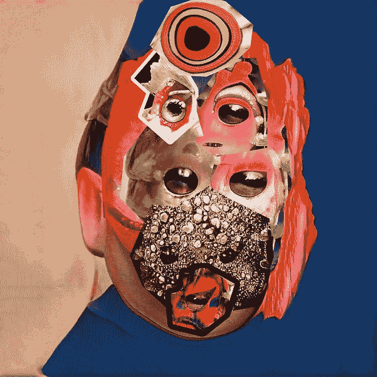
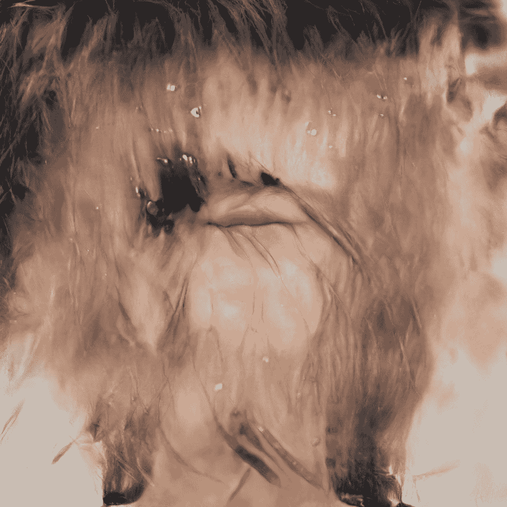
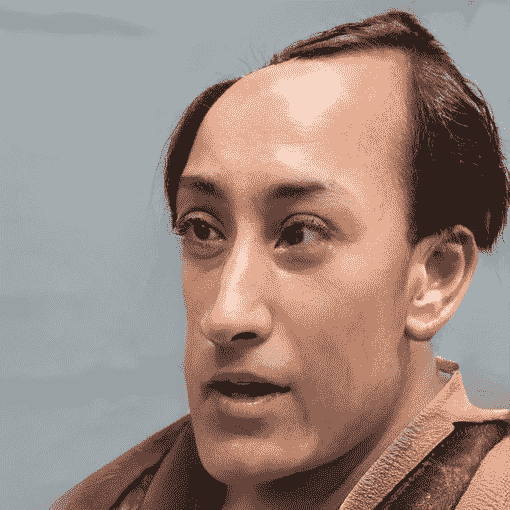

<!--yml

类别：未分类

日期：2024-09-06 19:52:57

-->

# [2107.05599] 利用生成深度学习进行主动分歧 - 调查与分类

> 来源：[`ar5iv.labs.arxiv.org/html/2107.05599`](https://ar5iv.labs.arxiv.org/html/2107.05599)

# 利用生成深度学习进行主动分歧 - 调查与分类

Terence Broad ^(1, 2), Sebastian Berns ³, Simon Colton ^(3, 4)    Mick Grierson ²

¹ 伦敦大学金史密斯学院计算系，英国

² 伦敦艺术大学创意计算研究所，英国

³ 伦敦大学玛丽女王学院电子工程与计算机科学学院，英国

⁴ 澳大利亚莫纳什大学信息技术学院 SensiLab

###### 摘要

> 生成深度学习系统提供了强大的工具来生成艺术品，鉴于它们能够建模数据分布并生成高保真结果。然而，在计算创意的背景下，一个主要的缺陷是它们无法以创造性的方式明确地偏离训练数据，且仅限于拟合目标数据分布。为了克服这些限制，越来越多的方法被提出，以优化、破解和重写这些模型，以便主动偏离训练数据。我们展示了*主动分歧*技术的分类法和综合调查，突出了计算创意研究者在推进这些方法并在真正创造性的系统中使用深度生成模型的潜力。

## 介绍

生成深度学习方法，特别是深度生成模型，已在生成高质量艺术品方面变得非常强大，并在机器学习、计算机图形学和音频信号处理领域引起了极大关注。此外，由于它们能够生成具有高文化价值的艺术品，它们也受到艺术家和创意支持工具开发者的关注。

计算创意领域的研究者以及使用生成深度学习系统的艺术家等的主要目标之一是寻找方法使生成模型产生与训练数据不同的新颖结果。在某些方面，试图创建一个不建模训练数据的生成模型是一种矛盾，因为生成模型的定义就是建模某种现有数据分布。然而，生成神经网络是强大的工具，具有学习呈现复杂高维数据的整个分布的独特能力，且这种能力不断提高。因此，不难理解，为了主动偏离训练数据或任何现有数据分布，已经开发了大量方法来调整、操控和优化这些模型。

“活跃发散”一词（Berns 和 Colton，2020）描述了利用生成深度学习的方法，这些方法不仅仅是复制训练数据。这些方法在计算创造力领域内得到了发展，同时也是相邻社区普遍共享的目标，如那些构建创造力支持工具的社区，以及艺术家、研究人员和其他从业者在“CreativeAI”旗帜下发布和分享成果的群体（Cook 和 Colton，2018）。本文提供了对这些领域中发展起来的最先进方法的全面调查和分类。

此外，本文概述了一些可能的应用，并指出了计算创造力研究在超越技巧和窍门方面，向更自动化和自主的创造性系统发展的关键机会。许多提出的研究方向仍处于非常初步的阶段，评估和基准测试这些方法的工作仍然任重道远。更好的测量和评估这些技术的方法将有助于推进理解，并使更多创造性责任转交给系统。对活跃发散方法的比较账户，包括方法、应用案例和未来研究方向，作为资源提供，以指导生成深度学习工具和系统的未来研究，这些工具和系统在创造性飞跃方面超越了训练数据的复制。

## 技术概述

并非所有生成模型都依赖于生成深度学习，这里我们指的是那些基于人工神经网络的模型¹¹1 有关更多阅读内容，Harshvardhan 等人提供了生成模型的全面概述（2020）。给定一个数据分布$P$，生成模型将建模一个近似分布$P^{\prime}$。这个近似分布的参数可以通过人工神经网络来学习。不同的架构和训练方案以不同的方式解决这个学习任务。例如，自动编码器（Rumelhart, Hinton, and Williams, 1985）和变分自动编码器（VAE）（Kingma 和 Welling，2013；Rezende, Mohamed 和 Wierstra，2014）通过编码和解码网络学习对数据进行重建，从而近似数据，而生成对抗网络（GAN）（Goodfellow 等人，2014）则由一个生成器和一个判别网络组成。在大多数情况下，网络从一个低维潜在分布$X$学习到一个复杂的高维特征空间的映射。因此，模型根据输入向量$x$生成一个样本$p^{\prime}$，这个样本应当类似于从目标分布$P$中抽取的样本。在最简单的单层网络情况下，生成的样本$p^{\prime}$使用以下函数生成：$p^{\prime}=\sigma(Wx+b)$，其中$x$是来自潜在分布$x\in X$的输入向量，$\sigma$是一个非线性激活函数，$W$和$b$是用于生成近似分布$p^{\prime}\in P^{\prime}$样本的学习关联矩阵和偏置向量。模型参数$W$和$b$通常通过基于梯度的优化过程来学习。在这个过程中，损失函数将要求模型最大化数据的似然性：（i）显式地，如在自动编码器、自动回归（Frey 等人，1996）和基于流的生成模型（Dinh, Krueger, and Bengio，2014）的情况；（ii）近似地，如在 VAEs 的情况；（iii）或隐式地，如在 GANs 的情况。生成模型也可以基于标记数据进行条件生成。在条件生成的情况下，生成模型接受两个输入$x$和$y$，其中$y$表示类别标签向量。另一种形式的条件生成模型是翻译模型，如 pix2pix（Isola 等人，2017），它接受一个（高维的）数据分布作为输入$Q$，并学习一个到$P^{\prime}$的映射，该映射是对真实目标函数$f:Q\rightarrow P$的近似。

所有深度生成模型，特别是那些生成高维数据领域（如图像、音频和自然语言）的模型，都将存在某种程度的偏差 $D(P||P^{\prime})\geq 0$，这是因为高维数据固有的复杂性和随机性。所有生成模型的目标是通过最大化生成给定数据领域的可能性来最小化这种偏差。然而，主动偏差方法则有意地寻求创建一个新的分布 $U$，该分布既不直接近似给定的分布 $P$，也不像其他已知的数据分布。这可以通过寻找模型参数 $W^{*}$ 和 $b^{*}$（在单层情况下）来生成新样本 $u=\sigma(W^{*}x+b^{*})$，或者通过对计算链进行其他干预来实现。

## 主动偏差方法的调查

我们提供了一个关于实现主动偏差的前沿方法的全面概述和分类。在这次调查中，我们将使用统计学中的“偏差”一词，即两个分布之间的距离（或差异）。还有其他与创造力研究相关的偏差定义，如 Guildford 的发散思维维度（Hocevar, 1980）。尽管一些主动偏差方法与发散思维理论之间可以找到某些相似之处，但为了技术阐述的清晰性，我们将严格按照统计定义来概述主动偏差方法。

(a) 发散微调

(b) 链式模型

(c) 网络弯曲

(d) 网络混合

图 1：使用各种主动分歧方法生成的结果的一些视觉示例。（a）由 Mal Som（Som，2020）创作的《奇异果实》中的一张图像，通过对经过预训练模型进行微调以获得一个不断变化的领域。(b) Derrick Schultz（Schultz，2020b）的视频艺术作品《你在这里》，通过链接多个模型和技术，包括: 一个自定义的 GAN，网络弯曲，图像翻译和超分辨率。(c) 艺术作品系列《畸胎瘤》（Broad，2020b）中的一张图像，通过网络弯曲技术（Broad，Leymarie 和 Grierson，2021）创建。(d) 网络混合的示例（Pinkney 和 Adler，2020），其中提供的图像是从一个模型生成的，该模型结合了来自 FFHQ StyleGAN2 模型的照片级纹理和来自在浮世绘数据集上训练的模型的空间结构（Pinkney，2020a）。所有图像均经过其各自创建者的许可复制。

### 学习表示中的新颖性搜索

此类方法采用使用标准极大似然率进行训练的现有生成模型，并具体搜索不与训练数据相似的学习表示的子集，方法是通过从模型中系统地对样本进行采样²²2 有关采样生成模型的方法的概述请参见 White（2016）.. 考虑到任何近似分布$P^{\prime}$与真实分布$P$之间会有一定的差异，这些方法试图找到近似分布的子集$U$，该子集不包含在真实分布中$U\subset P^{\prime}\wedge U\not\subset P$。Kazakçı，Mehdi 和 Kégl（2016）提出了一种在 MNIST 数据集（LeCun 等，1998）上稀疏自编码器的潜在空间中搜索新颖性的算法。他们首先创建一个随机噪声样本，并使用 Markov chain monte carlo (MCMC) 方法通过编码器迭代地重新对样本进行编码，然后对样本进行优化，直到产生稳定的表示。他们使用这种方法来映射模型能够生成的所有表示，并在这些表示的潜在空间编码上执行 k-means 聚类。通过忽略与真实数字对应的簇，他们得到了不在原始数据分布中存在的数字表示簇。有人认为，这些“虚假样本”是从给定数据分布中学习泛化的生成模型的不可避免的结果（Kégl，Cherti 和 Kazakçı，2018），并且在生成分布中 spurious 样本的比例和对数据集中每个模式进行泛化的能力之间存在权衡。

### 从激发性集合中生成新颖性

本节的方法从头开始使用训练数据集训练模型，但并不直接对数据进行建模，而是将其作为参考材料以获得灵感。因此，我们将该训练集（给定的分布 $P$）称为启发集（Ritchie, 2007）。

一种新颖的字形生成方法利用了在 MNIST 数据集上训练的类别条件生成模型（LeCun et al., 1998），但在这种情况下，他们使用了“保留类”（Cherti, Kégl, and Kazakçı, 2017），这些额外的类在训练数据分布中不存在。这些保留类可以在推断过程中进行采样，这些采样包含了近似分布 $P^{\prime}$ 中未包含在目标分布中的子集 $U$，即 $U\subset P^{\prime}\wedge U\not\subset P$。这些不同的样本可以通过使用保留类标签对生成器进行条件化而直接生成，无需搜索潜在空间。

从启发集 $P$ 直接生成新分布 $U$ 的一种方法是创造性对抗网络（CAN）算法（Elgammal et al., 2017）。该算法使用 WikiArt 数据集（Saleh and Elgammal, 2016），这是一个按“风格”（历史艺术运动）分类的标记绘画数据集。该算法从 GAN 训练程序（Goodfellow et al., 2014）中获得灵感，但对其进行了调整，使得判别器必须按风格分类真实和生成样本，而生成器则被优化以最大化生成结果被分类为“艺术作品”（符合现有艺术作品训练分布的样本）的可能性，同时最大化其与现有风格的偏差，从而生成新颖的分布 $U$。

### 无数据训练

从随机初始点开始训练模型而没有任何训练数据，几乎可以确保生成的分布具有新颖性。现有的所有方法都依赖于多个模型之间的动态关系，通过这些动态关系产生新颖的数据分布。

#### 多生成器动态

Broad 和 Grierson (2019a) 提出了一种在没有任何训练数据的情况下训练生成深度学习模型的方法，通过使用两个生成器网络，并依赖它们之间的动态关系进行开放式优化过程。这种方法受到 GAN 框架的启发，但与生成器模仿真实数据不同，两生成器试图相互模仿，同时判别器则试图区分它们。为了在最终结果中获得某种程度的多样性，这两个生成器同时试图在生成的输出中产生比另一个生成器网络更多的颜色，从而生成两个新颖但紧密相关的分布 $U$ 和 $V$。

#### 通过通信生成

一种生成数据的替代方法使用单一生成器网络，并将生成的分布$U$作为两个网络之间的通信渠道，这两个网络共同学习生成和分类表示来自一系列现有数据集的数值和文本信息的图像（Simon，2019）。在后续工作中，通过对生成器施加强的归纳偏置以生成线条图，这种方法可以用于生成新的字形（Park，2020）。

### **分歧微调**

**分歧微调**方法采用生成近似分布$P^{\prime}$的预训练模型，并将模型从原始训练数据中微调出来。这可以通过优化新的训练数据或使用辅助模型和自定义损失函数来完成。其目标是找到一组新的模型参数，这些参数生成一种新的分布$U$，该分布与近似分布$P^{\prime}$和原始分布$P$有显著的差异。

#### **跨领域训练**

在跨领域训练中，迁移学习被应用于一个预训练的模型，该模型生成近似分布$P^{\prime}$，然后该模型被训练以近似新的数据分布$Q$。这一迁移学习过程最终会使模型学习一组生成近似分布$Q^{\prime}$的参数。然而，通过选择模型在这一过程中的某个迭代步骤，可以找到一组参数，这些参数产生了两个近似分布$P^{\prime}$和$Q^{\prime}$之间的混合，进而生成新的分布$U$（Schultz，2020a）。这一方法被许多艺术家和从业者独立发现，他们在使用 GAN 模型进行迁移学习以提高训练效率时发现，模型在中途的迭代产生了最有趣、最惊讶且有时令人恐惧的结果（Adler，2020；Black，2020；Mariansky，2020；Shane，2020）。

#### **持续领域转移**

超越单纯地混合两个领域，一种可以在微调过程中提供更多调节最终分布的机会的方法是，在不断变化的领域上进行优化。在创作艺术作品《奇异果实》（Som，2020）时，艺术家 Mal Som “在数据集中迭代，增强、复制并循环利用来自先前时间点的生成图像”，以指导生成器模型的训练（Som，2021）。在这一过程中，目标分布$Q_{t}$在步骤$t$可能包含从任何先前时间步$t-n$（其中$0<n<t$）生成的样本$q^{\prime}_{t-n}$。此外，目标分布$Q_{t}$可能不再包括样本，或可能有来自目标分布先前迭代的样本$q_{t-n}$的重复。使用这一过程，目标分布可以不断地被塑造和引导。

建模不断变化的领域的过程通常会导致—一般不希望的—模式崩溃现象（Thanh-Tung 和 Tran，2020）。然而，在 Som 的实践中，这是一种刻意引发的现象。在模型崩溃后，Som 会探索其先前的迭代，寻找崩溃前最后一个可用的实例。Som 将这一实践比作艺术技巧的陌生化，即将常见事物以陌生的方式呈现，以便观众获得新的视角，看到不同的世界（Som，2021）。

#### 损失黑客技术

一种替代策略是对没有任何训练数据的模型进行微调。相反，使用一种损失函数将近似分布$P^{\prime}$直接转化为新分布$U$，而不需要任何其他目标分布。Broad、Leymarie 和 Grierson (2020) 使用对抗损失函数的逆函数，通过使用判别器的冻结权重，直接优化数据的可能性。这一过程颠倒了生成器的正常目标，从生成“真实”数据改为生成判别器认为是“虚假”的样本。通过将这一过程应用于能够生成照片级真实人脸图像的生成对抗网络（GAN），这一微调过程会在反向穿越恐怖谷的过程中，将图像从真实图像中几乎无法区分，并放大图像的不适感，最终导致模式崩溃。类似于 Som 的实践（见前一小节），在模式崩溃之前手动选择模型的一个实例，并将其输出转化为艺术作品系列《被击败的》（Broad，2020a）。

#### 注入外部知识

通过利用外部训练模型的学习知识，可以对模型进行微调，将这些知识融入原始领域数据，并使用辅助模型定义的特征进行转换。Broad 和 Grierson (2019b) 利用一个分类器模型 $C_{classifier}$ 训练以区分数据集，并结合冻结权重的判别器 $D_{frozen}$，对预训练的 GAN 生成器模型 $G$ 进行微调，使其从原始分布偏离，朝向由损失函数 $L$ 定义的新局部最小值。$L$ 被定义为两个辅助模型的加权和 $L=\alpha C_{classifier}(G(x))+\beta D_{frozen}(G(x))$，其中随机潜在向量 $x$，以及 $\alpha$ 和 $\beta$ 是定义损失函数两个部分的超参数。

StyleGAN-NADA 框架（Gal，2021）利用了对比语言–图像预训练模型（CLIP）的外部知识（Radford et al., 2021）。CLIP 已经在互联网上的数十亿对文本和图像上进行了训练，提供了图像和文本的联合嵌入空间，允许对图像和文本提示进行相似度估计。在 StyleGAN-NADA 中，预训练的 StyleGAN2 模型（Karras et al., 2020）可以使用用户指定的文本提示进行微调，然后使用 CLIP 模型 $C_{clip}$ 对文本提示和生成样本进行编码，以提供一个损失函数，在该函数中，可以最小化文本字符串 $t$ 的 CLIP 编码与生成图像嵌入 $G(x)$ 之间的余弦相似度 $S$，损失函数为 $L=S(C_{clip}(t),C_{clip}(G(x))$。该训练过程引导生成器向用户定义的文本提示的未见领域中融入特征。

### 链接模型

一种艺术家广泛使用但在学术文献中记录不多的方法是将多个在艺术家策划的数据集上训练的定制模型链式连接起来。这些使用的集成模型通常会结合标准的无条件生成模型，例如 GANs，以及其他条件生成模型，如图像到图像转换网络，例如 pix2pix（Isola 等，2017）和 CycleGAN（Zhu 等，2017），还有其他改变结果美学效果的方法，如风格迁移（Gatys、Ecker 和 Bethge，2016）。艺术家通常会在小型定制数据集上训练多个模型，并测试不同模型的多种组合，旨在找到能产生独特且富有表现力结果的配置。艺术家 Helena Sarin 常常将多个 CycleGAN 模型链成一个集成，并在推理过程中重复使用训练数据，因为这种做法的目标“不是泛化，我的目标是创造有吸引力的艺术”（Sarin，2018）。艺术家 Derrick Schultz 将模型链式连接的做法与 Robin Sloan 的‘flip-flopping’概念（Schultz，2021）进行比较，在这种做法中，通过“将一件艺术品或工艺品从物理世界推向数字世界并再返回，通常不止一次”来实现创造性的成果（Sloan，2012）。

### 网络弯曲

网络弯曲（Broad、Leymarie 和 Grierson，2021）是一个框架，允许通过使用单独的预训练模型进行主动分歧，而无需更改模型的权重或拓扑结构。相反，在模型的计算图中插入了实现标准图像滤镜的额外层，并在推断过程中应用于卷积特征的激活图³³3 将滤镜插入 GAN 中也在 Matlab StyleGAN playground 中独立开发（Pinkney，2020c）。由于模型的计算图已经被改变，之前从近似分布 $P^{\prime}$ 生成样本的模型，现在从新的分布 $U$ 中生成新样本，而模型的参数没有任何更改。在最简单的情况下，两个层的模型为每个层 $l$ 生成一个关联权重矩阵 $W_{l}$ 和偏置 $b_{l}$ 向量。这生成样本 $p^{\prime}=\sigma(W_{2}(\sigma(W_{1}x+b_{1}))+b_{2})$，其中使用输入向量 $x$ 和非线性激活函数 $\sigma$。在网络弯曲框架中，一个确定性函数 $f$（由参数 $y$ 控制）被插入到模型的计算图中，并应用于模型的内部激活 $u=\sigma(W_{2}(f(\sigma(W_{1}x+b_{1}),y))+b_{2})$，使模型能够从新的分布 $u\in U$ 中生成新的样本 $u$。除了将变换应用于层中的所有特征的最简单情况外，变换层还可以应用于特征的随机子集或预选特征集。Broad、Leymarie 和 Grierson（2021）提出了一种聚类算法，该算法以无监督的方式根据激活图的空间相似性将层内特征集合分组。该聚类算法能够找到负责生成各种语义上有意义的组件的特征集合，这些特征集合可以在网络（和语义）层次结构中进行操作，从而允许对生成模型的内部表示进行语义操作。

除了对激活图应用滤镜之外，还可以通过增大激活图的尺寸并进行插值和拼接来放大样本（Pouliot, 2020）。网络弯曲框架已经扩展到音频合成领域（McCallum 和 Yee-King, 2020），在使用差分数字信号处理（DDSP）方法的神经声码器模型中得到了应用（Engel 等, 2020）。为了使框架适应音频领域，McCallum 和 Yee-King (2020) 实现了一些在时间域操作的滤镜，如振荡器。网络弯曲也被应用于使用生成模型的音频反应视觉合成领域（Brouwer, 2020），其中确定性变换通过自动控制，从音频分析中提取的特征来进行。

### 网络混合

对多个在不同数据集上训练的模型进行混合，允许更好地控制来自不同领域的学习特征的组合。这可以通过混合模型的预测结果，或者通过混合模型本身的参数来实现。

#### 模型预测混合

Akten 和 Grierson (2016) 提出了一个交互式文本生成工具，允许实时混合从不同文本来源训练的长短期记忆网络（LSTM）模型（Hochreiter 和 Schmidhuber, 1997）的预测输出。图形用户界面允许用户在进行一热编码（用于确定最终预测字符值）之前，动态调整所有模型预测的加权和的混合权重。

#### 模型参数混合

一些方法（所有这些方法都在 StyleGAN2 上演示，Karras 等, 2020）利用了大量在互联网上共享的预训练模型（Pinkney, 2020b）。这些模型几乎都从在 Flickr-Faces 高质量（FFHQ）数据集上训练的官方模型权重中进行迁移学习。已经显示，从相同原始来源 $p_{base}$ 迁移学习得到的模型参数 $p_{transfer}$ 在权重结构上有共性。这使得可以直接在模型参数之间进行有意义的插值（Aydao, 2020）。通过使用插值权重 $\alpha$，可以控制插值以创建一组参数 $p_{interp}=(1-\alpha)p_{base}+\alpha p_{transfer}$。

层也可以从一个模型交换到另一个模型（Pinkney 和 Adler，2020），从而将一个模型的高层特征与另一个模型的低层特征结合起来。这种层交换技术被用来制作流行的“卡通化”方法，这种方法可以通过从 FFHQ 潜在空间中找到与人最接近的潜在向量，简单地从中取样，将一个人真实照片对应到一个迪士尼-皮克斯风格的“卡通化”模型中（Abdal, Qin, 和 Wonka，2019）。一种通用的方法结合了权重插值和层交换方法，通过对模型的不同层使用不同的权重插值级联（Arfafax，2020）。

Colton (2021) 提出了一个进化方法，用于探索和找到有效且可定制的神经风格迁移混合。通过模型插值，用户可以使用一个由用户控制的界面混合超过 1000 个在 1-10 种风格图像上训练的神经风格迁移模型。MAP-Elites（Mouret 和 Clune，2015）结合使用从 ResNet 模型（He 等人，2016）输出计算的适应度函数，在进化搜索中用于寻找最佳的神经风格迁移混合。

### 模型重写

模型重写包括通过手动干预或使用某种启发式优化算法以有针对性的方式更改权重或网络拓扑的方法。

#### 随机重写

为了创建系列艺术作品《Neural Glitch》，艺术家 Mario Klingemann 随机更改、删除或交换了预训练 GAN 的训练权重（Klingemann，2018）。类似地，卷积层重连技术（Růžička，2020）在预训练 GAN 的层内随机交换卷积特征。此技术应用于 Remixing AIs 视听合成框架（Collins, Růžička 和 Grierson，2020）。

#### 有针对性的重写

Bau 等人（2020）提出了一种有针对性的模型重写方法。在这里，从模型中提取一个样本，并使用标准图像编辑技术（称为“复制粘贴”界面）进行操控。一旦样本被修改以符合期望目标（例如去除图像中的水印或让马匹戴上帽子），则执行受约束优化。除一个层外，所有层都被冻结，该层的权重通过梯度下降优化进行更新，直到生成的样本与新目标匹配。在这个优化过程完成后，模型的权重被修改，使得有针对性的变化在模型生成的所有样本中都能出现。

CombiNets 框架（Guzdial 和 Riedl，2018），基于组合创造性领域的先前研究（Boden，2004），可以通过有针对性地结合多个预训练模型的参数来创建新模型。现有模型的参数被重新组合，以考虑训练数据中不存在的新生成模式（举例来说，对于一个训练在非神话生物照片上的模型，可能会出现一个独角兽）。在这个框架中，提供少量的新样本（不足以直接训练模型），然后使用启发式搜索重新组合现有模型的参数，以适应这种新的生成模式。

## 进一步的划分

在本节中，我们强调了可以用于分类活跃发散方法的划分。这些类别作为进一步讨论和方法比较的标准。

### 从零开始训练与使用预训练模型

找到稳定、有效的生成模型训练方法，特别是 GANs，是困难的，根据训练方案的不同，只有少数方法被发现能够成功地工作。很少有活跃发散的方法完全从零开始训练模型。相反，大多数方法以预训练模型作为干预的起点。这样可以避免从零开始训练，但可能仍需要微调。

### 利用数据与无数据方法

大多数描述的方法以某种方式利用数据，无论是作为新颖性生成的灵感集，还是用于结合来自不同数据集的特征（发散微调、网络混合和链式模型）。即使是模型重写的方法也使用非常少量的示例数据来指导优化算法，从而改变模型权重。然而，像网络弯曲的方法，展示了如何以不依赖任何数据的方式分析模型，并用于智能操控模型——这种方法可以应用于模型重写等其他方法。没有数据训练和微调模型的方法也展示了如何利用辅助网络和模型之间的动态来实现活跃发散。

### 人工指导与创造性自主

很少有描述的方法是为了将创造性自主权交给系统本身而开发的。大多数方法由艺术家或研究人员开发，目的是让人们操控、实验和探索这些模型在创意表达中的意外用途。然而，目前设计用于或依赖高度人工策划和干预的方法，很容易在未来被改编并用于共同创造或自主创造系统（Berns 等人，2021）。

## 活跃发散的应用

在本节中，我们概述了活跃发散方法的一些应用。

### 新颖性生成

生成深度学习技术能够进行泛化，从而产生具有高典型性和价值的新工件，但很少能产生与训练数据不相似的新输出。活跃发散技术在使生成深度学习系统生成真正新颖的工件中发挥着重要作用，特别是在可能没有或仅有有限数据可供借鉴的情况下。

### 创造力支持和共同创作

提出的某些框架已经明确设计为创造力支持工具，例如网络弯曲框架，旨在允许对深度生成模型进行表达性操作。许多风格迁移模型已在 Style Done Quick (Colton, 2021) 应用中得到发展，该应用被构建为一种休闲创作者应用 (Compton and Mateas, 2015)。虽然许多其他描述的方法仍处于初步的艺术和研究实验阶段，但这些方法具有很大的潜力，最终可能会被更好地理解，并在更易于访问的创造力支持工具和共同创作框架中得到应用。

### 知识重组

以高效的方式重用和重组知识是活跃发散方法的重要应用场景。尽管可以从在互联网上大部分数据中提取的极大模型中获得令人印象深刻的泛化能力 (Ramesh et al., 2021)，但这仅限于少数大型科技公司。活跃发散方法允许以更高效的方式重组风格、美学特征和更高级别的概念，而无需依赖不断扩展的计算资源。像链式模型、网络混合和模型重写等方法提供了在没有极大模型或数据源的情况下实现灵活知识重组和泛化到未见领域的替代路径。

### 未见领域适应

活跃发散方法允许适应和探索未见领域，其中几乎没有可用的数据。Pinkney 和 Adler (2020) 提出的网络混合方法可以在保持可识别身份的情况下，将面孔翻译到完全合成的数据领域，这在标准图像翻译技术 (Zhu et al., 2017) 中是无法实现的。

模型重写和网络弯曲方法提供了在受控条件下重用和操作现有知识的可能性，从少量给定示例中生成新数据，或者理论上如果集成外部知识源，则无需任何先前示例，如下文进一步讨论。这种方法也可以被寻求探索假设情况的代理利用，通过重新组织世界模型（Ha 和 Schmidhuber，2018）中的学习知识来探索假设情况或关系。

### 创造力的基准

生成模型代表了大量的知识库，这些知识库可以生成高质量的人工制品。关于如何利用这些信息和它们包含的关系，尚有很多未开发的潜力，可以通过网络弯曲和模型重写等操作框架进行再利用和重写。主动发散框架可能是探索和评估创造力模式的良好候选者，例如组合创造力（Boden，2004）和概念融合（Fauconnier 和 Turner，2008）。这些框架可以用于指导如何重新组织模型中的特征，然后通过检查从修改后的模型生成的人工制品来评估这些特征。

## 未来研究方向

在这一部分，我们讨论了未来可能的研究方向以及开发、评估和利用主动发散方法的应用。

### 定量评估指标

对于主动发散研究的推进，定量评估方法至关重要，以便跟踪进展、比较技术和进行基准测试。主动发散的指标必须超越通常在生成模型评估中进行的分布相似性或不相似性的测量（Gretton, Sutherland 和 Jitkrittum，2019）。主动发散指标应有助于更好地理解分布的发散方式。因此，在创意背景下测量分布间的发散时，应考虑对建模分布的各种变化，包括多样性的增加或减少、整个分布的变化一致性和并发性，以及这些变化主要影响低层次还是高层次特征。

### 自动化定性评估

除了定量评估，还需要其他指标来评估主动发散指标。为了减少对定性评估的依赖，以便以计算方式指导新模型的创建，从而将这些过程的某些方面交给计算系统。例如，最近开发的视觉不确定性测量指标（Wang 等，2020b），被认为是人们在 GAN 生成艺术中发现有趣的关键驱动因素之一（Hertzmann，2020），可以用来替代由人类完成的定性评估和策展步骤。其他可以使用的指标包括：新颖性指标（Grace 和 Maher，2019）、贝叶斯惊奇（Itti 和 Baldi，2009）、美学评估（Galanter，2012），或用于数据领域之间的最佳融合和评估对语义关系变化的新颖性的测量。

### 发明新的目标函数

到目前为止，基于生成深度学习的方法都未能发明自己的目标函数。相反，像创意对抗网络（Elgammal 等，2017）这样的技术依赖于精心制作的已建立目标函数的变体。这将是未来最具挑战性的研究方向之一，因为生成深度学习系统依赖于少量目标函数以实现稳定收敛。然而，结合新评估指标的发展，可能有机会探索完全不同的目标函数类别，这些类别与现有的数据表示有所不同，并产生高价值的人工制品。

### 利用外部知识

利用来自数据集外部的专家知识，这些知识可能来自不同领域或符号知识表示，将在生成模型的组合创造力（Boden，2004）和概念融合框架（Fauconnier 和 Turner，2008）中提供更大的灵活性。将研究分析特征的语义目的和关系，并创建这些特征与外部数据源或知识图谱之间的映射，将使得控制技术更加灵活，这些技术目前依赖于人工干预（网络弯曲、模型重写）。这可以适应为可计算控制和操纵，使得一些创造性决策可以交给计算机处理。

### 制定和实现意图

对于许多描述的方法，能够制定和实现意图的系统必须能够获取和创建自己的数据集。例如，一个想要创建生成猫狗混合模型的系统，需要能够分别收集猫和狗的数据，然后决定使用某种网络混合方法来获得所需的结果。或者，利用外部知识源结合特征的语义分析，将允许计算系统通过改变模型重写或网络弯曲方法中特征之间的语义关系，从而在生成新模型时具有更大的灵活性。

### 多代理系统

有人认为 GAN 框架是多代理系统的最简单示例（Agüera y Arcas, 2019），而神经元细胞自动机（Mordvintsev et al., 2020）等框架为生成深度学习中的多代理方法提供了新可能。本文描述的无需数据训练的主动发散方法都依赖于多个代理的动态来产生有趣的结果，但这可以更进一步。有人认为艺术本质上是社会性的（Hertzmann, 2021），探索代理之间更复杂的社会动态（Saunders, 2019）可能是发展这些方法的一个有益途径。合作多代理系统中的紧急语言研究（Lazaridou, Peysakhovich, and Baroni, 2017）可以为推进生成多代理系统的工作提供借鉴。

### 开放式强化学习

开放式强化学习，没有设定目标（Wang et al., 2020a），为实现主动发散提供了新型更自主的方法的可能性。虽然本调查中没有讨论强化学习，但它在生成设置中（Luo, 2020）在新兴研究中得到了应用。强化学习方法为创意框架的探索提供了许多机会，而这些机会是标准生成深度学习方法所无法提供的，因为它们对环境采取行动，而不仅仅是拟合函数。诸如内在动机（Shaker, 2016）、与其他代理的合作或竞争、制定和执行意图等范式，都是传统生成深度学习系统无法单独探索的概念，但这些范式可以在利用强化学习的开放式系统中进行探索。

## 结论

我们提出了一个分类法和关于从各种来源实现主动差异的方法的调查，包括艺术实验，创造性支持工具和计算创造力研究。其中许多方法代表了研究的新生领域，并且有很多的空间可以用它们在协作创意和自动化创造性系统方面的未来工作中进行研究，因为它们克服了主流生成深度学习方法的一个主要缺点，无法以创新的方式偏离训练数据的复制。此外，我们在文中概述了一些未来研究方向，以推动创造性支持工具和计算创造性生成深度学习系统的最前沿技术。

### 致谢

感谢我们的评论者提供的有益评论。此工作得到了英国的智能游戏和游戏智能博士培养中心（IGGI；津贴号 EP/L015846/1 和 EP/S022325/1）的支持。

## 参考文献

+   Abdal, Qin, and Wonka (2019) Abdal, R.; Qin, Y.; and Wonka, P. 2019. 图像到 StyleGAN 潜空间的嵌入方式是什么？ 在 IEEE 国际计算机视觉会议（ICCV）上，4432–4441。

+   Adler (2020) Adler, D. 2020. 故意的 stylegan2 ffhq 破坏。在一个小数据集上进行微调[...]。[链接](https://twitter.com/Norod78/status/1218282356391530496)。访问日期：2021 年 02 月 05 日。

+   Agüera y Arcas (2019) Agüera y Arcas, B. 2019. 社交智能。在《进展》中神经信息处理系统[重点演讲]。

+   Akten and Grierson (2016) Akten, M., and Grierson, M. 2016. 基于循环神经网络合奏的实时交互式序列生成和控制。循环神经网络研讨会，NIPS 2016。

+   Arfafax (2020) Arfafax. 2020. 不同层插值率的质心式跨网络插值。[链接](https://colab.research.google.com/drive/1FwOYqtU0kVYDwHrddFKBhDKcs0jJ_zuK)。访问日期：2020 年 02 月 05 日。

+   Aydao (2020) Aydao. 2020. 是的，神经网络的随机权重平均是很疯狂的[...]。[链接](https://twitter.com/AydaoAI/status/1234614081413406720)。访问日期：2021 年 02 月 05 日。

+   Bau et al. (2020) Bau, D.; Liu, S.; Wang, T.; Zhu, J.-Y.; and Torralba, A. 2020. 对深度生成模型进行重写。在 Proc. European Conference on Computer Vision (ECCV)上。

+   Berns and Colton (2020) Berns, S., and Colton, S. 2020. 架起生成深度学习和计算创造之间的桥梁。在第 11 届国际计算创造会议上。

+   Berns et al. (2021) Berns, S.; Broad, T.; Guckelsberger, C.; and Colton, S. 2021. 用于艺术目的生成深度学习的自动化：挑战与机会。在第 12 届国际计算创造会议上。

+   Black (2020) Black, S. 2020. 谢谢！它是在面部上训练的，然后训练了一小段时间[...]。[链接](https://twitter.com/realmeatyhuman/status/1257733313885765638)。访问日期：2021 年 02 月 05 日。

+   Boden (2004) Boden, M. A. 2004. 创造性思维：神话与机制。Psychology Press。

+   Broad 和 Grierson（2019a）Broad, T., 和 Grierson, M. 2019a. 寻找（不）稳定的平衡：在没有数据的情况下训练生成模型的实验。NeurIPS 2019 创意和设计机器学习研讨会。

+   Broad 和 Grierson（2019b）Broad, T., 和 Grierson, M. 2019b. 通过用不同数据集的特征微调 GANs 来转换 GAN 的输出。arXiv 预印本 arXiv:1910.02411。

+   Broad, Leymarie 和 Grierson（2020）Broad, T.; Leymarie, F. F.; 和 Grierson, M. 2020. 放大不安。第 8 届计算、通信、审美与 X 会议（xCoAx）论文集。

+   Broad, Leymarie 和 Grierson（2021）Broad, T.; Leymarie, F. F.; 和 Grierson, M. 2021. 网络弯曲：深度生成模型的表现力操控。第 10 届人工智能在音乐、声音、艺术和设计中的国际会议（EvoMUSART）论文集。

+   Broad（2020a）Broad, T. 2020a. Being Foiled. https://terencebroad.com/works/being-foiled. 访问时间：2021-06-30。

+   Broad（2020b）Broad, T. 2020b. Teratome. https://terencebroad.com/works/teratome. 访问时间：2021-06-28。

+   Brouwer（2020）Brouwer, H. 2020. 与 StyleGAN 的音频反应性潜在插值。NeurIPS 2020 创意和设计机器学习研讨会。

+   Cherti, Kégl 和 Kazakçı（2017）Cherti, M.; Kégl, B.; 和 Kazakçı, A. 2017. 类外新颖性生成：实验基础。在 IEEE 第 29 届人工智能工具国际会议论文集中。

+   Collins, Růžička 和 Grierson（2020）Collins, N.; Růžička, V.; 和 Grierson, M. 2020. Remixing ais: 思维交换、混合脑力和音乐模型拼接。在人工智能音乐创造力联合会议论文集中。

+   Colton（2021）Colton, S. 2021. 进化神经风格迁移混合。第 10 届人工智能在音乐、声音、艺术和设计中的国际会议（EvoMUSART）论文集。

+   Compton 和 Mateas（2015）Compton, K., 和 Mateas, M. 2015. 随意创作者。在第 6 届国际计算创造力会议论文集中。

+   Cook 和 Colton（2018）Cook, M., 和 Colton, S. 2018. 邻近社区：互动、教训和机遇。计算创造力协会（ACC）。

+   Dinh, Krueger 和 Bengio（2014）Dinh, L.; Krueger, D.; 和 Bengio, Y. 2014. Nice: 非线性独立成分估计。arXiv 预印本 arXiv:1410.8516。

+   Elgammal 等（2017）Elgammal, A.; Liu, B.; Elhoseiny, M.; 和 Mazzone, M. 2017. CAN: 创意对抗网络，通过学习风格和偏离风格规范生成“艺术”。第 8 届国际计算创造力会议论文集。

+   Engel 等（2020）Engel, J.; Hantrakul, L.; Gu, C.; 和 Roberts, A. 2020. DDSP: 可微分数字信号处理。国际学习表示会议。

+   Fauconnier 和 Turner（2008）Fauconnier, G., 和 Turner, M. 2008. 我们的思维方式：概念融合和心智的隐藏复杂性。Basic Books。

+   Frey 等（1996）Frey, B. J.; Hinton, G. E.; Dayan, P.; 等. 1996. 唤醒-睡眠算法是否能产生良好的密度估计器？在《神经信息处理系统进展》中，661–670。Citeseer。

+   Gal（2021）Gal, R. 2021. StyleGAN2-NADA。https://github.com/rinongal/StyleGAN-nada. 访问日期：2021-06-28。

+   Galanter（2012）Galanter, P. 2012. 计算美学评估：过去与未来。《计算机与创造力》255–293。

+   Gatys, Ecker, 和 Bethge（2016）Gatys, L.; Ecker, A.; 和 Bethge, M. 2016. 一种艺术风格的神经算法。Journal of Vision 16(12):326–326。

+   Goodfellow 等（2014）Goodfellow, I.; Pouget-Abadie, J.; Mirza, M.; Xu, B.; Warde-Farley, D.; Ozair, S.; Courville, A.; 和 Bengio, Y. 2014. 生成对抗网络。在《神经信息处理系统进展》中。

+   Grace 和 Maher（2019）Grace, K., 和 Maher, M. L. 2019. 基于期望的创新模型用于评估计算创造力。在《计算创造力》。Springer. 195–209。

+   Gretton, Sutherland, 和 Jitkrittum（2019）Gretton, A.; Sutherland, D.; 和 Jitkrittum, W. 2019. 可解释的分布和模型比较。在《神经信息处理系统进展》[教程]。

+   Guzdial 和 Riedl（2018）Guzdial, M., 和 Riedl, M. O. 2018. Combinets: 通过神经网络的重组实现创造力。第九届国际计算创造力会议论文集。

+   Ha 和 Schmidhuber（2018）Ha, D., 和 Schmidhuber, J. 2018. 循环世界模型促进策略演化。《神经信息处理系统进展》31。

+   Harshvardhan 等（2020）Harshvardhan, G.; Gourisaria, M. K.; Pandey, M.; 和 Rautaray, S. S. 2020. 机器学习中生成模型的综合调查和分析。Computer Science Review 38:100285。

+   He 等（2016）He, K.; Zhang, X.; Ren, S.; 和 Sun, J. 2016. 深度残差学习用于图像识别。在 IEEE 计算机视觉与模式识别会议论文集。

+   Hertzmann（2020）Hertzmann, A. 2020. GAN 艺术中的视觉不确定性。Leonardo 53(4):424–428。

+   Hertzmann（2021）Hertzmann, A. 2021. 艺术从本质上讲是社会性的。https://aaronhertzmann.com/2021/03/22/art-is-social.html. 访问日期：2020-03-29。

+   Hocevar（1980）Hocevar, D. 1980. 智力、发散思维和创造力。Intelligence 4(1):25–40。

+   Hochreiter 和 Schmidhuber（1997）Hochreiter, S., 和 Schmidhuber, J. 1997. 长短期记忆。Neural computation 9(8)。

+   Isola 等（2017）Isola, P.; Zhu, J.-Y.; Zhou, T.; 和 Efros, A. A. 2017. 使用条件对抗网络进行图像到图像的翻译。在 IEEE 计算机视觉与模式识别会议论文集。

+   Itti 和 Baldi（2009）Itti, L., 和 Baldi, P. 2009. 贝叶斯惊讶吸引人类注意力。Vision research 49(10):1295–1306。

+   Karras 等（2020）Karras, T.; Laine, S.; Aittala, M.; Hellsten, J.; Lehtinen, J.; 和 Aila, T. 2020. 分析和改进 StyleGAN 的图像质量。IEEE 计算机视觉与模式识别会议论文集。

+   Kazakçı, Mehdi, 和 Kégl (2016) Kazakçı, A.; Mehdi, C.; 和 Kégl, B. 2016. 非数字的数字：通过深度神经网络生成新类型。第七届国际计算创造力会议论文集。

+   Kégl, Cherti, 和 Kazakçı (2018) Kégl, B.; Cherti, M.; 和 Kazakçı, A. 2018. 深度生成模型中的虚假样本：是错误还是特性？arXiv 预印本 arXiv:1810.01876。

+   Kingma 和 Welling (2013) Kingma, D. P., 和 Welling, M. 2013. 自编码变分贝叶斯。在国际学习表征会议上。

+   Klingemann (2018) Klingemann, M. 2018. 神经网络故障/错误身份。https://underdestruction.com/2018/10/28/neural-glitch/。访问日期：2021-02-05。

+   Lazaridou, Peysakhovich, 和 Baroni (2017) Lazaridou, A.; Peysakhovich, A.; 和 Baroni, M. 2017. 多智能体合作与（自然）语言的出现。国际学习表征会议。

+   LeCun 等 (1998) LeCun, Y.; Bottou, L.; Bengio, Y.; 和 Haffner, P. 1998. 应用于文档识别的梯度学习。IEEE 会议录 86(11)。

+   Luo (2020) Luo, J. 2020. 生成艺术的强化学习。加州大学圣塔芭芭拉分校。

+   Mariansky (2020) Mariansky, M. 2020. 从 ffhq 面孔到甲虫的迁移学习 StyleGAN 超级奇怪。https://twitter.com/mmariansky/status/1226756838613491713。访问日期：2021-02-04。

+   McCallum 和 Yee-King (2020) McCallum, L., 和 Yee-King, M. 2020. 网络弯曲神经声码器。NeurIPS 2020 创意与设计机器学习研讨会。

+   Mordvintsev 等 (2020) Mordvintsev, A.; Randazzo, E.; Niklasson, E.; 和 Levin, M. 2020. 生长的神经细胞自动机。Distill 5(2):e23。

+   Mouret 和 Clune (2015) Mouret, J.-B., 和 Clune, J. 2015. 通过映射精英来照亮搜索空间。arXiv 预印本 arXiv:1504.04909。

+   Park (2020) Park, S.-w. 2020. 通过学习交流生成无人工数据的新字形。NeurIPS 2020 创意与设计机器学习研讨会。

+   Pinkney 和 Adler (2020) Pinkney, J. N. M., 和 Adler, D. 2020. 分辨率依赖的 GAN 插值用于可控图像合成。NeurIPS 2020 创意与设计机器学习研讨会。

+   Pinkney (2020a) Pinkney, J. N. M. 2020a. 对齐的浮世绘面孔数据集。https://www.justinpinkney.com/ukiyoe-dataset/。访问日期：2021-06-28。

+   Pinkney (2020b) Pinkney, J. N. M. 2020b. 精彩的预训练 StyleGAN2。https://github.com/justinpinkney/awesome-pretrained-stylegan2。访问日期：2020-02-05。

+   Pinkney (2020c) Pinkney, J. N. M. 2020c. MATLAB StyleGAN 游乐场。https://www.justinpinkney.com/matlab-stylegan/。访问日期：2021-02-05。

+   Pouliot (2020) Pouliot, A. 2020. GAN 弯曲。https://darknoon.com/2020/03/03/gan-hacking/。访问日期：2021-03-27。

+   Radford et al. (2021) Radford, A.; Kim, J. W.; Hallacy, C.; Ramesh, A.; Goh, G.; Agarwal, S.; Sastry, G.; Askell, A.; Mishkin, P.; Clark, J.; 等. 2021. 从自然语言监督中学习可转移的视觉模型。arXiv 预印本 arXiv:2103.00020。

+   Ramesh et al. (2021) Ramesh, A.; Pavlov, M.; Goh, G.; Gray, S.; Voss, C.; Radford, A.; Chen, M.; 和 Sutskever, I. 2021. 零样本文本到图像生成。arXiv 预印本 arXiv:2102.12092。

+   Rezende, Mohamed, and Wierstra (2014) Rezende, D. J.; Mohamed, S.; 和 Wierstra, D. 2014. 深度生成模型中的随机反向传播和近似推断。在第 31 届国际机器学习会议论文集中。

+   Ritchie (2007) Ritchie, G. 2007. 用于将创造力归因于计算机程序的一些实证标准。*思想与机器* 17(1):67–99。

+   Rumelhart, Hinton, and Williams (1985) Rumelhart, D. E.; Hinton, G. E.; 和 Williams, R. J. 1985. 通过误差传播学习内部表示。技术报告，加州大学圣地亚哥分校拉霍亚认知科学研究所。

+   Růžička (2020) Růžička, V. 2020. GAN 探索者。 https://github.com/previtus/GAN_explorer. 访问日期：2020-12-17。

+   Saleh and Elgammal (2016) Saleh, B., 和 Elgammal, A. 2016. 大规模美术画作分类：在正确特征上学习正确的度量。*数字艺术史国际期刊*。

+   Sarin (2018) Sarin, H. 2018. 玩 GANstruction 游戏。 https://thegradient.pub/playing-a-game-of-ganstruction/. 访问日期：2020-12-15。

+   Saunders (2019) Saunders, R. 2019. 基于多智能体的社会创造力模型。在*计算创造力*。Springer. 305–326。

+   Schultz (2020a) Schultz, D. 2020a. 演示：如何在 StyleGAN2 中混合模型。 https://www.youtube.com/watch?v=kbRkznsv9dk. 访问日期：2020-02-07。

+   Schultz (2020b) Schultz, D. 2020b. 你在这里。 https://artificial-images.com/project/you-are-here-machine-learning-film/. 访问日期：2021-06-28。

+   Schultz (2021) Schultz, D. 2021. 个人通信。

+   Shaker (2016) Shaker, N. 2016. 内在驱动的强化学习：用于程序生成内容的一个有前景的框架。在 2016 年 IEEE 计算智能与游戏会议 (CIG)，1–8。IEEE。

+   Shane (2020) Shane, J. 2020. 训练了一个神经网络在我的猫身上，并对一切感到后悔。 https://aiweirdness.com/post/615654447163621376/trained-a-neural-net-on-my-cat-and-regret. 访问日期：2020-02-05。

+   Simon (2019) Simon, J. 2019. 对话的维度。 https://www.joelsimon.net/dimensions-of-dialogue.html. 访问日期：2020-12-15。

+   Sloan (2012) Sloan, R. 2012. 跳舞的翻转。 https://www.robinsloan.com/notes/flip-flop/. 访问日期：2021-03-27。

+   Som (2020) Som, M. 2020. 奇异果实。 http://www.aiartonline.com/highlights-2020/mal-som-errthangisalive/. 访问日期：2021-02-05。

+   Som (2021) Som, M. 2021. 个人通信。

+   Thanh-Tung 和 Tran（2020）Thanh-Tung, H. 和 Tran, T. 2020. GANs 中的灾难性遗忘和模式崩溃。在国际神经网络联合会议（IJCNN）论文集中。

+   Wang 等人（2020a）Wang, R.; Lehman, J.; Rawal, A.; Zhi, J.; Li, Y.; Clune, J.; 和 Stanley, K. 2020a. 增强型诗人：通过无限创造学习挑战及其解决方案的开放式强化学习。在国际机器学习大会论文集中。

+   Wang 等人（2020b）Wang, X.; Bylinskii, Z.; Hertzmann, A.; 和 Pepperell, R. 2020b. 旨在量化艺术图像中的歧义性。《ACM 应用感知学报》。

+   White（2016）White, T. 2016. 生成网络的采样。arXiv 预印本 arXiv:1609.04468。

+   Zhu 等人（2017）Zhu, J.-Y.; Park, T.; Isola, P.; 和 Efros, A. A. 2017. 使用循环一致对抗网络进行非配对图像到图像的转换。在 IEEE 国际计算机视觉大会论文集中。
