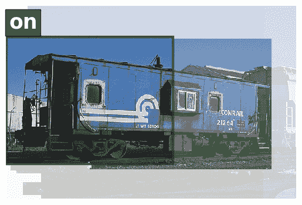
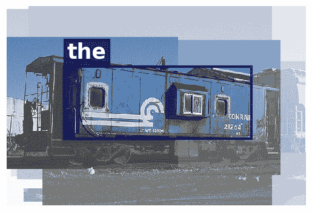
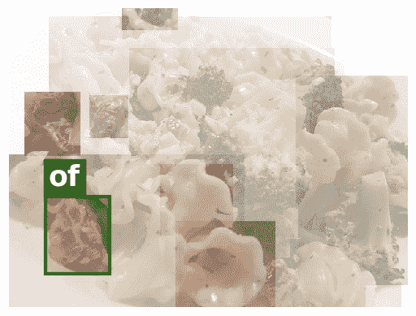

<!--yml

类别：未分类

日期：2024-09-06 19:52:54

-->

# [2107.06912] 从展示到叙述：关于基于深度学习的图像描述的调研

> 来源：[`ar5iv.labs.arxiv.org/html/2107.06912`](https://ar5iv.labs.arxiv.org/html/2107.06912)

# 从展示到叙述：关于

基于深度学习的图像描述

Matteo Stefanini、Marcella Cornia、Lorenzo Baraldi、Silvia Cascianelli

Giuseppe Fiameni 和 Rita Cucchiara、M. Stefanini、M. Cornia、L. Baraldi、S. Cascianelli 以及 R. Cucchiara 现为意大利摩德纳大学“恩佐·法拉利”工程系的成员。

电子邮件：{matteo.stefanini, marcella.cornia, lorenzo.baraldi, silvia.cascianelli, rita.cucchiara}@unimore.it。G. Fiameni 现为 NVIDIA AI 技术中心的成员，意大利。

电子邮件：gfiameni@nvidia.com

###### 摘要

连接视觉和语言在生成智能中发挥着至关重要的作用。因此，许多研究工作已经投入到图像描述中，*即* 用语法和语义上有意义的句子描述图像。从 2015 年开始，这一任务通常通过由视觉编码器和用于文本生成的语言模型组成的管道来处理。在这些年里，通过利用物体区域、属性、引入多模态连接、完全注意力方法以及类似 BERT 的早期融合策略，这两个组件都发生了显著演变。然而，尽管取得了令人印象深刻的结果，图像描述领域的研究尚未得出最终结论。本研究旨在提供关于图像描述方法的全面概述，从视觉编码和文本生成到训练策略、数据集和评估指标。在这方面，我们定量比较了许多相关的最先进方法，以识别架构和训练策略中的最具影响力的技术创新。此外，还讨论了问题的许多变体及其开放挑战。本研究的最终目标是作为理解现有文献的工具，并突出计算机视觉和自然语言处理可以找到最佳协同效应的研究领域的未来方向。

###### 关键词：

图像描述，视觉与语言，深度学习，调研。

## 1 引言

图像标题生成是描述图像视觉内容的任务，使用视觉理解系统和能够生成有意义且语法正确句子的语言模型。神经科学研究在最近几年才阐明了人类视觉与语言生成之间的联系[1]。同样地，在人工智能领域，设计能够处理图像并生成语言的架构也是非常新的事物。这些研究工作的目标是找到处理输入图像、表示其内容并将其转换为一系列单词的最有效流程，通过在视觉和文本元素之间生成连接，同时保持语言的流畅性。

早期提出的图像标题生成方法包括描述检索[2, 3, 4, 5, 6, 7]或模板填充和手工制作的自然语言生成技术[8, 9, 10, 11, 12, 13, 14, 15]。虽然这些方法已在其他综述中讨论过[16, 17, 18]，但目前图像标题生成基于深度学习生成模型的使用。在其标准配置下，该任务是一个图像到序列的问题，其输入是像素。这些输入在视觉编码步骤中被编码为一个或多个特征向量，为第二个生成步骤——语言模型——做准备。该模型生成的单词或子词序列根据给定的词汇表进行解码。

在这几年里，研究社区在模型设计上有了显著改进：从最初的基于深度学习的提议采用全局图像描述符的递归神经网络（RNNs），方法不断丰富，增加了注意力机制和强化学习，直到突破性的变压器和自注意力以及单流 BERT 类似方法。同时，计算机视觉和自然语言处理（NLP）社区也解决了构建适当评估协议和指标的挑战，以便将结果与人工生成的基准进行比较。然而，尽管在这些年中取得了调查和改进，图像标题生成仍远未被视为一个解决的任务。

一些特定领域的提议和任务变体也得到了研究，以满足不同用户需求和描述风格。根据[19, 20]，图像描述可以是感知性的，当关注于低级视觉属性时；非视觉的，当报告隐含和上下文信息时；概念性的，当描述实际视觉内容时（*例如* 视觉实体及其关系）。虽然后者通常被认为是图像描述任务的目标，但该定义涵盖了关注不同方面和不同细节水平的描述（*例如* 包括属性或不包括属性，仅提及命名实体或仅提及高层次概念，仅描述显著部分，或包括更细致的细节）。

为了展示描述技术的发展历程，并鼓励新的想法，我们追踪了近年来开发的技术、模型和任务变体的整体概述。此外，我们回顾了数据集和评价指标，并对主要方法进行了定量比较。最后，我们讨论了开放的挑战和未来方向。

贡献。总之，本次调查的贡献如下：

+   •

    根据描述模型固有的双重特性，我们为视觉编码和语言建模方法制定了分类法，并描述了它们的关键方面和局限性。

+   •

    我们回顾了过去几年文献中采用的训练策略，以及通过预训练范式和掩蔽语言模型损失获得的最新进展。

+   •

    我们回顾了用于探索图像描述的主要数据集，包括领域通用基准和为调查特定方面而收集的领域特定数据集。

+   •

    我们分析了用于性能评估的标准和非标准指标及其所突出的描述特点。

+   •

    我们对主要图像描述方法进行了定量比较，考虑了标准和非标准指标，并讨论了它们之间的关系，这有助于揭示最重要模型的性能、差异和特点。

+   •

    我们概述了任务的多种变体，并讨论了开放的挑战和未来的方向。

相较于之前关于图像描述的调查[18, 17, 21, 22, 16]，我们提供了一个全面且更新的关于基于深度学习的生成描述模型的观点。我们对提出的方法进行了更深入的分析，并调查了更多的相关论文。此外，我们涵盖了其他研究忽视的非标准评价指标，讨论了它们的特点，并将其用于对最先进方法的定量评估。此外，我们还处理了任务的最新变体和更广泛的可用数据集。

图 1: 图像描述任务概述及最相关方法的分类。

## 2 视觉编码

提供有效的视觉内容表示是图像描述生成流程中的首要挑战。当前的视觉编码方法可以归类为四大类：1. 基于全局 CNN 特征的*非注意力方法*；2. 通过网格或区域嵌入视觉内容的*加性注意力方法*；3. 增加视觉区域间关系的*基于图的方法*；4. 使用基于 Transformer 的范式的*自注意力方法*，包括区域基础、补丁基础或图像-文本早期融合解决方案。这种分类在图 1 中以图示方式总结。

(a)

(b)

(c)

图 2: 三种与图像描述生成最相关的视觉编码策略：(a) 全局 CNN 特征；(b) 从卷积层激活中提取的细粒度特征，结合由语言模型引导的注意力机制；(c) 来自检测器的图像区域特征，结合注意力机制。

### 2.1 全局 CNN 特征

随着 CNN 的出现，所有处理视觉输入的模型在性能上都有所提升。图像描述生成的视觉编码步骤也不例外。在最简单的方案中，使用 CNN 的最后几层的激活来提取高级表示，然后将其用作语言模型的条件元素（图 2(a)）。这是在开创性论文“Show and Tell”中使用的方法 [23]¹¹1 该调查的标题是对这一开创性工作的致敬。中，GoogleNet [24]的输出被送入语言模型的初始隐藏状态。同年，Karpathy *et al.* [25]使用从 AlexNet [26]提取的全局特征作为语言模型的输入。此外，Mao *et al.* [27]和 Donahue *et al.* [28]在语言模型的每个时间步都注入了从 VGG 网络 [29]提取的全局特征。

全局 CNN 特征随后被应用于各种图像描述模型 [30, 31, 32, 33, 34, 35, 36, 37]。特别是，Rennie *et al.* [38] 引入了 FC 模型，其中图像使用 ResNet-101 [39] 进行编码，保持其原始维度。其他方法 [40, 41] 结合了高级属性或标签，这些标签表示为训练描述中最常见单词的概率分布。

使用全局 CNN 特征的主要优点在于其简单性和紧凑性，这种表示方式能够从整个输入中提取和浓缩信息，并考虑图像的整体背景。然而，这种范式也导致了信息的过度压缩，缺乏粒度，使得描述模型难以生成具体而精细的描述。

### 2.2 CNN 特征网格上的注意力

受到全局表示不足的启发，以下大多数方法增加了视觉编码的粒度水平 [42, 38, 43]。例如，Dai *et al.*[44] 使用 2D 激活图代替 1D 全局特征向量，将空间结构直接引入语言模型。从机器翻译文献中汲取灵感，大片的图像描述社区则采用了加性注意机制（图 2(b)），这使得图像描述架构具有时间变化的视觉特征编码，从而实现了更大的灵活性和更精细的粒度。

加性注意的定义。注意机制的直观理解是加权平均。Bahdanau *et al.* [45] 提出的序列对齐的首个公式（也称为加性注意），使用了一个具有双曲正切非线性的单层前馈神经网络来计算注意权重。正式地，给定两个通用的向量集 $\{\mathbf{x}_{1},\ldots,\mathbf{x}_{n}\}$ 和 $\{\mathbf{h}_{1},\ldots,\mathbf{h}_{m}\}$，$\mathbf{h}_{i}$ 和 $\mathbf{x}_{j}$ 之间的加性注意得分计算如下：

|  | $f_{\mathrm{att}}\left(\mathbf{h}_{i},\mathbf{x}_{j}\right)=\mathbf{W}_{3}^{\top}\tanh\left(\mathbf{W}_{1}\mathbf{h}_{i}+\mathbf{W}_{2}\mathbf{x}_{j}\right),$ |  | (1) |
| --- | --- | --- | --- |

其中 $\mathbf{W}_{1}$ 和 $\mathbf{W}_{2}$ 是权重矩阵，$\mathbf{W}_{3}$ 是执行线性组合的权重向量。然后应用 softmax 函数来获得概率分布 $p\left(\mathbf{x}_{j}\mid\mathbf{h}_{i}\right)$，表示 $\mathbf{x}_{j}$ 编码的元素对 $\mathbf{h}_{i}$ 的相关性。

尽管注意力机制最初是为了建模两个元素序列之间的关系（*即* 来自递归编码器和解码器的隐藏状态），但它可以适应于将一组视觉表示与语言模型的隐藏状态连接起来。

关注卷积激活。徐*等*[42] 介绍了首个利用加性注意力对卷积层的空间输出网格进行操作的方法。这使得模型能够通过为每个生成的单词选择特征子集，选择性地关注网格中的某些元素。具体而言，模型首先提取 VGG 网络的最后一个卷积层的激活值[29]，然后使用加性注意力为每个网格元素计算一个权重，该权重被解释为该元素对生成下一个单词的相对重要性。

其他方法。基于网格特征的加性注意力的解决方案已被若干后续工作广泛采用，并在视觉编码方面做了些许改进[40, 46, 43, 47, 48, 49]。

复习网络——例如，杨*等*[50] 在编码器-解码器框架中补充了一个递归复习网络。该网络执行指定数量的复习步骤，关注编码器隐藏状态，并在每一步后输出一个“思维向量”，该向量随后被解码器中的注意力机制使用。

多层次特征——陈*等*[51] 提出了在卷积激活上使用通道级注意力，然后是更经典的空间注意力。他们还尝试使用多个卷积层以利用多层次特征。同样，姜*等*[52] 提出了使用多个 CNN 以利用其互补信息，然后通过递归过程融合它们的表示。

利用人类注意力——一些工作还集成了显著性信息（*即* 人类在场景中更关注什么），以通过基于刺激的注意力指导字幕生成。这个想法最早由 Sugano 和 Bulling [53] 探索，他们通过将标准化的注视直方图作为输入包含到[42]的软注意力模块中，并根据是否被注视来加权关注的图像区域。随后的研究[54, 55, 56, 57] 将显著性图作为额外注意力源的一种形式。

(a)

(b)

图 3：图像字幕生成的两种最新视觉编码策略总结：(a) 基于图的视觉区域编码；(b) 基于自注意力的图像区域特征编码。

### 2.3 对视觉区域的注意力

使用显著性的直觉源于神经科学，这表明我们的脑部整合了自上而下的推理过程与自下而上的视觉信号流。自上而下的路径由利用我们的知识和归纳偏差预测即将到来的感觉输入组成，而自下而上的流动则提供调整先前预测的视觉刺激。附加注意力可以被视为一种自上而下的系统。在这种机制中，语言模型在关注特征网格的同时预测下一个词，而网格的几何形状与图像内容无关。

自下而上和自上而下的注意力。与基于显著性的方法[57]不同，Anderson *等人* [58] 提出的解决方案通过一个物体检测器定义了自下而上的路径，该检测器负责提出图像区域。然后，这与一个自上而下的机制相结合，该机制学习为每个词预测加权每个区域（见图 2(c)）。在这种方法中，采用 Faster R-CNN [59, 60] 来检测物体，为每个区域提议获得一个池化特征向量。该方法的一个关键要素在于其预训练策略，其中添加了辅助训练损失，用于在 Visual Genome [61] 数据集上学习预测属性类别和物体类别。这使得模型能够预测密集且丰富的检测结果，包括显著物体和背景区域，并有助于学习更好的特征表示。

其他方法。采用图像区域特征在处理原始视觉输入时展示了其优势，多年来已成为图像字幕生成的事实标准。因此，许多后续工作都基于这种策略进行视觉编码阶段[62, 63, 64, 65]。在这些工作中，我们指出了两个显著的变体。

视觉策略——虽然典型的视觉注意力在每一步指向单一的图像区域，但 Zha *等人* [66] 提出的办法引入了一个子策略网络，该网络还通过 LSTM 顺序地编码历史视觉动作（*例如* 以前关注过的区域），以作为下一步视觉动作的上下文。

几何变换 – Pedersoli *et al.* [67] 提议使用空间变换器，通过在弱监督的方式下回归区域提议来生成特定于图像的注意区域。具体而言，定位网络学习特征图每个位置的仿射变换，然后使用双线性插值来回归每个区域的特征向量，相对于锚框。

### 2.4 基于图的编码

为了进一步改进图像区域及其关系的编码，一些研究考虑使用构建在图像区域上的图（见图 3(a)）来通过包含语义和空间连接来丰富表示。

空间和语义图。在这方面的第一次尝试是由 Yao *et al.* [68] 进行的，随后 Guo *et al.* [69] 提出了使用图卷积网络（GCN） [70] 来集成对象之间的语义和空间关系。语义关系图是通过应用在 Visual Genome [61] 上预训练的分类器来预测对象对之间的动作或交互获得的。空间关系图则是通过对象对的边界框之间的几何度量（*即* 交并比、相对距离和角度）推断得到的。

场景图。Yang *et al.* [71] 重点建模语义关系，提出通过利用图形表示来整合从文本中学到的语义先验，将其应用于图像编码。所使用的表示是场景图，*即* 一个连接对象、属性及其关系的有向图。在同一方向上，Shi *et al.* [72] 将图像表示为一个语义关系图，但建议直接在真实的字幕上训练预测谓词节点的模块，而不是在外部数据集上。

层次树。作为基于图编码的一个特殊情况，Yao *et al.* [73] 使用树来将图像表示为层次结构。根表示整个图像，中间节点表示图像区域及其包含的子区域，叶子表示区域中的分割对象。

图编码引入了一种机制来利用检测到的对象之间的关系，这允许在相邻节点之间交换信息，从而实现局部信息传递。此外，它还无缝地允许集成外部语义信息。另一方面，手动构建图结构可能会限制视觉特征之间的交互。这时，自注意力机制通过将所有元素在完整图表示中连接在一起，证明了其更成功。

### 2.5 自注意力编码

自注意力是一种关注机制，其中集合中的每个元素与所有其他元素连接，并可以通过残差连接（图 3(b)）计算同一元素集合的精炼表示。它最早由 Vaswani *等人* [74] 引入用于机器翻译和语言理解任务，孕育了 Transformer 架构及其变体，这些变体主导了 NLP 领域，后来也在计算机视觉中占据了重要地位。

自注意力的定义。形式上，自注意力使用缩放点积机制，即一个处理三组向量的乘法注意力算子：一组 $n_{q}$ 查询向量 $\bm{Q}$，一组键向量 $\bm{K}$，和一组值向量 $\bm{V}$，这两组都包含 $n_{k}$ 元素。该算子根据查询向量和键向量之间的相似性分布，对值向量进行加权求和：

|  | $\displaystyle\mathsf{Attention}(\bm{Q},\bm{K},\bm{V})=\operatorname{softmax}\left(\frac{\bm{Q}\bm{K}^{T}}{\sqrt{d_{k}}}\right)\bm{V},$ |  | (2) |
| --- | --- | --- | --- |

其中 $d_{k}$ 是一个缩放因子。在自注意力的情况下，这三组向量是通过对相同输入元素集合的线性投影获得的。Transformer 的成功表明，利用自注意力可以获得比关注型 RNN 更优越的性能。

早期自注意力方法。在利用这种方法的首批图像描述模型中，Yang *等人* [75] 使用了一个自注意力模块来编码来自目标检测器的特征之间的关系。后来，Li *等人* [76] 提出了一个 Transformer 模型，该模型具有一个用于区域特征的视觉编码器，以及一个利用外部标注器知识的语义编码器。这两个编码器都基于自注意力和前馈层。然后通过一个门控机制融合它们的输出，该机制控制视觉和语义信息的传播。

自注意力算子的变体。其他研究提出了针对图像描述任务量身定制的自注意力算子的变体或修改 [77, 78, 79, 80, 81]。

Geometry-aware encoding – Herdade *等人* [77] 引入了一种修改版的自注意力，考虑了区域之间的空间关系。具体而言，在对象对之间计算额外的几何权重，并用于缩放注意力权重。类似地，Guo *等人* [78] 提出了一个标准化且几何感知的自注意力版本，利用输入对象之间的相对几何关系。此外，He *等人* [82] 引入了一个空间图变换器，在执行注意力时考虑了检测之间的不同类别的空间关系（*例如*，父、邻居、子）。

Attention on Attention – Huang *等人* [79] 提出了一个注意力操作的扩展，其中最终的注意信息由上下文引导的门加权。具体而言，自注意力的输出与查询连接，然后计算信息向量和门向量，最后将它们相乘。在他们的编码器中，他们使用这种机制来细化视觉特征。随后，类似的方法也被[83]等后续模型采用。

X-Linear Attention – Pan *等人* [80] 提出了使用双线性池化技术来增强输出注意特征的代表能力。值得注意的是，这种机制通过高阶交互编码区域级特征，导致一组增强的区域级和图像级特征。

Memory-augmented Attention – Cornia *等人* [81, 84] 提出了一个基于 Transformer 的架构，其中每个编码层的自注意力操作通过一组记忆向量进行增强。具体来说，键和值的集合通过在训练过程中学习的额外“槽”进行扩展，从而能够编码多级视觉关系。

其他基于自注意力的方法。Ji *等人* [85] 提出了通过在特征向量序列中添加一个作为其平均值计算的全局向量来改进自注意力。为每一层计算全局向量，并通过 LSTM 组合得到的全局向量，从而获得层间表示。Luo *等人* [86] 提出了一个混合方法，将区域特征和网格特征结合起来，以利用它们的互补优势。对每种特征应用两个独立的自注意力模块，并通过交叉注意力模块局部融合它们的交互。另一方面，Liu *等人* [87] 提出的架构基于一个注意力模块，将网格或检测特征与从概念提取器中提取的视觉词对齐，从而获得语义基础编码。

图 4：视觉 Transformer 编码。图像被分割成固定大小的补丁，线性嵌入，添加位置嵌入，然后输入到标准 Transformer 编码器。

注意网格特征和补丁。除了在检测上应用注意力算子外，网格特征的角色最近已被重新评估 [88]。例如，Zhang *et al.* [89] 提出的办法将自注意力直接应用于网格特征，将它们的相对几何关系纳入自注意力计算中。类似 Transformer 的架构也可以直接应用于图像补丁，从而排除卷积算子的使用 [90, 91]（见图 4）。在这一方向上，Liu *et al.* [92] 设计了第一个无卷积架构用于图像描述。具体来说，采用预训练的视觉 Transformer 网络（*即* ViT [90]）作为编码器，使用标准 Transformer 解码器生成描述。有趣的是，相同的视觉编码方法已被应用于 CLIP [93] 和 SimVLM [94]，不同之处在于视觉编码器是从头开始在大规模噪声数据上训练的。随后，CLIP 基于的特征已被后续描述方法使用 [95, 96, 97]。

早期融合和视觉-语言预训练。其他使用自注意力编码视觉特征的研究也取得了显著成绩，这得益于视觉-语言预训练 [98, 99] 和早期融合策略 [100, 101]。例如，遵循 BERT 架构 [102]，Zhou *et al.* [101] 将编码器和解码器合并为一个单一的 Transformer 层流，其中区域和词令牌被早期融合成一个唯一的流。这个统一模型首先在大量图像-描述对上进行预训练，以执行双向和序列到序列的预测任务，然后进行微调。

在同一行中，李*等*[100] 提出了 OSCAR，一种类似于 BERT 的架构，该架构包括对象标签作为锚点，以简化图像与文本之间的语义对齐。他们还进行了大规模的预训练，使用了 $6.5$ 百万对图像-文本对，采用了类似于 BERT 掩码语言损失的掩码标记损失和对比损失，用于区分对齐的单词-标签-区域三元组与污染的三元组。随后，张*等*[103] 提出了基于 OSCAR 的 VinVL，介绍了一种新型对象检测器，能够提取更好的视觉特征，并修改了视觉与语言预训练目标。在这一方向上，胡*等*[104] 通过扩大 VinVL 模型的规模并使用大规模的噪声数据进行预训练，改进了该模型。

(a)

(b)

(c)

(d)

图 5：基于 LSTM 的语言建模策略：（a）基于视觉特征的单层 LSTM 模型；（b）具有注意力机制的 LSTM，正如 Show, Attend and Tell 模型[42] 中所提出的；（c）具有注意力机制的 LSTM，正如[43] 中提出的变体；（d）具有注意力机制的双层 LSTM，采用 Anderson*等*[58] 提出的自下而上的方法。在所有图中，$\bm{X}$ 表示 CNN 特征网格或由对象检测器提取的图像区域特征。

### 2.6 讨论

在全局特征和网格特征出现之后，区域基础特征由于其出色的性能，多年来一直是图像描述中的最先进选择。然而，最近不同的因素正在重新开启关于哪种特征模型最适合图像描述的讨论，这些因素包括更好训练的网格特征[88]的性能、具有自注意力的视觉编码器[90]的出现以及像 CLIP[93] 这样的大规模多模态模型。近期的策略包括在大规模数据上训练更好的对象检测器[103]或使用从头开始训练的端到端视觉模型[94]。此外，BERT 类解决方案在图像和文本的早期融合中取得的成功表明，视觉表示也适合整合文本信息。

## 3 语言模型

语言模型的目标是预测给定单词序列在句子中出现的概率。因此，它在图像描述中是一个关键组件，因为它使得处理自然语言成为一个随机过程。

正式地，给定一个长度为 $n$ 的单词序列，图像描述算法的语言模型组件为该序列分配一个概率 $P\left(y_{1},y_{2},\ldots,y_{n}\mid\bm{X}\right)$ 如下：

|  | $P\left(y_{1},y_{2},\ldots y_{n}\mid\bm{X}\right)=\prod_{i=1}^{n}P\left(y_{i}\mid y_{1},y_{2},\ldots,y_{i-1},\bm{X}\right),$ |  | (3) |
| --- | --- | --- | --- |

其中$\bm{X}$表示视觉编码，语言模型则特别以此为条件。值得注意的是，在给定先前词的情况下预测下一个词时，语言模型是自回归的，这意味着每个预测的词都以之前的词为条件。语言模型通常还通过输出一个特殊的序列结束标记来决定何时停止生成字幕词。

应用于图像字幕生成的主要语言建模策略可以分为：1. *基于 LSTM*的方法，可以是单层或双层的；2. *基于 CNN*的方法，这是超越完全递归范式的初步尝试；3. *基于 Transformer*的全注意力方法；4. *图像-文本早期融合*（类似 BERT）的策略，直接连接视觉和文本输入。这一分类在图 1 中得到了可视化总结。

### 3.1 基于 LSTM 的模型

由于语言具有顺序结构，RNN 自然适合处理句子的生成。在 RNN 变体中，LSTM[105]已成为语言建模的主要选择。

#### 3.1.1 单层 LSTM

最简单的基于 LSTM 的字幕生成架构是基于单层 LSTM 的，由 Vinyals*等*[23]提出。如图 5(a)所示，视觉编码被用作 LSTM 的初始隐藏状态，LSTM 随后生成输出字幕。在每个时间步，通过对隐藏状态投影到与词汇表大小相同的向量上应用 softmax 激活函数来预测一个词。在训练过程中，输入词取自真实句子，而在推断过程中，输入词是先前步骤生成的词。

不久之后，徐*等*[42]引入了加性注意机制。如图 5(b)所示，在这种情况下，先前的隐藏状态指导注意机制对视觉特征$\bm{X}$进行操作，计算出一个上下文向量，然后将其输入到负责预测输出词的 MLP 中。

其他方法。许多后续的工作采用了基于单层 LSTM 的解码器，大多数没有进行任何架构上的变化[50, 51, 67]，而其他工作则提出了显著的修改，概述如下。

视觉哨兵 – Lu *et al.* [43] 通过添加一个可学习的向量——视觉哨兵，来增强空间图像特征。生成“非视觉”单词（*例如* “the”，“of”，和“on”）时，解码器可以关注该视觉哨兵，而不是视觉特征（见图 5(c)）。在每个时间步，视觉哨兵是从之前的隐藏状态和生成的单词中计算出来的。然后，模型生成一个上下文向量，作为关注的图像特征和视觉哨兵的组合，其重要性由一个可学习的门控加权。

隐藏状态重建 – Chen *et al.* [46] 提出了通过使用第二个 LSTM 来重建基于当前隐藏状态的前一个隐藏状态，从而对语言模型的转移动态进行正则化。Ge *et al.* [48] 通过使用具有辅助模块的双向 LSTM 来增强上下文建模。辅助模块在一个方向上近似 LSTM 在另一个方向上的隐藏状态。最后，跨模态注意力机制将网格视觉特征与双向 LSTM 的两个句子结合，以获得最终的描述。

多阶段生成 – Wang *et al.* [47] 提出了通过将描述生成过程分解为两个阶段：骨架句子生成和属性丰富，从粗略的中央方面生成描述到更精细的属性，两者均由单层 LSTM 实现。类似地，Gu *et al.* [49] 设计了一种粗到细的多阶段框架，使用一系列 LSTM 解码器，每个解码器在前一个解码器的输出上操作，以生成越来越精细的描述。

语义引导 LSTM – Jia *et al.* [32] 提出了包括从图像中提取的语义信息以指导生成的 LSTM 扩展。具体来说，语义信息被用作 LSTM 块中每个门的额外输入。

#### 3.1.2 两层 LSTM

LSTM 可以扩展为多层结构，以增强捕捉高阶关系的能力。Donahue *et al.* [28] 首次提出了作为描述语言模型的两层 LSTM，将两层堆叠，其中第一层的隐藏状态是第二层的输入。

两层和加性注意力。Anderson *et al.* [58] 更进一步，提出将两层专门化以执行视觉注意和实际语言建模。如图 5(d) 所示，第一层 LSTM 充当自上而下的视觉注意模型，它接受先前生成的词、前一个隐藏状态和均值池化的图像特征。然后，当前隐藏状态用于通过加性注意机制计算图像区域的概率分布。所得到的注意图像特征向量被送入第二层 LSTM，它将其与第一层的隐藏状态结合，以生成词汇表上的概率分布。

两层 LSTM 的变体。由于其表示能力，具有两层和内部注意机制的 LSTM 是在 Transformer 架构出现之前最常用的语言模型方法[68, 71, 73, 72]。因此，已经提出了许多其他变体以提高这种方法的性能。

神经婴儿语言 – 为了将词语与图像区域关联起来，Lu *et al.* [106] 融入了一个指向网络，该网络调节基于内容的注意机制。特别是在生成过程中，网络预测字幕中的槽位，然后用图像区域类别填充这些槽位。对于非视觉词语，使用视觉哨兵作为虚拟基础。该方法将对象检测器既用作特征区域提取器，也用作语言模型的视觉词语提示器。

反射注意力 – Ke *et al.* [62] 引入了两个反射模块：第一个模块计算所有过去预测词和当前词之间的相关性，第二个模块通过使用常见位置的信息指导生成过程，从而改善句子的句法结构。

回顾并预测前进 – 类似地，Qin *et al.* [63] 使用了两个模块：回顾模块考虑之前的注意向量来计算下一个向量，预测前进模块同时预测两个新词，从而减轻推理时可能发生的累积错误问题。

自适应注意时间 – Huang *et al.* [64] 提出了自适应注意时间机制，在该机制中，解码器可以为每个生成的词进行任意数量的注意步骤，由第二层 LSTM 上方的置信网络确定。

#### 3.1.3 使用自注意力机制增强 LSTM

一些研究采用了自注意力操作来替代 LSTM 基于语言模型中的加法注意力操作 [79, 80, 83, 107]。特别地，黄*等人* [79] 将 Attention on Attention 操作符扩展到 LSTM 上，在视觉自注意力的基础上计算另一层注意力。潘*等人* [80] 引入了 X-Linear 注意力块，该块通过二阶交互增强自注意力，从而改进了视觉编码和语言模型。另一方面，朱*等人* [107] 应用了神经架构搜索范式来选择层之间的连接和 RNN 基于图像描述语言模型中门内的操作，使用了一个增强自注意力的解码器 [80]。

### 3.2 卷积语言模型

一个值得提及的方法是 Aneya*等人* [108] 提出的，该方法使用卷积作为语言模型。具体来说，将全局图像特征向量与词嵌入结合，并输入 CNN，在训练期间对所有词进行并行处理，在推断过程中进行顺序处理。卷积操作右侧掩码以防止模型使用未来词标记的信息。尽管并行训练有明显的优势，但由于性能较差和 Transformer 架构的出现，卷积操作在语言模型中的使用并未获得广泛关注。

### 3.3 基于 Transformer 的架构

图 6：基于 Transformer 的语言模型的示意图。图像生成通过对先前生成的标记进行掩码自注意力和与编码视觉特征进行交叉注意力来完成。

由 Vaswani *等人* 提出的完全注意力范式[74] 完全改变了语言生成的视角。不久之后，Transformer 模型成为了 NLP 领域其他突破的基础，如 BERT [102] 和 GPT [109]，并且成为许多语言理解任务的标准架构。由于图像描述可以被视作一个序列到序列的问题，Transformer 架构也被用于这一任务。标准的 Transformer 解码器执行一个掩蔽自注意力操作，应用于词语，然后是一个交叉注意力操作，其中词语作为查询，最后编码器层的输出作为键和值，以及一个最终的前馈网络（图 6）。在训练过程中，掩蔽机制被应用于前面的词语，以限制单向生成过程。原始的 Transformer 解码器已经在一些图像描述模型中使用，没有显著的架构修改[77, 78, 86, 94]。此外，还提出了一些变体来改进语言生成和视觉特征编码。

门控机制。Li *等人* [76] 提出了一个用于交叉注意力操作的门控机制，通过结合和调节来自外部标注器的语义属性与图像区域表示，来控制视觉和语义信息的流动。同样，Ji *等人* [85] 集成了一个上下文门控机制，以调节全局图像表示对每个生成词的影响，通过多头注意力建模。Cornia *等人* [81] 提议考虑所有编码层，而不是仅在最后一层上执行交叉注意力。为此，他们设计了网格解码器，该解码器包含一个网格操作符，独立调节所有编码层的贡献，以及一个通过文本查询引导的门来加权这些贡献。在[94, 97]中，解码器架构再次与文本前缀一起使用，这些前缀也从预训练的视觉-语义模型中提取，并用作视觉标签。

### 3.4 BERT-like 架构

尽管编码器-解码器范式是图像字幕生成的常见方法，但一些研究重新审视了字幕生成架构，利用类似 BERT 的 [102] 结构，在早期阶段将视觉和文本模态融合在一起（图 7）。这种架构的主要优点是处理文本的层可以用从大量文本语料中学到的预训练参数进行初始化。因此，BERT 范式已被广泛应用于利用预训练的研究中 [100, 101, 103]。第一个例子是 Zhou *et al.* [101]，他们开发了一个统一的模型，将视觉和文本模态融合成一个类似 BERT 的架构用于图像字幕生成。该模型由一个共享的多层 Transformer 编码器网络组成，用于编码和解码，先在大量图像-字幕对的语料库上进行预训练，然后通过对标记序列进行右掩蔽来模拟单向生成过程，从而进行微调。进一步地，Li *et al.* [100] 引入了在图像中检测到的物体标签作为锚点，以学习更好的视觉与语言联合表示对齐。为此，他们的模型将输入的图像-文本对表示为一个由词标记-物体标签-区域特征组成的三重，其中物体标签是物体检测器提出的文本类。

图 7: 类似 BERT 的语言模型的示意图。单一的关注层流处理图像区域和词标记，并生成输出字幕。

### 3.5 非自回归语言模型

由于 Transformers 提供的并行性，非自回归语言模型已经在机器翻译中被提出，以通过并行生成所有单词来减少推理时间。一些努力也被用来将这种范式应用于图像字幕生成 [110, 111, 112, 113]。最早的非自回归生成方法由多个不同的生成阶段组成，其中所有单词并行预测，并在每个阶段进行精细调整。随后的方法则采用强化学习技术来改进最终结果。具体而言，这些方法将生成过程视为一个合作的多智能体强化系统，其中目标序列中单词的位置被视为学习协作以最大化句子级奖励的智能体 [111, 113]。这些工作还利用了在未标记数据上的知识蒸馏和一个后处理步骤，以去除相同的连续标记。

### 3.6 讨论

循环模型多年来一直是标准，其应用带来了聪明和成功的想法，这些想法也可以整合到非循环解决方案中。然而，它们的训练速度较慢，并且难以保持长期依赖关系：这些缺点通过自回归和基于 Transformer 的解决方案得到缓解，这些解决方案最近获得了普及。受到在大规模无监督语料库上预训练成功的启发，图像描述领域也采用了大规模预训练，使用编码器-解码器或类似 BERT 的架构，通常结合文本标签。这种策略取得了令人印象深刻的表现，表明视觉和文本的语义关系也可以从不良策划的数据中推断和学习 [100, 94, 104]。类似 BERT 的架构适合于这样的庞大预训练，但在设计上并不是生成架构。对生成导向架构的庞大预训练 [94, 97] 目前是值得探索的方向，这导致的性能至少与早期融合的对手持平。

## 4 训练策略

图像描述模型通常期望通过考虑先前的单词和图像逐字生成描述。在每一步，输出单词是从词汇表单词的学习分布中采样的。在最简单的场景中，即*贪婪解码机制*，概率最高的单词被输出。这种设置的主要缺点是可能的预测错误会迅速累积。为了解决这个缺点，一种有效的策略是使用束搜索算法 [114]，它不在每个时间步输出概率最大的单词，而是维护$k$个序列候选（每一步具有最高概率的序列），最后输出最可能的一个。

在训练过程中，描述模型必须学会正确预测描述中单词的出现概率。为此，最常见的训练策略基于 1. *交叉熵损失*；2. *掩蔽语言模型*；3. *强化学习*，允许直接优化针对描述特定的非可微度量；4. *视觉与语言预训练* 目标（见图 1）。

### 4.1 交叉熵损失

交叉熵损失是最早提出的并且最常用的图像描述模型目标函数。通过这种损失，训练的目标是在每个时间步最小化当前单词在给定先前真实单词的条件下的负对数似然。给定目标词序列$y_{1:T}$，损失的正式定义为：

|  | $L_{XE}(\theta)=-\sum_{i=1}^{n}\log\left(P\left(y_{i}\mid y_{1:i-1},\bm{X}\right)\right),$ |  | (4) |
| --- | --- | --- | --- |

其中 $P$ 是语言模型引起的概率分布，$y_{i}$ 是时间 $i$ 的真实词，$y_{1:i-1}$ 表示之前的真实词，$\bm{X}$ 是视觉编码。交叉熵损失旨在在词级别操作，优化真实词序列中每个词的概率，而不考虑生成词之间的长程依赖关系。传统的交叉熵训练设置也受到暴露偏差问题的困扰 [115]，这是由于训练数据分布与自身预测词的分布之间的差异造成的。

### 4.2 掩码语言模型 (MLM)

首个掩码语言模型被提出用于训练 BERT [102] 架构。这个优化函数的主要思想是随机掩盖输入令牌序列中的一小部分，并训练模型在依赖于序列其余部分的情况下预测掩盖的令牌，*即* 既包括前面的也包括后面的令牌。因此，模型学会利用上下文信息来推断缺失的令牌，从而构建一个稳健的句子表示，其中上下文起着至关重要的作用。由于这种策略仅考虑掩盖令牌的预测，而忽略了非掩盖令牌的预测，因此其训练速度比完整的从左到右或从右到左生成训练要慢得多。值得注意的是，一些研究将这种策略作为预训练目标，有时完全避免与交叉熵 [100, 103] 结合。

### 4.3 强化学习

考虑到在使用有限数据时观察到的词级训练策略的局限性，通过应用强化学习范式进行图像描述模型的训练取得了显著的改进。在这个框架下，图像描述模型被视为一个代理，其参数决定了一个策略。在每个时间步骤，代理执行该策略以选择一个动作，*即* 生成句子中下一个词的预测。一旦达到序列结束，代理会获得奖励，训练的目标是优化代理参数以最大化期望奖励。

许多研究利用了这种范式并探索了不同的序列级度量作为奖励。第一个提案来自 Ranzato *et al.* [115]，该提案介绍了使用 REINFORCE 算法[116]，并采用 BLEU[117] 和 ROUGE[118] 作为奖励信号。Ren *et al.* [119] 实验使用从网络中获得的视觉-语义嵌入，该网络对图像和迄今为止生成的字幕进行编码，以计算用作奖励的相似度分数。Liu *et al.* [120] 提议将 SPICE[121] 和 CIDEr[122] 的线性组合作为奖励，称为 SPIDEr。最后，最广泛采用的策略[123, 124, 81]，由 Rennie *et al.* [38] 提出，采用 CIDEr 分数，因为它与人类判断的相关性更好[122]。奖励是相对于基线值进行归一化的，以减少方差。正式地，为了计算损失梯度，使用光束搜索和贪婪解码，如下所示：

|  | $\nabla_{\theta}L(\theta)=-\frac{1}{k}\sum_{i=1}^{k}\left((r(\bm{w}^{i})-b)\nabla_{\theta}\log P(\bm{w}^{i})\right),$ |  | (5) |
| --- | --- | --- | --- |

其中，$\bm{w}^{i}$ 是光束中的第 $i$ 个句子或采样集合，$r(\cdot)$ 是奖励函数，即 CIDEr 计算，$b$ 是基线，通过贪婪解码获得的句子的奖励计算得出[38]，或作为光束候选句子的平均奖励[81]。

注意，由于随机策略在可接受的时间内难以改进，通常的程序是首先进行交叉熵或掩码语言模型的预训练，然后通过采用序列级别度量作为奖励的强化学习进行微调。这确保了初始强化学习策略比随机策略更合适。

(a)

(b)

图 8：来自一些最常见的图像字幕数据集的定性示例：（a）图像-字幕对；（b）最常见视觉词的字幕词云。

### 4.4 大规模预训练

在早期融合架构中的视觉和语言预训练背景下，最常见的预训练目标之一是掩码上下文令牌损失，其中每种模态（视觉和文本）的令牌按照 BERT 策略[102] 随机掩码，模型必须基于两种模态的上下文预测掩码输入，从而连接它们的联合表示。另一个被广泛采用的策略涉及使用对比损失，其中输入被组织为图像区域-描述词-对象标签三元组，模型被要求区分正确的三元组和被污染的三元组，其中标签被随机替换[100, 103]。其他目标考虑到在单词-区域级别的文本-图像对齐，并涉及在给定损坏的序列时预测原始单词序列[125]。

另一方面，交叉熵在噪声标签的预训练中也被使用[97, 94]，有时也使用前缀。PrefixLM [94] 确实证明了它是一种有价值的策略，它在前缀序列中启用了双向注意力，因此适用于仅解码器和编码器-解码器序列到序列语言模型。值得注意的是，一些在这种设置下在噪声数据上预训练的大规模模型能够在不需要强化[94]微调阶段的情况下实现最先进的性能。

最后，我们注意到图像描述可以作为一种预训练任务来有效地学习视觉表示，这可以有助于下游任务，如图像分类、目标检测和实例分割[126]。

## 5 评估协议

对于任何数据驱动的任务，图像描述的发展得益于大量数据集的收集以及定义定量评分来评估性能和监控领域的进展。

### 5.1 数据集

图像描述数据集包含图像以及与之相关的一项或多项描述。每张图像有多个真实描述有助于捕捉人类描述的多样性。除了可用描述的数量，其特征（*例如* 平均描述长度和词汇量）也对图像描述算法的设计和性能有很大影响。请注意，数据集中描述的术语分布通常是长尾分布，因此，在使用词级字典时，常见做法是将词汇表中仅包括那些频率高于预定义阈值的术语。然而，最近，使用基于子词的分词方法如 BPE [127]成为一种流行的选择，允许避免数据集预处理。现有的数据集在包含的图像（无论是领域还是视觉质量）和与图像相关的描述（长度、数量、相关性和风格）上有所不同。最常用公共数据集的总结见表 I，一些样本图像-描述对见图 8，以及从描述中最常用的 50 个视觉词获得的一些词云。

#### 5.1.1 标准描述数据集

标准基准数据集被社区用于在共同测试平台上比较他们的方法，这一过程指导了图像描述策略的发展，使其能够确定合适的方向。用作基准的数据集应代表当前任务，包括挑战和理想的预期结果（*即* 可实现的人类表现）。此外，它们应包含大量通用领域的图像，每张图像关联多个描述。

表 I：主要图像描述数据集概述。

|  |  | 领域 | 图像数 | 描述数 | 词汇量 | 词数 |
| --- | --- | --- | --- | --- | --- | --- |
|  |  | （每图像） | （每描述） |
| COCO [128] |  | 通用 | $132$K | $5$ | $27$K ($10$K) | $10.5$ |
| Flickr30K [129] |  | 通用 | $31$K | $5$ | $18$K ($7$K) | $12.4$ |
| Flickr8K [19] |  | 通用 | $8$K | $5$ | $8$K ($3$K) | $10.9$ |
| CC3M [130] |  | 通用 | $3.3$M | $1$ | $48$K ($25$K) | $10.3$ |
| CC12M [131] |  | 通用 | $12.4$M | $1$ | $523$K ($163$K) | $20.0$ |
| SBU Captions [4] |  | 通用 | $1$M | $1$ | $238$K ($46$K) | $12.1$ |
| VizWiz [132] |  | 辅助 | $70$K | $5$ | $20$K ($8$K) | $13.0$ |
| CUB-200 [133] |  | 鸟类 | $12$K | $10$ | $6$K ($2$K) | $15.2$ |
| Oxford-102 [133] |  | 花卉 | $8$K | $10$ | $5$K ($2$K) | $14.1$ |
| 时尚标签 [134] |  | 时尚 | $130$K | $1$ | $17$K ($16$K) | $21.0$ |
| 头条新闻 [135] |  | 新闻 | $115$K | $1$ | $85$K ($10$K) | $28.1$ |
| 好消息 [136] |  | 新闻 | $466$K | $1$ | $192$K ($54$K) | $18.2$ |
| 文本字符 [137] |  | OCR | $28$K | $5/6$ | $44$K ($13$K) | $12.4$ |
| 位置叙述 [138] |  | 通用 | $849$K | $1/5$ | $16$K ($7$K) | $41.8$ |

早期图像描述架构 [27, 28, 25] 通常在 Flickr30K [129] 和 Flickr8K [19] 数据集上进行训练和测试，这些数据集包含从 Flickr 网站收集的图片，展示日常活动、事件和场景，每张图片配有五个描述。目前，最常用的数据集是 Microsoft COCO [128]，该数据集包含有复杂场景的图像，包括人物、动物和常见的日常物品，且有上下文信息。它包含超过 120,000 张图像，每张图像都标注有五个描述，分为 82,783 张用于训练和 40,504 张用于验证。为了便于评估，大多数文献遵循 Karpathy *et al.* [25] 定义的分割，其中 5,000 张原始验证集图像用于验证，5,000 张用于测试，其余用于训练。该数据集还有一个官方测试集，由 40,775 张图像组成，每张图像配有 40 个私有描述，并且有一个公共评估服务器²²2[`competitions.codalab.org/competitions/3221`](https://competitions.codalab.org/competitions/3221)。

#### 5.1.2 预训练数据集

尽管在大型精心策划的数据集上进行训练是一种可靠的方法，但一些研究 [99, 100, 94, 104] 已经展示了在更大规模的视觉-语言数据集上进行预训练的好处，这些数据集可以是质量较低的图像描述数据集或为其他任务（*例如* 视觉问答 [100, 101], 文本到图像生成 [139], 图像-描述关联 [93]）收集的数据集。在用于预训练的特定为图像描述收集的数据集中，值得一提的是 SBU Captions [4]，最初用于将图像描述作为检索任务 [19]，该数据集包含约 100 万个图像-文本对，收集自 Flickr 网站。类似地，YFCC100M [140]由 1 亿个媒体对象组成，其中 1480 万张图像配有自动收集的文本描述。随后，提出了 Conceptual Captions [130, 131] 数据集，这些数据集包含约 330 万（CC3M）和 1200 万（CC12M）张图像，每张图像配有一个从网络上自动收集的弱关联描述，并采用了较宽松的过滤程序。不同于之前的数据集，基于维基百科的图像文本（WIT） [141] 提供了来自维基百科的图像及其原始页面提取的各种元数据，共有约 530 万张图像及相应的英文描述。尽管大规模和描述风格的多样性使所有这些数据集对于预训练特别有趣，但包含的描述可能是噪声，并且图像的可用性并不总是有保障，因为大多数图像是通过 URL 提供的。

在此类数据集上进行预训练需要大量的计算资源和收集所需数据的努力。然而，这一策略代表了获得尖端性能的一个重要资产。因此，一些预训练数据集目前并未公开，例如 ALIGN [142, 94]和 ALT-200 [104]，分别包含 18 亿和 2 亿对噪声图像-文本对，或用于训练 DALL-E [139]和 CLIP [93]的数据集，分别由 2.5 亿和 4 亿对组成。

#### 5.1.3 特定领域数据集

尽管领域通用基准数据集对于捕捉图像描述任务的主要方面很重要，但领域特定的数据集同样重要，以突出和应对特定挑战。这些挑战可能涉及视觉领域（*例如* 图像的类型和风格）和语义领域。特别是，用于描述领域特定图像的术语分布可能与用于描述领域通用图像的术语分布有显著不同。

在视觉领域，数据集特定的一个例子是 VizWiz Captions [132] 数据集，该数据集的收集旨在促进图像描述研究以支持辅助技术。该数据集中的图像由视觉障碍人士使用手机拍摄，因此它们可能质量较低，并且涉及各种日常活动，大多数活动都包括阅读一些文字。

一些特定语义领域的例子包括 CUB-200 [143] 和 Oxford-102 [144] 数据集，这些数据集分别包含鸟类和花卉的图像，每个图像都有 Reed *et al.* [133] 组合的十个描述。鉴于这些数据集的特定性，它们通常被用于不同的相关任务，如跨领域描述 [145]、视觉解释生成 [146, 147] 和文本到图像合成 [148]，而非标准图像描述。另一个领域特定的数据集是 Fashion Captioning [134]，它包含不同姿势和颜色的服装图像，这些图像可能共享相同的描述。描述这些图像的词汇比通用数据集要小且更具体。不同的是，像 BreakingNews [135] 和 GoodNews [136] 这样的数据集要求使用更丰富的词汇，因为这些图像来源于新闻文章，附有由专业记者撰写的长描述。TextCaps [137] 数据集也是如此，它包含含有文字的图像，这些文字必须被“读取”并包含在描述中，以及 Localized Narratives [138]，其描述是通过录音记录人们自由叙述他们在图像中看到的内容收集的。

收集特定领域的数据集并开发解决方案来应对它们带来的挑战，对于扩展图像描述算法的适用性至关重要。

### 5.2 评估指标

评估生成的描述的质量是一项棘手且主观的任务 [122, 121]，其复杂性在于描述不仅需要语法正确且流畅，还需准确指代输入图像。可以说，衡量图像描述质量的最佳方法仍然是精心设计一个人类评估活动，其中多个用户对生成的句子进行评分 [149]。然而，人类评估费用高且不可重复，这使得不同方法之间的公平比较变得困难。存在自动评分方法，用于评估系统生成的描述的质量，通常通过与人类生成的参考句子进行比较，尽管有些指标不依赖于参考描述。表 III。

#### 5.2.1 标准评估指标

第一个用于评估图像描述性能的策略是利用为自然语言处理任务设计的度量标准。例如，BLEU 分数 [117] 和 METEOR 分数 [150] 最初是为机器翻译引入的。前者基于* n *-gram 精确度，考虑到长度为四的*n*-gram；后者则偏向于匹配单词在候选句子和参考句子中的精确形式、词干形式和含义的召回。此外，ROUGE 分数 [118] 是为摘要生成设计的，也被应用于图像描述，其变体考虑了在候选描述和参考描述中都出现的最长子序列，可能有其他令牌在其间。后来，还提出了特定的图像描述度量标准 [122, 121]。参考 CIDEr 分数 [122] 基于候选描述和与图像相关的参考描述集合中的术语频率-逆文档频率加权*n*-gram 之间的余弦相似度，从而考虑了精确度和召回率。SPICE 分数 [121] 考虑了从候选描述和参考（或可能直接从图像）场景图中提取的匹配元组，从而更加关注语义内容而非流畅性。

表 II: 各种评估度量下的代表性图像描述方法的性能分析。$\dagger$ 标记表示由我们用 ResNet-152 特征训练的模型，而$\ddagger$标记表示非官方实现。对于所有度量标准，值越高越好（$\uparrow$）。

|  |  |  |  | 标准度量 |  |  | 多样性度量 |  |  | 基于嵌入的度量 |  |  | 基于学习的度量 |
| --- | --- | --- | --- | --- | --- | --- | --- | --- | --- | --- | --- | --- | --- |
|  |  | #参数 (M) |  | B-1 | B-4 | M | R | C | S |  |  | Div-1 | Div-2 | 词汇 | %新颖 |  |  | WMD | 对齐 | 覆盖率 |  |  | TIGEr | BERT-S | CLIP-S | CLIP-S${}^{\text{Ref}}$ |
| 展示与讲述^† [23] |  | 13.6 |  | 72.4 | 31.4 | 25.0 | 53.1 | 97.2 | 18.1 |  |  | 0.014 | 0.045 | 635 | 36.1 |  |  | 16.5 | 0.199 | 71.7 |  |  | 71.8 | 93.4 | 0.697 | 0.762 |
| SCST (FC)^‡ [38] |  | 13.4 |  | 74.7 | 31.7 | 25.2 | 54.0 | 104.5 | 18.4 |  |  | 0.008 | 0.023 | 376 | 60.7 |  |  | 16.8 | 0.218 | 74.7 |  |  | 71.9 | 89.0 | 0.691 | 0.758 |
| 展示、关注和讲述^† [42] |  | 18.1 |  | 74.1 | 33.4 | 26.2 | 54.6 | 104.6 | 19.3 |  |  | 0.017 | 0.060 | 771 | 47.0 |  |  | 17.6 | 0.209 | 72.1 |  |  | 73.2 | 93.6 | 0.710 | 0.773 |
| SCST (Att2in)^‡ [38] |  | 14.5 |  | 78.0 | 35.3 | 27.1 | 56.7 | 117.4 | 20.5 |  |  | 0.010 | 0.031 | 445 | 64.9 |  |  | 18.5 | 0.238 | 76.0 |  |  | 73.9 | 88.9 | 0.712 | 0.779 |
| Up-Down^‡ [58] |  | 52.1 |  | 79.4 | 36.7 | 27.9 | 57.6 | 122.7 | 21.5 |  |  | 0.012 | 0.044 | 577 | 67.6 |  |  | 19.1 | 0.248 | 76.7 |  |  | 74.6 | 88.8 | 0.723 | 0.787 |
| SGAE [71] |  | 125.7 |  | 81.0 | 39.0 | 28.4 | 58.9 | 129.1 | 22.2 |  |  | 0.014 | 0.054 | 647 | 71.4 |  |  | 20.0 | 0.255 | 76.9 |  |  | 74.6 | 94.1 | 0.734 | 0.796 |
| MT [72] |  | 63.2 |  | 80.8 | 38.9 | 28.8 | 58.7 | 129.6 | 22.3 |  |  | 0.011 | 0.048 | 530 | 70.4 |  |  | 20.2 | 0.253 | 77.0 |  |  | 74.8 | 88.8 | 0.726 | 0.791 |
| AoANet [79] |  | 87.4 |  | 80.2 | 38.9 | 29.2 | 58.8 | 129.8 | 22.4 |  |  | 0.016 | 0.062 | 740 | 69.3 |  |  | 20.0 | 0.254 | 77.3 |  |  | 75.1 | 94.3 | 0.737 | 0.797 |
| X-LAN [80] |  | 75.2 |  | 80.8 | 39.5 | 29.5 | 59.2 | 132.0 | 23.4 |  |  | 0.018 | 0.078 | 858 | 73.9 |  |  | 20.6 | 0.261 | 77.9 |  |  | 75.4 | 94.3 | 0.746 | 0.803 |
| DPA [83] |  | 111.8 |  | 80.3 | 40.5 | 29.6 | 59.2 | 133.4 | 23.3 |  |  | 0.019 | 0.079 | 937 | 65.9 |  |  | 20.5 | 0.261 | 77.3 |  |  | 75.0 | 94.3 | 0.738 | 0.802 |
| AutoCaption [107] |  | - |  | 81.5 | 40.2 | 29.9 | 59.5 | 135.8 | 23.8 |  |  | 0.022 | 0.096 | 1064 | 75.8 |  |  | 20.9 | 0.262 | 77.7 |  |  | 75.4 | 94.3 | 0.752 | 0.808 |
| ORT [77] |  | 54.9 |  | 80.5 | 38.6 | 28.7 | 58.4 | 128.3 | 22.6 |  |  | 0.021 | 0.072 | 1002 | 73.8 |  |  | 19.8 | 0.255 | 76.9 |  |  | 75.1 | 94.1 | 0.736 | 0.796 |
| CPTR [92] |  | 138.5 |  | 81.7 | 40.0 | 29.1 | 59.4 | 129.4 | - |  |  | 0.014 | 0.068 | 667 | 75.6 |  |  | 20.2 | 0.261 | 77.0 |  |  | 74.8 | 94.3 | 0.745 | 0.802 |
| $\mathcal{M}^{2}$ Transformer [81] |  | 38.4 |  | 80.8 | 39.1 | 29.2 | 58.6 | 131.2 | 22.6 |  |  | 0.017 | 0.079 | 847 | 78.9 |  |  | 20.3 | 0.256 | 76.0 |  |  | 75.3 | 93.7 | 0.734 | 0.792 |
| X-Transformer [80] |  | 137.5 |  | 80.9 | 39.7 | 29.5 | 59.1 | 132.8 | 23.4 |  |  | 0.018 | 0.081 | 878 | 74.3 |  |  | 20.6 | 0.257 | 77.7 |  |  | 75.5 | 94.3 | 0.747 | 0.803 |
| Unified VLP [101] |  | 138.2 |  | 80.9 | 39.5 | 29.3 | 59.6 | 129.3 | 23.2 |  |  | 0.019 | 0.081 | 898 | 74.1 |  |  | 26.6 | 0.258 | 77.1 |  |  | 75.1 | 94.4 | 0.750 | 0.807 |
| VinVL [103] |  | 369.6 |  | 82.0 | 41.0 | 31.1 | 60.9 | 140.9 | 25.2 |  |  | 0.023 | 0.099 | 1125 | 77.9 |  |  | 20.5 | 0.265 | 79.6 |  |  | 75.7 | 88.5 | 0.766 | 0.820 |

如预期，专为图像描述设计的指标通常比从其他自然语言处理任务借用的指标（METEOR [150]除外）更能与人工判断相符，这在语料库级别和描述级别上都表现得很明显 [121, 151, 152]。与人工判断的相关性通过统计相关系数（如皮尔逊相关系数、肯德尔相关系数和斯皮尔曼相关系数）以及通过与人类在一对候选描述中偏好的描述的一致性来衡量，所有这些都是在样本描述图像上评估的。

#### 5.2.2 多样性指标

为了更好地评估字幕系统的性能，通常会考虑上述标准指标的集合。然而，这些指标在某种程度上是可操控的，因为它们偏向词汇相似性而不是意义正确性[153]。标准指标的另一个缺点是它们未能捕捉（而是偏向于排斥）系统生成新颖且多样化字幕的期望能力，这更符合人类描述复杂图像的变异性。这种考虑导致了多样性指标的发展[154, 155, 156, 157]。这些指标中的大多数即使在测试时没有真实字幕也可能被计算。然而，由于它们忽略了字幕的句法正确性及其与图像的相关性，因此建议将它们与其他指标结合使用。

评估字幕系统的整体性能可以从语料库级别的多样性或者当系统能够为同一图像输出多个字幕时的单图像级别多样性（在[155]中分别称为*全局多样性*和*局部多样性*）来进行。前者可以通过生成的所有字幕中使用的独特词汇数量（词汇表）和生成字幕中不在训练集中的百分比（%Novel）来量化。后者可以通过独特字幕单词或双词组的比例与总字幕单词的比例（Div-1 和 Div-2）来衡量。

#### 5.2.3 基于嵌入的指标

另一种字幕评估方法是依赖字幕的语义相似性或其他特定的字幕质量方面，这些方面通过基于嵌入的指标来估计[158, 159, 160]。例如，WMD 分数[161]，最初用于评估文档语义差异，也可以应用于字幕评估，通过将生成的字幕和真实字幕视为比较的文档[162]。此外，Alignment 分数[163]基于候选句子和参考句子中名词序列的对齐，并捕捉概念是否以类人方式顺序提及。最后，Coverage 分数[84, 164]表达了字幕的完整性，通过考虑提到的场景视觉实体来评估。由于该分数直接考虑视觉对象，因此即使没有真实字幕，也可以应用。

#### 5.2.4 基于学习的评估

作为对描述质量评估的进一步发展，正在研究基于学习的评估策略 [151, 152, 165, 166, 167, 168]。为此，它可以被利用作为完整描述方法的一个组成部分，负责评估生成描述的完整性 [169] 或其类人性 [170]。此外，基于学习的评估通常基于预训练模型。例如，BERT-S 分数 [171] 用于评估各种语言生成任务 [172]，利用预训练的 BERT 嵌入 [102] 通过余弦相似度表示和匹配参考和候选句子中的标记。此外，TIGEr 分数 [173] 将参考和候选描述表示为从预训练模型 [174] 获得的基础分数向量，并根据基础向量的相似性对候选描述进行评分。此外，CLIP-S 分数 [175] 是对图像描述评估的 CLIP [93] 模型的直接应用，由图像和候选描述表示之间的调整余弦相似度组成。因此，CLIP-S 被设计为在没有参考描述的情况下工作，尽管 CLIP-S${}^{\text{Ref}}$ 变体也可以利用参考描述。

我们建议读者参考附录 A，以便更深入地讨论多样性、基于嵌入的和基于学习的指标。

图 9：CIDEr、参数数量和其他分数之间的关系。为了可读性，Div-1 和 CLIP-S 的值被乘以 10 的幂。

## 6 实验评估

在表格 II 中，我们分析了某些主要方法在第 5.2 节中所列出的所有评估得分方面的表现，以考虑这些得分所表达的字幕质量的不同方面，并报告它们的参数数量，以提供模型的计算复杂性和内存占用的概念。表格中的数据要么来自原作者提供的模型权重和字幕文件，要么来自我们最佳的实现。鉴于其作为领域基准的广泛使用，我们也将领域通用的 COCO 数据集考虑在此分析中。在表格中，方法根据包含的视觉编码信息进行聚类，并按 CIDEr 得分排序。可以观察到，标准和基于嵌入的度量在引入基于区域的视觉编码后都有了显著改进。进一步的改进是由于信息的整合，包括对象间关系，无论是通过图形还是自注意力表达。特别地，CIDEr、SPICE 和 Coverage 最能反映视觉与语言预训练的好处。此外，正如预期的那样，基于多样性的得分之间存在相关性，特别是 Div-1 和 Div-2 以及词汇大小。这类得分与其他得分的相关性几乎是线性的，除了早期的方法，这些方法在多样性方面表现中等，但标准度量值较低。从基于学习的得分趋势来看，仅利用文本数据训练的模型（表中以其 F1 得分变体表示的 BERT-S）并未能帮助区分图像字幕方法。另一方面，只考虑视觉信息而忽略真实字幕可以通过适当的视觉与语言预训练模型实现（考虑 CLIP-S 和 CLIP-S${}^{\text{Ref}}$ 是线性相关的）。这对于图像字幕评估得分是一种理想属性，因为它允许在不依赖于可能数量有限且在某种程度上主观的参考字幕的情况下估计模型的性能。

为了提高可读性，在图 9 中，我们突出了 CIDEr 评分与表 II 中其他特征之间的关系。我们选择 CIDEr 是因为这一评分被普遍认为是图像描述系统性能最相关的指标之一。第一个图表显示了模型复杂性与性能之间的关系，表明更复杂的模型并不一定带来更好的性能。其他图表描述了 CIDEr 与其他评分之间几乎线性的关系，尽管在高 CIDEr 值时有所平缓。这些趋势证实了 CIDEr 评分作为图像描述算法总体性能指标的适用性，而其在生成的描述方面的具体特征仍需通过非标准指标更准确地表达。

我们建议读者参阅附录 B 以获取更多的性能分析和定性结果。

## 7 图像描述变体

除了一般图像描述外，文献中还探索了若干具体的子任务。这些子任务可以根据其范围分为四类：1. *处理训练数据不足*；2. *专注于视觉输入*；3. *专注于文本输出*；4. *解决用户需求*。

### 7.1 处理训练数据不足

配对的图像-描述数据集获取成本非常高。因此，正在探索一些限制完全监督信息需求的图像描述变体。

新颖物体描述。新颖物体描述关注于描述训练集中未出现的物体，从而实现零样本学习设置，这可以增加模型在实际应用中的适用性。早期的研究[176, 177]尝试通过在训练时将模型条件化于外部未配对的视觉和文本数据，来从域外图像中转移知识。为了探索这种策略，Hendricks *等人* [176] 引入了 COCO 数据集的一个变体[128]，称为*held-out COCO*，其中包含八个预选物体类别之一的图像-标题对被从训练集中移除，但未从测试集中移除。为了进一步鼓励对这一任务的研究，已经引入了更具挑战性的*nocaps* 数据集，该数据集包含近 400 种新颖物体[178]。一些针对这种变体的方法[179, 180]在语言模型中集成了复制机制，以选择从标记器预测的新物体，或生成带有占位符的标题模板以填充新物体[181, 106]。另一方面，Anderson *等人* [182] 设计了受限束搜索算法，以强制在输出标题中包含选择的标签词，按照标记器的预测。此外，跟随 BERT 类似架构的预训练趋势，Hu *等人* [183] 提出了一个多层 Transformer 模型，通过随机遮盖一个或多个图像-标签对中的标签进行预训练。

无配对图像描述。无配对图像描述的方法可以是无监督的或半监督的。无监督描述旨在在没有配对图像-文本训练数据的情况下理解和描述图像。继无配对机器翻译方法之后，早期的研究[184]建议生成一种中介语言的标题，然后将预测的标题翻译成目标语言。在这项工作之后，最常见的方法集中在对抗学习上，通过训练基于 LSTM 的判别器来区分标题是真实的还是生成的[185, 186]。作为替代方法，值得提及的是[187]，该方法从图像场景图中生成标题，以及[188]，它利用了基于记忆的网络。此外，还提出了半监督的方法，例如[189]，该方法使用配对和无配对数据进行对抗学习，以及[190]，该方法进行迭代自学习。

连续描述。连续描述旨在通过遵循连续学习范式来处理部分不可用的数据，以增量学习新任务而不忘记之前学到的内容。在这方面，新任务可以表示为具有不同词汇的描述任务序列，如[191]中所提议的，模型应能够在扩展词汇的同时将视觉概念从一个任务转移到另一个任务。

### 7.2 关注视觉输入

一些子任务专注于使文本描述与视觉数据更相关。

密集描述。密集描述由 Johnson *等人* [192] 提出，旨在同时定位和描述显著的图像区域，并用简短的自然语言句子进行描述。在这方面，该任务可以被视为对象检测的推广，其中描述替代对象标签，或图像描述，其中单一区域替代整个图像。为了解决这一任务，可以利用上下文和全局特征[193, 194]以及属性生成器[195, 196]。与这一变体相关的重要工作[197, 198, 199, 200, 66, 201] 专注于生成密集描述视觉内容的文本段落，作为一个连贯的故事。

基于文本的图像描述。基于文本的图像描述，也称为 OCR 基础的图像描述或带有阅读理解的图像描述，旨在读取并包含图像中出现的文本于生成的描述中。该任务由 Sidorov *等人* [137] 引入，使用了 TextCaps 数据集。另一个为这种变体进行预训练的数据集是*OCR-CC* [202]，它是从 CC3M 数据集[130]中提取的包含有意义文本的图像子集，并通过商业 OCR 系统自动注释。该变体的常见方法包括将图像区域和文本标记，即 OCR 中的字符组，可能通过相互空间信息[203, 204]丰富，结合到视觉编码中[137, 205]。另一个方向是生成描述图像不同部分的多个标题，包括包含的文本[206]。

变更描述。变更描述针对场景中发生的变化，因此需要准确的变化检测和有效的自然语言描述。该任务首次在 [207]中提出，使用了*Spot-the-Diff*数据集，由从视频监控画面中提取的帧对和相应的视觉变化文本描述组成。为了进一步探索这一变体，*CLEVR-Change*数据集 [208]被引入，包含近 80K 图像对的五种场景变化类型。为这一变体提出的方法应用注意力机制，专注于语义相关方面，而不被如视角变化 [209, 210, 211]等干扰因素所欺骗，或者执行多任务学习，将图像检索作为辅助任务 [212]，其中需要从配对图像中检索图像及描述发生的变化。

### 7.3 专注于文本输出

由于每张图像捕捉了多种复杂互动的实体，人类描述往往多样且与不同对象和细节相关联。一些图像描述变体明确关注这些方面。

多样化描述。多样化图像描述试图复制人类生成句子的质量和多样性。实现多样性的最常用技术基于 [213]的束搜索算法变体，这些算法将束划分为相似的组，并鼓励组之间的多样性。还研究了其他解决方案，如对比学习 [214]，条件生成对抗网络（GANs） [170, 154]，以及释义 [215]。然而，这些解决方案在描述质量方面表现较差，部分通过使用变分自编码器 [216, 217, 218, 219]得到改善。另一种方法是利用从图像区域类别预测的多个词性标记序列 [220]，并迫使模型基于这些序列生成不同的描述。

多语言描述。由于图像描述通常使用英语，多语言描述 [221]旨在将描述系统的适用性扩展到其他语言。两种主要策略包括为常用数据集收集不同语言的描述（*例如*，COCO 图像的中文和日文描述 [222, 223]，Flick30K 的德文描述 [224]），或直接用未配对的描述训练多语言描述系统 [221, 225, 184, 226]。

应用特定字幕。图像字幕可以应用于简化和自动化涉及从图像生成文本的活动。例如，字幕系统可以用于医学报告生成，为此它们需要预测疾病标签，并尝试模仿真实医学报告的风格[227, 228, 229]。另一个有趣的应用是艺术描述生成，它不仅涉及描述艺术作品的事实性方面，还包括其背景和风格，以及传达的信息艺术描述[230]。为此，字幕系统还可以依赖外部知识，*例如*元数据。类似的应用还有新闻文章的自动字幕生成[135, 136]，其中需要描述文章中的命名实体[231, 232]，并且应保持丰富的新闻风格[233, 234]。另一个重要的应用领域是针对视力障碍人士的辅助技术[235]，其中图像字幕方法必须能够为低质量视觉输入提供信息丰富的描述[132]。

### 7.4 满足用户需求

常规图像字幕模型生成中立语调的事实性字幕，并且不与最终用户互动。而一些图像字幕子任务则致力于应对用户请求。

个性化字幕。人们认为避免陈述显而易见的内容并以引人兴趣的风格书写的字幕更有效。个性化图像字幕旨在通过生成考虑到用户先前知识、活跃词汇和写作风格的描述来满足这一要求。为此，早期的方法利用一个记忆块作为此上下文信息的存储库[236, 237]。另一方面，张*等人*[238]提出了一个多模态 Transformer 网络，该网络根据用户最近的字幕和学习到的用户表示来个性化字幕。其他研究则专注于字幕的风格作为额外的可控输入，并提议通过利用未配对的风格化文本语料库来解决这一任务[239, 240, 241, 242]。一些数据集已被收集以探索这种变体，例如*InstaPIC*[236]，该数据集由来自同一用户的多个 Instagram 帖子组成，*FlickrStyle10K*[239]，其中包含两种不同风格的图像和文本句子，以及*Personality-Captions*[243]，其中包含图像、字幕和 215 种个性特质之一的三元组，用于条件生成字幕。

可控字幕生成。可控字幕生成通过让用户选择和优先描述图像中的内容来将用户纳入流程。这些信息被用作生成过程的指导信号。信号可以是稀疏的，例如选定的图像区域[244, 163]和用户提供的视觉词汇[220]，也可以是密集的，如鼠标轨迹[138, 245]。最终，指导信号可以包含某种形式的结构，例如编码概念提及顺序的序列（如[220]中的词性标记）或视觉对象[163]。指导输入还可以编码用户最感兴趣的对象之间的关系，例如[246]中通过动词和语义角色（动词表示图像中的活动，语义角色决定对象如何参与这些活动）以及[247, 248]中通过用户生成或用户选择的场景图来实现。另一种控制信号由[249]引入，它在每个文本词中添加了一个长度级嵌入作为附加标记，为现有模型提供生成长度可控的图像字幕的能力。

图像字幕编辑。图像字幕编辑由 Sammani *et al.* [250] 提出，考虑到生成的字幕可能存在重复和不一致。这种变体专注于将解码阶段拆分为字幕生成步骤和字幕润色步骤，以纠正句法错误。

## 8 结论与未来方向

图像字幕生成对机器智能而言是一个内在复杂的挑战，因为它融合了计算机视觉和自然语言处理的困难。此外，正如引言中提到的，这项任务本身定义模糊，字幕原则上可以用多种不同风格和目标生成。所展示的文献综述和实验比较显示了在标准数据集上近几年性能的提升。然而，许多挑战仍然存在，因为准确性、鲁棒性和泛化结果远未令人满意。同样，忠实性、自然性和多样性的要求尚未满足。基于所呈现的分析，我们可以追溯图像字幕生成领域的三个主要发展方向，这些方向将在下文中讨论。

程序性和结构性挑战。由于图像描述模型对数据的需求很大，尽管数据集未经过良好整理，但在大规模数据集上进行预训练已成为一种可靠的策略，这一点在[100, 101, 103, 97]中得到了证明。在这方面，推动这些数据集的公开发布对促进可重复性和允许公平比较至关重要。预训练模型的规模不断增长也是一个问题，社区可能需要研究计算资源消耗较少的替代方案，以促进社区的公平性。在结构性方面，早期融合策略与编码器-解码器范式之间的日益二分仍然是未解决的主要问题之一。另一方面，检测特征的主导地位正在让位于各种视觉编码策略（从头开始预训练、使用检测、使用多模态模型的特征），这些策略在性能方面似乎处于同一水平。

泛化、多样性、长尾概念。虽然在网络规模的数据集上进行预训练提供了增加泛化和推动长尾概念的有前途的方向[97]，但专注于特定领域并生成具有不同风格和目标的描述仍然是图像描述中的主要挑战之一。虽然我们讨论了一些鼓励自然性和多样性的尝试[170, 214, 216]，但仍需进一步研究设计适合实际应用的模型。在这方面，能够处理长尾概念的模型[97, 104]的出现为模拟现实生活场景和泛化到不同背景提供了宝贵的希望。此外，图像描述变体的发展，如新颖对象描述或可控描述，可能有助于解决这一开放问题。值得注意的是，基于子词的分词技术的出现使得处理和生成稀有词汇成为可能。

设计值得信赖的人工智能解决方案。由于其在人与机器互动中的潜力，图像描述需要透明且可接受的解决方案，这些方案需要克服偏见并具备可解释性。由于大多数视觉与语言数据集共享共同的模式和规律，数据集偏见和过度表示的视觉概念是任何视觉与语言任务中的主要问题。从这个角度来看，应投入一些精力来研究公平性和偏见：两个可能的方向包括设计特定的评估指标和关注对不必要关联的鲁棒性。此外，尽管在基准数据集上的表现令人鼓舞，但现有的最先进方法在实际应用中仍不令人满意。一个可能的原因是使用的评估程序及其对当前采用的训练方法的影响。从这个意义上说，设计适当且可重复的评估协议[251、252、253]和有洞察力的指标仍然是图像描述中的一个未解挑战。此外，由于任务目前被定义为监督任务，因此受到训练数据的强烈影响，开发不需要参考描述来评估性能的分数将是向无监督图像描述转变的关键。最后，由于现有图像描述算法缺乏可靠且可解释的手段来确定特定输出的原因，需要进一步研究以揭示模型的可解释性，关注这些模型如何处理不同的模态或新概念。

## 致谢

感谢 CINECA 提供计算资源。此项工作得到“Modena 基金会”、由意大利外交部和国际合作部共同资助的“文化遗产的人工智能（AI4CH）”项目，以及 H2020 ICT-48-2020 HumanE-AI-NET 项目的支持。我们还要感谢那些为我们提供了一些调查方法的描述和模型权重的作者。

## 参考文献

+   [1] A. Ardila、B. Bernal 和 M. Rosselli，“语言与视觉感知关联：Brodmann 37 区的元分析连接建模，” *Behavioural Neurology*，2015 年。

+   [2] J.-Y. Pan、H.-J. Yang、P. Duygulu 和 C. Faloutsos，“自动图像描述，” 发表在*ICME*，2004 年。

+   [3] A. Farhadi、M. Hejrati、M. A. Sadeghi、P. Young、C. Rashtchian、J. Hockenmaier 和 D. Forsyth，“每张图片讲述一个故事：从图像生成句子，” 发表在*ECCV*，2010 年。

+   [4] V. Ordonez、G. Kulkarni 和 T. Berg， “Im2text: 使用 100 万张带注释的照片描述图像，” 发表在*NeurIPS*，2011 年。

+   [5] A. Frome、G. S. Corrado、J. Shlens、S. Bengio、J. Dean、M. Ranzato 和 T. Mikolov，“DeViSE: 深度视觉-语义嵌入模型，” 发表在*NeurIPS*，2013 年。

+   [6] R. Kiros, R. Salakhutdinov 和 R. S. Zemel，"通过多模态神经语言模型统一视觉-语义嵌入"，发表于*NeurIPS Workshops*，2014 年。

+   [7] A. Karpathy, A. Joulin 和 L. Fei-Fei，"用于双向图像句子映射的深度片段嵌入"，发表于*NeurIPS*，2014 年。

+   [8] B. Z. Yao, X. Yang, L. Lin, M. W. Lee 和 S.-C. Zhu，"I2T：图像解析到文本描述"，*IEEE 会议录*，2010 年。

+   [9] A. Aker 和 R. Gaizauskas，"使用依赖关系模式生成图像描述"，发表于*ACL*，2010 年。

+   [10] Y. Yang, C. Teo, H. Daumé III 和 Y. Aloimonos，"基于语料库的自然图像句子生成"，发表于*EMNLP*，2011 年。

+   [11] S. Li, G. Kulkarni, T. Berg, A. Berg 和 Y. Choi，"使用网络规模的 n-gram 组成简单图像描述"，发表于*CoNLL*，2011 年。

+   [12] A. Gupta, Y. Verma 和 C. Jawahar，"选择语言学而非视觉来描述图像"，发表于*AAAI*，2012 年。

+   [13] M. Mitchell, J. Dodge, A. Goyal, K. Yamaguchi, K. Stratos, X. Han, A. Mensch, A. Berg, T. Berg 和 H. Daumé III，"Midge：从计算机视觉检测生成图像描述"，发表于*ACL*，2012 年。

+   [14] G. Kulkarni, V. Premraj, V. Ordonez, S. Dhar, S. Li, Y. Choi, A. C. Berg 和 T. L. Berg，"BabyTalk：理解和生成简单的图像描述"，*IEEE PAMI*，2013 年。

+   [15] P. Kuznetsova, V. Ordonez, T. L. Berg 和 Y. Choi，"Treetalk：图像描述的树的组成与压缩"，*TACL*，第 2 卷，第 351-362 页，2014 年。

+   [16] R. Bernardi, R. Cakici, D. Elliott, A. Erdem, E. Erdem, N. Ikizler-Cinbis, F. Keller, A. Muscat 和 B. Plank，"从图像自动生成描述：模型、数据集和评估指标的调查"，*JAIR*，第 55 卷，第 409-442 页，2016 年。

+   [17] S. Bai 和 S. An，"自动图像描述生成调查"，*神经计算*，第 311 卷，第 291-304 页，2018 年。

+   [18] M. Z. Hossain, F. Sohel, M. F. Shiratuddin 和 H. Laga，"深度学习在图像描述中的全面调查"，*ACM 计算机调查*，第 51 卷，第 6 期，第 1-36 页，2019 年。

+   [19] M. Hodosh, P. Young 和 J. Hockenmaier，"将图像描述框架化为排名任务：数据、模型和评估指标"，*JAIR*，2013 年。

+   [20] N. Sharif, U. Nadeem, S. A. A. Shah, M. Bennamoun 和 W. Liu，"视觉到语言：方法、度量和数据集"，发表于*Machine Learning Paradigms*，2020 年，第 9-62 页。

+   [21] X. Liu, Q. Xu 和 N. Wang，"基于深度神经网络的图像描述调查"，*视觉计算*，第 35 卷，第 3 期，第 445-470 页，2019 年。

+   [22] H. Sharma, M. Agrahari, S. K. Singh, M. Firoj 和 R. K. Mishra，"图像描述：全面调查"，发表于*PARC*，2020 年。

+   [23] O. Vinyals, A. Toshev, S. Bengio 和 D. Erhan，"展示与讲述：一个神经图像描述生成器"，发表于*CVPR*，2015 年。

+   [24] C. Szegedy, W. Liu, Y. Jia, P. Sermanet, S. Reed, D. Anguelov, D. Erhan, V. Vanhoucke 和 A. Rabinovich，"通过卷积深入探讨"，发表于*CVPR*，2015 年。

+   [25] A. Karpathy 和 L. Fei-Fei, “生成图像描述的深度视觉-语义对齐”，发表于 *CVPR*, 2015。

+   [26] A. Krizhevsky, I. Sutskever, 和 G. E. Hinton, “深度卷积神经网络的 Imagenet 分类”，发表于 *NeurIPS*, 2012。

+   [27] J. Mao, W. Xu, Y. Yang, J. Wang, Z. Huang, 和 A. Yuille, “基于多模态递归神经网络（m-RNN）的深度描述”，发表于 *ICLR*, 2015。

+   [28] J. Donahue, L. Anne Hendricks, S. Guadarrama, M. Rohrbach, S. Venugopalan, K. Saenko, 和 T. Darrell, “用于视觉识别和描述的长期递归卷积网络”，发表于 *CVPR*, 2015。

+   [29] K. Simonyan 和 A. Zisserman, “用于大规模图像识别的非常深的卷积网络”，发表于 *ICLR*, 2015。

+   [30] X. Chen 和 C. Lawrence Zitnick, “Mind’s Eye: 用于图像描述生成的递归视觉表示”，发表于 *CVPR*, 2015。

+   [31] H. Fang, S. Gupta, F. Iandola, R. K. Srivastava, L. Deng, P. Dollár, J. Gao, X. He, M. Mitchell, J. C. Platt *等*，“从描述到视觉概念再到描述”，发表于 *CVPR*, 2015。

+   [32] X. Jia, E. Gavves, B. Fernando, 和 T. Tuytelaars, “引导长短期记忆模型生成图像描述”，发表于 *ICCV*, 2015。

+   [33] Q. You, H. Jin, Z. Wang, C. Fang, 和 J. Luo, “具有语义注意力的图像描述”，发表于 *CVPR*, 2016。

+   [34] Q. Wu, C. Shen, L. Liu, A. Dick, 和 A. Van Den Hengel, “显式高层次概念在视觉到语言问题中的价值是什么？”发表于 *CVPR*, 2016。

+   [35] J. Gu, G. Wang, J. Cai, 和 T. Chen, “语言 CNN 在图像描述中的实证研究”，发表于 *ICCV*, 2017。

+   [36] F. Chen, R. Ji, J. Su, Y. Wu, 和 Y. Wu, “StructCap: 用于图像描述的结构化语义嵌入”，发表于 *ACM Multimedia*, 2017。

+   [37] F. Chen, R. Ji, X. Sun, Y. Wu, 和 J. Su, “GroupCap: 基于结构化相关性和多样性约束的图像描述”，发表于 *CVPR*, 2018。

+   [38] S. J. Rennie, E. Marcheret, Y. Mroueh, J. Ross, 和 V. Goel, “图像描述的自我批判序列训练”，发表于 *CVPR*, 2017。

+   [39] K. He, X. Zhang, S. Ren, 和 J. Sun, “用于图像识别的深度残差学习”，发表于 *CVPR*, 2016。

+   [40] T. Yao, Y. Pan, Y. Li, Z. Qiu, 和 T. Mei, “通过属性提升图像描述”，发表于 *ICCV*, 2017。

+   [41] Z. Gan, C. Gan, X. He, Y. Pu, K. Tran, J. Gao, L. Carin, 和 L. Deng, “用于视觉描述的语义组合网络”，发表于 *CVPR*, 2017。

+   [42] K. Xu, J. Ba, R. Kiros, K. Cho, A. Courville, R. Salakhutdinov, R. S. Zemel, 和 Y. Bengio, “展示、关注并描述：具有视觉注意力的神经图像描述生成”，发表于 *ICML*, 2015。

+   [43] J. Lu, C. Xiong, D. Parikh, 和 R. Socher, “知道何时查看：通过视觉哨兵进行自适应注意力以进行图像描述”，发表于 *CVPR*, 2017。

+   [44] B. Dai, D. Ye, 和 D. Lin, “重新思考图像描述中潜在状态的形式”，发表于 *ECCV*, 2018。

+   [45] D. Bahdanau, K. Cho, 和 Y. Bengio, “通过联合学习对齐和翻译的神经机器翻译”，发表于 *ICLR*, 2014。

+   [46] X. Chen, L. Ma, W. Jiang, J. Yao, 和 W. Liu，“通过用现在重建过去来正则化 RNNs 以生成描述”，发表于 *CVPR*，2018。

+   [47] Y. Wang, Z. Lin, X. Shen, S. Cohen, 和 G. W. Cottrell，“Skeleton Key：通过骨架-属性分解进行图像描述”，发表于 *CVPR*，2017。

+   [48] H. Ge, Z. Yan, K. Zhang, M. Zhao, 和 L. Sun，“以类似人类的认知风格探索图像描述中的整体上下文信息”，发表于 *ICCV*，2019。

+   [49] J. Gu, J. Cai, G. Wang, 和 T. Chen，“堆叠描述：图像描述的粗到细学习”，发表于 *AAAI*，2018。

+   [50] Z. Yang, Y. Yuan, Y. Wu, W. W. Cohen, 和 R. R. Salakhutdinov，“用于描述生成的回顾网络”，发表于 *NeurIPS*，2016。

+   [51] L. Chen, H. Zhang, J. Xiao, L. Nie, J. Shao, W. Liu, 和 T.-S. Chua，“SCA-CNN：用于图像描述的卷积网络中的空间和通道注意力”，发表于 *CVPR*，2017。

+   [52] W. Jiang, L. Ma, Y.-G. Jiang, W. Liu, 和 T. Zhang，“用于图像描述的递归融合网络”，发表于 *ECCV*，2018。

+   [53] Y. Sugano 和 A. Bulling，“与人类一起观察：注视辅助的神经图像描述”，*arXiv preprint arXiv:1608.05203*，2016。

+   [54] H. R. Tavakoli, R. Shetty, A. Borji, 和 J. Laaksonen，“关注图像描述模型生成的描述”，发表于 *ICCV*，2017。

+   [55] V. Ramanishka, A. Das, J. Zhang, 和 K. Saenko，“由描述引导的自上而下的视觉显著性”，发表于 *CVPR*，2017。

+   [56] M. Cornia, L. Baraldi, G. Serra, 和 R. Cucchiara，“更多关注显著性：带有显著性和上下文注意力的图像描述”，*ACM TOMM*，第 14 卷，第 2 期，第 1–21 页，2018。

+   [57] S. Chen 和 Q. Zhao，“增强的注意力：利用人类注意力进行图像描述”，发表于 *ECCV*，2018。

+   [58] P. Anderson, X. He, C. Buehler, D. Teney, M. Johnson, S. Gould, 和 L. Zhang，“自下而上和自上而下的注意力用于图像描述和视觉问答”，发表于 *CVPR*，2018。

+   [59] S. Ren, K. He, R. Girshick, 和 J. Sun，“Faster R-CNN：朝着实时对象检测的区域提议网络”，发表于 *NeurIPS*，2015。

+   [60] ——，“Faster R-CNN：朝着实时对象检测的区域提议网络”，*IEEE Trans. PAMI*，第 39 卷，第 6 期，第 1137–1149 页，2017。

+   [61] R. Krishna, Y. Zhu, O. Groth, J. Johnson, K. Hata, J. Kravitz, S. Chen, Y. Kalantidis, L.-J. Li, D. A. Shamma, M. Bernstein, 和 L. Fei-Fei，“Visual Genome：使用众包密集图像注释连接语言和视觉”，*IJCV*，第 123 卷，第 1 期，第 32–73 页，2017。

+   [62] L. Ke, W. Pei, R. Li, X. Shen, 和 Y.-W. Tai，“用于图像描述的反射解码网络”，发表于 *ICCV*，2019。

+   [63] Y. Qin, J. Du, Y. Zhang, 和 H. Lu，“回顾并预测图像描述中的前景”，发表于 *CVPR*，2019。

+   [64] L. Huang, W. Wang, Y. Xia, 和 J. Chen，“通过自适应注意时间进行自适应对齐的图像描述”，发表于 *NeurIPS*，2019。

+   [65] L. Wang, Z. Bai, Y. Zhang, 和 H. Lu，“展示、回顾和讲述：带有回顾机制的图像描述”，发表于 *AAAI*，2020。

+   [66] Z.-J. Zha, D. Liu, H. Zhang, Y. Zhang, 和 F. Wu, “基于上下文的视觉策略网络用于细粒度图像描述，” *IEEE Trans. PAMI*，2019 年。

+   [67] M. Pedersoli, T. Lucas, C. Schmid, 和 J. Verbeek, “图像描述中的注意力区域，”在 *ICCV*，2017 年。

+   [68] T. Yao, Y. Pan, Y. Li, 和 T. Mei, “探索图像描述中的视觉关系，”在 *ECCV*，2018 年。

+   [69] L. Guo, J. Liu, J. Tang, J. Li, W. Luo, 和 H. Lu, “对齐语言单词和视觉语义单元用于图像描述，”在 *ACM Multimedia*，2019 年。

+   [70] T. N. Kipf 和 M. Welling, “基于图卷积网络的半监督分类，”在 *ICLR*，2017 年。

+   [71] X. Yang, K. Tang, H. Zhang, 和 J. Cai, “自编码场景图用于图像描述，”在 *CVPR*，2019 年。

+   [72] Z. Shi, X. Zhou, X. Qiu, 和 X. Zhu, “通过更好地利用标题改进图像描述，”在 *ACL*，2020 年。

+   [73] T. Yao, Y. Pan, Y. Li, 和 T. Mei, “图像描述的层次解析，”在 *ICCV*，2019 年。

+   [74] A. Vaswani, N. Shazeer, N. Parmar, J. Uszkoreit, L. Jones, A. N. Gomez, Ł. Kaiser, 和 I. Polosukhin, “注意力机制就是你所需要的，”在 *NeurIPS*，2017 年。

+   [75] X. Yang, H. Zhang, 和 J. Cai, “学习协作神经模块用于图像描述，”在 *ICCV*，2019 年。

+   [76] G. Li, L. Zhu, P. Liu, 和 Y. Yang, “缠结变换器用于图像描述，”在 *ICCV*，2019 年。

+   [77] S. Herdade, A. Kappeler, K. Boakye, 和 J. Soares, “图像描述：将对象转换为文字，”在 *NeurIPS*，2019 年。

+   [78] L. Guo, J. Liu, X. Zhu, P. Yao, S. Lu, 和 H. Lu, “归一化和几何感知自注意力网络用于图像描述，”在 *CVPR*，2020 年。

+   [79] L. Huang, W. Wang, J. Chen, 和 X.-Y. Wei, “图像描述中的注意力上的注意力，”在 *ICCV*，2019 年。

+   [80] Y. Pan, T. Yao, Y. Li, 和 T. Mei, “X-线性注意网络用于图像描述，”在 *CVPR*，2020 年。

+   [81] M. Cornia, M. Stefanini, L. Baraldi, 和 R. Cucchiara, “网状记忆变换器用于图像描述，”在 *CVPR*，2020 年。

+   [82] S. He, W. Liao, H. R. Tavakoli, M. Yang, B. Rosenhahn, 和 N. Pugeault, “通过图像变换器进行图像描述，”在 *ACCV*，2020 年。

+   [83] F. Liu, X. Ren, X. Wu, S. Ge, W. Fan, Y. Zou, 和 X. Sun, “预言者注意力：预测未来注意力，”在 *NeurIPS*，2020 年。

+   [84] M. Cornia, L. Baraldi, 和 R. Cucchiara, “SMArT：训练浅层记忆感知变换器以实现机器人可解释性，”在 *ICRA*，2020 年。

+   [85] J. Ji, Y. Luo, X. Sun, F. Chen, G. Luo, Y. Wu, Y. Gao, 和 R. Ji, “通过利用变换器网络中的层内和层间全局表示改进图像描述，”在 *AAAI*，2021 年。

+   [86] Y. Luo, J. Ji, X. Sun, L. Cao, Y. Wu, F. Huang, C.-W. Lin, 和 R. Ji, “双层协作变换器用于图像描述，”在 *AAAI*，2021 年。

+   [87] F. Liu, Y. Liu, X. Ren, X. He, 和 X. Sun, “对齐视觉区域和文本概念用于语义驱动的图像表示，”在 *NeurIPS*，2019 年。

+   [88] H. Jiang, I. Misra, M. Rohrbach, E. Learned-Miller, 和 X. Chen，“为视觉问答防御网格特征，”在 *CVPR*，2020 年。

+   [89] X. Zhang, X. Sun, Y. Luo, J. Ji, Y. Zhou, Y. Wu, F. Huang, 和 R. Ji，“RSTNet：对视觉和非视觉词的自适应注意力图像描述，”在 *CVPR*，2021 年。

+   [90] A. Dosovitskiy, L. Beyer, A. Kolesnikov, D. Weissenborn, X. Zhai, T. Unterthiner, M. Dehghani, M. Minderer, G. Heigold, S. Gelly *等*，“图像的价值相当于 16x16 个词：用于大规模图像识别的变压器，” *ICLR*，2021 年。

+   [91] H. Touvron, M. Cord, M. Douze, F. Massa, A. Sablayrolles, 和 H. Jégou，“通过注意力进行数据高效的图像变压器训练和蒸馏，”在 *ICML*，2021 年。

+   [92] W. Liu, S. Chen, L. Guo, X. Zhu, 和 J. Liu，“CPTR：用于图像描述的全变压器网络，” *arXiv 预印本 arXiv:2101.10804*，2021 年。

+   [93] A. Radford, J. W. Kim, C. Hallacy, A. Ramesh, G. Goh, S. Agarwal, G. Sastry, A. Askell, P. Mishkin, J. Clark, G. Krueger, 和 I. Sutskever，“从自然语言监督中学习可转移的视觉模型，” *arXiv 预印本 arXiv:2103.00020*，2021 年。

+   [94] Z. Wang, J. Yu, A. W. Yu, Z. Dai, Y. Tsvetkov, 和 Y. Cao，“SimVLM：带有弱监督的简单视觉语言模型预训练，” *arXiv 预印本 arXiv:2108.10904*，2021 年。

+   [95] S. Shen, L. H. Li, H. Tan, M. Bansal, A. Rohrbach, K.-W. Chang, Z. Yao, 和 K. Keutzer，“CLIP 对视觉语言任务的益处有多大？” *arXiv 预印本 arXiv:2107.06383*，2021 年。

+   [96] R. Mokady, A. Hertz, 和 A. H. Bermano，“ClipCap：用于图像描述的 CLIP 前缀，” *arXiv 预印本 arXiv:2111.09734*，2021 年。

+   [97] M. Cornia, L. Baraldi, G. Fiameni, 和 R. Cucchiara，“Universal Captioner：通过内容-风格分离进行长尾视觉语言模型训练，” *arXiv 预印本 arXiv:2111.12727*，2021 年。

+   [98] H. Tan 和 M. Bansal，“Lxmert：从变压器中学习跨模态编码器表示，” *EMNLP*，2019 年。

+   [99] J. Lu, D. Batra, D. Parikh, 和 S. Lee，“Vilbert：用于视觉和语言任务的任务无关的视觉语言表示的预训练，”在 *NeurIPS*，2019 年。

+   [100] X. Li, X. Yin, C. Li, P. Zhang, X. Hu, L. Zhang, L. Wang, H. Hu, L. Dong, F. Wei *等*，“Oscar：用于视觉语言任务的对象语义对齐预训练，”在 *ECCV*，2020 年。

+   [101] L. Zhou, H. Palangi, L. Zhang, H. Hu, J. J. Corso, 和 J. Gao，“统一的视觉语言预训练用于图像描述和 VQA，”在 *AAAI*，2020 年。

+   [102] J. Devlin, M.-W. Chang, K. Lee, 和 K. Toutanova，“BERT：深度双向变压器的预训练用于语言理解，” *NAACL*，2018 年。

+   [103] P. Zhang, X. Li, X. Hu, J. Yang, L. Zhang, L. Wang, Y. Choi, 和 J. Gao，“VinVL：重新审视视觉语言模型中的视觉表示，”在 *CVPR*，2021 年。

+   [104] X. Hu, Z. Gan, J. Wang, Z. Yang, Z. Liu, Y. Lu, 和 L. Wang，“用于图像描述的视觉语言预训练扩展，” *arXiv 预印本 arXiv:2111.12233*，2021 年。

+   [105] S. Hochreiter 和 J. Schmidhuber，“长短期记忆”，*神经计算*，第 9 卷，第 8 期，第 1735–1780 页，1997 年。

+   [106] J. Lu, J. Yang, D. Batra, 和 D. Parikh，“神经宝宝对话”，发表于*CVPR*，2018 年。

+   [107] X. Zhu, W. Wang, L. Guo, 和 J. Liu，“AutoCaption：基于神经架构搜索的图像描述”，*arXiv 预印本 arXiv:2012.09742*，2020 年。

+   [108] J. Aneja, A. Deshpande, 和 A. G. Schwing，“卷积图像描述”，发表于*CVPR*，2018 年。

+   [109] A. Radford, K. Narasimhan, T. Salimans, 和 I. Sutskever，“通过生成预训练提升语言理解”，2018 年。

+   [110] Z.-c. Fei，“带位置对齐的快速图像描述生成”，*AAAI Workshops*，2019 年。

+   [111] L. Guo, J. Liu, X. Zhu, X. He, J. Jiang, 和 H. Lu，“基于反事实的非自回归图像描述与关键多智能体学习”，*IJCAI*，2020 年。

+   [112] Z. Fei，“快速图像描述的迭代回改”，发表于*ACM Multimedia*，2020 年。

+   [113] L. Guo, J. Liu, X. Zhu, 和 H. Lu，“利用多智能体强化学习进行快速序列生成”，*arXiv 预印本 arXiv:2101.09698*，2021 年。

+   [114] P. Koehn, *统计机器翻译*。剑桥大学出版社，2009 年。

+   [115] M. Ranzato, S. Chopra, M. Auli, 和 W. Zaremba，“使用递归神经网络的序列级训练”，发表于*ICLR*，2016 年。

+   [116] R. J. Williams，“用于连接主义强化学习的简单统计梯度跟随算法”，*机器学习*，1992 年。

+   [117] K. Papineni, S. Roukos, T. Ward, 和 W.-J. Zhu，“BLEU：一种自动评估机器翻译的方法”，发表于*ACL*，2002 年。

+   [118] C.-Y. Lin，“Rouge：自动摘要评估包”，发表于*ACL Workshops*，2004 年。

+   [119] Z. Ren, X. Wang, N. Zhang, X. Lv, 和 L.-J. Li，“基于深度强化学习的图像描述与嵌入奖励”，发表于*CVPR*，2017 年。

+   [120] S. Liu, Z. Zhu, N. Ye, S. Guadarrama, 和 K. Murphy，“通过 SPIDEr 的策略梯度优化改进图像描述”，发表于*ICCV*，2017 年。

+   [121] P. Anderson, B. Fernando, M. Johnson, 和 S. Gould，“SPICE：语义命题图像描述评估”，发表于*ECCV*，2016 年。

+   [122] R. Vedantam, C. Lawrence Zitnick, 和 D. Parikh，“CIDEr：基于共识的图像描述评估”，发表于*CVPR*，2015 年。

+   [123] L. Zhang, F. Sung, F. Liu, T. Xiang, S. Gong, Y. Yang, 和 T. M. Hospedales，“用于图像描述的演员-评论家序列训练”，发表于*NeurIPS*，2017 年。

+   [124] J. Gao, S. Wang, S. Wang, S. Ma, 和 W. Gao，“图像描述的自我批判 n 步训练”，发表于*CVPR*，2019 年。

+   [125] Q. Xia, H. Huang, N. Duan, D. Zhang, L. Ji, Z. Sui, E. Cui, T. Bharti, 和 M. Zhou，“XGPT：用于图像描述的跨模态生成预训练”，*arXiv 预印本 arXiv:2003.01473*，2020 年。

+   [126] K. Desai 和 J. Johnson，“VirTex：从文本注释中学习视觉表示”，发表于*CVPR*，2021 年。

+   [127] R. Sennrich, B. Haddow, 和 A. Birch，“使用子词单元的稀有词神经机器翻译”，发表于*ACL*，2016 年。

+   [128] T.-Y. Lin, M. Maire, S. Belongie, J. Hays, P. Perona, D. Ramanan, P. Dollár 和 C. L. Zitnick，“Microsoft COCO: 上下文中的常见物体”，发表于 *ECCV*，2014 年。

+   [129] P. Young, A. Lai, M. Hodosh 和 J. Hockenmaier，“从图像描述到视觉指代：用于事件描述语义推理的新相似性度量”， *TACL*，2014 年。

+   [130] P. Sharma, N. Ding, S. Goodman 和 R. Soricut，“概念性标题：用于自动图像标题生成的清理过的、超义词化的图像备用文本数据集”，发表于 *ACL*，2018 年。

+   [131] S. Changpinyo, P. Sharma, N. Ding 和 R. Soricut，“Conceptual 12M: 推动 Web 规模的图像-文本预训练以识别长尾视觉概念”，发表于 *CVPR*，2021 年。

+   [132] D. Gurari, Y. Zhao, M. Zhang 和 N. Bhattacharya，“为盲人拍摄的图像生成标题”，发表于 *ECCV*，2020 年。

+   [133] S. Reed, Z. Akata, H. Lee 和 B. Schiele，“学习细粒度视觉描述的深度表示”，发表于 *CVPR*，2016 年。

+   [134] X. Yang, H. Zhang, D. Jin, Y. Liu, C.-H. Wu, J. Tan, D. Xie, J. Wang 和 X. Wang，“时尚标题生成：朝着利用语义奖励生成准确描述的方向前进”，发表于 *ECCV*，2020 年。

+   [135] A. Ramisa, F. Yan, F. Moreno-Noguer 和 K. Mikolajczyk，“BreakingNews: 通过图像和文本处理的文章注释”， *IEEE Trans. PAMI*，第 40 卷，第 5 期，页码 1072–1085，2017 年。

+   [136] A. F. Biten, L. Gomez, M. Rusinol 和 D. Karatzas，“大家好！基于上下文驱动的实体感知新闻图像标题生成”，发表于 *CVPR*，2019 年。

+   [137] O. Sidorov, R. Hu, M. Rohrbach 和 A. Singh，“TextCaps: 一种用于图像标题生成的阅读理解数据集”，发表于 *ECCV*，2020 年。

+   [138] J. Pont-Tuset, J. Uijlings, S. Changpinyo, R. Soricut 和 V. Ferrari，“通过本地化叙事连接视觉和语言”，发表于 *ECCV*，2020 年。

+   [139] A. Ramesh, M. Pavlov, G. Goh, S. Gray, C. Voss, A. Radford, M. Chen 和 I. Sutskever，“零样本文本到图像生成”， *arXiv preprint arXiv:2102.12092*，2021 年。

+   [140] B. Thomee, D. A. Shamma, G. Friedland, B. Elizalde, K. Ni, D. Poland, D. Borth 和 L.-J. Li，“YFCC100M: 多媒体研究中的新数据”， *Communications of the ACM*，第 59 卷，第 2 期，页码 64–73，2016 年。

+   [141] K. Srinivasan, K. Raman, J. Chen, M. Bendersky 和 M. Najork，“WIT: 基于 Wikipedia 的图像文本数据集用于多模态多语言机器学习”， *arXiv preprint arXiv:2103.01913*，2021 年。

+   [142] C. Jia, Y. Yang, Y. Xia, Y.-T. Chen, Z. Parekh, H. Pham, Q. V. Le, Y. Sung, Z. Li 和 T. Duerig，“通过噪声文本监督扩展视觉和视觉语言表示学习”，发表于 *ICML*，2021 年。

+   [143] P. Welinder, S. Branson, T. Mita, C. Wah, F. Schroff, S. Belongie 和 P. Perona，“Caltech-UCSD 鸟类 200”，加州理工学院，技术报告，2010 年。

+   [144] M.-E. Nilsback 和 A. Zisserman， “在大量类别上的自动化花卉分类”，发表于 *ICVGIP*，2008 年。

+   [145] T.-H. Chen, Y.-H. Liao, C.-Y. Chuang, W.-T. Hsu, J. Fu, 和 M. Sun，“展示、适应与讲述：跨领域图像描述生成器的对抗训练”，发表于 *ICCV*，2017 年。

+   [146] L. A. Hendricks, Z. Akata, M. Rohrbach, J. Donahue, B. Schiele, 和 T. Darrell，“生成视觉解释”，发表于 *ECCV*，2016 年。

+   [147] L. A. Hendricks, R. Hu, T. Darrell, 和 Z. Akata，“视觉解释的基础”，发表于 *ECCV*，2018 年。

+   [148] S. Reed, Z. Akata, X. Yan, L. Logeswaran, B. Schiele, 和 H. Lee，“生成对抗文本到图像合成”，发表于 *ICML*，2016 年。

+   [149] J. Kasai, K. Sakaguchi, L. Dunagan, J. Morrison, R. L. Bras, Y. Choi, 和 N. A. Smith，“图像描述的透明人类评估”，*arXiv preprint arXiv:2111.08940*，2021 年。

+   [150] S. Banerjee 和 A. Lavie，“METEOR：一种自动机器翻译评估指标，改进了与人工判断的相关性”，发表于 *ACL Workshops*，2005 年。

+   [151] N. Sharif, L. White, M. Bennamoun, 和 S. A. A. Shah，“NNEval：基于神经网络的图像描述评估指标”，发表于 *ECCV*，2018 年。

+   [152] Y. Cui, G. Yang, A. Veit, X. Huang, 和 S. Belongie，“学习评估图像描述”，发表于 *CVPR*，2018 年。

+   [153] O. Caglayan, P. Madhyastha, 和 L. Specia，“语言生成评估指标的奇特案例：一个警示故事”，发表于 *COLING*，2020 年。

+   [154] R. Shetty, M. Rohrbach, L. Anne Hendricks, M. Fritz, 和 B. Schiele，“说相同的语言：通过对抗训练将机器描述与人类描述匹配”，发表于 *ICCV*，2017 年。

+   [155] E. Van Miltenburg, D. Elliott, 和 P. Vossen，“自动图像描述的多样性测量”，发表于 *COLING*，2018 年。

+   [156] Q. Wang 和 A. B. Chan，“像人类一样描述：图像描述中的多样性”，发表于 *CVPR*，2019 年。

+   [157] Q. Wang, J. Wan, 和 A. B. Chan，“图像描述中的多样性：指标与方法”，*IEEE Trans. PAMI*，2020 年。

+   [158] A. Rohrbach, L. A. Hendricks, K. Burns, T. Darrell, 和 K. Saenko，“图像描述中的对象幻觉”，发表于 *EMNLP*，2018 年。

+   [159] M. Jiang, J. Hu, Q. Huang, L. Zhang, J. Diesner, 和 J. Gao，“REO-相关性、额外性、遗漏：图像描述的细粒度评估”，发表于 *EMNLP-IJCNLP*，2019 年。

+   [160] Z. Wang, B. Feng, K. Narasimhan, 和 O. Russakovsky，“朝着独特且信息丰富的图像描述迈进”，发表于 *ECCV*，2020 年。

+   [161] M. Kusner, Y. Sun, N. Kolkin, 和 K. Weinberger，“从词嵌入到文档距离”，发表于 *ICML*，2015 年。

+   [162] M. Kilickaya, A. Erdem, N. Ikizler-Cinbis, 和 E. Erdem，“重新评估图像描述的自动指标”，发表于 *ACL*，2017 年。

+   [163] M. Cornia, L. Baraldi, 和 R. Cucchiara，“展示、控制与讲述：生成可控且有依据的描述的框架”，发表于 *CVPR*，2019 年。

+   [164] R. Bigazzi, F. Landi, M. Cornia, S. Cascianelli, L. Baraldi, 和 R. Cucchiara，“探索与解释：自监督导航与叙述”，发表于 *ICPR*，2020 年。

+   [165] H. Lee, S. Yoon, F. Dernoncourt, D. S. Kim, T. Bui, 和 K. Jung，“ViLBERTScore: 使用视觉-语言 BERT 评估图像描述，”发表于 *EMNLP Workshops*，2020。

+   [166] Y. Yi, H. Deng, 和 J. Hu，“通过考虑参考间方差来改进图像描述评估，”发表于 *ACL*，2020。

+   [167] S. Wang, Z. Yao, R. Wang, Z. Wu, 和 X. Chen，“FAIEr: 确保保真度和充分性的图像描述评估，”发表于 *CVPR*，2021。

+   [168] H. Lee, S. Yoon, F. Dernoncourt, T. Bui, 和 K. Jung，“UMIC: 一种通过对比学习的无参考图像描述指标，”发表于 *ACL*，2021。

+   [169] B. Dai, S. Fidler, 和 D. Lin，“一种神经组合范式用于图像描述，”发表于 *NeurIPS*，2018。

+   [170] B. Dai, S. Fidler, R. Urtasun, 和 D. Lin，“通过条件 GAN 实现多样和自然的图像描述，”发表于 *ICCV*，2017。

+   [171] T. Zhang, V. Kishore, F. Wu, K. Q. Weinberger, 和 Y. Artzi，“BERTScore: 使用 BERT 评估文本生成，”发表于 *ICLR*，2020。

+   [172] I. J. Unanue, J. Parnell, 和 M. Piccardi，“BERTTune: 使用 BERTScore 对神经机器翻译进行微调，” *ACL*，2021。

+   [173] M. Jiang, Q. Huang, L. Zhang, X. Wang, P. Zhang, Z. Gan, J. Diesner, 和 J. Gao，“TIGEr: 图像描述评估的文本到图像对齐，”发表于 *ACL*，2019。

+   [174] K.-H. Lee, X. Chen, G. Hua, H. Hu, 和 X. He，“图像-文本匹配的堆叠交叉注意力，”发表于 *ECCV*，2018。

+   [175] J. Hessel, A. Holtzman, M. Forbes, R. L. Bras, 和 Y. Choi，“CLIPScore: 一种无参考的图像描述评估指标，” *arXiv 预印本 arXiv:2104.08718*，2021。

+   [176] L. A. Hendricks, S. Venugopalan, M. Rohrbach, R. Mooney, K. Saenko, 和 T. Darrell，“深度组合描述：无需配对训练数据描述新颖对象类别，”发表于 *CVPR*，2016。

+   [177] S. Venugopalan, L. A. Hendricks, M. Rohrbach, R. Mooney, T. Darrell, 和 K. Saenko，“具有多样对象的图像描述，”发表于 *CVPR*，2017。

+   [178] H. Agrawal, K. Desai, X. Chen, R. Jain, D. Batra, D. Parikh, S. Lee, 和 P. Anderson，“nocaps: 大规模新颖对象描述，”发表于 *ICCV*，2019。

+   [179] T. Yao, Y. Pan, Y. Li, 和 T. Mei，“在图像描述中融入复制机制以学习新颖对象，”发表于 *CVPR*，2017。

+   [180] Y. Li, T. Yao, Y. Pan, H. Chao, 和 T. Mei，“图像描述中的指向新颖对象，”发表于 *CVPR*，2019。

+   [181] Y. Wu, L. Zhu, L. Jiang, 和 Y. Yang，“解耦的新颖对象描述器，”发表于 *ACM Multimedia*，2018。

+   [182] P. Anderson, B. Fernando, M. Johnson, 和 S. Gould，“使用约束束搜索的引导开放词汇图像描述，”发表于 *EMNLP*，2017。

+   [183] X. Hu, X. Yin, K. Lin, L. Wang, L. Zhang, J. Gao, 和 Z. Liu，“VIVO: 用于新颖对象描述的视觉词汇预训练，” *AAAI*，2020。

+   [184] J. Gu, S. Joty, J. Cai, 和 G. Wang，“通过语言中介实现无配对图像描述，”发表于 *ECCV*，2018。

+   [185] Y. Feng, L. Ma, W. Liu, 和 J. Luo，“无监督图像描述，”发表于 *CVPR*，2019。

+   [186] Laina, I. Rupprecht, 和 N. Navab, “朝着具有共享多模态嵌入的无监督图像描述”，发表于 *ICCV*，2019 年。

+   [187] Gu, S. Joty, J. Cai, H. Zhao, X. Yang, 和 G. Wang, “通过场景图对齐进行无配对图像描述”，发表于 *ICCV*，2019 年。

+   [188] Guo, Y. Wang, P. Song, 和 M. Wang, “用于无监督图像描述的递归关系记忆网络”，发表于 *IJCAI*，2020 年。

+   [189] Kim, J. Choi, T.-H. Oh, 和 I. S. Kweon, “使用极少监督数据的图像描述：对抗性半监督学习方法”，发表于 *EMNLP*，2019 年。

+   [190] Ben, H. Pan, Y. Li, T. Yao, R. Hong, M. Wang, 和 T. Mei, “具有语义约束的自学习的无配对图像描述”，发表于 *IEEE Trans. Multimedia*，2021 年。

+   [191] Del Chiaro, B. Twardowski, A. D. Bagdanov, 和 J. van de Weijer, “RATT：递归注意力用于持续图像描述任务”，发表于 *NeurIPS*，2020 年。

+   [192] Johnson, A. Karpathy, 和 L. Fei-Fei, “DenseCap：用于密集描述的全卷积定位网络”，发表于 *CVPR*，2016 年。

+   [193] Yang, K. Tang, J. Yang, 和 L.-J. Li, “具有联合推理和视觉上下文的密集描述”，发表于 *CVPR*，2017 年。

+   [194] Li, S. Jiang, 和 J. Han, “为密集描述学习对象上下文”，发表于 *AAAI*，2019 年。

+   [195] Yin, G. Sheng, L. Liu, N. Yu, X. Wang, 和 J. Shao, “上下文和属性驱动的密集描述”，发表于 *CVPR*，2019 年。

+   [196] Kim, D.-J. Choi, T.-H. Oh, 和 I. S. Kweon, “密集关系描述：基于关系的三流网络”，发表于 *CVPR*，2019 年。

+   [197] Krause, J. Johnson, R. Krishna, 和 L. Fei-Fei, “生成描述性图像段落的层次方法”，发表于 *CVPR*，2017 年。

+   [198] Liang, X. Hu, H. Zhang, C. Gan, 和 E. P. Xing, “用于视觉段落生成的递归主题过渡 GAN”，发表于 *ICCV*，2017 年。

+   [199] Mao, C. Zhou, X. Wang, 和 R. Li, “展示更多：面向主题的多句图像描述”，发表于 *IJCAI*，2018 年。

+   [200] Chatterjee, M. 和 A. G. Schwing, “从图像生成多样且连贯的段落”，发表于 *ECCV*，2018 年。

+   [201] Luo, Y. Huang, Z. Zhang, Z. Wang, J. Li, 和 Y. Yang, “基于好奇心驱动的强化学习生成多样的视觉段落”，发表于 *ACM Multimedia*，2019 年。

+   [202] Yang, Y. Lu, J. Wang, X. Yin, D. Florencio, L. Wang, C. Zhang, L. Zhang, 和 J. Luo, “TAP：用于文本 VQA 和文本描述的文本感知预训练”，发表于 *CVPR*，2021 年。

+   [203] Wang, J. Tang, 和 J. Luo, “结合图像文本空间关系的多模态注意力用于基于 OCR 的图像描述”，发表于 *ACM Multimedia*，2020 年。

+   [204] Wang, J. Tang, M. Yang, X. Bai, 和 J. Luo, “通过结合几何关系改善基于 OCR 的图像描述”，发表于 *CVPR*，2021 年。

+   [205] Zhu, C. Gao, P. Wang, 和 Q. Wu, “简单并不容易：一个简单且强大的文本 VQA 和 TextCaps 基线”，发表于 *AAAI*，2021 年。

+   [206] G. Xu, S. Niu, M. Tan, Y. Luo, Q. Du, 和 Q. Wu, “朝着准确的基于文本的图像标题生成与内容多样性探索，”发表于*CVPR*，2021 年。

+   [207] H. Jhamtani 和 T. Berg-Kirkpatrick, “学习描述相似图像对之间的差异，”发表于*EMNLP*，2018 年。

+   [208] D. H. Park, T. Darrell, 和 A. Rohrbach, “鲁棒的变化标题生成，”发表于*CVPR*，2019 年。

+   [209] X. Shi, X. Yang, J. Gu, S. Joty, 和 J. Cai, “在另一侧找到它：用于变化标题生成的视角自适应匹配编码器，”发表于*ECCV*，2020 年。

+   [210] Q. Huang, Y. Liang, J. Wei, C. Yi, H. Liang, H.-f. Leung, 和 Q. Li, “实例级细粒度特征表示的图像差异标题生成，”*IEEE Trans. Multimedia*，2021 年。

+   [211] H. Kim, J. Kim, H. Lee, H. Park, 和 G. Kim, “视角无关的变化标题生成与循环一致性，”发表于*ICCV*，2021 年。

+   [212] M. Hosseinzadeh 和 Y. Wang, “通过学习辅助任务进行图像变化标题生成，”发表于*CVPR*，2021 年。

+   [213] A. K. Vijayakumar, M. Cogswell, R. R. Selvaraju, Q. Sun, S. Lee, D. J. Crandall, 和 D. Batra, “改进复杂场景描述的多样化束搜索，”发表于*AAAI*，2018 年。

+   [214] B. Dai 和 D. Lin, “图像标题生成的对比学习，”发表于*NeurIPS*，2017 年。

+   [215] L. Liu, J. Tang, X. Wan, 和 Z. Guo, “使用视觉同义句生成多样且描述性的图像标题，”发表于*ICCV*，2019 年。

+   [216] L. Wang, A. G. Schwing, 和 S. Lazebnik, “使用具有加性高斯编码空间的变分自编码器进行多样且准确的图像描述，”发表于*NeurIPS*，2017 年。

+   [217] J. Aneja, H. Agrawal, D. Batra, 和 A. Schwing, “用于建模多样化图像标题生成中的意图的序列潜空间，”发表于*ICCV*，2019 年。

+   [218] F. Chen, R. Ji, J. Ji, X. Sun, B. Zhang, X. Ge, Y. Wu, F. Huang, 和 Y. Wang, “用于多样化图像标题生成的变分结构语义推理，”发表于*NeurIPS*，2019 年。

+   [219] S. Mahajan 和 S. Roth, “具有上下文-对象分裂潜空间的多样化图像标题生成，”发表于*NeurIPS*，2020 年。

+   [220] A. Deshpande, J. Aneja, L. Wang, A. G. Schwing, 和 D. Forsyth, “通过词性引导的快速、多样且准确的图像标题生成，”发表于*CVPR*，2019 年。

+   [221] D. Elliott, S. Frank, 和 E. Hasler, “使用神经序列模型的多语言图像描述，”*ICLR*，2015 年。

+   [222] X. Li, C. Xu, X. Wang, W. Lan, Z. Jia, G. Yang, 和 J. Xu, “用于跨语言图像标记、标题生成和检索的 COCO-CN，”*IEEE Trans. Multimedia*，第 21 卷，第 9 期，页码 2347–2360，2019 年。

+   [223] T. Miyazaki 和 N. Shimizu, “跨语言图像标题生成，”发表于*ACM Multimedia*，2016 年。

+   [224] D. Elliott, S. Frank, K. Sima’an, 和 L. Specia, “Multi30K：多语言英语-德语图像描述，”发表于*ACL Workshops*，2016 年。

+   [225] W. Lan, X. Li, 和 J. Dong, “流畅性引导的跨语言图像标题生成，”发表于*ACM Multimedia*，2017 年。

+   [226] Y. Song, S. Chen, Y. Zhao, 和 Q. Jin, “基于自监督奖励的无配对跨语言图像标题生成，” 见于 *ACM Multimedia*，2019 年。

+   [227] B. Jing, P. Xie, 和 E. Xing, “自动生成医学影像报告，” 见于 *ACL*，2018 年。

+   [228] F. Liu, X. Wu, S. Ge, W. Fan, 和 Y. Zou, “探索和提炼放射学报告生成中的后验和先验知识，” 见于 *CVPR*，2021 年。

+   [229] X. Yang, M. Ye, Q. You, 和 F. Ma, “通过记忆写作：基于层次检索的医学报告生成，” 见于 *ACL-IJCNLP*，2021 年。

+   [230] Z. Bai, Y. Nakashima, 和 N. Garcia, “给我解释画作：多主题知识性艺术描述生成，” 见于 *ICCV*，2021 年。

+   [231] Y. Feng 和 M. Lapata, “新闻图像的自动标题生成，” *IEEE Trans. PAMI*，第 35 卷，第 4 期，页码 797–812，2012 年。

+   [232] A. Tran, A. Mathews, 和 L. Xie, “变换与讲述：实体感知新闻图像标题生成，” 见于 *CVPR*，2020 年。

+   [233] F. Liu, Y. Wang, T. Wang, 和 V. Ordonez, “视觉新闻：新闻图像描述的基准和挑战，” 见于 *EMNLP*，2021 年。

+   [234] X. Yang, S. Karaman, J. Tetreault, 和 A. Jaimes, “关注新闻图像标题中的新闻指导方针，” *arXiv preprint arXiv:2109.02865*，2021 年。

+   [235] S. Wu, J. Wieland, O. Farivar, 和 J. Schiller, “自动化替代文本：为社交网络服务中的盲人用户生成计算机生成的图像描述，” 见于 *CSCW*，2017 年。

+   [236] C. Chunseong Park, B. Kim, 和 G. Kim, “关注你：通过上下文序列记忆网络实现个性化图像标题生成，” 见于 *CVPR*，2017 年。

+   [237] C. C. Park, B. Kim, 和 G. Kim, “通过多模态记忆网络实现个性化图像标题生成，” *IEEE Trans. PAMI*，2018 年。

+   [238] W. Zhang, Y. Ying, P. Lu, 和 H. Zha, “使用多模态层次变换网络学习用户长期和短期的字面偏好以实现个性化图像标题，” 见于 *AAAI*，2020 年。

+   [239] C. Gan, Z. Gan, X. He, J. Gao, 和 L. Deng, “StyleNet: 使用风格生成吸引人的视觉标题，” 见于 *CVPR*，2017 年。

+   [240] A. Mathews, L. Xie, 和 X. He, “Semstyle: 使用未对齐文本生成风格化图像标题的学习，” 见于 *CVPR*，2018 年。

+   [241] L. Guo, J. Liu, P. Yao, J. Li, 和 H. Lu, “Mscap: 具有未配对风格文本的多风格图像描述，” 见于 *CVPR*，2019 年。

+   [242] W. Zhao, X. Wu, 和 X. Zhang, “MemCap: 记忆风格知识用于图像标题生成，” 见于 *AAAI*，2020 年。

+   [243] K. Shuster, S. Humeau, H. Hu, A. Bordes, 和 J. Weston, “通过个性化的图像描述提高参与度，” 见于 *CVPR*，2019 年。

+   [244] Y. Zheng, Y. Li, 和 S. Wang, “以意图为导向的图像标题与指导对象，” 见于 *CVPR*，2019 年。

+   [245] Z. Meng, L. Yu, N. Zhang, T. Berg, B. Damavandi, V. Singh, 和 A. Bearman, “通过建模人类注意力轨迹将‘说什么’与‘看哪里’连接起来，” 见于 *CVPR*，2021 年。

+   [246] L. Chen, Z. Jiang, J. Xiao, 和 W. Liu, “类人可控图像描述与动词特定语义角色，” 见于 *CVPR*，2021。

+   [247] S. Chen, Q. Jin, P. Wang, 和 Q. Wu，“随心所欲：通过抽象场景图进行图像描述生成的细粒度控制”，发表于*CVPR*，2020 年。

+   [248] Y. Zhong, L. Wang, J. Chen, D. Yu, 和 Y. Li，“通过场景图分解实现全面的图像描述”，发表于*ECCV*，2020 年。

+   [249] C. Deng, N. Ding, M. Tan, 和 Q. Wu，“可控长度的图像描述”，发表于*ECCV*，2020 年。

+   [250] F. Sammani 和 L. Melas-Kyriazi，“展示、编辑和讲述：一个编辑图像描述的框架”，发表于*CVPR*，2020 年。

+   [251] M. Hodosh 和 J. Hockenmaier，“针对图像描述的二元强制选择任务的重点评估”，发表于*ACL Workshops*，2016 年。

+   [252] H. Xie, T. Sherborne, A. Kuhnle, 和 A. Copestake，“深入探讨：评估图像描述的语法性、真实性和多样性”，*arXiv 预印本 arXiv:1912.08960*，2019 年。

+   [253] M. Alikhani, P. Sharma, S. Li, R. Soricut, 和 M. Stone，“用于描述生成的跨模态一致性建模”，发表于*ACL*，2020 年。

+   [254] Y.-C. Chen, L. Li, L. Yu, A. El Kholy, F. Ahmed, Z. Gan, Y. Cheng, 和 J. Liu，“UNITER：通用图像-文本表示学习”，发表于*ECCV*，2020 年。

+   [255] M. Sundararajan, A. Taly, 和 Q. Yan，“深度网络的公理化归因”，发表于*ICML*，2017 年。

| ![[未标注图像]](img/f7c1091f8d857fd0453bf5934777cf29.png) | 马泰奥·斯特法尼尼于 2018 年获得摩德纳和雷焦艾米利亚大学计算机工程硕士学位（荣誉）。他目前在摩德纳和雷焦艾米利亚大学“恩佐·费拉里”工程系攻读信息与通信技术博士学位。他的研究活动涉及视觉和语言模式的整合，重点关注图像描述和基于变换器的架构。 |
| --- | --- |
| ![[未标注图像]](img/5a51e3e0f8a1c3f72c9fd9970e0fa74b.png) | 马塞拉·科尼亚于 2016 年和 2020 年分别获得摩德纳和雷焦艾米利亚大学计算机工程硕士学位和信息与通信技术博士学位（荣誉）。她目前是摩德纳和雷焦艾米利亚大学的博士后研究员。她已在科学期刊和国际会议论文集中发表或合著了 30 多篇文章。 |
| ![[未标注图像]](img/2d5e1859fc24b5d41972939ce78065af.png) | 洛伦佐·巴拉尔迪于 2014 年和 2018 年分别获得摩德纳和雷焦艾米利亚大学计算机工程硕士学位和信息与通信技术博士学位（荣誉）。他目前是摩德纳和雷焦艾米利亚大学的终身教职助理教授。他曾在 2017 年担任 Facebook AI Research (FAIR)的研究实习生。他已在科学期刊和国际会议论文集中发表或合著了 70 多篇文章。 |
| ![[未标注图像]](img/56e3a89c52c9911ae11a531802ec8275.png) | Silvia Cascianelli 获得了佩鲁贾大学的信息与自动化工程硕士学位和信息与工业工程博士学位（优等），分别于 2015 年和 2019 年。她是摩德纳与雷焦艾米利亚大学的助理教授。她在 2018 年曾在伦敦玛丽女王大学担任访问研究员。她在科学期刊和国际会议论文集上发表了 30 多篇文章。 |
| ![[未标注图像]](img/a57415e3de38de64f8bd3a8371108825.png) | Giuseppe Fiameni 是 NVIDIA 的数据科学家，他负责监督位于意大利的 NVIDIA AI 技术中心，这是 NVIDIA、CINI 和 CINECA 之间的合作，旨在加速人工智能领域的学术研究。他在意大利最大的高性能计算设施 CINECA 工作了超过 14 年，为大规模数据分析工作负载提供支持。研究兴趣包括大规模深度学习模型、系统架构、大数据工程和视频动作检测。 |
| ![[未标注图像]](img/eb0b46f0394bbe0815488621cb90d107.png) | Rita Cucchiara 获得了博洛尼亚大学的电子工程硕士学位和计算机工程博士学位，分别于 1989 年和 1992 年。她目前是摩德纳与雷焦艾米利亚大学的全职教授，并且领导 AImageLab 实验室。她在期刊和国际会议上发表了超过 400 篇论文，并且担任过多个计算机视觉项目的协调员。她是计算机视觉基金会顾问委员会的成员，以及摩德纳 ELLIS 单元的主任。 |

## 附录 A 评估指标的进一步分析

在这一部分，我们扩展了对图像描述评估指标的分析。特别是在表格 III 中，我们提供了一个分类法，并总结了所提出指标的主要特征。此外，接下来我们将更详细地描述额外的多样性指标、基于嵌入的指标以及基于学习的指标，这些在主要论文中只是简单提及。

多样性指标。本地多样性可以通过每个标题与其他标题之间的平均 BLEU 分数来量化（mBLEU：mBLEU 越低，生成的标题集越多样化）[154]。量化标题多样性的另一种方法是关注生成的标题中所有相关词汇的提及，尽管这些词在训练集中较为稀有。在这方面，[155]中提出了两种基于召回率的多样性指标，即全局召回率和局部召回率。前者是生成的词与训练集和验证集中都出现的词的比例。后者则是对于每张测试图像，生成的词与参考标题中的词的比例。此外，当系统可以为同一图像生成多个标题时，可以通过使用基于潜在语义分析的指标 LSA 和 CIDEr 分数的核化版本 Self-CIDEr 来在主题层面量化多样性，这些方法在[156, 157]中提出。

基于嵌入的指标。在可以通过基于嵌入的指标评估的生成标题的特定方面中，幻觉率通过 CHAIR 分数来测量[158]，该分数表示为在标题中提到的幻觉对象的比例（在 CHAIR${}_{\text{i}}$变体中）或包含至少一个幻觉对象的标题所占的比例（在 CHAIR${}_{\text{s}}$变体中）。其他可以通过利用候选标题、参考标题和图像的嵌入表示来测量的方面包括相关性（通过余弦相似度）、额外性和遗漏（通过正交投影），这些方法在[159]中提出。此外，为了考虑生成标题的独特性，[160]中提出了 SPICE-U 分数，该分数作为 SPICE 分数和标题独特性度量的调和平均值，考虑了训练集中不包含提到概念的图像比例。

基于学习的指标。关于基于学习的评价分数，NNEval [151] 被提出作为首个基于学习的图像描述评价方法。它将经典指标（BLEU、METEOR、CIDEr、SPICE 和 WMD）作为描述候选描述与参考描述比较时的特征，并预测其为人类生成的概率。另一个早期提出的基于学习的评价策略是 LEIC [152]，该策略通过使用预训练的 ResNet 图像特征和基于 LSTM 的描述编码的二分类器，直接评分描述为人类生成的概率，条件是图像和最终参考描述。作为针对图像描述的 BERT-S 的改进，ViLBERT-S [165] 利用从视觉与语言表示模型 ViLBERT [99] 获得的图像条件嵌入。类似于 BERT-S，这些令牌之间的匹配通过其嵌入的余弦相似性表示，最佳匹配的令牌对用于计算精确度、召回率和 F1 分数。另一种 BERT-S 的变体，我们在这里称之为 BERT-S${}^{\text{IRV}}$ [166]，通过将与同一图像相关的参考描述组合成一个唯一的嵌入向量来考虑参考描述的变异性，该向量包含所有提到的概念，并与候选描述进行比较。为了评估候选描述的忠实性和适应性，FAIEr [167] 分数利用场景图匹配。参考和图像场景图被融合成一个唯一的场景图，其中更相关的节点（表示在参考中更频繁提到的概念）得到更多的权重，分数基于候选场景图和唯一场景图之间的相似性获得。类似地，UMIC 分数 [168] 利用经过精心设计的负样本进行微调的预训练视觉与语言表示模型 UNITER [254]，在没有参考描述的情况下为候选描述打分。

表 III：图像描述指标的分类及主要特征。

|  |  |  |  | 输入 |
| --- | --- | --- | --- | --- |
|  |  |  | 原始任务 | 预测 | 参考 | 图片 |
|  |  | BLEU [117] | 翻译 | ✓ | ✓ |  |
|  |  | METEOR [150] | 翻译 | ✓ | ✓ |  |
| 标准 |  | ROUGE [118] | 总结 | ✓ | ✓ |  |
|  |  | CIDEr [122] | 描述 | ✓ | ✓ |  |
|  |  | SPICE [121] | 描述 | ✓ | (✓) | (✓) |
|  |  | Div [154] | 描述 | ✓ |  |  |
|  |  | Vocab [154] | 描述 | ✓ |  |  |
|  |  | %Novel [154] | 描述 | ✓ |  |  |
| 多样性 |  | mBLEU [154] | 描述 | ✓ |  |  |
|  |  | LSA [156, 157] | 描述 | ✓ |  |  |
|  |  | Self-CIDEr [156, 157] | 图像描述 | ✓ |  |  |
|  |  | Recall [155] | 图像描述 | ✓ | (✓) |  |
|  |  | WMD [161] | 文档相似性 | ✓ | ✓ |  |
|  |  | Alignment [163] | 图像描述 | ✓ | ✓ |  |
|  |  | Coverage [163, 164] | 图像描述 | ✓ | (✓) | (✓) |
|  |  | Relevance [159] | 图像描述 | ✓ | (✓) | ✓ |
|  |  | Extraness [159] | 图像描述 | ✓ | (✓) | ✓ |
|  |  | Omission [159] | 图像描述 | ✓ | (✓) | ✓ |
|  |  | SPICE-U [160] | 图像描述 | ✓ | (✓) | ✓ |
| 基于嵌入的 |  | CHAIR [158] | 图像描述 | ✓ | ✓ | ✓ |
|  |  | NNEval [151] | 图像描述 | ✓ | ✓ |  |
|  |  | BERT-S [171] | 文本相似性 | ✓ | ✓ |  |
|  |  | BERT-S${}^{\text{IRV}}$ [166] | 图像描述 | ✓ | ✓ |  |
|  |  | UMIC [168] | 图像描述 | ✓ |  | ✓ |
| 基于学习的 |  | LEIC [152] | 图像描述 | ✓ | (✓) | ✓ |
|  |  | CLIP-S [175] | 图像描述 | ✓ | (✓) | ✓ |
|  |  | TIGEr [173] | 图像描述 | ✓ | ✓ | ✓ |
|  |  | ViLBERT-S [165] | 图像描述 | ✓ | ✓ | ✓ |
|  |  | FAIEr [167] | 图像描述 | ✓ | ✓ | ✓ |

## 附录 B 进一步性能分析

根据 2、3 和 4 节中提出的分类法，以及 IV 表，我们概述了最相关的调查方法。我们报告了这些方法在 COCO Karpathy 测试集上的 BLEU-4、METEOR 和 CIDEr 性能，以及它们在视觉编码、语言建模和训练策略方面的主要特征。在表中，方法主要根据其视觉编码策略进行分组，并根据获得的分数进行排序。利用视觉与语言预训练的方法与其他方法进一步区分。图像描述模型在短短几年内取得了令人印象深刻的成绩：从使用全局 CNN 特征的方法的平均 BLEU-4 25.1 到利用注意力和自注意力机制的 35.3 和 40.0，再到视觉与语言预训练情况下的 42.6。通过查看 CIDEr 分数的表现，我们可以注意到，就视觉编码而言，包含关于语义视觉概念及其相互关系的更完整和结构化的信息，性能越好（考虑到对特征网格应用注意力的方法的平均 CIDEr 分数为 105.8，而对视觉区域执行注意力的方法为 121.8，图形方法和使用自注意力的方法进一步增加，平均达到 133.2）。至于语言模型，基于 LSTM 的方法与强大的视觉编码器结合，仍然在性能上与后续的完全注意力方法具有竞争力。这些方法训练较慢，但通常比基于 Transformer 的方法规模更小。至于训练策略，句子级的强化学习微调可以显著提高性能（考虑到仅依赖交叉熵损失的方法的平均 CIDEr 分数为 92.3，而结合强化学习微调的方法平均达到 125.1）。此外，视觉与语言预训练在大数据集上的应用可以提升性能，值得进一步研究（平均 CIDEr 分数为 140.4）。

为了完整性，在图 10 中，我们报告了 CIDEr 得分与表 II 中所有其他特征之间的关系。几乎线性的关系在图 9 中未报告的得分上也可以观察到，唯一的例外是 BERT-S 得分。

表 IV: 深度学习图像描述模型概览。分数取自各自的论文。所有指标中，值越高越好（$\uparrow$）。

|  |  |  | 视觉编码 |  |  | 语言模型 |  |  | 训练策略 |  |  | 主要结果 |
| --- | --- | --- | --- | --- | --- | --- | --- | --- | --- | --- | --- | --- |
| 模型 |  |  | 全局 | 网格 | 区域 | 图 | 自注意力 |  |  | RNN/LSTM | Transformer | BERT |  |  | XE | MLM | 强化学习 | VL 预训练 |  |  | BLEU-4 | METEOR | CIDEr |
| LEMON [104] |  |  |  |  | ✓ |  | ✓ |  |  |  |  | ✓ |  |  |  | ✓ | ✓ | ✓ |  |  | 42.6 | 31.4 | 145.5 |
| UniversalCap [97] |  |  |  | ✓ |  |  | ✓ |  |  |  | ✓ |  |  |  | ✓ |  | ✓ | ✓ |  |  | 40.8 | 30.4 | 143.4 |
| SimVLM [94] |  |  |  |  |  |  | ✓ |  |  |  | ✓ |  |  |  | ✓ |  |  | ✓ |  |  | 40.6 | 33.7 | 143.3 |
| VinVL [103] |  |  |  |  | ✓ |  | ✓ |  |  |  |  | ✓ |  |  |  | ✓ | ✓ | ✓ |  |  | 41.0 | 31.1 | 140.9 |
| Oscar [100] |  |  |  |  | ✓ |  | ✓ |  |  |  |  | ✓ |  |  |  | ✓ | ✓ | ✓ |  |  | 41.7 | 30.6 | 140.0 |
| Unified VLP [101] |  |  |  |  | ✓ |  | ✓ |  |  |  |  | ✓ |  |  | ✓ |  | ✓ | ✓ |  |  | 39.5 | 29.3 | 129.3 |
| AutoCaption [107] |  |  |  |  | ✓ |  | ✓ |  |  | ✓ |  |  |  |  | ✓ |  | ✓ |  |  |  | 40.2 | 29.9 | 135.8 |
| RSTNet [89] |  |  |  | ✓ |  |  | ✓ |  |  |  | ✓ |  |  |  | ✓ |  | ✓ |  |  |  | 40.1 | 29.8 | 135.6 |
| DLCT [86] |  |  |  | ✓ | ✓ |  | ✓ |  |  |  | ✓ |  |  |  | ✓ |  | ✓ |  |  |  | 39.8 | 29.5 | 133.8 |
| DPA [83] |  |  |  |  | ✓ |  | ✓ |  |  | ✓ |  |  |  |  | ✓ |  | ✓ |  |  |  | 40.5 | 29.6 | 133.4 |
| X-Transformer [80] |  |  |  |  | ✓ |  | ✓ |  |  |  | ✓ |  |  |  | ✓ |  | ✓ |  |  |  | 39.7 | 29.5 | 132.8 |
| NG-SAN [78] |  |  |  |  | ✓ |  | ✓ |  |  |  | ✓ |  |  |  | ✓ |  | ✓ |  |  |  | 39.9 | 29.3 | 132.1 |
| X-LAN [80] |  |  |  |  | ✓ |  | ✓ |  |  | ✓ |  |  |  |  | ✓ |  | ✓ |  |  |  | 39.5 | 29.5 | 132.0 |
| GET [85] |  |  |  |  | ✓ |  | ✓ |  |  |  | ✓ |  |  |  | ✓ |  | ✓ |  |  |  | 39.5 | 29.3 | 131.6 |
| $\mathcal{M}^{2}$ Transformer [81] |  |  |  |  | ✓ |  | ✓ |  |  |  | ✓ |  |  |  | ✓ |  | ✓ |  |  |  | 39.1 | 29.2 | 131.2 |
| AoANet [79] |  |  |  |  | ✓ |  | ✓ |  |  | ✓ |  |  |  |  | ✓ |  | ✓ |  |  |  | 38.9 | 29.2 | 129.8 |
| CPTR [92] |  |  |  |  |  |  | ✓ |  |  |  | ✓ |  |  |  | ✓ |  | ✓ |  |  |  | 40.0 | 29.1 | 129.4 |
| ORT [77] |  |  |  |  | ✓ |  | ✓ |  |  |  | ✓ |  |  |  | ✓ |  | ✓ |  |  |  | 38.6 | 28.7 | 128.3 |
| CNM [75] |  |  |  |  | ✓ |  | ✓ |  |  | ✓ |  |  |  |  | ✓ |  | ✓ |  |  |  | 38.9 | 28.4 | 127.9 |
| ETA [76] |  |  |  |  | ✓ |  | ✓ |  |  |  | ✓ |  |  |  | ✓ |  | ✓ |  |  |  | 39.9 | 28.9 | 127.6 |
| GCN-LSTM+HIP [73] |  |  |  |  | ✓ | ✓ |  |  |  | ✓ |  |  |  |  | ✓ |  | ✓ |  |  |  | 39.1 | 28.9 | 130.6 |
| MT [72] |  |  |  |  | ✓ | ✓ |  |  |  | ✓ |  |  |  |  | ✓ |  | ✓ |  |  |  | 38.9 | 28.8 | 129.6 |
| SGAE [71] |  |  |  |  | ✓ | ✓ |  |  |  | ✓ |  |  |  |  | ✓ |  | ✓ |  |  |  | 39.0 | 28.4 | 129.1 |
| GCN-LSTM [68] |  |  |  |  | ✓ | ✓ |  |  |  | ✓ |  |  |  |  | ✓ |  | ✓ |  |  |  | 38.3 | 28.6 | 128.7 |
| VSUA [69] |  |  |  |  | ✓ | ✓ |  |  |  | ✓ |  |  |  |  | ✓ |  | ✓ |  |  |  | 38.4 | 28.5 | 128.6 |
| SG-RWS [65] |  |  |  |  | ✓ |  |  |  |  | ✓ |  |  |  |  | ✓ |  | ✓ |  |  |  | 38.5 | 28.7 | 129.1 |
| LBPF [63] |  |  |  |  | ✓ |  |  |  |  | ✓ |  |  |  |  | ✓ |  | ✓ |  |  |  | 38.3 | 28.5 | 127.6 |
| AAT [64] |  |  |  |  | ✓ |  |  |  |  | ✓ |  |  |  |  | ✓ |  | ✓ |  |  |  | 38.2 | 28.3 | 126.7 |
| CAVP [66] |  |  |  |  | ✓ |  |  |  |  | ✓ |  |  |  |  | ✓ |  | ✓ |  |  |  | 38.6 | 28.3 | 126.3 |
| Up-Down [58] |  |  |  |  | ✓ |  |  |  |  | ✓ |  |  |  |  | ✓ |  | ✓ |  |  |  | 36.3 | 27.7 | 120.1 |
| RDN [62] |  |  |  |  | ✓ |  |  |  |  | ✓ |  |  |  |  | ✓ |  |  |  |  |  | 36.8 | 27.2 | 115.3 |
| Neural Baby Talk [106] |  |  |  |  | ✓ |  |  |  |  | ✓ |  |  |  |  | ✓ |  |  |  |  |  | 34.7 | 27.1 | 107.2 |
| Stack-Cap [49] |  |  |  | ✓ |  |  |  |  |  | ✓ |  |  |  |  | ✓ |  | ✓ |  |  |  | 36.1 | 27.4 | 120.4 |
| MaBi-LSTM [48] |  |  |  | ✓ |  |  |  |  |  | ✓ |  |  |  |  | ✓ |  |  |  |  |  | 36.8 | 28.1 | 116.6 |
| RFNet [52] |  |  |  | ✓ |  |  |  |  |  | ✓ |  |  |  |  | ✓ |  | ✓ |  |  |  | 35.8 | 27.4 | 112.5 |
| SCST (Att2in) [38] |  |  |  | ✓ |  |  |  |  |  | ✓ |  |  |  |  | ✓ |  | ✓ |  |  |  | 33.3 | 26.3 | 111.4 |
| Adaptive Attention [43] |  |  |  | ✓ |  |  |  |  |  | ✓ |  |  |  |  | ✓ |  |  |  |  |  | 33.2 | 26.6 | 108.5 |
| Skeleton [47] |  |  |  | ✓ |  |  |  |  |  | ✓ |  |  |  |  | ✓ |  |  |  |  |  | 33.6 | 26.8 | 107.3 |
| ARNet [46] |  |  |  | ✓ |  |  |  |  |  | ✓ |  |  |  |  | ✓ |  |  |  |  |  | 33.5 | 26.1 | 103.4 |
| SCA-CNN [51] |  |  |  | ✓ |  |  |  |  |  | ✓ |  |  |  |  | ✓ |  |  |  |  |  | 31.1 | 25.0 | 95.2 |
| Areas of Attention [67] |  |  |  | ✓ |  |  |  |  |  | ✓ |  |  |  |  | ✓ |  |  |  |  |  | 30.7 | 24.5 | 93.8 |
| Review Net [50] |  |  |  | ✓ |  |  |  |  |  | ✓ |  |  |  |  | ✓ |  |  |  |  |  | 29.0 | 23.7 | 88.6 |
| Show, Attend and Tell [42] |  |  |  | ✓ |  |  |  |  |  | ✓ |  |  |  |  | ✓ |  |  |  |  |  | 24.3 | 23.9 | - |
| SCST (FC) [38] |  |  | ✓ |  |  |  |  |  |  | ✓ |  |  |  |  | ✓ |  | ✓ |  |  |  | 31.9 | 25.5 | 106.3 |
| PG-SPIDEr [120] |  |  | ✓ |  |  |  |  |  |  | ✓ |  |  |  |  | ✓ |  | ✓ |  |  |  | 33.2 | 25.7 | 101.3 |
| SCN-LSTM [41] |  |  | ✓ |  |  |  |  |  |  | ✓ |  |  |  |  | ✓ |  |  |  |  |  | 33.0 | 25.7 | 101.2 |
| LSTM-A [40] |  |  | ✓ |  |  |  |  |  |  | ✓ |  |  |  |  | ✓ |  |  |  |  |  | 32.6 | 25.4 | 100.2 |
| CNN[L]+RNH [35] |  |  | ✓ |  |  |  |  |  |  | ✓ |  |  |  |  | ✓ |  |  |  |  |  | 30.6 | 25.2 | 98.9 |
| Att-CNN+LSTM [34] |  |  | ✓ |  |  |  |  |  |  | ✓ |  |  |  |  | ✓ |  |  |  |  |  | 31.0 | 26.0 | 94.0 |
| GroupCap [37] |  |  | ✓ |  |  |  |  |  |  | ✓ |  |  |  |  | ✓ |  |  |  |  |  | 33.0 | 26.0 | - |
| StructCap [36] |  |  | ✓ |  |  |  |  |  |  | ✓ |  |  |  |  | ✓ |  |  |  |  |  | 32.9 | 25.4 | - |
| Embedding Reward [119] |  |  | ✓ |  |  |  |  |  |  | ✓ |  |  |  |  | ✓ |  | ✓ |  |  |  | 30.4 | 25.1 | 93.7 |
| ATT-FCN [33] |  |  | ✓ |  |  |  |  |  |  | ✓ |  |  |  |  | ✓ |  |  |  |  |  | 30.4 | 24.3 | - |
| MIXER [115] |  |  | ✓ |  |  |  |  |  |  | ✓ |  |  |  |  | ✓ |  | ✓ |  |  |  | 29.0 | - | - |
| MSR [31] |  |  | ✓ |  |  |  |  |  |  | ✓ |  |  |  |  | ✓ |  |  |  |  |  | 25.7 | 23.6 | - |
| gLSTM [32] |  |  | ✓ |  |  |  |  |  |  | ✓ |  |  |  |  | ✓ |  |  |  |  |  | 26.4 | 22.7 | 81.3 |
| m-RNN [27] |  |  | ✓ |  |  |  |  |  |  | ✓ |  |  |  |  | ✓ |  |  |  |  |  | 25.0 | - | - |
| Show and Tell [23] |  |  | ✓ |  |  |  |  |  |  | ✓ |  |  |  |  | ✓ |  |  |  |  |  | 24.6 | - | - |
| Mind’s Eye [30] |  |  | ✓ |  |  |  |  |  |  | ✓ |  |  |  |  | ✓ |  |  |  |  |  | 19.0 | 20.4 | - |
| DeepVS [25] |  |  | ✓ |  |  |  |  |  |  | ✓ |  |  |  |  | ✓ |  |  |  |  |  | 23.0 | 19.5 | 66.0 |

| LRCN [28] |  |  | ✓ |  |  |  |  |  |  | ✓ |  |  |  |  | ✓ |  |  |  |  |  | 21.0 | - | - | 

图 10：CIDEr、参数数量和其他评分之间的关系。Div-1、Div-2、Alignment、CLIP-S 和 CLIP-S${}^{\text{Ref}}$ 的值为了可读性被乘以了 10 的幂。

我们通过考虑 Flickr30K 数据集来深入分析，并评估在 COCO 上训练、在 Flickr30K 测试集上测试的方法的表现，以及在 COCO 上开发但在 Flickr30K 上训练和测试的方法的表现。这项研究的结果报告在表格 V 中。与在 COCO 上训练和测试的相同模型的结果相比（在表格 II 中），标准指标和基于嵌入的指标显著下降，而多样性指标则增加。这可以归因于 Flickr30K 相较于 COCO 的规模较小。基于学习的指标，特别是 BERT-S 和 CLIP-S，表现得更为稳定。正如预期的那样，与在 Flickr30K 上同时进行训练和测试的情况相比，在 COCO 上训练并直接在 Flickr30K 上测试会导致所有指标下性能的下降。这证实了图像描述方法中的泛化问题仍然存在。有趣的是，VinVL 在所有 Flickr30K 测试指标中都超越了其他考虑的方法，这表明预训练在模型泛化能力方面的优势。

对于更深入的定性分析，如图 11-12 所示，我们报告了八种流行方法在 COCO 数据集中的图像上生成的描述示例。可以观察到，生成的描述在长度和结构上相似（*即*，主要主题首先提及，然后是主要动作，最后是关于场景中其他视觉实体的额外细节）。这模仿了 COCO 中大多数真实描述的特点。另一个显著方面是缺乏计数能力（考虑*例如*图 12 第二行的第一个示例和底部行的第二个示例）。当前的方法在提及同一实体的正确数量时遇到困难，并且通常将多个实例称为一组。最后，值得提及的是描述不寻常概念的困难，包括情境和视觉实体（考虑*例如*图 11 中的前两个示例），这反映了缺乏泛化能力的症状。实际上，在这种情况下，不寻常的概念被描述为训练集中更常见的概念。例如，图 11 右上角的雪貂被描述为猫或鼠，而图 12 第二行最后一个示例中的历史装扮男子被描述为女性。对于 VinVL 而言，这一问题不那么明显，这突显了预训练在实现更好泛化能力中的作用。

最后，在图 13 中，我们展示了基于图像区域的两种方法生成的字幕对应的注意力状态的可视化，*即* Up-Down [58]，它对图像区域进行注意力处理，以及 $\mathcal{M}^{2}$ Transformer [81]，它进行自注意力编码。为了进行可视化，我们使用通过集成梯度方法 [255] 获得的每个图像区域的归一化归因分数，并通过应用对比度拉伸函数将其投影到 0 到 1 之间。特别地，我们展示了每个生成词的注意区域，并突出显示了具有最高归因分数的区域。重点关注视觉词汇时，可以观察到，对于这两种方法，得分最高的区域与生成的词汇一致。然而，得益于通过自注意力建模的更复杂的关系，$\mathcal{M}^{2}$ Transformer 通常相比于 Up-Down 更加关注较少的、更加精确的区域（例如*例如*第三个例子中对输出轨道贡献最大区域，或最后一个例子中的滑板）。

表 V：Flickr30K 数据集上代表性图像字幕生成方法在不同评估指标下的性能分析。$\dagger$ 标记表示我们使用 ResNet-152 特征训练的模型，而 $\ddagger$ 标记表示非官方实现。对于所有指标，值越高越好（$\uparrow$）。

|  |  |  |  | 标准指标 |  |  | 多样性指标 |  |  | 基于嵌入的指标 |  |  | 基于学习的指标 |
| --- | --- | --- | --- | --- | --- | --- | --- | --- | --- | --- | --- | --- | --- |
|  |  | 训练于 |  | B-1 | B-4 | M | R | C | S |  |  | Div-1 | Div-2 | Vocab | %Novel |  |  | WMD | 对齐 | 覆盖率 |  |  | TIGEr | BERT-S | CLIP-S | CLIP-S${}^{\text{Ref}}$ |
| Show and Tell^† [23] |  | COCO |  | 51.0 | 11.4 | 13.1 | 34.8 | 22.8 | 7.6 |  |  | 0.037 | 0.093 | 331 | 94.8 |  |  | 8.6 | 0.019 | 61.9 |  |  | 52.9 | 90.6 | 0.604 | 0.656 |
| Show, Attend and Tell^† [42] |  | COCO |  | 57.3 | 14.7 | 15.1 | 38.8 | 29.4 | 9.4 |  |  | 0.044 | 0.124 | 402 | 96.3 |  |  | 9.5 | 0.053 | 63.7 |  |  | 53.0 | 91.1 | 0.638 | 0.686 |
| Up-Down^‡ [58] |  | COCO |  | 65.5 | 19.5 | 18.6 | 44.0 | 42.6 | 12.5 |  |  | 0.047 | 0.131 | 463 | 98.1 |  |  | 11.1 | 0.105 | 68.9 |  |  | 53.6 | 91.9 | 0.682 | 0.719 |
| $\mathcal{M}^{2}$ Transformer [81] |  | COCO |  | 67.9 | 21.0 | 19.4 | 45.3 | 47.4 | 13.0 |  |  | 0.048 | 0.150 | 470 | 98.9 |  |  | 11.7 | 0.106 | 67.0 |  |  | 53.7 | 91.8 | 0.680 | 0.721 |
| VinVL [103] |  | COCO |  | 74.3 | 28.4 | 23.5 | 51.1 | 75.2 | 16.8 |  |  | 0.066 | 0.188 | 651 | 98.8 |  |  | 15.0 | 0.147 | 72.2 |  |  | 53.6 | 93.1 | 0.754 | 0.787 |
| Show and Tell^† [23] |  | Flickr30K |  | 64.1 | 21.5 | 18.3 | 44.4 | 41.7 | 12.2 |  |  | 0.037 | 0.075 | 373 | 84.5 |  |  | 11.2 | 0.090 | 64.2 |  |  | 53.5 | 92.1 | 0.658 | 0.701 |
| Show, Attend and Tell^† [42] |  | Flickr30K |  | 65.6 | 23.6 | 19.2 | 45.4 | 49.1 | 13.3 |  |  | 0.045 | 0.096 | 454 | 90.1 |  |  | 11.8 | 0.089 | 64.1 |  |  | 53.4 | 92.1 | 0.679 | 0.717 |
| Up-Down^‡ [58] |  | Flickr30K |  | 72.4 | 28.3 | 21.6 | 49.5 | 63.3 | 15.9 |  |  | 0.061 | 0.155 | 587 | 95.6 |  |  | 13.1 | 0.119 | 65.5 |  |  | 53.5 | 92.7 | 0.720 | 0.755 |
| ORT [77] |  | Flickr30K |  | 72.2 | 30.1 | 22.8 | 50.4 | 68.8 | 16.9 |  |  | 0.072 | 0.171 | 738 | 96.1 |  |  | 13.7 | 0.129 | 67.2 |  |  | 53.5 | 92.7 | 0.728 | 0.760 |
| $\mathcal{M}^{2}$ Transformer [81] |  | Flickr30K |  | 72.4 | 29.8 | 22.4 | 50.6 | 68.4 | 16.2 |  |  | 0.079 | 0.196 | 728 | 93.8 |  |  | 13.6 | 0.120 | 65.0 |  |  | 53.6 | 92.9 | 0.724 | 0.763 |  |  |
|  |
|  |

图 11：来自八种流行字幕模型在 COCO 测试图像上的附加定性示例。

|  |
| --- |
|  |
|  |

图 12：来自八种流行字幕模型在 COCO 测试图像上的附加定性示例。

| Up-Down [58] |
| --- |
|  |  |  |  |  |  |  |  |
| $\mathbf{\mathcal{M}^{2}}$ Transformer [81] |
|  |  |  |  |  |  |  |  |
| Up-Down [58] |
|  |  |  |  |  |  |  |  |
| $\mathbf{\mathcal{M}^{2}}$ Transformer [81] |
|  |  |  |  |  |  |  |  |
| Up-Down [58] |
|  |  |  |  |  |  |  |  |
| $\mathbf{\mathcal{M}^{2}}$ Transformer [81] |
|  |  |  |  |  |  |  |  |
| Up-Down [58] |
|  |  |  |  |  |  |  |  |
| $\mathbf{\mathcal{M}^{2}}$ Transformer [81] |
|  |  |  |  |  |  |  |  |
| Up-Down [58] |
|  |  |  |  |  |  |  |  |
| $\mathbf{\mathcal{M}^{2}}$ Transformer [81] |
|  |  |  |  |  |  |  |  |

图 13: Up-Down [58] 和 $\mathcal{M}^{2}$ Transformer [81] 生成的示例标题的注意力状态可视化。对于每个生成的词，我们展示了被关注的图像区域，分别用绿色和蓝色勾勒出具有最大输出归属的区域。
